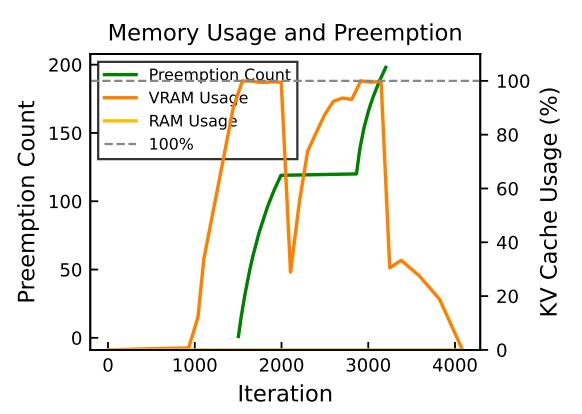
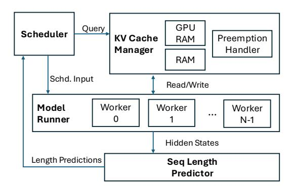

# Tetris: Efficient and Predictive KV Cache Offloading for Agentic and Reasoning Workloads

[Ziji Shi](https://orcid.org/1234-5678-9012)∗ ziji.shi@u.nus.edu National University of Singapore Singapore, Singapore

Chaoyi Ruan ruancy@comp.nus.edu.sg National University of Singapore Singapore, Singapore

Penghui Qi Guangxing Huang {qiph,huanggx}@sea.com Sea AI Lab Singapore, Singapore

Xinyi Wan Min Lin {wanxy,linmin}@sea.com Sea AI Lab Singapore, Singapore

# Jialin Li lijl@comp.nus.edu.sg National University of Singapore Singapore, Singapore

# Abstract

Inference-time scaling and tool-calling enhance LLM reasoning and agentic capabilities but greatly increase key–value (KV) cache usage, especially for long intermediate reasoning steps and API call histories. While prior work has addressed long input handling, long output scenarios remain underexplored. We identify cascading preemption, where successive preemptions occur due to uninformed victim selection, degrading time-per-output-token (TPOT) performance. We present Tetris, an inference system for agentic and reasoning workloads that mitigates cascading preemption through (1) lightweight per-token sequence length prediction, (2) trade-off–driven recomputation vs. offloading, and (3) layerwise asynchronous KV cache transfer with predictive scheduling. Our analysis shows that offloading is asymptotically more efficient for long sequences, and our implementation in vLLM significantly reduces preemption frequency and improves P99 TPOT in memory-constrained settings.

# 1 Introduction

Inference-time scaling and tool-calling have augmented the capability of LLMs at the expense of more KV cache usage. Compared with base LLMs, models after CoT fine-tuning can think and self-reflect when working on challenging problems. Similarly, AI agents can break down a task into smaller sub-tasks and call external tool to update the internal knowledge. The interaction with external tools usually takes the form of textual input and output. Both workloads are characterized by having longer intermediate steps (reasoning tokens/ API-calling history) before reaching the final conclusion, creating a KV-cache hungry scenario. On conversational datasets like LMSYS-chat-1M or ShareGPT, the average output lengths are 182 and 456 tokens; but this number can be increased to hundreds of thousands on reasoning datasets like NuminaMath or agentic workload like SWEBench. While the long input case have been well studied in existing literature [\[5,](#page-2-0) [8,](#page-2-1) [9\]](#page-2-2), the long output scenario is less studied.

Longer output sequence leads to higher likelihood of preemption which degrades the service rendered. When the serving system runs out of memory due to high KV cache usage, it must make a preemption decision that either offloads or recomputes a running

> **[图片提取文字 (无描述)]:**
> Memory Usage and Preemption Preemption Count VRAM Usage Usage (%) Preemption Count RAM Usage 100% Iteration

Figure 1: Cascading preemptions happened between iteration 1500 to 2000 and iteration 2900 - 3100.

sequence to recover KV cache. Because of the interruption, the chosen sequence (also called victim sequence) will suffer from violated token generation time metric like time-per-output-token (TPOT).

Furthermore, we observe a phenomenon that we name cascading preemption where multiple preemptions happen one after another within a short period of time. As shown in Figure. [1,](#page-0-0) we observe that the inference system is already under high GPU memory usage when the first preemption happens. Afterwards, the running sequences will take over the GPU memory freed by the preempted sequence. However, the remaining requests may use more KV cache than the chosen victim sequence can provide, and subsequent preemptions are required to free new GPU memory. This cascading preemption phenomenon is the result of uninformed victim selection policy, in which the future KV cache demand is not known and the victim selection is merely a random guess. We argue that sequence length prediction is necessary for best-fit victim selection.

In this paper, we present Tetris, an LLM inference system built for agentic and reasoning LLM workloads. Tetris uses layerwise KV cache transfer, compute-offload overlapping, and predictive scheduling to leverage the spare main memory for long output sequence generation.

Our contributions are three-folds:

∗Work done while doing an internship at Sea AI Lab.

- We systematically investigate the cascading preemption phenomenon and show that the root cause is the lack of predictability of future sequence length, and we employ a lightweight model for online sequence length prediction;
- We present a trade-off analysis between recomputation and swapping as preemption mechanism, and show that swapping is more effective in long sequence inference;
- We present Tetris, which optimizes the blocking swapping operation with layerwise asynchronous KV cache transfer and predictive scheduling, significantly reducing the preemption frequency and P99 TPOT performance.

## **Approach**

## **Recomputation and Offloading Trade-off**

Recomputation involves freeing KV cache immediately and adding the victim request to pending queue for recomputation later. Although it can immediately release the memory, it wastes the GPU cycle when running the prefilling phase again. Offloading involves transferring the victim KV cache to main memory and reloading it back later. Because GPU memory is only available after swapping, the swapping operation will block the inference process.

We analyse the cost of KV cache recomputation and offloading using a white-box performance model inspired by PipeOffload [7]. Let S be the output sequence length,  $D_m$  be model dimension, and L be number of layers. We also denote the compute capability using  $B_{comp}$  and host-device bandwidth as  $B_{mem}$ . The costs of recomputation and offloading for decoder-based LLM are:

$$L_{recomp} = \frac{FLOPS}{B_{comp}} = 4L \cdot \frac{6SD_m^2 + S^2D_m}{B_{comp}}$$
(1)  
$$L_{offload} = 2\frac{SizeofKV}{B_{mem}} = \frac{SD_mL}{B_{mem}}$$
(2)

$$L_{offload} = 2 \frac{SizeofKV}{B_{mem}} = \frac{SD_mL}{B_{mem}} \tag{2}$$

Obviously, offloading is  $\mathcal{O}(S)$  while recomputation is  $\mathcal{O}(S^2)$ , making offloading the better options for long sequence generation. But when is the breakeven point? We define K as the breakeven sequence length when  $\frac{L_{recomp}}{L_{offload}} = 1$ , therefore

$$K = 2\frac{B_{comp}}{B_{mem}} - 6D_m \tag{3}$$

When S > K, offloading is preferred; otherwise, recomputation is less costly. As we can observe, offloading is preferred on larger model dimension and longer sequence length. Notice that K depends on both model architecture and actual hardware. On Llama3-8B with Nvidia A100 80GB GPU assuming 80% FLOPs utilization rate and 50% PCI-e bus utilization rate, K is negative, indicating a strong preference for offloading.

#### Online Sequence Length Prediction

Another challenge lies in the variance of output sequence length. Due to the auto-regressive nature, the total length is only revealed after the eos token gets selected. Existing works mainly use an ahead-of-time (AOT), proxy-LLM-based approach that either directly predicts the total output length (hard label)[3, 6, 11] or the relative lengths of output sequences (soft label) [2]. While the LLMproxy method is straightforward, it lacks the flexibility to adapt to

> **[图片提取文字 (无描述)]:**
> GPU Query Scheduler **KV Cache** Preemption RAM Handler Manager RAM Schd. Input Read/Write Worker Worker Model Worker ... Runner N-1 Hidden States Length Predictions Seq Length Predictor

Figure 2: System architecture of Tetris.

workload variation, and the LLM-based prediction can be computationally heavy. In agentic or reasoning workloads, output length can change dramatically depending on the task complexity, and AOT prediction may not yield an accurate answer. Instead, we leverage recent insight that LLM's hidden states encode the structural information including future output length [1] and build an multi-layer-perceptron (MLP) based model. This MLP-based model contains 302K parameters, which is 1% of LLM-based model prediction methods. This enables us to update the output length prediction on a per-token level, and allows us to adapt to new workloads by online updating the MLP model. Our preliminary evaluation shows better performance compared to the state-of-the-art AOT prediction model.

## Layerwise Asynchronous KV Cache Transfer

Currently, both vLLM[4] and SGLang[10] implement KV cache offloading in a synchronous manner: preempted KV cache must be transferred to main memory before they can be used by others, which stalls GPU from progressing. We identify two opportunities to mitigate this blocking operation.

Firstly, KV cache transfer can be made in layerwise fashion. Instead of copying the KV cache at the very end of forward pass, Tetris starts copying once the current layer's KV cache are computed. This overlaps the device-to-host computation with subsequent feedforward computation.

Secondly, Tetris starts cache transfer ahead of scheduled preemption thanks to sequence length prediction. Tetris can detect future preemption by comparing future KV cache demand with available memory, and start offloading in asynchronous fashion before preemption actually happens. This in-flight offloading enables Tetris to evict victim sequence without interrupting generation, minimizing amount of KV cache required to copy when preemption happens. The same works when reloading KV cache from main memory to GPU, where Tetris early starts the reloading process to minimize GPU downtime.

Implementing layerwise asynchronous KV cache copy is a nontrivial task because it requires careful coordination of barriers. Also, transferring KV cache in layerwise fashion means each tensor transferred is small. We implement a packing mechanism that packs small tensors on the batch dimension to amortize the offloading cost.

### 3 Implementation

Tetris was implemented on vLLM v0.8.3. As shown in Figure [2,](#page-1-0) scheduler queries the KV cache availability and future sequence length to select victims and make input batches. Afterwards, the scheduled input is passed to model runner for execution. To minimize interference, the actual KV cache transfer takes place on a dedicated CUDA stream and pinned memory while each worker performing decoding step on another stream. After decoding step is finished, the sequence length prediction can be updated with fresh hidden states intercepted from chosen layer. The predicted request length and actual length statistics are saved for model update later.

# 4 Future Work

We identify three areas as future work. Firstly, better scheduling algorithm (best-fit) can be co-designed with sequence length prediction. Secondly, KV cache migration between multiple data-parallel inference workers can be considered on top of local offloading. Last but not least, Tetris can be extended to offload to remote cache server/SSD for even longer sequences, which are common for agentic workloads.

# 5 Conclusion

We present the design of Tetris, a predictive KV cache offloading framework for agentic and reasoning workloads. We identify the problem of cascading preemption during long output decoding tasks, which arises from uninformed victim selection under tight GPU memory budgets. Tetris addresses this through three elements: (1) online per-token sequence-length prediction with a small MLP-based model, (2) an analytic rule that chooses between recomputation and offloading based on a closed-form break-even length, and (3) layerwise, asynchronous KV cache transfer that overlaps device–host I/O with compute. Across agentic traces and synthetic long-output workloads, Tetris reduces the frequency of preemptions and improves P99 time-per-output-token under memory pressure, while maintaining throughput.

# References

- [1] Zhichen Dong, Zhanhui Zhou, Zhixuan Liu, Chao Yang, and Chaochao Lu. 2025. Emergent Response Planning in LLM. [doi:10.48550/arXiv.2502.06258](https://doi.org/10.48550/arXiv.2502.06258) arXiv:2502.06258 [cs].
- [2] Yichao Fu, Siqi Zhu, Runlong Su, Aurick Qiao, Ion Stoica, and Hao Zhang. 2024. Efficient LLM Scheduling by Learning to Rank. [doi:10.48550/arXiv.2408.15792](https://doi.org/10.48550/arXiv.2408.15792) arXiv:2408.15792 [cs].
- [3] Yunho Jin, Chun-Feng Wu, David Brooks, and Gu-Yeon Wei. 2023. 3: Increasing GPU Utilization during Generative Inference for Higher Throughput. Advances in Neural Information Processing Systems 36 (2023), 18015–18027.
- [4] Wonkyung Kwon, Ying Sheng, Siyuan Li, Zhiqiang Xie, Christos Kozyrakis, Joseph E. Gonzalez, and Ion Stoica. 2023. Efficient Memory Management for Large Language Model Serving with PagedAttention. In Proceedings of the 29th ACM Symposium on Operating Systems Principles (SOSP). arXiv[:2309.06180 \cs.LG] [doi:10.1145/3600006.3613165](https://doi.org/10.1145/3600006.3613165)
- [5] Hao Liu, Matei Zaharia, and Pieter Abbeel. 2023. Ring Attention with Blockwise Transformers for Near-Infinite Context. arXiv preprint arXiv:2310.01889 (2023). <https://arxiv.org/abs/2310.01889>
- [6] Haoran Qiu, Weichao Mao, Archit Patke, Shengkun Cui, Saurabh Jha, Chen Wang, Hubertus Franke, Zbigniew T Kalbarczyk, Tamer Başar, and Ravishankar K Iyer.

- 2024. Efficient interactive llm serving with proxy model-based sequence length prediction. arXiv preprint arXiv:2404.08509 (2024).
- [7] Xinyi Wan, Penghui Qi, Guangxing Huang, Min Lin, and Jialin Li. 2025. PipeOffload: Improving Scalability of Pipeline Parallelism with Memory Optimization. arXiv preprint arXiv:2503.01328 (2025).
- [8] Bingyang Wu, Shengyu Liu, Yinmin Zhong, Peng Sun, Xuanzhe Liu, and Xin Jin. 2024. LoongServe: Efficiently Serving Long-Context Large Language Models with Elastic Sequence Parallelism. In Proceedings of the ACM SIGOPS 30th Symposium on Operating Systems Principles. ACM, Austin TX USA, 640–654. [doi:10.1145/](https://doi.org/10.1145/3694715.3695948) [3694715.3695948](https://doi.org/10.1145/3694715.3695948)
- [9] Guangxuan Xiao, Yuandong Tian, Beidi Chen, Song Han, and Mike Lewis. 2023. Efficient Streaming Language Models with Attention Sinks. arXiv preprint arXiv:2309.17453 (2023).<https://arxiv.org/abs/2309.17453>
- [10] Lianmin Zheng, Liangsheng Yin, Zhiqiang Xie, Chuyue Sun, Jeff Huang, Cody Hao Yu, Shiyi Cao, Christos Kozyrakis, Ion Stoica, Joseph E. Gonzalez, Clark Barrett, and Ying Sheng. 2024. SGLang: Efficient Execution of Structured Language Model Programs. In Advances in Neural Information Processing Systems (NeurIPS). [https://proceedings.neurips.cc/paper\\_files/paper/2024/file/](https://proceedings.neurips.cc/paper_files/paper/2024/file/724be4472168f31ba1c9ac630f15dec8-Paper-Conference.pdf) [724be4472168f31ba1c9ac630f15dec8-Paper-Conference.pdf](https://proceedings.neurips.cc/paper_files/paper/2024/file/724be4472168f31ba1c9ac630f15dec8-Paper-Conference.pdf)
- [11] Zangwei Zheng, Xiaozhe Ren, Fuzhao Xue, Yang Luo, Xin Jiang, and Yang You. 2023. Response length perception and sequence scheduling: An llm-empowered llm inference pipeline. Advances in Neural Information Processing Systems 36 (2023), 65517–65530.