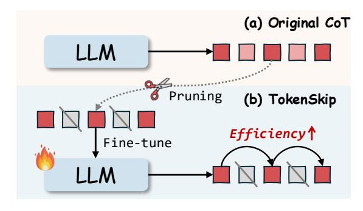
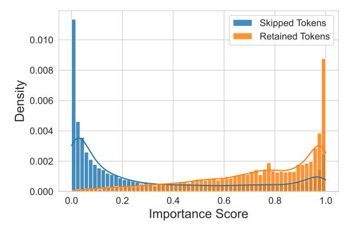

# **TokenSkip**: Controllable Chain-of-Thought Compression in LLMs

Heming Xia , Chak Tou Leong , Wenjie Wang , Yongqi Li \*, Wenjie Li Department of Computing, The Hong Kong Polytechnic University University of Science and Technology of China {he-ming.xia, chak-tou.leong}@connect.polyu.hk

# Abstract

Chain-of-Thought (CoT) has been proven effective in enhancing the reasoning capabilities of large language models (LLMs). Recent advancements, such as OpenAI's o1 and DeepSeek-R1, suggest that scaling up the length of CoT sequences during inference could further boost LLM reasoning performance. However, due to the autoregressive nature of LLM decoding, longer CoT outputs lead to a linear increase in inference latency, adversely affecting user experience, particularly when the CoT exceeds 10,000 tokens. To address this limitation, we analyze the semantic importance of tokens within CoT outputs and reveal that their contributions to reasoning vary. Building on this insight, we propose TokenSkip, a simple yet effective approach that enables LLMs to selectively skip less important tokens, allowing for controllable CoT compression. Extensive experiments across various models and tasks demonstrate the effectiveness of TokenSkip in reducing CoT token usage while preserving strong reasoning performance. Notably, when applied to Qwen2.5- 14B-Instruct, TokenSkip reduces reasoning tokens by 40% (from 313 to 181) on GSM8K, with less than a 0.4% performance drop. We release our code and checkpoints in [https:](https://github.com/hemingkx/TokenSkip) [//github.com/hemingkx/TokenSkip](https://github.com/hemingkx/TokenSkip).

# 1 Introduction

Chain-of-Thought (CoT) prompting [\(Nye et al.,](#page-10-0) [2021;](#page-10-0) [Wei et al.,](#page-10-1) [2022;](#page-10-1) [Kojima et al.,](#page-9-0) [2022\)](#page-9-0) has emerged as a cornerstone strategy for enhancing Large Language Models (LLMs) in complex reasoning tasks. By eliciting step-by-step inference, CoT enables LLMs to decompose intricate problems into manageable subtasks, thereby improving their problem-solving performance [\(Yao et al.,](#page-10-2) [2023;](#page-10-2) [Wang et al.,](#page-10-3) [2023;](#page-10-3) [Zhou et al.,](#page-10-4) [2023;](#page-10-4) [Shinn](#page-10-5)

> **[图片提取文字 (无描述)]:**
> (a) Original CoT LLM Pruning (b) TokenSkip **Efficiency**↑

Figure 1: In contrast to vanilla CoT that generates all reasoning tokens sequentially, TokenSkip enables LLMs to *skip* tokens with less semantic importance (*e.g.,* ) and learn shortcuts between critical reasoning tokens, facilitating controllable CoT compression.

[et al.,](#page-10-5) [2023\)](#page-10-5). Recent advancements, such as OpenAI's o1 [\(OpenAI et al.,](#page-10-6) [2024\)](#page-10-6) and DeepSeek-R1 [\(DeepSeek-AI et al.,](#page-8-0) [2025\)](#page-8-0), further demonstrate that scaling up CoT lengths from hundreds to thousands of reasoning steps could continuously improve LLM reasoning. These breakthroughs have underscored CoT's potential to advance LLM capabilities, expanding the boundaries of AI-driven problem-solving.

Despite its effectiveness, the increased length of CoT sequences introduces substantial computational overhead. Due to the autoregressive nature of LLM decoding, longer CoT outputs lead to proportional increases in both inference latency and memory footprints of key-value cache. Additionally, the quadratic computational cost of attention layers further exacerbates this burden. These issues become particularly pronounced when CoT sequences extend into thousands of reasoning steps, resulting in significant computational costs and prolonged response times. While prior research has explored methods for selectively skipping reasoning steps [\(Ding et al.,](#page-8-1) [2024;](#page-8-1) [Liu et al.,](#page-9-1) [2024\)](#page-9-1), recent findings [\(Jin et al.,](#page-9-2) [2024;](#page-9-2) [Merrill and Sabharwal,](#page-9-3) [2024\)](#page-9-3) suggest that such reductions may conflict

\*[Corresponding Author](#page-10-5)

with test-time scaling (OpenAI, 2024; Snell et al., 2025), ultimately impairing LLM reasoning performance. Therefore, striking an optimal balance between CoT efficiency and reasoning accuracy remains a critical open challenge.

In this work, we delve into CoT efficiency and seek the answer to an important question: "Does every token in the CoT output contribute equally to deriving the answer?" We empirically analyze the semantic importance of tokens within CoT outputs and reveal that their contributions to the reasoning performance vary, as depicted in Figure 2. Building on this insight, we introduce TokenSkip, a simple yet effective approach that enables LLMs to skip less important tokens within CoT sequences and learn shortcuts between critical reasoning tokens, thereby allowing for controllable CoT compression with adjustable ratios. Specifically, as shown in Figure 1, TokenSkip constructs compressed CoT training data with various compression ratios, by pruning unimportant tokens from original LLM CoT trajectories. Then, it conducts a general supervised fine-tuning process on target LLMs with this training data, facilitating LLMs to automatically trim redundant tokens during reasoning.

We conduct extensive experiments across various models, including LLaMA-3.1-8B-Instruct and the Qwen2.5-Instruct series, using two widely recognized math reasoning benchmarks: GSM8K and MATH-500. The results validate the effectiveness of TokenSkip in compressing CoT outputs while maintaining robust reasoning performance. Notably, Owen2.5-14B-Instruct exhibits almost **NO** performance drop (less than 0.4%) with a 40% reduction in token usage on GSM8K. On the challenging MATH-500 dataset, LLaMA-3.1-8B-Instruct effectively reduces CoT token usage by 30% with a performance decline of less than 4%, resulting in a 1.4× inference speedup. Further analysis underscores the coherence of TokenSkip in specified compression ratios and its potential scalability with stronger compression techniques.

TokenSkip is distinguished by its low training cost. For Qwen2.5-14B-Instruct, TokenSkip finetunes only 0.2% of the model's parameters using LoRA. The size of the compressed CoT training data is no larger than that of the original training set, with 7,473 examples in GSM8K and 7,500 in MATH. The training is completed in approximately 2 hours for the 7B model and 2.5 hours for the 14B model on two 3090 GPUs. These characteristics make TokenSkip an efficient and repro-

ducible approach, suitable for use in efficient and cost-effective LLM deployment.

To sum up, our key contributions are:

- 1. To the best of our knowledge, this work is the *first* to investigate the potential of enhancing CoT efficiency through *token skipping*, inspired by the varying semantic importance of tokens in CoT trajectories of LLMs.
- We introduce TokenSkip, a simple yet effective approach that enables LLMs to skip redundant tokens within CoTs and learn shortcuts between critical tokens, facilitating CoT compression with adjustable ratios.
- 3. Our experiments validate the effectiveness of TokenSkip. When applied to Qwen2.5-14B-Instruct, TokenSkip reduces reasoning tokens by 40% (from 313 to 181) on GSM8K, with less than a 0.4% performance drop.

### 2 Background and Preliminaries

In this section, we discuss the relevant research background and present preliminary studies on token efficiency in CoT sequences, exploring its impact on the reasoning performance of LLMs.

### 2.1 Token Importance

We first investigate a critical research question to CoT efficiency: "Does every token in the CoT output contribute equally to deriving the answer?" In other words, we would like to know if there is any token redundancy in CoT sequences that could be eliminated to improve CoT efficiency.

Token redundancy has been recognized as a longstanding and fundamental issue in LLM efficiency (Hou et al., 2022; Zhang et al., 2023; Lin et al., 2024; Chen et al., 2024). Recently, it has garnered intensive research attention in prompt compression (Li et al., 2023; Jiang et al., 2023; Pan et al., 2024), which focuses on removing redundant tokens from the input prompt to reduce API token usage. To address this issue, Selective Context (Li et al., 2023) proposed to measure the importance of tokens in a piece of text based on the semantic confidence of LLMs:

$$I_1(x_i) = -\log P(x_i \mid \boldsymbol{x}_{\leq i}; \boldsymbol{\theta}_{\mathcal{M}_L}), \quad (1)$$

where  $x = \{x_i\}_{i=1}^n$  is the given text,  $x_i$  denotes a token, and  $\mathcal{M}_L$  denotes the LLM used to compute the confidence of each token. Intuitively, such a measurement could be seamlessly applied to CoT

Problem: Marcus is half of Leo's age and five years younger than Deanna. Deanna is 26. How old is Leo?

Chain-of-Thought: Let'sbreakitdownstepbystep:1. Deannais26yearsold.2.Marcusisfiveyearsyoungerthan Deanna,soMarcusis26-5=21yearsold.3.Marcusishalf ofLeo's age ,soLeo's age istwiceMarcus's age .4.Since Marcusis21,Leo'sageis2x21=42.(Selective Context)

Chain-of-Thought: Let'sbreakitdownstepbystep:1. Deannais26yearsold.2.Marcusisfiveyearsyoungerthan Deanna,soMarcusis26-5=21yearsold.3.Marcusishalf ofLeo's age ,soLeo's age istwiceMarcus's age .4.Since Marcusis21,Leo'sageis2x21=42.(LLMLingua-2)

Final Answer: 42.

Figure 2: Visualization of token importance within a CoT sequence, with darker colors indicating higher values. This figure compares two token importance measurements: Selective Context and LLMLingua-2.

tokens generated by LLMs. We show an example of this measurement in Figure [2.](#page-2-0)

Despite its simplicity, LLMLingua-2 [\(Pan et al.,](#page-10-10) [2024\)](#page-10-10) argued that there exist two major limitations in the aforementioned measurement that hinder the compression performance. Firstly, as shown in Figure [2,](#page-2-0) the intrinsic nature of LLM perplexity leads to lower importance measures (i.e., higher confidence) for tokens at the end of the sentence. Such position dependency impacts the factual importance measurement of each token. Furthermore, the unidirectional attention mechanism in causal LMs may fail to capture all essential information needed for token importance within the text.

To tackle these limitations, LLMLingua-2 introduced utilizing a bidirectional BERT-like LM [\(De](#page-8-3)[vlin et al.,](#page-8-3) [2019\)](#page-8-3) for token importance measurement. It utilizes GPT-4 [\(OpenAI,](#page-10-11) [2023\)](#page-10-11) to label each token as "*important*" or not and trains the bidirectional LM with a token classification objective. The token importance is measured by the predicted probability of each token:

$$I_2(x_i) = P(x_i \mid \boldsymbol{x}_{\leq n}; \boldsymbol{\theta}_{\mathcal{M}_B}), \qquad (2)$$

where MB denotes the bidirectional LM.

This study applies LLMLingua-2 as the importance measurement to CoT tokens. Similar to plain text, we observe that the semantic importance of tokens within CoT outputs varies, as shown in Figure [2.](#page-2-0) For instance, mathematical equations tend to have a greater contribution to the final answer, consistent with recent research [\(Ma et al.,](#page-9-8) [2024\)](#page-9-8). In contrast, semantic connectors such as "*so*" and

Revovering the Compressed Chain-of-Thought

Compressed CoT: break down Deanna 26 Marcus five younger 26 - 5 21 Marcus half Leo's age twice Marcus Marcus 21, Leo's age 2 x 21 = 42.

Recovered Compressed CoT: Let's break it down step by step. Deanna is 26 years old. Marcus is five years younger than Deanna: M = D - 5. Marcus's age: M = 26 - 5 = 21. Marcus is half of Leo's age: M = L / 2. Leo is twice Marcus's age: L = 2M. Leo's age: L = 2 x 21 = 42.

Figure 3: Recovering the compressed CoT for GSM8K math word problem using LLaMA-3.1-8B-Instruct.

"*since*" generally contribute less. These findings highlight the token redundancy in CoT outputs of LLMs and the substantial potential to enhance CoT efficiency by trimming this redundancy.

## 2.2 CoT Recovery

We further explore the following research question: *"Are LLMs capable of restoring the CoT process from compressed outputs?"* The answer is yes. As shown in Figure [3](#page-2-1) and detailed in Appendix [A,](#page-11-0) examples restored from compressed CoTs using LLaMA-3.1-8B-Instruct demonstrate that LLMs could effectively comprehend the semantic information encoded in the compressed CoT and restore the CoT process. This capability ensures that the interpretability of compressed CoTs is maintained. Additionally, when required by users, the complete CoT process can be recovered and presented.

In summary, the empirical analysis above underscores the potential of trimming redundant tokens to enhance CoT efficiency, as well as the ability of LLMs to restore CoT from compressed outputs. However, enabling LLMs to autonomously skip redundant CoT tokens and identify shortcuts between critical reasoning tokens presents a non-trivial challenge. To the best of our knowledge, this work is the *first* to explore CoT compression through *token skipping*. In the following sections, we present our proposed methodology in detail.

# 3 **TokenSkip**

We introduce TokenSkip, a simple yet effective approach that enables LLMs to skip less important tokens, enabling controllable CoT compression with adjustable ratios. This section demonstrates the details of our methodology, including token pruning ([§3.1\)](#page-3-0), training ([§3.2\)](#page-3-1), and inference ([§3.3\)](#page-3-2).

> **[图片提取文字 (无描述)]:**
> **Training** Inference Input Question Compressed CoT Fine-tune LLM LLM Target Compressor Answer

Figure 4: Illustration of TokenSkip. During training, TokenSkip first generates CoT trajectories from the target LLM. These CoTs are then compressed to various ratios sampled from the ratio set. TokenSkip fine-tunes the LLM using compressed CoTs with mixed ratios, enabling controllable CoT inference at any desired  $\gamma \in \{\gamma_0, \dots, \gamma_z\}$ .

### 3.1 Token Pruning

The key insight behind TokenSkip is that "each reasoning token contributes differently to deriving the answer." To enhance CoT efficiency, we propose to trim redundant CoT tokens from LLM outputs and fine-tune LLMs using these trimmed CoT trajectories. The token pruning process is guided by the concept of token importance, as detailed in Section 2.1.

Specifically, given a target LLM  $\mathcal{M}$ , one of its CoT trajectories  $c = \{c_i\}_{i=1}^m$ , and a specified compression ratio  $\gamma \in [0,1]$  for the current c, TokenSkip first calculates the semantic importance of each CoT token  $\{I(c_i)\}_{i=1}^m$ , as defined in Eq (2), and then ranks the resulting scores in descending order. The empirical  $\gamma$ -quantile of these importance values serves as the pruning threshold:

$$I_{\gamma} = Q_{\gamma}(I(c_1), ..., I(c_m)),$$
 (3)

where  $Q_{\gamma}$  denotes the  $\gamma$ -quantile (i.e. the  $\gamma$ -th percentile) of the multiset  $\{I(c_i)\}_{i=1}^m$ . All CoT tokens whose importance value meets or exceeds this threshold are retained, yielding the compressed CoT trajectory:

$$\widetilde{\boldsymbol{c}} = \{c_i \mid I(c_i) \ge I_{\gamma}, 1 \le i \le m\}. \tag{4}$$

### 3.2 Training

Given a training dataset  $\mathcal{D}$  with N samples and a target LLM  $\mathcal{M}$ , we first obtain N CoT trajectories with  $\mathcal{M}$ . Then, we filter out trajectories with incorrect answers to ensure data quality. For the remaining trajectories, we prune each CoT with a compression ratio  $\gamma$  sampled from the ratio set  $\{\gamma_0,\ldots,\gamma_z\}$ , as demonstrated in Section 3.1. For each  $\langle$ question, compressed CoT, answer $\rangle$ , we inserted the compression ratio  $\gamma$  after the question.

Each training sample is formatted as follows:

$$\mathcal{Q}$$
 [EOS]  $\gamma$  [EOS] Compressed CoT  $\mathcal{A}$ ,

where  $\langle \mathcal{Q}, \mathcal{A} \rangle$  indicates the  $\langle \text{question, answer} \rangle$  pair. Formally, given a question  $\boldsymbol{x}$ , a compression ratio  $\gamma$  randomly sampled from  $\{\gamma_0, \ldots, \gamma_z\}$ , and the output sequence  $\boldsymbol{y} = \{y_i\}_{i=1}^l$ , which includes the compressed CoT  $\widetilde{c}$  and the answer  $\boldsymbol{a}$ , we fine-tunes the target LLM  $\mathcal{M}$ , enabling it to perform chain-of-thought in a compressed pattern by minimizing

$$\mathcal{L} = \sum_{i=1}^{l} \log P(y_i \mid \boldsymbol{x}, \gamma, \boldsymbol{y}_{< i}; \boldsymbol{\theta}_{\mathcal{M}}), \quad (5)$$

where  $\mathbf{y} = \{\widetilde{c}_1, \cdots, \widetilde{c}_{m'}, a_1, \cdots, a_t\}$ . Note that the compression is performed solely on CoT sequences, and we keep the answer  $\mathbf{a} = \{a_i\}_{i=1}^t$  unchanged. To preserve LLMs' reasoning capabilities, we also include a portion of the original CoT trajectories in the training data, with  $\gamma$  set to 1.

### 3.3 Inference

The inference of TokenSkip follows autoregressive decoding. Compared to original CoT outputs that may contain redundancy, TokenSkip facilitates LLMs to skip *unimportant* CoT tokens, thereby enhancing reasoning efficiency. Formally, given a question  $\boldsymbol{x}$  and a desired compression ratio  $\gamma \in \{\gamma_0, \dots, \gamma_z\}$ , the input prompt of TokenSkip follows the same format adopted in fine-tuning, which is  $\mathcal{Q}$  [EOS]  $\gamma$  [EOS]. The LLM  $\mathcal{M}$  sequentially predicts the output sequence  $\hat{\boldsymbol{y}}$ :

$$\hat{\boldsymbol{y}} = \arg \max_{\boldsymbol{y}^*} \sum_{i=1}^{l'} \log P\left(y_j \mid \boldsymbol{x}, \gamma, \boldsymbol{y}_{< j}; \boldsymbol{\theta}_{\mathcal{M}}\right),$$

where  $\hat{y} = \{\hat{c}_1, \cdots, \hat{c}_{m''}, \hat{a}_1, \cdots, \hat{a}_{t'}\}$  denotes the output sequence, which includes CoT tokens  $\hat{c}$  and the answer  $\hat{a}$ . We illustrate the training and inference process of TokenSkip in Figure 4.

### 4 Experiments

### 4.1 Experimental Setup

Models and Datasets We primarily evaluate our method using LLaMA-3.1-8B-Instruct (Dubey et al., 2024) and Qwen2.5-Instruct series (Yang et al., 2024). The evaluation leverages two widely-used math reasoning benchmarks: GSM8K (Cobbe et al., 2021) and MATH (Hendrycks et al., 2021b). For training, we use the respective training sets from both datasets. Regarding the MATH dataset, due to the computation cost, we assess our method on a subset, MATH-500, which is identical to the test set used in Lightman et al. (2024).

Implementation Details We utilize LLMLingua-2 (Pan et al., 2024) as the token importance metric to generate our compressed CoT training data. The compression ratio  $\gamma$  is randomly selected from the ratio set  $\{0.5, 0.6, 0.7, 0.8, 0.9, 1.0\}$  for each training sample. We adopt LoRA (Hu et al., 2022) to train our models. TokenSkip is characterized by its low training cost, with training taking  $\sim$ 2 hours for the 7B model and  $\sim$ 2.5 hours for the 14B model on 3090 GPUs. We include more implementation details in Appendix B.1.

**Baselines** We compare TokenSkip to three baselines: 1) Token-efficient Prompts. Following Lee et al. (2025), we select three advanced prompts, instructing LLMs to perform CoT efficiently. These prompts, denoted as BeConcise, OnlyNumbers, and AbbreWords, are detailed in Appendix B.3; 2) Length-control Prompts. We instruct the LLM to reduce a fixed proportion of output tokens in the CoT process, denoted as LC-Prompt in Table 1; 3) Truncation. This method involves brute-force length truncation, where the maximum number of output tokens is restricted, compressing the CoT output to a fixed ratio.

**Evaluation Metrics** We evaluate TokenSkip using three widely used metrics: accuracy, the number of CoT tokens, and inference latency per sample. Model performance is assessed using scripts from DeepSeek-Math1. Greedy decoding is employed to generate the outputs from the target LLM. Inference latency is measured on a single NVIDIA 3090 GPU with a batch size of 1. In addition to these metrics, we report the actual compression ratio of the CoTs to assess whether the compression aligns with the specified ratio.

> **[图片提取文字 (无描述)]:**
> https://github.com/deepseek-ai/DeepSeek-Math

> **[图片提取文字 (无描述)]:**
> Accuracy (%) Original TokenSkip (3B) TokenSkip (7B) TokenSkip (14B) Reasoning Tokens

Figure 5: Compression performance of TokenSkip on Qwen2.5-Instruct models. Qwen2.5-14B-Instruct shows almost **no** performance drop with **40**% token trimming.

### 4.2 Main Results

The performance of TokenSkip on GSM8K using the Qwen2.5-Instruct series2 is illustrated in Figure 5. As the model scale increases, there is less performance degradation at higher compression ratios, indicating that larger LLMs are better at identifying shortcuts between critical reasoning tokens, enabling more efficient CoT generation. Notably, Qwen2.5-14B-Instruct exhibits almost **NO** performance drop (less than 0.4%) with 40% token trimming. Even at a compression ratio of 0.5, the model maintains strong reasoning capabilities, with only 2% performance degradation. These results highlight the substantial potential of TokenSkip to reduce CoT token usage and accelerate reasoning in large-scale LLMs.

Table 1 compares TokenSkip with three widely used baselines. As shown, prompting methods, including token-efficient prompts and length-control ones, fail to achieve desired compression ratios. Specifically, token-efficient prompts achieve only 0.94-0.97 compression ratios on MATH-500, with nearly no efficiency improvements; the actual ratio of LC-Prompt exceeds 0.89 even when the target is set to 0.5. While Truncation adheres to the specified ratio, it results in significant degradation in reasoning performance. Concretely, at a compression ratio of 0.5, Truncation causes a 79% accuracy drop on GSM8K and a 21% drop on MATH-500. In contrast, TokenSkip ensures adherence to various desired compression ratios (see Figure 6) while preserving strong reasoning capabilities. Notably, TokenSkip achieves an actual compression ratio of **0.53** on GSM8K with merely a 10% performance

&lt;sup>2For detailed results, please refer to Appendix B.2.

| Methods     | Ratio | GSM8K                                      |          |                      |                  | MATH-500                                   |          |                       |          |
|-------------|-------|--------------------------------------------|----------|----------------------|------------------|--------------------------------------------|----------|-----------------------|----------|
|             |       | Accuracy ↑                                 | Tokens ↓ | Latency (s) ↓        | <i>Act</i> Ratio | Accuracy ↑                                 | Tokens ↓ | Latency (s) ↓         | ActRatio |
| Original    | -     | 86.2 (0.0↓)                     | 213.17   | 5.96 1.0× | -                | 48.6 (0.0↓)                     | 502.60   | 16.37 1.0× | -        |
| BeConcise   | -     | 82.9 (3.3↓)                     | 161.32   | 4.73 1.3× | 0.76             | 47.4 (1.2↓)                     | 471.34   | 15.54 1.1× | 0.94     |
| OnlyNumbers | -     | 83.2 (3.0↓)                     | 165.27   | $4.95_{1.2\times}$   | 0.78             | 46.4 (2.2↓)                     | 487.00   | $15.93_{1.0\times}$   | 0.97     |
| AbbreWords  | -     | $83.7_{(2.5\downarrow)}^{(0.5\downarrow)}$ | 170.33   | $5.15_{1.2\times}$   | 0.80             | $47.6_{(1.0\downarrow)}^{(2.2\downarrow)}$ | 489.07   | 15.94 1.0× | 0.97     |
| LC-Prompt   | 0.9   | 84.1 (2.1↓)                     | 226.37   | 6.12 1.0× | 1.06             | 48.6 (0.0↓)                     | 468.04   | 15.39 1.1× | 0.93     |
|             | 0.7   | $84.9_{(1.3\downarrow)}$                   | 209.39   | $5.51_{1.1\times}$   | 0.98             | $48.4_{(0.4\downarrow)}$                   | 472.13   | $15.55_{1.1\times}$   | 0.94     |
|             | 0.5   | $83.7_{(2.5\downarrow)}$                   | 188.82   | $4.97_{1.2 \times}$  | 0.89             | $47.8_{(0.4\downarrow)}$                   | 471.11   | $15.48_{1.1\times}$   | 0.94     |
| Truncation  | 0.9   | 70.2 (26.0↓)                    | 202.06   | 5.29 1.1× | 0.95             | 47.8 (0.8↓)                     | 440.33   | 14.56 1.1× | 0.88     |
|             | 0.7   | $25.9_{(60.3\downarrow)}$                  | 149.99   | $3.97_{1.5\times}$   | 0.70             | $45.0_{(3.6\downarrow)}$                   | 386.89   | $12.85_{1.3\times}$   | 0.77     |
|             | 0.5   | $7.0_{(79.2\downarrow)}$                   | 103.69   | $2.95_{2.0 \times}$  | 0.49             | $27.4_{(21.2\downarrow)}$                  | 283.70   | $9.40_{1.7 \times}$   | 0.56     |
| TokenSkip   | 1.0   | 86.7 (0.5↑)                     | 213.60   | 5.98 1.0× | 1.00             | 48.2 (0.4↓)                     | 504.79   | 16.43 1.0× | 1.00     |
|             | 0.9   | $86.1_{(0.1\downarrow)}$                   | 198.01   | $5.65_{1.1\times}$   | 0.93             | 47.8 (0.8↓)                     | 448.31   | $15.26_{1.1\times}$   | 0.89     |
|             | 0.8   | 84.3 (1.9\psi)                  | 169.89   | $5.13_{1.2\times}$   | 0.80             | $47.3_{(1.3\downarrow)}$                   | 398.94   | $13.39_{1.2\times}$   | 0.79     |
|             | 0.7   | $82.5_{(3.7\downarrow)}$                   | 150.12   | 4.36 1.4× | 0.70             | $46.7_{(1.9\downarrow)}^{(1.9\downarrow)}$ | 349.13   | 11.55 1.4× | 0.69     |
|             | 0.6   | $81.1_{(5.1\downarrow)}$                   | 129.38   | $3.81_{1.6\times}$   | 0.61             | $42.0_{(6.6\downarrow)}$                   | 318.36   | $10.58_{1.6\times}$   | 0.63     |
|             | 0.5   | $78.2_{(8.0\downarrow)}^{(8.1\downarrow)}$ | 113.05   | $3.40_{1.8\times}$   | 0.53             | $40.2_{(8.4\downarrow)}$                   | 292.17   | $9.67_{1.7\times}$    | 0.58     |

Table 1: Experimental results of TokenSkip on LLaMA-3.1-8B-Instruct. We report accuracy, average CoT token count (Tokens), average latency per sample, and actual compression ratio (*Act*Ratio) for comparison.

> **[图片提取文字 (无描述)]:**
> TokenSkip More Ratio 0.3 0.6 0.8 Compression Ratio

Figure 6: Comparison of ratio adherence across different compression ratio settings. The experimental results are obtained with LLaMA-3.1-8B-Instruct on GSM8K.

drop, resulting in a  $1.8\times$  speedup in average latency. On MATH-500, TokenSkip effectively reduces CoT token usage by 30% with a performance drop of less than 4%. These results validate the effectiveness of TokenSkip.

In Appendix C, we illustrate additional experiments to evaluate the out-of-domain performance of TokenSkip and validate its generalizability beyond mathematical reasoning.

### 4.3 Analysis

**Compression Ratio** In our main results, we focus on compression ratios greater than 0.5. To further investigate the performance of TokenSkip at lower compression ratios, we train an additional variant, denoted as More Ratio, with extra compression ratios of 0.3 and 0.4. As shown in Figure 6, the ratio adherence of models largely degrades at these lower ratios. We attribute this de-

> **[图片提取文字 (无描述)]:**
> Skipped Tokens Retained Tokens 0.010 0.008 Density 0.006 0.004 0.002 0.000 0.0 0.2 0.4 0.6 0.8 1.0 Importance Score

Figure 7: Distribution of token importance for skipped versus retained tokens. The LLM effectively learns to skip low-importance tokens and retain critical ones.

cline to the excessive trimming of reasoning tokens, which likely causes a loss of critical information in the completions, hindering the effective training of LLMs to learn CoT compression. Furthermore, we observe that the overall adherence of More Ratio is not as good as TokenSkip with the default settings, which further supports our hypothesis.

**Importance Distribution** To validate that the LLM learns to skip less important tokens, we analyzed the distribution of the number of tokens with various token importance. Specifically, we instructed TokenSkip with Qwen2.5-14B-Instruct to generate full CoTs ( $\gamma=1.0$ ) and compressed CoTs ( $\gamma=0.7$ ) on the GSM8K test set. CoT Tokens appearing exclusively in full CoTs but not in compressed ones were identified as "skipped"

> **[图片提取文字 (无描述)]:**
> Accuracy (%) 82 82 84 84 86 86 Original GPT-40 LLMLingua-2 Selective Context Reasoning Tokens

Figure 8: Performance comparison of TokenSkip using different token importance metrics, evaluated with LLaMA-3.1-8B-Instruct on GSM8K.

while those present in compressed CoTs were considered "retained". As illustrated in Figure 7, the importance distribution of skipped tokens skews towards lower values, whereas retained tokens predominantly exhibit higher importance. This demonstrates that TokenSkip effectively enables LLMs to discard less critical CoT tokens during inference.

**Importance Metric** Figure 8 presents a comparison of TokenSkip across different importance metrics. In addition to the metrics discussed in Section 2.1, we include GPT-403 as a token importance upperbound for comparison. Specifically, for a given CoT trajectory, we prompt GPT-40 to trim redundant tokens according to a specified compression ratio, without adding any additional tokens. As shown in Figure 8, TokenSkip utilizing LLMLingua-2 (Pan et al., 2024) outperforms the variant with Selective Context (Li et al., 2023), which aligns with our demonstrations in Section 2.1. Additionally, the results of GPT-40 suggest that the capabilities of effective token importance metrics (beyond LLMLingua-2) could be further improved. However, the API costs associated with GPT-40 make it impractical for processing largescale datasets. In contrast, LLMLingua-2, which includes a BERT-size model, offers a cost-effective and efficient alternative for training TokenSkip.

**Length Budget** As outlined in Section 4.1, we adjust the maximum length budget to  $\max_{len} \times \gamma$  when evaluating TokenSkip on MATH-500, ensuring a fair comparison of compression ratios. However, this brute-force length truncation inevitably impacts the reasoning performance of LLMs, as

> **[图片提取文字 (无描述)]:**
> 52 Budget (adjusted by ratio) 51.2 Budget (same to origin LLM) 50.4 49.9 50 € 48 48,248,2 47.8 baseline: 48.6 47.3 46.7 Accuracy 4 4 94 45.2 43.3 42.0 42 40.2 40 0.5 0.6 0.7 0.8 0.9

Figure 9: Performance comparison of TokenSkip with varying maximum length constraints, evaluated with LLaMA-3.1-8B-Instruct on the MATH-500 dataset.

LLMs are unable to complete the full generation. In this analysis, we explore whether LLMs can "think" more effectively using a compressed CoT format. Specifically, we evaluate TokenSkip under the same length budget as the original LLM (e.g., 1024 for MATH-500). The experimental results, shown in Figure 9, demonstrate a significant performance improvement of TokenSkip under this length budget, compared to those adjusted by compression ratios. Notably, with compression ratios of 0.7, 0.8, and 0.9, TokenSkip outperforms the original LLM, yielding an absolute performance increase of 1.3 to 2.6 points. These findings highlight TokenSkip's potential to enhance the reasoning capabilities of LLMs within the same length budget.

Case Study Figure 10 presents several examples of TokenSkip, derived from the test sets of GSM8K and MATH-500. These examples clearly illustrate that TokenSkip allows LLMs to learn shortcuts between critical reasoning tokens, rather than generating shorter CoTs from scratch. For instance, in the first case, TokenSkip facilitates LLaMA-3.1-8B-Instruct to skip semantic connectors such as "of" and "the", as well as expressions that contribute minimally to the reasoning, such as the first sentence. Notably, we observe that numeric values and mathematical equations are prioritized for retention in most cases. This finding aligns with recent research (Ma et al., 2024), which suggests that mathematical expressions may contribute more significantly to reasoning than CoT in natural language. Furthermore, we find that TokenSkip does not reduce the number of reasoning steps but instead trims redundant tokens within those steps.

### 5 Related Work

**Efficient CoT** While Chain-of-Thought (CoT) enhances the reasoning performance of LLMs, it introduces significant computational overhead. Researchers have sought methods to reduce this over-

&lt;sup>3We use the gpt-4o-2024-08-06 version for experiments.

#### **LLaMA-3.1-8B-Instruct**

#### **Question:**

Toula went to the bakery and bought various types of pastries. She bought 3 dozen donuts which cost \$68 per dozen, 2 dozen mini cupcakes which cost \$80 per dozen, and 6 dozen mini cheesecakes for \$55 per dozen. How much was the total cost?

#### **Original CoT (180 tokens):**

To find the total cost, we need to calculate the cost of each type of pastry and then add them together.\n\nStep 1: Calculate the cost of the donuts\n3 dozen donuts cost \$68 per dozen, so the total cost of the donuts is:\n3 x \$68 = \$204\n\nStep 2: Calculate the cost of the mini cupcakes\n2 dozen mini cupcakes cost \$80 per dozen, so the total cost of the mini cupcakes is:\n2 x \$80 = \$160…Step 4: Add the costs of all the pastries together to find the total cost\n\$204 + \$160 + \$330 = \$694

#### **Compressed CoT (115 tokens):**

Step 1: Calculate cost donuts Toula bought 3 dozen donuts \$68 per dozen cost 3 \* \$68 = \$204 Step 2: Calculate cost mini cupcakes bought 2 dozen cupcakes \$80 per dozen cost 2 \* \$80 = \$160 Step 3: Calculate cost mini cheesecakes bought 6 dozen cheesecakes \$55 per dozen cost 6 \* \$55 = \$330 Step 4: Calculate total cost add cost donuts cupcakes cheesecakes total cost \$204 + \$160 + \$330 = \$694.

#### **Qwen2.5-14B-Instruct**

#### **Question:**

Janet's ducks lay 16 eggs per day. She eats three for breakfast every morning and bakes muffins for her friends every day with four. She sells the remainder at the farmers' market daily for \$2 per fresh duck egg. How much in dollars does she make every day at the farmers' market?

#### **Original CoT (248 tokens):**

To determine how much Janet makes every day at the farmers' market, we need to follow these steps:\n\n1. \*\*Calculate the total number of eggs laid per day:\*\*\n Janet's ducks lay 16 eggs per day.\n\n2. \*\*Determine the number of eggs Janet uses each day:\*\*\n - Janet eats 3 eggs for breakfast every day.\n - Janet bakes muffins using 4 eggs every day.\n - Total eggs used per day = 3 (for breakfast) + 4 (for baking) = 7 eggs.\n\n…, Janet makes \\(\\boxed{18}\\) dollars every day at the farmers' market.

#### **Compressed CoT (138 tokens):**

determine Janet makes selling duck eggs at farmers' market follow steps 1. \*\*Calculate total number eggs laid per day Janet's ducks lay 16 eggs per day \*\*Determine number eggs used each day Janet eats 3 eggs breakfast bakes muffins uses 4 eggs eggs used per day 3 + 4 = 7 …4. \*\*Calculate revenue from selling eggs Janet sells each egg for \$2 revenue per day 9 2 = 18 Janet makes {18} dollars every day at farmers' market.

#### **LLaMA-3.1-8B-Instruct**

#### **Question:**

Simplify \$\\sqrt{242}\$.

#### **Original CoT (252 tokens):**

Step 1: To simplify \$\\sqrt{242}\$, we need to find the largest perfect square that divides \$242\$.\nStep 2: We start by finding the prime factorization of \$242\$. This involves breaking down \$242\$ into its prime factors.\nStep 3: The prime factorization of \$242\$ is \$2 \\cdot 11^2\$. This means that \$242\$ can be expressed as the product of \$2\$ and \$11\$ squared.\nStep 4: Now, we can simplify the square root of \$242\$ by taking the square root of the perfect square factor, which is \$11^2\$.\nStep 5: Taking the square root of \$11^2\$ gives us \$11\$, as the square root of a number squared is …Step 7: So, the simplified form of \$\\sqrt{242}\$ is \$\\boxed{11\\sqrt{2}}\$.

#### **Compressed CoT (142 tokens):**

Step 1: simplify \$\\sqrt{242}\$ find perfect square factor Step 2: prime factorization \$242\$ \$2 11^2\$ Step 3: perfect square factor \$\\sqrt{242}\$ \$\\sqrt{2 11^2}\$ Step 4: property square root multiply separate Step 5: \$\\sqrt{2 11^2} = \\sqrt{2} \\sqrt{11^2}\$ Step 6: \$\\sqrt{11^2} = 11\$ Step 7: \$\\sqrt{242} = \\sqrt{2} 11\$ Step 8: simplify \$\\sqrt{242}\$ \$\\boxed{11\\sqrt{2}}\$

Figure 10: Three CoT compression examples from TokenSkip. For each sample, we list the question, original CoT outputs from corresponding LLMs, and the compressed CoT by TokenSkip. The tokens that appear in both the original CoT and the compressed CoT are highlighted in red.

head while retaining the benefits of CoT. One intuitive approach is to simplify [\(Marconato et al.,](#page-9-13) [2024\)](#page-9-13), skip [\(Ding et al.,](#page-8-1) [2024;](#page-8-1) [Liu et al.,](#page-9-1) [2024\)](#page-9-1), or generate reasoning steps in parallel [\(Ning et al.,](#page-10-13) [2023\)](#page-10-13). Another research direction involves compressing CoTs into latent representations [\(Goyal](#page-9-14) [et al.,](#page-9-14) [2024;](#page-9-14) [Deng et al.,](#page-8-6) [2024;](#page-8-6) [Hao et al.,](#page-9-15) [2024;](#page-9-15) [Cheng and Van Durme,](#page-8-7) [2024\)](#page-8-7), allowing LLMs to reason without explicitly generating discrete tokens. To mitigate CoT redundancy, [Han et al.](#page-9-16) [\(2024\)](#page-9-16) guides token consumption through dynamic token budget estimation. [Kang et al.](#page-9-17) [\(2024\)](#page-9-17) prompts GPT-4 to shorten CoT trajectories, and then fine-tunes LLMs using compressed CoTs. In contrast, this work focuses on pruning CoT tokens based on their semantic importance. Moreover, TokenSkip leverages a small LM for token pruning, significantly reducing computational overhead.

Prompt Compression The growing demand for long-context prompts has led to substantial computational and memory challenges. To address this, researchers have explored various prompt compression techniques. One intuitive approach involves using a lightweight LM to generate more concise prompts [\(Chuang et al.,](#page-8-8) [2024\)](#page-8-8). Considering that natural language formats inevitably contain redundancy, some studies have introduced implicit continuous tokens to represent long-context

inputs [\(Chevalier et al.,](#page-8-9) [2023;](#page-8-9) [Ge et al.,](#page-8-10) [2024;](#page-8-10) [Mo](#page-10-14)[htashami and Jaggi,](#page-10-14) [2023\)](#page-10-14). Another line of research focuses on directly compressing prompts by filtering low-informative tokens [\(Li et al.,](#page-9-6) [2023;](#page-9-6) [Jiang et al.,](#page-9-7) [2023;](#page-9-7) [Pan et al.,](#page-10-10) [2024\)](#page-10-10). For instance, Selective Context uses the perplexity of LLMs to measure token importance and removes less important tokens. LLMLingua-2 [\(Pan et al.,](#page-10-10) [2024\)](#page-10-10) introduces a small bidirectional language model for token importance measurement and trains this LM with GPT-4 compression data, which serves as the token importance metric in this work.

# 6 Conclusion

This work introduces TokenSkip, a simple yet effective approach for controllable Chain-of-Thought (CoT) compression. TokenSkip is built upon the semantic importance of CoT tokens — By selectively skipping less important tokens while preserving critical ones, TokenSkip enables LLMs to generate compressed CoTs with adjustable ratios, thereby striking an expected balance between reasoning efficiency and accuracy. Extensive experiments across various LLMs and tasks validate the effectiveness of TokenSkip. We hope our investigations in *token skipping* will offer valuable insights for advancing efficient CoT research and inspire future studies in this area.

# Limitations

Due to computational constraints, experiments with larger LLMs, such as Qwen2.5-32B-Instruct and Qwen2.5-72B-Instruct, were not conducted. We believe that TokenSkip could achieve a more favorable trade-off between reasoning performance and CoT token usage on these models. Additionally, the token importance measurement used in our study, derived from the LLMLingua-2 compressor [\(Pan et al.,](#page-10-10) [2024\)](#page-10-10), was not specifically trained on mathematical data. This limitation may affect the compression effectiveness, as the model is not optimized for handling numerical tokens and mathematical expressions. Furthermore, experiments with long-CoT LLMs, such as QwQ-32B-Preview, were also excluded due to computational constraints. We plan to explore these aspects in future work, as we anticipate that TokenSkip 's potential can be further realized in these contexts.

# Acknowledgements

We thank all anonymous reviewers for their insightful comments and valuable feedback during the review process. The work described in this paper was supported by Research Grants Council of Hong Kong (PolyU/15207122, PolyU/15209724, PolyU/15207821, PolyU/15213323) and PolyU internal grants (BDWP).

# Ethics Statement

The datasets used in our experiment are publicly released and labeled through interaction with humans in English. In this process, user privacy is protected, and no personal information is contained in the dataset. The scientific artifacts that we used are available for research with permissive licenses. And the use of these artifacts in this paper is consistent with their intended use. Therefore, we believe that our research work meets the ethics of ACL.

# References

Liang Chen, Haozhe Zhao, Tianyu Liu, Shuai Bai, Junyang Lin, Chang Zhou, and Baobao Chang. 2024. [An image is worth 1/2 tokens after layer 2: Plug-and](https://doi.org/10.1007/978-3-031-73004-7_2)[play inference acceleration for large vision-language](https://doi.org/10.1007/978-3-031-73004-7_2) [models.](https://doi.org/10.1007/978-3-031-73004-7_2) In Computer Vision - ECCV 2024 - 18th European Conference, Milan, Italy, September 29-October 4, 2024, Proceedings, Part LXXXI, volume 15139 of Lecture Notes in Computer Science, pages 19–35. Springer.

- Jeffrey Cheng and Benjamin Van Durme. 2024. Compressed chain of thought: Efficient reasoning through dense representations. arXiv preprint arXiv:2412.13171.
- Alexis Chevalier, Alexander Wettig, Anirudh Ajith, and Danqi Chen. 2023. [Adapting language mod](https://doi.org/10.18653/v1/2023.emnlp-main.232)[els to compress contexts.](https://doi.org/10.18653/v1/2023.emnlp-main.232) In Proceedings of the 2023 Conference on Empirical Methods in Natural Language Processing, pages 3829–3846, Singapore. Association for Computational Linguistics.
- Yu-Neng Chuang, Tianwei Xing, Chia-Yuan Chang, Zirui Liu, Xun Chen, and Xia Hu. 2024. [Learn](https://doi.org/10.18653/v1/2024.naacl-long.429)[ing to compress prompt in natural language for](https://doi.org/10.18653/v1/2024.naacl-long.429)[mats.](https://doi.org/10.18653/v1/2024.naacl-long.429) In Proceedings of the 2024 Conference of the North American Chapter of the Association for Computational Linguistics: Human Language Technologies (Volume 1: Long Papers), pages 7756– 7767, Mexico City, Mexico. Association for Computational Linguistics.
- Karl Cobbe, Vineet Kosaraju, Mohammad Bavarian, Mark Chen, Heewoo Jun, Lukasz Kaiser, Matthias Plappert, Jerry Tworek, Jacob Hilton, Reiichiro Nakano, Christopher Hesse, and John Schulman. 2021. [Training verifiers to solve math word prob](https://arxiv.org/abs/2110.14168)[lems.](https://arxiv.org/abs/2110.14168) CoRR, abs/2110.14168.
- DeepSeek-AI, Daya Guo, Dejian Yang, Haowei Zhang, Junxiao Song, Ruoyu Zhang, Runxin Xu, Qihao Zhu, Shirong Ma, Peiyi Wang, et al. 2025. [Deepseek](https://arxiv.org/abs/2501.12948)[r1: Incentivizing reasoning capability in llms via](https://arxiv.org/abs/2501.12948) [reinforcement learning.](https://arxiv.org/abs/2501.12948) Preprint, arXiv:2501.12948.
- Yuntian Deng, Yejin Choi, and Stuart Shieber. 2024. From explicit cot to implicit cot: Learning to internalize cot step by step. arXiv preprint arXiv:2405.14838.
- Jacob Devlin, Ming-Wei Chang, Kenton Lee, and Kristina Toutanova. 2019. [BERT: Pre-training of](https://doi.org/10.18653/v1/N19-1423) [deep bidirectional transformers for language under](https://doi.org/10.18653/v1/N19-1423)[standing.](https://doi.org/10.18653/v1/N19-1423) In Proceedings of the 2019 Conference of the North American Chapter of the Association for Computational Linguistics: Human Language Technologies, Volume 1 (Long and Short Papers), pages 4171–4186, Minneapolis, Minnesota. Association for Computational Linguistics.
- Mengru Ding, Hanmeng Liu, Zhizhang Fu, Jian Song, Wenbo Xie, and Yue Zhang. 2024. [Break the chain:](https://doi.org/10.48550/ARXIV.2406.06580) [Large language models can be shortcut reasoners.](https://doi.org/10.48550/ARXIV.2406.06580) CoRR, abs/2406.06580.
- Abhimanyu Dubey, Abhinav Jauhri, Abhinav Pandey, Abhishek Kadian, Ahmad Al-Dahle, et al. 2024. [The](https://arxiv.org/abs/2407.21783) [llama 3 herd of models.](https://arxiv.org/abs/2407.21783) Preprint, arXiv:2407.21783.
- Tao Ge, Hu Jing, Lei Wang, Xun Wang, Si-Qing Chen, and Furu Wei. 2024. [In-context autoencoder for](https://openreview.net/forum?id=uREj4ZuGJE) [context compression in a large language model.](https://openreview.net/forum?id=uREj4ZuGJE) In The Twelfth International Conference on Learning Representations.

- Sachin Goyal, Ziwei Ji, Ankit Singh Rawat, Aditya Krishna Menon, Sanjiv Kumar, and Vaishnavh Nagarajan. 2024. [Think before you speak: Train](https://openreview.net/forum?id=ph04CRkPdC)[ing language models with pause tokens.](https://openreview.net/forum?id=ph04CRkPdC) In The Twelfth International Conference on Learning Representations.
- Tingxu Han, Chunrong Fang, Shiyu Zhao, Shiqing Ma, Zhenyu Chen, and Zhenting Wang. 2024. Token-budget-aware llm reasoning. arXiv preprint arXiv:2412.18547.
- Shibo Hao, Sainbayar Sukhbaatar, DiJia Su, Xian Li, Zhiting Hu, Jason Weston, and Yuandong Tian. 2024. Training large language models to reason in a continuous latent space. arXiv preprint arXiv:2412.06769.
- Dan Hendrycks, Collin Burns, Steven Basart, Andy Zou, Mantas Mazeika, Dawn Song, and Jacob Steinhardt. 2021a. [Measuring massive multitask language under](https://openreview.net/forum?id=d7KBjmI3GmQ)[standing.](https://openreview.net/forum?id=d7KBjmI3GmQ) In International Conference on Learning Representations.
- Dan Hendrycks, Collin Burns, Saurav Kadavath, Akul Arora, Steven Basart, Eric Tang, Dawn Song, and Jacob Steinhardt. 2021b. [Measuring mathe](https://openreview.net/forum?id=7Bywt2mQsCe)[matical problem solving with the MATH dataset.](https://openreview.net/forum?id=7Bywt2mQsCe) In Thirty-fifth Conference on Neural Information Processing Systems Datasets and Benchmarks Track (Round 2).
- Le Hou, Richard Yuanzhe Pang, Tianyi Zhou, Yuexin Wu, Xinying Song, Xiaodan Song, and Denny Zhou. 2022. [Token dropping for efficient BERT pretraining.](https://doi.org/10.18653/v1/2022.acl-long.262) In Proceedings of the 60th Annual Meeting of the Association for Computational Linguistics (Volume 1: Long Papers), pages 3774–3784, Dublin, Ireland. Association for Computational Linguistics.
- Edward J. Hu, Yelong Shen, Phillip Wallis, Zeyuan Allen-Zhu, Yuanzhi Li, Shean Wang, Lu Wang, and Weizhu Chen. 2022. [Lora: Low-rank adaptation of](https://openreview.net/forum?id=nZeVKeeFYf9) [large language models.](https://openreview.net/forum?id=nZeVKeeFYf9) In The Tenth International Conference on Learning Representations, ICLR 2022, Virtual Event, April 25-29, 2022. OpenReview.net.
- Huiqiang Jiang, Qianhui Wu, Chin-Yew Lin, Yuqing Yang, and Lili Qiu. 2023. [LLMLingua: Compressing](https://doi.org/10.18653/v1/2023.emnlp-main.825) [prompts for accelerated inference of large language](https://doi.org/10.18653/v1/2023.emnlp-main.825) [models.](https://doi.org/10.18653/v1/2023.emnlp-main.825) In Proceedings of the 2023 Conference on Empirical Methods in Natural Language Processing, pages 13358–13376, Singapore. Association for Computational Linguistics.
- Mingyu Jin, Qinkai Yu, Dong Shu, Haiyan Zhao, Wenyue Hua, Yanda Meng, Yongfeng Zhang, and Mengnan Du. 2024. [The impact of reasoning step](https://doi.org/10.18653/v1/2024.findings-acl.108) [length on large language models.](https://doi.org/10.18653/v1/2024.findings-acl.108) In Findings of the Association for Computational Linguistics: ACL 2024, pages 1830–1842, Bangkok, Thailand. Association for Computational Linguistics.
- Yu Kang, Xianghui Sun, Liangyu Chen, and Wei Zou. 2024. C3ot: Generating shorter chain-of-thought without compromising effectiveness. arXiv preprint arXiv:2412.11664.

- Takeshi Kojima, Shixiang Shane Gu, Machel Reid, Yutaka Matsuo, and Yusuke Iwasawa. 2022. [Large](http://papers.nips.cc/paper_files/paper/2022/hash/8bb0d291acd4acf06ef112099c16f326-Abstract-Conference.html) [language models are zero-shot reasoners.](http://papers.nips.cc/paper_files/paper/2022/hash/8bb0d291acd4acf06ef112099c16f326-Abstract-Conference.html) In Advancesin Neural Information Processing Systems 35: Annual Conference on Neural Information Processing Systems 2022, NeurIPS 2022, New Orleans, LA, USA, November 28 - December 9, 2022.
- Ayeong Lee, Ethan Che, and Tianyi Peng. 2025. [How](https://doi.org/10.48550/ARXIV.2503.01141) [well do llms compress their own chain-of-thought? A](https://doi.org/10.48550/ARXIV.2503.01141) [token complexity approach.](https://doi.org/10.48550/ARXIV.2503.01141) CoRR, abs/2503.01141.
- Yucheng Li, Bo Dong, Frank Guerin, and Chenghua Lin. 2023. [Compressing context to enhance in](https://doi.org/10.18653/v1/2023.emnlp-main.391)[ference efficiency of large language models.](https://doi.org/10.18653/v1/2023.emnlp-main.391) In Proceedings of the 2023 Conference on Empirical Methods in Natural Language Processing, pages 6342–6353, Singapore. Association for Computational Linguistics.
- Hunter Lightman, Vineet Kosaraju, Yuri Burda, Harrison Edwards, Bowen Baker, Teddy Lee, Jan Leike, John Schulman, Ilya Sutskever, and Karl Cobbe. 2024. [Let's verify step by step.](https://openreview.net/forum?id=v8L0pN6EOi) In The Twelfth International Conference on Learning Representations, ICLR 2024, Vienna, Austria, May 7-11, 2024. OpenReview.net.
- Zhenghao Lin, Zhibin Gou, Yeyun Gong, Xiao Liu, yelong shen, Ruochen Xu, Chen Lin, Yujiu Yang, Jian Jiao, Nan Duan, and Weizhu Chen. 2024. [Not](https://openreview.net/forum?id=0NMzBwqaAJ) [all tokens are what you need for pretraining.](https://openreview.net/forum?id=0NMzBwqaAJ) In The Thirty-eighth Annual Conference on Neural Information Processing Systems.
- Tengxiao Liu, Qipeng Guo, Xiangkun Hu, Cheng Jiayang, Yue Zhang, Xipeng Qiu, and Zheng Zhang. 2024. [Can language models learn to skip steps?](https://openreview.net/forum?id=w4AnTVxAO9) In The Thirty-eighth Annual Conference on Neural Information Processing Systems.
- Ilya Loshchilov and Frank Hutter. 2019. [Decoupled](https://openreview.net/forum?id=Bkg6RiCqY7) [weight decay regularization.](https://openreview.net/forum?id=Bkg6RiCqY7) In 7th International Conference on Learning Representations, ICLR 2019, New Orleans, LA, USA, May 6-9, 2019. Open-Review.net.
- Yiran Ma, Zui Chen, Tianqiao Liu, Mi Tian, Zhuo Liu, Zitao Liu, and Weiqi Luo. 2024. [What are step-level](https://doi.org/10.48550/ARXIV.2412.15904) [reward models rewarding? counterintuitive findings](https://doi.org/10.48550/ARXIV.2412.15904) [from mcts-boosted mathematical reasoning.](https://doi.org/10.48550/ARXIV.2412.15904) CoRR, abs/2412.15904.
- Emanuele Marconato, Stefano Teso, Antonio Vergari, and Andrea Passerini. 2024. Not all neuro-symbolic concepts are created equal: Analysis and mitigation of reasoning shortcuts. Advances in Neural Information Processing Systems, 36.
- William Merrill and Ashish Sabharwal. 2024. [The](https://openreview.net/forum?id=NjNGlPh8Wh) [expressive power of transformers with chain of](https://openreview.net/forum?id=NjNGlPh8Wh) [thought.](https://openreview.net/forum?id=NjNGlPh8Wh) In The Twelfth International Conference on Learning Representations, ICLR 2024, Vienna, Austria, May 7-11, 2024. OpenReview.net.

- Amirkeivan Mohtashami and Martin Jaggi. 2023. [Random-access infinite context length for trans](https://openreview.net/forum?id=7eHn64wOVy)[formers.](https://openreview.net/forum?id=7eHn64wOVy) In Thirty-seventh Conference on Neural Information Processing Systems.
- Xuefei Ning, Zinan Lin, Zixuan Zhou, Zifu Wang, Huazhong Yang, and Yu Wang. 2023. Skeleton-ofthought: Large language models can do parallel decoding. Proceedings ENLSP-III.
- Maxwell I. Nye, Anders Johan Andreassen, Guy Gur-Ari, Henryk Michalewski, Jacob Austin, David Bieber, David Dohan, Aitor Lewkowycz, Maarten Bosma, David Luan, Charles Sutton, and Augustus Odena. 2021. [Show your work: Scratchpads for inter](https://arxiv.org/abs/2112.00114)[mediate computation with language models.](https://arxiv.org/abs/2112.00114) CoRR, abs/2112.00114.
- OpenAI. 2023. [GPT-4 technical report.](https://doi.org/10.48550/ARXIV.2303.08774) CoRR, abs/2303.08774.
- OpenAI. 2024. [Learning to reason with llms.](https://openai.com/index/learning-to-reason-with-llms/)
- OpenAI et al. 2024. [Openai o1 system card.](https://arxiv.org/abs/2412.16720) Preprint, arXiv:2412.16720.
- Zhuoshi Pan, Qianhui Wu, Huiqiang Jiang, Menglin Xia, Xufang Luo, Jue Zhang, Qingwei Lin, Victor Rühle, Yuqing Yang, Chin-Yew Lin, H. Vicky Zhao, Lili Qiu, and Dongmei Zhang. 2024. [LLMLingua-2: Data dis](https://doi.org/10.18653/v1/2024.findings-acl.57)[tillation for efficient and faithful task-agnostic prompt](https://doi.org/10.18653/v1/2024.findings-acl.57) [compression.](https://doi.org/10.18653/v1/2024.findings-acl.57) In Findings of the Association for Computational Linguistics: ACL 2024, pages 963– 981, Bangkok, Thailand. Association for Computational Linguistics.
- Noah Shinn, Federico Cassano, Ashwin Gopinath, Karthik Narasimhan, and Shunyu Yao. 2023. [Reflex](http://papers.nips.cc/paper_files/paper/2023/hash/1b44b878bb782e6954cd888628510e90-Abstract-Conference.html)[ion: language agents with verbal reinforcement learn](http://papers.nips.cc/paper_files/paper/2023/hash/1b44b878bb782e6954cd888628510e90-Abstract-Conference.html)[ing.](http://papers.nips.cc/paper_files/paper/2023/hash/1b44b878bb782e6954cd888628510e90-Abstract-Conference.html) In Advances in Neural Information Processing Systems 36: Annual Conference on Neural Information Processing Systems 2023, NeurIPS 2023, New Orleans, LA, USA, December 10 - 16, 2023.
- Charlie Victor Snell, Jaehoon Lee, Kelvin Xu, and Aviral Kumar. 2025. [Scaling test-time compute opti](https://openreview.net/forum?id=4FWAwZtd2n)[mally can be more effective than scaling LLM param](https://openreview.net/forum?id=4FWAwZtd2n)[eters.](https://openreview.net/forum?id=4FWAwZtd2n) In The Thirteenth International Conference on Learning Representations.
- Alon Talmor, Jonathan Herzig, Nicholas Lourie, and Jonathan Berant. 2019. [CommonsenseQA: A ques](https://doi.org/10.18653/v1/N19-1421)[tion answering challenge targeting commonsense](https://doi.org/10.18653/v1/N19-1421) [knowledge.](https://doi.org/10.18653/v1/N19-1421) In Proceedings of the 2019 Conference of the North American Chapter of the Association for Computational Linguistics: Human Language Technologies, Volume 1 (Long and Short Papers), pages 4149–4158, Minneapolis, Minnesota. Association for Computational Linguistics.
- Xuezhi Wang, Jason Wei, Dale Schuurmans, Quoc V. Le, Ed H. Chi, Sharan Narang, Aakanksha Chowdhery, and Denny Zhou. 2023. [Self-consistency](https://openreview.net/forum?id=1PL1NIMMrw) [improves chain of thought reasoning in language](https://openreview.net/forum?id=1PL1NIMMrw) [models.](https://openreview.net/forum?id=1PL1NIMMrw) In The Eleventh International Conference

- on Learning Representations, ICLR 2023, Kigali, Rwanda, May 1-5, 2023. OpenReview.net.
- Jason Wei, Xuezhi Wang, Dale Schuurmans, Maarten Bosma, Brian Ichter, Fei Xia, Ed H. Chi, Quoc V. Le, and Denny Zhou. 2022. [Chain-of-thought prompt](http://papers.nips.cc/paper_files/paper/2022/hash/9d5609613524ecf4f15af0f7b31abca4-Abstract-Conference.html)[ing elicits reasoning in large language models.](http://papers.nips.cc/paper_files/paper/2022/hash/9d5609613524ecf4f15af0f7b31abca4-Abstract-Conference.html) In Advancesin Neural Information Processing Systems 35: Annual Conference on Neural Information Processing Systems 2022, NeurIPS 2022, New Orleans, LA, USA, November 28 - December 9, 2022.
- An Yang, Baosong Yang, Binyuan Hui, Bo Zheng, Bowen Yu, Chang Zhou, Chengpeng Li, Chengyuan Li, Dayiheng Liu, Fei Huang, Guanting Dong, Haoran Wei, Huan Lin, Jialong Tang, Jialin Wang, Jian Yang, Jianhong Tu, Jianwei Zhang, Jianxin Ma, Jianxin Yang, Jin Xu, Jingren Zhou, Jinze Bai, Jinzheng He, Junyang Lin, Kai Dang, Keming Lu, Keqin Chen, Kexin Yang, Mei Li, Mingfeng Xue, Na Ni, Pei Zhang, Peng Wang, Ru Peng, Rui Men, Ruize Gao, Runji Lin, Shijie Wang, Shuai Bai, Sinan Tan, Tianhang Zhu, Tianhao Li, Tianyu Liu, Wenbin Ge, Xiaodong Deng, Xiaohuan Zhou, Xingzhang Ren, Xinyu Zhang, Xipin Wei, Xuancheng Ren, Xuejing Liu, Yang Fan, Yang Yao, Yichang Zhang, Yu Wan, Yunfei Chu, Yuqiong Liu, Zeyu Cui, Zhenru Zhang, Zhifang Guo, and Zhihao Fan. 2024. [Qwen2 techni](https://doi.org/10.48550/ARXIV.2407.10671)[cal report.](https://doi.org/10.48550/ARXIV.2407.10671) CoRR, abs/2407.10671.
- Shunyu Yao, Dian Yu, Jeffrey Zhao, Izhak Shafran, Tom Griffiths, Yuan Cao, and Karthik Narasimhan. 2023. [Tree of thoughts: Deliberate prob](http://papers.nips.cc/paper_files/paper/2023/hash/271db9922b8d1f4dd7aaef84ed5ac703-Abstract-Conference.html)[lem solving with large language models.](http://papers.nips.cc/paper_files/paper/2023/hash/271db9922b8d1f4dd7aaef84ed5ac703-Abstract-Conference.html) In Advancesin Neural Information Processing Systems 36: Annual Conference on Neural Information Processing Systems 2023, NeurIPS 2023, New Orleans, LA, USA, December 10 - 16, 2023.
- Zhenyu Zhang, Ying Sheng, Tianyi Zhou, Tianlong Chen, Lianmin Zheng, Ruisi Cai, Zhao Song, Yuandong Tian, Christopher Re, Clark Barrett, Zhangyang Wang, and Beidi Chen. 2023. [H2o: Heavy-hitter ora](https://openreview.net/forum?id=RkRrPp7GKO)[cle for efficient generative inference of large language](https://openreview.net/forum?id=RkRrPp7GKO) [models.](https://openreview.net/forum?id=RkRrPp7GKO) In Thirty-seventh Conference on Neural Information Processing Systems.
- Yaowei Zheng, Richong Zhang, Junhao Zhang, Yanhan Ye, and Zheyan Luo. 2024. [LlamaFactory:](https://doi.org/10.18653/v1/2024.acl-demos.38) [Unified efficient fine-tuning of 100+ language mod](https://doi.org/10.18653/v1/2024.acl-demos.38)[els.](https://doi.org/10.18653/v1/2024.acl-demos.38) In Proceedings of the 62nd Annual Meeting of the Association for Computational Linguistics (Volume 3: System Demonstrations), pages 400– 410, Bangkok, Thailand. Association for Computational Linguistics.
- Denny Zhou, Nathanael Schärli, Le Hou, Jason Wei, Nathan Scales, Xuezhi Wang, Dale Schuurmans, Claire Cui, Olivier Bousquet, Quoc V. Le, and Ed H. Chi. 2023. [Least-to-most prompting enables](https://openreview.net/forum?id=WZH7099tgfM) [complex reasoning in large language models.](https://openreview.net/forum?id=WZH7099tgfM) In The Eleventh International Conference on Learning Representations, ICLR 2023, Kigali, Rwanda, May 1-5, 2023. OpenReview.net.

# Appendix

# A CoT Recovery

In this section, we provide the detailed prompt for our recovery experiments, which is illustrated in Figure [11.](#page-11-3) Besides, we present the CoT recovery result from GPT-4o [\(OpenAI,](#page-10-11) [2023\)](#page-10-11) in Figure [12.](#page-11-4) The recovered results demonstrate that GPT-4o could understand the compressed CoT content and correctly restore the original CoT process.

#### Input Prompt for CoT Recovery

Could you please recover the following compressed Chain-of-Thought output of a mathematical question to its original full content?

The question is:

Marcus is half of Leo's age and five years younger than Deanna. Deanna is 26. How old is Leo?

The compressed Chain-of-Thought:

break down Deanna 26 Marcus five years younger 26 - 5 21 Marcus half Leo's age Leo twice Marcus's age Marcus 21, Leo's age 2 x 21 = 42.

Original Full Chain-of-Thought:

Figure 11: Input prompt for LLaMA-3.1-8B-Instruct designed to recover the compressed CoT from a GSM8K math problem.

### Revovering the Compressed Chain-of-Thought

Compressed CoT: break down Deanna 26 Marcus five younger 26 - 5 21 Marcus half Leo's age twice Marcus Marcus 21, Leo's age 2 x 21 = 42.

Recovered CoT: 1. We know that Deanna is 26 years old. 2. Marcus is five years younger than Deanna. So, Marcus's age is 26 − 5 = 21. 3. Marcus is also half of Leo's age, which means Leo's age is twice Marcus's age. 4. Since Marcus is 21 years old, Leo's age is 2 × 21 = 42. So, Leo is 42 years old.

Figure 12: Recovering the compressed CoT for GSM8K math word problem using GPT-4o.

# B Experimental Details

## B.1 Implementation Details

We utilize LLMLingua-2 [\(Pan et al.,](#page-10-10) [2024\)](#page-10-10) as the token importance metric to generate our compressed CoT training data. The compression ratio γ is randomly selected from {0.5, 0.6, 0.7, 0.8, 0.9, 1.0} for each training sample. We adopt LoRA [\(Hu](#page-9-11) [et al.,](#page-9-11) [2022\)](#page-9-11), an efficient and reproducible approach that has been widely verified as effective in LLM fine-tuning, to train our models. The rank r is set

to 8, and the scaling parameter α is set to 16. We train the models for 3 epochs on both datasets. The peak learning rate is set to 5e-5, following a cosine decay schedule. We use AdamW [\(Loshchilov and](#page-9-18) [Hutter,](#page-9-18) [2019\)](#page-9-18) for optimization, with a warmup ratio of 0.1. We implement our training process using the LLaMA-Factory [\(Zheng et al.,](#page-10-15) [2024\)](#page-10-15) library. Inference for both our method and all baselines is performed using the Huggingface transformers package. During inference, the maximum number of tokens max\_len is set to 512 for GSM8K and 1024 for MATH[4](#page-11-5) . All experiments are conducted using Pytorch 2.1.0 on 2×NVIDIA GeForce RTX 3090 GPU (24GB) with CUDA 12.1, and an Intel(R) Xeon(R) Platinum 8370C CPU with 32 cores.

# B.2 Detailed Results with Qwen

We provide detailed experimental results of the Qwen2.5-Instruct series evaluated on GSM8K in Table [2.](#page-11-6) As the model scale increases, there is less performance degradation at higher compression ratios, indicating that larger LLMs are better at identifying shortcuts between critical reasoning tokens, enabling more efficient CoT generation.

| Scale | Methods   | Ratio | Accuracy   | Tokens | ActRatio |
|-------|-----------|-------|------------|--------|----------|
| 3B    | Original  | -     | 83.7(0.0↓) | 314.87 | -        |
|       |           | 1.0   | 83.4(0.3↓) | 318.79 | 1.00     |
|       | TokenSkip | 0.9   | 83.2(0.5↓) | 262.99 | 0.83     |
|       |           | 0.8   | 81.6(2.1↓) | 250.71 | 0.79     |
|       |           | 0.7   | 80.1(3.6↓) | 233.03 | 0.73     |
|       |           | 0.6   | 77.3(6.4↓) | 199.55 | 0.63     |
|       |           | 0.5   | 74.4(9.3↓) | 170.55 | 0.54     |
|       | Original  | -     | 91.4(0.0↓) | 297.83 | -        |
|       | TokenSkip | 1.0   | 91.7(0.3↑) | 295.78 | 1.00     |
| 7B    |           | 0.9   | 91.1(0.3↓) | 254.77 | 0.86     |
|       |           | 0.8   | 90.1(1.3↓) | 237.27 | 0.80     |
|       |           | 0.7   | 89.9(1.5↓) | 216.73 | 0.73     |
|       |           | 0.6   | 87.9(3.5↓) | 178.07 | 0.60     |
|       |           | 0.5   | 86.0(5.4↓) | 151.44 | 0.51     |
| 14B   | Original  | -     | 93.1(0.0↓) | 313.11 | -        |
|       | TokenSkip | 1.0   | 93.0(0.1↓) | 314.55 | 1.00     |
|       |           | 0.9   | 93.3(0.2↑) | 269.22 | 0.86     |
|       |           | 0.8   | 93.2(0.1↑) | 247.24 | 0.79     |
|       |           | 0.7   | 93.4(0.3↑) | 218.62 | 0.70     |
|       |           | 0.6   | 92.7(0.4↓) | 180.68 | 0.57     |
|       |           | 0.5   | 91.4(1.7↓) | 156.85 | 0.50     |

Table 2: Experimental results on the Qwen2.5-Instruct series. We report accuracy, average CoT token count, and actual compression ratio (*Act*Ratio) for comparison.

4 Since many samples reach the maximum length when testing TokenSkip on MATH-500, we adjust its length budget to max\_len×γ, with no adjustment for GSM8K.

# B.3 Detailed Prompts

We demonstrate the detailed prompts used in our main experiments in Table [3.](#page-12-2)

| Methods     | Detailed Prompts                                                    |
|-------------|---------------------------------------------------------------------|
| BeConcise   | Be concise.                                                         |
| OnlyNumbers | Only use numbers or equations.                                      |
| AbbreWords  | Abbreviate words as much as possible.                               |
| LC-Prompt   | Please reduce 50% of the words in your Chain-of-Thought process. |

Table 3: Details for prompt-based baselines.

# C Additional Experiments

## C.1 Out-of-domain Evaluation

To assess the generalizability of TokenSkip beyond the training domain data, we conducted an additional out-of-domain evaluation. Specifically, we fine-tuned LLaMA-3.1-8B-Instruct on the MATH training data and evaluated TokenSkip on both the in-domain MATH-500 and two outof-domain benchmarks, GSM8K and MMLU-STEM [\(Hendrycks et al.,](#page-9-19) [2021a\)](#page-9-19). MMLU-STEM includes a diverse set of STEM subjects from the full MMLU dataset.

The results in Table [4](#page-12-3) suggest that TokenSkip maintains strong generalizability on out-of-domain scenarios. The model adheres closely to specified compression ratios while preserving accuracy. Notably, on the MMLU-STEM test set, TokenSkip exhibits comparable performance to the original LLM with 40% token trimming. Even at a compression ratio of 0.5, the model maintains strong reasoning capabilities, with only 0.4% absolute performance degradation.

# C.2 Evaluation Beyond Math

To demonstrate the generalizability of TokenSkip beyond mathematical reasoning, we present results on CommonsenseQA [\(Talmor et al.,](#page-10-16) [2019\)](#page-10-16), a widely used multiple-choice question answering dataset that requires diverse commonsense knowledge to predict correct answers. For this experiment, we used 9,700 samples from the training set and evaluated TokenSkip on the validation set.

Experimental results on Qwen2.5-Instruct models are shown in Table [5,](#page-12-4) which demonstrate that TokenSkip effectively reduces CoT length by 50% without any performance degradation. These findings further highlight the generalizability of TokenSkip beyond the mathematical reasoning.

| Methods                   | Ratio | Accuracy   | Tokens | ActRatio |  |  |  |
|---------------------------|-------|------------|--------|----------|--|--|--|
| MATH-500 (in-domain)      |       |            |        |          |  |  |  |
| Original                  | -     | 48.6(0.0↓) | 502.60 | -        |  |  |  |
|                           | 1.0   | 48.2(0.4↓) | 504.79 | 1.00     |  |  |  |
|                           | 0.9   | 47.8(0.8↓) | 448.31 | 0.89     |  |  |  |
|                           | 0.8   | 47.3(1.3↓) | 398.94 | 0.79     |  |  |  |
| TokenSkip                 | 0.7   | 46.7(1.9↓) | 349.13 | 0.69     |  |  |  |
|                           | 0.6   | 42.0(6.6↓) | 318.36 | 0.63     |  |  |  |
|                           | 0.5   | 40.2(8.4↓) | 292.17 | 0.58     |  |  |  |
| GSM8K (out-of-domain)     |       |            |        |          |  |  |  |
| Original                  | -     | 86.2(0.0↓) | 213.17 | -        |  |  |  |
|                           | 1.0   | 86.0(0.2↓) | 214.49 | 1.00     |  |  |  |
|                           | 0.9   | 84.9(1.3↓) | 201.84 | 0.95     |  |  |  |
|                           | 0.8   | 83.7(2.5↓) | 175.24 | 0.82     |  |  |  |
| TokenSkip                 | 0.7   | 82.6(3.6↓) | 152.32 | 0.71     |  |  |  |
|                           | 0.6   | 79.8(6.4↓) | 136.95 | 0.64     |  |  |  |
|                           | 0.5   | 76.6(9.6↓) | 122.55 | 0.58     |  |  |  |
| MMLU-STEM (out-of-domain) |       |            |        |          |  |  |  |
| Original                  | -     | 58.5(0.0↓) | 356.31 | -        |  |  |  |
|                           | 1.0   | 58.4(0.1↓) | 354.25 | 1.00     |  |  |  |
|                           | 0.9   | 59.4(0.9↑) | 327.18 | 0.92     |  |  |  |
|                           | 0.8   | 59.3(0.8↑) | 286.15 | 0.80     |  |  |  |
| TokenSkip                 | 0.7   | 58.9(0.4↑) | 257.26 | 0.72     |  |  |  |
|                           | 0.6   | 59.2(0.7↑) | 225.33 | 0.63     |  |  |  |
|                           | 0.5   | 58.1(0.4↓) | 188.87 | 0.53     |  |  |  |

Table 4: Out-of-domain results on LLaMA-3.1-8B-Instruct. We report accuracy, average CoT token count, and actual compression ratio (*Act*Ratio) for comparison.

| Methods              | Ratio | Accuracy   | Tokens | ActRatio |  |  |  |
|----------------------|-------|------------|--------|----------|--|--|--|
| Qwen2.5-7B-Instruct  |       |            |        |          |  |  |  |
| Original             | -     | 80.3(0.0↓) | 272.13 | -        |  |  |  |
|                      | 1.0   | 80.4(0.1↑) | 273.64 | 1.00     |  |  |  |
|                      | 0.9   | 80.9(0.6↑) | 245.70 | 0.90     |  |  |  |
|                      | 0.8   | 81.1(0.8↑) | 218.73 | 0.80     |  |  |  |
| TokenSkip            | 0.7   | 82.0(1.7↑) | 188.78 | 0.69     |  |  |  |
|                      | 0.6   | 81.5(1.2↑) | 153.17 | 0.56     |  |  |  |
|                      | 0.5   | 80.6(0.3↑) | 128.43 | 0.47     |  |  |  |
| Qwen2.5-14B-Instruct |       |            |        |          |  |  |  |
| Original             | -     | 82.1(0.0↓) | 247.81 | -        |  |  |  |
|                      | 1.0   | 83.8(1.7↑) | 247.34 | 1.00     |  |  |  |
|                      | 0.9   | 82.9(0.8↑) | 221.75 | 0.95     |  |  |  |
|                      | 0.8   | 82.3(0.2↑) | 199.07 | 0.82     |  |  |  |
| TokenSkip            | 0.7   | 82.1(0.0↓) | 172.44 | 0.71     |  |  |  |
|                      | 0.6   | 82.0(0.1↓) | 146.68 | 0.59     |  |  |  |
|                      | 0.5   | 82.1(0.0↓) | 121.03 | 0.49     |  |  |  |

Table 5: Experimental results on CommonsenseQA with Qwen2.5-Instruct models. We report accuracy, average CoT token count, and actual compression ratio (*Act*Ratio) for comparison.