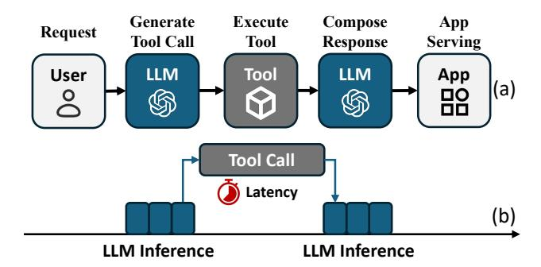
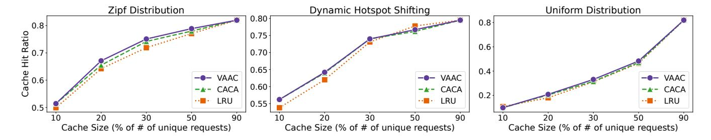

# **ToolCaching: Towards Efficient Caching for LLM Tool-calling**

Yi Zhai, Dian Shen, Junzhou Luo, Bin Yang School of Computer Science and Engineering, Southeast University Nanjing, China {zhaiyi,dshen,jluo,binyang}@seu.edu.cn

#### **Abstract**

Recent advances in Large Language Models (LLMs) have revolutionized web applications, enabling intelligent search, recommendation, and assistant services with natural language interfaces. Tool-calling extends LLMs with the ability to interact with external APIs, greatly enhancing their practical utility. While prior research has improved tool-calling performance by adopting traditional computer systems techniques, such as parallel and asynchronous execution, the challenge of redundant or repeated tool-calling requests remains largely unaddressed. Caching is a classic solution to this problem, but applying it to LLM tool-calling introduces new difficulties due to heterogeneous request semantics, dynamic workloads, and varying freshness requirements, which render conventional cache policies ineffective. To address these issues, we propose ToolCaching, an efficient feature-driven and adaptive caching framework for LLM tool-calling systems. ToolCaching systematically integrates semantic and system-level features to evaluate request cacheability and estimate caching value. At its core, the VAAC algorithm integrates bandit-based admission with value-driven, multi-factor eviction, jointly accounting for request frequency, recency, and caching value. Extensive experiments on synthetic and public tool-calling workloads demonstrate that ToolCaching with VAAC achieves up to 11% higher cache hit ratios and 34% lower latency compared to standard policies, effectively accelerating LLM tool-calling in practical applications.

# **CCS Concepts**

• Computing methodologies  $\to$  Artificial intelligence; • Information systems  $\to$  Information systems applications.

### **Keywords**

Caching, LLM System, Tool-calling

### 1 Introduction

Due to their impressive capabilities, Large Language Models (LLMs) have been widely used in the web ecosystem, not only giving rise to new web applications such as chatbots[4, 11] and code assistants[1, 3], but also empowering traditional web services like search, recommendation, and e-commerce with advanced AI capabilities. To further extend the functionality of LLMs in these settings, tool-calling[24, 26, 29] has been introduced, allowing LLMs to interact with external tools and APIs. This capability significantly enhances the versatility and utility of LLM-based applications, unlocking their potential to perform complex tasks, such as data retrieval, computation, and manipulation of external systems.

With the advent of tool-calling, increasingly complex tool-chaining workflows have emerged in modern web applications powered by

<span id="page-0-0"></span>> **[图片提取文字 (无描述)]:**
> Generate Execute Compose App Request Tool Call Serving Tool Response LLM Tool LLM User App (a) Tool Call Latency LLM Inference LLM Inference


Figure 1: Tool-calling workflow and the corresponding time-

LLMs, where a single model orchestrates multiple external functions in multi-step pipelines to perform sophisticated tasks. For example, ReAct[35] pioneered the integration of reasoning and acting, enabling LLMs to perform sequential tool invocations interleaved with dynamic reasoning steps. To optimize the performance of these workflows, recent works have focused on improving the efficiency of tool-calling execution, such as parallelizing tool calls[20], allowing asynchronous tool calls[17], and partially executing tools concurrently with LLM decoding[32].

These techniques borrow strategies from traditional computer systems, such as parallel execution and asynchronous scheduling, and have shown performance gains. However, a common phenomenon observed in LLM inference, redundant or repeated processing of similar requests [21, 25, 36], also frequently arises in tool-calling workflows [28], which these approaches do not fully address. This motivates us to revisit another classic optimization strategy widely adopted in web applications: caching the results of tool calls to eliminate redundant executions. Nevertheless, the unique characteristics of LLM tool-calling, such as semantic variations in requests, heterogeneous tool costs, and the need for lightweight integration with inference systems, pose challenges that traditional caching strategies cannot effectively handle.

Firstly, the cacheability of tool calls is highly uncertain: LLMs dynamically generate heterogeneous requests, ranging from information retrieval to state-changing actions, making indiscriminate caching infeasible. Secondly, freshness requirements vary widely; a single TTL policy is either unsafe or inefficient. Thirdly, workloads are highly dynamic: request patterns and popular tools shift rapidly, rendering static strategies ineffective. Hence, robust caching requires adaptive admission and eviction policies that continuously respond to workload characteristics in real time.

To tackle these complexities, we recognize two core technical challenges:

- Understanding LLM tool-calling requests. Tool invocations are highly diverse and context-dependent, making cacheability hard to assess with traditional heuristics. Extracting both semantic and system-level features from dynamic requests is essential yet non-trivial.
- Designing adaptive caching policies. Classic criteria such as hit ratio or recency are insufficient for workloads with heterogeneous costs and reuse patterns. Effective policies must integrate richer features to guide admission and eviction decisions.

These two challenges form the foundation of our approach. We introduce ToolCaching, a caching framework that integrates request semantics with system-level signals to optimize tool-calling in LLM applications. ToolCaching combines semantic analysis of requests with lightweight observability and in-cache statistics, enabling adaptive admission and eviction policies that are tailored to the unique characteristics of tool-calling workloads. To the best of our knowledge, this is the first work to address caching for LLM tool-calling.

We evaluate ToolCaching on both synthetic datasets and public tool-calling workloads. The results show that ToolCaching improves cache hit ratio by up to 11% over baseline strategies, and reduces end-to-end latency by up to 34%, demonstrating its effectiveness in accelerating LLM-based web applications.

Our contributions are summarized as follows: (i) we conduct a comprehensive analysis of the challenges in applying caching to LLM tool-calling and propose ToolCaching, the first framework that integrates semantic and system features for adaptive cache management; (ii) we identify essential features for understanding tool-calling requests and design lightweight mechanisms to collect them; (iii) we develop an efficient cache management algorithm, VAAC, which leverages semantic and system-level signals to guide admission and eviction decisions; (iv) we implement and evaluate ToolCaching on synthetic and public workloads, demonstrating its effectiveness in improving the performance of LLM tool-calling systems.

### <span id="page-1-1"></span>2 Background And Motivation

This section provides an overview of the background and motivation of our work. We begin by introducing the concept of toolcalling in LLMs, followed by the inherent complexities associated with applying caching in LLM tool-calling scenarios and the importance of cache admission and eviction.

### 2.1 Tool-calling in LLMs

Tool-calling is a mechanism that allows LLMs to interact with external tools and APIs, enabling them to perform tasks beyond their inherent capabilities. This feature has been integrated into various LLMs, such as OpenAI's GPT-4 [\[10\]](#page-8-12) and Meta's Llama 2 [\[31\]](#page-8-13), allowing these models to retrieve remote data sources, execute computations, and manipulate external systems. Beyond simple single-step invocations, tool-calling also enables the construction of complex multi-step workflows. For example, ReAct[\[35\]](#page-8-4) demonstrates how LLMs can interleave chain-of-thought reasoning with tool usage, dynamically planning and executing sequences of actions to accomplish sophisticated tasks.

Regardless of task complexity, tool-calling workflows follow a consistent pattern: as shown in [Fig. 1a](#page-0-0), the LLM parses the user's request, generates a structured tool call, and sends it to the tool's API. The returned result is fed back as additional context for response composition, which is finally delivered to the application serving layer.

As depicted in [Fig. 1b](#page-0-0), tool calls are inserted between two stages of LLM inference, and their execution time can be a dominant contributor to end-to-end latency, particularly when invoking remote APIs over the network [\[24,](#page-8-1) [29\]](#page-8-3). Previous works studies [\[17,](#page-8-6) [20,](#page-8-5) [32\]](#page-8-7) focus on optimizing tool-calling performance by adjusting the scheduling between LLM inference and tool execution, enabling parallel processing, and designing more efficient pipelines.

Besides these execution-level optimizations, our empirical analysis reveals substantial redundancy in tool-calling workloads. In the movie recommendation dataset [\[20,](#page-8-5) [30\]](#page-8-14), we found that over 40% of tool invocations are repeated, indicating significant potential for reusing previous results. Redundancy also frequently arises within a single user session—for instance, a user may first request "top 5 movies," prompting the system to retrieve and describe a list of titles, and then follow up with "top 5 sci-fi movies," where overlapping entries lead to duplicate calls for the same movie details. Such repeated invocations not only prolong response time but also amplify the financial and resource costs associated with API usage, since many tools charge per call or consume limited quotas. In [Table 1,](#page-1-0) we summarizes representative tool tasks with their typical latency and cost per 1,000 calls, highlighting the potential benefits of eliminating redundant calls through caching the results of tool-calling requests.

### 2.2 Caching in LLM Tool-calling

Caching has long been an effective strategy in traditional web applications to mitigate redundant computation and network overhead. Recent advances such as the KV-Cache in LLM inference [\[21,](#page-8-8) [25,](#page-8-9) [36\]](#page-8-10) further demonstrate its power in accelerating system performance. Inspired by these successes, we extend this paradigm to LLM tool-calling: by storing the results of tool invocations in a cache and serving subsequent identical requests directly from cached entries, our approach can substantially reduce repeated tool execution, lower external communication costs, and improve overall end-to-end efficiency.

However, the unique characteristics of LLMs and their toolcalling mechanisms introduce inherent complexities, making the design of caching systems fundamentally different from those in traditional web applications:

<span id="page-1-0"></span>Table 1: Representative tool tasks with typical latency and cost.

| Task Type           | Latency (ms) | Cost (\$/1k calls) |  |
|---------------------|--------------|--------------------|--|
| Search [5]          | 700–2000     | ∼5.0               |  |
| Wikipedia Fetch [8] | 200–1000     | 0                  |  |
| Map Planning [6]    | 50–1000      | 5.0                |  |
| Weather Query [7]   | ∼200         | 1.6                |  |

Uncertain Cacheability of Tool Calls: LLMs dynamically generate tool calls—ranging from local function executions to remote API invocations—that serve heterogeneous purposes, such as information retrieval or state-changing actions. Some calls require real-time data, while others may trigger irreversible side effects (e.g., sending messages or performing transactions). Caching all tool calls is clearly infeasible: results may rapidly become outdated, and indiscriminate caching of commands can lead to incorrect or unsafe behavior. Accurately determining whether a tool call is safe and beneficial to cache thus demands a deep understanding of each request.

Highly Variable Result Freshness: The freshness requirements of tool-calling results vary dramatically—encyclopedia queries may remain valid for weeks, while financial data or sensor readings may expire in seconds. Applying a uniform cache expiration (TTL) is either wasteful or unsafe. Effectively managing cache staleness requires fine-grained, adaptive TTL assignment that reflects the specific validity of each result, which is especially challenging under diverse and shifting workloads.

Rapidly Changing and Unpredictable Workloads: LLM toolcalling systems routinely face rapidly shifting workloads—request frequencies, popular tools, and user access patterns all fluctuate in response to user behavior or external events. Such volatility makes static cache partitioning and fixed replacement strategies ineffective: what is hot now may soon become cold, and cache resources must be dynamically reallocated. Robust caching management must therefore continuously monitor workload characteristics and adapt cache policies in real time.

### 2.3 Caching Management Policy

Given the characteristics of LLM tool-calling workloads, the design of caching management policy, including admission and eviction mechanisms, plays a crucial role in achieving effective caching. Admission control determines which tool-calling results are admitted into the cache, while eviction policies dictate which entries to replace when capacity is constrained.

Traditional approaches such as LRU (Least Recently Used) and LFU (Least Frequently Used) have been extensively applied in many systems [\[15,](#page-8-18) [16,](#page-8-19) [39\]](#page-8-20), but they are inadequate for LLM tool-calling scenarios, where the execution cost and latency of each tool call are non-negligible and vary widely. These policies primarily rely on access recency or frequency, without explicitly accounting for the high and uneven cost of tool execution. Recent studies show that adaptive, workload-aware admission and eviction strategies can achieve substantial improvements in hit ratio, resource utilization, and end-to-end performance [\[18,](#page-8-21) [33,](#page-8-22) [34\]](#page-8-23).

This highlights the need for an effective, workload-aware caching management policy that can adaptively incorporate both the execution cost and latency characteristics of tool calls into its admission and eviction decisions.

In response to these complexities and difficulties, drawing inspiration from the recent advances in caching, we propose a novel caching system for LLM tool-calling called Tool-Caching.

<span id="page-2-0"></span>> **[图片提取文字 (无描述)]:**
> weather("New It's sunny in York") New York. Cache **Eviction** Cache Output Feature Collection Lookup Result **ToolCaching** Cache Entry: VAAC key=hash(tool+param) meta:type,TTL,latency... Cache Miss Admission **Weather Tool** Check Database; Return ("sunny")


Figure 2: The workflow of ToolCaching.

# 3 Design

In this section, we present the design of ToolCaching. As discussed in [Section 2,](#page-1-1) caching in LLM tool-calling poses two unique challenges, and to address these issues, ToolCaching is designed around two core components:

- Feature Collection. ToolCaching first performs a comprehensive analysis of tool-calling requests by extracting both semantic attributes and system-level indicators. These features, obtained via LLM-based semantic understanding and lightweight system monitoring, provide the foundation for informed caching decisions.
- Caching Management Algorithms. Based on the collected features, ToolCaching employs an adaptive caching algorithm called VAAC (Value-Aware Adaptive Caching). VAAC integrates two key mechanisms: (i) selective cache admission guided by feature-based grouping and caching value (v-CACA), and (ii) multi-factor eviction (v-LRU) that jointly considers recency, frequency, and execution cost. This design enables ToolCaching to dynamically adapt to heterogeneous and evolving workloads.

The workflow of ToolCaching is shown in [Fig. 2.](#page-2-0) ToolCaching intercepts API requests from the LLM. If the request is already in the cache, ToolCaching retrieves the cached result and returns it to the LLM. If the request is new, ToolCaching forwards it to the tool API, extracts semantic features from the request, and determines its cacheability. If deemed cacheable, system-level features are collected and the caching value is evaluated. Based on this value and other features, ToolCaching decides whether to admit the result into the cache or to evict an existing entry. Regardless of whether the result is cached, it is returned to the LLM for further processing. If the request is not cacheable, ToolCaching simply forwards the request to the tool API and returns the result to the LLM.

In the following sections, we will discuss the details of each category and explain how we can overcome the complexities mentioned in [Section 2.](#page-1-1)

# <span id="page-3-0"></span>4 Feature Collection

Due to the complexities of caching in LLM tool-calling scenarios mentioned above, it is essential to gain a comprehensive understanding of tool-calling requests before designing an effective caching strategy. In this section, we explain which features to collect and how to collect them.

# 4.1 Semantic Features

Determining whether a tool-calling request in LLM applications is cacheable is fundamentally a semantic question. Unlike traditional web caching, where cacheability can often be inferred from static resource types or HTTP metadata, LLM tool-calling workloads are driven by dynamically generated context-rich requests with varying degrees of features. We select the following features and explain the reasons.

Request Type: Tool-calling extends the capabilities of LLMs by enabling interaction with external APIs that can serve fundamentally different purposes. A single tool may support both information retrieval and command/action semantics. For example, a messaging tool can be invoked to send a message: message(send;Mike;"Hello") or to read the latest message: message(read;last message).

This distinction is critical for caching: retrieval-type requests are generally side-effect-free and thus suitable for reuse when repeated, whereas command-type requests often induce irreversible state changes, making their results unsafe or meaningless to cache. We therefore categorize tool-calling requests into two broad classes: INFORMATIONAL (e.g., weather lookup, knowledge base search) and COMMAND (e.g., sending a message, initiating a transaction). To avoid harmful side effects, COMMAND requests are excluded from caching, while INFORMATIONAL requests serve as candidates for reuse. Accurately identifying the request type thus becomes a key feature for determining cacheability and is directly incorporated into ToolCaching's admission control.

Parameter Category: This feature captures the grouping of tool-calling requests based on their input parameters. For example, in a weather query tool, requests can be organized by attributes such as location or date (e.g., location=London, date=2024-05-01), which later serve as the basis for request grouping and make caching management adaptive (discussed in [Section 5\)](#page-4-0).

In this work, we adopt a practical heuristic: for multi-parameter tool calls, the first parameter is treated as the primary category for grouping; for single-parameter functions, no further parameterbased grouping is applied. Although we adopt a simple heuristic in this paper, the parameter-based categorization is not fixed; grouping rules can be customized when registering each tool in the cache system to better reflect its semantics and usage patterns.

TTL (Time-to-Live): In traditional caching systems, TTL is a fundamental mechanism for controlling data staleness and ensuring the validity of cached content. We adopt the same concept for LLM tool-calling, where TTL specifies the suggested lifetime of a toolcalling result and directly drives cache expiration policies.

Tool calls with short TTLs (e.g., real-time sensor readings) are less suitable for caching due to rapid staleness, whereas those with longer TTLs (e.g., static knowledge queries) are strong candidates for reuse. In ToolCaching, we define indicative default values: 0s for COMMAND requests, 60s for real-time data, 300s for computational results, and 3600s for static knowledge. These values reflect common temporal patterns and can be customized per tool or dynamically adapted to workload characteristics.

Considering all these attributes, the corresponding feature set can be obtained by prompting the LLM with each tool-calling request. An example of the prompting template used for feature collection is shown in [Appendix A.](#page-8-24)

In practice, we find that prompt engineering with clear instructions and representative examples, effectively leverages the LLM's semantic analysis capability and produces accurate and consistent feature extraction results, achieving nearly 90% accuracy as evaluated in [Table 2,](#page-5-0) which forms a solid basis for downstream caching management.

### 4.2 System Features

Once a tool-calling request is identified as cacheable, ToolCaching evaluates the potential benefit of retaining its result by collecting a set of system-level features. These features serve two purposes: (i) estimating the caching value of each entry and (ii) driving adaptive admission and eviction policies under dynamic workloads.

We distinguish two categories of system features:

In-cache statistics, maintained directly by the caching system with minimal overhead:

Associated Users: This feature records the set of users who have accessed each request. In LLM tool-calling scenarios, different users often exhibit distinct patterns of accessing particular tools or queries. By tracking associated users, ToolCaching can effectively group requests based on user interest, as users may repeatedly invoke similar or identical tool calls. For example, a particular user might frequently request personalized movie recommendations, while another consistently queries financial data. Using user-based grouping significantly improves cache hit ratio by ensuring cached results align closely with user-specific request patterns.

Access Count: The total number of cache hits for each cached tool-calling result. This common caching metric helps ToolCaching quickly identify frequently requested entries (e.g., popular specific knowledge queries), directly informing prioritization in cache admission.

Result Size: The size of the cached tool-calling response. In LLM tool-calling scenarios, some requests (such as retrieving large datasets) produce much larger results than others. Tracking result size helps ToolCaching avoid allowing oversized entries to consume disproportionate cache space, ensuring a balanced trade-off between hit ratio and overall cache efficiency.

System Latency: The end-to-end time required to fulfill a toolcalling request, including both network transfer and tool execution delay. ToolCaching directly measures this latency within the cache system, allowing it to identify high-latency operations as prime candidates for caching. Prioritizing results with higher observed latency improves user-perceived responsiveness by minimizing repeated slow calls.

System-level indicators, obtained via application-level measurement or low-level monitoring:

Observed Resource Cost: The measured execution cost of each tool-calling request, either in terms of CPU consumption for local computations or billing price for external API calls. In LLM tool-calling, different tools have significantly varied resource costs; expensive local computations (e.g., personalized recommendation rankings) or costly third-party APIs (e.g., legal document retrieval) clearly justify higher caching value. ToolCaching leverages this feature to prioritize retention of results that yield substantial savings in computation or API billing costs.

For features that are difficult or costly to collect at the application layer, such as CPU usage of local APIs, we leverage light-weight system observability tools like eBPF (extended Berkeley Packet Filter)[2], which is widely used for kernel-level performance tracing [27, 37]. These allow per-request resource profiling with minimal runtime overhead. If needed, additional low-level metrics (e.g., memory usage, disk I/O, function calling) can also be captured through similar techniques to further inform caching decisions.

### <span id="page-4-0"></span>5 Efficient Caching Management

In this section, we discuss how to design efficient caching management policies based on the collected features.

### 5.1 Cache Structure Design

We begin by describing the design of the cache structure, which encompasses both cache key construction and value storage. This foundational design supports feature-aware admission and value-driven prioritization, laying the groundwork for the adaptive management policies discussed in subsequent sections.

Cache Key Construction: To ensure efficient and accurate cache lookups, we construct a unique key for each tool-calling request by combining the tool name with a serialized representation of its input parameters. The serialization process is designed to be order-invariant and supports complex, nested parameter structures (e.g., JSON objects), ensuring that logically equivalent requests yield identical keys. This composite string is then hashed to produce a compact, collision-resistant identifier. For example, a request to retrieve the weather for New York on May 1, 2024, would result in a key such as hash(weather:location=NewYork, date=2024-05-01). This approach enables fast lookups, accurate request distinction, and robust cache management in diverse LLM tool-calling scenarios.

**Cache Value Storage:** Each cache entry stores both the result of the tool call and its associated metadata. The metadata includes the relevant semantic and system features described in Section 4, as well as a value score used to guide cache management decisions. The details of how this value score is computed are discussed later.

### 5.2 Cacheability Analysis

Before caching a tool-calling request, it is essential to determine whether the request is cacheable. We leverage a set of semantic features including request type, parameter category, and TTL to evaluate cacheability. Specifically, we adopt the following rules: (1) requests of type COMMAND are not cacheable; (2) requests with short TTL ( $\leq$  60 seconds) are not cacheable.

Although these criteria are based on structured semantic features generated by the LLM, we deliberately avoid allowing the LLM itself to decide cacheability. Rule-based judgments over well-defined features ensure determinism, interpretability, and efficiency, whereas delegating this decision to the LLM could introduce uncertainty and potential errors. Overly complex or ambiguous LLM-driven analysis risks inconsistent cache states and degraded performance. Our approach therefore combines the LLM's semantic extraction capability with transparent, rule-based cacheability assessment to maximize both expressiveness and reliability.

### 5.3 Caching Value Model

In addition to request access count, which is a standard metric in caching systems, we explicitly account for the overall cost of fulfilling each request in LLM tool-calling scenarios. This includes result size, system latency, and resource cost. By integrating these dimensions, our caching value model better reflects the real performance benefit of caching in complex, heterogeneous environments.

To ensure that these features are comparable and do not dominate the caching value due to scale differences, we apply min-max normalization to each metric. The normalization process rescales each feature j of request  $r_i$  as:

NormFeature<sub>i</sub><sup>(j)</sup> = 
$$\frac{Feature_{i}^{(j)} - Feature_{min}^{(j)}}{Feature_{max}^{(j)} - Feature_{min}^{(j)}}$$
(1)

where  $Feature_i^{(j)}$  denotes the value of feature j (e.g., latency, size, or cost) for request  $r_i$ , and  $Feature_{min}^{(j)}$ ,  $Feature_{max}^{(j)}$  are the minimum and maximum observed values of that feature, respectively.

Then, we can define the caching value  $v_i$  of a request  $r_i$  as follows:

<span id="page-4-1"></span>
$$v_i = \lambda_1 \cdot \text{NormLatency}_i + \lambda_2 \cdot \frac{\text{NormCost}_i}{\text{NormSize}_i} - \lambda_3 \cdot e^{-\frac{\text{TTL}_i}{\tau}}$$
 (2)

where  $\lambda_1$ ,  $\lambda_2$ , and  $\lambda_3$  are tunable weights controlling the relative importance of latency, cost-to-size ratio, and TTL-based risk in the caching value model.  $\tau$  is a smoothing parameter that represents the average lifetime of cached entries. A smaller TTL $_i$  leads to a larger exponential term, indicating a higher risk of staleness, whereas a larger TTL $_i$  results in a smaller risk value, reflecting greater temporal stability.

Intuitively, the model prioritizes requests with high latency, large cost, and small result size (since they save system resources), while de-emphasizing those with short TTLs that are prone to rapid invalidation. This balance between performance gain and temporal stability allows ToolCaching to cache entries that are both frequently accessed and sustainably valuable over time.

#### 5.4 Cache Admission

Cache admission determines which requests enter the cache. In ToolCaching, we leverage the features collected in Section 4 to design a reinforcement learning-based admission policy, inspired by the CACA framework [18], which adaptively adjusts to workload changes.

CACA first partitions requests into groups based on content features, then applies a reinforcement learning approach, which is specifically a multi-armed bandit algorithm, to dynamically tune admission policies for each group. By tracking frequency and hit ratio for each group, CACA selectively admits only the top-performing groups, focusing limited cache resources on requests with the greatest potential for reuse and system benefit. This approach is well-suited to the highly dynamic and diverse nature of LLM tool-calling workloads.

However, the original CACA only considers request frequency and hit ratio, overlooking fulfillment cost, a key factor in LLM toolcalling scenarios. We extend CACA to v-CACA by incorporating our caching value model into the reward function of the multiarmed bandit, so that both request patterns and execution cost guide cache admission.

Therefore, the cache admission policy in ToolCaching can be summarized as follows:

**Initial States:** In the initial phase, all cacheable tool-calling requests are admitted if space is available. For every request, features are collected and updated, especially upon cache hit or reuse.

**Feature Grouping:** To manage the diverse and dynamic nature of tool-calling requests, ToolCaching organizes requests into feature-based groups using a fixed three-level feature set: (1) tool type, (2) parameter category, and (3) user identity. Requests are first partitioned by tool type, then (when needed) subdivided by parameter category, and finally by user identity to capture fine-grained locality patterns. The hierarchy is constructed adaptively: a group is split only when its access frequency exceeds a threshold  $T_1$  while its hit ratio is below  $H^r$ ; otherwise it remains at its current level.

Each resulting group  $g_i$  in the group list  $\mathcal{G}$  maintains its own aggregate statistics including its cache hit ratio  $H_i$  and the average caching value  $V_i$ . This hierarchical feature grouping improves the stability of reinforcement learning decisions and allows the cache to respond adaptively to changing workloads. The full grouping logic, the corresponding hierarchy illustration and pseudo-code are provided in Appendix B.

**Admission Control:** Now, we have a set of feature groups  $\mathcal{G}$ , each with its own average caching value  $V_i$  and hit ratio  $H_i$ . The next step is to determine which feature groups should be admitted into the cache.

This problem can be formulated as a multi-armed bandit problem, where each feature group  $g_i$  is an arm, and the goal is to maximize the cumulative reward over time. Like CACA, we consider hit ratio  $H_i$ , node level  $L_i$  and the number of times the group has been admitted to the cache  $C_i$ , but we also consider the average caching value  $V_i$  of the requests in the group for the nature of tool-calling requests. Therefore, the reward function for each feature group  $g_i$  is defined as follows:

<span id="page-5-1"></span>
$$F_i = \frac{\log(H_i + \delta_1) \cdot \log(L_i + \delta_2) \cdot \log(V_i + \delta_3)}{\log(C_i + \delta_4)}$$
(3)

where  $\delta_1$ ,  $\delta_2$ ,  $\delta_3$ , and  $\delta_4$  are small constants to avoid division by zero and logarithm of zero.

To address this multi-armed bandit problem, we adopt UCB1 algorithm [12], which balances exploration and exploitation by selecting the arm with the highest upper confidence bound. The details of UCB1-based admission control are provided in Appendix B.

#### 5.5 Cache Eviction

Cache eviction determines which entries are removed when space is needed. In ToolCaching, we build on the classic LRU (Least Recently Used) policy and introduce v-LRU, a multi-factor eviction policy

that jointly considers recency and the caching value defined in Eq. (2).

The procedure of v-LRU is as follows:

**TTL Expiration:** Entries whose TTLs have explicitly expired are immediately invalidated. Although TTL-based staleness risk is already incorporated into the caching value  $v_i$ , explicit expiration handling ensures correctness and prevents outdated results from being accessed.

**Item Eviction:** When eviction is required, we identify the bottom 10% of cache entries by recency (i.e., those least recently used). From this subset, we remove the entry with the lowest eviction score  $e_i$ , defined as:

$$e_i = \log \left( v_i + h_i + \delta_5 \right) \tag{4}$$

where  $v_i$  is the caching value,  $h_i$  is the hit ratio, and  $\delta_5$  is a small constant to ensure numerical stability.

Our strategy combines the caching value model with adaptive admission (v-CACA) and multi-factor eviction (v-LRU) to provide effective cache management for LLM tool-calling, together forming Value-Aware Adaptive Caching (VAAC) algorithm.

#### 6 Evaluation

In this section, we evaluate the effectiveness of our feature collection and caching management algorithms in ToolCaching. We first assess the accuracy of the LLM in extracting semantic features from tool-calling requests, and then we evaluate the performance of our caching management algorithms using simulated workloads and public LLM tool-calling datasets. For the public dataset experiments, we implement our cache evaluation on top of the LLM Compiler framework. The cache server runs on a single machine with 16GB RAM and 8 CPUs, and the LLM used for semantic feature extraction and LLM Compiler is the cloud-based DeepSeek V3 [22, 38].

### 6.1 Semantic Feature Accuracy

While semantic features are extracted using LLMs, a critical question arises: How accurate is the LLM in extracting the semantic features of tool-calling requests?

To answer this question, we conducted an evaluation of the LLM's semantic feature extraction capabilities on a set of tool-calling requests. Specifically, we extracted 50 tool-calling requests from the BFCL\_v3\_simple subset of the Berkeley Function Calling Leaderboard (BFCL) dataset [23]. Each request in our validation set was manually annotated with its corresponding request type (COMMAND or INFORMATIONAL) and an estimated TTL. These annotations serve as the ground truth for evaluating the accuracy of the LLM's automatic classification and TTL prediction. To avoid confounding errors due to misparsed or malformed tool calls, we

<span id="page-5-0"></span>Table 2: LLM semantic feature extraction accuracy on tool-calling requests.

| Features           | Accuracy | Precision | Recall | F1    |
|--------------------|----------|-----------|--------|-------|
| Request Type       | 0.980    | 0.968     | 1.000  | 0.984 |
| TTL                | 0.920    | 0.864     | 0.864  | 0.864 |
| Parameter Category | 1        | 1         | 1      | 1     |

<span id="page-6-0"></span>> **[图片提取文字 (无描述)]:**
> Zipf Distribution Dynamic Hotspot Shifting Uniform Distribution 0.80 0.8 0.8 Hit Ratio 0.75 0.6 0.70 Cache | 0.65 0.4 --- VAAC -●- VAAC --- VAAC 0.60 -A- CACA -A- CACA -A- CACA 0.2 ·- LRU LRU -- LRU 0.55 0.5 90 Cache Size (% of # of unique requests) Cache Size (% of # of unique requests) Cache Size (% of # of unique requests)


Figure 3: Cache hit ratio under different cache sizes and workloads

<span id="page-6-1"></span>> **[图片提取文字 (无描述)]:**
> Total System Latency Total Result Size Total Resource Cost 30000 400 4000 27500 3500 g 300-25000 3000 22500 −●− VAAC - VAAC --- VAAC 200-2500--A- CACA -A- CACA CACA 20000-LRU - LRU LRU 2000 90 90 Cache Size (% of # of unique requests) Cache Size (% of # of unique requests) Cache Size (% of # of unique requests)


Figure 4: Total latency, result size and resource cost of requests under different cache sizes in Zipf distribution

restrict our evaluation to only those cases where the LLM produces the correct tool call format. Therefore, since our system uses the first parameter of each tool call as the primary category, the correctness of parameter grouping is always 1.

We use the same prompt template as shown in Appendix A, and we compute standard classification metrics—including accuracy, precision, recall, and F1-score—for each semantic attribute.

As shown in Table 2, the LLM achieves very high accuracy in extracting semantic features from tool-calling requests. The request type classification is nearly perfect, while TTL prediction also demonstrates strong accuracy. These results indicate that the LLM provides reliable semantic annotations for downstream caching management.

### 6.2 Caching Management

Due to the lack of publicly available datasets that accurately reflect real-world LLM tool-calling workload patterns, we construct a synthetic dataset to evaluate the performance of our caching management algorithms.

To comprehensively evaluate the effectiveness of our caching management algorithms, we construct three types of synthetic workloads, each consisting of 1,000 requests covering 6 different tools, which are designed to cover a diverse range of parameter

<span id="page-6-2"></span>Table 3: Comparison of cache hit ratio and latency with/without user-based grouping.

| Cache Size   | 10%           | 20%           | 30%           |
|--------------|---------------|---------------|---------------|
| With User    | 18.8 / 563.28 | 32.2 / 465.60 | 52.1 / 346.32 |
| Without User | 15.5 / 568.88 | 30.2 / 501.04 | 51.2 / 363.62 |

types, response sizes, TTLs, and resource costs, ensuring broad coverage of typical tool-calling scenarios:

- **Zipf distribution:** Requests are sampled according to a Zipf distribution ( $\alpha = 1.1$ ), mimicking real-world workload locality [9, 13, 14, 18].
- Dynamic hotspot shifting: The workload periodically switches between different hotspot regions. In each phase, request frequencies within the active hotspot follow a Zipf distribution, while other requests are distributed among the remaining tools.
- Uniform distribution: Requests are generated uniformly at random across all tool and parameter combinations, serving as a baseline to evaluate cache policy performance under minimal locality.

We implement the cache server for simulated workloads using Python with ~1400 lines of code and evaluate the performance of cache hit ratio under 5 different cache sizes: 10% of all unique requests, 20%, 35%, 50% and 90%. We set  $\lambda_1 = 0.8$ ,  $\lambda_2 = 0.2$ ,  $\lambda_3 = 0.2$ ,  $T_1 = 20$  and  $H_r = 0.5$ .

For each cache size, we compare the performance of our VAAC algorithm against two baseline algorithms: CACA (admits requests without consideration of value and LRU eviction policy) and LRU (admits all requests into the cache). The results are shown in Fig. 3. As depicted, VAAC consistently outperforms both CACA and LRU across most cache sizes and workloads by up to 11%. This demonstrates the effectiveness of our caching value model and multi-factor eviction policy in optimizing cache performance.

Specifically, we present the total system latency, result size and resource cost of requests under different cache sizes in the Zipf distribution workload in Fig. 4. As shown, VAAC achieves the lowest total latency and resource cost compared to CACA and LRU with

<span id="page-7-5"></span>

| Dataset              | Cache Size (of calls' #) | Cache Hit Ratio | Latency(s) | Improvement |
|----------------------|--------------------------|-----------------|------------|-------------|
| Movie Recommendation | 0%                       | —               | 16.2       | —           |
|                      | 20%                      | 0.3781          | 13.81      | 1.14×       |
|                      | 50%                      | 0.503           | 11.88      | 1.26×       |
|                      | 100%                     | 0.514           | 10.7       | 1.34×       |
| ParallelQA           | 0%                       | —               | 15.9       | —           |
|                      | 20%                      | 0.232           | 13.08      | 1.17×       |
|                      | 50%                      | 0.265           | 12.99      | 1.18×       |
|                      | 100%                     | 0.2866          | 12.18      | 1.23×       |

Table 4: Effectiveness of ToolCaching in LLM Compiler

up to 17.3% and 6.4% reduction, respectively. For the total result size, due to our cache value model penalizing large result sizes in [2,](#page-4-1) VAAC achieves the highest result because high-value requests are more likely to be refused and evicted, which is consistent with our design goal of maximizing cache utility.

# 6.3 Multi-user Cache Effectiveness

As multi-user scenarios are common in practical LLM applications, we evaluate ToolCaching under realistic settings by simulating a workload with 10 users, where each user issues tool-calling requests with partially overlapping interests. We compare two cache management strategies: (1) global grouping (no user separation) and (2) user-based grouping (our approach). Results in [Table 3](#page-6-2) show that user-based grouping achieves up to 21.3% higher cache hit ratio and 7.1% lower average latency. This demonstrates that ToolCaching effectively adapts to user-specific access patterns, improving userperceived performance.

# 6.4 End-to-End Evaluation in LLM Tool-calling Systems

The development of tool-calling has enabled LLMs to solve increasingly complex problems by selecting and coordinating multiple functions based on context. To further support such applications, frameworks like LLM Compiler [\[20\]](#page-8-5) provide optimization for multistep reasoning and tool orchestration.

To evaluate the real-world effectiveness of ToolCaching in advanced LLM tool-calling scenarios, we integrate our caching management system into the LLM Compiler framework and conduct an end-to-end evaluation. We use the following dataset provided by LLM Compiler:

- Movie Recommendation: This dataset contains 500 examples, each asking for the most similar movie among four options compared to a reference set of four movies. The task exhibits an 8-way embarrassingly parallel execution pattern, where each candidate can be evaluated separately.
- ParallelQA: ParallelQA is a custom benchmark for evaluating tool-calling scenarios with complex dependencies. It includes 113 math-related questions about factual attributes, where each task requires sequential use of two tools (such as search followed by math) with the second tool's input

depending on the first tool's output. All required information is contained within the first paragraph of relevant Wikipedia articles.

We compare the performance of ToolCaching with the baseline LLM Compiler framework without caching. The results are summarized in [Table 4.](#page-7-5) As shown in the table, ToolCaching consistently reduces end-to-end latency as the cache size increases. In the Movie Recommendation dataset, ToolCaching achieves up to a 34% reduction in latency. Similarly, for ParallelQA, the latency is reduced by up to 23%. These results demonstrate that ToolCaching can effectively reduce redundant tool calls and significantly improve system efficiency in complex LLM tool-calling scenarios.

### 6.5 Overhead

We also measure the overhead of ToolCaching in the scenario of LLM Compiler. The CPU overhead of ToolCaching is ∼ 15% and the memory overhead is ∼ 10% compared to the baseline LLM Compiler framework without caching. The CPU overhead mainly comes from the calculation of VAAC algorithm, while the memory overhead is due to the storage of cached entries and their associated metadata. These overheads are acceptable given the significant performance improvements achieved through caching.

### 7 Conclusion

In this paper, we present ToolCaching, an efficient caching framework for LLM tool-calling systems. At its core, ToolCaching employs VAAC algorithm, which integrates semantic and system-level features, dynamically partitions requests into groups, and utilizes a bandit-based admission policy together with value-aware LRU eviction. Through extensive experiments, we demonstrate that Tool-Caching with VAAC achieves higher cache hit ratios and lower latency than conventional static and frequency-based policies. Our results further show that ToolCaching adapts effectively to dynamic workloads and varying result validity, underscoring the value of caching in complex LLM environments.

### References

- <span id="page-7-1"></span>[1] [n. d.]. Cursor - The AI Code Editor. https://cursor.com/.
- <span id="page-7-4"></span><span id="page-7-2"></span>[2] [n. d.]. eBPF. https://ebpf.io.
- [3] [n. d.]. GitHub Copilot. https://github.com/features/copilot.
- <span id="page-7-0"></span>[4] 2025. ChatGPT. https://chatgpt.com/.
- <span id="page-7-3"></span>[5] 2025. Google Custom Search JSON API. https://developers.google.com/customsearch/v1/overview?hl=zh-cn.

- <span id="page-8-16"></span>[6] 2025. Google Maps Platform Pricing. https://developers.google.com/maps/billingand-pricing/pricing.
- <span id="page-8-17"></span>[7] 2025. Pricing - OpenWeatherMap. https://openweathermap.org/price.
- <span id="page-8-15"></span>[8] 2025. Wikimedia APIs. https://api.wikimedia.org.
- <span id="page-8-32"></span>[9] Bahman Abolhassani, John Tadrous, and Atilla Eryilmaz. 2023. Optimal Load-Splitting and Distributed-Caching for Dynamic Content Over the Wireless Edge. IEEE/ACM Transactions on Networking 31, 5 (October 2023), 2178–2190. doi:10. 1109/TNET.2023.3244039
- <span id="page-8-12"></span>[10] Josh Achiam, Steven Adler, Sandhini Agarwal, Lama Ahmad, Ilge Akkaya, Florencia Leoni Aleman, Diogo Almeida, Janko Altenschmidt, Sam Altman, Shyamal Anadkat, et al. 2023. Gpt-4 Technical Report. arXiv preprint arXiv:2303.08774 (2023). arXiv:2303.08774
- <span id="page-8-0"></span>[11] Daniel Adiwardana, Minh-Thang Luong, David R. So, Jamie Hall, Noah Fiedel, Romal Thoppilan, Zi Yang, Apoorv Kulshreshtha, Gaurav Nemade, Yifeng Lu, and Quoc V. Le. 2020. Towards a Human-like Open-Domain Chatbot. arXiv:2001.09977 [cs] doi:10.48550/arXiv.2001.09977
- <span id="page-8-28"></span>[12] Peter Auer, Nicolò Cesa-Bianchi, and Paul Fischer. 2002. Finite-Time Analysis of the Multiarmed Bandit Problem. Machine Learning 47, 2-3 (May 2002), 235–256. doi:10.1023/a:1013689704352
- <span id="page-8-33"></span>[13] L. Breslau, Pei Cao, Li Fan, G. Phillips, and S. Shenker. 1999. Web Caching and Zipf-like Distributions: Evidence and Implications. In IEEE INFOCOM Joint Conference on Computer Communications. Proceedings. Eighteenth Annual Joint Conference of the IEEE Computer and Communications Societies. The Future Is Now (Cat. No.99CH36320), Vol. 1. 126–134 vol. 1. doi:10.1109/INFCOM.1999.749260
- <span id="page-8-34"></span>[14] Yong Deng and Min Dong. 2022. Fundamental Structure of Optimal Cache Placement for Coded Caching With Nonuniform Demands. *IEEE Transactions on Information Theory* 68, 10 (October 2022), 6528–6547. doi:10.1109/TIT.2022. 3179266
- <span id="page-8-18"></span>[15] Gil Einziger, Roy Friedman, and Ben Manes. 2017. TinyLFU: A Highly Efficient Cache Admission Policy. ACM Trans. Storage 13, 4 (November 2017), 35:1–35:31. doi:10.1145/3149371
- <span id="page-8-19"></span>[16] Christine Fricker, Philippe Robert, and James Roberts. 2012. A Versatile and Accurate Approximation for LRU Cache Performance. In 2012 24th International Teletraffic Congress (ITC 24). 1–8.
- <span id="page-8-6"></span>[17] In Gim, Seung-Seob Lee, and Lin Zhong. 2024. Asynchronous LLM Function Calling. CoRR (January 2024).
- <span id="page-8-21"></span>[18] Yu Guan, Xinggong Zhang, and Zongming Guo. 2019. CACA: Learning-Based Content-Aware Cache Admission for Video Content in Edge Caching. In Proceedings of the 27th ACM International Conference on Multimedia (MM '19). Association for Computing Machinery, New York, NY, USA, 456–464. doi:10.1145/3343031.3350890
- <span id="page-8-35"></span>[19] Xinyi Hou, Yanjie Zhao, Shenao Wang, and Haoyu Wang. 2025. Model Context Protocol (MCP): Landscape, Security Threats, and Future Research Directions. arXiv:2503.23278 [cs] doi:10.48550/arXiv.2503.23278
- <span id="page-8-5"></span>[20] Sehoon Kim, Suhong Moon, Ryan Tabrizi, Nicholas Lee, Michael W. Mahoney, Kurt Keutzer, and Amir Gholami. 2024. An Llm Compiler for Parallel Function Calling. In Forty-First International Conference on Machine Learning.
- <span id="page-8-8"></span>[21] Woosuk Kwon, Zhuohan Li, Siyuan Zhuang, Ying Sheng, Lianmin Zheng, Cody Hao Yu, Joseph Gonzalez, Hao Zhang, and Ion Stoica. 2023. Efficient Memory Management for Large Language Model Serving with PagedAttention. In Proceedings of the 29th Symposium on Operating Systems Principles. ACM, Koblenz Germany, 611–626. doi:10.1145/3600006.3613165
- <span id="page-8-29"></span>[22] Aixin Liu, Bei Feng, Bing Xue, Bingxuan Wang, Bochao Wu, Chengda Lu, Chenggang Zhao, Chengqi Deng, Chenyu Zhang, Chong Ruan, et al. 2024. Deepseek-v3 Technical Report. arXiv preprint arXiv:2412.19437 (2024). arXiv:2412.19437
- <span id="page-8-31"></span>[23] Shishir G. Patil, Huanzhi Mao, Charlie Cheng-Jie Ji, Fanjia Yan, Vishnu Suresh, Ion Stoica, and Joseph E. Gonzalez. 2025. The Berkeley Function Calling Leaderboard (BFCL): From Tool Use to Agentic Evaluation of Large Language Models. In Forty-Second International Conference on Machine Learning.
- <span id="page-8-1"></span>[24] Shishir G. Patil, Tianjun Zhang, Xin Wang, and Joseph E. Gonzalez. 2024. Gorilla: Large Language Model Connected with Massive Apis. Advances in Neural Information Processing Systems 37 (2024), 126544–126565.
- <span id="page-8-9"></span>[25] Ramya Prabhu, Ajay Nayak, Jayashree Mohan, Ramachandran Ramjee, and Ashish Panwar. 2025. vAttention: Dynamic Memory Management for Serving LLMs without PagedAttention. In Proceedings of the 30th ACM International Conference on Architectural Support for Programming Languages and Operating Systems, Volume 1 (ASPLOS '25). Association for Computing Machinery, New York, NY, USA, 1133–1150. doi:10.1145/3669940.3707256
- <span id="page-8-2"></span>[26] Timo Schick, Jane Dwivedi-Yu, Roberto Dessi, Roberta Raileanu, Maria Lomeli, Eric Hambro, Luke Zettlemoyer, Nicola Cancedda, and Thomas Scialom. 2023. Toolformer: Language Models Can Teach Themselves to Use Tools. Advances in Neural Information Processing Systems 36 (December 2023), 68539–68551.
- <span id="page-8-25"></span>[27] Junxian Shen, Han Zhang, Yang Xiang, Xingang Shi, Xinrui Li, Yunxi Shen, Zijian Zhang, Yongxiang Wu, Xia Yin, and Jilong Wang. 2023. Network-Centric Distributed Tracing with DeepFlow: Troubleshooting Your Microservices in Zero Code. In Proceedings of the ACM SIGCOMM 2023 Conference. 420–437.
- <span id="page-8-11"></span>[28] Simranjit Singh, Michael Fore, Andreas Karatzas, Chaehong Lee, Yanan Jian, Longfei Shangguan, Fuxun Yu, Iraklis Anagnostopoulos, and Dimitrios Stamoulis.

- 2024. LLM-dCache: Improving Tool-Augmented LLMs with GPT-Driven Localized Data Caching. In 2024 31st IEEE International Conference on Electronics, Circuits and Systems (ICECS). 1–4. doi:10.1109/ICECS61496.2024.10848749
- <span id="page-8-3"></span>[29] Yifan Song, Weimin Xiong, Dawei Zhu, Wenhao Wu, Han Qian, Mingbo Song, Hailiang Huang, Cheng Li, Ke Wang, Rong Yao, Ye Tian, and Sujian Li. 2023. RestGPT: Connecting Large Language Models with Real-World RESTful APIs. arXiv:2306.06624 [cs] doi:10.48550/arXiv.2306.06624
- <span id="page-8-14"></span>[30] Aarohi Srivastava, Abhinav Rastogi, Abhishek Rao, Abu Awal Shoeb, Abubakar Abid, Adam Fisch, Adam R Brown, Adam Santoro, Aditya Gupta, Adri Garriga-Alonso, et al. 2023. Beyond the Imitation Game: Quantifying and Extrapolating the Capabilities of Language Models. Transactions on machine learning research (2023).
- <span id="page-8-13"></span>[31] Hugo Touvron, Louis Martin, Kevin Stone, Peter Albert, Amjad Almahairi, Yasmine Babaei, Nikolay Bashlykov, Soumya Batra, Prajjwal Bhargava, Shruti Bhosale, et al. 2023. Llama 2: Open Foundation and Fine-Tuned Chat Models. arXiv preprint arXiv:2307.09288 (2023). arXiv:2307.09288
- <span id="page-8-7"></span>[32] Yechen Xu, Xinhao Kong, Tingjun Chen, and Danyang Zhuo. 2024. Conveyor: Efficient Tool-Aware LLM Serving with Tool Partial Execution. (October 2024).
- <span id="page-8-22"></span>[33] Juncheng Yang, Ziming Mao, Yao Yue, and K. V. Rashmi. 2023. {GL-Cache}: Group-Level Learning for Efficient and High-Performance Caching. In 21st USENIX Conference on File and Storage Technologies (FAST 23). 115–134.
- <span id="page-8-23"></span>[34] Juncheng Yang, Yao Yue, and Rashmi Vinayak. 2021. Segcache: A Memory-Efficient and Scalable in-Memory Key-Value Cache for Small Objects. In 18th USENIX Symposium on Networked Systems Design and Implementation (NSDI 21). 503-518.
- <span id="page-8-4"></span>[35] Shunyu Yao, Jeffrey Zhao, Dian Yu, Nan Du, Izhak Shafran, Karthik R. Narasimhan, and Yuan Cao. 2022. ReAct: Synergizing Reasoning and Acting in Language Models. In The Eleventh International Conference on Learning Representations.
- <span id="page-8-10"></span>[36] Gyeong-In Yu, Joo Seong Jeong, Geon-Woo Kim, Soojeong Kim, and Byung-Gon Chun. 2022. Orca: A Distributed Serving System for {Transformer-Based} Generative Models. In 16th USENIX Symposium on Operating Systems Design and Implementation (OSDI 22), 521–538.
- <span id="page-8-26"></span>[37] Yi Zhai, Junzhou Luo, and Jianrui Liu. 2025. NRCAC: Non-Intrusive Microservice Root Cause Analysis Framework for Cloud Providers. In IEEE IN-FOCOM 2025 - IEEE Conference on Computer Communications. 1–10. doi:10.1109/ INFOCOM55648.2025.11044716
- <span id="page-8-30"></span>[38] Chenggang Zhao, Chengqi Deng, Chong Ruan, Damai Dai, Huazuo Gao, Jiashi Li, Liyue Zhang, Panpan Huang, Shangyan Zhou, Shirong Ma, Wenfeng Liang, Ying He, Yuqing Wang, Yuxuan Liu, and Y.X. Wei. 2025. Insights into DeepSeek-V3: Scaling Challenges and Reflections on Hardware for AI Architectures. In Proceedings of the 52nd Annual International Symposium on Computer Architecture. ACM, Tokyo Japan, 1731–1745. doi:10.1145/3695053.3731412
- <span id="page-8-20"></span>[39] Yikai Zhao, Wenrui Liu, Fenghao Dong, Tong Yang, Yuanpeng Li, Kaicheng Yang, Zirui Liu, Zhengyi Jia, and Yongqiang Yang. 2023. P4LRU: Towards An LRU Cache Entirely in Programmable Data Plane. In Proceedings of the ACM SIGCOMM 2023 Conference (ACM SIGCOMM '23). Association for Computing Machinery, New York, NY, USA, 967–980. doi:10.1145/3603269.3604813

### <span id="page-8-24"></span>**A Semantic Feature Extraction Details**

We provide the detailed prompt template used for LLM-based feature extraction in Fig. 5.

### <span id="page-8-27"></span>**B** Cache Admission Details

### **B.1** Hierarchical Feature Grouping

We adopt a hierarchical and adaptive grouping strategy. Requests are initially partitioned by tool type. For each tool group, we continuously track aggregate statistics such as access count and cache hit ratio. If a group has high frequency (request access count  $\geq T_1$ ) but low hit ratio ( $\leq H^r$ ), which suggests substantial diversity, we further subdivide by parameter category. If parameter-based grouping is still insufficient to capture homogeneity, we refine the grouping by user ID. This is especially useful in multi-user environments where access patterns can differ significantly.

Through this recursive process, requests are organized into a tree structure (Fig. 6), with each layer corresponding to a specific feature dimension. The leaf nodes represent homogeneous request clusters managed by the cache. For example, a leaf like

```
# Prompt Type: SYSTEM
# Input:
<Other system Input>
 • When using tools, please respond in the following format:
     CACHE_ANALYSIS: {{
       "request_type": "INFORMATIONAL or COMMAND",
      "parameter_categories": string,
      "suggested_ttl_seconds": number

    Analyze caching based on these principles:

   request_type (Request Type):
     - INFORMATIONAL: Query or information retrieval operations
     (like calculations, translations, weather checks)
     - COMMAND: State-changing operations (like sending emails,
     deleting files, money transfers)
   parameter_category (Parameter Category):
      Return the primary parameter of tools, or 'none' for single-
     parameter tools
   suggested_ttl_seconds (TTL):
     - Based on information timeliness and request type
     - 0 seconds for COMMAND, 60 seconds for real-time data,
     300 seconds for calculations, and 3600 seconds for static
```

Figure 5: Prompt template for LLM semantic feature extraction.

Please intelligently analyze the caching characteristics of each

tool call based on your understanding of the request content.

knowledge.

<span id="page-9-1"></span>> **[图片提取文字 (无描述)]:**
> Non-leaf Node Root Leaf Node Level 0: Root weather( calc() news Level 1: Tool Name London today New York Level 2: Parameter Category UserA UserB Level 3: Associated Users


Figure 6: Hierarchical feature grouping for tool-calling requests.

root/weather()/New York/UserA represents a group for "weather" tool with the parameter "New York" and user "UserA". To prevent over-fragmentation, groups with too few requests are merged with their parent group.

This dynamic refinement process, guided by frequency and hit ratio, allows the system to maximize cache utility by adaptively aligning group granularity with real-world workload patterns. At the same time, it helps control system complexity.

After feature grouping, a list of feature groups is formed:

$$\mathcal{G} = \{g_1, g_2, \dots, g_n\} \tag{5}$$

where each group  $g_i$  contains requests with similar features. For each group  $g_i$ , we maintain a set of statistics, including the average caching value of the requests  $V_i = \frac{1}{|g_i|} \sum_{r_j \in g_i} v_j$ , and the cache hit ratio  $H_i$ .

If there are too few requests ( $< S_{min}$ ) in a group, we merge it with its parent group to reduce the number of groups. Also, the

group will be periodically reset after *B* requests to adapt to changing workloads.

We provide the detailed algorithm for periodic hierarchical feature grouping in Algorithm 1.

### <span id="page-9-2"></span>Algorithm 1 Periodic Hierarchical Feature Grouping for Toolcalling Requests

```
Input: Request stream \mathcal{R}, feature dimensions \mathcal{F}, thresholds T_1
     (freq), H^r (hit ratio), min group size S_{\min}, regroup interval B
Output: Leaf feature groups G
  1: Initialize \mathcal{G} \leftarrow \emptyset
  2: Initialize request buffer \mathcal{R}_{\text{all}} \leftarrow \emptyset, counter cnt \leftarrow 0
     procedure: PeriodicGrouping(\mathcal{F}, B)
         for each incoming request r do
            Add r to \mathcal{R}_{\text{all}}, cnt \leftarrow cnt + 1
  5:
            if cnt \mod B == 0 then
  6:
  7:
                \mathcal{G} \leftarrow \emptyset
  8:
                HierarchicalGrouping(\mathcal{R}_{all}, \mathcal{F}, 1)
                // Now G stores the latest grouping result
     procedure: HierarchicalGrouping(\mathcal{R}, \mathcal{F}, level)
         if level > |\mathcal{F}| or |\mathcal{R}| < S_{\min} then
            Add \mathcal{R} as a group to \mathcal{G}
13:
            return
         Partition \mathcal{R} into subgroups \{\mathcal{R}_1, \mathcal{R}_2, \ldots\} by feature \mathcal{F}[\text{level}]
14:
15:
         for each subgroup \mathcal{R}_i do
            Compute access count f_i, hit ratio H_i
16:
            if f_i \geq T_1 and H_i \leq H^r then
17:
                HierarchicalGrouping(\mathcal{R}_i, \mathcal{F}, level + 1)
18:
19:
            else if |\mathcal{R}_j| < S_{\min} then
20:
                Add \mathcal{R}_j to parent group (skip splitting)
21:
                Add \mathcal{R}_i as a leaf group to \mathcal{G}
23: output: Latest leaf feature groups \mathcal{G} (regrouped every B re-
```

# <span id="page-9-3"></span>Algorithm 2 Cache Admission via UCB1-based Algorithm

**Input:** Leaf feature groups  $G = \{g_1, g_2, ..., g_n\}$  from hierarchical partitioning; current statistics for each  $g_i$ 

**Output:** Admission decisions for each decision round 1: **procedure:** UCB1-Admission(G)

Update  $C_{i^*} \leftarrow C_{i^*} + 1$ ,  $N_{i^*} \leftarrow N_{i^*} + 1$ 

10: end procedure

```
for each decision round t do
for all feature group g<sub>i</sub> ∈ G do
Update statistics for g<sub>i</sub>: hit ratio H<sub>i</sub>, node level L<sub>i</sub>, admission count C<sub>i</sub>, avg. caching value V<sub>i</sub>, selection count N<sub>i</sub>
Compute reward F<sub>i</sub> using Eq. (3)
Compute UCB<sub>i</sub> = F<sub>i</sub> + c√(\frac{\ln t}{N_i}\) using Eq. (6)
Select g<sub>i*</sub> = arg max<sub>gi</sub> UCB<sub>i</sub>
Admit requests from g<sub>i*</sub> into the cache
```

# B.2 UCB1-based Admission Control

We adopt UCB1 algorithm [\[12\]](#page-8-28) to address the multi-armed bandit problem in cache admission. At each decision round, we calculate the reward for each group according to [3,](#page-5-1) and select the group with the highest UCB value:

<span id="page-10-0"></span>
$$UCB_i = F_i + c\sqrt{\frac{\ln t}{N_i}} \tag{6}$$

where is the number of times group has been selected, is the current round, and is an exploration parameter.

The psudo-code of UCB1-based admission control is shown in [Algorithm 2.](#page-9-3)

### C Discussion on Limitations and Future Work

# C.1 Limitations

Although ToolCaching demonstrates substantial performance gains in LLM tool-calling scenarios, it primarily targets INFORMA-TIONAL tool calls, where the result of a call does not alter the

system state. However, with the increasing adoption of the Model Context Protocol (MCP) [\[19\]](#page-8-35), LLMs are becoming capable of invoking COMMAND-type tools that perform state-changing or irreversible operations.

As discussed in [Section 4,](#page-3-0) applying traditional caching strategies to such calls may lead to harmful side effects. Therefore, future caching frameworks must explicitly account for the semantics and side-effect characteristics of COMMAND calls, adopting fundamentally different mechanisms from those used for INFORMATIONAL requests.

# C.2 Future Work

For future work, we plan to extend ToolCaching to support more diverse tool-calling patterns, multi-tenant scenarios, and integration with multi-agent frameworks, particularly exploring caching opportunities across inter-agent tool-calling patterns. Also, we aim to explore how caching can be safely and effectively applied to COMMAND-type tool calls, thereby enhancing performance in MCP scenarios.