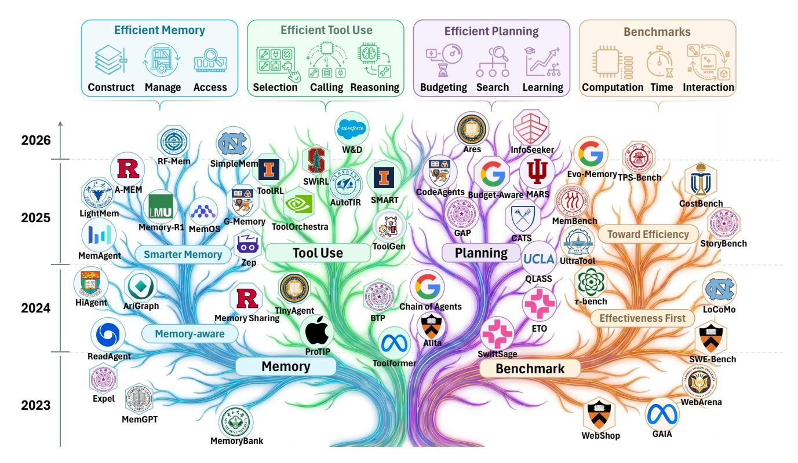
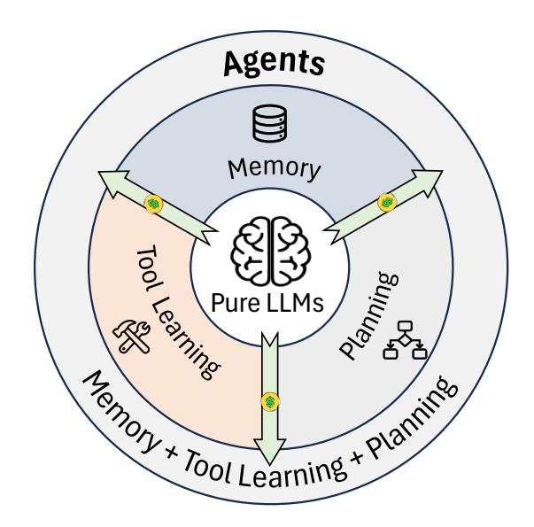

# **Toward Efficient Agents: A Survey of Memory, Tool Use, and Planning**

**Xiaofang Yang**1,2,**† Lijun Li**1,**†**, **Heng Zhou**1,3,**† Tong Zhu**1,**† Xiaoye Qu**1 **Yuchen Fan**1,4 **Qianshan Wei**5 **Rui Ye**4 **Li Kang**1,4 **Yiran Qin**6 **Zhiqiang Kou**7 **Daizong Liu**8 **Qi Li**5 **Ning Ding**9 **Siheng Chen**4 **Jing Shao**1,

> Shanghai Artificial Intelligence Laboratory, 2 Fudan University, University of Science and Technology of China, 4 Shanghai Jiaotong University, 5 Institute of Automation, Chinese Academy of Sciences, The Chinese University of Hong Kong (Shenzhen), Hong Kong Polytechnic University, 8 Wuhan University, 9 Tsinghua University

## **Abstract:**

Recent years have witnessed increasing interest in extending large language models into agentic systems. While the effectiveness of agents has continued to improve, **efficiency**, which is crucial for real-world deployment, has often been overlooked. This paper therefore investigates efficiency from three core components of agents: **memory, tool use, and planning**, considering costs such as latency, tokens, steps, etc. Aimed at conducting comprehensive research addressing the efficiency of the agentic system itself, we review a broad range of recent approaches that differ in implementation yet frequently converge on **shared high-level principles** including but not limited to bounding context via compression and management, designing reinforcement learning rewards to minimize tool invocation, and employing controlled search mechanisms to enhance efficiency, which we discuss in detail. Rather than treating efficiency as a standalone objective, we adopt an effectiveness-first perspective that an agent is meaningfully efficient only when it preserves acceptable task quality. Accordingly, we characterize efficiency in two complementary ways: comparing effectiveness under a fixed cost budget, and comparing cost at a comparable level of effectiveness. From this perspective, we survey benchmarks along both dimensions. We first review effectiveness-oriented benchmarks across holistic and component-specific evaluations, and then examine how efficiency is measured in practice, summarizing evaluation protocols and commonly reported metrics from both benchmark papers and method-level studies. Moreover, we discuss the key challenges and future directions, with the goal of providing promising insights.

**Keywords**: Agents, Efficiency, Agent Memory, Tool Use, Planning

**Date**: January 20th, 2026

**Projects**: <https://efficient-agents.github.io/>

**Code Repository**: <https://github.com/yxf203/Awesome-Efficient-Agents>

**Contact**: [yangxiaofang@pjlab.org.cn,](mailto:yangxiaofang@pjlab.org.cn) [lilijun@pjlab.org.cn,](mailto:lilijun@pjlab.org.cn) [hengzzzhou@gmail.com,](mailto:hengzzzhou@gmail.com) [zhutong@pjlab.org.cn](mailto:zhutong@pjlab.org.cn)

† *Main contributors*

*Corresponding Author*

# **Contents**

| 1 |     | Introduction                              | 4  |
|---|-----|-------------------------------------------|----|
| 2 |     | Preliminaries                             | 6  |
|   | 2.1 | Agent Formulation                      | 6  |
|   | 2.2 | From Pure LLMs to Agents               | 6  |
| 3 |     | Efficient Memory                          | 7  |
|   | 3.1 | Memory Construction                    | 8  |
|   |     | 3.1.1 Latent and Parametric Memory  | 8  |
|   |     | 3.1.2 Textual Memory                | 11 |
|   | 3.2 | Memory Management                      | 14 |
|   |     | 3.2.1 Rule-based Management         | 14 |
|   |     | 3.2.2 LLM-based Management          | 15 |
|   |     | 3.2.3 Hybrid Management             | 16 |
|   | 3.3 | Memory Access                          | 17 |
|   |     | 3.3.1 Memory Selection              | 17 |
|   |     | 3.3.2 Memory Integration            | 19 |
|   | 3.4 | Procedural Reuse via Skills            | 20 |
|   | 3.5 | Multi-Agent Memory                     | 22 |
|   | 3.6 | Discussion                             | 24 |
| 4 |     | Efficient Tool Use                        | 25 |
|   | 4.1 | Tool Selection                         | 26 |
|   | 4.2 | Tool Calling                           | 29 |
|   | 4.3 | Tool-Integrated Reasoning              | 31 |
|   | 4.4 | Discussion                             | 32 |
| 5 |     | Efficient Planning                        | 33 |
|   | 5.1 | Single-Agent Planning Efficiency       | 34 |
|   | 5.2 | Multi-Agent Collaborative Efficiency   | 37 |
|   | 5.3 | Discussion                             | 38 |

| 6 | Benchmarks                          | 39 |
|---|-------------------------------------|----|
|   | 6.1 Effectiveness Benchmarks  | 39 |
|   | 6.2 Efficiency Measurements   | 41 |
| 7 | Challenges and Future Directions    | 42 |
| 8 | Conclusion                          | 44 |

#### 1. Introduction

> **[图片提取文字 (无描述)]:**
> **Efficient Memory Efficient Tool Use Efficient Planning Benchmarks** Computation Time Selection Calling Reasoning Construct Manage Access **Budgeting Search** Learning Interaction 2026 W&D InfoSeeker Ares RF-Mem SimpleMem Evo-Memory TPS-Bench I SWIRL ToolRL A-MEM CodeAgents Budget-Aware MARS SMART AutoTIR CostBench LMU LightMem 2025 Memory-R1 MemOS G-Memory MemBench ToolOrchestra GAP **Toward Efficiency** 00 CATS StoryBench ToolGen **Planning Tool Use Smarter Memory** MemAgent UCLA UltraTool Zep QLASS **6** HiAgent **t**-bench AriGraph **Chain of Agents** 2024 LoCoMo TinyAgent **Memory Sharing** BTP **Effectiveness First ETO** Memory-aware Alita ProTIP **SwiftSage** ReadAgent SWE-Bench Toolformer Memory **Benchmark** Expel WebArena 2023 MemGPT WebShop MemoryBank

**Figure** 1: The evolutionary trajectory of efficient agent research. The diagram is organized into four principal branches: Memory, Tool Use, Planning, and Benchmarks. Key works and their institutional affiliations are mapped chronologically to illustrate the field's development and categorization from 2023 to 2026.

The landscape of Artificial Intelligence has undergone a paradigm shift, evolving from the era of Convolutional Neural Networks (CNNs) and Recurrent Neural Networks (RNNs) to the advent of Large Language Models (LLMs), and the emergence of LLM-based Agents currently [63, 31, 130, 52, 204, 41]. Unlike their predecessors, which primarily focused on perception or static text generation, agentic systems do not merely process information; they actively interact with external environments to execute complex, multi-step workflows across diverse domains, such as autonomous software engineering [218, 195] and accelerated scientific discovery [189, 92, 33].

However, this shift toward autonomous action has introduced a critical bottleneck: **efficiency**. While the deployment of LLMs is already resource-intensive, this challenge is **significantly exacerbated** in agentic systems. Unlike a standard LLM that typically operates in a linear, single-turn query-response format, an agent consumes exponentially more resources due to its recursive nature. To automate intricate real-world tasks [42, 38, 103, 195], agents must perform extensive memory management, iterative tool usage, and complex planning over multiple steps. This multi-step execution leads to prohibitive latency, context window saturation, and excessive token consumption, raising profound concerns regarding the long-term sustainability and equitable accessibility of these increasingly capable systems.

To understand the urgency of agent efficiency, one must examine the typical agentic workflow. Upon receiving a user instruction, an agent engages in a recursive loop that heavily uses the following key

components: memory, planning, and tool use to observe output and provide the final solution.

$$\operatorname{Input} \to \left[ \underbrace{\operatorname{Memory}}_{\operatorname{Context}} \to \underbrace{\operatorname{Planning}}_{\operatorname{Decision}} \to \underbrace{\operatorname{Tool Use}}_{\operatorname{Action}} \to \underbrace{\operatorname{Observation}}_{\operatorname{Feedback}} \right]_n \to \operatorname{Solution}.$$

In each iteration *n*, the system must first retrieve relevant context from memory, reason over the current state to formulate a plan, execute a specific tool-incorporated action, and process the resulting observation. This cycle creates a compounding accumulation of tokens, where the output of step *n* becomes the input cost of step *n* + 1, resulting in high inference costs and slow response times. Consequently, mere model compression is insufficient. We therefore define an efficient agent as follows:

**Efficient agent** is not a smaller model, but as an agentic system optimized to maximize task success rates while minimizing resource consumption, including token usage, inference latency, and computational cost across memory, tool usage, and planning modules.

Existing surveys have provided comprehensive views of individual agent components. Memory-oriented surveys [\[228,](#page-61-0) [19,](#page-44-0) [46\]](#page-46-3) mainly summarize memory taxonomies, storage and retrieval mechanisms, update operations, and memory evaluation. Tool use surveys [\[119,](#page-52-0) [184\]](#page-58-2) focus on how LLMs select, invoke, and learn to use external tools. Planning and reasoning surveys [\[49,](#page-47-1) [163,](#page-56-0) [231\]](#page-61-1) organize studies on task decomposition, plan generation, reasoning frameworks, reflection, and decision-making. However, these component-centric perspectives do not directly answer a system-level efficiency question: under comparable task performance, how can an agent reduce token usage, latency, tool calls, planning steps, memory overhead, and computational cost?

Figure [1](#page-3-1) summarizes the emerging research landscape of efficient agents. Existing studies cluster around memory, tool use, planning, and benchmarks, suggesting that agent efficiency is not only a model-level problem but also a system-level problem across the agent workflow.

Our survey aims to systematize the numerous efforts in this emerging field from an efficiency-centered perspective. While efficient LLM surveys mainly focus on reducing the cost of the underlying model [\[183,](#page-58-3) [241,](#page-62-0) [147\]](#page-55-0), efficient agents require optimization at the system level. To bridge this gap, we categorize existing works into three strategic directions: 1) Efficient Memory: techniques for compressing historical context, managing memory storage, and optimizing context retrieval; 2) Efficient Tool Use: strategies to reduce unnecessary tool calls, lower external interaction latency, and improve tool-use decisions; and 3) Efficient Planning: strategies to reduce redundant reasoning steps, shorten execution trajectories, and decrease the number of API calls required to solve a problem.

It is important to note that these categories are analytical rather than mutually exclusive. In a deployed agent, memory, tool use, and planning are tightly coupled: memory can store tool-use experience and reusable plans; planning decides when to retrieve memory or invoke tools; tool observations become new memory and may reshape subsequent plans. When a method touches multiple components, we assign it to the category corresponding to its primary efficiency motivation or the main bottleneck it is designed to reduce. We then discuss cross-component effects throughout the paper, since a method's system-level efficiency often comes from how it changes costs in other modules rather than from its local module alone.

The remainder of this survey is organized as follows: Section [2](#page-5-0) introduces the preliminaries and highlights the efficiency gap between agents and LLMs. Sections [3](#page-6-0) through [5](#page-32-0) explore component-level efficiency, with a focus on memory, tool use, and planning optimizations. Subsequently, Section [6](#page-38-0) addresses the quantification of efficiency. The survey concludes with a discussion on open challenges and future research directions.

#### 2. Preliminaries

#### 2.1. Agent Formulation

We model an LLM-based agent interacting with an environment as a partially observable Markov decision process (POMDP) augmented with an external tool interface and an explicit memory component. Formally, we define the overall model as

$$\mathcal{M} = (\mathcal{S}, \mathcal{O}, \mathcal{A}, P, R, \gamma; \mathcal{T}, \Psi; \mathcal{M}_{mem}, U, \rho).$$

Here S denotes the latent environment state space, O the observation space, and A the agent action space. The environment dynamics are given by the transition kernel P, the reward function R, and the discount factor  $\gamma \in [0,1)$ .

The agent is additionally equipped with a set of external tools  $\mathcal{T}$  and a tool interface  $\Psi$ , which specifies how tool calls are executed and what tool outputs are returned to the agent. Finally, we model explicit agent memory with memory state space  $\mathcal{M}_{mem}$ , an update rule U that maps the current memory and available information to the next memory state, and an initialization distribution  $\rho$  over the initial memory.

#### 2.2. From Pure LLMs to Agents

We define efficiency through a cost–performance trade-off: achieving comparable performance with lower cost, or achieving higher performance under a similar cost budget.

We acknowledge that many efficiency techniques used in LLM-based agents overlap with those for standalone LLMs (e.g., model compression and inference acceleration). In agents, however, these techniques mainly serve as foundational enablers rather than addressing the agent-specific sources of inefficiency. As summarized by Wang et al. [150], compared to pure LLMs, LLM-based agents exhibit more human-like decision-making by augmenting a base model with cognitive components such as planning and memory.

Accordingly, in this subsection we focus on what differentiates agent efficiency from LLM efficiency. From a functional perspective, an agent is characterized by its ability to (i) plan and act over multiple steps, (ii) invoke external tools or environment com-

> **[图片提取文字 (无描述)]:**
> Agents Memory Tool Learning Panning Office of the second Pure LLMs Toll Learning \* Planting

**Figure 2:** From LLMs to agents: standalone reasoning to trajectory-level reasoning with memory, planning, and tool use, while introducing additional cost sources.

mands to acquire information and execute operations, and (iii) condition subsequent decisions on retrieved or updated memory.

As illustrated in Figure 2, agentic systems introduce additional cost sources beyond generation. For a pure LLM, the inference cost is often dominated by token generation and can be approximated as:

 $Cost_{LLM} \approx \alpha N_{tok}$ 

> **[图片提取文字 (无描述)]:**
> **Memory Construction Memory Management** Interaction Context → Tokens **Latent Memory** Document Accumulation → Latency Parametric Memory Manager Operations **Textual Memory Prompt-resident Memory Graph-based Memory** Hierarchical Memory Item-based Memory No-op **Textual Integration** Rule-enhanced Retrieval Hierarchical Retrieval Compress/Filter **Memory Access** Append **Graph-based Retrieval** Predefined Rules Append LLM / Tool-based Retrieval **Training Latent Integration** Output Inject Feedback/Loss Latent Memory

**Figure 3**: Efficient memory overview. This figure summarizes the agent-memory lifecycle in three phases: **Memory Construction**, which represents experience as textual memory or latent and parametric memory to mitigate token explosion and repeated context processing; **Memory Management**, which curates and updates an accumulating memory store via rule-based, LLM-based, or hybrid strategies to control latency; and **Memory Access**, which determines what memories to retrieve and how to integrate them into the model.

where  $N_{\text{tok}}$  is the number of generated reasoning tokens and  $\alpha$  captures the per-token cost (e.g., time or monetary cost). In contrast, an agent may incur additional overhead from tools, memory, and retries as needed:

$$Cost_{agent} \approx \alpha N_{tok} + \mathbb{I}_{tool} \cdot Cost_{tool} + \mathbb{I}_{mem} \cdot Cost_{mem} + \mathbb{I}_{retry} \cdot Cost_{retry}$$

where  $\mathbb{I}_{tool}$ ,  $\mathbb{I}_{mem}$ ,  $\mathbb{I}_{retry} \in \{0,1\}$  are indicator variables that equal 1 if the agent invokes tools, accesses memory, or performs retries, respectively, and 0 otherwise. Therefore, improving agent efficiency is not only about reducing language generation, but also about reducing the frequency and improving the selectivity of tool or memory invocations and retries along a trajectory, to achieve a better cost–performance trade-off.

# 3. Efficient Memory

A major efficiency bottleneck for LLM agents is the computational and token overhead induced by long contexts and long-horizon interactions, where agents may repeatedly reprocess large histories to act. **Memory-augmented reasoning** provides a principled way to alleviate this inefficiency. By storing and reusing past experience, including successes, failures, and interaction traces, agents can avoid redundant computation, make more informed decisions, and reduce costly retries. In this sense, memory is not merely an auxiliary component. It is a key mechanism for improving the overall efficiency-effectiveness trade-off of agent systems.

Our taxonomy is mainly inspired by the memory-operation view in Du et al. [\[19\]](#page-44-0), which summarizes six basic memory operations. However, in practical agent systems, these operations are often not performed in isolation. For example, memory updating and forgetting may be jointly decided within the same memory pipeline. Therefore, instead of treating individual operations as mutually exclusive categories, we organize this section from a lifecycle and pipeline perspective, covering **memory construction**, **memory management**, and **memory access**. This organization allows us to examine the efficiency implications of memory creation, maintenance, and retrieval, including their effects on token usage and latency.

For memory construction, we draw on the high-level distinction between parametric memory and contextual memory discussed by Du et al. [\[19\]](#page-44-0). Since our focus is on how agent memories are constructed and represented, we divide memory construction into **textual memory** and **latent and parametric memory**. Textual memory refers to explicit, context-accessible records, such as summaries, trajectories, reflections, and external memory entries. In contrast, latent and parametric memory stores experience in implicit representations or model parameters, rather than as directly readable text. The notion of latent memory has also been recognized in recent discussions of AI-agent memory [\[46\]](#page-46-3), which further supports the need to include this category.

Because memory is central to efficiency gains, how to design an efficient memory module becomes an important problem. We therefore discuss efficiency-oriented designs throughout this lifecycle, focusing on how to maximize the benefit of memory while minimizing additional overhead. Figure [3](#page-6-1) provides a structured overview of our taxonomy, and Tables [1](#page-8-0) and [2](#page-9-0) summarize all memory-related methods discussed in this section for an at-a-glance overview.

## **3.1. Memory Construction**

Memory construction determines how raw interaction history, documents, observations, and execution traces are converted into reusable memory representations. From an efficiency perspective, this step is crucial because the initial representation largely determines later costs: a verbose memory increases attention and retrieval overhead, whereas an overly compressed memory may omit information needed for correct decisions. Therefore, efficient construction is not simply about storing more experience, but about transforming experience into compact, accessible, and task-relevant forms.

Following the distinction introduced above, we discuss two complementary construction paradigms. **Latent and parametric memory** compresses experience into hidden states, KV caches, memory tokens, or model-side parameters to reduce repeated context processing. **Textual memory** keeps information in readable natural-language or structured text, making it easier to inspect, edit, retrieve, and cite. Both paradigms aim to mitigate token growth and long-context degradation, such as the "lost in the middle" phenomenon [\[87\]](#page-50-1), but they make different efficiency trade-offs between latency, interpretability, storage cost, and retrieval flexibility.

#### *3.1.1. Latent and Parametric Memory*

Latent and parametric memory store agent experience in non-textual forms that directly condition model computation, avoiding the cost of serializing and re-reading full interaction histories as prompt tokens. The two types differ fundamentally in *where* information is stored. **Latent memory** retains experience in activation space without modifying any model parameters. **Parametric memory** encodes information into the *parameters* of a dedicated memory module.

On the latent side, one group of methods builds compact representations by compressing long contexts

Table 1: Memory overview of efficiency-oriented mechanisms, Part I. Together with Table 2, this table covers all memory-related methods discussed in this section. Part I includes latent and parametric memory and textual memory.

| Method                                  | Category                 | Core Mechanism                                                                                                                 | Resource Link    |  |
|-----------------------------------------|--------------------------|--------------------------------------------------------------------------------------------------------------------------------|------------------|--|
| Latent and Parametric Memory            |                          |                                                                                                                                |                  |  |
| Activation Beacon [219]                 | Latent                   | Beacon-token KV compression for long context                                                                                   | GitHub           |  |
| MemoRAG [116]                           | Latent                   | Window-level memory tokens with updated KV cache                                                                               | GitHub           |  |
| FlashMem [43]                           | Latent                   | Shared-KV consolidation with entropy-triggered writes                                                                          | N/A              |  |
| Memory 3 [193]               | Latent                   | Sparse explicit KV knowledge injected into attention                                                                           | N/A              |  |
| MemGen [214]                            | Latent                   | Triggered on-demand latent memory synthesis                                                                                    | GitHub           |  |
| MemoryLLM [157]                         | Parametric               | Fixed-size layer-wise memory pool with self-updates                                                                            | GitHub           |  |
| M + [158]                               | Parametric               | GPU/CPU two-tier memory with co-trained retriever                                                                              | GitHub           |  |
| Titans [7]                              | Parametric               | Test-time trainable neural memory with surprise-weighted updates                                                               | N/A              |  |
|                                         |                          | Textual Memory                                                                                                                 |                  |  |
| COMEDY [11]                             | Prompt-resident          | Two-stage memory distillation                                                                                                  | GitHub           |  |
| MemAgent [208]                          |                          | Overwrite fixed memory                                                                                                         | GitHub           |  |
| MEM1 [240]                              | Prompt-resident          | Update a compact shared internal state                                                                                         | GitHub           |  |
| AgentFold [207]                         | Prompt-resident          | Proactive context folding                                                                                                      | N/A              |  |
| DC [140]                                | Prompt-resident          | Persistent, evolving memory                                                                                                    | GitHub           |  |
| MemoryBank [234]                        | Item-based               | Ebbinghaus forgetting curve-based memory management                                                                            | GitHub           |  |
| RECOMP [180]                            | Item-based               | Compress retrieved documents                                                                                                   | GitHub           |  |
| Expel [230]                             | Item-based               | experiential learning; insight distillation and management                                                                     | GitHub           |  |
| Human-like memory [44]                  | Item-based               | Cue-triggered memory recall                                                                                                    | N/A              |  |
| SeCom [108]                             | Item-based               | Segment-level memory; compression-based denoising for retrieval                                                                | GitHub           |  |
| Memory-R1 [190]                         | Item-based               | Adaptive memory CRÚD and memory distillation, via two RL-trained agents                                                        | N/A              |  |
| Mem0 [15]                               | Item-based               | Extract candidate memories; memory CRUD                                                                                        | GitHub           |  |
| SimpleMem [83]                          | Item-based               | Compact self-contained memories with query-adaptive retrieval and async consolidation                                          |                  |  |
| agentic plan caching [221]              | Item-based               | Store plan template; plan cache lookup (hit/miss) and update                                                                   | N/A              |  |
| LD-Agent [67]                           | Item-based               | Separate different memory; topic-based retrieval                                                                               | GitHub           |  |
| MemoChat [93]                           | Item-based Item-based | Structured on-the-fly memos Topic-based memory organization; consolidation (add/merge); online RL reranker                     | GitHub           |  |
| RMM [142]                               | Item-based               |                                                                                                                                | N/A GitHub    |  |
| Memento [237]                           | Item-based               | Parametric case retrieval via an online-updated Q-function                                                                     | GitHub           |  |
| MemInsight [126] ReasoningBank [104] | Item-based               | Attribute-augmented memory; attribute-guided retrieval Distill strategies from failures and successes to cut exploration steps | N/A              |  |
| A-MEM [185]                             | Item-based               | Atomic structured notes; link generation and memory evolution                                                                  | GitHub           |  |
| A-WEW [183] ACE [220]                | Item-based               | Incremental delta updates, lightweight merge and de-dup                                                                        | GitHub           |  |
| Agent KB [143]                          | Item-based               | Cross-framework reusable experience Knowledge Base                                                                             | GitHub           |  |
| GraphReader [70]                        | Graph-based              | Graph-guided coarse-to-fine exploration                                                                                        | N/A              |  |
| KG-Agent [55]                           | Graph-based              | Tool-based hop-local KG processing                                                                                             | N/A              |  |
| Zep [122]                               | Graph-based              | Temporal KG memory                                                                                                             | GitHub           |  |
| Mem0 g [15]                  | Graph-based              | Extract candidate nodes; graph updation                                                                                        | GitHub           |  |
| AriGraph [5]                            | Graph-based              | Memory graph; semantic-to-episodic cascading retrieval                                                                         | GitHub           |  |
| D-SMART [66]                            | Graph-based              | Structured OWL-compliant KG                                                                                                    | N/A              |  |
| MemGPT [106]                            | Hierarchical             | OS-style virtual memory paging for context                                                                                     | <b>⊕</b> Website |  |
| MemoryOS [59]                           | Hierarchical             | OS-inspired three-tier memory hierarchy with policy-based inter-tier updates                                                   | GitHub           |  |
| MemOS [74]                              | Hierarchical             | Policy-guided type transformation of MemCubes across three memory forms                                                        | GitHub           |  |
| ReadAgent [65]                          | Hierarchical             | Gist memory compression; on-demand lookup                                                                                      | GitHub           |  |
| HiAgent [45]                            | Hierarchical             | Subgoals as memory chunks; on-demand trajectory retrieval                                                                      | GitHub           |  |
| H-MEM [139]                             | Hierarchical             | Layer-by-layer retrieval                                                                                                       | N/A              |  |
| LightMem [23]                           | Hierarchical             | Pre-compression; soft update (test-time); sleep-time update (offline)                                                          | GitHub           |  |
| xMemory [47]                            | Hierarchical             | Retrieval by decoupling query intent and aggregating multi-level memory evidence                                               | <b>₩</b> Website |  |
| HyMem [232]                             | Hierarchical             | Hybrid summary–raw memory with dynamic retrieval scheduling                                                                    | GitHub           |  |

into a small set of KV activations. Activation Beacon [219] interleaves special beacon tokens into chunked input and uses progressive layer-wise compression to distill raw-token KV activations into the beacons, which accumulate as latent memory while raw activations are discarded. MemoRAG [116] inserts memory tokens after each context window and updates their KV cache across windows with separate weight matrices, yielding a compact global memory that can later serve as retrieval clues for downstream generation. Flash-Mem [43] avoids auxiliary encoders by treating the last hidden state as a sufficient statistic for interaction history; a Shared-KV Consolidator attends directly to the backbone's frozen KV cache to synthesize compact memory, and a parameter-free Cognitive Monitor triggers consolidation only under high attention entropy. Memory3 [193] takes a complementary approach: rather than accumulating episodic experience, it converts a static knowledge base into sparse explicit key-value pairs injected into self-attention layers at decoding time,

Table 2: Memory overview of efficiency-oriented mechanisms, Part II. Together with Table 1, this table covers all memory-related methods discussed in this section. Part II includes procedural reuse via skills and multi-agent memory.

| Method                        | Category | Core Mechanism                                                                    | Resource Link |  |
|-------------------------------|----------|-----------------------------------------------------------------------------------|---------------|--|
| Procedural Reuse via Skills   |          |                                                                                   |               |  |
| Skill-Pro [98]                |          | Non-parametric PPO for reusable skill extraction from experience                  | N/A           |  |
| SkillRL [176]                 | _        | Recursive reinforcement learning with skill library and policy co-improvement     | GitHub        |  |
| MemSkill [216]                |          | Evolvable memory-operation skills for extraction, consolidation, and pruning      | Website       |  |
| AutoSkill [200]               | _        | Experience-driven lifelong skill self-evolution from user interactions            | GitHub        |  |
| Trace2Skill [102]             | _        | Distill trajectory-local lessons into transferable agent skills                   | GitHub        |  |
| CoEvoSkills [215]             |          | Co-evolutionary verification for self-evolving skill libraries                    | Website       |  |
| SKILLFOUNDRY [131]            | _        | Build self-evolving skill libraries from heterogeneous scientific resources       | Website       |  |
| Graph-of-Skills [82]          | _        | Dependency-aware graph retrieval over massive agent skill libraries               | GitHub        |  |
| SkillClaw [96]                |          | Collective skill evolution with an agentic evolver                                | GitHub        |  |
| SkillOS [105]                 |          | Learn skill curation policies for maintaining self-evolving skill repositories    | N/A           |  |
| SkillLens [100]               |          | Adaptive multi-granularity skill reuse to avoid loading or rewriting whole skills | N/A           |  |
| Multi-Agent Memory            |          |                                                                                   |               |  |
| MS [28]                       | Shared   | Shared memory pool; selective addition; continual retriever training              | GitHub        |  |
| G-Memory [213]                | Shared   | three-tier graph memory with bi-directional coarse-to-fine retrieval              | GitHub        |  |
| RCR-Router [85]               | Shared   | Feedback-refined iterative router under a token budget                            | N/A           |  |
| MemIndex [127]                | Shared   | Intent-indexed bipartite graphs; semantic slicing and dynamic indexing            | N/A           |  |
| MIRIX [156]                   | Shared   | Six-module hierarchical memory with staged retrieval and parallel updates         | GitHub        |  |
| Intrinsic Memory Agents [210] |          | Role-aligned templates; intrinsic iterative updates                               | N/A           |  |
| AgentNet [199]                | Local    | Fixed-size memory modules for routing/execution; dynamic pruning                  | GitHub        |  |
| DAMCS [192]                   | Local    | Decentralized per-agent STWM/LTM with goal-oriented hierarchical knowledge graph  |               |  |
| SRMT [125]                    | Mixed    | Personal latent memory and globally broadcast shared recurrent memory             | GitHub        |  |
| Collaborative Memory [123]    | Mixed    | Policy-based filtering/transformation of memory fragments; shared-memory reuse    | N/A           |  |
| LEGOMem [35]                  | Mixed    | Role-aware memory routing; runtime-efficient retrieval scheduling                 | N/A           |  |

treating externalized knowledge as a middle ground between plain-text RAG and full model parameters in terms of read/write cost. MemGen [214] generates latent memory on demand within the reasoning stream: an RL-trained memory trigger monitors hidden states to decide when memory invocation is needed, and a memory weaver produces a compact latent token sequence encapsulating relevant experience that is injected back into ongoing reasoning; without explicit supervision, distinct latent clusters corresponding to planning, procedural, and working memory spontaneously emerge.

On the parametric side, methods encode experience into the parameters of a dedicated memory module. MemoryLLM [157] augments a frozen backbone with an additional 1B-parameter memory pool of hidden vectors, one pool per transformer layer, which are concatenated into attention at each layer. A self-update mechanism modifies the pool in-place when new knowledge arrives without backpropagation through the backbone, while a random-dropping rule exponentially phases out old entries to maintain fixed capacity. M+ [158] extends MemoryLLM by adding a GPU/CPU two-tier long-term memory alongside the short-term pool; a co-trained retriever fetches a small number of relevant hidden-state vectors per layer from the CPU-resident store, pushing effective knowledge retention from 20K to over 160K tokens without increasing GPU memory. Titans [7] takes a more explicitly gradient-based approach: a standalone neural memory module updates its own weights at test time via a surprise-weighted gradient signal, writing strongly only when prediction error is high and applying a forgetting decay proportional to memory capacity. Because history is encoded into the module's parameters through actual weight updates, Titans can be understood as a fast-weights or meta in-context learner that operates alongside a conventional attention head.

Across both categories, a common design principle emerges: memory writes are selectively gated so that the agent avoids redundantly re-encoding stable or low-information content. The key practical trade-off is that latent memory updates are fast and require no gradient computation but are bounded by cache or context capacity, whereas parametric memory can in principle encode arbitrary associations with no hard

capacity limit at the cost of a forward-backward pass or an equivalent weight-update step per memory write.

#### **Latent and Parametric Memory**

- **Pros**: Compresses long interaction histories into compact hidden states or KV caches, allowing agents to reuse prior context without repeatedly replaying full textual trajectories.
- **Cons**: The stored information is less interpretable than text and may require additional training, cache management, or memory-token infrastructure; aggressive compression can also discard details needed for downstream decisions.
- **Suitable situations**: Best for efficiency-critical, long-horizon agents where historical state must be reused frequently and the main bottleneck is repeated prefill, long-context attention, or token-level communication.
- **Trade-offs**: Compared with textual memory, latent and parametric memory save tokens and reduce latency but sacrifice transparency and editability; parametric approaches additionally incur a perwrite update cost that latent methods avoid.

#### *3.1.2. Textual Memory*

Textual memory represents past experience as explicit text or structured symbolic records, including summaries, dialogue segments, trajectories, profiles, plans, and graph facts. Compared with latent memory, it is more transparent, but it can still become inefficient if the stored text is too long, redundant, or poorly indexed. Thus, the central efficiency question for textual memory is how to preserve useful information while controlling prompt length, retrieval latency, and maintenance overhead.

**Prompt-resident Memory.** Prompt-resident memory keeps a compact textual state directly inside the context window. Its efficiency goal is to retain immediately useful information while preventing the prompt from growing with the full interaction history. In practice, this is often achieved by frequently **rewriting or compressing** the memory as the process evolves.

COMEDY [\[11\]](#page-44-1) uses an LLM to generate and compress memory: it extracts session-specific memories from past conversations and then condenses them into a compact representation of key events, the user profile, and relationship changes. MemAgent [\[208\]](#page-59-1) and MEM1 [\[240\]](#page-62-1) both process long inputs sequentially by rewriting and updating a compact memory state at each step: MemAgent updates a summarized memory after each chunk, while MEM1 uses reinforcement learning [\[217\]](#page-60-9) to maintain a fixed-length internal state tagged by <IS></IS> that replaces itself in the next prompt. AgentFold [\[207\]](#page-59-2) proactively folds interaction history into multi-scale summaries plus the latest full turn, slowing critical information loss while reducing token usage.

By retaining a compact memory in the prompt rather than the full history, these methods reduce the effective context length the LLM needs to attend to, thereby improving long-context performance while decreasing computational cost and increasing efficiency.

**Item-based Memory.** Item-based memory stores experience as discrete textual units, such as events, insights, profiles, or plan templates. Its efficiency depends on whether each item is compact enough to retrieve and insert cheaply while still preserving the information needed for future decisions. Early agentmemory systems often store full trajectories or experiences, sometimes alongside summaries, which can

lead to long context and inefficient retrieval. MemoryBank [\[234\]](#page-62-2) stores daily conversation records and summarizes past events and user profiles from these conversations, but it incurs high token costs. Similarly, Expel [\[230\]](#page-61-2) suffers from a similar limitation, as it accumulates experiences through trial and error and distills them into natural-language insights.

To improve efficiency, many works use **memory extraction, compression, or summarization** to convert raw interactions into shorter and more informative memory items. This reduces input token consumption while making each stored entry easier to retrieve and reuse. Human-like memory [\[44\]](#page-46-5) extracts episodic memories from users dialogues, encapsulating content and temporal context into database structure. SeCom [\[108\]](#page-52-2) uses segmentation model to divide long-term conversations into topic-coherent segmentation, and applies the compress model to denoise the segmentation, which further promotes efficient retrieval. Memory-R1 [\[190\]](#page-58-5) and Mem0 [\[15\]](#page-44-2) both extract and summarize ongoing dialogue into candidate memories for downstream updating; Memory-R1 does so at each turn, while Mem0 forms candidate memories from the new message pair, using a conversation summary and recent messages as context. Agentic plan caching [\[221\]](#page-60-3) turns a successful run into a reusable cache entry by rule-based filtering the execution log and then using a lightweight LLM to remove context-specific details, storing the result as a (keyword, plan template) pair. LD-Agent [\[67\]](#page-48-1) separates event and persona memory, using short-term and long-term banks for timestamped dialogue context and embedded event summaries, and a persona extractor to store user and agent traits in long-term persona banks. SimpleMem [\[83\]](#page-50-2) follows a compression-oriented design: it filters redundant dialogue content, resolves context-dependent references, and rewrites useful information into compact, self-contained memory units with multi-view indices.

Beyond extraction and compression, another way to improve efficiency is to **design more structured memory systems**. Structure reduces retrieval ambiguity by attaching useful indices, attributes, or reusable abstractions to each memory item, enabling faster lookup and better use of stored information. One representative structure is topic-indexed memory, which organizes interactions into topic-level groups and stores each topic summary together with its corresponding dialogue segment for efficient retrieval. MemoChat [\[93\]](#page-50-3) and RMM [\[142\]](#page-54-1) both build topic-indexed memories. MemoChat records topic–summary–dialogue entries on the fly, while RMM groups each session by topic and stores each topic summary with its corresponding dialogue segment. These methods can be viewed as enriched-item construction, where raw interactions are transformed into textual memory units equipped with additional annotations for later retrieval and association. MemInsight [\[126\]](#page-53-1) annotates memories with LLM-mined attribute–value pairs, while A-MEM [\[185\]](#page-58-6) converts each interaction into an atomic note with LLM-generated contextual descriptions, keywords, and tags. MemGAS [\[179\]](#page-57-2) follows the same paradigm at the session level by augmenting sessions with turn-level dialogues, LLM-generated summaries, and keywords, and further links new memories to relevant historical memories through GMM-based clustering. A further strategy is to distill experience libraries for reusable decision-making, summarizing trajectories or execution logs into standardized entries that capture reusable strategies, domain concepts, and common failure modes. ReasoningBank [\[104\]](#page-51-1) summarizes successful and failed trajectories into structured memory items with a title, brief description, and content, and stores them with the task query and trajectory for embedding-based retrieval. ACE [\[220\]](#page-60-4) represents context as structured, itemized bullets, each with a unique identifier, counters tracking how often it was marked helpful or harmful, and content such as a reusable strategy, domain concept, or common failure mode. Agent KB [\[143\]](#page-54-2) turns execution logs into structured experience entries through human-guided abstraction, using few-shot prompting and a standardized cross-framework action vocabulary.

**Graph-based Memory.** Graph-based memory is a more structured form of textual memory that represents entities, events, and relations as nodes and edges. This structure improves efficiency by merging repeated information about the same entity, localizing relevant facts through graph traversal, and supporting multi-hop evidence access without replaying the entire history. Some methods focus on constructing graph-structured representations from long inputs or knowledge-graph interactions so that multi-hop evidence can be organized and accessed efficiently. Targeted at the long context task, GraphReader [\[70\]](#page-49-0) segments long text into chunks, compresses them into key elements and atomic facts, and uses these to construct a graph that captures long-range dependencies and multi-hop relations. KG-Agent [\[55\]](#page-47-2) constructs a task-specific subgraph by tool calls and records the retrieved entities and relations as knowledge memory.

Another line of work constructs long-term memory directly as a dynamic knowledge graph, turning interactions into entities, relations, and time-aware facts that can be incrementally updated. Zep [\[122\]](#page-53-2) builds memory as a temporally aware knowledge graph by ingesting time-stamped episodes, extracting and aligning entities and relations, and storing fact edges with periods of validity. It also constructs a community subgraph that clusters strongly connected entities and stores high-level community summaries. Mem0*g* [\[15\]](#page-44-2) represents memory as a directed labeled graph, where an LLM converts new messages into entities and relation triplets that form candidate nodes or edges for graph updates. D-SMART [\[66\]](#page-48-2) incrementally constructs an OWLcompliant dialogue KG by first distilling each turn into an assertion-like statement, then converting it into a KG fragment for integration. AriGraph [\[5\]](#page-43-1) updates a unified semantic–episodic memory graph online by adding an episodic node for each observation and extracting triplets to update the semantic graph, linking the two via episodic edges. MAGMA [\[54\]](#page-47-4) represents agent memory as a time-variant multi-graph, where each memory item is organized through four orthogonal relational graphs: semantic, temporal, causal, and entity graphs.

Graph-based memory represents entities and their relations as a structured graph. Building the graph already compresses and normalizes the history by merging repeated content about the same entity into a single node and keeping only relevant relations as edges. This makes construction more efficient by producing a compact structure that avoids unbounded prompt growth and supports fast retrieval later.

**Hierarchical Memory.** Hierarchical memory organizes information into multiple linked levels, enabling coarse-to-fine, on-demand access. Most hierarchical memory methods consider both structure and content, but with different emphases. Accordingly, related work can be grouped by whether it places more weight on structural organization and management or on content abstraction and indexing.

**System-oriented** hierarchical memory designs define explicit storage tiers and interfaces for reading and updating memory to manage long interaction history. MemGPT [\[106\]](#page-51-2) constructs a hierarchical memory by partitioning the in-context prompt into system instructions, a writable working context, and a FIFO message buffer, and storing the remaining history and documents in external recall and archival memory. MemoryOS [\[59\]](#page-48-3) adopts an OS-inspired hierarchical memory design with three storage tiers: short-term memory stores recent dialogue pages, mid-term memory groups pages into topic segments with summaries, and long-term personal memory maintains user and agent persona information. MemOS [\[74\]](#page-49-1) standardizes memory as MemCubes, each composed of a structured metadata header and a memory payload that can encapsulate plaintext, activation states, or parameter deltas. New interactions are incrementally turned into MemCubes and organized in a hierarchical structure.

**Content-oriented** approaches build hierarchical indices by segmenting and compressing documents or trajectories into multi-granularity summaries. ReadAgent [\[65\]](#page-48-4) splits a long document into pages and summarizes each page into a page-linked gist memory, forming a simple hierarchical index. HiAgent [\[45\]](#page-46-6) compresses working memory into subgoals and observations, and stores full trajectories in external memory indexed by these summaries. H-MEM [\[139\]](#page-54-3) constructs a hierarchical structure, with four memory layers: Domain Layer, Category Layer, Memory Trace Layer, and Episode Layer. It designs prompts to guide model to parse the interactions into these layers, which forms a progressively optimized index. LightMem [\[23\]](#page-45-2) uses a sensory–STM–LTM pipeline that first pre-compresses inputs by the sensory module, then groups turns into topic segments for STM and periodically summarizes these segments into compact LTM entries. HyMem [\[232\]](#page-61-3) also uses event-level organization for long dialogues, but keeps summary memories linked to raw dialogue evidence, allowing compact access without fully discarding fine-grained details.

#### **Textual Memory**

- **Pros**: Keeps memory human-readable, editable, and easy to cite or inspect, while moving most historical content outside the active prompt until it is needed.
- **Cons**: Still incurs retrieval and reinsertion costs, and retrieved text can be noisy, redundant, or too long if the memory store is not well structured.
- **Suitable situations**: Prompt-resident memory fits short, highly relevant state; item-based memory fits general long-trajectory agents; graph memory fits entity–relation and multi-hop reasoning; hierarchical memory fits ultra-long histories or large corpora needing coarse-to-fine access.
- **Trade-offs**: More structure improves retrieval precision and scalability, but increases construction and maintenance overhead.

## **3.2. Memory Management**

After memories are constructed, their efficiency depends on how they are maintained over time. If every new observation is simply appended, the memory store quickly becomes redundant, stale, and expensive to retrieve from; retrieval latency increases, prompt budgets are wasted on low-value content, and noisy memories can harm downstream decisions. Memory management therefore controls the lifecycle of memory through operations such as updating, merging, deleting, consolidating, and archiving.

We group management strategies by the cost and adaptivity of their decision process. **Rule-based management** uses lightweight signals such as recency, frequency, capacity, or explicit feedback. **LLM-based management** makes more semantic decisions about what should be stored or revised, but incurs additional model calls. **Hybrid management** combines the two, using cheap rules for routine maintenance and invoking LLMs only when semantic judgment is likely to improve memory quality.

#### *3.2.1. Rule-based Management*

Rule-based management applies predefined policies to update, remove, or merge memories. Its main appeal is efficiency: decisions can be made without extra LLM calls, so memory size and retrieval cost remain bounded even during long interactions. The limitation is that such rules are usually only indirect proxies for usefulness, which means they may discard semantically important but infrequent information.

MemoryBank [\[234\]](#page-62-2) introduces an Ebbinghaus-inspired memory update rule that decays memories over time while reinforcing important ones. Building on this idea, H-MEM [\[139\]](#page-54-3) retains forgetting-curve-based decay and further adds feedback-driven regulation to dynamically adjust memory according to user feedback. Experimental results in A-MEM [\[185\]](#page-58-6) suggest that forgetting-curve-based memory management effectively controls memory size and reduces retrieval time. However, it also leads to a substantial drop in task performance.

Apart from forgetting-curve-based policies, a common rule-based strategy is trigger-driven memory maintenance, such as evicting or migrating items when a fixed-size buffer reaches capacity (e.g., FIFO replacement) [\[106,](#page-51-2) [59\]](#page-48-3). In practice, these simple rules are often intertwined with LLM-based management, where the model summarizes or saves key information before items are removed or moved; more details are discussed in Section [3.2.3.](#page-14-1)

#### **Rule-based Management**

- **Pros**: Fast, predictable, and inexpensive because updates, pruning, and merging follow predefined rules without extra LLM calls.
- **Cons**: Static rules are often task-agnostic, so they may remove rare but critical memories or retain frequent but low-value ones.
- **Suitable situations**: Works well when memory importance can be approximated by simple signals such as recency, frequency, capacity, or explicit user feedback.
- **Trade-offs**: Minimizes management overhead but gives up semantic adaptivity.

## *3.2.2. LLM-based Management*

LLM-based management uses the model itself to judge memory importance, consistency, and redundancy. Compared with fixed rules, it can make more task-aware decisions about whether to add, update, merge, or delete memory entries. This improves the relevance and compactness of the memory store, but the additional LLM calls also increase latency and monetary cost. Existing methods can be broadly categorized by their decision form: selecting from a discrete set of operations versus generating open-ended updates.

A common formulation is operation selection, where the model **picks an action from a predefined set**, such as ADD, DELETE, or UPDATE, and applies it to retrieved memories. Both Memory-R1 [\[190\]](#page-58-5) and Mem0 [\[15\]](#page-44-2) update an external memory by retrieving similar entries and choosing among ADD, UPDATE, DELETE, NOOP. Memory-R1 learns the choice via reinforcement learning, while Mem0 lets an LLM select the operation after vector-based retrieval. RMM [\[142\]](#page-54-1) follows the same retrieve-then-update pattern: for each newly extracted topic memory, it retrieves the top-*k* most similar entries from the memory bank and prompts an LLM to decide whether to merge or add. Separately, ExpeL [\[230\]](#page-61-2) maintains an insights list through direct list editing, applying operations such as ADD, EDIT, UPVOTE, and DOWNVOTE to correct or gradually suppress erroneous and outdated insights.

A different formulation casts memory management as **open-ended generation**, where the model produces the update itself and implicitly performs the update operation rather than picking from a fixed action set. A-MEM [\[185\]](#page-58-6) uses generative updates: it retrieves top-*k* similar notes with a fixed encoder, then an LLM creates links and rewrites related notes via memory evolution.

#### **LLM-based Management**

- **Pros**: Makes semantic, task-aware decisions about what to write, merge, summarize, or forget, often producing cleaner and more useful memory than fixed rules.
- **Cons**: Adds LLM calls during memory management, increasing latency, monetary cost, and potential error propagation from imperfect judgments.
- **Suitable situations**: Useful when memory quality matters more than update speed, especially for open-ended tasks where importance cannot be captured by simple heuristics.
- • **Trade-offs**: Improves relevance and compression quality at the cost of higher online computation.

#### *3.2.3. Hybrid Management*

Hybrid management aims to obtain the efficiency of rules and the semantic awareness of LLM-based updates. In practice, many systems use inexpensive triggers for frequent operations, such as buffer overflow, deduplication, or tier transfer, while reserving LLM calls for summarization, conflict resolution, or consolidation. This design is particularly important for deployed agents, where memory is updated continuously and fully LLM-based maintenance would make every interaction more expensive.

Typical designs include tier-specific management, where rule-based triggers promote or consolidate information across tiers and costly LLM updates are invoked only when necessary. MemoryOS [\[59\]](#page-48-3) and LightMem [\[23\]](#page-45-2) both adopt tier-specific, trigger-driven updates for hierarchical memory. MemoryOS manages STM as FIFO pages with overflow migrated to MTM, uses segment Heat scores in MTM for eviction and promotion, and updates LPM via an LLM, whereas LightMem triggers topic segmentation when the sensory buffer is full, summarizes topics into LTM when STM exceeds a token budget, and combines online soft updates with offline sleep-time consolidation. LD-Agent [\[67\]](#page-48-1) uses a time-gap threshold as the trigger, summarizing the short-term cache into a long-term event record and clearing the cache to mark session boundaries. MemGPT [\[106\]](#page-51-2) uses a hierarchical memory with main context and external context. A Queue Manager enforces token limits via memory pressure warnings, eviction, and recursive summarization, while a Function Executor turns model outputs into function calls to read and write across tiers.

Another management is item-level selection and pruning, using rules or heuristics for fast de-duplication and removal while relying on LLMs for semantic keep-or-drop decisions. Agent KB [\[143\]](#page-54-2) and ACE [\[220\]](#page-60-4) exemplify item-level selection and pruning for hybrid memory management. Agent KB reduces redundancy by thresholding embedding similarity and using an LLM ranker to keep the better experience, then evicts low-utility entries based on a learned utility score. ACE maintains a bulletized context through incremental delta updates and applies embedding-based grow-and-refine to merge, prune, and de-duplicate bullets, keeping the context compact.

Besides, some management also considers lifecycle policies that use lightweight metrics to schedule costly maintenance beyond tier transfer, such as consolidation, deduplication, and archiving. MemOS [\[74\]](#page-49-1) manages MemCubes with explicit lifecycle and version tracking, using policy- and metric-driven modules such as MemScheduler and MemVault for deduplication, conflict handling, and archiving. Crucially, it supports type-aware transformation across Plaintext Memory, Activation Memory, and Parameter Memory, including promotion and demotion between types. SimpleMem [\[83\]](#page-50-2) complements this lifecycle view by asynchronously consolidating related compact memory units into higher-level abstractions, reducing semantic redundancy while moving part of the maintenance cost away from online interaction.

For graph-structured memory, hybrid management applies rule-based graph updates, while using LLMs to retrieve relevant subgraphs and verify contradictions or outdated content before updating relations. Zep [\[122\]](#page-53-2), Mem0*g* [\[15\]](#page-44-2), and AriGraph [\[5\]](#page-43-1) follow a similar pattern for graph memory maintenance: an LLM judges semantic conflicts or staleness against retrieved related edges, while the graph is updated through rule-based operations such as edge invalidation or removal and insertion of new relations to preserve temporal or world-model consistency. Additionally, D-SMART [\[66\]](#page-48-2) maintains an OWL-compliant Dynamic Structured Memory and performs two-stage conflict resolution by letting an LLM identify contradicted or superseded triples, pruning them before merging the new fragment, with an optional OWL reasoner for logical consistency checking. MAGMA [\[54\]](#page-47-4) retrieves memories via policy-guided graph traversal. It identifies multi-signal anchor nodes through hybrid retrieval with RRF, expands them using intent-aware heuristic beam search, and serializes the visited nodes into a narrative context.

#### **Hybrid Management**

- **Pros**: Combines cheap rule-based control with selective LLM judgment, so routine updates remain lightweight while difficult cases receive semantic processing.
- **Cons**: Introduces more design complexity, including when to trigger LLM management, how to synchronize tiers, and how to avoid conflicting policies.
- **Suitable situations**: Appropriate for deployed agents with frequent interactions, where most memory operations should be cheap but some consolidation or conflict resolution requires deeper reasoning.
- **Trade-offs**: Often offers the best efficiency–quality balance, but only if trigger policies are well calibrated.

#### **3.3. Memory Access**

Memory access retrieves and uses a small subset of a large memory bank for the current query or state. It directly affects retrieval latency, inserted-token cost, and downstream generation quality. Efficient access must avoid two opposite failures: missing a critical memory, which may cause wrong actions or repeated exploration, and retrieving too much, which reintroduces context bloat.

#### *3.3.1. Memory Selection*

Memory selection determines which memories should be recalled for the current query or state. From an efficiency perspective, the goal is to maximize the usefulness of retrieved memories while reducing retrieval latency, context length, and downstream reasoning overhead. Although many methods do not impose explicit budgets during selection, they are often evaluated by efficiency-related metrics such as token usage, retrieval time, or performance under limited context. Most methods follow vanilla retrieval, i.e., encoding the query and its context into embeddings and selecting relevant information via similarity search, while others employ improved retrieval mechanisms to enhance retrieval quality and reduce redundant context.

**Rule-enhanced Retrieval.** Some methods enhance retrieval by incorporating additional rule-based scoring factors and applying preprocessing steps before retrieval. Generative Agents [\[109\]](#page-52-3) and Human-like memory [\[44\]](#page-46-5) take time into consideration, namely recency and elapsed time in these works. Apart from this, Generative Agents adds importance, a score generated by LLM based on the semantic importance, and Human-like memory adds recall frequency, computed according to the mathematical model. Agent KB [\[143\]](#page-54-2) employs a hybrid retrieval strategy that integrates lexical matching with semantic ranking by task similarity, combining both signals into a unified retrieval score. For long-term event retrieval, LD-Agent [\[67\]](#page-48-1) combines semantic relevance, noun-based topic overlap, and an exponential time-decay factor into an overall score, and only retrieves memories whose semantic similarity exceeds a threshold. While the aforementioned methods improve retrieval by adding additional scoring factors while keeping the computational cost comparable to vanilla retrieval, MemInsight [\[126\]](#page-53-1) augments memories with LLM generated attribute value annotations and leverages these augmentations for retrieval, either by filtering memories via attribute matching or by embedding the aggregated augmentations for vector similarity search. MemGAS [\[179\]](#page-57-2) applies LLM-based filtering to the retrieved multi-granularity memories, removing redundant and noisy content before response generation. RF-Mem [\[226\]](#page-61-4) improves retrieval efficiency with a familiarity uncertainty-guided dual-path retriever. It routes high-familiarity queries to a fast top-*K* Familiarity path, while activating a deeper Recollection path for uncertain queries through clustering and iterative evidence expansion in embedding space. SimpleMem [\[83\]](#page-50-2) similarly controls online access cost through query-adaptive retrieval, using a small set of

compact memories for simple queries and expanding to broader consolidated memories only when complex multi-fact reasoning is needed.

**Graph-based Retrieval.** For graph-based memory, retrieval naturally follows the graph structure, enabling efficient neighbor expansion and more precise localization of relevant facts, especially when queries target entity- and relation-centric information. Given a textual query, Both AriGraph [\[5\]](#page-43-1) and Mem0*g* [\[15\]](#page-44-2) retrieve from a memory graph by anchoring on query-relevant facts and expanding neighbors into a local subgraph. AriGraph retrieves semantic triplets and then ranks episodic vertices via episodic search, whereas Mem0*g* pairs entity-centric subgraph construction with semantic triplet retrieval over relationship triplets. MAGMA [\[54\]](#page-47-4) retrieves memories via policy-guided graph traversal. It identifies multi-signal anchor nodes through hybrid retrieval with RRF, expands them using intent-aware heuristic beam search, and serializes the visited nodes into a narrative context.

**LLM or Tool-based Retrieval.** Some methods move beyond fixed retrievers and let an LLM or external tool actively decide where to search. This can improve recall and reasoning accuracy for difficult queries, but it is usually more expensive than direct vector or graph retrieval. For LLM-based retrieval, MemGPT [\[106\]](#page-51-2) uses hierarchical memory without a fixed retrieval pipeline: memory tiers are exposed as tools, and the LLM selects the tier and operation under token budgets enforced by the system. MemoChat [\[93\]](#page-50-3) exploits its memo structure by retrieving only the topic and summary, rather than the full topic–summary–dialogue, to reduce input length. ReadAgent [\[65\]](#page-48-4) similarly delegates page lookup to the LLM, which decides when and which page(s) to consult. However, while using a strong LLM can improve retrieval accuracy, it often incurs substantial overhead in both token consumption and inference latency, making it more suitable for low-frequency, high-stakes queries where correctness outweighs cost. Besides, some methods rely on tool use for retrieval. GraphReader [\[70\]](#page-49-0) predefines various tools, and employs the tools to read the memory step by step, from coarse-grained to fine-grained. D-SMART [\[66\]](#page-48-2) lets the LLM select graph-operations such as Expand Entity and Find Path to retrieve n-hop neighbors from the global DSM and incrementally grow a task-specific subgraph, which serves as grounded context for answering.

**Hierarchical Retrieval.** Hierarchical retrieval follows the same coarse-to-fine principle as hierarchical memory construction. Instead of searching a large memory bank at one granularity, the agent first locates a relevant high-level segment and then drills down to finer details, reducing the search space and context inserted into the prompt. Some retrieval methods can be considered simple forms of hierarchical retrieval, such as conceptually two-layer designs. HiAgent [\[45\]](#page-46-6) can recall the trajectories by a retrieval module, when the agent needs to obtain the details of the previous subgoal. Beyond such a two-layer setup, hierarchical retrieval can be made explicit through multi-layer indexing. In H-MEM [\[139\]](#page-54-3), each memory embedding points to relevant sub-memories in the next layer, recursively indexing down to the last layer to retrieve relevant information, thereby accelerating retrieval. At a more system level, MemoryOS [\[59\]](#page-48-3) uses tier-specific retrieval: STM returns the most recent dialogue pages, MTM retrieves top-*m* candidate segments and selects top-*k* relevant pages within them, and LPM performs semantic search over long-term user and agent memories. Following the same coarse-to-fine intuition, xMemory [\[47\]](#page-47-3) retrieves from high-level themes to episodes or raw messages when more detailed evidence is needed. HyMem [\[232\]](#page-61-3) also starts from summary-level event memories and selectively inspects linked raw-dialogue evidence for more complex queries.

**Training.** As the memory bank grows, a fixed retriever may increasingly select memories that are semantically similar but not actually useful. Training-based retrieval addresses this by learning utility-aware selection policies, so the agent can prioritize memories that are likely to improve task success under a limited retrieval budget. RMM [\[142\]](#page-54-1) adds a learnable reranker over a dense retriever and updates it online via RL using binary useful memory signals from Retrospective Reflection. Memento [\[237\]](#page-62-3) learns a parametric Q-function over state–case pairs to rank and select Top-K cases, favoring historically high-reward cases over nearest neighbors. MemRL [\[223\]](#page-61-5) introduces Two-Phase Retrieval, moving beyond passive semantic matching. It first performs similarity-based recall to obtain semantically relevant experiences, and then applies value-aware selection using learned Q-values to filter out memories that are similar but historically low-utility.

### **Memory Selection**

- **Pros**: Selects a small, task-relevant subset of memory before generation, directly reducing prompt length, attention cost, and distraction from irrelevant history.
- **Cons**: Poor selection can be worse than no memory, because missing a critical fact may cause incorrect actions while irrelevant recalls waste context.
- **Suitable situations**: Rule-enhanced retrieval fits clear heuristics and tight budgets; graph retrieval fits entity–relation or multi-hop evidence; LLM/tool retrieval fits low-frequency, high-stakes queries; hierarchical retrieval fits very large memory banks; training-based retrieval fits long-running systems with drifting memory distributions.
- **Trade-offs**: Higher-capacity selectors improve recall quality but usually add latency, model calls, or training cost.

#### *3.3.2. Memory Integration*

After selection, the retrieved memories still need to be integrated into the agent's reasoning context. This step affects efficiency because raw retrieved content may be verbose, redundant, or poorly aligned with the model's current decision. Efficient integration therefore filters, compresses, formats, or transforms retrieved memory so that it provides maximal guidance with minimal additional context and computation.

**Textual Integration.** When memory is stored as natural language, integration mainly means deciding which small set of text to show to the backbone model and how to format it. The efficiency goal is to preserve the actionable signal of retrieved memory while minimizing prompt expansion and irrelevant context. DC-RS [\[140\]](#page-54-0) integrates persistent memory by keeping a cheatsheet store, doing similarity-based retrieval, then synthesizing a compact cheatsheet that is inserted into the prompt.

Several agent-oriented systems follow the same idea but build on structured memory stores. In Mem0 [\[15\]](#page-44-2), each memory item is a short natural language record with metadata (time, type, source, etc.). At inference time, the system retrieves the most relevant items and formats them as a compact memory block that is appended to the dialogue context, keeping only a handful of focused sentences in the prompt. Taking a more structured approach, A-MEM [\[185\]](#page-58-6) organizes interaction history as Zettelkasten-style notes and uses a two-stage retrieval pipeline to select only a few high-utility notes; these notes are linearized into a small "working set" section inside the agent prompt, while the rest of the note graph remains offline. ACE [\[220\]](#page-60-4) goes one step further and treats the agent context as an evolving playbook: it maintains a library of fine-grained strategy bullets with usage statistics, and before each episode it selects and injects only the most helpful bullets into the system instructions and memory prompts. Similarly, for execution efficiency, agentic plan caching [\[221\]](#page-60-3) caches high-level plan templates distilled from successful past executions; at

serving time, a cheap keyword-based matcher looks up a matching template and a small planner LLM adapts it to the new query, replacing a fresh planning phase with a short plan-adaptation prompt. Finally, apart from structured storage, general compression techniques are also employed to fit external information into the prompt. RECOMP [\[180\]](#page-57-0) uses Retrieve–Compress–Prepend: an extractive compressor selects sentences and an abstractive compressor writes a short summary, which is prepended to the query; selective augmentation allows returning an empty string when retrieval is unhelpful.

Across these methods, textual memory integration improves efficiency by compressing long histories into task-specific snippets that fit into the prompt while retaining the main signals that drive agent behavior.

**Latent Integration.** Latent integration injects retrieved or stored information into the model's internal computation through compact hidden states, key–value pairs and so on. This avoids re-encoding the original text and can reduce prefill and attention costs when long-term information must be reused frequently.

One approach to latent integration is to scale latent memory capacity while keeping the GPU KV cache roughly constant. MemoryLLM [\[157\]](#page-55-2) inserts a trainable pool of memory tokens into every transformer layer. During inference these tokens are processed together with the normal sequence tokens, so information stored in the memory pool can influence the hidden states at each step without extending the visible context. Based on MemoryLLM, M+ [\[158\]](#page-55-3) adds a CPU-resident long-term memory and a co-trained retriever that fetches a small set of relevant hidden-state memory tokens per layer during generation, enabling long-range recall with similar GPU memory overhead.

Alternatively, some latent integration methods maintain external knowledge or long context directly as compressed KV-level states, which are then integrated into the generation process via attention. Memory3 [\[193\]](#page-58-4) stores a KB as explicit key–value memory and, during decoding, retrieves a few entries per token block and adds their KVs to the attention KV cache, avoiding long prompts. MemoRAG [\[116\]](#page-52-1) compresses long context into a KV-cache global memory over inserted memory tokens; a lightweight memory model generates a draft answer as a retrieval clue, This design reduces the query-time long-context cost by running full long-context inference on only a few selected passages, while the rest of the corpus is accessed through compressed KV-level memory.

Compared with purely textual integration, these latent mechanisms push most long-term information into fixed-size neural states and expose them through attention, so that the cost of using long-horizon experience grows much more slowly than the length of the raw interaction history.

# **3.4. Procedural Reuse via Skills**

Beyond storing facts or interaction traces, agents can also store reusable procedures. Skills have recently emerged as a procedural form of memory for LLM agents: rather than recording what happened, they encode how an agent should act in recurring situations. This view aligns with Jiang et al. [\[56\]](#page-47-5), who characterize agentic skills as procedural memory, and with the experience compression spectrum [\[225\]](#page-61-6), which treats episodic memories, procedural skills, and declarative rules as increasingly compressed forms of reusable agent experience.

We discuss skills in the memory section because they follow a similar efficiency lifecycle at a procedural level. Rather than recording what happened, skills encode how an agent should act in recurring situations. They are constructed from experience, selectively accessed during task execution, maintained over time, and verified before reuse. From an efficiency perspective, their value lies in amortization. A skill may require nontrivial cost to create, but once reused across similar tasks, it can reduce repeated planning, redundant tool

invocation, and trial-and-error interactions. However, skills also introduce operational overhead, including retrieval, selection, updating, verification, and pruning. Thus, the key question is not simply whether skills improve task performance, but whether the downstream savings from procedural reuse can justify the cost of skill construction, access, and management.

Recent studies can be organized according to this lifecycle. For skill construction, several methods distill reusable skills from trajectories, interaction histories, or heterogeneous external resources. Trace2Skill [\[102\]](#page-51-4) extracts trajectory-local lessons from execution traces and consolidates them into transferable skills, making past exploration reusable for future tasks. Skill-Pro [\[98\]](#page-51-3) learns reusable skills from experience through a nonparametric policy optimization process, turning episodic experience into executable procedural knowledge. SkillRL [\[176\]](#page-57-1) further integrates skill abstraction into reinforcement learning, where a skill library and the agent policy are recursively improved together. Beyond task trajectories, AutoSkill [\[200\]](#page-59-3) focuses on lifelong skill self-evolution from user interaction experience, reducing the need to repeatedly infer stable user preferences or task habits. SKILLFOUNDRY [\[131\]](#page-53-3) builds self-evolving skill libraries from heterogeneous scientific resources, converting scattered domain procedures into reusable agent skills. These construction methods are relevant to efficiency because they compress repeated experience or fragmented procedural knowledge into reusable skill artifacts, reducing the need to rediscover similar procedures in future tasks.

For skill access, the main efficiency challenge is how to reuse skills without overloading the context. As the skill library grows, naively loading all candidate skills can increase token cost, retrieval latency, and distraction from irrelevant procedures. SkillLens [\[100\]](#page-51-7) addresses this problem through adaptive multi-granularity skill reuse, allowing agents to reuse or adapt only the relevant parts of a skill instead of rewriting or loading the whole skill. Graph of Skills [\[82\]](#page-50-4) studies dependency-aware structural retrieval for massive skill libraries, retrieving bounded skill bundles under context constraints rather than exposing the agent to the full skill repository. These methods suggest that skill reuse is efficient only when access is selective: the agent should load enough procedural knowledge to guide action, but not so much that the skill layer itself becomes a new source of context overhead.

For skill management, recent work studies how skill libraries should evolve over time. EvoSkills [\[215\]](#page-60-6) introduces co-evolutionary verification to improve self-evolving agent skills, emphasizing that automatically generated skills need validation before being reused. SkillClaw [\[96\]](#page-51-5) considers collective skill evolution with an agentic evolver, allowing shared skill repositories to absorb recurring patterns from multiple agent interactions. SkillOS [\[105\]](#page-51-6) formulates skill curation as a learnable process, where the system learns how to maintain and update a skill repository for self-evolving agents. From the efficiency perspective, these management mechanisms are important because an unmanaged skill library may become redundant, noisy, or outdated. Low-quality or irrelevant skills can increase retrieval cost, cause wrong actions, and lead to expensive error recovery. MemSkill [\[216\]](#page-60-5) extends this idea from task skills to memory skills, treating memory operations such as extraction, consolidation, and pruning as reusable and evolvable procedures. By selecting relevant memory skills for each interaction span and refining them from difficult cases, it makes memory updates more adaptive than fixed prompt-based pipelines and amortizes memory-operation design across tasks.

Overall, skills shift part of the agent's computation from online reasoning to reusable procedural memory. This shift is beneficial when tasks recur, when workflows are long-horizon, or when tool-use patterns can be reused across related contexts. However, skill-based efficiency should be understood as an amortized trade-off. Constructing and maintaining skills may be costly for a single task, but the cost can be justified if the learned skills are reused across many future tasks, users, or domains. This also explains why recent work increasingly studies not only how to create skills, but also how to retrieve, verify, curate, and evolve them. For efficient agents, the central challenge is to keep the skill layer compact, reliable, and selectively accessible,

so that procedural reuse reduces end-to-end cost rather than introducing another source of overhead.

#### **3.5. Multi-Agent Memory**

The preceding sections mainly discuss memory from a single-agent perspective, where the efficiency problem is how an agent constructs, maintains, and accesses its own experience while controlling context length, retrieval overhead, and computation cost. In multi-agent systems (MAS), memory inherits this lifecycle but changes the unit of design. The question is no longer only what an individual agent should remember, but also where reusable information should live, what should be shared across agents, what should remain local to specific roles, and how memory updates should be synchronized.

This shift introduces additional efficiency trade-offs. Naively giving every agent the full interaction trace can lead to duplicated context, repeated retrieval, and high communication cost. Conversely, relying on an overly centralized memory may introduce synchronization overhead, stale shared state, or noisy global context. Therefore, multi-agent memory must balance coordination efficiency, role specialization, consistency, communication redundancy, and cross-agent knowledge reuse. This motivates the shared, local, and mixed memory designs discussed below.

**Shared Memory.** Shared memory centralizes reusable information across agents, allowing the team to avoid duplicating the same observations, decisions, and intermediate results in every individual prompt. Its main efficiency benefit is reducing redundant exploration and repeated context replay, but this requires careful control of noise, staleness, and concurrent updates. MS [\[28\]](#page-45-3) stores agent steps as Prompt–Answer pairs and filters them with an LLM evaluator before adding them to a shared pool, then uses accepted memories to continually refine the retriever. However, the frequent LLM-based scoring introduces substantial token and latency overhead.

To improve efficiency, recent work explores **structured shared textual memory** that supports lightweight retrieval and reduces redundant context replay. G-Memory [\[213\]](#page-60-7) models multi-agent experience as a threetier graph hierarchy of insight, query, and interaction graphs; at inference, it performs bi-directional traversal to retrieve high-level, generalizable insights together with fine-grained, condensed interaction trajectories for agent-specific working memory. RCR-Router [\[85\]](#page-50-5) maintains a Shared Memory Store of interaction history, task-relevant knowledge, and structured state representations, and performs round-wise context routing with an Importance Scorer, a Semantic Filter, and a Token Budget Allocator to minimize redundant context and token usage. MemIndex [\[127\]](#page-53-4) adopts an intent-indexed bipartite graph architecture for memory operations in LM-based multi-agent pub/sub systems, improving storage, retrieval, update, and deletion efficiency and reporting lower elapsed time, CPU utilization, and memory usage. Different from typical shared-memory MAS that mainly consume retrieved context, MIRIX [\[156\]](#page-55-4) adopts a modular multi-agent architecture governed by a Meta Memory Manager and six Memory Managers, and uses Active Retrieval to generate a topic and inject retrieved memories into the system prompt without explicit memory-search prompts.

Beyond textual shared memory, **latent shared memory** enables agents to exchange compact internal states, reducing redundant token-level replay. LatentMAS [\[244\]](#page-62-4) implements latent shared memory by having each agent perform auto-regressive latent thinking from last-layer hidden states and consolidating the resulting layer-wise KV caches into a shared latent working memory for persistent read–write sharing across agents. KVComm [\[206\]](#page-59-5) enables training-free online KV-cache communication by maintaining an anchor pool of shared segments and their KV offsets, then matching anchors and approximating offsets to safely reuse KV caches across new prefixes, avoiding repeated prefilling. Cache-to-Cache [\[26\]](#page-45-4) extends this direction to direct semantic communication between LLMs. Instead of exchanging text, it projects and fuses the source model's KV cache into the target model with a neural fuser and learnable gating, reducing token-level communication overhead. LatentMem [\[25\]](#page-45-5) customizes agent-specific latent memories in a token-efficient manner. It stores raw interaction trajectories in a lightweight experience bank and employs a memory composer to synthesize compact, role-aware latent memories, reducing information overload from fine-grained memory entries.

#### **Shared Memory**

- **Pros**: Enables agents to reuse verified facts, plans, and intermediate decisions, reducing duplicated exploration and improving coordination.
- **Cons**: Concurrent writes can introduce inconsistency, stale information, or noisy shared context, especially without provenance and access control.
- **Suitable situations**: Best for collaborative tasks where agents need common ground, shared evidence, or reusable global state.
- **Trade-offs**: Improves team-level efficiency but requires stronger consistency, consolidation, and permission mechanisms.

**Local Memory.** Local memory keeps each agent's experience close to its own role, task, or user context. This avoids the noise and synchronization overhead of a global store, but redundancy can still accumulate within each personal memory. Therefore, local memory benefits from the same efficiency mechanisms used in singleagent settings, such as selective writing, consolidation, and capacity control. Intrinsic Memory Agents [\[210\]](#page-60-8) equips each agent with a role-aligned structured memory template and updates it every turn by folding the agent's latest output back into the same template until consensus is reached. AgentNet [\[199\]](#page-59-4) maintains fixed-size memory modules for the router and executor, and uses dynamic memory management with signals like frequency, recency, and uniqueness to prune low-utility trajectories at capacity. DAMCS [\[192\]](#page-58-7) introduces A-KGMS, consolidating experiences into a goal-oriented hierarchical knowledge graph and planning via neighborhood queries around the most recent goal node to avoid full-history sharing and reduce overhead.

#### **Local Memory**

- **Pros**: Provides a lightweight, low-noise workspace tailored to each agent's role, preferences, and recent trajectory.
- **Cons**: Useful discoveries may remain isolated, causing other agents to repeat work or make decisions without relevant evidence.
- **Suitable situations**: Fits role-specialized agents, private user state, or subtasks where local context is more valuable than global synchronization.
- **Trade-offs**: Reduces retrieval noise and synchronization cost, but weakens cross-agent knowledge reuse.

**Mixed Memory.** Mixed memory combines shared and local stores to balance team-level reuse with agentspecific specialization. Its efficiency depends on routing: the system must decide what remains private, what should be published to shared memory, when each tier should be queried, and how redundancy across tiers should be controlled. SRMT [\[125\]](#page-53-5) couples each agent's personal memory vector with a shared recurrent memory by pooling all agents' memory vectors and letting agents cross-attend to this shared sequence, then updating their personal vectors via a memory head. Collaborative Memory [\[123\]](#page-53-6) uses dynamic bipartite access graphs with private/shared tiers, storing fragments with immutable provenance and enforcing sharing

through configurable read/write policies. LEGOMem [\[35\]](#page-46-7) builds modular procedural memory with fulltask memories for the orchestrator and subtask memories for task agents, comparing vanilla retrieval with Dynamic and QueryRewrite variants for finer-grained subtask memory access.

#### **Mixed Memory**

- **Pros**: Combines specialized local memory with reusable shared memory, supporting both agentspecific efficiency and team-level coordination.
- **Cons**: Requires routing decisions about what to keep local, what to publish globally, and how to resolve conflicts between memory tiers.
- **Suitable situations**: Works well for complex multi-agent systems with both private subtask context and shared project-level knowledge.
- **Trade-offs**: Offers the most flexible memory organization, but adds synchronization, access-control, and retrieval-routing overhead.

#### **3.6. Discussion**

The above survey shows that efficient memory is not achieved by adding more storage, but by deciding when experience should be compressed, maintained, retrieved, or reused. Across construction, management, selection, and skill-based reuse, the same question recurs: which memory operation is worth its cost for future decisions?

**Lifecycle-level budget allocation.** Memory efficiency should be understood across the full lifecycle. Construction pays cost at write time, management pays cost between interactions, and selection pays cost at inference time. Optimizing one stage in isolation can simply move the burden elsewhere. Over-compression may require later repair, weak maintenance may leave a noisy store, and high-recall retrieval may recreate the long-context cost that memory was meant to avoid.

**Trade-off Between Memory Compression and Performance.** Although we have repeatedly emphasized that memory extraction can reduce costs such as input token usage, an unavoidable issue is that extraction may lead to the loss of critical information, which can directly degrade the agent's performance. This problem has also been noted in prior work such as AgentFold [\[207\]](#page-59-2). LightMem [\[23\]](#page-45-2), for instance, explicitly takes the compression rate into account. Its experimental results clearly show that excessive compression leads to poorer accuracy, whereas milder compression better preserves performance but incurs relatively higher cost. Therefore, the key question is not how to maximize compression, but how to preserve decision-relevant information under a budget. This calls for task-aware compression objectives: memories should retain causal facts, constraints, failures, and reusable procedures, rather than merely producing shorter summaries.

**When Should Memory Be Updated?** Memory updates are costly actions. Regarding memory management strategies, A-MEM[\[185\]](#page-58-6) exemplifies a purely online system where memory updates occur synchronously during interaction. As demonstrated by MemoryOS[\[59\]](#page-48-3), such real-time updates incur frequent LLM calls per response, leading to higher latency and financial costs. By contrast, LightMem [\[23\]](#page-45-2) adopts a hybrid architecture combining a lightweight online cache with offline consolidation. This design offloads expensive computations to asynchronous offline processes, significantly reducing inference time while maintaining similar overall computational costs. This comparison highlights a fundamental trade-off: online updates ensure immediate adaptation but increase latency and cost, whereas offline updates minimize inference overhead but suffer from slower adaptation. Consequently, efficient memory systems should treat updating as a selective decision: frequent, low-risk changes can be handled by cheap rules, while expensive semantic consolidation should be triggered only when memory quality is likely to affect future decisions.

**Evaluation Beyond Recall Accuracy.** A deeper challenge is that current memory evaluations often emphasize downstream success or retrieval relevance, while the efficiency contribution of memory is harder to isolate. For efficient agents, a memory module should be evaluated by its marginal utility: how much additional task success it brings per token, per retrieval, per update, or per unit latency. This perspective also clarifies why memory can sometimes hurt efficiency. If a memory system retrieves many weakly relevant entries, causes the model to over-condition on stale facts, or requires frequent LLM-based maintenance, it may increase end-to-end cost despite improving recall. Future benchmarks should therefore report both effectiveness and lifecycle costs, including write cost, update frequency, retrieval latency, inserted-token budget, and failure-recovery savings.

**Interaction with Tools and Planning.** Memory is most valuable when it changes future behavior. In tool-using agents, memory can cache successful tool plans, API constraints, tool outputs, and common failure modes, thereby reducing redundant tool selection, parameter filling, and repeated calls. In planning agents, memory can amortize deliberation by storing reusable subgoals, skills, search outcomes, and failed branches that should be avoided. Conversely, planning and tool use also affect memory: a planner may decide when memory should be retrieved or updated, while tool observations provide new evidence that needs to be written, verified, or discarded. Therefore, the efficiency of memory should not be evaluated only by the cost of storage or retrieval. Its broader value lies in whether it reduces future planning depth, tool invocations, retries, and coordination overhead across episodes. This connection also motivates our subsequent discussion of tool use and planning, where efficiency depends not only on each component in isolation, but also on how information is reused across repeated agent execution.

# **4. Efficient Tool Use**

Tool use provides an interface for LLMs to interact with the physical world and virtual environment. In general, tools refer to search, code sandbox (interpreter), and many other general API endpoints. To call these tools, a basic solution is to provide several candidates to the prompt, and let the LLM think and select the most suitable one with parameters filled [\[204\]](#page-59-0). However, as the task become more complex, there would be much more tool calls. For example, LLMs may call the search API for 600 times to resolve a deep research problem [\[144\]](#page-54-4). Such long trajectories extremely challenge the models' long context comprehension ability and brings enormous costs. To this end, it is crucial to explore efficient tool use strategies.

Overall, there are two types of efficiency in tool use: (1) Tool use itself is efficient for solving complex problems. Comparing with a task with very long CoT, tool use could efficiently optimize the length of trajectories and show the efficient reasoning process. (2) Tool use could be optimized to call fewer tools, which reduces the cost of tool use itself. For a complex task with hundreds of tool calls, an optimal method could significantly reduces the number of tool calls. So the overall process would be even more efficient.

Figure [4](#page-25-1) presents a taxonomy of efficient tool use, which consists of three major categories: *Tool Selection*, *Tool Calling*, and *Tool-Integrated Reasoning*. Representative methods under each category are summarized

> **[图片提取文字 (无描述)]:**
> **Tool Selection Tool Calling Tool-Integrated Reasoning** Parallel Parameter **External Retriever** Selective Invocation Calling Filling Best selection timing Candidate Execution **Multi-Label Classification Cost-Aware Tool Calling** Tools Results very long CoT text segment Budget as Training Feedback for Precise Calling **Policy Optimization** Efficient Reasoning Test-Time **Vocabulary-based Retrieval Post-training** w/ Cost Signals Scaling \_func() \_text **Shorter Tooling** Trajectories token token as tools

**Figure** 4: Efficient tool use comprises three stages: Tool Selection identifies candidate tools via retrieval or classification; Tool Calling handles parameter filling and execution with a focus on cost-aware constraints and budget feedback and Tool-Integrated Reasoning optimizes efficient reasoning trajectories through selective invocation and policy optimization.

in Table [3.](#page-26-0) In a typical tool-use pipeline, candidate tools are first selected to determine when and what to invoke, and the resulting outputs are subsequently integrated into reasoning trajectories and final responses.

## **4.1. Tool Selection**

For massive tool candidates from a very large pool, it is nearly impossible to stuff the prompt with thousands of tool descriptions. To this end, it is crucial to efficiently select the most relevant tools for user queries. We organize current tool retrieval literature into three categories: (1) **External Retriever**: a independent retriever model which embeds user queries and tool descriptions and calculates the affinity scores (e.g. cosine similarity) to select top-*k* relevant tools as candidates; (2) **Multi-Label Classification**: for a fixed size of tool sets, the tool selection process could be formulated as a multi-label classification problem, which directly predicts relevant tools; and (3) **Vocabulary-based Retrieval**: tools are embedded as special tokens into the model's vocabulary, and the model would enter a tool call mode when generating such tool tokens. We introduce the above three categories of tool selection strategies in this section as below.

**External Retriever.** Instead of including the entire tool set, many approaches rely on an external retriever for tool selection. External tool retrieval can be improved from retriever-side advances that redesign the retrieval pipeline or strengthen retrievers and rerankers, and from tool-side enhancements that refine tool descriptions and documentation to make the retrieval corpus easier to match, boosting both accuracy and efficiency.

On the retriever side, ProTIP [\[4\]](#page-43-2) utilizes a contrastive learning-based method to embed user queries and tool descriptions into the semantic space. After a tool is selected, ProTIP subtracts the query embedding by the selected tool's representation and selects tools on other subtasks. Such a progressive design makes ProTIP efficient to avoid explicit task decomposition overhead. In AnyTool [\[20\]](#page-44-3), retrieval is organized hierarchically

Table 3: A summary of representative efficient tooling methods. We categorize them by tool selection, tool calling, and tool-integrated reasoning.

| Method                            | Category                   | Core Mechanism                                          | Resource Link |  |  |
|-----------------------------------|----------------------------|---------------------------------------------------------|---------------|--|--|
| Efficient Tool Selection          |                            |                                                         |               |  |  |
| ProTIP [4]                        | External Retriever         | Contrastive learning to correlate queries with tools    | N/A           |  |  |
| TinyAgent [21]                    | Multi-Label Classification | Implement a small model to select appropriate tools     | GitHub        |  |  |
| Tool2Vec [101]                    | Multi-Label Classification | Align tools with synthetic usage examples               | GitHub        |  |  |
| ToolkenGPT [37]                   | Vocabulary-based Retrieval | Train tools as a special token                          | GitHub        |  |  |
| Toolken+ [188]                    | Vocabulary-based Retrieval | Rerank top-k tools and reject if no one is selected     | N/A           |  |  |
| Chain-of-Tools [174]              | Vocabulary-based Retrieval | Leverage CoT with a huge tool pool                      | GitHub        |  |  |
| ToolGen [152]                     | Vocabulary-based Retrieval | Encode each tool as a separate token                    | GitHub        |  |  |
|                                   |                            | Efficient Tool Calling                                  |               |  |  |
| Toolformer [129]                  | In-Place Parameter Filling | Leverage CoT to invoke tool calls                       | N/A           |  |  |
| CoA [29]                          | In-Place Parameter Filling | Uses symbolic abstractions for intermediate steps       | N/A           |  |  |
| LLMCompiler [61]                  | Parallel Tool Calling      | A compiler-inspired framework enabling parallel tooling | GitHub        |  |  |
| LLM-Tool Compiler [135]           | Parallel Tool Calling      | Fusing similar tools and parallel tooling               | N/A           |  |  |
| CATP-LLM [170]                    | Parallel Tool Calling      | Include cost-awareness into planning                    | GitHub        |  |  |
| BTP [233]                         | Cost-Aware Tool Calling    | Formulates tool calling as a knapsack problem           | GitHub        |  |  |
| TROVE [162]                       | Cost-Aware Tool Calling    | Introduce compact reusable tools.                       | GitHub        |  |  |
| ToolCoder [17]                    | Cost-Aware Tool Calling    | Treat tool as code generation                           | GitHub        |  |  |
| ToolChain* [243]                  | Test-Time Scaling          | Utilizes A* search to prune unproductive branches       | N/A           |  |  |
| OTC-PO [149]                      | Post-training / RL         | Integrates tool-use penalty into RL objective           | N/A           |  |  |
| ToolOrchestra [138]               | Post-training / RL         | Efficiency-aware rewards for specialized orchestrators  | GitHub        |  |  |
| Tool-Integrated Reasoning (TIR)   |                            |                                                         |               |  |  |
| TableMind [53]                    | Adaptive Search            | Plan-action-reflect loop with Rank-Aware Optimization   | GitHub        |  |  |
| SMART [115]                       | Boundary Awareness         | CoT-based dataset to decide parametric vs. tool use     | GitHub        |  |  |
| ARTIST [134]                      | Policy Optimization        | Unified agentic reasoning with outcome-based RL         | N/A           |  |  |
| AutoTIR [167] Policy Optimization |                            | Hybrid reward for correctness and format adherence      | GitHub        |  |  |
| ReTool [24]                       | Code-Integrated Reasoning  | Dynamic NL-code interleaving with verifiable rewards    | GitHub        |  |  |
| ToolRL [114]                      | Structured Rewards         | Combines format reward with tool parameter correctness  | GitHub        |  |  |
| PORTool [171]                     | Step-wise Planning         | Uses fork-relative advantages and decay factors         | N/A           |  |  |
| Agent-FLAN [14]                   | Data Efficiency            | Decomposes agent data into capability-specific subsets  | GitHub        |  |  |

and inspired by a divide-and-conquer strategy, narrowing the search space and thereby improving retrieval efficiency.

On the tool side, DRAFT [120] refines tool documents via self-driven interactions to improve external tool retrieval, while boosting efficiency by reducing token overhead and stopping refinement at convergence.

In addition, some recent systems combine both directions. Toolshed [94] stores enriched tool representations in a tool knowledge base and uses RAG-tool fusion before, during, and after retrieval to scale external tool selection, while controlling top-k to curb token growth and improve efficiency. Similarly, ToolScope [86] uses ToolScopeMerger with Auto-Correction to compress tool descriptions and reduce input tokens, and ToolScopeRetriever to hybrid-retrieve top-k tools that fit the LLM context window, improving tool-use quality while boosting efficiency and scalability.

**Multi-Label Classification (MLC).** Instead of ranking-based retrieval, MLC-based methods treat tool selection as a classification task. TinyAgent [21] is designed to conduct tool calling on edge devices which pursue extreme efficiency, and it formulates the tool selection task as a multi-label classification problem. For a user query, TinyAgent applies the DeBERTa-v3 small model as the encoder and output the probability

distribution for all available tools. Tools with a probability higher than 50% are recognized as relevant ones and will be selected accordingly. Since only a small fraction of tool descriptions are put into the prompt, it efficiently reduces nearly half of the prompt size. Similar to TinyAgent, Moon et al. [\[101\]](#page-51-8) find MLC-based tool retrieval efficient, but such a task formulation could not handle the growing number of tools, and any updates would require a model re-training. Therefore, they propose Tool2Vec, a two-stage retrieval with a reranker for analyzing fine-grained tool-query interactions. To fill in the semantic gap where natural user queries may not directly align with tool descriptions, the authors generate tool embeddings based on synthetic usage examples rather than static description.

**Vocabulary-based Retrieval.** Besides direct retrieving from candidates by external retriever and MLC, tool selection could also be formulated as a token prediction task, where tools are stored in the vocabulary as special tokens.

ToolkenGPT [\[37\]](#page-46-8) regards massive external tools as learnable token embeddings (aka. "toolken"), so that the target tool could be selected as a normal next token prediction process. Compared with Toolformer [\[129\]](#page-53-7) that selects tools by predicting a whole trajectory with special characters, this approach is highly efficient since it only trains the added tool embeddings and keeps other model parameters frozen. Furthermore, it bypasses the window constraint of in-context tool selection and retains a shorter prompt. Building on this foundation, Toolken+ [\[188\]](#page-58-8) enhances ToolkenGPT by introducing an extra reranking step and a rejection toolken, which improves the overall performance and reduces the hallucination rate. Toolken+ also demonstrates a tradeoff between efficiency and efficacy, which could be simply tuned from the number of reranking candidates. Although "toolkens" are efficient for massive tool selection, it requires constructing data samples for supervised fine-tuning and suffers from generalization problems on unseen tools. Similarly, ToolGen [\[152\]](#page-55-5) assigns each tool a unique tool token and trains the model to turn tool retrieval and calling into a unified generation task. By representing a tool with a single token, it is claimed to shorten generation and potentially reduce inference overhead but may be costly at training phase. From a different perspective on efficiency, Xu et al. [\[186\]](#page-58-9) proposes selective compression and block compression for tool use: they preserve key information (e.g., tool and parameter names) as raw text while compressing the remaining documentation into fixed-length soft tokens per block. The soft tokens can be precomputed and cached offline, reducing prompt length and improving token efficiency at inference. To tackle the generalization problem, CoTools [\[174\]](#page-57-3) shrinks the number of toolkens to only one and applies a retriever to calculate the similarities between current toolken's representation and all the candidates.

From these literature, we find vocabulary-based methods are an efficient option for tool selection. However, it may suffer from inaccurate invocation timing and poor generalization to unseen new tools, which is less functional for extensive tool updating scenarios.

#### **Tool Selection**

- **Pros**: Narrows a large tool pool before generation, reducing prompt length, decoding ambiguity, and unnecessary tool exploration; retriever-based selection can also generalize to newly added tools.
- **Cons**: External retrievers may introduce their own inference cost, while MLC- or vocabulary-based selection usually requires fine-tuning and can be less flexible when tools change.
- **Suitable situations**: External retrievers fit dynamic or very large tool collections; MLC and vocabbased tool retrieval fit relatively fixed tool sets where low-latency selection is more important.
- **Trade-offs**: Broad selection preserves tool coverage but increases prompt and planning cost, while aggressive selection improves efficiency but may filter out necessary tools. Tiered selection can balance low-latency access to frequent tools with retrieval flexibility for rare or new tools.

#### **4.2. Tool Calling**

Once candidates are selected, the efficiency of the invocation process becomes critical for real-time agentic interactions. Here, efficiency is better understood at the trajectory level rather than by the cost of an isolated call, since planning, verification, and orchestration may reduce failed calls, retries, and unnecessary environment interactions.

**In-Place Parameter Filling.** In-place tool calling is a paradigm where the model directly fills the tool's parameters during the response generation process. Toolformer [\[129\]](#page-53-7) incorporates tool calling within the CoT path, and fills parameters during the response generation process. It is efficient to obtain the final results once the closure of the tool call is reached. Gao et al. [\[29\]](#page-45-6) proposes CoA, which shares the similar idea but reduces the response time by providing more accurate tool call results. Instead of directly calculating the final results, CoA introduces symbolic abstractions to represent the intermediate steps, which are later substituted with the actual results during the response generation process. From the experimental results, CoA performs better while reducing more than 30% inference time than Toolformer.

**Parallel Tool Calling.** For a complex tasks that incorporates multiple tools, traditional sequential style calling may hurt efficiency since LLMs have to wait for the latest tool call's response. However, there are multiple tasks that could be done in parallel [\[224\]](#page-61-8). For example, when collecting weather information for all cities in a province, an agent does not need to invoke a weather-query tool sequentially for each city. Instead, these independent tool calls can be executed in parallel, which significantly reduces the overall task-solving time. LLMCompiler [\[61\]](#page-48-5) introduces a compiler-inspired framework that formulates execution plans, dispatches tasks, and executes functions in parallel. This achieves improvements in latency, cost, and overall accuracy against the traditional sequential tool execution approach. Building on this parallelization paradigm, LLM-Tool Compiler [\[135\]](#page-54-5) further optimizes efficiency by selectively fusing similar tool operations at runtime, which increases parallel tool calls while reducing token consumption and latency. W&D [\[79\]](#page-49-2) extends this idea to deep research agents by scaling width through parallel tool calling, allowing multiple tools to be invoked within a single reasoning step to improve information-gathering efficiency and reduce interaction turns. Complementing with the above methods, CATP-LLM [\[170\]](#page-56-1) addresses the execution cost by incorporating cost-awareness into the planning process. It designs a multi-branch planning language and employs cost-aware offline reinforcement learning to fine-tune models, enabling high-quality generation with economic constraints.

**Cost-Aware Tool Calling.** Like we have introduced about CATP-LLM in the above paragraph, cost could be a special reward for training efficient tool calling models. Budget-Constrained Tool Use with Planning (BTP) [\[233\]](#page-61-7) first formulates tool calling as a knapsack problem, which utilizes dynamic programming to pre-compute how often each tool would be invoked under a hard budget, thereby turning cost control into a forward-looking plan. Building on this planning strategy, Xu et al. [\[182\]](#page-57-5) estimates LLM confidence via consistency-based sampling strategy to let the model trigger a tool under a certainty-cost optimal condition. This method could reduces the number of tool calls, thereby boosting the overall improvements. From a broader system perspective, Wu et al. [\[168\]](#page-56-4) reduces redundant calls by jointly updating prompt strategy and tool documentations. It complements the above cost-aware planning and confidence-based gating with context-level efficiency.

Beyond directly constraining invocation budgets, recent research also explores improving efficiency through alternative paradigms, such as function induction, code generation, and model distillation. TROVE [\[162\]](#page-56-2) introduces a training-free paradigm that incrementally builds and trims a compact toolbox of reusable functions, showing that online induction can improves the accuracy without extra training data. ToolCoder [\[17\]](#page-44-5) extends this idea by formulating tool use as an end-to-end code generation task, which converts tasks in natural languages into Python code. This method boosts the success rates while keeping small API usage cost. Focusing on the deployment cost, Kang et al. [\[60\]](#page-48-6) proposes to distill LLM's knowledge into small language models with retrieval and code interpreter tools, which enables small models competitive with larger ones.

**Efficient Test-Time Scaling.** For effective tool calling, a viable solution is tree search-based strategies, where the model may plan a tree of tool calls and select the most promising path [\[175\]](#page-57-6). However, such methods are computationally expensive since they may need trail-and-error to explore the entire tree. Instead of extensive tree traversal, ToolChain\* [\[243\]](#page-62-5) utilizes the A\* search strategy to efficiently navigate complex action spaces. This method boosts the efficiency by employing task-specific cost functions to prune wrong branches earlier and only requires single-step node expansions.

Recent work further optimizes tool-use trajectories through explicit orchestration and search. Utility-Guided Agent Orchestration [\[81\]](#page-49-3) formulates tool use as a quality-cost decision problem, selecting among responding, retrieving, invoking tools, verifying intermediate results, and stopping according to estimated gain, step cost, uncertainty, and redundancy. ToolTree [\[197\]](#page-59-6) instead casts multi-step tool use as an MCTSinspired search over executable tool-use trajectories, using dual-stage LLM feedback and bidirectional pruning to allocate exploration to promising tool paths. These methods show that efficient tool calling requires controlling not only which tool to call, but also when to stop, verify, or search over alternative tool-use trajectories.

**Efficient Tool Calling with Post-training.** To mitigate the latency, computational overhead, and training cost associated with multi-step tool interactions, recent research has increasingly focused on optimizing tool-calling efficiency through post-training. Specifically, reinforcement learning has emerged as a primary mechanism for teaching models to strategically balance task success with resource parsimony. OTC-PO [\[149\]](#page-55-6) promotes action-level efficiency by integrating a tool-use penalty into the reinforcement learning objective, effectively training models to minimize redundant tool calls without sacrificing answer correctness. Building on the optimization of agentic workflows, ToolOrchestra [\[138\]](#page-54-6) leverages efficiency-aware rewards within an RL framework to train specialized orchestrators that achieve superior task performance at a fraction of the computational cost of general-purpose large language models. Beyond optimizing the learned tool-use policy, Liu et al. [\[89\]](#page-50-8) improve the efficiency of RL-based tool-calling training itself by filtering low-signal

prompts and down-sampling less informative rollouts, reducing training cost while preserving tool-calling performance. Complementing these optimization-oriented approaches, ToolRM [\[1\]](#page-43-3) uses outcome-based reward models to support data-efficient fine-tuning and inference-time scaling, encouraging models to favor effective and concise tool-calling trajectories.

#### **Tool Calling**

- **Pros**: Improves trajectory-level efficiency by making tool use more selective, coordinated, and cost-aware, reducing unnecessary calls, redundant interactions, and avoidable retries.
- **Cons**: Some methods introduce additional reasoning, sampling, orchestration, or verification overhead; parallel and search-based calling may also become inefficient when dependency analysis or task decomposition is inaccurate.
- **Suitable situations**: Most useful for agents that repeatedly interact with external tools, especially when tool calls are expensive, latency-sensitive, or dependent on previous observations.
- **Trade-offs**: More control over tool calling can reduce wasted actions and improve success, but excessive control may shift cost from tool execution to planning, routing, or verification.

#### **4.3. Tool-Integrated Reasoning**

The emergence of agents marks a crucial shift from reliance on static internal knowledge toward adaptive, multi-turn reasoning, which is necessary for achieving both high accuracy and computational efficiency in complex problem-solving [\[95,](#page-51-9) [124,](#page-53-9) [121\]](#page-53-10). Traditional, rigid programmatic workflows or purely text-based methods often fail on tasks requiring numerical precision or dynamic adaptation, thereby constraining the development of truly autonomous reasoning capabilities.

**Selective Invocation.** The quest for efficient agents begins with establishing a robust capability to invoke tools only when strictly necessary, thereby minimizing redundant computations. Traditional rigid workflows often lead to excessive interactions. The TableMind framework [\[53\]](#page-47-6) addresses this by presenting an autonomous programmatic agent specifically tailored for tool-augmented table reasoning. Architecturally, TableMind utilizes an iterative plan-action-reflect loop, where the agent first decomposes a problem, then generates and executes precise code within a secure sandbox environment. TableMind employs a two-stage training paradigm: Supervised Fine-Tuning (SFT) serves as a vital warm-up phase to establish foundational tool usage patterns and master the necessary syntax for the iterative cycle, thereby mitigating the instability associated with starting subsequent Reinforcement Learning from a cold policy. To further refine the efficiency of tool invocation, Qian et al. [\[115\]](#page-52-4) first constructs a dataset called SMART with CoT detailing the necessity of each tool call, and they use the dataset to fine-tune a model that efficiently decides whether to use their parametric knowledge or external tools. Agent-FLAN [\[14\]](#page-44-6) separates format-following agent data from general reasoning data and further decomposes agent data into capability-specific subsets, which improves performance with fewer training tokens. Tool-Star [\[18\]](#page-44-7) further improves tool-use selectivity through curated tool-integrated reasoning data. Its synthesis and filtering pipeline reduces low-quality or redundant tool-use demonstrations, encouraging agents to invoke tools only when they are likely to be useful.

**Cost-Aware Policy Optimization.** After supervised warm-up, Reinforcement Learning (RL) becomes important for optimizing complex multi-step tool-use policies, especially when the agent must maintain reasoning quality, valid tool formats, and efficient execution trajectories. To prioritize high-quality trajectories, TableMind [\[53\]](#page-47-6) employs Rank-Aware Policy Optimization (RAPO), which identifies misaligned trajectories and applies rank-aware advantage weighting to guide the model toward consistent answers. ARTIST [\[134\]](#page-54-7) tightly couples agentic reasoning with outcome-based RL, enabling models to learn tool-use strategies without restrictive step-level supervision. Similarly, ReTool [\[24\]](#page-45-7) integrates a code interpreter into the reasoning loop, allowing the model to interleave natural language reasoning with executable code and discover strategies through verifiable rewards. ToolRL [\[114\]](#page-52-5) further introduces structured rewards for tool calls by combining format validity, correctness, and parameter matching, improving the reliability of each tool invocation.

A central efficiency objective in this line of work is to reduce unnecessary tool use and shorten tool-use trajectories. Methods such as A2FM [\[12\]](#page-44-8) and IKEA [\[51\]](#page-47-7) balance internal knowledge with external retrieval. A 2FM uses Adaptive Policy Optimization (APO) with a self-adaptive router to decide whether to answer directly or invoke tools, while IKEA trains an adaptive search agent to rely on internal knowledge first and call search APIs only when necessary. Other methods encode tool-use efficiency more explicitly into reward design or trajectory construction. AutoTIR [\[167\]](#page-56-3) discourages unnecessary tool usage through reward penalties, and OTC-PO [\[149\]](#page-55-6) encourages trajectories that produce correct answers with fewer tool calls. SWiRL [\[32\]](#page-45-8) filters redundant actions during parallel trajectory generation, while PORTool [\[171\]](#page-57-4) assigns step-wise importance with a decay factor *γ*, giving higher weight to decisions closer to the final outcome and favoring solutions with fewer tool-call steps.

Recent methods further refine this trajectory-level optimization by localizing which part of the tool-use process should be updated. EvoTool [\[198\]](#page-59-7) decomposes the tool-use policy into Planner, Selector, Caller, and Synthesizer modules, and uses blame-aware mutation to update the module most responsible for a failed trajectory. ELPO [\[75\]](#page-49-4) localizes the first irrecoverable error with binary-search rollout trees and turns it into step-level learning signals. These methods complement earlier reward- and trajectory-level optimization by targeting the specific module or step that causes inefficient or unsuccessful tool use, rather than treating the whole trajectory as a monolithic success or failure.

#### **Tool-Integrated Reasoning**

- **Pros**: Improves tool-augmented reasoning by teaching agents when to invoke tools, how to produce valid tool calls, and how to avoid redundant or ineffective tool-use trajectories.
- **Cons**: Requires high-quality tool-use data, reliable feedback signals, reward design, or rollout-based optimization. Poorly designed objectives may lead to tool overuse, tool underuse, format overfitting, or shorter but less reliable trajectories.
- **Suitable situations**: Best for tasks where the agent must learn a nontrivial tool-use policy, including when to use tools, how to format calls, how to interpret observations, and how to balance task success with tool-call cost.
- **Trade-offs**: Tool-integrated optimization can improve selectivity, correctness, and trajectory efficiency, but shifts cost to data synthesis, sandboxed execution, RL rollouts, and fine-grained credit or blame assignment.

#### **4.4. Discussion**

Efficient tool use is not equivalent to using fewer tools in all cases. Instead, the central problem is to decide which external actions are worth their cost. Tool selection reduces the action space before generation, tool calling optimizes the execution trajectory, and tool-integrated reasoning decides when external evidence or computation should enter the reasoning loop. Together, these directions show a shift from merely enabling tool use to optimizing the full interaction loop under latency, token, and monetary budgets.

**From Tool Availability to Tool Utility.** A large tool library can improve coverage but also increases selection difficulty, prompt length, and the risk of invoking irrelevant tools. Thus, the efficiency bottleneck is not only the cost of a single API call, but also the cost of representing, searching, and deciding among tools. Retrievalbased selectors preserve flexibility for dynamic tool sets, while MLC- or vocabulary-based approaches reduce latency for stable tool inventories. This suggests a useful design principle: frequent and high-utility tools can be internalized into faster specialized selectors, whereas long-tail or volatile tools should remain accessible through an elastic retrieval layer.

**Knowing When Not to Call Tools.** A deeper issue is calibration. Tool-integrated agents must learn the boundary between what the model can reliably answer internally and what requires external execution or verification. Over-triggering tools wastes latency and money, while under-triggering tools risks hallucination or invalid actions. Cost-aware tool training and selective invocation methods therefore point toward a broader objective: optimize the accuracy-per-cost frontier rather than raw task accuracy. In this view, an efficient tool user is not the agent that calls the fewest tools, but the agent that calls tools only when the expected reduction in uncertainty or error justifies the cost.

**Parallelism and Dependency Awareness.** Parallel tool calling reduces wall-clock latency, but it is not automatically efficient. When subtasks are independent, parallelism can turn sequential waiting time into concurrent execution. When dependencies are misidentified, however, parallel branches may generate inconsistent intermediate results that require additional reconciliation. Therefore, parallel tool use should be paired with dependency-aware planning: the agent must distinguish actions that can be safely executed in parallel from those that require sequential evidence accumulation.

**Interaction with Memory and Planning.** Tool efficiency is closely tied to memory and planning. Memory can store successful tool-use templates, API constraints, parameter choices, and failure cases, reducing future selection and calling cost. Planning determines whether a task should be solved through direct reasoning, tool execution, or a decomposed multi-step workflow. Conversely, tools can externalize parts of reasoning, allowing the planner to rely on calculators, search engines, code interpreters, or databases rather than expanding the internal chain of thought. Tool observations also become memory candidates: useful outputs may be cached for reuse, while failed calls can inform future avoidance. Therefore, a method categorized as efficient tool use may obtain its end-to-end efficiency by reducing planning search or improving memory quality. This interaction suggests that future tool-using agents should jointly optimize tool choice, memory reuse, and planning depth, rather than treating tool calls as isolated actions.

# **5. Efficient Planning**

Efficient planning studies how agents allocate limited reasoning resources during task solving. Unlike classical planning, which often abstracts away the cost of search or optimization, LLM-based agents expose planning costs through token usage, latency, tool calls, environment interactions, and communication overhead. Thus, planning is not only about generating a valid action sequence, but also about deciding how much reasoning, search, verification, and coordination should be spent before acting.

From this perspective, planning becomes a form of online compute allocation. Deeper reasoning or broader collaboration may improve task success, but it can also introduce extra search, longer contexts, redundant communication, and delayed execution. Efficient planning therefore aims to balance the benefit

Table 4: A summary of representative efficient planning methods. We categorize Single-Agent methods into **Inference-Time Strategy** (Adaptive Control, Search, Decomposition) and **Learning-based Evolution** (Policy, Memory), alongside **Multi-Agent Collaborative Efficiency**.

| Method                                                   | Category            | Core Mechanism                                           | Resource Link |  |  |
|----------------------------------------------------------|---------------------|----------------------------------------------------------|---------------|--|--|
| Single-Agent: Inference-Time Strategy (Search & Control) |                     |                                                          |               |  |  |
| SwiftSage [76]                                           | Adaptive Control    | Fast/Slow Dual-process (System 1 + 2)                    | § GitHub   |  |  |
| Budget-Aware [88]                                        | Adaptive Control    | Budget-constrained tool policy allocation                | N/A           |  |  |
| Reflexion [133]                                          | Adaptive Control    | Verbal reinforcement from prior failures                 | § GitHub   |  |  |
| LATS [235]                                               | Tree Search         | MCTS with self-reflection                                | § GitHub   |  |  |
| ToolChain* [243]                                         | Tree Search         | A* search with learned cost pruning                      | N/A           |  |  |
| CATS [229]                                               | Tree Search         | Cost-aware pruning in tree search                        | N/A           |  |  |
| ReWOO [178]                                              | Decomposition       | Planner-Worker-Solver separation                         | § GitHub   |  |  |
| HuggingGPT [132]                                         | Decomposition       | Routing tasks to specialized models                      | § GitHub   |  |  |
| Alita [118]                                              | Decomposition       | MCP brainstorming & subtasking                           | § GitHub   |  |  |
|                                                          |                     | Single-Agent: Learning-based Evolution (Policy & Memory) |               |  |  |
| QLASS [80]                                               | Policy Optimization | Q-Value critic for search guidance                       | N/A           |  |  |
| ETO [137]                                                | Policy Optimization | Trial-and-error preference learning (DPO)                | § GitHub   |  |  |
| VOYAGER [148]                                            | Memory & Skill      | Iterative skill library construction                     | § GitHub   |  |  |
| GAP [172]                                                | Memory & Skill      | Graph-based decomposition & parallelism                  | § GitHub   |  |  |
| RLTR [73]                                                | Policy Optimization | Process-level reward training                            | N/A           |  |  |
| Planning w/o Search [40]                                 | Policy Optimization | Offline goal-conditioned critic                          | € Website  |  |  |
| Multi-Agent: Collaborative Efficiency                    |                     |                                                          |               |  |  |
| Chain-of-Agents [227]                                    | Topology            | Sequential context passing (Linear complexity)           | § GitHub   |  |  |
| MacNet [113]                                             | Topology            | DAG-based topological ordering                           | § GitHub   |  |  |
| AgentPrune [212]                                         | Topology            | Learned pruning of communication edges                   | § GitHub   |  |  |
| MARS [153]                                               | Topology            | Reviewer-Meta-Reviewer pipeline (No debate)              | § GitHub   |  |  |
| CodeAgents [191]                                         | Protocol            | Structured pseudocode interaction                        | § GitHub   |  |  |
| Free-MAD [16]                                            | Protocol            | Prompt-optimized critical reasoning                      | N/A           |  |  |
| MAGDI [10]                                               | Distillation        | Distilling interaction graphs into student               | § GitHub   |  |  |
| D&R [239]                                                | Distillation        | Distilling debate traces via DPO                         | N/A           |  |  |

of further deliberation against its computational and interaction cost. As illustrated in Figure [5,](#page-34-0) efficient planning can be broadly divided into **Single-Agent Planning**, which optimizes individual deliberation through inference-time strategies and learning-based evolution, and **Multi-Agent Collaborative Planning**, which reduces coordination overhead in distributed systems. Representative methods in each category are summarized in Table [4.](#page-33-1) In the remainder of this section, we review efficient planning from these two perspectives.

#### **5.1. Single-Agent Planning Efficiency**

Single-agent efficiency focuses on minimizing the computational cost, measured in tokens, latency, or search steps, required to reach a valid solution. We categorize these methods into *inference-time strategies*, which optimize the planning process on-the-fly, and *learning-based evolution*, which improves the agent's intrinsic planning capabilities.

For single agents, efficient planning is less about always producing shorter reasoning traces and more

> **[图片提取文字 (无描述)]:**
> **Efficient Planning** Minimize Costs **Maximize Task Success** Topological Efficiency **Budgeted Deliberation** Structured Search & Decomposition Routing Decomposition Fast/Slow Thinking Budget-Aware Decomposition Solution Compute Resource Budget Constraints Dense, Verbose Interaction Sparse, Compressed Topology Tasks Env. latency Control Memory Protocol and Context Optimization tokens Agent Backbone Query costs Tool Invocation Optimization Distilling Coordination into Planning Learning-based Efficiency Internal Driver External Guidance (a) Operational Dynamics of Efficient Planning (b) Multi-Agent Planning Efficiency

**Figure** 5: **Overview of Efficient Planning.** It aims to maximize task success while minimizing costs. **(a)** Singleagent methods optimize inference strategies (control, search, decomposition) or evolve via learning (policy, memory). **(b)** Multi-agent methods reduce overhead via topological optimization, context optimization, and coordination distillation.

about deciding when additional deliberation is worth paying for. Some tasks benefit from deeper search because it avoids costly retries, while others are better handled by fast heuristics or cached skills. This makes adaptive compute allocation a central design principle across the methods below.

**Inference Strategy I: Adaptive Budgeting and Control.** A key strategy is *selective deliberation*, allocating computational effort non-uniformly. Architectures like SwiftSage [\[76\]](#page-49-5) separate fast behaviors from slower planning, defaulting to heuristics unless structured reasoning is required. This can be framed as learning when to invoke a costly planner versus a reactive policy [\[107\]](#page-52-8), or dynamically adjusting tool strategies based on budget constraints [\[88\]](#page-50-9).

Recent work further makes this control more fine-grained by treating reasoning depth as a step-level decision. Ares [\[194\]](#page-58-11) trains a lightweight router to select the lowest sufficient reasoning effort for each agent step, while Think Fast and Slow [\[196\]](#page-59-8) learns to switch among multiple cognitive depths, ranging from instinctive responses to strategic planning. These methods extend fast/slow agent designs by reserving expensive reasoning for difficult decisions rather than applying deep deliberation uniformly across the whole trajectory.

Efficiency is also gained by preventing redundant failures; methods like Reflexion [\[133\]](#page-54-8) and ReST [\[2\]](#page-43-4) use verbal reinforcement or iterative refinement to amortize failure analysis, lowering cumulative interaction costs.

**Inference Strategy II: Structured Search.** The combinatorial explosion of action spaces presents a significant bottleneck. To address this, methods adapt formal search algorithms to prune feasible trajectories. Language Agent Tree Search (LATS) [\[235\]](#page-62-6) reframes agent rollouts as Monte Carlo Tree Search, enabling self-reflection to guide exploration. Building on this, CATS [\[229\]](#page-61-9) integrates cost-awareness directly into the search tree, pruning expensive branches early. In tool-rich environments, ToolChain\* [\[243\]](#page-62-5) applies A\* search to navigate the action space, while retrieval-based approaches like ProTIP [\[4\]](#page-43-2) reduce decision complexity by only surfacing relevant tools during the planning phase.

**Inference Strategy III: Task Decomposition.** Explicitly breaking down complex tasks can reduce redundant reasoning over long trajectories. ReWOO [\[178\]](#page-57-7) and Alita [\[118\]](#page-52-6) decouple planning from execution by generating intermediate blueprints, while Task-Decoupled Planning [\[71\]](#page-49-8) further decomposes long-horizon tasks into DAG-structured sub-goals and restricts planning or replanning to scoped subtask contexts. These designs reduce token overhead and recovery cost by avoiding repeated reasoning over a monolithic trajectory.

Task decomposition also facilitates routing. HuggingGPT [\[132\]](#page-53-11) and ReSo [\[236\]](#page-62-8) dispatch sub-tasks to specialized models, while BudgetMLAgent [\[27\]](#page-45-9) optimizes agent routing under cost considerations. In embodied settings, AutoGPT+P [\[8\]](#page-43-5) grounds decomposition in environmental affordances to improve feasibility.

**Learning-Based Evolution: Policy Optimization.** Agents can learn to internalize planning logic. This is driven by external critics, such as QLASS [\[80\]](#page-49-6) or offline value functions [\[40\]](#page-46-9), that guide the planner toward high-value actions. Alternatively, learning acts as an *internal driver*: ETO [\[137\]](#page-54-9) refines policies via trial-and-error preference learning (DPO). To improve sample efficiency, methods like RLTR [\[73\]](#page-49-7) and Planner-R1 [\[242\]](#page-62-9) utilize process-level rewards, providing feedback on the reasoning sequence rather than just the final outcome. In long-horizon web reasoning, WebAnchor [\[209\]](#page-60-11) further emphasizes the importance of early planning decisions by optimizing the first-step plan with dense rubric-based rewards and then aligning execution with the anchored plan using sparse rewards. Together, these methods reduce inefficient exploration by making planning policies more sensitive to intermediate progress, early decision quality, and downstream execution cost.

**Learning-Based Evolution: Memory and Skill Acquisition.** Efficiency can be amortized by externalizing successful plans. VOYAGER [\[148\]](#page-55-7) builds a library of reusable skills to avoid re-planning. Graph-based representations also support this: GraphReader [\[70\]](#page-49-0) and other graph-enhanced models [\[77\]](#page-49-9) leverage structured memory for long-context retrieval, while GAP [\[172\]](#page-57-8) identifies parallelizable actions. Ultimately, frameworks like Sibyl [\[159\]](#page-55-9) demonstrate that efficiency is an emergent property, where improved memory structure directly reduces the cognitive load of future planning.

#### **Single-Agent Strategies**

- **Pros**: Adaptive control reduces unnecessary deliberation, structured search improves exploration, decomposition limits repeated context processing, and learning-based evolution amortizes planning cost over future tasks.
- **Cons**: Control policies can misfire, search adds branching overhead, decomposition may propagate early errors, and learning or memory components require training and maintenance.
- **Suitable situations**: Best when one agent must solve long-horizon tasks under a limited compute or interaction budget, especially when the task can be decomposed or guided by reusable experience.
- **Trade-offs**: More planning depth usually improves robustness, but the marginal benefit decreases once search, reflection, or decomposition costs exceed the value of the refined plan.

#### **5.2. Multi-Agent Collaborative Efficiency**

Multi-agent systems (MAS) extend planning from individual deliberation to collaborative problem solving. Compared with single-agent planning, where efficiency mainly depends on how much reasoning, search, reflection, or decomposition one agent performs before acting, MAS introduces an additional coordination cost: agents must decide who should participate, what information should be exchanged, and when interaction should stop. Thus, the efficiency bottleneck shifts from controlling planning depth alone to jointly controlling depth and breadth.

This shift makes collaboration a double-edged sword. More agents or debate rounds can improve coverage and robustness, but they can also amplify message passing, lengthen contexts, and trigger redundant clarification or verification. Therefore, efficient MAS planning should not assume that larger teams or longer discussions always improve outcomes. Instead, it needs mechanisms that structure communication, compress exchanged information, route messages to relevant agents, and terminate interaction when the marginal benefit becomes low.

In this subsection, we review efficient MAS planning from three perspectives: **topological efficiency**, which reduces communication complexity by organizing agent interaction structures; **protocol optimization**, which controls the content and format of exchanged messages; and **distillation**, which transfers collaborative reasoning into cheaper single-agent or smaller-model execution.

**Topological Efficiency and Sparsification.** Topological efficiency optimizes the communication graph to mitigate quadratic message costs, often reducing message complexity from O(*N*2 ) toward O(*N*) through structured topologies such as chains or DAGs. *Structured topologies* like Chain-of-Agents [\[227\]](#page-61-10) and Mac-Net [\[113\]](#page-52-7) restrict context growth to near-linear complexity, while GroupDebate [\[90\]](#page-50-10) alternates between dense debate and sparse summaries. *Selective interaction* protocols further filter turns; MARS [\[153\]](#page-55-8) and S 2 -MAD [\[211\]](#page-60-12) reduce peer-to-peer noise by triggering debates only when viewpoints diverge. More adaptive methods, such as AgentPrune [\[212\]](#page-60-10), AgentDropout [\[161\]](#page-56-5), and SafeSieve [\[222\]](#page-61-11), dynamically prune low-utility agents or edges during inference. Beyond sparsification, InfoSeeker [\[64\]](#page-48-7) uses a hierarchical Host– Manager–Worker structure for web information seeking, isolating context across layers while parallelizing independent evidence-gathering subtasks. These methods suggest that efficient MAS design should jointly control communication topology, context scope, and execution parallelism.

**Protocol and Context Optimization.** Protocol optimization improves efficiency by compressing what is communicated, using concise representations such as pseudocode and prompt-driven constraints to reduce interaction context. CodeAgents [\[191\]](#page-58-10) encodes reasoning in concise pseudocode, while Smurfs [\[9\]](#page-43-6) discards failed search branches to prevent context bloat. In parallel, prompt-level control accelerates convergence; Free-MAD [\[16\]](#page-44-9) and ConsensAgent [\[112\]](#page-52-9) engineer prompts to encourage critical reasoning, while supervisors like SMAS [\[78\]](#page-49-10) terminate redundant loops early.

**Distilling Coordination into Planning.** The most radical approach internalizes coordination by distilling collective intelligence into a single-agent model, bypassing runtime coordination costs. Methods like MAGDI [\[10\]](#page-44-10) and SMAGDi [\[3\]](#page-43-7) distill complex interaction graphs or "Socratic" decomposition into a single student model. Similarly, D&R [\[239\]](#page-62-7) uses a teacher-student debate to generate preference trees for DPO. These approaches retain the quality benefits of diverse perspectives while reverting to the lower inference cost of a single agent.

#### **Multi-Agent Collaborative Efficiency**

- **Pros**: Turns collaboration into controlled coordination, allowing agents to benefit from complementary expertise, parallel exploration, and mutual verification while limiting unnecessary communication.
- **Cons**: Over-controlling collaboration may suppress useful disagreement, discard task-relevant context, or make the system too dependent on a fixed coordination pattern.
- **Suitable situations**: Most useful when a task benefits from multiple perspectives or specialized agents, but unrestricted discussion would cause excessive token use, latency, or context growth.
- **Trade-offs**: Multi-agent efficiency depends on the marginal value of communication: more agents and messages can improve coverage, but they also increase coordination cost, redundancy, and context pressure.

## **5.3. Discussion**

Efficient agent planning reframes reasoning from an unbounded generation process into a budget-aware control problem. In the **single-agent** regime, inference-time strategies decide how much computation to spend on the current problem, while learning-based evolution amortizes planning cost across future problems. In the **multi-agent** regime, efficiency depends on controlling the communication topology and protocol so that collaboration improves solution quality without turning coordination into the dominant cost. Across both settings, the unifying trend is the migration of computation from expensive *online search* to cheaper *offline learning*, reusable memory, or structured retrieval.

**Planning as Meta-Control.** A deeper way to view efficient planning is as meta-control: the planner must decide not only what action to take, but also how much reasoning, search, tool use, or communication should precede that action. This makes planning efficiency fundamentally different from simply shortening the generated reasoning trace. A short plan can be inefficient if it causes repeated failures, while a longer deliberation can be efficient if it prevents costly environment interactions or tool calls. Thus, the right unit of analysis is end-to-end cost, including tokens, wall-clock time, external actions, retries, and coordination overhead.

**Depth, Breadth, and Amortization.** The methods surveyed in this section expose three recurring efficiency axes. First, **depth control** decides how far a single agent should search, reflect, or decompose before acting. Second, **breadth control** decides how many agents, branches, or candidate plans should be explored in parallel. Third, **amortization** shifts useful planning knowledge into policies, skills, or memories so that future tasks require less online deliberation. These axes are complementary but also compete for budget: deeper single-agent search may reduce the need for multi-agent debate, while stronger memory or skill reuse may reduce both search depth and communication breadth.

**When More Planning Becomes Inefficient.** A key open question is how to identify the stopping point of planning. Additional search, reflection, or debate has diminishing returns: early deliberation may eliminate obvious errors, but later deliberation may mostly rephrase existing ideas or introduce new inconsistency. This is especially important in multi-agent systems, where additional agents can improve diversity but also create redundant messages and longer consensus processes. Efficient planners therefore need progress signals that estimate the marginal value of continued reasoning, rather than relying on fixed numbers of steps, agents, or debate rounds.

**Coupling Planning with Memory and Tools.** Planning sits between memory and tool use. Memory reduces planning cost by storing reusable subgoals, plans, failures, and skills; tools reduce planning burden by externalizing computation or verification. At the same time, planning determines when to retrieve memory, when to update memory, and when to call tools. This makes planning the controller of cross-component cost allocation: an efficient planner may spend more tokens upfront if doing so avoids repeated retrieval, unnecessary tool calls, or failed environment interactions. Conversely, better memory and tools can shorten planning by providing reusable evidence and executable operations. A planner should therefore be evaluated by whether it reduces total agent cost: fewer unnecessary tool calls, fewer repeated memory retrievals, fewer environment steps, and fewer multi-agent messages, while preserving task success.

# **6. Benchmarks**

Although this survey focuses on efficiency, we adopt an effectiveness-first view that a method that is cheap but fails to solve tasks or substantially harms solution quality is not meaningfully efficient. Accordingly, efficiency should not be evaluated in isolation. A practical evaluation protocol first establishes whether an agent or component remains effective, and then compares cost under a comparable effectiveness level, or compares effectiveness under a fixed cost budget. This trade-off can also be viewed through the Pareto frontier between effectiveness and cost.

A key challenge is that existing work rarely evaluates memory efficiency, tool efficiency, or planning efficiency with fully isolated benchmarks. Many methods instead report performance on holistic agent benchmarks, then add cost-related measurements. We therefore organize this section by evaluation purpose rather than by component. We first summarize benchmarks for measuring effectiveness, including holistic agent capability, downstream task performance, and component-specific ability, and then summarize efficiency measurements used in benchmarks and method papers. Table [5](#page-39-0) gives an example of how these benchmarks and metrics can be tabulated.

#### **6.1. Effectiveness Benchmarks**

Effectiveness benchmarks answer the question of whether an agent, a downstream task setup, or a specific agent component can solve the target task at all. They are the necessary baseline for efficiency claims: reducing cost is only meaningful when the resulting system preserves task quality.

**Holistic Agent Benchmarks.** Many efficiency-oriented agent methods are evaluated on end-to-end benchmarks because memory, tool use, and planning interact tightly in realistic tasks. GAIA [\[99\]](#page-51-10) evaluates general assistant agents on questions requiring multi-step reasoning and tool use. Software, web, and shopping environments such as SWE-Bench [\[57\]](#page-47-8), WebArena [\[238\]](#page-62-10), and WebShop [\[203\]](#page-59-9) measure whether agents can complete realistic interactive tasks rather than only produce isolated answers. Tool-rich interactive benchmarks such as *τ*-Bench [\[205\]](#page-59-10) and *τ* 2 -Bench [\[6\]](#page-43-8) similarly evaluate end-to-end task completion in domains such as retail, airline, and telecom. These benchmarks are not tied to a single component, but they are often the most convincing testbed for showing that a proposed memory, tool-use, or planning mechanism improves overall agent performance.

| Evaluation Scope               | Representative Benchmarks                                                                                                                                                | Typical Signals                                                                                                                         |
|--------------------------------|--------------------------------------------------------------------------------------------------------------------------------------------------------------------------|-----------------------------------------------------------------------------------------------------------------------------------------|
| Holistic agent performance     | GAIA [99]; SWE-Bench [57]; WebArena [238]; 2 WebShop [203]; τ-Bench [205]; τ -Bench [6]                                                                         | End-to-end task success, pass rate, answer correctness, and trajectory completion in interactive environments.                    |
| Downstream task performance | HotpotQA [201]; Natural Questions [62]; SimpleQA [164]; BrowseComp [165]; SealQA [111]                                                                                | Final-output quality, including QA accuracy, multi-hop reasoning, factual correctness, and evidence synthesis.                    |
| Memory-specific ability        | LoCoMo [97]; LongMemEval [169]                                                                                                                                           | Long-term consistency, temporal reasoning, retention, and memory-grounded question answering.                                     |
| Tool-use-specific ability      | API-Bank [69]; BFCL [110]; MetaTool [50]; ToolBench [117]; MGToolBench [175]; NesTools [36]; T-Eval [13]; StableToolBench [34]; MCP-RADAR [30]; MCP-Bench [160] | Tool selection, parameter filling, schema following, execution correctness, protocol compliance, and redundant-call avoidance. |
| Planning-specific ability      | PlanBench [145]; Blocksworld-style planning [136, 58]; TPS-Bench [181]; CostBench [84]                                                                             | Plan validity, execution success, path quality, planning attempts, and recovery from invalid actions.                             |
| Efficiency signals             | Evo-Memory [166]; StoryBench [146]; MemBench [141]; TPS-Bench [181]; CostBench [84]; method-level evaluations                                                      | Tokens, latency, API cost, memory usage, tool calls, reasoning steps, and environment steps.                                      |

Table 5: A taxonomy-style organization of benchmark coverage for evaluating efficient LLM agents. Holistic benchmarks measure full agent trajectories, downstream task benchmarks measure final-output quality, component-specific benchmarks diagnose memory, tool-use, or planning abilities, and efficiency signals are usually reported alongside effectiveness rather than as standalone scores.

**Downstream Task Benchmarks.** Some effectiveness benchmarks are neither holistic agent benchmarks nor component-specific diagnostic benchmarks. Instead, they evaluate final task performance and are often used to indirectly test whether memory, retrieval, or search-augmented tool use improves the final output. For memory evaluation, QA datasets such as HotpotQA [\[201\]](#page-59-11) and Natural Questions [\[62\]](#page-48-8) can serve as indirect downstream tests, because better recall, retrieval, or context management can translate into more accurate answers. For search-augmented agents, SimpleQA [\[164\]](#page-56-6), BrowseComp [\[165\]](#page-56-7), and SealQA [\[111\]](#page-52-10) evaluate difficult fact-seeking questions where agents may need to retrieve and synthesize external evidence. These benchmarks are useful for measuring task-level effectiveness, but they should be distinguished from holistic agent benchmarks that evaluate full interactive trajectories.

**Memory Effectiveness.** Agent memory effectiveness can also be evaluated with memory-targeted tasks [\[228\]](#page-61-0). Unlike downstream QA benchmarks, these benchmarks more directly isolate whether an agent can store, maintain, and use information over long contexts or conversations. LoCoMo [\[97\]](#page-51-11) and LongMemEval [\[169\]](#page-56-8) are representative examples that evaluate long-term retention, temporal reasoning, and memory-grounded question answering.

**Tool-Use Effectiveness.** Tool-use benchmarks evaluate whether an agent can decide when to call tools, choose appropriate tools, fill parameters correctly, and execute multi-step tool workflows. Seal-Tools [\[173\]](#page-57-10) and UltraTool [\[48\]](#page-47-10) study tool construction and use-case generation, which affect the quality of downstream tool-use behavior. MetaTool [\[50\]](#page-47-9) focuses on the decision of whether to use a tool and which tool to select. API-Bank [\[69\]](#page-48-9) and the Berkeley Function-Calling Leaderboard (BFCL) [\[110\]](#page-52-11) evaluate function calling, parameter filling, and schema adherence in realistic tool scenarios. ToolBench [\[117\]](#page-52-12) scales evaluation to a large API collection, while MGToolBench [\[175\]](#page-57-6) curates ToolBench with multiple granularities to better reflect real user queries. NesTools [\[36\]](#page-46-10) targets nested and compositional tool calls. T-Eval [\[13\]](#page-44-11) decomposes tool utilization into fine-grained capabilities such as planning, reasoning, and retrieval, making failures easier to localize than with a single end-to-end score. StableToolBench [\[34\]](#page-45-10) improves reproducibility by replacing unstable online APIs with a virtual API server and simulation-based evaluation.

As tool ecosystems become standardized, protocol-level benchmarks have also emerged. MCP-RADAR [\[30\]](#page-45-11) evaluates agents under the Model Context Protocol (MCP), including tool selection, execution, and efficiencyrelated dimensions. MCP-Bench [\[160\]](#page-56-9) evaluates MCP agents with an LLM-as-a-Judge rubric, including whether the agent exploits parallelism and avoids redundant calls.

**Planning Effectiveness.** Planning benchmarks evaluate whether agents can construct valid action sequences and recover from long-horizon dependencies. PlanBench [\[145\]](#page-54-10) studies planning in more controlled LLM settings, while agentic environments such as SWE-Bench, WebArena, WebShop, *τ*-Bench, and *τ* 2 -Bench implicitly test planning through interactive task completion. Blocksworld-style domains [\[136\]](#page-54-11) remain useful for controlled planning analysis, and recent agent-planning benchmarks such as the structured benchmark of Jobs et al. [\[58\]](#page-48-10), TPS-Bench [\[181\]](#page-57-9), and CostBench [\[84\]](#page-50-11) evaluate planning and execution under explicit task constraints. These benchmarks are especially relevant for efficiency because poor plans often increase the number of tool calls, environment interactions, or retries even when the final answer is correct.

#### **6.2. Efficiency Measurements**

Efficiency measurements answer the question of how much cost is required to reach a given level of effectiveness. Unlike effectiveness, efficiency is often not tied to a single benchmark family. Instead, papers report cost-related metrics alongside downstream performance, and these metrics can be grouped into token and monetary cost, time cost, resource cost, and interaction cost.

**Benchmark-Level Efficiency Signals.** Some benchmarks explicitly include efficiency-related measurements. Evo-Memory [\[166\]](#page-56-10) introduces step efficiency, measuring how many environment steps are required to reach a goal. StoryBench [\[146\]](#page-55-10) reports runtime cost and token consumption for long-horizon memory-augmented tasks. MemBench [\[141\]](#page-54-12) reports read time and write time in seconds per memory operation, directly reflecting the overhead of memory maintenance. For planning and tool use, the structured Blocksworld-based benchmark proposed by Jobs et al. [\[58\]](#page-48-10) reports execution time, planning attempts, token consumption, and monetary cost. TPS-Bench [\[181\]](#page-57-9) evaluates planning and tooling efficiency with token usage, end-to-end time, and tool-call turns, and further proposes cost-of-pass to connect monetary cost with completion rate. CostBench [\[84\]](#page-50-11) models tools with explicit costs and measures Cost Gap and path deviation, while also counting invalid tool calls as a source of tooling inefficiency. MCP-RADAR and MCP-Bench also include efficiency-oriented dimensions, such as computational resource efficiency, execution speed, redundant tool-call avoidance, and parallelism.

**Token and Monetary Cost.** Token consumption is the most common efficiency signal because it approximates both context-processing overhead and API cost. Memory methods frequently report token usage or token savings, including RECOMP [\[180\]](#page-57-0), GraphReader [\[70\]](#page-49-0), HiAgent [\[45\]](#page-46-6), SeCom [\[108\]](#page-52-2), Mem0 [\[15\]](#page-44-2), A-MEM [\[185\]](#page-58-6), MemoryOS [\[59\]](#page-48-3), and MEM1 [\[240\]](#page-62-1). Some works translate token usage into dollar cost, such as Agentic Plan Caching [\[221\]](#page-60-3) and ACE [\[220\]](#page-60-4). Planning methods also commonly report token consumption, including SwiftSage [\[76\]](#page-49-5), Language Agent Tree Search [\[235\]](#page-62-6), ReWOO [\[178\]](#page-57-7), and ReSo [\[236\]](#page-62-8). Cost-of-pass style metrics [\[22\]](#page-45-12) further combine cost with success probability, and have been adopted or extended in TPS-Bench and subsequent work [\[151,](#page-55-11) [172\]](#page-57-8). Other studies compare performance under the same budget, such as budget-aware tool use, QLASS, and trial-and-error style approaches [\[88,](#page-50-9) [80,](#page-49-6) [137\]](#page-54-9).

**Time and Runtime Overhead.** Time-based metrics capture latency and runtime overhead, which are crucial when agents perform repeated retrieval, tool calls, or planning loops. HiAgent reports overall runtime, while SeCom, Mem0, and MemOS [\[74\]](#page-49-1) measure end-to-end latency that combines search and reasoning but excludes construction time. MEM1 reports inference time. More fine-grained retrieval overhead is measured by A-MEM, H-MEM [\[139\]](#page-54-3), and Agent KB [\[143\]](#page-54-2), which report retrieval time or search latency. MemoRAG [\[116\]](#page-52-1) further distinguishes index latency from retrieval latency. In planning, ToolChain [\[243\]](#page-62-5) reports runtime, and benchmark-level studies such as TPS-Bench and CostBench connect runtime with execution success.

**Resource Cost.** Resource-based metrics quantify hardware consumption and system overhead. A-MEM and MemoRAG report GPU memory usage, and MemoRAG additionally analyzes GPU memory consumption under different context lengths. MCP-RADAR also includes computational resource efficiency in its protocol-level evaluation. These metrics are especially important for latent-memory and retrieval-heavy systems, where improvements in token usage may come at the expense of larger caches, indexes, or memory stores.

**Interaction and Search Cost.** Interaction-based metrics measure how intensively an agent interacts with the LLM, tools, or environment. MemoryOS reports the average number of LLM calls per response, while ReasoningBank [\[104\]](#page-51-1) tracks the number of reasoning steps. Planning methods often report search-depth or search-breadth indicators: SwiftSage counts time steps, Reflexion [\[133\]](#page-54-8) counts trials, Language Agent Tree Search reports the number of explored nodes or states, and CATS [\[229\]](#page-61-9) reports the average number of iterations needed to find a valid solution. These metrics are closely tied to practical efficiency because extra reasoning steps, tool calls, retries, or environment actions directly increase latency and cost.

Overall, the benchmark landscape suggests that effectiveness and efficiency should be reported jointly. Holistic agent benchmarks reveal whether a method improves real task completion, downstream task benchmarks measure final-output quality, component-specific benchmarks diagnose where the improvement comes from, and efficiency metrics explain whether the same capability is achieved with fewer tokens, less time, lower hardware cost, or fewer interactions.

# **7. Challenges and Future Directions**

**Toward Unified Efficiency Evaluation for Agent Systems.** Unified efficiency evaluation is still missing for agents, as existing work reports inconsistent metrics and often collapses efficiency to token or API cost, with unclear boundaries for runtime, latency, memory, tool-use, and planning overhead. A key next step is to establish a unified efficiency evaluation framework for agents. Current studies use inconsistent dimensions and terminology, often reduced to token usage or API cost, while other metrics such as runtime, latency, and step efficiency are reported without clear pipeline boundaries. Standardized accounting for memory, tool use, and planning overhead remains limited. Developing common stage definitions, metric granularity, and reporting protocols would make results comparable and clarify cost–performance trade-offs across agent designs.

**Agentic Latent Reasoning.** Recent months have seen growing interest in latent-space reasoning for LLM[\[155,](#page-55-12) [68,](#page-48-11) [187\]](#page-58-12) , where intermediate computations are carried out in continuous hidden representations rather than being fully externalized as natural-language tokens. Compared with token-level "decode-andread" reasoning, latent reasoning can reduce token overhead and may preserve richer, high-dimensional information during multi-step computation. However, existing work has largely focused on standalone LLM settings, while agentic latent reasoning remains relatively underexplored. This gap is important because agentic scenarios introduce additional requirements, such as tool use, long-horizon planning, memory management, and action verification, that differ from pure text-only reasoning and may demand new training objectives, interfaces, and evaluation protocols. Investigating latent reasoning mechanisms tailored for agents could therefore be a promising future direction.

**Deployment-Aware Agentic Design.** Inspired by MemAgent [\[208\]](#page-59-1) and Chain-of-Agents [\[227\]](#page-61-10), which address long-context reasoning by chunking context and processing it sequentially, we argue that agentic systems should be more deployment-aware. In practice, multi-agent designs can be realized either as true multi-model deployments or as single-model role-play pipelines, and these implementations differ substantially in orchestration overhead, latency, and reliability. Future work should compare these alternatives under matched resource budgets and report end-to-end cost–benefit metrics, clarifying whether the performance gains from adding more agents justify the additional complexity.

**Efficiency Challenges and Directions for MLLM-based Agents.** There has been a rapid emergence of MLLM-based agent methods, including agents equipped with multimodal memory [\[72,](#page-49-11) [154,](#page-55-13) [128\]](#page-53-12), approaches that explicitly enhance planning and decision-making for MLLM-based agents [\[91\]](#page-50-12), and multi-agent systems built upon LLM and MLLM backbones [\[192,](#page-58-7) [156\]](#page-55-4), among others. However, efficiency in MLLM-based agents is relatively under-explored, which is also emphasized in [\[202\]](#page-59-12). In realistic deployments, efficiency is crucial due to the need for rapid responses under strict latency and compute budgets. In this regard, we observe that several efficiency techniques in LLM-based agents may inspire MLLM-based agents. For example, SwiftSage [\[76\]](#page-49-5) adopts fast–slow mode switching to allocate computation adaptively, and FAST-GRPO [\[177\]](#page-57-11) explores a similar fast–slow thinking mechanism for MLLM agents. Nevertheless, transferring text-centric efficiency strategies to multimodal agents remains challenging. Compared with language-only settings, MLLM-based agents often operate in different action spaces and task structures, such as GUI-based or embodied interactions, while multimodal perception and grounding can introduce additional latency and compound errors over long-horizon interactions [\[39\]](#page-46-11). Notably, long-horizon multimodal tasks require maintaining a visual history. The cumulative computational burden of re-encoding visual context for every step creates a trade-off between memory retention and inference speed that is far more severe than in LLM-based agents. As a future direction, we advocate efficiency-aware agent design and evaluation for MLLM-based agents by jointly considering performance and cost, including latency, interaction steps, and tool-call overhead.

# **8. Conclusion**

In conclusion, this survey summarizes the evolution from LLMs to LLM-based agents, highlighting the shift toward increasingly complex settings that motivates our discussion. We review three core components, *memory*, *tool use*, and *planning*, with an emphasis on efficiency, and find that many seemingly different methods converge on shared high-level ideas. We also summarize efficiency-oriented benchmarks and commonly used metrics across both benchmark and methodological studies. Finally, we outline key challenges and future directions. Overall, our survey consolidates the design space and evaluation practices for agent efficiency, while underscoring the need for more standardized and transparent reporting to enable fair comparison and reproducibility. We hope this survey offers useful guidance for designing and evaluating efficient agents, and helps encourage further progress in this direction.

# **References**

- [1] Mayank Agarwal, Ibrahim Abdelaziz, Kinjal Basu, Merve Unuvar, Luis A. Lastras, Yara Rizk, and Pavan Kapanipathi. Toolrm: Outcome reward models for tool-calling large language models, 2025. URL <https://arxiv.org/abs/2509.11963>.
- [2] Renat Aksitov, Sobhan Miryoosefi, Zonglin Li, Daliang Li, Sheila Babayan, Kavya Kopparapu, Zachary Fisher, Ruiqi Guo, Sushant Prakash, Pranesh Srinivasan, Manzil Zaheer, Felix Yu, and Sanjiv Kumar. Rest meets react: Self-improvement for multi-step reasoning llm agent, 2023. URL [https://arxiv.](https://arxiv.org/abs/2312.10003) [org/abs/2312.10003](https://arxiv.org/abs/2312.10003).
- [3] Aayush Aluru, Myra Malik, Samarth Patankar, Spencer Kim, Kevin Zhu, Sean O'Brien, and Vasu Sharma. Smagdi: Socratic multi agent interaction graph distillation for efficient high accuracy reasoning. *arXiv preprint arXiv:2511.05528*, 2025.
- [4] Raviteja Anantha, Bortik Bandyopadhyay, Anirudh Kashi, Sayantan Mahinder, Andrew W Hill, and Srinivas Chappidi. Protip: Progressive tool retrieval improves planning, 2023. URL [https://arxiv.](https://arxiv.org/abs/2312.10332) [org/abs/2312.10332](https://arxiv.org/abs/2312.10332).
- [5] Petr Anokhin, Nikita Semenov, Artyom Sorokin, Dmitry Evseev, Andrey Kravchenko, Mikhail Burtsev, and Evgeny Burnaev. Arigraph: Learning knowledge graph world models with episodic memory for llm agents. *arXiv preprint arXiv:2407.04363*, 2024.
- [6] Victor Barres, Honghua Dong, Soham Ray, Xujie Si, and Karthik Narasimhan. *τ* 2 -bench: Evaluating conversational agents in a dual-control environment, 2025. URL [https://arxiv.org/abs/2506.](https://arxiv.org/abs/2506.07982) [07982](https://arxiv.org/abs/2506.07982).
- [7] Ali Behrouz, Peilin Zhong, and Vahab Mirrokni. Titans: Learning to memorize at test time. *arXiv preprint arXiv:2501.00663*, 2024.
- [8] Timo Birr, Christoph Pohl, Abdelrahman Younes, and Tamim Asfour. Autogpt+p: Affordance-based task planning with large language models, 2024. URL <https://arxiv.org/abs/2402.10778>.
- [9] Junzhi Chen, Juhao Liang, and Benyou Wang. Smurfs: Multi-agent system using context-efficient dfsdt for tool planning. In *Proceedings of the 2025 Conference of the Nations of the Americas Chapter of the Association for Computational Linguistics: Human Language Technologies (Volume 1: Long Papers)*, pages 3281–3298, 2025.

- [10] Justin Chih-Yao Chen, Swarnadeep Saha, Elias Stengel-Eskin, and Mohit Bansal. Magdi: Structured distillation of multi-agent interaction graphs improves reasoning in smaller language models. *arXiv preprint arXiv:2402.01620*, 2024.
- [11] Nuo Chen, Hongguang Li, Jianhui Chang, Juhua Huang, Baoyuan Wang, and Jia Li. Compress to impress: Unleashing the potential of compressive memory in real-world long-term conversations. In Owen Rambow, Leo Wanner, Marianna Apidianaki, Hend Al-Khalifa, Barbara Di Eugenio, and Steven Schockaert, editors, *Proceedings of the 31st International Conference on Computational Linguistics*, pages 755–773, Abu Dhabi, UAE, January 2025. Association for Computational Linguistics. URL <https://aclanthology.org/2025.coling-main.51/>.
- [12] Qianben Chen, Jingyi Cao, Jiayu Zhang, Tianrui Qin, Xiaowan Li, King Zhu, Dingfeng Shi, He Zhu, Minghao Liu, Xiaobo Liang, Xin Gui, Ge Zhang, Jian Yang, Yuchen Eleanor Jiang, and Wangchunshu Zhou. A2 fm: An adaptive agent foundation model for tool-aware hybrid reasoning, 2025. URL <https://arxiv.org/abs/2510.12838>.
- [13] Zehui Chen, Weihua Du, Wenwei Zhang, Kuikun Liu, Jiangning Liu, Miao Zheng, Jingming Zhuo, Songyang Zhang, Dahua Lin, Kai Chen, et al. T-eval: Evaluating the tool utilization capability of large language models step by step. In *Proceedings of the 62nd Annual Meeting of the Association for Computational Linguistics (Volume 1: Long Papers)*, pages 9510–9529, 2024.
- [14] Zehui Chen, Kuikun Liu, Qiuchen Wang, Wenwei Zhang, Jiangning Liu, Dahua Lin, Kai Chen, and Feng Zhao. Agent-flan: Designing data and methods of effective agent tuning for large language models, 2024. URL <https://arxiv.org/abs/2403.12881>.
- [15] Prateek Chhikara, Dev Khant, Saket Aryan, Taranjeet Singh, and Deshraj Yadav. Mem0: Building production-ready ai agents with scalable long-term memory. *arXiv preprint arXiv:2504.19413*, 2025.
- [16] Yu Cui, Hang Fu, Haibin Zhang, Licheng Wang, and Cong Zuo. Free-mad: Consensus-free multi-agent debate. *arXiv preprint arXiv:2509.11035*, 2025.
- [17] Hanxing Ding, Shuchang Tao, Liang Pang, Zihao Wei, Jinyang Gao, Bolin Ding, Huawei Shen, and Xueqi Cheng. Toolcoder: A systematic code-empowered tool learning framework for large language models, 2025. URL <https://arxiv.org/abs/2502.11404>.
- [18] Guanting Dong, Yifei Chen, Xiaoxi Li, Jiajie Jin, Hongjin Qian, Yutao Zhu, Hangyu Mao, Guorui Zhou, Zhicheng Dou, and Ji-Rong Wen. Tool-star: Empowering llm-brained multi-tool reasoner via reinforcement learning, 2025. URL <https://arxiv.org/abs/2505.16410>.
- [19] Yiming Du, Wenyu Huang, Danna Zheng, Zhaowei Wang, Sebastien Montella, Mirella Lapata, Kam-Fai Wong, and Jeff Z Pan. Rethinking memory in ai: Taxonomy, operations, topics, and future directions. *arXiv preprint arXiv:2505.00675*, 2025.
- [20] Yu Du, Fangyun Wei, and Hongyang Zhang. AnyTool: Self-reflective, hierarchical agents for large-scale API calls. In Ruslan Salakhutdinov, Zico Kolter, Katherine Heller, Adrian Weller, Nuria Oliver, Jonathan Scarlett, and Felix Berkenkamp, editors, *Proceedings of the 41st International Conference on Machine Learning*, volume 235 of *Proceedings of Machine Learning Research*, pages 11812–11829. PMLR, 21–27 Jul 2024. URL <https://proceedings.mlr.press/v235/du24h.html>.
- [21] Lutfi Eren Erdogan, Nicholas Lee, Siddharth Jha, Sehoon Kim, Ryan Tabrizi, Suhong Moon, Coleman Richard Charles Hooper, Gopala Anumanchipalli, Kurt Keutzer, and Amir Gholami. Tinyagent:

- Function calling at the edge. In *Proceedings of the 2024 Conference on Empirical Methods in Natural Language Processing: System Demonstrations*, pages 80–88, 2024.
- [22] Mehmet Hamza Erol, Batu El, Mirac Suzgun, Mert Yuksekgonul, and James Zou. Cost-of-pass: An economic framework for evaluating language models. *arXiv preprint arXiv:2504.13359*, 2025.
- [23] Jizhan Fang, Xinle Deng, Haoming Xu, Ziyan Jiang, Yuqi Tang, Ziwen Xu, Shumin Deng, Yunzhi Yao, Mengru Wang, Shuofei Qiao, et al. Lightmem: Lightweight and efficient memory-augmented generation. *arXiv preprint arXiv:2510.18866*, 2025.
- [24] Jiazhan Feng, Shijue Huang, Xingwei Qu, Ge Zhang, Yujia Qin, Baoquan Zhong, Chengquan Jiang, Jinxin Chi, and Wanjun Zhong. Retool: Reinforcement learning for strategic tool use in llms, 2025. URL <https://arxiv.org/abs/2504.11536>.
- [25] Muxin Fu, Xiangyuan Xue, Yafu Li, Zefeng He, Siyuan Huang, Xiaoye Qu, Yu Cheng, and Yang Yang. Latentmem: Customizing latent memory for multi-agent systems, 2026. URL [https://arxiv.](https://arxiv.org/abs/2602.03036) [org/abs/2602.03036](https://arxiv.org/abs/2602.03036).
- [26] Tianyu Fu, Zihan Min, Hanling Zhang, Jichao Yan, Guohao Dai, Wanli Ouyang, and Yu Wang. Cache-to-cache: Direct semantic communication between large language models. In *The Fourteenth International Conference on Learning Representations*, 2026. URL [https://openreview.net/](https://openreview.net/forum?id=LeatkxrBCi) [forum?id=LeatkxrBCi](https://openreview.net/forum?id=LeatkxrBCi).
- [27] Shubham Gandhi, Manasi Patwardhan, Lovekesh Vig, and Gautam Shroff. Budgetmlagent: A costeffective llm multi-agent system for automating machine learning tasks, 2025. URL [https://arxiv.](https://arxiv.org/abs/2411.07464) [org/abs/2411.07464](https://arxiv.org/abs/2411.07464).
- [28] Hang Gao and Yongfeng Zhang. Memory sharing for large language model based agents. *arXiv preprint arXiv:2404.09982*, 2024.
- [29] Silin Gao, Jane Dwivedi-Yu, Ping Yu, Xiaoqing Ellen Tan, Ramakanth Pasunuru, Olga Golovneva, Koustuv Sinha, Asli Celikyilmaz, Antoine Bosselut, and Tianlu Wang. Efficient tool use with chain-ofabstraction reasoning, 2025. URL <https://arxiv.org/abs/2401.17464>.
- [30] Xuanqi Gao, Siyi Xie, Juan Zhai, Shiqing Ma, and Chao Shen. Mcp-radar: A multi-dimensional benchmark for evaluating tool use capabilities in large language models, 2025. URL [https://](https://arxiv.org/abs/2505.16700) [arxiv.org/abs/2505.16700](https://arxiv.org/abs/2505.16700).
- [31] Felix A Gers, Jürgen Schmidhuber, and Fred Cummins. Learning to forget: Continual prediction with lstm. *Neural computation*, 12(10):2451–2471, 2000.
- [32] Anna Goldie, Azalia Mirhoseini, Hao Zhou, Irene Cai, and Christopher D. Manning. Synthetic data generation & multi-step rl for reasoning & tool use, 2025. URL [https://arxiv.org/abs/2504.](https://arxiv.org/abs/2504.04736) [04736](https://arxiv.org/abs/2504.04736).
- [33] J Gottweis, WH Weng, A Daryin, T Tu, A Palepu, P Sirkovic, and V Natarajan. Towards an ai coscientist: A multi-agent system for scientific discovery. *arXiv preprint arXiv:2502.18864*, page 3, 2025.
- [34] Zhicheng Guo, Sijie Cheng, Hao Wang, Shihao Liang, Yujia Qin, Peng Li, Zhiyuan Liu, Maosong Sun, and Yang Liu. Stabletoolbench: Towards stable large-scale benchmarking on tool learning of large language models, 2025. URL <https://arxiv.org/abs/2403.07714>.

- [35] Dongge Han, Camille Couturier, Daniel Madrigal Diaz, Xuchao Zhang, Victor Rühle, and Saravan Rajmohan. Legomem: Modular procedural memory for multi-agent llm systems for workflow automation. *arXiv preprint arXiv:2510.04851*, 2025.
- [36] Han Han, Tong Zhu, Xiang Zhang, Mengsong Wu, Hao Xiong, and Wenliang Chen. Nestools: A dataset for evaluating nested tool learning abilities of large language models, 2025. URL [https:](https://arxiv.org/abs/2410.11805) [//arxiv.org/abs/2410.11805](https://arxiv.org/abs/2410.11805).
- [37] Shibo Hao, Tianyang Liu, Zhen Wang, and Zhiting Hu. Toolkengpt: Augmenting frozen language models with massive tools via tool embeddings. In A. Oh, T. Naumann, A. Globerson, K. Saenko, M. Hardt, and S. Levine, editors, *Advances in Neural Information Processing Systems*, volume 36, pages 45870–45894. Curran Associates, Inc., 2023.
- [38] Hongliang He, Wenlin Yao, Kaixin Ma, Wenhao Yu, Yong Dai, Hongming Zhang, Zhenzhong Lan, and Dong Yu. WebVoyager: Building an end-to-end web agent with large multimodal models. In Lun-Wei Ku, Andre Martins, and Vivek Srikumar, editors, *Proceedings of the 62nd Annual Meeting of the Association for Computational Linguistics (Volume 1: Long Papers)*, pages 6864–6890, Bangkok, Thailand, August 2024. Association for Computational Linguistics. doi: 10.18653/v1/2024.acl-long. 371. URL <https://aclanthology.org/2024.acl-long.371/>.
- [39] Zefeng He, Xiaoye Qu, Yafu Li, Tong Zhu, Siyuan Huang, and Yu Cheng. Diffthinker: Towards generative multimodal reasoning with diffusion models. *arXiv preprint arXiv:2512.24165*, 2025.
- [40] Joey Hong, Anca Dragan, and Sergey Levine. Planning without search: Refining frontier llms with offline goal-conditioned rl, 2025. URL <https://arxiv.org/abs/2505.18098>.
- [41] Sirui Hong, Mingchen Zhuge, Jonathan Chen, Xiawu Zheng, Yuheng Cheng, Jinlin Wang, Ceyao Zhang, Zili Wang, Steven Ka Shing Yau, Zijuan Lin, et al. Metagpt: Meta programming for a multiagent collaborative framework. In *The Twelfth International Conference on Learning Representations*, 2023.
- [42] Wenyi Hong, Weihan Wang, Qingsong Lv, Jiazheng Xu, Wenmeng Yu, Junhui Ji, Yan Wang, Zihan Wang, Yuxiao Dong, Ming Ding, et al. Cogagent: A visual language model for gui agents. In *Proceedings of the IEEE/CVF Conference on Computer Vision and Pattern Recognition*, pages 14281–14290, 2024.
- [43] Yubo Hou, Zhisheng Chen, Tao Wan, and Zengchang Qin. Flashmem: Distilling intrinsic latent memory via computation reuse, 2026. URL <https://arxiv.org/abs/2601.05505>.
- [44] Yuki Hou, Haruki Tamoto, and Homei Miyashita. " my agent understands me better": Integrating dynamic human-like memory recall and consolidation in llm-based agents. In *Extended Abstracts of the CHI Conference on Human Factors in Computing Systems*, pages 1–7, 2024.
- [45] Mengkang Hu, Tianxing Chen, Qiguang Chen, Yao Mu, Wenqi Shao, and Ping Luo. Hiagent: Hierarchical working memory management for solving long-horizon agent tasks with large language model. In *Proceedings of the 63rd Annual Meeting of the Association for Computational Linguistics (Volume 1: Long Papers)*, pages 32779–32798, 2025.
- [46] Yuyang Hu, Shichun Liu, Yanwei Yue, Guibin Zhang, Boyang Liu, Fangyi Zhu, Jiahang Lin, Honglin Guo, Shihan Dou, Zhiheng Xi, Senjie Jin, Jiejun Tan, Yanbin Yin, Jiongnan Liu, Zeyu Zhang, Zhongxiang Sun, Yutao Zhu, Hao Sun, Boci Peng, Zhenrong Cheng, Xuanbo Fan, Jiaxin Guo, Xinlei Yu, Zhenhong Zhou, Zewen Hu, Jiahao Huo, Junhao Wang, Yuwei Niu, Yu Wang, Zhenfei Yin, Xiaobin Hu, Yue Liao,

- Qiankun Li, Kun Wang, Wangchunshu Zhou, Yixin Liu, Dawei Cheng, Qi Zhang, Tao Gui, Shirui Pan, Yan Zhang, Philip Torr, Zhicheng Dou, Ji-Rong Wen, Xuanjing Huang, Yu-Gang Jiang, and Shuicheng Yan. Memory in the age of ai agents, 2026. URL <https://arxiv.org/abs/2512.13564>.
- [47] Zhanghao Hu, Qinglin Zhu, Runcong Zhao, Di Liang, Hanqi Yan, Yulan He, and Lin Gui. Beyond rag for agent memory: Retrieval by decoupling and aggregation, 2026. URL [https://arxiv.org/](https://arxiv.org/abs/2602.02007) [abs/2602.02007](https://arxiv.org/abs/2602.02007).
- [48] Shijue Huang, Wanjun Zhong, Jianqiao Lu, Qi Zhu, Jiahui Gao, Weiwen Liu, Yutai Hou, Xingshan Zeng, Yasheng Wang, Lifeng Shang, Xin Jiang, Ruifeng Xu, and Qun Liu. Planning, creation, usage: Benchmarking llms for comprehensive tool utilization in real-world complex scenarios, 2024. URL <https://arxiv.org/abs/2401.17167>.
- [49] Xu Huang, Weiwen Liu, Xiaolong Chen, Xingmei Wang, Hao Wang, Defu Lian, Yasheng Wang, Ruiming Tang, and Enhong Chen. Understanding the planning of llm agents: A survey, 2024. URL <https://arxiv.org/abs/2402.02716>.
- [50] Yue Huang, Jiawen Shi, Yuan Li, Chenrui Fan, Siyuan Wu, Qihui Zhang, Yixin Liu, Pan Zhou, Yao Wan, Neil Zhenqiang Gong, and Lichao Sun. Metatool benchmark for large language models: Deciding whether to use tools and which to use, 2024. URL <https://arxiv.org/abs/2310.03128>.
- [51] Ziyang Huang, Xiaowei Yuan, Yiming Ju, Jun Zhao, and Kang Liu. Reinforced internal-external knowledge synergistic reasoning for efficient adaptive search agent. *arXiv preprint arXiv:2505.07596*, 2025.
- [52] Aaron Hurst, Adam Lerer, Adam P Goucher, Adam Perelman, Aditya Ramesh, Aidan Clark, AJ Ostrow, Akila Welihinda, Alan Hayes, Alec Radford, et al. Gpt-4o system card. *arXiv preprint arXiv:2410.21276*, 2024.
- [53] Chuang Jiang, Mingyue Cheng, Xiaoyu Tao, Qingyang Mao, Jie Ouyang, and Qi Liu. Tablemind: An autonomous programmatic agent for tool-augmented table reasoning. *arXiv preprint arXiv:2509.06278*, 2025.
- [54] Dongming Jiang, Yi Li, Guanpeng Li, and Bingzhe Li. Magma: A multi-graph based agentic memory architecture for ai agents. *arXiv preprint arXiv:2601.03236*, 2026.
- [55] Jinhao Jiang, Kun Zhou, Wayne Xin Zhao, Yang Song, Chen Zhu, Hengshu Zhu, and Ji-Rong Wen. KG-agent: An efficient autonomous agent framework for complex reasoning over knowledge graph. In Wanxiang Che, Joyce Nabende, Ekaterina Shutova, and Mohammad Taher Pilehvar, editors, *Proceedings of the 63rd Annual Meeting of the Association for Computational Linguistics (Volume 1: Long Papers)*, pages 9505–9523, Vienna, Austria, July 2025. Association for Computational Linguistics. ISBN 979-8-89176-251-0. doi: 10.18653/v1/2025.acl-long.468. URL [https://aclanthology.](https://aclanthology.org/2025.acl-long.468/) [org/2025.acl-long.468/](https://aclanthology.org/2025.acl-long.468/).
- [56] Yanna Jiang, Delong Li, Haiyu Deng, Baihe Ma, Xu Wang, Qin Wang, and Guangsheng Yu. Sok: Agentic skills – beyond tool use in llm agents, 2026. URL <https://arxiv.org/abs/2602.20867>.
- [57] Carlos E Jimenez, John Yang, Alexander Wettig, Shunyu Yao, Kexin Pei, Ofir Press, and Karthik R Narasimhan. SWE-bench: Can language models resolve real-world github issues? In *The Twelfth International Conference on Learning Representations*, 2024. URL [https://openreview.net/](https://openreview.net/forum?id=VTF8yNQM66) [forum?id=VTF8yNQM66](https://openreview.net/forum?id=VTF8yNQM66).

- [58] Niklas Jobs, Luis Miguel Vieira da Silva, Jayanth Somashekaraiah, Maximilian Weigand, David Kube, and Felix Gehlhoff. Benchmark for planning and control with large language model agents: Blocksworld with model context protocol. *arXiv preprint arXiv:2512.03955*, 2025.
- [59] Jiazheng Kang, Mingming Ji, Zhe Zhao, and Ting Bai. Memory OS of AI agent. In Christos Christodoulopoulos, Tanmoy Chakraborty, Carolyn Rose, and Violet Peng, editors, *Proceedings of the 2025 Conference on Empirical Methods in Natural Language Processing*, pages 25961–25970, Suzhou, China, November 2025. Association for Computational Linguistics. ISBN 979-8-89176- 332-6. doi: 10.18653/v1/2025.emnlp-main.1318. URL [https://aclanthology.org/2025.](https://aclanthology.org/2025.emnlp-main.1318/) [emnlp-main.1318/](https://aclanthology.org/2025.emnlp-main.1318/).
- [60] Minki Kang, Jongwon Jeong, Seanie Lee, Jaewoong Cho, and Sung Ju Hwang. Distilling llm agent into small models with retrieval and code tools, 2025. URL <https://arxiv.org/abs/2505.17612>.
- [61] Sehoon Kim, Suhong Moon, Ryan Tabrizi, Nicholas Lee, Michael W Mahoney, Kurt Keutzer, and Amir Gholami. An llm compiler for parallel function calling. In *Forty-first International Conference on Machine Learning*, 2024.
- [62] Tom Kwiatkowski, Jennimaria Palomaki, Olivia Redfield, Michael Collins, Ankur Parikh, Chris Alberti, Danielle Epstein, Illia Polosukhin, Jacob Devlin, Kenton Lee, Kristina Toutanova, Llion Jones, Matthew Kelcey, Ming-Wei Chang, Andrew M. Dai, Jakob Uszkoreit, Quoc Le, and Slav Petrov. Natural questions: A benchmark for question answering research. *Transactions of the Association for Computational Linguistics*, 7:452–466, 2019. doi: 10.1162/tacl\_a\_00276. URL [https://aclanthology.org/](https://aclanthology.org/Q19-1026/) [Q19-1026/](https://aclanthology.org/Q19-1026/).
- [63] Yann LeCun and Yoshua Bengio. Convolutional networks for images, speech, and time series. *The handbook of brain theory and neural networks*, 1998.
- [64] Ka Yiu Lee, Yuxuan Huang, Zhiyuan He, Huichi Zhou, Weilin Luo, Kun Shao, Meng Fang, and Jun Wang. Infoseeker: A scalable hierarchical parallel agent framework for web information seeking, 2026. URL <https://arxiv.org/abs/2604.02971>.
- [65] Kuang-Huei Lee, Xinyun Chen, Hiroki Furuta, John Canny, and Ian Fischer. A human-inspired reading agent with gist memory of very long contexts. In *Proceedings of the 41st International Conference on Machine Learning*, pages 26396–26415, 2024.
- [66] Xiang Lei, Qin Li, and Min Zhang. D-smart: Enhancing llm dialogue consistency via dynamic structured memory and reasoning tree. *arXiv preprint arXiv:2510.13363*, 2025.
- [67] Hao Li, Chenghao Yang, An Zhang, Yang Deng, Xiang Wang, and Tat-Seng Chua. Hello again! llm-powered personalized agent for long-term dialogue. In *Proceedings of the 2025 Conference of the Nations of the Americas Chapter of the Association for Computational Linguistics: Human Language Technologies (Volume 1: Long Papers)*, pages 5259–5276, 2025.
- [68] Hengli Li, Chenxi Li, Tong Wu, Xuekai Zhu, Yuxuan Wang, Zhaoxin Yu, Eric Hanchen Jiang, Song-Chun Zhu, Zixia Jia, Ying Nian Wu, and Zilong Zheng. Seek in the dark: Reasoning via test-time instance-level policy gradient in latent space, 2025. URL <https://arxiv.org/abs/2505.13308>.
- [69] Minghao Li, Yingxiu Zhao, Bowen Yu, Feifan Song, Hangyu Li, Haiyang Yu, Zhoujun Li, Fei Huang, and Yongbin Li. API-bank: A comprehensive benchmark for tool-augmented LLMs. In Houda Bouamor, Juan Pino, and Kalika Bali, editors, *Proceedings of the 2023 Conference on Empirical Methods in Natural*

- *Language Processing*, pages 3102–3116, Singapore, December 2023. Association for Computational Linguistics. doi: 10.18653/v1/2023.emnlp-main.187. URL [https://aclanthology.org/2023.](https://aclanthology.org/2023.emnlp-main.187/) [emnlp-main.187/](https://aclanthology.org/2023.emnlp-main.187/).
- [70] Shilong Li, Yancheng He, Hangyu Guo, Xingyuan Bu, Ge Bai, Jie Liu, Jiaheng Liu, Xingwei Qu, Yangguang Li, Wanli Ouyang, Wenbo Su, and Bo Zheng. GraphReader: Building graph-based agent to enhance long-context abilities of large language models. In Yaser Al-Onaizan, Mohit Bansal, and Yun-Nung Chen, editors, *Findings of the Association for Computational Linguistics: EMNLP 2024*, pages 12758–12786, Miami, Florida, USA, November 2024. Association for Computational Linguistics. doi: 10.18653/v1/2024.findings-emnlp.746. URL [https://aclanthology.org/2024.](https://aclanthology.org/2024.findings-emnlp.746/) [findings-emnlp.746/](https://aclanthology.org/2024.findings-emnlp.746/).
- [71] Yunfan Li, Bingbing Xu, Xueyun Tian, Xiucheng Xu, and Huawei Shen. Beyond entangled planning: Task-decoupled planning for long-horizon agents, 2026. URL [https://arxiv.org/abs/2601.](https://arxiv.org/abs/2601.07577) [07577](https://arxiv.org/abs/2601.07577).
- [72] Zaijing Li, Yuquan Xie, Rui Shao, Gongwei Chen, Dongmei Jiang, and Liqiang Nie. Optimus-1: Hybrid multimodal memory empowered agents excel in long-horizon tasks. *Advances in neural information processing systems*, 37:49881–49913, 2024.
- [73] Zhiwei Li, Yong Hu, and Wenqing Wang. Encouraging good processes without the need for good answers: Reinforcement learning for llm agent planning, 2025. URL [https://arxiv.org/abs/](https://arxiv.org/abs/2508.19598) [2508.19598](https://arxiv.org/abs/2508.19598).
- [74] Zhiyu Li, Shichao Song, Chenyang Xi, Hanyu Wang, Chen Tang, Simin Niu, Ding Chen, Jiawei Yang, Chunyu Li, Qingchen Yu, et al. Memos: A memory os for ai system. *arXiv preprint arXiv:2507.03724*, 2025.
- [75] Qiao Liang, Yuke Zhu, Chao Ge, Lei Yang, Ying Shen, Bo Zheng, and Sheng Guo. Learning from the irrecoverable: Error-localized policy optimization for tool-integrated llm reasoning, 2026. URL <https://arxiv.org/abs/2602.09598>.
- [76] Bill Yuchen Lin, Yicheng Fu, Karina Yang, Faeze Brahman, Shiyu Huang, Chandra Bhagavatula, Prithviraj Ammanabrolu, Yejin Choi, and Xiang Ren. Swiftsage: A generative agent with fast and slow thinking for complex interactive tasks, 2023. URL <https://arxiv.org/abs/2305.17390>.
- [77] Fangru Lin, Emanuele La Malfa, Valentin Hofmann, Elle Michelle Yang, Anthony Cohn, and Janet B. Pierrehumbert. Graph-enhanced large language models in asynchronous plan reasoning, 2024. URL <https://arxiv.org/abs/2402.02805>.
- [78] Fulin Lin, Shaowen Chen, Ruishan Fang, Hongwei Wang, and Tao Lin. Stop wasting your tokens: Towards efficient runtime multi-agent systems. *arXiv preprint arXiv:2510.26585*, 2025.
- [79] Xiaoqiang Lin, Jun Hao Liew, Silvio Savarese, and Junnan Li. W&d:scaling parallel tool calling for efficient deep research agents, 2026. URL <https://arxiv.org/abs/2602.07359>.
- [80] Zongyu Lin, Yao Tang, Xingcheng Yao, Da Yin, Ziniu Hu, Yizhou Sun, and Kai-Wei Chang. Qlass: Boosting language agent inference via q-guided stepwise search. *arXiv preprint arXiv:2502.02584*, 2025.
- [81] Boyan Liu, Gongming Zhao, and Hongli Xu. Utility-guided agent orchestration for efficient llm tool use, 2026. URL <https://arxiv.org/abs/2603.19896>.

- [82] Dawei Liu, Zongxia Li, Hongyang Du, Xiyang Wu, Shihang Gui, Yongbei Kuang, and Lichao Sun. Graph-of-skills: Dependency-aware structural retrieval for massive agent skills, 2026. URL [https:](https://arxiv.org/abs/2604.05333) [//arxiv.org/abs/2604.05333](https://arxiv.org/abs/2604.05333).
- [83] Jiaqi Liu, Yaofeng Su, Peng Xia, Siwei Han, Zeyu Zheng, Cihang Xie, Mingyu Ding, and Huaxiu Yao. Simplemem: Efficient lifelong memory for llm agents, 2026. URL [https://arxiv.org/abs/](https://arxiv.org/abs/2601.02553) [2601.02553](https://arxiv.org/abs/2601.02553).
- [84] Jiayu Liu, Cheng Qian, Zhaochen Su, Qing Zong, Shijue Huang, Bingxiang He, and Yi R Fung. Costbench: Evaluating multi-turn cost-optimal planning and adaptation in dynamic environments for llm tool-use agents. *arXiv preprint arXiv:2511.02734*, 2025.
- [85] Jun Liu, Zhenglun Kong, Changdi Yang, Fan Yang, Tianqi Li, Peiyan Dong, Joannah Nanjekye, Hao Tang, Geng Yuan, Wei Niu, et al. Rcr-router: Efficient role-aware context routing for multi-agent llm systems with structured memory. *arXiv preprint arXiv:2508.04903*, 2025.
- [86] Marianne Menglin Liu, Daniel Garcia, Fjona Parllaku, Vikas Upadhyay, Syed Fahad Allam Shah, and Dan Roth. Toolscope: Enhancing llm agent tool use through tool merging and context-aware filtering, 2025. URL <https://arxiv.org/abs/2510.20036>.
- [87] Nelson F Liu, Kevin Lin, John Hewitt, Ashwin Paranjape, Michele Bevilacqua, Fabio Petroni, and Percy Liang. Lost in the middle: How language models use long contexts. *Transactions of the Association for Computational Linguistics*, 12:157–173, 2024.
- [88] Tengxiao Liu, Zifeng Wang, Jin Miao, I-Hung Hsu, Jun Yan, Jiefeng Chen, Rujun Han, Fangyuan Xu, Yanfei Chen, Ke Jiang, Samira Daruki, Yi Liang, William Yang Wang, Tomas Pfister, and Chen-Yu Lee. Budget-aware tool-use enables effective agent scaling, 2025. URL [https://arxiv.org/abs/](https://arxiv.org/abs/2511.17006) [2511.17006](https://arxiv.org/abs/2511.17006).
- [89] Tong Liu, Cheng Qian, Matej Cief, Yuan He, Daniele Dan, Nikolaos Aletras, and Gabriella Kazai. On effectiveness and efficiency of agentic tool-calling and rl training, 2026. URL [https://arxiv.org/](https://arxiv.org/abs/2606.00135) [abs/2606.00135](https://arxiv.org/abs/2606.00135).
- [90] Tongxuan Liu, Xingyu Wang, Weizhe Huang, Wenjiang Xu, Yuting Zeng, Lei Jiang, Hailong Yang, and Jing Li. Groupdebate: Enhancing the efficiency of multi-agent debate using group discussion. *arXiv preprint arXiv:2409.14051*, 2024.
- [91] Yuhang Liu, Pengxiang Li, Zishu Wei, Congkai Xie, Xueyu Hu, Xinchen Xu, Shengyu Zhang, Xiaotian Han, Hongxia Yang, and Fei Wu. Infiguiagent: A multimodal generalist gui agent with native reasoning and reflection, 2025. URL <https://arxiv.org/abs/2501.04575>.
- [92] Chris Lu, Cong Lu, Robert Tjarko Lange, Jakob Foerster, Jeff Clune, and David Ha. The ai scientist: Towards fully automated open-ended scientific discovery. *arXiv preprint arXiv:2408.06292*, 2024.
- [93] Junru Lu, Siyu An, Mingbao Lin, Gabriele Pergola, Yulan He, Di Yin, Xing Sun, and Yunsheng Wu. Memochat: Tuning llms to use memos for consistent long-range open-domain conversation. *arXiv preprint arXiv:2308.08239*, 2023.
- [94] Elias Lumer, Vamse Kumar Subbiah, James A Burke, Pradeep Honaganahalli Basavaraju, and Austin Huber. Toolshed: Scale tool-equipped agents with advanced rag-tool fusion and tool knowledge bases. *arXiv preprint arXiv:2410.14594*, 2024.

- [95] Yubo Ma, Zhibin Gou, Junheng Hao, Ruochen Xu, Shuohang Wang, Liangming Pan, Yujiu Yang, Yixin Cao, Aixin Sun, Hany Awadalla, et al. Sciagent: Tool-augmented language models for scientific reasoning. *arXiv preprint arXiv:2402.11451*, 2024.
- [96] Ziyu Ma, Shidong Yang, Yuxiang Ji, Xucong Wang, Yong Wang, Yiming Hu, Tongwen Huang, and Xiangxiang Chu. Skillclaw: Let skills evolve collectively with agentic evolver, 2026. URL [https:](https://arxiv.org/abs/2604.08377) [//arxiv.org/abs/2604.08377](https://arxiv.org/abs/2604.08377).
- [97] Adyasha Maharana, Dong-Ho Lee, Sergey Tulyakov, Mohit Bansal, Francesco Barbieri, and Yuwei Fang. Evaluating very long-term conversational memory of LLM agents. In Lun-Wei Ku, Andre Martins, and Vivek Srikumar, editors, *Proceedings of the 62nd Annual Meeting of the Association for Computational Linguistics (Volume 1: Long Papers)*, pages 13851–13870, Bangkok, Thailand, August 2024. Association for Computational Linguistics. doi: 10.18653/v1/2024.acl-long.747. URL <https://aclanthology.org/2024.acl-long.747/>.
- [98] Qirui Mi, Zhijian Ma, Mengyue Yang, Haoxuan Li, Yisen Wang, Haifeng Zhang, and Jun Wang. Skill-pro: Learning reusable skills from experience via non-parametric ppo for llm agents, 2026. URL <https://arxiv.org/abs/2602.01869>.
- [99] Grégoire Mialon, Clémentine Fourrier, Thomas Wolf, Yann LeCun, and Thomas Scialom. Gaia: a benchmark for general ai assistants. In *The Twelfth International Conference on Learning Representations*, 2023.
- [100] Yongliang Miao, Ziyang Yu, Liang Zhao, Bowen Zhu, and Hasibul Haque. Skilllens: Adaptive multigranularity skill reuse for cost-efficient llm agents, 2026. URL [https://arxiv.org/abs/2605.](https://arxiv.org/abs/2605.08386) [08386](https://arxiv.org/abs/2605.08386).
- [101] Suhong Moon, Siddharth Jha, Lutfi Eren Erdogan, Sehoon Kim, Woosang Lim, Kurt Keutzer, and Amir Gholami. Efficient and scalable estimation of tool representations in vector space. *arXiv preprint arXiv:2409.02141*, 2024.
- [102] Jingwei Ni, Yihao Liu, Xinpeng Liu, Yutao Sun, Mengyu Zhou, Pengyu Cheng, Dexin Wang, Erchao Zhao, Xiaoxi Jiang, and Guanjun Jiang. Trace2skill: Distill trajectory-local lessons into transferable agent skills, 2026. URL <https://arxiv.org/abs/2603.25158>.
- [103] Alexander Novikov, Ngân Vu, Marvin Eisenberger, Emilien Dupont, Po-Sen Huang, Adam Zsolt Wagner, ˜ Sergey Shirobokov, Borislav Kozlovskii, Francisco JR Ruiz, Abbas Mehrabian, et al. Alphaevolve: A coding agent for scientific and algorithmic discovery. *arXiv preprint arXiv:2506.13131*, 2025.
- [104] Siru Ouyang, Jun Yan, I Hsu, Yanfei Chen, Ke Jiang, Zifeng Wang, Rujun Han, Long T Le, Samira Daruki, Xiangru Tang, et al. Reasoningbank: Scaling agent self-evolving with reasoning memory. *arXiv preprint arXiv:2509.25140*, 2025.
- [105] Siru Ouyang, Jun Yan, Yanfei Chen, Rujun Han, Zifeng Wang, Bhavana Dalvi Mishra, Rui Meng, Chun-Liang Li, Yizhu Jiao, Kaiwen Zha, Maohao Shen, Vishy Tirumalashetty, George Lee, Jiawei Han, Tomas Pfister, and Chen-Yu Lee. Skillos: Learning skill curation for self-evolving agents, 2026. URL <https://arxiv.org/abs/2605.06614>.
- [106] Charles Packer, Sarah Wooders, Kevin Lin, Vivian Fang, Shishir G Patil, Ion Stoica, and Joseph E Gonzalez. Memgpt: Towards llms as operating systems. *arXiv preprint arXiv:2310.08560*, 2023.

- [107] Davide Paglieri, Bartłomiej Cupiał, Jonathan Cook, Ulyana Piterbarg, Jens Tuyls, Edward Grefenstette, Jakob Nicolaus Foerster, Jack Parker-Holder, and Tim Rocktäschel. Learning when to plan: Efficiently allocating test-time compute for llm agents, 2025. URL <https://arxiv.org/abs/2509.03581>.
- [108] Zhuoshi Pan, Qianhui Wu, Huiqiang Jiang, Xufang Luo, Hao Cheng, Dongsheng Li, Yuqing Yang, Chin-Yew Lin, H Vicky Zhao, Lili Qiu, et al. Secom: On memory construction and retrieval for personalized conversational agents. In *The Thirteenth International Conference on Learning Representations*, 2025.
- [109] Joon Sung Park, Joseph O'Brien, Carrie Jun Cai, Meredith Ringel Morris, Percy Liang, and Michael S Bernstein. Generative agents: Interactive simulacra of human behavior. In *Proceedings of the 36th annual acm symposium on user interface software and technology*, pages 1–22, 2023.
- [110] Shishir G. Patil, Huanzhi Mao, Charlie Cheng-Jie Ji, Fanjia Yan, Vishnu Suresh, Ion Stoica, and Joseph E. Gonzalez. The berkeley function calling leaderboard (bfcl): From tool use to agentic evaluation of large language models. In *Forty-second International Conference on Machine Learning*, 2025.
- [111] Thinh Pham, Nguyen Nguyen, Pratibha Zunjare, Weiyuan Chen, Yu-Min Tseng, and Tu Vu. Sealqa: Raising the bar for reasoning in search-augmented language models. *arXiv preprint arXiv:2506.01062*, 2025.
- [112] Priya Pitre, Naren Ramakrishnan, and Xuan Wang. Consensagent: Towards efficient and effective consensus in multi-agent llm interactions through sycophancy mitigation. In *Findings of the Association for Computational Linguistics: ACL 2025*, pages 22112–22133, 2025.
- [113] Chen Qian, Zihao Xie, Yifei Wang, Wei Liu, Kunlun Zhu, Hanchen Xia, Yufan Dang, Zhuoyun Du, Weize Chen, Cheng Yang, et al. Scaling large language model-based multi-agent collaboration. *arXiv preprint arXiv:2406.07155*, 2024.
- [114] Cheng Qian, Emre Can Acikgoz, Qi He, Hongru Wang, Xiusi Chen, Dilek Hakkani-Tür, Gokhan Tur, and Heng Ji. Toolrl: Reward is all tool learning needs. *arXiv preprint arXiv:2504.13958*, 2025.
- [115] Cheng Qian, Emre Can Acikgoz, Hongru Wang, Xiusi Chen, Avirup Sil, Dilek Hakkani-Tur, Gokhan Tur, and Heng Ji. Smart: Self-aware agent for tool overuse mitigation. In *Findings of the Association for Computational Linguistics: ACL 2025*, pages 4604–4621, 2025.
- [116] Hongjin Qian, Zheng Liu, Peitian Zhang, Kelong Mao, Defu Lian, Zhicheng Dou, and Tiejun Huang. Memorag: Boosting long context processing with global memory-enhanced retrieval augmentation. In *Proceedings of the ACM Web Conference 2025 (TheWebConf 2025)*, Sydney, Australia, 2025. ACM. URL <https://arxiv.org/abs/2409.05591>.
- [117] Yujia Qin, Shihao Liang, Yining Ye, Kunlun Zhu, Lan Yan, Yaxi Lu, Yankai Lin, Xin Cong, Xiangru Tang, Bill Qian, Sihan Zhao, Lauren Hong, Runchu Tian, Ruobing Xie, Jie Zhou, Mark Gerstein, dahai li, Zhiyuan Liu, and Maosong Sun. ToolLLM: Facilitating large language models to master 16000+ real-world APIs. In *The Twelfth International Conference on Learning Representations*, 2024.
- [118] Jiahao Qiu, Xuan Qi, Tongcheng Zhang, Xinzhe Juan, Jiacheng Guo, Yifu Lu, Yimin Wang, Zixin Yao, Qihan Ren, Xun Jiang, et al. Alita: Generalist agent enabling scalable agentic reasoning with minimal predefinition and maximal self-evolution. *arXiv preprint arXiv:2505.20286*, 2025.
- [119] Changle Qu, Sunhao Dai, Xiaochi Wei, Hengyi Cai, Shuaiqiang Wang, Dawei Yin, Jun Xu, and Ji-Rong Wen. Tool learning with large language models: A survey. *Frontiers of Computer Science*, 19(8): 198343, 2025.

- [120] Changle Qu, Sunhao Dai, Xiaochi Wei, Hengyi Cai, Shuaiqiang Wang, Dawei Yin, Jun Xu, and Ji-Rong Wen. From exploration to mastery: Enabling llms to master tools via self-driven interactions. In *The Thirteenth International Conference on Learning Representations*, 2025. URL [https://openreview.](https://openreview.net/forum?id=QKBu1BOAwd) [net/forum?id=QKBu1BOAwd](https://openreview.net/forum?id=QKBu1BOAwd).
- [121] Xiaoye Qu, Yafu Li, Zhaochen Su, Weigao Sun, Jianhao Yan, Dongrui Liu, Ganqu Cui, Daizong Liu, Shuxian Liang, Junxian He, et al. A survey of efficient reasoning for large reasoning models: Language, multimodality, and beyond. *arXiv preprint arXiv:2503.21614*, 2025.
- [122] Preston Rasmussen, Pavlo Paliychuk, Travis Beauvais, Jack Ryan, and Daniel Chalef. Zep: a temporal knowledge graph architecture for agent memory. *arXiv preprint arXiv:2501.13956*, 2025.
- [123] Alireza Rezazadeh, Zichao Li, Ange Lou, Yuying Zhao, Wei Wei, and Yujia Bao. Collaborative memory: Multi-user memory sharing in llm agents with dynamic access control. *arXiv preprint arXiv:2505.18279*, 2025.
- [124] Jingqing Ruan, Yihong Chen, Bin Zhang, Zhiwei Xu, Tianpeng Bao, Guoqing Du, Shiwei Shi, Hangyu Mao, Ziyue Li, Xingyu Zeng, et al. Tptu: large language model-based ai agents for task planning and tool usage. *arXiv preprint arXiv:2308.03427*, 2023.
- [125] Alsu Sagirova, Yuri Kuratov, and Mikhail Burtsev. Srmt: shared memory for multi-agent lifelong pathfinding. *arXiv preprint arXiv:2501.13200*, 2025.
- [126] Rana Salama, Jason Cai, Michelle Yuan, Anna Currey, Monica Sunkara, Yi Zhang, and Yassine Benajiba. MemInsight: Autonomous memory augmentation for LLM agents. In Christos Christodoulopoulos, Tanmoy Chakraborty, Carolyn Rose, and Violet Peng, editors, *Proceedings of the 2025 Conference on Empirical Methods in Natural Language Processing*, pages 33136–33152, Suzhou, China, November 2025. Association for Computational Linguistics. ISBN 979-8-89176-332-6. doi: 10.18653/v1/2025. emnlp-main.1683. URL <https://aclanthology.org/2025.emnlp-main.1683/>.
- [127] Alaa Saleh, Sasu Tarkoma, Anders Lindgren, Praveen Kumar Donta, Schahram Dustdar, Susanna Pirttikangas, and Lauri Lovén. Memindex: Agentic event-based distributed memory management for multi-agent systems. *ACM Transactions on Autonomous and Adaptive Systems*, 2025.
- [128] Gabriel Sarch, Lawrence Jang, Michael Tarr, William W Cohen, Kenneth Marino, and Katerina Fragkiadaki. Vlm agents generate their own memories: Distilling experience into embodied programs of thought. *Advances in Neural Information Processing Systems*, 37:75942–75985, 2024.
- [129] Timo Schick, Jane Dwivedi-Yu, Roberto Dessì, Roberta Raileanu, Maria Lomeli, Eric Hambro, Luke Zettlemoyer, Nicola Cancedda, and Thomas Scialom. Toolformer: Language models can teach themselves to use tools. *Advances in Neural Information Processing Systems*, 36:68539–68551, 2023.
- [130] Mike Schuster and Kuldip K Paliwal. Bidirectional recurrent neural networks. *IEEE transactions on Signal Processing*, 45(11):2673–2681, 1997.
- [131] Shuaike Shen, Wenduo Cheng, Mingqian Ma, Alistair Turcan, Martin Jinye Zhang, and Jian Ma. Skillfoundry: Building self-evolving agent skill libraries from heterogeneous scientific resources, 2026. URL <https://arxiv.org/abs/2604.03964>.
- [132] Yongliang Shen, Kaitao Song, Xu Tan, Dongsheng Li, Weiming Lu, and Yueting Zhuang. Hugginggpt: Solving ai tasks with chatgpt and its friends in hugging face, 2023. URL [https://arxiv.org/](https://arxiv.org/abs/2303.17580) [abs/2303.17580](https://arxiv.org/abs/2303.17580).

- [133] Noah Shinn, Federico Cassano, Edward Berman, Ashwin Gopinath, Karthik Narasimhan, and Shunyu Yao. Reflexion: Language agents with verbal reinforcement learning, 2023. URL [https://arxiv.](https://arxiv.org/abs/2303.11366) [org/abs/2303.11366](https://arxiv.org/abs/2303.11366).
- [134] Joykirat Singh, Raghav Magazine, Yash Pandya, and Akshay Nambi. Agentic reasoning and tool integration for llms via reinforcement learning. *arXiv preprint arXiv:2505.01441*, 2025.
- [135] Simranjit Singh, Andreas Karatzas, Michael Fore, Iraklis Anagnostopoulos, and Dimitrios Stamoulis. An llm-tool compiler for fused parallel function calling, 2024. URL [https://arxiv.org/abs/](https://arxiv.org/abs/2405.17438) [2405.17438](https://arxiv.org/abs/2405.17438).
- [136] John Slaney and Sylvie Thiébaux. Blocks world revisited. *Artificial Intelligence*, 125(1-2):119–153, 2001.
- [137] Yifan Song, Da Yin, Xiang Yue, Jie Huang, Sujian Li, and Bill Yuchen Lin. Trial and error: Explorationbased trajectory optimization of LLM agents. In Lun-Wei Ku, Andre Martins, and Vivek Srikumar, editors, *Proceedings of the 62nd Annual Meeting of the Association for Computational Linguistics (Volume 1: Long Papers)*, pages 7584–7600, Bangkok, Thailand, August 2024. Association for Computational Linguistics. doi: 10.18653/v1/2024.acl-long.409. URL [https://aclanthology.org/2024.](https://aclanthology.org/2024.acl-long.409/) [acl-long.409/](https://aclanthology.org/2024.acl-long.409/).
- [138] Hongjin Su, Shizhe Diao, Ximing Lu, Mingjie Liu, Jiacheng Xu, Xin Dong, Yonggan Fu, Peter Belcak, Hanrong Ye, Hongxu Yin, Yi Dong, Evelina Bakhturina, Tao Yu, Yejin Choi, Jan Kautz, and Pavlo Molchanov. Toolorchestra: Elevating intelligence via efficient model and tool orchestration, 2025. URL <https://arxiv.org/abs/2511.21689>.
- [139] Haoran Sun and Shaoning Zeng. Hierarchical memory for high-efficiency long-term reasoning in llm agents. *arXiv preprint arXiv:2507.22925*, 2025.
- [140] Mirac Suzgun, Mert Yuksekgonul, Federico Bianchi, Dan Jurafsky, and James Zou. Dynamic cheatsheet: Test-time learning with adaptive memory. *arXiv preprint arXiv:2504.07952*, 2025.
- [141] Haoran Tan, Zeyu Zhang, Chen Ma, Xu Chen, Quanyu Dai, and Zhenhua Dong. Membench: Towards more comprehensive evaluation on the memory of llm-based agents. *arXiv preprint arXiv:2506.21605*, 2025.
- [142] Zhen Tan, Jun Yan, I-Hung Hsu, Rujun Han, Zifeng Wang, Long Le, Yiwen Song, Yanfei Chen, Hamid Palangi, George Lee, et al. In prospect and retrospect: Reflective memory management for longterm personalized dialogue agents. In *Proceedings of the 63rd Annual Meeting of the Association for Computational Linguistics (Volume 1: Long Papers)*, pages 8416–8439, 2025.
- [143] Xiangru Tang, Tianrui Qin, Tianhao Peng, Ziyang Zhou, Daniel Shao, Tingting Du, Xinming Wei, Peng Xia, Fang Wu, He Zhu, et al. Agent kb: Leveraging cross-domain experience for agentic problem solving. *arXiv preprint arXiv:2507.06229*, 2025.
- [144] MiroMind Team, Song Bai, Lidong Bing, Carson Chen, Guanzheng Chen, Yuntao Chen, Zhe Chen, Ziyi Chen, Jifeng Dai, Xuan Dong, et al. Mirothinker: Pushing the performance boundaries of open-source research agents via model, context, and interactive scaling. *arXiv preprint arXiv:2511.11793*, 2025.
- [145] Karthik Valmeekam, Matthew Marquez, Alberto Olmo, Sarath Sreedharan, and Subbarao Kambhampati. Planbench: An extensible benchmark for evaluating large language models on planning and reasoning about change. *Advances in Neural Information Processing Systems*, 36:38975–38987, 2023.

- [146] Luanbo Wan and Weizhi Ma. Storybench: A dynamic benchmark for evaluating long-term memory with multi turns. *arXiv preprint arXiv:2506.13356*, 2025.
- [147] Zhongwei Wan, Xin Wang, Che Liu, Samiul Alam, Yu Zheng, Jiachen Liu, Zhongnan Qu, Shen Yan, Yi Zhu, Quanlu Zhang, et al. Efficient large language models: A survey. *arXiv preprint arXiv:2312.03863*, 2023.
- [148] Guanzhi Wang, Yuqi Xie, Yunfan Jiang, Ajay Mandlekar, Chaowei Xiao, Yuke Zhu, Linxi Fan, and Anima Anandkumar. Voyager: An open-ended embodied agent with large language models. *Transactions on Machine Learning Research*, 2024. ISSN 2835-8856. URL [https://openreview.net/forum?](https://openreview.net/forum?id=ehfRiF0R3a) [id=ehfRiF0R3a](https://openreview.net/forum?id=ehfRiF0R3a).
- [149] Hongru Wang, Cheng Qian, Wanjun Zhong, Xiusi Chen, Jiahao Qiu, Shijue Huang, Bowen Jin, Mengdi Wang, Kam-Fai Wong, and Heng Ji. Acting less is reasoning more! teaching model to act efficiently, 2025. URL <https://arxiv.org/abs/2504.14870>.
- [150] Lei Wang, Chen Ma, Xueyang Feng, Zeyu Zhang, Hao Yang, Jingsen Zhang, Zhiyuan Chen, Jiakai Tang, Xu Chen, Yankai Lin, et al. A survey on large language model based autonomous agents. *Frontiers of Computer Science*, 18(6):186345, 2024.
- [151] Ningning Wang, Xavier Hu, Pai Liu, He Zhu, Yue Hou, Heyuan Huang, Shengyu Zhang, Jian Yang, Jiaheng Liu, Ge Zhang, et al. Efficient agents: Building effective agents while reducing cost. *arXiv preprint arXiv:2508.02694*, 2025.
- [152] Renxi Wang, Xudong Han, Lei Ji, Shu Wang, Timothy Baldwin, and Haonan Li. Toolgen: Unified tool retrieval and calling via generation. *arXiv preprint arXiv:2410.03439*, 2024.
- [153] Xiao Wang, Jia Wang, Yijie Wang, Pengtao Dang, Sha Cao, and Chi Zhang. Mars: toward more efficient multi-agent collaboration for llm reasoning. *arXiv preprint arXiv:2509.20502*, 2025.
- [154] Xiaohan Wang, Yuhui Zhang, Orr Zohar, and Serena Yeung-Levy. Videoagent: Long-form video understanding with large language model as agent. In *European Conference on Computer Vision*, pages 58–76. Springer, 2024.
- [155] Xiaoqiang Wang, Suyuchen Wang, Yun Zhu, and Bang Liu. System-1.5 reasoning: Traversal in language and latent spaces with dynamic shortcuts. *arXiv preprint arXiv:2505.18962*, 2025.
- [156] Yu Wang and Xi Chen. Mirix: Multi-agent memory system for llm-based agents. *arXiv preprint arXiv:2507.07957*, 2025.
- [157] Yu Wang, Yifan Gao, Xiusi Chen, Haoming Jiang, Shiyang Li, Jingfeng Yang, Qingyu Yin, Zheng Li, Xian Li, Bing Yin, et al. Memoryllm: towards self-updatable large language models. In *Proceedings of the 41st International Conference on Machine Learning*, pages 50453–50466, 2024.
- [158] Yu Wang, Dmitry Krotov, Yuanzhe Hu, Yifan Gao, Wangchunshu Zhou, Julian McAuley, Dan Gutfreund, Rogerio Feris, and Zexue He. M+: Extending memoryLLM with scalable long-term memory. In *Fortysecond International Conference on Machine Learning*, 2025.
- [159] Yulong Wang, Tianhao Shen, Lifeng Liu, and Jian Xie. Sibyl: Simple yet effective agent framework for complex real-world reasoning, 2024. URL <https://arxiv.org/abs/2407.10718>.

- [160] Zhenting Wang, Qi Chang, Hemani Patel, Shashank Biju, Cheng-En Wu, Quan Liu, Aolin Ding, Alireza Rezazadeh, Ankit Shah, Yujia Bao, et al. Mcp-bench: Benchmarking tool-using llm agents with complex real-world tasks via mcp servers. *arXiv preprint arXiv:2508.20453*, 2025.
- [161] Zhexuan Wang, Yutong Wang, Xuebo Liu, Liang Ding, Miao Zhang, Jie Liu, and Min Zhang. Agent-Dropout: Dynamic agent elimination for token-efficient and high-performance LLM-based multi-agent collaboration. In Wanxiang Che, Joyce Nabende, Ekaterina Shutova, and Mohammad Taher Pilehvar, editors, *Proceedings of the 63rd Annual Meeting of the Association for Computational Linguistics (Volume 1: Long Papers)*, pages 24013–24035, Vienna, Austria, July 2025. Association for Computational Linguistics. ISBN 979-8-89176-251-0. doi: 10.18653/v1/2025.acl-long.1170. URL <https://aclanthology.org/2025.acl-long.1170/>.
- [162] Zhiruo Wang, Daniel Fried, and Graham Neubig. Trove: Inducing verifiable and efficient toolboxes for solving programmatic tasks, 2024. URL <https://arxiv.org/abs/2401.12869>.
- [163] Hui Wei, Zihao Zhang, Shenghua He, Tian Xia, Shijia Pan, and Fei Liu. PlanGenLLMs: A modern survey of LLM planning capabilities. In Wanxiang Che, Joyce Nabende, Ekaterina Shutova, and Mohammad Taher Pilehvar, editors, *Proceedings of the 63rd Annual Meeting of the Association for Computational Linguistics (Volume 1: Long Papers)*, pages 19497–19521, Vienna, Austria, July 2025. Association for Computational Linguistics. ISBN 979-8-89176-251-0. doi: 10.18653/v1/2025.acl-long. 958. URL <https://aclanthology.org/2025.acl-long.958/>.
- [164] Jason Wei, Nguyen Karina, Hyung Won Chung, Yunxin Joy Jiao, Spencer Papay, Amelia Glaese, John Schulman, and William Fedus. Measuring short-form factuality in large language models. *arXiv preprint arXiv:2411.04368*, 2024.
- [165] Jason Wei, Zhiqing Sun, Spencer Papay, Scott McKinney, Jeffrey Han, Isa Fulford, Hyung Won Chung, Alex Tachard Passos, William Fedus, and Amelia Glaese. Browsecomp: A simple yet challenging benchmark for browsing agents. *arXiv preprint arXiv:2504.12516*, 2025.
- [166] Tianxin Wei, Noveen Sachdeva, Benjamin Coleman, Zhankui He, Yuanchen Bei, Xuying Ning, Mengting Ai, Yunzhe Li, Jingrui He, Ed H Chi, et al. Evo-memory: Benchmarking llm agent test-time learning with self-evolving memory. *arXiv preprint arXiv:2511.20857*, 2025.
- [167] Yifan Wei, Xiaoyan Yu, Yixuan Weng, Tengfei Pan, Angsheng Li, and Li Du. Autotir: Autonomous tools integrated reasoning via reinforcement learning. *arXiv preprint arXiv:2507.21836*, 2025.
- [168] Bin Wu, Edgar Meij, and Emine Yilmaz. A joint optimization framework for enhancing efficiency of tool utilization in LLM agents. In Wanxiang Che, Joyce Nabende, Ekaterina Shutova, and Mohammad Taher Pilehvar, editors, *Findings of the Association for Computational Linguistics: ACL 2025*, pages 22361– 22373, Vienna, Austria, July 2025. Association for Computational Linguistics. ISBN 979-8-89176- 256-5. doi: 10.18653/v1/2025.findings-acl.1149. URL [https://aclanthology.org/2025.](https://aclanthology.org/2025.findings-acl.1149/) [findings-acl.1149/](https://aclanthology.org/2025.findings-acl.1149/).
- [169] Di Wu, Hongwei Wang, Wenhao Yu, Yuwei Zhang, Kai-Wei Chang, and Dong Yu. Longmemeval: Benchmarking chat assistants on long-term interactive memory. *arXiv preprint arXiv:2410.10813*, 2024.
- [170] Duo Wu, Jinghe Wang, Yuan Meng, Yanning Zhang, Le Sun, and Zhi Wang. Catp-llm: Empowering large language models for cost-aware tool planning. In *Proceedings of the IEEE/CVF International Conference on Computer Vision*, pages 8699–8709, 2025.

- [171] Feijie Wu, Weiwu Zhu, Yuxiang Zhang, Soumya Chatterjee, Jiarong Zhu, Fan Mo, Rodin Luo, and Jing Gao. Portool: Tool-use llm training with rewarded tree. *arXiv preprint arXiv:2510.26020*, 2025.
- [172] Jiaqi Wu, Qinlao Zhao, Zefeng Chen, Kai Qin, Yifei Zhao, Xueqian Wang, and Yuhang Yao. Gap: Graph-based agent planning with parallel tool use and reinforcement learning. *arXiv preprint arXiv:2510.25320*, 2025.
- [173] Mengsong Wu, Tong Zhu, Han Han, Chuanyuan Tan, Xiang Zhang, and Wenliang Chen. Sealtools: Self-instruct tool learning dataset for agent tuning and detailed benchmark, 2024. URL <https://arxiv.org/abs/2405.08355>.
- [174] Mengsong Wu, Tong Zhu, Han Han, Xiang Zhang, Wenbiao Shao, and Wenliang Chen. Chain-oftools: Utilizing massive unseen tools in the cot reasoning of frozen language models. *arXiv preprint arXiv:2503.16779*, 2025.
- [175] Qinzhuo Wu, Wei Liu, Jian Luan, and Bin Wang. ToolPlanner: A tool augmented LLM for multi granularity instructions with path planning and feedback. In Yaser Al-Onaizan, Mohit Bansal, and Yun-Nung Chen, editors, *Proceedings of the 2024 Conference on Empirical Methods in Natural Language Processing*, pages 18315–18339, Miami, Florida, USA, November 2024. Association for Computational Linguistics. doi: 10.18653/v1/2024.emnlp-main.1018. URL [https://aclanthology.org/2024.](https://aclanthology.org/2024.emnlp-main.1018/) [emnlp-main.1018/](https://aclanthology.org/2024.emnlp-main.1018/).
- [176] Peng Xia, Jianwen Chen, Hanyang Wang, Jiaqi Liu, Kaide Zeng, Yu Wang, Siwei Han, Yiyang Zhou, Xujiang Zhao, Haifeng Chen, Zeyu Zheng, Cihang Xie, and Huaxiu Yao. Skillrl: Evolving agents via recursive skill-augmented reinforcement learning, 2026. URL [https://arxiv.org/abs/2602.](https://arxiv.org/abs/2602.08234) [08234](https://arxiv.org/abs/2602.08234).
- [177] Wenyi Xiao and Leilei Gan. Fast-slow thinking grpo for large vision-language model reasoning. In *The Thirty-ninth Annual Conference on Neural Information Processing Systems*, 2025.
- [178] Binfeng Xu, Zhiyuan Peng, Bowen Lei, Subhabrata Mukherjee, Yuchen Liu, and Dongkuan Xu. Rewoo: Decoupling reasoning from observations for efficient augmented language models. *arXiv preprint arXiv:2305.18323*, 2023.
- [179] Derong Xu, Yi Wen, Pengyue Jia, Yingyi Zhang, Wenlin Zhang, Yichao Wang, Huifeng Guo, Ruiming Tang, Xiangyu Zhao, Enhong Chen, and Tong Xu. From single to multi-granularity: Toward long-term memory association and selection of conversational agents. In *The Fourteenth International Conference on Learning Representations*, 2026. URL <https://openreview.net/forum?id=i2yIvZARnG>.
- [180] Fangyuan Xu, Weijia Shi, and Eunsol Choi. Recomp: Improving retrieval-augmented lms with compression and selective augmentation. *arXiv preprint arXiv:2310.04408*, 2023.
- [181] Hanwen Xu, Xuyao Huang, Yuzhe Liu, Kai Yu, and Zhijie Deng. Tps-bench: Evaluating ai agents' tool planning\& scheduling abilities in compounding tasks. *arXiv preprint arXiv:2511.01527*, 2025.
- [182] Hongshen Xu, Zihan Wang, Zichen Zhu, Lei Pan, Xingyu Chen, Shuai Fan, Lu Chen, and Kai Yu. Alignment for efficient tool calling of large language models. In Christos Christodoulopoulos, Tanmoy Chakraborty, Carolyn Rose, and Violet Peng, editors, *Proceedings of the 2025 Conference on Empirical Methods in Natural Language Processing*, pages 17787–17803, Suzhou, China, November 2025. Association for Computational Linguistics. ISBN 979-8-89176-332-6. doi: 10.18653/v1/2025. emnlp-main.898. URL <https://aclanthology.org/2025.emnlp-main.898/>.

- [183] Mengwei Xu, Wangsong Yin, Dongqi Cai, Rongjie Yi, Daliang Xu, Qipeng Wang, Bingyang Wu, Yihao Zhao, Chen Yang, Shihe Wang, et al. A survey of resource-efficient llm and multimodal foundation models. *arXiv preprint arXiv:2401.08092*, 2024.
- [184] Weikai Xu, Chengrui Huang, Shen Gao, and Shuo Shang. Llm-based agents for tool learning: A survey. *Data Science and Engineering*, pages 1–31, 2025.
- [185] Wujiang Xu, Zujie Liang, Kai Mei, Hang Gao, Juntao Tan, and Yongfeng Zhang. A-mem: Agentic memory for llm agents. In *Advances in Neural Information Processing Systems*, 2025.
- [186] Yang Xu, Yunlong Feng, Honglin Mu, Yutai Hou, Yitong Li, Xinghao Wang, Wanjun Zhong, Zhongyang Li, Dandan Tu, Qingfu Zhu, Min Zhang, and Wanxiang Che. Concise and precise context compression for tool-using language models. In Lun-Wei Ku, Andre Martins, and Vivek Srikumar, editors, *Findings of the Association for Computational Linguistics: ACL 2024*, pages 16430–16441, Bangkok, Thailand, August 2024. Association for Computational Linguistics. doi: 10.18653/v1/2024.findings-acl.974. URL <https://aclanthology.org/2024.findings-acl.974/>.
- [187] Yige Xu, Xu Guo, Zhiwei Zeng, and Chunyan Miao. Softcot: Soft chain-of-thought for efficient reasoning with llms, 2025. URL <https://arxiv.org/abs/2502.12134>.
- [188] Konstantin Yakovlev, Sergey Nikolenko, and Andrey Bout. Toolken+: Improving LLM tool usage with reranking and a reject option. In Yaser Al-Onaizan, Mohit Bansal, and Yun-Nung Chen, editors, *Findings of the Association for Computational Linguistics: EMNLP 2024*, pages 5967–5974, Miami, Florida, USA, November 2024. Association for Computational Linguistics. doi: 10.18653/v1/2024. findings-emnlp.345. URL <https://aclanthology.org/2024.findings-emnlp.345/>.
- [189] Yutaro Yamada, Robert Tjarko Lange, Cong Lu, Shengran Hu, Chris Lu, Jakob Foerster, Jeff Clune, and David Ha. The ai scientist-v2: Workshop-level automated scientific discovery via agentic tree search. *arXiv preprint arXiv:2504.08066*, 2025.
- [190] Sikuan Yan, Xiufeng Yang, Zuchao Huang, Ercong Nie, Zifeng Ding, Zonggen Li, Xiaowen Ma, Kristian Kersting, Jeff Z Pan, Hinrich Schütze, et al. Memory-r1: Enhancing large language model agents to manage and utilize memories via reinforcement learning. *arXiv preprint arXiv:2508.19828*, 2025.
- [191] Bruce Yang, Xinfeng He, Huan Gao, Yifan Cao, Xiaofan Li, and David Hsu. Codeagents: A tokenefficient framework for codified multi-agent reasoning in llms. *arXiv preprint arXiv:2507.03254*, 2025.
- [192] Hanqing Yang, Jingdi Chen, Marie Siew, Tania Lorido-Botran, and Carlee Joe-Wong. Llm-powered decentralized generative agents with adaptive hierarchical knowledge graph for cooperative planning. *arXiv preprint arXiv:2502.05453*, 2025.
- [193] Hongkang Yang, Zehao Lin, Wenjin Wang, Hao Wu, Zhiyu Li, Bo Tang, Wenqiang Wei, Jinbo Wang, Zeyun Tang, Shichao Song, et al. Memory3: Language modeling with explicit memory. *arXiv preprint arXiv:2407.01178*, 2024.
- [194] Jingbo Yang, Bairu Hou, Wei Wei, Yujia Bao, and Shiyu Chang. Ares: Adaptive reasoning effort selection for efficient llm agents, 2026. URL <https://arxiv.org/abs/2603.07915>.
- [195] John Yang, Carlos E Jimenez, Alexander Wettig, Kilian Lieret, Shunyu Yao, Karthik Narasimhan, and Ofir Press. Swe-agent: Agent-computer interfaces enable automated software engineering. *Advances in Neural Information Processing Systems*, 37:50528–50652, 2024.

- [196] Ruihan Yang, Fanghua Ye, Xiang We, Ruoqing Zhao, Kang Luo, Xinbo Xu, Bo Zhao, Ruotian Ma, Shanyi Wang, Zhaopeng Tu, Xiaolong Li, Deqing Yang, and Linus. Think fast and slow: Step-level cognitive depth adaptation for llm agents, 2026. URL <https://arxiv.org/abs/2602.12662>.
- [197] Shuo Yang, Soyeon Caren Han, Yihao Ding, Shuhe Wang, and Eduard Hoy. Tooltree: Efficient llm agent tool planning via dual-feedback monte carlo tree search and bidirectional pruning, 2026. URL <https://arxiv.org/abs/2603.12740>.
- [198] Shuo Yang, Soyeon Caren Han, Xueqi Ma, Yan Li, Mohammad Reza Ghasemi Madani, and Eduard Hovy. Evotool: Self-evolving tool-use policy optimization in llm agents via blame-aware mutation and diversity-aware selection, 2026. URL <https://arxiv.org/abs/2603.04900>.
- [199] Yingxuan Yang, Huacan Chai, Shuai Shao, Yuanyi Song, Siyuan Qi, Renting Rui, and Weinan Zhang. Agentnet: Decentralized evolutionary coordination for llm-based multi-agent systems. *arXiv preprint arXiv:2504.00587*, 2025.
- [200] Yutao Yang, Junsong Li, Qianjun Pan, Bihao Zhan, Yuxuan Cai, Lin Du, Jie Zhou, Kai Chen, Qin Chen, Xin Li, Bo Zhang, and Liang He. Autoskill: Experience-driven lifelong learning via skill self-evolution, 2026. URL <https://arxiv.org/abs/2603.01145>.
- [201] Zhilin Yang, Peng Qi, Saizheng Zhang, Yoshua Bengio, William Cohen, Ruslan Salakhutdinov, and Christopher D Manning. Hotpotqa: A dataset for diverse, explainable multi-hop question answering. In *Proceedings of the 2018 conference on empirical methods in natural language processing*, pages 2369–2380, 2018.
- [202] Huanjin Yao, Ruifei Zhang, Jiaxing Huang, Jingyi Zhang, Yibo Wang, Bo Fang, Ruolin Zhu, Yongcheng Jing, Shunyu Liu, Guanbin Li, et al. A survey on agentic multimodal large language models. *arXiv preprint arXiv:2510.10991*, 2025.
- [203] Shunyu Yao, Howard Chen, John Yang, and Karthik Narasimhan. Webshop: Towards scalable realworld web interaction with grounded language agents. *Advances in Neural Information Processing Systems*, 35:20744–20757, 2022.
- [204] Shunyu Yao, Jeffrey Zhao, Dian Yu, Nan Du, Izhak Shafran, Karthik R Narasimhan, and Yuan Cao. React: Synergizing reasoning and acting in language models. In *The eleventh international conference on learning representations*, 2022.
- [205] Shunyu Yao, Noah Shinn, Pedram Razavi, and Karthik Narasimhan. *τ*-bench: A benchmark for tool-agent-user interaction in real-world domains, 2024. URL [https://arxiv.org/abs/2406.](https://arxiv.org/abs/2406.12045) [12045](https://arxiv.org/abs/2406.12045).
- [206] Hancheng Ye, Zhengqi Gao, Mingyuan Ma, Qinsi Wang, Yuzhe Fu, Ming-Yu Chung, Yueqian Lin, Zhijian Liu, Jianyi Zhang, Danyang Zhuo, et al. Kvcomm: Online cross-context kv-cache communication for efficient llm-based multi-agent systems. *arXiv preprint arXiv:2510.12872*, 2025.
- [207] Rui Ye, Zhongwang Zhang, Kuan Li, Huifeng Yin, Zhengwei Tao, Yida Zhao, Liangcai Su, Liwen Zhang, Zile Qiao, Xinyu Wang, et al. Agentfold: Long-horizon web agents with proactive context management. *arXiv preprint arXiv:2510.24699*, 2025.
- [208] Hongli Yu, Tinghong Chen, Jiangtao Feng, Jiangjie Chen, Weinan Dai, Qiying Yu, Ya-Qin Zhang, Wei-Ying Ma, Jingjing Liu, Mingxuan Wang, et al. Memagent: Reshaping long-context llm with multi-conv rl-based memory agent. *arXiv preprint arXiv:2507.02259*, 2025.

- [209] Xinmiao Yu, Liwen Zhang, Xiaocheng Feng, Yong Jiang, Bing Qin, Pengjun Xie, and Jingren Zhou. Webanchor: Anchoring agent planning to stabilize long-horizon web reasoning, 2026. URL [https:](https://arxiv.org/abs/2601.03164) [//arxiv.org/abs/2601.03164](https://arxiv.org/abs/2601.03164).
- [210] Sizhe Yuen, Francisco Gomez Medina, Ting Su, Yali Du, and Adam J Sobey. Intrinsic memory agents: Heterogeneous multi-agent llm systems through structured contextual memory. *arXiv preprint arXiv:2508.08997*, 2025.
- [211] Yuting Zeng, Weizhe Huang, Lei Jiang, Tongxuan Liu, Xitai Jin, Chen Tianying Tiana, Jing Li, and Xiaohua Xu. S2 -mad: Breaking the token barrier to enhance multi-agent debate efficiency, 2025. URL <https://arxiv.org/abs/2502.04790>.
- [212] Guibin Zhang, Yanwei Yue, Zhixun Li, Sukwon Yun, Guancheng Wan, Kun Wang, Dawei Cheng, Jeffrey Xu Yu, and Tianlong Chen. Cut the crap: An economical communication pipeline for llm-based multi-agent systems. *arXiv preprint arXiv:2410.02506*, 2024.
- [213] Guibin Zhang, Muxin Fu, Kun Wang, Guancheng Wan, Miao Yu, and Shuicheng YAN. G-memory: Tracing hierarchical memory for multi-agent systems. In *The Thirty-ninth Annual Conference on Neural Information Processing Systems*, 2025. URL <https://openreview.net/forum?id=mmIAp3cVS0>.
- [214] Guibin Zhang, Muxin Fu, and Shuicheng Yan. Memgen: Weaving generative latent memory for self-evolving agents. *arXiv preprint arXiv:2509.24704*, 2025.
- [215] Hanrong Zhang, Shicheng Fan, Henry Peng Zou, Yankai Chen, Zhenting Wang, Jiayu Zhou, Chengze Li, Wei-Chieh Huang, Yifei Yao, Kening Zheng, Xue Liu, Xiaoxiao Li, and Philip S. Yu. Coevoskills: Self-evolving agent skills via co-evolutionary verification, 2026. URL [https://arxiv.org/abs/](https://arxiv.org/abs/2604.01687) [2604.01687](https://arxiv.org/abs/2604.01687).
- [216] Haozhen Zhang, Quanyu Long, Jianzhu Bao, Tao Feng, Weizhi Zhang, Haodong Yue, and Wenya Wang. Memskill: Learning and evolving memory skills for self-evolving agents, 2026. URL [https:](https://arxiv.org/abs/2602.02474) [//arxiv.org/abs/2602.02474](https://arxiv.org/abs/2602.02474).
- [217] Kaiyan Zhang, Yuxin Zuo, Bingxiang He, Youbang Sun, Runze Liu, Che Jiang, Yuchen Fan, Kai Tian, Guoli Jia, Pengfei Li, et al. A survey of reinforcement learning for large reasoning models. *arXiv preprint arXiv:2509.08827*, 2025.
- [218] Kechi Zhang, Jia Li, Ge Li, Xianjie Shi, and Zhi Jin. CodeAgent: Enhancing code generation with tool-integrated agent systems for real-world repo-level coding challenges. In Lun-Wei Ku, Andre Martins, and Vivek Srikumar, editors, *Proceedings of the 62nd Annual Meeting of the Association for Computational Linguistics (Volume 1: Long Papers)*, pages 13643–13658, Bangkok, Thailand, August 2024. Association for Computational Linguistics. doi: 10.18653/v1/2024.acl-long.737. URL <https://aclanthology.org/2024.acl-long.737/>.
- [219] Peitian Zhang, Zheng Liu, Shitao Xiao, Ninglu Shao, Qiwei Ye, and Zhicheng Dou. Long context compression with activation beacon. *arXiv preprint arXiv:2401.03462*, 2024.
- [220] Qizheng Zhang, Changran Hu, Shubhangi Upasani, Boyuan Ma, Fenglu Hong, Vamsidhar Kamanuru, Jay Rainton, Chen Wu, Mengmeng Ji, Hanchen Li, et al. Agentic context engineering: Evolving contexts for self-improving language models. *arXiv preprint arXiv:2510.04618*, 2025.
- [221] Qizheng Zhang, Michael Wornow, and Kunle Olukotun. Cost-efficient serving of llm agents via test-time plan caching, 2025. URL <https://arxiv.org/abs/2506.14852>.

- [222] Ruijia Zhang, Xinyan Zhao, Ruixiang Wang, Sigen Chen, Guibin Zhang, An Zhang, Kun Wang, and Qingsong Wen. Safesieve: From heuristics to experience in progressive pruning for llm-based multi-agent communication. *arXiv preprint arXiv:2508.11733*, 2025.
- [223] Shengtao Zhang, Jiaqian Wang, Ruiwen Zhou, Junwei Liao, Yuchen Feng, Zhuo Li, Yujie Zheng, Weinan Zhang, Ying Wen, Zhiyu Li, Feiyu Xiong, Yutao Qi, Bo Tang, and Muning Wen. Memrl: Self-evolving agents via runtime reinforcement learning on episodic memory, 2026.
- [224] Xiang Zhang, Tong Zhu, Han Han, Hao Pan, Mengsong Wu, and Wenliang Chen. Parallel task planning via model collaboration. In Xian-Ling Mao, Zhaochun Ren, and Muyun Yang, editors, *Natural Language Processing and Chinese Computing*, pages 79–91, Singapore, 2025. Springer Nature Singapore. ISBN 978-981-95-3352-7.
- [225] Xing Zhang, Guanghui Wang, Yanwei Cui, Wei Qiu, Ziyuan Li, Bing Zhu, and Peiyang He. Experience compression spectrum: Unifying memory, skills, and rules in llm agents, 2026. URL [https://](https://arxiv.org/abs/2604.15877) [arxiv.org/abs/2604.15877](https://arxiv.org/abs/2604.15877).
- [226] Yingyi Zhang, Junyi Li, Wenlin Zhang, Pengyue Jia, Xianneng Li, Yichao Wang, Derong Xu, Yi Wen, Huifeng Guo, Yong Liu, and Xiangyu Zhao. Evoking user memory: Personalizing LLM via recollectionfamiliarity adaptive retrieval. In *The Fourteenth International Conference on Learning Representations*, 2026. URL <https://openreview.net/forum?id=f7p0F2X6XN>.
- [227] Yusen Zhang, Ruoxi Sun, Yanfei Chen, Tomas Pfister, Rui Zhang, and Sercan Arik. Chain of agents: Large language models collaborating on long-context tasks. *Advances in Neural Information Processing Systems*, 37:132208–132237, 2024.
- [228] Zeyu Zhang, Quanyu Dai, Xiaohe Bo, Chen Ma, Rui Li, Xu Chen, Jieming Zhu, Zhenhua Dong, and Ji-Rong Wen. A survey on the memory mechanism of large language model-based agents. *ACM Transactions on Information Systems*, 43(6):1–47, 2025.
- [229] Zihao Zhang and Fei Liu. Cost-augmented monte carlo tree search for llm-assisted planning. *arXiv preprint arXiv:2505.14656*, 2025.
- [230] Andrew Zhao, Daniel Huang, Quentin Xu, Matthieu Lin, Yong-Jin Liu, and Gao Huang. Expel: Llm agents are experiential learners. In *Proceedings of the AAAI Conference on Artificial Intelligence*, volume 38, pages 19632–19642, 2024.
- [231] Bingxi Zhao, Lin Geng Foo, Ping Hu, Christian Theobalt, Hossein Rahmani, and Jun Liu. Llm-based agentic reasoning frameworks: A survey from methods to scenarios. *arXiv preprint arXiv:2508.17692*, 2025.
- [232] Xiaochen Zhao, Kaikai Wang, Xiaowen Zhang, Chen Yao, and Aili Wang. Hymem: Hybrid memory architecture with dynamic retrieval scheduling, 2026. URL [https://arxiv.org/abs/2602.](https://arxiv.org/abs/2602.13933) [13933](https://arxiv.org/abs/2602.13933).
- [233] Yuanhang Zheng, Peng Li, Ming Yan, Ji Zhang, Fei Huang, and Yang Liu. Budget-constrained tool learning with planning. In Lun-Wei Ku, Andre Martins, and Vivek Srikumar, editors, *Findings of the Association for Computational Linguistics: ACL 2024*, pages 9039–9052, Bangkok, Thailand, August 2024. Association for Computational Linguistics. doi: 10.18653/v1/2024.findings-acl.536. URL <https://aclanthology.org/2024.findings-acl.536/>.

- [234] Wanjun Zhong, Lianghong Guo, Qiqi Gao, He Ye, and Yanlin Wang. Memorybank: Enhancing large language models with long-term memory. In *Proceedings of the AAAI Conference on Artificial Intelligence*, volume 38, pages 19724–19731, 2024.
- [235] Andy Zhou, Kai Yan, Michal Shlapentokh-Rothman, Haohan Wang, and Yu-Xiong Wang. Language agent tree search unifies reasoning acting and planning in language models, 2024. URL [https:](https://arxiv.org/abs/2310.04406) [//arxiv.org/abs/2310.04406](https://arxiv.org/abs/2310.04406).
- [236] Heng Zhou, Hejia Geng, Xiangyuan Xue, Li Kang, Yiran Qin, Zhiyong Wang, Zhenfei Yin, and Lei Bai. Reso: A reward-driven self-organizing llm-based multi-agent system for reasoning tasks, 2025. URL <https://arxiv.org/abs/2503.02390>.
- [237] Huichi Zhou, Yihang Chen, Siyuan Guo, Xue Yan, Kin Hei Lee, Zihan Wang, Ka Yiu Lee, Guchun Zhang, Kun Shao, Linyi Yang, et al. Memento: Fine-tuning llm agents without fine-tuning llms. *arXiv preprint arXiv:2508.16153*, 2025.
- [238] Shuyan Zhou, Frank F Xu, Hao Zhu, Xuhui Zhou, Robert Lo, Abishek Sridhar, Xianyi Cheng, Yonatan Bisk, Daniel Fried, Uri Alon, et al. Webarena: A realistic web environment for building autonomous agents. *arXiv preprint arXiv:2307.13854*, 2023. URL <https://webarena.dev>.
- [239] Xiaofeng Zhou, He-Yan Huang, and Lizi Liao. Debate, reflect, and distill: Multi-agent feedback with tree-structured preference optimization for efficient language model enhancement. In *Findings of the Association for Computational Linguistics: ACL 2025*, pages 9122–9137, 2025.
- [240] Zijian Zhou, Ao Qu, Zhaoxuan Wu, Sunghwan Kim, Alok Prakash, Daniela Rus, Jinhua Zhao, Bryan Kian Hsiang Low, and Paul Pu Liang. Mem1: Learning to synergize memory and reasoning for efficient long-horizon agents, 2025. URL <https://arxiv.org/abs/2506.15841>.
- [241] Zixuan Zhou, Xuefei Ning, Ke Hong, Tianyu Fu, Jiaming Xu, Shiyao Li, Yuming Lou, Luning Wang, Zhihang Yuan, Xiuhong Li, et al. A survey on efficient inference for large language models. *arXiv preprint arXiv:2404.14294*, 2024.
- [242] Siyu Zhu, Yanbin Jiang, Hejian Sang, Shao Tang, Qingquan Song, Biao He, Rohit Jain, Zhipeng Wang, and Alborz Geramifard. Planner-r1: Reward shaping enables efficient agentic rl with smaller llms, 2025. URL <https://arxiv.org/abs/2509.25779>.
- [243] Yuchen Zhuang, Xiang Chen, Tong Yu, Saayan Mitra, Victor Bursztyn, Ryan A. Rossi, Somdeb Sarkhel, and Chao Zhang. Toolchain\*: Efficient action space navigation in large language models with a\* search, 2023. URL <https://arxiv.org/abs/2310.13227>.
- [244] Jiaru Zou, Xiyuan Yang, Ruizhong Qiu, Gaotang Li, Katherine Tieu, Pan Lu, Ke Shen, Hanghang Tong, Yejin Choi, Jingrui He, et al. Latent collaboration in multi-agent systems. *arXiv preprint arXiv:2511.20639*, 2025.