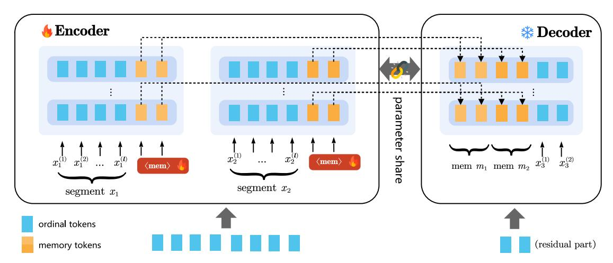
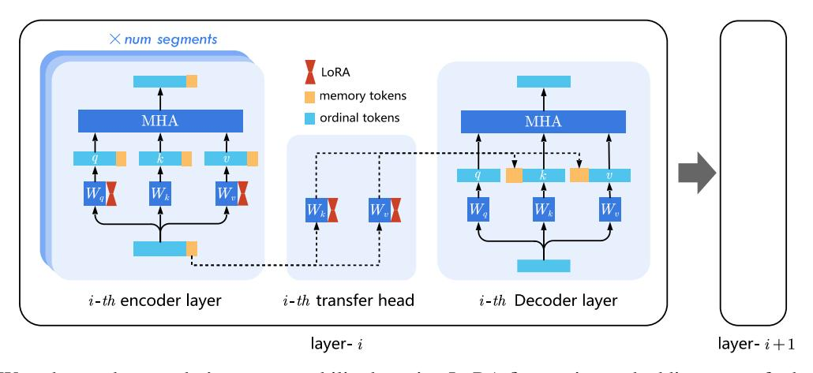
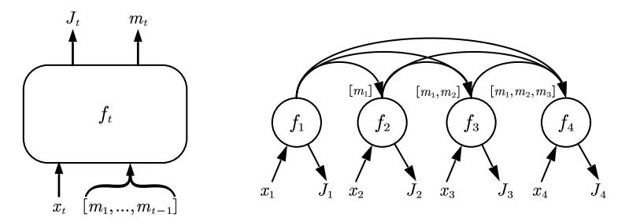
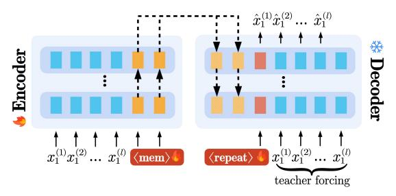
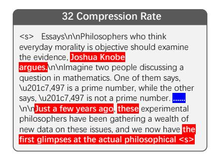
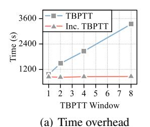
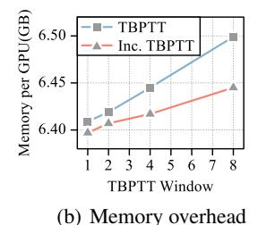
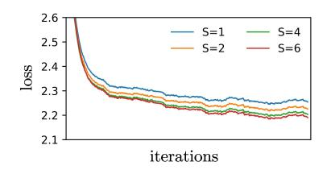
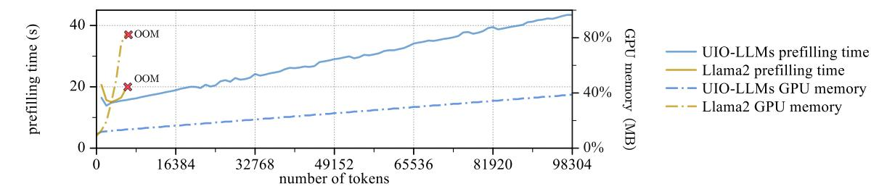

# UIO-LLMS: UNBIASED INCREMENTAL OPTIMIZATION FOR LONG-CONTEXT LLMS

Wenhao Li<sup>1</sup> , Mingbao Lin<sup>2</sup> , Yunshan Zhong<sup>1</sup> , Shuicheng Yan<sup>2</sup> , Rongrong Ji1<sup>∗</sup> <sup>1</sup> Xiamen University <sup>2</sup> Skywork AI wenhaoli@stu.xmu.edu.cn, linmb001@outlook.com zhongyunshan@stu.xmu.edu.cn, shuicheng.yan@kunlun-inc.com, rrji@xmu.edu.cn

# ABSTRACT

Managing long texts is challenging for large language models (LLMs) due to limited context window sizes. This study introduces UIO-LLMs, an unbiased incremental optimization approach for memoryenhanced transformers under long-context settings. We initially conceptualize the process as a streamlined encoder-decoder framework where the weights-shared encoder and decoder respectively encapsulate a context segment into memories and leverage these memories to predict outputs of the subsequent segment. Subsequently, by treating our memory-enhanced transformers as fullyconnected recurrent neural networks (RNNs), we refine the training process using the Truncated Backpropagation Through Time (TBPTT) algorithm, which incorporates innovative incremental optimization techniques. These techniques not only diminish time complexity but also address the bias in gradient computation through an unbiased optimization process. UIO-LLMs successfully handle long context, such as extending the context window of Llama2-7b-chat from 4K to 100K tokens with minimal 2% additional parameters, while keeping the inference cost nearly linear as context length increases. Our project is at <https://github.com/wenhaoli-xmu/UIO-LLMs>.

*K*eywords Context compression · Long-context LLMs

# 1 Introduction

The long-context reasoning capabilities of large language models (LLMs) [\[1,](#page-8-0) [2,](#page-8-1) [3\]](#page-8-2) are garnering increasing interest. The context window of LLMs can be likened to a computer's memory, with a larger capacity offering greater flexibility and possibilities for developers. This enables them to integrate techniques such as retrieval-augmented generation (RAG) [\[4\]](#page-8-3) and create various downstream applications such as question answering and reading comprehension [\[5\]](#page-8-4). However, limited computational resources make it almost infeasible to pre-train models on lengthy texts.

Prevalent approach involves initially pretraining models using short texts and extending their ability to handle lengthy text through fine-tuning. It has been employed in LongChat [\[6\]](#page-8-5), LongLora [\[7\]](#page-8-6), Positional Interpolation [\[8\]](#page-8-7), PoSE [\[9\]](#page-8-8), Yarn [\[10\]](#page-8-9), *etc*. However, the quadratic complexity inherent in the attention mechanism continues to pose a challenge to efficiency during the inference stage when processing lengthy texts. In addition to these fine-tuning-based methods, another strategy involves implementing suitable modifications during the inference stage to augment the effective context window size of the model. These tactics typically involve attention pruning, such as Streaming LLM [\[11\]](#page-8-10), which manages the number of tokens by retaining only the nearest KV caches and the foremost KV caches. Nonetheless, for these pruning-based methods, the information from discarded tokens becomes difficult to utilize, resulting in varying degrees of performance decline.

In this paper, we examine and recognize that transformer models [\[12\]](#page-8-11) typically maintain a complete set of historical information attributed to the attention mechanism; conversely, recurrent neural networks (RNNs) are characterized by their retention of distilled historical insights, a consequence of their sequential data processing that emphasizes recent information in decision-making processes. These two architectures exhibit contrasting features in this respect. Certain techniques, such as Performer [\[13\]](#page-8-12) and Linear Transformers [\[14\]](#page-9-0), modify the attention computation sequence

<sup>∗</sup>Corresponding Author

<span id="page-1-0"></span>> **[图片提取文字 (无描述)]:**
> Encoder \* Decoder parameter share  $\langle mem \rangle$  $\langle mem \rangle$ mem  $m_1$  mem  $m_2$ segment  $x_2$ segment  $x_1$ ordinal tokens (residual part) memory tokens


Figure 1: Overall encoder-decoder architecture of our UIO-LLMs, initially splitting the text into multiple segments of length l. The encoder compresses these l-length segments, generating memory. Then, we merge memory with the next segment, for further processing by the decoder.

by employing kernel approaches [\[15,](#page-9-1) [16\]](#page-9-2). They compute the outer products of keys and values, accumulating them into a large matrix for data compression. This transforms the transformer into an RNN-like model that compresses all past information, weakening its ability to handle long-term dependencies. Balancing between storing comprehensive (transformer) and condensed (RNN) historical data is possible.

In this study, we propose the UIO-LLMs method, as shown in Figure [1,](#page-1-0) which leverages the decoder-only LLMs as a context compressor. Specifically, the context is divided into segments, each of which is appended with multiple "<mem>" tokens at its end. After the forward propagation through the encoder, the activation of the "<mem>" tokens have distilled contextual information, effectively forming a compact and informative memory representation. This representation can be transferred to the decoder as additional KV caches, via a transfer head consisting of two projection matrices. To minimize the introduction of additional parameters, we leverage LoRA [\[17\]](#page-9-3) to fine-tune the encoder and the transfer head. This results in a mere 2% increase in parameters for Llama2-7b-chat [\[18\]](#page-9-4).

Regarding optimization, the interconnection of memory segments forms a structure akin to a fully-connected RNN. Consequently, Back Propagation Through Time (BPTT) is essential for optimization. However, it incurs a linear time and storage overhead that scales with the length of the input text. Hence, our research is centered on enhancing the efficiency of the BPTT algorithm. To this end, we introduce an incremental TBPTT algorithm, which is an adaptation of the Truncated BPTT method [\[19\]](#page-9-5), and significantly reduces the time overhead by reordering the computation process in an incremental manner. Furthermore, despite the enhanced efficiency of incremental TBPTT, the inherent biased gradient estimation problem associated with the localized TBPTT window remains a hurdle for learning long-term dependencies. To overcome this challenge, we have further developed the Unbiased Incremental Optimization algorithm. This algorithm ensures unbiased gradient estimation, facilitating the training on texts of up to 100K in length with a constant compression ratio.

Notably, our UIO-LLMs surpass the performance and efficiency of prior memory-enhanced transformers, including RMT [\[20\]](#page-9-6), AutoCompressor [\[21\]](#page-9-7), Gist Tokens [\[22\]](#page-9-8), and Activation Beacon [\[23\]](#page-9-9). It surpasses AutoCompressor on QA and summarization tasks without compromising long text generation quality. As for Activation Beacon, our model reduces trainable parameters, enables parallel compression, and lowers training costs.

# 2 Related Works

Memory-Enhanced Transformers. Recent studies highlight memory-enhanced transformers for long text extrapolation. Pioneering work, RMT [\[20\]](#page-9-6), combines RNN with transformer for segment-level recurrence. AutoCompressor [\[21\]](#page-9-7) improves this by using a fully-connected RNN, though its LongBench [\[5\]](#page-8-4) performance can be enhanced. Activation Beacon [\[23\]](#page-9-9) introduces two key improvements of direct migration of memory activation from the encoder to the decoder and a dedicated multi-head attention (MHA) module for memory. The BABILong [\[24\]](#page-9-10) study shows that the GPT-2 [\[25\]](#page-9-11) + RMT model outperforms advanced models like GPT-4 [\[26\]](#page-9-12) and GPT-3.5 in handling extensive contextual information, underscoring the potential of memory-enhanced transformers.

Context Distillation. Context distillation has emerged as an effective approach for knowledge compression and transfer. Early studies, such as Wingate's research [27], focus on compressing prompts by replacing them with shorter learnable prompts. This method laid the foundation for subsequent research. Gist Tokens [22] advances this concept by training general-purpose summary tokens, allowing prompt compression without separate training. We utilize a similar approach with learnable prompts for context compression. The ICAE [28] model builds upon Gist Tokens, incorporating LoRA fine-tuning and an auto-encoding task for training. With a four-times compression ratio, ICAE demonstrates near-perfect input reconstruction accuracy.

**Unbiased BPTT Approximation**. Training RNNs often relies on the resource-intensive Back-Propagation Through Time method (BPTT) [29]. Researchers have proposed unbiased approximations like NoBackTrack [30] and UORO [31] to reduce memory and compute overhead, opening new possibilities for efficient sequence model training. ARTBP [32] mitigates noise by using a flexible memory approach and incorporating compensatory factors, maintaining accuracy and efficiency for long sequences. While these methods have advanced sequence model research, they are not directly applicable to memory-enhanced transformers due to their focus on regular RNNs and lack of consideration for specific constraints in memory-enhanced transformers.

### <span id="page-2-0"></span>3 Methodology

> **[图片提取文字 (无描述)]:**
> × num segments LoRA memory tokens ordinal tokens MHA MHA i-th encoder layer i-th Decoder layer i-th transfer head layer- i layer-i+1


Figure 2: We enhance the encoder's summary ability by using LoRA fine-tuning and adding a transfer head to each layer, which aligns the "<mem>" in each encoder layer with its matching decoder layer.

### 3.1 Overall Framework

Figure 1 showcases our proposed UIO-LLMs architecture, which uses an encoder-decoder framework enhanced with "<mem>" tokens to capture the preceding text's essence. Additionally, we introduce a novel algorithm for unbiased gradient estimation, enabling efficient training of memory-enhanced transformers on long texts without significantly increasing parameters.

### 3.2 Streamlined Encoder-Decoder Architecture

Our method features an encoder-decoder structure, allowing for independent input handling by the encoder and parallel compression of lengthy texts. By partitioning the long text X into multiple l-length segments  $x_1, x_2, ..., x_k$  where  $x_t = (x_t^{(1)}, x_t^{(2)}, ..., x_t^{(l)})$  and incorporating a residual portion  $x_{k+1}$  not exceeding l, parallel compression on each segment becomes feasible. The remaining portion is then directly fed into the decoder. To augment the encoder's capacity to summarize contextual information, in Figure 2, we follow [17] to conduct LoRA fine-tuning on  $W_Q$  and  $W_V$  at every layer:

$$Q \leftarrow hW_O^{\text{Lora}}, \quad K \leftarrow hW_K, \quad V \leftarrow hW_V^{\text{Lora}}, \quad O \leftarrow \text{MHA}(Q, K, V)W_O,$$
 (1)

where h is the activation. Upon completing the encoding process, the subsequent phase entails the transmission of memory from the encoder to the decoder. Initially, as the forward propagation of the encoder unfolds, it is essential to retain the activation associated with the "<mem>" tokens for each layer. Subsequently, we construct a transfer head

where LoRA is adopted to fine-tune matrices  $W_K$  and  $W_V$ , which are then utilized to perform linear transformations on the preserved memory activations of each layer. This process culminates in the generation of the KV cache:

<span id="page-3-0"></span>
$$h_{\text{ord}}, h_{\text{mem}} \leftarrow \text{split}(h), \quad K_{\text{mem}} \leftarrow h_{\text{mem}} W_K^{\text{Lora*}}, \quad V_{\text{mem}} \leftarrow h_{\text{mem}} W_V^{\text{Lora*}}.$$
 (2)

To distinguish it from the previous notation, we employ the symbol \* in Eq. (2), which signifies the use of a separate instance of LoRA. Subsequently, we integrate the newly obtained KV cache, specifically  $K_{\rm mem}$  and  $V_{\rm mem}$ , with the existing KV cache of the decoder. In the context of positional encoding for the decoder, we consider the combined KV cache as a singular entity and apply positional encoding commencing from position index 0. Overall, this study's encoder and transfer head respectively introduce two additional LoRA modules per layer. Consequently, the set of trainable parameters encompasses those with the LoRA modules and the "<mem>" tokens. This streamlined approach to model architecture design results in the newly incorporated parameters constituting a mere 2% of the Llama2-7b-chat model [18], contributing to an efficient and optimized system. Conversely, the Activation Beacon [23] method significantly contributes to a more substantial portion of the model's trainable parameters, accounting for over 33% to fine-tune each attention layer.

In the token-by-token generation stage, once the aggregate length of the generated sequence  $x'_{k+1}$  and the residual part  $x_{k+1}$  reaches l tokens, we forward the combined sequence  $[x_{k+1}, x'_{k+1}]$  to the encoder for further compression and remove the associated KV caches from the decoder.

### 3.3 Unbiased Incremental Optimization

## <span id="page-3-1"></span>3.3.1 Memory-Enhanced Transformers are Fully-Connected RNNs

> **[图片提取文字 (无描述)]:**
> $m_t$  $[m_1,m_2]$  $[m_1]$  $[m_1,m_2,m_3]$  $J_2$  $x_t$


Figure 3: Our memory-enhanced transformers can be conceptualized as fully-connected RNNs.

We realize, as illustrated in Figure 3, our memory-enhanced transformers are analogous to fully-connected RNNs, the general formula of which can be defined as:

$$J_t, m_t = f_t(x_t, [m_1, m_2, ..., m_{t-1}] \mid \Theta), \tag{3}$$

where for each segment t, analogous to the t-th time step in RNNs:  $x_t$  is the current input;  $m_1$  to  $m_{t-1}$  are the memories from previous steps. The model function  $f_t$  represents the memory-enhanced transformer, consistent across time steps.  $J_t$  is the loss for segment t, and  $m_t$  is the current memory.  $\Theta$  represents all model parameters, encompassing those of the encoder, decoder, and transfer head. Specifically, the decoder's parameters are frozen, while the encoder's parameters and those of the transfer head are fine-tuned using LoRA [17]. Notice the concept of utilizing BPTT training for memory-enhanced transformers, treating them as RNNs and initially focusing on the last-step memory, was pioneered in RMT [20]. We extend by considering all prior memories, aligning more closely with fully-connected RNNs that allow each time step to leverage the complete history of memories.

**Optimization**. To update  $\Theta$ , we first derive its gradient as:

$$\nabla_{\Theta} = \sum_{t=1}^{T} \frac{\partial J_{t}}{\partial \Theta} = \sum_{t=1}^{T} \sum_{s=1}^{t-1} \left[ \frac{\partial J_{t}}{\partial m_{s}} \cdot \frac{\partial m_{s}}{\partial \Theta} + \sum_{\substack{s1\\s.t.s < s1 < t}} \frac{\partial J_{t}}{\partial m_{s1}} \cdot \frac{\partial m_{s1}}{\partial m_{s}} \cdot \frac{\partial m_{s}}{\partial \Theta} + \sum_{\substack{s1\\s.t.s < s1 < s2 < t}} \frac{\partial J_{t}}{\partial m_{s2}} \cdot \frac{\partial m_{s1}}{\partial m_{s1}} \cdot \frac{\partial m_{s1}}{\partial m_{s}} \cdot \frac{\partial m_{s}}{\partial \Theta} + \dots \right],$$

$$(4)$$

where T represents the quantity of time steps (segments). Essentially, this gradient is also a result of the BPTT algorithm [33] that has to integrate computational graphs across all T time steps.

Accurately calculating  $\frac{\partial J_t}{\partial \Theta}$  is complex due to the so intricate interactions of memories across time steps such that we hardly estimate the exact value of  $\frac{\partial m_i}{\partial m_j}$ ,  $\forall i,j$ . Thus, we assume to generate memory for each segment independently, such that  $P(m_t|x_t,[m_1,m_2,...,m_{t-1}])=P(m_t|x_t)$ . Under this premise, we have  $\frac{\partial m_i}{\partial m_j}=0, \ \forall i,j$ . Thus, the gradient is simplified as:

<span id="page-4-4"></span>
$$\nabla_{\Theta} = \sum_{t=1}^{T} \frac{\partial J_{t}}{\partial \Theta} \approx \sum_{t=1}^{T} \left[ \sum_{s=1}^{t-1} \frac{\partial J_{t}}{\partial m_{s}} \cdot \frac{\partial m_{s}}{\partial \Theta} \right]. \tag{5}$$

Computing  $\frac{\partial J_t}{\partial \Theta}$  necessitates t-1 multiplications, each result of which corresponds to one of the preceding t-1 time steps and involves backpropagation on the respective computational graph. Consequently, as t increases, both the temporal complexity and the storage requirements grow linearly. This presents significant challenges when attempting to effectively train models on lengthy texts that encompass hundreds of time steps. In light of this, we apply the efficient TBPTT [19], which trains RNNs on long sequences by considering the nearest memories within a window of size S:

<span id="page-4-0"></span>
$$\nabla_{\Theta} = \sum_{t=1}^{T} \frac{\partial J_{t}}{\partial \Theta} \approx \sum_{t=1}^{T} \left[ \sum_{s=1}^{t-1} \frac{\partial J_{t}}{\partial m_{s}} \cdot \frac{\partial m_{s}}{\partial \Theta} \right] \xrightarrow{\text{TBPTT}} \nabla_{\Theta}^{*} = \sum_{t=1}^{T} \left[ \sum_{s=\max(1,t-S)}^{t-1} \frac{\partial J_{t}}{\partial m_{s}} \cdot \frac{\partial m_{s}}{\partial \Theta} \right], \tag{6}$$

which reduces the quantity of multiplications from t-1 to S during the computation of  $\frac{\partial J_t}{\partial \Theta}$ . Therefore, by applying the independent assumption, we have effectively integrated TBPTT into our framework, returning gradients of  $\frac{\partial J_t}{\partial m_s}$  where  $s \in [t-S, t-1]$  at time step t, and preliminarily reducing the complexity of each computational graph.

Eq. (6) is conceptually straightforward but faces two issues: high time complexity of  $\mathcal{O}(T \cdot S)$  depended on the TBPTT window size, and biased gradient computations since the analogy to fully-connected RNNs requires all previous memories. To address these, we introduce incremental TBPTT in Sec. 3.3.2, reducing time complexity to  $\mathcal{O}(T)$ , and an unbiased increment optimization in Sec. 3.3.3, to resolve the bias issue in gradient estimation.

### <span id="page-4-1"></span>3.3.2 Incremental TBPTT

After a careful observation, we realize multiplication with the term  $\frac{\partial m_s}{\partial \Theta}$  in Eq. (6) after applying TBPTT is redundantly computed across various time steps. For ease of an analysis, we start by defining an indicator function I(t,s) as:

$$I(t,s) = \begin{cases} 1 & 1 \le t \le T, \text{ and } \max(1, t - S) \le s \le t - 1, \\ 0 & \text{otherwise,} \end{cases}$$
 (7)

where the condition can be inverted and explicitly solved as:

$$I(t,s) = \begin{cases} 1 & 1 \le s \le T, \ s+1 \le t \le \min(T, s+S), \\ 0 & \text{otherwise.} \end{cases}$$
 (8)

After applying this indicator function, we can rewrite Eq. (6) after TBPTT as follows:

<span id="page-4-3"></span>
$$\nabla_{\Theta}^{*} = \sum_{t=-\infty}^{+\infty} \left[ \sum_{s=-\infty}^{+\infty} I(t,s) \cdot \frac{\partial J_{t}}{\partial m_{s}} \cdot \frac{\partial m_{s}}{\partial \Theta} \right] = \sum_{s=-\infty}^{+\infty} \left[ \sum_{t=-\infty}^{+\infty} I(t,s) \cdot \frac{\partial J_{t}}{\partial m_{s}} \cdot \frac{\partial m_{s}}{\partial \Theta} \right],$$

$$= \sum_{s=1}^{T} \left[ \sum_{t=s+1}^{\min(T,s+S)} \frac{\partial J_{t}}{\partial m_{s}} \cdot \frac{\partial m_{s}}{\partial \Theta} \right] = \sum_{s=1}^{T} \left[ \left( \sum_{t=s+1}^{\min(T,s+S)} \frac{\partial J_{t}}{\partial m_{s}} \right) \cdot \frac{\partial m_{s}}{\partial \Theta} \right].$$
(9)

We relocate  $\frac{\partial m_s}{\partial \Theta}$  outside of the inner summation by swapping the order of the two summations. This clever maneuver significantly reduces the computational load by a factor of S, thereby enhances the efficiency of the overall algorithm.

Recalling the time step t, we derive the gradients  $\frac{\partial J_t}{\partial m_s}$  for  $s \in [t-S,t-1]$ , which allows us to recognize the potential for accumulating the bracketed terms incrementally in real-time. As a concrete illustration, consider Figure 4 where the window size S=3, the time step t=5, and s=2. This enables us to calculate the gradients  $\frac{\partial J_5}{\partial m_2}$ ,  $\frac{\partial J_5}{\partial m_3}$ , and  $\frac{\partial J_5}{\partial m_4}$  respectively. Once we have determined  $\frac{\partial J_5}{\partial m_2}$ , we can proceed to compute the summation  $\sum_{t=3}^5 \frac{\partial J_t}{\partial m_2}$  in Eq. (9), as the terms  $\frac{\partial J_4}{\partial m_2}$  and  $\frac{\partial J_3}{\partial m_2}$  are computed from the preceding time steps. Thus, our incremental TBPTT, irrespective of S, yields a computational complexity of  $\mathcal{O}(T)$ .

<span id="page-4-2"></span>> **[图片提取文字 (无描述)]:**
> $J_6$  $J_5$ history  $\partial m_2$  $J_4$ current  $\partial \boldsymbol{J}_t$  $J_3$ future  $J_2$  $m_1$  $m_3$  $m_5$  $m_A$


Figure 4: An illustration of our incremental gradient accumulation.

### <span id="page-5-0"></span>3.3.3 Unbiased Incremental TBPTT

We continue enhancing the incremental TBPTT algorithm to achieve unbiased estimation of BPTT, leveraging all historical time steps for gradient computation by cleverly truncating the computational graph within a limited TBPTT window. Intuitively, achieving such goal requires a streaming sampling method that ensures, for any given time step t, the probability of retaining the same time step t within the TBPTT window of t is uniform across a mini-batch of samples  $\mathbf{X} = \{X_1, X_2, ..., X_N\}$ :

<span id="page-5-1"></span>
$$P\left(\mathbf{Z}_{t,s}^{(X_1)} = z_{t,s}^{(X_1)}\right) = P\left(\mathbf{Z}_{t,s}^{(X_2)} = z_{t,s}^{(X_2)}\right) = \dots = P\left(\mathbf{Z}_{t,s}^{(X_N)} = z_{t,s}^{(X_N)}\right), \quad \forall 1 \le s \le t - 1,$$
(10)

where  $z_{t,s}^{(X_i)} = \frac{\partial J_t^{(X_i)}}{\partial m_s} \cdot \frac{\partial m_s}{\partial \Theta}$  represents the numerical gradient of  $J_t^{(X_i)}$  with respect to  $\Theta$  via memory  $m_s$  and  $\mathbf{Z}_{t,s}^{(X_i)}$ 

denotes the corresponding random variable that take the value of  $z_{t,s}^{(X_i)}$  if the time step s is retained in the TBPTT window of time step t, and 0 otherwise. Therefore, the current goal becomes to find a particular solution satisfying Eq. (10). Reservoir Sampling [34], designed to uniformly extract data from a stream of unknown length, fulfills this prerequisite. We arrive at the following conclusion, detail of which has been showed in the supplementary material:

<span id="page-5-2"></span>
$$P\left(\mathbf{Z}_{t,s}^{(X_1)} = z_{t,s}^{(X_1)}\right) = \dots = P\left(\mathbf{Z}_{t,s}^{(X_N)} = z_{t,s}^{(X_N)}\right) = \min\left(1, \frac{S}{t-1}\right), \forall 1 \le s \le t-1,$$
(11)

where S denotes the size of the TBPTT window. At this point, we have obtained the specific form of the probability distribution of  $\mathbf{Z}_{t,s}^{(X_i)}$ , which can be used for the expectation of gradient estimation:

$$\nabla_{\Theta}^{(\mathbf{X})} = \mathbb{E}_{X_{i} \sim \mathbf{X}} \left[ \sum_{t} \sum_{s=1}^{t-1} \mathbf{Z}_{t,s}^{(X_{i})} \right] = \frac{1}{N} \sum_{t} \sum_{s=1}^{t-1} \left[ z_{t,s}^{(X_{i})} P \left( \mathbf{Z}_{t,s}^{(X_{i})} = z_{t,s}^{(X_{i})} \right) \right]$$

$$= \frac{1}{N} \sum_{t} \sum_{s=1}^{t-1} \left[ \min \left( 1, \frac{S}{t-1} \right) z_{t,s}^{(X_{i})} \right],$$
(12)

which is equivalent to Eq. (5) except for a factor of  $\min(1, S/(t-1))$ . While this factor induces a systematic estimation error, it can be precisely offset by multiplying the resulting gradient  $z_{t,s}^{(X_i)}$  by a compensating factor,  $\max(1, (t-1)/S)$ , thereby enabling the incremental TBPTT algorithm to achieve unbiased gradient estimation of Eq. (5).

### 4 Experimentation

### 4.1 Evaluations and Setups

**Evaluations**. We evaluate our UIO-LLMs on three key aspects: 1) Lossless compression of long contexts, measured by an auto-encoding task with low reconstruction error [28]; 2) Modeling of long contexts, assessed using perplexity on PG-19 [35] and Proof-Pile [36] datasets; 3) Utilization of memories for downstream tasks, tested on 12 datasets from LongBench [5], evaluating performance in Single-Doc QA, Multi-Doc QA, and Summarization.

**Setups**. We use the Llama2-7b-chat model [18] with a context window of 1K and compression ratios of 32 and 8. A larger window improves performance but raises training and inference costs. Trainable parameters include LoRA modules in encoder and transfer head, plus "<mem>" tokens. All LoRA modules have a consistent configuration of r=128 and  $\alpha=512$ .

Our training, upon 8 RTX 3090 GPUs, uses a combined dataset: The first, from Activation Beacon [23], comprises RedPajama [37] and LongAlpaca [38], taking up 95%. The second combines long texts from LongData-Corpus [39] and RedPajama [37]. For models with compression rates of 32 and 8, max token lengths are set to 100K and 25K. We use unbiased incremental TBPTT with S=2 and store up to 3 time steps. We employ Adam with a learning rate of 1e-4 and a cosine scheduler.

### 4.2 Performance Comparisons

**Auto-Encoding Task**. To evaluate UIO-LLMs' long text compression, we use the ICAE auto-encoding task that compresses and reconstructs text [28]. Training details follow the standard process, except for using the MiniPile corpus [40] as training data, filtered to 10K 1K-token samples.

The training pipeline, as depicted in Figure 5, involves encoding the 1K-token samples, producing memory representation, and reconstructing the 1K-token inputs. We assess reconstruction accuracy on a 100-sample test set using

<span id="page-6-0"></span>> **[图片提取文字 (无描述)]:**
> $\hat{x}_1^{(1)}\hat{x}_1^{(2)}\dots \hat{x}_1^{(l)}$ teacher forcing


Figure 5: The pipeline for the auto-encoding task.

<span id="page-6-1"></span>Table 1: UIO-LLMs' results on auto-encoding tasks assessed by BLEU-4 and Rouge-L for evaluation

| <b>Compression Ratio</b> | BLEU-4↑ | Rouge-L↑ |
|--------------------------|---------|----------|
| 8                        | 0.9851  | 0.993    |
| 32                       | 0.5948  | 0.762    |

BLEU-4 and Rouge-L metrics. Table 1 reports the results. The model performs well, with Rouge-L scores of 0.993 and 0.762 for compression ratios of 8 and 32, respectively. To obtain a more visually comprehensive understanding of the reconstruction results, we chose the first sample from the test set and displayed the reconstruction outcomes using compression ratios of 8 and 32 in Figure 6. We can see that our method mostly recover the original context, demonstrating the capability of our method for lossless compression of long contexts. This significant reconstruction performance lays the foundation for utilizing memory to inference.

# <span id="page-6-2"></span>Original Context <s> Essays\n\nPhilosophers who think everyday morality is objective should examine the evidence, argues Joshua Knobe.\n\nImagine two people discussing a question in mathematics. One of them says \u201c7,497 is a prime number, \u201d while the other says, \u201c7,497 is not a prime number. ......\n\nJust in the past few years, experimental philosophers have been gathering a wealth of new data on these issues, and we now have at least the first glimmerings of a

# S Compression Rate <s> Essays\n\nPhilosophers who think everyday morality is objective should examine the evidence, argues Joshua Knobe.\n\nImagine two people discussing a question in mathematics. One of them says \u201c7,497 is a prime number, \u201d while the other says, \u201c7,497 is not a prime number. \u201c7,497 is not a prime number. \u201c7,497 is not a prime number. \u201c7,497 is not a prime number. \u201c7,497 is not a prime number. \u201c4 \u201c1\u201c1\u201c1\u201c1\u201c1\u201c1\u201c1\u201c1\u201c1\u201c1\u201c1\u201c1\u201c1\u201c1\u201c1\u201c1\u201c1\u201c1\u201c1\u201c1\u201c1\u201c1\u201c1\u201c1\u201c1\u201c1\u201c1\u201c1\u201c1\u201c1\u201c1\u201c1\u201c1\u201c1\u201c1\u201c1\u201c1\u201c1\u201c1\u201c1\u201c1\u201c1\u201c1\u201c1\u201c1\u201c1\u201c1\u201c1\u201c1\u201c1\u201c1\u201c1\u201c1\u201c1\u201c1\u201c1\u201c1\u201c1\u201c1\u201c1\u201c1\u201c1\u201c1\u201c1\u201c1\u201c1\u201c1\u201c1\u201c1\u201c1\u201c1\u201c1\u201c1\u201c1\u201c1\u201c1\u201c1\u201c1\u201c1\u201c1\u201c1\u201c1\u201c1\u201c1\u201c1\u201c1\u201c1\u201c1\u201c1\u201c1\u201c1\u201c1\u201c1\u201c1\u201c1\u201c1\u201c1\u201c1\u201c1\u201c1\u201c1\u201c1\u201c1\u201c1\u201c1\u201c1\u201c1\u201c1\u201c1\u201c1\u201c1\u201c1\u201c1\u201c1\u201c1\u201c1\u201c1\u201c1\u201c1\u201c1\u201c1\u201c1\u201c1\u201c1\u201c1\u201c1\u201c1\u201c1\u201c1\u201c1\u201c1\u201c1\u201c1\u201c1\u201c1\u201c1\u201c1\u201c1\u201c1\u201c1\u201c1\u201c1\u201c1\u201c1\u201c1\u201c1\u201c1\u201c1\u201c1\u201c1\u201c1\u201c1\u201c1\u201c1\u201c1\u201c1\u201c1\u201c1\u201c1\u201c1\u201c1\u201c1\u201c1\u201c1\u201c1\u201c1\u201c1\u201c1\u201c1\u201c1\u201c1\u201c1\u201c1\u201c1\u201c1\u201c1\u201c1\u201c1\u201c1\u201c1\u201c1\u201c1\u201c1\u201c1\u201c1\u201c1\u201c1\u201c1\u201c1\u201c1\u201c1\u201c1\u201c1\u201c1\u201c1\u201c1\u201c1\u201c1\u201c1\u201c1\u201c1\u201c1\u201c1\u201c1\u201c1\u201c1\u201c1\u201c1\u201c1\u201c1\u201c1\u201c1\u201c1\u201c1\u201c1\u201c1\u201c1\u201c1\u201c1\u201c1\u201c1\u201c1\u201c1\u201c1\u201c1\u20

> **[图片提取文字 (无描述)]:**
> 32 Compression Rate <s> Essays\n\nPhilosophers who think everyday morality is objective should examine the evidence, Joshua Knobe argues.\n\nImagine two people discussing a question in mathematics. One of them says, \u201c7,497 is a prime number, while the other says, \u201c7,497 is not a prime number. ..... \n\nJust a few years ago, these experimental philosophers have been gathering a wealth of new data on these issues, and we now have the first glimpses at the actual philosophical <s>


Figure 6: A case study of the auto-encoding task shows near-lossless compression at a ratio of 8. Even with a ratio of 32, reconstructed paragraphs retained meaning with minor wording changes.

<span id="page-6-3"></span>Table 2: Perplexity results on PG19 and Proof-Pile show UIO-LLMs' strong long-context modeling. Context window sizes are 1K or 2K. \* marks original paper results. "OOM" stands for Out-of-Memory error, which we've encountered upon 8 RTX 3090 GPUs.

| Method                                        | Compression | PG19↓                |                      |                      |                      |                      | Proof-Pile↓          |                      |                      |                      |                      |  |
|-----------------------------------------------|-------------|----------------------|----------------------|----------------------|----------------------|----------------------|----------------------|----------------------|----------------------|----------------------|----------------------|--|
|                                               | Ratio       | 4K                   | 16K                  | 25K                  | 32K                  | 100K                 | 4K                   | 16K                  | 25K                  | 32K                  | 100K                 |  |
| Streaming LLM<br>LongChat-7B<br>LongAlpaca-7B | 1           | 9.50<br>9.93<br>9.96 | 9.83<br>9.49<br>9.75 | 9.88<br>OOM<br>OOM   | 9.89<br>OOM<br>OOM   | 9.89<br>-<br>-       | 6.47<br>5.65<br>6.31 | 5.13<br>3.90<br>3.97 | 4.62<br>OOM<br>OOM   | 4.44<br>OOM<br>OOM   | 3.94                 |  |
| Beacon-2K<br>Beacon-1K<br>UIO-LLMs            | 32          | 8.67<br>8.56<br>8.51 | 8.41<br>8.54<br>8.32 | 8.42<br>8.58<br>8.30 | 8.41<br>8.59<br>8.30 | 9.24<br>8.83<br>8.28 | 5.70<br>5.79<br>5.78 | 4.13<br>4.33<br>4.26 | 3.67<br>3.86<br>3.72 | 3.50<br>3.70<br>3.53 | 4.23<br>3.33<br>3.19 |  |
| Beacon-2K<br>Beacon-1K<br>UIO-LLMs            | 8           | 8.52<br>8.26<br>8.27 | 8.13<br>8.13<br>8.09 | 9.31<br>8.16<br>8.09 | -<br>-<br>-          | -<br>-<br>-          | 5.52<br>5.41<br>5.43 | 3.87<br>3.91<br>3.84 | 4.44<br>3.47<br>3.41 | -<br>-<br>-          | -<br>-<br>-          |  |

**Long-Context Language Modeling**. We report UIO-LLMs' long text language modeling using PG19 [35] and a sampled subset of Proof-pile [36] in Table 2. We test compression rates of 8 and 32 with a 1K context window. Compared baselines include LongChat-7B-v1.5-32K [6], LongAlpaca-7B-32K [7], Streaming LLM [11], and Activation Beacon [23]. Compared to training-free Streaming LLM, UIO-LLMs benefit from longer contexts with a continuous decrease in perplexity. Versus Activation Beacon, UIO-LLMs achieve lower perplexity. Activation Beacon's performance declines at 100K tokens, but UIO-LLMs maintain strong performance.

**Downstream Long-Text Tasks**. We compare the performance of our UIO-LLMs on long-context tasks from LongBench with several Llama2-7b/Llama2-7b-chat [18] based long-context models, including RoPE extrapolation based methods

<span id="page-7-0"></span>Table 3: Results on three LongBench tasks: Single-Doc QA (NarrativeQA, QASper, MultiFieldQA-en/zh, denoted as 1-1 to 1-4), Multi-Doc QA (HotpotQA, 2WikiMQA, Musique, DuReader, denoted as 2-1 to 2-4), and Summarization (GovReport, QMSum, Multi-News, VCSUM, denoted as 3-1 to 3-4). Results for Llama2-7b-chat-4K, LongChat-7B, and LongAlpaca-7B are from paper [38].

| Method                                            | Ratio | Single-Doc QA↑       |                      |                       | Multi-Doc QA↑        |                       |                       | Summarization↑      |                      |                       |                       |                       |                    |
|---------------------------------------------------|-------|----------------------|----------------------|-----------------------|----------------------|-----------------------|-----------------------|---------------------|----------------------|-----------------------|-----------------------|-----------------------|--------------------|
| 1/1001104                                         |       | 1-1                  | 1-2                  | 1-3                   | 1-4                  | 2-1                   | 2-2                   | 2-3                 | 2-4                  | 3-1                   | 3-2                   | 3-3                   | 3-4                |
| Llama2-7B-chat-4K<br>LongChat-7B<br>LongAlpaca-7B | 1     | 18.7<br>16.9<br>19.8 | 19.2<br>27.7<br>29.1 | 36.8<br>41.4<br>37.15 | 11.9<br>29.1<br>8.48 | 25.4<br>31.5<br>37.01 | 32.8<br>20.6<br>30.26 | 9.4<br>9.7<br>17.14 | 5.2<br>19.5<br>15.25 | 27.3<br>30.8<br>31.53 | 20.8<br>22.7<br>24.13 | 25.8<br>26.4<br>27.74 | 0.2<br>9.9<br>0.46 |
| Beacon<br>UIO-LLMs                                | 32    | 21.03<br>20.10       | 17.12<br>18.90       | 21.74<br>21.83        | 19.80<br>23.03       | 34.92<br>32.80        | 26.76<br>31.16        | 14.96<br>15.53      | 16.10<br>17.05       | 21.33 21.57           | 22.01<br>21.41        | 23.06<br>22.08        | 11.73<br>9.66      |
| Beacon<br>UIO-LLMs                                | 8     | 9.6<br>7.64          | 24.46<br>26.84       | 28.25<br>30.12        | 25.02<br>25.45       | 39.09<br>39.35        | 31.07<br>33.57        | 17.38<br>18.03      | 13.48<br>12.65       | 24.26<br>24.89        | 21.95<br>20.34        | 24.32<br>25.34        | 12.06<br>11.21     |
| Average Length                                    |       | 18,409               | 3,619                | 4,559                 | 6,707                | 9,151                 | 4,887                 | 11,214              | 15,768               | 8,734                 | 10,614                | 2,113                 | 15,380             |

LongChat-7B-v1.5-32K [6] and LongAlpaca-7B-32K [7], as well as Activation Beacon [23], which shares a similar architecture to our models. UIO-LLMs and Activation Beacon use a 1K context window and compression ratios of 8 and 32. Table 3 shows UIO-LLMs' merits from extra context, competitive results with 32K methods using only 1K, and improved performance with lower compression. 1) UIO-LLMs excel compared to Llama2-7b-chat-4K and Streaming LLM due to their additional context, highlighting the efficacy of our memory mechanism. 2) Despite a 1K context window, UIO-LLMs achieve competitive results with RoPE-based LongChat-7B and LongAlpaca-7B, utilizing a 32K window. 3) UIO-LLMs benefit from a reduced compression ratio, showing efficient use of finer-grained memory and ability to extract information. Notice UIO-LLMs show comparable results to Beacon but with only 2% parameters increase, which contrast sharply with Beacon's 33%.

### 4.3 Ablation Studies

Analysis on Incremental TBPTT. Since incremental TBPTT offers the same gradient computation results as TBPTT, our experiments prioritize evaluating its time and memory efficiency. To speed up the process, we use a smaller context window of 16 with a  $4\times$  compression ratio, significantly reducing computational overhead.

We train on a text paragraph with 2048 tokens, divided into 128 segments, matching our context window size. To simplify, we limit iterations to 10. We present results in Figure 7. Figure 7(a) shows that incremental TBPTT's time overhead remains steady as the TBPTT window size increases, indicating minimal impact on time complexity. Both incremental TBPTT and TBPTT show a linear memory increase with the window size in Figure 7(b). However, incremental TBPTT consistently uses half the memory due to our optimized implementation, which retains only the encoder's computational graph. This optimization significantly reduces memory usage, making it more feasible for large TBPTT windows.

<span id="page-7-2"></span><span id="page-7-1"></span>> **[图片提取文字 (无描述)]:**
> TBPTT 3600 - Inc. TBPTT (S) 2400 1200 4 5 6 TBPTT Window (a) Time overhead


<span id="page-7-3"></span>> **[图片提取文字 (无描述)]:**
> Memory per GPU(GB **TBPTT** 6.50 Inc. TBPTT 6.45 6.40 2 3 4 5 6 TBPTT Window (b) Memory overhead


Figure 7: Time and memory overhead of our incremental TBPTT compared to TBPTT.

**Analysis on Unbiased Incremental TBPTT**. To assess the accuracy of unbiased incremental TBPTT in gradient estimation, we compare its gradients with vanilla TBPTT's. We expect high similarity, indicating our method's accuracy.

We use a context window of 128, compression ratio of 8, and compute gradients for parameters  $\Theta$  based on a mini-batch of 8 inputs, each with 2048 tokens. To avoid the influence of initial trainable parameter values, we use the same checkpoint from PG19 [35] for both algorithms after hundreds of training iterations. We use  $\nabla_{\Theta}^{\text{UIO}}$  to represent the gradi-

<span id="page-7-4"></span>Table 4: A statistical analysis compares the L2 norm ratios of gradients from two algorithms. Key findings: 1) The compensation factor is vital for accurate gradient estimation. 2) Variance decreases with increasing window size S, enhancing estimation accuracy.

| Statistics       |                | w/o            | Factor         |               | w/ Factor      |                |                |               |  |
|------------------|----------------|----------------|----------------|---------------|----------------|----------------|----------------|---------------|--|
|                  | S=1            | S=4            | S = 8          | $S = \infty$  | S=1            | S=4            | S = 8          | $S = \infty$  |  |
| Mean<br>Variance | 0.676<br>0.112 | 0.818<br>0.041 | 0.935<br>0.008 | 1.000<br>3e-5 | 0.994<br>0.039 | 0.980<br>0.038 | 1.024<br>0.009 | 0.999<br>4e-5 |  |

ent from our unbiased incremental optimization and compute the similarity ratio  $r = \|\nabla_{\Theta}^{\text{UIO}}\|/\|\nabla_{\Theta}\|$ . A ratio of r = 1 means the gradients are identical. Table 4 shows the mean and variance of r for different TBPTT windows. Our results show the importance of the compensatory factor  $\max\left(1, \frac{t-1}{S}\right)$  for accurate gradient estimation. Even with a TBPTT window of 1, using this factor gives more accurate gradients than a larger window, aligning with our theoretical findings.

### 5 Limitation

Our proposed UIO-LLMs excels in long-context language modeling and achieves lossless compression at a ratio of 8. However, its performance on downstream tasks like NarrativeQA doesn't improve despite compression ratio reduction, suggesting a memory utilization issue. Future work could involve fine-tuning the decoder to better utilize memories. Additionally, UIO-LLMs has a limit on context length due to memory occupation. Moreover, unbiased incremental TBPTT requires memory independence for accurate gradient estimation. If this condition is violated, the algorithm can still run but may result in significant gradient estimation errors.

### 6 Conclusion

To enhance the ability of LLMs on processing long texts, We proposed UIO-LLMs, which employs a streamlined encoder-decoder framework where the weights-shared encoder and decoder respectively encapsulate a context segment into memories and leverage these memories to predict outputs of the subsequent segment. In order to accelerate the training process, we proposed incremental TBPTT, which is an efficient optimizing technique dedicated to memory-enhanced transformers and reduces the complexity of traditional TBPTT. Based on incremental TBPTT, we further proposed its unbiased version, an innovative optimizing technique that ensures unbiased gradient approximation of BPTT. Equipped with unbiased incremental TBPTT, UIO-LLMs can be trained on texts of 100K tokens, resulting in a strong performance on language modeling tasks and comparable performance on downstream tasks.

### References

- <span id="page-8-0"></span>[1] Anthropic. Introducing 100k context windows, 2023.
- <span id="page-8-1"></span>[2] OpenAI. Function calling and other api updates (longer context)., 2023.
- <span id="page-8-2"></span>[3] Nelson F. Liu, Kevin Lin, John Hewitt, Ashwin Paranjape, Michele Bevilacqua, Fabio Petroni, and Percy Liang. Lost in the middle: How language models use long contexts. *TACL*, 2023.
- <span id="page-8-3"></span>[4] Patrick Lewis, Ethan Perez, Aleksandra Piktus, Fabio Petroni, Vladimir Karpukhin, Naman Goyal, Heinrich Küttler, Mike Lewis, Wen-tau Yih, Tim Rocktäschel, Sebastian Riedel, and Douwe Kiela. Retrieval-augmented generation for knowledge-intensive nlp tasks. In *NeurIPS*, 2020.
- <span id="page-8-4"></span>[5] Yushi Bai, Xin Lv, Jiajie Zhang, Hongchang Lyu, Jiankai Tang, Zhidian Huang, Zhengxiao Du, Xiao Liu, Aohan Zeng, Lei Hou, Yuxiao Dong, Jie Tang, and Juanzi Li. Longbench: A bilingual, multitask benchmark for long context understanding. *arXiv*, 2023.
- <span id="page-8-5"></span>[6] Dacheng Li\*, Rulin Shao\*, Anze Xie, Ying Sheng, Lianmin Zheng, Joseph E. Gonzalez, Ion Stoica, Xuezhe Ma, , and Hao Zhang. How long can open-source llms truly promise on context length?, 2023.
- <span id="page-8-6"></span>[7] Yukang Chen, Shengju Qian, Haotian Tang, Xin Lai, Zhijian Liu, Song Han, and Jiaya Jia. Longlora: Efficient fine-tuning of long-context large language models. *arXiv*, 2023.
- <span id="page-8-7"></span>[8] Shouyuan Chen, Sherman Wong, Liangjian Chen, and Yuandong Tian. Extending context window of large language models via positional interpolation, 2023.
- <span id="page-8-8"></span>[9] Dawei Zhu, Nan Yang, Liang Wang, Yifan Song, Wenhao Wu, Furu Wei, and Sujian Li. Pose: Efficient context window extension of llms via positional skip-wise training, 2023.
- <span id="page-8-9"></span>[10] Bowen Peng, Jeffrey Quesnelle, Honglu Fan, and Enrico Shippole. YaRN: Efficient context window extension of large language models. In *ICLR*, 2024.
- <span id="page-8-10"></span>[11] Guangxuan Xiao, Yuandong Tian, Beidi Chen, Song Han, and Mike Lewis. Efficient streaming language models with attention sinks. *arXiv*, 2023.
- <span id="page-8-11"></span>[12] Ashish Vaswani, Noam Shazeer, Niki Parmar, Jakob Uszkoreit, Llion Jones, Aidan N Gomez, Ł ukasz Kaiser, and Illia Polosukhin. Attention is all you need. In *NeurIPS*, 2017.
- <span id="page-8-12"></span>[13] Krzysztof Choromanski, Valerii Likhosherstov, David Dohan, Xingyou Song, Andreea Gane, Tamás Sarlós, Peter Hawkins, Jared Davis, Afroz Mohiuddin, Lukasz Kaiser, David Belanger, Lucy Colwell, and Adrian Weller. Rethinking attention with performers. In *ICLR*, 2021.

- <span id="page-9-0"></span>[14] A. Katharopoulos, A. Vyas, N. Pappas, and F. Fleuret. Transformers are rnns: Fast autoregressive transformers with linear attention. In *ICML*, 2020.
- <span id="page-9-1"></span>[15] Ali Rahimi and Benjamin Recht. Random features for large-scale kernel machines. In *NeurIPS*, 2007.
- <span id="page-9-2"></span>[16] Krzysztof Choromanski, Mark Rowland, and Adrian Weller. The unreasonable effectiveness of structured random orthogonal embeddings. In *NeurIPS*, 2017.
- <span id="page-9-3"></span>[17] Edward J Hu, Yelong Shen, Phillip Wallis, Zeyuan Allen-Zhu, Yuanzhi Li, Shean Wang, Lu Wang, and Weizhu Chen. LoRA: Low-rank adaptation of large language models. In *ICLR*, 2022.
- <span id="page-9-4"></span>[18] Hugo Touvron, Louis Martin, Kevin Stone, Peter Albert, Amjad Almahairi, Yasmine Babaei, Nikolay Bashlykov, Soumya Batra, Prajjwal Bhargava, Shruti Bhosale, Dan Bikel, Lukas Blecher, Cristian Canton Ferrer, Moya Chen, Guillem Cucurull, David Esiobu, Jude Fernandes, Jeremy Fu, Wenyin Fu, Brian Fuller, Cynthia Gao, Vedanuj Goswami, Naman Goyal, Anthony Hartshorn, Saghar Hosseini, Rui Hou, Hakan Inan, Marcin Kardas, Viktor Kerkez, Madian Khabsa, Isabel Kloumann, Artem Korenev, Punit Singh Koura, Marie-Anne Lachaux, Thibaut Lavril, Jenya Lee, Diana Liskovich, Yinghai Lu, Yuning Mao, Xavier Martinet, Todor Mihaylov, Pushkar Mishra, Igor Molybog, Yixin Nie, Andrew Poulton, Jeremy Reizenstein, Rashi Rungta, Kalyan Saladi, Alan Schelten, Ruan Silva, Eric Michael Smith, Ranjan Subramanian, Xiaoqing Ellen Tan, Binh Tang, Ross Taylor, Adina Williams, Jian Xiang Kuan, Puxin Xu, Zheng Yan, Iliyan Zarov, Yuchen Zhang, Angela Fan, Melanie Kambadur, Sharan Narang, Aurelien Rodriguez, Robert Stojnic, Sergey Edunov, and Thomas Scialom. Llama 2: Open foundation and fine-tuned chat models, 2023.
- <span id="page-9-5"></span>[19] Ronald J. Williams and Jing Peng. An Efficient Gradient-Based Algorithm for On-Line Training of Recurrent Network Trajectories. *Neural Computation*, 1990.
- <span id="page-9-6"></span>[20] Aydar Bulatov, Yuri Kuratov, and Mikhail Burtsev. Recurrent memory transformer. In *NeurIPS*, 2022.
- <span id="page-9-7"></span>[21] Alexis Chevalier, Alexander Wettig, Anirudh Ajith, and Danqi Chen. Adapting language models to compress contexts. In *EMNLP*, 2023.
- <span id="page-9-8"></span>[22] Jesse Mu, Xiang Lisa Li, and Noah Goodman. Learning to compress prompts with gist tokens. In *NeurIPS*, 2023.
- <span id="page-9-9"></span>[23] Peitian Zhang, Zheng Liu, Shitao Xiao, Ninglu Shao, Qiwei Ye, and Zhicheng Dou. Soaring from 4k to 400k: Extending llm's context with activation beacon, 2024.
- <span id="page-9-10"></span>[24] Yuri Kuratov, Aydar Bulatov, Petr Anokhin, Dmitry Sorokin, Artyom Sorokin, and Mikhail Burtsev. In search of needles in a 10m haystack: Recurrent memory finds what llms miss, 2024.
- <span id="page-9-11"></span>[25] Alec Radford, Jeffrey Wu, Rewon Child, David Luan, Dario Amodei, Ilya Sutskever, et al. Language models are unsupervised multitask learners. 2019.
- <span id="page-9-12"></span>[26] OpenAI. Gpt-4 technical report, 2024.
- <span id="page-9-13"></span>[27] David Wingate, Mohammad Shoeybi, and Taylor Sorensen. Prompt compression and contrastive conditioning for controllability and toxicity reduction in language models. In *EMNLP*, 2022.
- <span id="page-9-14"></span>[28] Tao Ge, Hu Jing, Lei Wang, Xun Wang, Si-Qing Chen, and Furu Wei. In-context autoencoder for context compression in a large language model. In *ICLR*, 2024.
- <span id="page-9-15"></span>[29] Michael C. Mozer. A focused backpropagation algorithm for temporal pattern recognition. *Complex Systems*, 1989.
- <span id="page-9-16"></span>[30] Yann Ollivier, Corentin Tallec, and Guillaume Charpiat. Training recurrent networks online without backtracking, 2015.
- <span id="page-9-17"></span>[31] Corentin Tallec and Yann Ollivier. Unbiased online recurrent optimization. In *ICLR*, 2018.
- <span id="page-9-18"></span>[32] Corentin Tallec and Yann Ollivier. Unbiasing truncated backpropagation through time, 2018.
- <span id="page-9-19"></span>[33] Michael Mozer. A focused backpropagation algorithm for temporal pattern recognition. *Complex Systems*, 1995.
- <span id="page-9-20"></span>[34] Jeffrey S. Vitter. Random sampling with a reservoir. *TOMS*, 1985.
- <span id="page-9-21"></span>[35] Jack W Rae, Anna Potapenko, Siddhant M Jayakumar, Chloe Hillier, and Timothy P Lillicrap. Compressive transformers for long-range sequence modelling. *arXiv*, 2019.
- <span id="page-9-22"></span>[36] Zhangir Azerbayev, Edward Ayers, and B.P. Proof-pile, 2022.
- <span id="page-9-23"></span>[37] Together Computer. Redpajama: An open source recipe to reproduce llama training dataset, 2023.
- <span id="page-9-24"></span>[38] Yukang Chen, Shaozuo Yu, Shengju Qian, Haotian Tang, Xin Lai, Zhijian Liu, Song Han, and Jiaya Jia. Long alpaca: Long-context instruction-following models, 2023.
- <span id="page-9-25"></span>[39] Yuyi Jiong. Longdata-corpus, 2023.
- <span id="page-9-26"></span>[40] Jean Kaddour. The minipile challenge for data-efficient language models. *arXiv*, 2023.

# A PyTorch Implementation of Incremental TBPTT

The incremental TBPTT algorithm performs backpropagation for only two nodes at each time step, leading to a computational cost that is independent of the TBPTT window size S. This streamlined approach significantly reduces the computational burden compared to traditional backpropagation methods. Below is an illustrative example of how our incremental TBPTT algorithm can be implemented in PyTorch, showcasing its efficiency and simplicity:

```
1 def incremental_tbptt(model: torch.Module, x: List[torch.Tensor], S: int):
3 mem = []
4 mem_detach = []
5
6 for xid, xi in enumerate(x):
7 # forward propagation
8 loss_i, mem_i = model.forward(xi, mem_detach)
9
10 # first backward propagation
11 loss_i.backward(retrain_graph=True)
12
13 mem_i_detach = mem_i.detach()
14 mem_i_detach.requries_grad_(True)
15
16 mem.append(mem_i)
17 mem_detach.append(mem_i_detach)
18
19 elim_id = xid - S
20 if elim_id >= 0:
21 # second backward propagation
22 gradient = mem_detach[elim_id].grad
23 mem[elim_id].backward(gradient=gradient.data)
24
25 for elim_id in range(max(0, len(x) - S), len(x) - 1):
26 gradient = mem_detach[elim_id].grad
27 if gradient is not None:
28 mem[elim_id.backward(gradient=gradient.data)
```

In the provided implementation, at each time step, the generated memory is detached and flagged for gradient computation. This crucial step effectively disconnects the computational graphs associated with distinct time steps, preventing unwanted dependencies. Once computations for all time steps have been completed, it becomes imperative to initiate a dedicated backpropagation pass for any remaining time steps within the TBPTT window. This additional step diverges from the standard TBPTT methodology and is essential for maintaining the accuracy of the training process.

# B PyTorch Implementation of Unbiased Incremental TBPTT

Our unbiased incremental TBPTT distinguishes itself from the incremental TBPTT by integrating the Reservoir Sampling technique. This integration ensures that all historical time steps are preserved with equal probability, rather than solely focusing on the most recent ones. Furthermore, the introduction of a compensatory factor within our method allows for an unbiased estimation of gradients, enhancing the accuracy of the model's learning process. Additionally, the PyTorch implementation of unbiased incremental TBPTT closely resembles that of its incremental counterpart, with the key difference lying in the incorporation of the unbiased estimation mechanism. The following is an example of how our unbiased incremental TBPTT can be implemented in PyTorch:

```
1 def remove(reservoir, chunk_id):
2 if chunk_id in reservoir:
3 reservoir.remove(chunk_id)
4 return reservoir
5
6
7 def destroy_graph(mem: List, mem_detach: List, elim_id):
8 # second backward progagation
9 mem[elim_id].backward(gradient=mem_detach[elim_id].grad.data)
10 m.grad = m.grad * factor + gd
11
12 mem_i_detach = mem_i.detach()
13 mem_i_detach.requires_grad_(True)
14
15 mem.append(mem_i)
16 mem_detach.append(mem_i_detach)
17
18
19 def unbiased_incremental_tbptt(model: torch.Module, x: List[torch.Tensor], S:int):
20 mem = []
21 mem_detach = []
22 reservoir = []
23
24 for xid, xi in enumerate(x):
25 # forward propagation
26 loss_i, mem_i = model.forward(xi, mem_detach)
27
```

```
28 grads = []
29 for m in mem_detach:
30 grads.append(m.grad)
31 m.grad = None
32
33 # first backward progagation
34 loss_i.backward(retain_graph=True)
35
36 for gd, m in zip(grads, mem_detach):
37 factor = max(xid / S, 1)
38 m.grad = m.grad * factor + gd
39
40 mem_i_detach = mem_i.detach()
41 mem_i_detach.requires_grad_(True)
42
43 mem.append(mem_i)
44 mem_detach.append(mem_i_detach)
45
46 if xid < S:
47 reservoir.append(xid)
48 else:
49 j = random.randint(0, chunk_id)
50 if j < S:
51 elim_id = reservoir[j]
52 reservoir[j] = xid
53 destroy_graph(mem, mem_detach, elim_id)
54 else:
55 destroy_graph(mem, mem_detach, xid)
56
57 for elim_id in reversed(remove(reservoir, chunk_id)):
58 destroy_graph(mem, mem_detach, elim_id)
```

This code snippet illustrates the practical application of our unbiased incremental TBPTT algorithm within the PyTorch environment, emphasizing its enhanced gradient estimation capabilities and its similarity to the incremental TBPTT in terms of implementation.

# C The Detailed Derivation of Eq. [\(11\)](#page-5-2)

Reservoir sampling [\[34\]](#page-9-20) is a technique that ensures uniformly sampling from a sequence of unknown length. In our case, we can analogously apply this concept to the TBPTT window. At time step t, reservoir sampling enables uniform allocation of the TBPTT window S to all previous t − 1 time steps, meaning each of the previous t − 1 time steps has an equal probability of min(1, S/(t − 1) to be retained in the TBPTT window. However, there is an imperfection in this streaming sampling process. For instance, if a historical time step s is already included in the TBPTT window at time step t, it will still be retained in the TBPTT window at t + 1 with high probability. This can be interpreted as the correlation between the random variables Z (Xi) <sup>t</sup>1,s and Z (Xi) <sup>t</sup>2,s , where t1 and t2 are two different time steps. Conversely, for different training samples X<sup>i</sup> and X<sup>j</sup> , the random variables Z (Xi) t,s and Z (X<sup>j</sup> ) t,s are independent, satisfying the following equation:

$$P\left(\mathbf{Z}_{t,s}^{(X_1)} = z_{t,s}^{(X_1)}\right) = \dots = P\left(\mathbf{Z}_{t,s}^{(X_N)} = z_{t,s}^{(X_N)}\right) = \min\left(1, \frac{S}{t-1}\right), \forall 1 \le s \le t-1,$$
(13)

# D More Ablations

Analysis on Different TBPTT Window Sizes Increasing S reduces gradient estimation noise, resulting in better performance. To verify this, we conduct experiments by varying TBPTT window S. To support large S with our limited GPU memory, we used a small segment size of 256 and 4K token length texts for training, while keeping other settings unchanged. As shown in Figure [8,](#page-12-0) the loss becomes smaller as the S increases. Also, the results reported in Table [5](#page-12-1) demonstrate that increasing S leads to better performance.

Analysis on Components In order to examine the impact of transfer head and unbiased incremental TBPTT on the model's performance, we use a fixed compression ratio of 32 while keeping other settings unchanged for the ablation study. As shown in Table [6,](#page-12-2) both transfer head and unbiased incremental TBPTT increase the performance.

# E Inference Advantages

In the prefill stage, the model encodes input tokens to generate context representations, also known as the KV cache or memories in UIO-LLMs. For Llama2-7b-chat [\[18\]](#page-9-4) and RoPE extrapolation based methods like LongChat-7B-v1.5- 32K [\[38\]](#page-9-24), a significant challenge in this stage is the computational complexity, which scales quadratically with the input

<span id="page-12-0"></span>> **[图片提取文字 (无描述)]:**
> 2.6 S=4 S=6 S=1 2.5 S=2 sso<sub>2.3</sub> 2.4 2.2 2.1 iterations


<span id="page-12-2"></span>Figure 8: Learning curve with various S. The curves are smoothed using sliding window with a size of 3,000 for better visualization.

<span id="page-12-1"></span>Table 5: Language modeling performance on various TBPTT window S.

| <b>Perplexity</b> ↓ | S=1  | S=2  | S=4  | S=6  |
|---------------------|------|------|------|------|
| PG19                | 9.84 | 9.75 | 9.67 | 9.63 |
| Proof-Pile          | 9.90 | 9.74 | 9.59 | 9.44 |

Table 6: Ablation results on transfer head and unbiased incremental TBPTT (UIO-TBPTT).

| Components    |              |              | Benchmarks |               |         |          |          |  |  |  |
|---------------|--------------|--------------|------------|---------------|---------|----------|----------|--|--|--|
| Transfer Head | UIO-TBPTT    | TBPTT        | PG19-100K↓ | Narrative QA↑ | QASper↑ | MFQA-en↑ | MFQA-zh↑ |  |  |  |
| <b>√</b>      | ✓            |              | 8.28       | 20.10         | 18.90   | 21.83    | 23.03    |  |  |  |
| ✓             |              | $\checkmark$ | 8.31       | 17.01         | 17.69   | 19.23    | 20.35    |  |  |  |
|               | $\checkmark$ |              | 9.29       | 18.70         | 18.65   | 21.47    | 22.71    |  |  |  |

token length. This requires a substantial number of FLOPs and GPU memory, making prefilling a computationally expensive process. However, as shown in Figure 9, our approach achieves a nearly linear growth in prefilling time and GPU memory overhead as the sequence length increases, suggesting a considerable superiority.

<span id="page-12-3"></span>> **[图片提取文字 (无描述)]:**
> **₩**OOM — UIO-LLMs prefilling time Llama2 prefilling time OOM --- UIO-LLMs GPU memory - 40% --- Llama2 GPU memory 32768 81920


Figure 9: The prefilling time and GPU memory comparison of different models are presented below. Since the experimental results for LongChat-7B-v1.5-32K and LongAlpaca-7B are nearly identical to those of Llama2-7b-chat, we only show the results of Llama2-7b-chat for clarity.