# A Silicon-Proven Unified Low-Latency CXL Controller and Port-Based Routing Switch for Memory-Centric Fabrics

Miryeong Kwon, Seungjun Lee, Donghyun Gouk, Hongjoo Jung, Eojin Ryu, Seyeong Huh, Junseok Moon, Hyein Woo, Junhee Kim, Kyungkuk Nam, Jinwoo Baek, Hyunkyu Choi, Woojin Choi, Yongjin Cho, Myoungsoo Jung

Panmnesia, Inc.

https://panmnesia.com

*Abstract*—Compute Express Link (CXL) enables composable and memory-centric fabrics, but existing controllers inherit PCIederived hierarchy, boundary buffering, and deep pipelines, which constrain scalability and increase latency. This work presents a unified low-latency CXL controller and a port-based routing (PBR) switch. The controller integrates the physical, link, and transaction layers into a single pipeline operating under a unified timing reference, removing high-overhead layer-level synchronization.

A hardware-driven conversion and routing path is integrated into each port of the switch. All steps, including HBR to PBR translation, header reconstruction, routing lookup, and arbitration, are issued through fixed-cycle hardware pipelines without firmware involvement. An internal non-blocking on-chip network supports parallel forwarding and maintains constant per-hop delay regardless of port count or topology depth.

A silicon prototype fabricated in a 4 nm process achieves roughly 2.1× latency reduction and preserves deterministic behavior under congestion and multi-hop operation. Systemlevel evaluation with database and microservice workloads shows up to 2× higher throughput than HBR-based designs. These results indicate that a unified controller and hardware-automated PBR switch provide a deterministic and scalable CXL fabric for multi-host memory pooling and sharing.

# I. INTRODUCTION

The growing demand for large-scale data-center infrastructures and high-performance cloud services has driven the rapid evolution of interconnect technologies. Recent efforts such as NVIDIA Link (NVLink [1]), Ultra Accelerator Link (UALink [2]), and UnifiedBus Link (UBLink [3]) have enabled highbandwidth, low-latency connections among multiple GPUs, accelerators, and compute nodes within a single scale-up domain [4-6]. These interconnects are highly optimized for accelerator-centric workloads and provide efficient peer-to-peer communication within tightly coupled clusters [7-9]. However, their design focus on intra-cluster coupling inherently limits their scalability beyond a single hop or domain, as they lack a routing mechanism or native support for integrating standalone memory devices. While these interconnects excel at high-throughput computation, extending them into large-scale, memory-centric systems remains challenging.

*Compute Express Link* (CXL) provides a distinct value proposition. Unlike accelerator-oriented interconnects, CXL uniquely supports i) direct attachment of standalone memory devices as first-class components, ii) hardware-managed cache coherence for pooled memory resources, and iii) scalability through switch-based expansion. This capability enables CPUs, GPUs, and memory expanders to share coherent memory regions at hardware speed, forming the foundation of composable, memory-centric data-center fabrics.

While NVLink and UALink are highly optimized for accelerator-to-accelerator communication, their design focus is on tightly coupled compute domains rather than on scalable, memory-centric fabrics. CXL complements these interconnects by extending coherence and connectivity beyond accelerators to include standalone memory devices within a unified fabric. This broader scope allows heterogeneous devices to access shared memory regions with hardware-managed coherence, which can reduce the need for software-level synchronization such as fencing, cache flushing, or lock-stepping, and thereby improving both latency and throughput.

To realize such high scalability and coherence across devices, CXL introduces a key architectural mechanism called *portbased routing* (PBR). In contrast to the single-hop interconnect limit of NVLink or UALink, CXL's PBR enables switch cascading and arbitrary fabric topology construction. Because CXL routing is port-agnostic and ID-based, it can efficiently forward packets across hosts, switches, and devices without hierarchy-specific constraints, providing scalability within the same latency class.

Despite these advantages, CXL deployment remains constrained by PCIe-derived controller designs. Early controllers, although essential for silicon bring-up, inherit deep pipelines, variable-length I/O handling, and serialized datapaths that introduce delay even in simple setups. Separately, *hierarchybased routing* (HBR) limits scalability by binding devices to host-centric layers, restricting multi-host composition and data sharing. As a result, one-hop commercial memory expanders show 265∼442 ns round-trip latency [10-14], and paths that traverse a switch often incur roughly twice this cost due to the additional traversal steps. Hyperscalers therefore avoid switches, relying on 1:1 links [10,14-16] or multi-ported expanders, known as *multi-headed devices* (MHD), with limited scalability [17-22]. These effects reinforce the view that current CXL

deployments remain slow in practice.

To overcome the fundamental bottlenecks of existing PCIederived CXL designs, this work introduces a *unified lowlatency CXL controller* that eliminates the structural overhead of hierarchical transaction processing. Unlike conventional designs that isolate the physical, link, and transaction layers, the proposed controller integrates all three into a single crosslayer pipeline operating under a unified clock and timing reference. This reorganization removes interface-level buffering, synchronization, and handshake delays that previously dominated round-trip latency.

Building on this unified controller, we further develop a *fully hardware-automated data path* that performs all conversion, routing, and arbitration without firmware or software involvement. The dedicated hardware logic replaces microcode scheduling and enables each packet to traverse a fixedcycle pipeline with predictable latency. Removing firmware dependencies eliminates control jitter and preserves consistent forwarding delay under congestion and multi-hop operation. The result is a firmware-free CXL fabric architecture that provides deterministic performance at the hardware level.

Lastly, these technologies converge in a *PBR-based CXL switch* that uses the proposed controller and hardwareautomated pipeline. Each port includes a conversion and routing module that performs real-time HBR to PBR translation and congestion-aware path selection. A non-blocking on-chip network enables parallel forwarding and maintains constant per-hop latency across varying topologies and port counts. A silicon prototype fabricated using a 4 nm process achieves two to three times higher performance than HBR designs, even though PBR must handle additional translation and routing for multi-host memory pooling and sharing.

Beyond silicon-level validation, we evaluated the unified controller and PBR switch using cycle-accurate emulations informed by post-fabrication measurements. The evaluation results show that the proposed PBR switch and controller reduce RTT latency by over 50% compared with conventional HBR designs. Across data-intensive workloads [23-26], the design achieved up to 2× higher throughput than legacy switch designs. In multi-host settings, PBR kept forwarding delay low and stable across four to sixty-four nodes, while isolated and MHD baselines showed higher latency and limited scaling.

## II. BACKGROUND

This section provides an overview of emerging interconnect technologies and explains how CXL differs from acceleratororiented links. It then examines the architectural relationship between CXL and PCIe and discusses the routing schemes that determine how CXL fabrics scale across multiple hosts.

# *A. Interconnect Technologies*

Modern accelerator-based systems rely on interconnect technologies such as NVLink and UALink, designed for lowlatency, high-bandwidth connectivity among accelerators at rack scale [2,27-29]. These links support communication across a single rack or scale-up domain [27,30-32] and employ direct,

- (a) Accelerator-centric. (b) Fabric for heterogeneous systems.

Fig. 1: Comparison of emerging interconnect technologies.

point-to-point connections without internal routing. As a result, they form the one-hop Clos topology in Figure 1a [33-35], which minimizes latency but limits device-count scalability.

Although NVLink and UALink offer efficient peer-to-peer communication, their one-hop structure prevents scalable integration of standalone memory devices. Accelerator-oriented links may expose limited memory-semantic operations, but the accessible regions are small and non-cacheable, providing no support for shared or disaggregated memory architectures.

CXL introduces a broader capability. Beyond connecting accelerators and CPUs, it incorporates "standalone memory" devices as first-class components (Figure 1b). This enables pooled and expandable memory within a unified address domain that can be flexibly allocated across devices.

Because CXL devices may be physically distributed but logically unified, global coherence is essential. CXL implements hardware-managed cache coherence, allowing CPUs, accelerators, and memory expanders to access shared regions without software-mediated synchronization. In contrast to acceleratorcentric links, CXL supports multi-hop forwarding, enabling fabric-level scaling through retimers without additional Ethernet or InfiniBand layers. This capability allows memory capacity to be dynamically positioned near compute units, supporting flexible and memory-centric data-center architectures.

#### *B. Architectural Divergence between CXL and PCIe*

CXL and PCIe share a common physical foundation. As shown in Figure 2a, both protocols use the PCIe *Serializer-Deserializer* (SerDes) and follow the same initialization process, where devices negotiate protocol selection via *Alternate Protocol Negotiation* [36,37]. When CXL mode is selected, the link retains PCIe-style control and I/O operations via *CXL.io* while adding *CXL.mem* for memory access and *CXL.cache* for cache-coherent data exchange. A CXL controller therefore implements both PCIe and CXL protocol stacks.

Early CXL controllers were derived from PCIe *Intellectual Property* (IP), but the two protocols differ fundamentally in how transactions are processed. PCIe is an "I/O-oriented protocol" [38-41] that uses a request-completion model with multiple acknowledgment stages, resulting in round-trip latency of 200 ns to 1 μs [42-44]. CXL, designed as a "memorysemantic protocol", issues load and store operations directly on a lightweight path, removing completion packets and reducing acknowledgment stages. This reduces theoretical round-trip latency by four to ten times compared with PCIe [37,44,45].

- (a) PCIe and CXL architecture comparison. (b) Hierarchy- and port-based routing of CXL.

Fig. 2: CXL architecture and routing mechanisms.

A second divergence lies in data representation. PCIe uses variable-length *Transaction Layer Packets* (TLPs), which require replay buffers and strict ordering to ensure correctness [40,41,46]. CXL instead employs fixed-size *Flow Control Units* (Flits) [37,47-49], each embedding header, command, and payload fields as well as the information needed for both request and response. Error recovery is handled by the *Link Layer Retry* mechanism [12,37,47], avoiding PCIe's replay process. This bus-like behavior provides more deterministic latency and timing characteristics, making CXL well suited for memory-centric architectures.

# *C. Routing Evolution from PCIe Compatibility to CXL Fabric*

From its inception, CXL was designed to extend the PCIe ecosystem while enabling future scalability. As shown in Figure 2b, the standard preserves backward compatibility by supporting two routing modes: *Hierarchy-Based Routing* (HBR), which mirrors PCIe's traditional host-centered tree structure, and *Port-Based Routing* (PBR), which provides a scalable foundation for fabric-wide routing.

In HBR, routing follows a PCIe-like hierarchy in which each host manages a local *Virtual CXL Switch* (VCS) containing devices under its own *Root Complex* (RC). Each host maintains an independent physical address space, preventing direct sharing of memory across hosts. This design simplifies hardware and software integration and remains compatible with PCIe enumeration, but it confines data to a single host domain and does not support inter-host communication or memory sharing.

PBR fundamentally changes this model. Instead of grouping devices under hosts, each switch port is assigned a unique *Port ID* (PID) and operates as an independent routing endpoint. The switch fabric forms a unified VCS that spans hosts, accelerators, and memory devices, and routing depends on destination PIDs rather than host hierarchy. A *Fabric Manager* (FM) maps PIDs to coherence identifiers and memory regions, creating a global

address and coherence domain that enables direct host-to-host and host-to-memory access at hardware speed. This increases control complexity, but PBR is essential for building large-scale, disaggregated, composable systems.

Mixed HBR/PBR switch configurations were first formalized in the CXL 3.1 specification [50] and remain part of subsequent CXL generations. This coexistence reflects CXL's dual strategy: HBR preserves compatibility with PCIe-based system software, while PBR enables multi-host, fabric-level composition that defines the long-term trajectory of CXL. Although most controllers and switches available in 2024∼2025 still operate primarily in HBR-only mode, this remains a transitional phase. PBR-capable switches will form the basis for future memorycentric and fully disaggregated infrastructures, allowing CXL to evolve from a host-expansion interface into a scalable interconnect fabric.

# III. CONTROLLER-DERIVED CXL FABRIC CHALLENGES

This section discusses how legacy controller architectures introduce latency and scalability bottlenecks in CXL fabrics. It then examines switchless, controller-driven designs proposed to mitigate these issues and analyzes remaining limitations.

## *A. Prevailing View on CXL Performance*

Recent CXL memory expanders are implemented using controller silicon derived from early PCIe-based IP libraries. These IPs accelerated initial adoption and remain the basis for commercially deployed controllers, switches, memory expanders, and CPUs. However, their PCIe lineage imposes hierarchical routing and deep transaction pipelines that diverge from a system-bus-oriented design philosophy, introducing additional latency and limiting topological flexibility.

These architectural constraints appear consistently across published measurements. Because CXL expanders operate within the memory hierarchy, reported latencies vary with

|                | 2025 [10] | IPDPS SIGMOD 2025 [11] | ASPLOS 2025 [12] | 2025 [13] | POMACS ICCE-Asia 2024 [14] |
|----------------|--------------|------------------------------|------------------------|--------------|----------------------------------|
| HW             | DDR5         | DDR5                         | DDR5                   | DDR5         | DDR5                             |
| Config.        | x2           | N/A                          | x1                     | x1           | N/A                              |
| Test Method | MLC          | MLC                          | MLC, MIO               | MLC          | MLC                              |
| RTT Latency | 266 ns       | 265.2 ns                     | 271–442 ns             | 268 ns       | 285.2 ns                         |

TABLE I: CXL latency.

methodology, yet independent studies [10,12,51] observe substantially high access latency. Table I summarizes prior results [10-14], highlighting variation due to differences in platform, firmware maturity, and measurement approach. Among these studies, [12] in particular analyzed the impact of various realsystem factors on CXL memory latency, including DRAM behaviors such as row buffer misses and host cache capacity. In this work, we performed a projection based on values extracted through digitization of the graphs presented in [12]. The results suggest that, in a 4th Gen Intel Xeon Scalable Processors (Sapphire Rapids, SPR) environment, the p99.9 latency can increase up to 442 ns. This projection reflects the fact that the LLC capacity of SPR is approximately 2.7× smaller than that of 5th Gen Intel Xeon Scalable Processors (Emerald Rapids, EMR). Although these results do not capture all system configurations, they reflect the characteristics of currently available controllers and align across multiple independent evaluations.

When CXL is accessed through switches, these effects become more pronounced. A single expander traverses one controller stack per request and response, whereas a switch traversal typically involves at least two controller pipelines plus routing and fabric-management operations, increasing round-trip latency even without backend DRAM effects. In addition, current commercial controllers predominantly support HBR routing, limiting data sharing and preventing multihost composition. Consequently, most existing systems adopt single-host topologies that use CXL links either to extend local memory capacity [10,14,15,52] or to repurpose stranded memory in virtualized environments [37,53,54].

#### *B. Switchless Design for Multi-Host Memory Expansion*

To address the limitations of single-host memory expansion, the CXL MHD has gained attention as a practical option for multi-host attachment. An MHD integrates several logical interfaces, or *heads*, into a single physical device, with each head connecting independently to different hosts or fabrics. This design removes the earlier CXL restriction that a device could attach to only one host. By allowing multiple hosts to access the same device in parallel, an MHD enables concurrent access and resource pooling, where pooling refers to capacity aggregation rather than data sharing, which is discussed later.

MHDs also offer advantages in multi-tenant environments by simplifying resource isolation and security management [55-

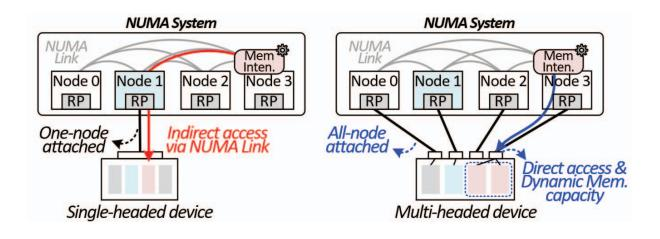

- (a) Single-headed expansion. (b) Multi-headed expansion.

Fig. 3: Comparison of memory expansion configurations.

57]. Each head operates as an independent logical resource, preventing interference among tenants and maintaining clear management boundaries. This isolation has motivated academic and industrial efforts [56,58,59] to bypass high-latency controller traversal in conventional CXL designs. Originally explored in early switchless configurations, MHD-based designs enable direct host-device paths without intermediate switches, aiming for lower latency and higher aggregate bandwidth across hosts. In such settings, dynamic memory pooling offers capacity flexibility for workload needs while supporting scalable, bandwidth-oriented processing in parallel systems.

Figure 3 compares a conventional *single-headed device* (SHD) with an MHD in a compute node with up to four processors connected through a *non-uniform memory access* (NUMA) topology. As shown in Figure 3a, an SHD allows only one processor to attach directly to the memory expander, forcing others to reach it indirectly through NUMA links.

In contrast, an MHD assigns dedicated heads to individual processors, enabling concurrent access without requiring an intermediate switch (Figure 3b). It also supports dynamic redistribution of memory capacity across processors; memoryintensive workloads can borrow unused capacity from others, reducing localized bottlenecks.

# *C. Challenges in Switchless Fabric*

Despite their benefits, MHDs face several limitations, particularly in scalability and data coherence. Architecturally, an MHD resembles multiple small memory expanders aggregated within a single device, with each head requiring a dedicated controller interface. This increases hardware complexity and consumes valuable port resources, inherently limiting the number of hosts a single device can support. The specification presents example configurations with up to four heads, which reflects the scale commonly illustrated in the standard. Practical MHDs adopting an expander-like form factor tend to implement a similar number of heads, which is generally adequate for a single compute node but not for distributed processing [57,60]. As a result, operations beyond the node still rely on RDMAbased data exchange, additional overhead.

Even within a node, important restrictions remain. Although multiple hosts can attach to the same physical device, MHDs do not support cache coherence across heads. Each head operates as an independent logical endpoint with its own *CXL.io* and *CXL.mem* stacks and a separate address space. Consequently,

- (a) PCI-derived architecture. (b) Unified architecture.

Fig. 4: Overview of PCI-derived and unified CXL controller.

memory regions managed by different heads are isolated, and accessing another head's data requires NUMA-based transactions. Even though global fabric-attached memory or dynamic capacity devices support sharable region, but coherent data sharing is not explicitly guaranteed [47]. Thus, without a coherence domain spanning heads, processors cannot share or concurrently update common data blocks.

To mitigate these restrictions, some advanced, non-standard or implementation-specific designs may embed tag-based metadata or hint information into memory transactions to enable selective sharing with custom back-invalidation support. However, such advanced mechanisms add tag-tracking and consistency-management overhead. Because an MHD connects multiple hosts to one device without an intermediate switch, architectural limits also remain: total device bandwidth is divided among active heads, reducing per-host bandwidth as the number of hosts grows. As a result, MHDs serve as a transitional design rather than a scalable option for disaggregated or shared-memory CXL fabrics.

# IV. UNIFIED LOW-LATENCY CXL CONTROLLER

Figures 4a and 4b provide a high-level comparison between a conventional PCIe-derived controller and the proposed unified CXL controller. A conventional controller consists of three layers: the physical layer, comprising the SerDes and the *Physical Coding Sublayer* (PCS); the data link layer, ensuring reliable transfer through error detection and retransmission; and the transaction layer, which generates protocol messages, manages ordering, and governs end-to-end data flow.

Unlike this modular PCIe-based structure, the proposed controller integrates these layers into a unified pipeline with a shared latency target. As shown in Figure 4b, the design minimizes layer boundaries and employs shared buffering and a unified timing path to remove interface-level staging and clock synchronization overhead. Operating all layers within a single clock domain reduces timing dependencies and ensures uniform propagation delay throughout the pipeline.

#### *A. Physical Layer Rearchitecture*

The physical layer forms the base of the transmission path and determines the lower bound of link latency. Highspeed signaling requires encoding, clock recovery, and buffer management, and inefficiencies in these operations accumulate into tens of nanoseconds. To reduce this structural overhead,

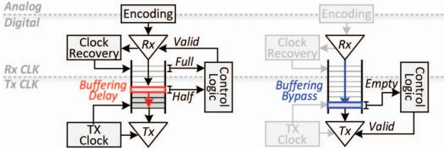

- (a) Half-full design. (b) Nominal-empty design.

Fig. 5: Rearchitecting the PCS for latency optimization.

the proposed controller incorporates several latency-oriented refinements within PCS while preserving its core architecture.

Figures 5a and 5b show a representative difference between conventional PCIe-derived PCS and the proposed designs. Traditional PCIe controllers use half-full elastic buffers to manage asynchronous transmitter-receiver clocks (Figure 5a), adding fixed staging even when data is ready and introducing idle cycles that accumulate delay across transactions.

As an example of the broader optimization strategy, the proposed controller adopts a nominal-empty elastic buffer design (Figure 5b). In this scheme, an empty buffer is treated as a valid state, enabling real-time clock alignment and eliminating unnecessary intermediate staging. This reduces average latency by 15∼20 ns, which account for a substantial portion of the controller-level improvement.

Additional latency reduction is achieved through selective optimization of the *Forward Error Correction* (FEC [61-63]) process. When link quality is sufficiently high, as in high signal-to-noise ratio environments [64-66], a bypass mode minimizes decode latency while maintaining link integrity. These mechanisms allow the physical layer to sustain signal robustness while significantly reducing data-path delay, forming the foundation for low-latency end-to-end operation.

#### *B. Data Link Layer Streamlining*

The data link layer is responsible for reliable packet delivery above the physical layer. Error handling in conventional PCIe-derived designs typically incurs additional buffering and handshake cycles, increasing latency under load. PCIe-based controllers commonly employ fixed-size flits composed of multiple smaller segments, which preserve link integrity but

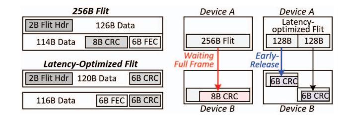

- (a) Structural difference. (b) End-to-end transmission timeline.

Fig. 6: Latency-oriented 256-byte flit design.

Fig. 7: Unified scheduler for continuous data packing.

introduce additional pipeline stages and control overhead, affecting performance under bursty or sustained traffic.

To address these, the proposed controller refines the flit and pipeline structures to reduce per-hop overhead while maintaining reliability. By adopting a larger 256B flit format that reduces header and control overhead (Figure 6a), the frame layout is organized to permit early validation of partial data units (Figure 6b). This early-release mechanism allows the receiver to process validated data without waiting for full-frame arrival, shortening the transmission and pipeline latency.

Additional timing improvements are achieved through targeted optimizations within the CRC computation and validation path, allowing more predictable lane-level timing behavior without altering the error coverage model. These refinements collectively enable the link layer to stream validated data upward rather than behaving as a passive reliability stage.

Silicon measurements in a 4 nm process show that the streamlined link layer improves per-lane timing margins and reduces average latency by 5∼10 ns compared with conventional 256B flit implementations. The resulting design preserves end-to-end correctness while supporting deterministic, low-latency operation across diverse traffic conditions.

# *C. Transaction Layer Optimization*

The transaction layer orchestrates requests across *CXL.io*, *CXL.cache*, and *CXL.mem*, ensuring semantic consistency while determining which messages are issued to the link layer. Whereas the link layer packages and transmits flits under predefined rules, this layer governs message ordering and grouping to sustain continuous data flow through the pipeline.

In PCIe-derived architectures, each protocol maintains its own queue structure. Although modular, this separation leads to queue contention, uneven priority handling, and long processing delays under mixed traffic. As shown in Figure 7, the proposed controller replaces this fragmented organization with a unified flow-control and scheduling engine that coordinates dispatch across all protocol domains. The scheduler can consider traffic patterns to regulate dispatch behavior, while ensuring fairness is provided between each message class. This adaptivity minimizes idle cycles and maintains consistent utilization of the downstream pipeline.

Silicon evaluation shows up to 1.3× higher throughput compared with conventional per-protocol queuing. These indicate that the transaction layer acts not only as a command

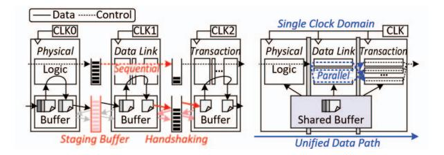

- (a) PCIe-based integration. (b) Unified integration.

Fig. 8: Comparison of cross-layer integration.

processor but as a coordinated control point for fabric-wide data movement, and together with the streamlined link layer forms a synchronized pipeline enabling deterministic, low-latency communication.

## *D. Cross-Layer Integration*

While per-layer refinements improve localized behavior, overall controller latency is influenced by interface delays between protocol stages. As shown in Figure 8a, conventional PCIe-derived designs treat each layer as an isolated pipeline, requiring synchronization and handshaking at every boundary. These transitions introduce idle cycles and timing misalignment, contributing a substantial portion of round-trip delays.

In contrast, the proposed controller reduces this overhead by redefining layer boundaries and forming a unified data path across the physical, link, and transaction layers (Figure 8b). Each layer maintains its protocol-specific responsibilities but operates under a shared buffering and timing framework, allowing data to advance without explicit inter-layer synchronization. This structure removes redundant staging and handshake delays that limited throughput. Control metadata and packet data are processed in parallel, and a unified timing reference ensures stable propagation across the pipeline.

The controller also incorporates cooperative feedback among layers. The physical layer tracks link activity to regulate data release, and the transaction layer considers link utilization when selecting messages, enabling the overall pipeline to self-regulate under varying traffic conditions.

Silicon evaluation shows that this cross-layer integration reduces round-trip latency to below 50 ns, improves link bandwidth by twenty five percent, and decreases latency variation under bursty workloads. These results demonstrate a shift from a layered protocol stack to a unified communication fabric that delivers deterministic, low-latency operation and enhances scalability for memory-centric systems.

# V. END-TO-END HARDWARE FLOW OF THE AUTOMATED CONVERSION AND ROUTING PIPELINE

The CXL switch integrates a hardware-driven conversion and routing pipeline that connects the controller to CPUs, GPUs, memory expanders, and other switches. Protocol conversion, coherency handling, transaction control, and routing are performed entirely in hardware, without relying on firmwaremanaged paths. By executing these functions in structured and

Fig. 9: Overview of hardware-automated pipeline.

timing-predictable stages, the switch maintains deterministic behavior across ports and fabric hops.

Each ingress port includes a hardware pipeline that adapts incoming link-layer transactions from the controller into the internal fabric format. Messages are interpreted according to protocol type and destination information and then transformed into a representation suitable for forwarding within the switch. Figure 9 shows the overall organization of this automated conversion and routing pipeline, which sustains continuous line-rate operation and preserves protocol transparency across heterogeneous devices.

#### *A. Hardware-Based HBR-PBR Translation*

Unlike PCIe-based hierarchical routing, which relies on host-controlled topology, the proposed switch performs HBRto-PBR translation directly in hardware. As shown in Figure 10, each ingress message is interpreted by a hardware classifier that determines whether it originates from an HBR or PBR domain. For HBR traffic, the conversion logic derives the necessary routing identifiers and consults an on-chip routing structure to obtain the appropriate *Source Port ID* (SPID) and *Destination Port ID* (DPID). The packet is then reformatted into the internal PBR representation for fabric-level forwarding. These operations are implemented as a pipelined hardware sequence, providing predictable low latency while maintaining protocol correctness.

The translation pipeline overlaps classification, identifier mapping, and format conversion so that rebuilt packets enter the routing stage with consistent ordering metadata, ensuring protocol transparency across heterogeneous CXL environments. In the reverse direction, packets destined for HBR domains are mapped back to PCIe-compatible identifiers through a

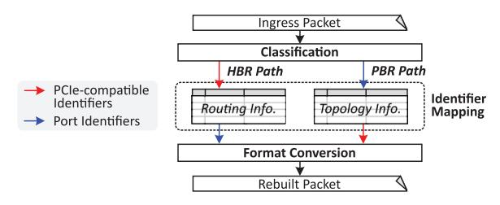

Fig. 10: Hardware-automated protocol conversion.

Fig. 11: Hardware-automated protocol routing.

deterministic lookup of stored topology information. This bidirectional conversion preserves compatibility with legacy hosts while maintaining the timing behaviors required for lowlatency port-based routing.

# *B. Hardware Routing Control*

After format translation, the routing stage determines the egress path for each packet, as illustrated in Figure 11. The switch uses two hardware-managed structures to guide forwarding decisions: a routing table that resolves the DPID to an output port, and a grouping structure that coordinates load distribution among ports that share routing equivalence. Together, these structures form a localized hardware routing plane that operates independently of firmware.

The DPID-based routing table provides fixed-latency nexthop lookup and incorporates link-status information so that forwarding reflects current connectivity. Entries update through internal topology synchronization, allowing the routing logic to handle link additions or failures without software.

Above this, the routing-group structure monitors traffic conditions across ports within the same group and selects among them according to congestion-aware policies. By referencing lightweight hardware metrics, the logic balances utilization and preserves throughput under varying load patterns.

Both structures support concurrent lookup and update operations, enabling forwarding decisions to be made without stalling the datapath. Routing resolution and group arbitration complete within a tightly bounded latency budget, ensuring predictable behavior even under high traffic. Combined with the upstream conversion pipeline, this hardware-managed routing stage maintains consistent per-hop delay and stable throughput across multi-hop CXL fabric configurations.

#### *C. Hardware Scheduling and Deterministic Operation*

The conversion and routing flow is realized as a unified hardware pipeline with deterministic processing stages. As illustrated in Figure 12a, each incoming packet carries minimal routing context that enables the hardware scheduler to coordinate subsequent stages. The scheduling logic manages egress selection and routing decisions according to the availability of downstream resources, allowing packet forwarding to proceed without firmware or interrupt-driven control.

Synchronization across adjacent CXL switches is supported by a fabric-level timing mechanism, shown in Figure 12b,

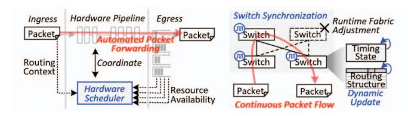

- (a) Deterministic scheduling. (b) Fabric synchronization.

Fig. 12: Hardware scheduling for conversion and routing flow.

which maintains alignment for multi-hop operation. Routing structures and timing state update dynamically without halting in-flight traffic, enabling runtime topology adjustments and link recovery while sustaining continuous packet flow.

From ingress to egress, the sequence of decoding, translation, lookup, and arbitration completes within a tightly bounded latency window. This predictable timing behavior ensures stable performance under full load and maintains congestion tolerance in multi-hop, multi-switch configurations. Because all scheduling and arbitration occur in hardware, the switch operates as a deterministic element within the CXL fabric rather than relying on software intervention.

Independent processing stages handle header interpretation, routing resolution, and port assignment concurrently without stalling. Hardware evaluation shows that the scheduler dispatches packets as soon as resources become available, reinforcing the pipeline's deterministic behavior.

# VI. HIGH-PERFORMANCE FABRIC SWITCH

Building on the unified controller architecture, the proposed PBR switch integrates conversion and routing functions in hardware to extend deterministic latency from the controller to the fabric scale. This shared routing fabric preserves per-hop coherence and full bandwidth across ports and hosts. The prerelease switch will be ready for customer-sampling by summer 2026.

# *A. Switch Hardware Composition*

The switch incorporates multiple CXL controllers within a hardware-based fabric node, enabling real-time forwarding without firmware intervention. This alleviates the latency accumulation and topology constraints observed in conventional designs that rely on deep controller hierarchies or softwaremanaged paths. Figure 13 shows the overall switch structure. The design consists of port banks that combine a unified controller with dedicated conversion and routing logic. These port banks are interconnected via an internal *Network-on-Chip* (NoC), providing a high-bandwidth, parallel on-chip communication fabric without exposing microarchitectural details. The NoC enables simultaneous ingress and egress transfers and maintains timing consistency across processing paths.

Each port bank operates as a hardware endpoint that processes incoming packets, performs conversion and routing, and forwards traffic across the NoC to the target port. The

Fig. 13: Overall structure of CXL Switch.

switch scales with available link resources, allowing wide ports to function as a single high-bandwidth interface or to split into narrower ports as needed. Because all datapaths share one timing domain, latency stays stable across configurations.

This architecture removes the latency growth typically associated with traversing multiple controller layers. Each port uses a unified controller pipeline, and communication flows through the parallel NoC fabric, keeping end-to-end latency close to that of a single controller even as port count increases.

#### *B. Virtual CXL Switch (VCS) Architecture*

The proposed switch supports VCS operation in both singleand multi-host environments. VCS partitions a physical switch into isolated virtual root domains, allowing multiple hosts to share the same hardware resources while retaining independent address spaces. In a single-root VCS, one *upstream port* (USP) connects to a host and multiple *downstream ports* (DSPs) attach to devices within that domain. In a multi-root VCS, several USPs coexist within the same switch, each associated with a different host. Bandwidth and address-space allocation across virtual roots are managed in hardware through a *Dynamic Port* (DP) binding mechanism.

The multi-root VCS configuration in which each host connects through its own USP, while memory expanders or accelerators may be assigned to individual hosts or shared among them. This architecture implements the composable memory fabric model introduced earlier, enabling concurrent access to a shared memory pool without software mediation. Because latency is preserved across all virtual roots, the deterministic behavior of the controller extends uniformly to fabric scale. Building on the multi-root design, the switch adds hardware support for MHDs and multi-logical devices to broaden multi-host connectivity. Each MHD includes several logical heads, allowing distinct VCS instances to access the same physical device through independent attachment points. The switch treats each head as a separate logical endpoint, preserving ordering and coherence across hosts sharing MHDs.

DP binding coordinates these connections by mapping virtual ports to physical downstream ports, enabling hosts to allocate or share MHD resources in hardware. This mechanism extends composability beyond single-root deployments while preserving deterministic latency and isolation across domains.

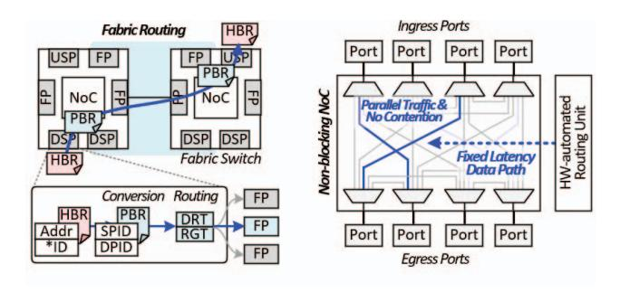

- (a) Fabric operation mode. (b) Non-blocking NoC.

Fig. 14: Swtich operation mode and non-blocking feature.

# *C. Fabric Routing and Hardware Automation*

Figure 14a shows how each switch port performs format conversion and routing in fabric mode. Every port contains a hardware module that receives incoming messages, extracts metadata such as address, PCIe identifiers and coherence IDs (Cache and Back Invalidation), and reformats HBR traffic into PBR. During this step, SPID and DPID values are assigned so that coherence is preserved across CPUs and peers. These operations occur within a single pipeline stage, allowing conversion and routing to proceed without added delay.

Routing decisions rely on two hardware tables: the *DPID Routing Table* (DRT) and the *Routing Group Table* (RGT). The DRT determines the egress port for each ingress message, and the RGT selects a path among ports in the same routing group. By monitoring congestion conditions in hardware, the RGT redirects packets when congestion appears, ensuring balanced traversal across the group. This structure provides deterministic forwarding because both routing tables participate directly in the same pipeline that performs protocol conversion.

All operations within a port, including command generation, path selection, and format translation, are executed in hardware. Removing firmware intervention eliminates interrupt and scheduling variability, reinforcing the deterministic timing envelope established by the unified controller. This hardwaredriven flow ensures that every port follows identical processing stages and maintains uniform behavior throughout the switch.

Global routing tables, initialized during system setup, define PID mappings and port connectivity across cascaded switches. When a message arrives, the routing pipeline consults these tables and forwards the converted PBR packet through the internal NoC to the designated egress port. Even in multitier topologies, the hop-level behavior remains stable because propagation depends on fixed per-hop pipelines rather than software-managed paths. As a result, the fabric behaves as a deterministic, low-latency routing substrate that mirrors the timing discipline of on-die execution.

# *D. Non-Blocking NoC Design*

Figure 14b illustrates the internal *Network-on-Chip* (NoC) that enables non-blocking data transfers among all ports. Each

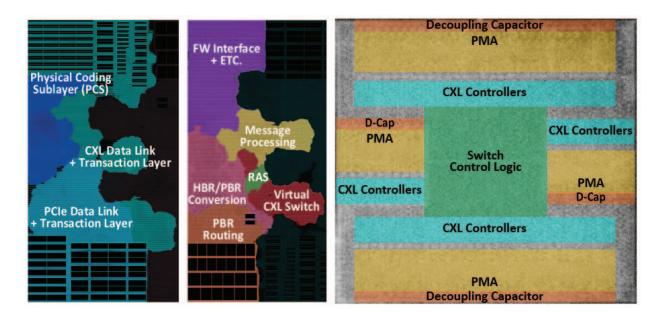

- (a) Controller. (b) Pipeline. (c) Chip micrograph of Switch.

Fig. 15: Floorplan and chip micrograph of CXL Switch.

port can issue ingress and egress transactions concurrently, allowing the switch to sustain parallel traffic without contention.

The NoC provides a high-bandwidth on-chip communication fabric that dynamically connects ports according to routing decisions. It maintains timing consistency across processing paths and preserves predictable behavior under high port density and bursty workloads. Operating within a unified timing domain ensures that concurrent traffic does not cause misalignment, keeping latency stable under varying load.

By combining this NoC fabric with the hardware-automated routing pipeline described earlier, the switch maintains uniform per-hop delay and avoids the latency growth commonly observed in multi-port designs. As a result, the switch operates as a fixed-latency datapath across large, multi-tier CXL fabrics, advancing the goal of a composable, memory-centric interconnect with deterministic performance and seamless scalability.

# VII. EVALUATION

This section evaluates our unified CXL controller and PBR switch with three main goals. First, we identify latency bottlenecks in conventional HBR switch and controller designs and show that our hardware pipeline achieves deterministic latency without firmware intervention (§ VII-B). Second, we show that our PBR switch scales effectively to 64 nodes across multi-hop operation (§ VII-C). Third, we verify that our system can preserve the deterministic low latency under congestion (§ VII-D), and demonstrates that how our switch can be used to remove cross-NUMA latency (§ VII-E).

# *A. Evaluation Setup*

Silicon implementation. Figure 15 presents the silicon realization that forms the basis of our evaluation. The design integrates the controller blocks and the hardware-automated per-port pipeline, as shown in Figures 15a and 15b. Figure 15c provides the corresponding per-port chip micrograph of the switch, confirming that the pipeline and control logic are implemented as dedicated hardware structures rather than an architectural abstraction.

Hardware configuration and methodology. The evaluation system includes four compute nodes and a 10 TB shared storage node. Each node connects to the storage node via a 200 Gbps

| Parameter                | Specification | Notes / Methodology    |  |
|--------------------------|---------------|------------------------|--|
| Manufacturing Technology | 4 nm          | Actual silicon process |  |
| Clock Frequency          | 1.0 GHz       | Simulation-calibrated  |  |
| TDP                      | $\sim$ 20W    | Aggregate SoC power    |  |
| SerDes / PHY             | 64 Gbps PAM4  | PCIe 6.0 / CXL 3.2     |  |

TABLE II: Evaluation platform specification.

OSFP direct-attach interconnect [67] and uses a 3.6 GHz 128-core CPU, 512 GB DDR5-4800 DRAM, and a PCIe ×16 link. A distributed PostgreSQL 17 database [68] runs across the nodes, and each node maps CXL memory via daxctl and mmap for use as a cache.

The evaluation uses a cycle-accurate RTL-based emulation environment, where key latency components are cross-checked against silicon measurements where applicable. Although the design implements CXL 3.2 silicon, no commercial CPU supports the PCIe 6.0 physical layer required by this standard, and processors supporting CXL 2.0 lack full CXL.cache support, blocking multi-host and memory-sharing tests. Existing CXL expanders operate similarly to the modeled devices but are not publicly accessible for controlled comparison. Under these constraints, RTL-level emulation offers a reproducible platform that reflects silicon-level timing behavior without relying on unavailable hardware.

Timing parameters such as bus timing and pipeline depth were extracted from our silicon prototypes and incorporated into the evaluation model. Using these parameters, the RTL environment reproduces end-to-end latency behavior consistent with measured *round-trip time* (RTT) data from Intel's Memory Latency Checker (MLC [69]). Workload traces capturing memory-access and hierarchical interactions were used to model CXL transactions. We modified PostgreSQL to utilize hardware coherence provided by the CXL switch. Traditional deployments serialize writes at a single primary node to maintain coherence [70-72]. In contrast, our modified database supports concurrent writes across nodes, and inter-node cache sharing enables reuse of data cached by other nodes.

Table II summarizes the key hardware configurations and parameters. Because the platform adheres to the CXL 3.2 specification, the evaluation reflects the latency and bandwidth characteristics expected of real CXL systems.

**Evaluation baselines.** Figure 16 shows the seven baseline configurations used in the evaluation, representing stages in the evolution of CXL systems from direct node-to-device connections to scalable switch-based fabrics. The upper group presents direct-attached designs where compute nodes access CXL memory locally, and the lower group shows switch-attached systems where memory is accessed through legacy HBR or proposed PBR switches. Legacy components are shown in red and proposed components in blue.

The comparison focuses on two dimensions: attachment

|               |       | Hit  | Read |     |      | Hit  | Read                  |   |
|---------------|-------|------|------|-----|------|------|-----------------------|---|
|               |       | (%)  | (%)  |     |      | (%)  | (%)                   | _ |
|               | C-S   | 85.6 |      |     | A    |      | 88.1                  |   |
| $\mathcal{C}$ | C-M   | 48.1 | 52.4 | SB  | В    | 84.0 | 97.5                  | 0 |
| TP            | C-L   | 25.3 | 53.7 | YC  | C    | 85.8 | 100.0                 | - |
|               | Н     | 1.8  | 93.4 |     | D    | 84.2 | 97.5 100.0 95.7 |   |
| EΒ            | Auct  | 85.7 |      | WEB |      | 87.0 |                       | ş |
| 3             | Twitt | 14.0 | 99.9 | ×   | Epin | 46.8 | 97.8                  | 0 |

|   |       | Operation   | Hit (%) | Read (%) |
|---|-------|-------------|------------|-------------|
| = |       | Delivery    | 4.5        | 53.0        |
|   | ب     | NewOrder    | 6.0        | 53.6        |
|   | TPC-C | OrderStatus | 65.2       | 55.9        |
|   | Ξ     | Payment     | 35.7       | 55.0        |
| _ |       | StockLevel  | 96.1       | 63.9        |
|   | CSB   | Select      | 82.4       | 100         |
|   | YC    | Update      | -          | 0           |

TABLE III: Workload characteristics.

topology (direct versus switch) and device organization (single-headed versus multi-headed), allowing us to evaluate how connection structure and device composition influence latency, scalability, and memory-sharing efficiency.

The direct-attached group includes four configurations. 1N1S\_local is the baseline: a single node connected to one 128 GB SHD. In 4N4S\_isolated, four nodes attach to four SHDs; although this adds more processing cores and device capacity, additional coherence overhead appears across nodes. 4N1M\_private connects multiple nodes to a 512 GB MHD, with each head offering an independent address space, improving utilization but still without data sharing. 4N1M\_shared models partial sharing but without hardware coherence management. Therefore, the software on each node must manually flush its cache to keep data consistent across the system.

The switch-attached group includes three configurations examining how controller and switch design affect latency. 4N4S\_SWbasic uses a legacy HBR switch and controller, enabling pooling but with higher per-hop latency from conventional designs. Replacing the HBR switch with the proposed PBR version produces 4N4S\_SWadv, lowering hop latency and improving responsiveness for latency-sensitive workloads. 4N4S\_SWopt combines the proposed controller and PBR switch; by unifying routing and control in hardware, it achieves deterministic latency and high throughput.

Workloads and evaluation metrics. The evaluation uses seven representative workloads: TPC-C [25] and AuctionMark [23] for OLTP transactions; YCSB [24] for microservices; TPC-H

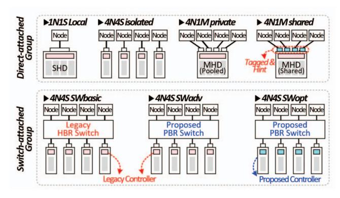

Fig. 16: Configuration of baselines and proposed architecture.

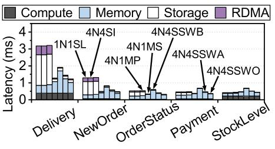

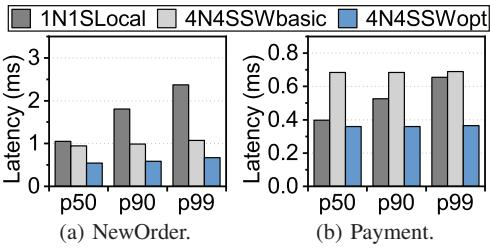

Fig. 17: Microbenchmark.

Fig. 18: Latency breakdown.

Fig. 19: Tail latency analysis.

[26] for OLAP; and Twitter, Wikipedia, and Epinions [23] for web workloads. Table III summarizes their hit rates and read ratios. TPC-C models a warehouse-scale system with diverse transaction types (NewOrder, Payment, Delivery), and three dataset scales (10K, 20K, 40K warehouses) evaluate scalability.

YCSB models key-value workloads with Select and Update operations. Among the four mixes (A–D), YCSB-B serves as the primary workload because it provides a balanced read/write pattern with a typical zipfian distribution. Performance metrics include throughput (QPS), latency, and bandwidth utilization to characterize the latency-deterministic behavior of the proposed design under realistic data-center environments.

#### B. Latency and Pipeline Behavior Analysis

Synthesis analysis. Figure 17 shows the average 64B access RTT across direct-attached and switch-attached configurations. The legacy 4N4S\_SWbasic configuration incurs hierarchical routing delays, resulting in 2.8× higher latency than 1N1S\_local. 4N4S\_SWadv reduces this latency by roughly 35% using our HBR switch. 4N4S\_SWopt which integrates both the proposed controller and switch, achieves the lowest latency overall, reducing it by approximately 53% compared to 4N4S\_SWbasic.

Latency breakdown. Figure 18 decomposes TPC-C latency by transaction type in low contention. Specifically, *Compute* represents the computation time spend on CPU, while *Memory* denotes the CXL memory access time. In addition, *Storage* indicates the time spent at the storage node, and *RDMA* shows the RDMA transfer time to the storage node. In the direct-attached configuration (1N1S\_local, 4N4S\_isolated, and 4N1M\_private), the Delivery and NewOrder workloads have low cache hit ratios (below 10%) that force frequent storage accesses. Consequently, storage access time and RDMA

Fig. 20: Overall throughput.

transfer time account for 41% of the total latency, resulting in end-to-end latencies of roughly 1–3 ms. The shared MHD configuration (4N1M\_shared) reduces latency by 60% for these workloads, and by 32% on average. This improvement occurs because 4N1M\_shared minimizes storage access by enabling cross-node data reuse through CXL memory sharing.

Switch-attached systems (4N4S\_SW) provide similar benefits. However, for 4N4S\_SWbasic, the latency of high hitrate workloads such as OrderStatus, Payment, and StockLevel actually increased by 41%. This is because the CXL memory access latency in legacy switch systems is 2.8× higher compared to direct-attached systems. In contrast, 4N4S\_SWadv and 4N4S\_SWopt, which incorporate the proposed switch, minimize storage access and maintain low CXL memory overhead, reducing average latency by 28% and 42% compared with 4N4S\_SWbasic.

Tail latency analysis. Figure 19 shows the tail latency analysis for the NewOrder and Payment queries, which account for 45% and 43% of the TPC-C workload. In the 1N1S\_local baseline, the p99 latency is  $1.9 \times$  higher than the p50 latency on average. Specifically, the NewOrder workload which has a low hit rate of 6%, causing multiple cache misses per query and make the p99 tail latency above 2 ms. Switch-attached systems mitigate this high tail latency through memory pooling. By utilizing a larger CXL memory capacity through memory pooling, 4N4S\_SWbasic resolves this cache miss problem and reduces p99 latency by 25% on average. However, the longer CXL memory access time increases the p50 latency by 31% compared to 1N1S\_local. Finally, 4N4S\_SWopt overcomes this overhead via the unified controller and PBR switch, which can deliver deterministic low latency, reducing the p50 latency by 29% while further dropping the p99 latency by 58%.

## C. System-Level Performance Scaling

Overall throughput. Figure 20 presents normalized throughput across the twelve workloads. In direct-attached systems ( $4N4S\_isolated$ ), throughput improves by only  $2.9\times$  over the single-node baseline ( $1N1S\_local$ ) because inter-node parallelism is limited by coherence overhead; only the primary node can handle writes to ensure cache coherence between multiple nodes. This issue is particularly evident in write-heavy workloads such as TPC-C and Wiki, where performance improves by only  $1.7\times$  despite a  $4\times$  increase in the number

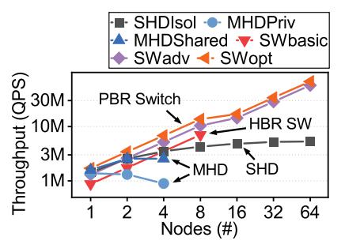

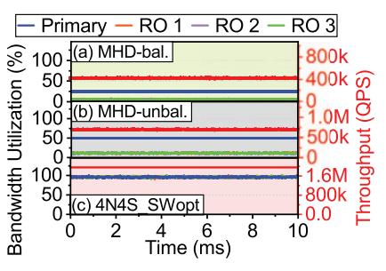

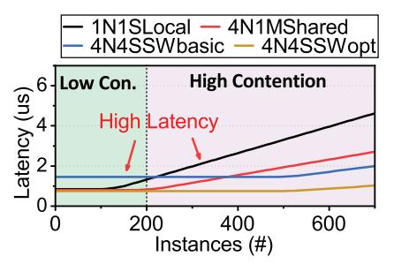

Fig. 21: Node sensitivity.

Fig. 22: Memory balancing.

Fig. 23: Latency across varying instances.

of nodes. In contrast, 4N1M\_shared maintains software-based coherence through explicit cache flush, allowing all nodes to handle write requests. Furthermore, data sharing allows every node to utilize the entire capacity of the MHD device as a cache. As a result, for write-intensive and less cache-friendly workloads such as TPC-C large and TPC-H, 4N1M\_shared improves overall throughput by 23% compared to 4N4S\_isolated. However, limited per-host bandwidth due to PCIe bifurcation restricts gains for other workloads.

Switch-attached systems deliver the largest improvements.  $4\text{N}4\text{S}\_\text{SWbasic}$  yields a  $3.4\times$  improvement over  $1\text{N}1\text{S}\_\text{local}$ , while  $4\text{N}4\text{S}\_\text{SWadv}$  achieves  $4.1\times$  with the PBR switch. The optimized  $4\text{N}4\text{S}\_\text{SWopt}$ , combining the proposed controller and the PBR switch, reaches up to a  $4.8\times$  improvement by maintaining deterministic latency and reducing timing variation. These results confirm that MHD-based expansion solutions have scalability due to limited bandwidth, and that the proposed switch-based architecture provides consistent scalability across diverse workloads.

Node sensitivity. Figure 21 shows how performance scales from 1 to 64 nodes under YCSB-B workload. In SHD\_isolated, where each node connected to an individual SHD device, performance improves by only 3.7× compared to a single node when using 64 nodes. This is because to ensure inter-node coherence, only a single primary node can process write requests and these write requests from the primary node must be propagated to all other nodes. Consequently, there is a fundamental scalability limitation in workloads that involve writes. In MHD\_private, which uses MHD devices that do not support data sharing, this problem is further exacerbated;

Fig. 24: Intra-NUMA analysis.

using 4 nodes results in a 35% performance degradation compared to using a single node. This is because the per-host bandwidth decreases as MHD device connect to more nodes. In addition, the number of ports on a single MHD device is limited to around four due to die area constraints [73]. MHD\_shared supports inter-node data sharing, allowing all nodes to handle write requests. However, similar to MHD\_private, it is not a fundamentally scalable solution because the bandwidth available to a single node is still limited as the system scales to multiple nodes.

SWbasic represents a case of scaling using legacy HBR switch and controller. Because HBR switches do not support inter-switch connections, the maximum number of scalable nodes is limited to eight, based on a 256-lane configuration. In contrast, our proposed SWopt, which implements the CXL 3.2 standard which support PBR routing, maintains near-linear scaling up to 64 nodes through its fully connected topology and deterministic scheduling, utilizing multi-switch interconnection for configuration exceeding eight nodes. These results indicate that the unified controller and PBR switch sustain stable throughput and predictable latency as node count increases.

## D. Scalability and Stability Analysis of Memory Pooling

Port-based scheduling for memory balancing. Figure 22 evaluates throughput and resource utilization under the write-heavy YCSB-A workload. Because the primary node must handles all write requests to ensure coherence between nodes, MHD\_balanced (equivalent to 4N1M\_private) concentrates traffic on a single head, leaving read-only nodes underutilized with link usage below 6%. MHD\_unbalanced, which assigns more memory capacity and PCIe lanes to the primary node, improves throughput by 1.7× but still cannot eliminate the fundamental imbalance.

In contrast,  $4N4S\_SWopt$  increases throughput by  $4\times$  over  $4N1M\_private$ , reaching over 95% bandwidth utilization through port-based scheduling. This balanced flow control distributes write traffic across nodes, demonstrating efficient memory pooling at scale. This indicates that the dynamic capacity of MHD devices cannot fully resolve inter-node imbalance issues, highlighting the need for switch-based memory pooling.

Latency stability. Figure 23 illustrates how latency changes under the YCSB-B benchmark as the number of concurrent

instances increases. When comparing the baseline configurations, 4N1M\_shared outperforms 1N1S\_local at low instance counts because it reduces storage accesses by sharing cache data between nodes. Furthermore, as the workload scales, 1N1S\_local is limited to a maximum of only 128 concurrent instances due to its per-node core count constraints. While 4N1M\_shared can scale beyond this, the latency of 4N1M shared also spikes beyond 300 instances because PCIe bifurcation limits the bandwidth available to each host. Switchattached systems offer a solution to this problem; for example, 4N4S SWbasic handles up to 512 instances without any latency penalty, reducing latency by up to 2.3× compared to 1N1S\_local. The limitation of 4N4S\_SWbasic is that at low instance counts, due to high legacy HBR switch latency, latency increases by 1.7× compared to 1N1S\_local. Our proposed 4N4S\_SWopt can show lowerst latency in both low contetion and high contention senario, and demonstrates that our PBR switch can maintain deterministic latency even under high contention.

## E. NUMA Independence of the Deterministic Fabric

To demonstrate that the proposed CXL switch can effectively eliminate inter-NUMA communication overhead, we evaluated three additional configurations on a four-node NUMA system. In these setups, each logical node maps to a single CPU socket. The 1N1S\_local configuration serves as a conventional baseline, where a single SHD is attached to a specific NUMA node. Conversely, in the 4N1M\_private and 4N4S\_SWopt configurations, a CXL device connects directly to all NUMA nodes via a multi-port interface. Conventional NUMA systems incur inter-process communication overhead during remote memory access, increasing access distance and reducing bandwidth. In contrast, the proposed PBR switch consolidates socket-level memory paths into a shared CXL pool, eliminating inter-socket dependency and maintaining uniform latency across sockets.

Figure 24a compares normalized latency under YCSB-B. Conventional NUMA systems (1N1S\_local) show up to 1.7× higher latency than single-socket setups because the CXL device is attached to only one socket, forcing all memory accesses from other NUMA nodes to incur an intersocket hop. 4N1M\_private reduces latency by 28% by attaching separate MHD heads to each socket, but accessing CXL memory attached to other NUMA nodes still requires inter-socket communication. 4N4S\_SWopt maintains nearly identical latency across sockets. Figure 24b compares normalized throughput under YCSB-B. Because 1N1S\_local and 4N1M\_private need inter-socket communication, limited inter-socket bandwidth severely limits the throughput compared with single-socket setups. In contrast, 4N4S\_SWopt removes inter-socket communication and archive 4× higher throughput.

#### VIII. RELATED WORK

**Software-based memory management.** Prior CXL studies [53,56,74-76] examined page-level tiering for hierarchical

memory. [56] extended this by coupling the controller with hypervisor allocation for cacheline-granular migration. Although effective at small scale, these methods introduce scheduling variability and do not scale well in multi-tenant settings. Our work advances this direction with a unified controller and switch that integrate all protocol layers into a fixed-latency hardware pipeline, reducing software dependence and enabling deterministic operation across servers and virtualized systems. Software-managed virtualization. Recent CXL-enabled databases [11] replace RDMA-based disaggregated memory with a CXL switch to avoid page-level tiering, improving recovery and pooling but still relying on software buffering and synchronization. Systems such as Aurora [71], Socrates [70], and PolarFS [77] offload I/O but remain constrained by software control. Our design provides hardware-assisted virtualization through VCS and MHD, enabling address isolation, coherence, and dynamic port binding. Embedding composability in the data path ensures deterministic, firmware-free operation while preserving orchestration compatibility.

**CXL-assisted near-memory processing.** Beyond memory pooling, several works explore computation within the CXL fabric. [78] accelerates recommendation-model training using nearmemory processing, and [79,80] embed compute elements in CXL devices for genome analysis and DLRM inference. These studies demonstrate the benefits of combining computation and communication. Our work complements this direction with a deterministic, firmware-free routing substrate that enables parallelism without software scheduling.

Rack-scale disaggregation. At rack scale, [81] proposes a CXL-disaggregated design pooling NICs and memory across hosts to reduce inter-rack bottlenecks and replace ToR-centric systems with a load/store model. This shifts earlier ideas such as Aurora and PolarFS into hardware. Our siliconproven controller and switch advance this direction by enabling deterministic multi-hop CXL fabrics without firmware delays. Software-bound fabrics. Fabric-centric computing [82] envisions the interconnect as a computational substrate, but most implementations remain software-driven. Our work realizes this concept through silicon-level integration that unifies conversion, routing, and scheduling within a shared timing domain. This design ensures consistent low-latency operation while complementing existing frameworks, forming a foundation for composable data centers where hardware and interconnect jointly manage performance and scalability.

# IX. CONCLUSION

This work introduces a silicon-proven unified CXL controller and PBR switch that enable deterministic, memory-centric fabrics. The integrated hardware pipeline removes firmware overhead, achieving  $2.1\times$  latency reduction compared with legacy HBR-based designs, and improve system-level performance up to  $2\times$ . These results demonstrate a practical path toward scalable, hardware-deterministic CXL infrastructures for future data-centers.

#### REFERENCES

- [1] NVIDIA, "NVIDIA NVLink and NVLink Switch," https://www.nvidia. com/en-us/data-center/nvlink/, 2026.
- [2] UALink Consortium, "Introducing UALink 200G 1.0 Specification," https://ualinkconsortium.org/wp-content/uploads/2025/04/UALink-1.0-White\_Paper\_FINAL.pdf, 2025.
- [3] Unified Bus Community, "An Interconnect Protocol for SuperPoD," https://www.unifiedbus.com/en, 2025.
- [4] A. Li, S. L. Song, J. Chen, J. Li, X. Liu, N. R. Tallent, and K. J. Barker, "Evaluating modern gpu interconnect: PCIe, NVLink, nv-sli, nvswitch and GPUdirect," *IEEE Transactions on Parallel and Distributed Systems*, 2019.
- [5] H.-H. S. Lee, "Toward disaggregated and heterogenous ai systems," *IEEE Micro*, 2025.
- [6] J. Choquette and W. Gandhi, "NVIDIA A100 GPU: Performance & innovation for gpu computing," in *2020 IEEE Hot Chips 32 Symposium (HCS)*, 2020.
- [7] S. Potluri, A. Goswami, D. Rossetti, C. J. Newburn, M. G. Venkata, and N. Imam, "GPU-centric communication on NVIDIA gpu clusters with infiniband: A case study with openshmem," in *2017 IEEE 24th International Conference on High Performance Computing (HiPC)*, 2017.
- [8] J. Zuckerman, D. Giri, J. Kwon, P. Mantovani, and L. P. Carloni, "Cohmeleon: Learning-based orchestration of accelerator coherence in heterogeneous socs," in *MICRO-54: 54th Annual IEEE/ACM International Symposium on Microarchitecture*, 2021.
- [9] X. Zhou, H. Chen, S. Luo, Y. Gao, S. Yan, W. Liu, B. Lewis, and B. Saha, "A case for software managed coherence in manycore processors," in *Poster on 2nd USENIX Workshop on Hot Topics in Parallelism HotPar10*, 2010.
- [10] X. Wang, J. Liu, J. Wu, S. Yang, J. Ren, B. Shankar, and D. Li, "Performance characterization of CXL memory and its use cases," in *2025 IEEE International Parallel and Distributed Processing Symposium (IPDPS)*, 2025.
- [11] X. Yang, Y. Zhang, H. Chen, F. Li, G. Fan, Y. Kong, B. Wang, J. Fang, Y. Wang, T. Huang *et al.*, "Unlocking the potential of CXL for disaggregated memory in cloud-native databases," in *Companion of the 2025 International Conference on Management of Data*, 2025.
- [12] J. Liu, H. Hadian, Y. Wang, D. S. Berger, M. Nguyen, X. Jian, S. H. Noh, and H. Li, "Systematic CXL memory characterization and performance analysis at scale," in *Proceedings of the 30th ACM International Conference on Architectural Support for Programming Languages and Operating Systems, Volume 2*, 2025.
- [13] M. Lu, G. Liu, K. Wang, F. Zhu, and S. Li, "Chash: A high costperformance hash design for CXL-based disaggregated memory system," *Proceedings of the ACM on Measurement and Analysis of Computing Systems*, 2025.
- [14] J. Park, W. Lee, T. Kim, Y. Lee, and S. Hong, "Performance characterization of CXL memory expander: Impact on read and write latencies," in *2024 IEEE International Conference on Consumer Electronics-Asia (ICCE-Asia)*. IEEE, 2024.
- [15] M. Weisgut, D. Ritter, P. Tözün, L. Benson, and T. Rabl, "CXL memory performance for in-memory data processing," *Proceedings of the VLDB Endowment*, 2025.
- [16] Y. Fridman, S. Mutalik Desai, N. Singh, T. Willhalm, and G. Oren, "CXL memory as persistent memory for disaggregated hpc: A practical approach," in *Proceedings of the SC'23 Workshops of The International Conference on High Performance Computing, Network, Storage, and Analysis*, 2023.
- [17] M. Ha, J. Ryu, J. Choi, K. Ko, S. Kim, S. Hyun, D. Moon, B. Koh, H. Lee, M. Kim *et al.*, "Dynamic capacity service for improving CXL pooled memory efficiency," *IEEE Micro*, 2023.
- [18] H. Li, D. S. Berger, L. Hsu, D. Ernst, P. Zardoshti, S. Novakovic, M. Shah, S. Rajadnya, S. Lee, I. Agarwal *et al.*, "Pond: CXL-based memory pooling systems for cloud platforms," in *Proceedings of the 28th ACM International Conference on Architectural Support for Programming Languages and Operating Systems, Volume 2*, 2023.
- [19] Y. Zhong, D. S. Berger, P. Zardoshti, E. Saurez, J. Nelson, A. Psistakis, J. Fried, and A. Cidon, "My CXL pool obviates your PCIe switch," in *Proceedings of the 2025 Workshop on Hot Topics in Operating Systems*, 2025.
- [20] X. Wang, B. Ma, J. Kim, B. Koh, H. Kim, and D. Li, "cMPI: Using CXL memory sharing for mpi one-sided and two-sided inter-node communications," *arXiv preprint arXiv:2510.05476*, 2025.

- [21] A. Cho and A. Daglis, "Starnuma: Mitigating numa challenges with memory pooling," in *2024 57th IEEE/ACM International Symposium on Microarchitecture (MICRO)*, 2024.
- [22] A. Danesh, "Unlocking Cloud Server Performance with CXL," 2024, https://www.asteralabs.com/unlocking-cloud-server-performancewith-cxl/.
- [23] D. E. Difallah, A. Pavlo, C. Curino, and P. Cudre-Mauroux, "Oltpbench: An extensible testbed for benchmarking relational databases," *Proceedings of the VLDB Endowment*, vol. 7, no. 4, pp. 277–288, 2013.
- [24] B. F. Cooper, A. Silberstein, E. Tam, R. Ramakrishnan, and R. Sears, "Benchmarking cloud serving systems with ycsb," in *Proceedings of the 1st ACM symposium on Cloud computing*, 2010, pp. 143–154.
- [25] Transaction Processing Performance Council (TPC), "TPC Benchmark C Standard Specification, Revision 5.11," https://www.tpc.org/tpc\_ documents\_current\_versions/pdf/tpc-c\_v5.11.0.pdf, 2010.
- [26] ——, "TPC Benchmark H Standard Specification, Revision 3.0.1," https: //www.tpc.org/tpc\_documents\_current\_versions/pdf/tpc-h\_v3.0.1.pdf, 2022.
- [27] C. Lutz, S. Breß, S. Zeuch, T. Rabl, and V. Markl, "Pump up the volume: Processing large data on gpus with fast interconnects," in *Proceedings of the 2020 ACM SIGMOD International Conference on Management of Data*, 2020.
- [28] P. D. Ivan Goldwasser, Harry Petty and K. Devleker, "NVIDIA GB200 NVL72 Delivers Trillion-Parameter LLM Training and Real-Time Inference," https://developer.nvidia.com/blog/nvidia-gb200-nvl72-deliverstrillion-parameter-llm-training-and-real-time-inference/, 2024.
- [29] C. Petersen, "Building the Case for UALink™: A Dedicated Scale-Up Memory Semantic Fabric," https://www.asteralabs.com/building-the-casefor-ualink-a-dedicated-scale-up-memory-semantic-fabric/, 2024.
- [30] R. L. Jon Ames, "How Ultra Ethernet and UALink Enable High-Performance, Scalable AI Networks," https://www.synopsys.com/articles/ultra-ethernet-ualink-ai-networks, 2025.
- [31] M. Shoeybi, M. Patwary, R. Puri, P. LeGresley, J. Casper, and B. Catanzaro, "Megatron-LM: Training multi-billion parameter language models using model parallelism," *arXiv preprint arXiv:1909.08053*, 2019.
- [32] Y. You, A. Buluç, and J. Demmel, "Scaling deep learning on gpu and knights landing clusters," in *Proceedings of the International Conference for High Performance Computing, Networking, Storage and Analysis*, 2017.
- [33] C. Clos, "A study of non-blocking switching networks," *Bell System Technical Journal*, 1953.
- [34] A. Singh, J. Ong, A. Agarwal, G. Anderson, A. Armistead, R. Bannon, S. Boving, G. Desai, B. Felderman, P. Germano *et al.*, "Jupiter rising: A decade of clos topologies and centralized control in google's datacenter network," *ACM SIGCOMM computer communication review*, 2015.
- [35] R. Niranjan Mysore, A. Pamboris, N. Farrington, N. Huang, P. Miri, S. Radhakrishnan, V. Subramanya, and A. Vahdat, "Portland: a scalable fault-tolerant layer 2 data center network fabric," in *Proceedings of the ACM SIGCOMM 2009 conference on Data communication*, 2009.
- [36] D. D. Sharma, "Compute Express Link," *CXL Consortium White Paper*, 2019.
- [37] D. Das Sharma, R. Blankenship, and D. Berger, "An introduction to the compute express link (CXL) interconnect," *ACM Computing Surveys*, 2024.
- [38] D. J. Miller, P. M. Watts, and A. W. Moore, "Motivating future interconnects: a differential measurement analysis of pci latency," in *Proceedings of the 5th ACM/IEEE Symposium on Architectures for Networking and Communications Systems*, 2009.
- [39] R. Bittner, "Speedy bus mastering pci express," in *22nd International Conference on Field Programmable Logic and Applications (FPL)*, 2012.
- [40] PCISIG, "PCI Express Base," 2026.
- [41] R. Neugebauer, G. Antichi, J. F. Zazo, Y. Audzevich, S. López-Buedo, and A. W. Moore, "Understanding PCIe performance for end host networking," in *Proceedings of the 2018 Conference of the ACM Special Interest Group on Data Communication*, 2018.
- [42] A. Tavakkol, A. Kolli, S. Novakovic, K. Razavi, J. Gómez-Luna, H. Hassan, C. Barthels, Y. Wang, M. Sadrosadati, S. Ghose *et al.*, "Enabling efficient rdma-based synchronous mirroring of persistent memory transactions," *arXiv preprint arXiv:1810.09360*, 2018.
- [43] D. Vucini ˇ c, Q. Wang, C. Guyot, R. Mateescu, F. Blagojevi ´ c, L. Franca- ´ Neto, D. Le Moal, T. Bunker, J. Xu, S. Swanson *et al.*, "{DC} express: Shortest latency protocol for reading phase change memory over {PCI}

- express," in 12th USENIX Conference on File and Storage Technologies (FAST 14), 2014.
- [44] M. Flajslik and M. Rosenblum, "Network interface design for low latency {Request-Response} protocols," in 2013 USENIX Annual Technical Conference (USENIX ATC 13), 2013.
- [45] D. S. Berger, D. Ernst, H. Li, P. Zardoshti, M. Shah, S. Rajadnya, S. Lee, L. Hsu, I. Agarwal, M. D. Hill *et al.*, "Design tradeoffs in CXL-based memory pools for public cloud platforms," *IEEE Micro*, 2023.
- [46] R. Budruk, D. Anderson, and T. Shanley, PCI express system architecture. Addison-Wesley Professional, 2004.
- [47] CXL Consortium, "CXL 3.2 specification," 2024.
- [48] J. Jang, H. Choi, H. Bae, S. Lee, M. Kwon, and M. Jung, "CXL-ANNS:Software-Hardware collaborative memory disaggregation and computation for Billion-Scale approximate nearest neighbor search," in 2023 USENIX Annual Technical Conference (USENIX ATC 23), 2023.
- [49] D. D. Sharma, "Compute express link (CXL): Enabling heterogeneous data-centric computing with heterogeneous memory hierarchy," *IEEE Micro*, 2022.
- [50] CXL Consortium, "CXL 3.1 specification," 2023.
- [51] X. Li, Z. Guo, Y. Bai, M. Ketkar, H. Wilkinson, and M. Liu, "Understanding and profiling CXL.mem Using PathFinder," in *Proceedings of* the ACM SIGCOMM 2025 Conference, 2025.
- [52] Z. Wang, S. Mahar, L. Li, J. Park, J. Kim, T. Michailidis, Y. Pan, M. Shen, T. Rosing, D. Tullsen, S. Swanson, and J. Zhao, "The Hitchhiker's Guide to Programming and Optimizing Cache Coherent Heterogeneous Systems: CXL, NVLink-C2C, and AMD Infinity Fabric," arXiv preprint arXiv:2411.02814, 2025.
- [53] H. A. Maruf, H. Wang, A. Dhanotia, J. Weiner, N. Agarwal, P. Bhattacharya, C. Petersen, M. Chowdhury, S. Kanaujia, and P. Chauhan, "Tpp: Transparent page placement for CXL-enabled tiered-memory," in Proceedings of the 28th ACM International Conference on Architectural Support for Programming Languages and Operating Systems, Volume 3, 2023, pp. 742–755.
- [54] M. Ahn, T. Willhalm, N. May, D. Lee, S. M. Desai, D. Booss, J. Kim, N. Singh, D. Ritter, and O. Rebholz, "An examination of CXL memory use cases for in-memory database management systems using sap hana," *Proceedings of the VLDB Endowment*, 2024.
- [55] Y. Zhong, D. S. Berger, P. Zardoshti, E. Saurez, J. Nelson, D. R. Ports, A. Psistakis, J. Fried, and A. Cidon, "Oasis: Pooling PCIe devices over CXL to boost utilization," in *Proceedings of the ACM SIGOPS 31st* Symposium on Operating Systems Principles, 2025.
- [56] Y. Zhong, D. S. Berger, C. Waldspurger, R. Wee, I. Agarwal, R. Agarwal, F. Hady, K. Kumar, M. D. Hill, M. Chowdhury et al., "Managing memory tiers with CXL in virtualized environments," in 18th USENIX Symposium on Operating Systems Design and Implementation (OSDI 24), 2024.
- [57] D. S. Berger, Y. Zhong, F. Kazhamiaka, P. Zardoshti, S. Teng, M. D. Hill, and R. Fonseca, "Octopus: Scalable low-cost CXL memory pooling," arXiv preprint arXiv:2501.09020, 2025.
- [58] D. Gouk, S. Lee, M. Kwon, and M. Jung, "Direct access, High-Performance memory disaggregation with DirectCXL," in 2022 USENIX Annual Technical Conference (USENIX ATC 22), 2022.
- [59] P. Levis, K. Lin, and A. Tai, "A Case Against CXL Memory Pooling," in Proceedings of the 22nd ACM Workshop on Hot Topics in Networks, 2023.
- [60] D. S. Berger, K. Kumar, M. Vuppalapati, C. Douglas, J. Sathre, I. Robinson, P. Tandon, and M. D. Hill, "Cxl in cloud practice: Practical lessons for incrementally scaling deployment," *IEEE Transactions on Computers*, 2026.
- [61] D. D. Sharma, "A low latency approach to delivering alternate protocols with coherency and memory semantics using PCI Express® 6.0 PHY at 64.0 gt/s," in 2021 IEEE Symposium on High-Performance Interconnects (HOTI), 2021.
- [62] M. G. Saber and Z. Jiang, "Physical layer standardization for ai data centers: Challenges, progress and perspectives," *IEEE Network*, 2025.
- [63] D. D. Sharma, "The pcie® 6.0 specification webinar q&a: A deeper dive into flit mode, pam4, and forward error correction (fec)," https://pcisig.com/blog/pcie%C2%AE-60-specification-webinar-qa-deeper-dive-flit-mode-pam4-and-forward-error-correction-fec, 2021.
- [64] A. Alvarado, E. Agrell, D. Lavery, R. Maher, and P. Bayvel, "Replacing the soft-decision fee limit paradigm in the design of optical communication systems," *Journal of Lightwave Technology*, 2015.
- [65] D. D. Sharma, "Pci-express: Evolution of a ubiquitous load-store interconnect over two decades and the path forward for the next two decades," *IEEE Circuits and Systems Magazine*, 2024.

- [66] D. Das Sharma, "Pci express 6.0 specification: A low-latency, high-bandwidth, high-reliability, and cost-effective interconnect with 64.0 gt/s pam-4 signaling," *IEEE Micro*, 2021.
- [67] NVIDIA, "Connectx-7 400g adapters," https://resources.nvidia.com/enus-accelerated-networking-resource-library/connectx-7-datasheet, 2025.
- [68] The PostgreSQL Global Development Group, "PostgreSQL 17," https://www.postgresql.org/docs/17/, 2024.
- [69] V. Viswanathan, K. Kumar, T. Willhalm, S. Sakthivelu, and S. Srikanthan, "Intel® memory latency checker v3.12," https://www.intel.com/content/www/us/en/developer/articles/tool/intelrmemory-latency-checker.html, 2025.
- [70] P. Antonopoulos, A. Budovski, C. Diaconu, A. Hernandez Saenz, J. Hu, H. Kodavalla, D. Kossmann, S. Lingam, U. F. Minhas, N. Prakash et al., "Socrates: The new sql server in the cloud," in Proceedings of the 2019 International Conference on Management of Data, 2019, pp. 1743–1756.
- [71] A. Verbitski, A. Gupta, D. Saha, M. Brahmadesam, K. Gupta, R. Mittal, S. Krishnamurthy, S. Maurice, T. Kharatishvili, and X. Bao, "Amazon aurora: Design considerations for high throughput cloud-native relational databases," in *Proceedings of the 2017 ACM International Conference* on Management of Data, 2017, pp. 1041–1052.
- [72] W. Cao, Y. Zhang, X. Yang, F. Li, S. Wang, Q. Hu, X. Cheng, Z. Chen, Z. Liu, J. Fang, B. Wang, Y. Wang, H. Sun, Z. Yang, Z. Cheng, S. Chen, J. Wu, W. Hu, J. Zhao, Y. Gao, S. Cai, Y. Zhang, and J. Tong, "Polardb serverless: A cloud native database for disaggregated data centers," in Proceedings of the 2021 International Conference on Management of Data, 2021.
- [73] D. S. Berger, K. Kumar, M. Vuppalapati, C. Douglas, J. Sathre, I. Robinson, P. Tandon, and M. D. Hill, "CXL in cloud practice: Practical lessons for incrementally scaling deployment," *IEEE Trans. Computers*, vol. 75, no. 4, pp. 1234–1246, 2026. [Online]. Available: https://doi.org/10.1109/TC.2026.3667614
- [74] M. Ahn, A. Chang, D. Lee, J. Gim, J. Kim, J. Jung, O. Rebholz, V. Pham, K. Malladi, and Y. S. Ki, "Enabling CXL memory expansion for inmemory database management systems," in *Proceedings of the 18th International Workshop on Data Management on New Hardware*, 2022, pp. 1–5.
- [75] K. Song, J. Yang, Z. Wang, J. Zhao, S. Liu, and G. Pekhimenko, "Hybridtier: an adaptive and lightweight CXL-Memory Tiering System," in Proceedings of the 30th ACM International Conference on Architectural Support for Programming Languages and Operating Systems, Volume 3, 2025, pp. 112–128.
- [76] Z. Zhou, Y. Chen, T. Zhang, Y. Wang, R. Shu, S. Xu, P. Cheng, L. Qu, Y. Xiong, J. Zhang et al., "Neomem: Hardware/software co-design for CXL-Native Memory Tiering," in 2024 57th IEEE/ACM International Symposium on Microarchitecture (MICRO). IEEE, 2024, pp. 1518–1531.
- [77] W. Cao, Z. Liu, P. Wang, S. Chen, C. Zhu, S. Zheng, Y. Wang, and G. Ma, "Polarfs: an ultra-low latency and failure resilient distributed file system for shared storage cloud database," *Proceedings of the VLDB Endowment*, vol. 11, no. 12, pp. 1849–1862, 2018.
- [78] H. Liu, L. Zheng, Y. Huang, J. Zhou, C. Liu, R. Wang, X. Liao, H. Jin, and J. Xue, "Enabling efficient large recommendation model training with near CXL memory processing," in 2024 ACM/IEEE 51st Annual International Symposium on Computer Architecture (ISCA). IEEE, 2024, pp. 382–395
- [79] W. Huangfu, K. T. Malladi, A. Chang, and Y. Xie, "Beacon: Scalable near-data-processing accelerators for genome analysis near memory pool with the cxl support," in 2022 55th IEEE/ACM International Symposium on Microarchitecture (MICRO). IEEE, 2022, pp. 727–743.
- [80] P. Huo, A. Devulapally, H. Al Maruf, M. Park, K. Nair, M. Arunachalam, G. G. Akbulut, M. T. Kandemir, and V. Narayanan, "Pifs-rec: Processin-fabric-switch for large-scale recommendation system inferences," in 2024 57th IEEE/ACM International Symposium on Microarchitecture (MICRO), 2024.
- [81] X. Zhang, K. Liu, Y. Hui, X. Zheng, Y. Chang, Y. Shan, G. Zhang, K. Zhang, Y. Bao, M. Chen et al., "{DRack}: A {CXL-Disaggregated} rack architecture to boost {Inter-Rack} communication," in 2025 USENIX Annual Technical Conference (USENIX ATC 25), 2025, pp. 1261–1279.
- [82] M. Liu, "Fabric-centric computing," in Proceedings of the 19th Workshop on Hot Topics in Operating Systems, 2023, pp. 118–126.