# A Streaming Architecture for Quantum Error Syndrome Compression at 4 Kelvin

Panagiotis Papanikolaou, Ryan Hou, Jennifer Volk, George Tzimpragos *Department of Electrical and Computer Engineering University of Wisconsin-Madison* Madison, USA {ppapanikolao, rlhou, jennifer.volk, tzimpragos}@wisc.edu

*Abstract*—Scaling quantum computers with more qubits increases the data volume transferred through cables between the millikelvin (mK) and room-temperature (300 K) domains. Advances in cryogenic qubit control aim to nearly eliminate 300 K-to-mK (downstream) communication, leaving mK-to-300 K (upstream) communication as a bandwidth bottleneck (periodic qubit measurement and data transfer for decoding are still needed). One potential solution, assuming digital qubit readout, is an intermediate processing stage at 4 K using digital superconducting electronics, to bring all or part of the error decoding closer to the measurement target. However, resource and thermal constraints at 4 K limit the amount of processing possible, which degrades decoding accuracy. We propose IcePack, a streaming superconducting architecture for lossless quantum error syndrome compression. IcePack reduces the number of syndrome indices transmitted through spatial and temporal clustering, encodes the remaining indices more efficiently than traditional binary schemes, and microarchitecturally exploits superconducting delay elements and deep pipelines to satisfy stringent integration and thermal constraints. Our results demonstrate a 300× reduction in upstream data volume over digital readout without compression and 2.4–4× over emerging compression techniques. This contributes to a Pareto improvement, cutting per-qubit upstream thermal load by 11× and latency by 10×, all while being compatible with existing decoders and available superconductor electronics processes. Prototypes of the key system components were fabricated and experimentally validated.

*Index Terms*—quantum computing, cryogenic computing, superconducting integrated circuits, delay lines, data compression

# I. INTRODUCTION

With quantum hardware rapidly advancing [3], [31], the discussion has shifted from feasibility to practical use [53]. Scaling to tackle classically intractable problems [47], [52] demands more than better qubits. It requires (i) low thermal cost per qubit, (ii) short system reaction times, and (iii) accurate syndrome decoding.

Optimizing all three has been a major focus in recent years, particularly for superconducting qubits (e.g., transmon, fluxonium) [35], which are widely favored in industry [1], [32]. A key milestone for the first two is minimizing interconnect needs between the control, measurement, and errorcorrection systems and the quantum processor. Currently, these systems are connected by long analog cables spanning mK to 300 K environments, with multiple cables dedicated to each qubit [36]. A transition to integrated implementations,

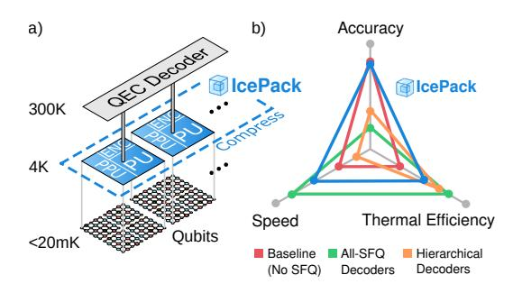

Fig. 1. Panel (a): IcePack overview, with 4 K compression and 300 K decoding. It features a tiled, parametric SFQ design, with each tile comprising preprocessing (PPU) and processing units (PU) for syndrome index reduction, as well as a unit for index encoding (ENC). It communicates to 300 K via a single cable, and handles multiple physical and logical qubits. Panel (b): Qualitative comparison of IcePack (blue line) against three digital-readout designs: (i) a baseline configuration with no SFQ processing, where raw syndrome data are decoded at 300 K (red line); (ii) an all-SFQ design performing decoding entirely at 4 K (green line); and (iii) a hierarchical approach that partitions decoding between 4 K and 300 K (orange line).

by minimizing external signal connections and placing these systems close to the qubits (e.g., at 1–4 K), will improve scalability and performance. In a sense, this would parallel the evolution of classical electronics, from early computers with dedicated wiring for each digit to VLSI circuits [18].

Recent works propose reducing both downstream and upstream connectivity. Downstream bandwidth can drop by orders of magnitude [65] by moving control hardware from 300 K to ≤4 K via cryogenic microwave pulse shaping [5] or replacing microwaves with single flux quantum (SFQ) pulse trains [43]. Upstream, the cryogenic digital readout, with devices like the Josephson photomultiplier [48], assigns only one bit to one ancilla per round. Yet, as reported in prior studies [5], these advances are far from enough even under an optimistic 1 mW/qubit power budget, which must cover cabling, control, readout, and all supporting electronics.

# Challenge

For cabling, the main challenge is upstream: although control electronics are being optimized to nearly eliminate downstream traffic [65], qubit measurements must still be continuously sent to the 300 K decoder. Cabling costs can be reduced by serializing measurement bits, but serialization is bounded by the ∼1 µs interval between measurement rounds. In practice, the target should be lower (e.g., 100-500 ns) because longer latencies impact fidelity [11]. A 1 µs delay affects the reaction window, which can dominate runtime in time-optimized programs [40], and must not exceed 10 µs from qubit measurement through decoding to control [9], [21].

One might attempt to lower latency by adding more cables or using faster ones, but this would increase the thermal load per qubit by up to 0.1 mW (Section VI-B3), a significant share of the 1 mW total budget. In other words, the obvious approaches fall short in opposite ways. Higher cable count or speed reduce latency but increase thermal load, while longer data serialization reduces thermal load but increases latency. This stalemate leaves one path to simultaneously reduce both: cut the upstream data volume.

#### Proposal

We introduce IcePack: the *first* superconducting implementation of quantum error-syndrome compression designed for near-qubit operation, to our knowledge. The result is simultaneous order-of-magnitude reductions in both thermal load and syndrome-data communication latency, without compromising decoding accuracy. Unlike prior syndrome-compression studies [11] (Section III), which provided no realization details, IcePack proposes a complete architecture. This advance extends beyond implementation to the compression method itself: prior techniques remove only zero syndrome indices [11], whereas IcePack compresses both zero and nonzero indices, including measurement errors, and optimizes their encoding for reduced bit count. Moreover, IcePack's full compatibility with 300 K decoders further differentiates it from superconducting decoder designs. Studies show that even the most advanced hierarchical CMOS/SFQ decoders require up to 50% more physical qubits to match 300 K accuracy [2], [61]—a penalty IcePack avoids entirely.

# Contributions

IcePack provides both algorithmic and architectural contributions. Algorithmically (Section IV), it: (1) encodes clusters of syndromes as error types (spatial clustering) by repurposing local decoding rules from hierarchical decoders. Unlike in hierarchical decoders, the limited scope of these rules does not reduce accuracy, because they are applied to compression, not decoding. Lossless decompression happens at the 300 K layer in under 3 ns (Section VI-B5). IcePack (2) statically predicts that isolated syndromes are more likely to result from measurement errors than error chains (temporal clustering). Thus, measurement errors can be handled in their first round of appearance, recording each with a single index. Finally, IcePack (3) reduces the bit count for the remaining indices by applying variable-length codes (e.g., Rice-Golomb). This is motivated by the characteristics of the new syndrome distribution after the two above rounds of index reduction.

At the architecture level (Section V), IcePack's design is shaped by the speed mismatch between slower cabling from 4 K to 300 K and faster SFQ logic. Accordingly, IcePack (4) introduces a streaming microarchitecture with coarserlevel parallelism, rather than a fully parallel implementation as seen in decoder accelerators [27], [54]. This transition allows IcePack to (5) leverage delay-line memory structures (DLMs) [75], which scale better than grid-based memories [58]. DLMs can be thought of as addressable circular shift registers, but do not require Josephson junctions (JJs) for data storage. Instead, they rely on wiring layers, available in multi-layer stackups such as those offered by MITLL [67] and proposed by imec [24], [51]. Finally, to implement compression methods (1) and (2) on a DLM-centric design, IcePack (6) reformulates them as pattern-matching problems using cellular automata concepts from CAM8 [41].

In summary, IcePack's contributions fall into two complementary sets. Contributions (1)–(3) improve compression, reducing both thermal load and serialization latency, and remove dependence on future-round syndromes that slow hierarchical decoders. Contributions (4)–(6) implement a tiled, parametric SFQ design using only 3-14 JJs per ancilla qubit. This enables scaling to millions of qubits, required for fault-tolerant applications such as RSA factoring [21], within current superconductor electronics fabrication capabilities [68]). Figure 1 provides a system overview and its qualitative advantages.

# Results

Our evaluation (Section VI) consists of three main components.

- Upstream latency: IcePack cuts upstream data by 300× compared to uncompressed digital readout and by 2.4 − 4× relative to recent (theoretical) compression methods [11], with no information loss (Section IV). Serialization latency scales linearly with data volume for a fixed cable count.
- Hardware resources: IcePack requires 7 − 30× fewer JJs per ancilla qubit than the most lightweight superconducting decoder to date [54]. A direct resource comparison with prior syndrome-compression work [11] is not possible, as IcePack is the first superconducting implementation of its kind—previous proposals provided no realization details. We validate IcePack's implementation feasibility using modeling, simulation, and fabrication results.
- Thermal load: IcePack reduces per-qubit upstream communication thermal load by 180× at constant latency. Alternatively, the result can be viewed as a Pareto improvement: a simultaneous order-of-magnitude reduction in both thermal load and latency.

# II. BACKGROUND

# *A. Surface codes*

Quantum error correction (QEC) protects quantum information by encoding it across multiple physical qubits, collectively forming a logical qubit. Surface codes, the most adopted QEC scheme—especially for superconducting qubit implementations—arrange physical data qubits in a twodimensional lattice. These data qubits are interspersed and entangled with two types of ancilla qubits, which, when

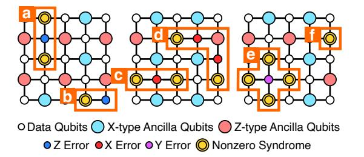

Fig. 2. Surface code with distance d = 3: smaller circles are data qubits, larger circles are ancilla qubits. Highlighted data qubits indicate physical errors; highlighted ancilla qubits indicate a syndrome value of 1. Cases (a) and (b): A phase-flip error (Z) triggers neighboring X ancilla qubits. Case (c): A bit-flip error (X) triggers Z ancilla qubits. Case (d): An error chain triggers ancilla qubits at its boundaries. Case (e): A bit- and phase-flip error (Y ) triggers all four neighbors. Case (f): A measurement error triggers a single ancilla qubit.

measured, produce syndromes that identify new bit-flip (X) and phase-flip (Z) errors, or a combination of those (Y ).

Considering that error detection in surface codes relies on parity checks, ancilla qubits detect error boundaries rather than individual errors. For example, a single X or Z error on a data qubit affects the parity checks of two adjacent ancilla qubits and results in two nonzero syndromes, while a Y error triggers four. Conversely, an ancilla qubit coupled to an even number of erroneous data qubits reports a zero syndrome, as the effects of the errors cancel out. This phenomenon leads to the formation of error chains. Figure 2 illustrates these scenarios using surface codes of distance d = 3. The distance d denotes the number of data qubits along the lattice's edges and determines the code's error correction capability.

In addition to data errors, noise can affect ancilla qubit measurements, producing measurement errors. These errors are distinguished from data errors through temporal analysis, which adds a third dimension to the decoding graph (Figure 3). Data errors produce nonzero syndromes only in the round they occur, as their effect on ancilla measurements remains consistent in subsequent rounds. Measurement errors manifest as transient changes in ancilla readings, producing paired nonzero syndromes in consecutive rounds.

IcePack is optimized for surface codes and addresses both data and measurement errors. The approach can be extended to other codes with a repeating grid structure. We provide further discussion in Section VII.

# *B. Superconductor electronics*

Beyond qubits, superconductors can be employed for classical computation. Their switching element, the Josephson junction (JJ), exhibits switching latencies on the order of 1 ps while consuming 0.2 aJ in energy while operating at 4 K. Traditional logic families, such as rapid single flux quantum (RSFQ) [39] and its variants [33], provide a range of clocked logic gates based on JJs. Alternatives such as alternating SFQ (xSFQ) [69] and dynamic SFQ (DSFQ) [56] remove the clock from gate semantics, through data-encoding or circuit modifications, enabling greater architectural flexibility.


Fig. 3. Decoding graph of surface codes in three dimensions. Highlighted nodes signify nonzero syndromes, highlighted horizontal edges denote data qubit errors, and highlighted vertical edges indicate measurement errors. Data errors result in nonzero syndromes in the initial measurement round, whereas measurement errors produce nonzero syndromes in consecutive rounds.

On the memory side, implementations with sequential readout are generally preferred when possible, due to their lower controller complexity and reduced fanout cost. A baseline implementation of such storage is the circular shift register, which has been experimentally demonstrated to operate at 16 GHz with bit-error rates below 10<sup>−</sup><sup>10</sup> [26]. Another type of circular storage structure with reduced energy and hardware requirements can be constructed with passive transmission lines (PTLs) [75]. In Section VI-B, we present fabrication results that complement prior publications, demonstrating correct functionality at 33 GHz.

The following articles cover the technology fundamentals and superconductor fabrication capabilities in more detail [29], [50]. The IEEE IRDS report summarizes recent advances [28].

# III. RELATED WORK

Reducing upstream data volume can be achieved in two ways. One is to perform all or part of syndrome decoding at the cryogenic layer; an overview of SFQ-related work on this is provided in Section III-A. The second, less explored approach is syndrome compression, which is where IcePack belongs. We provide a qualitative comparison with prior theoretical approaches in Section III-B and quantitative comparisons throughout the remainder of the paper.

# *A. Syndrome decoding*

*1) All-SFQ decoders:* These designs aim to eliminate upstream syndrome communication beyond the 4 K layer. Notable prior works in this category include NISQ+ [27], QECOOL [71], QULATIS [72] and XQsim [8]. NISQ+ takes advantage of the high clock speeds of SFQ logic to implement a fast approximate hardware decoder, completing decoding tasks for near-term code distances (d ≤ 9) in under 20 ns. While the speed is impressive, the underlying approximation reduces decoding accuracy. This drop is substantial, as their theoretical analysis suggests that NISQ+ only achieves error suppression comparable to that of a non-approximate baseline decoder at half the code distance [27]. QECOOL builds on NISQ+ by adding support for measurement errors, for up to three measurement rounds, which was previously missing. QULATIS and XQsim extend the design from QECOOL, adapting it to lattice surgery for more complex logical operations. Similar to NISQ+, QECOOL and its extensions employ an approximate decoding method, degrading the error threshold by  $3\times$  compared to the baseline decoder.

More broadly, achieving high accuracy, real-time throughput, and low latency in QEC decoding is challenging even at room temperature, where computational resources can be scaled to support the parallelism that scalable decoding requires [60]. These constraints become even more restrictive at 4 K, where tight thermal budgets limit both the complexity and parallelism of any decoder implementation.

2) Hierarchical SFQ/CMOS decoders: These decoders provide a middle ground between fully SFQ-based solutions and the baseline approach, where all syndromes are sent to 300 K decoders. The goal is to reduce upstream syndrome communication relative to baseline (digital readout without 4 K processing) designs while lowering implementation complexity compared to all-SFQ solutions. Prior works include the Clique [54] and Predecoder designs [61]. Clique [54], similar to the Lazy decoder [14], examines local corrections between adjacent ancilla qubits of the same type. This allows the decoder to handle common and trivial decoding decisions in the 4 K layer, while deferring the complex cases to the 300 K decoder. Predecoder decodes simple data and measurement errors similarly to Clique but at the granularity of the physical qubit, not the logical qubit. Like AFS [11], Predecoder uses a sparse representation where only the indices of nonzero syndromes are sent upstream instead of the full binary representation.

However, Predecoder must wait for the next round's syndromes before handling measurement errors, which extends error correction latency by 1  $\mu$ s. A similar waiting requirement is found in Clique. Beyond the latency overhead, both Clique and Predecoder reduce decoding accuracy, increasing the rate of logical errors, by splitting the decoding task between two domains. In this regard, Predecoder reports that up to a 50% increase in the number of qubits is needed to recover the error rates. While Clique does not provide such data directly, an analysis found in Promatch [2] shows that Clique has a  $1,000\times$  increase in logical error rate compared to state-of-the-art CMOS decoders [25], [59].

#### B. Syndrome compression

Compression schemes represent another SFQ/CMOS hybrid but do not fall into the hierarchical decoder category, as they do not split the decoding task between the two domains. All decoding occurs in the 300 K layer to preserve accuracy. The most relevant prior work on compression is AFS [11]. AFS explores a CMOS decoder architecture incorporating a compression component. This component incorporates three parallel methods for removing zero syndrome indices: two based on partitioning syndrome bits into fixed-size blocks and skipping blocks of all zeros (dynamic zero compression and geometry-based compression), and one using a sparse representation that transmits only the indices of non-zero syndromes. AFS reports

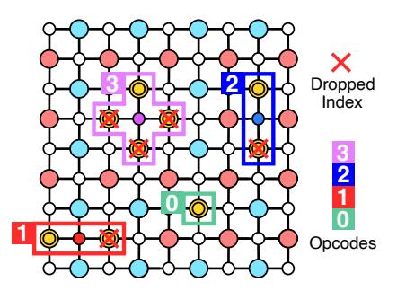

Fig. 4. Illustration of horizontal pair (opcode 1), vertical pair (opcode 2), and cross (opcode 3) patterns. A fourth pattern (opcode 0) represents isolated errors associated with measurement errors or error chains. IcePack stores only the index of the first nonzero syndrome in each pair, assuming ancilla qubits are indexed left-to-right, top-to-bottom. Crossed-out syndromes indicate dropped indices after compression.

sparse representation to be the most effective method, a choice subsequently adopted by Clique [54] and Predecoder [61] as their basis for comparison. Accordingly, sparse representation will serve as the main point of comparison for IcePack, too.

Unlike sparse representation, IcePack does not treat syndrome data as generic sparse bitstreams and therefore goes beyond zero-syndrome compression. It compresses nonzero syndromes by exploiting spatial (Section IV-A) and temporal (Section IV-B) activation patterns arising from data and measurement errors (Section II-A). The latter effectively eliminates additional measurement rounds required by Clique and Predecoder (a major latency contributor) and reshapes the spatial distribution of syndromes to enable more effective encoding optimizations, such as Rice-Golomb variable-length codes (Section IV-C). Alongside these algorithmic improvements, IcePack offers a full architectural analysis and implementation, which neither AFS nor Predecoder provide.

Note that although AFS's geometry-based compression also exploits the spatial locality of nonzero syndromes, it neither leverages the activation patterns induced by data-qubit errors nor accounts for measurement errors and their associated temporal localities that IcePack incorporates. Its coarse granularity also makes it generally less effective than the sparse representation at compressing zero syndromes, particularly at lower error rates where sparsity is higher.

#### IV. ICEPACK: SYNDROME COMPRESSION

In this section, we introduce three compression methods targeting nonzero syndromes, collectively reducing both the number of associated indices and the bits required per index. These methods complement those designed for zero syndromes. The ratio of nonzero to zero syndromes can vary by up to two orders of magnitude across qubit implementations, depending on the physical error rate.

# A. Spatial nonzero syndrome clusters

Nonzero syndromes arise from single data errors, measurement errors, or error chains (Section II-A). The method introduced here targets the first category—spatial clusters

TABLE I PRIORITY AMONG THE FOUR SPATIAL PATTERNS BASED ON THEIR INDEX-REDUCTION POTENTIAL. HIGHER SCORES OVERRIDE LOWER ONES.

| Pattern    | Error | Opcode/Priority | Index reduction |  |
|------------|-------|-----------------|-----------------|--|
| Cross      | Y     | 3               | 75%             |  |
| Vertical   | X/Z   | 2               | 50%             |  |
| Horizontal | X/Z   | 1               | 50%             |  |
| Isolated   | M     | 0               | 0%              |  |

of nonzero syndromes caused by single bit-flip (X), phaseflip (Z), or bit- and phase-flip (Y ) errors. The goal is to represent the two or four nonzero syndromes associated with these errors using one index.

We identify three patterns and assign a distinct opcode to each: a horizontal pair (X or Z errors), a vertical pair (X or Z errors), and a cross (Y error). Figure 4 provides an illustration. Detecting these patterns within a surface code requires only a local view of neighboring ancilla qubits. This resembles how local decoders operate in hierarchical solutions; however, a crucial distinction is that local decoders rely on this limited view to make decisions, which results in accuracy losses [2], [61]. In contrast, our method makes no decoding decisions at this stage. Instead, it applies compression that is losslessly reversed before performing full-accuracy decoding.

Now, assume that ancilla qubits within a logical qubit are indexed in ascending order from left to right and top to bottom. Upon encountering the first nonzero syndrome, its index gets recorded to indicate its position within the lattice. Its neighboring syndromes are then examined for nonzero values matching the horizontal, vertical, or cross patterns described above. If a match is found, the corresponding opcode from Figure 4 is appended to the stored index, while the indices of other syndromes forming the pattern are omitted. This process continues across the entire lattice.

The cross pattern provides the highest compression savings, representing four syndrome indices with just one. Thus, it is assigned the highest priority, overriding any horizontal or vertical matches. If both horizontal and vertical pair patterns are detected but not a cross, priority is given to the vertical pair. While the method would still function with horizontal pairs taking precedence, vertical pairs are chosen as they result in simpler circuitry. If no pattern matches—indicating the syndrome is part of a measurement error or an error chain of arbitrary length—the opcode is set to 0, marking it as an isolated error, which we handle in Section IV-B. Table I summarizes these priorities.

Figure 5 quantifies the compression performance of this method across error rates ranging from 0.01% to 1% and code distances d from 11 to 31. The results show that, in the presence of only data errors, it consistently eliminates 57–61% of indices. When measurement errors are introduced, the reduction drops to 32–35%, as these errors typically do not form multi-syndrome clusters within a single round, causing them to be represented similarly in the sparse representation and our scheme. This observation motivates the temporal

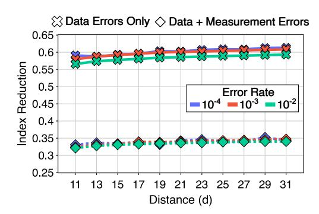

Fig. 5. Nonzero syndrome index reduction achieved by compressing spatially local clusters in surface codes across various code distances and physical error rates. With only data errors, the number of such indices decreases by 57–61%. When measurement errors are included, the reduction drops to 32–35% due to measurement errors not forming multi-syndrome clusters in a single measurement round.

pattern-based compression approach that follows.

Note that existing syndrome compression schemes, such as AFS, do not handle nonzero syndromes and therefore achieve no index reduction (rate = 0.0).

# *B. Temporal nonzero syndrome clusters*

Isolated nonzero syndromes can result from either single measurement errors or error chains. Distinguishing between the two requires temporal analysis (Section II-A). In this section, we focus on compressing temporal clusters. Similar to Section IV-A, the objective is to minimize the number of communicated nonzero syndrome indices.

A naive approach would mimic the spatial clustering discussed earlier, storing the first index with opcode 0 and waiting for the next measurement round to determine whether it belongs to a measurement error. However, this would introduce a latency penalty of one measurement round, akin to hierarchical decoders. Instead, IcePack exploits the fact that measurement errors are statistically much more common than error chains (when a new opcode 0 appears, the next round is likely to contain another opcode 0 at the same position, forming a measurement error pair) [15]. A single index is used for the pair and speculatively communicated


Fig. 6. Isolated nonzero syndromes (opcode = 0) are more likely to result from measurement errors rather than being part of an error chain. Based on this, we predict that both highlighted nonzero syndromes at round t are caused by measurement errors. The first prediction (ID1=50) is confirmed at t + 1; the second (ID2=60) lacks a repeat, so we flag it by encoding an additional index with a 0 opcode.

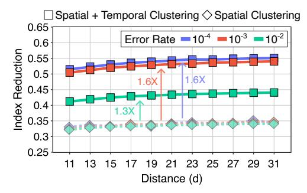

Fig. 7. Adding temporal compression (squares) to spatial compression (rhombuses) increases nonzero syndrome index reduction from 32–35% to 51–55% (a 1.6× improvement) for error rates of 0.01% and 0.1%. At higher physical error rates, like 1%, the index reduction rises to 41–44% (a 1.3× increase). This boost is constrained by the higher rate of error chains, which leads to more mispredictions. Existing methods like AFS ignore nonzero syndromes, yielding an index-reduction rate of 0.0.

upon prediction, avoiding the additional measurement-cycle latency of hierarchical decoders.

In the case of a misprediction, a straightforward correction mechanism to ensure lossless syndrome recovery applies. If the predicted second nonzero syndrome does not appear, an index is encoded at the position of the failed prediction using the same opcode 0. Because the decoder infers a nonzero syndrome at this position when no index is received, the explicit receipt of an index signals the absence of the syndrome. Misprediction only increases the transmitted data by a single index, without affecting decoding accuracy or latency.

Figure 6 illustrates our temporal clustering with a simple example. Suppose two opcode 0 (isolated) syndromes appear at measurement round t: one at ID<sup>1</sup> = 50 and another at ID<sup>2</sup> = 60. In both cases, it predicts that a matching syndrome will appear at the same location in round t + 1. In the first case, the prediction is correct and the index at ID<sup>1</sup> = 50 (round t + 1) gets dropped. In the second case, the prediction is incorrect; thus, an opcode 0 and the respective index are added for ID<sup>2</sup> = 60 (round t + 1) to indicate the misprediction.

To quantify this method's effectiveness, the results in Figure 5 were revisited. Simulations were rerun under the same assumptions, with updated results summarized in Figure 7. When compressing temporal clusters, the reduction in nonzero syndrome indices improved from 32-35% to 51–55% (1.6×) for physical error rates between 0.1% and 0.01%. At a 1% error rate, the reduction rose from 32–34% to 41–44% (1.3×), limited by the higher frequency of error chains.

# *C. Error cluster index encoding*

The above two methods reduce the count of nonzero syndrome indices to transmit; here we focus on minimizing the bits needed to encode them. The proposed encoding approach is independent of earlier compression steps, but the removal of spatial and temporal correlations in those steps yields a more favorable distribution—one that closely mirrors the independent and identically distributed (IID) physical errors with fixed probability p, i.e., a Bernoulli process.

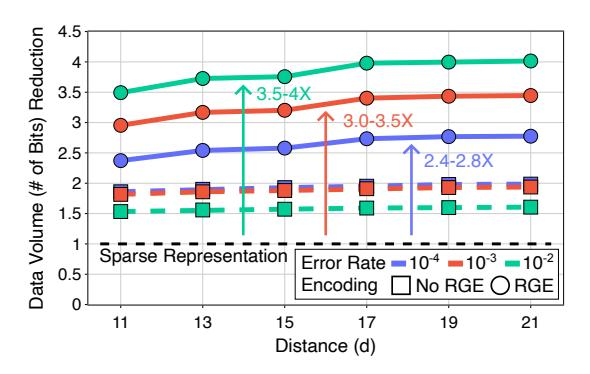

Fig. 8. With Rice-Golomb encoding (RGE, circles), total transmitted bits for 1,000 logical qubits drop by 2.4–4× compared to AFS. Without RGE (No RGE, squares), the savings come solely from spatial and temporal compression. Reductions in bit count saturate at d = 17; we restrict the analysis to d ≤ 21 so simulated syndromes remain under one million.

The geometric distribution of gaps between nonzero syndrome indices in this Bernoulli process is well suited to Golomb coding [23]. In Golomb codes, a parameter m, optimally selected based on the error probability p, encodes each gap value n in two parts: (1) a quotient q = ⌊n/m⌋ and (2) a remainder r = n mod m. The quotient is represented in unary (q ones followed by a zero) and the remainder is represented in truncated binary (log<sup>2</sup> (m) bits).

Golomb coding can be illustrated with an example. For m = 4, consider a gap of 11 between two error indices (ID<sup>1</sup> = 632, ID<sup>2</sup> = 643) in a stream of 1,000 events. Without Golomb coding, representing the second index requires log<sup>2</sup> (1, 000) ≈ 10 bits. Using Golomb coding, the gap 11 is encoded with quotient q = 2 and remainder r = 3; the quotient in unary is 3'b110 and the remainder in binary is 2'b11, yielding a 5-bit code 5'b11011, halving the bit requirement.

In our evaluation, we opt for Rice-Golomb encoding (RGE) [55] over the original Golomb codes. In RGE, m is restricted to powers of 2 (m = 2<sup>k</sup> ), which trades off theoretical optimality for hardware simplicity. The quotient-remainder division becomes a simple bit-shifting operation. We apply RGE collectively across all logical qubits, as the error statistics do not differentiate between logical qubits.

Figure 8 presents final results, showing a 2.4−4× reduction in bit count compared to AFS's leading sparse representation, corresponding to up to a 300× reduction relative to uncompressed digital readout, which itself exceeds the efficiency of current RF implementations. RGE has the strongest impact at p = 1%. At p = 0.01%, its contribution is smaller than

TABLE II DATA-REDUCTION BREAKDOWN OF SPATIAL AND TEMPORAL CLUSTERING VS. RICE–GOLOMB ENCODING (RGE) ACROSS ERROR RATES FOR d = 21. RESULTS NORMALIZED TO AFS.

| Error rate | Clustering | RGE   | Total |  |
|------------|------------|-------|-------|--|
| 10−4       | 1.99×      | 1.40× | 2.79× |  |
| 10−3       | 1.94×      | 1.78× | 3.45× |  |
| 10−2       | 1.61×      | 2.50× | 4.03× |  |

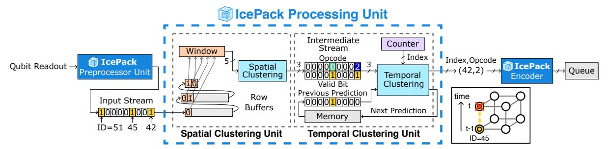

Fig. 9. IcePack processing unit (PU) consisting of a spatial clustering unit (SCU) and a temporal clustering unit (TCU). The SCU receives a sequential bitstream of syndromes as input. Highlighted indices are detailed in Figure 11. Row buffers generate a sliding search window over the surface code lattice for spatial pattern recognition. SCU's output is a 3-bit vector: 2-bit opcode and 1-bit for valid indication. The TCU processes the SCU's outputs alongside a stream of predictions from the previous round to generate index/opcode entries for the queue and predictions for the next round of measurements.

that of clustering, as shown in Table II. This happens because nonzero syndrome sparsity depends on the physical error rate, which can vary by two orders of magnitude across qubit implementations.

#### V. ICEPACK: ARCHITECTURE

This section describes the implementation of the compression methods from Section IV in digital superconducting hardware. The objective is to develop an architecture that (a) allows the compressed syndromes to be transmitted to the decoder within the same measurement cycle and (b) is lightweight enough for manufacturability using existing and near-term fabrication processes [24], [67], while preserving as much resource and thermal budget as possible for other functionalities that are required at the 4 K layer. Figure 9 shows an overview of the proposed design.

## A. Processing

We first argue for a streaming microarchitecture over fully parallel designs such as NISQ+ [27], QECOOL [71], and Clique [54], and then present implementations for the three compression methods introduced in Section IV, which exploit SFQ's high-speed gates and low-attenuation interconnects.

1) Parallel vs. Streaming: SFQ circuits routinely operate at tens of GHz [19], whereas 4 K-to-300 K cables typically transmit data at 1 Gb/s [36], [70]. A fully parallel implementation would minimize processing delay, but the benefit


Fig. 10. Queue occupancy over processing cycles, with index entry times marked by vertical red lines. The queue is written sporadically at index granularity by the processing unit and read continuously at bit granularity. Because the input rate exceeds the output rate, the queue always contains data to transmit. A physical error rate of 1% is assumed for the shown simulations.

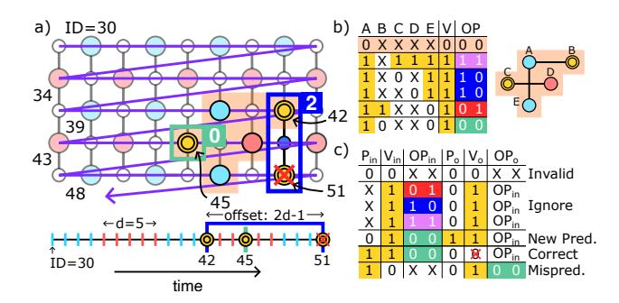

Fig. 11. Panel (a): Syndrome values are read serially from a two-dimensional lattice in row-major order, providing inputs to the SCU. Nonzero syndromes appear at indices 42, 45, and 51. Indices 42 and 51 form a vertical pair, leading the SCU to return OP=2'b10 (opcode) and V=1'b1 (valid bit, indicating a successful match). The syndrome at index 45 is isolated, so the SCU returns OP=2'b00 and V=1'b1. Panel (b): Truth table defining the SCU logic over the syndrome values within the five ancilla qubit search window. The output consists of a valid bit and a 2-bit opcode. Panel (c): Truth table defining the TCU logic.  $V_{in}$  and  $OP_{in}$  represent the SCU's outputs.  $P_{in}$  is the prediction from the previous round, and  $V_o$  is the predicted value for the next round.  $V_o$  and  $OP_o$  denote the updated valid and opcode values for this index. When the prediction is correct, the index is discarded.

to total system delay is negligible—the cable's serialization bottleneck dominates, making the hardware cost of parallelism far outweigh any benefit. For instance, parallel designs with dedicated hardware per physical qubit complete processing in under 0.3 ns [54], yet assume  $1~\mu s$  serialization time.

We propose a streaming microarchitecture. Our motivation is twofold: to reduce hardware by eliminating parallel processing units and to shrink queue size by changing from parallel-write/serial-read to serial-write/serial-read. The latency overhead of streaming is minimal (see Section V-B1), as the processing time is hidden by the longer serialization latency. Longer pipelines, such as those in RSFQ implementations, are advantageous for maximizing throughput.

Figure 10 illustrates how processing-syndrome transmission pipelining operates. To prevent transmission stalls (e.g., pipeline bubbles), it is sufficient that the queue does not become empty before new data is loaded. Note that although input data entry times are irregular due to the unpredictable occurrence of nonzero syndromes, the queue consistently

maintains buffered data to transmit.

2) Spatial Compression Implementation: The internal pipeline in an IcePack processing unit (PU) consists of a spatial clustering unit (SCU) and a temporal clustering unit (TCU), as depicted in Figure 9. The SCU, discussed here, sequentially receives a bitstream of syndrome indices in row-major order. In this representation, positional relationships in the two-dimensional lattice are mapped onto the temporal domain. For example, the ancilla qubit to the right of the current index (conceptually forming a horizontal pair pattern, see Figure 4) is sampled in the next clock cycle, while the one below it (forming a vertical pair pattern) is sampled after a delay of 2d-1 cycles, where d is the surface code distance. Figure 11a provides a visualization.

The input bitstream is buffered with fixed delays to create a temporal search window, resembling the operation of streaming cellular automata machines, such as CAM8 [41]. A straightforward way to implement fixed delays is through a shift register with readout taps positioned according to the desired offsets, based on the search window structure (group of five ancilla qubits, superset of our four spatial patterns, highlighted in orange in Figure 11). This implementation is well-suited for SFQ technology, where shift registers are among the most well-studied circuit designs [45]. An alternative to shift registers is passive transmission lines (PTLs), which serve as analog delay elements that can be synchronized through read/write control signals. If composed of high kinetic inductance, PTLs exhibit extremely high delay per unit length, which enables high data density [75].

From a logical perspective, only a combinational circuit is required to implement the truth table shown in Figure 11b. This circuit checks the syndrome bits within the search window to identify any of the patterns in Figure 4. The output is one of four associated opcodes (OP): 3 for cross, 2 for vertical pair, 1 for horizontal pair, and 0 for isolated syndrome. A separate valid bit (V) is used to indicate the presence of a match. In case of a successful match, the input bits associated with the match are cleared from the row buffer. False positives may arise in edge cases where nonzero syndromes appear at opposite boundaries of the lattice. These false positives are losslessly reversed during decompression, without requiring support at the compression stage (detailed in Section VI). Additionally, they do not require extra bits for encoding compared to correctly detected boundary cases; thus, they do not affect the compression rate.

3) Temporal Compression Implementation: The temporal clustering unit (TCU) processes the SCU's output data  $(V_{in}, OP_{in})$  together with a stream of predictions from the previous round  $(P_{in})$  to update valid and opcode values  $(V_o, OP_o)$  by dropping correctly predicted indices and adding mispredicted ones, while generating new predictions  $(P_o)$ .

When  $P_{in}=0$ , the TCU sets  $P_o=1$  for a valid isolated nonzero syndrome ( $V_{in}=1,\ OP_{in}=0$ ). If  $P_{in}=1$ , the TCU either drops the corresponding syndrome index ( $V_o=0$ ) if the prediction succeeds ( $V_{in}=1,\ OP_{in}=0$ ) or inserts a

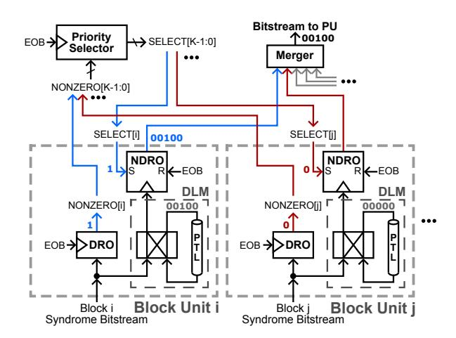

Fig. 12. An IcePack PPU consists of K block units (BUs), each using a DRO cell to detect if all incoming syndrome bits are zero and skip the block if so. The priority selector activates the remaining blocks sequentially from left to right, with an NDRO cell masking data from unselected blocks.

new one  $(V_o=1,\,OP_o=0)$  if the prediction fails  $(V_{in}=0)$ . Predictions for multi-syndrome clusters  $(OP_{in}\in[1,3])$  are ignored to prevent data loss. Figure 11c summarizes this.

The TCU tracks the bitstream's running index by sampling a shared counter and entering both the index and opcode into the queue whenever a valid index is encountered. Figure 9 illustrates an example where V=1 and OP=0 appears at index 45 in round t-1, triggering a prediction, marked by 1'b1 in the previous prediction stream. In round t, the SCU returns V=1 and OP=0 for the same index, confirming the prediction according to the TCU logic, which invalidates the entry by excluding its index and opcode from the queue.

The final TCU component to discuss is memory. For its implementation, similar structures to those used for SCU's row buffers can be applied. However, in the SCU, the delay corresponds to the time between two subsequent indices within the same measurement round, whereas in the TCU, the delay for predictions is equal to the longer measurement round duration. To avoid excessively long shift registers or feedforward PTLs, we use PTL-based circular delay structures, interfaced to with a simple controller. Our experimentally-verified prototype (Section VI-B) demonstrates the feasibility of this approach and complements prior theoretical studies [75].

## B. Preprocessing

The preprocessing unit (PPU) receives newly generated syndrome data from raw qubit measurements and streams them to the PU. We introduce all-zero block filtering, which partitions the syndrome bitstream into blocks and discards those containing only zeros. By doing so, it reduces the number of bits processed serially, accelerates queue filling, and prevents pipeline bubbles (as discussed in Section V-A1).

We implement this using a single destructive readout (DRO) cell, functionally equivalent to a D flip-flop, per block as a filter. All syndrome bits in a block are serially sent to its data port. If any bit is nonzero, the DRO gets loaded; otherwise,

it remains unloaded. At the end of the block, an end-of-block (EOB) signal clocks the DRO. A loaded DRO outputs 1'b1, indicating the block should not be skipped, while an unloaded DRO outputs 1'b0, allowing the block to be safely skipped. Figure 12 provides an illustration.

The PPU includes one block unit (BU) for each block. Within each BU, the incoming syndrome data are stored in a sequential memory, implemented using PTLs as delay mediums [75]. These memories are read in ascending order of nonzero blocks, facilitated by a shared priority selector (which chooses the block to read), a non-destructive readout (NDRO) cell per BU (acting as a filter similar to the DRO), and a merger tree (which consolidates data from multiple inputs into a single output, analogous to an asynchronous OR-tree). The mergers' outputs are forwarded to the PU (Section V-A) for processing.

1) Block size selection: The optimal block size depends on two factors that determine nonzero syndrome indices and queue occupancy: the speed disparity between processing (producer) and cable transmission (consumer), and the physical error rate. Here, we assume a 10× difference—10 GHz operation for SFQ (a conservative estimate, compared to prior demonstrations [19], [26] and experimental results in Section VI-B) versus a 1 Gb/s stainless-steel coaxial cable [36], [70]—and consider error rates from 0.01% to 1%. The results for the 99th-percentile latencies are shown in Figure 13. For a 1% error rate, latency remains consistent across all block sizes within the tested range. For error rates below 1%, latency is stable for block sizes up to 128. Beyond this point, the indices are too sparse to keep the data buffer consistently full for transmission, resulting in pipeline bubbles.

#### C. Encoding

Golomb codes encode the gap between two indices rather than the index values themselves (Section IV-C). Accordingly, we use a subtractor circuit to compute this gap. To extract the quotient  $(q = \lfloor n/2^k \rfloor = n \gg k)$ , as simplified in the Rice-Golomb variant) and remainder  $(r = n \mod 2^k = n[k:0])$ , a hardwired bit shift suffices, incurring no hardware cost. A counter is used to convert the quotient from binary to unary.

# VI. EVALUATION

#### A. Data Volume & Latency

Reductions in transmitted syndrome indices and bit count were evaluated using the QEC simulator Stim [20], employing its built-in surface code constructions for distances 11–21. For the main analysis, the phenomenological error model [15] was used, consistent with prior work. Error rates ranged from 0.01% to 1%, as in AFS and Predecoder [61]. For each distance–error rate pair, 20,000 independent runs spanning multiple measurement rounds were performed to capture measurement errors. The number of logical qubits was set to 1,000, matching the scale needed for fault-tolerant applications such as RSA factoring [21]. Results comparing IcePack to AFS [11] are shown in Figures 5, 7, and 8. AFS's syndrome compression does not handle nonzero syndromes, corresponding to an index reduction rate of 0.0 in Figures 5 and 7.

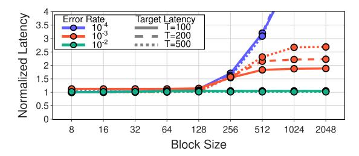

Fig. 13. Queueing analysis shows no latency dependence on block size at a 1% error rate. At 0.01%–0.1%, block sizes up to 128 bits avoid added latency; larger blocks increase latency due to sparse indices.

In summary, our spatial and temporal compression reduces transmitted syndrome indices by 41–55% compared to AFS. Combined with Rice-Golomb encoding (RGE), this lowers total transmitted bits by 2.4–4× (detailed breakdown in Table II) and up to  $300\times$  compared to a digital readout without 4 K processing. The reduction in serialization latency scales proportionally with data volume when cable count is fixed; for instance, a 500 ns serialization with IcePack would correspond to 1.2–2  $\mu s$  under AFS—beyond the 1  $\mu s$  measurement-round limit. Section VI-B3 discusses how reduced data volumes lead to thermal-load savings, subject to hardware implementation.

Lattice surgery: We extend our analysis to lattice surgery, a method for performing logical gates by merging and splitting adjacent patches through measurements on ancilla qubits along their shared boundaries (intermediate qubits) [30]. IcePack's compression is agnostic to these logical boundaries, operating instead on a continuous grid of syndrome measurements. This allows intermediate ancillas activated during surgery to be treated identically to standard ancillas, requiring no algorithmic changes. When intermediate ancillas are idle, their lack of measurement is represented as a zero syndrome. IcePack then omits the indices of these zero syndromes, effectively eliminating communication overhead from inactive regions of the lattice. On the host side, the predefined surgery schedule is used to distinguish between a zero result and a skipped measurement, ensuring reconstruction without extra signaling.

Architecturally, the only parameter tied to the geometry of the grid (the two-dimensional lattice) is the width of the section. We define a section to be a rectangular subselection of points on the grid from top to bottom. Within a section, syndromes get serialized in row-major order. Sections are serialized one after the other. Figure 14 provides an illustration: a purple arrow shows the row-major serialization in the first section, which is followed by the row-major serialization of the second section colored in blue. The section width dictates the SCU row-buffer size, which stores the input stream between vertically adjacent syndromes (Figure 9). Compression is unaffected when a section spans the full physical grid. Limiting the width of a section to reduce the SCU row-buffer size creates seams between adjacent sections. Patterns crossing these seams cannot be spatially clustered and are


Fig. 14. Lattice surgery example illustrating two rectangular sections serialized one after the other in row-major order (purple and blue arrows), similar to Figure 11. Bold qubits denote intermediate ancillas used for lattice surgery; these are shown as black/gray when inactive (no measurements) and red when active. Dashed outlines represent logical qubit patches, including an extended patch spanning three distance-d units via active intermediate qubits. A horizontal syndrome pair crossing a section seam is encoded as two separate indices due to the interruption of spatial clustering, but still communicated correctly. All other patterns, including those crossing active surgery boundaries within the same section, are clustered normally.

instead transmitted as individual indices (Figure 14).

The impact on compression efficiency is minimal. Because the seams align with patch boundaries, missed patterns only occur when intermediate qubits are active during surgery, a state that does not occur in most rounds [40]. During surgery, for distance d, the fraction of qubits at a patch boundary scales as O(1/d) and only horizontally spanning patterns can cross a seam, corresponding to 1.6-3% of errors for distances 11-21. This can be reduced by increasing the SCU row-buffer size.

Dynamic code distance: Recent architectures such as CaliQEC [16] and Q3DE [64] resize logical qubit patches at runtime. They borrow physical qubits from neighboring patches in response to runtime conditions, such as qubit calibration cycles or localized burst errors. This expansion (e.g., merging a 2 × 2 group of distance-d patches [64]) is executed by enabling additional parity measurements on intermediate ancilla qubits. Because this operation relies on the same fundamental mechanism as lattice surgery, it can be handled by IcePack without redesign. The lattice surgery analysis above covers this case.

*1) Circuit noise:* We extend the analysis to a circuit noise model, where errors can occur mid-measurement. Using Stim's circuit noise framework, we analyze two configurations: (i) 5p measurement noise with 2p reset noise, and (ii) 2p measurement noise with 1p reset noise. The first configuration is commonly used in device-agnostic circuit noise studies, including transformer-based decoder pretraining [6], recent surface code analyses [13], [22], and community decoder benchmarks [42]. The second configuration provides an ad-

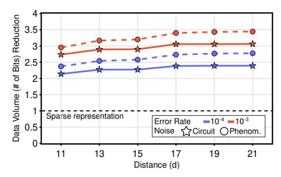

Fig. 15. IcePack's data reduction under circuit-level (stars, solid line) and phenomenological (circles, dashed line) noise (Figure 8), normalized to AFS. Results for p = 10−<sup>2</sup> are excluded because this error rate is above the circuitlevel noise threshold and thus not operationally meaningful [17].

ditional point of comparison from recent measurements [1].

IcePack remains highly effective with a simple adjustment: recording opcode 0 predictions only when all neighboring syndromes are inactive to avoid mispredictions. For the 5p/2p configuration, spatial and temporal clustering removes 34% of indices without increasing implementation complexity. Combined with RGE, this yields a 2.1 − 3.1× data reduction compared to AFS (Figure 15), close to the 3.4× achieved under phenomenological noise at p = 10<sup>−</sup><sup>3</sup> . For the 2p/1p configuration, data reduction relative to AFS reaches 1.9–2.8× at the same operating point.

- *2) Non-IID qubits:* Results from Google's Willow processor [1] indicate significant hardware non-uniformity, with some ancilla qubits exhibiting more than twice the probability of detecting a nonzero syndrome compared to the average. This high local error rate produces a non-homogeneous distribution of detected errors (nonzero syndromes). To evaluate IcePack's, and in particular RGE's, compression effectiveness, we generated 10 configurations of 100,000 ancilla qubits using detection probabilities sampled from Willow's empirical distribution. RGE, tuned to the mean probability pmean, was tested on both a uniform (ideal) configuration and the 10 variable configurations. Despite local variations, gap length distributions remained geometric as differences averaged out over distance, and compression rates stayed within 1% of the ideal, confirming RGE's robustness to hardware variability.
- *3) Error-rate drift:* Spatial and temporal clustering are naturally robust to error drift. Neither depends on error-ratespecific parameters. Spatial clustering uses the fixed geometry of the lattice. Temporal prediction works the same at all error rates. It provides benefits as long as measurement errors happen more often than error chains, a condition that holds across the operationally viable range.

The only error-rate-dependent parameter in IcePack is the Rice-Golomb parameter k (where m = 2<sup>k</sup> ), which determines the bit position separating the unary quotient from the binary remainder during encoding (Section IV-C). At the system level, cable allocation must support the worst-case bandwidth corresponding to the highest error rate. When error rates are lower, the data volume is smaller. This does not compromise functionality, but the unused bandwidth cannot be reclaimed to reduce thermal cost because the cable count is fixed.

To evaluate, we consider a scenario where the physical error rate drifts by a factor of 10, from 10<sup>−</sup><sup>3</sup> to 10<sup>−</sup><sup>2</sup> , with k tuned for the 10<sup>−</sup><sup>2</sup> endpoint. We examine the impact of this parameter mismatch across the entire drift range for distance d = 21. Throughout the transition, the data volume stays consistently below the allocated bandwidth, confirming that IcePack functions correctly without any online adjustments. At p = 10<sup>−</sup><sup>3</sup> , the point of maximum mismatch, IcePack achieves a 1.9× compression ratio over sparse representation while using only 21% of the available bandwidth.

To maintain optimal compression of 3.5× over sparse representation at the same point (Figure 8), the ENC module must be able to adjust k by up to 3 bits for the unary–binary split. In hardware, this can be implemented with a simple barrel shifter, which requires two multiplexers per bit. This adds only a small overhead to the ENC module, which is shared among thousands of qubits (Table III). Because physical error rates in superconducting qubits drift over timescales of minutes to hours [16], [34], k can be determined offline without any runtime tracking overhead.

*4) Multi-bit burst errors:* Multi-bit burst errors (MBBEs), such as those caused by cosmic rays, appear as elevated error rates in small regions across multiple rounds. Prior work [44], [64] reports that the largest affected region spans 16 ancilla syndromes, corresponding to about 8 nonzero syndromes per round on average, or roughly 2 to 4 independent singlequbit errors. Results from Google's Willow below-threshold experiment [1] corroborate this scale and show that such events are extremely rare, occurring about once every 3 billion rounds. Their frequency is therefore many orders of magnitude lower than that of intrinsic errors, which is nevertheless a prerequisite for fault-tolerant quantum computing.

IcePack's compression ratio is determined by aggregate syndrome statistics across all logical qubits. Rare, localized spikes therefore have negligible impact on overall data volume reduction and the small number of additional nonzero syndromes does not stress the queue's operating capacity.

Note that SFQ circuits, such as those used in IcePack, are far more robust to environmental noise than superconducting qubits. Although both rely on JJs, they operate in fundamentally different regimes: SFQ circuits function as classical, quantized-flux switching networks, whereas superconducting qubits rely on quantum coherent states.

*5) Leakage:* Unmitigated leakage—qubit excitation to noncomputational states (e.g., |2⟩)—can propagate through twoqubit gates, introducing correlated errors. Leakage reduction circuits (LRCs) [7], [63] mitigate this by removing leakage every measurement round or within rounds. With LRCs, the resulting syndrome signatures resemble those produced by circuit noise (Section VI-A1). IcePack can therefore compress these signatures effectively, using the same methods as for circuit-noise syndromes.

# *B. Hardware Resource & Thermal Load*

Timing and area data for SFQ cells and superconducting passive transmission lines (PTLs) are taken from recent literature [4], [50], [57], [73], [75]. Hardware and thermal results in this section are reported for surface code distance d = 21. Functional correctness is validated through gate-level simulations in PyLSE [10] with randomized inputs over thousands of measurement rounds, using the IcePack emulator—developed for syndrome compression evaluation (Section VI-A)—as the golden reference.

SFQ logic: We analyze the three key units, which together form an IcePack tile and can be modularly combined, to guide SFQ logic selection.

Preprocessing unit: The PPU consists of memory modules and synchronization cells (Figure 12). Filtering is handled by DRO and NDRO cells (Section V-B), eliminating the need for additional logic gates. Its size scales with the number of ancilla qubits per IcePack tile, storing one bit per ancilla in the measurement, syndrome, and prediction memories.

Processing unit: The PU operates in a streaming manner, as discussed in Section V-A. Greater pipeline depth and speed improve throughput, allowing larger block sizes and reducing the number of block units per PPU. We implement the PU with clocked RSFQ gates [39] as a 7-stage pipeline, with each stage handling a different position in the syndrome bitstream. The PU's size remains constant regardless of qubit count.

Encoding unit: The ENC (Section V-C) operates at sub-GHz speed, matching index transmission. Here, xSFQ—with its clock-free logic gates [69] (Section II-B)—offers advantages, reducing JJ count (a proxy for area) and power consumption without affecting throughput. As shown in Table III, this is the least resource-demanding component.

SFQ memory: IcePack's streaming architecture favors sequential access memories. Circular shift registers are a conservative choice; they are well-studied SFQ circuits that have demonstrated correct functionality at speeds exceeding our design assumptions (16 GHz [26] vs. 10 GHz). Delay-line memories (DLMs) offer similar functionality with energy and power advantages by replacing the synchronous components (e.g., DROs) of a shift register with passive transmission lines (PTLs). To prevent skew accumulation, the memory controller is synchronous and additional DRO cells segment the PTL, where necessary. Timing analysis at 10 GHz, assuming 20%

TABLE III JJ COUNT ESTIMATES ACROSS PHYSICAL ERROR RATES AT A MEDIAN TARGET SERIALIZATION LATENCY OF T = 500 ns.

| Error | Blocks   | Ancillas | JJs per Tile |         |       | Avg. JJs per |
|-------|----------|----------|--------------|---------|-------|--------------|
| Rate  | per Tile | per Tile | PU           | PPU     | ENC   | Ancilla      |
| 10−2  | 13       | 1,593    | 1,502        | 4,917   | 769   | 4.5          |
| 10−3  | 102      | 13,024   | 1,502        | 40,005  | 987   | 3.3          |
| 10−4  | 760      | 97,250   | 1,502        | 308,230 | 1,324 | 3.2          |

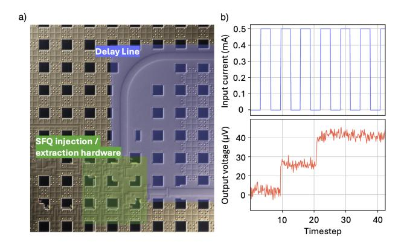

Fig. 16. Panel (a): Photo of the prototyped 2mm Nb delay-line storage loop, fabricated in the MITLL SFQ5ee process—used in the PU and PPU for memory and row buffers (Figures 9 and 12). Panel (b): Analog voltage-sense output with amplitude proportional to the number of SFQ pulses stored in the delay line. Results show two SFQ pulses stored and circulating at 33 GHz.

timing variability for cells and 1% for the PTL [46], [49], shows that up to 41 bits can be stored per PTL before requiring DRO insertion. This results in a  $40 \times$  reduction in the number of JJs per bit compared to a shift-register-based design.

Prior work provides theoretical analysis of DLM storage density [75]. Figure 16 presents our experimental results from a Nb-based DLM, which we fabricated in the MITLL SFQ5ee node [67] and tested at speeds up to 33 GHz.

1) JJ count: Following standard convention, JJ count is used as a first-order proxy for the active SFQ circuitry area. Table III provides a breakdown by unit for a median target serialization latency of T = 500 ns. Figure 17 shows results across a range of latencies. Even the largest configuration remains well within the capabilities of current superconducting electronics fabrication. For reference, the MITLL SFQ5ee process—the same used for the experimental validation in Figure 16—supports integration of over one million JJs per cm<sup>2</sup> [50]. The JJ count per ancilla varies from 3.2 to 13.6, with an average of 4. For comparison, syndrome-parallel local decoders such as Clique [54] require at least 96 JJs per ancilla for core logic and clocking, corresponding to 4 XORs, 2 ANDs, and 2 NOTs. This is 7-30× higher than IcePack even before accounting for additional overheads such as storage, buffering, and serialization.

IcePack's JJ advantage stems from hardware design choices, in particular its streaming microarchitecture and the extensive use of PTLs, rather than algorithmic differences. Both Clique and IcePack perform pattern matching over the same small ancilla neighborhoods, though the two use the results in different ways. A streaming implementation similar to IcePack could in principle be applied to Clique's functionality.

2) PTL area: For PTL-based memories, the area required by the PTLs is also calculated. With a low JJ count per ancilla qubit (Table III) and JJs and PTLs placed on separate layers, PTLs dominate IcePack's layout area, making their footprint the effective area estimate. This area depends on controller

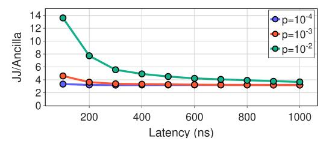

Fig. 17. JJ count per ancilla versus serialization latency. IcePack averages 4 JJs per ancilla, rising to 14 for  $p=10^{-2}$  at 100 ns latency. For comparison, the lightweight Clique [54] requires 96 JJs per ancilla (without accounting for storage, buffering, and serialization overheads).

speed, line velocity factor, wiring layers, and line width and pitch. IcePack uses a conservative 10 GHz speed, while other parameters follow Nb and MoN stripline specifications in SFQ5ee [67] and SC2 [66], two processes currently offered by MITLL. Extrapolating from the original DLM study [75], IcePack requires a maximum of 3,000  $\mu \rm m^2$  per ancilla qubit using Nb striplines in SFQ5ee, or a more compact 187  $\mu \rm m^2$  using MoN striplines in SC2—supporting up to 500,000 qubits per cm². Further scaling can be achieved via higher speeds, advanced processes with high-kinetic-inductance layers [24], and bonding multiple SFQ chips [12].

3) Power consumption & thermal load: Each JJ consumes 0.2 aJ per switch, with biasing adding roughly 50% overhead [74]. In the worst case, when all JJs switch every cycle, IcePack consumes 10–42 nW per ancilla. By comparison, cables draw 1 mW per Gb/s plus 10.5 mW for peripherals [70], reaching 0.1 mW per ancilla. By reducing cable bandwidth requirements, IcePack lowers the total thermal load, after accounting for JJ power consumption. Figure 18 shows the tradeoff between upstream communication thermal load

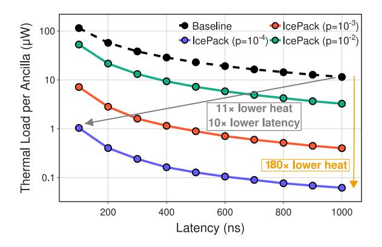

Fig. 18. Thermal load per ancilla versus serialization latency. IcePack achieves a Pareto improvement across all three error rates compared to a digital readout baseline, allowing it to occupy a unique region among other approaches, as illustrated in Figure 1.

(cables plus architecture) and serialization latency, comparing a digital readout baseline with IcePack across error rates. IcePack achieves Pareto improvement—our initial objective, as illustrated in Figure 1—reducing thermal load by 11× and latency by 10×, without any loss of accuracy. Thus, it both frees thermal budget for control, readout, and other electronics [5] and shortens the delay from qubit measurement to decoding and control, which can dominate overall runtime [40].

A direct thermal-load comparison with AFS's sparse representation is not possible at this stage because AFS does not provide a related hardware implementation, although it suggests a fully parallel realization. We compare against a (strictly cheaper) streaming SFQ baseline constructed by excising IcePack-specific components—the SCU, TCU, ENC, prediction memories, and associated routing—while preserving the core Block Units (without the prediction memories) and the Priority Selector (Figure 12) required for sparse encoding. For constant tile sizes, the sparse-representation baseline utilizes 37.5% (p = 10<sup>−</sup><sup>4</sup> ), 43.7% (p = 10<sup>−</sup><sup>3</sup> ), and 63.4% (p = 10<sup>−</sup><sup>2</sup> ) fewer JJs on average than IcePack across latencies. However, these hardware savings do not translate into thermal gains. At p = 10<sup>−</sup><sup>2</sup> and 10<sup>−</sup><sup>3</sup> , JJs contribute less than 2.5% to the per-ancilla thermal load, rendering JJ count reductions thermally negligible. Conversely, the sparse representation baseline supports 3.4–4.0× fewer ancillas per cable, which inflates the dominant cable cost by the same factor. At p = 10<sup>−</sup><sup>4</sup> and T = 1, 000 ns, where the architectural share of the thermal load reaches a maximum of 16%, IcePack's 2.8× compression advantage over sparse representation yields a 2.4× improvement in total thermal cost. In all other operating points, which have a lower relative architectural cost, the gap between IcePack and sparse encoding widens and more closely follows the data-volume reduction trends of Figure 8, confirming that the additional algorithmic complexity consistently returns dividends.

- *4) Processing latency:* To evaluate streaming processing's impact on serialization latency, we use Stim traces to model the syndrome index distribution and run 100,000-cycle simulations of queue occupancy across block sizes and error rates to determine 99th-percentile latency (Figure 13). For block sizes ≤ 128, IcePack's streaming processing adds at most 17 ns, under 4% of the 500 ns target serialization latency.
- *5) Decompression at 300 K:* Decompression happens on the fly as data arrive. For Rice-Golomb codes, a counter handles unary-to-binary conversion and an accumulator maps gap lengths to absolute indices. Spatial cluster expansion requires only an addition with small opcode-dependent constants, corresponding to the offsets shown in Figure 11. For temporal clustering, an ascending-order FIFO is used to store predictions, which are checked via arithmetic comparison. We synthesized the design using Synopsys DC with the Nangate 45 nm library [62]. Post-synthesis results show a decoding latency of 2.5 ns, minor compared to the 100-1,000 ns syndrome transmission latency.

# VII. DISCUSSION: BEYOND SURFACE CODES

The IcePack compression architecture extends naturally beyond surface codes to any topological code characterized by translational symmetry and local grid connectivity, such as color codes [37]. This would require only updates to the local syndrome patterns matched by the SCU. While general qLDPC codes, such as quantum Tanner codes [38], often lack the regular structure necessary for planar routing, superconducting qubit-compatible variants like bivariate bicycle (BB) codes possess a doubly periodic structure that maps effectively onto a repeating grid. In architectures such as IBM's Tour de Gross [76], non-nearest-neighbor connections follow regular, translationally symmetric patterns spanning a few grid sites. IcePack's spatial clustering techniques could be adapted for this by defining patterns that encompass syndromes with small spatial separations, an extension we leave for future work.

# VIII. CONCLUSION

Advances in quantum hardware continue to drive excitement for quantum computing and bring it closer to practical use. Quantum error correction remains critical, as qubits will nevertheless remain noisy. This work targets minimizing data transfer between the cryogenic environment, where qubits are measured, and the room-temperature environment, where state-of-the-art decoders operate—without sacrificing accuracy. To achieve this, we introduce IcePack, a streaming superconducting architecture that microarchitecturally exploits passive transmission lines and a combination of clocked and unclocked SFQ gates to implement: (i) spatial syndrome clustering, (ii) temporal syndrome clustering, and (iii) variablelength syndrome encoding for lossless quantum error syndrome compression. The result is a Pareto improvement, with per-qubit upstream thermal load reduced by 11× and latency lowered by 10×, both critical for system integration, performance, and scalability. Its tiled, parametric design establishes a new benchmark for the superconductor electronics community.

# REFERENCES

[1] R. Acharya, D. A. Abanin, L. Aghababaie-Beni, I. Aleiner, T. I. Andersen, M. Ansmann, F. Arute, K. Arya, A. Asfaw, N. Astrakhantsev, J. Atalaya, R. Babbush, D. Bacon, B. Ballard, J. C. Bardin, J. Bausch, A. Bengtsson, A. Bilmes, S. Blackwell, S. Boixo, G. Bortoli, A. Bourassa, J. Bovaird, L. Brill, M. Broughton, D. A. Browne, B. Buchea, B. B. Buckley, D. A. Buell, T. Burger, B. Burkett, N. Bushnell, A. Cabrera, J. Campero, H.-S. Chang, Y. Chen, Z. Chen, B. Chiaro, D. Chik, C. Chou, J. Claes, A. Y. Cleland, J. Cogan, R. Collins, P. Conner, W. Courtney, A. L. Crook, B. Curtin, S. Das, A. Davies, L. De Lorenzo, D. M. Debroy, S. Demura, M. Devoret, A. Di Paolo, P. Donohoe, I. Drozdov, A. Dunsworth, C. Earle, T. Edlich, A. Eickbusch, A. M. Elbag, M. Elzouka, C. Erickson, L. Faoro, E. Farhi, V. S. Ferreira, L. F. Burgos, E. Forati, A. G. Fowler, B. Foxen, S. Ganjam, G. Garcia, R. Gasca, E. Genois, W. Giang, C. Gidney, ´ D. Gilboa, R. Gosula, A. G. Dau, D. Graumann, A. Greene, J. A. Gross, S. Habegger, J. Hall, M. C. Hamilton, M. Hansen, M. P. Harrigan, S. D. Harrington, F. J. H. Heras, S. Heslin, P. Heu, O. Higgott, G. Hill, J. Hilton, G. Holland, S. Hong, H.-Y. Huang, A. Huff, W. J. Huggins, L. B. Ioffe, S. V. Isakov, J. Iveland, E. Jeffrey, Z. Jiang, C. Jones, S. Jordan, C. Joshi, P. Juhas, D. Kafri, H. Kang, A. H. Karamlou, K. Kechedzhi, J. Kelly, T. Khaire, T. Khattar, M. Khezri, S. Kim, P. V. Klimov, A. R. Klots, B. Kobrin, P. Kohli, A. N. Korotkov, F. Kostritsa, R. Kothari, B. Kozlovskii, J. M. Kreikebaum, V. D. Kurilovich, N. Lacroix, D. Landhuis, T. Lange-Dei, B. W. Langley,

- P. Laptev, K.-M. Lau, L. Le Guevel, J. Ledford, J. Lee, K. Lee, Y. D. Lensky, S. Leon, B. J. Lester, W. Y. Li, Y. Li, A. T. Lill, W. Liu, W. P. Livingston, A. Locharla, E. Lucero, D. Lundahl, A. Lunt, S. Madhuk, F. D. Malone, A. Maloney, S. Mandra, J. Manyika, L. S. Martin, ` O. Martin, S. Martin, C. Maxfield, J. R. McClean, M. McEwen, S. Meeks, A. Megrant, X. Mi, K. C. Miao, A. Mieszala, R. Molavi, S. Molina, S. Montazeri, A. Morvan, R. Movassagh, W. Mruczkiewicz, O. Naaman, M. Neeley, C. Neill, A. Nersisyan, H. Neven, M. Newman, J. H. Ng, A. Nguyen, M. Nguyen, C.-H. Ni, M. Y. Niu, T. E. O'Brien, W. D. Oliver, A. Opremcak, K. Ottosson, A. Petukhov, A. Pizzuto, J. Platt, R. Potter, O. Pritchard, L. P. Pryadko, C. Quintana, G. Ramachandran, M. J. Reagor, J. Redding, D. M. Rhodes, G. Roberts, E. Rosenberg, E. Rosenfeld, P. Roushan, N. C. Rubin, N. Saei, D. Sank, K. Sankaragomathi, K. J. Satzinger, H. F. Schurkus, C. Schuster, A. W. Senior, M. J. Shearn, A. Shorter, N. Shutty, V. Shvarts, S. Singh, V. Sivak, J. Skruzny, S. Small, V. Smelyanskiy, W. C. Smith, R. D. Somma, S. Springer, G. Sterling, D. Strain, J. Suchard, A. Szasz, A. Sztein, D. Thor, A. Torres, M. M. Torunbalci, A. Vaishnav, J. Vargas, S. Vdovichev, G. Vidal, B. Villalonga, C. V. Heidweiller, S. Waltman, S. X. Wang, B. Ware, K. Weber, T. Weidel, T. White, K. Wong, B. W. K. Woo, C. Xing, Z. J. Yao, P. Yeh, B. Ying, J. Yoo, N. Yosri, G. Young, A. Zalcman, Y. Zhang, N. Zhu, N. Zobrist, G. Q. AI, and Collaborators, "Quantum error correction below the surface code threshold," *Nature*, vol. 638, no. 8052, pp. 920–926, Feb 2025. [Online]. Available: https://doi.org/10.1038/s41586-024-08449-y
- [2] N. Alavisamani, S. Vittal, R. Ayanzadeh, P. Das, and M. Qureshi, "Promatch: Extending the reach of real-time quantum error correction with adaptive predecoding," in *Proceedings of the 29th ACM International Conference on Architectural Support for Programming Languages and Operating Systems, Volume 3*, 2024, pp. 818–833.
- [3] F. Arute, K. Arya, R. Babbush, D. Bacon, J. C. Bardin, R. Barends, R. Biswas, S. Boixo, F. G. S. L. Brandao, D. A. Buell, B. Burkett, Y. Chen, Z. Chen, B. Chiaro, R. Collins, W. Courtney, A. Dunsworth, E. Farhi, B. Foxen, A. Fowler, C. Gidney, M. Giustina, R. Graff, K. Guerin, S. Habegger, M. P. Harrigan, M. J. Hartmann, A. Ho, M. Hoffmann, T. Huang, T. S. Humble, S. V. Isakov, E. Jeffrey, Z. Jiang, D. Kafri, K. Kechedzhi, J. Kelly, P. V. Klimov, S. Knysh, A. Korotkov, F. Kostritsa, D. Landhuis, M. Lindmark, E. Lucero, D. Lyakh, S. Mandra, J. R. McClean, M. McEwen, A. Megrant, X. Mi, ` K. Michielsen, M. Mohseni, J. Mutus, O. Naaman, M. Neeley, C. Neill, M. Y. Niu, E. Ostby, A. Petukhov, J. C. Platt, C. Quintana, E. G. Rieffel, P. Roushan, N. C. Rubin, D. Sank, K. J. Satzinger, V. Smelyanskiy, K. J. Sung, M. D. Trevithick, A. Vainsencher, B. Villalonga, T. White, Z. J. Yao, P. Yeh, A. Zalcman, H. Neven, and J. M. Martinis, "Quantum supremacy using a programmable superconducting processor," *Nature*, vol. 574, no. 7779, pp. 505–510, Oct 2019. [Online]. Available: https://doi.org/10.1038/s41586-019-1666-5
- [4] R. S. Aviles, P. A. Beerel *et al.*, "Delay balancing with clock-follow-data: Optimizing area delay trade-offs for robust rapid single flux quantum circuits," *arXiv preprint arXiv:2409.04944*, 2024.
- [5] J. C. Bardin, E. Jeffrey, E. Lucero, T. Huang, S. Das, D. T. Sank, O. Naaman, A. E. Megrant, R. Barends, T. White *et al.*, "Design and characterization of a 28-nm bulk-cmos cryogenic quantum controller dissipating less than 2 mw at 3 k," *IEEE Journal of Solid-State Circuits*, vol. 54, no. 11, pp. 3043–3060, 2019.
- [6] J. Bausch, A. W. Senior, F. J. Heras, T. Edlich, A. Davies, M. Newman, C. Jones, K. Satzinger, M. Y. Niu, S. Blackwell *et al.*, "Learning highaccuracy error decoding for quantum processors," *Nature*, pp. 1–7, 2024.
- [7] N. C. Brown, A. Cross, and K. R. Brown, "Critical faults of leakage errors on the surface code," in *2020 IEEE International Conference on Quantum Computing and Engineering (QCE)*. IEEE, 2020, pp. 286– 294.
- [8] I. Byun, J. Kim, D. Min, I. Nagaoka, K. Fukumitsu, I. Ishikawa, T. Tanimoto, M. Tanaka, K. Inoue, and J. Kim, "Xqsim: modeling crosstechnology control processors for 10+k qubit quantum computers," in *Proceedings of the 49th Annual International Symposium on Computer Architecture*, ser. ISCA '22. New York, NY, USA: Association for Computing Machinery, 2022, p. 366–382. [Online]. Available: https://doi.org/10.1145/3470496.3527417
- [9] L. Caune, L. Skoric, N. S. Blunt, A. Ruban, J. McDaniel, J. A. Valery, A. D. Patterson, A. V. Gramolin, J. Majaniemi, K. M. Barnes *et al.*, "Demonstrating real-time and low-latency quantum error correction with superconducting qubits," *arXiv preprint arXiv:2410.05202*, 2024.
- [10] M. Christensen, G. Tzimpragos, H. Kringen, J. Volk, T. Sherwood,

- and B. Hardekopf, "Pylse: a pulse-transfer level language for superconductor electronics," in *Proceedings of the 43rd ACM SIGPLAN International Conference on Programming Language Design and Implementation*, ser. PLDI 2022. New York, NY, USA: Association for Computing Machinery, 2022, p. 671–686. [Online]. Available: https://doi.org/10.1145/3519939.3523438
- [11] P. Das, C. A. Pattison, S. Manne, D. M. Carmean, K. M. Svore, M. Qureshi, and N. Delfosse, "Afs: Accurate, fast, and scalable errordecoding for fault-tolerant quantum computers," in *2022 IEEE International Symposium on High-Performance Computer Architecture (HPCA)*, 2022, pp. 259–273.
- [12] R. N. Das, V. Bolkhovsky, A. Wynn, J. Birenbaum, E. Golden, R. Rastogi, S. Zarr, B. Tyrrell, L. M. Johnson, M. E. Schwartz *et al.*, "Extremely large area (88 mm× 88 mm) superconducting integrated circuit (elasic)," *Scientific Reports*, vol. 13, no. 1, p. 11796, 2023.
- [13] D. M. Debroy, M. McEwen, C. Gidney, N. Shutty, and A. Zalcman, "Luci in the surface code with dropouts," *Quantum*, vol. 9, p. 1936, 2025.
- [14] N. Delfosse, "Hierarchical decoding to reduce hardware requirements for quantum computing," *arXiv preprint arXiv:2001.11427*, 2020.
- [15] E. Dennis, A. Kitaev, A. Landahl, and J. Preskill, "Topological quantum memory," *Journal of Mathematical Physics*, vol. 43, no. 9, pp. 4452– 4505, 2002.
- [16] X. Fang, K. Yin, Y. Zhu, J. Ruan, D. Tullsen, Z. Liang, A. Sornborger, A. Li, T. Humble, Y. Ding *et al.*, "Caliqec: In-situ qubit calibration for surface code quantum error correction," in *Proceedings of the 52nd Annual International Symposium on Computer Architecture*, 2025, pp. 1402–1416.
- [17] A. G. Fowler, M. Mariantoni, J. M. Martinis, and A. N. Cleland, "Surface codes: Towards practical large-scale quantum computation," *Physical Review A—Atomic, Molecular, and Optical Physics*, vol. 86, no. 3, p. 032324, 2012.
- [18] D. P. Franke, J. S. Clarke, L. M. Vandersypen, and M. Veldhorst, "Rent's rule and extensibility in quantum computing," *Microprocessors and Microsystems*, vol. 67, pp. 1–7, 2019.
- [19] F. Furuta, Y. Suzuki, H. Hasegawa, E. Oya, A. Fujimaki, and H. Hayakawa, "High-speed operation of rsfq circuits up to 30 ghz," *Superconductor Science and Technology*, vol. 12, no. 11, p. 786, 1999.
- [20] C. Gidney, "Stim: a fast stabilizer circuit simulator," *Quantum*, vol. 5, p. 497, Jul. 2021. [Online]. Available: https://doi.org/10.22331/q-2021- 07-06-497
- [21] ——, "How to factor 2048 bit rsa integers with less than a million noisy qubits," *arXiv preprint arXiv:2505.15917*, 2025.
- [22] C. Gidney, M. Newman, P. Brooks, and C. Jones, "Yoked surface codes," *Nature Communications*, vol. 16, no. 1, pp. 1–12, 2025.
- [23] S. Golomb, "Run-length encodings (corresp.)," *IEEE transactions on information theory*, vol. 12, no. 3, pp. 399–401, 1966.
- [24] Q. Herr and A. Herr, "Superconducting digital technology to revolutionize the ai and machine learning roadmap," https://www.imecint.com/en/articles/superconducting-digital-technology-revolutionizeai-and-machine-learning-roadmap?utm source=chatgpt.com.
- [25] O. Higgott and C. Gidney, "Sparse Blossom: correcting a million errors per core second with minimum-weight matching," *Quantum*, vol. 9, p. 1600, Jan. 2025. [Online]. Available: https://doi.org/10.22331/q-2025- 01-20-1600
- [26] T. Hikida, K. Fujiwara, N. Yoshikawa, A. Fujimaki, H. Terai, and S. Yorozu, "Bit-error-rate measurements of rsfq shift register memories," *IEEE transactions on applied superconductivity*, vol. 17, no. 2, pp. 512– 515, 2007.
- [27] A. Holmes, M. R. Jokar, G. Pasandi, Y. Ding, M. Pedram, and F. T. Chong, "Nisq+: boosting quantum computing power by approximating quantum error correction," in *Proceedings of the ACM/IEEE 47th Annual International Symposium on Computer Architecture*, ser. ISCA '20. IEEE Press, 2020, p. 556–569. [Online]. Available: https://doi-org.proxy.lib.umich.edu/10.1109/ISCA45697.2020.00053
- [28] D. S. Holmes, "Cryogenic electronics and quantum information processing," in *2021 IEEE International Roadmap for Devices and Systems Outbriefs*. IEEE, 2021, pp. 1–93.
- [29] D. S. Holmes, A. L. Ripple, and M. A. Manheimer, "Energy-efficient superconducting computing—power budgets and requirements," *IEEE Transactions on Applied Superconductivity*, vol. 23, no. 3, pp. 1 701 610– 1 701 610, 2013.

- [30] D. Horsman, A. G. Fowler, S. Devitt, and R. V. Meter, "Surface code quantum computing by lattice surgery," *New Journal of Physics*, vol. 14, no. 12, p. 123011, 2012.
- [31] IBM Quantum, "IBM Quantum Roadmap," https://www.ibm.com/ quantum/blog/ibm-quantum-roadmap, n.d., iBM Quantum Blog.
- [32] Y. Kim, A. Eddins, S. Anand, K. X. Wei, E. van den Berg, S. Rosenblatt, H. Nayfeh, Y. Wu, M. Zaletel, K. Temme, and A. Kandala, "Evidence for the utility of quantum computing before fault tolerance," *Nature*, vol. 618, no. 7965, pp. 500–505, Jun 2023. [Online]. Available: https://doi.org/10.1038/s41586-023-06096-3
- [33] D. E. Kirichenko, S. Sarwana, and A. F. Kirichenko, "Zero static power dissipation biasing of rsfq circuits," *IEEE Transactions on Applied Superconductivity*, vol. 21, no. 3, pp. 776–779, 2011.
- [34] P. V. Klimov, J. Kelly, Z. Chen, M. Neeley, A. Megrant, B. Burkett, R. Barends, K. Arya, B. Chiaro, Y. Chen *et al.*, "Fluctuations of energyrelaxation times in superconducting qubits," *Physical review letters*, vol. 121, no. 9, p. 090502, 2018.
- [35] P. Krantz, M. Kjaergaard, F. Yan, T. P. Orlando, S. Gustavsson, and W. D. Oliver, "A quantum engineer's guide to superconducting qubits," *Applied physics reviews*, vol. 6, no. 2, 2019.
- [36] S. Krinner, S. Storz, P. Kurpiers, P. Magnard, J. Heinsoo, R. Keller, J. Luetolf, C. Eichler, and A. Wallraff, "Engineering cryogenic setups for 100-qubit scale superconducting circuit systems," *EPJ Quantum Technology*, vol. 6, no. 1, p. 2, 2019.
- [37] N. Lacroix, A. Bourassa, F. J. Heras, L. M. Zhang, J. Bausch, A. W. Senior, T. Edlich, N. Shutty, V. Sivak, A. Bengtsson *et al.*, "Scaling and logic in the colour code on a superconducting quantum processor," *Nature*, vol. 645, no. 8081, pp. 614–619, 2025.
- [38] A. Leverrier and G. Zemor, "Quantum tanner codes," in ´ *2022 IEEE 63rd Annual Symposium on Foundations of Computer Science (FOCS)*. IEEE, 2022, pp. 872–883.
- [39] K. Likharev and V. Semenov, "Rsfq logic/memory family: a new josephson-junction technology for sub-terahertz-clock-frequency digital systems," *IEEE Transactions on Applied Superconductivity*, vol. 1, no. 1, pp. 3–28, 1991.
- [40] D. Litinski, "A game of surface codes: Large-scale quantum computing with lattice surgery," *Quantum*, vol. 3, p. 128, 2019.
- [41] N. Margolus, "Cam-8: A computer architecture based on cellular automata," 1995. [Online]. Available: https://arxiv.org/abs/comp-gas/ 9509001
- [42] S. Maurya, J. Viszlai, N. Raveendran, P. Das, and S. Tannu, "decoderbench: Benchmarking decoders for quantum error correction," in *2025 IEEE International Symposium on Workload Characterization (IISWC)*. IEEE, 2025, pp. 286–295.
- [43] R. McDermott, M. G. Vavilov, B. L. T. Plourde, F. K. Wilhelm, P. J. Liebermann, O. A. Mukhanov, and T. A. Ohki, "Quantum–classical interface based on single flux quantum digital logic," *Quantum science and technology*, vol. 3, no. 2, p. 024004, 2018.
- [44] M. McEwen, L. Faoro, K. Arya, A. Dunsworth, T. Huang, S. Kim, B. Burkett, A. Fowler, F. Arute, J. C. Bardin *et al.*, "Resolving catastrophic error bursts from cosmic rays in large arrays of superconducting qubits," *Nature Physics*, vol. 18, no. 1, pp. 107–111, 2022.
- [45] O. A. Mukhanov, "Rsfq 1024-bit shift register for acquisition memory," *IEEE transactions on applied superconductivity*, vol. 3, no. 4, pp. 3102– 3113, 1993.
- [46] S. Narayana, V. Semenov, Y. Polyakov, V. Dotsenko, and S. Tolpygo, "Design and testing of high-speed interconnects for superconducting multi-chip modules," *Superconductor Science and Technology*, vol. 25, no. 10, p. 105012, 2012.
- [47] National Academies of Sciences, Engineering, and Medicine, *Quantum Computing: Progress and Prospects*, E. Grumbling and M. Horowitz, Eds. Washington, DC: The National Academies Press, 2019. [Online]. Available: https://nap.nationalacademies.org/catalog/25196/ quantum-computing-progress-and-prospects
- [48] A. Opremcak, C. Liu, C. Wilen, K. Okubo, B. Christensen, D. Sank, T. White, A. Vainsencher, M. Giustina, A. Megrant *et al.*, "High-fidelity measurement of a superconducting qubit using an on-chip microwave photon counter," *Physical Review X*, vol. 11, no. 1, p. 011027, 2021.
- [49] T. Ortlepp, "General design aspects of integrated superconductor electronics," *Cryogenics*, vol. 49, no. 11, pp. 648–651, 2009.
- [50] M. Pedram, "Superconductive single flux quantum logic devices and circuits: Status, challenges, and opportunities," in *2020 IEEE International Electron Devices Meeting (IEDM)*. IEEE, 2020, pp. 25–7.

- [51] A. Pokhrel, A. Gupta, M.-S. Kim, J.-P. Soulie, S. K. Sarkar, Y. Canvel, V. Renaud, B. Kenens, B. Hodges, T. Josephsen, S. O'Neal, Q. Herr, A. Herr, and Z. Tokei, "Towards enabling two metal level semi- ˝ damascene interconnects for superconducting digital logic: Fabrication, characterization and electrical measurements of superconducting nbxti(1-x)n," in *2023 IEEE International Interconnect Technology Conference (IITC) and IEEE Materials for Advanced Metallization Conference (MAM)(IITC/MAM)*, 2023, pp. 1–3.
- [52] J. Preskill, "Quantum Computing in the NISQ era and beyond," *Quantum*, vol. 2, p. 79, Aug. 2018. [Online]. Available: https: //doi.org/10.22331/q-2018-08-06-79
- [53] ——, "Beyond nisq: The megaquop machine," *ACM Transactions on Quantum Computing*, Mar. 2025, just Accepted. [Online]. Available: https://doi.org/10.1145/3723153
- [54] G. S. Ravi, J. M. Baker, A. Fayyazi, S. F. Lin, A. Javadi-Abhari, M. Pedram, and F. T. Chong, "Better than worst-case decoding for quantum error correction," in *Proceedings of the 28th ACM International Conference on Architectural Support for Programming Languages and Operating Systems, Volume 2*, ser. ASPLOS 2023. New York, NY, USA: Association for Computing Machinery, 2023, p. 88–102. [Online]. Available: https://doi-org.proxy.lib.umich.edu/10. 1145/3575693.3575733
- [55] R. Rice and J. Plaunt, "Adaptive variable-length coding for efficient compression of spacecraft television data," *IEEE Transactions on Communication Technology*, vol. 19, no. 6, pp. 889–897, 1971.
- [56] S. V. Rylov, "Clockless dynamic sfq and gate with high input skew tolerance," *IEEE Transactions on Applied Superconductivity*, vol. 29, no. 5, pp. 1–5, 2019.
- [57] L. Schindler, J. A. Delport, and C. J. Fourie, "The coldflux rsfq cell library for mit-ll sfq5ee fabrication process," *IEEE Transactions on Applied Superconductivity*, vol. 32, no. 2, pp. 1–7, 2021.
- [58] V. K. Semenov, Y. A. Polyakov, and S. K. Tolpygo, "Very large scale integration of josephson-junction-based superconductor random access memories," *IEEE Transactions on Applied Superconductivity*, vol. 29, no. 5, pp. 1–9, 2019.
- [59] A. W. Senior, T. Edlich, F. J. Heras, L. M. Zhang, O. Higgott, J. S. Spencer, T. Applebaum, S. Blackwell, J. Ledford, A. Zemgulyt ˇ e˙ *et al.*, "A scalable and real-time neural decoder for topological quantum codes," *arXiv preprint arXiv:2512.07737*, 2025.
- [60] L. Skoric, D. E. Browne, K. M. Barnes, N. I. Gillespie, and E. T. Campbell, "Parallel window decoding enables scalable fault tolerant quantum computation," *Nature Communications*, vol. 14, no. 1, p. 7040, 2023.
- [61] S. C. Smith, B. J. Brown, and S. D. Bartlett, "Local predecoder to reduce the bandwidth and latency of quantum error correction," *Phys. Rev. Appl.*, vol. 19, p. 034050, Mar 2023. [Online]. Available: https://link.aps.org/doi/10.1103/PhysRevApplied.19.034050
- [62] J. E. Stine, I. Castellanos, M. Wood, J. Henson, F. Love, W. R. Davis, P. D. Franzon, M. Bucher, S. Basavarajaiah, J. Oh *et al.*, "Freepdk: An open-source variation-aware design kit," in *2007 IEEE international conference on Microelectronic Systems Education (MSE'07)*. IEEE, 2007, pp. 173–174.
- [63] M. Suchara, A. W. Cross, and J. M. Gambetta, "Leakage suppression in the toric code," in *2015 IEEE International Symposium on Information Theory (ISIT)*. IEEE, 2015, pp. 1119–1123.
- [64] Y. Suzuki, T. Sugiyama, T. Arai, W. Liao, K. Inoue, and T. Tanimoto, "Q3de: A fault-tolerant quantum computer architecture for multi-bit burst errors by cosmic rays," in *2022 55th IEEE/ACM International Symposium on Microarchitecture (MICRO)*. IEEE, 2022, pp. 1110– 1125.
- [65] S. S. Tannu, Z. A. Myers, P. J. Nair, D. M. Carmean, and M. K. Qureshi, "Taming the instruction bandwidth of quantum computers via hardware-managed error correction," in *Proceedings of the 50th Annual IEEE/ACM International Symposium on Microarchitecture*, 2017, pp. 679–691.
- [66] S. K. Tolpygo, V. Bolkhovsky, R. Rastogi, S. Zarr, E. Golden, T. J. Weir, M. Johnson, V. K. Semenov, and M. A. Gouker, "A 150-nm node of an eight-nb-layer fully planarized process for superconductor electronics," in *Proc. ASC2020 Conf*, 2020.
- [67] S. K. Tolpygo, V. Bolkhovsky, T. J. Weir, A. Wynn, D. E. Oates, L. M. Johnson, and M. A. Gouker, "Advanced fabrication processes for superconducting very large-scale integrated circuits," *IEEE Transactions on Applied Superconductivity*, vol. 26, no. 3, pp. 1–10, 2016.

- [68] S. K. Tolpygo and V. K. Semenov, "Increasing integration scale of superconductor electronics beyond one million josephson junctions," in *Journal of Physics: Conference Series*, vol. 1559, no. 1. IOP Publishing, 2020, p. 012002.
- [69] G. Tzimpragos, J. Volk, A. Wynn, J. E. Smith, and T. Sherwood, "Superconducting computing with alternating logic elements," in *2021 ACM/IEEE 48th Annual International Symposium on Computer Architecture (ISCA)*, 2021, pp. 651–664.
- [70] Y. Ueno, S. Imamura, Y. Tomida, T. Tanimoto, M. Tanaka, Y. Tabuchi, K. Inoue, and H. Nakamura, "C3-vqa: Cryogenic counter-based coprocessor for variational quantum algorithms," *IEEE Transactions on Quantum Engineering*, vol. 6, pp. 1–17, 2025.
- [71] Y. Ueno, M. Kondo, M. Tanaka, Y. Suzuki, and Y. Tabuchi, "Qecool: On-line quantum error correction with a superconducting decoder for surface code," in *2021 58th ACM/IEEE Design Automation Conference (DAC)*. IEEE Press, 2021, p. 451–456. [Online]. Available: https://doi-org.proxy.lib.umich.edu/10.1109/DAC18074.2021.9586326
- [72] ——, "Qulatis: A quantum error correction methodology toward lattice surgery," in *2022 IEEE International Symposium on High-Performance Computer Architecture (HPCA)*, 2022, pp. 274–287.
- [73] J. Volk, P. Papanikolaou, G. Zervakis, and G. Tzimpragos, "Synthesis of resource-efficient superconducting circuits with clock-free alternating logic," in *Proceedings of the 61st ACM/IEEE Design Automation Conference*, 2024, pp. 1–6.
- [74] J. Volk, G. Tzimpragos, and O. Mukhanov, "xesfq: Clockless sfq logic with zero static power," *arXiv preprint arXiv:2411.03052*, 2024.
- [75] J. Volk, A. Wynn, E. Golden, T. Sherwood, and G. Tzimpragos, "Addressable superconductor integrated circuit memory from delay lines," *Scientific Reports*, vol. 13, no. 1, p. 16639, Oct 2023. [Online]. Available: https://doi.org/10.1038/s41598-023-43205-8
- [76] T. J. Yoder, E. Schoute, P. Rall, E. Pritchett, J. M. Gambetta, A. W. Cross, M. Carroll, and M. E. Beverland, "Tour de gross: A modular quantum computer based on bivariate bicycle codes," *arXiv preprint arXiv:2506.03094*, 2025.

# APPENDIX

# *A. Abstract*

The artifact includes the compression algorithms and their evaluation pipeline from IcePack. It takes no external input data. Syndrome datasets are generated at runtime using Stim, a quantum error correction simulator. The artifact applies the full proposed compression pipeline (spatial clustering, temporal clustering, and Rice-Golomb encoding) across a sweep of surface code distances and physical error rates under both phenomenological and circuit-level noise models. It produces the CSV data and plots behind Figures 5, 7, 8, and 15 in the paper. The CSV data can be compared against the data we used to generate the figures in the paper in the folder reference/, whereas the produced figures can be visually compared against the paper directly. A Docker container provides a self-contained environment to build and run the experiments with a single command.

# *B. Artifact check-list (meta-information)*

- Algorithm: Spatial clustering, temporal prediction, Rice-Golomb encoding for quantum error syndrome compression
- Program: Python script
- Data set: Generated at runtime by Stim (surface code syndrome sampling)
- Run-time environment: Linux
- Hardware: x86 (any modern machine with Docker; 64+ cores recommended, though it can run on any number of cores)
- Metrics: Syndrome index reduction ratio, data volume reduction factor (reduction over sparse baseline)
- Output: 4 CSV files, 4 PNG figures (Figures 5, 7, 8, and 15)
- How much disk space required (approximately)?: ∼1 GB (Docker image)
- How much time is needed to prepare workflow (approximately)?: ∼5 minutes (Docker build)
- How much time is needed to complete experiments (approximately)?: 3-9 hours
- Publicly available?: Yes
- Code licenses (if publicly available)?: Creative Commons Attribution 4.0 International
- Archived (provide DOI)?: https://doi.org/10.5281/zenodo.19446086

# *C. Description*

- *1) How to access:* The artifact is available at: https://doi.org/10.5281/zenodo.19446086
- *2) Hardware dependencies:* The artifact can be executed on standard x86 Linux machines. No GPU or special hardware is required. ARM machines (e.g., Apple Silicon via Docker Desktop) are also supported.
- *3) Software dependencies:* The only required software is Docker. All Python dependencies (stim, numpy, pandas, matplotlib, mpire) are installed inside the container.
- *4) Data sets:* No external datasets are needed. The artifact generates quantum error syndrome data at runtime using Stim, a stabilizer circuit simulator. Syndromes are sampled from surface code circuits under phenomenological and circuit-level noise models across code distances d = 11 to 31 and physical error rates p ∈ {10<sup>−</sup><sup>4</sup> , 10<sup>−</sup><sup>3</sup> , 10<sup>−</sup><sup>2</sup>}.

# *D. Installation*

```
$ unzip icepack-artifact.zip
$ cd artifact
$ docker build -t icepack-artifact .
```

# *E. Experiment workflow*

The artifact runs as a single Docker container that executes the full benchmark sweep:

```
$ mkdir results
$ docker run --rm -v $(pwd)/results:/output \
    icepack-artifact
```

The pipeline generates syndrome data, applies the three compression stages, and produces 4 CSV files and 4 PNG figures in the results/ directory corresponding to Figures 5, 7, 8, and 15 in the paper.

A smoke test mode is available to verify the setup before the full run:

```
$ docker run --rm -e SMOKE_TEST=1 \
    -v $(pwd)/results:/output icepack-artifact
```

# *F. Evaluation and expected results*

The reference/ directory inside the artifact contains the CSV data used to generate the paper's figures. Since Stim uses random sampling, exact values will differ between runs, but the compression reduction ratios (reduction\_rge) should agree to within 0.1 of the reference values.

# *G. Experiment customization*

The compression pipeline parameters (code distances, error rates, number of Monte Carlo samples, and noise model) can be modified by editing icepack.py and artifact.ipynb inside the artifact.

# *H. Methodology*

Submission, reviewing and badging methodology:

- https://www.acm.org/publications/policies/artifactreview-and-badging-current
- https://cTuning.org/ae