# AQuant: Repurposing CODEC for VLM Acceleration via Adaptive Quantization

Zhuoran Song† , Chunyu Qi† , Jian Weng‡ , Xiaoyao Liang† , Haibing Guan†\* †*School of Computer Science, Shanghai Jiao Tong University, Shanghai, China* ‡ *Computer Science, King Abdullah University of Science and Technology, Thuwal, Mecca, Saudi Arabia Email: songzhuoran@sjtu.edu.cn*

*Abstract*—Vision-Language Models (VLMs) have reached the forefront of accuracy in various vision understanding tasks. Despite their remarkable success, the computing costs of VLMs scale significantly with the high image resolutions or the increasing number of video frames that need to be processed, posing substantial challenges for deployment to real-time applications. Although specialized quantization accelerators have been developed, they may not be the optimal solutions due to their neglect of the inherent data similarity within VLMs. Additionally, the use of floating-point units for floating-point to integer conversion introduces non-negligible hardware overhead.

This paper introduces Adaptive Quantization (AQuant), an algorithm-hardware co-design framework that repurposes the CODEC to accelerate VLM inference in an end-to-end and unified manner. AQuant leverages the inherent similarities in visual tokens, exploiting them for differential value (delta) generation, which is well-suited for dynamic quantization due to its narrower distribution. To eliminate the expensive floating-point similarity detection, AQuant integrates an exponent-based similarity detection operation. On the hardware side, we enhance the video CODEC's capabilities to efficiently implement exponentsimilarity detection and adaptive quantization. The framework also incorporates a Neural Processing Unit (NPU) with mixedprecision support, which collaborates closely with the CODEC to translate algorithmic savings into real speedup. Experimental results show that AQuant achieves speedups of 4.5×, 2.8×, and 6.9× over state-of-the-art accelerators, such as LLM.265, CMC, and Xavier AGX GPU, with negligible accuracy loss.

*Index Terms*—CODEC, VLM, Quantization.

## I. INTRODUCTION

Vision-Language Models (VLMs) have become powerful tools for a wide range of multimodal tasks [26], [5]. Their remarkable success has drawn substantial attention from both the computer vision (CV) and natural language processing (NLP) communities. The number of visual tokens grows rapidly along with the improvements on VLMs' capability of processing long visual context, such as high-resolution images, multiple images, or multi-frame videos [22], leading to an exponential inference latency increase. This long inference latency significantly hinders the applicability of VLMs in realtime applications such as visual question answering, scene understanding, and image captioning [14], [36], [19], [46], [45], [42].

This work is partly supported by National Natural Science Foundation of China (Grant No. 62572301, U25B2057). \*Haibing Guan is the corresponding author.

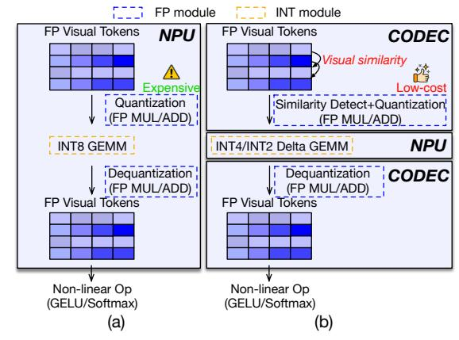

Fig. 1. Quantization comparison: (a) Prior quantization works; (b) Our proposed CODEC-assisted quantization.

Quantization is a promising approach to mitigate the high memory and computing cost in VLM inferences. By approximating the input data with lower-bit precision, the performance can be orders of magnitude improved with modest accuracy degradation. Many prior works proposed quantizationaccelerator codesigned [11], [12], [38], [21], [15]. These works are limited in two aspects: First, many prior works still focus on statically quantizing the weight matrices, while the similarity of the input visual tokens is often overlooked. As shown in Fig. 2, unlike LLM tokens, visual tokens in VLMs are highly similar, which enables the potential to approximate the input tokens. Second, quantization can only be applied to linear layers, and to preserve the accuracy, precision-critical non-linear operators (e.g., GELU, Softmax, and Layer Normalization) still accept FP activations cast from quantized INT from linear operators. Naively implementing full floating-point operations, including but not limited to multiplication, addition, and clamping, for quantization is hardware-expensive.

*Takeaway.* While quantization offers significant potential for reducing computation costs through low-bit processing, prior works miss the opportunities of leveraging the visual token similarity, and saving the cost of casting floating-point and integer back-and-forth.

A specialized and dedicated video encoding/decoding unit (also known as CODEC) is often integrated into a realtime multi-media system, like an edge multi-media SoC or other GPU-based systems. Such CODEC units are particularly attractive to our target workloads, real-time quantized VLM inference: 1) CODEC units already have deep specialization for quantization and de-quantization by exploiting the data similarity from the raw video frames, and such similarity still exists in visual tokens; 2) CODEC units are mostly idle during model inference, which could be leveraged. However, existing CODEC units were designed for INT-pixel quantization, while visual tokens to VLM models are floatingpoint. As discussed above, naively extending CODEC with full floating-point operation will be hardware-expensive. In addition, such CODEC units are hardwired for a specific video encoding/decoding standard, while model quantization requires some flexibility for different data distributions, which requires careful management to extend the CODEC microarchitecture.

*Takeaway.* CODEC can be a promising unit for quantization and de-quantization, but some extensions are required to make it fit input visual token quantization.

Our goal is to have an *end-to-end and unified* flow for input visual token quantization and inference. *End-to-end* means this approach is useful for both prefilling and decoding, and *unified* means this approach is applicable to all matrix multiplications, including projection, feed forward, and attention. The quantization and de-quantization shall have negligible accuracy loss, and can be achieved with modest underlying hardware cost. We address these issues by presenting AQuant, a software/hardware co-designed instance for VLM quantization and inference, as presented in Fig. 1. The technical contributions of this work are:

- An algorithm that captures the input similarity among visual tokens for dynamic quantization, while avoiding expensive floating-point operations. (§III-A)
- A software-hardware co-designed workload-balanced adaptive quantization approach that reduces cost while improving hardware utilization. (§III-B)
- Novel micro-architectural extensions to existing CODEC to flexibly support different quantization configurations with modest cost. (§IV)

# II. BACKGROUND AND MOTIVATION

# *A. Vision-Language Model*

Vision-Language Models (VLMs) have proven its promise of integrating visual information from images and videos with natural language understanding. A visual encoder, such as ViT-L/14 [32], maps the raw input image/video pixels to a sequence of visual tokens, and the input texts are first tokenized as language tokens then mapped to a sequence of embeddings through an embedding lookup.

The visual token encoder essentially finds a homomorphism between the pixels and the visual tokens, which indicates that two similar pixels are still similar in visual tokens, as demonstrated in our profiling in Fig. 2. This figure captures pair-wise differences between visual tokens (a) and language

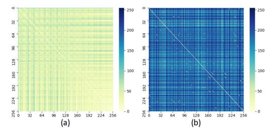

Fig. 2. Pair-wise differences among different token kinds.

tokens (b) using heatmaps. Token similarity is quantified by L1 distance, where lighter colors (yellow) indicate smaller distances and thus higher similarity. In Fig. 2(b), the colors are consistently dark, while Fig. 2(a) shows significantly lighter colors, highlighting the high similarity between visual tokens.

These visual and language token sequences are subsequently concatenated and fed into a large language model (LLM) [40] to enable multimodal reasoning. LLM inferences typically consist of two stages, prefilling and decoding. In the prefilling stage, the concatenated visual and language tokens are processed in parallel through multiple transformer layers to "fill" the key–value (KV) cache. Each transformer block includes three major components: the QKV projection, the selfattention mechanism, and the feed-forward network (FFN). The QKV projection maps the tokens into the Query (Q), Key (K), and Value (V ) matrices, usually implemented in General Matrix Multiplication (GEMM). Self-attention then produces the weighted output as O = softmax(Q · KT ) · V . The FFN generates the final output through linear transformations to the next transformer block or used as the final representation.

Prefilling and decoding stages exhibit very different compute/memory characteristics. A single image or video frame produces 0.5K-4K visual tokens. During prefilling, GEMMs in each component of a transformer block are applied to this long visual token sequence, making prefilling compute-bound.

In contrast, the decoding stage recurrently generate tokens one at a time. The dominated operation shifts from GEMM to matrix-vector multiplications (GEMV). With orders-ofmagnitude lower arithmetic intensive compared with prefilling, while keeping the same memory footprint on model weights and KV-caches, decoding is memory-bound.

Fig. 3. Data distribution of (a) visual tokens, and (b) deltas.

Motivation. Compared to the 0.5K-4K visual tokens for a single image or video frames, the text prompt description is typically around 40-60 tokens. Considering the visual tokens' dominance, this work targets to dynamic visual token quantization/compression by leveraging the token temporal and spatial (intra- and inter-frames, see below) similarity. By exploiting these similarities, more efficient quantization can be achieved, as subtracting similar visual tokens results in deltas with a narrower distribution, as manifested in Fig. 3.

## B. Video Encoding

Due to the massive data volume of raw video, practical systems almost never store or transmit uncompressed frames. Instead, modern video is encoded using standardized compression formats to take advantage of the spatial and temporal similarity to reduce the data traffic while retaining the video quality. In this section, the basics of H.265[7], [51], including the data format, as well as the three phases of the encoding algorithm, motion estimation, motion compensation, and quantization, will be explained.

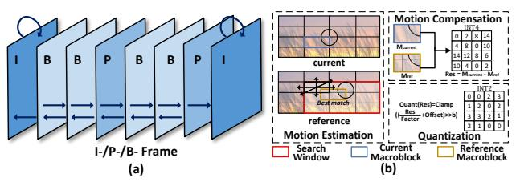

Fig. 4. The definition of I-/P-/B-frames (a); the details of the ME phase (b)

**Hybrid Video Coding.** H.265/HEVC adopts a hybrid, two types of video frame encoding: intra-frame and inter-frame. As shown in Fig. 4(a), an I-frame (intra frame) is encoded by only using information from the same frame, whereas P-and B-frames are encoded by predicting residuals from the reference frames before and after the current frame, and only encoding the residuals (deltas). Conceptually, encoding both inter and intra frames are very similar, detecting the similarity, computing the residual, and quantizing the residual. In the rest of this section, we exemplify the inter-coded P/B frames, by explaining motion estimation, motion compensation, and residual quantization.

**Motion Estimation (ME).** H.265/HEVC partitions each frame into small, fixed-size regions to form the basic units of encoding. For simplicity, we refer to these basic coding blocks (e.g., CTUs/CUs in H.265) as *macroblocks*.

As illustrated in Fig. 4(b), for each macroblock in an interpredicted frame (P/B frame), the motion estimation (ME) phase searches a window in adjacent reference frames to find the most similar macroblock. Let  $M_{\rm current}$  denote the current macroblock and  $\{C_1, C_2, \ldots, C_K\}$  the candidate macroblocks in the search window. ME computes the L1 distance  $\|M_{\rm current} - C_k\|_1$  for all candidates and selects the one with minium distance as the reference macroblock,  $M_{\rm ref}$ .

**Motion Compensation (MC).** Given the reference macroblocks, the residual can be defined as  $\mathrm{Res} = M_{\mathrm{current}} - M_{\mathrm{ref}}$ . Because of the similarity, the generated residual can further be encoded in narrower bits by quantization.

**Quantization.** The quantization phase operates on the residuals Res to reduce bit width. A common form is an affine transform followed by a right shift and clamping:

$$\operatorname{Quant}(\operatorname{Res}) = \operatorname{Clamp}\left(\left(\frac{\operatorname{Res}}{\operatorname{Factor}} + \operatorname{Offset}\right) \gg b\right)$$

where Factor, Offset, and b are predefined parameters controlling the quantization step size and dynamic range. This step introduces controlled distortion while saving fewer bits.

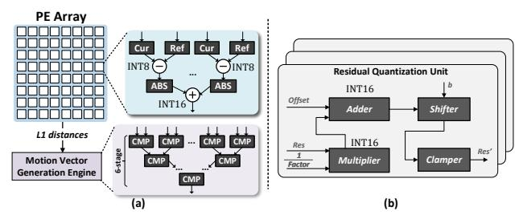

Fig. 5. The hardware details of the ME module (a); details of the quantization module (b).

**Practice in Multimedia Systems.** In practical multimedia processing systems, these three phases are often implemented by specialized software or hardware units (a.k.a. CODEC). Fig. 5 shows a typical implementation of a CODEC unit, specializing ME, MC, and Quantization discussed above.

As shown in top of Fig. 5(a), a 8×8 mesh of process elements (PE) is integrated in the ME module to compute 64 pairs of L1 distances between the current macroblock and the candidate macroblocks in parallel. Within each PE, since each macroblock is 8×8, L1 distance computation is specialized by a 64-wide subtract-and-abs reduction tree. Each channel of image is INT8 and 64 pixels are accumulated. Thus, the addition is 16-bit. After the 64 L1 distances are computed, as shown in bottom of Fig. 5(a), these 64 L1 distances are fed to a comparison reduction tree to find the candidate macroblock with minium L1 distance (also the best similarity) as the reference macroblock. Then, the reference macroblock is fed to the quantization unit shown in Fig. 5(b) for a block-wise affine transformation, shifting, and clamping to reduce the bitwidth of the residual.

**Opportunities.** H265 encoding takes advantage of the similarity in inter- and intra-frame to compress the input/output for lower bitrate, and the CODEC unit can efficiently encode and decode the raw video. Such unit is often idle during VLM inference, which can be potentially made use of.

**Challenges.** However, such CODEC unit is specialized for integer-based video compression, while VLM inference often involves floating-point. Naively extending floating-point units may introduce expensive hardware overhead.

## C. CODEC-Acclerated LLM Systems

Prior works already recognized the opportunities of the idle CODEC unit [39], [43] to accelerate LLM inferences. However, few of them propose an end-to-end solution.

For example, CMC [39] leverages CODEC to accelerate the prefilling stage. CODEC is used to detect the similarity

Fig. 6. The details of the exponent-similarity detection operation. We use the same color to represent similar visual tokens.

among token sequences by computing the L1 distances. Too similar tokens are considered non-informative, and removed from the input matrices to skip the computation. This results in performance improvement during the prefilling stage, as redundant tokens are eliminated during matrix multiplications. Different from CMC that leverages CODEC motion estimation for integer-domain similarity detection, AQuant extends an integer-native CODEC to support floating-point token quantization and mixed-precision VLM inference. To bridge the representation gap between floating-point tokens and integer hardware, we introduce exponent-based similarity detection that approximates FP similarity without incurring full floating-point operations. Moreover, we propose lightweight microarchitectural extensions to the quantization datapath, enabling dynamic precision switching and floating-point scaling within the same CODEC hardware. Therefore, AQuant extends CODEC from an integer raw-video compression engine to a precision-aware co-processor for floating-point AI inference, architecturally different from CMC's matrix-condensing design.

LLM.265 [43] demonstrates that several stages in the video coding pipeline, including entropy coding, transform coding, and intra-frame prediction, can effectively compress tensors in LLMs, including model weights and KV-cache. During inference, the compressed data are first decompressed by CODEC and fed the GPU as normal. The decoding stage mainly benefits from this approach, because KV-cache is compressed before being loaded.

**Motivation.** Prior works on CODEC compression could only benefit a single aspect, either prefilling or decoding. A *unified* approach to accelerate *end-to-end* inference may fully exploit the potential of CODEC-based compression. *Unified* means all matrix multiplications, including QKV project, KV-cache, and FFN can all benefit from this approach. *End-to-end* means this approach accelerates both prefilling and decoding.

# III. AQUANT ALGORITHM

In this section, our Adaptive Quantization algorithm will be explained. This algorithm dynamically quantizes runtimegenerated visual tokens and KV-caches, which enables *end-to-end and unified* compute/memory savings for both prefilling and decoding. Note that our approach focuses on dynamic tokens and KV-caches, and is orthogonal to the existing static weight quantization [11].

 $TABLE \ I \\ Area/power \ breakdown \ on \ naive \ FP \ quantization.$ 

| Modules                                    | Area (mm 2 ) | Power (mW) |
|--------------------------------------------|-------------------------|------------|
| Systolic Array (64 2 -INT8 MAC) | 1.672                   | 560.4      |
| Similarity Detect+Quant (FP32)             | 1.269                   | 422.7      |

We first explain how this algorithm quantizes the input visual tokens in the prefilling stage in Section III-A — III-C, which comprises three phases:

- The smallest distance is *approximated* by floating-point exponent differences.
- Similar tokens are *adaptively quantized* into different lower bits to preserve accuracy.
- Finally, after processing the linear layer computation in quantized lower bits, the results are *reconstructed* back to floating-point for further operations.

Afterwards, we demonstrate how these quantized data is used to save memory traffic in decoding stage in Section III-D.

The proposed AQuant algorithm aims to provide a hardware-friendly flow to quantize and de-quantize the linear operations in each transformer layer. This flow can later be seamlessly deployed onto existing hardware units—the video CODEC, as detailed in Section IV-A.

## A. Exponent-Similarity Detection (ME & CE)

As shown in Fig. 6, we use Q-matrix projection,  $Q=W_qT$ , as a representative example to demonstrate how our algorithm is applied to input visual tokens during prefilling. The same procedure can be extended to other linear layers by applying to the right matrix. To leverage the data similarity, AQuant adopts a base-delta quantization: The visual tokens, T, are approximated by two parts,  $T\approx B+\delta$ , where B are base tokens, and  $\delta$  are the similar deltas that can be encoded in narrower bits.

**Base Token Selection:** Assuming there are N visual tokens, and each token is represented as a K-dimensional vector, we select M candidate base tokens from them, where M is a predefined hyperparameter for the quantization algorithm, as well as the underlying hardware design parameter. For every F consecutive tokens, where  $F = \lfloor \frac{N}{M} \rfloor$ , the middle token is chosen, resulting in a total of M candidates. Then we

Fig. 7. The details of the adaptive quantization and result reconstruction.

calculate the L1 distance between each visual token  $T^i$  and each candidate base token  $T^j$ :

$$D^{i,j} = \sum_{k=0}^{K-1} |T_k^i - T_k^j|$$

where  $0 \le i < N$  and  $0 \le j < M$ .

To create the delta of visual token  $T^i$  ( $\delta^i$ ) with the narrowest possible distribution, the candidate base token  $T^j$  with the smallest distance is selected as the base token ( $B^i = T^j$ ). The corresponding  $\delta^i$  is then computed as

$$\delta^i = T^i - B^i = T^i - T^j$$

which will be used for base-delta quantization.

The processes of computing  $D^{i,j}$  and  $\delta^i$  reveal high similarity to ME and MC phases in H.265. However, as discussed above, CODEC is designed for integer quantization, while input visual tokens are floating-point. Naively integrating floating point to a CODEC unit leads to expensive power/area overhead as shown in Table I. To sustain a  $64 \times 64$  systolic array, a 64-wide subtract—and-abs reduction tree (abbreviated as Similarity Detect in the table) and a 64-lane FP32 cast (abbreviated as Quant in the table) shall be implemented. These two together cost 43% of the on-chip area, which urges us to find a more efficient approach to similarity detection and quantization.

**Exponent-Similarity Approximation:** Our insight is that the exponent field of a floating-point number encodes the "order of magnitude", which often dominates the differences between two numbers. Thus, instead of performing full floating-point operations to compute the L1 distance, we use the differences between their exponents to approximate the similarity between tokens. We denote  $\bar{T}$  as the exponent field of tokens, and the approximated similarity can be defined as the L1 distance among exponents:

$$\bar{D}^{i,j} = \sum_{k=0}^{K-1} |sign(T_k^i) \times 2^{\bar{T}_k^i} - sign(T_k^j) \times 2^{\bar{T}_k^j}|$$

This approach captures the "order" of the values using integer shifts and subtractions, which significantly reduces arithmetic complexity. Fig. 6 illustrates the process of Exponent-similarity detection. We begin by designating  $T^2$ ,  $T^5$ , and  $T^8$  as candidate base tokens. Next, we approximate the L1 distances between three candidate base tokens and all visual tokens using their sign and exponent bits, which produce a  $9\times 3$  distance matrix. We then compare the distances to estimate the base token for each visual token. Take the first row of the distance matrix (mathematically represented as  $\bar{D}^{1,:}$ ) as an example, we find that the minimal distance value is located in the first column, implying that  $T^2$  is similar to token  $T_1$ . Therefore, we construct the corresponding delta token by subtracting the base token  $T_2$  from  $T_1$  ( $\delta^1 = T^1 - T^2$ ).

This exponent approximation introduces new challenges into hardware: For example, an IEEE 754 single-precision exponent ranges from [-127,128], which means a  $2^{exponent}$  arithmetic operation may still span up to 256-bit scale, which requires additional attention to manage the range efficiently in hardware. Our profiling reveals that during inference, the exponents of visual tokens exhibit a narrow dynamic range, typically confined within [0,8], which will be further discussed in Section IV-A.

## B. Adaptive Quantization

After generating  $\delta$ , each element in  $\delta$  should be encoded using the minimal bitwidth while maintaining accuracy. To achieve this, we made a workload-balanced adaptive quantization. Given a predefined threshold ratio p, for each delta vector  $\delta^i$ , the top p portion of elements with the largest magnitudes are quantized to INT4, and the remaining (1-p) portion is quantized to INT2. p selection will be discussed in our evaluation, Section V. These quantized deltas with different precision construct two mutually complementary sparse matrices. As manifested in Fig. 7, we set the threshold ratio p as 25%, marking the elements with large magnitudes using a bitmask. Subsequently, INT2 quantization (represented by yellow blocks) is applied to small delta values, and INT4 quantization (represented by blue blocks) is applied to large delta values.

For M candidate base tokens that wait to act as the base tokens, higher precision (INT8) is adopted to preserve accuracy. These high-precision candidate base tokens are then multiplied by the weight matrix  $W_q$  for high-precision GEMM

operations, as the resulting output features are critical for reconstructing the final results.

#### C. Result Reconstruction

As discussed above, applying the weight matrix  $W_q$  to quantized visual tokens becomes  $W_qB+W_q\delta$ . As the base token B belongs to one of M candidate base tokens, which constitute only a small subset of all visual tokens,  $W_qB$ 's computation can be eliminated at runtime by directly selecting the results from precomputed candidate base tokens. Given the data similarity among the input visual tokens,  $\delta$  can be encoded with fewer bits, allowing  $W_q\delta$  to be computed at a lower cost. Summing both terms,  $W_qB$  and  $W_q\delta$ , we can reconstruct the final Q matrix.

# D. Extending AQuant to the Decoding Stage

The key to achieving high-performance decoding lies in reducing the memory bandwidth consumption of the KV-cache. However, directly applying the procedures described above to the self-attention operation during decoding cannot effectively reduce the KV-cache loading cost, since K and V are floating-point matrices that must first undergo exponent-similarity detection. Therefore, after KV-matrix projection, instead of writing the reconstructed KV-cache back to memory, we re-quantize the KV-cache and then store it in off-chip memory for later use in decoding. Since these data occupy significantly less memory, the proposed design effectively reduces memory traffic per token. The KV-cache values are then reconstructed online when needed. This design decision trades off computing for memory bandwidth, and the benefit evaluation will be discussed in Section V.

## IV. AQUANT ARCHITECTURE

In this section, we explain the AQuant architecture, which specializes the quantization using CODEC and processing the quantized tokens using an NPU. As illustrated in Fig. 8, the input visual tokens are first read from off-chip memory and forwarded to the enhanced CODEC (step A) for similarity detection and base-delta quantization (step B). The resulting quantized data are then dispatched to the NPU (step C) according to their adaptive precision. The NPU consists of two MAC arrays (step D) that performs matrix multiplications on the high- and low-precision deltas. The partial sums from both precisions are forwarded to the accumulation engine to aggregate the results (step D), and the reconstruction engine then combines them with the precomputed base token results to reconstruct the final activations (step P).

## A. Enhanced CODEC Design

To realize our visual token quantization algorithm on a video CODEC with modest hardware overhead, we extend the CODEC in two aspects: (i) adding flexibility for similarity detection, and (ii) augmenting the datapath to process floating-point inputs. The specialized CODEC unit builds upon the design shown in Fig. 5 and described in Section II-B.

**Similarity Detection.** As shown in Fig. 9, we reuse the subtract—and-abs reduction tree in the motion-estimation (ME) module to implement similarity detection for visual tokens. To avoid expensive floating-point operations, we modify the subtract unit to support exponent-similarity detection, as introduced in Section III-A. The unit extracts the exponent field from each floating-point token, computes an approximate magnitude 2exponent via bit shifting, and concatenates it with the sign bit before subtraction. This subtraction is implemented as an INT10 operation.

To explain this design decision: In IEEE 754 single-precision, the exponent field has 8 bits and encodes an effective range of [-127, 128], which in principle could span a very large dynamic range if used directly. However, our profiling of LLM inference workloads shows that the exponents of visual tokens exhibit a much narrower range of [0,8]. Thus,  $2^{\text{exponent}}$  falls into [1,256], which can be represented within 9 bits. After concatenating the sign bit, we obtain a 10-bit value, leading to a compact 10-bit integer representation suitable for the similarity-detection datapath.

**Spatially Shared ME PE.** AQuant exposes a "knob", the number of candidate base tokens (M introduced in Section III-A), to tune the tradeoff between quantization cost and quality. More candidates generally improve similarity matching but also increase distance computation and comparison cost. However, as discussed in Section II-B, the original ME module is hard-wired to evaluate 64 candidate macroblocks using an  $8\times 8$  PE array, which leads to underutilization when we only need, for example, 16 or 32 candidate base tokens.

To support different numbers of base candidates efficiently, we make the ME PE array reconfigurable. We make a  $4\times4$  PE block as the basic reconfigurable block, and no finer granularity is supported. This design decision is made because: 1. fewer than 16 base candidates is over aggressive for quantization; 2. coarser granularity avoids the excessive power/area overhead. Given M candidates, the array allocates  $\lceil \frac{M}{16} \rceil$  such blocks and merges them to form a larger logical PE block, allowing the same  $8\times8$  mesh to serve varying base set sizes. As shown in Fig. 9, given that  $T^1$  and  $T^2$  both have 32 candidate base tokens, respectively, the reconfigurable PE array distributes two  $4\times8$  PE blocks (outlined in yellow and red) for them, occupying the whole PE array.

We similarly adapt the comparator tree in the ME engine to match this  $4\times 4$  granularity. A 4-stage comparator tree is used as the basic comparison unit, taking 16 distances from one  $4\times 4$  PE block and producing the minimum. Multiple such 16-input units can then be composed with an additional 2-stage comparator tree to select minima across several blocks. For each minimum, the corresponding visual token ID i and base token ID j are packed as  $(T^i, T^j)$  entries and written into the similar token table (bottom right of Fig. 9).

**Adaptive Quantization:** We extended the CODEC quantization data path for our adaptive quantization discussed in Section III-B. As shown in Fig. 10(a), the original circuit for INT16 quantization is implemented by an affine transform followed by a right shift and clamping.

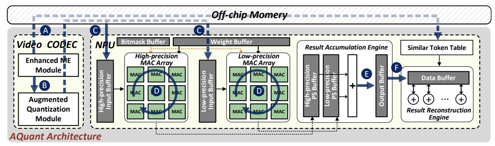

Fig. 8. AQuant architecture overview.

Fig. 9. AQuant-extended motion estimation module.

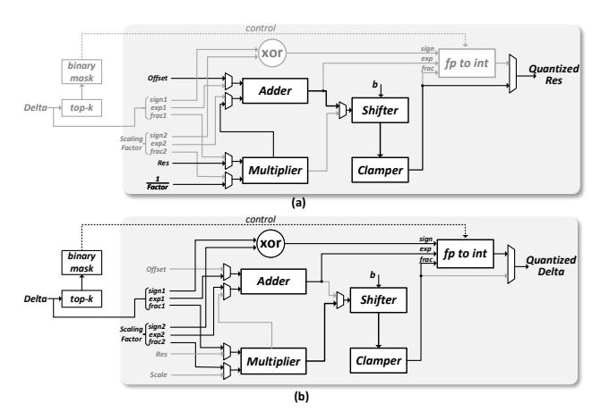

Fig. 10. The details of the quantization module: (a) default mode; (b) adaptive quantization mode.

As illustrated in Fig. 10(b), unlike a full floating-point multiplier with expensive normalization, our quantization module first clamps the mantissa of deltas and the scaling factor from 23 bits down to 16 bits. The truncated mantissa and the exponent then reuse the existing multiplier and adder in the CODEC datapath, while the sign bit pass through an additional XOR gate. The resulting sign bit, exponent, and mantissa are concat and then fed directly into the fp-to-int unit [33] for data casting, without any further floating-point normalization. The cast precision is determined by a bitmask generated by the top-k unit [41], which identifies whether the absolute magnitude

of each delta element belongs to the top p values along the delta vector, as discussed in Section III-B.

The key components in the quantization module are the fpto-int unit and the top-k unit. Specifically, the fp-to-int unit performs floating-point to integer conversion using lightweight combinational logic derived from the rounding algorithm, where the exponent and mantissa fields determine the integer output. We implement it using two 2-to-1 multiplexers, one 7-to-1 multiplexer, one 32-to-1 multiplexer, an AND gate, and 16 registers. The top-k unit first employs a QuickSelect unit to identify the k-th largest element as a threshold, and then filters the input by comparing each element with this threshold to extract the top-k elements. The Quick Select unit follows a pivot-based iterative selection process inspired by the quicksort algorithm, progressively narrowing the candidate set until the k-th largest value is identified. The hardware of the top-k unit consists of three FIFOs, four groups of comparators, an OR gate, an XOR gate, and a 2-to-1 multiplexer.

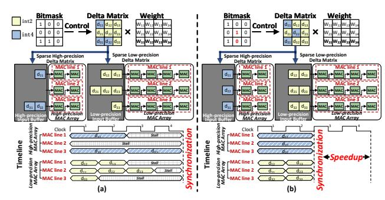

Fig. 11. The details of MAC arrays.

## B. Sparsity-Supported MAC Array

To process mixed-precision deltas, we separate the quantized deltas into two mutually complementary sparse matrices: a high-precision delta matrix (INT4) and a low-precision delta matrix (INT2). A bitmask generated by the CODEC specifies, for each delta, the MAC array to which it should be routed.

As shown in Fig. 11, each MAC array adopts a row-wise product dataflow. A MAC line is responsible for one output row  $C_{i,:}$  and iteratively accumulates  $C_{i,:} = \sum_k d_{ik} W_{k,:}$ , by streaming one delta element  $\delta_k^i$  and the corresponding weight row  $W_{k,:}$  per cycle. In other words, during each cycle a MAC

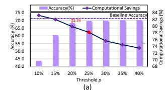

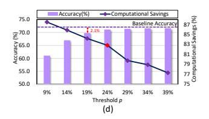

Fig. 12. Exploration of the threshold ratio p.

line receives a delta from row i of the delta matrix and the k-th row of the weight matrix, computes  $W_{k,:}\delta_k^i$ , and adds it into the running partial sum for  $C_{i,:}$ . This row-wise product dataflow naturally matches the sparsity pattern of the delta matrices and allows the high- and low-precision arrays to run in parallel.

The key to achieve high hardware utilization is to have a proper hyperparameter p, the fraction of high-precision deltas, p, to avoid stalls on synchronization. If p is too large, the high-precision MAC array becomes the bottleneck; if p is too small, the accuracy of the VLMs may become unacceptable. Our workload-balanced adaptive quantization mechanism enforces a target high/low ratio p:q (with q=1-p) on a per-row basis by selecting the top p deltas in each row as high precision and marking the rest as low precision. The high- and low-precision MAC arrays are then configured to match this p:q ratio. This alignment ensures that both MAC arrays progress in lockstep, as illustrated in Fig. 11(b). We will empirically evaluate different choices of p and their impact on performance and accuracy in Section V.

## C. Result Reconstruction Engine

To support efficient reconstruction, we equip the reconstruction engine with three on-chip buffers and multiple adders. The base buffer stores the precomputed outputs for base tokens, the delta buffer holds the outputs produced from the delta matrices, and the recovery buffer accumulates the reconstructed visual token outputs, thereby reducing off-chip memory traffic. During reconstruction, multiple entries in the similar token table are processed in parallel. For each entry  $(T^i, T^j)$ , the engine reads the feature vector of the base token  $T^j$  from the base buffer and the corresponding delta feature for  $T^i$  from the delta buffer, using different banks to enable feature-level parallelism. The adders sum these features and write the reconstructed results back into the recovery buffer. After all entries have been processed, the recovery buffer contains the final activations for all visual tokens.

## V. EVALUATION

## A. Workloads

To validate the effectiveness of AQuant, we evaluate its performance on three VLM models, including LLaVA [26], VideoLLaVA [25], and Qwen2.5-VL 72B [2] across fourteen datasets. The datasets utilized for evaluation include VQAv2 [10], GQA [16], TextVQA [37], POPE [24], MM-Bench [27], MMVet [47], Wild [26], ScienceQA [28], VisWiZ [13], ActivityNet [48], MSVD [4], TGIF [18], MSRVTT [44], and Video-MME [9].

#### B. AQuant Algorithm Evaluation

**Methodology.** We adopt open-source implementations of the aforementioned VLM models, running on the PyTorch framework [31]. We implement the proposed AQuant algorithm in Python and integrate it into the models' implementations. Note that the AQuant algorithm does not require retraining, making our approach highly deployable without the need for extensive reconfiguration. The required calibration data for threshold selection is 10% of the training dataset. In the experiment, we use INT2 and INT4 for deltas, and INT8 for base tokens.

Accuracy and Selection of Threshold p. To determine the optimal threshold ratio p for adaptive quantization (see Section III-B), we vary p and measure its impact on accuracy and theoretical computational savings. Generally, a large p results in low computational savings but high accuracy, while a smaller p improves performance at the cost of accuracy. Fig. 12 reports the accuracy and computational savings across four benchmarks (VideoLLaVA-MSVD, LLaVA-GQA, LLaVA-ScienceQA, and Qwen2.5-VL-VideoMME) when varying p. These benchmarks are carefully chosen to cover diverse scenarios, including highly dynamic and complex scenes. For the VideoLLaVA-MSVD benchmark (Fig. 12(a)), setting p =20\% leads to a 2.1\% accuracy drop, which is unacceptable. Increasing p to 25% provides a better tradeoff, reducing theoretical computation by  $3.2\times$  compared to the full INT8 model while maintaining acceptable accuracy. For the LLaVA-GQA benchmark (Fig. 12(b)), p = 23% achieves a favorable balance between accuracy and computational savings. Across all benchmarks, p=25% consistently satisfies the accuracy constraint and is close to the hardware-optimal point, while smaller p values may cause noticeable accuracy degradation. Therefore, we set p=25% in the remaining experiments.

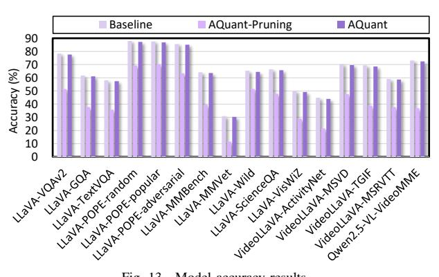

Fig. 13. Model accuracy results.

We further evaluate the accuracy of all workloads using p=25% in AQuant. As shown in Fig. 13, AQuant incurs an average accuracy drop of only 0.7% compared to the baseline. Moreover, to demonstrate the necessity of <code>INT2</code> delta quantization in AQuant, we keep p deltas in <code>INT4</code> precision and prune the remaining 1-p deltas (denoted as AQuant-Pruning). This results in an average accuracy degradation of 23% compared to the baseline.

#### C. AQuant Architecture Evaluation

Methodology. To evaluate the performance of the AQuant architecture, we develop a cycle-level simulator to collect the latency statistics of matrix multiplications and the number of buffer accesses for each workload. The simulator is integrated with Ramulator [20] for DRAM timing. We make efforts to ensure the accuracy of the simulator by following the widely adopted open-source simulator, Scale-Sim [34]. Moreover, we implement the proposed AQuant architecture in Verilog and synthesize it by Synopsys Design Compiler to get the chip area and total power under 28nm technology with a frequency of 500MHz. This synthesis process generates a comprehensive report containing the gate-level netlist, timing information, and area breakdown of various components within the AQuant architecture, including the enhanced video CODEC, NPU, and control logic. We also employ CACTI [3] to derive the energy and area of on-chip buffers based on parameters such as bus width, size, and the number of reads/writes. Additionally, we modify OpenASIC [8], an open-source tool for simulating the enhanced video CODEC. AQuant adopts LPDDR4x as the external memory, with 32GB capacity and a bandwidth of 136.5 GB/s, the same configuration as the NVIDIA Jetson AGX Xavier [30].

As shown in Table II, we compare AQuant with several platforms, including a representative edge GPU—NVIDIA Jetson AGX Xavier, a software-only token pruning method VisPruner [49] (denoted as GPU-VisPruner), and three accelerators: CMC [39], LLM.265 [43], and Olive [11].

For a fair comparison with GPUs, we construct three variants: (1) GPU-Full-unscale, the original GPU without any performance scaling; (2) GPU-Full, where the GPU is scaled in the number of compute cores to match the area budget of AQuant; and (3) GPU-Mixed-precision, a hypothetical GPU with native mixed-precision MAC support. For GPU-Fullunscale, we directly measure execution time by running fullprecision VLMs on Jetson AGX Xavier. For GPU-Full, we scale the execution time of GPU-Full-unscale according to the ratio between the number of GPU cores and the compute units in AQuant. We profile GPU execution across all workloads and observe memory bandwidth utilization ranging from 31.4% to 62.8%, indicating that memory is not saturated and the workloads remain primarily compute-bound. Therefore, scaling GPU time by the compute-core ratio does not distort memorybound behavior. According to Fig. 12, AQuant generates 75% INT2 and 25% INT4 deltas. Therefore, to compare with GPU-Mixed-precision, we construct an optimistic analytical upper bound by proportionally scaling throughput relative to a full INT8 model: Speedup=  $\frac{8}{4\times0.25+2\times0.75}=3.2\times$ . This model assumes ideal mixed-precision execution on the GPU without overheads from precision switching or additional control complexity. For CMC, LLM.265, and Olive, we reproduce their algorithms and try our best to build cycle-accurate simulators.

**Speedup.** Fig. 14 reports the performance of the AQuant architecture and several baselines, including GPU-Full, GPU-Full-unscale, GPU-Mixed-precision, GPU running the AQuant algorithm (GPU-AQuant), GPU running Vis-Pruner (GPU-VisPruner), AQuant integrated with VisPruner (AQuant+VisPruner), LLM.265, CMC, Olive, and AQuant integrated with CMC (AQuant+CMC). All results are normalized to GPU-Full. On average, the AQuant architecture achieves  $6.9\times$ ,  $2.1\times$ , and  $2.2\times$  speedup over GPU-Full, GPU-Full-unscale, and GPU-Mixed-precision. The performance improvement stems from several factors: 1) The AQuant algorithm reduces computations and lessens stress on the main memory by lowering the bit-width of deltas. 2) The collaboration between the NPU and the enhanced CODEC enables highly parallelized operations such as Exponent-similarity detection and matrix multiplications. In contrast, the GPU executes kernels serially. 3) The sparsity-supported MAC array along with the workload-balanced adaptive quantization in AQuant can fully exploit the mixed-precision deltas while achieving high hardware utilization.

Additionally, AQuant outperforms GPU-VisPruner, Olive, LLM.265, and CMC by  $2.8\times$ ,  $2.5\times$ ,  $4.6\times$ , and  $2.8\times$  in performance. AQuant is superior to VisPruner for two reasons. First, VisPruner prunes 61.1% visual tokens but still processes the rest in FP16, while AQuant converts tokens to mixed-precision (75% INT2, 25% INT4 deltas, 7.4% INT8 bases), yielding  $2.16\times$  compute reduction. Moreover, the repurposed CODEC and dedicated NPU in AQuant enable more efficient similarity detection and mixed-precision GEMM. AQuant is orthogonal to token pruning method. When combined with VisPruner (denoted as AQuant+VisPruner), we observe  $8.3\times$  speedup over GPU-Full.

AQuant surpasses Olive, LLM.265, and CMC because AQuant provides an end-to-end unified approach for VLM acceleration, while other accelerators optimize only one of the prefilling or decoding stages. AQuant can also be integrated with CMC (denoted as AQuant+CMC), and experimental results show that AQuant+CMC achieves an additional  $3.4\times$  speedup over CMC.

Fig. 14 also evaluates the performance of AQuant when the CODEC is actively decoding videos, during which AQuant cannot be executed simultaneously. To quantify this scenario, we measure the video decoding latency and add it to the AQuant latency (denoted as AQuant-Decoding). Since the CODEC is only used for video processing, this constraint affects VideoLLaVA and Qwen2.5-VL models, but not LLaVA. The results show that video decoding accounts for only 8.3% of the end-to-end VLM inference time, and AQuant-Decoding still achieves  $6.8\times$  speedup over GPU-Full. This indicates that video decoding does not become a performance bottleneck

TABLE II DESCRIPTIONS OF BASELINES.

| Platform    | GPU-Full-unscale       | GPU-Full               | GPU- Mixed-precision | GPU- VisPruner       | CMC         | LLM.265     | Olive        |
|-------------|------------------------|------------------------|-------------------------|-------------------------|-------------|-------------|--------------|
| Category    | Edge GPU               | Edge GPU               | Hypothetical GPU        | Software                | Accelerator | Accelerator | Accelerator  |
| Measurement | PyTorch on Xavier      | Scaled GPU             | Scaled GPU              | Scaled GPU              | Simulation  | Simulation  | Simulation   |
| Description | Baseline VLM on GPU | Baseline VLM on GPU | Baseline VLM on GPU  | Token Pruning on GPU | CODEC+NPU   | CODEC+NPU   | Quantization |

Fig. 15. Execution cycle breakdown.

even when the CODEC is occupied during VLM inference.

Moreover, Fig. 14 validates the necessity of our AQuant architecture, showing that GPU-AQuant suffers from a 15.7% performance loss compared to GPU-Full. Two fundamental limitations contribute to this performance degradation: 1) The AQuant algorithm requires INT2 operations on deltas, which current GPUs cannot support. Consequently, INT2 values must be padded to INT4, diminishing the benefits of low-precision quantization. 2) The matrix multiplications in AQuant involve INT4×INT16 multiplications, leading to mismatched bit-widths of the operands. Current GPUs cannot support this directly through highly optimized APIs; thus, a INT4×INT16 matrix multiplication must be decomposed into four INT4×INT4 matrix multiplications. Although CUDA supports concurrent kernel execution, we have observed that it is difficult to effectively overlap these decomposed kernels, as discussed in previous works[50].

Execution Cycle Breakdown. Fig. 15 illustrates the execution cycle breakdown across hardware components and data movement between modules and DRAM. As stages are pipelined, overall latency is determined by the longest stage latency-the latency of MAC arrays. The results show that the execution times of the high- and low-precision MAC arrays are aligned, demonstrating the effectiveness of our workload-balanced adaptive quantization, which ensures balanced workloads across the two MAC arrays. Moreover, the ME module, quantization module, and result reconstruction engine are 47.8%, 24.3%, and 7.8% of the MAC arrays, respectively. Fortunately, leveraging independent hardware components allows for complete concealment of the execution time of the result reconstruction, exponent-similarity detection, and adaptive quantization by pipelining them with the highand low-precision matrix multiplications.

Fig. 16. Latency results of the prefilling and decoding stages.

**End-to-end Results.** To evaluate the latency reduction of AQuant during the prefilling and decoding stages, we compare the performance of GPU-Full, GPU-Full-unscale, GPU-Mixed-precision, GPU-AQuant, GPU-VisPruner, AQuant+VisPruner, LLM.265, CMC, Olive, AQuant, and AQuant+CMC, as shown in Fig. 16. The results confirm that AQuant achieves a higher speedup than CMC in the decoding stage and a higher speedup than LLM.265 in the prefilling stage, reflecting the specialized roles of CMC and LLM.265, which are primarily optimized for the prefilling and decoding stages, respectively. In contrast, AQuant provides an end-toend acceleration solution, improving performance across both stages. AQuant performs well in both stages because: 1) it leverages adaptive quantization to reduce the computation precision, exchanging more resources for acceleration under the same area budget, and 2) low-precision deltas reduce memory requirements during VLM inference.

Fig. 17. Detailed analysis of contributions.

Detailed analysis of algorithm and architecture contributions. Fig. 17 illustrates the performance gains from our algorithm and architectural designs. Compared to the baseline AQuant version (denoted as AQuant-plain), which runs the INT8 VLM models without any optimizations, the AQuant algorithm with floating-point similarity detection and adaptive quantization (AQuant-FP) achieves a 3.3× speedup due to reduced computations and memory accesses associated with deltas. With the assistance of the exponent-similarity detection, the AQuant architecture (AQuant-Exp) achieves a 1.6× speedup over AQuant-FP as the exponent-based L1 distance calculation can save arithmetic complexity and area. Additionally, AQuant with CODEC (AQuant-CODEC) further results in an additional 1.4× speedup over AQuant-Exp. To explain the performance improvement brought by repurposing the CODEC, we compare the area of the MACs with that of the repurposed CODEC. As shown in Table III, the MACs require  $0.476mm^2 + 0.238mm^2 = 0.714mm^2$ , while the repurposed CODEC needs  $0.138mm^2 + 0.122mm^2 =$  $0.26mm^2$ . This means that if we disable the CODEC and allocate the MAC's area for exponent-similarity prediction and adaptive quantization, we would have only  $0.454mm^2$ available for the computational resources. Compared to this configuration, AQuant with the repurposed CODEC achieves a 36%  $(\frac{0.26mm^2}{0.714mm^2} = 36\%)$  area savings. The saved area can be reallocated to increase the NPU's MAC resources, thus contributing to the  $1.4\times$  performance improvement.

**Hardware Overhead and Area.** Table III provides a comprehensive breakdown of design parameters, area, and power of the AQuant architecture. The low-precision MAC array of

TABLE III
AREA AND POWER OF THE AQUANT ARCHITECTURE.

| AQuant            | Modules                                                                | Area $(mm^2)$ | Power (mW) |
|-------------------|------------------------------------------------------------------------|---------------|------------|
|                   | Low-precision MAC Array $(4 \times (32 \times 32) \text{ INT2 MACs})$  | 0.476         | 164.8      |
| NPU               | High-precision MAC Array $(1 \times (32 \times 32) \text{ INT4 MACs})$ | 0.238         | 82.4       |
|                   | Result Reconstruction Engine                                           | 0.183         | 9.3        |
|                   | On-chip Buffer                                                         | 0.675         | 197.4      |
| Enhanced CODEC | ME Module                                                              | 0.138         | 23.4       |
|                   | Quantization Module                                                    | 0.122         | 21.3       |
|                   | On-chip Buffer                                                         | 0.026         | 11.9       |

the NPU comprises four  $32 \times 32$  INT2×INT16 MACs, and the high-precision MAC array of the NPU comprises a  $32 \times 32$  INT4×INT16 MACs. The hardware resources of the MAC arrays are carefully set based on the threshold p discussed in Section III-B, where p is set to 25%, resulting in a 1:4 ratio of MACs between the two arrays. The result reconstruction engine incorporates three buffers to store INT16 outputs: base tokens, delta matrices, and reconstructed visual tokens, with sizes of  $128 \times 128$ ,  $64 \times 128$ , and  $128 \times 128$ , respectively. These buffers require 16KB, 8KB, and 16KB of SRAM, with bandwidths of 256B, 128B, and 256B, respectively.

We also evaluate the costs of the enhanced CODEC. In order to support the proposed exponent-similarity detection, we enhance the functionality of the existing ME module by designing a new PE, a reconfigurable PE array, a reconfigurable comparator tree, and associated control logic. Additionally, we extend the capabilities of the quantization module. These modifications occupy  $0.26mm^2$  of area.

Energy Efficiency. The energy efficiency outcomes are depicted in Fig. 18. The AQuant architecture delivers remarkable energy efficiency, surpassing GPU-Full, GPU-Full-unscale, GPU-Mixed-precision, GPU-AQuant, GPU-VisPruner, LLM.265, CMC, and Olive by  $7.2 \times$ ,  $2.2 \times$ ,  $2.3 \times$ ,  $8.6\times$ ,  $2.9\times$ ,  $14.0\times$ ,  $2.5\times$ , and  $2.1\times$ , respectively. These substantial savings in energy consumption come from the reduction in considerable computations and off-chip memory accesses related to the deltas. We observe a counterintuitive discrepancy that our optimizations achieve an extremely high energy efficiency than LLM.265, despite the latter being specifically designed for tensor compression in LLMs. This arises because LLM.265 activates nearly all hardware components in the CODEC for data compression, resulting in energy consumption of 97.8/63.5 pJ/bit for compression/decompression, which is even higher than directly loading data from LPDDR4X [23].

# D. Design Exploration

**Exploration of Exponent Distribution.** To examine whether visual token exponents are bounded within the range of [0,8], we conduct two analyses. First, we classify inputs based on visual complexity and motion intensity into slowmotion and fast-motion categories, and profile the exponent distribution of visual tokens under these conditions. Second,

Fig. 19. Exploration of the exponent distribution

we repeat the analysis on another VLM, Qwen2.5-VL. Fig. 19 presents the cumulative distribution of exponents, showing that the values consistently concentrate within [0,8]. More than 99.7% of exponents fall within [0,7], while only 1.2% lie in the range of [7,8]. Importantly, even in high-motion scenes, the exponent range does not expand beyond this bound. Furthermore, profiling Qwen2.5-VL under different normalization schemes yields the same exponent range of [0,8], suggesting that this property is model-independent. To ensure robustness, we implement a fallback mechanism: tokens with exponents outside this range are treated as outliers, bypass similarity detection, and are directly processed using higher precision.

Exploration of Quantization and Dequantization Overhead. To analyze the overhead introduced by online quantization and dequantization required by AQuant, we evaluate their average latency across all benchmarks as shown in Fig. 20(a). Quantization and dequantization both account for 5.1% of the inference latency, while KV-cache dequantization during decoding averagely accounts for only 2.3%. Moreover, inference and quantization/dequantization are executed on independent hardware units (the NPU and the quantization module in the CODEC). Therefore, their execution can be overlapped, effectively hiding the quantization and dequantization latency. As a result, these operations do not become a performance bottleneck.

Exploration of Visual Token Benefit. Since AQuant primarily targets visual token computation, we analyze the average execution time breakdown of VLM inference across all benchmarks in Fig. 20(b), separating visual token and language token execution time. The results show that visual token computation averagely accounts for 95.8% of total latency, dominating the execution time. By reducing this portion by 85.7%, AQuant delivers substantial end-to-end speedup,

Fig. 20. Exploration of quantization and dequantization overhead (a); Exploration of visual token benefit (b).

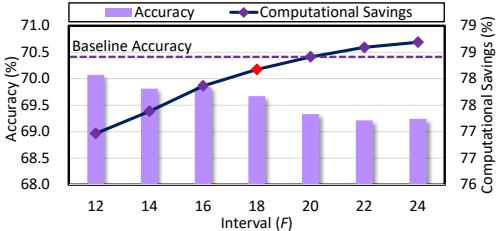

Fig. 21. Exploration of the interval F.

demonstrating that optimizing visual token computation is critical for improving VLM inference performance.

**Exploration of Interval Parameter** F. The goal of the AQuant algorithm is to strike a balance between optimizing system efficiency and maintaining high-quality outcomes by assigning a suitable number of tokens as candidate base tokens, where the interval F matters. Generally speaking, a larger F means fewer tokens serving as the candidate base tokens, leading to higher speedup but lower accuracy. To explore the impact of F, we vary F from 12 to 24 and see the accuracy and computational savings of the VideoLLaVA model on the MSVD dataset. As in Fig. 21, increasing F from 12 to 18 reduces the number of base tokens, leading to more deltas waiting to be quantized, which increases speedup. But when we keep increasing F to 24, the accuracy drops severely. Therefore, we set F = 18 to balance performance and accuracy. Since F determines the number of base tokens, F=18 corresponds to 7.4% INT8 base tokens.

Analysis of F Robustness. To evaluate the sensitivity of F, we apply a fixed configuration F=18 to previously classified inputs, including both slow- and fast-motion scenes. As illustrated in Fig. 22(a), AQuant incurs only 0.83% accuracy loss even for fast-motion videos. We further explore adaptive tuning of F by setting F=F-4 for fast-motion inputs and F=F+4 for slow-motion inputs. As shown in Fig. 22(b),

Fig. 22. FPS and accuracy results on slow-motion and fast-motion videos.

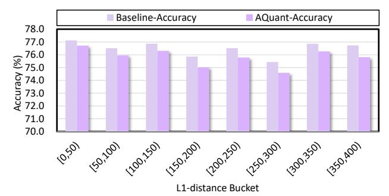

Fig. 23. Exploration of the input characteristics.

although this adaptive strategy reduces latency for slow-motion inputs, it yields only a marginal accuracy improvement of 0.02% compared to the fixed-F configuration. Therefore, we tune F on a single representative benchmark (VideoLLaVA-MSVD) and reuse it across all benchmarks without per-video tuning.

Effectiveness of AQuant on input characteristics. To evaluate AQuant under different input characteristics, we study the correlation between token similarity and accuracy. We use the inter-frame L1 distance as the similarity metric, bucket test samples accordingly, and measure the accuracy for each bucket. We set p=25% and F=18 in the experiment. Fig. 23 shows that even when the L1 distance falls within [350,400), AQuant incurs only 0.92% accuracy loss, indicating that AQuant remains effective even under highly dynamic scenes.

## VI. RELATED WORK

This section shows related works on quantization accelerators and input similarity-aware accelerators, which are the focus of our work.

## A. Quantization Accelerator

In pursuit of ultra-high execution performance with accuracy trade-offs, researchers have focused on low-bit quantization. Quantization methods can be broadly classified into fixed-length and mixed-precision. Fixed-length quantization requires minimal architectural changes, substituting high-precision PEs with low-precision ones. Extremely low-bit quantization, like binary quantization [1], is implemented using simple XNOR operations [6], but may suffer from accuracy loss.

Attracted by the benefits of mixed-precision quantization for both accuracy and performance, numerous accelerators have been proposed. BitFusion [35] and DRQ [38] enable support for different bit-width through a combination of lowprecision PEs at the bit-level and value-level, respectively. ANT [12] takes a more aggressive approach, necessitating substantial architectural modifications. On the other hand, OliVe [11] is an outlier-aware quantization accelerator design, which incorporates value pruning to address outliers. Despite their considerable success, existing quantization accelerators have been constrained to designs within the NPU and have yet to consider opportunities that may arise from integrating other hardware components of SoC devices, making them struggle for peak performance in VLMs. In contrast, our proposed method, AQuant, leverages data similarities with the assistance of the video CODEC to quantize VLMs effectively.

## B. Input-Importance-Aware Accelerator

To achieve high execution performance, researchers have explored input-importance-aware acceleration methods. Deep-Reuse [29] and MERCURY [17] exploit input vector similarities to reuse previously computed results, enhancing convolutional neural network (CNN) performance. DeepReuse uses Locality Sensitive Hashing (LSH) to assess similarity, while MERCURY employs Random Projection with Quantization (RPQ) to estimate the similarity of high-dimensional data. Euphrates [52], an algorithm-hardware co-design solution, accelerates video object detection and tracking by leveraging motion vectors from the image signal processor (ISP) to reconstruct bounding boxes of non-key frames, skipping the complete CNN processing for those frames. However, these methods are primarily limited to CNN models. In contrast, AQuant offers a more generalized approach that can be applied to a wide range of models as long as they process vision (image/video) data.

## VII. CONCLUSION

This paper introduces AQuant, an algorithm-architecture codesign framework poised to facilitate efficient VLM inference. The key idea of AQuant is to intelligently utilize the video CODEC for effectively quantizing deltas with low costs. Extensive experiments show that AQuant can deliver satisfactory performance gain with trivial accuracy loss.

## REFERENCES

- [1] H. Bai, W. Zhang, L. Hou, L. Shang, J. Jin, X. Jiang, Q. Liu, M. Lyu, and I. King, "Binarybert: Pushing the limit of bert quantization," *arXiv preprint arXiv:2012.15701*, 2020.
- [2] S. Bai, K. Chen, X. Liu, J. Wang, W. Ge, S. Song, K. Dang, P. Wang, S. Wang, J. Tang, H. Zhong, Y. Zhu, M. Yang, Z. Li, J. Wan, P. Wang, W. Ding, Z. Fu, Y. Xu, J. Ye, X. Zhang, T. Xie, Z. Cheng, H. Zhang, Z. Yang, H. Xu, and J. Lin, "Qwen2.5-vl technical report," 2025. [Online]. Available: https://arxiv.org/abs/2502.13923
- [3] R. Balasubramonian, A. B. Kahng, N. Muralimanohar, A. Shafiee, and V. Srinivas, "Cacti 7: New tools for interconnect exploration in innovative off-chip memories," *ACM Transactions on Architecture and Code Optimization (TACO)*, vol. 14, no. 2, pp. 1–25, 2017.
- [4] D. Chen and W. B. Dolan, "Collecting highly parallel data for paraphrase evaluation," in *Proceedings of the 49th annual meeting of the association for computational linguistics: human language technologies*, 2011, pp. 190–200.
- [5] X. Chen, X. Wang, L. Beyer, A. Kolesnikov, J. Wu, P. Voigtlaender, B. Mustafa, S. Goodman, I. Alabdulmohsin, P. Padlewski *et al.*, "Pali-3 vision language models: Smaller, faster, stronger," *arXiv preprint arXiv:2310.09199*, 2023.
- [6] F. Conti, P. D. Schiavone, and L. Benini, "Xnor neural engine: A hardware accelerator ip for 21.6-fj/op binary neural network inference," *IEEE Transactions on Computer-Aided Design of Integrated Circuits and Systems*, vol. 37, no. 11, pp. 2940–2951, 2018.
- [7] L.-F. Ding, W.-Y. Chen, P.-K. Tsung, T.-D. Chuang, P.-H. Hsiao, Y.- H. Chen, H.-K. Chiu, S.-Y. Chien, and L.-G. Chen, "A 212 mpixels/s 4096×2160p multiview video encoder chip for 3d/quad full hdtv applications," *IEEE Journal of solid-state circuits*, vol. 45, no. 1, pp. 46–58, 2009.
- [8] Y. Fan and et al., "H.265/hevc encoder ip core v2.0," [Online]. Available: http://openasic.org/topic/71/h265-video-encoder-rtl-ip-core-version-2-0.
- [9] C. Fu, Y. Dai, Y. Luo, L. Li, S. Ren, R. Zhang, Z. Wang, C. Zhou, Y. Shen, M. Zhang *et al.*, "Video-mme: The first-ever comprehensive evaluation benchmark of multi-modal llms in video analysis," in *Proceedings of the IEEE/CVF conference on computer vision and pattern recognition*, 2025, pp. 24 108–24 118.
- [10] Y. Goyal, T. Khot, D. Summers-Stay, D. Batra, and D. Parikh, "Making the v in vqa matter: Elevating the role of image understanding in visual question answering," in *Proceedings of the IEEE conference on computer vision and pattern recognition*, 2017, pp. 6904–6913.
- [11] C. Guo, J. Tang, W. Hu, J. Leng, C. Zhang, F. Yang, Y. Liu, M. Guo, and Y. Zhu, "Olive: Accelerating large language models via hardwarefriendly outlier-victim pair quantization," in *Proceedings of the 50th Annual International Symposium on Computer Architecture*, 2023, pp. 1–15.
- [12] C. Guo, C. Zhang, J. Leng, Z. Liu, F. Yang, Y. Liu, M. Guo, and Y. Zhu, "Ant: Exploiting adaptive numerical data type for low-bit deep neural network quantization," in *2022 55th IEEE/ACM International Symposium on Microarchitecture (MICRO)*. IEEE, 2022, pp. 1414– 1433.
- [13] D. Gurari, Q. Li, A. J. Stangl, A. Guo, C. Lin, K. Grauman, J. Luo, and J. P. Bigham, "Vizwiz grand challenge: Answering visual questions from blind people," in *Proceedings of the IEEE conference on computer vision and pattern recognition*, 2018, pp. 3608–3617.
- [14] I. Hartsock and G. Rasool, "Vision-language models for medical report generation and visual question answering: A review," *Frontiers in artificial intelligence*, vol. 7, p. 1430984, 2024.
- [15] W. Hu, H. Zhang, C. Guo, Y. Feng, R. Guan, Z. Hua, Z. Liu, Y. Guan, M. Guo, and J. Leng, "M-ant: Efficient low-bit group quantization for llms via mathematically adaptive numerical type," in *2025 IEEE International Symposium on High Performance Computer Architecture (HPCA)*. IEEE, 2025, pp. 1112–1126.
- [16] D. A. Hudson and C. D. Manning, "Gqa: A new dataset for real-world visual reasoning and compositional question answering," in *Proceedings of the IEEE/CVF conference on computer vision and pattern recognition*, 2019, pp. 6700–6709.
- [17] V. Janfaza, K. Weston, M. Razavi, S. Mandal, F. Mahmud, A. Hilty, and A. Muzahid, "Mercury: Accelerating dnn training by exploiting input similarity," in *2023 IEEE International Symposium on High-Performance Computer Architecture (HPCA)*. IEEE, 2023, pp. 638– 650.

- [18] Y. Jang, Y. Song, Y. Yu, Y. Kim, and G. Kim, "Tgif-qa: Toward spatiotemporal reasoning in visual question answering," in *Proceedings of the IEEE conference on computer vision and pattern recognition*, 2017, pp. 2758–2766.
- [19] W. Kim, C. Choi, W. Lee, and W. Rhee, "An image grid can be worth a video: Zero-shot video question answering using a vlm," *IEEE Access*, 2024.
- [20] Y. Kim, W. Yang, and O. Mutlu, "Ramulator: A fast and extensible dram simulator," *IEEE Computer architecture letters*, vol. 15, no. 1, pp. 45–49, 2015.
- [21] J. Lee, W. Lee, and J. Sim, "Tender: Accelerating large language models via tensor decomposition and runtime requantization," in *2024 ACM/IEEE 51st Annual International Symposium on Computer Architecture (ISCA)*. IEEE, 2024, pp. 1048–1062.
- [22] B. Li, Y. Zhang, D. Guo, R. Zhang, F. Li, H. Zhang, K. Zhang, P. Zhang, Y. Li, Z. Liu *et al.*, "Llava-onevision: Easy visual task transfer," *arXiv preprint arXiv:2408.03326*, 2024.
- [23] S. Li, Z. Yang, D. Reddy, A. Srivastava, and B. Jacob, "Dramsim3: A cycle-accurate, thermal-capable dram simulator," *IEEE Computer Architecture Letters*, vol. 19, no. 2, pp. 106–109, 2020.
- [24] Y. Li, Y. Du, K. Zhou, J. Wang, W. X. Zhao, and J.-R. Wen, "Evaluating object hallucination in large vision-language models," *arXiv preprint arXiv:2305.10355*, 2023.
- [25] B. Lin, Y. Ye, B. Zhu, J. Cui, M. Ning, P. Jin, and L. Yuan, "Video-llava: Learning united visual representation by alignment before projection," in *Proceedings of the 2024 Conference on Empirical Methods in Natural Language Processing*, 2024, pp. 5971–5984.
- [26] H. Liu, C. Li, Q. Wu, and Y. J. Lee, "Visual instruction tuning," *Advances in neural information processing systems*, vol. 36, pp. 34 892– 34 916, 2023.
- [27] Y. Liu, H. Duan, Y. Zhang, B. Li, S. Zhang, W. Zhao, Y. Yuan, J. Wang, C. He, Z. Liu *et al.*, "Mmbench: Is your multi-modal model an all-around player?" in *European conference on computer vision*. Springer, 2024, pp. 216–233.
- [28] P. Lu, S. Mishra, T. Xia, L. Qiu, K.-W. Chang, S.-C. Zhu, O. Tafjord, P. Clark, and A. Kalyan, "Learn to explain: Multimodal reasoning via thought chains for science question answering," *Advances in Neural Information Processing Systems*, vol. 35, pp. 2507–2521, 2022.
- [29] L. Ning and X. Shen, "Deep reuse: Streamline cnn inference on the fly via coarse-grained computation reuse," in *Proceedings of the ACM International Conference on Supercomputing*, 2019, pp. 438–448.
- [30] NVIDIA, "Nvidia xavier system-on-chip," in *HotChips 30*, 2018.
- [31] A. Paszke, S. Gross, F. Massa, A. Lerer, J. Bradbury, G. Chanan, T. Killeen, Z. Lin, N. Gimelshein, L. Antiga *et al.*, "Pytorch: An imperative style, high-performance deep learning library," *Advances in neural information processing systems*, vol. 32, 2019.
- [32] A. Radford, J. W. Kim, C. Hallacy, A. Ramesh, G. Goh, S. Agarwal, G. Sastry, A. Askell, P. Mishkin, J. Clark *et al.*, "Learning transferable visual models from natural language supervision," in *International conference on machine learning*. PmLR, 2021, pp. 8748–8763.
- [33] M. Rathor, "Aloha-fp2i: Efficient algorithms and hardware for multimode rounding of floating point to integer," *ACM Transactions on Embedded Computing Systems*, vol. 24, no. 1, pp. 1–26, 2024.
- [34] A. Samajdar, Y. Zhu, P. Whatmough, M. Mattina, and T. Krishna, "Scale-sim: Systolic cnn accelerator simulator," *arXiv preprint arXiv:1811.02883*, 2018.
- [35] H. Sharma, J. Park, N. Suda, L. Lai, B. Chau, J. K. Kim, V. Chandra, and H. Esmaeilzadeh, "Bit fusion: Bit-level dynamically composable architecture for accelerating deep neural network," in *2018 ACM/IEEE 45th Annual International Symposium on Computer Architecture (ISCA)*. IEEE, 2018, pp. 764–775.
- [36] C. Sima, K. Renz, K. Chitta, L. Chen, H. Zhang, C. Xie, J. Beißwenger, P. Luo, A. Geiger, and H. Li, "Drivelm: Driving with graph visual question answering," in *European conference on computer vision*. Springer, 2024, pp. 256–274.
- [37] A. Singh, V. Natarajan, M. Shah, Y. Jiang, X. Chen, D. Batra, D. Parikh, and M. Rohrbach, "Towards vqa models that can read," in *Proceedings of the IEEE/CVF conference on computer vision and pattern recognition*, 2019, pp. 8317–8326.
- [38] Z. Song, B. Fu, F. Wu, Z. Jiang, L. Jiang, N. Jing, and X. Liang, "Drq: dynamic region-based quantization for deep neural network acceleration," in *2020 ACM/IEEE 47th Annual International Symposium on Computer Architecture (ISCA)*. IEEE, 2020, pp. 1010–1021.

- [39] Z. Song, C. Qi, F. Liu, N. Jing, and X. Liang, "Cmc: Video transformer acceleration via codec assisted matrix condensing," in *Proceedings of the 29th ACM International Conference on Architectural Support for Programming Languages and Operating Systems, Volume 2*, 2024, pp. 201–215.
- [40] H. Touvron, T. Lavril, G. Izacard, X. Martinet, M.-A. Lachaux, T. Lacroix, B. Roziere, N. Goyal, E. Hambro, F. Azhar ` *et al.*, "Llama: Open and efficient foundation language models," *arXiv preprint arXiv:2302.13971*, 2023.
- [41] H. Wang, Z. Zhang, and S. Han, "Spatten: Efficient sparse attention architecture with cascade token and head pruning," in *2021 IEEE International Symposium on High-Performance Computer Architecture (HPCA)*. IEEE, 2021, pp. 97–110.
- [42] R. Xiao, S. Kim, M.-I. Georgescu, Z. Akata, and S. Alaniz, "Flair: Vlm with fine-grained language-informed image representations," in *Proceedings of the Computer Vision and Pattern Recognition Conference*, 2025, pp. 24 884–24 894.
- [43] C. Xu, Y. Wu, X. Yang, B. Chen, M. Lentz, D. Zhuo, and L. W. Wills, "Llm. 265: Video codecs are secretly tensor codecs," in *Proceedings of the 58th IEEE/ACM International Symposium on Microarchitecture®*, 2025, pp. 445–460.
- [44] J. Xu, T. Mei, T. Yao, and Y. Rui, "Msr-vtt: A large video description dataset for bridging video and language," in *Proceedings of the IEEE conference on computer vision and pattern recognition*, 2016, pp. 5288– 5296.
- [45] L. Xu, Y. Zhao, D. Zhou, Z. Lin, S. K. Ng, and J. Feng, "Pllava: Parameter-free llava extension from images to videos for video dense captioning," *arXiv preprint arXiv:2404.16994*, 2024.
- [46] X. Yang, Y. Wu, M. Yang, H. Chen, and X. Geng, "Exploring diverse in-context configurations for image captioning," *Advances in Neural Information Processing Systems*, vol. 36, pp. 40 924–40 943, 2023.
- [47] W. Yu, Z. Yang, L. Li, J. Wang, K. Lin, Z. Liu, X. Wang, and L. Wang, "Mm-vet: Evaluating large multimodal models for integrated capabilities," *arXiv preprint arXiv:2308.02490*, 2023.
- [48] Z. Yu, D. Xu, J. Yu, T. Yu, Z. Zhao, Y. Zhuang, and D. Tao, "Activitynetqa: A dataset for understanding complex web videos via question answering," in *Proceedings of the AAAI Conference on Artificial Intelligence*, vol. 33, no. 01, 2019, pp. 9127–9134.
- [49] Q. Zhang, A. Cheng, M. Lu, R. Zhang, Z. Zhuo, J. Cao, S. Guo, Q. She, and S. Zhang, "Beyond text-visual attention: Exploiting visual cues for effective token pruning in vlms," in *Proceedings of the IEEE/CVF International Conference on Computer Vision*, 2025, pp. 20 857–20 867.
- [50] H. Zhao, W. Cui, Q. Chen, J. Zhao, J. Leng, and M. Guo, "Exploiting intra-sm parallelism in gpus via persistent and elastic blocks," in *2021 IEEE 39th International Conference on Computer Design (ICCD)*. IEEE, 2021, pp. 290–298.
- [51] D. Zhou, S. Wang, H. Sun, J. Zhou, J. Zhu, Y. Zhao, J. Zhou, S. Zhang, S. Kimura, T. Yoshimura *et al.*, "An 8k h. 265/hevc video decoder chip with a new system pipeline design," *IEEE Journal of Solid-State Circuits*, vol. 52, no. 1, pp. 113–126, 2016.
- [52] Y. Zhu, A. Samajdar, M. Mattina, and P. Whatmough, "Euphrates: Algorithm-soc co-design for low-power mobile continuous vision," *arXiv preprint arXiv:1803.11232*, 2018.