# ATX: Accelerator Task Extensions

Gerasimos Gerogiannis<sup>†‡</sup>, Stijn Eyerman<sup>†</sup>, Josep Torrellas<sup>‡</sup>, Wim Heirman<sup>†</sup>

†Intel Corporation <sup>‡</sup>University of Illinois at Urbana-Champaign
gg24@illinois.edu, stijn.eyerman@intel.com, torrella@illinois.edu, wim.heirman@intel.com

Abstract—Integrating accelerators in CPU multicores combines the benefits of accelerated computation with the flexibility and programmability of CPUs. CPU-integrated accelerators can be classified into In-Core Accelerators (ICAs), which typically reside inside the core's pipeline, and Out-of-Core Accelerators (OCAs), which are typically attached at the core's cache subsystem. Both designs have shortcomings: ICAs can be bottlenecked by the core's general-purpose memory access interface, while OCAs' core-accelerator interface can limit execution overlap and expose communication overheads.

In this paper we introduce Near-Core Accelerators (NCAs), a new class of accelerators that aims to combine the advantages of ICAs and OCAs, and address their shortcomings. Specifically, NCAs have their own read interface to the memory system, eliminating ICAs' bottleneck. At the same time, NCAs can be invoked speculatively and out-of-order, enabling both coreaccelerator execution overlap and low-overhead core-accelerator communication. We also propose the Accelerator Task Extensions (ATX), a set of instructions and hardware extensions to support NCAs. With ATX instructions, CPU cores can speculatively invoke a diverse range of NCAs. ATX includes the Unified Transfer Engine (UTE), a programmable hardware module that efficiently supplies data to NCAs and virtualizes the interface between the CPU core and the NCAs. The UTE interfaces the CPU core with multiple NCAs and the cache subsystem, fetching and prefetching accelerator data, and scheduling tasks to potentially multiple NCAs transparently to the CPU core. We evaluate ATX NCAs with a variety of important kernels from machine learning and scientific computing. We show that ATX NCAs accelerate these kernels by 1.3-18× over various CPUintegrated accelerator alternatives.

#### I. INTRODUCTION

For over a decade, GPUs and ASIC accelerators [15], [20], [23], [44], [60] have emerged as popular platforms that use specialized hardware designed for certain tasks. Such architectures deliver substantial improvements in domains such as machine learning [67] and scientific computing [80].

In practice, however, many applications require some computations not supported by specialized hardware, or demand more memory than available in specialized architectures. In such scenarios, programs running on GPUs or accelerators need to fall back to CPU hosts to perform such computations [30], [37], [68], [70], [71], [77]. Unfortunately, interleaving CPU and accelerator phases often carries substantial overheads (e.g., data movement) that decrease the end-to-end efficiency [25], [29], [37]. In some cases, this overhead can be mitigated with substantial systems engineering effort and expertise [37], [68], [69]. However, such resources are typically unavailable to the average user. Hence, one would like an architecture that combines domain-specific levels of

performance with the programmability and flexibility of CPUs without high coordination or communication costs.

For this reason, both industry and academia have shown interest in integrating accelerators in CPU multicores [6], [11], [26], [27], [29], [32], [33], [43], [53], [55], [64], [87]. Accelerators have been integrated with CPUs in two different ways. The first one integrates accelerators as advanced functional units inside the core pipeline. One example is the Intel TMUL [38] for matrix multiplication. The second approach places the accelerators outside of the core pipelines. Notable examples include the Intel DSA and IAA for data-center taxes [53], [87]. Such accelerators are decoupled from the CPU cores and are typically attached to the cache subsystem.

These two approaches differ beyond their spatial placement of the accelerators: the interaction of the accelerators with the architectural state of the CPU cores is different. The first approach follows what we define as the *In-Core Accelerator (ICA)* abstraction. ICAs read input data from core architectural registers and write output data to core architectural registers. Further, ICA invocations are stateless: they do not leave any internal state in the accelerator after execution. An advantage of ICAs is that they can seamlessly interleave their operations with those of the CPU core at fine granularity. A shortcoming is that, as ICAs rely on the core's general-purpose memory access hardware, they are limited by the modest memory-level parallelism that CPU cores can sustain [57].

The second integration approach follows what we call the *Out-of-Core Accelerator (OCA)* abstraction. OCAs can read their inputs from the memory system and write their outputs to the memory system. The execution of a task may leave state in the accelerator after the task completes. An advantage of OCAs is that they can access the memory system with high performance by utilizing specialized memory access hardware [29], [33], [72]. A shortcoming is that OCAs cannot be invoked out-of-order or speculatively by CPU cores, as there is no way of undoing the effects of the accelerator execution in case of misspeculation. As we show later, this limitation exposes control and communication overheads when cores and OCAs interleave their computations at fine granularities.

To address the shortcomings of ICAs and OCAs and combine their advantages, this paper proposes the *Near-Core Accelerator (NCA)* paradigm. Like OCAs, NCAs can directly read data from the memory system, potentially utilizing specialized memory access hardware for high performance. Like ICAs, NCAs never write to memory, but instead always write their outputs to core registers, and their invocations are stateless. This allows NCAs to be invoked speculatively and

out-of-order, enabling both core-accelerator execution overlap and high-performance core-accelerator communication.

We then introduce the *Accelerator Task Extensions (ATX)* to support the interaction between a CPU core, multiple NCAs, and the cache subsystem. ATX consists of a set of instructions and hardware extensions for NCA control and communication. From the core's viewpoint, an ATX instruction appears as a long-latency load that eventually returns data to core registers. In the background, the instruction starts a task at an NCA that issues a set of loads, performs the required computation, and returns its outputs to core registers. ATX instructions can execute speculatively and out-of-order because NCAs never write to the memory system and are stateless.

ATX includes the *Unified Transfer Engine (UTE)*, a programmable hardware module that interfaces the CPU core with multiple NCAs, and the memory system. One of the UTE functions is to fetch and prefetch data from the memory system and move it to the NCAs with high performance. The UTE is programmed to handle diverse memory access patterns using a stream-based abstraction [\[79\]](#page-15-5). The second UTE function is to act as a *virtualization layer*, to schedule, overlap, and pipeline memory accesses and computation across multiple NCAs transparently to the CPU core.

We evaluate ATX NCAs through simulation of a Sapphire Rapids-like (SPR) server with 64 cores, each augmented with an NCA. The server has HBM [\[11\]](#page-13-7), [\[66\]](#page-14-13) with scaledup memory bandwidth to match state-of-the-art decoupled accelerator platforms [\[19\]](#page-13-12), [\[61\]](#page-14-14). We evaluate important kernels from machine learning and scientific computing that interleave CPU core and accelerator execution in a fine-grained manner. Our evaluation reveals that ATX NCAs are very effective: they deliver speedups of 2.7–4.0×, 1.3–2.3×, 1.4–3.9×, and 2.6– 18× over execution using CPU cores only, ICAs, L2-attached OCAs, and LLC-attached OCAs, respectively.

Overall, this paper's contributions are:

- A classification of CPU-integrated accelerators based on their interaction with the architectural state of the CPU cores.
- The Near-Core Accelerator (NCA) paradigm.
- The ATX instructions and hardware extensions for interfacing a CPU core, NCAs, and the memory system.
- A simulation-based evaluation of a CPU server with ATX NCAs for various important kernels.

# II. THE CASE FOR NEAR-CORE ACCELERATORS

<span id="page-1-0"></span>The integration of accelerators in CPU multicores combines domain-specific levels of performance with the programmability and flexibility of CPUs [\[6\]](#page-13-6), [\[11\]](#page-13-7), [\[26\]](#page-13-8), [\[27\]](#page-13-9), [\[29\]](#page-13-5), [\[32\]](#page-13-10), [\[33\]](#page-13-11), [\[43\]](#page-14-7), [\[53\]](#page-14-8), [\[55\]](#page-14-9), [\[64\]](#page-14-10), [\[87\]](#page-15-3). In this section, we analyze two different approaches that have been used to integrate accelerators with CPUs: In-Core Accelerators (ICAs) and Outof-Core Accelerators (OCAs). Based on the analysis, we then introduce a new abstraction for a class of accelerators that we term Near-Core Accelerators (NCAs). NCAs attempt to combine the advantages of ICAs and OCAs for applications that require fine-grained core-accelerator interleaving and highperformance data provisioning from memory.

# *A. In-Core Accelerators (ICAs)*

One approach to integrate accelerators in CPUs is to place them in the core pipeline as advanced functional units. This is the approach followed by commercial offerings such as the Intel TMUL [\[38\]](#page-14-11) for matrix multiplication controlled with the AMX instruction set [\[38\]](#page-14-11), [\[47\]](#page-14-15), or the vector units employed by most major CPU vendors [\[2\]](#page-13-13), [\[4\]](#page-13-14), [\[5\]](#page-13-15), [\[40\]](#page-14-16). This approach is also followed by some research proposals [\[32\]](#page-13-10), [\[43\]](#page-14-7), [\[64\]](#page-14-10).

These accelerators have a way of interacting with the core's architectural state that we refer to as the *In-Core Accelerator* (ICA) abstraction. An ICA reads its inputs from core architectural registers and writes its outputs back to core architectural registers—e.g., tile registers for the TMUL. Further, ICA invocations are stateless: they do not leave any internal state in the accelerator after execution.

ICAs are attractive because they can seamlessly interleave their operations with those of the CPU core at fine granularity. Indeed, they can be invoked by the CPU core with out-oforder instructions, and execute while the core executes other instructions. This is possible because the effects of a wrong ICA invocation can be reversed in case of a misspeculation: the wrong data the accelerator has produced is still in uncommitted register state, which can be rolled back using existing core mechanisms. Further, as the invocation is stateless, no "wrong state" is left in the accelerator that could affect future accelerator invocations. This is why Intel AVX and AMX instructions can execute speculatively. With this support, ICAs can deliver high performance in workloads that require finegrained interleaving between accelerator and core tasks.

The main shortcoming of ICAs is that they access the memory system through the core's general-purpose memory access hardware—e.g., the load-store queue (LSQ). This limits the amount of exploitable memory-level parallelism (MLP), and in turn the performance. Although high-performance CPU cores rely on advanced techniques to exploit MLP such as advanced prefetchers, the increased demands of the accelerators render such techniques insufficient. With insufficient MLP, the accelerated kernels can quickly become memory bound.

To assess the problem, we simulate two scenarios using the simulation infrastructure of Section [V.](#page-8-0) One is the 64 cores of an Intel Sapphire Rapids (SPR) server executing a Sampled Dense Matrix - Dense Matrix Multiplication (SDDMM) kernel [\[49\]](#page-14-17), [\[65\]](#page-14-18). The other is the same server where cores are augmented with *perfect* ICAs that execute the computation operations of the kernel at zero cost. We call these scenarios *Core* and *+ICA*, respectively. In both cases, the architecture includes industry-grade prefetchers, validated against the actual prefetchers in SPR servers (Section [V\)](#page-8-0).

Figure [1](#page-2-0) shows the execution time of these two scenarios for five sparse matrices described in Section [V.](#page-8-0) For each matrix, the bars are normalized to *Core* and broken down into memory- and core-bound execution cycles. The former are the stall cycles due to memory system accesses. We see that, without the accelerators, the average execution is composed of ≈65% of core-bound cycles and ≈35% of memory-bound

<span id="page-2-0"></span>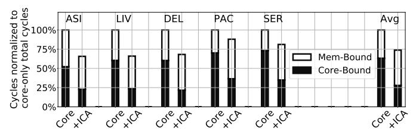

Fig. 1: Breakdown of SDDMM cycles with/without an ICA.

cycles. This justifies the need for an accelerator. With +ICA, computation gets accelerated and the core-bound cycles decrease by more than 55% on average. Unfortunately, the total cycles decrease by only 25% on average. The reason is that the memory-bound cycles remain or even increase. More than 62% of the total +ICA cycles are memory-bound. This shows that, even with the help of state-of-the-art prefetchers, the core is unable to provide data at the rate required by the ICA.

# B. Out-of-Core Accelerators (OCAs)

The second approach to integrate accelerators in CPUs is to place them outside of the core pipeline [6], [21], [24], [27], [29], [33], [52], [53], [87]. Examples of commercial offerings following this approach are the Intel Data Streaming Accelerator (DSA) and In-memory Analytics Accelerator (IAA) [53], [87], the Intel NPU [24], and the GPU in the AMD APU [21], [52]. These accelerators are placed on the chip far away from the cores (sometimes in the corner of the die [82], [87]), and can only access the LLC and main memory. Other accelerator proposals [6], [29] can also access private cache levels.

Such accelerators interact with the system's state by following what we call the *Out-of-Core Accelerator* (OCA) abstraction. OCAs can read their inputs from the memory system and write their outputs to the memory system. The execution of a task may leave state in the accelerator after the task completes [39].

An advantage of OCAs is that they can access the memory system with high performance, as they can utilize specialized out-of-core memory access hardware [29], [33], [72]. A limitation of OCAs is that they cannot be invoked out-of-order or speculatively by CPU cores, as there is no way of undoing the effects of their execution in case of misspeculation—e.g., if an exception or branch misprediction happens. In many cases, the communication between a core and an OCA is performed with polling [8], [53], where the accelerator is treated as an MMIO device and is invoked using non-speculative CPU stores. The CPU first checks the accelerator status by reading accelerator registers and, when the accelerator is ready, starts a new task by writing to other accelerator registers. Fences are required between accelerator invocations (which are memory stores) and subsequent polling on the accelerator (which are memory loads), to prevent store→load reordering [27].

To understand the inefficiencies of the current approach for CPU cores to communicate with OCAs, consider Figure 2, which shows three examples of the contents of a core's reorder buffer (ROB). In the figure, the ROB head is at the top. In Figure 2(a), we show that an OCA invocation instruction (which is a regular memory store instruction) is blocked from

<span id="page-2-1"></span>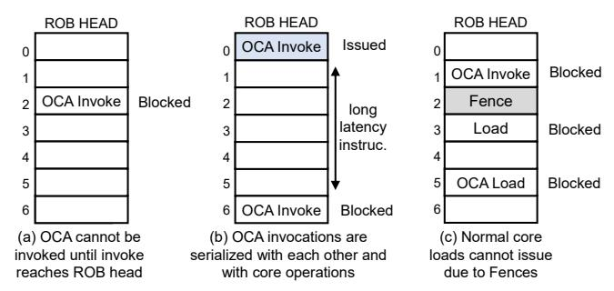

Fig. 2: Examples of core ROB state when invoking an OCA.

being issued until it reaches the head of the ROB—and hence is not speculative. Figure 2(b) shows that the invocations of two OCAs cannot overlap, since only one invocation can be at the ROB head at a time. Note that this does not mean that OCA tasks cannot overlap, but rather that the operations of starting tasks cannot overlap. Finally, Figure 2(c) shows that, for correctness, a fence is needed between an OCA invocation (i.e., a write) and a subsequent load to check the status of that OCA. Unfortunately, the fence also blocks normal (non-OCA) loads (e.g., the one at ROB index 3).

These communication inefficiencies do not matter for long tasks. However, they are detrimental to performance for small tasks that are finely interleaved with core execution. In an ideal scenario, OCA invocations would behave like normal instructions: they would execute speculatively and out-of-order when their inputs are available, and be squashed and reexecuted on branch mispredictions or exceptions.

# C. The Case for Near-Core Accelerators (NCAs)

Neither ICAs nor OCAs simultaneously support fine-grained CPU-accelerator execution interleaving and high-performance data access to the memory system. To fill this gap, we propose the *Near-Core Accelerator (NCA)*, a new abstraction for CPU-integrated accelerators that can be viewed as an intermediate point between ICAs and OCAs. Like OCAs, NCAs can directly read data from the memory system, potentially utilizing specialized memory access hardware for high performance. Like ICAs, NCAs never write to the memory system, but instead write their outputs to core registers, and their invocations are stateless. This allows NCAs to be invoked speculatively and out-of-order, enabling both high-performance core-accelerator communication and fine-grained core-accelerator execution interleaving.

# III. ATX OVERVIEW AND INSTRUCTIONS

To support NCAs, we propose a general framework that we call *Accelerator Task Extensions* (ATX). ATX consists of a set of instructions and hardware extensions to support the interaction between a CPU core, multiple NCAs, and the cache subsystem. ATX unlocks the full potential of NCAs by supporting speculative and out-of-order NCA invocation, and accelerated data provision from the memory system. In this section, we first describe the high-level interaction between cores, NCAs, and the memory system. We then detail the ATX instructions, which cores use to invoke and control NCAs.

<span id="page-3-0"></span>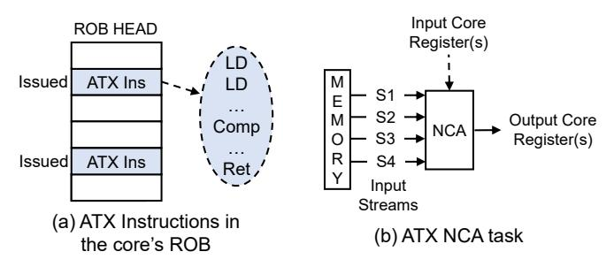

Fig. 3: ATX instructions and an ATX NCA task.

## A. High-Level Overview

A single ATX instruction executed by a core invokes an NCA *task* and returns the task's output in core registers. Figure 3(a) shows ATX instructions (called ATX Ins). As an NCA task executes, it reads data from the memory system without core involvement, performs computation, and then returns a result. As represented in Figure 3(b), the reads from memory use configurable and potentially inter-dependent memory streams [79]. An ATX instruction includes input core register operands that carry metadata encoding all the necessary information to configure those streams. We discuss how this is done in Section IV. An ATX instruction also defines output core register operands to which the NCA will write output data when the task completes. An ATX instruction retires from the ROB when three conditions occur: the task has completed, the task output has been written to core registers, and the instruction is at the head of the ROB. An NCA never writes to memory.

From a core's viewpoint, an ATX instruction behaves like a load instruction that loads data from memory into registers. The computations performed by the task are invisible to the core. The core treats ATX instructions like normal loads; they can be issued speculatively and out-of-order, as soon as the instructions that produce their register inputs have finished. If an ATX instruction is squashed due to a wrong speculation, it is interrupted in the NCA without affecting architectural state.

Figure 4 shows a high-level overview of the interaction between a CPU core, potentially several NCAs that it controls, and the memory system. The figure includes the ATX Unified Transfer Engine (UTE), a hardware module that interfaces the three subcomponents. There is one UTE per core. The UTE schedules the tasks invoked by the CPU cores on the appropriate NCAs. Further, it reads task inputs from the memory system on behalf of the NCAs, forwards the fetched data to the NCA input buffers (i.e., scratchpads), and routes task outputs from NCAs back to the CPU. We describe the UTE in detail in Section IV.

While the NCA abstraction does not specify the location of the accelerator in the cache hierarchy of a core, the ATX design that we propose places the UTE and NCAs next to the L2 cache. This is a "goldilocks zone" that enables fast core-accelerator communication, while limiting intrusion into the core pipeline. Further, such proximity enables the UTE to share the L2 TLB with the core and utilize the L2 for buffering and reusing data—minimizing the need for large scratchpads.

<span id="page-3-1"></span>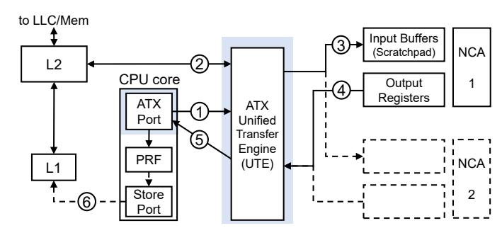

Fig. 4: Interaction between a core, multiple NCAs, and the memory system.

The interaction between core, NCAs, and memory system is as follows. At step ①, the UTE receives an ATX instruction from the core's ATX Port for an NCA task. The UTE generates the addresses of the input data of the task, utilizing metadata in the ATX instruction, and generates read requests directed to the core's L2 at step ②. We describe the exact mechanism of address generation later. Requests use the existing memory access flow when they encounter an L2 cache miss.

The UTE operates on virtual addresses and uses the core's L2 TLB and MMU for memory address translation similar to [27], [29], [33]. Also, when the UTE reads the L2, it always gets the latest value of the data. If the requested line is dirty in the core's L1, existing coherence hardware mechanisms will provide the latest version of the line from L1. The UTE never writes to the L2 or memory.

At step ③, the input data received from the L2 is written to the input buffers of the appropriate NCA. Once all the input data is collected, the UTE signals the NCA to start execution. When the NCA execution completes, the UTE is notified and, at step ④, the UTE reads the output data. At that point, the NCA is freed and can accept a new task. Then, at step ⑤, the NCA output is returned to the core through the ATX port and written to a core register (specified in the ATX instruction) in the core's physical register file (PRF). The ATX instruction then completes. The core may use the output data for other computations or write it to the memory system (step ⑥).

# B. ATX Instructions

The ATX instructions and the core pipeline extensions needed to support them are NCA-agnostic and reusable across different NCAs. The ATX instruction format consists of (1) an opcode that determines the number and type of input/output operands, (2) input architectural register operands, and (3) output architectural register operands. Figure 5 shows two example instructions. The opcode of the first instruction (ATX V2VI) means that the instruction has two input vector register operands and one output vector register operand. The opcode of the second instruction (ATX V1T2) means that the instruction has one input vector register operand and two output tile register operands (using AMX terminology [38]). We use ATX instructions with a different number and type of input and output register operands to accommodate the diversity in NCA tasks. The input operands carry the type of the task and information needed by the UTE to generate the

<span id="page-4-1"></span>

Fig. 5: ATX instruction format for two example instructions.

<span id="page-4-2"></span>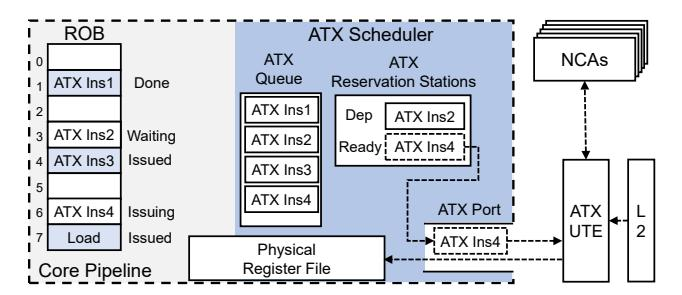

Fig. 6: Pipeline extensions to support ATX instructions.

input memory addresses (Section IV). They may additionally include control data that is transferred directly to the NCA. When the instruction completes, the NCA output is written to the output operand registers.

To support the ATX instructions, the core pipeline is extended with an ATX scheduler as shown in Figure 6. It consists of: (1) the ATX Queue, which contains information about the ATX instructions in the ROB, (2) ATX Reservation Stations that participate in the core's wake-up logic, and (3) scheduling logic that issues ATX instructions to the ATX Port once their (renamed) input registers are ready. After the instructions are issued to the ATX Port, they are sent to an internal queue in the UTE. If this queue is full, a structural hazard prevents further ATX instructions from being issued. When an ATX instruction completes, the UTE returns the output to the core, which is then written to the physical register file. Note that, although in our work we have used a single port for the UTE, multiple ATX ports are possible. ATX instructions are committed inorder with the other instructions.

Figure 6 shows the status of 4 ATX instructions and a regular load in a core's ROB. In contrast to Figure 2, ATX instructions do not have to reach the ROB head to be issued to the NCA. ATX instructions can be issued out-of-order, as long as their dependencies are resolved. Further, the need for fences is eliminated and regular loads can be issued freely. The figure shows that ATX Ins1 has completed but not retired, ATX Ins2 is in a reservation station because it depends on an input that is not yet available, ATX Ins3 has already been issued to the UTE, and ATX Ins4 is currently being issued from a reservation station to the UTE.

# C. Memory Consistency Implications of ATX Instructions

ATX instructions do not affect the possible orderings between regular (non-ATX) loads and stores in a TSO-consistent system. However, the loads in a task started by an ATX instruction (i.e., ATX Task loads), have more relaxed memory consistency semantics. Such loads are not tracked by the core's load queue and, therefore, do not get squashed and replayed if a cache line accessed by the task gets evicted from the local caches or receives an invalidation. As a result, ATX Task

loads appear weakly-ordered with respect to other ATX Task loads and with respect to normal core loads. This behavior is exposed as part of the ATX memory model, such that programmers and compiler developers can add appropriate synchronization code if stronger ordering is needed.

A second issue with ATX instructions relates to store-toload forwarding. An ATX Task load cannot read data from stores currently residing in the core's store queue or store buffer. The reason is that the load is issued by the UTE, and the UTE does not have access to the core's store queue or store buffer. The load always reads data directly from the L2 cache. To ensure that the ATX Task loads do not read stale data, the programmer or compiler must add a fence between a store and a subsequent ATX instruction that could start a task that consumes data produced by the store. This situation should be avoided, as it cancels out the benefit of speculative execution of ATX instructions. Hence, during the execution of a kernel, any data that the core generates for an NCA should preferably be communicated through input registers rather than through memory. Communication through registers is handled correctly by the existing dependency checking mechanism in the core without needing fences.

#### IV. THE UNIFIED TRANSFER ENGINE (UTE)

<span id="page-4-0"></span>This section details the ATX Unified Transfer Engine (UTE).

## A. Main Idea

The UTE is an out-of-core module that interfaces the NCAs, memory system, and the core (Figure 4). It serves two main goals: core-NCA interface virtualization and accelerated data provision for NCAs.

- 1. Core-NCA Interface Virtualization. The UTE acts as an interface between the core and the different NCAs to avoid making changes to the core's pipeline or adding core ports each time a new NCA is added. The core sends ATX instructions to different NCAs indirectly, by issuing them to a single UTE port. When the core invokes an NCA task, it does not need to track the status of the NCA that will execute it. In addition, the core does not need to know how many different NCA instances can execute the task. Each different task type has an identifier that we call Virtual Accelerator (VAcc) Id. The first input operand of an ATX instruction includes, among other metadata, the VAcc Id of the task type that the instruction invokes. The UTE has a mapping between VAcc Ids and physical NCAs, each given by a Physical Accelerator (PAcc) Id. The UTE is responsible for assigning and scheduling tasks to the appropriate physical NCAs. The UTE also routes output data from NCAs to the core's ATX port(s). The data is then written to the core's register file.
- **2.** Accelerated Data Provision for NCAs. In Section II and Figure 1, we quantified the inefficiency of using a core's general-purpose memory access hardware to provide data to accelerators. To eliminate this inefficiency, the UTE acts as an out-of-core interface between the NCAs and the memory system. The UTE fetches and prefetches data for the NCAs, and then writes it to NCA input buffers (i.e., scratchpads). To

<span id="page-5-0"></span>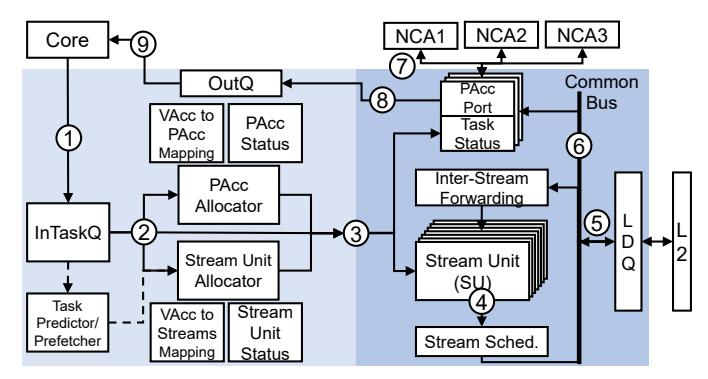

Fig. 7: Unified Transfer Engine (UTE) architecture.

be able to handle diverse NCA memory access patterns, the UTE is programmed using a *stream-based* abstraction, largely inspired by [79]. In our work, *streaming* is the process of reading memory elements of a specified size from a start to an end virtual address, possibly with a stride. A task started by an ATX instruction needs at least one stream for each of the input data structures participating in the NCA computation. For indirect memory accesses, more than one inter-dependent streams may be needed to realize the necessary fetch pattern of a data structure.

**3. UTE Architecture.** Figure 7 shows the architecture of the UTE. Before execution begins, the programmer uses regular writes to UTE configuration registers to configure the UTE with: (1) the mapping from VAcc Ids to PAcc Ids (i.e., which physical NCA instances can support which task types), and (2) the stream information for each of the VAcc Ids. The latter includes the number of streams that the task type reads, their dependencies (if any), and other metadata for their configuration. The UTE configuration information is stored in two content-addressable memory (CAM) structures: the VAcc to PAcc Mapping and the VAcc to Streams Mapping (Figure 7). Since the size of these structures is limited, the programmer can remove entries when a task type is no longer neededagain using regular writes to UTE configuration registers. If the core tries to configure more task types than what the CAMs can hold, the UTE signals the core and an exception occurs.

The UTE CAM contents are part of the process state. As in [27], to reduce context-switch overhead, this state is lazily saved and restored by the OS only when a new process attempts to use the UTE (and not at every context switch), via a trap mechanism.

In the following, we give details on the UTE microarchitecture, including the frontend, the backend, the stream units, and the task prefetcher. We also show an example of how the UTE is programmed.

#### B. UTE Frontend Microarchitecture

The frontend is shown in light shade in Figure 7. To understand its operation, consider the journey of a task. First, the ATX instruction that starts the task is placed in the InTaskQ at step ①. It waits there until it is allocated a physical accelerator instance (PAcc), and a set of *Stream Units* at step ②. To allocate a PAcc, the *PAcc Allocator* checks the *VAcc* 

to PAcc Mapping module to see which PAccs are capable of executing the task. To allocate Stream Units, the Stream Unit Allocator checks the VAcc to Streams Mapping module to determine how many Stream Units are needed for the task. The Stream Units are responsible for generating the memory addresses to load data from, and the accelerator's scratchpad addresses to write the loaded data to. The VAcc to Streams Mapping module can optionally contain parent-child dependencies between streams. Once the appropriate PAcc and Stream Units are identified as free, the task is dispatched to the backend at step ③.

Tasks do not need to be dispatched to the backend in order. If the task at the head of the InTaskQ cannot find the necessary resources, the next task in the InTaskQ is processed. If the architecture does not include a PAcc that can handle the task (or if the VAcc to PAcc mapping has not been configured), the UTE signals the core and the ATX instruction causes an exception handled by the OS. We describe the Task Predictor/Prefetcher of the UTE frontend in Section IV-F.

#### C. UTE Backend Microarchitecture

The backend is shown in dark shade in Figure 7. It contains a number of Stream Units for address generation, and a *Load Queue (LDQ)* to load data from memory. Since different Stream Units can be concurrently active, a *Stream Scheduler* (step ④) selects which Stream Unit will issue a request to the memory subsystem (step ⑤) at each cycle. We use a simple age-based scheduling policy: the oldest streams issue first, while ties are resolved in a round-robin fashion.

The backend also contains one port per NCA (PAcc Port), which is used to write and read data to/from the NCA. Each port has a Task Status flag to track the status of the task. When data arrives from memory, it is sent to a *Common Bus* (step **6**) that connects to the PAcc ports, and is forwarded to the appropriate NCA (step 7). Further, data that arrives from memory for a parent stream is also forwarded through the Common Bus to the Stream Units that implement its children streams. The Task Status is updated every time the complete data for a stream arrives from memory and is written to the NCA. When the data for all the streams of a task has arrived, the NCA is notified to start processing. Once processing is done, the NCA's output is moved to the OutQ (step (8)), and the task completes, freeing-up the PAcc Port and Stream Units, and updating the PAcc Status and Stream Unit Status modules. The output is written to registers of the CPU core at step **(9)**.

The core signals the UTE every time that an ATX instruction is squashed because of a branch misprediction or an exception. Then, the UTE interrupts the execution of the corresponding NCA, invalidates any data already loaded into the NCA's input buffers, frees-up the corresponding PAcc Port and Stream Units, and updates the PAcc Status and Stream Unit Status modules. Since NCAs are stateless, no state is preserved across NCA invocations, and the NCA is ready to accept a new task.

## <span id="page-5-1"></span>D. Streams and UTE Stream Unit Microarchitecture

The UTE supports a rich set of NCA access patterns using the Stream Units. A Stream Unit generates: (1) memory

```
1 while(1)
2 setup beg,end; //Start of a stream repetition
3 for(addr=beg; addr < end; addr+=size*stride)
4 load *addr; //Stream iteration
5 if (no_parent_stream or parent_stream_done)
```

Fig. 8: Memory access pattern of a stream.

addresses to load from, and (2) NCA scratchpad (i.e. input buffer) addresses to write to. We now describe only memory address generation, as scratchpad address generation is similar. It is the programmer's responsibility to size a task so that: (1) the data loaded from Stream Units does not overflow the NCA's scratchpad, and (2) the output data of the NCA fits in the output register operands of the ATX instruction.

A stream follows the fetch pattern of Figure 8. In the inner loop, data is loaded from memory starting at address *beg* and ending at address *end*, with a specified element *size* and *stride*. A stream may have a parent stream. In this case, each iteration of the parent stream causes a new repetition in each of its children streams. A repetition is the full execution of the inner loop in the figure. Each stream repetition may have different *bounds* (i.e., *beg* and *end* addresses). Each stream occupies one Stream Unit in the UTE.

To illustrate the operation of a Stream Unit, consider the example of a task that takes a set of rows of a sparse matrix stored in CSR format. For each row in the set, the task computes the sum of its elements, and then stores the sum in a per-row buffer. The pseudocode of the task is shown in Figure 9. The task uses two streams. Stream S1 loads the row pointers stored in array  $row\_ptrs$ , and stream S2 loads the element values stored in array vals. The number of rows is  $r\_end - r\_start$ . For each row, the task reads the pointers to the boundary elements in the row ( $edge\_start$  and  $edge\_end$ ), and then reads the values of the elements in the row and accumulates them into a per-row buffer in the NCA. After the task is done, the NCA output goes to the OutQ, and the UTE moves the OutQ contents to CPU core register(s).

In the example, before a repetition of the inner loop can execute and fetch a row of data from S2, S1 must have brought the two elements that mark the bounds of the row. This example shows that fetch patterns such as indirection and pointer chasing can be implemented by making the bounds parameters of a stream (S2) depend on the values returned by another stream (S1), forming a parent-child dependency tree.

Figure 10 shows the information needed to generate memory addresses for the task. Specifically, Figure 10(a) shows the values contained in the input operands of the ATX instruction that are needed for address generation by the Stream Units. We call these values  $runtime\ constants$ . The constants for S1 are c11 and c12: pointers to the beginning and end of the  $row\_ptrs$  array. The ones for S2 are c21 and c22: the address of the vals array and the size of an element in vals. Figure 10(b) shows the parent-child dependency tree for the streams in our example. S2 uses the row pointers fetched by S1 as begin/end indices in the val array, so S2 is a child of S1. Every iteration of the

```
for (r = r_start; r < r_end; r++)

load edge_start= row_ptrs[r]; % stream S1

load edge_end = row_ptrs[r+1]; % stream S1

for (e = edge_start; e < edge_end; e++)

load val = vals[e]; % stream S2

NCA accumulates val into a per-row buffer

UTE moves OutQ contents to CPU core register(s)</pre>
```

Fig. 9: Pseudocode of an example task.


**(b)** Stream Dependency Tree **(c)** *bexp* Configuration Fig. 10: Information needed for task address generation.

parent stream S1 starts a repetition of the child stream S2, each with different bounds.

To calculate the bounds of each repetition of a stream at runtime, the UTE contains bound expressions (bexps) that are set at task configuration time, and propagated to the Stream Units at task execution time. Figure 10(c) shows the bexps for our example. S1 has bounds directly given by the ATX instruction runtime constants c11 and c12 (Figure 10(a)). S2has bounds that use runtime constants c21 and c22, but that also depend on the data fetched by its parent S1 (indicated by parent[]) and the stream repetition index i. In general, bexps take as inputs: (1) runtime constants from the ATX instructions, (2) data loaded by parent streams, and (3) the index of the stream repetition. Although we omit details due to space, a bexp has the form  $Op1(I_1, Op2(I_2, I_3))$ , where  $I_i$  are inputs, and Op1 and Op2 are either additions, multiplications, comparisons, or shifts. This format is expressive enough to support diverse task data access patterns.

The microarchitecture of a Stream Unit is shown in Figure 11. It has three modules: the *Repetition Initializer*, the *Mem Address Generator*, and the *NCA (Scratchpad) Address Generator*. The Mem and NCA Address Generators have simple increment arithmetic that calculates the next iteration address to read from or to write to, respectively, within a given stream repetition (inner loop of Figure 8). Once these addresses are calculated, they are pushed into the Access Queue, waiting to be selected for issuing by the Stream Scheduler. The Access Queue additionally coalesces accesses from consecutive iterations that target the same cache line.

The Repetition Initializer calculates the bounds (beg and end) for each new repetition of a stream, using a Bounds ALU that computes bexps. Streams without parent start their single repetition when the task is issued, while child streams start a new repetition when their parent produces the needed value(s). bexps are configured before the kernel begins, and are propagated from the VAcc-to-Streams Mapping (Figure 7) to a Stream Unit when the latter is allocated to a task.

The Parent Data Queue (PDQ) holds data fetched by the

<span id="page-7-0"></span>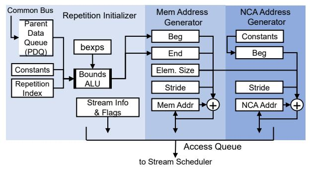

Fig. 11: Stream Unit microarchitecture.

stream's parent to be used in computing *bexps*. The size of this queue determines how far a parent stream can run ahead with respect to its children, similar to [79].

## E. Programming with ATX

Figure 12 shows the code executed by a CPU core to configure the UTE and generate ATX instructions, where each ATX instruction triggers one instance of the example task of Figure 9 executed on the NCA. During the Task Configuration Time, before the tasks are invoked, the core uses regular reads and writes to UTE configuration registers to configure the UTE. The code first checks whether the UTE is attached to at least one instance of the accelerator type needed to execute the task type (Line 3). This is done by comparing the type identifier of the needed NCA against the contents of an architecture-dependent UTE read-only hardware table. This table stores the type identifiers of the physical NCAs attached to the UTE. If no physical instance of the needed type is found, the code falls back to the default non-ATX CPU execution (Lines 4–6). In this way, the binary remains compatible with other CPUs with the same ISA but different NCAs.

The programmer then defines an identifier for the specific task type (VAcc Id). Different task types in the same execution context must have different VAcc Ids. The UTE is then configured to map all tasks with this VAcc Id to the appropriate NCA type (Line 10). The UTE hardware fills the VAcc to PAcc Mapping module (Figure 7), to mark all physical accelerator instances (PAcc Ids) of this NCA type as capable of supporting tasks with this VAcc Id. Different VAcc Ids may be concurrently active at the UTE. Then, the number of streams for this VAcc Id is communicated to the UTE (Line 11).

The next step is to configure each stream of the task. This process involves configuring: (1) the size of the stream elements, (2) the parent id for the stream (-1 in the case of a root stream), and (3) the *bexps* that are used to calculate the beginning and end bounds of a stream repetition. Although we omit the details for simplicity, the *bexp* is encoded with 2 bytes that include the *Op1* and *Op2* operators, and specifiers for the *I1*, *I2*, *I3* operands (Section IV-D). Optionally, the programmer can also configure: (4) a non-unit stride, and/or (5) flags. The stream configuration information is stored in the VAcc to Streams Mapping module (Figure 7).

At this point, the programmer can use ATX instructions to trigger many different tasks of this type. This is shown in

```
*** Task Configuration Time ***
    //NCA_Type is identifier of needed NCA type
2
    success = UTE_check(NCA_Type);
4
       //NCA type unavailable, fallback to non-ATX code
6
    //General configuration
    VAccId = 1; //Define VAccId for tasks of this type
10
    UTE_cfg_VAcc_to_Type(VAccId,NCA_Type);
11
   UTE cfg num streams(VAccId,2);
13
    //Stream S1 configuration
14
    stream id = 1
15
   parent_id = -1 //This is a root stream
    //8 bytes per S1 element
16
    UTE cfg stream size (VAccId, stream id, 8);
17
    UTE cfg parent (VAccId.stream id.parent id):
18
    UTE_cfg_bexp_beg(VAccId, stream_id, S1_BEG_ENCODE);
19
20
    UTE_cfg_bexp_end(VAccId, stream_id, S1_END_ENCODE);
    //Stream S2 configuration
22
23
    st.ream id = 2
24
    parent_id = 1 //S1 is the parent of S2
25
    //4 bytes per S2 element
26
    UTE_cfg_stream_size(VAccId, stream_id, 4);
29
    *** Task Execution Time ***
30
    c21 = vals; //Starting address of vals[] array
    c22 = sizeof(*vals);
31
32
    rows_per_task = 16;
33
    out_vregister = 0; //Clear output vector reg
34
35
    for (r = 0; r < num_rows; r+= rows_per_task)
       c11 = &row_ptrs[r];
37
       c12 = &row_ptrs[r+rows_per_task];
38
       in_vregister = {VAccId, c11, c12, c21, c22, 0...};
39
       //ATX instruction that triggers an NCA task
       ATXV1V1{in_vregister,out_vregister};
```

Fig. 12: CPU-core pseudocode to configure the UTE and generate ATX instructions. Each ATX instruction triggers one instance of the example task of Figure 9 executed on the NCA.

the Task Execution Time code (Lines 32-43). The code has a loop (Line 35) that, in each iteration, uses an ATX instruction (ATXV1V1 in Line 40) to trigger a task that performs the operation of Figure 9 on 16 consecutive sparse matrix rows. We choose 16 rows per task so that the NCA output fits in a 512-bit vector register—although we could have used one or two 1KB tile registers to support larger outputs. The code loads from memory the task-specific runtime constants c21, c22, c11, and c12. It then concatenates the VAcc Id and these four constants, and stores them in a vector register padded with zeros (Line 38). This vector register is passed as the input operand of the ATX instruction (Line 40). After the ATX instruction completes, the core can use the output vector register (out\_vregister) for other computations or write its contents to memory using regular store instructions. Note that, in actual code, the ATX input and output data would be defined as a struct variable, which the compiler then translates into input and output registers. The loop in Line 35 can be parallelized across multiple cores and their NCAs using, for example, OpenMP constructs.

The overhead of task configuration is negligible, as task configuration is only needed once per task type, and is then reused for potentially thousands of tasks per core during the actual task execution time.

<span id="page-8-1"></span>The ATX design enables NCAs to exploit a high degree of memory-level parallelism (MLP). This results from encoding all the memory accesses of a task in a single ATX instruction, and from supporting fast and efficient memory address and access generation in the UTE. However, even with this support, there are scenarios where even more MLP is desirable to fully saturate the memory resources of the architecture.

A natural way to do so is to increase the number of tasks that are concurrently processed by the UTE backend. However, there can be two obstacles to attain this. First, there may not be enough NCA scratchpads to store all the data that tasks fetch from memory. Second, the CPU cores may not be able to initiate new tasks fast enough. To overcome these limitations, we introduce two forms of *task prefetching*—each one targeting a different obstacle.

- 1. Assisted Task Prefetching. This mechanism targets the scenario where the CPU core can produce new tasks fast enough, but new tasks cannot be dispatched to the UTE backend due to insufficient NCA scratchpads to accept the data fetched from memory. In this case, new tasks will wait in InTaskQ (Figure [7\)](#page-5-0) until an NCA is freed up. With Assisted Prefetching, tasks that wait in InTaskQ are allowed to be dispatched to the backend in *prefetch mode*. In this mode, no NCA is assigned to the task. Instead, the hardware simply prefetches data from leaf streams (e.g., S2 in Figure [10\(](#page-6-1)b)) to the L2. Data from non-leaf streams (e.g., S1 in Figure [10\(](#page-6-1)b)) is fetched into the Stream Units of the children streams in the UTE, in order to generate addresses. However, such data is not propagated to a PAcc port, as would happen in nonprefetch mode. We call these task prefetches *assisted*, since the CPU core assists the UTE with precise information about future tasks. Later, when an NCA is freed up, the task will be re-issued to the backend in non-prefetch mode, and likely find most of its data already in the L2.
- 2. Predicted Task Prefetching. This mechanism targets the scenario where the CPU core cannot produce new tasks fast enough. In this case, InTaskQ remains mostly empty, so the UTE has to predict the tasks that will come next. Luckily, predicting tasks is easier than predicting individual memory accesses. In conventional data prefetching, a hardware prefetcher predicts which memory accesses will come next, given the past memory accesses. In Predicted Task Prefetching, the *Task Predictor/Prefetcher* (Figure [7\)](#page-5-0) predicts which tasks will come next, given the past tasks. Recall that different tasks of the same type share the stream dependency and *bexps* configuration (Figure [10\)](#page-6-1). They only differ in the values of their runtime constants (Figure [10\(](#page-6-1)a)). Thus, we can reformulate the goal of the Task Predictor as to *predict which runtime constants will come next, given the ones observed in the past*.

While we can reuse the ideas of many existing prefetch algorithms, a simple stride algorithm proved effective. Our predictor observes the runtime constants in two consecutive tasks of the same type and extracts their strides. Then, to produce the constants for the next predicted task, it increments the constants of the current task by the extracted strides. In this way, a new predicted task is produced for each real task.

To hide latency effectively, we do not predict the next task, but the next Nth task. Hence, we increment the constants of the current task by N times the extracted strides. We call N the *Prefetch Distance*. High distances correspond to deeper prefetches. To set the prefetch distance for a task, we use a simple runtime heuristic that monitors the average task input sizes, and uses small distances for large sizes and vice-versa. In particular, we use a distance of 1 for tasks with average input size larger than 32KB, 2 for 16KB, etc. More sophisticated techniques to adjust the prefetch distance at runtime such as [\[14\]](#page-13-19), [\[28\]](#page-13-20), [\[36\]](#page-14-21) are possible, but we leave them as future work. After the constants for the predicted task have been determined, the task is dispatched to the UTE backend in *prefetch mode*, as described above.

# V. METHODOLOGY

<span id="page-8-0"></span>1. Simulation and System Architecture. We evaluate ATX NCAs with an internal silicon-validated multicore CPU simulator that extends Sniper [\[17\]](#page-13-21). We further extend our simulator to model NCAs, ICAs, OCAs, ATX instructions, and the UTE. Our baseline architecture is a 64-core CPU with the system parameters of Sapphire Rapids (SPR) with HBM (i.e., Xeon-Max) [\[11\]](#page-13-7), [\[57\]](#page-14-12), [\[66\]](#page-14-13). We scale the HBM memory bandwidth of the architecture to 4TB/s to match state-of-the-art decoupled accelerator platforms [\[19\]](#page-13-12), [\[61\]](#page-14-14). To eliminate MSHR-related MLP limitations [\[57\]](#page-14-12), we scale the number of L2 MSHRs to 128. The architecture includes industry-grade L1 and L2 spatial prefetchers that have been silicon-validated against the real SPR prefetchers. Table [I](#page-8-2) shows the main CPU, UTE, and accelerator parameters.

TABLE I: System parameters.

<span id="page-8-2"></span>

|                      | CPU                                                        |  |  |  |  |  |
|----------------------|------------------------------------------------------------|--|--|--|--|--|
| General              | 1 socket; 64 cores; 2.5GHz; AVX/AMX support;               |  |  |  |  |  |
|                      | 16-entry ATX Queue                                         |  |  |  |  |  |
| Caches               | 48KB L1; 2MB L2; 1.875MB LLC per core                      |  |  |  |  |  |
| Mem                  | DDR 1TB, 270GB/s; HBM 64GB, 4TB/s                          |  |  |  |  |  |
|                      | UTE                                                        |  |  |  |  |  |
| General              | Per-core UTE: 2 Input Buffers (i.e., scratchpads) per NCA; |  |  |  |  |  |
|                      | 32KB/buffer; 32 Stream Units; Common Bus with 128B(data)   |  |  |  |  |  |
|                      | + 32B(addr); 128-entry LDQ; 1KB PDQ per Stream Unit;       |  |  |  |  |  |
|                      | only Predicted Task prefetching enabled                    |  |  |  |  |  |
| Accelerators Modeled |                                                            |  |  |  |  |  |
| SpMM/                | SPADE [29]-like arithmetic unit                            |  |  |  |  |  |
| SDDMM                |                                                            |  |  |  |  |  |
| GeMM                 | GeMM unit operating on 8x8 µtiles                          |  |  |  |  |  |
| Decompr.             | DECA [27]-like; W=64, L=16                                 |  |  |  |  |  |

The L2 cache is shared by the core and the UTE, and an arbiter selects between requests from the core's L1 and the UTE, similar to L2 caches shared by multiple cores [\[73\]](#page-15-7). An ATX execution port is added to the core pipeline, which competes with the other execution ports (INT, FP, LD, VEC, etc.) for physical register file (PRF) write access. Although we did not increase the number of PRF write ports, we found that ATX reduces PRF pressure compared to core-only execution, as an ATX instruction replaces multiple loads.

As shown in Table [I,](#page-8-2) we model three ATX NCA accelerators: for SpMM/SDDMM operations, GeMM operations,

<span id="page-9-0"></span>TABLE II: Benchmark sparse matrices.

| Short name      | asi | liv | del | pac | ser |
|-----------------|-----|-----|-----|-----|-----|
| Rows (mil)      | 12  | 4   | 17  | 2   | 1   |
| Non-zeros (mil) | 25  | 69  | 101 | 35  | 64  |

and ML weight decompression. The arithmetic units in the SpMM/SDDMM and decompression accelerators are modeled after SPADE [29] and DECA [27], respectively. For GeMM, we model double-precision GeMM units operating on 8x8  $\mu$ tiles. The maximum combined throughput of all 64 SpMM/SDDMM accelerators in our modeled platform is 5.1 double-precision TFLOPs. For the 64 GeMM accelerators, the maximum total throughput is 20.5 double-precision TFLOPs.

We implement double buffering using two 32KB Input Buffers (i.e., scratchpads) per NCA, each of which is attached to a different UTE PAcc port. The scratchpads determine the maximum task input size. For the output operands of the ATX instructions, we use up to two tile registers of 1KB each. This limits the maximum task output size to 2KB.

- **2.** Comparison with Alternative Accelerator Organizations. We compare ATX NCAs against different organizations of the same accelerators: (1) *perfect* ICAs that take zero time to perform computations, (2) L2-attached OCAs (*L2 OCA*) controlled with RoCC-like instructions [6], [63], which, unlike ATX, do not execute speculatively, and (3) LLC-attached OCAs (*LLC OCA*) controlled with memory loads and stores (Section II). The two OCA configurations include optimized out-of-core memory access interfaces that feature the stream support of the UTE.
- **3. Evaluated Kernels**. We use four kernels from scientific computing and machine learning (ML):
- Sparse Matrix Dense Matrix Multiplication (SpMM) and Sampled Dense Matrix - Dense Matrix Multiplication (SDDMM) are two sparse kernels that are popular in graph analytics [9], [16], graph neural networks [1], [13], [31], [48], and ML [18], [34]. They have irregular access patterns. In these kernels, the CPU traverses the sparse matrices, observes the sparsity patterns, creates tasks on the fly, and invokes the accelerator. The programmer or library needs to ensure that the generated tasks do not overflow the accelerator scratchpads. These kernels use fine core-accelerator interleaving. As benchmark sparse matrices, we use asia\_osm, com-LiveJournal, delaunay\_n24, packing-500x100x100, and Serena from SparseSuite [22], based on the selections made in [29]. Table II characterizes the matrices. SpMM and SDDMM are executed with double precision and with 2MB virtual pages to reduce the impact of TLB misses and page walks.
- The popular GeMM kernel, to demonstrate ATX generality.
- Decompression of a sparsified and quantized ML model where, alongside the accelerator, the CPU executes computations using AMX [27]. This kernel also requires fine coreaccelerator interleaving.
- **4. Software**. For our baseline CPU-only execution, we use the vendor-optimized MKL library [78] for SpMM and GeMM. MKL does not support SDDMM and thus we use an optimized SDDMM kernel from TACO [49]. For the ML model decompression, we use the decompress+execute kernel from

<span id="page-9-1"></span>

Fig. 13: Speedups of ICA and of our ATX NCA, over coreonly execution for different kernels.

libxsmm [35]. All kernels are vectorized with AVX512, while the decompression also uses AMX. For ATX, we create hand-crafted kernels that break down the computation into tasks and use ATX instructions to invoke the NCAs. For parallelization across cores, UTEs, and NCAs, we use OpenMP, to demonstrate that our framework is fully compatible with popular CPU parallel programming models.

**5. Overhead of ATX Extensions**. The main overhead of the ATX extensions is the UTE. The UTE has modest storage needs. In the UTE, the VAcc-to-PAcc and VAcc-to-Streams Mapping tables contain the only architectural process state. In our configuration, these tables require 0.5KB and 4KB, respectively, which is more than enough to concurrently configure the three NCAs used in our evaluation. For comparison, Intel cores with AMX [38] need 8KB of architectural state for AMX tile registers alone. The remaining UTE storage is nonarchitectural state in structures such as the InTaskQ, OutQ, LDQ, Stream Units, and other queues. We calculate that the total storage overhead for one UTE is less than 128KB. Using CACTI [10] and [74], we estimate that 64 UTEs account for less than 1% of the SPR die area [82]. Using the same tools, we estimate that their combined static and dynamic power (at maximum activity) is 4.37% of the SPR TDP of 350W.

# VI. EVALUATION

In this section, we compare ATX NCAs with other accelerator organizations and evaluate different aspects of ATX NCAs. **1. Comparison with ICAs**. Figure 13 shows the speedups of executing with ICA or with our ATX NCA, over core-only execution. For SpMM/SDDMM, we run our five sparse matrices; for GeMM, we evaluate five configurations which, using BLAS [12] terminology, use N=128 and M=K=1k,2k,4k,8k,16k. ICA relies on the core's memory access infrastructure, and thus suffers from reduced MLP exploitation capabilities. This limitation does not exist in ATX NCA. As a result, ATX NCA delivers average speedups of 2.3x, 2.0x, and 1.3x over ICA for SpMM, SDDMM, and GeMM. The speedup for GeMM is slightly lower, since this kernel has more regular access patterns, which are easier to handle using the existing core's memory access infrastructure. Compared to core-only execution, ATX NCA delivers average speedups of 2.8x, 2.7x, and 2.7x. We see similar trends across a wide variety of sparse matrices and GeMM sizes.

**2. Comparison with L2 OCA and Ablation Study**. We now compare ATX NCAs with L2 OCAs controlled with RoCC-like instructions. Although L2 OCAs share the same spatial

<span id="page-10-0"></span>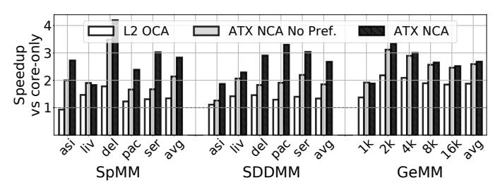

Fig. 14: Comparison with RoCC L2 OCA and ablation study.

placement as ATX NCAs, ATX NCAs have two advantages over them: (1) ATX instructions can be invoked out-of-order and speculatively, and (2) the ATX framework supports task prefetching that can further accelerate data provision from memory. To isolate each effect, Figure 14 shows the speedups of executing with L2 OCA, which is controlled with RoCC-like instructions and uses the SPR L2 prefetcher (*L2 OCA*), with ATX NCA with task prefetching disabled (*ATX NCA No Pref.*), and with our full proposed ATX NCA (*ATX NCA*), over core-only execution. We see that *ATX NCA No Pref.* delivers average speedups of 1.6x, 1.4x, and 1.3x over L2 OCA for SpMM, SDDMM, and GeMM, respectively. With prefetching, our full ATX NCA design attains average speedups over L2 OCA of 2.1x, 2.0x, and 1.4x.

3. Comparison with LLC OCA and Effect of Task Input Size. We compare ATX NCA with the most common form of OCAs, namely OCAs attached at the LLC. We evaluate different sizes of the Input Buffers (i.e., scratchpads), which limit the maximum task input size. Each LLC OCA or ATX NCA has two scratchpads for double buffering. We vary the size of each scratchpad from 8KB to 128KB in LLC OCA and, to keep the near-core SRAM small, from 8KB to 32KB in ATX NCA. Hence, for the same kernel, an ATX NCA with smaller input buffers executes more, smaller tasks than an LLC OCA with larger input buffers. For the LLC OCA, the maximum output size is equal to the input size, while the ATX NCA uses 1-2 output tile registers of 1KB each.

Figure 15 shows the speedups of ATX NCA and of LLC OCA, over core-only for various task sizes running SpMM. We do not show the other kernels for space reasons, but they have similar trends. LLC OCAs incur high core-accelerator communication latency. As OCA invocations do not execute out-of-order, this extra latency has a noticeable performance impact. The figure shows that ATX NCA is 9.4x faster than LLC OCA for an 8KB maximum input task size, and 2.6x for a 128KB maximum input task size. The NCA significantly outperforms the OCA for small tasks finely-interleaved with core execution. The OCA's performance will eventually match NCA's for very large tasks, but at the cost of reduced interleaving with the core and more on-chip scratchpad memory. **4. Roofline Performance**. Figure 16 presents a roofline analysis for the SDDMM kernel with: (a) core-only execution, and (b) computations offloaded to different ATX NCA variants. Performance is shown in Giga Vector Operations per second, where not all vector operations produce FLOPs. Figure 16(a) shows that, without an accelerator, all performance points are in the compute-bound region. Figure 16(a) also shows a

<span id="page-10-1"></span>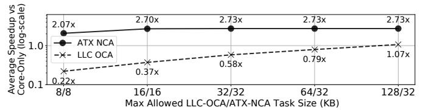

Fig. 15: Speedup of ATX NCA and LLC OCA over core-only with various task sizes running SpMM.

<span id="page-10-2"></span>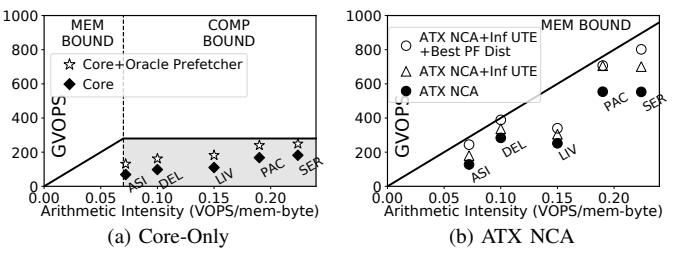

Fig. 16: SDDMM rooflines.

scenario where we replace the SPR prefetchers with oracle ones (*Core* + *Oracle Prefetcher*) that eliminate all stalls due to the memory subsystem. This unrealistic scenario serves as a performance limit of prior prefetching works for provisioning data to CPU cores (e.g., [28], [58], [86]). Despite this addition, performance does not even reach the core's roofline in the compute-bound region due to dependencies, frontend stalls, and other types of core-bound stalls in the CPU core pipelines.

However, when variations of ATX NCAs are added in Figure 16(b), the roofline ridge point moves far to the right, and all the kernels are now in the memory-bound region. We see that our proposed ATX NCA offers significant improvements. However, there is still some performance left on the table. There are two main reasons for this. First, UTE resources are finite. Second, the heuristic that we use to determine the predicted task prefetch distance (Section IV-F) is suboptimal. To gain further insight, in Figure 16(b), we also include performance points for: (1) a UTE provisioned with very high resources such as number of Stream Units and PDQ size (ATX NCA+Inf UTE), and (2) additionally, an oracle that sets the optimal task prefetch distance for each matrix statically (ATX NCA+Inf UTE+Best PF Dist). We see that Inf UTE+Best PF Dist reaches the roofline for all matrices except for LIV.

The reason for the gap in LIV is the task prediction mechanism itself. To predict future tasks, we used a simple algorithm inspired by stride prefetchers. Naturally, such an algorithm (even with the best distance) is not always optimal.

5. Performance, Area, and Power for Different UTE Design Points. To test which UTE design parameters affect performance the most, we perform a design space exploration. We vary: (1) the number of Stream Units, which limit how many real and prefetch tasks can be handled simultaneously in the UTE backend, (2) the LDQ entries (Figure 7), which limit the number of outstanding memory requests, (3) the Common Bus (CB) data width (Figure 7), which limits how many fetch/prefetch requests from the Stream Units the Scheduler can accept per cycle, and (4) the PDQ size (Figure 11), which limits how much a parent stream can run ahead

<span id="page-11-0"></span>TABLE III: Average SpMM performance for different UTE design points as a percentage of the performance of Inf UTE.

| _                               | _    |      | _    | _    |        | _       |      |        |      |      |
|---------------------------------|------|------|------|------|--------|---------|------|--------|------|------|
| #Stream Units                   |      |      |      |      |        |         | L    | DQ Ent | ries |      |
| 4                               | 8    | 16   | 32   | 64   |        | 32      | 64   | 128    | 256  | 512  |
| 56%                             | 86%  | 99%  | 99%  | 100% |        | 70%     | 90%  | 98%    | 99%  | 100% |
|                                 |      |      |      |      |        |         |      |        |      |      |
| CB Data Width PDQ Size (Bytes p |      |      |      |      | per St | ream Ui | nit) |        |      |      |
| 64B                             | 128B | 256B | 512B |      | 128    | 256     | 512  | 1k     | 2k   | 4k   |
| 73%                             | 88%  | 98%  | 100% |      | 16%    | 36%     | 62%  | 85%    | 96%  | 100% |

<span id="page-11-1"></span>TABLE IV: Area and power overheads of different UTEs as a percentage of SPR die size and TDP.

|       | Small UTE<br>{8,32,64B,256B} | Default UTE {32,128,128B,1KB} | Inf UTE {64,512,512B,4KB} |
|-------|------------------------------|-------------------------------|---------------------------|
| Area  | 0.53%                        | 0.90%                         | 2.71%                     |
| Power | 3.64%                        | 4.37%                         | 9.17%                     |

of its children. We start with the Inf UTE, for which we have assumed {#Stream Units,LDQ Entries,CB Width,PDQ Size}={64,512,512B,4KB}, and progressively reduce each resource while keeping the rest to their "Inf" values to isolate the effect of each resource.

Table III shows the performance of SpMM for the different design points normalized to Inf UTE. Our default UTE parameter values are {32,128,128B,1KB}, which can be shown to achieve 80% of the performance of the Inf UTE. We see that the PDQ Size and the CB Data Width are the two most critical resources bounding performance.

In Table IV, we additionally compare different UTE configurations with respect to their area and power impact. These configurations are a Small UTE with parameter values {8,32,64B,256B}, our Default UTE with {32,128,128B,1KB}, and the Inf UTE with {64,512,512B,4KB}. The area overhead is shown as a percentage of the SPR die size (1600mm²). The power overhead combines static and dynamic power, and is shown as a percentage of the SPR TDP (350W). Dynamic power is estimated at maximum feasible activity. All overheads are for a total of 64 UTEs. We see that our Default UTE is a good design point. It has 3x less area and 2.1x less power overhead than the Inf UTE, while the Inf UTE has only 1.25x higher performance. Further, the Default UTE has 1.7x the area and 1.2x the power overhead of the Small UTE, while it improves performance by 2.5x.

**6. Task Prefetching Analysis**. To evaluate task prefetching, we show results for only SpMM and SDDMM, since prefetching helps GeMM relatively little (Figure 14). Figure 17 shows the speedups of ATX NCA with Assisted Prefetching, Predicted Prefetching, or both, over ATX NCA without prefetching. We see that Predicted Prefetching is the most effective. Only the *ser* matrix benefits from Assisted Prefetching. In most cases for these kernels, the CPU cannot produce new tasks fast enough for assisted prefetches to be timely generated. Combining the two schemes does not lead to significant improvements over only Predicted Prefetching, which is the default mechanism in our evaluation.

Figure 18 shows the impact of the distance of the predicted task prefetches. The figure shows the speedups obtained by applying Predicted Prefetching with distances 1, 2, 4, and with our runtime heuristic, over ATX NCA without prefetching. The best distance varies across kernels and matrices. Also,

<span id="page-11-2"></span>

Fig. 17: Sensitivity to the task prefetch mechanism.

<span id="page-11-3"></span>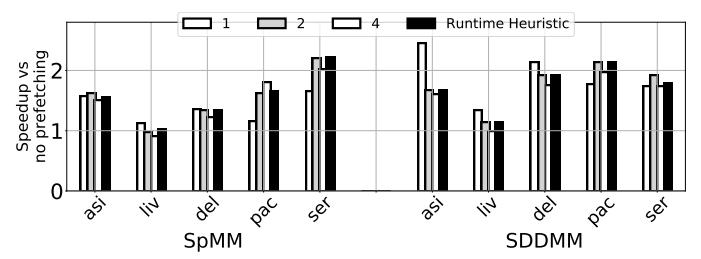

Fig. 18: Sensitivity to the task prefetch distance.

our simple heuristic of Section IV-F is not always the best. We believe that more sophisticated heuristics for adjusting the distance at runtime, potentially inspired by conventional hardware prefetching, may prove effective.

<span id="page-11-4"></span>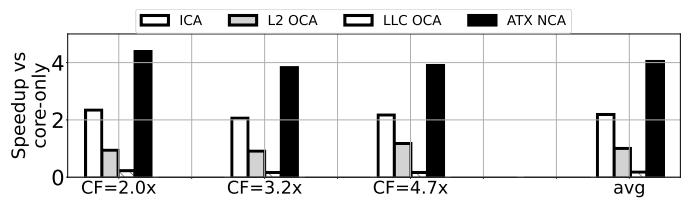

Fig. 19: Comparing accelerator schemes for decompression.

7. Decompression Use Case. Up to now, we have considered cases where the computation is primarily done by the accelerator, and the core is primarily used for input-inspection, task sizing, or control. We now discuss a case where both core and accelerator perform computation and interleave in a finegrained manner: the accelerator (i.e., DECA) reads tiles of an ML model from memory in a compressed form (quantized/sparsified) and decompresses them; the core takes the resulting tiles and executes GeMMs with AMX instructions. Compared to the previous kernels, the input task sizes here are notably small (512B–2KB). Figure 19 shows the speedups of the different accelerator integration schemes over the coreonly execution for different model compression factors (CF). We see that ATX NCA delivers average speedups of 4.0x, 1.8x, 3.9x, and 18x over core-only, ICA, L2 OCA, and LLC OCA, respectively. The large speedups over the OCAs for this use case are due to the small task sizes, which require fine coreaccelerator interleaving.

# VII. LIMITATIONS AND DISCUSSION

NCAs are very effective for fine-grained tasks that are both computationally and memory demanding, and that require tight CPU core control and communication. We demonstrated the NCA effectiveness in popular kernels of important workloads [1], [27]. However, NCAs and ATX are not intended to replace ICAs or OCAs for all accelerated code. In this section, we discuss the limitations of NCAs when compared to them.

OCAs have some advantages over NCAs. In contrast to OCAs, NCAs cannot write to the memory system, a design decision that (1) limits the output size of the task to register sizes, and (2) does not improve the performance of memory stores over general-purpose cores. The first limitation can be largely alleviated by using the large register sizes provided by current processors (e.g., 1 KB tile registers) and by the fact that, often, tasks can be scaled to the desired size (e.g., with matrix tiling). The second limitation is not crucial for many workloads because stores are generally less critical than loads for performance [\[46\]](#page-14-25), [\[75\]](#page-15-11). Still, for coarse-grained writeintensive operations such as memory scatters [\[54\]](#page-14-26) or memory copies, OCAs may be the better option. Another advantage of OCAs is that they can be shared between cores, whereas NCAs are private to each core.

In some applications, ICAs may be the best option. NCAs excel at fine-grained tasks whose input data is stored in memory. However, ICAs may be better for tasks where most input data can be stored in registers and the L1 cache.

Overall, NCAs are an additional design point between ICAs and OCAs, addressing a gap in terms of core-accelerator communication overhead and memory access efficiency. A full analysis and partitioning of tasks between ICAs, NCAs, and OCAs is an open problem and our future work.

# VIII. RELATED WORK

- 1. CPU-integrated accelerators. A wide variety of CPUintegrated accelerators have been proposed (e.g., [\[26\]](#page-13-8), [\[29\]](#page-13-5), [\[32\]](#page-13-10), [\[33\]](#page-13-11), [\[43\]](#page-14-7), [\[53\]](#page-14-8), [\[59\]](#page-14-27), [\[64\]](#page-14-10), [\[72\]](#page-15-4)). In this work, we classify them based on how they interact with the system's state. Examples of commercial accelerators that follow the OCA abstraction include the Intel DSA, QAT, IAA, and DLB that target data-center taxes [\[53\]](#page-14-8), [\[87\]](#page-15-3), the NPU for AI acceleration in client architectures [\[24\]](#page-13-17), [\[42\]](#page-14-28), and the GPU in the AMD APU [\[21\]](#page-13-16), [\[52\]](#page-14-19). Commercial accelerators that follow the ICA abstraction include the Intel TMUL [\[38\]](#page-14-11) and the Arm SME accelerator [\[83\]](#page-15-12). In this work, we introduce a third abstraction for CPU-integrated accelerators: NCAs. Prior work [\[27\]](#page-13-9), [\[45\]](#page-14-29) has used the term Near-Core Accelerator to refer to the specific spatial placement of the accelerator, namely L2-attached. In this work, we use the term to refer to the abstraction used by the accelerators to interact with the architectural state of the system, which is not tied to their spatial placement.
- 2. Controlling CPU-integrated accelerators. ICAs are typically controlled through accelerator-specific ISA extensions [\[38\]](#page-14-11), [\[43\]](#page-14-7), [\[81\]](#page-15-13), [\[84\]](#page-15-14), such as Intel AMX and Arm SME. OCAs are typically controlled through polling with regular load and store instructions [\[8\]](#page-13-18), [\[29\]](#page-13-5), [\[53\]](#page-14-8). An alternative to polling is interrupts [\[50\]](#page-14-30), which often have high latency even with optimizations [\[8\]](#page-13-18). Works such as RoCC [\[6\]](#page-13-6), [\[51\]](#page-14-31), [\[55\]](#page-14-9), [\[63\]](#page-14-22) and NUCD [\[7\]](#page-13-33) introduce instructions for controlling accelerators outside the core pipelines. However, as such works implicitly assume an OCA abstraction for the controlled accelerators (e.g., they can write to memory), RoCC or NUCD instructions cannot be executed speculatively. DECA [\[27\]](#page-13-9) includes instructions for speculative accelerator

invocation. However, such instructions are DECA-specific and not applicable to other accelerators. In this work, inspired by DECA's implicit execution semantics, we defined the NCA abstraction and developed the ATX framework and instructions that support a diverse range of NCAs.

3. Accelerating CPU data accesses. A variety of techniques can increase MLP in CPUs, ranging from prefetching [\[3\]](#page-13-34), [\[14\]](#page-13-19), [\[28\]](#page-13-20), [\[36\]](#page-14-21), [\[41\]](#page-14-32), [\[76\]](#page-15-15), [\[86\]](#page-15-10) to decoupled-access units [\[62\]](#page-14-33), [\[72\]](#page-15-4), [\[85\]](#page-15-16). SSP [\[79\]](#page-15-5) first introduced the idea of encoding memory accesses with streams, while works such as the TMU [\[72\]](#page-15-4) have adopted a similar abstraction. The Stream Units in our UTE are inspired by [\[79\]](#page-15-5). We showed that even augmenting CPU cores with an oracle prefetcher cannot match the performance of ATX NCAs. More advanced UTE task prefetching inspired by conventional hardware prefetching is a promising direction.

# IX. FUTURE WORK ON ATX PROGRAMMING

ATX opens up future directions both in computer architecture and in compilers and programming languages for accelerators. Currently, we provide source-code level (C/C++) support for ATX programming with the help of a small library that defines the UTE configuration functions of Figure [12](#page-7-1) (e.g., UTE cfg num streams), as well as the ATX instructions (e.g., ATXV1V1) in inline assembly. In the future, the first step is to extend kernel libraries such as MKL [\[78\]](#page-15-8) with hand-optimized, ready-to-use ATX kernels for common use cases.

Automating ATX programming is the next step. In particular, a compiler could be used to automatically generate source-level ATX programs from source-level non-ATX programs. Such a compiler would detect acceleratable code segments, identify streams and dependencies, configure the UTE, partition loops into tasks, and invoke NCAs using ATX instructions. Recently, Large Language Models (LLMs) have shown promise for source-to-source transformations of CPU code [\[56\]](#page-14-34). They may also prove useful to perform non-ATX to ATX source code transformations.

NCAs may not be the optimal choice for all acceleratable code. Hence, another future direction is to build compilers that, starting from CPU source code possibly written in a domainspecific language, automatically partition it into NCA, ICA, and OCA segments for maximum performance.

# X. CONCLUSION

This paper classified CPU-integrated accelerators based on their interaction with the architectural state of CPU cores. It then proposed a new class of accelerators called Near-Core Accelerators (NCAs). To support NCAs, it introduced ATX, a set of instructions and hardware extensions so that NCAs are invoked speculatively and out-of-order, and exploit a highperformance interface with the memory system. ATX NCAs accelerate key kernels by 1.3–18× over various alternatives.

# ACKNOWLEDGMENTS

This work was supported in part by Intel and by ACE, one of the seven centers in JUMP 2.0, a Semiconductor Research Corporation (SRC) program sponsored by DARPA. The work was done while the first author was an intern at Intel.

# REFERENCES

- <span id="page-13-24"></span>[1] M. J. Adiletta, J. J. Tithi, E.-I. Farsarakis, G. Gerogiannis, R. Adolf, R. Benke, S. Kashyap, S. Hsia, K. Lakhotia, F. Petrini, G.-Y. Wei, and D. Brooks, "Characterizing the scalability of graph convolutional networks on Intel® PIUMA," in *2023 IEEE International Symposium on Performance Analysis of Systems and Software (ISPASS)*. IEEE, 2023, pp. 168–177.
- <span id="page-13-13"></span>[2] *AMD64 Architecture Programmer's Manual Volume 4: 128-Bit and 256- Bit Media Instructions*, Advanced Micro Devices, 2021.
- <span id="page-13-34"></span>[3] S. Ainsworth and T. M. Jones, "An event-triggered programmable prefetcher for irregular workloads," *ACM Sigplan Notices*, vol. 53, no. 2, pp. 578–592, 2018.
- <span id="page-13-14"></span>[4] Arm, "Arm Neon," [https://developer.arm.com/Architectures/Neon.](https://developer.arm.com/Architectures/Neon)
- <span id="page-13-15"></span>[5] *Arm Architecture Reference Manual Supplement: The Scalable Vector Extension (SVE), for Armv8-A*, Arm Ltd., 2019.
- <span id="page-13-6"></span>[6] K. Asanovic, R. Avizienis, J. Bachrach, S. Beamer, D. Biancolin, C. Celio, H. Cook, D. Dabbelt, J. Hauser, A. Izraelevitz, S. Karandikar, B. Keller, D. Kim, and J. Koenig, "The Rocket Chip Generator," EECS Department, University of California, Berkeley, Tech. Rep. UCB/EECS-2016-17, April 2016. [Online]. Available: [https://www2.](https://www2.eecs.berkeley.edu/Pubs/TechRpts/2016/EECS-2016-17.pdf) [eecs.berkeley.edu/Pubs/TechRpts/2016/EECS-2016-17.pdf](https://www2.eecs.berkeley.edu/Pubs/TechRpts/2016/EECS-2016-17.pdf)
- <span id="page-13-33"></span>[7] M. Asri, C. Dunham, R. Rusitoru, A. Gerstlauer, and J. Beard, "The Non-Uniform Compute Device (NUCD) architecture for lightweight accelerator offload," in *2020 28th Euromicro International Conference on Parallel, Distributed and Network-Based Processing (PDP)*. IEEE, 2020, pp. 38–45.
- <span id="page-13-18"></span>[8] B. Aydogmus, L. Guo, D. Zuberi, T. Garfinkel, D. Tullsen, A. Ousterhout, and K. Taram, "Extended User Interrupts (xUI): Fast and Flexible Notification without Polling," in *Proceedings of the 30th ACM International Conference on Architectural Support for Programming Languages and Operating Systems, Volume 2*, 2025, pp. 373–389.
- <span id="page-13-22"></span>[9] A. Azad, A. Buluc¸, and J. Gilbert, "Parallel triangle counting and enumeration using matrix algebra," in *2015 IEEE International Parallel and Distributed Processing Symposium Workshop*. IEEE, 2015, pp. 804–811.
- <span id="page-13-31"></span>[10] R. Balasubramonian, A. B. Kahng, N. Muralimanohar, A. Shafiee, and V. Srinivas, "CACTI 7: New tools for interconnect exploration in innovative off-chip memories," *ACM Transactions on Architecture and Code Optimization (TACO)*, vol. 14, no. 2, pp. 1–25, 2017.
- <span id="page-13-7"></span>[11] A. Biswas and S. Kottapalli, "Next-gen Intel Xeon CPU-Sapphire Rapids," in *Hot Chips*, vol. 33, 2021.
- <span id="page-13-32"></span>[12] L. Blackford, J. Demmel, J. Dongarra, I. Duff, S. Hammarling, G. Henry, M. Heroux, L. Kaufman, A. Lumsdaine, A. Petitet, R. Pozo, K. Remington, and R. Whaley, "An updated set of Basic Linear Algebra Subprograms (BLAS)," *ACM Transactions on Mathematical Software*, vol. 28, 06 2002.
- <span id="page-13-25"></span>[13] C. Block, G. Gerogiannis, C. Mendis, A. Azad, and J. Torrellas, "Two-Face: Combining Collective and One-Sided Communication for Efficient Distributed SpMM," in *Proceedings of the 29th ACM International Conference on Architectural Support for Programming Languages and Operating Systems, Volume 2*, 2024, pp. 1200–1217.
- <span id="page-13-19"></span>[14] C. Block, G. Gerogiannis, and J. Torrellas, "Micro-MAMA: Multi-Agent Reinforcement Learning for Multicore Prefetching," in *Proceedings of the 58th IEEE/ACM International Symposium on Microarchitecture*, 2025, pp. 884–898.
- <span id="page-13-0"></span>[15] N. Bshara, "AWS Trainium: The Journey for Designing and Optimization Full Stack ML Hardware," in *Proceedings of the 29th ACM International Conference on Architectural Support for Programming Languages and Operating Systems, Volume 3*, ser. ASPLOS '24. New York, NY, USA: Association for Computing Machinery, 2024, p. 4. [Online]. Available:<https://doi.org/10.1145/3620666.3655592>
- <span id="page-13-23"></span>[16] A. Buluc¸, "The ubiquitous sparse matrix-matrix products," *arXiv preprint arXiv:2508.04077*, 2025.
- <span id="page-13-21"></span>[17] T. E. Carlson, W. Heirman, S. Eyerman, I. Hur, and L. Eeckhout, "An evaluation of high-level mechanistic core models," *ACM Transactions on Architecture and Code Optimization (TACO)*, vol. 11, no. 3, pp. 28:1– 28:25, Aug. 2014.
- <span id="page-13-27"></span>[18] R. Child, S. Gray, A. Radford, and I. Sutskever, "Generating long sequences with sparse transformers," *arXiv preprint arXiv:1904.10509*, 2019.
- <span id="page-13-12"></span>[19] J. Choquette, "NVIDIA Hopper H100 GPU: Scaling performance," *IEEE Micro*, vol. 43, no. 3, pp. 9–17, 2023.

- <span id="page-13-1"></span>[20] J. Coburn, C. Tang, S. A. Asal, N. Agrawal, R. Chinta, H. Dixit, B. Dodds, S. Dwarakapuram, A. Firoozshahian, C. Gao, K. Gondkar, T. Graf, J. Hu, J. Huang, S. Hughes, A. Hutchin, B. Jakka, G. J. Chen, I. Kalyanaraman, A. Kamath, P. Kansal, E. Kazi, R. Levenstein, M. Maddury, A. Mastro, S. Medaiyese, P. Modi, J. Montgomery, S. Nadathur, A. Nagpal, A. Narasimha, M. Naumov, E. Ozer, J. Park, P. Ramani, H. Reddy, D. Reiss, D. Roy, S. Sekar, A. Sharma, P. Shetty, A. Sukumaran-Rajam, E. Tal, M. Tsai, S. Varshini, R. Wareing, O. Wu, X. Xie, J. Yang, H. Yu, T. Zargar, Z. Zeng, F. Zhang, A. Matthews, X. Jiao, J. Zhang, E. Menage, T. E. Stokke, and M. Sourouri, "Meta's second generation AI chip: Model-Chip co-design and productionization experiences," in *Proceedings of the 52nd Annual International Symposium on Computer Architecture*, 2025, pp. 1689–1702.
- <span id="page-13-16"></span>[21] M. Daga, A. M. Aji, and W.-C. Feng, "On the efficacy of a fused CPU+ GPU processor (or APU) for parallel computing," in *2011 Symposium on Application Accelerators in High-Performance Computing*. IEEE, 2011, pp. 141–149.
- <span id="page-13-29"></span>[22] T. A. Davis and Y. Hu, "The University of Florida sparse matrix collection," *ACM Transactions on Mathematical Software (TOMS)*, vol. 38, no. 1, pp. 1–25, 2011.
- <span id="page-13-2"></span>[23] H. Fan, H. Zhou, G. Huang, P. Raman, X. Fu, G. Gupta, D. Ram, Y. Wang, and J. Huan, "HLAT: High-quality large language model pretrained on AWS Trainium," *arXiv preprint arXiv:2404.10630*, 2024.
- <span id="page-13-17"></span>[24] A. Fei and M. S. Abdelfattah, "NITRO: LLM Inference on Intel Laptop NPUs," *arXiv preprint arXiv:2412.11053*, 2024.
- <span id="page-13-4"></span>[25] Y. Fujii, T. Azumi, N. Nishio, S. Kato, and M. Edahiro, "Data transfer matters for GPU computing," in *2013 International Conference on Parallel and Distributed Systems*. IEEE, 2013, pp. 275–282.
- <span id="page-13-8"></span>[26] H. Genc, S. Kim, A. Amid, A. Haj-Ali, V. Iyer, P. Prakash, J. Zhao, D. Grubb, H. Liew, H. Mao, A. Ou, C. Schmidt, S. Steffl, J. Wright, I. Stoica, J. Ragan-Kelley, K. Asanovic, B. Nikolic, and Y. S. Shao, "Gemmini: Enabling systematic deep-learning architecture evaluation via full-stack integration," in *2021 58th ACM/IEEE Design Automation Conference (DAC)*. IEEE, 2021, pp. 769–774.
- <span id="page-13-9"></span>[27] G. Gerogiannis, S. Eyerman, E. Georganas, W. Heirman, and J. Torrellas, "DECA: A Near-Core LLM Decompression Accelerator Grounded on a 3D Roofline Model," in *Proceedings of the 58th IEEE/ACM International Symposium on Microarchitecture®*, 2025, pp. 184–200.
- <span id="page-13-20"></span>[28] G. Gerogiannis and J. Torrellas, "Micro-Armed Bandit: Lightweight & reusable reinforcement learning for microarchitecture decision-making," in *Proceedings of the 56th Annual IEEE/ACM International Symposium on Microarchitecture*, 2023, pp. 698–713.
- <span id="page-13-5"></span>[29] G. Gerogiannis, S. Yesil, D. Lenadora, D. Cao, C. Mendis, and J. Torrellas, "SPADE: A flexible and scalable accelerator for SpMM and SDDMM," in *Proceedings of the 50th Annual International Symposium on Computer Architecture*, ser. ISCA '23. New York, NY, USA: Association for Computing Machinery, 2023. [Online]. Available: <https://doi.org/10.1145/3579371.3589054>
- <span id="page-13-3"></span>[30] S. Ghodrati, S. Kinzer, H. Xu, R. Mahapatra, Y. Kim, B. H. Ahn, D. K. Wang, L. Karthikeyan, A. Yazdanbakhsh, J. Park, N. S. Kim, and H. Esmaeilzadeh, "Tandem Processor: Grappling with emerging operators in neural networks," in *Proceedings of the 29th ACM International Conference on Architectural Support for Programming Languages and Operating Systems, Volume 2*, 2024, pp. 1165–1182.
- <span id="page-13-26"></span>[31] C. Giannoula, P. Yang, I. Fernandez, J. Yang, S. Durvasula, Y. X. Li, M. Sadrosadati, J. G. Luna, O. Mutlu, and G. Pekhimenko, "PyGim: An Efficient Graph Neural Network Library for Real Processing-In-Memory Architectures," *Proceedings of the ACM on Measurement and Analysis of Computing Systems*, vol. 8, no. 3, pp. 1–36, 2024.
- <span id="page-13-10"></span>[32] Z. Gong, H. Ji, C. W. Fletcher, C. J. Hughes, S. Baghsorkhi, and J. Torrellas, "SAVE: Sparsity-aware vector engine for accelerating DNN training and inference on CPUs," in *2020 53rd Annual IEEE/ACM International Symposium on Microarchitecture (MICRO)*. IEEE, 2020, pp. 796–810.
- <span id="page-13-11"></span>[33] Z. Gong, H. Ji, Y. Yao, C. W. Fletcher, C. J. Hughes, and J. Torrellas, "Graphite: optimizing graph neural networks on CPUs through cooperative software-hardware techniques," in *Proceedings of the 49th Annual International Symposium on Computer Architecture*, 2022, pp. 916–931.
- <span id="page-13-28"></span>[34] A. Gupta, Y. Yuan, D. Jain, Y. Ge, D. Aponte, Y. Zhou, and C. Mendis, "SPLAT: A framework for optimised GPU code-generation for SParse reguLar ATtention," *Proceedings of the ACM on Programming Languages*, vol. 9, no. OOPSLA1, pp. 1632–1660, 2025.
- <span id="page-13-30"></span>[35] A. Heinecke, G. Henry, M. Hutchinson, and H. Pabst, "LIBXSMM: accelerating small matrix multiplications by runtime code generation,"

- in *SC'16: Proceedings of the International Conference for High Performance Computing, Networking, Storage and Analysis*. IEEE, 2016, pp. 981–991.
- <span id="page-14-21"></span>[36] W. Heirman, K. D. Bois, Y. Vandriessche, S. Eyerman, and I. Hur, "Nearside prefetch throttling: Adaptive prefetching for high-performance many-core processors," in *Proceedings of the 27th International Conference on Parallel Architectures and Compilation Techniques*, 2018, pp. 1–11.
- <span id="page-14-3"></span>[37] C.-C. Huang, G. Jin, and J. Li, "SwapAdvisor: Pushing deep learning beyond the GPU memory limit via smart swapping," in *Proceedings of the Twenty-Fifth International Conference on Architectural Support for Programming Languages and Operating Systems*, 2020, pp. 1341–1355.
- <span id="page-14-11"></span>[38] Intel, *Intel® 64 and IA-32 Architectures Optimization Reference Manual*, 2024.
- <span id="page-14-20"></span>[39] *Intel QuickAssist Technology API Programmer's Guide*, Intel Corporation, 2022.
- <span id="page-14-16"></span>[40] *Intel 64 and IA-32 Architectures Software Developer's Manual*, Intel Corporation, 2026.
- <span id="page-14-32"></span>[41] A. V. Jamet, G. Vavouliotis, D. A. Jimenez, L. Alvarez, and M. Casas, "A ´ two level neural approach combining off-chip prediction with adaptive prefetch filtering," in *2024 IEEE International Symposium on High-Performance Computer Architecture (HPCA)*. IEEE, 2024, pp. 528– 542.
- <span id="page-14-28"></span>[42] R. Jayanth, N. Gupta, and V. Prasanna, "Benchmarking edge AI platforms for high-performance ML inference," in *2024 IEEE High Performance Extreme Computing Conference (HPEC)*. IEEE, 2024, pp. 1–7.
- <span id="page-14-7"></span>[43] G. Jeong, S. Damani, A. R. Bambhaniya, E. Qin, C. J. Hughes, S. Subramoney, H. Kim, and T. Krishna, "VEGETA: Vertically-integrated extensions for sparse/dense GEMM tile acceleration on CPUs," in *2023 IEEE International Symposium on High-Performance Computer Architecture (HPCA)*. IEEE, 2023, pp. 259–272.
- <span id="page-14-0"></span>[44] N. Jouppi, G. Kurian, S. Li, P. Ma, R. Nagarajan, L. Nai, N. Patil, S. Subramanian, A. Swing, B. Towles, C. Young, X. Zhou, Z. Zhou, and D. A. Patterson, "TPU v4: An optically reconfigurable supercomputer for machine learning with hardware support for embeddings," in *Proceedings of the 50th Annual International Symposium on Computer Architecture*, 2023, pp. 1–14.
- <span id="page-14-29"></span>[45] S. Karandikar, A. N. Udipi, J. Choi, J. Whangbo, J. Zhao, S. Kanev, E. Lim, J. Alakuijala, V. Madduri, Y. S. Shao, B. Nikolic, K. Asanovic, and P. Ranganathan, "CDPU: Co-designing Compression and Decompression Processing Units for Hyperscale Systems," in *Proceedings of the 50th Annual International Symposium on Computer Architecture*, ser. ISCA '23. New York, NY, USA: Association for Computing Machinery, 2023.
- <span id="page-14-25"></span>[46] S. Khan, A. R. Alameldeen, C. Wilkerson, O. Mutlu, and D. A. Jimenez, "Improving cache performance using read-write partitioning," in *2014 IEEE 20th International Symposium on High Performance Computer Architecture (HPCA)*, 2014, pp. 452–463.
- <span id="page-14-15"></span>[47] H. Kim, G. Ye, N. Wang, A. Yazdanbakhsh, and N. S. Kim, "Exploiting Intel Advanced Matrix Extensions (AMX) for Large Language Model Inference," *IEEE Computer Architecture Letters*, vol. 23, no. 1, pp. 117– 120, 2024.
- <span id="page-14-23"></span>[48] T. N. Kipf and M. Welling, "Semi-supervised classification with graph convolutional networks," *arXiv preprint arXiv:1609.02907*, 2016.
- <span id="page-14-17"></span>[49] F. Kjolstad, S. Kamil, S. Chou, D. Lugato, and S. Amarasinghe, "The tensor algebra compiler," *Proc. ACM Program. Lang.*, vol. 1, no. OOPSLA, pp. 77:1–77:29, Oct. 2017. [Online]. Available: <http://doi.acm.org/10.1145/3133901>
- <span id="page-14-30"></span>[50] Y. Kone, L. Duval, R. Lachaize, P. Felber, D. Hagimont, and A. Tchana, "Understanding Intel User Interrupts," *Proceedings of the ACM on Measurement and Analysis of Computing Systems*, vol. 9, no. 2, pp. 1–32, 2025.
- <span id="page-14-31"></span>[51] K. Kovacs, "A Hardware Implementation of the Snappy Compression Algorithm," EECS Department, University of California, Berkeley, Tech. Rep. UCB/EECS-2019-85, May 2019, master's thesis. [Online]. Available: [https://people.eecs.berkeley.edu/](https://people.eecs.berkeley.edu/~krste/papers/EECS-2019-85.pdf)∼krste/papers/EECS-2019-85.pdf
- <span id="page-14-19"></span>[52] F. Kruzel and K. Bana ˙ s, "AMD APU systems as a platform for scientific ´ computing," *Computer Methods in Materials Science*, vol. 15, no. 2, pp. 362–369, 2015.
- <span id="page-14-8"></span>[53] R. Kuper, I. Jeong, Y. Yuan, R. Wang, N. Ranganathan, N. Rao, J. Hu, S. Kumar, P. Lantz, and N. S. Kim, "A quantitative analysis and guidelines of data streaming accelerator in modern Intel Xeon scalable processors," in *Proceedings of the 29th ACM International Conference*

- *on Architectural Support for Programming Languages and Operating Systems, Volume 2*, 2024, pp. 37–54.
- <span id="page-14-26"></span>[54] P. Lavin, J. Young, R. Vuduc, J. Riedy, A. Vose, and D. Ernst, "Evaluating gather and scatter performance on CPUs and GPUs," in *Proceedings of the International Symposium on Memory Systems*, 2020, pp. 209–222.
- <span id="page-14-9"></span>[55] Y. Lee, A. Ou, C. Schmidt, S. Karandikar, H. Mao, and K. Asanovic, "The Hwacha Microarchitecture Manual, Version 3.8.1," EECS Department, University of California, Berkeley, Tech. Rep. UCB/EECS-2015-263, December 2015. [Online]. Available: [https://people.eecs.](https://people.eecs.berkeley.edu/~krste/papers/EECS-2015-263.pdf) berkeley.edu/∼[krste/papers/EECS-2015-263.pdf](https://people.eecs.berkeley.edu/~krste/papers/EECS-2015-263.pdf)
- <span id="page-14-34"></span>[56] H. Lin, M. Maas, M. Roquemore, A. Hasanzadeh, F. Lewis, Y. Simonson, T.-W. Yang, A. Yazdanbakhsh, D. Altinbuken, F. Papa, ¨ M. N. Edmonds, A. Patil, D. Schwarz, S. Chandra, C. Kennelly, M. Hashemi, and P. Ranganathan, "ECO: An LLM-Driven Efficient Code Optimizer for Warehouse Scale Computers," 2025. [Online]. Available:<https://arxiv.org/abs/2503.15669>
- <span id="page-14-12"></span>[57] J. D. McCalpin, "Bandwidth Limits in the Intel Xeon Max (Sapphire Rapids with HBM) Processors," in *High Performance Computing*, A. Bienz, M. Weiland, M. Baboulin, and C. Kruse, Eds. Cham: Springer Nature Switzerland, 2023, pp. 403–413.
- <span id="page-14-24"></span>[58] A. Naithani, J. Roelandts, S. Ainsworth, T. M. Jones, and L. Eeckhout, "Decoupled Vector Runahead," in *Proceedings of the 56th Annual IEEE/ACM International Symposium on Microarchitecture*, 2023, pp. 17–31.
- <span id="page-14-27"></span>[59] N. Nassif, A. O. Munch, C. L. Molnar, G. Pasdast, S. V. Lyer, Z. Yang, O. Mendoza, M. Huddart, S. Venkataraman, S. Kandula, R. Marom, A. M. Kern, B. Bowhill, D. R. Mulvihill, S. Nimmagadda, V. Kalidindi, J. Krause, M. M. Haq, R. Sharma, and K. Duda, "Sapphire Rapids: The next-generation Intel Xeon scalable processor," in *2022 IEEE International Solid-State Circuits Conference (ISSCC)*, vol. 65. IEEE, 2022, pp. 44–46.
- <span id="page-14-1"></span>[60] T. Norrie, N. Patil, D. H. Yoon, G. Kurian, S. Li, J. Laudon, C. Young, N. Jouppi, and D. Patterson, "The Design Process for Google's Training Chips: TPUv2 and TPUv3," *IEEE Micro*, vol. 41, no. 2, pp. 56–63, 2021.
- <span id="page-14-14"></span>[61] NVIDIA, "NVIDIA H200 Tensor Core GPU," 2023. [Online]. Available: [https://nvdam.widen.net/s/nb5zzzsjdf/hpc-datasheet](https://nvdam.widen.net/s/nb5zzzsjdf/hpc-datasheet-sc23-h200-datasheet-3002446)[sc23-h200-datasheet-3002446](https://nvdam.widen.net/s/nb5zzzsjdf/hpc-datasheet-sc23-h200-datasheet-3002446)
- <span id="page-14-33"></span>[62] M. Orenes-Vera, A. Manocha, J. Balkind, F. Gao, J. L. Aragon, D. Went- ´ zlaff, and M. Martonosi, "Tiny but mighty: Designing and realizing scalable latency tolerance for manycore SoCs," in *Proceedings of the 49th Annual International Symposium on Computer Architecture*, 2022, pp. 817–830.
- <span id="page-14-22"></span>[63] D. Pala, "Design and programming of a coprocessor for a RISC-V architecture: Guidelines for embedding computing cores as RISC-V coprocessors," Master's thesis, Politecnico di Torino, 2017. [Online]. Available:<https://webthesis.biblio.polito.it/6589/1/tesi.pdf>
- <span id="page-14-10"></span>[64] C. Peltekis, V. Titopoulos, C. Nicopoulos, and G. Dimitrakopoulos, "DeMM: A decoupled matrix multiplication engine supporting relaxed structured sparsity," *IEEE Computer Architecture Letters*, 2024.
- <span id="page-14-18"></span>[65] M. K. Rahman, M. H. Sujon, and A. Azad, "FusedMM: A Unified SDDMM-SpMM Kernel for Graph Embedding and Graph Neural Networks," in *2021 IEEE International Parallel and Distributed Processing Symposium (IPDPS)*. IEEE, 2021, pp. 256–266.
- <span id="page-14-13"></span>[66] I. Z. Reguly, "Comparative evaluation of bandwidth-bound applications on the Intel Xeon CPU Max series," in *Proceedings of the SC'23 Workshops of The International Conference on High Performance Computing, Network, Storage, and Analysis*, 2023, pp. 1236–1244.
- <span id="page-14-2"></span>[67] A. Reuther, P. Michaleas, M. Jones, V. Gadepally, S. Samsi, and J. Kepner, "Survey and benchmarking of machine learning accelerators," in *2019 IEEE high performance extreme computing conference (HPEC)*. IEEE, 2019, pp. 1–9.
- <span id="page-14-4"></span>[68] M. Rhu, N. Gimelshein, J. Clemons, A. Zulfiqar, and S. W. Keckler, "vDNN: Virtualized deep neural networks for scalable, memory-efficient neural network design," in *2016 49th Annual IEEE/ACM International Symposium on Microarchitecture (MICRO)*. IEEE, 2016, pp. 1–13.
- <span id="page-14-6"></span>[69] C. J. Rossbach, J. Currey, M. Silberstein, B. Ray, and E. Witchel, "PTask: Operating system abstractions to manage GPUs as compute devices," in *Proceedings of the Twenty-Third ACM Symposium on Operating Systems Principles*, 2011, pp. 233–248.
- <span id="page-14-5"></span>[70] N. Rotem, J. Fix, S. Abdulrasool, G. Catron, S. Deng, R. Dzhabarov, N. Gibson, J. Hegeman, M. Lele, R. Levenstein, J. Montgomery, B. Maher, S. Nadathur, J. Olesen, J. Park, A. Rakhov, M. Smelyanskiy,

- and M. Wang, "Glow: Graph lowering compiler techniques for neural networks," *arXiv preprint arXiv:1805.00907*, 2018.
- <span id="page-15-1"></span>[71] M. Silberstein, B. Ford, I. Keidar, and E. Witchel, "GPUfs: Integrating a file system with GPUs," in *Proceedings of the eighteenth international conference on Architectural Support for Programming Languages and Operating Systems*, 2013, pp. 485–498.
- <span id="page-15-4"></span>[72] M. Siracusa, V. Soria-Pardos, F. Sgherzi, J. Randall, D. J. Joseph, M. Moreto Planas, and A. Armejach, "A Tensor Marshaling Unit for ´ Sparse Tensor Algebra on General-Purpose Processors," in *Proceedings of the 56th Annual IEEE/ACM International Symposium on Microarchitecture*, 2023, pp. 1332–1346.
- <span id="page-15-7"></span>[73] D. Soltis and S. Robinson, "Clearwater Forest: The next generation Intel® Xeon® processor with efficiency cores," in *2025 IEEE Hot Chips 37 Symposium (HCS)*. IEEE Computer Society, 2025, pp. 1–15.
- <span id="page-15-9"></span>[74] A. Stillmaker and B. Baas, "Scaling equations for the accurate prediction of CMOS device performance from 180 nm to 7 nm," *Integration, the VLSI Journal*, vol. 58, pp. 74–81, 2017, [http://vcl.ece.ucdavis.edu/pubs/](http://vcl.ece.ucdavis.edu/pubs/2017.02.VLSIintegration.TechScale/) [2017.02.VLSIintegration.TechScale/.](http://vcl.ece.ucdavis.edu/pubs/2017.02.VLSIintegration.TechScale/)
- <span id="page-15-11"></span>[75] S. Subramaniam, A. Bracy, H. Wang, and G. H. Loh, "Criticalitybased optimizations for efficient load processing," in *2009 IEEE 15th International Symposium on High Performance Computer Architecture*, 2009, pp. 419–430.
- <span id="page-15-15"></span>[76] N. Talati, K. May, A. Behroozi, Y. Yang, K. Kaszyk, C. Vasiladiotis, T. Verma, L. Li, B. Nguyen, J. Sun, J. M. Morton, A. Ahmadi, T. Austin, M. O'Boyle, S. Mahlke, T. Mudge, and R. Dreslinski, "Prodigy: Improving the memory latency of data-indirect irregular workloads using hardware-software co-design," in *2021 IEEE International Symposium on High-Performance Computer Architecture (HPCA)*. IEEE, 2021, pp. 654–667.
- <span id="page-15-2"></span>[77] J. Vesely, A. Basu, A. Bhattacharjee, G. H. Loh, M. Oskin, and S. K. ` Reinhardt, "Generic system calls for GPUs," in *2018 ACM/IEEE 45th Annual International Symposium on Computer Architecture (ISCA)*. IEEE, 2018, pp. 843–856.
- <span id="page-15-8"></span>[78] E. Wang, Q. Zhang, B. Shen, G. Zhang, X. Lu, Q. Wu, and Y. Wang, "Intel Math Kernel Library," in *High-Performance Computing on the Intel® Xeon Phi™*. Springer, 2014, pp. 167–188.
- <span id="page-15-5"></span>[79] Z. Wang and T. Nowatzki, "Stream-based memory access specialization for general purpose processors," in *Proceedings of the 46th International Symposium on Computer Architecture*, 2019, pp. 736–749.
- <span id="page-15-0"></span>[80] R. Weber, A. Gothandaraman, R. J. Hinde, and G. D. Peterson, "Comparing hardware accelerators in scientific applications: A case study," *IEEE Transactions on Parallel and Distributed Systems*, vol. 22, no. 1, pp. 58–68, 2010.
- <span id="page-15-13"></span>[81] M. Weidmann, "Introducing the Scalable Matrix Extension for the Armv9-A Architecture," 2021. [Online]. Available: [https://developer.arm.com/community/arm-community](https://developer.arm.com/community/arm-community-blogs/b/architectures-and-processors-blog/posts/scalable-matrix-extension-armv9-a-architecture)[blogs/b/architectures-and-processors-blog/posts/scalable-matrix](https://developer.arm.com/community/arm-community-blogs/b/architectures-and-processors-blog/posts/scalable-matrix-extension-armv9-a-architecture)[extension-armv9-a-architecture](https://developer.arm.com/community/arm-community-blogs/b/architectures-and-processors-blog/posts/scalable-matrix-extension-armv9-a-architecture)
- <span id="page-15-6"></span>[82] Wikipedia, "Sapphire Rapids die configurations," [https://en.wikipedia.](https://en.wikipedia.org/wiki/Sapphire_Rapids##Die_configurations) [org/wiki/Sapphire](https://en.wikipedia.org/wiki/Sapphire_Rapids##Die_configurations) Rapids#Die configurations, 2024.
- <span id="page-15-12"></span>[83] F. Wilkinson, J. P. Jones, R. Muneeb, and S. N. McIntosh-Smith, "Leveraging Arm's Scalable Matrix Extension in Accelerating Matrix Multiplications Kernels," in *Workshop on Modeling & Simulation of Systems and Applications*, 2023.
- <span id="page-15-14"></span>[84] F. Wilkinson and S. McIntosh-Smith, "An initial evaluation of Arm's scalable matrix extension," in *2022 IEEE/ACM International Workshop on Performance Modeling, Benchmarking and Simulation of High Performance Computer Systems (PMBS)*. IEEE, 2022, pp. 135–140.
- <span id="page-15-16"></span>[85] Y. Yang, J. S. Emer, and D. Sanchez, "SpZip: Architectural support for effective data compression in irregular applications," in *2021 ACM/IEEE 48th Annual International Symposium on Computer Architecture (ISCA)*. IEEE, 2021, pp. 1069–1082.
- <span id="page-15-10"></span>[86] X. Yu, C. J. Hughes, N. Satish, and S. Devadas, "IMP: Indirect memory prefetcher," in *Proceedings of the 48th International Symposium on Microarchitecture*, 2015, pp. 178–190.
- <span id="page-15-3"></span>[87] Y. Yuan, R. Wang, N. Ranganathan, N. Rao, S. Kumar, P. Lantz, V. Sanjeepan, J. Cabrera, A. Kwatra, R. Sankaran, I. Jeong, and N. S. Kim, "Intel Accelerators Ecosystem: An SoC-Oriented Perspective : Industry Product," in *2024 ACM/IEEE 51st Annual International Symposium on Computer Architecture (ISCA)*. IEEE, 2024, pp. 848–862.