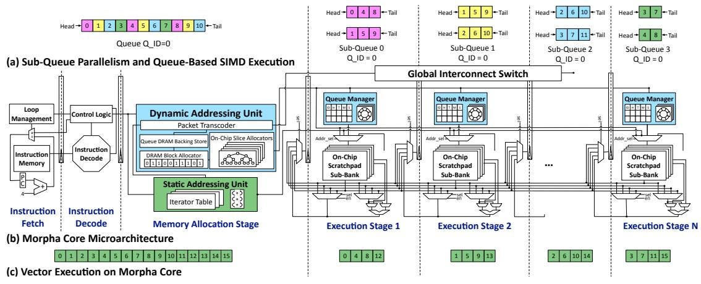
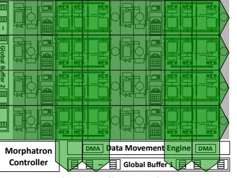
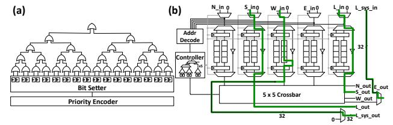
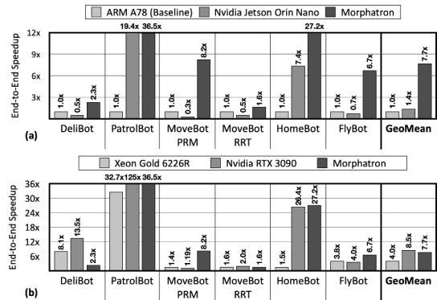
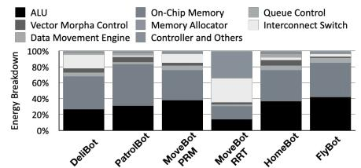
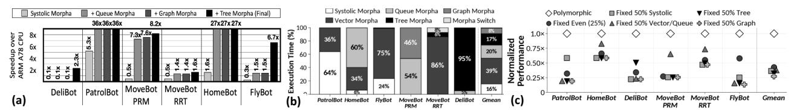

# Accelerator Polymorphism: Transcending Domain-Specific Architectures with Robotics

Hanyang Xu<sup>1</sup> Seongryong Oh<sup>2</sup> Yubin Lee<sup>2</sup> Ashwin Rohit Alagiri Rajan<sup>1</sup> Rohan Mahapatra<sup>1</sup> Om Patil<sup>1</sup> Yuchuan Li<sup>1</sup> Jongse Park<sup>2</sup> Hadi Esmaeilzadeh<sup>1</sup> Alternative Computing Technologies (ACT) Lab <sup>1</sup>*University of California San Diego* <sup>2</sup>*KAIST*

hanyang@ucsd.edu sroh@casys.kaist.ac.kr yblee@casys.kaist.ac.kr aalagiri@ucsd.edu rohan@ucsd.edu s4patil@ucsd.edu yul274@ucsd.edu jspark@casys.kaist.ac.kr hadi@ucsd.edu

*Abstract*—Robotics is poised for a ChatGPT-like leap, but progress is constrained by the lack of a compute substrate suited to its cross-domain computational demands. Unlike LLMs and neural networks, which are largely confined to a single domain of tensor operations, robotics spans multiple algorithmic domains, including graph search, control theory, optimization, and more, often within a single application pipeline. This *cross-domain diversity*, coupled with stringent power, latency, and cost constraints, demands a new design point—one that transcends the siloed boundaries of domain-specific accelerators without reintroducing the overheads of general-purpose processing.

To address this challenge, we propose a novel architectural concept: accelerator polymorphism, whereby a single physical substrate dynamically shape-shifts itself from one specialized execution model to another without sacrificing the efficiency of specialization by reverting to general-purpose design. We instantiate this concept in a concrete microarchitecture, Morphatron, that dynamically shape-shifts across five execution morphas—queuecentric SIMD, graph, tree, vector, systolic—each tailored to distinct algorithmic domains in robotics. At the heart of Morphatron is Morpha Core, a novel SIMD processor specialized for queuecentric execution and built on a key algorithmic insight: queues are a unifying data structure across robotic workloads. Morpha Core elevates queues to first-class SIMD operands, integrates memory allocation directly into the pipeline as an architectural primitive, and thereby enables hardware acceleration of dynamically-sized data structures. Morphatron is a multi-core accelerator composed of a two-dimensional array of Morpha Cores, designed to support the diverse access and parallelism patterns revealed by our indepth study of end-to-end robotic workloads. We evaluate the performance and power efficiency of Morphatron using six *end-to-end* robotic applications from the RoWild benchmarks [1]. Compared to the NVIDIA Jetson Orin Nano GPU, Morphatron achieves a 5.5× speedup and a 6.6× improvement in performance-per-watt, on average. Relative to the ARM A78 CPU, Morphatron delivers a 7.7× speedup and a 7.7× improvement in performance-per-watt. *Index Terms*—Robotics, Accelerator Polymorphism, Queue-Centric SIMD, Polymorphic Architecture, Embodied AI

## I. INTRODUCTION

Robotics has enabled significant automation in areas such as manufacturing and healthcare, yet further progress remains constrained by fragmented computational stacks [2–8] and the absence of a unified accelerator substrate for its cross-domain computational demands. Today, robotics stands at an inflection point, echoing the rise of LLMs—where advances in a powerful unified compute substrate (e.g., GPUs), paired with rapid algorithmic progress, enabled unprecedented capabilities [9–12].

However, unlike LLMs—which benefit from being confined to a single algorithmic domain, namely high-dimensional tensor computation well-suited to GPUs—robotics defies single-domain boundaries, breaking the alignment between its workload mix and GPU-centric execution. While end-toend robotics uses neural networks for perception, it must also incorporate graph processing, numerical optimization, control theory, kinematics, and signal processing for localization, planning, and control [13–17]. Algorithms from diverse domains are tightly integrated in end-to-end robotics applications, iterating over the perception–localization–planning –control loop, making robotics inherently *cross-domain*. Traditionally, general-purpose processors offered the flexibility needed to accommodate this algorithmic diversity. However, with the end of Dennard Scaling [18] and the rise of Dark Silicon [19–21], CPUs are now fundamentally mismatched to the computational and physical demands of robotic workloads.

The limitations imposed by Dark Silicon have driven a shift toward domain-specific architectures, which exploit algorithmic commonalities within a single domain to improve performance and efficiency. The power constraints of robotics have pushed this compute paradigm further, toward bespoke hardware tailored for specific kernels [4–7, 16, 22–62]. As a result, this paradigm leads to a fragmented compute landscape where each accelerator is narrowly tailored to specific kernels, making it difficult to integrate, evolve, or scale robotic systems holistically. Worse still, supporting new algorithms under this paradigm often demands hardware redesign and corresponding toolchain development, tying algorithmic progress to slow, multi-year hardware engineering cycles. Without economies of scale, hardware innovation becomes prohibitively expensive: the high Non-Recurring Engineering (NRE) costs of domain-specific accelerators, combined with limited reuse across rapidly evolving robotic workloads, make new designs difficult to justify. This underscores the urgency for a new architectural path that can recover economies of scale by supporting efficient cross-domain execution without the rigidity of domain-specific designs.

To that end, this paper *proposes a novel architectural concept: Accelerator Polymorphism, a novel architectural concept whereby a single physical substrate dynamically shape-shifts from one specialized execution model to another*. Thus, accelerator polymorphism broadens reuse across robotic

systems and amortizes NRE costs through economies of scale. We instantiate Accelerator Polymorphism with a concrete microarchitecture: Morphatron. Morphatron shape-shifts into exactly five execution morphas—queue-centric SIMD, graph, tree, vector, systolic—each forming an instruction-driven, yet specialized accelerator in its own right that is tailored to different algorithmic domains and memory access patterns in robotics.

At its core is a novel SIMD pipeline that enables data-parallel acceleration on dynamically-sized queues, dubbed Morpha Core. *We contribute and build on the insight that many robotic algorithms across otherwise distinct domains share a common data structure: they consistently operate over queues*. The use of queues is not an artifact of implementation, but a reflection of fundamental algorithmic needs—to iteratively process semi-structured sensory data, identify salient elements, and operate within dynamic environments. However, queues are traditionally considered serial data structures, as they adhere to FIFO or LIFO execution order. We offer a new perspective that breaks the sequential execution over queues by partitioning them across data-parallel execution stages while preserving their ordering—thereby enabling the design of a novel queue-centric SIMD execution morpha in Morpha Core that directly accelerates queue data structures. Unlike conventional vector processors, Morpha Core holistically eliminates the register file and operates directly on scratchpad sub-banks as operand storage. Morpha Core also replaces the single, wide execution stage with a deeply pipelined architecture. SIMD execution is distributed across these execution stages, each coupling an ALU with its own on-chip scratchpad. Under queue-centric SIMD morpha, all execution stages execute in lockstep, applying the same instruction directly on hardwaremanaged sub-queues as operands, enabling high-throughput, data-parallel acceleration of dynamically-sized queues without the bottlenecks of traditional register file-backed architectures.

As queues resize dynamically, Morpha Core includes a dedicated in-pipeline memory-allocation stage that provisions memory on demand as compute instructions roll down to execution stages. Rather than relying on the operating system or runtime, Morpha Core elevates memory allocation to a first-class architectural primitive tightly coupled with queue-centric SIMD execution. *This in-pipeline memory allocation is a novel architectural contribution*, enabling dynamic, low-overhead memory management. Additionally, with minimal modifications, Morpha Core can also support conventional vector execution, which remains common in many robotics workloads. Morphatron is a multicore accelerator composed of a two-dimensional grid of Morpha Core units. Through a lightweight, configurable interconnect and power gating, Morphatron reshapes itself into each of its five morphas. Unlike reconfigurable fabrics that map dataflow graphs onto PEs, which require complex interconnect and spatial compilation for placement and routing, each Morphatron morpha operates as a distinct instructiondriven accelerator, realized through only four fixed routing patterns and compiled with conventional accelerator toolchains.

We evaluate the performance and power efficiency of Morphatron using six *end-to-end* robotic applications running

on five different robots from RoWild [1]. Morphatron's synthesis results show its TDP to be 10 Watts at 7 nm and we compare it to both high-performance and low-power CPUs and GPUs. Compared to the low-power Nvidia Jetson Orin Nano GPU (12 watts), Morphatron achieves a 5.5× speedup and a 6.6× improvement in performance-per-watt. In comparison with the low-power ARM A78 CPU (10 watts), Morphatron delivers a 7.7× speedup and a 7.7× improvement in performance-per-watt. The Jetson Nano board contains both the GPU and the ARM CPU. Even when we optimistically assign each phase of the robotics workload to the most suitable unit—running parts on the CPU and others on the GPU, while ignoring data movement overhead between them—Morphatron still delivers a 3.4× speedup and a 3.6× improvement in performance-per-watt over this idealized Jetson Nano configuration. Comparing the 10-watt Morphatron to a high-end Nvidia RTX 3090 GPU (350 watts) and an Intel Xeon Gold 6226R CPU (150 watts), Morphatron matches the GPU's performance (0.9×) and outperforms the CPU by 1.9×, while delivering a 39.6× improvement in performance per watt over the GPU and a 28.9× gain over the CPU. These results establish Morphatron as a new design point in accelerator architecture, transcending the rigidity of domain-specific accelerators without incurring the overheads of general-purpose processing. For cross-domain workloads such as robotics, accelerator polymorphism offers a path to economies of scale by broadening reuse across platforms while preserving efficiency.

# II. CHALLENGES AND

# OPPORTUNITIES IN ACCELERATING END-TO-END ROBOTICS

A common approach to acceleration is to profile benchmarks and target a small set of critical kernels. However, this kernelcentric approach fails to generalize across robotics, where different embodiments, tasks, and environments shift the workload landscape. Instead, we take a different approach: we identify the access schemas and forms of parallelism that underlay these diverse algorithmic domains. The contribution is therefore not simply a faster set of kernels, but a cross-domain robotics accelerator designed from the ground up around the interplay among access patterns, data structures, and forms of parallelism. To guide this design, we study *end-to-end robotics workloads* through interviews with roboticists and empirical analysis of diverse applications. We ground this study in RoWild [1], a benchmark suite of six end-to-end robotics applications that, unlike prior kernel-isolated benchmarks, captures the cross-domain structure of real robotic pipelines. The following sections distill the resulting insights and the challenges they expose.

## *A. Four Distinct Data Access Schemas in Robotics*

Robotics applications go well beyond the affine accesses common in tensor computation—and exhibit the following four data access schemas in different phases of execution: Data-independent regular schema: Accesses that implement strided walks over contiguous tensors [44–46, 50, 52, 57, 58]. Data-independent semi-regular schema: Accesses that do not follow fully regular vector walks, but their access direction


**Fig. 1: Runtime breakdown of (a) data-access schemas, and (b) forms of parallelism.**

is known, making the pattern data-independent. An example is raycasting [63] for localization, which advances fixed-angle rays through the occupancy grid to compute the ray length.

Data-dependent semi-regular schema: The class of accesses used in processing queues of data that according to a conditional, decides how to compute over each element of the queue. Unlike arrays, walks over the queue are not always strided, as they involve conditional data dependence (i.e., predication). For instance, the data filtering and projection stage of Simultaneous Localization and Mapping (SLAM) [64, 65] computes 3D points for every input pixel, but only a subset satisfies the visibility criteria and are in the line of sight of the robot.

Data-dependent irregular schema. This class mostly involves tree structure that captures the dynamic environment (e.g. occupancy map [66]), which requires traversing memory via data-dependent, pointer-based walks that follow irregular paths, yet often perform little computation per access.

Fig. 1(a) empirically illustrates the fraction of total runtime per robot spent in stages that exhibit the four access schemas. The results show that the contribution of each access schema varies significantly across different robots. Factors such as physical form, operating environment, and sensor fidelity can further diversify the distribution of these access patterns. Contrary to common perception, linear algebra and data-independent regular schema are not dominant in four out of six robots. Data-dependent and data-independent semi-regular accesses dominate in three out of six benchmarks.

## *B. Varying Forms of Parallelism in Robotics*

To understand the interplay between access schemas and computation, Fig. 1(b) presents the runtime breakdown of RoWild robots across four forms of parallelism: (1) fine-grained (e.g., dense linear algebra); (2) coarse-grained parallelism over largely independent data chunks, such as point cloud processing; (3) structured parallelism with patterned, but not strided data accesses, such as ray casting over a grid map; and (4) task-level (e.g., graph-based planning).

As shown, some robots (e.g., PatrolBot, HomeBot) rely primarily on fine-grained data parallelism, while others (e.g., FlyBot, MoveBot-RRT) require graph-based planning or task-level execution. As Fig. 1(b) illustrates, *no single form of parallelism dominates.* Even within a single algorithmic domain (e.g., Model Predictive Control (MPC) [67, 68] in FlyBot), the forms of parallelism can vary, combining matrix operations with variable-length vector updates. Domain-specific

accelerators are often locked into a single form—e.g., systolic arrays for dense fine-grained parallelism—making them brittle across tasks and costly to repurpose. GPUs offer flexibility but are either ineffective or over-provisioned for irregular or low-parallelism phases. This variability demands hardware capable of matching both the granularity and structure of parallelism, phase by phase. *Amdahl's Law further underscores this challenge: Accelerating a single form of parallelism inevitably shifts the performance bottleneck to others.* Therefore, to deliver speedups across *end-to-end workloads*, robotics requires an elastic substrate capable of adapting dynamically to each stage's parallelism, without the rigidity of fixed hardware or the overheads of general-purpose designs.

Cross-domain polymorphism for robotics. Given this diversity of access patterns and forms of parallelism, Accelerator Polymorphism is not merely beneficial but essential across embodiments, tasks, and environments. The next sections, therefore, devise a polymorphic accelerator that shape-shifts at runtime, adapting to each phase's distinct patterns and forms.

## III. MORPHA CORE: QUEUE-CENTRIC SIMD PROCESSOR

Queues: a data structure commonality. Our quantitative and qualitative study reveals another insight. *Robotic algorithms from different domains share a common data structure: queues.* In path planning, algorithms such as A\* [69] and Breadth-First Search maintain a queue of frontier nodes as the robot explores different possibilities. In perception, SLAM [64, 65] uses queues extensively in point-cloud filtering and environment projection. MPC [67, 68] filters a batch of candidates based on feasibility constraints—producing a queue of valid trajectories for optimization. The use of queues is not an artifact of implementation, but rather a reflection of the underlying algorithmic need to iterate over semi-regular sensory information, detect the important elements that indicate key events or cues, and do so within dynamic environments.

## *A. Unlocking Fine-Grained Parallelism in Queues*

This insight suggests that queues could offer a powerful abstraction across a wide range of robotic domains and workloads. However, queues are conventionally seen as sequential due to their First-In First-Out (FIFO) semantics: adding a constant to each element typically requires pop, compute, push in that order. *We contribute the insight that this FIFO semantics only governs ordering, not execution—queues can be parallelized without violating their ordering guarantees.* Fig. 2(a) shows how the multi-colored 11-element queue on the left is parallelized four ways into four sub-queues. A natural first attempt is to simply split the queue in the order the elements appear: ⟨0,1,2⟩ in the first sub-queue, ⟨3,4,5⟩ in the second, and so on. With such sequential partitioning, consecutive accesses to memory only fetch data for the first sub-queue, losing the potential for parallel computation and memory-level parallelism. We therefore interleave the partition layout across memory banks, as illustrated by the four colors in Fig. 2(a). With interleaved partitions, the first queue will be ⟨0,4,8⟩, the second ⟨1,5,9⟩, and so on. Therefore, when a contiguous



Fig. 2: (a, b) Queue-centric SIMD and (c) vector execution and their correspondence to the Morpha Core pipeline.

parallel sub-queue receives an element, maximizing parallelism. At the end of execution, the queue is naturally put together again as it still retains the same order in the memory, while preserving the order of operations in the data parallel execution. Neither multi-threading nor vector execution is effective for queue parallelism. One way to leverage this parallelism is through multithreading—assigning each sub-queue to a separate core. However, this Multiple-Instruction Multiple-Data (MIMD) model incurs significant overheads: duplicated instruction bookkeeping, thread scheduling costs, and added control complexity, etc. Another option is to use vector processing that follows the Single Instruction Multiple Data (SIMD) model, employing wide vector register files that feed a column of parallel ALUs to process multiple sub-queues in lockstep. This approach introduces three overheads: (1) sub-queue full/empty checks, which require a complicated sequence of instructions to track the status of all sub-queues; (2) vector register file access and address calculation instructions to load data into the vector register file before computation, making the register file a bottleneck and also adding the extra overhead of address calculation instructions; and (3) complex multi-sub-queue branching and looping, which demands a similarly complicated sequence of instructions to decide how to repeat operations across multiple

block of memory (e.g., [0,1,2,3]) is loaded from memory, each

#### B. Morpha Core: Queue-Centric SIMD Execution

concurrent sub-queues. §VI-D quantifies these overheads.

We propose a third design point, Morpha Core, that leans toward SIMD execution, but whose deeply pipelined organization departs fundamentally from conventional vector processors. As Fig. 2(b) illustrates, rather than feeding a single wide execution stage from a register file backed by a cache hierarchy, Morpha Core distributes SIMD execution across a sequence of pipelined execution stages. Each execution stage couples an ALU with its own on-chip scratchpad sub-bank, holistically eliminating the register file and cache-backed operand supply. Each interleaved sub-queue is mapped directly onto one execution stage, and these sub-queues collectively form a partitioned logical queue identified by a shared queue ID. Crucially, the sub-queue itself acts as a first-class

operand: instructions reference data via the queue ID, and the corresponding operands are supplied by a lightweight Queue Manager attached to each execution stage, which independently tracks the head, tail, and emptiness of its sub-queue. This shifts execution from register-file-centric operand accesses to direct execution on scratchpads that hold sub-queues. Because each stage manages its sub-queue independently, uneven sub-queue sizes are handled transparently. As Fig. 2(a-b) shows, the last sub-queue has fewer elements, and when a SIMD ADD reaches a stage whose sub-queue has already been exhausted, its Queue Manager detects the empty sub-queue and skips the addition. Queues as first-class SIMD operands. By accelerating queues directly as first-class operands in SIMD execution, Morpha Core turns queues into a unifying mechanism for three capabilities required across different domains in robotics. First, it enables accelerating dynamically-sized data (§III-C), aligned with the data-dependent access patterns and coarse-grained parallelism characteristic of some robotics workloads. This feature alleviates the need to force execution into fixed-size operands through static allocation or worst-case provisioning. Second, our SIMD queues provide effective control flow (§III-C) in vector execution. Rather than relying on predication over inactive lanes, execution progresses only on elements that remain in the relevant queues. This pattern matches data-dependent, semi-regular access in different robotics pipelines. Third, the same SIMD queue abstraction extends naturally to communication across Morpha Cores, which we leverage to enable shape-shifting capability in Morphatron (§IV-A). Together, these capabilities establish SIMD queues not only as a data structure that Morpha Core accelerates, but as the architectural primitive that unifies diverse execution patterns across algorithmic domains in robotics.

# C. Morpha Core Microarchitecture Design for Queues

We propose a block-structured loop-based SIMD ISA (§IV-B) that elevates queues to first-class, hardware-managed operands to enable the queue-centric execution model. The architecture manages a set of queues, the total count of which is a microarchitecture parameter (256 in the evaluated design), and the queue ID is encoded in the instruction word. The number of sub-queues is determined by the number of execution stages,

since each stage operates on a distinct sub-queue. To adhere to the SIMD execution, all sub-queues belonging to the same logical queue share a common queue ID. Operands are associated directly with these queues through explicitly encoded queue ID in the instruction word: source values may be poped or peeked, while destination values may be pushed. For example, the following code adds "1" to every element of a queue.

```
Q_LOOP_UNTIL_EMPTY, Q.ID[#0], 1:
 ADD, Q.ID[#1].PUSH, Q.ID[#0].POP, 0x01
```

While the ADD instruction pops the head of the queue "#0", adds the hexadecimal literal "#0x01", and pushes the result into the queue "#1", the Q\_LOOP\_UNTIL\_EMPTY instruction repeatedly issues this addition. As Fig. 2 illustrates, each Morpha Core execution stage pairs an ALU, a scratchpad sub-bank, and a Queue Manager that manages sub-queues per SIMD execution semantics discussed in §III-B. Thus, when this ADD instruction reaches an execution stage, the stage's Queue Manager uses the queue ID to index its local queue table, which stores the up-to-date state of each active sub-queue, including its head address, tail address, and size. On a pop or peek, the Queue Manager uses the head pointer to access the scratchpad sub-bank and feed the corresponding operand directly to the ALU; on a push, it uses the tail pointer to place the result and then advances the tail accordingly. The Queue Manager is implemented efficiently as combinational logic, adding minimal area and latency to the pipeline (§VI-C). This registerless pipeline design eliminates both the load/store address calculation and explicit register-file loads that are essential in conventional vector execution. Besides, it alleviates the overhead of instructions that maintain queue head/tail pointers and check for empty/full that need to be executed repeatedly. In addition, decoupling queue management logic (Queue Manager) from the data storage itself (scratchpad sub-banks) enables the scratchpad to be repurposed in other morphas (e.g., a systolic weight buffer), which in turn enables dynamic polymorphic acceleration on the same substrate (§IV-A).

In-pipeline dynamic memory allocation. Because queues are dynamically sized, the scratchpad storage allocated to each subqueue must grow and shrink at the same speed as the SIMD execution. Relying on the operating system or runtime would curtail performance and negate the benefits of specialization. Thus, Morpha Core integrates low-overhead buddy tree memory allocators [70, 71] directly as an integral part of the processor pipeline to allocate dynamic memory for queue-centric SIMD execution. As Fig. 2 depicts, the allocator is located at the third pipeline stage (Memory Allocation Stage), which allocates variable-length memory regions in units of 256-byte slices. This slice size is an architectural parameter that can be tuned to balance internal fragmentation and allocation efficiency. When an INIT\_Q, Q\_ID instruction reaches this stage, it triggers the allocator to activate the identified queue from the 256 architecturally available queues. Eight buddy trees, one per execution stage, allocate memory for the corresponding sub-queue partitions in parallel. The allocated slice indices, which may differ across execution stages, propagate along the pipeline registers

as the INIT\_Q, Q\_ID instruction flows through subsequent stages and is registered by each stage's Queue Manager under the same Q\_ID for SIMD execution. We choose buddy trees because, as Fig. 4(a) depicts, it only comprises a compact OR tree and require little metadata to track allocation status per memory slice (256 B). As such, it is practical and efficient to dedicate a buddy tree for each execution stage. In our design, which designates 8 KB for each sub-bank, each buddy tree has depth 6 with 32 leaves, connected through a 32-to-5 priority encoder that outputs the index of the first available slice. Operating in parallel, the eight trees enable deterministic one-cycle allocation.

In-pipeline memory management. While memory allocation is handled by the in-pipeline allocator, the allocator itself does not track which memory slice belongs to which queue. Instead, it delegates per-queue tracking of allocated slice to each execution stage's own dedicated Queue Manager. The distribution of the responsibility to each individual stage prevents complicating the allocator design and creating an imbalance across the pipeline stages. A naive, high-overhead approach would have been maintaining a table, mapping each Q\_ID to its list of allocated slices. Instead, we re-purpose the last word of each slice as a pointer to the next slice in the sub-queue. This naturally takes advantage of the FIFO ordering between slices in a queue to manage their linked-list behavior and dynamic sizing. As such, the third stage of the pipeline, which was in charge of the allocation, is relieved from this management task, and each execution stage manages its sub-queue with minimal overhead. Spills to off-chip memory. When a queue grows beyond the available on-chip memory, Morpha Core spills the queue to off-chip memory, retaining only the head slice on-chip and repurposing the last word as an off-chip pointer. For fair sharing of memory, a field in Q\_ID instruction sets a maximum number of on-chip slices per queue, after which spills are enforced. Stacks and sets. Stacks and sets share similar semantics with queues, but only differ in access order. Because our pipelined SIMD approach to queues does not change the operation order, we can support stacks and sets by extending the queue ISA. Queues as efficient control flow mechanism. Conventional vector processors manage control flow through predication, which leads to branch divergence and wasted computation. In contrast, Morpha Core uses queues as control flow structures, where execution is implicitly regulated through *data availability in sub-queues*. At the program level, the Q\_LOOP\_UNTIL\_EMPTY instruction, as shown in the earlier example, repeatedly issues a loop body that is managed entirely by the Morpha Core frontend (stage 1–3 in Fig. 2), eliminating software loop control. The program counter advances only after all Queue Managers report that their respective sub-queues are empty. At the data level, control flow (e.g., if-else) is implemented by selectively Pushing elements into different output queues based on the result of the condition. Each resulting queue contains the elements that satisfy (or do not satisfy) the condition.

## *D. Vector Processing Morpha*

While queues are central to many robotics workloads, contiguous tensors remain important. Rather than including





(a) Morphatron Physical Organization.

(b) Systolic Morpha.

(c) Graph Morpha.

Fig. 3: Accelerator polymorphism in Morphatron, a multi-core accelerator.

a dedicated vector processor, Morpha Core reshapes the same pipelined SIMD substrate into a vector morpha. Vector processing exhibits data-independent regular accesses that are strided, affine walks over data. These access patterns correspond to nested loops over multi-dimensional tensors, where each loop dimension contributes a stride in the resulting data address. To capture this structure directly in hardware, the Static Addressing Unit uses iterator tables that encode affine walks over tensors in memory, indexed by Vector\_ID and configured through SET\_ITER, SET\_STRIDE, and SET\_BASE\_ADDR. Compute instructions reference tensors by Vector\_ID, and the Static Addressing Unit generates the corresponding scratchpad addresses, which are carried with the instruction through the pipeline and used directly to access each execution stage's scratchpad sub-bank. The scratchpad sub-banks are reused as operand storage in this morpha, while queue management logic and the buddy tree allocator are power-gated. As a result, vector morpha avoids three sources of overhead in conventional load/store vector ISAs: address generation is handled directly by hardware iterators, operands are sourced from scratchpad storage without explicit registerfile transfers, and software loop control is replaced by the hardware loop-management unit in the Morpha Core frontend.

#### IV. MULTI-CORE MORPHATRON ARCHITECTURE

## A. Architecture Design for Morphatron

A two-dimensional grid of Morpha Cores constitutes the polymorphic Morphatron accelerator as illustrated in Fig. 3(a). Morphatron incarnates Accelerator Polymorphism by reshaping a single physical substrate into five instruction-driven, standalone execution morphas—queue-centric SIMD, multi-core graph, single-core tree traversal, vector, and systolic as Fig. 3(b-c) exemplify. Each morpha is specialized to a distinct computational structure in robotics and is guided by the access schemas and forms of parallelism identified in Section II. As such, Morphatron requires only the fixed routing patterns and control needed for these morphas, rather than the arbitrary spatial mappings required by spatially reconfigurable architectures.

**Morphatron Organization.** As highlighted by green in Fig. 3(a), all Morpha Cores are connected through a 32-byte-wide circuit-switched interconnect. A Data Movement Engine at the bottom provides DMA units, each connected to the interconnect through its own switch. Two global buffers



Fig. 4: Circuitry for (a) buddy tree allocator; (b) switch.

serve as additional on-chip storage and a data staging area. The Morphatron Controller (bottom left) manages morpha switching and synchronization through a dedicated 32-bit control network highlighted by pink. Below, we describe how this one physical design shape-shifts into different morphas. **Systolic morpha.** Morphatron uses all of its Morpha Core's pipelined execution stages to shape-shift into a systolic array. It

pipelined execution stages to shape-shift into a systolic array. It leverages the fact that each Morpha Core's pipeline of execution stages—an ALU coupled with a memory sub-bank per stage, connected through pipeline registers—is structurally identical to a row of a systolic array. A vertically aligned column of Morpha Cores therefore directly forms a systolic array, as shown in Fig. 3(b). Horizontal dataflow in systolic execution is carried by the existing pipeline registers, while the global interconnect handles inter-Morpha Core systolic traffic—both vertically between rows and horizontally between two Morpha Cores. Morpha Cores frontends and queue management logic are power-gated, with Global Buffer 2 serving as the input buffer and Global Buffer 1 as the output buffer.

Wider queue and vector morphas. Queue-centric SIMD and vector morphas can be extended horizontally by chaining Morpha Cores within the same row, reusing the same mechanism as systolic morpha without the vertical connection. This supports vector operations whose computational demand exceeds the resources of a single Morpha Core. In our evaluated 4×8 design, a row of four Morpha Cores forms a 32-wide SIMD pipeline. **Graph morpha.** Morphatron shape shifts to a standalone multi-core graph accelerator by leveraging Morpha Core's queue-centric SIMD execution. Graph algorithms in robotics, including breadth-first search and single-source shortest path, naturally fit the vertex-centric model that operates on queues. The vertex-centric model is a two-phase iterative process where each vertex first processes a queue of outgoing edges to produce updates for its neighbors, then, in a second phase, reads its inbound update queues from its predecessors to

update its own state. Both the per-vertex computation and the inter-vertex update propagation are operations over queues, which map directly to the Morpha Core's queue-centric SIMD execution. Section IV-B showcases a code implementation of the first phase in Morphatron's queue-based instructions.

In graph morpha, Morphatron operates in a MIMD over SIMD mode. As shown in Fig. 3(c), each Morpha Core executes its own SIMD instruction stream over an assigned subset of vertices, performing the per-vertex computation through its internal queue-centric SIMD pipeline. Cross-core vertex updates traverse the global interconnect. Because vertex-to-Morpha Core mapping is static, the interconnect's circuit-switched routing is sufficient. The Morpha Cores collectively execute the first phase, then they stand by while the interconnect propagates updates, then they re-engage for the second phase. Between phases when the Morpha Cores stand by, Morphatron effectively acts as a two-dimensional collection of memory sub-banks that the updates are written and propagated through—a property tree morpha exploits next. Tree morpha. Tree morpha targets irregular, data-dependent traversals that involve pointer chasing across memory structures, such as occupancy maps and nearest-neighbor search in robotics. These workloads exhibit minimal computation but require frequent, data-dependent memory accesses. To support this access pattern, the Morphatron shape-shift into a singlethreaded tree morpha. Only one Morpha Core actively performs computations—since tree traversal involves minimal compute while all other Morpha Cores power-gate their logic, keeping only their memory sub-banks and interconnect switches active. This configuration effectively transforms the entire Morphatron into a large memory available to a single compute core.

Programmable interconnect. Fig. 4(b) shows the switch for the programmable circuit-switched interconnect. Each switch has five ports (N, S, W, E, Local) with a 5×5 crossbar, an address decoder for graph/tree morpha routing, and configurable input buffers for contention—routes are configured per morpha, but concurrent accesses to the same output port still may arise. We added a minimal set of wires and muxes (L\_sys\_in/out) that resolve crossbar conflicts when systolic morpha requires multiple simultaneous port pairs. The complete static routing paths for systolic morpha are highlighted in green. Since Morphatron supports exactly four routing patterns, only two configuration bits determine the routing mode of the entire switch. The crossbar is the only physical datapath between the Morpha Cores, and there is no separate layer for different morphas. When shape shifting, the global Morphatron Controller uses the dedicated 32-bit control network to configure the switches according to the desired morpha while power-gating the unused ports.

Programmable data movement engine. Besides the interconnection for the on-chip data traffic, Morphatron harbors a programmable Data Movement Engine that uses multiple DMAs for off-chip memory traffic. To broadcast inputs to Morpha Cores and collect results from them, the Data Movement Engine implements two collective communication

| Instruct.Group                        | Instruct.Name/Bits | 31-27          | 26-23                            |                                     | 22-16                            |          |                      | 15-0                                         |  |                      |
|---------------------------------------|--------------------|----------------|----------------------------------|-------------------------------------|----------------------------------|----------|----------------------|----------------------------------------------|--|----------------------|
| For	Polymorphic                       | Sta*c	Config       |                |                                  | Opcode Type MorphraCore	Coord	(X,Y) |                                  |          |                      | Input	Port	Config	x	5                        |  |                      |
| Exec	Config                           | Dynamic	Config     |                |                                  | Opcode Type MorphraCore	Coord	(X,Y) |                                  |          |                      | Output	Port,	Lower_Range,	Upper_Range        |  |                      |
| For	Queue	Morpha                      | Queue	Opts         | Opcode Func*on |                                  |                                     |                                  | Queue	ID |                      | Config_bits	(Shared,	Instruc*on	Count,	etc.) |  |                      |
| For	Graph/Tree                        | Remote	Store       |                |                                  |                                     | Opcode ST Morpha	Config POP      |          |                      | Data/Queue	ID                                |  | Remote	Queue	ID/Addr |
| Morpha                                | Remote	Read        |                |                                  |                                     |                                  |          |                      | Opcode RD Morpha	Config PUSH Data/Queue	ID   |  | Remote	Queue	ID/Addr |
| For	Vector                            | Iterator	Config    |                |                                  |                                     | Opcode SET_LOOP Loop	ID Index	ID |          | Itera*on/Stride/Base |                                              |  |                      |
| Morpha                                | Loop	Control       |                |                                  | Opcode Loop	Start Loop	ID           |                                  | X        |                      |                                              |  |                      |
| For	Unified	Compute<br>across	Morphas | Namespace	Config   | Opcode SET_NS  |                                  |                                     | DST	Namespace                    |          |                      | SRC_1	Namespace                              |  | SRC_2	Namespace      |
|                                       | Compute	Opts       |                | Opcode Func*ons                  |                                     | DST	ID                           |          |                      | SRC_1	ID                                     |  | SRC_2	ID             |
| For	Data	Movement                     | DMA	Config         |                | Opcode SET_LOOP Loop	ID Index	ID |                                     |                                  |          |                      | Itera*on/Stride/Base                         |  |                      |
|                                       | Collec*ve	Config   |                | Opcode Collec*ve TYPE            |                                     |                                  |          | X                    |                                              |  |                      |
| For	SynchornizaDon                    | Synchronizaiton    |                | Opcode Func*ons Exec	Mode        |                                     |                                  | X        |                      |                                              |  |                      |

**Fig. 5: ISA for Polymorphic Acceleration.**

patterns: BROADCAST and COLUMN\_REDUCE. These collectives are realized through the control network that connects the Data Movement Engine to each interconnect switch to route control and synchronization signals, while reusing the existing data paths. The compiler issues barrier instructions to ensure the correct ordering of these operations. Moreover, the DMA units are programmed statically by the compiler to enact optimization such as prefetching and double-buffering for vector and systolic morphas. However, during queue-centric execution, the same DMA units are programmed dynamically using small instruction templates whose parameters are filled using queue statistics stored in the Queue Managers.

## *B. Instruction Set Architecture for Polymorphic Acceleration*

To expose polymorphic execution to the compiler and efficiently program Morphatron across diverse robotic applications, we propose an ISA that exposes polymorphic acceleration primitives. This ISA implements Accelerator Polymorphism at the instruction level through three coordinated mechanisms: (1) morpha selection and reconfiguration instructions, (2) queuebased SIMD instructions that elevate queues to first-class hardware-managed operands, and (3) a unified Namespace-ID operand model that unifies compute instructions across morphas without exposing morpha-specific storage layouts. Together, these mechanisms enable a single instruction stream to operate across different execution morphas while preserving a consistent programming model. Fig. 5 shows the 32-bit instruction formats. Each instruction contains an Opcode field that specifies its instruction group, with the remaining fields determining the instruction type. Below, we detail the key features of the ISA. Instructions for abstracting polymorphic execution. The first step in activating a morpha is to configure the participating Morpha Cores accordingly. A Polymorphic\_Exec\_Config instruction specifies the XY coordinates of each core and indicates which morpha it should enter. The next configuration step defines the connectivity among Morpha Cores for a given morpha. As shown in Fig. 5, this connectivity is programmed using two instructions depending on the target morpha. For Graph and Tree Morpha, where routing directions are dynamically determined by the data and its fixed mapping to Morpha Core, the dynamic morpha-configuration instruction (Fig. 5 row 1) programs the address comparators in the interconnect switch with the address ranges corresponding to each routing direction. For Systolic Morpha, Vector Morpha, and Queue Morpha, where the dataflow between Morpha Cores is deterministic, the

static morpha-configuration instruction (Fig. 5 row 2) programs cores and the crossbar direction bits in the circuit switches with fixed routes. The code below shows both instruction formats:

```
MORPHA_DYN_CONFIG,Graph,(2, 5),North,0000000,0000001
MORPHA_STATIC_CONFIG,Systolic,(3, 2),0001,0000,0010,0000,0000
```

The instructions specify the morpha type (e.g., Graph or Systolic), the X and the Y coordinates (e.g., (2, 5) in the dynamic case and (3, 2) in the static case) of the target Morpha Core. In the dynamic case, the remaining fields specify the output port being configured (e.g., North) along with the lower and upper bounds of the address range that should be routed to that port. In the static case, the remaining fields encode the crossbar direction bits in the fixed input-port order N, S, W, E, Local. Instructions for queue-centric SIMD execution. Besides polymorphic configuration, Morphatron establishes hardwaremanaged queues as first-class SIMD operands (§III). As Fig. 5 row 3 shows, the ISA exposes these queues through instructions that implement standard FIFO queue semantics, including POP\_Q, PEEK\_Q, PUSH\_Q, IS\_EMPTY\_Q, and SIZE\_Q, while abstracting away the hardware implementation details. The Function field specifies which exact queue functionality is intended. INIT\_Q and FREE\_Q (de)allocate queue instances, abstracting away all memory management and queue table updates in hardware. To support queue-driven control flow, the ISA provides Q\_CONDITIONAL\_PUSH, which conditionally pushes an element into a queue. Finally, the ISA includes Q\_LOOP\_UNTIL\_EMPTY, which indicates that the following block iterates over a queue and carries an INSTRUCTION\_COUNT field to inform the hardware of the loop-body size for efficient implementation. Below is a simplified queue-based implementation of the processEdges function in Single-Source Shortest Path algorithm.

```
1. processEdges(src_queue, offset_queue, edges_addr)
2 SYNC, exe_start, SCALAR
3. INIT_Q, q0, FALSE
4. INIT_Q, q1, FALSE
5. INIT_Q, q2, TRUE
6. ADD, edge_load_offset, offset_queue.PEEK(), edges_addr
7. LD_Q, q0, edge_load_offset, offset_queue.POP()
8. SYNC, code_block_end
9. SYNC, exe_start, SIMD
10. Q_LOOP_UNTIL_EMPTY, q0, 3
11. POP_Q, src_queue, src
12. ADD, new_val, src.val, q0.POP()
13. PUSH_Q, q1, (src.dst, new_val)
14. SYNC, code_block_end
15. Q_LOOP_UNTIL_EMPTY, q1, 1
16. REMOTE_STORE, graph, q1.POP(), q2
17. SYNC, exe_end
```

Instructions for graph and tree morphas. The example program illustrates how graph traversal can be expressed using queue instructions—initializing work queues (Lines 3–5), performing vertex-update computation (Lines 10–12), and buffering the resulting updates for the next phase (Line 13). Beyond local queue operations, Graph and Tree workloads also require communication across Morpha Cores. This is enabled by defining *shared* queues through the third field of INIT\_Q (Lines 3–5) and by the REMOTE\_STORE/READ (Fig. 5 rows 4 and 5) instructions (Line 16), which specify the data to

be transferred and the target shared queue instance. Combined with the dynamic morpha-configuration instructions described above, these extensions enable the same queue-based execution model to support both graph and tree workloads.

Unified instructions for compute across morphas. Compute instructions operate on one or two input operands and produce a single output. Rather than designating morpha-specific compute instructions which would have complicated the ISA significantly, we design a unified set of compute instructions. To that end, Morphatron does not use registers as operands, instead each operand is encoded as a Namespace–ID pair. The Namespace selects the underlying data structure (e.g., tensor, queue, or scalar variable) and the ID identifies a specific instance. The queue manager and the iterator tables keep track of the Namespace mappings. Thus, the Namespace–ID pairs locate the actual data (e.g., a queue/tensor element) from the queue tables or the iterator tables. As in Line 12 of example above, ADD operates directly on q0 by referencing it through its queue namespace and ID. This unified operand encoding enables the same compute instruction formats to operate across queue-based, vector/tensor, and graph/tree morphas without exposing their underlying storage layouts.

Instructions for data movement. Besides compute, for offchip transfers, the programmable Data Movement Engine's DMAs bring contiguous blocks of data through instructions (Fig. 5 row 10) by specifying the LD\_CONFIG\_BASE, LD\_CONFIG\_STRIDE, and LD\_CONFIG\_ITER corresponding to the data dimension. Similar to tensors, this scheme works across all morphas since the underlying data structure for graphs and trees are queues and they also occupy contiguous memory spaces. For sending data to or receiving data from a collection of Morpha Cores, Morphatron also includes two collective data delivery (Fig. 5 row 11) instructions: BROADCAST and COLUMN\_REDUCE. Each instruction configures a two-bit mode register in the interconnect switches to activate the corresponding collective pattern, reusing the existing global interconnect. Instructions for synchronization. The processEdges example also illustrates the synchronization support. Within the block, code\_block\_end (Line 14) defines the synchronization barriers between the morphas. This instruction enforces that the next execution morpha can not proceed until all the involved Morpha Cores finish executing the current code.

Compilation for Morphatron. We re-purpose our in-house tensor compiler [60, 72] to compile workloads that follow the dataindependent regular access schema, which implements standard tensor optimizations such as prefetching, memory tiling, and operator fusion. For workloads that require queue-centric SIMD execution, we first re-implement the workloads in *software*, following the same queue-based execution semantics for Morpha Core, and perform a functional validation for correctness for the RoWild benchmarks. As the Morphatron provides queue instructions directly in its ISA, we develop a compiler that directly maps the software queue functions to Morphatron instructions. Compilation for accelerators remains an open problem: even neural acceleration, which covers only a subset of robotic work-

TABLE I: Benchmarks and their algorithmic domains.

| Benchmark      | Algorithms and Libraries                                                                                                 | Algorithm Domains                                       |
|----------------|--------------------------------------------------------------------------------------------------------------------------|---------------------------------------------------------|
| DeliBot        | Localization: Particle Filter [76],<br>Raycast[63]                                                                       | Probability Theory<br>Computer Vision                   |
| PatrolBot      | Localization: Kalman Filter [77, 78]<br>Object Detection: YoloV10 [79]                                                   | Neural Networks<br>Probability Theory                   |
| MoveBot<br>PRM | Graph: Gunrock [80], Ligra [81] Nearest Neigbour: nanoflann [82] Motion Planning: PRM [83] Collsion Detection: CCCD [84] | Graph Processing Probability Theory Dynamics/Kinematics |
| MoveBot<br>RRT | Nearest Neighbor: nanoflann [82]<br>  Motion Planning: RRT [85]<br>  Collsion Detection: CCCD [84]                       | Graph Processing Probability Theory Dynamics/Kinematics |
| HomeBot        | Point Cloud-based SLAM[64, 65]                                                                                           | Computer Vision<br>  Numeral Optimization               |
| FlyBot         | Collision Detection: Octree [86]<br>  MPC: OSQP [67]<br>  Path Planning: A* [69]                                         | Optimization<br>Control Theory<br>Graph Processing      |

TABLE II: Baseline CPUs and GPUs.

|           | ARM Cortex | Intel Xeon | NVIDIA Jetson | NVIDIA RTX   | Morphatron |
|-----------|------------|------------|---------------|--------------|------------|
|           | A78AE CPU  | 6226R CPU  | Orin Nano GPU | 3090 GPU     |            |
| Cores     | 6          | 32         | 1024          | 10496        | 1056       |
|           | L1: 768 KB | L1: 1 MB   | L1: 1.5 MB    | L1: 10.25 MB | 16 MB      |
| On-Chip   | L2: 1.5 MB | L2: 16 MB  | L2: 4 MB      | L2: 6 MB     |            |
| Memory    | L3: 4 MB   | L3: 22 MB  | L3: 4 MB      |              |            |
|           | L4: 4 MB   |            |               |              |            |
| DRAM      | 68 GB/s    | 176 GB/s   | 68 GB/s       | 936.2 GB/s   | 68 GB/s    |
| Frequency | 1.5 GHz    | 3.9 GHz    | 625 MHz       | 1.395 GHz    | 625 Mhz    |
| Power     | 10 watt    | 150 watt   | 12 watt       | 350 watt     | 10 watt    |

TABLE III: Polymorphic shape-shifting latencies.

| Overheads                             | Latency (cycles) |
|---------------------------------------|------------------|
| Systolic/Queue Morpha Reconfiguration | 165              |
| Graph/Tree Morpha Reconfiguration     | 288              |
| On-Chip Collective Configuration      | 129              |
| Queue Allocation                      | 3                |
| Queue Deallocation                    | 2                |

loads and Morphatron's execution, requires dedicated compiler teams. Compilation for polymorphic acceleration opens an exciting opportunity for research. One such emerging direction is queue-based abstractions [73–75]: STeP [73] elevates queues to a first-class program-level construct for dynamic tensor workloads. While STeP targets spatial dataflow accelerators, Morphatron's queue-as-operand ISA provides a natural hardware substrate for the same abstraction. This suggests a promising path toward higher-level programming of Morphatron.

#### V. EXPERIMENTAL METHODOLOGY

**Benchmark.** We use RoWild [1], a benchmark suite consisting of six end-to-end robotics applications. RoWild's CPU and GPU baselines use platform-optimized, state-of-art implementations. Table I summarizes these applications.

Baselines. As summarized in Table II, the synthesis results for Morphatron indicate a total TDP of 10 W. Nonetheless, we compare it to both low power and high-performance CPUs and GPUs. We use the Arm Cortex-A78AE [87] as the Low-Power CPU baseline and Intel Xeon Gold 6226R [88] as the High-Performance CPU baseline. The benchmarks on CPU are compiled with OpenMP [89] and gcc's automatic AVX512 [90] vectorization on Xeon, and NEON [91] on ARM, following the methodology in [1, 92]. Furthermore, we use NVIDIA Jetson Orin Nano [87] as the Low-Power GPU baseline and NVIDIA RTX 3090 [93] as the High-Performance GPU baseline. For GPU baselines, the workloads are compiled with CUDA 12.1 [94]. We use Intel VTune Profiler [95] on

the Xeon to analyze workload performance, and NVIDIA Nsight [96, 97] on all other baseline systems. For power measurement, we use RAPL [98] on the Xeon, nvidia-smi on the RTX 3090, and tegrastats[99] on ARM and Jetson Orin.

Morphatron configuration and implementation. The evaluated Morphatron comprises a  $32 \times 4$  grid of Morpha Cores. Each Morpha Core contains eight execution stages, and each stage consists of an ALU and 8 KB memory subbank, yielding 64 KB of on-chip memory per core. All Morpha Cores are connected via a 32-byte-wide global circuit-switched interconnect. We implement the full Morphatron architecture in Verilog RTL, including the instruction-issuing frontend, perexecution stage queue managers, buddy-tree memory allocators, iterator tables, off-chip spill logic, and circuit switches.

Hardware synthesis and simulation infrastructure. We synthesize Morphatron's RTL using Synopsys Design Compiler with the ASAP7 7nm library [100] at 625 MHz. Our units work in Verilog simulation and synthesize seamlessly. To enable quick design space exploration of the Morphatron configurations, we develop a cycle-level simulator that models all the microarchitectural details of Morphatron and its overheads to measure the end-to-end latency and energy using synthesis results. Table III reports the latency overheads of accelerator polymorphism, all of which are taken into account in the simulator. For energy and area measurements, we used a combination of the synthesis results for logic components and CACTI [101].

#### VI. EXPERIMENTAL RESULTS

#### A. Speedup over Low-Power CPU and GPU

Fig. 6(a) shows the speedup comparison between Morphatron and Jetson Orin GPU across the RoWild benchmarks, normalized to the ARM A78 CPU. We use end-to-end latency as the performance metric. On average, Morphatron achieves a  $7.7\times$  speedup over the ARM and a  $5.5\times$  speedup over Jetson Orin, while Jetson Orin is  $1.4\times$  faster than ARM.

Comparison to ARM CPU. Morphatron achieves on average 15.3× speedup in four of six benchmarks since Morphatron's hybrid-queue-centric SIMD execution and accelerator polymorphism efficiently accelerate these diverse workloads. However, Morphatron achieves only 2.3× for DeliBot. That is because DeliBot's Particle Filter exhibits high temporal memory locality, especially near convergence which benefits the ARM's cache hierarchy, reducing the performance gap. Nevertheless, Morphatron's tree morpha yields a 2.3× speedup by accelerating structured walks over the memory efficiently. For MoveBot-RRT, Morphatron provides a relatively modest speedup of 1.64×. This is because MoveBot-RRT exhibits inherently sequential control flow and small-scale coarse-grained parallelism, which serializes the execution and limits the opportunities for parallelization for Morphatron.

Comparison to Jetson Orin GPU. Unlike in deep learning where GPUs uniformly dominate, robotic workloads exhibit far greater algorithmic diversity. Thus, GPUs do not always rule supreme. In our evaluation, although Jetson Orin is on average faster than ARM, it underperforms ARM in four out



**Fig. 6: Speedup normalized to ARM: Morphatron vs (a) low-power; (b) high-performance CPU/GPU.**


**Fig. 7: Performance/Watt normalized to ARM: Morphatron vs (a) low-power; (b) high-performance CPU/GPU.**

of six benchmarks. This behavior stems from: (1) workloads (MoveBot-RRT, FlyBot) with more sequential phases and limited fine-grained parallelism do not saturate the GPU's wide parallel resources, whereas ARM's higher frequency and efficient SIMD are better suited; (2) structured but non-consecutive memory access in DeliBot favors the CPU's deeper caches over the GPU's smaller, streaming-oriented caches; and (3) coarse-grained tasks with large per-thread working sets and warp divergence in MoveBot-PRM reduces occupancy. In contrast, Morphatron delivers speedups across the four benchmarks, achieving on average 7.9× over the GPU. These gains are due to Morphatron's ability to adapt its execution morphas to the algorithm, efficiently accelerating coarse-grained, structured, and irregular parallelism (§IV-A).

Nonetheless, for PatrolBot and HomeBot the GPU achieves 19.4× and 7.4× speedup over ARM, respectively. In these benchmarks, GPU is able to benefit from ample fine-grained parallelism. Nevertheless, Morphatron still outperforms Jetson Orin by 1.9× and 3.7× respectively. These gains stem from Morphatron 's ability to adapt the entire substrate to the appropriate morpha —vector, systolic, or queue-based SIMD—so that all on-chip compute and memory resources contribute to the current algorithmic phase. Furthermore, the Vector morpha supplies low-overhead affine addressing (§III-D) for dense parallel loops, while the queue-based SIMD morpha uses efficient in-pipeline queue management to handle

semi-regular and data-dependent parallelism (§III-B). Together, these mechanisms enable Morphatron to fully exploit the diverse forms of parallelism present in PatrolBot and HomeBot. Moreover, the Jetson Orin board contains both the GPU and the ARM CPU. Even when we optimistically assign each phase of the benchmarks to the most suitable unit—running parts on the CPU and others on the GPU, while *ignoring data movement overheads* between them—Morphatron still delivers a 3.4× speedup over this idealized Jetson Orin configuration.

## *B. Speedup over High-Performance CPU and GPU*

Fig. 6 (b) compares Morphatron to a 150 Watt Xeon CPU and a 350 Watt RTX 3090, normalized to ARM. At 10 Watt TDP, Morphatron provides, on average, a 1.9× speedup over Xeon and attains performance comparable to the RTX 3090 (0.9×). Relative to Xeon, Morphatron is particularly effective on workloads that expose both coarse- and fine-grained parallelism, achieving 5.7×, 18.1×, and 1.3× speedup in MoveBot-PRM, HomeBot, and FlyBot, respectively. In contrast, Xeon performs better on cache-sensitive DeliBot and inherently sequential MoveBot-RRT, albeit at substantially higher power (150 Watts). Compared to the RTX 3090, Morphatron achieves 6.9× speedup in MoveBot-PRM and 1.7× in FlyBot. In these cases, small-scale, coarse-grained algorithms suffer from granularity mismatch, warp divergence, and undersubscription on a large GPU, but map efficiently onto queue-based SIMD and systolic morphas. On the other hand, the RTX 3090 outperforms Morphatron on workloads with abundant fine-grained parallelism (3.4× in PatrolBot) and large memory footprints (5.9× in Deli-Bot), where its large core count and cache hierarchy are well utilized—albeit at approximately 35× higher power (350 Watts).

## *C. Energy and Area analysis*

We evaluate the Morphatron energy efficiency against baselines using performance-per-watt (PPW) and provide a detailed Morphatron power and area breakdown. Fig. 7(a) shows that Morphatron (10 Watts) achieves 7.7× and 6.6× higher PPW than ARM (10 Watts) and Jetson Orin (12 Watts) respectively, while Jetson Orin achieves 1.2× over ARM. Additionally, over the aforementioned idealized Jetson Orin configuration, Morphatron achieves 3.6× improvement. Fig. 7(b) shows that Morphatron achieves 28.9× and 39.6× higher PPW compared to Xeon (150 watts) and RTX 3090 (350 watts), respectively, while RTX 3090 trails Xeon in PPW at 0.7×.

Energy breakdown. To understand the source of energy efficiency, Fig. 9 shows the energy consumption of Morphatron components across the six benchmarks. On average, on-chip memory (33%), ALUs (28%), and interconnect switches (7%) consume the most energy. The queue-based SIMD execution control logic and hardware memory allocator together account for only 5% of total energy, while the frontend and vector morpha control together contribute just 8%. As such, energy consumption on Morphatron is concentrated on productive computation and data movement rather than control, instruction scheduling, load/store indirection, or complex cache hierarchies as in CPUs and GPUs [102–105]. As such,


**Fig. 8: Morpha Core ablations: (a) vector morpha vs. conventional vector processor on RoWild vector kernels; (b) queue-based vs. conventional predication on SLAM filtering; (c) off-chip queue spill overhead vs. cache.**



**Fig. 9: Morphatron energy breakdown.**


**Fig. 10: Morphatron area breakdown.**

Morphatron achieves better performance-per-watt compared to Xeon and matches RTX 3090's performance at a fraction of their power budget, delivering better energy efficiency.

Area analysis. Fig. 10 shows the Morphatron area breakdown. Morphatron area is dominated by productive compute (22%) and memory (59%). The polymorphism-enabling mechanisms interconnect switches and controller—contribute only 11%, owing to the circuit-switched design that supports exactly four routing patterns rather than a general-purpose packet-switched network. The queue/vector morpha frontend—queue managers, buddy-tree allocators, and iterator tables—accounts for just 6%, as the allocators are hardware-efficient combinational logic and queue control requires only per-lane head/tail tracking.

## *D. Ablation Studies*

We isolate each Morphatron innovation by replacing it with conventional vector-processor mechanisms on the same hardware and measuring the resulting performance impact.

Vector morpha. Fig. 8(a) compares Morphatron's vector morpha against a variant that models conventional vector processor on the SIMD portion of four RoWild kernels (YOLO, EKF, OSQP, CCCD). The conventional vector processor incurs three overheads: (1) address calculation—pointer bump and data address computation per operand per iteration; (2) register file load/store instructions to move data to the register file; (3) loop management—sub+bnez per iteration. Morphatron eliminates all three through hardware loop management in the frontend (§III-D), and direct execution on scratchpad operand, incurring

only a one-time morpha configuration cost per loop. Across four kernels, vector processor's address calculation incurs 28% average runtime overhead, register file load/store incurs 15% overhead, and loop management incurs 19% overhead. The overheads in YOLO and EKF (18× and 8.4× speedup) are prominent due to deep multi-level tiled loop nests. The reason being address calculation and loop management both compound with nesting depth. OSQP and CCCD (1.74× and 1.27×) are dominated by loops with shallow loop nests, where fewer loop levels yield less accumulated overhead. Morphatron one-time per-kernel configuration cost: at most 0.29% of conventional execution time (EKF), with a 0.01% average across four kernels. Queue morpha. Fig. 8(b) compares queue-based predication against conventional predication on the point-cloud filtering stage of SLAM. Queue Morpha uses Q\_CONDITIONAL\_PUSH to route qualifying elements. The baseline uses conventional loop instructions with predication, where each lanes execute every instruction, including masked lanes. We sweep the filter pass rate from 0% to 100% at 1.6x sub-queue imbalance, where the most-loaded lane has 1.6× more qualified elements than the average—reflecting realistic point cloud uneven distribution across lanes. At 100% filter pass rate, both models process the same amount of data. The 1.11× gap is the same vector processor overhead discussed above minus queue morpha's one-time queue initialization overhead. As the filter pass rate decreases, queue morphaskips downstream filtering stages entirely for masked points, while in predication, masked lanes still occupy the pipeline for the full instruction latency. This wasted compute dominates: at 30% pass rate, 70% of Phase 2 and Phase 3 cycles are wasted, yielding 2.4× Morphatron speedup. Queue Morpha's overhead comes from sub-queue imbalance: Morphatron waits for the busiest lane, leaving lighter lanes idle. At 1.6× imbalance, the impact results in 12% overhead at 30% pass rate and 26% overhead at 60% pass rate. Impact of off-chip queue spill. Fig. 8(c) compares Morphatron's off-chip Queue Spill mechanism against an ideal cache with prefetching on a generic vector kernel whose input and output data exceed on-chip memory capacity. We sweep data size from 1.5× to 20× on-chip capacity at arithmetic intensity of 5, 10, and 20 FLOP/B, reporting per-element latency normalized to the ideal cache baseline. Caches is ideal here due to the spatial and temporal locality that naturally exists in queues. Morphatron exploits the same insight that queue load/store operations follow strict FIFO order, enabling efficient automatic prefetch and double buffering without the complex logic of a



**Fig. 11: Morphatron ablations on (a) contribution of each morphas to end-to-end speedup; (b) per-morpha utilization breakdown across RoWild; (c) polymorphism vs. fixed-partition variants across RoWild.**


**Fig. 12: Morphatron vs Orin Nano on neural workloads.**

cache hierarchy. At worst case (1.5× on-chip capacity, arithmetic intensity of 5 FLOP/B), the FIFO spill mechanism incurs 12.7% runtime overhead; this drops to 6.6% at 3× capacity. At an arithmetic intensity of 10 FLOP/B, where execution remains memory-bound, the overhead is only 6.2% at 1.5× capacity. The overhead diminishes with both larger footprints and higher arithmetic intensity, as the fixed spill cost amortizes over more data and compute. This overhead is modest compared to the 30% [106, 107] area and energy savings from using scratchpad instead of cache memory alone, not to mention the additional savings from eliminating cache control logic [108, 109].

Per-morpha performance contribution. Fig. 11 (a) quantifies the performance contribution of each morpha (Section IV-A) across the benchmarks normalized to ARM CPU. First, we enable only the Systolic/Vector morpha on Morphatron, which resembles a TPU-like [110] accelerator and includes a single vector engine (vector morpha) analogous to TPU's vector unit. On average, this morpha alone provides little benefit (0.7×) because robotics pipelines contain diverse algorithms far beyond tensor computation. Next, we enable the Queue morpha that allows the same on-chip resources to reconfigure as a collection of queue-centric SIMD processors. Enabling Queue morpha delivers a significant speedup (5.2× on average) as most of robotic workloads spend significant time in semi-regular, computeintensive algorithms. Next, we enable the Graph morpha (e.g., to accelerate the shortest-path algorithm in MoveBot-PRM) and it accelerates the graph processing algorithms by 3.3×. Finally, the Tree morpha accelerates pointer-chasing and memoryintensive algorithms by fusing all memory sub-banks as a single large memory, improving performance by 2.2× on average.

In DeliBot and FlyBot, enabling the Tree morpha has the most significant impact, while in PatrolBot and HomeBot, enabling the Queue morpha shows the most significant impact. Reusing a TPU-like configuration is not at all effective and does not leverage the full potential for speedup with acceleration in robotic workloads due to their cross-domain nature and variety of memory access schemas. In contrast, Morphatron dynamically reconfigures its *entire* substrate to match each algorithm's access schema and forms of parallelism.

Per-morpha utilization. Fig. 11(b) reports execution time breakdown of each morpha across RoWild benchmarks. The

geomean morpha runtime is: Vector (38.6%), Queue (19.8%), Tree (17.0%), Systolic (15.6%), and Graph (7.7%), with morpha switching accounting for only 1.3%. No single morpha dominates, confirming that robotics workloads require all five execution morphas and motivating a polymorphic design. The low switching overhead indicates that supporting exactly four routing patterns reduces interconnection configuration overhead, and morpha granularity is well-matched to robotic algorithmic phases. The worst case is MoveBot-RRT at 7.5%, where sequential loop requires two morpha switches per iteration; Even with this high-frequency switching, useful compute still dominates. Polymorphic design performance contribution. Fig. 11(c) compares polymorphic Morphatron against five fixed-partition variants that permanently assign Morpha Cores to specific morphas. The even partition splits Morpha Cores equally (25% to each morpha). The other four fixed partitions each dedicate 50% to one morpha and distribute the remainder equally among the other three—favoring systolic, vector/queue, tree, or graph, respectively. Workloads are mapped to the partition that best matches their algorithmic needs, and other partitions sit idle when not used, reflecting the reality of current SoC design. Full Morphatron outperforms every fixed-partition configuration across all six robots. The best fixed partition varies per robot—PatrolBot favors 50% Systolic (0.58×), HomeBot favors 50% Queue (0.83×)—yet no single fixed partition performs better than Morphatron. The polymorphic design enables each algorithmic phase to use all Morpha Cores with minimal 1.3% switching overhead. (Fig. 11(b)). Neural network inference Robotics uses neural networks extensively [111–115], and end-to-end neural network-based approaches are a promising direction [116, 117]. Fig. 12 compares Morphatron against Orin Nano running TensorRT on four models, including two transformers (BERT, GPT-2) to reflect this trend. Morphatron achieves 1.15× geomean speedup, maintaining its inference capability despite added flexibility.

## VII. PERSPECTIVES ON ACCELERATING ROBOTICS

Real-world systems: coverage and limitations. Morphatron's design is driven by insights into robotic access patterns, forms of parallelism, and common data structures, and is therefore applicable to a broad set of real-world robots. We discuss three examples across embodiment and task. *Unmanned Aerial Vehicle MRS-UAV [118]* performs search and rescue in underground environments, employing LiDAR-based SLAM [119], CNN/filter-based artifact detection/tracking [120, 121], tree-based environment representations [66, 122], graph-based long-distance planning [69, 123], and MPC trajectory

tracking [124]; *Surgical Robot da Vinci-SuPer [125, 126]* performs autonomous surgery on tissue using particle-filter localization based on visual features [127, 128], stereo depth reconstruction [129], deformable tissue tracking combining surfel-based reconstruction [130] with an Embedded Deformation graph [131] solved via Levenberg-Marquardt optimization [132], and inverse kinematics for control [125]; *Warehouse Robot Amazon Vulcan [133]* picks items from packed shelves, employing CNN- and transformer-based scene understanding and target identification [114, 134–136], and grasp planning with volumetric collision filtering [137].

The majority of algorithms within these robots align with Morphatron's execution morphas. Perception methods such as neural network inference [114, 120, 134–136] and classical vision algorithms [127, 128, 138], optimization methods [119, 132], control [124, 125] are characterized by regular access patterns and fine-grained data parallelism, and therefore align with the vector and systolic morphas. Spatial data structures such as OctoMap and k-d trees [66, 69, 122, 131] exhibit irregular access pattern which map naturally to the tree and graph morpha. Finally, computations that maintain dynamically changing collections of candidates or hypotheses over large sets of grasp or motion candidates [121, 123, 137] align with the queue morpha.

Morphatron does not intend to accelerate robotic systems entirely on chip. Three aspects fall outside the scope. First, system orchestration and inter-module communication [139] introduce overheads in scheduling and message-passing [140, 141], and addressing them requires rethinking the interface between accelerator and runtime [142–144]. Second, multi-robot communication and coordination [145, 146] rely on networking and distributed coordination outside Morphatron's scope. Third, low-level control [147–149] operates within tightly coupled, high-frequency feedback loops better suited to microcontrollers.

These real-world systems also highlight limitations of benchmarks such as RoWild, which includes only a subset of the

algorithms in robotics, operates at a moderate scale, and does not fully represent the growing role of learning-based methods. We chose RoWild as it captures the end-to-end structure of robotics pipelines and is reflective of the cross-domain nature of robotics. Constructing more representative benchmarks remains an important direction for future community efforts. Emerging learning-based robotics. Learning-based robotics has progressed from being primarily used in perception to planning [150–152], control [153–155], and end-to-end models which map sensory inputs directly to actuator commands [116, 156, 157]. The computation heterogeneity that motivated the concept of Accelerator Polymorphism persists in these learningbased paradigms. Transformer inference exhibits heterogeneity across phases, from compute-bound prefill to memorybound decode [158], and across operators, from feed-forward networks to attention [159]. Hybrid systems such as neurosymbolic reasoning [160–162] and LLM-driven multi-agent frameworks [146, 163–165] interleave transformer inference with irregular symbolic reasoning and classical robotic kernels. Morphatron 's ability to dynamically shift between execution morphas is therefore well matched to this emerging workload

mix on a single substrate. As robotics algorithms continue to evolve, supporting this heterogeneous mix of learning and classical paradigms remains an important direction for future work.

## VIII. RELATED WORKS

Domain-specific acceleration for robotics. Prior work on robotics acceleration has primarily focused on optimizing individual algorithmic kernels, including perception [6, 7, 50– 59, 62], localization and mapping [43–49], planning [4, 5, 22, 29–42, 166], and control [16, 23–28]. While these specialized accelerators offer strong speedups for their target algorithms, the specialization limits reuse once algorithms evolve. High NRE costs and integration overhead further impede their use in robotic systems. Morphatron overcomes these limitations via Accelerator Polymorphism: a single, reconfigurable substrate that dynamically adapts compute and memory resources to each algorithmic domain, providing efficiency without the rigidity and integration burden of multiple bespoke accelerators.

CGRAs, dataflow, and reconfigurable architectures. CGRAs [167–172] and dataflow [173–175] architectures follow a dataflow execution model, spatially mapping dataflow graph onto PEs through a configurable interconnect. Manic [176] identifies dataflow execution opportunities between vector instructions and fuses them to eliminate register file read-writes; it does not concern queues. General-purpose architecture polymorphism has been explored with TRIPS [177], which uses a *single* restricted dataflow execution model (EDGE [178]) across three levels of parallelism—instruction, thread, and data—for general-purpose code. MorphCore [179] reconfigures a single core from an out-of-order processor to a highlythreaded in-order processor with simultaneous multi-threading. None of these prior works dynamically changes the underlying execution model, as they focus on general-purpose programs. In contrast, this paper uniquely introduces the concept of Accelerator Polymorphism, where a single design shape-shifts from one specialized execution model to another at runtime.

Queues in architecture. Decoupled access-execute architectures [180] use queues to synchronize access and compute units, enabling the access unit to run ahead of the compute unit to hide memory latency. Fifer [172] uses queues for inter-PE communication on a CGRA to accelerate irregular applications. While many architectures use queues, Morphatron is designed to directly accelerate queue data structures through queue-centric SIMD execution semantics on parallel sub-queues. Morphatron also incorporates in-pipeline memory allocation and management in the accelerator itself, which has not been explored.

# IX. CONCLUSION

This work introduced Accelerator Polymorphism whereby a single physical substrate dynamically shape-shifts from one specialized execution model to another. We realize this concept in Morphatron, which identifies shared access and parallelism patterns in robotics and maps them to five specialized morphas and offers significant gains in performance and efficiency. These results suggest a new design point in accelerator architecture and a promising path toward cross-domain acceleration in robotics.

# REFERENCES

- [1] M. Bakhshalipour and P. B. Gibbons, "Agents of autonomy: A systematic study of robotics on modern hardware," in *Abstracts of the 2024 ACM SIGMETRICS/IFIP PERFORMANCE Joint International Conference on Measurement and Modeling of Computer Systems*, ser. SIGMETRICS/PERFORMANCE '24. New York, NY, USA: Association for Computing Machinery, 2024, p. 25–26. [Online]. Available: https://doi.org/10.1145/3652963.3655043
- [2] S. Wu, B. Yu, S. Liu, and Y. Zhu, "Autonomy 2.0: The quest for economies of scale," *Communications of the ACM*, vol. 68, no. 4, pp. 28–32, 2025.
- [3] S. Neuman, B. Plancher, and V. Janapa Reddi, "The magnificent seven challenges and opportunities in domain-specific accelerator design for autonomous systems," in *Proceedings of the 61st ACM/IEEE Design Automation Conference*, 2024, pp. 1–4.
- [4] S. M. Neuman, B. Plancher, T. Bourgeat, T. Tambe, S. Devadas, and V. J. Reddi, "Robomorphic computing: a design methodology for domain-specific accelerators parameterized by robot morphology," in *Proceedings of the 26th ACM International Conference on Architectural Support for Programming Languages and Operating Systems*, 2021, pp. 674–686.
- [5] S. M. Neuman, R. Ghosal, T. Bourgeat, B. Plancher, and V. J. Reddi, "Roboshape: Using topology patterns to scalably and flexibly deploy accelerators across robots," in *Proceedings of the 50th Annual International Symposium on Computer Architecture*, 2023, pp. 1–13.
- [6] B. Yu, W. Hu, L. Xu, J. Tang, S. Liu, and Y. Zhu, "Building the computing system for autonomous micromobility vehicles: Design constraints and architectural optimizations," in *2020 53rd Annual IEEE/ACM International Symposium on Microarchitecture (MICRO)*. IEEE, 2020, pp. 1067–1081.
- [7] S. Krishnan, Z. Wan, K. Bhardwaj, P. Whatmough, A. Faust, S. Neuman, G.-Y. Wei, D. Brooks, and V. J. Reddi, "Automatic domain-specific soc design for autonomous unmanned aerial vehicles," in *2022 55th IEEE/ACM International Symposium on Microarchitecture (MICRO)*. IEEE, 2022, pp. 300–317.
- [8] D. Nikiforov, S. C. Dong, C. L. Zhang, S. Kim, B. Nikolic, and Y. S. Shao, "Rosé: A hardware-software co-simulation infrastructure enabling pre-silicon full-stack robotics soc evaluation," in *Proceedings of the 50th Annual International Symposium on Computer Architecture*, 2023, pp. 1–15.
- [9] A. Ghosh, "Nvidia ceo jensen huang says 'everything that moves will be robotic' in push for robot revolution," *Business Insider*, June 2024, accessed: 2025-08-19. [Online]. Available: https://www.businessinsider. com/nvidia-ceo-jensen-huang-pushes-robot-revolutiontaiwan-computex-speech-2024-6
- [10] M. Heikkilä, "Is robotics about to have its own

- chatgpt moment," *The Build Issue, MIT Technology Review (May/June 2024), https://www. technologyreview. com/2024/04/11/1090718/household-robots-ai-datarobotics/, accessed August*, 2024.
- [11] R. A. Manning, *Rising robotics and the third industrial revolution*. Atlantic Council, 2013.
- [12] B. Gates, "A robot in every home," *Scientific American*, vol. 296, no. 1, pp. 58–65, 2007.
- [13] S.-C. Lin, Y. Zhang, C.-H. Hsu, M. Skach, M. E. Haque, L. Tang, and J. Mars, "The architectural implications of autonomous driving: Constraints and acceleration," in *Proceedings of the twenty-third international conference on architectural support for programming languages and operating systems*, 2018, pp. 751–766.
- [14] L. Vachhani, P. Vyas *et al.*, *Embedded Control for Mobile Robotic Applications*. John Wiley & Sons, 2022.
- [15] S. Thrun, "Probabilistic robotics," *Communications of the ACM*, vol. 45, no. 3, pp. 52–57, 2002.
- [16] Y. Yang, X. Chen, and Y. Han, "Dadu-rbd: Robot rigid body dynamics accelerator with multifunctional pipelines," in *Proceedings of the 56th Annual IEEE/ACM International Symposium on Microarchitecture*, ser. MICRO '23. New York, NY, USA: Association for Computing Machinery, 2023, p. 297–309. [Online]. Available: https://doi.org/10.1145/3613424.3614298
- [17] J.-C. Latombe, *Robot motion planning*. Springer Science & Business Media, 2012, vol. 124.
- [18] R. H. Dennard, F. H. Gaensslen, V. L. Rideout, E. Bassous, and A. R. LeBlanc, "Design of ion-implanted MOS-FET's with very small physical dimensions," *JSSC*, 1974.
- [19] G. Venkatesh, J. Sampson, N. Goulding, S. Garcia, V. Bryksin, J. Lugo-Martinez, S. Swanson, and M. B. Taylor, "Conservation cores: Reducing the energy of mature computations," in *ASPLOS*, 2010.
- [20] N. Hardavellas, M. Ferdman, B. Falsafi, and A. Ailamaki, "Toward dark silicon in servers," *IEEE Micro*, 2011.
- [21] H. Esmaeilzadeh, E. Blem, R. St. Amant, K. Sankaralingam, and D. Burger, "Dark silicon and the end of multicore scaling," in *ISCA*, 2011.
- [22] D. Shah, N. Yang, and T. M. Aamodt, "Energy-efficient realtime motion planning," in *Proceedings of the 50th Annual International Symposium on Computer Architecture*, 2023, pp. 1–17.
- [23] J. Sacks, D. Mahajan, R. C. Lawson, and H. Esmaeilzadeh, "Robox: an end-to-end solution to accelerate autonomous control in robotics," in *ISCA*, 2018.
- [24] Y. Yang, J. S. Emer, and D. Sanchez, "Trapezoid: A versatile accelerator for dense and sparse matrix multiplications," in *2024 ACM/IEEE 51st Annual International Symposium on Computer Architecture (ISCA)*. IEEE, 2024, pp. 931–945.
- [25] A. Feldmann and D. Sanchez, "Spatula: A hardware accelerator for sparse matrix factorization," in *Proceedings of the 56th Annual IEEE/ACM International Symposium on Microarchitecture*, 2023, pp. 91–104.
- [26] B. Plancher, S. M. Neuman, T. Bourgeat, S. Kuindersma,

- S. Devadas, and V. J. Reddi, "Accelerating robot dynamics gradients on a cpu, gpu, and fpga," *IEEE Robotics and Automation Letters*, vol. 6, no. 2, pp. 2335–2342, 2021.
- [27] S. Lian, Y. Han, Y. Wang, Y. Bao, H. Xiao, X. Li, and N. Sun, "Dadu: Accelerating inverse kinematics for high-dof robots," in *2017 54th ACM/EDAC/IEEE Design Automation Conference (DAC)*, 2017, pp. 1–6.
- [28] A. Feldmann, C. Golden, Y. Yang, J. S. Emer, and D. Sanchez, "Azul: An accelerator for sparse iterative solvers leveraging distributed on-chip memory," in *2024 57th IEEE/ACM International Symposium on Microarchitecture (MICRO)*. IEEE, 2024, pp. 643–656.
- [29] D. Devaurs, T. Siméon, and J. Cortés, "Parallelizing rrt on distributed-memory architectures," in *2011 IEEE International Conference on Robotics and Automation*. IEEE, 2011, pp. 2261–2266.
- [30] S. Lian, Y. Han, X. Chen, Y. Wang, and H. Xiao, "Dadup: A scalable accelerator for robot motion planning in a dynamic environment," in *2018 55th ACM/ESDA/IEEE Design Automation Conference (DAC)*, 2018, pp. 1–6.
- [31] W. Thomason, Z. Kingston, and L. E. Kavraki, "Motions in microseconds via vectorized sampling-based planning," in *2024 IEEE International Conference on Robotics and Automation (ICRA)*. IEEE, 2024, pp. 8749–8756.
- [32] L. Huang, Y. Gong, Y. Sui, X. Zang, and B. Yuan, "Moped: Efficient motion planning engine with flexible dimension support," in *2024 IEEE International Symposium on High-Performance Computer Architecture (HPCA)*. IEEE, 2024, pp. 483–497.
- [33] D. Shah and T. M. Aamodt, "Collision prediction for robotics accelerators," in *2024 ACM/IEEE 51st Annual International Symposium on Computer Architecture (ISCA)*. IEEE, 2024, pp. 566–581.
- [34] C. Ramsey, Z. Kingston, W. Thomason, and L. Kavraki, "Collision-affording point trees: Simd-amenable nearest neighbors for fast motion planning with pointclouds," 2024.
- [35] F. Chen, R. Ying, J. Xue, F. Wen, and P. Liu, "Parallelnn: A parallel octree-based nearest neighbor search accelerator for 3d point clouds," in *2023 IEEE International Symposium on High-Performance Computer Architecture (HPCA)*, 2023, pp. 403–414.
- [36] Y. Zhu, "Rtnn: accelerating neighbor search using hardware ray tracing," in *Proceedings of the 27th ACM SIGPLAN Symposium on Principles and Practice of Parallel Programming*, 2022, pp. 76–89.
- [37] K. Zhou, Q. Hou, R. Wang, and B. Guo, "Real-time kdtree construction on graphics hardware," *ACM Transactions on Graphics (TOG)*, vol. 27, no. 5, pp. 1–11, 2008.
- [38] P. H. E. Becker, J.-M. Arnau, and A. González, "Kd bonsai: Isa-extensions to compress kd trees for autonomous driving tasks," in *Proceedings of the 50th Annual International Symposium on Computer Architecture*, 2023, pp. 1–13.
- [39] R. Pinkham, S. Zeng, and Z. Zhang, "Quicknn: Memory

- and performance optimization of kd tree based nearest neighbor search for 3d point clouds," in *2020 IEEE International symposium on high performance computer architecture (HPCA)*. IEEE, 2020, pp. 180–192.
- [40] S. Murray, W. Floyd-Jones, Y. Qi, G. Konidaris, and D. J. Sorin, "The microarchitecture of a real-time robot motion planning accelerator," in *2016 49th Annual IEEE/ACM International Symposium on Microarchitecture (MICRO)*. IEEE, 2016, pp. 1–12.
- [41] M. Bakhshalipour, S. B. Ehsani, M. Qadri, D. Guri, M. Likhachev, and P. B. Gibbons, "Racod: algorithm/hardware co-design for mobile robot path planning," in *Proceedings of the 49th Annual International Symposium on Computer Architecture*, 2022, pp. 597–609.
- [42] Y. Yang, X. Chen, and Y. Han, "Dadu-cd: Fast and efficient processing-in-memory accelerator for collision detection," in *2020 57th ACM/IEEE Design Automation Conference (DAC)*, 2020, pp. 1–6.
- [43] Y. Gan, Y. Bo, B. Tian, L. Xu, W. Hu, S. Liu, Q. Liu, Y. Zhang, J. Tang, and Y. Zhu, "Eudoxus: Characterizing and accelerating localization in autonomous machines industry track paper," in *2021 IEEE International Symposium on High-Performance Computer Architecture (HPCA)*. IEEE, 2021, pp. 827–840.
- [44] Y. Hao, Y. Gan, B. Yu, Q. Liu, Y. Han, Z. Wan, and S. Liu, "Orianna: An accelerator generation framework for optimization-based robotic applications," in *Proceedings of the 29th ACM International Conference on Architectural Support for Programming Languages and Operating Systems, Volume 2*, 2024, pp. 813–829.
- [45] W. Liu, B. Yu, Y. Gan, Q. Liu, J. Tang, S. Liu, and Y. Zhu, "Archytas: A framework for synthesizing and dynamically optimizing accelerators for robotic localization," in *MICRO-54: 54th Annual IEEE/ACM International Symposium on Microarchitecture*, 2021, pp. 479–493.
- [46] Z. Zhang, A. A. Suleiman, L. Carlone, V. Sze, and S. Karaman, "Visual-inertial odometry on chip: An algorithm-and-hardware co-design approach," 2017.
- [47] M. Kar, A. Agarwal, S. Hsu, D. Moloney, G. Chen, R. Kumar, H. Sumbul, P. Knag, M. Anders, H. Kaul *et al.*, "A ray-casting accelerator in 10nm cmos for efficient 3d scene reconstruction in edge robotics and augmented reality applications," in *2020 IEEE Symposium on VLSI Circuits*. IEEE, 2020, pp. 1–2.
- [48] S. Kim, R. Hsiao, B. Nikolic, J. Demmel, and Y. S. Shao, "Supernova: Algorithm-hardware co-design for resource-aware slam," in *Proceedings of the 30th ACM International Conference on Architectural Support for Programming Languages and Operating Systems, Volume 1*, 2025, pp. 1035–1051.
- [49] A. Suleiman, Z. Zhang, L. Carlone, S. Karaman, and V. Sze, "Navion: A fully integrated energy-efficient visual-inertial odometry accelerator for autonomous navigation of nano drones," in *2018 IEEE symposium on VLSI circuits*. IEEE, 2018, pp. 133–134.

- [50] F. Min, H. Xu, Y. Wang, Y. Wang, J. Li, X. Zou, B. Li, and Y. Han, "Dadu-eye: A 5.3 tops/w, 30 fps/1080p high accuracy stereo vision accelerator," *IEEE Transactions on Circuits and Systems I: Regular Papers*, vol. 68, no. 10, pp. 4207–4220, 2021.
- [51] F. Min, Y. Wang, H. Xu, J. Huang, Y. Wang, X. Zou, M. Lu, and Y. Han, "Dadu-sv: Accelerate stereo vision processing on npu," *IEEE Embedded Systems Letters*, vol. 14, no. 4, pp. 191–194, 2022.
- [52] M. Lee, S. Park, H. Kim, M. Yoon, J. Lee, J. W. Choi, N. S. Kim, M. Kang, and J. Choi, "Spade: Sparse pillarbased 3d object detection accelerator for autonomous driving," in *2024 IEEE International Symposium on High-Performance Computer Architecture (HPCA)*. IEEE, 2024, pp. 454–467.
- [53] Y. Lin, Z. Zhang, H. Tang, H. Wang, and S. Han, "Pointacc: Efficient point cloud accelerator," in *MICRO-54: 54th Annual IEEE/ACM International Symposium on Microarchitecture*, 2021, pp. 449–461.
- [54] Y. Feng, G. Hammonds, Y. Gan, and Y. Zhu, "Crescent: Taming memory irregularities for accelerating deep point cloud analytics," in *Proceedings of the 49th Annual International Symposium on Computer Architecture (ISCA)*. New York, NY, USA: Association for Computing Machinery, 2022, pp. 1–13. [Online]. Available: https://doi.org/10.1145/3470496.3527395
- [55] H. Tang, S. Yang, Z. Liu, K. Hong, Z. Yu, X. Li, G. Dai, Y. Wang, and S. Han, "Torchsparse++: Efficient training and inference framework for sparse convolution on gpus," in *Proceedings of the 56th Annual IEEE/ACM International Symposium on Microarchitecture*, 2023, pp. 225–239.
- [56] C. Chen, X. Zou, H. Shao, Y. Li, and K. Li, "Point cloud acceleration by exploiting geometric similarity," in *Proceedings of the 56th Annual IEEE/ACM International Symposium on Microarchitecture*, 2023, pp. 1135–1147.
- [57] X. Yang, T. Fu, G. Dai, S. Zeng, K. Zhong, K. Hong, and Y. Wang, "An efficient accelerator for point-based and voxel-based point cloud neural networks," in *2023 60th ACM/IEEE Design Automation Conference (DAC)*. IEEE, 2023, pp. 1–6.
- [58] R. Hou, T. Twomey, V. Milionis, E. Dikopoulos, T. Ma, Y. Zhu, and G. Tzimpragos, "Seal: A single-event architecture for in-sensor visual localization," in *Proceedings of the 52nd Annual International Symposium on Computer Architecture*, 2025, pp. 1659–1674.
- [59] T. Jia, E.-Y. Yang, Y.-S. Hsiao, J. Cruz, D. Brooks, G.-Y. Wei, and V. J. Reddi, "Omu: a probabilistic 3d occupancy mapping accelerator for real-time octomap at the edge," in *Proceedings of the 2022 Conference & Exhibition on Design, Automation & Test in Europe*, ser. DATE '22. Leuven, BEL: European Design and Automation Association, 2022, p. 909–914.
- [60] S. Ghodrati, S. Kinzer, H. Xu, R. Mahapatra, B. H. Ahn, D. K. Wang, L. Karthikeyan, A. Yazdanbakhsh, J. Park, N. S. Kim, and H. Esmaeilzadeh, "Tandem

- processor: Grappling with emerging operators in neural networks," in *ASPLOS*, 2024, *(Selected as Honorable Mention in IEEE Micro Top Picks)*.
- [61] R. Mahapatra, H. Santhanam, C. Priebe, H. Xu, and H. Esmaeilzadeh, "In-storage acceleration of retrieval augmented generation as a service," in *Proceedings of the 52nd Annual International Symposium on Computer Architecture*, 2025, pp. 450–466.
- [62] T. Xu, B. Tian, and Y. Zhu, "Tigris: Architecture and algorithms for 3d perception in point clouds," in *Proceedings of the 52nd Annual IEEE/ACM International Symposium on Microarchitecture*, 2019, pp. 629–642.
- [63] S. D. Roth, "Ray casting for modeling solids," *Computer graphics and image processing*, vol. 18, no. 2, pp. 109–144, 1982.
- [64] R. A. Newcombe, S. Izadi, O. Hilliges, D. Molyneaux, D. Kim, A. J. Davison, P. Kohi, J. Shotton, S. Hodges, and A. Fitzgibbon, "Kinectfusion: Real-time dense surface mapping and tracking," in *2011 10th IEEE international symposium on mixed and augmented reality*. Ieee, 2011, pp. 127–136.
- [65] T. Whelan, S. Leutenegger, R. F. Salas-Moreno, B. Glocker, and A. J. Davison, "Elasticfusion: Dense slam without a pose graph." in *Robotics: science and systems*, vol. 11. Rome, 2015, p. 3.
- [66] A. Hornung, K. M. Wurm, M. Bennewitz, C. Stachniss, and W. Burgard, "Octomap: An efficient probabilistic 3d mapping framework based on octrees," *Autonomous robots*, vol. 34, pp. 189–206, 2013.
- [67] B. Stellato, G. Banjac, P. Goulart, A. Bemporad, and S. Boyd, "Osqp: An operator splitting solver for quadratic programs," in *2018 UKACC 12th International Conference on Control (CONTROL)*, 2018, pp. 339–339.
- [68] A. Wächter and L. T. Biegler, "On the implementation of an interior-point filter line-search algorithm for large-scale nonlinear programming," *Math. Program.*, vol. 106, no. 1, p. 25–57, Mar. 2006.
- [69] P. E. Hart, N. J. Nilsson, and B. Raphael, "A formal basis for the heuristic determination of minimum cost paths," *IEEE transactions on Systems Science and Cybernetics*, vol. 4, no. 2, pp. 100–107, 1968.
- [70] S. K. Agun and M. Chang, "Reconfigurable fast memory management system design for application specific processors," in *IEEE Computer Society Annual Symposium on VLSI, 2003. Proceedings.* IEEE, 2003, pp. 92–97.
- [71] T. Liang, J. Zhao, L. Feng, S. Sinha, and W. Zhang, "Hidmm: High-performance dynamic memory management in high-level synthesis," *IEEE Transactions on Computer-Aided Design of Integrated Circuits and Systems*, vol. 37, no. 11, pp. 2555–2566, 2018.
- [72] S. Kinzer, J. K. Kim, S. Ghodrati, B. Yatham, A. Althoff, D. Mahajan, S. Lerner, and H. Esmaeilzadeh, "A computational stack for cross-domain acceleration," in *2021 IEEE International Symposium on High-Performance Computer Architecture (HPCA)*, 2021, pp. 54–70.
- [73] G. Sohn, G. Zhang, K. Hossfeld, J. Kim, N. Sobotka,

- N. Zhang, O. Hsu, and K. Olukotun, "Streaming tensor programs: A streaming abstraction for dynamic parallelism," in *Proceedings of the 31st ACM International Conference on Architectural Support for Programming Languages and Operating Systems, Volume 2*, 2026, pp. 1912–1932.
- [74] S. Ghosh, Y. Shi, B. Lucia, and N. Beckmann, "Ripple: Asynchronous programming for spatial dataflow architectures," *Proceedings of the ACM on Programming Languages*, vol. 9, no. PLDI, pp. 249–276, 2025.
- [75] O. Hsu, M. Strange, R. Sharma, J. Won, K. Olukotun, J. S. Emer, M. A. Horowitz, and F. Kjølstad, "The sparse abstract machine," in *Proceedings of the 28th ACM International Conference on Architectural Support for Programming Languages and Operating Systems, Volume 3*, 2023, pp. 710–726.
- [76] M. A. Nicely and B. E. Wells, "Improved parallel resampling methods for particle filtering," *IEEE Access*, vol. 7, pp. 47 593–47 604, 2019.
- [77] A. I. Mourikis and S. I. Roumeliotis, "A multi-state constraint kalman filter for vision-aided inertial navigation," in *Proceedings 2007 IEEE International Conference on Robotics and Automation*, 2007, pp. 3565–3572.
- [78] M. Bloesch, S. Omari, M. Hutter, and R. Siegwart, "Robust visual inertial odometry using a direct ekf-based approach," in *2015 IEEE/RSJ international conference on intelligent robots and systems (IROS)*. IEEE, 2015, pp. 298–304.
- [79] A. Wang, H. Chen, L. Liu, K. Chen, Z. Lin, J. Han *et al.*, "Yolov10: Real-time end-to-end object detection," *Advances in Neural Information Processing Systems*, vol. 37, pp. 107 984–108 011, 2025.
- [80] Y. Wang, A. Davidson, Y. Pan, Y. Wu, A. Riffel, and J. D. Owens, "Gunrock: a high-performance graph processing library on the gpu," *SIGPLAN Not.*, vol. 51, no. 8, Feb. 2016. [Online]. Available: https://doi.org/10.1145/3016078.2851145
- [81] J. Shun and G. E. Blelloch, "Ligra: a lightweight graph processing framework for shared memory," *SIGPLAN Not.*, vol. 48, no. 8, p. 135–146, Feb. 2013. [Online]. Available: https://doi.org/10.1145/2517327.2442530
- [82] J. L. Blanco and P. K. Rai, "nanoflann: a C++ headeronly fork of FLANN, a library for nearest neighbor (NN) with kd-trees," https://github.com/jlblancoc/nanoflann, 2014.
- [83] L. E. Kavraki, P. Svestka, J.-C. Latombe, and M. H. Overmars, "Probabilistic roadmaps for path planning in high-dimensional configuration spaces," *IEEE transactions on Robotics and Automation*, vol. 12, no. 4, pp. 566–580, 1996.
- [84] C. Ericson, *Real-time collision detection*. Crc Press, 2004.
- [85] S. M. LaValle and J. J. Kuffner, "Rapidly-exploring random trees: Progress and prospects: Steven m. lavalle, iowa state university, a james j. kuffner, jr., university of tokyo, tokyo, japan," *Algorithmic and computational*

- *robotics*, pp. 303–307, 2001.
- [86] R. P. I. I. P. Laboratory and D. Meagher, *Octree Encoding: a New Technique for the Representation, Manipulation and Display of Arbitrary 3-D Objects by Computer*, 1980. [Online]. Available: https://books.google.com/books?id=CgRPOAAACAAJ
- [87] *NVIDIA Jetson Orin Nano Series*, NVIDIA, 2023. [Online]. Available: https://openzeka.com/wpcontent/uploads/2023/03/jetson-orin-nano-datasheetr4-web.pdf?srsltid=AfmBOooObBfexA7fx- \_n1VBTigTji81s8AoqRfC0lfxvP-3p9b4Z9AG9
- [88] *Intel Xeon Gold 6226R Processor*, Intel, 2020. [Online]. Available: https://www.intel.com/content/www/us/en/ products/sku/199347/intel-xeon-gold-6226r-processor-22m-cache-2-90-ghz/specifications.html
- [89] OpenMP Architecture Review Board, "OpenMP application program interface version 5.0," May 2019. [Online]. Available: https://www.openmp.org/wpcontent/uploads/OpenMPRef-5.0-0519-web.pdf
- [90] I. Corporation, *Intel 64 and IA-32 Architectures Optimization Reference Manual*, 2023. [Online]. Available: https://www.intel.com/content/www/us/en/contentdetails/671488/intel-64-and-ia-32-architecturesoptimization-reference-manual-volume-1.html
- [91] A. Holdings, "Arm neon." [Online]. Available: https: //developer.arm.com/documentation/ihi0073/h/?lang=en
- [92] M. Bakhshalipour and P. B. Gibbons, "Tartan: Microarchitecting a robotic processor," in *2024 ACM/IEEE 51st Annual International Symposium on Computer Architecture (ISCA)*, 2024, pp. 548–565.
- [93] *NVIDIA AMPERE GA102 GPU ARCHITECTURE*, NVIDIA, 2020. [Online]. Available: https://www.nvidia.com/content/PDF/nvidia-ampere-ga-102-gpu-architecture-whitepaper-v2.1.pdf
- [94] Nvidia, "Compute unified device architecture (CUDA) programming guide," 2007.
- [95] "Fix Performance Bottlenecks with Intel® VTune™ Profiler." [Online]. Available: https://www.intel.com/content/ www/us/en/developer/tools/oneapi/vtune-profiler.html
- [96] NVIDIA. (2025) Nsight systems user guide. https:// docs.nvidia.com/nsight-systems/UserGuide/index.html.
- [97] ——. (2025) Nsight compute user guide-nsightcompute 13.0 documentation. https://docs.nvidia.com/nsightcompute/NsightCompute/index.html.
- [98] Intel Corporation, *Intel® 64 and IA-32 Architectures Software Developer's Manual*, Intel Corporation, Santa Clara, CA, March 2025, volume 3B, Section 16.10: Platform Specific Power Management Support.
- [99] NVIDIA. (2025, Feb.) Tegrastats utility jetson linux developer guide (r36.4.3). https://docs.nvidia. com/jetson/archives/r36.4.3/DeveloperGuide/AT/ JetsonLinuxDevelopmentTools/TegrastatsUtility.html.
- [100] L. T. Clark, V. Vashishtha, L. Shifren, A. Gujja, S. Sinha, B. Cline, C. Ramamurthy, and G. Yeric, "Asap7: A 7-nm finfet predictive process design kit," *Microelectronics Journal*, vol. 53, pp. 105–115, 2016.

- [101] N. Muralimanohar, R. Balasubramonian, and N. Jouppi, "Optimizing NUCA organizations and wiring alternatives for large caches with CACTI 6.0," in *MICRO*, 2007.
- [102] Z. Xie, X. Xu, M. Walker, J. Knebel, K. Palaniswamy, N. Hebert, J. Hu, H. Yang, Y. Chen, and S. Das, "Apollo: An automated power modeling framework for runtime power introspection in high-volume commercial microprocessors," in *MICRO-54: 54th Annual IEEE/ACM International Symposium on Microarchitecture*, 2021, pp. 1–14.
- [103] J. Haj-Yihia, A. Yasin, Y. B. Asher, and A. Mendelson, "Fine-grain power breakdown of modern out-oforder cores and its implications on skylake-based systems," *ACM Transactions on Architecture and Code Optimization (TACO)*, vol. 13, no. 4, pp. 1–25, 2016.
- [104] V. Kandiah, S. Peverelle, M. Khairy, J. Pan, A. Manjunath, T. G. Rogers, T. M. Aamodt, and N. Hardavellas, "Accelwattch: A power modeling framework for modern gpus," in *MICRO-54: 54th Annual IEEE/ACM International Symposium on Microarchitecture*, 2021, pp. 738–753.
- [105] J. Guerreiro, A. Ilic, N. Roma, and P. Tomas, "Gpgpu power modeling for multi-domain voltage-frequency scaling," in *2018 IEEE International Symposium on High Performance Computer Architecture (HPCA)*. IEEE, 2018, pp. 789–800.
- [106] M. Pellauer, Y. S. Shao, J. Clemons, N. Crago, K. Hegde, R. Venkatesan, S. W. Keckler, C. W. Fletcher, and J. Emer, "Buffets: An efficient and composable storage idiom for explicit decoupled data orchestration," in *Proceedings of the Twenty-Fourth International Conference on Architectural Support for Programming Languages and Operating Systems*, 2019, pp. 137–151.
- [107] R. Banakar, S. Steinke, B.-S. Lee, M. Balakrishnan, and P. Marwedel, "Scratchpad memory: design alternative for cache on-chip memory in embedded systems," in *Proceedings of the tenth international symposium on Hardware/software codesign*, 2002, pp. 73–78.
- [108] A. Li, G.-J. Van Den Braak, A. Kumar, and H. Corporaal, "Adaptive and transparent cache bypassing for gpus," in *Proceedings of the International Conference for High Performance Computing, Networking, Storage and Analysis*, 2015, pp. 1–12.
- [109] M. A. Ibrahim, O. Kayiran, Y. Eckert, G. H. Loh, and A. Jog, "Analyzing and leveraging shared l1 caches in gpus," in *Proceedings of the ACM International Conference on Parallel Architectures and Compilation Techniques*, 2020, pp. 161–173.
- [110] N. P. Jouppi, C. Young, N. Patil, D. Patterson, G. Agrawal, R. Bajwa, S. Bates, S. Bhatia, N. Boden, A. Borchers *et al.*, "In-datacenter performance analysis of a tensor processing unit," in *ISCA*, 2017.
- [111] C. R. Qi, H. Su, K. Mo, and L. J. Guibas, "Pointnet: Deep learning on point sets for 3d classification and segmentation," in *Proceedings of the IEEE conference on computer vision and pattern recognition*, 2017, pp. 652–660.

- [112] M. Oquab, T. Darcet, T. Moutakanni, H. Vo, M. Szafraniec, V. Khalidov, P. Fernandez, D. Haziza, F. Massa, A. El-Nouby *et al.*, "Dinov2: Learning robust visual features without supervision," *arXiv preprint arXiv:2304.07193*, 2023.
- [113] A. Kirillov, E. Mintun, N. Ravi, H. Mao, C. Rolland, L. Gustafson, T. Xiao, S. Whitehead, A. C. Berg, W.-Y. Lo *et al.*, "Segment anything," in *Proceedings of the IEEE/CVF international conference on computer vision*, 2023, pp. 4015–4026.
- [114] L. Yang, B. Kang, Z. Huang, X. Xu, J. Feng, and H. Zhao, "Depth anything: Unleashing the power of large-scale unlabeled data," in *Proceedings of the IEEE/CVF conference on computer vision and pattern recognition*, 2024, pp. 10 371–10 381.
- [115] J. Yang, M. Gao, Z. Li, S. Gao, F. Wang, and F. Zheng, "Track anything: Segment anything meets videos," *arXiv preprint arXiv:2304.11968*, 2023.
- [116] B. Zitkovich, T. Yu, S. Xu, P. Xu, T. Xiao, F. Xia, J. Wu, P. Wohlhart, S. Welker, A. Wahid *et al.*, "Rt-2: Vision-language-action models transfer web knowledge to robotic control," in *Conference on Robot Learning*. PMLR, 2023, pp. 2165–2183.
- [117] M. J. Kim, K. Pertsch, S. Karamcheti, T. Xiao, A. Balakrishna, S. Nair, R. Rafailov, E. Foster, G. Lam, P. Sanketi *et al.*, "Openvla: An open-source vision-language-action model," *arXiv preprint arXiv:2406.09246*, 2024.
- [118] M. Petrlík, P. Petrácek, V. Krátký, T. Musil, ˇ Y. Stasinchuk, M. Vrba, T. Báca, D. He ˇ ˇrt, M. Pecka, T. Svoboda, and M. Saska, "Uavs beneath the surface: Cooperative autonomy for subterranean search and rescue in darpa subt," *IEEE Transactions on Field Robotics*, vol. 2, pp. 643–689, 2025.
- [119] J. Zhang, S. Singh *et al.*, "Loam: Lidar odometry and mapping in real-time." in *Robotics: Science and systems*, vol. 2, no. 9. Berkeley, CA, 2014, pp. 1–9.
- [120] M. Sandler, A. Howard, M. Zhu, A. Zhmoginov, and L.-C. Chen, "Mobilenetv2: Inverted residuals and linear bottlenecks," in *CVPR*, 2018.
- [121] M. Vrba, D. Heˇrt, and M. Saska, "Onboard marker-less detection and localization of non-cooperating drones for their safe interception by an autonomous aerial system," *IEEE Robotics and Automation Letters*, vol. 4, no. 4, pp. 3402–3409, 2019.
- [122] J. L. Bentley, "Multidimensional binary search trees used for associative searching," *Commun. ACM*, vol. 18, no. 9, p. 509–517, Sep. 1975. [Online]. Available: https://doi.org/10.1145/361002.361007
- [123] T. Musil, M. Petrlík, and M. Saska, "Spheremap: Dynamic multi-layer graph structure for rapid safetyaware uav planning," *IEEE Robotics and Automation Letters*, vol. 7, no. 4, pp. 11 007–11 014, 2022.
- [124] T. Baca, D. Hert, G. Loianno, M. Saska, and V. Kumar, "Model predictive trajectory tracking and collision avoidance for reliable outdoor deployment of unmanned aerial vehicles," in *2018 IEEE/RSJ International*

- *Conference on Intelligent Robots and Systems (IROS)*. IEEE, 2018, pp. 6753–6760.
- [125] P. Kazanzides, Z. Chen, A. Deguet, G. S. Fischer, R. H. Taylor, and S. P. DiMaio, "An open-source research kit for the da vinci® surgical system," in *2014 IEEE International Conference on Robotics and Automation (ICRA)*, 2014, pp. 6434–6439.
- [126] Y. Li, F. Richter, J. Lu, E. K. Funk, R. K. Orosco, J. Zhu, and M. C. Yip, "Super: A surgical perception framework for endoscopic tissue manipulation with surgical robotics," *IEEE Robotics and Automation Letters*, vol. 5, no. 2, pp. 2294–2301, 2020.
- [127] J. Canny, "A computational approach to edge detection," *IEEE Transactions on pattern analysis and machine intelligence*, no. 6, pp. 679–698, 2009.
- [128] R. O. Duda and P. E. Hart, "Use of the hough transformation to detect lines and curves in pictures," *Communications of the ACM*, vol. 15, no. 1, pp. 11–15, 1972.
- [129] A. Geiger, M. Roser, and R. Urtasun, "Efficient large-scale stereo matching," in *Asian conference on computer vision*. Springer, 2010, pp. 25–38.
- [130] M. Keller, D. Lefloch, M. Lambers, S. Izadi, T. Weyrich, and A. Kolb, "Real-time 3d reconstruction in dynamic scenes using point-based fusion," in *2013 International Conference on 3D Vision-3DV 2013*. IEEE, 2013, pp. 1–8.
- [131] R. W. Sumner, J. Schmid, and M. Pauly, "Embedded deformation for shape manipulation," in *ACM siggraph 2007 papers*, 2007, pp. 80–es.
- [132] K. Levenberg, "A method for the solution of certain non-linear problems in least squares," *Quarterly of applied mathematics*, vol. 2, no. 2, pp. 164–168, 1944.
- [133] K. Park, J. Kulick, A. Melkozerov, R. A. Vilagrasa, T. S. Lembono, V. Neubauer, A. Minichev, K. Turner, O. Agrigoroaiei, P. Klink, J. Lee, K. Dwivedi, M. Eltayeb, I. Posner, A. Parness, and C. Erdogan, "Vulcan pick: A robotic system for picking targeted objects from fabric pods," 2025. [Online]. Available: https://www.amazon.science/publications/vulcan-picka-robotic-system-for-picking-targeted-objects-fromfabric-pods
- [134] F. Li, H. Zhang, H. Xu, S. Liu, L. Zhang, L. M. Ni, and H.-Y. Shum, "Mask dino: Towards a unified transformerbased framework for object detection and segmentation," in *Proceedings of the IEEE/CVF conference on computer vision and pattern recognition*, 2023, pp. 3041–3050.
- [135] H. K. Cheng, S. W. Oh, B. Price, J.-Y. Lee, and A. Schwing, "Putting the object back into video object segmentation," in *Proceedings of the IEEE/CVF Conference on Computer Vision and Pattern Recognition*, 2024, pp. 3151–3161.
- [136] X. Chen, H. Fan, R. Girshick, and K. He, "Improved baselines with momentum contrastive learning," *arXiv preprint arXiv:2003.04297*, 2020.
- [137] B. Curless and M. Levoy, "A volumetric method for building complex models from range images," in

- *Proceedings of the 23rd annual conference on Computer graphics and interactive techniques*, 1996, pp. 303–312.
- [138] H. Bay, T. Tuytelaars, and L. Van Gool, "Surf: Speeded up robust features," in *European conference on computer vision*. Springer, 2006, pp. 404–417.
- [139] S. Macenski, T. Foote, B. Gerkey, C. Lalancette, and W. Woodall, "Robot operating system 2: Design, architecture, and uses in the wild," *Science robotics*, vol. 7, no. 66, p. eabm6074, 2022.
- [140] C. Bédard, P.-Y. Lajoie, G. Beltrame, and M. Dagenais, "Message flow analysis with complex causal links for distributed ros 2 systems," *Robotics and Autonomous Systems*, vol. 161, p. 104361, 2023.
- [141] Y. Maruyama, S. Kato, and T. Azumi, "Exploring the performance of ros2," in *Proceedings of the 13th International Conference on Embedded Software*, ser. EMSOFT '16. New York, NY, USA: Association for Computing Machinery, 2016. [Online]. Available: https://doi.org/10.1145/2968478.2968502
- [142] V. Mayoral-Vilches, J. M. Reina-Muñoz, M. Crespo-Álvarez, and D. Mayoral-Vilches, "Ros 2 on a chip, achieving brain-like speeds and efficiency in robotic networking," *arXiv preprint arXiv:2404.18208*, 2024.
- [143] Y.-P. Wang, W. Tan, X.-Q. Hu, D. Manocha, and S.-M. Hu, "Tzc: Efficient inter-process communication for robotics middleware with partial serialization," in *2019 IEEE/RSJ International Conference on Intelligent Robots and Systems (IROS)*. IEEE, 2019, pp. 7805–7812.
- [144] S.-T. Wang, H. Xu, A. Mamandipoor, R. Mahapatra, B. H. Ahn, S. Ghodrati, K. Kailas, M. Alian, and H. Esmaeilzadeh, "Data motion acceleration: Chaining cross-domain multi accelerators," *HPCA*, 2024.
- [145] A. Agha, K. Otsu, B. Morrell, D. D. Fan, R. Thakker, A. Santamaria-Navarro, S.-K. Kim, A. Bouman, X. Lei, J. Edlund, M. F. Ginting, K. Ebadi, M. Anderson, T. Pailevanian, E. Terry, M. Wolf, A. Tagliabue, T. S. Vaquero, M. Palieri, S. Tepsuporn, Y. Chang, A. Kalantari, F. Chavez, B. Lopez, N. Funabiki, G. Miles, T. Touma, A. Buscicchio, J. Tordesillas, N. Alatur, J. Nash, W. Walsh, S. Jung, H. Lee, C. Kanellakis, J. Mayo, S. Harper, M. Kaufmann, A. Dixit, G. J. Correa, C. Lee, J. Gao, G. Merewether, J. Maldonado-Contreras, G. Salhotra, M. S. Da Silva, B. Ramtoula, S. Fakoorian, A. Hatteland, T. Kim, T. Bartlett, A. Stephens, L. Kim, C. Bergh, E. Heiden, T. Lew, A. Cauligi, T. Heywood, A. Kramer, H. A. Leopold, H. Melikyan, H. C. Choi, S. Daftry, O. Toupet, I. Wee, A. Thakur, M. Feras, G. Beltrame, G. Nikolakopoulos, D. Shim, L. Carlone, and J. Burdick, "Nebula: Team costar's robotic autonomy solution that won phase ii of darpa subterranean challenge," *Field Robotics*, vol. 2, pp. 1432–1506, 2022.
- [146] Z. Wan, Y. Du, M. Ibrahim, J. Qian, J. Jabbour, Y. Zhao, T. Krishna, A. Raychowdhury, and V. J. Reddi, "Reca: Integrated acceleration for real-time and efficient cooperative embodied autonomous agents," in *Proceedings of the 30th ACM International Conference*

- *on Architectural Support for Programming Languages and Operating Systems, Volume 2*, 2025, pp. 982–997.
- [147] K. J. Astrom, "Pid controllers: theory, design, and tuning," *The international society of measurement and control*, 1995.
- [148] S. Mason, L. Righetti, and S. Schaal, "Full dynamics lqr control of a humanoid robot: An experimental study on balancing and squatting," in *2014 IEEE-RAS International Conference on Humanoid Robots*. IEEE, 2014, pp. 374–379.
- [149] T. Lee, M. Leok, and N. H. McClamroch, "Geometric tracking control of a quadrotor uav on se (3)," in *49th IEEE conference on decision and control (CDC)*. IEEE, 2010, pp. 5420–5425.
- [150] B. Ichter, J. Harrison, and M. Pavone, "Learning sampling distributions for robot motion planning," in *2018 IEEE International Conference on Robotics and Automation (ICRA)*. IEEE, 2018, pp. 7087–7094.
- [151] A. H. Qureshi, A. Simeonov, M. J. Bency, and M. C. Yip, "Motion planning networks," in *2019 International Conference on Robotics and Automation (ICRA)*. IEEE, 2019, pp. 2118–2124.
- [152] A. Fishman, A. Murali, C. Eppner, B. Peele, B. Boots, and D. Fox, "Motion policy networks," in *conference on Robot Learning*. PMLR, 2023, pp. 967–977.
- [153] S. Levine, C. Finn, T. Darrell, and P. Abbeel, "End-toend training of deep visuomotor policies," *Journal of Machine Learning Research*, vol. 17, no. 39, pp. 1–40, 2016.
- [154] J. Hwangbo, J. Lee, A. Dosovitskiy, D. Bellicoso, V. Tsounis, V. Koltun, and M. Hutter, "Learning agile and dynamic motor skills for legged robots," *Science robotics*, vol. 4, no. 26, p. eaau5872, 2019.
- [155] E. Kaufmann, L. Bauersfeld, A. Loquercio, M. Müller, V. Koltun, and D. Scaramuzza, "Champion-level drone racing using deep reinforcement learning," *Nature*, vol. 620, no. 7976, pp. 982–987, 2023.
- [156] M. Bojarski, D. Del Testa, D. Dworakowski, B. Firner, B. Flepp, P. Goyal, L. D. Jackel, M. Monfort, U. Muller, J. Zhang *et al.*, "End to end learning for self-driving cars," *arXiv preprint arXiv:1604.07316*, 2016.
- [157] C. Chi, Z. Xu, S. Feng, E. Cousineau, Y. Du, B. Burchfiel, R. Tedrake, and S. Song, "Diffusion policy: Visuomotor policy learning via action diffusion," *The International Journal of Robotics Research*, vol. 44, no. 10-11, pp. 1684–1704, 2025.
- [158] P. Patel, E. Choukse, C. Zhang, A. Shah, Í. Goiri, S. Maleki, and R. Bianchini, "Splitwise: Efficient generative llm inference using phase splitting," in *2024 ACM/IEEE 51st Annual International Symposium on Computer Architecture (ISCA)*. IEEE, 2024, pp. 118–132.
- [159] R. Zhu, Z. Jiang, C. Jin, P. Wu, C. A. Stuardo, D. Wang, X. Zhang, H. Zhou, H. Wei, Y. Cheng, J. Xiao, X. Zhang, L. Liu, H. Lin, L.-W. Chang, J. Ye, X. Yu, X. Liu, X. Jin, and X. Liu, "Megascale-infer: Efficient mixture-of-experts model serving with

- disaggregated expert parallelism," in *Proceedings of the ACM SIGCOMM 2025 Conference*, ser. SIGCOMM '25. New York, NY, USA: Association for Computing Machinery, 2025, p. 592–608. [Online]. Available: https://doi.org/10.1145/3718958.3750506
- [160] K. Namasivayam, H. Singh, V. Bindal, A. Tuli, V. Agrawal, R. Jain, P. Singla, and R. Paul, "Learning neuro-symbolic programs for language guided robot manipulation," in *2023 IEEE International Conference on Robotics and Automation (ICRA)*. IEEE, 2023, pp. 7973–7980.
- [161] C. Wang, K. Ji, J. Geng, Z. Ren, T. Fu, F. Yang, Y. Guo, H. He, X. Chen, Z. Zhan *et al.*, "Imperative learning: A self-supervised neuro-symbolic learning framework for robot autonomy," *The International Journal of Robotics Research*, p. 02783649251353181, 2024.
- [162] Z. Wan, C.-K. Liu, J. Qian, H. Yang, A. Raychowdhury, and T. Krishna, "Reason: Accelerating probabilistic logical reasoning for scalable neuro-symbolic intelligence," *arXiv preprint arXiv:2601.20784*, 2026.
- [163] Z. Mandi, S. Jain, and S. Song, "Roco: Dialectic multi-robot collaboration with large language models," in *2024 IEEE International Conference on Robotics and Automation (ICRA)*. IEEE, 2024, pp. 286–299.
- [164] K. Liu, Z. Tang, D. Wang, Z. Wang, X. Li, and B. Zhao, "Coherent: Collaboration of heterogeneous multi-robot system with large language models," in *2025 IEEE International Conference on Robotics and Automation (ICRA)*. IEEE, 2025, pp. 10 208–10 214.
- [165] J. Chen, C. Yu, X. Zhou, T. Xu, Y. Mu, M. Hu, W. Shao, Y. Wang, G. Li, and L. Shao, "Emos: Embodimentaware heterogeneous multi-robot operating system with llm agents," *arXiv preprint arXiv:2410.22662*, 2024.
- [166] D. Shah, N. Yang, and T. M. Aamodt, "Energy-efficient realtime motion planning," in *Proceedings of the 50th Annual International Symposium on Computer Architecture*, 2023, pp. 1–17.
- [167] R. Prabhakar, Y. Zhang, D. Koeplinger, M. Feldman, T. Zhao, S. Hadjis, A. Pedram, C. Kozyrakis, and K. Olukotun, "Plasticine: A reconfigurable architecture for parallel paterns," *SIGARCH Comput. Archit. News*, vol. 45, no. 2, p. 389–402, Jun. 2017. [Online]. Available: https://doi.org/10.1145/3140659.3080256
- [168] A. Rucker, M. Vilim, T. Zhao, Y. Zhang, R. Prabhakar, and K. Olukotun, "Capstan: A vector RDA for sparsity," in *MICRO*, 2021.
- [169] D. Karnikis, R. Carey, P. Gao, Y. S. Shao, and K. Asanovic, "Aurochs: An architecture for dataflow ´ threads," in *ISCA*, 2021, pp. 402–415.
- [170] G. Gobieski, A. O. Atli, K. Mai, B. Lucia, and N. Beckmann, "Snafu: An ultra-low-power, energyminimal cgra-generation framework and architecture," in *2021 ACM/IEEE 48th Annual International Symposium on Computer Architecture (ISCA)*. IEEE, 2021, pp. 1027–1040.
- [171] G. Gobieski, S. Ghosh, M. Heule, T. Mowry,

- T. Nowatzki, N. Beckmann, and B. Lucia, "Riptide: A programmable, energy-minimal dataflow compiler and architecture," in *2022 55th IEEE/ACM International Symposium on Microarchitecture (MICRO)*. IEEE, 2022, pp. 546–564.
- [172] Q. M. Nguyen and D. Sanchez, "Fifer: Practical acceleration of irregular applications on reconfigurable architectures," in *MICRO-54: 54th Annual IEEE/ACM International Symposium on Microarchitecture*, 2021, pp. 1064–1077.
- [173] Y. Zhang, N. Zhang, T. Zhao, M. Vilim, M. Shahbaz, and K. Olukotun, "SARA: Scaling a reconfigurable dataflow accelerator," in *ISCA*, 2021.
- [174] D. Mahajan, J. Park, E. Amaro, H. Sharma, A. Yazdanbakhsh, J. Kim, and H. Esmaeilzadeh, "TABLA: A unified template-based framework for accelerating statistical machine learning," in *HPCA*, 2016.
- [175] S. Swanson, K. Michelson, A. Schwerin, and M. Oskin, "Wavescalar," in *Proceedings. 36th Annual IEEE/ACM International Symposium on Microarchitecture, 2003. MICRO-36.* IEEE, 2003, pp. 291–302.
- [176] G. Gobieski, A. Nagi, N. Serafin, M. M. Isgenc, N. Beckmann, and B. Lucia, "Manic: A vector-dataflow architecture for ultra-low-power embedded systems," in *Proceedings of the 52nd Annual IEEE/ACM International Symposium on Microarchitecture*, 2019, pp. 670–684.
- [177] K. Sankaralingam, R. Nagarajan, H. Liu, C. Kim, J. Huh, S. W. Keckler, D. Burger, and C. R. Moore, "Exploiting ilp, tlp and dlp with the polymorphous TRIPS architecture," in *ISCA*, 2003, pp. 422–433.
- [178] D. Burger, S. Keckler, K. McKinley, M. Dahlin, L. John, C. Lin, C. Moore, J. Burrill, R. McDonald, and W. Yoder, "Scaling to the end of silicon with edge architectures," *Computer*, vol. 37, no. 7, pp. 44–55, 2004.
- [179] M. A. Suleman, M. Hashemi, C. Wilkerson, Y. N. Patt *et al.*, "Morphcore: An energy-efficient microarchitecture for high performance ilp and high throughput tlp," in *2012 45th Annual IEEE/ACM International Symposium on Microarchitecture*. IEEE, 2012, pp. 305–316.
- [180] J. E. Smith, "Decoupled access/execute computer architectures," *ACM SIGARCH Computer Architecture News*, vol. 10, no. 3, pp. 112–119, 1982.