# Augmenting the Branch Predictor with a Squashed-Branch Reuse Buffer

Rohit Singh

*Dept. of Elec. and Comp. Engineering North Carolina State University* Raleigh, U.S.A. rsingh25@ncsu.edu

Jiayang Li

*Dept. of Elec. and Comp. Engineering North Carolina State University* Raleigh, U.S.A. jli95@ncsu.edu

Eric Rotenberg

*Dept. of Elec. and Comp. Engineering North Carolina State University* Raleigh, U.S.A. ericro@ncsu.edu

*Abstract*—In high-performance superscalar processors, a single mispredicted branch may squash hundreds of instructions after it. Some squashed instructions may be control and data independent of the branch, including younger branches, some of which may have executed prior to the squash. Their squashed outcomes can be used to override the branch predictor when the same dynamic branches are refetched, eliminating mispredictions if the predictor is incorrect. The key challenge lies in associating each dynamic branch on the resolved path with its counterpart on the squashed path, if it exists.

Multiple dynamic instances of a branch occur due to loops. A dynamic instance can be uniquely identified by a hierarchical loop iteration identifier, like {loopA.iterA, loopB.iterB} for a branch within a doubly-nested loop. We realize such an identifier compactly using an LFSR-based signature that is augmented as loops are entered and continued, and a small stack that saves and restores the signature before entering and after exiting loops, respectively. The signature plus branch PC identifies the dynamic branch being fetched. A key point is that signatures are invariant, in that the signature of a dynamic branch on the resolved path matches that of its counterpart on the squashed path (if it exists), despite arbitrary differences in control-flow observed on the two paths.

We augment a 64KB TAGE-SC-L branch predictor with a Squashed-Branch Reuse Buffer (SBRB) accessed by a hash of signature and branch PC. With 11KB of storage for all components, the SBRB improves performance by 2.08% for the SPEC 2006 and 2017 integer benchmarks (maximum 14.1%), 7.25% for the GAPBS benchmarks (maximum 21.2%), and 4.43% for all benchmarks combined.

*Index Terms*—branch prediction, control independence, squash reuse, instruction-level parallelism, superscalar processors

# I. INTRODUCTION

As the window size, pipeline depth, and fetch and issue widths of superscalar processors continue to increase, the performance penalty of a mispredicted branch also increases. A single mispredicted branch can cause hundreds of younger instructions after it to be squashed.

Often, many of the squashed instructions are controlindependent (CI) of the mispredicted branch. CI instructions are instructions after the branch's dynamic reconvergent point, *i.e.*, the point where the branch's mispredicted path and its resolved path merge. An example is shown in Figure 1.

This work was supported, in part, by a Qualcomm Innovation Fellowship and an Intel gift.

Referring to the source code in Figure 1a, branch br1 in block A determines whether to fetch block B or C, both of which influence the value of x. The reconvergent point of br1 is label D, therefore, everything after label D is CI with respect to br1. Branch br2 is control-independent data-dependent (CIDD) with respect to br1 because br2 depends on data (x) influenced by br1's control-dependent region {B,C}. In contrast, br3 is control-independent data-independent (CIDI) of both br1 and br2.

Figure 1b shows a dynamic instance of the code. Br1 was mispredicted (should have fetched block C instead of B) and hasn't executed yet. Br3 was also mispredicted and it subsequently executed out-of-order (OOO), including having already squashed its younger instructions, fetched alternate instructions, *etc*. Br2 also executed OOO but with potentially incorrect data (it may or may not have already performed a speculative squash, depending on its prediction and unreliable outcome).

In Figure 1c, br1 finally executes and squashes all younger instructions, which we refer to as the *squashed path w.r.t. br1* (in this case, B, D, F, and blocks after F). The fetch unit resumes fetching from block C (instead of block B). Naturally, br2 is fetched and predicted again, but the example shows it getting a different prediction this second time around (this time block E is fetched), perhaps due to the predictor capturing correlation between br1 and br2 (whether or not the prediction is correct is not germane to the example). Br3 is also fetched and predicted again, but because it is CIDI, there is an opportunity to override the predictor with the outcome from br3's counterpart on the squashed path. This avoids a misprediction if the predictor is incorrect again (which may be likely due to br3 having little correlation with br1 and br2). We refer to the new path shown in this snapshot as the *resolved path w.r.t. br1* (in this case, C, D, E, F, and blocks after F); note that the path is still speculative (not fully resolved), but no longer with respect to br1.

The simple example in Figure 1 belies the challenge, in general, of associating each dynamic branch on the resolved path with its counterpart on the squashed path, if the counterpart exists. The challenge arises when, between the branch causing the squash and the reusable squashed branch, additional instances of the latter branch are inserted and/or previously

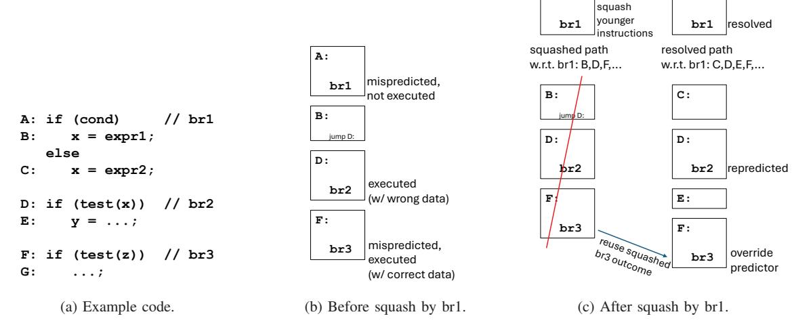

Fig. 1: Simple example of squashed-branch reuse.

existing instances are removed on the resolved path, making alignment of the squashed-path and resolved-path counterparts tricky. Our solution to this challenge is based on the insight that multiple dynamic instances of a branch occur due to loops. A dynamic instance can be uniquely identified by a hierarchical loop iteration identifier, like  $\{loopA.iterA, loopB.iterB\}$  for a branch within a doubly-nested loop. This identifier is invariant: the identifier of a dynamic branch on the resolved path matches that of its counterpart on the squashed path (if it exists), despite arbitrary differences in control-flow observed on the two paths.

Figure 2a shows an example of an outer loop A (br1) and inner loop B (br2), and nested if-statements (br3,br4) inside B. The top table of Figure 2b shows an example dynamic sequence before a squash. The sequence shows two iterations of the outer loop, A.1 and A.2. For A.1's visit to inner loop B, B iterates three times:  $\{A.1, B.1\}, \{A.1, B.2\}, \{A.1, B.3\};$ the third iteration skirts the while-loop's body, however, so there are only two occurrences of if-branch br3; nested br4's occurrences depend on predictions of br3. Suppose the first visit to inner loop B was supposed to iterate four times, i.e., instance  $\{A.1, B.3\}$  of br2 was mispredicted as labeled. The bottom table shows the resolved path after the squash. Despite the additional iteration  $\{A.1, B.4\}$ , and additional dynamic branches br3: $\{A.1, B.3\}$ , br4: $\{A.1, B.3\}$ , and br2: $\{A.1, B.4\}$ , invariant identifiers starting with A.2 allow for squashedbranch reuse of all following branches. The same would hold if iterations were removed, or if nested branches were added/removed, etc.

We realize invariant identifiers compactly using a signature contained within a Linear Feedback Shift Register (LFSR). The signature is saved to a small stack just before entering a loop, incrementally updated upon entering and continuing the loop, and restored from the stack after exiting the loop (to what the signature was prior to the loop). For this paper, we developed an LLVM [25] compiler pass to collect loop

information (loop header PC, loop exit branches), which is appended to the binary as another segment and loaded into a Loop Information Table (LIT) at run-time.

executed.

The signature and stack are also manipulated by calls/returns. The signature is saved just before a function call, incrementally updated by the caller, and restored after returning. This ensures unique and invariant signatures for multiple instances of a branch created by recursion or multiple calls to the same function from the same loop and iteration.

A dynamic branch is uniquely and invariantly identified by a hash of its PC and signature, called its key (with the exception of rare collisions in the signature or hashed key). We augment the branch predictor with a Squashed-Branch Reuse Buffer (SBRB) accessed by key. We augment the branch target buffer (BTB) with confidence counters to gauge which branch PCs offer profitable overrides of the predictor. When a branch executes, it accesses the SBRB using its key and either adds its key and outcome if it misses or updates the outcome if it hits. The latter scenario is possible if the same dynamic branch is squashed multiple times. The BTB confidence counters indirectly learn the typical CIDD/CIDI nature of branches with respect squashes, i.e., the relative trustworthiness of their squashed outcomes as compared to their predictions. When a branch is predicted, it accesses the SBRB using its key. The prediction is overridden by the SBRB if it hits and the branch's confidence counter indicates high confidence.

The rest of the paper is organized as follows. Section II discusses related work. Section III describes our squashed-branch reuse implementation. Section IV describes the simulator used, default superscalar processor parameters, and benchmarks. Section V presents results and analysis. We conclude the paper in Section VI.

## II. RELATED WORK

Researchers have explored various microarchitectures that exploit control independence to reduce the penalty of branch


- Loop A: while (cond1) { // br1 ...
  Loop B: while (cond2) { // br2 if (cond3) { // br3 if (cond4) // br4 ...
  } ...
  } ...
  }
  - (a) Example doubly-nested loop.
- (b) Example of logically aligning squashed path and resolved path using invariant identifiers.

Fig. 2: Using invariant identifiers.

mispredictions. One class of CI microarchitectures [5], [12], [17], [19], [24], [34]–[36] preserves CI instructions in the pipeline. The most ambitious of these [5], [19], [34], [35] require complex machinery for replacing incorrect controldependent (CD) instructions with correct CD instructions and selectively re-executing CIDD instructions. Selective Branch Recovery [17] is limited to exact convergence, which means incorrect CD instructions need only be nullified because the alternate path reconverges immediately (there are no alternate CD instructions). The nullified instructions are converted to moves and CIDD instructions must be selectively re-executed. Skipper [12] intentionally skips over a branch's CD instructions and delays CIDD instructions. When the branch resolves, the correct CD instructions are fetched and CIDD instructions are released. In addition to the high complexity of all these approaches, branch prediction accuracy is actually degraded by virtue of out-of-order fetch [19], [36]. Thus, even if CI instructions are not refetched, it may be prudent to repredict CI branches using repaired global history [36].

Eyerman et al. [15] use software annotations, similar to expressing parallelism, to avoid some of the hardware complexity discussed above. Slices are defined with slice\_begin/slice\_end instructions. For example, independent loop iterations (notwithstanding reduction variables) are independent slices. Mispredictions within a slice only squash instructions within that slice. This still requires removing/inserting CD instructions in the middle of the window (e.g., using a linked-list segmented ROB [15], [34]–[36]) but not selective re-execution of CIDD instructions. Branches not in slices, including the loop branch, cause a full squash when mispredicted. Reduction operators are annotated, and executed non-speculatively and without register renaming at retirement.

Selective Pipeline Flush [24] searches for the mispredicted branch's resolved target in the fetch through rename stages. If the branch's target instruction exists in these stages, the target instruction and younger instructions need not be refetched. A method is proposed for repairing predictor context in this case.

Another class of CI microarchitectures, referred to as *squash reuse*, squash all instructions after the mispredicted branch like usual, but preserve CI instructions' results in an instruction reuse buffer [42], physical registers [20], [37], or an alternate ROB [13]. After the squash, as instructions are fetched, the rename stage performs reuse tests to gauge whether an instruction can reuse a result already produced by a squashed counterpart. Instructions that pass their reuse tests execute early, in the rename stage. This includes resolving some mispredicted branches early, but not as early as the fetch stage where branches are initially predicted. Therefore, the aforementioned squash reuse proposals do not reduce branch mispredictions, rather, they only reduce the penalty of reusable mispredicted branches.

We'll discuss two of the squash reuse proposals, cited above, in more depth. Both Register Integration (RI) [37] and Multi-Stream Squash Reuse (MSSR) [20] preserve CI instructions' results in physical registers. RI: When a misprediction is detected, the PC, source physical register name(s), and destination physical register name or branch outcome of each squashed instruction is placed in the Integration Table (IT). The physical registers of squashed instructions are not immediately released. While renaming an instruction on the resolved path, the IT is searched using the instruction's PC and source physical register names. A hit means the instruction is reusable (CIDI). For a reusable register-producing instruction, its destination is renamed to the physical register indicated in the IT, thereby reusing the squashed result. For a reusable branch that was mispredicted, its outcome in the IT serves as an earlier misprediction resolution than waiting for execution. **MSSR**: When a misprediction is detected: (1) the ROB is copied to a squash log, (2) the fetch unit's Fetch Target Queue is copied to a wrong-path buffer (WPB), and (3) squashed instructions' registers are not immediately released, as in RI. As resolved-path instructions are fetched, fetch-block PCs are compared against fetch-block PCs in the WPB to detect reconvergence. When the reconvergent point is detected in the WPB, the corresponding point is identified in the squash log. Whereas RI's reuse test checks for the same source physical register names in the IT, MSSR checks for the same source RGIDs in the squash log (RGID: Rename Mapping Generation ID). Additionally, MSSR employs multiple WPB/squash-log pairs, allowing squash reuse across multiple squashes.

SBRB eliminates mispredicted branches whereas MSSR and RI only reduce their penalties. After reconvergence, MSSR abandons squash reuse at the first divergence between the resolved and squashed paths, whereas SBRB's novel branch alignment approach tolerates arbitrary control-flow differences. While MSSR supports reuse across multiple squashes, it is limited by the number of WPB/squash-log pairs whereas SBRB is not constrained. That said, it is important to not lose sight of the fact that SBRB and MSSR/RI have different objectives though unified by squash reuse. SBRB targets *squashed-branch reuse in the fetch stage*. MSSR and RI aim to reuse results of register-producing instructions and branches *at the rename stage*, to reduce backend pressure after a squash and the penalty of mispredicted squash-reusable branches, respectively. SBRB's squashed-branch reuse at fetch can be combined with MSSR's squash reuse at rename.

SYRANT [29] also follows the squash reuse paradigm, but goes a step further by reusing squashed CI instructions' entries in the Reorder Buffer (ROB), Physical Register File (PRF), Load Queue (LQ), and Store Queue (SQ). For each targeted branch, ROB, PRF Free List, LQ, and SQ entries are allocated according to maximum resource requirements along either of its not-taken or taken paths up to its reconvergent point. This allows refetched CI instructions to reuse ROB/PRF/LQ/SQ entries occupied by squashed counterparts, without requiring shifting/copying due to resource differences on the squashed and resolved paths. SYRANT uses two lists of dynamic branches, the Active Branch List (ABL) and Shadow Branch List (SBL), to detect reconvergence and thus gauge maximum resource requirements. When a misprediction is detected, ABL entries after the mispredicted branch are copied to the SBL. Reconvergence is detected by comparing branches on the resolved path, as they are inserted into the ABL, against branches in the SBL.

SYRANT also leverages the ABL/SBL for *squashed-branch reuse in the fetch stage*. The authors also emphasize that this feature, conveniently localized to the fetch unit, can be used standalone to improve branch prediction accuracy. The ABL collects outcomes as branches execute, and squashed branches' outcomes transfer to the SBL. After reconvergence is detected in the SBL, SBL entries with outcomes are used to override the predictor. There are several limitations, however:

• SYRANT places two constraints that, in our analysis, are geared toward reliable ABL-SBL alignment when there are nested branches inside of a loop. Without the constraints, a nested branch – instances of which occur in some iterations but not others – may trigger misalignment of loop iterations between the ABL and SBL. On the other hand, the constraints *preclude squashed-branch reuse after a mispredicted loop branch*, as illustrated in Figure 3. The first constraint is "*the search for reconvergence point ends when a second instance of the mispredicted branch is recorded on the right path*" [29]. If the predictor exited the loop prematurely, as illustrated in Figure 3a (under-iteration: SBL has branches from after the loop), the reconvergence search terminates when another iteration is fetched on the resolved path and the next instance of the loop branch is observed. The second constraint is "*the SBL is searched only up to the second instance of the mispredicted branch*" [29]. If the predictor exited the loop belatedly, as illustrated in Figure 3b (overiteration: SBL has branches from excess loop iterations and branches after the loop), the reconvergence search window within the SBL is limited to the first excess loop iteration and the search continues without latching-on. SYRANT's heuristic achieves reasonably good alignment at the expense of valuable squashed-branch reuse opportunity. Our proposed invariant identifiers achieve nearperfect alignment<sup>1</sup> with no loss of squashed-branch reuse opportunity.

- Even if the ABL / resolved path successfully begins its association with the SBL / squashed path, it is unclear what happens at the first divergence, which can happen when the resolved path requires branch prediction (no override available) and the prediction differs the second time around. Presumably, reuse must terminate at the first divergence (the topic is not broached and no alternative method is described in the paper). In contrast, our proposed invariant signatures are tolerant of resolvedpath/squashed-path divergences in the CI region.
- There is only a brief discussion of the potential need for gauging CIDD/CIDI branches. The authors found that, "*in many applications the quality of ABL/SBL prediction is better than the quality of the state-of-the-art TAGE branch prediction*" [29]. A single, global confidence counter was posited to enable/disable squashed-branch reuse over stretches, but there is little detail and it is unclear if this was used in the results. We explore various confidence mechanisms in Section V-C.
- The SBL only retains squashed-branch outcomes from the most recent squash, whereas our proposed SBRB inherently retains squashed-branch outcomes across multiple squashes. This is relevant because OOO execution may yield multiple squashes within the same window [20].

Branch recycling, by Akkary et al. [4], preceded SYRANT and also uses two branch lists like the ABL and SBL to implement squashed-branch reuse in the fetch stage. The PC of the branch being fetched associatively searches the SBL-equivalent and the nearest hit establishes the alignment henceforth. The authors concede this can lead to incorrect

<sup>1</sup>Imperfections may occur due to non-loop cycles (Sec. III-A), practical realization of identifiers (signature collisions, constrained stack, constrained LIT), and key collisions.

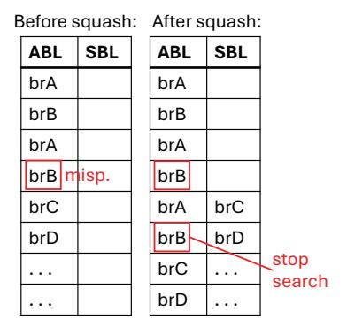

(a) Predictor under-iterated.

Before squash: After squash:

| ABL   | SBL   | ABL | SBL |            |
|-------|-------|-----|-----|------------|
| brA   |       | brA |     |            |
| brB   |       | brB |     |            |
| brA   |       | brA |     |            |
| brB m | iisp. | brB |     |            |
| brA   |       | brC | brA | restricted |
| brB   |       | brD | brB | window     |
| brC   |       |     | brC |            |
| brD   |       |     | brD |            |

(b) Predictor over-iterated.

Fig. 3: Examples of SYRANT's [29] ABL/SBL (a) terminating the reconvergence search or (b) restricting the reconvergence search window in the SBL, with respect to a mispredicted loop branch. BrA and brB are in a loop, where brB is the loop branch. BrC and brD are after the loop.

alignment, which is compensated by lowering confidence in a gshare-based confidence estimator.

Galliher [16] also proposed squashed-branch reuse in the fetch unit. On a squash, their fetch unit's existing Branch Queue is iteratively copied to a Reuse Queue. During this iterative copy, Reuse Queue entries are labeled with iteration counters based on observing repetition of branch PCs in prior entries. While fetching a branch on the resolved path, its PC is compared against the Reuse Queue's head entry. If there isn't a match, various comparisons on two adjacent iterations are attempted to heuristically resync the resolved path to the squashed path. Aside from the hardware complexity (and implied prediction latency) of an indeterminate window of comparisons and successive application of rules, it is not clear how general the alignment/realignment heuristics are. Also, one level of iteration counters may confuse multiple visits to an inner loop as a single visit.

Other branch techniques: Dynamic Predication: Auto-Predication of Critical Branches (ACB) [11] is an all-hardware technique that identifies hard-to-predict (H2P) branches with simple CD regions (no nested branches, loop branches are

excluded, *etc.*), replaces them with predicated execution, and switches between branching and predication by continuously gauging profitability. ACB's on-line H2P branch identification, multiple hammock idioms, and adaptivity, are advancements over the precursor Dynamic Hammock Predication [22]. The Diverge-Merge Processor (DMP) [21] forks two paths after a H2P branch and merges them at the reconvergent point; this allows nested branches but they are predicted and thus may cause squashes.

**Branch Pre-execution:** Branch pre-execution involves running one or more helper threads ahead of the main thread, and communicating branch outcomes from the helper thread(s) to the main thread's fetch unit. Past works include Slipstream [31]–[33], [45], Speculative Slices [47], [48], DDMT [38], SSMT [9], [10], DLA [18], [23], [28], Slipstream 2.0 [43], Branch Runahead [30], TEA [14], and Phelps [39]. Squashed-branch reuse in the fetch stage leverages the squashed path as free pre-execution.

**Branch criticality:** Ando's PUBS [7] prioritizes the scheduling of backward slices of unconfident branches, reducing their penalty if mispredicted. CRISP [27] uses software hints to prioritize critical branch (and load) scheduling.

#### III. IMPLEMENTATION

#### A. Loops and Loop Hierarchy

In this work, we take a compiler's view of a loop [2]. In this view, every loop in a program can be identified with a unique header block. The header block represents a single point of entry into the loop, and therefore dominates the rest of the blocks in the loop.

Figure 4 shows the control-flow graph (CFG) of the loops in the BUStep function of bfs, a program from the GAPBS benchmark suite [8]. There are two loops. The inner loop contains blocks D and E, and is identified with header block D. The outer loop contains blocks B, C, D, E, F, and G, and is identified with header block B. Blocks D and E appear in both loops because, by definition, blocks belonging to the inner loop also belong to the outer loop.


Fig. 4: Control-flow graph of loops in bfs BUStep.

For a loop, iteration count is defined as the number of executions of the header block before exiting the loop [2]. The presence of a unique header block differentiates loops

from other non-loop cyclic control-flow in a program. For nonloop cycles, there isn't a uniquely identifiable header block. Therefore, the iteration count is not well-defined as it depends on the choice of the header block. Non-loop cycles can occur due to manually-optimized assembly programming, unconventional programming constructs like *goto*, certain compiler transformations, *etc*. We observe few non-loop cycles in our benchmarks (Section V-F) and do not consider them further.

Nested loops form a hierarchy which can be represented as a tree [2]. The outermost loop appears at the root of the tree. Figure 5a shows the tree of loops of the bfs BUStep function. Note, here the loops are identified with their respective header blocks.

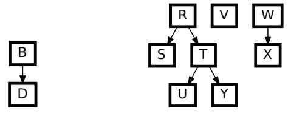

(a) Tree of loops in bfs BUStep. (b) Forest of loops in function *f*.

Fig. 5: Loop hierarchy expressed as a forest.

Since a function can have multiple outermost (top-level) loops, the loops in a function form a forest (*i.e.*, a collection of trees) [2]. Figure 5b shows a forest of loops in some function *f*. Every loop has a loop depth associated with it. The outermost loop has a loop depth of 1, and the depth increases downwards in a tree. The loop depth of a basic block (which has at most one branch) is the depth of the (innermost) loop it appears in. A branch not in any loop has a loop depth of 0.

The hierarchical loop iteration identifier of a dynamic instance of a branch inside loop L constitutes: (a) the loop identity (*i.e.*, the header block) and (b) the iteration count, of all the loops which are ancestor to L, including L. For example, the identifier for a dynamic branch occurring in the loop U of function *f* is {*R.iterR, T.iterT, U.iterU*}. Note that both the header block and the iteration count are required to ensure uniqueness. Removing the header block can lead to identical identifiers for branches in different loops but at the same loop depth. Removing the iteration count leads to identical identifiers for the same branch in different loop iterations.

# *B. The hierarchical loop iteration identifier is a stack*

The hierarchical loop iteration identifier (or simply, the identifier) is a stack of header block and iteration count pairs. The identifier is manipulated on three special control-flow edges. For a loop L, these edges are:

- *enter loop*(L): an edge from a block outside L to its header block.
- *continue loop*: an edge from a block inside L to its header block.
- *exit loop*(pop amount): an edge from a block inside L to a block outside L. The pop amount is the difference between the loop depth of L and that of the edge's destination block. The destination block usually belongs

to the parent loop of L or is a top-level block if L itself is a top-level loop. In both cases, pop amount is one. In other cases, the pop amount is more than one.2

Once the required edges are determined for all the loops in a function, manipulating the identifier is straightforward:

- *enter loop*(L): push({L,1}); • *continue loop*: top().iteration\_count++;
- *exit loop*(pop amount): while (pop\_amount--) pop();

*1) An example:* Figure 6 shows stack manipulations on a dynamic sequence of edges for the bfs BUStep function. The outer loop (B) is iterated twice. The inner loop (D) is not visited in the first iteration of B, and is iterated twice in the second iteration of B. The exact sequence of edges is captured in the first row. The identifier is manipulated on the special edges. The identifier transitions from {} to {*B.*1} (*enter loop*(B)), {*B.*1} to {*B.*2} (*continue loop*), {*B.*2} to {*B.*2*, D.*1} (*enter loop*(D)), {*B.*2*, D.*1} to {*B.*2*, D.*2} (*continue loop*), {*B.*2*, D.*2} to {*B.*2} (*exit loop*(1)), and {*B.*2} to {} (*exit loop*(1)).

*2) Dealing with overlapping special edges:* In the bfs BUStep function, there is no case where the same edge represents a special edge for one loop and a *different* special edge for another loop. But in general, there may be such overlapping special edges. When there are overlapping special edges, there can be at most one *enter loop* or *continue loop* among them: these two types cannot overlap for a loop due to distinct source blocks (outside *vs.* inside the loop, respectively), and they cannot overlap across loops due to distinct destination blocks (*i.e.*, the header blocks). Thus, valid overlap scenarios are when the same edge represents one or more *exit loop* edges of various pop amounts, and optionally a single *enter loop* or *continue loop* edge.

If there is an overlap, the identifier may need to be manipulated more than once. If the overlap involves just *exit loop* edges, then the identifier is manipulated once, based on the highest pop amount. If the overlap involves an *enter loop* or a *continue loop* edge, the identifier is manipulated twice: first for the *exit loop* edge(s) and then for the *enter loop*/*continue loop* edge.3

## *C. Conveying the special control-flow edges to the hardware*

The compiler needs to convey the special control-flow edges in the program's binary, so that hardware can manage its stack.4

<sup>2</sup>The discussion assumes that the destination block either belongs to a loop that is an ancestor of L or is a top-level block. Otherwise, the pop amount is one more than the difference between the loop depth of L and that of the edge's destination block.

<sup>3</sup>Special edge overlaps can be reduced or eliminated using certain loopcentric compiler passes. The techniques explained here are general and do not require any such compiler pass.

<sup>4</sup>It may be possible to infer loops, hence, special control-flow edges, using a hardware-only scheme. We leave this for future work.

| Edge sequence             | Init | A->B          | B->C  | C->G  | G->B          | B->C  | C->D          | D->E      | E->D          | D->F         | F->G  | G->H         |
|---------------------------|------|---------------|-------|-------|---------------|-------|---------------|-----------|---------------|--------------|-------|--------------|
| Edge specialty            | -    | enter_loop(B) | -     | -     | continue_loop | -     | enter_loop(D) | -         | continue_loop | exit_loop(1) | -     | exit_loop(1) |
| Stack op.                 | -    | push({B,1})   | -     | -     | top().iter++  | -     | push({D,1})   | -         | top().iter++  | pop(1)       | -     | pop(1)       |
| Identifier<br>(after op.) | {}   | {B.1}         | {B.1} | {B.1} | {B.2}         | {B.2} | {B.2,D.1}     | {B.2,D.1} | {B.2,D.2}     | {B.2}        | {B.2} | {}           |

Fig. 6: Illustrating identifier manipulations using stack operations in bfs BUStep.

1) Representing special control-flow edges: The source of an exit\_loop edge is a block that ends in a conditional branch. So an exit\_loop edge is represented by its corresponding branch's PC, the exit direction, and the pop\_amount.

However, the source of an <code>enter\_loop</code> edge or a <code>continue\_loop</code> edge may not be a branch instruction (in the case where the edge is a fall-through edge). Still, the destination of all such edges is a header block, or more precisely the first PC in the header block, or simply header PC. Moreover, an <code>enter\_loop</code> edge can be differentiated from a <code>continue\_loop</code> edge reaching the same destination header PC by comparing the destination header PC with the header PC on the top of the stack: a mismatch signifies <code>enter\_loop</code> and a match signifies <code>continue\_loop</code>. So, all <code>enter\_loop</code> and <code>continue\_loop</code> edges for a loop are succinctly represented by the loop's header PC.

- 2) Loop descriptor: Each loop descriptor has the format {header PC, number of exits, exit1, exit2, ...}, where each exit is of the form {branch PC, exit direction, pop\_amount}.
- 3) Loop Information Segment (LIS): Loop descriptors are listed in this dedicated segment of the program binary.
- 4) Profiling compiler: A compiler pass generates loop descriptors for all loops in a given program. The assembler writes the loop descriptors to the program binary's LIS (Fig. 7:1).

The number of loop descriptors included in the LIS is at the discretion of the compiler or compiler user. Moreover, the LIS size is not confined by any one CPU design. A CPU will have a hardware table for holding loop descriptors (discussed in the next subsection), but its size and the LIS size are independent.

Knowing that a given CPU's table may be smaller than the LIS, it is advantageous for the compiler to use profiling to order loop descriptors in the LIS from most to least important. In this paper, a given loop's rank is based on the profiled number of occurrences of its header PC, which reflects both number of visits to the loop (enter loop) and number of iterations of those visits (continue loop).

Note that our profiling approach does not factor-in anything about hard-to-predict (H2P) branches before, within, or after loops. While H2P branches are a possible consideration, our rationale for considering only loop header frequency is that loops are the basis for invariant identifiers, independent of what the identifiers are used for.

5) Loop Information Table: On the CPU side, loop descriptors are held in the Loop Information Table (LIT). The LIT is sub-divided into two tables, one for header PCs (LIT-H) and the other for exit branches (LIT-E). Both LIT-H and LIT-E are searched by PC.

The ISA specifies the existence and formats of the LIT-H/LIT-E but leaves their capacities up to the CPU. The LIT-H capacity (number of loop header PCs) and LIT-E capacity (number of loop exits) are in an ISA-specified CPU configuration register readable by the operating system (O/S).

The CPU's LIT-H/LIT-E are loaded by the O/S when it schedules a process on the CPU, *i.e.*, when it launches a process or resumes a suspended process. The O/S maintains, for each process, a Process Control Block (PCB) containing a memory copy of all architectural register state [6]; the PCB is extended with memory copies of the LIT-H/LIT-E. The PCB's LIT-H/LIT-E are initialized by the O/S loader from the topmost loops in the program binary's LIS (up to their capacities) (Fig. 7:2). The O/S scheduler loads the CPU's LIT-H/LIT-E from the PCB's LIT-H/LIT-E using a series of load and move instruction pairs (load to general register, move from general register to indexed array of special registers) (Fig. 7:3).

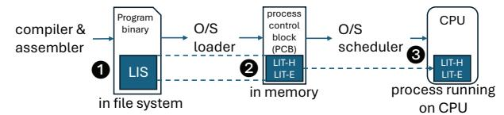

Fig. 7: From LIS to CPU's LIT-H/LIT-E.

A CPU with SMT support equally divides its LIT-H/E into as many partitions as there are active threads. This reduces the number of loops that may participate in invariant identifiers, for each thread. Threads from the same process or processes launched from the same binary may share a partition. If the O/S suspends a thread and doesn't schedule another one in its place, remaining threads' partitions are upsized and the O/S may load additional loops for them.

#### D. Realizing the identifier

We discuss two ways of implementing the identifier. The first is a literal stack of {header PC, iteration count} pairs (Subsection III-D1). A practical concern with this approach is that, for each access to the SBRB, a signature must be generated by hashing all entries of the stack. This motivates the second approach (Subsection III-D2) in which an ongoing signature is maintained. There is still a stack, but its purpose is to save the signature before entering a loop and restore it after exiting a loop. We call this approach the Signature Stack (SS). In this paper, we use the SS.

1) A literal stack of {header PC, iteration count} pairs: A hit in LIT-H is relayed as hit\_header(PC). A hit in LIT-E is relayed as hit\_exit(pop\_amount) only if the prediction for that exit branch matches with the exit direction. Based on

the hit information from the LIT, the stack is manipulated as follows:

• *hit\_header*(PC):

```
if (PC == top().header_PC)
  top().iteration_count++; // cont. loop\nelse
  push({PC, 1}); // enter loop
```

hit\_exit(pop\_amount):while (pop\_amount--) pop(); // exit loop

We define a **signature** as a fixed-sized (*e.g.*, 32 bits) compressed representation of the hierarchical loop iteration identifier. To compute a signature using the literal stack described here, *all* the bits in the stack have to be suitably hashed together. The literal stack is not a pragmatic design because its hashing may be slow and may need to be performed frequently. Also, while folding and hashing of PCs with XOR preserves adequate information, it is less clear how to effectively hash iteration counts.

- 2) Signature Stack (SS): In this design, an ongoing signature is maintained, that by itself represents (in compressed form) the current hierarchical loop iteration identifier. The signature is stored in a Linear Feedback Shift Register (LFSR). The signature is paired with the header PC of the current loop, which is needed to differentiate between continuing the loop vs. entering a different loop. Thus, we have a pair of registers:
  - hpc: The header PC of the current loop. If a loop header PC is observed, it can be compared against hpc to determine whether the current loop is being continued (observed header PC matches hpc) or a new loop is being entered (observed header PC differs from hpc). To reduce cost<sup>5</sup>, hpc is an 8-bit compressed representation of the header PC: fold8 (header PC) (successively split the bits into two halves, fold the top half over the bottom half, and bitwise-XOR them, until a width of 8 bits is reached). The design space exploration in Section V-B2 shows that fold8 (header PC) is as effective as using the full header PC.
  - sig: A LFSR-based representation of the current hierarchical loop iteration identifier. We use a Galois LFSR [1], [44]. In Section V-B2, we perform a design space exploration of the number of bits for sig and find that the 32-bit Galois LFSR shown in Figure 8a generates 32-bit signatures that rarely or never collide. The LFSR is augmented with the ability to bitwise-XOR sig with an arbitrary data input (of the same bit-width) as it is shifted, as shown in Figure 8b. An incremental update of sig can be written as: sig = LFSR\_step(sig ^ data).

The overall "Signature Stack (SS)" component refers to the two registers, hpc and sig, and a stack for saving/restoring these two registers as explained below. Here is how the SS is managed:

- Entering a loop: A loop is entered when a loop header PC is observed that differs from hpc. First, the values of  $\{hpc, sig\}$  are saved by pushing them to the save/restore stack. This allows updating sig for the newly-entered loop, while still being able to revert back to the sig that existed before this loop, when it is eventually exited. Second, sig is updated as follows:  $sig = LFSR\_step(sig ^ fold32(PC))$ . This reflects adding the loop's header PC (PC, folded to the bit-width of sig) and initial iteration count (1, by virtue of the LFSR rotating by 1 bit) to the hierarchical loop iteration identifier. hpc is set to the entered-loop's header PC (folded according to the bit-width of hpc).
- Continuing a loop: A loop is continued when a loop header PC is observed that matches hpc. In this case, sig is simply updated to reflect another iteration:  $sig = LFSR\_step(sig ^ 0)$ .
- Exiting a loop: The save/restore stack is popped the requisite number of times (pop amount) and {hpc, sig} are restored from the final popped stack entry.

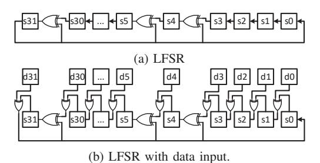

Fig. 8: (a) The 32-bit LFSR used in this paper. (b) The LFSR with data input, d, where d is either the 32-bit folded header PC for entering a loop or 0 for continuing a loop.

In addition to LIT hits, the SS is also manipulated on call and return instructions (the existing BTB signals calls and returns). This is necessary to ensure unique and invariant signatures for branches across different potential invocations of the same function, from the same loop and iteration: (1) loop header PCs and branch PCs are not unique across function instances, and (2) the signatures at potential invocations are otherwise identical (not changing) if they are in the same loop and iteration. A call causes a save and update as was described above for entering a loop, where the update uses the call instruction's PC (PC of the call site). A return causes a restore operation. Differentiation and invariance is achieved whether there are two different call sites (save sig, augment sig with first caller's PC, restore sig; repeat with second caller's PC; signatures are invariant whether or not either call is actually fetched, as determined by surrounding control-flow) or a single call site with recursion (save sig, augment sig with caller's PC, repeat).

A comprehensive description of SS management is given in Table I. The description uses 8 bits and 32 bits for hpc and sig, respectively.

<sup>&</sup>lt;sup>5</sup>While *hpc* is only one register, it is saved in entries of the save/restore stack. Further, the overall SS component is checkpointed at branches, as explained in Section III-E.

TABLE I: Signature Stack (SS) management.

| hits from LIT and BTB | SS management                         |  |  |  |
|-----------------------|---------------------------------------|--|--|--|
| hit header(PC):       | if (fold8(PC) != hpc) { // enter loop |  |  |  |
|                       | push({hpc, sig});<br>// save          |  |  |  |
|                       | hpc = fold8(PC);                      |  |  |  |
|                       | sig = LFSR_step(sig ˆ fold32(PC));    |  |  |  |
|                       | }                                     |  |  |  |
|                       | else {<br>// continue loop            |  |  |  |
|                       | sig = LFSR_step(sig ˆ 0);             |  |  |  |
|                       | }                                     |  |  |  |
| hit exit(pop amount): | // exit loop                          |  |  |  |
|                       | while (pop_amount)                    |  |  |  |
|                       | pop({hpc, sig});<br>// restore        |  |  |  |
| hit call(PC):         | push({hpc, sig});<br>// save          |  |  |  |
|                       | hpc = 0;                              |  |  |  |
|                       | sig = LFSR_step(sig ˆ fold32(PC));    |  |  |  |
| hit return:           | pop({hpc, sig});<br>// restore        |  |  |  |

## *E. Recovering the Signature Stack*

Our baseline superscalar processor has 64 branch checkpoints to quickly recover various structures or structure pointers when a mispredicted branch resolves (*i.e.*, rename map table, free list head pointer, SQ/LQ tail pointers, *etc.*) [46]. Each branch checkpoint is augmented with storage to also checkpoint the SS. This allows recovering the SS precisely.

To support SS recovery in the case of load violations (memory dependency mispredictions) and exceptions, which initiate recovery when they reach the ROB head, a retirement SS is maintained. Our baseline superscalar processor includes a Branch Queue (BQ) in the fetch unit to train branch prediction tables at retirement. Each BQ entry is augmented with 6 bits (see Table II) to redundantly manage the retirement SS. The retirement SS enables recovery of the (fetch) SS to the precise point just prior to the offending instruction.

## *F. Squashed Branch Reuse Buffer (SBRB)*

A branch accesses the SBRB using a hash of its PC and its signature. The PC is folded once (compress from 64 to 32 bits) and XOR-ed with the signature, to form a 32-bit key into the SBRB: key = fold32(PC) ˆ sig.

The SBRB can be organized as direct-mapped, setassociative, or fully-associative. The 32-bit key, above, is divided into index and tag bits, accordingly (like any other cache structure). Each SBRB entry has a valid bit, tag, replacement counter (if set- or fully-associative), and branch outcome.

Here are the operations on the SBRB:

- *When a branch executes (execute stage)*: The executed branch searches the SBRB using its key.6 If it misses, an entry is allocated and the branch's outcome is deposited. If it hits, the outcome is updated. A hit can occur when the same dynamic branch is squashed multiple times (or when there are key collisions).
- *When a branch is predicted (fetch stage)*: The SBRB is searched using the dynamic branch's key. If it hits and the branch's confidence counter (from the BTB)

6Each BQ entry can be augmented with the corresponding branch's key, that can later be used by a resolved branch (which carries its BQ index in its payload) to access the SBRB. Alternatively, the resolved branch can regenerate its key using its BQ entry's PC and its sig from the SS checkpoint within its branch checkpoint (Sec. III-E). We use the latter approach.

indicates high confidence, the outcome from the SBRB is used as the final prediction, overriding the default branch predictor.

## *G. Training confidence counters*

Each entry in the BTB is augmented with an n-bit confidence counter. When a branch is installed in the BTB, its confidence counter is initialized to 0. The SBRB may only override the default branch predictor if *counter >* 2(n−1) − 1 (*i.e.*, deemed confident when the counter is in the upperhalf of its reachable states). The design space exploration in Section V-C results in defaults of: 3-bit confidence counter, states 0–7, confidence threshold of 3.

A branch's counter learns whether a squashed outcome supplied by the SBRB (when available) tends to be more accurate than the prediction supplied by the default branch predictor. A squashed outcome obtained from the SBRB during the fetch stage is recorded in the branch's BQ entry. So is the prediction from the default branch predictor and, eventually, the actual outcome when the branch executes. When the branch retires (hence, it is at the BQ head), its confidence counter is potentially updated based on four pieces of information: whether a squashed outcome is available, the squashed outcome (if available), the default prediction, and the actual outcome. The counter is only updated if a squashed outcome is available and it differs from the default prediction, as follows:

```
if (squashed_outcome_available &&
    (squashed_outcome != default_prediction))
{
  if (squashed_outcome == actual_outcome) {
    if (counter < max_value) counter++;
  } else {
    if (counter > 0) counter--;
  }
}
```

# *H. Delaying the squash action*

On detecting a misprediction, a conventional processor may immediately squash instructions younger than the mispredicted branch. But with squashed-branch reuse, it becomes profitable to defer the squash action. Deferment allows more squashedpath branches to finish execution and deposit their outcomes in the SBRB.

A deferred squash must not delay the progress of resolvedpath instructions in the pipeline, either directly (by delaying their fetch) or indirectly (by delaying their execution). With that in mind, we propose a simple deferred squash mechanism. The squashed-path instructions before the rename stage are squashed immediately, ensuring resolved-path instructions are fetched unimpeded. The squashed-path instructions after the rename stage continue dispatching, issuing, and executing like usual, until the first resolved-path bundle reaches the rename stage. Once the first resolved-path bundle reaches the rename stage, the remaining squashed-path instructions are squashed, releasing the resources held by them. Our results assume this deferred squash mechanism unless stated otherwise.

- *1) Immediate squash:* Our processor uses the MIPS R10K *branch mask* construct [46]. Each fetched branch reserves a bit in a global branch mask (and by extension the corresponding checkpoint in a checkpoint buffer). Each fetched instruction inherits a copy of the current global branch mask as its *branch mask*, and in this way every instruction knows all unresolved branches that are older than it. When a branch resolves, it broadcasts a one-hot *branch mask* (only its bit set) and a correct/incorrect signal. If correct, its bit is cleared in all instructions' *branch masks* and the global branch mask. If incorrect, (1) the global branch mask is restored to the branch's own *branch mask* (reflecting only unresolved branches older than it), (2) FIFO pointers (Free List head pointer, ROB/LQ/SQ/BQ tail pointers), the rename map table, and the SS are restored from the branch's checkpoint, (3) the fetch through dispatch stages are squashed, and (4) any instruction in the IQ or execution lanes with the branch's bit set in its *branch mask* self-invalidates (it is younger than the branch).
- *2) Deferred squash:* Steps 1-3, above, are performed immediately except the dispatch stage is not squashed (note that physical registers and ROB/LQ/SQ entries for the dispatch bundle were allocated in the rename stage prior, so immediately rolling back Free List head and ROB/LQ/SQ tails does not interfere). A 1-bit state machine transitions from *idle* to *delayed squash*. Alongside the state machine is information about the mispredicted branch: its one-hot *branch mask* (its identity) and its *branch mask* indicating branches older than it. When a resolved-path bundle reaches the rename stage, given that the state is *delayed squash*: the dispatch stage is squashed (applicable if a bundle remains), step 4, above, is performed (invalidate younger instructions still in the IQ and execution lanes), and the state machine transitions to *idle*.

Suppose brX is the branch posted with the state machine in the *delayed squash* state. Another branch, brY, may resolve as correct or incorrect during the deferment period. BrY is younger than brX if brY's bit is not set in brX's *branch mask*, in which case brY is silenced. Otherwise, brY is older. If older brY resolves as correct, its bit is cleared in *branch masks* everywhere as usual. If older brY resolves as incorrect: brX finalizes its squash (in the same manner as when a resolved-path bundle reaches rename), steps 1-3, above, are performed immediately with respect to brY, brY replaces brX alongside the state machine, and the state remains *delayed squash*.

## *I. Putting it All Together*

Figure 9 provides a summary picture of our proposed squashed-branch reuse in the fetch stage. New components are annotated with yellow stars: signature management (including LIT-H, LIT-E, SS, and SS checkpoints), Squashed-Branch Reuse Buffer (SBRB), and confidence counters added to the BTB.

Table II shows default parameters for the new components and cost accounting in terms of bytes of storage.

TABLE II: Cost accounting.

| LIT-H      | 150 entries, 62 bits/entry                    | 1,162.5 B   |
|------------|-----------------------------------------------|-------------|
| LIT-E      | 300 entries, 66 bits/entry                    | 2,475 B     |
|            | (PC:62, dir:1, popcnt:3)                      |             |
| SS         | hpc:8, sig:32                                 | 45.375 B    |
|            | stack: 8 entries, 40 bits/entry               |             |
|            | stack pointer:3                               |             |
| SS chkpts  | (64 chkpts + 1 ret. SS) x SS cost             | 2,949.375 B |
| SBRB       | 256 entries, 4-way assoc., 30 bits/entry      | 960 B       |
|            | (valid:1, lru:2, tag:26, outcome:1)           |             |
| BTB conf.  | 8K entries, 3 bits/entry                      | 3,072 B     |
| BQ         | 592 entries, +8 bits/entry                    | 592 B       |
| extra bits | (+6 for ret. SS: hdr/exit/dir/popcnt:1/1/1/3) |             |
|            | (+2 bits for conf. training)                  |             |
| Total      |                                               | 11 KB       |

## IV. METHODOLOGY

We evaluate our squashed-branch reuse mechanism using an in-house, RISC-V, execution-driven, execute-at-execute superscalar processor simulator. Default parameters of the baseline superscalar processor are shown in Table III. Default parameters of new components are in Section III-I, Table II.

TABLE III: Default parameters of the baseline superscalar processor.

| fetch-to-execute depth             | 12 stages                        |
|------------------------------------|----------------------------------|
| fetch/dispatch/issue/retire widths | 8/8/8/8                          |
| execution lanes                    | 2 ld/st, 4 simple ALU,           |
|                                    | 2 complex/fp ALU                 |
| ROB/PRF/LQ/SQ/IQ                   | 512/576/256/256/128              |
| branch checkpoints                 | 64                               |
| squash model                       | delayed (Sec. III-H)             |
| branch predictor                   | 64KB TAGE-SC-L [40]              |
| BTB                                | 8K entries, 4-way                |
| RAS                                | 64 entries                       |
| L1 I\$                             | 64KB, 4-way, 64B block           |
| L1 D\$                             | 64KB, 4-way, 64B block,          |
|                                    | 4-cyc. load-to-use               |
| L2 \$                              | 1MB, 8-way, 64B block, 10 cyc.   |
| L3 \$                              | 8MB, 16-way, 128B block, 30 cyc. |
| main memory latency                | 100 cyc.                         |

We compiled the SPEC 2006 and SPEC 2017 integer benchmarks and GAPBS benchmarks [8] using LLVM (repository: [3], branch: release/16.x, commit: 464bda7, optimization flag: -O3). The SPEC 2017 benchmark, exchange 2, is not available as it has Fortran source, which our LLVM RISC-V compiler cannot compile. For each SPEC benchmark, we use its ref input that has the highest weighted-average MPKI over all its SimPoints. For GAPBS benchmarks, we use three real-world input graphs: Road, Twitter, and Web [8]. Up to ten 100-million-instruction SimPoints [41] were generated for each benchmark.

We added an LLVM compiler pass to generate loop descriptors. As explained in Section III-C4, profiling is used to count dynamic instances of each loop's header PC, and loop descriptors are placed in the LIS from highest count to lowest count. All SimPoints of all train inputs were used for profiling SPEC. Two synthetic graphs (Kronecker and random, both with 2<sup>19</sup> vertices) and one alternate real-world graph (road-PA [26]) were used for profiling GAPBS – these are full train runs, not SimPoints.

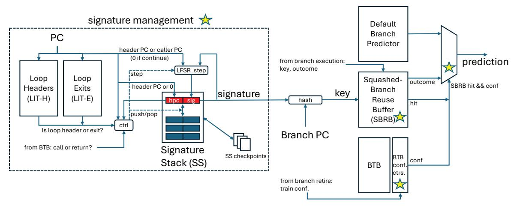

Fig. 9: Summary picture of our proposed squashed-branch reuse in the fetch stage.

#### V. RESULTS

## A. Primary Results

Figure 10 sorts the benchmarks (separately for GAPBS on the left and SPEC on the right) based on the difference between baseline mispredictions-per-kilo-instructions (MPKI) and SBRB MPKI (i.e.,  $MPKI_{base} - MPKI_{SBRB}$ ), from highest difference to lowest difference. The top row of graphs shows MPKI of the baseline predictor (the curve labeled "64KB TAGE-SC-L MPKI") and the baseline predictor augmented with SBRB (the curve labeled "SBRB MPKI"). The bottom row of graphs shows percentage increase in instructions-per-cycle over the baseline (IPC speedup) for four different configurations: (1) 192KB TAGE-SC-L: the baseline branch predictor scaled up to 192KB. (2) SYRANT: the state-of-art; only SYRANT's comparable standalone branch prediction feature, squashed-branch reuse in the fetch stage, is implemented; the ABL is amply sized to never stall fetch (592 entries, the maximum number of in-flight instructions); the SBL has 512 entries (same as the ROB); instead of a single global confidence counter, this implementation has the benefit of our per-branch confidence counters. (3) SBRB. (4) SBRBliteral-stack: same as SBRB except the signature is derived from a 256-entry literal stack (Sec. III-D1); the literal stack's contents are run through the SHA-256 secure hash algorithm to get a 256-bit fingerprint; a CRC pass reduces the fingerprint to a 32-bit signature.

Simply scaling the baseline branch predictor (192KB) is of little help for most benchmarks. It yields 6.43% speedup for 445.gobmk and 5.18% speedup for 602.gcc, the best performance among the four configurations. Unfortunately, 192KB will have prohibitively high prediction latency and

Benchmarks with higher baseline MPKI benefit more from SBRB and SYRANT than benchmarks with lower baseline MPKI. This is to be expected because SBRB and SYRANT exploit branch outcomes in the shadow of older mispredicted branches, *i.e.*, they prevent *additional* mispredictions when

there are mispredictions. SBRB outperforms SYRANT on all benchmarks except 401.bzip2 but even in this case the difference is small. Bzip2's mainQSort3() function (when compiled with -O3) has non-loop cycles, resulting in a fixed signature despite iterative behavior.

SBRB and SBRB-literal-stack, which uses a collision-resistant cryptographic hash of the full identifier, are nearly indistinguishable, evidence that LFSR-based signatures are effective proxies for full identifiers.

Figure 11 provides geometric mean speedups. SBRB yields a geometric mean speedup of 7.25% for GAPBS (as high as 21.2% for bfs-twitter), 2.08% for SPEC (as high as 14.1% for 473.astar\_rivers), and 4.43% over all benchmarks, with no slowdowns on individual benchmarks. SYRANT yields 2.36%, 1.27%, and 1.77%, respectively.

Tc-twitter (tc with the twitter input graph) is interesting because it has the highest MPKI (35) but little squashed-branch reuse. Yet tc-road (also high MPKI of 27) shows significant reuse and 14% speedup. A majority of tc's mispredictions occur within a triply-nested loop (Figure 12).

Innermost loop L1 contains a single branch - its loop branch - which is hard-to-predict due to variable trip-count. For a given visit to L2: L1's trip-count in the  $i^{th}$  iteration of L2 depends on L1's trip-count in the (i - $1)^{th}$  iteration of L2. As a result, a squashed outcome of L1's loop branch is reliable in the first iteration of L2, and not so much in subsequent iterations. This also means that there's a chance for the number of reliable L1 outcomes to exceed unreliable ones if L2 itself has a short trip-count. This is the case for tc-road but not tc-twitter. The saturating confidence counter a) tends to enable reuse if the overall number of reliable outcomes is more than unreliable ones (tc-road fits this

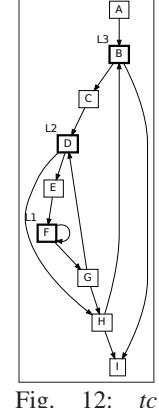

Fig. 12: tc loops.

category), or b) tends to disable reuse otherwise (tc-twitter

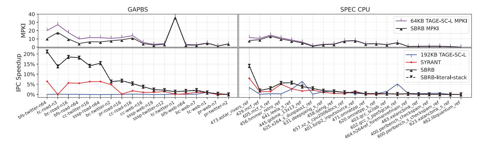

Fig. 10: MPKI and speedup for all benchmarks.

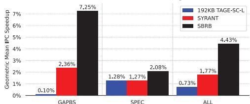

Fig. 11: Geometric mean speedups.

fits this category). Both tc-road and tc-twitter stand to improve with a more discerning context-aware confidence mechanism, which is left for future work.

## *B. Design Space Exploration*

We first explore the SBRB using maximum settings for signature management parameters: {64-entry stack, 64-bit *sig*, 64-bit *hpc*, unbounded LIT-H/LIT-E}. Then, we explore the signature management parameters using the selected SBRB.

*1) SBRB:* Figure 13 shows performance as SBRB size (no. of entries) is successively doubled, for both a 4-way setassociative SBRB and a fully-associative SBRB. The horizontal line shows performance with an unbounded SBRB. The curves converge at 256 entries with peak performance.


Fig. 13: Performance of different SBRB configurations.

*2) Signature Management Parameters:* Figure 14 shows the performance impact of individually reducing each signature management parameter while keeping the other parameters at their maximum settings (64-entry stack, 64-bit *sig*, 64-bit *hpc*, unbounded LIT-H/LIT-E). LIT-E size is 2x LIT-H size (the graph is only labeled with the latter). These results, results on individual benchmarks (not shown), and cost considerations, led to the default parameter selections of Table II. Performance of this configuration is shown with the red line in the graph ("final pick").

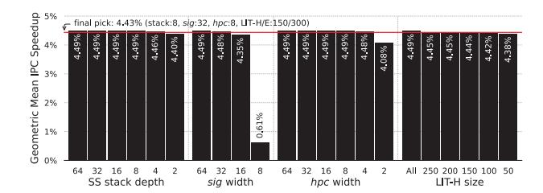

Fig. 14: Performance as each signature management parameter is reduced.

Most benchmarks are not impacted by the limited-size LIT-H/E, but some are. Figure 15 shows benchmarks for which the difference [% speedup with unbounded LIT-H/E] - [% speedup with 150/300 LIT-H/E] is at least 0.1% (other parameters at maximum settings like Figure 14).

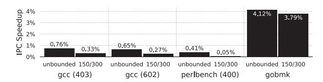

Fig. 15: Benchmarks sensitive to limited-size LIT-H/E.

## *C. Confidence Mechanism*

Figure 16 compares the performance of various confidence mechanisms. Considering all benchmarks ("ALL"), 3 bit and 4-bit saturating counters perform best and equally well. Saturating counters (increment/decrement, confident when above midpoint threshold) outperform resetting counters (increment/reset-to-0, confident when at maximum). Always reusing squashed outcomes (unconditionally confident) and a single global 4-bit saturating counter are competitive in GAPBS benchmarks. On the other hand, SPEC benchmarks are richer in complexity, both in terms of number of static branches and CIDD/CIDI relationships among them. They also have higher baseline branch prediction accuracy. Thus, in general, reliable performance – protection against slowdowns or degraded speedups – requires per-branch confidence.


Fig. 16: Performance of various confidence mechanisms.

## *D. Impact of calls in signature, signature in key*

To gauge the importance of accounting for multiple calls to the same function in the same loop and iteration, we measured the impact of excluding calls from the signature ("SBRB, no calls"). Without calls, speedup decreases from 4.43% to 4.34% for all benchmarks, from 2.08% to 1.91% for SPEC, and from 7.25% to 7.24% for GAPBS. Almost all the decrease in SPEC speedup (and thus overall speedup) can be attributed to the four benchmarks shown in Figure 17a.

To gauge the importance of a signature at all, Figure 17b compares the performance of including both branch PC and signature in the key ("SBRB") versus a PC-only key ("SBRB, PC-only key"). The results show that signatures are needed to identify dynamic branches both uniquely and invariantly.

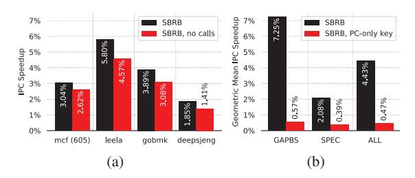

Fig. 17: Gauging importance of (a) calls in the signature, and (b) signatures in the key.

## *E. Sensitivity to Baseline Core Parameters*

Figure 18 shows how the speedup afforded by the SBRB varies with certain baseline core parameters. A core with 192KB TAGE-SC-L sees only slightly lower speedup (4.36%) than a core with 64KB TAGE-SC-L (4.43%). A core with 1.5x the default window size (1.5x ROB/PRF/LQ/SQ/IQ/chkpts) sees a larger speedup (4.91%) than a core with the default window size. This is also the case for a core with a deeper pipeline (5.57%). A core with immediate squash sees noticeably less speedup (2.22%) than a core with our delayed squash implementation, due to fewer squashed-path branches executing before the squash.7 Table IV shows the number of branches and completed branches in the shadow of a squash (averaged over all squashes), both when the misprediction is detected and when the squash is finalized. Immediate and deferred are similar except that the percentage of completed branches in the shadow increases from 25% at detection to 45% when the squash is finalized. Fetch-to-rename latency is 8 cycles (default pipeline). This is the extra time available between detection and finalized squash.

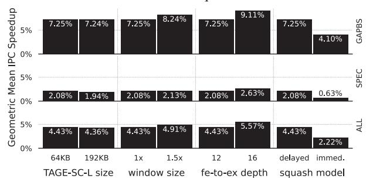

Fig. 18: Sensitivity to predictor size, window size, fetch-toexecute pipeline depth, and squash model.

TABLE IV: Total/completed branches in shadow of squash.

|                                      | immediate  | deferred   |
|--------------------------------------|------------|------------|
| total branches, misp. detected       | 17.68      | 18.22      |
| completed branches, misp. detected   | 4.25 (24%) | 4.49 (25%) |
| total branches, squash finalized     | same       | 18.22      |
| completed branches, squash finalized | same       | 8.19 (45%) |

## *F. Loop vs. Non-Loop Cycles*

To gauge the significance of non-loop cycles, we generate a LIS containing both loop and non-loop cycles, rank-ordered based on profiling as usual. For non-loop cycles, we selected one of the entry blocks as the header block. We then construct a 150/300 LIT-H/E from the LIS. Only the six benchmarks in Fig. 19 have at least one non-loop cycle in the top 150 cycles.


Fig. 19: Benchmarks with ≥ 1 non-loop cycle in top 150.

## VI. SUMMARY

Exploiting control independence (CI) to reduce branch misprediction penalties has received significant attention in the literature, ranging from complex CI-instruction-preserving approaches to squash reuse in the rename stage. There has been much less attention paid to *squashed-branch reuse in the fetch stage* despite its value proposition: changes localized to the fetch unit and outright elimination of some branch mispredictions. While not a new idea [4], [16], [29], there has been little exploration of the key challenge of aligning a dynamic branch's counterparts on the squashed path and resolved path. We proposed a novel concept and implementation, invariant signatures, to enable precise alignment despite arbitrary unrelated control-flow changes between the squashed and resolved paths.

<sup>7</sup>Note that the baseline (no SBRB) with our delayed squash implementation performs at least as well as the baseline (no SBRB) with immediate squash because the resolved path is not delayed (Section III-H). In fact, on average, it performs 1.55% better due to executing more CI loads (and initiating more cache misses) before the squash action.

## REFERENCES

- [1] https://en.wikipedia.org/wiki/Linear-feedback shift register.
- [2] "LLVM compiler infrastructure user guides." [Online]. Available: https://llvm.org/docs/LoopTerminology.html
- [3] "LLVM this is the llvm organization on github for the llvm project: a collection of modular and reusable compiler and toolchain technologies." [Online]. Available: https://github.com/llvm/llvm-project.git
- [4] H. Akkary, S. T. Srinivasan, and K. Lai, "Recycling waste: exploiting wrong-path execution to improve branch prediction," in *Proceedings of the 17th Annual International Conference on Supercomputing*, ser. ICS '03. New York, NY, USA: Association for Computing Machinery, 2003, p. 12–21. [Online]. Available: https://doi.org/10.1145/782814.782819
- [5] A. S. Al-Zawawi, V. K. Reddy, E. Rotenberg, and H. H. Akkary, "Transparent control independence (tci)," in *Proceedings of the 34th Annual International Symposium on Computer Architecture*, June 2007, pp. 448–459.
- [6] T. Anderson and M. Dahlin, *Operating Systems: Principles and Practice*, 2nd ed. Recursive books, 2014.
- [7] H. Ando, "Performance improvement by prioritizing the issue of the instructions in unconfident branch slices," in *2018 51st Annual IEEE/ACM International Symposium on Microarchitecture (MICRO)*, 2018, pp. 82– 94.
- [8] S. Beamer, K. Asanovic, and D. Patterson, "The GAP benchmark ´ suite," 2017. [Online]. Available: https://arxiv.org/abs/1508.03619
- [9] R. S. Chappell, J. Stark, S. P. Kim, S. K. Reinhardt, and Y. N. Patt, "Simultaneous subordinate microthreading (ssmt)," in *Proceedings of the 26th International Symposium on Computer Architecture*, May 1999, pp. 186–195.
- [10] R. S. Chappell, F. Tseng, A. Yoaz, and Y. N. Patt, "Difficult-path branch prediction using subordinate microthreads," in *Proceedings of the 29th International Symposium on Computer Architecture*, May 2002, pp. 307– 317.
- [11] A. Chauhan, J. Gaur, Z. Sperber, F. Sala, L. Rappoport, A. Yoaz, and S. Subramoney, "Auto-predication of critical branches," in *2020 ACM/IEEE 47th Annual International Symposium on Computer Architecture (ISCA)*, 2020, pp. 92–104.
- [12] C.-Y. Cher and T. Vijaykumar, "Skipper: a microarchitecture for exploiting control-flow independence," in *Proceedings of the 34th ACM/IEEE International Symposium on Microarchitecture*, December 2001, pp. 4– 15.
- [13] Y. Chou, J. Fung, and J. P. Shen, "Reducing branch misprediction penalties via dynamic control independence detection," in *Proceedings of the 13th International Conference on Supercomputing*, May 1999, pp. 109–118.
- [14] A. Deshmukh, L. Cai, and Y. N. Patt, "Timely, efficient, and accurate branch precomputation," in *2024 57th IEEE/ACM International Symposium on Microarchitecture (MICRO)*, 2024, pp. 480–492.
- [15] S. Eyerman, W. Heirman, S. Van Den Steen, and I. Hur, "Enabling branch-mispredict level parallelism by selectively flushing instructions," in *MICRO-54: 54th Annual IEEE/ACM International Symposium on Microarchitecture*, ser. MICRO '21. New York, NY, USA: Association for Computing Machinery, 2021, p. 767–778. [Online]. Available: https://doi.org/10.1145/3466752.3480045
- [16] W. P. Galliher, "Squashed branch reuse," Master's thesis, North Carolina State University, March 2015, available at http://www.lib.ncsu.edu/ resolver/1840.16/11102.
- [17] A. Gandhi, H. Akkary, and S. Srinivasan, "Reducing branch misprediction penalty via selective branch recovery," in *Proceedings of the 10th International Symposium on High Performance Computer Architecture*, February 2004, pp. 254–264.
- [18] A. Garg and M. C. Huang, "A performance-correctness explicitlydecoupled architecture," in *Proceedings of the 41st International Symposium on Microarchitecture*, November 2008, pp. 306–317.
- [19] A. D. Hilton and A. Roth, "Ginger: control independence using tag rewriting," in *Proceedings of the 34th Annual International Symposium on Computer Architecture*, June 2007, p. 436–447.
- [20] Q. Kang and T. E. Carlson, "Multi-stream squash reuse for controlindependent processors," in *Proceedings of the 58th IEEE/ACM International Symposium on Microarchitecture*, October 2025, pp. 504–518.
- [21] H. Kim, J. A. Joao, O. Mutlu, and Y. N. Patt, "Diverge-merge processor (dmp): Dynamic predicated execution of complex control-flow graphs based on frequently executed paths," in *2006 39th Annual IEEE/ACM*

- *International Symposium on Microarchitecture (MICRO'06)*, 2006, pp. 53–64.
- [22] A. Klauser, T. Austin, D. Grunwald, and B. Calder, "Dynamic hammock predication for non-predicated instruction set architectures," in *1998 International Conference on Parallel Architectures and Compilation Techniques*, 1998, pp. 278–285.
- [23] S. Kondguli and M. Huang, "R3-dla (reduce, reuse, recycle): A more efficient approach to decoupled look-ahead architectures," in *Proceedings of the 25th International Symposium on High-Performance Computer Architecture*, February 2019, pp. 533–544.
- [24] V. R. Kothinti Naresh, R. Sheikh, A. Perais, and H. W. Cain, "Spf: Selective pipeline flush," in *Proceedings of the 36th IEEE International Conference on Computer Design*, October 2018, pp. 152–155.
- [25] C. Lattner and V. Adve, "LLVM: a compilation framework for lifelong program analysis & transformation," in *Proceedings of the International Symposium on Code Generation and Optimization*, March 2004, pp. 75– 86.
- [26] J. Leskovec and A. Krevl, "SNAP Datasets: Stanford large network dataset collection," Jun. 2014. [Online]. Available: http://snap.stanford. edu/data
- [27] H. Litz, G. Ayers, and P. Ranganathan, "Crisp: critical slice prefetching," in *Proceedings of the 27th ACM International Conference on Architectural Support for Programming Languages and Operating Systems*, ser. ASPLOS '22. New York, NY, USA: Association for Computing Machinery, 2022, p. 300–313. [Online]. Available: https://doi.org/10.1145/3503222.3507745
- [28] R. Parihar and M. C. Huang, "Accelerating decoupled look-ahead via weak dependence removal: A metaheuristic approach," in *Proceedings of the 20th International Symposium on High-Performance Computer Architecture*, February 2014, pp. 662–677.
- [29] N. Premillieu and A. Seznec, "Syrant: Symmetric resource allocation on not-taken and taken paths," *ACM Transactions on Architecture and Code Optimization*, vol. 8, no. 4, pp. 1–20, January 2012.
- [30] S. Pruett and Y. Patt, "Branch runahead: An alternative to branch prediction for impossible to predict branches," in *MICRO-54: 54th Annual IEEE/ACM International Symposium on Microarchitecture*, ser. MICRO '21. New York, NY, USA: Association for Computing Machinery, 2021, p. 804–815. [Online]. Available: https://doi.org/10. 1145/3466752.3480053
- [31] Z. Purser, K. Sundaramoorthy, and E. Rotenberg, "A study of slipstream processors," in *Proceedings of the 33rd International Symposium on Microarchitecture*, December 2000, pp. 269–280.
- [32] ——, "Slipstream memory hierarchies," North Carolina State University, Tech. Rep., 2002.
- [33] V. K. Reddy, E. Rotenberg, and S. Parthasarathy, "Understanding prediction-based partial redundant threading for low-overhead, highcoverage fault tolerance," in *Proceedings of the 12th International Conference on Architectural Support for Programming Languages and Operating Systems*, ser. ASPLOS XII. New York, NY, USA: Association for Computing Machinery, 2006, p. 83–94. [Online]. Available: https://doi.org/10.1145/1168857.1168869
- [34] E. Rotenberg, Q. Jacobson, and J. Smith, "A study of control independence in superscalar processors," in *Proceedings of the 5th International Symposium on High-Performance Computer Architecture*, January 1999, pp. 115–124.
- [35] E. Rotenberg and J. Smith, "Control independence in trace processors," in *Proceedings of the 32nd Annual ACM/IEEE International Symposium on Microarchitecture*, November 1999, pp. 4–15.
- [36] E. Rotenberg, Q. Jacobson, and J. E. Smith, "A study of control independence in superscalar processors," University of Wisconsin – Madison, Tech. Rep. #1389, December 1998.
- [37] A. Roth and G. Sohi, "Register integration: a simple and efficient implementation of squash reuse," in *Proceedings of the 33rd Annual IEEE/ACM International Symposium on Microarchitecture*, December 2000, pp. 223–234.
- [38] A. Roth and G. S. Sohi, "Speculative data-driven multithreading," in *Proceedings of the 7th Annual IEEE International Symposium on High-Performance Computer Architecture*, ser. HPCA '01, 2001, pp. 37–48.
- [39] A. Seshadri and E. Rotenberg, "Delinquent loop pre-execution using predicated helper threads," in *2025 IEEE International Symposium on High Performance Computer Architecture (HPCA)*, 2025, pp. 44–58.
- [40] A. Seznec, "Tage-sc-l branch predictors again," in *5th JILP Workshop on Computer Architecture Competitions (JWAC-5): Championship Branch Prediction (CBP-5)*, June 2016.

- [41] T. Sherwood, E. Perelman, G. Hamerly, and B. Calder, "Automatically characterizing large scale program behavior," in *Proceedings of the 10th International Conference on Architectural Support for Programming Languages and Operating Systems*, October 2002, pp. 45–57.
- [42] A. Sodani and G. Sohi, "Dynamic instruction reuse," in *Proceedings of the 24th Annual International Symposium on Computer Architecture*, June 1997, pp. 194–205.
- [43] V. Srinivasan, R. B. R. Chowdhury, and E. Rotenberg, "Slipstream processors revisited: Exploiting branch sets," in *2020 ACM/IEEE 47th Annual International Symposium on Computer Architecture (ISCA)*, 2020, pp. 105–117.
- [44] W. Stahnke, "Primitive binary polynomials," *Mathematics of Computation*, vol. 27, no. 124, pp. 977–980, 1973.
- [45] K. Sundaramoorthy, Z. Purser, and E. Rotenberg, "Slipstream processors: Improving both performance and fault tolerance," in *Proceedings of the 9th International Conference on Architectural Support for Programming Languages and Operating Systems*, November 2000, pp. 257–268.
- [46] K. Yeager, "The mips r10000 superscalar microprocessor," *IEEE Micro*, vol. 16, no. 2, pp. 28–41, 1996.
- [47] C. Zilles and G. Sohi, "Execution-based prediction using speculative slices," in *Proceedings of the 28th Annual International Symposium on Computer Architecture*, ser. ISCA '01. New York, NY, USA: Association for Computing Machinery, 2001, p. 2–13. [Online]. Available: https://doi.org/10.1145/379240.379246
- [48] C. B. Zilles and G. S. Sohi, "Understanding the backward slices of performance degrading instructions," *SIGARCH Comput. Archit. News*, vol. 28, no. 2, p. 172–181, May 2000. [Online]. Available: https://doi.org/10.1145/342001.339676