# AutoFHE: An Automatic Hardware Generation Framework for Domain-Specific FHE Accelerators

Yibo Du<sup>1</sup>,<sup>2</sup> , Cangyuan Li<sup>1</sup> , Bing Li<sup>3</sup> , Mengdi Wang<sup>1</sup> , Lian Liu<sup>1</sup>,<sup>2</sup> , Shixin Zhao<sup>1</sup>,<sup>2</sup> , Yinhe Han<sup>1</sup>B, Ying Wang<sup>1</sup>B <sup>1</sup> Research Center for Intelligent Computing Systems, State Key Lab of Processors, Institute of Computing Technology, Chinese Academy of Sciences, China <sup>2</sup> University of Chinese Academy of Sciences, China 3 Institute of Microelectronics, Chinese Academy of Sciences, China duyibo21@mails.ucas.ac.cn, licangyuan@ict.ac.cn, libing2024@ime.ac.cn, liulian21s@ict.ac.cn, zhaoshixin18@mails.ucas.ac.cn, {wangmengdi, yinhes, wangying2009}@ict.ac.cn

*Abstract*—Fully Homomorphic Encryption (FHE) is a transformative technology that enables computation directly on encrypted data, unlocking secure applications such as privacy inference, encrypted databases, and privacy-preserving analytics. As the demand for high-performance FHE computation grows, domainspecific FHE accelerators have emerged to improve efficiency across different application domains. However, designing these accelerators remains prohibitively difficult. It requires implementing specialized ciphertext processing elements (CPEs) and navigating a vast design space tightly coupled to cryptographic operations, demanding rare dual-domain expertise in both hardware architecture and FHE algorithms.

In this paper, we propose AutoFHE, the first automatic hardware generation framework that transforms conventional domain-specific RTL accelerator designs into encrypted accelerators that operate on FHE ciphertexts. AutoFHE decouples FHE complexity from architecture design, empowering hardware designers without FHE expertise to implement FHE accelerators with significantly reduced design effort. To achieve this, (1) AutoFHE raises the abstraction level of encrypted signals, allowing designers to declaratively specify encrypted signals in a hardware construction language (Chisel) without manually modifying the underlying hardware. (2) AutoFHE operates on FIRRTL (Flexible Intermediate Representation for Register Transfer Level) to automatically identify encrypted PEs and synthesize them using optimized CPE templates. (3) To address the prohibitive resource cost, AutoFHE introduces a CPE-virtualization strategy that virtualizes a pool of physical CPEs for the identified encrypted PEs. AutoFHE develops a heuristic algorithm to search for the optimal schedule from logically identified encrypted PEs to physical CPEs, and embeds this algorithm into its design space exploration. Evaluations on multiple TFHE design cases show that AutoFHE-generated FHE accelerators outperform handcrafted designs while drastically reducing design effort.

## I. INTRODUCTION

Fully Homomorphic Encryption (FHE) has emerged as a transformative technology, which allows arbitrary computations to be performed directly on encrypted data and guarantees that decrypted results are identical to their plaintext counterparts [1]. Therefore, FHE is widely used in privacypreserving scenarios, where applications are transformed into encrypted applications that operate on encrypted data, such as privacy inference [2]–[4], private information retrieval [5], and encrypted databases [6], [7]. However, FHE-encrypted

B Corresponding author

applications come at a significant performance cost, commonly referred to as FHE's "performance tax". For instance, privacy inference on a 20-layer neural network [2] on an advanced GPU can be 10<sup>4</sup>× slower than its plaintext counterpart.

The increasing demand for high-performance FHE computation has promoted the development of domain-specific FHE accelerators [7]–[15] to improve computational efficiency for specific tasks. For instance, the encrypted neural processing unit (eNPU) Strix [8] for privacy inference, encrypted logical/relational accelerator MATCHA [9], and accelerators for privacy-preserving graph processing [7] implement ciphertext processing elements (CPEs) to perform encrypted computations, achieving great performance improvements. Commercial chips such as Intel's HERACLES [16] underscore the growing momentum of FHE accelerators. As FHE schemes evolve to support more computation (e.g., encrypted arithmetic, relational operators, and encrypted selection such as indexencrypted lookup [17]), the demand for high-performance domain-specific FHE accelerators continues to grow.

However, building such accelerators remains highly inaccessible to most hardware designers. Two key barriers block widespread FHE accelerator development: Barrier ➊: Designing CPEs requires deep FHE knowledge. CPEs are not simple encrypted counterparts of traditional PEs. They incorporate intricate units for FHE-specific operations such as bootstrapping, key-switching, and polynomial arithmetic, which are far removed from conventional accelerator design. As a result, building a performant FHE accelerator requires rare dual-domain expertise in both hardware architecture and FHE. Even hardware designers familiar with an accelerator may struggle to manually rewrite its logic into its encrypted equivalent, let alone apply advanced FHE-specific optimizations [9], [18], [19]. Barrier ➋: FHE accelerator design space is large and tightly coupled. FHE accelerator design introduces a combinatorially larger and more entangled design space than unencrypted accelerator design. Designers must jointly consider the microarchitecture of each CPE (e.g., internal parallelism) and the system-level organization of CPEs (e.g., CPE count and interconnect). These levels are tightly coupled: adding more CPEs may increase compute throughput but can quickly exceed bandwidth or area limits. Without deep FHE expertise, designers often over-provision compute or underutilize the hardware.

To overcome these barriers and democratize the development of domain-specific FHE accelerators, we present AutoFHE, a novel framework that automatically transforms conventional accelerators into efficient encrypted accelerators that operate on FHE ciphertexts. With AutoFHE, hardware designers can continue to use high-level hardware construction languages (HCLs), e.g., Chisel [20], and simply specify which signals should be encrypted. AutoFHE automatically identifies all ciphertext-handling components, rewrites them using CPE templates, and generates an FHE accelerator that meets given area and performance constraints, without requiring any cryptographic expertise from the designer. The key philosophy behind this idea is to decouple FHE-specific logic from architectural intent, empowering designers to focus on what they know: system-level architecture, while AutoFHE handles the complex, low-level cryptographic details.

To realize this vision, AutoFHE addresses two fundamental challenges:

Challenge 1: Respecting Encryption Intent While Preserving Design Transparency. A central challenge is enabling flexible encryption intent, i.e., the designer's ability to specify which signals carry encrypted data, while maintaining a transparent and familiar development flow. For instance, an encrypted neural processing unit may encrypt activations while keeping weights in plaintext, whereas an encrypted lookup engine may encrypt both of its inputs. These different encryption policies alter the required FHE architecture.

AutoFHE resolves this design flexibility by allowing designers to declaratively annotate encrypted inputs in Chisel. It then automatically propagates encryption intent through the FIRRTL intermediate representation [21], identifying all downstream PEs that process ciphertexts. This preserves the designer's original logic and ensures full coverage of encryption policies without sacrificing transparency.

Challenge 2: Meeting Resource Constraints Despite CPE Complexity. The primary challenge lies in bridging the gap between a designer-declared encrypted accelerator and a physically realizable hardware implementation under tight area constraints. CPEs consume significantly more resources due to expensive bootstrapping, key-switching, and polynomial operations. As a result, an intuitive approach that replaces each identified PE with a CPE would cause an infeasible explosion in silicon area, violating any practical design budget.

To address this, we propose a CPE-virtualization strategy: a pool of physical CPEs is implemented and temporally shared by identified PEs, so that the generated FHE accelerator is physically realizable under the given area constraints. However, this introduces a complex spatial-temporal scheduling problem: deciding which identified PEs are mapped onto which physical CPEs and when. To ensure high hardware utilization, we develop a heuristic algorithm to discover a nearoptimal scheduling solution. We embed this algorithm into AutoFHE's design space exploration engine to jointly optimize hardware parameters and the scheduling solution.

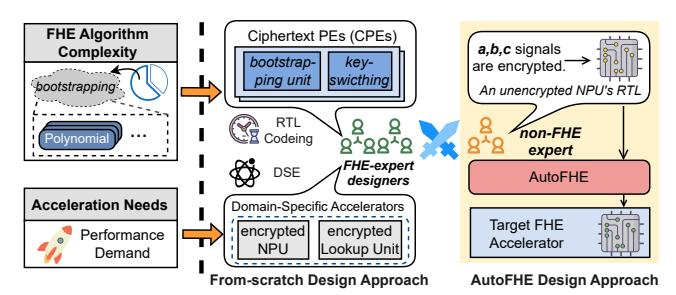

Fig. 1. The complexity of designing FHE processors, which relies on dualdomain expertise, and the proposed AutoFHE framework that automatically generates FHE processors.

AutoFHE decouples FHE-specific implementation details from architecture development and empowers designers to build efficient FHE accelerators without requiring cryptographic expertise. We adopt TFHE as a representative FHE scheme to evaluate this core philosophy of AutoFHE. The main contributions of this paper are as follows:

- Automatic Domain-Specific FHE Accelerator Generation Framework: We develop a Chisel-based hardware generation framework, AutoFHE, that enables the automatic creation of FHE accelerators operating on encrypted data, eliminating the need for rare dual expertise in hardware architecture and FHE cryptography. To the best of our knowledge, AutoFHE is the first framework that allows hardware designers to specify encrypted signals in an HCL and automatically obtain an FHE accelerator.
- Transparent FHE Accelerator Generation Based on AutoFHE's Templates: AutoFHE provides a mechanism for declaratively annotating encrypted signals in HCL and performs automatic FIRRTL-based encrypted component identification. Based on this automatic identification, AutoFHE automatically synthesizes a custom datapath that manipulates TFHE ciphertexts, and instantiates and connects ciphertext-processing templates from its CPE template library, making the complex hardware transformation transparent to the designer.
- CPE-Virtualization Strategy and FHE Design Space Exploration: To address the prohibitive resource cost of implementing CPEs, AutoFHE introduces a CPEvirtualization strategy that enables physical CPEs to be temporally shared by encrypted PEs and proposes a heuristic algorithm to search for an optimal schedule.
- Evaluation on Multiple Domains: AutoFHE incorporates a comprehensive DSE that jointly optimizes hardware parameters, the schedule, and considers an advanced optimization, TFHE bootstrapping unrolling. We evaluate AutoFHE on different cases of FHE accelerator designs, including encrypted NPUs, encrypted logical/relational accelerators, encrypted lookup engines, and processors with irregular structures. AutoFHE-generated designs achieve 1.4×–2.6× speedup compared with hand-crafted FHE accelerators.

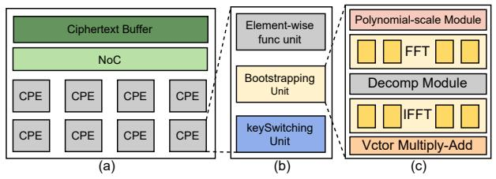

Fig. 2. (a) Architecture of an encrypted NPU, Strix [8]. (b) CPE structure. (c) Bootstrapping unit structure in CPE.

#### II. BACKGROUND AND MOTIVATION

#### A. Fully Homomorphic Encryption

Fully Homomorphic Encryption (FHE) has emerged as a transformative technology that enables computation directly on encrypted data [17], [22], [23]. After decryption, the results are identical to those obtained from the corresponding computation on unencrypted data. This capability provides robust data privacy, making FHE widely useful in privacy-preserving scenarios. With FHE, applications can be converted into encrypted applications, such as encrypted machine learning [2]–[4], private information retrieval [5], and secure database queries [6].

In this work, we focus on TFHE [17], a promising FHE scheme that offers several desirable properties: low memory footprint and fast *bootstrapping*. *Bootstrapping* is an important mechanism that homomorphically refreshes the noise accumulated in ciphertexts during computation. In addition, TFHE is versatile in supporting various operations, including arithmetic, logical, and relational operations. Moreover, TFHE's programmable bootstrapping can evaluate arbitrary, complex univariate functions homomorphically [2]. These features make TFHE well-suited for evaluating nonlinear activation functions in neural networks and implementing the selection logic required for index-based lookups. The practical utility of TFHE is underscored by its deployment for privacy inference (PI) by companies such as ZAMA [2]–[4], [24], [25].

## B. Performance Overhead of FHE

FHE incurs high computational cost. For example, privacy inference on a 20-layer neural network can be  $10^4 \times$  slower than unencrypted inference on a GPU [26]–[28]. The performance bottlenecks stem from:

- Polynomial computation: Ciphertexts are represented as high-dimensional polynomials, and computations involve complex polynomial arithmetic such as multiplication.
- Auxiliary FHE operations: To ensure correctness, FHE computation requires operations such as *bootstrapping* and *key switching*. Bootstrapping is especially costly because it incurs significant computation and memory overheads.

#### C. Domain-specific FHE Accelerators

To meet the increasing demand for high-performance FHE computation, a growing body of research has proposed domain-specific FHE accelerators. These designs incorporate specialized **ciphertext processing elements** (**CPEs**) to accelerate encrypted computations. Examples include:

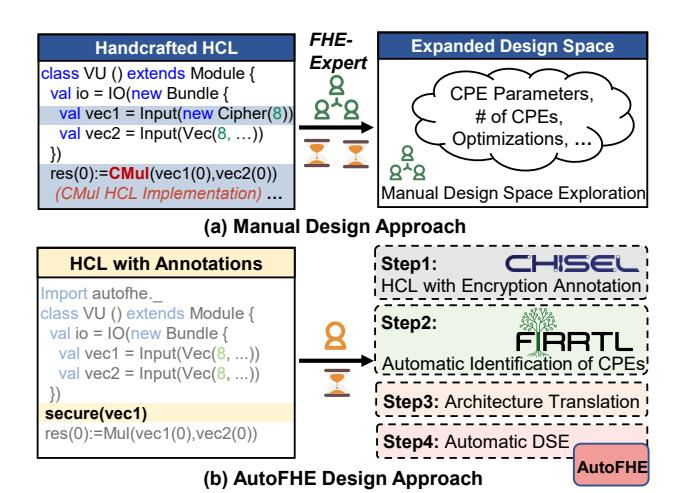

Fig. 3. (a) The conventional manual design approach, with heavy RTL coding of the intricate CPE and manual DSE. In the example code, 'CMul' represents the ciphertext multiplication unit that needs to be implemented. (b) AutoFHE with the four-step automatic design flow. Designers only need to declare 'vec1' as encrypted, without needing to implement CMul.

Strix [8], an encrypted neural processing unit (eNPU), accelerates privacy inference by integrating specialized ciphertext processing elements into a vector accelerator.

CiPHER [29], a large-scale chiplet-based systolic-array architecture, scales encrypted computation across multiple cores.

MATCHA [9] and XHEC [30] exploit TFHE's full support for encrypted arithmetic, logic, and relational operations (ALR) and design encrypted ALR accelerators.

PPGNN [7] and encrypted lookup engines [6] utilize TFHE's homomorphic multiplexers (HMUXs) to enable indexencrypted lookup, hiding both access patterns and outcomes.

Figure 2 illustrates an encrypted NPU, Strix. It incorporates eight CPEs to directly operate on encrypted data. The CPE includes not only an element-wise function unit, but also specialized units for bootstrapping and key switching. The bootstrapping unit integrates FFT/IFFT (Fast Fourier Transform) modules. FFT is used to reduce the complexity of degree-N polynomial multiplication from  $O(N^2)$  to  $O(N\log N)$ . These specialized architectures have significantly improved practical privacy-preserving computation. Initially, encrypted neural network inference on an NVIDIA A100 GPU takes 10–100s of ms [31]. With the eNPU, it improves to tens to hundreds of milliseconds [8]. In summary, these efforts underscore a broader trend: domain-specific FHE accelerators are becoming a key enabler for unlocking high-performance privacy-preserving computing.

#### D. Motivational Analysis

However, designing FHE accelerators remains a significant challenge, especially for designers without FHE-specific expertise, because it requires tight co-design between hardware microarchitecture and FHE cryptographic schemes. We identify two primary sources of difficulty:

**Difficulty 1: Intricate Ciphertext Processing Elements.**The Ciphertext Processing Element (CPE), which lies at the

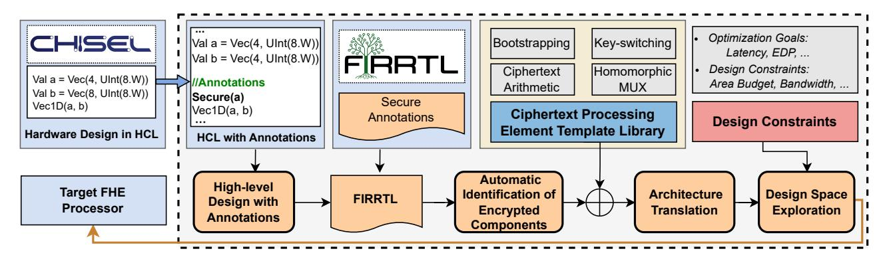

Fig. 4. AutoFHE: a framework for automatic domain-specific FHE accelerator generation.

heart of any FHE accelerator, has an intrinsically complex microarchitecture. As illustrated in Figure 2, the CPE itself is a complex subsystem comprising modules for FFT/IFFT and polynomial multiplication; thus, an encrypted NPU has a far more complex architecture than a conventional NPU. Moreover, CPE components are tightly entangled with FHE algorithms, making CPE implementation prohibitively difficult for hardware designers without FHE expertise.

Difficulty 2: Explosive Design Space. FHE accelerators have a vastly expanded design space. The design space spans interdependent dimensions: (1) the microarchitectural parameters of the CPEs, such as the number of butterfly units in FFT; and (2) system-level architectural parameters, such as the number of physical CPEs. The design space is much larger than that of an unencrypted accelerator, making exhaustive manual exploration intractable. For instance, in the encrypted NPU example in Figure 2, the bootstrapping unit contains polynomial, FFT, IFFT, decomposition, and vector MAC modules; each exposes independent parameters. Even when pruned to discrete power-of-two candidates, each dimension has roughly eight valid options, resulting in a combinatorial expansion of at least 8 <sup>5</sup>×. Therefore, the design space becomes more than 10<sup>4</sup>× larger, making exhaustive manual exploration intractable.

Figure 3 (a) shows an example that illustrates these two difficulties. As shown, designing an FHE accelerator requires heavy manual RTL coding of the intricate CPE (ciphertext multiplication, CMul, in this example). In addition, applying advanced optimizations is difficult for non-FHE-expert designers. For example, MATCHA [9] incorporated a bootstrapping unrolling strategy [18], [19]. While effective in improving performance, this optimization must be manually implemented and exhaustively explored to find an effective configuration (e.g., unrolling factor), which is beyond the reach of non-FHE experts. As a result, the manual design approach restricts FHE acceleration and innovation to a small pool of dual-domain experts.

## III. FRAMEWORK OF AUTOFHE

We propose AutoFHE, an automatic FHE accelerator design framework. The key philosophy is to decouple intricate FHE-specific design from overall accelerator development. As shown in Figure 3, with AutoFHE, hardware designers can continue working in their familiar hardware construction language and simply annotate signals that are encrypted, leaving AutoFHE to figure out all encrypted PEs that process the encrypted signals, determine how to efficiently implement CPEs, and search for the optimal architectural configuration.

## *A. Workflow of AutoFHE*

The AutoFHE framework is shown in Figure 4. It operates in four steps:

Step 1: High-Level Chisel Design with Encryption Annotations. The workflow begins with designers writing their accelerator design in Chisel as if it operates on plaintext. AutoFHE provides an annotation mechanism that enables designers to declaratively annotate encrypted signals (ciphertexts) in Chisel using the provided API: *Secure*. This mechanism is analogous to Chisel's *dontTouch* feature [32], but instead indicates that the variable should be treated as encrypted. The *Secure* annotations serve as hints that guide AutoFHE's automated identification and modification.

For instance, when designing an encrypted NPU, designers only need to apply the *Secure* annotation to the input signals that carry encrypted features. In contrast, in the traditional approach, designers have to manually locate all signals intended for encryption and modify all signals that carry encrypted features while keeping the weight signals unchanged. AutoFHE introduces a declarative style to achieve this, significantly simplifying this tedious process.

Step 2: Automatic Identification of Encrypted Components. Based on the explicitly declared encrypted input signals, AutoFHE automatically identifies all components that process the ciphertexts propagated from those input signals. This process is performed on FIRRTL (Flexible Intermediate Representation for RTL) [21] and is transparent to designers. This allows designers to annotate only top-level input signals, while AutoFHE identifies internal encryption dependencies, eliminating the need for manual labeling and avoiding errors from incomplete annotations. The output of this step is an annotated FIRRTL graph with both explicitly declared and implicitly identified encrypted components, which precisely represents the encryption intent.

Step 3: Architecture Translation Using Ciphertext Processing Templates. With the annotated FIRRTL graph, AutoFHE's next step is to translate it into a corresponding FHE accelerator. This translation leverages pre-designed CPE templates from AutoFHE's CPE template library. These CPE templates are carefully optimized. For instance, the bootstrapping unit contains an unrolling array to support the advanced bootstrapping unrolling optimization.

An intuitive approach would be to replace each identified component (encrypted PE) in the FIRRTL graph with a CPE instance. However, given that the resource cost of a CPE is orders of magnitude greater than that of a standard PE, this would cause an infeasible explosion in silicon area, violating any practical design budget. To address this, AutoFHE proposes a CPE-virtualization strategy where physical CPEs are shared over time by encrypted PEs. AutoFHE schedules a subset of logical PEs onto physical CPEs at a time (spatial mapping) and determines the execution timing of each PE (temporal mapping). This principle defines the generated FHE accelerator architecture, which includes a pool of physical **CPEs** and **a hardware scheduler**. The hardware scheduler is a synthesized controller that hardwires the scheduling strategy and deterministically orchestrates CPEs at runtime. Note that the scheduling strategy is determined offline by a search algorithm, and the discovered best scheduling strategy is prehardwired into the hardware scheduler.

Step 4: Automatic Design Space Exploration. AutoFHE incorporates a design space exploration engine to find the optimal configuration under the specified design constraints. It jointly searches for the optimal combination of (1) hardware architecture parameters and (2) the scheduling strategy. CPE virtualization introduces a complex spatial-temporal scheduling problem. The core challenge is to decide which PEs to select from the graph and when to map them onto the physical CPEs. The optimal solution to this problem is deeply intertwined with physical hardware parameters, such as the number of physical CPEs. To find the optimal design, AutoFHE's DSE engine is implemented as a nested optimization loop for global optimization.

#### B. Encrypted Signal Annotation in Chisel

AutoFHE introduces an annotation mechanism that enables designers to declare encrypted signals in Chisel using the Secure API. As shown in Figure 5 (a), the vec1 port is specified with Secure, indicating that vec1 carries ciphertexts. AutoFHE passes this annotation from Chisel down to the backend compiler by implementing a custom SecureAnnotation class, which inherits from the ChiselAnnotation class. This process involves three steps in the compiler stack: ① Chisel Elaboration Phase. In the frontend (Chisel), designers invoke Secure(). Then, during Chisel elaboration, the Chisel Builder records this annotation by creating a SecureAnnotation object, which stores metadata indicating which signal should be treated as encrypted. ② Serialization Phase. In the backend, the FIRRTL

```
import autofhe.
class VecUnit (w: Int, val const: Int = 1)
                                               Vec2(0)
extends Module {
                                                      Vec2(1) Vec2(2) Vec2(3)
 val io = IO(new Bundle {
  val vec1 = Input(Vec(4, UInt(w.W)))
  val vec2 = Input(Vec(4, UInt(w,W)))
  val out = Output(Vec(4,UInt(w.W)))
                                                    Signal Tracking
 //secure annotation
 Secure(io.vec1)
 val res = Wire(Vec(4, UInt(w.W)))
 for (i <- 0 until 4) {
 res(i) := io.vec1(i) * io.vec2(i)+const.U
 io.out := res
                                                (b) Example Circuit
      (a) Example Code
```

Fig. 5. High-level design of the FHE accelerator with encrypted signal annotation. (a) Example Chisel code. Vec1 is annotated with *Secure*. (b) Example circuit with explicit annotations and identified implicit components.

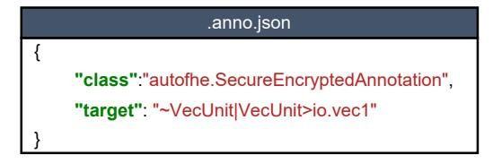

Fig. 6. Annotations for the Chisel code in Figure 5.

compiler produces two files after elaboration: a .fir file that describes the circuit in the FIRRTL intermediate representation (IR), and a .anno.json file that stores all annotation metadata. Each annotation entry includes a Target string (e.g., VecUnit|VecUnit>io.vec1 in Figure 6) that identifies the annotated signal in the FIRRTL circuit. **② FIRRTL** Transformation Phase. AutoFHE then processes the FIRRTL circuit using a custom transformation pass. The pass reads the annotation list from the JSON file, uses the Target string to locate the annotated signals in the FIRRTL IR, and modifies the circuit logic to support encrypted computation.

#### C. Automatic Identification of Encrypted Components

AutoFHE only requires annotations on the encrypted input signals of each module in Chisel; internal modules affected by encrypted input signals are automatically identified by AutoFHE. AutoFHE treats the designer-added annotations on inputs as analysis seeds and automatically identifies encrypted components on FIRRTL graph to find implicit encrypted components, as depicted in Figure 5 (b). AutoFHE transforms the HCL into a FIRRTL graph using the Chisel diagrammer [33], where each node represents a hardware component and each edge represents a connection. Then, AutoFHE performs a breadth-first search on FIRRTL graph starting from designerannotated nodes (collected in the .anno.json file in Step 1). During traversal, AutoFHE marks downstream logic units that directly or transitively depend on an encrypted signal. For instance, in an operation c = Mul(a, b), where a is encrypted and b is plaintext, the multiplier and output c are marked as encrypted. Taking advantage of the hierarchical nature of HCL design, AutoFHE performs this tracking on each

|          |                            | Template Type          | Template Parameters                                |  |  |
|----------|----------------------------|------------------------|----------------------------------------------------|--|--|
|          |                            |                        | Bootstrapping Template PoV, r, PoD, BFU, IBFU, PoE |  |  |
| CPE      | Ciphertext Arith. Template | PoC                    |                                                    |  |  |
| Template | Library                    | Key-switching Template | PoK                                                |  |  |
|          |                            | HMUX Template          | PoV, PoD, BFU, IBFU, PoE                           |  |  |

**(a) CPE Templates in CPE Library and Template Parameters.**

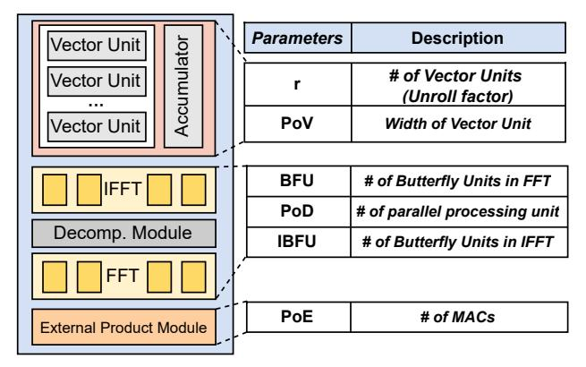

**(b) Microarchitectural parameters of bootstrapping template.**

Fig. 7. CPE templates provided by AutoFHE's template library.

module separately. AutoFHE supports identification at two levels of granularity. Operator-level identification: AutoFHE identifies all encrypted operators within the module. Modulelevel identification: For complex modules, AutoFHE identifies the entire module and regards it as a node in FIRRTL graph.

## *D. Ciphertext Processing Template*

AutoFHE provides a library of Ciphertext Processing Element (CPE) templates for constructing FHE accelerators. These templates include the ciphertext arithmetic template, bootstrapping template, key-switching template, and homomorphic multiplexer (HMUX) template, which together implement the core operators required for TFHE-based computation. Each template exposes tunable fine-grained hardware parameters, as shown in Figure 7 (a).

Supported Chisel operators and mapping rules. AutoFHE supports a finite set of operators derived from TFHE. Specifically, the supported Chisel-level operators include: *logical operations* (e.g., logical NOT, AND, OR), *arithmetic operations* (e.g., addition, subtraction, multiplication), *relational comparisons* (e.g., greater-than, less-than), and *twoinput multiplexers*. To map these Chisel-level operators to CPE templates, AutoFHE defines a set of operator-to-CPE mapping rules. Logical operations and relational comparisons are mapped onto the ciphertext arithmetic template. Arithmetic operations and ciphertext-cleartext operations are mapped to the ciphertext arithmetic template, while ciphertext-ciphertext multiplication is implemented using the external product within the arithmetic template. For multiplexing operations, AutoFHE maps them to the HMUX template. Following these rules, AutoFHE first performs CPE type selection to associate operators in FIRRTL with CPE templates, and then performs resource instantiation and scheduling to schedule the PEs onto physical CPE instances.

Ciphertext Arithmetic Template. This template handles ciphertext arithmetic operations, including ciphertext addition, multiplication, and logic. Given that such operations in FHE are element-wise computations, the ciphertext arithmetic template is implemented using parallel multipliers and adders. P oC represents the number of parallel multipliers and adders.

Bootstrapping Template. Bootstrapping is the most timeconsuming operation in TFHE. The bootstrapping template takes a ciphertext as input, together with bootstrapping keys, to perform bootstrapping. As shown in Figure 7 (b), this template incorporates polynomial scaling, external product, FFT/IFFT, and decomposition modules. These modules have their own parameters: P oV represents the width of the vector unit in the polynomial scaling module; P oE represents the number of MACs in the external product module; BF U and IBF U represent the number of butterfly units in the FFT and IFFT modules, respectively; P oD represents the number of parallel processing lanes in the decomposition module.

The bootstrapping template integrates the bootstrapping unrolling optimization [9], [18], [19], [34]. The main body of bootstrapping consists of n iterations of ciphertext processing, which are inherently sequential (n is a TFHE encryption parameter). On the one hand, bootstrapping unrolling with an unrolling factor r reduces the iteration depth from n to n/r, thereby reducing the total computational overhead by decreasing the number of expensive FFT operations from n to n/r. To support this optimization, the bootstrapping template incorporates an unrolling array of size (2<sup>r</sup> − 1). On the other hand, bootstrapping unrolling increases concurrent data accesses and therefore places higher pressure on memory bandwidth. AutoFHE automatically determines an appropriate unrolling factor to navigate this trade-off under given area and bandwidth constraints during design space exploration.

Bootstrapping CPE placement. AutoFHE automatically places bootstrapping and key-switching templates based on the TFHE protocol [7]–[9], [17], [30], [35], [36]. Specifically, bootstrapping templates are placed downstream of ciphertext arithmetic templates to refresh noise accumulation during computation. It is important to clarify that within the AutoFHE framework, bootstrapping unit placement refers exclusively to the instantiation of bootstrapping hardware units in the circuit, rather than determining algorithm-level bootstrapping policies. The algorithmic decision of when a bootstrapping operation is required is determined by the FHE algorithm designer.

Key-switching Template. Key switching is used to convert a ciphertext from one key domain to another after bootstrapping. It involves a vector-matrix multiplication between the ciphertext and key-switching keys. Therefore, the keyswitching template integrates a vector unit and an accumulator. P oK represents the parallelism of the vector unit.

Homomorphic MUX Template. Homomorphic MUX (HMUX) is a unique operation in TFHE that enables the selection of one ciphertext over another based on an encrypted selection bit (HMUX(a, b, s) = a · s + b · (1 − s)). These features make TFHE suitable for supporting encrypted lookups: HMUX accepts a selection signal and two candidate ciphertexts as inputs, and selects the data according to the encrypted index. The HMUX algorithm follows a process similar to one iteration of bootstrapping. Therefore, an HMUX template can be instantiated using a bootstrapping template.

Using CPE templates, AutoFHE constructs an FHE accelerator based on the annotated FIRRTL graph. For complex functions such as activation functions, AutoFHE models the entire module as one node in the FIRRTL graph and directly replaces it with a corresponding CPE template. For instance, the activation unit in an NPU can be replaced by an HMUX CPE that encodes this activation function [2], [7].

## *E. FHE Accelerator Generation*

Since a CPE has orders-of-magnitude higher resource cost than a conventional PE, directly replacing the nodes (PEs) in the annotated FIRRTL graph with CPEs would result in prohibitively large area consumption.

- *1) CPE-Virtualization Strategy:* To translate the FIRRTL graph into a physical implementation, we propose a CPEvirtualization strategy. As illustrated in Figure 8, AutoFHE implements a pool of K physical CPEs and schedules the identified PEs in the FIRRTL graph onto physical CPEs. The FIRRTL graph is first abstracted into a Directed Acyclic Graph (DAG), where each node represents an identified PE. Then, PEs are selected and temporally mapped to physical CPEs: once a PE completes its computation, the CPE it occupies is released and can be allocated to another data-ready PE. This principle directly defines the high-level architecture of the generated FHE accelerator, shown in Figure 8. The architecture consists of two main components:
  - A CPE pool, containing multiple physical CPEs for different CPE types.
  - A hardware scheduler, which serves as the controller of the accelerator.

This scheduler hardwires a pre-optimized scheduling strategy and performs this pre-optimized schedule online. Note that searching for the optimal scheduling strategy is not performed at runtime. Instead, the strategy is searched offline by the proposed algorithm and hardwired into the scheduler during hardware generation. Next, we introduce this algorithm.

*2) Scheduling Strategy Search:* In CPE virtualization, the key challenge is to decide which identified PEs to select from the FIRRTL graph and when to map them onto the physical CPEs. According to the PE type, AutoFHE selects CPE templates and assigns each PE to a CPE. A single PE may be mapped to a combination of multiple CPEs, such as an arithmetic CPE followed by a bootstrapping CPE and a key-switching CPE. When CPEs appear as tightly coupled sequences (e.g., arithmetic CPE + bootstrapping CPE + keyswitching CPE), AutoFHE treats such a combination as a unified CPE lane. K denotes the number of instances of this unified CPE-lane type. When multiple distinct PE types exist, K becomes a vector, where each element corresponds to the

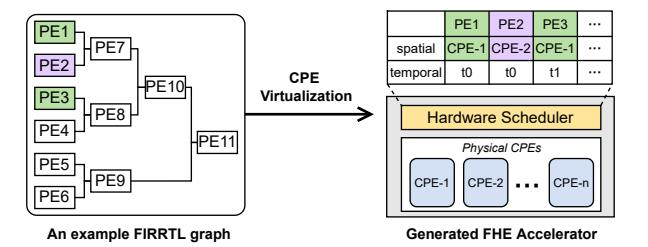

Fig. 8. CPE-virtualization strategy, which enables temporal sharing of CPEs.

number of one CPE type. AutoFHE determines the value of each element in this vector. For clarity, in the following, we present a simplified example where K represents the combined allocation of arithmetic, bootstrapping, and keyswitching CPEs.

To find an optimal schedule, we first formalize the problem as a resource-constrained scheduling problem.

#### • Given:

- 1) A Directed Acyclic Graph (DAG) G = (V, E), where each vertex v ∈ V is a PE.
- 2) K, representing the number of physical CPEs for each CPE template type.
- Find: A schedule S, which is a partition of the vertex set V into an ordered sequence of time steps (S0, S1, . . . , S<sup>T</sup>max ).
- Objective: The primary objective is to minimize the total execution latency: the product of the number of time steps Tmax and the execution latency of a single time step. For a fixed hardware configuration (the inner loop of the DSE, where Tstep is determined), this objective simplifies to minimizing the number of time steps. This is equivalent to maximizing utilization, defined as:

$$\text{Utilization} = \frac{|V|}{K \cdot (T_{max} + 1)}$$

## • Subject to:

- 1) Dependency Constraint: For any edge (u, v) ∈ E, which signifies that the output of PE u is an input to PE v, if u ∈ S<sup>i</sup> and v ∈ S<sup>j</sup> , then the schedule must ensure: j > i.
- 2) Resource Constraint: For any time step t ∈ [0, Tmax], the number of concurrently scheduled PEs cannot exceed the number of available CPEs: |St| ≤ K.

The resource-constrained scheduling problem formulated above is NP-hard. As depicted in Figure 9 (a), a simple breadth-first, round-robin scheduling strategy might seem reasonable. However, it fails to exploit potential parallelism between PEs in different layers of the DAG and can create dependency bottlenecks in subsequent cycles. The example in Figure 9 (a) shows that round-robin scheduling starves the CPE pool of ready PEs and leaves expensive hardware idle.

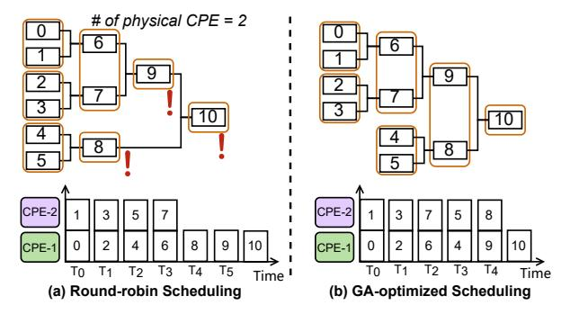

Fig. 9. An example of scheduling PEs onto CPEs, where the number of CPEs is 2

AutoFHE develops a Genetic Algorithm (GA) for the resource-constrained scheduling problem. Algorithm 1 shows the GA-based search algorithm. It takes the DAG of the FIRRTL graph and the number of physical CPEs K as inputs. It encodes a candidate schedule as a chromosome consisting of |V| genes, where |V| denotes the number of nodes in the graph. Each gene is an integer that represents the scheduling priority of a node in the DAG. Valid chromosomes must satisfy the data dependencies among nodes in the graph.

**Initial Population** is created from a critical-path-first schedule [37] to speed up the search for the optimal solution. The remaining chromosomes in the initial population are generated from random permutations of this baseline solution.

GA Evolution: To generate new candidates, the GA adopts order Crossover, where a subsequence from one parent's genes is copied to the child, and the remaining genes are filled from the second parent. Then, the GA performs Mutation by randomly selecting two genes in a chromosome and swapping their positions. After crossover and mutation, candidates are validated to ensure that node dependencies remain satisfied. The GA uses Tournament Selection in its evolutionary process [38]. The evolution continues until convergence and produces the optimal scheduling strategy that maximizes utilization under the given CPE configuration.

Since the optimal schedule is influenced by the number of available CPEs, this search is integrated into Design Space Exploration (DSE). The scheduling strategy is searched together with the hardware parameters and then hardwired into the hardware scheduler. This GA-optimized scheduling plays a key role in maximizing the utilization of physical CPEs. As shown in Figure 9 (b), the GA-optimized schedule achieves higher utilization.

## F. Design Space Exploration

The DSE jointly optimizes hardware parameters and the scheduling strategy. We define the design space  $\mathcal{P}$  as:  $\mathcal{P} = \{\mathbb{CPE}_{micro}, K, Sched\}$ , where  $\mathbb{CPE}_{micro}$  represents the microarchitectural parameters of CPE templates, K represents the number of physical CPEs of each template type, and Sched denotes the scheduling strategy.  $\mathbb{CPE}_{micro}$  is the set of CPE microarchitectural parameters in Figure 7.

AutoFHE employs a hierarchical DSE with a two-level nested optimization loop:

**Outer Loop:** Hardware parameter exploration. The outer loop explores the hardware architectural parameter space,  $\mathbb{CPE}_{micro}$  and K. It proposes candidate hardware configurations. For each hardware configuration, it invokes the inner loop to determine its best achievable performance.

**Inner Loop:** Scheduling exploration. For each hardware configuration defined by the outer loop, the inner loop explores scheduling strategies to find the best possible spatial-temporal schedule that delivers the optimal performance. It employs the GA algorithm [38] to efficiently traverse the large scheduling space and output the optimal scheduling strategy.

The DSE updates its global best solution and continues exploration until convergence. The final output is the globally optimal pairing of hardware parameters and scheduling strategy that maximizes performance within the given area budget.

To enable fast evaluation, AutoFHE incorporates analytical performance, energy, and area models. The analytical performance model estimates total execution latency by considering the two primary bottlenecks in FHE computation: compute latency and memory access latency. The final latency is determined by the maximum of the two. In the area model, primitive hardware components (e.g., MAC units and butterfly units) are pre-characterized using Design Compiler. AutoFHE then linearly composes these costs according to the chosen hardware parameters, yielding the area consumption. In the energy model, AutoFHE estimates total energy consumption by aggregating the costs of four sources: off-chip memory access, on-chip memory access, computation units, and onchip data communication [39]. By adjusting the evaluation model to  $Latency \times Energy$ , AutoFHE can also evaluate and optimize the Energy-Delay Product (EDP).

#### IV. EVALUATION

#### A. Experimental Setup

We implement AutoFHE based on Chisel [33] and the FIRRTL compiler [40]. AutoFHE's annotation mechanism is built on Chisel's native annotation infrastructure by extending firrtl.annotations.Annotation. AutoFHE's custom transformation is injected into the FIRRTL compiler via —custom—transforms. AutoFHE's key components, including encrypted component identification, design space exploration, scheduling strategy search, and the hardware simulator, are written in Python. To evaluate the effectiveness of AutoFHE in generating efficient FHE accelerators, we set up a series of scenarios and compare the AutoFHE-generated FHE accelerators against expert-designed FHE accelerators.

**Hardware Implementation.** To evaluate area, we use Design Compiler for synthesis with a 28nm TSMC technology node. The clock frequency is set to 1 GHz. For a fair comparison with expert-designed processors, we apply equivalent area scaling between different technology nodes [41] (for instance, MATCHA is 36.9 mm<sup>2</sup> in PTM 16nm, equivalent to 156 mm<sup>2</sup> when scaled to TSMC 28nm).

## Algorithm 1 Scheduling Strategy Search Algorithm

```
1: procedure SCHEDULINGSTRATEGYSEARCH(G, K)
2: P opulation ← InitializePopulation(G)
3: for gen ← 1 to M axGenerations do
4: NewP opulation ← ∅
5: for i ← 1 to |P opulation|/2 do
6: P arent1 ← Selection(P opulation)
7: P arent2 ← Selection(P opulation)
8: Child1, Child2 ←
  Crossover(P arent1, P arent2)
9: Mutate(Child1); Mutate(Child2)
10: Validate(Child1); Validate(Child2)
11: AddTo(NewP opulation, Child1, Child2)
12: P opulation ← NewP opulation
13: BestSchedule ← FindBest(P opulation, G, K)
14: return BestSchedule
```

## Algorithm 2 DSE Algorithm

```
1: procedure DSE(G, AreaConstraint, CP ET emplates)
2: BestMetric ← ∞ ▷ Latency or EDP
3: BestConf ig, BestSchedule ← null
4: for each Conf ig = (K, CPEmicro) in
  GenerateHardwareCandidates(CP ET emplates) do
5: Area ← AreaModel
6: if Area > AreaConstraint then
7: continue
8: Schedule ← SchedulingStrategySearch(G, K)
9: Metric ← EvaluateModel(Schedule, Conf ig, G)
10: UpdateBestSolution(Metric, Conf ig, Schedule)
11: return BestConf ig, BestSchedule
```

TABLE I TFHE ENCRYPTION PARAMETERS.

|                 | n   | N    | L | k | Security Level |
|-----------------|-----|------|---|---|----------------|
| Parameter Set 1 | 500 | 1024 | 2 | 1 | 80-bit         |
| Parameter Set 2 | 630 | 1024 | 3 | 1 | 110-bit        |
| Parameter Set 3 | 592 | 2048 | 3 | 1 | 128-bit        |

Performance Modeling. To assess the performance of the generated FHE accelerator, we develop a cycle-accurate simulator based on the method in [10], which models microarchitectural behavior and captures computation and data movement cycles. To validate the simulator's accuracy, we also model the baseline accelerator (MATCHA) and verify that the simulation results closely match the reported data.

Baselines. We compare AutoFHE-generated designs against three types of expert-designed FHE accelerators. For each case, AutoFHE is configured with the same target architecture and design constraints (area, bandwidth, and technology) as the corresponding baseline, ensuring a fair comparison.

- Strix [8]: An encrypted NPU with 1D ciphertext processing elements for privacy inference. It takes encrypted features and unencrypted weights as inputs.
- MATCHA [9]: An accelerator for encrypted logical/relational operations, which takes two ciphertexts as

- inputs and generates an encrypted result.
- PPGNN [7]: An encrypted lookup engine for encrypted index-based lookup in graphs. It takes the encrypted index and encrypted features as inputs to perform lookup while keeping both the index and features encrypted.

We also include CPU and GPU baselines: an Intel Xeon(R) 6148 CPU @ 2.50GHz running the TFHE [17] library, and an NVIDIA A100 GPU running the cuFHE [42] and nuFHE [43] libraries. The encryption parameters are listed in Table I and are recommended by prior works [2], [17].

## *B. Experimental Methodology*

We conduct comprehensive evaluations of AutoFHE to demonstrate its effectiveness in generating efficient FHE accelerators. Our evaluation is guided by four central questions:

- Efficiency: Can AutoFHE-generated FHE accelerators outperform their manually designed counterparts under the same design constraints? (Sec. IV-C and Sec. IV-D)
- Scalability: Can AutoFHE effectively handle large-scale input processors? (Sec. IV-E)
- Flexibility: Can AutoFHE adapt to complex designs with irregular structures, especially selection decisions that depend on encrypted data? (Sec. IV-F)
- Agility: What is the time overhead of using AutoFHE? Can it reduce manual design effort? (Sec. IV-K)

## *C. Efficiency Analysis*

This section assesses the efficiency of AutoFHE-generated designs by comparing them against expert-designed FHE accelerators in three application domains.

*1) Case Study 1: Encrypted Neural Processing Unit (eNPU):* In this case, we evaluate AutoFHE by generating an encrypted NPU and comparing it against Strix. Strix is an encrypted NPU implemented with one-dimensional CPEs. To generate such an encrypted NPU, a designer starts with an existing Chisel implementation of a one-dimensional accelerator from [44] and adds *Secure* annotations to the io.vec1 and io.vec2 ports in HCL. AutoFHE takes the annotated HCL and generates an encrypted NPU under the same constraints as Strix: an area budget of 142 mm<sup>2</sup> and a memory bandwidth of 300 GB/s [45], ensuring a fair comparison.

We evaluate the performance of the AutoFHE-generated accelerator (hereafter "AutoFHE") on DeepCNN inference tasks, which are TFHE-based privacy-preserving neural networks from ZAMA [2]. We use three DeepCNN configurations with 20, 50, and 100 layers. As shown in Figure 10, AutoFHE achieves significant end-to-end latency reductions, outperforming the CPU and GPU by 86.8× and 33.2×, respectively. Compared with the expert-crafted Strix, AutoFHE achieves a 2.6× speedup. The performance benefits primarily stem from the integrated bootstrapping unrolling optimizations and auto-tuning during design space exploration. Strix does not support bootstrapping unrolling, while AutoFHE's DSE engine automatically finds the optimal unrolling factor and determines the unrolling array size, achieving better performance.

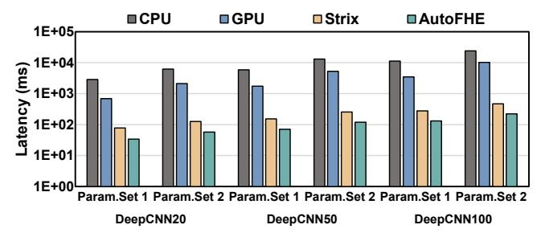

Fig. 10. Performance comparisons with Strix and baselines on DeepCNNs.

2) Case Study 2: Encrypted Logical/Relational Accelerator: Next, we assess AutoFHE's ability to generate an encrypted logical and relational accelerator (LRA). We use MATCHA, an expert-designed encrypted logical and relational accelerator, as the baseline. Using AutoFHE, a designer simply provides the HCL for standard logic gates and uses Secure to specify that two inputs are encrypted. AutoFHE then automatically generates an optimized encrypted accelerator under MATCHA's constraints: an area budget of 37 mm² (14nm TSMC process) and a bandwidth limit of 640 GB/s.

We evaluate the generated accelerator and the MATCHA baseline on the benchmark used in MATCHA: encrypted Boolean XOR. As detailed in Figure 11, the AutoFHE-generated design achieves 719.2× and 7.8× latency reductions, and 362.7× and 32.5× throughput improvements, compared with the CPU and GPU, respectively. Compared with MATCHA, it achieves a 1.4× latency reduction and a 1.7× throughput improvement. MATCHA relies on manually choosing an appropriate unrolling factor. AutoFHE co-optimizes design parameters automatically to minimize resource slack and identify the optimal configuration under given design constraints.

3) Case Study 3: Encrypted Lookup Engine: In this case, we target an encrypted lookup engine for index-encrypted lookups. We set PPGNN, an expert-designed accelerator, as the baseline, which implements an encrypted lookup engine utilizing TFHE's HMUXs. To generate this design, a designer using AutoFHE wraps the lookup logic in a module and adds Secure to the input index and feature signals. AutoFHE then performs module-level identification, replacing the entire module with appropriate HMUX templates from its library. AutoFHE produces the encrypted lookup engine under PPGNN's constraints: an area budget of 57 mm<sup>2</sup> (14nm TSMC process) and a memory bandwidth of 512 GB/s.

We evaluate the generated lookup engine on graph aggregation tasks using the same benchmarks as PPGNN (Cora, Citeseer, and Pubmed) under Parameter Set 3. The core operation is a lookup on encrypted vertex features using an encrypted index. To ensure a fair comparison, we integrate an identical feature processing unit for aggregating the looked-up features into the AutoFHE-generated design, matching the architecture of PPGNN. As shown in Figure 12, AutoFHE achieves a 1.6× performance improvement over PPGNN on average.

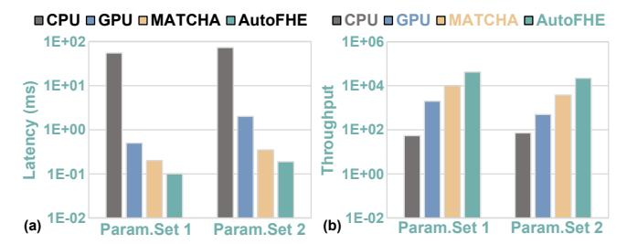

Fig. 11. (a) Latency and (b) throughput comparisons with MATCHA and baselines

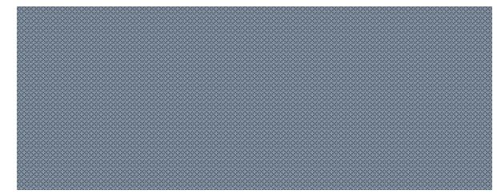

Fig. 12. Performance comparison with PPGNN.

TABLE II

COMPARISONS BETWEEN HAND-CRAFTED (STRIX) AND
AUTOFHE-GENERATED (AUTOFHE) DESIGNS UNDER THE SAME AREA

CONSTRAINT.

| Strix         | AutoFHE                                                |
|---------------|--------------------------------------------------------|
| 8             | 16                                                     |
| w/o unrolling | unrolling factor = 2                                   |
| 1.2GHz        | 1GHz                                                   |
| 28nm          | 28nm                                                   |
| 141.37        | 139.1                                                  |
| 77.14         | 75.7                                                   |
|               | 8<br>  w/o unrolling<br>  1.2GHz<br>  28nm<br>  141.37 |

## D. Performance Analysis

In this section, we conduct a detailed performance analysis using the encrypted NPU case. Table II compares the key parameters against Strix, the expert-crafted design, under the same area and memory bandwidth constraints. With the same area budget and memory bandwidth constraints, the AutoFHEgenerated design achieves higher performance on DeepCNN tasks. This advantage stems from AutoFHE's ability to automatically explore advanced optimizations within its design space. AutoFHE's CPE templates incorporate an unrolling array, which supports bootstrapping unrolling, an important optimization strategy that is not supported by Strix. Then, AutoFHE's automatic design space exploration engine discovers the optimal unrolling factor and architectural parameters for the best performance under the given constraints. To quantify the benefit of this optimization, we analyze the impact of unrolling in Sec. IV-H. When bootstrapping unrolling is disabled in the DSE, the generated design exhibits a significant performance degradation of 39.5%. This result demonstrates AutoFHE's ability to generate high-performance designs by flexibly exploring advanced optimization strategies in its DSE.

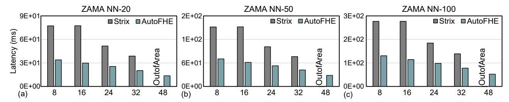

Fig. 13. Scalability analysis of AutoFHE in handling designs at varying scales. The Strix design scales linearly with its PE count. At 48 PEs, Strix's area exceeds the 400mm<sup>2</sup> area budget and is therefore marked as 'Out of Area'.

#### E. Scalability Analysis

To evaluate the scalability of AutoFHE, we test its ability to handle encrypted NPUs of varying scales. Specifically, we scale Strix by increasing the number of CPEs: 8, 16, 24, 32, and 48. As the CPE count increases, we proportionally enlarge Strix's area budget, up to a maximum of  $400 \text{mm}^2$ . Then, we use AutoFHE to automatically generate encrypted NPUs under each setting. For fair comparisons, we enforce identical area constraints for both AutoFHE and Strix under each setting. We evaluate the generated processors on DeepCNNs. As shown in Figure 13, with increasing accelerator scale, Strix quickly exceeds the area constraints due to its one-to-one PE-to-CPE scheduling strategy. In contrast, AutoFHE with the CPE-virtualization strategy enables temporal sharing of physical CPEs, enabling the generation of valid FHE accelerators that still meet stringent area budgets.

Moreover, Figure 13 shows that under the same area constraints, the FHE accelerators generated by AutoFHE achieve higher performance. This is because the Strix approach, which relies on a fixed 1:1 scheduling of logical PEs to physical CPEs, lacks flexibility. This fixed number of CPEs may not represent the optimal design point under the given constraints. In contrast, AutoFHE automatically searches for the optimal number of physical CPEs under given constraints and achieves better performance. In summary, AutoFHE eliminates the need for designers to perform complex architecture parameter tuning that requires deep FHE knowledge.

#### F. Flexibility Analysis

To evaluate the flexibility of AutoFHE, we conduct experiments on diverse hardware designs that feature irregular circuit structures. We apply AutoFHE to generate an encrypted Arithmetic Logic Unit (ALU). The encrypted ALU involves conditional execution, such as MuxLookup statements and comparison operations, which must be fully expanded into homomorphic operations and implemented using homomorphic MUX trees for selection. This leads to highly irregular FIRRTL graphs. We set up two architectures with varying complexity: a 3-stage pipelined CPU [46] and a more complex 5-stage pipelined CPU [47]. Both designs include conditional execution paths. For each case, we add annotations to the input signals and the selection signal, as shown in Table III. AutoFHE then generates an encrypted ALU for each design under an area constraint of 200 mm<sup>2</sup> and a memory bandwidth

TABLE III
AUTOFHE-GENERATED ENCRYPTED ARITHMETIC LOGIC UNITS UNDER
DIVERSE DESIGN SCENARIOS.

| Cases                               | Annotations              | TFHE parameter |     |   |   | Area               | Perf. | Perf.  |
|-------------------------------------|--------------------------|----------------|-----|---|---|--------------------|-------|--------|
| Cases                               | in HCL                   | N              | n   | L | K | (mm <sup>2</sup> ) | (ms)  | -R(ms) |
| ALU of a RISC-V<br>3-stage pipeline | AluIO.A,<br>AluIO.B, Sel | 1024           | 500 | 2 | 1 | 184.6              | 1.01  | 1.48   |
|                                     |                          |                | 630 | 3 | 1 | 183.1              | 1.91  | 2.79   |
|                                     |                          | 2048           |     | 3 | 1 | 183.2              | 3.82  | 5.59   |
| ALU of a RISC-V<br>5-stage pipeline | io_op1,<br>io_op2, Sel   | 1024<br>2048   | 500 | 2 | 1 | 165.6              | 4.21  | 4.84   |
|                                     |                          |                | 630 | 3 | 1 | 160.0              | 7.94  | 9.11   |
|                                     |                          |                | 050 | 3 | 1 | 162.4              | 15.9  | 18.3   |

limit of 640 GB/s. The results are presented in Table III, which details the resulting area consumption and performance on encrypted subtraction. The flexibility of AutoFHE in handling irregular control stems from the expressive power of its underlying TFHE scheme. TFHE supports evaluating nonlinear operations such as homomorphic comparisons and multiplexers. These cases on different architectures, together with the initial three case studies in our primary experiments, demonstrate AutoFHE's flexibility in supporting various design scenarios and circuit structures.

## G. Analysis of the GA-Optimized Scheduling Strategy

To isolate and quantify the impact of our proposed GA-optimized scheduling, we compare it against a baseline round-robin scheduling strategy. We perform this analysis on the two cases presented in Table III. For each case, we evaluate our default GA-optimized scheduling and round-robin scheduling. We report the performance of round-robin scheduling in the last column of Table III (Perf.-R). The results show that our GA-optimized scheduling yields a 12.9%–31.6% performance improvement compared with round-robin scheduling.

#### H. Automatic Optimization of Bootstrapping Unrolling

To study the impact of bootstrapping unrolling, we sweep the unrolling factor  $r \in \{1, 2, 3, 4\}$ . For each configuration, AutoFHE performs design space exploration to identify the best achievable design. We conduct this study under two baseline scenarios derived from Strix and MATCHA. In each case, we strictly align the area budget and off-chip memory bandwidth with the corresponding baseline to ensure a fair comparison. The off-chip bandwidth follows the original system settings: 300 GB/s for Strix and 640 GB/s for MATCHA. The AutoFHE-generated designs with different unrolling factors are denoted as AutoFHE( $r = \{1, 2, 3, 4\}$ ).

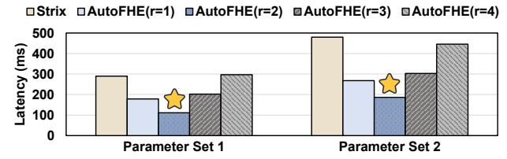

Fig. 14. Impact of bootstrapping unrolling factor r (Strix baseline).

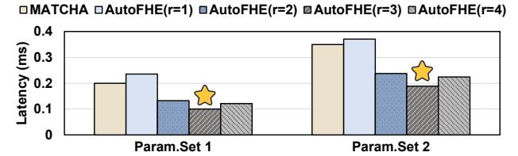

Fig. 15. Impact of bootstrapping unrolling factor r (MATCHA baseline).

Comparison with Strix. As shown in Figure 14, evaluated on DeepCNN100, increasing r initially improves performance over Strix, which is restricted to r=1. However, the benefit gradually diminishes as r increases, and the optimal configuration in this scenario is r=2. This trend occurs because larger unrolling factors significantly increase off-chip memory traffic. When a higher r is chosen, the resulting bandwidth pressure leads to diminishing returns or even performance degradation.

Comparison with MATCHA. MATCHA adopts bootstrapping unrolling with r=3. We evaluate this scenario using the encrypted XOR benchmark used in MATCHA. As shown in Figure 15, if AutoFHE is artificially restricted to r=1, its performance remains below that of MATCHA. However, when AutoFHE explores the design space automatically, the generated AutoFHE(r=3) design surpasses MATCHA under the same constraints, confirming that bootstrapping unrolling is a critical performance optimization strategy. This improvement comes from AutoFHE's ability to co-optimize multiple tightly coupled architectural parameters and minimize design slack under the specified design constraints.

These results show that the optimal unrolling factor is not fixed. The performance sweet spot shifts from r=2 in the Strix scenario to r=3 in the MATCHA scenario due to the higher memory bandwidth in MATCHA. This highlights the core capability of AutoFHE. AutoFHE automatically optimizes configurations and eliminates the need for expert manual tuning, addressing the practical limitation that an optimal configuration tuned for one hardware scenario cannot be directly transferred to another scenario with different bandwidth or area budgets.

#### I. Adaptability to Different Optimization Objectives

We evaluate AutoFHE using the energy-delay product (EDP, defined as  $EDP = Latency \times Energy$ ) as the optimization objective in design space exploration. The energy is estimated using an analytical model that accounts for four sources: off-chip memory access, on-chip memory access, computation, and on-chip data communication. We conduct this evaluation using the encrypted NPU case study. Under the same area

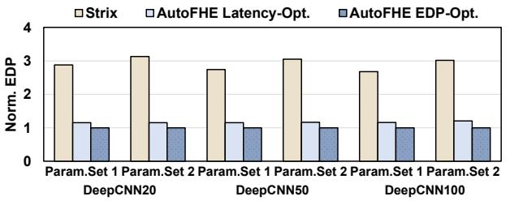

Fig. 16. EDP comparison between Strix and AutoFHE-generated designs (AutoFHE Latency-Opt. and AutoFHE EDP-Opt.). All results are normalized to the AutoFHE EDP-Opt. baseline.

and off-chip memory bandwidth constraints as Strix, AutoFHE performs EDP-oriented optimization and generates an architecture denoted as *AutoFHE EDP-Opt*. We compare this design with Strix, an expert-crafted encrypted NPU, using the DeepCNN workload. As shown in Figure 16, AutoFHE EDP-Opt achieves 2.9× lower EDP than Strix.

The improvement arises from a distinct architectural configuration identified by the EDP-oriented DSE. When optimizing for EDP, AutoFHE favors configurations with a larger number of smaller CPEs to improve data reuse. Specifically, AutoFHE Latency-Opt, the latency-optimized design generated by AutoFHE under the same constraints, deploys 16 bootstrapping units, whereas AutoFHE EDP-Opt increases this number to 24, enabling higher on-chip reuse and reducing the energy of off-chip memory accesses. These results highlight that AutoFHE can automatically adapt architectural configurations to different optimization objectives, enabling efficient accelerator designs across diverse hardware design scenarios without manual architecture tuning.

#### J. Design Space Visualization

In Figure 17, we visualize the design space using the candidate design points generated during DSE. The horizontal axis represents hardware area (up to 200 mm<sup>2</sup>). The vertical axis reports normalized latency and EDP. We use the encrypted NPU as a case study and evaluate generated designs on DeepCNN100 workloads. Two system configurations are considered: a low off-chip memory bandwidth setting (300 GB/s) and a high-bandwidth setting (640 GB/s).

The visualization highlights two key capabilities of AutoFHE. First, **Broad design space coverage.** AutoFHE explores a wide region of the feasible design space and generates candidate designs across a range of area. These designs exhibit substantial variation in both latency and EDP, demonstrating that AutoFHE can adapt to diverse scenarios ranging from area-constrained designs to performance-oriented accelerators. Second, **Effective discovery of optimal design points.** Across both optimization objectives and bandwidth settings, AutoFHE successfully identifies Pareto-optimal design points. AutoFHE discovers designs that outperform the expert-crafted Strix under the same area constraint. These optimized designs are denoted as AutoFHE-S1 Opt. (optimal under 300 GB/s bandwidth) and AutoFHE-S2 Opt. (optimal under 640 GB/s bandwidth) in Figure 17.

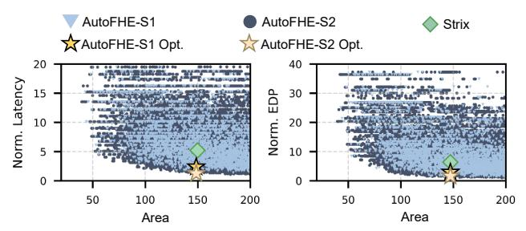

Fig. 17. Design space visualization. AutoFHE-S1 and AutoFHE-S2 represent the candidate designs explored under 300 GB/s and 640 GB/s off-chip memory bandwidth settings, respectively. AutoFHE-S1 Opt. and AutoFHE-S2 Opt. denote the corresponding optimal designs discovered by AutoFHE.

#### K. Overhead Analysis

To quantify design agility, we measure the end-to-end generation time of AutoFHE. We evaluate three representative designs: one encrypted NPU and two encrypted ALUs. Each design is compiled 20 times, and we report the average runtime. The detailed breakdown is provided in Table IV. The results show that both compilation and encrypted-component identification incur relatively small overheads. DSE takes hundreds of seconds. As expected, DSE time grows with design complexity because more complex designs introduce a larger search space. This overhead is acceptable because DSE is performed once as an offline compilation step. Overall, AutoFHE reduces dependence on deep FHE expertise and enables agile FHE accelerator generation, in sharp contrast to the months of manual effort typically required for intricate microarchitectural design and exhaustive design space exploration.

TABLE IV
DETAILED TIME BREAKDOWN.

|       | Chisel      | FIRRTL Graph | Component      | DSE   | Overall   |
|-------|-------------|--------------|----------------|-------|-----------|
|       | Compilation | Generation   | Identification | DSE   | (Seconds) |
| eNPU  | 5           | 1            | 0.1            | 197.4 | 203.5     |
| ALU 1 | 5           | 1            | 0.1            | 329   | 335.1     |
| ALU 2 | 10          | 2            | 0.1            | 660   | 672.1     |

#### V. RELATED WORK

To accelerate FHE, researchers have proposed various domain-specific FHE accelerators [14], [15], [34], [48]–[56]. Strix [8] provides an encrypted NPU for privacy inference, MATCHA [9] focuses on general-purpose encrypted ALUs, and PPGNN [7] accelerates privacy-preserving graph-based lookups. However, existing designs are hand-crafted, expert-driven efforts. For example, MATCHA incorporates a bootstrapping unrolling strategy. This significantly expands the already large design space and, notably, heavily relies on FHE expertise. AutoFHE integrates such optimizations into the design space and automatically discovers the best configuration.

#### VI. DISCUSSION

#### A. Extensibility to Alternative FHE Schemes

AutoFHE primarily targets the TFHE scheme in its current implementation. Extending AutoFHE to other FHE schemes, such as CKKS, is an important future direction. Due to fundamental differences in ciphertext structures and homomorphic operations between TFHE and CKKS, supporting CKKS requires introducing CKKS-specific CPEs.

Reusable components: AutoFHE is designed for extensibility. Most of its components can be reused when extending AutoFHE to other FHE schemes. Specifically, (1) AutoFHE's annotation mechanism, which specifies encrypted signals at the Chisel level, remains applicable; (2) encrypted component identification on the FIRRTL graph remains applicable for locating all encrypted components; (3) the scheduling strategy that maps the FIRRTL graph onto physical CPEs is reusable; and (4) the automated transformation passes that modify the FIRRTL circuits can be reused.

**Required adaptations:** Supporting CKKS is largely localized to the hardware library and mapping policies. In particular, developers only need to (1) extend the CPE library with CKKS-based CPEs, (2) update the FIRRTL operator-to-CPE mapping rules, and (3) adjust bootstrapping CPE placement policies to accommodate CKKS's specific computational characteristics. Importantly, these changes do not require redesigning the overall framework.

**Future challenges:** Supporting multiple FHE schemes introduces additional challenges, such as selecting between TFHE- and CKKS-based CPEs and managing scheme conversion overheads. This leads to a global optimization problem.

## B. Chisel vs. Verilog

AutoFHE leverages Chisel and the FIRRTL to enable robust and automated circuit transformations. In contrast, implementing similar transformations directly in Verilog would require either fragile code rewriting or custom domain-specific tooling, which significantly increases engineering complexity. While adopting Chisel introduces a learning curve, we believe this overhead is modest compared with the complexity of FHE itself. Moreover, the use of a high-level hardware construction language is instrumental in enabling the extensibility and automation that AutoFHE provides.

## VII. CONCLUSION

In this paper, we presented AutoFHE, an automatic generation framework for domain-specific FHE accelerators. AutoFHE decouples intricate FHE-specific implementations and optimizations from overall accelerator design, empowering non-FHE-expert designers to create efficient FHE accelerators. AutoFHE proposes a Chisel-level encrypted signal annotation mechanism, encrypted component identification, a CPE virtualization strategy, and automatic design space exploration, generating FHE accelerators that outperform hand-crafted designs with modest design effort. AutoFHE makes the creation and exploration of efficient FHE accelerators accessible to the broader hardware community.

## VIII. ACKNOWLEDGEMENT

We sincerely thank anonymous reviewers for their insightful suggestions. This paper is supported by the National Key R&D Program of China: 2023YFB4404400, and the National Natural Science Foundation of China (grant No. 62222411). The corresponding authors are Ying Wang and Yinhe Han.

## REFERENCES

- [1] Ronald L Rivest, Len Adleman, Michael L Dertouzos, et al. On data banks and privacy homomorphisms. *Foundations of secure computation*, 4(11):169–180, 1978.
- [2] Ilaria Chillotti, Marc Joye, and Pascal Paillier. Programmable bootstrapping enables efficient homomorphic inference of deep neural networks. In *Cyber Security Cryptography and Machine Learning: 5th International Symposium, CSCML 2021, Be'er Sheva, Israel, July 8–9, 2021, Proceedings 5*, pages 1–19. Springer, 2021.
- [3] Ilaria Chillotti, Damien Ligier, Jean-Baptiste Orfila, and Samuel Tap. Improved programmable bootstrapping with larger precision and efficient arithmetic circuits for tfhe. In *Advances in Cryptology–ASIACRYPT 2021: 27th International Conference on the Theory and Application of Cryptology and Information Security, Singapore, December 6–10, 2021, Proceedings, Part III 27*, pages 670–699. Springer, 2021.
- [4] Ilaria Chillotti, Emmanuela Orsini, Peter Scholl, Nigel Paul Smart, and Barry Van Leeuwen. Scooby: improved multi-party homomorphic secret sharing based on fhe. In *International Conference on Security and Cryptography for Networks*, pages 540–563. Springer, 2022.
- [5] Jilan Lin, Ling Liang, Zheng Qu, Ishtiyaque Ahmad, Liu Liu, Fengbin Tu, Trinabh Gupta, Yufei Ding, and Yuan Xie. Inspire: in-s torage p rivate i nformation re trieval via protocol and architecture co-design. In *Proceedings of the 49th Annual International Symposium on Computer Architecture*, pages 102–115, 2022.
- [6] Zhou Zhang, Song Bian, Zian Zhao, Ran Mao, Haoyi Zhou, Jiafeng Hua, Yier Jin, and Zhenyu Guan. Arcedb: An arbitrary-precision encrypted database via (amortized) modular homomorphic encryption. In *Proceedings of the 2024 on ACM SIGSAC Conference on Computer and Communications Security*, pages 4613–4627, 2024.
- [7] Yuntao Wei, Xueyan Wang, Song Bian, Yicheng Huang, Weisheng Zhao, and Yier Jin. Ppgnn: Fast and accurate privacy-preserving graph neural network inference via parallel and pipelined arithmetic-and-logic fhe accelerator. In *Proceedings of the 61st ACM/IEEE Design Automation Conference*, pages 1–6, 2024.
- [8] Adiwena Putra, Prasetiyo, Yi Chen, John Kim, and Joo-Young Kim. Strix: An end-to-end streaming architecture with two-level ciphertext batching for fully homomorphic encryption with programmable bootstrapping. In *Proceedings of the 56th Annual IEEE/ACM International Symposium on Microarchitecture*, pages 1319–1331, 2023.
- [9] Lei Jiang, Qian Lou, and Nrushad Joshi. Matcha: A fast and energyefficient accelerator for fully homomorphic encryption over the torus. In *Proceedings of the 59th ACM/IEEE Design Automation Conference (DAC)*, pages 235–240, 2022.
- [10] Axel Feldmann, Nikola Samardzic, Aleksandar Krastev, Srini Devadas, Ron Dreslinski, Karim Eldefrawy, Nicholas Genise, Chris Peikert, and Daniel Sanchez. F1: A fast and programmable accelerator for fully homomorphic encryption (extended version). *arXiv preprint arXiv:2109.05371*, 2021.
- [11] Jongmin Kim, Gwangho Lee, Sangpyo Kim, Gina Sohn, Minsoo Rhu, John Kim, and Jung Ho Ahn. Ark: Fully homomorphic encryption accelerator with runtime data generation and inter-operation key reuse. In *2022 55th IEEE/ACM International Symposium on Microarchitecture (MICRO)*, pages 1237–1254. IEEE, 2022.
- [12] Nikola Samardzic, Axel Feldmann, Aleksandar Krastev, Nathan Manohar, Nicholas Genise, Srinivas Devadas, Karim Eldefrawy, Chris Peikert, and Daniel Sanchez. Craterlake: a hardware accelerator for efficient unbounded computation on encrypted data. In *Proceedings of the 49th Annual International Symposium on Computer Architecture*, pages 173–187, 2022.
- [13] Sangpyo Kim et al. Bts: An accelerator for bootstrappable fully homomorphic encryption. 2021.
- [14] Xianglong Deng, Shengyu Fan, Zhicheng Hu, Zhuoyu Tian, Zihao Yang, Jiangrui Yu, Dingyuan Cao, Dan Meng, Rui Hou, Meng Li, Qian Lou, and Mingzhe Zhang. Trinity: A general purpose fhe accelerator. In *2024 57th IEEE/ACM International Symposium on Microarchitecture (MICRO)*, pages 338–351. IEEE, 2024.
- [15] Yinghao Yang et al. Poseidon: Practical homomorphic encryption accelerator. In *2023 IEEE International Symposium on High-Performance Computer Architecture (HPCA)*, pages 870–881. IEEE, 2023.
- [16] Rosario Cammarota. Intel heracles: homomorphic encryption revolutionary accelerator with correctness for learning-oriented end-to-end solutions. In *Proceedings of the 2022 on Cloud Computing Security Workshop*, pages 3–3, 2022.

- [17] Ilaria Chillotti, Nicolas Gama, Mariya Georgieva, and Malika Izabachene. Tfhe: fast fully homomorphic encryption over the torus. ` *Journal of Cryptology*, 33(1):34–91, 2020.
- [18] Florian Bourse, Michele Minelli, Matthias Minihold, and Pascal Paillier. Fast homomorphic evaluation of deep discretized neural networks. In *Advances in Cryptology–CRYPTO 2018: 38th Annual International Cryptology Conference, Santa Barbara, CA, USA, August 19–23, 2018, Proceedings, Part III 38*, pages 483–512. Springer, 2018.
- [19] Tanping Zhou, Xiaoyuan Yang, Longfei Liu, Wei Zhang, and Ningbo Li. Faster bootstrapping with multiple addends. *IEEE Access*, 6:49868– 49876, 2018.
- [20] Jonathan Bachrach, Huy Vo, Brian Richards, Yunsup Lee, Andrew Waterman, Rimas Avizienis, John Wawrzynek, and Krste Asanovi ˇ c.´ Chisel: constructing hardware in a scala embedded language. In *Proceedings of the 49th annual design automation conference*, pages 1216–1225, 2012.
- [21] Patrick S Li, Adam M Izraelevitz, and Jonathan Bachrach. Specification for the firrtl language. *EECS Department, University of California, Berkeley, Tech. Rep. UCB/EECS-2016-9*, 2016.
- [22] Jung Hee Cheon, Andrey Kim, Miran Kim, and Yongsoo Song. Homomorphic encryption for arithmetic of approximate numbers. In *Advances in Cryptology–ASIACRYPT 2017: 23rd International Conference on the Theory and Applications of Cryptology and Information Security, Hong Kong, China, December 3-7, 2017, Proceedings, Part I 23*, pages 409– 437. Springer, 2017.
- [23] Junfeng Fan and Frederik Vercauteren. Somewhat practical fully homomorphic encryption. *Cryptology ePrint Archive*, 2012.
- [24] Ilaria Chillotti, Marc Joye, Damien Ligier, Jean-Baptiste Orfila, and Samuel Tap. Concrete: Concrete operates on ciphertexts rapidly by extending tfhe. In *WAHC 2020-8th Workshop on Encrypted Computing & Applied Homomorphic Cryptography*, 2020.
- [25] Andrei Stoian, Jordan Frery, Roman Bredehoft, Luis Montero, Celia Kherfallah, and Benoit Chevallier-Mames. Deep neural networks for encrypted inference with tfhe. In *International Symposium on Cyber Security, Cryptology, and Machine Learning*, pages 493–500. Springer, 2023.
- [26] Ilaria Chillotti, Marc Joye, Damien Ligier, Jean-Baptiste Orfila, and Samuel Tap. Concrete: Concrete operates on ciphertexts rapidly by extending tfhe. In *WAHC 2020-8th Workshop on Encrypted Computing & Applied Homomorphic Cryptography*, 2020.
- [27] Wei Dai and Berk Sunar. cuhe: A homomorphic encryption accelerator library. In *Cryptography and Information Security in the Balkans: Second International Conference, BalkanCryptSec 2015, Koper, Slovenia, September 3-4, 2015, Revised Selected Papers 2*, pages 169–186. Springer, 2016.
- [28] Wonkyung Jung, Sangpyo Kim, Jung Ho Ahn, Jung Hee Cheon, and Younho Lee. Over 100x faster bootstrapping in fully homomorphic encryption through memory-centric optimization with gpus. *IACR Transactions on Cryptographic Hardware and Embedded Systems*, pages 114–148, 2021.
- [29] Sangpyo Kim, Jongmin Kim, Jaeyoung Choi, and Jung Ho Ahn. Cifher: A chiplet-based fhe accelerator with a resizable structure. In *2024 International Symposium on Secure and Private Execution Environment Design (SEED)*, pages 119–130. IEEE, 2024.
- [30] Kevin Nam, Hyunyoung Oh, Hyungon Moon, and Yunheung Paek. Accelerating n-bit operations over tfhe on commodity cpu-fpga. In *Proceedings of the 41st IEEE/ACM International Conference on Computer-Aided Design*, pages 1–9, 2022.
- [31] Mark Field, Takuji Kimura, John Atkinson, Diana Gamzina, Neville C Luhmann, Brad Stockwell, Thomas J Grant, Zachary Griffith, Robert Borwick, Christopher Hillman, et al. Development of a 100-w 200-ghz high bandwidth mm-wave amplifier. *IEEE Transactions on Electron Devices*, 65(6):2122–2128, 2018.
- [32] chisel. *[online] Available: https://www.chisel-lang.org/api.*
- [33] Jonathan Bachrach, Huy Vo, Brian Richards, Yunsup Lee, Andrew Waterman, Rimas Avizienis, John Wawrzynek, and Krste Asanovi ˇ c. Chisel: ´ constructing hardware in a scala embedded language. In *Proceedings of the 49th Annual Design Automation Conference*, pages 1216–1225, 2012.
- [34] Tian Ye, Rajgopal Kannan, and Viktor K Prasanna. Fpga acceleration of fully homomorphic encryption over the torus. In *2022 IEEE High Performance Extreme Computing Conference (HPEC)*, pages 1–7. IEEE, 2022.

- [35] Adrien Benamira, Tristan Guerand, Thomas Peyrin, and Sayandeep ´ Saha. Tt-tfhe: a torus fully homomorphic encryption-friendly neural network architecture. *arXiv preprint arXiv:2302.01584*, 2023.
- [36] Luis Montero, Jordan Frery, Celia Kherfallah, Roman Bredehoft, and Andrei Stoian. Neural network training on encrypted data with tfhe. *arXiv preprint arXiv:2401.16136*, 2024.
- [37] Linpeng Tang, Yida Wang, Theodore L Willke, and Kai Li. Scheduling computation graphs of deep learning models on manycore cpus. *arXiv preprint arXiv:1807.09667*, 2018.
- [38] Deb Kalyanmoy. A fast and elitist multi-objective genetic algorithm: Nsga-ii. *IEEE Trans. on Evolutionary Computation*, 6(2):182–197, 2002.
- [39] Song Han, Xingyu Liu, Huizi Mao, Jing Pu, Ardavan Pedram, Mark A Horowitz, and William J Dally. Eie: Efficient inference engine on compressed deep neural network. *ACM SIGARCH Computer Architecture News*, 44(3):243–254, 2016.
- [40] Adam Izraelevitz, Jack Koenig, Patrick Li, Richard Lin, Angie Wang, Albert Magyar, Donggyu Kim, Colin Schmidt, Chick Markley, Jim Lawson, et al. Reusability is firrtl ground: Hardware construction languages, compiler frameworks, and transformations. In *2017 IEEE/ACM International Conference on Computer-Aided Design (ICCAD)*, pages 209–216. IEEE, 2017.
- [41] Oreste Villa, Daniel R Johnson, Mike Oconnor, Evgeny Bolotin, David Nellans, Justin Luitjens, Nikolai Sakharnykh, Peng Wang, Paulius Micikevicius, Anthony Scudiero, et al. Scaling the power wall: a path to exascale. In *SC'14: Proceedings of the International Conference for High Performance Computing, Networking, Storage and Analysis*, pages 830–841. IEEE, 2014.
- [42] cufhe. *[online] Available: . https://github.com/vernamlab/cuFHE.*
- [43] nufhe. *[online] Available: https://github.com/nucypher/nufhe.*
- [44] Vector MulAdd Accelerator. *[online] Available: https://github.com/meton-robean/Vector MulAdd Accelerator.*
- [45] Mingyu Yan, Lei Deng, Xing Hu, Ling Liang, Yujing Feng, Xiaochun Ye, Zhimin Zhang, Dongrui Fan, and Yuan Xie. Hygcn: A gcn accelerator with hybrid architecture. In *2020 IEEE International Symposium on High Performance Computer Architecture (HPCA)*, pages 15–29. IEEE, 2020.
- [46] riscv mini. *[online] Available: https://github.com/ucb-bar/riscv-mini.*
- [47] A. Saitoh. Kyogenrv: simple 5-staged pipeline risc-v. *[online] Available: https://github.com/panda5mt/KyogenRV.*
- [48] David Du Pont, Jonas Bertels, Furkan Turan, Michiel Van Beirendonck, and Ingrid Verbauwhede. Hardware acceleration of the prime-factor and rader ntt for bgv fully homomorphic encryption. *Cryptology ePrint Archive*, 2024.
- [49] Robin Geelen, Michiel Van Beirendonck, Hilder VL Pereira, Brian Huffman, Tynan McAuley, Ben Selfridge, Daniel Wagner, Georgios Dimou, Ingrid Verbauwhede, Frederik Vercauteren, et al. Basalisc: Programmable asynchronous hardware accelerator for bgv fully homomorphic encryption. *arXiv preprint arXiv:2205.14017*, 2022.
- [50] Jonas Bertels, Michiel Van Beirendonck, Furkan Turan, and Ingrid Verbauwhede. Hardware acceleration of fhew. In *2023 26th International Symposium on Design and Diagnostics of Electronic Circuits and Systems (DDECS)*, pages 57–60. IEEE, 2023.
- [51] Jongmin Kim, Sangpyo Kim, Jaewan Choi, Jaiyoung Park, Donghwan Kim, and Jung Ho Ahn. Sharp: A short-word hierarchical accelerator for robust and practical fully homomorphic encryption. In *Proceedings of the 50th Annual International Symposium on Computer Architecture*, pages 1–15, 2023.
- [52] Yibo Du, Ying Wang, Mengdi Wang, Xiaowei Li, and Yinhe Han. Chiplever: A hardware-software co-design framework towards extension of chiplet system for fully homomorphic encryption. *IEEE transactions on computer-aided design of integrated circuits and systems*, 2025.
- [53] Rashmi Agrawal, Leo de Castro, Guowei Yang, Chiraag Juvekar, Rabia Yazicigil, Anantha Chandrakasan, Vinod Vaikuntanathan, and Ajay Joshi. Fab: An fpga-based accelerator for bootstrappable fully homomorphic encryption. In *2023 IEEE International symposium on high-performance computer architecture (HPCA)*, pages 882–895. IEEE, 2023.
- [54] Junxue Zhang, Xiaodian Cheng, Liu Yang, Jinbin Hu, Ximeng Liu, and Kai Chen. Sok: Fully homomorphic encryption accelerators. *ACM Computing Surveys*, 56(12):1–32, 2024.
- [55] Kaustubh Shivdikar, Yuhui Bao, Rashmi Agrawal, Michael Shen, Gilbert Jonatan, Evelio Mora, Alexander Ingare, Neal Livesay, Jose L Abell ´ an, ´ John Kim, Ajay Joshi, and David Kaeli. Gme: Gpu-based microarchitectural extensions to accelerate homomorphic encryption. In *Proceedings*

- *of the 56th Annual IEEE/ACM International Symposium on Microarchitecture*, pages 670–684, 2023.
- [56] Michiel Van Beirendonck, Jan-Pieter D'Anvers, Furkan Turan, and Ingrid Verbauwhede. Fpt: A fixed-point accelerator for torus fully homomorphic encryption. In *Proceedings of the 2023 ACM SIGSAC Conference on Computer and Communications Security*, pages 741–755, 2023.