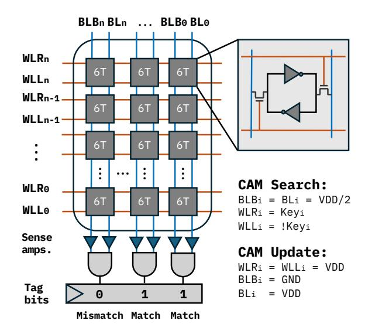
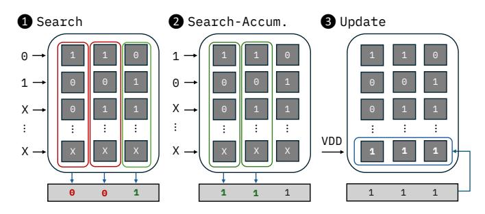
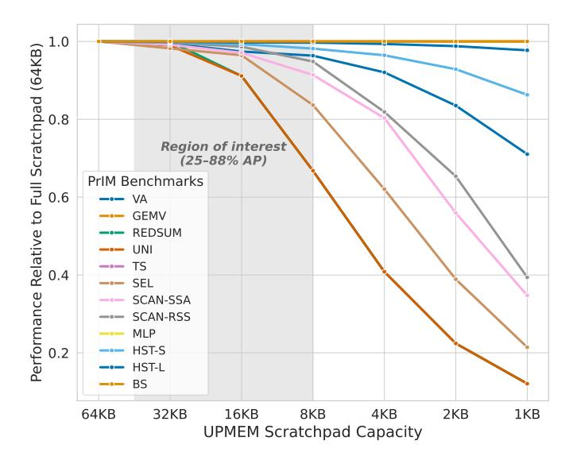
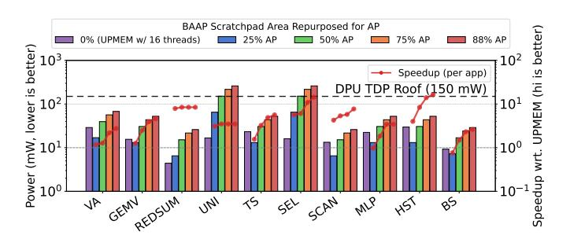
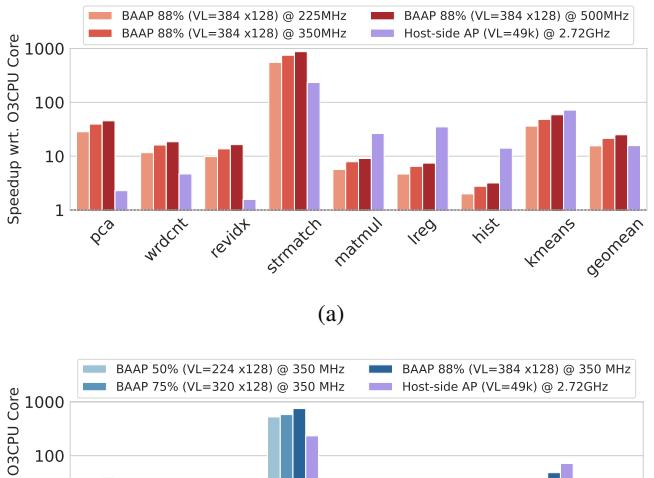
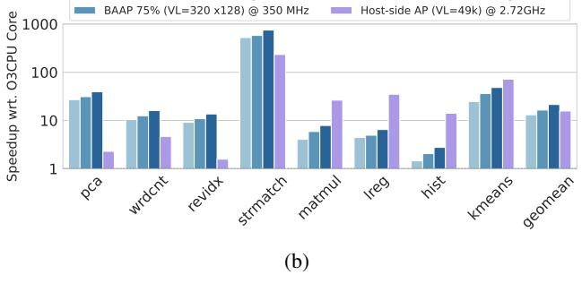

# BAAP: Coupling Compute-in-SRAM with DRAM Banks for Near-Memory Processing

Cecilio C. Tamarit Socrates S. Wong Akshati Vaishnav†

Jose F. Mart ´ ´ınez

Computer Systems Laboratory Cornell University Ithaca, NY 14853 USA

*Abstract*—Near-DRAM-bank logic is a form of processing-inmemory (PIM) that lowers access latency and exploits bank-level parallelism to achieve increased throughput. Major classes of memory-bound applications, including pattern matching, vector processing, and graph algorithms, stand to benefit from adding processing capabilities at the bank level. While custom banklevel PIM solutions exist for individual domains, a performant programmable solution that is able to tackle all three remains elusive, as DRAM technology imposes limitations on the complexity and scale of computing logic that can be integrated.

Recently, a number of commercial in-DRAM PIM products feature small SRAM-based scratchpads that bridge the last gap between on-die compute logic and DRAM storage. In this paper, we examine the potential and synergies of augmenting such scratchpads with Compute-in-SRAM support. Our Bank-Adjacent Associative Processor (BAAP) repurposes part of the scratchpad to provide additional *in situ* computing capabilities that are complementary to the existing PIM logic, primarily acting as either a SIMD unit or pattern-matching engine. We employ the commercially available UPMEM PIM architecture as a realistic foundation, although we believe that our insights are also relevant to other scratchpad-augmented PIM designs.

We evaluate BAAP using system-level, cycle-approximate, execution-driven simulations, comparing it against detailed models of commercial bank-level designs and other academic proposals, including a host-side associative processor that is also SRAM-based. Our results demonstrate that BAAP can deliver performance improvements of more than an order of magnitude across diverse workloads, including computational genomics, and the Phoenix and PrIM benchmarks.

# I. INTRODUCTION

*Processing-in-Memory* (PIM) architectures have shown significant potential in addressing the von Neumann bottleneck, with designs spanning from processing-near-storage solutions [\[22\]](#page-13-0), [\[28\]](#page-13-1) to subarray-level *in situ* PIM architectures [\[25\]](#page-13-2), [\[38\]](#page-13-3). Among this range of options, DRAM near-bank processing offers compelling advantages, as it can achieve low latency and energy consumption while enjoying the highest internal memory bandwidth that can be attained without tampering with the DRAM subarrays. Programmable bank-level solutions include a commercial product from UPMEM [\[11\]](#page-13-4), [\[21\]](#page-13-5) and

This work was supported in part by the Semiconductor Research Corporation (SRC) through the ACE Center for Evolvable Computing, part of the JUMP 2.0 program co-sponsored by DARPA, and by the NSF Science and Technology Center for Programmable Plant Systems (CROPPS, award #2019674). †A. Vaishnav is now at the Georgia Institute of Technology.

prototypes from Samsung [\[33\]](#page-13-6), [\[36\]](#page-13-7) and SK hynix [\[26\]](#page-13-8). However, due to the inherent constraints of the DRAM process (slower transistors, reduced density, and, most significantly, a limited number of metal layers), most bank-level proposals have been limited to a specific class of algorithm or application [\[23\]](#page-13-9), [\[53\]](#page-14-0), [\[54\]](#page-14-1). Memory-bound applications, such as those involving pattern matching, vector processing, and graph processing, are poised to benefit greatly from near-bank PIM. However, a programmable solution that can deliver high performance in all three domains remains elusive.

In this paper, we introduce BAAP, a bank-adjacent PIM architecture built upon the principles of the associative processing (AP) paradigm [\[14\]](#page-13-10), [\[15\]](#page-13-11), [\[18\]](#page-13-12) that performs arithmetic and logic operations via sequences of bit-parallel and bitserial searches and updates in content-addressable memories. We demonstrate that associative processors enable efficient pattern matching and SIMD computation when placed in close proximity to DRAM banks. BAAP repurposes near-bank SRAM scratchpad structures in existing state-of-the-art PIM designs. We validate our proposal by simulating and modifying accordingly the UPMEM architecture and by comparing it against other bank-level and host-side designs when running a series of benchmarks that span multiple domains, including an end-to-end genomics application and multiple benchmarks from the Phoenix and PrIM suites. Our results show that, with very low overhead, adding near-bank AP support can deliver order-of-magnitude speedups.

The key contributions of this paper are:

- We introduce and evaluate BAAP—to the best of our knowledge, the first architecture to repurpose in-DRAM SRAM scratchpads to perform bank-adjacent computation.
- We propose exposing BAAP through a unified ISA that supports different modes of operation for the bankadjacent scratchpad depending on the needs of the application: (i) *Scratchpad mode* for control-heavy code where a scalar core is the best fit; (ii) *SIMD mode* for highlyparallel arithmetic and reductions; and (iii) *DirectAP mode* for associative search/update over contiguous data.
- We identify a key regime where DirectAP is uniquely effective: computations expressible as repeated membership queries over large, irregular state (e.g., pattern matching,

- histogram-like counting, or graph traversal).
- By trading off computing capability and storage capacity under the same silicon budget as the underlying scratchpad, BAAP strikes a balance between the performance of fixed-function approaches and the programmability of UPMEM's design.

## II. BACKGROUND

## *A. Near-memory Processing and Processing-in-Memory*

Processing-in-memory (PIM) architectures bring computation closer to where the data is stored to tackle the von Neumann bottleneck. Processing-using-Memory (PUM) architectures, sometimes referred to as *in situ* PIM, exploit properties of the memory itself, often with slight modifications, to perform computations directly in place. There is a large body of work discussing the trade-offs of this approach with different memory technologies and across the entire hierarchy, including main memory [\[25\]](#page-13-2), [\[38\]](#page-13-3), permanent storage [\[43\]](#page-14-2), and caches [\[1\]](#page-12-0). At the other end of the spectrum, near-memory and near-storage processing (NMP, NSP) architectures place their logic directly adjacent to [\[22\]](#page-13-0), [\[33\]](#page-13-6), or at different degrees of separation from [\[3\]](#page-12-1), [\[32\]](#page-13-13), [\[41\]](#page-14-3) the memory array.

We choose a few representative examples of near-memory processing architectures targeting main memory and classify them in Table [I.](#page-2-0) Tighter integration (downward in the table) generally leads to higher performance and energy efficiency due to a higher exploitable bandwidth and reduced latencies. However, such an approach is challenging, as it involves more aggressive modifications of established DRAM IP that is highly optimized for storage density instead of compute [\[11\]](#page-13-4), [\[33\]](#page-13-6). It is often also at the cost of programmability or data layout flexibility [\[11\]](#page-13-4), [\[25\]](#page-13-2).

Hybrid proposals provide different computing capabilities simultaneously at various levels of the memory hierarchy to target specific hotspots. For example, AttAcc [\[42\]](#page-14-4) accelerates LLM inference by placing specialized logic at three locations: the banks, the memory controller, and the buffer die of the HBM logic layer. *With BAAP, focus on making the most out of bank-level architectures specifically, widening their applicability and increasing their performance while retaining the same area footprint.*

# *B. Limitations of previous work*

General-purpose near-memory architectures. The first two rows in Table [I](#page-2-0) list examples of the coarser-grain approaches to processing near DRAM, that is, at the highest degree of separation. Those involving 3D stacking or processing at the rank level incorporate processing elements in an entirely separate die from that of DRAM, and can thus leverage the CMOS process. For that reason, the proposals in this space range from application-specific accelerators [\[3\]](#page-12-1) to fully-fledged outof-order processors with multiple levels of caches [\[5\]](#page-12-2), [\[41\]](#page-14-3), or even FPGAs [\[32\]](#page-13-13).

At the bank level, most advocate for specialized logic, or at least for supporting the most common arithmetic operations in the target application. The product from UPMEM [\[11\]](#page-13-4) is, to the best of our knowledge, the first commercially available general-purpose PIM Dual In-line Memory Module (DIMM). We describe this architecture in detail in Section [III-A.](#page-3-0) At a high level, their approach consists of appending to each DRAM bank a very simple in-order CPU. This is reminiscent of seminal academic proposals, such as IRAM [\[44\]](#page-14-5) and FlexRAM [\[31\]](#page-13-14). The decision to have only a small core per bank was driven by multiple limitations intrinsic to the "2x nm" DRAM process [\[11\]](#page-13-4). Specifically, the routing density can be dramatically lower, with only three metal layers as opposed to the more than ten that would be available in a conventional logic process. In addition to this, logic is ten times less dense, pitch is four times larger, and the transistors are three times slower [\[11\]](#page-13-4), [\[21\]](#page-13-5), [\[29\]](#page-13-15). These factors led to careful design decisions that minimize the footprint of this already highly constrained CPU: 14 pipeline stages were required to be able to clock it at a maximum of 500 MHz. ALUs only support single-cycle bitwise operations, shifts, and scalar integer additions and subtractions, with all other operations emulated in software. They also did away with bypass logic and stall signals, which means that the pipeline has to be filled by exploiting fine-grained multithreading to space dependencies out, which they can achieve for some applications by supporting up to 24 hardware threads. Despite these limitations, the UPMEM product has been an effective demonstrator and testbed, showcasing what general-purpose PIM is capable of and what the restrictions placed by the DRAM process permit in terms of logic integration. Numerous works have already benchmarked these devices and suggested possible improvements, but the base product already shows significant gains in performance and energy efficiency across a variety of memory-intensive applications [\[12\]](#page-13-16), [\[19\]](#page-13-17), [\[21\]](#page-13-5). This is in great part due to the amount of throughput that can be exploited by attaching multiple PIM-enabled DIMMs to a single system.

Application-specific near-memory architectures. Major industry players in the memory space have navigated the nearmemory processing design space by introducing dedicated logic for specific applications at different (and even multiple [\[42\]](#page-14-4)) levels of the DDR and HBM hierarchies, also facing similar challenges as the efforts discussed above. For example, SK hynix and Samsung have demonstrated bankadjacent multiply-accumulate SIMD units to target AI applications [\[26\]](#page-13-8), [\[33\]](#page-13-6), [\[36\]](#page-13-7). NeuPIMs [\[27\]](#page-13-18) accelerates batched LLM inference by splitting work across a GEMM-optimized NPU and a GEMV-optimized PIM, and by enabling concurrent NPU+PIM execution via dual row buffers per bank. Duplex [\[56\]](#page-14-6) targets MoE and attention by coupling a conventional compute engine (xPU) with 3D-stacked memory and selecting xPU vs accelerators in the logic die based on operational intensity. In AttAcc [\[42\]](#page-14-4), the authors opt to implement some of the accelerators in the HBM buffer chip instead of the bank due to the limitations of the DRAM process. Major efforts to enable forms of general-purpose computation are instead relegated to the rank level or channel level [\[5\]](#page-12-2), [\[32\]](#page-13-13). *While*

TABLE I: Top-down Hierarchical Classification of Representative PIM Architectures

<span id="page-2-0"></span>

| PIM granularity               | Architecture                                          | Mem. access<br>latency | Aggregate<br>throughput | Programmability                                                  | SIMD Arithm.<br>Support | Pattern matching support | Targeted workloads                                           |
|-------------------------------|-------------------------------------------------------|------------------------|-------------------------|------------------------------------------------------------------|-------------------------|--------------------------|--------------------------------------------------------------|
| Channel-level /<br>3D stacked | Active Memory Cube [40]<br>Tesseract [3]              | Moderate<br>(70-140ns) | High                    | Very high (general purpose)<br>Logic-layer CPUs or accelerators  | ✓ Possible              | ✓ Possible               | General purpose<br>Memory bound                              |
| Rank-level                    | MCN [5]<br>Samsung AxDIMM [32]                        | Moderate<br>(70-140ns) | High                    | Very high (general purpose)<br>4+ OoO CPU cores or FPGAs         | ✓ 2+ lanes              | ✓ Possible               | General purpose<br>Memory bound                              |
| Bank-level                    | UPMEM DDR4-PIM [11]                                   | Low                    | Very high               | High (general purpose)<br>Scalar, in-order CPU                   | X                       | ✓ 64-bit wide            | Scalar, integer, high TLP<br>Moderate to low locality        |
|                               | Samsung FIMDRAM [33], [36]<br>SK hynix AiM [34], [35] | (tens of ns)           | very mgn                | Low (fixed operation)<br>SIMD MAC units (FP16/BF16) <sup>1</sup> | ✓ 16 lanes <sup>1</sup> | ×                        | Machine learning / Numerical<br>Moderate to low locality     |
| Subarray-level                | Fulcrum [37]                                          | Low                    | ns) Very high           | Moderate (multiple operations) Per-subarray ALU (INT32/FP32)     | ×                       | ✓ 32-bit wide            | Bulk bitwise; databases<br>Low locality                      |
|                               | Sieve [53]                                            | (tens of ns)           |                         | None (specialized logic)<br>Pattern matching engine              | ×                       | ✓ Kbit wide              | Genomics kernel ("k-mer matching")<br>No temporal locality   |
| Bank-level                    | BAAP (This work)                                      | Low<br>(tens of ns)    | Very high               | Very high (general purpose)<br>In-order CPU + SRAM PUM (AP)      | ✓ 100+ lanes            | ✓ < Mbit wide            | General purpose + SIMD<br>Pattern matching, graph processing |

<span id="page-2-1"></span><sup>1</sup> The main difference between FIMDRAM and AiM is the supported datatype (FP16 vs BF16) and the fact that, in FIMDRAM, MAC units are shared by every two banks, as opposed to each bank having its own.

fine-grain PIM architectures (sometimes real prototypes) with either SIMD processing [26], [36], graph processing [11], or pattern matching capabilities [50], [53] near the bank do exist individually, they have not been commercialized by major DRAM manufacturers, and one general enough to tackle all three has not been proposed.

## <span id="page-2-3"></span>C. In-situ Compute-in-SRAM

Multiple works in the architecture and circuits community have explored the potential of several approaches to compute in SRAM involving bitline computation or modifying the peripherals [2], [6], [9], [51]. Jeloka et al. [30] proposed a 6T push-rule SRAM cell design that allows for multirow activation (see Figure 1.) While it can be used as a conventional SRAM memory, its sense amplifiers can switch from differential sensing mode to single-ended mode, in which bitlines BL and BLB are sensed separately. In this mode, activating multiple rows simultaneously enables bitwise logic within a column. Crucially, there is an additional wordline (one per access transistor: WLL and WLR.) These modifications enable binary CAM (BCAM) and ternary CAM (TCAM) operations with a much smaller footprint than traditional 10T and 16T CAM designs.

A series of recent works employ or repurpose cache-like structures as compute engines. Compute Caches [1] demonstrate how the bitline computation capabilities in the SRAM from [30] can be used to implement basic parallel operations within a cache, such as XOR, comparison, copy, and carryless multiplication. Neural Cache [13] extends this with bit-serial computation and transposition units, and applied it to machine learning applications. Duality Cache [17] wraps it with a PTXlike ISA and SIMT programming model. EVE [4] is a related effort that proposes modifications to the peripheral circuitry to enable bit-hybrid execution of a wide range of in-place microoperations, mapped to the standard RISC-V vector extensions. A commercial, yet less aggressive 12T-SRAM implementation is the APU from GSI Technology [24], which has also been successfully mapped to a vector ISA [20]. CAPE and later works [8], [52], [55] adopt the associative processing (AP) paradigm [14]-[16], [48], in which any in-place operation can

<span id="page-2-2"></span>

Fig. 1: 6T push-rule SRAM arrays, as described in [30], can be employed to build dense content-addressable memories. To perform a BCAM search operation where the *key* (query) is '1', wordline WLR is set to VDD and WLL to GND. The opposite applies when searching for a '0'. Both bitline (BL) and bitline bar (BLB) will remain at their precharged high voltage if all bitcells in a column match the search key. ANDing them will result in a '1' to indicate a match, or a '0' otherwise, which is often referred to as the tag bits.

be expressed as (potentially many) sequences of parallel CAM searches and updates. We show an example in Figure 2.

#### III. THE BAAP PIM ARCHITECTURE

<span id="page-2-4"></span>BAAP is a fully programmable SRAM-based PIM solution that can exploit both MIMD and SIMD parallelism, in addition to the pattern-matching capabilities of associative memory. It leverages DRAM bank adjacency, yielding low latencies and high internal bandwidth without significantly impacting DRAM subarrays. We employ the commercially available UPMEM PIM product as a realistic foundation for our study, although we believe our insights are also relevant to other scratchpad-augmented PIM designs, like the one shown in Figure 3c.

<span id="page-3-1"></span>

Fig. 2: Example AP operation: an XOR between the top two rows of the subarray that stores the result in the bottom row. Following the XOR truth table, we **①** search for the case where any column of the first row contains a 0 while the second row contains a 1. We then **②** search for the opposite case and non-destructively accumulate it with the results of the previous search in the tag bits. Lastly, we perform **③** a single batch update to the last row replacing it with the contents of the tag bits to store the final result of the operation. A dedicated data line (feedback loop) exists for this purpose (see Figure 4.)

## <span id="page-3-0"></span>A. UPMEM baseline design and programming model

The general organization of each individual bank in the BAAP architecture is modeled after that of the DRAM Processing Unit (DPU) as proposed in the UPMEM commercial product [11], shown in Figure 3b with the specifications listed in Table III. UPMEM divides DRAM chips into as many DPUs as DRAM banks. A DPU consists of: (1) a very small inorder CPU, adjacent to (2) the DRAM bank itself (referred to by UPMEM as "Main RAM"), with two SRAM arrays inbetween to be used as (3) instruction memory (IRAM), and (4) as a scratchpad (WRAM, short for "Working RAM"). The bank-adjacent CPU does not access the DRAM bank directly; instead, it accesses the WRAM scratchpad, hiding the latency between the small CPU and the memory bank—which, albeit much lower than the usual latency between the host CPU and DRAM, is still up to two orders of magnitude slower than the single-cycle accesses to the scratchpad [11], [21]. The WRAM is managed manually by the programmer via DMA requests. UPMEM supports a scalar multithreaded execution model for its intra-bank, in-order CPU.

The server's host-side code is responsible for orchestrating communication: scattering, gathering, and broadcasting data across DPUs by writing directly to their address space. The in-order CPUs within the DPUs have their own ISA, and the binaries they run are compiled and offloaded by the host. Therefore the DPU can be regarded as a conventional bank of main memory unless the application invokes an API call to indicate its intent to execute a PIM kernel, which boots up the in-order CPU. Instructions are then streamed from the DRAM bank into IRAM, from where the per-bank in-order CPUs can fetch them.

#### B. BAAP: A Bank-Adjacent Associative Processor

The simplicity of the original UPMEM CPU [11] made it possible to implement it in a DRAM process, enabling programmable, general-purpose computing. However, as benchmarking works have shown [21], its simplicity is also its main

<span id="page-3-2"></span>

Fig. 3: The commercial 8 GB UPMEM DDR4-2400 PIM-enabled DIMM (a) contains eight data-processing units (DPUs) per chip, each consisting of the actual DRAM bank and an in-order CPU. (b) shows the structure of a DPU. The Samsung FIMDRAM architecture (c) instead proposes sharing a SIMD MAC unit for every two banks. Both architectures make use of SRAM buffering structures to bridge the final latency gap, for data staging, and as command/instruction memory.

TABLE III: UPMEM DIMM Specifications

<span id="page-3-3"></span>

| Dimensions       | DDR4-2400 DIMM                                  |  |  |
|------------------|-------------------------------------------------|--|--|
|                  | 8GB w/ 16 chips x 8 banks (128 banks per DIMM)  |  |  |
| Bank-level logic | in-order CPU @ 500 MHz, UPMEM ISA,              |  |  |
| ("DPU")          | single-decode, 14-stage "Revolver" pipeline,    |  |  |
|                  | 24 HW threads (for fine-grained multithreading) |  |  |
|                  | 32+64-bit integer FUs (1 cyc. ADD, 32 cyc. MUL) |  |  |
|                  | 2-split register file, no hazard logic          |  |  |
| Memory           | 24 KB SRAM instruction memory (IRAM)            |  |  |
| (per DPU)        | 64 KB SRAM scratchpad (WRAM)                    |  |  |
|                  | 64MB DRAM Bank (1 GBps)                         |  |  |

drawback: once the data movement bottleneck is overcome, many applications become compute-bound at the bank level, limiting the applicability of an otherwise versatile design. Here, we observe an opportunity not only to exploit SIMD parallelism but, more generally, to overlap long-latency sequences of AP operations (see Table IV) with the explicit and faster near-bank DMA transfers. In this subsection, we provide an overview of the necessary changes to enable bank-adjacent SIMD arithmetic and AP while still retaining the scalar functionality of the UPMEM baseline.

The main modification is the introduction of the aforementioned 6T push-rule SRAM subarray design (Section II-C)—and, critically, the reconfigurable sense amplifier logic to switch between modes—, which we extend with the peripheral logic in Figure 1. The inclusion of one AND gate per BL/BLB pair and "tag" registers to store search results as shown in said figure is sufficient to enable the operation of the individual subarrays as content-addressable memories, and thus, as associative processors.

1) Extending the ISA and Execution Model: To accommodate pattern matching and SIMD capabilities, we extend the UPMEM ISA with the instructions in Table IV and reimagine the individual components as shown in Figure 4a (highlighted in red). The decoding logic has been extended with an Associative Sequencing Unit (ASU): it buffers issued instructions and stores the optimized AP microcode [57] that implements

<span id="page-4-0"></span>

| TABLE IV: Format and latency breakdown of BAAP instructions,    |
|-----------------------------------------------------------------|
| which operate on hundreds of $n$ -wide elements simultaneously. |

| Instructions Mnemonic Purpose |              |                      |                                                                                |                      |
|-------------------------------|--------------|----------------------|--------------------------------------------------------------------------------|----------------------|
|                               | Minemonic    |                      | Purpose                                                                        | (AP cycles)          |
|                               | ap_and       | vdst, vs1, vs2       | Bit-parallel AND                                                               | 3                    |
|                               | ap_or        | vdst, vs1, vs2       | Bit-parallel OR                                                                | 3                    |
| ۱                             | ap_xor       | vdst, vs1, vs2       | Bit-parallel XOR                                                               | 4                    |
| SIMD Mode                     | ap_add       | vdst, vs1, vs2       | Bit-serial addition                                                            | 8n + 2               |
|                               | ap_sub       | vdst, vs1, vs2       | Bit-serial subtraction                                                         | 8n + 2               |
|                               | ap_mul       | vdst, vs1, vs2       | Bit-serial multiplication                                                      | $4n^2 + 4n$          |
|                               | ap_redsum    | vdst, vs1            | Bit-serial reduction sum                                                       | n                    |
|                               | ap_eq        | vdst, vs1, vs2       | Bit-serial set if equal                                                        | n+4                  |
|                               | ap_merge     | vdst, vs1, vs2, pred | Bit-serial merge, predicated                                                   | 4                    |
|                               | ap_search    | field_mask, imm      | Search CAM; key="imm"<br>Sets tag bits on match                                | 1                    |
| DirectAP Mode                 | ap_searchacc | field_mask, imm      | Search CAM; key="imm" Sets tag bits on match (non-destructive, like an OR)     | 2                    |
|                               | ap_update    | field_mask, imm      | Write CAM; val="imm"<br>Writes "imm" to CAM using<br>tag bits to mask bitlines | 1                    |
| -                             | ap_set_tags  | imm                  | Sets tag bits to "imm"                                                         | 1                    |
|                               | ap_regex     | rdst, imm            | Tags all occurrences of pattern "imm", returns count                           | < m − k<br>(See III) |

each of them, expressed as sequences of CAM searches and updates, which are the only operations the AP natively handles. Alongside the ASU, a small Vector Prefetching Unit (VPU) is added between the DMA engine and the AP datapath. It pre-issues and buffers the next vector load/store while the AP is computing on the current vector. Once the operands of an instruction are ready, the ASU begins asserting the corresponding control signals to drive the peripheral logic of the AP. At the bank level, BAAP supports three modes of PIM kernel execution:

- (a) Scratchpad Mode: Replicates the functionality of the multithreaded UPMEM baseline: the programmer manages the scratchpad (WRAM) explicitly in the DPU-side code. Under the hood, this behavior is implemented with DMA load/store instructions that take source and destination addresses of the DRAM bank and WRAM as parameters. The in-order CPU can then read directly from this scratchpad using conventional single-cycle load/store instructions. With support for 24 hardware threads, WRAM scratchpad storage can either be partitioned among them or shared, with atomic instructions to prevent race conditions.
- **(b) SIMD Mode** and **(c) DirectAP Mode:** A slice of the same SRAM array that was being employed as a scratchpad is dynamically reconfigured to serve the purpose of a vector unit or directly exposed as an associative processor, respectively. The rest of this section describes each of these modes in detail, how to switch between modes, and the implications thereof.
- 2) Runtime layout management: BAAP makes use of three layouts that the WRAM scratchpad can hold: the native byte-addressable layout used in scratchpad mode, the bit-sliced layout used in SIMD Mode, and the column-contiguous layout used in DirectAP mode (Figure 4b–c). Each is the natural representation for its mode: bit-sliced data enable bit-parallel and bit-serial arithmetic across all elements of a vector

simultaneously, while column-contiguous data enables full-word CAM matches in a single cycle. We now describe how layouts are selected, converted, and kept consistent at run time. **Responsibility:** Layout management is split across four layers of responsibility, mirroring UPMEM's existing host/DPU/scratchpad division:

- ① Host-side code is responsible for the initial placement of every working set in the DRAM bank. The UPMEM SDK's scatter/gather/broadcast primitives are extended with a layout argument that selects the stride pattern for the initial data transfer. When a kernel's mode is fixed, as is the case for the applications we evaluated, this single host-side decision suffices, and layout transitions are not needed during kernel execution. For programs with distinct PIM phases, the host is expected to invoke a different kernel for each, with a different DRAM memory layout when necessary, flushing the scratchpad across layouts.
- ② In the DPU runtime library, we provide a thin SDK extension exposing baap\_set\_mode (mode, m), which converts an m-vector-register working set in place by flushing it from the scratchpad (draining it to the DRAM bank if it has been modified) and reloading it in the new layout. This is realized entirely as DPU-side code using the DMA engine's existing strided access support; no additional hardware is required.
- ③ The programmer or compiler declares the main mode of each PIM kernel at compile time. Static declaration of the mode allows the runtime to hoist the host-side scatter into the right layout up front. However, the ISA does not preclude inkernel switches: (a) using an instruction specific to a different mode would result in an implicit change of modes, or (b) a programmer (or a compiler emitting BAAP intrinsics) may insert baap\_set\_mode and the appropriate converter call to change layouts explicitly.
- ## Hardware reconfiguration is relatively simple: writing a control status register (CSR) toggles the control lines that switch the 6T push-rule SRAM sense amplifiers between differential (SRAM) and single-ended (CAM) operation, as described in Section II-C. Jeloka et al.'s test chip [30] demonstrates on-the-fly BCAM/TCAM/SRAM switching and shows that, in SRAM mode, row-wise reads and writes use conventional differential signaling with negligible performance impact from reconfigurability. The two single-ended sense paths used for CAM are exactly the same transistors that, when tied together, form the differential SA in SRAM mode; switching between CAM and SRAM is a control-only change in the sense path. BAAP's mode selection therefore piggybacks on a silicon-proven reconfigurable 6T push-rule SRAM peripheral, with no microarchitectural state to drain across the switch.

**Data relayout overhead:** If a DPU kernel must switch configurations at run time (e.g., from DirectAP's contiguous layout to SIMD's bit-sliced layout), the DPU-side runtime helper routine executes the drain-flip-reload procedure described above. This is conceptually similar to CAPE's mode reconfiguration in the Castle work [7]. Draining and reloading a full working set of three vector registers (between 1 and 6 KiB, depending

<span id="page-5-0"></span>

Fig. 4: A possible configuration of the BAAP architecture, in this case, extending the UPMEM hardware. Major high-level departures from said design are highlighted in red. A portion of the WRAM scratchpad (25% in this example) is repurposed as an associative processor.

on BAAP capacity) takes up to  $t_{\rm worst} = \frac{2 \times 6 \, {\rm KiB}}{{\rm BW}_{\rm bank}} \approx 0.171 \, {\rm ms},^1$  so the worst-case relayout amortizes after roughly  $6 \times 10^4$  cycles at 350 MHz. Using the per-instruction cycle counts in Table IV, this is equivalent to 2–15 SIMD multiplications. The boundary is thus clear: a workload that alternates between modes very often would not amortize the relayout and would be better mapped to a single mode when possible, with host fallback/co-execution for specific phases, as is the case for fixed-function PIM architectures [27], [34], and the UPMEM baseline itself [11], [21].

<span id="page-5-2"></span>3) AP chains enable SIMD arithmetic: BAAP supports SIMD operations on up to 32 vector names (v0-v31+4 metadata registers) containing hundreds of 32-bit elements. By constructing BAAP's scratchpad out of many 32x36 subarrays, it is possible to perform low-latency parallel searches and updates, similarly to Caminal et al.'s host-side AP design [8]. Here, however, can benefit from the low-latency access to the local DRAM bank, as shown in Figure 4a. Previous work on APs [8], [55] describes in great detail how multiple subarrays can be stitched together into a propagation chain. Using a bit-sliced layout (i.e., the  $i^{th}$  bit of the  $k^{th}$  element of each vector resides in the  $i^{th}$  subarray of the chain that holds all  $k^{th}$  vector elements), as shown in Figure 4b, it is possible to perform bit-serial operations, such as addition and multiplication, in addition to bitwise logic operations (see Table IV.)

In the configuration shown in Figure 4, the AP scratchpad of one DRAM bank can hold 32 96-element vectors. Since

<span id="page-5-1"></span><sup>1</sup>At 350 MHz, assuming the worst-case fine-grain access pattern (no row-buffer locality, and a stride where each access hits a different DRAM row), effective per-bank bandwidth has been measured to be 72.58 MB/s [21].

each DRAM chip contains eight banks (Table III), said chip will be handling  $32 \times 768$  vector elements total. (Whether seen as  $8 \times 32 \times 96$ -element vectors or  $32 \times 768$ -element vectors distributed across eight independent APs is an algorithmic abstraction; logically and physically, they are handled independently using separate program threads mapped onto different DPUs.) Overall, a single 16-chip DIMM of these dimensions will thus be able to operate simultaneously on as many as 12,288 32-bit results at any one point in time. In Section IV, we perform a sensitivity study to evaluate the impact scratchpad capacity has on performance.

Recall that, as shown in Table IV, arithmetic operations such as vector addition (ap\_add) are carried out over hundreds or potentially thousands of cycles of in-place searches and updates, even if these are done in parallel over all the elements of the vectors involved within and across banks. To allow for overlapping of such an arithmetic operation with a follow-up vector load or store operation, we extend the control logic with a very simple Vector Prefetching Unit (VPU) that nonspeculatively engages the DMA engine to perform a subsequent vector load/store that hits the five-stage pipeline's memory stage (as long as the operands are ready), using an additional vector-sized buffer.

4) Finer-grain control via DirectAP Mode: Abstracting away an associative processor as just a SIMD engine is convenient for programmability, since compilers can handle this without further extensions. However, it leaves potential performance for other applications untapped. An example of this is pattern matching, an application that is naturally suitable for content-addressable memories when used directly as such.

SIMD mode adopts a bit-sliced data layout, as it facilitates operating on the same bit positions of all vector elements in parallel and, when operating bit-serially, for carry propagation across chains. However, pattern matching acceleration benefits from a contiguous data layout, as it produces matches for entire words in a single cycle, as opposed to in as many cycles as the bitwidth of the search key.

We propose providing support for DirectAP mode, that is, exposing to the programmer and the compiler a series of instructions that allow for fine-grained control over the content and functionality of the AP-enabled subarrays. For example, to replicate the behavior of the XOR instruction from Figure [2,](#page-3-1) the ap\_search, ap\_searchacc, and ap\_update instructions map to operations ➊, ➋, and ➌, respectively. To specify what the wordlines should be set to (e.g. the search key), an immediate value (*imm*) can be passed in the second field of the instruction (see Table [IV\)](#page-4-0), in addition to a *field mask* to specify "don't cares" (X).

Furthermore, we implemented a pseudo instruction (ap\_regex) to support pattern-matching applications specifically. For a pattern of length k and a text of length m, it will sequence as many exact AP searches as necessary to exhaustively find all occurrences of the pattern across all subarrays and store the count in a destination scalar register, supporting also wildcard characters. If the pattern to be searched does not fit in a single subarray, it will spill over to the next, at the cost of subarray-level parallelism.

While the mapping to text-based pattern matching applications is most apparent, DirectAP mode also allows for lowlevel optimizations in other applications. Algorithm [1](#page-6-0) shows such an example for graph processing, written in DirectAP intrinsics that correspond to the extended ISA we presented earlier. Following the line numbers, in (1) the initial state is such that edges are loaded into the AP with each column storing at least one edge, and ranges of rows correspond to a specific field containing information about said edge (e.g., the FROM field encodes the origin node, and the PROCESSED field whether it has already been traversed). In (3-4), we initialize the array that will contain the result of the traversal and start processing our first batch of edges in parallel: (5- 7) the edges that have the start\_node as their destination (TO) or origin (FROM) are found and marked in batch as the CURRENT frontier of edges to be processed in our traversal. We then iterate until BFS is done (8-29), which can either be triggered by a stop condition (traversal limit) or by reaching an empty frontier (11-12). In this loop, we start by (10) searching for all edges in the CURRENT frontier that haven't been processed yet, (14) setting them as processed, and (15-16) reading the tags out into the scratchpad section so that we can clear them. We can then (17) read out the TO field from every previously-tagged edge so that, if it corresponds to a node that is yet to be visited, (20-22) we can issue searches for all edges stemming from the newly-discovered nodes and accumulate their results in the tag bits, (23) allowing us to form a new CURRENT frontier with a single bulk update. Lastly, we make sure to mark all edges TO these nodes as

# <span id="page-6-0"></span>Algorithm 1 DirectAP Breadth-First Search (BFS)

```
Input: Graph edges loaded into AP column-wise with fields:
1: FROM, TO, PROC(ESSED), CURR(ENT)
2: procedure AP-BFS(ap, start_node)
3: traversal_order ← [ ]
4: traversal_order.push(start_node)
5: ap.search(TO, start_node)
6: ap.searchacc(FROM, start_node)
7: ap.update(CURR, true)
8: repeat
9: tmp ← [ ]
10: ap.search({CURR,PROC}, {true,false})
11: if ap.tag popcount() = 0 then
12: break ▷ Current frontier empty. BFS done!
13: end if
14: ap.update(PROC, true)
15: tagged ← ap.read tags()
16: ap.set tags(0)
17: for all edge e in tagged do
18: if e.TO ∈/ traversal_order then
19: tmp.push(e.TO)
20: ap.searchacc({FROM,PROC},{e.TO,false})
21: end if
22: end for
23: ap.write tags to(CURR, true)
24: for all node in tmp do
25: ap.search(TO, node)
26: ap.update(PROC, true)
27: traversal_order.push(node)
28: end for
29: until BFS done!
30: Output traversal_order
31: end procedure
```

PROCESSED to prevent future redundant visits.

## *C. Amenability to the DRAM process*

Modern DRAM processes impose stringent constraints on bank-adjacent logic: fewer metal layers than logic CMOS, slower devices, and tight routing pitch. These limits have historically forced bank-level engines to be extremely simple, as exemplified by UPMEM's 14-stage in-order core (topping out around 500 MHz in the "2x nm" DRAM process) [\[11\]](#page-13-4). At the same time, commodity SRAM macros are routinely routed and closed in peripheries offering as few as three metal layers, so a regular, grid-structured scratchpad macro sits comfortably within the routing resources that DRAM vendors already allocate around each bank. BAAP is deliberately scoped to live within those same constraints by repurposing the existing per-bank SRAM scratchpad, rather than modifying the DRAM subarrays, so it inherits the feasibility envelope of SRAM macros that have already been demonstrated in commercial DRAM silicon.

Physically, BAAP only alters the scratchpad region that UPMEM-like designs already integrate beside each bank. We replace the conventional 6T WRAM with 6T push-rule subarrays that add a single extra wordline, introduce modest changes in the SRAM sense amplifiers to enable switching from differential to single-ended mode, one small AND gate per BL/BLB pair, and tag latches to capture search results. All new structures are short-range, pitch-matched wires and cells that remain within the WRAM macro's routing resources; no wide datapaths or long global wires are introduced, and the array behaves identically to a conventional SRAM in scratchpad mode. Switching modes is a control-only change in the WRAM periphery that has been demonstrated in a 28 nm test chip [\[30\]](#page-13-23), which supports on-the-fly SRAM/BCAM/TCAM reconfiguration with negligible performance impact. Area overheads are explicitly quantified and capacity-adjusted in our evaluation (Section [IV\)](#page-7-0), and BAAP leaves DRAM mats, their sense amplifiers, and the external DRAM timing interface completely unchanged.

Timing and power are kept conservative by design. AP operations toggle only the bitlines in the SRAM slice, confining dynamic activity to the WRAM region and avoiding the long global buses and drive strengths required by subarray ALUs or bitline-computing proposals [\[4\]](#page-12-6), [\[20\]](#page-13-27), [\[37\]](#page-13-22). We conservatively underclock the bank-local AP to 350 MHz—below UPMEM's ≈ 500 MHz core—, to respect DRAM-process limits on peripheral logic. (We perform a sensitivity study (Section [IV-D\)](#page-10-0) in which BAAP is clocked down to 225 MHz; it still delivers competitive performance.) Lastly, functionality is realized via simple sequences of CAM searches and updates over a regular, grid-structured SRAM macro, without adding side arithmetic units in an already tight design that uses a DRAM process. While adopting alternative compute-in-SRAM designs might be possible, our focus here is to present a first-in-kind compute-in-SRAM-in-DRAM solution that is realizable and that yields significant speedups for a broad set of applications. A design space exploration of compute-in-SRAM designs in this context is left for future work. As in prior PIM systems, this modest increase in local switching is more than offset by reduced data movement on off-chip channels. Our evaluation (Section [IV\)](#page-7-0) shows that, for applications with high arithmetic intensity, shorter execution times combined with localized WRAM activity translate into lower end-to-end energy despite operating in a DRAM process.

In summary, BAAP adds associative capability exactly where DRAM vendors already place SRAM, with changes commensurate with prior reconfigurable-SRAM silicon. As we demonstrate in the following section, this can be achieved while staying within proven bank-adjacent power and thermal envelopes.

# IV. EVALUATION

<span id="page-7-0"></span>In this section, we evaluate BAAP experimentally, comparing it against several reference architectures running a variety of workloads.

## *A. Methodology*

Near-memory baseline. As discussed in Section [III,](#page-2-4) we demonstrate the potential of BAAP by extending the UPMEM PIM architecture [\[11\]](#page-13-4), which we use as our near-memory areaequivalent baseline. We simulate it with uPIMulator [\[29\]](#page-13-15), a cycle-approximate simulator that was recently released and validated against real UPMEM hardware running the PrIM benchmarks [\[21\]](#page-13-5), which we also employ for our design space exploration and the first part of our evaluation. As of this writing, the simulator supports all documented APIs and 62% of the ISA (it is purely based on publicly available information). In our experience, this suffices to run 12 out of the 16 PrIM benchmarks reliably. For PrIM benchmarks that offer multiple variants (e.g., SCAN-SSA, SCAN-RSS), we report, for each benchmark, the UPMEM baseline corresponding to the best-performing variant on UPMEM and use that same variant when comparing against BAAP.

Host-side baseline. For reference, we have provided a hostside baseline in multiple figures. Specifically, a server-grade Intel Xeon W-1390P CPU core (Rocket Lake architecture) clocked at 3.5 GHz, described in more detail in Table [V.](#page-8-0) For our final end-to-end evaluation, we employ all 16 cores.

System modeling and performance evaluation. We model BAAP itself using the gem5 simulator [\[39\]](#page-13-29). The memory backend parameters follow the latency and bandwidth figures measured experimentally by previous work on a real UPMEM product [\[21\]](#page-13-5), and are the same ones used to evaluate the UPMEM baseline with uPIMulator [\[29\]](#page-13-15). The frontend models an SRAM-based AP driven by a tiny in-order control CPU, closely following CAPE [\[8\]](#page-12-7) with additional optimizations [\[52\]](#page-14-9), [\[57\]](#page-14-12). The latency of each vector instruction supported by BAAP depends on the CAM searches and updates required to implement it, as summarized by Table [IV.](#page-4-0)

Low-level modeling. Since BAAP extends the scratchpad with additional functionality, we reduce its capacity for a fair comparison against a plain-scratchpad configuration. We obtain this figure as follows: First, we derive the area and energy overhead of BAAP's AP-endowed storage relative to a plain scratchpad of equal capacity in conventional CMOS logic, by obtaining a baseline for the SRAM scratchpad with FN-CACTI [\[47\]](#page-14-13) (7 nm) and comparing it to the RTL synthesis and layout results of an AP chain (Figure [4\)](#page-5-0) generated with Synopsys Design Compiler on the ASAP 7 nm PDK [\[10\]](#page-13-30). The latter were informed by SPICE simulations of 32x36 subarrays of the 6T push-rule SRAM bitcells, including peripheral circuitry [\[30\]](#page-13-23), and the tagging, accumulation, reduction, and intermediate-result propagation logic that enables AP functionality [\[8\]](#page-12-7), shown in Figure [4.](#page-5-0) The overhead works out to be 1.2281×. Although these area values are for conventional CMOS logic, rather than in-DRAM logic, it is the relative overhead we are interested in, as we reasonably assume that it would be a similar ratio for the in-DRAM implementations, especially since both designs are fundamentally SRAM arrays (BAAP, like CAPE [\[8\]](#page-12-7), uses Jeloka's 6T push-rule cell [\[30\]](#page-13-23)). Thus, when in an experiment we repurpose p% of the scratchpad to be AP-enabled, we assume AP storage of c · p/122.81, where c is the total scratchpad capacity of the near-memory baseline (64 KB for UPMEM). This primarily affects BAAP's vector lengths. As for the clock speed, we

TABLE V: O3CPU baseline specifications

<span id="page-8-0"></span>

| Core configuration | Intel Xeon W-1390P (Rocket Lake architecture) @ 3.5 GHz |  |  |  |
|--------------------|---------------------------------------------------------|--|--|--|
|                    | AVX-512 (SIMD), 5-issue, 352 ROB, 12 backend ports      |  |  |  |
| L1I cache          | 48 KiB/core, 12-way set associative                     |  |  |  |
| L1D cache          | 32 KiB/core, 8-way set associative                      |  |  |  |
| L2 cache           | 512 KiB/core, 8-way set associative                     |  |  |  |
| L3 cache           | 2 MiB/core 16-way set associative                       |  |  |  |
| Memory             | 4x 32GiB DIMM DDR4 @ 3200 MHz                           |  |  |  |

TABLE VI: AP configurations evaluated across the memory hierarchy

<span id="page-8-2"></span>

|                                  | Vector Length<br>VL        | Vector registers<br>(Bitwidth) | Scratchpad Capacity (excl. BAAP) | Memory                                                                     | Clock Freq.<br>(Logic) |
|----------------------------------|----------------------------|--------------------------------|----------------------------------|----------------------------------------------------------------------------|------------------------|
| Bank-level BAAP<br>(25% of WRAM) | 96 elements<br>x128 banks  | 32<br>(32 bits)                | ≈ 48 KB                          | DDR4-2400 [11]<br>BW: 1 GBps / bank<br>Aggregated: 128 GBps                | 350 MHz                |
| Bank-level BAAP<br>(50% of WRAM) | 224 elements<br>x128 banks | 32<br>(32 bits)                | ≈ 32 KB                          | DDR4-2400 [11]<br>BW: 1 GBps / bank<br>Aggregated: 128 GBps                | 350 MHz                |
| Bank-level BAAP<br>(75% of WRAM) | 320 elements<br>x128 banks | 32<br>(32 bits)                | ≈ 16 KB                          | DDR4-2400 [11]<br>BW: 1 GBps / bank<br>Aggregated: 128 GBps                | 350 MHz                |
| Bank-level BAAP<br>(88% of WRAM) | 384 elements<br>x128 banks | 32<br>(32 bits)                | ≈ 8 KB                           | DDR4-2400 [11]<br>BW: 1 GBps / bank<br>Aggregated: 128 GBps                | 350 MHz                |
| Host-side AP<br>(Based on [8])   | 49,152 elements            | 32<br>(32 bits)                | N/A                              | 4x 4H HBM<br>w/ 16 channels<br>(128 pseudo-channels)<br>Aggr. BW: 256 GBps | 2.72 GHz               |

<span id="page-8-1"></span>

Fig. 5: UPMEM scratchpad sensitivity study.

assume a reduced BAAP frequency of 350 MHz with respect to UPMEM's 500 MHz to conservatively account for any additional effects of DRAM process technology limitations. Moreover, in Section IV-D, we sweep a wider range of frequencies and vector lengths.

# <span id="page-8-3"></span>B. Design Space Exploration

Since our design hinges on trading off scratchpad capacity for additional performance, we conduct a sensitivity study to explore the performance impact of reducing UPMEM's scratchpad capacity when running the PrIM benchmarks [21]. The goal is to identify the stress points when repurposing part of the scratchpad for AP, so that we may focus the rest of our evaluation around that region. The curves in Figure 5 show that, on average for the PrIM benchmarks, UPMEM performance starts to degrade more significantly somewhere between 50 and 25% of full scratchpad capacity. Consequently, we evaluate BAAP configurations that repurpose 25%, 50%, 75%, and 88% of the scratchpad (Table VI). The remaining capacity is reserved for its original purpose, so that purely scalar sections of the code or independent threads may still make use of it.

In Figure 6 we use a roofline model to contrast BAAP against the UPMEM baseline. Our 25% and 75% configurations are plotted as extensions (in dotted lines) of UPMEM's roofline, which for a single DPU (purple) peaks at  $P_{\rm peak}^{\rm DPU} \approx$ 0.35 GOPS [21]. The host CPU baseline (blue) is also included as a reference. The roofline model makes explicit how BAAP lifts the compute ceiling of a bank while leaving the memory slope unchanged, and it highlights which classes of operations cross from compute- to bandwidth-bound as we vary the slice of WRAM repurposed for AP. As data points, we loop over four simple single-DPU (one bank) microbenchmarks on the UPMEM simulator to showcase typical steady-state behavior in both memory- and compute-bound regions of the plot with some of the most commonly used operations. Thus, we execute a loop of integer additions, another of integer multiplications, and another of bitwise reductions, all over two vectors of input

<span id="page-9-0"></span>

Fig. 6: Roofline plot of several relevant configurations.

data. We also run a loop of  $100 \times 100$  dense matrix-matrix multiplications, representing a higher operational intensity.

On the UPMEM baseline, even very low operational intensities quickly become compute-bound, well before 1 integer operation per byte: integer addition already falls noticeably below the roofline due to pipeline underutilization, and integer multiplication, implemented as a 32-cycle operation, is farthest from the compute ceiling. These observations are consistent with prior work [21], [29]. Scaling from a single DPU to a full 128-bank DIMM shifts UPMEM's roofline upward nearly linearly in both bandwidth and peak compute throughput, but the data points only approach this ideal when workloads are embarrassingly parallel and inter-DPU communication is minimal. BAAP lifts this compute roof per bank without changing the memory-bandwidth slope. In SIMD mode, the per-bank peak throughput for an operation op is  $P_{\text{op}}^{\text{AP}} = \frac{\text{VL}}{c_{\text{op}}} \times \hat{f}$ , where VL is the vector length of the AP, and  $c_{op}$  is the AP instruction latency in cycles (Table IV).

For the 75% configuration, this yields  $\approx 37\,\mathrm{GOPS}$  for bitwise operations,  $\approx 0.43\,\mathrm{GOPS}$  for 32-bit additions, and  $\approx 0.027\,\mathrm{GOPS}$  for 32-bit multiplies. Essentially, we take the UPMEM data points at a given operational intensity and translate them further toward these higher BAAP roofs; for visual clarity, Figure 6 only shows the new roofs and not the shifted dots themselves. These higher roofs largely close the  $2{-}12\times$  gap between UPMEM's achieved performance and its theoretical roofline for INT32 ADD and MUL, pushing many kernels from the compute-bound into the bandwidth-bound regime. As a result, BAAP extends the range of operational intensities for which bank-adjacent PIM is effective, especially for workloads with substantial SIMD or pattern-matching structure, while preserving UPMEM's near-linear scaling with the number of DPUs and memory channels.

<span id="page-9-1"></span>


(b) Memory-bound regime (decode, per-token GEMV).

Fig. 7: BAAP execution time on GPT-2 Large with the VPU's operand-fetch overlap enabled (solid bar) vs. disabled (striped bar), at  $VL \in \{96, 224, 320, 384\}$ .

#### C. Quantifying Memory and Compute Overlap

This subsection characterizes how often BAAP can mitigate the latency of long, bit-serial AP arithmetic by overlapping it with the operand fetch from DRAM of the next vector load, and identifies the workload regimes (compute-bound vs. memory-bound) in which that hiding mechanism turns into end-to-end speedup. We use LLM inference ("GPT-2 Large") as the study workload because its two main phases naturally bracket the question: the *prefill* stage multiplies the input prompt as a matrix against the model's weight matrices (GEMM) and presents as compute-bound, while *decode* produces output tokens one at a time, each multiplying a single activation vector against the weights with no arithmetic reuse (GEMV) and presents as memory-bound.

We sweep the vector lengths corresponding to the four BAAP configurations (Table VI), and for each one we ablate the Vector Prefetching Unit (VPU) described in Section III-B3, toggling whether the next vector load may be pre-issued while the AP is still handling the current instruction. For every run we partition total execution cycles into three mutually exclusive slices: cycles in which the AP is busy and the DRAM bank is concurrently servicing a request (*Overlap*), cycles in which the pipeline is idle waiting on memory (*Idle*), and cycles in which the AP is busy but memory is idle (*Compute-only*). The *idle* slice is the cost the VPU stands to recover; the *overlap* slice is what it actually does recover.

Figure 7a reports the compute-bound prefill case. Here, the long latency of bit-serial vector multiplication becomes very noticeable. The AP stays busy on GEMM arithmetic with little concurrent memory traffic, so disabling the VPU costs only 5.9–7.9% across the four vector lengths: in this regime, end-to-end speedup comes from raw AP throughput, not from operand-fetch overlap. Figure 7b reverses the picture. The GEMV's lack of arithmetic reuse makes loads from DRAM the bottleneck: disabling the VPU costs 39.0% at VL=96, a 4–7× larger penalty than the prefill case, and shrinks to 20.9% at VL=384 because wider vectors require fewer instructions to process the same data, leaving fewer per-instruction operandfetch stalls for the VPU to hide. This is the regime in which the VPU earns its keep, converting roughly a quarter of decodephase execution time from memory stalls into productive compute.

#### <span id="page-10-0"></span>D. PrIM and Phoenix Benchmarks

1) Comparison against UPMEM DPUs: Figure 8 summarizes BAAP's impact on the PrIM benchmark suite, reporting both per-kernel speedup and estimated per-DPU power. These benchmarks were devised in previous work [21] specifically for the purpose of evaluating the performance of the scalar UPMEM architecture across a wide range of scenarios. While PrIM comprises a diverse set of kernels, they all have in common a relatively low operational intensity, below 1 operation per byte. Our baseline is a single UPMEM DPU running 16 "tasklets" (hardware threads), which has been shown experimentally to deliver the highest performance on this architecture [21].

The BAAP 25% configuration is sufficient to achieve a speedup of up to  $7.9 \times (2.29 \times \text{ on average})$ . Increasing the AP-enabled fraction of WRAM scales vector length and, correspondingly, throughput: the 75% configuration reaches up to  $13.97 \times (4.95 \times \text{ on average})$ . Our most aggressive configuration, empirically calibrated in our sensitivity study, takes  $\approx 88\%$  of the total capacity of the scratchpad, bringing this up to  $14.33 \times (5.73 \times \text{ on average})$ . Several of the benchmarks are particularly amenable to the SIMD AP: SEL (SQL-style query), SCAN (prefix sum), and REDSUM (reduction sum) combine streaming access with simple per-element comparisons or reductions, letting BAAP evaluate hundreds of elements in parallel, finally getting to saturate the available memory bandwidth. GEMV (matrix-vector multiplication), TS (time series), and MLP (multilayer perceptron) make heavier use of multiplication. We saw in Section IV-B that UPMEM is not particularly well suited for this task, with a multiplication taking up to 32 cycles. Our AP-based SIMD engine trades off latency for reduced complexity in its design, so multiplication takes hundreds of cycles. However, the increased throughput and the ability to overlap these longer-latency operations with DMA transfers make up for this. VA (vector addition) is more modestly accelerated because UPMEM already supports single-cycle integer additions, reducing the relative advantage of AP-based SIMD. Even not-so-SIMD-friendly applications can benefit from BAAP through vectorization, especially with

<span id="page-10-1"></span>

Fig. 8: Speedup and estimated power of BAAP when running the PrIM benchmarks on a single DPU (one bank), compared to the UPMEM baseline of equal capacity.

<span id="page-10-2"></span>

Fig. 9: Speedup of BAAP when running the PrIM benchmarks on a full UPMEM DIMM (128 DPUs).

increased vector lengths. However, in such cases, other approaches can be considered, such as dynamically reverting back the scratchpad to its original functionality, or, when suitable, making use of it in DirectAP mode instead of SIMD mode. For example, HST (histogram) involves pattern matching and would benefit from DirectAP mode. In Section IV-E, we demonstrate this with a more complex application that features a histogram-like section.

The power side of Figure 8 shows that these speedups are achieved while keeping per-DPU power within a realistic budget. We very pessimistically [49] scaled BAAP to planar 65 nm CMOS to account for the hurdles of the DRAM process. Even in such an extreme case, applications generally remain below the 150 mW per-DPU TDP roof measured in the original UPMEM hardware, even for the largest BAAP configuration. In other words, repurposing WRAM for AP raises local switching activity but does not create a new thermal or power bottleneck at the bank level. Considering the significant speedups, this implies a several-fold reduction in total energy, since the execution completes much sooner.

In Figure 9, we evaluate the effect of BAAP when applied at the full DIMM scale, repurposing 75% of every scratchpad adjacent to all 128 banks. When considering only the conventional UPMEM DIMM, we observe the quasi-proportional speedups promised by UPMEM, but this hinges on the parallelism exposed by the application and on communication overheads. Similarly to the one-bank scenario, when the application is amenable to SIMD, BAAP compounds these

<span id="page-11-1"></span>



Fig. 10: Speedup of a host-side AP [52] and BAAP over an out-of-order CPU core running the Phoenix benchmarks. (a) and (b) show frequency and vector length (VL) sweeps, respectively.

speedups with an additional  $4.1\times$  on average, which is slightly less, mainly due to the reduction and communication overhead of each DPU's intermediate results, which, when necessary, is mediated by the host. MLP is the most prominent example of an application that is impacted by this overhead and thus sees less benefit from scaling BAAP across the DIMM.

2) Comparison against host-side AP and CPU: We compare a BAAP DIMM against a host-side AP (also Jeloka's 6T SRAM [30]) with the aggregate capacity of the 128 APs in all banks of our DIMM. The goal is to evaluate the trade-offs between our bank-adjacent APs, which operate at much lower frequencies, versus one that is not bound by the constraints of the DRAM process but is farther away from the data. We replicated the results of PUMICE [52], an optimized CAPE [8] that overlaps memory accesses and computation. These works mapped the SIMD paradigm to a host-side AP by exposing it to a vector ISA, and evaluated it with the Phoenix MapReduce benchmarks [46]. The gem5 simulation parameters are listed in Table VI.

Our results in Figure 10 reveal that workloads with heavy computation, such as *linear regression*, *histogram*, and *kmeans*, exhibit throughput decreases on BAAP due to its reduced operating frequency near the bank, down to 350 MHz from the 2.72 GHz of the host-side AP baseline. However, our proximity to memory allows us to tap into much lower memory access latencies. Accordingly, we observe that, for memory-intensive workloads (e.g., *reverse index*, a text-based application), the benefits of BAAP are most pronounced, with

throughput increases of over an order of magnitude with respect to the host-side AP. This stems from the frequent load/store operations in such workloads: at high vector lengths, frequent memory access becomes a significant stressor for the host-side AP. We observe similar improvements in other text-based applications, such as wrdcnt and strmatch. The latter stands out by almost reaching three orders of magnitude greater performance than the out-of-order CPU baseline. Figure 10a shows that the lowest frequency at which our largest BAAP configuration yields better average performance for the Phoenix apps is  $\approx 225 \,\mathrm{MHz}$ . When clocked at the same frequency of 350 MHz (Figure 10b), any configuration larger than BAAP 50% yields greater performance on average. Overall, bringing the AP closer to where the data resides significantly mitigates the von Neumann bottleneck, but this can come at a cost for some applications. Greater per-bank vector lengths can help bridge this gap.

### <span id="page-11-0"></span>E. DirectAP Mode: Application case study

So far we have evaluated BAAP using WRAM either as a conventional scratchpad or as a SIMD engine. A key advantage of BAAP, however, is that DirectAP mode exposes the underlying CAM semantics directly to the programmer and compiler, enabling optimizations that are difficult to express in scalar or SIMD form. To probe this ceiling, we study an end-to-end genomics pipeline—*k*-mer counting followed by graph traversal—on a full BAAP DIMM (Figure 11). This pipeline naturally exercises two classes of DirectAP kernels: exhaustive pattern matching and frontier-style graph exploration, represented by the dark and light-colored sections of each stacked bar, respectively.

We choose the state-of-the-art SPAdes genome assembler [45] for our multicore CPU reference implementation for reproducibility. The k-mer counting step consists in extracting all letter combinations of length k from a series of genomic samples. The goal then is to form a graph of overlapping sequences, and traverse it for simplification into non-branching paths that can be stitched together to represent the entire genome. Different values of k will affect the quality of the results, and sweeps or combinations are often used. This kernel is also prevalent, with small k values, in other important contexts such as error correction, metagenomics, or population studies. We use a real A. thaliana dataset (SRR29124148); intermediate graph representations can fill the capacity of an entire UPMEM DIMM as k grows. The k-mer counting phase scans all length-k substrings and aggregates their multiplicities; traversal then walks the resulting de Bruijn graph to perform bulge removal and collapse non-branching unitigs. On the UPMEM baseline, k-mer counting is dominated by a linear scan of the bank plus hash-table updates, while traversal relies on scalar frontier management in the DPU cores.

DirectAP mode turns both stages into associative queries over WRAM. For k-mer counting, BAAP performs bank-local exhaustive searches over the CAM-augmented scratchpad instead of streaming through DRAM and probing hash tables, yielding  $2{\text -}38\times$  speedup over UPMEM depending on k. As

<span id="page-12-9"></span>

Fig. 11: Genome analysis execution time for a sweep of k. Dark and light stacked bars represent the counting and graph traversal steps, respectively.

k increases, however, the number of exact lookups grows exponentially  $(2^k)$ , and beyond  $k \approx 21$  the search space becomes large enough that falling back to the multicore host and its cache hierarchy is preferable at fixed DPU count. For the traversal phase, BAAP uses DirectAP to evaluate many edges in parallel (see Algorithm 1): tags compactly encode the current frontier, and bulk updates materialize the next one. This provides  $1.1-2.8\times$  speedup over UPMEM's scalar graph walk, until host-mediated communication for exchanging frontier information across DPUs becomes the dominant bottleneck at larger k.

This case study illustrates when DirectAP mode is most effective: whenever the computation can be phrased as repeated membership or neighborhood queries over a large, irregular state (e.g., text or k-mer pattern matching, histogram-like counting, graph traversal). In those settings, exposing CAM primitives directly outperforms both UPMEM's scalar WRAM code and BAAP's SIMD-style vectorization, but still inherits the same limitations as other near-bank PIM designs when the algorithm requires heavy inter-bank communication.

#### V. CONCLUSION

By repurposing part of UPMEM's WRAM, BAAP turns each scalar DPU into a multi-mode engine that can behave as a conventional scratchpad, a high-throughput SIMD unit, or a massively parallel AP. Across our evaluation, this consistently closes much of the gap between UPMEM's theoretical roofline and realized performance, while keeping per-DPU power within the original thermal envelope. In single-bank SIMD mode, even with only 25% of WRAM repurposed, BAAP achieves up to 7.9× speedup over a single DPU and up to  $14.3 \times$  in the most aggressive configuration, saturating bandwidth on streaming and reduction kernels. Scaling to all 128 banks adds an average 4.1× DIMM-level speedup on top of UPMEM's own bank parallelism, with host-mediated reductions emerging as the main residual bottleneck. Compared to a host-side AP of comparable total vector length, BAAP trades lower frequency for an order-of-magnitude lower memory latency, yielding over 10× speedups for MapReducestyle applications.

The baseline DPUs are highly programmable yet primarily attractive for embarrassingly parallel, WRAM-streaming kernels; BAAP's three modes enlarge that sweet spot. When a kernel is control-heavy with modest data parallelism and high arithmetic intensity, it is best to leave BAAP in pure scratchpad mode and exploit the original UPMEM core. When the dominant cost is per-element arithmetic over large streams, SIMD mode shifts the roofline break-even in favor of executing at the bank rather than on the host. When the bottleneck is associative rather than arithmetic, DirectAP mode is preferable, as illustrated by our genomics case study. Overall, BAAP preserves UPMEM's general-purpose programmability but substantially expands the region of the design space where near-bank execution is not just possible, but clearly superior.

#### ACKNOWLEDGMENTS

We thank the anonymous reviewers for their thoughtful comments. We are also grateful to Christopher Batten, Giulia Guidi's ALPS Research Group, and our labmates in the M3 Research Group for their early input on this work. Finally, we thank Yann Falevoz and Patrice Lacouture (formerly at UPMEM) for providing access to prototypes and for many helpful discussions.

#### REFERENCES

- <span id="page-12-0"></span> S. Aga, S. Jeloka, A. Subramaniyan, S. Narayanasamy, D. Blaauw, and R. Das, "Compute Caches," in 2017 IEEE International Symposium on High Performance Computer Architecture (HPCA), Feb. 2017, pp. 481– 492.
- <span id="page-12-3"></span>[2] A. Agrawal, A. Jaiswal, C. Lee, and K. Roy, "X-SRAM: Enabling In-Memory Boolean Computations in CMOS Static Random Access Memories," *IEEE Transactions on Circuits and Systems I: Regular Papers*, vol. 65, no. 12, pp. 4219–4232, Dec. 2018.
- <span id="page-12-1"></span>[3] J. Ahn, S. Hong, S. Yoo, O. Mutlu, and K. Choi, "A scalable processing-in-memory accelerator for parallel graph processing," in 2015 ACM/IEEE 42nd Annual International Symposium on Computer Architecture (ISCA), Jun. 2015, pp. 105–117.
- <span id="page-12-6"></span>[4] K. Al-Hawaj, T. Ta, N. Cebry, S. Agwa, O. Afuye, E. Hall, C. Golden, A. B. Apsel, and C. Batten, "EVE: Ephemeral Vector Engines," in 2023 IEEE International Symposium on High-Performance Computer Architecture (HPCA), Feb. 2023, pp. 691–704.
- <span id="page-12-2"></span>[5] M. Alian, S. W. Min, H. Asgharimoghaddam, A. Dhar, D. K. Wang, T. Roewer, A. McPadden, O. O'Halloran, D. Chen, J. Xiong, D. Kim, W.-m. Hwu, and N. S. Kim, "Application-Transparent Near-Memory Processing Architecture with Memory Channel Network," in 2018 51st Annual IEEE/ACM International Symposium on Microarchitecture (MICRO). Fukuoka: IEEE, Oct. 2018, pp. 802–814.
- <span id="page-12-4"></span>[6] A. Biswas and A. P. Chandrakasan, "CONV-SRAM: An Energy-Efficient SRAM With In-Memory Dot-Product Computation for Low-Power Convolutional Neural Networks," *IEEE Journal of Solid-State Circuits*, vol. 54, no. 1, pp. 217–230, Jan. 2019.
- <span id="page-12-8"></span>[7] H. Caminal, Y. Chronis, T. Wu, J. M. Patel, and J. F. Martínez, "Accelerating Database Analytic Query Workloads Using an Associative Processor," in *Proceedings of the 49th Annual International Symposium on Computer Architecture*, New York, 2022.
- <span id="page-12-7"></span>[8] H. Caminal, K. Yang, S. Srinivasa, A. K. Ramanathan, K. Al-Hawaj, T. Wu, V. Narayanan, C. Batten, and J. F. Martínez, "CAPE: A Content-Addressable Processing Engine," in 2021 IEEE International Symposium on High-Performance Computer Architecture (HPCA), Feb. 2021, pp. 557–569.
- <span id="page-12-5"></span>[9] J. Chen, W. Zhao, Y. Wang, and Y. Ha, "Analysis and Optimization Strategies Toward Reliable and High-Speed 6T Compute SRAM," *IEEE Transactions on Circuits and Systems I: Regular Papers*, vol. 68, no. 4, pp. 1520–1531, Apr. 2021.

- <span id="page-13-30"></span>[10] L. T. Clark, V. Vashishtha, L. Shifren, A. Gujja, S. Sinha, B. Cline, C. Ramamurthy, and G. Yeric, "ASAP7: A 7-nm finFET predictive process design kit," *Microelectronics Journal*, vol. 53, pp. 105–115, Jul. 2016.
- <span id="page-13-4"></span>[11] F. Devaux, "The true Processing In Memory accelerator," *2019 IEEE Hot Chips 31 Symposium (HCS)*, pp. 1–24, Aug. 2019.
- <span id="page-13-16"></span>[12] S. Diab, A. Nassereldine, M. Alser, J. Gomez Luna, O. Mutlu, and ´ I. El Hajj, "A framework for high-throughput sequence alignment using real processing-in-memory systems," *Bioinformatics*, vol. 39, no. 5, p. btad155, May 2023.
- <span id="page-13-24"></span>[13] C. Eckert, X. Wang, J. Wang, A. Subramaniyan, R. Iyer, D. Sylvester, D. Blaaauw, and R. Das, "Neural Cache: Bit-Serial In-Cache Acceleration of Deep Neural Networks," in *2018 ACM/IEEE 45th Annual International Symposium on Computer Architecture (ISCA)*, Jun. 2018, pp. 383–396.
- <span id="page-13-10"></span>[14] R. G. Ewing and P. M. Davies, "An associative processor," in *Proceedings of the October 27-29, 1964, Fall Joint Computer Conference, Part I*, ser. AFIPS '64 (Fall, Part I). New York, NY, USA: Association for Computing Machinery, Oct. 1964, pp. 147–158.
- <span id="page-13-11"></span>[15] C. C. Foster, *Content Addressable Parallel Processors*. New York: Van Nostrand Reinhold, 1976.
- <span id="page-13-28"></span>[16] C. Foster, "Determination of Priority in Associative Memories," *IEEE Transactions on Computers*, vol. C-17, no. 8, pp. 788–789, Aug. 1968.
- <span id="page-13-25"></span>[17] D. Fujiki, S. Mahlke, and R. Das, "Duality cache for data parallel acceleration," in *Proceedings of the 46th International Symposium on Computer Architecture*, ser. ISCA '19. New York, NY, USA: Association for Computing Machinery, Jun. 2019, pp. 397–410.
- <span id="page-13-12"></span>[18] R. H. Fuller and R. M. Bird, "An associative parallel processor with application to picture processing," in *Proceedings of the November 30– December 1, 1965, Fall Joint Computer Conference, Part I*, ser. AFIPS '65 (Fall, Part I). New York, NY, USA: Association for Computing Machinery, Nov. 1965, pp. 105–116.
- <span id="page-13-17"></span>[19] C. Giannoula, I. Fernandez, J. G. Luna, N. Koziris, G. Goumas, and O. Mutlu, "SparseP: Towards Efficient Sparse Matrix Vector Multiplication on Real Processing-In-Memory Architectures," *Proceedings of the ACM on Measurement and Analysis of Computing Systems*, vol. 6, no. 1, pp. 21:1–21:49, Feb. 2022.
- <span id="page-13-27"></span>[20] C. Golden, D. Ilan, C. Huang, N. Zhang, Z. Zhang, and C. Batten, "Supporting a Virtual Vector Instruction Set on a Commercial Computein-SRAM Accelerator," *IEEE Computer Architecture Letters*, vol. 23, no. 1, pp. 29–32, Jan. 2024.
- <span id="page-13-5"></span>[21] J. Gomez-Luna, I. E. Hajj, I. Fernandez, C. Giannoula, G. F. Oliveira, ´ and O. Mutlu, "Benchmarking a New Paradigm: An Experimental Analysis of a Real Processing-in-Memory Architecture," May 2022.
- <span id="page-13-0"></span>[22] B. Gu, A. S. Yoon, D.-H. Bae, I. Jo, J. Lee, J. Yoon, J.-U. Kang, M. Kwon, C. Yoon, S. Cho, J. Jeong, and D. Chang, "Biscuit: A Framework for Near-Data Processing of Big Data Workloads," in *2016 ACM/IEEE 43rd Annual International Symposium on Computer Architecture (ISCA)*, Jun. 2016, pp. 153–165.
- <span id="page-13-9"></span>[23] P. Gu, X. Xie, Y. Ding, G. Chen, W. Zhang, D. Niu, and Y. Xie, "iPIM: Programmable In-Memory Image Processing Accelerator Using Near-Bank Architecture," in *Proceedings - International Symposium on Computer Architecture*, vol. 2020-May, 2020, pp. 804–817.
- <span id="page-13-26"></span>[24] L. Gwennap, "In-Memory Acceleration for Big Data," Tech. Rep., 2020.
- <span id="page-13-2"></span>[25] N. Hajinazar, G. F. Oliveira, S. Gregorio, J. D. Ferreira, N. M. Ghiasi, M. Patel, M. Alser, S. Ghose, J. Gomez-Luna, and O. Mutlu, "SIM- ´ DRAM: A framework for bit-serial SIMD processing using DRAM," in *Proceedings of the 26th ACM International Conference on Architectural Support for Programming Languages and Operating Systems*, ser. ASP-LOS '21. New York, NY, USA: Association for Computing Machinery, Apr. 2021, pp. 329–345.
- <span id="page-13-8"></span>[26] M. He, C. Song, I. Kim, C. Jeong, S. Kim, I. Park, M. Thottethodi, and T. N. Vijaykumar, "Newton: A DRAM-maker's Accelerator-in-Memory (AiM) Architecture for Machine Learning," in *2020 53rd Annual IEEE/ACM International Symposium on Microarchitecture (MICRO)*, Oct. 2020, pp. 372–385.
- <span id="page-13-18"></span>[27] G. Heo, S. Lee, J. Cho, H. Choi, S. Lee, H. Ham, G. Kim, D. Mahajan, and J. Park, "NeuPIMs: NPU-PIM Heterogeneous Acceleration for Batched LLM Inferencing," in *Proceedings of the 29th ACM International Conference on Architectural Support for Programming Languages and Operating Systems, Volume 3*, ser. ASPLOS '24, vol. 3. New York, NY, USA: Association for Computing Machinery, Apr. 2024, pp. 722– 737.

- <span id="page-13-1"></span>[28] J. Heo, S. Y. Lee, S. Min, Y. Park, S. J. Jung, T. J. Ham, and J. W. Lee, "BOSS: Bandwidth-Optimized Search Accelerator for Storage-Class Memory," in *Proceedings of the 2021 ACM/IEEE 48th Annual International Symposium on Computer Architecture (ISCA)*, 2021, p. 13.
- <span id="page-13-15"></span>[29] B. Hyun, T. Kim, D. Lee, and M. Rhu, "Pathfinding Future PIM Architectures by Demystifying a Commercial PIM Technology," in *2024 IEEE International Symposium on High-Performance Computer Architecture (HPCA)*, Mar. 2024, pp. 263–279.
- <span id="page-13-23"></span>[30] S. Jeloka, N. B. Akesh, D. Sylvester, and D. Blaauw, "A 28 nm Configurable Memory (TCAM/BCAM/SRAM) Using Push-Rule 6T Bit Cell Enabling Logic-in-Memory," *IEEE Journal of Solid-State Circuits*, vol. 51, no. 4, pp. 1009–1021, Apr. 2016.
- <span id="page-13-14"></span>[31] Y. Kang, W. Huang, S.-M. Yoo, D. Keen, Z. Ge, V. Lam, P. Pattnaik, and J. Torrellas, "FlexRAM: Toward an advanced intelligent memory system," in *Proceedings 1999 IEEE International Conference on Computer Design: VLSI in Computers and Processors (Cat. No.99CB37040)*, Oct. 1999, pp. 192–201.
- <span id="page-13-13"></span>[32] L. Ke, X. Zhang, J. So, J.-G. Lee, S.-H. Kang, S. Lee, S. Han, Y. Cho, J. H. Kim, Y. Kwon, K. Kim, J. Jung, I. Yun, S. J. Park, H. Park, J. Song, J. Cho, K. Sohn, N. S. Kim, and H.-H. S. Lee, "Near-Memory Processing in Action: Accelerating Personalized Recommendation With AxDIMM," *IEEE Micro*, no. 1, pp. 116–127, Jan. 2022.
- <span id="page-13-6"></span>[33] J. H. Kim, S.-h. Kang, S. Lee, H. Kim, W. Song, Y. Ro, S. Lee, D. Wang, H. Shin, B. Phuah, J. Choi, J. So, Y. Cho, J. Song, J. Choi, J. Cho, K. Sohn, Y. Sohn, K. Park, and N. S. Kim, "Aquabolt-XL: Samsung HBM2-PIM with in-memory processing for ML accelerators and beyond," in *2021 IEEE Hot Chips 33 Symposium (HCS)*. Palo Alto, CA, USA: IEEE, Aug. 2021, pp. 1–26.
- <span id="page-13-20"></span>[34] Y. Kwon, K. Vladimir, N. Kim, W. Shin, J. Won, M. Lee, H. Joo, H. Choi, G. Kim, B. An, J. Kim, J. Lee, I. Kim, J. Park, C. Park, Y. Song, B. Yang, H. Lee, S. Kim, D. Kwon, S. Lee, K. Kim, S. Oh, J. Park, G. Hong, D. Ka, K. Hwang, J. Park, K. Kang, J. Kim, J. Jeon, M. Lee, M. Shin, M. Shin, J. Cha, C. Jung, K. Chang, C. Jeong, E. Lim, I. Park, and J. Chun, "System Architecture and Software Stack for GDDR6- AiM," in *2022 IEEE Hot Chips 34 Symposium (HCS)*, Aug. 2022, pp. 1–25.
- <span id="page-13-21"></span>[35] S. Lee, K. Kim, S. Oh, J. Park, G. Hong, D. Ka, K. Hwang, J. Park, K. Kang, J. Kim, J. Jeon, N. Kim, Y. Kwon, K. Vladimir, W. Shin, J. Won, M. Lee, H. Joo, H. Choi, J. Lee, D. Ko, Y. Jun, K. Cho, I. Kim, C. Song, C. Jeong, D. Kwon, J. Jang, I. Park, J. Chun, and J. Cho, "A 1ynm 1.25V 8Gb, 16Gb/s/pin GDDR6-based Accelerator-in-Memory supporting 1TFLOPS MAC Operation and Various Activation Functions for Deep-Learning Applications," in *2022 IEEE International Solid-State Circuits Conference (ISSCC)*, vol. 65, Feb. 2022, pp. 1–3.
- <span id="page-13-7"></span>[36] S. Lee, S.-h. Kang, J. Lee, and H. Kim, "Hardware Architecture and Software Stack for PIM Based on Commercial DRAM Technology: Industrial Product," in *Proceedings of the 2021 ACM/IEEE 48th Annual International Symposium on Computer Architecture (ISCA)*, 2021, p. 14.
- <span id="page-13-22"></span>[37] M. Lenjani, P. Gonzalez, E. Sadredini, S. Li, Y. Xie, A. Akel, S. Eilert, M. R. Stan, and K. Skadron, "Fulcrum: A Simplified Control and Access Mechanism Toward Flexible and Practical In-Situ Accelerators," in *2020 IEEE International Symposium on High Performance Computer Architecture (HPCA)*, Feb. 2020, pp. 556–569.
- <span id="page-13-3"></span>[38] S. Li, D. Niu, K. T. Malladi, B. Brennan, and H. Zheng, "DRISA : A DRAM-based Reconfigurable In-Situ Accelerator," in *2017 50th Annual IEEE/ACM International Symposium on Microarchitecture (MICRO)*. ACM, 2017, pp. 288–301.
- <span id="page-13-29"></span>[39] J. Lowe-Power, A. M. Ahmad, A. Akram, M. Alian, R. Amslinger, M. Andreozzi, A. Armejach, N. Asmussen, B. Beckmann, S. Bharadwaj, G. Black, G. Bloom, B. R. Bruce, D. R. Carvalho, J. Castrillon, L. Chen, N. Derumigny, S. Diestelhorst, W. Elsasser, C. Escuin, M. Fariborz, A. Farmahini-Farahani, P. Fotouhi, R. Gambord, J. Gandhi, D. Gope, T. Grass, A. Gutierrez, B. Hanindhito, A. Hansson, S. Haria, A. Harris, T. Hayes, A. Herrera, M. Horsnell, S. A. R. Jafri, R. Jagtap, H. Jang, R. Jeyapaul, T. M. Jones, M. Jung, S. Kannoth, H. Khaleghzadeh, Y. Kodama, T. Krishna, T. Marinelli, C. Menard, A. Mondelli, M. Moreto, T. Muck, O. Naji, K. Nathella, H. Nguyen, N. Nikoleris, L. E. Ol- ¨ son, M. Orr, B. Pham, P. Prieto, T. Reddy, A. Roelke, M. Samani, A. Sandberg, J. Setoain, B. Shingarov, M. D. Sinclair, T. Ta, R. Thakur, G. Travaglini, M. Upton, N. Vaish, I. Vougioukas, W. Wang, Z. Wang, N. Wehn, C. Weis, D. A. Wood, H. Yoon, and E. F. Zulian, "The gem5 ´ Simulator: Version 20.0+," Sep. 2020.
- <span id="page-13-19"></span>[40] R. Nair, S. F. Antao, C. Bertolli, P. Bose, J. R. Brunheroto, T. Chen, C.-Y. Cher, C. H. A. Costa, J. Doi, C. Evangelinos, B. M. Fleischer,

- T. W. Fox, D. S. Gallo, L. Grinberg, J. A. Gunnels, A. C. Jacob, P. Jacob, H. M. Jacobson, T. Karkhanis, C. Kim, J. H. Moreno, J. K. O'Brien, M. Ohmacht, Y. Park, D. A. Prener, B. S. Rosenburg, K. D. Ryu, O. Sallenave, M. J. Serrano, P. D. M. Siegl, K. Sugavanam, and Z. Sura, "Active Memory Cube: A processing-in-memory architecture for exascale systems," *IBM Journal of Research and Development*, vol. 59, no. 2/3, pp. 17:1–17:14, Mar. 2015.
- <span id="page-14-3"></span>[41] G. F. Oliveira, J. Gomez-Luna, L. Orosa, S. Ghose, N. Vijayku- ´ mar, I. Fernandez, M. Sadrosadati, and O. Mutlu, "DAMOV: A New Methodology and Benchmark Suite for Evaluating Data Movement Bottlenecks," *IEEE Access*, vol. 9, pp. 134 457–134 502, 2021.
- <span id="page-14-4"></span>[42] J. Park, J. Choi, K. Kyung, M. J. Kim, Y. Kwon, N. S. Kim, and J. H. Ahn, "AttAcc! Unleashing the Power of PIM for Batched Transformerbased Generative Model Inference," in *Proceedings of the 29th ACM International Conference on Architectural Support for Programming Languages and Operating Systems, Volume 2*. La Jolla CA USA: ACM, Apr. 2024, pp. 103–119.
- <span id="page-14-2"></span>[43] J. Park, R. Azizi, G. F. Oliveira, M. Sadrosadati, R. Nadig, D. Novo, J. Gomez-Luna, M. Kim, and O. Mutlu, "Flash-Cosmos: In-Flash Bulk ´ Bitwise Operations Using Inherent Computation Capability of NAND Flash Memory," in *Proceedings of the 55th IEEE/ACM International Symposium on Microarchitecture (MICRO)*, Sep. 2022.
- <span id="page-14-5"></span>[44] D. Patterson, T. Anderson, N. Cardwell, R. Fromm, K. Keeton, C. Kozyrakis, R. Thomas, and K. Yelick, "A case for intelligent RAM: IRAM," *IEEE Micro*, vol. 17, no. 2, pp. 34–44, 1997.
- <span id="page-14-16"></span>[45] A. Prjibelski, D. Antipov, D. Meleshko, A. Lapidus, and A. Korobeynikov, "Using SPAdes De Novo Assembler," *Current Protocols in Bioinformatics*, vol. 70, no. 1, p. e102, 2020.
- <span id="page-14-15"></span>[46] C. Ranger, R. Raghuraman, A. Penmetsa, G. Bradski, and C. Kozyrakis, "Evaluating MapReduce for Multi-core and Multiprocessor Systems," in *2007 IEEE 13th International Symposium on High Performance Computer Architecture*. Scottsdale, AZ, USA: IEEE, 2007, pp. 13– 24.
- <span id="page-14-13"></span>[47] D. P. Ravipati, R. Kedia, V. M. Van Santen, J. Henkel, P. R. Panda, and H. Amrouch, "FN-CACTI: Advanced CACTI for FinFET and NC-FinFET Technologies," *IEEE Transactions on Very Large Scale Integration (VLSI) Systems*, vol. 30, no. 3, pp. 339–352, Mar. 2022.
- <span id="page-14-11"></span>[48] J. A. Rudolph, "A production implementation of an associative array processor: STARAN," in *Proceedings of the December 5-7, 1972, Fall Joint Computer Conference, Part I*, ser. AFIPS '72 (Fall, Part I). New York, NY, USA: Association for Computing Machinery, Dec. 1972, pp. 229–241.
- <span id="page-14-14"></span>[49] A. Stillmaker and B. Baas, "Scaling equations for the accurate prediction of CMOS device performance from 180 nm to 7 nm," *Integration*, vol. 58, pp. 74–81, Jun. 2017.
- <span id="page-14-7"></span>[50] A. Subramaniyan and R. Das, "Parallel Automata Processor," in *Proceedings of the 44th Annual International Symposium on Computer Architecture*, ser. ISCA '17. New York, NY, USA: Association for Computing Machinery, Jun. 2017, pp. 600–612.
- <span id="page-14-8"></span>[51] J. Wang, X. Wang, C. Eckert, A. Subramaniyan, R. Das, D. Blaauw, and D. Sylvester, "14.2 A Compute SRAM with Bit-Serial Integer/Floating-Point Operations for Programmable In-Memory Vector Acceleration," in *2019 IEEE International Solid-State Circuits Conference - (ISSCC)*, Feb. 2019, pp. 224–226.
- <span id="page-14-9"></span>[52] S. S. Wong, C. C. Tamarit, and J. F. Mart´ınez, "PUMICE: Processingusing-Memory Integration with a Scalar Pipeline for Symbiotic Execution," in *2023 60th ACM/IEEE Design Automation Conference (DAC)*, Jul. 2023, pp. 1–6.
- <span id="page-14-0"></span>[53] L. Wu, R. Sharifi, M. Lenjani, K. Skadron, and A. Venkat, "Sieve: Scalable In-situ DRAM-based Accelerator Designs for Massively Parallel k-mer Matching," in *2021 ACM/IEEE 48th Annual International Symposium on Computer Architecture (ISCA)*, Jun. 2021, pp. 251–264.
- <span id="page-14-1"></span>[54] X. Xie, Z. Liang, P. Gu, A. Basak, L. Deng, L. Liang, X. Hu, and Y. Xie, "SpaceA: Sparse Matrix Vector Multiplication on Processing-in-Memory Accelerator," in *2021 IEEE International Symposium on High-Performance Computer Architecture (HPCA)*, Feb. 2021, pp. 570–583.
- <span id="page-14-10"></span>[55] K. Yang and J. F. Mart´ınez, "FloatAP: Supporting High-Performance Floating-Point Arithmetic in Associative Processors," in *57th IEEE/ACM International Symposium on Microarchitecture (MICRO)*. IEEE Computer Society, Nov. 2024, pp. 657–670.
- <span id="page-14-6"></span>[56] S. Yun, K. Kyung, J. Cho, J. Choi, J. Kim, B. Kim, S. Lee, K. Sohn, and J. H. Ahn, "Duplex: A Device for Large Language Models with Mixture of Experts, Grouped Query Attention, and Continuous Batching," in

- *2024 57th IEEE/ACM International Symposium on Microarchitecture (MICRO)*, Nov. 2024, pp. 1429–1443.
- <span id="page-14-12"></span>[57] Y. Zha and J. Li, "Hyper-Ap: Enhancing Associative Processing through A Full-Stack Optimization," in *Proceedings - International Symposium on Computer Architecture*, vol. 2020-May, 2020, pp. 846–859.