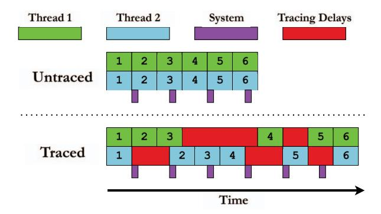
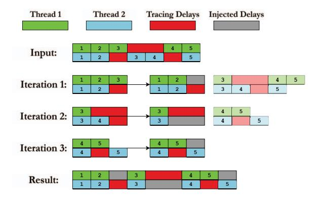
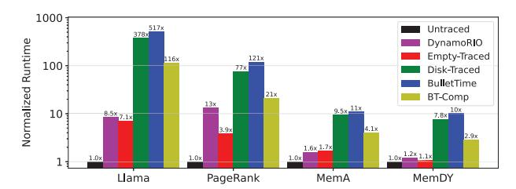

# BULLETTIME : Time Dilation for High-Fidelity Tracing

Michael Wu†, Sibren Isaacman‡, Abhishek Bhattacharjee†, Anurag Khandelwal† †Yale University ‡Loyola University Maryland

Email: mw976@yale.edu, snisaacman@loyola.edu, abhishek@cs.yale.edu, anurag.khandelwal@yale.edu

*Abstract*—Much of computer systems and architecture research depends on accurate, high-fidelity program tracing for simulation, profiling, and debugging. Unfortunately, with significant improvements in compute and memory instruction execution speeds, tracing frameworks incur frequent I/O to persist traced events to disk. We find that such delays can be bursty and asymmetric across application threads, resulting in an inadvertent reordering of application and system operations relative to untraced execution. In our analysis, such reordering often leads to significant changes in the behavior of the studied application, thereby contaminating insights from simulation and profiling studies of the corresponding captured traces.

In this work, we formalize the application behavior under study to establish correctness requirements for traced application execution in the presence of tracing-induced delays. We propose a novel *time dilation* approach that strategically slows execution for application and system threads while meeting correctness requirements. We implement the time-dilation approach in BUL-LETTIME, a tracing framework built atop Pin, the de facto binary instrumentation tool. We evaluate BULLETTIME for memorycontiguity and synchronization studies on real-world applications and workloads. Our results show that while existing tracing approaches can cause application behavior to deviate by as much as 20× compared to untraced execution, BULLETTIME's deviations are < 10% even in extreme cases of asymmetric tracing delays.

#### I. INTRODUCTION

Application tracing is widely used in computer systems research. It provides insights into workload characteristics [18], [32], [51], [52], [69], drives software simulator models of proposed hardware [13], [39], [55], [63], [74], [76], [78], and even guides real-system prototypes of new software systems [44], [68], [77]. Tracing is powerful because it can selectively record system interactions and events. In principle, highfidelity tracing should track not just application execution but also accurately capture how applications interact with diverse system software components (e.g., kernel scheduling, networking, virtual memory, compilers), thereby strengthening the conclusions drawn from trace-based studies.

Unfortunately, as processing and memory speeds increase, the overheads introduced by the tracing framework become a key hurdle to widespread adoption. A contributor to such overhead is the I/O required to persist the traced information, exacerbated by the fact that I/O speeds lag behind memory

Code is publicly available at https://github.com/ysarch-lab/BulletTime.

Fig. 1: The effect of tracing delays on interleaving of application threads and the surrounding system. Each numbered block represents a unit of application work (*operation*). Purple blocks denote periodic invocations of system daemons. Tracing injects bursty delays that are asymmetric across application threads and system daemons. Delay bursts misalign application threads with one another and with the system, causing the application to deviate from its untraced behavior.

and CPU instruction execution (and corresponding tracing) speeds. In practice, this results in frequent stalls of the traced application threads while flushing the traced information to disk. While prior approaches have explored reducing overheads associated with tracing [36], [37], [72], we posit that such overheads cannot be eliminated – some I/O is necessary to collect traced information. We also find that tracing-induced delays have more serious effects than application slowdown – indeed, they can alter the behavior of the traced application altogether (§II).

In particular, tracing-induced I/O tends to be asymmetric across the traced application threads. For instance, if a tracing study focuses only on instrumenting memory instructions in an application, its threads will experience time-varying I/O-based delays, depending on the frequency of memory access across threads and over time. This effect is illustrated in Figure 1, where operations performed across the different threads get reordered in time, changing the observed impact of those operations throughout the application's execution. Moreover, these delays cause system tasks (e.g., kernel daemons) that affect application behavior to be reordered relative to the

Fig. 2: CDF of memory coverage by page size for a key-value store in traced and untraced executions. The traced execution overestimates the portion of the application's memory footprint that is covered by regions with low contiguity. Shaded regions show the minimum and maximum values over 20 trials, each after a reboot. Untraced runs show very little variance, while traced executions exhibit significant variance, well outside the distribution of untraced runs.

application's execution, since these daemons incur no delay due to tracing. An immediately noticeable impact in Figure 1 is that the traced application will experience disproportionately more system activity than an untraced execution, since its execution is longer with tracing.

While our analysis holds for any study that relies on highfidelity program tracing, in this work, we examine this problem specifically for memory-contiguity and synchronization studies as case studies — fields where accurate tracing is paramount, as they operate at the boundary of hardware and software. The tracing studies in these fields are useful not only in developing efficient and robust software mechanisms (e.g., testing and developing race-free software [44], [67], [68], [81] using synchronization traces) but also in designing efficient hardware and operating systems (e.g., changes in production TLB hardware and memory management sub-systems [24], [62], [64], [71] using contiguity traces). Moreover, modern operating systems often rely on system daemons to detect and enforce memory contiguity [4], [78], [82], making such studies particularly vulnerable to behavioral divergence caused by tracing delays.

Empirically, we find that tracing effects can significantly affect the application behavior under study. Figure 2 shows the cumulative distribution of memory coverage by page size for a key-value store workload when run in traced and untraced configurations. To quantify contiguity, we compute the minimum number of pages required to cover each physically contiguous region of memory, where page sizes can be any power of 2 greater than the default 4KB. This process maximizes the amount of memory covered by a hypothetical TLB design [62], [63], where the use of power-of-2 pages is under active research [58]. Our results demonstrate that traced execution presents a misleading picture of memory contiguity, suggesting that about half of the contiguity is present in small groups of pages (<64KB), while these pages cover less than 20%

Fig. 3: Restoring application behavior in traced execution using *time dilation*. Application behavior is restored when traced application and system threads are slowed to match the pace of the slowest thread.

of memory in the untraced run. Such misrepresentations can have drastic ramifications, the most critical of which include the development of new architectures that are misaligned with the actual needs of real-world workloads. Past trace-driven contiguity work has led to designs in TLB compression [62], [63], new page table formats [58], and OS support [22], [23]. For example, the traced results from Figure 2 would suggest that TLB performance would benefit from a wide range of page sizes, while contiguity in native runs is far more concentrated between 64 and 512KB. Similarly, errant behavior is observed in other workloads and metrics of interest (see §VI), indicating the scope of the issue uncovered in this work.

Ensuring that application behavior is preserved with tracing first requires identifying the correct behavior for a given execution. A straightforward definition of correct execution would require that all application and system threads execute all operations in the same order as in untraced execution. Unfortunately, striving for such a definition of correctness is intractable in real-world applications deployed on systems with hundreds to thousands of executing components. At the other extreme, manually selecting traced components to constrain modeling complexity and correctness may miss components, such as obscure system daemons, that rarely affect application behavior.

Our approach to defining correctness starts with a precise description of the application behavior we want to study, followed by the identification of the components that must execute correctly (§III-A). At the core are two ideas: the application's *key state* – the state we want to observe during execution – and its *key operations* – the operations, across both application and system threads, that modify this state.

Correctness then comes down to two simple requirements. First, tracing must not introduce any new key operations of its own (i.e., it should not change application behavior). Second, the order of key operations across all relevant threads must remain the same, whether or not tracing is enabled. This definition keeps the focus on components that truly affect application behavior, while ignoring the many other threads/activities that do not impact the key state under study.

Equipped with a precisely-scoped definition of correctness centered on *key state*, we propose a novel *time dilation* approach to achieving it for traced application executions (§III-B). The idea underpinning this approach is that preserving the order of key operations across threads experiencing asymmetric tracing delays in a traced execution requires slowing down (*time dilating*) all threads to match the slowest thread (i.e., the one with the most tracing delays). Figure 3 depicts this idea in the most ideal sense – it injects just the right amount of delay (shown in gray) across both application and system threads to make sure all of them execute at the same pace, thereby preserving the order of key operations and, consequently, correct behavior.

We implement the time-dilation approach in our Pinbased [48] tracing framework, BULLETTIME1, which dynamically modulates the speed of application and system threads to ensure correct application behavior. A key insight is that preserving the order of key operations does not require tracking individual operations. Instead, it suffices to equalize the pacing of the threads that execute them. To this end, BULLETTIME intercepts the I/O events that persist trace data to detect per-thread slowdowns and injects delays that equalize the ratio of each thread's execution progress to its tracing delays. Equalizing this ratio over bounded intervals of execution confines any potential reordering of key operations to within a single interval (§III-B). BULLETTIME provides a simple interface by which users supply a set of functions to identify key threads; any thread executing one of these functions is included in time dilation.

Time dilation must also account for system threads, such as kernel daemons, whose execution is not slowed by tracing but still affects application behavior. BULLETTIME slows these threads by prolonging the duration that they sleep() for, so that their execution speed also matches that of the slowest thread over time. We select these mechanisms because they are prevalent across all Linux systems (e.g., kprobes), enabling BULLETTIME to be widely deployable across many machines and architectures.

We evaluate BULLETTIME's ability to preserve application behavior for memory contiguity and synchronization studies atop real-world applications and workloads, while recording all memory-referencing instructions of an application. On a set of popular cloud workloads, BULLETTIME improves contiguity metrics by 2.3× over existing tracing approaches, closely matching untraced execution. On a synchronization benchmark designed to maximize the difference in tracing delays between threads, while existing tracing approaches can deviate from untraced application behavior by as much as 20×, BULLETTIME ensures the deviation remains within 10% of untraced execution.

#### II. BACKGROUND AND MOTIVATION

#### *A. Delays in Tracing Frameworks*

It is well known that tracing incurs non-trivial runtime overhead to an application's execution, much of which is unavoidable when capturing low-level hardware events. In most real-world scenarios, the primary source of the overhead in fine-grained tracing is the I/O required to store the traced events. Figure 4 shows, for memory tracing, how the trace data generation rate scales as a function of memory references per instruction. Even when tracing just a single thread, the trace data rate exceeds the storage bandwidth of our test system at only one memory reference per *twenty* instructions. For a more realistic baseline, the benchmarks used in our evaluation commonly reference memory for *one out of every three* instructions. Moreover, since trace data rates scale with the number of threads in the traced application, incoming data can quickly overwhelm even sophisticated storage systems, even with multiple GB/s of write bandwidth. Because bandwidth oversubscription is so high, asynchronous I/O is of limited help, as the system quickly reverts to synchronous behavior once all buffers are filled. The observable impact of such high trace data rates is non-uniform tracing-induced delays across application threads.

Due to the sheer volume of data generated during tracing, many prior works use methods such as sampling [36], [59], [61], [80], periodically dropping data [37], [42], [72], and lossy compression [54], [75] to circumvent tracing overheads. While such approaches do reduce tracing overheads, they inevitably result in loss of information, compromising *trace completeness*. Doing so limits their ability to comprehensively represent application behavior. As such, we restrict our study to *lossless tracing* techniques that always collect the complete trace.

Among prior work – in both lossless and lossy tracing approaches – we are unaware of any studies that have analyzed the impact of tracing-induced delays on changes to traced application behavior. Such changes threaten to undermine the usefulness of the trace for any simulation, profiling, or debugging applications [7], [9], [18], [32], [33], [51], [52], [55], [70]. The focus of this work is to understand potential changes in application behavior due to tracing and to develop mechanisms to preserve behavior under tracing. Indeed, the compute, memory, and I/O scaling trends discussed above suggest that this problem will likely become more prominent in the foreseeable future, especially for tracing fine-grained hardware activity. We next explain, using real-world tracing studies, the exact mechanisms by which tracing can modify application behavior.

#### *B. Understanding Behavior Changes due to Tracing*

We now illustrate, through two use cases, how the tracing infrastructure can itself interfere with the application's execution in subtle ways, thereby altering the behavior under study. We will use these use cases as running examples and evaluation candidates for the rest of the paper.

1Popularized by the movie "The Matrix", BULLETTIME is a cinematic technique that slows time while the camera appears to move at normal speed around the scene. This creates the illusion that the viewer is moving freely around a moment that's unfolding in extreme slow motion.

Fig. 4: Trace data generation rate for a given rate of memoryreferencing instructions for a single thread. The data rate quickly outpaces the storage bandwidth (in red) of our test system (§VI), being an order of magnitude higher at only one reference every four instructions. Our benchmarks typically issue one reference every three instructions per thread.

Memory contiguity studies. Memory contiguity studies focus on an application's virtual-to-physical memory mappings at various parts of its execution, typically to understand the length and number of contiguous physical memory allocations. Trace-based memory-contiguity work has been key to motivating emerging hardware and software mechanisms such as compressed TLBs [62], [63], effective use of hugepages [4], [64], [78], and support for power-of-2 page sizes in RISC-V [58], [78]. It is therefore critical that such studies use accurate traces that are representative of application and system behavior. Unfortunately, tracing itself can cause virtualto-physical memory allocations to differ from those in an untraced execution.

We identify two main categories of "culprit" tracing operations in contiguity studies. The first – and the more obvious – category comprises operations that directly affect the virtualto-physical mappings. These include memory allocations and deallocations that the tracing framework must perform at runtime to manage its own memory, thereby inadvertently changing the physical memory available to the application.

The second category affects the mappings more subtly and is related to the delays introduced by the tracing infrastructure's operations; we illustrate this with the example shown in Figure 1. For this example, assume that each thread performs memory allocation as its fourth operation. In this case, the desynchronization between each of the threads themselves and between threads and the system daemons means the first thread will see a different layout of application data structures than in the untraced execution, changing its allocation behavior2. Moreover, if the system daemon performs meaningful work, such as collapsing a hugepage or compacting memory, both threads will see a different physical memory layout during block 4, which will change key behavior.

Figure 5 demonstrates how tracing affects both categories of operations. To profile the physical memory allocation behavior of the experiments in Figure 2, we track the perminute frequency of both minor page faults, which trigger

Fig. 5: Frequencies of minor page faults and THP daemon activity over untraced and traced executions. While page-fault behavior is similar across runs, THP activity is significantly higher when tracing is enabled.

Fig. 6: The evolution of memory covered by each page size as the application executes. Tracing induces significantly more allocations from individual 4KB pages.

physical memory allocation for a virtual page, and invocations of khugepaged, the Linux daemon used to periodically compact memory into 2MB hugepages. We find significantly more THP activity during tracing, an artifact of the increased application runtime, which allows the daemon to run more often. THP daemons are invoked earlier in the execution (indicating reordering of operations) and more frequently (indicating additional operations). Figure 6 shows the effects of changing these operation trends on memory contiguity over time. Coverage per page size is relatively consistent for untraced execution and concentrated between 128–512KB pages. Meanwhile, tracing artificially transforms the distribution of page sizes into a bimodal one, with two modes centered on 4KB pages and large pages (> 1MB).

Synchronization studies. Another class of studies in which tracing is critical concerns synchronization effects. These studies capture traces of synchronization-heavy multi-threaded applications, enabling simulation at a later time to improve costefficiency [68], characterize performance bottlenecks [44], and detect race conditions [81]. As with contiguity studies, tracing can inject operations into such multi-threaded applications, thereby altering synchronization behavior. Again, these tracing operations fall into two categories: those that inject their own synchronization operations (which are rare) and those that introduce delays to alter how synchronization occurs.

The latter, unfortunately, is not only common but also notoriously hard to detect and can even alter behavior, potentially changing application outputs. Table I illustrates this with a simple example, where two threads are synchronized by a

2The same occurs for the fourth operation of the second thread, due to the misalignment of its second and third operations.

TABLE I: Example program where a synchronization study that traces only memory operations can make memops() slower than computeops(), making it likely that interesting() is never executed with tracing, unlike untraced execution.

| <pre>int x = 0; mutex lock;</pre>                                                             |                                                                            |  |  |  |  |
|-----------------------------------------------------------------------------------------------|----------------------------------------------------------------------------|--|--|--|--|
| <pre>// Thread #1 memops(); acquire(lock);\nif (x == 0)   interesting(); release(lock);</pre> | <pre>// Thread #2 computeops(); acquire(lock); x = 1; release(lock);</pre> |  |  |  |  |

single mutex (lock). Entry into the critical section is gated by a memory-intensive function for the first thread and a compute-intensive function for the second thread. Without any tracing, if both functions are likely to take the same time to execute, then the first thread has a roughly 50% chance of executing the interesting() function, depending on which thread enters the critical section first. Now consider execution under a tracing framework that traces only memory operations, thereby disproportionately slowing memops () relative to computeops (). This biases execution so that the second thread enters the critical section first, preventing the first thread from executing interesting (). While this is only a simple example, identifying such code paths can be extremely difficult in large codebases with many conditional executions protected by synchronization, which is common in large-scale multi-threaded cloud frameworks such as key-value stores [6], [16], [30].

# III. PRESERVING APPLICATION BEHAVIOR WITH TIME DILATION

We begin by describing our approach to modeling application behavior both with and without tracing, and by formalizing the requirements for tracing to preserve application behavior relative to native execution (§III-A). We then describe our *time dilation* approach, which carefully dilates the execution of application and system components to preserve application behavior under tracing (§III-B).

#### A. Modeling the Application Behavior

A key challenge in modeling application behavior during tracing is appropriately *scoping* the application and system components responsible for that behavior. Returning to our memory contiguity studies as an example – at a high level, contiguity is affected broadly by memory allocations and deal-locations. If we scope the components that affect contiguity too narrowly, e.g., by considering only allocations/deallocations from the application, we risk overlooking important "full system" effects, e.g., periodic compactions of regular pages into huge pages by Linux's khugepaged daemon [4]. At the other extreme, if we define our scope too broadly, we would end up modeling components irrelevant to contiguity (e.g., modern Linux has tens of daemons that bear no relation to memory contiguity), resulting in an exponential increase in modeling complexity.

To this end, our approach relies on a precise definition of the application behavior of interest, which is then used to identify the exact set of application and system (i.e., OS or kernel) components that may affect it. More concretely, we introduce two concepts central to the application behavior under study: key state and key operations.

The key state, s, refers to the state critical to defining application behavior. Its contents should comprise the minimum state required to completely preserve the behavior under study. For instance, in a memory contiguity study, s must include the layout of free physical memory and the application's virtual-to-physical mappings. If these traces are used for cache and TLB simulations, then s should also include the layout of the application's allocated data structures. If necessary for functional correctness, the key state must also include variables used for conditional branches, system calls, etc.

A key operation *op*, on the other hand, is any event that *modifies* key state, i.e, an application of this operation leads to a modified key state, denoted as:

$$s' \leftarrow op(s)$$

Key operations comprise all instructions that modify the contents of the key state. Continuing our memory contiguity example, key operations would occur during all memory allocations and deallocations, as well as during any memory migrations performed by kernel daemons (e.g., khuqepaged).

A salient feature of this model is that we ignore all other forms of state and operations in either the application or the system, since perturbations to them are inconsequential to the tracing study. This allows us to constrain the scope of our problem to a well-defined, complete set of interactions among the application, the system, and the tracing framework.

Modeling the untraced application execution. The untraced ("native") application execution is modeled as an ordered list of key operations, Ops, comprising key operations from both the application and system threads. Since these threads execute concurrently, the order of operations in Ops is defined by the serialized order of their execution in the untraced run. More formally, Ops =  $\{op_1, op_2, \ldots, op_n\}$ , where i denotes the order of  $op_i$ 's execution. We use Thread $(op_i)$  to denote the thread that executes  $op_i$ . If  $s_0$  is the initial key state, then the  $application\ behavior$  under native execution is captured in the ordered sequence of key state versions,  $S = \{s_0, s_1, s_2, \ldots, s_n\}$ , where the next key state version is obtained by applying the next operation on the current state, i.e.,  $s_{i+1} \leftarrow op_{i+1}(s_i)$ .

Modeling traced application execution. The same application, when traced, is modeled as a similar list of operations,  $\operatorname{Ops}^t = \{op_1^t, op_2^t, \dots, op_m^t\}$ . As with the untraced execution, Thread $(op_i^t)$  denotes the thread that executes  $op_i^t$ . There are, however, two key differences between  $\operatorname{Ops}^t$  and  $\operatorname{Ops}$ . First,  $\operatorname{Ops}^t$  contains additional operations (denoted as the ordered list  $\mathcal{T}$ ) which correspond to operations performed by the tracing framework itself, i.e.,  $m \geq n$ . Note that if the operations in  $\mathcal{T}$  modify the key state, then the application's

**Algorithm 1 Time Dilation**: Execute operations of a traced application in a way that preserves its behavior.

**Input:** Ops $^t$ , the operations in the traced execution, streamed as windows of L operations per thread.

- 1: **function**  $ExecuteTraced(Ops^t)$
- 2: **for** every window of L operations per thread in  $\mathsf{Ops}^t$  **do**
- tracingDelays ← [# of tracing operations in window for each thread]
   maxDelay ← maxthd∈Threads(tracingDelays)
   Array of per-thread tracing delay in L-sized window
   Find the most delays to a thread in this window.
- 5: **for** each thread  $thd \in Threads do$
- 6:  $injectedDelay_{thd} \leftarrow (maxDelay tracingDelays[thd])$
- 7: Execute the first L injected Delaythd operations in thd's window, followed by a delay of injected Delaythd.
- 8: The last injectedDelay operations of thd are deferred to the next window. ▷To be executed first in the next window.

behavior changes relative to native execution. We also note that the remainder of the operations in  $\mathsf{Ops}^t$  are still the same as the operations in  $\mathsf{Ops}$ . Formally, if we denote  $\mathsf{Ops}$  as the list  $\mathsf{Ops}^t$  with all operations performed by the tracing framework removed (i.e.,  $\mathsf{Ops} = \mathsf{Ops}^t \setminus \mathcal{T}$ ), then  $|\mathsf{Ops}| = |\mathsf{Ops}|$ . However, the second difference between the two lists is that the order of operations in  $\mathsf{Ops}$  may not be preserved in  $\mathsf{Ops}$ . As noted in §II, this re-ordering of operations – typically caused by delays injected by tracing operations ( $\mathcal{T}$ ) themselves – is the other reason that tracing changes application behavior relative to native execution.

**Correctness conditions.** With the execution models defined above, we can now formally establish correctness conditions to ensure that application behavior is preserved during traced execution. These conditions effectively prevent the two sources of behavioral changes discussed above:

- C1 The tracing framework should not modify the key state s. In other words, no operation in  $\mathcal{T}$  is a key operation.
- C2 The order of key operations in the traced execution should be the same as the order of operations in the native execution. Formally,  $\hat{Ops} = Ops$ .

Meeting the correctness condition C1 requires modifying the tracing framework to prevent it from making any key state modifications. In many tracing studies, the tracing framework rarely alters the key state, although this is not impossible, e.g., memory allocations/deallocations within the tracing framework can affect the traced application's contiguity (as noted in §II). Fortunately, addressing this is straightforward: effectively remove such operations from the tracing framework (e.g., by preallocating any required memory buffers ahead of time for the tracing study). We defer implementation details of how this is realized in our framework to §IV.

#### B. Time Dilation Approach

Our approach to address the sources of application behavior changes, termed *time dilation*, effectively ensures that the traced execution preserves the correctness condition **C2**.

**Key idea.** The time dilation approach strategically injects delays in traced execution across various threads, in a manner that ensures all key operations in the traced execution (Ops) occur in the same order as those for the untraced execution (Ops), ensuring condition **C2**. Our driving observation is that changes in the ordering of key operations across threads arise from imbalances in the delays caused by operations injected by

the tracing framework (i.e., operations in  $\mathcal{T}$ ) across application and system threads. Therefore, to restore application behavior, the delays need to be made equitable across all threads. By injecting delays into the "faster" executing threads – threads with fewer delays due to tracing framework operations – we effectively *dilate* the notion of time in those threads until other threads catch up to them.

**Ideal time dilation.** The strongest form of equalization is *lockstep enforcement*: whenever any thread experiences a tracing delay, every other thread experiences an equal delay at the same moment. Under lockstep, either all threads are stalled, or all threads are executing, so no thread can race ahead of any other, and the native order of key operations is preserved exactly, satisfying condition **C2**. Lockstep is also the tightest enforcement at which correctness is guaranteed: any looser enforcement would permit at least one thread to advance further than another between synchronization points, admitting the possibility of reordering. Figure 3 depicts how lockstep execution achieves ideal time dilation – operations 2, 5, 6 in Thread 1, operation 4 in Thread 2, and all system operations are delayed by exactly the amount needed to keep all threads in step.

Windowed time dilation. Lockstep enforcement carries an inherent cost: the algorithm must act on every operation across every thread, a costly overhead. A natural way to amortize this cost is to act over windows of multiple operations at a time, equalizing tracing delays across threads at window granularity rather than at every operation. Algorithm 1 expresses time dilation in this generalized form, operating over windows of L operations per thread, where L=1 corresponds to lockstep execution. Without loss of generality, the algorithm assumes an operation (whether generated by the tracing infrastructure or native execution) is the basic unit of execution, and takes a unit time to execute - more complex operations can always be broken down into a sequence of basic operations (e.g., a single instruction or hardware  $\mu$ op). Modeling operations in this way also allows us to capture the passage of time during their execution: each operation advances time by a single unit.

At a high level, the algorithm considers a window of L operations at a time for every thread (Line 2) and computes the amount of delay that must be injected into the faster threads for that window based on the slowest thread – the one with the most tracing delay (Lines 3-6). It then injects the corresponding delays into the current window (Line 7),

Fig. 7: Delay injection using Algorithm 1 with a window of length L = 3. Translucent blocks indicate operations that are yet to be processed. Using a window length greater than 1 can lead to an approximate rather than exact restoration of thread interleaving, as seen in iteration 3.

thereby deferring some operations for the faster threads to the next window (Line 8). Effectively, Algorithm 1 ensures that the *ratio of delays* (tracingDelaysthd) *to original operations* (L − tracingDelaysthd) is the same across all threads in each window. This insight will prove useful for our kernel and Pinbased implementation of Algorithm 1 in §IV-C, where we must account for threads executing a different number of operations per window and estimate the tracing delays in future windows, which Algorithm 1 assumes are known a priori.

Figure 7 shows how Algorithm 1 executes operations from two threads using a window of length L = 3. In each window, the algorithm identifies the thread with the largest tracing delay and injects delays into the other thread to match it. Any additional operations are carried forward and processed immediately in the next window. The process repeats until all operations have been processed.

Correctness for windowed time dilation. At L = 1, Algorithm 1 reduces to lockstep enforcement. For larger windows (L > 1), however, this preservation no longer holds. As is evident from the execution of Iteration 3 in Figure 7, the fifth operations of the first and second threads are reordered relative to the native execution. Even so, the windowed approach guarantees that operations can only be reordered relative to native execution *within* a window; across windows, operation order is preserved by the same lockstep argument applied at the window granularity rather than at the operation granularity. In other words, Algorithm 1 *bounds* reordering (measured as the time within which operations can be reordered) to the window size.

The window size introduces an interesting trade-off in practice: smaller window sizes require more frequent delay computations and injections, incurring higher overhead, whereas larger window sizes may lead to (albeit bounded) reordering of key operations. We describe how our implementation of this algorithm in BULLETTIME navigates this trade-off to minimize tracing overhead while achieving near-ideal behavior

Fig. 8: BULLETTIME architecture to monitor tracing framework generated I/O operations for time dilation across system and application threads. See §IV-A for details.

in §IV, with real-world evaluations in §VI.

#### IV. BULLETTIME DESIGN

We now describe BULLETTIME, our practical realization of time dilation. While BULLETTIME's general approach applies to a range of simulator front-ends (e.g., Simics [50], M5 [14], etc.), we demonstrate the utility of our approach using an implementation with a Pin-based front-end [48]. This helps us test our idea on a mature software ecosystem that is widely used to build traces in computer architecture studies across simulators (e.g., zsim [67], CMP\$im [39], PinPlay [60], RADISH [28], etc.) and in operating system studies (e.g., MIND [44], HotPot [68], etc.). We begin with a high-level overview of BULLETTIME's architecture (§IV-A), followed by details on how it eliminates key operations in the tracing framework (§IV-B) and how it computes and injects time dilations across application (§IV-C) and system threads (§IV-D).

# *A.* BULLETTIME *Overview*

BULLETTIME builds on the Pin [48], where the dominant tracing overhead (tracingDelays in Algorithm 1) stems from I/O operations due to flushing traced instructions to disk. Consequently, BULLETTIME's realization of time dilation focuses on injecting delays in a manner that slows down the execution of threads that observe disproportionately lower I/O delays due to tracing (calculating injectedDelaythd).

Specifying Key State. In order to preserve application behavior, BULLETTIME must sufficiently preserve the order of key operations. This requirement suggests that users would need to themselves identify the key states necessary for their studies; i.e., the OS free memory list and application page tables for memory contiguity, lock variables for synchronization, etc. Note, however, that Algorithm 1 does not require identifying individual key operations to restore behavior, only the "key" threads that will execute them. This list corresponds to the Threads list in Algorithm 1. BULLETTIME provides a simple interface for users to supply a set of functions to identify key threads. When a thread executes any of these functions, BULLETTIME will include it in time dilation.

Runtime execution. Figure 8 provides an overview of BUL-LETTIME's overall architecture and operation. All unmodified application and system components are shown in gray. We add a new component to Pin's existing instrumentation framework — the BULLETTIME controller (shown in blue) — which is responsible for delay computation and time dilation. We also add two components (shown in orange) outside the Pin framework to enforce time dilations: a Buffer-Driven Delay Module that takes each injectedDelaythd value computed by the BUL-LETTIME controller and injects them into application threads through per-thread I/O buffers (§IV-C), and a Sleep Dilation Kernel Module that injects the delays into relevant system threads (§IV-D). At runtime, (1) the tracing instrumentation (Pin) generates and stores data in internal per-thread buffers. BULLETTIME leverages the filling up of these per-thread buffers as events to both compute and inject time dilations for application threads (details in §IV-C). Specifically, when a per-thread buffer fills up, 2) the delay computation module tracks per-thread delays (tracingDelays) in the BULLETTIME controller and calculates the time dilation required across all other threads for restoring application behavior (as in Algorithm 1). These delays are then injected 3 into the relevant application threads via the Buffer-Driven Delay Module when their data buffers fill up next. Since the controller intercepts the buffer fill events, it is also responsible for (4) persisting the data to disk. (5) The injection of delays into system threads (i.e., kernel daemons) is handled differently - the controller periodically computes a delay value for all relevant system threads, which are slowed down by extending their sleep timers via the Sleep Dilation Kernel Module (details in §IV-D).

#### B. Avoiding Key Operations in BULLETTIME

As we noted in \$III-A, preserving application behavior under tracing requires that the tracing framework itself not modify key state (Condition C1). While it is impossible to know (and therefore avoid modifying) key states for arbitrary studies, our BULLETTIME implementation focuses on eliminating key operations that affect memory contiguity and synchronization, as introduced in \$II. We argue that the principles we use to avoid key state modifications for these classes of studies can be applied to other studies as well.

Eliminating memory allocations for contiguity studies. The vast majority of memory allocations in the underlying Pin framework stem from kernel-level caching of tracing-triggered I/O. In particular, we found that when Pin writes large amounts of traced data to disk, the kernel page cache repeatedly allocates and deallocates individual 4KB pages, severely fragmenting the contiguity of physical memory. To avoid this, we perform trace I/Os using the O\_DIRECT flag to bypass the page cache and write directly to disk. Additionally, we ensure that any internal buffers used by Pin to store data are backed by 2MB hugepages via hugetlbfs [46] and are far from the application's allocations in both the physical and

virtual address spaces. We found that such internal allocations are typically small (a few megabytes at most), and keeping them far from application allocations eliminates any impact on application contiguity.

Eliminating synchronization over key state for synchronization studies. Our tracing framework injects minimal synchronization operations, only acquiring a brief lock to instrument code to record memory accesses. This instrumentation occurs only the first time a block of code is encountered, and is never acquired to access or modify application key state (e.g., hash-tables in our evaluated Memcached [30] application). As such, these synchronizations do not introduce any key operations.

#### C. Time Dilation for Application Threads

As discussed in  $\Pi$ -B, Algorithm 1 dilates time across faster threads to ensure they keep pace with the slowest thread; it does so by injecting delays across threads in windows of a fixed number of L operations. Realizing such an approach in BulletTime presents two key challenges. First, computing and realizing delays over a fixed window of operations is challenging, since instrumented operations do not tend to execute in fixed windows in practice. Second, while Algorithm 1 "looks ahead" within a window of L operations to estimate tracing-induced delays per thread, BulletTime must estimate this value.

To overcome the first challenge, BULLETTIME aims to balance the *ratio of tracing delays to application "progress" over any fixed time window* L (i.e., balancing  $\frac{\text{tracingDelays}_{\text{hid}}}{L-\text{tracingDelays}_{\text{shid}}}$  in Algorithm 1). In our theoretical model, this progress is the number of operations executed due to the untraced application. In BULLETTIME, we approximate progress as the total number of instructions executed by each thread, excluding Pin instrumentation overhead. Since an application thread's execution may include both kernel and user-space instructions, we scale their contributions by the respective instructions-percycle (IPC) values. This approach still achieves the same goal of ensuring the computed per-thread delay causes all threads to observe the same progress-to-delay ratio as the "slowest" thread.

Since Bullettime cannot, in practice, look ahead, it must approximate future progress and delays based on past information. Thus, the window size used to compute progress-to-delay ratios is a critical parameter. Too long, and Bullettime will be unable to react quickly to changes in the application phase. Too short, and Bullettime may have unstable responses to momentary variations. To address this challenge, Bullettime computes an exponential-weighted moving average (EWMA [47]) of the application's progress and tracing delays over short windows. Short windows allow Bullettime to respond quickly to changes in the application phase, while incorporating past information via a moving average prevents overfitting to brief modulations. Empirically, we find that a window length of 5s and a decay rate of 0.5 perform well for real-world deployments.

Fig. 9: BULLETTIME balances the ratio of tracing delays per unit of application progress across threads. In this example, Thread 2 initially executes faster than Thread 1, making more progress before their first I/O events (where trace data is persisted), the first and second I/O events. When BULLETTIME detects that Thread 2 is ahead of Thread 1 (at the second I/O event), it calculates a delay to inject to balance their progress-to-delay ratios. BULLETTIME injects no delays when threads are balanced (third and fourth I/O events), or when the thread is slower (first I/O event).

Figure 9 demonstrates an example of how BULLETTIME realizes the buffer-driven delays described above. In the example, Thread 1 experiences more tracing delays for its first time window (defined by I/O events) than Thread 2, performing its first I/O event after 2 operations instead of Thread 2's 5 operations. When Thread 2 performs its first I/O event, BULLETTIME detects this difference and computes the required delay to be injected into Thread 2, so that its ratio of progress to tracing delays (4:4) will match that of Thread 1 (2:2). At Thread 1's second I/O event, which occurs simultaneously with Thread 2's injected delays, the progressto-delay ratios are balanced (BULLETTIME takes into account injected delays even before they complete) and thus receives no additional delays. The original interleaving is restored by the final I/O event in both threads, with no additional delays required.

#### D. Time Dilation for System Threads

BULLETTIME must handle time dilation for system threads (kernel daemons) differently for two reasons. System threads are not instrumented by BULLETTIME, and therefore exhibit no tracing delays. It follows that these threads do not perform tracing-induced I/O, leaving no I/O events available to inject delays.

Fortunately, kernel daemons operate at fixed periodicity – where they perform work (e.g., page compactions in khugepaged) every T units of time, where T is kept constant by sleeping for the time no work is performed. This provides a convenient way to dilate time for such threads by simply slowing the sleep timer, which is effectively what BULLETTIME's Sleep Dilation Kernel Module does.

In more detail, BULLETTIME periodically computes the slowdown factor experienced by its slowest thread in the last

period (a multiple of T in our implementation), following the approach outlined in IV-C – this is the same factor that the system threads must be slowed down by in that period. BulletTIME's control plane informs the Sleep Dilation Kernel Module of this slowdown factor, which in turn, extends the sleep lengths within the kernel threads to ensure its rate of progress matches that of the slowest thread.

#### E. Compressing Traces to Reduce I/O Overheads

While time dilation can restore application behavior, its use of delay injection can increase the already long runtime of trace collection, particularly as delays become more imbalanced (Fig. 7). To alleviate these overheads, BULLETTIME provides an option to compress traces online, thereby reducing the total I/O overhead. Intuitively, trace compression can improve runtime even when it requires more compute, because tracing is typically I/O-bound, leaving compute underutilized. Thus, using more compute to compress traces can alleviate the I/O bottleneck. As long as compression is not overly compute-intensive, this can *improve* the compute utilization of application threads, reducing overall runtime.

In our prototype, we use zstd compression at level -7 [20], which we find provides a suitable tradeoff between compression ratio and speed. We aim to fully utilize the CPU between compression and application threads, while occasionally seeing I/O stalls. This indicates that the I/O and compute bottlenecks are balanced. We leave a more detailed exploration of compute-I/O tradeoffs for future work.

#### V. BULLETTIME IMPLEMENTATION

We build BULLETTIME using Intel Pin version 3.30 [48]. Our tool collects a memory reference trace of all load/store instructions, the target virtual address, and the reference size. The traced application's page table is recorded concurrently every 30 seconds to capture virtual-to-physical translations. I/O events occur when the traced data fills internal buffers (2 MB in our experiments). Thus, I/O events occur only on a subset of memory references. Individual key operations may not trigger the BULLETTIME controller, resulting from our intentional design choice to track key threads instead (§IV-A).

As of Pin version 3.30, the O\_DIRECT flag has no effect from within a pintool. Therefore, we implement the BULLET-TIME Controller as a separate process that manages all trace I/O. Trace data is written by the Pin-instrumented application to shared memory regions allocated via hugetlbfs, with named pipes used to indicate when buffers are available for writing or have been persisted to disk. The controller tracks metadata on the amount of data generated in each buffer, as well as the time taken, updating both figures for each time window using an exponentially weighted moving average (§IV-C).

Our sleep dilation kernel module uses kprobes (available in the Linux kernel since version 2.6.9) to instrument sleep-related kernel functions and modify their arguments to adjust sleep duration. Specifically, we instrument two functions: schedule timeout and hrtimer nanosleep.

| Hardware Configuration |                    | Data Rate  | I/O BW       | Ratio    |
|------------------------|--------------------|------------|--------------|----------|
| CPU                    | DDR4 / PCIe 4.0    | 20-25 GB/s | 4-7 GB/s     | 3-6×     |
|                        | DDR5 / PCIe 4.0    | 50-70 GB/s | 4-7 GB/s     | 7-18×    |
|                        | DDR5 / PCIe 5.0    | 50-70 GB/s | 8-14 GB/s    | 3-7×     |
| GPU                    | GDDR6X / PCIe 4.0  | 1TB/s      | 4-7 GB/s     | 143-250× |
|                        | HBM2e / PCIe 5.0   | 2TB/s      | 8-14 GB/s    | 133-200× |
| 0                      | HBM3e / Infiniband | 4.9TB/s    | 100 GB/s     | 49×      |
| DDR4 / SATA            |                    | 20-25 GB/s | 0.4-0.6 GB/s | 33-63×   |

TABLE II: Comparison of data generation rates and storage bandwidth for multiple hardware configurations. Peak data rates are calculated from the available memory bandwidth. We include memory bandwidth figures for the RTX4090, H100, and GH200 GPUs [29], [49]. Our chosen configuration (in bold) represents a middle ground among potential scenarios.

All timed, non-event-driven sleep functions in both kernel and userspace eventually invoke one of these two functions. We only dilate schedule\_timeout calls for tasks in the TASK\_INTERRUPTIBLE state, thereby avoiding interference with critical event-driven or hardware-facing kernel activity. The dilation factor is approximated by the ratio of the CPU time used by the traced application to the time spent waiting for trace data to be persisted to disk.

#### VI. EVALUATION

Our evaluation focuses on understanding the behavior changes caused by tracing in memory contiguity (§VI-A) and synchronization (§VI-B) studies, as well as BULLETTIME's effectiveness in correcting these changes.

**Experimental Setup.** We perform all experiments on a machine running Linux 6.13 with an Intel Core i7-8700 CPU at 3.2GHz with 6 cores and 12 threads. The storage device on our machine is a SATA-connected Samsung 870 EVO SSD. This setup represents the effect of tracing overheads on widely available commodity hardware and constitutes a middle ground among possible bandwidth ratios, as shown in Table II. We focus on the bandwidth ratio because it captures the key hardware challenge that BULLETTIME addresses: behavioral inaccuracies caused by I/O stalls. BULLETTIME is useful in all configurations in which the data generation rate significantly exceeds the available I/O bandwidth.

Applications & workloads. We use three real-world applications and workloads to demonstrate the effects of tracing on contiguity behavior. (1) Llama [73] is an open-source large language model. We use the llama.cpp [31] framework to perform inference from a starting seed. As a deterministic machine learning application, one would expect Llama to have regular behavior even under traced execution. (2) PageRank from the GAP benchmark suite [8], a well-known graph processing algorithm. (3) Memcached [30] is an opensource in-memory key-value store. We use the YCSB A workload [21] (MemA) configured to load 10M objects 1KB in size before performing 100M requests (50/50 reads/writes). We also create a custom workload (MemDY) to issue 500M requests after the initial load phase, with an 80/10/10 split

among reads, writes, and insertions. Along with object sizes uniformly distributed between 1B - 1KB, this roughly mimics Meta's ETC workload [5]. This tests BULLETTIME's ability to preserve contiguity for a steadily growing memory footprint.

To evaluate BULLETTIME's ability to preserve thread interleaving and synchronization behavior, we use a reader-writer synchronization scenario on Memcached with two clients. The first client (the reader) repeatedly issues GET requests to a single key, while the other (the writer) repeatedly sends UPDATE requests to the same key. This is representative of producer-consumer patterns observed in popular cloud workloads [40], [41], [65]. Since GETs and UPDATEs execute different codepaths on the Memcached server, tracing can induce disproportionate overheads for each type of request, similar to the example in Table I. We evaluate how well time dilation in BULLETTIME preserves the proportion of GET and UPDATE requests completed over time.

Because key operations are so fine-grained (§IV-A), tracking BULLETTIME's ability to preserve the exact key operation order would induce even more interference with the behaviors we aim to preserve. Instead, we use end-to-end metrics measuring overall memory contiguity and request ratios. These metrics represent the overall effect of preserving key operation order and ultimately align better with the key behaviors themselves, for which key operations serve as a proxy for explaining behavior.

Evaluated Baselines. We consider the following configurations to understand the impact of tracing on application behavior: (1) Untraced, representing regular application execution without any tracing overhead; (2) DynamoRIO's drmemtrace [15], a memory tracing tool used to collect industry traces [1], [66] that uses LZ4 [19] compression to reduce tracing I/O; (3) Empty-Traced, representing a traced application execution with all memory access instructions instrumented, but without persisting any data to storage. This shows the impact of just instrumentation overhead without I/O; (4) Disk-Traced, which writes all traced data to disk using asynchronous write() system calls. This represents the standard approach employed in most tracing studies; (5) BULLETTIME, our tracing framework as described in §IV; (6) BT-Comp, which additionally compresses BULLETTIME's traces to reduce I/O requirements.

#### A. Preserving Memory Contiguity

We begin by examining how tracing affects memory-contiguity behavior and evaluate BULLETTIME's efficacy in preserving it. Figure 10 shows the physical memory contiguity of our test applications in all configurations. As in Figure 2, we show the cumulative distribution of memory covered for each page size, maximizing the amount of memory covered by larger pages. Since contiguity can vary over time, either due to application memory allocations or migration via kernel daemons, we examine the state of memory contiguity at the end of execution, before memory is deallocated on exit. Since our workloads rarely deallocate memory before exit, the final

Fig. 10: Cumulative distributions of the percentage of an application's physical memory footprint that is covered by a given page size. BULLETTIME successfully restores the memory contiguity behavior of all tested applications.

Fig. 11: Application runtime in traced configurations, normalized to the runtime of an untraced execution. BulletTIME trades-off up to 58% runtime overhead over Disk-Traced in exchange for more accurate execution. With compression, we improve runtimes by more than  $2\times$  with no loss in accuracy.

|          | Misplaced Memory % (Total Variation Distance) |         |           |        |      |  |
|----------|-----------------------------------------------|---------|-----------|--------|------|--|
|          | Empty-                                        | Dynamo- | Disk-     | BULLET | BT-  |  |
| Workload | Traced                                        | RIO     | Traced-NC | TIME   | Comp |  |
| Llama    | 6.61                                          | 30.53   | 32.44     | 9.00   | 6.61 |  |
| PageRank | 7.54                                          | 8.96    | 5.1       | 7.86   | 7.10 |  |
| MemA     | 1.96                                          | 94.62   | 43.12     | 10.79  | 6.53 |  |
| MemDY    | 2.39                                          | 92.98   | 61.29     | 7.91   | 4.75 |  |
| Average  | 4.63                                          | 56.77   | 35.49     | 8.89   | 6.25 |  |

TABLE III: Percentage of application memory footprints placed in the wrong page size (**lower is better**). BULLETTIME is consistently close to Untraced, while tracing configurations that write to disk are prone to significant divergence. BT-Comp further improves accuracy by reducing I/O overheads.

state reflects the cumulative effect of all memory-contiguity behavior throughout the run.

Our results show that the effects of Disk-Traced on contiguity behavior can be unpredictable. Depending on the workload, Disk-Traced can increase fragmentation, improve contiguity for larger page sizes, or do both. DynamoRIO is worse at preserving contiguity behavior compared to Disk-Traced on average. In both memcached workloads, DynamoRIO induces substantial physical memory fragmentation, leaving nearly all memory covered by page sizes of 16KB or smaller. Such a result would significantly mislead TLB designs, as Untraced execution shows that most memory is covered by 64KB-512KB pages for the same workloads.

To quantitatively evaluate contiguity preservation, we measure, in contrast to the contiguity distribution in Untraced

execution, the percentage of memory covered by an incorrect page size. This can be calculated from the Total Variation Distance of the distributions in Figure 10. Table III shows our results. We see that BULLETTIME is  $4\times$  more accurate than Disk-Traced, and  $6.4\times$  more accurate than DynamoRIO.

We also examine the effect of injected time dilation on the overall runtime overhead of tracing with our approach in Figure 11. BULLETTIME trades off no more than 60% extra runtime overhead compared to Disk-Traced in exchange for accurate execution, with an average runtime increase of 35%.

With trace compression, we see significant runtime improvements ( $> 2\times$ ) with no loss in accuracy. For Llama, we find that the CPU is only 5% utilized by default. Using compression reduces I/O by a factor of  $10\times$  and lowers application CPU usage to 20%, aligning with our observed runtime improvements (Figure 11). Similar utilization improvements occur for the other applications. We further observe slight improvements in accuracy due to reduced I/O overheads. Notably, although DynamoRIO outperforms even Empty-Traced in runtime performance, it is by far the worst candidate for preserving contiguity behavior while tracing.

#### B. Thread Interleaving and Synchronization

We now evaluate BULLETTIME on our synchronization study atop Memcached. The use of a dedicated reader and writer issuing requests to the same key stress tests BULLET-TIME's effectiveness in preserving synchronization behavior in the midst of large overhead disparities between threads3.

Figure 12 shows the average GET and UPDATE latencies for each configuration, sweeping over item sizes between 1-512KB. While Untraced execution shows little difference between GET and UPDATE latencies, Empty-Traced, Disk-Traced, and DynamoRIO exhibit higher UPDATE latencies. This imbalance arises from the difference between the GET and UPDATE codepaths, with UPDATE requests making more memory accesses for data copies, memory allocation, etc., leading to higher tracing delays.

The effect of this asymmetry manifests in more GET requests being completed per unit time. Interestingly, this imbalance spikes significantly as item size increases beyond 8-16KB, with Disk-Traced executing up to  $25\times$  more GETs than UPDATEs (Figure 13). This spike stems from a change

&lt;sup>3Each client is served by a single worker in Memcached [30].

Fig. 12: Average latencies of GET and UPDATE requests in our synchronization study. BULLETTIME achieves the closest latency difference compared to untraced execution.

Fig. 13: Ratio of completed GET requests vs. completed UPDATE requests per unit time. Again, BULLETTIME achieves behavior closest to untraced execution.

in how the memcpy() function copies incoming data to the hash table for larger items. When copying more than 8KB of data, our system's memcpy() switches from using AVX instructions, operating on 32-64B at a time, to rep stosb, which repeatedly injects microcode to store data one byte at a time. While an optimization for Untraced execution, it incurs 32–64× more memory operations that must be instrumented and recorded by the tracing framework. This change in the code path leads to an enormous imbalance in the number of GETs and UPDATEs completed per unit time for larger item sizes.

In contrast to other tracing approaches, BULLETTIME maintains the ratio of completed GETs and UPDATEs within 10% of the native execution ratio for all item sizes. This result is a direct consequence of BULLETTIME injecting large amounts of extra delays into the thread that serves GET requests (i.e., the faster thread), while injecting minimal to no delays to the thread serving UPDATE requests. The success of BUL-LETTIME's delay injection is exemplified in Figure 12, where GET and UPDATE latencies remain nearly identical. All in all, even in a workload designed to maximize the difference in tracing delays between threads, BULLETTIME still manages to accurately balance their execution speeds.

## *C. Ablation Studies*

To examine the effects of each mechanism used to preserve behavior in BULLETTIME, we perform an ablation study where we progressively add features beginning with Direct-IO (*D-I/O*), hugepages for internal buffers (+HP), time di-

Fig. 14: Memory contiguity of MemDY when adding features from BULLETTIME one-by-one.

Fig. 15: Ratio of GET and UPDATE requests when adding features from BULLETTIME one-by-one.

lation of application threads (+AD), time dilation of kernel threads (+KD), and compression (+Comp). Note that +KD and +Comp are equivalent to BULLETTIME and BT-Comp, respectively.

Figure 14 shows memory contiguity behavior for MemDY with each feature of BULLETTIME. We observe that using direct I/O is sufficient to reduce the large portion of memory allocated to smaller pages (4KB-256KB) with Disk-Traced and DynamoRIO. However, the overallocation of 2MB+ pages remains until kernel dilation is applied. This result aligns with our reasoning that hugepage allocations arise from increased THP daemon activity. Dilating kernel threads restores contiguity to Untraced behavior.

Among all features in BULLETTIME, only +AD aims to preserve application thread interleaving in any way. As such, it is expected that thread interleaving behavior will only be restored in configurations starting from +AD. Figure 15 confirms this.

### VII. RELATED WORK

Despite almost no active study in decades, tracing-induced distortion of application execution is actually a classic problem, first identified in the 1990s for memory address tracing on single-core RISC processors running Ultrix and Mach 3.0 [2], [17]. Even on those simple platforms – with no multithreading and limited system services – tracing overheads were problematic. Solutions of that era, such as slowing the processor's clock interrupt rate to match the tracing-induced slowdown, primarily applied to single-threaded workloads. Modern systems, however, are far more complex: they depend on multi-threading, rich application-kernel interactions, and diverse system activity. These factors both amplify distortion and render prior solutions inadequate, motivating our new theoretical framework for applying time dilation more broadly – particularly now, as tracing is widely used in studies of synchronization, virtual memory, disaggregation, and beyond [28], [38], [44], [50], [63], [64], [67], [68].

More recent tracing studies ignore behavioral distortion and focus instead on the orthogonal problem of tracing with minimal overhead. This can indirectly address distortion as, in theory, zero-overhead tracing would preserve behavior. In practice, however, reducing tracing overhead exposes another fundamental trade-off with trace *completeness*. Intel Processor Trace [37] records fine-grained control flow and timestamps, which in principle could be used to reconstruct complete instruction and memory streams, but doing so in practice would be arduous for programs with variable inputs or frequent kernel interactions. Arm CoreSight [72] provides hardware support for tracing hardware events, but since it favors dropping data over delaying execution, it is typically used only for selected subsets of operations. HMTT [36] snoops the DRAM bus to capture memory accesses with low overhead, but misses references satisfied by the cache hierarchy. Overall, these approaches sacrifice completeness for low overhead. BULLETTIME, on the other hand, avoids distortion regardless of tracing overhead or completeness. That is, its core design principles also apply to the above approaches.

The COZ causal profiler [26] uses a scheme that works somewhat inversely to BULLETTIME. COZ estimates the potential speedup from optimizing a single section of code by proportionally slowing all other sections of the application. BULLETTIME handles the effects of slowing down one thread of a program by equally slowing all other threads.

Deterministic execution schemes aim to ensure that an application executes identically and reproducibly over every run. BULLETTIME, on the other hand, is designed to accurately represent the space of non-determinism an application exhibits in traces. Many deterministic schemes use enforcement mechanisms such as fixed execution quanta [10], [11], [27], [34], [53], deterministic logical clocks [57], and fixed-order thread serialization [12], [25], [45], which enforce deterministic execution, but do not necessarily guarantee that the achieved execution represents behavior without enforcement [79]. Other schemes initially record important activity and enforce the recorded ordering in subsequent executions [3], [35], [43]. However, these approaches focus on ensuring that interactions between *userspace* threads and their system calls [11], [56] are deterministic. None addresses the scheduling of separate kernel threads that run concurrently with the application a necessary consideration when the behavior under study is influenced by background kernel activity, as is the case for memory contiguity, page reclamation, and other OS-managed resources.

# VIII. CONCLUSION

Tracing frameworks introduce asymmetric delays when persisting traced data, affecting application behavior relative to untraced executions. We formally define correctness notions for traced executions and propose a novel *time dilation* approach to achieve them. We have realized time dilation in BULLETTIME, a tracing framework built atop Pin. Our evaluations of memory contiguity and synchronization studies on real-world workloads show that existing tracing approaches can cause application behavior to deviate by up to 20× relative to untraced execution. In contrast, BULLETTIME deviates by at most 10% for all evaluated workloads.

#### IX. ACKNOWLEDGEMENTS

We would like to thank our shepherd and anonymous ISCA reviewers for their valuable comments and insightful feedback. This work is supported in part by NSF awards 2112562, 2047220, an NSF Graduate Research Fellowship, a Meta research gift, and a NetApp Faculty Fellowship. Generative AI was used to assist in implementing BULLETTIME and in editing paper text.

#### REFERENCES

- [1] "Google workload traces version 2," https://console.cloud.google.com/ storage/browser/external-traces-v2, accessed: 2026-02-27.
- [2] M. Accetta, R. Baron, W. Bolosky, D. Golub, R. Rashid, A. Tevanian, and M. Young, "Mach: A new kernel foundation for unix development," 1986.
- [3] G. Altekar and I. Stoica, "Odr: Output-deterministic replay for multicore debugging," in *Proceedings of the ACM SIGOPS 22nd symposium on Operating systems principles*, 2009, pp. 193–206.
- [4] A. Arcangeli, "Transparent hugepage support," in *KVM forum*, vol. 9, 2010.
- [5] B. Atikoglu, Y. Xu, E. Frachtenberg, S. Jiang, and M. Paleczny, "Workload analysis of a large-scale key-value store," in *Proceedings of the 12th ACM SIGMETRICS/PERFORMANCE joint international conference on Measurement and Modeling of Computer Systems*, 2012, pp. 53–64.
- [6] K. Banker, D. Garrett, P. Bakkum, and S. Verch, *MongoDB in action: covers MongoDB version 3.0*. Simon and Schuster, 2016.
- [7] T. W. Barr, A. L. Cox, and S. Rixner, "Translation caching: skip, don't walk (the page table)," *ACM SIGARCH Computer Architecture News*, vol. 38, no. 3, pp. 48–59, 2010.
- [8] S. Beamer, K. Asanovic, and D. Patterson, "The gap benchmark suite," ´ *arXiv preprint arXiv:1508.03619*, 2015.
- [9] R. Bera, K. Kanellopoulos, A. Nori, T. Shahroodi, S. Subramoney, and O. Mutlu, "Pythia: A customizable hardware prefetching framework using online reinforcement learning," in *MICRO-54: 54th Annual IEEE/ACM International Symposium on Microarchitecture*, 2021, pp. 1121–1137.
- [10] T. Bergan, O. Anderson, J. Devietti, L. Ceze, and D. Grossman, "Coredet: A compiler and runtime system for deterministic multithreaded execution," in *Proceedings of the fifteenth International Conference on Architectural support for programming languages and operating systems*, 2010, pp. 53–64.
- [11] T. Bergan, N. Hunt, L. Ceze, and S. D. Gribble, "Deterministic process groups in {dOS}," in *9th USENIX Symposium on Operating Systems Design and Implementation (OSDI 10)*, 2010.
- [12] E. D. Berger, T. Yang, T. Liu, and G. Novark, "Grace: Safe multithreaded programming for c/c++," in *Proceedings of the 24th ACM SIGPLAN conference on Object oriented programming systems languages and applications*, 2009, pp. 81–96.
- [13] A. Bhattacharjee, "Translation-triggered prefetching," in *Proceedings of the Twenty-Second International Conference on Architectural Support for Programming Languages and Operating Systems*, 2017, pp. 63–76.
- [14] N. L. Binkert, R. G. Dreslinski, L. R. Hsu, K. T. Lim, A. G. Saidi, and S. K. Reinhardt, "The m5 simulator: Modeling networked systems," *Ieee micro*, vol. 26, no. 4, pp. 52–60, 2006.
- [15] D. Bruening and S. Amarasinghe, "Efficient, transparent, and comprehensive runtime code manipulation," 2004.
- [16] J. Carlson, *Redis in action*. Simon and Schuster, 2013.

- [17] J. B. Chen, D. W. Wall, and A. Borg, "Software methods for system address tracing: implementation and validation," *WRL Research Report 94/6*, 1994.
- [18] D. W. Clark and J. S. Emer, "Performance of the vax-11/780 translation buffer: Simulation and measurement," *ACM Transactions on Computer Systems (TOCS)*, vol. 3, no. 1, pp. 31–62, 1985.
- [19] Y. Collet, "LZ4: Extremely fast compression algorithm," https://github. com/lz4/lz4, 2011, accessed: 2026-02-27.
- [20] Y. Collet and M. Kucherawy, "Zstandard compression and the application/zstd media type," Tech. Rep., 2018.
- [21] B. F. Cooper, A. Silberstein, E. Tam, R. Ramakrishnan, and R. Sears, "Benchmarking cloud serving systems with YCSB," in *Proceedings of the 1st ACM symposium on Cloud computing*, 2010, pp. 143–154.
- [22] J. Corbet, "Flexible-order anonymous folios," LWN.net, 2023, accessed: 2026-03-04. [Online]. Available: https://lwn.net/Articles/932386/
- [23] ——, "Large folios for anonymous memory," LWN.net, 2023, accessed: 2026-03-04. [Online]. Available: https://lwn.net/Articles/937239/
- [24] G. Cox and A. Bhattacharjee, "Efficient address translation for architectures with multiple page sizes," *ACM SIGPLAN Notices*, vol. 52, no. 4, pp. 435–448, 2017.
- [25] H. Cui, J. Simsa, Y.-H. Lin, H. Li, B. Blum, X. Xu, J. Yang, G. A. Gibson, and R. E. Bryant, "Parrot: A practical runtime for deterministic, stable, and reliable threads," in *Proceedings of the Twenty-Fourth ACM Symposium on Operating Systems Principles*, 2013, pp. 388–405.
- [26] C. Curtsinger and E. D. Berger, "Coz: Finding code that counts with causal profiling," in *Proceedings of the 25th Symposium on Operating Systems Principles*, 2015, pp. 184–197.
- [27] J. Devietti, B. Lucia, L. Ceze, and M. Oskin, "Dmp: Deterministic shared memory multiprocessing," in *Proceedings of the 14th international conference on Architectural support for programming languages and operating systems*, 2009, pp. 85–96.
- [28] J. Devietti, B. P. Wood, K. Strauss, L. Ceze, D. Grossman, and S. Qadeer, "Radish: always-on sound and complete ra d etection in s oftware and h ardware," *ACM SIGARCH Computer Architecture News*, vol. 40, no. 3, pp. 201–212, 2012.
- [29] J. Evans, M. Andersch, V. Sethi, G. Brito, and V. Mehta, "Nvidia grace hopper superchip architecture in-depth," Jul 2025. [Online]. Available: https://developer.nvidia.com/blog/nvidia-gracehopper-superchip-architecture-in-depth
- [30] B. Fitzpatrick, "Distributed caching with memcached," *Linux journal*, vol. 2004, no. 124, p. 5, 2004.
- [31] G. Gerganov, "llama.cpp," https://github.com/ggml-org/llama.cpp, 2025.
- [32] S. R. Goldschmidt and J. L. Hennessy, "The accuracy of trace-driven simulations of multiprocessors," *ACM SIGMETRICS Performance Evaluation Review*, vol. 21, no. 1, pp. 146–157, 1993.
- [33] F. Guvenilir and Y. N. Patt, "Tailored page sizes," in *2020 ACM/IEEE 47th Annual International Symposium on Computer Architecture (ISCA)*. IEEE, 2020, pp. 900–912.
- [34] D. R. Hower, P. Dudnik, M. D. Hill, and D. A. Wood, "Calvin: Deterministic or not? free will to choose," in *2011 IEEE 17th International Symposium on High Performance Computer Architecture*. IEEE, 2011, pp. 333–334.
- [35] D. R. Hower and M. D. Hill, "Rerun: Exploiting episodes for lightweight memory race recording," *ACM SIGARCH computer architecture news*, vol. 36, no. 3, pp. 265–276, 2008.
- [36] Y. Huang, L. Chen, Z. Cui, Y. Ruan, Y. Bao, M. Chen, and N. Sun, "Hmtt: A hybrid hardware/software tracing system for bridging the dram access trace's semantic gap," *ACM Transactions on Architecture and Code Optimization (TACO)*, vol. 11, no. 1, pp. 1–25, 2014.
- [37] Intel, "Intel® processor trace," https://edc.intel.com/content/www/us/ en/design/products/platforms/processor-and-core-i3-n-series-datasheetvolume-1-of-2/001/intel-processor-trace/, 2015.
- [38] R. Jagtap, S. Diestelhorst, and A. Hansson, "Elastic traces for fast and accurate system performance exploration," in *2016 IEEE International Symposium on Performance Analysis of Systems and Software (ISPASS)*. IEEE, 2016, pp. 147–148.
- [39] A. Jaleel, R. S. Cohn, C.-K. Luk, and B. Jacob, "Cmp\$im: A pin-based on-the-fly multi-core cache simulator," in *Proceedings of the Fourth Annual Workshop on Modeling, Benchmarking and Simulation (MoBS), co-located with ISCA*, 2008, pp. 28–36.
- [40] A. Khandelwal, Y. Tang, R. Agarwal, A. Akella, and I. Stoica, "Jiffy: elastic far-memory for stateful serverless analytics," in *Proceedings of the Seventeenth European Conference on Computer Systems*, ser. EuroSys '22. New York, NY, USA: Association

- for Computing Machinery, 2022, p. 697–713. [Online]. Available: https://doi.org/10.1145/3492321.3527539
- [41] A. Klimovic, Y. Wang, P. Stuedi, A. Trivedi, J. Pfefferle, and C. Kozyrakis, "Pocket: Elastic ephemeral storage for serverless analytics," in *13th USENIX Symposium on Operating Systems Design and Implementation (OSDI 18)*. Carlsbad, CA: USENIX Association, Oct. 2018, pp. 427–444. [Online]. Available: https: //www.usenix.org/conference/osdi18/presentation/klimovic
- [42] U. Laghi, S. Manoni, E. Parisi, and A. Bartolini, "Efficient trace for risc-v: Design, evaluation, and integration in cva6," *arXiv preprint arXiv:2504.01972*, 2025.
- [43] D. Lee, B. Wester, K. Veeraraghavan, S. Narayanasamy, P. M. Chen, and J. Flinn, "Respec: efficient online multiprocessor replayvia speculation and external determinism," *ACM Sigplan Notices*, vol. 45, no. 3, pp. 77–90, 2010.
- [44] S.-s. Lee, Y. Yu, Y. Tang, A. Khandelwal, L. Zhong, and A. Bhattacharjee, "Mind: In-network memory management for disaggregated data centers," in *Proceedings of the ACM SIGOPS 28th Symposium on Operating Systems Principles*, 2021, pp. 488–504.
- [45] T. Liu, C. Curtsinger, and E. D. Berger, "Dthreads: efficient deterministic multithreading," in *Proceedings of the Twenty-Third ACM Symposium on Operating Systems Principles*, 2011, pp. 327–336.
- [46] H. Lu, K. Doshi, R. Seth, and J. Tran, "Using hugetlbfs for mapping application text regions," in *Proceedings of the Linux Symposium*, vol. 2, 2006, pp. 75–82.
- [47] J. M. Lucas and M. S. Saccucci, "Exponentially weighted moving average control schemes: properties and enhancements," *Technometrics*, vol. 32, no. 1, pp. 1–12, 1990.
- [48] C.-K. Luk, R. Cohn, R. Muth, H. Patil, A. Klauser, G. Lowney, S. Wallace, V. J. Reddi, and K. Hazelwood, "Pin: building customized program analysis tools with dynamic instrumentation," *Acm sigplan notices*, vol. 40, no. 6, pp. 190–200, 2005.
- [49] W. Luo, R. Fan, Z. Li, D. Du, Q. Wang, and X. Chu, "Benchmarking and dissecting the nvidia hopper gpu architecture," in *2024 IEEE International Parallel and Distributed Processing Symposium (IPDPS)*. IEEE, 2024, pp. 656–667.
- [50] P. S. Magnusson, M. Christensson, J. Eskilson, D. Forsgren, G. Hallberg, J. Hogberg, F. Larsson, A. Moestedt, and B. Werner, "Simics: A full system simulation platform," *Computer*, vol. 35, no. 2, pp. 50–58, 2002.
- [51] M. Martonosi, A. Gupta, and T. Anderson, "Memspy: Analyzing memory system bottlenecks in programs," *ACM SIGMETRICS Performance Evaluation Review*, vol. 20, no. 1, pp. 1–12, 1992.
- [52] ——, "Effectiveness of trace sampling for performance debugging tools," *ACM SIGMETRICS Performance Evaluation Review*, vol. 21, no. 1, pp. 248–259, 1993.
- [53] T. Merrifield, S. Roghanchi, J. Devietti, and J. Eriksson, "Lazy determinism for faster deterministic multithreading," in *Proceedings of the Twenty-Fourth International Conference on Architectural Support for Programming Languages and Operating Systems*, 2019, pp. 879–891.
- [54] P. Michaud, "Online compression of cache-filtered address traces," in *2009 IEEE International Symposium on Performance Analysis of Systems and Software*. IEEE, 2009, pp. 185–194.
- [55] S. Mirbagher-Ajorpaz, E. Garza, G. Pokam, and D. A. Jimenez, "Chirp: ´ Control-flow history reuse prediction," in *2020 53rd Annual IEEE/ACM International Symposium on Microarchitecture (MICRO)*. IEEE, 2020, pp. 131–145.
- [56] O. S. Navarro Leija, K. Shiptoski, R. G. Scott, B. Wang, N. Renner, R. R. Newton, and J. Devietti, "Reproducible containers," in *Proceedings of the Twenty-Fifth International Conference on Architectural Support for Programming Languages and Operating Systems*, 2020, pp. 167–182.
- [57] M. Olszewski, J. Ansel, and S. Amarasinghe, "Kendo: efficient deterministic multithreading in software," in *Proceedings of the 14th international conference on Architectural support for programming languages and operating systems*, 2009, pp. 97–108.
- [58] N.-C. Papadopoulos, S. Psomadakis, V. Karakostas, N. Koziris, and D. N. Pnevmatikatos, "Design, implementation and evaluation of the svnapot extension on a risc-v processor," *arXiv preprint arXiv:2406.17802*, 2024.
- [59] H. Patil, R. Cohn, M. Charney, R. Kapoor, A. Sun, and A. Karunanidhi, "Pinpointing representative portions of large intel® itanium® programs with dynamic instrumentation," in *37th International Symposium on Microarchitecture (MICRO-37'04)*. IEEE, 2004, pp. 81–92.
- [60] H. Patil, C. Pereira, M. Stallcup, G. Lueck, and J. Cownie, "Pinplay: a framework for deterministic replay and reproducible analysis of parallel

- programs," in *Proceedings of the 8th annual IEEE/ACM international symposium on Code generation and optimization*, 2010, pp. 2–11.
- [61] E. Perelman, G. Hamerly, M. Van Biesbrouck, T. Sherwood, and B. Calder, "Using simpoint for accurate and efficient simulation," *ACM SIGMETRICS Performance Evaluation Review*, vol. 31, no. 1, pp. 318– 319, 2003.
- [62] B. Pham, A. Bhattacharjee, Y. Eckert, and G. H. Loh, "Increasing tlb reach by exploiting clustering in page translations," in *2014 IEEE 20th International Symposium on High Performance Computer Architecture (HPCA)*. IEEE, 2014, pp. 558–567.
- [63] B. Pham, V. Vaidyanathan, A. Jaleel, and A. Bhattacharjee, "Colt: Coalesced large-reach tlbs," in *2012 45th Annual IEEE/ACM International Symposium on Microarchitecture*. IEEE, 2012, pp. 258–269.
- [64] B. Pham, J. Vesely, G. H. Loh, and A. Bhattacharjee, "Large pages and ` lightweight memory management in virtualized environments: Can you have it both ways?" in *Proceedings of the 48th International Symposium on Microarchitecture*, 2015, pp. 1–12.
- [65] Q. Pu, S. Venkataraman, and I. Stoica, "Shuffling, fast and slow: Scalable analytics on serverless infrastructure," in *16th USENIX Symposium on Networked Systems Design and Implementation (NSDI 19)*. Boston, MA: USENIX Association, Feb. 2019, pp. 193–206. [Online]. Available: https://www.usenix.org/conference/nsdi19/presentation/pu
- [66] P. Ranganathan and V. Lee, "Advancing systems research with open-source Google workload traces." [Online]. Available: https://cloud.google.com/blog/topics/systems/workload-traces-forgoogle-warehouse-scale-computers
- [67] D. Sanchez and C. Kozyrakis, "Zsim: Fast and accurate microarchitectural simulation of thousand-core systems," *ACM SIGARCH Computer architecture news*, vol. 41, no. 3, pp. 475–486, 2013.
- [68] Y. Shan, S.-Y. Tsai, and Y. Zhang, "Distributed shared persistent memory," in *Proceedings of the 2017 Symposium on Cloud Computing*, 2017, pp. 323–337.
- [69] Z. Shi, A. Jain, K. Swersky, M. Hashemi, P. Ranganathan, and C. Lin, "A hierarchical neural model of data prefetching," in *Proceedings of the 26th ACM International Conference on Architectural Support for Programming Languages and Operating Systems*, 2021, pp. 861–873.
- [70] R. T. Short and H. M. Levy, "A simulation study of two-level caches," *ACM SIGARCH Computer Architecture News*, vol. 16, no. 2, pp. 81–88, 1988.
- [71] K. Sriram, I. Karageorgos, X. Wen, J. Vesely, N. Lindsay, M. Wu, ` L. Khazan, R. P. Pothukuchi, R. Manohar, and A. Bhattacharjee, "Halo: A hardware–software co-designed processor for brain–computer interfaces," *Ieee micro*, vol. 43, no. 3, pp. 64–72, 2023.
- [72] A. P. Su, J. Kuo, K.-J. Lee, J. Huang, G.-A. Jian, C.-A. Chien, J.-I. Guo, and C.-H. Chen, "Multi-core software/hardware co-debug platform with arm coresight™, on-chip test architecture and axi/ahb bus monitor," in *Proceedings of 2011 International Symposium on VLSI Design, Automation and Test*. IEEE, 2011, pp. 1–6.
- [73] H. Touvron, L. Martin, K. Stone, P. Albert, A. Almahairi, Y. Babaei, N. Bashlykov, S. Batra, P. Bhargava, S. Bhosale *et al.*, "Llama 2: Open foundation and fine-tuned chat models," *arXiv preprint arXiv:2307.09288*, 2023.
- [74] R. Uhlig, D. Nagle, T. Mudge, S. Sechrest, and J. Emer, "Instruction fetching: Coping with code bloat," *ACM SIGARCH Computer Architecture News*, vol. 23, no. 2, pp. 345–356, 1995.
- [75] C. Wang, P. Balaji, and M. Snir, "Pilgrim: scalable and (near) lossless mpi tracing," in *Proceedings of the International Conference for High Performance Computing, Networking, Storage and Analysis*, 2021, pp. 1–14.
- [76] C.-J. Wu, A. Jaleel, W. Hasenplaugh, M. Martonosi, S. C. Steely Jr, and J. Emer, "Ship: Signature-based hit predictor for high performance caching," in *Proceedings of the 44th Annual IEEE/ACM International Symposium on Microarchitecture*, 2011, pp. 430–441.
- [77] J. Xu, M. Dong, Q. Tian, Z. Tian, T. Xin, and H. Chen, "Asyncfs: Metadata updates made asynchronous for distributed filesystems with in-network coordination," *arXiv preprint arXiv:2410.08618*, 2024.
- [78] Z. Yan, D. Lustig, D. Nellans, and A. Bhattacharjee, "Translation ranger: Operating system support for contiguity-aware tlbs," in *Proceedings of the 46th International Symposium on Computer Architecture*, 2019, pp. 698–710.
- [79] J. Yang, H. Cui, J. Wu, Y. Tang, and G. Hu, "Making parallel programs reliable with stable multithreading," *Communications of the ACM*, vol. 57, no. 3, pp. 58–69, 2014.

- [80] J. J. Yi, D. J. Lilja, and D. M. Hawkins, "A statistically rigorous approach for improving simulation methodology," in *The Ninth International Symposium on High-Performance Computer Architecture, 2003. HPCA-9 2003. Proceedings.* IEEE, 2003, pp. 281–291.
- [81] R. Zhang, S. Biswas, V. Balaji, M. D. Bond, and B. Lucia, "Peacenik: Architecture support for not failing under fail-stop memory consistency," in *Proceedings of the Twenty-Fifth International Conference on Architectural Support for Programming Languages and Operating Systems*, 2020, pp. 317–333.
- [82] K. Zhao, K. Xue, Z. Wang, D. Schatzberg, L. Yang, A. Manousis, J. Weiner, R. Van Riel, B. Sharma, C. Tang *et al.*, "Contiguitas: The pursuit of physical memory contiguity in datacenters," in *Proceedings of the 50th Annual International Symposium on Computer Architecture*, 2023, pp. 1–15.