# BoostX™-NTI: Fast, Scalable and Flexible Storage Architecture with NVMe/TCP Initiator Acceleration

Hamin Jang1,2∗ , Jinha Jeong1,2∗ , Wonseok Lee1,2 , Jun Heo1 , Jongcheon Lee1 , Hyunjae Chu1,2 , Taehyun Kim1 , Youngwoo Jeong1 , Dongu Kim1 , Heetaek Jeong1 , Changsu Kim1 , Dongup Kwon1 , Jangwoo Kim1,2†

> 1MangoBoost Inc., Bellevue, WA, USA 2Seoul National University, Seoul, Republic of Korea

*Abstract*—Storage disaggregation has become a key architectural trend in modern datacenters, improving utilization and flexibility by decoupling compute and storage. Among transport options, NVMe/TCP has gained significant traction for its compatibility with commodity Ethernet infrastructure. However, as performance demands rise, sustaining line-rate throughput places excessive overhead on host CPUs. On-device sidecorebased approaches have been proposed to mitigate this burden, but their limited compute capability and memory bandwidth severely restrict scalability, resulting in constrained performance.

In this paper, we present *MangoBoost BoostX-NTI* (NTI), a fast and scalable NVMe/TCP DPU solution with FPGA-based hardware acceleration that satisfies three design goals: host CPU efficiency, line-rate performance, and practical deployability. First, NTI eliminates host CPU overhead by offloading the entire storage disaggregation stack onto a DPU card. Second, it achieves line-rate performance by executing the full I/O path directly in hardware, removing sidecore involvement and avoiding off-chip memory traversal. Finally, NTI ensures practical deployability in real-world datacenters by meeting tight form-factor and power constraints, adhering to protocol standards for interoperability, and enabling dynamic fallback and recovery between hardware and software for operational resilience. Our evaluation shows that NTI achieves up to 9.17× higher throughput than sidecorebased baselines and 16.7× higher core efficiency than software baselines, while consistently outperforming them across AI, cloud, and database workloads.

*Index Terms*—Storage disaggregation, NVMe/TCP, Data Processing Unit, FPGA, HW acceleration, HW/SW co-design

## I. INTRODUCTION

Storage disaggregation has become the standard paradigm in modern data centers [66, 67, 87, 92, 94, 95, 110], driven by the need for flexible, scalable resource provisioning. Traditional converged servers, where compute and storage are tightly coupled, fail to provide such flexibility due to server-centric resource binding that causes stranded storage capacity and scaling inefficiency. In contrast, storage disaggregation enables independent scaling, higher utilization, resiliency, and cost efficiency [76], making it widely adopted across leading cloud providers and hyperscalers [44, 68, 81, 106].

NVMe over Fabrics (NVMe-oF) [28] is a critical enabling technology for storage disaggregation in modern datacenters [62]. It provides multiple transport options, allowing operators

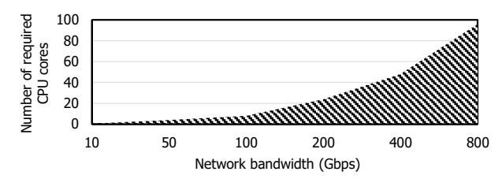

Fig. 1: CPU requirement for sustaining line-rate NVMe/TCP performance across network generations.

to balance performance, deployability, and hardware requirements. Among them, TCP [39] has gained wide adoption due to its reliable data transfer, compatibility with standard IP/Ethernet infrastructure, and robust operation on commodity networks across diverse conditions [3, 54, 61, 64, 67, 74, 83, 98, 108]. Therefore, NVMe/TCP [29] has gained increasing traction in commercial products and production deployments.

As its deployment continues to expand, NVMe/TCP now faces sharply increased performance requirements, driven by AI/ML training, large-scale databases, and other data-intensive workloads [75, 85, 102]. To meet these demands, softwarebased approaches have been introduced [1, 65], employing optimizations such as polling [73], zero-copy [108], and kernel bypass [97]. However, while these designs can achieve high throughput, they suffer from poor *host CPU efficiency*. On the initiator side (i.e., client side), this inefficiency hinders the execution of critical applications, degrading system performance [109]. Figure 1 illustrates the increasing severity of this problem with the SPDK NVMe/TCP initiator. It already consumes 24 cores to maintain 200 Gbps [65], and emerging 800 Gbps networks are projected to require up to 96 cores. With the network speed outpacing CPU capability [48, 96, 110], delivering line-rate1 performance will become infeasible for CPU-bound designs.

To address host CPU inefficiency, on-device sidecore-based approaches have been introduced [25, 70, 84]. For example, BlueField SNAP [9] offloads the storage disaggregation stack from the host to embedded cores. However, this solution

∗Both authors contributed equally to this research.

†Corresponding author.

1 In this paper, 'line-rate' denotes the theoretical maximum effective throughput excluding protocol-header overheads (∼90% of raw bandwidth), encompassing both unidirectional and full-duplex 2×100GbE scenarios.

suffers from limited performance due to the constrained processing capability of sidecores. In our evaluation, it achieves only 9.6% of the 200 Gbps line rate, while fully utilizing all the on-device sidecores. In addition, hardware-assisted approaches [20, 90] alleviate the overhead of CPU-intense operations (e.g., TCP processing, memory copies), but their overall performance remains still limited due to residual software bottlenecks. These limitations motivate fully accelerating performance-critical I/O in hardware logic, which is becoming essential for supporting next-generation 400/800 Gbps networks. Beyond hardware acceleration, practical deployability should also be thoroughly considered. Here, we refer to practical deployability as the ability to integrate seamlessly into various environments. Specifically, deploying a new solution should not incur severe operational or integration overhead for most datacenters, which are relying on commodity NICs and the conventional software stack [1, 75]. Achieving this requires three key aspects: form factor and power [93, 101], interoperability (i.e., the ability of a system to operate seamlessly with diverse devices and environments) [58, 81], and operational resilience (i.e., the capability to sustain correct operation despite unexpected disruptions) [45, 107].

We present MangoBoost BoostX-NTI (NTI), to the best of our knowledge, the first fully hardware-accelerated DPU solution for NVMe/TCP initiators. NTI is designed to sustain line-rate throughput while significantly reducing host CPU consumption and maintaining practical deployability in realworld datacenters. To this end, NTI first offloads the entire storage disaggregation stack onto a DPU card, eliminating the heavy CPU overhead of software-based NVMe/TCP initiators. Second, NTI accelerates performance-critical operations (i.e., NVMe/TCP I/O command processing) in specialized hardware logic to achieve line-rate performance, while handling administrative processing on on-device sidecores. It also alleviates bandwidth pressure through Virtual buffer, which removes the usage of large TCP send/receive buffers required by conventional NVMe/TCP while sustaining line-rate performance using only small on-chip buffers. Lastly, NTI provides practical deployability. To satisfy the tight form-factor and power constraints of HHHL cards, it incorporates thermal-management mechanisms and resource-efficient architectural optimizations. Interoperability is achieved through a standard NVMe interface and strict protocol compliance with unmodified host-side software stacks. In addition, NTI dynamically falls back and recovers between hardware and software during exceptional events, ensuring operational resilience. Collectively, unlike existing DPUs relying on physical hardware scaling—such as increasing core counts or memory bandwidth-NTI introduces an architectural shift that decouples I/O performance from underlying hardware specifications, providing a scalable foundation for next-generation networks.

Our evaluation shows that NTI achieves up to  $9.17\times$  higher throughput than sidecore-based baselines and  $16.7\times$  higher core efficiency than software baselines. It also outperforms across real-world workloads, including cloud, database, and MLPerfTM Storage benchmarks.

(a) Multiple PDUs packed into a TCP packet.

(b) A PDU is segmented into multiple TCP payloads.

Fig. 2: PDUs and TCP packets at different granularities.

In summary, this work makes the following contributions:

- Novel storage disaggregation acceleration: We propose a novel FPGA-assisted storage-disaggregation DPU architecture with HW/SW co-design.
- **Host CPU efficiency**: NTI eliminates host CPU overhead by offloading the entire storage disaggregation stack.
- **High performance**: NTI achieves line-rate by executing all performance-critical I/O in hardware.
- Practical deployability: NTI is deployable across diverse datacenters by meeting strict hardware requirements, interoperability, and operational resilience.
- **Insights and lessons:** We share practical lessons from building NTI, including HW/SW co-design principles, FPGA engineering methodology, and future guidance.

### II. BACKGROUND

## A. NVMe and NVMe-oF protocol

1) NVMe: NVMe [26] is a standard storage protocol designed for low-latency, parallel I/O over PCIe. Using multiple independent I/O queue interfaces, it scales across CPU cores and enables high-performance parallel I/O. The host and the NVMe device exchange commands and completions via queues in host memory. Data transfer between the host and an NVMe device uses an NVMe data-buffer address (i.e., PRP address) specified in the NVMe command, and the device's DMA engine performs direct reads and writes at that location.

2) NVMe/TCP: NVMe/TCP is a message-based protocol that employs a Protocol Data Unit (PDU) to encapsulate NVMe commands, completions, and data for transmission over TCP/IP networks. Each PDU consists of a PDU header and, optionally, PDU payload. The header contains common fields such as the PDU type and length, and may also include type-specific information such as NVMe command or completion. Importantly, the PDU header acts as a delimiter, allowing the receiver to detect PDU boundaries and extract individual units. As shown in Figure 2, this mechanism is necessary because TCP and NVMe/TCP operate at different granularities. TCP delivers a continuous byte stream segmented into packets, whereas NVMe/TCP transmits discrete PDUs. As a result, multiple PDUs may be packed into one TCP packet, or a single PDU may span across several packets. To correctly recover

Fig. 3: Existing NVMe/TCP initiator solutions.

PDUs, the receiver must perform *PDU parsing*: sequentially scanning the incoming TCP payload, reading each PDU header to determine its length, and then using that information to locate the next PDU and extract it.

3) NVMe/TCP vs. NVMe/RDMA: TCP and RDMA are the representative transport options in NVMe-oF, each exhibiting a well-known trade-off. TCP offers low TCO, excellent deployability and scalability because it reuses standard Ethernet infrastructure and operates reliably in lossy, heterogeneous networks without specialized tuning [3, 61, 74]. In contrast, RDMA delivers higher performance and lower CPU overhead by offloading the transport layer to RDMA-capable NICs. However, RDMA requires costly hardware such as RNICs and lossless Ethernet or InfiniBand switches. RDMA performance is also sensitive to packet loss and therefore demands carefully tuned lossless configurations (e.g., PFC, ECN) across all switches and NICs, increasing operational complexity [49, 59, 60, 103, 111]. Furthermore, lossless RDMA mechanisms are not fully standardized and often vary across vendors, creating potential vendor lock-in that complicates large-scale deployments [56, 72]. With NTI, we aim to retain the operational benefits of TCP while achieving RDMA-comparable performance.

# B. Existing NVMe/TCP initiator solutions

1) Software-based approach: Software-based approaches, such as the Linux kernel NVMe/TCP initiator [1] and the SPDK NVMe/TCP initiator [65], deliver reasonable performance with optimizations such as polling, zero copy, and kernel bypassing [73, 97, 108]. The approaches consist of two components in general: an NVMe/TCP initiator stack that converts NVMe commands and completions into NVMe/TCP PDUs, and a TCP stack that transmits PDUs. Figure 3a shows its architecture. First, the host submits NVMe commands to the initiator stack. Then, the NVMe/TCP initiator stack constructs PDUs and writes them to TCP sockets. The TCP stack encapsulates the PDUs into TCP packets and transmits them to the remote target. Responses follow the reverse path.

2) On-device sidecore-based approach: On-device sidecore-based approaches offload the storage disaggregation software

TABLE I: Comparison of NVMe/TCP optimizations.

|                        | SPDK [37] | ANO [90] | Sidecore † [9] | Sidecore w/ Aceel.† [20] | NTI (Ours) |
|------------------------|-----------|----------|---------------------------|-----------------------------|---------------|
| Host-efficiency        | X         | Δ        | О                         | О                           | O             |
| Performance            | 0         | Δ        | X                         | X                           | O             |
| Form factor            | -         | HHHL     | FHHL                      | FHHL                        | HHHL          |
| Power                  | -         | 75W      | 150W                      | 150W                        | 75W           |
| Interoperability       | △‡        | X        | O                         | O                           | O             |
| Operational resilience | 0         | O        | O                         | O                           | O             |

†: Bluefield3-DPU

stack from the host CPU to sidecores inside the device [25, 70, 84]. BlueField SNAP [9] is a representative design; it runs the full stack on the embedded ARM cores and adds the storage-emulation feature so that the PCIe card appears as a standard NVMe PCIe device to the host. Figure 3b shows its architecture. The frontend begins with the host NVMe interface, a hardware logic that exposes the DPU card as an NVMe PCIe device, enabling the NVMe transactions. When a host submits an NVMe command, the storage emulation stack fetches it. The interposition layer then translates the NVMe command into a generic block request and routes it to the backend. The backend operates in the same way as the software-based approach described in Section II-B1. Responses take the reverse path.

3) Hardware acceleration techniques: Besides relying only on sidecores in DPUs, there are techniques that accelerate specific functions with hardware. Unlike SNAP, these techniques do not target the entire storage-disaggregation stack. Instead, they focus on individual layers—for example, the storage virtualization stack [9, 52, 69], the NVMe/TCP stack [9, 90], and the TCP stack [38, 47]. Specifically within the NVMe/TCP stack, existing solutions fail to overcome fundamental architectural constraints. ANO [90], for instance, is severely restricted in its partial NVMe/TCP offload capabilities. Although it bypasses memory copies for in-order RX packets to write directly to the NVMe data buffer, this mechanism yields suboptimal small I/O performance, which remains heavily hindered by the kernel NVMe/TCP and TCP stack overhead. Crucially, ANO necessitates kernel code patching, which not only impedes deployability but also imposes significant vendor lock-in risks. Similarly, SNAP-based XLIO [20] suffers from inherent hardware and architectural limitations. Despite attempting to mitigate overheads via off-chip memory bypassing in the TX path and a user-level TCP stack to reduce context switching, its overall effectiveness is compromised. Performance remains constrained because zero-copy support is limited only to TX, and the embedded cores lack sufficient compute capability required to sustain high-performance workloads.

#### III. MOTIVATION

In this section, we introduce the motivation behind NTI. First, we identify the critical efficiency and performance limitations of existing solutions (Sections III-A, III-B). We then highlight the challenges that must be resolved to realize a solution with practical deployability (Section III-C).

‡: Unable to support kernel applications (userspace block interface)

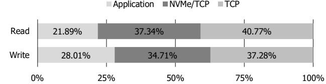

Fig. 4: CPU usage breakdown of the SPDK NVMe/TCP initiator with 4KiB random read and write FIO.

## *A. Motivation 1: CPU-inefficient software-based approaches*

While existing software-based storage disaggregation solutions achieve high performance by aggressively optimizing the I/O path, they inherently impose significant demands on CPU resources. As shown in Figure 1, the SPDK NVMe /TCP initiator requires 24 cores to deliver 200 Gbps line-rate performance, and is expected to require 96 cores for emerging 800 Gbps networks. This measurement was obtained using FIO [13] benchmarks configured with 4KiB random read I/O, 32 threads, and 256 queue depth. Figure 4 shows the CPU usage of the SPDK NVMe/TCP initiator and highlights that it is dominated by both NVMe/TCP and TCP stacks. These stacks impose a significant CPU overhead from per-packet processing, memory operations, and interactions between the storage and networking layers, which worsens at higher throughput and limits scalability. Unfortunately, this CPU inefficiency will deepen in the future, as the gap between I/O bandwidth and CPU processing capability continues to widen [67, 96, 110]. While PCIe Gen8 and 1600 Gbps Ethernet are expected to arrive in 2028 [88], CPU compute capacity will see only modest improvements. Without addressing this host CPU bottleneck, future storage disaggregation will be unable to fully utilize the next-generation network link. Thus, since the significant CPU overhead stems from both NVMe/TCP and TCP stacks, this inefficiency motivates the full offload of the storage disaggregation stack to dedicated hardware.

# *B. Motivation 2: Low performance of on-device sidecores*

Compute bottleneck. To address host CPU inefficiency, sidecore approaches are proposed to offload the entire storage disaggregation software stack to sidecores on devices. However, limited sidecore capability severly restricts performance. Our experiment with BlueField-3 SNAP [9, 25] shows that it reaches only 9.6% of the 200 Gbps line rate, even with all 16 on-device ARM cores fully utilized. The experiment used FIO with 4 KiB random read/write I/O, 32 threads, and 128 queue depth. These findings suggest that simply adding more ARM cores is insufficient to fully bridge the performance gap.

Equipping DPUs with server-class CPUs (e.g., Intel Xeon [19]) could improve performance, but sustaining 200 Gbps line rate still requires tens of cores (e.g., 24 Xeon Gold 6348N cores for read [65]). Their high power consumption (i.e., ≈ 200W [18]) and stringent board requirements including multiple DIMM slots, VRM circuits, and heavy-duty cooling system make integration impractical [30, 31].

Instead of fully relying on sidecores, partial hardware acceleration can be applied. In this paper, hardware acceleration denotes execution of critical operations in dedicated logic rather than sidecore-based software offloading. XLIO [20] reduces CPU utilization and memory copies, by enabling TX PDU payload to bypass off-chip memory and be delivered directly to the NIC. However, even with XLIO, substantial overhead remains from the residual software stacks on sidecores. Our experiments show that SNAP with XLIO reaches only 34.3% of 200 Gbps line-rate throughput under the same FIO setup as SNAP alone. This implies that, despite eliminating part of TCP processing and TX datapath management, the remaining stacks still impose a heavy load. The issue is aggravated on platforms other than FHHL BlueField DPUs, where only a few low-performance cores are available [4, 15, 25]. Scaling down the ARM cores allocated to SNAP with XLIO further demonstrates this limitation: throughput drops to 13.9% and 6.1% of the line-rate with 8 cores and 4 cores, respectively.

Consequently, I/O processing should be performed entirely within hardware logic. The sidecore software stack can be divided into administrative tasks, such as operations related to NVMe and NVMe/TCP admin queues, and I/O processing, such as I/O command, completion and data handling. Compared to administrative tasks, I/O operations are more structured, repetitive, and account for the majority of execution cycles, making them well-suited for hardware implementation and yielding substantial performance gains.

Memory bottleneck. Even if the I/O processing is entirely accelerated by hardware, off-chip memory bandwidth remains a critical bottleneck. Specifically, existing NVMe/TCP implementations stage every incoming TCP payload in large TCP send/receive buffers before identifying PDU boundaries to extract PDUs. This creates a severe bottleneck as every payload traverses off-chip memory at line rate in both ingress and egress directions. The problem is further aggravated by the low effective bandwidth caused by frequent small memory accesses (e.g., NVMe commands/completions, PDU headers) combined with random access patterns (e.g., reordered arrival and retransmissions of TCP packets). An alternative is to place TCP buffers in on-chip memory with higher bandwidth, but this is impractical because SRAM capacity is far below the hundreds of MBs required for many concurrent connections.

These constraints motivate us to build *Virtual buffer*, a technique that removes the need for the large buffers. This enables processing incoming data on-the-fly without intermediate buffering with on-demand DMA to and from the NVMe data buffer on host memory. However, implementing such a design in practice is non-trivial. On the TX path, the TCP stack transmit the received data according to TCP protocol, not in the order in which PDUs are delivered by the NVMe/TCP stack. Consequently, the TCP stack cannot consume PDUs in their delivery order. Specifically, retransmissions require TCP to resend arbitrary byte ranges of previously generated PDUs, and TCP segmentation boundaries often do not align with PDU boundaries. As a result, PDUs that cannot be immediately consumed in the correct TCP order must be staged in a large intermediate buffer. Likewise, the RX path faces a similar challenge: received TCP payloads cannot be directly consumed by the receiver-side NVMe/TCP stack. As discussed in Section II-A2, the stack must parse PDUs by sequentially scanning incoming TCP payloads. However, in practice the arrival of TCP payloads is neither sequential nor predictable, as network conditions and multiple concurrent connections frequently interleave or reorder segments. Together, these factors must be carefully addressed with Virtual buffer.

### C. Motivation 3: Practical deployability

While accelerating the entire I/O path in hardware addresses inefficiency and performance issues, practical deployability remains a key challenge in real-world environments.

Form factor and power. In modern datacenters, increasing rack density and a strong imperative to minimize total power consumption [93, 105] drive the widespread adoption of highdensity 1U/2U servers [10, 11, 101], where NICs are universally deployed in the Half-Height, Half-Length (HHHL) form factor without auxiliary (AUX) power [45]. For datacenter operators, introducing new hardware that uses a different form factor or requires an additional power may cause incompatibilities with existing servers and may even necessitate changes in rack layout. Therefore, our solution must comply with HHHL form factor and power requirement. However, designing a fully hardware accelerated solution under these constraints is highly challenging. First, the HHHL cards tend to offer only limited heatsink volume, which increases the likelihood of thermal issues when deployed in servers with constrained airflow. Second, the HHHL cards inherently impose a tight resource budget, such as restricted on-chip memory capacity. Interoperability. Real-world datacenter deployments span diverse hardware and software stacks [58, 81]. In such environments, ensuring interoperability requires strict protocol compliance while presenting a uniform and standard interface to the host. Also, in practice, tightly controlled datacenters such as air-gapped clusters make kernel updates or driver installation pose severe operational pain points, further reinforcing the need for a solution that integrates seamlessly with unmodified host software. Achieving such interoperability is especially challenging for storage disaggregation offloading, which must uphold strict compliance across the NVMe, NVMe/TCP, and TCP layers while maintaining a consistent interface to the host without adding integration overhead.

Operational resilience. In disaggregated storage environments, hosts and storage devices are tightly coupled over the network, while operational tasks such as live upgrades, node replacement, or rack reconfiguration are routine [45]. To tolerate these changes, the solution must continue to work by maintaining connections even when the storage controller is moved or replaced. In addition, a variety of failure scenarios can arise in datacenter operations [107], such as abnormal queue termination (e.g., C2HTerm PDU), invalid command fields (e.g., CID), and data transfer errors (e.g., digest mismatch). Without sufficient resilience, such operational changes or failure events can easily disrupt storage services, forcing

Fig. 5: DPU product image and internal component diagram.

I/O sessions to be torn down and re-established, which incurs significant downtime and overhead. Traditionally, resilience mechanisms—tolerating operational changes and handling errors—have been provided by the software stack. So, our hardware-based solution must handle a wide range of dynamic operational changes and diverse failure conditions at a level equivalent to software, which is particularly challenging.

#### IV. DESIGN GOALS

To address the issues described in Section III, we establish three design goals, which encompass not only efficiency and performance but also the practical datacenter demand.

**Goal 1: Host CPU efficiency.** The solution should achieve high throughput while minimizing host CPU usage, ensuring that CPU resources remain available for application workloads rather than being consumed by storage processing.

Goal 2: Unmatched performance. The solution should sustain line-rate performance across network generations, meeting the demands of data-intensive workloads such as AI/ML training, and large-scale databases. Specifically, our design goal is to achieve full-duplex 200 Gbps across both small and large block sizes, as no existing DPU-based approach, to the best of our knowledge, has successfully met this goal [7, 9], even those limited to NVMe/TCP targets [14, 41, 55].

**Goal 3: Practical deployability.** The solution should ensure practical deployability in real-world data centers by simultaneously meeting stringent hardware constraints, guaranteeing interoperability across heterogeneous datacenter environments, and providing operational resilience.

#### V. NTI DESIGN AND IMPLEMENTATION

This section introduces the design and implementation of NTI, our hardware-accelerated DPU solution for NVMe/TCP initiator. Figure 5 illustrates the DPU product and its component-level diagram. NTI combines FPGA-based I/O processing with sidecore-assisted control-plane to deliver host CPU efficiency (Section V-A), high performance (Section V-B), and practical deployability (Section V-C). Before the design details, we note that NTI adopt FPGAs as the DPU platform to keep pace with rapidly evolving datacenter requirements. Compared to ASICs, FPGAs enable fast iteration and timely deployment under real-world time-to-market constraints, making them a practical foundation for production-oriented DPU development (see Section VII). Note that NTI shifts the design focus from physical scaling to

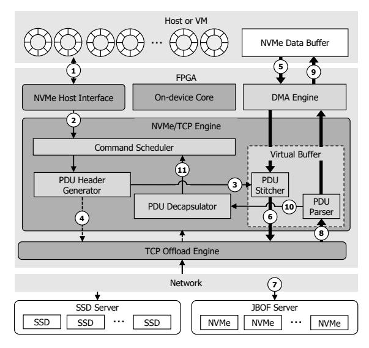

Fig. 6: NTI architecture.

architectural innovation. It decouples performance from hardware constraints through two pillars: (1) Memory bandwidth independence via the Virtual Buffer, which eliminates offchip bottlenecks using on-chip metadata; and (2) Compute independence by offloading the entire I/O path to hardware, removing sidecore-related performance limits. This approach enables high-speed I/O scaling independent of underlying physical resources.

# *A. Full-offloaded storage disaggregation*

NTI offloads the entire storage disaggregation stack onto a DPU card, eliminating CPU overhead. Figure 6 illustrates its architecture, composed of an FPGA and on-device sidecores. FPGA part. The FPGA implements three primary components: the *NVMe Host Interface* (NHI), the *NVMe/TCP Engine*, and the *TCP Offload Engine* (TOE). Among them, the NVMe/TCP Engine is the key component, accelerating the interposition layer and the NVMe/TCP initiator stack. This engine performs protocol conversion between NVMe commands/completions and NVMe/TCP PDUs, while orchestrating data movement in hardware. In the TX path, it fetches the NVMe data from the NVMe data buffer on host memory to fill the PDU payload; in the RX path, it extracts the PDU payload and transfers it directly to host memory. To complete full datapath offloading, we integrate the NVMe/TCP Engine with the NHI [69] and the TOE [47]. Utilizing TOE is crucial as it eliminates significant TCP overhead, particularly in highbandwidth storage applications. Moreover, the manageability of FPGA- and C/HLS-based TOE implementations further justifies this choice, as it allows rapid updates to complex TCP algorithms or robustness and security fixes [47].

On-device sidecore. The sidecore handles control-plane operations that are not performance-critical, often unstructured, and may involve complex processing. These include administrative operations such as NVMe and NVMe/TCP admin-queue processing, the hardware IPs configuration, and processes that cannot be handled solely by hardware (e.g., error recovery). Command processing flow. Command processing begins when the host submits an NVMe command to a submission queue in host memory and updates the doorbell on the NHI. The interface detects the doorbell update via hardwarebased polling and retrieves the corresponding command from host memory (6-⃝1 ). Admin commands are forwarded to the sidecore for control-plane processing, while I/O commands are processed entirely in the FPGA. The *Command Scheduler* maps an NVMe command to a specific NVMe/TCP queue, and once the queue is available, the command is passed to the *PDU Header Generator* (6-⃝2 ), which converts it into a PDU header, forwards it to the *PDU Stitcher* (6-⃝3 ), and instructs the TOE for transmission (6-⃝4 ). When the TOE later requests the PDU to the PDU stitcher, it determines whether the PDU should contain a PDU payload (i.e., NVMe Write). If so, it fetches the NVMe data directly from host memory via DMA and assemble it with the PDU header (6-⃝5 , ⃝6 ). The complete PDU is sent to the TOE, and transmitted to the remote target (6-⃝7 ). Upon receiving a response, the TOE forwards it to the *PDU Parser*, which splits header and data (6-⃝8 ). The data is transferred directly to host memory via DMA, while the header is passed to the *PDU Header Decapsulator* (6-⃝9 , 10⃝). The decapsulator extracts the NVMe completion if needed, and delivers it to the completion queue via the NHI (6-11⃝).

## *B. Performance-oriented hardware acceleration*

To address the compute and bandwidth bottlenecks described in Section III-B, our architecture processes all performance-critical I/O entirely in FPGA logic, leaving the sidecore for administrative tasks. Furthermore, data are handled exclusively on-chip, never traversing off-chip memory.

*1) Hardware-accelerated I/O processing:* The NTI undertakes the full I/O command and completion processing, eliminating the compute bottleneck at sidecores.

Accelerating protocol-layer overheads. For command processing, the PDU Header Generator constructs a PDU header embedding an NVMe command. This is not a simple concatenation, as it also bridges the gap between NVMe and NVMe/TCP protocols. For example, an NVMe Read command includes PRP addresses pointing host memory locations for incoming data. In NVMe/TCP, however, the remote target has no visibility into the initiator's address space. The target simply returns read data as messages without interpreting PRPs. NTI therefore records the PRP entries for each issued command so that arriving data can later be placed correctly in host memory. Accordingly, the PDU Header Generator extracts PRP entries and forwards them to the PDU Parser, which uses them to map incoming data to their designated host buffers.

Once the PDU header is prepared, the PDU Header Generator forwards it to the PDU Stitcher and simultaneously instructs the TOE to prepare for transmission. To do so, the IP continuously monitors per-connection state (e.g., the oldest unacknowledged sequence number) and uses this information to determine when to issue a TX request to the TOE.

For completion processing, the PDU Decapsulator performs the reverse operation. It receives a PDU header from the PDU Parser and extracts an NVMe completion. There are two common response types. The first is a PDU that directly includes an NVMe completion. In this case, the IP simply extracts the completion and forwards it. The second is a PDU that carries only data. Here, the requested read data may be split across multiple PDU responses, so the IP must generate a completion upon receiving the entire data by tracking the arrival of the last data.

Flexible command scheduling. The Command Scheduler extends the role of the software interposition layer. Beyond simply mapping an NVMe command to a specific NVMe/TCP queue, it decouples the queue configuration of the two protocols. This is possible because, from the NVMe perspective, a command is agnostic to which NVMe/TCP queue processes it. To support this flexibility, the IP tracks the per-queue state (e.g., queue depth, available slots) and maintains NVMe-to-NVMe/TCP queue mapping decisions. Our experience across diverse customer deployments shows that this flexibility is essential for practical performance benefits. The cases below illustrate representative policies but are not exhaustive.

- Case 1: Parallelism. Some customers operate NVMe/TCP target servers whose per-queue throughput is limited. Under a static 1:1 mapping between NVMe and NVMe/TCP queues, the overall performance becomes bound by the target. To address this, NTI activates more NVMe/TCP queues with deeper depth, distributing commands across them via round-robin scheduling to exploit parallelism.
- Case 2: Isolation. Some AI workloads issue storage requests through separate NVMe queues on a per-thread basis. With naive round-robin assignment, NVMe commands from different NVMe queues may become concentrated on the same NVMe/TCP queue, introducing unintended interference across threads. NTI mitigates this by preserving a 1:1 NVMe-NVMe/TCP mapping whenever the corresponding NVMe/TCP queue is available, and falling back to round-robin only when necessary.
- 2) Off-chip memory bypassing using Virtual buffer: We propose Virtual buffer, a technique that eliminates the need for large TCP send/receive buffers and thereby removes dependence on off-chip memory. Virtual buffer provides a metadata-driven mechanism with on-demand DMA transfers to and from the NVMe data buffer for constructing (TX) and parsing (RX) NVMe/TCP PDUs. As discussed in Section III-B, it handles challenges such as unordered command submission, arbitrary packet arrival order, connection interleaving, and PDU misalignment. Regardless of these conditions, it can correctly generate or parse each PDU solely from compact per-connection metadata, consuming only a few kilobytes of on-chip SRAM. The detailed operation is described below.

**PDU generation.** In the TX path, the PDU stitcher generates TCP payloads (i.e., both PDU headers and Data) without intermediate memory copies. It consists of two submodules: *Table handler* and *PDU payload receiver*, as shown in 7a. The table handler begins its operation when it receives a PDU

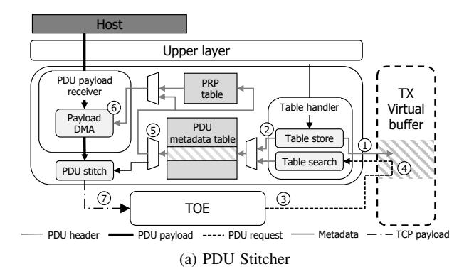

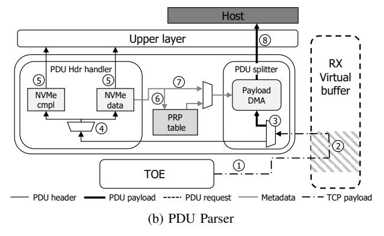

Fig. 7: Virtual buffer implementation.

header generated by the PDU Header Generator. For each NVMe/TCP queue, the IP tracks a virtual buffer offset, which represents the position in the conceptual per-connection TCP send buffer where the next TCP payload should be placed (7a-①). Using the PDU's NVMe/TCP qid and the corresponding virtual buffer offset, the IP stores these information together with the PDU header in the PDU metadata table (7a-(2)). In parallel, as the PDU Header Generator requests the TOE to transmit the packet, the TOE later reads the TCP payload from the TX virtual buffer (7a-3). The table handler intercepts the request (7a-(4)), and identifies which PDU(s) overlap with the read range using the metadata table (7a-(5)). Based on this identification, the PDU payload receiver determines if the read range contains the PDU payload. If so, the PDU payload receiver then fetches the PDU payload from host memory (7a-6) by utilizing the PRP address in the PRP table. After retrieving the PDU payload, the PDU stitcher can construct the TCP payload and send it to TOE (7a-(7)).

The PRP table stores PRP entries associated with each NVMe command, as forwarded by the PDU Header Generator (see Section V-B). Each entry represents either a data-buffer address or a PRP list. On lookup, it directly returns the address in the former case, while in the latter, it performs the PRP list walking process to obtain the address before returning it. This table is shared by both the PDU Stitcher and the PDU Parser. **PDU parsing.** In the RX path, the PDU parser parses and handles TCP payloads, while avoiding off-chip memory stag-

TABLE II: Resource utilization in Xilinx Versal platform.

| Туре                  | LUT          | FF           | BRAM        | URAM        |
|-----------------------|--------------|--------------|-------------|-------------|
|                       | (900K)       | (1.8M)       | (1341)      | (677)       |
| Total                 | 520K (57.8%) | 954K (53.0%) | 828 (61.7%) | 208 (30.7%) |
| NVMe Host Interface   | 36K (4.0%)   | 103K (5.7%)  | 76 (5.7%)   | 0 (0%)      |
| NVMe/TCP Engine       | 195K (21.7%) | 446K (24.8%) | 464 (34.6%) | 74 (10.9%)  |
| TCP Offloading Engine | 225K (25.0%) | 332K (18.4%) | 264 (19.7%) | 132 (19.5%) |
| Peripheral            | 63K (7.0%)   | 73K (4.1%)   | 24 (1.8%)   | 2 (0.3%)    |

ing. The parser consists of two submodules: *PDU splitter* and *PDU header handler*, as shown in 7b. When a TCP packet for a given connection arrives at the TOE, the TOE sends the TCP payload to the RX virtual buffer (7b-①). PDU splitter then intercepts the TCP payload and immediately splits it into PDU headers and payloads (7b-②) by scanning the TCP payload sequentially. The split PDU header is forwarded to the PDU header handler (7b-③) and it detects the type of PDU header by its opcode (7b-④). When the PDU contains NVMe completion or NVMe data, the PDU header is transferred to the PDU decapsulator (7b-⑤). If it contains NVMe data, the PDU header handler looks up the corresponding PRP address in the PRP table (7b-⑥), and sends the PRP address to the PDU splitter (7b-⑦). The splitter then performs DMA-transfer PDU payload into host memory (7b-⑧).

Note that existing NVMe/TCP optimization techniques address issues similar to NTI but typically provide only partial acceleration and rely on heavyweight hardware or software. NTI instead optimizes both TX and RX entirely in simple hardware logic. ANO [90], in contrast, accelerates RX path partially and falls back to the software stack and a HW/SW synchronization whenever a packet loss or reordering occurs, limiting its benefit in real deployments. XLIO [20] applies only to the TX path, lacks RX optimization, and relies on dedicated ARM cores and a large on-board memory hierarchy.

3) Potential scaling to next-generation networks: NTI is naturally scalable to higher network speeds (e.g., 800 Gbps) without structural modifications. First, the sidecore is relieved from data-path operations, and performs only administrative tasks whose overhead does not grow proportionally with I/O bandwidth. Therefore, increasing link speed does not increase its compute pressure. Moreover, the hardware IPs processing I/O commands can handle up to 50 million IOPs, which is sufficient for even small-block IOs (i.e., 4 KB) to saturate 1.6 Tbps link. Also, the virtual buffer enables avoiding off-chip memory traversal with regardless of the I/O bandwidth. As a result, scaling the link speed merely requires to proportionally scale PCIe bandwidth-routinely doubled each generation [104]-without fundamental architectural changes.

# C. Practical deployability of DPU solution

NTI resolves the three key challenges described in Section III-C for achieving practical deployability.

**Form factor and power.** NTI is deployed on a custom single-slot HHHL card equipped with a Xilinx Versal FPGA [8], operating within a 75W power envelope. Figure 5 and Table II illustrates the DPU card and the resource utilization of each IP block. Also, several architectural mechanisms address the thermal and resource constraints as follows.

First, NTI monitors the FPGA die temperature using System Monitor [5] in AMD CIPS IP [6] and track the ARM core temperature in software. When the temperature reaches 90% of each thermal threshold, NTI proactively throttles I/O processing and reports a thermal warning to the host through an NVMe admin completion. Also, the software spaces out non performance-critical transactions during short bursts of activity to reduce potential instantaneous heat accumulation.

NTI also introduces architectural optimizations to operate within the limited hardware resources of the HHHL card. For example, when the certain PRP table entry indicates that PRP list walking is required (see Section V-B), the hardware can initiate the walking process directly since the entry itself contains only the header pointer of host-resident PRP list. In addition, the design enables prefetching of the necessary NVMe data-buffer addresses using this header pointer, thereby eliminating the need to store the full PRP list on chip. Furthermore, entries in the PDU metadata table for completed commands are invalidated in real time, reducing residency and preventing consumption of scarce on-chip resources.

Interoperability. To ensure interoperability, NTI provides a standard NVMe interface to the host with strict protocol compliance. Specifically, the hardware maintains essential protocol-related state (e.g., number of processed I/O commands, ANA state of each namespace), while the software handles host-requested protocol specific operations (e.g., I/O counting, Asynchronous Event Reporting, and ANA state transitions) in parallel with ongoing I/O processing. Also, NTI removes the kernel-based NHI driver, enabling it to run across diverse environments without any software modification.

This level of interoperability is validated by successfully passing all mandatory NVMe tests from the University of New Hampshire InterOperability Laboratory (UNH-IOL) [86], an industry-standard certification body for NVMe and NVMe-oF, and NTI is listed in the NVMe Integrator's List alongside major SSD vendors [21, 23, 34–36].

Beyond specification compliance, we also validated operational robustness across a wide range of system environments, such as servers from multiple vendors (e.g., Supermicro [17], HPE [16], Dell [12]), operating systems (e.g., Linux, Windows), hypervisors (e.g., VMWare ESXi [40], QEMU-KVM [22, 33]), and NVMe/TCP targets (e.g., Kernel NVMe/TCP target, SPDK, Purestorage [32], Netapp [24]).

**Operational resilience.** To address the operational-resilience issues, we propose *Dynamic handover* which implements dynamic and seamless HW-SW cooperation. Dynamic handover mechanism enables flexible fallback and recovery between hardware and software with two key capabilities.

First, it supports bidirectional handover. At any point during I/O processing, if control-plane operations are required, the software can temporarily take over the processing from the hardware. This handover is coordinated via a memory-mapped hardware registers that exposes only minimal metadata for software to resume processing (e.g., NVMe doorbells, TCP connection status). Software reads this context, performs the necessary control-plane operation (e.g., resetting a faulty

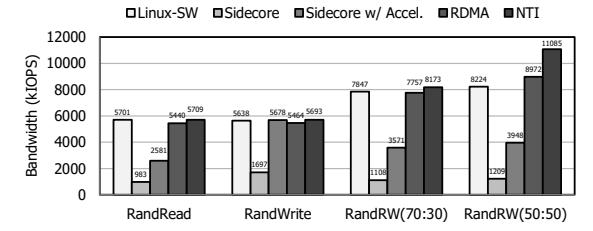

Fig. 8: FIO results with 4KiB I/O.

Fig. 9: FIO results with 128KiB I/O.

queue), and then instructs the hardware to resume by writing back to a control register. Second, handover operates at a fine-grained granularity, at the level of individual NVMe or NVMe/TCP queues. This ensures that handover on one queue does not affect the processing of others. For instance, if an error occurs on a specific NVMe/TCP queue (e.g., receiving PDU with an invalid header), the hardware resets only the context associated with that queue. When instructed by software, it resumes operation and retransmits the uncompleted NVMe commands that belong to the failed queue. Thus, importantly, I/O on other NVMe/TCP queues proceeds without termination, rendering such operations seamless from the host's perspective. The practical feasibility of Dynamic handover is demonstrated in Section VI-B1.

Whether and when to invoke Dynamic handover is determined by dedicated *Fault handler* IPs, which are strategically placed at critical boundaries: inside the NVMe/TCP engine, and at its interfaces to the NHI and TOE. They serve three primary functions. First, each Fault handler monitors relevant hardware states and error-related registers, reporting detected errors (e.g., those in Section III-C) to the software. Second, it exposes an interface that allows the software to initiate handover when it detects an error, such as *NVMe/TCP keep alive timeout* triggered when periodic responses from the target are not received on time. Third, it handles recoverable errors in hardware without software intervention. For example, if the handler between the NVMe/TCP Engine and the NHI detects an invalid field in an NVMe I/O command, it immediately returns a completion reporting the appropriate error.

#### VI. EVALUATION

In this section, we evaluate NTI against various NVMe/TCP solutions. Section VI-A presents micro-benchmark results, validating NTI's design goals. Section VI-B demonstrates its impact on real-world workloads. The experimental setup is

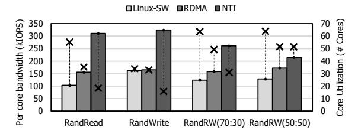

Fig. 10: Core efficiency with 4KiB random I/O (× markers indicate the number of cores used).

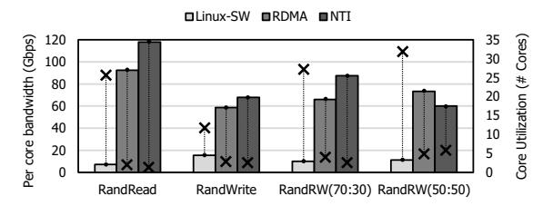

Fig. 11: Core efficiency with 128KiB sequential I/O (× markers indicate the number of cores used).

as follows. The initiator server is a Supermicro SYS-421GE-TNRT3 with dual Intel® Xeon® Gold 6438N CPUs (64 cores) and 512 GB DDR4 memory. The target server is a Supermicro ASG-1115S-NE316R with an AMD EPYCTM 9454P (48 cores), 384 GB DDR5 memory, and 16 Samsung PM1743 SSDs. We installed Ubuntu 22.04.5 LTS with kernel 5.15.0-119-generic on both servers. Networking uses either a NTI or a Mellanox ConnectX-6 Ex NICs, connected via a Dell PowerSwitch Z9432F-ON switch (32× 400 GbE).

#### A. Microbenchmark

To evaluate NTI, we used FIO to benchmark performance, fault tolerance and scalability. Section VI-A1 shows that NTI delivers line-rate throughput with exceptional host efficiency. Section VI-A2 shows the comparison of NTI with NVMe /RDMA. Section VI-A3 evaluates its behavior under failure scenarios, demonstrating operational resilience. Section VI-A4 shows that NTI maintains scalable performance in large-scale deployment scenarios.

1) Performance & efficiency: Figure 8 and Figure 9 show the throughput of the kernel NVMe/TCP initiator [1] (Linux-SW), a sidecore-based approach [9], a sidecore-with-acceleration approach [20], and NTI. With a 4KiB block size (Figure 8), NTI achieves line-rate read and write throughput, matching the kernel NVMe/TCP initiator while significantly outperforming Sidecore and Sidecore with acceleration. In the 50:50 read/write workload, NTI sustains line-rate performance, delivering a 9.17× and 2.81× gain over Sidecore and Sidecore with acceleration, respectively. With a 128KiB block size (Figure 9), NTI maintains consistent line-rate bandwidth across all workloads, reaching 356 Gbps—the maximum achievable throughput considering Ethernet and TCP/IP header overhead—aggregate bandwidth across both directions in the

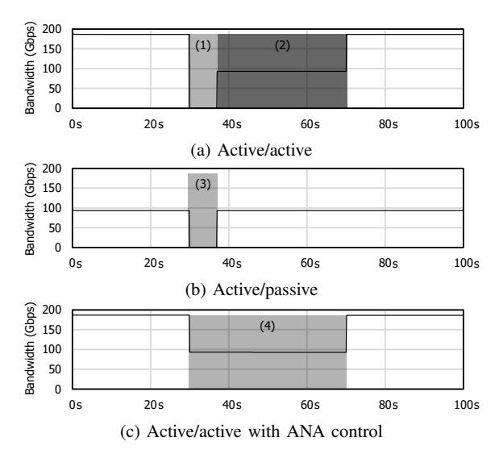

Fig. 12: Seamless operation during network updates.

50:50 read/write case, up to 6.59× and 1.56× higher than Sidecore and Sidecore with acceleration, respectively.

Figure 10 and Figure 11 show the per-core throughput and corresponding core utilization for each solution. We compare NTI with the kernel NVMe/TCP initiator, as they are the only solutions achieving near line-rate performance. NTI demonstrates significant gains in host CPU efficiency, defined as throughput per host core. With a 4KiB block size (Figure 10), NTI improves host CPU efficiency by 3.01× (read), 1.98× (write), 2.11× (70:30 read/write), and 1.66× (50:50 read/write). With a 128KiB block size (Figure 11), the improvements are 16.7× (read), 4.38× (write), 8.76× (70:30 read/write), and 5.35× (50:50 read/write). These results highlight that NTI not only sustains line-rate throughput but also greatly reduces host CPU burden and enhances scalability.

*2) Comparison with NVMe/RDMA:* We compare NTI with the kernel NVMe/RDMA initiator (RoCEv2) to assess its competitiveness against specialized high-performance transports. As shown in Figure 8 and Figure 9, NTI demonstrates comparable or even superior throughput to NVMe/RDMA, achieving up to 1.24× higher performance in 4KiB I/O and maintaining nearly identical performance for 128KiB I/O. Furthermore, as shown in Figure 10 and Figure 11, by offloading the storage-disaggregation stack as well as the transport stack into hardware, NTI achieves better host CPU savings. Specifically, NTI improves core efficiency by 2.00×, 1.96×, 1.65×, and 1.24× for 4KiB I/O, and 1.28×, 1.16×, 1.32×, and 0.82× for 128KiB I/O compared to NVMe/RDMA. These results demonstrate that NTI not only matches the throughput of RDMA but often exceeds its efficiency.

From a TCO perspective, NTI exhibits deployment-level trade-offs relative to NVMe/RDMA in terms of infrastructure cost, operational complexity, and performance. In particular, conventional NVMe/RDMA deployments involve additional fabric requirements and operator-managed tuning for bring-

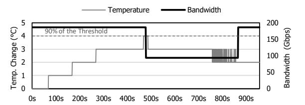

Fig. 13: Seamless operation during the thermal management.

up, validation, and troubleshooting [49, 56, 59, 60, 72, 103, 111], whereas NTI preserves the broad deployability and cost profile of commodity Ethernet infrastructure. While NTI remains higher in transport latency than NVMe/RDMA, the gap is less pronounced in end-to-end storage I/O, where overall latency is determined by the full storage access path rather than by transport alone [66, 77]. Overall, NVMe/RDMA remains attractive for the lowest-latency environments, whereas NTI provides a practical design point for operators seeking linerate performance, a 75W board-level power envelope, and the deployment simplicity of commodity Ethernet infrastructure.

*3) Practical deployability:* To validate resilience to network topology changes, we evaluate NTI using NVMe path control features: Multipath [99] and ANA [27]. Multipath improves availability and throughput by using multiple network paths, configured as active/active (all active paths used concurrently) or active/passive (passive paths remain standby for failover). ANA further marks path states (e.g., optimized, inaccessible) to guide host path selection. Our testbed connects one initiator and one target through two 100 GbE links. To assess recovery behavior, we ran FIO while modifying the network topology.

Figure 12 illustrates NTI 's bandwidth in three scenarios. In the active/active case (Figure 12a), the bandwidth initially reaches 200 Gbps, but drops on path failure as I/O through the failed path is lost (1). Upon failure detection, NTI retransmits lost commands over the surviving path at 100 Gbps (2), and bandwidth is restored to 200 Gbps after reconnection. In the active/passive case (Figure 12b), traffic initially reaches 100 Gbps, but drops when the active path fails (3), after which the standby path restores bandwidth. With ANA (Figure 12c), the behavior resembles active-active, but the ANA state transition is detected within microseconds (4), sustaining throughput on the surviving path without stall.

Beyond network resilience, we evaluate the thermal management of NTI during thermal issues. We ran FIO while artificially restricting airflow by modulating fan speeds to induce thermal stress and trigger the thermal-management mechanisms. Figure 13 illustrates the empirical thermal delta relative to the initial state and the corresponding throughput during this event. As shown, the temperature increase exhibits a brief plateau at the 90% threshold before declining. Meanwhile, the throughput shows transient performance degradation as NTI proactively throttles I/O processing. Once the temperature returns to a safe operational range, I/O processing automatically resumes its full theoretical maximum effective throughput without requiring host-side intervention.

Fig. 14: Multi-target stress test.

*4) Large-scale deployment:* In large-scale environments representative of modern storage disaggregation, initiators must flexibly attach to and aggregate distributed resources from a vast pool of target servers over the network. To clearly demonstrate the efficacy of NTI in these scenarios, we conducted a stress test to prove whether NTI can support many target servers without encountering internal bottlenecks. This 1-to-N topology specifically targets the scalability of our hardware-accelerated mechanisms, such as connection interleaving and PDU parsing across multiple network sessions.

Figure 14 illustrates the performance of NTI during this large-scale deployment. We ran FIO while increasing the number of the attached NVMe/TCP targets. Even as the number increases, NTI consistently saturates the theoretical maximum effective throughput. This demonstrates that its internal logic incurs no performance degradation under stressful scenarios involving significant connection interleaving, reordered packet arrival, and PDU misalignment. Although the experiment represents the maximum-scale evaluation achievable in our lab, we anticipate this scalability to hold in larger production through NTI 's strategic adoption of standard TCP mechanisms (e.g., Cubic, SACK) engineered for massive scale. Building upon the validated TOE framework from [47], NTI utilizes a communication layer proven in real-world environments, decoupling hardware I/O processing from network complexity as the number of connections increases.

# *B. Realworld workloads*

*1) Workload in AI:* In this section, we present the evaluation results with MLPerf™ Storage [82], which emulates I/O demands of AI training by modeling GPU data consumption. It models NVIDIA H100 and A100 GPUs, where faster GPUs (e.g., H100) require higher storage throughput. The benchmark score reflects how many accelerators can be supported while maintaining each accelerator's utilization at 90% or higher. MLPerf™ Storage provides various training models, namely ResNet50 [63], CosmoFlow [80], and UNET-3D [53]. We compare the baseline using the kernel NVMe/TCP stack against NTI, with the target running an SPDK NVMe/TCP.

Figure 15 reports the scores of NTI and the baseline normalized to a local SSD system, which represents the ideal case without network overhead. NTI consistently outperforms the baseline in all workloads, with up to 2× and on average 1.34× higher performance, while reaching 91.6% of

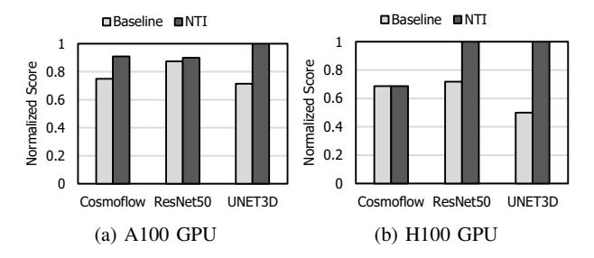

Fig. 15: MLPerf™ Storage results with NTI and the baseline, normalized to the score of a local storage system.

local SSD performance on average. UNET3D showed the greatest improvement, 1.4× and 2× in A100 and H100, and even matched the local SSD score with NTI's throughputoriented I/O processing acceleration. ResNet50 showed little improvement on A100 GPUs, but with H100 GPUs, the faster compute shifted the bottleneck to storage, leading NTI to achieve 1.39× higher score than baseline. Cosmoflow exhibits the opposite trend. As GPU speed increases from A100 to H100, the workload characteristics shift: the doubled compute capability amplifies the effect of latency sensitivity, drastically shortening the latency target. Since both baseline and NTI cannot fully meet this tighter latency requirement, they are equally bottlenecked. Thus the performance gap diminishes.

From a customer perspective, these score improvements directly translate to GPU utilization. By eliminating the storage I/O bottleneck, NTI increases the number of GPUs that can maintain a utilization of 90% or higher proportionally to the MLPerf™ Storage score gains shown in Figure 15—up to 2× improvement.

*2) Workload in Cloud:* Figure 16 compares the scalability of SPDK NVMe/TCP initiator and NTI, each integrated with vHost [100], an SPDK-based storage virtualization solution. Each vHost is provisioned with one core and 8 GB memory, and FIO is used to measure aggregated bandwidth. NTI consistently achieves higher aggregated throughput, enabling more efficient scaling to support larger numbers of VMs. The advantage is most pronounced with fewer vHost cores, where the NVMe/TCP software contends with vHost for limited CPU resources, leading to severe core contention. NTI achieves 2.64×, 2.41×, 1.71×, and 1.10× higher throughput at 1, 4, 8, and 16 vHost cores, respectively. These gains stem from offloading the NVMe/TCP stack entirely into hardware, allowing vHost to fully utilize dedicated cores and reach linerate performance with significantly fewer cores.

Translated into customer impact, this throughput gains directly translate to VM density. Under strict per-VM bandwidth SLAs, operators must cap the number of hosted VMs to guarantee each VM's allocated bandwidth. Since NTI approximately doubles throughput over the baseline, a single host can serve approximately twice as many VMs—halving the infrastructure footprint.

*3) Workload in Database:* We ran a PostgreSQL database on the xfs file system and used pgbench [2] to generate

Fig. 16: NTI scalability in cloud (Each VM is allocated 1 core and 8 GB of memory).

transaction workloads. The pgbench emulates client behavior by issuing short, random queries against the database. We then varied the number of simultaneous client connections, from 64 to 500 to examine I/O capability under high concurrency.

Figure 17 compares the performance of NTI with the kernel NVMe/TCP. As shown, NTI consistently achieves higher transaction per second (TPS) and lower latency. As TPS is the primary metric database customers use to size their infrastructure, these gains directly reduce the number of servers required to sustain a given query load. On average, it delivers 17.0%, 23.5%, 19.6% higher TPS across 64, 128, 256 clients, respectively, and up to 30.3% at 500 clients. When scaling from 256 to 500 clients, kernel throughput saturates due to high CPU resource usage of the NVMe/TCP stack, whereas NTI continues to scale. In terms of latency, NTI not only maintains lower averages in all cases but also widens the gap as concurrency grows. For example, the latency reduction is 14.5% lower at 64 clients and 23.1% at 500 clients. These results demonstrate that NTI sustains both higher throughput and lower latency under large-scale and high concurrency, which enables service-level requirements from clients even under heavy contention.

## VII. INSIGHTS AND LESSONS

Arising requirement of full-stack solution. Single-layer optimizations have limited scope and are difficult to integrate with other solutions. As a result, industry systems are shifting toward full-stack designs, and NTI represents a strong foundation for a full-stack solution in storage disaggregation.

Importance of defining the HW/SW boundary. The HW/SW boundary fundamentally shapes the architecture. A sound policy is to place fast and simple datapath functions in hardware while keeping complex and changing control in software. Crucially, near-boundary functions must be classified accurately; for example, our analysis shows that I/O command processing is not pure datapath, yet software-only execution incurs severe overhead, motivating its placement in hardware.

Fig. 17: NTI performance in database.

FPGA as a HW/SW co-design platform. FPGAs are an optimal platform for HW/SW co-design. Co-design is not a onetime architectural decision, but a continuous feedback loop that adapts to workload shifts and operational insights—an agility that ASICs cannot easily offer. In NTI, for instance, decisions such as the HW/SW boundary and virtual buffer were iteratively refined through FPGA reconfigurability, allowing each design round to converge on a superior architecture. This iterative refinement is especially valuable because simulation modeling for hardware or device emulation for software are often slow and inaccurate, whereas FPGA prototypes provide rapid and faithful evaluation.

Modularization for maintenance. To shorten the development cycle, we isolate environment-specific or frequently configured logic behind standardized interfaces, allowing focused code management and seamless integration. For instance, we define a *vendor-dependent platform* to encapsulate boardspecific modules, ensuring transparency for protocol IPs.

Combining RTL and HLS for design productivity. While HLS significantly accelerates hardware development, achieving efficient area utilization and reliable timing closure remains challenging. Our experience indicates that a hybrid design methodology is essential for production-grade systems in fastevolving domains such as storage disaggregation. Thus, we implemented commonly reused infrastructure IPs (e.g., mux, demux, and protocol shims), and functionally stable modules with fixed functionality in RTL. This approach substantially improved timing closure and logic routing quality without sacrificing development productivity.

Debugging strategy in disaggregated system. Operating in a disaggregated environment introduces significant challenges in debugging due to distributed execution and weak observability across nodes. A key lesson from NTI is that debuggability must be treated as a first-class design objective rather than an afterthought. To this end, NTI employs time-synchronization to ensure inter-node log alignment and causal ordering. For air-gapped deployments, it further employs hardware-assisted, cycle-accurate logging mechanisms (e.g., event-triggered snapshots) for exact failure reconstruction with memory-resident logs. Importantly, NTI achieves robust hardware observability by dedicating 2.35% of its total logic resource.

Future FPGA design: Suggestion for hardened IPs. FPGA vendors increasingly integrate widely adopted functions (e.g., PCIe, Ethernet MAC/PHYs, and DDR controllers) as hardened IPs, and recent platforms such as Versal further extend this trend by hardening on-chip interconnects. Meanwhile, the growing adoption of storage disaggregation and scaleout architectures makes efficient node-to-node communication critical, elevating high-performance NICs to first-class system components. We therefore suggest hardening full NIC subsystems, including packet switching logic that interconnects MACs, user logic, and processing systems.

## VIII. RELATED WORKS

NVMe and NVMe-oF. Solutions for NVMe and NVMeoF have evolved toward lower CPU overhead and scalable virtualization [50, 51, 71, 91, 108]. LeapIO [71] offloaded virtualization onto SoC cores with efficient address translation. LightIOV [51] achieved scalable software virtualization using IOMMU and EPT. NVMePass [50] enabled direct VM access to NVMe queues via software-hardware co-design, cutting latency by 50%. LightPool [108] aggregated local and remote SSDs into sharable pools using NVMe-oF with zero-copy.

Various DPU solutions. Recent production-ready DPUs for NVMe-oF storage disaggregation [9, 20, 25, 46, 55, 57, 70, 78, 79, 84, 89] typically combine lightweight sidecores with auxiliary accelerators. NVIDIA BlueField-3 [25] is a representative solution, while supporting auxiliary functionalities such as [9, 20]. Napatech [84] integrates more powerful CPUs (e.g., Intel Xeon D) to achieve higher computing capabilities compared to ARM-based DPUs, although its FHHL form factor and power envelope impose practical constraints. Various NVMeoF targets [46, 55, 57, 78] exist, and NTI interoperates seamlessly with them thanks to the NVMe-oF compliance.

P4-based DPUs, such as AMD Pensando Salina [42] and Intel IPU E2100/2200 [43], represent a complementary and actively advancing class of programmable DPUs. These solutions pair on-device sidecores with P4-programmable packetprocessing pipelines, enabling flexible acceleration of diverse network functions without hardware redesign. This programmability makes them well-suited for a broad range of networking use cases. NTI and P4-based DPUs, however, pursue fundamentally different architectural objectives. P4 programmable pipelines are designed for generality across heterogeneous network functions, whereas NTI is purpose-built for storage-disaggregation acceleration. This specialization allows NTI to implement complex stateful protocol logic entirely within fixed-function hardware pipelines without relying on sidecores for the data path. In contrast, the stateful complexity of TCP and NVMe/TCP is difficult to express within P4's stateless-oriented abstractions, requiring sidecores to handle the residual processing, which constrains throughput. This disparity reflects a deliberate choice of architectural priorities rather than a deficiency in either design.

# IX. CONCLUSION

In this work, we present NTI, a fast and scalable FPGAbased DPU solution for NVMe/TCP initiators. NTI offloads the storage disaggregation stack onto a DPU card, achieving efficiency, performance, and deployability. By executing I/O path in hardware, it eliminates compute and memory bottlenecks. Moreover, it ensures deployment in real-world datacenters. Our evaluation demonstrates that NTI outperforms baseline solutions across diverse workloads.

## ACKNOWLEDGMENT

This work was partly supported by the Institute of Information & Communications Technology Planning & Evaluation (IITP) grant funded by the Korea government(MSIT) (No.RS-2024-00395134, DPU-Centric Datacenter Architecture for Next-Generation AI Devices; and No.RS-2025-02264029, Implementation and Validation of an AI Semiconductor-Based Data Center Composable Cluster Infrastructure).

## REFERENCES

- [1] Kernel nvme/tcp host. [Online]. Available: https: //docs.redhat.com/en/documentation/red hat enterprise linux/9/ html/managing storage devices/configuring-nvme-over-fabrics-usingnvme-tcp managing-storage-devices
- [2] pgbench. [Online]. Available: https://www.postgresql.org/docs/current/ pgbench.html
- [3] "Tcp congestion control," https://www.rfc-editor.org/rfc/rfc5681.html, 2009.
- [4] (2025, August) Amd alveo™ adaptable accelerator cards. [Online]. Available: https://www.amd.com/en/products/accelerators/alveo.html
- [5] (2025, December) Amd cips sysmon. [Online]. Available: https: //docs.amd.com/r/en-US/pg352-cips/System-Monitor
- [6] (2025, December) Amd control interfaces and processing system. [Online]. Available: https://www.amd.com/en/products/adaptive-socsand-fpgas/intellectual-property/cips.html
- [7] (2025, August) Amd pensando™ dsc3-400 distributed services card. [Online]. Available: https://www.amd.com/content/dam/amd/ en/documents/pensando-technical-docs/product-briefs/pensando-dsc3 product-brief.pdf
- [8] (2025, August) Amd versal™ adaptive socs. [Online]. Available: https://www.amd.com/en/products/adaptive-socs-and-fpgas/ versal.html#overview
- [9] (2025, August) Bluefield snap. [Online]. Available: https://docs.nvidia. com/networking/display/bluefielddpuosv470/bluefield+snap
- [10] (2025, August) Clouddc superserver sys-122c-tn. [Online]. Available: https://www.supermicro.com/en/products/system/clouddc/1u/sys-122c-tn
- [11] (2025, August) Dell emc poweredge r650 spec sheet. [Online]. Available: https://www.delltechnologies.com/asset/nl-nl/products/servers/ technical-support/dell-emc-poweredge-r650-spec-sheet.pdf
- [12] (2025, August) Dell powerdge r750. [Online]. Available: https: //www.dell.com/ko-kr/shop/cty/pdp/spd/poweredge-r750/per75010a
- [13] (2025, August) fio flexible io tester. [Online]. Available: https: //git.kernel.dk/cgit/fio
- [14] (2025, August) Fpga-accelerated nvme storage solutions using the bittware 250 series accelerators. [Online]. Available: https: //www.bittware.com/ko/resources/nvme-storage/
- [15] (2025, August) Fpga-based smartnics. [Online]. Available: https: //www.napatech.com/products
- [16] (2025, August) Hpe proliant dl385 gen10 plus v2 7313 3.0ghz 16-core 1p 32gb-r mr416i-a 8sff 800w ps server. [Online]. Available: https://buy.hpe.com/kr/ko/compute/rack-servers/proliantdl300-servers/proliant-dl385-server/hpe-proliant-dl385-gen10-plusv2-server/p/1013291283
- [17] (2025, August) Hyper superserver sys-221h-tnr. [Online]. Available: https://www.supermicro.com/en/products/system/hyper/2u/ sys-221h-tnr
- [18] (2025, August) Intel® xeon® gold 6348 processor. [Online]. Available: https://www.intel.com/content/www/us/en/products/sku/212456/intelxeon-gold-6348-processor-42m-cache-2-60-ghz/specifications.html
- [19] (2025, August) Intel® xeon® gold processor. [Online]. Available: https://www.intel.com/content/www/us/en/products/details/ processors/xeon/scalable/gold.html
- [20] (2025, August) Introduction to xlio. [Online]. Available: https: //docs.nvidia.com/networking/display/xliov3312/introduction+to+xlio
- [21] (2025, August) Kioxia. [Online]. Available: www.kioxia.com

- [22] (2025, August) Kvm. [Online]. Available: https://linux-kvm.org/page/ Main Page
- [23] (2025, August) Micron. [Online]. Available: https://www.micron.com/
- [24] (2025, August) Netapp. [Online]. Available: https://www.netapp.com/
- [25] (2025, August) Nvidia bluefield-3 networking platform user guide. [Online]. Available: https://docs.nvidia.com/networking/display/bf3dpu
- [26] (2025, August) Nvm express® base specification. [Online]. Available: https://nvmexpress.org/specification/nvm-express-base-specification
- [27] (2025, August) Nvm express® base specification 5.14.1.12 asymmetric namespace access. [Online]. Available: https: //nvmexpress.org/specification/nvm-express-base-specification
- [28] (2025, August) Nvme over fabrics (of) specification (historical reference only). [Online]. Available: https://nvmexpress.org/ specification/nvme-of-specification
- [29] (2025, August) Nvme over tcp transport specification. [Online]. Available: https://nvmexpress.org/specification/tcp-transport-specification
- [30] (2025, August) Ocp nic 3.0: Thermal considerations. [Online]. Available: https://146a55aca6f00848c565 a7635525d40ac1c70300198708936b4e.ssl.cf1.rackcdn.com/images/ 5c41ae0635633a115cc8ec42fa4618801362ae93.pdf
- [31] (2025, August) Ocp oai system liquid cooling guidelines. [Online]. Available: https://www.opencompute.org/documents/oai-systemliquid-cooling-guidelines-in-ocp-template-mar-3-2023-update-pdf
- [32] (2025, August) Purestorage. [Online]. Available: https://www. purestorage.com/
- [33] (2025, August) Qemu. [Online]. Available: https://www.qemu.org/
- [34] (2025, August) Samsung. [Online]. Available: https://www.samsung. com/sec/
- [35] (2025, August) Skhynix. [Online]. Available: https://www.skhynix. com/
- [36] (2025, August) Solidigm. [Online]. Available: https://www.solidigm. com/
- [37] (2025, August) Spdk. [Online]. Available: https://spdk.io
- [38] (2025, August) Tcp offload engine (toe). [Online]. Available: https://www.chelsio.com/nic/tcp-offload-engine/
- [39] (2025, August) Transmission control protocol. [Online]. Available: https://www.ietf.org/rfc/rfc793.txt
- [40] (2025, August) vmware esxi. [Online]. Available: https://www.vmware. com/products/cloud-infrastructure/vsphere/
- [41] (2025, August) Western digital rapidflex tm c1000 nvme-of tm adapter data sheet. [Online]. Available: https://www.westerndigital.com/ko-kr/products/data-center-platforms/ rapidflex-c1000-nvme-controller?sku=c1000-nvme-controller
- [42] (2026, April) Amd pensando™ salina dpu. [Online]. Available: https://www.amd.com/content/dam/amd/en/documents/pensandotechnical-docs/product-briefs/pensando-salina-product-brief.pdf
- [43] (2026, April) Intel® infrastructure processing unit adapter e2100-ccqda2hl. [Online]. Available: https: //www.intel.com/content/www/us/en/content-details/832490/intelinfrastructure-processing-unit-adapter-e2100-ccqda2hl.html
- [44] P. Antonopoulos, A. Budovski, C. Diaconu, A. Hernandez Saenz, J. Hu, H. Kodavalla, D. Kossmann, S. Lingam, U. F. Minhas, N. Prakash *et al.*, "Socrates: The new sql server in the cloud," in *Proceedings of the 2019 International Conference on Management of Data*, 2019, pp. 1743–1756.
- [45] L. A. Barroso, U. Holzle, and P. Ranganathan, ¨ *The Datacenter as a Computer: Designing Warehouse-Scale Machines (3rd Edition)*, ser. Synthesis Lectures on Computer Architecture, M. Martonosi, Ed. Morgan & Claypool, 2018, vol. 46, https://pages.cs.wisc.edu/∼shivaram/ cs744-readings/dc-computer-v3.pdf.
- [46] Bittware, "250-soc," https://www.bittware.com/resources/buildingnvme-over-fabrics/.
- [47] J. Boo, Y. Chung, E. Baek, S. Na, C. Kim, and J. Kim, "F4t: A fast and flexible fpga-based full-stack tcp acceleration framework," in *Proceedings of the 50th Annual International Symposium on Computer Architecture*, 2023, pp. 1–13.
- [48] Q. Cai, S. Chaudhary, M. Vuppalapati, J. Hwang, and R. Agarwal, "Understanding host network stack overheads," in *Proceedings of the 2021 ACM SIGCOMM 2021 Conference*, 2021, pp. 65–77.
- [49] Chelsio, "Roce fails to scale," https://www.chelsio.com/wp-content/ uploads/resources/RoCE-Deployment-Challenges-for-Clouds.pdf, 2015.

- [50] Y. Chen, Z. Jin, Y. Wang, Y. Chen, J. Xu, H. Yu, J. Chen, W. Lin, K. Fang, K. Zhang *et al.*, "Nvmepass: A lightweight, highperformance and scalable nvme virtualization architecture with i/o queues passthrough," in *2025 IEEE International Symposium on High Performance Computer Architecture (HPCA)*. IEEE, 2025, pp. 1395– 1407.
- [51] Y. Chen, Z. Jin, Y. Wang, Y. Chen, H. Yu, J. Xu, J. Chen, W. Lin, K. Fang, C. Wei *et al.*, "High-performance and scalable software-based nvme virtualization mechanism with i/o queues passthrough," *arXiv preprint arXiv:2304.05148*, 2023.
- [52] Y. Chen, J. Xu, C. Wei, Y. Wang, X. Yuan, Y. Zhang, X. Yu, Y. Chen, Z. Wang, S. He *et al.*, "Bm-store: A transparent and highperformance local storage architecture for bare-metal clouds enabling large-scale deployment," in *2023 IEEE International Symposium on High-Performance Computer Architecture (HPCA)*. IEEE, 2023, pp. 1031–1044.
- [53] O. C¸ ic¸ek, A. Abdulkadir, S. S. Lienkamp, T. Brox, and O. Ronneberger, ¨ "3d u-net: learning dense volumetric segmentation from sparse annotation," in *International conference on medical image computing and computer-assisted intervention*. Springer, 2016, pp. 424–432.
- [54] A. Dhamija, B. Madhavan, H. Li, J. Meng, S. Khare, M. Rao, L. Brakmo, N. Spring, P. Kannan, S. Sundaresan *et al.*, "A large-scale deployment of {DCTCP}," in *21st USENIX Symposium on Networked Systems Design and Implementation (NSDI 24)*, 2024, pp. 239–252.
- [55] W. Digital, "Rapidflex nvme™-of controllers c2000," https://www.westerndigital.com/products/data-centerplatforms/rapidflex-c2000-nvme-controller?sku=1K00031.
- [56] ——, "Nvme-of™ network storage protocol: Nvme™/tcp vs. rdma with rocev2," https://documents.westerndigital.com/content/dam/doclibrary/en us/assets/public/western-digital/collateral/whitepaper/white-paper-open-flex-data24-roce-vs-tcp.pdf, 2025.
- [57] Fungible, "Fs1600," https://www.storagereview.com/review/fungiblefs1600-pushes-hyperscale-storage-to-the-data-center.
- [58] P. X. Gao, A. Narayan, S. Karandikar, J. Carreira, S. Han, R. Agarwal, S. Ratnasamy, and S. Shenker, "Network requirements for resource disaggregation," in *12th USENIX symposium on operating systems design and implementation (OSDI 16)*, 2016, pp. 249–264.
- [59] Y. Gao, Q. Li, L. Tang, Y. Xi, P. Zhang, W. Peng, B. Li, Y. Wu, S. Liu, L. Yan *et al.*, "When cloud storage meets {RDMA}," in *18th USENIX Symposium on Networked Systems Design and Implementation (NSDI 21)*, 2021, pp. 519–533.
- [60] C. Guo, H. Wu, Z. Deng, G. Soni, J. Ye, J. Padhye, and M. Lipshteyn, "Rdma over commodity ethernet at scale," in *Proceedings of the 2016 ACM SIGCOMM Conference*, 2016, pp. 202–215.
- [61] M. Gupta, "Nvme/tcp in the enterprise," https://snia.org/sites/default/ files/SDC/2021/pdfs/SNIA-SDC21-Gupta-Rajagopal-NVMe-TCP-inthe-enterprise.pdf, 2021.
- [62] Z. Guz, H. H. Li, A. Shayesteh, and V. Balakrishnan, "Performance characterization of nvme-over-fabrics storage disaggregation," *ACM Trans. Storage*, vol. 14, no. 4, 2018.
- [63] K. He, X. Zhang, S. Ren, and J. Sun, "Deep residual learning for image recognition," in *Proceedings of the IEEE conference on computer vision and pattern recognition*, 2016, pp. 770–778.
- [64] J. Hwang, Q. Cai, A. Tang, and R. Agarwal, "{TCP}{}{RDMA}:{CPU-efficient} remote storage access with i10," in *17th USENIX Symposium on Networked Systems Design and Implementation (NSDI 20)*, 2020, pp. 127–140.
- [65] Intel, "Spdk nvme-of tcp (target initiator) performance report release 24.05," https://review.spdk.io/download/performance-reports/ SPDK tcp mlx perf report 2405.pdf, 2024.
- [66] S. Jiang and M. Liu, "Building an elastic block storage over {EBOFs} using shadow views," in *22nd USENIX Symposium on Networked Systems Design and Implementation (NSDI 25)*, 2025, pp. 1137–1153.
- [67] Y. Kang and M. Liu, "Understanding and profiling {NVMe-over-TCP} using ntprof," in *22nd USENIX Symposium on Networked Systems Design and Implementation (NSDI 25)*, 2025, pp. 1117–1136.
- [68] A. Klimovic, H. Litz, and C. Kozyrakis, "Reflex: Remote flash local flash," *ACM SIGARCH Computer Architecture News*, vol. 45, no. 1, pp. 345–359, 2017.
- [69] D. Kwon, J. Boo, D. Kim, and J. Kim, "{FVM}:{FPGA-assisted} virtual device emulation for fast, scalable, and flexible storage virtualization," in *14th USENIX Symposium on Operating Systems Design and Implementation (OSDI 20)*, 2020, pp. 955–971.

- [70] X. LABS, "E-series e1," https://xsightlabs.com/wpcontent/uploads/2024/10/E1-PB-Public.pdf.
- [71] H. Li, M. Hao, S. Novakovic, V. Gogte, S. Govindan, D. R. Ports, I. Zhang, R. Bianchini, H. S. Gunawi, and A. Badam, "Leapio: Efficient and portable virtual nvme storage on arm socs," in *Proceedings of the Twenty-Fifth International Conference on Architectural Support for Programming Languages and Operating Systems*, 2020, pp. 591–605.
- [72] Q. Li, Y. Gao, X. Wang, H. Qiu, Y. Le, D. Liu, Q. Xiang, F. Feng, P. Zhang, B. Li *et al.*, "Flor: An open high performance {RDMA} framework over heterogeneous {RNICs}," in *17th USENIX Symposium on Operating Systems Design and Implementation (OSDI 23)*, 2023, pp. 931–948.
- [73] Lightbits, "Performance improvements for nvme/tcp," https://netdevconf.info/0x14/pub/slides/52/NVMe TCP\%20netdev\ %200x14.pdf, 2020.
- [74] ——, "Nvme/tcp will open the floodgates to nvme-of deployment over the next several years," https://www.lightbitslabs.com/blog/nvme-tcpwill-open-the-floodgates-to-nvme-of-deployment/, 2021.
- [75] ——, "Nvme storage: A beginner's guide to lightning-fast data access," https://www.lightbitslabs.com/blog/nvme-storage-a-beginnersguide-to-lightning-fast-data-access/, 2025.
- [76] ——, "The rise of disaggregated storage," https://www.lightbitslabs. com/blog/the-rise-of-disaggregated-storage/, 2025.
- [77] M. Liu, H. Liu, C. Ye, X. Liao, H. Jin, Y. Zhang, R. Zheng, and L. Hu, "Towards low-latency i/o services for mixed workloads using ultra-low latency ssds," in *Proceedings of the 36th ACM International Conference on Supercomputing (ICS 22)*, 2022, pp. 13:1–13:12.
- [78] Marvell, "88sn2400 nvme-of ssd converter controller," https://www.marvell.com/products/system-solutions/nvmecontrollers.html.
- [79] ——, "Marvell fastlinq 41000," https://www.marvell.com/products/ ethernet-adapters-and-controllers/41000-ethernet-adapters.html.
- [80] A. Mathuriya, D. Bard, P. Mendygral, L. Meadows, J. Arnemann, L. Shao, S. He, T. Karn ¨ a, D. Moise, S. J. Pennycook ¨ *et al.*, "Cosmoflow: Using deep learning to learn the universe at scale," in *SC18: International Conference for High Performance Computing, Networking, Storage and Analysis*. IEEE, 2018, pp. 819–829.
- [81] R. Miao, L. Zhu, S. Ma, K. Qian, S. Zhuang, B. Li, S. Cheng, J. Gao, Y. Zhuang, P. Zhang *et al.*, "From luna to solar: the evolutions of the compute-to-storage networks in alibaba cloud," in *Proceedings of the ACM SIGCOMM 2022 Conference*, 2022, pp. 753–766.
- [82] MLCommons, "Mlperf storage," https://mlcommons.org/benchmarks/storage/.
- [83] Y. Moon, S. Lee, M. A. Jamshed, and K. Park, "{AccelTCP}: Accelerating network applications with stateful {TCP} offloading," in *17th USENIX Symposium on Networked Systems Design and Implementation (NSDI 20)*, 2020, pp. 77–92.
- [84] Napatech, "F2070x infrastructure processing unit (ipu)," https://www. napatech.com/products/f2070x-ipu/.
- [85] NetApp, "Vmware cloud foundation (vcf) on netapp," https://docs.netapp.com/us-en/netapp-solutions/pdfs/VMware Cloud Foundation VCF on NetApp.pdf, 2025.
- [86] U. of New Hampshire Interoperability Labs, "NvmeTM integrator's list," https://www.iol.unh.edu/registry/nvme.
- [87] X. Pang and J. Wang, "Understanding the performance implications of the design principles in storage-disaggregated databases," *Proceedings of the ACM on Management of Data*, vol. 2, no. 3, pp. 1–26, 2024.
- [88] PCI-SIG, "Pci-sig announces pcie 8.0 specification targeted for release by 2028," https://pcisig.com/pci-sig-announces-pcie-80-specificationtargeted-release-2028, 2025.
- [89] Pensando, "Dsc3-400 distributed services card," https: //www.amd.com/content/dam/amd/en/documents/pensando-technicaldocs/product-briefs/pensando-dsc3-product-brief.pdf.
- [90] B. Pismenny, H. Eran, A. Yehezkel, L. Liss, A. Morrison, and D. Tsafrir, "Autonomous nic offloads," in *Proceedings of the 26th ACM International Conference on Architectural Support for Programming Languages and Operating Systems*, 2021, pp. 18–35.
- [91] S. Qiu, L. Wang, and Y. Zhang, "Exo: Accelerating storage paravirtualization with ebpf," in *SC24: International Conference for High Performance Computing, Networking, Storage and Analysis*. IEEE, 2024, pp. 1–15.
- [92] C. Ruan, Y. Zhang, C. Bi, X. Ma, H. Chen, F. Li, X. Yang, C. Li, A. Aboulnaga, and Y. Xu, "Persistent memory disaggregation for cloud-native relational databases," in *Proceedings of the 28th ACM*

- *International Conference on Architectural Support for Programming Languages and Operating Systems, Volume 3*, 2023, pp. 498–512.
- [93] A. Shehabi, S. J. Smith, A. Hubbard, A. Newkirk, N. Lei, M. A. B. Siddik, B. Holecek, J. Koomey, E. Masanet, and D. Sartor, "2024 united states data center energy usage report," Lawrence Berkeley National Laboratory, Berkeley, California, Tech. Rep. LBNL-2001637, 2024.
- [94] J. Shu, K. Qian, E. Zhai, X. Liu, and X. Jin, "Burstable cloud block storage with data processing units," in *18th USENIX Symposium on Operating Systems Design and Implementation (OSDI 24)*, 2024, pp. 783–799.
- [95] J. Shu, R. Zhu, Y. Ma, G. Huang, H. Mei, X. Liu, and X. Jin, "Disaggregated raid storage in modern datacenters," in *Proceedings of the 28th ACM International Conference on Architectural Support for Programming Languages and Operating Systems, Volume 3*, 2023, pp. 147–163.
- [96] A. SIGARCH, "From flops to iops: The new bottlenecks of scientific computing," https://www.sigarch.org/from-flops-to-iops-the-newbottlenecks-of-scientific-computing/, 2020.
- [97] Simplyblock, "Nvme over fabrics spdk," https://www.simplyblock.io/ product-features/nvme-over-fabrics-spdk/, 2020.
- [98] A. Skiadopoulos, Z. Xie, M. Zhao, Q. Cai, S. Agarwal, J. Adelmann, D. Ahern, C. Contavalli, M. Goldflam, V. Mayatskikh *et al.*, "Highthroughput and flexible host networking for accelerated computing," in *18th USENIX Symposium on Operating Systems Design and Implementation (OSDI 24)*, 2024, pp. 405–423.
- [99] SPDK, "Nvme multipath," https://spdk.io/doc/nvme multipath.html.
- [100] ——, "vhost target," https://spdk.io/doc/vhost.html.
- [101] X. Sun, M. Zhang, Y. Shan, K. Chen, J. Jiang, and Y. Wu, "Scalio: Scaling up {DPU-based}{JBOF} key-value store with {NVMe-oF} target offload," in *19th USENIX Symposium on Operating Systems Design and Implementation (OSDI 25)*, 2025, pp. 449–464.
- [102] D. Technologies, "Nvme/tcp and smartfabric storage software," https://www.delltechnologies.com/asset/en-us/products/networking/ briefs-summaries/nvme-ip-san-solution-brief.pdf, 2023.
- [103] N. H. Technologies, "H3c lossless network best practices-6w101," https://www.h3c.com/en/Support/Resource Center/EN/Home/Public/ 00-Public/Technical Documents/Configure Deploy/Best Practices/ H3C Lossless Network BP/, 2023.
- [104] R. Thompson and L. Abracon, "Clearclock for the future of pcie," *Accessed: Sep*, 2022.
- [105] Uptime Institute, "Uptime institute global data center survey 2024," Uptime Institute, Tech. Rep., 2024, accessed: 2025-08- 20. [Online]. Available: https://uptimeinstitute.com/resources/researchand-reports/uptime-institute-global-data-center-survey-results-2024
- [106] A. Verbitski, A. Gupta, D. Saha, M. Brahmadesam, K. Gupta, R. Mittal, S. Krishnamurthy, S. Maurice, T. Kharatishvili, and X. Bao, "Amazon aurora: Design considerations for high throughput cloud-native relational databases," in *Proceedings of the 2017 ACM International Conference on Management of Data*, 2017, pp. 1041–1052.
- [107] G. Wang, L. Zhang, and W. Xu, "What can we learn from four years of data center hardware failures?" in *2017 47th Annual IEEE/IFIP International Conference on Dependable Systems and Networks (DSN)*, 2017, pp. 25–36.
- [108] J. Xu, Y. Chen, Y. Wang, W. Shi, G. Fang, Y. Chen, H. Liao, Y. Wang, H. Lin, Z. Jin *et al.*, "Lightpool: A nvme-of-based highperformance and lightweight storage pool architecture for cloud-native distributed database," in *2024 IEEE International Symposium on High-Performance Computer Architecture (HPCA)*. IEEE, 2024, pp. 983– 995.
- [109] J. Xu, Y. Qiu, Y. Chen, Y. Wang, W. Lin, Y. Lin, S. Zhao, Y. Liu, Y. Wang, and W. Chen, "Performance characterization of smartnic nvme-over-fabrics target offloading," in *Proceedings of the 17th ACM International Systems and Storage Conference*, 2024, pp. 14–24.
- [110] J. Zhang, H. Huang, L. Zhu, S. Ma, D. Rong, Y. Hou, M. Sun, C. Gu, P. Cheng, C. Shi *et al.*, "Smartds: Middle-tier-centric smartnic enabling application-aware message split for disaggregated block storage," in *Proceedings of the 50th Annual International Symposium on Computer Architecture*, 2023, pp. 1–13.
- [111] D. Zhuo, M. Ghobadi, R. Mahajan, K.-T. Forster, A. Krishnamurthy, ¨ and T. Anderson, "Understanding and mitigating packet corruption in data center networks," in *Proceedings of the Conference of the ACM Special Interest Group on Data Communication*, 2017, pp. 362–375.