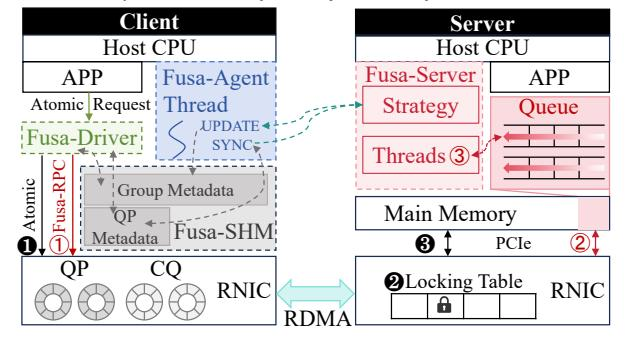
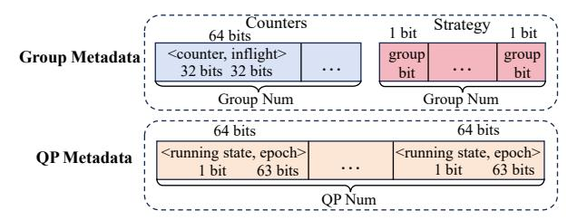
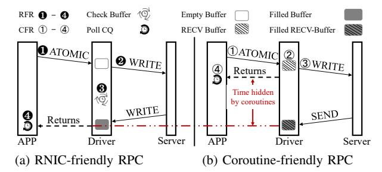
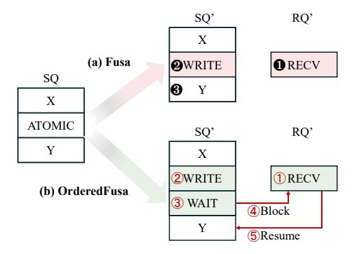
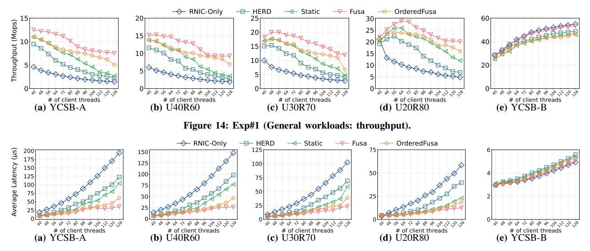
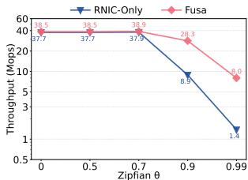
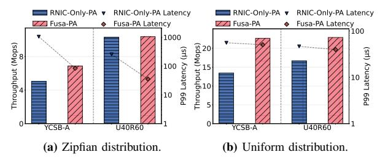
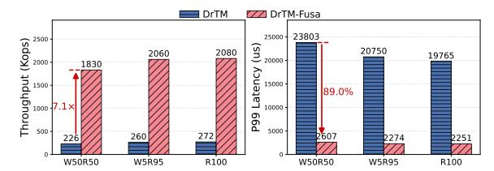

# Breaking Barriers in Atomic Scaling: A Hardware–Software-Collaborated Framework to Deconstruct RDMA Atomic

Guangyang Deng† , Qiangsheng Su† , Zhirong Shen†, Qing Wang‡ , Yina Lv† , Ronglong Wu† , Jiwu Shu† †School of Informatics, Xiamen University ‡School of Computer Science Nanjing University Corresponding Author: Zhirong Shen (shenzr@xmu.edu.cn)

*Abstract*—*Remote Direct Memory Access* (RDMA) Atomics are widely adopted to ensure correctness in distributed synchronization. However, their scalability is still seriously constrained by internal locking within RNICs. This paper provides systematic analysis that uncovers fundamental bottlenecks when scaling atomic operations. To break the constraints in RDMA Atomic scaling, we present **Fusa**, a framework that transparently coordinates server-side hardware (RNIC) and software (CPU) to accelerate atomic executions. **Fusa** integrates fine-grained contention detection with selective onloading, which executes uncontended operations in hardware while redirecting contended ones to software. **Fusa** further designs a consensus mechanism for strategy switching. We evaluate **Fusa** using microbenchmarks and unmodified RDMA-based systems, showing that **Fusa** improves throughput by up to 4.6×.

# I. INTRODUCTION

Background: RDMA has become a cornerstone of modern distributed systems to realize ultra-low latency and highthroughput data access across a wide spectrum of applications, including key-value stores [10], [16], [30], [32], [40], [50], [51], [69], [82], file systems [7], [45], [64], [71], [79], database systems [6], [9], [60], [74], [78], and distributed memory architectures [8], [35], [52], [53], [62]. The rationale is that *RDMA Network Interface Cards* (RNICs) enable clients to bypass server CPUs by directly issuing one-sided read and write operations to remote server memory, which are then translated into PCIe transactions and executed by the DMA engine as direct physical memory accesses.

To enforce synchronized access to shared memory across distributed clients, RDMA Atomic (e.g., RDMA CAS and RDMA FAA) provides specialized one-sided primitives that ensure atomicity and consistency of remote memory updates [33], [65], [80]. These atomics are fundamental to extensive system components, including low-latency distributed locking (e.g., mutexes [69] and spinlocks [59]), lock-free data structure updates (e.g., concurrent hash tables [50], [82]), and metadata coordination in database engines [9], [81], [82]. Extensive studies have reported that the performance of RDMA Atomic impacts system overall performance. For example, adding 10% of PUTs (each with two atomics) degrades the throughput by 72% for atomics-based KV stores [33]. Generally, RNICs implement two hardware-level atomicity models: HCA Atomic and Global Atomic. In particular, *HCA Atomic* provides

atomicity within a single RNIC by mapping target addresses to slots in an internal locking table (e.g., 512 slots in Mellanox RNICs) to serialize concurrent atomic operations. While this mechanism ensures correctness, it can significantly degrade performance under skewed workloads, as requests targeting hot addresses may hash to the same slot, resulting in contention and enforced serialization. We validate this via testbed experiments and show that the *atomic throughput* (i.e., the number of atomic operations completed per second) can drop by up to 94.5% (see Figure 4, §III). On the other hand, *Global Atomic* provides PCIe-level atomicity across devices by leveraging PCIe Atomic transactions. In this model, the RNIC delegates atomicity enforcement to the PCIe subsystem, thereby bypassing its internal locking table. However, Global Atomic relies on modern motherboards and CPU generations with native PCIe Atomic support (e.g., Intel Xeon Scalable [27] and AMD EPYC [2] platforms). Consequently, its performance has not been systematically studied in prior work, and its practical advantages remain largely unexplored.

Unsuccessful attempts and findings: In view of this, we first carry out two attempts to alleviate slot contention in the RNIC locking table (§III). We first use Global Atomic (i.e., with PCIe Atomic enabled) to bypass the locking table. This allows RNIC processing units (PUs) to issue atomic operations directly to the PCIe link layer and the serialization of atomic operations is handed over to the PCIe link layer (rather than within the RNIC). However, we find that the capability of PCIe Atomic is still limited by the Atomic Completer Engine [1], whose atomic throughput is only 34.0% of the RNIC locking table. Therefore, in this paper, we adopt HCA Atomic as the default configuration (i.e., PCIe Atomic is disabled), as it can deliver significantly higher and more stable atomic throughput than Global Atomic. We then perform the second attempt by onloading RDMA Atomic to the server-side CPU via RPC. However, we find that for requests with low contention, direct serialization in the RNIC locking table can still achieve lower latency than onloading to the server-side CPU. Hence, *it remains an open problem to design a framework that integrates RNIC's fast hardware path with flexible software execution to resolve the scaling constraints of RDMA Atomic*.

Our solution: We design Fusa, a hardware-softwarecollaborated framework that selectively routes RDMA Atomic

to RNICs and CPUs of servers based on workload skewness and contention degree. To leverage the fast operation path (in RNICs) and the execution flexibility (in CPUs), Fusa proposes a contention-aware dispatch strategy (i.e., the policy deciding whether atomic requests are executed in RNIC hardware or CPU software), which onloads the highly contended atomic requests from the RNIC locking table to the CPU for execution, while leaving the uncontended requests to be performed in the RNIC locking table. Fusa further designs a client-side lazy synchronization with a server-side consensus coordination, enabling efficient and consistent dispatch strategy switching. Although Fusa disables PCIe Atomic by default, it remains compatible with systems with PCIe Atomic enabled.

To ensure generality and ease of adoption, we implement Fusa by modifying the Mellanox RNIC user-space driver [41], and build three supporting components: Fusa-RPC, Fusa-Agent, and Fusa-Server. Fusa overrides standard libibverbs APIs, enabling existing RDMA systems to run atop Fusa without any modification.

**Performance:** We evaluate Fusa using YCSB benchmark [14] and lock traces [23], showing that it improves RDMA Atomic throughput by up to  $4.6\times$ . We further integrate Fusa with typical RDMA-based systems, including RACE [82] (a lock-free hash index) and DrTM [69] (an in-memory transaction processing system), demonstrating that Fusa improves the throughput by up to  $14.7\times$  and reduces latency by up to 97.8%. We open source Fusa at https://github.com/xmusys/fusa. In summary, we make the following key contributions:

- To the best of our knowledge, we conduct the first systematic evaluation of PCIe Atomic, revealing key limitations through in-depth analysis (§III).
- We propose Fusa, a hardware-software-collaborated framework that selectively onloads highly contended atomic requests to the CPU while retaining contention-free ones on the RNIC (§IV).
- We implement Fusa atop the Mellanox RNIC driver (§V) and evaluate its effectiveness through microbenchmarks and RDMA-based systems (§VI).

# II. BACKGROUND

## A. RDMA Architecture

**RDMA:** Remote Direct Memory Access (RDMA) enables applications to directly access remote memory by offloading the network stack to the RDMA Network Interface Cards (RNICs) [16], [24]. This CPU-bypass architecture achieves ultra-low latency (e.g., 2 µs [16]) and high bandwidth (e.g., 400 Gbps [49]), making RDMA well-suited for high-performance distributed systems. Figure 1 illustrates the RDMA architecture in reliable connection mode<sup>1</sup>.

To establish communications, both the client and server must first create a Queue Pair (QP) and a Completion Queue (CQ) in host memory, which are used to manage request metadata throughout the transmission process. Each QP consists of a Send Queue (SQ) and a Receive Queue (RQ), where elements


Figure 1: Overview of RDMA network architecture (§II-A).

are enqueued for processing. During RDMA communication, the application submits an RDMA verb to the SQ via a user-space driver, prompting the RNIC to fetch the corresponding element via DMA or MMIO and execute the requested operation [33]. Once the operation completes, a Completion Queue Element (CQE) is generated to notify the application, which can detect it either through polling or event-based notifications [55]. Note that RDMA verbs are categorized as one-sided (e.g., READ, WRITE, CAS, and FAA) or two-sided (SEND and RECV) [54]. One-sided verbs achieve high efficiency by bypassing the remote CPU, whereas two-sided verbs require CPU involvement on both sides and follow message-passing semantics, making them suitable for RPC-based designs [30], [31].

**DDIO:** Data Direct I/O (DDIO) [28] further optimizes the RDMA data path by enabling the RNIC to interact directly with the LLC, thereby bypassing main memory accesses on the critical latency path [20]. As shown in Figure 1, in DDIO mode, the RNIC writes data directly to the LLC, with the write operation considered complete as soon as the data arrives in the cache (Step ①). When the allocated cache space is later required for other data, the LLC evicts the corresponding cache line to DRAM as a background operation (Step ②).

#### B. RDMA Atomicity

RDMA Atomic is critical for ensuring atomicity and consistency when accessing shared resources in remote memory. RDMA supports two atomic operations, namely CAS and FAA, which operate directly on remote memory regions. Specifically, RDMA CAS compares the current value at a remote memory location with a specified "compare" value and updates it with a given "new" value if they match, whereas RDMA FAA atomically adds a user-defined value to the current value in remote memory and returns the original value. These two atomic primitives serve as the foundation for a wide range of RDMA-based systems. For example, key-value stores such as RACE [82] and SepHash [50] leverage RDMA Atomic to enable lock-free writes and prevent conflicts [81], while distributed transaction systems including DrTM [69] and NAM-DB [6] utilize RDMA Atomic to implement remote locking and enforce isolation levels.

Figure 2 illustrates the implementation flow of HCA Atomic, showing how the RNIC's internal locking table coordinates RDMA Atomic operations across processing units (PUs) within the RNIC. To guarantee atomicity, modern RNICs serialize

<sup>&</sup>lt;sup>1</sup>We focus on RDMA using over connections [56].


Figure 2: The RNIC locking table in the server-side RNIC (§II-B). Each processing unit (PU) processes RDMA Atomic independently. RDMA Atomic will contend if they are assigned to the same slot.

concurrent operations through an internal locking table containing multiple slots (e.g., 512 slots in Mellanox RNICs [33], [80]). For each 8-byte aligned atomic operation, the RNIC hashes the target address to identify the corresponding lock slot and assigns the operation to a specific PU. RDMA Atomic contention occurs when multiple RDMA Atomic operations are mapped to the same slot, requiring serialized execution (1). The assigned PU executes the atomic operations by first issuing a PCIe Read to retrieve the current value (2), followed by a PCIe Write to update the data if applicable (3). This RNIC locking table ensures that all PCIe requests maintain atomicity across multiple PUs. To enable more efficient synchronization across multiple PCIe devices, PCIe 3.0 [1] introduces PCIe Atomic transactions [2], [27], which natively support FAA, CAS, and SWAP. When supported, RNICs can implement Global Atomic by issuing PCIe Atomic transactions, thereby delegating atomicity guarantees to the PCIe subsystem. This approach eliminates the need for internal serialization and allows RNICs to bypass the locking table (1).

# III. UNSUCCESSFUL ATTEMPTS AND FINDINGS

To explore scalable RDMA Atomic solutions, we make two attempts to alleviate contentions in the RNIC locking table. First, we analyze the internal locking mechanism in RNIC and try to bypass internal locking using PCIe Atomic (Attempt#1). Second, we examine a software-only approach to address these limitations (Attempt#2). From these efforts, we derive two findings (Finding#1–#2) that motivate our design. The configurations of experiments can be referred to §VI-A.

#### A. Attempt#1: Bypass RNIC Locking via PCIe Atomic

Methodology: Recall that RDMA Atomic operations rely on the internal RNIC locking table to guarantee execution correctness (§II-B). Hence, when RDMA Atomic operations exhibit skewed concurrency, this architecture suffers from slot-level contention, which severely degrades access throughput [80]. Our observation is that PCIe Atomic is an alternative that allows PUs to perform atomic operations directly via the Root Complex (Step ① in Figure 2), hence bypassing the traditional PCIe RMW cycle and RNIC lock arbitration (Steps ② and ③).

Driven by this observation, we first conduct an experiment on two RNIC generations: ConnectX-5 (CX-5), and ConnectX-6 (CX-6) RNICs, to study how much performance improvement can be gained by directly using PCIe Atomic. We launch RDMA\_CAS requests with 128 threads while varying the


Figure 3: The impact of disabling and enabling PCIe Atomic on RNIC workflow (§III). "PA" indicates the case with PCIe Atomic enabled. Stride is the interval size between the addresses accessed by two adjacent threads.

stride (defined as the address distance (in bytes) between consecutive threads)<sup>2</sup>, to adjust the resulting skewness of the atomic operations. We assume that the RNIC locking table has 512 slots (get from reverse engineering in [80]) and increase the stride from 8 bytes (i.e., all 128 threads access different slots without any contention) to 8,192 bytes (i.e., all 128 threads contend for the same slot).

Figure 3 shows the resulting atomic throughput. "CX-5-PA" represents that PCIe Atomic is enabled on CX-5. With PCIe Atomic disabled, the throughput of CX-5 remains stable at the beginning and declines once the stride exceeds 128 bytes, indicating that slot contention arises across PUs in RNICs under skewed atomic workloads.

In contrast, when PCIe Atomic is enabled in CX-6 (e.g., CX-6-PA), the atomic throughput stabilizes across different strides, as the atomic operations can bypass the RNIC locking table in CX-6 to avoid slot contention. However, this approach comes at the cost of reduced atomic throughput, which drops from 42.3 Mops/s (the throughput of CX-6 with the stride of 8 bytes) to 14.4 Mops/s (the average throughput of CX-6-PA). One possible reason lies in the capacity constraints of the atomic completer engine [1], which executes PCIe Atomic transactions (1) in Figure 2) and ensures multi-device atomicity but is constrained by vendor-specific implementation limitations [2], [26]. We verify the above results on two different testbeds equipped with Intel Xeon Silver 4314 (Ice Lake) and Intel Xeon Gold 5420 (Sapphire Rapids) processors, respectively, indicating that the findings are not architecture-specific. In addition, we repeat the same test on another testbed equipped with AMD EPYC 7281 processors, where the atomic throughput of CX-6-PA reaches only 27.6 Mops/s. Moreover, PCIe Atomic does not provide support for enhanced atomic primitives, such as masked compare and swap [48] on RNICs, and thus cannot be directly applied to systems that rely on these primitives (e.g., Sherman [65] and SMART [47]).

In addition, CX-5-PA exhibits an unusual behavior: when the stride is smaller than 512 bytes, its performance is similar to that of CX-6-PA; however, once the stride exceeds 512 bytes, the throughput of CX-5-PA experiences a significant

<sup>&</sup>lt;sup>2</sup>Interestingly, prior DRAM works have also explored stride patterns [61], [70]. For instance, SAM [70] effectively mitigates DDR channel resource contention. However, these works fundamentally differ from the RNIC slot-level contention addressed here.


Figure 4: Performance with different skewness (§III). RNIC-Only means solely using RNIC to complete RDMA Atomic. HERD RPC means only using server-side CPU to complete RDMA Atomic.

drop, approaching that of CX-5. This suggests that CX-5-PA utilizes both PCIe Atomic transactions and the locking table to complete atomic requests. For stride smaller than 512 bytes, the Atomic Completer Engine emerges as the performance bottleneck, whereas for stride larger than 512 bytes, the bottleneck shifts to the RNIC locking table. As a result, CX-5-PA consistently delivers the lowest performance across all strides. Therefore, in this paper, we primarily focus on the HCA Atomic model (i.e., with PCIe Atomics disabled). Since Global Atomic implements atomic operations using PCIe Atomic transactions while preserving the same RDMA Atomic semantics, any design that ensures correctness under HCA Atomic remains compatible with Global Atomic.

**Finding#1:** Simply enabling PCIe Atomic to bypass the locking table in RNICs cannot definitely improve performance, as the performance is constrained by the Atomic Completer Engine.

#### B. Attempt#2: Onload RDMA Atomic to Server-Side CPU

Methodology: Besides using PCIe Atomic to replace the RDMA Atomic, we further conduct the second attempt by onloading RDMA Atomic back to the server-side CPU to mitigate the contention in RNICs. This method is selected for two reasons. First, the latency of accessing main memory from the CPU (approximately 60 ns [19], [20]) is significantly lower than that from RNICs (around 1 μs [67]). Second, DDIO [28] enables RNICs to write data directly to the LLC (§II-A), hence shortening the path of CPU data access (e.g., 29 CPU cycles for accessing LLC [21]). Here, we onload RDMA Atomic to server-side CPU using HERD RPC [32] with four server-side threads to process atomic requests.

Figure 4 illustrates the atomic throughput of HERD RPC and RNIC-Only (i.e., solely performing RDMA Atomic by RNICs) under varying access skewnesses. When the Zipfian parameter  $\theta$  is 0 (i.e., uniform distribution), RNIC-Only outperforms HERD RPC by gaining 4.7× higher atomic throughput and reducing P50 and P99 latencies by 78.9% and 90.1%, respectively. This is because HERD RPC relies on two-sided SEND/RECV semantics, which require the server CPU to post RECV and handle CQs, incurring higher latency than one-sided atomic requests. However, when the Zipfian parameter  $\theta$  increases to 0.99 (the default in YCSB benchmark [14]), HERD RPC surpasses RNIC-Only by delivering 1.4× higher throughput and reducing P50 and P99 latencies by 55.2% and 89.5%,


Figure 5: Heatmap of the RNIC locking table under a Zipfian access distribution (§III). The Zipfian parameter  $\theta$  is 0.99. Each cell in the figure represents a slot in the locking table; due to space limits, we only show results for the first 256 of the 512 slots.



Figure 6: Overview of Fusa (§IV-A). The full cluster consists of multiple clients and servers; however, due to space limitations, only one client and one server are depicted in this illustration.

respectively. This is because the cache-coherence mechanisms of the CPU can handle shared memory atomic more efficiently than the RNIC locking tables.

Figure 5 illustrates the number of requests and corresponding latencies when executing RDMA Atomic under an access distribution (with a Zipfian parameter  $\theta=0.99$ ). Due to space limits, Figure 5 illustrates the distributions of the request numbers and the average latencies of the first 256 slots of the locking table, which is presented as a  $16\times16$  matrix and each cell represents a slot. The results show that a small subset of slots experiences a disproportionately high volume of atomic requests and elevated access latency. We note that although the above evaluation employs YCSB-generated workloads, skewed access patterns are prevalent in real-world applications [23], [38], [76], making this characteristic both common and practically significant.

**Finding#2:** RNICs is more advantageous to execute RDMA Atomic with lowly-skewed distributions, whereas server-side CPUs is more efficient to process highly-skewed distributions.

# IV. DESIGN OF FUSA

# A. Overview

Architecture: Figure 6 illustrates the architecture of Fusa. Clients are equipped with RNICs and connected to server through RDMA network. Fusa-Driver is a user-space driver that intercepts RDMA Atomic requests from applications. It decides whether each request should be executed by the RNIC or redirected to the CPU software path, according to the current dispatch strategy. Fusa-Agent is an agent that monitors local

request statistics and reports them to the server. It also receives updated dispatch strategy from the server and coordinates with Fusa-Driver to ensure correct strategy switching. Fusa-RPC is an RPC protocol that is implemented in Fusa-Driver and transfers contended atomic requests from clients to the server CPU. Fusa-Server executes atomic requests onloaded via Fusa-RPC on CPU threads, aggregates contention reports from all clients, maintains global metadata, and disseminates updated dispatch strategies to Fusa-Agent.

**Key Ideas:** Based on the above two findings, we propose Fusa, a general framework to mitigate atomic contention for RDMA-based systems. Figure 6 shows the overview of Fusa. Fusa allows each client to execute a fusion-based strategy (§IV-B): it onloads highly-skewed atomic requests to the server-side CPU (① to ③), while processing the remaining operations in the RNIC (● to ④). To facilitate this, each client reports metadata about its atomic requests (e.g., access frequency and address distribution) to the Fusa-Server, enabling Fusa to construct a global contention profile. This profile is analyzed periodically to update the dispatch strategy and propagated to all clients.

Fusa also designs two coordination mechanisms that together ensure correctness and consistency during the switch of dispatch strategies (§IV-C): (i) the lazy synchronization (at the client side), which allows new strategies to be adopted with controlled delay to avoid transient inconsistencies; and (ii) the consensus coordination (at the server side), which establishes consensus to guarantee atomic transitions.

We finally present a driver RPC to ensure the efficiency and transparency of Fusa to general RDMA-based systems (§IV-D).

**Workflow:** Figure 6 illustrates the workflow of Fusa. Clients first submit atomic requests to the user-space Fusa-Driver. Upon receiving an atomic request, Fusa-Driver determines whether it should be executed by the server-side RNIC (i.e., hardware) or by Fusa-Server (i.e., server-side CPU, software) based on the dispatch strategy. When selecting to dispatch the atomic operations to the RNIC, Fusa-Driver forwards the one-sided atomic verb directly (1). The RNIC then acquires the corresponding slot lock in the internal locking table (2) and executes the operation via a PCIe RMW (3). On the other hand, when choosing to perform the atomic operations by Fusa-Server, Fusa then sends the request via the Fusa-RPC protocol (1), converts it into an RPC message, and appends it to a request buffer in the server's main memory (2). Server threads then dequeue these RPC messages, parse each request, and execute the atomic operation on the CPU (3).

### B. Fine-Grained Dispatch Strategy

To adapt to the diverse access patterns across different applications [23], [38], Fusa designs a fine-grained contention-aware dispatch strategy.

**Dispatch Principle:** The RNIC executes RDMA Atomic using PCIe-based RMW transactions (Figure 2). While the internal RNIC locking table guarantees atomicity among its PUs, it does not provide atomicity when coordinating with CPU-side atomic processing. This lack of cross-domain synchronization


Figure 7: Example of contention identification at the group level ( $\S IV-B$ ). We color the portion below the watermark blue and the portion above red.  $r_i$  means the request count of a group.

introduces a correctness risk due to potential data races. To ensure correctness, Fusa enforces execution exclusivity: each atomic request address is served solely by either the RNIC or the CPU. By isolating execution at the address level, Fusa preserves atomic semantics without PCIe Atomic support.

**Group-Level Scheduling:** To schedule the RDMA Atomic requests, Fusa proposes to selectively onload only a subset of requests within a slot to the server-side CPU. This approach relieves contention while allowing the remaining requests to be processed directly by the RNIC, thereby mitigating conflicts and fully utilizing the RNIC's hardware capabilities.

To this end, we redefine the scheduling unit by classifying requests of each slot into multiple smaller groups using q additional bits, which can be extracted from the request address. Suppose that a locking table comprises s slots  $^3$ . Hence, the group-level scheduling can manage the atomic requests across  $s \cdot 2^g$  groups of the entire locking table, enabling finer-grained contention management. Figure 7 shows an example with s =512 and g = 2, where the requests to each slot is classified into four groups (i.e.,  $2^g$ ), resulting in 2,048 groups in total. Group Metadata: Our another observation is that the volume of RDMA requests can fluctuate significantly even within a single application, due to the sudden change of operations with significantly different access patterns, including the resizing in hash table [50], [82], transactional commit and validation [68], [69], and LSM-tree compaction [66], [73]. To proactively detect and mitigate contention in the RNIC locking table, Fusa periodically monitors the distribution of atomic requests and updates its dispatch strategy accordingly. This is achieved through the use of group metadata (shown in Figure 8). Specifically, each group maintains a 64-bit request counter that tracks the number of atomic requests in this group, along with a 1-bit flag that indicates the dispatching target: a value of '1' routes the group's requests to the server-side CPU, while '0' directs the requests to the RNIC.

**Contention Identification:** To quantify the contention degree of each group, Fusa periodically inspects the request counters. Since contention typically presents as request hotspots, we

<sup>&</sup>lt;sup>3</sup>Mellanox RNICs use 512 slots in their locking table; for other RNICs, the number of slots can be probed via reverse engineering as in [80].



Figure 8: Metadata in the Client (§IV-B). The group metadata facilitates the generation and storage of the strategy, whereas the QP metadata is maintained to guarantee consistency when strategies are switched.

treat it as a hotspot detection problem [4], [11], [14], [25]. To prevent excessive onloading that could introduce queuing delays, we impose a constraint based on the processing capacity of the server-side CPU  $^4$ , denoted as C.

To decide which atomic requests should be onloaded, we first compute the average number of requests across all groups, denoted as the *watermark*, where the groups with counters below this watermark are classified as *contention-less groups*. We next sort all groups in descending order of their request counts and identify the groups whose atomic operations will be onloaded to the server-side CPU. The scan operation terminates until either of the following two conditions is satisfied: (i) all the remaining groups are contention-less ones (indicating that this group and all subsequent groups do not suffer from severe contention) and (ii) the number of accumulated atomic requests to be onloaded surpasses the processing capability of the server-side CPU (i.e., larger than C).

**Example:** Figure 7 illustrates an example with four groups. We sort them at first based on the number of atomic requests to be processed. Suppose that C is 15. We then scan the sorted groups and choose to onload the requests of the most contended groups (e.g.,  $r_2$  and  $r_3$ ), as the number of their requests reaches C.

## C. Correctness Fusion Dispatch

As Fusa dynamically changes its dispatch strategy, clients may receive the updated strategy at different points in time. In this case, atomic requests belonging to the same group may be operated by the clients following different dispatch strategies. For example, the atomic operations of a group may be assigned to the RNIC by a client (following the old strategy) and dispatched to the server-side CPU by another client (following the new strategy), resulting in a temporary inconsistency. Prior works [5], [75] usually ensure correctness by enforcing isolation among requests. However, Fusa does not adopt this approach for the following two reasons. First, because of temporal locality, the dispatch strategy is updated infrequently, meaning that the inconsistency will only occur for the groups whose dispatch strategies are just changed during the period of strategy transitioning. Second, as the number of contended groups (i.e., comprising the addresses hotly

```
GROUP NUM # number of groups
     # In Fusa-Driver:
     def Send cas (address, current, new):
4
5
         # get qp_id according to the context
         qp id = GetQPId(context)
6
         group id = address % GROUP NUM
8
         counters[group id]++
9
         # mark OP as running
         running[qp_id] = True
         epoch[qp_id] += 1
         # get the strategy bit of group_id
14
         local_st = strategy[group_id]
16
         # Send request based on local st
17
         if local_st == 1:
18
             # onload to Fusa-Server
19
             send to Server (address, current, new)
         else:
21
             # offload to RNIC
             inflight[group id]++
             send to RNIC (address, current, new)
24
         # mark QP as finished
         running[qp_id] = False
26
27
28
     # In Fusa-Agent:
     def Update strategy (new strategy):
         pre_strategy = strategy
         # strategy is a pointer to group bits
         # so we can use CAS atoms to switch it
         CAS(strategy, new_strategy)
34
     def Wait sync(client qp set):
36
         Q = Queue()
38
         for qp_id in client_qp_set:
             # enqueue QP with its current epoch
40
             Q.enqueue((qp id, epoch[qp id]))
41
42
         while not Q.empty():
             qp_id, origin epoch = Q.front()
4.3
44
             # a QP is considered synchronized
45
             # once it either increments its epoch
46
               or exits the running state
47
             if epoch[qp id] != origin epoch or
48
                 running[qp id] == False:
49
                 Q. dequeue()
         # All QPs have reached consensus
51
         # Wait inflight RDMA CAS
53
         for group id in 0..GROUP NUM-1:
54
             if pre strategy[group id] ==
                 strategy[group id] == 1:
                 while(inflight[group_id] != 0)
```

Figure 9: Pseudo-code of client consensus procedure (§IV-C).

accessed) are usually very small, Fusa chooses to guarantee the consistency for a small number of groups whose dispatch strategies are changed, rather than enforcing the coordination between server-side CPU and RNIC for all the requests as in [5]. However, as one-sided RDMA bypasses the server CPU, the server-side RNIC is incapable to reject the requests guided by the outdated strategy [17]. Hence, the primary challenge is to ensure that all clients' QPs converge to a unified view of the dispatch strategy after the synchronization point, thereby guaranteeing execution consistency.

**Lazy Synchronization at the Client Side:** To enable dynamic dispatch strategy switching at the client side, we propose

 $<sup>^4\</sup>mbox{We}$  demonstrate that a single server thread can process the atomic operations at approximately 2.5 Mops/s (see Exp#5 in VI-D

a multi-QP epoch synchronization mechanism inspired by epoch-based reclamation [22]. Figure 9 displays the pseudocode of the consensus procedure at the client side, where the synchronization is coordinated between the passive path (lines 4–26) that updates QP epoch and metadata and the active path (lines 28–56) that checks QP consensus state to ensure global agreement. Since the driver layer is passive, Fusa-Driver follows lazy synchronization by incrementing the epoch during normal execution without observing strategy changes.

When receiving a dispatch strategy update from the server, the client first applies it locally (lines 29–33) and then invokes Wait\_sync to block until all QPs have safely transitioned the strategy. A QP is considered synchronized once it either increments its epoch (i.e., it has updated its metadata and only enters the execution state after adopting the new dispatch strategy, thus guaranteeing that subsequent requests will follow the latest strategy) or exits the running state (i.e., it is not currently issuing requests, so upon the next execution it will inevitably read and adopt the updated strategy), both of which ensure subsequent accesses observe the new dispatch strategy (lines 42–49). The client further monitors each QP's status and proceeds only after the queue is fully drained, thereby guaranteeing that all QPs attain a consistent view and adhere to the new strategy thereafter.

In-Flight Request. Once QPs of the client reach consensus on a new strategy, it must guarantee that no requests will be issued under the old strategy from that point onward. However, there may still exist in-flight requests either in the network or being executed on the server-side RNIC. We provide solutions for the two possibilities. When the dispatch strategy of a group switches from the server-side CPU to the RNIC, Fusa-Server can directly refuse the executions of the in-flight requests (as these requests are originally sent to Fusa-Server according to the old strategy). On the other hand, when the dispatch strategy of a group switches from the RNIC to Fusa-Server, it will be complex to learn the processing status of requests, as Fusa is unaware of the execution of the atomic requests in RNICs. To address this problem, we allocate an in-flight field for each group (see Figure 8), which is incremented when the RNIC issues an atomic operation (line 22 in Figure 9) and decremented when the driver receives the CQE that indicates the completion of this group's requests. Therefore, after reaching QP consensus, Fusa-Agent must check whether any such groups still have in-flight requests (lines 53-56 in Figure 9). Global Consensus Coordination at the Server Side: We implement a consensus phase in Fusa-Server to coordinate the transition of dispatch strategy across all clients. During the consensus phase, Fusa-Server computes a per-group consistent-bit by XORing the old and new dispatch strategies, as shown in Figure 10. For groups where the consistent-bit is '0' (e.g., Group-A in Figure 10), we retain their original dispatch strategy, allowing requests (1 and 2) to proceed without interruption. In contrast, for groups where the consistent-bit is '1' (e.g., Group-B and Group-D), Fusa-Server rejects all requests during the consensus phase. This prevents inconsistent execution where some QPs continue to operate under the old


Figure 10: Global consensus coordination (§IV-C). Each bit of a group specifies the strategy: '0' indicates that the atomic request is sent to the RNIC, while '1' indicates the request is sent to the Fusa-Server. S denotes the Fusa-Server, C1 and C2 denote clients.

dispatch strategy (①) while others have already adopted the new one (②), before global consensus is reached. When the consensus phase completes, Fusa-Server resumes normal request processing and finalizes the transition to the new dispatch strategy (④). We also evaluate the time required for each step in the consensus process (see Exp#4, §VI-C).

Formal Verification of Execution Correctness: To formally validate the correctness of Fusa, we model its consensus protocol using TLA+ [37], which is a high-level language for modeling programs and systems. The model captures the key components of Fusa, including clients, groups, QPs, server strategies, per-client local strategies, epoch states, in-flight counters, and pending requests.

We define the following two criteria: (i) at any time, no client has atomic operations on the same address executed by both the server-side RNIC and the server-side CPU simultaneously (to ensure the execution correctness of the atomic requests from a single client), and (ii) at any time, all the requests to the same group (even sent by different clients) are executed entirely by either the server-side RNIC or the server-side CPU (to ensure the execution correctness of the atomic requests across different clients). Using the TLA+ model checker, we exhaustively verified that these invariants hold for all reachable states (with over 40 billion states) under bounded configurations. The results confirm that the consensus mechanism in Fusa ensures a consistent view of the dispatch strategy across all clients during strategy transitionings.

#### D. Transparent RPC

Prior RPC frameworks [13], [30]–[32], [45] are predominantly designed at the application layer, limiting their transparency and system generality. To support non-intrusive RDMA Atomics, Fusa implements its dispatching logic at the driver level, allowing applications to run atop of it without any modification.

To evaluate driver-level RPC viability, we port two representative implementations, namely SelfRPC [45] and HERD RPC [32], to the RNIC driver. This integration allows for atomic redirection of requests without modifying application logic and enables us to assess whether their performance traits are preserved when shifted to the driver level.



Figure 11: Workflows of transparent RPC approaches (§IV-D). The figures illustrate that (a) the RNIC-friendly RPC is adapted from SelfRPC [45], while (b) the coroutine-friendly RPC is derived from HERD RPC [32].

RNIC-Friendly RPC. We implement an RNIC-friendly RPC variant by porting SelfRPC [45] to the driver layer. This approach leverages one-sided RDMA verbs to minimize RNIC resource usage [36]. Figure 11(a) shows that the driver processes each atomic request by allocating a buffer (1), issuing an RDMA WRITE (2), and actively polling the buffer for completion (3) before returning the result to the application (3). Since no server-side CQE is generated, this active polling is required for synchronization. However, this spin-waiting mechanism is incompatible with coroutine-based architectures commonly adopted in modern RDMA systems [46], [47], [65], [68], [77], [82], as it blocks coroutine switching and limits system concurrency.

Coroutine-Friendly RPC. To address this concurrency limitation, we further implement coroutine-friendly RPC variant by porting HERD RPC [32] to the driver level. As shown in Figure 11(b), coroutine-friendly RPC begins by posting a RECV on the client (2), followed by issuing a WRITE to the server (3) upon atomic request reception (1). Control is then immediately returned to the application (4), enabling coroutine transitions without waiting at the driver level. Unlike RNIC-friendly RPC, coroutine-friendly RPC relies on the CQE generated by the RDMA SEND to detect completion, enabling asynchronous synchronization via poll CQ. Although the coroutine must eventually wait for the CQE arrival, coroutinefriendly RPC masks latency by allowing other coroutines to proceed, enhancing concurrency and throughput. However, this concurrency gain is achieved at the cost of higher RNIC resource consumption, as the coroutine-friendly RPC depends on two-sided RDMA verbs.

**Performance Comparison.** To identify the most effective driver-level RPC mechanism, we compare RNIC-friendly RPC and coroutine-friendly RPC under a configuration of two coroutines per thread. To isolate RPC scalability from contention effects, we evaluate both designs using uniformly distributed workloads with update ratios ranging from 25% to 100%. Figure 12 shows that coroutine-friendly RPC consistently outperforms RNIC-friendly RPC across all configurations. This advantage stems from its asynchronous design: while one coroutine waits for CQE completion, others can continue execution, thereby hiding synchronization latency and preserving


Figure 12: Performance comparison of RNIC-friendly RPC and coroutine-friendly RPC (§IV-D). We use uniform distribution to minimize the effects of contention. Each thread is configured with two coroutines



Figure 13: Processing details of Fusa and OrderedFusa on the client-side QP. X and Y denote arbitrary RDMA verb requests issued before and after an atomic request, respectively. Steps ①—③ illustrate the workflow of Fusa, while Steps ①—⑤ illustrate the workflow of OrderedFusa.

concurrency. In contrast, RNIC-friendly RPC relies on polling, which stalls coroutine switching and degrades parallelism. Based on the above findings and comparisons, Fusa-RPC adopts coroutine-friendly RPC as the default driver-level RPC mechanism for atomic request dispatching.

# E. Ordering Guarantee and Design Choices

We further discuss the ordering guarantees of Fusa and elaborate on the corresponding design choices. The InfiniBand specification [3] mandates that all requests posted to a single QP must be executed by the RNIC strictly in the order in which they are issued by upper-layer applications.

While RNICs typically enforce request ordering by assigning each QP to a PU, Fusa breaks the original ordering semantics by replacing specific RDMA Atomic operations with RPCs, whose execution is shifted to the server CPU and can be performed asynchronously and independently of the requests executed by the PU of the RNIC. Figure 13 shows an example, for a send queue (SQ) with three requests {X, ATOMIC, Y} in ordered, Fusa-RPC converts the atomic operation to a pair of WRITE and RECV operations (Steps ① and ②) and generates an SQ' (with three requests {X, WRITE, Y}) and RQ' (with the request {RECV}) at the client side. After the conversion, the three requests in SQ' are order guaranteed,

where the request Y must be executed after the completion of WRITE; however, as the completion of WRITE only indicates that the the request has been delivered to the server's memory (not the completion of the atomic operation), the execution of Y might be started prior the completion of the atomic operation (Step ③), violating the original execution orders in SQ.

While Fusa might break the semantics of ordering guarantee, we also show that it is applicable for a wide spectrum of applications (including tree-based indexes [63], [65], hash-based indexes [50], [82], transaction systems [12], [69], and databases [9], [60]) without altering the correctness of their operation flows. The rationale is that in these applications, the next operation right after the atomic operation generally depends on the result after completing the atomic operation to decide the subsequent action (e.g., RACE [82] and Sherman [65] need the results of the atomic operation to decide whether to retry or perform a write) or generate the subsequent operations (e.g., PolarDB [9] needs to obtain the CTS timestamp using RDMA\_CAS for ordering subsequent log writes).

For the applications [44], [80] that need strict requirement of the execution ordering, we can also make slight modifications to Fusa and generate a variant of Fusa (named OrderedFusa) that provides ordering guarantees. Different from Fusa that allows the SQ' to continue executing subsequent requests while the RPC request for atomic operation is still pending, OrderedFusa blocks the execution of requests in QP until the RPC request completes. Figure 13 shows an example of OrderedFusa. When an RDMA Atomic operation is converted to an RPC request with a pair of WRITE and RECV operations (Steps 1) and 2), OrderedFusa will append an RDMA WAIT verb [34], [55], [58] right after the WRITE (Step 3) and configure it to be released only upon the completion of the client's pre-posted RECV (i.e., indicating that the atomic operation is completed by the server). After the RECV operation in RQ' is completed, OrderedFusa starts the subsequent requests of the SQ' afterwards (Steps 5). This design ensures that the atomic request replaced by Fusa-RPC is always executed before any subsequent requests on the same QP, thereby preserving per-QP linearizability. We also evaluate the performance of OrderedFusa and show that OrderedFusa still significantly outperforms the baseline RNIC-Only by achieving up to 2.5× higher throughput (see Exp#1 and Exp#2 in §VI-B).

## F. Generality of Fusa When PCIe Atomic is Enabled

While Fusa is primarily designed for environments where PCIe Atomic is disabled, we also evaluate its generality under PCIe Atomic-enabled configurations. A key constraint is the limited processing capacity of the *PCIe Atomic Completer Engine*, which achieves lower atomic throughput than the RNIC (Figure 3). In view of this, Fusa can proactively redistribute more atomic requests to the server-side CPU, thus achieving a balanced workload that fully utilizes both PCIe Atomic and CPU-executed atomic operations. This hybrid handling allows Fusa to effectively break the performance limits of PCIe Atomic and improve overall RDMA performance. We also

evaluate the performance of Fusa in PCIe Atomic-enabled scenarios in Exp#7 (§VI-D).

#### V. IMPLEMENTATION

We implement Fusa on the Mellanox RNIC by modifying the user-space driver to develop Fusa-Driver and Fusa-RPC. We also implement Fusa-Agent and Fusa-Server to identify contention and update the dispatch strategy.

Fusa-Driver: To implement Fusa-Driver, we modify two functions in the user-space driver: (i) mlx5\_create\_qp(): During QP creation, we allocate a dedicated memory region for each QP to log metadata related to the issued atomic requests. (ii) mlx5\_post\_send(): Before sending RDMA Atomic to the RNIC, we intercept and rewrite the requests based on the proactive dispatch strategy. Fusa-Driver maintains transparency to applications by leveraging the LD\_PRELOAD.

Fusa-Agent and Fusa-SHM: Fusa-Agent runs as an

independent control thread that periodically refines the dispatch strategy. The two components communicate through a shared memory region (Fusa-SHM), where Fusa-Driver records perrequest statistics and Fusa-Agent updates strategy bits. We configure the group number as 8,192 by default, since larger values introduce higher metadata overhead without providing measurable performance gains. We reserve 65 KB in Fusa-SHM to manage 8,192 groups, each consisting of a 64-bit counter (split into a 32-bit field for per-second request counts and a 32-bit field for in-flight request counts) and a one-bit flag indicating whether the group requests are dispatched to serverside RNIC ('0') or CPU ('1'). Each QP maintains a 64-bit state (1-bit running state and 63-bit epoch) for client consensus. Each client uses at most 32 QPs (32 threads), incurring a maximum QP metadata overhead of 256 B. We embed the 13-bit group\_id  $(log_2(8192) = 13)$  of each request into the Work Request ID (WR\_ID) [42] of the atomic operation. When Fusa-Driver polls the CQE, it extracts the group\_id from the WR\_ID and decrements the in-flight counter, thereby enabling accurate tracking of in-flight RNIC Atomic requests. Fusa-Server: To provide a global view for contention identification and dispatch strategy selection, we propose Fusa-Server. Fusa-Server aggregates contention statistics from all clients and analyzes them to determine an appropriate dispatch strategy for the next stage. It then broadcasts the updated strategy to all clients, after which each Fusa-Agent updates its local dispatch strategy recorded in Fusa-SHM. Shorter stage improve timeliness but increase consensus overhead; Fusa chooses 1 second as a balanced setting. To prevent concurrent access to the same memory region by both the RNIC and the CPU, we employ a reject mechanism that enforces strategy consensus across clients (e.g., 1) in Figure 10). The server attaches a reject flag to the returned message to indicate that

the request has been denied. On the client side, the user-

space library detects this flag and automatically retransmit the

message, without requiring any awareness from the application.

Table I: General Workloads.

| Workload                  | Update | Read |
|---------------------------|--------|------|
| update-intensive (YCSB-A) | 50%    | 50%  |
| update-heavy (U40R60)     | 40%    | 60%  |
| read-heavy (U30R70)       | 30%    | 70%  |
| read-intensive (U20R80)   | 20%    | 80%  |
| read-dominant (YCSB-B)    | 5%     | 95%  |

## VI. EVALUATION

We evaluate Fusa using microbenchmarks and representative RDMA-based systems. Our objective is to seek the answers for the following questions:

- How do the design techniques impact the end-to-end performance of Fusa? (Exp#1–#2 in §VI-B)
- How much performance penalty does OrderedFusa incur to provide ordering guarantees compared to Fusa? (Exp#1–#2 in §VI-B)
- How does Fusa perform when serving multiple concurrent workloads? (Exp#3 in §VI-C)
- Can Fusa adapt to workload changes when the access hotspots shift? (Exp#4 in §VI-C)
- How do different system configurations influence the performance of Fusa? (Exp#5–#6 in §VI-D)
- What performance benefits does Fusa provide when PCIe Atomic is enabled? (Exp#7 in §VI-D)
- How do upper-layer RDMA-based systems benefit from integrating Fusa? (Exp#8-#9 in §VI-E)

# *A. Experimental Setup*

Testbed: We conduct experiments on a five-node cluster. Each machine is equipped with two 2.4 GHz Intel Xeon Silver 4314 processors (32 cores in total), 256 GB of DRAM, and a 100 Gbps Mellanox ConnectX-6 InfiniBand RNIC, with all RNICs connected to a 100 Gbps Mellanox SN2700 switch. The nodes run Ubuntu 20.04 LTS with Linux kernel 5.4.0 and Mellanox OpenFabrics Enterprise Distribution (MLNX OFED) v24.10-2.1.8. To reduce RNIC page-translation overheads, we use 2 MB huge pages. One node is configured as the server, while the remaining four act as clients. For Fusa, the server node launches four RPC service threads, each pinned to a dedicated physical CPU core using explicit core affinity.

Workloads: Table I summarizes the characteristics of general workloads. We use the YCSB benchmark [14] with a Zipfian distribution (θ = 0.99 by default) to construct microbenchmarks that mimic production-like access patterns [11]. YCSB supplies two mixed read–update workloads: YCSB-A, which issues 50% updates (update-intensive), and YCSB-B, which issues 5% updates (read-dominant). To broaden the evaluation space, we further include additional mixed workloads with varying update ('U') and read ('R') ratios. We use the keys generated by YCSB as the addresses accessed to emulate different contention levels at the RNIC. We employ RDMA CAS for updates and RDMA READ for read operations.

Comparison methods: We compare Fusa and OrderedFusa with the following three representative methods.

• RNIC-Only: it executes all RDMA Atomic on the RNIC, relying entirely on the locking table to ensure atomicity.

- HERD: it simply onloads all the RDMA Atomic to the server-side CPU using HERD RPC.
- Static: it is a static dispatch strategy that randomly dispatches half of the requests to the CPU, and leaves another half to be processed by the RNIC.

## *B. Overall Performance*

We first conduct a comparative evaluation of Fusa under diverse workloads and execution modes.

Exp#1 (General workloads): Figure 14 and Figure 15 illustrates the access throughputs and latencies of different approaches, respectively. We make the following observations.

First, Fusa achieves significantly higher throughput and lower latency compared to RNIC-Only across four workloads. Specifically, Fusa outperforms the RNIC-Only with throughput improvements of 3.1×, 3.0×, 2.6×, and 2.0×, respectively, while reducing average latency by 72.3%, 71.8%, 68.9%, and 59.4%, respectively. For the read-dominant workload (i.e., YCSB-B), Fusa achieves 97.5% of the throughput of RNIC-Only (Figure 14(e)). This slight performance drop is attributed to the smallest ratio of update requests (i.e., 5%, see Table I), which introduces the lightest contention degree and does not require atomic onloading.

Second, for the *YCSB-A* workload, HERD achieves a 0.9× throughput gain and reduces average latency by 44.0% by onloading all atomic operations to the CPU, thereby avoiding RNIC locking contention. Static further improves throughput by 40.0% and reduces average latency by 22.05% compared to HERD, as it evenly dispatches half of the requests to the CPU and the other half to the RNIC. Fusa delivers an additional 0.7× throughput improvement and reduces average latency by 34.8% by dynamically identifying contention at the group level and adaptively dispatching requests to maximize RNIC utilization (§IV-B).

Third, OrderedFusa delivers competitive performance while guaranteeing ordering. Compared to Fusa, it incurs a modest performance penalty: under YCSB-A, OrderedFusa achieves a throughput of 5.1 Mops/s, about 32% lower than Fusa. Nevertheless, it still delivers 2.5 × and 2.3 × higher throughput than RNIC-Only under YCSB-A and U20R80, respectively. These results indicate that OrderedFusa provides substantial gains over RNIC-Only while maintaining strict ordering guarantees.

Exp#2 (Varying update ratios): We vary the update ratio from 10% (i.e., U10R90) to 100% (i.e., U100) to evaluate the performance of Fusa under different contention degrees. Figure 16 shows that Fusa consistently delivers largest throughput across the entire spectrum of update ratios.

Across different update ratios, HERD, Static, Fusa, and OrderedFusa deliver average throughput improvements of 0.8×, 1.2×, 2.8× and 2.0× over the RNIC-Only, respectively. Even under the U10R90 workload (with 10% of updates), Fusa attains 43.9 Mops/s, achieving a 2.0× speedup over the RNIC-Only (14.8 Mops/s), implying that even a small fraction of update requests can induce substantial contention among PUs in the RNIC. By selectively onloading requests



Figure 15: Exp#1 (General workloads: average latency).


Figure 16: Exp#2 (Varying update ratios). The throughput is normalized to RNIC-Only under various update ratios.

from contended groups to CPU, Fusa mitigates the lockingtable contention and enables the RNIC to operate at its full potential.

### C. Robustness under Dynamic Workloads

We evaluate the robustness of Fusa by considering two settings: (i) *mixed workloads* (to mimic the scenario where multiple microservices share a resource), where multiple workloads run *concurrently*, and (ii) *workload transitions* (to reflect change of the workload patterns over time), where different workloads are executed *sequentially*.

**Exp#3 (Mixed workloads):** We configure two clients to run YCSB-A (an update-intensive workload with skewed distribution), while the other two clients execute another update-intensive workload with uniform distribution at the same time (denoted as YCSB-A-U).

Figure 17 shows that for YCSB-A, Fusa improves throughput by  $2.6\times$  and reduces P99 latency by 87.0%, respectively. These gains arise from Fusa's ability to onload atomic requests to the CPU when handling skewed access patterns, thereby avoiding contentions in the RNIC. Besides, Fusa does not onload atomic requests for YCSB-A-U because its uniform updates produce contention-free groups. Even so, it still achieves a  $1.4\times$  throughput improvement and reduces P99

latency by 26.4%, as Fusa mitigates contention caused by YCSB-A in the RNIC, freeing server-side RNIC PUs to process the requests in YCSB-A-U more efficiently.

**Exp#4 (Workload transitions):** We also evaluate the performance of Fusa in the presence of workload transitions. We generate two YCSB-A workloads with different hotspot distributions. We first run one workload, and at 30 s we switch to the other workload.

Figure 18 shows that Fusa significantly outperforms the RNIC-Only, achieving an average throughput improvement of  $5.5\times$  over the entire execution period. Furthermore, Fusa demonstrates strong adaptability to hotspot transitions. Because it dynamically adjusts its dispatch strategy in a timely manner ( $\S$ IV-B), Fusa can promptly identify and adapt to newly emerging contention-prone groups. When the workload transitions at the 31st second, Fusa 's throughput experiences only a transient decline and fully recovers by the 32nd second, as it quickly detects the new hotspot and updates its dispatch strategy accordingly.

In addition, we break down the time of each step in IV-C. Even under the scenario of fully switching hotspots, Fusa requires only 48  $\mu$ s to reach consensus on a new strategy. Specifically, Fusa-Server spends about 10  $\mu$ s to push the updated strategy, Fusa-Agent takes another 10  $\mu$ s to receive and apply it locally, and Fusa-Agent Wait\_sync completes in 28  $\mu$ s. This indicates that the time to change dispatch strategy in Fusa is negligible.

#### D. Sensitive Analysis

We also evaluate the sensitivity of Fusa by changing the number of threads (Exp#5), varying the access skewness (Exp#6), and enabling PCIe Atomic (Exp#7).

**Exp#5** (Number of threads): To investigate the impact of server thread count, we vary the number of threads from 1 to 16. Figure 19 shows that Fusa delivers throughput comparable to RNIC-Only with low process parallelism (e.g., with at most two


Figure 17: Exp#3 (Mixed workloads).




Figure 19: Exp#5 (Number of threads).

Figure 20: Exp#6 (Workload skewness).

threads), but achieves a  $4.8 \times -7.0 \times$  throughput improvement under high process parallelism (e.g., with at least four threads).

In addition, Fusa reduces latency by 87.4% with two threads, whereas the improvement is negligible with a single thread. This is because the number of requests of a group exceeds the per-thread processing capacity, preventing effective onloading when only one thread is available. With two threads, onloading becomes feasible and substantially lowers latency relative to RNIC-Only. However, this also introduces server-side queuing, which limits throughput despite the latency reduction.

Exp#6 (Workload Skewness): We further evaluate the impact of workload skewness on throughput by varying the Zipfian parameter  $(\theta)$  from 0 (i.e., uniform distribution) to 0.99 (the default value in YCSB). Figure 20 shows that Fusa delivers performance comparable to RNIC-Only under the uniform workload, but provides substantial improvements as the skewness increases (e.g., a 4.8× speedup at  $\theta = 0.99$ ). The reason is that Fusa refrains from onloading requests from contention-free groups under the uniform access, thus preserving high throughput; it selectively onloads hotspot requests under the skewed workloads to alleviate contention. Moreover, we quantify the overhead introduced by Fusa on the critical path. The invocation latency of ibv\_post\_send increases from 123 ns (in RNIC-ONLY) to 141 ns (in Fusa). This additional overhead (18 ns) is negligible compared to the typical RDMA RTT (approximately  $2 \mu s$ ), confirming that Fusa introduces minimal performance impact even for uncontended

**Exp#7 (PCIe Atomic):** Since PCIe Atomic is disabled by default to avoid throughput degradation (§III), we enable it in this experiment to assess its impact. Figure 21 shows the performance of RNIC-Only and Fusa with PCIe Atomic enabled (denoted by RNIC-Only-PA and Fusa-PA) across different workloads under both Zipfian and uniform distributions.



Figure 21: Exp#7 (PCIe Atomic).


Figure 22: Exp#8 (Building RACE atop Fusa).

We observe that Fusa-PA consistently improves throughput and reduces latency across various workloads. For example, under a YCSB-A Zipfian workload (Figure 21(a)), Fusa increases throughput by 36.4% and reduces P99 latency by 92.0%. Furthermore, Fusa-PA also delivers higher throughput and lower latency under uniform workloads. This improvement can be attributed to two factors: (i) uniform access patterns induce lower contention, and (ii) Fusa-PA enables request onloading to the CPU even under low contention once PCIe Atomic is activated (§IV-F).

### E. RDMA-based System atop Fusa

We finally study how existing RDMA-based systems can benefit from Fusa. We choose a hash index (RACE [82]) and in-memory transaction processing system (DrTM [69]).

**Exp#8** (Building RACE atop Fusa): RACE [82] is a lock-free hash index that operates exclusively using one-sided RDMA primitives. It stores pointers in the index structure, enabling atomic IDU operations (insertion, deletion, and update) via RDMA\_CAS. This design ensures fully lock-free execution. However, the performance of RACE is hindered by frequent RDMA CAS failures.

To address this issue, we incorporate the retry-avoidance mechanism proposed in SMART-HT [59]. Figure 22 presents the performance of RACE and SMART-HT, along with their variants built on Fusa (i.e., RACE-Fusa and SMART-HT-Fusa). We observe that RACE-Fusa consistently outperforms all other designs, achieving up to  $14.7 \times$  and  $0.7 \times$  throughput improvements, and reducing P99 latency by up to 97.8% and 50.1% across different numbers of threads compared to RACE and SMART-HT, respectively. Although SMART-HT-Fusa achieves similar throughput with RACE-Fusa when the thread count is smaller than 96 (Figure 22(a)), its performance stabilizes with the increase of thread count. This is because its retry-avoidance mechanism places most coroutines into a sleep state to avoid conflicts.



Figure 23: Exp#9 (Building DrTM atop Fusa).

Exp#9 (Building DrTM atop Fusa): DrTM [69] is an in-memory transaction processing system that utilize RDMA\_CAS for atomic coordination among writers. We evaluate the lock performance of DrTM running on Fusa by replaying lock traces generated with [23]. The traces consist of three representative workloads: write-50%/read-50% (W50R50), write-5%/read-95% (W5R95), and read-100% (R100). These traces follow a Zipfian distribution, thereby emulating skewed contention patterns. As shown in Figure 23, running DrTM atop Fusa (i.e., DrTM-Fusa) achieves up to 7.1× throughput improvement and reduces P99 latency by up to 89.0% across the three workloads.

## VII. RELATED WORK

RDMA offloading: RDMA offloading has attracted attention due to its kernel-bypass capability [18], [23], [46], [47], [50], [63], [65], [77], [82]. Numerous studies have leveraged one-sided RDMA primitives to improve performance of RNICs and high-bandwidth networks [16] [46] [47] [50] [63] [65] [69] [81] [82]. RACE [82] and SepHash [50] employ RDMA CAS for consistency in remote hash indexes; Sherman [65] locks B<sup>+</sup>-tree nodes with RDMA CAS, while SMART [47] supports lock-free operations in radix trees. PolarDB [9] uses RDMA\_CAS and RDMA\_FAA for remote locking and timestamping. Different from above studies, Fusa addresses congestion-induced performance degradation in RDMA Atomic and complements existing RDMA systems. Onloading from RNIC to software: While one-sided RDMA reduces remote CPU usage, NICs often face memory and processing limitations under concurrent operations. HERD [33] completes RDMA Atomic using software RPC. FaSST [30] implements distributed transactions over two-sided RPCs with doorbell batching to reduce computation overhead. Flor [39] separates data-path and control-path functions, preserving hardware efficiency while onloading control logic to programmable units (e.g., NPUs [29] and DPUs [57]). TeRM [72] addresses exception handling in RDMA-SSD systems by migrating rare-case processing to host CPUs. SABRes [15] extends RNIC primitives via a lightweight software–hardware co-design. AccDirect [43] onloads NIC/SNIC-prepared metadata and QEs to coordinate enqueue credits without host CPU involvement. As a comparison, Fusa selectively onloads only contended atomic requests, preserving RNIC efficiency while relieving bottlenecks through software execution.

#### VIII. CONCLUSION

We propose Fusa, a hardware-software-collaborated framework that systematically improves scaling of RDMA Atomic.

Fusa selectively onloads atomic operations based on dynamic contention profiling. Fusa also ensures correctness through a consensus mechanism during strategy transitions. Extensive experiments with microbenchmarks and RDMA-based systems show the efficiency, scalability, and transparency of Fusa.

#### IX. ACKNOWLEDGEMENTS

We sincerely thank the reviewers' thorough and insightful comments on improving our manuscript. This work was supported by the National Key R&D Program of China (Grant No. 2024YFB4504400), the Major Research Plan of the National Natural Science Foundation of China (Grant No. 92582116), the National Natural Science Foundation of China (Grant No. U22B2023 and No. 624B2120) ant the Xiaomi Young Scholars.

#### REFERENCES

- J. Ajanovic, "Pci express 3.0 overview." in proc. of IEEE HOT CHIPS, 2009, pp. 1–61.
- [2] AMD, "Amd atomic operations on the completer request interface," https://rocm.docs.amd.com/en/docs-6.3.0/conceptual/More-about-how-ROCm-uses-PCIe-Atomics.html, 2025.
- [3] I. T. Association, "Infiniband™ architecture specification," https://www.infinibandta.org/ibta-specification/, 2018.
- [4] B. Atikoglu, Y. Xu, E. Frachtenberg, S. Jiang, and M. Paleczny, "Workload analysis of a large-scale key-value store," in *Proc. of ACM SIGMETRICS*, 2012, pp. 53–64.
- [5] A. Baran, J. Nelson-Slivon, L. Tseng, and R. Palmieri, "Alock: Asymmetric lock primitive for rdma systems," in *Proc. of ACM SPAA*, 2024, pp. 15–26.
- [6] C. Binnig, A. Crotty, A. Galakatos, T. Kraska, and E. Zamanian, "The end of slow networks: it's time for a redesign," in *Proc. of the VLDB Endowment*, 2016.
- [7] M. Cai, J. Shen, and B. Ye, "Ethane: An asymmetric file system for disaggregated persistent memory," in *Proc. of USENIX ATC*, 2024, pp. 191–207.
- [8] I. Calciu, M. T. Imran, I. Puddu, S. Kashyap, H. A. Maruf, O. Mutlu, and A. Kolli, "Rethinking software runtimes for disaggregated memory," in *Proc. of ACM ASPLOS*, 2021, pp. 79–92.
- [9] W. Cao, Y. Zhang, X. Yang, F. Li, S. Wang, Q. Hu, X. Cheng, Z. Chen, Z. Liu, J. Fang, B. Wang, Y. Wang, H. Sun, Z. Yang, Z. Cheng, S. Chen, J. Wu, W. Hu, J. Zhao, Y. Gao, S. Cai, Y. Zhang, and J. Tong, "Polardb serverless: A cloud native database for disaggregated data centers," in *Proc. of ACM SIGMOD*, 2021, pp. 2477–2489. [Online]. Available: https://doi.org/10.1145/3448016.3457560
- [10] B. Cassell, T. Szepesi, B. Wong, T. Brecht, J. Ma, and X. Liu, "Nessie: A decoupled, client-driven key-value store using rdma," *IEEE Transactions* on *Parallel and Distributed Systems (TPDS)*, vol. 28, no. 12, pp. 3537– 3552, 2017.
- [11] J. Chen, L. Chen, S. Wang, G. Zhu, Y. Sun, H. Liu, and F. Li, "Hotring: A hotspot-aware in-memory key-value store," in *Proc. of USENIX FAST*, 2020, pp. 239–252.
- [12] Y. Chen, X. Wei, J. Shi, R. Chen, and H. Chen, "Fast and general distributed transactions using rdma and htm," in *Proc. of ACM EuroSys*, 2016, pp. 1–17.
- [13] Y. Chen, Y. Lu, and J. Shu, "Scalable rdma rpc on reliable connection with efficient resource sharing," in *Proc. of ACM EuroSys*, 2019, pp. 1–14.
- [14] B. F. Cooper, A. Silberstein, E. Tam, R. Ramakrishnan, and R. Sears, "Benchmarking cloud serving systems with ycsb," in *Proc. of ACM SOCC*, 2010, pp. 143–154.
- [15] A. Daglis, D. Ustiugov, S. Novaković, E. Bugnion, B. Falsafi, and B. Grot, "Sabres: Atomic object reads for in-memory rack-scale computing," in *Proc. of IEEE/ACM MICRO*. IEEE, 2016, pp. 1–13.
- [16] A. Dragojević, D. Narayanan, M. Castro, and O. Hodson, "Farm: Fast remote memory," in *Proc. of USENIX NSDI*, 2014, pp. 401–414.

- [17] A. Dragojevic, D. Narayanan, E. B. Nightingale, M. Renzelmann, ´ A. Shamis, A. Badam, and M. Castro, "No compromises: distributed transactions with consistency, availability, and performance," in *Proc. of ACM SOSP*, 2015, pp. 54–70.
- [18] J. Du, F. Wang, D. Feng, C. Gan, Y. Cao, X. Zou, and F. Li, "Fast onesided rdma-based state machine replication for disaggregated memory," *ACM Transactions on Architecture and Code Optimization*, vol. 20, no. 2, pp. 1–25, 2023.
- [19] A. Farshin, A. Roozbeh, G. Q. Maguire Jr, and D. Kostic, "Make the ´ most out of last level cache in intel processors," in *Proc. of ACM EuroSys*, 2019, pp. 1–17.
- [20] ——, "Reexamining direct cache access to optimize i/o intensive applications for multi-hundred-gigabit networks," in *Proc. of USENIX ATC*, 2020, pp. 673–689.
- [21] M. Ferdman, A. Adileh, O. Kocberber, S. Volos, M. Alisafaee, D. Jevdjic, C. Kaynak, A. D. Popescu, A. Ailamaki, and B. Falsafi, "Clearing the clouds: a study of emerging scale-out workloads on modern hardware," *Acm sigplan notices*, vol. 47, no. 4, pp. 37–48, 2012.
- [22] K. Fraser, "Practical lock-freedom," University of Cambridge, Computer Laboratory, Tech. Rep., 2004.
- [23] J. Gao, Q. Wang, and J. Shu, "ShiftLock: Mitigate one-sided RDMA lock contention via handover," in *Proc. of USENIX FAST*. Santa Clara, CA: USENIX Association, Feb. 2025, pp. 355–372. [Online]. Available: https://www.usenix.org/conference/fast25/presentation/gao
- [24] C. Guo, H. Wu, Z. Deng, G. Soni, J. Ye, J. Padhye, and M. Lipshteyn, "Rdma over commodity ethernet at scale," in *Proc. of ACM SIGCOMM*, 2016, pp. 202–215.
- [25] T. Harter, D. Borthakur, S. Dong, A. Aiyer, L. Tang, A. C. Arpaci-Dusseau, and R. H. Arpaci-Dusseau, "Analysis of hdfs under hbase: A facebook messages case study," in *Proc. of USENIX FAST*, 2014, pp. 199–212.
- [26] Intel, "Atomic operations in pci express," https://patents.google.com/pat ent/US9535838B2.
- [27] ——, "Processor families that support atomicops," https://community. intel.com/t5/Server-Products/If-Intel-Xeon-Processor-Scalable-Familysupport-PCIe-AtomicOps/td-p/587536, 2018.
- [28] ——, "Intel® data direct i/o technology," https://www.intel.com/content/ www/us/en/io/data-direct-i-o-technology.html, 2022.
- [29] ——, "Intel infrastructure processing unit (ipu)," https://www.intel.com/ content/www/us/en/products/details/network-io/ipu.html, 2023.
- [30] A. Kalia, M. Kaminsky, and D. Andersen, "Fasst: Fast, scalable and simple distributed transactions with two-sided(rdma) datagram rpcs," in *Proc. of USENIX OSDI*, 2016, pp. 185–201.
- [31] ——, "Datacenter rpcs can be general and fast," in *Proc. of USENIX NSDI*, 2019, pp. 1–16.
- [32] A. Kalia, M. Kaminsky, and D. G. Andersen, "Using rdma efficiently for key-value services," in *Proc. of ACM SIGCOMM*, 2014, pp. 295–306.
- [33] ——, "Design guidelines for high performance RDMA systems," in *Proc. of USENIX ATC*, 2016, pp. 437–450.
- [34] D. Kim, A. Memaripour, A. Badam, Y. Zhu, H. H. Liu, J. Padhye, S. Raindel, S. Swanson, V. Sekar, and S. Seshan, "Hyperloop: groupbased nic-offloading to accelerate replicated transactions in multi-tenant storage systems," in *Proc. of ACM SIGCOMM*, 2018, pp. 297–312.
- [35] A. Kokolis, A. Psistakis, B. Reidys, J. Huang, and J. Torrellas, "Hades: Hardware-assisted distributed transactions in the age of fast networks and smartnics," in *Proc. of ACM/IEEE ISCA*. IEEE, 2024, pp. 785–800.
- [36] X. Kong, J. Chen, W. Bai, Y. Xu, M. Elhaddad, S. Raindel, J. Padhye, A. R. Lebeck, and D. Zhuo, "Understanding rdma microarchitecture resources for performance isolation," in *Proc. of USENIX NSDI*, 2023, pp. 31–48.
- [37] L. Lamport, "The temporal logic of actions," *ACM Transactions on Programming Languages and Systems (TOPLAS)*, vol. 16, no. 3, pp. 872–923, 1994.
- [38] J. Li, J. Nelson, E. Michael, X. Jin, and D. R. Ports, "Pegasus: Tolerating skewed workloads in distributed storage with in-network coherence directories," in *Proc. of USENIX OSDI*, 2020, pp. 387–406.
- [39] Q. Li, Y. Gao, X. Wang, H. Qiu, Y. Le, D. Liu, Q. Xiang, F. Feng, P. Zhang, B. Li, J. Dong, L. Tang, H. H. Liu, S. Liu, W. Li, R. Miao, Y. Wu, Z. Wu, C. Han, L. Yan, Z. Cao, Z. Wu, C. Tian, G. Chen, D. Cai, J. Wu, J. Zhu, J. Wu, and J. Shu, "Flor: An open high performance RDMA framework over heterogeneous rnics," in *Proc. of USENIX OSDI*, 2023, pp. 931–948.
- [40] S. Li, H. Lim, V. W. Lee, J. H. Ahn, A. Kalia, M. Kaminsky, D. G. Andersen, O. Seongil, S. Lee, and P. Dubey, "Architecting to achieve a

- billion requests per second throughput on a single key-value store server platform," in *Proc. of ACM/IEEE ISCA*, 2015, pp. 476–488.
- [41] Linux, "rdma-core," https://github.com/linux-rdma/rdma-core.
- [42] ——, "Linux manual page-rdma post send," https://man7.org/linux/manpages/man3/rdma post send.3.html, 2021.
- [43] J. Lou, S. Vanavasam, Y. Yuan, R. Wang, and N. S. Kim, "Dynamic load balancer in intel xeon scalable processor: Performance analyses, enhancements, and guidelines," in *Proc. of ACM/IEEE ISCA*, 2025, pp. 664–678.
- [44] H. Lu, H. Liu, Y. Zhang, Z. Duan, X. Liao, H. Jin, and Y. Zhang, "Fast distributed transactions for rdma-based disaggregated memory," in *Proc. of USENIX ATC*, 2025, pp. 943–958.
- [45] Y. Lu, J. Shu, Y. Chen, and T. Li, "Octopus: an rdma-enabled distributed persistent memory file system," in *Proc. of USENIX ATC*, 2017, pp. 773–785.
- [46] X. Luo, J. Shen, P. Zuo, X. Wang, M. R. Lyu, and Y. Zhou, "Chime: A cache-efficient and high-performance hybrid index on disaggregated memory," in *Proc. of ACM SOSP*, 2024, pp. 110–126.
- [47] X. Luo, P. Zuo, J. Shen, J. Gu, X. Wang, M. R. Lyu, and Y. Zhou, "Smart: A high-performance adaptive radix tree for disaggregated memory," in *Proc. of USENIX OSDI*, 2023, pp. 553–571.
- [48] Mellanox, "Enhanced atomic operations," https://docs.nvidia.com/netw orking/display/ofedv502180/advanced+transport#AdvancedTransport-EnhancedAtomicOperations, 2021.
- [49] ——, "Nvidia connectx-7 400g ethernet," https://www.nvidia.com/con tent/dam/en-zz/Solutions/networking/ethernet-adapters/connectx-7 datasheet-Final.pdf, 2024.
- [50] X. Min, K. Lu, P. Liu, J. Wan, C. Xie, D. Wang, T. Yao, and H. Wu, "Sephash: A write-optimized hash index on disaggregated memory via separate segment structure," in *Proc. of the VLDB Endowment*, 2024.
- [51] C. Mitchell, Y. Geng, and J. Li, "Using one-sidedrdma reads to build a fast,cpu-efficientkey-value store," in *Proc. of USENIX ATC*, 2013, pp. 103–114.
- [52] J. Nelson, B. Holt, B. Myers, P. Briggs, L. Ceze, S. Kahan, and M. Oskin, "Latency-tolerant software distributed shared memory," in *Proc. of USENIX ATC*, 2015, pp. 291–305.
- [53] S. Novakovic, A. Daglis, E. Bugnion, B. Falsafi, and B. Grot, "The case for rackout: Scalable data serving using rack-scale systems," in *Proc. of ACM SOCC*, 2016, pp. 182–195.
- [54] S. Novakovic, Y. Shan, A. Kolli, M. Cui, Y. Zhang, H. Eran, B. Pismenny, L. Liss, M. Wei, D. Tsafrir, and M. K. Aguilera, "Storm: a fast transactional dataplane for remote data structures," in *Proc. of ACM SYSTOR*, 2019, pp. 97–108.
- [55] Nvidia, "Rdma aware networks programming user manual," https://docs .nvidia.com/rdma-aware-networks-programming-user-manual-1-7.pdf.
- [56] ——, "Rdma programming guide," https://docs.nvidia.com/doca/archive /doca-v2.2.0/rdma-programming-guide/index.html, 2023.
- [57] ——, "Nvidia bluefield networking platform," https://www.nvidia.com/enus/networking/products/data-processing-unit/, 2025.
- [58] W. Reda, M. Canini, D. Kostic, and S. Peter, "Rdma is turing complete, ´ we just did not know it yet!" in *Proc. of USENIX NSDI*, 2022, pp. 71–85.
- [59] F. Ren, M. Zhang, K. Chen, H. Xia, Z. Chen, and Y. Wu, "Scaling up memory disaggregated applications with smart," in *Proc. of ACM ASPLOS*, 2024, pp. 351–367.
- [60] A. Ryser, A. Lerner, A. Forencich, and P. Cudre-Mauroux, "D-rdma: Bringing zero-copy rdma to database systems." in *Proc. of CIDR*, 2022.
- [61] V. Seshadri, T. Mullins, A. Boroumand, O. Mutlu, P. B. Gibbons, M. A. Kozuch, and T. C. Mowry, "Gather-scatter dram: In-dram address translation to improve the spatial locality of non-unit strided accesses," in *Proc. of IEEE/ACM MICRO*, 2015, pp. 267–280.
- [62] S.-Y. Tsai, Y. Shan, and Y. Zhang, "Disaggregating persistent memory and controlling them remotely: An exploration of passive disaggregated key-value stores," in *Proc. of USENIX ATC*, 2020, pp. 33–48.
- [63] J. Wang, Q. Wang, Y. Zhang, and J. Shu, "Deft: A scalable tree index for disaggregated memory," in *Proc. of ACM EuroSys*, 2025, pp. 886–901.
- [64] J. Wang, S. Zheng, Z. Lin, Y. Chen, and L. Huang, "Zebra: an efficient, rdma-enabled distributed persistent memory file system," in *Proc. of DASFAA*. Springer, 2022, pp. 341–349.
- [65] Q. Wang, Y. Lu, and J. Shu, "Sherman: A write-optimized distributed b+ tree index on disaggregated memory," in *Proc. of ACM SIGMOD*, 2022, pp. 1033–1048.
- [66] R. Wang, J. Wang, P. Kadam, M. T. Ozsu, and W. G. Aref, "dlsm: An ¨ lsm-based index for memory disaggregation," in *Proc. of IEEE ICDE*. IEEE, 2023, pp. 2835–2849.

- [67] Z. Wang, L. Luo, Q. Ning, C. Zeng, W. Li, X. Wan, P. Xie, T. Feng, K. Cheng, X. Geng, T. Wang, W. Ling, K. Huo, P. An, K. Ji, S. Zhang, B. Xu, R. Feng, T. Ding, K. Chen, and C. Guo, "Srnic: A scalable architecture for rdma nics," in *Proc. of USENIX NSDI*, 2023, pp. 1–14.
- [68] X. Wei, Z. Dong, R. Chen, and H. Chen, "Deconstructing rdma-enabled distributed transactions: Hybrid is better!" in *Proc. of USENIX OSDI*, 2018, pp. 233–251.
- [69] X. Wei, J. Shi, Y. Chen, R. Chen, and H. Chen, "Fast in-memory transaction processing using rdma and htm," in *Proc. of ACM SOSP*, 2015, pp. 87–104.
- [70] X. Xin, Y. Guo, Y. Zhang, and J. Yang, "Sam: accelerating strided memory accesses," in *Proc. of IEEE/ACM MICRO*, 2021, pp. 324–336.
- [71] J. Yang, J. Izraelevitz, and S. Swanson, "Orion: A distributed file system for non-volatile main memory and rdma-capable networks," in *Proc. of USENIX FAST*, 2019, pp. 221–234.
- [72] Z. Yang, Q. Wang, X. Liao, Y. Lu, K. Huang, and J. Shu, "Term: Extending rdma-attached memory with ssd," in *Proc. of USENIX FAST*, 2024, pp. 1–16.
- [73] Q. Yu, C. Guo, J. Zhuang, V. Thakkar, J. Wang, and Z. Cao, "Caaslsm: compaction-as-a-service for lsm-based key-value stores in storage disaggregated infrastructure," in *Proc. of ACM SIGMOD*. ACM New York, NY, USA, 2024, pp. 1–28.
- [74] E. Zamanian, X. Yu, M. Stonebraker, and T. Kraska, "Rethinking database high availability with rdma networks," in *Proc. of the VLDB Endowment*, 2019.
- [75] S. Zehnder, "A scalable distributed lock manager using one-sided rdma atomic operations," 2015.
- [76] H. Zhang, K. Cheng, R. Chen, and H. Chen, "Fast and scalable innetwork lock management using lock fission," in *Proc. of USENIX OSDI*, 2024, pp. 251–268.
- [77] M. Zhang, Y. Hua, P. Zuo, and L. Liu, "Ford: Fast one-sided rdma-based distributed transactions for disaggregated persistent memory," in *Proc. of USENIX FAST*, 2022, pp. 51–68.
- [78] H. Zhao, J. Li, W. Lu, Q. Zhang, W. Yang, J. Zhong, M. Zhang, H. Li, X. Du, and A. Pan, "Rcbench: an rdma-enabled transaction framework for analyzing concurrency control algorithms," *The VLDB Journal (VLDBJ)*, vol. 33, no. 2, pp. 543–567, 2024.
- [79] S. Zheng, J. Wang, D. Xue, J. Shu, and L. Huang, "Hydra: A decentralized file system for persistent memory and rdma networks," *IEEE Transactions on Parallel and Distributed Systems (TPDS)*, vol. 33, no. 12, pp. 4192– 4206, 2022.
- [80] T. Ziegler, J. Nelson-Slivon, V. Leis, and C. Binnig, "Design guidelines for correct, efficient, and scalable synchronization using one-sided rdma," *Proc. of ACM SIGMOD*, vol. 1, no. 2, pp. 1–26, 2023.
- [81] T. Ziegler, S. Tumkur Vani, C. Binnig, R. Fonseca, and T. Kraska, "Designing distributed tree-based index structures for fast rdma-capable networks," in *Proc. of ACM SIGMOD*, 2019, pp. 741–758.
- [82] P. Zuo, J. Sun, L. Yang, S. Zhang, and Y. Hua, "One-sided rdma-conscious extendible hashing for disaggregated memory," in *Proc. of USENIX ATC*, 2021, pp. 15–29.