# Bridging Efficiency and Scalability in LLM System via 3D Hybrid PIM with 2D In-Transit Computation

Hongyi Li Tsinghua University Beijing, China Songchen Ma\* *HKUST*Hong Kong SAR, China

Huanyu Qu University of Macau Macau SAR, China Weihao Zhang

HKUST

Hong Kong SAR, China

Jia Chen *HKUST*Hong Kong SAR, China

Junfeng Lin
Tsinghua University
Beijing, China

Fengbin Tu

HKUST

Hong Kong SAR, China

Rong Zhao\*

Tsinghua University
Beijing, China

Abstract-Large Language Models (LLMs) have transformed society, but their computational and energy needs hinder efficient inference. The memory wall, the growing processor-memory speed disparity, remains a critical bottleneck for LLM. While Process-in-Memory (PIM) architectures address this challenge by co-locating computation with memory, achieving 5-20× higher bandwidth than GPUs, existing scalable PIM solutions face critical trade-offs in flexibility, capacity, and efficiency when handling LLMs' dynamic memory-compute patterns and operator diversity. DRAM-PIM suffers from inter-bank communication overhead despite its vector parallelism. SRAM-PIM offers sub-10ns latency for matrix operation but is constrained by limited capacity. This work introduces CompAir, a scalable PIM architecture that integrates DRAM-PIM and SRAM-PIM with hybrid bonding, enabling efficient linear computations while unlocking multi-granularity data pathways. We further develop CompAir-NoC, an advanced network-on-chip (NoC) with an embedded arithmetic logic unit that performs non-linear operations during data movement. Such a design offloads the centralized communication bottleneck in the channel level to distributed banks, simultaneously reducing communication overhead and area cost for scalability. Finally, we develop a hierarchical Instruction Set Architecture that ensures both flexibility and programmability of the hybrid PIM. Experiments show CompAir delivers  $1.83-7.98\times$ faster prefill and 1.95-6.28× faster decoding versus state-ofthe-art PIM designs, with 3.52× lower energy than GPU-PIM hybrids. This work presents the first systematic exploration of hybrid DRAM-PIM and SRAM-PIM architectures with innetwork computation, paving the way towards a scalable PIM system for LLM inference.

Index Terms-PIM, Hybrid Bonding, 3D IC, LLM, Inference.

#### I. INTRODUCTION

The advancement of LLMs [6], [73], [75] is driving transformative changes, but their massive parameters and computational demands lead to prohibitive costs. Moreover, the scaling law [33] dictates a continual increase in model size, exacerbating computational bottlenecks. A fundamental constraint in LLM inference is the memory wall, where the growing disparity between processor speed and memory access [77] severely limits efficiency [12]. LLM inference architectures

This work is supported by the STI 2030-Major Projects under Grant 2021ZD0200300. \* represents the corresponding authors: r\_zhao@tsinghua.edu.cn., songchenma@ust.hk

(Fig. 1A) typically compose of XPUs (tensor accelerators like GPUs [54] and TPUs [30], [31]) interconnected with DRAM through PCIe (≈64GB/s [59]) suffering from extreme data transfer bottleneck. For OPT-66B [83], PCIe transfers contribute 90% of inference latency [46]. While compression methods like quantization [45] and pruning [47], [68], and low-rank adaptation [22] alleviate bandwidth constraints, they fail to break the memory bottleneck (e.g., PCIe bandwidth limits that dominate end-to-end latency).

Fig. 1. The motivation of CompAir.

Process-In-Memory (PIM) architectures offer a promising solution to overcome memory bottlenecks by leveraging the high internal memory bandwidth: 6.7× higher than the external bandwidth in UPMEM [7] and 16× in AiM [43]. PIM enables in situ data processing that reduces energy consumption and improves throughput. Several memory technologies have embraced this architecture, including DRAM [55], [65], Non-Volatile Memory [4], NAND Flash [32], and SRAM [1], [51]. Among these, DRAM-PIM [7], [25], [41] and SRAM-PIM [14], [35], [74] stand out as promising candidates for real-world deployment due to their high endurance, process compatibility, and scalability [50]. Recent advances show the potential of offloading memory-bound operations to highbandwidth memory (HBM), such as Generalized Matrix Vector Multiplication (GeMV), yielding inference performance gain by alleviating bandwidth limitations [18], [44], [57], [64] (Fig. 1B). Yet, LLM inference remains energy inefficient. Both XPUs and HBMs are notorious for high power consumption,

Fig. 2. Key challenges in hybrid PIM for LLM and corresponding solutions in CompAir.

prompting a search for alternative architectures.

In response, recent work has explored scalable PIM-based systems [13], [40], which achieves high energy efficiency inference for LLM through DRAM-PIM devices scale-out. Fig. 1C illustrates the system hierarchy, including device, channel, and bank. XPU-free PIM systems incorporate Compute Express Link (CXL) to minimize inter-device communication latency and scale efficiently. To support complex nonlinear operations essential for LLMs, centralized CPUs and massive dedicated non-linear units (NLUs) are incorporated as a Process-Near-Memory (PNM) module in CXL controller, enabling area-efficient implementation of non-linear operations [13]. Although contemporary scalable PIM system achieves superior cost and energy efficiency over XPU+HBM-PIM [13], [40], two factors hinder the improvement of scalable PIMs:

- (i) Varying batch/sequence lengths in LLMs causes memory- and compute-bound operations to coexist. DRAM-PIM struggles with compute-bound operations [15] due to limited arithmetic units and output-splitting mapping (further analyzed in Fig. 8). While, SRAM-PIM excels at low-latency (<10 ns) matrix operations in high efficiency on workloads with substantial weight reuse. But its small macro size [29] imposes excessive power and area overhead when scaled to LLM (Fig. 3). Thus, scaling either PIM alone is insufficient for LLMs.
- (ii) Current PIM architectures trade arithmetic generality and communication flexibility for matrix efficiency [67]. The fine-grained data rearrangement and nonlinear operation rely on external NLU or CPU in the CXL controller (PNM in Fig. 1C), which results in channel-wise communication bottleneck especially for long-context inference (Fig. 4). In summary, interconnection for scalable PIMs remain an open question.

To address these constraints, we present CompAir, a scalable PIM-based LLM system that hybridizes DRAM-PIM and SRAM-PIM for memory-bound and compute-bound tasks respectively with dedicated interconnect, which improves efficiency in LLM-oriented PIMs; we compare against pure DRAM-PIM and SRAM-PIM stacking DRAM in evaluation. However, hybridizing DRAM-PIM and SRAM-PIM into a unified system introduces several fundamental challenges. Fig. 2 highlights key challenges and solutions that underpin the CompAir architecture:

Challenge 1: Bandwidth Bottleneck. The data movement between DRAM and SRAM is constrained by interconnect bandwidth at two levels: (i) To accommodate more logic, modern DRAM-PIMs place compute units outside column decoders [41], [43]. While improving logic density, it reduces accessible bit width. Current DRAM read-out bandwidth in DRAM-PIM [17] is insufficient to feed SRAM-PIM's high-throughput demands. (ii) Separate dies for DRAM and SRAM are required, where the limited inter-die bandwidth [72] exacerbates the bottleneck.

Solution 1: Hybrid Bonding with Decoupled Column Decoder. For Challenge 1(i), we propose a decoupled column decoder in DRAM-PIM that simultaneously maintains standard DRAM functionality while enabling high-bandwidth data access tailored for SRAM-PIM. For Challenge 1(ii), we adopt hybrid bonding (HB) [21], [82] with area-matched SRAM-PIMs and DRAM-PIM bank. This cross-die alignment supports distributed, high-throughput communication, substantially alleviating the interconnect bottleneck. We will further analyze that HB significantly increases the necessity of SRAM-PIM due to area.

Challenge 2: Communication Bottleneck. Communication remains a critical bottleneck for LLM inference in contemporary DRAM-PIMs [84]. The bottleneck manifests in two critical ways: (i) Inefficient collective communication. Prior DRAM-PIM performs collective communication inefficiently via global buffer with both limited bandwidth and redundant data movement. Therefore, prior DRAM-PIM solutions avoid output-split mapping (shown in the left of Fig. 2 Challenge 2) for fully-connected (FC) layers to avoid reduction [13], [40]. However, our experiments (Fig. 8) show that this strategy often leads to suboptimal execution. (ii) Non-linear overhead. Non-linear operations raise massive data movement from PIM banks to centralized PNM in each device [75]. Our profiling

reveals that in long-context scenarios, communication for nonlinear computation can account for up to 25% of total latency.

*Solution 2: Enhancing NoC for both Collective Communication Acceleration and Flexible Arithmetic Operation*. We introduce CompAir-NoC, a computable Network-on-Chip with a low-latency, area-efficient arithmetic logic unit (ALU). Firstly, CompAir-NoC accelerates collective communication by building up the reduction tree with its ALU. Secondly, the computable NoC is also serving as a reconfigurable NLU within DRAM channels, decentralizing CPU-centric tasks for improved scalability.

Challenge 3: Programming Mismatch. Hybrid PIM architectures combines DRAM-PIM and SRAM-PIM, which inherently adopt distinct execution models. DRAM-PIM employs SIMD executions with centralized control and shared instruction contexts across all banks [7], [15], [43], while SRAM-PIM utilizes an MIMD paradigm with distributed controllers and private instruction contexts per bank for flexibility [28], [74]. However, extending MIMD across all banks imposes substantial programming complexity and incurs significant area cost overhead due to private instruction buffer, up to 20% of the logic die [82]. This architectural disparity poses a fundamental challenge to the programmable hybrid PIMs.

*Solution 3: Hierarchical ISA with Automated Translation.* To reconcile programmability with architectural heterogeneity, we propose a two-level ISA abstraction with autonomous translation, combining the simplicity of SIMD programming with the flexibility of MIMD execution. At the row-level, we retain a unified SIMD instruction interface and memory access patterns for ease of programming. At the packetlevel, we introduce programmable routing behaviors that enable MIMD-like execution. Our key contribution addresses the SIMD-to-MIMD mapping inefficiency through instruction fusion/splitting automatically synthesizing NoC paths by analyzing cross-instruction address dependencies, maintaining programmability while enabling fine-grained NoC parallelism.

A detailed technical analysis of these observations is provided in Section II. The key contributions of this work include:

- (1) We introduce CompAir, a hybrid PIM architecture integrating DRAM-PIM, SRAM-PIM with hybrid bonding for energy-efficient and scalable LLM inference. (Section III)
- (2) We develop the computable CompAir-NoC to reduce inter-channel communications with low-cost non-linear operations and accelerate collective communication. (Section IV)
- (3) We design a novel hierarchical ISA, overcoming the programming issues and enabling transparent and scalable execution across the hybrid PIM systems. (Section V)

To the best of our knowledge, *CompAir is the first architecture that systematically addresses PIM hybridization with fundamentally different programming models for scalable LLM inference*, achieving a balanced trade-off among performance, energy efficiency and programmability. CompAir achieves 1.83-7.98× prefill and 1.95-6.28× decode improvement over the state-of-the-art fully PIM architecture. Compared to the hybrid A100 and HBM-PIM system, CompAir achieves 3.52× energy consumption reduction with comparable throughput.

# II. BACKGROUND AND MOTIVATIONS

# *A. DRAM-PIM and SRAM-PIM Own Different Advantages*

DRAM-PIM and SRAM-PIM have their own advantages and disadvantages in different linear operations. Fig. 3 takes Llama2-7B as the example.

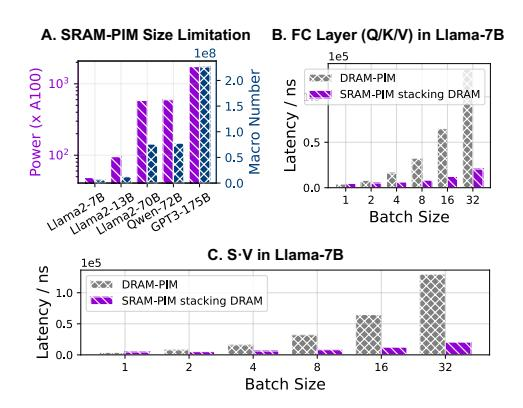

Fig. 3. Comparison between DRAM-PIM [43], pure SRAM-PIM [14] and SRAM-PIM stacking DRAM in decoding. (A) Pure SRAM-PIMs compute all FC layers with different models in a fully weight-stationary manner; the power and macro number are both unacceptable. The calculations in the figure are based on the maximum power consumption of the A100, which is 400W. Under actual measurements with Llama2-13b, the average power consumption at 76% compute utilization is 257W, with Llama2-7b at 60% utilization, the power consumption is 191W in BF16. (B) and (C) set four 8KB SRAM-PIM macros for each DRAM bank in Q/K/V and SV.

*Pure SRAM-PIMs are impractical for LLMs.* As demonstrated in Fig. 3A, implementing GPT3-175B solely with SRAM-PIM would require an infeasible number of macros and exceed the power consumption of an NVIDIA A100 GPU by three orders of magnitude even for only FC layers. This indicates the importance of extending the DRAM bank for SRAM-PIM, which is the focus of the subsequent analysis, and pure SRAM-PIM will not be taken into consideration, but then DRAM bandwidth becomes the critical bottleneck.

One solution is to solve this problem by stacking DRAM on the logic die [82], so we further compare the performance of SRAM-PIM stacking DRAM and pure DRAM-PIM. In Fig. 3B, SRAM-PIM stacking DRAM offers no advantage over DRAM-PIM due to overheads associated with frequent weight writes when batch=1. However, at batch size=32, SRAM-PIM stacking DRAM achieves a 6.3× speedup over DRAM-PIM, capitalizing on its superior weight reuse. This aligns with the expected shift from memory-bound GeMV to compute-bound GeMM behavior in Q/K/V projection as batch size grows.

Unfortunately, this feature can not apply to all linear operators in LLM. In QKT and SV , KT and V are input-dependent and dynamically shaped by sequence length, making them unsuitable for SRAM-PIM due to frequent weight reloading. As Fig. 3C shows, SRAM-PIM stacking DRAM underperforms DRAM-PIM for SV , just like batch=1 in Fig. 3B.

In summary, these results show SRAM-PIM stacking outperforms DRAM-PIM significantly for batched FC layers. However, gains vary across LLM workloads due to bandwidth, thermal, and mapping constraints (further in section III).

#### B. Non-Linear Operations Cannot be Ignored

While prior research has predominantly focused on optimizing linear operations, non-linear operations are becoming a significant bottleneck in long-context LLM inference. Three strategies are commonly employed to address non-linear computation: (i) Offloading non-linear operations to GPUs [57] or NPUs with dedicated NLUs [18]. (ii) Centralized NLUs and CPUs located outside of the DRAM-PIM channels [13], [40] (Fig. 4A). (iii) Distributed NLUs near each bank (Fig. 4B).

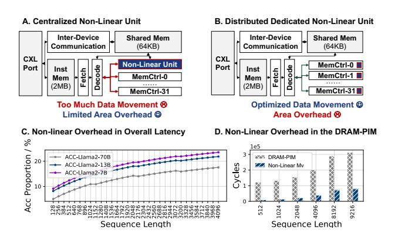

Fig. 4. Non-linear overhead is not negligible. (A) Having all channels share the same NLU results in a lot of data movement between the NLU and each channel. (B) Tailoring NLU within each channel or bank incurs an area cost. (C) The proportion of non-linear operation in the transformer. (D) Extra data movement for non-linear operations in DRAM-PIM [13].

Method (i) depends on high-performance GPUs. While CENT [1] shows method (iii) faces challenges from diverse non-linear operators in LLMs: NLUs require significant area: 4.4mm2 (7nm) [13] - 4× larger than a 32MB DRAM bank [43]. Thus, method (ii) has been typically preferred under area/power constraints. Yet, the increasing adoption of longcontext reasoning in LLMs, supporting up to 128K tokens [78], [79], is challenging this idea. Our analysis based on pure DRAM-PIM [13] with centralized NLU demonstrates a significant performance bottlenecks. At a 4K token sequence length, non-linear operations (such as Softmax, whose latency scales with the sequence length) account for about 20% of the total execution time of the transformer block (Fig. 4C). Moreover, these non-linear operations impose substantial communication costs due to the required reduction and broadcasting across memory banks and channels. Fig. 4D shows that in longcontext scenarios, DRAM-PIM non-linear computation overheads can exceed 25% of total inference time. This contradicts the assumption that non-linear ops can be omitted, revealing them as quantifiable bottlenecks: at 4K sequence length, nonlinear communication and computation together account for >20% of block execution time (Fig. 4C-D) at scale. New architectural non-linear support is needed for efficient LLM.

Fig. 5. Architecture of CompAir.

#### III. COMPAIR ARCHITECTURE

In section II, we identified key performance bottlenecks in existing LLM-oriented DRAM-PIM and SRAM-PIM stacking DRAM architectures, motivating our proposal of a hybrid PIM system that integrates both DRAM-PIM and SRAM-PIM technologies. Fig. 5 presents the architecture of CompAir.

This section focuses on the challenges and innovations underpinning the hybrid DRAM-PIM and SRAM-PIM integration. In CompAir, we adopt CLX.io and CXL.mem in the CXL protocols to enable scalable communication. A total of 32 PIM-enabled devices are connected via the CXL switch (Fig. 5A) [16]. Each device hosts a lightweight controller with instruction and shared memory. Unlike prior designs [13], [40], CompAir's device controllers are only responsible for instruction issuance and do not contain the non-linear execution units. Within each device, the controller controls 32 independent memory channels, each containing 16 CompAir banks composed of tightly integrated DRAM-PIM and SRAM-PIM with hybird bonding (Fig. 5B). The design integrates a DRAM die with DRAM-PIM and a logic die with SRAM-PIM macros, HB I/Os, and a NoC. Each DRAM-PIM bank includes a 16-input BF16 MAC unit, with inter-bank communication through a global buffer. In the logic die, each SRAM-PIM bank comprises four SRAM-PIM macros and four routers. Routers in the logic die form the NoC and are connected in a 2D-mesh topology. DRAM-PIM and SRAM-PIM banks are paired 1:1 across dies, communicating through 256 bonds per bank.

To substantiate our design, we address three key issues for DRAM-PIM and SRAM-PIM integration guided by fabricated platforms [13], [14], [43]. These challenges include integration granularity (section III-A), hardware specification and feasibility (section III-B), and mapping constraints (section III-C). Finally, we demonstrate that targeted micro-architectural refinements to DRAM-PIM can yield substantial end-to-end performance gains (section III-D).

# A. Why Intra-Channel Hybridization?

A central design question is how can we achieve efficient heterogeneous integration of DRAM-PIM and SRAM-PIM

Fig. 6. Hybrid PIM concepts illustration.

to fully exploit their advantages. We explore three possible integration schemes: *(i)* inter-device hybridization, *(ii)* interchannel hybridization, and *(iii)* intra-channel hybridization as illustrated in Fig. 6A.

The first two schemes have strong limitations due to limited bandwidth. We have analyzed in Fig. 3, weight reloading is inevitable for SRAM-PIM, and we choose intra-channel hybridization to guarantee the bandwidth between SRAM and DRAM as shown in Fig. 5B. Taking AiM [43] as an example, the internal bandwidth of a single channel of DRAM is 512GB/s, while external I/O bandwidth is limited to 32GB/s. Even a 128-input, 8-output INT8 SRAM-PIM, operating at 16ns latency, demands 64GB/s to remain fully utilized.

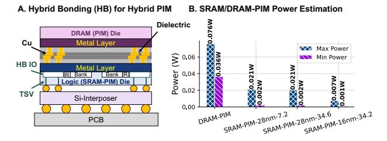

Fig. 7. Hardware issues. (A) HB illustration. (B) The estimated power of one DRAM-PIM bank and 8KB SRAM-PIMs [14], [36], [80].

To resolve this, CompAir leverages HB [21] (Fig. 7A) for 3D integration, stacking SRAM-PIM macros under each DRAM-PIM bank. HB achieves bonding densities of 10K-100K interconnects per mm2 density with an energy cost of just 0.05-0.88pJ/b, which is over 200× more efficient than offchip HBM [52]. However, this architecture demands careful analysis at both hardware and software levels. Two questions remain: *(i)* Is this heterogeneous hybridization feasible under current hardware constraints (Sections III-B)? *(ii)* What are the mapping implications for efficient DRAM-PIM and SRAM-PIM collaboration (Sections III-C)? Fig. 6B offers a default mapping scheme before the deeper analysis.

# *B. Area and Power Issue*

Prior work [82] has illustrated that centralized IO controllers can lead to severe performance loss, and therefore, we need to establish a local pairing between DRAM-PIM banks and SRAM-PIMs. This requires a matching in area between the two levels. It also needs to be ensured that the extra power consumption introduced by the SRAM-PIM is acceptable, otherwise this will meet the heating issue.

For the area issue, the 1Y-nm 32MB bank of an existing DRAM-PIM is around 1mm2 [43], while a 28nm 8KB SRAM-PIM macro occupies 0.136mm2 [3]. Therefore, integrating four 8KB SRAM-PIM macros under each DRAM-PIM is a feasible specification. Section VI will also analyze this issue in detail. SRAM-PIM architectures have demonstrated order-of-magnitude gains in energy efficiency over conventional neural processing units, achieving >30 TFLOPS/W [14], [36], [80], [81], compared to <5 TFLOPS/W for most NPUs [60]. This compelling efficiency advantage motivates our selection of SRAM-PIM as the foundational matrix computation unit in CompAir. In Fig. 7B, we analyze the power consumption of DRAM-PIMs running GPT3-175B workloads [56], observing a power consumption of 0.036W to 0.076W per bank. In contrast, 8KB SRAM-PIMs consume merely 0.022W [14], [36], [80], which can drop further to 0.002W in low-voltage mode. Given that DRAM-PIM and SRAM-PIM operations are temporally decoupled, the incremental power overhead of incorporating SRAM-PIM is negligible while delivering substantial performance benefits. Finally, one additional design issue needs to be analyzed:

Why not accelerator? Area is a key issue. We implement a 28 nm systolic array in the same computing power with an 8KB SRAM-PIM. The synthesized area is 0.736 mm2 , which is 5.411× larger than the SRAM-PIM. For hybrid bonding, the corresponding relationship between the areas of the upper and lower layers within a limited space is of great significance. For hybrid bonding, it is crucial that the areas of the upper and lower layers are similar. Therefore, we believe that SRAM-PIM is a necessary choice for the computing requirements.

# *C. Organization and Mapping Issue*

Section III-B estimates the suitable size of SRAM-PIMs: one DRAM-PIM bank corresponds to four 8KB SRAM-PIMs shown in Fig. 5. Each SRAM-PIM macro is a 128-input 8 output BF16 matrix multiplication unit. In CompAir, SRAM-PIM is responsible for calculating FC layers. The 512GB/s of DRAM-PIM internal bandwidth is averaged over each bank at 32GB/s with 256-bit width. HB supports 6.4Gbps [24], ensuring that the die-to-die bandwidth is sufficient to maintain data throughput parity with the DRAM-PIM.

Our analysis of mapping strategies for DRAM-PIM and SRAM-PIM architectures reveals key distinctions. In scalable DRAM-PIM systems, matrix multiplications are typically distributed across banks to exploit memory parallelism. Inputsplit introduces inter-bank reduction overheads, which is limited by the bandwidth of the global buffer and requires serializing the access of the DRAM banks [13], [17], [40], [43]. Consequently, output-split becomes the predominant DRAM-PIM mapping approach, though it demands extensive input vector broadcasting and creates a dimensional imbalance in the FC layers (input-to-output ratio exceeding 17:1 per bank under output-split mapping). When SRAM-PIM per-

forms matrix multiplication, DRAM is responsible for fetching input to the SRAM-PIM and writing results back. Therefore, the shape imbalance intensifies the DRAM-to-SRAM data movement pressure. SRAM-PIM favors balanced input-output mappings, where bandwidth demand is minimized when dimensions of inputs and outputs are similar for a given MAC count, according to the mean value inequalities.

To quantify these effects, we examine two configurations of four SRAM-PIM macros: (512,8)1 and (256,16) in different batch sizes and CompAir channels. In Llama2-13B, each bank processes Q/K/V weight sized 5120×10 under the output-split mapping when 16×32 banks are used in total (channel=32). SRAM-PIM retains weights across batches as much as possible, requiring DRAM-SRAM transfers only for input/output per inference and weight per reloading.

In Fig. 8A, SRAM-PIM stacking DRAM delivers significant performance gains in both Q/K/V projection and FFN, with gains increasing alongside batch size, highlighting their superior data reuse efficiency. Fig. 8B evaluates the trade-off in the (256,16) configuration. Although splitting along the input introduces modest reduction overheads, this layout substantially reduces DRAM-to-SRAM bandwidth stress, often yielding better overall performance than (512,8). When input-split mapping is also adopted (2560×20 for each bank, channel=32), this reorganization consistently outperforms the pure outputsplit approach. These findings lead to two critical insights: (i) SRAM-PIM leads to better performance in compute-bounded GeMM than DRAM-PIM. (ii) SRAM-PIM and DRAM-PIM have distinct mapping requirements for optimal performance. However, the better mapping relies on efficient inter-bank reduction. Section IV presents detailed solution.

# *D. DRAM-PIM Reorganizing*

The synthesis of DRAM-PIMs depends on industrial PDKs, so we adopt AiM [43] and its derivative designs [13], [17] in

1The SRAM-PIMs are configured with 128-inputs-8-outputs, (512,8) represents extending 4 SRAM-PIMs in the input dimension into a 512-input-8 output matrix unit.

previous sections. However, CompAir architecture introduces new opportunities to rethink DRAM-PIM organization.

Section III-C identifies DRAM read-out bandwidth as the primary bottleneck in DRAM-SRAM interactions. This stems from current DRAM-PIM designs placing compute logic outside the column decoder to maximize logic integration [29]. Newton [17] employs a 32:1 multiplexer for column selection, striking a balance between DRAM access and compute efficiency. This multiplexer is dubbed as column decoder. For a 1KB-wide DRAM array, single-row full-bitline access incurs excessive bandwidth overhead and restricts finegrained memory operations. Therefore, only 32B are typically accessed per operation, sufficient for traditional DRAM-PIM, but restrictive for hybrid-bonded SRAM-PIM, where read-out bandwidth from DRAM becomes the new bottleneck.

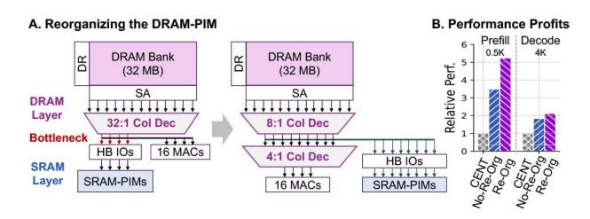

Fig. 9. DRAM-PIM reorganization for CompAir can gain more performance profits taking Llama2-13B as the example.

To address this, we decouple the 32:1 column decoder to an 8:1 decoder for SRAM and a 4:1 decoder, increasing bandwidth (Fig. 9A). Fig. 10 illustrates that such design brings about 15% area overhead, which can be regarded as acceptable. Applied to Llama-13B inference, this DRAM reorganization yields a 1.15–1.5× end-to-end speedup (Fig. 9B). While this incurs a trade-off in I/O complexity or bond density, current HB technologies (>10K/mm2 [21], [52]) support the extended bonds with 20% area of one DRAM bank, making this optimization both practical under current fabrication capabilities.

Fig. 10. Area overhead evaluation evaluated by CACTI 7.0 [19].

# IV. IN-TRANSIT COMPUTATION WITH COMPAIR-NOC A. Why CompAir-NoC

We have analyzed challenges of LLM non-linear computation (section II-B) and the need for efficient collective communication for matrix arithmetic performance (section III-C). **Inter-bank data movement is unavoidable**. Since device/channel/bank level parallelism may happen for single operator in the scalable PIM, data broadcasting and reduction is inevitable. In addition, data movement exists between the PIM banks and NLUs as we analyzed in section II-B Fig. 4.

Here we consider the method of the distributed NLUs, implementing an NLU for each DRAM-bank and taking Softmax as an example in Fig. 11. Each bank needs to use the NLU to perform the exponential computation. Then, the results of all the bank are summed up and distributed to every one. We find that (i) NLU is costly but idle in most of the time, (ii) summing and reduction are logically coupled, but physically completed by different devices, bringing data movement bottleneck. These inspire us to design a mechanism that can make different non-linear operations reusing hardware datapath and complete the computation when data moving.

Fig. 11. The motivation of CompAir-NoC (Softmax).

Fortunately, NoC can serialize vectors into flits naturally [26], enabling fine-grained manipulation when communication. Furthermore, NoC naturally enables dynamic dataflow with routing [31], [70]. Therefore, we present CompAir-NoC, a computation-enabled NoC with reconfigurability. Such design brings benefits in two aspects:

- (i) Less Data Movement Latency: Computing during communication reduce the movement of intermediate results (like reduction) and prevents data from moving between dedicated components, leading to congestion bottlenecks.
- (ii) Less Area Overhead: If we can design a scheme that enables the arithmetic units multiplexing and streaming computation during communication, logic, and buffer costs can be both saved compared to a dedicated NLU.

A critical challenge lies in ensuring computing units to support a wide range of arithmetic operations without compromising communication efficiency. In LLMs, inter-bank data movement arises from three sources: (i) Granularity Mismatching: In RoPE, the swap of neighboring scalars makes it necessary for a vector-based PIM to perform scalar operations with NLUs or CPUs [13]. (ii) Non-Linear Function: Data movement between PIM and NLU is inevitable for non-linear operations (RMSNorm, SiLU, Softmax). (iii) Collective Communication: For operator splitting, reduction/broadcast brings massive data movement, which can be optimized by tree-based hardware. All the operations are in BF16. In the following part, section IV-B details CompAir-NoC microarchitecture, then section IV-C shows how can it optimize these three issues.

#### B. CompAir-NoC Router Microarchitecture

Fig. 12A (excluding red-highlighted parts) illustrates a classical optimized NoC architecture, SWIFT [38], [39], where data is relayed in flits (32-128 bits) passing through the routers hop by hop. Unlike the simplest five-stage pipelined router (Fig. 12B), the SWIFT router can compress the delay of a flit within a router to only 1-2 cycles with lookahead and bypassing (Fig. 12C). This also means that any added computation must operate under light cycle budgets.

Traditional dataflow requires dynamic operand matching across input flits, incurring significant latency and hardware overhead [62], [69]. Ideally, each flit can trigger the operation independently without waiting for others. Inspired by Currying in Lambda Calculus [20], we design an ALU driven by a single operand, dubbed as **Curry ALU**.

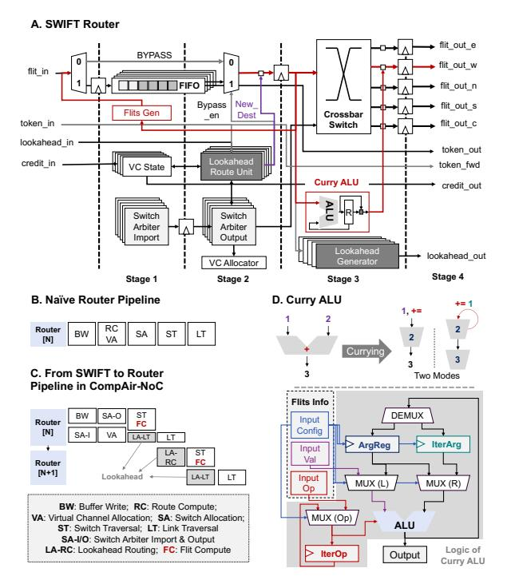

Fig. 12. CompAir-NoC router microarchitecture.

Fig. 12D illustrates the idea in Curry ALU: most dataflow architecture dynamically transfer data, with operators statically

bounded in the ALU [5], [70]; whereas Curry ALUs dynamically transfer a Currying function (a unary operator InputOp and its left value InputVal), with its internal ArgReg statically storing the function parameters of the function (unary operator's right value). Curry ALU also contains the internal configurable IterArg and IterOp to allow ArgReg's iterated updating. Taking += as the example, an InputOpbased mode would be InputVals+=ArgReg (Fig. 12D left, ArgReg=2), while an IterOp-based mode would be ArgReg+=IterArg (Fig. 12D right, ArgReg becomes 3).

Curry ALU avoids multi-flit operand matching and enables efficient ArgReg-reuse. Moreover, Curry ALU introduces minimal disruption to the high performance router pipeline. The logical modifications caused by the Curry ALU are highlighted in red in Fig. 12A. In Fig. 12C, we use "flit compute" to mark the computation stage, which is parallel to the switch traversal. In the flit compute stage, Curry ALU replaces the data in the original flit with the computed result in situ with no extra overhead.

#### C. Supporting Non-Linear Operations in LLM

1) Data Rearrangement: DRAM-PIM's row-granular operation introduces significant data movement overhead for RoPE computations(Fig. 13A), requiring frequent transfers between DRAM banks and the CXL controller's CPU to perform neighbor swaps and odd-digit negations. The router provides the opportunity for fine-grained manipulation for RoPE, leveraging the ArgRegs as the flexible buffer, then letting DRAM-PIM implement efficient element-wise multiplication (EWMUL) as shown in Fig. 13B. Fig. 13C shows that four routers in each bank can be utilized to achieve efficient data exchange by sending data in five stages.

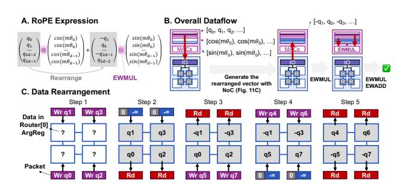

Fig. 13. RoPE data rearrangement with CompAir-NoC.

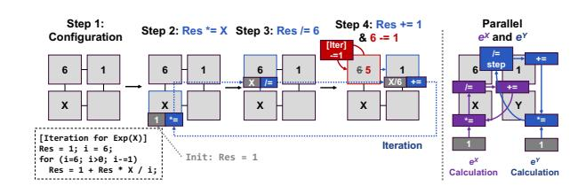

Fig. 14. Exponential function with CompAir-NoC.

- 2) Exponents and Square Root: Non-linear functions like exponents and square roots are central to Sigmoid and Softmax. In digital circuits, they are solved by iterative methods. The exponent and square root can be solved with Taylor expansion and Newton iteration, respectively. Fig. 14 presents an iterative computation method for the exponential function with dynamic ArgReg updates. We configure the router with ArgReg=6 as iteration rounds, initialized with IterArg=1 and update operation IterOp='-='. The computation proceeds outward from innermost levels, applying operations \*=X, /=IterRound, and +=1 in each iteration until IterRound=0. Our design enables efficient hardware utilization, supporting two parallel exponentiation across four routers. In each channel, 16 banks enables 32 concurrent exponential functions in total. This approach extends naturally to square root implementations.
- 3) Broadcast Tree and Reduce Tree: Broadcast and reduce are inverse operations of each other from the tree structure. Taking reduction with a width of 16 as an example, it is equivalent to the existence of an operation function as: Reduction('+', x[0],...,x[15]). Therefore, it can be transformed into a 4-layer binary tree for parallel reduction, and we will use ArgReg as the result of reduction for each non-leaf node to reduce. In CompAir, we set the bank as the granularity for reduction, opening up more possibilities for linear operation improvements in DRAM-PIMs.

From the communication point of view, broadcast and reduce are inverse operations of each other from the tree structure. Taking reduction with a width of 16 as an example, it is equivalent to the existence of an operation function as: Reduction('+',x[0],...,x[15]). Therefore, it can be transformed into a 4-layer binary tree for parallel reduction, and we will use ArgReg as the result of reduction for each non-leaf node to reduce. because the reduction of  $2^N$  nodes theoretically requires  $2^{N-1}+2^{N-2}+...+1=2^N-1$  intermediate nodes, so it can ensure that each node is fully utilized. In CompAir, we set the bank as the granularity for reduction, opening up more possibilities for linear operation improvements in DRAM-PIMs.

#### V. PROGRAMMING MODEL AND ISA DESIGN

While SIMD naturally suits DRAM-PIM, SRAM-PIM and CompAir-NoC's router-level execution require MIMD processing due to their fine-grained operations and distributed packet generation. This creates a fundamental SIMD-MIMD dichotomy in programming flexibility. Two solutions emerge: (i) unify SRAM-PIM/NoC's MIMD under DRAM's SIMD constraints, or (ii) extend MIMD to DRAM-PIM. While prior architectures [82] pursue the second way, integrating distributed controllers in each DRAM-Bank for autonomous MIMD execution, this approach incurs 17% area overhead and fails to scale efficiently with massive computing units. CompAir adopts the first: reconciling MIMD flexibility with DRAM's SIMD constraints with lower control complexity by packet encoding and autonomous path generation.

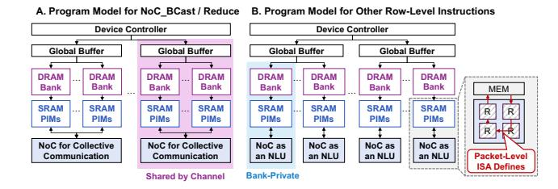

Fig. 15. CompAir program model. (A) Collective communication instructions perform cross bank communication. (B) NoC is used within each bank for other row-level instructions and its dataflow is defined by packet-level ISA.

To achieve this objective, we set up a hierarchical ISA. Fig. 15 illustrates the program model. The Row-Level ISA is programmed at the DRAM bank granularity in SIMD, and the Packet-Level ISA is granulated at the execution behavior of the router. Moreover, the transformation from row-level instruction to packet-level instruction can be established directly. The row-Level ISA is a programming interface exposed to the user, while the packet-Level ISA is what the NoC-related instructions actually store in the instruction buffer after compilation. To avoid context conflicts in the NoC, all channels and banks under a device executes the same row-level instruction simultaneously. Besides that, NoC's computational behavior is restricted within each bank except for two collective communication instructions.

# *A. Row-Level ISA and Packet-Level ISA*

To program SRAM-PIM and NoC at row level in SIMD, the defined instructions are shown in Table I. The SRAM\_Write and SRAM\_Comp instructions are used to write the weights for configuration and to write the input vector to the SRAM for computing. For SRAM\_Write, the source address (SRC) and length (Len) are bank-relative DRAM addresses; data are broadcast from the same SRC and Len to all SRAM-PIM macros in the bank (heterogeneous macros receive the same logical segment). SRAM\_Comp loads input from SRC and writes matrix multiply results to DST with Len elements. RoPE is mapped explicitly via NoC\_Exchange for data rearrangement followed by DRAM-PIM EWMUL (Section IV-C). CompAir's addressing is confined to DRAM banks, while SRAM-PIM operations (weight reloading and computing) are instruction-granular with fixed dataflow, eliminating SRAM addressing overhead.

TABLE I ROW-LEVEL ISA FOR NOC AND SRAM-PIM

| INST         | OP          | SRC  | DST  | NUM1   | NUM2    |
|--------------|-------------|------|------|--------|---------|
| NoC Scalar   | +=,-=,*=,/= | Addr | Addr | Mask   | Config  |
| NoC Access   | Rd, Wr      | Addr | Addr | Mask   | Const   |
| NoC BCast    | /           | Addr | Addr | Mask   | SrcBank |
| NoC Reduce   | +=,-=,*=,/= | Addr | Addr | Mask   | DstBank |
| NoC Exchange | T+/-,R+/-   | Addr | Addr | Offset | Group   |
| SRAM Write   | /           | Addr | /    | Len    | /       |
| SRAM Comp    | /           | Addr | Addr | Len    | /       |

Within each bank, NoC-related instructions are operated at scalar granularity. From the programming perspective, we view the NoC purely as a computational component in this ISA level, without considering the communication behavior within the NoC. Five NoC-related instructions are designed.

NoC\_Scalar is responsible for once computation in router and NoC\_Access is used to read/write the Curry ALU's registers: the 64-bit Mask is used to indicate whether 64 routers of a channel accept the computation task.

NoC\_Reduce and NoC\_BCast perform DRAM banklevel reduction and broadcasting, using Mask to determine SRAM-PIM macro participation. Both support 4 parallel trees, with DstBank/SrcBank specifying the target/source bank.

NoC\_Exchange differs by allowing both intra-row and inter-bank data exchange, where T and R denote inter-bank and intra-row swaps, +/- indicate inversion, and Offset and Group define swap targets as (x+Offset) % Group. For RoPE, NoC\_Exchange(R-,SrcRow,DstRow,1,2) can be used to express the exchange.

TABLE II PACKET-LEVEL ISA FOR NOC

| Type   | Data | IterNum | Path[0]    | Path[1]      | Path[2] | Path[3]     |
|--------|------|---------|------------|--------------|---------|-------------|
| 4b     | 16b  | 4b      | 12b        | 12b          | 12b     | 12b         |
| Path.X |      | Path.Y  | Path.WrReg | Path.IterTag |         | Path.Opcode |
| 4b     |      | 4b      | 1b         | 1b           |         | 2b          |

Table II shows the packet information at the time of router execution. Where Type is used to indicate the instruction information, currently includes seven types: None, Scalar, Reduce, Exchange, Broadcast, Read, and Write. The Data field contains BF16-formatted payload within the packet. IterNum specifies the iteration count for the computational path, while Path defines the router sequence for each computation step. The control signals include: WrReg for register write-enable in CurryALU, IterTag which triggers dynamic ArgReg updates via IterArg and IterOp after computation.

# *B. Autonomous ISA Translation*

Considering that our NoC packet inherently involves the simultaneous transmission of instructions and data movement within the shared physical path, to avoid ambiguity, this chapter discusses the two aspects separately: instruction translation at the compile stage and data transformation at the execution stage.

*1) Compile Stage Instruction Translation:* The two ISA layers are automatically translated by a host-side compiler before execution. Specifically, users program Row-Level ISA offline, and the host runtime performs static row→packet lowering before filling each bank's instruction buffer. The key challenge in cross-level translation is that the row-level ISA fixes the data path of "DRAM row→Curry ALU→DRAM row" and ignores NoC behaviors required by packet-level execution. Fig. 16 shows two typical transformations with NoC\_Reduce and NoC\_Scalar.

NoC\_Reduce needs to instantiate an instruction into separate packets for each bank according to the bank id. Since the structure of the reduction tree is fixed, we design a dedicated pattern shown in Fig. 16A for automatic conversion.

Fig. 16. ISA translation. (A) NoC\_Reduce in 8 banks. (B) NoC\_Scalar for the iteration of exponential function.

Our row-level ISA's conservative DRAM write-back for every NoC\_Scalar operation, while simplifying programming, incurs inefficiencies and restricts MIMD flexibility. Drawing from operator fusion techniques in compiler [2], [53], we introduce path generation, merging dependent NoC\_Scalar ops by chaining producer-consumer dependencies (DST → SRC). Compatible ops fuse into a single packet, encapsulating computation and communication. Each bank router then executes the fused op with one packet, drastically simplifying SRAM-PIM control logic as shown in Fig. 16B.

Under the splitting-by-input strategy for Qwen (8K sequence), the 27% increase in local DRAM-PIM instructions is diluted to a mere 2% at the system level, owing to the compact nature of NoC\_Reducewithin our hierarchical ISA.

2) Execution Stage Data Transformation: The above discussion describes the translation process from an instruction perspective. In the execution stage, however, the data and address granularity associated with a packet-level instruction is still a DRAM row, which typically exceeds the NoC bit width. This implies that a single packet-level instruction may correspond to the transmission of multiple NoC-level packets from the data perspective.

In CompAir, this issue remains transparent to the software. Our solution is to have the NoC router automatically serialize the data based on the data granularity and available bit width, breaking it into multiple packets. Upon completion of the computation, the NoC automatically deserializes the data and writes it back to DRAM at the row granularity. The benefit of the proposed design lies in its ability to automatically achieve pipelining across computations of different data packets, independent of instruction-level constraints.

#### VI. EVALUATION

CompAir2 is implemented with cycle-accurate simulators. The DRAM and NoC are simulated with ramulator2.0 [49] and Booksim [27]. The SRAM-PIM is based on the chip specifications from [14]. The inter-device communication and DRAM-PIM instruction execution are based on the CENT simulator [13]. To evaluate the area cost of CompAir-NoC,

TABLE III
HARDWARE CONFIGURATIONS FOR EVALUATION

| Component                 | Specification                                                                                                                                               |
|---------------------------|-------------------------------------------------------------------------------------------------------------------------------------------------------------|
| DRAM-PIM [13]          | 32MB/bank, 16 MACs/bank, BF16, $t_{RCDWR}\!\!=\!\!14$ ns $t_{RCDRD}\!\!=\!\!18$ ns, $t_{RAS}\!\!=\!\!27$ ns, $t_{CL}\!\!=\!\!25$ ns, $t_{RP}\!\!=\!\!16$ ns |
| SRAM-PIM [14]          | 64kb for each array, BF16, 4 arrays/bank $t_{access} = 6.8$ -14.1ns, 14.4-31.6TOPS/W (0.9-0.6V)                                                             |
| CompAir-NoC based on [39] | 4×16 2D-mesh, 2 BF16 Curry ALUs per router 1 adder/multiplier/divider per ALU, flit size: 72b                                                               |

we implement the RTL of CompAir-NoC and synthesize the corresponding area report with Synopsys Design Compiler. The UMC 28nm process library is used for evaluation.

For the choice of baseline, we compare CompAir against (i) pure DRAM-PIM (CENT [13]), (ii) SRAM-PIM stacking passive DRAM (as in Fig. 3), and (iii) AttAcc [57] with HBM-PIM and A100 hybrid architecture3. Ablations isolate (a) DRAM-PIM only, (b) hybrid without in-transit NoC compute (CENT\_Curry\_ALU), (c) hybrid with in-transit compute (CompAir). We test them with a number of different LLM models at different sequence lengths, batch sizes, and parallelism strategies, including the Llama series (7B, 13B, 70B) [73], Qwen-72B [79], and GPT3-175B [56]. The hardware configuration of CompAir is shown in Table III.

In the previous sections, our experiments demonstrate that (1) pure SRAM-PIM is unrealistic for LLM (Fig. 3A). (2) SRAM-PIM and DRAM-PIM have advantages in batched FC and Attention (Fig. 3B/C, 11, 26), and making it valuable to hybridize the two. (3) CompAir-NoC can eliminate data movement from centralized NLUs (Fig. 4). The issues we need to further validate are (1) how much improvement (Fig. 17,18, 26) and energy cost (Fig. 17, 26) hybrid PIM can bring compared to pure DRAM-PIM. (2) The impact of different LLM configurations on performance (Fig. 19-21,26). (3) Hardware cost and benefit (Fig. 23, 24) of CompAir-NoC.

# A. End-to-End Performance

Fig. 17. Energy per token and performance analysis (Batch=64, Decode, Seqlen=128K) between CompAir, CENT (GDDR6-PIM) [13], and AttAcc (Nvidia A100 GPU + HBM-PIM) [57] with GPT3-175B [56]. "AttAcc-4-A100-HBM" refers to 4 80GB A100 and 4 16GB HBM3-PIM devices.

Firstly, we conduct an overall evaluation of CompAir's latency, throughput, and energy consumption. The results

&lt;sup>2Open-sourced code: https://github.com/Man0xbfc00380/comp-air.git

&lt;sup>3We use AttAcc's original simulator, with HBM-PIM emulated by [49] and A100 performance derived from formulas.

are shown in Fig. 17, where we evaluated CENT and CompAir according to the 32 device and 96 device cases, respectively. The full pipeline parallelism (PP) approach is used in the original CENT and AttAcc comparison experiments [13], but our experiments find that this causes a significant increase in the latency of individual tokens. Therefore, we choose a relatively balanced configuration of 8-device tensor parallelism (TP=8). The results show that CompAir achieves better throughput and latency than CENT for 32- and 96-device scaling in the same configuration. The throughput of 96 devices is comparable to the throughput of Attacc (4 A100s and 4 HBMs), but the latency and energy consumption per token are only 20.2% and 28.5% of AttAcc in a 4K context. In details, Fig. 17A shows that CompAir achieves almost equal proportional latency and throughput performance gains compared to the equivalent parallel strategy of CENT (TP=8). In Fig. 17B, CompAir increases energy compared to pure DRAM-PIM due to crossdie communication. Optimizing the DRAM-PIM/SRAM-PIM ratio enables latency gains with modest energy overhead versus DRAM-PIM-only, but excessive use of SRAM-PIM risks high energy costs (further analyzed in Fig. 26).

Next, we perform ablation experiments, sensitivity analysis and cost analysis of CompAir's performance gains. For simplicity, we use CENT as the baseline and disassemble the performance as: *(i)* CENT\_Curry\_ALU: the full DRAM-PIM system combined with the localized Curry ALU. *(ii)* CompAir\_Base: enabling SRAM-PIM but not modifying the DRAM-PIM's column decoder. *(iii)* CompAir\_Opt: optimized CompAir with optimized decoupled column decoder.

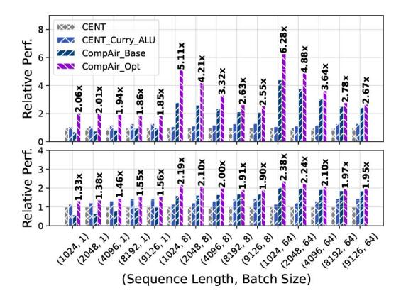

Fig. 18. Llama2-70B (Up) and Llama2-7B (Down) throughput evaluation with difference batch sizes and sequence length for decode stage.

In Fig. 18, the decode of Llama2-70B and Llama2-7B are used as an example to demonstrate the throughput benifit of CompAir under different sequence lengths and batch sizes. The results show that at batch size of 1, the introduction of SRAM-PIM does not bring better performance gain because the data reuse opportunity is limited. When the batch size increases significantly, this advantage increases significantly and reaches a greater improvement of more than 2.67-6.28× throughput in 64 batches. As the sequence length increases, the relative throughput advantage stabilizes at approximately 2.5×, indicating limited overall improvement. However, the contribution from the Curry ALU becomes more significant for longer sequence length. We will further analyze the performance in scenarios with very long context in Fig. 21.

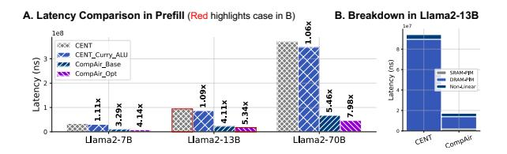

Fig. 19. Prefill stage with 0.5K generation length.

Fig. 19 presents the performance of the compute-intensive prefill. With a 0.5K length, the SRAM-based PIM architecture achieves significant improvements ranging from 3.29× to 5.46× across various models. Furthermore, augmenting the DRAM read-out bandwidth yields additional performance gains, elevating the speedup ratio to between 4.1× and 7.89×. The performance gains of CompAir-NoC are limited in the short context, when the costs of data movement and non-linear computation are not bottlenecks.

To investigate the impact of parallelism strategies, we systematically evaluate various TP configurations from 1 to 32 devices. Our analysis reveals that both DRAM-PIM and CompAir exhibit latency convergence at high TP degrees due to substantially reduced bank utilization (Fig. 20). We have illustrated in Fig. 17 that larger TP configurations also incur significant throughput degradation. Consequently, we establish TP≤8 as the optimal configuration range for most models. Within this range, CompAir maintains notable performance advantages, delivering 1.5-2.14× end-to-end speedup in Llama2-13B. Results show SRAM-PIM's performance edge over DRAM-PIM stems from better data reuse. Increasing parallelism reduces this advantage by limiting reuse per bank, but also leads to an increase in data movement, when the latency reduction from CompAir-NoC becomes more significant.

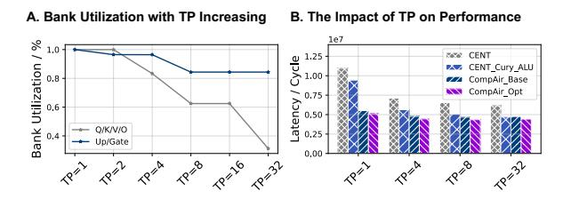

Fig. 20. TP with Llama2-13B. (A) The bank utilization drops rapidly for large TP. (B) The impact of TP on latency (Batch=64, Decode, Seqlen=4K).

Such analysis draws a preliminary conclusion that SRAM-PIM can bring significant latency advantage for multi-batch scenarios, but the sequence length above are still within 10K. Fig. 21 further test long sequence scenarios with 128K decode and 8K prefill. For GPT3-175B and Qwen-72B, CompAir can bring 2.13-2.73× improvement in the decode stage, thus illustrating the potential performance benefits of CompAir

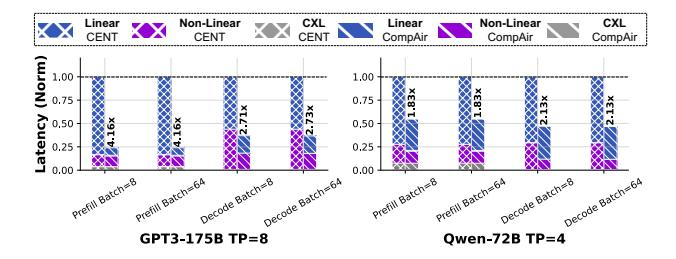

Fig. 21. Long context with Qwen-72B [79], GPT3-175B [56] with 128K sequence and 8K generation length (left bar: CENT, right bar: CompAir).

for the long sequence. Moreover, the proportion of nonlinear operation increases significantly, revealing the benifits of CompAir-NoC when the context length increases. CompAir-NoC reduces the non-linear latency manifestly.

In all, hybrid SRAM-PIM and DRAM-PIM in CompAir exhibits significant improvement in prefill and multi-batch decode, while CompAir-NoC greatly optimizes long-context inference. *CompAir offers considerable latency optimization for both MHA-bottleneck and FFN-bottleneck scenarios*.

# *B. Micro-Architectural Evaluation*

Then we focus on analyzing the microarchitecture.

Fig. 22. DSE of SRAM-PIM in CompAir. The lighter dots mark the latency at lower voltages (0.6V-0.8V).

Fig. 22 further provides a design space exploration (DSE) of SRAM-PIM in CompAir. In each subfigure, the green line marks the bandwidth in 32MB GDDR for each bank, and the red line marks the maximum bandwidth offered by HB (6.4 Gbps). In this paper, we find that different macro configuration shapes produce a divergence point, before which different voltage configurations of SRAM-PIM do not affect the final performance since the latency is mainly affected by the input bandwidth. After the divergence point, SRAM-PIM latency becomes the dominant factor. The relative latency across configurations varies by workload, with wider inputs performing better under higher bandwidths.

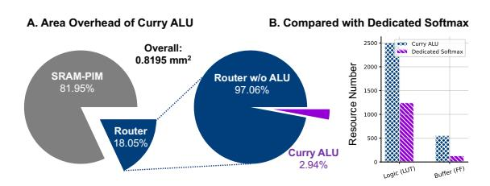

Fig. 23. Area overhead of Curry ALU.

Fig. 23 evaluates CompAir's area cost. The results show that the area of SRAM-PIM and Router per bank is 0.8195mm2 , which satisfies the 3D stacking requirement of DRAM-PIM, and Curry ALU's area cost is only 2.94% of router area. We further compare the logic and memory resources used after synthesis of four Curry ALUs and one customized 16-input Softmax hardware unit with Vivado in Fig. 23B. The results show that the Curry ALUs use significantly less resources because computation in NoCs essentially performs stream processing to significantly reduce buffer usage. The latency profits are also significant (Fig. 24), as we specifically compare Curry ALUs to centralized non-linear computation units, compressing the total latency of non-linear computation by 30% and optimizing long context latency by 25%.

Fig. 24. Latency profits from Curry ALU.

Fig. 25 evaluates the effectiveness of path generation. Base means that the data stream only supports SIMD style: IO buffer→Curry ALU→IO buffer. Taking advantage of the NoC flexibility, a latency optimization of 33%-50% can be achieved compared to the row-level ISA without path generation.

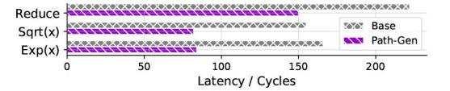

Fig. 25. Latency profits from path generation.

Furthermore, to empirically validate that our proposed BF16-based architecture and the Taylor-expansion-based approximation of transcendental functions do not degrade the network's computational performance, we conduct additional perplexity evaluations on Llama2-7B across varying sequence lengths. As reported in Table IV, the perplexity scores achieved by our approximate implementations (Taylor truncation orders n = 4 to n = 7) exhibit negligible deviations from both the FP32 and native BF16 baselines. Specifically, the relative perplexity differences remain bounded within 0.3% across all evaluated configurations, with the most notable deviation observed on medium-length sequences (−0.251% for n = 5 to n = 7 relative to FP32). Importantly, the approximation errors do not exhibit observable accumulation as the context length increases from short to long sequences, as evidenced by the stable perplexity on long-context test cases. These findings demonstrate that the proposed lowprecision arithmetic with Taylor-truncated exponential computation preserves the model's predictive accuracy, confirming the practical viability of our hardware-efficient approach for LLM deployment.

TABLE IV Perplexity Evaluation: native vs Taylor-truncated  $e^x$  in BF16 (n represents  $1+...+\frac{x^n}{n!}$ ) with Llama2-7B.

| Case   | Prefill | Decode | Float   | BF16 Native | BF16, n=4         | BF16, n=5         | BF16, n=6         | BF16, n=7         |
|--------|---------|--------|---------|-------------|-------------------|-------------------|-------------------|-------------------|
| Short  | 73      | 15     | 27.2971 | 26.9695     | 27.3128 (+0.058%) | 27.3128 (+0.058%) | 27.3128 (+0.058%) | 27.3128 (+0.058%) |
| Medium | 341     | 65     | 13.7466 | 13.6848     | 13.7138 (-0.239%) | 13.7121 (-0.251%) | 13.7121 (-0.251%) | 13.7121 (-0.251%) |
| Long   | 1139    | 270    | 8.5386  | 8.5490      | 8.5494 (+0.126%)  | 8.5475 (+0.104%)  | 8.5495 (+0.127%)  | 8.5495 (+0.127%)  |

CompAir processes attention via DRAM-PIM since  $K^T/V$ lacks batch reuse in MLA/MHA. However,  $K^T/V$  are shared by GQA in LlaMa2-70B/Llama3 [73], enabling SRAM-PIM to accelerate attention. Fig. 26A,B compare DRAM-PIM and SRAM-PIM stacking DRAM under varying sequence lengths and TPs. TP splits  $K^T/V$  along the sequence length dimension across banks. For SRAM-PIM, the sequence length maps to batch size, while the output dimension aligns with GQA's group size (8 in LlaMa2-70B), with input dimensions determined by hidden  $size(QK^T)$  or sequence length(SV). However, Fig. 26C,D demonstrate that longer sequence length inevitably results in more cross-die data transfers and higher energy when using SRAM-PIM. For GQA, whether  $QK^T$  uses SRAM-PIM for better performance depends on the specific parallelism strategy and sequence length, but for SV DRAM-PIM still has a significant energy advantage. We thus propose: (1) SRAM-PIM for batched FC (better performance) and (2) DRAM-PIM for attention (energy efficiency).

Fig. 26. (A,B) Latency ratio between SRAM-PIM stacking DRAM and pure DRAM-PIM. Purple/blue indicate that DRAM-PIM/SRAM-PIM stacking DRAM is better. (C,D) Energy of SRAM-PIM stacking DRAM and pure DRAM-PIM, which mostly comes from data movement and data access.

 $\label{thm:components} TABLE\ V$  Design goals of the three computable components.

| Component   | Goal        | Granularity | Communication   |
|-------------|-------------|-------------|-----------------|
| DRAM-PIM    | Scalability | Vector      | Shared Memory   |
| SRAM-PIM    | Efficiency  | Matrix      | Intra-Bank Only |
| CompAir-NoC | Flexibility | Scalar      | Inter-Bank      |

Furthermore, CompAir's value lies not only in demonstrating that PIM can achieve competitive energy-efficiency and performance for LLM, but also in proposing a scalable data-centric system. Table V summarizes the significance and design goals of the three computable components in CompAir:

data handling is inherently unavoidable in computational systems, and it is important to try to allow computation to occur naturally and at minimal cost in the process of data handling.

#### VII. RELATED WORKS

Commercial DRAM-PIM systems emerge, including FIM-DRAM [41], UPMEM [7], and AiM [43] systems. DRAM-PIM can perform massive parallel computing using SIMD vector operations up to 32KB [55], latest architectures leverage DRAM-PIM for memory-bound tasks in the LLM [13], [18], [40], [64], [67]. To further extend the bandwidth, [9], [11], [37], [42], [57], [57] implement multi-layer DRAM banks vertically via 3D Memory. However, massive SIMD parallelism raises flexibility overhead, and the performance of DRAM-PIM heavily rely on suitable mapping and programming [34], [66], the mismatch causes performance degradation due to inter-bank communication and layout rearrangement [48], [71], [84]. The SRAM-PIM, by integrating the compute logic in/near the SRAM array, enables matrix computation with lowlatency in 10ns and 100 TFLOPS/W power efficiency [76], [81]. However, the size of a single macro of SRAM-PIM is limited [29], and the performance advantage depends on efficient weight reuse. Moreover, the matrix in attention varies in each inference. SRAM-PIM suffers from frequent swap-outs and can hardly achieve a good performance. In all, DRAM-PIM and SRAM-PIM are all promising technologies with different advantages; previous works also try to be compatible with the advantages of the both [8], [10].

In-transit computing has been pioneered in general-purpose processors with two goals: (i) offloading CPU workloads [61], (ii) reducing the data movement [23], [58]. In-network collectives and reduction in interconnects have also been studied to reduce latency and traffic. A similar idea has emerged in memory systems, with the objective of performing computation while data is moved across memory hierarchies [48], [63], thus avoiding the need for all data to be frequently shuttled between DRAM and CPU pipelines. CompAir-NoC draws on the ideas of novel microarchitecture design, as the first attempt for LLM and PIMs.

# VIII. CONCLUSION

The paper introduces CompAir, a novel architecture for scalable LLM inference. CompAir deconstructs different PIM technology paths into vector- and matrix-friendly, and adds the CompAir-NoC to realize fine-grained scalar operations, thus constructing a blueprint for energy-efficient computation for scalable LLM inference.

# REFERENCES

- [1] S. Aga, S. Jeloka, A. Subramaniyan, S. Narayanasamy, D. Blaauw, and R. Das, "Compute caches," in *2017 IEEE International Symposium on High Performance Computer Architecture (HPCA)*, 2017, pp. 481–492.
- [2] T. Chen, T. Moreau, Z. Jiang, L. Zheng, E. Yan, M. Cowan, H. Shen, L. Wang, Y. Hu, L. Ceze, C. Guestrin, and A. Krishnamurthy, "Tvm: an automated end-to-end optimizing compiler for deep learning," in *Proceedings of the 13th USENIX Conference on Operating Systems Design and Implementation*, ser. OSDI'18. USA: USENIX Association, 2018, p. 579–594.
- [3] X. Chen, S. Li, Z. Zhang, W. Zheng, X. Tan, Y. Tang, Y. Shi, L. Ren, Y. Mai, F. Liu, J. Chen, Z. Zhang, A. Guo, T. Xiong, B. Wang, X. Liu, W. Shan, B. Liu, H. Cai, J. Yang, and X. Si, "14.6 a 28nm 64kb bitrotated hybrid-cim macro with an embedded sign-bit-processing array and a multi-bit-fusion dual-granularity cooperative quantizer," in *2025 IEEE International Solid-State Circuits Conference (ISSCC)*, vol. 68, 2025, pp. 260–262.
- [4] P. Chi, S. Li, C. Xu, T. Zhang, J. Zhao, Y. Liu, Y. Wang, and Y. Xie, "Prime: A novel processing-in-memory architecture for neural network computation in reram-based main memory," in *2016 ACM/IEEE 43rd Annual International Symposium on Computer Architecture (ISCA)*, 2016, pp. 27–39.
- [5] V. Dadu, J. Weng, S. Liu, and T. Nowatzki, "Towards general purpose acceleration by exploiting common data-dependence forms," in *Proceedings of the 52nd Annual IEEE/ACM International Symposium on Microarchitecture*, ser. MICRO '52. New York, NY, USA: Association for Computing Machinery, 2019, p. 924–939. [Online]. Available: https://doi.org/10.1145/3352460.3358276
- [6] DeepSeek-AI, D. Guo, D. Yang, H. Zhang, J. Song, R. Zhang, R. Xu, Q. Zhu, S. Ma, P. Wang, X. Bi, X. Zhang, X. Yu, Y. Wu, Z. F. Wu, Z. Gou, Z. Shao, Z. Li, Z. Gao, A. Liu, B. Xue, B. Wang, B. Wu, B. Feng, C. Lu, C. Zhao, C. Deng, C. Zhang, C. Ruan, D. Dai, D. Chen, D. Ji, E. Li, F. Lin, F. Dai, F. Luo, G. Hao, G. Chen, G. Li, H. Zhang, H. Bao, H. Xu, H. Wang, H. Ding, H. Xin, H. Gao, H. Qu, H. Li, J. Guo, J. Li, J. Wang, J. Chen, J. Yuan, J. Qiu, J. Li, J. L. Cai, J. Ni, J. Liang, J. Chen, K. Dong, K. Hu, K. Gao, K. Guan, K. Huang, K. Yu, L. Wang, L. Zhang, L. Zhao, L. Wang, L. Zhang, L. Xu, L. Xia, M. Zhang, M. Zhang, M. Tang, M. Li, M. Wang, M. Li, N. Tian, P. Huang, P. Zhang, Q. Wang, Q. Chen, Q. Du, R. Ge, R. Zhang, R. Pan, R. Wang, R. J. Chen, R. L. Jin, R. Chen, S. Lu, S. Zhou, S. Chen, S. Ye, S. Wang, S. Yu, S. Zhou, S. Pan, S. S. Li, S. Zhou, S. Wu, S. Ye, T. Yun, T. Pei, T. Sun, T. Wang, W. Zeng, W. Zhao, W. Liu, W. Liang, W. Gao, W. Yu, W. Zhang, W. L. Xiao, W. An, X. Liu, X. Wang, X. Chen, X. Nie, X. Cheng, X. Liu, X. Xie, X. Liu, X. Yang, X. Li, X. Su, X. Lin, X. Q. Li, X. Jin, X. Shen, X. Chen, X. Sun, X. Wang, X. Song, X. Zhou, X. Wang, X. Shan, Y. K. Li, Y. Q. Wang, Y. X. Wei, Y. Zhang, Y. Xu, Y. Li, Y. Zhao, Y. Sun, Y. Wang, Y. Yu, Y. Zhang, Y. Shi, Y. Xiong, Y. He, Y. Piao, Y. Wang, Y. Tan, Y. Ma, Y. Liu, Y. Guo, Y. Ou, Y. Wang, Y. Gong, Y. Zou, Y. He, Y. Xiong, Y. Luo, Y. You, Y. Liu, Y. Zhou, Y. X. Zhu, Y. Xu, Y. Huang, Y. Li, Y. Zheng, Y. Zhu, Y. Ma, Y. Tang, Y. Zha, Y. Yan, Z. Z. Ren, Z. Ren, Z. Sha, Z. Fu, Z. Xu, Z. Xie, Z. Zhang, Z. Hao, Z. Ma, Z. Yan, Z. Wu, Z. Gu, Z. Zhu, Z. Liu, Z. Li, Z. Xie, Z. Song, Z. Pan, Z. Huang, Z. Xu, Z. Zhang, and Z. Zhang, "Deepseek-r1: Incentivizing reasoning capability in llms via reinforcement learning," 2025. [Online]. Available: https://arxiv.org/abs/2501.12948
- [7] F. Devaux, "The true processing in memory accelerator," in *2019 IEEE Hot Chips 31 Symposium (HCS)*, 2019, pp. 1–24.
- [8] Y. Ding, C. Liu, M. Duan, W. Chang, K. Li, and K. Li, "Haima: A hybrid sram and dram accelerator-in-memory architecture for transformer," in *2023 60th ACM/IEEE Design Automation Conference (DAC)*, 2023, pp. 1–6.
- [9] P. G. Emma, A. Buyuktosunoglu, M. Healy, K. Kailas, V. Puente, R. Yu, A. Hartstein, P. Bose, and J. Moreno, "3d stacking of highperformance processors," in *2014 IEEE 20th International Symposium on High Performance Computer Architecture (HPCA)*, 2014, pp. 1–12.
- [10] X. Fu, J. Yue, M. Faizan, Z. Li, Q. Huo, and F. Zhang, "Shmt: An sram and hbm hybrid computing-in-memory architecture with optimized kv cache for multimodal transformer," *IEEE Transactions on Circuits and Systems I: Regular Papers*, pp. 1–14, 2025, iEEE TCAS-I 2025.
- [11] M. Gao, J. Pu, X. Yang, M. Horowitz, and C. Kozyrakis, "Tetris: Scalable and efficient neural network acceleration with 3d memory," in *Proceedings of the Twenty-Second International Conference on*

- *Architectural Support for Programming Languages and Operating Systems*, ser. ASPLOS '17. New York, NY, USA: Association for Computing Machinery, 2017, p. 751–764. [Online]. Available: https://doi.org/10.1145/3037697.3037702
- [12] A. Gholami, Z. Yao, S. Kim, C. Hooper, M. W. Mahoney, and K. Keutzer, "Ai and memory wall," *IEEE Micro*, vol. 44, no. 3, p. 33–39, May 2024. [Online]. Available: http://dx.doi.org/10.1109/MM. 2024.3373763
- [13] Y. Gu, A. Khadem, S. Umesh, N. Liang, X. Servot, O. Mutlu, R. Iyer, and R. Das, "Pim is all you need: A cxl-enabled gpu-free system for large language model inference," in *2025 ACM International Conference on Architectural Support for Programming Languages and Operating Systems (ASPLOS)*, 2025.
- [14] A. Guo, X. Si, X. Chen, F. Dong, X. Pu, D. Li, Y. Zhou, L. Ren, Y. Xue, X. Dong, H. Gao, Y. Zhang, J. Zhang, Y. Kong, T. Xiong, B. Wang, H. Cai, W. Shan, and J. Yang, "A 28nm 64-kb 31.6 tflops/w digital-domain floating-point-computing-unit and double-bit 6tsram computing-in-memory macro for floating-point cnns," in *2023 IEEE International Solid-State Circuits Conference (ISSCC)*, 2023, pp. 128–130.
- [15] J. Gomez-Luna, I. El Hajj, I. Fernandez, C. Giannoula, G. F. Oliveira, ´ and O. Mutlu, "Benchmarking memory-centric computing systems: Analysis of real processing-in-memory hardware," in *2021 12th International Green and Sustainable Computing Conference (IGSC)*, 2021, pp. 1–7.
- [16] H. Ham, J. Hong, G. Park, Y. Shin, O. Woo, W. Yang, J. Bae, E. Park, H. Sung, E. Lim, and G. Kim, "Low-overhead general-purpose neardata processing in cxl memory expanders," in *2024 57th IEEE/ACM International Symposium on Microarchitecture (MICRO)*, 2024, pp. 594– 611.
- [17] M. He, C. Song, I. Kim, C. Jeong, S. Kim, I. Park, M. Thottethodi, and T. N. Vijaykumar, "Newton: A dram-maker's accelerator-inmemory (aim) architecture for machine learning," in *2020 53rd Annual IEEE/ACM International Symposium on Microarchitecture (MICRO)*, 2020, pp. 372–385.
- [18] G. Heo, S. Lee, J. Cho, H. Choi, S. Lee, H. Ham, G. Kim, D. Mahajan, and J. Park, "Neupims: Npu-pim heterogeneous acceleration for batched llm inferencing," in *Proceedings of the 29th ACM International Conference on Architectural Support for Programming Languages and Operating Systems, Volume 3*, ser. ASPLOS '24. New York, NY, USA: Association for Computing Machinery, 2024, p. 722–737. [Online]. Available: https://doi.org/10.1145/3620666.3651380
- [19] Hewlett Packard Enterprise, "Cacti." [Online]. Available: https: //github.com/HewlettPackard/cacti
- [20] J. R. Hindley and J. P. Seldin, *Lambda-Calculus and Combinators, an Introduction*. Cambridge University Press, 2008. [Online]. Available: http://dx.doi.org/10.1017/CBO9780511809835
- [21] C.-K. Hsiung and K.-N. Chen, "A review on hybrid bonding interconnection and its characterization," *IEEE Nanotechnology Magazine*, vol. 18, no. 2, pp. 41–50, 2024.
- [22] E. J. Hu, Y. Shen, P. Wallis, Z. Allen-Zhu, Y. Li, S. Wang, L. Wang, and W. Chen, "Lora: Low-rank adaptation of large language models," 2021. [Online]. Available: https://arxiv.org/abs/2106.09685
- [23] J. Huang, R. Reddy Puli, P. Majumder, S. Kim, R. Boyapati, K. H. Yum, and E. J. Kim, "Active-routing: Compute on the way for near-data processing," in *2019 IEEE International Symposium on High Performance Computer Architecture (HPCA)*. IEEE, Feb. 2019, p. 674–686. [Online]. Available: http://dx.doi.org/10.1109/HPCA.2019. 00018
- [24] L.-H. Huang, Y.-Y. Cheng, and T.-L. Wu, "Analysis and optimization of hbm3 ppa for tsv model with micro-bump and hybrid bonding," *IEEE Transactions on Components, Packaging and Manufacturing Technology*, vol. 15, no. 1, pp. 22–29, 2025.
- [25] B. Hyun, T. Kim, D. Lee, and M. Rhu, "Pathfinding future pim architectures by demystifying a commercial pim technology," in *2024 IEEE International Symposium on High-Performance Computer Architecture (HPCA)*, 2024, pp. 263–279.
- [26] N. E. Jerger, T. Krishna, and L.-S. Peh, *On-Chip Networks*. Springer International Publishing, 2017. [Online]. Available: http: //dx.doi.org/10.1007/978-3-031-01755-1
- [27] N. Jiang, D. U. Becker, G. Michelogiannakis, J. Balfour, B. Towles, D. E. Shaw, J. Kim, and W. J. Dally, "A detailed and flexible cycle-accurate network-on-chip simulator," in *2013 IEEE International Symposium on*

- *Performance Analysis of Systems and Software (ISPASS)*, 2013, pp. 86– 96.
- [28] Y. Jing, M. Wu, J. Zhou, Y. Sun, Y. Ma, R. Huang, T. Jia, and L. Ye, "Aig-cim: A scalable chiplet module with tri-gear heterogeneous compute-in-memory for diffusion acceleration," in *Proceedings of the 61st ACM/IEEE Design Automation Conference*, ser. DAC '24. New York, NY, USA: Association for Computing Machinery, 2024. [Online]. Available: https://doi.org/10.1145/3649329.3657373
- [29] K. Joo-Young, K. Bongjin, and T.-H. K. Tony, *Processing-in-Memory for AI: From Circuits to Systems*. Springer International Publishing, 2023. [Online]. Available: http://dx.doi.org/10.1007/978-3-030-98781-7
- [30] N. Jouppi, G. Kurian, S. Li, P. Ma, R. Nagarajan, L. Nai, N. Patil, S. Subramanian, A. Swing, B. Towles, C. Young, X. Zhou, Z. Zhou, and D. A. Patterson, "Tpu v4: An optically reconfigurable supercomputer for machine learning with hardware support for embeddings," in *Proceedings of the 50th Annual International Symposium on Computer Architecture*, ser. ISCA '23. New York, NY, USA: Association for Computing Machinery, 2023. [Online]. Available: https://doi.org/10.1145/3579371.3589350
- [31] N. P. Jouppi, C. Young, N. Patil, D. Patterson, G. Agrawal, R. Bajwa, S. Bates, S. Bhatia, N. Boden, A. Borchers, R. Boyle, P.-l. Cantin, C. Chao, C. Clark, J. Coriell, M. Daley, M. Dau, J. Dean, B. Gelb, T. V. Ghaemmaghami, R. Gottipati, W. Gulland, R. Hagmann, C. R. Ho, D. Hogberg, J. Hu, R. Hundt, D. Hurt, J. Ibarz, A. Jaffey, A. Jaworski, A. Kaplan, H. Khaitan, D. Killebrew, A. Koch, N. Kumar, S. Lacy, J. Laudon, J. Law, D. Le, C. Leary, Z. Liu, K. Lucke, A. Lundin, G. MacKean, A. Maggiore, M. Mahony, K. Miller, R. Nagarajan, R. Narayanaswami, R. Ni, K. Nix, T. Norrie, M. Omernick, N. Penukonda, A. Phelps, J. Ross, M. Ross, A. Salek, E. Samadiani, C. Severn, G. Sizikov, M. Snelham, J. Souter, D. Steinberg, A. Swing, M. Tan, G. Thorson, B. Tian, H. Toma, E. Tuttle, V. Vasudevan, R. Walter, W. Wang, E. Wilcox, and D. H. Yoon, "In-datacenter performance analysis of a tensor processing unit," *SIGARCH Comput. Archit. News*, vol. 45, no. 2, p. 1–12, Jun. 2017. [Online]. Available: https://doi.org/10.1145/3140659.3080246
- [32] M. Kang, H. Kim, H. Shin, J. Sim, K. Kim, and L.-S. Kim, "S-flash: A nand flash-based deep neural network accelerator exploiting bit-level sparsity," *IEEE Transactions on Computers*, vol. 71, no. 6, pp. 1291– 1304, 2022.
- [33] J. Kaplan, S. McCandlish, T. Henighan, T. B. Brown, B. Chess, R. Child, S. Gray, A. Radford, J. Wu, and D. Amodei, "Scaling laws for neural language models," 2020. [Online]. Available: https://arxiv.org/abs/2001.08361
- [34] A. A. Khan, H. Farzaneh, K. F. A. Friebel, C. Fournier, L. Chelini, and J. Castrillon, "Cinm (cinnamon): A compilation infrastructure for heterogeneous compute in-memory and compute near-memory paradigms," 2023. [Online]. Available: https://arxiv.org/abs/2301.07486
- [35] W.-S. Khwa, P.-C. Wu, J.-W. Su, C.-Y. Cheng, J.-M. Hsu, Y.-C. Chen, L.-J. Hsieh, J.-C. Bai, Y.-S. Kao, T.-H. Lou, A. S. Lele, J.-J. Wu, J.-C. Tien, C.-C. Lo, R.-S. Liu, C.-C. Hsieh, K.-T. Tang, and M.-F. Chang, "14.2 a 16nm 216kb, 188.4tops/w and 133.5tflops/w microscaling multimode gain-cell cim macro edge-ai devices," in *2025 IEEE International Solid-State Circuits Conference (ISSCC)*, vol. 68, 2025, pp. 1–3.
- [36] W.-S. Khwa, P.-C. Wu, J.-J. Wu, J.-W. Su, H.-Y. Chen, Z.-E. Ke, T.-C. Chiu, J.-M. Hsu, C.-Y. Cheng, Y.-C. Chen, C.-C. Lo, R.-S. Liu, C.-C. Hsieh, K.-T. Tang, and M.-F. Chang, "34.2 a 16nm 96kb integer/floatingpoint dual-mode-gain-cell-computing-in-memory macro achieving 73.3- 163.3tops/w and 33.2-91.2tflops/w for ai-edge devices," in *2024 IEEE International Solid-State Circuits Conference (ISSCC)*, vol. 67, 2024, pp. 568–570.
- [37] D. Kim, J. Kung, S. Chai, S. Yalamanchili, and S. Mukhopadhyay, "Neurocube: A programmable digital neuromorphic architecture with high-density 3d memory," in *2016 ACM/IEEE 43rd Annual International Symposium on Computer Architecture (ISCA)*, 2016, pp. 380–392.
- [38] A. Kumar, L.-S. Peh, and N. K. Jha, "Token flow control," in *Proceedings of the 41st Annual IEEE/ACM International Symposium on Microarchitecture*, ser. MICRO 41. USA: IEEE Computer Society, 2008, p. 342–353.
- [39] A. Kumar, L.-S. Peh, P. Kundu, and N. K. Jha, "Express virtual channels: towards the ideal interconnection fabric," in *Proceedings of the 34th Annual International Symposium on Computer Architecture*, ser. ISCA '07. New York, NY, USA: Association for Computing Machinery, 2007, p. 150–161. [Online]. Available: https://doi.org/10.1145/1250662.1250681

- [40] H. Kwon, K. Koo, J. Kim, W. Lee, M. Lee, H. Lee, Y. Jung, J. Park, Y. Song, B. Yang, H. Choi, G. Kim, J. Won, W. Shin, C. Kim, G. Shin, Y. Kwon, I. Kim, E. Lim, J. Kim, and J. Choi, "Lol-pim: Long-context llm decoding with scalable dram-pim system," 2024. [Online]. Available: https://arxiv.org/abs/2412.20166
- [41] Y.-C. Kwon, S. H. Lee, J. Lee, S.-H. Kwon, J. M. Ryu, J.-P. Son, O. Seongil, H.-S. Yu, H. Lee, S. Y. Kim, Y. Cho, J. G. Kim, J. Choi, H.-S. Shin, J. Kim, B. Phuah, H. Kim, M. J. Song, A. Choi, D. Kim, S. Kim, E.-B. Kim, D. Wang, S. Kang, Y. Ro, S. Seo, J. Song, J. Youn, K. Sohn, and N. S. Kim, "25.4 a 20nm 6gb function-in-memory dram, based on hbm2 with a 1.2tflops programmable computing unit using bank-level parallelism, for machine learning applications," in *2021 IEEE International Solid-State Circuits Conference (ISSCC)*, vol. 64, 2021, pp. 350–352.
- [42] ——, "25.4 a 20nm 6gb function-in-memory dram, based on hbm2 with a 1.2tflops programmable computing unit using bank-level parallelism, for machine learning applications," in *2021 IEEE International Solid-State Circuits Conference (ISSCC)*, vol. 64, 2021, pp. 350–352.
- [43] S. Lee, K. Kim, S. Oh, J. Park, G. Hong, D. Ka, K. Hwang, J. Park, K. Kang, J. Kim, J. Jeon, N. Kim, Y. Kwon, K. Vladimir, W. Shin, J. Won, M. Lee, H. Joo, H. Choi, J. Lee, D. Ko, Y. Jun, K. Cho, I. Kim, C. Song, C. Jeong, D. Kwon, J. Jang, I. Park, J. Chun, and J. Cho, "A 1y-nm 1.25v 8gb, 16gb/s/pin gddr6-based accelerator-in-memory supporting 1tflops mac operation and various activation functions for deep-learning applications," in *2022 IEEE International Solid-State Circuits Conference (ISSCC)*, vol. 65, 2022, pp. 1–3.
- [44] C. Li, Y. Yin, X. Wu, J. Zhu, Z. Gao, D. Niu, Q. Wu, X. Si, Y. Xie, C. Zhang, and G. Sun, "H2-llm: Hardware-dataflow co-exploration for heterogeneous hybrid-bonding-based low-batch llm inference," in *Proceedings of the 52nd Annual International Symposium on Computer Architecture*, ser. ISCA '25. New York, NY, USA: Association for Computing Machinery, 2025, p. 194–210. [Online]. Available: https://doi.org/10.1145/3695053.3731008
- [45] J. Lin, J. Tang, H. Tang, S. Yang, W.-M. Chen, W.-C. Wang, G. Xiao, X. Dang, C. Gan, and S. Han, "Awq: Activation-aware weight quantization for llm compression and acceleration," 2023. [Online]. Available: https://arxiv.org/abs/2306.00978
- [46] L. Liu, S. Zhao, B. Li, H. Ren, Z. Xu, M. Wang, X. Li, Y. Han, and Y. Wang, "Make llm inference affordable to everyone: Augmenting gpu memory with ndp-dimm," 2025. [Online]. Available: https://arxiv.org/abs/2502.16963
- [47] Z. Liu, J. Wang, T. Dao, T. Zhou, B. Yuan, Z. Song, A. Shrivastava, C. Zhang, Y. Tian, C. Re, and B. Chen, "Deja vu: Contextual sparsity for efficient llms at inference time," 2023. [Online]. Available: https://arxiv.org/abs/2310.17157
- [48] E. Lockerman, A. Feldmann, M. Bakhshalipour, A. Stanescu, S. Gupta, D. Sanchez, and N. Beckmann, "Livia: Data-centric computing throughout the memory hierarchy," in *Proceedings of the Twenty-Fifth International Conference on Architectural Support for Programming Languages and Operating Systems*, ser. ASPLOS '20. New York, NY, USA: Association for Computing Machinery, 2020, p. 417–433. [Online]. Available: https://doi.org/10.1145/3373376.3378497
- [49] H. Luo, Y. C. Tugrul, F. N. Bostancı, A. Olgun, A. G. Ya ˘ glıkc¸ı, and ˘ O. Mutlu, "Ramulator 2.0: A modern, modular, and extensible dram simulator," 2023. [Online]. Available: https://arxiv.org/abs/2308.11030
- [50] O. Mutlu, "Memory-centric computing," 2023. [Online]. Available: https://arxiv.org/abs/2305.20000
- [51] C. Nie, C. Tang, J. Lin, H. Hu, C. Lv, T. Cao, W. Zhang, L. Jiang, X. Liang, W. Qian, Y. Sun, and Z. He, "Vspim: Sram processing-inmemory dnn acceleration via vector-scalar operations," *IEEE Transactions on Computers*, vol. 73, no. 10, pp. 2378–2390, 2024.
- [52] D. Niu, S. Li, Y. Wang, W. Han, Z. Zhang, Y. Guan, T. Guan, F. Sun, F. Xue, L. Duan, Y. Fang, H. Zheng, X. Jiang, S. Wang, F. Zuo, Y. Wang, B. Yu, Q. Ren, and Y. Xie, "184qps/w 64mb/mm23d logic-to-dram hybrid bonding with process-near-memory engine for recommendation system," in *2022 IEEE International Solid-State Circuits Conference (ISSCC)*, vol. 65, 2022, pp. 1–3.
- [53] W. Niu, J. Guan, Y. Wang, G. Agrawal, and B. Ren, "Dnnfusion: accelerating deep neural networks execution with advanced operator fusion," in *Proceedings of the 42nd ACM SIGPLAN International Conference on Programming Language Design and Implementation*, ser. PLDI 2021. New York, NY, USA: Association for Computing Machinery, 2021, p. 883–898. [Online]. Available: https://doi.org/10. 1145/3453483.3454083

- [54] Nvidia. (2020) Nvidia a100 tensor core gpu architecture. [Online]. Available: https://www.nvidia.cn/content/dam/en-zz/Solutions/ Data-Center/nvidia-ampere-architecture-whitepaper.pdf
- [55] G. F. Oliveira, A. Olgun, A. G. Yaglıkc¸ı, F. N. Bostancı, J. G ˘ omez-Luna, ´ S. Ghose, and O. Mutlu, "Mimdram: An end-to-end processing-usingdram system for high-throughput, energy-efficient and programmertransparent multiple-instruction multiple-data computing," in *2024 IEEE International Symposium on High-Performance Computer Architecture (HPCA)*, 2024, pp. 186–203.
- [56] OpenAI, "Gpt-3: Language models are few-shot learners," September 2020. [Online]. Available: https://github.com/openai/gpt-3
- [57] J. Park, J. Choi, K. Kyung, M. J. Kim, Y. Kwon, N. S. Kim, and J. H. Ahn, "Attacc! unleashing the power of pim for batched transformerbased generative model inference," in *Proceedings of the 29th ACM International Conference on Architectural Support for Programming Languages and Operating Systems, Volume 2*, ser. ASPLOS '24. New York, NY, USA: Association for Computing Machinery, 2024, p. 103–119. [Online]. Available: https://doi.org/10.1145/3620665.3640422
- [58] A. Pattnaik, X. Tang, O. Kayiran, A. Jog, A. Mishra, M. T. Kandemir, A. Sivasubramaniam, and C. R. Das, "Opportunistic computing in gpu architectures," in *2019 ACM/IEEE 46th Annual International Symposium on Computer Architecture (ISCA)*, 2019, pp. 210–223.
- [59] PCI-SIG. (2019) Pci-sig releases pcie® 4.0, version 1.0. [Online]. Available: https://www.nvidia.cn/content/dam/en-zz/Solutions/ gtcf21/jetson-orin/nvidia-jetson-agx-orin-technical-brief.pdf
- [60] A. Reuther, P. Michaleas, M. Jones, V. Gadepally, S. Samsi, and J. Kepner, "Ai and ml accelerator survey and trends," in *2022 IEEE High Performance Extreme Computing Conference (HPEC)*, 2022, pp. 1–10.
- [61] K. Sangaiah, M. Lui, R. Kuttappa, B. Taskin, and M. Hempstead, "Snacknoc: Processing in the communication layer," in *2020 IEEE International Symposium on High Performance Computer Architecture (HPCA)*. IEEE, Feb. 2020, p. 461–473. [Online]. Available: http://dx.doi.org/10.1109/HPCA47549.2020.00045
- [62] K. Sankaralingam, R. Nagarajan, H. Liu, C. Kim, J. Huh, N. Ranganathan, D. Burger, S. W. Keckler, R. G. McDonald, and C. R. Moore, "Trips: A polymorphous architecture for exploiting ilp, tlp, and dlp," *ACM Trans. Archit. Code Optim.*, vol. 1, no. 1, p. 62–93, Mar. 2004. [Online]. Available: https://doi.org/10.1145/980152.980156
- [63] B. C. Schwedock, P. Yoovidhya, J. Seibert, and N. Beckmann, "tak¨ o:¯ a polymorphic cache hierarchy for general-purpose optimization of data movement," in *Proceedings of the 49th Annual International Symposium on Computer Architecture*, ser. ISCA '22. New York, NY, USA: Association for Computing Machinery, 2022, p. 42–58. [Online]. Available: https://doi.org/10.1145/3470496.3527379
- [64] M. Seo, X. T. Nguyen, S. J. Hwang, Y. Kwon, G. Kim, C. Park, I. Kim, J. Park, J. Kim, W. Shin, J. Won, H. Choi, K. Kim, D. Kwon, C. Jeong, S. Lee, Y. Choi, W. Byun, S. Baek, H.-J. Lee, and J. Kim, "Ianus: Integrated accelerator based on npu-pim unified memory system," in *Proceedings of the 29th ACM International Conference on Architectural Support for Programming Languages and Operating Systems, Volume 3*, ser. ASPLOS '24. New York, NY, USA: Association for Computing Machinery, 2024, p. 545–560. [Online]. Available: https://doi.org/10.1145/3620666.3651324
- [65] V. Seshadri, Y. Kim, C. Fallin, D. Lee, R. Ausavarungnirun, G. Pekhimenko, Y. Luo, O. Mutlu, P. B. Gibbons, M. A. Kozuch, and T. C. Mowry, "Rowclone: Fast and energy-efficient in-dram bulk data copy and initialization," in *2013 46th Annual IEEE/ACM International Symposium on Microarchitecture (MICRO)*, 2013, pp. 185–197.
- [66] Y. Shin, J. Park, S. Cho, and H. Sung, "Pimflow: Compiler and runtime support for cnn models on processing-in-memory dram," in *Proceedings of the 21st ACM/IEEE International Symposium on Code Generation and Optimization*, ser. CGO '23. New York, NY, USA: Association for Computing Machinery, 2023, p. 249–262. [Online]. Available: https://doi.org/10.1145/3579990.3580009
- [67] J. Song, "Ai revolution driven by memory technology innovation," in *2025 IEEE International Solid-State Circuits Conference (ISSCC)*, vol. 68, 2025, pp. 26–36.
- [68] Y. Song, Z. Mi, H. Xie, and H. Chen, "Powerinfer: Fast large language model serving with a consumer-grade gpu," 2023. [Online]. Available: https://arxiv.org/abs/2312.12456
- [69] S. Swanson, K. Michelson, A. Schwerin, and M. Oskin, "Wavescalar," in *Proceedings of the 36th Annual IEEE/ACM International Symposium*

- *on Microarchitecture*, ser. MICRO 36. USA: IEEE Computer Society, 2003, p. 291.
- [70] C. Tan, C. Xie, A. Li, K. J. Barker, and A. Tumeo, "Opencgra: An opensource unified framework for modeling, testing, and evaluating cgras," in *2020 IEEE 38th International Conference on Computer Design (ICCD)*, 2020, pp. 381–388.
- [71] B. Tian, Y. Li, L. Jiang, S. Cai, and M. Gao, "Ndpbridge: Enabling cross-bank coordination in near-dram-bank processing architectures," in *2024 ACM/IEEE 51st Annual International Symposium on Computer Architecture (ISCA)*, 2024, pp. 628–643.
- [72] A. Totovic, A. Abhyankar, A. Aggarwal, N. Bamiedakis, Z. Bekker, M. Benromdhane, N. Bergstein, T. Bos, C. Davies, A. Gimlett, X. Han, K. Mahadevaiah, H. Ozguc, K. Park, S. Ramachandra, J. Redgrave, S. Sahni, A. Singh, M. Staffaroni, S. Vats, P. Winterbottom, D. Woodhouse, W. Younis, S. Yu, and D. Lazovsky, "Breaking the beachfront limitations with silicon photonics," in *2024 Conference on Lasers and Electro-Optics (CLEO)*, 2024, pp. 01–02.
- [73] H. Touvron, L. Martin, K. Stone, P. Albert, A. Almahairi, Y. Babaei, N. Bashlykov, S. Batra, P. Bhargava, S. Bhosale, D. Bikel, L. Blecher, C. C. Ferrer, M. Chen, G. Cucurull, D. Esiobu, J. Fernandes, J. Fu, W. Fu, B. Fuller, C. Gao, V. Goswami, N. Goyal, A. Hartshorn, S. Hosseini, R. Hou, H. Inan, M. Kardas, V. Kerkez, M. Khabsa, I. Kloumann, A. Korenev, P. S. Koura, M.-A. Lachaux, T. Lavril, J. Lee, D. Liskovich, Y. Lu, Y. Mao, X. Martinet, T. Mihaylov, P. Mishra, I. Molybog, Y. Nie, A. Poulton, J. Reizenstein, R. Rungta, K. Saladi, A. Schelten, R. Silva, E. M. Smith, R. Subramanian, X. E. Tan, B. Tang, R. Taylor, A. Williams, J. X. Kuan, P. Xu, Z. Yan, I. Zarov, Y. Zhang, A. Fan, M. Kambadur, S. Narang, A. Rodriguez, R. Stojnic, S. Edunov, and T. Scialom, "Llama 2: Open foundation and fine-tuned chat models," 2023. [Online]. Available: https://arxiv.org/abs/2307.09288
- [74] F. Tu, Y. Wang, Z. Wu, W. Wu, L. Liu, Y. Hu, S. Wei, and S. Yin, "16.4 tensorcim: A 28nm 3.7nj/gather and 8.3tflops/w fp32 digital-cim tensor processor for mcm-cim-based beyond-nn acceleration," in *2023 IEEE International Solid- State Circuits Conference (ISSCC)*. IEEE, Feb. 2023, pp. 254–256. [Online]. Available: http://dx.doi.org/10.1109/ISSCC42615.2023.10067285
- [75] A. Vaswani, N. Shazeer, N. Parmar, J. Uszkoreit, L. Jones, A. N. Gomez, L. Kaiser, and I. Polosukhin, "Attention is all you need," in *Proceedings of the 31st International Conference on Neural Information Processing Systems*, ser. NIPS'17. Red Hook, NY, USA: Curran Associates Inc., 2017, p. 6000–6010.
- [76] X. Wang, T. Jiao, Y. Yang, S. Li, D. Li, A. Guo, Y. Shi, Y. Tang, J. Chen, Z. Zhang, Z. Liu, B. Liu, W. Shan, X. Wang, H. Cai, W. Zhu, J. Yang, and X. Si, "14.3 a 28nm 17.83-to-62.84tflops/w broadcastalignment floating-point cim macro with non-two's-complement mac for cnns and transformers," in *2025 IEEE International Solid-State Circuits Conference (ISSCC)*, vol. 68, 2025, pp. 254–256.
- [77] W. A. Wulf and S. A. McKee, "Hitting the memory wall: implications of the obvious," *SIGARCH Comput. Archit. News*, vol. 23, no. 1, p. 20–24, Mar. 1995. [Online]. Available: https://doi.org/10.1145/216585.216588
- [78] F. Xu, Q. Hao, Z. Zong, J. Wang, Y. Zhang, J. Wang, X. Lan, J. Gong, T. Ouyang, F. Meng, C. Shao, Y. Yan, Q. Yang, Y. Song, S. Ren, X. Hu, Y. Li, J. Feng, C. Gao, and Y. Li, "Towards large reasoning models: A survey of reinforced reasoning with large language models," 2025. [Online]. Available: https://arxiv.org/abs/2501.09686
- [79] A. Yang, B. Yang, B. Hui, B. Zheng, B. Yu, C. Zhou, C. Li, C. Li, D. Liu, F. Huang, G. Dong, H. Wei, H. Lin, J. Tang, J. Wang, J. Yang, J. Tu, J. Zhang, J. Ma, J. Xu, J. Zhou, J. Bai, J. He, J. Lin, K. Dang, K. Lu, K. Chen, K. Yang, M. Li, M. Xue, N. Ni, P. Zhang, P. Wang, R. Peng, R. Men, R. Gao, R. Lin, S. Wang, S. Bai, S. Tan, T. Zhu, T. Li, T. Liu, W. Ge, X. Deng, X. Zhou, X. Ren, X. Zhang, X. Wei, X. Ren, Y. Fan, Y. Yao, Y. Zhang, Y. Wan, Y. Chu, Y. Liu, Z. Cui, Z. Zhang, and Z. Fan, "Qwen2 technical report," *arXiv preprint arXiv:2407.10671*, 2024.
- [80] Y. Yuan, Y. Yang, X. Wang, X. Li, C. Ma, Q. Chen, M. Tang, X. Wei, Z. Hou, J. Zhu, H. Wu, Q. Ren, G. Xing, P.-I. Mak, and F. Zhang, "34.6 a 28nm 72.12tflops/w hybrid-domain outer-product based floating-point sram computing-in-memory macro with logarithm bit-width residual adc," in *2024 IEEE International Solid-State Circuits Conference (ISSCC)*, vol. 67, 2024, pp. 576–578.
- [81] Y. Yuan, B. Zhang, Y. Yang, Y. Luo, Q. Chen, S. Lv, H. Wu, C. Ma, M. Li, J. Yue, X. Wang, G. Xing, P.-I. Mak, X. Li, and F. Zhang, "14.5 a 28nm 192.3tflops/w accurate/approximate dual-mode-transpose

- digital 6t-sram cim macro for floating-point edge training and inference," in *2025 IEEE International Solid-State Circuits Conference (ISSCC)*, vol. 68, 2025, pp. 258–260.
- [82] Z. Yue, H. Wang, J. Fang, J. Deng, G. Lu, F. Tu, R. Guo, Y. Li, Y. Qin, Y. Wang, C. Li, H. Han, S. Wei, Y. Hu, and S. Yin, "Exploiting similarity opportunities of emerging vision ai models on hybrid bonding architecture," in *2024 ACM/IEEE 51st Annual International Symposium on Computer Architecture (ISCA)*, 2024, pp. 396–409.
- [83] S. Zhang, S. Roller, N. Goyal, M. Artetxe, M. Chen, S. Chen, C. Dewan, M. Diab, X. Li, X. V. Lin, T. Mihaylov, M. Ott, S. Shleifer, K. Shuster, D. Simig, P. S. Koura, A. Sridhar, T. Wang, and L. Zettlemoyer, "Opt: Open pre-trained transformer language models," 2022. [Online]. Available: https://arxiv.org/abs/2205.01068
- [84] Y. Zhao, M. Gao, F. Liu, Y. Hu, Z. Wang, H. Lin, J. Li, H. Xian, H. Dong, T. Yang, N. Jing, X. Liang, and L. Jiang, "Um-pim: Drambased pim with uniform and shared memory space," in *2024 ACM/IEEE 51st Annual International Symposium on Computer Architecture (ISCA)*, 2024, pp. 644–659.