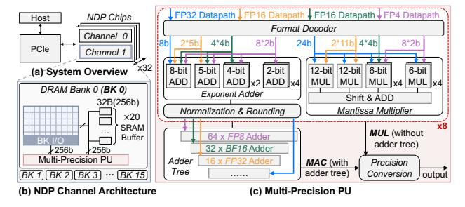
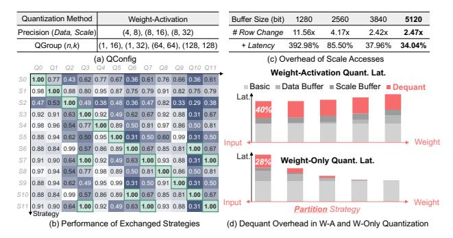
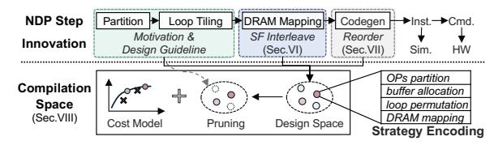
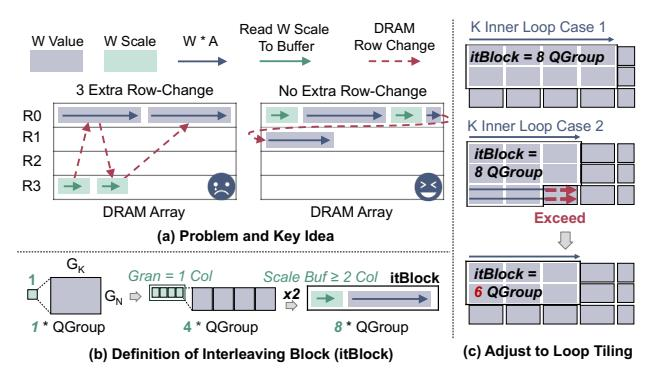
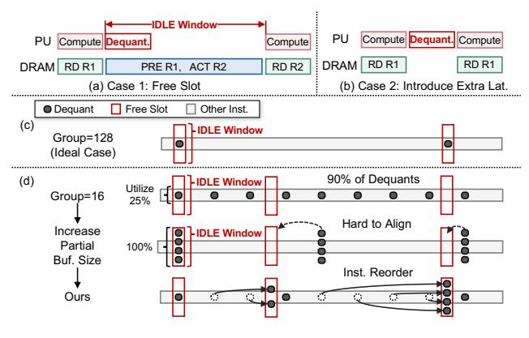
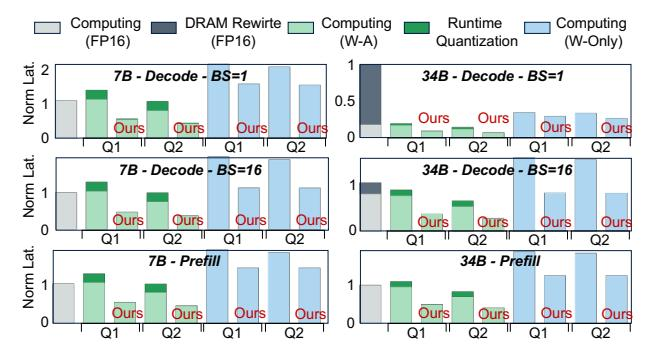
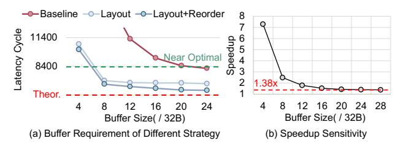
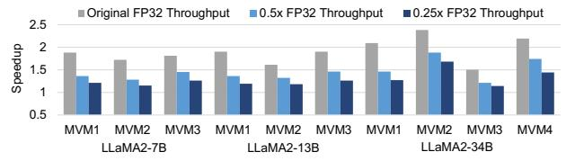

# Bringing Near Data Processing into the Low-Bit Floating-Point Era

Tongxin Xie<sup>13</sup>, Mingyu Gao<sup>1</sup> , Zehao Wang<sup>1</sup> , Zhihao Jia<sup>6</sup>† , Yuechen Xi<sup>7</sup>† , Bing Li<sup>4</sup> , Mo Guang<sup>5</sup> , Jiale Yan<sup>5</sup> , Kaiwen Long<sup>5</sup> , Xingcheng Zhang<sup>3</sup> , Huazhong Yang<sup>1</sup> , Yuan Xie<sup>2</sup> , Zhenhua Zhu<sup>12</sup><sup>∗</sup> , and Yu Wang<sup>1</sup> <sup>1</sup>Tsinghua University, <sup>2</sup>HKUST, <sup>3</sup>Shanghai AI Laboratory, <sup>4</sup> Institute of Microelectronics, Chinese Academy of Sciences, <sup>5</sup>Li Auto, <sup>6</sup> Imperial College London, <sup>7</sup>Nankai University

*Abstract*—Near data processing (NDP) based on DRAM has emerged to be a promising solution to the "memory wall" problem of machine learning models. From the algorithmic perspective, group-wise low-bit floating-point (FP) quantization has become an important trend for both efficient training and inference. Integrating low-bit FP quantization into NDP also notably shrinks the memory footprint of large models, alleviating the memory-capacity constraints of NDP architectures.

However, existing NDP compilers struggle to support efficient low-bit FP computation on NDP. First, different quantization configurations exhibit different preferences for NDP compilation strategies. Second, the fine-grained grouping leads to frequent switching between quantized value access and group scale access during computation, increasing the DRAM row-buffer miss rate. Third, fine-grained grouping triggers frequent high-precision dequantization operations, causing significant latency overhead.

To address these challenges, this paper proposes *FlexQ-NDP*, an NDP compiler tailored for general low-bit FP computation. Firstly, we develop an open-source simulation framework<sup>1</sup> to model the low-bit FP computation overhead on NDP. Secondly, we design a scale-value interleaved FP layout, effectively reducing DRAM row-changing overhead. Thirdly, we propose a dequantization-hiding technique based on instruction reordering to reduce the DRAM idle time induced by frequent dequantization operations. Finally, we develop a lightweight compilationspace pruning and search strategy to enable efficient low-bit FP computation on NDP. Extensive experiments show that *FlexQ-NDP* achieves up to 3.29× speedup over existing compilation strategies on various low-bit FP quantization configurations.

*Index Terms*—Near Data Processing, Floating-Point Quantization, Compilation Optimization

# I. INTRODUCTION

Machine learning (ML) algorithms like convolutional neural networks (CNNs) [21], [58] and large language models (LLMs) [6], [45], [55], [56] have shown remarkable ability across various fields, such as computer vision [15] and natural language processing [10]. Despite the superior performance, the amount of compute and model size of these algorithms are increasing exponentially [5], [61]. As a result, data access has become a critical bottleneck that limits the overall system performance of traditional von Neumann architectures [43].

DRAM-based Near Data Processing (NDP) architectures have been proposed as a promising solution to this problem by placing processing units (PUs) inside main memory and distributing them near different memory units to exploit the high internal bandwidth [2], [3], [8], [12], [13], [16]–[18], [22], [23], [25], [28], [29], [31], [33], [34], [36], [37], [46], [48], [51], [53], [54], [62], [64], [67]. Since general matrix multiplication (GEMM), including matrix-matrix (MM) and matrix-vector multiplication (MVM), dominates the compute and memory footprint of ML workloads, NDP architectures primarily focus on processing GEMM operators. Other nonlinear operations (e.g., softmax) are handled via lookup tables, functional approximation, or offloaded to the host [33].

In addition to leveraging NDP hardware features to reduce memory access overhead, quantization serves as an effective method on the algorithmic side to reduce data volume, which compresses high-precision GEMM into low-bit formats [19], [20], [39], [44], [59]. To mitigate the accuracy loss introduced by quantization especially for the error-sensitive LLMs, group-wise low-bit floating-point (FP) has gained significant attention [1], [7], [9], [14], [32], [41], [47], [50], [60], [65], [66]. The high precision of low-bit FP is guaranteed by two facts: (1) FP data format uses "exponent + mantissa" to provide finer quantization resolution over a wider dynamic range than integers with the same bit-width; and (2) groupwise quantization, where high-precision data are divided into different quantization groups (QGroups). Each QGroup is associated with its own scaling factor (abbreviated as scale) to project the original data into the representable range of the low-bit FP format. As a result, low-bit FP quantization can better handle outliers under fine-grained grouping (e.g., 16 elements / QGroup [66]). With the combination of these two characteristics, FP4 quantization has demonstrated 3∼4× speedups and ∼4× memory size reduction over high-precision (FP16) LLMs on GPUs, while maintaining comparable accuracy for both training and inference [7], [66].

Due to their superior performance, low-bit FP is also being actively explored in industry. Key players like DeepSeek [41] and NVIDIA [1], [9], [11] have already begun optimizing infrastructure and hardware for low-bit FP formats. In addition, enabling low-bit FP quantization can substantially alleviate the memory-capacity pressure of the DRAM-based NDP architecture imposed by LLMs. As a result, we believe that *bringing NDP architectures into the low-bit FP era is highly valuable*.

However, although low-bit FP has already been implemented on GPU/CPU, existing compilers cannot be reused for deploying this technique on NDP architectures. The reasons

<sup>†</sup> Work done during internship at Tsinghua University.

<sup>∗</sup> Corresponding Author: zhuzhenhua@mail.tsinghua.edu.cn

<sup>1</sup>Available at https://github.com/ISCA26-FlexQ-NDP-ae/flexq ndp

are twofold: (1) Different to GPU/CPU, processing units (PUs) and memory units are tightly coupled in NDP architectures. Consequently, NDP performance depends not only on how workloads are mapped to different PUs, but also on the data layout in DRAM, e.g., different layouts may cause different DRAM row-buffer miss rates [63]. (2) Dedicated NDP compilers [30], [42], [49], [63] have been developed to optimize INT operator partition and data layout in DRAM. However, introducing low-bit FP quantization with fine-grained grouping into NDP systems faces several new challenges, which cannot be handled by existing NDP compilers.

First, the configurations of low-bit FP quantization (QConfigs) vary in terms of group granularity, value/scale precision, weight-only or weight-activation quantization, etc., and these differences are overlooked by existing NDP compilers. However, different QConfigs exhibit distinct preferences for NDP compilation strategies. For example, compared with weightactivation quantization, in weight-only quantization, weights need to be dequantized before multiply-accumulate (MAC) operation, which prioritizes allocating buffer to weights to avoid redundant dequantization. Therefore, the NDP compiler for low-bit FP necessitates exploration of the compilation space to identify the optimal strategy for a given QConfig. The compilation space is the Cartesian product of design choices for matrix-operator partitioning, data-mapping strategies, loop traversal orders, and PU/buffer allocation, which is enormous and requires an efficient exploration strategy.

Second, the presence of fine-grained group scales in low-bit FP computation introduces additional complexity and challenge to NDP dataflow scheduling. Considering the limited KB-level buffer capacity in NDP, a key optimization objective of NDP dataflow is maximizing the SRAM buffer hit rate and reducing DRAM row-changing overhead. However, with finegrained grouping, the amount of scale becomes non-negligible compared to quantized value. Both value and scale need to share the limited on-chip SRAM, causing reduced buffer hit rates. Besides, the fine-grained grouping also leads to frequent switching between value access and scale access during computation, introducing extra DRAM row-changing overhead. Our experiment shows the presence of scales increases the latency by ∼1.34×.

Third, the group-wise quantization scheme introduces finegrained dequantization operations, which are performed in high precision and therefore incur significant latency and DRAM idle time on NDP architectures. Prior studies have shown that smaller group sizes improve quantization accuracy; however, they also increase computational overhead, since each group requires an independent dequantization process. For example, in NVFP4-based matrix multiplication, partial results must be multiplied by both the activation scales and weight scales after processing every 16 FP4 elements. Because these scales are stored in higher precision (FP8) and the accumulation result of 16 FP4 multiplication should be stored in higher precision, the dequantization process alone accounts for approximately 35% of the total execution latency.

Facing these challenges, we designed *FlexQ-NDP*, an NDP

compiler tailored for low-bit FP computation. The contributions of this work include:

- We develop a cycle-accurate simulation framework to model group-wise low-bit FP computation on NDP architectures, which comprehensively analyzes the group-wise scaling and dequantization overheads.
- We design a scale-value interleaved FP layout to map a quantized matrix to DRAM, which adapts to different group sizes and matrix tiling strategies. The proposed FP data layout effectively reduces DRAM row-changing overhead by 2×.
- We propose a dequantization-hiding technique based on instruction reordering to reduce the DRAM idle time induced by frequent dequantization operations. It can automatically identify the opportunity to overlap the dequantization latency with existing value access and DRAM row-changing delay.
- We systematically analyze the compatibility between NDP compilation strategies and QConfig to derive NDPoriented FP compilation guidelines. Building on these guidelines, we develop a lightweight compilation-space pruning and search strategy to enable efficient low-bit FP computation on NDP.

Experiments show that *FlexQ-NDP* achieves up to 3.29× operator-level and 2.73× end-to-end speedup over existing NDP compilation strategies across various low-bit FP formats.

## II. BACKGROUND

## *A. Group-Wise Low-bit FP Quantization*

Quantization is a fundamental ML compression technique to reduce memory footprint and computation costs while maintaining acceptable accuracy. Recent work on quantizationbased training and inference has shifted from integer-only to group-wise low-bit FP formats, such as microscaling family (MXFP4/6/8) [32], [47] and NVIDIA's NVFP4 [1], [9]. The low-bit FP values retain the "sign + exponent + mantissa" structure while relying on higher-precision group scales to recover effective dynamic range and preserve model accuracy at ultra-low precision.

The low-bit FP quantization process starts from partitioning the high-precision (e.g., FP16) tensors/matrices into finegrained groups (e.g., 16×1 vectors or 16×16 tiles [9], [66]). For each group, a scale s<sup>g</sup> is chosen based on the local statistics and the representable range of the target low-bit FP format. Then the values are normalized by s<sup>g</sup> and rounded to the nearest representable low-bit FP value. Targeting ML models, low-bit FP is applied to weights and optionally activations for each operator. Weight-only quantization refers to only quantizing model weights to low precision [4], [40]. It avoids dynamically quantizing activations but requires dequantizing weights back to higher precision before computation. In contrast, weight-activation quantization quantizes both weights and activations to low-bit formats, delivering greater efficiency at the cost of runtime quantization process [41], [65].

We adopt a generic view of low-bit FP that can represent different QConfigs: each QConfig is characterized by its group


Fig. 1. Basic Compilation Flow of NDP Architectures



Fig. 2. Low-bit FP-oriented NDP Architecture

size, scale format, value format, and weight-only/weight-activation quantization.

#### B. Baseline NDP Compilation Flow

Fig. 1 illustrates existing NDP compilation flow, which contains operator partition, loop tiling, DRAM mapping, and instruction generation [42], [63]. Because PU and memory units are tightly coupled in NDP, data access, compute, and communication performance all strongly depend on data layout. First of all, the operator partition divides the weight matrix into multiple blocks. When each block is mapped to a specific memory unit (e.g., a DRAM bank), it also determines the PU that will process the block. Then, loop tiling optimizes the traversal order to maximize the data reuse in SRAM buffer. After that, DRAM mapping procedure assigns the specific row/column address for each block (i.e., optimizes the data layout). The optimization objective here is to reduce DRAM row-buffer miss. When PU needs to access data in another DRAM row (i.e., row-changing), a precharge DRAM command is required to close the current open row and charge the bitline, which is more expensive than repeatedly accessing the same row. Finally, NDP compiler generates the instructions to enable performance simulation (offline) and control NDP hardware (online). The instructions will be further split into a series of DRAM commands and PU commands.

## III. LOW-BIT FP-ORIENTED NDP ARCHITECTURE

#### A. Architecture Overview

Since current mainstream NDP architectures do not support fine-grained grouped FP formats, we extend the Hynix AiM


Fig. 3. Baseline Low-bit FP GEMM Compilation Flow

[33] architecture to enable group-wise scaling and dequantization. This allows further quantification and analysis of the overhead introduced by such formats in Sec. IV.

Fig. 2(a) illustrates the overall system organization. Similar to the Hynix-AiM architecture, the NDP system consists of 32 GDDR6 chips, each containing two memory channels. The host communicates with the NDP system through PCIe. Each channel contains 16 DRAM banks. As illustrated in Fig. 2(b), a multi-precision PU is attached to each bank and reused for both low-precision value computation and high-precision dequantization. In addition, a 5Kb SRAM buffer is placed near each bank, organized as 20 individual 32B buffers. Each 32B buffer can be configured to store values, scales, or partial sums.

For different FP formats, the total operand width that can be processed in parallel by each PU is fixed at 256b, matching the GDDR6 read/write bit width. As shown in Fig. 2(c), the decoding and exponent processing of each format are handled individually, while the mantissa computation reuses the same multiplier array. The adder tree is further optimized by using different precisions at different levels. The detailed design and implementation of the PU are described in Sec. IX-A. Besides MAC operations, the PU also supports MUL operations for dequantization without accumulation in weight-only cases.

#### B. Baseline Low-bit FP Compilation Flow

To execute fine-grained grouped FP-based GEMM on the NDP architecture, the existing NDP compilation flow needs to be extended to deal with fine-grained group scales and the extra dequantization operations.

- 1) Scales Partitioning: After value partitioning, scales are partitioned accordingly to ensure that the scale associated with each value is located in the same DRAM bank.
- 2) Scales Mapping: As shown in Fig. 3(a), the scales of different groups are stored densely in DRAM bank, and separated from the value, following the strategy in [30] and traditional GPU systems (e.g., scales are stored in a contiguous memory layout in Triton [57]).
- 3) Buffer Allocation: Different from integer GEMM computation, where buffers are typically dedicated to values and results, low-bit FP introduces additional data such as scales and intra-group partial sums. As a result, the limited on-chip buffers must be carefully allocated for different purposes. In our design, this allocation is determined at compile time through either search-based strategies or heuristic rules.

*4) Dataflow:* The modified dataflow mainly consists of three steps. Taking weight–activation quantization as an example, the execution process is illustrated in Fig. 3(c). First, the scales of both operands, together with the values of the stationary operand, are written into the SRAM buffer. Second, the values of the other operand are streamed from DRAM and multiplied with the buffered values in the PUs; DRAM reads and PU computation are pipelined. Third, once a DRAM chunk has been fully consumed, the accumulated partial results are dequantized by the PU using scales in the buffer, and the dequantized results are written back to the buffer or DRAM.

For weight-only quantization, since the PU requires operands with the same precision, weights should be dequantized to match the precision of the activations before computation. It should also be noted that, due to the limited NDP buffer capacity, the buffer is typically not organized as a ping-pong structure. As a result, the dequantization phase cannot be overlapped with DRAM reads of scales, and PU resources occupied by dequantization cannot be used to perform GEMM computation in parallel.

#### *C. Simulation Support*

We extend the open-source NDP simulator UniNDP [63] to quantify the overhead introduced by scale accesses and dequantization operations, and to enable further compilation optimizations. Firstly, to represent the aforementioned dataflow, we design a higher-level IR wrapper over the original UniNDP instruction format to carry quantization metadata and enable future optimizations (e.g., dequantization hiding), as shown in Fig. 3(e). Secondly, on the simulator side, we modify UniNDP to support the conversion of these instructions to commands for DRAM bank, the corresponding PU, and buffers, which can be simulated in a cycle-accurate way. Finally, on the compiler side, we model the behavior of scale buffers and partial-sum buffers, enabling the compiler to insert the corresponding instructions into the operator kernel.

## IV. MOTIVATION EXPERIMENT

#### *A. Necessity for Compilation Space Exploration*

To reveal the preference of different QConfigs on NDP compilation strategies, we apply different QConfigs on a weight-activation quantized MVM operator with the matrix size of 5120×5120. The QConfigs contain different value/scale precisions and QGroup sizes, as shown in Fig. 4(a). For these QConfigs, the compilation space is constructed by including operator partition, loop tiling and traversal order, data mapping, and buffer allocation. We then exhaustively search for the optimal compilation strategy to deploy each QConfig on the NDP architecture. We denote the optimal compilation strategy for QConfig Q<sup>i</sup> as S<sup>i</sup> . Fig. 4(b) shows the performance of pairwise combinations of different QConfigs (e.g., {Qi}) and compilation strategies (e.g., {Si}). For simplicity, the *performance* of each column in Fig. 4(b) is normalized to that of the best compilation strategy (higher is better). The experimental results show that for each QConfig, the performance gap across different compilation strategies can be up to 70%, and no



Fig. 4. Motivation Experiment

single strategy is simultaneously optimal for all low-bit FP formats. Therefore, for a given QConfig, we need to efficiently explore the compilation space to obtain the optimal NDP performance.

## *B. Necessity for Innovative NDP Compilation Strategies*

Even with the best matching compilation strategy found in Sec. IV-A, we notice that simply selecting from existing strategies is still insufficient. Two low-bit FP-induced critical challenges still exist and require further optimization.

The first challenge is the increasing number of row changes brought by scale access. On one hand, the limited SRAM buffer should also reserve capacity for storing scales, reducing the available buffer space for values. As a result, the number of value buffer refills increases, and fetching scales requires switching between the value region and the scale region in DRAM, further increasing DRAM row-changing overhead. Fig. 4(c) shows, under different buffer sizes, the increase in DRAM row-changing and the corresponding latency overhead of low-bit FP compared to coarse-grained quantized INT with the same bit-width. Results show that processing group-wise low-bit FP on NDP increases DRAM row changes by 2.4∼11.6× and raises overall latency by 1.34∼4×.

The second challenge is the overhead of dequantization. The low-bit FP values need to be dequantized by multiplying them with scales to reconstruct higher-precision data for subsequent accumulation. In NDP architectures, the dequantization is executed by reusing PU's MAC units, but the high-precision multiplications introduce substantial DRAM idle and latency overhead. This overhead also shows different complexities in weight-only and weight-activation quantization, as illustrated in Fig. 4(d). In the former one, the complexity of dequantization is related to the size of weight data, as a result, choosing an operator partition method that can avoid weight duplication, and a loop permutation method that can maximize weight reuse, can effectively reduce the overhead. However, for weight-activation quantization, the complexity of dequant is only related to the computation bundle size (i.e., the number of dot-products prior to dequantization), which cannot be optimized through partitioning or loop optimization. Thus, we must explore other dequantization optimization techniques to reduce the dequant overhead of *weight-activation quantization*, which can account for up to 40% of the total latency.



Fig. 5. *FlexQ-NDP* Overview

## V. *FlexQ-NDP* OVERVIEW

The overview of our compilation framework *FlexQ-NDP* is shown in Fig. 5, which is built based on existing compilation flow of NDP introduced in Sec. II-B. For *operator partition and loop tiling*, we maximize reuse of the existing INToriented NDP compiler and extend it to support low-bit FP. Specifically, data partitioning considers the impact of finegrained grouping, and loop tiling is aware of DRAM data layout and SRAM buffer allocation for scales. Sec. VIII-A further elaborates how these considerations guide the exploration of the compilation space. For the *DRAM mapping* part, we introduce a scale-value interleaved layout to reduce the cost of row-changing brought by scale access, which is detailed in Sec. VI. The proposed layout method can also adapt to different QConfigs and the previously mentioned partition and tiling strategies. For the *code generation*, Sec. VII introduces a dequantization-hiding technique, which can adjust the order of dequantization and computation instructions for better instruction-level compute-memory overlap.

For a specified input, choosing a suitable compilation strategy from this framework is crucial for better performance. As a result, *FlexQ-NDP* develops a design-space exploration method (detailed in section VIII), including (1) an encoding method to construct the design space, (2) a pruning method to reduce the size of the design space, and (3) an analytical cost model which is less precise but quicker than performance simulation, to help accelerate the exploration of design space.

## VI. SCALE-VALUE INTERLEAVED FP LAYOUT FOR NDP

#### *A. Problem Example and Key Idea*

To analyze the root cause of increased row-changing, we use a quantized weight matrix as an example. As shown in the left part of Fig. 6(a), the values and scales of weight are stored separately in existing NDP and GPU solutions [30], [57]. During computation, fine-grained grouping necessitates frequently alternating DRAM accesses between scales and values, which reduces SRAM buffer hit rate considering the limited NDP buffer capacity. Refilling the buffer requires changing to a new DRAM row and change back to the original DRAM row. Experiments show that for the additional latency overhead related to scales, 75% of it is caused by DRAM row changing and only 25% is about scale access.

To address this bottleneck, our key idea is to exploit the scale-value access pattern induced by QConfig and GEMM loop schedules. For a given QConfig and loop traversal order and iteration count, we analyze the period and granularity of alternating accesses between scales and values. We then adaptively place scales and values in a tightly interleaved layout in



Fig. 6. Value-Scale Interleaved Layout

DRAM, aligning the interleave pattern with periodical access rhythm. The interleaving design reduces DRAM row changing and the associated access overhead.

#### *B. Definition and Construction of Interleaving Blocks*

In *FlexQ-NDP*, we pack the scales of multiple QGroups into one contiguous scale region, and similarly construct the value region for these QGroups. We then place the scale region and its corresponding value region contiguously in DRAM, forming an interleaving block (itBlock). The interleaving block serves two purposes. On one hand, when QGroup is small, the scales of a single QGroup cannot fully occupy a DRAM column (i.e., the minimum DRAM access granularity<sup>2</sup> ). Concatenating the scales of multiple QGroups into one region improves DRAM column utilization. On the other hand, storing scales and values contiguously in DRAM reduces the number of DRAM row changes when the access pattern alternates between scales and values.

After defining the interleaving block, the key question is how many & which QGroups should be packed into a single itBlock for a given QConfig and loop schedule. To answer this question, for a GEMM (W(M,K) ×A(K,N) → O(M,N) ), we construct the itBlock for W in three steps.

*Step 1: Determining the interleaving ratio*, the ratio of value and scale region in itBlock. The size of QGroup and the precision of data and scale is different for different QConfigs. As a result, this ratio should also adjust to flexibly apply to different QConfigs.

$$Ratio = \frac{Size(ValueRegion)}{Size(ScaleRegion)} = \frac{Prec.(Value)G_MG_K}{Prec.(Scale)}, \quad (1)$$

where P rec.() is the precision of value/scale, GM/G<sup>K</sup> represent the group sizes of W along the M/K dimensions, respectively. Besides, values in the same QGroup are required to be assigned to the same itBlock, otherwise the scale for this QGroup needs to be duplicated to another itBlock.

*Step 2: Determine the interleaving stride*, the size of an itBlock. Given different buffer sizes, the refill frequency of scale buffer will also be different. As a result, we should support adjusting the stride of interleaving to different refill

<sup>2</sup>This should also consider Burst Length. We omit it solely for brevity.

frequency. We choose a DRAM column as the minimal granularity for the scale region in an itBlock. This can avoid over fine-grained mixing of scale and value. Assuming that the scale region contains  $Col_S$  DRAM columns,  $Col_S$  is constrained by the allocated scale buffer size, which can be explored in the compilation space. Then, the number of QGroups in the data region of an itBlock should be:

$$\#QGroup = \frac{Col_S \times len}{Prec.(Scale)},$$
 (2)

where *len* is the bitwidth of one DRAM column. As shown in the case in Fig. 6(b), if one DRAM column can store four scales, there will be eight QGroups in the *itBlock* when assigning two DRAM columns to scale buffer.

Step 3: Determine which QGroups should be mapped to the same itBlock. As shown in Fig. 6(c), assuming the compiler performs loop tiling on the K dimension with the tiled loop size of  $K_{Tile}$ , our mapping should ensure that the data in the tiled inope is stored together in DRAM to reduce row change overhead. As a result, we will select the QGroups for an itBlock following the iteration order of inner loop. For the Case-1 in Fig. 6(c), each itBlock contains eight QGroups. If the tiled inner loop size equals to four QGroups, we will map  $2\times 4$  QGroups along the (M,K) dimension of the weight matrix into a single itBlock. To be general, this number can be calculated as:

$$#QGroup_K = \lceil K_{Tile}/G_K \rceil.$$
 (3)

However, if the tiled loop size changes and makes  $\#QGroup_K$  become three in Case-2 in Fig. 6(c), the last two QGroups cannot fully cover the inner loop in the K dimension. As a result, extra access to data region in other itBlocks will be triggered when the inner loop iterates over the boundary. In this case, we will reduce the number of QGroups in itBlock to six. Although this may lead to under-utilization in some DRAM columns storing scales, it avoids reloading much larger QGroup. To be general, the actual number of QGroups in an itBlock, and the corresponding DRAM column number are:

$$#QGroup' = #QGroup_K \times \lfloor #QGroup/#QGroup_K \rfloor, \qquad (4)$$

$$\#Col_{itBlock}^{Value} = \left\lceil Col_S \times Ratio \times \frac{\#QGroup'}{\#QGroup} \right\rceil, \tag{5}$$

$$#Col_{itBlock}^{Scale} = \left[ Col_S \times \frac{#QGroup'}{#QGroup} \right]. \tag{6}$$

#### C. Mapping itBlocks to DRAM

After mapping multiple QGroups into one itBlock, the next step is to assign the physical DRAM address for itBlocks. Firstly, we split the entire matrix into multiple itBlocks and calculate the itBlock id  $(id_{itBlock})$  and the value id within each itBlock  $(id_{InBlock})$ . For example, in the K dimension:

$$id_{itBlock}^{K}(k) = \lfloor k/(\#QGroup_K \times G_K) \rfloor$$

$$id_{InBlock}^{K}(k) = k\%(\#QGroup_K \times G_K)$$
(7)

Then, the scale region will be mapped in DRAM before the value region so that scales can be buffered before usage. Once the value and scale in an itBlock are determined, scales are

stored in  $Col_S$  DRAM columns QGroup by QGroup. Values will be stored in the original order of inner loop to minimize row change, and the logical DRAM column id is:

$$\begin{split} Col_{local}^{id} &= \left\lfloor \frac{id_{InBlock}^{K}}{\#Val/Col} \right\rfloor + id_{InBlock}^{M} \times \left\lceil \frac{\#QGroup_{K} * G_{K}}{\#Val/Col} \right\rceil \\ Col_{logical}^{id} &= Col_{local}^{id} + id_{itBlock} \times \#Col_{itBlock}^{Value + Scale} \end{split} \tag{8}$$

Finally, we can convert the logical DRAM column id into the physical DRAM column and row id:

$$\mathbf{DRAM}\text{-}Row^{id} = \lfloor Col_{logical}^{id} / \#Col_{DRAM\_row} \rfloor,$$

$$\mathbf{DRAM}\text{-}Col^{id} = Col_{logical}^{id} \% \#Col_{DRAM\_row}.$$
(9)

Furthermore, to avoid runtime re-layout of the intermediate results between operators, we prioritize applying this technique to the quantized weight matrix, which can be scheduled offline.

#### VII. DEQUANTIZATION-HIDING TECHNIQUE

#### A. Discovering the Opportunity for Dequant Optimization

As discussed in Sec. IV-A, weight-activation FP quantization *FlexQ-NDP*'s dequantization-hiding technique is inspired by an interesting phenomenon:

**Interesting observation:** In the motivation experiments, when the QGroup size increases to 128, the dequantization contributes *zero additional latency*.

A closer examination of these zero-overhead dequantization instructions reveals that they all occur between accesses to two different DRAM rows. For example, after the PU finishes processing the weight data in the DRAM row-1 and before it begins processing the next row, the DRAM must precharge row-1 and activate row-2, as shown in Fig. 7(a). During this time window, the PU remains idle for a relatively long interval (i.e.,  $t_{RP} + t_{RCD} = 48$  cycles based on DRAMSim3 timing parameters [38]). Since a dequantization operation here costs only 8 cycles (i.e.,  $2 \cdot t_{CCDL}$ ) and requires no DRAM access, it can execute within this **idle window** and therefore incurs no extra latency. Similar opportunities arise when a row-change is triggered by a buffer refill. We refer to the instruction positions where a dequantization operation can be executed within a PU idle window without adding latency as *free slots*.

We then revisit the case with smaller QGroup sizes, where dequantization occurs more frequently, and leads to critical latency. Two observations emerge: (1) only about 10% of dequantization instructions naturally fall into free slots; (2) the latency of a dequantization operation is determined by the number of partial results it processes, which is constrained by the buffer size allocated to partial results. These observations indicate that the total PU idle time can be exploited to hide dequantization latency, allowing dequantization to overlap with DRAM row changing or access. However, the dequantization latency is tightly coupled to the buffer size reserved for partial results. Without careful design, we may fail to fully utilize the available idle window, leading to suboptimal overlap.



Fig. 7. Instruction Reordering-based Dequant. Hiding

## *B. Key Idea of Dequantization Hiding*

The intuitive idea is to aggregate these fine-grained dequantization operations by buffering more partial results in the SRAM and dequantizing them together. In principle, this would allow a combined dequantization to fully occupy the idle window at a free slot. However, enforcing strict alignment between combined dequantization and free slots is difficult, as shown in Fig. 7(c). The reason is the mismatch between the occurrence periods of idle windows and combined dequantization. The idle window period is determined by the DRAM layout of the itBlock, i.e., how much data is fetched and processed before a DRAM row is completed and a row change occurs. In contrast, the dequantization period is determined by when the partial results fill the buffer space. Relying on exact alignment would also miss many optimization opportunities.

Instead, we propose a more flexible approach that automatically aligns the dequantization with idle windows, independent of the specific data layout and loop scheduling. The key idea is to precisely "move" the fine-grained dequantization instructions into free slots by instruction reordering, and combine multiple dequantization instructions at the same free slot to fully utilize the idle window, as illustrated in Fig. 7(c). It ensures full utilization of the idle window while preserving flexibility by triggering dequantization based on hiding opportunities instead of buffer limitation.

#### *C. Dequantization Instruction Reordering Rules*

When reordering dequantization instructions, several constraints must be satisfied.

*Rule 1: Constraint of data dependencies.* Since each dequantization operation depends on the partial result produced earlier, it cannot be moved backward to a free slot that appears before its original position. Therefore, *dequantization instructions can only be moved forward*. In addition, dequantization instruction cannot be moved past a later dequantization instruction. And if a dequantization is moved past a DRAM read triggered by scale buffer refill, the required scales for the dequantization would be discarded before being used. So this behavior is also prohibited.

*Rule 2: Constraint of buffer size of partial result.* Moving dequantization across computation instructions requires stor-

# Algorithm 1: Dequant Instruction Reorder

```
Input : Sliced INST list I; uncovered dequant list D; max
         partial buffer size Bmax
  Output: Optimized INST list after reordering
1 // Phase 1: Pre-scan to identify potential slots
2 S ← Dict // Valid slot positions, idle window
3 // Phase 2: Move dequant instructions forward
4 foreach (posdequant, instdequant) in reverse(D) do
5 extra buf ← Bmax − #P artialSum(instdequant);
6 pos tmp ← posdequant; candidate ← None;
7 while pos tmp < |I| − 1 do
8 if pos tmp ∈ S.keys and S[pos tmp] > 0 then
9 candidate ← pos tmp;
10 instnext ← I[pos tmp + 1];
11 // Calculate burden based on instruction type
12 if instnext.type = Compute then
13 burden ← #P artialSum(instnext);
14 else if instnext.type = ReadData then
15 burden ← 0;
16 else if instnext.type ∈
          {ReadScale, Dequant, W riteBack} then
17 burden ← Bmax + 1 // Blocking
18 extra buf ← extra buf − burden;
19 if extra buf < 0 then
20 return; // Cannot move further
21 pos tmp ← pos tmp + 1;
22 if candidate ̸= None then
23 Move(instdequant, candidate);
24 Update S[candidate]; CheckValid();
```

ing additional partial results in SRAM. To ensure the partial results fit within the buffer, we track the remaining partialbuffer capacity as we move a dequantization instruction. When it moves past a compute operation, we subtract the amount of partial result produced by that operation from the remaining capacity. Movement stops when capacity is exhausted.

*Rule 3: Constraint of available idle window.* We will also track the dequantization instructions already hidden in each free slot. A free slot will turn invalid when the idle window is fully utilized by these dequantizations.

#### *D. Dequantization Instruction Reordering Procedure*

For simplicity and to limit the overhead of instruction reordering, we restrict each reordering process to a single iteration over the weight matrix and apply Alg. 1 to the corresponding sliced instruction list. As shown in the algorithm, before reordering any dequantization instructions, we first scan for all candidate free slots created by DRAM row changes and DRAM reads, and record the number of idle cycles available in each slot (line 2). To maximize utilization of these slots, we process dequantization instructions in reverse order (line 4). For each dequantization, we attempt to place it at the latest candidate slot it can reach without exceeding the extra buffer capacity reserved for partial QGroup sums (extra buf), as indicated in line 5-6. This prevents a later dequantization from occupying a slot that could better serve an earlier one, thereby preserving more movement flexibility for preceding dequant operations. When moving a dequantization across other instructions, we apply the principles discussed in the previous section. These constraints either consume the remaining  $extra_buf$  (line 13/15) or may prevent further movement entirely (line 17&20). Once a valid slot is found, the dequantization is relocated accordingly (line 23). We then update the remaining idle cycles of that slot and mark it invalid if its idle window has been fully consumed (line 24).

It should be noted that, in weight-only quantization, the dequantization will provide the dequantized weight value for computation. As a result, moving dequantization over a computation will require storing the weight value used in the computation, the amount of which is much more than the partial sum. The available moving range is much smaller under the same partial buffer, as a result, we only implement this technique in weight-activation cases.

#### VIII. COMPILATION SPACE EXPLORATION

#### A. Guidelines for Compilation Strategy Selection

As discussed in Sec. IV-A, *FlexQ-NDP* formulates low-bit FP computation on NDP as a compilation space exploration problem. Given the complexity of the compilation space, we first analyze the compatibility between NDP compilation strategies and different QConfigs, and summarize two practical guidelines to enable compilation-space pruning and efficient search.

Guideline-1: Operator partition should consider the size of QGroup. When partitioning a quantized matrix across PUs, additional padding may be introduced because the matrix is organized into QGroups under the group-wise quantization scheme. For example, when a 704-wide matrix dimension is partitioned across 32 PUs, each PU can evenly process 22 elements. However, if the QGroup size is misaligned with this partitioning (e.g., 64), a single QGroup spans three PUs, and the last PU must process elements belonging to two QGroups with different scales. As a result, this PU is forced to perform dequantization while other PUs are still executing MAC, leading to divergent instruction streams across PUs and incurring non-uniform control overhead.

Guideline-2: Buffer Size Allocation. Since scales also need to be fetched from DRAM and stored in buffer during computation, how to divide the SRAM buffer between values and scales becomes a critical problem. For example, for QConfigs with larger QGroups (e.g., group size 128), more buffer space tends to be allocated to values, as the number of scales is relatively small. Conversely, for smaller QGroups (e.g., group size 16), a larger portion of the buffer is allocated to scales. Furthermore, the proposed scale-value interleaved FP layout and dequantization-hiding technique are also tightly coupled to the buffer allocation. For example, constructing an itBlock requires determining the number of QGroups due to the scale-buffer capacity (Equ. 2), and dequantization instruction reordering is constrained by the available buffer size ( $extra_buf$  in Alg. 1).

#### B. Compilation Space Encoding Method

FlexQ-NDP constructs and encodes the compilation space for low-bit FP in the following aspects.

**Operator Partition:** We follow the definition in prior work [63] to specify how each dimension of the operator is partitioned across hardware levels:  $Partition = \{Part_{Ch,Ra,De,Bk}^{M,K,N}\}$ , which represents the partition number of the M/N/K dimensions at the Channel/Rank/Device/Bank hierarchy levels and is constrained by hardware parallelism. It should be noted that the term "device" refers to the DRAM modules within a rank that share the command and address bus while maintaining independent data buses. This concept is seldom used in the GDDR family. However, we include it here for the compatibility with other memory types.

We **Buffer** allocation: use a four element to describe the size of allocated buffer: quadruple  $(Val\_Buf, Scale_A\_Buf, Scale_W\_Buf, Dequant\_Buf).$ We fix the buffer size for final result to the bitwidth of a DRAM column (e.g., 32B), according to previous practice in [63]. The sum of these buffers is limited by the total available buffer size  $Total\_Buf$ , and the granularity of allocation is also set to 32B. For the weight-only quantization, Scale\_A\_Buf is set to zero, and Dequant\_Buf is parsed as the buffer size to store the dequantized weight data.

**Loop Permutation:** Here we take the loop tiling on the K dimension as an example. The granularity of the inner loop (K inner) is set to the number of values that can be accommodated in a DRAM column:

$$K_{Tile} = Tile_{Col} \times \#Value/Col$$
 (10)

Based on the tiling scheme, we allow swapping the order of M dimension and N dimension, and form two candidate loop orders: {Order1=M $\rightarrow$ K Outer $\rightarrow$ N $\rightarrow$ K Inner} and {Order2=N $\rightarrow$ K Outer $\rightarrow$ M $\rightarrow$ K Inner}. To maximize data reuse, we will store weight in the value buffer for Order1, and reserve input in the value buffer for Order2. To ensure no buffer miss will be triggered during the inner loop, we restrict the choice of  $K\_Tile$  by  $K\_Tile \leq Data\_Buf$ .

**DRAM Mapping:** As stated in Sec. VI, the column number of scale region  $Col_S$  can vary under the restriction of  $Scale_W\_Buf$ . Each  $Col_S$  corresponds to an optimal layout.

# C. Compilation Space Pruning

1) Pruning with Conflict of Operator Partition and QGroup: Based on the guideline, some QGroup sizes may introduce extra padding during partitioning. We use the reduction dimension K as an example. We first determine how many full QGroups each PU can process:

$$#Part^{K} = Part^{K}_{Ch} \times Part^{K}_{Ra} \times Part^{K}_{De} \times Part^{K}_{Bk},$$
 (11)

$$#QGroup_{PII}^{Complete} = \lfloor \lceil K/G_K \rceil / Part^K \rfloor, \qquad (12)$$

$$\#QGroup^{Remain} = \lceil K/G_K \rceil \% Part^K. \tag{13}$$

Further distributing the remaining elements across PUs may lead to padding. We determine how many PUs should jointly share a QGroup first, and resulting padding accordingly:

$$PU_{OGroup}^{Remain} = |Part^{K}/\#QGroup^{Remain}|, \tag{14}$$

$$#Element_{PU}^{Remain} = \lceil G_K / PU_{QGroup}^{Remain} \rceil.$$
 (15)

Then the padding can be calculated as:

$$\#Element_{PU} = \#Element_{PU}^{Remain} + G_K \times \#QGroup_{PU}^{Complete},$$
 (16)

$$Padding = \#Element_{PU} - \lceil K/Part^K \rceil. \tag{17}$$

A partition strategy will be pruned if the padding exceeds 50% of original partitioned size.

2) Pruning for Loop Tiling and DRAM Mapping: Given a  $Tile_{Col}$ , we can calculate the corresponding number of scales in the K inner loop. As mentioned in Sec. VI-B, the DRAM columns corresponding to the scale region within an itBlock may differ from the theoretical number, as shown in Equ. 6. Therefore, we compute the DRAM column utilization based on the loop tiling size and the number of actually used columns, and set a utilization threshold to prune compilation strategies with lower utilization.

#### D. Cost Model-based Design Space Exploration (DSE)

With the pruning technique, we can reduce the size of compilation space by  $4\sim5\times$ . For each strategy in the pruned space, we use the cost model to predict the optimal ones, avoiding costly cycle-accurate simulation. For the DSE of a MVM operator, we can limit the search time from three hours to one minute for a batched MVM operator. And we can finish the DSE for LLaMA2-7B within 10 minutes, considering the operator structure of different transformer blocks is same.

The cost model consists of two stages. The first stage performs coarse-grained metric estimation based on the compilation strategy. While the value dot-product latency can be derived analytically, we leverage parameters such as loop tiling sizes, value and scale buffer capacities, and DRAM row size to count key events, including buffer misses, dequantization operations, and DRAM row changes. Furthermore, we can also count dequantization operations that overlap with buffer miss and row changes. However, precisely characterizing DRAM row changes presents a key challenge. We observe that DRAM row changes consist of (i) natural row changes incurred while streaming weight data for computation, and (ii) row changes triggered by misses in the value or scale buffer. For (i), as weights are mapped following the loop iteration order, data are accessed column by column sequentially during traversal. The natural row change is considered after accessing the last column in each row. For (ii), we notice that buffer miss contributes to different extra row change numbers. Assuming we cache the activation in the buffer and read the weight from DRAM for computation, if an activation buffer miss occurs, two extra row changes are required: one to read the activation and another to return to the previous weight row. However, if the activation buffer miss coincides with a natural weight row change, only one extra row change is incurred. One extra row change also happens when two buffer refills (e.g., for data and scale buffers) happen at the same moment. Based on this observation, we can obtain a more accurate estimation of the total row-change overhead.

TABLE I
SUPPORTED DATA FORMAT IN DOT-PRODUCT UNIT

| Data Format         | fp4  | fp8  | fp16  | fp32  |
|---------------------|------|------|-------|-------|
| $E_x M_y$           | E2M1 | E4M3 | E5M10 | E8M23 |
| Mantissa Bits       | 2    | 4    | 11    | 24    |
| #Values/DRAM Column | 64   | 32   | 16    | 8     |

 $\begin{tabular}{ll} TABLE & II \\ TRADE-OFFS & BETWEEN & FP32 & PERFORMANCE & AND & PU & OVERHEAD \\ \end{tabular}$ 

| FP32 Cycle / Other Format | 1      | 2      | 4      |
|---------------------------|--------|--------|--------|
| PU Area $(mm^2)$          | 0.0185 | 0.0167 | 0.0152 |
| PU Power(mW)              | 8.72   | 7.21   | 6.04   |

The second stage derives **the final performance estimation** by applying analytical formulas to these aggregated metrics:

$$Lat = t_{CCDL} * Num_{col} + Lat^{RowChange} * Num_{row}$$
  
+ 
$$Lat^{Dequant} * (1 - Ratio^{Overlap})$$
 (18)

where  $Num_{col}$  represents the total number of accessed DRAM columns, including accessing weight value for dot-product, fetching input to the value and scale buffers, and maintaining the partial sum result.  $Num_{row}$  and  $Lat^{RowChange}$  represents the counted number of row changes and the extra latency of a row change, and  $Lat^{RowChange}$  can be calculated from timing parameters.  $Lat^{Dequant}$  and  $Ratio^{Overlap}$  represents the dequantization time and the ratio of dequantization operations that overlap with column access and row change.

#### IX. EVALUATION METHODOLOGY

#### A. Multi-precision PU Implementation

Table I summarizes the FP formats supported by each PU, including effective mantissa precision and the number of values that fit into a single DRAM column. To reduce hardware overhead, the PU datapath is designed to reuse resources across multiple precisions, as shown in Fig. 2(c).

**Dot-product PU.** Each PU consists of a set of FP multipliers followed by an FP adder tree. For the multiplier array, existing multi-precision FP units [24] reuse mantissa multipliers by composing small multiplier blocks. In our design, mantissa multiplication for FP32 originally requires a 24-bit multiplier. We decompose it into four 12-bit multipliers to enable higher parallelism at lower precisions. Similarly, 12-bit multiplier can be further decomposed into four 6-bit multipliers. However, the datapath shows that only a small portion of the multipliers are utilized for FP4 and FP8 operations. As a result, we trade-off between the resource overhead and the computational power for FP32, as shown in Table II.

For characterizing the area and power overhead of different PU designs, we synthesize the modules using Synopsys DC Compiler at 14 nm, aligned with the 1y-nm DRAM process used in GDDR6-AiM [33]. To complete one MAC within bank access interval  $(t_{CCDL} \times t_{CK})$ , the PU frequency is set to 0.4 GHz, following GDDR6 timing parameters in DRAMSim3 [38]. The single-cycle FP32 design provides acceptable overhead and avoids excessively slow dequantization, so we adopt this design point in our implementation. However, our proposed compilation and dequant-hiding techniques are

TABLE III QUANTIZATION METHODS, PRECISIONS, AND GROUP CONFIGS

| Quant. Method   | W-A Quant.      | W-Only Quant.                                        |
|-----------------|-----------------|------------------------------------------------------|
| Precision       | W4A4S8, W8A8S16 | W4A16S8, W8A16S16                                    |
| Q1–Q6 (GN , GK) |                 | (1,16), (1,32), (16,16), (32,32), (64,64), (128,128) |

TABLE IV

LLM WORKLOAD CONFIGURATIONS (THE M, K, N DIMENSION NAMING FOLLOWS THE SAME CONVENTION AS IN FIG. 1)

| LLaMA 7B                  | M | K | N    | LLaMA 13B                                           | M | K | N    |
|---------------------------|---|---|------|-----------------------------------------------------|---|---|------|
| MVM/MM1 1/4096 4096       |   |   | 4096 | MVM/MM1 1/4096 5120                                 |   |   | 5120 |
|                           |   |   |      | MVM/MM2 1/4096 4096 11008 MVM/MM2 1/4096 5120 13824 |   |   |      |
| MVM/MM3 1/4096 11008 4096 |   |   |      | MVM/MM3 1/4096 13824 5120                           |   |   |      |
| LLaMA 34B                 | M | K | N    | LLaMA 34B                                           | M | K | N    |
| MVM/MM1 1/4096 6656       |   |   | 6656 | MVM/MM3 1/4096 6656                                 |   |   | 832  |
|                           |   |   |      | MVM/MM2 1/4096 6656 20480 MVM/MM4 1/4096 20480 6656 |   |   |      |

applicable to all design points with little additional latency, and we also report results under slower FP32 configurations.

Adder tree optimization. Using full FP32 adders for all levels of the reduction tree is unnecessary. We observe that: (1) The first-level adders are only activated during FP4 operations. (2) The second-level adders are only activated for FP4 and FP8 operations. Thus, we reduce the precision of the early adder stages to match the required dynamic range. Specifically, firstlevel adders use FP8 precision, and second-level adders use BF16 precision, both of which can fully preserve the accuracy of FP4 and FP8 products. Higher levels of the tree use FP32 adders to maintain overall accumulation accuracy.

#### *B. Online Activation Quantization Implementation*

When using weight-activation quantization, any intermediate result that serves as the input to a low-bit operator must be quantized at runtime. To support this, whenever the output buffer becomes full, we transfer the intermediate results back to the host (same as original GDDR6-AiM dataflow).

During computation, the host incrementally aggregates these intermediate values and tracks the maximum magnitude of each QGroup of next operator, which is then used to derive the scales. When preparing the input for the next operator, the host distributes the unquantized intermediate results together with their corresponding scales to all DRAM banks. PUs can then exploit the high internal memory bandwidth to perform the actual value quantization efficiently. The overhead of runtime quantization is also considered in the experiment for end-toend LLM inference in Fig. 10.

#### *C. Experiment Setup*

*1) Workloads:* We use MVM and MM operators extracted from LLMs (LLaMA2-7B/13B/34B [56]) for evaluation, as shown in Tab. IV. For end-to-end evaluation, we consider attention computation and nonlinear operators in the original precision. In the prefill stage, the input length is set to the maximum sequence length of LLaMA-2 (i.e., 4096). In the decoding stage, we perform token-level analysis, with the attention latency measured at the 32nd generated token. We further construct batched (B1-B64) version of these MVM to evaluate batched LLM decoding.

TABLE V NDP ARCHITECTURE PARAMETERS

| Value | PU Parameter                               | Value                                                                                                   |
|-------|--------------------------------------------|---------------------------------------------------------------------------------------------------------|
|       |                                            | 51.2 GFLOPs                                                                                             |
|       |                                            | 25.6 GFLOPs                                                                                             |
|       |                                            | 12.8 GFLOPs                                                                                             |
|       |                                            | 6.4 GFLOPs                                                                                              |
|       |                                            | 0.4 GHz                                                                                                 |
|       |                                            | 20×32 Bytes                                                                                             |
| 32 GB | Total PU Num.                              | 1024                                                                                                    |
|       | 32<br>2<br>16<br>16<br>12 Gbps<br>1.5 TB/s | FP4 Throughput<br>FP8 Throughput<br>FP16 Throughput<br>FP32 Throughput<br>Frequency<br>SRAM Buffer Size |

Timing Parameters (from DRAMSim3 [38]): tCK = 0.66ns, tRCD = 24, tRP = 24, tCCDL = 4, BL = 16, tCL = 24

- *2) Quantization Configs:* We evaluate a diverse set of QConfigs, including QGroups ranging from (1,16) to (128,128) (denoted as Q1∼Q6), different quantization types including weight-activation (W-A) and weight-only (W-Only), and various precision pairs for quantized values and scaling factors (e.g., W4S8, W8S16). These configurations cover several trending low-bit FP formats such as DeepSeek-FP8, MXFP4, and NVFP4, and also allow us to assess the potential of alternative FP formats for NDP architectures.
- *3) NDP Architecture Setup:* The NDP architecture used for evaluation is modified from Hynix AiM [33], as described in Sec. III-A. Detailed parameters of the NDP architecture and the multi-precision PU are listed in Tab. V. The detailed timing and power parameters used for GDDR6 are also derived from DRAMSim3. We also evaluate the sensitivity of *FlexQ-NDP* by switching to different total buffer capacities and PU implementations (in particular, variations in FP32 throughput).
- *4) Performance & Energy Simulation:* We simulate NDP performance using modified UniNDP [63], as described in Sec. III-C. The energy consumption is calculated from the trace collected from simulation and power parameters, following the equations in DRAMSim3 [38].
- *5) Baseline Compilation Strategy:* The baseline compilation strategy for low-bit FP GEMM is as follows: (a) For partition, the operator is divided along its output-channel across different PUs, which follows the partition strategy used in AiM [33]; (b) Data mapping and dataflow are described in Sec. III-B; (c) Buffer allocation is determined by matching the ratio of scale-buffer capacity to data-buffer capacity with the ratio of scales to values; (d) Loop tile size is chosen to match the size of scale and data buffer, and loop order is set to Order1, and the input will be stored to value buffer during computation. For un-quantized (FP16) GEMM in Sec. X-C, we reuse the partition and data mapping strategy from the baseline compilation strategy designed for low-bit FP GEMM.

## X. EXPERIMENT RESULTS

#### *A. GEMM Operator*

*1) Speedups:* We first evaluate quantized MVM and MM operators, as shown in Fig. 8. For each quantization configuration, we apply the full *FlexQ-NDP* optimization pipeline, including scale-value interleaved data layout, dequant-hiding technique, and the DSE-based strategy search. We estimate the theoretical performance upper bound by assuming that the PU is fully utilized without idle cycles. This corresponds to


Fig. 8. MM and MVM Performance Comparison between Baseline and FlexQ-NDP (normalized to theoretical upper bound)

TABLE VI ENERGY CONSUMPTION ACROSS WORKLOADS (UNIT:  $10^{-3}J$ )

| _          |                               | LL | aMA- | -7B | LL           | aMA-  | 13B     | ] | LLaM  | A-34B |    |
|------------|-------------------------------|----|------|-----|--------------|-------|---------|---|-------|-------|----|
| M          | VM_                           | 1  | 2    | 3   | 1            | 2     | 3       | 1 | 2     | 3     | 4  |
|            | iseline<br>irs                |    |      |     | 0.36<br>0.28 |       |         |   |       |       |    |
| (Cycle)    | 14000 -<br>12000 -<br>10000 - |    |      | ■B  | aseline      | ■ Fle | exQ-NDP |   | . 1.1 | H     | LL |
| Latency (C | 8000 -<br>6000 -<br>4000 -    | Q1 | -Q6  |     |              | la la | Н       |   | Ш     |       |    |

Fig. 9. Latency Comparison between Quantization Precisions

W4A4S8 (W-A)

the latency lower bound shown in the figure. Fig. 8 shows the speedups of *FlexQ-NDP* across both weight-activation and weight-only quantization, evaluated under different quantization groups and LLM workloads. Across all cases, *FlexQ-NDP* consistently improves performance over the baseline and reaches a maximum speedup of 3.29×. We observe two general trends: (1) for finer-grained quantization groups, weight-activation configurations benefit more from *FlexQ-NDP* 's optimizations and achieve higher speedups; (2) for larger batch sizes, weight-only configurations obtain larger gains.

2) Energy Consumption: We evaluated the energy consumption of different MVM operators, as shown in Tab. VI. Running a single LLaMA2 MVM operator on NDP consumes energy on the order of several to tens of millijoules, depending on the model scale. Across all workloads, our optimization consistently reduces energy consumption by approximately  $1.31\times$  on average, with a peak reduction of up to  $1.78\times$ .

TABLE VII LATENCY COMPARISON BETWEEN GPU & NDP (UNIT:  $10^{-6}$  s)

| Input Size (M)             | 1 | 2 | 4 | 8 | 16 | 32 | 64 | 4096 |
|----------------------------|---|---|---|---|----|----|----|------|
| GPU Latency<br>NDP Latency |   |   |   |   |    |    |    |      |

- 3) Comparison between quantization precisions and QConfigs: In Fig. 9, we compare the performance of 7B\_MVM1 across different quantization precisions under all six QConfigs. First, for W–A quantization, improving quantization precision directly increases the arithmetic complexity. As a result, the optimized latency of 8-bit quantization is on average  $1.6\times$  higher than that of 4-bit quantization across different Qconfigs. In contrast, for W-Only quantization, the computation precision always follows the activation precision (FP16). Increasing weight precision only affects the weight dequantization overhead. Under different qconfigs, the average latency only increases by  $1.3\times$ . Comparing the two quantization schemes, weight-only quantization consistently exhibits significantly higher latency due to its substantially larger compute cost.
- 4) Comparison with GPU execution: We test GEMM operator with increasing input size (7B\_MVM\_1 with different batch sizes and 7B\_MM\_1) on RTX5090 GPU with CUT-LASS [52] library, and compare it to NDP latency optimized by FlexQ-NDP. Results in Tab. VII indicates that for GEMM with small input dimensions, NDP shows advantages, and when  $M \geq 16$ , GPU performance becomes superior. For prefill-stage MM, GPU performs clearly better.

#### B. CNN Operators

We extended evaluation to convolutional (CONV) layers in CNN models [15], [21]. We apply im2col transformation to

TABLE VIII
SPEEDUP OF CONV LAYERS IN CNN MODELS

| CNN CONV.      | AlexNet_3     | AlexNet_8     | ResNet18_3    | ResNet18_4    |
|----------------|---------------|---------------|---------------|---------------|
| Kernel Size    | 5             | 3             | 3             | 3             |
| In/Out Channel | 64/192        | 384/256       | 256/256       | 512/512       |
| Speedup        | $1.09 \times$ | $1.72 \times$ | $1.40 \times$ | $2.62 \times$ |



Fig. 10. End-to-end Latency Compared to Baseline (norm. to FP16 model) convert CONV kernels to MVMs. Per-channel quantization is applied to both the input and output channel of CONV weight, and the channel of input data. As shown in Tab. VIII, *FlexQ-NDP* provides 1.49× CONV layer speedup on average.

#### C. End-to-End LLM Workload

We evaluate the end-to-end performance on LLaMA2-7/34B against FP16-based computation and baseline low-bit FP compilation strategy. Fig. 10 reports the results for W4A4S8 W-A quantization (Q1) and weight-only quantization (Q2), evaluated on both 7B/34B decoding and prefill. All latencies are normalized to the FP16 model. The FP16-based LLaMA2-34B incurs substantial DRAM-rewrite overhead because the GDDR6-AiM (32 GB capacity) cannot hold the full FP16 parameters of LLaMA2-34B. Consequently, FP16 execution requires rewriting weights into DRAM, and we account for this overhead in the FP16 results. Under this constraint, directly applying W4A4S8 quantization with QGroup = (1,32) using the baseline compilation strategy reduces the DRAM requirement for LLaMA2-34B parameters to within the system capacity. As a result, it eliminates weight rewriting and achieves a  $7.17 \times$ speedup in the decode stage (batch size = 1).

For *W-A quantization*, FlexQ-NDP reduces both the operator computing latency and the runtime-quantization overhead. This yields up to  $2.36\times$  and  $2.73\times$  speedups over the quantized baseline in the prefill and decoding phases, respectively. Compared to the FP16 model, FlexQ-NDP achieves up to  $15\times$  speedup in decoding, with  $7.17\times$  speedup from quantization and  $2.09\times$  speedup from FlexQ-NDP's compilation optimizations. For the prefill stage, FlexQ-NDP provides up to a  $2.47\times$  speedup compared to FP16 model  $(1.20\times$  from quantization and  $2.05\times$  from FlexQ-NDP's compilation optimizations). For W-Only quantization, as the computation precision is unchanged and extra dequantization is required, the baseline strategies often perform worse than FP16. FlexQ-NDP achieves  $1.49\times$  and  $1.92\times$  speedup for prefill and decoding

TABLE IX
SPEEDUP CONTRIBUTIONS OF EACH OPTIMIZATION PASS (CUMULATIVE)

| Techniques        | Layout | Dequant-Hiding | DSE   |
|-------------------|--------|----------------|-------|
| Avg. of $MVM$     | ×1.36  | ×1.18          | ×1.17 |
| Avg. of $MVM\_B2$ | ×1.35  | ×1.17          | ×1.19 |
| Avg. of $MVM\_B4$ | ×1.35  | ×1.17          | ×1.24 |

TABLE X
EVALUATION OF COST-MODEL-GUIDED DSE: OPTIMALITY STATISTICS
ACROSS QUANTIZATION TYPES

| Quant.Type | Optimality Avg.(%) | Range (%)    | P90(%) |
|------------|--------------------|--------------|--------|
| W-A        | 95.97              | 84.96-100.00 | 90.52  |
| W-Only     | 99.66              | 98.12-100.00 | 99.22  |

against the baseline strategy, respectively. *FlexQ-NDP* can also approach the theoretical lower bound (i.e., ignoring weight rewrites) for large-batch decoding and prefill.

#### D. Ablation Study

Tab. IX summarizes the individual contributions of the three major components of FlexQ-NDP, evaluated by cumulatively applying the interleaved data layout, the dequantization-hiding technique, and the DSE-guided compilation strategy to the MVM operator with different batch sizes. We also observe an average reduction on the DRAM row-changing overhead by  $\sim 2\times$ , which is the source of speedup of layout.

#### E. Cost Modeling Validation

To assess the effectiveness of our cost modeling, we conduct a brute-force search to obtain the globally optimal strategy for each operator and compare it with the best configuration selected using our cost-model-guided DSE. Table X summarizes the optimality statistics, where *optimality denotes the ratio between the latency achieved by DSE and the brute-force optimum.* For W-A quantization, the DSE achieves an average optimality of 95.97%, with values ranging from 84.96% to 100% and a P90 optimality of 90.52%. This is due to the difficulty in precise modeling of the dequant-hiding process. For W-Only quantization, our model achieves markedly higher fidelity, achieving an average optimality of 99.66%, with values ranging from 98.12% to 100% and a P90 optimality of 99.22%. These results demonstrate that the cost model's ability in providing reliable guidance for DSE.

#### F. Various Hardware Configurations

1) Buffer Size: We take LLaMA\_7B\_MVM2 (W4A4S8, Q1) as a case study to analyze the sensitivity of different strategies to the PU buffer capacity. The baseline strategy used in this study differs from the main experiments. For each PU buffer size, we exhaustively search for the optimal buffer allocation under that capacity to serve as the baseline. As a result, the measured speedups are slightly lower than those reported in Sec.X-A. As shown in Fig. 11(a), the baseline latency rises sharply when the buffer size is small and requires more than  $20\times32$  B buffer to reach performance close to the optimal region. In contrast, the proposed optimizations, including the interleaving data layout and its combination with dequantization reordering, are much less sensitive to buffer capacity. Both



Fig. 11. Sensitivity of *FlexQ-NDP* to PU SRAM Buffer Size



Fig. 12. Sensitivity of *FlexQ-NDP* to PU FP32 Throughput

optimized strategies achieve latency below 8,400 cycles with as little as 8×32 B of buffer. This represents approximately a 3× reduction in required buffer capacity compared with the baseline, while still reaching near-optimal performance. These results show that *FlexQ-NDP* not only accelerates quantized computation but also substantially relaxes the buffer requirements, which is critical for resource-constrained NDP architectures. Both optimized strategies achieve near-optimal performance with only 8×32 B of buffer, which corresponds to a reduction of approximately three times in the required buffer capacity compared with the baseline. This demonstrates that *FlexQ-NDP* not only accelerates quantized computation but also significantly relaxes the SRAM buffer requirement, which is essential for resource constrained NDP architectures.

Fig. 11(b) shows the relative speedup of the full *FlexQ-NDP* optimization pipeline over baseline on LLaMA 7B MVM2. Overall, speedup tends to decrease as SRAM buffer size increases, but the improvement remains relatively stable (1.38×) even as the SRAM size continues to grow.

*2) FP32 Throughput:* We evaluate the effectiveness of *FlexQ-NDP* on MVM operators (W4A4S8, Q1) across different FP32 throughputs, as shown in Fig 12. When FP32 Throughput gets smaller, computation dominates runtime, and the benefit from compute–memory overlap diminishes. But our strategy is still effective across MVM workloads, with 1.45× average speedup under 1/2 FP32 throughput, and 1.28× average speedup under 1/4 FP32 throughput.

*3) Compatibility with Mix-precision PU:* On W4A16S8 MVM operators, we conducted additional experiments assuming an FP16 × FP4 PU design (51.2 GFLOPS, four times the FP16 throughput). Each PU can fetch FP4 weights from DRAM bank while simultaneously accessing the same number of FP16 activations from the SRAM buffer at four times the DRAM bandwidth, leveraging SRAM's higher speed. With mixed-precision PUs, dequantization can be performed on the result instead of the weight, as a result, the previously prohibited instruction reordering technique can be reapplied to W-Only cases. As shown in Fig. 13, this mix-precision PU can reduce the baseline latency by 1.66× on average, and


Fig. 13. Compatibility with Mix-Precision PU Design

FlexQ-NDP can further achieve 3.05× speedups on average.

#### XI. RELATED WORK

NDP compilersare essential for exploring the unique optimization space of NDP architectures. Existing NDP compilers primarily target high-precision formats or coarse-grained integer quantization. OptiPIM [42] searches for the optimal data layout for both NDP and processing-using-DRAM systems. ATiM [49] automatically explores UPMEM-specific optimizations, such as loop-boundary handling and host-UPMEM communication. UniNDP [63] identifies optimal data layouts across various commercial NDP architectures. H2-LLM [35] jointly optimizes operator partitioning, data layout, and hybridbonding-based hardware configurations. PipePIM [27] enables hardware pipelining of DRAM sub-array activation and computation. JIT-Q [26] leverages NDP as a GPU co-processor and does not support executing low-bit operators on NDP. Cost-Effective [30] optimizes low-bit computation with finegrained groups but only for W-Only quantization and 4-bit integer formats, lacking compatibility with modern FP formats. In contrast, our work *FlexQ-NDP* provides comprehensive support and optimization for a wide range of quantization configurations on NDP, bringing NDP architectures fully into the era of low-bit FP quantization.

#### XII. CONCLUSION

In this paper, we propose *FlexQ-NDP*, an NDP compiler tailored for low-bit FP computation. *FlexQ-NDP* incorporates an interleaving data layout to store the quantized matrix into DRAM, and a dequant-hiding technique to reduce the overhead of dequantization under fine-grained QGroups. We also construct an efficient DSE process to explore the optimal compilation strategy for different QConfigs. Extensive experiments show that FlexQ-NDP achieves up to 3.29× operator-level and 2.73× end-to-end speedups over existing NDP compilation strategies across various low-bit FP formats.

#### XIII. ACKNOWLEDGMENT

We thank the anonymous reviewers and our shepherd for their valuable feedback. This work was supported by the National Natural Science Foundation of China (62504139, 62325405, U24B6015), Beijing Natural Science Foundation (L257010), the National Key R&D Program of China (2023YFB4502200), Beijing National Research Center for Information Science, Technology (No. BNR2024TD03001), and State Key Laboratory of Space Network and Communications. This research was partially supported by ACCESS – AI Chip Center for Emerging Smart Systems, sponsored by InnoHK funding, Hong Kong SAR (HKSAR) and Research Grants Council of HKSAR (16213824).

# ARTIFACT APPENDIX

#### *A. Abstract*

This appendix provides guidance on reproducing the key results of *FlexQ-NDP*. Our artifacts include a GitHub repository to reproduce the main results, which is modified from open-source UniNDP [63] simulator. Follow the steps in Appendix XIII-D to set up the repository. In Appendix XIII-E, we provide a detailed workflow to get most results and figures in Sec.X, including Fig. 8, 9, 10, 11, 12, 13 and Tab. VI, VIII, IX. We also provide result files for the workflow of all these experiments on Zenodo, to serve as reference for experiments with long runtimes. The same workflow is also documented in the README of the GitHub repository.

#### *B. Artifact check-list (meta-information)*

- Algorithm: Cost-model-guided Search, Instruction Reordering
- Program: Python, Shell
- Run-time environment: Python3
- Hardware: Linux Server with Multi-core CPU (We use AMD CPU with nproc=128)
- Output: Text log files, CSV, and PNG.
- Experiments: main results in Sec.X, including Fig. 8, 9, 10, 11, 12, 13 and Tab. VI, VIII, IX.
- How much disk space required (approximately)?: ∼100MB
- How much time is needed to prepare workflow (approximately)?: 5 minutes
- How much time is needed to complete experiments (approximately)?: 4-5 days
- Publicly available?: Yes
- Code licenses (if publicly available)?: MIT License
- Archived (DOI): https://doi.org/10.5281/zenodo.19452117

#### *C. Description*

- *1) How to access:* The code is publicly available at https:// github.com/ISCA26-FlexQ-NDP-ae/flexq ndp. The code with all the result files are publicly available at Zenodo.
  - *2) Software dependencies:* Python3 on Linux OS.

# *D. Installation*

*1) Download & Requirement:* follow the bash commands:

```
1 # download the repository
2 git clone git@github.com:ISCA26-FlexQ-NDP-ae/
      flexq_ndp.git
3 cd flexq_ndp
4 pip install -r requirements.txt.
```

*2) Path Setting for Scripts:* Before running any experiment, export the project directory as an environment variable:

```
1 export FLEXQ_NDP_DIR="PATH_TO_FLEXQ_NDP"
```

We recommend adding this line to ˜/.bashrc or ˜/.zshrc for convenience.

# *E. Experiment Workflow*

Note1: All command lines in Appendix XIII-E should be run from the flexq\_ndp project root (under flexq\_ndp directory). All result paths provided in the workflow is under flexq\_ndp/scripts/final directory.

Note2: Experiment for GEMM operator speedups (Fig. 8) must be completed before running any other experiments, as subsequent steps depend on its output.

*1) GEMM Operator Speedup (Fig. 8):* arranged in four steps, each step must wait for the preceding step is finished (including background processes).

Step 1: Search compilation strategies (∼1 day)

```
1 # run in the background
2 bash ./scripts/final/3_single_op_with_predictor/
     part_1.sh
3 # monitor processes running in the background
4 ps -aux | grep -c single_op_with_predictor_part1
```

Best strategies found during Part 1 are stored in 3\_single\_op\_with\_predictor/ tmp\_strategy/tmp\_strategy.yaml

Step 2: Simulate Baseline & FlexQ-NDP Latency (∼1 day)

```
1 bash ./scripts/final/3_single_op_with_predictor/
      part2_m1.sh # 94 configs
2 bash ./scripts/final/3_single_op_with_predictor/
      part2_m2.sh # 20 configs
3 bash ./scripts/final/3_single_op_with_predictor/
      part2_m4.sh # 86 configs
4 bash ./scripts/final/3_single_op_with_predictor/
      part2_m8.sh # 20 configs
5 bash ./scripts/final/3_single_op_with_predictor/
      part2_m16.sh # 94 configs
6 bash ./scripts/final/3_single_op_with_predictor/
      part2_m32.sh # 20 configs
7 bash ./scripts/final/3_single_op_with_predictor/
      part2_m64.sh # 86 configs
8 bash ./scripts/final/3_single_op_with_predictor/
      part2_m4096.sh # 46 configs
9 # monitor processes running in the background
10 ps -aux | grep -c single_op_with_predictor_part2
```

Each script launches one process per config. As the simulation for MVMs (part2\_m1-m64.sh) can be finished quickly, you can start the next script whenever free CPU cores are available. As the simulation for MMs (part2\_m4096.sh) may take few hours to one day, we also provide all the result logs on Zenodo, under flexq\_ndp/ scripts/final/3\_single\_op\_with\_predictor/ log\_rebuttal\_mm\_new.

Step 3: Theoretical Latency Lower Bound (< 1 hour)

<sup>1</sup> bash ./scripts/final/3\_single\_op\_with\_predictor/ mm\_speedup\_optimal.sh

# Step 4: CSV Extraction for Fig. 8 (< 1 minute)

<sup>1</sup> python ./scripts/final/3\_single\_op\_with\_predictor/ extract\_fig8.py

Extracted CSV files for different sub-figures in Fig. 8 are saved to 3\_single\_op\_with\_predictor/fig8/. Latencies are reported in cycles in the CSV files. To convert to nanoseconds, multiply by tCK found in flexq\_ndp/config.

#### *2) Energy Consumption (Table VI):* takes ∼1 hour.

Energy consumption is estimated from simulation traces and power parameters following the equations in DRAMSim3 [38], and is reported in pJ (picojoule) in the output file.

```
1 # run energy simulation in the background
2 bash ./scripts/final/8_energy/bash_energy.sh
3 # extract results
4 python ./scripts/final/8_energy/extract_energy.py
```

Results are written to 8\_energy/energy\_mvm.csv.

## *3) Comparison between precisions and QConfigs (Fig. 9) :* takes <1 minute.

```
1 python ./scripts/final/3_single_op_with_predictor/
     extract_all.py # extract all result
2 python ./scripts/final/3_single_op_with_predictor/
     extract_fig9.py # extract data for fig.9
```

Results: 3\_single\_op\_with\_predictor/fig9/.

#### *4) CNN Operators (Table VIII):* takes ∼1 hour.

```
1 bash ./scripts/final/3_single_op_with_predictor/cnn.
     sh # 128 processes
```

Results: 3\_single\_op\_with\_predictor/log\_cnn/.

*5) End-to-End Latency (Fig. 10):* takes ∼0.5 hour. Arranged in four sequential steps, and each step must wait until the preceding step, including any background processes, has fully completed.

```
1 # Step 1: extract single-operator data (requires
      GEMM speedup experiment (Fig.8))
2 python ./scripts/final/3_single_op_with_predictor/
      extract_all.py
4 # Step 2: run FP16 baseline in the background
5 bash ./scripts/fp16_baseline/process_workload_all.sh
6 ps -aux | grep -c for_quant # wait until all
      processes finish
8 # Step 3: get online quantisation latency in the
9 bash ./scripts/final/3_single_op_with_predictor/
      quant_latency/quant_lat.sh
10 ps -aux | grep -c test_quant_latency # wait until
      all processes finish
12 # Step 4: compute end-to-end latency and plot
13 python ./scripts/final/4_e2e/calculate_e2e_lat.py
```

The end-to-end results (cycles and speedup) are printed directly to the terminal. Sub-figures for Fig. 10 are printed to 4\_e2e/latency\_plots/.

## *6) Ablation Study (Table IX):* takes ∼5 hours

```
1 bash ./scripts/final/7_ablation/ablation.sh # 128
     processes
2 # extract results
3 python ./scripts/final/7_ablation/extract_ablation.
     py
```

Results: 7\_ablation/ablation\_summary.csv.

#### *7) Buffer Size Sensitivity (Fig. 11):* takes ∼8 hours.

```
1 bash ./scripts/final/5_buffer_change/buffer_change.
     sh # 128 processes
2 # extract results
3 python ./scripts/final/5_buffer_change/
     extract_buffer_change.py
```

Results: 5\_buffer\_change/fig11a.csv and 5\_buffer\_change/fig11b.csv.

#### *8) FP32 Throughput Sensitivity (Fig. 12):* takes ∼1 day.

```
1 bash ./scripts/final/6_throughput_change/
     throughput_change.sh # 128 processes
2 # extract results
3 python ./scripts/final/6_throughput_change/
     extract_throughput_speedup.py
```

Results: 6\_throughput\_change/ throughput\_speedup.csv

## *9) Mixed-Precision PU Compatibility (Fig. 13):* takes ∼0.5 hours.

```
1 bash ./scripts/final/9_mix_precision_pu/mix_pre_pu.
     sh # 128 processes
2 # extract results
3 python ./scripts/final/9_mix_precision_pu/
     extract_mix_precision_pu.py
```

Results: 9\_mix\_precision\_pu/ mix\_precision\_pu\_summary.csv.

#### *F. Evaluation and expected results*

The results generated/plotted from this artifact should match those shown in result figures and tables.

#### *G. Experiment customization*

We already provide experiments for different hardware parameters (buffer sizes, throughput, different kind of PU). Users can extend on these experiments to explore more hardware variants, or explore different combinations of hardware and quantization configurations.

For example, for mixed-precision PU experiment, user can modify the configuration file ( flexq\_ndp/scripts/ final/9\_mix\_precision\_pu/workload/ quant.yaml) to test on more quantization configurations.

# *H. Notes*

Background Process Management: Some of the tests might take time (a few hours to one day) due to long simulation time of large operators (e.g., MMs in llama2 34B). Users can refer to this part of README file for how to monitor and terminate commands issued by the script.

HPC / Slurm Compatibility: The default .sh scripts are designed for bare-metal servers and may launch jobs in the background. Therefore, on HPC clusters with Slurm, users should run the corresponding \*\_slurm.sh scripts instead.

For Step 2 in Appendix XIII-E1, two 34B MM4 cases are significantly more memory-intensive and may cause OOM errors if executed concurrently with other jobs on memoryconstrained nodes. If this happens, users can run these cases serially.

More detailed instructions for HPC with Slurm are available in this part of README file.

#### REFERENCES

- [1] F. Abecassis, A. Agrusa, D. Ahn, J. Alben, S. Alborghetti, M. Andersch, S. Arayandi, A. Bjorlin, A. Blakeman, E. Briones *et al.*, "Pretraining large language models with nvfp4," *arXiv preprint arXiv:2509.25149*, 2025.
- [2] M. Alian, S. W. Min, H. Asgharimoghaddam, A. Dhar, D. K. Wang, T. Roewer, A. McPadden, O. O'Halloran, D. Chen, J. Xiong *et al.*, "Application-transparent near-memory processing architecture with memory channel network," in *2018 51st Annual IEEE/ACM International Symposium on Microarchitecture (MICRO)*. IEEE, 2018, pp. 802–814.
- [3] B. Asgari, R. Hadidi, J. Cao, S.-K. Lim, H. Kim *et al.*, "Fafnir: Accelerating sparse gathering by using efficient near-memory intelligent reduction," in *2021 IEEE International Symposium on High-Performance Computer Architecture (HPCA)*. IEEE, 2021, pp. 908– 920.
- [4] S. Ashkboos, A. Mohtashami, M. L. Croci, B. Li, P. Cameron, M. Jaggi, D. Alistarh, T. Hoefler, and J. Hensman, "Quarot: Outlier-free 4-bit inference in rotated llms," *Advances in Neural Information Processing Systems*, vol. 37, pp. 100 213–100 240, 2024.
- [5] S. Bianco, R. Cadene, L. Celona, and P. Napoletano, "Benchmark analysis of representative deep neural network architectures," *IEEE Access*, vol. 6, p. 64270–64277, 2018. [Online]. Available: http: //dx.doi.org/10.1109/ACCESS.2018.2877890
- [6] T. Brown, B. Mann, N. Ryder, M. Subbiah, J. D. Kaplan, P. Dhariwal, A. Neelakantan, P. Shyam, G. Sastry, A. Askell *et al.*, "Language models are few-shot learners," *Advances in neural information processing systems*, vol. 33, pp. 1877–1901, 2020.
- [7] R. L. Castro, A. Panferov, S. Tabesh, O. Sieberling, J. Chen, M. Nikdan, S. Ashkboos, and D. Alistarh, "Quartet: Native fp4 training can be optimal for large language models," *arXiv preprint arXiv:2505.14669*, 2025.
- [8] J. Chen, J. Gomez-Luna, I. El Hajj, Y. Guo, and O. Mutlu, "Sim- ´ plepim: A software framework for productive and efficient processingin-memory," in *2023 32nd International Conference on Parallel Architectures and Compilation Techniques (PACT)*. IEEE, 2023, pp. 99–111.
- [9] J. Chen, Y. Zhao, J. Yu, R. Chu, J. Chen, S. Yang, X. Wang, Y. Pan, D. Zhou, H. Ling *et al.*, "Sana-video: Efficient video generation with block linear diffusion transformer," *arXiv preprint arXiv:2509.24695*, 2025.
- [10] M. Chen, J. Tworek, H. Jun, Q. Yuan, H. P. D. O. Pinto, J. Kaplan, H. Edwards, Y. Burda, N. Joseph, G. Brockman *et al.*, "Evaluating large language models trained on code," *arXiv preprint arXiv:2107.03374*, 2021.
- [11] B. Chmiel, M. Fishman, R. Banner, and D. Soudry, "Fp4 all the way: Fully quantized training of llms," *arXiv preprint arXiv:2505.19115*, 2025.
- [12] J. Cong, Z. Fang, M. Gill, F. Javadi, and G. Reinman, "Aim: accelerating computational genomics through scalable and noninvasive acceleratorinterposed memory," in *Proceedings of the International Symposium on Memory Systems*, 2017, pp. 3–14.
- [13] G. Dai, Z. Zhu, T. Fu, C. Wei, B. Wang, X. Li, Y. Xie, H. Yang, and Y. Wang, "Dimmining: pruning-efficient and parallel graph mining on near-memory-computing," in *Proceedings of the 49th Annual International Symposium on Computer Architecture*, 2022, pp. 130–145.
- [14] B. Darvish Rouhani, D. Lo, R. Zhao, M. Liu, J. Fowers, K. Ovtcharov, A. Vinogradsky, S. Massengill, L. Yang, R. Bittner *et al.*, "Pushing the limits of narrow precision inferencing at cloud scale with microsoft floating point," *Advances in neural information processing systems*, vol. 33, pp. 10 271–10 281, 2020.
- [15] J. Deng, W. Dong, R. Socher *et al.*, "Imagenet: A large-scale hierarchical image database," in *CVPR*, 2009.
- [16] A. Farmahini-Farahani, J. H. Ahn, K. Morrow, and N. S. Kim, "Nda: Near-dram acceleration architecture leveraging commodity dram devices and standard memory modules," in *2015 IEEE 21st International Symposium on High Performance Computer Architecture (HPCA)*. IEEE, 2015, pp. 283–295.
- [17] M. Gao, G. Ayers, and C. Kozyrakis, "Practical near-data processing for in-memory analytics frameworks," in *2015 International Conference on Parallel Architecture and Compilation (PACT)*. IEEE, 2015, pp. 113–124.
- [18] M. Gao, J. Pu, X. Yang, M. Horowitz, and C. Kozyrakis, "Tetris: Scalable and efficient neural network acceleration with 3d memory," in

- *Proceedings of the Twenty-Second International Conference on Architectural Support for Programming Languages and Operating Systems*, 2017, pp. 751–764.
- [19] A. Gholami, S. Kim, Z. Dong, Z. Yao, M. W. Mahoney, and K. Keutzer, "A survey of quantization methods for efficient neural network inference," in *Low-power computer vision*. Chapman and Hall/CRC, 2022, pp. 291–326.
- [20] S. Han, H. Mao, and W. J. Dally, "Deep compression: Compressing deep neural networks with pruning, trained quantization and huffman coding," *arXiv preprint arXiv:1510.00149*, 2015.
- [21] K. He, X. Zhang, S. Ren, and J. Sun, "Deep residual learning for image recognition," in *Proceedings of the IEEE conference on computer vision and pattern recognition*, 2016, pp. 770–778.
- [22] M. He, C. Song, I. Kim, C. Jeong, S. Kim, I. Park, M. Thottethodi, and T. Vijaykumar, "Newton: A dram-maker's accelerator-in-memory (aim) architecture for machine learning," in *2020 53rd Annual IEEE/ACM International Symposium on Microarchitecture (MICRO)*. IEEE, 2020, pp. 372–385.
- [23] G. Heo, S. Lee, J. Cho, H. Choi, S. Lee, H. Ham, G. Kim, D. Mahajan, and J. Park, "Neupims: Npu-pim heterogeneous acceleration for batched llm inferencing," in *Proceedings of the 29th ACM International Conference on Architectural Support for Programming Languages and Operating Systems, Volume 3*, 2024, pp. 722–737.
- [24] L. Huang, Y. Liu, X. Lin, C. Wei, W. Sun, Z. Wang, B. Cao, C. Zhang, X. Fu, W. Zhao *et al.*, "Mpicc: Multiple-precision inter-combined mac unit with stochastic rounding for ultra-low-precision training," in *Proceedings of the 30th Asia and South Pacific Design Automation Conference*, 2025, pp. 554–559.
- [25] B. Hyun, T. Kim, D. Lee, and M. Rhu, "Pathfinding future pim architectures by demystifying a commercial pim technology," in *2024 IEEE International Symposium on High-Performance Computer Architecture (HPCA)*. IEEE, 2024, pp. 263–279.
- [26] M. A. Ibrahim, S. Aga, A. Li, S. Pati, and M. Islam, "Jit-q: Just-intime quantization with processing-in-memory for efficient ml training," *Proceedings of Machine Learning and Systems*, vol. 6, pp. 46–59, 2024.
- [27] T. Jeong and E.-Y. Chung, "Pipepim: Maximizing computing unit utilization in ml-oriented digital pim by pipelining and dual buffering," *IEEE Transactions on Computer-Aided Design of Integrated Circuits and Systems*, vol. 43, no. 12, pp. 4585–4598, 2024.
- [28] S.-h. Kang, B. Kim, S. Lee, and K. Sohn, "An architecture of sparse length sum accelerator in axdimm," in *2022 IEEE 4th International Conference on Artificial Intelligence Circuits and Systems (AICAS)*. IEEE, 2022, pp. 1–4.
- [29] L. Ke, U. Gupta, B. Y. Cho, D. Brooks, V. Chandra, U. Diril, A. Firoozshahian, K. Hazelwood, B. Jia, H.-H. S. Lee *et al.*, "Recnmp: Accelerating personalized recommendation with near-memory processing," in *2020 ACM/IEEE 47th Annual International Symposium on Computer Architecture (ISCA)*. IEEE, 2020, pp. 790–803.
- [30] B. Kim, C. Lee, G. Kim, and E. Park, "Cost-effective extension of dram-pim for group-wise llm quantization," *IEEE Computer Architecture Letters*, 2025.
- [31] Y. Kwon, Y. Lee, and M. Rhu, "Tensordimm: A practical near-memory processing architecture for embeddings and tensor operations in deep learning," in *Proceedings of the 52nd Annual IEEE/ACM International Symposium on Microarchitecture*, 2019, pp. 740–753.
- [32] J. Lee, J. Park, S. Cha, J. Cho, and J. Sim, "Mx+: Pushing the limits of microscaling formats for efficient large language model serving," in *Proceedings of the 58th IEEE/ACM International Symposium on Microarchitecture®*, 2025, pp. 869–883.
- [33] S. Lee, K. Kim, S. Oh, J. Park, G. Hong, D. Ka, K. Hwang, J. Park, K. Kang, J. Kim *et al.*, "A 1ynm 1.25 v 8gb, 16gb/s/pin gddr6-based accelerator-in-memory supporting 1tflops mac operation and various activation functions for deep-learning applications," in *2022 IEEE International Solid-State Circuits Conference (ISSCC)*, vol. 65. IEEE, 2022, pp. 1–3.
- [34] S. Lee, S.-h. Kang, J. Lee, H. Kim, E. Lee, S. Seo, H. Yoon, S. Lee, K. Lim, H. Shin *et al.*, "Hardware architecture and software stack for pim based on commercial dram technology: Industrial product," in *2021 ACM/IEEE 48th Annual International Symposium on Computer Architecture (ISCA)*. IEEE, 2021, pp. 43–56.
- [35] C. Li, Y. Yin, X. Wu, J. Zhu, Z. Gao, D. Niu, Q. Wu, X. Si, Y. Xie, C. Zhang *et al.*, "H2-llm: Hardware-dataflow co-exploration for heterogeneous hybrid-bonding-based low-batch llm inference," in

- *Proceedings of the 52nd Annual International Symposium on Computer Architecture*, 2025, pp. 194–210.
- [36] C. Li, Z. Zhou, Y. Wang, F. Yang, T. Cao, M. Yang, Y. Liang, and G. Sun, "Pim-dl: Expanding the applicability of commodity dram-pims for deep learning via algorithm-system co-optimization," in *Proceedings of the 29th ACM International Conference on Architectural Support for Programming Languages and Operating Systems, Volume 2*, 2024, pp. 879–896.
- [37] C. Li, Z. Zhou, S. Zheng, J. Zhang, Y. Liang, and G. Sun, "Specpim: Accelerating speculative inference on pim-enabled system via architecturedataflow co-exploration," in *Proceedings of the 29th ACM International Conference on Architectural Support for Programming Languages and Operating Systems, Volume 3*, 2024, pp. 950–965.
- [38] S. Li, Z. Yang, D. Reddy, A. Srivastava, and B. Jacob, "Dramsim3: A cycle-accurate, thermal-capable dram simulator," *IEEE Computer Architecture Letters*, vol. 19, no. 2, pp. 106–109, 2020.
- [39] S. Li, X. Ning, K. Hong, T. Liu, L. Wang, X. Li, K. Zhong, G. Dai, H. Yang, and Y. Wang, "Llm-mq: Mixed-precision quantization for efficient llm deployment," in *The Efficient Natural Language and Speech Processing Workshop with NeurIPS*, vol. 9, 2023, p. 3.
- [40] J. Lin, J. Tang, H. Tang, S. Yang, W.-M. Chen, W.-C. Wang, G. Xiao, X. Dang, C. Gan, and S. Han, "Awq: Activation-aware weight quantization for on-device llm compression and acceleration," *Proceedings of machine learning and systems*, vol. 6, pp. 87–100, 2024.
- [41] A. Liu, B. Feng, B. Xue, B. Wang, B. Wu, C. Lu, C. Zhao, C. Deng, C. Zhang, C. Ruan *et al.*, "Deepseek-v3 technical report," *arXiv preprint arXiv:2412.19437*, 2024.
- [42] J. Liu, M. Zhou, Y. Pan, C.-Y. Yang, L. Josipovic, and T. Rosing, ´ "Optipim: Optimizing processing-in-memory acceleration using integer linear programming," in *Proceedings of the 52nd Annual International Symposium on Computer Architecture*, 2025, pp. 867–883.
- [43] O. Mutlu, "Memory-centric computing," 2023. [Online]. Available: https://arxiv.org/abs/2305.20000
- [44] M. Nagel, M. Fournarakis, R. A. Amjad, Y. Bondarenko, M. Van Baalen, and T. Blankevoort, "A white paper on neural network quantization," *arXiv preprint arXiv:2106.08295*, 2021.
- [45] OpenAI, "Gpt-4 technical report," 2024. [Online]. Available: https: //arxiv.org/abs/2303.08774
- [46] J. Park, J. Choi, K. Kyung, M. J. Kim, Y. Kwon, N. S. Kim, and J. H. Ahn, "Attacc! unleashing the power of pim for batched transformerbased generative model inference," in *Proceedings of the 29th ACM International Conference on Architectural Support for Programming Languages and Operating Systems, Volume 2*, 2024, pp. 103–119.
- [47] B. D. Rouhani, R. Zhao, A. More, M. Hall, A. Khodamoradi, S. Deng, D. Choudhary, M. Cornea, E. Dellinger, K. Denolf *et al.*, "Microscaling data formats for deep learning," *arXiv preprint arXiv:2310.10537*, 2023.
- [48] M. Seo, X. T. Nguyen, S. J. Hwang, Y. Kwon, G. Kim, C. Park, I. Kim, J. Park, J. Kim, W. Shin *et al.*, "Ianus: Integrated accelerator based on npu-pim unified memory system," in *Proceedings of the 29th ACM International Conference on Architectural Support for Programming Languages and Operating Systems, Volume 3*, 2024, pp. 545–560.
- [49] Y. Shin, D. Kang, and H. Sung, "Atim: Autotuning tensor programs for processing-in-dram," in *Proceedings of the 52nd Annual International Symposium on Computer Architecture*, 2025, pp. 899–915.
- [50] L. Song, F. Chen, H. Li, and Y. Chen, "Refloat: Low-cost floatingpoint processing in reram for accelerating iterative linear solvers," in *Proceedings of the International Conference for High Performance Computing, Networking, Storage and Analysis*, 2023, pp. 1–15.
- [51] W. Sun, Z. Li, S. Yin, S. Wei, and L. Liu, "Abc-dimm: Alleviating the bottleneck of communication in dimm-based near-memory processing with inter-dimm broadcast," in *2021 ACM/IEEE 48th Annual International Symposium on Computer Architecture (ISCA)*. IEEE, 2021, pp. 237–250.
- [52] V. Thakkar, P. Ramani, C. Cecka, A. Shivam, H. Lu, E. Yan, J. Kosaian, M. Hoemmen, H. Wu, A. Kerr, M. Nicely, D. Merrill, D. Blasig, A. Atluri, F. Qiao, P. Majcher, P. Springer, M. Hohnerbach, J. Wang, and M. Gupta, "Cutlass," 1 2023. [Online]. Available: https://github.com/NVIDIA/cutlass
- [53] B. Tian, Q. Chen, and M. Gao, "Abndp: Co-optimizing data access and load balance in near-data processing," in *Proceedings of the 28th ACM International Conference on Architectural Support for Programming Languages and Operating Systems, Volume 3*, 2023, pp. 3–17.
- [54] B. Tian, Y. Li, L. Jiang, S. Cai, and M. Gao, "Ndpbridge: Enabling crossbank coordination in near-dram-bank processing architectures," 2024, to

- appear in Proceedings of the 51th Annual International Symposium on Computer Architecture.
- [55] H. Touvron, T. Lavril, G. Izacard, X. Martinet, M.-A. Lachaux, T. Lacroix, B. Roziere, N. Goyal, E. Hambro, F. Azhar ` *et al.*, "Llama: Open and efficient foundation language models," *arXiv preprint arXiv:2302.13971*, 2023.
- [56] H. Touvron, L. Martin, K. Stone, P. Albert, A. Almahairi, Y. Babaei, N. Bashlykov, S. Batra, P. Bhargava, S. Bhosale *et al.*, "Llama 2: Open foundation and fine-tuned chat models," *arXiv preprint arXiv:2307.09288*, 2023.
- [57] Triton Developers, "Block scaled matrix multiplication triton documentation," https://triton-lang.org/main/getting-started/tutorials/10 block-scaled-matmul.html, 2020, accessed: 2025-11-18.
- [58] A. Vaswani, N. Shazeer, N. Parmar, J. Uszkoreit, L. Jones, A. N. Gomez, Ł. Kaiser, and I. Polosukhin, "Attention is all you need," *Advances in neural information processing systems*, vol. 30, 2017.
- [59] K. Wang, Z. Liu, Y. Lin, J. Lin, and S. Han, "Haq: Hardware-aware automated quantization with mixed precision," in *Proceedings of the IEEE/CVF conference on computer vision and pattern recognition*, 2019, pp. 8612–8620.
- [60] R. Wang, Y. Gong, X. Liu, G. Zhao, Z. Yang, B. Guo, Z. Zha, and P. Cheng, "Optimizing large language model training using fp4 quantization," *arXiv preprint arXiv:2501.17116*, 2025.
- [61] C. Wolters, X. Yang, U. Schlichtmann, and T. Suzumura, "Memory is all you need: An overview of compute-in-memory architectures for accelerating large language model inference," 2024. [Online]. Available: https://arxiv.org/abs/2406.08413
- [62] Y. Wu, Z. Wang, and W. D. Lu, "Pim gpt a hybrid process in memory accelerator for autoregressive transformers," *npj Unconventional Computing*, vol. 1, no. 1, p. 4, 2024.
- [63] T. Xie, Z. Zhu, B. Li, Y. He, C. Li, G. Sun, H. Yang, Y. Xie, and Y. Wang, "Unindp: A unified compilation and simulation tool for near dram processing architectures," in *2025 IEEE International Symposium on High Performance Computer Architecture (HPCA)*. IEEE, 2025, pp. 624–640.
- [64] X. Xie, Z. Liang, P. Gu, A. Basak, L. Deng, L. Liang, X. Hu, and Y. Xie, "Spacea: Sparse matrix vector multiplication on processing-inmemory accelerator," in *2021 IEEE International Symposium on High-Performance Computer Architecture (HPCA)*. IEEE, 2021, pp. 570– 583.
- [65] J. Zhang, J. Wei, H. Huang, P. Zhang, J. Zhu, and J. Chen, "Sageattention: Accurate 8-bit attention for plug-and-play inference acceleration," *arXiv preprint arXiv:2410.02367*, 2024.
- [66] J. Zhang, J. Wei, P. Zhang, X. Xu, H. Huang, H. Wang, K. Jiang, J. Zhu, and J. Chen, "Sageattention3: Microscaling fp4 attention for inference and an exploration of 8-bit training," *arXiv preprint arXiv:2505.11594*, 2025.
- [67] M. Zhou, W. Xu, J. Kang, and T. Rosing, "Transpim: A memorybased acceleration via software-hardware co-design for transformer," in *2022 IEEE International Symposium on High-Performance Computer Architecture (HPCA)*. IEEE, 2022, pp. 1071–1085.