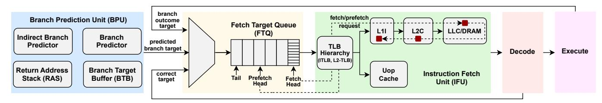
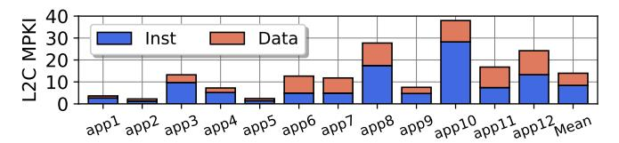
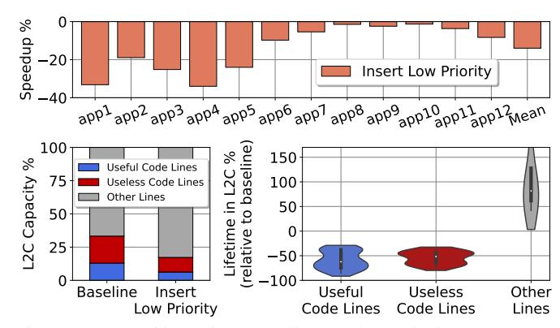
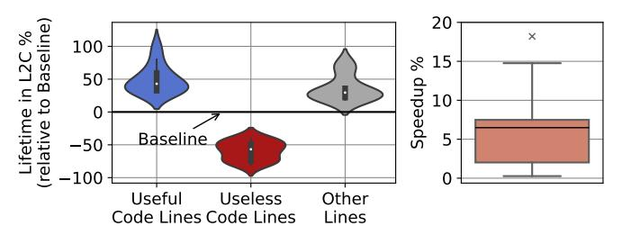
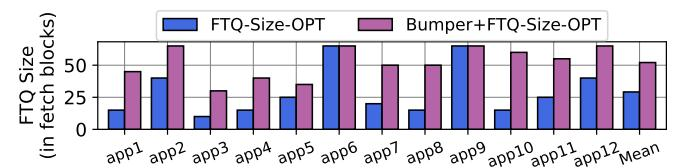
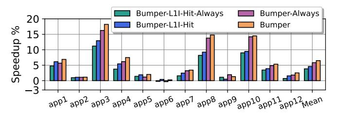
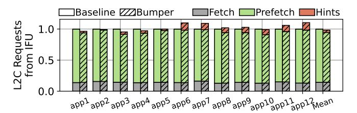
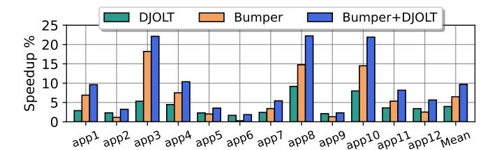
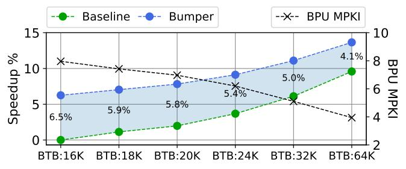

# Bumper: Hinting Instruction Usefulness for Robust Unified Caches

Georgios Vavouliotis§ georgios.vavouliotis@huawei.com

Tom Rollet§ tom.rollet@huawei.com

Davide Basilio Bartolini§ davide.basilio.bartolini@huawei.com

Boris Grot†§ boris.grot@ed.ac.uk

Leeor Peled‡ leeor.peled@huawei.com

Lixia Yang∗ lx-yang0703@163.com

§Computing Systems Lab, Huawei Technologies AG, Switzerland ∗Turing Business Department, Huawei ‡Boole Lab, Huawei Tel-Aviv Research Center †University of Edinburgh

*Abstract*—Contemporary mobile applications exhibit large instruction working sets that overwhelm cores' front-end structures, leading to frequent pipeline stalls that significantly harm performance. We find that a key contributor to the front-end bottleneck is code pollution in the unified L2 cache (L2C) stemming from a high incidence of fetches and prefetches on the wrong execution path. Such wrong-path allocations waste, on average, ∼20% of a large L2C's capacity with instruction cache lines that are *useless* – *i.e.*, lines that are evicted from the cache before any of the instructions they contain ever commits.

This work demonstrates that tracking whether a code line contains committed instructions provides a robust foundation for code-aware cache management. Building on this insight, we propose Bumper, a lightweight microarchitectural scheme that dynamically propagates usefulness hints based on commit information to the cache hierarchy and selectively prioritizes *useful* code lines in the L2C, enabling rapid eviction of *useless* lines. The principal challenge addressed in the design of Bumper is how to orchestrate the propagation of *usefulness* hints based on commit information across the CPU pipeline and cache hierarchy, while minimizing microarchitectural overheads. Using an industry-grade simulator, we show that Bumper mitigates the front-end bottleneck of real-world mobile applications by reducing L2C code pollution and improving the lifetime of *useful* code lines, outperforming state-of-the-art schemes by over 5.4%, on average, at a storage cost of just 422 bytes.

*Index Terms*—front-end, cache management, cache replacement, mobile applications, branch prediction

# I. INTRODUCTION

Modern high-end CPUs [\[1\]](#page-13-0)–[\[3\]](#page-13-1) dedicate significant resources to the front-end to sustain performance. Examples include sophisticated branch predictors [\[4\]](#page-13-2), multi-level Branch Target Buffers (BTBs), and large first-level instruction caches (L1I). To sustain high instruction supply bandwidth, they also decouple the Branch Prediction Unit (BPU) from the Instruction Fetch Unit (IFU) [\[5\]](#page-13-3) using the Fetch Target Queue (FTQ), while employing Fetch Directed Instruction Prefetching (FDIP) [\[6\]](#page-13-4) to exploit this decoupling to issue instruction prefetches into the L1I ahead of demand accesses.

Server workloads, with their large code footprint, have been shown to overwhelm front-end structures [\[7\]](#page-13-5), [\[8\]](#page-13-6) and have driven most recent research on improving the CPU front-end. Studies by Google [\[9\]](#page-13-7) and Meta [\[10\]](#page-13-8) demonstrated that frontend stalls account for 15–30% of pipeline slots in servers [\[2\]](#page-13-9), [\[11\]](#page-13-10). While the relevance of the front-end bottleneck is wellestablished for server workloads, mobile applications have remained comparatively underexplored, despite their ubiquity and demanding software stacks. We bridge this gap by characterizing real-world mobile workloads drawn from market research using an industry-grade, cycle-accurate simulator.

Our analysis [\[12\]](#page-13-11), [\[13\]](#page-13-12) demonstrates that contemporary mobile applications (i) have massive code and data footprints ranging between 0.5MB-2.3MB and 2.0MB-15.0MB, respectively, (ii) are heavily front-end bound, spending on average 41% of cycles waiting for front-end resources, and (iii) place substantial pressure on cache hierarchies representative of modern high-end mobile CPUs, with a notably-high L2 cache (L2C) MPKI for instruction lines[1](#page-0-0) (8.4 MPKI on average). Such high L2C instruction MPKI stems from a key front-end inefficiency: on average, more than 50% of the fetch blocks that insert code lines into the L2C are subsequently flushed due to front-end re-steers, caused by BTB misses and branch mispredictions. The combination of wrong-path execution and FDIP-directed prefetching on the wrong path results in the L2C being polluted with many *useless* code lines that do not result in any instructions being committed before their eviction. For a representative 6MB L2C design [\[2\]](#page-13-9), we found 20.3% of the L2C capacity, on average, to be occupied by *useless* code lines when running modern mobile applications.

We considered a number of microarchitectural options to mitigate code pollution in the L2C for modern mobile applications, but found that all fall short. For instance, the state-of-theart code-aware L2C replacement policy [\[14\]](#page-13-13) fails to mitigate L2C code pollution because it lacks the ability to discriminate between *useful* and *useless* code lines and, as a result, ends up prioritizing a large number of *useless* code lines that are allocated on the wrong path and whose instructions never commit. We also attempted tuning the FTQ size to manage the aggressiveness of FDIP and filtering prefetch requests [\[15\]](#page-13-14), but found this direction impractical: removing a large number of *useless* requests is required to realize meaningful performance gains, but filtering even a small fraction of *useful* requests can severely harm performance.

1We use *instruction line* and *code line* interchangeably throughout the paper.

Fig. 1: Decoupled front-end and Fetch Directed Instruction Prefetching (FDIP) deployed in a contemporary microarchitecture.

To enable effective capacity management of instruction lines in the L2C, we make a critical observation: The presence of *committed* instructions in L2C-resident code lines can be used as a reliable proxy for determining the lines' usefulness. By using this insight to discriminate *useful* and *useless* code lines, simple cache management policies can be deployed to prioritize the former and rapidly evict the latter.

Our work capitalizes on this insight and proposes *Bumper*, a low-cost microarchitectural scheme that distinguishes between *useful* and *useless* code lines in L2C. Bumper initially inserts all code lines into the L2C at low-priority and subsequently promotes only the ones it identifies as *useful*, *i.e.*, those that contain committed instructions. As a result, *useful* code lines have a chance to stay in the cache long enough to be reused, while the *useless* ones are rapidly evicted. The key challenge addressed in the design of Bumper is how to orchestrate the propagation of *usefulness* hints based on commit information across the CPU pipeline and cache hierarchy, while minimizing wiring, bandwidth, and implementation overheads.

Our evaluation of Bumper on a set of contemporary mobile applications shows its effectiveness in reducing the average lifetime of *useless* code lines in the L2C by 57.9%, which enables all other L2C-resident lines (code, data, MMU) to persist longer and experience more reuse. Bumper reduces the fraction of *useless* code lines in the L2C from an average of 20.3% in the baseline to 9.5%, which in turn leads to an improvement in application performance of 6.5% (on average). Notably, Bumper achieves these gains at a negligible storage cost of merely 422 bytes and minimal complexity atop an existing high-end mobile CPU. Finally, we demonstrate that Bumper amplifies the benefits of state-of-the-art L1I prefetchers by reducing the impact of their useless prefetch requests.

In summary, this paper makes the following contributions:

- We perform an in-depth characterization of real-world mobile applications (Section III-B) using a microarchitectural baseline representative of modern high-end mobile CPUs (Section VI). The key conclusions we draw are: (i) mobile applications are heavily front-end bound due to their massive code footprints and (ii) they suffer from a high L2C MPKI for instructions due to frequent wrong-path (pre)fetching that brings useless code into the L2C.
- We show that the presence of committed instructions in code lines is a reliable proxy for their usefulness, enabling precise identification of *useless* code lines (Section IV).
- We propose *Bumper*, a microarchitectural scheme that efficiently propagates commit hint information across the CPU

pipeline and the cache hierarchy to improve L2C management decisions (Section V). Bumper outperforms state-of-the-art schemes that dynamically filter IFU requests [15] or apply a code-aware replacement policy [14] by 5.4% and 7.5%, respectively, across a set of contemporary mobile applications, while requiring only 422 bytes of storage and low implementation complexity (Section VII).

#### II. BACKGROUND ON PROCESSOR FRONT-END

To sustain high instruction supply in increasingly wide and deep core designs, modern front-ends decouple the Branch Prediction Unit (BPU) from the Instruction Fetch Unit (IFU) [2], [5] by inserting a Fetch Target Queue (FTQ) between the BPU and the IFU, as depicted in Figure 1. Each FTQ entry represents a fetch block, which ends at a predicted taken branch or after a maximum size (*e.g.*, one cache line worth of instructions). The BPU predicts the next basic block to be fetched (start and end address) and appends a new entry to the tail of the FTQ. The instruction fetch pipeline pops the cacheline-aligned address of FTQ entries from the *Fetch Head* and uses it to issue memory requests to the cache hierarchy.

Building on top of the decoupled front-end, Fetch Directed Instruction Prefetching (FDIP) [6] adds a *Prefetch Head* to the FTQ to guide instruction prefetches into the L1I cache ahead of demand accesses, as shown in Figure 1. When the instruction fetch pipeline is not fully using the L1I cache bandwidth, FDIP continues issuing prefetch requests ahead of the *Fetch Head*, as long as there are fetch blocks available in the FTQ. FDIP reduces fetch L1I cache misses, thus mitigating the front-end stalls and improving front-end throughput.

FDIP has been a cornerstone in the front-end across CPU generations [5]. However, its efficacy is contingent on having a highly accurate branch predictor and low BTB miss rates. As Section III shows, contemporary mobile applications pose a growing challenge to the BPU, since their massive code footprints and complex dynamic behavior overwhelm state-of-the-art predictors and on-chip structures, leading to cache pollution due to inaccurate FDIP prefetches.

#### III. MOTIVATION

This section highlights that modern mobile applications are heavily front-end bound, explains why state-of-the-art approaches fail to reduce this bottleneck, and demonstrates that correlating committed instructions with the corresponding lines in the unified caches can provide significant benefits.

Fig. 2: Top-down analysis (average across all our mobile apps).

#### A. Front-End Bottleneck

Modern applications are increasingly complex, often featuring deep software stacks, and exhibit large code footprints that exceed the capacity of both the L1I cache and, in many cases, the L2C [8]. These large instruction working sets exert significant pressure on front-end structures (*e.g.*, L1I, BTB), making the processor front-end a dominant performance bottleneck. Studies from Google [9] and Meta [10] reveal that front-end stalls account for 15–30% of pipeline slots in datacenter workloads. As Section III-B shows, modern mobile applications also suffer from a severe front-end bottleneck due to their massive and rapidly expanding code footprints. Additionally, modern mobile CPUs employ aggressive prefetching for high performance [16], further exacerbating pressure on the on-chip resources.

## B. Analyzing Real-World Mobile Applications

To date, the computer architecture research community has put considerable of effort into characterizing and tackling the front-end bottlenecks in server workloads, while neglecting the mobile domain, despite the latter's ubiquity and importance. To bridge this gap, this section quantifies the impact of modern mobile applications on the processor front-end and cache subsystem, highlighting that these applications impose significant challenges that state-of-the-art microarchitectural schemes fail to address. To do so, we use an industrygrade simulator with ARM ISA modeling an out-of-order core with FDIP [6] and state-of-the-art front-end and back-end schemes including a multi-level Branch Target Buffer (BTB), large-capacity cache hierarchy, and multiple data hardware prefetchers equipped with adaptive throttling schemes. Our workloads consist of real-world applications representative of contemporary mobile workloads (e.g., games, web browsing, social networks) with substantial instruction and data footprints (code: 0.5 MB-2.3 MB, data: 2.0 MB-15.0 MB). Section VI presents the details of the simulation infrastructure and the properties of the considered mobile workloads.

- 1) Top Down Analysis: We use the top-down approach [12], [13] to break down execution cycles of the considered mobile applications across four categories: front-end bound, back-end bound, bad speculation, and retiring. Results, averaged across all studied mobile applications, are shown in Figure 2. We observe that a large fraction (41%) of pipeline slots are stalls attributed to the front-end, highlighting that front-end performance is a dominant bottleneck for contemporary mobile applications and pointing to the need for further improvements in front-end designs for mobile CPUs.
- 2) Impact on Cache Hierarchy: Next, we study the impact of modern mobile applications on the cache hierarchy. Our

Fig. 3: Impact of mobile applications on L2C MPKI.

Fig. 4: BPU MPKI of mobile applications.

aim is to understand the impact of caches on front-end efficiency. We evaluate a cache configuration representative of a state-of-the-art mobile CPU featuring a non-inclusive non-exclusive cache hierarchy with a 192KB L1I cache and a 6MB unified L2C (Table III). The L1I cache is non-coherent to L2C and it does not perform write-backs nor does the L2C track the presence of lines in the L1I cache [1], [3], [17], [18]. The mobile apps we study have large code and data footprints (code: 0.5-2.3MB, data: 2.0-15.0MB), which exceed the capacity of the L1 caches; therefore, we focus on the L2C.

Figure 3 breaks down the L2C Misses per Kilo Instructions (MPKI) caused by LSU (data load/store) and IFU (instruction) requests. The results reveal that contemporary mobile applications exert significant pressure on the L2C, with average MPKIs of 8.4 and 5.5 for code and data, respectively. Although the studied mobile applications have larger data footprints than code footprints, we observe lower data MPKIs than code MPKIs because data prefetchers eliminate a large fraction of the L2C data misses. The main conclusion is that mobile applications place significant pressure on the cache subsystem with a notably high L2C MPKI for instructions.

# C. Understanding Code Line Behavior in Unified L2Cs

As Section III-B showed, mobile workloads are predominantly front-end bound and instruction requests are the dominant cause of L2C misses. This result seemingly contrasts with the fact that the instruction working set (0.5MB - 2.3MB) should be able to fit into the 6MB unified L2C. While contention with the large data footprint of mobile workloads is a factor, we find that an important culprit behind the high instruction L2C misses lies in the BPU, which guides both front-end prefetching (through FDIP) and demand fetch.

Figure 4 quantifies the pressure that the studied mobile workloads exert on the BPU by reporting the total BPU MPKI (mispredictions per thousand instructions), *i.e.*, the total number of front-end resteers due to BPU mispredictions over the number of committed instructions. We additionally break down the BPU MPKI into resteers caused by last-level BTB misses (BTB MPKI) and those caused by branch direction or target misprediction (Direction/Target MPKI). Across our

(a) Fraction of L2C occupied by *useful* and *useless* code lines. The classification of code lines as *useful* or *useless* follows Definition 1.

(b) Lifetime of useful and useless code lines in L2C.

Fig. 5: Analysis of code lines in L2C.

mobile workloads, we observe an average BPU MPKI of 8.0, predominantly caused by BTB capacity misses.

Due to mispredictions, the FTQ is frequently re-steered. A key consequence of this behavior is that, on average, more than 50% of the code lines that enter the cache hierarchy do not contribute to committed instructions because they are either fetched or prefetched on the wrong execution path. The end result of this dynamics is that *over 50% of code lines that are inserted into the L2C are useless*. Definition 12 formalizes this concept, which we use throughout the paper.

**Definition 1.** A cached code line is useless if no instruction contained within that line commits before the line is evicted.

Note that a direct consequence of Definition 1 is that a hit to an instruction line does not indicate that the line is *useful*. Since wrong-path hits do not contribute to performance (because the corresponding instructions never commit), they cannot be considered *useful*.

1) Lifetime of Code Lines in the L2C: Intuitively, because useless code lines do not contribute to the execution of the program, they should be evicted as quickly as possible from the L2C, thus allowing other (useful) lines to stay longer and get more chances to exploit reuse through locality.

Alas, our analysis shows that this is not what happens in practice. Following Definition 1, Figure 5 breaks down L2C occupancy and lifetime into three categories: (i) *useless* code lines, (ii) *useful* code lines, and (iii) *other* lines (demand/prefetch data, MMU). Figure 5a shows that 17.5% to 52.8% (33.2% on average) of L2C capacity is occupied by code lines. Of those, over half (61.1% on average) are *useless* code lines. In fact, *useless* code lines occupy 20.3% of the entire L2C, amounting to over 1.2MB of capacity, on average.

Moreover, as Figure 5b shows, useless code lines exhibit remarkably similar lifetimes as useful code and other lines

in the L2C. This is problematic because *useless* code lines occupy valuable L2C space for extended periods, reducing the opportunity for other lines (useful code, data, MMU) to reside in the cache and, ultimately, harming performance. Therefore, we conclude that a scheme capable of meaningfully reducing the lifetime of *useless* code lines in the L2C has the potential to deliver great performance enhancements.

# D. Can we Improve the BPU Accuracy?

Since BPU accuracy is the root cause of L2C pollution, we first tried to directly address this problem by looking for improvements to the branch predictors and the BTB. We found that improving these aspects on a state-of-the-art baseline (Section VI) is very challenging. Our baseline uses a large, state-of-the-art multi-level branch predictor; further improving prediction accuracy is a known very difficult problem [19] and recent attempts showed minor gains despite significant complexity and high implementation cost [4], [20]–[22].

Similarly, our baseline uses a large, state-of-the-art multilevel BTB. We experimented with different BTB designs [23]– [25], but found them unable to sufficiently increase the effective BTB capacity to accommodate the large working sets of today's mobile workloads, thus providing marginal benefits. As a representative example, we increased the BTB size from 16K entries (our baseline) to 18K entries, a 12.5% capacity uplift, as a proxy for the level of benefit that such techniques can realistically achieve for the studied workloads. The result was a 1.1% IPC gain. In contrast, as our evaluation reveals (Section VII), our proposal achieves higher performance and alleviates this bottleneck more effectively, all at substantially lower storage cost. BTB prefill techniques [26]-[28] also struggle to provide benefits because the time at which a code line is filled into the L1I cache is too late for the BTB to take advantage of the temporal locality on the branches contained in that line. The main takeaway is that the problem of useless code lines polluting the L2C cannot be practically solved by directly improving the accuracy of a state-of-the-art BPU. In order to mitigate this problem, we need to look elsewhere.

# E. Can we Filter Useless IFU Requests?

Since improving the BPU accuracy is not a practical approach, we also attempted to filter the IFU requests so as to reduce the impact of wrong-path fetching. One obvious attempt is to disable FDIP (i.e., only send fetch and no prefetch requests from the FTQ), since prefetch requests are inherently more speculative and more likely to cause insertion of useless code lines. We found that disabling FDIP does mitigate the pollution problem: the average fraction of the L2C occupied by useless code lines is reduced from 20.3% to only 4.0%. However, disabling FDIP also leads to an average performance slowdown of 14.6%, indicating that, despite issuing many inaccurate prefetch requests that pollute the L2C, FDIP does provide substantial performance benefits and cannot be trivially disabled. We also experimented with prior art that tunes the FTQ size so as to keep the ability of FDIP to prefetch, while tuning its aggressiveness [15]. We

&lt;sup>2The definition could be generalized to also apply to data lines; since this paper focuses on instruction lines, we leave such discussion to future work.

(a) Performance of Emissary [14] on mobile workloads.

(b) Breakdown of all code lines ever inserted into the L2C according to Emissary's *high-priority* metric and our *usefuleness* metric.

Fig. 6: Evaluation of Emissary [14] on mobile workloads.

found that this approach provides limited gains on our mobile workloads. Additionally, we experimented with two other approaches to throttle FDIP requests: (i) throttling prefetching after several consecutive fall-through fetch blocks, interpreting such a case as an indicator of cold code suffering from BTB misses, and (ii) using UDP [15]. We found that both of these approaches provide similar benefits as throttling the FTQ size; Section VII-A provides a detailed evaluation.

In our attempts to accurately filter *useless* IFU requests, we observed that the trade-off between filtering *useless* and *useful* prefetch requests is highly asymmetric: while removing a large number of *useless* IFU requests is required to get performance gains, filtering even a small fraction of *useful* ones can severely harm performance. We were unable to identify a simple scheme to preemptively throttle only polluting IFU requests and turned our attention to cache replacement policies.

# F. Can Code-Aware Replacement Policies Help?

Emissary [14] is a recent *code-aware* replacement policy targeting instruction cache misses that cause the pipeline to starve; once the corresponding lines are identified, Emissary pins them into the L2C, so as to retain them and ensure a cache hit for future accesses to the same line. In a nutshell, Emissary focuses on retaining code lines it identifies as high-priority, not on evicting *useless* lines faster; as such, Emissary does not discriminate between *useful* and *useless* code lines.

Figure 6a reports performance of the best Emissary configuration (max 25% of ways can be pinned, pinning probability 1/16) determined through extensive parameter exploration. We observe that Emissary harms the performance of modern mobile applications. The reason for Emissary's ineffectiveness lies in the behavior of mobile workloads: As Figure 5a reports,  $\sim 30\%$  of the L2C contains code lines and more than half of those code lines are *useless*. As Figure 6b shows, Emissary identifies as *high-priority*, and thus tries to pin, the majority of code lines in the L2C, because they correspond to instructions that cause pipeline starvation. However, it cannot discriminate between *useful* and *useless* code lines. Indeed, 56.7% of the

Fig. 7: Impact of inserting code lines as low priority (RRPV=3) in L2C on performance (top), fraction of L2C occupied by *useful* and *useless* code lines (bottom-left), and lifetime of *useful* and *useless* code lines in L2C (bottom-right).

lines identified as *high-priority* by Emissary are *useless* and pinning them increases L2C pressure, which explains why Emissary hurts performance on the studied mobile workloads.

#### IV. How to Deal with Useless Code Lines?

Our analysis in Section III highlights that over 20% of the L2C is polluted by *useless* code lines that tend to reside there for a long time (see Figure 5). As noted in Section III-E, how to filter IFU requests that insert *useless* lines into the L2C is an open problem. While a predictor [29]–[35] could, potentially, be trained to identify *useful* code lines and serve as a filter, this approach would require a large storage budget for the code footprint of mobile workloads. It would also harm performance if *useful* lines were mispredicted and filtered out of the prefetch stream (Section VIII).

A more promising approach, from a storage overhead and complexity perspective, is to reduce the lifetime of *useless* code lines in the L2C by evicting them more quickly. A naive way of doing so is to simply insert all code lines into L2C at low priority (RRPV=3),3 under the assumption that *useful* lines will experience hits, which will promote them in the cache and extend their lifetime, while *useless* lines will be evicted quickly in the absence of hits.

Figure 7 presents the evaluation of this approach. We observe that this naive policy severely harms performance and reduces the baseline IPC by 13.9% (Figure 7, top). The bottom half of Figure 7 explains the reason for this poor performance. While inserting code lines at low priority does indeed reduce the L2C occupancy and lifetime of *useless* code lines, it also adversely affects *useful* code lines, which are frequently evicted before they experience reuse. Because all code lines are aggressively evicted under this policy, we observe that other line types (data, MMU) enjoy longer lifetimes in L2C.

Why does this policy fail? In other words, why do *useful* code lines fail to get promoted quickly, which would prevent

&lt;sup>3The baseline L2C replacement policy is DRRIP [36] which relies on Re-Reference Prediction Values (RRPVs) to approximate the reuse of cache lines; RRPVs range between 0 (high chance of reuse) and 3 (low chance of reuse).

Fig. 8: Upper bound potential of discriminating the *usefulness* of code lines on L2C lifetime (left) and performance (right).

them from being evicted? We find that the answer lies in the fact that *useful* lines tend to experience reuse in the L1I, which absorbs hits and prevents the L2C from observing that these lines are, in fact, *useful*. Thus, while an insertion policy can help reduce the lifetime of *useless* code lines, there needs to be a way to identify the *useful* code lines and keep them in the L2C. Next, we quantify this opportunity.

1) Opportunity Upper Bound: To evaluate the opportunity of a better-informed policy, we extend the approach in the previous study that inserts code lines into the L2C at low priority (RRPV=3) by adding a discriminator that identifies useful code lines and changes their insertion priority to high (RRPV=0). The discriminator is an oracle with perfect knowledge of whether an incoming code line will be useful or not.

Figure 8 quantifies the impact of this idealized policy lifetime of L2C lines and application performance. Figure 8 (left) reveals that, under this scenario, the lifetime of *useless* code lines is significantly reduced, as in the naive approach, but without harming the *useful* code lines. In fact, the lifetime of *useful* code lines in the L2C increases by ~50%, on average, compared to the baseline – a highly desirable outcome that provides more opportunity for reuse. Moreover, because *useless* code lines are quickly evicted, other line types (*e.g.*, data, MMU) also tend to stay longer in the cache and potentially experience more reuse. The increased lifetime of both *useful* code lines and other lines in L2C, stemming from quicker eviction of *useless* code lines, has a direct positive impact on application performance. As Figure 8 (right) shows, all considered workloads experience a performance improvement.

2) Seizing the Opportunity: Exploiting the opportunity shown in Figure 8 requires discriminating useful from useless code lines in the L2C. However, useful lines tend to see high reuse in L1I, which prevents the L2C from observing their usefulness. Intuitively, what is needed is a mechanism for informing the L2C about the usefulness of its code lines.

A naive version of such mechanism would send a message from the L1I cache to L2C on L1I cache hits, indicating that a specific line has been used. However, as discussed in Section III-B, a large fraction of code lines is accessed on a misspeculated execution path and are not actually useful per Definition 1. To quantify this behavior, we added instrumentation code to track the lifetime of all code lines in L2C. Then, for each L2C code line, we record (i) whether it experiences at least one hit in the L1I cache while it is resident in L2C

and (ii) whether any instruction belonging to that line commits before the line is evicted from L2C. With this instrumentation we compute, for each workload, the fraction of *useless* L2C code lines that experienced at least one L1I cache hit during their lifetime in the L2C. Averaged across all workloads, 47% of useless L2C code lines experience an L1I hit (min: 43%, max: 49%). For this reason, L1I hits are not a good proxy for *usefulness* of a code line.

Therefore, we need to more strictly follow Definition 1 and use commit information to drive the detection of useful code lines in the L2C. While simple in principle, this idea presents multiple challenges in a real-world design that must contend with wiring, bandwidth, and energy costs. Specific challenges include (1) minimizing signaling throughout the core pipeline (wiring, bandwidth, energy); (2) reducing MMU lookups for address translation and L1I cache accesses (bandwidth, energy); (3) minimizing signaling between the L1I and L2C (bandwidth, energy) since a line may see frequent reuse in the L1I cache, which could trigger many needless accesses to the L2C if every committed instruction triggered an RRPV update signal to the L2C. In short, an ideal scheme would minimize signaling throughout the pipeline and avoid redundant accesses to the MMU, L1I cache, and L2C. We next present a low-cost microarchitectural scheme that meets these constraints and makes commit-driven management of unified caches feasible in a real-world CPU design.

## V. Bumper Design

Bumper is a microarchitectural scheme that capitalizes on the insights from our previous analysis. Bumper allows the L2C to distinguish between *useful* and *useless* code lines by carefully orchestrating the propagation of *usefulness* information across the CPU pipeline and cache hierarchy at a low implementation cost and with negligible signaling overhead.

At a high level, Bumper inserts all L2C code lines in the vulnerable position (RRPV=3) and subsequently promotes only the code lines identified as *useful*, thereby increasing their likelihood of remaining in the cache long enough to be reused. Bumper extends a typical microarchitecture with the ability to *track useful code lines* (Section V-A) and exploits this knowledge to *inform L2C management* (Section V-B). Figure 9 shows how Bumper extends a microarchitecture to correlate L2C lines with committed instructions; this design minimizes the impact on the microarchitecture in terms of both added storage and signaling. The rest of this section presents how Bumper operates, referring to the circled markers in Figure 9.

# A. Discriminating Useful from Useless L2C Code Lines

A naive approach to track the usefulness of code lines and inform L2C management decisions would imply sending a signal, which we call a *hint*, from the Retire pipeline stage to the L2C for each committed instruction. Upon receiving this hint, the L2C would promote the corresponding line, thus extending its lifetime. However, such approach has two major drawbacks that prevent its implementation: (i) L2Cs are typically implemented as physically-indexed physically-tagged

Fig. 9: Bumper integrated in a microarchitecture. Bumper's components and operation are highlighted in orange.

(PIPT) structures, but the physical address (PA) of an instruction is typically not available at retirement, and (ii) sending hints for each committed instruction (or group of instructions) would be prohibitively expensive and consume significant energy and bandwidth, as we show in Section VII-D. Thus, a more practical approach to tracking *useful* code lines and propagating this information to L2C is needed.

Overview of Bumper's Approach: When a request for a code line misses in the L2C, it is installed in a vulnerable position (RRPV=3) and the L1I cache is informed of this fact via a dedicated hint bit. The hint bit is propagated through the pipeline along with the first instruction in the fetch bundle reading that line. If the instruction commits, the hint bit indicates that the line is in a vulnerable position in the L2C and should be promoted. The L1I cache is informed at which point a promotion signal is sent to the L2C and the hint bit is cleared in the L1I cache. Once the bit is cleared, no additional signaling associated with that line takes place either in the pipeline or through the cache hierarchy for the whole residency of the line in the L1I cache, thus avoiding unnecessary bandwidth and energy overhead. The rest of the section elaborates on this core idea.

1) Managing Usefulness (Commit) Hints: Instead of trying to directly send hints from the Retire pipeline stage to the L2C, Bumper smoothly integrates its hint-passing mechanism with the existing cache hierarchy, in a place where (i) the PA is available and (ii) the L2C traffic can be effectively filtered: the L1I tags. Specifically, Bumper extends each L1I tag with a new bit called send\_hint bit (Figure 9 (a)).

The purpose of the send\_hint bit is to limit the traffic to the L2C by sending a promotion hint only when the first instruction fetched from a code line makes it to retirement, rather than for every committed instruction within that L1I line. The send\_hint bit is set when the line is filled into the L1I cache and, once a promotion signal is sent to the L2C, the send\_hint bit is reset.

To further reduce the impact of promotion hints on the precious L2C bandwidth, Bumper ensures that the send\_hint bit is set *only* if the line is in a vulnerable position in the L2C. That is accomplished through the addition of a 1-bit flag (12\_vulnerable\_fill) **(b)** to the cache response

transaction that fills lines into L1I. This flag indicates whether the corresponding line in the L2C is in a vulnerable position (RRPV=3). If that is the case, the corresponding send\_hint bit in the L1I tags is set to 1; otherwise, it will be reset to 0.

The combination of the 12\_vulnerable\_fill signal and the send\_hint bit ensures that at most one promotion signal is sent to the L2C in the entire lifetime of the code block in the L1I cache. The promotion happens only when the line is in a vulnerable position in the L2C and an instruction from that line commits, thus indicating its usefulness. In all other cases, promotion signaling is avoided, thus achieving the stated goal of minimal bandwidth and energy overhead associated with propagating the commit information to the L2C.

- 2) Carrying Hints Through Retire Stage and Back: Once the send\_hint bit is set in the L1I cache for a code line, Bumper waits for the first instruction fetched from that line to retire, indicating that the line is useful and should be promoted in the L2C. For that purpose, Bumper propagates the send hint bit for the first instruction (and, later, the first uop) from a line that has its send\_hint bit set (1) through the pipeline. This is accomplished by adding a 1bit flag to each ROB entry (or an alternative order-preserving structure) to carry the flag until the corresponding instruction (or its first uop) retires. Eventually, when an instruction with a send\_hint bit set to 1 retires (2), Bumper sends its virtual address (VA), which is already available for recovery purposes, back to the IFU to check if a promotion hint should be sent to the L2C. If that is the case, the promotion hint clears the corresponding send\_hint bit in the L1I cache, preventing further hints for this cache line for its entire lifetime in the L1I cache. As our evaluation shows (Section VII-D), this approach effectively minimizes Bumper's L1I bandwidth impact.
- 3) Generating L2C Promotion Hint Requests: Once the IFU receives the VA of a retired instruction that should generate a promotion hint ②, it first needs to retrieve the corresponding physical address (PA) in order to find the corresponding line in the L2C. To do so, Bumper uses the existing address translation structures. In practice, Bumper uses a Hint Lookup Queue (HL1Q) ③ that stores Hint Requests that opportunistically accesses the ITLB whenever the FTO requests do not use the full ITLB bandwidth ④.

| L2C Request Type & Status | Action                           |
|---------------------------|----------------------------------|
| IFU Request Miss          | Insert with RRPV=3               |
| IFU Request Hit           | Promote to RRPV=0 only if RRPV<3 |
| Hint Request Hit          | Promote to RRPV=0                |
| Hint Request Miss         | No action                        |
| Other Requests            | No change to the baseline policy |

TABLE I: Changes to the RRPV-based L2C management.

After address translation, the Hint Request proceeds to the L1I cache where, like a regular FTQ request, it accesses the L1I tags (5). If the send\_hint bit (1) of the hit entry is set, Bumper resets it before sending the promotion signal to the L2C, because there might be multiple instructions of the same cache line in the pipeline and Bumper wants to send only one promotion signal to the L2C per L1I cache line. Assuming that the send hint bit of an L1I line is set, Bumper resets it and the Hint Request proceeds to the L2C (6) to promote the corresponding code line. At the L2C, the Hint Request is queued in another *Hint Lookup Queue*  $(HL2Q)^4$  (7), similar to step (3). Hint Requests from HL2Q are arbitrated with all other requests (e.g., LSU requests, data prefetch requests). Finally, the promotion request can finally access the L2C with the PA of the line that should be promoted (8) and trigger Bumper's updated L2C management policy, explained in Section V-B.

#### B. Commit-Aware Unified Cache Management with Bumper

Bumper leverages the commit hints, as explained in Section V-A to guide a modified L2C management policy that promotes the *useful* code lines once they are identified. Table I presents how Bumper changes the baseline replacement policy [37]: These generic changes apply to any RRPV-based policy.

First, all code lines brought into the L2C are statically inserted with low priority (RRPV=3) to minimize the pollution caused by *useless* code lines. Hint requests that hit in L2C indicate that the corresponding line has been identified as *useful* (9) in Figure 9); therefore, the L2C policy bumps the RRPV value for that line to 0 (highest priority). We experimentally confirmed that <0.1% of the hint requests ever miss in the ITLB, L1I, or L2C; these events are rare because these structures are large enough to hold the corresponding information for the time between a code line being fetched and the time its first instruction retires. In the event of a hint request missing in the L2C, Bumper does not trigger any action.

Another important modification introduced by Bumper to the baseline replacement policy concerns IFU requests that hit in the L2C. As explained in Section V-A1, IFU requests that hit in an L2C code line with RRPV=3 (lowest priority) set the 12\_vulnerable\_fill flag in the corresponding response to the L1I cache, which in turn causes the send\_hint bit to be set and a promotion hint to be generated if an instruction from that line eventually retires. Crucially, until the promotion hint reaches the L2C, the corresponding line is kept at RRPV=3. In contrast, if the L2C code line that experiences a

| Component & Description                               | Size (in bytes) |
|-------------------------------------------------------|-----------------|
| send_hint bits in the L1I; 1 bit per tag              | 256 bytes       |
| send_hint bit in the ROB; 1 bit per uop               | 80 bytes        |
| HL1Q, 42bit (VA[47:6]) $\times$ 8 entries             | 43 bytes        |
| HL2Q, 42bit (VA[47:6]) $\times$ 8 entries             | 43 bytes        |
| 12_vulnerable_fill (1 bit in the L2C-to-L1I response) | -               |
| Total: 422 bytes (0.41KB)                             |                 |

TABLE II: Storage overhead of Bumper.

hit is *not* in the most vulnerable position (RRPV<3), Bumper uses the baseline policy and upgrades the priority of that line to least vulnerable (RRPV=0). In other words, Bumper promotes L2C code lines upon a hit only if their RRPV is not 3.

The rationale behind this policy is that an L2C code line with RRPV of 3 (lowest priority) is either (i) recently inserted and *useful* but not yet promoted; (ii) *useless* (will never be promoted and should be evicted quickly); or (iii) previously found *useful* and promoted but later aged again towards the lowest priority. In the first case, Bumper waits for the promotion hint to (potentially) reach L2C later if the line is found *useful*, rather than promoting a potentially *useless* line right away. In the second case, decreasing the RRPV value would clearly be counterproductive. In the third case, Bumper treats the line the same way as a newly-inserted line since, in both cases, its RRPV=3. In other words, the line will be promoted only if and when it is found *useful*. We did not find alternative policies, which treat newly-inserted lines differently from aged lines that reach RRPV=3, to be beneficial.

# C. Storage and Area Overheads

Bumper's design philosophy focuses on minimizing traffic across the pipeline and caches so as to reap the largest benefits from reducing code line pollution in the L2C with minimal bandwidth and energy overhead. We also designed Bumper to minimize storage requirements and implementation complexity on top of a typical out-of-order core microarchitecture.

Table II breaks down and quantifies the storage required for implementing Bumper on top of our baseline. In total, Bumper necessitates a mere 422 bytes of state. Additionally, in contrast to previous work [14], Bumper's storage overhead scales only with the size of L1I and not the L2C, thus facilitating Bumper's adoption in future designs with even larger L2Cs. The extra management logic to implement Bumper, shown in Section V, is limited to simple operations that are off the critical path. We conclude that the area and complexity overhead of Bumper is negligible in a high-performance mobile CPU.

#### D. L2C Inclusion Policy

While we designed Bumper for a non-inclusive, non-exclusive L2C with respect to the L1I cache (Section VI), it can be adapted to any other inclusion policy. In an exclusive L2C scenario, a code line will be inserted into the L2C upon an L1I cache eviction. The priority chosen at insertion would then be based on the send\_hint value: a committed L1I cache line would be inserted at high priority, while a non-committed line would either be inserted at low priority or discarded, *i.e.*, not inserted at all. For an inclusive L2C where a L2C code

&lt;sup>4We empirically found that an 8-entry *HL1Q* and an 8-entry *HL2Q* are adequate to extract the full potential of Bumper.

| Core                         | 620-entry ROB, 32-entry (fetch blocks) FTQ, FDIP [6] 16-wide fetch, 10-wide retire |  |
|------------------------------|------------------------------------------------------------------------------------|--|
| Branch Prediction Unit (BPU) | 64KB TAGE-SC [38], [39] and iTAGE, 1K-entry L1-BTB, 16K-entry L2-BTB, RAS          |  |
| ITLB, DTLB, L2TLB            | 256-entry, 224-entry, 4096-entry                                                   |  |
| L1I                          | 192KB, 6-way, pLRU                                                                 |  |
| L1D                          | 128KB, 4-way, pLRU                                                                 |  |
| L2C                          | 6MB [1], 12-way, DRRIP [36]                                                        |  |
| Memory                       | DDR5-8800                                                                          |  |

TABLE III: Baseline system configuration.

line cannot be evicted as long as it also resides in L1I cache, then Bumper would send the hints upon L1I cache invalidation or writeback, similar to the case of an exclusive L2C.

#### VI. EXPERIMENTAL METHODOLOGY

Our evaluation uses an industry-grade cycle-accurate simulator with ARM ISA simulating a modern high-end mobile CPU [1], [2] with a decoupled front-end [5], FDIP [6], 64KB TAGE-SC branch predictor [38], [39], a two-level BTB hierarchy [40], which only stores committed taken branches, post-fetch correction [5], and a non-inclusive non-exclusive cache hierarchy. L1I is non-coherent with respect to L2C, meaning that L1I does not perform write-backs nor does L2C track the presence of lines in the L1I [1], [3], [17], [18]. L2C uses DRRIP [36], a replacement policy that uses Re-Reference Prediction Values (RRPVs) to approximate reuse of cache lines; RRPVs range from 0 (high chance of reuse) to 3 (low chance of reuse). We also optimize the insertion and promotion policies of DRRIP per line type [41].

Contemporary mobile CPUs [1], [2] typically use clusters of 2 to 4 cores sharing the same L2C. The total L2C capacity, shared across these cores, ranges between 8MB and 24MB. As this work focuses on single-core performance, and assuming the L2C is shared roughly equally between cores in the same cluster, we size the L2C to 6MB. Section VII-F evaluates Bumper's effectiveness at various L2C sizes. While we do not evaluate L2C sharing among cores, we note that Bumper is beneficial in such a scenario because it reduces cache pressure due to useless code lines brought in by each core.

In modern client SoCs (e.g., Qualcomm's Oryon [2]), the LLC is a system-level cache (SLC) shared across multiple CPU clusters, the GPU, and other accelerators. Its primary purpose is to facilitate efficient data sharing between heterogeneous compute units rather than to act as an additional cache level for CPUs. Given the limited effective SLC capacity available for lines coming from each CPU core and the transient residency of CPU cache lines, the SLC has negligible impact on the performance of user-level applications running on CPU cores. Consequently, we do not model the SLC in our simulations, since it would not alter the conclusions of this work. The results of the L2C sensitivity study (Section VII-F) can be used to understand the impact of having additional on-chip storage available.

The modeled system also includes multiple data prefetchers with adaptive throttling and coordination schemes [42]–[44], a 5-level radix tree page table, MMU Caches [45], hardware

|        | Code Footprint (MB) | Data Footprint (MB) | Description                    |
|--------|---------------------|---------------------|--------------------------------|
| app 1  | 2.2                 | 7.1                 | Client for a search engine     |
| app 2  | 1.0                 | 5.9                 | Social media-online video app  |
| app 3  | 2.0                 | 4.3                 | Chat app                       |
| app 4  | 2.3                 | 5.5                 | Online shopping app            |
| app 5  | 1.1                 | 4.9                 | Content creation app           |
| app 6  | 1.5                 | 15.0                | News app                       |
| app 7  | 1.0                 | 5.7                 | Messaging and social media app |
| app 8  | 1.2                 | 4.4                 | Mobile game (rpg)              |
| app 9  | 0.5                 | <b>2.0</b>          | Mobile game (role play)        |
| app 10 | 1.2                 | 2.2                 | Mobile game (strategy)         |
| app 11 | 1.0                 | 4.7                 | Mobile game (racing)           |
| app 12 | 1.4                 | 8.4                 | Mobile game (moba)             |
|        |                     |                     |                                |

TABLE IV: Properties of the considered mobile applications.

page table walker [46], and accounts for cache locality in page walks [46]–[49]. Table III lists the details of the baseline system.

Workloads: We use a set of real-world applications drawn from market research on commercial mobile products. These workloads were selected through performance-critical scenario analysis targeting user experience and span diverse domains (e.g., games, commerce platforms). Each application represents distinct patterns of system demands, user interaction, algorithmic complexity, and workload characteristics. Table IV reports the data and code footprint and a brief description of each application. Although the total memory footprints of some applications are close to the modeled L2C capacity, this does not imply that the L2C operates under low pressure. Aggressive data prefetching, which is critical for high performance [11], [50], significantly increase L2C pressure by bringing additional data into the cache. Furthermore, instructions fetched on the wrong-path, particularly due to high BTB MPKI (Figure 4), cause additional cache pollution, as Section VII-B shows, exacerbating L2C pressure. To further demonstrate the robustness of our proposal, Section VII-F shows that Bumper consistently improves performance across different L2C sizes, clarifying that its advantages are not limited to scenarios where application footprints are close to the L2C size.

We refer to these applications as mobile applications and keep their names anonymous for business reasons. A modeling team identified relevant scenarios, corresponding code regions and inputs for each application that represent common user behavior and use cases and consist of at least 100M instructions. Each simulation includes a sufficient warm-up period for all on-chip resources (*e.g.*, caches and in-core structures). We also evaluate the SPEC 2017 [51] and Geekbench [52] benchmarks in Section VII-A to show that Bumper does not harm non front-end bound applications.

## VII. EVALUATION

In this section, we evaluate Bumper's performance, contrast it with related work, and provide additional studies that characterize its behavior and highlight its benefits.

#### A. Performance

We compare Bumper with two state-of-the-art techniques that target the front-end bottleneck: Emissary [14] and UDP [15]. We tune Emissary through parameter exploration

Fig. 10: Performance comparison. Higher is better.

to its best configuration (max 25% of ways can be pinned with probability 1/16). For UDP, we consider two different designs as presented in the original paper. First, we use the optimal FTQ size per each app, found via offline exploration, as an upper-bound reference for the dynamic FTQ sizing of UDP; we refer to this version as FTQ-Size-OPT. Second, we implement UDP's filtering approach using the confidence of the TAGE branch predictor; we refer to this design as *UDP*.

Figure 10 presents the performance comparison. Emissary degrades performance in modern mobile applications because these applications have many performance-critical code lines, leading Emissary to pin many lines in the L2C. This excessive pinning increases cache contention instead of mitigating pollution, as discussed in Section III-F. FTQ-Size-OPT achieves modest gains (1.1% speedup, on average) through better balancing of FDIP aggressiveness with prefetch accuracy, which improves performance in some workloads. UDP also provides modest speedups (1.2% on average) by using the TAGE confidence to filter out likely-wrong-path FDIP prefetches. The reason for such modest benefit from UDP is the high BTB MPKI. Whenever a BTB miss occurs, the associated branch is not predicted by TAGE and, as a result, branch confidence cannot be used to throttle FTO prefetches. The result is a high incidence of prefetches on the wrong path stemming from BTB misses. Bumper consistently improves performance (average speedup of 6.5%) by dynamically identifying and retaining useful code lines in the L2C while promptly evicting useless ones, as Section VII-B shows in more detail. We also evaluate Bumper in conjunction with FTQ-Size-OPT (Bumper+FTQ-Size-OPT) and find that it slightly improves performance over Bumper alone. Overall, Bumper outperforms Emissary by 7.5%, FTQ-Size-OPT by 5.4%, and can be combined with FTQ-Size-OPT to yield an additional 0.8% performance gain. We also evaluated composite designs where Bumper is combined with Emissary or UDP; however, such combinations did not provide any benefit over Bumper alone.

Notably, we found that the optimal FTQ sizes for Bumper+FTQ-Size-OPT are consistently larger than those found for FTQ-Size-OPT alone. As Figure 11 shows, the average optimal FTO size grows from 26 (for FTO-Size-OPT) to 51 (for Bumper+FTQ-Size-OPT). By mitigating the impact of aggressive FDIP through rapid eviction of useless L2C code

Fig. 11: Analysis on optimal FTQ size per application. Bumper enables larger FTQs since it reduces L2C code pollution.

Fig. 12: Lifetime (in million cycles) of L2C lines.

lines, Bumper facilitates deeper speculation with a larger FTO.

To ensure that Bumper does not harm workloads that are not front-end bound, we evaluated it on SPEC 2017 [51] and Geekbench [52] benchmarks and found that it does not impact performance (results not shown). The instruction working sets of these workloads fit in L1I, so distinguishing useful

from useless code lines in L2C does not affect performance. These results confirm that Bumper does not cause performance degradation for applications with small code footprints.

#### B. Lifetime in the L2 Cache

This section quantifies the impact of Bumper on the lifetime of L2C lines. Figure 12 presents the lifetimes of useful code lines, useless code lines, as per Definition 1, and other lines (demand data, prefetch data, MMU) in L2C, following the same methodology as Figure 5b. We observe that across all studied applications, Bumper significantly shortens the lifetime of useless code lines compared to the baseline. This reduction allows other valuable lines to remain in the cache longer, thereby reducing the Memory Wall bottleneck. Specifically, the lifetime of useful code lines and other line types increase by an average of 52.5% and 21.5% over the baseline, respectively. Meanwhile, the lifetime of useless code lines decreases drastically by an average of 57.9% over the baseline.

Figure 13 further highlights the benefits of Bumper by breaking down the L2C occupancy into useful code lines, useless code lines, and other lines (demand data, prefetch data, MMU), similar to Figure 5(a). The main takeaway is that compared to the baseline, Bumper enables the L2C to store more useful code lines (baseline: 12.9%, Bumper: 15.4% of

Fig. 13: L2C occupancy breakdown.

Fig. 14: Performance of different Bumper versions.

L2C capacity) and fewer *useless* code lines (baseline: 20.3%, Bumper: 9.5% of L2C capacity).

## C. Performance Breakdown

Figure 14 evaluates different Bumper versions to justify our design choices: (i) Bumper-L1I-Hit-Always classifies a code line as *useful* if it experiences at least one L1I hit before eviction (*i.e.*, regardless of whether any instructions commit) and always sends promotion hints to the L2C (without using the 12\_vulnerable\_fill flag, see Figure 9 (b); (ii) Bumper-L1I-Hit behaves the same as the former, but it uses the 12\_vulnerable\_fill flag to filter out unnecessary hints; (iii) Bumper-Always uses commit information to identify *useful* code lines, but it does not use the 12\_vulnerable\_fill flag.

We observe that Bumper-L1I-Hit-Always yields 3.8% average speedup over the baseline, showing that even this simplified policy is beneficial. Bumper-L1I-Hit improves upon this result and provides a 4.5% average speedup because it reduces the overhead on L2C traffic by filtering out unnecessary promotion signals. Leveraging commit information has an even higher impact: except in isolated cases, Bumper-Always outperforms both previous variants (5.8% average speedup over the baseline). Finally, Bumper provides the largest speedups (6.5% on average) by both leveraging commit information and reducing L2C traffic. Given the low implementation cost for propagating the commit information and filtering superfluous cache traffic, we believe that Bumper is the preferred option for future mobile processors. In case very low implementation cost is a priority, Bumper-L1-Hit and Bumper-L1-Hit-Always are attractive design points, both of which deliver over half of the benefit of Bumper without propagating the commit information through the pipeline.

Fig. 15: L2C requests from IFU and Hint Requests.

Fig. 16: L1I requests.

#### D. Impact of Bumper on Cache Bandwidth

Bumper introduces additional cache traffic due to the new hint requests used to (i) propagate promotion hints from the L1I to the L2C (Figure 9, 6), and (ii) manage the send\_hint bits in the L1I tags (Figure 9, 5). These requests compete for bandwidth with regular requests and, as we discussed in Section V, we designed Bumper to minimize their overhead. Figure 15 and Figure 16 quantify this impact by analyzing the total number of IFU requests that come to the L2C and L1I cache, respectively. Both figures report the number of IFU requests in each benchmark relative to the baseline and break it down by request type: (i) Fetch requests from the fetch pipeline, (ii) Prefetch requests from FDIP, and (iii) Hint requests that Bumper introduces. Overall, we find that Bumper has negligible impact on the cache traffic.

Figure 15 shows that Bumper reduces the number of IFU requests to the L2C by 1.8% on average, despite adding a non-negligible fraction of hint requests to the L2C in some cases. In particular, for the second half of the benchmarks (from app6 onward), hint requests increase the total number of requests by up to 10.4% compared to the baseline. This result is caused by the long reuse distance of code lines of mobile workloads, which causes some useful L2C code lines to age to RRPV=3 or even be evicted between two uses. On re-use of these lines, Bumper requires a hint to be sent, as explained in Section V-B, thus increasing the ratio of hint requests with respect to other requests. This overhead, however, is counterbalanced by a reduction of the number of Prefetch requests (FDIP) to the L2C: thanks to reduced pollution in the L2C, Bumper improves the instruction supply to the IFU, with the fetch pipeline experiencing less frequent L2C misses and using more of the L1I bandwidth, which leads to a reduction of Prefetch requests.5 In fact, the prefetch traffic at the L2C is 1.2%-9.1% (5.7% on average) lower in Bumper compared to the baseline.

&lt;sup>5FDIP uses the L1I bandwidth left over by the fetch pipeline (Section II).

Fig. 17: Impact of Bumper on L1I prefetching.

Fig. 18: Impact of L2C size on Bumper's performance.

Figure 16 shows that the impact of the hint requests on the L1I cache is negligible (max. 2.3%, avg. 0.4%). This stems from the fact that Bumper only adds one additional hint request for those L1I lines that see at least one committed instruction over their lifetime in the L1I cache. Since L1I lines experience high reuse, sending one additional hint for some of the lines represents a negligible overhead.

## E. L11 Prefetching

To quantify the impact of L1I prefetching on Bumper's performance, we consider DJOLT [53], a state-of-the-art L1I prefetcher and among the winners of IPC1 [54]. We evaluate DJOLT alone and in combination with Bumper. Figure 17 presents the performance comparison.

We observe that DJOLT provides performance gains due to additional coverage over FDIP. Still, Bumper outperforms DJOLT because, in mobile workloads, reducing L2C code pollution is more beneficial than complementing FDIP with an L1I prefetcher. We further find that DJOLT and Bumper complement each other, improving performance by an average of 9.7% over the FDIP-only baseline and by 3.2% over Bumper alone. The complementarity arises from the fact that while combining the two prefetchers (FDIP and DJOLT) improves miss coverage, it comes at the cost of high L2C pollution. Bumper helps quickly evict useless lines brought in by both prefetchers while extending the lifetime of *useful* lines in L2C. The main takeaway is that Bumper on top of FDIP delivers consistent benefits compared to, and combined with, an L1I prefetcher. Section VIII provides a broader discussion of prior work on L1I prefetching, where we highlight that Bumper is orthogonal and complementary to existing L1I prefetching mechanisms and can benefit from advances in that domain.

# F. Sensitivity to L2C size

This section evaluates the effectiveness of Bumper across a range of L2C capacities, from 1MB to 16MB. Figure 18

Fig. 19: Sensitivity of the performance of the baseline and Bumper (left y-axis) and the baseline BPU MPKI (right y-axis) to increasing BTB size.

reports the corresponding speedups across the evaluated workloads. A key take-away is that Bumper consistently improves performance across all considered L2C sizes. For small L2Cs (1–2MB), the observed speedups are lower (2.9%-3.6%, on average) because the large instruction working sets of mobile applications limit temporal locality in small caches, thus reducing code pollution alone cannot prevent useful lines from being evicted before reuse. As the L2C size increases (4–8MB), Bumper becomes more effective (average speedups are 5.1%-6.8%) by retaining useful code lines longer and reducing premature evictions. Beyond 16MB, however, the benefits taper off, as most of the active instruction and data working set already fits within the L2C. One notable exception is app6, for which Bumper provides the highest benefits when L2C is 16MB; this happens because app6 has very poor temporal locality and its combined instruction and data working set does not fit in a 16MB L2C.

# G. Sensitivity to BTB size

This section studies the performance of (a) scaling the L2-BTB size, from 16K entries (baseline L2-BTB in Table III) to 64K entries, and (b) Bumper across different L2-BTB capacities. Figure 19 (left y-axis) presents the mean speedups for (a) and (b), while Figure 19 (right y-axis) presents the impact of larger L2-BTBs on the BPU MPKI. From a performance perspective, significantly increasing the L2-BTB size in the baseline configuration provides significant gains. Enlarging L2-BTB from 16K to 64K entries reduces BTB misses (right y-axis), which in turn lowers the number of front-end resteers.

Bumper continues to be beneficial at larger L2-BTB capacity. Across all BTB sizes, Bumper is effective at shortening the lifetime of useless code lines in the L2C, thereby reducing cache pollution and improving effective cache utilization. Notably, this trend persists even with a 64KB L2-BTB because the branch working set still exceeds the capacity of both the L2-BTB and TAGE, so wrong path pollution still occurs. Nonetheless, when comparing Bumper against the baseline as the L2-BTB size is increased, the performance difference between them narrows. This is because a larger L2-BTB exhibits a lower miss rate, thus reducing the extent of pollution brought by wrong-path prefetches and demand fetches. This effect limits the opportunity for Bumper.

# *H. Energy Overhead*

Bumper's energy overhead stems from look-ups to its storage and the additional L1I and L2C requests. Given that Bumper requires only 422 bytes of storage [\(Section V-C\)](#page-7-4) while having a negligible impact on L1I and L2C traffic [\(Section VII-D\)](#page-10-0), we consider its energy cost to be negligible.

# VIII. RELATED WORK

*Cache Replacement Policies.* A class of cache replacement policies rely only on block recency without using histories of prior misses [\[36\]](#page-14-1), [\[55\]](#page-14-17)–[\[62\]](#page-14-18), while others exploit features that correlate with past access behavior to predict the reuse distance of cache lines [\[29\]](#page-13-25), [\[31\]](#page-13-26), [\[63\]](#page-14-19)–[\[74\]](#page-15-0). Mockingjay [\[64\]](#page-15-1) is the state-of-the-art replacement policy for lower-level caches, leveraging long program counter histories to accurately forecast reuse distances. Policies such as SHiP++ [\[75\]](#page-15-2), PAC-Man [\[76\]](#page-15-3), and PACIPV [\[41\]](#page-14-6) refine replacement decisions by accounting for prefetch behavior, dynamically adjusting insertion and promotion policies, and exploring RRPVs [\[37\]](#page-14-2) for different access types. CLIP [\[77\]](#page-15-4) builds over the RRIP policy [\[36\]](#page-14-1) and increases the priority of code lines in the L2C at the expense of having more data misses, similar to Emissary [\[14\]](#page-13-13). Bumper correlates commit hints to the cache hierarchy and can be seamlessly applied on top of any RRPV-based replacement policy, as explained in [Section V-B.](#page-7-0) ICARUS [\[78\]](#page-15-5) is a new replacement policy based on Emissary that uses branch history and reuse information to improve critical code line detection. Another line of research work designs replacement policies tailored for translation lines in unified caches [\[79\]](#page-15-6)–[\[81\]](#page-15-7). These translation-aware policies distinguish between lines storing data or instructions and those storing translations, prioritizing translation lines to reduce page walk latency. Bumper can be seamlessly combined with any replacement policy because Bumper filters out useless blocks while other policies can be applied to the remaining blocks.

*Instruction Cache Prefetching.* A large body of prior work has explored instruction cache prefetching to mitigate frontend stalls and improve fetch bandwidth [\[53\]](#page-14-15), [\[54\]](#page-14-16), [\[82\]](#page-15-8)– [\[85\]](#page-15-9). The top-performing prefetchers from IPC1 [\[54\]](#page-14-16) are EIP [\[83\]](#page-15-10), DJOLT [\[53\]](#page-14-15), and FNLMMA [\[84\]](#page-15-11). These three prefetchers were shown to achieve nearly-identical performance gains. Another recent proposal is PDIP [\[86\]](#page-15-12), a stateful L1I prefetcher that complements FDIP by introducing a priority-based prefetching mechanism. None of these instruction prefetch engines targets the code pollution problem addressed by Bumper. Moreover, they incur non-trivial storage overhead, whereas Bumper is a lean microarchitectural mechanism. [Section VII-E](#page-11-4) shows that Bumper outperforms a stateof-the-art L1I prefetcher and complements L1I prefetchers by promptly evicting useless code lines from the L2C, thereby improving the overall front-end efficiency. Bumper can be combined with any L1I prefetcher.

*Instruction Cache Optimizations.* Prior research on L1I cache has primarily focused on replacement policies [\[87\]](#page-15-13), [\[88\]](#page-15-14) and prefetching [\[53\]](#page-14-15), [\[83\]](#page-15-10), [\[89\]](#page-15-15)–[\[91\]](#page-15-16) to improve instruction locality and reduce front-end stalls. There are also software approaches [\[92\]](#page-16-0)–[\[98\]](#page-16-1) aimed at minimizing conflict misses and improve L1I cache locality. DEER [\[99\]](#page-16-2) is a SW/HW co-design that uses offline profile analysis to generate metadata and a dedicated runahead unit in hardware to drive L1I prefetching. Bumper is complementary to L1I prefetching, as highlighted in [Section VII-E,](#page-11-4) and L1I cache management optimizations.

*Dead Block Prediction (DBP).* Prior art [\[29\]](#page-13-25)–[\[35\]](#page-14-0), [\[100\]](#page-16-3)– [\[102\]](#page-16-4) uses DBP to identify cache blocks that will not be reused before eviction, thereby improving cache utilization. Early work introduced counter-based and signature-based predictors that track block reuse patterns to decide when a line becomes dead [\[29\]](#page-13-25), [\[30\]](#page-13-27). Later studies proposed sampling-based and history-based methods to reduce overheads while maintaining accuracy [\[31\]](#page-13-26). DBP has been applied in various contexts, including cache replacement [\[65\]](#page-15-17), bypassing [\[31\]](#page-13-26), and power reduction [\[35\]](#page-14-0). Despite extensive research, accurately predicting dead blocks remains challenging due to dynamic program behavior and complex access patterns. Applying DBP to modern mobile workloads is particularly challenging since it requires impractically large tracking structures due to the massive code and data footprints of these applications and mispredictions can significantly harm performance, making DBP a risky strategy in mobile systems.

*BTB Optimizations.* Research on BTBs has explored various techniques to improve prediction accuracy and mitigate capacity limitations. Several works propose alternative BTB organizations and multi-level designs to expand the effective BTB capacity without increasing access latency [\[23\]](#page-13-21)–[\[25\]](#page-13-22), [\[103\]](#page-16-5). Other works introduce prefill mechanisms [\[26\]](#page-13-23)–[\[28\]](#page-13-24), [\[104\]](#page-16-6) that proactively insert predicted branch targets into the BTB to reduce the number of misses. Additional efforts refine replacement and indexing policies to minimize aliasing and preserve frequently used entries under high-pressure conditions [\[105\]](#page-16-7), [\[106\]](#page-16-8). Despite these optimizations, BTB capacity remains a critical bottleneck in modern mobile applications, where large code footprints and irregular control flow patterns cause frequent BTB evictions, limiting front-end efficiency.

# IX. CONCLUSIONS

This paper demonstrates that front-end performance is a significant bottleneck in modern mobile applications while providing evidence that a major contributor to this bottleneck is the presence of many *useless* code lines occupying a large fraction of the L2 cache (L2C). To mitigate this pollution, we propose *Bumper*, a microarchitectural scheme that discriminates *useful* from *useless* code lines through smart instruction commit hints that are carefully propagated through the pipeline to affect the L2C replacement policy, thus significantly reducing the lifetime of *useless* code lines. Our evaluation, using an industry-grade simulator to run real-world mobile applications, reveals that Bumper provides significant performance enhancements over the state-of-the-art mechanisms at negligible storage, area, and energy overheads.

# REFERENCES

- [1] P. Hübner, A. Hu, I. Peng, and S. Markidis, "Evaluating the apple silicon m-series socs for hpc performance & efficiency," 2025. [Online]. Available: <https://arxiv.org/abs/2502.05317v1>
- [2] "Qualcomm Oryon Core," [https://chipsandcheese.com/p/qualcomms](https://chipsandcheese.com/p/qualcomms-oryon-core-a-long-time-in-the-making)[oryon-core-a-long-time-in-the-making.](https://chipsandcheese.com/p/qualcomms-oryon-core-a-long-time-in-the-making)
- [3] J. Chen, P. Qu, and Y. Zhang, "Dissecting conditional branch predictors of apple firestorm and qualcomm oryon for software optimization and architectural analysis," 2024. [Online]. Available: <https://arxiv.org/abs/2411.13900>
- [4] A. Seznec, "TAGE-SC for CBP2025," in *6th Championship Branch Prediction (CBP)*, 2025. [Online]. Available: [https://ericrotenberg.](https://ericrotenberg.wordpress.ncsu.edu/files/2025/06/cbp2025-final37-Seznec.pdf) [wordpress.ncsu.edu/files/2025/06/cbp2025-final37-Seznec.pdf](https://ericrotenberg.wordpress.ncsu.edu/files/2025/06/cbp2025-final37-Seznec.pdf)
- [5] Y. Ishii, J. Lee, K. Nathella, and D. Sunwoo, "Re-establishing fetchdirected instruction prefetching: An industry perspective," in *2021 IEEE International Symposium on Performance Analysis of Systems and Software (ISPASS)*, 2021, pp. 172–182. [Online]. Available: <https://doi.org/10.1109/ISPASS51385.2021.00034>
- [6] G. Reinman, B. Calder, and T. Austin, "Fetch Directed Instruction Prefetching," in *Proceedings of the 32nd International Symposium on Microarchitecture*, ser. MICRO '99, 1999, pp. 16–27. [Online]. Available: <https://doi.org/10.1109/MICRO.1999.809439>
- [7] M. Ferdman, A. Adileh, O. Kocberber, S. Volos, M. Alisafaee, D. Jevdjic, C. Kaynak, A. D. Popescu, A. Ailamaki, and B. Falsafi, "Clearing the Clouds: A Study of Emerging Scale-out Workloads on Modern Hardware," in *Proceedings of the 17th International Conference on Architectural Support for Programming Languages and Operating Systems*, ser. ASPLOS '12. New York, NY, USA: ACM, 2012, pp. 37–48. [Online]. Available: <http://doi.acm.org/10.1145/2150976.2150982>
- [8] N. P. Nagendra, G. Ayers, D. I. August, H. K. Cho, S. Kanev, C. Kozyrakis, T. Krishnamurthy, H. Litz, T. Moseley, and P. Ranganathan, "AsmDB: Understanding and Mitigating Front-End Stalls in Warehouse-Scale Computers," *IEEE Micro*, vol. 40, no. 3, pp. 56–63, 2020. [Online]. Available: <https://doi.org/10.1109/MM.2020.2986212>
- [9] S. Kanev, J. P. Darago, K. Hazelwood, P. Ranganathan, T. Moseley, G.-Y. Wei, and D. Brooks, "Profiling a Warehouse-scale Computer," in *Proceedings of the 42nd International Symposium on Computer Architecture*, ser. ISCA '15. New York, NY, USA: ACM, 2015, pp. 158–169. [Online]. Available: [http://doi.acm.org/10.1145/2749469.](http://doi.acm.org/10.1145/2749469.2750392) [2750392](http://doi.acm.org/10.1145/2749469.2750392)
- [10] M. Panchenko, R. Auler, B. Nell, and G. Ottoni, "BOLT: A Practical Binary Optimizer for Data Centers and Beyond," in *Proceedings of the 2019 IEEE/ACM International Symposium on Code Generation and Optimization*, ser. CGO '19. IEEE Press, 2019, pp. 2–14. [Online]. Available: <https://doi.org/10.1109/CGO.2019.8661201>
- [11] "Hot Chips 2023: Arm's Neoverse V2," [https://chipsandcheese.com/](https://chipsandcheese.com/2023/09/11/hot-chips-2023-arms-neoverse-v2/) [2023/09/11/hot-chips-2023-arms-neoverse-v2/.](https://chipsandcheese.com/2023/09/11/hot-chips-2023-arms-neoverse-v2/)
- [12] A. Yasin, "A top-down method for performance analysis and counters architecture," in *2014 IEEE International Symposium on Performance Analysis of Systems and Software (ISPASS)*, ser. ISPASS 2014. Washington, DC, USA: IEEE Computer Society, 2014, pp. 35–44. [Online]. Available: <https://doi.org/10.1109/ISPASS.2014.6844459>
- [13] *Top-Down Microarchitecture Analysis Method*, Intel Corporation, 2023, intel Developer Documentation. [Online]. Available: [https://www.intel.com/content/www/us/en/docs/vtune-profiler/](https://www.intel.com/content/www/us/en/docs/vtune-profiler/cookbook/2023-0/top-down-microarchitecture-analysis-method.html) [cookbook/2023-0/top-down-microarchitecture-analysis-method.html](https://www.intel.com/content/www/us/en/docs/vtune-profiler/cookbook/2023-0/top-down-microarchitecture-analysis-method.html)
- [14] N. P. Nagendra, B. R. Godala, I. Chaturvedi, A. Patel, S. Kanev, T. Moseley, J. Stark, G. A. Pokam, S. Campanoni, and D. I. August, "Emissary: Enhanced miss awareness replacement policy for l2 instruction caching," in *Proceedings of the 50th Annual International Symposium on Computer Architecture*, ser. ISCA '23. New York, NY, USA: Association for Computing Machinery, 2023. [Online]. Available: <https://doi.org/10.1145/3579371.3589097>
- [15] S. Oh, M. Xu, T. A. Khan, B. Kasikci, and H. Litz, "Udp: Utility-driven fetch directed instruction prefetching," in *Proceedings of the 51st Annual International Symposium on Computer Architecture*, ser. ISCA '24. IEEE Press, 2025, p. 1188–1201. [Online]. Available: <https://doi.org/10.1109/ISCA59077.2024.00089>
- [16] "Hot Chips 2024: Qualcomm's Oryon Core," [https://chipsandcheese.](https://chipsandcheese.com/p/hot-chips-2024-qualcomms-oryon-core) [com/p/hot-chips-2024-qualcomms-oryon-core.](https://chipsandcheese.com/p/hot-chips-2024-qualcomms-oryon-core)

- [17] *Qualcomm Snapdragon 8 Gen 2: System Architecture Overview*, Qualcomm Technologies, Inc., 2023, describes non-inclusive instruction cache hierarchy in Kryo cores. Available online: [https://www.](https://www.qualcomm.com/) [qualcomm.com/.](https://www.qualcomm.com/)
- [18] *Arm Neoverse V2 Core: Technical Reference Manual*, Arm Ltd., 2022, available online: [https://developer.arm.com/documentation/](https://developer.arm.com/documentation/101051/latest) [101051/latest.](https://developer.arm.com/documentation/101051/latest)
- [19] C.-K. Lin and S. J. Tarsa, " Branch Prediction Is Not A Solved Problem: Measurements, Opportunities, and Future Directions ," in *2019 IEEE International Symposium on Workload Characterization (IISWC)*. Los Alamitos, CA, USA: IEEE Computer Society, Nov. 2019, pp. 228–238. [Online]. Available: [https://doi.ieeecomputersociety.org/10.](https://doi.ieeecomputersociety.org/10.1109/IISWC47752.2019.9042108) [1109/IISWC47752.2019.9042108](https://doi.ieeecomputersociety.org/10.1109/IISWC47752.2019.9042108)
- [20] D. Schall, A. Sandberg, and B. Grot, "The last-level branch predictor," in *57th IEEE/ACM International Symposium on Microarchitecture, MICRO*, 2024, pp. 464–479. [Online]. Available: [https://doi.org/10.](https://doi.org/10.1109/MICRO61859.2024.00042) [1109/MICRO61859.2024.00042](https://doi.org/10.1109/MICRO61859.2024.00042)
- [21] T. Koizumi, T. Maekawa, M. Mizuno, M. Kuroki, T. Tsumura, and R. Shioya, "RUNLTS: Register-value-aware predictor Utilizing Nested Large TableS," in *6th Championship Branch Prediction (CBP)*, 2025. [Online]. Available: [https://ericrotenberg.wordpress.ncsu.edu/](https://ericrotenberg.wordpress.ncsu.edu/files/2025/06/cbp2025-final44-Koizumi.pdf) [files/2025/06/cbp2025-final44-Koizumi.pdf](https://ericrotenberg.wordpress.ncsu.edu/files/2025/06/cbp2025-final44-Koizumi.pdf)
- [22] Y. Man, L. Gou, Y. Liu, M. Chen, and Y. Bao, "LVCP: A Load Value Correlated Predictor for TAGE-SC-L," in *6th Championship Branch Prediction (CBP)*, 2025. [Online]. Available: [https://ericrotenberg.](https://ericrotenberg.wordpress.ncsu.edu/files/2025/06/cbp2025-final15-Man.pdf) [wordpress.ncsu.edu/files/2025/06/cbp2025-final15-Man.pdf](https://ericrotenberg.wordpress.ncsu.edu/files/2025/06/cbp2025-final15-Man.pdf)
- [23] A. Perais and R. Sheikh, "Branch target buffer organizations," in *Proceedings of the 56th Annual IEEE/ACM International Symposium on Microarchitecture*, ser. MICRO '23. New York, NY, USA: Association for Computing Machinery, 2023, pp. 240–253. [Online]. Available: <https://doi.org/10.1145/3613424.3623774>
- [24] I. Burcea and A. Moshovos, "Phantom-btb: a virtualized branch target buffer design," in *Proceedings of the 14th International Conference on Architectural Support for Programming Languages and Operating Systems*, ser. ASPLOS XIV. New York, NY, USA: Association for Computing Machinery, 2009, p. 313–324. [Online]. Available: <https://doi.org/10.1145/1508244.1508281>
- [25] T. Asheim, B. Grot, and R. Kumar, "Btb-x: A storage-effective btb organization," *IEEE Comput. Archit. Lett.*, vol. 20, no. 2, p. 134–137, Jul. 2021. [Online]. Available: [https://doi.org/10.1109/LCA.](https://doi.org/10.1109/LCA.2021.3109945) [2021.3109945](https://doi.org/10.1109/LCA.2021.3109945)
- [26] C. Kaynak, B. Grot, and B. Falsafi, "Confluence: Unified instruction supply for scale-out servers," in *2015 48th Annual IEEE/ACM International Symposium on Microarchitecture (MICRO)*, 2015, pp. 166–177. [Online]. Available: [https://doi.org/10.1145/2830772.](https://doi.org/10.1145/2830772.2830785) [2830785](https://doi.org/10.1145/2830772.2830785)
- [27] R. Kumar, C.-C. Huang, B. Grot, and V. Nagarajan, " Boomerang: A Metadata-Free Architecture for Control Flow Delivery ," in *2017 IEEE International Symposium on High-Performance Computer Architecture (HPCA)*. Los Alamitos, CA, USA: IEEE Computer Society, Feb. 2017, pp. 493–504. [Online]. Available: [https:](https://doi.ieeecomputersociety.org/10.1109/HPCA.2017.53) [//doi.ieeecomputersociety.org/10.1109/HPCA.2017.53](https://doi.ieeecomputersociety.org/10.1109/HPCA.2017.53)
- [28] R. Kumar, B. Grot, and V. Nagarajan, "Blasting Through the Front-End Bottleneck with Shotgun," in *Proceedings of the 23rd International Conference on Architectural Support for Programming Languages and Operating Systems*, ser. ASPLOS '18. New York, NY, USA: ACM, 2018, pp. 30–42. [Online]. Available: <http://doi.acm.org/10.1145/3173162.3173178>
- [29] M. Kharbutli and Y. Solihin, "Counter-based cache replacement and bypassing algorithms," *IEEE Transactions on Computers*, vol. 57, no. 4, pp. 433–447, 2008. [Online]. Available: [https:](https://doi.org/10.1109/TC.2007.70816) [//doi.org/10.1109/TC.2007.70816](https://doi.org/10.1109/TC.2007.70816)
- [30] A.-C. Lai, C. Fide, and B. Falsafi, "Dead-block prediction and dead-block correlating prefetchers," in *Proceedings of the 28th Annual International Symposium on Computer Architecture*, ser. ISCA '01. New York, NY, USA: Association for Computing Machinery, 2001, pp. 144–154. [Online]. Available: <https://doi.org/10.1145/379240.379259>
- [31] S. M. Khan, Y. Tian, and D. A. Jiménez, "Sampling dead block prediction for last-level caches," in *2010 43rd Annual IEEE/ACM International Symposium on Microarchitecture*, Dec 2010, pp. 175–186. [Online]. Available: <https://doi.org/10.1109/MICRO.2010.24>
- [32] C.-H. Chi and H. Dietz, "Improving cache performance by selective cache bypass," in *[1989] Proceedings of the Twenty-Second Annual Hawaii International Conference on System Sciences. Volume 1:*

- *Architecture Track*, vol. 1, 1989, pp. 277–285 vol.1. [Online]. Available: <https://doi.org/10.1109/HICSS.1989.47168>
- [33] T. L. Johnson, D. A. Connors, M. C. Merten, and W.-m. W. Hwu, "Run-time cache bypassing," *IEEE Trans. Comput.*, vol. 48, no. 12, p. 1338–1354, Dec. 1999. [Online]. Available: [https:](https://doi.org/10.1109/12.817393) [//doi.org/10.1109/12.817393](https://doi.org/10.1109/12.817393)
- [34] E. Tam, J. Rivers, V. Srinivasan, G. Tyson, and E. Davidson, "Active management of data caches by exploiting reuse information," *IEEE Transactions on Computers*, vol. 48, no. 11, pp. 1244–1259, 1999. [Online]. Available: <https://doi.org/10.1109/12.811113>
- [35] S. Kaxiras, Z. Hu, and M. Martonosi, "Cache decay: exploiting generational behavior to reduce cache leakage power," in *Proceedings of the 28th Annual International Symposium on Computer Architecture*, ser. ISCA '01. New York, NY, USA: Association for Computing Machinery, 2001, p. 240–251. [Online]. Available: [https://doi.org/10.](https://doi.org/10.1145/379240.379268) [1145/379240.379268](https://doi.org/10.1145/379240.379268)
- [36] A. Jaleel, K. B. Theobald, S. C. Steely, and J. Emer, "High performance cache replacement using re-reference interval prediction (rrip)," in *Proceedings of the 37th Annual International Symposium on Computer Architecture*, ser. ISCA '10. New York, NY, USA: Association for Computing Machinery, 2010, p. 60–71. [Online]. Available: <https://doi.org/10.1145/1815961.1815971>
- [37] D. A. Jiménez, "Insertion and promotion for tree-based pseudolru last-level caches," in *Proceedings of the 46th Annual IEEE/ACM International Symposium on Microarchitecture*, ser. MICRO-46. New York, NY, USA: Association for Computing Machinery, 2013, p. 284–296. [Online]. Available: [https://doi.org/10.1145/2540708.](https://doi.org/10.1145/2540708.2540733) [2540733](https://doi.org/10.1145/2540708.2540733)
- [38] A. Seznec, "A new case for the tage branch predictor," in *Proceedings of the 44th Annual IEEE/ACM International Symposium on Microarchitecture*, ser. MICRO-44. New York, NY, USA: Association for Computing Machinery, 2011, p. 117–127. [Online]. Available: <https://doi.org/10.1145/2155620.2155635>
- [39] A. Seznec and P. Michaud, "A case for (partially) tagged geometric history length branch prediction," *Journal of Instruction-Level Parallelism*, vol. 8, 2006, special issue on Branch Prediction. [Online]. Available: <http://www.jilp.org/vol8/v8paper1.pdf>
- [40] Chips and Cheese, "Arm's neoverse v2, in aws's graviton 4," [https://old.chipsandcheese.com/2024/07/22/arms-neoverse-v2-in](https://old.chipsandcheese.com/2024/07/22/arms-neoverse-v2-in-awss-graviton-4/)[awss-graviton-4/,](https://old.chipsandcheese.com/2024/07/22/arms-neoverse-v2-in-awss-graviton-4/) 2024, describes the hierarchical BTB with nano-BTB, mid-level BTB, and L2 BTB structures.
- [41] S. Mostofi, S. Gupta, A. Hassani, K. Tibrewala, E. Teran, P. V. Gratz, and D. A. Jiménez, "Light-weight cache replacement for instruction heavy workloads," in *Proceedings of the 52nd Annual International Symposium on Computer Architecture*, ser. ISCA '25. New York, NY, USA: Association for Computing Machinery, 2025, p. 1005–1019. [Online]. Available: <https://doi.org/10.1145/3695053.3730993>
- [42] G. Vavouliotis, M. Torrents, B. Grot, K. Kalaitzidis, L. Peled, and M. Casas, "To cross, or not to cross pages for prefetching?" in *2025 IEEE International Symposium on High Performance Computer Architecture (HPCA)*, March 2025, pp. 188–203. [Online]. Available: <https://doi.org/10.1109/HPCA61900.2025.00025>
- [43] G. Gerogiannis and J. Torrellas, "Micro-armed bandit: Lightweight & reusable reinforcement learning for microarchitecture decisionmaking," in *Proceedings of the 56th Annual IEEE/ACM International Symposium on Microarchitecture*, ser. MICRO '23. New York, NY, USA: Association for Computing Machinery, 2023, p. 698–713. [Online]. Available: <https://doi.org/10.1145/3613424.3623780>
- [44] C. Block, G. Gerogiannis, and J. Torrellas, "Micro-mama: Multi-agent reinforcement learning for multicore prefetching," in *Proceedings of the 58th IEEE/ACM International Symposium on Microarchitecture*, ser. MICRO '25. New York, NY, USA: Association for Computing Machinery, 2025, p. 884–898. [Online]. Available: [https://doi.org/10.](https://doi.org/10.1145/3725843.3756096) [1145/3725843.3756096](https://doi.org/10.1145/3725843.3756096)
- [45] D. A. Patterson and J. L. Hennessy, *Computer Architecture: A Quantitative Approach*. San Francisco, CA, USA: Morgan Kaufmann Publishers Inc., 1990. [Online]. Available: [https://doi.org/10.5555/](https://doi.org/10.5555/77493) [77493](https://doi.org/10.5555/77493)
- [46] Abhishek Bhattacharjee, "Advanced Concepts on Address Translation, Appendix L in "Computer Architecture: A Quantitative Approach" by Hennessy and Patterson," [http://www.cs.yale.edu/homes/abhishek/](http://www.cs.yale.edu/homes/abhishek/abhishek-appendix-l.pdf) [abhishek-appendix-l.pdf.](http://www.cs.yale.edu/homes/abhishek/abhishek-appendix-l.pdf)
- [47] G. Vavouliotis, "Advanced hardware prefetching in virtual memory systems," Ph.D. dissertation, Universitat Politècnica de Catalunya

- (UPC), 2023. [Online]. Available: [https://upcommons.upc.edu/entities/](https://upcommons.upc.edu/entities/publication/f16d637b-ad15-4f69-b830-3471b7f2fb84) [publication/f16d637b-ad15-4f69-b830-3471b7f2fb84](https://upcommons.upc.edu/entities/publication/f16d637b-ad15-4f69-b830-3471b7f2fb84)
- [48] G. Vavouliotis, L. Alvarez, V. Karakostas, K. Nikas, N. Koziris, D. A. Jiménez, and M. Casas, "Exploiting page table locality for agile tlb prefetching," in *2021 ACM/IEEE 48th Annual International Symposium on Computer Architecture (ISCA)*, 2021, pp. 85–98. [Online]. Available: <https://doi.org/10.1109/ISCA52012.2021.00016>
- [49] G. Vavouliotis, L. Alvarez, and M. Casas, "Pushing the envelope on free tlb prefetching," Barcelona Supercomputing Center (BSC) and Universitat Politècnica de Catalunya (UPC), Tech. Rep., 2021. [Online]. Available: [https://upcommons.upc.edu/entities/publication/](https://upcommons.upc.edu/entities/publication/198eaf18-44e5-4ed3-8bfa-bd2f3e96e154) [198eaf18-44e5-4ed3-8bfa-bd2f3e96e154](https://upcommons.upc.edu/entities/publication/198eaf18-44e5-4ed3-8bfa-bd2f3e96e154)
- [50] G. Vavouliotis, G. Chacon, L. Alvarez, P. V. Gratz, D. A. Jiménez, and M. Casas, "Page Size Aware Cache Prefetching," in *Proceedings of the 55th International Symposium on Microarchitecture*, ser. MICRO '22, 2022, pp. 956–974. [Online]. Available: [https:](https://doi.org/10.1109/MICRO56248.2022.00070) [//doi.org/10.1109/MICRO56248.2022.00070](https://doi.org/10.1109/MICRO56248.2022.00070)
- [51] "SPEC CPU 2017," [https://www.spec.org/cpu2017/,](https://www.spec.org/cpu2017/) accessed: 17-04- 2024.
- [52] "Geekbench 6," [https://www.geekbench.com/blog/2024/04/geekbench-](https://www.geekbench.com/blog/2024/04/geekbench-63/)[63/.](https://www.geekbench.com/blog/2024/04/geekbench-63/)
- [53] "D-JOLT: Distant Jolt Prefetcher," [https://research.ece.ncsu.edu/wp](https://research.ece.ncsu.edu/wp-content/uploads/sites/19/2020/05/D-JOLT.pdf)[content/uploads/sites/19/2020/05/D-JOLT.pdf.](https://research.ece.ncsu.edu/wp-content/uploads/sites/19/2020/05/D-JOLT.pdf)
- [54] "The 1st Instruction Prefetching Championship," [https://research.ece.](https://research.ece.ncsu.edu/ipc/) [ncsu.edu/ipc/,](https://research.ece.ncsu.edu/ipc/) accessed: 17-04-2024.
- [55] H. Gao and C. Wilkerson, "A Dueling Segmented LRU Replacement Algorithm with Adaptive Bypassing," in *1st JILP Workshop on Computer Architecture Competitions (JWAC-1): Cache Replacement Championship*, Jun. 2010. [Online]. Available: [https://jilp.org/jwac-](https://jilp.org/jwac-1/online/papers/005_gao.pdf)[1/online/papers/005\\_gao.pdf](https://jilp.org/jwac-1/online/papers/005_gao.pdf)
- [56] D. Lee, J. Choi, J.-H. Kim, S. H. Noh, S. L. Min, Y. Cho, and C. S. Kim, "On the existence of a spectrum of policies that subsumes the least recently used (lru) and least frequently used (lfu) policies," in *Proceedings of the 1999 ACM SIGMETRICS International Conference on Measurement and Modeling of Computer Systems*, ser. SIGMETRICS '99. New York, NY, USA: Association for Computing Machinery, 1999, p. 134–143. [Online]. Available: <https://doi.org/10.1145/301453.301487>
- [57] E. J. O'Neil, P. E. O'Neil, and G. Weikum, "The lru-k page replacement algorithm for database disk buffering," in *Proceedings of the 1993 ACM SIGMOD International Conference on Management of Data*, ser. SIGMOD '93. New York, NY, USA: Association for Computing Machinery, 1993, p. 297–306. [Online]. Available: <https://doi.org/10.1145/170035.170081>
- [58] M. K. Qureshi, A. Jaleel, Y. N. Patt, S. C. Steely, and J. Emer, "Adaptive insertion policies for high performance caching," in *Proceedings of the 34th Annual International Symposium on Computer Architecture*, ser. ISCA '07. New York, NY, USA: Association for Computing Machinery, 2007, p. 381–391. [Online]. Available: <https://doi.org/10.1145/1250662.1250709>
- [59] R. Subramanian, Y. Smaragdakis, and G. H. Loh, "Adaptive caches: Effective shaping of cache behavior to workloads," in *2006 39th Annual IEEE/ACM International Symposium on Microarchitecture (MICRO'06)*, Dec 2006, pp. 385–396. [Online]. Available: [https:](https://doi.org/10.1109/MICRO.2006.7) [//doi.org/10.1109/MICRO.2006.7](https://doi.org/10.1109/MICRO.2006.7)
- [60] W. Wong and J.-L. Baer, "Modified lru policies for improving second-level cache behavior," in *Proceedings Sixth International Symposium on High-Performance Computer Architecture. HPCA-6 (Cat. No.PR00550)*, 2000, pp. 49–60. [Online]. Available: <https://doi.org/10.1109/HPCA.2000.824338>
- [61] M. Carpen-Amarie, G. Vavouliotis, K. Tovletoglou, B. Grot, and R. Mueller, "Concurrent gcs and modern java workloads: A cache perspective," in *Proceedings of the 2023 ACM SIGPLAN International Symposium on Memory Management*, ser. ISMM 2023. New York, NY, USA: Association for Computing Machinery, 2023, p. 71–84. [Online]. Available: <https://doi.org/10.1145/3591195.3595269>
- [62] D. Patsidis and G. Vavouliotis, "Context-aware set dueling for dynamic policy arbitration," *IEEE Computer Architecture Letters*, vol. 24, no. 2, pp. 301–304, 2025. [Online]. Available: [https:](https://doi.org/10.1109/LCA.2025.3617159) [//doi.org/10.1109/LCA.2025.3617159](https://doi.org/10.1109/LCA.2025.3617159)
- [63] C.-J. Wu, A. Jaleel, W. Hasenplaugh, M. Martonosi, S. C. Steely, and J. Emer, "Ship: signature-based hit predictor for high performance caching," in *Proceedings of the 44th Annual IEEE/ACM International Symposium on Microarchitecture*, ser. MICRO-44. New York, NY,

- USA: Association for Computing Machinery, 2011, p. 430–441. [Online]. Available: <https://doi.org/10.1145/2155620.2155671>
- [64] I. Shah, A. Jain, and C. Lin, "Effective mimicry of belady's min policy," in *2022 IEEE International Symposium on High-Performance Computer Architecture (HPCA)*, April 2022, pp. 558–572. [Online]. Available: <https://doi.org/10.1109/HPCA53966.2022.00048>
- [65] D. A. Jiménez and E. Teran, "Multiperspective Reuse Prediction," in *Proceedings of the 50th International Symposium on Microarchitecture*, ser. MICRO '17. New York, NY, USA: Association for Computing Machinery, 2017, p. 436–448. [Online]. Available: [https://doi.org/10.](https://doi.org/10.1145/3123939.3123942) [1145/3123939.3123942](https://doi.org/10.1145/3123939.3123942)
- [66] E. Teran, Z. Wang, and D. A. Jiménez, "Perceptron learning for reuse prediction," in *2016 49th Annual IEEE/ACM International Symposium on Microarchitecture (MICRO)*, ser. MICRO-49. Washington, DC, USA: IEEE Computer Society, 2016, pp. 1–12. [Online]. Available: <https://doi.org/10.1109/MICRO.2016.7783705>
- [67] Z. Shi, X. Huang, A. Jain, and C. Lin, "Applying deep learning to the cache replacement problem," in *Proceedings of the 52nd Annual IEEE/ACM International Symposium on Microarchitecture*, ser. MICRO '52. New York, NY, USA: Association for Computing Machinery, 2019, p. 413–425. [Online]. Available: <https://doi.org/10.1145/3352460.3358319>
- [68] A. Jain and C. Lin, "Back to the future: Leveraging belady's algorithm for improved cache replacement," in *2016 ACM/IEEE 43rd Annual International Symposium on Computer Architecture (ISCA)*, 2016, pp. 78–89. [Online]. Available: <https://doi.org/10.1109/ISCA.2016.17>
- [69] N. Duong, D. Zhao, T. Kim, R. Cammarota, M. Valero, and A. V. Veidenbaum, "Improving cache management policies using dynamic reuse distances," in *Proceedings of the 2012 45th Annual IEEE/ACM International Symposium on Microarchitecture*, ser. MICRO-45. USA: IEEE Computer Society, 2012, p. 389–400. [Online]. Available: <https://doi.org/10.1109/MICRO.2012.43>
- [70] Z. Hu, S. Kaxiras, and M. Martonosi, "Timekeeping in the memory system: Predicting and optimizing memory behavior," in *Proceedings of the 29th Annual International Symposium on Computer Architecture*, ser. ISCA '02. USA: IEEE Computer Society, 2002, p. 209–220. [Online]. Available: <https://doi.org/10.1109/ISCA.2002.1003579>
- [71] G. Keramidas, P. Petoumenos, and S. Kaxiras, "Cache replacement based on reuse-distance prediction," in *2007 25th International Conference on Computer Design*, 2007, pp. 245–250. [Online]. Available: <https://doi.org/10.1109/ICCD.2007.4601909>
- [72] H. Liu, M. Ferdman, J. Huh, and D. Burger, "Cache bursts: A new approach for eliminating dead blocks and increasing cache efficiency," in *2008 41st IEEE/ACM International Symposium on Microarchitecture*, Nov 2008, pp. 222–233. [Online]. Available: <https://doi.org/10.1109/MICRO.2008.4771793>
- [73] P. Faldu and B. Grot, "Leeway: Addressing variability in dead-block prediction for last-level caches," in *2017 26th International Conference on Parallel Architectures and Compilation Techniques (PACT)*, 2017, pp. 180–193. [Online]. Available: [https://doi.org/10.1109/PACT.2017.](https://doi.org/10.1109/PACT.2017.32) [32](https://doi.org/10.1109/PACT.2017.32)
- [74] J. Gaur, M. Chaudhuri, and S. Subramoney, "Bypass and insertion algorithms for exclusive last-level caches," in *Proceedings of the 38th Annual International Symposium on Computer Architecture*, ser. ISCA '11. New York, NY, USA: Association for Computing Machinery, 2011, p. 81–92. [Online]. Available: [https://doi.org/10.1145/2000064.](https://doi.org/10.1145/2000064.2000075) [2000075](https://doi.org/10.1145/2000064.2000075)
- [75] V. Young, C.-C. Chou, A. Jaleel, and M. K. Qureshi, "SHiP++: Enhancing Signature-Based Hit Predictor for Improved Cache Performance," in *2nd Cache Replacement Championship (CRC-2), in conjunction with ISCA 2017*, Jun. 2017. [Online]. Available: [https://crc2.ece.tamu.edu/?page\\_id=53](https://crc2.ece.tamu.edu/?page_id=53)
- [76] C.-J. Wu, A. Jaleel, M. Martonosi, S. C. Steely, and J. Emer, "Pacman: Prefetch-aware cache management for high performance caching," in *2011 44th Annual IEEE/ACM International Symposium on Microarchitecture (MICRO)*, ser. MICRO-44. New York, NY, USA: Association for Computing Machinery, 2011, pp. 442–453. [Online]. Available: <https://doi.org/10.1145/2155620.2155672>
- [77] A. Jaleel, J. Nuzman, A. Moga, S. C. Steely, and J. Emer, "High performing cache hierarchies for server workloads: Relaxing inclusion to capture the latency benefits of exclusive caches," in *2015 IEEE 21st International Symposium on High Performance Computer Architecture (HPCA)*, 2015, pp. 343–353. [Online]. Available: <https://doi.org/10.1109/HPCA.2015.7056045>

- [78] V. Kalbande, H. J. Deshmukh, A. Ros, and B. Panda, "Icarus: Criticality and reuse based instruction caching for datacenter applications," in *Proceedings of the 31st ACM International Conference on Architectural Support for Programming Languages and Operating Systems, Volume 2*, ser. ASPLOS '26. New York, NY, USA: Association for Computing Machinery, 2026, p. 978–992. [Online]. Available: <https://doi.org/10.1145/3779212.3790175>
- [79] D. Chasapis, G. Vavouliotis, D. A. Jiménez, and M. Casas, "Instruction-aware cooperative tlb and cache replacement policies," in *Proceedings of the 30th ACM International Conference on Architectural Support for Programming Languages and Operating Systems, Volume 1*, ser. ASPLOS '25. New York, NY, USA: Association for Computing Machinery, 2025, p. 619–636. [Online]. Available: <https://doi.org/10.1145/3669940.3707247>
- [80] V. Vasudha and B. Panda, "Address translation conscious caching and prefetching for high performance cache hierarchy," in *2022 IEEE International Symposium on Performance Analysis of Systems and Software (ISPASS)*, May 2022, pp. 311–321. [Online]. Available: <https://doi.org/10.1109/ISPASS55109.2022.00044>
- [81] C. H. Park, I. Vougioukas, A. Sandberg, and D. Black-Schaffer, "Every walk's a hit: Making page walks single-access cache hits," in *Proceedings of the 27th ACM International Conference on Architectural Support for Programming Languages and Operating Systems*, ser. ASPLOS '22. New York, NY, USA: Association for Computing Machinery, 2022, p. 128–141. [Online]. Available: <https://doi.org/10.1145/3503222.3507718>
- [82] T. A. Khan, A. Sriraman, J. Devietti, G. Pokam, H. Litz, and B. Kasikci, "I-spy: Context-driven conditional instruction prefetching with coalescing," in *2020 53rd Annual IEEE/ACM International Symposium on Microarchitecture (MICRO)*, 2020, pp. 146–159. [Online]. Available: <https://doi.org/10.1109/MICRO50266.2020.00024>
- [83] A. Ros and A. Jimborean, "A Cost-Effective Entangling Prefetcher for Instructions," in *Proceedings of the 48th International Symposium on Computer Architecture*, ser. ISCA '21, 2021, pp. 99–111. [Online]. Available: <https://doi.org/10.1109/ISCA52012.2021.00017>
- [84] A. Seznec, "The FNL+MMA Instruction Cache Prefetcher," [https://hal.](https://hal.inria.fr/hal-02884880/document) [inria.fr/hal-02884880/document.](https://hal.inria.fr/hal-02884880/document)
- [85] G. Vavouliotis, L. Alvarez, B. Grot, D. Jiménez, and M. Casas, "Morrigan: A Composite Instruction TLB Prefetcher," in *Proceedings of the 54th International Symposium on Microarchitecture*, ser. MICRO '21. New York, NY, USA: Association for Computing Machinery, 2021, p. 1138–1153. [Online]. Available: [https://doi.org/](https://doi.org/10.1145/3466752.3480049) [10.1145/3466752.3480049](https://doi.org/10.1145/3466752.3480049)
- [86] B. R. Godala, S. P. Ramesh, G. A. Pokam, J. Stark, A. Seznec, D. Tullsen, and D. I. August, "Pdip: Priority directed instruction prefetching," in *Proceedings of the 29th ACM International Conference on Architectural Support for Programming Languages and Operating Systems, Volume 2*, ser. ASPLOS '24. New York, NY, USA: Association for Computing Machinery, 2024, p. 846–861. [Online]. Available: <https://doi.org/10.1145/3620665.3640394>
- [87] J. E. Smith and J. R. Goodman, "A study of instruction cache organizations and replacement policies," in *Proceedings of the 10th Annual International Symposium on Computer Architecture*, ser. ISCA '83. New York, NY, USA: Association for Computing Machinery, Jun. 1983, pp. 132–137. [Online]. Available: [https:](https://doi.org/10.1145/800046.801648) [//doi.org/10.1145/800046.801648](https://doi.org/10.1145/800046.801648)
- [88] T. A. Khan, D. Zhang, A. Sriraman, J. Devietti, G. Pokam, H. Litz, and B. Kasikci, "Ripple: Profile-guided instruction cache replacement for data center applications," in *2021 ACM/IEEE 48th Annual International Symposium on Computer Architecture (ISCA)*, 2021, pp. 734–747. [Online]. Available: <https://doi.org/10.1109/ISCA52012.2021.00063>
- [89] M. Ferdman, T. F. Wenisch, A. Ailamaki, B. Falsafi, and A. Moshovos, "Temporal Instruction Fetch Streaming," in *Proceedings of the 41st International Symposium on Microarchitecture*, ser. MICRO '08, 2008, pp. 1–10. [Online]. Available: [https://doi.org/10.1109/MICRO.2008.](https://doi.org/10.1109/MICRO.2008.4771774) [4771774](https://doi.org/10.1109/MICRO.2008.4771774)
- [90] M. Ferdman, C. Kaynak, and B. Falsafi, "Proactive Instruction Fetch," in *Proceedings of the 44th International Symposium on Microarchitecture*, ser. MICRO '11. New York, NY, USA: Association for Computing Machinery, 2011, p. 152–162. [Online]. Available: <https://doi.org/10.1145/2155620.2155638>
- [91] C. Kaynak, B. Grot, and B. Falsafi, "Shift: shared history instruction fetch for lean-core server processors," in *Proceedings of the 46th Annual IEEE/ACM International Symposium on Microarchitecture*,

- ser. MICRO-46. New York, NY, USA: Association for Computing Machinery, 2013, p. 272–283. [Online]. Available: [https://doi.org/10.](https://doi.org/10.1145/2540708.2540732) [1145/2540708.2540732](https://doi.org/10.1145/2540708.2540732)
- [92] S. McFarling, "Program optimization for instruction caches," in *Proceedings of the Third International Conference on Architectural Support for Programming Languages and Operating Systems*, ser. ASPLOS III. New York, NY, USA: Association for Computing Machinery, 1989, pp. 183–191. [Online]. Available: [https://doi.org/10.](https://doi.org/10.1145/70082.68200) [1145/70082.68200](https://doi.org/10.1145/70082.68200)
- [93] N. Gloy and M. D. Smith, "Procedure Placement Using Temporal-Ordering Information," *ACM Transactions on Programming Languages and Systems*, vol. 21, no. 5, pp. 977–1027, sep 1999. [Online]. Available: <https://doi.org/10.1145/330249.330254>
- [94] S. Carr, K. S. McKinley, and C.-W. Tseng, "Compiler Optimizations for Improving Data Locality," in *Proceedings of the Sixth International Conference on Architectural Support for Programming Languages and Operating Systems*, ser. ASPLOS VI. New York, NY, USA: Association for Computing Machinery, 1994, pp. 252–262. [Online]. Available: <https://doi.org/10.1145/195473.195557>
- [95] B. Calder, C. Krintz, and S. John, "Cache-Conscious Data Placement," in *Proceedings of the Eighth International Conference on Architectural Support for Programming Languages and Operating Systems*, ser. ASPLOS VIII. New York, NY, USA: Association for Computing Machinery, 1998, pp. 139–149. [Online]. Available: <https://doi.org/10.1145/291069.291036>
- [96] A. H. Hashemi, D. R. Kaeli, and B. Calder, "Efficient procedure mapping using cache line coloring," in *Proceedings of the ACM SIGPLAN 1997 Conference on Programming Language Design and Implementation*, ser. PLDI '97. New York, NY, USA: Association for Computing Machinery, 1997, p. 171–182. [Online]. Available: <https://doi.org/10.1145/258915.258931>
- [97] W. W. Hwu and P. P. Chang, "Achieving high instruction cache performance with an optimizing compiler," in *Proceedings of the 16th Annual International Symposium on Computer Architecture*, ser. ISCA '89. New York, NY, USA: Association for Computing Machinery, 1989, p. 242–251. [Online]. Available: [https://doi.org/10.1145/74925.](https://doi.org/10.1145/74925.74953) [74953](https://doi.org/10.1145/74925.74953)
- [98] J. Torrellas, C. Xia, and R. Daigle, "Optimizing instruction cache performance for operating system intensive workloads," in *Proceedings of the 1st IEEE Symposium on High Performance Computer Architecture (HPCA)*, ser. HPCA '95. IEEE, 1995, pp. 360–369. [Online]. Available: <https://doi.org/10.1109/HPCA.1995.386527>
- [99] P. Vahdatniya, J. Humecki, H. Kao, T. Li, A. Sedaghati, F. Su, R. Zhou, A. Bi, R. Azimi, and M. Goudarzi, "Deer: Deep runahead for instruction prefetching on modern mobile workloads," *arXiv preprint arXiv:2504.20387*, 2025, submitted 29 Apr 2025. [Online]. Available: <https://arxiv.org/abs/2504.20387>
- [100] J. Jalminger and P. Stenstrom, "A novel approach to cache block reuse predictions," in *2003 International Conference on Parallel Processing, 2003. Proceedings.*, 2003, pp. 294–302. [Online]. Available: <https://doi.org/10.1109/ICPP.2003.1240592>
- [101] H. Dybdahl and P. Stenström, "Enhancing last-level cache performance by block bypassing and early miss determination," in *Proceedings of the 11th Asia-Pacific Conference on Advances in Computer Systems Architecture*, ser. ACSAC'06. Berlin, Heidelberg: Springer-Verlag, 2006, p. 52–66. [Online]. Available: [https://doi.org/10.1007/11859802\\_](https://doi.org/10.1007/11859802_6) [6](https://doi.org/10.1007/11859802_6)
- [102] A. González, C. Aliagas, and M. Valero, "A data cache with multiple caching strategies tuned to different types of locality," in *Proceedings of the 9th International Conference on Supercomputing*, ser. ICS '95. New York, NY, USA: Association for Computing Machinery, 1995, p. 338–347. [Online]. Available: <https://doi.org/10.1145/224538.224622>
- [103] T. A. Khan, N. Brown, A. Sriraman, N. K. Soundararajan, R. Kumar, J. Devietti, S. Subramoney, G. A. Pokam, H. Litz, and B. Kasikci, "Twig: Profile-guided btb prefetching for data center applications," in *MICRO-54: 54th Annual IEEE/ACM International Symposium on Microarchitecture*, ser. MICRO '21. New York, NY, USA: Association for Computing Machinery, 2021, p. 816–829. [Online]. Available: <https://doi.org/10.1145/3466752.3480124>
- [104] N. K. Soundararajan, P. Braun, T. A. Khan, B. Kasikci, H. Litz, and S. Subramoney, "Pdede: Partitioned, deduplicated, delta branch target buffer," in *MICRO-54: 54th Annual IEEE/ACM International Symposium on Microarchitecture*, ser. MICRO '21. New York, NY,

- USA: Association for Computing Machinery, 2021, p. 779–791. [Online]. Available: <https://doi.org/10.1145/3466752.3480046>
- [105] S. Song, T. A. Khan, S. M. Shahri, A. Sriraman, N. K. Soundararajan, S. Subramoney, D. A. Jiménez, H. Litz, and B. Kasikci, "Thermometer: profile-guided btb replacement for data center applications," in *Proceedings of the 49th Annual International Symposium on Computer Architecture*, ser. ISCA '22. New York, NY, USA: Association for Computing Machinery, 2022, p. 742–756. [Online]. Available: <https://doi.org/10.1145/3470496.3527430>
- [106] S. Mirbagher Ajorpaz, E. Garza, S. Jindal, and D. A. Jiménez, "Exploring predictive replacement policies for instruction cache and branch target buffer," in *2018 ACM/IEEE 45th Annual International Symposium on Computer Architecture (ISCA)*, 2018, pp. 519–532. [Online]. Available: <https://doi.org/10.1109/ISCA.2018.00050>