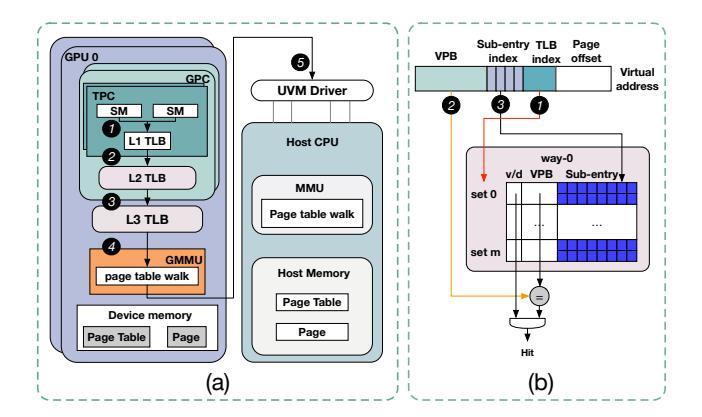
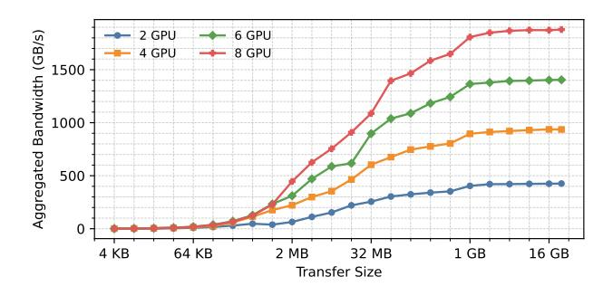
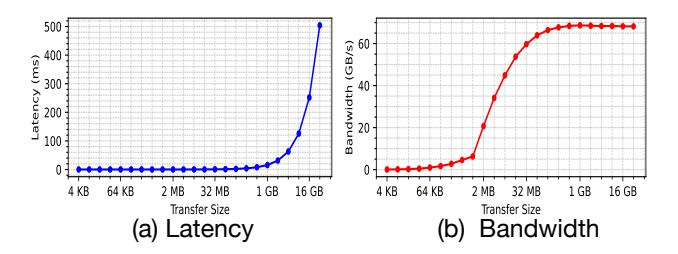
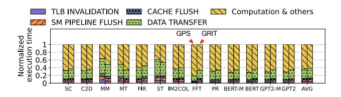
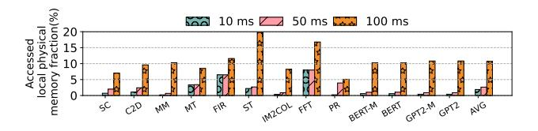
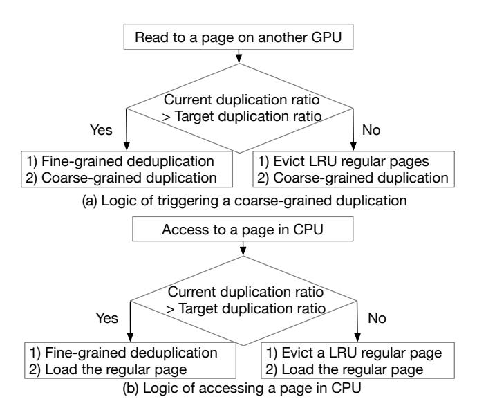
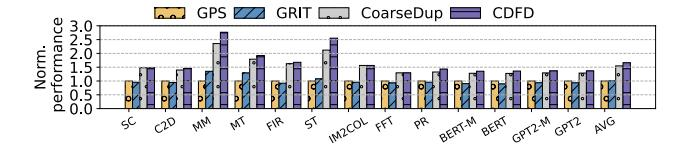
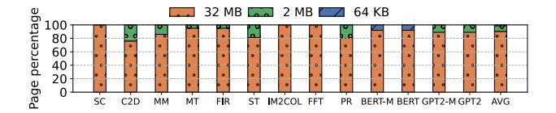
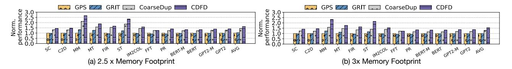
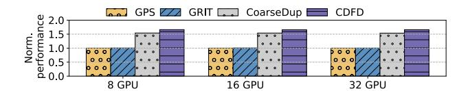

# Coarse-Grained Duplication First, Fine-Grained Deduplication Later: Duplication-Centric Multi-GPU Memory Management

Xiangyue Huang *Computer Science and Engineering University of California, Santa Cruz* Santa Cruz, CA, USA hxiangyu@ucsc.edu

Yanan Guo *Computer Science University of Rochester* Rochester, NY, USA yguo51@cs.rochester.edu

Yuanchao Xu *Computer Science and Engineering University of California, Santa Cruz* Santa Cruz, CA, USA yxu314@ucsc.edu

*Abstract*—Multi-GPU systems have become popular to meet the growing demands for high parallelism and large memory capacity via unified virtual memory (UVM). However, performance is often constrained by non-uniform memory access (NUMA) overheads due to frequent data sharing across GPUs. Prior work adopts fine-grained page migration and duplication to reduce remote access overheads, but our characterization of recent NVLinks shows that such designs fail to fully exploit their capabilities. In particular, nonlinear latency–size scaling, negligible contention, and abundant bandwidth favor coarsegrained transfers. While coarse-grained approaches better utilize NVLink bandwidth, they can introduce excessive remote accesses and update overheads. We propose CDFD, a duplication-centric mechanism that combines coarse-grained duplication to maximize bandwidth utilization with selective fine-grained deduplication to mitigate unnecessary remote updates. By leveraging idle GPU memory capacity and dynamically refining duplication decisions, CDFD balances performance and overhead. Experimental results show that CDFD achieves average performance improvements of 66% and 65% over state-of-the-art methods GPS and GRIT, respectively.

*Index Terms*—GPU, Memory Systems, NVLinks, Unified Virtual Memory

# I. INTRODUCTION

In recent years, multi-GPU systems have emerged as an effective way to narrow the widening gap between limited ondevice memory and the demands of modern applications [19], [21], [36], [41]. Commercial platforms such as NVIDIA DGX [34] and Intel Xe [20] integrate multiple GPUs connected by high-bandwidth interconnects (e.g., PCIe [31] and NVLink [15]). With Unified Virtual Memory (UVM), these systems present a single, aggregated address space that both increases apparent memory capacity and simplifies programming and deployment. Despite this promise, the performance of multi-GPU systems is frequently limited by overheads associated with non-coherent Non-Uniform Memory Access (NUMA) accesses [4], [5], [16]–[18], [30], [42]. When a GPU requires data residing in another GPU's memory, it issues remote accesses; however, due to the absence of cache coherence, these accesses are uncacheable, thereby exposing the full latency of remote memory access.

Recent research has investigated page migration and page duplication as solutions to this problem. Page Migration: Upon a GPU issuing one or more remote accesses to a page residing in another GPU's local memory, the runtime migrates the page to the requesting GPU. Consequently, subsequent accesses from the requesting GPU become local and cacheable, while accesses from the source GPU become remote and uncacheable. Page Duplication: When a GPU issues one or more remote read requests to a page located in another GPU, the runtime duplicates the page into the requesting GPU's local memory. Multiple GPUs can have local and cacheable access to the duplicated page; however, writes to a duplicated page must be broadcast to all GPUs possessing a copy.

However, existing fine-grained approaches for page migration and duplication exhibit inefficiencies on recent NVLinks. These approaches typically migrate or duplicate small-sized pages (e.g., 4KB or 64KB) between GPUs to reduce datatransfer overhead, traffic, and NVLink contention, but they consequently introduce frequent migrations/duplications and associated management overheads (e.g., TLB invalidations). Our characterization of recent NVLink interconnects, including NVLink 3.0 and NVLink 4.0, reveals consistent insights demonstrating that fine-grained designs fail to fully leverage the capabilities of modern NVLink generations. (1) Nonlinear latency–size scaling. Data-transfer latency of recent NVLinks does not scale linearly with transfer size; the latency of transferring 4KB data is similar to that of transferring 32MB data, indicating a negligible reduction in overhead with smaller transfers. Additionally, achieving high NVLink bandwidth requires large transfer sizes; small transfers yield limited bandwidth utilization. (2) Negligible contention. Recent NVLinks exhibit negligible contention within and between links; concurrently copying remote memory from seven GPUs yields a latency and bandwidth similar to copying from a single GPU, demonstrating that fine-grained transfers do not meaningfully mitigate contention. (3) Ample bandwidth headroom. NVLink 3.0 provides high per-link (∼250 GB/s) and aggregate (∼1800 GB/s) bandwidth, and NVLink 4.0 further increases it to 350 GB/s, making traffic reduction from fine-grained designs largely insignificant.

Although a coarse-grained page migration or duplication strategy is advantageous for leveraging recent NVLinks' bandwidth, coarse-grained page migration is assumed to be better. This preference arises from the perception that multi-GPU physical memory is often insufficient for accommodating large application footprints, making data duplication across GPUs undesirable. Nevertheless, coarse-grained migration introduces significant drawbacks; migrating large pages between GPUs converts many local accesses on the source GPU into remote accesses, potentially negatively impacting performance due to increased number of total remote accesses.

We repropose the principle that an application's working set is typically significantly smaller than its overall memory footprint [7], [25], and affirm its continued applicability within the context of multi-GPU memory management. Despite an application's large memory footprint, the working set on each GPU remains comparatively small relative to the GPU's physical memory (see Section III-E). Leveraging the abundant bandwidth provided by recent NVLink, we propose utilizing coarse-grained page duplication across GPUs to exploit spatial locality and reduce page migration overhead.

Based on this insight, we propose a duplication-centric approach named CDFD (Coarse-grained Duplication First, Fine-grained Deduplication Later), consisting of two phases: (1) Coarse-grained Duplication First: Upon a GPU issuing a read request to another GPU's local memory, CDFD duplicates a coarse-grained page containing the requested data to the requesting GPU. This leverages our performance characterization of NVLinks, allowing GPUs with duplicated pages to immediately benefit from efficient local memory access. (2) Fine-grained Deduplication Later: Subsequently, CDFD monitors local accesses and remote updates from other GPUs to these duplicated pages, selecting subpages whose cost exceeds their benefits to perform fine-grained deduplication. This refines coarse-grained duplication at subpage granularity while avoiding fine-grained data transfer overhead.

We design architectural support for CDFD, including a duplicated TLB backed by a duplicated page sharer table to facilitate remote updates across GPUs, an access counter monitor to track local accesses to duplicated pages, and a duplication and deduplication unit that manages page duplication and deduplication operations, performing cost-benefit analyses to identify candidate pages for fine-grained deduplication.

We evaluated CDFD using the MGPUSIM [38] simulator and thirteen benchmarks with various access patterns from four benchmark suites. The results show that CDFD significantly enhances performance, outperforming the SOTA page duplication method, GPS [30] and GRIT [42], by 66% and 65% on average, respectively.

# II. BACKGROUND

# *A. UVM-Enabled Multi-GPU System*

This paper targets UVM-managed, discrete multi-GPU systems in which several GPUs are connected by high-bandwidth links such as PCIe [31] and NVLink [15]. Figure 1 (a) illustrates the baseline architecture. Each GPU comprises multiple streaming multiprocessors (SMs). The L1 TLB is shared between the two SMs within each Texture Processing Cluster (TPC), and the L2 TLB is shared across the SMs of a GPU Processing Cluster (GPC). The L3 TLB is shared across all GPCs. A discrete GPU typically maintains its own local memory and page tables, with page-table walks handled by the GPU Memory Management Unit (GMMU). In UVM-managed multi-GPU systems, the CPU-side UVM driver handles GPU far-faults and maintains a centralized page table, supplying up-to-date translations to all GPUs.

Fig. 1. UVM-managed Multi-GPU overview

Figure 1 (a) illustrates the address translation process. Upon a memory request, the L1 TLB performs a lookup 1 . A miss in the L1 TLB leads to a check in the L1 Miss Status Holding Register (MSHR), and if missing there, the request advances to the L2 TLB 2 . A miss at this level sends the request to the L3 TLB 3 . When an L3 TLB miss happens, GMMU will do page table walks 4 . A failed page walk results in a farfault, reported to the host's UVM driver via interrupt 5 . The driver's centralized page table manages far-faults, ensuring data consistency and tracking pages across GPUs and CPUs.

# *B. NVIDIA TLB Sub-entries*

Traditionally, a TLB entry maps one virtual page to one physical page—a simple one-to-one correspondence, as in the L1 TLBs of recent NVIDIA GPUs (e.g., Ampere). To extend reach, NVIDIA's L2/L3 TLBs partition each entry into subentries [46]. Each entry comprises 16 sub-entries; each subentry maps one page (4KB, 64 KB or 2 MB) within an aligned 32KB, 1 MB or 32 MB region, respectively.

Figure 1 (b) illustrates the process of Lookup with sub-entry TLBs. A virtual address is split into a virtual page number (VPN) and a page offset. The lower bits of the VPN further divide into a TLB index (set selection) and a sub-entry index, while the remaining higher bits form the virtual page base (VPB). On access, the TLB index selects a set 1 , and the VPB from the virtual address is compared against VPB tags stored in that set 2 . If there is a VPB match (an "entry hit"), the sub-entry index selects the corresponding slot 3 ; if that slot is non-zero (valid), the translation hits. If no VPB matches, the access misses and triggers a page-table walk.

On a walk completion, if the page lies within the region already covered by an existing TLB entry, the translation is installed into the corresponding sub-entry slot. If no covering entry exists, the LRU entry is evicted (clearing all 16 subentries), a new entry is allocated for the region.

# *C. Multi-GPU Page Migration and Page Duplication*

When a GMMU miss occurs, a far fault is triggered and handled by the host UVM driver via an interrupt. The runtime resolves the fault by migrating or duplicating the page to the requesting GPU, following prior mechanisms [8], [42]. This process involves (1) flushing in-flight SM instructions, caches, and TLBs of the owning GPU, and (2) migrating or duplicating the page before notifying the requesting GPU.

Migration suffers from ping-pong effects when multiple GPUs share a page. Access-counter–based policies mitigate this by triggering migration only after the access count exceeds a threshold (e.g., 256 on Volta GPUs [35]). However, performance can still degrade due to numerous remote accesses and frequent page-table invalidations [4]. Moreover, migration enforces single-owner placement, causing other GPUs to incur remote accesses until ownership changes.

To reduce these costs for read-mostly data, page duplication replicates pages across GPUs. In traditional schemes [42], duplication occurs on the first remote read, while any write triggers deduplication. Recent systems such as GPS [30] and GRIT [42] improve page placement by selecting between migration and duplication or broadcasting fine-grained updates to subscribers. However, their fine-grained designs underutilize NVLink bandwidth because only small amounts of data (e.g., 4KB–64KB) are transferred per migration or duplication.

# *D. GPU Memory Consistency*

As outlined in previous studies [30], the NVIDIA GPU memory model defines rules governing the perceived ordering of GPU memory operations and the possible values returned by read operations. The most pertinent concepts are the distinction between weak and strong accesses, as well as the scope associated with strong accesses. In essence, sysscoped memory operations or fences are employed to explicitly signal synchronization across GPUs. In contrast, other types of accesses are not required to be visible to, or ordered with, memory operations from different GPUs unless synchronization is enforced through sys-scoped operations.

# III. OBSERVATION AND MOTIVATION

Efficient inter-GPU interconnection technologies, such as NVLink, are critical to achieving high performance in multi-GPU systems. We evaluate the performance of recent generations, including NVLink 3.0 and NVLink 4.0.

# *A. Performance Characterization of NVLink 3.0*

Experiment Setup. We conduct experiments on a two-socket server equipped with eight NVIDIA A100 GPUs (80 GB, SXM4), 1,800 GB of CPU memory, and a 20 TB SSD. The system is configured as an NVIDIA DGX A100 platform interconnected via NVLink 3.0 (Driver Version: 570.148.08, CUDA Version: 12.8). Each NVLink has 300GB/s theoretical peak bandwidth. To evaluate NVLink performance, we utilize the NVIDIA Collective Communications Library (NCCL) [32], which provides inter-GPU communication primitives. NCCL supports five primitives: AllReduce, Broadcast, Reduce, AllGather, and ReduceScatter. We evaluate each primitive across varying data transfer sizes and GPU counts multiple times, presenting a subset of average results due to space limitations.

*1) One-to-N communication:* The NCCL Broadcast operation concurrently copies a buffer from one GPU to N receiver GPUs (where N=1 to 7), forming a one-to-N communication pattern. Figure 2 presents the NCCL Broadcast results for varying transfer sizes and numbers of receiver GPUs. Figures 2 (a) and (e) illustrate the average latency per broadcast operation and bandwidth with one receiver GPU, respectively. Despite the theoretical peak bandwidth of approximately 300 GB/s per NVLink, only large transfers (equal to or larger than 1 GB) approach high bandwidth utilization (around 262 GB/s). Moreover, latency measurements reveal that transferring 4KB incurs latency comparable to transferring 32MB, demonstrating a nonlinear relationship between transfer size and latency.

Figures 2 (b–d) and (f–h) illustrate results obtained with varying numbers of receiver GPUs, which are consistent with those for a single receiver GPU. However, when multiple receiver GPUs are involved, NCCL Broadcast operations may introduce contention at the sender GPU. We observe that the latency for 7 concurrent receiver GPUs increases on average by only 13.27% compared to a single receiver GPU, indicating limited intra-link contention.

We also vary the source GPU (from GPU 0 to GPU 7) as well as combinations of different receiver GPUs, observing similar results across configurations. In addition to evaluating one-to-N communication using the NCCL Broadcast primitive, we evaluate N-to-one communication using the NCCL Reduce primitive, which exhibits results similar to those of NCCL Broadcast.

Takeaway #1: NVLink 3.0 exhibits nonlinear latency-size scaling; transferring 4KB of data incurs latency similar to transferring 32MB, indicating a negligible overhead reduction with smaller transfers.

Takeaway #2: NVLink 3.0 exhibits negligible intra-link contention; concurrently broadcasting data to seven GPUs incurs only a 13.27% latency increase compared to broadcasting to a single GPU.

*2) All-to-All communication:* The NCCL AllReduce operation involves N GPUs, each having a buffer that is concurrently transferred to all other GPUs, forming an N-to-N communication pattern. Figure 3 presents the average latency and per-GPU bandwidth of NCCL AllReduce across varying transfer sizes and GPU counts. The results similarly exhibit nonlinear latency-size scaling. Given that NVLink 3.0 employs

Fig. 2. Average latency (a-d) and bandwidth (e-h) for NCCL Broadcast with 1, 3, 5, and 7 receiver GPUs

Fig. 3. Average latency (a-d) and per GPU bandwidth (e-h) for NCCL AllReduce with 2, 4, 6, 8 receiver GPUs

a crossbar to handle simultaneous requests from multiple GPUs, potential contention could arise with increased concurrent requests. However, our observations show that using 8 GPUs reduces average latency by 9.47% and increases average per-GPU bandwidth by 12.41%, compared to using only 2 GPUs. We attribute this improved performance primarily to the NVLink 3.0 crossbar scheduling algorithm. Regardless, the observed inter-link contention remains negligible across configurations from 2 to 8 GPUs.

**Takeaway #3**: NVLink 3.0 exhibits negligible inter-link contention across configurations from 2 to 8 GPUs.

Fig. 4. The aggregated bandwidth of 2, 4, 6, 8 GPUs using NCCL AllReduce

We further report the aggregated bandwidth obtained using NCCL AllReduce, as shown in Figure 4. NVLink 3.0 en-

ables efficient communication among 8 GPUs, achieving an aggregate bandwidth of up to 1878 GB/s. However, this high bandwidth utilization depends significantly on the data transfer size. Existing page migration and duplication methods employ fine-grained transfers (4KB or 64KB), which, as indicated in Figure 4, achieve only 1.12 GB/s and 17.12 GB/s respectively when using all 8 GPUs.

**Takeaway #4**: NVLink 3.0 provides ample bandwidth headroom for coarse-grained page migration and duplication.

B. Nonlinear Latency-Size Scaling Analysis of NVLink 3.0 using Microbenchmarks

To evaluate whether the nonlinear latency-size scaling behavior persists under UVM that incorporates the full UVM driver overhead, we implement a two-GPU microbenchmark using cudaMemPrefetchAsync(). According to NVIDIA documentation [33], this API executes the full UVM migration path to transfer a memory region from one CPU/GPU to another CPU/GPU, including UVM driver handling and queuing, page table updates on both CPUs and GPUs, and TLB invalidations. Therefore, it captures the full software and MMU overhead associated with UVM memory migration.

This microbenchmark allocates a managed memory region on one GPU using <code>cudaMallocManaged()</code>, with allocation sizes ranging from 4 KB to 32 GB across different runs. After allocation, we invoke <code>cudaMemPrefetchAsync()</code> on the entire region, followed by <code>cudaDeviceSynchronize()</code>, to migrate

the memory region from the source GPU to a target GPU. Migration latency is measured from the prefetch call to synchronization, capturing the full UVM migration cost. Each configuration includes a brief warm-up phase, and results report the average latency and effective bandwidth across multiple runs.

Fig. 5. Average latency (a) and bandwidth (b) results under UVM using cudaMemPrefetchAsync() between two GPUs interconnected via NVLink 3.0

The microbenchmark results obtained using cudaMem-PrefetchAsync() are presented in Figure 5. The results demonstrate nonlinear latency–size scaling when UVM driver overhead, page table updates, and TLB invalidations are included. The measured bandwidth is lower than that of NCCL due to these additional overheads.

Takeaway #5: The nonlinear latency–size scaling behavior persists even when accounting for UVM overhead.

# *C. Performance Characterization of NVLink 4.0*

Experiment Setup: To further validate our findings on NVLink 4.0, we conduct experiments on a two-socket server equipped with eight NVIDIA H100 GPUs (80 GB, SXM5), 1,800 GB of CPU memory, and a 22 TB SSD. The system is configured as an NVIDIA DGX H100 via NVLink 4.0 (Driver Version: 570.195.03, CUDA Version: 12.8). The theoretical peak bandwidth of NVLink 4.0 is 450 GB/s.

Fig. 6. Average latency (a, c) and bandwidth (b, d) for NCCL Broadcast with 1 and 7 receiver GPUs in NVLink 4.0

Fig. 7. Average latency (a, c) and bandwidth (b, d) for NCCL Allreduce with 2 and 8 receiver GPUs in NVLink 4.0

Figure 6 and Figure 7 present a subset of the NVLink 4.0 bandwidth results for NCCL Broadcast and AllReduce across different transfer sizes. The results similarly exhibit nonlinear latency–size scaling. For the NCCL Broadcast workload, the latency with seven concurrent receiver GPUs increases by only 0.11% on average compared to a single receiver, indicating small intra-link contention.

Takeaway #6: NVLink 4.0 also exhibits nonlinear latency-size scaling and negligible intra-link contention.

The superiority of coarse-grained transfers on NVLink arises from two key observations. First, transfer latency is nonlinear with respect to transfer size, making larger transfers more efficient than fine-grained ones. Second, concurrent transfers introduce only limited contention on real devices, further enhancing the effectiveness of coarse-grained duplication. These observations are consistent with prior studies on earlier versions of NVLink [27]. We attribute this behavior to the pipelining and parallelism inherent in the NVLink design. Only when a sufficiently large volume of data is transferred can these mechanisms be effectively utilized, enabling the link to approach its peak bandwidth.

# *D. Limitations of Fine-Grained Migration and Duplication*

Our performance characterization of NVLink shows that fine-grained designs used in existing multi-GPU page migration and duplication are inefficient, due to NVLink's nonlinear latency–size scaling, negligible intra- and inter-link contention, and ample bandwidth headroom. These approaches underutilize available bandwidth and incur significant management overhead (e.g., frequent TLB invalidations) from excessive migrations and duplications.

We quantitatively evaluate these limitations using the MG-PUsim simulator [38] on a 4-GPU system with NVLink 3.0 performance characterization on two state-of-the-art methods: GRIT, a hybrid approach combining on-touch migration, access-count-based migration, and duplication; and GPS,

which exclusively employs page duplication with batched updates. Additional evaluation details are provided in Section V.

Fig. 8. Normalized breakdown

Figure 8 presents the performance breakdown for GPS and GRIT. The page duplication/migration overhead represents the critical-path latency introduced by these operations, including TLB invalidations, SM pipeline flushes, cache flushes, and data transfers. GPS incurs substantial duplication overhead, accounting for an average of 37% of total execution time. Similarly, GRIT relies on page duplication to reduce remote accesses, with duplication/migration overhead representing 38% of total execution time. Despite this, their average bandwidth utilization for page migration is only 0.1 GB/s due to the inefficiency of fine-grained transfers in fully utilizing NVLink bandwidth.

**Takeaway #7**: The fine-grained design used by existing multi-GPU page migration and duplication methods is inefficient due to underutilization of NVLink bandwidth and substantial management overhead.

## E. Accessed GPU Memory Fraction over Time

Fig. 9. The fraction of local accessed physical memory at different execution time portions

To validate that an application's working set is typically much smaller than its total physical memory in multi-GPU environments, we measure how much local memory is accessed during execution in GRIT. Figure 9 shows the fraction of local physical memory accessed over different time intervals (10 ms, 50 ms, and 100 ms). The y-axis indicates the percentage of local GPU memory accessed at least once, with each bar corresponding to a portion of the execution.

As shown, within a 100 ms interval, only a small fraction of GPU memory is accessed (about 11% on average), dropping to roughly 2% and 3% for 10 ms and 50 ms intervals, respectively. Meanwhile, 100 ms is sufficient to transfer several GB of data across GPUs. This reveals substantial underutilization of GPU memory due to the small working set. Therefore, exploiting idle memory capacity together with abundant NVLink bandwidth for coarse-grained duplication is

effective: duplication utilizes unused memory without interfering with the working set, while NVLink enables timely data exchange to keep the working set resident.

**Takeaway #8**: The working set occupies only a small fraction of GPU memory at any time, leaving substantial idle capacity. This, combined with NVLink's high bandwidth, makes coarsegrained page duplication both feasible and effective.

#### IV. DESIGN

#### A. Overview

Based on the aforementioned analysis, we propose a duplication-centric approach named CDFD (Coarse-grained Duplication First, Fine-grained Deduplication Later), consisting of two phases: (1) Coarse-grained Duplication First: Upon a GPU issuing a read request to another GPU's local memory, CDFD duplicates a coarse-grained page containing the requested data to the requesting GPU. This leverages our NVLink 3.0 performance characterization, allowing GPUs with duplicated pages to immediately benefit from efficient local memory access. (2) Fine-grained Deduplication Later: Subsequently, CDFD monitors local accesses and remote updates from other GPUs to these duplicated pages, selecting subpages whose costs exceed their benefits for fine-grained deduplication. This approach enables fine-grained adjustments to coarse-grained duplication without incurring fine-grained data transfer overhead.

Fig. 10. CDFD overview

Figure 10 presents the overview design of CDFD, including a duplicated TLB backed by a duplicated page sharer table to facilitate remote updates across GPUs, an access count monitor to track local accesses to duplicated pages, and a duplication and deduplication unit that manages page duplication and deduplication operations, performing cost-benefit analyses to identify candidate pages for fine-grained deduplication.

## B. High-level Design of CDFD

1) Balancing Duplicated Pages and Regular Pages: A side effect of the duplication-centric approach employed by CDFD is the increased memory consumption resulting from duplicated pages, as such pages occupy local memory that could otherwise be utilized by regular pages to improve overall performance.

The main idea of CDFD is to retain only those pages (regular or duplicated) whose performance benefits outweigh

their associated costs. To facilitate this approach, we introduce two runtime metrics per GPU: (1) the current duplication ratio, calculated as the total size of duplicated pages divided by the GPU local memory; and (2) the target duplication ratio, determined by CDFD to guide subsequent page management decisions.

The target duplication ratio is adaptively adjusted based on the relative benefit of duplicated versus regular pages, using the existing GPU local-page scanning mechanism for identifying Least Recently Used (LRU) pages [4]. The CDFD runtime periodically scans the first several thousand entries of the LRU list to estimate the fraction of duplicated pages, which serves as the sampled duplication ratio. If this ratio exceeds the target, indicating that duplicated pages are less beneficial, the target duplication ratio is decreased. Conversely, if the ratio is below the target, the target duplication ratio is increased. We maintain the current duplication ratio by tracking duplication and deduplication events. Specifically, the CDFD runtime updates the ratio whenever a duplication or deduplication operation is performed, reflecting the current fraction of duplicated pages in the system.

Fig. 11. Logic for handling a read to another GPU (a) or an access to a page in CPU (b) when local GPU memory is full

*2) Logic of Triggering Coarse-Grained Duplication and Fine-Grained Deduplication:* The logic for handling a remote read issued to another GPU when local GPU memory is full is illustrated in Figure 11 (a). Upon issuing a remote read request, the local GPU runtime first checks whether the current duplication ratio exceeds the target duplication ratio. If so, the GPU performs fine-grained deduplication to reduce the duplication ratio by converting duplicated pages back to regular pages, until sufficient space is available and the ratio falls below the target. It then performs coarse-grained duplication of a large page from the remote GPU, ensuring that the post-duplication current duplication ratio remains within the target bound.

If the ratio does not exceed the target, the GPU evicts LRU regular pages to create space and directly performs coarse-grained duplication, which increases the duplication ratio. Fine-grained deduplication and coarse-grained duplication form a feedback mechanism that dynamically decreases or increases the duplication ratio to maintain it within the target.

The logic for handling an access to a CPU-resident page when local GPU memory is full is illustrated in Figure 11(b). Upon receiving a far-fault for a page residing in the CPU, the local GPU runtime first checks whether the current duplication ratio exceeds the target duplication ratio. If this ratio is exceeded, the GPU initiates fine-grained deduplication within its local memory until adequate space becomes available, ensuring that after loading the regular page, the current duplication ratio remains at or below the target duplication ratio. Subsequently, regular page loading proceeds. If the ratio is not exceeded, the GPU evicts LRU regular pages until sufficient memory is freed to accommodate the new page.

Fig. 12. Workflow of fine-grained deduplication

*3) Fine-Grained Deduplication:* Leveraging the performance characterization of NVLinks, coarse-grained duplication is performed at a granularity of 32MB 1 , while finegrained deduplication is executed at granularities of either 2MB or 64KB. This design choice aligns with NVIDIA's TLB architecture, which supports multiple page sizes with subentries, including 32MB, 1MB, and 64KB [46]. Figure 12 illustrates the workflow of fine-grained deduplication. After a 32MB page finishes a coarse-grained duplication 1 , the system monitors access patterns of each 2MB sub-entry 2 . Upon triggering fine-grained deduplication, the 2MB sub-entry demonstrating the lowest performance benefit is selected for

1We choose 32 MB because one NVIDIA TLB entry supports up to a 32 MB range.

deduplication, removing this 2MB page from the GPU's local memory. Subsequent accesses to this page from this GPU require remote accesses to another GPU having this 2MB page. The performance benefit is computed by subtracting the remote update count from the local access count; pages with lower resulting values are prioritized for deduplication ③. Once more than half of the 32MB page has been deduplicated, the 32MB page is split into multiple 1MB pages ④. Thereafter, the system continues to monitor accesses to each 64KB entry within these 1MB pages, selecting the 64KB entry with the lowest performance benefit for deduplication when subsequent deduplication events occur ⑤.

#### C. Detailed Architecture Design of CDFD

We present the detailed architectural design as follows: Section IV-C1 describes handling of writes to duplicated pages; Section IV-C2 outlines the triggering of duplication and deduplication with cost-benefit analysis; and Section IV-C3 explains how the access count monitor assists in cost-benefit analysis for fine-grained deduplication.

1) Duplicated TLB and In-memory Duplicated Page Sharer Table: For a duplicated page, if a GPU issues writes to this page, this GPU needs to send remote updates to GPUs also have this page's duplication. To know which GPU has the duplication of each duplicated page, we adopt the duplication implementation in GPS [30].

Fig. 13. Workflow of remote update

The workflow is illustrated in Figure 13. The page table uses a 1-bit flag to indicate whether a page is duplicated. We introduce a duplicated TLB and a corresponding in-memory sharer table to track GPUs holding duplicated copies, identified by their Physical Frame Numbers (PFNs). Each entry, indexed by Virtual Page Number (VPN), stores up to seven PFNs.

When the L1 TLB identifies a write request to a duplicated page, it forwards this request to the duplicated TLB, which stores corresponding PFNs of all GPUs sharing that page ①. If a translation miss occurs in the duplicated TLB, a page walk is performed in the in-memory duplicated page sharer table ②. Upon locating the required entry, the duplicated TLB is updated accordingly ③. Subsequently, the duplicated TLB sends remote update requests containing physical addresses of the sharer GPUs to the GMMU ④. Finally, the GMMU issues remote write requests to the corresponding GPUs ⑤. These operations are off the critical path for regular memory accesses, as they only occur when performing remote updates triggered by writes to duplicated pages. The in-memory duplicated page sharer table and duplicated TLB entries are updated upon duplication or deduplication of pages.

2) Duplication and Deduplication Unit (DDU): We design the Duplication and Deduplication Unit (DDU) to implement the logic described in Section IV-B2, triggering duplication and deduplication based on cost-benefit analysis. The DDU includes a Candidate Deduplication Buffer (CDB) that tracks pages receiving frequent remote updates from other GPUs, combining this information with local access statistics provided by the access counter monitor. These tracked pages represent candidates for fine-grained deduplication. The DDU incorporates a runtime component to manage local GPU far-faults and initiate duplication and deduplication requests.

Fig. 14. Workflow of duplication and deduplication unit

Figure 14 illustrates the workflow of utilizing the Duplication and Deduplication Unit (DDU). Far-faults that lead to remote reads to another GPU are forwarded to the DDU runtime **1**. If, after duplicating the 32MB page containing the requested data, the GPU's local memory has a current duplication ratio equal to or below the target duplication ratio, the duplication request of duplicating the 32MB page containing the data of this remote read is sent to the UVM runtime, and LRU regular pages are evicted to CPU memory if necessary **2**. If the current duplication ratio exceeds the target duplication ratio after duplication, a deduplication request is sent to the CDB, which returns access information **3**. Subsequently, the DDU runtime issues deduplication requests based on a cost-benefit analysis. These requests are propagated to other GPUs to update their duplicated page sharer tables. Additionally, the local page table and duplicated page sharer table are updated by removing entries corresponding to deduplicated pages. After deduplication, the DDU runtime duplicates the 32MB page associated with the remote read **4**. Concurrently, the DDU runtime manages duplication and deduplication requests originating from other GPUs, forwarded via the UVM runtime, to ensure updates to local page tables and duplicated page sharer tables **3**. The CDB records the number of updates from remote GPUs to duplicated pages 6 and periodically synchronizes with the access count monitor to retrieve local access information for duplicated pages **1**.

a) Candidate Deduplication Buffer (CDB): The CDB records duplicated pages that receive frequent updates from remote GPUs along with their access information, facilitating cost-benefit analyses to identify suitable candidates for deduplication. The benefit is computed by subtracting the remote update count from the local access count; pages with lower resulting values are prioritized for deduplication. To achieve

a space-efficient structure for recording access details and supporting fine-grained deduplication, we design the CDB in a sub-entry format, inspired by the sub-entry architecture utilized in GPU TLB designs [46].

Fig. 15. Design and workflow of CDB

As illustrated in Figure 15, the CDB tracks both 32MB pages comprising 16 2MB sub-entries, and 1MB pages comprising 16 64KB sub-entries. The CDB is indexed by the 36-bit VPNs of these 32MB or 1MB pages, maintaining a 12-bit total remote update count per entry. Each sub-entry includes an 8-bit local access count, an 8-bit remote update count, and a valid bit indicating whether the sub-entry has been deduplicated. The CDB leverages information from the original page table to construct its entries.

The workflow of the CDB is as follows: Remote updates from other GPUs are forwarded to the CDB and matched against VPNs to locate the corresponding entries. If an entry is not found, it is constructed from the page table. If the CDB is full, the entry with the lowest total remote update count is evicted **①**. Subsequently, the remote update count for the corresponding sub-entry is incremented by one **2**, and the total remote update count is similarly incremented by one **3**. When the DDU runtime issues a request to retrieve deduplication information, the CDB provides the stored access data to the DDU runtime **4**. The DDU runtime then calculates the benefit metric by subtracting the remote update count from the local access count and deduplicates pages with the lowest resulting values until sufficient space is freed to accommodate a new duplicated or regular page **5**. The access count monitor periodically sends local access counts to the CDB to refresh its corresponding sub-entries, while the CDB communicates the VPNs of its sub-entries to the access count monitor for local-access tracking 6.

3) Access Count Monitor: To ensure accurate local access information and facilitate an effective cost-benefit analysis for deduplication, we introduce the Access Count Monitor, which tracks local accesses to duplicated pages exhibiting the highest total remote update counts. These access counts are periodically communicated to the CDB, while the set of monitored VPNs is periodically updated based on information from the CDB.

Figure 16 illustrates the design and workflow of the Access Count Monitor. Each entry contains a 36-bit monitored VPN and an 8-bit access counter tracking accesses to the corresponding page. The monitored VPNs within the Access Count Monitor identify which entries to update in the CDB, as entries in the CDB may be evicted.

Fig. 16. Design and workflow of access count monitor

All L1 TLB accesses originating from any SM on a GPU are forwarded to that GPU's Access Count Monitor. Each access provides a Virtual Address (VA), from which the VPN is extracted ①. The VPN is then compared with the monitored VPNs; upon a successful match, the corresponding access counter is incremented ②.

Periodically, the monitored VPNs and their associated access counters are sent to the CDB for synchronization . Each VPN from the Access Count Monitor is compared against each entry in the CDB . If a monitored VPN matches an entry in the CDB, the corresponding sub-entry's local access counter in the CDB is updated by shifting its previous value right by one bit and adding the new count from the Access Count Monitor, integrating both long-term and short-term access patterns. The remote update count is similarly right-shifted by one bit . Subsequently, the set of sub-entry VPNs currently stored in the CDB replaces the previous monitored VPNs, updating the Access Count Monitor for the next monitoring period .

#### D. Handling Sys-scoped Writes

To maintain coherence across all GPUs, system-scoped (sys-scoped) writes must be consistently ordered and visible. Following the approach used in prior work [30], our design handles sys-scoped stores in a manner similar to how UVM manages updates to pages marked with the cudaMemAdviseSetReadMostly hint. When a sys-scoped write targets a page that exists in multiple copies, the access triggers a fault. At this point, any ongoing accesses to that page are flushed, and the replicated copies are merged into a single authoritative version. From then on, all accesses to that page are redirected to the GPU owning this consolidated physical copy. This mechanism preserves both coherence and same-address ordering for the current operation as well as all subsequent accesses to that page.

#### E. Area Overhead analysis

TABLE I HARDWARE OVERHEAD COMPARISON

| Category                        | Baseline (Coarse- Grained Only) | Hybrid CDFD                  |
|---------------------------------|---------------------------------------|------------------------------|
| Duplicated TLB storage          | Not required                          | 1,152 B                      |
| CDB storage                     | Not required                          | 10,240 B                     |
| Access count monitor storage    | Not required                          | 1,408 B                      |
| Total on-chip storage per GPU   |                                       | 12,800 B                     |
| Tag compare / match logic       | Not required                          | 36.9K NAND2-eq. gates        |
| Eviction logic (min-reduction)  | Not required                          | 20K-38K NAND2-eq. gates      |
| Counter storage and logics      | Not required                          | 10K-40K NAND2-eq. gates      |
| Total additional logic overhead | 0                                     | 66.9K-114.9K NAND2-eq. gates |

*1) Area Overhead:* The following estimates the hardware overhead of the hybrid design relative to a baseline that uses only the coarse-grained scheme. Our design integrates the duplicated TLB, CDB and access count monitor as on-chip components, requiring a total of 12,800 bytes of storage per GPU. The duplicated TLB includes 32 entries, each with a 36-bit VPN and seven 36-bit PFNs, totaling 1,152 bytes. The CDB contains 256 entries, each consisting of a 36-bit VPN, a 12-bit total remote update count and sixteen 17-bit sub-entries, totaling 10,240 bytes. The access count monitor features 256 entries, each equipped with a 36-bit VPN and an 8-bit access counter, totaling 1,408 bytes.

We estimate the additional logic required to support CDFD following prior methodology [10]. Tag comparison involves 256 × 36-bit matches (9,216 bit comparisons), each requiring an XNOR (∼4 NAND2-equivalent gates), totaling ∼36.9K gates. Eviction is implemented as a minimum-reduction over 256 12-bit values, costing ∼20K–38K gates. Counter updates and bookkeeping (e.g., counter increments, valid bits, and request management) add another 10K–40K gates [10]. Overall, CDFD incurs ∼66.9K–114.9K NAND2-equivalent logic gates.

*2) Implementation of Access Count Monitor using existing per-page Access Counters:* The Access Count Monitor module only needs to track each page's local access count, a feature already supported in recent NVIDIA GPUs [17], [26]. Existing per-page access counters are implemented using 32-bit registers and are automatically updated by the GMMU on every local memory access during TLB lookup. These counters can be retrieved through existing UVM driver functions such as fetch\_access\_counter\_buffer\_entries(). Supporting the Access Count Monitor in CDFD requires only a minor extension to the existing per page tracking mechanism.

# V. EVALUATION METHODOLOGY

Simulator: We conduct experiments using the industryvalidated MGPUsim simulator [38], following prior work on multi-GPU systems [8], [23], [24], [42]. We target a 4-GPU system, where each GPU maintains its own local page table and GMMU. Configurations are summarized in Table II.

| TABLE II                         |
|----------------------------------|
| BASELINE MULTI-GPU CONFIGURATION |

| Module            | Configuration                                                                                                    |
|-------------------|------------------------------------------------------------------------------------------------------------------|
| SM                | 1.0 GHz, 108 per GPU                                                                                             |
| L1 D-Cache        | 64 KB, 4-way                                                                                                     |
| L1 I-Cache        | 32 KB, 4-way                                                                                                     |
| L2 Cache          | 2 MB, 8-way                                                                                                      |
| DRAM              | 2 GB                                                                                                             |
| L1 TLB            | 16 entries, 16-way, 1-cycle lookup latency, TPC shared, LRU replacement policy                                |
| L2 TLB            | 128 entries, 8-way, 16 sub-entries per entry, 10-cycle lookup latency, GPC shared, LRU replacement policy  |
| L3 TLB            | 1024 entries, 8-way, 16 sub-entries per entry, 40-cycle lookup latency, GPU shared, LRU replacement policy |
| Page Table Walk   | GMMU 8 shared page table walkers, 100-cycle latency per level                                                 |
| Inter-GPU Network | NVLink 3.0 latency                                                                                               |
|                   | across different transfer sizes in Section III-A                                                                 |
| CPU-GPU Network   | 128 GB/s PCIe-v5                                                                                                 |

Applications and Workloads: Following prior work on multi-GPU page migration [8], [42], we use thirteen applications with various multi-GPU memory access and page sharing patterns from AMDAPPSDK [6], Hetero-Mark [39], SHOC [11], and DNN-MARK [13] benchmark suites as listed in Table III. We use the default input sets of these applications for evaluation.

TABLE III BENCHMARK INFORMATION

| Abbr.  | Application            | Memory Footprint (per GPU) | Access Pattern |
|--------|------------------------|-------------------------------|-------------------|
| SC     | Simple Convolution     | 1024 MB                       | Adjacent          |
| C2D    | Convolution 2D         | 736 MB                        | Adjacent          |
| MM     | Matrix Multiplication  | 512 MB                        | Scatter-Gather    |
| MT     | Matrix Transpose       | 1024 MB                       | Scatter-Gather    |
| FIR    | Finite Impulse Resp.   | 1216 MB                       | Adjacent          |
| ST     | Stencil 2D             | 512 MB                        | Adjacent          |
| IM2COL | Image To Column        | 640 MB                        | Scatter-Gather    |
| FFT    | Fast Fourier Transform | 384 MB                        | Scatter-Gather    |
| PR     | Page Rank              | 1024 MB                       | Random            |
| BERT-M | BERT Mini              | 2176 MB                       | Mixed             |
| BERT-B | BERT Base              | 8704 MB                       | Mixed             |
| GPT2-M | GPT-2 Mini             | 2080 MB                       | Mixed             |
| GPT2   | GPT-2                  | 6272 MB                       | Mixed             |

Compared Related Work: We compare two state-of-the-art methods along with a coarse-grained duplication baseline: (1) GPS [30], which employs a subscription-based model for page duplication with batched remote write updates; (2) GRIT [42], which dynamically selects among on-touch migration, counter-based migration, and duplication strategies; and (3) CoarseDup, our method that only employs coarsegrained duplication with remote updates, leveraging insights from our NVLink 3.0 performance characterization.

# VI. EVALUATION

# *A. End-to-End Performance*

Figure 17 displays the normalized end-to-end performance across two related works and one ablation setting. Our approach yields performance improvements of 66%, 65% and 8% over GPS, GRIT and CoarseDup, respectively. These results underscore our method's effectiveness in optimizing page duplication strategies and improving overall performance.

Fig. 17. End-to-end performance results relative to GPS

These performance gains primarily stem from our design's ability to reduce duplication overhead by duplicating large chunks of data at once, rather than issuing frequent small migrations. For example, in the FIR benchmark, our method outperforms GRIT and GPS by 67% and 82%, respectively, while reducing duplication overhead by more than 99%. FIR shows a spatial locality access pattern, where coarse duplication amortizes the duplication cost and avoids repeated transfers

#### B. Detailed Analysis

Fig. 18. Performance breakdown normalized to GPS

1) Performance Breakdown: Figure 18 provides a detailed breakdown of each method, where remote access overhead represents the execution time incurred by remote memory accesses. GPS suffers from significant duplication overheads (37% on average) due to its fine-grained approach, while still leaving 3% of execution time to remote accesses. GRIT attempts to reduce remote accesses through additional duplications and migrations, but this increases the costs even further (38% of time). CoarseDup, which duplicates at a large granularity, reduces duplication overhead but introduces high remote access overhead (11%) because many unnecessary pages are duplicated and subsequently updated. In contrast, CDFD first leverages coarse-grained duplication to maximize bandwidth utilization and minimize transfer overhead, and then applies fine-grained deduplication to reduce unnecessary updates. As a result, CDFD reduces the combined overhead of migration, duplication and remote accesses by 92% compared to GPS, 92% compared to GRIT, and 58% compared to CoarseDup.

Fig. 19. The percentage of different duplicate page sizes in CDFD

- 2) Duplicate page percentage: Figure 19 presents the distribution of duplicate page sizes in CDFD. On average, 32 MB pages account for about 91% of duplicate pages and the presence of 2 MB (8%) and 64 KB (1%) pages demonstrates the role of the fine-grained deduplication later phase in selectively mitigating the side effects of coarse-grained duplication. For example, in ST, intensive write synchronization triggers more deduplication, increasing the share of 2 MB pages to around 20%. This adaptive distribution demonstrates that CDFD successfully balances coarse duplication with fine-grained adjustments.
- 3) Duplication ratio: The duplication ratio represents the percentage of duplicated pages in DRAM. Figure 20 illustrates the duplication ratio of CDFD. On average, CDFD maintains a duplication ratio of about 24%, effectively balancing the benefits of shared data locality with the cost of unnecessary remote updates. For benchmarks with a high degree of

Fig. 20. Average duplication percentage relative to memory footprint

data sharing, such as ST, PR, and MT, the ratio approaches 20–30%, reflecting the effectiveness of the coarse-grained duplication-first phase in capturing widely accessed pages. Conversely, applications like FIR exhibit much lower ratios, as most of their pages are private rather than shared; in this case, CDFD's fine-grained deduplication ensures that duplication overhead remains limited. These results confirm that the two-phase design adapts to diverse access patterns: coarse-grained duplication maximizes local accesses when sharing is high, while fine-grained deduplication prevents wasteful duplication when sharing is low.

Fig. 21. Migration / Duplication times in log scale

- 4) Migration / Duplication times: Figure 21 shows the total number of migrations and duplications across all methods. Performance is strongly correlated with the total number of migrations/duplications. By prioritizing coarse-grained duplication, CDFD drastically reduces transfer frequency and associated overheads, achieving an average reduction of over 99% compared to GPS and GRIT.
- 5) Coherence Traffic: To quantify the benefits and overhead of maintaining coherence for coarse-grained duplicated pages across GPUs, we measure both the total coherence traffic (i.e., the number of coherence broadcasts) and the useless coherence traffic for each duplicated 32 MB page, from its initial duplication until it is split into 1 MB pages or until program termination. A coherence broadcast is classified as useless if none of the duplicated pages on other GPUs that contain the broadcasted cache line access the updated cache line before the next broadcast to the same cache line or before eviction of the page containing that cache line.

Table IV reports the average total and useless broadcast counts per duplicated 32 MB page in CDFD. On average, each 32 MB page incurs 21,565 total coherence broadcasts, of which 6,844 are classified as useless. Thus, over 68% of the coherence traffic is useful. This efficiency arises because CDFD promptly deduplicates pages that experience more coherence updates than local accesses, limiting useless coherence traffic.

6) Power Overhead: We model the main additional power consumption of the CDFD design as follows. We use CACTI [40] at 32 nm to estimate the energy consumption

Fig. 22. End-to-end performance results relative to GPS under (a) 2.5× memory footprint (b) 3.0× memory footprint

TABLE IV
AVERAGE BROADCAST COUNTS FOR DUPLICATED 32 MB PAGES

|         | SC    | C2D   | MM     | MT    | FIR    | ST    | IM2COL |
|---------|-------|-------|--------|-------|--------|-------|--------|
| Total   | 10670 | 20987 | 10836  | 16365 | 13271  | 58770 | 45934  |
| Useless | 740   | 3576  | 2236   | 9027  | 894    | 9826  | 10829  |
|         | FFT   | PR    | BERT-M | BERT  | GPT2-M | GPT-2 | AVG    |
| Total   | 11007 | 9544  | 11281  | 45110 | 6651   | 19921 | 21565  |
| Useless | 11007 | 7825  | 5253   | 21001 | 1700   | 5061  | 6844   |

of the Access Count Monitor and Candidate Deduplication Buffer, which is 0.00998 nJ per access. The total energy consumption is calculated by multiplying the total number of accesses by the energy per access. For NVLink-related operations, we use the average energy consumption reported by NVIDIA [29], which is 1.3 pJ per bit. This value is used to model the energy consumption of coherence broadcasts caused by writes on duplicated pages as well as page duplication overhead, based on the total volume of transferred data. The additional average power is calculated by dividing the additional energy by the program execution time.

TABLE V ADDITIONAL POWER OVERHEAD

| Application Name                                                                                                                          | SC                            | C2D                           | MM                    | MT                  | FIR                   | ST                  | IM2COL                       |
|-------------------------------------------------------------------------------------------------------------------------------------------|-------------------------------|-------------------------------|-----------------------|---------------------|-----------------------|---------------------|------------------------------|
| Access Count Monitor and                                                                                                                  |                               |                               |                       |                     |                       |                     |                              |
| Candidate Deduplication Buffer (µJ)                                                                                                       | 22.0                          | 44.7                          | 29.7                  | 2.07                | 45.6                  | 14.7                | 13.4                         |
| Duplication (mJ)                                                                                                                          | 20.9                          | 81.7                          | 5.58                  | 12.6                | 29.7                  | 9.07                | 9.07                         |
| Coherence Broadcast (mJ)                                                                                                                  | 0.43                          | 3.27                          | 0.12                  | 0.39                | 0.75                  | 1.02                | 0.79                         |
| CDFD Average Power Increase (Watt)                                                                                                        | 10.91                         | 13.35                         | 0.94                  | 3.58                | 13.61                 | 0.72                | 3.73                         |
| CoarseDup Coherence Broadcast (mJ)                                                                                                        | 0.43                          | 5.83                          | 5.03                  | 1.20                | 4.69                  | 12.48               | 0.79                         |
| CoarseDup Average Power Increase (Watt)                                                                                                   | 10.90                         | 13.16                         | 1.48                  | 3.54                | 14.89                 | 1.27                | 3.73                         |
|                                                                                                                                           |                               |                               |                       |                     |                       |                     |                              |
| Application Name                                                                                                                          | FFT                           |                               | BERT-M                |                     |                       | GPT-2               | AVG                          |
| Application Name Access Count Monitor and                                                                                              |                               |                               | BERT-M                |                     |                       | GPT-2               |                              |
|                                                                                                                                           | FFT                           |                               | <b>BERT-M</b> 0.613   |                     |                       | GPT-2 1.49       |                              |
| Access Count Monitor and                                                                                                                  | FFT                           | PR                            |                       | BERT                | GPT2-M                |                     | AVG                          |
| Access Count Monitor and Candidate Deduplication Buffer (µJ) Duplication (mJ) Coherence Broadcast (mJ)                                    | <b>FFT</b> 0.92               | PR 0.613                   | 0.613                 | 12.6                | <b>GPT2-M</b> 12.6 | 1.49                | 15.5 36.0 1.69         |
| Access Count Monitor and Candidate Deduplication Buffer (μJ) Duplication (mJ) Coherence Broadcast (mJ) CDFD Average Power Increase (Watt) | 0.92 2.44 0.05 10.75 | 0.613 5.58 0.10 0.11 | 0.613 37.7         | 12.6 113         | 12.6 35.2          | 1.49                | 15.5 36.0 1.69 5.58 |
| Access Count Monitor and Candidate Deduplication Buffer (µJ) Duplication (mJ) Coherence Broadcast (mJ)                                    | 0.92 2.44 0.05 10.75 | PR 0.613 5.58 0.10   | 0.613 37.7 0.81 | 12.6 113 9.73 | 12.6 35.2 0.45  | 1.49 106 4.02 | 15.5 36.0 1.69         |

Table V reports the additional energy consumption and average power overhead introduced by the CoarseDup and CDFD design over the entire benchmark execution. On average, CDFD incurs an additional 5.58 W of power, while CoarseDup incurs an additional 5.74 W of power. Page duplication accounts for the majority of the additional energy consumption and contributes most significantly to the power overhead. Benchmarks such as BERT and C2D exhibit intensive page sharing across GPUs, which leads to higher page duplication and therefore greater power overhead. In contrast, benchmarks such as FFT and PR share only a small number of pages across GPUs, resulting in fewer duplications and correspondingly lower additional power consumption.

#### C. Sensitive Study

1) Evaluation Using Larger Memory Footprints: To evaluate the robustness of CDFD under larger memory footprints, including cases where application memory demand exceeds total physical GPU memory, we evaluate CDFD at  $2.5\times$  and  $3\times$  memory footprints. We induce memory oversubscription by scaling the input sizes of applications, following prior work [8], [43]. For these workloads, memory footprint increases approximately proportionally with input size. We measure the actual memory footprint of programs after scaling the input sizes. At  $2.5\times$  inputs, four additional benchmarks (SC, MT, FIR, PR) exceed the total physical GPU memory compared to the default  $(1\times)$  configuration. At  $3\times$  inputs, one more benchmark (C2D) exceeds GPU memory compared to the  $2.5\times$  configuration.

Figure 22 (a) presents the results for the  $2.5\times$  memory footprint. On average, CDFD outperforms GPS, GRIT, and CoarseDup by 63%, 58%, and 13%, respectively. These results indicate that CDFD remains effective under increased memory pressure and highlight the benefits of leveraging coarsegrained duplication. Figure 22 (b) shows the results for the  $3\times$  memory footprint. On average, CDFD surpasses GPS, GRIT, and CoarseDup by 55%, 53%, and 21%, respectively. The consistent performance gains demonstrate that CDFD maintains strong efficiency under extreme memory pressure and underscore the advantages of its extended design beyond CoarseDup.

Fig. 23. Average performance with 8, 16, and 32 GPUs relative to GPS

2) Performance with Different Numbers of GPUs: We evaluate CDFD using systems equipped with 8, 16 and 32 GPUs to demonstrate our design's generality. We proportionally increase the workload size to scale up to 2, 4 and 8 [43]. As shown in Figure 23, CDFD achieves significant performance improvements, 66%, 65% and 8% over GPS, GRIT and CoarseDup, respectively, in the 8-GPU configuration. In the 16-GPU setup, the gains remain substantial at 66%, 64% and 8%, respectively. In the 32-GPU setup, CDFD still outperforms other methods, 66%, 66% and 8% over GPS, GRIT and CoarseDup. These results demonstrate CDFD's effectiveness across environments with more GPUs.

# *D. Evaluation with NVLink 4.0*

Fig. 24. End-to-end performance results under NVLink 4.0 Setting

To further demonstrate the generality of CDFD across different NVLink generations, we conduct experiments using NVLink 4.0 characterization results obtained from a real device in Section III-C, including measurements of data transfer latency from 4 KB to 32 MB payloads.

Figure 24 presents the results. CDFD achieves performance improvements of 56%, 52%, and 7% compared with GPS, GRIT, and CoarseDup, respectively. These results highlight the generality of CDFD in enhancing page duplication strategies and delivering measurable performance gains on NVLink 4.0, which provides lower latency and higher bandwidth than NVLink 3.0.

# VII. DESIGN CHOICE AND COST-BENEFIT ANALYSIS

#### TABLE VI ADVANTAGES OF CDFD OVER COARSEDUP

| Method | Performance under memory-sufficient conditions | Performance under oversubscription | Average Power Increase | Area and Space Overhead |  |
|--------|------------------------------------------------------|---------------------------------------|---------------------------|----------------------------|--|
|        | CoarseDup 1.55× over baseline                        | 1.28× over baseline                   | 5.74 Watt                 | None                       |  |
| CDFD   | 1.66× over baseline                                  | 1.55× over baseline                   | 5.58 Watt                 | 12800 B                    |  |

To leverage our insights about NVLink, including nonlinear latency–size scaling, negligible intra- and inter-link contention, and ample bandwidth headroom, we consider two designs: CoarseDup (coarse-grained duplication only) and CDFD (our full design). Table VI presents a cost–benefit comparison.

From a performance robustness perspective, CDFD consistently outperforms CoarseDup under both memorysufficient and oversubscribed settings. Under sufficient memory, CDFD achieves a 1.66× speedup over the baseline, compared to 1.55× for CoarseDup. The advantage becomes more pronounced under oversubscription (1.55× vs. 1.28×), demonstrating stronger robustness under memory pressure. This robustness stems from CDFD's adaptive feedback mechanism, which dynamically regulates the duplication ratio based on runtime conditions. From a memory utilization and power perspective, CDFD also compares favorably. By incorporating fine-grained deduplication, it avoids retaining low-benefit duplicated pages, improving effective GPU memory utilization and reducing redundant duplication and eviction. As a result, CDFD slightly lowers power overhead (5.58 W vs. 5.74 W), showing that its performance gains do not come at higher energy cost. From a hardware cost perspective, CDFD introduces only modest overhead. Unlike CoarseDup, which requires no additional storage, CDFD incurs an extra 12,800 B of storage. This cost is negligible relative to modern GPU resources, especially given its performance benefits.

Overall, CDFD provides a better tradeoff than CoarseDup, achieving higher performance, improved robustness and utilization, slightly lower power overhead, and minimal hardware cost.

# VIII. RELATED WORK

In addition to the related work discussed in Section II and Section III, this section covers other related studies.

GPU Page Placement. Prior research [1]–[3], [8], [9], [12], [43] has explored various strategies to improve page placement. Dashti et al. [12] mitigate congestion and remote latency via interleaving, replication, and migration. Agarwal et al. [3] dynamically identify hot and cold pages to guide placement in hybrid memory systems. Griffin [8] classifies pages based on runtime access patterns to reduce flushing overhead and enable faster migration. OASIS [43] detects object access patterns and selects page management policies at runtime. Overall, prior work focuses on optimizing *where* pages should be placed by improving placement decisions and reducing migration overhead. In contrast, CDFD leverages NVLink characteristics to optimize *how* pages are duplicated and managed across GPUs.

Disaggregated Memory Page Migration. Prior work [14], [22], [28], [44], [45] studies page migration in tiered memory systems. Nimble [45] provides OS-integrated multi-level memory management using existing page tracking. AIFM [37] exposes application semantics to improve migration efficiency. TPP [28] enables application-transparent placement in CXL systems by promoting hot pages and demoting cold ones. Nomad [44] mitigates thrashing via transactional migration and page shadowing. Memtis [22] leverages runtime access distributions and adaptive page sizes to improve fast-tier utilization. These approaches focus on *where* pages reside across memory tiers, and are complementary to CDFD, which instead focuses on *how* pages are duplicated and shared across GPUs to improve inter-GPU data access efficiency.

# IX. CONCLUSION

Given the growing demands of multi-GPU applications, efficient page management is critical. In this paper, we characterized recent NVLinks and demonstrated that existing finegrained migration and duplication strategies fail to exploit its properties. We introduced CDFD, a duplication-centric mechanism that combines coarse-grained duplication with selective fine-grained deduplication. Our comprehensive evaluations across diverse benchmarks show that CDFD significantly improves performance, outperforming GPS and GRIT by 66% and 65% on average, respectively.

# ACKNOWLEDGMENT

We sincerely thank the anonymous reviewers from ISCA 2026 for their insightful feedback. This work is supported in part by the National Science Foundation (NSF) under Grant No. CNS-2350230, IIS-2543427, and OAC-2530649. Any opinions, findings, or recommendations expressed in this material are those of the authors and do not necessarily reflect the views of NSF.

# REFERENCES

- [1] N. Agarwal, D. Nellans, M. O'Connor, S. W. Keckler, and T. F. Wenisch, "Unlocking bandwidth for gpus in cc-numa systems," in *2015 IEEE 21st International Symposium on High Performance Computer Architecture (HPCA)*, 2015, pp. 354–365.
- [2] N. Agarwal, D. Nellans, M. Stephenson, M. O'Connor, and S. W. Keckler, "Page placement strategies for gpus within heterogeneous memory systems," *SIGPLAN Not.*, vol. 50, no. 4, p. 607–618, Mar. 2015. [Online]. Available: https://doi.org/10.1145/2775054.2694381
- [3] N. Agarwal and T. F. Wenisch, "Thermostat: Application-transparent page management for two-tiered main memory," *SIGPLAN Not.*, vol. 52, no. 4, p. 631–644, Apr. 2017. [Online]. Available: https://doi.org/10.1145/3093336.3037706
- [4] T. Allen and R. Ge, "Demystifying gpu uvm cost with deep runtime and workload analysis," in *2021 IEEE International Parallel and Distributed Processing Symposium (IPDPS)*, 2021, pp. 141–150.
- [5] ——, "In-depth analyses of unified virtual memory system for gpu accelerated computing," in *Proceedings of the International Conference for High Performance Computing, Networking, Storage and Analysis*, ser. SC '21. New York, NY, USA: Association for Computing Machinery, 2021. [Online]. Available: https://doi.org/10.1145/3458817. 3480855
- [6] AMD, *AMD APP SDK OpenCL Optimization Guide*, 2015.
- [7] R. Ausavarungnirun, J. Landgraf, V. Miller, S. Ghose, J. Gandhi, C. J. Rossbach, and O. Mutlu, "Mosaic: a gpu memory manager with application-transparent support for multiple page sizes," in *Proceedings of the 50th Annual IEEE/ACM International Symposium on Microarchitecture*, ser. MICRO-50 '17. New York, NY, USA: Association for Computing Machinery, 2017, p. 136–150. [Online]. Available: https://doi.org/10.1145/3123939.3123975
- [8] T. Baruah, Y. Sun, A. T. Dinc¸er, S. A. Mojumder, J. L. Abellan, ´ Y. Ukidave, A. Joshi, N. Rubin, J. Kim, and D. Kaeli, "Griffin: Hardware-software support for efficient page migration in multi-gpu systems," in *2020 IEEE International Symposium on High Performance Computer Architecture (HPCA)*, 2020, pp. 596–609.
- [9] L. Belayneh, H. Ye, K.-Y. Chen, D. Blaauw, T. Mudge, R. Dreslinski, and N. Talati, "Locality-aware optimizations for improving remote memory latency in multi-gpu systems," in *Proceedings of the International Conference on Parallel Architectures and Compilation Techniques*, ser. PACT '22. New York, NY, USA: Association for Computing Machinery, 2023, p. 304–316. [Online]. Available: https://doi.org/10.1145/3559009.3569649
- [10] A. Chaudhuri, S. Banerjee, J. Kim, H. Park, B. W. Ku, S. Kannan, K. Chakrabarty, and S. K. Lim, "Built-in self-test and fault localization for inter-layer vias in monolithic 3d ics," *ACM Journal on Emerging Technologies in Computing Systems (JETC)*, vol. 18, no. 1, pp. 1–37, 2021.
- [11] A. Danalis, G. Marin, C. McCurdy, J. S. Meredith, P. C. Roth, K. Spafford, V. Tipparaju, and J. S. Vetter, "The scalable heterogeneous computing (shoc) benchmark suite," in *Proceedings of the 3rd Workshop on General-Purpose Computation on Graphics Processing Units*, ser. GPGPU-3. New York, NY, USA: Association for Computing Machinery, 2010, p. 63–74. [Online]. Available: https://doi.org/10.1145/1735688.1735702
- [12] M. Dashti, A. Fedorova, J. Funston, F. Gaud, R. Lachaize, B. Lepers, V. Quema, and M. Roth, "Traffic management: a holistic approach to memory placement on numa systems," *SIGPLAN Not.*, vol. 48, no. 4, p. 381–394, Mar. 2013. [Online]. Available: https://doi.org/10.1145/2499368.2451157
- [13] S. Dong and D. Kaeli, "Dnnmark: A deep neural network benchmark suite for gpus," in *Proceedings of the General Purpose GPUs*, ser. GPGPU-10. New York, NY, USA: Association for Computing Machinery, 2017, p. 63–72. [Online]. Available: https: //doi.org/10.1145/3038228.3038239
- [14] P. Duraisamy, W. Xu, S. Hare, R. Rajwar, D. Culler, Z. Xu, J. Fan, C. Kennelly, B. McCloskey, D. Mijailovic, B. Morris, C. Mukherjee, J. Ren, G. Thelen, P. Turner, C. Villavieja, P. Ranganathan, and A. Vahdat, "Towards an adaptable systems architecture for memory tiering at warehouse-scale," in *Proceedings of the 28th ACM International Conference on Architectural Support for Programming Languages and Operating Systems, Volume 3*, ser. ASPLOS 2023. New York, NY, USA: Association for Computing Machinery, 2023, p. 727–741. [Online]. Available: https://doi.org/10.1145/3582016.3582031

- [15] D. Foley and J. Danskin, "Ultra-performance pascal gpu and nvlink interconnect," *IEEE Micro*, vol. 37, no. 2, pp. 7–17, 2017.
- [16] D. Ganguly, Z. Zhang, J. Yang, and R. Melhem, "Interplay between hardware prefetcher and page eviction policy in cpu-gpu unified virtual memory," in *2019 ACM/IEEE 46th Annual International Symposium on Computer Architecture (ISCA)*, 2019, pp. 224–235.
- [17] ——, "Adaptive page migration for irregular data-intensive applications under gpu memory oversubscription," in *2020 IEEE International Parallel and Distributed Processing Symposium (IPDPS)*, 2020, pp. 451–461.
- [18] S. Go, H. Lee, J. Kim, J. Lee, M. K. Yoon, and W. W. Ro, "Earlyadaptor: An adaptive framework forproactive uvm memory management," in *2023 IEEE International Symposium on Performance Analysis of Systems and Software (ISPASS)*, 2023, pp. 248–258.
- [19] T. D. Hartley, U. Catalyurek, A. Ruiz, F. Igual, R. Mayo, and M. Ujaldon, "Biomedical image analysis on a cooperative cluster of gpus and multicores," in *ACM International Conference on Supercomputing 25th Anniversary Volume*. New York, NY, USA: Association for Computing Machinery, 2008, p. 413–423. [Online]. Available: https://doi.org/10.1145/2591635.2667189
- [20] Intel. (2018) The future of core, intel gpus, 10nm, and hybrid x86. [Online]. [Online]. Available: https://www.anandtech.com/show/13699/ intel-architecture-day-2018-core-future-hybrid-x86/5
- [21] I. King. (2017) Chipmakers nvidia, amd ride cryptocurrency wave for now. [Online]. [Online]. Available: https://www.bloomberg.com/news/articles/2017-07- 17/chipmakers-nvidia-amd-ride-cryptocurrency-wave-for-now
- [22] T. Lee, S. K. Monga, C. Min, and Y. I. Eom, "Memtis: Efficient memory tiering with dynamic page classification and page size determination," in *Proceedings of the 29th Symposium on Operating Systems Principles*, ser. SOSP '23. New York, NY, USA: Association for Computing Machinery, 2023, p. 17–34. [Online]. Available: https://doi.org/10.1145/3600006.3613167
- [23] B. Li, Y. Guo, Y. Wang, A. Jaleel, J. Yang, and X. Tang, "Idyll: Enhancing page translation in multi-gpus via light weight pte invalidations," in *Proceedings of the 56th Annual IEEE/ACM International Symposium on Microarchitecture*, ser. MICRO '23. New York, NY, USA: Association for Computing Machinery, 2023, p. 1163–1177. [Online]. Available: https://doi.org/10.1145/3613424. 3614269
- [24] B. Li, J. Yin, A. Holey, Y. Zhang, J. Yang, and X. Tang, "Trans-fw: Short circuiting page table walk in multi-gpu systems via remote forwarding," in *2023 IEEE International Symposium on High-Performance Computer Architecture (HPCA)*, 2023, pp. 456–470.
- [25] C. Li, R. Ausavarungnirun, C. J. Rossbach, Y. Zhang, O. Mutlu, Y. Guo, and J. Yang, "A framework for memory oversubscription management in graphics processing units," in *Proceedings of the Twenty-Fourth International Conference on Architectural Support for Programming Languages and Operating Systems*, ser. ASPLOS '19. New York, NY, USA: Association for Computing Machinery, 2019, p. 49–63. [Online]. Available: https://doi.org/10.1145/3297858.3304044
- [26] M. Lin, Y. Feng, G. Cox, and H. Jeon, "Forest: Access-aware gpu uvm management," in *Proceedings of the 52nd Annual International Symposium on Computer Architecture*, 2025, pp. 137–152.
- [27] T. Maltenberger, I. Ilic, I. Tolovski, and T. Rabl, "Evaluating multigpu sorting with modern interconnects," in *Proceedings of the 2022 International Conference on Management of Data*, 2022, pp. 1795–1809.
- [28] H. A. Maruf, H. Wang, A. Dhanotia, J. Weiner, N. Agarwal, P. Bhattacharya, C. Petersen, M. Chowdhury, S. Kanaujia, and P. Chauhan, "Tpp: Transparent page placement for cxl-enabled tieredmemory," in *Proceedings of the 28th ACM International Conference on Architectural Support for Programming Languages and Operating Systems, Volume 3*, ser. ASPLOS 2023. New York, NY, USA: Association for Computing Machinery, 2023, p. 742–755. [Online]. Available: https://doi.org/10.1145/3582016.3582063
- [29] R. Merritt. (2023, Mar.) What is nvidia nvlink? NVIDIA. [Online]. Available: https://blogs.nvidia.com/blog/what-is-nvidia-nvlink/
- [30] H. Muthukrishnan, D. Lustig, D. Nellans, and T. Wenisch, "Gps: A global publish-subscribe model for multi-gpu memory management," in *MICRO-54: 54th Annual IEEE/ACM International Symposium on Microarchitecture*, ser. MICRO '21. New York, NY, USA: Association for Computing Machinery, 2021, p. 46–58. [Online]. Available: https://doi.org/10.1145/3466752.3480088
- [31] R. Neugebauer, G. Antichi, J. F. Zazo, Y. Audzevich, S. Lopez-Buedo, ´ and A. W. Moore, "Understanding pcie performance for end host

- networking," in *Proceedings of the 2018 Conference of the ACM Special Interest Group on Data Communication*, ser. SIGCOMM '18. New York, NY, USA: Association for Computing Machinery, 2018, p. 327–341. [Online]. Available: https://doi.org/10.1145/3230543.3230560
- [32] NVIDIA. (2016) Nvidia collective communications library. [Online]. [Online]. Available: https://developer.nvidia.com/nccl
- [33] ——. (2016) Nvidia cuda runtime api. [Online]. [Online]. Available: https://docs.nvidia.com/cuda/cuda-runtime-api/
- [34] ——. (2018) Db2 launch datasheet deep learning letter web. [Online]. [Online]. Available: https://www.scribd.com/document/336084072/61681-DB2-Launch-Datasheet-Deep-Learning-Letter-WEB-NVidia-Deep-Learning-Box
- [35] ——. (2022) Nvidia linux open gpu kernel module source. [Online]. [Online]. Available: https://github.com/NVIDIA/open-gpukernel-modules
- [36] E. Park, J. Ahn, S. Hong, S. Yoo, and S. Lee, "Memory fast-forward: A low cost special function unit to enhance energy efficiency in gpu for big data processing," in *2015 Design, Automation & Test in Europe Conference & Exhibition (DATE)*, 2015, pp. 1341–1346.
- [37] Z. Ruan, M. Schwarzkopf, M. K. Aguilera, and A. Belay, "Aifm: high-performance, application-integrated far memory," in *Proceedings of the 14th USENIX Conference on Operating Systems Design and Implementation*, ser. OSDI'20. USA: USENIX Association, 2020.
- [38] Y. Sun, T. Baruah, S. A. Mojumder, S. Dong, X. Gong, S. Treadway, Y. Bao, S. Hance, C. McCardwell, V. Zhao, H. Barclay, A. K. Ziabari, Z. Chen, R. Ubal, J. L. Abellan, J. Kim, A. Joshi, and D. Kaeli, "Mg- ´ pusim: Enabling multi-gpu performance modeling and optimization," in *2019 ACM/IEEE 46th Annual International Symposium on Computer Architecture (ISCA)*, 2019, pp. 197–209.
- [39] Y. Sun, X. Gong, A. K. Ziabari, L. Yu, X. Li, S. Mukherjee, C. Mccardwell, A. Villegas, and D. Kaeli, "Hetero-mark, a benchmark suite for cpu-gpu collaborative computing," in *2016 IEEE International Symposium on Workload Characterization (IISWC)*, 2016, pp. 1–10.
- [40] S. Thoziyoor, J. H. Ahn, M. Monchiero, J. B. Brockman, and N. P. Jouppi, "A comprehensive memory modeling tool and its application to the design and analysis of future memory hierarchies," in *2008 International Symposium on Computer Architecture*, 2008, pp. 51–62.
- [41] L. Wang, J. Ye, Y. Zhao, W. Wu, A. Li, S. L. Song, Z. Xu, and T. Kraska, "Superneurons: dynamic gpu memory management for training deep neural networks," *SIGPLAN Not.*, vol. 53, no. 1, p. 41–53, Feb. 2018. [Online]. Available: https://doi.org/10.1145/3200691.3178491
- [42] Y. Wang, B. Li, A. Jaleel, J. Yang, and X. Tang, "Grit: Enhancing multi-gpu performance with fine-grained dynamic page placement," in *2024 IEEE International Symposium on High-Performance Computer Architecture (HPCA)*, 2024, pp. 1080–1094.
- [43] Y. Wang, B. Li, M. T. I. Ziad, L. Eeckhout, J. Yang, A. Jaleel, and X. Tang, "Oasis: Object-aware page management for multi-gpu systems." HPCA, 2025.
- [44] L. Xiang, Z. Lin, W. Deng, H. Lu, J. Rao, Y. Yuan, and R. Wang, "Nomad: non-exclusive memory tiering via transactional page migration," in *Proceedings of the 18th USENIX Conference on Operating Systems Design and Implementation*, ser. OSDI'24. USA: USENIX Association, 2024.
- [45] Z. Yan, D. Lustig, D. Nellans, and A. Bhattacharjee, "Nimble page management for tiered memory systems," in *Proceedings of the Twenty-Fourth International Conference on Architectural Support for Programming Languages and Operating Systems*, ser. ASPLOS '19. New York, NY, USA: Association for Computing Machinery, 2019, p. 331–345. [Online]. Available: https://doi.org/10.1145/3297858.3304024
- [46] Z. Zhang, T. Allen, F. Yao, X. Gao, and R. Ge, "Tunnels for bootlegging: Fully reverse-engineering gpu tlbs for challenging isolation guarantees of nvidia mig," in *Proceedings of the 2023 ACM SIGSAC Conference on Computer and Communications Security*, ser. CCS '23. New York, NY, USA: Association for Computing Machinery, 2023, p. 960–974. [Online]. Available: https://doi.org/10.1145/3576915.3616672