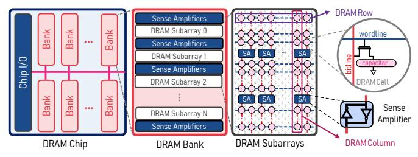
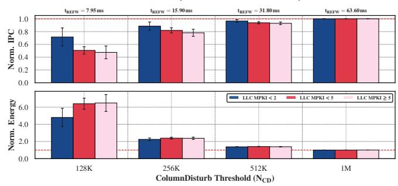
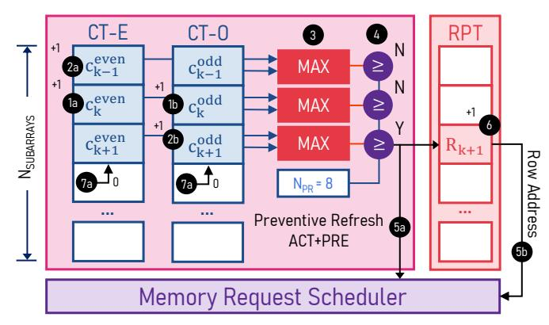
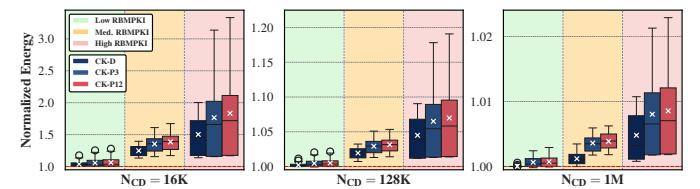
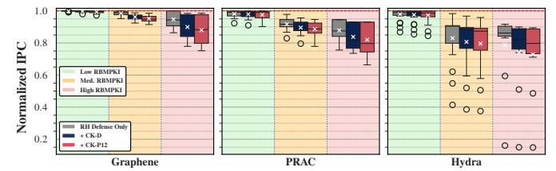
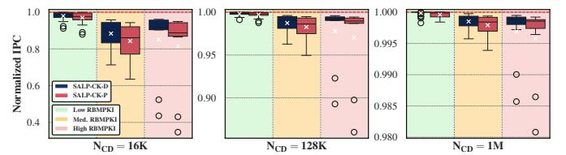

# ColumnKeeper: Efficient Solutions to the ColumnDisturb Vulnerability in DRAM-based Systems

Andreas Kosmas Kakolyris1 F. Nisa Bostancı1 Ataberk Olgun1 İsmail Emir Yüksel1 Harsh Songara1 Konstantinos Marios Sgouras1 Umut Başer1,2 Konstantinos Kanellopoulos1 A. Giray Yağlıkçı3 Onur Mutlu1

1ETH Zürich 2TOBB ETÜ 3CISPA

Modern DRAM chips are vulnerable to read disturbance phenomena such as RowHammer and RowPress, which induce bit-flips in DRAM rows after accessing nearby rows a certain number of times (i.e., the read disturbance threshold). ColumnDisturb is a new and fundamentally different DRAM read disturbance phenomenon. Specifically, ColumnDisturb (i) disturbs DRAM columns instead of rows, and (ii) increases the number of affected DRAM cells from those that reside in only a few neighboring rows to all cells across three consecutive DRAM subarrays.

We propose ColumnKeeper, the first set of ColumnDisturb mitigations that has two variants: ColumnKeeper-D (CK-D), a deterministic mitigation mechanism, and ColumnKeeper-P (CK-P), a probabilistic one. The key idea of CK-D is to take advantage of DRAM's open-bitline architecture to provide deterministic security guarantees against ColumnDisturb with low performance and energy overheads. To achieve this, CK-D employs two counters per subarray to track the number of activations affecting the odd and even columns of the subarray, respectively. When either counter reaches a predetermined threshold, CK-D refreshes one row in the corresponding subarray. The key idea of CK-P is to refresh one row in three consecutive subarrays upon a row activation in the middle subarray. This occurs with a predetermined probability and provides configurable security guarantees at low area overhead. To identify which row to refresh in each subarray, both mechanisms maintain a table with one entry per subarray that always points to the next row to refresh within the subarray. Each time either mechanism refreshes a row, it increments the corresponding entry, thereby ensuring that all rows in the subarray are refreshed in a round-robin manner.

Our comprehensive evaluation shows that both mechanisms prevent ColumnDisturb bitflips at low performance, energy, and area overheads. At the current experimentally-demonstrated ColumnDisturb threshold (1M), CK-D and CK-P incur very low average single-core performance overheads of 0.15% and 0.36%, respectively, compared to a system with no ColumnDisturb mitigation. For near-future thresholds (128K), these overheads rise to a still low average of 1.70% and 2.73%, respectively. Our experimental analysis shows that mitigating ColumnDisturb with low performance overheads at low thresholds (e.g., 16K) is still possible by either adopting smaller subarray sizes or enabling subarray-level parallelism. CK-D and CK-P can be implemented with low area overheads of 0.1mm² and 0.03mm², respectively. ColumnKeeper is freely available at github.com/CMU-SAFARI/ColumnKeeper.

#### 1. Introduction

Modern DRAM chips are susceptible to read disturbance phenomena such as RowHammer [1–6] and RowPress [7,8]. These phenomena can induce bitflips in DRAM cells located in a

"victim" row by repeatedly (i) activating and precharging (i.e., "hammering") neighboring "aggressor" rows, or (ii) keeping an aggressor row open for long periods of time (i.e., "pressing"). By doing so, such phenomena break memory isolation, i.e., the assumption that accessing a specific memory address does not affect data stored in other memory addresses. As DRAM technology node scaling progresses, the severity of RowHammer and RowPress increases [1,3,4,6,9–13]. Specifically: (i) the number of row activations required to induce bitflips (i.e., the read disturbance threshold) decreases [1,5,6,9,12], and (ii) the number of experienced bitflips increases [9,14]. Prior works [10,15–19] show that attackers can leverage read disturbance bitflips in real systems [1,3-5,10,15-65] for a wide variety of attacks, such as (i) privilege escalation, (ii) leaking sensitive information, (iii) virtual machine escapes, (iv) data corruption, and (v) denial-of-service. To ensure system robustness (i.e., safety, security, reliability, and availability), prior works [1,6,10,14,33,39,49,66-135] propose various mitigation mechanisms that often work by probabilistically or deterministically tracking aggressor row activations and refreshing potential victim rows before they experience bitflips.

*In contrast* to row-based read disturbance phenomena [1,7], the newly discovered column-based read disturbance phenomenon [136], ColumnDisturb, occurs by repeatedly "hammering" the same *column* of DRAM cells. As a result, Column-Disturb affects all DRAM cells that share a bitline (i.e., cells in the same physical DRAM column). Due to the open-bitline architecture of modern DRAM [136-142] in which bitlines are shared between neighboring subarrays (§2.1), Column-Disturb [136] induces bitflips in three consecutive subarrays. As a result, each hammer affects thousands of rows and millions of cells at once [136]. As such, existing RowHammer mitigation mechanisms [1,6,10,14,33,39,49,66-135] are incapable of defending against ColumnDisturb because they (i) can prevent bitflips only in a few rows adjacent to the aggressor row, and (ii) track activations at row granularity [77,91,143]. Our goal in this work is to design the first practical mechanisms that mitigate ColumnDisturb bitflips at current and future ColumnDisturb thresholds. To this end, we introduce ColumnKeeper,1 a set of mitigation mechanisms that prevent ColumnDisturb bitflips at low performance, energy, and area overheads. ColumnKeeper has two variants: (i) ColumnKeeper-D, a deterministic mitigation mechanism, and (ii) ColumnKeeper-P, a probabilistic one.

**Key Ideas.** The overarching idea behind both ColumnKeeper variants is to track activations at the *subarray granularity* 

&lt;sup>1Similarly to how a goalkeeper [144] prevents an opposing team from scoring in the game of football, ColumnKeeper prevents ColumnDisturb bitflips.

and iteratively refresh all rows in affected subarrays before ColumnDisturb bitflips can occur. The two variants differ in how they track these activations.

The key idea of ColumnKeeper-D (CK-D) is to account for DRAM's open-bitline architecture to accurately count the number of activations in each subarray. Specifically, we observe that each activation hammers both the odd and the even columns in the activated subarray, but either the odd or the even columns in the two adjacent neighbor subarrays, respectively. CK-D leverages this observation and separately counts activations for the odd and even columns of subarrays to avoid overestimating activations and issuing unnecessary refreshes.

The key idea of ColumnKeeper-P (CK-P) is to probabilistically issue preventive refreshes following each row activation. This eliminates the need for activation counting and provides configurable security guarantees at lower hardware overheads. Key Mechanisms. To count activations, CK-D maintains two counter tables: Counter Table-Even (CT-E) and Counter Table-Odd (CT-O), each containing one entry per subarray. Upon a row activation, CK-D increments both the CT-E and CT-O entries for the activated subarray, but only one of them for each of the neighboring subarrays. Each time the CT-O or CT-E entry of a subarray reaches a predetermined threshold, CK-D issues a preventive refresh to the corresponding subarray.

CK-P avoids activation counting altogether. Instead, upon a row activation in a subarray, it issues preventive refreshes to the corresponding subarray and its neighboring subarrays with a predetermined probability.

To identify which rows to refresh within a subarray, both CK-D and CK-P employ a Row Pointer Table (RPT) that stores one entry per subarray, which points to the next row to refresh in each subarray. On each preventive refresh, both variants first probe and then increment the relevant RPT entry, so that all rows in affected subarrays are iteratively refreshed in a round-robin manner before ColumnDisturb bitflips can occur. Key Results. We evaluate the impact of ColumnKeeper's two variants on system performance and energy efficiency using Ramulator 2.0 [\[145](#page-15-1)[–149\]](#page-15-2) and DRAMPower [\[150,](#page-15-3)[151\]](#page-15-4) across 62 single- and 60 multi-core workloads (see [§5\)](#page-7-0). We observe that at what we consider a current ColumnDisturb threshold (*NCD*) of 1*M*, CK-D and CK-P incur very low average performance overheads of 0.15% and 0.36%, respectively, across single-core workloads, compared to a baseline with no ColumnDisturb mitigation. At a "near-future" threshold of 128*K*, the performance overheads increase to a still low average of 1.70% and 2.73%, respectively, across single-core workloads. We show that mitigating ColumnDisturb for a very low threshold of 16*K* is still possible at low overheads, by (i) reducing subarray sizes, (ii) enabling subarray-level parallelism (SALP) [\[88](#page-14-6)[,152–](#page-15-5)[154\]](#page-15-6), or (iii) with a potential in-DRAM implementation of CK-D ([§8\)](#page-10-0).

Our contributions in this paper are as follows:

- We present ColumnKeeper, the first set of mechanisms that protect against ColumnDisturb bitflips at low performance, energy, and hardware overheads.
- We propose ColumnKeeper-D (CK-D), a deterministic mitigation mechanism whose key idea is to separately count activations for the odd and even columns of subarrays. Doing so accounts for modern DRAM's open-bitline architecture and

- avoids overestimating activations, thereby preventing unnecessary refreshes and incurring low performance and energy overheads. CK-D issues preventive refreshes each time the activation count of either the even or the odd columns of a subarray reaches a predetermined threshold.
- We propose ColumnKeeper-P (CK-P), a probabilistic mechanism with lower hardware overheads. The key idea of CK-P is to avoid counting activations and instead issue preventive refreshes to one row in three consecutive subarrays with a predetermined probability. CK-P provides configurable security guarantees at lower hardware overheads.
- We analyze the security of both mechanisms, showing that: (i) CK-D deterministically prevents ColumnDisturb bitflips against worst-case access patterns ([§4.1\)](#page-5-0), and (ii) CK-P guarantees a configurable, arbitrarily low probability of experiencing ColumnDisturb bitflips within a given period of time (e.g., a year; see [§4.2](#page-5-1) and [§4.3.1\)](#page-6-0).
- We comprehensively evaluate the security, performance, energy, and area overheads of both mitigation mechanisms. We show that for current thresholds (1*M*), both mechanisms incur *<*1% performance overheads, on average, while for "near-future" thresholds, overheads rise to *<*3%. We show that with smaller subarray sizes, subarray-level parallelism, or a potential in-DRAM implementation, ColumnKeeper can mitigate ColumnDisturb with low overheads even at a very low threshold of 16*K*.

# 2. Background & Motivation

# 2.1. DRAM Organization and Operation

2.1.1. DRAM Organization. Modern computing systems use DRAM as main memory, organizing it into a hierarchy with the following levels: channels, modules, ranks, banks, and subarrays. Figure [1](#page-2-0) shows the lower levels of this hierarchy. In CPUs, one or more memory controllers each interface with a DRAM channel to serve memory requests. The DRAM channel contains one or more DRAM modules, which comprise multiple DRAM ranks, that is, a number of DRAM chips operating in lockstep. Internally, DRAM chips contain multiple banks. A bank contains multiple subarrays [\[137](#page-14-7)[,142,](#page-14-2)[152,](#page-15-5)[155\]](#page-15-7) that each form a 2D array of DRAM cells organized into columns and rows. A DRAM cell stores a single bit of information in the form of charge stored in a capacitor. A voltage level of *VDD* (*GND*) represents a logical 1 (0). To access the DRAM cell, an access transistor connects the cell to a bitline, which is shared among all cells in the same DRAM column. The access transistor is controlled by a wordline that is shared between cells located in the same row. When the wordline is asserted, an access transistor connects each cell of the row to its corresponding bitline, whose voltage is perturbed. A structure called the row buffer, which consists of an array of sense amplifiers (SAs), senses and amplifies this perturbation. Due to a large size discrepancy between cells and SAs, modern DRAM adopts the open-bitline architecture [\[136](#page-14-1)[–142\]](#page-14-2), which shares SAs between neighboring subarrays by connecting their bitlines to a shared SA in an interleaved manner. Each bitline in a subarray connects to an SA that is also connected to a bitline in the subarray above or below.

Figure 1: DRAM chip, bank, & subarray organization.

2.1.2. DRAM Operation. The memory controller issues DRAM commands that: (i) activate rows (ACT), (ii) precharge bitlines (PRE) to *VDD/*2, (iii) read/write data (RD/WR), and (iv) refresh DRAM rows (REF). To perform DRAM reads or writes, the memory controller first opens a DRAM row by issuing ACT, which latches the row's data into the row buffer. To read (write) data, the memory controller then sends RD (WR) commands. The scheduling of DRAM commands is governed by DRAM timing constraints [\[152,](#page-15-5)[156](#page-15-8)[,157\]](#page-15-9) such as *tRAS* (i.e., the minimum time between opening and closing a row) and *tRC* (i.e., the minimum time between issuing ACT to two different rows in the same bank). Accesses to already open rows are served faster by omitting the ACT command, while accesses to different rows are slower since the bitlines must first be precharged via a PRE command (also referred to as closing a row), before issuing ACT.

2.1.3. Periodic DRAM Refresh. Over time, charge leaks from a DRAM cell's capacitor [\[158–](#page-15-10)[161\]](#page-15-11). If left unchecked, this eventually results in retention failure, i.e., bitflips due to the voltage reaching levels that cannot be reliably sensed by the SAs. To ensure robust operation, the memory controller periodically issues REF commands that restore the charge of all cells in a row by opening and then closing it. The time between two subsequent refreshes of the same row, called the refresh window (*tREFW* ), is usually 32 ms and 64 ms for DDR5 [\[78\]](#page-14-8) and DDR4 [\[162\]](#page-15-12), respectively. In order to refresh all rows within the refresh window, the memory controller issues REF commands at every refresh interval (*tREF I* ), which is typically 3*.*9 *µ*s for DDR5 and 7*.*8 *µ*s for DDR4.

# 2.2. DRAM Read Disturbance

Apart from retention failure, DRAM is also vulnerable to read disturbance, i.e., the phenomenon where reading data (from DRAM or storage) causes data corruption due to the physical properties of the storage medium [\[1](#page-13-0)[–8](#page-13-3)[,136,](#page-14-1)[163\]](#page-15-13). DRAM is known to be vulnerable to three types of such phenomena: RowHammer [\[1](#page-13-0)[–6\]](#page-13-1), RowPress [\[7](#page-13-2)[,8\]](#page-13-3), and ColumnDisturb [\[136\]](#page-14-1). RowHammer and RowPress are row-based read disturbance phenomena that occur when rows are repeatedly accessed (hammered) or kept open (pressed) for long periods of time. These phenomena cause bitflips in physically nearby rows, and their effects manifest up to a few rows away (typically 2-4 rows [\[9](#page-13-6)[,52,](#page-13-19)[164\]](#page-15-14)), which is referred to as the blast radius. Inducing RowHammer or RowPress bitflips requires hammering or pressing rows a certain number of times (i.e., the read disturbance threshold, *NRH* for RowHammer and *NRP* for RowPress). Aggressive technology node scaling reduces this threshold, with *NRH* dropping from 139K hammers in [\[1\]](#page-13-0) to only 4.8K hammers in 2020 [\[9\]](#page-13-6). Similarly, in newer DRAM

chips, all DRAM rows are RowPress-vulnerable (compared to ≈60% in older chips from the same manufacturer) [\[7](#page-13-2)[,8\]](#page-13-3).

ColumnDisturb is a new, fundamentally different, columnbased read disturbance phenomenon where hammering or pressing rows induces bitflips in DRAM cells sharing the same column (i.e., the same physical DRAM bitline). Due to the openbitline architecture [\[136](#page-14-1)[–142\]](#page-14-2) of modern DRAM (see [§2.1\)](#page-1-0), a subarray *k* shares half of its bitlines with the subarray above it (i.e., *k*−1) and half with the subarray below it (i.e., *k*+1) in an interleaved fashion. As a result, each row activation in subarray *k* affects (i) all cells in subarray *k*, (ii) all cells residing in even columns of subarray *k*−1, and (iii) all cells residing in odd columns of subarray *k*+1 (or vice versa). For a subarray size of 1024 rows as reported in [\[136\]](#page-14-1), the blast radius of ColumnDisturb spans up to 3072 rows in total, with each hammer affecting millions of cells. ColumnDisturb has been shown to induce bitflips in 63*.*6 ms [\[136\]](#page-14-1), which falls within the DDR4 refresh window (*tREFW* ) of 64 ms [\[162\]](#page-15-12). By dividing the minimum time to induce ColumnDisturb bitflips (63*.*6 ms) by *tRC* ≈50 ns (i.e., the minimum time between two successive row activations in the same bank, see [§2.1\)](#page-1-0), we calculate that the maximum number of row activations required to induce ColumnDisturb bitflips (i.e., the ColumnDisturb threshold, *NCD*) is ≈ 1*.*2*M* activations. We conservatively round this number down to the nearest power of two (i.e., 1*M*) to define the current *NCD*. As the severity of read disturbance increases with aggressive technology node scaling [\[1,](#page-13-0)[3,](#page-13-4)[4](#page-13-5)[,6,](#page-13-1)[9](#page-13-6)[–13\]](#page-13-7), ColumnDisturb has significant implications for the robustness and performance of future DRAM-based computing systems.

2.2.1. Read Disturbance Mitigation Techniques. To ensure robust operation, prior works propose a wide range of techniques that mitigate the effects of read disturbance [\[1](#page-13-0)[,6](#page-13-1)[,10,](#page-13-11)[14](#page-13-10)[,33](#page-13-15)[,39,](#page-13-16)[49](#page-13-17)[,66–](#page-13-18)[135\]](#page-14-0), particularly Row-Hammer [\[1–](#page-13-0)[6\]](#page-13-1) and more recently RowPress [\[7](#page-13-2)[,8\]](#page-13-3). These mitigation mechanisms combine architectural insights and algorithmic techniques to track DRAM row activations and deploy appropriate countermeasures, i.e., mechanisms that prevent Row-Hammer bitflips. Tracking mechanisms exist on a spectrum spanning purely probabilistic (e.g., [\[1,](#page-13-0)[88–](#page-14-6)[94\]](#page-14-9)), deterministic (e.g., [\[66](#page-13-18)[–75](#page-14-10)[,77,](#page-14-3)[80,](#page-14-11)[82](#page-14-12)[,83](#page-14-13)[,86](#page-14-14)[,87,](#page-14-15)[165\]](#page-15-15)), and hybrid (e.g., [\[69](#page-13-20)[,75,](#page-14-10)[80\]](#page-14-11)) techniques. Potential countermeasures include: (i) proactively refreshing affected rows [\[66](#page-13-18)[–77,](#page-14-3)[80](#page-14-11)[,82,](#page-14-12)[93](#page-14-16)[,94](#page-14-9)[,102](#page-14-17)[,165\]](#page-15-15), (ii) relocating aggressor rows [\[86](#page-14-14)[,87\]](#page-14-15), or (iii) throttling potentially harmful memory accesses [\[83–](#page-14-13)[85\]](#page-14-18).

# 2.3. Motivation

DRAM technology node scaling has increased the severity of RowHammer and RowPress [\[1](#page-13-0)[,3](#page-13-4)[,4,](#page-13-5)[6,](#page-13-1)[9](#page-13-6)[–13\]](#page-13-7) and led to the appearance of a new read disturbance phenomenon, Column-Disturb [\[136\]](#page-14-1). While [§2.2.1](#page-2-1) describes a wide range of techniques that mitigate RowHammer [\[1](#page-13-0)[–6\]](#page-13-1) and RowPress [\[7,](#page-13-2)[8\]](#page-13-3), the same techniques are ineffective against ColumnDisturb due to its fundamentally different nature. Specifically, these techniques rely on tracking activations and deploying their countermeasures at row granularity [\[1](#page-13-0)[,6](#page-13-1)[,10](#page-13-11)[,14](#page-13-10)[,33,](#page-13-15)[39,](#page-13-16)[49](#page-13-17)[,66](#page-13-18)[–135\]](#page-14-0). However, as described in [§2.2,](#page-2-2) ColumnDisturb induces bitflips across three consecutive subarrays (i.e., it occurs at subarray granularity), affecting thousands of rows. In this section, we discuss how naively mitigating ColumnDisturb by (i) increasing the DRAM refresh rate, or (ii) performing simple modifications to the industry-standard RowHammer mitigation mechanism, PRAC [76–79,134,166], incurs significant performance and energy overheads.

2.3.1. Mitigating ColumnDisturb by Increasing DRAM Refresh Rate. The simplest method of mitigating Column-Disturb is to increase the refresh rate of DRAM by reducing  $t_{REFW}$  and  $t_{REFI}$ . This ensures that all affected DRAM cells are periodically refreshed before the ColumnDisturb threshold  $(N_{CD})$ , i.e., the number of row activations required to induce ColumnDisturb bitflips, is reached in any subarray. However, as both ColumnDisturb [136] and our own analysis show, doing so significantly degrades system performance and energy efficiency for future DRAM chips. Figure 2 shows the single-core performance (in instructions per cycle) and energy consumption of a system that mitigates ColumnDisturb by increasing the DRAM refresh rate (reducing  $t_{REFW}$ ), normalized to a baseline system with the default (64 ms) refresh rate. We observe that at the current  $N_{CD}$  of 1M, the reduced  $t_{REFW}$  (63.6 ms) degrades average system performance by just 0.03% and increases average DRAM energy consumption by 0.24%. However, as  $N_{CD}$  decreases, performance and energy consumption overheads caused by the lower  $t_{REFW}$  increase significantly, particularly for workloads with high Last Level Cache (LLC) miss rates. For  $N_{CD}$ =128K, the increased refresh rate degrades average system performance by over 50% and increases average DRAM energy consumption by  $6\times$ . At this threshold, the required  $t_{REFW}$  to protect against ColumnDisturb is 7.95 ms (vs. 64 ms in DDR4).

Figure 2: Normalized single-core performance and energy consumption of mitigating Column Disturb by decreasing  $t_{\rm REFW}$ .

2.3.2. Mitigating ColumnDisturb by Modifying PRAC. Another potential way of mitigating ColumnDisturb is by modifying the industry-standard RowHammer mitigation mechanism, PRAC [76–79,134,166]. PRAC equips each DRAM row with a counter that tracks the number of activations to that row. When a counter reaches a predefined threshold, PRAC raises an Alert Back-Off (ABO) signal, signaling the memory controller to issue an RFM command that preventively refreshes neighboring victim rows. To protect against ColumnDisturb, one could: (i) reduce the ABO triggering threshold, and (ii) refresh all rows across three subarrays when ABO is triggered. Since an attacker can potentially distribute a ColumnDisturb attack across rows in a subarray to induce bitflips, ABO should be triggered after at most  $N_{CD}/S$  row activations, where S is the subarray size. For  $N_{CD}=1M$  and S=1024 (the subarray

size reported in [136]), this threshold is *only* 1K. As a result, after just 1K activations to a single row, this modified implementation would have to refresh 3K rows across 3 subarrays, incurring substantial performance and energy overheads.

**2.3.3. Our Goal & Key Observation.** Our goal in Column-Keeper is to design the *first* mechanisms that prevent Column-Disturb bitflips at low performance, energy, and area overheads. We aim to achieve this by tracking activations at subarray granularity and issuing preventive refreshes to rows in *all* affected subarrays. Since each activation affects three consecutive subarrays, any mitigation mechanism must also account for activations in neighboring subarrays. However, naively doing so may overestimate the activation count of the bitlines in a subarray for certain access patterns, leading to unnecessary refreshes and performance overheads. Figure 3 shows an example of such an access pattern across three DRAM subarrays.

Figure 3: Example of "double-counting" activations.

An attacker performs x (y) hammers in subarray A (C). Due to the open-bitline architecture, subarray B shares its even (odd) bitlines with A (C). As a result, both the odd and the even bitlines in A (C) experience an *identical* activation count of x (y). However, in subarray B, the activation count experienced by the odd and even bitlines *differs*, at y and x, respectively. A naive mechanism that counts the *total* number  $(N_{tot})$  of row activations affecting B reports an activation count of x+y. However, row activations in A (C) exclusively affect the even (odd) bitlines in B. Consequently, the actual hammer count of B  $(N_{act})$  is the maximum activation count of the odd and even bitlines (i.e., max(x,y)). When x=y,  $N_{tot}=2\times N_{act}$ . We refer to this potential pitfall as "double-counting" and take it into account when designing our deterministic mitigation mechanism, to reduce performance and energy overheads.

#### 3. ColumnKeeper

ColumnKeeper introduces two mechanisms that mitigate ColumnDisturb by preventively refreshing DRAM rows: (i) ColumnKeeper-D, a deterministic mitigation mechanism that tracks the number of times that the bitlines of a subarray have been hammered to issue preventive refreshes, and (ii) ColumnKeeper-P, a probabilistic mitigation mechanism that issues preventive refreshes with a predetermined probability. To ensure no ColumnDisturb bitflips occur, both mechanisms preventively refresh all DRAM rows in a subarray and its neighboring subarrays before the ColumnDisturb threshold ( $N_{CD}$ ) is reached. Due to the large number of rows that require refreshing, naively refreshing all potential victim rows at once incurs significant latency overheads by stalling accesses to the bank

for up to  $3K \cdot t_{RC}$  (i.e.,  $153 \, \mu s$  for our configuration, see §5). To avoid such latency overheads, both mechanisms distribute preventive refresh operations across time and perform them one row at a time by issuing ACT+PRE commands. To mitigate ColumnDisturb, ColumnKeeper requires exposing the DRAM subarray mapping to the memory controller, similar to works that employ subarray-level parallelism (SALP) [88,152–154].

#### 3.1. High-Level Architecture & Shared Components

Both ColumnKeeper-D (CK-D) and ColumnKeeper-P (CK-P) consist of a *trigger* mechanism and a *countermeasure*. The trigger mechanism *decides when* to invoke the countermeasure for a subarray and/or its neighboring subarrays. The countermeasure *decides which* row to preventively refresh in an affected subarray. CK-D and CK-P employ different trigger mechanisms (§3.2 and §3.3, respectively) but share the countermeasure, which is the **Row Pointer Table** (RPT).

The role of the RPT is to select which row to preventively refresh when the trigger mechanism fires for a subarray. To do so, it stores a pointer to the next DRAM row to be preventively refreshed for each subarray. We design the RPT as a table of counters, one for each of the K subarrays of the system. When the trigger mechanism fires for a subarray k, ColumnKeeper probes the corresponding RPT entry to identify which row to refresh in the targeted subarray. The RPT first returns the counter's current value  $(R_k)$  for that subarray and then increments the counter to point to the next row. When the RPT is probed for the last row in a subarray, it is zeroed to point to the first row of the subarray. Due to this round-robin selection, the row currently pointed to by the RPT is necessarily the row that was least recently preventively refreshed, and therefore has the highest hammer count within the subarray.

# 3.2. ColumnKeeper-D

ColumnKeeper-D (CK-D) aims to mitigate ColumnDisturb with low performance and energy overheads. To do so, it counts the number of activations affecting the bitlines of each DRAM subarray via activation counters and issues preventive refreshes to victim rows *only when necessary* (i.e., each time a counter reaches a predefined threshold). CK-D's trigger mechanism is aware of DRAM's open-bitline architecture and employs two separate counters for the odd and even columns of each DRAM subarray to avoid "double-counting" (§2.3) and reduce the number of unnecessary preventive refreshes issued.

**3.2.1. Design & Operation.** Figure 4 shows the design of CK-D, consisting of a deterministic trigger mechanism and the countermeasure (RPT). To accurately maintain the activation count of each subarray, CK-D introduces two counter tables that track the number of activations in the even and the odd columns of each subarray. These are named **Counter Table-Even** (CT-E) and **Counter Table-Odd** (CT-O), respectively, and contain one entry per DRAM subarray in the system. We refer to the number of activations in the even and the odd columns of a subarray as  $c_k^{even}$  and  $c_k^{odd}$ , respectively.

When the memory controller issues an ACT command to a row in subarray k, CK-D increments  $c_k^{even}$  (1) and  $c_k^{odd}$  (1), because *all* columns in k are affected. However, due to the open-bitline architecture, in the neighboring subarrays

Figure 4: Overview of ColumnKeeper in its CK-D configuration.

k-1 and k+1, only half of the bitlines are connected to the sense amplifiers (§2.1 and §2.3). Thus, CK-D increments  $c_{k-1}^{even}$ (i.e., the CT-E entry for k-1) (2a) and  $c_{k+1}^{odd}$  (i.e., the CT-O entry for k+1) (2b).2 This way, CK-D avoids unnecessary counter increments for unaffected columns in neighboring subarrays. To determine the activation count of an affected subarray (3), CK-D performs a max operation on the values of the CT-E and the CT-O, and calculates the maximum activation count observed across their columns. It then compares the result to a predetermined preventive refresh threshold  $(N_{PR})$ (4), which we set to  $N_{CD}/S$ , where S is the number of rows in a subarray.3,4 If the result of this comparison is *True* (as in this case for subarray k+1), CK-D issues a preventive refresh to the affected subarray (5a), by retrieving the next row to be refreshed via the corresponding RPT entry (5b) and then incrementing the entry to point to the next row of the subarray (6). After issuing the refresh, CK-D resets the CT-E and CT-O entries for the subarray that triggered the refresh (7a) and (7b).

# 3.3. ColumnKeeper-P

ColumnKeeper-P (CK-P) aims to mitigate ColumnDisturb bitflips with low hardware complexity. To achieve this, CK-P uses a probabilistic trigger mechanism that requires no activation counters (i.e., it is stateless) and is configurable to provide a desired level of protection against ColumnDisturb bitflips.

**3.3.1. Design & Operation.** When the memory controller issues an ACT command to a row in subarray k, CK-P "flips a coin" with a preventive refresh probability  $(P_{PR})$  to decide whether or not to perform a preventive refresh. We calculate  $P_{PR}$  so that the probability of a ColumnDisturb bitflip (i.e., failing to refresh all rows in a subarray before the ColumnDisturb threshold is reached) remains under a configurable upper bound. If the coin flip "results in a hit", CK-P issues three mitigation requests, one for k and one for each of its neighbors k-1 and k+1. To identify which rows to refresh

 $^2$ In the edge case where k is the first (last) subarray in the bank, CK-D *only* performs these actions for k+1 (k-1).

 $^3$ Our security analysis in §4.1 shows that setting  $N_{PR}$  to this value prevents ColumnDisturb bitflips under a worst-case access pattern.

 $^4{\rm For}$  reasons explained in §4.4, we always subtract 2S from  $N_{CD}$  before calculating  $N_{PR}$  to account for activations caused by REF commands.

 $^5$ A similar probabilistic mitigation mechanism, PARA, was proposed by Kim et al. [1] to mitigate RowHammer bitflips. Our security analysis in §4.2 uses the detailed security analysis of PARA in HiRA [88] to calculate  $P_{PR}$ .

within the affected subarrays, similar to CK-D, CK-P probes the RPT for all three subarrays, and retrieves  $R_{k-1}$ ,  $R_k$ , and  $R_{k+1}$ . After issuing the preventive refreshes, CK-P increments the corresponding RPT entries to point to the next row.

# 4. Security Analysis

Worst-case access pattern: To overwhelm ColumnKeeper, the worst-case access pattern aims to trigger as many refresh operations as possible within its hammering budget, defined by DRAM timing constraints. To achieve this, the worst-case access pattern leverages the fact that hammering a row disturbs *all* other rows in the same subarray and all rows in adjacent subarrays. As such, hammering *any* row in a single subarray causes the highest number of preventive refresh operations.

#### 4.1. Security Analysis of ColumnKeeper-D

We use "proof by induction" to prove that ColumnKeeper-D (CK-D) prevents ColumnDisturb bitflips in three steps.

First, we calculate the hammer count (HC) that the odd and even cells of a row (i.e., the cells residing in the odd and even columns, respectively) are exposed to as the sum of the row activation count  $(n_k)$  and the refresh count  $(r_k)$  targeting the row's subarray k and the neighboring subarray  $k^*$   $(n_{k^*}$  and  $r_{k^*}$ ), where  $k^*$  is k-1 or k+1. Therefore,  $HC_{odd} = \Sigma\{n_k, r_k, n_{k-1}, r_{k-1}\}$  and  $HC_{even} = \Sigma\{n_k, r_k, n_{k+1}, r_{k+1}\}$ , respectively. Second, we define the base case and the induction hypothesis. Third, we prove the induction hypothesis.

**Base Case:** DRAM is powered on.  $HC_{odd}=0$  and  $HC_{even}=0$  for all cells. Therefore, all cells are secure.

Induction Hypothesis: A randomly-chosen row i in subarray k has just been refreshed by activation n (i.e.,  $HC_{odd}(i,n){=}0$  and  $HC_{even}(i,n){=}0$ ), and is thus secure. We hypothesize that row i will remain secure, meaning that either (i) not enough activations to cause a ColumnDisturb bitflip in row i will occur, or (ii) row i will have already been preventively refreshed again before the sum of any combination of row activations and refreshes in subarray k and its neighboring subarrays k and  $k{+}1$  reaches k0.

From the induction hypothesis, **Induction Proof:**  $HC_{odd}(i, n)=0$ ,  $HC_{even}(i, n)=0$ . Let  $n'=n+N_{CD}$ . At activation n', row i's hammer counts for odd and even columns  $(HC_{odd}(i, n'))$  and  $HC_{even}(i, n')$  become the sum of all row activations and refreshes that happened in subarray k and its two adjacent subarrays ( $\Sigma\{n_k,r_k,n_{k-1},r_{k-1}\}$  and  $\Sigma\{n_k, r_k, n_{k+1}, r_{k+1}\}\$ ), respectively. As described in §3.2, CK-D resets both the CT-O and CT-E entries for subarray k whenever either of them reaches  $N_{PR}$ , and a preventive refresh in subarray k fires at every such reset. Between any two consecutive resets, neither entry can climb past  $N_{PR}$ . Otherwise, the preventive refresh would have been issued earlier. Let  $r_k$  be the number of preventive refreshes (and thus also resets) that have been issued to subarray kbetween activation n and n'. Hence  $HC_{odd}(i, n') \leq r_k \cdot N_{PR}$ , and  $HC_{even}(i, n') \leq r_k \cdot N_{PR}$ , leading to Inequality 1.

$$\max(HC_{odd}(i, n'), HC_{even}(i, n')) \le r_k \cdot N_{PR}$$
 (1)

Based on the values of  $HC_{odd}(i, n')$ ,  $HC_{even}(i, n')$  and  $N_{CD}$ , we consider the following two cases.

<u>Case 1</u>: The trivial case where the hammer count is *too low* to induce bitflips (i.e.,  $\max(HC_{odd}(i,n'), HC_{even}(i,n')) < N_{CD}$ ). <u>Case 2</u>: The hammer count is *high enough* to induce bitflips (i.e.,  $\max(HC_{odd}(i,n'), HC_{even}(i,n')) \ge N_{CD}$ ). By transitivity from the definition of *Case 2* and Inequality 1, we derive the following inequality:

$$N_{CD} \le \max(HC_{odd}(i, n'), HC_{even}(i, n')) \le r_k \cdot N_{PR}$$
 (2)

As defined in §3.2,  $N_{PR} = N_{CD}/S$ . By substituting  $N_{PR}$  and simplifying  $N_{CD}$  in Inequality 2, we derive  $r_k \geq S$ . To remain secure, row i must be preventively refreshed before or by activation n'. Since row i is the most recent row to be preventively refreshed (in subarray k), it will be the last row to again be preventively refreshed (in subarray k), as the RPT selects rows in a round-robin manner. For row i to be refreshed again, the number of preventive refreshes issued to subarray k ( $r_k$ ) must be at least S, where S is the number of rows in a subarray (i.e.,  $r_k \geq S$ ). However, this was already derived above, satisfying the condition for Case 2 remaining secure, and thus proving the induction hypothesis.

## 4.2. Security Analysis of ColumnKeeper-P

ColumnKeeper-P (CK-P) provides a configurable level of security by adjusting the *preventive refresh probability* ( $P_{PR}$ ). To configure  $P_{PR}$ , we follow the methodology proposed in HiRA [88] for RowHammer and PARA [1]. Specifically, we consider the worst-case scenario consisting of the *maximum* number of ColumnDisturb attacks (i.e., attempts to induce ColumnDisturb bitflips) possible within a refresh window. Let:

- HC(r) be the number of hammers a row r has experienced since it was last preventively refreshed. As CK-P is not aware of the open-bitline architecture, HC does not distinguish between odd and even bitlines.
- Xi be a random variable that models whether CK-P issues
  a preventive refresh to a subarray following a hammer (i.e.,
  any kind of activation) i to the subarray or its neighbors.
- MN be a random variable that models the number of preventive refreshes issued to a subarray after N activations to it or its neighbors.
- A be the maximum number of attacks that can occur within a refresh window.
- $t_F$  be the shortest time in which an attack can fail.
- $P_1$  be the probability of a *single* successful attack.
- $P_{REFW}$  ( $P_Y$ ) be the probability of at least one successful attack during a refresh window (a year).

We will show that *any* row in *any* subarray starting from an initial secure state HC(r)=0 (i.e., just initialized or preventively refreshed), will suffer a successful attack after  $N_{CD}$  hammers with a probability of  $P_1$ . We then extend this probability bound to an entire refresh window ( $P_{REFW}$ ), and an entire year ( $P_Y$ ).

**4.2.1.** Cumulative Distribution Function (CDF) of  $M_N$ . CK-P randomly issues a preventive refresh following each ACT to a subarray or its neighbors with a probability  $P_{PR}$ . This occurs via a "coin-flip", independent of any other event (i.e., a Bernoulli trial).  $M_N$  counts the number of preventive refreshes issued to the middle subarray after N activations to it or its neighbors. As a result:  $M_N = \sum_{i=1}^N X_i$ . The sum of N

independent Bernoulli trials with probability  $P_{PR}$  follows a Binomial distribution  $B(N,P_{PR})$ . The CDF of the binomial distribution is the regularized incomplete beta function [167]  $(I_q)$ , where  $q=1-P_{PR}$ , therefore:

$$P(M_N \le k) = I_q(N - k, 1 + k)$$
 (3)

**4.2.2.** Probability of a single successful attack. A single attack succeeds (with probability  $P_1$ ) when ColumnKeeper-P issues *fewer* than S preventive refreshes to a subarray following  $N_{CD}-1$  activations to it or its neighbors. Eq. 4 formulates  $P_1$  by substituting N with  $N_{CD}-1$  and k with S-1 in Eq. 3.

$$P_1 = I_q(N_{CD} - S, S) \tag{4}$$

**4.2.3. Maximum number of attacks in a refresh window.** An attacker can mount multiple attacks within a refresh window  $(t_{REFW})$  of which only one *needs* to succeed. To evaluate the worst-case scenario, we calculate the *maximum* number of attacks (A) that the attacker can mount. Following the process described in HiRA [88], we calculate A by assuming A-1 attacks that take (fail in) the shortest possible duration  $(t_F)$ , followed by a single successful attack. A single attack fails when all rows within a subarray are preventively refreshed. The attacker *initiates* the attack with a single row activation. To stop an attack, CK-P has to issue at least S mitigation requests, each of which refreshes one row in three consecutive subarrays. Therefore,  $t_F = (1+3S) \cdot t_{RC}$ , and  $A = t_{REFW} / t_F + 1$ .

**4.2.4. Probability of a successful attack within a refresh window.** The probability of *at least* one successful attack within a refresh window  $(P_{REFW})$  is the complement of the probability of all A attacks failing. Since the outcomes of the A attacks are mutually independent,  $P(\text{all fail}) = P(\text{one fails})^A$ . In turn, P(one fails) is the complement of the probability of a single successful attack  $(P_1)$ . As a result:

$$P_{REFW} = 1 - (1 - P_1)^A \tag{5}$$

**4.2.5. Probability of a successful attack in a year.** A year consists of  $492.7 \times 10^6$  DDR4 refresh windows. The probability of *at least* one successful attack within a year  $(P_Y)$  is the complement of no attacks succeeding within those refresh windows. Following what was described for  $P_{REFW}$ :

$$P_Y = 1 - (1 - P_{REFW})^{492.7 \times 10^6} \tag{6}$$

## 4.3. Configuration of ColumnKeeper-P

In Table 1, we first set target  $P_Y$  values and calculate  $P_{REFW}$  (Eq. 6) and  $P_1$  (Eq. 5). We then solve Eq. 4 to calculate  $P_{PR}$  for three different ColumnDisturb thresholds  $(N_{CD})$  and for a subarray size of 1K rows (as shown in [136]). We make two observations. First, providing the same security level for lower thresholds requires significantly higher  $P_{PR}$ . For example, for  $P_Y$ = $10^{-6}$ , when  $N_{CD}$  drops from 1M to 16K,  $P_{PR}$  increases by  $72\times$ . Second, for the same  $N_{CD}$ , even slight increases to  $P_{PR}$  provide significantly higher security. For example, with  $N_{CD}$ =128K and  $P_{PR}$ = $10^{-2}$ ,  $P_Y$ = $10^{-3}$ . However, when  $P_{PR}$  slightly increases to  $1.07\times10^{-2}$ ,  $P_Y$  drops to  $10^{-12}$ . For the rest of this paper,  $P_{PR}$  is always calculated for  $P_Y$ = $10^{-12}$  unless stated otherwise.

Table 1: Configuration parameters of ColumnKeeper-P.

| $P_Y$      | $10^{-3}$                                 | $10^{-6}$              | $10^{-9}$              | $10^{-12}$             |
|------------|-------------------------------------------|------------------------|------------------------|------------------------|
| $P_{REFW}$ | $2.03 \times 10^{-12}$                    | $2.03 \times 10^{-15}$ | $2.03 \times 10^{-18}$ | $2.03 \times 10^{-21}$ |
| $P_1$      | $4.39 \times 10^{-15}$                    | $4.38 \times 10^{-18}$ | $4.38 \times 10^{-21}$ | $4.38 \times 10^{-24}$ |
| $N_{CD}$   | Preventive Refresh Probability $(P_{PR})$ |                        |                        |                        |
| 1M         | $1.23 \times 10^{-3}$                     | $1.26 \times 10^{-3}$  | $1.29 \times 10^{-3}$  | $1.32 \times 10^{-3}$  |
| 128K       | $1.00 \times 10^{-2}$                     | $1.02 \times 10^{-2}$  | $1.05 \times 10^{-2}$  | $1.07 \times 10^{-2}$  |
| 16K        | $8.92 \times 10^{-2}$                     | $9.13 \times 10^{-2}$  | $9.32 \times 10^{-2}$  | $9.50 \times 10^{-2}$  |

## 4.3.1. ColumnKeeper-P Monte Carlo Security Analysis.

We demonstrate ColumnKeeper-P's security by performing a Monte Carlo simulation of a DRAM bank under continuous ColumnDisturb attack. Specifically, we simulate continuously hammering a randomly selected row in a randomly selected subarray. We then measure the maximum number of times  $(HC_{max})$  the cells residing in the odd or even columns of any row were hammered without CK-P preventively refreshing the row during an entire refresh window, and repeat this experiment 1M times. Figure 5 shows the  $99.999_{th}$  percentile  $(p_{99.999}^{th})$  (hatched bars) and overall maximum value (solid bars) of  $HC_{max}$  for the different configurations of Table 1.

Figure 5:  $p_{99.999}^{th}$  and absolute maximum value of  $HC_{max}$  for the different configurations of Table 1.

We make two key observations. First, across all configurations,  $HC_{max}$  remains well below  $N_{CD}$  (represented by the red line). Second, as the security guarantees tighten (i.e.,  $P_Y$  decreases), the gap between the absolute maximum value of  $HC_{max}$  and  $N_{CD}$  increases. For example, when  $P_Y$  reduces from  $10^{-3}$  to  $10^{-12}$  at  $N_{CD}$  equal to 128K, this gap increases from 5.5K to 13K activations, representing a "safety margin" of 4.2% and 9.9%, relative to  $N_{CD}$ . We attribute this to the fact that achieving lower values of  $P_Y$  for the same  $N_{CD}$  requires setting higher values of  $P_{PR}$ . A higher  $P_{PR}$  in turn leads to CK-P being more likely to issue preventive refreshes, reducing  $HC_{max}$ .

# 4.4. Counting Activations in Subarrays

Both CK-D and CK-P rely on tracking activations in all subarrays. Row activations occur: (i) *explicitly* via ACT commands or (ii) *implicitly* via periodic refresh commands (REF) and Row-Hammer preventive refreshes (e.g., RFM commands in DDR5). While ColumnKeeper maps ACTs to subarrays, *implicit* activations *do not* specify a row address, and therefore cannot be directly mapped to a subarray at the level of the memory controller, where ColumnKeeper resides. To remain secure, ColumnKeeper handles *implicit* activations as described below.

**4.4.1. Periodic Refreshes.** While REF commands do not specify a DRAM row or subarray, *all* DRAM rows are refreshed

&lt;sup>6The Binomial distribution is derived from "the number of x occurrences in n independent trials" [167] (page 48).

 $^7{\rm By}$  backtracking through Equations 6, 5 and 4, we can derive that  $P_Y$  is monotonically decreasing with  $P_{PR}.$  Table 1 demonstrates this relationship.

exactly once within a refresh window. During the window, the last row to be refreshed will experience S hammers from refreshes in a neighboring subarray and S-1 hammers from refreshing rows in the same subarray for a total of 2S-1 hammers. Taking this into account, we always calculate  $N_{PR}$  after subtracting 2S from the actual value of  $N_{CD}$ . This acts as a safety margin and ensures that preventive refreshes will not inadvertently result in ColumnDisturb bitflips. To reduce performance overheads, DRAM standards [168,169] allow postponing REF commands up to 8 (4) times for DDR4 (DDR5), performing back-to-back refresh operations after postponement. To account for REF commands that might be postponed to the next refresh window, we further adjust  $N_{CD}$  by subtracting an additional  $4 \times Q$  for DDR5 ( $8 \times Q$  for DDR4), where Q is the number of rows refreshed per REF command.

4.4.2. Preventive Refreshes. When combining Column-Keeper with a RowHammer mitigation mechanism, the memory controller issues preventive refreshes for both mechanisms. ColumnKeeper treats its own ACT commands as regular ACTs, i.e., CK-D increments the appropriate counters, and CK-P "flips its coin" for the mitigation requests it issues. RowHammer mitigation mechanisms refresh rows by: (i) issuing ACT+PRE commands [1,80] (handled as explicit activations), (ii) issuing extra REF commands [75], or (iii) issuing RFM commands in DDR5 [76–78,134]. To handle RFM or extra REF commands, CK-D increments all CT-O and CT-E entries in the affected banks, since a REF or RFM command may affect any subarray. Similarly, CK-P "flips its coin" for all subarrays. Thus, ColumnKeeper can protect against ColumnDisturb bitflips from RowHammer preventive refreshes. Since RowHammer mitigations also track ColumnKeeper's ACT+PRE commands, the inverse is also true.

# 5. Methodology

We evaluate the impact of ColumnKeeper on system performance and energy consumption using Ramulator 2.0 [145–149], a cycle-accurate DRAM simulator, and DRAMPower [150,151]. Table 2 summarizes the configuration of our simulated system.

Table 2: Simulated System Configuration.

| Processor        | 1 or 4 cores, 3.6 GHz clock frequency,4-wide issue, 128-entry instr. window |  |  |
|------------------|-----------------------------------------------------------------------------|--|--|
| Page Allocator   | 4KB Buddy Allocator [170], pre-fragmented to 35% at the 2MB granularity.    |  |  |
| DRAM             | 16GB DDR4, 1 channel, 2 rank/channel, 4 bank groups,                        |  |  |
|                  | 4 banks/bank group, 64 subarrays/bank, 1K rows/subarray, 3200 MT/s          |  |  |
| Memory Ctrl.     | 64-entry read/write requests queue,                                         |  |  |
|                  | Scheduling policy: FR-FCFS [171,172] with open-row policy [173,174],        |  |  |
|                  | Address mapping: RoBaRaCoCh [77,147]                                        |  |  |
| Last-Level Cache | 2 MiR per core                                                              |  |  |

Workloads. We use 62 single-core workloads from 5 benchmark suites: SPEC CPU2006 [175], SPEC CPU2017 [176], TPC [177], MediaBench [178], and YCSB [179]. To simulate multi-core workloads we first organize the workloads into 3 categories based on their row buffer misses per kilo-instruction (RBMPKI): (i) Low, (ii) Medium, and (iii) High (see Table 3). Second, by randomly selecting traces from the aforementioned categories we create 10 four-core workload mixes for each one of the following categories: LLLL, MMMM, HHHH, LLMM, MMHH, LLHH for a total of 60 workload mixes. We simulate single- and multi-core workloads until each evaluated workload (and each core) executes at least 100M instructions.

Table 3: Single-core Workloads Organized by RBMPKI.

| RBMPKI            | Workloads                                                                                                                                                                                                                                                                                                                  |  |  |  |
|-------------------|----------------------------------------------------------------------------------------------------------------------------------------------------------------------------------------------------------------------------------------------------------------------------------------------------------------------------|--|--|--|
| [10+) (High)   | 519.lbm, 459.GemsFDTD, 450.soplex, h264_decode, 520.omnetpp, 433.milc, 434.zeusmp, bfs_dblp, 429.mcf, 549.fotonik3d, 470.lbm, bfs_ny, bfs_cm2003, 437.leslie3d, gups                                                                                                                                                       |  |  |  |
| [2, 10) (Med.) | 510.parest, 462.libquantum, tpch2, wc_8443, ycsb_aserver, 473.astar, jp2_decode, 436.cactusADM, 557.xz, ycsb_cserver, ycsb_eserver, 471.omnetpp, 483.xalancbmk, 505.mcf, wc_map0, jp2_encode, tpch17, ycsb_bserver, tpcc64, 482.sphinx3                                                                                    |  |  |  |
| [0, 2) (Low)   | 502.gcc, 544.nab, h264_encode, 507.cactuBSSN, 525.x264, ycsb_dserver, 531.deepsjeng, 526.blender, 435.gromacs, 523.xalancbmk, 447.dealII, 508.namd, 538.imagick, 445.gobmk, 444.namd, 464.h264ref, ycsb_abgsave, 458.sjeng, 541.leela, tpch6, 511.povray, 456.hmmer, 481.wrf, grep_map0, 500.perlbench, 403.gcc, 401.bzip2 |  |  |  |

Evaluated Systems. We evaluate: (1) ColumnKeeper-D (CK-D): The mitigation mechanism of §3.2, (2) ColumnKeeper-P3 (CK-P3): The mitigation mechanism of §3.3 configured for  $P_Y$  of  $10^{-3}$ , (3) ColumnKeeper-P12 (CK-P12): The same mechanism for  $P_Y = 10^{-12}$ , (4) ColumnKeeper-S (CK-S): an alternative design of CK-D that uses a single counter per subarray and does not account for "double-counting", (5) SALP+ColumnKeeper-D (SALP-CK-D): a modified version of ColumnKeeper-D that employs subarray-level parallelism [152] (SALP), and (6) SALP+ColumnKeeper-P (SALP-CK-P): a modified version of CK-P12 that employs SALP. For the evaluation of ColumnKeeper with RowHammer mitigation mechanisms, we integrate ColumnKeeper with Graphene [69], PRAC [76–79,134,166], and Hydra [105] configured for a RowHammer threshold ( $N_{RH}$ ) of 128. 10

#### 6. Evaluation

We evaluate: 1) ColumnKeeper's impact on system performance and DRAM energy consumption, 2) the performance impact of ColumnKeeper under adversarial workloads, 3) the impact of combining ColumnKeeper with different RowHammer mitigation mechanisms (i.e., Graphene [69], PRAC [76–79,134,166], and Hydra [105]), 4) the impact of different DRAM subarray sizes on ColumnKeeper's performance, 5) the impact of memory fragmentation and different page allocators [170,180] on ColumnKeeper's performance, and 6) the performance of ColumnKeeper in systems that employ subarray-level parallelism (SALP) [88,152–154].

# **6.1. Single-Core Evaluation**

**6.1.1. Performance.** Figure 6 presents ColumnKeeper's performance impact on single-core workloads. The top, middle, and bottom subplots show results for  $N_{CD}{=}16K$ , 128K, and 1M, respectively. The x-axis depicts different workloads, organized from left to right by increasing RBMPKI. Different background colors denote different RBMPKI categories. The y-axis shows the instructions-per-cycle (IPC) of each workload normalized to a baseline with no ColumnDisturb mitigation.

We draw three major conclusions. First, for single-core workloads, at the current threshold (1M), CK-D, CK-P3, and CK-P12 incur small performance degradation with minimum normalized IPCs of 0.98, 0.97, and 0.96, respectively. Second, for  $N_{CD}\!=\!128K$ , all three variants retain good average performance with a geomean normalized IPC of 0.98, 0.97, and 0.97,

 $^8$ This reduction is negligible for the  $N_{CD}$  values that are evaluated in §6.

&lt;sup>9SALP-enabled systems use the MASA [152] SALP configuration.

&lt;sup>10PRAC [76–79,134,166] was introduced in the JEDEC DDR5 specification [78]. For fairness, all configurations that employ PRAC use DDR5.

Figure 6: Performance impact of ColumnKeeper on single-core workloads for three different ColumnDisturb thresholds.

respectively. However, in high-RBMPKI workloads, we observe that CK-P3 (CK-P12) shows non-negligible performance degradation. For example, the normalized IPC for gups is 0.78 (0.76). Third, for  $N_{CD}{=}16K$ , all mitigations incur significant performance degradation. Specifically, CK-D has a geomean normalized IPC of 0.84, while CK-P3 (CK-P12) has a geomean normalized IPC of 0.79 (0.78). To provide security at this very low threshold, CK-P3 (CK-P12) issues on average 1.70× (1.83×) more preventive refreshes than CK-D.

**6.1.2. Energy Consumption.** Figure 7 presents Column-Keeper's impact on energy consumption for single-core workloads, with results grouped by RBMPKI. The left, middle, and right subplots show results for  $N_{CD}$ =16K, 128K, and 1M, respectively. Each boxplot corresponds to a particular Column-Keeper variant and RBMPKI category (denoted by background color), and shows the distribution of energy consumption normalized to a baseline with no ColumnDisturb mitigation.

Figure 7: Effect of ColumnKeeper on DRAM energy consumption for single-core workloads.

We draw three major conclusions. First, at  $N_{CD}{=}1M$ , the average energy increase remains small (<2%) for all Column-Keeper variants. Second, at 128K, CK-D incurs a small increase, with an average (maximum) increase of 1.45% (9.04%), while CK-P3 and CK-P12 incur average (maximum) increases of 2.19% (17.82%) and 2.36% (19.08%), respectively. Third, at 16K, all variants significantly increase energy consumption by 16.26% for CK-D, 22.82% for CK-P3, and 24.69% for CK-P12, on average. At this threshold, we observe that due to CK-D not issuing any "unnecessary" refreshes, for the high RBMPKI category, it keeps the maximum energy increase to under  $2.00\times$ , compared to  $3.14\times$  for CK-P3 and  $3.33\times$  for CK-P12.

#### 6.2. Multi-Core Evaluation

**6.2.1. Performance.** Figure 8 presents ColumnKeeper's performance impact on multi-core workloads. The left, middle, and right subplots show results for  $N_{CD}{=}16K$ , 128K, and 1M, respectively. Each boxplot corresponds to a particular

ColumnKeeper variant and workload mix category (denoted by background color), and shows the distribution of weighted speedup normalized to a baseline with no mitigation.

Figure 8: Performance impact of ColumnKeeper on multi-core workloads for three different ColumnDisturb thresholds.

We make two key observations. First, ColumnKeeper incurs higher performance overheads for multi-core workloads (compared to single-core). For  $N_{CD}$ =128K, CK-D experiences a non-negligible average slowdown of 6.56%. CK-P3 and CK-P12 experience a higher average slowdown of 9.52% and 10.17%, respectively. Multi-core workloads generate more row-buffer conflicts, resulting in more preventive refreshes. Second, the difference in performance between CK-D and CK-P is more pronounced compared to single-core workloads. At a threshold of 128K (16K), CK-D has 3.61% (11.13%) higher normalized weighted speedup compared to CK-P12. In contrast, for singlecore workloads, this difference is 1.04% (6.19%). We attribute this to the different applications in our multi-core workload mixes, which may frequently access neighboring subarrays, resulting in more instances of "double-counting" (Figure 3), which CK-D accounts for but CK-P does not.

**6.2.2. Energy Consumption.** Figure 9 presents Column-Keeper's impact on DRAM energy consumption for multi-core workloads. The left, middle, and right subplots show results for  $N_{CD} = 16K$ , 128K, and 1M, respectively. Each boxplot corresponds to a particular ColumnKeeper variant and workload mix category (denoted by background color) and shows the distribution of energy consumption normalized to a baseline with no ColumnDisturb mitigation. At  $N_{CD} = 1M$ , all variants incur negligible energy consumption increases. When  $N_{CD} = 128K$ , CK-D increases average (maximum) energy consumption by 5.95% (11.27%). At this threshold, CK-P3 (CK-P12) increases average energy consumption by 8.83% (9.54%). For  $N_{CD} = 16K$ , all variants increase energy consumption significantly, with average values of  $1.72\times$ ,  $2.05\times$ , and  $2.15\times$  over the baseline for CK-D, CK-P3, and CK-P12, respectively.

Figure 9: Effect of ColumnKeeper on DRAM energy consumption for multi-core workloads.

#### 6.3. Evaluation under Adversarial Workloads

To evaluate ColumnKeeper's performance under adversarial workloads, we colocate single-core workloads with a synthetic workload that rapidly hammers rows across three consecutive subarrays to perform a ColumnDisturb attack. Figure 10 shows the performance impact of CK-D, CK-P, and CK-S (described in §5) under this adversarial scenario. The left, middle, and right subplots show results for  $N_{CD}{=}16K$ , 128K, and 1M, respectively. Each individual boxplot corresponds to a particular ColumnKeeper variant and RBMPKI category (denoted by background color), and shows the distribution of IPC, normalized to a baseline with no ColumnDisturb mitigation.

Figure 10: Performance impact of ColumnKeeper on single-core workloads colocated with adversarial workloads.

We make three key observations. First, all mechanisms incur low average performance overheads for  $N_{CD}=1M$  (<0.47%) or 128K (<3.68%). Second, at low thresholds (i.e., 16K), all mechanisms incur significant performance degradation  $(\geq 20.97\%)$  due to the higher number of preventive refreshes issued. Specifically, for CK-D, CK-S, and CK-P, when moving from a ColumnDisturb threshold of 128K to 16K, the number of preventive refreshes issued increases by  $10.47 \times$ ,  $10.92 \times$ , and  $11.08\times$ , respectively. Third, the single-counter design of CK-S represents a middle ground between CK-D and CK-P, as it deterministically tracks activations, but does not account for potential double-counting. As a result, for  $N_{CD}$ =16K, CK-S issues 5.06% (27.50%) more (fewer) refreshes than CK-D (CK-P12), on average. This induces an average IPC degradation of 20.97%, 21.52%, and 29.07% for CK-D, CK-S, and CK-P12, respectively. These results are in accordance with the observation made in §2.3.3, where double-counting was defined.

#### 6.4. RowHammer & ColumnDisturb

Figure 11 shows the performance impact of ColumnKeeper when combined with three state-of-the-art RowHammer mitigation mechanisms: Graphene [69], PRAC [76–79,134,166], and Hydra [105]. Within each subplot, the background color denotes the RBMPKI category. Each boxplot corresponds to a particular combination of RowHammer and ColumnDisturb mitigation mechanisms and shows the distribution of IPC across single-core workloads, normalized to a baseline with no RowHammer or ColumnDisturb mitigation. All mitigation

mechanisms operate transparently to each other, taking each other's preventive refreshes into account (§4.4).

Figure 11: Performance impact of ColumnKeeper with different RowHammer mitigations.  $N_{\rm CD}{=}128K, N_{\rm RH}{=}128.$ 

We make the following key observations. First, low-overhead RowHammer mitigations (e.g., Graphene [69]) do not significantly increase the performance overheads of ColumnKeeper. For example, CK-D + Graphene has an average (minimum) normalized IPC of 0.97 (0.78), compared to 0.98 (0.88) for CK-D without Graphene (§6.1). Second, CK-D (CK-P12) reduces normalized IPC by 1.70% (2.61%) on top of PRAC and 2.15% (3.08%) on top of Hydra, on average.

# 6.5. Sensitivity to DRAM Subarray Size

Figure 12 shows the impact of subarray size (S) on single-core performance with ColumnKeeper. The three subplots show results for  $N_{CD}{=}16K$  (left), 128K (middle), and 1M (right). We evaluate subarray sizes of 128, 256, 512, and 1K rows (denoted by different background colors). Each boxplot corresponds to a particular ColumnKeeper variant and subarray size, and shows the distribution of normalized IPC across all workloads, with respect to a baseline with no mitigation.

We observe that across all evaluated thresholds, the performance degradation of all mechanisms decreases significantly with smaller subarray sizes. This is expected from §4.1 and §4.2, as the subarray size S is inversely (positively) correlated with the preventive refresh threshold,  $N_{PR}$  of CK-D (preventive refresh probability,  $P_{PR}$  of CK-P). For  $N_{CD}$ =128K, when reducing the subarray size from 1K rows (as reported in [136]) to 256 rows, the average IPC degradation for CK-D and CK-P12 drops from 1.70% to 0.31%, and from 2.71% to 0.92%, respectively. With smaller subarrays, ColumnKeeper incurs relatively low overheads even at very low thresholds. For example, when S=128 and  $N_{CD}$ =16K, CK-D (CK-P12) incurs an average slowdown of 1.64% (4.34%) and a maximum of 12.57% (34.18%).

#### 6.6. Sensitivity to Physical Page Allocation

To understand the impact of physical page allocation on ColumnKeeper's performance, we evaluate CK-D and CK-P12 on multi-core workload mixes with: (i) the standard 4KB Buddy allocator [170], and (ii) a Transparent Huge Pages (THP)-like allocator [181,182] that attempts to allocate 2MB pages and falls back to 4KB pages. To decouple the performance impact of page allocation from address translation, we use zero-overhead address translation. Figure 13 shows ColumnKeeper's performance impact with both allocators at  $N_{CD}$ =128K. The top, middle, and bottom rows show results for memory fragmentation levels of 20%, 50%, and 80% at 2MB granularity (i.e., the ratio of free memory that *cannot* be allocated as 2MB-aligned contiguous blocks), respectively. Each boxplot (left) corresponds to a particular workload mix category (denoted by

Figure 12: Performance impact of ColumnKeeper across different subarray sizes for  $N_{\rm CD}$ =16K, 128K, and 1M.

background color), and shows the distribution of weighted speedup when using THP normalized to Buddy. Each barplot (right) shows the geomean across all workload mixes.

Figure 13: Weighted speedup of THP normalized to the Buddy allocator for different fragmentation levels at  $N_{\rm CD}{=}128K$ .

We observe that there is no significant performance difference between the two allocators at any fragmentation level. Specifically, for CK-D (CK-P12), the geomean normalized weighted speedup is 1.009 (1.014), 1.008 (1.012), and 1.006 (1.009) for fragmentation levels of 20%, 50%, and 80%, respectively.

#### 6.7. Evaluation with Subarray-Level Parallelism

Subarray-level parallelism (SALP) [152] is a DRAM microarchitecture modification that allows multiple subarrays (i.e., multiple row buffers) within the same bank to be activated simultaneously. SALP [88,152–154] improves performance by reducing the impact of bank conflicts. For ColumnKeeper, SALP allows preventive refreshes in one subarray to overlap with DRAM requests in other subarrays. Figure 14 shows ColumnKeeper's performance impact on a system that uses the MASA [152] SALP configuration. The left, middle, and right subplots show results for  $N_{CD}{=}16K$ , 128K, and 1M, respectively. Each boxplot corresponds to a particular MASA-enabled ColumnKeeper mechanism and RBMPKI category (denoted by background color), and shows the distribution of IPC across all single-core workloads, normalized to a MASA-enabled system with no ColumnDisturb mitigation.

Figure 14: Performance impact of ColumnKeeper in a system that employs MASA [152].

We make three key observations. First, at  $N_{CD}$ =1M, SALP-CK-D and SALP-CK-P incur negligible average (maximum)

performance overheads of 0.11% (1.43%) and 0.16% (1.92%), respectively. Second, for  $N_{CD}{=}128K$ , the overheads remain low, with average (maximum) values of 0.87% (10.71%) for SALP-CK-D and 1.20% (14.00%) for SALP-CK-P. Third, even at the very low threshold of 16K, SALP-CK-D (SALP-CK-P) mitigates ColumnDisturb with an average overhead of 7.87% (10.62%) and a maximum slowdown of 56.42% (65.34%). This is substantially lower than the maximum slowdowns of over 61.79% and 79.16% observed for the non-SALP CK-D and CK-P12 configurations (§6.1). We conclude that SALP alleviates ColumnKeeper's performance overheads.

# 7. Latency, Area & Power Overheads

ColumnKeeper-D (CK-D) and ColumnKeeper-P (CK-P) are implemented in the memory controller and require no modifications to DRAM. Each CT-O and CT-E entry contains a maximum value of  $(N_{CD}-2S)/S \approx N_{CD}/S$ , where S is the subarray size. Each RPT entry points to one of S rows in a subarray. As a result, each CT-O and CT-E entry requires  $\log_2(N_{CD}/S)$ bits of storage, and each RPT entry requires  $log_2(S)$  bits of storage. Given: (i) a ColumnDisturb threshold  $(N_{CD})$  of 1M, (ii) a subarray size S=1K, and (iii) the dual-rank configuration of §5, the total storage overheads of ColumnKeeper-D (ColumnKeeper-P) are 7.5KB (2.5KB). We implement CK-D and CK-P in Verilog HDL and use open-source tools [183,184] to synthesize them and evaluate their latency, area, and power overheads. CK-D (CK-P) increases the processor's power consumption and area by 50 mW (15 mW) and  $0.1 \text{ mm}^2$  ( $0.03 \text{ mm}^2$ ), respectively. The row-to-row activation delay  $(t_{RRD})$  determines the minimum latency between successive row activations across banks, with  $t_{RRD} \ge 2.5$  ns in DDR4. CK-D (CK-P) can read and update the necessary counters while meeting this timing constraint, with a slack of 0.7 ns (0.5 ns). As these operations happen off the critical path of the memory controller, they add no additional memory request latency.

## 8. Alternative In-DRAM Implementation

ColumnKeeper's memory-controller-based design eases its adoption by avoiding changes to the density-optimized DRAM chips. However, this design choice introduces two drawbacks. First, it requires exposing (or reverse-engineering, §9.1) the subarray mapping to the memory controller. Second, as the memory controller *cannot* determine which subarrays RFM [77,78] affects, it conservatively increments multiple counters when issuing such commands, increasing ColumnKeeper's overheads.

To alleviate these issues, we explore a potential in-DRAM design of CK-D, which reuses PRAC's [76–79,134,166] standardized ALERT signal and RFM command. We place the RPT, CT-O, and CT-E entries next to each subarray and introduce

two registers in each bank to track the subarray with the highest activation count: (i) a **Subarray Pointer** (SP), which points to the subarray in the bank with the highest activation count, and (ii) a **Subarray Hammer Counter** (SHC), which contains the maximum value of CT-O and CT-E for the subarray pointed to by SP. Each time CK-D updates its counter entries, it checks whether the new values exceed SHC and updates it accordingly. When SHC exceeds  $N_{PR}$ , CK-D asserts the ALERT signal, which informs the memory controller to issue an RFM command to the entire DRAM rank. When a bank receives RFM, it first identifies the subarray with the highest activation count (via SP). Second, it refreshes the next 7 rows pointed to by RPT. Third, it increments RPT (by 7) and resets CT-O and CT-E to 7. Fourth, it recalculates SP and SHC with the updated CT-O and CT-E entries in the neighboring subarrays.

Figure 15 presents the performance impact of the in-DRAM and the memory-controller-based implementations of CK-D on single-core workloads, when integrated with PRAC ( $N_{RH}\!=\!128$ ). The top (bottom) row shows results for the in-DRAM (memory-controller-based) implementation. From left to right, each column shows results for  $N_{CD}\!=\!16K,32K,64K,$  and 128K, respectively. Each boxplot corresponds to a particular RBMPKI category (denoted by background color) and shows the distribution of IPC, normalized to a PRAC-enabled system with no ColumnDisturb mitigation.

Figure 15: Performance impact of CK-D (bottom) and its in-DRAM implementation (top) with PRAC enabled,  $N_{\rm RH}$ =128.

First, we observe that for  $N_{CD}\!=\!128K$ , the in-DRAM version of CK-D incurs negligible IPC degradation, with a minimum normalized IPC of 0.99, compared to 0.41 for the memory-controller-based implementation. Second, for  $N_{CD}\!=\!16K$ , where the memory-controller-based implementation has an average (minimum) normalized IPC of 0.84 (0.41), the in-DRAM version maintains a high average (minimum) IPC of 0.97 (0.84). This is because the in-DRAM implementation can identify which subarrays are affected by RowHammer-preventing RFM commands, whereas the memory-controller-based implementation conservatively increments all subarray counters in the entire rank, leading to unnecessary refreshes and higher performance overheads. We conclude that an in-DRAM implementation of CK-D can provide low-overhead ColumnDisturb mitigation at very low thresholds.

#### 9. Discussion

# 9.1. Subarray Mapping Reverse-Engineering

ColumnKeeper requires knowledge of DRAM's subarray mapping. Even if this mapping is not made available by the DRAM

manufacturer, it can still be reverse-engineered by first clustering rows into subarrays and then discovering adjacent subarrays. The proposed reverse-engineering methods can be triggered from software [1,7,185], or via a programmable FPGA-based memory controller [186,187].

Clustering Rows Into Subarrays. Multiple prior works

[9,12,49,81,136] propose methods to reverse-engineer DRAM

subarray mappings and boundaries. Svärd [81] examines two approaches. The first uses RowHammer [1-6] to cause bitflips in physically adjacent rows and employs k-means clustering to group them into subarrays. The second (also used in [136,142,188]) uses RowClone's [155] copy operation, which copies one row to another row in the same subarray. This operation fails for rows in different subarrays, so [81] tests all row pairs and discovers which pairs reside in the same subarray. Discovering Adjacent Subarrays. Following the previous step, we can reverse-engineer the adjacency of the discovered subarrays using ColumnDisturb [136] or FC-DRAM [142]. ColumnDisturb [136] hammers a row in a subarray to induce bitflips in that subarray or its neighbors. We (i) initialize DRAM to a known data pattern, (ii) repeatedly hammer a subarray enough times  $(N_{CD})$  to cause bitflips, and (iii) read out the contents of memory. Any rows containing cells with bitflips must reside either in the hammered subarray (already known) or its immediate neighbors. By repeating this for all subarrays, we can uncover the adjacency between them. FC-DRAM [142] leverages the open-bitline DRAM architecture to write the negated value of a DRAM row in one subarray to a row in a neighboring subarray. We (i) initialize DRAM to a known data pattern, (ii) randomly select a row in a subarray, and (iii) perform the NOT operation with a row in a different subarray as the destination. By evaluating whether or not the NOT operation succeeds, we detect whether two subarrays are adjacent. We repeat this until we uncover the adjacency of all subarrays.

While the above methods are reliable, 12 they rely on read disturbance [1,7,136] or timing parameter violations [142,155]. To keep CK-D secure, when a row cannot be mapped to a subarray, we can increment the counters for all subarrays in the row's bank (as done for RFM in §4.4). The CK-P equivalent is "flipping a coin" for all subarrays in the same bank.

#### 9.2. DRAM Microarchitecture Modifications

§6.7 and §6.5 discussed changes to DRAM microarchitecture such as SALP [88,152–154] and smaller subarrays to reduce ColumnKeeper's performance impact. Such changes introduce performance, power, and area tradeoffs. For example, SALP [152] improves single-core IPC by 17% but increases DRAM area by 0.15% and power consumption by 0.56 mW (per concurrently activated subarray) [152]. Designs that employ smaller or asymmetric subarrays (e.g., [140,152,156,189]) offer lower DRAM latency and energy consumption by reducing bitline capacitance. However, they increase area (e.g., by 6.6% [189]) as they introduce new DRAM peripherals.

An alternative way to reduce the impact of ColumnDisturb and ColumnKeeper's overheads is to introduce isolation transistors that disconnect the bitlines of neighboring subarrays

&lt;sup>11RFM commands stall every bank in an entire rank for 350 ns. This provides enough time to refresh 7 rows in each bank with one RFM command [82].

 $^{12}\rm{Up}$  to 99.9% of DRAM rows are Row Hammer-vulnerable [49]. All rows across 3 subarrays experience Column Disturb bitflips [136]. Uncovering adjacency requires discovering only a single row containing a bitflip.

from the sense amplifiers. Apart from preventing hammers from affecting neighboring subarrays, isolation transistors enable (i) inter-subarray row copy operations [\[137\]](#page-14-7), (ii) lower DRAM latencies [\[156,](#page-15-8)[190\]](#page-15-41), and (iii) RowPress [\[7\]](#page-13-2) mitigations [\[143,](#page-14-5)[191\]](#page-15-42). Both [\[137\]](#page-14-7) and [\[190\]](#page-15-41) report that isolation transistors introduce a 0.8% DRAM area overhead.

# 10. Related Work

To our knowledge, this is the first work to design and comprehensively evaluate mechanisms that mitigate Column-Disturb bitflips at current and future thresholds. We propose ColumnKeeper-D (CK-D), a new deterministic mitigation mechanism with low performance and energy overhead, and ColumnKeeper-P (CK-P), a new probabilistic mechanism at lower area overhead.

While the ColumnDisturb paper [\[136\]](#page-14-1) sketches a mechanism similar to CK-D, we propose, design, implement and comprehensively analyze the security of CK-D and CK-P, and evaluate their performance, energy, power, and area overheads. A concurrent work [\[82\]](#page-14-12) proposes tracking row activations in-DRAM at subarray granularity to mitigate RowHammer and also describes possible modifications to mitigate ColumnDisturb. Silver Bullet [\[104,](#page-14-25)[121\]](#page-14-26) is a RowHammer mitigation mechanism employed in UPMEM systems [\[192–](#page-15-43)[195\]](#page-15-44) that tracks row activations at "subbank" granularity. Similarly to the RPT in CK-D and CK-P, Silver Bullet [\[104,](#page-14-25)[121\]](#page-14-26) employs a single pointer per subbank to iteratively refresh all rows in a subbank. Silver Bullet [\[104](#page-14-25)[,121\]](#page-14-26) is not designed to protect against ColumnDisturb but it can be adapted for that purpose. This section discusses other relevant RowHammer mitigations mechanisms.

Per-Row Activation Tracking. Various prior works leverage per-row activation counters to track the number of DRAM row activations within a refresh interval [\[1,](#page-13-0)[71](#page-14-27)[,79,](#page-14-20)[104](#page-14-25)[,166\]](#page-15-16). An update to the JEDEC DDR5 specification [\[78](#page-14-8)[,196\]](#page-15-45) introduces a similar on-DRAM-die read disturbance mitigation framework called Per Row Activation Tracking (PRAC) [\[76](#page-14-19)[–79,](#page-14-20)[134,](#page-14-21)[166\]](#page-15-16). PRAC aims to ensure robust operation and mitigate Row-Hammer bitflips with low performance overhead by deterministically tracking the activations of each row and preventively refreshing victim rows when necessary. However, as discussed in [§2.3,](#page-2-3) PRAC is ColumnDisturb-oblivious and cannot mitigate ColumnDisturb bitflips (at low overhead). In [§8,](#page-10-0) we show that by combining PRAC with a potential in-DRAM implementation of CK-D, it is possible to mitigate ColumnDisturb bitflips with low overheads even at very low thresholds.

Other On-Die RowHammer Mitigation Mechanisms. DRAM manufacturers implement RowHammer mitigation mechanisms, such as Target Row Refresh (TRR), in commercial DRAM chips [\[162,](#page-15-12)[169\]](#page-15-19). However, custom attacks can bypass these mechanisms [\[10](#page-13-11)[,25](#page-13-21)[,48](#page-13-22)[–50,](#page-13-23)[123\]](#page-14-28) and cause Row-Hammer bitflips. To adopt ColumnKeeper in a system with TRR, ColumnKeeper needs to track target row refreshes. Similar to RowHammer mitigation proposals implemented in the memory controller, ColumnKeeper requires information on how TRR works and which rows it refreshes to accurately track activation counts. This information can be provided to ColumnKeeper to securely mitigate ColumnDisturb.

Memory Controller-Based RowHammer Mitigations. Various prior works propose memory controller-based RowHammer mitigations. These mechanisms perform preventive refreshes either probabilistically [\[1,](#page-13-0)[88,](#page-14-6)[89](#page-14-29)[,165\]](#page-15-15), or deterministically by tracking DRAM row activations [\[66–](#page-13-18)[75,](#page-14-10)[77,](#page-14-3)[80](#page-14-11)[,82,](#page-14-12)[83,](#page-14-13)[86](#page-14-14)[,87,](#page-14-15)[165\]](#page-15-15). A subset of these works leverages frequent item counting algorithms such as Misra-Gries [\[69,](#page-13-20)[80\]](#page-14-11) or Count-Min-Sketch [\[75\]](#page-14-10) to reduce the number of activation counters and thus the area overhead of activation count tracking. ColumnKeeper is a memory controller-based ColumnDisturb mitigation mechanism that can be employed together with these mechanisms to prevent both ColumnDisturb and RowHammer bitflips. In contrast to the trackers of these deterministic RowHammer mitigations, ColumnKeeper only needs to track activations at the subarray level, hence requiring less area (see [§7\)](#page-10-5) for activation counters. Exploiting Subarray-Level Parallelism (SALP) in Read Disturbance Mitigations. Prior works [\[88,](#page-14-6)[191\]](#page-15-42) leverage subarray-level parallelism [\[152\]](#page-15-5) to reduce the overheads of RowHammer mitigations. SALP [\[88,](#page-14-6)[152–](#page-15-5)[154\]](#page-15-6) reduces the performance impact of bank conflicts induced by RowHammer preventive refreshes. REGA [\[191\]](#page-15-42) introduces a second sense amplifier in each subarray that can be used to overlap preventive refresh operations with regular memory accesses to the same subarray. HiRA [\[88\]](#page-14-6) parallelizes preventive refresh operations in one subarray with regular memory accesses to other subarrays within the same bank by carefully violating timing parameters in real DRAM chips. These approaches are orthogonal to ours and can be combined with ColumnKeeper to reduce its performance overheads (as also shown by our evaluation with SALP [\[88](#page-14-6)[,152–](#page-15-5)[154\]](#page-15-6) in [§6.7\)](#page-10-4).

# 11. Conclusion

We introduced the first mitigation mechanisms that protect against ColumnDisturb bitflips in DRAM chips either deterministically (ColumnKeeper-D), with reduced performance and energy overheads, or probabilistically (ColumnKeeper-P), with lower hardware complexity. Both mechanisms protect against ColumnDisturb bitflips with low performance and energy overheads at current (1*M*) and near-future (128*K*) thresholds. Handling lower thresholds (e.g., 16*K*) with low overheads is possible with modifications to DRAM microarchitecture, or with an in-DRAM implementation of our deterministic mechanism. We hope future work builds on ours and develops other solutions to ColumnDisturb. ColumnKeeper is freely available at [github.com/CMU-SAFARI/ColumnKeeper.](https://github.com/CMU-SAFARI/ColumnKeeper)

# Acknowledgments

We thank the anonymous reviewers and artifact evaluators of ISCA 2026 for feedback. We thank the SAFARI Research Group members for their constructive feedback and for providing a stimulating intellectual environment. We acknowledge the generous gift funding provided by our industrial partners (especially Google, Huawei, Intel, Microsoft), which has been instrumental in enabling the research we have been conducting on read disturbance in DRAM in particular and memory systems in general [\[2–](#page-13-24)[4,](#page-13-5)[6](#page-13-1)[,159](#page-15-46)[,197](#page-15-47)[–202\]](#page-15-48). This work was in part supported by a Google Security and Privacy Research Award and the Microsoft Swiss Joint Research Center.

# References

- [1] Y. Kim, R. Daly, J. Kim, C. Fallin, J. H. Lee, D. Lee, C. Wilkerson, K. Lai, and O. Mutlu, "Flipping Bits in Memory Without Accessing Them: An Experimental Study of DRAM Disturbance Errors," in ISCA, 2014.
- [2] O. Mutlu, "Retrospective: Flipping Bits in Memory without Accessing Them: An Experimental Study of DRAM Disturbance Errors," arXiv, 2023.
- [3] O. Mutlu, "The RowHammer Problem and Other Issues We May Face as Memory Becomes Denser," in DATE, 2017.
- [4] O. Mutlu and J. S. Kim, "RowHammer: A Retrospective," TCAD, 2019.
- [5] L. Cojocar, J. Kim, M. Patel, L. Tsai, S. Saroiu, A. Wolman, and O. Mutlu, "Are We Susceptible to Rowhammer? An End-to-End Methodology for Cloud Providers," in S&P, 2020.
- [6] O. Mutlu, A. Olgun, and A. G. Yaglikci, "Fundamentally Understanding and Solving RowHammer," in ASP-DAC, 2023.
- [7] H. Luo, A. Olgun, A. G. Yağlıkçı, Y. C. Tuğrul, S. Rhyner, M. B. Cavlak, J. Lindegger, M. Sadrosadati, and O. Mutlu, "RowPress: Amplifying Read Disturbance in Modern DRAM Chips," in ISCA, 2023.
- [8] H. Luo, A. Olgun, A. G. Yağlikçi, Y. C. Tuğrul, S. Rhyner, M. B. Cavlak, J. Lindegger, M. Sadrosadati, and O. Mutlu, "RowPress Vulnerability in Modern DRAM Chips," IEEE Micro, vol. 44, no. 4, pp. 60–69, 2024.
- [9] J. S. Kim, M. Patel, A. G. Yağlıkçı, H. Hassan, R. Azizi, L. Orosa, and O. Mutlu, "Revisiting RowHammer: An Experimental Analysis of Modern Devices and Mitigation Techniques," in ISCA, 2020.
- [10] P. Frigo, E. Vannacci, H. Hassan, V. van der Veen, O. Mutlu, C. Giuffrida, H. Bos, and K. Razavi, "TRRespass: Exploiting the Many Sides of Target Row Refresh," in S&P, 2020.
- [11] A. G. Yağlıkcı, H. Luo, G. F. De Oliviera, A. Olgun, M. Patel, J. Park, H. Hassan, J. S. Kim, L. Orosa, and O. Mutlu, "Understanding RowHammer Under Reduced Wordline Voltage: An Experimental Study Using Real DRAM Devices," in DSN, 2022.
- [12] L. Orosa, A. G. Yağlıkçı, H. Luo, A. Olgun, J. Park, H. Hassan, M. Patel, J. S. Kim, and O. Mutlu, "A Deeper Look into RowHammer's Sensitivities: Experimental Analysis of Real DRAM Chips and Implications on Future Attacks and Defenses," in MICRO, 2021.
- [13] O. Mutlu, "RowHammer," [https://people.inf.ethz.ch/omutlu/pub/onur-](https://people.inf.ethz.ch/omutlu/pub/onur-Rowhammer-TopPicksinHardwareEmbeddedSecurity-November-8-2018.pdf)[Rowhammer-TopPicksinHardwareEmbeddedSecurity-November-8-2018.pdf,](https://people.inf.ethz.ch/omutlu/pub/onur-Rowhammer-TopPicksinHardwareEmbeddedSecurity-November-8-2018.pdf) 2018, Top Picks in Hardware and Embedded Security.
- [14] K. Loughlin, S. Saroiu, A. Wolman, Y. A. Manerkar, and B. Kasikci, "MOESI-Prime: Preventing Coherence-Induced Hammering in Commodity Workloads," in ISCA, 2022.
- [15] A. Tatar, R. K. Konoth, E. Athanasopoulos, C. Giuffrida, H. Bos, and K. Razavi, "Throwhammer: Rowhammer Attacks Over the Network and Defenses," in USENIX ATC, 2018.
- [16] D. Gruss, C. Maurice, and S. Mangard, "Rowhammer.js: A Remote Software-Induced Fault Attack in Javascript," in DIMVA, 2016.
- [17] M. Seaborn and T. Dullien, "Exploiting the DRAM Rowhammer Bug to Gain Kernel Privileges," Black Hat, 2015.
- [18] D. Poddebniak, J. Somorovsky, S. Schinzel, M. Lochter, and P. Rösler, "Attacking Deterministic Signature Schemes using Fault Attacks," in EuroS&P, 2018.
- [19] A. P. Fournaris, L. Pocero Fraile, and O. Koufopavlou, "Exploiting Hardware Vulnerabilities to Attack Embedded System Devices: A Survey of Potent Microarchitectural Attacks," Electronics, 2017.
- [20] S. Carre, M. Desjardins, A. Facon, and S. Guilley, "OpenSSL Bellcore's Protection Helps Fault Attack," in DSD, 2018.
- [21] A. Barenghi, L. Breveglieri, N. Izzo, and G. Pelosi, "Software-Only Reverse Engineering of Physical DRAM Mappings for Rowhammer Attacks," in IVSW, 2018.
- [22] Z. Zhang, Z. Zhan, D. Balasubramanian, X. Koutsoukos, and G. Karsai, "Triggering Rowhammer Hardware Faults on ARM: A Revisit," in ASHES, 2018.
- [23] S. Bhattacharya and D. Mukhopadhyay, "Advanced Fault Attacks in Software: Exploiting the Rowhammer Bug," in Fault Tolerant Architectures for Cryptography and Hardware Security, 2018.
- [24] SAFARI Research Group, "RowHammer GitHub Repository," [https://github.com/](https://github.com/CMU-SAFARI/rowhammer) [CMU-SAFARI/rowhammer,](https://github.com/CMU-SAFARI/rowhammer) 2014.
- [25] V. van der Veen, Y. Fratantonio, M. Lindorfer, D. Gruss, C. Maurice, G. Vigna, H. Bos, K. Razavi, and C. Giuffrida, "Drammer: Deterministic Rowhammer Attacks on Mobile Platforms," in CCS, 2016.
- [26] K. Razavi, B. Gras, E. Bosman, B. Preneel, C. Giuffrida, and H. Bos, "Flip Feng Shui: Hammering a Needle in the Software Stack," in USENIX Security, 2016.
- [27] P. Pessl, D. Gruss, C. Maurice, M. Schwarz, and S. Mangard, "DRAMA: Exploiting DRAM Addressing for Cross-CPU Attacks," in USENIX Security, 2016.
- [28] Y. Xiao, X. Zhang, Y. Zhang, and R. Teodorescu, "One Bit Flips, One Cloud Flops: Cross-VM Row Hammer Attacks and Privilege Escalation," in USENIX Security, 2016.
- [29] E. Bosman, K. Razavi, H. Bos, and C. Giuffrida, "Dedup Est Machina: Memory Deduplication as An Advanced Exploitation Vector," in S&P, 2016.
- [30] S. Bhattacharya and D. Mukhopadhyay, "Curious Case of Rowhammer: Flipping Secret Exponent Bits Using Timing Analysis," in CHES, 2016.
- [31] W. Burleson, O. Mutlu, and M. Tiwari, "Invited: Who is the Major Threat to Tomorrow's Security? You, the Hardware Designer," in DAC, 2016.
- [32] R. Qiao and M. Seaborn, "A New Approach for RowHammer Attacks," in HOST, 2016.
- [33] F. Brasser, L. Davi, D. Gens, C. Liebchen, and A.-R. Sadeghi, "Can't Touch This: Software-Only Mitigation Against Rowhammer Attacks Targeting Kernel Memory," in USENIX Security, 2017.
- [34] Y. Jang, J. Lee, S. Lee, and T. Kim, "SGX-Bomb: Locking Down the Processor via Rowhammer Attack," in SOSP, 2017.

- [35] M. T. Aga, Z. B. Aweke, and T. Austin, "When Good Protections Go Bad: Exploiting Anti-DoS Measures to Accelerate Rowhammer Attacks," in HOST, 2017.
- [36] A. Tatar, C. Giuffrida, H. Bos, and K. Razavi, "Defeating Software Mitigations Against Rowhammer: A Surgical Precision Hammer," in RAID, 2018.
- [37] D. Gruss, M. Lipp, M. Schwarz, D. Genkin, J. Juffinger, S. O'Connell, W. Schoechl, and Y. Yarom, "Another Flip in the Wall of Rowhammer Defenses," in S&P, 2018.
- [38] M. Lipp, M. T. Aga, M. Schwarz, D. Gruss, C. Maurice, L. Raab, and L. Lamster, "Nethammer: Inducing Rowhammer Faults Through Network Requests," arXiv:1805.04956 [cs.CR], 2018.
- [39] V. van der Veen, M. Lindorfer, Y. Fratantonio, H. P. Pillai, G. Vigna, C. Kruegel, H. Bos, and K. Razavi, "GuardION: Practical Mitigation of DMA-Based Rowhammer Attacks on ARM," in DIMVA, 2018.
- [40] P. Frigo, C. Giuffrida, H. Bos, and K. Razavi, "Grand Pwning Unit: Accelerating Microarchitectural Attacks with the GPU," in S&P, 2018.
- [41] L. Cojocar, K. Razavi, C. Giuffrida, and H. Bos, "Exploiting Correcting Codes: On the Effectiveness of ECC Memory Against Rowhammer Attacks," in S&P, 2019.
- [42] S. Ji, Y. Ko, S. Oh, and J. Kim, "Pinpoint Rowhammer: Suppressing Unwanted Bit Flips on Rowhammer Attacks," in ASIACCS, 2019.
- [43] S. Hong, P. Frigo, Y. Kaya, C. Giuffrida, and T. Dumitraş, "Terminal Brain Damage: Exposing the Graceless Degradation in Deep Neural Networks Under Hardware Fault Attacks," in USENIX Security, 2019.
- [44] A. Kwong, D. Genkin, D. Gruss, and Y. Yarom, "RAMBleed: Reading Bits in Memory Without Accessing Them," in S&P, 2020.
- [45] Z. Weissman, T. Tiemann, D. Moghimi, E. Custodio, T. Eisenbarth, and B. Sunar, "JackHammer: Efficient Rowhammer on Heterogeneous FPGA–CPU Platforms," arXiv:1912.11523 [cs.CR], 2020.
- [46] Z. Zhang, Y. Cheng, D. Liu, S. Nepal, Z. Wang, and Y. Yarom, "PThammer: Cross-User-Kernel-Boundary Rowhammer through Implicit Accesses," in MICRO, 2020.
- [47] F. Yao, A. S. Rakin, and D. Fan, "Deephammer: Depleting the Intelligence of Deep Neural Networks Through Targeted Chain of Bit Flips," in USENIX Security, 2020.
- [48] F. de Ridder, P. Frigo, E. Vannacci, H. Bos, C. Giuffrida, and K. Razavi, "SMASH: Synchronized Many-Sided Rowhammer Attacks from JavaScript," in USENIX Security, 2021.
- [49] H. Hassan, Y. C. Tugrul, J. S. Kim, V. v. d. Veen, K. Razavi, and O. Mutlu, "Uncovering in-DRAM RowHammer Protection Mechanisms: A New Methodology, Custom
- RowHammer Patterns, and Implications," in MICRO, 2021. [50] P. Jattke, V. van der Veen, P. Frigo, S. Gunter, and K. Razavi, "Blacksmith: Scalable Rowhammering in the Frequency Domain," in S&P, 2022.
- [51] M. C. Tol, S. Islam, B. Sunar, and Z. Zhang, "Toward Realistic Backdoor Injection Attacks on DNNs using RowHammer," arXiv:2110.07683, 2022.
- [52] A. Kogler, J. Juffinger, S. Qazi, Y. Kim, M. Lipp, N. Boichat, E. Shiu, M. Nissler, and D. Gruss, "Half-Double: Hammering From the Next Row Over," in USENIX Security, 2022.
- [53] L. Orosa, U. Rührmair, A. G. Yaglikci, H. Luo, A. Olgun, P. Jattke, M. Patel, J. Kim, K. Razavi, and O. Mutlu, "SpyHammer: Using RowHammer to Remotely Spy on Temperature," IEEE Access, 2022.
- [54] Z. Zhang, W. He, Y. Cheng, W. Wang, Y. Gao, D. Liu, K. Li, S. Nepal, A. Fu, and Y. Zou, "Implicit Hammer: Cross-Privilege-Boundary Rowhammer through Implicit Accesses," IEEE TDSC, 2022.
- [55] L. Liu, Y. Guo, Y. Cheng, Y. Zhang, and J. Yang, "Generating Robust DNN with Resistance to Bit-Flip based Adversarial Weight Attack," IEEE TC, 2022.
- [56] Y. Cohen, K. S. Tharayil, A. Haenel, D. Genkin, A. D. Keromytis, Y. Oren, and Y. Yarom, "HammerScope: Observing DRAM Power Consumption Using Rowhammer," in CCS, 2022.
- [57] M. Zheng, Q. Lou, and L. Jiang, "TrojViT: Trojan Insertion in Vision Transformers," arXiv:2208.13049, 2022.
- [58] M. Fahr Jr, H. Kippen, A. Kwong, T. Dang, J. Lichtinger, D. Dachman-Soled, D. Genkin, A. Nelson, R. Perlner, A. Yerukhimovich et al., "When Frodo Flips: End-to-End Key Recovery on FrodoKEM via Rowhammer," CCS, 2022.
- [59] Y. Tobah, A. Kwong, I. Kang, D. Genkin, and K. G. Shin, "SpecHammer: Combining Spectre and Rowhammer for New Speculative Attacks," in S&P, 2022.
- [60] A. S. Rakin, M. H. I. Chowdhuryy, F. Yao, and D. Fan, "DeepSteal: Advanced Model Extractions Leveraging Efficient Weight Stealing in Memories," in S&P, 2022.
- [61] I. Kang, W. Wang, J. Kim, S. van Schaik, Y. Tobah, D. Genkin, A. Kwong, and Y. Yarom, "{SledgeHammer}: Amplifying rowhammer via bank-level parallelism," in USENIX Security, 2024.
- [62] C. S. Lin, J. Qu, and G. Saileshwar, "{GPUHammer}: Rowhammer attacks on {GPU} memories are practical," in USENIX Security, 2025.
- [63] R. Nazaraliyev, Y. Zhang, S. B. Dutta, A. Marquez, K. Barker, and N. Abu-Ghazaleh, "Not so refreshing: Attacking {GPUs} using {RFM} rowhammer mitigation," in USENIX Security, 2025.
- [64] D. Meyer, P. Jattke, M. Marazzi, S. Qazi, D. Moghimi, and K. Razavi, "Phoenix: Rowhammer Attacks on DDR5 with Self-Correcting Synchronization," in S&P, 2026.
- [65] N. Kamadan, W. Wang, S. van Schaik, C. Garman, D. Genkin, and Y. Yarom, "{ECC. fail}: Mounting rowhammer attacks on {DDR4} servers with {ECC} memory," in USENIX Security, 2025.
- [66] E. Lee, I. Kang, S. Lee, G. Edward Suh, and J. Ho Ahn, "TWiCe: Preventing Row-Hammering by Exploiting Time Window Counters," in ISCA, 2019.
- [67] S. M. Seyedzadeh, A. K. Jones, and R. Melhem, "Mitigating Wordline Crosstalk Using Adaptive Trees of Counters," in ISCA, 2018.
- [68] I. Kang, E. Lee, and J. H. Ahn, "CAT-TWO: Counter-Based Adaptive Tree, Time Window Optimized for DRAM Row-Hammer Prevention," IEEE Access, 2020.
- [69] Y. Park, W. Kwon, E. Lee, T. J. Ham, J. H. Ahn, and J. W. Lee, "Graphene: Strong yet Lightweight Row Hammer Protection," in MICRO, 2020.
- [70] M. J. Kim, J. Park, Y. Park, W. Doh, N. Kim, T. J. Ham, J. W. Lee, and J. H. Ahn, "Mithril: Cooperative Row Hammer Protection on Commodity DRAM Leveraging Managed Refresh," in HPCA, 2022.

- [71] D.-H. Kim, P. J. Nair, and M. K. Qureshi, "Architectural Support for Mitigating Row Hammering in DRAM Memories," CAL, 2014.
- [72] K. Bains, J. Halbert, C. Mozak, T. Schoenborn, and Z. Greenfield, "Row Hammer Refresh Command," 2015, U.S. Patent 9,117,544.
- [73] K. S. Bains and J. B. Halbert, "Distributed Row Hammer Tracking," 2016, U.S. Patent 9,299,400.
- [74] K. S. Bains and J. B. Halbert, "Row Hammer Monitoring Based on Stored Row Hammer Threshold Value," US Patent: 10,083,737, 2016, U.S. Patent 9,384,821.
- [75] F. N. Bostanci, I. E. Yüksel, A. Olgun, K. Kanellopoulos, Y. C. Tuğrul, A. G. Yağliçi, M. Sadrosadati, and O. Mutlu, "CoMeT: Count-min-sketch-based row tracking to mitigate RowHammer at low cost," in HPCA, 2024.
- [76] O. Canpolat, A. G. Yağlıkçı, G. F. Oliveira, A. Olgun, O. Ergin, and O. Mutlu, "Understanding the Security Benefits and Overheads of Emerging Industry Solutions to DRAM Read Disturbance," in DRAMSec, 2024.
- [77] O. Canpolat, A. G. Yağlıkçı, G. F. Oliveira, A. Olgun, N. Bostancı, I. E. Yuksel, H. Luo, O. Ergin, and O. Mutlu, "Chronus: Understanding and Securing the Cutting-Edge Industry Solutions to DRAM Read Disturbance," in HPCA, 2025.
- [78] JEDEC, JESD79-5C: DDR5 SDRAM Standard, 2024.
- [79] T. Bennett, S. Saroiu, A. Wolman, and L. Cojocar, "Panopticon: A Complete In-DRAM Rowhammer Mitigation," in DRAMSec, 2021.
- [80] A. Olgun, Y. C. Tugrul, N. Bostanci, I. E. Yuksel, H. Luo, S. Rhyner, A. G. Yaglikci, G. F. Oliveira, and O. Mutlu, "{ABACuS}:{All-Bank} activation counters for scalable and low overhead {RowHammer} mitigation," in USENIX Security, 2024.
- [81] A. G. Yağlıkçı, G. F. Oliveira, Y. C. Tuğrul, I. E. Yuksel, A. Olgun, H. Luo, and O. Mutlu, "Spatial Variation-Aware Read Disturbance Defenses: Experimental Analysis of Real DRAM Chips and Implications on Future Solutions," in HPCA, 2024.
- [82] M. K. Qureshi, "SALT: Track-and-Mitigate Subarrays, Not Rows, for Blast-Radius-Free Rowhammer Defense," in HPCA, 2026.
- [83] A. G. Yağlıkçı, M. Patel, J. S. Kim, R. Azizibarzoki, A. Olgun, L. Orosa, H. Hassan, J. Park, K. Kanellopoullos, T. Shahroodi, S. Ghose, and O. Mutlu, "BlockHammer: Preventing RowHammer at Low Cost by Blacklisting Rapidly-Accessed DRAM Rows," in HPCA, 2021.
- [84] O. Canpolat, A. G. Yağlıkçı, A. Olgun, İ. E. Yüksel, Y. C. Tuğrul, K. Kanellopoulos, O. Ergin, and O. Mutlu, "BreakHammer: Enhancing RowHammer Mitigations by Carefully Throttling Suspect Threads," in MICRO, 2024.
- [85] Z. Greenfield and T. Levy, "Throttling Support for Row-Hammer Counters," 2016, U.S. Patent 9,251,885.
- [86] A. Saxena, G. Saileshwar, P. J. Nair, and M. Qureshi, "AQUA: Scalable Rowhammer Mitigation by Quarantining Aggressor Rows at Runtime," in MICRO, 2022.
- [87] G. Saileshwar, B. Wang, M. Qureshi, and P. J. Nair, "Randomized Row-Swap: Mitigating Row Hammer by Breaking Spatial Correlation Between Aggressor and Victim Rows," in ASPLOS, 2022.
- [88] A. G. Yağlikci, A. Olgun, M. Patel, H. Luo, H. Hassan, L. Orosa, O. Ergin, and O. Mutlu, "HiRA: Hidden Row Activation for Reducing Refresh Latency of Off-the-Shelf DRAM Chips," in MICRO, 2022.
- [89] J. M. You and J.-S. Yang, "MRLoc: Mitigating Row-Hammering Based on Memory Locality," in DAC, 2019.
- [90] M. Son, H. Park, J. Ahn, and S. Yoo, "Making DRAM Stronger Against Row Hammering," in DAC, 2017.
- [91] S. Vittal, S. Qazi, P. Das, and M. Qureshi, "MoPAC: Efficiently Mitigating Rowhammer with Probabilistic Activation Counting," in ISCA, 2025.
- [92] M. Qureshi, S. Qazi, and A. Jaleel, "Mint: Securely Mitigating RowHammer with a Minimalist In-DRAM Tracker," in MICRO, 2024.
- [93] H. Taneja, A. Hajiabadi, M. Marazzi, K. Razavi, and M. Qureshi, "MIRZA: Efficiently Mitigating Rowhammer with Randomization and ALERT," in HPCA, 2026.
- [94] R. Wu, M. Zhang, Y. Zhou, C. Xie, and F. Wu, "APT: Securing Against DRAM Read Disturbance via Adaptive Probabilistic In-DRAM Trackers," in ASPLOS, 2026.
- [95] Apple Inc., "About the Security Content of Mac EFI Security Update 2015-001," [https://support.apple.com/en-us/HT204934,](https://support.apple.com/en-us/HT204934) 2015, June 2015.
- [96] Hewlett-Packard Enterprise, "HP Moonshot Component Pack Version 2015.05.0," [http://h17007.www1.hp.com/us/en/enterprise/servers/products/moonshot/](http://h17007.www1.hp.com/us/en/enterprise/servers/products/moonshot/component-pack/index.aspx) [component-pack/index.aspx,](http://h17007.www1.hp.com/us/en/enterprise/servers/products/moonshot/component-pack/index.aspx) 2015.
- [97] Lenovo, "Row Hammer Privilege Escalation," [https://support.lenovo.com/us/en/](https://support.lenovo.com/us/en/product_security/row_hammer) [product\\_security/row\\_hammer,](https://support.lenovo.com/us/en/product_security/row_hammer) 2015.
- [98] K. Bains and J. Halbert, "Distributed Row Hammer Tracking," U.S. Patent 13/631,781, 2014.
- [99] K. Bains et al., "Method, Apparatus and System for Providing a Memory Refresh," US Patent: 9,030,903, 2015.
- [100] K. Bains et al., "Row Hammer Refresh Command," US Patent App. 13/539,415, 2014. [101] K. Bains et al., "Row Hammer Refresh Command," US Patent App. 14/068,677, 2014.
- [102] Z. B. Aweke, S. F. Yitbarek, R. Qiao, R. Das, M. Hicks, Y. Oren, and T. Austin, "ANVIL: Software-Based Protection Against Next-Generation Rowhammer Attacks," in ASPLOS, 2016.
- [103] G. Irazoqui, T. Eisenbarth, and B. Sunar, "MASCAT: Stopping Microarchitectural Attacks Before Execution," IACR Cryptology, 2016.
- [104] A. G. Yağlıkçı, J. S. Kim, F. Devaux, and O. Mutlu, "Security Analysis of the Silver Bullet Technique for RowHammer Prevention," arXiv:2106.07084, 2021.
- [105] M. Qureshi, A. Rohan, G. Saileshwar, and P. J. Nair, "Hydra: Enabling Low-Overhead Mitigation of Row-Hammer at Ultra-Low Thresholds via Hybrid Tracking," in ISCA, 2022.
- [106] R. K. Konoth, M. Oliverio, A. Tatar, D. Andriesse, H. Bos, C. Giuffrida, and K. Razavi, "ZebRAM: Comprehensive and Compatible Software Protection Against Rowhammer Attacks," in OSDI, 2018.
- [107] S. Vig, S. Bhattacharya, D. Mukhopadhyay, and S.-K. Lam, "Rapid Detection of Rowhammer Attacks Using Dynamic Skewed Hash Tree," in HASP, 2018.
- [108] G.-H. Lee, S. Na, I. Byun, D. Min, and J. Kim, "CryoGuard: A Near Refresh-Free Robust DRAM Design for Cryogenic Computing," in ISCA, 2021.

- [109] M. Marazzi, P. Jattke, F. Solt, and K. Razavi, "ProTRR: Principled yet Optimal In-DRAM Target Row Refresh," in S&P, 2022.
- [110] Z. Zhang, Y. Cheng, M. Wang, W. He, W. Wang, S. Nepal, Y. Gao, K. Li, Z. Wang, and C. Wu, "SoftTRR: Protect Page Tables against Rowhammer Attacks using Software-only Target Row Refresh," in USENIX ATC, 2022.
- [111] B. K. Joardar, T. K. Bletsch, and K. Chakrabarty, "Learning to Mitigate RowHammer Attacks," in DATE, 2022.
- [112] J. Juffinger, L. Lamster, A. Kogler, M. Eichlseder, M. Lipp, and D. Gruss, "CSI: Rowhammer–Cryptographic Security and Integrity against Rowhammer," in S&P, 2023.
- [113] S. Enomoto, H. Kuzuno, and H. Yamada, "Efficient Protection Mechanism for CPU Cache Flush Instruction Based Attacks," IEICE Transactions on Information and Systems, 2022.
- [114] E. Manzhosov, A. Hastings, M. Pancholi, R. Piersma, M. T. I. Ziad, and S. Sethumadhavan, "Revisiting Residue Codes for Modern Memories," in MICRO, 2022.
- [115] S. M. Ajorpaz, D. Moghimi, J. N. Collins, G. Pokam, N. Abu-Ghazaleh, and D. Tullsen, "EVAX: Towards a Practical, Pro-active & Adaptive Architecture for High Performance & Security," in MICRO, 2022.
- [116] A. Naseredini, M. Berger, M. Sammartino, and S. Xiong, "ALARM: Active LeArning of Rowhammer Mitigations," in HASP, 2022.
- [117] B. K. Joardar, T. K. Bletsch, and K. Chakrabarty, "Machine Learning-based Rowhammer Mitigation," TCAD, 2022.
- [118] H. Hassan, A. Olgun, A. G. Yağlıkçı, H. Luo, and O. Mutlu, "Self-Managing DRAM: A Low-Cost Framework for Enabling Autonomous and Efficient DRAM Maintenance Operations," in MICRO, 2024.
- [119] Z. Zhang, Z. Zhan, D. Balasubramanian, B. Li, P. Volgyesi, and X. Koutsoukos, "Leveraging EM Side-Channel Information to Detect Rowhammer Attacks," in S&P, 2020.
- [120] K. Loughlin, S. Saroiu, A. Wolman, and B. Kasikci, "Stop! Hammer Time: Rethinking Our Approach to Rowhammer Mitigations," in HotOS, 2021.
- [121] F. Devaux and R. Ayrignac, "Method and Circuit for Protecting a DRAM Memory Device from the Row Hammer Effect," US Patent: 10,885,966, 2021, 10,885,966.
- [122] A. Fakhrzadehgan, Y. N. Patt, P. J. Nair, and M. K. Qureshi, "SafeGuard: Reducing the Security Risk from Row-Hammer via Low-Cost Integrity Protection," in HPCA, 2022.
- [123] S. Saroiu, A. Wolman, and L. Cojocar, "The Price of Secrecy: How Hiding Internal DRAM Topologies Hurts Rowhammer Defenses," in IRPS, 2022.
- [124] J. Han, J. Kim, D. Beery, K. D. Bozdag, P. Cuevas, A. Levi, I. Tain, K. Tran, A. J. Walker, S. V. Palayam et al., "Surround Gate Transistor With Epitaxially Grown Si Pillar and Simulation Study on Soft Error and Rowhammer Tolerance for DRAM," TED, 2021.
- [125] J. Woo, G. Saileshwar, and P. J. Nair, "Scalable and Secure Row-Swap: Efficient and Safe Row Hammer Mitigation in Memory Systems," in HPCA, 2023.
- [126] C. Bock, F. Brasser, D. Gens, C. Liebchen, and A.-R. Sadeghi, "RIP-RH: Preventing Rowhammer-Based Inter-Process Attacks," in ASIACCS, 2019.
- [127] Y. Wang, Y. Liu, P. Wu, and Z. Zhang, "Discreet-PARA: Rowhammer Defense with Low Cost and High Efficiency," in ICCD, 2021.
- [128] H. Taneja and M. Qureshi, "DREAM: Enabling Low-Overhead Rowhammer Mitigation via Directed Refresh Management," in ISCA, 2025.
- [129] C. S. Lin, J. Woo, P. J. Nair, and G. Saileshwar, "CnC-PRAC: Coalesce, not Cache, Per Row Activation Counts for an Efficient in-DRAM Rowhammer Mitigation," DRAMSec, 2025.
- [130] S. Qazi and M. Qureshi, "DRFM and the Art of Rowhammer Sampling," DRAMSec, 2025.
- [131] S.-L. Lu, J. Woo, and P. J. Nair, "Counterpoint: One-Hot Counting for PRAC-Based RowHammer Mitigation," DRAMSec, 2025.
- [132] M. Qureshi, "AutoRFM: Scaling Low-Cost in-DRAM Trackers to Ultra-Low Rowhammer Thresholds," in HPCA, 2025.
- [133] J. Woo and P. J. Nair, "DAPPER: A Performance-Attack-Resilient Tracker for RowHammer Defense," in HPCA, 2025.
- [134] J. Woo, S. C. Lin, P. J. Nair, A. Jaleel, and G. Saileshwar, "QPRAC: Towards Secure and Practical PRAC-based Rowhammer Mitigation using Priority Queues," in HPCA, 2025.
- [135] M. Wi, Y. Yoo, Y. Kim, J. Shin, J. Kim, Y. Ryu, S. Gorgin, J. H. Ahn, and J. Kim, "RowArmor: Efficient and Comprehensive Protection Against DRAM Disturbance Attacks," in ASPLOS, 2026.
- [136] I. E. Yuksel, A. Olgun, N. Bostanci, H. Luo, A. G. Yaglikci, and O. Mutlu, "Column-Disturb: Understanding Column-based Read Disturbance in Real DRAM Chips and Implications for Future Systems," in MICRO, 2025.
- [137] K. K. Chang, P. J. Nair, D. Lee, S. Ghose, M. K. Qureshi, and O. Mutlu, "Low-Cost Inter-Linked Subarrays (LISA): Enabling Fast Inter-Subarray Data Movement in DRAM," in HPCA, 2016.
- [138] K. Itoh, "Semiconductor Memory," US Patent 4,044,340, Apr. 23, 1977.
- [139] B. Jacob, S. Ng, and D. Wang, Memory systems: cache, DRAM, disk. Morgan Kaufmann, 2008.
- [140] H. Luo, T. Shahroodi, H. Hassan, M. Patel, A. G. Yaglikci, L. Orosa, J. Park, and O. Mutlu, "CLR-DRAM: A Low-Cost DRAM Architecture Enabling Dynamic Capacity-Latency Trade-Off," in ISCA, 2020.
- [141] T. Sekiguchi, K. Itoh, T. Takahashi, M. Sugaya, H. Fujisawa, M. Nakamura, K. Kajigaya, and K. Kimura, "A low-impedance open-bitline array for multigigabit DRAM," IEEE Journal of Solid-State Circuits, 2002.
- [142] I. E. Yuksel, Y. C. Tugrul, A. Olgun, F. N. Bostanci, A. G. Yaglikci, G. F. de Oliveira, H. Luo, J. G. Luna, M. Sadrosadati, and O. Mutlu, "Functionally-Complete Boolean Logic in Real DRAM Chips: Experimental Characterization and Analysis," in HPCA, 2024.
- [143] M. Qureshi and S. Qazi, "Moat: Securely mitigating rowhammer with per-row activation counters," in Proceedings of the 30th ACM International Conference on

- Architectural Support for Programming Languages and Operating Systems, Volume 1, 2025, pp. 698–714.
- [144] Wikipedia, "Goalkeeper (association football)," [https://en.wikipedia.org/wiki/](https://en.wikipedia.org/wiki/Goalkeeper_(association_football)) [Goalkeeper\\_\(association\\_football\).](https://en.wikipedia.org/wiki/Goalkeeper_(association_football))
- [145] Y. Kim, W. Yang, and O. Mutlu, "Ramulator: A Fast and Extensible DRAM Simulator," CAL, 2016.
- [146] H. Luo, Y. C. Tuğrul, F. N. Bostancı, A. Olgun, A. G. Yağlıkçı, , and O. Mutlu, "Ramulator 2.0: A Modern, Modular, and Extensible DRAM Simulator," 2023.
- [147] SAFARI Research Group, "Ramulator V2.0," [https://github.com/CMU-SAFARI/](https://github.com/CMU-SAFARI/ramulator2) [ramulator2.](https://github.com/CMU-SAFARI/ramulator2)
- [148] SAFARI Research Group, "Ramulator GitHub Repository," [https://github.com/](https://github.com/CMU-SAFARI/ramulator) [CMU-SAFARI/ramulator.](https://github.com/CMU-SAFARI/ramulator)
- [149] N. Bostancı, H. Luo, A. Olgun, M. Makeenkova, G. F. De Oliveira Junior, A. G. Yağlıkçı, and O. Mutlu, "Cleaning up the Mess: Re-evaluating the Real-System Modeling Accuracy of Ramulator 2.0," in ISPASS, 2026.
- [150] K. Chandrasekar, C. Weis, Y. Li, S. Goossens, M. Jung, O. Naji, B. Akesson, N. Wehn, and K. Goossens, "DRAMPower: Open-Source DRAM Power & Energy Estimation Tool," [http://www.drampower.info/.](http://www.drampower.info/)
- [151] L. Steiner, T. Psota, M. Mörz, D. Christ, M. Jung, and N. Wehn, "Drampower 5: An open-source power simulator for current generation dram standards," in RAPIDO, 2025.
- [152] Y. Kim, V. Seshadri, D. Lee, J. Liu, O. Mutlu, Y. Kim, V. Seshadri, D. Lee, J. Liu, and O. Mutlu, "A Case for Exploiting Subarray-Level Parallelism (SALP) in DRAM," in ISCA, 2012.
- [153] K. K. Chang, D. Lee, Z. Chishti, A. R. Alameldeen, C. Wilkerson, Y. Kim, and O. Mutlu, "Improving DRAM Performance by Parallelizing Refreshes with Accesses," in HPCA, 2014.
- [154] T. Zhang, M. Poremba, C. Xu, G. Sun, and Y. Xie, "CREAM: A Concurrent-Refresh-Aware DRAM Memory Architecture," in HPCA, 2014.
- [155] V. Seshadri, Y. Kim, C. Fallin, D. Lee, R. Ausavarungnirun, G. Pekhimenko, Y. Luo, O. Mutlu, P. B. Gibbons, M. A. Kozuch, and T. Mowry, "RowClone: Fast and Energy-Efficient In-DRAM Bulk Data Copy and Initialization," in MICRO, 2013.
- [156] D. Lee, Y. Kim, V. Seshadri, J. Liu, L. Subramanian, and O. Mutlu, "Tiered-Latency DRAM: A Low Latency and Low Cost DRAM Architecture," in HPCA, 2013.
- [157] D. Lee, Y. Kim, G. Pekhimenko, S. Khan, V. Seshadri, K. Chang, and O. Mutlu, "Adaptive-Latency DRAM: Optimizing DRAM Timing for the Common-Case," in HPCA, 2015.
- [158] J. Liu, B. Jaiyen, R. Veras, and O. Mutlu, "RAIDR: Retention-Aware Intelligent DRAM Refresh," in ISCA, 2012.
- [159] O. Mutlu, "Retrospective: RAIDR: Retention-Aware Intelligent DRAM Refresh," arXiv preprint arXiv:2306.16024, 2023.
- [160] M. Qureshi, D.-H. Kim, S. Khan, P. Nair, and O. Mutlu, "AVATAR: A Variable-Retention-Time (VRT) Aware Refresh for DRAM Systems," in DSN, 2015.
- [161] J. Liu, B. Jaiyen, Y. Kim, C. Wilkerson, O. Mutlu, J. Liu, B. Jaiyen, Y. Kim, C. Wilkerson, and O. Mutlu, "An Experimental Study of Data Retention Behavior in Modern DRAM Devices," in ISCA, 2013.
- [162] JEDEC, JESD79-4C: DDR4 SDRAM Standard, 2020.
- [163] Y. Cai et al., "Read Disturb Errors in MLC NAND Flash Memory: Characterization, Mitigation, and Recovery," in DSN, 2015.
- [164] Z. Lang, P. Jattke, M. Marazzi, and K. Razavi, "Blaster: Characterizing the blast radius of rowhammer," in DRAMSec, 2023.
- [165] S. M. Seyedzadeh, A. K. Jones, and R. Melhem, "Counter-Based Tree Structure for Row Hammering Mitigation in DRAM," CAL, 2017.
- [166] W. Kim, C. Jung, S. Yoo, D. Hong, J. Hwang, J. Yoon, O. Jung, J. Choi, S. Hyun, M. Kang et al., "A 1.1 V 16Gb DDR5 DRAM with Probabilistic-Aggressor Tracking, Refresh-Management Functionality, Per-Row Hammer Tracking, a Multi-Step Precharge, and Core-Bias Modulation for Security and Reliability Enhancement," in ISSCC, 2023.
- [167] G. Wadsworth, "Introduction to Probability and Random Variables," 1962.
- [168] JEDEC, "JEDEC Standard: DDR4 SDRAM," JESD79-4, Sep, 2012.
- [169] JEDEC, JESD79-5: DDR5 SDRAM Standard, 2020.
- [170] K. K. Shen and J. L. Peterson, "A Weighted Buddy Method for Dynamic Storage Allocation," CACM, 1974.
- [171] S. Rixner, W. J. Dally, U. J. Kapasi, P. Mattson, and J. D. Owens, "Memory Access Scheduling," in ISCA, 2000.
- [172] W. K. Zuravleff and T. Robinson, "Controller for a Synchronous DRAM That Maximizes Throughput by Allowing Memory Requests and Commands to Be Issued Out of Order," 1997, U.S. Patent 5,630,096.
- [173] D. Kaseridis, J. Stuecheli, and L. K. John, "Minimalist Open-Page: A DRAM Page-Mode Scheduling Policy for the Many-Core Era," in MICRO, 2011.

- [174] T. Moscibroda and O. Mutlu, "Memory Performance Attacks: Denial of Memory Service in Multi-Core Systems," in USENIX Security, 2007.
- [175] Standard Performance Evaluation Corp., "SPEC CPU 2006," [http://www.spec.org/](http://www.spec.org/cpu2006/) [cpu2006/.](http://www.spec.org/cpu2006/)
- [176] Standard Performance Evaluation Corp., "SPEC CPU 2017," [http://www.spec.org/](http://www.spec.org/2017/) [2017/.](http://www.spec.org/2017/)
- [177] Transaction Processing Performance Council, "TPC Benchmarks," [http://tpc.org/.](http://tpc.org/)
- [178] J. E. Fritts, F. W. Steiling, J. A. Tucek, and W. Wolf, "MediaBench II Video: Expediting the next Generation of Video Systems Research," Microprocess. Microsyst., 2009.
- [179] B. Cooper, A. Silberstein, E. Tam, R. Ramakrishnan, and R. Sears, "Benchmarking Cloud Serving Systems with YCSB," in SoCC, 2010.
- [180] K. Hsieh, E. Ebrahimi, G. Kim, N. Chatterjee, M. O'Connor, N. Vijaykumar, O. Mutlu, and S. W. Keckler, "Transparent Offloading and Mapping (TOM): Enabling Programmer-Transparent Near-Data Processing in GPU Systems," in ISCA, 2016.
- [181] J. Corbet, "Transparent Huge Pages in 2.6.38," [https://lwn.net/inproceedingss/](https://lwn.net/inproceedingss/423584/) [423584/,](https://lwn.net/inproceedingss/423584/) 2011.
- [182] A. Arcangeli, "Transparent Hugepage Support," in KVM Forum, 2010.
- [183] T. Ajayi, V. A. Chhabria, M. Fogaça, S. Hashemi, A. Hosny, A. B. Kahng, M. Kim, J. Lee, U. Mallappa, M. Neseem, G. Pradipta, S. Reda, M. Saligane, S. S. Sapatnekar, C. Sechen, M. Shalan, W. Swartz, L. Wang, Z. Wang, M. Woo, and B. Xu, "Toward an Open-Source Digital Flow: First Learnings from the OpenROAD Project," in DAC, 2019.
- [184] NanGate, Inc., "Nangate 45nm Open Cell Library," [https://github.com/oscc-ip/](https://github.com/oscc-ip/nangate) [nangate.](https://github.com/oscc-ip/nangate)
- [185] K. Loughlin, J. Rosenblum, S. Saroiu, A. Wolman, D. Skarlatos, and B. Kasikci, "Siloz: Leveraging DRAM Isolation Domains to Prevent inter-VM RowHammer," in SOSP, 2023.
- [186] SAFARI Research Group, "DRAM Bender — GitHub Repository," [https://github.](https://github.com/CMU-SAFARI/DRAM-Bender) [com/CMU-SAFARI/DRAM-Bender,](https://github.com/CMU-SAFARI/DRAM-Bender) 2022.
- [187] SAFARI Research Group, "SoftMC — GitHub Repository," [https://github.com/CMU-](https://github.com/CMU-SAFARI/softmc)[SAFARI/softmc,](https://github.com/CMU-SAFARI/softmc) 2017.
- [188] H. Nam, S. Baek, M. Wi, M. J. Kim, J. Park, C. Song, N. S. Kim, and J. H. Ahn, "DRAMScope: Uncovering DRAM Microarchitecture and Characteristics by Issuing Memory Commands," in ISCA, 2024.
- [189] S.-L. Lu, Y.-C. Lin, and C.-L. Yang, "Improving DRAM latency with dynamic asymmetric subarray," in MICRO, 2015.
- [190] O. Seongil, Y. H. Son, N. S. Kim, and J. H. Ahn, "Row-Buffer Decoupling: A Case for Low-Latency DRAM Microarchitecture," in ISCA, 2014.
- [191] M. Marazzi, F. Solt, P. Jattke, K. Takashi, and K. Razavi, "REGA: Scalable Rowhammer Mitigation with Refresh-Generating Activations," in S&P, 2023.
- [192] F. Devaux, "The True Processing in Memory Accelerator," in Hot Chips, 2019.
- [193] J. Gómez-Luna, I. El Hajj, I. Fernandez, C. Giannoula, G. F. Oliveira, and O. Mutlu, "Benchmarking a New Paradigm: Experimental Analysis and Characterization of a Real Processing-in-Memory System," IEEE Access, 2022.
- [194] J. Gómez-Luna, Y. Guo, S. Brocard, J. Legriel, R. Cimadomo, G. F. Oliveira, G. Singh, and O. Mutlu, "Evaluating Machine LearningWorkloads on Memory-Centric Computing Systems," in ISPASS, 2023.
- [195] J. Gómez-Luna, I. El Hajj, I. Fernandez, C. Giannoula, G. F. Oliveira, and O. Mutlu, "Benchmarking Memory-Centric Computing Systems: Analysis of Real Processingin-Memory Hardware," in CUT, 2021.
- [196] S. Saroiu, "DDR5 Spec Update Has All It Needs to End Rowhammer: Will It?" [https://stefan.t8k2.com/rh/PRAC/index.html.](https://stefan.t8k2.com/rh/PRAC/index.html)
- [197] O. Mutlu, S. Ghose, J. Gómez-Luna, and R. Ausavarungnirun, "Processing Data Where It Makes Sense: Enabling In-Memory Computation," in Microprocessors and Microsystems, 2019.
- [198] O. Mutlu, S. Ghose, J. Gómez-Luna, and R. Ausavarungnirun, "A Modern Primer on Processing in Memory," in Emerging computing: from Devices to Systems: Looking beyond Moore and Von Neumann, 2022.
- [199] O. Mutlu, "Retrospective: An Experimental Study of Data Retention Behavior in Modern DRAM Devices: Implications for Retention Time Profiling Mechanisms," arXiv preprint arXiv:2306.16037, 2023.
- [200] O. Mutlu and L. Subramanian, "Research Problems and Opportunities in Memory Systems," SUPERFRI, 2014.
- [201] O. Mutlu, A. Olgun, and I. E. Yuksel, "Memory-Centric Computing: Solving Computing's Memory Problem," in IMW, 2025.
- [202] O. Mutlu, "Memory Scaling: A Systems Architecture Perspective," in IMW, 2013.

# A. Artifact Appendix

#### A.1. Abstract

This artifact provides the infrastructure to reproduce Column-Keeper's main experimental results. It includes Column-Keeper's integration into Ramulator 2.0 [145–149], a C++-based Monte Carlo simulation, 62 workload traces from 5 benchmark suites (SPEC CPU2006, SPEC CPU2017, TPC, MediaBench, and YCSB), and automated scripts for running all experiments and generating Figures 2 and 5–15 of the paper. The artifact evaluates ColumnKeeper's impact on system performance and DRAM energy consumption across a range of ColumnDisturb thresholds, subarray sizes, and system configurations.

## A.2. Artifact check-list (meta-information)

- **Program:** Ramulator 2.0 cycle-accurate DRAM simulator with ColumnKeeper mitigation implementations, and a Monte Carlo simulation framework.
- Compilation: C++ with GCC (tested on 11.3.0), CMakebased build.
- Data set: 62 workload traces from SPEC CPU2006, SPEC CPU2017, TPC, MediaBench, and YCSB; 1 synthetic adversarial trace auto-generated during installation.
- Run-time environment: Linux (tested on Ubuntu 22.04.01 LTS), Python 3.10, Conda 24.11.1.
- Hardware: x86\_64-based compute cluster.
- Execution: Trace-driven simulation, Slurm job scheduler supported.
- Metrics: Normalized IPC (Instructions Per Cycle), weighted speedup, normalized DRAM energy consumption.
- Output: PDF visualization plots.
- How much time is needed to complete experiments (approximately)?: ∼12 hours using 300 CPUs.
- Publicly available?: Yes.
- Workflow automation framework used?: Python, Bash, and Slurm job scheduler.
- Archived (DOI): https://doi.org/10.5281/zenodo. 19446517

## A.3. Description

**A.3.1. How to Access.** The artifact (workload traces and code) is available on Zenodo via the following link: https://doi.org/10.5281/zenodo.19446517

#### A.3.2. Hardware Dependencies. x86\_64 compute cluster.

#### A.3.3. Software Dependencies.

- Linux (tested on Ubuntu 22.04.01 LTS)
- Slurm Workload Manager (tested on slurm-wlm 21.08.5)
- Conda (tested on 24.11.1)
- GCC (tested on 11.3.0)
- CMake (tested on 3.22.1)
- Python 3.10 (conda-managed installation and packages)
- pdfTeX (tested on 3.141592653-2.6-1.40.29, TeX Live 2026)

**A.3.4. Data sets.** The artifact uses 62 traces from 5 benchmark suites: (i) SPEC CPU2006, (ii) SPEC CPU2017, (iii) TPC, (iv) MediaBench, and (v) YCSB, along with 1 synthetic adversarial trace that is auto-generated during installation.

#### A.4. Installation

Assuming that all hardware and software dependencies are met, run bash -i setup.sh in the ColumnKeeper/ directory. The setup script will prompt the user to specify: (i) the path to the directory hosting the artifact code (downloaded from Zenodo), (ii) the path to cputraces.tar.gz (also downloaded from Zenodo), and (iii) the maximum number of concurrent experiments to run via Slurm (MAX\_CONCURRENT\_JOBS). Upon completion, the script compiles the necessary executables (ramulator2 for the performance evaluation and mc\_worker for the Monte Carlo simulations), decompresses the workload traces, and generates the synthetic traces.

# A.5. Experiment workflow

After installation, the script continues its execution. It first performs profiling runs on the workload traces to measure baseline results, then performs the Monte Carlo simulation for Figure 5, and finally runs the performance evaluation on Ramulator 2.0. The script automatically: (i) creates the experimental configurations, (ii) schedules the configurations via Slurm, (iii) checkpoints its progress, and (iv) reschedules experiments that fail or time out. If at any point the installation or execution is interrupted, restart from the last checkpoint by again running: bash -i setup.sh.

#### A.6. Expected Results

Upon completion, the artifact produces reproduced versions of Figures 2 and 5–15 of the paper. All generated figures are placed in the figures/ directory within the ColumnKeeper/ directory. The setup script also autogenerates the eval\_params.tex file within the paper/ directory, which contains MEX macros for the numerical values of the performance and energy results for all evaluated configurations. These macros can be used to automatically update the paper's key numerical results by recompiling the paper with make in the paper/ directory.

## A.7. Manual Execution

The E\*.py files in the experiments/ directory create the experimental configurations. The P\*.py files in the plotting/ directory plot the figures. Each E\*.py file creates a directory with the experimental configurations in experiments/results/. The user can either manually run these configurations with ramulator2, or use sbatch to schedule batches of jobs (using the batch files ending in \*\_b\*.sh). Running python -m plotting.GO\_eval\_params after the experiments complete regenerates the numerical values cited in Sections 6 and 8 of the paper. For more information, refer to the README.md file.