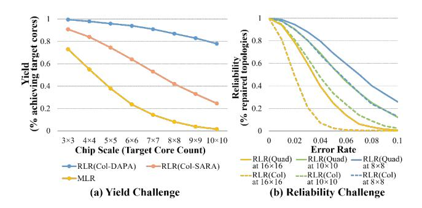
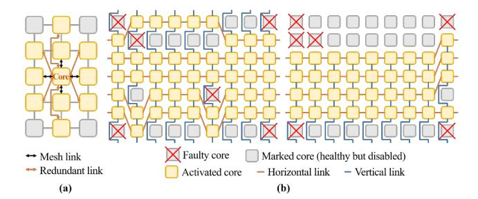
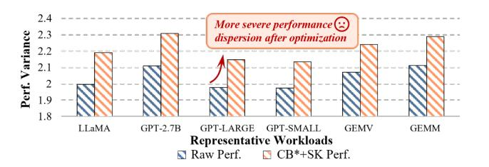
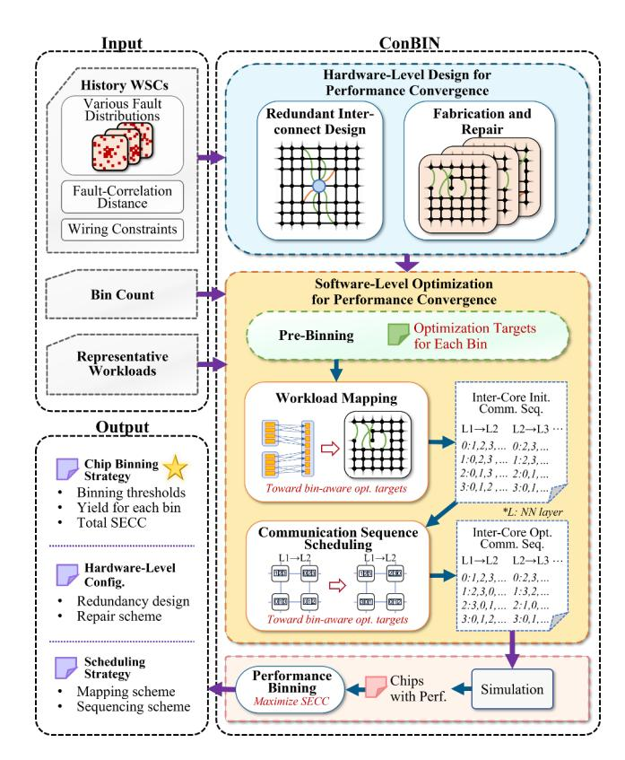
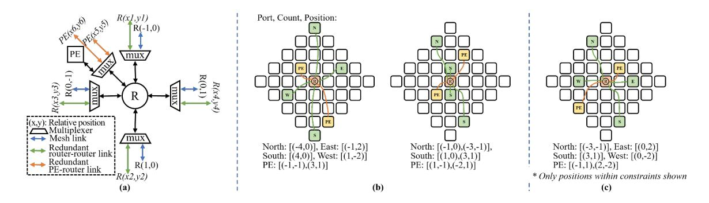
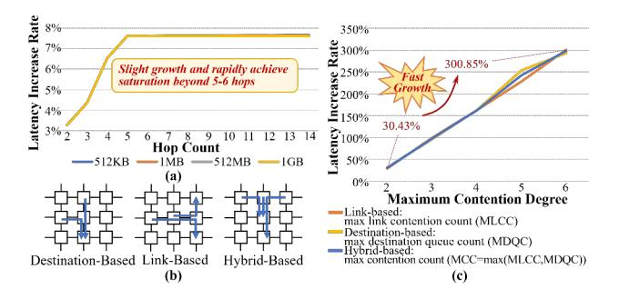
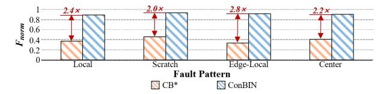
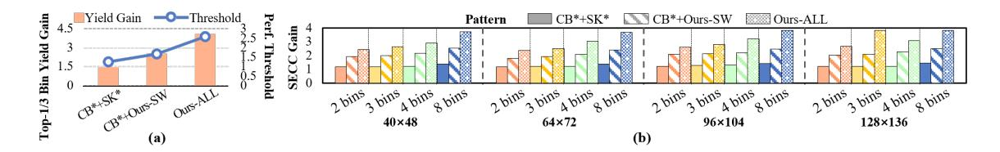

# ConBin: A Performance-Convergence Framework for Wafer-Scale Chip Binning

1 st Huiqing Xu

*Research Center for Intelligent Computing Systems, SKLP*

*Institute of Computing Technology, Chinese Academy of Sciences*

Beijing, China

*Hangzhou Institute for Advanced Study University of Chinese Academy of Sciences* Hangzhou, Zhejiang, China xuhuiqing21@mails.ucas.ac.cn

> 3 rd Yinhe Han

*Research Center for Intelligent Computing Systems, SKLP*

*Institute of Computing Technology, Chinese Academy of Sciences* Beijing, China yinhes@ict.ac.cn

2 nd Mengdi Wang\* *Research Center for Intelligent Computing Systems, SKLP*

*Institute of Computing Technology, Chinese Academy of Sciences* Beijing, China wangmengdi@ict.ac.cn

4 th Ying Wang\* *Research Center for Intelligent Computing Systems, SKLP Institute of Computing Technology, Chinese Academy*

*of Sciences* Beijing, China wangying2009@ict.ac.cn

*Abstract*—Wafer-scale chips (WSCs) like the Cerebras Wafer-Scale Engines (WSEs) offer immense on-chip compute and bandwidth for large-scale Artificial Intelligence (AI) workloads, but their massive area makes defect-free fabrication impossible, posing severe yield and cost challenges. The traditional solution is chip binning, which grades chips by frequency or core count, but such metrics fail for WSCs as their performance is not only determined by core number but also heavily influenced by the communication irregularities caused by faults. These fault-induced variations cause large inter-chip performance divergence, forcing conservative binning thresholds that reduce premium-bin yield (i.e. the fraction of chips in the highest-performance bins) and the aggregate guaranteed performance delivered across bins (i.e., the total sellable effective compute capacity, SECC). Therefore, a new binning strategy and performance-convergence mechanisms are essential for the practical commercialization of WSCs.

To address these challenges, we first propose Performance Binning, a novel paradigm that grades WSCs by their actual performance on target workloads rather than by core count or frequency. We further develop a Performance-Convergence Framework for WSC Binning (ConBIN) that unifies hardware design, software optimization, and performance binning to converge the inter-chip performance distribution and maximize binning yield. ConBIN employs automated, fault-correlationaware redundant interconnect design and post-silicon fault repair to reduce inter-chip divergence of core counts and topology structures. It then applies bin-aware workload mapping and fine-

This work was supported by the National Natural Science Foundation of China (Grant Nos. 92473205 and 62025404) and the National Key R&D Program of China (Grant No. 2023YFB4404400). (Corresponding author: Mengdi Wang and Ying Wang.)

grained communication scheduling guided by lightweight prebinning targets to suppress residual performance variance, which enables tighter chip bin thresholds and higher premium-bin yield, boosting overall SECC. Finally, ConBIN executes performance binning to determine binning thresholds that maximize total SECC. Evaluations show that ConBIN improves premium-bin yield by 2.80× and total SECC by 2.64× over state-of-the-art (SOTA) fault-tolerant methods on 128×136 WSCs.

*Index Terms*—multi-core architecture, network-on-chip, binning, redundancy, fault-tolerant scheduling.

# I. INTRODUCTION

Recent advances in AI and large-scale models [8], [18], [20], [53] have driven demand for unprecedented compute, bandwidth and memory capacity. As AI infrastructure scales toward multi-gigawatt deployments, demand for wafer-scale systems is rising and new methodologies are improving their efficiency and economic viability, making WSC deployments at multi-gigawatt scale increasingly plausible with shipments potentially reaching hundreds of thousands of chips [22], [25], [29], [40], [51]. Wafer-scale computing systems, such as Cerebras WSEs [37], [38], overcome reticle limits (∼858 mm²/die) through advanced packaging, integrating over 10,000 mm² of active silicon — delivering far higher on-chip compute density and bandwidth than leading single-chip GPUs while avoiding inter-chip bottlenecks. However, this extreme scale makes yield and cost management a critical challenge. For example, the Cerebras WSE-3 occupies nearly an entire

Fig. 1. Compute and communication slowdown across defect rates at 128×136 chip scale under different interconnect topologies (Mesh, PD [59], FRED [44]) for GPT-2.7B. Slowdown is relative to a fault-free chip using non-fault-tolerant baseline (NFT); fault configurations follow Sec.VII-A.

300mm wafer (∼46,225 mm²) with ∼970,000 cores in a mesh topology [38]. Fabricated in a 5nm process with a reported defect density of ∼0.001 defects/mm² [31], the probability of fabricating a defect-free chip at this scale — according to the widely adopted negative binomial yield model [15] — is effectively zero, a fact already highlighted in [28].

Yield problems are not new for chip vendors, who have long commercialized imperfect chips by *binning* — grading them into product tiers according to compute metrics such as maximum frequency or the number of functional cores (e.g., Intel and AMD product stacks) — so that more chips can be sold rather than scrapped. However, WSCs targeting massively parallel workloads invalidate this traditional practice. Their execution time is jointly determined by compute and communication, and communication is highly sensitive to defect-induced irregularities. While compute capacity degrades roughly linearly with core loss, communication performance collapses nonlinearly under spatially distributed faults, as shown in Fig.1 across several wafer-scale interconnect topologies. This is because irregular activated core distribution and reduced interconnect resources force longer routing paths and exacerbate contention under complex traffic patterns such as all-to-all. Clustered faults on WSCs make this even worse, as neighboring failures squeeze traffic to their surroundings, which may become a communication bottleneck. These effects depend strongly on the spatial distribution of defects, making communication slowdowns, and thus overall performance, highly variable and difficult to anticipate. The remainder of this paper focuses on the mesh topology, which is widely used in practical wafer-scale designs.

This wide performance variance directly translates into reduced aggregate deliverable performance across bins (i.e., the total sellable effective compute capacity, SECC), thereby limiting scalable commercialization of WSCs. As illustrated in Fig.2, "Raw Perf." refers to fault-degraded performance, which exhibits a large spread with a small fraction of chips falling into high-performance bins, while "ConBIN-Converged Perf." refers to the enhanced and converged performance achieved

Fig. 2. Cumulative yield of 128×136-scale chips with example binning under raw (NFT baseline) and ConBIN-converged performance slowdown distributions. Configurations follow Sec.VII-A.

by our methods despite the fault impact, showing a much higher premium-bin yield, which reveals potential opportunities for optimization. So when performance dispersion is large, vendors must either adopt conservative binning thresholds that lower the guaranteed performance level of each bin, or set aggressive ones that sharply reduce the fraction of chips qualifying for premium bins. In both cases, the same functional yield results in lower effective binning yield and constrained total SECC.

In summary, mass-market productization of WSCs faces a dual challenge: (1) traditional compute-centric binning fails for WSCs, whose performance is dominated not only by compute capacity but also by defect-induced communication degradation, necessitating a new binning strategy; and (2) performance-convergence mechanisms are needed to tighten performance divergence and raise binning yield and SECC.

These challenges are reflected in the publicly described wafer-scale repair strategy of Cerebras [39]. To address extreme yield loss, this strategy preserves mesh regularity through redundant interconnects and treats any chip with a contiguous defect-free sub-mesh as functional, regardless of its size. This works only in a vertically integrated setting, where the same company designs and operates the compute service, because the compute service provider can absorb per-chip variability by scheduling workloads onto any mesh. However, it breaks down in a commercial product context. While it improves yield, it causes substantial chip-to-chip performance variability, as the activated core count differs widely and many otherwise functional regions remain unused. The resulting unpredictability complicates consistent testing, performance qualification, maintenance, and supply-chain planning, thus keeping mass-market productization out of reach.

To address both challenges, we first introduce Performance Binning, a new grading paradigm that classifies WSCs by their measured performance on representative target workloads rather than by core count or frequency, thereby aligning product tiers with guaranteed performance levels.

For effective performance binning, we propose a Performance-Convergence Recovery Framework for Wafer-Scale Chip Binning (ConBIN) to raise the share of chips qualifying for premium bins and to achieve converged performance by tightening the performance spread within each bin. As shown in Fig.6, ConBIN systematically spans the entire process from hardware-level design and softwarelevel optimization to chip performance binning based on target large-scale model workloads, where each stage explicitly drives performance convergence to support more aggressive bin thresholds without yield loss, increasing premium-bin share and total SECC.

It incorporates automated, fault-correlation-aware redundant interconnect design and post-silicon fault repair to salvage original compute and communication capabilities from defects and to approximate the expected topology across chips, thereby suppressing inter-chip divergence of core counts and topology structures under varying wafer-scale defect patterns and driving performance convergence across chips. On top of the repaired hardware, ConBIN performs bin-aware task scheduling guided by lightweight pre-binning targets. The pre-binning stage partitions repaired chips into preliminary bins and establishes bin-specific optimization objectives. Then, ConBIN develops workload mapping and fine-grained communication sequence scheduling, which adaptively pursue these optimization targets to further suppress performance variance and elevate chips near bin boundaries into higher-value bins. Finally, ConBIN grades chips by their post-recovery workload performance and executes dynamic-programmingbased performance binning to determine optimal thresholds that maximize total SECC.

Using system-level simulation, we demonstrate that ConBIN achieves a 2.80× yield gain in premium bins and up to 2.64× overall SECC gain compared with SOTA hardware–software fault-tolerant methods at 128×136 chip scale.

# II. BACKGROUND

### *A. Manufacturing Faults in Wafer-Scale Chips*

Modern WSCs follow standard CMOS manufacturing test flows, including scan-based structural testing and at-speed timing validation to detect permanent logic defects and delay faults [3], [52], [56]. These tests are conducted at wafer sort and final test, and, together with post-silicon failure diagnosis, can localize defects to standard-cell regions. At the architectural level, such localized failures are abstracted as faulty PEs, routers, or interconnect links, which motivates our modeling granularity. *We assume high structural fault coverage (including stuck-at, bridging, and transition faults) and treat all diagnosed faulty components as permanently disabled.*

The distribution of faults on WSCs exhibits both random and clustered patterns [19], where the clustered faults appear as spatially contiguous defective regions, due to process variations, thermal stress, die warpage or screw holes [1], [21], [24], [35], [39], [55]. These faults can be classified into several

Fig. 3. Scalability Challenges of Topology-Keeping Fault-Tolerant Methods [11], [45].

common fault patterns, including Local, Scratch, Edge-Local, and Center faults [58].

Although fault patterns and distributions are generally unpredictable, Stapper's analysis [49] revealed a clear distance correlation among wafer-scale defects: nearby defects within roughly four defect-sampling quadrats tend to form spatial clusters. Such correlation causes redundancy to fail when spare resources lie within the same cluster as defective regions, rendering purely locality-based spares ineffective. Motivated by this insight, our design strategically introduces long-range redundant links that account for spatial fault correlation.

# *B. Hardware-Level Fault-Tolerant Designs and Binning Strategy*

To ensure reliable performance in many-core chips under manufacturing defects, both academia and industry have explored a variety of fault-tolerant designs. Array-Preserving Redundancy guarantees target core count using spares [9], [61], but fails to preserve the expected topology, degrading communication and dispersing inter-chip performance. Fully-Preserving Redundancy further repairs faulty processing elements (PEs) [6] or interconnect components [10], [11], [45] while maintaining both array size and topology. Representative schemes include Router-Level Redundancy (RLR) schemes (Col-spare with variants DAPA/SARA [10], [11] and Quadspare [45]) and Microarchitecture-Level Redundancy (MLR). However, their scalability is fundamentally limited: as chip size grows, yield and reliability decline (Fig.3), making them impractical for WSCs. Topology-Preserving Redundancy, as disclosed in the Cerebras patent [39], considers any chip with a defect-free sub-mesh usable, regardless of its size. As illustrated in Fig.4, the disclosed method augments each core with six additional 2-hop redundant links and extracts a regular sub-mesh by marking selected healthy cores. Fig.4(b) reveals an inherent limitation. When faults are spatially separated, short-range redundancy can locally bypass faults, preserving a relatively large activated mesh (e.g., a 5×9 activated mesh, 79% of healthy cores in Fig.4(b, left)). However, clustered faults cannot be bridged by short-range links and additional healthy cores must be marked, yielding a smaller mesh (e.g., 4×9, 63% of healthy cores in Fig.4(b, right)). This

Fig. 4. Topology-preserving redundancy and repair as disclosed in the Cerebras patent [39]. (a) Redundant architecture for each core. (b) Repair examples under different fault distributions with the same fault count. Left: spatially separated faults. Right: clustered faults. The repair process marks additional healthy cores to equalize the number of unavailable cores (defective + marked) across columns and to enforce adjacency constraints. Then, horizontal and vertical links are selected to realize the activated mesh.

prioritization of topology over utilization becomes particularly costly under spatially correlated defects. At the 128×136 scale across 512 fault instances (same setup as Sec.VII.A), the activated core count averages 5,122, which is only 38% of that retained by a naive "use-all-healthy-cores" repair without mesh constraints. Compared with the naive repair, this method exhibits nearly 3× higher variance, indicating pronounced chip scale variance that undermines standardized production and limits total SECC.

Because none of these schemes can guarantee scalability or converged performance, Chip Binning remains a key commercial strategy, grading chips by frequency [47], [60] or active-core count (e.g., AMD EPYC 9654 vs. 9534 [4], [5]). Yet such compute-centric metrics fail for WSC binning, where defect-induced communication degradation dominates overall performance (Sec.I).

# *C. Software-Level Fault-Tolerant Methods*

Beyond hardware redundancy, software-level techniques mitigate the impact of defects and ensure reliable task management through fault-tolerant task scheduling. There are two classifications of fault-tolerant scheduling approaches. The first targets traditional applications through task mapping [12], [42], [43], [57], remapping and migration techniques [2], [13], [14], [16], [41], [62]. These methods maintain reliable execution and restore runtime performance in the presence of faults, commonly modeled by Weibull [26] or Lognormal distributions [23]. The second classification, though less studied, is dedicated to accelerating AI workloads. Si-Kintsugi [27] proposes a workload mapping model paired with a scalable cost function that reflects how faults affect intercore communication distances. The work further evaluates its performance under random and structured wafer-scale fault patterns, including local, center, edge-local, and scratch defects.

Prior MPSoC solutions that focus on communication latency or throughput [2], [13], [14], [43] and wafer-scale work [27] mainly minimize hop count, as accurately modeling contention remains computationally complex [57]. However,

Fig. 5. Performance variance comparison of 128×136 chips before and after optimization with baseline CB\* (based on the Cerebras redundant architecture [39]) and Si-Kintsugi scheduling (SK) [27]; variance measured on performance normalized to the fault-free chip.

manufacturing defects intensify communication contention on WSCs, which becomes the primary latency source (further elaborated in Sec.VI-A), rendering hop-based optimization insufficient. We therefore propose scalable contention-aware methods to effectively recover performance.

# III. MOTIVATION

### *A. Prior Works Cannot Converge Performance Distribution*

Existing hardware redundancy strategies raise functional yield but do not narrow performance variance. As clarified in Sec.II-B, array-preserving redundancy schemes maintain array size while ignoring topology uniformity; they revive compute capacity but introduce uneven local connectivity and bottlenecks, producing scattered performance under realistic workloads. Fully-preserving redundancy schemes attempt to retain both array size and mesh topology, but face scalability issues at wafer scale, which limits their practicality. Topology-preserving redundancy schemes, such as the approach disclosed in the Cerebras patent [39] that maintains mesh regularity while relaxing array size, reduce routing irregularity but cause large chip-to-chip differences in activated cores and effective bandwidth density, again yielding dispersed performance across WSCs.

Existing software strategies optimize for maximum performance recovery rather than performance convergence. When fault distributions cause severe performance degradation, these schedulers should provide large recovery gains; when fault impact is mild, only limited performance recovery is needed. However, the very chips that need greater recovery are also harder to optimize due to clustered faults along key paths and heavy congestion bottlenecks, while defective chips with slighter fault impact are easier to accelerate. Consequently, scheduling amplifies inter-chip performance variance — the strong gets stronger, and the weak stays weak — leading to even wider performance dispersion after optimization, as shown in Fig.5.

Across layers, these solutions optimize disjoint objectives, none of which explicitly target performance convergence. What is missing is the hardware- and software-level optimization toward a single system objective: converging the performance distribution. ConBIN is motivated precisely by these needs, aligning full-stack optimization toward performance convergence and practical binning effectiveness.

# *B. From Performance Convergence to Maximizing Sellable Effective Compute Capacity*

While prior works improve average performance, their inability to converge the performance distribution has profound implications for production yield and the aggregate guaranteed performance deliverable across bins. In wafer-scale manufacturing, each chip represents a substantial investment in silicon area and packaging cost, yet large inter-chip performance variance prevents consistent product qualification. When chip performance fluctuates excessively due to various fault distributions, vendors must adopt conservative binning thresholds and discard or down-bin many usable chips, lowering the fraction of premium-performance bins and the aggregate guaranteed performance deliverable across bins. Conversely, if performance variance across chips can be effectively reduced, the same functional yield can translate into a higher fraction of premium-performance chips and more stable product segmentation.

This effect can be formalized by defining the total sellable effective compute capacity (SECC) as the aggregate guaranteed performance deliverable across bins:

$$SECC = \sum P_k \cdot Y_k \tag{1}$$

where Pk is the guaranteed deliverable performance level of bin k, determined by its performance threshold, and Yk is its yield fraction derived from the performance distribution f(p). For a given manufacturing yield, both Pk and Yk are fundamentally constrained by the spread of performance across chips. When the performance variance σ p 2 is large, any reasonable threshold configuration either adopts conservative thresholds with lower Pk to accommodate slow chips or sets higher thresholds at the cost of sharply reduced Yk for premium bins. In both cases, the total SECC is bounded by this variance. By contrast, when the performance distribution is well converged, thresholds can be set aggressively without sacrificing yield, allowing a larger portion of chips to qualify for high-priced bins. In this sense, performance convergence directly expands the feasible region of binning configurations that maximize SECC, transforming the same physical yield into higher aggregate guaranteed performance deliverable across bins.

Therefore, the ultimate objective of performance recovery in WSCs should extend beyond average performance. Rather than merely improving the mean performance of individual chips, the design goal must be to reduce inter-chip performance variance and achieve a globally converged performance distribution. By jointly optimizing redundancy and scheduling for variance reduction, we can systematically increase premiumbin yield and maximize the total SECC under manufacturing constraints. This motivates the design of ConBIN a performance-convergence framework for WSC binning that converges the performance distribution and bridges the gap among fault tolerance, performance uniformity, and commercial viability.

Fig. 6. Overview of the ConBIN framework: from hardware-software optimization to performance binning.

# IV. OVERVIEW

ConBIN targets the objective established in Sec.III maximizing the premium-bin yield and total SECC through inter-chip performance convergence — by aligning hardware and software layers toward performance variance reduction rather than mere mean speedup. As illustrated in Fig.6, the process begins with hardware-level redundant interconnect design and post-silicon repair. These steps approximate the expected mesh topology under diverse fault distributions while imposing implementation-feasible hardware constraints to ensure manufacturability. This suppresses extreme structural irregularities that would otherwise amplify chip-to-chip performance divergence. On top of the repaired topology, ConBIN performs software-level optimization through three tightly coupled stages. Pre-binning first groups repaired chips based on their hardware-level characteristics and derives perbin optimization targets with lightweight sampling. These targets provide a unified direction for subsequent mapping and scheduling, ensuring that chips within the same preliminary bin pursue the same performance objectives. Guided by these targets, workload mapping and communication-sequence scheduling apply adaptive, bin-aware optimization: each chip initially optimizes toward its own bin target and, upon reaching it, it is allowed to escalate toward higher-bin targets. This adaptive process tightens the overall performance spread and

Fig. 7. Basic architecture with component-level faults.

enables a larger fraction of chips to qualify for premium bins. After software optimization, chips are evaluated on representative workloads, and ConBIN determines the SECCmaximizing bin thresholds through dynamic-programmingbased performance binning. Since both hardware and software optimization explicitly drive performance convergence, binning thresholds can be set more aggressively without sacrificing yield, leading to higher premium-bin share and larger total SECC.

# V. HARDWARE-LEVEL DESIGN FOR PERFORMANCE CONVERGENCE

# *A. Hardware Architecture with Redundant Interconnects*

Basic Wafer-Scale Architecture and Component-Level Faults. The basic wafer-scale architecture is fabricated as a near-wafer-sized chip by printing multiple reticle-scale dies and stitching them across reticle boundaries, enabling die-todie communication and forming a regular 2D grid of cores separated by scribe lines. Fig.7 illustrates this hierarchy, where each core consists of a PE and a router, multiple cores form a die, and stitched dies together constitute a wafer-scale chip on a single wafer. We consider component-level faults at the granularity of PEs (affecting computation), routers, and links (affecting communication).

Redundant Interconnect Architecture and Routing Assumption. ConBIN automatically selects a redundant interconnect design at design time to best approximate the expected topology under various wafer-scale fault distributions (Sec.V-C), and this design is bounded by process-feasible wiring and layout constraints to ensure manufacturability. Fig.8(a) shows the microarchitecture that implements this redundancy template, which is uniformly applied to all cores. Each router in ConBIN's redundant architecture retains its five logical ports but extends their physical connectivity to support multiple candidate interconnects per direction. For the four cardinal directions, redundant interconnects can connect a router not only to its immediate neighbor but also to routers located several hops away, depending on the redundancy configuration via multiplexers. Similarly, the router-toPE interface is also enhanced with redundancy. In contrast to the baseline design where each PE is only attached to a single router, our redundant architecture allows a PE to have multiple candidate router connections for fault tolerance. After postfabrication repair, however, exactly one PE–router connection is activated, and the selected pair forms the active core used for routing and scheduling.

Once links are configured after fabrication, routing paths are determined using a shortest path algorithm with the constraint of prohibited turns [50], which ensures cycle-free and globally connected networks even under irregular topologies caused by defects.

### *B. Design Metrics for Approximating Mesh Topology*

Despite redundant interconnects, spatially correlated defects make it infeasible to maintain a perfect mesh topology at wafer scale. ConBIN instead targets a near-mesh structure and defines quantitative metrics to assess router connectivity uniformity and PE accessibility relative to the ideal mesh.

Metric 1: Lower-Tail Average Router Degree. In a faultfree mesh, each router connects to four neighbors, but faults may remove links and create uneven connectivity. While the average router degree reflects global connectivity, it fails to capture localized regions with the lowest connectivity, where traffic is forced to detour and concentrate. These regions form structural bottlenecks, and communication delay grows rapidly as contention intensifies. To enhance the resilience of the redundant architecture under diverse fault distributions, we model the weakest regions that most affect communication and define the lower-tail average router degree Dlow, which measures the average connectivity among the least connected α fraction of fault-free routers (α ∈ (0, 1]):

$$D_{low} = \frac{1}{\alpha N_r} \sum_{i \in R_{low}} d_i \tag{2}$$

where Nr is the number of fault-free routers, di is the degree (number of fault-free inter-router links) of router i, and Rlow represents the bottom αNr routers by degree. A higher Dlow indicates that even the weakest routers retain sufficient connectivity, suggesting a topology that more closely approximates the uniformity of a regular mesh.

Metric 2: Accessible PE Ratio. Beyond router connectivity, each PE must remain attached to at least one reliable router. We therefore define the accessible PE ratio RP E, which quantifies the fraction of fault-free PEs connected to a router whose degree exceeds a threshold β:

$$R_{PE} = \frac{1}{N_{PE}} \sum_{j=1}^{N_{PE}} \mathbf{1} \left( \exists r \in \mathcal{N}(j) \text{ s.t. } d_r > \beta \right)$$
 (3)

where NP E is the number of fault-free PEs and N (j) is the set of routers reachable by PE j. A higher RP E indicates a higher potential of more usable compute resources and higher available parallelism after repaired.

Together, Dlow and RP E provide a structural abstraction of the redundant design after repair: Dlow reflects its communication bottleneck resilience and RP E reflects its compute

Fig. 8. (a) Microarchitecture of a router with redundant interconnects. (b) Redundancy design space with illustrative examples. (c) Eventual redundancy design derived by ConBIN for 128×136 chip scale.

salvage capacity. Both metrics serve as optimization objectives in ConBIN's automated redundancy design.

# C. Automated Fault-Correlation-Aware Redundant Interconnect Design

Redundancy effectiveness depends heavily on link placement and length: short-range links tolerate sparse faults but fail under clustered ones, whereas long-range links recover clustered regions at the cost of bypassing healthy cores. ConBIN therefore automates the search for a redundant interconnect design that best preserves near-mesh topology, balancing repair capability with healthy-core utilization across diverse fault distributions.

**Problem Input.** The design method takes three inputs: (1) a maximum interconnect distance  $L_{max}$ , defined by fault-correlation distance and process wiring limits; (2) a redundancy budget  $R_{max}$ , specifying the maximum number of redundant links permitted per core, bounded by routing resources and area overhead; and (3) a set of n fault-annotated chip topologies  $\{T_0, T_1, \ldots, T_{n-1}\}$  derived from defect distribution models or manufacturing data.

Hardware Constraints. To ensure manufacturability and physical regularity, ConBIN assumes fully identical dies and a uniform redundant-interconnect template shared by all cores. Practical limits further bound the design space. Prior industrial designs [39] permit only a small redundancy budget per router, for which we adopt  $R_{max}=6$ . In addition, the maximum physical interconnect length is constrained by signal integrity considerations; links longer than 50 mm significantly increase bit error rate [59], and we conservatively restrict redundant links to below 25 mm equivalent wire length. Process-level wiring supports long-range links up to 6 hops [7], while spatial fault correlation extends  $\sim$ 4 hops [49]. Thus the effective redundant-link range is set to  $L_{max}=\min(4,6)=4$  hops, providing both process-feasible wiring and sufficient coverage of clustered defects.

**Design Space.** For a given  $L_{max}$ , all relative positions  $(\delta x, \delta y)$  with  $1 \leq \delta x^2 + \delta y^2 \leq L_{max}^2$  are enumerated as candidate redundant links (Fig.8(b)). Two link types are allowed: router-to-router (R-R) links following directional pairing rules (e.g., east-west, north-south) and PE-to-router (P-R) links for

computation salvage. A redundancy configuration selects a subset of these candidates, subject to  $\sum links \leq R_{max}$ .

Optimization Objective. Each configuration is evaluated across all n fault maps using the metrics  $D_{low}$  and  $R_{PE}$  introduced in Sec. V-B. Let  $D_{low}^{(k)}$  and  $R_{PE}^{(k)}$  denote their values under topology  $T_k$ . We compute the lower-tail mean (bottom  $\xi\%$ ) of each metric across all topologies, obtaining  $\tilde{D}$  and  $\tilde{R}$ . These quantities capture the structural robustness of the redundancy design by emphasizing the connectivity lower bound and the accessible compute capacity among the most defect-affected chips. By explicitly focusing on this vulnerable fraction, our objective prioritizes improving structural resilience not for typical cases, but for the potentially worst-performing chips, which is critical for tightening interchip performance dispersion while also preventing severe degradation of overall average performance. The objective is:

$$F = \lambda \tilde{D} + (1 - \lambda)\tilde{R} \tag{4}$$

where  $\lambda \in [0,1]$  controls the weighting between mesh likeness and PE accessibility and is a redundancy trade-off parameter that adjusts the optimization priority between communication robustness and compute salvage. A higher F indicates stronger resilience and better restorative capability of topological regularity under various fault patterns and distributions, which benefits both performance convergence and aggregate performance level. This objective F directly serves as the fitness function for the optimizer described below.

**Optimizer.** Given the enormous combinatorial design space, we employ an Elitist Reservation Genetic Algorithm (EGA) [32] tailored for redundancy configuration search. Two custom operators are applied: crossover exchanges subsets of selected links while preserving  $R_{max}$  limit, and mutation randomly selects several links as spares followed by correction to maintain the exact redundancy budget. With a population of 50, the search terminates when no improvement in the best fitness is observed over 10 consecutive generations.

**Eventual redundancy architecture.** Under the experimental configurations described in Sec.V-E with  $R_{max}=6$ , the optimization consistently converges to a similar redundancy structure across all evaluated chip scales. Each router is

equipped with two P-R redundant links (one short-range and one long-range), two short-range R-R links, and two long-range R-R links. Fig.8(c) illustrates the resulting architecture for the 128×136 chip scale. This structure balances three objectives under the limited redundancy budget: preserving local mesh-like connectivity, bridging spatially correlated faults, and maintaining PE accessibility. *Insight: under spatially correlated wafer-scale defects, effective redundancy architectures must combine short-range links for local connectivity with long-range links that raise the connectivity lower bound across defect regions.* 

#### D. Post-Fabrication Repair Scheme

After WSC fabrication and testing, each chip instance exposes a unique fault map caused by process and manufacturing variations. Based on the redundant interconnect template (Sec.V-C), ConBIN conducts a post-fabrication repair to configure active PEs/routers and assign one valid interconnect per router port. The procedure proceeds in two phases: core configuration and interconnect configuration.

(1) Core Configuration. This phase maximizes the number of functional PEs by re-attaching healthy PEs from routeronly faulty cores. All cores are divided into four sets: fully healthy  $(C^h)$ , router-only faulty  $(C^r)$ , PE-only faulty  $(C^p)$ , and totally faulty  $(C^f)$ . Each replacement chain must end at a PE-only faulty core, and the number of repairable routeronly cores is bounded by  $|C^p|$ . For each  $P \in C^r$ , ConBIN performs a breadth-first search (BFS) over redundant P-R links to find a replacement chain that rebinds a sequence of routers and PEs, allowing the PE of P to be reassigned to a healthy router and propagating this re-binding along the chain. Along the chain, each router releases its original PE and connects to the preceding one, while its own PE is reassigned to the next router. After reconfiguration, all involved cores are equipped with remapped PEs, and PE-router latencies are updated according to new distances. When multiple candidate chains exist, the shortest one is selected to minimize re-binding delay. This replacement strategy salvages compute capacity by remapping PEs to nearby healthy routers, and shortest-chain selection minimizes remapping overhead and latency.

(2) Interconnect Configuration. This phase proceeds to restore near-mesh connectivity and communication capability after the core configuration. For each router, ConBIN examines its east, south, west and north ports and determines one interconnect per port following two priority rules: (i) use the mesh link if both endpoints are functional; (ii) otherwise, select the shortest available redundant link that approximates mesh topology with minimal additional latency. This priority ensures that most routers preserve their original neighborhood while redundant R-R links provide bypass paths across clustered fault regions, approximating the communication capability of an ideal mesh.

#### E. Robustness and Scalability Analysis

**Evaluation Setup and Fault Models.** Our hardware-level design is evaluated on wafer-scale chips composed of multiple

stitched dies in a 2D mesh. Each die contains an 8×8 core array with 8MB SRAM per core and measures 16.66mm×22.17mm. We study four chip scales formed by [5×6, 8×9, 12×13, 16×17] dies, corresponding to [40×48, 64×72, 96×104, 128×136] cores (default: 128×136). Fault maps are generated following the wafer-level fault simulation method in [48], using Gaussian-distributed fault clusters combined with random noise points. By controlling cluster parameters and their spatial placement on the WSC, we simulate four representative fault patterns — *Local*, *Scratch*, *Edge-Local*, and *Donut* — each covering fault rates from 0.05 to 0.4. Unless otherwise specified, the simulated fault correlation distance is 4 hops [49]. For each chip scale, 128 fault instances are generated.

Convergence Analysis. We analyze how key parameters influence the convergence behavior of the two metrics composing the fitness function: the lower-tail router degree D and the accessible-PE ratio R. When  $\lambda < 0.6$ , the search tends to oscillate or stall, showing slow and unstable improvement in  $\hat{D}$  and  $\hat{R}$ . For  $\lambda \in [0.6, 1.0]$ , both metrics converge stably within tens of generations. Since performance degradation and variance in WSCs is primarily governed by communication bottlenecks rather than compute loss (Sec.I), prioritizing D is structurally more performance-critical than emphasizing R. Our experiments show that when  $\lambda = 0.9$ , the optimizer achieves the highest final  $\hat{D}$  while maintaining similar convergence behavior and comparable  $\hat{R}$  values, thereby yielding the highest fitness F. Therefore,  $\lambda = 0.9$  is adopted for all subsequent experiments. We further examine the effect of the lower-tail ratio  $\alpha$  in  $D_{low}$ . When  $\alpha = 1$ ,  $D_{low}$  degenerates to the average router degree, and our experiments show that it fails to capture connectivity bottlenecks. In contrast, the optimization becomes stable when  $\alpha < 0.5$  and achieves the highest fitness F at  $\alpha = 0.3$ , indicating that focusing on the lower-tail routers more effectively guides redundancy design toward mesh-like topologies under various fault distributions. Insight: communication robustness in wafer-scale systems with spatially correlated defects is governed by the connectivity lower bound rather than the average connectivity.

Sensitivity Analysis. In the default configuration, the fault-correlation distance is shorter than the process limits, allowing the redundancy design to effectively cover clustered defects. If the fault-correlation distance (e.g., 8 hops) exceeds the process limits, the redundancy design becomes bounded by the process limits (6 hops), and the achievable F decreases by  $\sim 10.34\%$ , indicating that long-range defect correlation cannot be fully compensated at the hardware layer. Although redundant interconnects significantly improve near-mesh recoverability, residual non-uniformity is unavoidable due to the spatial complexity of real defects. Therefore, ConBIN further implements software-level optimization to converge inter-chip performance beyond hardware repair.

**Scalability Analysis.** To assess scalability, we analyze both optimization quality and runtime across chip scales. For each configuration, we normalize the optimized fitness value  $F_{opt}$  by the ideal fault-free  $F_{ideal}$  of the same scale, i.e.,  $F_{norm} = F_{opt}/F_{ideal}$ , to measure how effectively the

 $\label{table I} TABLE\ I$  Scalability of hardware-level design across chip scales.

| Chip Scale | $F_{norm}$ | Design Time (min) | Repair Time (s) |
|------------|------------|-------------------|-----------------|
| 40×48      | 87.94%     | 1.31              | 1.17            |
| 64×72      | 86.43%     | 3.04              | 2.59            |
| 96×104     | 88.19%     | 4.55              | 4.01            |
| 128×136    | 87.25%     | 6.28              | 7.12            |

Fig. 9. (a) Hop-based contention impact on latency under different data volumes. (b) Inter-task contention types. (c) Inter-task contention impact on latency. Results are obtained using BookSim (Sec.VII-A), varying hop counts and concurrent tasks to isolate hop- and contention-induced latency.

redundancy design preserves mesh regularity as chip size increases. As summarized in Tab.I, the normalized  $F_{norm}$  remains consistently high (above 85%) across all chip scales, confirming that ConBIN effectively preserves near-mesh characteristics even at large scales. Meanwhile, although runtime increases with scale, the maximum execution time remains only 6.28min and 7.12s for the redundancy design and post-fabrication repair, respectively, exhibiting low computational overhead and strong scalability for wafer-scale deployment. Additionally, the redundant interconnect introduces limited hardware cost with an estimated area overhead below 8% at  $128 \times 136$  scale using McPAT [36]. Since the redundancy budget per router is fixed ( $R_{max} = 6$ ), the relative overhead remains constant as core density scales.

# VI. SOFTWARE-LEVEL OPTIMIZATION AND PERFORMANCE BINNING

#### A. Communication Performance Impact of Contention

Manufacturing faults reshape routing paths and reduce available communication resources, causing both longer paths and significantly higher contention. While both factors affect communication latency, our investigation shows that contention — not hop inflation — is the dominant source of communication latency under wafer-scale defects, which directly motivates ConBIN's contention-aware optimization for performance convergence and improvement.

Hop-based contention (i.e., no inter-task interference) in Fig.9(a) shows limited latency growth, which rapidly saturates beyond 5-6 hops due to router pipeline amortization. In contrast, Fig.9(b)-(c) illustrate inter-task contention, where destination, link, and hybrid contention cause severe and near-linear latency escalation as the number of competing

tasks increases. These results indicate that contention-induced slowdown far exceeds hop-induced latency, making contention the primary latency source under clustered faults.

We therefore use the metrics MDQC, MLCC, MCC, as defined in Fig.9(c), to guide ConBIN's mapping and scheduling in order to reduce fault-induced contention and converge chip performance toward premium bins.

#### B. Pre-Binning

Although the hardware-level design (Sec.V) restores a nearmesh topology, residual irregularities still cause non-trivial performance loss and inter-chip variation, motivating software-level optimization. To support this, ConBIN introduces a prebinning stage that partitions repaired chips into preliminary bins and establishes bin-specific optimization objectives for mapping and scheduling. Given a chip population and a vendor-defined bin count B, this stage derives representative targets with acceptable computational cost.

**Initial Partitioning.** Chips are sorted by hardware-level metric F (Sec.V-C) and divided into B+1 quantile-based groups, providing an initial estimate of target performance bins before optimization.

Target Generation via Lightweight Sampling. To assign optimization targets efficiently, ConBIN conducts lightweight mapping (Sec.VI-C) and scheduling (Sec.VI-D) on a small subset (top 5%–15%) of chips within each group, using reduced populations and limited generations. The average performance of these sampled chips defines each bin's representative objectives: the expected maximum link contention count  $MLCC_{exp}^{target}$  for mapping (Sec.VI-C) and the maximum contention cost  $\Phi^{target}$  for scheduling (Sec.VI-D). These targets ensure bin-wise alignment during subsequent optimization, enabling effective performance recovery and more profitable binning.

# C. Workload Mapping

To reduce inter-chip performance divergence and promote chips toward higher-value bins, ConBIN employs workload mapping on the repaired topology to minimize communication contention bottlenecks while aligning with bin-specific performance targets derived in Sec.VI-B.

The repaired topology is defined as TG = (V, E), where V denotes the set of functional cores and E represents the available links after post-fabrication repair. Given a directed workload graph WG = (W, D), where each node  $w \in W$  represents a computational workload and each edge  $d_{i \to j} \in D$  denotes the data dependency requiring results of  $w_i$  to be transferred to  $w_j$  (i.e., communication tasks), our goal is to find an injective mapping from workloads in W to cores in V that minimizes the expected contention severity:

$$\Gamma: W \to V$$

$$\Gamma(w_i) \neq \Gamma(w_j), \quad \forall \ w_i \neq w_j \ \text{and} \ \ w_i, w_j \in W \qquad \text{(5)}$$

$$\min_{\Gamma} MLCC_{exp} = \max_{e \in E} LCC_{exp}(e)$$

where  $\Gamma(w_i) \neq \Gamma(w_j)$  ensures exclusive core assignment for workloads, and  $MLCC_{exp}$  denotes the expected maximum

contention on links. Note that the optimization is guided by an adaptive, bin-specific target  $MLCC_{exp}^{target}$  (Sec.VI-B), which reflects each bin's expected performance.

For each candidate mapping, the expected contention on a link e is determined by the cumulative communication frequencies of all data transfers routed through it:

$$LCC_{exp}(e) = \sum_{\substack{d_{i \to j} \in D \\ e \in R(v_i, v_j)}} p_{i \to j}$$
 (6)

where  $p_{i \to j}$  denotes the fraction of workload  $w_i$ 's total output data sent to  $w_j$ , and  $R(v_i, v_j)$  is the routing path between cores  $v_i$  and  $v_j$ .

By minimizing  $MLCC_{exp}$  guided by  $MLCC_{exp}^{target}$ , we prioritize mappings that distribute high-frequency communications across links, preventing persistent bottlenecks while improving performance convergence.

Adaptive Bin-Aware Optimizer. We employ the Strengthen Elitist Genetic Algorithm (SEGA) from Geatpy [32] enhanced with adaptive bin awareness. It preserves elites and dynamically escalates the optimization target to the next higher bin once the current bin target is met (up to twice to control overhead), allowing chips near bin boundaries to pursue higher-bin mappings and improving premium-bin yield. If the elevated target is not met within 30 generations or the global limit, the best solution that satisfied the last valid target is adopted. We use a population of 100 and a maximum of 100 generations, with early termination after 10 stagnant generations.

Complexity Analysis and Overhead. The computation of  $MLCC_{exp}$  iterates over each edge  $d \in D$  in the workload graph WG to accumulate contention weights along routing paths R. This yields a time complexity of  $O(|D| \cdot h)$ , where |D| is the edge count of WG and h represents the average path length in topology graph TG. For the  $128 \times 136$  scale, the workload mapping takes  $\sim 18.36$  minutes under the same configuration as Sec.VII, demonstrating scalability. Space complexity is O(|E|), linear in links for storing contention counters.

#### D. Communication Sequence Scheduling

After workload mapping, the execution order of inter-core data transfers still significantly affects workload performance, especially under residual irregularity in the repaired topology. Uneven link utilization and destination congestion can cause time-varying contention, which amplifies latency differences across chips and cannot be solved by coarse-grained scheduling. Since the workload graph and communication dependencies are fixed during execution, the communication sequence can be statically determined before runtime. To further improve performance convergence and exploit more performance potential, ConBIN performs fine-grained communication sequence scheduling guided by bin-specific optimization targets, enhancing the yield of premium bins.

Contention Analysis Phases (CAPs). The communication timeline is partitioned into CAPs — intervals during which contention distribution remains quasi-stable. Each CAP analyzes concurrent tasks (including in-flight tasks from prior

CAPs) and optimizes their sequencing to mitigate contention. For further scalability, CAPs employ tri-granular batching: Fine-grained CAPs analyze early communication batches, optimized with small batch sizes ( $\leq b1$ ); Medium/Coarse-grained CAPs analyze later batches with larger sizes ( $\leq b2$ ,  $\leq b3$ ), trading precision for efficiency. Here, a communication batch refers to all transmissions targeting the *i*-th destination in communication sequences, and several batches indicates partial communication sequences. For example, Core 0 needs to sequentially transfer to Core 1 and 2 while Core 1 needs to transfer to Core 3 and 0 in sequence, where task from Core  $0\rightarrow 1$  and from Core  $1\rightarrow 3$  is seen as the first batch while task from Core  $0\rightarrow 2$  and from Core  $1\rightarrow 0$  is seen as the second batch.

Moreover, we develop a history-aware contention propagation mechanism  $(\mu \in (0,1))$  to preserve unresolved high-contention tasks across CAPs. This balances optimization quality and computational overhead for wafer-scale systems.

**Optimization Objective.** Given an initial communication sequence set  $CSS_0 = \{S_v | v \in V\}$  and a maximum sequence length  $|S|_{max}$ , we seek a communication set  $CSS^* = \{S_v^* | v \in V\}$  that minimizes the expected contention severity across all CAPs:

$$\min \Phi = \min \{ \phi^0, \phi^1, ..., \phi^{K-1} \}$$
 (7)

where  $\phi^k$  quantifies each CAP's contention by the expected maximum link or destination contention observed during that phase, and K is the total number of CAPs. The optimization is guided by an adaptive, bin-specific target  $\Phi^{target}$ , derived from the pre-binning stage (Sec.VI-B), enabling performance convergence toward higher bin levels.

**Adaptive Bin-Aware Optimizer.** We employ a multichromosome NSGA-III algorithm [17], [32] enhanced with adaptive bin awareness. The optimizer adopts the same bintarget escalation mechanism described in Sec.VI-C to pursue higher-value bins while bounding overhead. We use a population of 120, up to 100 generations, and stop after 10 stagnant generations.

Complexity Analysis. The CAP division and tri-granular analysis limit communication steps to a constant K (configurable via b1,b2,b3), while the history factor  $\mu$  reduces cross-CAP tasks to a subset of D (total edges in the workload graph WG). The time complexity is dominated by evaluating all |D| tasks, where each task's routing path requires O(h) operations (average hop count). Thus, total time is  $O(|D| \cdot h)$ . For a 128×136 chip, the communication sequence scheduling completes in  $\sim$ 28.19 minutes under the same configuration as Sec.VII. Space complexity is  $O(n_{link} + n_{dest})$ , only storing contention counts per CAP for scalability.

#### E. Performance Binning Method

After software-level optimization, each chip is tested to obtain an average performance on representative workloads. Given all chip performance results  $P=p_1,p_2,\ldots$  and a vendor-defined binning count B, ConBIN determines the

TABLE II
MODEL SPECIFICATION.

| Model Name | $n_{params}$ | $n_{layers}$ | $d_{model}$ |
|------------|--------------|--------------|-------------|
| LLaMA      | 6.7B         | 32           | 4096        |
| GPT-2.7B   | 2.7B         | 32           | 2560        |
| GPT-Large  | 760M         | 24           | 1536        |
| GPT-SMALL  | 125M         | 12           | 768         |

binning thresholds  $\tau$  that maximize total sellable effective compute capacity SECC defined in Sec.III-B.

Binning Method Based on Dynamic Programming. To achieve efficient performance binning, ConBIN discretizes the sorted chip population (in descending order of performance) by percentiles (N=100). Let DP[b][i] denotes the maximum SECC obtained by using exactly b bins to cover the top i% of chips:

$$DP[b][i] = \max_{j < i} \{DP[b-1][j] + \tau_{j+1} \cdot (i-j)\}$$
 (8)

where  $\tau_{j+1}$  is the threshold performance at the (j+1)-th percentile, and (i-j) represents the fraction of chips assigned to bin b.

**Complexity Analysis.** This binning method runs a dynamic programming procedure maintaining DP[b][i] for  $b \in [1, B]$  and  $i \in [1, N]$ . Thus, the overall complexity is  $O(BN^2)$ , and the DP table requires O(BN) space. Both are negligible due to fixed, small N.

#### VII. EVALUATION

#### A. Experiment Setup

**Hardware Configuration.** We evaluate ConBIN on wafer-scale chips composed of multiple stitched dies arranged in a 2D mesh, following the hardware specifications in Sec.V-E. Each die integrates an 8×8 core array with 8MB SRAM per core and measures 16.66mm×22.17mm. Four chip scales are studied by assembling [5×6, 8×9, 12×13, 16×17] dies, corresponding to [40×48, 64×72, 96×104, 128×136] cores (default: 128×136). For each of the four representative fault patterns — *Random, Local, Scratch*, and *Edge-Local* — 512 chips are generated with different defect distributions.

Workload Configuration. We evaluate six representative workloads: LLaMA [54], GPT-2.7B, GPT-LARGE, GPT-SMALL [8], and two linear-algebra kernels (GEMV and GEMM with 32k×32k matrices). Details of the model scales and their respective architectures are provided in Tab.II. For chip scales smaller than 128×136, we proportionally adjust the hyper-parameters of models — hidden-dimension size (256, 512, 1024, or 1536) and number of layers (2-24) — or the matrix sizes of linear-algebra kernels, ensuring a consistent relative workload size across chip scales.

**Baseline Methods.** For hardware-level design baseline, we adopt the redundant architecture described in Cerebras patent [39]. To avoid scale variation dominating performance differences (discussed in Sec.II-B), we apply our repair method on the baseline redundant architecture, which activates as many usable cores as possible. This configuration, Cerebras

TABLE III
SIMULATOR PARAMETER CONFIGURATION.

| Simulator | Parameter                        | Value             |
|-----------|----------------------------------|-------------------|
| ScaleSim  | Array Height                     | 32                |
|           | Array Width                      | 32                |
|           | SRAM Size                        | 8MB               |
|           | Dataflow                         | Output Stationary |
| BookSim   | Number of Virtual Channels       | 8                 |
|           | Buffer Size                      | 8                 |
|           | Flit Size                        | 32 bits           |
|           | Packet Size                      | 16 flits          |
|           | Router Pipeline                  | 4 cycles          |
|           | Link latency (per mesh-hop span) | 1 cycle           |

Fig. 10. Normalized mesh-likeness metric  $(F_{opt}/F_{ideal})$  across fault patterns under Cerebras and ConBIN redundancy designs (128×136 scale).

redundancy with our repair method, is denoted as CB\*. For workload scheduling, we adopt the latest workload allocator, CUPOKer [33] as the non-fault-tolerant baseline (denoted as NFT), which efficiently manages compute resources on Cerebras' CS-1 WSE for large-scale workloads like GPT-3 and won the ISPD 2020 competition [30]. Additionally, we consider SOTA fault-tolerant workload scheduling framework Si-Kintsugi [27] (denoted as SK) as the fault-aware baseline.

Simulation Configuration. To simulate workload execution latency, we develop a system-level simulation that integrates the Scalesim [46] for core-level simulation and Booksim [34] for interconnect simulation. Consistent with publicly described wafer-scale embodiments [39], cores across die boundaries are allowed to directly interconnect with adjacent cores and incur the same latency as intra-die communication. Additionally, redundant interconnects directly connect routers that are several mesh hops apart, and their latency scales proportionally with the number of mesh hops they span. Tab.III presents the parameter configurations for each simulator, respectively.

#### B. Hardware Redundancy Evaluation

To evaluate the effectiveness of ConBIN's fault-correlation-aware hardware-level design in recovering near-mesh topology under wafer-scale defects, we compare our redundant interconnect architecture with Cerebras' design. Fig.10 presents the mesh-likeness metric  $F_{norm}$  (normalized to the defect-free  $F_{ideal}$ ) across four representative fault patterns at the 128×136 chip scale, which jointly captures the lower-tail router degree and the accessible-PE ratio. A higher F indicates both stronger preservation of near-mesh connectivity and broader recoverability of functional PEs.

Across all fault patterns, ConBIN consistently achieves high  $F_{norm}$  (above 88%), showing that its tactful use of short- and long-range redundant interconnects effectively bypass spatially correlated defects and prevents isolation of PEs surrounded

Fig. 11. Performance variance reduction relative to CB\*+NFT across workloads and chip scales under different methods.

Fig. 12. End-to-end performance speedup over CB\*+NFT across chip scale under different methods.

Fig. 13. End-to-end performance speedup of Ours-ALL\* over CB\*+SK across defect rate at scale 128×136.

by faulty routers. By contrast, Cerebras' design employs only short-range R-R redundancy, which fails to bridge continuous defect regions or restore core accessibility. As a result, its Fnorm remains below 46% across all patterns, and ConBIN delivers 2.4×, 2.0×, 2.8×, and 2.2× improvements in Fnorm under four fault patterns, respectively.

These results confirm that ConBIN's redundancy design substantially improves the expected topology likeness, which is essential for narrowing performance divergence. Although residual irregularities still lead to performance dispersion, *Sec.VII-C and VII-D show that higher mesh-likeness directly reduces fault-induced performance degradation and facilitates tighter performance convergence and significantly improves effective binning yield.*

# *C. End-to-End Performance Analysis*

To evaluate how software-level optimization further converges inter-chip performance beyond hardware repair, we compare four methods: the baseline combining Cerebras redundancy with Si-Kinstugi's fault-tolerant scheduling (CB\*+SK), baseline redundancy with ConBIN's bin-aware scheduling (CB\*+Ours-SW\*), ConBIN hardware with binaware workload mapping (Ours-WM), and the full ConBIN framework without binning (Ours-ALL\*). Methods including "Ours-" use a representative bin count of eight for bin-aware scheduling.

Performance variance analysis. Fig.11 illustrates the performance variance reduction across workloads and chip scales. Although CB\*+SK improves average performance, it increases variance because chips with easy-to-recover faults gain large speedups while chips with severe clustered faults improve little. CB\*+Ours-SW\* improves inter-chip performance convergence, achieving over 9.16% variance reduction across most workloads and chip scales. Compared to SK, Ours-SW\* introduces bin-aware contention targets, the mapping and scheduling optimizations steer chips toward similar contention levels rather than maximizing individual speedups. With the support of ConBIN's redundancy design, Ours-WM and Ours-ALL\* further tighten the performance distribution, with Ours-ALL\* achieving 64.64% higher variance reduction than CB\*+Ours-SW\*. Additionally, Ours-WM delivers over 45.83% variance reduction while Ours-ALL\* achieves up to 79.21%, confirming that fine-grained communication sequence scheduling can more precisely mitigate fault-induced contention and drive chips toward their target contention levels.

Performance speedup analysis across workloads and chip scales. Fig.12 presents end-to-end speedup across workloads and chip scales. Compared with CB\*+SK, CB\*+Ours-SW\* achieves significantly higher speedups across all workloads, confirming the advantage of contention-aware bin-aware optimization over hop-based fault-tolerant scheduling. Ours-WM and Ours-ALL\* further improves performance (up to 1.85× and 2.39×, respectively) by leveraging ConBIN's hardware redundancy to restore near-mesh connectivity. *Fig.11 and Fig.12 demonstrate that mesh-like topology recovery and binaware software optimization are complementary in recovering average performance and improving convergence, enabling more chips to cluster toward high-performance bins.*

Performance speedup analysis across fault patterns

Fig. 14. (a) Premium-bin yields (top one-third) and performance thresholds (128×136 chip scale, 8 bins); performance normalized to CB\*+NFT\*. (b) Total SECC gain over CB\*+NFT\* across bin counts and chip scales. NFT\* denotes NFT combined with our performance-binning method.

and defect rates. Fig.13 evaluates performance speedup of Ours-ALL\* over CB\*+SK across defect rate under different fault patterns at 128×136. Ours-ALL\* consistently delivers substantial speedups from about 1.48× to over 2.17× across all patterns. Speedup generally increases with defect rate as topology irregularity exacerbates communication bottlenecks. Local and Donut fault patterns show the largest improvements at high defect rate (up to 2.32× and 2.43×), while Scratch and Edge-Local also achieve consistent gains (above 2.18× and 2.02×). *These results indicate that the performance advantage of ConBIN grows with defect severity because its redundancy design aims at mesh-like connectivity while bin-aware scheduling mitigates contention hotspots.*

### *D. Performance Binning Yield Analysis*

To translate the converged performance distribution into commercial benefits, we evaluate how different methods affect binning yield and total SECC. Three methods are compared: the hardware-software baseline (CB\*+SK\*), baseline hardware combined with ConBIN's software optimization (CB\*+Ours-SW), and ConBIN's full method (Ours-ALL). Here, SK\* denotes SK scheduler combine with our binning method. Performance is defined as the average latency across representative workloads. We consider four vendor-defined bin counts (2, 3, 4, and 8), which reflect typical commercial product segmentation.

Fig.14(a) shows, for the 128×136 chip scale, the yield gain of the top one-third performance bins (bar) relative to baseline CB\*+NFT\*, as well as the corresponding normalized performance threshold (line) defining these premium bins. Fig.14(b) demonstrates the resulting SECC gain over CB\*+NFT\* across bin counts and chip scales, where SECC is calculated following Sec.III-B.

Although CB\*+SK decreases performance variance (Sec.VII-C), Fig.14(a) shows that CB\*+SK\* still improves premium-bin yield. This occurs because its binning threshold is relatively loose and its performance recovery on easyto-recover defective chips pushes more chips above that relaxed threshold. However, the loose threshold also limits the achievable guaranteed performance level per bin and thus constrains overall SECC. In contrast, ConBIN's methods both improve average performance and tighten performance dispersion (Sec.VII-C), enabling more aggressive premiumbin thresholds (2.09× over CB\*+SK\*), even with higher premium-bin yield (2.80× over CB\*+SK\*).

Across all methods, Fig.14(b) shows that increasing the number of bins from 4 to 8 noticeably raises SECC, with Ours-ALL benefiting the most. Finer bin partitions enable ConBIN's bin-aware mapping and scheduling to more accurately exploit per-chip potential, reducing performance waste and elevating chips near bin boundaries into higher-performance bins.

Comparing CB\*+SK\* and CB\*+Ours-SW confirms the advantage of ConBIN's software-level optimization (1.45× vs. 2.50× at 128×136 with 8 bins), even without hardware support, as bin-aware mapping and scheduling converge chips toward higher-performance bins with higher average performance (Sec.VII-C). Comparing CB\*+Ours-SW with Ours-ALL (2.50× vs. 3.83× at 128×136 with 8 bins) further demonstrates the benefit of ConBIN's hardware-level design in raising the recoverable performance ceiling. Ours-ALL consistently achieves the highest SECC gain (up to 3.85×) across bin counts and chip scales and obtains 2.64× SECC gain over CB\*+SK\* at 128×136 with 8 bins.

Overall, these results indicate that ConBIN substantially improves both the fraction of chips qualifying for premium bins and the total SECC, validating the central premise of performance convergence. While this study uses latency as the performance metric, the methodology also generalizes to other metrics such as throughput, power, or composite QoS indices, as long as appropriate convergence targets are defined.

# VIII. CONCLUSION

This work proposes performance binning for WSC and presents ConBIN, a performance-convergence framework that enables practical and profitable binning in the presence of unavoidable manufacturing defects. ConBIN optimizes redundant interconnect design, scheduling methods and binning strategies toward a unified system goal: reducing performance variance and achieving maximum total aggregate guaranteed performance delivered across bins. By approximating nearmesh connectivity under spatially correlated faults and enforcing performance convergence, ConBIN transforms the same functional yield into a more concentrated performance distribution. A dynamic-programming-based binning method further maximizes SECC under the converged distribution. Evaluations demonstrate that ConBIN effectively suppresses fault-induced performance dispersion and delivers a 2.80× premium-bin yield gain and a 2.64× total SECC gain over SOTA methods, providing a scalable and production-ready foundation for commercializing future wafer-scale computing systems.

#### REFERENCES

- [1] "Reduced warpage in semiconductor packages: Optimizing post-cure temperature profile considering cure shrinkage and viscoelasticity of epoxy molding compound," *Materials Design*, vol. 245, p. 113265, 2024. [Online]. Available: https://www.sciencedirect.com/science/articl e/pii/S0264127524006403
- [2] C. Ababei and R. Katti, "Achieving network on chip fault tolerance by adaptive remapping," in *2009 IEEE International Symposium on Parallel Distributed Processing*, 2009, pp. 1–4.
- [3] N. Ahmed, C. Ravikumar, M. Tehranipoor, and J. Plusquellic, "At-speed transition fault testing with low speed scan enable," in *23rd IEEE VLSI Test Symposium (VTS'05)*. IEEE, 2005, pp. 42–47.
- [4] AMD, "AMD EPYC™ 9534," https://www.amd.com/en/products/proc essors/server/epyc/4th-generation-9004-and-8004-series/amd-epyc-953 4.html.
- [5] ——, "AMD EPYC™ 9654," https://www.amd.com/en/products/proces sors/server/epyc/4th-generation-9004-and-8004-series/amd-epyc-9654. html.
- [6] S. Banerjee and W. Rao, "A local reconfiguration based scalable fault tolerant many-processor array," in *2017 22nd Asia and South Pacific Design Automation Conference (ASP-DAC)*. IEEE, 2017, pp. 432–437.
- [7] S. Bharadwaj, J. Yin, B. Beckmann, and T. Krishna, "Kite: A family of heterogeneous interposer topologies enabled via accurate interconnect modeling," in *2020 57th ACM/IEEE Design Automation Conference (DAC)*. IEEE, 2020, pp. 1–6.
- [8] T. B. Brown, B. Mann, N. Ryder, M. Subbiah, J. Kaplan, P. Dhariwal, A. Neelakantan, P. Shyam, G. Sastry, A. Askell, S. Agarwal, A. Herbert-Voss, G. Krueger, T. Henighan, R. Child, A. Ramesh, D. M. Ziegler, J. Wu, C. Winter, C. Hesse, M. Chen, E. Sigler, M. Litwin, S. Gray, B. Chess, J. Clark, C. Berner, S. McCandlish, A. Radford, I. Sutskever, and D. Amodei, "Language models are few-shot learners," *Advances in neural information processing systems*, vol. 33, pp. 1877–1901, 2020.
- [9] A. Buttari, J. Dongarra, and J. Kurzak, "Limitations of the playstation 3 for high performance cluster computing," *Computer Science, Engineering*, 2007.
- [10] Y.-C. Chang, C.-T. Chiu, S.-Y. Lin, and C.-K. Liu, "On the design and analysis of fault tolerant noc architecture using spare routers," in *16th Asia and South Pacific Design Automation Conference (ASP-DAC 2011)*. IEEE, 2011, pp. 431–436.
- [11] Y.-C. Chang, C.-S. A. Gong, and C.-T. Chiu, "Fault-tolerant mesh-based noc with router-level redundancy," *Journal of Signal Processing Systems*, vol. 92, pp. 345–355, 2020.
- [12] N. Chatterjee, S. Paul, and S. Chattopadhyay, "Fault-tolerant dynamic task mapping and scheduling for network-on-chip-based multicore platform," *ACM Transactions on Embedded Computing Systems (TECS)*, vol. 16, no. 4, pp. 1–24, 2017.
- [13] C.-L. Chen, Y.-H. Chen, and T. Hwang, "Communication driven remapping of processing element (pe) in fault-tolerant noc-based mpsocs," *2017 22nd Asia and South Pacific Design Automation Conference (ASP-DAC)*, pp. 666–671, 2016. [Online]. Available: https://api.semanticscholar.org/CorpusID:1326874
- [14] C.-L. Chou and R. Marculescu, "Farm: Fault-aware resource management in noc-based multiprocessor platforms," in *2011 Design, Automation & Test in Europe*. IEEE, 2011, pp. 1–6.
- [15] J. A. Cunningham, "The use and evaluation of yield models in integrated circuit manufacturing," *IEEE Transactions on semiconductor manufacturing*, vol. 3, no. 2, pp. 60–71, 1990.
- [16] A. Das, A. Kumar, and B. Veeravalli, "Reliability and energy-aware mapping and scheduling of multimedia applications on multiprocessor systems," *IEEE Transactions on Parallel and Distributed Systems*, vol. 27, no. 3, pp. 869–884, 2015.
- [17] K. Deb and H. Jain, "An evolutionary many-objective optimization algorithm using reference-point-based nondominated sorting approach, part i: solving problems with box constraints," *IEEE transactions on evolutionary computation*, vol. 18, no. 4, pp. 577–601, 2013.
- [18] J. Devlin, M.-W. Chang, K. Lee, and K. Toutanova, "Bert: Pre-training of deep bidirectional transformers for language understanding," in *Proceedings of the 2019 conference of the North American chapter of the association for computational linguistics: human language technologies*, vol. 1, 2019, pp. 4171–4186.
- [19] H. Dong, N. Chen, and K. Wang, "Wafer yield prediction using derived spatial variables," *Quality and Reliability Engineering International*, vol. 33, no. 8, pp. 2327–2342, 2017.

- [20] Z. Du, Y. Qian, X. Liu, M. Ding, J. Qiu, Z. Yang, and J. Tang, "Glm: General language model pretraining with autoregressive blank infilling," *arXiv preprint arXiv:2103.10360*, 2021.
- [21] X. Fan, B. Varia, and Q. Han, "Design and optimization of thermomechanical reliability in wafer level packaging," *Microelectronics Reliability*, vol. 50, no. 4, pp. 536–546, 2010, international Symposium on Reliability of Optoelectronics for Space / Advances in Wafer Level Packaging. [Online]. Available: https://www.sciencedirect.com/science/ article/pii/S0026271409004107
- [22] A. Fieldman, "Openai partners with cerebras to bring high-speed inference to the mainstream," https://www.cerebras.ai/blog/openai-partner s-with-cerebras-to-bring-high-speed-inference-to-the-mainstream?ut m\ source=chatgpt.com, 2026.
- [23] J. H. Gaddum, "Lognormal distributions," *Nature*, vol. 156, no. 3964, pp. 463–466, 1945.
- [24] S. Gallois-Garreignot, V. Fiori, G. Provent, and R. Gonella, "Wafer level chip scale packaging: Thermo-mechanical failure modes, challenges guidelines," in *2016 17th International Conference on Thermal, Mechanical and Multi-Physics Simulation and Experiments in Microelectronics and Microsystems (EuroSimE)*, 2016, pp. 1–5.
- [25] GoldmanSachs, "Powering the AI Era," https://www.goldmansachs.com /what-we-do/investment-banking/insights/articles/powering-the-ai-era, 2025.
- [26] A. J. Hallinan Jr, "A review of the weibull distribution," *Journal of quality technology*, vol. 25, no. 2, pp. 85–93, 1993.
- [27] E. Hanson, S. Li, G. Zhou, F. Cheng, Y. Wang, R. Bose, H. Li, and Y. Chen, "Si-kintsugi: Towards recovering golden-like performance of defective many-core spatial architectures for ai," in *Proceedings of the 56th Annual IEEE/ACM International Symposium on Microarchitecture*, 2023, pp. 972–985.
- [28] J. Harden and N. Stader, "Architectural yield optimization for wsi," *IEEE Transactions on Computers*, vol. 37, no. 1, pp. 88–110, 1988.
- [29] IntuitionLabs, "Cerebras vs SambaNova vs Groq: AI Chip Comparison (2025)," https://intuitionlabs.ai/articles/cerebras-vs-sambanova-vs-gro q-ai-chips, 2025.
- [30] M. James, M. Tom, P. Groeneveld, and V. Kibardin, "Ispd 2020 physical mapping of neural networks on a wafer-scale deep learning accelerator," in *Proceedings of the 2020 International Symposium on Physical Design*, 2020, pp. 145–149.
- [31] C. James Wang, "100x Defect Tolerance: How Cerebras Solved the Yield Problem - Cerebras," https://www.cerebras.ai/blog/100x-defect-t olerance-how-cerebras-solved-the-yield-problem, 2025.
- [32] J. Jazzbin, "Geatpy: the genetic and evolutionary algorithm toolbox with high performance in python," https://github.com/geatpy-dev/geatpy, 2020.
- [33] B. Jiang, J. Chen, J. Liu, L. Liu, F. Wang, X. Zhang, and E. F. Young, "Cu. poker: placing dnns on wafer-scale ai accelerator with optimal kernel sizing," in *Proceedings of the 39th International Conference on Computer-Aided Design*, 2020, pp. 1–9.
- [34] N. Jiang, D. U. Becker, G. Michelogiannakis, J. Balfour, B. Towles, D. E. Shaw, J. Kim, and W. J. Dally, "A detailed and flexible cycle-accurate network-on-chip simulator," in *2013 IEEE international symposium on performance analysis of systems and software (ISPASS)*. IEEE, 2013, pp. 86–96.
- [35] G.-S. Kim and S. E. Kim, "Wafer level package with thermalstress-absorbing interface structure and elongated pad," *Microelectronic Engineering*, vol. 89, pp. 70–75, 2012, materials and Devices for Future Logic Technology. [Online]. Available: https://www.sciencedir ect.com/science/article/pii/S0167931711000098
- [36] S. Li, J. H. Ahn, R. D. Strong, J. B. Brockman, D. M. Tullsen, and N. P. Jouppi, "Mcpat: An integrated power, area, and timing modeling framework for multicore and manycore architectures," in *MICRO 42: Proceedings of the 42nd Annual IEEE/ACM International Symposium on Microarchitecture*, 2009, pp. 469–480.
- [37] S. Lie, "Cerebras architecture deep dive: First look inside the hw/sw codesign for deep learning: Cerebras systems," in *2022 IEEE Hot Chips 34 Symposium (HCS)*. IEEE Computer Society, 2022, pp. 1–34.
- [38] ——, "Wafer-scale ai: Gpu impossible performance," in *2024 IEEE Hot Chips 36 Symposium (HCS)*, 2024, pp. 1–71.
- [39] S. Lie, M. E. James, M. Morrison, S. Arekapudi, and G. R. Lauterbach, "Processor element redundancy for accelerated deep learning," May 2022, uS Patent 11,328,208,B2.
- [40] Y. Liu, Y. Chen, Y. Zhao, Y. Hao, Z. Zheng, W. Kong, Z. Li, D. Jiang, R. Xia, Z. Ma, Z. Liu, Z. Wan, Y. Lu, X. Liu, H. Guo, Z. Yang, Z. Wang,

- T. Ma, M. Zou, R. Zhang, L. Li, X. Hu, Z. Du, Z. Xu, Q. Guo, T. Chen, and Y. Chen, "Hardwired-neurons language processing units as generalpurpose cognitive substrates," *arXiv preprint arXiv:2508.16151*, 2025.
- [41] P. Meloni, G. Tuveri, L. Raffo, E. Cannella, T. Stefanov, O. Derin, L. Fiorin, and M. Sami, "System adaptivity and fault-tolerance in nocbased mpsocs: the madness project approach," in *2012 15th Euromicro Conference on Digital System Design*. IEEE, 2012, pp. 517–524.
- [42] A. Namazi, M. Abdollahi, S. Safari, and S. Mohammadi, "A majoritybased reliability-aware task mapping in high-performance homogenous noc architectures," *ACM Transactions on Embedded Computing Systems (TECS)*, vol. 17, no. 1, pp. 1–31, 2017.
- [43] S. Paul, N. Chatterjee, and P. Ghosal, "A permanent fault tolerant dynamic task allocation approach for network-on-chip based multicore systems," *Journal of Systems Architecture*, vol. 97, pp. 287–303, 2019. [Online]. Available: https://www.sciencedirect.com/science/article/pii/ S1383762118302546
- [44] S. Rashidi, W. Won, S. Srinivasan, P. Gupta, and T. Krishna, "Fred: A wafer-scale fabric for 3d parallel dnn training," in *Proceedings of the 52nd Annual International Symposium on Computer Architecture*, 2025, pp. 34–48.
- [45] Y. Ren, L. Liu, S. Yin, Q. Wu, S. Wei, and J. Han, "A vlsi architecture for enhancing the fault tolerance of noc using quad-spare mesh topology and dynamic reconfiguration," in *2013 IEEE International Symposium on Circuits and Systems (ISCAS)*. IEEE, 2013, pp. 1793–1796.
- [46] A. Samajdar, Y. Zhu, P. Whatmough, M. Mattina, and T. Krishna, "Scale-sim: Systolic cnn accelerator simulator," *arXiv preprint arXiv:1811.02883*, 2018.
- [47] J. Sartori, A. Pant, R. Kumar, and P. Gupta, "Variation-aware speed binning of multi-core processors," in *2010 11th International Symposium on Quality Electronic Design (ISQED)*, 2010, pp. 307–314.
- [48] C. H. Stapper, "On yield, fault distributions, and clustering of particles," *IBM Journal of Research and Development*, vol. 30, no. 3, pp. 326–338, 1986.
- [49] ——, "Correlation analysis of particle clusters on integrated circuit wafers," *IBM journal of research and development*, vol. 31, no. 6, pp. 641–650, 1987.
- [50] D. Starobinski, M. Karpovsky, and L. A. Zakrevski, "Application of network calculus to general topologies using turn-prohibition," *IEEE/ACM Transactions on Networking*, vol. 11, no. 3, pp. 411–421, 2003.
- [51] Synopsys, "Synopsys and Cerebras Systems," https://www.synopsys.c om/content/dam/synopsys/solutions/slm/success-stories/cerebras-succe ss-story.pdf.
- [52] G. Thakur, S. Jain, and H. Sohal, "Current issues and emerging techniques for vlsi testing-a review," *Measurement: Sensors*, vol. 24, p. 100497, 2022.
- [53] R. Thoppilan, D. De Freitas, J. Hall, N. Shazeer, A. Kulshreshtha, H.-T. Cheng, A. Jin, T. Bos, L. Baker, Y. Du, Y. Li, H. Lee, H. Steven Zheng, A. Ghafouri, M. Menegali, Y. Huang, M. Krikun, D. Lepikhin, J. Qin, D. Chen, Y. Xu, Z. Chen, A. Roberts, M. Bosma, V. Zhao, Y. Zhou, C.-C. Chang, I. Krivokon, W. Rusch, M. Pickett, P. Srinivasan, L. Man, M.-H. Kathleen, M. Ringel Morris, T. Doshi, R. Delos Santos, T. Duke, J. Soraker, B. Zevenbergen, V. Prabhakaran, M. Diaz, B. Hutchinson, K. Olson, A. Molina, E. Hoffman-John, J. Lee, L. Aroyo, R. Rajakumar, A. Butryna, M. Lamm, V. Kuzmina, J. Fenton, A. Cohen, R. Bernstein, R. Kurzweil, B. Aguera-Arcas, C. Cui, M. Croak, E. Chi, and Q. Le, "Lamda: Language models for dialog applications," *arXiv preprint arXiv:2201.08239*, 2022.
- [54] H. Touvron, T. Lavril, G. Izacard, X. Martinet, M.-A. Lachaux, T. Lacroix, B. Roziere, N. Goyal, E. Hambro, F. Azhar, A. Rodriguez, ` A. Joulin, E. Grave, and G. Lample, "Llama: Open and efficient foundation language models," *arXiv preprint arXiv:2302.13971*, 2023.
- [55] WaferPro, "How Silicon Wafer Defects Impact Device Performance WaferPro — waferpro.com," https://waferpro.com/how-silicon-wafer-d efects-impact-device-performance/, 2024.
- [56] L.-T. Wang, C.-W. Wu, and X. Wen, *VLSI test principles and architectures: design for testability*. Elsevier, 2006.
- [57] C. Wu, C. Deng, L. Liu, J. Han, J. Chen, S. Yin, and S. Wei, "A multi-objective model oriented mapping approach for noc-based computing systems," *IEEE Transactions on Parallel and Distributed Systems*, vol. 28, no. 3, pp. 662–676, 2017.
- [58] M.-J. Wu, J.-S. R. Jang, and J.-L. Chen, "Wafer map failure pattern recognition and similarity ranking for large-scale data sets," *IEEE Transactions on Semiconductor Manufacturing*, vol. 28, no. 1, pp. 1–12, 2014.

- [59] Q. Yang, T. Wei, S. Guan, C. Li, H. Shang, J. Deng, H. Wang, C. Li, L. Wang, Y. Zhang, S. Yin, and Y. Hu, "Pd constraintaware physical/logical topology co-design for network on wafer," in *Proceedings of the 52nd Annual International Symposium on Computer Architecture*, 2025, p. 49–64. [Online]. Available: https: //doi.org/10.1145/3695053.3731045
- [60] D. Zhang, Q. Ren, and D. Su, "On-chip structures for fmax binning and optimization," *Sensors (Basel, Switzerland)*, vol. 22, 2022. [Online]. Available: https://api.semanticscholar.org/CorpusID:246793851
- [61] L. Zhang, Y. Han, Q. Xu, X. wei Li, and H. Li, "On topology reconfiguration for defect-tolerant noc-based homogeneous manycore systems," *IEEE Transactions on Very Large Scale Integration (VLSI) Systems*, vol. 17, no. 9, pp. 1173–1186, 2009.
- [62] L. Zhang, J. Yang, C. Xue, Y. Ma, and S. Cao, "A two-stage variationaware task mapping scheme for fault-tolerant multi-core network-onchips," in *2017 IEEE International Symposium on Circuits and Systems (ISCAS)*. IEEE, 2017, pp. 1–4.