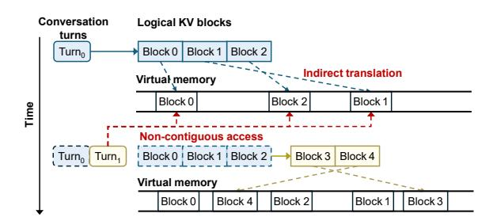
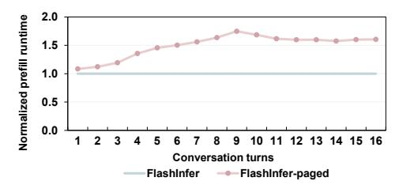
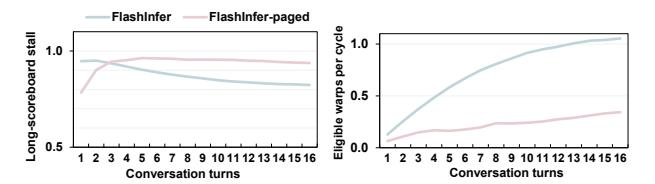
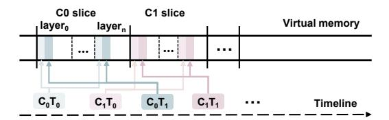
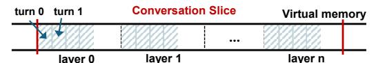
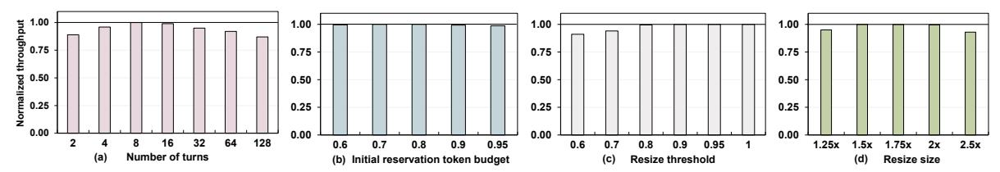
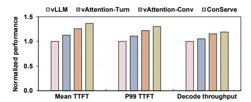
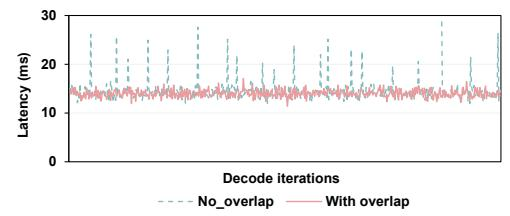

# ConServe: Contiguity-Preserving Memory Management for Multi-Turn LLM Serving

Bingyao Li *University of California, Riverside* bingyao.li@ucr.edu

*Abstract*—Interacting with humans through multi-turn conversations is a fundamental capability of large language models (LLMs). Multi-turn serving stresses GPU memory systems as KV caches grow, persist, and are heavily reused across turns. PagedAttention, the prevailing dynamic allocator in modern systems, mitigates fragmentation and increases batch size by managing the KV cache in blocks, but in doing so converts an originally contiguous virtual address space into a non-contiguous layout, introducing non-trivial programming complexity and additional address translation overheads from scattered virtual pages and block table lookups. We reveal that translation locality is a critical bottleneck under such paged KV designs, and we present ConServe, a contiguity-aware virtual memory allocator that retains per-conversation contiguity in the virtual address space while mitigating fragmentation in physical memory. Con-Serve reserves a single contiguous virtual address slice per conversation, maps physical pages on demand with CUDA VMM, and resizes virtual address slices via lazy, copy-free remapping at negligible overhead. Across diverse models and workloads, ConServe achieves up to 74.4%, 43.4%, and 19.1% lower TTFT and 35.1%, 15.6%, and 12.1% higher end-to-end throughput than vLLM, vAttention-Turn, and vAttention-Conv, respectively. *Index Terms*—LLM, virtual memory, KV cache, contiguity

#### I. INTRODUCTION

Large language models (LLMs) now power widely used applications such as chatbots, search engines, and coding assistants [3]–[6], [9], [38], with mainstream services such as ChatGPT [47] and DeepSeek [8] handling tens of millions of requests per day. A key capability that makes these systems useful in practice is multi-turn conversation [20], [27], [63], [68]: by retaining prior interactions, LLMs can track context, infer user intent, and produce more accurate responses.

However, compared with earlier DNNs [17], [24], [34], LLMs introduce significant memory management challenges that directly limit GPU utilization and throughput. The primary pressure comes from the key–value (KV) cache: autoregressive generation must attend to all prior tokens, and therefore keys and values from the prompt and every generated token must be retained to avoid recomputation. Especially in multi-turn conversations, to ensure high-quality answers, the KV cache of all previous turns remains live, causing memory consumption to grow continuously. Beyond capacity, LLM inference is highly dynamic. Every new token appends KV data, so memory allocation is irregular over time. Early LLM serving systems [43], [73] preallocated fixed physical memory for KV cache based on maximum request length, which wasted memory space and led to severe fragmentation [30], [52], [69]. vLLM first introduced PagedAttention [30] to address this by

Fig. 1. Paged KV allocation involves two layers of memory management and breaks virtual contiguity. Turn1's prefill reuses Turn0's KV, logical KV blocks are first looked up in a block table to obtain virtual addresses, and are then translated by page table to the final physical frame. Because the blocks occupy scattered virtual regions, the kernel issues many non-contiguous gathers.

dividing the KV cache into fixed-size blocks and mapping them into pages on demand, and has since become the de facto standard [1], [2], [7]. However, such a paged KV approach introduces a fundamental problem: the dynamically allocated KV blocks are not guaranteed to be contiguous in virtual memory, as shown in Figure 1. The KV cache of a single turn in a conversation is spread over many disjoint pages, so prefill and decode kernels must gather from scattered addresses. In addition, the paged KV approach inserts a second layer of translation: the runtime maintains a software block table mapping from logical KV block positions to the virtual addresses of those blocks, while the OS and hardware still translate those virtual pages to physical frames via standard page tables. This added indirection, combined with non-contiguity, increases critical path overheads, including extra software block table lookups and heavier address translation traffic, which stress the TLB and page walk caches as multi-turn conversations persist and grow [31], [32], [35], [36], thereby increasing translation latency and ultimately prolonging time-to-first-token (TTFT) and per-token decode latency.

Recent work, such as vAttention [52] uses CUDA virtual memory management (VMM) APIs to decouple virtual memory reservation from physical mapping, allocating and reusing physical pages on demand while preserving a contiguous virtual address space. This design reduces software block table indirection and lowers translation overhead. However, vAttention is fundamentally tailored to single-turn inference, where each request is processed in isolation, and its KV cache is discarded immediately after decoding. In contrast, real-world conversational applications often involve multi-turn conversations, where the KV-cache must be kept across turns to maintain context. Requests from the same conversation may be batched non-consecutively, and each conversation's KV cache grows over long time windows while coexisting with other active conversations. These dynamics introduce allocator requirements that vAttention does not meet, i.e., preserving per-conversation contiguity across turns and managing conversation growth through low-overhead mapping of virtual pages. Without a conversation-aware approach, the virtual layout of vAttention re-fragments over time and translation locality degrades, compromising the benefits that VMM delivers.

In this paper, we redesign GPU virtual memory management for LLM inference under multi-turn conversation workloads. We first quantify how scattered virtual layouts increase translation stalls and reduce warp eligibility. We then introduce ConServe (Contiguity-preserving LLM Serving), a conversation contiguity-aware allocator that assigns each conversation a single contiguous virtual slice, grows it elastically with CUDA VMM, and keeps this slice persistent for the conversation's lifetime so all turns append to and read from one contiguous range using simple base-plus-offset indexing. By eliminating block table lookups and restoring per-conversation contiguity, our design reduces translation traffic and improves address translation locality. ConServe performs resizing with copyfree virtual remapping off the critical path, and lazily reclaims virtual memory in batches, incurring minimal invalidation overhead. We make the following contributions:

- We identify translation locality as an important bottleneck in multi-turn LLM serving with paged KV caches, quantifying how scattered virtual layouts lower effective SM/L2/DRAM throughputs, increase long stalls, and reduce warp eligibility, which together increase TTFT latency and reduce decode throughput.
- We propose ConServe, a conversation contiguity-aware VMM allocator that assigns each conversation a single contiguous virtual address slice, allocates physical pages on demand, and resizes the slice elastically via copyfree remapping and lazy, batched reclamation. This preserves simple base-plus-offset address indexing and keeps growth and reclamation off the execution critical path.
- We comprehensively evaluate ConServe across diverse models and workloads, demonstrating substantial improvements, achieving 74.4%, 43.4%, and 19.1% lower TTFT, 35.1%, 15.6%, and 12.1% higher end-to-end throughput than vLLM, vAttention-Turn, and vAttention-Conv, respectively.

# II. BACKGROUND

#### *A. LLM Inference*

Generative large language models (LLMs) generate text autoregressively [13], [59], [60], [75], generating one token at a time. Within each transformer layer, linear projections map the current hidden states into query (Q), key (K), and value (V) tensors using their respective weights (WQ, WK, and WV ). Self-attention mechanism then computes the similarities between Q and K, uses these scores to weight the corresponding V values, and computes the attention output. The feedforward network then transforms this output before passing it to the next layer. The inference process of LLMs has two phases. In the prefill phase, the model reads the input sequence (or prompt) and generates the first output token, producing a corresponding Key-Value (KV) cache that is reused in later steps to avoid recomputation [11], [16]. During the decoding phase, the model generates one token at a time. At each step, it looks up the stored KV cache for all tokens seen so far, computes attention for the current position, updates the KV cache with the new key and value, and outputs the next token. This loop continues until an end-of-sequence token appears or length limit is reached.

#### *B. Multi-turn Conversation in LLM*

Supporting multi-turn conversations is a core capability of modern LLMs. A conversation is a sequence of turns in which each user query (Q) is followed by a model response (A). To stay coherent, the model conditions each new answer on the entire history of prior questions and answers. Starting from Q0 and A0, when the user issues Q1, the model's response A1 integrates (Q0, A0) along with the new query Q1, and this pattern continues across later turns. Analysis of the ShareGPT dataset shows that up to 99% of tokens in a new turn come from prior context [55]. Recomputing them every turn is wasteful, so modern systems reuse the KV cache across turns of the same conversation [20], [27], [49], [71], [74], [77]. That is, at each new turn, the model prefills only the fresh tokens to extend the cache, then decodes while reading the cached entries from earlier tokens, significantly reducing compute and memory traffic in multi-turn LLM serving.

#### *C. Memory Management in LLM Serving Systems*

GPU memory has become a critical bottleneck for highperformance LLM inference, affecting both the deployability of models and system throughput and response latency [22], [30]. Early LLM serving systems relied on the deep learning framework's caching pool allocator [43], [50], [73], which preallocates a contiguous chunk of memory with the request's maximum length. This approach works well for parameters and activations because their tensor sizes are known and stable over time [14], [45], [46], [54]. The KV cache, however, grows during decoding, has an unpredictable lifetime and length, and varies widely across requests and turns. When managed with fixed chunks, these properties cause heavy fragmentation and poor memory use. Therefore, PagedAttention has become the de facto standard in modern LLM serving systems [1], [2], [7], [30]. The key idea in vLLM is to introduce a software block table, analogous to an OS page table, that virtualizes the KV cache so that GPU memory can be allocated in small fixed-size blocks on demand rather than as a single contiguous region. At service initialization, GPU memory for model weights and activations is reserved. The remaining memory is organized into pre-configured KV blocks to accommodate dynamic KV cache demands. By keeping KV allocation proportional to actual demand, PagedAttention reduces fragmentation and raises effective memory efficiency, which translates directly into higher throughput and lower latency.

Fig. 2. The normalized prefill kernel runtime under different batch sizes.

#### *D. GPU Virtual Memory Management*

To meet the need for low-latency, fine-grained control over device memory, CUDA introduced low-level virtual memory management (VMM) APIs [41], [42]. VMM exposes primitives to reserve virtual address ranges and map physical memory into them, offering much finer control than traditional allocation routines such as cudaMalloc. Specifically, an application first reserves an address range with cuMemAddressReserve, this is a cheap operation that does not consume HBM capacity. It then provisions backing storage with cuMemCreate, which returns a handle to a pool of physical pages. Finally, it binds that storage into the reserved range using cuMemMap and sets permissions with cuMemSetAccess. Unmapping and remapping are similarly lightweight, allowing the program to grow, shrink, or relocate data structures without copying bytes. By separating reservation from mapping and enabling on-demand, fixed-granularity mappings, VMM can reduce internal fragmentation, avoid expensive allocate/free cycles, and improve memory reuse.

### III. MOTIVATION

In modern LLM serving systems such as vLLM, the KV cache is partitioned into fixed-size blocks and managed by a paged allocator to reduce physical memory fragmentation. This design introduces an additional translation layer: a runtime software block table maps logical KV positions to virtual addresses of blocks, while the OS kernel still translates virtual pages to physical frames via standard page tables. Because KV blocks are allocated from a shared pool and allocation, reuse, and eviction occur at different times across conversations and across turns, the blocks for any one conversation end up interleaved with others rather than remaining contiguous. As context length grows, each prefill or decode step touches a larger set of distinct virtual pages rather than a compact contiguous range, which stresses TLB, increases page walk traffic, and degrades memory coalescing. We next quantify the performance impact of this design.

#### *A. Performance Overhead of Paged KV Layout*

The vLLM paper reports that its PagedAttention implementation is 20–26% slower than the non-paged FasterTransformer kernel, mainly due to block table lookups (Figure 18a in [30]). To fully analyze the overheads, we compare Flash-Infer's native implementation with its PagedAttention-backed approach (FlashInfer-paged) under the same configuration that changes only KV cache placement. In the paged configuration, FlashInfer accesses vLLM's block table and gathers from

Fig. 3. The normalized throughput of SM, L2\$ and DRAM.

scattered KV pages. In the native setup, it issues base-plusoffset accesses within a single virtual region per request. We evaluate Llama-3-8B on an NVIDIA A100 with an 8K-token prompt and a 1K-token decode, sweeping batch sizes from 1 to 16. Figure 2 shows that the prefill kernel of FlashInferpaged is slower by 12-24% compared to the native approach, consistent with the slowdown reported by vLLM.

To further study the reason behind it, we profile SM issue behavior (i.e., long-scoreboard stall percentage and eligiblewarps-per-active-cycle) and memory system utilization (i.e., SM, L2, and DRAM throughputs) using NVIDIA Compute [44] on the same setup (Llama-3-8B, 8K prompt, 1K decode) with batch size 8. We observe that the FlashInfer-paged shows a higher fraction of long-scoreboard stalls (84.64% vs. 79.37%), indicating more warps wait on long-latency memory operations such as TLB misses and page table walks that available arithmetic is insufficient to hide. At the same time, the number of eligible warps per active cycle is lower for the FlashInfer-paged (0.718 vs. 0.825), showing that the scheduler has fewer ready warps to cover these latencies. The throughput results are consistent. Normalized to FlashInfer native, the SM, L2, and DRAM throughputs of FlashInfer-paged drop by 22.4%, 16.7%, and 21.1%, respectively, as shown in Figure 3. These results indicate that address translation latency is an important source of the prefill slowdown under the paged KV layout. With scattered blocks, a prefill step touches many distinct virtual pages, expanding the TLB working set and lengthening reuse distances beyond the TLB capacity, which raises the TLB miss rate and triggers more page table walks. Because successive accesses jump across many non-adjacent virtual pages, page walks rarely reuse the same lower-level page table entry (PTE) cache lines, which lowers page walk cache hit rates and adds extra memory references on the translation critical path. In contrast, a contiguous KV layout localizes accesses to a contiguous address range, which improves TLB hit rate and increases reuses in the page walk caches (e.g., repeated hits on lower-level PTEs for adjacent pages). The resulting reduction in translation stalls raises warp eligibility and sustains higher SM, L2, and DRAM throughputs.

# *B. Performance Overhead of Multi-Turn Prefill*

We evaluate multi-turn conversation behavior on Llama-3- 8B with a fixed 512-token input and 64-token decode per turn. Turn 1 prefills the initial 512 tokens and then decodes 64 new tokens. At turn i + 1, we append another 512-token input, prefill only those 512 tokens while reusing the KV cache from turns 1...i, and then decode another 64 tokens.

Fig. 4. The normalized prefill kernel runtime of FlashInfer-paged per turn relative to FlashInfer at the same turn.

Fig. 5. The normalized throughput of SM, L2\$ and DRAM of FlashInferpaged per turn.

As turns accumulate, the prefill reads progressively more KV data from earlier turns. Figure 4 shows FlashInfer-paged prefill runtime normalized per turn to the native at the same turn. Note that both configurations operate at the same context length and per-token arithmetic. The only difference is the KV placement and the resulting memory access pattern. One can observe that FlashInfer-paged slows progressively as turns accumulate, with normalized prefill runtime rising from  $1.2\times$ to 1.75×. The early turns show an increasing slowdown because the paged KV layout makes each prefill traverse many non-contiguous virtual pages, which increases TLB misses and page table walks. After several turns, the translation and coalescing penalties are nearly saturated, leaf-level page table walks and block table lookups impose a roughly constant overhead, so the ratio stabilizes. Nevertheless, the paged layout remains slower because the scattered placement continues to exceed the effective TLB capacity, increases frequent leaf-level page table walks, and adds block-table lookups that increase instruction counts and register pressure.

Figure 5 shows per-turn SM, L2, and DRAM throughputs of FlashInfer-paged normalized to native at the same turn. Under paged KV, all three throughputs decrease steadily as turns accumulate. The reason is straightforward: address translation stalls occupy issue slots, so fewer memory and compute instructions are issued per cycle, reducing SM throughput. With many warps stalled on translation instead of issuing memory requests, the request rate into the memory hierarchy drops, lowering L2 and DRAM throughputs. The scheduler metrics in Figure 6 are consistent: long-scoreboard stalls rise while eligible warps per cycle fall under paged KV, indicating that the scheduler cannot hide the added translation latency.

**Takeaway.** Single-turn slowdowns of 12-24% indicate that a non-contiguous (block-scattered) virtual layout degrades LLM inference performance: at the same context length and with identical model compute, it increases translation stalls and reduces scheduler readiness and memory system throughput.

Fig. 6. The long-scoreboard stall and eligible warps per cycle per turn of FlashInfer and FlashInfer-paged.

Multi-turn serving amplifies the effect: comparing at the same turn, the paged layout is up to  $1.75\times$  slower than a contiguous layout. This widening gap motivates a design that preserves a contiguous virtual slice, which maintains translation locality and sustains throughput as the history grows.

#### IV. CONSERVE DESIGN

Our goal is to reduce multi-turn LLM serving latency by improving the GPU address translation locality on KV cache accesses. Our analysis shows assigning conversation a contiguous virtual address slice and keeping KV accesses contiguous concentrates translation into fewer TLB entries and page walk cache lines, thereby shortening page table walks and the memory stalls they induce. To this end, we propose a contiguity-aware allocator that assigns each conversation a contiguous virtual address slice and manages it with copy-free elastic resizing. However, implementing such a mechanism is non-trivial. First, conversation length grows unpredictably, so the slice must be sized large enough to avoid frequent resizes yet not so large that it compromises translation locality or wastes space. Second, resizing and remapping can shift the slice's base and range; address mappings must remain consistent for kernels in flight without mid-step stalls. Third, remapping triggers driver and hardware work such as page faults, page table updates, and TLB shootdowns. These operations must be moved off the execution critical path and batched to minimize and amortize overheads. Finally, the design must be implementable with current CUDA virtual memory APIs and integrated with attention kernels.

#### A. Virtual Address Reservation

**Reservation Size.** We assign a *single contiguous* virtual address (VA) slice for each conversation, and all subsequent turns will be appended to the corresponding reserved conversation slice, as shown in Figure 7. For a micro-batch of conversations, we allocate independent VA slices for each conversation. Each VA slice is aligned to a fixed VA group size *G* (2 MB unless stated) as CUDA memory allocated size. The physical pages are allocated on demand as KV blocks are generated, which is identical in spirit to the on-demand paging in vAttention [52]. The key question is how large a VA slice should be reserved.

An intuitive approach is to reserve the model's maximum sequence length for every conversation. However, in multiturn conversations, the number and length of future turns are unknown, and some turns of requests are short. Overreserving enlarges each conversation's VA slice, leaving wide unused spans that increase fragmentation and create larger

Fig. 7. Conversation virtual address reservation and mapping in ConServe.

gaps between active regions. These gaps reduce the opportunity that concurrent conversations share upper-level page table indices (i.e., VA prefixes), reducing page walk cache reuse and degrading translation locality. Our goal, therefore, is to reserve "just enough" to keep the working set compact, growing the slice elastically only when needed. Therefore, we propose to size the VA slice to a *conversation-level target*: the tokens that are currently live (initially the prompt) plus the predicted additional tokens that will remain in context, capped by the model's context window. If the conversation later exceeds this estimate, we resize the VA slice and copy-free remap into a larger contiguous range (Section IV-B).

We first quantify the KV cache footprint, mapping it to the VA size. On a GPU shard with  $L_{\rm shard}$  transformer layers,  $H_{\rm shard}$  attention heads, head dimension  $d_{\rm head}$ , and element size b bytes (e.g., b=2 for BF16), the KV bytes per generated token are

$$B_{\text{tok}} = 2 \cdot L_{\text{shard}} \cdot H_{\text{shard}} \cdot d_{\text{head}} \cdot b,$$

accounting for both K and V tensors.

Next, to decide how many tokens to reserve for upcoming turns, we estimate future generation length by offline profiling datasets such as ShareGPT [55]. For each conversation c, we measure the total number of tokens across the whole conversation  $L_c$ , and the number of user-chatbot interaction turns  $M_c$ . We can get the average tokens per turn for that conversation using  $s_c = L_c/M_c$ . Then we take the empirical rth percentile  $q_r$  of the set  $\{s_c\}$  and set the per-turn token reservation to  $Q = q_r$ . For example, if r is the 80th percentile with  $q_r = 512$  tokens, we set per-turn token budget Q as 512.

Finally, we introduce a headroom parameter k, which ensures that enough capacity is reserved for the first k turns. This reduces the need for early resizes while avoiding overallocating. Let  $T_{\rm prompt}$  be the tokens in the initial prompt of the conversation (so the live tokens at the beginning equal  $T_{\rm prompt}$ ), and let  $ctx\_len$  be the model's context window. We set the conversation-level target to

$$T_{\text{target}}^{(0)} = \min \{ \text{ctx\_len}, T_{\text{prompt}} + Q \cdot k \}$$

This guarantees room for what is already in context and roughly k turns under the conservative per-turn budget Q, and never exceeds the model's limit. We then convert this token target into a contiguous virtual reservation by rounding up to whole groups:

$$R_0 = \left\lceil \frac{T_{\text{target}}^{(0)} \cdot B_{\text{tok}}}{G} \right\rceil$$

This step reserves virtual address space only, physical pages are mapped on demand as KV cache is generated. In all

Fig. 8. Virtual address layout for conversations of ConServe.

experiments, we use k=8 and r=80% by default and also study the sensitivity of k and r in Section V-D.

**Virtual Address Allocation Layout.** Each conversation owns a single contiguous VA slice, partitioned into  $L_{\rm shard}$  layer-major segments laid back-to-back, as shown in Figure 8. All KV cache for the attention heads resident on this shard in layer l is stored contiguously inside layer l's segment. This layout matches the decode kernel's access pattern, where layers are accessed sequentially, and within a layer, the kernel scans the KV of prior tokens. Therefore, a layer's hot working set remains within a few adjacent VA groups.

Initially, the prompt occupies the leftmost blocks of every layer segment, and newly generated tokens are appended to the right. We therefore do not lay out data by "turn". Instead, each layer's history across all turns remains contiguous in its own segment. When context management operations (e.g., sliding-window truncation or summarization) drop older tokens, we unmap those leftmost blocks and, if one or more whole groups are freed, compact the remainder leftward via copy-free remapping while preserving contiguity. Addressing is purely arithmetic; kernels compute each location from a per-conversation base and per-layer offset, with no per-token indirection or block tables. Given a conversation base VA and a per-layer segment offset, the VA for token t in layer l is:

$$VA(t, \ell) = base + seg_{off}[\ell] + t \times B_{layer}$$
 (1)

where  $B_{layer}=2 \times H_{shard} \times d_{head} \times b$  is the per-token KV stride for that layer on the shard, and kernel threads add an intra-token offset  $\delta \in [0,B_{layer})$  to index individual elements within that token's KV cache. For a micro-batch of requests/conversations, for each layer, the runtime forms a compact descriptor for the current micro-batch that contains (i) the per-sequence KV base pointers and (ii) the live sequence lengths. We then invoke the attention kernel in variable-length mode, which reads that sequence's KV by first loading the corresponding base pointer from the descriptor, and streams KV contiguously using the base-plus-offset indexing.

#### B. Elastic Resizing

When to resize: A resize is considered when the reserved VA slice for this conversation is nearly saturated. Let R be the reserved VA slice size and U the currently used portion. When the utilization ratio  $\eta = U/R$  exceeds a utilization threshold  $\theta_u$  (we use  $\theta_u$ =0.90 as default and study its sensitivity in Section V-D), we grow the slice (as shown in Figure 9 ①). Specifically, we check  $\eta$  at the start of each token (entering layer 0), and allocate a new slice when the threshold is met.

**How much to resize:** When a resize is scheduled, we recompute the conversation-level target with the same turn-based rule used at initial reservation, but now with the current progress. We maintain the conversation's average tokens per

Fig. 9. Resizing process of ConServe.

turn and use this heuristic as new per-turn token budget Q. Specifically, we set

$$T_{\text{target}}^{(new)} = \min \left\{ \text{ctx\_len}, \ T_{\text{live}} \ + Q \cdot k \right\}$$

where  $T_{\rm live}$  is the current number of live tokens (including all previous history tokens). We then choose the new reservation as the larger of a geometric bump and the target-aligned size:

$$R_{\text{next}} = \max \left( \left\lceil \gamma \cdot R \right\rceil, \left\lceil \frac{T_{\text{target}}^{(new)} \cdot B_{\text{tok}}}{G} \right\rceil \right)$$
 (2)

where R is the last reservation size and  $B_{tok}$  is tokens KV bytes. This resizing policy adapts to both short and long per-turn sequences while avoiding unnecessary memory overprovisioning. When the average tokens per turn Q is small, utilization increases slowly and the threshold  $\eta$  is reached only after many turns. The resize typically follows the geometric branch and expands the reservation from R to  $\gamma R$  (we use  $\gamma = 1.5$  by default). Because we trigger at utilization  $\theta_u$ , the next resize cannot occur until roughly  $(\gamma-1)\theta_u R$  additional bytes are allocated, i.e.,  $(0.5 \theta_u R)/B_{\text{tok}}$  more tokens. This space resizes by hundreds to thousands of tokens in practice and avoids an oversized jump. When Q is larger, one single turn may push utilization past the threshold. In that case, the target branch expands directly to roughly  $T_{live} + kQ$  tokens (still capped by  $ctx\_len$ ), preventing back-to-back resizes by jumping once to the desired capacity.

Note that a corner case can still arise when the historical Q is very small (e.g., many very small turns) followed by an abrupt large turn, in which case the geometric branch may dominate for a few resizes before Q catches up, which can lead to frequent resizes in consecutive turns. To further improve robustness under such abrupt shifts, we add a lightweight rule: if a conversation triggers resizes in consecutive turns, we temporarily set Q to the most recent turn's observed token, and directly size the next reservation to  $T_{\rm live} + Q \cdot k$ . Once a turn completes without another resize, we revert to the standard running-average update for Q.

**How to resize:** Figure 9 illustrates the resizing process. When a resize is scheduled, we allocate a larger, contiguous virtual memory slice, whose size is determined by the current target in Eq. (2) (2). We migrate each layer's segment to that new slice, mapping it to the same physical pages as before,

TABLE I
THE FORMAT OF FREE-LIST. VALUES ARE IN GROUP UNITS.

| g start | Glen | status        | Merge |
|--------------------|------|---------------|-------|
| 100                | 50   | FREE          | 0     |
| 300                | 20   | FREE          | 0     |
| 320                | 12   | PENDING_UNMAP | 1     |
| 332                | 10   | PENDING_UNMAP | 1     |
| 900                | 64   | PENDING_UNMAP | 0     |

preserving the one-segment-per-layer layout. Note that the KV cache data are not moved. To find the available new slice, we maintain a free virtual memory interval list (free-list), as shown in Table I. We store four fields for each interval: start group  $g_{start}$ , length  $g_{len}$ , status, and a merge flag (details in Section IV-C). The real virtual addresses are computed as  $start_VA = area\_base + g_{start} * G$ , where  $area\_base$  is the base of the process-wide VA arena reserved once with cuMemAddressReserve. To place new slices with minimal fragmentation, we choose the interval by best-fit: the freelist maintains a length-ordered index to locate the smallest  $length \geq n$  groups in O(log M) time over M intervals. If found, we allocate the leftmost n groups as the new slice, remove the original entry, and, when  $g_{len} > n$ , the leftover tail  $(g_{start} + n, g_{len} - n)$  is inserted back. If no interval is large enough, we trigger coalescing (details in Section IV-C).

After selecting the destination, we employ a copy-free remapping approach, which is overlapped with computation to avoid stalling the execution critical path. During a prefill or decode iteration, layers execute in order and each layer exclusively touches a fixed VA segment within the slice. As soon as layer  $\ell$  finishes for the current token, we can prepopulate its translation mapping in the new slice, binding to the same physical pages as in the old slice (4). Because subsequent layers access different segments, these updates do not conflict with running kernels, and the old mappings remain intact for the rest of the iteration, so in-flight work observes a stable VA image. Subsequent layers still use the old slice (3). At the next iteration barrier, i.e., after the last layer's writes are complete and before the next token begins, we update the conversation descriptor's slice base and per-layer segment offsets from the old slice to the new one (6). Kernels compute addresses via base-plus-offset arithmetic exactly as in Eq. 1.

Finally, reclamations (unmapping old page table entries and TLB shootdown) are performed lazily and in batches. We keep all old mappings, so there is no translation invalidation on the execution critical path. Instead, the former slice is quarantined with status PENDING\_UNMAP and is not accessed (6). Later, when the device is idle or when the free list is not sufficient, the runtime unmaps all "PENDING\_UNMAP" ranges and issues TLB invalidations in a batch. This keeps correctness because we never reuse an address range until its mappings are revoked and its stale translations are invalidated.

#### C. Fragmentation Management and Coalescing

The virtual address external fragmentation arises when resizes and lazy reclamations leave holes between conversa-

tion virtual memory slices. Although modern 64-bit systems typically use 48 address bits (≈ 256 TB) for VA, scattering of slices can still throttle concurrency. Therefore, free virtual address space must be organized and harvested.

To manage the virtual address space efficiently, the allocator maintains a dual-indexed free list. In addition to a lengthordered view that ranks usable intervals for best-fit placement as described in Section IV-B, an address-ordered view is used to detect adjacent intervals and eagerly coalesce neighbors when intervals' statuses change from PENDING\_UNMAP to FREE. Each interval also stores a *merge* flag (1 or 0), as shown in Table I. The merge flag is used only for PENDING\_UNMAP intervals: it is initialized to 0 on creation and set to 1 by background maintenance whenever the interval is exactly contiguous with its neighbor no matter whether PENDING\_UNMAP or FREE in the address-ordered view; flags on FREE intervals remain 0. The flag acts as a compact marker for reclamation: it identifies PENDING\_UNMAP intervals that can be coalesced, so the runtime can assemble a worklist without scanning the entire table.

Actual reclamations are performed only after an interval's page table mappings have been unmapped, any stale TLB translations invalidated, and contiguity is revalidated. We drain quarantined PENDING\_UNMAP space proactively. Specifically, we build the worklist in two regimes: (i) demand-driven, which selects the minimal set of adjacent PENDING\_UNMAP intervals needed to reach Rnext; and (ii) background bulk, during idle windows, the runtime reclaims a larger batch of PENDING\_UNMAP intervals to consolidate scattered space. The runtime first issues range unmap of page table and TLB invalidation for exactly the worklisted ranges, changes their *status* to FREE, and coalesces in place by rechecking its predecessors and successors in the address-ordered view: if endpoints match, neighbors are merged; if both sides are contiguous and FREE, both merges occur. After coalescing, the corresponding intervals' merge flags are reset.

#### *D. Demand Physical Memory Allocation*

We employ the same demand-paging mechanism for physical memory as vAttention [52]. Specifically, during prefill or decode, physical page mapping is overlapped with kernel execution: while iteration i − 1 runs, a background thread monitors each request's context length and currently mapped pages, determines whether iteration i will need more memory, and maps the next set of physical page groups. We also keep deferred reclamation with reuse when conversations complete. When one conversation finishes and another begins, we leave the recently freed page groups mapped and reassign them to the new conversation, avoiding page allocation overheads.

We implement demand physical memory allocation using NVIDIA Driver-API virtual memory interface with CUDA's default 2 MB allocation granularity [42]. The allocator decouples the allocation of virtual memory from physical memory. It first reserves virtual address space and then allocates physical pages as the conversation grows. At process startup, the runtime reserves one large, contiguous VA arena with cuMemAddressReserve, and each conversation is assigned a contiguous slice within this arena, establishing baseplus-offset address arithmetic used by all kernels. Physical allocation and mapping occur only at token (iteration) boundaries. If the next token will exceed the currently provisioned allocated physical capacity, the runtime allocates additional 2 MB with cuMemCreate, maps them into the pre-reserved virtual addresses via cuMemMap, and grants read–write visibility on the executing GPU with cuMemSetAccess. When resizing, the runtime first selects a disjoint virtual interval and pre-allocates mappings there that bind to the same physical pages as the old slice, so no KV data is moved. At the iteration barrier, the conversation descriptor's slice base and per-layer segment offsets are updated to the new interval, making the change transparent to kernels that compute addresses by baseplus-offset. Reclamation is deferred and batched: ranges from the former slice are quarantined off the critical path and later unmapped with cuMemUnmap together with a batched TLB invalidation. Only after revocations are globally visible are those VA ranges returned to the arena's free list. When a conversation terminates, any remaining allocation handles are released with cuMemRelease, the arena itself is freed with cuMemAddressFree when the serving process shuts down.

#### V. EVALUATION

#### *A. Experimental Setup*

Baselines. We compare ConServe with the following stateof-the-art LLM serving systems:

- vLLM [30]: A widely deployed serving system that manages the KV cache with PagedAttention under a fixed, blocked layout. It pre-allocates a large memory pool at initialization and partitions it into fixed-size KV blocks ("pages") that are scattered within this pool and accessed via a software block table; unless otherwise stated, we use a block size of 16 tokens per block, which is the configuration that minimizes kernel overhead in our environment and in prior reports [52].
- vAttention [52]: vAttention decouples virtual and physical memory by reserving a contiguous virtual address slice sized for the model's maximum supported context length for each request, and demand-mapping 2 MB physical page as the sequence grows. Since vAttention targets a single request whose KV cache is released on completion, it is not directly intended for multi-turn conversations that are repeatedly extended. To apply it in multi-turn serving, we evaluate two natural interpretations of a "request": (i) *turn-as-request*, where each turn is treated as an independent request (preserving per-turn contiguity but placing a conversation's history across disjoint virtual regions), and (ii) *conversation-asrequest*, where the entire conversation is treated as one longlived request. We refer to these two variants as vAttention-Turn and vAttention-Conv, respectively.

Models and setup. We evaluate three representative models using their long-context variants and default architectural hyperparameters: Yi-6B-200K (grouped-query attention with Hq=32, Hkv=4, L=32), Llama-3-8B-262K (Hq=32, Hkv=8,

Fig. 10. Online serving evaluation under varying request-arrival rates for Yi-6B, Llama-3-8B, and Yi-34B.

L=32), and Yi-34B-200K (Hq=56, Hkv=8, L=60). Unless otherwise noted, Yi-6B and Llama-3-8B run on a single NVIDIA A100-80GB, and Yi-34B runs on two NVLinkconnected A100-80GB GPUs with tensor parallelism TP=2. We use BF16 weights. Long-context inference is enabled, and sliding-window attention or context-truncation variants are disabled so that the full KV cache is always kept in memory. All systems use the same batching policy. We use CUDA VMM with the default 2 MB mapping granularity.

Dataset. We evaluate online serving and offline inference using a widely-used ShareGPT [55] dataset. For online serving, requests arrive following a Poisson distribution at varying rates; for offline inference, all requests arrive at the start.

Metrics. For online serving, we use TTFT, p99 TTFT, decode throughput, and SLO attainment to fully illustrate the effectiveness of ConServe. The SLO constraint is set as 25 × TTFT and TPOT of requests finished without request contention (i.e., request rate 0.01 [66], [70]). For the offline inference, we focus on the metric of total end-to-end throughput.

#### *B. Overall Performance - Online Serving*

Prefill evaluation. Figure 10 shows the mean TTFT of different request arrival rates under ShareGPT multi-turn workloads for Yi-6B and Llama-3-8B on one A100, and Yi-34B with TP-2 on two A100s. Our approach ConServe achieves lower TTFT across all request rates and models, up to 64.1%–74.4% lower than vLLM, 31.4%–43.4% lower than vAttention-Turn, and 8.3%-19.1% lower than vAttention-Conv. One can observe that TTFT remains nearly flat at low rates and rises rapidly as the arrival rate approaches saturation, when queueing delay grows sharply as new prefills wait behind ongoing work. This transition occurs around 4.5–5 req/s for Yi-6B and Llama-3- 8B and earlier (≈ 2–2.5 req/s) for Yi-34B due to its larger KV footprint and cross-GPU coordination. However, our approach achieves lower TTFT than vLLM for two reasons. First, it removes page-granular indirection from the critical path. In paged KV caches, each access is routed through a block table: the kernel identifies the current block, computes the within-block offset, and, if the access spans a block boundary, fetches the next block's pointer and repeats. These lookups and boundary checks add instructions and extra memory references and fragment access patterns, thereby causing the memory system to issue more, smaller transactions and lowering effective bandwidth. In contrast, our approach appends each token into a single linear region: the kernel uses one baseplus-offset address, so warps issue aligned, contiguous global accesses that coalesce into large transactions, reducing memory transactions, L2 write allocations, and address translation overheads. Second, PagedAttention couples sequence growth to block management: whenever a sequence crosses a block boundary, the runtime must allocate a new block and update the block table map before subsequent kernels can run. Even if such growth events are not frequent, they sit on the critical path during prefill and decode, adding extra work and launch delays when the system is busy. However, our approach eliminates this per-block growth overhead via elastic resizing, which adjusts a conversation's reservation in large chunks via copy-free remapping that overlaps with attention computation, keeping resizing off the critical path.

Our approach outperforms vAttention-Turn because vAttention-Turn preserves contiguity only within a single turn. Across turns, the same conversation's KV is placed in multiple disjoint virtual ranges. During multi-turn serving (prefix reuse in prefill), attention reads KV cache spanning all previous turns, making memory accesses jump between non-contiguous regions. This cross-turn scattering enlarges the working set of page table entries, weakens temporal locality in page walk caches, and increases page table walk traffic and translation misses, all of which raise TTFT. By contrast, we keep a single contiguous VA per conversation, so prefill traverses a compact, sequential address space with fewer distinct PTEs touched, yielding lower and more stable prefill time and denser memory access.

vAttention-Conv alleviates cross-turn non-contiguity by treating an entire conversation as a single long-lived request; accordingly, it improves over vAttention-Turn. Nevertheless, ConServe still outperforms vAttention-Conv because it preserves address translation locality across concurrently batched requests. The key issue is that vAttention-Conv reserves a maximum-context virtual slice per conversation, which pushes the actively used KV regions of different conversations farther apart in the VA space. Under batching, the GPU interleaves warps/CTAs from many conversations, so spreading active KV ranges across far-apart virtual regions expands the translation working set and reduces page walk cache reuse. More importantly, the wider spacing lowers the effective TLB reach on modern NVIDIA GPUs, whose TLB entries are organized into 16 sub-entries [33], [64], [65], [76]: when active pages are distributed across many distant regions, TLB entries are frequently evicted before their sub-entries are fully populated. For example, for Llama-3-8B in BF16, the KV footprint is about 4 KB per token per layer, so a 4K-token conversation occupies roughly 16 MB per layer (eight 2 MB pages). Under vAttention-Conv, reserving a max-length slice can space conversations far apart in the VA, so each conversation occupies a separate TLB entry whose coverage corresponds to a 32 MB region, yet touches only 8 of the 16 sub-entries associated with that TLB entry (i.e., 50% utilization). As the GPU interleaves execution across sequences in a batch, the TLB becomes populated by many such low-utilization entries; under finite capacity, these entries are displaced by other segments before the remaining sub-entries can be used, amplifying translation misses and increasing memory access stalls.

P99 prefill evaluation. Compared to mean TTFT, p99 TTFT grows more sharply near saturation because queueing amplifies at high load and prefill work is highly heterogeneous: a small fraction of requests with much longer effective prefixes (prompt length plus reused history) take substantially longer to prefill and delay subsequent requests, inflating the tail. Across the evaluated models, ConServe achieves the lowest p99 TTFT, indicating that elastic resizing does not introduce frequent "stop-the-world" effects on the critical path: if remapping routinely stalled the system globally, many requests would be delayed simultaneously and p99 would spike near saturation. Instead, resizing is initiated asynchronously and applied at iteration boundaries, allowing remapping to overlap with attention computation, so its overhead is largely hidden or amortized and does not dominate the tail under contention.

Decode evaluation. Our approach ConServe achieves higher decode throughput across all arrival rates and models as shown in Figure 10, improving by 19.4%-25.6% over vLLM, 6.1%- 9.5% over vAttention-Turn, and 4.2%-6.1% over vAttention-Conv. Decode attention is largely memory-bound, so when all systems use a strong kernel, per-step compute time is similar. The throughput gap comes from data layout and how steadily decode is fed. During decode, each new token must read all prior KV. Some lines hit in L2 cache and return quickly, but as arrival rate and context grow, the live KV cache working set across layers and concurrent requests far exceeds L2 cache capacity, so every system experiences more cache evictions. This makes the cost of address translation a key differentiator: even on an L2 cache hit, the GPU still needs to translate the virtual address; a TLB miss triggers a page walk that adds latency and reduces tokens-per-second. First, ConServe keeps one contiguous virtual address range per conversation across turns, so the decoder touches fewer distinct pages and reuses translations and page walk cache longer. At the same time, base-plus-offset indexing over a contiguous range produces a more regular read stream with better load coalescing and higher effective bandwidth than vLLM's page-indexed layout and vAttention's multi-turn placement (cross-turn scattering in vAttention-Turn or far-apart max-length reservation in vAttention-Conv), both of which enlarge the set of translations and fragment memory accesses as context grows. Second, lower TTFT with our approach ConServe admits requests into decode more evenly, allowing the continuous batching scheduler to form larger and steadier decode batches at the same arrival rate, keeping the SMs busier and increasing tokens per second. These benefits are more significant for models with larger KV footprint (e.g., Yi-34B), which suffer more severe translation pressure.

SLO attainment. Using the SLO target defined in Metrics, ConServe achieves higher SLO attainment across all request rates and models as shown in Figure 10, maintaining a larger fraction of requests within the target at the same arrival rate. Because the target is derived from the no-contention baseline, violations occur when prefill waiting grows or when pertoken latency during decode increases. ConServe improves both: lower and less variable prefill time reduces queueing as arrival rate rises, while higher decode throughput keeps pertoken latency within the limit even under high L2 pressure. Taken together, these yield 11%–19%, 7%–9%, and 3.2%- 4.9% higher SLO attainment than vLLM, vAttention-Turn, and vAttention-Conv at high arrival rates, respectively. Note that the gains of our approach increase with model scale (e.g., 19% on Yi-34B vs. 12% on Yi-6B over vLLM). This is because larger models have a bigger KV footprint and touch more pages, suffering more pressure on address translation, so the benefit of our contiguous cross-turn layout is amplified, demonstrating that ConServe scales to large models.

#### *C. Overall Performance - Offline Inference*

We measure end-to-end throughput in an offline setting as the number of model tokens processed per second, including both prefill and decode. Figure 11 shows results of Yi-6B, Llama-3-8B, and Yi-34B with varying batch sizes up to 32. We construct the workload by replaying full multi-turn conversations from ShareGPT. We maintain a fixed limit of B concurrent sequences (batch size). When a conversation finishes a turn, its next turn is immediately executed using the existing KV cache; if the conversation ends, its slot is filled with the first turn of a new conversation. Thus, the scheduler continuously forms micro-batches from active turns until all conversations are processed. First, ConServe achieves the highest end-to-end throughput across all batch sizes and models, 17.7%-35.1%, 8.6%-15.6%, and 7.2%-12.1% over vLLM, vAttention-Turn, and vAttention-Conv, respectively.

Fig. 11. Offline inference evaluation under varying batch sizes for Yi-6B, Llama-3-8B, and Yi-34B.

Fig. 12. Normalized end-to-end throughput under different parameters using Llama-3-8B in an offline setting with batch size = 32.

The reason matches our online serving study: a single contiguous VA per conversation lets reads and writes use simple baseplus-offset indexing instead of paging through block tables or jumping across non-contiguous regions, while keeping active KV ranges compact in VA preserves translation locality across concurrently batched conversations. Second, our improvement increases as batch size grows (and larger models). In particular, compared to vAttention-Turn, we achieve similar performance at small batch sizes (e.g., 1, 2, and 4), but the gap widens at larger batches. This is because in vAttention-Turn, a conversation's KV cache across turns is placed in multiple disjoint regions. Although offline execution processes turn sequentially, a later turn must read all earlier tokens, so the read stream necessarily jumps across those regions. At small B, this fragmentation cost is small, but at large batches it amplifies: if each conversation spans k regions (one per past turn), each attention computation exposes  $B \times k$  distinct regions to the TLBs and L2. In contrast, our approach keeps one range per conversation, so each attention computation touches only  $B \times 1$ regions. As B grows, the fragmented layout's working set grows with  $B \times k$  while ours grows only with B, so the relative penalty of k > 1 becomes increasingly significant at large batch sizes. Third, compared to vAttention-Conv, our advantage stems from higher translation efficiency under batched execution. In offline evaluation, all conversations are known upfront and processed in fixed batches. Thus, the runtime can place each conversation's reserved slice back-toback in the virtual address space. However, vAttention-Conv still reserves a maximum-context slice per conversation, so a batch of B conversations spans B large VA segments, while each conversation typically touches only a small prefix of its segment (a few 2MB page groups). With modern NVIDIA sub-entry TLB organizations [33], [76], this creates many partially populated TLB entries: each segment consumes an entry, yet only a small subset of its sub-entries are used before the TLB must also accommodate entries for other segments in the batch. As B increases, the TLB fills with low-utilization entries that are evicted before additional sub-entries become useful, reducing effective TLB reach and increasing page walk traffic. In contrast, ConServe grows each conversation's reservation toward its active footprint, keeping the batch's actively accessed KV pages more compact in VA and improving subentry utilization and translation reuse, which translates into higher effective bandwidth and higher end-to-end throughput.

#### D. Sensitivity Study

Sensitivity to initial reservation turns. Recall that we use k = 8 turns by default for both the initial slice reservation and resize headroom. In this study, we vary the number of turns and show the end-to-end throughput normalized to the default in Figure 12 (a). As pre-reserved turns increase, throughput drops. This is because, although larger reservations reduce the number of resizes, in our default configuration, resizes are already infrequent and largely hidden behind computation. The extra headroom instead widens each conversation's VA span, which it does not fully utilize, creating larger gaps between active regions. This lowers the opportunity for concurrent conversations to share upper-level VA indices and yields bad locality in the page walk cache, with a more visible drop at very large reservations (e.g., 128 turns). Throughput also degrades when the number of turns is too small because the system resizes more frequently. The added mapping and PTE installs contend for memory and driver resources and cannot be fully overlapped every time, so small delays accumulate. Overall, turn = 8 strikes a good balance.

Sensitivity to the per-turn budget. We derive the per-turn token budget using the r=80% percentile of the tokensper-turn distribution. We study different r and report end-to-end throughput normalized to the default 80%. As shown in Figure 12 (b), the results remain steady with different r. This is because r only determines the initial virtual slice reservation. Any misestimate is corrected promptly by our copy-free remapping overlapped with computation. Therefore, our approach is insensitive to initial tokens per turn.

Sensitivity to the resize threshold. We resize the conversation virtual address slice when the utilization ratio  $\theta_u$ =0.90.

Fig. 13. Online serving evaluation using a real production trace Qwen-Bailian Dataset with Llama-3-8B.

We now study different  $\theta_u$  impact on end-to-end throughput, and Figure 12 (c) shows the results normalized to the default  $\theta_u$ =0.90. As one can observe, lower  $\theta_u$  degrades the performance as it triggers resize earlier and more often, increasing the number of resize events. Increasing  $\theta_u$  reduces how often we resize, but overall throughput stays essentially unchanged. This is because as long as the remapping finishes while computation is still running, the next kernel launches without waiting and overall throughput is unaffected.

Sensitivity to the resize size. We grow the reserved virtual space by a factor  $\gamma$  at each resize (from R to  $\gamma R$ ), by default  $\gamma=1.5$ . We sweep  $\gamma$  and show overall throughput normalized to  $\gamma=1.5$  in Figure 12 (d). When  $\gamma$  is small (e.g., 1.2), overall throughput worsens by 5% because the system resizes more often and the many small resizes add overheads. When  $\gamma$  is large (e.g., 2.0), the performance drops 7% as it reserves more address space than short-turn conversations' need and reduces potential address translation locality.

#### E. Generality Across Workload Traces

So far, we are using ShareGPT as our primary trace, and the default initial reservation parameter r is derived from ShareGPT. To evaluate generalizability, we keep the same default settings (initial token reservation r = 80% and number of turns k = 8) and replayed a production trace Qwen-Bailian Dataset with To-C trace [62], which captures a chat-style interactive service with real timestamps and user identifiers. We run Llama-3-8B under the same online serving settings. Figure 13 shows our approach improves mean TTFT by 36.6%, 23.8%, and 10.9%, p99 TTFT by 30.3%, 19.5%, and 8.3%, and decode throughput by 19%, 13.6%, and 3.4% over vLLM, vAttention-Turn, and vAttention-Conv, respectively, demonstrating that ConServe's benefits are not specific to one dataset and persist under an independent, real-timestamp production workload even with ShareGPT-derived defaults. The improvements are smaller than on ShareGPT because this trace contains fewer turns per conversation on average (2 turns/conversation vs. 8 in ShareGPT), which reduces how often a conversation's growing history is revisited and extended, and therefore reduces the opportunity for ConServe's "avoid memory scattering" benefit. Note that the trace contains 43,058 turns spanning 7,199.464 s ( $\approx 2.0$  hours), and ConServe reduces the overall p99 TTFT over the full replay, indicating that elastic resizing does not negate tail-latency improvements and the allocator can sustain slice growth and reclamation without obvious fragmentationrelated overhead (e.g., long time searching for a large free gap,

Fig. 14. End-to-end throughput using LongBench v2 long-dialogue histories trace with Yi-6B.

# TABLE II CUDA VMM APIS LATENCY.

| CUDA VM APIs        | Latency $(\mu s)$ |  |
|---------------------|-------------------|--|
| cuMemAddressReserve | 2                 |  |
| cuMemCreate         | 29.2              |  |
| cuMemMap            | 1.9               |  |
| cuMemSetAccess      | 36.8              |  |
| cuMemUnmap          | 34.3              |  |
| cuMemRelease        | 24                |  |
| cuMemAddressFree    | 1.6               |  |

repeated failed placement attempts, or extra remapping steps that pause serving) becoming a dominant contributor to tail latency, even in a long-running serving scenario.

We next evaluate ConServe on a long-context trace constructed from LongBenchV2 long-dialogue histories [12]. To enable substantial concurrency on a single GPU, we truncate each dialogue history to 8K-32K tokens and vary the number of concurrent conversations. Figure 14 shows that ConServe consistently achieves the best performance across all batches, for reasons similar to offline ShareGPT (Section V-C). Importantly, these gains do not rely on tracespecific tuning: although the initial reservation budget r is calibrated on ShareGPT, it only affects the starting headroom, while subsequent capacity growth is driven by our dynamic resizing rule (Eq. 2), which predicts future demand from each conversation's observed turn lengths and grows the slice accordingly to reduce resizing frequency. As a result, even when the ShareGPT-derived defaults initially under-reserve for substantially longer dialogues, ConServe quickly adapts based on runtime behavior, demonstrating the approach generalizes to long-context workloads without retuning.

#### F. Resizing Overheads

We first microbenchmark the CUDA VMM primitive latencies using 2 MB pages, as shown in Table II. The overhead scales with the number of VMM operations issued. In ConServe, a growth event remaps each layer's KV segment, requiring cuMemMap and cuMemSetAccess per layer. However, we initiate remapping immediately after the first layer detects a resize need and apply the new mapping at the next iteration boundary. This allows the current step to complete using the existing mapping while the remapping thread overlaps the VMM calls with the computation of the remaining layer in the same step, providing an overlap window of approximately  $(L-1)/L \cdot T_{iteration}$ , where L represents the number of layers. In practice, per-iteration latency is typically tens of milliseconds, sufficient to hide the remapping cost even under

Fig. 15. Latency of decode iterations with and without overlapping memory allocation with compute using Llama-3-8B at batch size 32.

Fig. 16. CDF of exposed resize latency under ConServe.

heavy load. The reclamation is deferred, and old mappings are unmapped later via cuMemUnmap, which stays off the critical path and has little performance impact. Even if the GPU driver serializes VMM calls via internal locks, those calls execute while the GPU is computing the remaining layers of the current iteration, so driver time overlaps with GPU work and rarely delays CPU submission of next-iteration kernels for other runnable requests. Nevertheless, the exposed resize overhead is negligible compared to per-token iteration time.

Figure 15 further reports per-iteration decode latency of *Llama-3-8B* at batch size 32, comparing our approach with and without overlapping resizing with compute. For readability, we plot a fixed-length window containing resizing events. In both configurations, each conversation owns a single contiguous VA that grows on demand when the utilization exceeds θu=0.90, with γ = 1.5. In the overlap configuration (our default design), once the threshold is reached, the resize is triggered and mapping calls are issued immediately after the first layer of iteration completes, while the current decode step continues. If the mapping finishes before the step ends, the next kernel launches without waiting. As one can observe from the figure, the resulting curve is essentially flat, showing nearly no measurable latency increase at resize points. In the no-overlap configuration, growth is serialized at iteration boundaries: iteration i completes, resizing is performed, and iteration i+ 1 launches only after mapping finishes. This produces periodic spikes of about 4–18 ms at resize events, which raises the decode iteration latency. To quantify any remaining delay, Figure 16 plots the CDF of exposed time per resize event across the whole run. We can observe that 94.7% of resizes are fully hidden, and 99% expose at most 1.5 ms. Therefore, our approach can overlap resize mapping with compute and keep resizing overhead off the execution critical path.

# VI. DISCUSSION

#### *A. Virtual Address Space Fragmentation*

Allocating the contiguous address space naturally raises fragmentation concerns. However, in ConServe, we mitigate fragmentation and reduce the chance that slice growth runs out of big holes by tightly coupling reservation to the actively mapped KV footprint. Specifically, first, ConServe grows each conversation's slice on demand and uses best-fit placement to reserve only the minimal contiguous VA interval needed for the current KV bytes plus a bounded headroom. As a result, the total reserved VA remains proportional to (and bounded within a constant factor of) the total mapped KV bytes, instead of prereserving worst-case context for every conversation. Since the mapped KV is fundamentally capped by GPU memory (typically 80 GB), reserved VA is correspondingly capped. With a 48-bit VA arena (256 TB), the allocator therefore has ordersof-magnitude headroom in practice. Second, when external fragmentation arises from reclamation, ConServe also reclaims and coalesces adjacent PENDING UNMAP intervals to create larger holes, reducing the chance that a growth step fails due to insufficient contiguous space. This work is performed off the critical path, requiring no runtime pause and stalling no active conversations. Finally, p99 TTFT in Figure 10 and Figure 13 indicates that elastic resizing preserves taillatency gains: the allocator sustains repeated slice growth and reclamation without fragmentation-related overhead becoming a dominant contributor to tail latency.

#### *B. Share Prefix Support*

Modern LLM serving systems (e.g., vLLM [30] and SGLang [77]) rely on prefix caching to share common system prompts or documents across users and reduce KV memory footprint. ConServe is compatible with this optimization. Con-Serve's contiguity requirement is on virtual address space, not exclusive ownership of physical KV pages. CUDA VMM allows the same physical allocation to be mapped into multiple virtual regions, so ConServe can share prefix KV by aliasmapping the same physical KV pages into each conversation's private contiguous VA slice. Specifically, we treat a cached prefix as a shared, read-only KV object once produced by prefill. The runtime maintains a prefix-cache metadata table keyed by a prefix identifier (e.g., a hash of the tokenized prefix), whose value is the VMM backing for that prefix (allocation handles and page ranges/offsets). When a new request matches a cached prefix (the same matching logic as vLLM's prefix caching), ConServe reserves the request's contiguous VA slice as usual, then maps the shared prefix pages into a fixed offset region of that slice (e.g., tokens [0, pref ixlen) mapped at VA base + [0, pref ixbytes)). The request's private KV pages are mapped immediately after the prefix region and grow on demand under ConServe's existing resizing rules. This avoids both duplicating physical memory and breaking base-plus-offset arithmetic: kernels still see one contiguous slice with the same base-plus-offset addressing.

#### *C. Comparison to Prior Art*

The performance implications of non-contiguous KV placement have been highlighted by recent VMM-based designs such as vAttention [52]. vAttention is primarily designed for single requests. Extending this design to multi-turn serving has two natural ways: (i) treating each turn as a separate request, or (ii) treating the entire conversation as one request that is repeatedly extended. In case (i), turns from many conversations arrive and interleave over time, so a given conversation's KV history accumulates across multiple disjoint virtual ranges, and full-window attention again loses contiguity. In case (ii), contiguity can be preserved, but the approach inherits scalability and locality concerns from pre-reserving worst-case virtual capacity. First, vAttention must reserve a contiguous VA slice sized to the model's maximum context window, even though most conversations never approach it. For long-context models, the per-conversation KV state can be tens of gigabytes at maximum length (e.g., 45 GB for Llama-3.1-70B), so even a full VA space (e.g., 48-bit, 256 TB) would cap the number of simultaneously active conversations to only a few thousand, creating substantial long-run address-space pressure and limiting admission concurrency once the VA arena is exhausted. Second, worst-case reservation leaves most of each slice unused, spreading the mapped regions of different conversations far apart in the VA space. This reduces translation locality across conversations and can increase translation overhead under high concurrency, as we quantify in Section V-B. A similar limitation applies to vTensor [69]: it assigns each request a virtual address sized to a maximum sequence length and fills it by mapping physical chunks on demand, and thus faces the same worst-case virtual over-provisioning and crossrequest locality concerns in long-running multi-turn serving.

Therefore, ConServe is not a trivial reuse of CUDA VMM primitives. Instead, it addresses a different systems challenge: maintaining the benefits of a contiguous virtual view under long-lived, interleaved multi-turn serving where KV footprints are unknown upfront, grow irregularly, and must be resized without stalling the critical path or violating correctness with in-flight kernels. ConServe provides an end-toend, conversation-aware allocator that reserves virtual space demand-driven, grows slices only when needed, and performs copy-free remapping safely at iteration boundaries while controlling fragmentation over time.

# VII. RELATED WORK

Optimizing LLM inference has been an active area of research in recent years [18], [21], [23], [28], [29], [39], [40], [48], [57], [58], [61]. Various techniques have been proposed to optimize different aspects of LLM serving, such as batching and request coalescing to improve GPU utilization [10], [30], [73], disaggregation across heterogeneous memories to extend effective capacity [26], [37], [51], [78], and service-level schedulers to manage latency and throughput [19], [56], [67]. However, the key point of all these techniques is the need for efficient KV cache memory management. Kernel-level techniques have been proposed to exploit the GPU memory hierarchy to reduce movement and improve memory access efficiency, such as FlashAttention [15] and Flash-Decoding [25], which minimize attention I/O through tile-wise computation and recomputation trade-offs. These kernel optimizations are orthogonal to our goals and can be combined with our virtual memory management strategy. vLLM's PagedAttention [30] reduces fragmentation by allowing non-contiguous allocations via a software page table, which has become a de facto baseline for modern serving, but the additional address translation indirections and metadata checks can introduce extra memory access latency, especially under multi-turn reuse. At the runtime/driver boundary, NVIDIA's Unified Virtual Memory (UVM) enables a single pointer space shared between CPU and GPU [42], and has been used to virtualize deepnetwork memory beyond device capacity (e.g., vDNN [53]) by staging tensors between GPU and host memory. More recently, systems such as GMLake [22] employ CUDA's lowlevel virtual memory management (VMM) APIs to explicitly manage the memory of large-scale model finetuning workloads and reduce memory fragmentation. In contrast, our work targets inference and differs in how it organizes and resizes the KV cache in virtual memory to preserve fast, contiguous access across turns. vAttention [52] also uses CUDA VMM to manage KV cache, but its design is scoped to singleturn requests, whereas our approach maintains contiguity across multi-turn conversations. A complementary line of research improves multi-turn efficiency by tiering the KV cache. SGLang [77] and ChunkAttention [72] share common prefixes across concurrent requests to avoid duplicating history tokens. CachedAttention [20] stores long-term history in host memory and SSDs, while FlexGen [56] arranges a multi-level KV hierarchy spanning GPU, CPU, and SSD and reorders requests to better utilize limited device memory. These works primarily optimize placement and offloading policies. However, ConServe focuses on the virtual memory layout and memory access path of the KV cache, which is orthogonal and complementary to offloading-centric approaches.

# VIII. CONCLUSION

In this paper, targeting multi-turn LLM inference on GPUs, we comprehensively study the impact of KV cache virtual memory management on both system-level metrics and LLM serving performance under modern paged KV layout. Our investigation reveals that while paged KV effectively mitigates fragmentation and increases batch size, the resulting noncontiguous virtual layouts degrade translation locality, add block table lookups, and increase page table walk overheads. To address this problem, we propose ConServe, a conversation contiguity-aware allocator that reserves one contiguous virtual slice per conversation and performs elastic, copy-free resizing via CUDA VMM, delivering up to 74.4%, 43.4%, and 19.1% lower TTFT, and 35.1%, 15.6%, and 12.1% higher end-toend throughput than vLLM, vAttention-Turn, and vAttention-Conv, respectively.

#### ACKNOWLEDGMENT

The authors would like to thank the anonymous ISCA reviewers for their constructive feedback and suggestions. This work is supported by a startup grant from the University of California, Riverside.

#### REFERENCES

- [1] "LightLLM: A Light and Fast Inference Service for LLM," https: //github.com/ModelTC/lightllm, 2023.
- [2] "TensorRT-LLM: A TensorRT Toolbox for Optimized Large Language Model Inference," https://github.com/NVIDIA/TensorRT-LLM, 2023.
- [3] "Amazon CodeWhisperer," https://aws.amazon.com/codewhisperer/, 2024.
- [4] "Bing AI," https://www.bing.com/chat, 2024.
- [5] "Github Copilot," https://github.com/features/copilot, 2024.
- [6] "Google Bard," https://bard.google.com, 2024.
- [7] "Text Generation Inference," https://huggingface.co/textgenerationinference, 2024.
- [8] "DeepSeek Chat," https://chat.deepseek.com/, 2025.
- [9] J. Achiam, S. Adler, S. Agarwal, L. Ahmad, I. Akkaya, F. L. Aleman, D. Almeida, J. Altenschmidt, S. Altman, S. Anadkat *et al.*, "GPT-4 Technical Report," *arXiv preprint arXiv:2303.08774*, 2023.
- [10] A. Agrawal, N. Kedia, A. Panwar, J. Mohan, N. Kwatra, B. S. Gulavani, A. Tumanov, and R. Ramjee, "Taming Throughput-Latency Tradeoff in LLM Inference with Sarathi-Serve," in *Proceedings of the 18th USENIX Conference on Operating Systems Design and Implementation*, 2024.
- [11] Anthropic, "Prompt Caching," https://docs.anthropic.com/en/docs/buildwith-claude/prompt-caching, 2024.
- [12] Y. Bai, S. Tu, J. Zhang, H. Peng, X. Wang, X. Lv, S. Cao, J. Xu, L. Hou, Y. Dong, J. Tang, and J. Li, "LongBench v2: Towards Deeper Understanding and Reasoning on Realistic Long-context Multitasks," *arXiv preprint arXiv:2412.15204*, 2024.
- [13] T. Brown, B. Mann, N. Ryder, M. Subbiah, J. D. Kaplan, P. Dhariwal, A. Neelakantan, P. Shyam, G. Sastry, A. Askell *et al.*, "Language Models are Few-Shot Learners," *Advances in Neural Information Processing Systems*, vol. 33, pp. 1877–1901, 2020.
- [14] T. Chen, T. Moreau, Z. Jiang, L. Zheng, E. Yan, H. Shen, M. Cowan, L. Wang, Y. Hu, L. Ceze *et al.*, "TVM: An Automated End-to-End Optimizing Compiler for Deep Learning," in *13th USENIX Symposium on Operating Systems Design and Implementation (OSDI 18)*, 2018, pp. 578–594.
- [15] T. Dao, D. Y. Fu, S. Ermon, A. Rudra, and C. Re, "FLASHATTENTION: ´ Fast and Memory-Efficient Exact Attention with IO-awareness," in *Proceedings of the 36th International Conference on Neural Information Processing Systems*, 2022.
- [16] DeepSeek, "Prompt Caching," https://api-docs.deepseek.com/guides/kv cache, 2025.
- [17] J. Devlin, M.-W. Chang, K. Lee, and K. Toutanova, "BERT: Pre-Training of Deep Bidirectional Transformers for Language Understanding," in *Proceedings of the 2019 conference of the North American Chapter of the Association for Computational Linguistics: Human Language Technologies, volume 1 (long and short papers)*, 2019, pp. 4171–4186.
- [18] M. Federici, D. Belli, M. Van Baalen, A. Jalalirad, A. Skliar, B. Major, M. Nagel, and P. Whatmough, "Efficient LLM Inference using Dynamic Input Pruning and Cache-Aware Masking," *Eighth Conference on Machine Learning and Systems*, 2024.
- [19] Y. Fu, L. Xue, Y. Huang, A.-O. Brabete, D. Ustiugov, Y. Patel, and L. Mai, "ServerlessLLM: Low-Latency Serverless Inference for Large Language Models," in *18th USENIX Symposium on Operating Systems Design and Implementation (OSDI 24)*, 2024, pp. 135–153.
- [20] B. Gao, Z. He, P. Sharma, Q. Kang, D. Jevdjic, J. Deng, X. Yang, Z. Yu, and P. Zuo, "Cost-Efficient Large Language Model Serving for Multi-Turn Conversations with CachedAttention," in *2024 USENIX Annual Technical Conference (USENIX ATC 24)*, 2024, pp. 111–126.
- [21] R. Gong, S. Bai, S. Wu, Y. Fan, Z. Wang, X. Li, H. Yang, and X. Liu, "Past-Future Scheduler for LLM Serving under SLA Guarantees," in *Proceedings of the 30th ACM International Conference on Architectural Support for Programming Languages and Operating Systems, Volume 2*, 2025, pp. 798–813.
- [22] C. Guo, R. Zhang, J. Xu, J. Leng, Z. Liu, Z. Huang, M. Guo, H. Wu, S. Zhao, J. Zhao *et al.*, "GMLake: Efficient and Transparent GPU Memory Defragmentation for Large-Scale DNN Training with Virtual Memory Stitching," in *Proceedings of the 29th ACM International Conference on Architectural Support for Programming Languages and Operating Systems, Volume 2*, 2024, pp. 450–466.
- [23] C. He, Y. Huang, P. Mu, Z. Miao, J. Xue, L. Ma, F. Yang, and L. Mai, "WaferLLM: Large Language Model Inference at Wafer Scale," in *19th USENIX Symposium on Operating Systems Design and Implementation, OSDI 2025*. USENIX Association, 2025, pp. 257–273.

- [24] K. He, X. Zhang, S. Ren, and J. Sun, "Deep Residual Learning for Image Recognition," in *Proceedings of the IEEE Conference on Computer Vision and Pattern Recognition*, 2016, pp. 770–778.
- [25] K. Hong, G. Dai, J. Xu, Q. Mao, X. Li, J. Liu, K. Chen, Y. Dong, and Y. Wang, "FlashDecoding++: Faster Large Language Model Inference With Asynchronization, Flat GEMM Optimization, and Heuristics," *Proceedings of Machine Learning and Systems*, vol. 6, pp. 148–161, 2024.
- [26] C. Hu, H. Huang, L. Xu, X. Chen, J. Xu, S. Chen, H. Feng, C. Wang, S. Wang, Y. Bao *et al.*, "Inference without Interference: Disaggregate LLM Inference for Mixed Downstream Workloads," *arXiv preprint arXiv:2401.11181*, 2024.
- [27] J. Jeong and J. Ahn, "Accelerating LLM Serving for Multi-turn Dialogues with Efficient Resource Management," in *Proceedings of the 30th ACM International Conference on Architectural Support for Programming Languages and Operating Systems, Volume 2*, 2025, pp. 1–15.
- [28] A. K. Kamath, R. Prabhu, J. Mohan, S. Peter, R. Ramjee, and A. Panwar, "Pod-attention: Unlocking Full Prefill-Decode Overlap for Faster LLM Inference," in *Proceedings of the 30th ACM International Conference on Architectural Support for Programming Languages and Operating Systems, Volume 2*, 2025, pp. 897–912.
- [29] M. Kim, S. Hong, R. Ko, S. Choi, H. Lee, J. Kim, J.-Y. Kim, and J. Park, "Oaken: Fast and Efficient LLM Serving with Online-Offline Hybrid KV Cache Quantization," in *Proceedings of the 52nd Annual International Symposium on Computer Architecture*, 2025, p. 482–497.
- [30] W. Kwon, Z. Li, S. Zhuang, Y. Sheng, L. Zheng, C. H. Yu, J. Gonzalez, H. Zhang, and I. Stoica, "Efficient Memory Management for Large Language Model Serving with PagedAttention," in *Proceedings of the 29th Symposium on Operating Systems Principles*, 2023, pp. 611–626.
- [31] B. Li, Y. Guo, Y. Wang, A. Jaleel, J. Yang, and X. Tang, "IDYLL: Enhancing Page Translation in Multi-GPUs via Light Weight PTE Invalidations," in *Proceedings of the 56th Annual IEEE/ACM International Symposium on Microarchitecture*, 2023, pp. 1163–1177.
- [32] B. Li, Y. Wang, and X. Tang, "Orchestrated Scheduling and Partitioning for Improved Address Translation in GPUs," in *2023 60th ACM/IEEE Design Automation Conference (DAC)*, 2023, pp. 1–6.
- [33] B. Li, Y. Wang, T. Wang, L. Eeckhout, J. Yang, A. Jaleel, and X. Tang, "STAR: Sub-Entry Sharing-Aware TLB for Multi-Instance GPU," in *2024 57th IEEE/ACM International Symposium on Microarchitecture (MICRO)*. IEEE, 2024, pp. 309–323.
- [34] B. Li, Q. Xue, G. Yuan, S. Li, X. Ma, Y. Wang, and X. Tang, "Optimizing Data Layout for Training Deep Neural Networks," in *Companion Proceedings of the Web Conference 2022*, 2022, pp. 548– 554.
- [35] B. Li, J. Yin, A. Holey, Y. Zhang, J. Yang, and X. Tang, "Trans-FW: Short Circuiting Page Table Walk in Multi-GPU Systems via Remote Forwarding," in *Proceedings of the 29th International Symposium on High-Performance Computer Architecture (HPCA)*, 2023.
- [36] B. Li, J. Yin, Y. Zhang, and X. Tang, "Improving Address Translation in Multi-GPUs via Sharing and Spilling aware TLB Design," in *MICRO-54: 54th Annual IEEE/ACM International Symposium on Microarchitecture*, 2021, pp. 1154–1168.
- [37] B. Lin, C. Zhang, T. Peng, H. Zhao, W. Xiao, M. Sun, A. Liu, Z. Zhang, L. Li, X. Qiu *et al.*, "Infinite-LLM: Efficient LLM Service for Long Context with Distattention and Distributed KV Cache," *arXiv preprint arXiv:2401.02669*, 2024.
- [38] A. Liu, B. Feng, B. Wang, B. Wang, B. Liu, C. Zhao, C. Deng, C. Ruan, D. Dai, D. Guo *et al.*, "Deepseek-V2: A Strong, Economical, and Efficient Mixture-of-Experts Language Model," *arXiv preprint arXiv:2405.04434*, 2024.
- [39] Y. Mei, Y. Zhuang, X. Miao, J. Yang, Z. Jia, and R. Vinayak, "Helix: Serving Large Language Models over Heterogeneous GPUs and Network via Max-Flow," in *Proceedings of the 30th ACM International Conference on Architectural Support for Programming Languages and Operating Systems, Volume 1*, 2025, pp. 586–602.
- [40] S. Moon, J. Cha, H. Park, and J.-Y. Kim, "Hybe: GPU-NPU Hybrid System for Efficient LLM Inference with Million-Token Context Window," in *Proceedings of the 52nd Annual International Symposium on Computer Architecture*, 2025, p. 808–820.
- [41] NVIDIA, "Cuda Driver API Documentation." [Online]. Available: https://docs.nvidia.com/cuda/cuda-driver-api/group CUDA VA. html#group CUDA VA

- [42] NVIDIA, "Introducing Low Level GPU Virtual Memory Management," https://developer.nvidia.com/blog/introducing-low-level-gpuvirtual-memory-management/.
- [43] NVIDIA, "Fastertransformer," https://github.com/NVIDIA/ FasterTransformer, 2023.
- [44] NVIDIA, "NVIDIA Developer Tools Documentation Nsight Compute," https://docs.nvidia.com/nsight-compute/NsightCompute/index.html, 2023.
- [45] NVIDIA Corporation, "Memory Usage of TensorRT-LLM," 2025. [Online]. Available: https://nvidia.github.io/TensorRT-LLM/reference/ memory.html
- [46] NVIDIA Corporation, "Working with Dynamic Shapes — NVIDIA TensorRT Documentation," 2025. [Online]. Available: https://docs.nvidia.com/deeplearning/tensorrt/latest/inferencelibrary/work-dynamic-shapes.html
- [47] OpenAI, "ChatGPT," https://chat.openai.com/, 2025.
- [48] X. Pan, E. Li, Q. Li, S. Liang, Y. Shan, K. Zhou, Y. Luo, X. Wang, and J. Zhang, "InstAttention: In-Storage Attention Offloading for Cost-Effective Long-Context LLM Inference," in *2025 IEEE International Symposium on High Performance Computer Architecture (HPCA)*, 2025.
- [49] Z. Pan, A. Patel, Z. Hu, Y. Shen, Y. Guan, W.-L. Li, L. Qin, Y. Wang, and Y. Ding, "KVFlow: Efficient Prefix Caching for Accelerating LLM-Based Multi-Agent Workflows," *arXiv preprint arXiv:2507.07400*, 2025.
- [50] A. Paszke, S. Gross, F. Massa, A. Lerer, J. Bradbury, G. Chanan, T. Killeen, Z. Lin, N. Gimelshein, L. Antiga *et al.*, "Pytorch: An Imperative Style, High-Performance Deep Learning Library," *Advances in Neural Information Processing Systems*, vol. 32, 2019.
- [51] P. Patel, E. Choukse, C. Zhang, A. Shah, ´I. Goiri, S. Maleki, and R. Bianchini, "Splitwise: Efficient Generative LLM Inference using Phase Splitting," in *2024 ACM/IEEE 51st Annual International Symposium on Computer Architecture (ISCA)*, 2024, pp. 118–132.
- [52] R. Prabhu, A. Nayak, J. Mohan, R. Ramjee, and A. Panwar, "vAttention: Dynamic Memory Management for Serving LLMs without PagedAttention," in *Proceedings of the 30th ACM International Conference on Architectural Support for Programming Languages and Operating Systems, Volume 1*, 2025, pp. 1133–1150.
- [53] M. Rhu, N. Gimelshein, J. Clemons, A. Zulfiqar, and S. W. Keckler, "vDNN: Virtualized Deep Neural Networks for Scalable, Memory-Efficient Neural Network Design," in *The 49th Annual IEEE/ACM International Symposium on Microarchitecture*, 2016.
- [54] N. Rotem, J. Fix, S. Abdulrasool, G. Catron, S. Deng, R. Dzhabarov, N. Gibson, J. Hegeman, M. Lele, R. Levenstein *et al.*, "Glow: Graph Lowering Compiler Techniques for Neural Networks," *arXiv preprint arXiv:1805.00907*, 2018.
- [55] ShareGPT Team, "ShareGPT," https://sharegpt.com/, 2023.
- [56] Y. Sheng, L. Zheng, B. Yuan, Z. Li, M. Ryabinin, B. Chen, P. Liang, C. Re, I. Stoica, and C. Zhang, "Flexgen: High-Throughput Generative ´ Inference of Large Language Models with a Single GPU," in *International Conference on Machine Learning*, 2023, pp. 31 094–31 116.
- [57] J. Stojkovic, C. Zhang, ´I. Goiri, E. Choukse, H. Qiu, R. Fonseca, J. Torrellas, and R. Bianchini, "Tapas: Thermal-and Power-Aware Scheduling for LLM Inference in Cloud Platforms," in *Proceedings of the 30th ACM International Conference on Architectural Support for Programming Languages and Operating Systems, Volume 2*, 2025, pp. 1266–1281.
- [58] J. Stojkovic, C. Zhang, ´I. Goiri, J. Torrellas, and E. Choukse, "DynamoLLM: Designing LLM Inference Clusters for Performance and Energy Efficiency," in *2025 IEEE International Symposium on High Performance Computer Architecture (HPCA)*, 2025.
- [59] H. Touvron, T. Lavril, G. Izacard, X. Martinet, M.-A. Lachaux, T. Lacroix, B. Roziere, N. Goyal, E. Hambro, F. Azhar ` *et al.*, "LLaMA: Open and Efficient Foundation Language Models," *arXiv preprint arXiv:2302.13971*, 2023.
- [60] H. Touvron, L. Martin, K. Stone, P. Albert, A. Almahairi, Y. Babaei, N. Bashlykov, S. Batra, P. Bhargava, S. Bhosale *et al.*, "Llama 2: Open Foundation and Fine-tuned Chat Models," *arXiv preprint arXiv:2307.09288*, 2023.
- [61] H. Wang, Y. Li, H. Xu, Y. Wang, L. Liu, J. Yang, and Y. Han, "LAD: Efficient Accelerator for Generative Inference of LLM with Locality Aware Decoding," in *2025 IEEE International Symposium on High Performance Computer Architecture (HPCA)*, 2025.
- [62] J. Wang, J. Han, X. Wei, S. Shen, D. Zhang, C. Fang, R. Chen, W. Yu, and H. Chen, "KVCache Cache in the Wild: Characterizing and Optimizing KVCache Cache at a Large Cloud Provider," in *2025*

- *USENIX Annual Technical Conference (USENIX ATC 25)*, 2025, pp. 465–482.
- [63] X. Wang, Z. Wang, J. Liu, Y. Chen, L. Yuan, H. Peng, and H. Ji, "MINT: Evaluating LLMs in Multi-Turn Interaction with Tools and Language Feedback," in *The Twelfth International Conference on Learning Representations*.
- [64] Y. Wang, B. Li, A. Jaleel, J. Yang, and X. Tang, "GRIT: Enhancing Multi-GPU Performance with Fine-Grained Dynamic Page Placement," in *2024 IEEE International Symposium on High-Performance Computer Architecture*, 2024, pp. 1080–1094.
- [65] Y. Wang, B. Li, M. T. I. Ziad, L. Eeckhout, J. Yang, A. Jaleel, and X. Tang, "OASIS: Object-Aware Page Management for Multi-GPU Systems," in *2025 IEEE International Symposium on High Performance Computer Architecture (HPCA)*. IEEE, 2025, pp. 1678–1692.
- [66] B. Wu, S. Liu, Y. Zhong, P. Sun, X. Liu, and X. Jin, "Loongserve: Efficiently Serving Long-Context Large Language Models with Elastic Sequence Parallelism," in *Proceedings of the ACM SIGOPS 30th Symposium on Operating Systems Principles*, 2024, pp. 640–654.
- [67] B. Wu, Y. Zhong, Z. Zhang, S. Liu, F. Liu, Y. Sun, G. Huang, X. Liu, and X. Jin, "Fast Distributed Inference Serving for Large Language Models," *arXiv preprint arXiv:2305.05920*, 2023.
- [68] Q. Wu, G. Bansal, J. Zhang, Y. Wu, B. Li, E. Zhu, L. Jiang, X. Zhang, S. Zhang, J. Liu *et al.*, "Autogen: Enabling Next-Gen LLM Applications via Multi-Agent Conversations," in *First Conference on Language Modeling*, 2024.
- [69] J. Xu, R. Zhang, C. Guo, W. Hu, Z. Liu, F. Wu, Y. Feng, S. Sun, C. Shao, Y. Guo *et al.*, "vTensor: Flexible Virtual Tensor Management for Efficient LLM Serving," *arXiv preprint arXiv:2407.15309*, 2024.
- [70] J. Xu, R. Zhang, Y. Xiong, C. Guo, Z. Liu, Y. Zhou, W. Hu, H. Wu, C. Shao, Z. Wang, Y. Yuan, J. Zhao, M. Guo, and J. Leng, "eLLM: Elastic Memory Management Framework for Efficient LLM Serving," *arXiv preprint arXiv:2506.15155*, 2025.
- [71] J. Yao, H. Li, Y. Liu, S. Ray, Y. Cheng, Q. Zhang, K. Du, S. Lu, and J. Jiang, "CacheBlend: Fast Large Language Model Serving for RAG with Cached Knowledge Fusion," in *Proceedings of the Twentieth European Conference on Computer Systems*, 2025, pp. 94–109.
- [72] L. Ye, Z. Tao, Y. Huang, and Y. Li, "ChunkAttention: Efficient Self-Attention with Prefix-Aware KV Cache and Two-Phase Partition," in *Proceedings of the 62nd Annual Meeting of the Association for Computational Linguistics (Volume 1: Long Papers)*, 2024, pp. 11 608–11 620.
- [73] G.-I. Yu, J. S. Jeong, G.-W. Kim, S. Kim, and B.-G. Chun, "Orca: A Distributed Serving System for Transformer-Based Generative Models," in *16th USENIX Symposium on Operating Systems Design and Implementation (OSDI 22)*, 2022, pp. 521–538.
- [74] L. Yu, J. Lin, and J. Li, "Stateful Large Language Model Serving with Pensieve," in *Proceedings of the Twentieth European Conference on Computer Systems*, ser. EuroSys '25, 2025, p. 144–158.
- [75] S. Zhang, S. Roller, N. Goyal, M. Artetxe, M. Chen, S. Chen, C. Dewan, M. Diab, X. Li, X. V. Lin *et al.*, "OPT: Open Pre-Trained Transformer Language Models," *arXiv preprint arXiv:2205.01068*, 2022.
- [76] Z. Zhang, T. Allen, F. Yao, X. Gao, and R. Ge, "Tunnels for Bootlegging: Fully Reverse-Engineering GPU TLBs for Challenging Isolation Guarantees of NVIDIA MIG," in *Proceedings of the 2023 ACM SIGSAC Conference on Computer and Communications Security*, 2023, pp. 960– 974.
- [77] L. Zheng, L. Yin, Z. Xie, C. L. Sun, J. Huang, C. H. Yu, S. Cao, C. Kozyrakis, I. Stoica, J. E. Gonzalez *et al.*, "SGLang: Efficient Execution of Structured Language Model Programs," *Advances in Neural Information Processing Systems*, vol. 37, pp. 62 557–62 583, 2024.
- [78] Y. Zhong, S. Liu, J. Chen, J. Hu, Y. Zhu, X. Liu, X. Jin, and H. Zhang, "DistServe: Disaggregating Prefill and Decoding for Goodput-Optimized Large Language Model Serving," in *18th USENIX Symposium on Operating Systems Design and Implementation (OSDI 24)*, 2024, pp. 193–210.