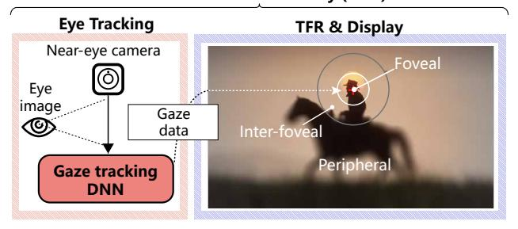
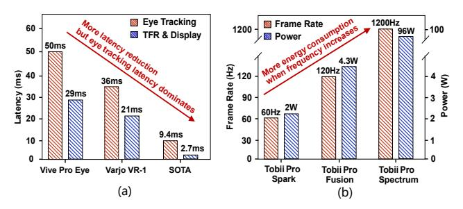
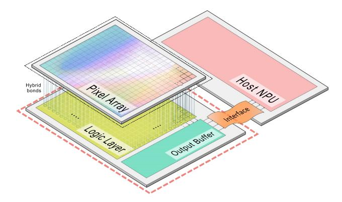
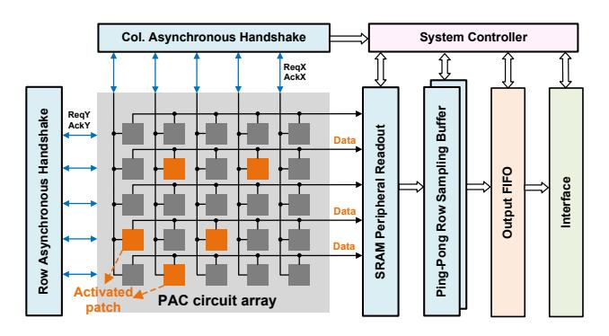
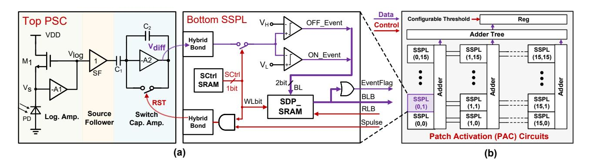
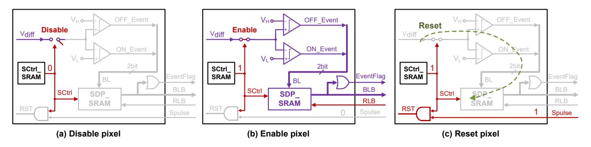
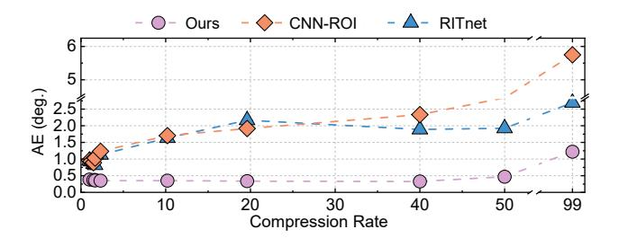
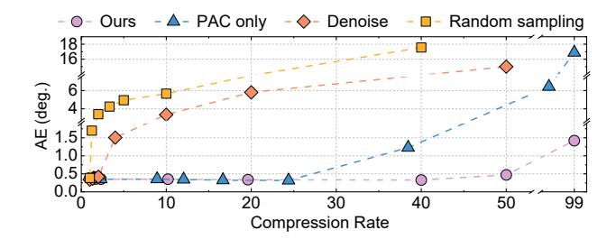
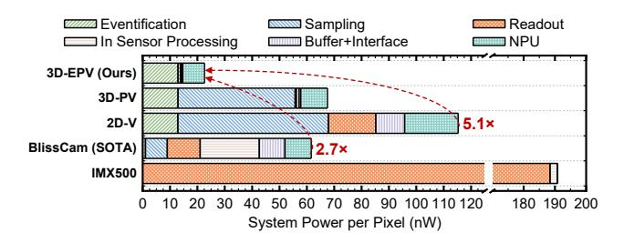

# DESSCam: An Event-Driven Architecture with In-Sensor Epitopological Sparse Sampling to Break the Latency-Power Tradeoff in Eye Tracking

Zhijie Jian, Shangyu Yang, Yuan Hua, Jilin Zhang, Ziyi Cheng, and Hong Chen Tsinghua University, Beijing, China {jzj24, yangsy23, huay24, chengziy24}@mails.tsinghua.edu.cn, {zhangjil, hongchen} @mail.tsinghua.edu.cn

*Abstract*—Eye tracking is crucial for emerging augmented/virtual reality (AR/VR) platforms, yet existing eye trackers suffer from high end-to-end latency (>15ms) and high power consumption (>2W), resulting in motion sickness and thermal discomfort, and thus making prolonged immersive interaction infeasible. These primarily arise from the frame-based dense sampling mechanism of image sensors, which mismatches the temporally varying and spatially sparse nature of eye movements.

To address these problems, we propose DESSCam, a 3Dstacked event-driven image sensor architecture with a dynamic sparse imaging paradigm, which achieves low latency through temporally dynamic sampling adaptive to eye movement speed, and low power consumption by spatially pixel-wise sparse sampling. In particular, we put forward a novel in-sensor epitopological sparse sampling (ESS) mechanism, which achieves attention-guided 50× pixel downsampling while preserving global data correlations. Moreover, we introduce a patch activation mechanism that only allows the events to be read out from the pixel blocks whose event count exceeds a threshold, and a robust vision transformer to accurately extract global features from sparse data. Furthermore, we implement DESSCam's hardware through co-optimized pixel and peripheral circuits with minimal overhead. Our experimental results show up to 2.7× power saving and 15.2× end-to-end latency reduction compared to the stateof-the-art eye tracking system, enabling sub-millisecond gaze updates and unlocking deeply immersive AR/VR experiences.

*Index Terms*—In-sensor computing, eye tracking, sparse sampling, dynamic vision sensor, AR/VR.

# I. INTRODUCTION

Eye tracking is rapidly emerging as a critical computational primitive in interactive applications like augmented/virtual reality (AR/VR). Fast and efficient eye tracking is crucial for enhancing the computational efficiency of head-mounted displays (HMDs) through foveated rendering [55], [61], [71], [118], [125]. The human eye moves rapidly during saccades, exhibiting speeds over 300 °/s [34]. Accurately capturing these movements necessitates a kilohertz frame rate to ensure smooth tracking and mitigate motion sickness in virtual environments [39], [116]. However, current eye trackers face high latency and power consumption bottlenecks [47], [83]. Commercial HMDs like HTC Vive Pro Eye and Tobii XR exhibit eye-tracking latency over 50 ms, which is enough to introduce visual artifacts [114]. Besides, these frame-based eye trackers consume over 2W, nearly half the power budget of a typical VR system [10], [11].

Many studies have been conducted to reduce the latency and power consumption [46], [61], [74], [83], [126]. However, most efforts focus on the hardware-friendly algorithms and dedicated accelerators, overlooking the image sensor which contributes up to 80% power [22] and 90% latency [23] in eye tracking systems. BlissCam [47] is the first in-sensor sparse sampling architecture for eye tracking. By reducing pixel volume by up to 95%, BlissCam achieves an 8.2× power reduction compared to existing eye tracking systems. However, BlissCam exhibits a high latency up to 9.4 ms, which does not meet the real-time AR/VR requirements [139]. As shown in Fig. 1(a), the high latency of BlissCam stems from the fixed-frame-rate sampling, which mismatches the temporally varying nature of eye movements [57], [142], resulting in an inherent latency-power tradeoff [83].

In order to reduce the latency caused by the image sensor, we adopt the dynamic vision sensors (DVS) paradigm and propose an event-driven in-sensor epitopological sparse sampling (ESS) architecture for the first time. DVS allows each pixel to independently and asynchronously measure the light intensity change at microsecond resolution [49], [69]. Only when the light intensity change exceeds a threshold will the pixel trigger an event. Therefore, as illustrated in Fig. 1(b), DVS naturally outputs an event rate adaptive to eye movement speed, achieving end-to-end latency as low as 0.1 ms during rapid saccades [17], [37], [58], thereby resolving the high-latency bottleneck of current frame-based eye tracking systems [83]. Although DVS enables low-latency eye tracking [49], its pixels are always-on to execute eventification, introducing significant power. Specifically, DVS pixels [48], [117] consume up to 10× higher power than frame-based image sensor pixels [24], [65] and dominate the power of DVS [2], [36]. To reduce the power consumption, we propose a pixel-wise ESS mechanism based on the spatially sparse characteristic of the eye-tracking task [47], [127], reducing the pixel power consumption by up to 5.26× over standard DVS pixels.

In this work, we propose DESSCam (Fig. 1(c)), a 3Dstacked event-driven architecture, which achieves both low latency through temporally dynamic sampling adaptive to eye movement speed and low power consumption by spatially pixel-wise ESS, trying to break the latency-power tradeoff in eye tracking. Our main contributions are:

Fig. 1. Comparing our DESSCam with the frame-based image sensor and dynamic vision sensor (DVS). The frame-based sensor adopts fixed-exposure-time sampling, which introduces high latency and results in motion blur during rapid saccades. In contrast, DVS generates a dynamic event rate that scales with the speed of eye movement, enabling low-latency eye tracking. However, DVS consumes more power than typical frame-based sensors due to its always-on pixel-wise sampling. To address these challenges, we propose DESSCam, which adopts temporally adaptive sampling and spatially sparse sampling to achieve both low latency and low power.

- An event-driven architecture with in-sensor ESS. We introduce a novel in-sensor ESS paradigm and present its hardware implementation within a 3D-stacked architecture. The ESS, co-designed with our ViT algorithm, achieves high tracking accuracy at up to 50× pixel downsampling, thus achieving a 2.7× reduction in system power consumption compared to the state-of-the-art (SOTA) eye-tracking system.
- A patch activation (PAC) mechanism. We put forward a PAC mechanism that reads only high-event-density pixel blocks. Through in-sensor token pruning, PAC reduces up to 61% host-side algorithmic computation. Co-designed with ESS, our eye tracking system realizes a 15.2× reduction in tracking latency compared to the SOTA system.
- A robust ViT algorithm. We design a lightweight and robust ViT algorithm that leverages global data correlations for gaze prediction. It achieves a 0.5° angular error with only 2% pixels being enabled. This highlights DESSCam's ability to maintain accuracy with low power and latency in eye tracking.

# II. BACKGROUND AND MOTIVATION

We first introduce the gaze-tracked foveated rendering (TFR) technology (Sec. II-A). Then we present the key per-

#### Motion-to-Photon Latency (MPL)

Fig. 2. Eye tracking for gaze-tracked foveated rendering. Eye tracking enables the GPU to render only the foveal region in high resolution, while the peripheral regions are rendered at low resolution. This approach reduces rendering workload by up to 72%.

Fig. 3. Current commercial devices face latency and power bottlenecks. (a) In current commercial devices, eye-tracking latency dominates the end-to-end tracking latency. (b) Reducing latency incurs a high power cost, revealing an inherent tradeoff. Achieving the 1 kHz tracking frequency demands 96 W system power consumption, which is unacceptable in AR/VR HMDs.

formance metrics of eye tracking and our optimization goals (Sec. II-B).

#### A. Gaze-tracked foveated rendering (TFR)

TFR adopts gaze direction data from eye-tracking to render the foveal region at high resolution, while blurring the peripheral regions [88], as shown in Fig. 2. Experiments conducted by Tobii on Pico headsets demonstrate that TFR reduces GPU rendering overhead by up to 72%, with an average reduction of 60% [9].

Although TFR significantly reduces rendering overhead, it is hard to deploy TFR in commercial devices [104], [136]. The main reason is its high motion-to-photon latency (MPL), which includes eye-tracking latency and TFR & display latency, that is, the delay between a virtual action and its perceived visual feedback [13], [130], as illustrated in Fig. 2. Prior studies have proved that MPL should be less than 5 ms to avoid visual discomfort in AR/VR HMDs [19], [59], [66], [139]. However, the MPL of some AR/VR HMDs (e.g., Vive Pro Eye) is up to 79 ms [114]. As illustrated in Fig. 3(a), the MPL is mainly dominated by the eye-tracking latency, which accounts for up to 63.3% of MPL in commercial systems [114] and 77.7% in the SOTA research [44], [47].

To reduce the latency of eye tracking, researchers increase the frame rate of image sensors, but a higher frame rate brings higher power consumption [3], [6], [7], as depicted in Fig. 3(b). Such a latency–power tradeoff makes it difficult to improve the performance of a frame-based eye tracking system. In order to break the tradeoff, we propose DESSCam, leveraging the temporally low-latency characteristics of DVS and a spatially sparse in-sensor ESS mechanism.

#### B. Eye Tracking Metrics

**Tracking Latency.** Eye tracking latency includes the image sensor delay and the NPU delay. The sensor delay originates from the pixel array, readout circuit, and output interface, while the NPU delay scales with the computational complexity of the gaze tracking algorithm. As mentioned in Sec. II-A, eye tracking latency dominates the MPL in AR/VR systems. Low eye-tracking latency is crucial for an immersive user experience. So far, most image sensors for eye-tracking are frame-based [47], [55], [73], [110], [143], which account for 88.3% of the tracking latency [47]. Therefore, our goal is to reduce eye tracking latency by optimizing the image sensor design.

Power Consumption. The power consumption of an eye tracking system includes the power of the image sensor and the NPU. The sensor power includes the power of the pixel array, readout circuits, and output interface, while the NPU power is associated with the computational workload. Most efforts focus on reducing the NPU computational workload by noise suppression [53], region-of-interest (ROI) segmentation [120], or designing lightweight eye tracking algorithms [30], [90], [128]. However, the power of image sensors dominates the power of an eye tracking system [83]. Specifically, DVS consumes the most power of event-based eye-tracking systems [33], [120]. This is because DVS pixels are always on and consume much power [48], [117]. As a result, even under low event activity, DVS consumes tens of mW [52], [111], [117]. In this work, we aim to reduce the power consumption of the DVS pixel array.

**Angular Error.** The angular error (AE) metric is widely used to evaluate the accuracy of gaze tracking systems. It quantifies the angular deviation between the predicted gaze direction and the ground-truth gaze direction [61]. AE is defined as the angular difference between two 3D gaze vectors: the predicted gaze vector and the actual gaze vector, typically calculated as follows [68], [120]:

$$AE = \arccos\left(\frac{\mathbf{v}_{pred}}{|\mathbf{v}_{pred}|} \cdot \frac{\mathbf{v}_{gt}}{|\mathbf{v}_{gt}|}\right) \tag{1}$$

Here,  $\mathbf{v}_{\text{pred}} = (x_{\text{pred}}, y_{\text{pred}}, L_0)$  and  $\mathbf{v}_{\text{gt}} = (x_{\text{gt}}, y_{\text{gt}}, L_0)$ .  $(x_{\text{gt}}, y_{\text{gt}})$  and  $(x_{\text{pred}}, y_{\text{pred}})$  denote the ground-truth and predicted gaze coordinates, respectively.  $L_0$  represents the Euclidean distance between the subject and the screen onto which the gaze point is projected. A smaller AE enables TFR to focus rendering on a compact region, enhancing user immersion while improving computational efficiency [136]. To achieve a low AE even at high data sparsity, we need to design a robust algorithm.

#### C. Summary

Our goal is to significantly reduce the power consumption and latency of eye tracking while ensuring accuracy. To achieve this goal, we propose DESSCam, which reduces latency through the temporally adaptive sampling capability of DVS and reduces power through pixel-wise ESS. Furthermore, we propose a robust ViT algorithm to realize a small AE under high data sparsity.

# III. EPITOPOLOGICAL SPARSE SAMPLING (ESS) EYE TRACKING

#### A. System Workflow

As illustrated in Fig. 4(a), the proposed eye tracking system workflow includes both in-sensor and off-sensor operations. Firstly, the ESS algorithm generates an offline-computed sampling mask and applies the mask to the pixels, enabling the eventification of the pixels located at the mask's valid coordinates. Then the sparse events are grouped into patches, and only when the accumulated event count exceeds a threshold will the patch be activated and read out. Finally, all the activated patches are processed by the off-sensor robust ViT for gaze tracking. With the ESS algorithm, the data movement and computational load are significantly reduced, enabling low-power and low-latency eye tracking.

#### B. ESS Algorithm

Inspired by the epitopological learning method [141], we propose ESS, which performs attention-guided  $50 \times$  pixel downsampling through a correlation matrix, as shown in Fig. 4(b). The correlation matrix is derived from the Pearson correlation coefficient  $\rho$ , as defined as follows [89]:

$$\rho_{X,Y} = \frac{\text{cov}(X,Y)}{\sigma_X \sigma_Y} = \frac{\sum_{i=1}^n (X_i - \bar{X})(Y_i - \bar{Y})}{\sqrt{\sum_{i=1}^n (X_i - \bar{X})^2} \sqrt{\sum_{i=1}^n (Y_i - \bar{Y})^2}}$$
(2)

where  $\rho_{X,Y}$  represents the correlation coefficient between two pixel values X and Y, cov(X,Y) is their covariance, and  $\sigma_X$ ,  $\sigma_Y$  are their standard deviations respectively. We obtain event frames by accumulating a fixed number of events in the training set to simulate the behavior of the pixel array. As illustrated in Fig. 4(b), all frame samples are organized into an  $H \times W \times N$  Frame Matrix. Firstly, each frame is flattened into an  $M \times 1$  vector, where  $M = H \times W$ . Then, these flattened frames are stacked column-wise to form an  $M \times N$  Sample Matrix, with each column representing an  $M \times 1$  frame sample and N denoting the total number of samples. Global correlation is computed on the Sample Matrix using the Pearson correlation formula, where each of the M features is correlated with the remaining M-1features, yielding an  $M \times M$  Correlation Matrix. Subsequently, we sum the rows of the Correlation Matrix and generate an  $M \times 1$  Feature Importance Matrix, where each element represents a pixel's correlation with others, which indicates the pixel's significance in eye-tracking tasks. After that, the Feature Importance Matrix is quantized using a predefined sparsity threshold (TH) to generate a binary Mask Matrix:

Fig. 4. (a) The proposed system workflow and the ESS algorithm. The workflow of our system includes eventification, pixel-wise ESS and PAC, which are processed in the DESSCam, and a robust ViT algorithm for gaze tracking, which is processed on the NPU. (b) The ESS algorithm generates a sampling mask that selectively enables pixels for eventification. Only pixels located at the mask's valid coordinates are sampled. By directly suppressing in-pixel event generation, the data movement and computational load of our system can be minimized, enabling low-power and low-latency eye tracking.

correlation values exceeding TH are set to 1, while those below TH are set to 0. The  $Mask\ Matrix$  is applied to the pixel array to execute ESS. Notably, the sparsity of this mask is able to be adjusted by changing TH, enabling flexible pixel downsampling rates and a hardware-friendly implementation.

The generated *Mask Matrix* is applied to each pixel to enable in-sensor ESS, which effectively mitigates background activity noise and hot pixel effects [84], [96]. Compared with existing denoising [35], [45], [54] or ROI segmentation methods [119], [138], which require tens of millions of additional multiply-accumulate operations (MACs) per inference to reduce the noise, our ESS method performs sparse sampling directly within pixels using an offline-computed sampling mask, imposing minimal control overhead and eliminating the need for preprocessing.

Following ESS, the PAC mechanism realizes token pruning by forwarding only the patches containing sufficient event counts to the ViT algorithm on the NPU, thereby mitigating redundant token outputs and computations from spatially isolated events [129] without sacrificing accuracy [60], [98]. To obtain high robustness under sparse data, we design a robust ViT that enhances local textures and extracts global correlations, which is discussed in detail in Sec. III-C.

#### C. Robust ViT Algorithm

As shown in Fig. 4(a), our ViT algorithm includes a conv stem module, a conv enhancement module, three transformer encoders, and a detector head. The conv stem module

comprises two early convolutional layers using a depthwise-separable convolution [32], producing a 128-dimensional representation with local inductive bias. The conv enhancement module replaces the positional embedding layer in standard ViT [40] with two 3×3 convolutional layers, enabling crosspatch interaction before forming the token sequence, thereby enhancing local spatial information [81]. The output feature maps are then flattened and processed by a transformer encoder consisting of three transformer blocks, each containing a multi-head self-attention module (8 heads, 128 dimensions). The output of transformer encoders is average-pooled and passed through a detector head including two fully-connected layers combined with a sigmoid activation function.

Our algorithm is designed to efficiently and accurately process the highly sparse data. As standard ViT applies non-overlapping tokenization which leads to loss of neighborhood information and isolated patch representations [29], we integrate CNN layers prior to the transformer encoders, enhancing local structural features and introducing inductive bias that helps recover contextual information across sparsely sampled regions [91]. Notably, most of our algorithm's computational workload resides in these early convolutional layers rather than the transformer blocks, because the convolutional layers operate at full image resolution and generate sparse tokens by applying the same ESS mask to their output feature maps. The transformer encoders then capture long-range dependencies and global correlations across the sequence using the local-feature-enhanced tokens with significantly reduced

Fig. 5. High-level architecture of our eye-tracking system. The proposed stacked sensor architecture consists of a pixel array at the top, a logic layer, and an output buffer at the bottom. The data is transmitted to the host NPU through an interface.

computation. By introducing the early convolutional layers to augment the local structural information [78], [134], our ViT algorithm is lightweight and robust against sparse inputs. This hybrid CNN-Transformer architecture reduces distortion caused by sparse sampling and maintains accuracy even with 50× downsampling.

#### IV. SYSTEM ARCHITECTURE

#### *A. Sensor Architecture*

Our work employs a stacked image sensor architecture, which is gaining increasing popularity [56], [109], [135]. As shown in Fig. 5, the high-level architecture of our eye-tracking system consists of a 3D stacked image sensor (DESSCam) and a host NPU. The image sensor includes a pixel array layer and a logic layer, which are connected via hybrid bonding. The pixel array detects the changes in light intensity, and the logic layer samples the signals from the pixel array and generates events. The events are transferred to an output buffer and then transmitted to the host NPU through the Mobile Industry Processor Interface Camera Serial Interface 2 (MIPI CSI-2) [5] using an address-event representation (AER) encoding protocol, which is suitable for asynchronous, event-driven sparse data readout [2], [18] and is widely adopted in DVS designs [67], [69], [93]. The AER data bus only consumes dynamic power when an event is actively transmitted via handshaking, supporting highly sparse output with low power [140]. Table I details the contents of the AER data packets transmitted over the MIPI interface to the host processor. Each packet contains the patch coordinates (addrX and addrY), the 32-bit timestamp of the activated patch, and the 512-bit event polarity data for the 16 × 16 pixels in the activated patch. Specifically, assuming the sensor resolution is 346 × 260, the array is partitioned into 22 horizontal and 17 vertical patches, thereby requiring 5 bits each for addrX and addrY. By stacking the analog front-end (pixel array) with sampling and readout logic (logic layer), DESSCam achieves low-latency local event processing while enhancing area efficiency.

Fig. 6. The event-driven sensor architecture supporting in-sensor sparse sampling. Every N×N pixels are grouped into a patch, where the PAC circuit detects the event count. The PAC circuits form an array and communicate with peripheral circuits via handshake signals (ReqX, AckX, ReqY, and AckY in Fig. 6). Only when the event count in a patch exceeds a threshold will the PAC circuit generate handshake signals and activate the patch to be read out. The events in the activated patch are then transmitted to the ping-pong row sampling buffer, the output FIFO and the interface.

TABLE I BREAKDOWN OF AER DATA PACKET CONTENTS

| addrX  | addrY  | events                      | timestamp |
|--------|--------|-----------------------------|-----------|
| 5 bits | 5 bits | 512 bits (16 × 16 × 2 bits) | 32 bits   |

As depicted in Fig. 6, our event-driven sensor architecture groups N×N pixels into a patch, each monitored by a PAC circuit. A patch is read out only when its accumulated event count exceeds a configured threshold. This event-driven characteristic is governed by asynchronous handshaking signals rather than a global clock [97]. Only when there are triggered events will the eye tracking system start working, and only when the event count in a patch exceeds a threshold will the PAC circuit generate handshake signals and activate the patch to be read out. Therefore, DESSCam can adapt to eye movements for low-latency tracking during saccades and low-power tracking during fixation. The readout process is pipelined via a ping-pong row buffer, where one buffer reads new patch data and the other transmits buffered data, thus enhancing throughput. The timing procedure begins with writing a sparse sampling mask to enable specific pixels. Upon activation, a patch generates ReqX and ReqY signals. Then, the patch data is read out via the SRAM peripheral circuit. Once the host receives sufficient patches, it executes gaze estimation and samples the next frame. By employing a patch-level handshake instead of the pixel-level handshake in a standard DVS [18], [26], [93], our architecture avoids the complex arbitration logic, thereby achieving lower readout latency. Furthermore, our in-sensor PAC circuits perform token sparsity computation within the pixel array, efficiently alleviating the computational load on the off-sensor ViT algorithm [129].

# *B. Pixel Structure*

Pixel Design. The pixel sensing circuit (PSC) resides in the top layer and is connected to our sparse sampling logic (SSPL) in the bottom layer via two hybrid bonding signals, as

Fig. 7. (a) Pixel structure. In our design, a pixel comprises the top pixel sensing circuit (PSC) and the bottom sparse sampling logic (SSPL). PSC is the analog front-end that detects changes in light intensity. Our ESS mechanism is supported in SSPL by simply adding a 1-bit SCtrl SRAM. The ON and OFF events are stored in the 2-bit SDP SRAM. (b) Patch activation (PAC) circuits. We assume each PAC consists of 16×16 SSPL units. The PAC circuits are activated when the cumulative sum of events from the SSPL units exceeds a configured threshold.

Fig. 8. Pixel workflow. (a) When *SCtrl* is set to 0, the pixel is disabled, with only its analog front-end remaining operational. (b) When *SCtrl* is set to 1, the pixel is activated. The events will be generated and stored in the SDP SRAM if *Vdiff* exceeds the threshold. (c) After completion of one readout cycle, the *Spulse* signal is asserted to reset the enabled pixels, ensuring they are prepared for the subsequent eventification.

illustrated in Fig. 7(a). The purple line represents the datapath for event generation and sampling, and the red line denotes the control path. The PSC is designed as a standard DVS pixel front-end [69], converting changes in light intensity into a DC voltage, Vdiff. A large Vdiff indicates decreased light intensity, whereas a small Vdiff means increased intensity.

Generally, DVS pixels [48], [117] consume up to 10× more power compared to the frame-based image sensor pixels [24], [65]. Even under low event activity, DVS still consumes tens of mW [52], [111], [117]. Prior study [36] has found the comparators in each DVS pixel consume up to 98.4% of the per-pixel power in the DAVIS346 camera [2].

To address this problem, we propose a novel SSPL circuit featuring (1) a low-overhead sampling control circuit that gates comparators to cut pixel power and data transmission. (2) an in-pixel sampling circuit that eliminates the per-pixel handshake logic and prevents the comparators from driving the high-capacitance event bus. These two features are implemented by adding a 1-bit 6T sparse-control SRAM (SCtrl SRAM) and a 2-bit 8T simple dual-port SRAM (SDP SRAM) [63] within each pixel. Specifically, unlike existing DVS pixels, where Vdiff is directly fed to two comparators for continuous event generation, our design uses *SCtrl* signal to decouple Vdiff and two comparators, enabling selective sparse sampling and reducing power consumption, as shown in Fig. 7(a). The SDP SRAM latches events locally, generating an *EventFlag* signal for the PAC circuit. Upon the completion of an event frame transmission, a global *Spulse* signal is asserted to reset the pixel. This in-pixel sampling and global reset avoid the pixel-wise handshaking required by standard DVS [18], [26], [93], reducing event output latency from the typical 120 ns [48] to several nanoseconds. The area overhead is minimal with only one 6T and two 8T SRAM cells.

Similar to the digital pixel sensor (DPS) design [72], [82], [122], we adopt SRAM cells instead of D-flip-flops (DFFs) or latches, so that the ESS mask can be simply written to the SCtrl SRAM in each pixel by peripheral circuits and the event can be directly read out by accessing the SDP SRAM. This simplifies the pixel array control and readout process, providing high flexibility with a minimal footprint.

SSPL Workflow. Fig. 8 illustrates the SSPL workflow. In the control path, when *SCtrl* is 0 (Fig. 8(a)), the pixel is disabled, eliminating the dominant power consumption of comparators. On the other hand, when *SCtrl* is 1 (Fig. 8(b)), the pixel is enabled, activating the eventification and sampling circuits. Upon outputting sufficient patches for offsensor inference, *Spulse* is asserted for 200 ns to reset the enabled pixels and conclude the cycle, as shown in Fig. 8(c). This reset is used to restore the capacitor and comparator states, ensuring pixel sensitivity in the subsequent cycle [80].

In the datapath, the VH and VL represent the high and low thresholds for triggering an event. When Vdiff exceeds VH or falls below VL, the comparators generate an OFF or ON event respectively, which is then stored in SDP SRAM. Simultaneously, the *EventFlag* is asserted to indicate event triggering.

#### *C. PAC Circuits*

The PAC circuits aggregate *EventFlag* signals into a patchlevel event count using column-level adders and an adder tree, as illustrated in Fig. 7(b). If the output result of the adder tree is greater than a predefined threshold, the patch is activated and the ReqX and ReqY signals are asserted, indicating the patch data is ready for readout. Then, the patch events are transferred to the peripheral readout circuit. This in-sensor token-pruning mechanism avoids redundant computations of isolated events, reducing interface latency and enhancing computational efficiency for the off-sensor ViT algorithm without accuracy loss [60], [98].

#### *D. Timing Control Scheme*

The timing control scheme of our implementation is as follows. Initially, the ESS mask is written into the SCtrl SRAM by peripheral circuits to control pixel activation. When a pixel is enabled by a mask value of '1', its comparators compare the intensity-differential voltage (Vdiff) with the threshold voltages (VH, VL). The Vdiff is generated by the analog front-end and transferred via hybrid bonding. If the Vdiff exceeds the biasing thresholds, an event is generated and the *EventFlag* signal is asserted. The adder tree in the PAC circuit continuously counts the number of *EventFlag* signals, representing the pixel activity within a patch. If the count exceeds the configured threshold, the patch is activated and generates the ReqX and ReqY signals to handshake with the peripheral circuits. Upon a successful handshake, the patch's data is transmitted out through the interface. Once the number of read-out patches reaches a predefined threshold, the NPU initiates the inference process, and the *Spulse* signal is asserted for 200 ns to reset the enabled pixels, preparing them for the next sampling cycle. This event-driven timing control scheme effectively reduces data movement and host computations.

In conclusion, our architecture breaks the latency-power tradeoff through three key approaches. Firstly, ESS enables pixel-level sparse sampling control, disabling redundant [126] and hot pixels [84], thereby effectively eliminating high perpixel power in existing DVS designs [48], [111], [117]. Secondly, patch-based readout avoids per-pixel asynchronous handshaking, thus reducing readout chain latency [117] compared to current DVS designs [18], [67], [105]. Thirdly, inarray PAC enables in-sensor token pruning [129], achieving up to 61% MACs reduction in our robust ViT algorithm. Furthermore, our hardware implementation efficiently supports in-sensor ESS and PAC with minimal hardware overhead, enabling DESSCam to achieve both low power and low latency.

# V. EXPERIMENTAL SETUP

#### *A. Algorithm Baselines*

We use EVBEYE [17], the first and most commonly used event-based gaze tracking dataset, to evaluate the performance of our ESS and robust ViT algorithm. The data was recorded from 27 subjects and consists of two experiments corresponding to two different types of eye motion: random saccades and smooth pursuits. The stimuli were displayed on a 40-inch, 1920×1080 pixel monitor at a standard reading distance of 40 cm. Following the standard practice to eliminate the invalid labels, such as those recorded before the experiment began [131], we excluded the "stop" and "pause" labels and the first 15 labels for each saccade beginning. The training and testing sets are created without distinguishing between the left and right eyes. The angular error is calculated over the dataset and averaged per inference.

We train the ViT algorithm using a batch size of 64 with 500 epochs. We compare our performance with two SOTA event-based gaze tracking algorithms, one reported on the EVBEYE [120] dataset and another on the OpenEDS dataset using its backbone [28] and our detector head. We also conduct experiments to compare our ESS algorithm with three sparse sampling approaches [47], [67], [98].

The ESS mask is generated offline based on the EVBEYE dataset. We randomly select 22 of the 27 subjects to create the mask, which requires about two minutes on an NVIDIA A100 GPU. The remaining subjects are unseen during mask generation. Then, we apply the same generated ESS mask to all subjects during neural network model training and testing without any user-specific recalibration or normalization. That is, the inference data is completely unseen by the ESS mask, thereby demonstrating the practical deployment feasibility of our ESS mechanism. In practical applications, the ESS mask is initialized using training data acquired from the specific hardware setup. As this regeneration process is fast and userindependent, DESSCam demonstrates good generalizability and scalability in AR/VR HMDs.

#### *B. Hardware Evaluation Methodology*

The hardware architecture of DESSCam comprises a pixel array analog front-end (top layer), pixel array sampling logic (bottom layer), PAC circuit array, peripheral circuits, and an output interface, as shown in Fig. 6. The proposed DESS-Cam is implemented in a standard CMOS 40 nm process node. The pixel front-ends, PSC, and our SSPL circuits are simulated using Cadence Virtuoso. The logarithmic amplifier and source follower are supplied at 2.5 V, while the rest of the pixel circuitry operates at 1.1 V. The SRAM peripherals are compiled using the ARM memory compiler. The PAC circuit array, peripheral circuits, and output interface are implemented in RTL. These peripheral digital circuits are synthesized, placed, and routed using a standard EDA flow with Synopsys and Cadence tools using a 22 nm process

supplied at 0.8 V. The logic power consumption is evaluated using Synopsys PrimeTimePX, incorporating fully annotated switching activity. Similar to the prior work [47], we scale the results to 40 nm process nodes using the DeepScaleTool [101], [115] for digital circuits. The analog components and SRAM cells are implemented directly using the 40 nm process library. As our DESSCam is evaluated using the standard EDA flow, we assume the off-sensor gaze estimation algorithm runs on an STM32N6x7 processor [1], which is fabricated using a 16 nm process and embeds an Arm Cortex-M55 core together with a Neural-ART NPU [12]. STM32N6x7 consumes only 6 mJ per inference when executing a standard MobileNet v2 [100], suitable for an embedded eye tracking system [16].

Our ViT model supports efficient deployment on commercial chips. Specifically, our model is quantized to INT8 precision using the learned step size quantization (LSQ) method [43]. We export the quantized model to the ONNX format and use STM32Cube.AI for heterogeneous deployment. That is, computationally intensive operations (e.g., in convolutional and linear layers) are executed on the Neural-ART NPU, while non-linear operations (e.g., LayerNorm, Softmax) are offloaded to the Cortex-M55 CPU. Although the Neural-ART NPU natively supports INT8 operations [8], it lacks native acceleration capability for transformer blocks. However, as discussed in Sec. III-C, most of our algorithm's computation is in the early convolutional layers rather than the transformer, because the convolutional layers generate sparse tokens for the transformer blocks, which significantly reduces its computational workload. Therefore, we adopt the official MobileNet v2 latency and power efficiency baseline on the STM32N6x7 [100] to estimate the deployment performance of our model. In addition, we can design a dedicated NPU to employ our model to achieve higher energy efficiency, and the NPU can be directly integrated into the 3D-stacked DVS sensor, which we leave for future work.

For our experimental setup, the ESS compression rate (uncompressed size over compressed size; 1 for full frame) is configured to 50×, the event readout threshold is set to 2, and 12 patches are used for every gaze estimation. Our evaluation metrics include power consumption, tracking latency, and hardware area, where power and latency are reported based on the samples captured during fast saccades (representing peak event rates). Our evaluation methodology is as follows.

Power Consumption. The system power is evaluated for both in-sensor and off-sensor components. The in-sensor power evaluation follows the standard DVS evaluation methodologies [48], [62], [111], which partition the power into static and dynamic contributions. Specifically, the static power is simulated under idle conditions (low event rate), which is determined by the pixel and peripheral digital circuits. The dynamic power is simulated under active imaging mode, which is decided by both the event-triggering energy and event rate. The in-sensor power consumption is defined as follows [52]:

$$P_{\text{in\_sensor}} = P_{\text{pixel\_static}} + \frac{1}{M} \sum_{s=1}^{M} \frac{N_{\text{ev}}(s) \cdot E_{\text{ts}}}{T_{\text{acc}}(s)} + P_{\text{logic}}$$
(3)

where Ppixel static denotes the static power of the pixel array. M is the total number of samples, s is the sample index, Ets is the energy for pixel event triggering and sampling, and Tacc(s) is the accumulation time for sample s. The middle term represents pixel dynamic power. Plogic includes both the static power and dynamic power of digital circuits. Note that DESSCam is an event-driven architecture, and its dynamic power varies with input. Therefore, we compute the average insensor switching activity and patch volume transferred to the off-sensor algorithm to assess dynamic power. By traversing the dataset, we obtain the average event volume per event frame, Nev, which governs pixel dynamic power and digital circuit switching activity.

The power consumption of both the MIPI interface and the off-sensor NPU is analytically estimated using the energy costs from prior work and commercial chips. For the MIPI interface, we evaluate its power using an energy cost of approximately 100 pJ per transmitted byte [73], consistent with the assumption in the SOTA research [47]. This 100 pJ/byte energy cost accounts for the standard output process of the MIPI interface, which corresponds to transmitting data from the output FIFO (Fig. 6) to the off-sensor NPU. Thus, the MIPI power is estimated by multiplying the average data rate (derived by multiplying the average patch activation rate by the AER data packet size) by the energy cost (100 pJ/byte). For the offsensor NPU, the power consumption is calculated by dividing the MAC operations per second by the energy efficiency of the STM32N6x7 processor [1]. For a fair comparison, the offsensor power of all the baselines is evaluated using our robust ViT algorithm, except for TinyTracker, which performs insensor inference using the IMX500 [4].

We first evaluate the average energy of each DVS event frame and each off-sensor inference. The power consumption is then obtained by multiplying this total energy by the frame rate. Note that although DVS's peak frame rates can reach several kHz, this rate dynamically adjusts based on the speed of eye movement. We assume the resolution of DESSCam is 346×260, consistent with the commercial DAVIS346 camera [2].

Tracking latency. For tracking latency, we account for:

- 1) The detection latency of the top-layer analog front-end.
- 2) The eventification and sampling latency in the bottom layer.
- 3) The propagation latency of adders in patch grouping.
- 4) The latency of handshaking with peripheral circuits and packeting AER data.
- 5) Interface transmission latency.
- 6) The latency of the proposed gaze tracking algorithm on the NPU.

The analog front-end latency in 1) is modeled using typical pixel triggering delays under standard light intensity [52]. The latency of eventification and sampling in 2) is obtained via Cadence Virtuoso simulations. Subsequent digital circuits are implemented in RTL, and their latency in 3) and 4) is derived from timing reports generated by Synopsys tools.

Similar to the power calculation, both the MIPI interface latency in 5) and the NPU latency in 6) are also derived from analytical estimates. The MIPI interface latency is estimated by dividing the output data volume (i.e., the AER packet size multiplied by the number of activated patches per frame) by the effective MIPI CSI-2 bandwidth, which is assumed to be 2.5 Gbps [92], [112] for a fair comparison with the SOTA work [47]. The NPU computation latency depends on the patch count per event frame and is evaluated using the same method as for power.

**Chip Area**. Each of our pixels consists of the pixel sensing circuits (PSC) in the top layer and the sparse sampling logic (SSPL) in the bottom layer. For the top layer, we claim no novelty for the PSC design and adopt the same circuits in [48], [117], so the area of the PSC is estimated based on the results reported in these prior works. For the bottom layer, we obtain the area of SSPL from its layout using Cadence Virtuoso at the 40 nm process node. The area of one PAC includes the area of 16×16 SSPL and the digital logic. The digital logic area is acquired from the synthesis area report using Design Compiler at the 22 nm node and scaled with DeepScaleTool. To obtain the equivalent pixel area, we directly divide the total PAC area by 256. Together with the areas of the peripheral circuits including SRAM readout circuits, control logic and an output interface (shown in Fig. 6), which are obtained by the Memory Compiler and Design Compiler, the whole area of the sensor is determined.

In summary, our evaluation metrics include power consumption, tracking latency, and hardware area. As shown in Table II, the power and latency of the MIPI interface and the off-sensor NPU, along with the top-layer pixel area, are derived from analytical estimation relying on prior work and commercial chips. The MIPI power and latency are estimated using the data rate (calculated from the per-frame data volume and the operating frame rate), combined with the bandwidth [92], [112] and power efficiency [73]. The NPU power and latency are estimated based on the total number of MAC operations, combined with the throughput and energy efficiency [1]. For the top-layer pixel (PSC) area, we adopt the pixel pitch reported in prior works [48], [117] with the same PSC design. For the remaining components, our evaluations are based on hardware implementation. The power and latency of the pixel (including both the top layer and the bottom layer) are evaluated via SPICE simulations using Cadence Virtuoso. The area of the bottom-layer SSPL (featuring our proposed ESS and PAC) is measured from the layout. Besides, the power, latency, and area of the digital and peripheral circuits are obtained from post-synthesis reports using Synopsys Design Compiler and Memory Compiler.

#### C. Ablation Study

To elucidate the contributions of different components in our system, we conduct ablation studies at both algorithmic and hardware levels. At the algorithmic level, we compare our ESS mechanism with three sparse sampling methods: (1) a PAC-only method without sparse sampling, (2) a widely adopted

TABLE II
EVALUATION METHODOLOGIES FOR SYSTEM COMPONENTS

| Component                 | Power     | Latency   | Area      |
|---------------------------|-----------|-----------|-----------|
| Top Layer Pixel (PSC)     | Sim.      | Sim.      | Est.      |
| Bottom Layer Pixel (SSPL) | Sim.      | Sim.      | Layout    |
| Digital & Peripherals     | Post-Syn. | Post-Syn. | Post-Syn. |
| MIPI Interface            | Est.      | Est.      | -         |
| Off-sensor NPU            | Est.      | Est.      | -         |

Est.: Analytical estimate relying on prior work and commercial chips;

Sim.: SPICE simulation using Cadence Virtuoso:

Post-Syn.: Post-synthesis using Synopsys Design Compiler and Memory Compiler.

Fig. 9. End-to-end gaze prediction vs. compression rate (uncompressed size over compressed size; 1 for full frame). All the experiments are conducted using ESS. The results demonstrate that our ViT exhibits greater robustness under a high compression rate.

random sampling method used in existing algorithms [70] and sparse sampling sensor architectures [47], and (3) an event-density based denoising method [45].

For hardware evaluation, we define the following system configurations for ablation studies:

- 3D-EPV: full DESSCam architecture with ESS, PAC, and Robust ViT, executed on an off-sensor NPU.
- 3D-PV: DESSCam architecture with PAC and ViT, excluding the ESS mechanism.
- 2D-V: standard DVS architecture outputting data for ViT processing.
- BlissCam [47]: performs in-sensor sparse eventification and sampling in the analog domain, using a random sampling mechanism and standard camera imaging.
- *TinyTracker* [23]: utilizes a commercial image sensor IMX500 supporting near-sensor computing [4], with a lightweight gaze-tracking algorithm deployed in-sensor.

# VI. EVALUATION

#### A. Accuracy vs. Compression Rate

Our eye-tracking algorithm achieves a lower AE compared to the baselines across a wide range of compression rates (defined by uncompressed size/compressed size). Fig. 9 compares the angular error versus compression rate. Baseline algorithms employ the same ESS method to achieve varying compression rates. Results show that across all compression ratios, our algorithm consistently maintains the gaze estimation accuracy within  $2^{\circ}$ , showing a stronger robustness to tolerate sparse input. In particular, our robust ViT algorithm achieves an angular error of only  $0.5^{\circ}$  even under a  $50\times$  compression rate. This compression rate is used in subsequent experiments.

Fig. 10. Comparison between our ESS and other sparse sampling alternatives. All experiments are conducted using our ViT algorithm. Compared to other sparse sampling methods, our ESS can retain acceptable accuracy even at high compression rates.

Furthermore, as shown in Fig. 10, our ESS sparse sampling algorithm outperforms other sparse sampling methods, especially under high compression rates. For a fair comparison, we use our robust ViT to evaluate different sparse sampling methods, including the SOTA image sensor for eye tracking with a random sparse-sampling mechanism [47], and an eventdensity based denoising method [45]. Results show that our ESS achieves lower AE compared with these baselines across all compression ratios. Besides, at 50x compression rate, the PAC-only variant (without ESS) reaches an AE of 4.7°, which is unacceptable for AR/VR applications [125]. In contrast, our ESS preserves critical global structure, achieving an AE of only 0.5° even under a 50× compression rate. This improvement stems from ESS's global correlation-aware pixel preselection, which preserves essential information under high compression rates.

#### B. Power Reduction

As shown in Fig. 11, the end-to-end power consumption of our system achieves a 2.7× reduction compared to the SOTA research, BlissCam [47], which outputs 34,257.8 pixels per frame on average (13.38% of the pixel array) by executing ROI prediction. In contrast, our method requires only a few hundred events (2% of the pixel array) for a single inference, thereby achieving much lower system power than BlissCam. There are three main reasons. Firstly, our correlation-based ESS downsamples the pixels by 50×, drastically reducing sampling requirements. Secondly, we implement efficient insensor ESS using a predefined pixel-level mask, avoiding the overhead of refreshing the entire SRAM array to generate random numbers per inference, as required in BlissCam [47]. Thirdly, DESSCam uses simple PAC circuits for token sparsity instead of an in-sensor NPU integrated in BlissCam.

To validate the effectiveness of our ESS and PAC mechanisms in power reduction, we conduct ablation studies. Compared to the 2D-V architecture, our 3D-EPV with ESS reduces power by 5.1×. This is due to: (1) disabling comparators in non-sampling pixels, as comparators dominate per-pixel power consumption [36]; (2) performing local event sampling within the pixel, eliminating the need for comparators to drive the event bus with high load capacitance. Our added SRAM contributes only 2.1% to the pixel's total static power, while

Fig. 11. Power evaluation results. Our 3D-EPV eye-tracking system reduces power by 5.1× over a standard DVS-based system [111] and 2.7× over the SOTA eye tracking image sensor [47]. This improvement mainly comes from the ESS mechanism, which significantly reduces per-pixel power consumption.

its dynamic power is incurred only when the pixel is enabled for sampling.

Our SSPL-pixel implements ESS-based sampling, which eliminates the dominant power contribution from comparators and sampling circuits in non-sampling pixels by 12.6× and 9.6×, respectively, thereby reducing per-pixel power by up to 5.26×, as illustrated in Fig. 12. As a result, with only 2% active sampling pixels contributing dynamic power, our 3D-EPV achieves a 4.93× reduction in average per-pixel power compared to the no-ESS baseline (3D-PV). In summary, these ablation studies confirm that our ESS and PAC mechanisms are the primary contributors to the 5.1× power reduction over typical DVS-based eye tracking systems and the 2.7× reduction over the SOTA systems.

DESSCam enables the eye tracking system to be deployed in ultra-lightweight AR/VR HMDs, like smart glasses, which typically operate under a limited total system power budget of only tens of mW. For instance, the Meta Ray-Ban smart glasses use micro-batteries with only 154 mAh (about 593 mWh) to keep a light weight (48.6 g) [99], [108]. As a result, the power budget of the glasses is only 49.6 mW to realize all-day usability (up to 12 hours). Because the display and rendering subsystems are power-hungry, researchers are trying to reduce the power of eye tracking systems to several mW. A recent study by Sony [87] demonstrates a fully integrated neuromorphic eye-tracking system which consumes only 4.22 mW power. Commercial eye tracking systems demand higher resolutions for immersive experiences [76], such as 640×480 [27], [131], which results in higher power consumption. With this resolution, DESSCam consumes only several mW, meeting the power budget while delivering high tracking accuracy.

# C. Tracking Latency Reduction

As shown in Fig. 13, our eye tracking system achieves a 15.2× system latency reduction compared to the SOTA system [47]. This improvement originates from the pixel design and the event-driven feature of DESSCam. The pixel design enables each pixel to detect light intensity changes independently with microsecond temporal resolution, eliminating the fixed exposure latency.

Besides, our work achieves a 2.6× latency reduction compared to current 2D DVS architectures. This enhancement

Fig. 12. The comparators and bus-driving sampling circuits in a standard DVS pixel consume up to 89% of pixel power. Our SSPL-pixel reduces the dominant power by disabling the comparators and sampling circuits in non-sampling pixels, achieving up to 5.26× power reduction.

Fig. 13. Latency evaluation results. Our 3D-EPV eye-tracking system reduces latency by 2.6x over a standard event-based system [111] and 15.2x over the SOTA eye tracking image sensor [47]. These improvements arise from the co-design of the entire system. The ESS mechanism enables pixel-wise sparsification, while PAC performs token pruning. Combined with the lightweight ViT algorithm, our 3D-EPV achieves sub-1-ms end-to-end latency.

stems from two key designs: (1) our pixel circuit design performs sampling within the SRAM in the bottom layer, utilizing global reset via peripheral circuits, thus avoiding per-pixel handshaking with peripheral circuits as required in standard DVS architectures; (2) the ESS and PAC mechanisms enhance data sparsity, significantly reducing latency in handshaking, encoding, and output interface stages. Notably, the use of ESS has minimal impact on latency, as the event transmission latency of DESSCam is primarily determined by the critical timing paths (e.g., adder tree and handshake paths).

We evaluated the PAC activation frequency and the equivalent frame rate across all inference samples. Our experiments on EVBEYE show that the activation frequency of PAC ranges from 162.76 Hz to 64,170.78 Hz. We use 12 patches as the threshold for triggering inference, so the equivalent frame rate ranges from 13.56 Hz to 5,347.56 Hz, which means a range of 0.19 ms to 73.75 ms tracking latency when the eye is moving fast versus moving slowly. Note that tracking accuracy is maintained even during periods of slow eye movement or fixation, because natural human eyes constantly exhibit microsaccades [79]. These tiny movements consistently create events, providing sufficient data for accurate and continuous inference [107], [113]. Benefiting from a high peak tracking frequency and an adaptive temporal sampling mechanism, DESSCam supports real-time tracking during saccades and automatically adjusts its sampling rate to match eye movement speed.

Fig. 14. Bottom-layer pixel area breakdown for (a) the standard DVS pixel [117] and (b) our proposed SSPL-pixel. Both (a) and (b) adopt the comparator circuit design in [69]. Overall, our design introduces a minimal area overhead of only 0.6% (36.97  $\mu m^2$  vs. 36.76  $\mu m^2$ ). Although integrating the ESS mechanism in SSPL increases the sampling logic area by 9% compared to the standard pixel, this overhead is effectively mitigated by two optimizations: (1) adopting local SRAM sampling and shared PAC circuits instead of perpixel handshake circuitry, yielding a 3% area reduction; and (2) replacing the standard event-bus-driving buffers with smaller buffers dedicated to driving two SDP\_SRAM cells, bringing a further 5% reduction. As a result, our proposed design supports both the ESS and PAC mechanisms with minimal area overhead.

#### D. Area Estimation

The sampling and control logic are located in the bottom layer, comprising two comparators, a 1-bit 6T SRAM, a 2-bit 8T SRAM, and minimal control logic, as illustrated in Fig. 7. The top layer's analog front-end, including a photodiode and two capacitors for the switched-capacitor amplifier, dominates the pixel area because of its much larger footprint compared to that of the bottom layer. By performing in-pixel event sampling and employing enable-controlled global reset instead of per-pixel reset, our design eliminates the need for traditional DVS handshaking logic, further simplifying the bottom-layer circuitry compared to standard DVS designs.

Our layout results show that the bottom-pixel area (including SSPL and shared PAC) is 36.97  $\mu$ m2 with only 0.6% area overhead compared to that of 36.76  $\mu$ m2 in the standard pixel design [117]. As illustrated in Fig. 14, we achieve this low overhead through two key optimizations. Firstly, our PAC mechanism shares a single handshake control unit across a 16×16 pixel block, eliminating the complex per-pixel AER handshake circuitry required in Fig. 14(a), reducing the handshake logic proportion from 21% to 18%. Secondly, as our pixel does not handshake with the external bus, we replace the event-bus-driving buffers with smaller buffers that only drive the bitlines of two SDP\_SRAM cells, decreasing the buffer area from 15% to 10%. As a result, although integrating in-pixel SRAM cells to support the ESS mechanism increases the sampling logic from 6% to 15%, our design (Fig. 14(b)) still delivers a minimal area overhead of only 0.6% compared to the standard DVS pixel.

The area of the SRAM peripherals is 0.067 mm2. We neglect the area overheads of the handshake logic and the output buffer, as they account for less than 0.1% of the pixel array area. For the top layer, we adopt the same PSC as that in [48], [117], where its area is estimated as  $5\times5~\mu\text{m}^2$ . As the top-layer pixel size is  $5~\mu\text{m}$  and the bottom-layer pixel size is  $6.1~\mu\text{m}$ , we estimate the total chip area to be  $3.414~\text{mm}^2$  with a pixel array of  $346\times260$ . While this pixel size ( $6.1~\mu\text{m}$ ) is larger than

commercial DVS sensors (about 5 µm), the difference is due to our layout limitations compared to optimized industrial layouts from Sony [48] or Samsung [117] rather than our proposed pixel structure. In summary, our layout results demonstrate that the area overhead introduced by the proposed ESS and PAC mechanisms is minimal compared to a standard DVS pixel.

#### *E. Sensitivity Study*

To validate the generalizability of our approach, we extend our ESS pipeline to another task named pupil tracking. It can be regarded as a single-object tracking task that localizes the pupil center [90], which is essential for eye motion analysis in diagnostics and neuroscience [133], [137]. We evaluate our method on the ini-30 dataset [22], which is captured using two DVXplorer event cameras (640×480 pixels) mounted on a glasses frame. Ini-30 is the first event-based eye-tracking dataset with pupil location labelled on the sensor, and the participants were not instructed to follow a dot on a screen, but rather encouraged to look around to collect natural eye movements. We perform 5-fold cross-validation on the ini-30 dataset by implementing the ESS pipeline with our robust ViT algorithm. The results show that our pipeline achieves an average pixel error of only 2.76 (± 0.15) at a 50× compression rate (only 2% pixels are sampled), outperforming Retina [22], which is the SOTA research exhibiting a 3.24 (± 0.79) pixel error without sparsity. The results show that our ESS pipeline can also be applied to object tracking tasks, demonstrating promising generalizability. In conclusion, our experiments show DESSCam can achieve both low power and low latency by 50× downsampling across different tasks while preserving accuracy.

# VII. RELATED WORK

#### *A. Standard DVS*

Comparison with standard DVS. Our DESSCam differs from standard DVS in two ways. Firstly, our design supports pixel-level sparse sampling using the ESS paradigm, enabling power reduction in the pixel array based on global correlation-based downsampling. This approach also solves the inherent hot-pixel issue [50] in standard DVS [49]. Secondly, DESSCam integrates an in-sensor PAC mechanism, allowing only the high-event-density patch to be read out, enabling a fully event-driven processing pipeline. The event-driven feature allows DESSCam to execute low-latency tracking during saccades and low-power tracking during fixation. Therefore, our DESSCam is able to operate as a standalone image sensor or as a plug-and-play frequency booster in eye tracking tasks with minimal overhead.

Limitations of our work. While our work achieves ultralow power consumption and latency for eye-tracking applications, its performance in unconstrained environments remains to be evaluated. So far, DESSCam has demonstrated robust performance across two different tasks, specifically gaze tracking [17] and pupil tracking [22]. Besides, the ESS mechanism effectively mitigates inherent DVS issues, such as background noise [103] and hot-pixel noise [50], which is significant across various application scenarios [20], [38], [41]. We believe DESSCam holds significant potential for broader applications and warrants further research and development.

#### *B. Optimized Designs of Image Sensors*

Sparse sampling image sensor. The concept of in-sensor random sparse sampling has been explored in both algorithms and image sensors. For the algorithms, prior work has proved that both frame-based and event-driven vision tasks benefit from sparse sampling [70], [75], [98]. For image sensors, researchers have presented compressed-sensing image sensors, which assign random numbers to the pixel array to support sparse sampling [42], [86]. However, the generation of random numbers often results in complicated in-pixel logic [77]. To efficiently support in-sensor random sparse sampling, Bliss-Cam [47] presents a stacked sensor architecture with careful reuse of existing pixel circuitry for eye tracking, reducing the power consumption but still showing a high latency due to the exposure time. To address this problem, we propose DESSCam, adopting an exposure-free DVS pixel and ESS mechanism, achieving both low latency and low power.

Our DESSCam differs from BlissCam in three ways: (1) imaging mechanism: BlissCam relies on frame-based imaging and performs eventification after full-frame exposure, whereas DESSCam employs an exposure-free DVS approach, integrating eventification circuits in each pixel for asynchronous event triggering, significantly reducing latency. (2) sparse sampling method: BlissCam's random sampling requires repeated powering of 10-bit in-pixel SRAMs for random number updates, controlling only overall sparsity without specifying active pixel locations. In contrast, DESSCam uses a 1-bit SRAM for sampling control, enabling pixel-wise, correlation-based sparse sampling suited for DVS. (3) in-sensor computing: BlissCam integrates a complex NPU for ROI prediction, which increases area and power. In contrast, our DESSCam simply implements PAC circuits to perform token sparsity, drastically reducing digital power consumption. This efficiency stems from our ESS method, which generates highly sparse data at the pixel level, thereby eliminating the need for the preprocessing pipelines for data reduction [120], [143].

Digital pixel sensor (DPS). DPS generally adopts an inpixel ADC for locally pixel quantization [123]. Similar to DVS, DPS can also perform pixel-level eventification [15], [47]. However, unlike DVS, DPS performs eventification using an exposure-based imaging paradigm [124], [146]. This mechanism introduces inherent exposure latency, resulting in lower frame rates compared to DVS. Nevertheless, DPS exhibits lower power consumption. Prior work has optimized in-sensor frame-difference operations to achieve single-pixel power consumption as low as a few nW [15], [31], substantially outperforming the typical 100-nW per-pixel consumption of DVS [111], [117]. Our ESS mechanism effectively reduces DVS's power by employing pixel-level sparse sampling while preserving the low-latency benefits.

Near-sensor computing image sensor. Many near-sensor computing approaches integrate NPUs to deploy neural networks directly on image sensors, thereby reducing data transmission while achieving high area efficiency [65], [106]. In contrast, DESSCam minimizes data transfer overhead at the pixel level, resulting in a small interface bandwidth requirement. Thus, our design does not integrate a costly in-sensor NPU. Nevertheless, to further enhance integration, future work can leverage the bottom layer to integrate an NPU, as demonstrated in [65], [106]. The NPUs can perform DVS data augmentation [85], [121] and processing [64], [94], [145] to enhance robustness and precision, or execute gaze-tracking tasks with high computational and area efficiency in power and area-constrained devices. DESSCam's versatility supports the development of tailored eye-tracking systems based on power and area budgets.

Limitations of the frame-based image sensor. The framebased systems face a tradeoff that reducing latency by increasing frame rate consumes substantial power [102]. This limitation is primarily due to temporally fixed-frame-rate sampling and spatially dense sampling mechanisms. Moreover, their fixed-frame-rate sampling is mismatched to the dynamic nature of eye movements. With saccades occupying only 10–20% of viewing time [14], [132], typical frame-based cameras must operate at high frame rates to capture these rapid motions without blur, leading to significant power waste during the 80–90% of low-motion periods [95]. Although recent efforts [47] can mitigate per-frame costs through insensor sparse sampling and on-chip segmentation, the temporal mismatch between fixed sampling clocks and event-driven eye movements still constrains performance. In contrast, DVS enables adaptive temporal sampling based on eye movement speed, eliminating motion blur and energy waste. This core advantage of DVS imaging is the primary motivation for our design.

# *C. Pixel-wise Attention Mechanisms for Eye Tracking*

Existing work includes pixel-wise attention mechanisms for eye tracking [21], [25]. For instance, MESA [21] implements a pixel-wise spatial attention module by storing events in a memory tensor with pixel-wise adaptive forgetting factors generated in real time. This approach differs from ours in two key aspects. Firstly, MESA aims to enhance event representation quality to improve the accuracy of non-recurrent algorithms, whereas we leverage global correlations to remove redundant pixels. Secondly, MESA employs pixel-wise dynamic attention, incurring substantial power and overhead that is impractical for hardware implementation. In contrast, we use pre-computed global attention coefficients for pixelwise sparse sampling. In addition, we design a robust ViT algorithm, enabling a low-power and low-latency eye tracking system with little accuracy degradation. Our ESS method draws inspiration from the brain-inspired epitopological learning method [141], which applies global correlation matrices to sparsify fully connected layers. In this work, we propose DESSCam, which applies ESS to the pixel array. By reducing event generation in the pixel array, DESSCam minimizes data movement, thereby reducing system power and latency.

#### *D. Fully-integrated Neuromorphic Architectures*

As DVS is an event-driven image sensor, spiking neural networks (SNNs) are naturally event-driven and can efficiently extract temporal features, making them promising for lowpower eye tracking. Researchers have proposed various SNN algorithms for gaze tracking and pupil tracking. For gaze tracking, GazeSCRNN [51] achieves an angular error of 6.034° with a total of 2.3M parameters. For pupil tracking, the Retina algorithm [22] runs on the Speck neuromorphic chip, consuming only 5 mW and achieving a 3.24 pixel error. Additionally, a recent study presents a fully integrated neuromorphic eyetracking system [87], achieving an average power consumption of only 4.22 mW. These SNN-based neuromorphic solutions exhibit ultra-low system power levels. However, the accuracy of current SNN implementations is generally lower than that of artificial neural networks (ANNs) [144]. Improving the accuracy of SNNs is critical to meet the strict precision requirements of commercial AR/VR. To ensure accuracy, we employ the robust ViT model working on the highly downsampled data. The ViT model is also hardware-friendly because the in-sensor ESS and PAC mechanisms significantly reduce the number of processed patches. Therefore, DESSCam can achieve both high accuracy and low power consumption.

#### VIII. CONCLUSION

This work presents DESSCam, an event-driven architecture with a dynamic sparse imaging paradigm to address the latency and power challenges in eye tracking for emerging AR/VR platforms. It features a novel in-sensor ESS mechanism, which leverages spatially-sparse eye movement regularities for attention-guided 50× pixel downsampling while preserving global data correlations. ESS enhances eye-tracking efficiency by reducing data volume directly within the pixel array, thereby mitigating pixel power and data transmission. To further reduce the latency and power of the readout chain and host processor while maintaining accuracy, we propose a patch activation mechanism that reads only high-event-density pixel blocks, and a robust ViT algorithm to extract global features from sparse data. Moreover, we present DESSCam's hardware implementation with minimal overhead. Compared to the SOTA eye tracking system, our system delivers a 2.7× power reduction and a 15.2× end-to-end latency reduction. Compared to the standard event-based eye tracking system, our system achieves a 5.1× power reduction and a 2.6× latency reduction. These improvements pave the way for truly immersive AR/VR experiences.

#### ACKNOWLEDGEMENTS

We thank anonymous reviewers and the shepherd from ISCA 2026 for their valuable comments. This work is supported by National Natural Science Foundation of China (No. 62574117 and 62334014).

#### REFERENCES

- [1] "AI:STM32Cube.AI model performances," [Online]. Available: https: //wiki.stmicroelectronics.cn/stm32mcu/wiki/AI:STM32Cube.AI.
- [2] "DAVIS346 documentation," [Online]. Available: https://docs.inivation. com/hardware/current-products/davis346.html.
- [3] "Enter the world of eye tracking with Tobii Pro Spark," [Online]. Available: https://www.tobii.com/products/eye-trackers/screenbased/tobii-pro-spark.
- [4] "IMX500 developer world," [Online]. Available: https://developer.sony. com/imx500.
- [5] "Mipi white paper: Introduction to mass," [Online]. Available: https://www.mipi.org/download-mipi-whitepaper-introductory-guideto-mass.
- [6] "Most advanced eye tracking system: Tobii Pro Spectrum," [Online]. Available: https://www.tobii.com/products/eye-trackers/screenbased/tobii-pro-spectrum.
- [7] "Reach further with your research: Tobii Pro Fusion," [Online]. Available: https://www.tobii.com/products/eye-trackers/screen-based/tobiipro-fusion.
- [8] "STM32N6x7 documentation," [Online]. Available: https: //www.st.com/en/microcontrollers-microprocessors/stm32n6x7/ documentation.html.
- [9] "What is foveated rendering?" [Online]. Available: https://www.tobii. com/blog/what-is-foveated-rendering.
- [10] "Does vr use a lot of energy?" [Online]. Available: https://blog. constellation.com/2022/02/22/vr-power-consumption/, Feb. 2022.
- [11] "Specifications for eye tracker 5," [Online]. Available: https://help.tobii.com/hc/en-us/articles/360012483818-Specificationsfor-Eye-Tracker-5, Jan. 2024.
- [12] "STM32N6: Pioneering edge AI with next-gen MCU performance and built-in NPU," [Online]. Available: https://reversepcb.com/stm32n6 pioneering-edge-ai-with-next-gen-mcu-performance-and-built-innpu/, Dec. 2024.
- [13] "Understanding latency in VR: The key to enhancing virtual reality experience," [Online]. Available: https://pimax.com/blogs/blogs/ understanding-latency-in-vr-the-key-to-enhancing-virtual-realityexperience, May 2024.
- [14] "Eye-movement-analysis-algorithm-using-EOG," [Online]. Available: https://github.com/abbrash/Eye-Movement-Analysis-Algorithm-Using-EOG, Oct. 2025.
- [15] K. A. Ahmed, H. Okuhara, and M. Alioto, "55pw/pixel peak power imager with near-sensor novelty/edge detection and dc-dc converter-less mppt for purely harvested sensor nodes," in *2023 IEEE International Solid-State Circuits Conference (ISSCC)*, Feb. 2023, pp. 102–104.
- [16] A. Amir, L. Zimet, A. Sangiovanni-Vincentelli, and S. Kao, "An embedded system for an eye-detection sensor," *Computer Vision and Image Understanding*, vol. 98, no. 1, pp. 104–123, Apr. 2005.
- [17] A. N. Angelopoulos, J. N. Martel, A. P. Kohli, J. Conradt, and G. Wetzstein, "Event-based near-eye gaze tracking beyond 10,000 hz," *IEEE Transactions on Visualization and Computer Graphics*, vol. 27, no. 5, pp. 2577–2586, May 2021.
- [18] Aung Myat Thu Linn, Do Anh Tuan, Chen Shoushun, and Yeo Kiat Seng, "Adaptive priority toggle asynchronous tree arbiter for aer-based image sensor," in *2011 IEEE/IFIP 19th International Conference on VLSI and System-on-Chip*. Kowloon, Hong Kong: IEEE, Oct. 2011, pp. 66–71.
- [19] R. E. Bailey, R. V. Parrish, J. J. Arthur Iii, and R. M. Norman, "Flight test evaluation of tactical synthetic vision display concepts in a terrainchallenged operating environment," in *AeroSense 2002*, J. G. Verly, Ed., Orlando, FL, Jul. 2002, pp. 178–189.
- [20] R. W. Baldwin, M. Almatrafi, V. Asari, and K. Hirakawa, "Event probability mask (epm) and event denoising convolutional neural network (edncnn) for neuromorphic cameras," in *2020 IEEE/CVF Conference on Computer Vision and Pattern Recognition (CVPR)*. Seattle, WA, USA: IEEE, Jun. 2020, pp. 1698–1707.
- [21] P. Bich, L. Prono, C. Boretti, F. Pareschi, R. Rovatti, and G. Setti, "Mesa: A dynamical attention-based pre-processing pipeline for highthroughput event-based computer vision tasks," *IEEE Transactions on Circuits and Systems II: Express Briefs*, pp. 1–1, 2025.
- [22] P. Bonazzi, S. Bian, G. Lippolis, Y. Li, S. Sheik, and M. Magno, "Retina : Low-power eye tracking with event camera and spiking hardware," in *2024 IEEE/CVF Conference on Computer Vision and*

- *Pattern Recognition Workshops (CVPRW)*. Seattle, WA, USA: IEEE, Jun. 2024, pp. 5684–5692.
- [23] P. Bonazzi, T. Ruegg, S. Bian, Y. Li, and M. Magno, "Tinytracker: ¨ Ultra-fast and ultra-low-power edge vision in-sensor for gaze estimation," in *2023 IEEE SENSORS*, Oct. 2023, pp. 1–4.
- [24] K. Bong, S. Choi, C. Kim, D. Han, and H.-J. Yoo, "A low-power convolutional neural network face recognition processor and a cis integrated with always-on face detector," *IEEE Journal of Solid-State Circuits*, vol. 53, no. 1, pp. 115–123, Jan. 2018.
- [25] C. Boretti, P. Bich, L. Prono, F. Pareschi, R. Rovatti, and G. Setti, "Memory in motion: Exploring leaky integration of time surfaces for event-based eye-tracking," in *2024 IEEE Biomedical Circuits and Systems Conference (BioCAS)*, Oct. 2024, pp. 1–5.
- [26] C. Brandli, R. Berner, Minhao Yang, Shih-Chii Liu, and T. Delbruck, "A 240 × 180 130 db 3 µs latency global shutter spatiotemporal vision sensor," *IEEE Journal of Solid-State Circuits*, vol. 49, no. 10, pp. 2333– 2341, Oct. 2014.
- [27] C. Chang, K. Bang, G. Wetzstein, B. Lee, and L. Gao, "Toward the next-generation vr/ar optics: A review of holographic near-eye displays from a human-centric perspective," *Optica*, vol. 7, no. 11, pp. 1563– 1578, Nov. 2020.
- [28] A. K. Chaudhary, R. Kothari, M. Acharya, S. Dangi, N. Nair, R. Bailey, C. Kanan, G. Diaz, and J. B. Pelz, "Ritnet: Real-time semantic segmentation of the eye for gaze tracking," in *2019 IEEE/CVF International Conference on Computer Vision Workshop (ICCVW)*, Oct. 2019, pp. 3698–3702.
- [29] J. Chen, P. Wu, X. Zhang, R. Xu, and J. Liang, "Add-vit: Cnntransformer hybrid architecture for small data paradigm processing," *Neural Processing Letters*, vol. 56, no. 3, p. 198, Jun. 2024.
- [30] Q. Chen, C. Gao, M. Liu, D. Perrone, Y. R. Pei, Z. Wang, Z. Zou, S. Tan, T. Han, G. Lu, Z. Xu, J. Ding, Z. Wang, Z. Wu, H. Han, Y. Wu, J. Chen, W. Zhai, Y. Cao, Z.-j. Zha, N. Bandara, T. Kandappu, A. Misra, X. Lin, H. Huang, H. Ren, B. Cheng, H. M. Truong, V.-T. Ly, H. G. Tran, T.-P. Nguyen, and T. T. Doan, "Event-based eye tracking. 2025 event-based vision workshop," in *2025 IEEE/CVF Conference on Computer Vision and Pattern Recognition Workshops (CVPRW)*. IEEE, Jun. 2025, pp. 5203–5215.
- [31] M.-Y. Chiu, G.-C. Chen, T.-H. Hsu, R.-S. Liu, C.-C. Lo, K.-T. Tang, M.-F. Chang, and C.-C. Hsieh, "A multimode vision sensor with temporal contrast pixel and column-parallel local binary pattern extraction for dynamic depth sensing using stereo vision," *IEEE Journal of Solid-State Circuits*, vol. 58, no. 10, pp. 2767–2777, Oct. 2023.
- [32] F. Chollet, "Xception: Deep learning with depthwise separable convolutions," in *2017 IEEE Conference on Computer Vision and Pattern Recognition (CVPR)*. Honolulu, HI: IEEE, Jul. 2017, pp. 1800–1807.
- [33] C. Cimarelli, J. A. Millan-Romera, H. Voos, and J. L. Sanchez-Lopez, "Hardware, algorithms, and applications of the neuromorphic vision sensor: A review," *Sensors*, vol. 25, no. 19, p. 6208, Jan. 2025.
- [34] C. W. G. Clifford, "Visual motion processing," in *Encyclopedia of Neuroscience*. Springer, Berlin, Heidelberg, 2009, pp. 4316–4318.
- [35] T. Delbruck, "Frame-free dynamic digital vision," in *Proceedings of the International Symposium on Secure-Life Electronics, Advanced Electronics for Quality Life and Society*. University of Tokyo, Mar. 2008, pp. 21–26.
- [36] T. Delbruck, R. Graca, and M. Paluch, "Feedback control of event cameras," in *2021 IEEE/CVF Conference on Computer Vision and Pattern Recognition Workshops (CVPRW)*. Nashville, TN, USA: IEEE, Jun. 2021, pp. 1324–1332.
- [37] J. Ding, Z. Wang, C. Gao, M. Liu, and Q. Chen, "Facet: Fast and accurate event-based eye tracking using ellipse modeling for extended reality," *arXiv preprint arXiv:2409.15584*, Sep. 2024. [Online]. Available: https://arxiv.org/abs/2409.15584
- [38] S. Ding, J. Chen, Y. Wang, Y. Kang, W. Song, J. Cheng, and Y. Cao, "Emlb: Multilevel benchmark for event-based camera denoising," *IEEE Transactions on Multimedia*, vol. 26, pp. 65–76, 2024.
- [39] S. Doroudian, "Collaboration in immersive environments: Challenges and solutions," *arXiv preprint arXiv:2311.00689*, 2023. [Online]. Available: https://arxiv.org/abs/2311.00689
- [40] A. Dosovitskiy, L. Beyer, A. Kolesnikov, D. Weissenborn, X. Zhai, T. Unterthiner, M. Dehghani, M. Minderer, G. Heigold, S. Gelly, J. Uszkoreit, and N. Houlsby, "An image is worth 16x16 words: Transformers for image recognition at scale," in *International Conference on Learning Representations (ICLR)*, 2021. [Online]. Available: https://openreview.net/forum?id=YicbFdNTTy

- [41] Y. Duan, "Led: A large-scale real-world paired dataset for event camera denoising," in *2024 IEEE/CVF Conference on Computer Vision and Pattern Recognition (CVPR)*, Jun. 2024, pp. 25 637–25 647.
- [42] M. F. Duarte, M. A. Davenport, D. Takhar, J. N. Laska, T. Sun, K. F. Kelly, and R. G. Baraniuk, "Single-pixel imaging via compressive sampling," *IEEE Signal Processing Magazine*, vol. 25, no. 2, pp. 83– 91, Mar. 2008.
- [43] S. K. Esser, J. L. McKinstry, D. Bablani, R. Appuswamy, and D. S. Modha, "Learned step size quantization," in *International Conference on Learning Representations*, Sep. 2019.
- [44] X. Feng, H. Wang, C. Tang, T. Wu, H. Yang, and Y. Liu, "1.78mj/frame 373fps 3d gs processor based on shape-aware hybrid architecture using earlier computation skipping and gaussian cache scheduler," in *2025 IEEE International Solid-State Circuits Conference (ISSCC)*, vol. 68, Feb. 2025, pp. 1–3.
- [45] Y. Feng, H. Lv, H. Liu, Y. Zhang, Y. Xiao, and C. Han, "Event density based denoising method for dynamic vision sensor," *Applied Sciences*, vol. 10, no. 6, p. 2024, Jan. 2020.
- [46] Y. Feng, N. Goulding-Hotta, A. Khan, H. Reyserhove, and Y. Zhu, "Real-time gaze tracking with event-driven eye segmentation," in *2022 IEEE Conference on Virtual Reality and 3D User Interfaces (VR)*, Mar. 2022, pp. 399–408.
- [47] Y. Feng, T. Ma, Y. Zhu, and X. Zhang, "Blisscam: Boosting eye tracking efficiency with learned in-sensor sparse sampling," in *Proceedings of the 51st Annual International Symposium on Computer Architecture*, ser. ISCA '24. Buenos Aires, Argentina: IEEE Press, Jun. 2024, pp. 1262–1277.
- [48] T. Finateu, A. Niwa, D. Matolin, K. Tsuchimoto, A. Mascheroni, E. Reynaud, P. Mostafalu, F. Brady, L. Chotard, F. LeGoff, H. Takahashi, H. Wakabayashi, Y. Oike, and C. Posch, "5.10 a 1280×720 backilluminated stacked temporal contrast event-based vision sensor with 4.86µm pixels, 1.066geps readout, programmable event-rate controller and compressive data-formatting pipeline," in *2020 IEEE International Solid- State Circuits Conference - (ISSCC)*. San Francisco, CA, USA: IEEE, Feb. 2020, pp. 112–114.
- [49] G. Gallego, T. Delbruck, G. Orchard, C. Bartolozzi, B. Taba, A. Censi, S. Leutenegger, A. J. Davison, J. Conradt, K. Daniilidis, and D. Scaramuzza, "Event-based vision: A survey," *IEEE Transactions on Pattern Analysis and Machine Intelligence*, vol. 44, no. 1, pp. 154–180, Jan. 2022.
- [50] R. Grac¸a and T. Delbruck, "Unraveling the paradox of intensitydependent dvs pixel noise," *arXiv preprint arXiv:2109.08640*, Sep. 2021. [Online]. Available: https://arxiv.org/abs/2109.08640
- [51] S. Groenen, M. H. Varposhti, and M. Shahsavari, "Gazescrnn: Event-based near-eye gaze tracking using a spiking neural network," *arXiv preprint arXiv:2503.16012*, 2025. [Online]. Available: https: //arxiv.org/abs/2503.16012
- [52] M. Guo, S. Chen, Z. Gao, W. Yang, P. Bartkovjak, Q. Qin, X. Hu, D. Zhou, Q. Huang, M. Uchiyama, Y. Kudo, S. Fukuoka, C. Xu, H. Ebihara, X. Wang, P. Jiang, B. Jiang, B. Mu, H. Chen, J. Yang, T. J. Dai, and A. Suess, "A three-wafer-stacked hybrid 15-mpixel cis + 1-mpixel evs with 4.6-gevent/s readout, in-pixel tdc, and on-chip isp and esp function," *IEEE Journal of Solid-State Circuits*, vol. 58, no. 11, pp. 2955–2964, Nov. 2023.
- [53] S. Guo and T. Delbruck, "Low cost and latency event camera background activity denoising," *IEEE Transactions on Pattern Analysis and Machine Intelligence*, vol. 45, no. 1, pp. 785–795, Jan. 2023.
- [54] S. Guo, Z. Kang, L. Wang, S. Li, and W. Xu, "Hashheat: An o(c) complexity hashing-based filter for dynamic vision sensor," in *2020 25th Asia and South Pacific Design Automation Conference (ASP-DAC)*. Beijing, China: IEEE, Jan. 2020, pp. 452–457.
- [55] I. Hong, K. Bong, D. Shin, S. Park, K. Lee, Y. Kim, and H.-J. Yoo, "18.1 a 2.71nj/pixel 3d-stacked gaze-activated object-recognition system for low-power mobile hmd applications," in *2015 IEEE International Solid-State Circuits Conference - (ISSCC) Digest of Technical Papers*, Feb. 2015, pp. 1–3.
- [56] R. Hou, T. Twomey, V. Milionis, E. Dikopoulos, T. Ma, Y. Zhu, and G. Tzimpragos, "Seal: A single-event architecture for in-sensor visual localization," in *Proceedings of the 52nd Annual International Symposium on Computer Architecture*, ser. ISCA '25. New York, NY, USA: Association for Computing Machinery, Jun. 2025, pp. 1659– 1674.
- [57] H. Huang, X. Lin, H. Ren, Y. Zhou, and B. Cheng, "Exploring temporal dynamics in event-based eye tracker," in *2025 IEEE/CVF Conference*

- *on Computer Vision and Pattern Recognition Workshops (CVPRW)*. Nashville, TN, USA: IEEE, Jun. 2025, pp. 5145–5154.
- [58] K. Iddrisu, W. Shariff, P. Corcoran, N. E. O'Connor, J. Lemley, and S. Little, "Event camera-based eye motion analysis: A survey," *IEEE Access*, vol. 12, pp. 136 783–136 804, 2024.
- [59] J. Jerald and M. Whitton, "Relating scene-motion thresholds to latency thresholds for head-mounted displays," in *2009 IEEE Virtual Reality Conference*. IEEE, 2009, pp. 211–218.
- [60] B. Jiang, Z. Li, M. S. Asif, X. Cao, and Z. Ma, "Token-based spatiotemporal representation of the events," in *ICASSP 2024 - 2024 IEEE International Conference on Acoustics, Speech and Signal Processing (ICASSP)*, Apr. 2024, pp. 5240–5244.
- [61] J. Kim, M. Stengel, A. Majercik, S. De Mello, D. Dunn, S. Laine, M. McGuire, and D. Luebke, "Nvgaze: An anatomically-informed dataset for low-latency, near-eye gaze estimation," in *Proceedings of the 2019 CHI Conference on Human Factors in Computing Systems*. Glasgow Scotland Uk: ACM, May 2019, pp. 1–12.
- [62] K. Kodama, Y. Sato, Y. Yorikado, R. Berner, K. Mizoguchi, T. Miyazaki, M. Tsukamoto, Y. Matoba, H. Shinozaki, A. Niwa, T. Yamaguchi, C. Brandli, H. Wakabayashi, and Y. Oike, "1.22µm 35.6mpixel rgb hybrid event-based vision sensor with 4.88µm-pitch event pixels and up to 10k event frame rate by adaptive control on event sparsity," in *2023 IEEE International Solid-State Circuits Conference (ISSCC)*, Feb. 2023, pp. 92–94.
- [63] J. P. Kulkarni, J. Keane, K.-H. Koo, S. Nalam, Z. Guo, E. Karl, and K. Zhang, "5.6 mb/mm 2 1r1w 8t sram arrays operating down to 560 mv utilizing small-signal sensing with charge shared bitline and asymmetric sense amplifier in 14 nm finfet cmos technology," *IEEE Journal of Solid-State Circuits*, vol. 52, no. 1, pp. 229–239, Jan. 2017.
- [64] P. Kumar Gopalakrishnan, C.-H. Chang, and A. Basu, "Hast: A hardware-efficient spatio-temporal correlation near-sensor noise filter for dynamic vision sensors," *IEEE Transactions on Circuits and Systems I: Regular Papers*, vol. 72, no. 3, pp. 1332–1345, Mar. 2025.
- [65] M. Lefebvre, L. Moreau, R. Dekimpe, and D. Bol, "7.7 a 0.2 to-3.6tops/w programmable convolutional imager soc with in-sensor current-domain ternary-weighted mac operations for feature extraction and region-of-interest detection," in *2021 IEEE International Solid-State Circuits Conference (ISSCC)*, vol. 64, Feb. 2021, pp. 118–120.
- [66] S. J. Levulis, K. W. Rio, J. P. Wilmott, P. Ramon Soria, C. S. Burlingham, and P. Guan, "Subthreshold jitter in vr can induce visual discomfort," in *Proceedings of the 38th Annual ACM Symposium on User Interface Software and Technology*, ser. UIST '25. New York, NY, USA: Association for Computing Machinery, Sep. 2025, pp. 1–10.
- [67] C. Li, L. Longinotti, F. Corradi, and T. Delbruck, "A 132 by 104 10µmpixel 250µw 1kefps dynamic vision sensor with pixel-parallel noise and spatial redundancy suppression," in *2019 Symposium on VLSI Circuits*, Jun. 2019, pp. C216–C217.
- [68] Y. Li, Y. Hong, Z. Wang, J. Chen, R. Liu, S. Ding, and B. Tan, "Nonlinear multi-head cross-attention network and programmable gradient information for gaze estimation," *Scientific Reports*, vol. 15, p. 27135, 2025.
- [69] P. Lichtsteiner, C. Posch, and T. Delbruck, "A 128× 128 120 db 15 µs latency asynchronous temporal contrast vision sensor," *IEEE Journal of Solid-State Circuits*, vol. 43, no. 2, pp. 566–576, 2008.
- [70] S. Lin, Y. Ma, J. Chen, and B. Wen, "Compressed event sensing (ces) volumes for event cameras," *International Journal of Computer Vision*, vol. 133, no. 1, pp. 435–455, Jan. 2025.
- [71] W. Lin, Y. Feng, and Y. Zhu, "METASAPIENS: real-time neural rendering with efficiency-aware pruning and accelerated foveated rendering," in *Proceedings of the 30th ACM International Conference on Architectural Support for Programming Languages and Operating Systems, Volume 1*. Rotterdam Netherlands: ACM, Mar. 2025, pp. 669–682.
- [72] C. Liu, L. Bainbridge, A. Berkovich, S. Chen, W. Gao, T.-H. Tsai, K. Mori, R. Ikeno, M. Uno, T. Isozaki, Y.-L. Tsai, I. Takayanagi, and J. Nakamura, "A 4.6µm, 512×512, ultra-low power stacked digital pixel sensor with triple quantization and 127db dynamic range," in *2020 IEEE International Electron Devices Meeting (IEDM)*, Dec. 2020, pp. 16.1.1–16.1.4.
- [73] C. Liu, S. Chen, T.-H. Tsai, B. de Salvo, and J. Gomez, "Augmented reality - the next frontier of image sensors and compute systems," in *2022 IEEE International Solid-State Circuits Conference (ISSCC)*, vol. 65, Feb. 2022, pp. 426–428.

- [74] W. Liu, B. Duinkharjav, Q. Sun, and S. Q. Zhang, "Fovealnet: Advancing ai-driven gaze tracking solutions for efficient foveated rendering in virtual reality," *IEEE Transactions on Visualization and Computer Graphics*, pp. 1–11, 2025.
- [75] Y. Liu, C. Matsoukas, F. Strand, H. Azizpour, and K. Smith, "Patchdropout: Economizing vision transformers using patch dropout," in *2023 IEEE/CVF Winter Conference on Applications of Computer Vision (WACV)*. Waikoloa, HI, USA: IEEE, Jan. 2023, pp. 3942– 3951.
- [76] J. Lv, D. Zhang, K. Han, Q. Wu, and S. Cao, "A comprehensive eyetracking system toward large fov hmd," *Sensors*, vol. 26, no. 5, p. 1402, Feb. 2026.
- [77] V. Majidzadeh, L. Jacques, A. Schmid, P. Vandergheynst, and Y. Leblebici, "A (256×256) pixel 76.7mw cmos imager/ compressor based on real-time in-pixel compressive sensing," in *Proceedings of 2010 IEEE International Symposium on Circuits and Systems*, May 2010, pp. 2956–2959.
- [78] X. Mao, G. Qi, Y. Chen, X. Li, R. Duan, S. Ye, Y. He, and H. Xue, "Towards robust vision transformer," in *Proceedings of the IEEE/CVF Conference on Computer Vision and Pattern Recognition (CVPR)*, Jun. 2022, pp. 12 042–12 051.
- [79] S. Martinez-Conde, J. Otero-Millan, and S. L. Macknik, "The impact of microsaccades on vision: Towards a unified theory of saccadic function," *Nature Reviews Neuroscience*, vol. 14, no. 2, pp. 83–96, Feb. 2013.
- [80] B. J. McReynolds, R. P. Graca, and T. Delbruck, "Experimental methods to predict dynamic vision sensor event camera performance," *Optical Engineering*, vol. 61, no. 7, p. 074103, Jul. 2022.
- [81] S. Mehta and M. Rastegari, "Mobilevit: Light-weight, general-purpose, and mobile-friendly vision transformer," in *The Tenth International Conference on Learning Representations*, 2022. [Online]. Available: https://openreview.net/forum?id=vh-0sUt8HlG
- [82] K. Mori, N. Yasuda, K. Miyauchi, T. Isozaki, I. Takayanagi, J. Nakamura, H.-C. Chien, K. Fu, S.-G. Wuu, A. Berkovich, S. Chen, W. Gao, and C. Liu, "A 4.0 µm stacked digital pixel sensor operating in a dual quantization mode for high dynamic range," *IEEE Transactions on Electron Devices*, vol. 69, no. 6, pp. 2957–2964, Jun. 2022.
- [83] H. Mukawa, Y. Hirota, H. Mizuno, M. Murata, F. Homma, K. Mochizuki, R. Ogawa, Y. Mamishin, H. Aga, J. Yokono, D. Shimada, and M. Fukuchi, "Extended reality technologies for applications in the metaverse," *Nature Reviews Electrical Engineering*, pp. 1–16, Sep. 2025.
- [84] Y. Nozaki and T. Delbruck, "Temperature and parasitic photocurrent effects in dynamic vision sensors," *IEEE Transactions on Electron Devices*, vol. 64, no. 8, pp. 3239–3245, Aug. 2017.
- [85] U. M. Nunes, R. Benosman, and S.-H. Ieng, "Adaptive global decay process for event cameras," in *2023 IEEE/CVF Conference on Computer Vision and Pattern Recognition (CVPR)*. Vancouver, BC, Canada: IEEE, Jun. 2023, pp. 9771–9780.
- [86] Y. Oike and A. El Gamal, "Cmos image sensor with per-column Σ∆ adc and programmable compressed sensing," *IEEE Journal of Solid-State Circuits*, vol. 48, no. 1, pp. 318–328, Jan. 2013.
- [87] F. Paredes-Valles, Y. Miyatani, and K. Y. W. Scheper, "Realizing fullyintegrated, low-power, event-based pupil tracking with neuromorphic hardware," *arXiv preprint arXiv:2511.20175*, Nov. 2025. [Online]. Available: https://arxiv.org/abs/2511.20175
- [88] A. Patney, M. Salvi, J. Kim, A. Kaplanyan, C. Wyman, N. Benty, D. Luebke, and A. Lefohn, "Towards foveated rendering for gazetracked virtual reality," *ACM Trans. Graph.*, vol. 35, no. 6, pp. 179:1– 179:12, Dec. 2016.
- [89] K. Pearson, "Mathematical contributions to the theory of evolution. iii. regression, heredity, and panmixia," *Philosophical Transactions of the Royal Society of London. Series A, Containing Papers of a Mathematical or Physical Character*, vol. 187, pp. 253–318, 1896.
- [90] Y. R. Pei, S. Bruers, S. Crouzet, D. McLelland, and O. Coenen, ¨ "A lightweight spatiotemporal network for online eye tracking with event camera," in *2024 IEEE/CVF Conference on Computer Vision and Pattern Recognition Workshops (CVPRW)*. Seattle, WA, USA: IEEE, Jun. 2024, pp. 5780–5788.
- [91] Z. Peng, Z. Guo, W. Huang, Y. Wang, L. Xie, J. Jiao, Q. Tian, and Q. Ye, "Conformer: Local features coupling global representations for recognition and detection," *IEEE Transactions on Pattern Analysis and Machine Intelligence*, vol. 45, no. 8, pp. 9454–9468, Aug. 2023.

- [92] M. Platt, "The impact of higher data rate requirements on MIPI CSI and MIPI DSI designs," [Online]. Available: https://www.rambus.com/mipi-devcon-the-impact-of-higher-data-raterequirements-on-mipi-csi%E2%84%A0-and-mipi-dsi%E2%84%A0 designs/.
- [93] C. Posch, D. Matolin, and R. Wohlgenannt, "A qvga 143 db dynamic range frame-free pwm image sensor with lossless pixel-level video compression and time-domain cds," *IEEE Journal of Solid-State Circuits*, vol. 46, no. 1, pp. 259–275, Jan. 2011.
- [94] B. Ramesh, H. Yang, G. Orchard, N. A. Le Thi, S. Zhang, and C. Xiang, "Dart: Distribution aware retinal transform for event-based cameras," *IEEE Transactions on Pattern Analysis and Machine Intelligence*, vol. 42, no. 11, pp. 2767–2780, Nov. 2020.
- [95] K. Rayner, "Eye-movement control in reading," in *Handbook of Psycholinguistics*. Academic Press, Jan. 2006, pp. 613–657.
- [96] H. Rebecq, D. Gehrig, and D. Scaramuzza, "Esim: An open event camera simulator," in *Conference on Robot Learning*, Oct. 2018.
- [97] M. Roncken, I. Sutherland, C. Chen, Y. Hei, W. Hunt, C. Chau, S. M. Gilla, H. Park, X. Song, A. He, and H. Chen, "How to think about selftimed systems," in *2017 51st Asilomar Conference on Signals, Systems, and Computers*, Oct. 2017, pp. 1597–1604.
- [98] A. Sabater, L. Montesano, and A. C. Murillo, "Event transformer: A sparse-aware solution for efficient event data processing," in *2022 IEEE/CVF Conference on Computer Vision and Pattern Recognition Workshops (CVPRW)*. New Orleans, LA, USA: IEEE, Jun. 2022, pp. 2676–2685.
- [99] A. Sag, "Research note: Ray-ban meta smart glasses review: Better, cooler, and more useful than ever," [Online]. Available: https://moorinsightsstrategy.com/research-notes/ray-ban-meta-smartglasses-review-better-cooler-and-more-useful-than-ever/, 2023.
- [100] M. Sandler, A. Howard, M. Zhu, A. Zhmoginov, and L.-C. Chen, "Mobilenetv2: Inverted residuals and linear bottlenecks," in *2018 IEEE/CVF Conference on Computer Vision and Pattern Recognition*. Salt Lake City, UT: IEEE, Jun. 2018, pp. 4510–4520.
- [101] S. Sarangi and B. Baas, "Deepscaletool: A tool for the accurate estimation of technology scaling in the deep-submicron era," in *2021 IEEE International Symposium on Circuits and Systems (ISCAS)*, May 2021, pp. 1–5.
- [102] J. Scott-Thomas, "Trends and developments in state-of-the-art cmos image sensors," in *Proceedings of the International Image Sensor Workshop (IISW)*, 2023. [Online]. Available: https://imagesensors.org/ papers/10.60928/za59-hge8/
- [103] D. Seo, J.-G. Kim, I. Yeo, H. Lee, and B.-G. Lee, "Analysis of pixel noise in dynamic vision sensors," *IEEE Transactions on Circuits and Systems I: Regular Papers*, vol. 72, no. 3, pp. 1081–1092, Mar. 2025.
- [104] S. Serbezov, "We finally know why there is no eye tracking on the Quest 3," [Online]. Available: https://www.phonearena.com/news/whydoes-quest-3-not-have-eye-tracking-explained id155451, Feb. 2024.
- [105] T. Serrano-Gotarredona and B. Linares-Barranco, "A 128×128 1.5% contrast sensitivity 0.9% fpn 3 µs latency 4 mw asynchronous framefree dynamic vision sensor using transimpedance preamplifiers," *IEEE Journal of Solid-State Circuits*, vol. 48, no. 3, pp. 827–838, Mar. 2013.
- [106] J. Sharda, W. Li, Q. Wu, S. Chang, and S. Yu, "Temporal frame filtering for autonomous driving using 3d-stacked global shutter cis with iwo buffer memory and near-pixel compute," *IEEE Transactions on Circuits and Systems I: Regular Papers*, vol. 70, no. 5, pp. 2074–2084, May 2023.
- [107] W. Shariff, T. Hanley, M. Stec, H. Javidnia, and P. Corcoran, "Benchmarking microsaccade recognition with event cameras: A novel dataset and evaluation," in *Proceedings of the British Machine Vision Conference (BMVC)*. BMVA Press, 2025.
- [108] A. Shaukat, "Ray-ban meta's ai glasses: A transparencyenabled pseudo-teardown analysis," [Online]. Available: https://www.edn.com/ray-ban-metas-ai-glasses-a-transparencyenabled-pseudo-teardown-analysis/, 2024.
- [109] H. Shim, S.-S. Kim, M.-W. Seo, S. Park, H. Kwon, Y. Kim, S. Lee, S. Park, D. Bae, S. G. Koo, M. Ito, J.-h. Jeon, S. Yoon, S.-J. Byun, S. Kim, K. Kim, G. Cho, J. Lee, T. Kim, S. Jun, J.-k. Lee, C.-R. Moon, and J. Song, "6.1 a 3-stacked hybrid-shutter cmos image sensor with switchable 1.2 µm-pitch 50mpixel rolling shutter and 2.4 µmpitch 12.5mpixel global shutter modes for mobile applications," in *2025 IEEE International Solid-State Circuits Conference (ISSCC)*, vol. 68, Feb. 2025, pp. 1–3.

- [110] R. Singh, S. Bailey, P. Chang, A. Olyaei, M. Hekmat, and R. Winoto, "34.2 a 21pj/frame/pixel imager and 34pj/frame/pixel image processor for a low-vision augmented-reality smart contact lens," in *2021 IEEE International Solid-State Circuits Conference (ISSCC)*, vol. 64, Feb. 2021, pp. 482–484.
- [111] B. Son, Y. Suh, S. Kim, H. Jung, J.-S. Kim, C. Shin, K. Park, K. Lee, J. Park, J. Woo, Y. Roh, H. Lee, Y. Wang, I. Ovsiannikov, and H. Ryu, "4.1 a 640×480 dynamic vision sensor with a 9µm pixel and 300meps address-event representation," in *2017 IEEE International Solid-State Circuits Conference (ISSCC)*. San Francisco, CA, USA: IEEE, Feb. 2017, pp. 66–67.
- [112] L. Sousa, "Real examples of MIPI interfaces in AR/VR, mobile, and other image applications," [Online]. Available: https://www.mipi.org/hubfs/DevCon-2022/2022-MIPI-DevCon-Real-Examples-of-MIPI-IF-in-ARVR-Mobile-.pdf, 2022.
- [113] M. Stec, W. Shariff, B. Khan, and P. Corcoran, "Fixational eye movement as a window into the human mind: The neural basis and cognitive role of microsaccades," *IEEE Access*, pp. 1–1, 2026.
- [114] N. Stein, D. C. Niehorster, T. Watson, F. Steinicke, K. Rifai, S. Wahl, and M. Lappe, "A comparison of eye tracking latencies among several commercial head-mounted displays," *i-Perception*, vol. 12, no. 1, p. 2041669520983338, Feb. 2021.
- [115] A. Stillmaker and B. Baas, "Scaling equations for the accurate prediction of cmos device performance from 180 nm to 7 nm," *Integration*, vol. 58, pp. 74–81, Jun. 2017.
- [116] T. Stoffregen, H. Daraei, C. Robinson, and A. Fix, "Event-based kilohertz eye tracking using coded differential lighting," in *2022 IEEE/CVF Winter Conference on Applications of Computer Vision (WACV)*. Waikoloa, HI, USA: IEEE, Jan. 2022, pp. 3937–3945.
- [117] Y. Suh, S. Choi, M. Ito, J. Kim, Y. Lee, J. Seo, H. Jung, D.-H. Yeo, S. Namgung, J. Bong, S. Yoo, S.-H. Shin, D. Kwon, P. Kang, S. Kim, H. Na, K. Hwang, C. Shin, J.-S. Kim, P. K. J. Park, J. Kim, H. Ryu, and Y. Park, "A 1280×960 dynamic vision sensor with a 4.95-µm pixel pitch and motion artifact minimization," in *2020 IEEE International Symposium on Circuits and Systems (ISCAS)*, Oct. 2020, pp. 1–5.
- [118] H. E. Sumbul, T. F. Wu, Y. Li, S. S. Sarwar, W. Koven, E. Murphy-Trotzky, X. Cai, E. Ansari, D. H. Morris, H. Liu, D. Kim, E. Beigne, R. Labs, and Meta, "System-level design and integration of a prototype ar/vr hardware featuring a custom low-power dnn accelerator chip in 7nm technology for codec avatars," in *2022 IEEE Custom Integrated Circuits Conference (CICC)*, Apr. 2022, pp. 01–08.
- [119] S. Tan, J. Huang, Q. Yan, L. Zheng, and Z. Zou, "A near-eye dvs-based end-to-end eye tracking processor for ar/vr applications," in *2024 IEEE International Symposium on Circuits and Systems (ISCAS)*, May 2024, pp. 1–5.
- [120] S. Tan, J. Yang, J. Huang, Z. Yang, Q. Chen, L. Zheng, and Z. Zou, "Toward efficient eye tracking in ar/vr devices: A near-eye dvs-based processor for real-time gaze estimation," *IEEE Transactions on Circuits and Systems I: Regular Papers*, pp. 1–13, 2025.
- [121] R. Tapia, J. R. M.-d. Dios, and A. Ollero, "efft: An event-based method for the efficient computation of exact fourier transforms," *IEEE Transactions on Pattern Analysis and Machine Intelligence*, vol. 46, no. 12, pp. 9630–9647, Dec. 2024.
- [122] T.-H. Tsai, K.-H. Chang, A. Berkovich, R. Capoccia, S. Chen, Z. Wang, C. Liu, Y.-H. Lin, S.-Y. Lai, H.-M. Hsu, H. Abe, K. Mori, H. Fukuhara, C.-H. Lin, T. Isozaki, W.-C. Li, W.-F. Chou, M. Uno, R. Ikeno, M. Nagamatsu, G. Yang, S.-G. Wuu, and L. Bainbridge, "6.4 a 400×400 3.24µm 117db-dynamic-range 3-layer stacked digital pixel sensor," in *2025 IEEE International Solid-State Circuits Conference (ISSCC)*, vol. 68, Feb. 2025, pp. 120–122.
- [123] M. R. I. Udoy, S. Alam, M. M. Islam, A. Jaiswal, and A. Aziz, "A review of digital pixel sensors," *IEEE Access*, vol. 13, pp. 8533–8551, 2025.
- [124] J. Vohra, A. Gupta, and M. Alioto, "6.3 imager with in-sensor event detection and morphological transformations with 2.9pj/pixel×frame object segmentation fom for always-on surveillance in 40nm," in *2024 IEEE International Solid-State Circuits Conference (ISSCC)*, vol. 67, Feb. 2024, pp. 104–106.
- [125] H. Wang, W. Liu, K. Chen, Q. Sun, and S. Q. Zhang, "Process only where you look: Hardware and algorithm co-optimization for efficient gaze-tracked foveated rendering in virtual reality," in *Proceedings of the 52nd Annual International Symposium on Computer Architecture*, ser. ISCA '25. New York, NY, USA: Association for Computing Machinery, Jun. 2025, pp. 344–358.

- [126] K. Wang, H. Su, and Q. Ji, "Neuro-inspired eye tracking with eye movement dynamics," in *2019 IEEE/CVF Conference on Computer Vision and Pattern Recognition (CVPR)*, Jun. 2019, pp. 9823–9832.
- [127] Z. Wang, Z. Wan, H. Han, B. Liao, Y. Wu, W. Zhai, Y. Cao, and Z.-J. Zha, "Mambapupil: Bidirectional selective recurrent model for event-based eye tracking," in *2024 IEEE/CVF Conference on Computer Vision and Pattern Recognition Workshops (CVPRW)*. Seattle, WA, USA: IEEE, Jun. 2024, pp. 5762–5770.
- [128] Z. Wang, C. Gao, Z. Wu, M. V. Conde, R. Timofte, S.-C. Liu, Q. Chen, Z.-j. Zha, W. Zhai, H. Han, B. Liao, Y. Wu, Z. Wan, Z. Wang, Y. Cao, G. Tan, J. Chen, Y. R. Pei, S. Bruers, S. Crouzet, D. McLelland, ¨ O. Coenen, B. Zhang, Y. Gao, J. Li, H. K.-H. So, P. Bich, C. Boretti, L. Prono, M. Lica, D. Dinucu-Jianu, C. Gr ˘ ˆıu, X. Lin, H. Ren, B. Cheng, X. Zhang, V. Vial, A. Yezzi, and J. Tsai, "Event-based eye tracking. ais 2024 challenge survey," in *2024 IEEE/CVF Conference on Computer Vision and Pattern Recognition Workshops (CVPRW)*. Seattle, WA, USA: IEEE, Jun. 2024, pp. 5810–5825.
- [129] Z. Wang, Y. Hu, and S.-C. Liu, "Exploiting spatial sparsity for event cameras with visual transformers," in *2022 IEEE International Conference on Image Processing (ICIP)*. Bordeaux, France: IEEE, Oct. 2022, pp. 411–415.
- [130] M. Warburton, M. Mon-Williams, F. Mushtaq, and J. R. Morehead, "Measuring motion-to-photon latency for sensorimotor experiments with virtual reality systems," *Behavior Research Methods*, vol. 55, no. 7, pp. 3658–3678, Oct. 2023.
- [131] S. Wei, D. Bloemers, and A. Rovira, "A preliminary study of the eye tracker in the meta quest pro," in *Proceedings of the 2023 ACM International Conference on Interactive Media Experiences*. Nantes France: ACM, Jun. 2023, pp. 216–221.
- [132] B. Willems, R. C. Allen, and E. S. Stein, "Air traffic control specialist visual scanning ii: Task load, visual noise, and intrusions into controlled airspace," U.S. Department of Transportation, Federal Aviation Administration, William J. Hughes Technical Center, Atlantic City International Airport, NJ, USA, Technical Note DOT/FAA/CT-TN99/23, Dec. 1999. [Online]. Available: https://hf.tc.faa.gov/publications/1999-air-trafficcontrol-specialist-visual-scanning-ii/full text.pdf
- [133] S. M. Willett, S. K. Maenner, and J. P. Mayo, "The perceptual consequences and neurophysiology of eye blinks," *Frontiers in Systems Neuroscience*, vol. 17, p. 1242654, Aug. 2023.
- [134] H. Wu, B. Xiao, N. Codella, M. Liu, X. Dai, L. Yuan, and L. Zhang, "Cvt: Introducing convolutions to vision transformers," in *2021 IEEE/CVF International Conference on Computer Vision (ICCV)*, Oct. 2021, pp. 22–31.
- [135] S.-G. Wuu, H.-L. Chen, H.-C. Chien, P. Enquist, R. M. Guidash, and J. McCarten, "A review of 3-dimensional wafer level stacked backside illuminated cmos image sensor process technologies," *IEEE Transactions on Electron Devices*, vol. 69, no. 6, pp. 2766–2778, Jun. 2022.
- [136] S. Xin, H. Wang, and S. Q. Zhang, "A3fr: Agile 3d gaussian splatting with incremental gaze tracked foveated rendering in virtual reality," in *Proceedings of the 39th ACM International Conference on Supercomputing*. Salt Lake City USA: ACM, Jun. 2025, pp. 279–292.
- [137] Y. Yang, G. Zhao, and Y. Shen, "High frequency event-based eye tracking towards mental health diagnosis," in *2023 IEEE International Symposium on Mixed and Augmented Reality Adjunct (ISMAR-Adjunct)*, Oct. 2023, pp. 335–339.
- [138] H. You, Y. Zhao, C. Wan, Z. Yu, Y. Fu, J. Yuan, S. Wu, S. Zhang, Y. Zhang, C. Li, V. Boominathan, A. Veeraraghavan, Z. Li, and Y. C. Lin, "Eyecod: Eye tracking system acceleration via flatcam-based algorithm and hardware co-design," *IEEE Micro*, vol. 43, no. 4, pp. 88–97, Jul. 2023.
- [139] R. Zabels, R. Smukulis, R. Fenuks, A. Kuciks, E. Linina, K. Osmanis, and I. Osmanis, "Reducing motion to photon latency in multi-focal augmented reality near-eye display," in *Optical Architectures for Displays and Sensing in Augmented, Virtual, and Mixed Reality (AR, VR, MR) II*, B. C. Kress and C. Peroz, Eds. Online Only, United States: SPIE, Mar. 2021, p. 33.
- [140] J. Zhang, D. Huo, J. Zhang, C. Qian, Q. Liu, L. Pan, Z. Wang, N. Qiao, K.-T. Tang, and H. Chen, "Anp-i: A 28-nm 1.5-pj/sop asynchronous spiking neural network processor enabling sub-0.1-µ j/sample on-chip learning for edge-ai applications," *IEEE Journal of Solid-State Circuits*, vol. 59, no. 8, pp. 2717–2729, Aug. 2024.

- [141] Y. Zhang, J. Zhao, W. Wu, A. Muscoloni, and C. V. Cannistraci, "Epitopological learning and cannistraci-hebb network shape intelligence brain-inspired theory for ultra-sparse advantage in deep learning," in *The Twelfth International Conference on Learning Representations*, May 2024. [Online]. Available: https://openreview.net/forum?id=iayEcORsGd
- [142] G. Zhao, Y. Yang, J. Liu, N. Chen, Y. Shen, H. Wen, and G. Lan, "Ev-eye: Rethinking high-frequency eye tracking through the lenses of event cameras," in *Thirty-Seventh Conference on Neural Information Processing Systems Datasets and Benchmarks Track*, Nov. 2023.
- [143] Y. Zhao, Z. Li, Y. Fu, Y. Zhang, C. Li, C. Wan, H. You, S. Wu, X. Ouyang, V. Boominathan, A. Veeraraghavan, and Y. Lin, "I-flatcam: A 253 fps, 91.49 µj/frame ultra-compact intelligent lensless camera for real-time and efficient eye tracking in vr/ar," in *2022 IEEE Symposium on VLSI Technology and Circuits (VLSI Technology and Circuits)*, Jun. 2022, pp. 108–109.
- [144] C. Zhou, H. Zhang, L. Yu, Y. Ye, Z. Zhou, L. Huang, Z. Ma, X. Fan, H. Zhou, and Y. Tian, "Direct training high-performance deep spiking neural networks: A review of theories and methods," *Frontiers in Neuroscience*, vol. 18, Jul. 2024.
- [145] A. Z. Zhu, L. Yuan, K. Chaney, and K. Daniilidis, "Unsupervised event-based learning of optical flow, depth, and egomotion," in *2019 IEEE/CVF Conference on Computer Vision and Pattern Recognition (CVPR)*. Long Beach, CA, USA: IEEE, Jun. 2019, pp. 989–997.
- [146] Y. Zou, M. Gottardi, M. Lecca, and M. Perenzoni, "A low-power vga vision sensor with embedded event detection for outdoor edge applications," *IEEE Journal of Solid-State Circuits*, vol. 55, no. 11, pp. 3112–3121, Nov. 2020.