# DIAMoND: <u>Dynamic Inference for Adaptive Edge</u> <u>MoE with Heterogeneous In-NAND and Near-DRAM Compute Architecture</u>

Ling Liang<sup>1,2,†</sup>, Tianyang Luo<sup>1,†</sup>, Shuzhang Zhong<sup>1,4</sup>, Dongxue Zhao<sup>1,2</sup>, Qichao Ma<sup>5</sup>, Renjie Wei<sup>1,4</sup>, Jingyu Wang<sup>6</sup>, Meng Li<sup>1,2,4</sup>, Guangyu Sun<sup>1,2</sup>, Zongwei Wang<sup>1,2,3,\*</sup>, Yimao Cai<sup>1,2,\*</sup>

<sup>1</sup>School of Integrated Circuits, Peking University, Beijing, China. <sup>2</sup>Beijing Advanced Innovation Center for Integrated Circuits, Beijing, China. <sup>3</sup>YanXin MicroElectronics Co., Ltd. (YXME), Shanghai, China. <sup>4</sup>Institute for Artificial Intelligence, Peking University, Beijing, China. <sup>5</sup>School of Computer Science, Peking University, Beijing, China. <sup>6</sup>Xiaomi Corporation, Beijing, China. Email: {lingliang, zhaodongxue, meng.li, gsun, wangzongwei, caiyimao} @pku.edu.cn, {luotianyang-21, zsz, qcma, renjiewei}@stu.pku.edu.cn, wangjingyu6@xiaomi.com

Abstract—Among modern large language models (LLMs), the Mixture-of-Experts (MoE) model stands out as a promising approach. Although MoE models activate only small portions of experts during inference, the full model size can reach 50~100GB, posing challenges for the memory capacity of edge devices. Additionally, single-batch decoding in edge applications places significant memory bandwidth demands for parameter loading, and the dynamic expert selection in MoE models further complicates loading patterns. Previous studies have explored using NAND-Flash-based SSD to provide the large storage capacity needed for holding LLM parameters. However, the performance of near-NAND computing remains limited by the memory data transfer rate, and these studies lack designs to accommodate the complex execution flow of MoE models.

To fully release the computational capacity on the memory side while considering memory characteristics, we introduce DIAMoND, a heterogeneous accelerator that integrates in-NAND and near-DRAM computing via a 2.5D package to support all operations in MoE inference efficiently. To address mismatches between varying matrix sizes and the fixed NAND array size, we propose a mask-based mapping method under in-NAND computing. Finally, a dynamic online expert selection scheme based on in-NAND computing is proposed to enhance MoE inference efficiency. Overall, our proposed architecture enables the edge inference of Mixtral-8x7B at a speed of 197.3 tokens/s and a peak energy efficiency of 5.8 tokens/J, with the speed being  $9.7\times$  and  $2.6{\sim}11.7\times$  better than GPU and ASIC LLM edge accelerators.

## I. INTRODUCTION

Large Language Models (LLMs) [1], [57] have gained widespread attention due to their ability to handle various tasks. The increasing scale of LLMs also comes with substantial computational and memory requirements. To address this, Mixture of Experts (MoE) [3], [11], [21], [33] have been highlighted to offer dynamic expert selection, enabling efficient use of computational resources by activating only relevant sub-networks. Given the promising potential of these models, deploying them at the edge offers advantages in terms of the potential for real-time decision-making in applications such as autonomous vehicles, AIoT devices, embodied intelligence, and mobile platforms [7], [34], [52].

However, deploying MoE models on edge devices is challenging due to limited hardware resources. Firstly, MoE models require a significant memory footprint to store all expert weights, even though only a subset of experts is activated during inference. For example, Mixtral-8x7B [21], the smallest model in the Mixtral family, still requires 47 GB of memory under INT8 precision, far exceeding the typical DRAM capacity of most edge devices. As a result, SSDs with terabytes of storage capacity are necessary to store the model parameters [26]. Secondly, in edge applications, MoE models still face bandwidth challenges similar to other LLM models. This is because the decoding batch size is typically 1, leading to low computational utilization and highlighting the critical importance of memory bandwidth in determining overall performance. SSD-based edge devices, in particular, experience slow read speeds and constrained memory bandwidth. For instance, consumer-grade SSDs typically provide external sequential bandwidth in the range of 600 MB/s to 8 GB/s [9], [66], and read latency in the range of  $25\sim100$  $\mu s$  [38], but these are still several orders of magnitude lower than the DRAM in high-performance GPUs or TPUs. Therefore, optimizing higher effective bandwidth for SSD becomes crucial. Finally, a unique challenge in deploying MoE models on edge devices is the on-demand loading of expert weights. In MoE models, the activated experts are dynamic and only determined during forward propagation, making it difficult to pre-load the necessary parameters. This frequent on-demand loading feature further exacerbates the bandwidth bottleneck for edge devices that rely on external storage.

To address the inefficiencies caused by limited memory capacity and bandwidth during MoE inference, previous studies have focused on DRAM-based high-bandwidth memory [29] or near-memory computing [74]. The HBM solution is primarily tailored for server, where a multi-GPU system with HBM can efficiently handle multiple requests simultaneously. However, the storage capacity (4~80GB) and power consumption (15~45W) of HBM solutions remain challenging to meet the constraints of edge devices. Additionally, the volatile nature of HBM makes it necessary to integrate external SSDs to store weights when the system is powered off. Recently,

<sup>†</sup>Equal contribution. \*Corresponding authors.

a near-NAND computing method [74] was proposed to better utilize the bandwidth on the SSD side. Near-NAND computing integrates compute units within the controller of each NAND die, enabling partial computations and reducing data transfer between the SSD and NPU. However, due to the slow read latency of NAND devices (∼20 µs), the near-NAND solution can provide only up to 1.6 GOPS of compute capacity per die, which remains insufficient for edge applications that demand high decoding throughput.

To further enhance computational capacity on the SSD side, in-NAND computing [16], [27], [36], [50], [51], [64] offers a promising solution by performing vector-matrix multiplication (VMM) within the storage array in the analog domain, allowing for greater parallelism. However, NAND flash suffers from endurance limitations, with an expectation of only 10<sup>3</sup> Program/Erase cycles [38], making it hard to handle all operations, such as self-attention during LLM inference. Additionally, the sizes of experts in various MoE models differ significantly, resulting in diverse VMM shapes. Nonetheles, these computational patterns are often constrained by in-NAND computing designs, which lack the flexibility to accommodate the diverse requirements of MoE models. Moreover, the dynamic expert selection behavior during MoE inference can further reduce in-NAND computing efficiency if the expert storage pattern in NAND Flash is not specifically designed to support this functionality.

To address these challenges, we propose DIAMoND, an ASIC design that accelerates MoE throughput for edge applications. DIAMoND combines in-NAND and near-DRAM computing by leveraging the unique characteristics of each memory type to handle all operators during LLM inference. Additionally, DIAMoND employs a mask-based computing strategy tailored to the 3D structure of NAND Flash, allowing for more flexible mapping patterns for MoE models. Finally, to accommodate the experts' conflicts during MoE inference, DIAMoND adopts an adaptive experts selection method, further boosting the MoE inference efficiency. In summary, our contributions are as follows:

- To enable efficient MoE inference in edge applications, we propose DIAMoND, a heterogeneous architecture combining in-NAND and near-DRAM computing. This design addresses the high storage, high bandwidth and diverse data access pattern requirements associated with MoE inference.
- To address the mismatch between various VMM sizes and in-NAND computing patterns, we design a mask-based in-NAND computing strategy. Building on this strategy, we develop an expert placement method to potentially enable a more flexible computational workflow during MoE inference.
- To further address expert conflicts under in-NAND computing, we propose a dynamic online expert selection method. This method works alongside an ASIC module to optimize resource allocation and improve the system's flexibility during MoE inference.
- We evaluate the performance of DIAMoND through

extensive experiments. For Mixtral-8x7B, DIAMoND demonstrates a speed of 197.3 tokens/s and a peak energy efficiency of 5.8 tokens/J. Compared to Cambricon-LLM [74] , Lincoln [54] and 3D-AIMC [6], it exhibits a 11.7×, 5.8× and 2.6× improvement in speed, as well as 11.4×, 5.55× and 1.74× enhancement in efficiency.

## II. BACKGROUND

## *A. Mixture of Experts Model*

Compared to ordinary large language models (LLMs) [1], [57], Mixture of Experts (MoE) models [3], [11], [21], [33] activate only a subset of 'experts' for each input during inference. Therefore, MoE models require fewer computational resources and model parameters per token, making them wellsuited for the limited hardware resources of edge devices.

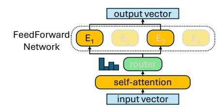

Fig. 1: Execution flow of a single block in a Mixture of Experts (MoE) model.

The detailed execution flow of a single block in an MoE model is illustrated in Fig.1. Compared to ordinary LLM models, the MoE model activates only a subset of experts during inference in FFN. Expert selection is managed by a router, which applies a linear operation to the output of the self-attention module and selects the top k rankings. Thus, the routing mechanism makes MoE models exhibit a more dynamic execution pattern during the inference phase.

## *B. In-NAND computing*

As shown in Figure 2(a), each NAND die consists of multiple planes that serve as basic units for in-NAND computing. Each plane has unique top select gates (TSGs) and bitlines (BLs) and can operate independently. For in-NAND computing, weights are stored on the NAND using a singlelevel cell (SLC) storage pattern.

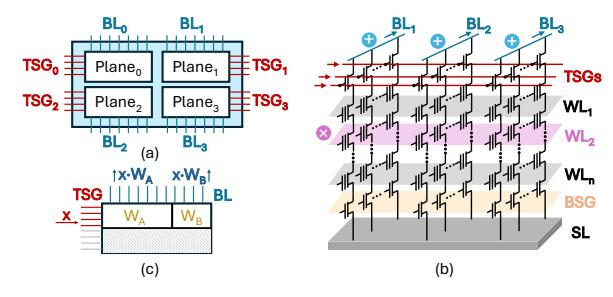

Fig. 2: Illustration of in-NAND computing: (a) architecture of a NAND die; (b) configuration of a NAND array; (c) abstract representation of an in-NAND computing pattern.

Principle. In this work, we adopt current-domain in-NAND computing strategy [27], [51]. As illustrated in Fig.2(b), during computation, a specific layer of the NAND array is activated via a wordline (WL), while top select gates (TSGs) are employed to feed input vectors, with turn-on voltage for input 1 and cut-off voltage for input 0. The resulting aggregated currents are collected through the BLs. During in-NAND computing, all TSGs in one plane can be manipulated independently. Furthermore, this method aligns with the read operations of NAND devices, which minimizes the modifications required to the peripheral circuit. The output results are further quantized through analog-to-digital converters (ADC). Since computing in the analog domain suffers from various sources of noise and accuracy losses [48], and generally these non-ideal effects would scale alongside the growth of aggregated currents, the input dimensions are always limited and might be smaller than the total TSGs in a plane. For instance, as illustrated in Fig.2(c), only half the weights within a NAND layer can participate in-NAND computing concurrently.

Multi-WL Activation. For NAND arrays where WL voltages are driven by separate peripheral drivers, multi-WL activation is achieved solely by altering the bias applied by the periphery. Prior works have demonstrated non-standard WL biasing in commercial 3D-NAND. Flash-Cosmos [44] uses multi-WL sensing for bulk bitwise operations. TCAM-SSD [67] coordinates multi-WL activation for in-Flash search. Activating multi-WLs does not affect in-NAND computing result. Since once conduction occurs, the current is dominated by string resistance (∼1 MΩ) rather than selected cells (∼10 kΩ) and therefore remains nearly constant.

Peripheral modification feasibility. Our design only modifies peripheral control logic and interface circuits, leaving the NAND array unchanged. Modern 3D-NAND with Xtacking allocates substantial area to peripheral circuits, making logic augmentation feasible. SanDisk and SK-Hynix's High-Bandwidth Flash [10], [12] involves peripheral modifications to support stacked structures and higher bandwidth, demonstrating these changes are technologically plausible.

# III. MOTIVATION

## *A. Challenge of deploying MoE models on edge*

Storage requirement In MoE models, the model size is typically 3.7∼7.5× larger than the activated model size, potentially reaching 13.5∼46.4 GB, as shown in Fig. 3(a). Thus, supporting a modern MoE model on an edge device requires using SSD to store all experts, as its memory density can reach 20.27∼29.18 Gb/mm<sup>2</sup> and capacity of 1 Tb [23]– [25], [56], which are significantly higher than other memory devices. Additionally, the non-volatile nature of NAND Flash ensures persistent storage of model parameters, making it ideal for edge AI applications. In contrast, although alternative NVM-based IMC platforms such as RRAM can also be used for Transformer acceleration, they are typically constrained to Mb capacity due to limitation in integration density and scale.

Memory footprint Another challenge of deploying MoE models on classical edge devices is the unavoidable frequent data transfers between SSD and the NPU. The reason is that during MoE inference, experts are selected dynamically based on the previous layer, and the NPU DRAM cannot store all the Experts prior to prediction. As shown in Fig. 3(b), using the mobile NPU Apple A18 Neural Engine with LPDDR5X and NVMe 2.0 protocol [20], [39] as an example, the load latency for a single expert within one layer from DRAM to NPU is 1.55∼3.84× larger than the computation latency for a single token decoding, while the transfer latency from SSD to DRAM is another 15× larger. Therefore, an MoEoriented workflow design is needed to avoid the frequent data transmission between NAND Flash and DRAM.

## *B. Challenge of near-NAND and in-NAND computing*

Limitation of NAND device. Firstly, due to the endurance limitations of NAND Flash (approximately 10<sup>3</sup> programming times [38]), the simple architecture based on near-NAND or in-NAND computing along with some auxiliary compute circuits cannot support all operations during the MoE decoding phase, such as self-attention computations, which require dynamic storage of the KV cache. Considering the required KV cache size can reach 128∼224 MB as shown in Fig.3(c), an additional DRAM-based NPU is necessary to create a more versatile hardware system.

Limitation of near-NAND computing. Recently, near-NAND computing [54], [74] has gained attention due to its easier integration with existing SSD devices. However, the primary challenge in applying near-NAND computing to LLM-based applications is its limited computational capacity. Usually, near-NAND computing offers only about a mere 1.6 GOPS [74] (or 38 GOPS [54]) computing capacity per NAND Die. In comparison, decoding a single token on a Mixtral-8x7B model requires 100∼300 GOPS of linear operations (excluding dynamic self-attention and non-linear operations), while edge applications demand a decoding throughput of 4∼12 tokens per second [5], [13], [68]. Therefore, for LLMbased applications, the near-NAND solution lacks sufficient computational capacity and still relies on the NPU to handle the majority of computations to meet decoding throughput requirements.

Challenge of in-NAND computing. In contrast, in-NAND computing offers more promising computational capacity, providing 279∼1118 GOPS per NAND die with typically 8∼16 dies per SSD device. However, as illustrated in Sec. II-B, in-NAND computing strategy often fixes the computation pattern of vector-matrix multiplication (i.e. a 2048 × 16384 tensor at a time), especially when accommodating various matrix shapes in MoE models as shown in Fig.3(d). Thus, a more adaptable in-NAND computing strategy is needed to address this mismatch. Deploying MoE models on SSDs may further degrade the utilization of in-NAND computing. As the example shown in Fig.4, if experts E<sup>1</sup> and E<sup>4</sup> are selected, the upper deployment strategy completes in-NAND computing in single iteration. However, the middle deployment strategy requires two iterations otherwise unselected experts (E<sup>2</sup> and E5) are activated to cause wrong output results. Although

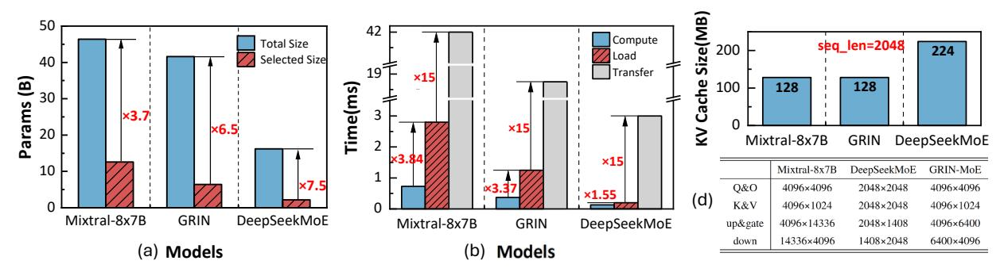

Fig. 3: Analysis of MoE models during inference: (a) parameter size of actual and activated MoE models; (b) latency of one block computing and one expert loading on modern smartphone NPU; (c) KV cache size under 2048 tokens; (d) weight configurations of different operations.


Fig. 4: Illustration of different MoE mapping strategies that affect in-NAND computing and storage efficiency.

the bottom deployment strategy can complete computing in single iteration, it accommodates fewer experts within the same storage space because of the redundant 0 storage. Thus, an MoE-aware expert deployment and selection method is needed to improve the effectiveness of in-NAND computing.

# IV. DIAMOND ARCHITECTURE

# *A. Architecture Overview*

We propose DIAMoND, an ASIC design that efficiently accelerates the decoding throughput of MoE models for edge AI applications. As shown in Fig.5(c), DIAMoND takes after the standard SSD architecture. It contains a Near-DRAM computing module and several In-NAND computing modules, connected with individual SSD channels. These two kinds of modules are integrated through 2.5D package method to provide adequate channel bandwidth.

For the FFN layers in an MoE model, in-NAND computing manages dynamic selected experts to minimize frequent weight off-loading, while near-DRAM computing primarily handles fixed experts. For self-attention layers, in-NAND module performs linear projection; near-DRAM module is mainly employed for KV cache storage and attention computation, which leverages the high endurance and low program-erase latency characteristics of DRAM. Sec. IV-E details a specialized self-attention workflow between in-NAND and near-DRAM module.

## *B. In-NAND computing module*

As Fig.5(b), the in-NAND equips an SSD with 16 dies distributed over 2 channels. Each channel hosts 8 dies as an SSD package. For each SSD package, 8 dies are stacked vertically, with each die providing 256 Gb of storage capacity under SLC storage pattern. Each SSD package includes a Control Die that functions as the I/O interface and involves adder trees to add the results from the 8 NAND dies. The Control Die and NAND Dies are connected through TSVs as HBF [10]. We use the ONFI 6.0 protocol as JESD230G [19], [37] for each SSD channel with 4.8 GB/s per channel.

Our design employs a NAND configuration as the stateof-the-art YMTC 232L QLC NAND Die [56]. To support in-NAND computing, the peripheral circuit of each die is augmented with ADC, Shifter and Adder, all stacked on top of the NAND die as Fig.5(a). A single ADC can be shared by multiple bitlines (BLs) through buffering and time-division multiplexing [55], [61], [65]. INT8 weights are stored in NAND cells under 2's complement format. Activations are processed bitwise by applying the voltage at the input port in 2's complement format. To enhance compute parallelism, each weight matrix is replicated across the 8 dies within a package, while each bit of an activation element is assigned to a particular die, which enables the completion of a VMM operation at 8-bit precision within a single read cycle.

# *C. Reliability analysis of in-NAND Computing*

In-NAND computing suffers from a set of reliability issues that introduce noise during the analog compute. These issues are typically caused by disturbance injected to either the weights stored in memory cells or the digitized analog outputs [48]. On the cell level, the dominant sources are device-todevice (D2D) variation and Vth drift, which broaden and shift MAC distributions, respectively. On the data conversion level, the dominant source is introduced by ADC.

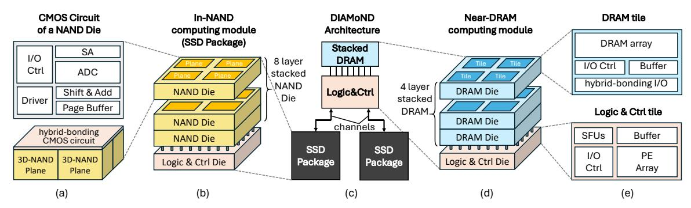

Fig. 5: Architecture of DIAMoND: (a) micro-architecture of an NAND die; (b) detailed architecture of a SSD Package, i.e. an In-NAND computing module; (c) overall architecture of DIAMoND; (d) detailed architecture of the Near-DRAM module; (e) micro-architecture of DRAM tile and the corresponding logic tile.

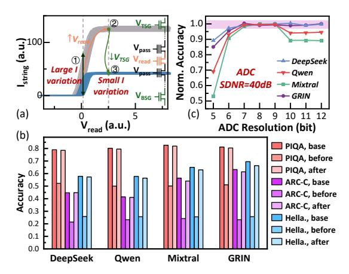

Fig. 6: Reliability analysis of in-NAND computing. (a) Optimization of read strategy that decrease D2D variation while maintaining a small current; (b) Inference accuracy of MoE models of in-NAND computing under different read strategies. 'Base' denotes the ideal software accuracy without injected noise; 'Before' corresponds to the conventional read bias that produces the read current at ①; and "After" denotes the accuracy after shifting the read bias to ③ using the proposed optimization.; (c) Inference accuracy of MoE models across various ADC resolutions, with SDNR fixed at 40dB.

D2D variation is mainly reflected in unstable read currents. Conventional read operations sense Flash device in its linear region (Fig.6(a)①), where current is highly sensitive to small threshold voltage ( $V_{th}$ ) changes. By raising the wordline voltage related to target weight cell (i.e.,  $V_{read}$ ), the current saturates and becomes far less sensitive to  $V_{th}$  variation [16], [35], [36], which significantly suppresses D2D variation from a standard deviation of 0.15 to 0.02 [60] (Fig.6(a)②). Fig. 6(b) provides a detailed analysis of the impact of D2D variation on model inference, including software baseline accuracy and simulated accuracy before and after raising  $V_{read}$  across multiple datasets. After the optimization, inference accuracy is largely enhanced and leads to negligible loss. However, this method leads to an increase in read current and thus

overall power. Further improvement to lower the current can be achieved by Current Clamping technique, which has been adopted in various CIM design [15], [32], [58], [70], [71]. The effect is illustrated in Fig.6(a)3, with the read current limited to  $\sim 30$ nA. Besides lower power, this method also further suppresses current variation compared to @, and leads to even higher inference accuracy. For  $V_{th}$  drift issues, the positive shift of low- $V_{th}$  states due to accumulated read stress receives most discussion [36], [54], [59], [60]. Prior work shows that by reducing  $V_{pass}$  voltage applied on Flash cells and applying on-the-fly calibration during computation, over 10G reliable read cycles can be achieved [36]. With a read latency of 30  $\mu s$  and each weight read at most once per generated token, 10G reads correspond to more than 80 days of continuous operation. When a certain proportion of cells drift out of range, the NAND block is simply refreshed. With an endurance of about 1K program-erase cycles, the system can operate reliably for more than 10 years.

As for ADC-related issues, converting analog currents into digital MAC values inevitably introduces noise, since ADC resolution and Signal-to-Noise Ratio (SDNR) are limited. Both insufficient and excessively high resolution can impair overall accuracy. Thus, selecting the appropriate ADC resolution in our in-NAND computing module requires identifying a sweet spot that preserves accuracy while minimizing area overhead. The theoretical upper bound for the input dimension of DI-AMOND is determined by the number of TSGs per plane (around 2048). To explore the trade-offs between performance and power consumption, we evaluate three representative input parallelism settings of 512, 1024 and 2048. As shown in Fig. 7, under input parallelism values of 512, 1024, and 2048, statistical analysis of the MAC results from various operators in Mixtral-8x7B indicates that a 7-bit resolution (128 digits) is sufficient for the on-die ADCs. This conclusion is further supported by comprehensive ADC quantization simulations presented in Fig. 6(c). With SDNR fixed at 40dB [31], a 7-bit ADC is the lowest resolution that keeps accuracy degradation negligible across all tested models. Under this configuration, each NAND Die in DIAMoND delivers a maximum 279  $\sim$ 

#### 1118 GOPS at an 8-bit quantization level.

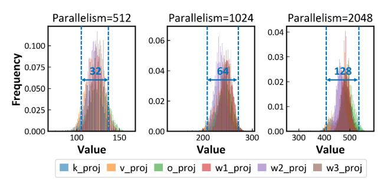

Fig. 7: Statistical analysis on the bitwise MAC results from Layer 9 of Mixtral-8x7B, with an input parallelism of 512, 1024, and 2048. Since most MAC outputs fall within a range of 128, the results indicate that a 7-bit ADC is sufficient for the output conversion.

#### D. Near-DRAM computing module

For the Near-DRAM computing module, we utilize a 3Dstacked DRAM for data caching, with a logic die based on several PE arrays for computational tasks at the bottom layer as Fig.5(c). The DRAM configuration has a comparable area to the SSD, approximately  $50mm^2$ . The 3D-stacked DRAM consists of 4 layers, each with  $2 \times 2$  tiles per layer. These layers are interconnected using hybrid bonding with mini-TSVs [8], [40], [63], which provides robust I/O interfaces and enables significantly higher bandwidth compared to standard LPDDR solutions. The Logic & Control die positioned below 3D-Stacked DRAM is connected to the DRAM through hybrid bonding. To align with the 3D-stacked DRAM's  $2 \times 2$  tile configuration and the data transfer bandwidth, the logic die is divided into 4 tiles, each containing a PE array, an SRAM I/O buffer, an I/O controller, and specialized units for operations like softmax and SiLU. Each PE is equipped with sixteen  $1 \times 16$  MAC arrays to support VMM operation under 8-bit precision, resulting in a peak computational throughput of 2 TOPs at the 8-bit quantization level with 1 GHz frequency.

## E. QKV-Attention Joint Caching Pipeline

To improve system efficiency on QKV-attention processing, we propose a Caching Pipeline design to jointly optimize the processing flow of the QKV Projection and Self-Attention stages. A naive processing flow allocates all Q, K and V Projections to the in-NAND module. However, the near-DRAM module remains idle while awaiting projection results from the in-NAND module. Thus, for smaller weight matrices like those used in Q, K and V Projections, performing computations directly in-NAND is inefficient. To this end, we designed QKV-Attention Joint Caching Pipeline. By observing that the result of Q Projection  $\vec{Q}$  will be multiplied by both the newly generated vector  $\vec{K}$  and the previously computed matrix K, and the latter is cached in DRAM. By allocating  $W_Q$  to DRAM while retaining  $W_k$  and  $W_V$  in NAND, we enable an early start on the self-attention calculation. In this case, our pipeline performs most of the  $Softmax(\vec{Q}K^T)$ 

operation using the near-DRAM module, while the NAND module continues processing the K and V Projections. With this pipeline arrangement, we only wait for the final  $\vec{K}$  result from in-NAND computing to complete the calculation, which reduces latency by up to 13.5%.

#### V. VMM THROUGH IN-NAND COMPUTING

#### A. Weight Partition and Operation Units Design

As discussed in Sec. IV-B, the input parallelism of an in-NAND computing plane is typically 512, 1024, or 2048, which are generally smaller than the size of the weight matrices. Consequently, it is necessary to partition each matrix into several submatrices and map them to different locations.

In alignment with the weight partitioning strategy, we divide the storage cells of a single NAND plane layer into regular **Operation Units (OUs)**. The OU serves as the fundamental computational unit within the in-NAND computing. Each OU consists of a set of Flash cells in the shape of a rectangle. The size of OUs is determined by the hardware and model configurations. Let  $\rho_{in}$  and  $\rho_{out}$  represent the available input and output dimensions of a NAND plane due to hardware constraints, while  $d_{min}$  denoting the minimum dimension of weight matrices from the MoE model. Additionally, QB represents the quantization bits. The height H and width W of an OU are computed by:

$$H = min\{\rho_{in}, d_{min}\}, W = min\{\rho_{out}, d_{min} \cdot QB\}.$$
(1)

We take the accommodation of Mixtral-8x7B under 8-bit quantization as an example. Given the minimum matrix dimension of 4096, if the input parallelism is set to 512, we allocate 512 TSGs and  $4096 \times 8$  BLs for each OU, which results in a  $4 \times 4$  OU array for each NAND plane.

## B. Novel Mask Design for In-NAND Computing

As discussed in Sec. III-B, activating OUs in the same column may introduce conflict. To provide a more flexible in-NAND computing scheme and mitigate the deployment challenge illustrated in Fig.4, we introduce a mask-based computing method. This method utilizes the vertical dimension of 3D-NAND array and the switching properties of Flash cells.

Under in-NAND computing, the multiplication of an input element and a weight element is reflected in the read-out current along the string. An 'on' current represents a logical '1', and an 'off' current represents a logical '0'. Due to the series connection of Flash cells in a string, when a read voltage  $V_{read}$  is applied across multiple layers, a current path will only form if all selected cells are biased to the 'on' state. This setup, illustrated in Fig. 8 (a), enables an **AND** operation across the data stored in selected cells.

In DIAMoND, two layers in 3D-NAND array are selected simultaneously, with one layer storing the weight matrix and the other serving as gating function. The **AND** operation can produce a filtered version of the original matrix, allowing for custom gating to obtain targeted outputs. Leveraging the **AND** capability, we introduce a mask design that stores different

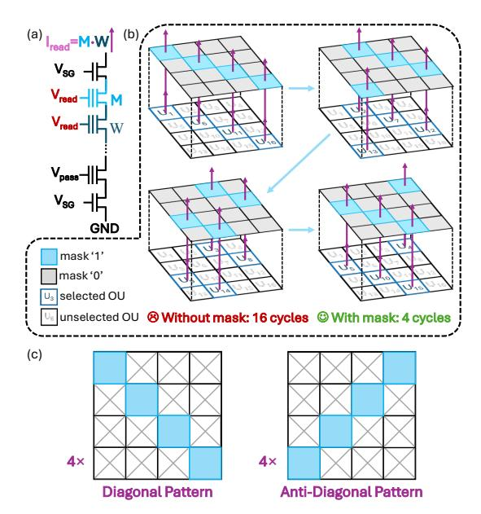

Fig. 8: Illustration of (a) the AND operation principle along the string; (b) working principle of the mask design; (c) two representative types of mask patterns.

'mask' patterns in specific layers, as shown in Fig. 8(b). In this design, '0' values in the mask prohibit current from the underlying weight layer (represented by gray cells), while '1' values allow the current path to remain open (represented by blue cells). Taking a 4×4 OU array as an example, in the absence of the mask design, it would necessitate 16 read cycles to execute the VMM sequentially for each of the 16 OUs when inputs are distinct. In contrast, the application of four masks in a circulant manner facilitates the processing of all 16 operation units within a mere four read cycles.

To guide the formation of masks, the '1's and '0's in the mask must align with the weight layer, ensuring that the mask pattern corresponds directly to the OU array. When the OU array is a square, as illustrated in Fig. 8(c), we employ Diagonal Patterns and Anti-Diagonal Patterns, both sets of patterns are arranged in a circulant manner. For rectangular OU arrays, which are more common, we adapt the mask design strategy by first normalizing the shape into one or more squares, and subsequently applying square-based strategies. Detailed explanation of mask generation strategy can be seen in Alg. 1. For an OU, if column number C is smaller than row number R, we conceptually extend the array by adding R−C columns to form a square, design the mask using the squarebased strategy, and subsequently ignore the added columns. Conversely, if the number of columns exceeds the number of rows, we partition the rectangle into multiple squares, design masks for each square independently, and then combine them into a unified mask. This approach ensures a consistent and efficient mask design for various OU array configurations. In total, the mask design will introduce additional 4∼64 NAND layers, which occupies 1.7%∼27.6% additional storage space. Compared to sparse mapping, our mask design costs 2∼4× less storage space depending on the input parallelism, while allowing for more flexible expert combinations.

## Algorithm 1: Mask Generation for OU Arrays

```
Input: OU array with dimensions (R, C)
  Output: Mask matrix M of size (R, C)
1 M ← zero matrix of size (R, C) ;
2 if C = R then
3 Apply Diagonal and Anti-Diagonal patterns ;
4 end
5 else if C < R then
6 Add (R − C) columns ;
7 Apply the C = R strategy patterns ;
8 Ignore the extra (R − C) columns in the final mask ;
9 end
10 else if C > R then
11 Partition the array into ⌊C/R⌋ square blocks of R × R ;
12 Apply the C = R strategy to each block ;
13 if C mod R ̸= 0 then
14 Process the remaining columns using the C < R strategy ;
15 end
16 end
17 return M ;
```

## *C. Mask-Based Mapping Strategy*

Based on our novel mask design, a mapping strategy is developed to minimize the computation latency for single weight matrix and enhance parallelism among different operators. It starts with a tentative mapping of submatrices to obtain the required cycles and OUs per cycle for each matrix. We then perform a scheduled deployment to optimize the mapping sequence of all matrices, and perform the final mapping.

*1) Mapping Method of one Matrix:* To fully utilize the computational resources, the submatrices partitioned from one weight matrix are distributed across different OU arrays in a balanced manner. The allocation follows a Round-Robin Mapping strategy, as shown in Alg. 2.

Each allocation cycle consists of two stages. ❶ Round-Robin Assignment. Submatrices are sequentially assigned to available OU arrays in multiple planes, regardless of their internal status. In Alg. 2, this behavior is implemented by updating the OU index i after each submatrix assignment (L16: i ← (i + 1) mod N), ensuring that the next submatrix is mapped starting from a different OU array.

❷ Mask-Guided Mapping. Within each selected OU array, submatrices are grouped based on input contention, and placed according to predefined mask patterns. Specifically, the algorithm first attempts to find an available OU at the current WL and mask (L6). If successful, the submatrix is assigned to that OU (L7–9). Otherwise, the mask index is updated to try the next mask (L12), and when all masks are exhausted, the allocation moves to the next WL (L13). This process results in a balanced allocation. Notably, submatrices from the same matrix are positioned identically across different planes, which simplifies mask selection.

To illustrate the practical effect of Alg. 2, Fig. 9 shows the mapping of a Down-Projection weight matrix from one expert of Mixtral-8x7B onto two dies with four planes each. For the 512-parallelism configuration (Fig. 9(a)), the matrix

#### **Algorithm 2:** Round-Robin Mapping of Submatrices

```
Input: Set of submatrices S, available OU arrays \{OU_1, ..., OU_N\},
          layer set \{wl_1,...,wl_J\}, mask set \{M_1,...,M_K\}
   Output: Mapping table T
{\bf 1}\; Group S based on input contentions ;
2 Initialize empty mapping table T, round-robin index i \leftarrow 1 ;
   for each s \in S do
        (j,k) \leftarrow \text{current indices};
        while s is not assigned do
            Find an available OU in OU_i at wl_j under mask M_k;
            if such an OU exists then
                 Assign s to this OU and update T;
                 Continue:
10
            end
            else
11
                 k \leftarrow (k+1) \bmod K \; ;
                                                     // Change Mask
12
13
                   \leftarrow (k+1>K) ? (j+1):j; // Change WL
14
            end
15
       end
         \leftarrow (i+1) \mod N;
16
17 end
```

is partitioned into submatrices matching the hardware input parallelism, and each plane is organized as a 4×4 OU array. Fig. 9(b)(c) highlight how the Round-Robin and Mask-Guided stages collectively determine the placement of submatrices. Figures 9(d)(e) present the same matrix mapped under higher input parallelism of 1024 and 2048. Increasing the parallelism alters the OU array layout, which in turn necessitates a different submatrix partitioning, and produces a corresponding change in the mapping results. This highlights that mapping naturally adapts to hardware configuration.

2) Scheduled Deployment of Weight Matrices: The arrangement of weight matrices from a Transformer Block poses another challenge. Some of these matrices can be processed concurrently, while others exhibit dependencies. The deployment strategy needs careful design to ensure efficient execution within the constraints of available computational resources.

We adapt a scheduling technique widely used in High-Level Synthesis (HLS) designs, and modify it to suit our deployment requirements. This process starts from a modified Transformer dataflow graph that excludes the operators not to be computed in-NAND as Fig. 10(a). Each weight matrix is corresponded to a vertex  $(V_i)$  of the graph in Fig. 10(c), while dependencies between them form edges. It's followed by List Scheduling (Fig. 10(b)) [2] to determine a mapping order. The scheduler maintains a ready list of matrices whose dependencies have been satisfied, prioritizes them according to a topological order, and greedily schedules them cycle by cycle as long as sufficient OU resources are available. Fig. 10(c) shows the scheduling result. During final mapping, for weight matrices scheduled to the same cycle, their sets of submatrices are concatenated and mapped to OUs in multiple planes as a whole, with the mapping process following strategy described in Sec. V-C1. Part of the deployment results are illustrated in Fig. 10(d). Notably, a layer of each plane can accommodate only a subset of experts. The experts assigned to the same plane collectively form an Expert Group.

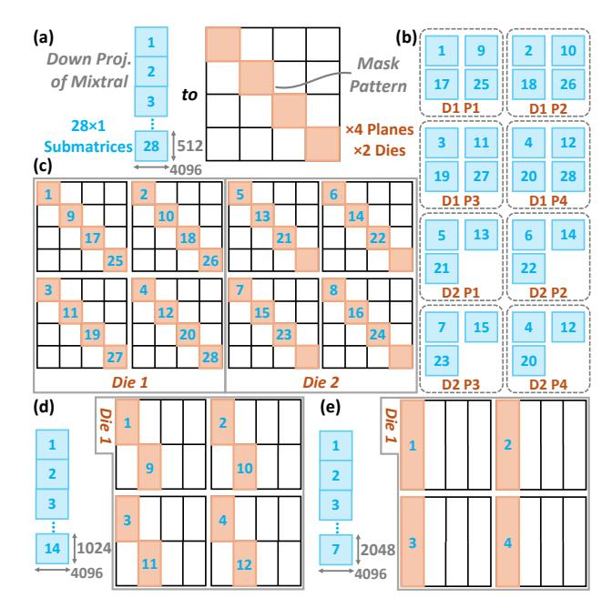

Fig. 9: Example of mapping a Down-Projection weight matrix from a Mixtral expert onto two dies with four planes each. (a) The matrix is divided into 28 submatrices, and placed on a 4×4 OU array per plane according to a diagonal mask. (b) Submatrices distributed across planes via Round-Robin assignment. (c) Final placement after Mask-Guided Mapping. (d)(e) Mapping under higher input parallelism of 1024 and 2048, showing how OU array layout and submatrix partition adapt to the hardware configuration.

## VI. DYNAMIC INFERENCE FOR MOE

In this section, we propose a system-level optimization to improve the decoding speed of MoE models in DIAMoND.

#### A. Adaptive Expert Selection Strategy

With our proposed mask and mapping strategy of in-NAND computing, most LLM models are handled seamlessly. However, dynamic expert selection in MoE creates an unavoidable likelihood of expert conflicts. As shown in Fig. 11(a), when each expert occupies an OU, conflict arises when both  $E_2$  and  $E_6$  are selected, as they compete for the same output ports. A further complication is the limited number of feasible mask patterns. As shown in Fig. 11(b), while theoretically feasible to simultaneously compute  $E_1$ ,  $E_6$ ,  $E_7$  and  $E_8$ , the activation of  $E_8$  is hindered by the lack of a suitable mask.

To mitigate the above challenge, we design an **Adaptive Expert Selection Strategy**. In this strategy, the expert with the highest routing score is always prioritized. Other experts are then selected iteratively based on their routing scores and the conflict status with already selected experts. To maintain the inference accuracy, our strategy regulates expert substitution by imposing a threshold T on routing score deviations. Once the score difference between the conflict-free and conflict experts is smaller than T, the conflict-free expert can be

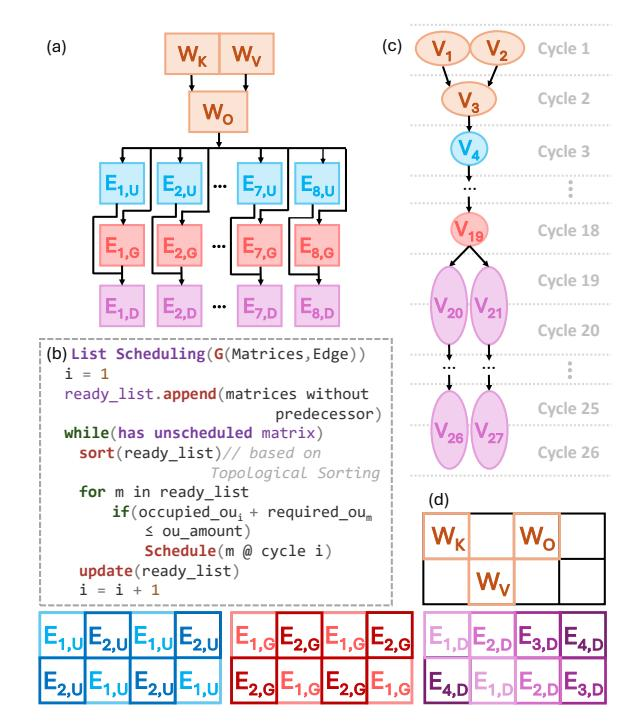

Fig. 10: In-NAND computing scheduling and deployment workflow: (a) modified Transformer dataflow of a Mixtral-8x7B layer, where  $W_Q$  is excluded since it is executed on the NPU; (b) List Scheduling algorithm prioritize the matrices satisfy resource constraints; (c) scheduling result indicating which matrix is executed in each cycle; (d) final deployment result on the NAND arrays.

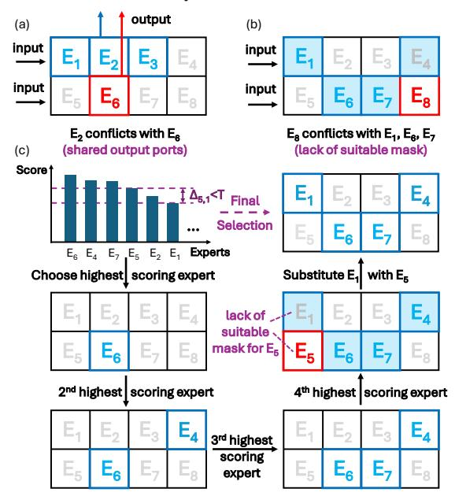

Fig. 11: Illustration of (a) conflict caused by shared output ports; (b) conflict caused by lack of suitable mask pattern; (c) adaptive expert selection strategy that strikes a balance between inference speed and accuracy.

selected. Otherwise, the conflict expert will be preserved. Fig. 11 (c) shows an example where 4 of 8 experts are selected. After selecting highest-scoring  $E_6$ , the next experts  $E_4$  and  $E_7$  are directly selected, as they have no conflict. However, when examining the fourth expert  $E_5$ , it conflicts with previously selected  $E_4$ ,  $E_6$  and  $E_7$ . The algorithm then searches remaining unselected experts and identifies  $E_1$  as the next highest scoring, non-conflicted option. Eventually, we achieve better parallel processing with an acceptable and modest accuracy loss compared to strictly choosing the four highest-scoring experts.

#### B. Circuit Design

To better support adaptive expert selection in MoE-based inference, we propose a customized ASIC circuit as Fig. 12. This design incorporates **①** Priority Queue to store experts based on routing scores, **②** Conflict FIFO for handling conflicted expert selections, **③** Mask Pattern RAM for storing compatible masks of each expert, and **④** Pattern State Handler for managing mask assignments.

**1** The Priority Queue forms the first stage of the dynamic mask selection pipeline, taking inputs directly from the router and maintaining scores in ascending order. 2 A Conflict FIFO is designed to temporarily store deferred experts whose selection was postponed due to conflicts. Then, the circuit compares the first entry scores of the Priority Queue and the Conflict FIFO to decide which expert to prioritize for the next selection attempt, depending on the threshold T in Sec. VI-A. **3** The selected expert ID is then forwarded to the Mask Pattern RAM. This RAM maps each expert ID to a pre-stored binary vector representing allowable mask pattern vectors. For instance, a mask vector of 4'b1001 for a group with four mask patterns implies the expert is compatible with the first and fourth masks, but conflicts with the second and third. 4 Once the expert's mask vector is retrieved, it is passed to the Pattern State Handler. This module contains four registers to manage the available mask patterns. Each row in the register indicates the remaining available masks in an Expert Group defined in Sec. V-C2. The necessity for four registers arises from the minimum parallelism of 512, where four separate masks ensure full coverage of all OUs in a plane. At the beginning, all bits in four registers are set to 1, and only one register is set to active. During processing, if the selected expert is launched from the Score Priority Queue, its mask pattern performs AND with the row corresponding to expert's group (derived from expert ID) in each activated register. If one of the AND results contains '1', the corresponding row in the register will be updated. Otherwise, the first entry in the Score Priority Queue is popped to the Conflict FIFO. On the other hand, if the selected expert is launched from the Conflict FIFO, an additional register will be activated and updated.

#### VII. EVALUATION

#### A. Experiment Setup

*Models and Datasets.* We evaluate DIAMoND on a variety of MoE models: Mixtral-8x7B, DeepSeekMoE, Qwen1.5-MoE

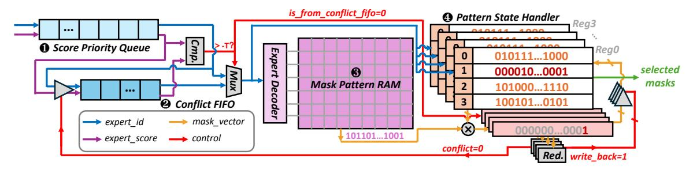

Fig. 12: Illustration of Dynamic Mask Selector module, consisting of: • Priority Queue module for experts to be selected; • Conflicting FIFO module for experts that incur conflicts with available masks; • Mask Pattern RAM module for storing the mask vectors for all the experts; • Mask State Registers for recording the available masks of each group.

and GRIN-MoE [3], [11], [21], [33]. LLM benchmark datasets including ARC-Challenge [7], PIQA [4], HellaSwag [76] and WinoGrande [49] are used to evaluate the accuracy of adaptive expert selection. MT-Bench [77] is employed to test decode speed in more realistic chatbot-like scenarios.

*Hardware Configuration and Implementation.* We build a cycle-accurate simulator for the in-NAND computing module based on SSDsim [17]. For each 3D-NAND die, we employ a widely used configuration [56] in Tab. I, and the read latency is set to 30  $\mu s$  [24], [74]. For the near-DRAM computing module, we adopt the latest 3D-stacked DRAM configuration [8], [40], [63] in Tab. II.

| Parameter      | Value          | Parameter       |  |
|----------------|----------------|-----------------|--|
| Capacity       | 64 GB          | Capacity        |  |
| Dies           | 16             | Layers          |  |
| Planes per Die | 4              | Tiles per Layer |  |
| Page size      | 16 kB          | Tile Capacity   |  |
| tR             | $30~\mu s$     | Power           |  |
| Area           | $50.51 \ mm^2$ | Area            |  |
| Bandwidth      | 9.6 GB/s       | Bandwidth       |  |
|                |                |                 |  |

TABLE I: 3D-NAND Configuration.

TABLE II: DRAM Configuration.

Value

1.5 GB

4

4

96 MB

3.6 W

48 mm<sup>2</sup> 1620 GB/s

| Component             | Area $(mm^2)$ | Max Power (mW) |
|-----------------------|---------------|----------------|
| ADC                   | 0.480         | 360.00         |
| Shift & Add           | 0.018         | 13.93          |
| In-NAND Total (×16)   | 7.968         | 5982.88        |
| PEs                   | 0.445         | 269.18         |
| SRAM Buffer           | 1.559         | 1372.42        |
| Special Function Unit | 0.025         | 58.76          |
| Mask Selector         | 0.006         | 0.76           |
| Near-DRAM Total       | 2.035         | 1701.12        |

TABLE III: Hardware Implementation.

The 7-bit ADC design node is adopted from [31], while special function units for *softmax* and *SiLU* follow [46], [62]. The add units, mask selector, and the PEs are implemented in Verilog HDL and synthesized using the Synopsys Design Compiler with 28nm commercial PDK. The SRAM buffers of the PE array are modeled using the CACTI [22]. Area and power breakdowns are presented in Tab. III.

Baselines. We implement three configurations of DIA-MoND based on different levels of input parallelism: 512, 1024, and 2048, denoted as DIAMoND-L, DIAMoND-M, and DIAMoND-H, respectively. Our first accelerator baseline is the NVIDIA A100 GPU with 312 TFLOS (FP16), 80GB and 1.94 TB/s HBM. To better reflect edge-inference scenarios, we also compare against the NVIDIA Jetson AGX Orin (64 GB, 30W Mode) with TensorRT-LLM framework. For ASIC edge LLM accelerators, we include Cambricon-LLM [74], which is a heterogeneous architecture combining an NPU and 16~64 near-NAND computing chips (3.2~51.2 TB and 38.4~153.6 GB/s) to enable efficient inference of LLMs on edge devices. We also benchmark against Lincoln [54], an edge accelerator that integrates LPDDR packages containing both conventional LPDDR dies and custom Lincoln dies with specialised near-NAND logic, alongside an SoC featuring an integrated NPU. We further include a 3D-AIMC baseline [6], which studies MoE inference on a vertically stacked NVM-based analog in-memory computing architecture. To make it comparable with DIAMoND, we instantiate this design using 3D-NAND Flash as the storage and computing substrate following the configuration in Tab. I. Expert FFN weights are distributed across NAND layers such that each layer hosts at most one expert. Attention-related operations are also executed by the near-DRAM module (Tab. II).

## B. Sensitivity Analysis

The adaptive expert selection strategy introduces a tunable parameter T, which allows us to balance accuracy and decode speed. Here, we focus on accuracy, pairwise difference, and expert similarity under different T values. Specifically, pairwise difference is defined as the proportion of expert pairs where at least one selected expert differs from the original top-k selection. It quantifies the extent of conflict resolution. The expert similarity measures how closely the adaptively selected experts resemble the original top-k experts:

$$Similarity = \frac{\sum_{i \in \mathcal{E}_T \cap \mathcal{E}_k} w_i}{\sum_{i \in \mathcal{E}_T} w_i},$$
 (2)

where  $\mathcal{E}_T$  and  $\mathcal{E}_k$  denote the adaptively and original selected experts, respectively.  $w_i$  is the routing weight of expert *i*. This

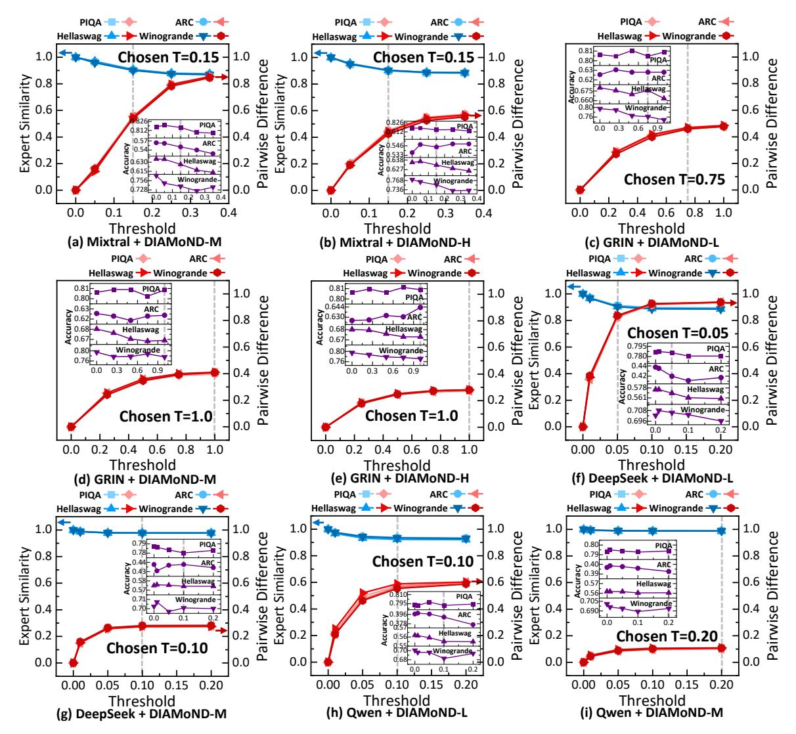

Fig. 13: Influence of threshold T on AES behavior and end-to-end accuracy across different models, datasets, and configurations of DIAMoND. The main plots illustrate how pairwise difference (red) and expert similarity (blue) vary with T across four datasets: PIQA, ARC-Challenge, HellaSwag and WinoGrande. The inset plots (purple) show the corresponding inference accuracy under each dataset as T changes. Note that DIAMoND-L+Mixtral-8x7B and DIAMoND-H+Deepseek/Qwen are conflict-free configurations, making AES unnecessary.

metric is not applicable to GRIN, as its unique gating structure assigns zero routing weights to most experts outside the top-k.

Since the computation granularity of DIAMoND-L is smaller than the parameter footprint of a Mixtral-8x7B expert, only one expert can be processed at a time, inherently avoiding expert conflicts. Conversely, DIAMoND-H provides sufficient parallel capacity for Deepseek and Qwen such that all experts can be accommodated simultaneously, allowing any routed expert combination to execute without contention. Therefore, AES is unnecessary in both cases of DIAMoND-L+Mixtral and DIAMoND-H+Deepseek/Qwen. For other cases, Fig. 13 shows the end-to-end results. In most scenarios, accuracy exhibits only minor fluctuations when expert similarity is

above 0.9. Moreover, pairwise differences exhibit saturation: they increase rapidly at lower T but become stable as T increases, since the differences in expert scores are bounded. These observations suggest that selecting T requires balancing expert flexibility and model stability. The chosen T values are depicted in Fig. 13.

#### C. Ablation Study

To analyze the contributions of individual design choices on decode speed, we conduct an ablation study across all configurations of DIAMoND. We define **Base** as the architecture that employs the heterogeneous design only, while **Mask** 

includes the mask design but excludes the AES strategy. **AES** represents the full system with all proposed optimizations.

As shown in Fig. 14(a), the Mask design improves decode speed by up to 1.73×, while AES further enhances performance by up to 1.52×. Combining these techniques yields the best overall speedup of 1.95×. Fig. 14(a) illustrates that the decode speed of Base increases with the maximum allowed input dimension, benefiting from the ability to process more MACs at a time. However, the decode speeds after involving AES remain more consistent across different input dimensions. This is because for all cases where AES is applied, the available computational resources are sufficient to complete the calculation of any Up, Gate, or Down matrix of all the k experts within a single read cycle. The only potential bottleneck comes from contention among experts. Our AES strategy seeks to ensure that selected experts are non-conflict, therefore resulting in an optimal scenario where the FFN layer requires exactly 3 cycles. Consequently, the overall decode speed stabilizes despite varying input dimensions. In terms of performance breakdown, the in-NAND module accounts for approximately 76% of the overall workload, while the near-DRAM module contributes the remaining 24%.

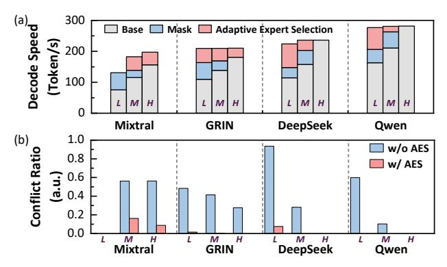

Fig. 14: (a) Decode speed breakdowns of the proposed techniques of Mask design and AES strategy, with L, M and H representing DIAMoND-L, DIAMoND-M and DIAMoND-H. (b) Conflict ratio after Mask mapping without and with AES strategy. AES consistently reduces the conflict ratio compared to the baseline without it.

We further validate the effectiveness of our AES design by quantifying its impact on expert conflict ratio. As illustrated in Fig. 14(b), we compare two scenarios: (1) the practical mapping without AES (Mask only), where experts conflict naturally arise from input-dependent routing; and (2) the proposed AES strategy under the same routing conditions. Under the Mask-only configuration, expert conflict ratios range from 10.2% to 93.5%. In contrast, AES substantially suppresses conflicts across all models. The reduction is particularly pronounced for models with a larger number of experts (e.g., DeepSeek and Qwen), where AES lowers the conflict ratio by more than an order of magnitude and approaches the ideal conflict-free case (conflict ratio  $\approx 0$ ).

#### D. Overall Performance

In Fig.15, we compare decode speed of DIAMoND to baseline accelerators. Due to framework constraints, Mixtral and GRIN cannot be deployed on Jetson directly. From the results, DIAMoND delivers 2.54~10.30× higher performance than A100, 9.48~208.59× over Jetson Orin, 4.97~to 11.72× over Cambricon-LLM, 1.72~5.81× over Lincoln, and 1.71~3.86× over 3D-AIMC. Notably, the most substantial acceleration is observed for Mixtral, where DIAMoND achieves 11.72× and 5.81× speedup compared to Cambricon-LLM and Lincoln, respectively. We also find that the performance advantage of DIAMoND becomes more pronounced for larger models. This is because larger models can better utilize the parallel processing capability, bringing out a high equivalent memory bandwidth of the in-NAND computing module.

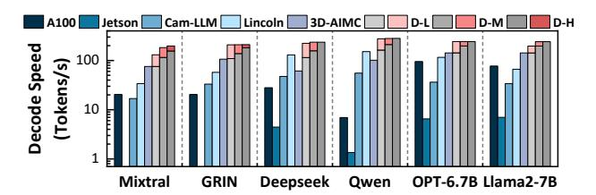

Fig. 15: Decode speed comparison across different accelerators. For DIAMoND, gray indicates base performance, red denotes Mask/AES acceleration.

Fig. 16 compares the decode energy efficiency between DI-AMOND and other accelerators. During energy analysis for in-NAND computing, all BLs in an activated plane are assumed to generate current regardless of whether they produce valid outputs. This is consistent with the BLs' behavior in ordinary NAND read mode and in-NAND computing strategies proposed in prior studies [27], [51]. Our results indicate that DIAMoND achieves a decode efficiency that is an order of magnitude higher (2.39× to 11.36×) than Cambricon-LLM, and up to two orders of magnitude  $(9.47 \times \text{ to } 146.25 \times)$ than A100. In DIAMoND architecture, energy efficiency decreases from the L to M and H configurations. As input parallelism increases, the total accessible throughput grows; however, it also increases the proportion of unused BL outputs, thereby reducing overall energy efficiency. Consequently, decode speed and energy efficiency exhibit opposite trends. Increasing input parallelism improves throughput but proportionally raises power consumption, resulting in lower tokens/J. This behavior validates the inherent throughput-power tradeoff in our design, and highlights the necessity of selecting an appropriate input dimension based on workload characteristics and efficiency targets.

For overall hardware configuration, DIAMoND-L presents significantly lower power consumption compared to all the baselines, with only  $0.09\times$  the power of A100, and  $0.61\sim0.74\times$  compared to Jeston, Cambricon-LLM and Lincoln, as shown in Fig. 17(a). This reduction primarily stems from two aspects. First, compared to A100 and Jetson, DIAMoND eliminates the large power overhead associated with

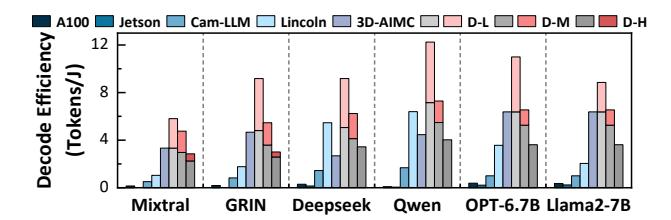

Fig. 16: Decode efficiency across different accelerators, with all BLs in the same plane biased to on-voltage while performing in-NAND computing.

DRAM, compute cores, and the data transfer between them. As a result, the overall system power is significantly lower than that of ASIC-based accelerators under the L configuration and comparable under the M configuration. Under the H configuration, however, total power increases substantially due to greater plane activation, which amplifies the NAND power contribution. Second, compared to near-NAND computing methods, although DIAMoND incurs higher power per NAND die due to increased read parallelism (Fig. 17(b)), the total NAND power is significantly lower. This is because a substantial portion of NAND power is the establish power required to precharge WL capacitances before the DC current path is formed [28], [73]. As a result, the total NAND power strongly depends on the number of active Dies. Near-NAND accelerators typically read only one page per Plane at a time, and therefore require many more NAND Dies to achieve comparable parallelism (e.g., over 256 Dies in Cambricon-LLM). In contrast, DIAMOND activates many pages within each plane, and significantly reduces the required die count. Consequently, DIAMoND exhibits higher per-Die NAND power and computing power, but substantially lower total establish power and overall NAND power.

Beyond power efficiency, DIAMoND also demonstrates significant advantages in terms of area efficiency. It occupies a total area of 149.02  $mm^2$ , which is substantially smaller than that of GPUs and Cambricon-LLM, as illustrated in Fig. 17. Although Lincoln reports a slightly smaller area, this is largely because it excludes the NPU area. Overall, these characters further enhance DIAMoND's suitability for edge deployment.

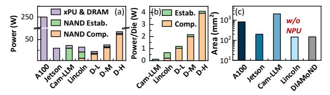

Fig. 17: Comparison of (a) total architecture power consumption, (b) power consumption of a single NAND Die across the three ASIC-based accelerators, and (c) total area across different accelerators. Power evaluated under L/M/H configurations with Mixtral-8x7B. For fair comparison, each NAND die is normalized to contain four planes, with a page size of 16 kB per plane.

#### VIII. RELATED WORK

MoE Inference Optimization To improve the efficiency of MoE inference, various software-level optimization strategies have been proposed. By grouping tokens with similar data paths, the experts are partitioned and the communication cost can be reduced [47]. [69] utilizes inter-layer expert affinity when placing experts on GPUs to reduce communication overhead. [18], [72], [78] propose optimized expert buffer management methods, with tailored strategies for dynamic gating or adaptive prefetching.

Hardware Acceleration for LLM In addition to software optimizations, dedicated hardware accelerators have been developed to enhance the inference efficiency of LLMs. MECLA [45] proposes a fine-grained memory access and compute pattern to mitigate the on-chip memory capacity. Cambricon-LLM [74], and Lincoln [54] propose a NAND-based nearmemory computing paradigm to achieve higher bandwidth during LLM inference. InstAttention [42] designs a flashaware attention engine to speed up KV cache access. In-NAND computing has recently been considered to accelerate LLM inference [6], [51], and demonstrated higher throughput and energy efficiency. However, they adopt straightforward mapping methods and lack optimization on the MoE model. Other recent near-memory systems such as NeuPIMs [14], Duplex [75] and Stratum [43], exploit DRAM-based nearmemory processing to provide higher effective bandwidth during LLM inference while still rely on high-performance xPU (e.g., GPUs or NPUs), which limits their applicability in resource-constrained edge environments.

**Heterogeneous NAND-DRAM computing.** Integrating NAND with DRAM-based PIM has been explored to accelerate data-intensive workloads. SmartSSD [30] offloads Spark SQL analytics using an FPGA-attached SSD. [41] develops an FPGA-assisted in-Flash accelerator for CNNs, while MARS [53] combines DRAM-PIM and controller-side acceleration in SSDs for genome analysis.

#### IX. CONCLUSION

We present DIAMoND, a heterogeneous accelerator that integrates in-NAND and near-DRAM computing to efficiently support MOE model inference on edge devices. Furthermore, a mask-based in-NAND computing design and a dynamic expert selection strategy are introduced to enhance the performance of DIAMoND . Based on evaluations, DIAMoND achieves a peak decoding speed of 197.3 tokens/s and a peak energy efficiency of 5.8 tokens/J with Mixtral-8x7B.

#### X. ACKNOWLEDGEMENT

This work was supported by the NSFC (62341407, 62322401, 62495102, 62406008), Beijing Natural Science Foundation (Grant L223004), Beijing Municipal Science and Technology Program (Z24110000422401), and "111" Project (B18001). We sincerely appreciate Dr. Lei Jin, Dr. Zhiliang Xia, Dr. Zongliang Huo, and Dr. Nanxiang Chen from Yangtze Memory Technologies Holdings Co., Ltd. (YMTC) for their comprehensive and industry-informed support regarding in-NAND computing operations.

## REFERENCES

- [1] J. Achiam, S. Adler, S. Agarwal, L. Ahmad, I. Akkaya, F. L. Aleman, D. Almeida, J. Altenschmidt, S. Altman, S. Anadkat *et al.*, "GPT-4 Technical Report," *arXiv preprint arXiv:2303.08774*, 2023.
- [2] T. L. Adam, K. M. Chandy, and J. R. Dickson, "A comparison of list schedules for parallel processing systems," *Commun. ACM*, vol. 17, no. 12, p. 685–690, Dec. 1974. [Online]. Available: https://doi.org/10.1145/361604.361619
- [3] J. Bai, S. Bai, Y. Chu, Z. Cui, K. Dang, X. Deng, Y. Fan, W. Ge, Y. Han, F. Huang *et al.*, "Qwen Technical Report," *arXiv preprint arXiv:2309.16609*, 2023.
- [4] Y. Bisk, R. Zellers, R. L. Bras, J. Gao, and Y. Choi, "PIQA: Reasoning about Physical Commonsense in Natural Language," *arXiv preprint arXiv:1911.11641*, 2019.
- [5] M. Brysbaert, "How many words do we read per minute? a review and meta-analysis of reading rate," *Journal of Memory and Language*, vol. 109, p. 104047. [Online]. Available: https: //www.sciencedirect.com/science/article/pii/S0749596X19300786
- [6] J. Buchel, A. Vasilopoulos, W. A. Simon, I. Boybat, H. Tsai, G. W. ¨ Burr, H. Castro, B. Filipiak, M. Le Gallo, A. Rahimi, V. Narayanan, and A. Sebastian, "Efficient scaling of large language models with mixture of experts and 3d analog in-memory computing," vol. 5, no. 1, pp. 13–26. [Online]. Available: https://www.nature.com/articles/s43588- 024-00753-x
- [7] L. Chen, O. Sinavski, J. Hunermann, A. Karnsund, A. J. Willmott, ¨ D. Birch, D. Maund, and J. Shotton, "Driving with LLMs: Fusing Object-Level Vector Modality for Explainable Autonomous Driving," in *2024 IEEE International Conference on Robotics and Automation (ICRA)*. IEEE, 2024, pp. 14 093–14 100.
- [8] Z. Chen, L. Liang, Q. Liu, Z. Li, F. Zhang, Y. Lu, and Z. Gu, "A High-Throughput Private Inference Engine Based on 3D Stacked Memory," in *Proceedings of the 61st ACM/IEEE Design Automation Conference*. ACM, pp. 1–6. [Online]. Available: https://dl.acm.org/doi/10.1145/3649329.3657375
- [9] M. Chun, M. Kim, D. Lee, J. Park, and J. Kim, "ReadGuard: Integrated SSD Management for Priority-Aware Read Performance Differentiation," vol. 20, no. 4, pp. 1–39. [Online]. Available: https://dl.acm.org/doi/10.1145/3676884
- [10] David Goeckeler, "Sandisk-Investor-Day 2025," 2025, https://documents.sandisk.com/content/dam/asset-library/en\ us/ assets/public/sandisk/corporate/Sandisk-Investor-Day\ 2025.pdf, Last accessed on 2025-02-15.
- [11] D. Guo, Q. Zhu, D. Yang, Z. Xie, K. Dong, W. Zhang, G. Chen, X. Bi, Y. Wu, Y. Li *et al.*, "DeepSeek-Coder: When the Large Language Model Meets Programming–The Rise of Code Intelligence," *arXiv preprint arXiv:2401.14196*, 2024.
- [12] M. Ha, E. Kim, and H. Kim, "H3: Hybrid architecture using high bandwidth memory and high bandwidth flash for cost-efficient llm inference," *IEEE Computer Architecture Letters*, vol. 25, no. 1, pp. 49– 52, 2026.
- [13] P. Ham¨ al¨ ainen, M. Tavast, and A. Kunnari, "Evaluating large language ¨ models in generating synthetic hci research data: a case study," in *Proceedings of the 2023 CHI Conference on Human Factors in Computing Systems*, ser. CHI '23. New York, NY, USA: Association for Computing Machinery, 2023. [Online]. Available: https://doi.org/10.1145/3544548.3580688
- [14] G. Heo, S. Lee, J. Cho, H. Choi, S. Lee, H. Ham, G. Kim, D. Mahajan, and J. Park, "Neupims: Npu-pim heterogeneous acceleration for batched llm inferencing," in *Proceedings of the 29th ACM International Conference on Architectural Support for Programming Languages and Operating Systems, Volume 3*, 2024, pp. 722–737.
- [15] C.-C. Hsieh, H.-T. Lue, Y.-C. Li, S.-N. Hung, C.-H. Hung, K.-C. Wang, and C.-Y. Lu, "Chip demonstration of a high-density (43gb) and highsearch-bandwidth (300gb/s) 3d nand based in-memory search accelerator for ternary content addressable memory (tcam) and proximity search of hamming distance," in *2023 IEEE Symposium on VLSI Technology and Circuits (VLSI Technology and Circuits)*, 2023, pp. 1–2.
- [16] P.-K. Hsu, P.-Y. Du, C. R. Lo, H.-T. Lue, W.-C. Chen, T.-H. Hsu, T.-H. Yeh, C.-C. Hsieh, M.-L. Wei, K.-C. Wang, and C.-Y. Lu, "An Approach of 3D NAND Flash Based Nonvolatile Computing-In-Memory (nvCIM) Accelerator for Deep Neural Networks (DNNs) with Calibration and Read Disturb Analysis," in *2020 IEEE International Memory Workshop (IMW)*, 2020, pp. 1–4.

- [17] Y. Hu, H. Jiang, D. Feng, L. Tian, S. Zhang, J. Liu, W. Tong, Y. Qin, and L. Wang, "Achieving page-mapping ftl performance at block-mapping ftl cost by hiding address translation," in *2010 IEEE 26th Symposium on Mass Storage Systems and Technologies (MSST)*, 2010.
- [18] H. Huang, N. Ardalani, A. Sun, L. Ke, H.-H. S. Lee, A. Sridhar, S. Bhosale, C.-J. Wu, and B. Lee, "Towards MoE Deployment: Mitigating Inefficiencies in Mixture-of-Expert (MoE) Inference," *arXiv preprint arXiv:2303.06182*, 2023.
- [19] JEDEC, the Open NAND Flash Interface Workgroup, "JESD230G," 2024, https://www.jedec.org/system/files/docs/JESD230G.pdf, Last accessed on 2025-02-09.
- [20] Jeffrey Ogodogun, "What is NVMe storage and why Apple uses it?" 2025, https://inquisitiveuniverse.com/2022/07/30/what-is-nvme-storageand-why-apple-uses-it/, Last accessed on 2025-02-03.
- [21] A. Q. Jiang, A. Sablayrolles, A. Roux, A. Mensch, B. Savary, C. Bamford, D. S. Chaplot, D. d. l. Casas, E. B. Hanna, F. Bressand *et al.*, "Mixtral of Experts," *arXiv preprint arXiv:2401.04088*, 2024.
- [22] N. P. Jouppi, A. B. Kahng, N. Muralimanohar, and V. Srinivas, "Cactiio: Cacti with off-chip power-area-timing models," in *2012 IEEE/ACM International Conference on Computer-Aided Design (ICCAD)*, 2012.
- [23] W. Jung, H. Kim, D.-B. Kim, T.-H. Kim, N. Lee, D. Shin, M. Kim, Y. Rho, H.-J. Lee, Y. Hyun, J. Park, T. Kim, H. Kim, G. Lee, J. Lee, J. Jang, J. Park, S. Kim, S. C. Jeon, S. Kim, J.-H. Song, M.-S. Kim, T. Lee, B.-K. Chun, T. Kim, Y. G. Lee, H. Lee, S. Lee, H. Lee, D. Cho, S.-W. Nam, Y. Kim, K. Yoon, Y. Lee, S. Kim, J. Hwang, R. Song, H. Jang, J. Son, H. Jeon, M. Lee, M. Lee, K. Kim, E. Lee, M. Lee, S. Jo, C. H. Kim, J. C. Park, K. Yun, S. Seol, J.-H. Cho, S. Lee, J.-Y. Lee, and S.-H. Hur, "13.3 A 280-Layer 1Tb 4b/cell 3D-NAND Flash Memory with a 28.5Gb/mm2 Areal Density and a 3.2GB/s High-Speed IO Rate," in *2024 IEEE International Solid-State Circuits Conference (ISSCC)*, vol. 67, 2024, pp. 236–237.
- [24] K. Kawai, Y. Einaga, Y. Oikawa, Y. He, B. Iorio, S. Yamada, Y. Kamata, T. Iwasaki, A. D'Alessandro, E. Yu, A. Muralidharan, Q. Li, H. Nguyen, K.-F. Chan, M. Piccardi, T. Ichikawa, J. Yu, G. Wang, K. Kim, C. Kim, P. Mangalindan, H. Yun, L. Nubile, K. Verma, S. Bhushan, D. Srinivasan, H. Kuge, R. Subramanian, J. Kishimoto, T. Kamijo, P. Musunuri, C. Siau, and R. Ghodsi, "13.7 A 1Tb Density 3b/Cell 3D-NAND Flash on a 2YY-Tier Technology with a 300MB/s Write Throughput," in *2024 IEEE International Solid-State Circuits Conference (ISSCC)*, vol. 67, 2024, pp. 244–246.
- [25] A. Khakifirooz, E. Anaya, S. Balasubrahrmanyam, G. Bennett, D. Castro, J. Egler, K. Fan, R. Ferdous, K. Ganapathi, O. Guzman, C. W. Ha, R. Haque, V. Harish, M. Jalalifar, O. W. Jungroth, S.-T. Kang, G. Karbasian, J.-Y. Kim, S. Li, A. S. Madraswala, S. Maddukuri, A. Mohammed, S. Mookiah, S. Nagabhushan, B. Ngo, D. Patel, S. K. Poosarla, N. V. Prabhu, C. Quiroga, S. Rajwade, A. Rahman, J. Shah, R. S. Shenoy, E. T. Menson, A. Tankasala, S. K. Thirumala, S. Upadhyay, K. Upadhyayula, A. Velasco, N. K. B. Vemula, B. Venkataramaiah, J. Zhou, B. M. Pathak, and P. Kalavade, "A 1.67Tb, 5b/Cell Flash Memory Fabricated in 192-Layer Floating Gate 3D-NAND Technology and Featuring a 23.3Gb/mm2 Bit Density," in *2023 IEEE International Solid-State Circuits Conference (ISSCC)*, 2023, pp. 27–29.
- [26] Y. S. Ki, "Key Value SSD Explained–Concept, Device, System, and Standard," in *Storage Developer Conference*, 2017.
- [27] M. Kim, M. Liu, L. Everson, G. Park, Y. Jeon, S. Kim, S. Lee, S. Song, and C. H. Kim, "A 3D NAND Flash Ready 8-Bit Convolutional Neural Network Core Demonstrated in a Standard Logic Process," in *2019 IEEE International Electron Devices Meeting (IEDM)*, 2019, pp. 38.3.1– 38.3.4.
- [28] W.-T. Koo, J. Kim, J.-G. Lee, S. Oh, H. D. Lee, K. Kim, J. Kim, S. G. Kim, S. Lee, J. Yi, Y. Cho, and S. Y. Cha, "Co-optimizing cell, non-cell, and page schemes for energy efficient analog computing in 3d fenand," in *2025 IEEE International Electron Devices Meeting (IEDM)*, 2025, pp. 1–4.
- [29] J. Kundu, W. Guo, A. BanaGozar, U. De Alwis, S. Sengupta, P. Gupta, and A. Mallik, "Performance Modeling and Workload Analysis of Distributed Large Language Model Training and Inference," *arXiv preprint arXiv:2407.14645*, 2024.
- [30] J. H. Lee, H. Zhang, V. Lagrange, P. Krishnamoorthy, X. Zhao, and Y. S. Ki, "Smartssd: Fpga accelerated near-storage data analytics on ssd," *IEEE Computer Architecture Letters*, vol. 19, no. 2, pp. 110–113, 2020.
- [31] D. Li, X. Zhao, Y. Shen, S. Liu, and Z. Zhu, "A 7-bit 3.8-GS/s 2-Way Time-Interleaved 4-bit/Cycle SAR ADC 16× Time-

- Domain Interpolation in 28-nm CMOS," vol. 70, no. 9, pp. 3557–3566. [Online]. Available: https://ieeexplore.ieee.org/document/ 10154148/?arnumber=10154148&tag=1
- [32] J. Li, Z. Wang, H. Ding, Y. Yang, S. Zhao, S. Bao, J. Sun, R. Xie, Z. Chen, Y. Cai, and R. Huang, "Hrc-cim: Hybrid rram-capacitor cell based compute-in-memory with high linearity, parallelism and energy efficiency," in *2025 IEEE International Symposium on Circuits and Systems (ISCAS)*, 2025, pp. 1–5.
- [33] L. Liu, Y. J. Kim, S. Wang, C. Liang, Y. Shen, H. Cheng, X. Liu, M. Tanaka, X. Wu, W. Hu *et al.*, "GRIN: GRadient-INformed MoE," *arXiv preprint arXiv:2409.12136*, 2024.
- [34] Z. Liu, C. Zhao, F. Iandola, C. Lai, Y. Tian, I. Fedorov, Y. Xiong, E. Chang, Y. Shi, R. Krishnamoorthi *et al.*, "MobileLLM: Optimizing Sub-billion Parameter Language Models for On-Device Use Cases," *arXiv preprint arXiv:2402.14905*, 2024.
- [35] H.-T. Lue, P.-K. Hsu, K.-C. Wang, and C.-Y. Lu, "Introduction of nonvolatile computing in memory (nvcim) by 3d nand flash for inference accelerator of deep neural network (dnn) and the read disturb reliability evaluation : (invited paper)," in *2020 IEEE International Reliability Physics Symposium (IRPS)*, 2020, pp. 1–6.
- [36] H.-T. Lue, P.-K. Hsu, M.-L. Wei, T.-H. Yeh, P.-Y. Du, W.-C. Chen, K.-C. Wang, and C.-Y. Lu, "Optimal Design Methods to Transform 3D NAND Flash into a High-Density, High-Bandwidth and Low-Power Nonvolatile Computing in Memory (nvCIM) Accelerator for Deep-Learning Neural Networks (DNN)," in *2019 IEEE International Electron Devices Meeting (IEDM)*, 2019, pp. 38.1.1–38.1.4.
- [37] M31 Staff, "ONFI I/O," 2025, https://www.m31tech.com/product/onfi/, Last accessed on 2025-02-09.
- [38] R. Micheloni, Ed., *3D Flash Memories*. Springer Netherlands, 2016. [Online]. Available: http://link.springer.com/10.1007/978-94-017-7512- 0
- [39] Nanoreview contributors, "Apple A18: benchmarks and specs," 2025, https://inquisitiveuniverse.com/2022/07/30/what-is-nvme-storageand-why-apple-uses-it/, Last accessed on 2025-02-03.
- [40] D. Niu, S. Li, Y. Wang, W. Han, Z. Zhang, Y. Guan, T. Guan, F. Sun, F. Xue, L. Duan, Y. Fang, H. Zheng, X. Jiang, S. Wang, F. Zuo, Y. Wang, B. Yu, Q. Ren, and Y. Xie, "184qps/w 64mb/mm23d logic-to-dram hybrid bonding with process-near-memory engine for recommendation system," in *2022 IEEE International Solid-State Circuits Conference (ISSCC)*, 2022.
- [41] I. Okafor, A. K. Ramanathan, N. R. Challapalle, Z. Li, and V. Narayanan, "Fusing in-storage and near-storage acceleration of convolutional neural networks," vol. 20, no. 1, pp. 1–22. [Online]. Available: https://dl.acm.org/doi/10.1145/3597496
- [42] X. Pan, E. Li, Q. Li, S. Liang, Y. Shan, K. Zhou, Y. Luo, X. Wang, and J. Zhang, "Instattention: In-storage attention offloading for cost-effective long-context llm inference," in *2025 IEEE International Symposium on High Performance Computer Architecture (HPCA)*. IEEE, 2025, pp. 1510–1525.
- [43] Y. Pan, Z. Xia, P.-K. Hsu, L. Hu, H. Kim, J. Sharda, M. Zhou, N. S. Kim, S. Yu, T. Rosing, and M. Kang, "Stratum: System-hardware co-design with tiered monolithic 3d-stackable DRAM for efficient MoE serving," in *Proceedings of the 58th IEEE/ACM International Symposium on Microarchitecture*, pp. 1–17. [Online]. Available: http://arxiv.org/abs/2510.05245
- [44] J. Park, R. Azizi, G. F. Oliveira, M. Sadrosadati, R. Nadig, D. Novo, J. Gomez-Luna, M. Kim, and O. Mutlu, "Flash-cosmos: In-flash bulk ´ bitwise operations using inherent computation capability of nand flash memory," in *2022 55th IEEE/ACM International Symposium on Microarchitecture (MICRO)*. IEEE, 2022, pp. 937–955.
- [45] Y. Qin, Y. Wang, Z. Zhao, X. Yang, Y. Zhou, S. Wei, Y. Hu, and S. Yin, "Mecla: Memory-compute-efficient llm accelerator with scaling sub-matrix partition," in *2024 ACM/IEEE 51st Annual International Symposium on Computer Architecture (ISCA)*. IEEE, 2024, pp. 1032– 1047.
- [46] Z. Qin, Y. Qiu, H. Sun, Z. Lu, Z. Wang, Q. Shen, and H. Pan, "A novel approximation methodology and its efficient VLSI implementation for the sigmoid function," vol. 67, no. 12, pp. 3422–3426. [Online]. Available: https://ieeexplore.ieee.org/document/ 9106311/?arnumber=9106311
- [47] S. Rajbhandari, C. Li, Z. Yao, M. Zhang, R. Y. Aminabadi, A. A. Awan, J. Rasley, and Y. He, "DeepSpeed-MoE: Advancing Mixtureof-Experts Inference and Training to Power Next-Generation AI Scale," *arXiv preprint arXiv:2201.05596*, 2022.

- [48] J. Read, M.-Y. Lee, W.-H. Huang, Y.-C. Luo, A. Lu, and S. Yu, "Neurosim v1.5: Improved software backbone for benchmarking compute-inmemory accelerators with device and circuit-level non-idealities," 2025.
- [49] K. Sakaguchi, R. L. Bras, C. Bhagavatula, and Y. Choi, "Winogrande: An adversarial winograd schema challenge at scale," *arXiv preprint arXiv:1907.10641*, 2019.
- [50] W. Shim, H. Jiang, X. Peng, and S. Yu, "Architectural Design of 3D NAND Flash based Compute-in-Memory for Inference Engine," in *Proceedings of the International Symposium on Memory Systems*, ser. MEMSYS '20. New York, NY, USA: Association for Computing Machinery, 2021, p. 77–85. [Online]. Available: https://doi.org/10.1145/3422575.3422779
- [51] W. Shim and S. Yu, "Technological Design of 3D NAND-Based Compute-in-Memory Architecture for GB-Scale Deep Neural Network," *IEEE Electron Device Letters*, vol. 42, no. 2, pp. 160–163, 2021.
- [52] C. H. Song, J. Wu, C. Washington, B. M. Sadler, W.-L. Chao, and Y. Su, "LLM-Planner: Few-Shot Grounded Planning for Embodied Agents with Large Language Models," in *Proceedings of the IEEE/CVF International Conference on Computer Vision*, 2023, pp. 2998–3009.
- [53] M. Soysal, K. Koliogeorgi, C. Firtina, N. M. Ghiasi, R. Nadig, H. Mao, G. F. de Oliveira Junior, Y. Liang, K. Zambaku, M. Sadrosadati, and O. Mutlu, "MARS: Processing-in-memory acceleration of raw signal genome analysis inside the storage subsystem," in *Proceedings of the 39th ACM International Conference on Supercomputing*, ser. ICS '25. Association for Computing Machinery, pp. 513–534. [Online]. Available: https://dl.acm.org/doi/10.1145/3721145.3730428
- [54] W. Sun, M. Gao, Z. Li, A. Zhang, I. Y. Chou, J. Zhu, S. Wei, and L. Liu, "Lincoln: Real-time 50˜ 100b llm inference on consumer devices with lpddr-interfaced, compute-enabled flash memory," in *2025 IEEE International Symposium on High Performance Computer Architecture (HPCA)*. IEEE, 2025, pp. 1734–1750.
- [55] S. Tang, S. Yin, S. Zheng, P. Ouyang, F. Tu, L. Yao, J. Wu, W. Cheng, L. Liu, and S. Wei, "AEPE: An area and power efficient RRAM crossbar-based accelerator for deep CNNs," in *2017 IEEE 6th Non-Volatile Memory Systems and Applications Symposium (NVMSA)*, pp. 1–6. [Online]. Available: https://ieeexplore.ieee.org/document/8064475
- [56] TechInsights Staff, "YMTC 232L 1 Tb QLC 3D NAND Memory Floorplan Analysis," 2024, https://library.techinsights.com/search/ analysis-view/MFR-2310-806?utm\ source=Webpage\%20CTA\ &utm\ content=YMTC\%20YMN0AQF1B1HCAD\%20232- Layer\%20QLC\%203D\%20NAND\%20Flash\%20Memory\ %20Floorplan\%20Analysis\&utm\ campaign=2024\%20- \%20Reports, Last accessed on 2025-02-03.
- [57] H. Touvron, T. Lavril, G. Izacard, X. Martinet, M.-A. Lachaux, T. Lacroix, B. Roziere, N. Goyal, E. Hambro, F. Azhar ` *et al.*, "Llama: Open and Efficient Foundation Language Models," *arXiv preprint arXiv:2302.13971*, 2023.
- [58] P.-H. Tseng, S.-Y. Fang, C.-T. Huang, H.-W. Chiang, F.-M. Lee, Y.-H. Lin, J.-Y. Liao, Y.-Y. Lin, A.-Y. Wu, H.-Y. Cheng, M.-H. Lee, K.-Y. Hsieh, K.-C. Wang, and C.-Y. Lu, "High dimensional analog range in-3d-nand search accelerator for applications of search in few-shot learning model and retrieval in retrieval augmented generation," in *2024 IEEE International Electron Devices Meeting (IEDM)*, 2024, pp. 1–4.
- [59] P.-H. Tseng, F.-M. Lee, Y.-H. Lin, L.-Y. Chen, Y.-C. Li, H.-W. Hu, Y.-Y. Wang, C.-C. Hsieh, M.-H. Lee, H.-L. Lung, K.-Y. Hsieh, K.-C. Wang, and C.-Y. Lu, "In-memory-searching architecture based on 3d-nand technology with ultra-high parallelism," in *2020 IEEE International Electron Devices Meeting (IEDM)*, 2020, pp. 36.1.1–36.1.4.
- [60] P.-H. Tseng, Y.-H. Lin, T.-C. Bo, F.-M. Lee, Y.-Y. Lin, M.-H. Lee, K.-Y. Hsieh, K.-C. Wang, and C.-Y. Lu, "An analog in-memory-search solution based on 3d-NAND flash memory for brain-inspired computing," in *2022 International Electron Devices Meeting (IEDM)*, pp. 33.6.1–33.6.4.
- [61] W. Wan, R. Kubendran, C. Schaefer, S. B. Eryilmaz, W. Zhang, D. Wu, S. Deiss, P. Raina, H. Qian, B. Gao, S. Joshi, H. Wu, H.-S. P. Wong, and G. Cauwenberghs, "A compute-in-memory chip based on resistive random-access memory," vol. 608, no. 7923, pp. 504–512. [Online]. Available: https://www.nature.com/articles/s41586-022-04992-8
- [62] M. Wang, S. Lu, D. Zhu, J. Lin, and Z. Wang, "A highspeed and low-complexity architecture for softmax function in deep learning," in *2018 IEEE Asia Pacific Conference on Circuits and Systems (APCCAS)*, pp. 223–226. [Online]. Available: https: //ieeexplore.ieee.org/document/8605654/?arnumber=8605654
- [63] S. Wang, B. Yu, W. Xiao, F. Bai, X. Long, L. Bai, X. Jia, F. Zuo, J. Tan, Y. Guo, P. Sun, J. Zhou, Q. Zhan, S. Hu, Y. Zhou, Y. Kang, Q. Ren,

- and X. Jiang, "A 135 gbps/gbit 0.66 pj/bit stacked embedded dram with multilayer arrays by fine pitch hybrid bonding and mini-tsv," in *2023 IEEE Symposium on VLSI Technology and Circuits (VLSI Technology and Circuits)*, 2023.
- [64] X. Wang, B. Gao, J. Tang, and H. Qian, "A Novel Neural Network with Digital Synaptic Weights Based on 3D NAND Flash Array," in *2020 IEEE 15th International Conference on Solid-State & Integrated Circuit Technology (ICSICT)*, 2020, pp. 1–3.
- [65] Y. Wang, F. Tu, L. Liu, S. Wei, Y. Xie, and S. Yin, "SPCIM: Sparsity-Balanced Practical CIM Accelerator With Optimized Spatial-Temporal Multi-Macro Utilization," vol. 70, no. 1, pp. 214–227. [Online]. Available: https://ieeexplore.ieee.org/document/9933049
- [66] Western Digital, "Top Considerations for Enterprise SSDs," 2025, https://documents.westerndigital.com/content/dam/doclibrary/en\ us/assets/public/western-digital/collateral/whitepaper/white-paper-top-considerations-for-enterprise-ssds.pdf, Last accessed on 2025-02-24.
- [67] R. Wong, N. Kim, K. Higgs, S. Agarwal, E. Ipek, S. Ghose, and B. Feinberg, "TCAM-SSD: A framework for search-based computing in solid-state drives." [Online]. Available: http://arxiv.org/abs/2403.06938
- [68] Z. Xue, Y. Song, Z. Mi, X. Zheng, Y. Xia, and H. Chen, "Powerinfer-2: Fast large language model inference on a smartphone," *arXiv preprint arXiv:2406.06282*, 2024. [Online]. Available: https: //arxiv.org/abs/2406.06282
- [69] J. Yao, Q. Anthony, A. Shafi, H. Subramoni, D. K, and Panda, "Exploiting Inter-Layer Expert Affinity for Accelerating Mixture-of-Experts Model Inference," *arXiv preprint arXiv:2401.08383*, 2024.
- [70] W. Ye, C. Dou, L. Wang, Z. Zhou, J. An, W. Li, H. Gao, X. Xu, J. Yue, J. Yang, J. Liu, D. Shang, J. Tian, Q. Liu, and M. Liu, "A 28nm hybrid 2t1r rram computing-in-memory macro for energy-efficient ai edge inference," in *2022 IEEE Asian Solid-State Circuits Conference (A-SSCC)*, 2022, pp. 2–4.
- [71] W. Ye, L. Wang, Z. Zhou, J. An, W. Li, H. Gao, Z. Li, J. Yue, H. Hu, X. Xu, J. Yang, J. Liu, D. Shang, F. Zhang, J. Tian, C. Dou, Q. Liu, and M. Liu, "A 28-nm rram computing-in-memory macro using weighted hybrid 2t1r cell array and reference subtracting sense amplifier for ai edge inference," *IEEE Journal of Solid-State Circuits*, vol. 58, no. 10, pp. 2839–2850, 2023.
- [72] R. Yi, L. Guo, S. Wei, A. Zhou, S. Wang, and M. Xu, "EdgeMoE: Empowering sparse large language models on mobile devices," 2023.
- [73] S. Yoo, T. J. Kim, S.-G. Nam, D. Kim, K. Kim, Y. Lee, M. Jung, K.-H. Lee, S. Choi, S. D. Hyun, M.-H. Lee, S. Hong, H. Kim, K. D. Bae, H. Lee, J. Y. Won, D.-J. Yun, B. G. Chae, W. G. Hahn, C. H. Joo, S. Jo, Y. Park, K. M. Song, K. Jung, S. Lim, K. Seo, K. Kim, W. Kim, D. Ha, J.-E. Yang, S.-Y. Yang, S. Kim, J. Heo, and D.-H. Choe, "Ferroelectric transistors for low-power NAND flash memory."
- [74] Z. Yu, S. Liang, T. Ma, Y. Cai, Z. Nan, D. Huang, X. Song, Y. Hao, J. Zhang, T. Zhi *et al.*, "Cambricon-LLM: A Chiplet-Based Hybrid Architecture for On-Device Inference of 70B LLM," *arXiv preprint arXiv:2409.15654*, 2024.
- [75] S. Yun, K. Kyung, J. Cho, J. Choi, J. Kim, B. Kim, S. Lee, K. Sohn, and J. H. Ahn, "Duplex: A device for large language models with mixture of experts, grouped query attention, and continuous batching," in *2024 57th IEEE/ACM International Symposium on Microarchitecture (MICRO)*, pp. 1429–1443. [Online]. Available: https://ieeexplore.ieee.org/document/10764531
- [76] R. Zellers, A. Holtzman, Y. Bisk, A. Farhadi, and Y. Choi, "HellaSwag: Can a Machine Really Finish Your Sentence?, author=Rowan Zellers and Ari Holtzman and Yonatan Bisk and Ali Farhadi and Yejin Choi," *arXiv preprint arXiv:1905.07830*, 2019. [Online]. Available: https://arxiv.org/abs/1905.07830
- [77] L. Zheng, W.-L. Chiang, Y. Sheng, S. Zhuang, Z. Wu, Y. Zhuang, Z. Lin, Z. Li, D. Li, E. P. Xing, H. Zhang, J. E. Gonzalez, and I. Stoica, "Judging LLM-as-a-Judge with MT-Bench and Chatbot Arena," *arXiv preprint arXiv:2306.05685*, 2023.
- [78] S. Zhong, L. Liang, Y. Wang, R. Wang, R. Huang, and M. Li, "AdapMoE: Adaptive sensitivity-based expert gating and management for efficient MoE inference," 2024.