# DICE: Detailed Inter-Chiplet End-to-End PHY Modeling for Accurate Chiplet Simulation

Rashid Aligholipour rashid.aligholipour@it.uu.se Uppsala University Sweden

Stefanos Kaxiras stefanos.kaxiras@it.uu.se Uppsala University Sweden

Yuan Yao yuan.yao@it.uu.se Uppsala University Sweden

Abstract—Scaling monolithic multicores is increasingly constrained by power/thermal limits, yield, and rising manufacturing and testing costs. Chiplet designs address these challenges by partitioning large dies into smaller parts (typically multiple core-complex dies and an I/O die) linked via high-bandwidth physical fabrics (PHY). As bandwidth and wiring density scale, however, these short-reach links are pushed closer to their signal-integrity limits, increasing susceptibility to noise, crosstalk, and channel loss, motivating stronger link-level reliability mechanisms such as forward error correction (FEC). Despite this trend, state-of-the-art simulation infrastructures often approximate inter-chiplet links using oversimplified, fixed-latency models. Such abstractions overlook the inherently dynamic, runtime-dependent behavior of the PHY—including channel conditions (e.g., signalto-noise ratio shifts, signal crosstalk, clock jitter), iterative decoder convergence and packet retransmissions, and application dynamics (e.g., LLC-misses that travel across chiplet boundaries)—all of which are hard to determine offline. We show that neglecting these effects distorts inter-chiplet packet-level timing and high-level performance metrics such as IPC, leading to off-trend simulation results.

We present DICE, an in-simulation, runtime PHY modeling in gem5 that captures the end-to-end inter-chiplet datapath, including QC-LDPC encoding/decoding, PAM4 modulation, lossy-channel transmission, LLR-based demodulation, adaptive packet re-sending, and PHY-level flow control between chiplets. For fidelity, we calibrate component latencies via hardware synthesis (e.g., QC-LDPC decode paths and iteration budgets) and compare the integrated system against production chiplet processors. Compared with state-of-theart fixed-latency inter-chiplet links such as HeteroGarnet, DICE reshapes packet-latency composition and shifts system IPC by an average of 6.8% and up to 27.6%, revealing variability driven by realistic PHY link behaviors, enabling more accurate co-evaluation of performance, reliability, and design trade-offs in modern chiplet systems.

# I. Introduction

Background. As multiprocessors grow larger, keeping them monolithic has become increasingly hard. Power and thermal ceilings [\[1\]](#page-13-0), manufacturing-yield at large die sizes [\[2\]](#page-13-1), and the rising cost of testing [\[3\]](#page-13-2) all hinder further scaling. These pressures motivate chiplet designs as a costefficient alternative [\[3\]](#page-13-2), where a large monolithic die is partitioned into smaller chiplets [\(Figure 1\)](#page-0-0)—for example,

<span id="page-0-0"></span>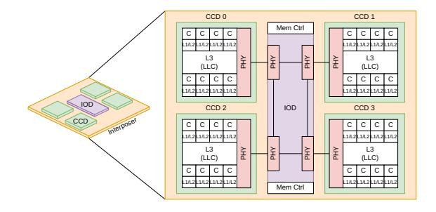

Fig. 1: An example chiplet architecture, where inter-chiplet communications are done via PHY connects.

<span id="page-0-1"></span>

Fig. 2: End-to-end inter-chiplet data communication in DICE. Parameters in green, computed metrics in orange.

Core Complex Dies (CCDs), which host compute cores and caches, and an I/O Die (IOD), which manages communication with off-chip DRAM and I/O devices. For communication, chiplets are interconnected via high-density physical-layer (PHY) links in an interposer [\[4\]](#page-13-3), [\[5\]](#page-13-4), or emerging packaging technology such as TSMC's Integrated Fan-Out on Substrate (InFO-oS), and transfer data using protocols such as AMD's Infinity Fabric [\[6\]](#page-13-5), Intel's Advanced Interface Bus (AIB) [\[7\]](#page-13-6), and the open standard Universal Chiplet Interconnect Express (UCIe) [\[8\]](#page-13-7), etc. As bandwidths rise and wiring densities increase, these short-reach links are pushed closer to their signal-integrity limits, making them more vulnerable to noise, crosstalk, and channel loss. Consequently, future inter-chiplet links are also considering the integration of forward error correction (FEC) to maintain reliable data transmission [\[9\]](#page-13-8)–[\[11\]](#page-13-9).

<span id="page-1-0"></span>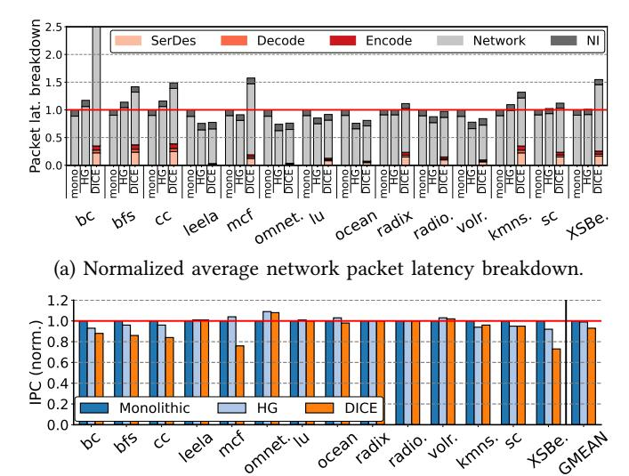

(b) Normalized per-application IPC comparison.

Fig. 3: Impact of PHY-realistic modeling in DICE on overall packet latency and system IPC.

The problems. Despite the wide adoption of chipletbased design, most architectural simulators still "wire up" chiplets using interconnect models originally developed for monolithic dies, resulting in two problems. First, these models typically assume fixed link latencies, abstracting away the details of the inter-chiplet PHY, where parallel bits are serialized and modulated into serial signals, transmitted as waveforms, and recovered over noise-prone channels. Second, PHY modeling is inherently *dynamic*: parity bits, symbol rate, and channel signal-to-noise ratio (SNR) jointly determine bit reliability, decoder convergence, error-correction latency, etc (as illustrated in Figure 2). Tuning any one parameter perturbs the others, forming a tightly coupled loop that fixeddelay abstractions cannot faithfully capture or calibrate easily. Consequently, fixed-latency links often yielding coarse and sometimes off-trend-simulation conclusions.

DICE addresses these limitations by modeling the complete inter-chiplet PHY pipeline. Guided by open-standard specifications such as the IEEE Heterogeneous Integration Roadmap [10], DICE incorporates LDPC encoding (Section III-C), PAM4 modulation (Section III-D), lossy-channel transmission (Section III-E), LLR-based demodulation (Section III-F), and LDPC decoding (Section III-G). By simulating these interactions at runtime (Section III-H), DICE captures the physical-layer effects that significantly influence architecture-level simulations.

Brief comparison of fixed-latency links and DICE. As shown in Figure 3, we evaluate three cases: 1) a monolithic architecture with 32 cores connected via a 4×8 mesh, denoted Mono; 2) a chiplet architecture corresponding to Figure 1, where inter-chiplet links are modeled using HeteroGarnet [12] with fixed-latency, throttled channels, denoted HG; and 3) our PHY-enabled chiplet architecture, DICE. More details on simulation are in Section IV-A. From these figures, we draw 3 key observations.

First, DICE fundamentally changes the packet latency breakdown compared to both Mono and HG, where average packet latency is largely dominated by network-interface (NI) queuing and network link traversal (Network). In HG, the system is *logically* chiplet-based, however, the latency profile mirrors Mono because detailed link and inter-chiplet PHY behaviors are not modeled. In contrast, in DICE, a substantial fraction of end-to-end packet latency shifts to the chiplet PHY boundary, where it is spent on forward error correction (FEC) encoding, serialization/deserialization and modulation (SerDes), and FEC decoding and error correction (EC).

*Second,* at the application level, we find that the IPC difference between HG and DICE is *inconsistent* across workloads: HG is sometimes optimistic and sometimes pessimistic, without a systematic bias that could be corrected by adjusting the throttling parameters (Section IV-D).

Third, for the collection of benchmarks that we chose as representative for this study (without prior knowledge of the results), HG gives a geomean IPC that is practically indistinguishable from that of the monolithic baseline (Mono), whereas DICE yields a clear performance gap. This mismatch underscores that fixed-latency chiplet abstractions can mask critical PHY-induced costs and lead architects to misleading conclusions about chiplet-based systems (Section IV-D).

**Key Contributions.** We present DICE, a gem5 [13] module for in-simulation, end-to-end PHY modeling. Following the IEEE Heterogeneous Integration Roadmap [10], DICE models the major components of PHY-links, including:

- Channel noise. Inter-chiplet links are error-prone. We model inter-die links as additive white Gaussian noise (AWGN [14]) channels and fold clock jitter, inter-wire crosstalk, and channel operating conditions into the effective signal-to-noise ratio (SNR).
- FEC encoding/decoding. We implement quasi-cyclic low-density parity-check (QC-LDPC [15]) forward error correction (FEC), a hardware-efficient scheme widely adopted in high-speed interconnects [16], [17]. DICE models both the QC-LDPC encoder and decoder. Further, because QC-LDPC decoding is NP-hard [18], decoders operate iteratively: they attempt to converge within a bounded iteration budget and, upon failure, trigger packet retransmission. This iterative behavior introduces inherent run-to-run latency variability. To reflect this accurately, DICE calibrates decoder iteration budgets and per-iteration timing through hardware synthesis, yielding good latency models.
- Serialization/Deserialization (SerDes) and signal modulation.
   After FEC encoding, die-edge SerDes performs parallel-toserial (P2S) conversion, transmitting parallel digits as high-speed serial waveforms. DICE models PAM-4 modulation—widely used in SerDes [10]—with waveform voltages and related parameters calibrated to public datasheets (Table III). At the receiver, PAM-4 demodulation reconstructs the digital bitstream, which then undergoes S2P conversion, and passed to the FEC decoder for error correction.
- Router microarchitecture and inter-chiplet flow control. We

extend the router microarchitecture at the PHY boundary by integrating a dedicated PHY-level flow-control mechanism that combines FEC, modulation, and inter-chiplet retransmission support. This allows us to capture PHY serialization effects and FEC-induced backpressure in the end-to-end packet timing.

We compare DICE against a actual AMD EPYC 9454P multicore processor by measuring core-to-core latency (Section IV-B1). We find that DICE is closer to the measured C2C latencies of the actual 9454P than HeteroGarnet, providing a more faithful model of the underlying chiplet architecture.

# <span id="page-2-1"></span>II. Inter-chiplet data communication and SOTA SIMULATORS FOR CHIPLET DSE

# A. SOTA simulation frameworks for chiplet-based architectures

Heterogeneous integration has emerged as a practical path to sustain performance scaling beyond the limits of Moore's Law. By assembling multiple smaller dies (chiplets) within a single package, designers can approximate largedie performance while improving yield and reducing cost. Unlike on-die communication, which remains purely digital over CMOS-driven wires, inter-chiplet links differ fundamentally [10]. CCD-IOD connections rely on high-speed SerDes signaling (e.g., NRZ or PAM4) driven by PHY circuits, where digital data are serialized, transmitted as modulated voltage waveforms, and then recovered through demodulation. As high-speed links continue to scale to higher data rates, PHYlinks must operate under increasingly challenging channel conditions, including elevated jitter, crosstalk, insertion loss, and SNR-dependent bit errors. These impairments will soon necessitate the use of forward error correction (FEC) in nextgeneration PHY to ensure reliable inter-chiplet communication [9], [10]. Accordingly, accurate performance modeling of chiplet-based systems requires detailed PHY-level simulation that captures all of these considerations, rather than treating inter-die connections as ideal digital wires with a fixed delay.

A range of state-of-the-art (SOTA) simulators [13], [19]–[27] have been proposed for chiplet-based multicore, each emphasizing different trade-offs in simulation detail and modeling focus. gem5 [13] combined with HeteroGarnet [12] offers full-system, cycle-accurate simulation of cores, caches, and routers, making it the de facto standard for microarchitectural studies. Sniper [20] accelerates design space exploration via interval-based core models, providing faster but less detailed timing than gem5. DARSIM [21] enables modular NoC evaluation using high-level in-order cores, while BookSim 2.0 [22] and Noxim [23] focus on lightweight, packet-level, trace-driven simulations that are ideal for router and traffic analysis but omit processor and memory hierarchy integration.

For larger-scale chiplet-oriented studies, Muchisim [24] models distributed chiplet systems using simplified abstractions and software-managed coherence, whereas BZSim [25] prioritizes simulation runtime via phase-based approximations suitable for workloads with modest network activity. CNSim [26] introduces packet-parallel simulation to combine

scalability with router-level timing fidelity. RapidChiplet [27] targets predicting inter-chiplet communication through high-level analytical models rather than cycle-accurate simulation.

Despite their strengths, none of these tools deliver fully realistic modeling of PHY-links (*e.g.*, SerDes, FEC, channel noise) and their system-level impact (*e.g.*, application runtime). To bridge this gap, DICE extends gem5 with a detailed PHY-level model that incorporates realistic cross-die communication, enabling end-to-end evaluation under true physical-layer constraints.

#### III. DESIGN OF DICE

We now detail the components of DICE, starting with intra-CCD/IOD layout and on-die link configuration, followed by detailed inter-chiplet PHY modeling. We conclude with the router microarchitecture that connects multiple dies and implements inter-chiplet flow control.

# A. Intra-chiplet packet transmission.

We modify gem5's Python configuration to implement the system layout in Figure 1, modeling an AMD EPYC-style architecture.

CCD/IOD. Each CCD in DICE integrates multiple cores with private L1/L2 caches and a shared LLC. Core-to-core communication within a CCD uses a CCD-local NoC over intra-die links. The default intra-CCD topology is a 2×4 mesh with 8-core (aligned with EPYC "Genoa"). DICE models an IOD that aggregates memory controllers, DMA engines, and I/O. Placed in center (Figure 1), the IOD provides uniform access from CCDs to memory. Internally, we instantiate 4 PHY routers in the IOD in a 2 × 2 mesh, with each PHY connected to 2 memory controllers (in total 8).

Reflecting the use of a less advanced process node for the IOD (*e.g.*, 14 nm *vs.* 5 nm for CCDs), we model a higher NoC frequency for the CCDs than for the IOD. In DICE, intra-CCD links run at 2.0 GHz, are 128 bits wide, and incur 1-cycle router latency and 2-cycle link latency. In contrast, IOD links and routers operate at 1.0 GHz, with the same 128-bit link width, 1-cycle router latency, and 2-cycle link transmission latency. In summary, Table I lists the default parameters of the CCD and IOD models in DICE.

TABLE I: Default for intra-CCD/IOD NoC.

<span id="page-2-0"></span>

|     | Topology                                                                          | Link width | Freq    | Router lat | Link lat |
|-----|-----------------------------------------------------------------------------------|------------|---------|------------|----------|
| CCD | $\begin{array}{c} \text{mesh } 2 \times 4 \\ \text{mesh } 2 \times 2 \end{array}$ | 128-bit    | 2.0 GHz | 1 cycle    | 2 cycles |
| IOD |                                                                                   | 128-bit    | 1.0 GHz | 1 cycle    | 2 cycles |

# B. Inter-chiplet packet transmission.

Conventional simulators approximate inter-chiplet communication with limited fidelity (Section II). For example, gem5 HeteroGarnet [12] emulates SerDes by throttling bandwidth between inter-chiplet routers (Figure 4—HeteroGarnet) rather than modeling the PHY. To capture actuate cross-die packet transmission, DICE models the full inter-chiplet transmission stack (Figure 4—DICE), including **①** FEC encoding,

<span id="page-3-1"></span>

Fig. 4: Detailed end-to-end inter-chiplet communication modeling in DICE, capturing FEC en-/de-coding, modulation/de-modulation, noise injection, and inter-chiplet flow control.

**2** modulation, **3** noisy link traversal, **4** demodulation, and FEC-decoding—with **5** integrated inter-chiplet flow control to manage backpressure and retransmissions. Next, we detail each of the components.

# <span id="page-3-0"></span>C. Forward error correction (FEC) encoding

Unlike CRC-only schemes that trigger retransmission upon error detection [28], DICE employs forward error correction (FEC) [29], which proactively corrects bit errors at the receiver and significantly reduces replays. In DICE, the transmit-side PHY router aggregates flits, applies FEC encoding, and then serializes them for transmission.

**QC-LDPC encoding.** DICE employs Quasi-Cyclic Low-Density Parity-Check (QC-LDPC) codes [15], a hardware-efficient FEC scheme extensively used in SSDs [16], [18], [30]. A QC-LDPC code is specified by a sparse parity-check matrix  $H \in \{0, 1\}^{m \times n}$ . A binary vector  $\mathbf{c} \in \{0, 1\}^n$  is a valid codeword iff:

$$H\mathbf{c}^T \equiv \mathbf{0} \pmod{2}.$$

Here, n = k + m is the codeword length, k is the number of bits in the packet-under-transmission, and m is the number of parity bits (rows of H). The code rate R is defined as:

$$R = \frac{k}{n} = 1 - \frac{m}{n},\tag{2}$$

which shows the fraction of the codeword devoted to the original message.

**FEC en/decoding granularity.** DICE performs FEC at *flit* granularity: each 128-bit flit is encoded and decoded independently using a parity-check matrix *H* shared among PHY sender-receiver pairs, ensuring consistent encode/decode/error correction across chiplets. Control packets consist of a single HEAD-TAIL flit, while data packets consist of 6 flits—1 HEAD, 4 BODY flits carrying a 64 Byte cache line, and 1 TAIL flit. This flit-level granularity is chosen because: 1) it keeps the encoder's hardware footprint small

<span id="page-3-2"></span>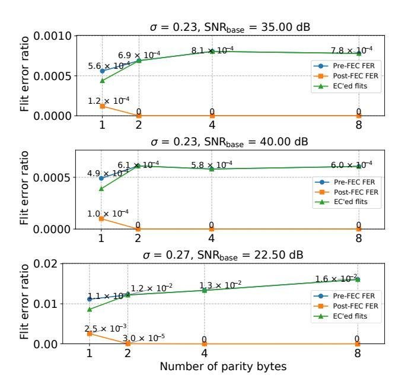

Fig. 5: Pre- and post-FEC FER and number of error-corrected flits under three baseline SNRs with varying parity-byte configurations. Takeaway: A 2-byte parity per flit sits at a sweet spot between overhead and Post-FEC FER.

and timing-friendly (see Figure 7 for FEC-encoder hardware), and 2) it enables more flexible inter-chiplet flow control (Section III-H).

**Sensitivity study on code rate R.** We first select the code rate R. Unlike BCH/Hamming, QC-LDPC provides no bounded-distance guarantee, making R a design trade-off: lower R (more parity) strengthens error correction (EC) but consumes more inter-chiplet bandwidth; higher R reduces overhead but weakens correction. We choose R using the sensitivity study in Figure 5, which reports both the pre-FEC flit error ratio (FER) and the post-FEC FER under a Gaussian-noise channel at a representative signal-to-noise ratio of  $SNR_{base} = 35.0 \, dB$ . Additional sensitivity experiments on  $SNR_{base}$  are discussed in Section III-D. All results are decoded using a 4-iteration loop-budget layered Min-Sum FEC decoder (Section III-G).

From the figure we observe a sweet spot at 2 parity bytes per flit ( $R \approx 0.88$ ): higher R under-provisions parity and increases post-FEC error rates, whereas lower R yields diminishing returns in correction strength. Consequently, DICE adopts  $R \approx 0.88$  by default—1 parity bit per flit-byte (16 parity bits for a 128-bit flit)—balancing post-FEC reliability and inter-chiplet bandwidth efficiency.

As a comparison to  $SNR_{base} = 35.0 \, dB$ , Figure 5 also shows results at  $SNR_{base} = 40.0 \, dB$  and  $22.5 \, dB$ . First,  $SNR_{base} = 40.0 \, dB$  achieves results similar to  $SNR_{base} = 35.0 \, dB$ , which indicates that once  $SNR_{base}$  exceeds 35.0 dB, the channel noise is dominated by crosstalk and jitter, and a cleaner baseline SNR does not provide much additional benefit. Second, in contrast, under noisier channel conditions, 2 parity bytes are no longer sufficient to

maintain a satisfactory post-FEC FER. In this regime, there are 3 possible trade-offs: 1) increase the number of parity bytes (e.g., from 2 to 4, as shown in the figure) to better tolerate channel noise, at the cost of reduced effective data bandwidth; 2) maintain a 2-byte parity but retransmit flits that cannot be corrected, preserving raw channel bandwidth but increasing packet turnaround time and tax application runtime; or 3) increase the FEC decoder iteration budget to improve error-correction capability, at the expense of additional hardware complexity and power.

**Parity function construction.** To generate parity bits, DICE constructs a parity-check matrix H for the LDPC code. The process begins with a compact base matrix  $B \in \mathbb{Z}^{m_b \times n_b}$ , where  $m = m_b Z$ ,  $n = n_b Z$ . The expansion factor Z controls hardware parallelism: a larger Z increases parallelism. Each element  $b_{i,j}$  in B represents either: -1, denoting an all-zero block, or a non-negative shift value  $s \in \{0, 1, \ldots, Z-1\}$ , denoting a right-rotated identity matrix. Each shift value s corresponds to a  $Z \times Z$  circulant permutation matrix:

$$P(s) = \text{RotateRight}_{Z}(I_{Z}, s), \quad P(-1) = 0_{Z \times Z},$$

where  $I_Z$  is the  $Z \times Z$  identity matrix and RotateRight<sub>Z</sub>( $I_Z$ , s) performs a cyclic right shift of each row by s positions. Replacing every entry  $b_{i,j}$  in B with its corresponding block  $P(b_{i,j})$  produces the full parity-check matrix:

$$H = [P(b_{i,j})]_{i \in [0,m_b-1], j \in [0,n_b-1]}, \quad m = m_b Z, \quad n = n_b Z.$$

This *block-circulant* construction yields a highly regular and hardware-friendly matrix, since each P(s) can be implemented using simple shift registers or address rotations, avoiding the complex interconnects of unstructured LDPC codes.

**Example.** For Z = 16, each P(s) is a  $16 \times 16$  rotation of the identity matrix. A 128-bit flit is divided into 8 16-bit chunks  $\{u_0, u_1, \dots, u_7\}$ . The parity block p is computed as:

<span id="page-4-2"></span>
$$\mathbf{p} = P(0) \mathbf{u}_0 \oplus P(3) \mathbf{u}_1 \oplus P(7) \mathbf{u}_2 \oplus P(11) \mathbf{u}_3 \oplus P(2) \mathbf{u}_4 \oplus P(9) \mathbf{u}_5 \oplus P(14) \mathbf{u}_6 \oplus P(5) \mathbf{u}_7.$$
(3)

The final codeword concatenates data and parity bits:

$$c = [u_0||u_1|| \cdots ||u_7||p].$$

**FEC-encoder latency.** We implement the QC-LDPC encoder described in Equation 3 in Verilog. We use Yosys<sup>1</sup> for synthesis and OpenSTA<sup>2</sup> for static timing analysis, both targeting the TSMC 40 nm standard-cell library. Our analysis shows that FEC granularity has a significant impact on hardware cost and timing. With a 128-bit input (flit-level), the encoder maps to 7 16-bit XOR gates using 175 standard cells (Figure 7a) and meets the target 2.0 GHz clock constraint. Multipliers are optimized away since all coefficients in *H* are constants. In contrast, scaling the input width to 768 bits (packet-level, corresponding to a full data packet) increases logic complexity to 2320 cells (Figure 7b) and fails to meet


Fig. 6: FEC-encoding for 128-bit flit with 2-byte parity bits.

<span id="page-4-1"></span>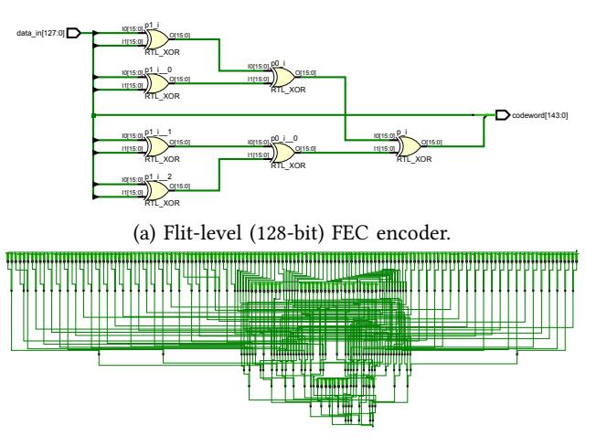

(b) Packet-level (64-byte) FEC encoder.

Fig. 7: Logic synthesis results for flit- and packet-level FEC encoders. Layouts visualized in Xilinx Vivado for clarity. Takeaway: Flit-level FEC can be implemented with a simple three-level XOR-net, whereas packet-level FEC significantly increases hardware complexity.

the 2.0 GHz timing target. These results motivate the choice of *flit*-level FEC in DICE, ensuring the encoder remains off the router pipeline's critical path in both CCD and IOD.

#### <span id="page-4-0"></span>D. Modulation

After FEC encoding, digital signals are modulated and transmitted over the inter-chiplet channel.

**PAM4 modulation.** DICE employs PAM4 [31] with Gray mapping, where 2-bit symbols [00,01,11,10] correspond to amplitudes [-3d,-d,+d,+3d]. In DICE, we use an interposer-level swing of [-150,-50,+50,+150] mV, *i.e.*, d = 50 mV, representative of short-reach chiplet links on silicon interposers. This low-swing operation significantly reduces I/O power and is consistent with modern die-to-die PAM4 PHY implementations [10].

<span id="page-4-3"></span><sup>&</sup>lt;sup>1</sup>https://github.com/YosysHQ/yosys

<span id="page-4-4"></span><sup>&</sup>lt;sup>2</sup>https://github.com/The-OpenROAD-Project/OpenSTA

**Example:** Transmitting the PAM4. byte word produces symbol pairs [01, 00, 10, 10][01, 00, 10, 10]map to amplitudes [-d, -3d, +3d, +3d]. 50mV, the resulting serial waveform is With d= x = [-50, -150, +150, +150] mV.

# <span id="page-5-0"></span>E. Channel noise modeling

After modulation symbols are transmitted over the interchiplet channel where *noise* (in the form of channel, jitter, and cross talk noise) is added.

**AWGN channel noise.** DICE models the channel noise as additive white Gaussian noise (AWGN), accounting for two dominant high-speed link impairments—1) *jitter* [32] and 2) *crosstalk* (XT) [33]. Together with the channel's intrinsic operating conditions, these impairments determine link quality, which we quantify using signal-noise ratio (SNR) [34], [35].

**Jitter.** Jitter refers to random variations in signal timing that translate clock-edge uncertainty into waveform errors (samples too early or late), thereby reducing SNR, closing the eye diagram, and degrading link quality. A widely used jitter model [36]–[38] is:

$$SNR_{jitter,linear} \approx \left(\frac{T_{sym}}{\pi \sigma_t}\right)^2 \implies SNR_{jitter,dB} \approx 20 \log_{10} \left(\frac{T_{sym}}{\pi \sigma_t}\right), \quad (4)$$

where  $\sigma_t$  denotes the root-mean-square (RMS) clock-edge timing error and  $T_{\rm sym}$  the symbol period. In DICE, we set  $T_{\rm sym}$  according to the network clock rate (32 Gb/s, following AMD's Infinity Fabric) and assume  $\sigma_t \approx 1\,\mathrm{ps}$  [39], [40], yielding an average SNR<sub>jitter,dB</sub>  $\approx 26.0\,\mathrm{dB}$ .

**Crosstalk (XT).** XT is hardware-induced coupling from aggressor lanes into a victim channel; its severity depends on interconnect geometry (*e.g.*, wire spacing and length) [41] and the modulation format [35], [42]. By default, DICE sets  $SNR_{XT,dB} \approx 20.0 \, dB$  guided by public data [43].

Calculating effective SNR and BER. We quantify the end-to-end link quality using an *effective* SNR that aggregates independent impairment sources. Let SNR<sub>base</sub> represent the intrinsic channel noise determined by its physical characteristics and operating conditions. Converting all SNR terms into *linear* scale, the effective SNR is obtained using the harmonic-sum rule [14]:

<span id="page-5-4"></span>
$$\frac{1}{SNR_{eff,linear}} = \frac{1}{SNR_{base,linear}} + \frac{1}{SNR_{jitter,linear}} + \frac{1}{SNR_{XT,linear}}.$$
 (5)

**Error injection.** Driven by SNR<sub>eff</sub>, DICE implements an *error injector* in gem5 (Listing 1) that corrupts transmitted PAM4 symbols with AWGN. As shown in Listing 1, with Gray mapping and  $X = \{-3d, -d, +d, +3d\}$  at  $d = 50 \,\text{mV}$  [9], [42], a symbol  $x \in X$  is transmitted as:

$$y = x + n, \qquad n \sim \mathcal{N}(0, \sigma^2),$$

where  $\sigma^2$  is the voltage noise variance implied by SNR<sub>eff</sub>. With average energy per symbol  $E_s = \frac{1}{4} \sum_{x \in \{-3d, -1d, 1d, 3d\}} x^2 = 5d^2$ ,  $\sigma$  is given by:

$$\sigma^2 = \frac{E_s}{\text{SNR}_{\text{eff.linear}}} = \frac{5d^2}{\text{SNR}_{\text{eff.linear}}}.$$

# Listing 1: Error injector pseudocode

```
1 /*Initialize random generator with SNR_eff,
2 which is determined by jitter, XT, SNR_base*/
3 sigma <- Es / SNR_eff_linear
4 rng <- NormalDist(mean=0, stddev=sigma)
5 for each flit in network:
6 msg_byte <- flit.get_msg_byte()
7 for each 2-bit PAM4 symbol in msg_byte:
8
```

<span id="page-5-2"></span>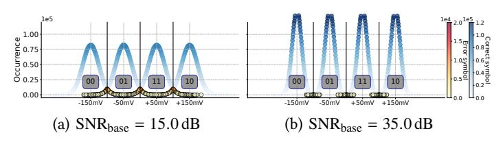

Fig. 8: Error distribution under two example base SNRs. Takeaway: Higher SNR incurs fewer errors.

<span id="page-5-3"></span>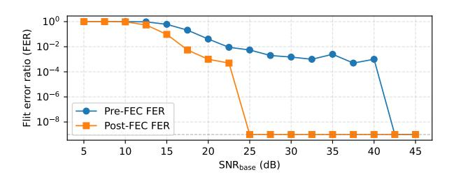

Fig. 9: Pre- and post-FEC FER sensitivity across varying base SNR values. Takeaway: when SNR falls below 25 dB (*i.e.*, in a highly noisy channel), 2-byte parity FEC becomes unreliable, necessitating either additional parity bytes or higher-level error detection mechanisms such as CRC. This paper adopts 35 dB as the baseline SNR based on publicly available data [10].

Following UCIe practice for short-reach inter-chiplet links, we assume a nominal SNR<sub>base,dB</sub>  $\approx 35.0\,\mathrm{dB}$  [10], [44]. After incorporating jitter and crosstalk impairments, this corresponds to an effective link quality of SNR<sub>eff,dB</sub>  $\approx 19.0\,\mathrm{dB}$ , which yields a baseline noise variance of  $\sigma \approx 12.7\,\mathrm{mV}$ . Lastly, beyond the defaults, DICE exposes all knobs for jitter level, crosstalk strength, and baseline SNR at run time to enable flexible DSE.

**Example: corrupting transmitted symbols.** Consider the PAM4 sequence x = [-50, -150, +150, +150] mV with a noise deviation of  $\sigma \approx 12.7 \text{ mV}$ . For a sample noise realization n = [+5.0, -21.0, -13.0, +8.0] mV, the transmitted waveform becomes y = x + n = [-45.0, -171.0, +137.0, +158.0] mV.

In Figure 8a and Figure 8b, we visualize PAM4 symbol distributions under AWGN for SNR<sub>base,dB</sub>=15.0 and 35.0, respectively. An *error symbol* is counted when noise drives a symbol across an adjacent voltage region (*e.g.*, -150 mV—

50 mV). We further report the pre-FEC FERs across a span of SNR<sub>base,dB</sub> in Figure 9.

As shown in Figure 8a and Figure 8b, increasing SNR<sub>base,dB</sub>—reflecting a cleaner, better-manufactured channel—reduces the number of error symbols. Further, with 2 parity bytes, Figure 9 shows that when the channel SNR falls below 25.0 dB, a growing fraction of errors become uncorrectable by FEC and must instead be handled at a higher protocol level, such as retransmission via CRC [45].

# <span id="page-6-0"></span>F. De-modulation

On the other side of the inter-chiplet channel, the receiver performs FEC decoding (Section III-G) and error correction [29], reconstructs flits, and forwards them to the downstream router. The first step, however, is to demodulate the received signal by computing *channel LLRs* or *log-likelihood ratios*, which represent a "soft" confidence for the received symbol bits. The reason LLRs are important is because they are the input to the decoder described in Section III-G.

At the receiver, DICE computes bit-wise LLRs for each received PAM4 symbol (encoding 2 bits). Let  $L_{\text{ch},k}$  denote the LLR for bit  $b_k$ . Its magnitude  $|L_{\text{ch},k}|$  captures confidence (e.g.,  $|L_{\text{ch},k}| = 3.0$  is high;  $|L_{\text{ch},k}| = 0.2$  is low), while its sign encodes polarity ( $L_{\text{ch},k} > 0 \Rightarrow 0$ ,  $L_{\text{ch},k} < 0 \Rightarrow 1$ ). For PAM4 with Gray-mapping  $[00,01,11,10] \Rightarrow [-3d,-d,+d,+3d]$ , the symbol-bit subsets are:

$$X_{\text{MSB}}^{(1)} = \{+d, +3d\}, X_{\text{MSB}}^{(0)} = \{-3d, -d\}, X_{\text{LSB}}^{(1)} = \{-d, +d\}, X_{\text{LSB}}^{(0)} = \{-3d, +3d\}.$$

Given a received symbol y, the LLR  $L_{ch}$  for bit  $b_k$  is [46]:

$$L_{\mathrm{ch}}(b_k) = \log \frac{\sum\limits_{x \in \mathcal{X}_k^{(0)}} \exp\left(-\frac{(y-x)^2}{2\sigma^2}\right)}{\sum\limits_{x \in \mathcal{X}_k^{(1)}} \exp\left(-\frac{(y-x)^2}{2\sigma^2}\right)} \approx \frac{1}{2\sigma^2} \left(\min_{x \in \mathcal{X}_k^{(1)}} (y-x)^2 - \min_{x \in \mathcal{X}_k^{(0)}} (y-x)^2\right),$$

where x are the symbol-bits in the corresponding subset.

**Example: calculating bit-LLR for a received PAM4 symbol.** Assume that the receiver observes a signal of  $y = -45.0 \,\text{mV}$ , corresponding to the first symbol ([01]=[-d]=[-50mv]) in the noise modeling example in Section III-D.

The received PAM4 symbol yields channel LLRs  $L_{\rm ch}$  = [+22.8, -27.8] for {MSB, LSB}, which serve as soft-confidence inputs to the FEC decoder. As detailed later in Section III-G, the decoder first produces a bit decision of [01], which is then verified by the syndrome function using the same encoding matrix H introduced in Section III-C. This verification confirms that no error is present in this example, which is expected, as the injected noise of +5.0 mV is not sufficient to shift the signal into an adjacent symbol voltage level. Otherwise, the decoder initiates the error-correction process to repair the detected error.

#### <span id="page-6-1"></span>G. Decoding

**FEC decoding pipeline.** DICE adopts a low-latency layered min-sum QC-LDPC decoder [47], chosen for hardware efficiency and fast convergence. Let the parity-check matrix H have m rows (layers), where each row corresponds to a

check node  $CN_i$  that enforces a group of parity constraints over a subset of variable nodes  $v_i$ .

**Initialization.** At the beginning of iteration t, each  $v_j$  initializes its LLR from the channel input at the receiver:  $L(v_j) \leftarrow L_{ch}(v_j)$ . The decoder then sweeps the layers sequentially (i = 0, ..., m-1), performing check-node and variable-node updates in a layered schedule.

Check-node update (exclude-self rule). For each edge  $(CN_i, v_i)$ , the outgoing message is:

$$m_{cn_{i} \to v_{j}} = \left( \prod_{v_{k} \in \mathcal{N}(cn_{i}) \setminus v_{j}} \operatorname{sgn}(m_{v \to cn_{i}} [v_{k}]) \right) \min_{v_{k} \in \mathcal{N}(cn_{i}) \setminus v_{j}} \left| m_{v \to cn_{i}} [v_{k}] \right|.$$

The sign is the product of all *other* incoming  $v \rightarrow c$  signs, and the magnitude is the minimum of their absolute values.

**Variable-node update (layered accumulation).** After computing  $m_{cn_i \rightarrow v_i}$ ,  $v_i$  updates its LLR incrementally:

$$L(v_i) \leftarrow L(v_i) + m_{cn_i \rightarrow v_i}$$

Subsequent layers immediately reuse the updated LLRs, accelerating convergence compared to flooding, where all layers use previous iteration's LLRs and new LLRs are updated at once after all  $m_{cn\rightarrow v}$  for the current layer are calculated.

**Hard decision and syndrome check.** After all layers are processed, the decoder decides each bit:

$$\hat{c}_i = \begin{cases} 0, & L(v_i) \ge 0, \\ 1, & L(v_i) < 0, \end{cases} \quad \text{and verifies } H\hat{\mathbf{c}}^T \equiv \mathbf{0} \pmod{2}$$

If the syndrome is zero, decoding terminates successfully; otherwise, the decoder performs another layered sweep until either 1) the syndrome becomes zero—indicating all errors are corrected—or 2) a predefined iteration budget is reached, in which case the flit/packet is retransmitted.

**Example: layered min-sum decoding.** As introduced in Section III-D, after transmission across the interchiplet channel, the receiver observes serial noisy PAM4 symbols  $\mathbf{y} = \mathbf{x} + \mathbf{n} = \frac{[-45.0, -171.0, +137.0, +158.0] \text{ mV}}{\text{converted}}$  to bit-wise LLRs per Section III-F, yielding  $L_{ch} = [v_0, v_1, ..., v_7] = [+22.8, -27.8, +122.5, +35.9, -88.1, +18.7, -109.4, +29, 4]$ . For illustration, we consider  $v_0 - v_5$  as data bits and  $v_6, v_7$  as parity bits<sup>3</sup>. We use the following representative  $3 \times 8$  parity-check matrix (rows = CNs, columns = VNs):

$$H = \begin{bmatrix} v_0 & v_1 & v_2 & v_3 & v_4 & v_5 & v_6 & v_7 \\ \text{CN}_0 & 1 & 1 & 0 & 1 & 0 & 0 & 1 & 0 \\ \text{CN}_1 & 0 & 1 & 1 & 0 & 1 & 0 & 0 & 1 \\ \text{CN}_2 & 1 & 0 & 1 & 0 & 0 & 1 & 0 & 0 \end{bmatrix}.$$

In each layer, every CN updates its connected VNs (where there is a "1") using the current LLRs, which are incrementally refined within the same layer. Subsequent layers immediately reuse these updated values to accelerate convergence.

<span id="page-6-2"></span><sup>&</sup>lt;sup>3</sup>This simplified example captures the essential layered decoding schedule and applies directly to the 128-bit flit granularity in DICE.

<span id="page-7-1"></span>

Fig. 10: Sensitivity of QC-LDPC convergence to varying base SNR and parity-byte configurations. Takeaway: At the baseline 35 dB SNR, FEC decoding converges within 2 iterations for all parity-byte settings R.

After one full layered iteration (three layers), the updated variable-node LLRs are:

$$L = [69.3, -80.0, 170.6, 58.7, -117.5, 69.3, -132.2, 80.0].$$

The decoder then performs hard decisions according to:

$$\hat{c}_i = \begin{cases} 0, & L(v_i) \ge 0, \\ 1, & L(v_i) < 0, \end{cases} \Rightarrow \hat{\mathbf{c}} = [0, 1, 0, 0, 1, 0, 1, 0].$$

Finally, the syndrome check  $H\hat{\mathbf{c}}^T=0\pmod{2}$  confirms that all parity constraints are satisfied. In this example, the codeword passes the check (we receive the same message as before, encoded as described in Section III-D), and decoding successfully converges after a single layered iteration. If the syndrome is non-zero, the decoder reuses the updated LLRs and repeats until either the syndrome becomes zero or a limit is reached and a packet is retransmitted.

**FEC-decoder latency.** We synthesize a layered min-sum QC-LDPC decoder in Verilog. Because the decoding process is runtime-determined, we set the decoder loop budget empirically: Figure 10 reports violin plots of *iterations to convergence*<sup>4</sup> versus parity bytes R = 1, 2, 4, 8 across link qualities  $SNR_{base} = 15.0 \, dB$  and  $35.0 \, dB$ . At the baseline  $SNR_{base} = 35.0 \, dB$ , all tested code rates converge within  $\leq 2$  iterations. We thus cap the decoding loop budget at N = 4—bounding worst-case latency while retaining margin for lower  $SNR_{base}$ . For both CCD and the IOD, the syndrome stage uses  $L_{syndrome} = 1$  cycle, and each decoding iteration uses  $L_{iter} = 1$  cycle (including all layers of LLR updates and comparisons). The total latency after N iterations is:

Latency(N) = 
$$(N+1)L_{\text{syndrome}} + NL_{\text{iter}} = 2N+1 \text{ cycles}, N \le 4.$$

At a noisier channel of  $15.0\,\mathrm{dB}$ , we observe 2 phenomena. First, with fewer parity bytes (e.g., R=1 or R=2), many errors cannot be corrected by FEC because the parity-byte budget is insufficient; among those that are detected, 2 iterations are sufficient for correction. Second, increasing the number of parity bytes enables correction of more errors, but requires additional decoding iterations to convergence.

<span id="page-7-2"></span><sup>4</sup>We exclude error-free flits and runs that do not converge within a generous cap of 20 iterations.

<span id="page-7-3"></span>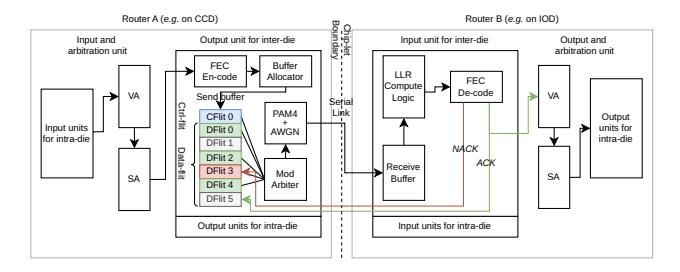

Fig. 11: Microarchitecture for sender (Router A) and receiver (Router B) PHY routers.

# <span id="page-7-0"></span>H. Putting it all together: PHY router microarchitecture

To support the mechanisms described from Section III-C to Section III-G, DICE integrates PHY-link-level flow control into the router microarchitecture at chiplet boundaries. We illustrate the mechanism with Figure 11, where Router A (sender) and Router B (receiver) reside on separate chiplets and communicate over a serialized inter-chiplet link. We next detail the end-to-end flow control process, from encoding at the sender, to inter-chip link traversal, then to decoding at the receiver.

- **1, Encoding.** As illustrated in Figure 11, on the sender side (Router A), DICE implements an inter-die output unit, which integrates: 1) an FEC encoder, 2) a send buffer and buffer allocator, 3) a modulation arbiter, and 4) a modulator. As introduced in Section III-C, DICE performs encoding/decoding at *flit*-level granularity to minimize hardware overhead: for data packets, each of the 6×128-bit flits (1 HEAD, 4 BODY, 1 TAIL) is encoded independently, whereas a control packet consists of a single encoded HEAD-TAIL flit.
- 2, Inter-chiplet flow control and link traversal. After FEC encoding (Section III-C), each flit (data + parity) is queued in the send buffer and arbitrated for modulation/serialization on the cross-chiplet link (Section III-F). To balance allocation flexibility with implementation simplicity, DICE adopts cut-through flow control. 1) The send buffer comprises flit-sized entries that are reserved at packet granularity (1 entry for control packets, 6 entries for data packets). 2) After link traversal, the receiver returns per-flit ACK/NACKs to the sender. This flit-level credit feedback localizes recovery, as only flits that fail decoding are resent by the sender. 3) A packet's reservation in the send buffer is released only after all of its flits have been ACKed. 4) Multiple packets can coexist in the send buffer; if one packet stalls, others can still advance through modulation arbitration, sustaining high link utilization and avoiding head-of-line blocking.
- 3, Decoding. After link traversal through the noisy channel (Section III-D), Router B accumulates soft samples (data+parity) into a receive buffer, then invokes LLR compute logic and FEC decoder with a bounded iteration budget (Section III-G). On a successful decode, the flit is delivered for onward transmission and an ACK is returned to Router A. On failure, Router B issues a NACK, which triggers remodulation and re-transmission of that affected flit.

TABLE II: gem5 configurations

<span id="page-8-2"></span>

| Core/Reorder buffer (ROB) Instruction queue (IQ) Load/store-queue (LQ/SQ) Int/Float/Vec Register Fetch/Decode/Rename Issue/Squash/Commit Branch predictor/BTB MemDep predictor  L1 I/DCache  Cache configuration  L2 Cache (LLC) Cache coherence  Chiplet configuration  CCD layout CCD NoC  IOD layout IOD NoC  Channel noise/Modulation FEC encoding  FEC decoding  Symbol rate and SNR  3.0 GHz x86_64 OoO, 512 entries 160 entries 160 entries 18micro-ops per cycle 8 micro-ops per cycle 8 micro-ops per cycle 8 micro-ops per cycle 8 micro-ops per cycle 8 micro-ops per cycle 8 micro-ops per cycle 8 micro-ops per cycle 8 micro-ops per cycle 8 micro-ops per cycle 8 micro-ops per cycle 8 micro-ops per cycle 8 micro-ops per cycle 8 micro-ops per cycle 8 micro-ops per cycle 8 micro-ops per cycle 8 micro-ops per cycle 8 micro-ops per cycle 8 micro-ops per cycle 8 micro-ops per cycle 8 micro-ops per cycle 8 micro-ops per cycle 8 micro-ops per cycle 8 micro-ops per cycle 8 micro-ops per cycle 8 micro-ops per cycle 8 micro-ops per cycle 8 micro-ops per cycle 8 micro-ops per cycle 8 micro-ops per cycle 8 micro-ops per cycle 8 micro-ops per cycle 8 micro-ops per cycle 8 micro-ops per cycle 8 micro-ops per cycle 8 micro-ops per cycle 8 micro-ops per cycle 8 micro-ops per cycle 8 micro-ops per cycle 8 micro-ops per cycle 8 micro-ops per cycle 8 micro-ops per cycle 8 micro-ops per cycle 8 micro-ops per cycle 8 micro-ops per cycle 8 micro-ops per cycle 8 micro-ops per cycle 8 micro-ops per cycle 8 micro-ops per cycle 8 micro-ops per cycle 8 micro-ops per cycle 8 micro-ops per cycle 8 micro-ops per cycle 8 micro-ops per cycle 8 micro-ops per cycle 8 micro-ops per cycle 8 micro-ops per cycle 8 micro-ops per cycle 8 micro-ops per cycle 8 micro-ops per cycle 9 micro-ops per cycle 1024 entries Insunérs 9 micro-ops per cycle 1024 entries Insuéries 1024 entries Insuéries 1024 entries 1024 entries 1024 entries 1024 entries 1024 entries 1024 entries 1024 entries 1024 entries 1024 entries 1024 entries 1024 entries 1024 entries 1024 entries 1024 entri | Microarchitecture                       |                                                                                                                                                                                                                                                                                                                                                                                                                                                                                                                                                                                                                                                                                                                                                                                                                                                                                                                                                                                                                                                                                                                                                                                                                                                                                                                                                                                                                                                                                                                                                                                                                                                                                                                                                                                                                                                                                                                                                                                                                                                                                                                                |  |  |
|--------------------------------------------------------------------------------------------------------------------------------------------------------------------------------------------------------------------------------------------------------------------------------------------------------------------------------------------------------------------------------------------------------------------------------------------------------------------------------------------------------------------------------------------------------------------------------------------------------------------------------------------------------------------------------------------------------------------------------------------------------------------------------------------------------------------------------------------------------------------------------------------------------------------------------------------------------------------------------------------------------------------------------------------------------------------------------------------------------------------------------------------------------------------------------------------------------------------------------------------------------------------------------------------------------------------------------------------------------------------------------------------------------------------------------------------------------------------------------------------------------------------------------------------------------------------------------------------------------------------------------------------------------------------------------------------------------------------------------------------------------------------------------------------------------------------------------------------------------------------------------------------------------------------------------------------------------------------------------------------------------------------------------------------------------------------------------------------------------------------------------|-----------------------------------------|--------------------------------------------------------------------------------------------------------------------------------------------------------------------------------------------------------------------------------------------------------------------------------------------------------------------------------------------------------------------------------------------------------------------------------------------------------------------------------------------------------------------------------------------------------------------------------------------------------------------------------------------------------------------------------------------------------------------------------------------------------------------------------------------------------------------------------------------------------------------------------------------------------------------------------------------------------------------------------------------------------------------------------------------------------------------------------------------------------------------------------------------------------------------------------------------------------------------------------------------------------------------------------------------------------------------------------------------------------------------------------------------------------------------------------------------------------------------------------------------------------------------------------------------------------------------------------------------------------------------------------------------------------------------------------------------------------------------------------------------------------------------------------------------------------------------------------------------------------------------------------------------------------------------------------------------------------------------------------------------------------------------------------------------------------------------------------------------------------------------------------|--|--|
| Instruction queue (IQ) Load/store-queue (LQ/SQ) Int/Float/Vec Register Fetch/Decode/Rename Issue/Squash/Commit Branch predictor/BTB MemDep predictor  L1 I/DCache  Cache configuration  L1 I/DCache  L2 Cache (LLC) Cache coherence  Chiplet configuration  CCD layout CCD NoC  IOD layout IOD NoC  IOD layout IOD NoC  Channel noise/Modulation FEC encoding  FEC decoding  Symbol rate and SNR  160 entries 192, 114 entries 332/332/332 entries 8 micro-ops per cycle 8 micro-ops per cycle 8 micro-ops per cycle 8 micro-ops per cycle 8 micro-ops per cycle 8 micro-ops per cycle 8 micro-ops per cycle 8 micro-ops per cycle 8 micro-ops per cycle 8 micro-ops per cycle 8 micro-ops per cycle 8 micro-ops per cycle 8 micro-ops per cycle 8 micro-ops per cycle 8 micro-ops per cycle 8 micro-ops per cycle 8 micro-ops per cycle 8 micro-ops per cycle 8 micro-ops per cycle 8 micro-ops per cycle 8 micro-ops per cycle 8 micro-ops per cycle 8 micro-ops per cycle 8 micro-ops per cycle 8 micro-ops per cycle 8 micro-ops per cycle 8 micro-ops per cycle 8 micro-ops per cycle 8 micro-ops per cycle 8 micro-ops per cycle 8 micro-ops per cycle 8 micro-ops per cycle 8 micro-ops per cycle 8 micro-ops per cycle 8 micro-ops per cycle 8 micro-ops per cycle 8 micro-ops per cycle 8 micro-ops per cycle 8 micro-ops per cycle 8 micro-ops per cycle 8 micro-ops per cycle 8 micro-ops per cycle 8 micro-ops per cycle 8 micro-ops per cycle 8 micro-ops per cycle 8 micro-ops per cycle 8 micro-ops per cycle 8 micro-ops per cycle 8 micro-ops per cycle 8 micro-ops per cycle 8 micro-ops per cycle 8 micro-ops per cycle 8 micro-ops per cycle 8 micro-ops per cycle 8 micro-ops per cycle 8 micro-ops per cycle 8 micro-ops per cycle 8 micro-ops per cycle 8 micro-ops per cycle 8 micro-ops per cycle 8 micro-ops per cycle 8 micro-ops per cycle 8 micro-ops per cycle 8 micro-ops per cycle 8 micro-ops per cycle 8 micro-ops per cycle 8 micro-ops per cycle 8 micro-ops per cycle 8 micro-ops per cycle 8 micro-ops per cycle 8 micro-ops per cycle 8 micro-ops per cycle 8 micro-ops per cycle 8 mic |                                         |                                                                                                                                                                                                                                                                                                                                                                                                                                                                                                                                                                                                                                                                                                                                                                                                                                                                                                                                                                                                                                                                                                                                                                                                                                                                                                                                                                                                                                                                                                                                                                                                                                                                                                                                                                                                                                                                                                                                                                                                                                                                                                                                |  |  |
| Load/store-queue (LQ/SQ) Int/Float/Vec Register Fetch/Decode/Rename Issue/Squash/Commit Branch predictor/BTB MemDep predictor  L1 I/DCache  Cache configuration  L2 Cache (LLC) Cache coherence  Chiplet configuration  CCD layout CCD NoC  IOD layout IOD NoC  Channel noise/Modulation FEC encoding FEC decoding  Load/store-queue (LQ/SQ) Int/Float/Vec Register Sal2/332/332 entries Smicro-ops per cycle Smicro-ops per cycle Smicro-ops per cycle Smicro-ops per cycle Smicro-ops per cycle Smicro-ops per cycle Smicro-ops per cycle Smicro-ops per cycle Smicro-ops per cycle Smicro-ops per cycle Smicro-ops per cycle Smicro-ops per cycle Smicro-ops per cycle Smicro-ops per cycle Smicro-ops per cycle Smicro-ops per cycle Smicro-ops per cycle Smicro-ops per cycle Smicro-ops per cycle Smicro-ops per cycle Smicro-ops per cycle Smicro-ops per cycle Smicro-ops per cycle Smicro-ops per cycle Smicro-ops per cycle Smicro-ops per cycle Smicro-ops per cycle Smicro-ops per cycle Smicro-ops per cycle Smicro-ops per cycle Smicro-ops per cycle Smicro-ops per cycle Smicro-ops per cycle Smicro-ops per cycle Smicro-ops per cycle Smicro-ops per cycle Smicro-ops per cycle Smicro-ops per cycle Smicro-ops per cycle Smicro-ops per cycle Smicro-ops per cycle Smicro-ops per cycle Smicro-ops per cycle Smicro-ops per cycle Smicro-ops per cycle Smicro-ops per cycle Smicro-ops per cycle Smicro-ops per cycle Smicro-ops per cycle Smicro-ops per cycle Smicro-ops per cycle Smicro-ops per cycle Smicro-ops per cycle Smicro-ops per cycle Smicro-ops per cycle Smicro-ops per cycle Smicro-ops per cycle Smicro-ops per cycle Smicro-ops per cycle Smicro-ops per cycle Smicro-ops per cycle Smicro-ops per cycle Smicro-ops per cycle Smicro-ops per cycle Smicro-ops per cycle Smicro-ops per cycle Smicro-ops per cycle Smicro-ops per cycle Smicro-ops per cycle Smicro-ops per cycle Smicro-ops per cycle Smicro-ops per cycle Smicro-ops per cycle Smicro-ops per cycle Smicro-ops per cycle Smicro-ops per cycle Smicro-ops per cycle Smicro-ops per cycle Smicro-ops per cycle Smicro-ops | ` ,                                     |                                                                                                                                                                                                                                                                                                                                                                                                                                                                                                                                                                                                                                                                                                                                                                                                                                                                                                                                                                                                                                                                                                                                                                                                                                                                                                                                                                                                                                                                                                                                                                                                                                                                                                                                                                                                                                                                                                                                                                                                                                                                                                                                |  |  |
| Int/Float/Vec Register Fetch/Decode/Rename Issue/Squash/Commit Branch predictor/BTB MemDep predictor  L1 I/DCache  Cache configuration  L2 Cache (LLC) Cache coherence  Chiplet configuration  CCD layout CCD NoC  IOD layout IOD NoC  Channel noise/Modulation FEC encoding  FEC decoding  Int/Float/Vec Register Fetch/Decode/Rename Smicro-ops per cycle 8 micro-ops per cycle 8 micro-ops per cycle 8 micro-ops per cycle 8 micro-ops per cycle 8 micro-ops per cycle 8 micro-ops per cycle 8 micro-ops per cycle 8 micro-ops per cycle 8 micro-ops per cycle 8 micro-ops per cycle 8 micro-ops per cycle 8 micro-ops per cycle 8 micro-ops per cycle 8 micro-ops per cycle 8 micro-ops per cycle 8 micro-ops per cycle 8 micro-ops per cycle 8 micro-ops per cycle 8 micro-ops per cycle 8 micro-ops per cycle 8 micro-ops per cycle 8 micro-ops per cycle 8 micro-ops per cycle 8 micro-ops per cycle 8 micro-ops per cycle 8 micro-ops per cycle 8 micro-ops per cycle 8 micro-ops per cycle 8 micro-ops per cycle 8 micro-ops per cycle 8 micro-ops per cycle 8 micro-ops per cycle 8 micro-ops per cycle 8 micro-ops per cycle 8 micro-ops per cycle 8 micro-ops per cycle 8 micro-ops per cycle 8 micro-ops per cycle 64 Kbits TAGE_SC_L/4096 entries 1024 entries LFST and SSIT store so History cleaned every 250,000 cycle 64 KB-L/40KB-D, 8 ways, 64 Byte cachelin 1MB/bank, 16 ways, 64 Byte cachelin 1MB/bank, 16 ways, 64 Byte cachelin 1MB/bank, 16 ways, 64 Byte cachelin 1MB/bank, 16 ways, 64 Byte cachelin 1MB/bank, 16 ways, 64 Byte cachelin 1MB/bank, 16 ways, 64 Byte cachelin 1MB/bank, 16 ways, 64 Byte cachelin 1MB/bank, 16 ways, 64 Byte cachelin 1MB/bank, 16 ways, 64 Byte cachelin 1MB/bank, 16 ways, 64 Byte cachelin 1MB/bank, 16 ways, 64 Byte cachelin 1MB/bank, 16 ways, 64 Byte cachelin 1MB/bank, 16 ways, 64 Byte cachelin 1MB/bank, 16 ways, 64 Byte cachelin 1MB/bank, 16 ways, 64 Byte cachelin 1MB/bank, 16 ways, 64 Byte cachelin 1MB/bank, 16 ways, 64 Byte cachelin 1MB/bank, 16 ways, 64 Byte cachelin 1MB/bank, 16 ways, 64 Byte cachelin 1MB/bank, 16 ways, 64 Byte cachel |                                         | 100 chilles                                                                                                                                                                                                                                                                                                                                                                                                                                                                                                                                                                                                                                                                                                                                                                                                                                                                                                                                                                                                                                                                                                                                                                                                                                                                                                                                                                                                                                                                                                                                                                                                                                                                                                                                                                                                                                                                                                                                                                                                                                                                                                                    |  |  |
| Fetch/Decode/Rename Issue/Squash/Commit Branch predictor/BTB MemDep predictor  Cache configuration  L1 I/DCache  L2 Cache (LLC) Cache coherence  Chiplet configuration  CCD layout CCD NoC  IOD layout IOD NoC  Channel noise/Modulation FEC encoding  FEC decoding  Symbol rate and SNR  8 micro-ops per cycle 8 micro-ops per cycle 8 micro-ops per cycle 8 micro-ops per cycle 8 micro-ops per cycle 8 micro-ops per cycle 8 micro-ops per cycle 8 micro-ops per cycle 8 micro-ops per cycle 8 micro-ops per cycle 8 micro-ops per cycle 8 micro-ops per cycle 8 micro-ops per cycle 8 micro-ops per cycle 8 micro-ops per cycle 64 Kbits TAGE_SC_L/4096 entries 1024 entries LFST and SSIT store se History cleaned every 250,000 cycle 64 KB-I/64KB-D, 8 ways, 64 Byte cachelin MESI-Two-Level  8 cores/CCD (2×4), 4 CCDs, 32 core 1-cycle 2.0 GHz router, 2-cycle 2.0 GHz link, 128-bit link bandwidt 1 PHY-routers (2×2), 8 memory ctr 1-cycle 1.0 GHz router, 2-cycle 1.0 GHz link, 128-bit link bandwidt 2 mem ctrls per router AWGN channel, PAM4 modulation Code ratio R=0.88, Z=8, 16 pari bits, 1-cycle encoding latency, 1-cycle modulation latency Layered Min-Sum, 1 cycle syndron calculation, 4-iteration budget, 1 cycle per iteration Symbol rate: 32 GT/s. Jitter: 26.0 d                                                                                                                                                                                                                                                                                                                                                                                                                                                                                                                                                                                                                                                                                                                                                                                                                                 | 1 \ \ \ \ \ \ \ \ \ \ \ \ \ \ \ \ \ \ \ | II TO THE PERSON OF THE PERSON OF THE PERSON OF THE PERSON OF THE PERSON OF THE PERSON OF THE PERSON OF THE PERSON OF THE PERSON OF THE PERSON OF THE PERSON OF THE PERSON OF THE PERSON OF THE PERSON OF THE PERSON OF THE PERSON OF THE PERSON OF THE PERSON OF THE PERSON OF THE PERSON OF THE PERSON OF THE PERSON OF THE PERSON OF THE PERSON OF THE PERSON OF THE PERSON OF THE PERSON OF THE PERSON OF THE PERSON OF THE PERSON OF THE PERSON OF THE PERSON OF THE PERSON OF THE PERSON OF THE PERSON OF THE PERSON OF THE PERSON OF THE PERSON OF THE PERSON OF THE PERSON OF THE PERSON OF THE PERSON OF THE PERSON OF THE PERSON OF THE PERSON OF THE PERSON OF THE PERSON OF THE PERSON OF THE PERSON OF THE PERSON OF THE PERSON OF THE PERSON OF THE PERSON OF THE PERSON OF THE PERSON OF THE PERSON OF THE PERSON OF THE PERSON OF THE PERSON OF THE PERSON OF THE PERSON OF THE PERSON OF THE PERSON OF THE PERSON OF THE PERSON OF THE PERSON OF THE PERSON OF THE PERSON OF THE PERSON OF THE PERSON OF THE PERSON OF THE PERSON OF THE PERSON OF THE PERSON OF THE PERSON OF THE PERSON OF THE PERSON OF THE PERSON OF THE PERSON OF THE PERSON OF THE PERSON OF THE PERSON OF THE PERSON OF THE PERSON OF THE PERSON OF THE PERSON OF THE PERSON OF THE PERSON OF THE PERSON OF THE PERSON OF THE PERSON OF THE PERSON OF THE PERSON OF THE PERSON OF THE PERSON OF THE PERSON OF THE PERSON OF THE PERSON OF THE PERSON OF THE PERSON OF THE PERSON OF THE PERSON OF THE PERSON OF THE PERSON OF THE PERSON OF THE PERSON OF THE PERSON OF THE PERSON OF THE PERSON OF THE PERSON OF THE PERSON OF THE PERSON OF THE PERSON OF THE PERSON OF THE PERSON OF THE PERSON OF THE PERSON OF THE PERSON OF THE PERSON OF THE PERSON OF THE PERSON OF THE PERSON OF THE PERSON OF THE PERSON OF THE PERSON OF THE PERSON OF THE PERSON OF THE PERSON OF THE PERSON OF THE PERSON OF THE PERSON OF THE PERSON OF THE PERSON OF THE PERSON OF THE PERSON OF THE PERSON OF THE PERSON OF THE PERSON OF THE PERSON OF THE PERSON OF THE PERSON OF THE PERSON OF THE PERSON OF THE PERSON OF THE PERSON OF THE PERSON |  |  |
| Issue/Squash/Commit Branch predictor/BTB MemDep predictor  L1 I/DCache  Cache configuration  L2 Cache (LLC) Cache coherence  Chiplet configuration  CCD layout CCD NoC  IOD layout IOD NoC  Channel noise/Modulation FEC encoding  FEC decoding  Symbol rate and SNR  8 micro-ops per cycle 64 Kbits TAGE_SC_L/4096 entries 1024 entries LFST and SSIT store so History cleaned every 250,000 cycle 64 KB-I/64 KB-D, 8 ways, 64 Byte cachelin 102 MB/bank, 16 ways, 64 Byte cachelin 12 Cache (LLC) 13 Cache (LLC) 14 Cache (LLC) 15 Cache coherence  Chiplet configuration  8 cores/CCD (2×4), 4 CCDs, 32 cores/CCD (2×4), 4 CCDs, 32 cores/CCD (2×4), 4 CCDs, 32 cores/CCD (2×4), 4 CCDs, 32 cores/CCD (2×4), 4 CCDs, 32 cores/CCD (2×4), 4 CCDs, 32 cores/CCD (2×4), 4 CCDs, 32 cores/CCD (2×4), 4 CCDs, 32 cores/CCD (2×4), 4 CCDs, 32 cores/CCD (2×4), 4 CCDs, 32 cores/CCD (2×4), 4 CCDs, 32 cores/CCD (2×4), 4 CCDs, 32 cores/CCD (2×4), 4 CCDs, 32 cores/CCD (2×4), 4 CCDs, 32 cores/CCD (2×4), 4 CCDs, 32 cores/CCD (2×4), 4 CCDs, 32 cores/CCD (2×4), 4 CCDs, 32 cores/CCD (2×4), 4 CCDs, 32 cores/CCD (2×4), 4 CCDs, 32 cores/CCD (2×4), 4 CCDs, 32 cores/CCD (2×4), 4 CCDs, 32 cores/CCD (2×4), 4 CCDs, 32 cores/CCD (2×4), 4 CCDs, 32 cores/CCD (2×4), 4 CCDs, 32 cores/CCD (2×4), 4 CCDs, 32 cores/CCD (2×4), 4 CCDs, 32 cores/CCD (2×4), 4 CCDs, 32 cores/CCD (2×4), 4 CCDs, 32 cores/CCD (2×4), 4 CCDs, 32 cores/CCD (2×4), 4 CCDs, 32 cores/CCD (2×4), 4 CCDs, 32 cores/CCD (2×4), 4 CCDs, 32 cores/CCD (2×4), 4 CCDs, 32 cores/CCD (2×4), 4 CCDs, 32 cores/CCD (2×4), 4 CCDs, 32 cores/CCD (2×4), 4 CCDs, 32 cores/CCD (2×4), 4 CCDs, 32 cores/CCD (2×4), 4 CCDs, 32 cores/CCD (2×4), 4 CCDs, 32 cores/CCD (2×4), 4 CCDs, 32 cores/CCD (2×4), 4 CCDs, 32 cores/CCD (2×4), 4 CCDs, 32 cores/CCD (2×4), 4 CCDs, 32 cores/CCD (2×4), 4 CCDs, 32 cores/CCD (2×4), 4 CCDs, 32 cores/CCD (2×4), 4 CCDs, 32 cores/CCD (2×4), 4 CCDs, 32 cores/CCD (2×4), 4 CCDs, 32 cores/CCD (2×4), 4 CCDs, 32 cores/CCD (2×4), 4 CCDs, 32 cores/CCD (2×4), 4 CCDs, 32 cores/CCD (2×4), 4 CCDs, 32 cores/CCD (2×4), 4 CCDs, 32 cor |                                         |                                                                                                                                                                                                                                                                                                                                                                                                                                                                                                                                                                                                                                                                                                                                                                                                                                                                                                                                                                                                                                                                                                                                                                                                                                                                                                                                                                                                                                                                                                                                                                                                                                                                                                                                                                                                                                                                                                                                                                                                                                                                                                                                |  |  |
| Branch predictor/BTB MemDep predictor  Cache configuration  L1 I/DCache  L2 Cache (LLC) Cache coherence  Chiplet configuration  CCD layout CCD NoC  IOD layout IOD NoC  Channel noise/Modulation FEC encoding  FEC decoding  Symbol rate and SNR  64 Kbits TAGE_SC_L/4096 entries 1024 entries LFST and SSIT store so History cleaned every 250,000 cycle  64 KB-I/64 KB-D, 8 ways, 64 Byte cacheline 108 Ways, 64 Byte cacheline 108 Ways, 64 Byte cacheline 108 Ways, 64 Byte cacheline 108 Ways, 64 Byte cacheline 108 Ways, 64 Byte cacheline 108 Ways, 64 Byte cacheline 108 Ways, 64 Byte cacheline 108 Ways, 64 Byte cacheline 108 Ways, 64 Byte cacheline 108 Ways, 64 Byte cacheline 108 Ways, 64 Byte cacheline 108 Ways, 64 Byte cacheline 108 Ways, 64 Byte cacheline 108 Ways, 64 Byte cacheline 108 Ways, 64 Byte cacheline 108 Ways, 64 Byte cacheline 108 Ways, 64 Byte cacheline 108 Ways, 64 Byte cacheline 108 Ways, 64 Byte cacheline 108 Ways, 64 Byte cacheline 108 Ways, 64 Byte cacheline 108 Ways, 64 Byte cacheline 108 Ways, 64 Byte cacheline 108 Ways, 64 Byte cacheline 108 Ways, 64 Byte cacheline 108 Ways, 64 Byte cacheline 108 Ways, 64 Byte cacheline 108 Ways, 64 Byte cacheline 108 Ways, 64 Byte cacheline 108 Ways, 64 Byte cacheline 108 Ways, 64 Byte cacheline 108 Ways, 64 Byte cacheline 108 Ways, 64 Byte cacheline 108 Ways, 64 Byte cacheline 108 Ways, 64 Byte cacheline 108 Ways, 64 Byte cacheline 108 Ways, 64 Byte cacheline 108 Ways, 64 Byte cacheline 108 Ways, 64 Byte cacheline 108 Ways, 64 Byte cacheline 108 Ways, 64 Byte cacheline 108 Ways, 64 Byte cacheline 108 Ways, 64 Byte cacheline 108 Ways, 64 Byte cacheline 108 Ways, 64 Byte cacheline 108 Ways, 64 Byte cacheline 108 Ways, 64 Byte cacheline 108 Ways, 64 Byte cacheline 108 Ways, 64 Byte cacheline 108 Ways, 64 Byte cacheline 108 Ways, 64 Byte cacheline 108 Ways, 64 Byte cacheline 108 Ways, 64 Byte cacheline 108 Ways, 64 Byte cacheline 108 Ways, 64 Byte cacheline 108 Ways, 64 Byte cacheline 108 Ways, 64 Byte cacheline 108 Ways, 64 Byte cacheline 108 Ways, 64 Byte cacheline 108  |                                         |                                                                                                                                                                                                                                                                                                                                                                                                                                                                                                                                                                                                                                                                                                                                                                                                                                                                                                                                                                                                                                                                                                                                                                                                                                                                                                                                                                                                                                                                                                                                                                                                                                                                                                                                                                                                                                                                                                                                                                                                                                                                                                                                |  |  |
| MemDep predictor    1024 entries LFST and SSIT store so History cleaned every 250,000 cycle   Cache configuration                                                                                                                                                                                                                                                                                                                                                                                                                                                                                                                                                                                                                                                                                                                                                                                                                                                                                                                                                                                                                                                                                                                                                                                                                                                                                                                                                                                                                                                                                                                                                                                                                                                                                                                                                                                                                                                                                                                                                                                                              |                                         |                                                                                                                                                                                                                                                                                                                                                                                                                                                                                                                                                                                                                                                                                                                                                                                                                                                                                                                                                                                                                                                                                                                                                                                                                                                                                                                                                                                                                                                                                                                                                                                                                                                                                                                                                                                                                                                                                                                                                                                                                                                                                                                                |  |  |
| History cleaned every 250,000 cycle   Cache configuration                                                                                                                                                                                                                                                                                                                                                                                                                                                                                                                                                                                                                                                                                                                                                                                                                                                                                                                                                                                                                                                                                                                                                                                                                                                                                                                                                                                                                                                                                                                                                                                                                                                                                                                                                                                                                                                                                                                                                                                                                                                                      |                                         |                                                                                                                                                                                                                                                                                                                                                                                                                                                                                                                                                                                                                                                                                                                                                                                                                                                                                                                                                                                                                                                                                                                                                                                                                                                                                                                                                                                                                                                                                                                                                                                                                                                                                                                                                                                                                                                                                                                                                                                                                                                                                                                                |  |  |
| Cache configuration  L1 I/DCache  L2 Cache (LLC) Cache coherence  Chiplet configuration  CCD layout CCD NoC  IOD layout IOD NoC  Channel noise/Modulation FEC encoding  FEC decoding  Cache configuration  Cache (LLC) Sacres/CCD (2×4), 4 CCDs, 32 cores/CCD (3×4), 4 CCDs, 32 cores/CCD (3×4), 4 CCDs, 32 cores/CCD (3×4), 4 CCDs, 32 cores/CCD (3×4), 4 CCDs, 32 cores/CCD (3×4), 4 CCDs, 32 cores/CCD (3×4), 4 CCDs, 32 cores/CCD (3×4), 4 CCDs, 32 cores/CCD (3×4), 4 CCDs, 32 cores/CCD (3×4), 4 CCDs, 32 cores/CCD (3×4), 4 CCDs, 32 cores/CCD (3×4), 4 CCDs, 32 cores/CCD (3×4), 4 CCDs, 32 cores/CCD (3×4), 4 CCDs, 32 cores/CCD (3×4), 4 CCDs, 32 cores/CCD (3×4), 4 CCDs, 32 cores/CCD (3×4), 4 CCDs, 32 cores/CCD (3×4), 4 CCDs, 32 cores/CCD (3×4), 4 CCDs, 32 cores/CCD (3×4), 4 CCDs, 32 cores/CCD (3×4), 4 CCDs, 32 cores/CCD (3×4), 4 CCDs, 32 cores/CCD (3×4), 4 CCDs, 32 cores/CCD (3×4), 4 CCDs, 32 cores/CCD (3×4), 4 CCDs, 32 cores/CCD (3×4), 4 CCDs, 32 cores/CCD (3×4), 4 CCDs, 32 cores/CCD (3×4), 4 CCDs, 32 cores/CCD (3×4), 4 CCDs, 32 cores/CCD (3×4), 4 CCDs, 32 cores/CCD (3×4), 4 CCDs, 32 cores/CCD (3×4), 4 CCDs, 32 cores/CCD (3×4), 4 CCDs, 32 cores/CCD (3×4), 4 CCDs, 32 cores/CCD (3×4), 4 CCDs, 32 cores/CCD (3×4), 4 CCDs, 32 cores/CCD (3×4), 4 CCDs, 32 cores/CCD (3×4), 4 CCDs, 32 cores/CCD (3×4), 4 CCDs, 32 cores/CCD (3×4), 4 CCDs, 32 cores/CCD (3×4), 4 CCDs, 32 cores/CCD (3×4), 4 CCDs, 32 cores/CCD (3×4), 4 CCDs, 32 cores/CCD (3×4), 4 CCDs, 32 cores/CCD (3×4), 4 CCDs, 32 cores/CCD (3×4), 4 CCDs, 32 cores/CCD (3×4), 4 CCDs, 32 cores/CCD (3×4), 4 CCDs, 32 cores/CCD (3×4), 4 CCDs, 32 cores/CCD (3×4), 4 CCDs, 32 cores/CCD (3×4), 4 CCDs, 32 cores/CCD (3×4), 4 CCDs, 32 cores/CCD (3×4), 4 CCDs, 32 cores/CCD (3×4), 4 CCDs, 32 cores/CCD (3×4), 4 CCDs, 32 cores/CCD (3×4), 4 CCDs, 32 cores/CCD (3×4), 4 CCDs, 32 cores/CCD (3×4), 4 CCDs, 32 cores/CCD (3×4), 4 CCDs, 32 cores/CCD (3×4), 4 CCDs, 32 cores/CCD (3×4), 4 CCDs, 32 cores/CCD (3×4), 4 CCDs, 32 cores/CCD (3×4), 4 CCDs, 32 cores/CCD (3×4), 4 CCDs, 32 cores/CCD (3×4), 4 CCDs, 32 cores/CD,  | MemDep predictor                        |                                                                                                                                                                                                                                                                                                                                                                                                                                                                                                                                                                                                                                                                                                                                                                                                                                                                                                                                                                                                                                                                                                                                                                                                                                                                                                                                                                                                                                                                                                                                                                                                                                                                                                                                                                                                                                                                                                                                                                                                                                                                                                                                |  |  |
| L1 I/DCache  L2 Cache (LLC) Cache coherence  Chiplet configuration  CCD layout CCD NoC  IOD layout IOD NoC  Channel noise/Modulation FEC encoding  FEC decoding  Cymbol rate and SNR  64KB-I/64KB-D, 8 ways, 64 Byte cacheling 1MB/bank, 16 ways, 64 Byte cacheling 1MESI-Two-Level  8 cores/CCD (2×4), 4 CCDs, 32 cores/CCD NoC  1-cycle 2.0 GHz router, 2-cycle 2.0 GHz link, 128-bit link bandwidth 1 PHY-router per CCD 4 PHY-routers (2×2), 8 memory ctresponding link, 128-bit link bandwidth 2 mem ctrls per router AWGN channel, PAM4 modulation Code ratio R=0.88, Z=8, 16 paris bits, 1-cycle encoding latency, 1-cycle nodulation latency Layered Min-Sum, 1 cycle syndrom calculation, 4-iteration budget, 1 cycle per iteration  Symbol rate and SNR                                                                                                                                                                                                                                                                                                                                                                                                                                                                                                                                                                                                                                                                                                                                                                                                                                                                                                                                                                                                                                                                                                                                                                                                                                                                                                                                                              |                                         | History cleaned every 250,000 cycles                                                                                                                                                                                                                                                                                                                                                                                                                                                                                                                                                                                                                                                                                                                                                                                                                                                                                                                                                                                                                                                                                                                                                                                                                                                                                                                                                                                                                                                                                                                                                                                                                                                                                                                                                                                                                                                                                                                                                                                                                                                                                           |  |  |
| cacheline  L2 Cache (LLC) Cache coherence  Chiplet configuration  CCD layout CCD NoC  IOD layout IOD NoC  Channel noise/Modulation FEC encoding  FEC decoding  Cacheline 1MB/bank, 16 ways, 64 Byte cachelin MESI-Two-Level  8 cores/CCD (2×4), 4 CCDs, 32 core 1-cycle 2.0 GHz router, 2-cycle 2.0 GHz link, 128-bit link bandwidt 1 PHY-router per CCD 4 PHY-router per CCD 1.0 GHz link, 128-bit link bandwidt 2 mem ctrls per router AWGN channel, PAM4 modulation Code ratio R=0.88, Z=8, 16 pari bits, 1-cycle encoding latency, 1-cycle modulation latency Layered Min-Sum, 1 cycle syndrom calculation, 4-iteration budget, 1 cycle per iteration  Symbol rate and SNR  Symbol rate 32 GT/s. Jitter: 26.0 description                                                                                                                                                                                                                                                                                                                                                                                                                                                                                                                                                                                                                                                                                                                                                                                                                                                                                                                                                                                                                                                                                                                                                                                                                                                                                                                                                                                                  | Cache configuration                     |                                                                                                                                                                                                                                                                                                                                                                                                                                                                                                                                                                                                                                                                                                                                                                                                                                                                                                                                                                                                                                                                                                                                                                                                                                                                                                                                                                                                                                                                                                                                                                                                                                                                                                                                                                                                                                                                                                                                                                                                                                                                                                                                |  |  |
| L2 Cache (LLC) Cache coherence    MESI-Two-Level                                                                                                                                                                                                                                                                                                                                                                                                                                                                                                                                                                                                                                                                                                                                                                                                                                                                                                                                                                                                                                                                                                                                                                                                                                                                                                                                                                                                                                                                                                                                                                                                                                                                                                                                                                                                                                                                                                                                                                                                                                                                               | L1 I/DCache                             |                                                                                                                                                                                                                                                                                                                                                                                                                                                                                                                                                                                                                                                                                                                                                                                                                                                                                                                                                                                                                                                                                                                                                                                                                                                                                                                                                                                                                                                                                                                                                                                                                                                                                                                                                                                                                                                                                                                                                                                                                                                                                                                                |  |  |
| Cache coherence  Chiplet configuration  CCD layout CCD NoC  IOD layout IOD layout IOD NoC  Channel noise/Modulation FEC encoding  FEC decoding  Cache coherence  MESI-Two-Level  8 cores/CCD (2×4), 4 CCDs, 32 cores/CCD NoC  1-cycle 2.0 GHz router, 2-cycles/2.0 GHz link, 128-bit link bandwidth 1 PHY-routers (2×2), 8 memory ctresponding to 1.0 GHz router, 2-cycles/1.0 GHz router, 2-cycles/1.0 GHz link, 128-bit link bandwidth 2 mem ctrls per router  AWGN channel, PAM4 modulation Code ratio R=0.88, Z=8, 16 partibits, 1-cycle encoding latency, 1-cycles/modulation latency  Layered Min-Sum, 1 cycle syndrom calculation, 4-iteration budget, 1 cycles/per iteration  Symbol rate and SNR  MESI-Two-Level  8 cores/CCD (2×4), 4 CCDs, 32 corestored yellows, 32 corestored yellows, 32 corestored yellows, 32 corestored yellows, 32 corestored yellows, 32 corestored yellows, 32 corestored yellows, 32 corestored yellows, 32 corestored yellows, 32 corestored yellows, 32 corestored yellows, 32 corestored yellows, 32 corestored yellows, 32 corestored yellows, 32 corestored yellows, 32 corestored yellows, 32 corestored yellows, 32 corestored yellows, 32 corestored yellows, 32 corestored yellows, 32 corestored yellows, 32 corestored yellows, 32 corestored yellows, 32 corestored yellows, 32 corestored yellows, 32 corestored yellows, 32 corestored yellows, 32 corestored yellows, 32 corestored yellows, 32 corestored yellows, 32 corestored yellows, 32 corestored yellows, 32 corestored yellows, 32 corestored yellows, 32 corestored yellows, 32 corestored yellows, 32 corestored yellows, 32 corestored yellows, 32 corestored yellows, 32 corestored yellows, 32 corestored yellows, 32 corestored yellows, 32 corestored yellows, 32 corestored yellows, 32 corestored yellows, 32 corestored yellows, 32 corestored yellows, 32 corestored yellows, 32 corestored yellows, 32 corestored yellows, 32 corestored yellows, 32 corestored yellows, 32 corestored yellows, 32 corestored yellows, 32 corestored yellows, 32 corestored yellows, 32 corestored yellows, 32 corest |                                         | cacheline                                                                                                                                                                                                                                                                                                                                                                                                                                                                                                                                                                                                                                                                                                                                                                                                                                                                                                                                                                                                                                                                                                                                                                                                                                                                                                                                                                                                                                                                                                                                                                                                                                                                                                                                                                                                                                                                                                                                                                                                                                                                                                                      |  |  |
| Chiplet configuration  CCD layout  CCD NoC  CCD NoC  CCD NoC  IOD layout  IOD layout  IOD layout  CCD NoC  IOD layout  IOD layout  IOD NoC  CCD NoC  IOD layout  IOD layout  IOD NoC  IOD layout  IOD NoC  CCD NoC  IOD layout  IOD NoC  IOD layout  IOD NoC  IOD HY-router per CCD  IOD Hy-router (2×2), 8 memory ctr  I-cycle 1.0 GHz router, 2-cyc  IOD Hz link, 128-bit link bandwidth  I PHY-router per CCD  IOD Hy-router (2×2), 8 memory ctr  I-cycle 1.0 GHz router, 2-cyc  IOD Hz link, 128-bit link bandwidth  I PHY-router per CCD  IOD Hy-router (2×2), 8 memory ctr  I-cycle 1.0 GHz router, 2-cyc  IOD Hz link, 128-bit link bandwidth  I PHY-router per CCD  IOD Hy-router (2×2), 8 memory ctr  I-cycle 1.0 GHz router, 2-cyc  IOD Hy-router (2×2), 8 memory ctr  I-cycle 1.0 GHz router, 2-cyc  IOD Hy-router (2×2), 8 memory ctr  I-cycle 2.0 GHz link, 128-bit link bandwidth  I PHY-router per CCD  IOD Hy-router (2×2), 8 memory ctr  I-cycle 1.0 GHz router, 2-cyc  IOD Hy-router (2×2), 8 memory ctr  I-cycle 1.0 GHz router, 2-cyc  IOD Hy-router (2×2), 8 memory ctr  I-cycle 1.0 GHz router, 2-cyc  IOD Hy-router (2×2), 8 memory ctr  I-cycle 1.0 GHz router, 2-cyc  IOD Hy-router (2×2), 8 memory ctr  I-cycle 1.0 GHz router, 2-cyc  IOD Hy-router (2×2), 8 memory ctr  I-cycle 1.0 GHz router, 2-cyc  IOD Hy-router (2×2), 8 memory ctr  I-cycle 1.0 GHz router, 2-cyc  IOD Hy-router (2×2), 8 memory ctr  IOD Hy-router (2×2), 8 memory ctr  I-cycle 1.0 GHz router, 2-cyc  IOD Hy-router (2×2), 8 memory ctr  IOD Hy-router (2×2), 8 memory ctr  IOD Hy-router (2×2), 8 memory ctr  IOD Hy-router (2×2), 8 memory ctr  IOD Hy-router (2×2), 8 memory ctr  IOD Hy-router (2×2), 8 memory ctr  IOD Hy-router (2×2), 8 memory ctr  IOD Hy-router (2×2), 8 memory ctr  IOD Hy-router (2×2), 8 memory ctr  IOD Hy-router (2×2), 8 memory ctr  IOD Hy-router (2×2), 8 memory ctr  IOD Hy-router (2×2), 8 memory ctr  IOD Hy-router (2×2), 8 memory ctr  IOD Hy-router (2×2), 8 memory ctr  IOD Hy-router (2×2), 8 memory ctr  IOD Hy-router (2×2), 8 memory ctr  IOD Hy-router (2×2), 8 memory ctr  I |                                         | 1MB/bank, 16 ways, 64 Byte cacheline                                                                                                                                                                                                                                                                                                                                                                                                                                                                                                                                                                                                                                                                                                                                                                                                                                                                                                                                                                                                                                                                                                                                                                                                                                                                                                                                                                                                                                                                                                                                                                                                                                                                                                                                                                                                                                                                                                                                                                                                                                                                                           |  |  |
| CCD layout CCD NoC  8 cores/CCD (2×4), 4 CCDs, 32 core 1-cycle 2.0 GHz router, 2-cyc 2.0 GHz link, 128-bit link bandwidt 1 PHY-router per CCD IOD layout IOD NoC  1-cycle 1.0 GHz router, 2-cyc 1.0 GHz link, 128-bit link bandwidt 2 mem ctrls per router Channel noise/Modulation FEC encoding  FEC encoding  FEC decoding  FEC decoding  Symbol rate and SNR  8 cores/CCD (2×4), 4 CCDs, 32 core 1-cycle 2.0 GHz router, 2-cyc 1.0 GHz link, 128-bit link bandwidt 2 mem ctrls per router AWGN channel, PAM4 modulation Code ratio R=0.88, Z=8, 16 pari bits, 1-cycle encoding latency, 1-cyc modulation latency Layered Min-Sum, 1 cycle syndron calculation, 4-iteration budget, 1 cyc per iteration symbol rate: 32 GT/s. Jitter: 26.0 d                                                                                                                                                                                                                                                                                                                                                                                                                                                                                                                                                                                                                                                                                                                                                                                                                                                                                                                                                                                                                                                                                                                                                                                                                                                                                                                                                                                 |                                         | MESI-Two-Level                                                                                                                                                                                                                                                                                                                                                                                                                                                                                                                                                                                                                                                                                                                                                                                                                                                                                                                                                                                                                                                                                                                                                                                                                                                                                                                                                                                                                                                                                                                                                                                                                                                                                                                                                                                                                                                                                                                                                                                                                                                                                                                 |  |  |
| CCD NoC  1-cycle 2.0 GHz router, 2-cyc 2.0 GHz link, 128-bit link bandwidt 1 PHY-router per CCD 4 PHY-routers (2×2), 8 memory ctr 1-cycle 1.0 GHz router, 2-cyc 1.0 GHz link, 128-bit link bandwidt 2 mem ctrls per router Channel noise/Modulation FEC encoding  FEC encoding  FEC decoding  FEC decoding  Symbol rate and SNR  1-cycle 2.0 GHz router, 2-cyc 1.0 GHz link, 128-bit link bandwidt 2 mem ctrls per router AWGN channel, PAM4 modulation Code ratio R=0.88, Z=8, 16 pari bits, 1-cycle encoding latency, 1-cyc modulation latency Layered Min-Sum, 1 cycle syndron calculation, 4-iteration budget, 1 cyc per iteration symbol rate: 32 GT/s. Jitter: 26.0 d                                                                                                                                                                                                                                                                                                                                                                                                                                                                                                                                                                                                                                                                                                                                                                                                                                                                                                                                                                                                                                                                                                                                                                                                                                                                                                                                                                                                                                                    | Chiplet configuration                   |                                                                                                                                                                                                                                                                                                                                                                                                                                                                                                                                                                                                                                                                                                                                                                                                                                                                                                                                                                                                                                                                                                                                                                                                                                                                                                                                                                                                                                                                                                                                                                                                                                                                                                                                                                                                                                                                                                                                                                                                                                                                                                                                |  |  |
| 2.0 GHz link, 128-bit link bandwidt 1 PHY-router per CCD 4 PHY-routers (2×2), 8 memory ctr 1-cycle 1.0 GHz router, 2-cyc 1.0 GHz link, 128-bit link bandwidt 2 mem ctrls per router AWGN channel, PAM4 modulation Code ratio R=0.88, Z=8, 16 pari bits, 1-cycle encoding latency, 1-cyc modulation latency Layered Min-Sum, 1 cycle syndron calculation, 4-iteration budget, 1 cyc per iteration Symbol rate and SNR  2.0 GHz link, 128-bit link bandwidt 2 mem ctrls per router AWGN channel, PAM4 modulation Code ratio R=0.88, Z=8, 16 pari bits, 1-cycle encoding latency, 1-cyc modulation latency Layered Min-Sum, 1 cycle syndron calculation, 4-iteration budget, 1 cyc per iteration symbol rate: 32 GT/s. Jitter: 26.0 d                                                                                                                                                                                                                                                                                                                                                                                                                                                                                                                                                                                                                                                                                                                                                                                                                                                                                                                                                                                                                                                                                                                                                                                                                                                                                                                                                                                             | CCD layout                              | 8 cores/CCD (2×4), 4 CCDs, 32 cores                                                                                                                                                                                                                                                                                                                                                                                                                                                                                                                                                                                                                                                                                                                                                                                                                                                                                                                                                                                                                                                                                                                                                                                                                                                                                                                                                                                                                                                                                                                                                                                                                                                                                                                                                                                                                                                                                                                                                                                                                                                                                            |  |  |
| IOD layout IOD NoC  IOD NoC  Channel noise/Modulation FEC encoding  FEC decoding  FEC decoding  Technology (1) PHY-router per CCD  4 PHY-routers (2×2), 8 memory ctr. 1-cycle 1.0 GHz router, 2-cycle. 1.0 GHz link, 128-bit link bandwidt 2 mem ctrls per router  AWGN channel, PAM4 modulation Code ratio R=0.88, Z=8, 16 paribits, 1-cycle encoding latency, 1-cycle modulation latency Layered Min-Sum, 1 cycle syndron calculation, 4-iteration budget, 1 cycle per iteration Symbol rate and SNR  Symbol rate 32 GT/s. Jitter: 26.0 d                                                                                                                                                                                                                                                                                                                                                                                                                                                                                                                                                                                                                                                                                                                                                                                                                                                                                                                                                                                                                                                                                                                                                                                                                                                                                                                                                                                                                                                                                                                                                                                    | CCD NoC                                 | 1-cycle 2.0 GHz router, 2-cycle                                                                                                                                                                                                                                                                                                                                                                                                                                                                                                                                                                                                                                                                                                                                                                                                                                                                                                                                                                                                                                                                                                                                                                                                                                                                                                                                                                                                                                                                                                                                                                                                                                                                                                                                                                                                                                                                                                                                                                                                                                                                                                |  |  |
| IOD layout IOD NoC  4 PHY-routers (2×2), 8 memory ctr 1-cycle 1.0 GHz router, 2-cyc 1.0 GHz link, 128-bit link bandwidt 2 mem ctrls per router AWGN channel, PAM4 modulation Code ratio R=0.88, Z=8, 16 pari bits, 1-cycle encoding latency, 1-cyc modulation latency Layered Min-Sum, 1 cycle syndron calculation, 4-iteration budget, 1 cyc per iteration Symbol rate and SNR  4 PHY-routers (2×2), 8 memory ctr 1-cycle 1.0 GHz router, 2-cyc modulation 2 mem ctrls per router AWGN channel, PAM4 modulation Code ratio R=0.88, Z=8, 16 pari bits, 1-cycle encoding latency, 1-cyc modulation, 4-tieration budget, 1 cyc per iteration symbol rate: 32 GT/s. Jitter: 26.0 d                                                                                                                                                                                                                                                                                                                                                                                                                                                                                                                                                                                                                                                                                                                                                                                                                                                                                                                                                                                                                                                                                                                                                                                                                                                                                                                                                                                                                                                |                                         | 2.0 GHz link, 128-bit link bandwidth,                                                                                                                                                                                                                                                                                                                                                                                                                                                                                                                                                                                                                                                                                                                                                                                                                                                                                                                                                                                                                                                                                                                                                                                                                                                                                                                                                                                                                                                                                                                                                                                                                                                                                                                                                                                                                                                                                                                                                                                                                                                                                          |  |  |
| IOD NoC  1-cycle 1.0 GHz router, 2-cycle 1.0 GHz link, 128-bit link bandwidt 2 mem ctrls per router AWGN channel, PAM4 modulation Code ratio R=0.88, Z=8, 16 paribits, 1-cycle encoding latency, 1-cycle modulation latency  FEC decoding  FEC decoding  Symbol rate and SNR  1-cycle 1.0 GHz router, 2-cycle 1.0 GHz link, 128-bit link bandwidt 2 mem ctrls per router AWGN channel, PAM4 modulation Code ratio R=0.88, Z=8, 16 paribits, 1-cycle encoding latency, 1-cycle modulation latency Layered Min-Sum, 1 cycle syndron calculation, 4-iteration budget, 1 cycle per iteration symbol rate: 32 GT/s. Jitter: 26.0 d                                                                                                                                                                                                                                                                                                                                                                                                                                                                                                                                                                                                                                                                                                                                                                                                                                                                                                                                                                                                                                                                                                                                                                                                                                                                                                                                                                                                                                                                                                  |                                         | 1 PHY-router per CCD                                                                                                                                                                                                                                                                                                                                                                                                                                                                                                                                                                                                                                                                                                                                                                                                                                                                                                                                                                                                                                                                                                                                                                                                                                                                                                                                                                                                                                                                                                                                                                                                                                                                                                                                                                                                                                                                                                                                                                                                                                                                                                           |  |  |
| Channel noise/Modulation FEC encoding  FEC decoding  FEC decoding  FEC decoding  FEC decoding  FEC decoding  FEC decoding  FEC decoding  FEC decoding  FEC decoding  FEC decoding  Symbol rate and SNR  1.0 GHz link, 128-bit link bandwidt 2 mem ctrls per router  AWGN channel, PAM4 modulation Code ratio R=0.88, Z=8, 16 paribits, 1-cycle encoding latency, 1-cycle modulation latency Layered Min-Sum, 1 cycle syndron calculation, 4-iteration budget, 1 cycle per iteration Symbol rate: 32 GT/s. Jitter: 26.0 d                                                                                                                                                                                                                                                                                                                                                                                                                                                                                                                                                                                                                                                                                                                                                                                                                                                                                                                                                                                                                                                                                                                                                                                                                                                                                                                                                                                                                                                                                                                                                                                                       | IOD layout                              | 4 PHY-routers (2×2), 8 memory ctrls                                                                                                                                                                                                                                                                                                                                                                                                                                                                                                                                                                                                                                                                                                                                                                                                                                                                                                                                                                                                                                                                                                                                                                                                                                                                                                                                                                                                                                                                                                                                                                                                                                                                                                                                                                                                                                                                                                                                                                                                                                                                                            |  |  |
| Channel noise/Modulation FEC encoding  PEC encoding  FEC decoding  FEC decoding  FEC decoding  FEC decoding  FEC decoding  Symbol rate and SNR  2 mem ctrls per router  AWGN channel, PAM4 modulation Code ratio R=0.88, Z=8, 16 pari bits, 1-cycle encoding latency, 1-cyc modulation latency Layered Min-Sum, 1 cycle syndron calculation, 4-iteration budget, 1 cyc per iteration symbol rate: 32 GT/s. Jitter: 26.0 d                                                                                                                                                                                                                                                                                                                                                                                                                                                                                                                                                                                                                                                                                                                                                                                                                                                                                                                                                                                                                                                                                                                                                                                                                                                                                                                                                                                                                                                                                                                                                                                                                                                                                                      | IOD NoC                                 | 1-cycle 1.0 GHz router, 2-cycle                                                                                                                                                                                                                                                                                                                                                                                                                                                                                                                                                                                                                                                                                                                                                                                                                                                                                                                                                                                                                                                                                                                                                                                                                                                                                                                                                                                                                                                                                                                                                                                                                                                                                                                                                                                                                                                                                                                                                                                                                                                                                                |  |  |
| Channel noise/Modulation FEC encoding  AWGN channel, PAM4 modulation Code ratio R=0.88, Z=8, 16 pari bits, 1-cycle encoding latency, 1-cyc modulation latency Layered Min-Sum, 1 cycle syndron calculation, 4-iteration budget, 1 cyc per iteration Symbol rate and SNR  Swmbol rate: 32 GT/s. Jitter: 26.0 d                                                                                                                                                                                                                                                                                                                                                                                                                                                                                                                                                                                                                                                                                                                                                                                                                                                                                                                                                                                                                                                                                                                                                                                                                                                                                                                                                                                                                                                                                                                                                                                                                                                                                                                                                                                                                  |                                         | 1.0 GHz link, 128-bit link bandwidth,                                                                                                                                                                                                                                                                                                                                                                                                                                                                                                                                                                                                                                                                                                                                                                                                                                                                                                                                                                                                                                                                                                                                                                                                                                                                                                                                                                                                                                                                                                                                                                                                                                                                                                                                                                                                                                                                                                                                                                                                                                                                                          |  |  |
| FEC encoding  Code ratio R=0.88, Z=8, 16 pari bits, 1-cycle encoding latency, 1-cycle modulation latency  EEC decoding  Layered Min-Sum, 1 cycle syndron calculation, 4-iteration budget, 1 cycle per iteration  Symbol rate and SNR  Symbol rate: 32 GT/s. Jitter: 26.0 d                                                                                                                                                                                                                                                                                                                                                                                                                                                                                                                                                                                                                                                                                                                                                                                                                                                                                                                                                                                                                                                                                                                                                                                                                                                                                                                                                                                                                                                                                                                                                                                                                                                                                                                                                                                                                                                     |                                         | 2 mem ctrls per router                                                                                                                                                                                                                                                                                                                                                                                                                                                                                                                                                                                                                                                                                                                                                                                                                                                                                                                                                                                                                                                                                                                                                                                                                                                                                                                                                                                                                                                                                                                                                                                                                                                                                                                                                                                                                                                                                                                                                                                                                                                                                                         |  |  |
| bits, 1-cycle encoding latency, 1-cycle modulation latency  EEC decoding  Layered Min-Sum, 1 cycle syndron calculation, 4-iteration budget, 1 cycle per iteration  Symbol rate and SNR  symbol rate: 32 GT/s. Jitter: 26.0 d                                                                                                                                                                                                                                                                                                                                                                                                                                                                                                                                                                                                                                                                                                                                                                                                                                                                                                                                                                                                                                                                                                                                                                                                                                                                                                                                                                                                                                                                                                                                                                                                                                                                                                                                                                                                                                                                                                   | Channel noise/Modulation                | AWGN channel, PAM4 modulation                                                                                                                                                                                                                                                                                                                                                                                                                                                                                                                                                                                                                                                                                                                                                                                                                                                                                                                                                                                                                                                                                                                                                                                                                                                                                                                                                                                                                                                                                                                                                                                                                                                                                                                                                                                                                                                                                                                                                                                                                                                                                                  |  |  |
| modulation latency Layered Min-Sum, 1 cycle syndron calculation, 4-iteration budget, 1 cyc per iteration Symbol rate and SNR symbol rate: 32 GT/s. Jitter: 26.0 d                                                                                                                                                                                                                                                                                                                                                                                                                                                                                                                                                                                                                                                                                                                                                                                                                                                                                                                                                                                                                                                                                                                                                                                                                                                                                                                                                                                                                                                                                                                                                                                                                                                                                                                                                                                                                                                                                                                                                              | FEC encoding                            | Code ratio R=0.88, Z=8, 16 parity                                                                                                                                                                                                                                                                                                                                                                                                                                                                                                                                                                                                                                                                                                                                                                                                                                                                                                                                                                                                                                                                                                                                                                                                                                                                                                                                                                                                                                                                                                                                                                                                                                                                                                                                                                                                                                                                                                                                                                                                                                                                                              |  |  |
| FEC decoding  Layered Min-Sum, 1 cycle syndron calculation, 4-iteration budget, 1 cycle per iteration  Symbol rate and SNR  Symbol rate: 32 GT/s. Jitter: 26.0 d                                                                                                                                                                                                                                                                                                                                                                                                                                                                                                                                                                                                                                                                                                                                                                                                                                                                                                                                                                                                                                                                                                                                                                                                                                                                                                                                                                                                                                                                                                                                                                                                                                                                                                                                                                                                                                                                                                                                                               |                                         | bits, 1-cycle encoding latency, 1-cycle                                                                                                                                                                                                                                                                                                                                                                                                                                                                                                                                                                                                                                                                                                                                                                                                                                                                                                                                                                                                                                                                                                                                                                                                                                                                                                                                                                                                                                                                                                                                                                                                                                                                                                                                                                                                                                                                                                                                                                                                                                                                                        |  |  |
| calculation, 4-iteration budget, 1 cyc<br>per iteration<br>Symbol rate and SNR symbol rate: 32 GT/s. Jitter: 26.0 d                                                                                                                                                                                                                                                                                                                                                                                                                                                                                                                                                                                                                                                                                                                                                                                                                                                                                                                                                                                                                                                                                                                                                                                                                                                                                                                                                                                                                                                                                                                                                                                                                                                                                                                                                                                                                                                                                                                                                                                                            |                                         | modulation latency                                                                                                                                                                                                                                                                                                                                                                                                                                                                                                                                                                                                                                                                                                                                                                                                                                                                                                                                                                                                                                                                                                                                                                                                                                                                                                                                                                                                                                                                                                                                                                                                                                                                                                                                                                                                                                                                                                                                                                                                                                                                                                             |  |  |
| per iteration Symbol rate and SNR symbol rate: 32 GT/s. Jitter: 26.0 d                                                                                                                                                                                                                                                                                                                                                                                                                                                                                                                                                                                                                                                                                                                                                                                                                                                                                                                                                                                                                                                                                                                                                                                                                                                                                                                                                                                                                                                                                                                                                                                                                                                                                                                                                                                                                                                                                                                                                                                                                                                         | FEC decoding                            | Layered Min-Sum, 1 cycle syndrome                                                                                                                                                                                                                                                                                                                                                                                                                                                                                                                                                                                                                                                                                                                                                                                                                                                                                                                                                                                                                                                                                                                                                                                                                                                                                                                                                                                                                                                                                                                                                                                                                                                                                                                                                                                                                                                                                                                                                                                                                                                                                              |  |  |
| Symbol rate and SNR symbol rate: 32 GT/s. Jitter: 26.0 d                                                                                                                                                                                                                                                                                                                                                                                                                                                                                                                                                                                                                                                                                                                                                                                                                                                                                                                                                                                                                                                                                                                                                                                                                                                                                                                                                                                                                                                                                                                                                                                                                                                                                                                                                                                                                                                                                                                                                                                                                                                                       |                                         | calculation, 4-iteration budget, 1 cycle                                                                                                                                                                                                                                                                                                                                                                                                                                                                                                                                                                                                                                                                                                                                                                                                                                                                                                                                                                                                                                                                                                                                                                                                                                                                                                                                                                                                                                                                                                                                                                                                                                                                                                                                                                                                                                                                                                                                                                                                                                                                                       |  |  |
|                                                                                                                                                                                                                                                                                                                                                                                                                                                                                                                                                                                                                                                                                                                                                                                                                                                                                                                                                                                                                                                                                                                                                                                                                                                                                                                                                                                                                                                                                                                                                                                                                                                                                                                                                                                                                                                                                                                                                                                                                                                                                                                                |                                         | per iteration                                                                                                                                                                                                                                                                                                                                                                                                                                                                                                                                                                                                                                                                                                                                                                                                                                                                                                                                                                                                                                                                                                                                                                                                                                                                                                                                                                                                                                                                                                                                                                                                                                                                                                                                                                                                                                                                                                                                                                                                                                                                                                                  |  |  |
| crosstalk: 20.0 dB, SNR <sub>base</sub> : 35.0 dB                                                                                                                                                                                                                                                                                                                                                                                                                                                                                                                                                                                                                                                                                                                                                                                                                                                                                                                                                                                                                                                                                                                                                                                                                                                                                                                                                                                                                                                                                                                                                                                                                                                                                                                                                                                                                                                                                                                                                                                                                                                                              | Symbol rate and SNR                     | symbol rate: 32 GT/s. Jitter: 26.0 dB,                                                                                                                                                                                                                                                                                                                                                                                                                                                                                                                                                                                                                                                                                                                                                                                                                                                                                                                                                                                                                                                                                                                                                                                                                                                                                                                                                                                                                                                                                                                                                                                                                                                                                                                                                                                                                                                                                                                                                                                                                                                                                         |  |  |
|                                                                                                                                                                                                                                                                                                                                                                                                                                                                                                                                                                                                                                                                                                                                                                                                                                                                                                                                                                                                                                                                                                                                                                                                                                                                                                                                                                                                                                                                                                                                                                                                                                                                                                                                                                                                                                                                                                                                                                                                                                                                                                                                |                                         | crosstalk: 20.0 dB, SNR <sub>base</sub> : 35.0 dB                                                                                                                                                                                                                                                                                                                                                                                                                                                                                                                                                                                                                                                                                                                                                                                                                                                                                                                                                                                                                                                                                                                                                                                                                                                                                                                                                                                                                                                                                                                                                                                                                                                                                                                                                                                                                                                                                                                                                                                                                                                                              |  |  |
| Mem. configuration                                                                                                                                                                                                                                                                                                                                                                                                                                                                                                                                                                                                                                                                                                                                                                                                                                                                                                                                                                                                                                                                                                                                                                                                                                                                                                                                                                                                                                                                                                                                                                                                                                                                                                                                                                                                                                                                                                                                                                                                                                                                                                             | Mem. configuration                      |                                                                                                                                                                                                                                                                                                                                                                                                                                                                                                                                                                                                                                                                                                                                                                                                                                                                                                                                                                                                                                                                                                                                                                                                                                                                                                                                                                                                                                                                                                                                                                                                                                                                                                                                                                                                                                                                                                                                                                                                                                                                                                                                |  |  |
| Memory 32GB DDR5, 4400 GHz, 8 controller                                                                                                                                                                                                                                                                                                                                                                                                                                                                                                                                                                                                                                                                                                                                                                                                                                                                                                                                                                                                                                                                                                                                                                                                                                                                                                                                                                                                                                                                                                                                                                                                                                                                                                                                                                                                                                                                                                                                                                                                                                                                                       | Memory                                  | 32GB DDR5, 4400 GHz, 8 controllers                                                                                                                                                                                                                                                                                                                                                                                                                                                                                                                                                                                                                                                                                                                                                                                                                                                                                                                                                                                                                                                                                                                                                                                                                                                                                                                                                                                                                                                                                                                                                                                                                                                                                                                                                                                                                                                                                                                                                                                                                                                                                             |  |  |

# IV. EVALUATION

# <span id="page-8-0"></span>A. Methodology

**Simulation.** We implement DICE by integrating all PHY components—FEC encoding/decoding, channel noise modeling, modulation/demodulation, LLR computation, *etc*—into gem5 Garnet [19]. We evaluate DICE in gem5 system emulation (SE) using x86\_64 out-of-order cores that implement the architecture shown in Figure 1. The core, uncore, and CCD/IOD parameters are summarized in Table II.

Fidelity of PHY-link modeling in DICE. Unlike prior simulators that assume fixed link latencies, DICE explicitly models PAM4 modulation, injects AWGN-based noise to signal symbols [49], and performs soft-decision FEC decoding based on log-likelihood ratios [15], [47]. This approach is reflected in the IEEE Heterogeneous Integration Roadmap (HIR) 2024 [10], which identifies increased channel noise, the adoption of PAM4 to sustain high bandwidth, tighter signal crosstalk and jitter margins, and growing reliance on FEC, as first-order challenges in emerging chiplet systems [11]. We take two steps to ensure model fidelity of DICE. First, all parameters in DICE (e.g., channel SNR, signaling rates, crosstalk, and jitter) are aligned with publicly available specifications and industry datasheets, as summarized in Table III. Second, we validate DICE against three chiplet-based com-

TABLE III: Parameter settings in DICE

<span id="page-8-1"></span>

| Parameter           | Value                             | Reference/Source                                                                                                                                                                                                      |
|---------------------|-----------------------------------|-----------------------------------------------------------------------------------------------------------------------------------------------------------------------------------------------------------------------|
| Parity              | 2 Bytes<br>per<br>16-Byte<br>flit | Empirically evaluated in Figure 5. DICE is compatible with UCIe formats such as the 68B format, where its FEC bytes can be injected into the unused bytes [48].                                                       |
| Symbol<br>rate      | 4 GT/s -<br>32 GT/s               | $1\mathrm{GT/s}$ denotes $10^9$ symbol transmissions per second. The maximum symbol rate supported by UCIe 2.0 is up to $32\mathrm{GT/s}$ per SerDes lane [48].                                                       |
| SNR <sub>base</sub> | ≈ 35 dB                           | IEEE HIR 2024 (Chapter 2, HPC) reports that $\sim$ 35 dB channel quality is typical for very-short-range inter-chiplet SerDes IO [10].                                                                                |
| Jitter              | ≈ 1 ps                            | PCI-SIG indicates that high-speed reference clock and differential jitter are on the order of hundreds of femtoseconds ( <i>e.g.</i> , 0.7 ps for PCIe 5.0). DICE uses 1 ps to tolerate more electrical budgets [40]. |
| Crosstalk           | ≈ 20 dB                           | UCIe standard's guidance for signal integrity (SI) indicates that crosstalk for 32 GT/s lanes is approximately 20 dB [43].                                                                                            |

TABLE IV: Benchmark characteristics.

<span id="page-8-3"></span>

| Suite          | Program   | Character     | IPC  | LLC MPKI |
|----------------|-----------|---------------|------|----------|
|                | bc        | inter-chiplet | 0.55 | 22.8     |
| GAPBS [50]     | bfs       | inter-chiplet | 0.23 | 77.66    |
|                | cc        | inter-chiplet | 0.42 | 35.48    |
|                | leela     | intra         | 1.05 | 0.09     |
| SPEC 2017 [51] | mcf       | inter-chiplet | 0.58 | 70.65    |
|                | omnetpp   | mixed         | 0.88 | 2.19     |
|                | lu-cb     | mixed         | 1.03 | 2.12     |
|                | ocean-cp  | inter-chiplet | 0.57 | 15.11    |
| Splash 4 [52]  | radix     | mixed         | 1.27 | 2.68     |
|                | radiosity | intra         | 1.79 | 0.56     |
|                | volrend   | mixed         | 1.20 | 1.86     |
| Rodinia [53]   | kmeans    | mixed         | 1.50 | 5.02     |
| Kouilla [55]   | sc        | mixed         | 1.52 | 3.71     |
| XSBench [54]   | XSBench   | inter-chiplet | 0.25 | 122.8    |

mercial processors, with validation results presented in Section IV-B1.

Benchmarks. We evaluate a diverse set of 14 benchmarks spanning multiple suites, including 3 programs from GAPBS [50], 3 from SPEC CPU2017 [51], 5 from Splash 4 [52], 2 from Rodinia [53], and the XSBench [54]. Table IV summarizes the program characteristics in terms of instructions per cycle (IPC), which indicates whether a workload is memory- or compute-bound, and last-level cache (LLC) misses per kilo-instruction (MPKI), which reflects the intensity of inter-chiplet communication. Since an LLC miss triggers a CCD-to-IOD access, we classify applications based on LLC MPKI: values above 10 indicate inter-chiplet communication-dominated programs, between 1 and 10 represent moderate communication intensity, and below 1 correspond to compute-bound workloads. In our evaluation, we spawn four instances of the same program and run one process on each of the four CCDs to mimic a typical multi-programming server environment. We create checkpoints after initialization phase (i.e., upon entering the ROI).

#### B. Evaluation Results

<span id="page-9-0"></span>1) Validation of DICE: To validate DICE, we compare core-to-core (C2C) communication latency across DICE, HeteroGarnet (denoted HG), and an AMD EPYC 9454P (Zen 4) processor. We run DICE and HG in gem5 full-system mode to run Linux and the C2C benchmark [55], which allows us to control CPU affinity and record C2C values using Linux kernel timestamps. For a fair comparison, we configure both DICE and HG to mirror the 9454P architecture, which consists of 8 CCDs, each integrating 6 out-of-order (OoO) cores, for a total of 48 cores. Due to space constraints, without loss of generality, we report C2C latency from all cores within CCD 0 to every other core in the system.

As shown in Figure 12, we report the *maximum* C2C latency for each source–destination core pair, as long-tail communication latency has a greater impact on application performance than average latency [56], [57] (see also Section IV-D). Compared to HG, DICE more closely matches the C2C latency profile of the actual EPYC processor. To quantitatively evaluate the difference, we report the Root Mean Square Error (RMSE), measured in cycles, from HG and DICE to the AMD EPYC 9454P processor. Excluding intradie measurements, HG gives an RMSE of 141.2 cycles (46.4% of the average maximum latency, 304.6 cycles, on the actual processor), whereas DICE achieves 89.5 cycles (29.4%). DICE therefore narrows the gap to actual hardware, improving the fidelity of the modeled tail latency by 17.0% over HG.

Additional validation with publicly available average C2C latencies. While it is the tail latency that is important for end performance (see Section IV-D), we perform additional validation using publicly available data [55] for the average C2C latency. We evaluate two additional architectures: AMD ThreadRipper 3960X (8 CCDs × 3 cores) and AMD EPYC 7R13 (6 CCDs × 8 cores). As summarized in Table V, on the ThreadRipper 3960X, DICE reduces RMSE from 36.6 cycles (19.1%) with HG to 17.1 cycles (8.9%). On the EPYC 7R13, the error drops from 39.9 cycles (18.9%) to 24.9 cycles (11.8%), and on the EPYC 9454P from 100.4 cycles (40.5%) to 73.9 cycles (29.8%). Overall, DICE, with default parameters, consistently improves modeling fidelity, reducing relative RMSE by 7.1%–10.7% compared to HG across architectures.

Moreover, with enough samples, DICE can be calibrated to fit a range of architectures/workloads, but the main limitation is the lack of reliable data from actual implementations, which currently prevents validation of the calibrated values at the level of individual parameters. As more chiplet-based systems are introduced and characterized, especially those adopting common standards such as UCIe [58], such calibration should become more accurate to real hardware.

2) Impact of SNR<sub>base</sub> on Pre- and Post-FEC FER: As discussed in Section III-E, flit-error ratio (FER) is governed by the effective SNR (SNR<sub>eff</sub>), which combines the baseline SNR

<span id="page-9-1"></span>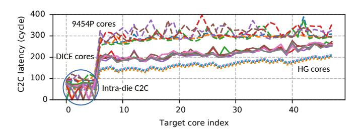

Fig. 12: Validation of DICE against AMD EPYC 9454P (8 CCDs × 6 cores): C2C max latency for all 6 cores within one representative CCD, measuring communication from each of these cores to every other of the 47 cores in the system. As shown, by modeling PHY dynamics, DICE (with default parameters) narrows the gap and more faithfully emulates the latency variability of the actual processor than HG.

TABLE V: RMSE comparison

<span id="page-9-5"></span><span id="page-9-4"></span>

|                                                          | ThreadRipper 3960X<br>8 CCDs × 3 cores |              | EPYC 7R13<br>6 CCDs × 8 cores |                   | EPYC 9454P<br>8 CCDs × 6 cores |                |
|----------------------------------------------------------|----------------------------------------|--------------|-------------------------------|-------------------|--------------------------------|----------------|
|                                                          | Avg                                    | RMSE         | Avg                           | RMSE              | Avg                            | RMSE           |
| HG                                                       | 158.8                                  | 36.6 (19.1%) | 180.5                         | 39.9 (18.9%)      | 152.6                          | 100.4 (40.5%)  |
| DICE                                                     | 186.8                                  | 17.1 (8.9%)  | 205.4                         | 24.9 (11.8%)      | 177.8                          | 73.9 (29.8%)   |
| L                                                        | 20dB                                   | □ 25dB □     | 30dB                          | 35dB              | 40dB                           | 45dB           |
| 10 <sup>-2</sup><br>10 <sup>-4</sup><br>10 <sup>-6</sup> |                                        |              |                               |                   |                                |                |
| pc                                                       | bis                                    | cc leela mot | nnet. IU                      | ocean radix radio | · VOIL· W                      | ns. sc KSBe.ME |

Fig. 13: Pre-FEC FER based on varied SNR<sub>base</sub>.

<span id="page-9-6"></span>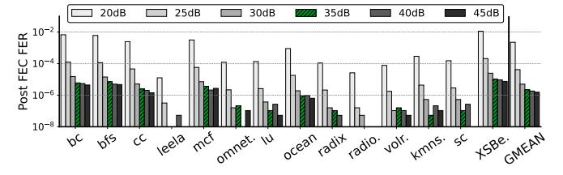

Fig. 14: Post-FEC FER based on varied SNR<sub>base</sub>.

(SNR<sub>base</sub>) with jitter and crosstalk via Equation 5. While jitter and crosstalk are primarily determined by channel characteristics (*e.g.*, link frequency and distance between wires), SNR<sub>base</sub> drifts with runtime operating conditions (*e.g.*, thermal conditions). We next analyze SNR<sub>base</sub> to quantify its impact on data transmission reliability, and report the pre-FEC and post-FEC FER in Figure 13 and Figure 14.

From Figure 13 we can make 3 observations. 1) Communication-intensive applications such as bfs, cc, and XSBench suffer more from errors, as inter-chiplet communication occurs more frequently. 2) For each application, FER varies significantly with SNR<sub>base</sub>. At low SNR<sub>base</sub> values (20–25 dB), all workloads experience substantial pre-FEC errors. As SNR<sub>base</sub> increases, errors drop sharply, revealing a nonlinear relationship between channel quality and FER. 3) Beyond 35 dB, further increases in SNR<sub>base</sub> yield only marginal

<span id="page-9-2"></span><sup>&</sup>lt;sup>5</sup>Whether we normalize by the average (mean) or the RMS of the reference curve makes very little difference to our results.

<span id="page-9-3"></span><sup>&</sup>lt;sup>6</sup>Using publicly available C2C datasets prevents us from exploring maximum latency and restricts us to average latency.

<span id="page-10-0"></span>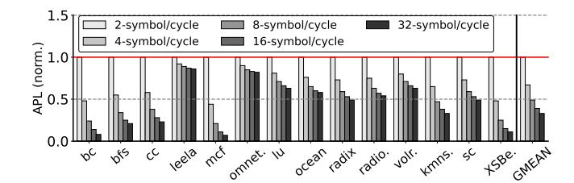

Fig. 15: Normalized avg packet latency across symbol rates.

<span id="page-10-1"></span>

Fig. 16: Normalized execution time across symbol rates.

improvement, suggesting 35 dB as a practical operating point. Figure 14 shows the post-FEC FER for different applications. In DICE, using FEC instead of relying solely on conventional error detection via CRC (e.g., in AMD's Infinity Fabric [59], Intel CXL [60], and a recent work of RXL [61]) allows most errors to be corrected online, leaving only post-FEC errors subject to retransmission. As shown in the figure, compared to Figure 13, DICE corrects on average 97.8% of the errors, leaving only 2.2% of the original errors for retransmission. This significantly reduces both runtime overhead and energy consumption, as flits are corrected in place rather than being resent.

3) Average packet latency and application runtime across inter-chiplet link bandwidth: We evaluate the impact of varying PHY link symbol rates (2-32 symbols/cycle) on overall application average packet latency (APL) and execution time (both are normalized to 2-symbol/cycle). As shown in Figure 15, as expected, increasing the link symbol rate substantially reduces average packet latency, with diminishing returns however beyond 16 symbols/cycle as serialization delay and queuing effects become less dominant. This latency improvement translates directly to higher application performance: in Figure 16, total execution time decreases consistently with higher symbol rates, particularly for communication-intensive workloads (e.g. bc, bfs, cc, mcf, and XSBench). Compute-bound programs (e.g., leela, radiosity) show marginal improvement, indicating limited sensitivity to inter-chiplet link bandwidth.

4) Average packet latency and application runtime across IOD router latency: A fundamental difference between CCD and IOD is that IOD is often manufactured in a less advanced technology node (e.g., 14 nm vs. 5 nm for the CCDs in the AMD EPYC 7002 series [3]). We next examine the effects of the IOD having different router latencies to mimic this technology gap, as a slower IOD router can backlog packets that travel cross chiplet boundaries and downgrade

<span id="page-10-2"></span>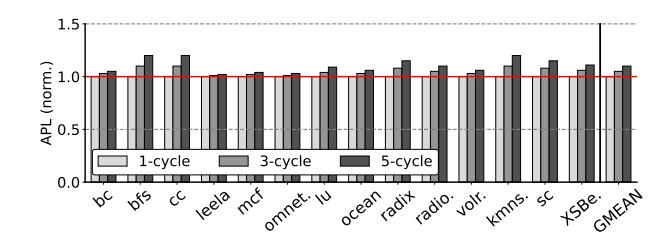

Fig. 17: Norm. avg packet latency across IOD link latency.

<span id="page-10-3"></span>

Fig. 18: Normalized execution time across IOD link latency.

application performance. Figure 17 and Figure 18 report normalized average packet latency and application execution time with varying the IOD router latency. We observe that, for compute-bound applications such as *leela* and *radio*, the IOD router latency has only a minor effect on both average packet latency and application runtime. This is because the amount of traffic these applications send through the IOD is relatively small compared to communication-intense applications. As a result, increasing the IOD router latency only delays a small fraction of packets and thus has limited impact on overall performance. In contrast, for benchmarks with more intensive inter-chiplet communication, such as bfs, cc, IOD router latency variation results in more pronounced performance degradation.

5) Global vs. Local LLC: Finally, to demonstrate the value of DICE in architectural-level studies, we evaluate the trade-offs of sharing the LLC across chiplets. In essence, a chiplet-based processor behaves like a miniature NUMA system, creating opportunities to explore trade-offs among coherence scope, interconnect complexity, and scalability. For example, AMD EPYC does not maintain cross-CCD coherence [3]; each chiplet's LLC is private rather than globally shared—a choice simplifies design/test and preserves modularity. On the other hand, architectures such as Intel's Sapphire Rapids [62] and AMD's 3D V-Cache [63] employ a globally shared LLC.

To facilitate comparative analysis of these designs, DICE provides a configurable scope to switch between globally-shared LLC (GS) and locally-shared LLC (LS), allowing a systematic exploration of chiplet performance and associated design trade-offs. Figure 19 and Figure 20 show the effects on packet latency and performance respectively, of globally-or locally sharing the LLC for *multi-programmed workloads* (one copy of each benchmark is run on every chiplet). Multi-threaded workloads are beyond the scope of this paper as the coherence effects of locally or globally sharing the LLC warrant a separate study as evidenced in other similar

<span id="page-11-1"></span>

Fig. 19: Normalized APL in global- vs. local-shared LLC.

<span id="page-11-2"></span>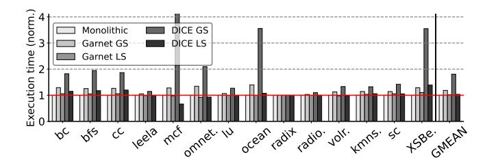

Fig. 20: Normalized exe. time in global- vs. local-shared LLC.

work [63], [64]. As is evident, a GS LLC introduces higher packet latency for both DICE and HG. The discrepancy between DICE and HG varies significantly between benchmarks with the resulting DICE GS performance being less than the monolithic and HG cases. In contrast, both packet latency and performance with an LS LLC are comparable to the monolithic case, and for some benchmarks better because of the smaller, hence faster, on-die chiplet network.

# C. DICE gem5 runtime overhead

To better understand the runtime overhead of DICE, we profile gem5 using Linux perf\_event following a methodology presented at the gem5 Workshop at ISCA'25 [65]. Profiling runs in a separate process and is non-intrusive, ensuring that it does not perturb gem5's execution time.

Figure 21 presents the normalized gem5 runtime breakdown at 35 dB SNR<sub>base</sub>, showing the percentage of execution time spent in the Out-of-Order Core and Memory (Ruby)—which together correspond to the runtime of HG—as well as the additional DICE components, including error injection (Err-In), FEC encoding (Encode), and FEC decoding (Decode). Across all benchmarks, DICE introduces limited overhead (0.3-26.1%, averaging 9.2%), depending on the application and the amount of inter-chiplet traffic, demonstrating an effective balance between detailed inter-chiplet PHY-link modeling and simulation efficiency.

We further observe that the majority of overhead in DICE is attributed to the layered Min-Sum FEC decoding (Section III-G), which computes iteration-based signal confidence. While this is necessary to reflect hardware-level decoding dynamics, *memoization* can be employed, as a future optimization, to cache previously seen symbol patterns and bypass redundant iterative LLR computations, thus significantly reducing FEC decoding overhead.

<span id="page-11-3"></span>

Fig. 21: gem5 runtime breakdown, where Core+Ruby corresponds to HeteroGarnet, and the additional overhead introduced by DICE is highlighted in shades of red.

# <span id="page-11-0"></span>D. Architectural relevance

Our motivation for DICE parallels the justification for detailed DRAM-system simulators where the key point is not that average memory latency and bandwidth are unknown; it is that a static "latency + bandwidth" abstraction is too coarse to predict performance. This is because the performance-relevant quantity is the dynamic interaction between 1) the workload's access/communication pattern and 2) the microarchitectural mechanisms that schedule, queue, overlap, and serialize those events [66]. This interaction produces high run-time variability in effective memory service times, and it is precisely that *variability*, rather than a single *mean*, that drives stalls, contention, and an increase in critical-paths [66].

DICE's relevance to OoO microarchitecture. Chiplet-based systems create a similar situation for core-to-core or core-to-IOD communication where data transfers experience latency and variability that can be comparable to DRAM. As a result, treating inter-chiplet communication as a fixed constant has the same failure mode as constant DRAM models—it erases the variability that determines when (or how) latency affects performance.

More specifically, modern OoO cores can tolerate a bounded amount of load/store latency through memory-level parallelism, speculation, and overlap. When a latency stays below this "absorbable" region, it may be largely hidden; when it exceeds it, it becomes increasingly visible as pipeline stalls, ROB and LSQ pressure, and exposed dependence stalls. This is best explained by the first order models of Karkhanis and Smith [67], and Eyerman et al. [68]. A constantlatency model therefore forces an inaccurate outcome: If the chosen constant is "low enough," the simulation ignores the performance impact (because OoO hides it). If the chosen constant is "high," the simulation yields a systematic, uniform slowdown. In both cases, it fails to capture latency variability and worst-case scenarios, resulting in simulation inaccuracies. This is corroborated by what we observe with DICE. Figure 22 shows 1) sampled flit latencies for cross-chiplet loads in bfs collected every 50,000 cross-chiplet flits (35 dB SNR<sub>base</sub>), 2) the corresponding latency histogram, and 3) the impact of DICE on performance for bfs and two other high-MPKI benchmarks, bc and cc.

We can observe that the performance gap between DICE and HG cannot be justified by the meager difference in their average-latency shown in Figure 22a ( $\approx$ 6 cycles: 32.99 for

<span id="page-12-0"></span>

HG+

bc bfs

DICE

cc GMEAN

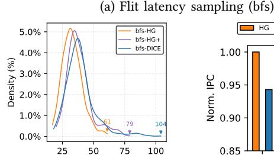


Fig. 22: HG, HG+, and DICE: Latency variability and resulting IPC for 3 high-MPKI workloads. *Note*: In bc, HG+ induces long backlogs that ultimately lead to simulation failure.

<span id="page-12-1"></span>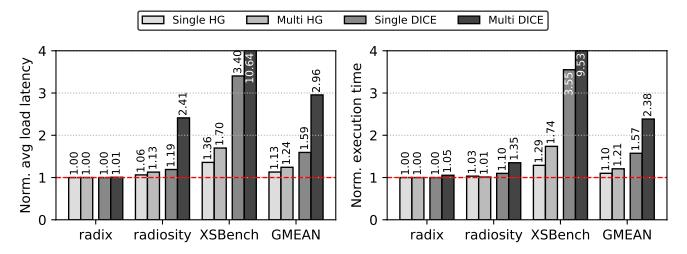

Fig. 23: Single- vs. multi-threaded: Load latency (left) and application execution time (right), normalized to Monolithic.

DICE vs. 39.26 for HG), but rather is a result of the large difference of the tail latencies (61 cycles for HG vs. 104 cycles for DICE). Further, statically increasing HG's cross-chiplet link-cycle (denoted bfs-HG+, reaching an average-latency of 38.25 cycles) to match DICE's average-latency affects application performance only to a limited extent (Figure 22c), as it aligns the average but still leaves a substantial gap in the long-tail (Figure 22b). Further, such adjustments also vary across applications, rendering the tuning process inherently ad hoc. In some cases (e.g., bc), HG+ induces severe request backlogs and can even cause simulation failure. Overall, these results show that, for OoO microarchitecture, HG/HG+ with constant link-latency are insufficient to reproduce DICE.

# DICE's relevance to coherence and synchronization. In the same vein, for coherence traffic that gates lock transfers, barriers, hand-offs, and producer-consumer relationships, tail latency becomes even more critical because forward progress is determined by the slowest coherence transaction on the synchronization path. Small changes in the latency of lock release/acquire can produce disproportionate end-to-end effects, as hand-off latency repeats many times

(serialized) and stretches the serial fraction of execution, which disproportionally affects performance (Amdahl's Law). Prior work has indeed shown the sensitivity of lock performance to packet latency and backoff behavior [69]; that same sensitivity becomes more acute when coherence messages traverse inter-chiplet links whose delay is both higher and more variable than on-die.

To highlight DICE's impact on multi-threaded programs, we run three benchmarks: radix, a lightly synchronized workload [52]; radiosity, a synchronization-intensive workload [52]; and XSBench, a heavily synchronized workload with a large memory footprint [54]. We use 4 CCDs  $\times$  8 cores (32 cores total) with a globally shared LLC, which, as shown in Figure 19, can significantly affect average packet latency. In Figure 23, the right graph juxtaposes the increase in execution time for the single-threaded and multi-threaded versions of these benchmarks, for HG and DICE (all normalized to Monolithic). The left graph shows the corresponding increases in load latency. As the figure shows, both execution time and average load latency increase sharply in the multithreaded case, with the magnitude of the increase depending on 1) the benchmark's synchronization and memory intensity, increasing from radix to XSBench, and 2) the fidelity of the interconnect model, increasing from HG to DICE. For the multi-threaded XSBench under DICE, execution time rises to 9.53× that of Monolithic, versus 3.55× for the single-threaded case, while under HG, the corresponding slowdowns are only 1.74× (multi-) and 1.29× (single-threaded).

**Takeaway.** Accurate chiplet-communication modeling is essential for studies of OoO cores, cache coherence, and synchronization. Because its effects are strongly workload dependent, a "constant" latency proxy is unreliable. The largest impact appears in workloads with long dependent-load chains and little latency tolerance, and in coherence/synchronization-heavy kernels, where latency variability can trigger an inordinate number of stalls on relatively few critical long-latency messages.

# V. Conclusion

In this work, we show that PHY-level behavior introduces meaningful variability in both packet timing and overall system performance. To address this gap, we propose DICE, which integrates calibrated, runtime-accurate PHY modeling into gem5. Through extensive evaluation, we demonstrate that realistic PHY dynamics reshape packet-delay distributions and shift system-level metrics such as IPC by up to 27.6%. Our analysis further reveals that packet variability and long-tail delays—rather than average latency—play a critical role in system performance. These effects are difficult to capture with prior simulators that rely on constant link-latency models, highlighting the importance of PHY-accurate modeling for faithful chiplet-system design exploration.

# Acknowledgments

This work is supported by the Swedish Research Council (VR) starting grant number 2025-04436, by the VR grant

2022-04959, and by the Swedish Foundation for Strategic Research (SSF) grant FUS21-0067. We acknowledge the use of computing resources provided by the National Academic Infrastructure for Supercomputing in Sweden (NAISS) under project numbers NAISS 2024/6-189 and NAISS 2025/2-430.

#### REFERENCES

- <span id="page-13-0"></span> A. Smith, G. H. Loh, S. Naffziger, J. Wuu, N. Kalyanasundharam, E. Chapman, R. Swaminathan, T. Huang, W. Jung, A. Kaganov, H. McIntyre, and R. Mangaser, "Interconnect Design for Heterogeneous Integration of Chiplets in the AMD Instinct MI300X Accelerator," *IEEE Micro*, vol. 45, no. 1, pp. 57–66, 2025.
- <span id="page-13-1"></span>[2] P. Fotouhi, S. Werner, J. Lowe-Power, and S. J. B. Yoo, "Enabling Scalable Chiplet-Based Uniform Memory Architectures with Silicon Photonics," in *International Symposium on Memory Systems (MemSys)*, (New York, NY, USA), p. 222–334, Association for Computing Machinery, 2019.
- <span id="page-13-2"></span>[3] S. Naffziger, N. Beck, T. Burd, K. Lepak, G. H. Loh, M. Subramony, and S. White, "Pioneering Chiplet Technology and Design for the AMD EPYC and Ryzen Processor Families: Industrial Product," in *International Symposium on Computer Architecture (ISCA)*, pp. 57–70, 2021.
- <span id="page-13-3"></span>[4] P. Coudrain, J. Charbonnier, A. Garnier, P. Vivet, R. Vélard, A. Vinci, F. Ponthenier, A. Farcy, R. Segaud, P. Chausse, L. Arnaud, D. Lattard, E. Guthmuller, G. Romano, A. Gueugnot, F. Berger, J. Beltritti, T. Mourier, M. Gottardi, S. Minoret, C. Ribière, G. Romero, P.-E. Philip, Y. Exbrayat, D. Scevola, D. Campos, M. Argoud, N. Allouti, R. Eleoute, C. Fuguet Tortolero, C. Aumont, D. Dutoit, C. Legalland, J. Michailos, S. Chéramy, and G. Simon, "Active Interposer Technology for Chiplet-Based Advanced 3D System Architectures," in IEEE Electronic Components and Technology Conference (ECTC), pp. 569–578, 2019.
- <span id="page-13-4"></span>[5] G. A. Chacon, C. Williams, J. Knechtel, O. Sinanoglu, P. V. Gratz, and V. Soteriou, "Coherence Attacks and Countermeasures in Interposer-Based Chiplet Systems," ACM Transactions on Architecture and Code Optimization (TACO), vol. 21, no. 2, 2024.
- <span id="page-13-5"></span>[6] R. Bhargava and K. Troester, "AMD Next-Generation "Zen 4" Core and 4th Gen AMD EPYC Server CPUs," *IEEE Micro*, vol. 44, no. 3, pp. 8–17, 2024.
- <span id="page-13-6"></span>[7] D. Kehlet, "Accelerating Innovation Through a Standard Chiplet Interface: The Advanced Interface Bus (AIB)," white paper, Intel Corporation, 2017.
- <span id="page-13-7"></span>[8] D. Das Sharma, G. Pasdast, Z. Qian, and K. Aygun, "Universal Chiplet Interconnect Express (UCIe): An Open Industry Standard for Innovations With Chiplets at Package Level," *IEEE Transactions on Components, Packaging and Manufacturing Technology (TCPMT)*, vol. 12, no. 9, pp. 1423–1431, 2022.
- <span id="page-13-8"></span>[9] Z. Wu and J.-R. Guo, "Analysis of UCIe 48/64 GT/s Electrical Links," IEEE Open Journal of the Solid-State Circuits Society, pp. 1-1, 2025.
- <span id="page-13-10"></span>[10] IEEE Heterogeneous Integration Roadmap Technical Working Group, "Chapter 2: High Performance Computing (HPC)," in IEEE Heterogeneous Integration Roadmap (HIR) 2024 Edition, IEEE Electronics Packaging Society, 2021.
- <span id="page-13-9"></span>[11] A. Tarde, "The Road to 64G UCIe IP: What Designers Need to Know," Oct. 2025. Synopsys. https://www.synopsys.com/articles/ucie-3-0-64gbps-challenges.html.
- <span id="page-13-11"></span>[12] S. Bharadwaj, J. Yin, B. Beckmann, and T. Krishna, "Kite: A Family of Heterogeneous Interposer Topologies Enabled via Accurate Interconnect Modeling," in *Design Automation Conference (DAC)*, pp. 1–6, 2020.
- <span id="page-13-12"></span>[13] J. Lowe-Power, A. M. Ahmad, A. Akram, M. Alian, R. Amslinger, M. Andreozzi, A. Armejach, N. Asmussen, S. Bharadwaj, G. Black, G. Bloom, B. R. Bruce, D. R. Carvalho, J. Castrillón, L. Chen, N. Derumigny, S. Diestelhorst, W. Elsasser, M. Fariborz, A. F. Farahani, P. Fotouhi, R. Gambord, J. Gandhi, D. Gope, T. Grass, B. Hanindhito, A. Hansson, S. Haria, A. Harris, T. Hayes, A. Herrera, M. Horsnell, S. A. R. Jafri, R. Jagtap, H. Jang, R. Jeyapaul, T. M. Jones, M. Jung, S. Kannoth, H. Khaleghzadeh, Y. Kodama, T. Krishna, T. Marinelli, C. Menard, A. Mondelli, T. Mück, O. Naji, K. Nathella, H. Nguyen, N. Nikoleris, L. E. Olson, M. S. Orr, B. Pham, P. Prieto, T. Reddy, A. Roelke, M. Samani, A. Sandberg, J. Setoain, B. Shingarov, M. D. Sinclair, T. Ta, R. Thakur, G. Travaglini, M. Upton, N. Vaish, I. Vougioukas, Z. Wang, N. Wehn, C. Weis, D. A. Wood, H. Yoon, and É. F. Zulian, "The gem5 Simulator: Version 20.0+," CoRR, vol. abs/2007.03152, 2020.

- <span id="page-13-13"></span>[14] J. G. Proakis and M. Salehi, Digital Communications. McGraw-Hill, 5 ed., 2007.
- <span id="page-13-14"></span>[15] S. Myung, K. Yang, and J. Kim, "Quasi-Cyclic LDPC Codes for Fast Encoding," *IEEE Transactions on Information Theory*, vol. 51, no. 8, pp. 2894–2901, 2005.
- <span id="page-13-15"></span>[16] K. Zhao, W. Zhao, H. Sun, X. Zhang, N. Zheng, and T. Zhang, "LDPC-in-SSD: Making Advanced Error Correction Codes Work Effectively in Solid State Drives," in *USENIX Conference on File and Storage Technologies (FAST)*, pp. 243–256, 2013.
- <span id="page-13-16"></span>[17] PCI-SIG, "The PCIe 6.0 Specification Webinar Q&A: Error Detection and Correction (FEC)," 2021.
- <span id="page-13-17"></span>[18] R. Gallager, "Low-Density Parity-Check Codes," IRE Transactions on information theory, vol. 8, no. 1, pp. 21–28, 2003.
- <span id="page-13-18"></span>[19] N. Agarwal, T. Krishna, L.-S. Peh, and N. K. Jha, "GARNET: A Detailed On-Chip Network Model Inside a Full-System Simulator," in IEEE International Symposium on Performance Analysis of Systems and Software (ISPASS), pp. 33–42, IEEE, 2009.
- <span id="page-13-20"></span>[20] T. E. Carlson, W. Heirman, and L. Eeckhout, "Sniper: Exploring the Level of Abstraction for Scalable and Accurate Parallel Multi-Core Simulation (SC)," in *International Conference for High Performance* Computing, Networking, Storage and Analysis (SC), pp. 1–12, 2011.
- <span id="page-13-21"></span>[21] M. Lis, K. S. Shim, M. H. Cho, P. Ren, O. Khan, and S. Devadas, "DARSIM: A Parallel Cycle-Level NoC Simulator," in *Annual Workshop on Modeling, Benchmarking and Simulation*, 2010.
- <span id="page-13-22"></span>[22] N. Jiang, D. U. Becker, G. Michelogiannakis, J. Balfour, B. Towles, D. E. Shaw, J. Kim, and W. J. Dally, "A Detailed and Flexible Cycle-Accurate Network-on-Chip Simulator," in *IEEE International Symposium* on Performance Analysis of Systems and Software (ISPASS), pp. 86–96, 2013.
- <span id="page-13-23"></span>[23] V. Catania, A. Mineo, S. Monteleone, M. Palesi, and D. Patti, "Noxim: An Open, Extensible and Cycle-Accurate Network on Chip Simulator," in *IEEE International Conference on Application-Specific Systems, Architectures and Processors (ASAP)*, pp. 162–163, IEEE, 2015.
- <span id="page-13-24"></span>[24] M. Orenes-Vera, E. Tureci, M. Martonosi, and D. Wentzlaff, "Muchisim: A Simulation Framework for Design Exploration of Multi-Chip Manycore Systems," in *International Symposium on Performance Analysis of Systems and Software (ISPASS)*, 2024.
- <span id="page-13-25"></span>[25] P. Strikos, A. Ejaz, and I. Sourdis, "BZSim: Fast, Large-Scale Microarchitectural Simulation with Detailed Interconnect Modeling," in IEEE International Symposium on Performance Analysis of Systems and Software (ISPASS), pp. 167–178, IEEE, 2024.
- <span id="page-13-26"></span>[26] Y. Feng, Y. Wei, D. Xiang, and K. Ma, "Evaluating Chiplet-based Large-Scale Interconnection Networks via Cycle-Accurate Packet-Parallel Simulation," in USENIX Annual Technical Conference (ATC), (Santa Clara, CA), pp. 731–747, USENIX Association, July 2024.
- <span id="page-13-19"></span>[27] P. Iff, B. Bruggmann, B. Morel, M. Besta, L. Benini, and T. Hoefler, "RapidChiplet: A Toolchain for Rapid Design Space Exploration of Inter-Chiplet Interconnects," in ACM International Conference on Computing Frontiers (CF), CF '25, (New York, NY, USA), p. 168–171, Association for Computing Machinery, 2025.
- <span id="page-13-27"></span>[28] P. Koopman, "32-bit Cyclic Redundancy Codes for Internet Applications," in *International Conference on Dependable Systems and Networks* (DSN), pp. 459–468, 2002.
- <span id="page-13-28"></span>[29] T. Richardson and R. Urbanke, Modern Coding Theory. Cambridge University Press, 2008.
- <span id="page-13-29"></span>[30] Q. Li, Y. Chen, G. Wu, Y. Du, M. Ye, X. Gan, J. Zhang, Z. Shen, J. Shu, and C. Xue, "Characterizing and Optimizing LDPC Performance on 3D NAND Flash Memories," ACM Transactions on Architecture and Code Optimization (TACO), vol. 21, no. 3, 2024.
- <span id="page-13-30"></span>[31] D. R. Stauffer, S. Mirabbasi, and M. Zargari, High-Speed SerDes Devices and Applications. Cham, Switzerland: Springer, 2018.
- <span id="page-13-31"></span>[32] Texas Instruments, "Clocking for PCIe Applications." https://www.ti. com/lit/an/snaa386/snaa386.pdf, 2023. Application Report SNAA386.
- <span id="page-13-32"></span>[33] S. Chandrakar, D. Gupta, M. K. Majumder, and B. K. Kaushik, "Performance Analysis of Bump in Tapered TSV: Impact on Crosstalk and Power Loss," *IEEE Open Journal of Nanotechnology*, vol. 3, pp. 227–235, 2022.
- <span id="page-13-33"></span>[34] J. Gu, J. Ma, A. Ahmed Chowdhury, J. Guo, X. Zhang, J. Ding, H. Wang, and K. Chang, "A 32 Gb/s 0.36 pJ/bit 3 nm Chiplet IO Using 2.5-D CoWoS Package With Real-Time and Per-Lane CDR and Bathtub Monitoring," *IEEE Journal of Solid-State Circuits (JSSC)*, vol. 60, no. 4, pp. 1289–1298, 2025.

- <span id="page-14-0"></span>[35] B. G. Lee, N. Nedovic, T. H. Greer, and C. T. Gray, "Beyond CPO: A Motivation and Approach for Bringing Optics Onto the Silicon Interposer," *Journal of Lightwave Technology*, vol. 41, no. 4, pp. 1152– 1162, 2023.
- <span id="page-14-1"></span>[36] M. Talegaonkar, R. Inti, and P. K. Hanumolu, "Digital Clock and Data Recovery Circuit Design: Challenges and Tradeoffs," in *IEEE Custom Integrated Circuits Conference (CICC)*, pp. 1–8, 2011.
- [37] A. Carusone, "An Equalizer Adaptation Algorithm to Reduce Jitter in Binary Receivers," *IEEE Transactions on Circuits and Systems II: Express Briefs*, vol. 53, no. 9, pp. 807–811, 2006.
- <span id="page-14-2"></span>[38] M. Oveisi and P. Heydari, "A Study of BER and EVM Degradation in Digital Modulation Schemes Due to PLL Jitter and Communication-Link Noise," *IEEE Transactions on Circuits and Systems I: Regular Papers*, vol. 69, no. 8, pp. 3402–3415, 2022.
- <span id="page-14-3"></span>[39] H. Kim, S. Lee, K. Song, Y. Shin, D. Park, J. Park, J. Cho, and S. Ahn, "A Novel Interposer Channel Structure with Vertical Tabbed Vias to Reduce Far-End Crosstalk for Next-Generation High-Bandwidth Memory," Micromachines, vol. 13, no. 7, p. 1070, 2022.
- <span id="page-14-4"></span>[40] PCI-SIG, "Seamless Transition to PCIe 5.0 Technology in System Implementations Webinar Q&A," 2021.
- <span id="page-14-5"></span>[41] K.-J. Lin, C.-M. Lin, and R.-B. Wu, "Optimized Signal and Power Integrity of Silicon Interposer for HBM2E in CoWoS Packaging," *IEEE Transactions on Signal and Power Integrity*, vol. 3, pp. 159–168, 2024.
- <span id="page-14-6"></span>[42] S. Li, M.-S. Lin, W.-C. Chen, and C.-C. Tsai, "High-Bandwidth Chiplet Interconnects for Advanced Packaging Technologies in AI/ML Applications: Challenges and Solutions," *IEEE Open Journal of the Solid-State Circuits Society*, vol. 4, pp. 351–364, 2024.
- <span id="page-14-7"></span>[43] T. Wang-Lee, "Achieving Better Chiplet Design Signal Integrity with UCIe," 2024. Post on the UCIe orgnization's official website. https://www.uciexpress.org/post/achieving-better-chiplet-designsignal-integrity-with-ucie.
- <span id="page-14-8"></span>[44] UCIe Consortium, "UCIe Electrical, Form-Factor, and Compliance," in Proceedings of the Hot Chips 2023 Tutorial Sessions, Aug. 2023.
- <span id="page-14-9"></span>[45] T. Shin, K. Kim, H. Park, B. Sim, S. Kim, J. Kim, S. Choi, J. Park, J. Song, J. Kim, J. W. Park, D. Kang, and J. Kim, "Signal Integrity Design and Analysis of Universal Chiplet Interconnect Express (UCIe) Channel in Silicon Interposer for Advanced Package," in *IEEE Electrical Design of Advanced Packaging and Systems (EDAPS)*, pp. 1–3, 2023.
- <span id="page-14-10"></span>[46] G. Caire, G. Taricco, and E. Biglieri, "Bit-Interleaved Coded Modulation," *IEEE Transactions on Information Theory*, vol. 44, no. 3, pp. 927– 946, 1998.
- <span id="page-14-11"></span>[47] D. Hocevar, "A Reduced Complexity Decoder Architecture via Layered Decoding of LDPC Codes," in *IEEE Workshop on Signal Processing Systems*, pp. 107–112, 2004.
- <span id="page-14-13"></span>[48] Universal Chiplet Interconnect Express (UCIe) Consortium, "UCIe Specification Revision 2.0," 2024.
- <span id="page-14-12"></span>[49] M. Yang, S. Shahramian, H. Wong, P. Krotnev, and A. C. Carusone, "Pre-FEC and Post-FEC BER as Criteria for Optimizing Wireline Transceivers," in *International Symposium on Circuits and Systems* (ISCAS), pp. 1–5, 2021.
- <span id="page-14-14"></span>[50] S. Beamer, K. Asanovic, and D. A. Patterson, "The GAP Benchmark Suite," CoRR, vol. abs/1508.03619, 2015.
- <span id="page-14-15"></span>[51] Standard Performance Evaluation Corporation (SPEC), "SPEC Benchmarks and Tools." https://www.spec.org/, 2017.
- <span id="page-14-16"></span>[52] E. J. Gómez-Hernández, J. M. Cebrian, S. Kaxiras, and A. Ros, "Splash-4: A Modern Benchmark Suite with Lock-Free Constructs," in *IEEE International Symposium on Workload Characterization (IISWC)*, pp. 51–64, 2022.
- <span id="page-14-17"></span>[53] S. Che, M. Boyer, J. Meng, D. Tarjan, J. W. Sheaffer, S.-H. Lee, and K. Skadron, "Rodinia: A Benchmark Suite for Heterogeneous Com-

- puting," in *IEEE International Symposium on Workload Characterization* (*IISWC*), pp. 44–54, 2009.
- <span id="page-14-18"></span>[54] C. R. Wilson, A. T. Evans, A. R. Siegel, and T. Islam, "XSBench: The Development and Verification of a Performance Abstraction for Monte Carlo Reactor Analysis," in PHYSOR: The Role of Reactor Physics Toward a Sustainable Future, 2014.
- <span id="page-14-19"></span>[55] N. Viennot, "Core-to-Core Latency Measurement Tool." https://github. com/nviennot/core-to-core-latency, 2026.
- <span id="page-14-20"></span>[56] A. Sharifi, E. Kultursay, M. Kandemir, and C. R. Das, "Addressing End-to-End Memory Access Latency in NoC-Based Multicores," in International Symposium on Microarchitecture (MICRO), pp. 294–304, 2012
- <span id="page-14-21"></span>[57] H. Farrokhbakht, H. Kao, K. Hasan, P. V. Gratz, T. Krishna, J. San Miguel, and N. E. Jerger, "Pitstop: Enabling a Virtual Network Free Network-on-Chip," in *International Symposium on High-*Performance Computer Architecture (HPCA), pp. 682–695, 2021.
- <span id="page-14-22"></span>[58] C.-H. Yu, J. Bae, J. Kim, H. Kim, W. Shin, J.-S. Yoon, Y.-J. Jin, J. Oh, J. Lee, E. Kim, et al., "A Quad-Chiplet AI SoC with Full-Chip Scalable Mesh Over 16Gb/s UCIe-Advanced Die-to-Die Interface for Large-Scale AI Inferencing," in IEEE International Solid-State Circuits Conference (ISSCC), 2026.
- <span id="page-14-23"></span>[59] N. Beck, S. White, M. Paraschou, and S. Naffziger, "Zeppelin: An SoC for Multichip Architectures," in *IEEE International Solid-State Circuits Conference (ISSCC)*, pp. 40–42, IEEE, 2018.
- <span id="page-14-24"></span>[60] CXL Consortium, "Compute Express Link (CXL) 3.1 Specification." https://computeexpresslink.org/cxl-specification/, 2023.
- <span id="page-14-25"></span>[61] G. Jung, S. Gorgin, J. Kim, and J. Kim, "Scaling Out Chip Interconnect Networks with Implicit Sequence Numbers," in *International Conference* for High Performance Computing, Networking, Storage and Analysis (SC), pp. 1240–1251, 2025.
- <span id="page-14-26"></span>[62] N. Nassif, A. O. Munch, C. L. Molnar, G. Pasdast, S. V. Lyer, Z. Yang, O. Mendoza, M. Huddart, S. Venkataraman, S. Kandula, R. Marom, A. M. Kern, W. J. Bowhill, D. R. Mulvihill, S. Nimmagadda, V. Kalidindi, J. Krause, M. M. Haq, R. Sharma, and K. Duda, "Sapphire Rapids: The Next-Generation Intel Xeon Scalable Processor," in *IEEE International Solid-State Circuits Conference (ISSCC)*, pp. 44–46, IEEE, 2022.
- <span id="page-14-27"></span>[63] M. Zhu, A. Shahab, A. Katsarakis, and B. Grot, "Invalidate or Update? Revisiting Coherence for Tomorrow's Cache Hierarchies," in *International Conference on Parallel Architectures and Compilation Techniques* (PACT), pp. 226-241, 2021.
- <span id="page-14-28"></span>[64] L. Cheng, J. B. Carter, and D. Dai, "An Adaptive Cache Coherence Protocol Optimized for Producer-Consumer Sharing," in *International Symposium on High Performance Computer Architecture (HPCA)*, pp. 328–339, 2007.
- <span id="page-14-29"></span>[65] J. Söderström, R. Aligholipour, and Y. Yao, "Anatomy of the gem5 Simulator." Presented at the gem5 Workshop at ISCA'25, 2025.
- <span id="page-14-30"></span>[66] S. Ghose, T. Li, N. Hajinazar, D. S. Cali, and O. Mutlu, "Demystifying Complex Workload-DRAM Interactions: An Experimental Study," Proceedings of the ACM on Measurement and Analysis of Computing Systems (SIGMETRICS), vol. 3, no. 3, pp. 1–50, 2019.
- <span id="page-14-31"></span>[67] T. S. Karkhanis and J. E. Smith, "A First-Order Superscalar Processor Model," in *International Symposium on Computer Architecture (ISCA)*, pp. 338–349, 2004.
- <span id="page-14-32"></span>[68] S. Eyerman, L. Eeckhout, T. Karkhanis, and J. E. Smith, "A Mechanistic Performance Model for Superscalar Out-of-Order Processors," ACM Transactions on Computer Systems (TOCS), vol. 27, no. 2, pp. 1–37, 2009.
- <span id="page-14-33"></span>[69] A. Ros and S. Kaxiras, "Callback: Efficient Synchronization without Invalidation with a Directory Just for Spin-Waiting," in *International Symposium on Computer Architecture (ISCA)*, pp. 427–438, 2015.