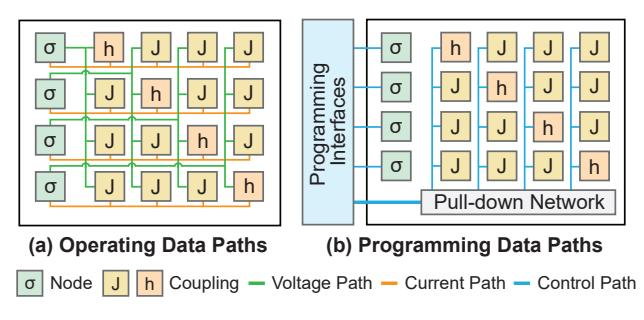
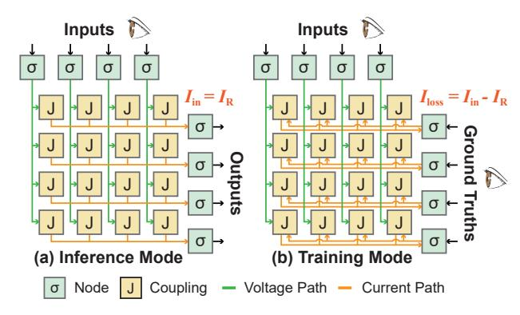
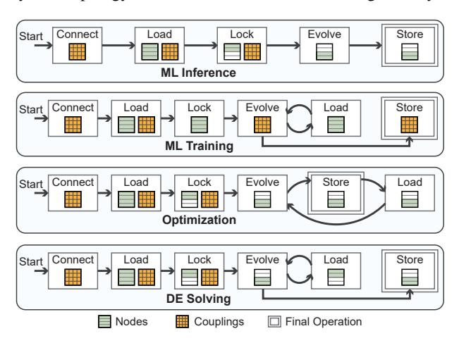
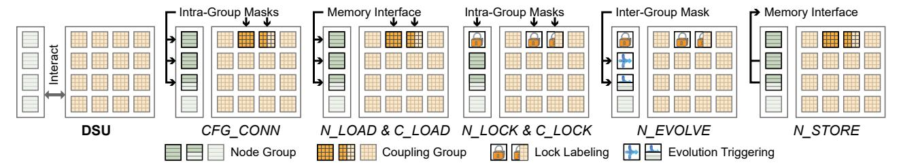
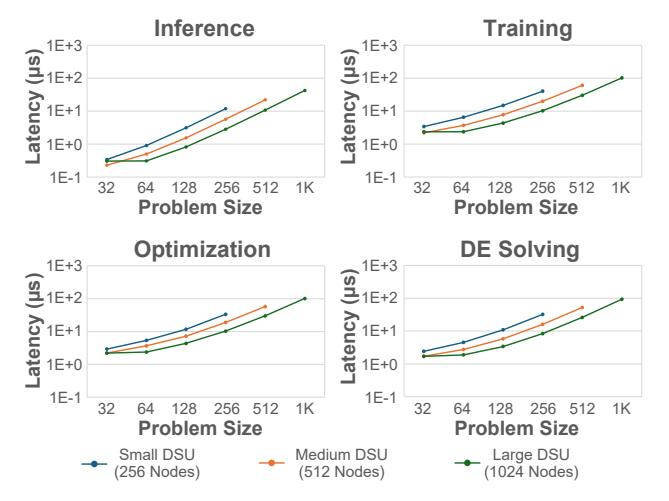
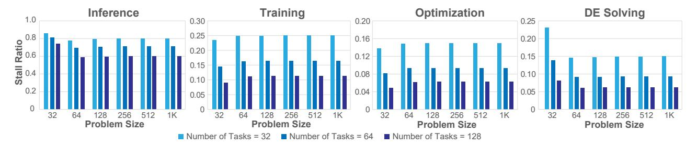

# DS-ISA: Instruction Set Architecture for Dynamical System Units

Chunshu Wu *PNNL* Richland, WA, USA chunshu.wu@pnnl.gov

Ruibing Song *Rice University* Houston, TX, USA rs307@rice.edu

Chuan Liu *Rice University* Houston, TX, USA cl320@rice.edu

Tong Geng *Rice University* Houston, TX, USA tg62@rice.edu

Ang Li *University of Washington* Seattle, WA, USA angli16@uw.edu

*Abstract*—Dynamical System Units (DSUs), leveraging CMOScompatible electronics and natural energy evolution, represent a promising post-Moore computing paradigm with potentially 105 energy-efficiency gains. However, the absence of standardized abstraction layers severely limits their programmability and broad adoption. In this paper, we present a fundamental effort to establish the first Instruction Set Architecture (ISA) for DSUs. This is achieved by comprehensively analyzing DSU execution patterns and fundamental functional operations across various application scenarios. Our analysis identifies a unified loadlock-evolve-store execution model. Based on this model, we propose a 9-instruction ISA that provides the desired abstraction and flexibility. Building on this ISA, we propose a supporting microarchitecture for DSU control. In particular, this work introduces a new group-based execution model and a two-level masking scheme to support effective resource sharing and unique execution patterns. By providing the ISA and the supporting microarchitecture, this work lays the foundation for constructing a software stack for DSUs.

### I. INTRODUCTION

As the exponential gains predicted by Moore's Law diminish, the growing demands of modern applications, especially in Machine Learning (ML) and scientific simulation, motivate the exploration of novel computing paradigms. A promising path is to employ dynamical systems as new processing units [30], implemented with CMOS-compatible electronics that operate at room temperature. In such a Dynamical System Unit (DSU), the physical system spontaneously evolves toward low-energy states within a specific energy landscape that embeds a targeted problem, and the resulting equilibrium represents nature's solution to this embedded problem, therefore enabling efficient computation without exotic materials or operating conditions. This paradigm has demonstrated substantial promise, typically delivering 103× speedup and 105× improvements in energy efficiency over conventional CPU/GPU-based systems across a range of critical application domains, such as ML [14], [16], [24], [29], [30], [36], [37], optimization [1], [26], and differential equation solving [15].

Despite the tremendous potential, the broad adoption of DSUs is hindered by the absence of standardized instruction abstraction layers. Current efforts to map application-level computational problems onto DSU hardware primarily rely on implementation-specific, ad-hoc methods, due to the lack of a well-defined programming model and a corresponding Instruction Set Architecture (ISA). A formal programming model is required to specify how developers interact with the DSU, including parameter configuration, execution initiation, and result retrieval. The corresponding ISA must then define the concrete hardware operations and states to implement the model. These abstraction layers are fundamental for enabling diverse DSU hardware designs and facilitating the development of essential software stacks like compilers and runtimes for DSUs and their integration into current computing systems.

However, the unique operating paradigm of a DSU requires a fundamentally distinct approach compared to conventional processors. Unlike CPUs or GPUs that execute discrete digital instructions [13], [31], [34], a DSU computes by leveraging the natural physical evolution of an interconnected analog system, guiding its continuous progression toward an equilibrium state. Controlling such a system is non-trivial, as it requires defining the overall behavior of nodes (variables) and couplings (variable interaction strength) while managing complex mechanisms such as synchronous evolution control and dynamic reconfiguration. Consequently, traditional abstractions based on sequential data manipulation are inadequate for programming DSUs, revealing the research gap of missing abstraction layers specifically designed for this unique computational paradigm. As Figure 1 illustrates, our goal in this work is to bridge traditional processors and DSUs via the design of an ISA and its associated digital control.

We begin by analyzing common operating patterns across diverse DSU applications, drawing from existing literature while also considering potential future use cases, to establish a foundation applicable to a wide range of current and anticipated workloads. This analysis highlights recurring essential tasks necessary to program DSUs: (1) dynamically configuring system connectivity for resource allocation, (2) loading initial states and parameters into components, (3) locking components to fixed values, (4) managing the synchronous, collective evolution, and (5) retrieving results from the system. Synthesizing these requirements, we propose a unified loadlock-evolve-store execution model with connection reconfigurability. Rather than forming a fixed linear pipeline, this model defines composable phases that can be arranged flexibly, supporting workflows ranging from simple sequential ML inference to complex iterative loops for training and multi-step simulations. Based on this model, we design a minimalist 9 instruction ISA that provides specific commands to configure topology, load/store analog states, lock boundary components, and trigger collective evolution, thereby fully addressing the identified control requirements.

Fig. 1. Overview and scope declaration of DS-Control & ISA (This work).

Additionally, the unique usage scenarios of DSUs impose specific challenges on their microarchitecture. (1) The potentially vast number of nodes and couplings required for modern ML tasks introduces significant control complexity. (2) Computational correctness for a variety of applications demands that the evolution of all participating nodes or couplings be executed synchronously. (3) Advanced workloads require support for multiple dynamical system instances, requiring mechanisms for co-evolution with dependency (e.g., multilayer ML inference) and concurrent execution of independent tasks to maximize DSU utilization. (4) Fine-grained partial configurability is necessary to support applications like ML model fine-tuning.

To satisfy these demands, we first draw inspiration from GPUs and organize nodes and couplings into **groups**, such that a single instruction operates on all elements within a group synchronously in lockstep. We further employ a two-level masking scheme: **inter-group masks** to manage synchronous evolution, and **intra-group masks** to selectively target individual elements for fine-grained partition and configuration.

By addressing these challenges, the critical gap between high-level applications and physical hardware is bridged, establishing the foundation for software stacks above and enabling standardized DSU implementations below, ultimately unlocking the DSU's orders-of-magnitude efficiency gains for a broad range of applications.

In this paper, we make the following key contributions:

- We perform an analysis of DSU applications, identifying essential programming tasks and proposing a unified loadlock-evolve-store execution model with connection reconfigurability to structure DSU computation.
- 2) Based on this model, we design a minimalist, yet comprehensive, 9-instruction ISA specifically tailored for DSUs, providing commands to manage both nodes and couplings through the defined execution phases.
- 3) We propose a microarchitecture that efficiently controls the ISA and interfaces with the DSU. This controller utilizes group-based synchronous execution and a two-level masking scheme to handle control complexity, synchronization, and fine-grained manipulation challenges inherent in managing the DSU.
- 4) Experimental results demonstrate that the proposed controller, operating at 4.6 Watts, efficiently orchestrates the full ISA for 1K nodes and 1M couplings across four representative applications.

#### II. BACKGROUND

#### A. Dynamical System Unit

**Physical Origin and Extension.** The conceptual foundation of DSUs lies in statistical physics, specifically, the Ising model [10]. Originally proposed to study ferromagnetism, the Ising model is extended to describe a system of globally interacting binary spins  $(\sigma_i \in \{-1, +1\})$  governed by an energy function, or Hamiltonian:

$$\mathcal{H}_{\text{Ising}} = -\sum_{i \neq j}^{N} J_{ij} \sigma_i \sigma_j - \sum_{i}^{N} h_i \sigma_i \tag{1}$$

Here,  $J_{ij}$  represents the coupling strength between spins  $\sigma_i$ and  $\sigma_i$ , describing how the interaction of the two spins contributes to the system's energy. The term  $h_i$  represents the external magnetic field acting on spin  $\sigma_i$ , corresponding to a bias applied on the spin toward a particular orientation independent of other spins. Physical implementations, known as Ising machines, aim to find the lowest energy state of this Hamiltonian, which often corresponds to the solution of complex combinatorial optimization problems mapped onto the model. Various technologies have been explored for realizing Ising machines, including quantum annealers [7], optical systems [9], [18], [39], and coupled oscillators [17] utilizing phase dynamics. Within the realm of CMOS-compatible approaches, BRIM [1] provides a particularly practical foundation - it represents spins as node values in voltage and implements the Hamiltonian parameters  $(J_{ij}, h_i)$  as coupling values in conductance. This approach offers a direct correspondence between the mathematical model and controllable hardware components, creating an accessible and readily extendable foundation for DSU development discussed in this work.

However, the binary nature of the Ising model ( $\sigma_i \in \{-1, +1\}$ ) limits its applicability to many modern computational tasks, particularly in AI and scientific computing, which inherently involve real-valued data. To address this limitation, building upon the practical CMOS foundation, the Hamiltonian was extended to support continuous variables. A key adaptation involves replacing the linear self-interaction term with a quadratic one, resulting in a Hamiltonian suitable for real-valued nodes:

$$\mathcal{H}_{DS} = -\sum_{i \neq j}^{N} J_{ij} \sigma_i \sigma_j + \frac{1}{2} \sum_{i}^{N} h_i \sigma_i^2$$
 (2)

In this formulation, the quadratic term  $h_i\sigma_i^2$  acts as an energy regulator, with  $h_i$  being the self-coupling strength. It prevents the system energy from diverging, allowing node values  $\sigma_i$  to stabilize at meaningful real-valued equilibrium points rather than saturating at boundaries. This extension enabled DSUs to be applied to a wide range of computationally intensive tasks, including graph learning [30], [37], on-device training [14], [36], Differential Equation (DE) solving [15], and large language model acceleration [29].

**DSU Operating Dynamics.** The DSU's operation is governed by its internal dynamics, which can be primarily divided

Fig. 2. General structure and datapath overview of DSU. Self-coupling h are on the diagonal line. The programming interfaces are the focus of this work.

into two modes: node evolution for computation (or inference) and coupling evolution for on-device configuration adaptation (or training). The abstracted node-coupling interconnect is shown in Figure 2(a).

The node evolution mode is the DSU's primary computational mechanism, leveraging natural evolution to find low-energy solutions. Based on the Hamiltonian  $\mathcal{H}_{\rm DS}$ , the system's dynamics are designed to guarantee convergence by ensuring the total energy spontaneously decreases over time  $(d\mathcal{H}_{\rm DS}/dt \leq 0).$  This is achieved by setting the node dynamics to follow the negative gradient of the Hamiltonian, such as  $d\sigma_i/dt \propto -\partial\mathcal{H}_{\rm DS}/\partial\sigma_i.$  This relation results in the following electrodynamic behavior:

$$\frac{d\sigma_i}{dt} \propto \sum_{j \neq i}^{N} (J_{ij} + J_{ji})\sigma_j - h_i \sigma_i \tag{3}$$

Intuitively, the right-hand side is in the form of an electric current that drives the voltage change to the left. During this process, the coupling parameters  $(J_{ij}, h_i)$  are held constant, and the node values  $\sigma_i$  naturally evolve to find the solution.

Following the BRIM convention [1], CMOS-based DSU implementations represent node states as voltages stored on capacitors, while the coupling parameters  $(J_{ij}, h_i)$  are implemented as programmable conductances. In this realization, currents flowing through the conductive couplings charge or discharge the node capacitors, causing the node voltages to evolve according to the interaction currents described in Equation 3. The evolution speed is therefore determined by circuit parameters such as node capacitance and coupling conductance, making the DSU dynamics a continuous-time process governed by the underlying analog circuit behavior. Recent work [36] has introduced a coupling evolution mode in DSUs to support parameter adaptation for on-device training. In this mode, the operating pattern is reversed: the node values are locked (e.g., clamped to ground-truth training data), while the coupling parameters are allowed to evolve. This mechanism is conceptually depicted in Figure 3 and compared with the inference data flow.

Note that a DSU generally consists of a set of N nodes and  $N^2$  programmable couplings. The examples in Figure 3 aim to show logical connection between input nodes and output

Fig. 3. Example DSU implementations for inference and training using the Electric-Current Loss method. Self-couplings are omitted for clarity.

nodes in a compact manner, without showing all couplings. The more general structure is in Figure 2.

In inference, input node voltages enter couplings to produce current signal  $I_{\rm in}^i = \sum J_{ij}\sigma_j$ , which further influences the i-th output node as Equation 3 suggests (the  $J_{ji}$  term is dropped as  $\sigma_j$  are constants in the context). At equilibrium,  $I_{\rm in}^i$  cancels with the internal current in the node  $I_{\rm R}^i = h_i\sigma_i$ , stabilizing the node value. While in training, since the output nodes are locked,  $I_{\rm R}^i$  is held constant, leading to the Electric-Current Loss (EC-Loss)  $I_{\rm loss}^i = I_{\rm in}^i - I_{\rm R}^i$  that directly represents the error or discrepancy for that node. The EC-Loss mechanism uses  $I_{\rm loss}$  in feedback loops to adjust the programmable conductances, minimizing the  $I_{\rm loss}$  and the corresponding loss function in training. This mechanism has been further extended to accommodate multiple network layers, demonstrating remarkable efficiency in DE alignment [15] and LLM training [29].

Equation 3 is derived by considering the general case in which all node states  $\sigma_i$  evolve according to the gradient of the Hamiltonian. In this case, the interaction between nodes i and j contributes through both coupling directions, since  $\sigma_i$  influences  $\sigma_j$  and  $\sigma_j$  influences  $\sigma_i$ . As a result, the gradient  $\partial \mathcal{H}_{\rm DS}/\partial \sigma_i$  contains both  $J_{ij}$  and  $J_{ji}$  terms, leading to the symmetric interaction term  $(J_{ij}+J_{ji})\sigma_j$  in Eq. 3. In certain applications, however, some nodes may be fixed as boundary conditions and no longer evolve. When a node  $\sigma_j$  is clamped, its state is not influenced by  $\sigma_i$ , and the corresponding reverse interaction term  $J_{ji}$  can be omitted.

Despite the representative operating dynamics for DSU, our focus is on the abstraction layers (the ISA and execution model) that sit above any single hardware implementation. We derive these by analyzing general operating patterns, rather than being tied to specific, low-level design choices.

**Control Mechanism.** These dynamic processes must be configured and managed externally. In foundational DSU designs, selector logic is employed to enable the programming of the DSU's components. This logic, implemented using pull-down networks as shown in Figure 2(b), activates a specific set of components (such as a column in the original work [1]) for programming. Configuration data, such as parameter values, are broadcast on a shared programming bus. The selector logic

then ensures that only the addressed components are activated to receive this data from the bus. In this work, a selector mechanism is treated as a default, foundational component in DSU. While this low-level control mechanism provides the essential hardware access, it is implementation-specific and not sufficiently abstracted for more general-purpose programming. It does, however, form the necessary foundation for a formal ISA to abstract hardware-specific steps into a standardized programming interface in Figure 2(b).

#### *B. Abstraction Layers: Programming Model and ISA*

Abstraction layers are fundamental in computing, providing standardized interfaces that separate software concerns from hardware implementation details, enabling portability and simplifying development [25], [32]. Conventional computing paradigms are built around established programming models and ISAs. The execution model for a host language like C is sequential, while its ISA (e.g., x86 [19] or RISC-V [4]) provides the corresponding discrete, digital instructions that manipulate data in registers and memory.

In the domain of parallel computing, programming models such as CUDA [22] or OpenMP [23] are invoked via an API, allowing a sequential host language to call upon a different, parallel execution model, e.g., Single Instruction, Multiple Data (SIMD) or Threads (SIMT). Notably, while these models differ in their parallelism, they all share a common, prescriptive foundation: computation is defined by a sequence of discrete digital operations (e.g., arithmetic, logical, memory) explicitly orchestrated by the program. In this paradigm, an execution model manages how these explicit operations are scheduled onto parallel digital hardware.

These traditional, prescriptive abstractions are fundamentally ill-suited for DSUs. As outlined in Section II-A, DSUs operate on a completely different computational paradigm: continuous-time analog evolution and collective relaxation toward a physical equilibrium state. In DSUs, computation is not prescribed as a sequence of arithmetic steps. Instead, it is configured by setting parameters and initiated as a synchronous physical process – an approach that differs entirely from the register, ALU, and memory management central to conventional ISAs. Consequently, programming a DSU demands a new abstraction layer that allows a conventional host to invoke and manage this unique operational principle.

#### III. INSTRUCTION SET ARCHITECTURE DESIGN

Figure 4 summarizes the basic operating patterns and extended operating pattern examples of DSU, where six operating cases are shown. In each case, for example, eight nodes are utilized, depicted as a vertical array. The lattice on the right corresponds to the DSU coupling matrix, where each grid position represents a pairwise interaction between two nodes. Specifically, the element at row i, column j represents the coupling from node i to node j. Algorithms are mapped to the DSU by assigning variables to nodes and encoding their interactions as couplings in the corresponding grid positions.

Fig. 4. First row: three basic operating patterns on DSU. Second row: three example extensions from the first row. Diagonal lines represent self-couplings that are usually activated and locked. In A1, output nodes are influenced only by input nodes. In B1, output nodes also have bidirectional interactions among themselves and therefore evolve collectively.

#### *A. Application Scenario Analysis*

Machine Learning. Many modern ML models, from Graph Neural Networks (GNNs) to LLMs, are built from a fundamental feed-forward operating pattern. This configuration is deployable on a DSU following the Uni-Directional Node Evolution (A1) pattern. As shown in Figure 4 (A1), the first four nodes are locked as input (lock icon), while the remaining four output nodes evolve (converging icon) according to the input nodes and the top-right couplings. Modern ML models typically have multiple layers, and the Cascading Node Evolution (A2) pattern shows an example of a three-layer model, where node groups are connected in a sequential, cascading manner to form a pipeline, supporting applications such as Deep Neural Network (DNN) inference [29].

Specific network architectures, such as Hopfield Networks [8] or certain Energy-Based Models (EBMs) [11], e.g., diffusion models [28], may require bi-directional interactions among a set of nodes. This scenario is compatible with the Bi-Directional Node Evolution (B1) pattern, where all nodes in the group are allowed to evolve collectively. Furthermore, to maximize hardware utilization, the Parallel Node Evolution (B2) pattern shows how the DSU can be partitioned to run multiple, independent tasks concurrently, such as performing a parallel search or running batched inference on multiple models at once. Note that this parallelization is not tied to bi-directional node evolution, but can be applied to all other operating patterns. Note that in A1, output nodes are influenced only by input nodes and do not interact among themselves, whereas in B1, output nodes also have bidirectional interactions among them and therefore evolve collectively.

In terms of ML training, the Coupling Evolution (C1) pattern offers the necessary capability for on-device parameter adaptation. This pattern is essentially the inverse of inference, where the nodes are clamped to the observed ground-truth data, allowing the coupling parameters to evolve and be modified. The 16 evolving positions correspond to couplings from the first four nodes to the remaining four nodes. This configuration models a common training scenario where the first set of nodes represents input variables and the second set represents output variables, and the couplings between them encode the trainable parameters. Additionally, the Partial Coupling Evolution (C2) pattern supports fine-tuning, a common scenario where only a subset of the couplings is allowed to evolve while the rest remain locked.

These operating patterns correspond directly to how machine learning models are executed on DS-based systems. For example, in DS-LLM [29], each neural network layer is mapped to a DS energy function, where model weights are encoded as coupling parameters between nodes. During inference, input nodes are fixed to represent the input features, while output nodes evolve through the couplings until the system reaches equilibrium, producing the layer output. This process follows the A1 pattern described above. Multi-layer models are then constructed by cascading multiple such stages, consistent with the A2 pattern. These examples illustrate that the patterns in Figure 4 represent general execution primitives underlying practical DS-based ML systems rather than application-specific designs.

Optimization. Rooted in Ising machines [1], [27], a DSU retains the capability to perform optimization tasks. The Bi-Directional Node Evolution (B1) pattern provides the foundation for this capability. It shows a set of bi-directionally connected nodes evolving collectively, allowing the system to relax toward a low-energy equilibrium state that represents the solution to a mapped optimization problem. To improve throughput, the Parallel Node Evolution (B2) pattern can be used to solve multiple, independent optimization problems (e.g., batched optimization tasks) simultaneously on different partitions of the DSU.

Solving Differential Equations. The DSU's ability to solve DEs also maps to the Bi-Directional Node Evolution (B1) pattern. During this process, the DSU's evolution is governed by its own intrinsic DE (such as Equation 3). By configuring the couplings, this inherent dynamic can be aligned to model a target DE [15], allowing the DSU to function as a natural DE solver for scientific computing and modeling physical systems. Similar to optimization, the Parallel Node Evolution (B2) pattern allows the DSU to efficiently solve a batch of DEs in parallel, each with different boundary conditions or parameters, which is a common requirement in scientific simulations.

# *B. Execution Model*

From our preceding analysis, we can distill all the operating patterns into five fundamental, high-level behaviors that this model must support.

- 1) *Connectivity Configuration.* Activating or deactivating couplings to allocate resources in all processing schemes.
- 2) *Data Loading.* Setting initial node and coupling values.
- 3) *Component Clamping.* Locking the states of selected nodes or couplings.

- 4) *System Evolution Management.* Initiating and controlling the duration of the synchronous, parallel evolution of all non-locked components within scope.
- 5) *Results Retrieval.* Reading states from specified components, whether retrieving node values as a solution or reading coupling values as trained parameters.

Summarizing the behaviors, our complete execution model is defined by this load-lock-evolve-store flow acting upon a system topology defined with connection reconfigurability.

Fig. 5. Execution flow of representative applications. The curved arrows form loops. Loop in ML Training: iteratively load new data. Loop in Optimization: modify data for annealing. Loop in DE Solving: updating boundary conditions.

Figure 5 shows how these representative applications are mapped to the execution model. For instance, ML Inference follows a simple, linear sequence: *Connect* couplings to define the model topology, *Load* nodes and couplings to set inputs and weights, *Lock* nodes and couplings to establish boundary conditions, a single node *Evolution* step for computation, and a final node *Store* to retrieve the result.

In contrast, other applications require iterative patterns. ML Training typically enters an *Evolve-Load* loop, where couplings evolve, and new training data is iteratively loaded before a final coupling store to save the trained weights. Similarly, Optimization may use an *Evolve-Store-Load* loop to modify data for a new annealing step, and DE Solving can use an *Evolve-Load* loop to update boundary conditions for time-dependent problems. This demonstrates that the loadlock-evolve-store model is not just a fixed sequence but a set of composable phases, flexible enough to describe linear, iterative, node-evolving, and coupling-evolving computations, thus validating it as a unified model for diverse DSU applications.

#### *C. Instruction Format*

To implement the execution model, we define a minimalist 9-instruction ISA, dubbed DS-ISA. As shown in Figure 6, these instructions are partitioned into three logical categories that directly map to the above execution model. Specifically, four instructions for the node lifecycle (e.g., N LOAD, N LOCK), four for the coupling (e.g., C LOAD, C LOCK), and an additional but critical instruction for connectivity configuration (CFG CONN).

|        | 63     |  | 56 55              |         | 24 23    |                                                       | 17 16  |  |        | 8 7      | 0 |
|--------|--------|--|--------------------|---------|----------|-------------------------------------------------------|--------|--|--------|----------|---|
| E-Type | Opcode |  | Imm_address        |         | Imm_time |                                                       |        |  |        | Reserved |   |
|        | 1 byte |  | 4 bytes            |         | 2 bytes  |                                                       |        |  |        | 1 byte   |   |
| N-Type |        |  | Opcode Imm_address |         | Imm_NGID |                                                       |        |  |        | Reserved |   |
|        | 1 byte |  |                    | 4 bytes |          | 2 bytes                                               |        |  |        | 1 byte   |   |
| C-Type |        |  |                    |         |          | Opcode Imm_address Imm_CGID_col Imm_CGID_row Reserved |        |  |        |          |   |
|        | 1 byte |  | 4 bytes            |         | 1 byte   |                                                       | 1 byte |  | 1 byte |          |   |

| Category Name       |   |                     | DS-ISA                        |
|------------------------|---|---------------------|-------------------------------|
| Load Node Group        | N | N_LOAD              | Data Addr, NGID               |
| Lock Node Group        |   | N_LOCK              | NLM Addr, NGID                |
| Evolve Node Groups     |   | N_EVOLVE            | GM Addr, Time                 |
| Store Node Group       | N | N_STORE             | Data Addr, NGID               |
| Load Coupling Group    | C | C_LOAD              | Data Addr, CGID_col, CGID_row |
| Lock Coupling Group    | C | C_LOCK              | CLM Addr, CGID_col, CGID_row  |
| Evolve Coupling Groups |   | C_EVOLVE            | GM Addr, Time                 |
| Store Coupling Group   | C | C_STORE             | Data Addr, CGID_col, CGID_row |
| Configure Connection   | C | CFG_CONN            | CM Addr, NGID                 |
|                        |   | Type N E E |                               |

Fig. 6. Instruction and format definitions of DS-ISA. NLM: Node Lock Mask; GM: Group Mask; CLM: Coupling Lock Mask; CM: Connection Mask; GID: Group ID; CGID: Coupling Group ID.

This ISA follows a unique "label-and-trigger" computing mechanism, which is essential for managing synchronous, collective evolution. The N LOCK and C LOCK instructions are labeling commands that set lock masks, while the EVOLVE instructions then act as the trigger, initiating a single, collective execution by applying the pre-set masks simultaneously. This separation ensures non-locked components to begin their parallel evolution from a synchronized state.

With the set of operations defined, we must design a format that addresses the core challenge of controlling a potentially vast number of nodes and couplings. We draw inspiration from GPUs and organize nodes and couplings into groups, such that a single instruction operates on all elements within a group synchronously in lockstep. This grouping strategy simplifies the primary control problem, and a two-level, hierarchical control scheme is adopted accordingly: First, we require a mechanism for inter-group control to select which groups participate in a collective action, such as the Group Mask (GM) used to manage parallel evolution. Second, we require intragroup control for fine-grained manipulation. This includes onedimensional Node Lock Masks (NLM) for setting boundary conditions, as well as two-dimensional coupling masks. These coupling masks, such as the Coupling Lock Mask (CLM) and Connection Mask (CM), are defined by their column and row mask components to provide fine-grained control over the selected coupling group, which is specified using column and row components in Coupling Group ID (CGID).

However, this mask-based control scheme has a direct and critical implication for the instruction format: scalability. The size of these intra-group masks (e.g., NLM) scales linearly with the size of the group, and the inter-group masks (e.g., GM) scale with the number of groups. It is therefore architecturally infeasible to embed this large, variable-sized data directly into an instruction.

To resolve this, we adopt an indirect control scheme. Rather than embedding the large, scalable masks into the instruction itself, the instruction carries an address to the data in memory (e.g., on-chip SRAM). Based on this consideration, we adopt a fixed-length 64-bit instruction format, providing ample space to hold both a large address pointer and other immediate control values. This format, detailed in Figure 6, is partitioned into three distinct types (E-Type, N-Type, and C-Type) based on its operands. The 4-byte Imm address field provides a 32 bit address, which points to data and scalable masks (NLM, CLM, CM, GM) in memory. The 2-byte immediate field, in contrast, is used for data that is small or scales logarithmically, such as the Imm NGID, the Imm CGID col/Imm CGID row components, or the evolution duration Imm time. This twolevel immediate system allows our 64-bit instruction to control DSUs of extensible scale by loading the appropriate masks from memory, providing a simple, scalable, and efficient ISA.

To make a concrete connection between application and DS-ISA, Figure 7 illustrates how the DS-ISA executes a simple ML inference task following the load-lock-evolve-store model. To achieve this, input features must be mapped to input node groups, output features to output node groups, with couplings encoding the model weights that drive the influence from input to output. The procedures are: (1) To determine which nodes serve as input and output nodes, a CFG CONN instruction uses an Intra-Group Mask to CONNECT the corresponding couplings representing the influence from input to output. In this example, the highlighted coupling groups suggest that the first four node groups influence the next six node groups. (2) N LOAD and C LOAD instructions use the Memory Interface to load input data and weights into these components. (3) as inputs and weights are locked while outputs are free to evolve, N LOCK and C LOCK apply their Intra-Group Masks to lock specific members in the input node groups and corresponding coupling groups. (4) N EVOLVE instruction then uses an Inter-Group Mask to Evolve only the output node group. (5) to write back, N STORE uses the Memory Interface to Store the resulting states from the evolved nodes. This example shows how the ISA's core mechanisms, such as intra-group and intergroup masking, provide the necessary control to execute the distinct phases of our model for a practical application.

# IV. ISA MICROARCHITECTURE

#### *A. Overview*

The DS-ISA microarchitecture is shown in Figure 8 as a digital controller connecting a traditional processor and a DSU. The controller's front-end fetches instructions from the processor into an Instruction Buffer. An Instruction Decoder then parses the instruction, and an Instruction Scheduler detects data and control hazards, stalling subsequent instructions to enforce dependencies. The detailed operation of this blocking logic will be discussed in Section IV-B.

The decoded instructions are executed by two primary hardware paths. The Data Path provides the primary datapath for load and store instructions. It uses Data Memory to stage data and the DACs/ADCs block to convert data between the digital controller and the analog DSU. The Control Path provides the hardware for the ISA's "label-and-trigger" mechanism. It is

Fig. 7. Example: DSU behavior upon executing ML inference with the corresponding instructions.

Fig. 8. Overview of the proposed ISA digital controller for DSU.

Fig. 9. Blocking policy from preceding instructions to following instructions. The instructions are categorized into data-related, evolving, config, and locking to clearly demonstrate blocking relations.

composed of the Mask Memory (on-chip SRAM), which stores the large, scalable masks (e.g., NLM, GM) pointed to by an instruction's Imm\_address, and the Control Registers, which hold the active masks and configuration bits (e.g., NGID) that are physically applied to the DSU's selector logic.

#### B. Instruction Blocking

DS-ISA presents inherent data and control dependencies. For example, an N\_EVOLVE trigger must not execute until its corresponding N\_LOCK labels are in place. To manage these hazards, the Instruction scheduler in Figure 8 maintains an internal scoreboard that tracks the execution status of inflight instructions. It schedules instructions based on the policy summarized in Figure 9. This policy defines three relations: (1) Blocking (red) indicates a hard, unconditional stall. (2) Conditional Blocking (yellow) is a stall for a control or data hazard, where the following instruction is stalled only until a specific condition is met. (3) Non-Blocking (green) means the instructions are independent to execute.

The blocking relations in Figure 10 are most clearly understood by analyzing the instructions based on their four functional categories: data-related, evolving, config, and locking.

- (1) The data-related instructions serialize access to the Data Memory and its associated DAC/ADC arrays. This creates a blocking (red) structural hazard against any other data-related instruction. These instructions also pose a conditional blocking (yellow) data hazard, e.g., Read-After-Write (RAW) or Write-After-Read (WAR), to a following evolving instruction. However, they are non-blocking (green) against locking instructions, as the microarchitecture provides separate, parallel paths for data and masks.
- (2) The evolving instructions also have potential conflict with most other instructions. While an evolving instruction is being executed on some target components, all other following instructions that access or reconfigure the evolving components are blocked (yellow).
- (3) The config instruction imposes the strictest limitations. Due to the risk of global disturbance when reconfiguring system connectivity, this instruction issues a hard blocking (red) stall against all data-related and evolving instructions for safety. It is only non-blocking against locking instructions, as they operate on independent hardware.
- (4) The locking instructions are the most permissive. They are non-blocking (green) against data-related, config, and other locking instructions, which allows the controller to efficiently set up DSU state in parallel. Their single, most critical interaction is the conditional block (yellow) they impose on a following \_EVOLVE instruction. This is a classic RAW data hazard, ensuring the \_EVOLVE stalls until the \_LOCK has finished writing its mask to the Control Registers.

While the above blocking relations share similarities with conventional pipeline stall logic, the underlying dependency structure is fundamentally shaped by the DSU execution model. In traditional processors, hazards primarily arise from register or memory data dependencies between discrete operations. In contrast, DSU execution introduces additional constraints tied to the physical evolution process and system configuration. For example, an \_EVOLVE instruction operates on a set of dynamically configured nodes and couplings over a continuous-time evolution interval, during which reconfiguration or data modification of the participating components must be prevented. Similarly, configuration instructions affect global connectivity and therefore impose system-level ordering constraints that are absent in conventional instruction streams. The blocking policy therefore extends standard hazard handling to enforce correctness under these evolution- and configurationdriven dependencies specific to DSU computation.

Fig. 10. Data and control paths of DS-ISA hardware. NGID/CGID: Node/Column Group ID; NLM/CLM: Node/Coupling Lock Mask; CM: Connection Mask.

#### *C. Instruction Execution Flow*

The data and control paths of the designed instructions are shown in Figure 10, categorized by their functions.

Data Paths. The data-related instructions are implemented in the Data Paths block. Recall the instruction definition in Figure 6, for N LOAD, the NGID is sent to the NGID Select logic, which activates the corresponding node group. The address operand points to the data in Data Memory (not shown), and the fetched data is then broadcast along the Input Bus and captured by the selected nodes. N STORE operates in reverse: the NGID Select activates a node group, which drives its data onto the Output Bus to be written to the memory location specified in the instruction.

The C LOAD and C STORE instructions use the same datapath, as they all rely on the ADC/DAC array for programming. Unlike NGID, the CGID col and CGID row are separately used to activate the column and row Selections, pinpointing a specific coupling group to either receive data from the Input Bus or send data to the Output Bus. Additionally, as coupling groups have more elements than a node group, a coupling group is programmed in multiple steps (this level of detail is omitted in the figure).

Node Control. The N LOCK instruction uses the Node Control block to label a group's state for a future evolution. The NLM Address is used to fetch the Node Lock Mask from Mask Memory, which is then placed on the Node Lock Mask Bus. The NGID is used to select a specific node group, and this mask is then written into that group's NLM Registers. These registers are not used immediately – by default, a set of Idle Registers are active, delivering a "locking" signal that prevents evolution in the idle state. Only when an N EVOLVE instruction is executed will the selection logic switch to the NLM Registers, applying the stored mask to synchronously control which nodes evolve and which remain locked.

Coupling Control. The C LOCK and CFG CONN instructions use the Coupling Control datapath. In both cases, the CGID col and CGID row together select a specific coupling group. For CFG CONN, the CM Address is used to fetch a connection mask, which is written to the Col/Row CM Registers to define the group's active topology. For C LOCK, the CLM Address is used to fetches a lock mask, which is written to the Col/Row CLM Registers. As shown in the Detailed Coupling Control diagram, each coupling group contains a set of CLM Registers acting as labels. Similar to node control, they are only selected and applied during a C EVOLVE instruction, while an idle state keeps the couplings locked.

Evolution Control. The N EVOLVE and C EVOLVE instructions act as the "triggers" for computation and share the Evolution Control datapath. The GM Address fetches the Group Mask from Mask Memory. This inter-group mask is used to determine which node or coupling groups will receive the evolution signal. This signal initiates the evolution by switching the selection logic in the selected groups from their default Idle Registers to their labeling registers NLM or CLM.

Simultaneously, the Time signal is placed on the Time Bus and written into the Time Registers for each participating group, initiating a countdown. The evolution proceeds for this specified duration. Once a group's timer reaches zero, its selection logic reverts to the Idle Registers, which re-applies the default locking signal to lock the components in their evolved state. This timer-based mechanism is shared by both node and coupling control.

For C EVOLVE, the control mechanism features a crucial hardware optimization, as shown in the bottom-right subfigure. The same 1D group mask used for node evolution is applied symmetrically to the couplings, serving as both the row group selection and the column group selection. This symmetric deployment reflects the physical meaning of couplings in a DSU. A coupling represents the interaction between a pair of nodes rather than an independent computational element. Therefore, when a set of nodes is selected for evolution, all pairwise couplings among those nodes must be considered simultaneously. Applying the same 1D group mask to both row and column dimensions activates the corresponding interaction sub-matrix, ensuring that all relevant pairwise interactions participate in the evolution. Combined with the connectivity configuration specified by CFG CONN, this mechanism enables evolution over the appropriate subset of couplings without requiring explicit enumeration of individual coupling pairs. This symmetric deployment is a key design feature that preserves the simplicity and elegance of the ISA. It allows C EVOLVE to reuse the same single GM Addr field as N EVOLVE, avoiding the architectural complexity of adding a second, potentially large, address pointer to the instruction format just for coupling evolution.

Functionally, the mechanism activates the entire sub-matrix of couplings associated with the node groups indicated by the 1D mask. This ensures that all relevant interactions are enabled without requiring explicit enumeration, naturally supporting dynamic and fragmented resource allocation. This also enables the system to efficiently utilize scattered, unused "bubbles" of nodes and couplings that appear after repeated task execution, thus mitigating resource fragmentation. This flexibility can also be leveraged by a runtime to implement wear-leveling strategies, distributing computation across the hardware to avoid overusing specific components and thereby extending the DSU's operational lifespan.

While convergence-detection mechanisms could be incorporated to determine when the dynamical system reaches equilibrium (e.g., a variation-detection module could reuse idle ADC resources or dedicated ADCs to monitor states), DS-ISA intentionally adopts time-controlled evolution as a more fundamental mechanism to handle various applications that may not require equilibrium. This design keeps the instruction interface clean and deterministic while leaving convergence monitoring as a possible extension.

#### *D. Programming Portability*

DS-ISA is designed to improve programming portability by abstracting the fundamental operational phases common to DSU computation. Across representative applications, DSU execution generally follows a recurring sequence: configuring system connectivity, loading or clamping input data, triggering system evolution, and retrieving results after evolution completes. DS-ISA encodes these phases through a small set of instructions.

Importantly, this abstraction is defined at the level of coupled state evolution under configured constraints rather than the specific circuit implementation of the DSU. While this work evaluates a CMOS-based DSU realization, the same operational phases appear as long as the underlying system supports programmable interactions among state variables and time-driven evolution dynamics.

#### *E. Comparison with Prior DSU Control Approaches*

Prior representative DS systems (BRIM [1], DS-GL [30], DS-TPU [36], and DS-TIDE [15]) are tailored to specific application workflows, and therefore implicitly embed the following assumptions: (1) Uniform coupling configuration. Prior DSU designs configure couplings in a column-wise manner using shared control signals, where couplings are distinguished only by their parameter values. Prior designs do not expose selective control over subsets of couplings (e.g., masking), whereas DS-ISA enables such flexibility through instruction-level abstractions. (2) Global coupling evolution. Coupling evolution in prior designs is applied collectively via global control signals or switches, as an entire DSU is designed for a specific application. DS-ISA supports selective control over coupling subsets while retaining groupbased operations, enabling partitioning of a DSU for multiple tasks or a task with multiple stages. (3) One-time node initialization. Prior DSU designs treat node states primarily as initial conditions, with limited support for capturing and reusing intermediate states during execution. DS-ISA enables explicit loading and reuse of node states across execution phases through store-and-reload operations, supporting multiphase workflows such as solving PDEs with varying boundary conditions within a unified execution. (4) Lack of overlapaware execution control. Prior DSU designs do not expose mechanisms to exploit overlapping operations, resulting in effectively serialized execution, whereas DS-ISA enables instruction overlapping through explicit blocking control in Section IV-C. To compare the efficiency of two controlling mechanisms, experimental results are provided in Section V-D.

#### V. EXPERIMENTAL RESULTS

## *A. Experimental Setup*

Digital Implementation and Physical Design. The digital control logic for the proposed ISA was described in SystemVerilog and implemented using a fully open-source EDA flow. We utilized Yosys [35] for logic synthesis and the Open-ROAD framework [2] for physical design. The design targets the SkyWater 130 nm (SKY130) process, a widely accessible, general-purpose technology. SKY130 provides robust support for analog and mixed-signal designs, making it more suitable than processes optimized purely for digital performance. The process has been employed in multiple recent mixed-signal design publications [12], [20], [21], establishing it as an appropriate reference platform for this work.

Analog Interface Estimation. To provide a comprehensive evaluation of the total system overhead, we incorporated area and power estimates for the mixed-signal interface components based on state-of-the-art implementations in similar 130 nm processes. Specifically, we modeled the 8-bit ADCs based on a 1 GS/s design occupying 0.72 mm2 with a power consumption of 13.3 mW [40]. For the DACs, we utilized reference metrics from a 600 MS/s implementation measuring 0.27mm2 and consuming 2.4 mW [6].

Evaluation Configuration. The number of node groups is set to 32 and the number of nodes per group is swept among 8 (small DSU), 16 (medium DSU), and 32 (large DSU), as performance is sensitive to group size. The number of ADCs and DACs are scaled to match the number of nodes per group, enabling concurrent data loading and retrieval for the active group. The controller runs at 200 MHz, which is used in the following performance evaluations. For inference, we use a typical evolving time of 100 ns. For optimization, the evolution, store, and load loop is executed 100 times with 10 ns duration per evolution, with 10% nodes selected for annealing per loop. For differential equation solving, we consider the case that the boundary condition varies with time, thus the evolution-load loop in Figure 5. The loop is executed 100 times with 10 ns duration for each evolution. For training, each model is trained for 100 iterations, with 10 ns duration for each iteration. For all tasks, the number of input nodes (condition nodes) equals that of output nodes (evolving nodes).

The evolution durations used in this evaluation are chosen based on time scales reported in prior DSU studies. For example,  $\sim \! 100$  ns-level inference latency and  $\mu s$ -level training latency were reported in [14], while  $\mu s$ -level execution times were reported for differential equation solving [15] and optimization workloads [1]. Considering the 200 MHz controller frequency in our architecture, we adopt 10 ns as a representative minimal evolution duration and construct longer execution phases through repeated evolution loops. The specific values used in our evaluation are therefore not intended to represent optimal convergence parameters for each application, but rather to reflect realistic time scales reported in prior work while providing a controlled setup to isolate the overhead of the proposed ISA and control architecture.

#### B. Benchmarks

Fig. 11. Single task latency on DSUs of different capacities. Problem size: the total number of nodes in a task. All DSUs have 32 node groups.

In this evaluation, the evolution time is intentionally kept fixed across different problem sizes. This choice is made to provide a controlled experimental setup that isolates the architectural overhead of instruction execution and controller operation from the application-dependent convergence dynamics of the DSU. In practical deployments, the evolution duration can be tuned based on the problem characteristics, system dynamics, or convergence criteria. Our goal here is to evaluate the scalability and efficiency of the proposed ISA and control architecture under consistent evolution parameters.

**Single Task Evaluation.** Figure 11 shows that for all four applications, the latency generally scales linearly with the number of nodes employed for a task (problem size). An

exception to this trend occurs in the large DSU configuration (32 nodes per group) when the problem size is 32. Although the 16 input nodes and 16 output nodes can share a single 32-node group, the instructions must be applied to the entire group, resulting in a total latency comparable to that of a 64-node problem, where instructions mainly execute on the output node group, or the coupling group.

Parallel Tasks Evaluation. Figure 12 presents the latency results (in  $\mu$ s) for the four target applications, evaluated across multiple problem sizes and three distinct DSU capacity configurations. The analysis reveals that the latency scaling characteristics are highly application-dependent. Inference exhibits excellent scalability with the number of tasks. The latency scales sub-linearly because the coupling parameters can be loaded once and reused for all subsequent tasks, effectively amortizing the initial configuration overhead. In contrast, training latency scales approximately quadratically  $(O(N^2))$  with the problem size (N). This behavior is expected, as the dominant workloads are initializing and storing the coupling parameters, and the number of couplings in the DSU scales with the square of the node count. It is worth noting that if a DSU is used in lifelong learning, i.e., the couplings constantly evolve upon observing new node data, the expensive coupling initialization and storing are bypassed. Here, we only focus on general cases. The latency for optimization and DE solving scales linearly with both the problem size and the number of tasks. This is because their execution loops are dominated by data exchange operations (loading and storing node states), which are O(N) operations that must be repeated for each task or loop iteration.

The different parallel scaling behaviors arise from how coupling parameters are handled across tasks. For inference, optimization, and DE solving, the same coupling configuration is reused for all tasks once initialized, so the dominant cost lies in evolving node states and exchanging node data. In contrast, training requires updating coupling parameters after each task, which introduces additional  $C_{\rm LOAD}$  and  $C_{\rm STORE}$  operations. Since the number of couplings grows quadratically with the number of nodes, these operations increasingly dominate the execution time as the problem size increases, thus decreasing parallelism. When the number of coupling is small, the overhead is not obvious, and the parallelism is dominated by the increasing number of evolving couplings, thus the peak.

**Parallelism Evaluation.** Figure 12 also provides the workload distribution for the experiments on the large DSU configuration (1K nodes with 32 groups and 32 nodes per group). We define the total workload of an instruction as the sum of all active component-cycles, expressed as  $\sum_{t=1}^{T} n(t)$ , where n(t) is the number of active components (e.g., nodes or couplings) targeted by the instruction at cycle t over a total of T cycles. We observe that the EVOLVE instructions are among the leading workloads in all scenarios. This is particularly evident in the Training application, where the C\_EVOLVE workload is the primary contributor, reflecting the high degree of parallelism inherent in updating the coupling matrix. Figure 13 quantifies this parallelism for the EVOLVE

Fig. 12. Latency comparisons and workload breakdown for the test cases on Large DSU. We calculate an instruction's workload by summing the number of active components it targets during each of its active cycles. For example, the workload for C\_EVOLVE in a cycle is the total count of evolving couplings. blue bars on the right of the orange dashed lines are additional results compared to small DSU.

Fig. 13. Evolution parallelism on large DSU with 1024 nodes. Evolution parallelism: average number of evolving nodes or couplings per cycle.

instructions, defined as the average number of active components per cycle  $(\sum_{t=1}^T n(t)/T)$ . The results demonstrate that the microarchitecture sustains a high level of concurrent operation, with an average of over 60 nodes and 3K couplings simultaneously active during evolution across the evaluated applications.

**Stall Evaluation.** Figure 14 quantifies the stall cycle overhead as a proportion of total operating cycles for the large DSU configuration. For the iterative workloads (Training, Optimization, and DE Solving), the stall ratio remains low, consistently below 25%, which also shows a clear trend of decreasing as the problem size scales. For inference, the one-time C\_LOAD structural hazard required to program the couplings is not sufficiently amortized over multiple iterations, given the fast 100 ns evolution. Despite that, the inference

workload demonstrates a clear downward trend in its stall ratio as the problem size scales, confirming that the architecture's efficiency improves as the computational demands increase.

#### C. Power and Area Evaluation

Table I quantifies the power and area of the digital controller. The results highlight that for a large-scale 32x32 DSU, the entire digital control logic to manage 1K nodes and 1M couplings consumes only 4.6W and occupies a modest  $\sim 80$  mm2 area in the SKY130 process.

In Table II, the DS-ISA controller power and area corresponding to analog DSUs are listed to provide a comparative view. Even with 130 nm process, the DS-ISA controller power cost is relatively comparable to the 45 nm DS-TPU, where the evolving coupling mechanism contributes to the majority

Fig. 14. Proportion of stall cycles in total operating cycles for the large DSU configuration.

TABLE I
POWER AND AREA RESULTS FOR EXAMPLE DSU CONFIGURATIONS

| DSU Configuration a | 8×8   | 16×16 | 32×8  | 32×16 | 32×32 |
|--------------------------------|-------|-------|-------|-------|-------|
| Power (mW)                     | 375.6 | 3097  | 2714  | 3254  | 4642  |
| Area (mm 2 )        | 15.42 | 37.46 | 28.16 | 37.64 | 79.58 |

&lt;sup>a Number of groups × group size.

of power consumption compared to BRIM and DS-GL with fixed couplings. Compared to DS-TPU, DS-TIDE utilizes a highly sparse architecture, resulting in considerably reduced power and area utilization despite more nodes. In this work, to support a broad range of workloads, the DS-ISA controller accommodates a general dense coupling structure.

#### D. Scheduling Efficiency Evaluation

Fig. 15. Scheduling effectiveness comparison with serialized baseline.

To evaluate the effectiveness of instruction scheduling, we compare the hazard-aware blocking policy with a conservative serialized baseline that mimics the behavior of prior DSU controllers that do not exploit overlapping operations, assuming their ability to selectively program and execute nodes and couplings. The baseline enforces blocking after each instruction to avoid potential conflicts. This baseline ensures correctness but prevents overlapping operations across instruction phases. Figure 15 shows the latency comparison across four workloads. The results demonstrate that the proposed blocking policy consistently reduces execution latency by allowing

independent instructions to proceed without unnecessary stalls.

#### VI. RELATED WORK

#### A. Recent Advancements in DSU

Graph Learning: Foundational work [30], [37] first demonstrated how to extend binary-only Ising machines to support the real-valued data essential for modern applications. This was achieved by modifying the system's underlying energy function to allow node values to stabilize at continuous, real-valued equilibrium points. This real-valued dynamical system is particularly well-suited for graph learning, as its underlying model is inherently a fully-connected graph, providing strong expressivity and the long-range cascading ability to propagate information, properties that are highly compatible for graph learning. This approach was successfully applied to a wide range of spatial-temporal graph learning tasks, e.g., traffic flow prediction, air quality forecasting, and pandemic progression.

On-Device Training: Subsequent works built on this real-valued foundation to add on-device training capabilities, addressing the lack of a native training solution on DS hardware. DS-TPU [36] and InstaTrain [14] both introduced novel mechanisms for on-device parameter updates to support rapid, lifelong learning. DS-TPU also integrated a method for modeling nonlinear node interactions using Chebyshev polynomials to enhance model expressivity and improve training quality.

Other DSU Applications: The DSU paradigm has also been mapped to additional domains. DS-TIDE [15] leverages the intrinsic connection between dynamical systems and time-independent differential equations, as both find solutions by converging to an equilibrium state. It solves equations through DSU's natural evolution, and uses an on-device auto-alignment mechanism to adapt the hardware to different equations. DS-LLM [29] provided the first framework for mapping conventional LLM operations onto DS machines by mathematically transforming them into optimization problems that the DSU's natural process can solve.

Despite their success, they remain ad-hoc and applicationspecific. To address this, our work is the first to analyze and abstract diverse implementations and application patterns into a standardized, programmable interface (DS-ISA).

## B. Conventional and Emerging ISAs

Our work is differentiated from the ISAs of conventional processors and other accelerators by its fundamental compu-

TABLE II COMPARATIVE SUMMARY OF EXISTING ANALOG DSUS AND THE DIGITAL DS-ISA CONTROLLER

| Architecture                  | Node # | Process | Evolving Couplings | Power  | Controller Power* | Area     | Controller Area* |
|-------------------------------|--------|---------|--------------------|--------|-------------------|----------|------------------|
| BRIM [1]                      | 2000   | 45 nm   | No                 | 250 mW | 9.0 W             | 5 mm2    | 160 mm2          |
| DS-GL [30]                    | 8000   | 45 nm   | No                 | 550 mW | 36 W              | 6.5 mm2  | 628 mm2          |
| DS-TPU [36]                   | 2000   | 45 nm   | Yes                | 5.7 W  | 9.0 W             | 34.1 mm2 | 190 mm2          |
| DS-TIDE [15]                  | 4608   | 45 nm   | Yes                | 1.5 W  | 21 W              | 12.7 mm2 | 371 mm2          |
| DS-ISA Controller (this work) | 1024   | 130 nm  | Supported          | 4.6 W  | -                 | 79.6 mm2 | -                |

\* DS-ISA Controller cost, linearly scaled to the number of nodes in existing DSU architectures.

tational model. ISAs for conventional CPUs, such as RISC-V [4] or x86 [19], are built on a sequential, "fetch-decodeexecute" model. They are prescriptive, meaning the program explicitly defines a sequence of discrete, digital operations (e.g., load, add, store) that manipulate data in registers and memory. While programming models like CUDA [22] for GPUs are parallelized (e.g., SIMT), they remain prescriptive, orchestrating explicit digital operations on parallel hardware.

Other emerging paradigms, such as those for neuromorphic computers (e.g., Intel's Loihi [5] or IBM's TrueNorth [3]), offer another distinct model. These brain-inspired architectures are not based on processing continuous values or clocked digital logic, but on an event-based paradigm. Their computation is driven by the asynchronous propagation of discrete "spikes" through a network of configurable neurons. Therefore, their ISA is not arithmetic, but a mechanism for defining neuron parameters (e.g., firing thresholds and leak rates), mapping network topology, and setting synaptic weights. Computation in this model occurs only when a spike arrives.

In contrast to the prescriptive model of conventional processors, the DS-ISA is configurative. While this high-level approach of configuring a system's behavior is also a characteristic of neuromorphic computing, the underlying computational model is fundamentally different. Neuromorphic systems are event-based and designed to process asynchronous, transient spikes. The DS-ISA, conversely, is built upon the load-lockevolve-store execution model, where computation is initiated as a single, triggered collective physical evolution. The system's state then evolves in continuous time for a specified duration, as set by the EVOLVE instruction. This label-andtrigger mechanism, focused on synchronous, continuous-time physical dynamics, is fundamentally distinct from both digital processors and neuromorphic systems.

Another related line of work explores Computing-In-Memory (CIM) architectures based on memristor or ReRAM crossbar arrays. In these systems, computation is performed through analog matrix–vector multiplication (MVM) within the crossbar array, enabling high parallelism and reduced data movement [33]. Building on this computational model, some studies further propose ISA that expose explicit arithmetic kernels (e.g., MVM or convolution) executed on the crossbar fabric [38]. In contrast, the DS-ISA follows a different execution model. Instead of issuing arithmetic operations, programs configure the system topology, boundary conditions, and evolution duration, after which computation emerges from the collective physical evolution of node states. Thus, while CIM-based systems remain operation-centric at the ISA level,

DS-ISA provides a dynamics-centric abstraction tailored to evolution-based computation.

## VII. CONCLUSION

DSUs represent a promising post-Moore's computing paradigm, leveraging CMOS-compatible electronics and natural evolution to achieve orders-of-magnitude efficiency gains. However, the broad adoption of this technology is severely hindered by the absence of standardized abstraction layers, forcing reliance on ad-hoc, implementation-specific control methods that are inadequate for programming these DSUs. This work presents a pioneering effort to establish these crucial abstractions. Through a systematic analysis of diverse application requirements, we propose the unified load-lockevolve-store execution model. Based on this foundational model, we design DS-ISA, the first minimalist 9-instruction ISA for controlling both DSU nodes and couplings. We further propose a supporting microarchitecture that employs groupbased execution and a two-level masking scheme to efficiently manage the DSU's unique control complexity, synchronization, and fine-grained manipulation challenges.

By providing the first standardized ISA and the supporting digital controller design, this work establishes a fundamental backbone for a complete DSU computing ecosystem. This contribution paves the way for scalable DSU hardware development and enables the creation of essential software tools, such as compilers and intermediate representations necessary to automate application mapping. Experimental results confirm the efficiency of this approach, demonstrating that our proposed controller can manage a large-scale 1K-node, 1Mcoupling DSU while consuming only 4.6 Watts, effectively unlocking the potential of this powerful computing paradigm.

# ACKNOWLEDGMENT

This work is supported by the U.S. Department of Energy, Office of Science, Office of Advanced Scientific Computing Research, for the DeCoDe project at Pacific Northwest National Laboratory, in support of the MEERCAT Microelectronics Science Research Center. This research used resources of the National Energy Research Scientific Computing Center (NERSC), a U.S. Department of Energy Office of Science User Facility at Lawrence Berkeley National Laboratory. The Pacific Northwest National Laboratory is operated by Battelle for the U.S. Department of Energy under Contract DE-AC05- 76RL01830. This work is also supported by DARPA under Contract W912CG25CA007, and by NSF under Award No. 2610649 and No. 2326494. Finally, we would like to thank the anonymous reviewers for their valuable feedback.

## REFERENCES

- [1] R. Afoakwa, Y. Zhang, U. K. R. Vengalam, Z. Ignjatovic, and M. Huang, "Brim: Bistable resistively-coupled ising machine," in *2021 IEEE International Symposium on High-Performance Computer Architecture (HPCA)*, 2021, pp. 749–760.
- [2] T. Ajayi and D. Blaauw, "Openroad: Toward a self-driving, open-source digital layout implementation tool chain," in *Proceedings of Government Microcircuit Applications and Critical Technology Conference*, 2019.
- [3] F. Akopyan, J. Sawada, A. Cassidy, R. Alvarez-Icaza, J. Arthur, P. Merolla, N. Imam, Y. Nakamura, P. Datta, G.-J. Nam *et al.*, "Truenorth: Design and tool flow of a 65 mw 1 million neuron programmable neurosynaptic chip," *IEEE transactions on computeraided design of integrated circuits and systems*, vol. 34, no. 10, pp. 1537–1557, 2015.
- [4] K. Asanovic and D. A. Patterson, "Instruction sets should be free: The ´ case for risc-v," *EECS Department, University of California, Berkeley, Tech. Rep. UCB/EECS-2014-146*, 2014.
- [5] M. Davies, N. Srinivasa, T.-H. Lin, G. Chinya, Y. Cao, S. H. Choday, G. Dimou, P. Joshi, N. Imam, S. Jain *et al.*, "Loihi: A neuromorphic manycore processor with on-chip learning," *Ieee Micro*, vol. 38, no. 1, pp. 82–99, 2018.
- [6] N. Ghittori, A. Vigna, P. Malcovati, S. D'Amico, and A. Baschirotto, "A 1.2-v, 600-ms/s, 2.4-mw dac for wlan 802.11 and 802.16 wireless transmitters," in *2006 Proceedings of the 32nd European Solid-State Circuits Conference*. IEEE, 2006, pp. 404–407.
- [7] R. Harris, M. W. Johnson, T. Lanting, A. J. Berkley, J. Johansson, P. Bunyk, E. Tolkacheva, E. Ladizinsky, N. Ladizinsky, T. Oh, F. Cioata, I. Perminov, P. Spear, C. Enderud, C. Rich, S. Uchaikin, M. C. Thom, E. M. Chapple, J. Wang, B. Wilson, M. H. S. Amin, N. Dickson, K. Karimi, B. Macready, C. J. S. Truncik, and G. Rose, "Experimental investigation of an eight-qubit unit cell in a superconducting optimization processor," *Phys. Rev. B*, vol. 82, p. 024511, Jul 2010.
- [8] J. J. Hopfield, "Hopfield network," *Scholarpedia*, vol. 2, no. 5, p. 1977, 2007.
- [9] T. Inagaki, Y. Haribara, K. Igarashi, T. Sonobe, S. Tamate, T. Honjo, A. Marandi, P. L. McMahon, T. Umeki, K. Enbutsu, O. Tadanaga, H. Takenouchi, K. Aihara, K.-i. Kawarabayashi, K. Inoue, S. Utsunomiya, and H. Takesue, "A coherent ising machine for 2000-node optimization problems," *Science*, vol. 354, no. 6312, pp. 603–606, 2016.
- [10] E. Ising, "Beitrag zur theorie des ferro-und paramagnetismus," Ph.D. dissertation, Grefe & Tiedemann Hamburg, Germany, 1924.
- [11] Y. LeCun, S. Chopra, R. Hadsell, M. Ranzato, F. Huang *et al.*, "A tutorial on energy-based learning," *Predicting structured data*, vol. 1, no. 0, 2006.
- [12] Z. Li and A. C. Carusone, "Design and optimization of low-dropout voltage regulator using relational graph neural network and reinforcement learning in open-source sky130 process," in *2023 IEEE/ACM International Conference on Computer Aided Design (ICCAD)*. IEEE, 2023, pp. 01–09.
- [13] E. Lindholm, J. Nickolls, S. Oberman, and J. Montrym, "Nvidia tesla: A unified graphics and computing architecture," *IEEE micro*, vol. 28, no. 2, pp. 39–55, 2008.
- [14] C. Liu, R. Song, C. Wu, P. Haghi, and T. Geng, "Instatrain: Adaptive training via ultra-fast natural annealing within dynamical systems," in *The Thirteenth International Conference on Learning Representations*, 2025.
- [15] C. Liu, C. Wu, R. Song, G. Sun, Y. N. Wu, Y. Chen, A. Li, and T. Geng, "Ds-tide: Harnessing dynamical systems for efficient time-independent differential equation solving," in *Proceedings of the 58th IEEE/ACM International Symposium on Microarchitecture®*, 2025, pp. 1690–1703.
- [16] Z. Liu, Y. Yang, Z. Pan, A. Sharma, A. Hasan, C. Ding, A. Li, M. Huang, and T. Geng, "Ising-cf: A pathbreaking collaborative filtering method through efficient ising machine learning," in *Proceedings of the 60th ACM/IEEE Design Automation Conference. of DAC*, 2023.
- [17] H. Lo, W. Moy, H. Yu, S. Sapatnekar, and C. H. Kim, "An ising solver chip based on coupled ring oscillators with a 48-node all-to-all connected array architecture," *Nature Electronics*, vol. 6, no. 10, pp. 771–778, 2023.
- [18] P. L. McMahon, A. Marandi, Y. Haribara, R. Hamerly, C. Langrock, S. Tamate, T. Inagaki, H. Takesue, S. Utsunomiya, K. Aihara *et al.*, "A fully programmable 100-spin coherent ising machine with all-to-all connections," *Science*, vol. 354, no. 6312, pp. 614–617, 2016.

- [19] S. P. Morse, W. B. Pohlman, and B. W. Ravenel, "The intel 8086 microprocessor: a 16-bit evolution of the 8080," *Computer*, vol. 11, no. 06, pp. 18–27, 1978.
- [20] M. Moser, "Design of a low-power 12-bit non-binary chargeredistribution sar-adc utilizing the sky130 open-source technology/submitted by manuel moser bsc," 2023.
- [21] M. Moser, P. Fath, G. Zachl, and H. Pretl, "An open-source 1.44-ms/s 703-µw 12-bit non-binary sar-adc using 448-af capacitors in 130-nm cmos," in *2023 Austrochip Workshop on Microelectronics (Austrochip)*. IEEE, 2023, pp. 2–5.
- [22] NVIDIA Corporation, *CUDA C++ Programming Guide*, NVIDIA Corporation, 2024, version 13.0.
- [23] OpenMP Architecture Review Board, *OpenMP Application Programming Interface*, November 2021, version 5.2.
- [24] Z. Pan, A. Sharma, J. Y.-C. Hu, Z. Liu, A. Li, H. Liu, M. Huang, and T. Geng, "Ising-traffic: Using ising machine learning to predict traffic congestion under uncertainty," *Proceedings of the AAAI Conference on Artificial Intelligence*, vol. 37, no. 8, pp. 9354–9363, Jun. 2023. [Online]. Available: https://ojs.aaai.org/index.php/AAAI/article/view/26121
- [25] D. A. Patterson and J. L. Hennessy, *Computer Organization and Design: The Hardware/Software Interface*, 5th ed. Amsterdam: Morgan Kaufmann, 2014.
- [26] A. Sharma, R. Afoakwa, Z. Ignjatovic, and M. Huang, "Increasing ising machine capacity with multi-chip architectures," in *Proceedings of the 49th Annual International Symposium on Computer Architecture*, ser. ISCA '22. New York, NY, USA: Association for Computing Machinery, 2022, p. 508–521.
- [27] A. Sharma, M. Burns, A. Hahn, and M. Huang, "Augmenting an electronic ising machine to effectively solve boolean satisfiability," *Scientific Reports*, vol. 13, no. 1, p. 22858, 2023.
- [28] J. Song, C. Meng, and S. Ermon, "Denoising diffusion implicit models," *arXiv preprint arXiv:2010.02502*, 2020.
- [29] R. Song, C. Liu, C. Wu, A. Li, D. Liu, Y. N. Wu, and T. Geng, "Ds-llm: Leveraging dynamical systems to enhance both training and inference of large language models," in *The Thirteenth International Conference on Learning Representations*, 2024.
- [30] R. Song, C. Wu, C. Liu, A. Li, M. Huang, and T. T. Geng, "Ds-gl: Advancing graph learning via harnessing nature's power within scalable dynamical systems," in *2024 ACM/IEEE 51st Annual International Symposium on Computer Architecture (ISCA)*. IEEE, 2024, pp. 45– 57.
- [31] D. Sweetman, *See MIPS run*. San Francisco, CA, USA: Morgan Kaufmann Publishers Inc., 1999.
- [32] A. S. Tanenbaum and T. Austin, *Structured Computer Organization*, 6th ed. Pearson, 2013.
- [33] W. Wan, R. Kubendran, C. Schaefer, S. B. Eryilmaz, W. Zhang, D. Wu, S. Deiss, P. Raina, H. Qian, B. Gao *et al.*, "A compute-in-memory chip based on resistive random-access memory," *Nature*, vol. 608, no. 7923, pp. 504–512, 2022.
- [34] A. Waterman, Y. Lee, D. A. Patterson, and K. Asanovic, "The riscv instruction set manual, volume i: User-level isa, version 2.0," *EECS Department, University of California, Berkeley, Tech. Rep. UCB/EECS-2014-54*, p. 4, 2014.
- [35] C. Wolf, J. Glaser, and J. Kepler, "Yosys-a free verilog synthesis suite," in *Proceedings of the 21st Austrian Workshop on Microelectronics (Austrochip)*, vol. 97, 2013.
- [36] C. Wu, R. Song, C. Liu, P. Haghi, A. Li, M. Huang, and T. Geng, "Ds-tpu: Dynamical system for on-device lifelong graph learning with nonlinear node interaction," in *Proceedings of the 52nd Annual International Symposium on Computer Architecture*, 2025, pp. 1867–1879.
- [37] C. Wu, R. Song, C. Liu, Y. Yang, A. Li, M. Huang, and T. Geng, "Extending power of nature from binary to real-valued graph learning in real world," in *The Twelfth International Conference on Learning Representations*, 2024.
- [38] H. Wu, Z. Zhang, J. Zhou, J. Gao, and P. Qian, "Simplified instruction set storage and calculation integrated neural network coprocessor based on resistance change memristor," Chinese Patent CN113010213B, 2022, assignee: Tsinghua University. [Online]. Available: https: //patents.google.com/patent/CN113010213B
- [39] Y. Yamamoto, K. Aihara, T. Leleu, K.-i. Kawarabayashi, S. Kako, M. Fejer, K. Inoue, and H. Takesue, "Coherent ising machines—optical neural networks operating at the quantum limit," *npj Quantum Information*, vol. 3, no. 1, p. 49, 2017.

[40] S. A. Zahrai, M. Zlochisti, N. Le Dortz, and M. Onabajo, "A low-power high-speed hybrid adc with merged sample-and-hold and dac functions for efficient subranging time-interleaved operation," *IEEE Transactions on Very Large Scale Integration (VLSI) Systems*, vol. 25, no. 11, pp. 3193–3206, 2017.