# DarkStream: Exploiting Internal Throughput Contention in Data Streaming Accelerator for Timing Attacks

Hyosang Kim *DGIST* Daegu, Republic of Korea hyosangkim@dgist.ac.kr

Ki-Dong Kang *ETRI* Daejeon, Republic of Korea kd kang@etri.re.kr

Gyeongseo Park *ETRI* Daejeon, Republic of Korea gspark@etri.re.kr

Sungju Kim *Yonsei University* Seoul, Republic of Korea sungju.kim@yonsei.ac.kr

Daehoon Kim∗ *Yonsei University* Seoul, Republic of Korea daehoonkim@yonsei.ac.kr

*Abstract*—Modern Intel processors integrate a variety of off-core accelerators to enhance data movement efficiency for memory-intensive workloads in data centers. Among them, the Data Streaming Accelerator (DSA) offloads repetitive memory operations such as copying and integrity checking to improve performance and energy efficiency. The DSA employs the group abstraction to isolate each client's work queues, engines, and arbiters, thereby aiming to prevent interference and performance degradation among concurrent tenants. Despite the isolation provided by the group abstraction, our analysis reveals that an I/O fabric interface beneath the group boundary remains shared across all clients in the DSA. As a result, this microarchitectural design can trigger performance contention among clients, leading to timing variations across them. In this paper, we present DarkStream, which exposes vulnerabilities arising from the DSA's internal throughput contention. We demonstrate that these timing differences can be exploited to construct a covert channel with a bandwidth of up to 129 Kbps and to perform website and deep learning model fingerprinting with 97.03% and 99.17% accuracy, respectively.

*Index Terms*—Data Streaming Accelerator, side-channel, fingerprinting attack.

## I. INTRODUCTION

Accelerating modern data center workloads, ranging from large-scale data processing and storage services to High-Performance Computing (HPC) and Machine Learning (ML), has become a defining challenge for today's systems. As model sizes, data intensity, and real-time processing demands continue to grow, CPU vendors have shifted from relying solely on core-resident execution units to integrating a diverse set of specialized accelerators. Intel's recent generations exemplify this trend by incorporating AMX, IAA, and the Data Streaming Accelerator (DSA), on-chip accelerators designed to handle increasingly heavy data-movement and transformation tasks that conventional CPU pipelines struggle to sustain.

The Intel DSA is a high-performance engine for bulk memory copying, transformation, and integrity operations, integrated into the 4th Generation Xeon Scalable processors. Rather than routing these operations through the CPU pipeline, DSA executes them through a dedicated off-core datapath with its own queues and engines, and I/O fabric interface. By avoiding cache pollution and eliminating per-core software overheads, DSA delivers substantial throughput gains for storage, networking, HPC, and ML applications whose performance is dominated by data movement.

However, placing accelerators off-core fundamentally changes the sharing landscape: these devices become globally visible resources accessed by processes on different cores. This shared access introduces new microarchitectural contention points, the same type of bottlenecks that have repeatedly enabled covert and side-channel attacks in prior shared units. Prior studies have shown that contention in caches, memory controllers, and interconnects, as well as variations in power consumption, can leak sensitive information or reveal private user activity [8], [10], [11], [13]–[18]. Yet the security implications of shared off-core accelerators remain almost entirely unexplored.

In this paper, we reveal that Intel DSA, a shared off-core accelerator previously regarded as a performance-only component, introduces a previously unexplored microarchitectural attack surface. The DSA assigns each client its own work queues, engines, and arbiters through the group abstraction, creating the appearance of strong isolation with no explicitly shared microarchitectural components. Such strong resource isolation not only prevents performance interference across clients but also appears to significantly limit its potential as an attack vector for covert or side-channel leakage. However, our analysis shows that this isolation does not fully prevent cross-client interaction. Although clients are assigned isolated work queues and engines, they can still influence one another through contention on a shared I/O fabric interface that lies beneath the group boundary and is used by all DSA groups. Leveraging this insight, we demonstrate that concurrent DSA

<sup>∗</sup> Corresponding author.

TABLE I COMPARISON OF ATTACKS WITH RESPECT TO HARDWARE ISOLATION MECHANISMS.

| Channel                | Domain   | Shared Resource                  | HW Isolation | Attack under Isolation | Threat Model under Isolation                            |
|------------------------|----------|----------------------------------|--------------|------------------------|---------------------------------------------------------|
| Cache [1], [2]         | CPU      | LLC sets                         | Yes (CAT)    | Yes [3], [4]           | TLB/interconnect timing leaks despite LLC partitioning  |
| Interconnect [5], [6]  | On-chip  | Ring/Mesh NoC                    | No           | —                      | —                                                       |
| GPU [7], [8]           | GPU      | GPU NoC/GPU cache                | Yes (MIG)    | Yes [9]                | Shared TLB leaks across MIG instances                   |
| FPGA [10], [11]        | Off-chip | PCIe bus usage/Power supply unit | No           | —                      | —                                                       |
| Power-gating [12]      | On-core  | AMX power gating                 | No           | —                      | —                                                       |
| DarkStream (this work) | Off-core | I/O fabric interface             | Yes (Group)  | Yes                    | I/O fabric interface throughput beneath group isolation |

operations issued from isolated queues and engines nonetheless introduce measurable, repeatable latency variations.

Building on this observation, we design DarkStream, which exploits these contention-induced timing differences to construct both high-bandwidth covert channels and practical sidechannels. For covert channels, DarkStream modulates DSA traffic to encode bits, while a receiver decodes them by measuring resultant latency shifts. For side-channels, continuous probe requests allow DarkStream to capture latency signatures that fingerprint a victim's workload. On a Xeon Platinum 8558 system, DarkStream achieves up to 129 Kbps of covertchannel bandwidth and performs website fingerprinting and deep learning model fingerprinting with 97.03% and 99.17% accuracy, respectively, demonstrating that DSA contention is a powerful and previously overlooked source of microarchitectural leakage. To mitigate these threats, we discuss several defenses, including exclusive DSA allocation, temporal engine isolation, and performance counter–based detection, but all incur inherent performance–security trade-offs, making it challenging to fully suppress DSA-based contention channels in practice.

Our contributions are as follows:

- 1) We perform the detailed analysis of DSA's shared internal resources and uncover the precise contention points whose throughput bottlenecks give rise to a cross-client timing channel, even under the DSA's internal isolation mechanisms that assign each client a dedicated work queue and engine.
- 2) We propose DarkStream, which leverages contentioninduced copying-latency variations within the DSA to construct a robust covert channel, and we show through real-system experiments that it achieves up to 129 Kbps of bandwidth.
- 3) We demonstrate practical side-channel leakage through DSA contention, achieving 97.03% and 99.17% accuracy in website and deep learning model fingerprinting, respectively, and establishing off-core accelerators as a new class of security-critical components.

Table I compares DarkStream among prior attacks. Notably, hardware isolation mechanisms such as Cache Allocation Technology (CAT) and Multi-Instance GPU (MIG) have been introduced to partition shared resources in the CPU and GPU domains, respectively. However, subsequent studies have demonstrated that these mechanisms leave certain internal resources unprotected: TLBleed [3] and MeshUp [4] showed that CAT's LLC partitioning does not cover TLB and mesh interconnect timing; and TunneLs for Bootlegging [9] showed that MIG does not partition the shared GPU TLB. In each case, identifying a shared resource outside the isolation boundary constituted a significant contribution. DarkStream extends this line of inquiry to off-core accelerators: DSA's group isolation partitions work queues, engines, and arbiters, yet the I/O fabric interface throughput beneath this boundary remains shared across all clients.

#### II. BACKGROUND

#### *A. Intel Data Streaming Accelerator*

The continuous advancement of semiconductor technology has brought significant changes to CPU architecture, notably the integration of specialized accelerators designed to improve performance and efficiency. These advancements are particularly important for supporting HPC and ML workloads. One notable advancement in this field is the Intel DSA, introduced in the 4th Generation Intel Xeon Scalable Processors (previously called Sapphire Rapids). DSA addresses the growing demands for efficient data movement and transformation in modern data centers.

In traditional server systems, repetitive and memoryintensive tasks (*e.g.,* memory copying, hashing, and data integrity checks) consume a significant amount of CPU cycles. These tasks decrease the computational resources available for primary application workloads. To alleviate this, offloading these tasks to dedicated hardware accelerators has become a crucial strategy. DSA accelerates these data-related tasks, offering a range of functions such as memory copying, Cyclic Redundancy Check (CRC) calculation, delta record creation/merge, and Data Integrity Field (DIF) operations.

Figure 1 plots an overview of DSA hardware architecture. As shown on the left side of Figure 1, DSA is located outside the core area to offload memory-related tasks and is a hardware resource shared by multiple cores. As shown on the right side of Figure 1, DSA primarily comprises work queues (WQs) and processing engines, which are organized into groups where each group consists of one or more queues and engines. The WQs receive requests from clients via the I/O fabric interface, which are submitted in the form of work descriptors to offload memory-related operations. The per-group arbiter then dispatches descriptors from the WQs to the processing engines, which sequentially execute them and perform corresponding read/write operations on the main memory via the I/O fabric interface. The DSA supports two types of WQs: dedicated and shared. A dedicated work queue (DWQ) can be used exclusively by a single client, while a shared work queue (SWQ) allows multiple clients to concurrently submit tasks.


Fig. 1. The overview of DSA hardware.

By configuring the queue type and grouping strategy, system administrators can achieve for either high resource utilization or performance isolation, depending on the requirements.

## *B. Covert and Side-channels*

In computer security, a covert channel represents a method of transmitting information that violates the system's security policy. Unlike explicit communication channels intended for legitimate data exchange, covert channels abuse shared system resources to secretly transfer information between entities that are not supposed to communicate. When isolated processes exploit such mechanisms, they can leak information across isolation boundaries, undermining system isolation. These channels pose a significant threat, as they can leak crucial information from data centers, including corporate secrets, financial data, encryption keys, and other sensitive information.

In contrast to covert channels that require active coordination between two parties, a side-channel attack targets an unsuspecting victim whose normal use of shared resources unintentionally exposes information. Rather than directly compromising system defenses, the attacker observes externally measurable behaviors to infer sensitive details about the victim's operations or data being processed.

Various shared system resources can act as potential media for covert or side-channel communication. Depending on the architectural layer involved, such channels have been demonstrated across diverse components — including shared caches [19]–[23], non-volatile memories [17], [24], interconnects [4]–[6], [8], [25], and even power and frequency management units [26]–[30]. In essence, any resource that is concurrently accessible by multiple processes and exhibits data-dependent performance variability can become a conduit for information flow, whether intentional or not.

# III. INTERNAL CONTENTION IN DSA

In this section, we analyze the effectiveness and limitations of the hardware resource isolation mechanisms available in DSA in preventing contention. Unless otherwise specified, all evaluations in this study are conducted on a system equipped with a 5th generation Intel Xeon Scalable processor, specifically the Intel Xeon Platinum 8558.

Shared Work Queue Contention. We first analyze the contention that arises when a WQ is shared within the DSA. To perform memory operations via the DSA, clients submit descriptors to its internal WQs. Depending on the allocation policy, these WQs can be either shared among multiple clients (*i.e.,* SWQ), or dedicated to each client to enhance performance and isolation (*i.e.,* DWQ). Due to the finite

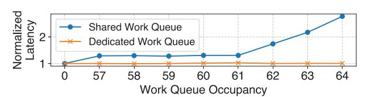

Fig. 2. Impact of work queue isolation on queuing latency. number of entries in a WQ, submitting a descriptor when the queue is near capacity introduces queuing latency; in an SWQ configuration, this saturation effect propagates across all clients sharing the same WQ.

To evaluate the impact of WQ isolation, we conducted an analysis using two clients under two conditions: (1) sharing a single SWQ and (2) utilizing dedicated DWQs. In this setup, an aggressive client continuously issues Memory Move operations, the fundamental data-copying primitives of the DSA, to saturate the WQ. Simultaneously, a second client submits its own descriptors to measure the submission latency relative to the WQ occupancy generated by the aggressive client. In our evaluation environment, a DSA device features a total of 128 WQ entries. Accordingly, we configured a 64 entry SWQ for the shared case and individual 64-entry DWQs for the dedicated case.

Figure 2 shows the queuing latency based on the WQ isolation policy. The x-axis represents the WQ occupancy during descriptor submission, while the y-axis shows the average latency normalized to the baseline at zero occupancy. In the SWQ configuration, the latency remains stable at low occupancy levels but exhibits a sharp increase as it approaches the 64-entry limit. This demonstrates that the continuous activity of an aggressive client can saturate the SWQ, forcing other clients to experience significant delays. Conversely, when DWQs are assigned, there is no correlation between the occupancy of the aggressive client and the latency observed by the other client. These results confirm that the DSA's WQ isolation mechanism effectively eliminates observable latency variations derived from queue contention between clients.

Engine Contention. Next, we analyze the contention that can occur when a DSA engine is shared. Engines are the hardware units responsible for executing DSA operations, such as memory reads and writes; they can either be shared by multiple WQs within a single group or isolated for individual use by separating the WQs into different groups. When WQs share an engine, the arbiter for that group dispatches descriptors by iterating through each WQ to ensure fairness, following the hardware's round-robin-based work dispatch priority. Consequently, in scenarios where two or more WQs share a single engine, the processing time for operations submitted to each

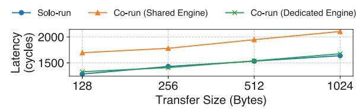

Fig. 3. Impact of engine isolation on Memory Move latency.

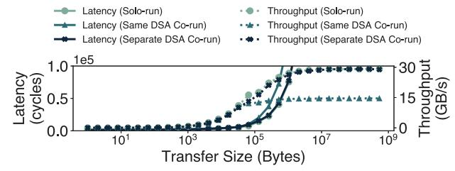

Fig. 4. Latency and throughput of Intel DSA Memory Move operations as a function of transfer size.

WQ is delayed as they must wait for their respective turns from the arbiter. To evaluate the impact of engine contention, we compare the Memory Move execution times under three conditions: (1) a solo-run where a single client utilizes one DWQ and one engine, (2) a shared configuration where two DWQs share a single engine within the same group while both clients simultaneously submit descriptors, and (3) an isolated configuration where two DWQs are separated into different groups, with each client using a dedicated engine assigned to its respective group.

Figure 3 shows the impact of engine sharing on the processing time of DSA operations. The results indicate that across all transfer sizes, sharing an engine causes a delay of over 24% in Memory Move operations compared to the use of dedicated engines. In contrast, when using dedicated engines, no significant difference in processing time is observed compared to the solo-run baseline. Similar to our findings for WQs, these results demonstrate that the grouping mechanism in DSA effectively isolates engine and arbiter hardware resources between clients.

I/O Fabric Interface Contention. Our analysis thus far has demonstrated that the DSA provides hardware resource isolation to clients through the use of DWQs and grouping. However, these isolation mechanisms fail to completely prevent resource contention between clients. We show that this originates from the throughput limitations of the internal I/O fabric interface within the DSA. To observe contention effects, we utilize the Memory Move operation and evaluate the execution time and throughput under three configurations: (1) solo-run, where a single client performs operations; (2) corun (same DSA), where two clients share a single DSA device; and (3) co-run (separate DSA), where two clients utilize distinct DSA devices. Each client is assigned a dedicated group consisting of a DWQ and an engine. We vary the transfer size over several orders of magnitude, ensuring identical sizes across threads in the contention cases.

Figure 4 shows the latency and throughput of Memory

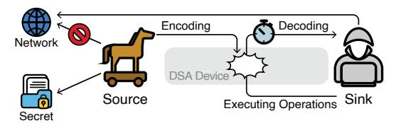

Fig. 5. Covert channel overview.

Move operations under contention, as the transfer size per request increases. As the transfer size increases, the throughput for all three configurations initially scales, reaching approximately 15 GB/s. Beyond this point, however, the co-run (same DSA) throughput saturates while the solo-run throughput continues to increase, eventually reaching the DSA's peak of 30 GB/s, consistent with prior reports of its maximum achievable performance [31]. A similar divergence is also observed in latency, where the gap between two results widens once throughput saturation begins. In contrast, the co-run (separate DSA) configuration does not exhibit throughput saturation as the transfer size increases. This finding indicates that while a DSA device provides isolation for both 1) the WQs receiving descriptors and 2) the engines executing memory operations, contention arises from shared internal resources within the device itself as the data size grows. Therefore, the root cause of the contention lies not in descriptor processing, but in the actual data movement within the DSA generated by the execution of those operations. As depicted in Figure 1 and other architectural documentation provided by Intel, all data read or written by the DSA must traverse the I/O fabric interface. Consequently, the results indicate that all engines within the DSA share the throughput of the I/O fabric interface, regardless of any applied resource isolation. This devicewide limitation leads to the observed contention behavior and provides the experimental foundation for our subsequent covert channel and side-channel construction.

#### IV. COVERT CHANNEL EXPLOITING INTEL DSA

## *A. Threat Model*

Figure 5 depicts our threat model, showing how two malicious clients (labeled as Source and Sink) communicate by establishing a covert channel. The Source can access sensitive information, such as encryption keys, but it cannot access external networks. For example, the Source could be a trojan application designed to steal confidential information. Conversely, the Sink has access to external networks but lacks permission to access confidential information directly. In this environment, the Source encodes confidential information as a signal by selectively executing DSA operations, thereby generating contention observable by the Sink. The Sink continuously measures the resulting latency variations and reconstructs the transmitted bits from the observed signal, establishing a covert channel through which sensitive information is eventually leaked externally. Two clients aim to establish a covert channel using Intel DSA device as a shared resource, addressing a timing channel that transmits confidential data bit by bit based on the presence or absence of contention for DSA.

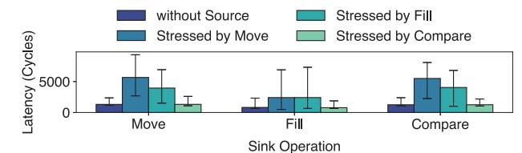

Fig. 6. Timing sensitivity analysis of Source-Sink operations for covert channel.

In our threat model, the Source and Sink processes establish a covert channel by exploiting contention within the internal throughput of the DSA device. Since the internal throughput is shared among internal components of the DSA, two clients using the same DSA device can interfere with each other even without sharing a CPU core, WQ, arbiter, or engine. We assume that both the Source and Sink are user-space processes running with standard user privileges and are allowed to submit tasks to a DWQ assigned by the system administrator. Note that with the Linux device driver, an unprivileged process belonging to a user with an assigned WQ can directly submit descriptors to the DSA device through the standard write system call [32].

#### *B. Characterization of Timing Variability Across Operations*

We now compare the characteristics of available DSA operations to identify the most suitable one for constructing a covert channel. To build a stable and high-bandwidth covert channel, the chosen DSA operation must satisfy two key conditions. First, its execution latency should be short enough to enable rapid signal transmission—shorter operations allow more bits to be exchanged within the same time window. Second, the operation must induce a measurable timing difference at the Sink that can be clearly distinguished under contention. A sufficiently large contention-induced timing difference is essential for reliable signal distinction.

As described in Section II, the DSA supports a variety of operations, but those that involve data movement can be broadly categorized into three types: (1) Move-type operations are involved in transferring data between memory regions, optionally accompanied by additional features such as integrity checking; (2) Fill operation, which write a constant pattern to a specified memory region; and (3) Compare operations, which compare the contents of two buffers or a buffer and a value. To analyze their timing characteristics, we select representative operations from each category: Memory Move (one read + one write), Fill (one write), and Compare Pattern (one read). We then evaluate all nine combinations of Source–Sink pairs to determine which pair yields the most distinct timing differences under contention. The Source continuously and asynchronously issues DSA commands to saturate the device's throughput, while the Sink simultaneously issues its own commands to cause contention and observe latency variations. Both processes use transfer size of 1-byte, which is the minimum unit supported by the DSA.

Figure 6 shows how the timing difference varies depending on the combination of Source and Sink operations. The x-axis corresponds to the Sink operation, while each bar represents a

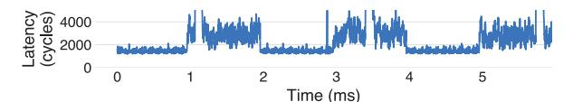

Fig. 7. Difference in response time of the DSA request on Sink.

Source operation. Each bar indicates the mean, minimum, and maximum observed latency. These results provide empirical guidance on which operation is most effective for covert channel construction. Among the three, Memory Move—which involves both reading and writing memory regions—generates the heaviest load on the DSA and consistently produces the largest timing differences across all Sink operations. In contrast, Fill, which only performs writes to destination address, exhibits the shortest intrinsic latency among the three operations, but the timing difference it induces is relatively small, making it less suitable for stable communication. Finally, the Compare operation reads the contents of a source buffer and compares them with a specified pattern, relying on DRAM reads that must await memory responses. As a result, its effective bandwidth utilization is limited, and it generates little contention when used as the Source. However, when used as the Sink, its latency remains sensitive to contention and comparable to that of Move-based observations. Overall, the timing distributions observed under contention show that Move–Move combinations yield the most clearly separable latency profiles compared to their non-contented baselines. This confirms that Memory Move operations, owing to their heavy data transfer and consistent contention behavior, are the most effective primitive for establishing a DSA-based covert channel. Based on these findings, we adopt the Memory Move operation as the fundamental primitive for constructing and analyzing our DSA-based covert channel in the subsequent sections.

## *C. Analysis of Memory Move as a Covert Channel Primitive*

We now explore whether the timing differences identified in the previous subsection can be exploited, using the DSA's Memory Move operation as the signaling primitive, to establish a communication channel between two unprivileged processes. To this end, we evaluate whether the Source can dynamically modulate the DSA's activity at runtime to induce measurable latency variations at the Sink, allowing the Sink to reconstruct transmitted bits and form a timing-based covert channel. The Source (*i.e.,* sender) and the Sink (*i.e.,* receiver) are scheduled on separate CPU cores and assigned distinct DSA engines and WQs within the same DSA device. The Source alternates between two states: (1) an active phase, where it continuously issues 1-byte Memory Move operations to stress the DSA, and (2) an idle phase, where it remains quiescent. Meanwhile, the Sink continuously performs 1-byte Memory Move operations to its own memory region and records the latency of each request.

Figure 7 shows the latency trace recorded by the Sink while the Source alternates between the two states every 1 ms. The measured latency clearly oscillates between two distinct levels: approximately 1,400 cycles when the Source is idle, and 2,000–4,000 cycles when the Source is active. This temporal correlation demonstrates that the Source's activity can be reliably inferred from the Sink's latency observations, indicating that DSA contention can serve as a timing-based signaling mechanism. In essence, these results demonstrate that the shared DSA device can function as a covert communication medium, where both the Source and the Sink use Memory Move operations—one to modulate contention intensity and the other to interpret the resulting latency variations as binary data.

#### *D. DarkStream Covert Channel*

Having confirmed that DSA contention can be used as a timing signal, we now design and implement a practical covert channel that utilizes this mechanism for inter-process communication. The key idea is to exploit contention-induced latency fluctuations as a timing signal that can be modulated by the Source and observed by the Sink. The proposed covert channel operates as follows: the Source encodes secret information by modulating its DSA activity, while the Sink decodes the transmitted data by observing latency variations in its own DSA operations. We next detail the operational procedure of the Source and Sink in our DSA-based encoding scheme.

Source. The Source process encodes binary data by modulating the DSA's activity level over discrete time slots. Each slot has a predefined duration, during which the Source operates in one of two states: an active state, where it continuously and asynchronously submits Memory Move descriptors to rapidly generate contention within the DSA, or an idle state, where it refrains from issuing any operations. A binary '1' is represented by the active state, while a binary '0' corresponds to the idle state. By alternating between these two modes, the Source transmits the entire message sequentially.

Sink. The Sink process continuously performs Memory Move operations using its own dedicated queue and engine, measuring the latency of each request to capture contention-induced timing variations. The observed latencies are aggregated over predefined time slots, where the median latency within each slot serves as the decoding basis. If the measured latency in a slot exceeds a predefined threshold, it is interpreted as a binary '1' (*i.e.,* indicating that the Source was active during that period); otherwise, it is decoded as a binary '0'. By repeating this process across successive slots, the Sink reconstructs the entire transmitted message.

Time Slot Duration. The duration of each time slot serves as the fundamental timing granularity shared by both the Source and Sink. A shorter slot duration increases the achievable bit rate, as more bits can be transmitted within the same time window. However, shorter slots also reduce the number of latency samples collected per slot, making the measured medians more susceptible to noise and transient fluctuations in the DSA's response time. Conversely, longer slots improve decoding stability by aggregating more latency samples, which enhances the robustness of the median-based decoding, but

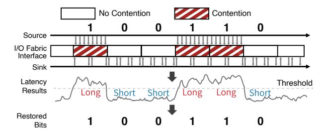

Fig. 8. Procedure of DarkStream covert channel.

at the cost of reduced throughput. Therefore, the choice of slot duration directly determines the trade-off between channel bandwidth and reliability, fundamentally shaping the performance of the covert channel.

Figure 8 illustrates an example of the proposed covert channel, where the Source transmits the secret data sequence 100110b to the Sink. As shown on the upper side of Figure 8, the Source encodes the binary sequence 100110b by alternating between active and idle states for each bit interval, following the pattern: active, idle, idle, active, active, idle. In the active state, the Source continuously and asynchronously issues Memory Move operations to induce contention, while in the idle state, it refrains from submitting any requests. Meanwhile, as shown on the lower side of Figure 8, the Sink continuously performs its own Memory Move operations and measures the latency of each request. As time progresses, the Sink observes a corresponding latency pattern—long, short, short, long, long, short—which it decodes as the bit sequence 100110b.

#### *E. Methodology*

As discussed earlier, the duration of each time slot determines the covert channel's transmission frequency, creating a trade-off between throughput and decoding reliability. Shorter slots enable faster data transmission but increase the likelihood of decoding errors, while longer slots improve stability at the cost of reduced speed. In a covert channel where such errors may occur, the channel bandwidth, measured in bits per second (bps), is calculated as the product of the data transmission frequency and the channel capacity, as follows [5], [6], [13], [14], [16], [33]:

Bandwidth = Capacity <sup>×</sup> (T ransmission F requency) (1)

The transmission frequency can be adjusted by configuring the duration of each time slot, while the channel capacity—defined by Shannon's theorem—represents the theoretical upper bound on the rate at which information can be reliably transmitted through the channel [34]. Channel capacity ranges from 0 to 1, with 0 indicating a completely unreliable channel and 1 indicating a fully reliable channel. At low transmission frequencies, the Sink can collect sufficient latency samples within each slot to reliably distinguish between active and idle states, allowing the channel capacity to approach 1. However, as the transmission frequency increases, each time slot contains fewer latency samples, making the channel more susceptible to timing errors. In this case, even slight jitter or transient noise in the copying delays can significantly affect

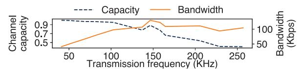

Fig. 9. Capacity and bandwidth of DarkStream covert channel.

the decoding process. As the transmission frequency increases, the Source sends fewer requests to the DSA device to encode a bit. This makes it more likely that the Sink will fail to detect these errors, thus reducing the channel capacity.

We calculate the channel capacity of the proposed covert channel by considering it as a Binary Asymmetric Channel (BAC). In a BAC, the probabilities of changing from 0 to 1 and from 1 to 0 are calculated separately. When the bit-flip probabilities are  $\epsilon_0$  and  $\epsilon_1$  ( $0 \le \epsilon_0 \le \epsilon_1 \le 1$ ), the channel capacity can be calculated as follows [35]:

$$H_b(p) = -p \log_2 p - (1 - p) \log_2 (1 - p)$$

$$C_{BAC} = \frac{\epsilon_0 \cdot H_b(\epsilon_1) - (1 - \epsilon_1) \cdot H_b(\epsilon_0)}{1 - \epsilon_0 - \epsilon_1}$$

$$+ \log_2 \left( 1 + 2^{\frac{H_b(\epsilon_0) - H_b(\epsilon_1)}{1 - \epsilon_0 - \epsilon_1}} \right)$$
(2)

As  $\epsilon_0$  and  $\epsilon_1$  near 0.5, the transmitted bits become less accurate, and the binary entropy functions  $H_b(\epsilon_0)$  and  $H_b(\epsilon_1)$ , which indicate the channel's uncertainty, converge to 1. As  $H_b(\epsilon_0)$  and  $H_b(\epsilon_1)$  get closer to 1, the channel capacity  $C_{BAC}$  approaches 0, decreasing the number of bits that can be reliably transmitted at once.

Our setup transmits a sequence of 128-bit data, utilizing a 10101010b preamble to signal the start of the transmission to the Sink.

#### F. Experimental Results

Figure 9 illustrates how the bandwidth and capacity of the proposed covert channel change with variations in the Source's transmission frequency. To demonstrate the impact of timing configuration, we vary the length of each time slot—thereby adjusting the transmission frequency—from 40 KHz to 256 KHz.

As shown on the left y-axis of Figure 9, the covert channel maintains a capacity close to 1 at low transmission frequencies because the long time slots allow the Sink to collect a large number of latency samples, from which the median value can be stably determined. As the transmission frequency increases, each time slot contains fewer latency samples, reducing the statistical stability of the median estimation and consequently lowering the channel capacity. Despite the gradual decline in channel capacity, the overall bandwidth continues to increase with higher transmission frequencies, as shown on the right yaxis of Figure 9. This trend reaches its peak at 129 Kbps when the transmission frequency is 147 KHz, after which the pronounced capacity reduction begins to outweigh the gain from faster symbol transitions, causing the bandwidth to gradually decline. Overall, these results confirm that contention within the DSA provides a controllable signaling medium, enabling a practical and stable covert communication channel.

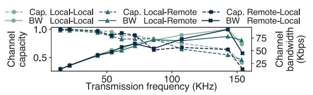

Fig. 10. Capacity and bandwidth of cross-processor covert channel.

Cross-processor Channel. Although the DSA is an on-chip accelerator, it is exposed as a PCIe device to all cores within the system. This architectural feature extends the attack surface of DarkStream to a cross-processor scope. We evaluate the feasibility of establishing a cross-processor channel using a dual-socket system equipped with two Intel Xeon Gold 6554S processors, each providing DSA devices.

Figure 10 shows the results of the cross-processor covert channel established via DarkStream. Each combination in the figure (e.g., Local-Remote) denotes the processor locations of the Source and the Sink, respectively, relative to the target DSA device. 'Local' indicates that the client is running on the same CPU socket as the DSA, while 'Remote' signifies execution on a different socket, involving cross-processor communication. In the Local-Local configuration, which represents a cross-core channel within a single processor, the channel achieves a peak bandwidth of 92 Kbps. In cross-processor scenarios, the channel achieves peak bandwidths of 78 Kbps for Local-Remote and 92 Kbps for Remote-Local configurations. Although traversing the socket interconnect to access a remote DSA in cross-processor channels increases response time variance and slightly degrades bandwidth compared to the Local-Local baseline, the overall results demonstrate that by exploiting internal DSA contention, DarkStream effectively covers attack surfaces ranging from cross-core to crossprocessor environments.

Evaluating Channel Resilience under Background Interference. To assess the practicality of the DarkStream covert channel in realistic environments, we examine how background activity affects its capacity and bandwidth. In particular, we consider two types of interference, CPU load and DSA contention noise, which correspond to disturbances at different stages of the offload pipeline. The CPU load represents host-level interference, affecting the stage where memory operations are issued and offloaded to the DSA, while the DSA contention noise represents device-level interference, occurring during the actual data movement executed by the DSA itself. The CPU load noise is introduced by running stress-ng [36] on the same cores as the Source and Sink, applying three levels of utilization (10%, 50%, and 90%) to emulate different levels of background workload. Meanwhile, the DSA contention noise is generated by a third process that continuously issues Memory Move operations through a separate group of queues and engines within the same DSA device, sharing the internal throughput capacity with the Source and Sink. By adjusting the transfer size of these interfering operations to 4 KB, 64 KB, and 1 MB, we control the intensity of contention imposed on the shared device.

Figure 11 shows the impact of CPU load on the capacity

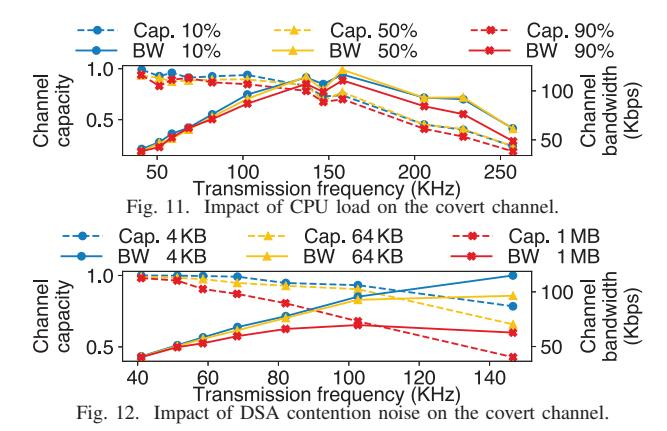

and bandwidth of the DarkStream covert channel. As the CPU load increases, the channel capacity gradually decreases, primarily due to delays in DSA descriptor submission caused by CPU contention on the cores where the Source and Sink are running. Nevertheless, even under a heavy system load, the overall reduction in capacity remains limited, still maintaining a stable covert channel with a bandwidth exceeding 100 Kbps. This robustness arises because the DSA executes offloaded memory-copy operations independently of the CPU, and DarkStream leverages contention within the DSA's internal throughput rather than CPU-side timing. Consequently, CPUintensive background workloads have only a limited effect on the channel's performance, confirming that DarkStream maintains reliable operation even under substantial host-level interference.

Figure 12 shows the effect of DSA contention noise on the capacity and bandwidth of the DarkStream covert channel. When the noise process transfers data at a size of 4 KB, it occupies only approximately 3 GB/s of throughput, exerting a negligible impact on the execution of the Source and the Sink. However, as the transfer size increases to 64 KB and 1 MB, the noise consumes 18 GB/s and 28 GB/s, respectively, which directly affects the latencies of the Source and the Sink. Since substantial noise elevates the latency of memory operations across the DSA device, the attacker can mitigate this impact by upwardly adjusting the threshold for decoding a bit. Nevertheless, the increased latency caused by heavy noise reduces the number of observable samples within a single timeslot and triggers bit-flips, leading to a degradation in both channel capacity and bandwidth. This phenomenon is more pronounced at higher transmission frequencies, where the significantly shortened timeslots provide less margin for latency fluctuations. Despite these constraints, DarkStream was able to achieve a maximum bandwidth of approximately 70 Kbps, even in the presence of continuous 1 MB noise.

Furthermore, we investigate the impact of random noise, which is characterized by real-time fluctuations in data transfer volume, on the covert channel. Similar to the previous setup, the noise processes execute Memory Move operations using transfer sizes of 4 KB, 64 KB, and 1 MB, where one of these three sizes is selected randomly for each individual operation. Unlike the static noise scenario, the attacker cannot adapt

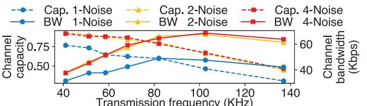

Fig. 13. Impact of random DSA noise on the covert channel.

the decoding threshold to the varying size of each interfering operation. We therefore assume the attacker employs a fixed threshold optimized for the 1 MB noise case to perform bit recovery. To simulate a multi-tenant environment, we evaluate the channel capacity and bandwidth by increasing the number of noise processes to one, two, and four, where these processes share a common WQ and engine group among themselves.

Figure 13 illustrates the impact of these random noise processes on the DarkStream covert channel. With a single random noise process, the channel capacity exhibits its most significant decline compared to the static noise case. This reduction occurs because random transfer sizes generate unpredictable latency variations, which complicates bit recovery when a fixed threshold is used. Conversely, when the number of noise processes increases to two or more, both capacity and bandwidth actually improve relative to the single-noise scenario. This improvement stems from the fact that simultaneous noise processes increase the aggregate data volume traversing the I/O fabric interface while reducing the relative variance in data sizes, leading to more stabilized latency variations compared to the sporadic bursts of a single noise source. In conclusion, while noise randomness exerts a more significant influence on bit recovery than fixed-size noise, our results demonstrate that DarkStream remains resilient, maintaining a bandwidth of up to 49 Kbps even under these challenging conditions.

#### V. SIDE-CHANNEL

Expanding upon covert channels, this section demonstrates that a malicious process can establish a DSA-based sidechannel to launch fingerprinting attacks, which infer either the websites accessed or the deep learning (DL) models executed by the victim. The viability of this attack stems from the observation that the number of operations and the size of processed data vary significantly depending on the specific characteristics of the target, such as the content of a website or the architecture of a DL model. By profiling these distinctive workload patterns, which are unique to each target, an attacker can infer the specific website accessed or the model being executed by the victim.

#### *A. Threat Model*

Figure 14 provides an overview of the proposed sidechannel attack. The attack proceeds in two main phases: the training phase and the inference phase. During the training phase, the attacker executes target applications to profile specific workloads, such as accessing target websites or running DL models. 1 As the application processes its workload, it offloads memory operations to the DSA device. 2 - 3

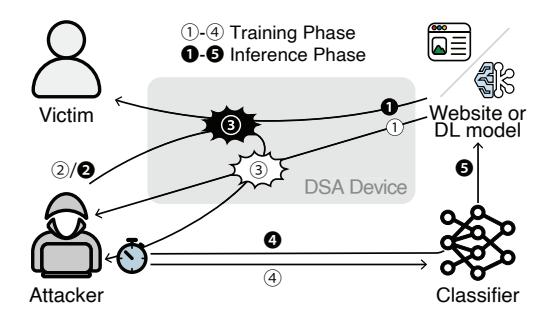

Fig. 14. Side-channel attack overview.

Simultaneously, the attacker issues continuous memory operations through the same DSA device to create contention. The attacker repeatedly records the contention-induced latency variations associated with each target and utilizes these traces to train a classifier. 4 These traces enable the classifier to learn the distinctive latency patterns inherent to each specific workload. In the inference phase, the attacker uses the trained classifier to infer the victim's activity. 1 The victim executes an arbitrary target application (*e.g.,* browsing a website or performing DL inference). 2 - 3 As in the training phase, the attacker continuously performs memory operations on the same DSA device and measures the resulting latency variations induced by contention. 4 Finally, the attacker inputs the collected latency trace into the classifier, 5 which identifies the specific workload executed by the victim. Similar to the covert channel's threat model, the attacker and victim processes run on separate cores, DSA engines, and WQs; the only shared resource between them is the DSA device itself.

## *B. Approach*

DSA Utilization During Webpage Loading. First, we show that the number of memory operations and the size of the data they process on a DSA device vary depending on the content of different webpages. In the same system as the previous sections, we load websites by executing a Chromium browser from the command line via a Playwright [37] script. During this process, we use the Intel DSA Transparent Offload (DTO) library [38] to offload the memory operations performed by Chromium to the DSA device. The DTO library intercepts calls to standard memory functions and offloads their corresponding memory operations to the DSA, thereby allowing existing applications to leverage the DSA without code modifications. Our setup uses the DTO's minimum recommended settings, which offloads data exceeding 8 KB.

Figure 15(a) presents the distribution of DSA-offloaded memory operations categorized by data sizes, while accessing the three most frequently visited websites [39]. Within the standard library, the memset function is mapped to a Fill operation in the DSA, while memmove and memcpy are mapped to Memory Move operations. The results demonstrate that both the number and size of memory operations handled by the DSA device vary depending on the accessed website. For instance, among these websites, youtube.com, which contains the largest number of web objects, triggers approximately 6,500 Fill operations with data of varying sizes, and more than

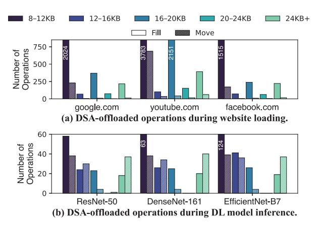

Fig. 15. Distribution of DSA-offloaded memory operations.

800 Memory Move operations. In contrast, the numbers of operations observed for google.com and facebook.com are less than half of those for youtube.com, which can be attributed to the relatively simpler page structure of these websites. Even in the non-logged-in state, youtube.com loads more than 2,000 Document Object Model (DOM) nodes, whereas google.com and facebook.com include only a few hundred DOM nodes. This structural complexity is directly reflected in the higher frequency and larger sizes of memory operations. Furthermore, in the cases of google.com and facebook.com, a distinct difference of over 25% in the number of operations is observed for data sizes ranging from 8 to 12 KB. These results demonstrate that both the frequency and size distribution of memory operations occurring in the DSA device can serve as valuable information for website fingerprinting.

DSA Utilization During Deep Learning Model Inference. Consistent with our observations of web activity, distinct DL architectures generate unique DSA operational fingerprints. We load three representative image classification models, ResNet-50, DenseNet-161, and EfficientNet-B7, and executed their inference processes, offloading memory operations to the DSA via the DTO library. For consistency, all evaluations were conducted using identical 224×224 resolution inputs. Each architecture triggers memory operations with varying frequencies and sizes, dictated by its unique layer compositions and tensor manipulation strategies.

Figure 15(b) illustrates the distribution of DSA operations across these models. Among DSA-offloaded operations exceeding 8 KB, while Memory Move operations establish a common baseline for data transfer, Fill operations serve as the primary differentiator that reflects unique characteristics of a model. As shown in the results, a distinct upward trend in Fill operations is observed as the architectural depth increases from ResNet-50 (50 layers) to DenseNet-161 (161 layers) and finally to EfficientNet-B7, which consists of more than 800 layers. Specifically, in the 8-12 KB range, EfficientNet-B7, the deepest architecture among the three, generated 124 Fill operations. This is more than double the count of ResNet-50 and significantly higher than that of DenseNet-161. This disparity stems from the repetitive memory allocation and initialization required for individual tensors, as the quantity of weight and bias tensors to be managed scales proportionally with the increasing number of layers. These observations establish that DSA-offloaded memory patterns serve as an architectural signature, enabling the fingerprinting of diverse workloads ranging from web activities to DL models.

Data-size Sensitivity of Memory Move Operations. The previous analysis showed that the number of DSA operations and the distribution of their data-transfer sizes differ across websites, suggesting that these characteristics could serve as distinguishing features for website fingerprinting. Therefore, if an attacker can obtain a proxy for such information through latency variations, a side channel can be established. To explore this possibility, we investigate how the latency of DSA Memory Move operations varies with the data size processed by a co-located victim application. Understanding this relationship is crucial, as it determines whether an attacker can distinguish different victim workloads based on contention-induced timing fluctuations. To this end, we examine how concurrent DSA operations from the attacker and victim interact when they share the same device but utilize distinct WQs and engines. The victim-side process issues DSA operations based on the data transfers that occur during website access. It performs each Memory Move or Fill operation synchronously—that is, it starts each command only after the previous one has completed—while varying the transfer size from 0 KB to 24 KB. Meanwhile, the attacker continuously performs Memory Move operations—similar to the Sink in the covert channel—to induce contention with the victim and observe resulting latency fluctuations. In the covert channel, it is advantageous to exchange as many signals as possible within a given time window, making the smallest transfer size (*i.e.,* 1 byte) the most effective choice. In contrast, side-channel attacks prioritize precision over transmission frequency or bandwidth; therefore, we experiment with multiple transfer sizes to identify the configuration that yields the most accurate detection of victim activity patterns. Three different transfer sizes (1 B, 1 KB, and 1 MB) are used for the attacker's operations to analyze how the observed latency varies with the attacker's own data size.

Figure 16 presents the latency of the attacker's Memory Move operations under varying victim workloads. Consistent with the timing behavior observed in the covert channel analysis, the attacker's measured latency differs between the victim's idle state (*i.e.,* no data-transfer) and active datatransfer states. When the attacker's transfer size is 1 B, contention effects remain weak, and the latency exhibits large variance, resulting in no reliable distinction across different victim transfer sizes. A similar situation appears with 1 KB transfers, as the latency still varies widely, making it difficult to observe any clear effect from the victim's transfer size. In contrast, when the attacker issues 1 MB Memory Move requests, the latency shows a strong positive correlation with the victim's transfer size, making timing differences between victim workloads far more discernible.

This phenomenon arises because the DSA device provides

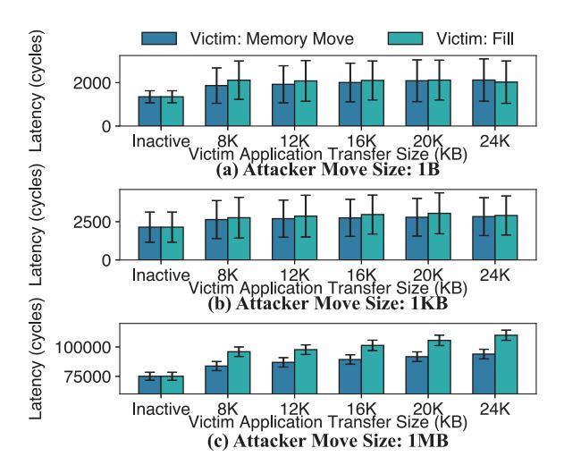

Fig. 16. Latency variation of attacker Memory Moves under victim workloads.

limited internal bandwidth that must be shared among all active clients. When the victim transfers larger data, its operations consume a greater portion of this finite processing bandwidth, leaving fewer available resources for concurrent requests from the attacker. As a result, the attacker's Memory Move operations experience increased queuing execution delays, manifesting as measurable latency growth. This effect is further amplified when the attacker's own transfer size is large (*e.g.,* 1 MB), as long-running Memory Move operations occupy the shared data path for extended periods. During this time, transient interference from the victim accumulates, leading to proportionally longer blocking delays and thus greater overall latency inflation. In contrast, when the attacker's transfer size is small, each operation occupies the shared throughput only briefly, leaving little room for interference to accumulate and resulting in latency variations too small to distinguish reliably. These findings demonstrate that the DSA's latency systematically varies with the data size handled by co-located applications. Consequently, an attacker can exploit these timing variations as an indirect signal to infer the victim's data-transfer volume, effectively transforming latency measurements into a practical side-channel for information leakage.

Contention Varying with Workload. Building upon the previous subsection, we further demonstrate that a separate process (*i.e.,* the attacker) sharing the same DSA device with the workload can deliberately induce contention, indirectly observe the browser's DSA utilization, and use the resulting patterns as a proxy for identifying the workload. As in the threat model, both the workload and the attacker process share the DSA device but operate on distinct WQs, engines, and CPU cores. During webpage or DL model loading, the attacker continuously performs 1 MB Memory Move operations using the DSA and measures the latency of each operation.

Figure 17 visualizes the measured latencies in chronological order as each website is loaded. When no contention occurs, the latency stays around 75,000 cycles. During contention, however, it becomes noticeably higher — often exceeding

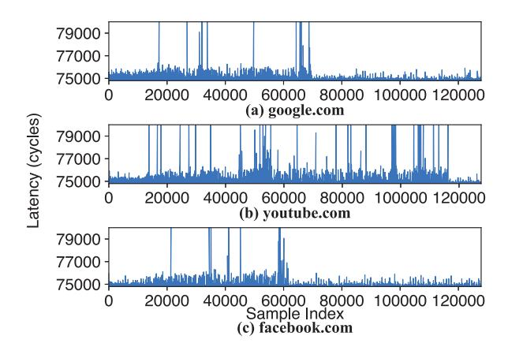

Fig. 17. Time-series latency of the Memory Move operations during website loading.

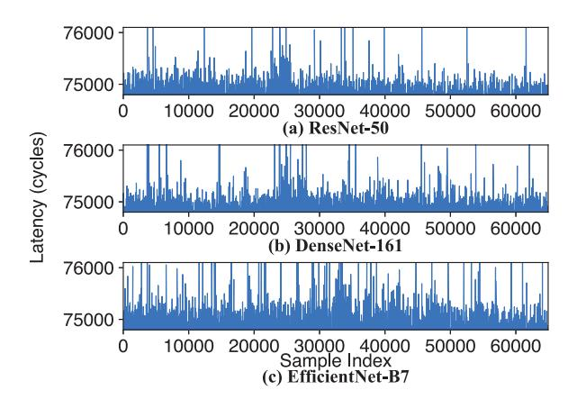

Fig. 18. Time-series latency of the Memory Move operations during DL model inference.

75,000 cycles and in some cases rising beyond 80,000 cycles. These latency spikes correspond to DSA resource contention caused by memory operations offloaded by the browser, reflecting the number and size of DSA operations triggered by different website contents, consistent with the observations in Figure 15(a). For example, Figure 17(b) shows the result for youtube.com, which exhibits a longer duration of contention due to its large number of DOM elements and diverse content objects. In contrast, google.com and facebook.com complete their page loads more quickly, resulting in shorter contention periods. Specifically, the latency spikes for youtube.com persist up to approximately the 115,000th sample, whereas for google.com and facebook.com, such increases disappear after around the 70,000th sample. Additionally, google.com generates slightly more DSA operations than facebook.com, leading to a higher frequency of latency spikes in Figure 17(a) compared to Figure 17(c).

Similarly, the contention visualized in Figure 18 reflects the frequency and patterns of DSA operations occurring during the DL model inference process. In Figure 18(a) and (b), DenseNet-161, which executes slightly more Fill operations than ResNet-50, exhibits more frequent latency spikes around the 20,000th and 30,000th samples. For EfficientNet-B7, which executes substantially more DSA operations than the other two models, high-frequency latency increases are observed throughout the entire timeline in Figure 18(c). These observations indicate that contention patterns in the DSA device can serve as a source of information for workload fingerprinting.

#### *C. Website Fingerprinting*

Building upon the observations presented in the previous subsections, this subsection demonstrates that a malicious process can mount a website fingerprinting side-channel attack by exploiting a shared DSA device. To evaluate this, user access to the 43 most-visited websites [39] is performed, while an attacker process simultaneously profiles contention on the same DSA device. As in the prior subsection, Playwright [37] is used to automate website visits in the Chromium browser, and the DTO library offloads the browser's memory operations to the DSA. Concurrently, the attacker process issues continuous 1 MB Memory Move operations for 7 seconds, recording latency variations induced by contention. In the evaluation environment, a 7-second interval is sufficient to fully load a target website once for profiling purposes. Each website is profiled 300 times, resulting in a dataset of 12,900 samples. For each website, the dataset was partitioned into training, validation, and evaluation sets, comprising 240, 30, and 30 images, respectively. Additionally, we consider an 'open-world' scenario, where the classifier must distinguish between monitored (*i.e.,* trained) and unmonitored (*i.e.,* untrained) websites. Specifically, we collected 4,000 samples by performing a single profiling session for each of the top 4,000 websites from the Alexa Top 1 Million [40], excluding the 43 monitored websites previously mentioned. Of these, samples from 2,000 websites were utilized for training, while the remaining samples were allocated to the validation and evaluation sets, comprising 1,000 websites each. Note that these three datasets consist of mutually exclusive website samples, ensuring that the classifier can effectively generalize its ability to identify unmonitored sites. Following prior works [41], we implement the fingerprinting attack using an ResNet-18 image classifier. Each profiling trace is rendered as a 1,200×800 pixel image without embedding explicit labels (*e.g.,* site URL or index number). The classifier was trained over 10 epochs to categorize each visualized sample as either its corresponding ground-truth website or an 'other' class (*i.e.,* not included among the 43 monitored websites).

Figure 19 shows the classifier's predictions on the evaluation set images. Indices 1 through 43 correspond to the respective ranks of the websites, while the class 'other' denotes untrained websites. The classifier achieved 100% accuracy for twenty of the websites. The minimum accuracy observed was 63.3%; this performance may be attributed to latency fluctuations caused by network conditions, variability in website content, or offload patterns that resemble those of other sites. The classification accuracy for the 'other' class reached 99.7%, where 997 out of 1,000 untrained website samples

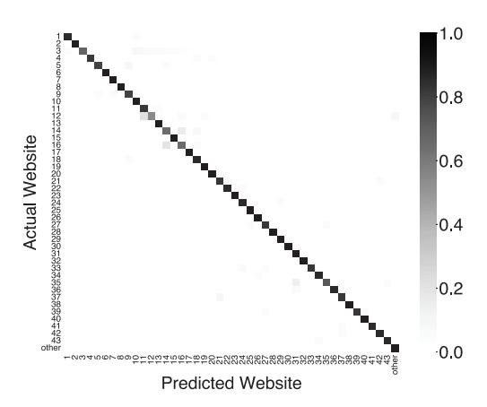

Fig. 19. Website classification results.

were correctly identified, validating the effectiveness of the fingerprinting attack in an open-world scenario. The overall classification accuracy is 97.03%, demonstrating that, when DSA devices are shared across processes, memory operation patterns can be exploited to fingerprint web browsing activity.

## *D. Deep Learning Model Fingerprinting*

This subsection demonstrates that the side-channel attack can be extended to identify the specific DL architecture being executed on a shared DSA device. To evaluate this, we conducted the attack across 12 representative neural network topologies, encompassing various scales of CNNs and Vision Transformers. The attacker process concurrently profiles DSA contention during the victim's inference process, recording latency variations for 10 seconds. For each model, we collected 200 profiling samples, resulting in a total dataset of 2,400 traces. Consistent with the prior setup, the dataset was partitioned into training, validation, and evaluation sets with an 8:1:1 ratio. Similarly, the visualization and classifier training methodologies remain identical to those employed in the website fingerprinting attack.

Figure 20 presents the confusion matrix for our fingerprinting attack across 12 representative DL architectures. The evaluation results show that the classifier achieved 100% accuracy for ten of the twelve models. The overall classification accuracy reached 99.17%, confirming that DSA-offloading patterns constitute a high-fidelity fingerprint for distinguishing DL architectures. These findings demonstrate that the frequency and size distribution of hardware-accelerated memory operations in shared DSA environments can be universally extended to various attacks, ranging from website fingerprinting to exposing the internal structures of executing DL models.

#### VI. COUNTERMEASURES

Dedicated DSA Device per Client. DarkStream arises from contention on the DSA's internal throughput, regardless of the specific WQ or engine assignments. Therefore, isolating WQs or engines alone is insufficient to eliminate such interference. A fundamental mitigation strategy is to allocate DSA devices exclusively, ensuring that clients do not share the same internal

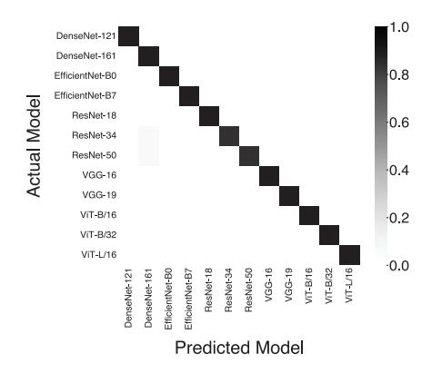

Fig. 20. Deep learning model classification results. throughput within a single device. Such dedicated allocation not only mitigates covert channel risks but also improves performance isolation across clients, albeit at the cost of reduced overall resource utilization.

Temporal Isolation of DSA Engines. A more practical alternative to dedicating an entire DSA device to each client is to employ a time-sharing mechanism among DSA engines. By temporally multiplexing engine execution, this approach can prevent throughput contention that arises when multiple clients simultaneously issue data transfer requests to the same DSA device. However, enforcing time-based serialization inherently reduces resource utilization and aggregate performance, since the DSA's high throughput fundamentally depends on parallel execution across multiple engines. Specifically, this mitigation technique permits the use of only one engine within a DSA device per time slot, resulting in a performance reduction factor of 1/N, where N represents the total number of engines in the device. Consequently, the performance penalty becomes more substantial as the number of available engines increases. For instance, on a Xeon Platinum 8558 where a DSA device comprises four engines, the device's throughput would be reduced from approximately 30 GB/s to 7.5 GB/s.

Performance Counter–based Detection of Abnormal DSA Behavior. Another mitigation is to detect malicious DSA usage patterns by monitoring performance counters exposed by the DSA hardware. A DarkStream attack requires a process to repeatedly issue high-frequency Memory Move operations, often appearing as unusually dense bursts of activity on specific WQs or engines. The DSA hardware provides performance counters that support real-time monitoring of per-engine and per-WQ events [32]. By examining these counters over sliding monitoring intervals, the system can detect activity patterns that deviate from expected benign behavior and identify them as suspicious. Once such anomalous patterns are detected, the runtime system can take mitigating actions. For example, it may forcibly terminate the offending process or revoke its access to the corresponding WQ. This hardware-assisted detection mechanism represents the most readily deployable mitigation technique against DSA-based covert and sidechannel attacks, though its effectiveness ultimately depends on carefully tuned detection policies to minimize false positives arising from benign DSA-intensive workloads.

## VII. RELATED WORK

Numerous studies propose methods for exploiting shared resources in computing systems to establish covert and sidechannels. The processor's internal cache memory is the primary shared resource utilized for establishing these channels [1], [2], [5], [6], [19], [21]–[23], [42]. Prime+Probe [1] establishes a covert and side-channel by filling shared cache sets with data and later measuring the time needed to access them. Flush+Reload [2], Flush+Flush [42], and Reload+Refresh [23] create channels in systems where shared memory is used between processes by detecting whether the data is cached or not. Flush+Reload is an attack that intentionally evicts the cache line of a target address and measures the access time to that address after a specific interval. Flush+Flush exploits the time difference in executing the clflush instruction, which evicts cache memory, while Reload+Refresh, similar to Prime+Probe, proposes a method to alter the cache state without causing cache misses by leveraging the cache replacement policy. In addition to leveraging direct cache access time differences, existing methods include exploiting the timing variations of prefetching instructions based on cache coherence states [19] or utilizing contention in the interconnect network that connects slices of the processor's Last-Level Cache (LLC) [5], [6]. Paccagnella et al. [5] exploit contention in ring interconnects, whereas Dai et al. [6] leverage contention in mesh interconnects. Lastly, cache memory-based attacks can be expanded to remote machines over a network by exploiting Intel's Data Direct I/O (DDIO) technology [21], [22]. These attacks have been applied to vulnerabilities like Meltdown [43] and Spectre [44], prompting extensive research into defense and mitigation techniques [45]–[47]. HybCache [45] partitions cache memory into isolated (*i.e.,* Subcache) and nonisolated regions, and by using a random replacement policy in the Subcache, it makes the creation of cache-based channels more challenging. PhantomCache [46] disrupts cache collision-based channels like Prime+Probe by randomly mapping memory addresses to cache sets. MIRAGE [47] prevents cache-based channels by employing fully-associative caches combined with a random replacement policy, instead of using set-associative caches.

Recently, many studies have proposed creating covert and side-channels by exploiting various types of shared system resources, not limited to processor cache architectures. These studies explore new methods for creating channels by exploiting resources such as memory [16], [17], [24], power [12]– [14], [18], [26], [27], [30], [48], [49], GPU [7], [8], [20], and Field-Programmable Gate Array (FPGA) [10], [11]. Research on memory-based channels utilizes row conflicts in DRAM [16] or employs Prime+Probe techniques within the cache of Intel Optane Memory [17], [24]. Power-based channel studies leverage chip-level Dynamic Voltage and Frequency Scaling (DVFS) [18], shared power budgets [14], or uncore frequency [13], [49]. Furthermore, some studies exploit the fact that the processor's frequency or energy consumption varies with the type of instruction being executed [30], [48]. Existing studies on GPU-based channels utilize the shared LLC between the CPU and GPU [20], the shared L2 cache within the GPU [7], or the bandwidth contention between Streaming Multiprocessors (SMs) within the GPU [8]. FPGAbased channel studies propose creating channels by exploiting the saturation of PCIe bus usage to the FPGA board [10] or by utilizing the shared Power Supply Unit (PSU) between FPGA boards [11]. Recent work has also demonstrated leakage channels on on-core accelerators. GateBleed [12] shows that Intel AMX, a per-core accelerator integrated with CPU cores, exposes timing differences through its power-gating wake-up latency, enabling a side-channel on the CPU core.

A concurrent work, DSAssassin [50], also demonstrates covert and side-channel attacks exploiting the Intel DSA. This work establishes these channels by employing a Prime+Probe attack on an engine's device TLB and leveraging contention within a shared work queue. While DSAssassin's attack primitives rely on the explicit sharing of a specific engine or queue, DarkStream demonstrates that the throughput shared across all engines and work queues inside the DSA forms a contentionbased channel. DarkStream broadens the scope of microarchitectural attacks by identifying and experimentally validating vulnerabilities stemming from globally shared resources in an off-core accelerator, thus opening new vectors for covert and side-channel leakage.

#### VIII. CONCLUSION

In this paper, we presented DarkStream, a newly identified vulnerability that exploits DSA integrated into Intel's Xeon Scalable processors. We analyzed the internal architecture of DSA and demonstrated that concurrent execution of Memory Move operations by multiple processes induces measurable latency variations due to contention at the shared I/O fabric interface. By exploiting these timing differentials, DarkStream establishes a covert channel that enables unauthorized communication. Our experiments show that DarkStream achieves a covert channel bandwidth of up to 129 Kbps, revealing the security risks inherent in sharing high-throughput accelerators such as DSA among multiple tenants. Furthermore, we demonstrate that DarkStream can perform high-accuracy sidechannel attacks by observing a victim's DSA usage patterns. Specifically, DarkStream achieves an average classification accuracy of 97.03% across 43 websites in a realistic openworld scenario and identifies DL models with 99.17% accuracy. These findings emphasize the necessity of designing robust mitigation mechanisms to ensure isolation and security in accelerator-enabled systems. Finally, we have disclosed the identified vulnerability to Intel.

#### ACKNOWLEDGMENT

This research was supported by the Institute of Information & Communications Technology Planning & Evaluation (IITP) grants funded by the Korean government (MSIT) (Nos. RS-2024-00396013, RS-2024-00459797, RS-2025-02263869, RS-2025-02263167, RS-2025-09942968, and 2022-0-00498), and a National Research Foundation of Korea (NRF) grant funded by the Korean government (MSIT) (No. RS-2026-25490694).

## REFERENCES

- [1] F. Liu, Y. Yarom, Q. Ge, G. Heiser, and R. B. Lee, "Last-level cache side-channel attacks are practical," in *2015 IEEE symposium on security and privacy*. IEEE, 2015, pp. 605–622.
- [2] Y. Yarom and K. Falkner, "FLUSH+ RELOAD: A high resolution, low noise, l3 cache Side-Channel attack," in *23rd USENIX security symposium (USENIX security 14)*, 2014, pp. 719–732.
- [3] B. Gras, K. Razavi, H. Bos, and C. Giuffrida, "Translation leak-aside buffer: Defeating cache side-channel protections with TLB attacks," in *27th USENIX Security Symposium (USENIX Security 18)*, 2018, pp. 955–972.
- [4] J. Wan, Y. Bi, Z. Zhou, and Z. Li, "Meshup: Stateless cache side-channel attack on cpu mesh," in *2022 IEEE Symposium on Security and Privacy (SP)*. IEEE, 2022, pp. 1506–1524.
- [5] R. Paccagnella, L. Luo, and C. W. Fletcher, "Lord of the ring (s): Side channel attacks on the CPU On-Chip ring interconnect are practical," in *30th USENIX Security Symposium (USENIX Security 21)*, 2021, pp. 645–662.
- [6] M. Dai, R. Paccagnella, M. Gomez-Garcia, J. McCalpin, and M. Yan, "Don't mesh around: Side-Channel attacks and mitigations on mesh interconnects," in *31st USENIX Security Symposium (USENIX Security 22)*, 2022, pp. 2857–2874.
- [7] S. B. Dutta, H. Naghibijouybari, A. Gupta, N. Abu-Ghazaleh, A. Marquez, and K. Barker, "Spy in the gpu-box: Covert and side channel attacks on multi-gpu systems," in *Proceedings of the 50th Annual International Symposium on Computer Architecture*, 2023, pp. 1–13.
- [8] J. Ahn, J. Kim, H. Kasan, L. Delshadtehrani, W. Song, A. Joshi, and J. Kim, "Network-on-chip microarchitecture-based covert channel in gpus," in *MICRO-54: 54th Annual IEEE/ACM International Symposium on Microarchitecture*, 2021, pp. 565–577.
- [9] Z. Zhang, T. Allen, F. Yao, X. Gao, and R. Ge, "Tunnels for bootlegging: Fully reverse-engineering gpu tlbs for challenging isolation guarantees of nvidia mig," in *Proceedings of the 2023 ACM SIGSAC Conference on Computer and Communications Security*, 2023, pp. 960–974.
- [10] I. Giechaskiel, S. Tian, and J. Szefer, "Cross-vm covert-and sidechannel attacks in cloud fpgas," *ACM Transactions on Reconfigurable Technology and Systems*, vol. 16, no. 1, pp. 1–29, 2022.
- [11] I. Giechaskiel, K. B. Rasmussen, and J. Szefer, "C3apsule: Cross-fpga covert-channel attacks through power supply unit leakage," in *2020 IEEE Symposium on Security and Privacy (SP)*. IEEE, 2020, pp. 1728–1741.
- [12] J. Kalyanapu, F. Dizani, D. Asher, A. Ghanbari, R. Cammarota, A. Aysu, and S. M. Ajorpaz, "Gatebleed: Exploiting on-core accelerator power gating for high performance and stealthy attacks on ai," in *Proceedings of the 58th IEEE/ACM International Symposium on Microarchitecture*, 2025, pp. 308–325.
- [13] P. Chen, L. Li, and Z. Yang, "Cross-VM and Cross-Processor covert channels exploiting processor idle power management," in *30th USENIX Security Symposium (USENIX Security 21)*, 2021, pp. 733–750.
- [14] S. K. Khatamifard, L. Wang, A. Das, S. Kose, and U. R. Karpuzcu, "Powert channels: A novel class of covert communicationexploiting power management vulnerabilities," in *2019 IEEE International Symposium on High Performance Computer Architecture (HPCA)*. IEEE, 2019, pp. 291–303.
- [15] C. Maurice, C. Neumann, O. Heen, and A. Francillon, "C5: cross-cores cache covert channel," in *Detection of Intrusions and Malware, and Vulnerability Assessment: 12th International Conference, DIMVA 2015, Milan, Italy, July 9-10, 2015, Proceedings 12*. Springer, 2015, pp. 46–64.
- [16] P. Pessl, D. Gruss, C. Maurice, M. Schwarz, and S. Mangard, "DRAMA: Exploiting DRAM addressing for Cross-CPU attacks," in *25th USENIX security symposium (USENIX security 16)*, 2016, pp. 565–581.
- [17] Z. Wang, M. Taram, D. Moghimi, S. Swanson, D. Tullsen, and J. Zhao, "NVLeak: Off-Chip Side-Channel attacks via Non-Volatile memory systems," in *32nd USENIX Security Symposium (USENIX Security 23)*, 2023, pp. 6771–6788.
- [18] P. Miedl, X. He, M. Meyer, D. B. Bartolini, and L. Thiele, "Frequency scaling as a security threat on multicore systems," *IEEE Transactions on Computer-Aided Design of Integrated Circuits and Systems*, vol. 37, no. 11, pp. 2497–2508, 2018.
- [19] Y. Guo, A. Zigerelli, Y. Zhang, and J. Yang, "Adversarial prefetch: New cross-core cache side channel attacks," in *2022 IEEE Symposium on Security and Privacy (SP)*. IEEE, 2022, pp. 1458–1473.

- [20] S. B. Dutta, H. Naghibijouybari, N. Abu-Ghazaleh, A. Marquez, and K. Barker, "Leaky buddies: Cross-component covert channels on integrated cpu-gpu systems," in *2021 ACM/IEEE 48th Annual International Symposium on Computer Architecture (ISCA)*. IEEE, 2021, pp. 972– 984.
- [21] M. Kurth, B. Gras, D. Andriesse, C. Giuffrida, H. Bos, and K. Razavi, "Netcat: Practical cache attacks from the network," in *2020 IEEE Symposium on Security and Privacy (SP)*. IEEE, 2020, pp. 20–38.
- [22] M. Taram, A. Venkat, and D. Tullsen, "Packet chasing: Spying on network packets over a cache side-channel," in *2020 ACM/IEEE 47th Annual International Symposium on Computer Architecture (ISCA)*. IEEE, 2020, pp. 721–734.
- [23] S. Briongos, P. Malagon, J. M. Moya, and T. Eisenbarth, "RELOAD+ ´ REFRESH: Abusing cache replacement policies to perform stealthy cache attacks," in *29th USENIX Security Symposium (USENIX Security 20)*, 2020, pp. 1967–1984.
- [24] S. Liu, S. Kanniwadi, M. Schwarzl, A. Kogler, D. Gruss, and S. Khan, "Side-Channel attacks on optane persistent memory," in *32nd USENIX Security Symposium (USENIX Security 23)*, 2023, pp. 6807–6824.
- [25] M. Tan, J. Wan, Z. Zhou, and Z. Li, "Invisible probe: Timing attacks with pcie congestion side-channel," in *2021 IEEE Symposium on Security and Privacy (SP)*. IEEE, 2021, pp. 322–338.
- [26] H. Kim, K.-D. Kang, G. Park, S. Lee, and D. Kim, "Brokensleep: Remote power timing attack exploiting processor idle states," in *2025 IEEE International Symposium on High Performance Computer Architecture (HPCA)*. IEEE, 2025, pp. 409–422.
- [27] F. Rauscher, A. Kogler, J. Juffinger, and D. Gruss, "Idleleak: Exploiting idle state side effects for information leakage," in *Network and Distributed System Security Symposium 2024: NDSS 2024*, 2024.
- [28] H. Taneja, J. Kim, J. J. Xu, S. Van Schaik, D. Genkin, and Y. Yarom, "Hot pixels: Frequency, power, and temperature attacks on GPUs and arm SoCs," in *32nd USENIX Security Symposium (USENIX Security 23)*, 2023, pp. 6275–6292.
- [29] Y. Wang, R. Paccagnella, A. Wandke, Z. Gang, G. Garrett-Grossman, C. W. Fletcher, D. Kohlbrenner, and H. Shacham, "Dvfs frequently leaks secrets: Hertzbleed attacks beyond sike, cryptography, and cpuonly data," in *2023 IEEE Symposium on Security and Privacy (SP)*. IEEE, 2023, pp. 2306–2320.
- [30] Y. Wang, R. Paccagnella, E. T. He, H. Shacham, C. W. Fletcher, and D. Kohlbrenner, "Hertzbleed: Turning power Side-Channel attacks into remote timing attacks on x86," in *31st USENIX Security Symposium (USENIX Security 22)*, 2022, pp. 679–697.
- [31] R. Kuper, I. Jeong, Y. Yuan, R. Wang, N. Ranganathan, N. Rao, J. Hu, S. Kumar, P. Lantz, and N. S. Kim, "A quantitative analysis and guidelines of data streaming accelerator in modern intel xeon scalable processors," in *Proceedings of the 29th ACM International Conference on Architectural Support for Programming Languages and Operating Systems, Volume 2*, 2024, pp. 37–54.
- [32] Intel Corporation. (2024) Intel® data streaming accelerator user guide. [Online]. Available: https://www.intel.com/content/www/us/en/contentdetails/759709/intel-data-streaming-accelerator-user-guide.html
- [33] C. Hunger, M. Kazdagli, A. Rawat, A. Dimakis, S. Vishwanath, and M. Tiwari, "Understanding contention-based channels and using them for defense," in *2015 IEEE 21st International Symposium on High Performance Computer Architecture (HPCA)*. IEEE, 2015, pp. 639– 650.
- [34] C. E. Shannon, "A mathematical theory of communication," *The Bell system technical journal*, vol. 27, no. 3, pp. 379–423, 1948.
- [35] S. M. Moser, P.-N. Chen, H.-Y. Lin, and Organization, "Error probability analysis of binary asymmetric channels," 2010.
- [36] stress-ng (stress next generation). [Online]. Available: https://github. com/ColinIanKing/stress-ng
- [37] Microsoft. Playwright. [Online]. Available: https://github.com/microsoft/ playwright
- [38] Intel Corporation. Intel® dsa transparent offload library. [Online]. Available: https://github.com/intel/DTO
- [39] Similarweb. Top websites ranking. [Online]. Available: https://web.archive.org/web/20250807035249/https://www.similarweb. com/top-websites/
- [40] Alexa Internet. Top 1 million sites. [Online]. Available: https://web.archive.org/web/20230503000009/http: //s3.amazonaws.com/alexa-static/top-1m.csv.zip
- [41] Z. Jin, J. Ahn, J. Kim, H. Kasan, J. Song, W. Song, and J. Kim, "Ghost arbitration: Mitigating interconnect side-channel timing attacks in gpu,"

- in 2024 57th IEEE/ACM International Symposium on Microarchitecture (MICRO). IEEE, 2024, pp. 1138–1152.
- [42] D. Gruss, C. Maurice, K. Wagner, and S. Mangard, "Flush+ flush: A fast and stealthy cache attack," in *International Conference on Detection of Intrusions and Malware, and Vulnerability Assessment*. Springer, 2016, pp. 279–299.
- [43] M. Lipp, M. Schwarz, D. Gruss, T. Prescher, W. Haas, S. Mangard, P. Kocher, D. Genkin, Y. Yarom, and M. Hamburg, "Meltdown," arXiv preprint arXiv:1801.01207, 2018.
- [44] P. Kocher, J. Horn, A. Fogh, D. Genkin, D. Gruss, W. Haas, M. Hamburg, M. Lipp, S. Mangard, T. Prescher et al., "Spectre attacks: Exploiting speculative execution," *Communications of the ACM*, vol. 63, no. 7, pp. 93–101, 2020.
- [45] G. Dessouky, T. Frassetto, and A.-R. Sadeghi, "HybCache: Hybrid Side-Channel-Resilient caches for trusted execution environments," in 29th USENIX Security Symposium (USENIX Security 20), 2020, pp. 451–468
- [46] Q. Tan, Z. Zeng, K. Bu, and K. Ren, "Phantomcache: Obfuscating cache conflicts with localized randomization." in NDSS, 2020.
- [47] G. Saileshwar and M. Qureshi, "MIRAGE: Mitigating Conflict-Based cache attacks with a practical Fully-Associative design," in 30th USENIX Security Symposium (USENIX Security 21), 2021, pp. 1379–1396.
- [48] M. Lipp, A. Kogler, D. Oswald, M. Schwarz, C. Easdon, C. Canella, and D. Gruss, "Platypus: Software-based power side-channel attacks on x86," in 2021 IEEE Symposium on Security and Privacy (SP). IEEE, 2021, pp. 355–371.
- [49] Y. Guo, D. Cao, X. Xin, Y. Zhang, and J. Yang, "Uncore encore: Covert channels exploiting uncore frequency scaling," in *Proceedings of the* 56th Annual IEEE/ACM International Symposium on Microarchitecture, 2023, pp. 843–855.
- [50] B. Chen, K. Li, S. Deng, D. Wang, and Y. Chen, "Dsassassin: Cross-vm side-channel attacks by exploiting intel data streaming accelerator," in 2026 IEEE International Symposium on High Performance Computer Architecture (HPCA). IEEE, 2026, pp. 1–15.

#### APPENDIX

#### A. Abstract

This artifact enables the reproduction of the key results from this paper on 4th Gen or newer Intel Xeon Scalable processors. It includes a covert channel implementation and a side-channel attack pipeline for website fingerprinting.

The artifact package provides automated scripts for Intel DSA configuration via accel-config, trace collection using Playwright-driven Chromium with the Intel DTO library, and a ResNet-18 classification model. These tools allow users to validate the architectural vulnerabilities by reproducing the covert communication and website fingerprinting results reported in the paper.

## B. Artifact check-list (meta-information)

- Compilation: GCC 11.4.0, Python 3.10.12
- Run-time environment: Ubuntu 22.04.5 LTS (Jammy Jellyfish), Linux Kernel 6.13.1
- Hardware: 4th Gen Intel Xeon Scalable Processor (Sapphire Rapids or newer) with Intel DSA enabled; NVIDIA GPU (RTX A5000 or equivalent) for model training.
- Execution: Native execution; root/sudo required for system configuration.
- Metrics: (1) Covert Channel: transmission bandwidth (Kbps), channel capacity.
  - (2) Website Fingerprinting: classification accuracy, confusion matrix probabilities.
- Output: Shell console outputs (covert channel); Shell console outputs and confusion matrix plots (website fingerprinting).
- Experiments: (1) Measuring covert channel bandwidth and capacity; (2) Side-channel trace collection, model training, and accuracy evaluation for website fingerprinting.

- How much disk space required (approximately)?: 30 GB
- How much time is needed to prepare workflow (approximately)?:  $\sim$ 30 minutes.
- How much time is needed to complete experiments (approximately)?: 45 hours.
- · Publicly available?: Yes
- Code licenses (if publicly available)?: MIT License
- Archived (provide DOI)?: https://doi.org/10.5281/zenodo.19450216

#### C. Description

- 1) How to access: The source code is available on GitHub at:
- https://github.com/darkstream-isca2026/DarkStream
- 2) Hardware dependencies:
- CPU: 4th Gen Intel Xeon Scalable Processor (Sapphire Rapids) or newer with at least one Intel Data Streaming Accelerator (DSA) device enabled.
- **GPU:** NVIDIA GPU (RTX A5000 or equivalent/better) for training the ResNet-18 image classifier.
- Storage: Minimum 30 GB of free disk space.
- 3) Software dependencies:
- OS: Ubuntu 22.04.5 LTS (Jammy Jellyfish).
- Kernel: Linux Kernel version 6.13.1 or newer.
- Compiler & Language: GCC 11.4.0 and Python 3.10.12.
- Utilities: accel-config (v4.1.8), Playwright (v1.54.0), and Intel DSA Transparent Offload (DTO) library.

#### D. Installation

- 1) Intel DSA Configuration: Before installing the management utilities, ensure that the Intel DSA device is properly enabled in the BIOS and the host kernel (v6.13.1 or newer). For detailed system-level configuration, please refer to Chapter 2 and 9 of the Intel® Data Streaming Accelerator User Guide<sup>1</sup>.
- 2) Building accel-config from Source: The accel-config utility is required to manage and configure Intel DSA devices.
  - 1) **Resolve Dependencies:** Install the necessary build tools and libraries:

```
apt install build-essential
apt install autoconf automake\
autotools-dev libtool pkgconf asciidoc\
xmlto
apt install uuid-dev libjson-c-dev\
libkeyutils-dev libz-dev libssl-dev
apt install debhelper devscripts\
debmake quilt fakeroot lintian asciidoctor
apt install file gnupg patch patchutils
```

2) Build and Install: Clone the repository and compile the utility:

```
git clone https://github.com/intel/idxd-config
cd idxd-config
./autogen.sh
./configure CFLAGS='-g -02' --prefix=/usr\
--sysconfdir=/etc --libdir=/usr/lib64
make
make check
```

<sup>1</sup>https://www.intel.com/content/www/us/en/content-details/759709/intel-data-streaming-accelerator-user-guide.html

```
sudo make install
```

3) Verify Installation: Confirm the utility is correctly installed by checking its version:

```
accel-config --version
```

#### *E. Experiment workflow*

For comprehensive instructions and advanced configurations, please refer to the README.md files located in each experiment's directory within our repository. The general workflow for the two primary evaluation scenarios is summarized below:

*1) Covert Channel:* First, perform the system-level configuration prior to the experiments using the provided script. This script grants access permissions for the Intel DSA WQs to the user specified as an argument.

```
sudo ./config_covert.sh username
```

Build the source and sink binaries and use the provided Python script.

```
make
python3 covert.py
```

*2) Website Fingerprinting Side-Channel:* Install Playwright and the specific Chromium build required for the experiments, then initialize and build the DTO library.

```
npx playwright@1.54.0 install chromium
git submodule update --init --recursive
cd DTO
make libdto
cd ..
```

Perform the system-level configuration and grant DSA WQ access permissions to the user.

```
sudo ./config_side.sh username
```

After building the sink binary with make, execute the collection script to gather memory contention traces from website accesses. This process involves visiting 43 target sites (300 iterations each) and 4,000 other sites for the openworld scenario. Note that this data collection process takes approximately 38 hours to complete.

```
make
python3 collect.py
```

Finally, visualize the raw latency traces and perform training/classification using the provided ResNet-18 model. The final output will be generated as confusion\_matrix.png.

```
python3 results_to_image.py
python3 classify_img.py
```

#### *F. Evaluation and expected results*

*1) Covert Channel:* The script automatically evaluates several different intervals, performing 100 iterations for each. Upon completion of each interval, the script outputs the results (frequency, capacity, and bandwidth) directly to the shell. At higher cycle intervals (lower frequencies), the channel should maintain a capacity close to 1. As the interval decreases, the bandwidth is expected to decrease due to the corresponding reduction in channel capacity.

*2) Website Fingerprinting Side-Channel:* After training, the script evaluates the model's classification accuracy using the evaluation dataset. It generates a confusion matrix to visualize the model's performance, which is saved as confusion\_matrix.png. The confusion matrix shows a clear diagonal dominance, indicating that the DarkStream attack can fingerprint target websites with high precision.