# DejaVu: Why You Should Write to Your DRAM Rows Twice, Carefully

Haocong Luo $^1$  İsmail Emir Yüksel $^1$  Ataberk Olgun $^1$  Nisa Bostanci $^1$  Orhun Ecemiş $^2$  Abdullah Giray Yaglikci $^3$  Onur Mutlu $^1$   $^1$ ETH Zurich  $^2$ TOBB ETÜ  $^3$ CISPA

We provide the first experimental demonstration of DejaVu, a phenomenon where the data previously written to DRAM cells affects DRAM's vulnerability to read disturbance. Our experimental characterization using 112 commercial-off-the-shelf DDR4 DRAM chips from all three major manufacturers shows that, compared to the baseline where we initialize the victim row by writing to it only once, 1) initializing the victim row by overwriting the victim row with the opposite data (compared to what was previously written) reduces  $AC_{min}$  (the minimum aggressor row activation count to induce at least one bitflip; a lower  $AC_{min}$  means higher vulnerability to read disturbance), and 2) initializing the victim row by writing the same data twice increases  $AC_{min}$ .

We provide two hypotheses to explain DejaVu. First, we hypothesize that overwriting the victim row with the opposite data values causes the under-restoration of charge in the DRAM cells. Second, we hypothesize that the process of overwriting the victim row changes the charge trap states in the active region, affecting the read-disturbance-induced cell leakage current. We conduct controlled experimental characterization to provide insight into these two hypotheses.

To further investigate DejaVu's potential impact on the current passing capability of the DRAM cell access transistors, we characterize the reliability of Processing-Using-DRAM (PUD) operations with DRAM rows initialized with DejaVu patterns. Our experimental characterization of 32-row MAJ-3 operation shows that by overwriting the DRAM rows used in the operation, the number of bitlines that fail to reliably perform MAJ-3 reduces by 32.7% on average compared to the baseline where the rows are written only once. We hypothesize that DejaVu's effects make the distribution of the current passing capabilities of the access transistors of DRAM cells more uniform compared to the baseline.

Based on our observations, we describe two major implications of DejaVu. We provide an example of how DRAM testing and characterization methodologies should take DejaVu into consideration to 1) accurately characterize the read disturbance vulnerability of DRAM rows under fixed data patterns, and 2) rigorously study the effect of different data patterns on read disturbance by avoiding unintended interference from DejaVu. We also evaluate the additional performance overhead of read disturbance mitigation techniques when their read disturbance thresholds need to be lowered to be secure against DejaVu and show that they induce higher performance overheads (e.g., 6.3% performance overhead when reducing the read disturbance threshold by 20% as a guardband to mitigate DejaVu).

#### 1. Introduction

Modern DRAM chips are vulnerable to *read disturbance* phenomena, mainly RowHammer [1–5] and RowPress [6–8]. Repeatedly accessing DRAM rows (i.e., aggressor rows) many times (RowHammer) or keeping the aggressor DRAM rows open for a long period of time (RowPress) induces bitflips in *unaccessed* victim DRAM rows that are physically near the aggressor rows. DRAM read disturbance is a severe threat to system robustness because it breaks the fundamental security principle of memory isolation [1–5, 9–85]. To design safe, secure, and reliable systems, it is important to comprehensively and rigorously understand and characterize DRAM read disturbance.

Prior works in characterizing DRAM read disturbance do *not* study how the initialization of the victim DRAM row affects DRAM read disturbance. In this paper, we provide the first experimental demonstration of DejaVu, a phenomenon where the data previously written to DRAM cells affects DRAM's vulnerability to read disturbance. Figure 1 illustrates an example of how DejaVu changes the minimum aggressor row activation count to induce at least one bitflip (i.e.,  $AC_{min}$ , a key metric in measuring a DRAM chip's vulnerability to read disturbance [6]) of Double-Sided RowHammer [1,4,6]. The blue dots show the  $AC_{min}$  distribution of the baseline case where we initialize the victim DRAM row with data X by writing to the row just once. The red dots show the  $AC_{min}$  distribution where we first write the inverted data  $\bar{X}$  to the victim row before overwriting it with data X (i.e., OverWrite). We observe that fewer aggressor row activations are needed to induce the first bitflip in the victim row compared to the baseline. If we instead write the same data X to the victim row twice (i.e., SameWrite, green dots), more aggressor row activations are needed to induce the first bitflip in the victim row compared to the baseline.

<span id="page-0-0"></span>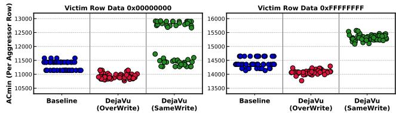

Figure 1: Double-Sided RowHammer (50°C)  $AC_{min}$  distribution across 50 iterations for different victim row initialization methods from one example DRAM row in Mfr. S 8Gb D-Die.

We perform comprehensive experimental characterization of DejaVu on 112 commercial-off-the-shelf DDR4 DRAM chips (14 DIMM modules) from all three major manufacturers span-

ning a wide range of DRAM die densities and die revisions using the FPGA-based DRAM Bender infrastructure [\[86](#page-13-1)[–89\]](#page-13-2). Our results show that, for double-sided RowHammer, at 50◦C compared to the baseline where we write to the victim row only once, 1) overwriting the victim row that is previously written with data 0xFF with data 0x00 reduces *ACmin* by 2.8% on average (up to 28.1%) across all tested DRAM rows, 2) overwriting the victim row (previously written 0x00) with data 0xFF reduces *ACmin* by 3.5% on average (up to 27.1%), 3) writing the same data 0x00 to the victim row twice increases *ACmin* by 3.0% on average (up to 23.8%), and 4) writing data 0xFF to the victim row twice increases *ACmin* by 3.6% on average (up to 46.1%). These three changes and their "direction" (i.e., whether they reduce or increase *ACmin*) are consistent across all tested DRAM chips and tested rows.

We also find that DejaVu affects the number of DRAM retention failure bitflips. Our characterization results show that initializing the tested row by first writing data 0x00 and then overwriting with data 0xFF induces 10.4% more (up to 36.7%) retention failure bitflips compared to writing the same data 0xFF to the tested row twice.

We provide two hypotheses to explain DejaVu. First, we hypothesize that overwriting the data in the victim row with the opposite data values causes under-restoration of the charge levels in the DRAM cells. Second, we hypothesize that writing different values to the victim row changes the charge trap states in the active region, causing changes in the trap-induced read disturbance leakage [\[63,](#page-12-6) [90](#page-13-3)[–93\]](#page-13-4) and the current passing capabilities of the DRAM cell access transistors. Although we cannot fully verify either of these hypotheses due to limited observability at the real DRAM-chip level, we conduct sensitivity studies on real DDR4 DRAM chips using the FPGAbased DRAM Bender infrastructure [\[86](#page-13-1)[–89\]](#page-13-2) to gain chip-level insights into these hypotheses.

First, we characterize how *ACmin* changes as we increase the write recovery time (i.e., we wait longer after the writing to the victim row before precharging the bank) for the second write to the victim DRAM row. We find that 1) the *ACmin* of SameWrite remains almost unchanged as the write recovery time of the second write increases, and 2) the second write of OverWrite needs a write recovery time more than 400× of the JEDEC standard value [\[94\]](#page-13-5) to achieve an *ACmin* distribution close to that of SameWrite. We conclude that the charge under-restoration hypothesis (i.e., the first hypothesis described above) alone does not fully explain DejaVu.

Second, to further investigate DejaVu's potential impact on the current passing capability of the DRAM cell access transistors, we characterize the reliability of Processing-Using-DRAM (PUD) [\[95](#page-13-6)[–99\]](#page-13-7) operations with DRAM rows initialized with DejaVu patterns. PUD operations are highly sensitive to the current passing capability of the DRAM cell access transistors because PUD operations rely on a delicate charge sharing process involving the simultaneous activation of multiple input DRAM rows. We find that by leveraging DejaVu, the number of bitlines that fail to always successfully perform MAJ-3 operation over 1000 repetitions significantly reduces compared to the baseline case where the DRAM rows are written only

once. We observe that, using random data patterns that both 1) match real program input data better than all 0x00s and all 0xFFs, and 2) maximize inter-bitline interference during simultaneous multi-row activation, when we overwrite the DRAM rows that are previously written with the opposite data values, the number of failed bitlines reduces by 32.7% (10.7%) on average compared to the baseline for 32-row (16-row) MAJ-3 operations. When we write the same data twice, the number of failed bitlines reduces by 30.6% (5.8%) on average compared to the baseline for 32-row (16-row) MAJ-3 operations. We hypothesize that DejaVu's effects at the device-level make the distribution of the current passing capabilities of the access transistors of DRAM cells more uniform, which improves the reliability of PUD operations, compared to the baseline where the DRAM rows are written only once.

Implications. Based on our observations, we discuss the two major implications of DejaVu on DRAM read disturbance testing and characterization methodology. First, to accurately characterize DRAM's vulnerability to read disturbance (e.g., *ACmin*) given a fixed data pattern, the tester should always initialize the victim row by first writing the opposite data values and then overwriting it with the intended data values (i.e., the OverWrite pattern) to cover the reduction in *ACmin* caused by DejaVu. Second, to explore the effect of different data patterns on DRAM read disturbance, the tester should avoid accidentally inducing DejaVu effects when initializing the DRAM rows involved in a test. For example, we recommend that testers always initialize the victim row by writing the same data values twice (i.e., SameWrite) to avoid attributing the difference in *ACmin* caused by DejaVu to the change in data patterns.

We also evaluate the additional performance overhead of read disturbance mitigation techniques (e.g., PARA [\[1\]](#page-12-0) and PRAC [\[100–](#page-13-8)[102\]](#page-13-9)) when their read disturbance thresholds need to be lowered to be secure against DejaVu. We show that DejaVu-caused reductions in read disturbance thresholds can degrade system performance with existing read disturbance mitigations: Our evaluation finds that reducing the read disturbance threshold by 20% to serve as a guardband to mitigate DejaVu causes a 6.3% performance overhead on average.

We make the following key contributions in this paper:

- We provide the first experimental demonstration and characterization of DejaVu, i.e., the phenomenon where the data previously written to DRAM cells affects DRAM's vulnerability to read disturbance. We also show that DejaVu similarly affects DRAM retention failure bitflips.
- We provide hypotheses and experimental insights into the root causes of DejaVu.
- We demonstrate that leveraging DejaVu (i.e., by writing to the input DRAM rows twice) improves the reliability of Processing-Using-DRAM (PUD) operations.
- We describe the implications of DejaVu. We demonstrate how DRAM read disturbance testing and characterization methodologies should take DejaVu into account to be more rigorous and comprehensive. We also evaluate the performance overhead of read disturbance mitigation techniques when they need to be more conservative to mitigate DejaVu.

## 2. Background

## 2.1. DRAM Organization

Figure 2 shows the logical organization of a DRAM chip. A DRAM chip consists of multiple DRAM banks that can operate independently of each other but share the same I/O resources of the chip. Inside a DRAM bank, DRAM cells are organized into a 2D array. DRAM cells in a row share the same wordline, and DRAM cells in a column share the same bitline that connects the DRAM cell(s) to the row buffer. A DRAM cell consists of a capacitor that stores one bit of information in the form of electric charge and an NMOS access transistor. The gate of the access transistor is connected to the wordline of the DRAM row, which controls whether or not the capacitor is connected to the bitline.

<span id="page-2-0"></span>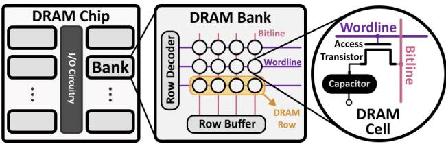

Figure 2: Logical organization of DRAM.

## 2.2. DRAM Operation

To access DRAM, the DRAM controller first sends a PRE (i.e., precharge) command to the bank that closes any opened DRAM row and prepares the bank for the following access. Second, the DRAM controller sends an ACT (i.e., activate) command to activate (i.e., open) a DRAM row in the bank. To open a DRAM row, the DRAM drives the wordline high to connect the capacitors of the DRAM cells in the row to the bitlines. The capacitor shares its charge with the bitline, creating a voltage disturbance the bitline sense amplifiers (BLSAs) in the row buffer can sense and amplify. After charge sharing, the DRAM row needs to be kept open for some time so that the BLSA can fully restore the charge level in the capacitor of the DRAM cell. When writing data to the DRAM, the memory controller needs to obey the write recovery timing constraint between the arrival of write data to the DRAM and sending a PRE command to close the row to allow sufficient charge restoration in the DRAM cells (i.e., tWR).

#### 2.3. DRAM Read Disturbance

Read disturbance is a phenomenon in DRAM where accessing a DRAM row (aggressor row) causes bitflips in *unaccessed* DRAM rows that are physically nearby (victim row). RowHammer [1–5,7,103] and RowPress [6–8,103] are two widespread examples of read disturbance in modern DRAM chips. RowHammer induces bitflips in victim rows by repeatedly opening and closing (i.e., hammering) aggressor row(s) many times. RowPress induces bitflips in victim rows by keeping the aggressor row(s) open for a long period of time without needing as many aggressor row activations as RowHammer.

## 3. DejaVu Characterization Methodology

#### 3.1. DRAM Characterization Infrastructure

We characterize DejaVu on commercial-off-the-shelf DDR4 DRAM chips using DRAM Bender [86–89], an FPGA-based

DRAM testing infrastructure that enables direct and finegrained control of DRAM commands, timings, and temperature. Figure 3 shows our testing infrastructure. Figure 4 shows our lab hosting the infrastructure.

<span id="page-2-1"></span>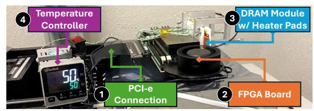

Figure 3: Our DRAM testing infrastructure.

<span id="page-2-2"></span>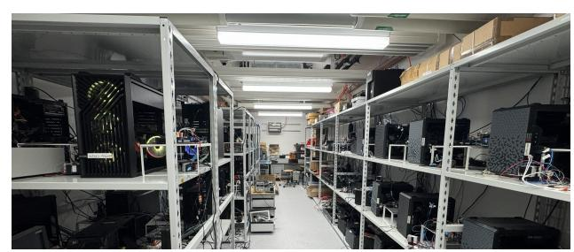

Figure 4: Our lab hosting the testing infrastructure.

The FPGA executes test programs that send DRAM commands with precise timings (1.5ns granularity) to the DRAM chips under test. A host PC generates the test programs and collects experiment results. A set of heater pads are attached to the DRAM chips, controlled by a temperature controller that can keep the temperature of the DRAM chips at programmed levels. Our infrastructure disables rank-level ECC so we can directly observe bitflips that happen at the circuit level.

## 3.2. DRAM Chips Characterized

Table 1 lists the 112 commercial-off-the-shelf DDR4 DRAM chips (14 modules) we characterize in this work. We test DRAM chips from all three major manufacturers (S, H, and M), spanning a wide variety of die densities and revisions. We reverse engineer the internal DRAM row address mapping schemes of all the chips we characterize to precisely place the aggressor and victim rows in our characterization.

Table 1: DRAM chips tested.

<span id="page-2-3"></span>

| Mfr. | ID    | Die Revision | Die Density | DQ | Num. Modules | Num. Chips |
|------|-------|--------------|-------------|----|--------------|------------|
| S    | S0    | D            | 8 Gb        | x8 | 1            | 8          |
| S    | S1    | M            | 16 Gb       | x8 | 1            | 8          |
| S    | S2    | A            | 16 Gb       | x8 | 1            | 8          |
| S    | S3    | В            | 16 Gb       | x8 | 1            | 8          |
| S    | S4    | С            | 16 Gb       | x8 | 1            | 8          |
| Н    | H0    | A            | 8 Gb        | x8 | 1            | 8          |
| H    | H1    | С            | 8 Gb        | x8 | 1            | 8          |
| H    | H2    | D            | 8 Gb        | x8 | 1            | 8          |
| Н    | H3    | A            | 16 Gb       | x8 | 1            | 8          |
| M    | M0    | E            | 8 Gb        | x8 | 1            | 8          |
| M    | M1    | R            | 8 Gb        | x8 | 1            | 8          |
| M    | M2-M4 | F            | 16 Gb       | x8 | 3            | 24         |

We do not test DDR5 or LPDDR5 DRAM chips because 1) there is currently no testing platform available that provides the same degree of low-level and fine-grained control of DRAM commands and timings as DRAM Bender for DDR4, and 2) prior work [104] shows that there is no fundamental difference in the DRAM cell array between DDR4 and DDR5. Therefore, we

believe testing commercial-off-the-shelf DDR4 DRAM chips is enough to reveal the intrinsic and previously unreported DRAM behavior at the circuit-level.

#### 3.3. True- and Anti-Cell Configurations

We reverse engineer the true- and anti-cell layout of tested DRAM chips using retention failure analyses, similar to prior works [4,6,103,105–108], in a best-effort manner. We adjust the data pattern written to the DRAM rows according to the reverse-engineered true- and anti-cell layout.

#### 3.4. DRAM Access Patterns

Read Disturbance. To characterize the read disturbance vulnerability, we use the double-sided access pattern where two aggressor rows sandwich a victim row, as Figure 5 a) shows. In the double-sided pattern, the two aggressors are activated in an alternating manner, as Figure 5 b) shows. For each aggressor row activation, we denote the interval between the corresponding ACT and PRE commands as the aggressor row on time (tAggON [6]). When tAggON is the minimum amount of time allowed by the JEDEC standard (we use 36ns), the access pattern is a RowHammer pattern. When tAggON is larger than 36ns, it is a RowPress pattern.

<span id="page-3-0"></span>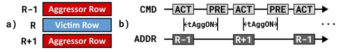

Figure 5: Double-sided RowHammer/RowPress DRAM access pattern.

**Victim Row Initialization.** The pseudocode in Listing 1 illustrates how we initialize the aggressor and victim rows in the double-sided access pattern differently for the baseline case and the two DejaVu cases (i.e., *OverWrite* and *SameWrite*).

Figure 6 illustrates the DRAM command sequence of the write\_row function in Listing 1. We first activate (ACT) the row, then send 128 write (WR) commands to all 128 cache lines in the DRAM row, and finally precharge (PRE) the bank. We

<span id="page-3-1"></span>Listing 1: Pseudocode of the baseline and DejaVu DRAM row initialization procedures.

```
def init_rows(R, aggr_data, victim_data, case):
     # Initialize the aggressor rows with aggr_data
     write_row(R-1, aggr_data)
     write_row(R+1, aggr_data)
     # Initialize the victim row with victim data
     # Baseline case
     if case == "Baseline":
        write_row(R, victim_data)
     # DejaVu cases
10
     else if case == "OverWrite":
11
12
        # First write opposite data to victim
        write_row(R, ~victim_data)
13
        # Then write actual data to victim
14
        write_row(R, victim_data)
15
     else if case == "SameWrite":
16
        # Write the same data to victim twice
17
18
        write_row(R, victim_data)
        write_row(R, victim_data)
19
```

respect all related DRAM timing constraints (tRCD, tCCD\_L, tWR, tRP [109–111]) when writing to the DRAM row.

<span id="page-3-2"></span>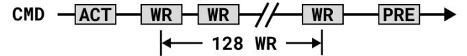

Figure 6: DRAM command sequence of write\_row.

Measuring  $AC_{min}$ . We quantify the DRAM read disturbance vulnerability using the minimum aggressor row activation count to induce a bitflip  $(AC_{min})$ . For a given victim row, we use a bisection-based method to iteratively measure  $AC_{min}$  until the difference in measurements between two consecutive iterations is less than 10. In each iteration, whether we find bitflips or not, we always re-initialize the aggressor and victim rows based on the procedure in Listing 1.

We strictly control the execution time of each iteration of our  $AC_{min}$  measurement algorithm. We make sure that each iteration takes strictly less than 64ms (i.e., the refresh window of DDR4 [94]) to execute, to avoid observing any retention failure bitflips in the  $AC_{min}$  measurement. During each iteration, our testing infrastructure does not issue any auto-refresh commands to make the timings of our testing program precise.

#### 4. Foundational Characterization Results

To comprehensively characterize DejaVu, we randomly sample 128 victim rows each in all DRAM modules we test. For each victim row, we repeat the  $AC_{min}$  measurement 50 times. We test both 0x00 and 0xFF data patterns in the victim DRAM rows. The aggressor rows are always initialized with the *opposite* data pattern compared to the victim row.

#### <span id="page-3-4"></span>4.1. RowHammer $AC_{min}$ Characterization Results

Figure 7 shows the distribution of the minimum DejaVu  $AC_{min}$  (y-axis, measured across all 50 repetitions for each of the tested rows, red for OverWrite, green for SameWrite) normalized to the minimum baseline  $AC_{min}$  (i.e., victim row written only once) for Double-Sided RowHammer at a temperature of  $50^{\circ}\mathrm{C}$ , for victim data pattern 0x00, in box and whisker plots. The box spans the first quartile (Q1) and the third quartile (Q3) of the data. The whiskers span  $1.5\times$  the interquartile range (i.e.,  $1.5\times(Q3-Q1)$ ) from the Q3 and Q1. Data values outside of the whiskers are outliers (white dots). Note that the yellow dot in the box represents the geometric mean of the normalized  $AC_{min}$  values. We make the following three observations from the data.

<span id="page-3-3"></span>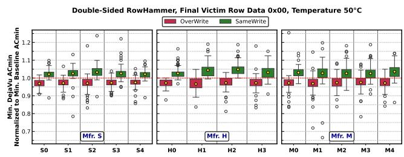

Figure 7: Minimum DejaVu  $AC_{min}$  normalized to minimum baseline  $AC_{min}$ , Double-Sided RowHammer, victim data 0x00,  $50^{\circ}$ C. Distribution across all 128 tested rows per module.

**Observation 1.** DejaVu is a widespread phenomenon across DRAM chips from all three major manufacturers.

**Observation 2.** By overwriting the victim row data,  $AC_{min}$  consistently decreases, while by writing the same data to the victim row twice,  $AC_{min}$  consistently increases.

We observe that, except for a few outliers, by overwriting the victim row with 0x00 (i.e., the row is previously written with 0xFF; the OverWrite pattern), the minimum  $AC_{min}$  reduces by 2.8% on average across all tested rows, DRAM chips, and all three manufacturers (2.8% for Mfr. S, 2.9% for Mfr. H, 2.8% for Mfr. M). By writing the same 0x00 data to the victim row twice (i.e., the SameWrite pattern), the minimum  $AC_{min}$  increases by 3.0% on average across all tested rows, DRAM chips, and all three manufacturers (2.5% for Mfr. S, 2.9% for Mfr. H, 3.7% for Mfr. M).

**Observation 3.** Although the average decrease (increase) in  $AC_{min}$  is small, there are outliers that significantly change the minimum  $AC_{min}$  measured.

We observe that certain outliers significantly decrease (for OverWrite) or increase (for SameWrite) the minimum  $AC_{min}$  in certain tested victim rows. For example, the maximum decrease in minimum  $AC_{min}$  caused by OverWrite is 16.8%, 18.8%, and 28.1%, for Mfr. S, H, and M, respectively. The maximum increase in minimum  $AC_{min}$  caused by SameWrite is 23.8%, 19.0%, and 19.8%, for Mfr. S, H, and M, respectively.

Figure 8 shows the same distribution as in Figure 7, but with the victim data pattern being 0xFF. We make the following observation from the data.

<span id="page-4-0"></span>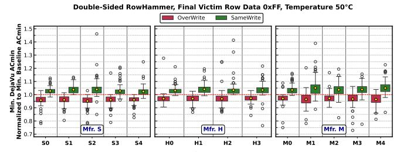

Figure 8: Minimum DejaVu  $AC_{min}$  normalized to minimum baseline  $AC_{min}$ , Double-Sided RowHammer, victim data 0xFF,  $50^{\circ}$ C. Distribution across all 128 tested rows per module.

**Observation 4.** The change in  $AC_{min}$  caused by DejaVu is larger when the victim data pattern is 0xFF compared to 0x00.

We observe that by overwriting the victim row with 0xFF (i.e., the row is previously written with 0x00), the minimum  $AC_{min}$  reduces by 3.5% (compared to 2.8% with the 0x00 data pattern) on average across all 1792 tested rows, 112 DRAM chips, and all three manufacturers (4.2% for Mfr. S, 3.0% for Mfr. H, 3.3% for Mfr. M, compared to 2.8%, 2.9%, and 2.8%, with the 0x00 data pattern). By writing the same 0xFF data to the victim row twice, the minimum  $AC_{min}$  increases by 3.6% (compared to 3.0% with the 0x00 data pattern) on average across all tested rows, DRAM chips, and all three manufacturers (3.1% for Mfr.

S, 3.5% for Mfr. H, 4.2% for Mfr. M, compared to 2.5%, 2.9%, and 3.7%, with the  $0\times00$  data pattern).

The maximum decrease in minimum  $AC_{min}$  caused by Over-Write is 26.2%, 15.8%, and 27.1%, for Mfr. S, H, and M, respectively (compared to 16.8%, 18.8%, and 28.1% with the 0x00 data pattern). The maximum increase in minimum  $AC_{min}$  caused by SameWrite is 46.1%, 41.4%, and 38.9%, for Mfr. S, H, and M, respectively (compared to 23.8%, 19.0%, and 19.8% with the 0x00 data pattern).

We hypothesize that one of the reasons for DejaVu to cause a larger change in  $AC_{min}$  is that since the DRAM cell access transistor is an NMOS, it is more difficult to restore a "1" than a "0" [112,113]. We provide more characterization, analyses, and hypotheses on the relationship between DejaVu and DRAM cell charge restoration in Section 6 and Section 7.

**Takeaway 1.** DejaVu causes consistent changes in  $AC_{min}$  on DRAM chips from all three manufacturers for Double-Sided RowHammer. By overwriting the victim row with data that is opposite to the previously written data,  $AC_{min}$  consistently decreases, while by writing the same data to the victim row twice,  $AC_{min}$  consistently increases.

**Takeaway 2.** The DejaVu-induced changes in  $AC_{min}$  are larger when writing 0xFF to the victim row compared to writing 0x00 for Double-Sided RowHammer.

We also characterize Double-Sided RowHammer  $AC_{min}$  of DejaVu at a higher DRAM temperature of  $80^{\circ}\mathrm{C}$ . Table 2 shows 1) the changes in the minimum  $AC_{min}$  of DejaVu patterns normalized to the baseline  $AC_{min}$  where the victim row is written only once, and 2) the maximum change in minimum  $AC_{min}$  caused by DejaVu across all tested rows and repetitions compared to the baseline  $AC_{min}$ , for both  $50^{\circ}\mathrm{C}$  and  $80^{\circ}\mathrm{C}$ .

We make similar observations in how DejaVu changes the minimum  $AC_{min}$  compared to the baseline across different DejaVu write patterns and data patterns at  $80^{\circ}\mathrm{C}$  as for  $50^{\circ}\mathrm{C}$ . For example, at both  $50^{\circ}\mathrm{C}$  and  $80^{\circ}\mathrm{C}$ , SameWrite consistently increases  $AC_{min}$  while OverWrite consistently decreases  $AC_{min}$  compared to the baseline.

<span id="page-4-1"></span>

| DejaVu<br>Pattern | Final<br>Victim<br>Data | Mfr.        | Norm. Min.<br>ACmin<br>@ 50°C | Norm. Min.<br>ACmin<br>@ 80°C | Max. Change<br>in ACmin<br>@ 50°C | Max. Change<br>in ACmin<br>@ 80°C |
|-------------------|-------------------------|-------------|-------------------------------|-------------------------------|-----------------------------------|-----------------------------------|
| SameWrite         | 0×00                    | S<br>M<br>H | 2.5%<br>2.9%<br>3.7%          | 2.1%<br>2.2%<br>3.2%          | 23.8%<br>19.8%<br>19.0%           | 36.0%<br>23.2%<br>21.2%           |
|                   | 0×FF                    | S<br>M<br>H | 3.1%<br>4.2%<br>3.5%          | 2.5%<br>3.2%<br>3.2%          | 46.1%<br>38.9%<br>41.4%           | 31.8%<br>31.5%<br>30.7%           |
| OverWrite         | 0×00                    | S<br>M<br>H | -2.8%<br>-2.8%<br>-2.9%       | -2.2%<br>-2.3%<br>-2.4%       | -16.8%<br>-28.1%<br>-18.8%        | -18.5%<br>-21.9%<br>-18.8%        |
| Overwine          | 0×FF                    | S<br>M<br>H | -4.2%<br>-3.3%<br>-3.0%       | -3.5%<br>-2.9%<br>-3.0%       | -26.2%<br>-27.1%<br>-15.8%        | -20.3%<br>-42.9%<br>-25.0%        |

Table 2: The changes in normalized minimum  $AC_{min}$  for different DejaVu cases and victim row data patterns at  $50^{\circ}$ C and  $80^{\circ}$ C. Result across all 1792 tested rows (128 rows per module; 14 modules in total).

**Observation 5.** DejaVu changes  $AC_{min}$  in the same direction at a higher temperature of 80°C compared to 50°C.

## 4.2. RowPress $AC_{min}$ Characterization Results

Figure 9 shows the distribution of the minimum DejaVu  $AC_{min}$  (y-axis, measured across all 50 repetitions for each of all the 1792 tested rows (128 rows per module; 14 modules in total), red for OverWrite, green for SameWrite) normalized to the minimum baseline  $AC_{min}$  for Double-Sided RowPress with different additional tAggON (x-axis) at a temperature of  $80^{\circ}$ C, for victim data pattern 0xFF, in jittered scatter plots. The yellow dot represents the geometric mean. We do not show the data in a box and whiskers plot for clarity due to the large number of outliers. We also crop the top of the y-axis to make the majority of the  $AC_{min}$  distribution more readable. We observe that DejaVu causes consistent changes in  $AC_{min}$  on DRAM chips from all three manufacturers for Double-Sided RowPress, similar to Double-Sided RowHammer.

<span id="page-5-0"></span>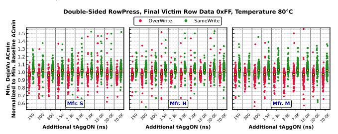

Figure 9: Minimum DejaVu  $AC_{min}$  normalized to minimum baseline  $AC_{min}$ , Double-Sided RowPress, victim data 0xFF,  $80^{\circ}$ C. Result across all 1792 tested rows (128 rows per module; 14 modules in total).

The  $AC_{min}$  distributions shown in Figure 9 do not show the full picture of how DejaVu affects RowPress bitflips because the plotting methodology cannot illustrate a scenario where the baseline victim row initialization case fails to induce any bitflips, but the two DejaVu cases can. Figure 10 shows the total number of instances (i.e., across all tested victim rows, tAggON, both 0x00 and 0xFF victim data patterns, and temperatures) in which bitflips are induced only when the victim rows are initialized with either of the two DejaVu patterns (OverWrite and SameWrite), i.e., the baseline where the victim row is written only once does not induce any bitflips in all 50 iterations.

<span id="page-5-1"></span>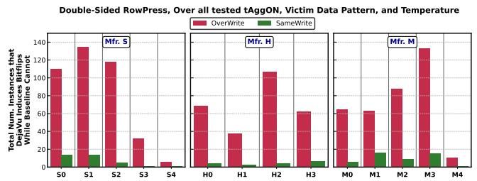

Figure 10: The total number of instances across all tested victim rows, tAggON, victim data pattern, and temperatures that RowPress bitflips are induced *only* when the victim rows are initialized with either of the two DejaVu patterns (OverWrite and SameWrite) but not the baseline pattern in all 50 iterations. Summed across all 128 tested rows per module.

We observe that by initializing the victim row with DejaVu, we can induce RowPress bitflips in more scenarios compared to the baseline case where we write to the victim only once. Overwriting the victim row data is more effective at inducing these new bitflips compared to writing the same data to the victim row.

**Takeaway 3.** DejaVu worsens DRAM's vulnerability to RowPress by inducing bitflips that are not inducible with best prior methods.

## 5. Retention Failure Bitflip Characterization Results

We also characterize how DejaVu affects DRAM retention failure bitflips [105, 114, 115]. We perform retention failure tests on the same rows as the victim rows used in the  $AC_{min}$  tests. For each row we test, we initialize it with final data pattern 0xFF using either the OverWrite or SameWrite pattern (as described in Listing 1). For all other rows in the bank, we initialize them with data pattern 0x00. We set the DRAM temperature to 95°C and pause DRAM refresh for 4 seconds to quickly induce a large number of retention failure bitflips [116]. For each row we test, we repeat the experiment 50 times.

Figure 11 shows an example of the distribution of DRAM retention failure bitflips after we initialize the tested row with the OverWrite (red) or SameWrite (green) pattern (i.e., for OverWrite, first writing data 0x00 and then overwriting with data 0xFF; for SameWrite, writing data 0xFF twice) across 50 experiment repetitions from one tested module from Mfr. S. We observe that initializing the row with the OverWrite pattern consistently induces more retention failure bitflips compared to the SameWrite pattern. The geometric mean of the average number of retention failure bitflips from OverWrite is  $1.12\times$  (up to  $1.24\times$ ) that from SameWrite across all 128 tested rows and 50 repetitions in this example module.

<span id="page-5-2"></span>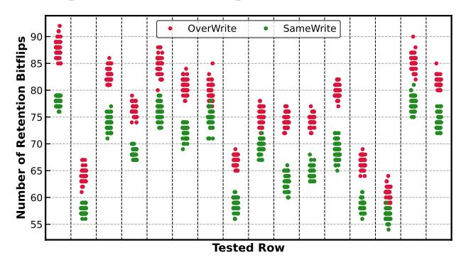

Figure 11: Example distribution of DRAM retention failure bitflips from 16 example tested rows initialized with OverWrite and SameWrite from one example module.

Figure 12 shows the distribution of the average number of DRAM retention failure bitflips from OverWrite normalized to SameWrite for all tested rows and modules. We highlight y=1.0 with the dashed blue line. We observe that when initializing a tested row with the OverWrite pattern, we can induce more retention failure bitflips compared to using the SameWrite pattern for all tested DRAM rows and chips across

all three manufacturers. On average (geometric mean), Over-Write induces 10.4% more bitflips compared to SameWrite (up to 36.7% more).

<span id="page-6-2"></span>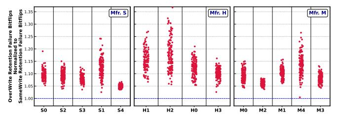

Figure 12: Distribution of the average number of DRAM retention failure bitflips from OverWrite normalized to SameWrite across all 128 tested rows per module.

**Takeaway 4.** DejaVu worsens DRAM's vulnerability to retention failures.

## <span id="page-6-0"></span>6. Hypotheses on the Causes of DejaVu

Based on our observations and prior works, we propose two non-mutually exclusive hypotheses on the potential physical mechanisms behind DejaVu.

#### 6.1. Charge Under-Restoration in the Capacitor

Activating a DRAM row is *destructive* for the information stored in the DRAM cell capacitor because the cell capacitance is much smaller than that of the bitline. After charge sharing, the cell capacitor voltage becomes very close to  $V_{DD}/2$  instead of  $V_{DD}$  or 0. Therefore, after charge sharing, the DRAM row needs to stay open for the bitline sense amplifier (BLSA) to *restore* the charge level in the cell capacitors. We hypothesize one of the reasons that causes DejaVu in DRAM is that overwriting the DRAM row with opposite data (OverWrite) may cause *charge under-restoration* in the DRAM cell capacitors compared to writing the same data twice (SameWrite).

We find two pieces of empirical evidence from our characterization results and testing methodology that potentially support this hypothesis. First, Observation 4 shows that the reduction in  $AC_{min}$  is higher when we overwrite the victim row that was previously written with 0x00 with 0xFF compared to overwriting the victim row that was previously written with 0xFF with 0x00. Since the DRAM access transistor is an NMOS, as the cell capacitor voltage increases (i.e., when writing 0xFF), the Gate-Source  $(V_{GS})$  voltage of the access transistor reduces, which reduces the current passing capability of the access transistor [112, 117] and makes 0xFF more difficult to fully restore compared to 0x00.

Second, the process of writing to all cache lines in the DRAM row is a serialized process. The cache lines that are written earlier have more effective charge restoration time compared to those written later in the DRAM row. For example, when writing to the entire DRAM row (i.e., 128 cache lines), the first cache block has  $127\times$  tCCD\_L more effective write recovery time compared to the last cache block, potentially leading to a charge under-restoration in the later cache lines. If we observe a significant concentration of the bitflips in the later cache lines of the victim DRAM row, then our observation that OverWrite worsens DRAM read disturbance compared to SameWrite can

be explained as follows: the later cache lines in the victim DRAM row have much smaller effective charge restoration time with respect to the *final* data pattern with SameWrite compared to OverWrite.

Unfortunately, due to limited observability and control at the DRAM chip level, it is difficult to directly identify the exact root cause(s) of DejaVu. Therefore, to gain chip-level insights into the *charge under-restoration* hypothesis, we empirically stress the hypothesis in Section 7.1 and Section 7.2 by performing further characterizations that sweep *additional* write-recovery time before sending PRE and study the spatial distribution of the *initial* bitflips within the victim DRAM row, respectively.

#### 6.2. Charge Trap State Changes in the Active Region

Second, we hypothesize that the process of writing different data values to the DRAM cell changes the charge trap states in the active regions where the DRAM access transistors are formed. These charge traps can trap electrons when the DRAM row is open, and then release them when the row is closed [63, 90–93]. Prior device-level studies on DRAM read disturbance [63, 90–93] identify charge trap assisted electron migration and injection into the victim cell as one of the major mechanisms behind RowHammer and RowPress.

We hypothesize that DejaVu may change the charge trap occupancy states in the active region that can affect  $AC_{min}$  in the following two ways. First, DejaVu-induced changes in the charge trap occupancy states may change the effective threshold voltage and the current passing capability of the access transistors of the victim DRAM cells, affecting the subthreshold leakage current of the victim DRAM cells.

Second, writing to the victim DRAM cells may also change the charge trap occupancy states for charge traps near the aggressor DRAM cells. In modern  $6F^2$  high density DRAM layout [63, 93, 103, 118], two DRAM access transistors in two physically adjacent DRAM rows can share the same *physical* active region. Therefore, charge traps whose occupancies are perturbed by writing to the victim row can influence the read-disturbance-induced leakage caused by trap-assisted electron migration and injection [63, 90–93] of the physically adjacent aggressor row *during* subsequent hammering.

Due to limited observability and control at the DRAM chip level, we characterize how DejaVu patterns affect the reliability of Processing-Using-DRAM (PUD) operations [95–98] in Section 8 to provide empirical evidence for this *charge trap state change* hypothesis. PUD operations [95–98] are highly sensitive to the current passing capability of the DRAM cell access transistors because PUD operations rely on a delicate charge sharing process involving the simultaneous activation of multiple input DRAM rows.

#### <span id="page-6-1"></span>7. Deeper Characterization of DejaVu

#### <span id="page-6-3"></span>7.1. Sensitivity to Additional Write Recovery Time

To investigate the potential impact of the difference in charge restoration (i.e., write recovery) time on  $AC_{min}$  for DejaVu, we modify the DejaVu pattern to include additional wait times (i.e., additional write recovery time) for the second write to the victim DRAM row. Figure 13 depicts the modified pattern.

<span id="page-7-1"></span>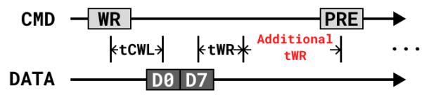

Figure 13: DejaVu with additional Write Recovery Time.

Figure 14 shows the Double-Sided RowHammer  $AC_{min}$  distribution (y-axis) of the unmodified baseline pattern where we write to the victim row only once without any additional write recovery time (blue) and the two DejaVu patterns (red and green) as the additional write recovery time (x-axis) to the second write of the DejaVu patterns increases. For the two DejaVu patterns, a write recovery time of 0ns corresponds to the unmodified DejaVu pattern (Figure 6). For clarity, we choose three representative victim rows, one each from a DRAM module from each of the three major manufacturers.

<span id="page-7-2"></span>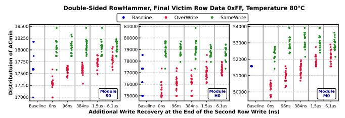

Figure 14: Distribution of the baseline and DejaVu Double-Sided RowHammer  $AC_{min}$  with different additional write recovery time to the second write; Victim data pattern 0xFF, temperature  $80^{\circ}\mathrm{C}$ ; Three representative victim rows from three representative modules from each of the three manufacturers.

We observe that as the additional write recovery time increases, the  $AC_{min}$  of the OverWrite pattern also increases, while the  $AC_{min}$  of the SameWrite pattern remains almost the same (S0 and H0), or slightly increases with a magnitude smaller than that of the OverWrite pattern (M0). Based on this observation, we believe the charge (under-)restoration hypothesis alone is insufficient to explain DejaVu. Although the increase in OverWrite's  $AC_{min}$  as additional write recovery time grows seems to agree with the charge restoration hypothesis, it is difficult to explain why there is only a very small change (if at all) in the  $AC_{min}$  of SameWrite. Moreover, it is unlikely that it takes more than 6100ns (more than  $400 \times$ the standard tWR specified by the JEDEC standard [94]) to fully restore the charge level in the victim cell (i.e., even after 6100ns, the  $AC_{min}$  of the OverWrite pattern is still lower than that of the SameWrite pattern).

We also observe that the  $AC_{min}$  distribution of the baseline pattern shows a much larger spread compared to both DejaVu patterns. We hypothesize that since the baseline pattern writes to the victim row only once, the actual physical process that occurs in the baseline pattern is much less consistent compared to the DejaVu patterns.

## <span id="page-7-0"></span>7.2. Spatial Distribution of RowHammer Bitflips Under DejaVu

To provide insights into whether the imbalance of effective write recovery time of different cache lines in the row is the major factor behind DejaVu, we analyze the distribution of the indices of the cache lines where the *initial* RowHammer bitflips appear in our tests. Figure 15 shows the cumulative

probability of all the *initial* Double-Sided RowHammer bitflips (i.e., those that flip at  $AC_{min}$ ) cache block indices for all tested victim rows, all chips, all data patterns, and all temperatures.

<span id="page-7-3"></span>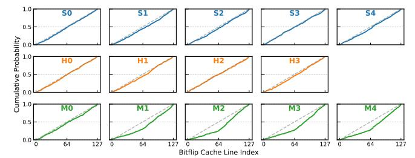

Figure 15: Cumulative probability distribution of all the initial Double-Sided RowHammer bitflips cache block indices for all tested victim rows, all chips, all data patterns, all temperatures.

We observe that, for the majority of the modules tested (except for M1-M4<sup>1</sup>), there is no significant accumulation of the Double-Sided RowHammer bitflips in the cache lines towards the end of the victim row (i.e., the distribution follows the y=x line). We hypothesize that this implies the charge underrestoration caused by the imbalanced effective write recovery time is not the *only* mechanism involved in DejaVu.

Figure 16 shows the same Double-Sided RowHammer  $AC_{min}$  distribution of the OverWrite and SameWrite patterns compared to the baseline pattern as Figure 14 but for three modules that have the Double-Sided RowHammer bitflip cache block indices more concentrated in the second half of the victim row (i.e., the distribution is below the y=x line). Interestingly, these modules also behave the same as the other modules in the additional write recovery characterization in Section 7.1. We call for more detailed study to understand and explain this observation.

<span id="page-7-5"></span>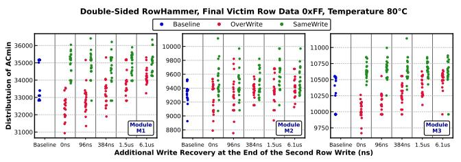

Figure 16: Distribution of the baseline and DejaVu Double-Sided RowHammer  $AC_{min}$  with different additional write recovery time to the second write; Victim data pattern 0xFF, temperature  $80^{\circ}$  C; Three representative victim rows from Modules M1, M2, and M3.

#### 7.3. Data Patterns

We test the  $0\times00$  and  $0\times FF$  data patterns in the previous sections because there exists no solid reverse-engineering methodology to uncover the mapping between the DQ pins and the bitlines in the DRAM cell array. Without such a methodology, there is no guarantee that a checkerboard pattern (i.e.,  $0\times AA$  and  $0\times55$ ) sent to the DRAM will end up being the same checkerboard pattern in the DRAM cell array. Therefore, to avoid introducing uncontrolled factors in our results, we choose to use the  $0\times FF$  and  $0\times00$  patterns. In this section, we present

<span id="page-7-4"></span> $<sup>^1</sup>$ We attribute this to 1) potential half-row organization [103] in the DRAM array, and 2) sophisticated inter- and intra-row interleaving of true- and anticells [103, 105, 107, 115] that we could not fully reverse engineer.

data for selected experiments with the checkerboard 0xAA and 0x55 data patterns and show that our major observations and takeaways still hold for the checkerboard data patterns.

Figures 17 and 18 show the distribution of the *minimum* DejaVu  $AC_{min}$  normalized to the *minimum* baseline  $AC_{min}$  for victim row data patterns 0xAA and 0x55, respectively, using the same methodology as in Figures 7 and 8. We find that OverWrite reduces the minimum  $AC_{min}$  by 2.1% (2.3%), 2.7% (2.9%), and 0.8% (0.6%) compared to the baseline where the victim row is written only once for Mfr. S, H, and M, respectively, for the 0xAA (0x55) victim data pattern. We conclude that our major observations on how DejaVu changes  $AC_{min}$  compared to the baseline case where the victim row is written only once (Observations 1-3 in Section 4.1) still hold for the checkerboard data patterns.

<span id="page-8-1"></span>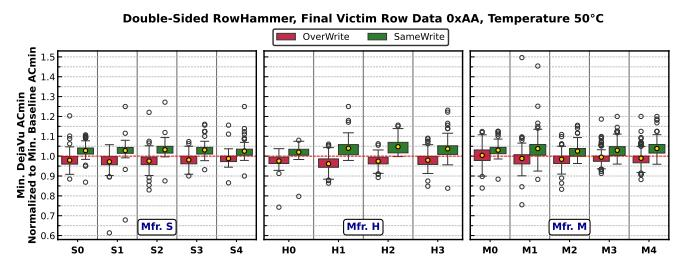

Figure 17: Minimum DejaVu  $AC_{min}$  normalized to minimum baseline  $AC_{min}$ , Double-Sided RowHammer, victim data 0xAA,  $50^{\circ}$ C. Distribution across all 128 tested rows per module.

<span id="page-8-2"></span>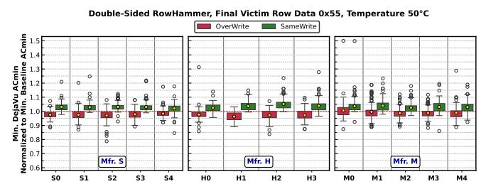

Figure 18: Minimum DejaVu  $AC_{min}$  normalized to minimum baseline  $AC_{min}$ , Double-Sided RowHammer, victim data 0x55,  $50^{\circ}$ C. Distribution across all 128 tested rows per module.

Figures 19 and 20 show the distribution of the average number of DRAM retention failure bitflips from OverWrite normalized to SameWrite for all tested rows and modules for data patterns 0xAA and 0x55, respectively, using the same methodology as in Figure 12. We observe that on average, OverWrite increases the number of retention failure bitflips by 10.7% and 10.6% (up to 123.2% and 67.6%) for the 0xAA and 0x55 data patterns, respectively, compared to SameWrite. We conclude that our major takeaway on how DejaVu enhances DRAM's vulnerability to retention failures (Takeaway 4) still holds for the checkerboard data patterns.

Figures 21 and 22 show the Double-Sided RowHammer  $AC_{min}$  distribution (y-axis) of the baseline pattern (blue) and the two DejaVu patterns (red and green) as the additional write recovery time (x-axis) to the second write of the DejaVu patterns increases for data patterns 0xAA and 0x55, respectively, using the same methodology as in Figure 14. We reach the same conclusion as we do in Section 7.1 that charge under-restoration is likely *not* the major underlying

<span id="page-8-3"></span>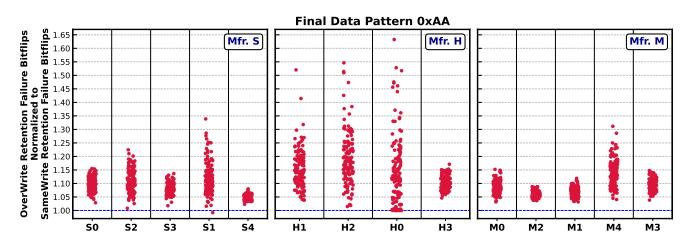

Figure 19: Example distribution of the average number of DRAM retention failure bitflips from OverWrite normalized to SameWrite (0xAA data pattern) across all 128 tested rows per module.

<span id="page-8-4"></span>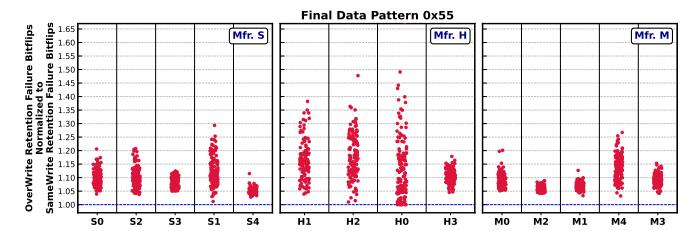

Figure 20: Example distribution of the average number of DRAM retention failure bitflips from OverWrite normalized to SameWrite (0x55 data pattern) across all 128 tested rows per module.

<span id="page-8-5"></span>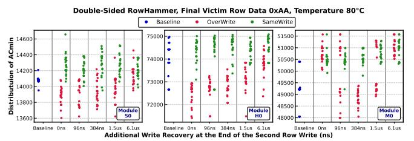

Figure 21: Distribution of the baseline and DejaVu Double-Sided RowHammer  $AC_{min}$  with different additional write recovery time to the second write; Victim data pattern 0xAA, temperature  $80^{\circ}\mathrm{C}$ ; Three representative victim rows from three representative modules from each of the three manufacturers.

<span id="page-8-6"></span>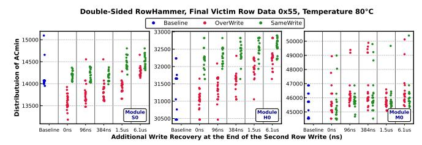

Figure 22: Distribution of the baseline and DejaVu Double-Sided RowHammer  $AC_{min}$  with different additional write recovery time to the second write; Victim data pattern 0x55, temperature  $80^{\circ}\mathrm{C}$ ; Three representative victim rows from three representative modules from each of the three manufacturers.

mechanism that fully explains DejaVu.

## <span id="page-8-0"></span>8. Impact of DejaVu on PUD Reliability

To further investigate the hypothesis that the DejaVu patterns (i.e., OverWrite and SameWrite) affect the charge trap states in the silicon substrates of the DRAM cell access transistors, we experimentally examine and characterize how DejaVu changes the reliability and stability of Processing-Using-DRAM (PUD) [95–99,119–129] operations on real COTS DRAM chips [97,98,124–127,129,130]. Recently demonstrated PUD operations on real commercial-off-the-shelf (COTS) DRAM chips rely on a delicate charge sharing process involving the

simultaneous activation of multiple input DRAM rows in the same subarray [97,98], which is highly sensitive to the current passing capability of the DRAM cell access transistors that is affected by the charge trap states in the silicon substrate of the transistors.

#### 8.1. Testing Methodology

Finding Subarray Boundaries. To understand the effect of DejaVu on the computational capability of PUD operations performed in a DRAM subarray, we follow the methodology used in prior works to first identify subarray boundaries [88, 97, 98, 125–127, 130, 131]. We leverage the observation that it is possible to copy a row's data to another row (i.e., RowClone operation [130, 132]) within the same subarray by leveraging the shared bitlines. We repeatedly perform RowClone across all tested rows. If we can copy a row's data to another row, we conclude that the source row and the destination row are in the same subarray. Based on this observation, we reverse engineer the subarray boundaries and determine which rows are in the same subarray.

**Finding Simultaneously Activated Rows.** Prior works [97, 98, 127] show that issuing an ACT-PRE-ACT command sequence with violated timings and followed by a WR command overwrites the simultaneously activated rows with data supplied with the WR command. We follow the same methodology and reverse engineer the simultaneously activated rows with the ACT-PRE-ACT command sequence for every row address in a tested subarray. Similar to prior works [97, 98], we observe that real DRAM chips can activate 2, 4, 8, 16, and 32 rows in the same subarray.

Bitwise Majority-of-Three Experiments. We follow the same methodology of prior work that leverages simultaneous multiple-row activation to perform in-DRAM majority-of-three (MAJ3) experiments [97]. We perform MAJ3 operations using 16- and 32-row activation (i.e., simultaneously activating 16 and 32 rows), as DRAM performs MAJ3 using 16- and 32-row activation much more reliably than using 4- and 8-row activation [97]. We use random data patterns (i.e., each input value of MAJ3 is generated randomly) that both 1) likely match real program input data better than all 0x00s and all 0xFFs, and 2) maximize inter-bitline interference during simultaneous multi-row activation.

To perform MAJ3 operation with N-row activation (i.e., simultaneously activating N rows, where N can be either 16 or 32), we replicate each MAJ3 input operand (i.e., a total of three input operands)  $\lfloor N/3 \rfloor$  times. For example, if we perform MAJ3 with 32-row activation, we replicate each input ten (i.e.,  $\lfloor 32/3 \rfloor = 10$ ) times. Since the number of DRAM rows opened is not a multiple of 3, we initialize the remaining activated DRAM rows in a way that they do not contribute to bitline voltage, using the Frac operation [126]. For example, if we perform MAJ3 with 32-row activation, we perform the Frac operation on the remaining two DRAM rows.

**Number of Tested Instances.** To maintain a reasonable testing time, we randomly select a total of three subarrays in one bank per DRAM module. Within each subarray, we randomly test 100 different groups of rows that are simultaneously acti-

vated, each for 16- and 32-row activation.

Reliability Metric. We define bitline failure rate as a metric to evaluate the reliability of MAJ3 operations. The bitline failure rate refers to the percentage of DRAM cells (bitlines) that produce an *incorrect* output in at least one of the trials (we perform a total of 1K trials). Even if a bitline produces an incorrect result just once, we refer to this DRAM bitline as an unstable bitline that cannot be used to perform MAJ3 operations. For example, if a MAJ3 operation has a 25% bitline failure rate, it means that 75% of the DRAM bitlines always produce correct results in the simultaneously activated rows and can be used to reliably perform that operation.

#### 8.2. Results

Figure 23 shows the reduction in bitline failure rate (y-axis) as we leverage DejaVu (SameWrite and OverWrite) to initialize the 16 or 32 (left and right plots, respectively) DRAM rows involved in the MAJ3 operation from all tested row groups in all tested DRAM chips as we change the *additional* write recovery time (x-axis) we set between the arrival of the data burst of the last cache block write to the row and the next PRE command (as in Figure 13).

<span id="page-9-0"></span>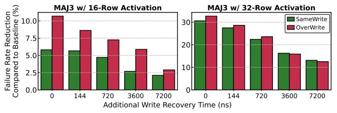

Figure 23: Bitline failure reduction leveraging DejaVu compared to baseline.

We make the following two observations. First, when the additional write recovery time is 0, OverWrite reduces the bitline failure rate by 10.7% (MAJ3 - 16 row) and 32.7% (MAJ3 - 32 row) compared to the baseline. SameWrite reduces the bitline failure rate by 5.8% (MAJ3 - 16 row) and 30.6% (MAJ3 - 32 row) compared to the baseline. As such, using the DejaVu effect can make PUD operations much more reliable. Second, as the additional write recovery time increases, the bitline failure rate reduction caused by DejaVu decreases.

#### 8.3. Hypotheses

Due to limited observability from the DRAM chip's level, we provide two hypotheses to explain 1) why both DejaVu access patterns (i.e., SameWrite and OverWrite) improve the reliability of PUD operations compared to the baseline case where the DRAM row(s) are written to only once, and 2) why the OverWrite pattern increases the reliability of PUD operations more than that of SameWrite.

First, we hypothesize that both DejaVu access patterns make the charge trap occupancy states in the silicon substrate of the DRAM cell access transistors more uniform compared to the baseline case. In the baseline case, since the DRAM row(s) are written to only once, the charge trap occupancy states are more random compared to DejaVu. A more uniform distribution of charge trap occupancy states reduces the variations in the current passing capabilities of the DRAM access transistors, which improves the reliability of PUD operations.

Second, we hypothesize that OverWrite increases the current passing capabilities of the DRAM cell access transistors, making the charge sharing process of PUD operation more robust. This hypothesis empirically agrees with our Observation 2 that OverWrite consistently reduces *ACmin* (i.e., the leakage current caused by RowHammer is higher when the victim row is initialized with OverWrite).

From our results and hypotheses, we call for more research, especially research to study the device-level operation and physical mechanisms of DRAM, to 1) fundamentally understand the root causes of DejaVu and its effects on both read disturbance and PUD operations, and 2) reduce the variation of the current passing capabilities of the DRAM access transistors to enable fundamentally more reliable PUD operations.

## 9. Implications of DejaVu on DRAM Testing and Characterization Methodology

## 9.1. Finding the Worst-Case Read Disturbance Threshold

Our extensive characterization results from Section [4.1](#page-3-4) to Section [7](#page-6-1) demonstrate how DejaVu (especially the Over-Write pattern) can exacerbate DRAM read disturbance and retention failure bitflips. Since data update is a fundamental operation and very common in real system operations, DRAM testing and characterization methodologies should account for the DejaVu effects to enable safer and more robust DRAM operation. To this end, we propose incorporating the following practices into DRAM testing and characterization methodologies for read disturbance and retention failure bitflips:

- 1. Initialize the victim data using OverWrite (i.e., first write opposite data, then write the actual test data) to capture the DejaVu-induced reduction of *ACmin* and the increase of retention failure bitflips.
- 2. Test at individual cache block (i.e., column) granularity to minimize potential differences in effective charge restoration (write recovery) time when testing at a whole-row granularity.
- 3. Repeat each measurement multiple times to increase the coverage of outliers.

## 9.2. Exploring the Effect of Data Patterns on Read Disturbance

When the goal is to explore how different data patterns affect DRAM read disturbance, it is important to avoid any incorrect conclusion as a result of accidentally inducing DejaVu-caused difference in *ACmin*. Listing [2](#page-10-0) demonstrates a typical scenario where DejaVu is accidentally induced when initializing a continuous range of DRAM rows using a for loop.

The goal of Listing [2](#page-10-0) is to test, given a victim row R, whether the data pattern at rows R-2 and R+2 affects the *ACmin* of Double-Sided RowHammer (with aggressor rows R-1 and R+1) where prior works show that the data pattern at R-1 and R+1 matters. Since all 5 DRAM rows involved in the tested pattern are continuous, and the 4 non-victim rows all have the same data pattern, it is natural to use a range-based loop to initialize all the rows (including both the victim row and the 4 non-victim rows) first (line 14, 20), and then initialize the single victim

<span id="page-10-0"></span>Listing 2: Pseudocode of a DRAM testing program that accidentally induces DejaVu effects.

```
1 def init_row_range(R_start, R_end, data):
2 # Initialize a continuous range of rows
3 for i in range(R_start, R_end+1):
4 write_row(i, aggr_data)
6 ##################################################
7 # Test data pattern dependency of R and R-2, R+2 #
8 ##################################################
9 victim = R
10 victim_data = 0x00
11 aggressor_radius = 2
13 # Case 1: R-2 and R+2 initialized to store
14 # same as victim data
15 init_row_range(R-2, R+2, victim_data)
16 write_row(R, victim_data) # Accidental SameWrite
17 doublesided_hammer(ac, R-1, R+1)
18 check_bitflips(victim_data)
20 # Case 2: R-2 and R+2 initialized to store
21 # inverse of victim data
22 init_row_range(R-2, R+2, ~victim_data)
23 write_row(R, victim_data) # Accidental OverWrite
24 doublesided_hammer(ac, R-1, R+1)
25 check_bitflips(victim_data)
```

row afterwards (line 15, 21). However, doing so accidentally induces SameWrite (line 15) and OverWrite (line 21) on the victim row. As a result, Test Case 2 will give a lower *ACmin* than Test Case 1, and testers might mistakenly interpret this difference in *ACmin* as evidence of data pattern dependency at rows R-2 and R+2.

To avoid such unintended effects or incorrect conclusions due to the existence of DejaVu, when exploring how different data patterns affect DRAM read disturbance, we recommend that future DRAM testing methodologies should avoid overwriting the victim row. Instead, the victim row should always be initialized by writing the same data to it twice (i.e., using the SameWrite pattern).

## <span id="page-10-1"></span>10. Impact on Read Disturbance Mitigations

Existing read disturbance mitigations [\[1,](#page-12-0)[28,](#page-12-8)[34,](#page-12-9)[40,](#page-12-10)[46,](#page-12-11)[71,](#page-12-12)[101,](#page-13-36) [102,](#page-13-9) [131,](#page-13-33) [133–](#page-13-37)[204\]](#page-14-0) often rely on a configured read disturbance threshold (*NRH*) to determine potential aggressor rows and prevent read disturbance bitflips by performing mitigative actions (i.e., refreshing potential victim rows). Our empirical results and analyses show that DejaVu can cause a difference in the observed read disturbance threshold. This can result in misconfigurations in the existing read disturbance mitigation techniques. We evaluate two read disturbance mitigation techniques (PARA [\[1\]](#page-12-0) and PRAC [\[100–](#page-13-8)[102\]](#page-13-9)) to show the impact of DejaVu-caused differences in system performance with these mitigation techniques. We implement and evaluate PARA and PRAC in Ramulator 2.0 [\[205–](#page-14-1)[208\]](#page-14-2). We use 57 single-core workloads from SPEC CPU2006 [\[209\]](#page-14-3), SPEC CPU2017 [\[210\]](#page-14-4), TPC [\[211\]](#page-14-5), MediaBench [\[212\]](#page-14-6), and YCSB [\[213\]](#page-14-7) to evaluate 60 random four-core workload mixes.

Figures [24](#page-11-0) and [25](#page-11-1) show system performance with PARA

and PRAC, respectively, with potential DejaVu-caused differences in  $N_{RH}$  configuration, normalized to the baseline system that does *not* implement read disturbance mitigation, across 60 four-core workload mixes. PARA [1] prevents read disturbance bitflips by determining the target row of a DRAM activate command as an aggressor row based on a probability that is determined based on the configured  $N_{RH}$  value and preventively refreshing the aggressor row's neighbors. PRAC [100-102] tracks the activation count of an aggressor row using in-DRAM per-row counters and preventively refreshes the aggressor row's neighbors before the activation count reaches the configured read disturbance threshold. We sweep the potential increase and decrease in the  $N_{RH}$  configuration from 20% reduction to 20% increase. We annotate each configuration with a DejaVu-caused difference in the form of {Mitigation}{Difference} where Difference is the percentage of the  $N_{RH}$  increase or reduction. The x-axis shows five different read disturbance threshold values  $(N_{RH})$ .

<span id="page-11-0"></span>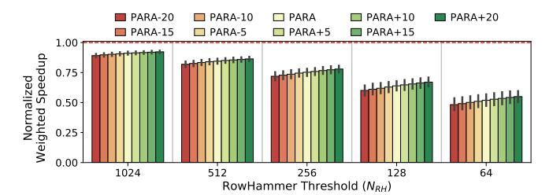

Figure 24: System performance with PARA with DejaVu caused  $N_{RH}$  difference normalized to a baseline with no read disturbance mitigation technique.

<span id="page-11-1"></span>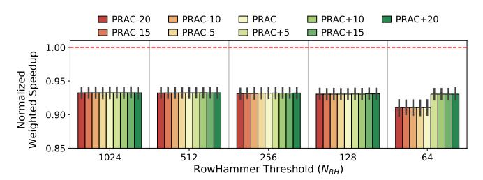

Figure 25: System performance with PRAC with DejaVu caused  $N_{RH}$  difference normalized to a baseline with no read disturbance mitigation technique.

We make two key observations. First, DejaVu-caused reduction in  $N_{RH}$  results in increased performance overheads for both mitigation techniques across all tested  $N_{RH}$  values. For example, at  $N_{RH}$ =64, 20% reduction degrades the system performance with PARA by 6.3% on average across all tested workloads. The performance overhead caused by DejaVu-caused difference is smaller for PRAC compared to PARA for the tested  $N_{RH}$  values. This is because PRAC's performance overhead is mainly caused by the increased DRAM timing parameters for these  $N_{RH}$  values [101, 102].

Second, Deja Vu-caused increase in  $N_{RH}$  results in improved system performance with both mitigation techniques across all tested  $N_{RH}$  values. For example, at  $N_{RH}$ =64, 20% increase improves the system performance with PARA by 7.8% and with PRAC by 2.1%, on average across all tested workloads. We conclude that DejaVu-caused differences in  $N_{RH}$  can result in significant system performance difference when read disturbance mitigation techniques are properly configured to account for DejaVu effects.

#### 11. Related Work

To our knowledge, this is the first work to experimentally demonstrate and characterize how the data *previously* written to DRAM cells affects DRAM's vulnerability to read disturbance and the reliability of Processing-Using-DRAM (PUD) operations. In this section, we discuss other works on experimental characterization and demonstration of DRAM read disturbance and PUD capabilities.

Read Disturbance Characterization. Many works [1,4–7,58–62,65,103,108,193,194,214–219] extensively characterize the read disturbance in real DRAM chips (i.e., DDR3, DDR4, LPDDR4, and HBM2 chips). None of these works analyzes how the DRAM row initialization sequence and the *previously* written data pattern affect the read disturbance vulnerability in real DRAM chips.

**PUD Operations in Real DRAM Chips.** Several prior works demonstrate bulk bitwise [95, 96, 119, 121, 123] (e.g., AND, OR, and MAJority operations) and bulk data copy operations [132] in real DRAM chips using multiple-row activation [88, 98, 99, 125–127, 130, 131]. Two of these prior works [97, 126] demonstrate that the reliability of PUD operation can be improved by replicating input operands [98] or storing fractional values in DRAM cells [126]. No prior work analyzes or demonstrates how *previously* written data to DRAM cells before the PUD operation can improve the reliability of such operations.

#### 12. Conclusion

This paper provides the first experimental demonstration of DejaVu, a phenomenon where the data previously written to DRAM cells affects DRAM's vulnerability to read disturbance, as well as data retention failures and the reliability of Processing-Using-DRAM (PUD) operations. Our comprehensive experimental characterization shows that, compared to the baseline where we initialize the victim row by writing to it only once, 1) overwriting the victim row reduces  $AC_{min}$  (the minimum aggressor row activation count to induce at least one bitflip), and 2) writing the same data to the victim row increases  $AC_{min}$ . We also find that overwriting the tested row with data 0xFF increases the number of DRAM retention failure bitflips compared to writing data 0xFF to the tested row twice. We provide two hypotheses to explain DejaVu and conduct controlled experimental characterization to provide more insights into the root cause(s) of DejaVu. Surprisingly, we also find that DejaVu improves the reliability of Processing-Using-DRAM (PUD) operations. Based on our observations, we discuss the implications of DejaVu on DRAM read disturbance testing and characterization methodology. We also evaluate the additional performance overhead of read disturbance mitigation techniques (e.g., PARA and PRAC) when their read disturbance thresholds need to be lowered to be secure against DejaVu. We hope future works leverage our results, findings, and insights to build a more comprehensive and fundamental understanding of DRAM read disturbance, data retention, and Processing-Using-DRAM (PUD) operations to build more robust and efficient DRAM-based computing systems.

## Acknowledgments

We thank the anonymous reviewers and artifact evaluators of ISCA 2026 for feedback. We thank the SAFARI Research Group members for their constructive feedback and for providing a stimulating intellectual and scientific environment. We acknowledge the generous gift funding provided by our industrial partners (especially Google, Huawei, Intel, Microsoft), which has been instrumental in enabling the research we have been conducting on read disturbance in DRAM in particular and memory systems in general [\[2,](#page-12-16) [3,](#page-12-17) [71,](#page-12-12) [122,](#page-13-41) [204,](#page-14-0) [220–](#page-14-12)[226\]](#page-14-13). This work was in part supported by a Google Security and Privacy Research Award and the Microsoft Swiss Joint Research Center.

## References

- <span id="page-12-0"></span>[1] Y. Kim et al., "Flipping Bits in Memory Without Accessing Them: An Experimental Study of DRAM Disturbance Errors," in ISCA, 2014.
- <span id="page-12-16"></span>[2] O. Mutlu, "The RowHammer Problem and Other Issues We May Face as Memory Becomes Denser," in DATE, 2017.
- <span id="page-12-17"></span>[3] O. Mutlu and J. S. Kim, "RowHammer: A Retrospective," TCAD, 2019.
- <span id="page-12-5"></span>[4] J. S. Kim et al., "Revisiting RowHammer: An Experimental Analysis of Modern Devices and Mitigation Techniques," in ISCA, 2020.
- <span id="page-12-1"></span>[5] L. Orosa et al., "A Deeper Look into RowHammer's Sensitivities: Experimental Analysis of Real DRAM Chips and Implications on Future Attacks and Defenses," in MICRO, 2021.
- <span id="page-12-2"></span>[6] H. Luo et al., "RowPress: Amplifying Read Disturbance in Modern DRAM Chips," in ISCA, 2023.
- <span id="page-12-7"></span>[7] H. Luo et al., "An Experimental Characterization of Combined RowHammer and RowPress Read Disturbance in Modern DRAM Chips," in DSN Disrupt, 2024.
- <span id="page-12-3"></span>[8] H. Luo et al., "RowPress Vulnerability in Modern DRAM Chips," IEEE Micro, 2024.
- <span id="page-12-4"></span>[9] A. P. Fournaris et al., "Exploiting Hardware Vulnerabilities to Attack Embedded System Devices: A Survey of Potent Microarchitectural Attacks," Electronics, 2017.
- [10] D. Poddebniak et al., "Attacking Deterministic Signature Schemes using Fault Attacks," in EuroS&P, 2018.
- [11] A. Tatar et al., "Throwhammer: Rowhammer Attacks Over the Network and Defenses," in USENIX ATC, 2018.
- [12] S. Carre et al., "OpenSSL Bellcore's Protection Helps Fault Attack," in DSD, 2018.
- [13] A. Barenghi et al., "Software-Only Reverse Engineering of Physical DRAM Mappings for Rowhammer Attacks," in IVSW, 2018.
- [14] Z. Zhang et al., "Triggering Rowhammer Hardware Faults on ARM: A Revisit," in ASHES, 2018.
- [15] S. Bhattacharya and D. Mukhopadhyay, "Advanced Fault Attacks in Software: Exploiting the Rowhammer Bug," in Fault Tolerant Architectures for Cryptography and Hardware Security, 2018.
- [16] M. Seaborn and T. Dullien, "Exploiting the DRAM Rowhammer Bug to Gain Kernel Privileges," [http://googleprojectzero.blogspot.com.tr/2015/03/](http://googleprojectzero.blogspot.com.tr/2015/03/exploiting-dram-rowhammer-bug-to-gain.html) [exploiting-dram-rowhammer-bug-to-gain.html,](http://googleprojectzero.blogspot.com.tr/2015/03/exploiting-dram-rowhammer-bug-to-gain.html) 2015.
- [17] SAFARI Research Group, "RowHammer GitHub Repository," [https://github.com/](https://github.com/CMU-SAFARI/rowhammer) [CMU-SAFARI/rowhammer,](https://github.com/CMU-SAFARI/rowhammer) 2014.
- [18] M. Seaborn and T. Dullien, "Exploiting the DRAM Rowhammer Bug to Gain Kernel Privileges," Black Hat, 2015.
- [19] V. van der Veen et al., "Drammer: Deterministic Rowhammer Attacks on Mobile Platforms," in CCS, 2016.
- [20] D. Gruss et al., "Rowhammer.js: A Remote Software-Induced Fault Attack in Javascript," arXiv:1507.06955 [cs.CR], 2016.
- [21] K. Razavi et al., "Flip Feng Shui: Hammering a Needle in the Software Stack," in USENIX Security, 2016.
- [22] P. Pessl et al., "DRAMA: Exploiting DRAM Addressing for Cross-CPU Attacks," in USENIX Security, 2016.
- [23] Y. Xiao et al., "One Bit Flips, One Cloud Flops: Cross-VM Row Hammer Attacks and Privilege Escalation," in USENIX Security, 2016.
- [24] E. Bosman et al., "Dedup Est Machina: Memory Deduplication as An Advanced Exploitation Vector," in S&P, 2016. [25] S. Bhattacharya and D. Mukhopadhyay, "Curious Case of Rowhammer: Flipping
- Secret Exponent Bits Using Timing Analysis," in CHES, 2016.
- [26] W. Burleson et al., "Invited: Who is the Major Threat to Tomorrow's Security? You, the Hardware Designer," in DAC, 2016.
- [27] R. Qiao and M. Seaborn, "A New Approach for RowHammer Attacks," in HOST, 2016.
- <span id="page-12-8"></span>[28] F. Brasser et al., "Can't Touch This: Software-Only Mitigation Against Rowhammer Attacks Targeting Kernel Memory," in USENIX Security, 2017.

- [29] Y. Jang et al., "SGX-Bomb: Locking Down the Processor via Rowhammer Attack," in SOSP, 2017.
- [30] M. T. Aga et al., "When Good Protections Go Bad: Exploiting Anti-DoS Measures to Accelerate Rowhammer Attacks," in HOST, 2017.
- [31] A. Tatar et al., "Defeating Software Mitigations Against Rowhammer: A Surgical Precision Hammer," in RAID, 2018.
- [32] D. Gruss et al., "Another Flip in the Wall of Rowhammer Defenses," in S&P, 2018.
- [33] M. Lipp et al., "Nethammer: Inducing Rowhammer Faults Through Network Requests," arXiv:1805.04956 [cs.CR], 2018.
- <span id="page-12-9"></span>[34] V. van der Veen et al., "GuardION: Practical Mitigation of DMA-Based Rowhammer Attacks on ARM," in DIMVA, 2018.
- [35] P. Frigo et al., "Grand Pwning Unit: Accelerating Microarchitectural Attacks with the GPU," in S&P, 2018.
- [36] L. Cojocar et al., "Exploiting Correcting Codes: On the Effectiveness of ECC Memory Against Rowhammer Attacks," in S&P, 2019.
- [37] S. Ji et al., "Pinpoint Rowhammer: Suppressing Unwanted Bit Flips on Rowhammer Attacks," in ASIACCS, 2019.
- [38] S. Hong et al., "Terminal Brain Damage: Exposing the Graceless Degradation in Deep Neural Networks Under Hardware Fault Attacks," in USENIX Security, 2019.
- [39] A. Kwong et al., "RAMBleed: Reading Bits in Memory Without Accessing Them," in S&P, 2020.
- <span id="page-12-10"></span>[40] P. Frigo et al., "TRRespass: Exploiting the Many Sides of Target Row Refresh," in S&P, 2020.
- [41] L. Cojocar et al., "Are We Susceptible to Rowhammer? An End-to-End Methodology for Cloud Providers," in S&P, 2020.
- [42] Z. Weissman et al., "JackHammer: Efficient Rowhammer on Heterogeneous FPGA– CPU Platforms," arXiv:1912.11523 [cs.CR], 2020.
- [43] Z. Zhang et al., "PThammer: Cross-User-Kernel-Boundary Rowhammer through Implicit Accesses," in MICRO, 2020.
- [44] F. Yao et al., "Deephammer: Depleting the Intelligence of Deep Neural Networks Through Targeted Chain of Bit Flips," in USENIX Security, 2020.
- [45] F. de Ridder et al., "SMASH: Synchronized Many-Sided Rowhammer Attacks from JavaScript," in USENIX Security, 2021.
- <span id="page-12-11"></span>[46] H. Hassan et al., "Uncovering in-DRAM RowHammer Protection Mechanisms: A New Methodology, Custom RowHammer Patterns, and Implications," in MICRO, 2021.
- [47] P. Jattke et al., "Blacksmith: Scalable Rowhammering in the Frequency Domain," in S&P, 2022.
- [48] M. C. Tol et al., "Toward Realistic Backdoor Injection Attacks on DNNs using RowHammer," arXiv:2110.07683, 2022.
- [49] A. Kogler et al., "Half-Double: Hammering From the Next Row Over," in USENIX Security, 2022.
- [50] L. Orosa et al., "SpyHammer: Using RowHammer to Remotely Spy on Temperature," arXiv:2210.04084, 2022.
- [51] Z. Zhang et al., "Implicit Hammer: Cross-Privilege-Boundary Rowhammer through Implicit Accesses," IEEE TDSC, 2022.
- [52] L. Liu et al., "Generating Robust DNN with Resistance to Bit-Flip based Adversarial Weight Attack," IEEE TC, 2022.
- [53] Y. Cohen et al., "HammerScope: Observing DRAM Power Consumption Using Rowhammer," in CCS, 2022.
- [54] M. Zheng et al., "TrojViT: Trojan Insertion in Vision Transformers," arXiv:2208.13049, 2022.
- [55] M. Fahr Jr et al., "When Frodo Flips: End-to-End Key Recovery on FrodoKEM via Rowhammer," CCS, 2022.
- [56] Y. Tobah et al., "SpecHammer: Combining Spectre and Rowhammer for New Speculative Attacks," in S&P, 2022.
- [57] A. S. Rakin et al., "DeepSteal: Advanced Model Extractions Leveraging Efficient Weight Stealing in Memories," in S&P, 2022.
- <span id="page-12-13"></span>[58] K. Park et al., "Statistical Distributions of Row-Hammering Induced Failures in DDR3 Components," Microelectronics Reliability, 2016.
- [59] K. Park et al., "Experiments and Root Cause Analysis for Active-Precharge Hammering Fault in DDR3 SDRAM under 3xnm Technology," Microelectronics Reliability, 2016.
- [60] C. Lim et al., "Active Precharge Hammering to Monitor Displacement Damage Using High-Energy Protons in 3x-nm SDRAM," TNS, 2017.
- [61] S.-W. Ryu et al., "Overcoming the Reliability Limitation in the Ultimately Scaled DRAM using Silicon Migration Technique by Hydrogen Annealing," in IEDM, 2017.
- <span id="page-12-14"></span>[62] D. Yun et al., "Study of TID Effects on One Row Hammering using Gamma in DDR4 SDRAMs," in IRPS, 2018.
- <span id="page-12-6"></span>[63] T. Yang and X.-W. Lin, "Trap-Assisted DRAM Row Hammer Effect," EDL, 2019.
- [64] A. J. Walker et al., "On DRAM RowHammer and the Physics on Insecurity," IEEE TED, 2021.
- <span id="page-12-15"></span>[65] A. G. Yağlıkcı et al., "Understanding RowHammer Under Reduced Wordline Voltage: An Experimental Study Using Real DRAM Devices," in DSN, 2022.
- [66] M. N. I. Khan and S. Ghosh, "Analysis of Row Hammer Attack on STTRAM," in ICCD, 2018.
- [67] S. Agarwal et al., "Rowhammer for Spin Torque based Memory: Problem or not?" in INTERMAG, 2018.
- [68] H. Li et al., "Write Disturb Analyses on Half-Selected Cells of Cross-Point RRAM Arrays," in IRPS, 2014.
- [69] K. Ni et al., "Write Disturb in Ferroelectric FETs and Its Implication for 1T-FeFET AND Memory Arrays," IEEE EDL, 2018.
- [70] P. R. Genssler et al., "On the Reliability of FeFET On-Chip Memory," TC, 2022.
- <span id="page-12-12"></span>[71] O. Mutlu et al., "Fundamentally Understanding and Solving RowHammer," in ASP-DAC, 2023.

- [72] D. Meyer et al., "Phoenix: Rowhammer Attacks on DDR5 with Self-Correcting Synchronization," in S&P, 2026.
- [73] C. S. Lin et al., "GPUHammer: Rowhammer attacks on GPU memories are practical," in USENIX Security, 2025.
- [74] H. Aydin and A. Sertbaş, "Cyber Security in Industrial Control Systems (ICS): A Survey of RowHammer Vulnerability," Applied Computer Science, 2022.
- [75] K. Mus et al., "Jolt: Recovering TLS Signing Keys via Rowhammer Faults," Cryptology ePrint Archive, 2022.
- [76] J. Wang et al., "Research and Implementation of Rowhammer Attack Method based on Domestic NeoKylin Operating System," in ICFTIC, 2022.
- [77] S. Lefforge, "Reverse Engineering Post-Quantum Cryptography Schemes to Find Rowhammer Exploits," Master's thesis, University of Arkansas, 2023.
- [78] M. J. Fahr, "The Effects of Side-Channel Attacks on Post-Quantum Cryptography: Influencing FrodoKEM Key Generation Using the Rowhammer Exploit," Ph.D. dissertation, University of Arkansas, 2022.
- [79] A. Kaur et al., "Work-in-Progress: DRAM-MaUT: DRAM Address Mapping Unveiling Tool for ARM Devices," in CASES, 2022.
- [80] K. Cai et al., "On the Feasibility of Training-time Trojan Attacks through Hardwarebased Faults in Memory," in HOST, 2022.
- [81] D. Li et al., "CyberRadar: A PUF-based Detecting and Mapping Framework for Physical Devices," arXiv:2201.07597, 2022.
- [82] A. Roohi and S. Angizi, "Efficient Targeted Bit-Flip Attack Against the Local Binary
- Pattern Network," in HOST, 2022. [83] F. Staudigl et al., "NeuroHammer: Inducing Bit-Flips in Memristive Crossbar Mem-
- ories," in DATE, 2022. [84] L.-H. Yang et al., "Socially-Aware Collaborative Defense System against Bit-Flip
- Attack in Social Internet of Things and Its Online Assignment Optimization," in ICCCN, 2022.
- <span id="page-13-0"></span>[85] S. Islam et al., "Signature Correction Attack on Dilithium Signature Scheme," in Euro S&P, 2022.
- <span id="page-13-1"></span>[86] H. Hassan et al., "SoftMC: A Flexible and Practical Open-Source Infrastructure for Enabling Experimental DRAM Studies," in HPCA, 2017.
- [87] SoftMC Source Code, "nan," [https://github.com/CMU-SAFARI/SoftMC.](https://github.com/CMU-SAFARI/SoftMC)
- <span id="page-13-31"></span>[88] A. Olgun et al., "DRAM Bender: An Extensible and Versatile FPGA-based Infrastructure to Easily Test State-of-the-art DRAM Chips," TCAD, 2023.
- <span id="page-13-2"></span>[89] SAFARI Research Group, "DRAM Bender — GitHub Repository," [https://github.](https://github.com/CMU-SAFARI/DRAM-Bender) [com/CMU-SAFARI/DRAM-Bender,](https://github.com/CMU-SAFARI/DRAM-Bender) 2022.
- <span id="page-13-3"></span>[90] J. Li et al., "Understanding the Competitive Interaction in Leakage Mechanisms for Effective Row Hammer Mitigation in Sub-20 nm DRAM," IEEE Electron Device Letters, 2024.
- [91] L. Zhou et al., "Unveiling RowPress in Sub-20 nm DRAM Through Comparative Analysis With Row Hammer: From Leakage Mechanisms to Key Features," in IEEE Transactions on Electron Devices, 2024.
- [92] L. Zhou et al., "Understanding the Physical Mechanism of RowPress at the Device-Level in Sub-20 nm DRAM," in IRPS, 2024.
- <span id="page-13-4"></span>[93] L. Zhou et al., "Double-sided Row Hammer Effect in Sub-20 nm DRAM: Physical Mechanism, Key Features and Mitigation," in IRPS, 2023.
- <span id="page-13-5"></span>[94] JEDEC, JESD79-4C: DDR4 SDRAM Standard, 2020.
- <span id="page-13-6"></span>[95] V. Seshadri et al., "Ambit: In-Memory Accelerator for Bulk Bitwise Operations Using Commodity DRAM Technology," in MICRO, 2017.
- <span id="page-13-38"></span>[96] N. Hajinazar et al., "SIMDRAM: A Framework for Bit-Serial SIMD Processing Using DRAM," in ASPLOS, 2021.
- <span id="page-13-27"></span>[97] I. E. Yuksel et al., "Simultaneous Many-Row Activation in Off-the-Shelf DRAM Chips: Experimental Characterization and Analysis," in DSN, 2024.
- <span id="page-13-23"></span>[98] I. E. Yuksel et al., "Functionally-Complete Boolean Logic in Real DRAM Chips: Experimental Characterization and Analysis," in HPCA, 2024.
- <span id="page-13-7"></span>[99] O. Mutlu et al., "Memory-Centric Computing: Recent Advances in Processing-in-DRAM," in IEDM, 2024.
- <span id="page-13-8"></span>[100] JEDEC, JESD79-5C: DDR5 SDRAM Standard, 2024.
- <span id="page-13-36"></span>[101] O. Canpolat et al., "Understanding the Security Benefits and Overheads of Emerging Industry Solutions to DRAM Read Disturbance," in DRAMSec, 2024.
- <span id="page-13-9"></span>[102] O. Canpolat et al., "Chronus: Understanding and Securing the Cutting-Edge Industry Solutions to DRAM Read Disturbance," in HPCA, 2025.
- <span id="page-13-10"></span>[103] H. Nam et al., "Dramscope: Uncovering DRAM Microarchitecture and Characteristics by Issuing Memory Commands," ISCA, 2024.
- <span id="page-13-11"></span>[104] M. Marazzi et al., "HiFi-DRAM: Enabling High-fidelity DRAM Research by Uncovering Sense Amplifiers with IC Imaging," in ISCA, 2024.
- <span id="page-13-12"></span>[105] M. Patel et al., "The Reach Profiler (REAPER): Enabling the Mitigation of DRAM Retention Failures via Profiling at Aggressive Conditions," in ISCA, 2017.
- [106] L. Orosa et al., "CODIC: A Low-Cost Substrate for Enabling Custom In-DRAM Functionalities and Optimizations," in 2021 ACM/IEEE 48th Annual International Symposium on Computer Architecture (ISCA), 2021.
- <span id="page-13-24"></span>[107] K. Kraft et al., "Improving the Error Behavior of DRAM by Exploiting its Z-channel Property," in DATE, 2018.
- <span id="page-13-13"></span>[108] H. Luo et al., "Revisiting DRAM Read Disturbance: Identifying Inconsistencies Between Experimental Characterization and Device-Level Studies," in VTS, 2025.
- <span id="page-13-14"></span>[109] Y. Kim et al., "A Case for Exploiting Subarray-Level Parallelism (SALP) in DRAM," in ISCA, 2012.
- [110] D. Lee et al., "Tiered-Latency DRAM: A Low Latency and Low Cost DRAM Architecture," in HPCA, 2013.
- <span id="page-13-15"></span>[111] D. Lee et al., "Adaptive-latency DRAM: Optimizing DRAM timing for the commoncase," in HPCA, 2015.
- <span id="page-13-16"></span>[112] H. Luo et al., "CLR-DRAM: A Low-Cost DRAM Architecture Enabling Dynamic Capacity-Latency Trade-Off," in 2020 ACM/IEEE 47th Annual International Symposium on Computer Architecture (ISCA). IEEE, 2020, pp. 666–679.

- <span id="page-13-17"></span>[113] B. Keeth and R. Baker, DRAM Circuit Design: A Tutorial. John Wiley & Sons, 2001.
- <span id="page-13-18"></span>[114] J. Liu et al., "An Experimental Study of Data Retention Behavior in Modern DRAM Devices," in ISCA, 2013.
- <span id="page-13-19"></span>[115] S. Khan et al., "The Efficacy of Error Mitigation Techniques for DRAM Retention Failures: A Comparative Experimental Study," in SIGMETRICS, 2014.
- <span id="page-13-20"></span>[116] M. Patel et al., "The Reach Profiler (REAPER): Enabling the Mitigation of DRAM Retention Failures via Profiling at Aggressive Conditions," ISCA, 2017.
- <span id="page-13-21"></span>[117] J. Jang et al., "Refresh-Aware Write Recovery Memory Controller," IEEE Transactions on Computers, 2017.
- <span id="page-13-22"></span>[118] T. Schloesser et al., "6F 2 buried wordline DRAM cell for 40nm and beyond," in 2008 IEEE International Electron Devices Meeting, 2008.
- <span id="page-13-25"></span>[119] V. Seshadri et al., "Fast Bulk Bitwise AND and OR in DRAM," in CAL, 2015.
- [120] V. Seshadri et al., "RowClone: Accelerating Data Movement and Initialization Using DRAM," arXiv:1805.03502 [cs.AR], 2018.
- <span id="page-13-39"></span>[121] G. F. Oliveira et al., "MIMDRAM: An End-to-End Processing-Using-DRAM System for High-Throughput, Energy-Efficient and Programmer-Transparent Multiple-Instruction Multiple-Data Processing," HPCA, 2024.
- <span id="page-13-41"></span>[122] O. Mutlu et al., "Memory-Centric Computing: Solving Computing's Memory Problem," in IMW, 2025.
- <span id="page-13-40"></span>[123] G. F. Oliveira et al., "Proteus: Achieving High-Performance Processing-Using-DRAM via Dynamic Precision Bit-Serial Arithmetic," ICS, 2025.
- <span id="page-13-28"></span>[124] I. E. Yuksel et al., "PuDHammer: Experimental Analysis of Read Disturbance Effects of Processing-using-DRAM in Real DRAM Chips," in ISCA, 2025.
- <span id="page-13-32"></span>[125] F. Gao et al., "ComputeDRAM: In-Memory Compute Using Off-the-Shelf DRAMs," in MICRO, 2019.
- <span id="page-13-35"></span>[126] F. Gao et al., "FracDRAM: Fractional Values in Off-the-Shelf DRAM," in 2022 55th IEEE/ACM International Symposium on Microarchitecture (MICRO), 2022.
- <span id="page-13-29"></span>[127] A. Olgun et al., "QUAC-TRNG: High-Throughput True Random Number Generation Using Quadruple Row Activation in Commodity DRAM Chips," in ISCA, 2021.
- [128] F. N. Bostanci et al., "DR-STRaNGe: End-to-End System Design for DRAM-based True Random Number Generators," in HPCA, 2022.
- <span id="page-13-26"></span>[129] D. Tokuda et al., "Clutch: High Performance Vector-Scalar Comparison using DRAM via Chunked Temporal Coding," in ICS, 2026.
- <span id="page-13-30"></span>[130] A. Olgun et al., "PiDRAM: A Holistic End-to-end FPGA-based Framework for Processing-in-DRAM," TACO, 2022.
- <span id="page-13-33"></span>[131] A. G. Yağlikci et al., "HiRA: Hidden Row Activation for Reducing Refresh Latency of Off-the-Shelf DRAM Chips," in MICRO, 2022.
- <span id="page-13-34"></span>[132] V. Seshadri et al., "RowClone: Fast and Energy-Efficient In-DRAM Bulk Data Copy and Initialization," in MICRO, 2013.
- <span id="page-13-37"></span>[133] Apple Inc., "About the Security Content of Mac EFI Security Update 2015-001," [https://support.apple.com/en-us/HT204934,](https://support.apple.com/en-us/HT204934) 2015, June 2015.
- [134] Hewlett-Packard Enterprise, "HP Moonshot Component Pack Version 2015.05.0," [http://h17007.www1.hp.com/us/en/enterprise/servers/products/moonshot/](http://h17007.www1.hp.com/us/en/enterprise/servers/products/moonshot/component-pack/index.aspx) [component-pack/index.aspx,](http://h17007.www1.hp.com/us/en/enterprise/servers/products/moonshot/component-pack/index.aspx) 2015.
- [135] Lenovo, "Row Hammer Privilege Escalation," [https://support.lenovo.com/us/en/](https://support.lenovo.com/us/en/product_security/row_hammer) [product\\_security/row\\_hammer,](https://support.lenovo.com/us/en/product_security/row_hammer) 2015.
- [136] Z. Greenfield and T. Levy, "Throttling Support for Row-Hammer Counters," 2016, U.S. Patent 9,251,885.
- [137] D.-H. Kim et al., "Architectural Support for Mitigating Row Hammering in DRAM Memories," CAL, 2014.
- [138] K. Bains and J. Halbert, "Distributed Row Hammer Tracking," US Patent App. 13/631,781, Apr. 3 2014.
- [139] K. Bains et al., "Method, Apparatus and System for Providing a Memory Refresh," US Patent: 9,030,903, 2015.
- [140] K. Bains et al., "Row Hammer Refresh Command," US Patent App. 13/539,415, 2014.
- [141] K. Bains et al., "Row Hammer Refresh Command," US Patent App. 14/068,677, 2014. [142] Z. B. Aweke et al., "ANVIL: Software-Based Protection Against Next-Generation Rowhammer Attacks," in ASPLOS, 2016.
- [143] K. Bains et al., "Row Hammer Refresh Command," 2015, U.S. Patent 9,117,544.
- [144] K. S. Bains and J. B. Halbert, "Row Hammer Monitoring Based on Stored Row Hammer Threshold Value," US Patent: 10,083,737, 2016, U.S. Patent 9,384,821.
- [145] S. M. Seyedzadeh et al., "Counter-based Tree Structure for Row Hammering Mitigation in DRAM," IEEE CAL, 2017.
- [146] K. S. Bains and J. B. Halbert, "Distributed Row Hammer Tracking," 2016, U.S. Patent 9,299,400.
- [147] M. Son et al., "Making DRAM Stronger Against Row Hammering," in DAC, 2017.
- [148] S. M. Seyedzadeh et al., "Mitigating Wordline Crosstalk Using Adaptive Trees of Counters," in ISCA, 2018.
- [149] G. Irazoqui et al., "MASCAT: Stopping Microarchitectural Attacks Before Execution," IACR Cryptology, 2016.
- [150] J. M. You and J.-S. Yang, "MRLoc: Mitigating Row-Hammering Based on Memory Locality," in DAC, 2019.
- [151] E. Lee et al., "TWiCe: Preventing Row-Hammering by Exploiting Time Window Counters," in ISCA, 2019.
- [152] Y. Park et al., "Graphene: Strong yet Lightweight Row Hammer Protection," in MICRO, 2020.
- [153] A. G. Yağlıkçı et al., "Security Analysis of the Silver Bullet Technique for RowHammer Prevention," arXiv:2106.07084, 2021.
- [154] A. G. Yağlıkçı et al., "BlockHammer: Preventing RowHammer at Low Cost by Blacklisting Rapidly-Accessed DRAM Rows," in HPCA, 2021.
- [155] I. Kang et al., "CAT-TWO: Counter-Based Adaptive Tree, Time Window Optimized for DRAM Row-Hammer Prevention," IEEE Access, 2020.
- [156] M. Qureshi et al., "Hydra: Enabling Low-Overhead Mitigation of Row-Hammer at Ultra-Low Thresholds via Hybrid Tracking," in ISCA, 2022.
- [157] G. Saileshwar et al., "Randomized Row-Swap: Mitigating Row Hammer by Breaking

- Spatial Correlation Between Aggressor and Victim Rows," in ASPLOS, 2022.
- [158] R. K. Konoth et al., "ZebRAM: Comprehensive and Compatible Software Protection Against Rowhammer Attacks," in OSDI, 2018.
- [159] S. Vig et al., "Rapid Detection of Rowhammer Attacks Using Dynamic Skewed Hash Tree," in HASP, 2018.
- [160] M. J. Kim et al., "Mithril: Cooperative Row Hammer Protection on Commodity DRAM Leveraging Managed Refresh," in HPCA, 2022.
- [161] G.-H. Lee et al., "CryoGuard: A Near Refresh-Free Robust DRAM Design for Cryogenic Computing," in ISCA, 2021.
- [162] M. Marazzi et al., "ProTRR: Principled yet Optimal In-DRAM Target Row Refresh," in S&P, 2022.
- [163] Z. Zhang et al., "SoftTRR: Protect Page Tables against Rowhammer Attacks using Software-only Target Row Refresh," in USENIX ATC, 2022.
- [164] B. K. Joardar et al., "Learning to Mitigate RowHammer Attacks," in DATE, 2022.
- [165] J. Juffinger et al., "CSI: Rowhammer–Cryptographic Security and Integrity against Rowhammer (to appear)," in S&P, 2023.
- [166] A. Saxena et al., "AQUA: Scalable Rowhammer Mitigation by Quarantining Aggressor Rows at Runtime," in MICRO, 2022.
- [167] S. Enomoto et al., "Efficient Protection Mechanism for CPU Cache Flush Instruction Based Attacks," IEICE Transactions on Information and Systems, 2022.
- [168] E. Manzhosov et al., "Revisiting Residue Codes for Modern Memories," in MICRO, 2022.
- [169] S. M. Ajorpaz et al., "EVAX: Towards a Practical, Pro-active & Adaptive Architecture for High Performance & Security," in MICRO, 2022.
- [170] A. Naseredini et al., "ALARM: Active LeArning of Rowhammer Mitigations," [https:](https://users.sussex.ac.uk/~mfb21/rh-draft.pdf) [//users.sussex.ac.uk/~mfb21/rh-draft.pdf,](https://users.sussex.ac.uk/~mfb21/rh-draft.pdf) 2022.
- [171] B. K. Joardar et al., "Machine Learning-based Rowhammer Mitigation," TCAD, 2022.
- [172] C. Tomita et al., "Extracting the Secrets of OpenSSL with RAMBleed," Sensors, 2022.
- [173] Z. Zhang et al., "Leveraging EM Side-Channel Information to Detect Rowhammer Attacks," in S&P, 2020.
- [174] K. Loughlin et al., "Stop! Hammer Time: Rethinking Our Approach to Rowhammer Mitigations," in HotOS, 2021.
- [175] F. Devaux and R. Ayrignac, "Method and Circuit for Protecting a DRAM Memory Device from the Row Hammer Effect," US Patent: 10,885,966, 2021, 10,885,966.
- [176] A. Fakhrzadehgan et al., "SafeGuard: Reducing the Security Risk from Row-Hammer via Low-Cost Integrity Protection," in HPCA, 2022.
- [177] S. Saroiu et al., "The Price of Secrecy: How Hiding Internal DRAM Topologies Hurts Rowhammer Defenses," in IRPS, 2022.
- [178] K. Loughlin et al., "MOESI-Prime: Preventing Coherence-Induced Hammering in Commodity Workloads," in ISCA, 2022.
- [179] J. Han et al., "Surround Gate Transistor With Epitaxially Grown Si Pillar and Simulation Study on Soft Error and Rowhammer Tolerance for DRAM," TED, 2021.
- [180] J. Woo et al., "Scalable and Secure Row-Swap: Efficient and Safe Row Hammer Mitigation in Memory Systems," in HPCA, 2023.
- [181] M. Marazzi et al., "REGA: Scalable Rowhammer Mitigation with Refresh-Generating Activations," in S&P, 2023.
- [182] C. Bock et al., "RIP-RH: Preventing Rowhammer-Based Inter-Process Attacks," in Proceedings of the 2019 ACM Asia Conference on Computer and Communications Security, 2019.
- [183] Y. Wang et al., "Discreet-PARA: Rowhammer Defense with Low Cost and High Efficiency," in 2021 IEEE 39th International Conference on Computer Design (ICCD), 2021.
- [184] T. Bennett et al., "Panopticon: A Complete In-DRAM Rowhammer Mitigation," in DRAMSec, 2021.
- [185] A. Olgun et al., "ABACuS: All-Bank Activation Counters for Scalable and Low Overhead RowHammer Mitigation," in USENIX Security, 2024.
- [186] F. N. Bostanci et al., "Comet: Count-min-sketch-based row tracking to mitigate rowhammer at low cost," in 2024 IEEE International Symposium on High-Performance Computer Architecture (HPCA). IEEE, 2024, pp. 593–612.
- [187] A. Saxena and M. Qureshi, "START: Scalable Tracking for any Rowhammer Threshold," in HPCA, 2024.
- [188] A. Saxena et al., "Rubix: Reducing the Overhead of Secure Rowhammer Mitigations via Randomized Line-to-Row Mapping," in ASPLOS, 2024.
- [189] M. Qureshi et al., "Mint: Securely Mitigating RowHammer with a Minimalist In-DRAM Tracker," in MICRO, 2024.
- [190] A. Saxena et al., "ImPress: Securing DRAM Against Data-Disturbance Errors via Implicit Row-Press Mitigation," in MICRO, 2024.
- [191] W. Kim et al., "A 1.1 V 16Gb DDR5 DRAM with Probabilistic-Aggressor Tracking, Refresh-Management Functionality, Per-Row Hammer Tracking, a Multi-Step Precharge, and Core-Bias Modulation for Security and Reliability Enhancement," in ISSCC, 2023.
- [192] O. Canpolat et al., "BreakHammer: Enhancing RowHammer Mitigations by Carefully Throttling Suspect Threads," MICRO, 2024.
- <span id="page-14-8"></span>[193] Y. C. Tugrul et al., "Understanding RowHammer Under Reduced Refresh Latency: Experimental Analysis of Real DRAM Chips and Implications on Future Solutions," in HPCA, 2025.
- <span id="page-14-9"></span>[194] A. G. Yağlıkçı et al., "Spatial Variation-Aware Read Disturbance Defenses: Experimental Analysis of Real DRAM Chips and Implications on Future Solutions," in HPCA, 2024.
- [195] H. Taneja and M. Qureshi, "DREAM: Enabling Low-Overhead Rowhammer Mitigation via Directed Refresh Management," in ISCA, 2025.
- [196] S. Vittal et al., "Mopac: Efficiently mitigating rowhammer with probabilistic activation counting," in Proceedings of the 52nd Annual International Symposium on Computer Architecture, 2025, pp. 723–738.
- [197] C. S. Lin et al., "CnC-PRAC: Coalesce, not Cache, Per Row Activation Counts for

- an Efficient in-DRAM Rowhammer Mitigation," DRAMSec, 2025.
- [198] S. Qazi and M. Qureshi, "DRFM and the Art of Rowhammer Sampling," DRAMSec, 2025.
- [199] S.-L. Lu et al., "Counterpoint: One-Hot Counting for PRAC-Based RowHammer Mitigation," DRAMSec, 2025.
- [200] M. Qureshi, "AutoRFM: Scaling Low-Cost in-DRAM Trackers to Ultra-Low Rowhammer Thresholds," in HPCA, 2025.
- [201] J. Woo and P. J. Nair, "DAPPER: A Performance-Attack-Resilient Tracker for RowHammer Defense," in HPCA, 2025.
- [202] J. Woo et al., "QPRAC: Towards Secure and Practical PRAC-based Rowhammer Mitigation using Priority Queues," in HPCA, 2025.
- [203] F. Bostancı et al., "Understanding and mitigating side and covert channel vulnerabilities introduced by rowhammer defenses," arXiv preprint arXiv:2503.17891, 2025.
- <span id="page-14-0"></span>[204] A. K. Kakolyris et al., "ColumnKeeper: Efficient Solutions for Mitigating ColumnDisturb in DRAM-based Systems," in ISCA, 2026.
- <span id="page-14-1"></span>[205] Y. Kim et al., "Ramulator: A Fast and Extensible DRAM Simulator," CAL, 2016.
- [206] H. Luo et al., "Ramulator 2.0: A Modern, Modular, and Extensible DRAM Simulator," 2023.
- [207] S. R. Group, "Ramulator V2.0," [https://github.com/CMU-SAFARI/ramulator2.](https://github.com/CMU-SAFARI/ramulator2)
- <span id="page-14-2"></span>[208] N. Bostanci et al., "Cleaning up the Mess: Re-evaluating the Real-System Modeling Accuracy of Ramulator 2.0," in ISPASS, 2026.
- <span id="page-14-3"></span>[209] Standard Performance Evaluation Corp., "SPEC CPU 2006," [http://www.spec.org/](http://www.spec.org/cpu2006/) [cpu2006/.](http://www.spec.org/cpu2006/)
- <span id="page-14-4"></span>[210] Standard Performance Evaluation Corp., "SPEC CPU2017 Benchmarks," [http://](http://www.spec.org/cpu2017/) [www.spec.org/cpu2017/.](http://www.spec.org/cpu2017/)
- <span id="page-14-5"></span>[211] Transaction Processing Performance Council, "TPC Benchmarks," [http://tpc.org/.](http://tpc.org/)
- <span id="page-14-6"></span>[212] J. E. Fritts et al., "MediaBench II Video: Expediting the next Generation of Video Systems Research," Microprocess. Microsyst., 2009.
- <span id="page-14-7"></span>[213] B. Cooper et al., "Benchmarking Cloud Serving Systems with YCSB," in SoCC, 2010.
- <span id="page-14-10"></span>[214] C. Lim et al., "Study of Proton Radiation Effect to Row Hammer Fault in DDR4 SDRAMs," Microelectronics Reliability, 2018.
- [215] Z. Lang et al., "Blaster: Characterizing the blast radius of rowhammer," in 3rd Workshop on DRAM Security (DRAMSec) co-located with ISCA 2023. ETH Zurich, 2023.
- [216] A. Olgun et al., "An Experimental Analysis of RowHammer in HBM2 DRAM Chips," in DSN Disrupt, 2023.
- [217] A. Olgun et al., "Variable Read Disturbance: An Experimental Analysis of Temporal Variation in DRAM Read Disturbance," in HPCA, 2025.
- [218] W. He et al., "WhistleBlower: A System-level Empirical Study on RowHammer," IEEE Transactions on Computers, 2023.
- <span id="page-14-11"></span>[219] I. E. Yuksel et al., "ColumnDisturb: Understanding Column-based Read Disturbance in Real DRAM Chips and Implications for Future Systems," in MICRO, 2025.
- <span id="page-14-12"></span>[220] O. Mutlu et al., "Processing Data Where It Makes Sense: Enabling In-Memory Computation," in Microprocessors and Microsystems, 2019.
- [221] O. Mutlu et al., "A Modern Primer on Processing in Memory," in Emerging computing: from devices to systems: looking beyond Moore and Von Neumann. Springer, 2022, pp. 171–243.
- [222] O. Mutlu, "Retrospective: Flipping Bits in Memory without Accessing Them: An Experimental Study of DRAM Disturbance Errors," arXiv, 2023.
- [223] O. Mutlu and L. Subramanian, "Research Problems and Opportunities in Memory Systems," SUPERFRI, 2014.
- [224] O. Mutlu, "Retrospective: RAIDR: Retention-Aware Intelligent DRAM Refresh," arXiv preprint arXiv:2306.16024, 2023.
- [225] O. Mutlu, "Retrospective: An experimental study of data retention behavior in modern dram devices: Implications for retention time profiling mechanisms," arXiv preprint arXiv:2306.16037, 2023.
- <span id="page-14-13"></span>[226] O. Mutlu, "Memory Scaling: A Systems Architecture Perspective," in IMW, 2013.

#### A. Tested DRAM Module Details

Table 3: Detailed information for the tested DDR4 DRAM modules; Average Double-Sided RowHammer  $AC_{min}$  at  $50^{\circ}$ C for  $0\rightarrow1$  ( $1\rightarrow0$ ) bitflips for all tested modules, across 128 tested victim rows for each module, 50 repetitions, for the Baseline pattern where we write to the victim row only once, the SameWrite pattern where we initialize the victim row by writing the same data to it twice, and the OverWrite pattern where we initialize the victim row by first writing the opposite data, and then overwriting it with the actual victim data pattern. The percentage shows the change in  $AC_{min}$  of the SameWrite and OverWrite patterns relative to the Baseline pattern.

| DRAM         | ID | DIMM Vendor | DIMM Part Number                        | DRAM Part Number  | Die      | Die     | DO  | Datecode | Average Double-Sided RowHammer $AC_{min}$ ;<br>Bitflip direction $0\rightarrow 1$ $(1\rightarrow 0)$ |                             |                             |  |
|--------------|----|-------------|-----------------------------------------|-------------------|----------|---------|-----|----------|------------------------------------------------------------------------------------------------------|-----------------------------|-----------------------------|--|
| Manufacturer |    |             | 2111112 1 111 1 1 1 1 1 1 1 1 1 1 1 1 1 |                   | Revision | Density | - 2 |          | Baseline                                                                                             | SameWrite                   | OverWrite                   |  |
|              | S0 | Samsung     | M378A1K43DB2-CTD                        | K4A8G085WD-BCTD   | D        | 8 Gb    | x8  | 2110     | 14165 (17469)                                                                                        | 14441; +1.9% (17913; +2.5%) | 13696; -3.3% (16733; -4.2%) |  |
|              | S1 | Samsung     | M378A4G43MB1-CTD                        | K4AAG085WW-BCTD   | M        | 16 Gb   | x8  | N/A      | 16967 (19706)                                                                                        | 17428; +2.7% (20327; +3.2%) | 16443; -3.1% (18855; -4.3%) |  |
| Samsung      | S2 | Samsung     | M378A2G43AB3-CWE                        | K4AAG085WA-BCWE   | A        | 16 Gb   | x8  | 2302     | 16996 (20334)                                                                                        | 17431; +2.6% (21036; +3.5%) | 16411; -3.4% (19342; -4.9%) |  |
|              | S3 | Samsung     | M391A2G43BB2-CWE                        | K4AAG085WB-BCWE   | В        | 16 Gb   | x8  | 2315     | 14077 (16747)                                                                                        | 14412; +2.4% (17103; +2.1%) | 13695; -2.7% (16024; -4.3%) |  |
|              | S4 | Samsung     | M471A4G43CB1-CWE                        | K4AAG085WC-BCWE   | С        | 16 Gb   | x8  | 2408     | 10520 (12642)                                                                                        | 10718; +1.9% (12903; +2.1%) | 10260; -2.5% (12154; -3.9%) |  |
|              | H0 | SK Hynix    | HMA81GU7AFR8N-UH                        | H5AN8G8NAFR-UHC   | A        | 8 Gb    | x8  | 1843     | 53980 (78572)                                                                                        | 55293; +2.4% (80509; +2.5%) | 52372; -3.0% (75714; -3.6%) |  |
| I I          | H1 | SK Hynix    | HMA81GU6CJR8N-VK                        | H5AN8G8NCJR-VKC   | С        | 8 Gb    | x8  | 2120     | 25242 (37113)                                                                                        | 26057; +3.2% (38461; +3.6%) | 24183; -4.2% (35888; -3.3%) |  |
| Hynix        | H2 | SK Hynix    | HMA81GU7DJR8N-WM                        | H5AN8G8NDJR-WMC   | D        | 8 Gb    | x8  | 1938     | 20576 (31283)                                                                                        | 21421; +4.1% (32081; +2.6%) | 19902; -3.3% (30102; -3.8%) |  |
|              | Н3 | SK Hynix    | HMAA4GU6AJR8N-VK                        | H5ANAG8NAJR-VKC   | A        | 16 Gb   | x8  | 2003     | 28669 (42437)                                                                                        | 29448; +2.7% (43701; +3.0%) | 27734; -3.3% (40975; -3.4%) |  |
|              | M0 | Crucial     | CT16G4DFD824A.M16FE                     | MT40A1G8SA-075:E  | Е        | 8 Gb    | x8  | 2402     | 51052 (52070)                                                                                        | 52287; +2.4% (53511; +2.8%) | 49236; -3.6% (50276; -3.4%) |  |
|              | M1 | Kingston    | KSM32ES8/8MR                            | MT40A1G8SA-062E:R | R        | 8 Gb    | x8  | 2412     | 22212 (26201)                                                                                        | 22701; +2.2% (27235; +3.9%) | 21476; -3.3% (25118; -4.1%) |  |
| Micron       | M2 | Kingston    | KSM32ES8/16MF                           | MT40A2G8SA-062E:F | F        | 16 Gb   | x8  | 2412     | 15839 (17023)                                                                                        | 16232; +2.5% (17615; +3.5%) | 15440; -2.5% (16513; -3.0%) |  |
|              | М3 | Micron      | MTA18ASF4G72HZ-3G2F1Z1                  | MT40A2G8SA-062E:F | F        | 16 Gb   | x8  | 2237     | 16815 (18810)                                                                                        | 17147; +2.0% (19377; +3.0%) | 16355; -2.7% (17988; -4.4%) |  |
|              | M4 | Micron      | MTA9ASF2G72AZ-3G2F1Z1                   | MT40A2G8SA-062E:F | F        | 16 Gb   | x8  | N/A      | 17601 (18248)                                                                                        | 18049; +2.5% (18914; +3.6%) | 17022; -3.3% (17560; -3.8%) |  |

Table 4: Detailed information for the tested DDR4 DRAM modules; Minimum Double-Sided RowHammer  $AC_{min}$  at  $50^{\circ}$ C for  $0 \rightarrow 1$  ( $1 \rightarrow 0$ ) bitflips for all tested modules, across 128 tested victim rows for each module, 50 repetitions, for the Baseline pattern where we write to the victim row only once, the SameWrite pattern where we initialize the victim row by writing the same data to it twice, and the OverWrite pattern where we initialize the victim row by first writing the opposite data, and then overwriting it with the actual victim data pattern. The percentage shows the change in  $AC_{min}$  of the SameWrite and OverWrite patterns relative to the Baseline pattern.

| DRAM<br>Manufacturer | ID | DIMM Vendor | DIMM Part Number       | DRAM Part Number  | Die<br>Revision | Die     | DQ Datecode |      | Minimum Double-Sided RowHammer $AC_{min}$ ; Bitflip direction $0 \rightarrow 1$ $(1 \rightarrow 0)$ |                              |                              |  |
|----------------------|----|-------------|------------------------|-------------------|-----------------|---------|-------------|------|-----------------------------------------------------------------------------------------------------|------------------------------|------------------------------|--|
| Manufacturer         |    |             |                        |                   | Revision        | Density |             |      | Baseline                                                                                            | SameWrite                    | OverWrite                    |  |
|                      | S0 | Samsung     | M378A1K43DB2-CTD       | K4A8G085WD-BCTD   | D               | 8 Gb    | x8          | 2110 | 8798 (10546)                                                                                        | 8898; +1.1% (11205; +6.2%)   | 8496; -3.4% (10216; -3.1%)   |  |
|                      | S1 | Samsung     | M378A4G43MB1-CTD       | K4AAG085WW-BCTD   | M               | 16 Gb   | x8          | N/A  | 10536 (11434)                                                                                       | 10546; +0.1% (11561; +1.1%)  | 10234; -2.9% (10546; -7.8%)  |  |
| Samsung              | S2 | Samsung     | M378A2G43AB3-CWE       | K4AAG085WA-BCWE   | A               | 16 Gb   | x8          | 2302 | 10546 (11718)                                                                                       | 10765; +2.1% (12011; +2.5%)  | 10326; -2.1% (11425; -2.5%)  |  |
|                      | S3 | Samsung     | M391A2G43BB2-CWE       | K4AAG085WB-BCWE   | В               | 16 Gb   | x8          | 2315 | 9082 (11718)                                                                                        | 9082; 0.0% (11718; 0.0%)     | 8789; -3.2% (11369; -3.0%)   |  |
|                      | S4 | Samsung     | M471A4G43CB1-CWE       | K4AAG085WC-BCWE   | С               | 16 Gb   | x8          | 2408 | 6518 (8203)                                                                                         | 6738; +3.4% (8203; 0.0%)     | 6298; -3.4% (7836; -4.5%)    |  |
|                      | H0 | SK Hynix    | HMA81GU7AFR8N-UH       | H5AN8G8NAFR-UHC   | A               | 8 Gb    | x8          | 1843 | 25790 (44540)                                                                                       | 26604; +3.2% (44531; 0.0%)   | 25195; -2.3% (42773; -4.0%)  |  |
| Hynix                | H1 | SK Hynix    | HMA81GU6CJR8N-VK       | H5AN8G8NCJR-VKC   | С               | 8 Gb    | x8          | 2120 | 18750 (18750)                                                                                       | 19325; +3.1% (22411; +19.5%) | 17578; -6.3% (18750; 0.0%)   |  |
| пушх                 | H2 | SK Hynix    | HMA81GU7DJR8N-WM       | H5AN8G8NDJR-WMC   | D               | 8 Gb    | x8          | 1938 | 13924 (18750)                                                                                       | 14025; +0.7% (19335; +3.1%)  | 13183; -5.3% (18584; -0.9%)  |  |
|                      | Н3 | SK Hynix    | HMAA4GU6AJR8N-VK       | H5ANAG8NAJR-VKC   | A               | 16 Gb   | x8          | 2003 | 17578 (19335)                                                                                       | 18603; +5.8% (20341; +5.2%)  | 17504; -0.4% (19335; 0.0%)   |  |
|                      | M0 | Crucial     | CT16G4DFD824A.M16FE    | MT40A1G8SA-075:E  | E               | 8 Gb    | x8          | 2402 | 26962 (32235)                                                                                       | 27246; +1.1% (32445; +0.7%)  | 25341; -6.0% (28125; -12.8%) |  |
|                      | M1 | Kingston    | KSM32ES8/8MR           | MT40A1G8SA-062E:R | R               | 8 Gb    | x8          | 2412 | 5273 (6774)                                                                                         | 5273; 0.0% (7031; +3.8%)     | 4907; -6.9% (6445; -4.9%)    |  |
| Micron               | M2 | Kingston    | KSM32ES8/16MF          | MT40A2G8SA-062E:F | F               | 16 Gb   | x8          | 2412 | 5859 (5859)                                                                                         | 6408; +9.4% (6298; +7.5%)    | 5859; 0.0% (5785; -1.3%)     |  |
|                      | М3 | Micron      | MTA18ASF4G72HZ-3G2F1Z1 | MT40A2G8SA-062E:F | F               | 16 Gb   | x8          | 2237 | 5566 (6481)                                                                                         | 5675; +2.0% (6738; +4.0%)    | 5273; -5.3% (6152; -5.1%)    |  |
|                      | M4 | Micron      | MTA9ASF2G72AZ-3G2F1Z1  | MT40A2G8SA-062E:F | F               | 16 Gb   | x8          | N/A  | 7040 (7177)                                                                                         | 7644; +8.6% (7617; +6.1%)    | 6884; -2.2% (7031; -2.0%)    |  |

Table 5: Detailed information for the tested DDR4 DRAM modules; Average number of per-row retention failure bitflips for all tested modules, across 128 tested victim rows for each module, refresh disabled for 4096 ms at 95 $^{\circ}$ C, 50 repetitions, for the SameWrite pattern where we initialize the victim row by writing the same data to it twice, and the OverWrite pattern where we initialize the victim row by first writing the opposite data, and then overwriting it with the actual victim data pattern. The percentage shows the change in  $AC_{min}$  of the OverWrite patterns relative to the SameWrite pattern.

| DRAM<br>Manufacturer | ID | DIMM Vendor | DIMM Part Number       | DRAM Part Number  | Die<br>Revision | Die<br>Density | DQ | Datecode | Average Number of<br>Retention Failure Bitflips<br>Per Row |                |
|----------------------|----|-------------|------------------------|-------------------|-----------------|----------------|----|----------|------------------------------------------------------------|----------------|
|                      |    |             |                        |                   |                 |                |    |          | SameWrite                                                  | OverWrite      |
|                      | S0 | Samsung     | M378A1K43DB2-CTD       | K4A8G085WD-BCTD   | D               | 8 Gb           | x8 | 2110     | 256.0                                                      | 280.8 (+9.7%)  |
|                      | S1 | Samsung     | M378A4G43MB1-CTD       | K4AAG085WW-BCTD   | M               | 16 Gb          | x8 | N/A      | 69.4                                                       | 78.0 (+12.4%)  |
| Samsung              | S2 | Samsung     | M378A2G43AB3-CWE       | K4AAG085WA-BCWE   | A               | 16 Gb          | x8 | 2302     | 164.1                                                      | 179.5 (+9.4%)  |
|                      | S3 | Samsung     | M391A2G43BB2-CWE       | K4AAG085WB-BCWE   | В               | 16 Gb          | x8 | 2315     | 318.5                                                      | 344.3 (+8.1%)  |
|                      | S4 | Samsung     | M471A4G43CB1-CWE       | K4AAG085WC-BCWE   | С               | 16 Gb          | x8 | 2408     | 1138.5                                                     | 1195.5 (+5.0%) |
|                      | H0 | SK Hynix    | HMA81GU7AFR8N-UH       | H5AN8G8NAFR-UHC   | A               | 8 Gb           | x8 | 1843     | 95.1                                                       | 106.8 (+12.3%) |
| Hynix                | H1 | SK Hynix    | HMA81GU6CJR8N-VK       | H5AN8G8NCJR-VKC   | С               | 8 Gb           | x8 | 2120     | 77.9                                                       | 89.9 (+15.4%)  |
| TIYIIX               | H2 | SK Hynix    | HMA81GU7DJR8N-WM       | H5AN8G8NDJR-WMC   | D               | 8 Gb           | x8 | 1938     | 35.2                                                       | 41.3 (+17.3%)  |
|                      | H3 | SK Hynix    | HMAA4GU6AJR8N-VK       | H5ANAG8NAJR-VKC   | A               | 16 Gb          | x8 | 2003     | 218.9                                                      | 240.8 (+10.0%) |
|                      | M0 | Crucial     | CT16G4DFD824A.M16FE    | MT40A1G8SA-075:E  | Е               | 8 Gb           | x8 | 2402     | 557.9                                                      | 610.0 (+9.3%)  |
|                      | M1 | Kingston    | KSM32ES8/8MR           | MT40A1G8SA-062E:R | R               | 8 Gb           | x8 | 2412     | 183.4                                                      | 201.9 (+10.1%) |
| Micron               | M2 | Kingston    | KSM32ES8/16MF          | MT40A2G8SA-062E:F | F               | 16 Gb          | x8 | 2412     | 445.1                                                      | 471.7 (+6.0%)  |
|                      | М3 | Micron      | MTA18ASF4G72HZ-3G2F1Z1 | MT40A2G8SA-062E:F | F               | 16 Gb          | x8 | 2237     | 228.1                                                      | 246.3 (+8.0%)  |
|                      | M4 | Micron      | MTA9ASF2G72AZ-3G2F1Z1  | MT40A2G8SA-062E:F | F               | 16 Gb          | x8 | N/A      | 50.0                                                       | 56.9 (+13.8%)  |

Table 6: Detailed information for the tested DDR4 DRAM modules; Maximum number of per-row retention failure bitflips for all tested modules, across 128 tested victim rows for each module, refresh disabled for 4096 ms at  $95^{\circ}$ C, 50 repetitions, for the SameWrite pattern where we initialize the victim row by writing the same data to it twice, and the OverWrite pattern where we initialize the victim row by first writing the opposite data, and then overwriting it with the actual victim data pattern. The percentage shows the change in  $AC_{min}$  of the OverWrite patterns relative to the SameWrite pattern.

| DRAM<br>Manufacturer | ID | DIMM Vendor | DIMM Part Number       | DRAM Part Number  | Die<br>Revision | Die<br>Density | DQ | Datecode | Maximum Number of<br>Retention Failure Bitflips<br>Per Row |                |
|----------------------|----|-------------|------------------------|-------------------|-----------------|----------------|----|----------|------------------------------------------------------------|----------------|
|                      |    |             |                        |                   |                 |                |    |          | SameWrite                                                  | OverWrite      |
|                      | S0 | Samsung     | M378A1K43DB2-CTD       | K4A8G085WD-BCTD   | D               | 8 Gb           | x8 | 2110     | 322.0                                                      | 352.4 (+9.4%)  |
|                      | S1 | Samsung     | M378A4G43MB1-CTD       | K4AAG085WW-BCTD   | M               | 16 Gb          | x8 | N/A      | 90.6                                                       | 102.4 (+13.0%) |
| Samsung              | S2 | Samsung     | M378A2G43AB3-CWE       | K4AAG085WA-BCWE   | A               | 16 Gb          | x8 | 2302     | 193.7                                                      | 214.4 (+10.7%) |
|                      | S3 | Samsung     | M391A2G43BB2-CWE       | K4AAG085WB-BCWE   | В               | 16 Gb          | x8 | 2315     | 387.0                                                      | 414.5 (+7.1%)  |
|                      | S4 | Samsung     | M471A4G43CB1-CWE       | K4AAG085WC-BCWE   | С               | 16 Gb          | x8 | 2408     | 1255.6                                                     | 1317.2 (+4.9%) |
|                      | H0 | SK Hynix    | HMA81GU7AFR8N-UH       | H5AN8G8NAFR-UHC   | A               | 8 Gb           | x8 | 1843     | 123.2                                                      | 141.7 (+15.0%) |
| Hynix                | H1 | SK Hynix    | HMA81GU6CJR8N-VK       | H5AN8G8NCJR-VKC   | С               | 8 Gb           | x8 | 2120     | 105.7                                                      | 121.8 (+15.2%) |
| пушх                 | H2 | SK Hynix    | HMA81GU7DJR8N-WM       | H5AN8G8NDJR-WMC   | D               | 8 Gb           | x8 | 1938     | 56.7                                                       | 63.2 (+11.5%)  |
|                      | Н3 | SK Hynix    | HMAA4GU6AJR8N-VK       | H5ANAG8NAJR-VKC   | A               | 16 Gb          | x8 | 2003     | 259.4                                                      | 286.7 (+10.5%) |
|                      | M0 | Crucial     | CT16G4DFD824A.M16FE    | MT40A1G8SA-075:E  | Е               | 8 Gb           | x8 | 2402     | 668.5                                                      | 743.2 (+11.2%) |
|                      | M1 | Kingston    | KSM32ES8/8MR           | MT40A1G8SA-062E:R | R               | 8 Gb           | x8 | 2412     | 221.7                                                      | 244.1 (+10.1%) |
| Micron               | M2 | Kingston    | KSM32ES8/16MF          | MT40A2G8SA-062E:F | F               | 16 Gb          | x8 | 2412     | 518.8                                                      | 551.3 (+6.3%)  |
|                      | М3 | Micron      | MTA18ASF4G72HZ-3G2F1Z1 | MT40A2G8SA-062E:F | F               | 16 Gb          | x8 | 2237     | 275.5                                                      | 293.8 (+6.6%)  |
|                      | M4 | Micron      | MTA9ASF2G72AZ-3G2F1Z1  | MT40A2G8SA-062E:F | F               | 16 Gb          | x8 | N/A      | 72.1                                                       | 81.4 (+12.9%)  |

## B. Artifact Appendix

## B.1. Abstract

The artifact contains the code and scripts to 1) run real DRAM chip characterization experiments on our specialized hardware infrastructure (Section IV, V, VII, and VIII), 2) evaluate the performance overhead of DRAM read disturbance mitigation techniques on a DRAM simulator (Section [10\)](#page-10-1), and 3) parse, analyze, and plot the results.

The real DRAM chip characterization experiments require Xilinx Alveo U200 FPGA boards programmed with DRAM Bender [\[88,](#page-13-31) [89\]](#page-13-2) and miscellaneous supporting hardware such as temperature controllers, heater pads, etc. The public release of our artifact does not contain the code to control the miscellaneous supporting hardware because they are proprietary to our internal infrastructure. We leave comments in the scripts to indicate where and how these hardware components should be controlled (according to the user's own hardware setup). The simulator-based performance evaluation can run on any mainstream PC/server. We provide a Docker container image with all the software dependencies (e.g., python, c++-20 compiler toolchain, pip packages like pandas, matplotlib) already installed.

The artifact can reproduce all our key characterization results (Figure 1, 6-11, 13-22) and simulation results (Figure 23, 24).

## B.2. Artifact check-list (meta-information)

- Hardware: Xilinx Alveo U200 FPGA board, temperature controller and heater pads for DRAM modules under test, mainstream PC/server.
- Experiments: Experimental real-DRAM chip characterization of DejaVu (read disturbance, retention failure, PUD operation reliability), and performance overhead evaluation for DRAM read disturbance mitigation techniques that need to take DejaVu into account.
- Output: Figure 1, 6-11, 13-24.
- How much disk space required (approximately)?: 50GB
- How much time is needed to prepare workflow (approximately)?: 1 day.
- How much time is needed to complete experiments (approximately)?: 20 days
- Publicly available: Yes.
- Code licenses: MIT.
- Archived (DOI): 10.5281/zenodo.19444878.

## B.3. Description

B.3.1. How to access. The artifact can be accessed on Zenodo with DOI 10.5281/zenodo.19444878.

## B.3.2. Hardware dependencies. Experimental characterization of real DRAM chips:

- Xilinx Alveo U200 FPGA board programmed with DRAM Bender
- Temperature controller and heater pads for DRAM chips under test

Simulator-based performance overhead evaluation:

• Mainstream-spec x86 PC/server.

B.3.3. Software dependencies. Experimental characterization of real DRAM chips: Please check the README of DRAM

Bender [\[89\]](#page-13-2) for software dependencies and installation instructions.

Simulator-based performance overhead evaluation: Docker

## B.4. Installation

Experimental characterization of real DRAM chips. Follow the instructions in the README of DRAM Bender [\[89\]](#page-13-2). Simulator-based Performance Overhead Evaluation. No installation is required as a Docker container image with all dependencies already installed will be provided.

## B.5. Evaluation and expected results

## Experimental characterization of real DRAM chips.

- 1. Extract the artifact zip file and cd into the extracted directory
- 2. cd into dejavu\_ae
- 3. Execute run\_rd\_characterization.sh to start the experimental characterization of DejaVu on DRAM read disturbance and retention failure on real DRAM chips
- 4. Execute all cells in dejavu\_rd\_plots.ipynb to generate Figures 1, 6-11, and 13-21 in the notebook
- 5. cd into dejavu\_pud
- 6. Execute run\_pud\_reliability.sh to start the experimental characterization of DejaVu on improving PUD operations reliability on real DRAM chips
- 7. Execute all cells in analysis/plot\_pud.ipynb to generate Figure 22 in the notebook

#### Simulator-based Performance Overhead Evaluation.

- 1. Start a docker container with the Dockerhub image richardluo831/ramulator2
- 2. Copy the perf\_eval directory from the artifact into the container and cd into it
- 3. Execute run\_artifact.sh to run all simulations
- 4. Execute parse\_results.sh to collect and parse results
- 5. Execute plot\_all\_figures.sh to generate Figure 23 and 24 at ae\_results/dejavu/\_plots/

## B.6. Methodology

Submission, reviewing and badging methodology:

- [https://www.acm.org/publications/policies/](https://www.acm.org/publications/policies/artifact-review-and-badging-current) [artifact-review-and-badging-current](https://www.acm.org/publications/policies/artifact-review-and-badging-current)
- <https://cTuning.org/ae>