# Democratizing and Accelerating Hardware Verification with Software-Native Optimization

Yunlong Xie1,2, Zhicheng Yao1, Fangyuan Song1, Jincheng Liu1,2, Junyue Wang1,2, Haojin Tang1,2, Lu Chen1,2 Yinan Xu1, Ziqing Zhang1,2, Ziyuan Gao1,2, Duan Yu3, Ḥongtao Zhou3, Jiayi Rao1,2, Junyu Yue1,2, Xiaolong Li1,2 Yunqi Lu1,2, Zechen Yang1,2, Hang Zhu1, Shan Liu3, Xu An3, Qi Ge3, Jiuyue Ma3, Jianyi Meng3, Kan Shi1,2 Dan Tang3, Tianyi Liu1, Sa Wang1,2, Yungang Bao1,2

1State Key Lab of Processors, Institute of Computing Technology, Chinese Academy of Sciences 2University of Chinese Academy of Sciences, 3Beijing Institute of Open Source Chip Emails: xieyunlong22@mails.ucas.ac.cn, {yaozhicheng, wangsa, baoyg}@ict.ac.cn

Abstract—Hardware verification accounts for a substantial portion of chip development effort, and improving its efficiency remains an ongoing challenge. Traditional hardware verification emphasizes reuse of verification assets, while emerging software-based frameworks embed verification in general-purpose programming languages to improve usability and attract a broader range of developers. However, these frameworks remain simulator-centric, relying heavily on simulator-controlled timing, transaction lifecycles, and observability, which limits further democratization and acceleration of verification.

We present UnityChip Verification (UCV), a software-native verification platform that recenters event scheduling and control within an explicit software event loop while treating simulators as pluggable backends. UCV identifies and addresses three key challenges: the programming paradigm gap between software and hardware timing, the difficulty of composing established verification components, and the performance-debuggability tradeoff. Evaluation on XiangShan and RocketChip shows that UCV improves both acceleration and democratization. UCV delivers up to 25× faster runtime and 76% lower memory usage than Cocotb, and achieves 16.6% higher throughput when reusing existing components. In community deployments, newcomers with software backgrounds contributed meaningful verification artifacts, with 26.3% producing runnable tests and 11 collectively uncovering 30 previously unknown bugs, indicating that UCV significantly lowers the entry barrier and broadens participation.

#### I. INTRODUCTION

Hardware verification is critical in chip development, accounting for approximately 70% of project timelines [40]. In CPU design, verification engineers often outnumber designers and can reach 5:1. The high demand for verification drives research on methodology and tooling that improve efficiency.

A large body of prior work has focused on improving the reusability of verification assets such as testbenches and reference models, motivating several widely adopted standards. Universal Verification Methodology (UVM) [1], the predominant framework for reusable testbenches, extends SystemVerilog [3] with standardized components such as drivers, monitors, and scoreboards. Similarly, SystemC [2] extends C++ with features for building and integrating executable reference models, supporting early system-level validation.

Fig. 1: Comparison of different verification architecture.

In practice, these environments are typically built around hardware description languages (HDL) and RTL simulators, forming the conventional verification architecture in Fig. 1(a).

Another line of work, illustrated in Fig. 1(b), aims to lower the barrier to constructing verification environments by *decoupling the verification programming language* from traditional verification languages such as SystemVerilog. Tools such as Cocotb [37], PyMTL [29], Fault [44], and ChiselTest [35] embed verification in general-purpose programming languages (e.g., Python and Scala), allowing testbenches, checkers, and reference models to be written in an easier-to-use style. Through language bindings and high-level APIs, these frameworks leverage rich software ecosystems to improve developer productivity, enabling a wider range of contributors to engage in hardware verification [19].

However, despite this language-level decoupling, current frameworks remain fundamentally simulator-centric. Timing, transaction lifecycles, and observability are still managed inside the simulator, while software-side logic is often limited to coarse cycle stepping or opaque boundary callbacks. As a result, verification logic remains tightly coupled to simulator capabilities and control flow, which limits how naturally broader groups of developers can contribute. Motivated by recent perspectives on broadening participation in hardware development [26], [32], this paper aims to further democratize and accelerate hardware verification. We identify three key challenges on the path forward.

- O Programming paradigm gap. Hardware follows a clocked event-driven timing model [3], whereas software executes sequentially with no native notion of clock. Bridging this gap requires a mechanism that is both *expressive* and *timing-correct*. Existing mechanisms based on the simulator execution primitives satisfy only one side. Cycle-accurate *step-peek* (e.g., PyMTL, ChiselTest) offers predictable, synchronous semantics but restricts interaction to coarse cycle boundaries, limiting the ability to express asynchronous or mid-cycle behavior. *Callback-driven* mechanism in Cocotb expands expressiveness, yet delegates callback timing to the simulator, which may resume the software coroutine before signals stabilize and yield transient or stale observations. We demonstrate such a case in cocotb (Issue#3110 [20]) and analyze the underlying timing mismatch in §III-A.
- **Omposability of existing verification components.** Existing verification assets from the traditional hardware verification ecosystem are well established and widely adopted in industrial practice across a broad range of designs. However, these components are coupled with RTL simulator, rely on their event-driven control flow and transaction-based data transfer, whereas software-based frameworks assume that all verification logic executes entirely in software and therefore lack such mechanisms. Reusing existing verification components in such environments consequently introduces two key requirements: event synchronization for execution alignment and transaction scheduling for data interaction. This challenge is further discussed in §III-B.
- **©** Performance and debuggability trade-off. As design complexity increases, both simulation speed and observability demands grow. However, these goals conflict in simulator provided interface(e.g., DPI/VPI). High-performance simulators optimize performance by merging computation flows and reducing intermediate states [8], [12], [42], [46], [53]. Enabling debugging requires inserting debug code and tracking intermediate states, which counters performance. For example, even the state-of-the-art simulator Verilator, enabling VPI debugging, results in a 70% performance loss and doubles the program size. We present a detailed analysis of this challenge in §III-C.

To address these challenges, we argue that verification execution should be decoupled from the simulator runtime, allowing verification logic to evolve independently of simulator-driven control flow. Guided by this principle, we propose UNITYCHIP VERIFICATION (UCV), a software-native verification platform that provides native software interface for verification scheduling and design-state access, rather than relying on simulator-provided mechanisms. As illustrated in Fig. 1(c), UCV exposes software-friendly native APIs for verification scheduling and design-state access, allowing upper-layer verification logic to operate through explicit software interfaces instead of simulator-driven callbacks or cycle stepping. At the same time, RTL simulators remain fully compatible with this architecture, serving simply as pluggable backends responsible for executing the hardware design.

Accordingly, the UCV platform implements a software-

TABLE I: Verification Functionality and Performance

|               | SW-native Packaging | Event-driven Verification | HW VIPs | Debugger | Speed         |
|---------------|------------------------|------------------------------|------------|----------|---------------|
| UVM [21]      | ×                      | V                            | ~          | V        | *             |
| Fault [44]    | W.                     | ×                            | X          | ×        | <b>→</b>      |
| ChiselTest [3 | 35] 🗸                  | ×                            | ×          | X        | $\rightarrow$ |
| PyMTL [29]    | V                      | ×                            | ×          | X        | ×             |
| Cocotb [37]   | W.                     | N.                           | X          | <b>~</b> | <b>S</b>      |
| UCV           | <b>~</b>               | <b>~</b>                     | <b>V</b>   | <b>V</b> | ×             |
|               |                        | ial support 🗶: no            |            | ort      |               |
| ✓: fast       | →: med                 | ium 🥦 sl                     | ow         |          |               |

native architecture in which timing management, cross-domain coordination, and observability are managed by the platform rather than by the simulator. We realize this through three key techniques.

- ① Software-native timing and interaction. We introduce a software-native timing model that provides event-level expressiveness while guaranteeing cycle-accurate, clock-aligned semantics for software testbenches across backend simulators. With this model, RTL designs behave as software packages containing asynchronous logic, further enabling the direct use of software testing frameworks, thereby bridging hardware verification with modern software ecosystems.
- ② Transparent hardware-software mapping. We design a cross-domain synchronize mechanism that lifts hardware components instantiated in the simulator into managed software objects with preserved scheduling, enabling direct reuse of existing components from software-native verification.
- ③ Non-intrusive introspection method. We implement introspection and debugging at a software-native layer, where stable low-level pointer hooks enable on-demand computation of debugging signals directly from states within the optimized circuit, avoiding the creation of intermediate states and preserving performance.

UCV organizes these mechanisms into a software-native, event-driven verification workflow that is independent of any specific software language. With UCV, users (i) encapsulate RTL designs into language-native software packages that can be imported and versioned like ordinary dependencies, (ii) register these packages to the language's asynchronous event runtime, exposing the design as a software object with explicit, cycle-accurate event operations, and (iii) write and run tests using existing testing frameworks (e.g., pytest, JUnit). This workflow preserves cycle-accurate behavior within backend simulators while allowing developers to verify hardware using familiar software testing practices. As shown in Table I, UCV is the first hardware verification framework that jointly provides software-native packaging, event-driven software timing, direct reuse of HDL verification IP, and low-overhead debugging and hot patching while retaining fast simulation.

We evaluate UCV through both community deployments and performance measurements on XiangShan [48] and RocketChip [7]. In a six-month community study around XiangShan, the UCV community has attracted 520 interested followers, of whom 95 (18.3%) enroll as contributors. Among

these contributors, 25 (26.3%) produce runnable test cases, and 11 of them collectively uncover 30 previously unknown bugs in XiangShan, an industrial-grade CPU already validated for tapeout by multiple companies. Notably, 5 undergraduates with software backgrounds confirm 10 branch-prediction bugs within 2 months, whereas an experienced hardware engineer require up to 5 months to identify 2 comparable bugs. In terms of acceleration, UCV preserves internal signal visibility while achieving up to 25× runtime speedup and 76% lower peak memory usage compared to Cocotb. When reusing existing verification components, it maintains low integration overhead, yielding 16.6% higher verification throughput and 12% fewer verification lines of code (LOC) than manual signal-relay schemes. Overall, UCV lowers the entry barrier for broadening participation and accelerates hardware verification.

To summarize, this paper makes the following contributions:

- UCV platform. We develop UNITYCHIP VERIFICATION (UCV), an open-source software-native verification platform1 that packages RTL design as pluggable backend packages and exposes a uniform interface to mainstream languages and testing frameworks.
- Software-native mechanisms. We formulate and realize a software-native verification architecture that recenters control on an explicit software event loop outside of the simulator, providing a common basis for timing alignment, VIP composition, and non-intrusive introspection.
- Acceleration and democratization. We evaluate UCV on open-source processors and in community deployments, and show that this architecture jointly improves performance, composability, and sustained participation from software developers.

## II. BACKGROUND

#### *A. Simulation-Based Verification*

Hardware verification determines whether the design under test (DUT) conforms to its specification. A standard simulation based testbench contains test logic for stimulus and checking, and interface logic that connects DUT. (Fig. 2) [10], [34]

On the test logic side, the testbench instantiates *testcases* that generate stimuli, a *reference model* (RM) that predicts expected behavior, and an *oracle & cover points* block that performs checking and functional coverage collection. The oracle typically combines assertions, checkers, and a scoreboard that compares the DUT with RM to decide pass or fail. Functional coverage complements code coverage from the simulator and guides regression.

On the interface logic side that connects the testbench to the DUT. A *driver* performs *time-aligned driving*: it translates stimulus (often in the form of abstract transactions) into signal-level waveforms and assigns them precisely so they are sampled correctly by the cycle-accurate RTL simulation. A *monitor* performs *post-stable sampling*: it observes signal values only after they settle for a given cycle and reconstructs higher-level transactions for the RM, oracle, and coverage.

1https://github.com/XS-MLVP/picker

Fig. 2: Simulation-based Verification Workflow.

Given that components like stimulus generators, drivers, monitors, and RM are common across many similar designs, *Verification Intellectual Property* (VIP) [43] encapsulates these reusable testbench-side components. A typical VIP bundles some of these components and is implemented within HDL verification frameworks, allowing testbenches to reuse rather than reimplement them.

#### *B. Timing Discipline for Testbench-Simulator Interaction*

Cycle-accurate simulation models digital logic in an eventdriven flow that alternates between combinational computation and state updates at clock edges. Mainstream simulators realize this using event phases that include value changes, zerodelay propagation to a stable state (often via delta cycles for convergence) [10], and sampling/commit at clock edges.

Traditional HDL testbenchs such as UVM are scheduled around these phases. Stimuli that affect sequential logic must be driven before the sampling edge, and observations of updated state become valid only after propagation settles. For example, in a request-acknowledge handshake, the driver asserts req before the rising edge; the DUT samples it at the edge; the monitor observes a stable ack only after propagation. This timing discipline determines when drivers and monitors place their read/write, and HDL testbenches generally depend on the simulator's scheduling to enforce it.

# *C. Software-Hardware Interaction*

Beyond RTL simulation, the software domain has developed a rich ecosystem of testing tools and methodologies [5], [18], [23], [47]. Widely adopted unit-testing frameworks and fuzzing engines [15], [54] lower the barrier to systematic testing. Newer models such as crowd-sourced testing further scale defect discovery [4], and community-driven projects have resolved millions of bugs through such processes [14], [25], [27]. Industry reports emphasize the benefits of involving software developers in hardware bring-up and validation [19], [32], and recent work explores reusing software testing infrastructure for hardware verification [50], [51]. For example, Minotaur adapts concepts from software testing to analyze software vulnerability to hardware-induced errors [31], while Instruction-Level Abstraction (ILA) [22] provides a formal instruction-grained model of SoC behavior. These trends make it attractive to execute part or all of the verification environment as ordinary software, rather than solely as HDL.

## *D. Cocotb and coroutine based software framework*

Cocotb [37] is a representative simulator-centric framework that executes test logic as Python coroutines within an RTL simulator process. The simulator invokes cocotb via registered foreign interface callbacks at points determined by the kernel's event scheduling, and each invocation grants the software side a brief execution window before returning control to simulation. Cocotb then runs a callback-driven dispatcher that maps kernel notifications to ready triggers, resumes the corresponding coroutines, and performs signal reads and writes through the simulator foreign interface. The dispatcher is reactive to simulator callbacks and does not own time advancement or define observation boundaries, so timing, ordering, and observability semantics are inherited from the simulator kernel and software execution is split into short callback-bounded slices. In addition, signal access is typically dynamic and name based, so developers often identify signals by hierarchical paths and obtain handles through lookup or traversal, which requires RTL knowledge and manual access RTL code.

#### III. MOTIVATION AND CHALLENGES

The growing complexity of modern hardware designs, particularly in processor architectures, presents new challenges for hardware-software co-verification tools. This complexity appears in several forms: interleaved and concurrent timing behaviors, dependence on extensive reference models, and difficulty of inferring internal states through external I/O.

These challenges lead to three core requirements for verification tools: timing precision, functional integration, and observability. First, precise temporal control over ports with multi-cycle interactions is crucial for driving complex scenarios. Second, integration of existing components developed with hardware-centric methodologies is needed to avoid costly redevelopment or fragile manual integration via serialized channels. Third, strong debuggability is required to expose internal design states without sacrificing execution efficiency.

However, current hardware-software co-verification tools fall short of these requirements:

## *A. Timing Model in Software*

When verification logic runs in software, the testbench timing model must satisfy two core properties. It needs enough expressiveness to describe event-driven protocols and multiple concurrent requests, and it must preserve timing correctness, keeping a stable cycle-accurate ordering of updates that does not depend on simulator-specific delta cycles. Further, compatibility with modern asynchronous runtimes allows reuse of software testing libraries that rely on asynchronous controls, enabling broader tooling support with little additional effort.

Existing software-based frameworks mostly expose two kinds of interfaces based on simulator execution primitives. Cycle-accurate control (*step-peek*) keeps timing fully under software control, avoiding simulator-specific delta cycles and remaining naturally compatible with host asynchronous runtimes. However, it advances time only in coarse cyclesized steps, which limits the expressiveness of describing asynchronous or mid-cycle behavior.

Callback-driven interfaces, typified by Cocotb, execute user code through callbacks triggered inside the simulator. Because the simulator controls *when* each callback fires, the software may be invoked before all dependent signals have finished updating. Even a simple combinational path such as b = f(a) can cause software to read a stale value of b if the callback is triggered immediately after a changes [13], [20]. In addition, simulator-controlled callback loops are not compatible with software-native asynchronous runtimes, since the simulator, rather than software, owns the control flow, making it difficult to integrate with external asynchronous libraries [6].

Thus, cycle-accurate control gives strong correctness and native compatibility by keeping all timing under software control, whereas callback-driven interfaces improve expressiveness but delegate timing to the simulator, weakening both correctness and compatibility. The challenge is therefore to construct a *software-native timing model* that preserves software-controlled correctness and ecosystem compatibility while restoring hardware-style event-level expressiveness within a clean, cycle-accurate abstraction (Section V-A).

#### *B. Reusing the Hardware Verification Components*

There exist many mature verification IPs in hardware design, such as reference models and stimulus generators [33], [38], [45], that significantly accelerate the verification. However, these tools depend on hardware-side events and transactions, which are isolated by the software–hardware boundary and thus inaccessible from the software environment. Reusing such VIPs thus introduces two additional requirements.

Event Synchronization. The hardware simulator execution flow is driven by a sequence of events. Due to the separation between the software environment and the hardware simulator, events occurring within one domain are invisible to the other. Achieving cross-domain execution flow requires a mechanism capable of synchronizing event states between domains.

Transaction Scheduling. The software and hardware environments must execute alternately in a coordinated manner. Although DPI-C provides an immediate bidirectional communication interface between the two domains, actual VIP transactions often span multiple cycles. Without proper scheduling, CPU contention or even deadlocks may occur.

To address these challenges, we introduce a transparent mapping mechanism that enables bidirectional event synchronization and coordinates transaction scheduling between software and hardware, while preserving software programming styles. The implementation is detailed in §V-B.

## *C. Debugging Performance Optimization*

Verifying large-scale designs, such as multi-core SoCs, requires both high performance and strong debuggability. Performance ensures the efficient execution of long-running tests, while debuggability demands visibility into internal module states, as relying solely on final outputs may delay or obscure the detection of errors. However, existing simulators struggle to satisfy both requirements simultaneously.

Even state-of-the-art tools [12], [28], [36], [42] face this trade-off. The root of this limitation originates from the

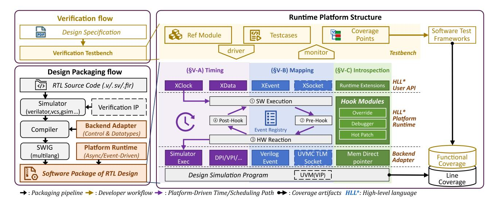

Fig. 3: UnityChip Verification overview. The left shows the verification and packaging workflow, while the right shows the runtime platform structure, illustrating the interaction between the verification environment and the packaged design. Dashed boxes indicate optional supports for UVM VIP.

handling of intermediate states. Merging them improves performance but reduces observability, while preserving them increases visibility at the expense of efficiency. Debugging facilities such as VPI and DPI introduce extra intermediate states, with VPI further restricting key optimizations.

To overcome this limitation, we introduce a method that accesses pointers to underlying circuit states without instrumenting additional intermediate signals. Corresponding signal values are computed on demand, with computation selectively activated according to signal relevance. This design achieves fine-grained control over debugging visibility while maintaining high performance. Details are presented in Section V-C.

# IV. UNITYCHIP VERIFICATION OVERVIEW

The vision of the UCV platform is to democratize and accelerate hardware verification through software-native operation. Fig. 3 demonstrates how the UCV platform accomplishes this.

The left side of Fig. 3 shows the verification and packaging workflows. UCV allows users to write verification testbenches in software languages based on the design specification. To interact with the design under test (DUT), the RTL design must first be packaged as an external library that can be driven and monitored by the testbench. In the design packaging workflow, the DUT source code, typically written in Verilog or SystemVerilog, is first compiled by the target simulator together with optional verification IPs (e.g., UVM VIP) into a dynamic library. UCV then links this library with a backend adapter generated from the RTL source code, which provides the glue logic required for different simulators, including event control and data type encapsulation. Finally, UCV leverages SWIG [9] to generate multi-language bindings for the backend adapter, exporting native interfaces for high-level software languages. These bindings are combined with the platform runtime, which is implemented natively in different languages, forming the final UCV software package that can be executed and driven by the verification environment.

The core insight of UCV, as illustrated on the right side of Fig. 3, is to decouple the verification layer from the traditional simulator and provide software-native interfaces for high-level languages (HLL). The UCV platform lifts core verification responsibilities, including timing management, cross-domain coordination, and observability, to provide a software-defined, three-layer verification environment. (1) The *HLL user API* layer provides a uniform programming interface for multiple languages to develop verification components. (2) The *HLL platform runtime* layer defines the platform-level timing and interaction semantics under which verification logic executes. (3) The *backend adapter* layer confines simulator-specific behavior behind a controlled boundary, so existing simulators remain interchangeable backends rather than semantic owners.

The UCV platform is realized through three key techniques across these layers. (§V-A) *Software-native timing and interaction*. UCV introduces a delegated timing model that provides a unified time abstraction (e.g., XClock for scheduling and XData for time-aware data). Implemented using the native asynchronous mechanisms of high-level languages, this model organizes software–hardware interaction into four ordered steps, ensuring deterministic execution. (§V-B) *Transparent hardware–software mapping*. UCV lifts hardware-level events and data paths into software abstractions managed by the platform runtime, providing a consistent cross-domain interaction model compatible with RTL simulation semantics. (§V-C) *Non-intrusive introspection layer*. UCV provides low-overhead observability for debugging and instrumentation through hook modules and memory direct pointers, without the runtime overhead associated with simulator interfaces (DPI/VPI), enabling efficient state inspection and runtime instrumentation.

Together, these mechanisms allow RTL designs to be packaged as language-native libraries, imported like software dependencies, and registered into asynchronous runtimes. Developers can then write cycle-accurate tests and even leverage familiar frameworks such as pytest or JUnit for test development, while reusing existing verification components and benefiting from efficient software-native debugging. In this way, UCV transforms hardware verification into a modern software workflow and broadens who can contribute meaningful tests.

#### V. DESIGN AND IMPLEMENTATION

### *A. Software-Native Timing and Interaction*

UCV introduces a software-native timing model in which the verification platform, rather than the simulator, becomes the semantic owner of timing. It realizes this model through XClock(§V-A1), which defines logical time and commit/sample boundaries, and XData(§V-A2), which binds signal accesses to these boundaries. Thus, the simulator is retained as a cycle-accurate execution backend, while timing and interaction are exposed to the testbench through software-native asynchronous interfaces.

This design resolves the challenge III-A from three perspectives. At the testbench level, it allows developers to express event-driven and overlapping interactions naturally. At the same time, timing remains under software control and stays cycle-accurate, rather than depending on simulator-specific callbacks. In this way, the design preserves expressiveness while ensuring correctness. Moreover, because this model is built on the language-native asynchronous runtime, hardware verification is exposed as an ordinary asynchronous software package, which further provides strong compatibility with existing software ecosystems.

*1) Software-Side Timing Model:* General-purpose software has no native notion of clock edges or time points, while hardware execution depends on them. In software-driven verification, the host cannot sense the hardware clock and thus cannot anchor reads/writes to hardware edges. This mismatch leads to off-edge commits and sampling of transient values unless an explicit timing contract is introduced.

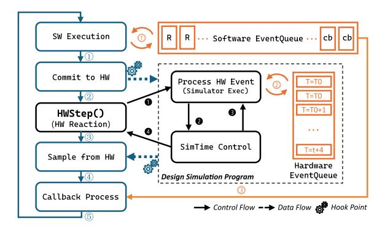

Fig. 4: Software-based Simulation Driving Method

TABLE II: Event-driven Methods of Timing Model

| Methods                                                               | Description                                                                                                    |  |  |
|-----------------------------------------------------------------------|----------------------------------------------------------------------------------------------------------------|--|--|
| XClock(pin, thigh, tlow) XEvent(conds, args, sclk, reactors) | Primary clock and event manager. Registers an event; triggers reactor with args when conditions are met. |  |  |
| XEvent(conds,                                                         | Suspends execution until conditions are                                                                        |  |  |
| sclk).await                                                           | satisfied.                                                                                                     |  |  |
| XTrigger(events, sclk)                                                | Manually triggers specified events.                                                                            |  |  |
| XTrigger(reactors, sclk)                                              | Directly invokes designated reactors.                                                                          |  |  |
| XReactor(name, cb, sclk)                                              | Registers a reactor that executes callbacks when triggered.                                                 |  |  |
| @XReactor(name)                                                       | Binds function as reactor with decorator.                                                                      |  |  |
| @XReactor(conds,                                                      | Same as above, with predefined trigger                                                                         |  |  |
| name)                                                                 | conditions.                                                                                                    |  |  |

We therefore define a *software-declared* clock, XClock, as the canonical timebase shared by the host and the simulator. XClock does not rely on the hardware clock; instead, it specifies a schedule of commit/sample points (frequency, clock edge, phase) and constrains when the simulator may advance and when I/O is valid. As shown in Fig. 4, the softwareside steps from 1 to 5 handle commit/sample operations and synchronization, while the hardware-side steps from 1 to 4 describe how software controls simulator progression.

Each software iteration proceeds as follows. 1 The program processes all pending software events at timestamp T0. 2 Buffered writes are committed to the simulator at T0. 3 The program invokes HWStep() with target time T1 ≥ T0, transferring control into the simulator. 4 On return, signals are read on demand and registered callbacks dispatch new events upon value/time changes. 5 The resulting events are enqueued, continuing the loop.

Inside HWStep(), the simulator advances from T0 toward T1; 1 at each cycle it processes all events at the current time, 2 increments the time, and 3 continues until T0 = T1, 4 at which point control returns to the software environment. Specially, a call with T1 = T0 advances the simulator through its internal zero-time phases until quiescence, enabling observation of combinational logic and delta-cycle effects. At data exchange boundaries between the host and simulator, optional *Hook Points* allow dynamically loaded tools to monitor, intercept, or modify I/O and internal state.

Concretely, XClock maintains the current logical time T and clock parameters, coordinates the pre- and post-step barriers, and orchestrates HWStep(). It is implemented as an ordinary library invoked from existing event loops(e.g., asyncio, Boost.Asio); it does not require modifications to the simulator, RTL design, or third-party library. Testbench code is adapted to call the XClock API, and most cross-domain glue is auto-generated. As a result, users write verification code with familiar asynchronous patterns while obtaining edgealigned commits and quiescent sampling by construction.

*2) Timing-Aware Data Types:* Hardware relies on clock edges and precise timing for state changes. The simulatorcompiled design (the simulation program) enforces edge alignment via scheduled processes internally, but host-side verification programs that are not managed by the simulator do not inherit this behavior. Moreover, simulators typically do not expose an API for per-access edge alignment to host code. As a result, software writes risk misaligned updates and incorrect waveforms without embedded timing semantics

To address this gap, we adopt a timing-aware, softwaremanaged data type XData that encapsulates edge-aligned I/O, so that software does not annotate every read/write with explicit edge waits. XData has dual-layer abstraction. The lower C/C++ layer provides basic simulator control and timing-agnostic signal access, and is exposed to high-level languages via automatic bindings (e.g., SWIG [9]). The upper language layer implements event orchestration using native concurrency models and manages timing alignment.

Built on this architecture, XData binds to an XClock and schedules transfers only at declared clock edges and timing points, rather than at every simulator timestep, so software observes an edge-aligned, cycle-accurate view. By default, the schedule exposes only clock edge points (e.g., rising and optionally falling edges); additional edges or timepoints can be declared when finer within-cycle observation is required. This removes the per-access synchronization burden while preserving the determinism defined by the timing model.

This structure yields: (a) deterministic simulator control at the C/C++ layer, (b) seamless cross-language communication through automatic type translation, and (c) native event-driven integration for accurate timing in high-level languages. In summary, the datatype system resolves signal-level timing and synchronization for software-driven control while improving extensibility across languages.

## *B. Transparent Hardware-Software Mapping*

UCV introduces a transparent hardware-software mapping layer that brings simulator-resident verification semantics into the software runtime. This layer maps hardware coordination points into software scheduling and language-native interaction mechanisms, so that existing VIPs can participate in the same execution model as software testbenches.

This design resolves the composability challenge in §III-B through two complementary aspects. For event synchronization, it maps simulator-side events into software-visible coordination points. For transaction scheduling, it lifts multicycle VIP transactions into software-driven interaction flows. Under this design, VIPs continue to execute in their native environment, while their synchronization and communication

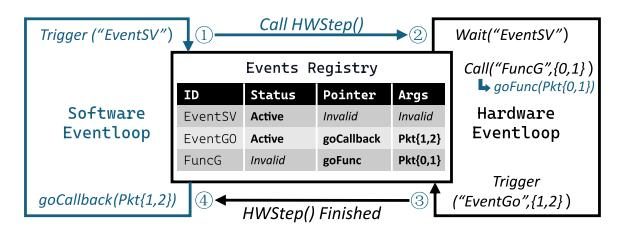

Fig. 5: Events Registry Workflow

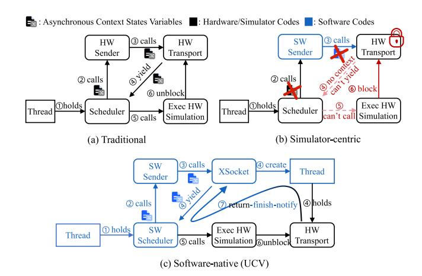

Fig. 6: Transaction Transport Execution Flow

behaviors are reified as software-level objects that can be awaited, scheduled, and driven from the host side.

*1) Registry-Driven Event Synchronization:* In HVL workflows, events orchestrate *reference models execution* and *stimulus generation* by synchronizing model state and coordinating wakeups and rendezvous across components. UCV establishes XEvent, a semantics-preserving mapping that links HVL events with software event objects through an *Event Registry*. The registry (i) registers cross-language events under string identifiers, (ii) mirrors event state and parameter buffers across environments, and (iii) brokers callbacks between languages.

Event synchronization follows three steps (Fig. 5). First, awaiting an HVL event will register a string identifier and a parameter buffer in the registry. Second, an HVL trigger updates the registry's event state and parameters. Third, at the synchronization points (data flow in Fig. 4), the registry propagates the updates across environments to restore scheduler visibility and maintain event-driven capabilities.

As a further benefit, the registry permits dynamic crosslanguage invocation in no-timing cases. The registry resolves the target function by identifier and dispatches synchronously via function pointers and binding-layer decoding. Timingdependent operation must use Transaction Socket (§V-B2).

*2) On-Demand Threaded Transactions Transport:* Transactions underpin modern VIP: an HVL transaction is a static data packet describing a dynamic operation, and transport delivers it as arguments to a target procedure that executes the operation within that call.

The transaction transport cannot run directly in softwareside code. Some operations require simulation time to advance, yet the simulator cannot preempt the software function for time and resume it later. The function then holds the thread while also waiting for the simulator to progress, and this mutual waiting can form a simulator–software progress deadlock in synchronous blocking transport.

UCV addresses this with XSocket, which dispatches transport onto a bounded threads pool, converting synchronous blocking waits into asynchronous blocking to avoid simulator–software progress deadlocks while keeping threading overhead bounded. XSocket also leverages the request–response similarity between TLM and Unix sockets: the hardware side retains a conventional TLM implementation, while the software side exposes a socket-like, developer-friendly API.

The XSocket design is contrasted across the three subfigures in Fig. 6. In subfigure (b), the software extension forces a software–hardware asynchronous context switch at step 2 or 3. Regardless of scheduler type, the prior thread context is not preserved after this switch, which precludes HW Transport from yielding control back to the scheduler. UCV instead uses software scheduling to run transport code on worker threads and employs the scheduler to deliver an asynchronous notification at step 7, so the simulator no longer waits on the software thread.

#### *C. Non-Intrusive Introspection Layer*

UCV introduces a non-intrusive introspection layer that moves observability out of simulator debug interfaces and into the software runtime. Rather than exposing internal signals through simulator-provided debugging interfaces, UCV accesses optimized circuit state through stable low-level pointer hooks and derives the required debugging views by recomputation at the software layer. Since it neither preserves extra intermediate states in the circuit nor relies on simulator-provided debugging interfaces to export them, UCV preserves observability while maintaining high simulation performance, and the same mechanism further supports software-native debugging and runtime reconfiguration.

*1) Pointer-Based Debugging Acceleration:* Most simulators expose monitoring and control of internal signals through the SystemVerilog VPI and DPI interfaces. As Fig. 7 shows, this approach needs support code inside the simulator for every exported signal. The extra code reduces simulation speed and increases the compiled artifacts' size.

We observe 3 main sources of overhead. *1) Binary expansion.* Exporting all signals can enlarge the artifacts by up to 4x, which harms cache locality. *2) Additional branches.* Writable and lockable VPI paths add checks before each register update. *3) Optimization conflicts.* To accelerate execution, simulators merge certain computation nodes that are tightly related to registers. Keeping those registers externally controllable for debug disables these merges on the affected nodes.

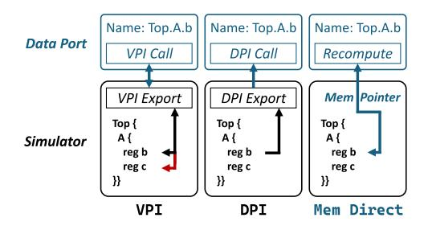

Fig. 7: XData Access Modes for Register

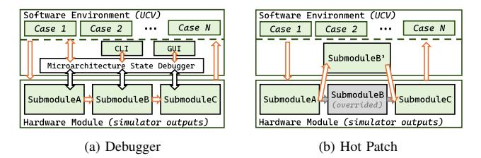

Fig. 8: Hook-Based Debugging Features

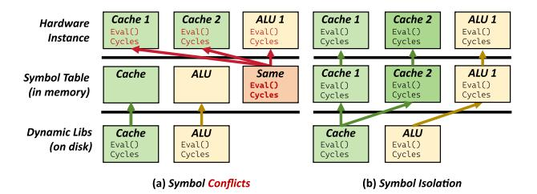

Fig. 9: Symbolic Isolation Resolves Instance Collisions

UCV avoids these costs by reusing the software-side XData types deriving direct memory access from simulator-emitted C++/IR artifacts rather than from DPI object layouts, which removes the redundant glue code. As shown in Fig. 7, XData includes a recomputation module that inverts the optimization mapping to recover original values, so aggressive optimizations and debugging proceed together. For analyzable backends (e.g., Verilator and GHDL), UCV extracts pointers and inverse mappings at compile time and loads them at runtime as a small symbol–pointer database. On VCS, it uses VPI/DPI by default, with an experimental pointer-based mode built by hacking the intermediate artifacts during build flow.

This efficient debugging capability enables features that are difficult impractical at scale. Fig. 8a illustrates an SoC instruction-level RTL debugger that delivers fast simulation and flexible debugging, supporting a GDB-for-QEMU-style workflow for RTL processors.

*2) Scalable Runtime Reconfiguration:* Design changes typically require editing RTL and rebuilding artifacts, which lengthens turnaround time. These changes mainly take two forms: edits to logic within a module and replacement or addition of modules. For logic edits, UCV provides a hotpatching path (Fig. 8b) that splices a cycle-accurate model into the RTL simulation flow to validate ideas quickly. For module replacement or addition, UCV supports on-demand instantiation of multiple modules within a single process, similar to constructing and managing software classes, which avoids frequent rebuilds.

For hot patching, UCV exploits the fact that registers take effect only at clock sampling edges: using the design in Section V-C1, it lets a cycle-accurate model compute updated register values and overwrites them immediately before sampling, which covers most sequential transfers. When the desired change also affects combinational paths between registers, overwriting registers alone is insufficient; UCV then uses pointer-level access to simulator-emitted evaluation entry points to install function-pointer hooks that wrap or replace the generated combinational update routines, so the patched C functions participate directly in combinational evaluation.

On-demand instantiation is limited by simulator optimizations that rely on global symbols. As shown in Fig. 9, many simulators emit designs that share the same global symbol names, preventing multiple instances from coexisting at run time. UCV applies namespace-level symbolic isolation at the software layer, separating symbol bindings per instance and enabling dynamic expansion during debug.

## VI. PUT IT ALL TOGETHER

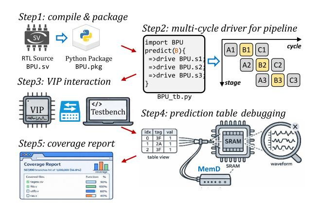

Fig. 10: UCV Example for BPU Verification

We use a *pipelined branch predictor unit* (BPU) as a running UCV example to illustrate an end-to-end verification workflow in Fig. 10. A pipelined BPU overlaps multiple inflight branches, and a prediction request unfolds across several stages rather than completing as a one-cycle interaction. The testbench must therefore coordinate stage-specific driving and sampling across cycles, since how it drives a later stage depends on the outcomes exposed by earlier stages. Moreover, key predictor tables reside in SRAM, which makes waveform debugging provide limited visibility. The walkthrough follows the five steps in Fig. 10 and emphasizes Steps 2 to 4, which correspond to the three techniques in Section V.

To begin the workflow in Fig. 10, Step 1 packages the BPU RTL as an importable software module. In simulator-centric flows, running a testbench is typically tied to a simulator project's build and launch setup, so reproducing testbenches often requires reproducing that surrounding setup as well. The package exposes a typed DUT interface and binding metadata for signals and selected internal structures, so tests can treat the DUT as a standalone library without relying on environments.

Step 2 imports the packaged BPU as a software module and drives it with stimuli through its typed interface. However, each prediction unfolds over multiple cycles rather than as a one-shot call, and multiple predictions may overlap, so the driver must carry each in-flight interaction forward over time. UCV's technique V-A introduces XClock, which exposes explicit timing points in software as awaitable events for timed asynchronous programming. This lets the driver advance each interaction forward over time by awaiting these points, while keeping the intermediate state of overlapping interactions in separate asynchronous flows rather than in a shared percycle state machine. In contrast, simulator-centric step-peek fragments a single interaction into per-cycle handlers and forces developers to mix stimuli and advancement in the handwritten state machine. Callbacks can also trigger before deltacycle or netlist delays settling completes, so sampling may observe transient values.

Step 3 bridges interaction between software testbench tasks and simulator-provided UVM VIPs. These VIPs encapsulate mature and configurable models, including reusable reference models. However, most VIP components still execute under simulator scheduling, and their events and transaction communications remain visible only inside the simulator. To make these components usable from software-side tasks, UCV lifts these interaction points into software-visible coordination semantics. It maps simulator-side events to software XEvents through a registry and bridges transaction communication through XSocket, so software tasks can coordinate with VIP behavior through platform-defined interfaces rather than ad hoc simulator glue. This makes VIP-side events and transaction exchanges part of the same coordination model used by the software testbench.

Step 4 diagnoses mismatches by inspecting predictor state when BPU behaviors deviate from the design intent. Leveraging technique V-C, UCV exposes SRAM-backed predictor tables as a table view that makes per-entry contents explicit, so the developer can inspect and compare entries directly rather than inferring table semantics from waveform traces. UCV realizes this view via XData with the MemD extension, which derives pointer-level value access to the underlying circuit state and computes table entries on demand. This makes table inspection lightweight and avoids relying on heavy-cost simulator interfaces such as VPI for large structured state.

Step 5 collects artifacts for inspection and regression, including functional and line coverage, and generates an HTML report. The report summarizes coverage results and links failing assertions to the recorded transaction context and selected diagnostic evidence. This packaging makes the report easier to share across environments and teams, while retaining sufficient context for inspection and regression.

Together, these five steps show that UCV is not only a runtime for executing verification logic, but also a workflow for packaging, coordinating, debugging, and reporting across software and simulator boundaries. This combination lowers the barrier for developers with a software background and reduces the friction of verification iteration.

#### VII. EVALUATION

We evaluate the performance of UCV, and aim to answer the following questions. Beyond performance benchmarks, we further conduct case studies (§VIII) with real participants to evaluate UCV's effectiveness and workflow impact.

- Q1 (Debugging Performance): How faster can UCV's debugging interface achieve than prior work? (§VII-B1)
- Q2 (Multi-Instance Scalability): How does UCV's resource usage scale with instance count? (§VII-B2)
- Q3 (XSocket Transaction Throughput): How does UCV accelerate the integration of traditional UVM platforms with software testing extensions? (§VII-C)
- Q4 (Software Timing Overhead): What overhead does UCV incur to support software timed event-driven? (§VII-D)

### *A. Experimental Methodology*

Table III summarizes the evaluation environment. To preserve external validity, the hardware mirrors common industrial verification clusters, although UCV itself does not require server-class machines. On the software side, we pin widely used open-source toolchains to stable releases and standardize compiler and runtime settings across baselines.

We compare UCV against three baseline families: (i) a bare simulator without a verification harness (Verilator [42]), (ii) a Python-based framework with event-driven features (cocotb [37]), and (iii) a traditional SystemVerilog verification framework (UVM [17]). These baselines are evaluated on three designs that vary in both scale and load type. Design scale is measured by RTL source lines of code.

## *B. Simulator Enhancement*

UCV introduces a software non-intrusive simulator introspection layer, which improves debugging speed and enables multi-instance verification within a single process. These capabilities reduce build and storage overhead, increasing regression throughput.

*1) Debugging Performance:* XData supports three modes for debugging internal signals: memory direct (MemD), VPI, and DPI (see §V-C1). MemD uses simulator pointers for debugging acceleration. VPI and DPI are kept for compatibility. We adopt Python as the high-level language and use Cocotb as the baseline for debugging. The evaluation methodology is described next.

Debugging efficiency reflects how quickly developers can iterate on design changes, which involves both the cost of recompilation and the runtime speed of simulation. We therefore

TABLE III: Testbed and Workloads

#### (a) Testbed

| AMD EPYC 7773X 64-Core CPU 16 × 64GB DDR4 3200 MT/s Memory Ubuntu-20.04.1 5.15.0-127-generic OS GCC 11.4.0-2ubuntu1˜20.04 OpenJDK (build 17.0.14+7) Java | Verilator CIRCT SWIG Python Golang | v5.034 1.66 4.2.1 3.8.10 1.23.4 |
|-------------------------------------------------------------------------------------------------------------------------------------------------------------------------------------|------------------------------------------------|---------------------------------------------|
|-------------------------------------------------------------------------------------------------------------------------------------------------------------------------------------|------------------------------------------------|---------------------------------------------|

#### (b) Workloads

| Name       | LOC     | Description                | Pressure Type |
|------------|---------|----------------------------|---------------|
| XiangShan  | 3451036 | RVA23 SoC, Spec2006 15/Ghz | compute       |
| CoupledL2  | 86104   | PIPT Cache Subsystem, 1MB  | memory        |
| RocketChip | 51721   | RV64GC Core, Spec2006      | compute       |

report compile time and runtime under basic stimuli. This excludes the effect of the external debugger implementation. All builds use default compiler flags. The backend is a Verilator executable configured with 8 threads. This setup ensures a fair and controlled comparison.

Under these conditions, MemD improves simulation speed by from 4.8× to 17.5× over VPI and by from 16.3× to 25.2× over Cocotb (Fig. 11). MemD also reduces peak memory by from 13% to 77% relative to VPI and by from 46% to 77% relative to Cocotb. DPI shows similar runtime when the signal set is small. However, it exposes only a fixed set of signals selected in code, and its cost grows with the signal range. Finally, it approaches VPI.

The improvements of MemD result from eliminating the per-access invocation path through direct pointers. For comparison, Cocotb relies on VPI internally. When compiled with manually matched optimization settings *(-O3)*, Cocotb's performance tracks the VPI mode of XData, which confirms the invocation path is the core bottleneck.

In summary, the pointer-based MemD path delivers high performance while preserving comprehensive debuggability. It provides a practical and efficient debugging interface for complex verification scenarios.

*2) Multi-Instance Scalability:* Runtime reconfiguration demonstrates dynamic composition of hardware modules (see §V-C2). To quantify its performance benefits, we evaluate a parallel testing scenario that highlights resource savings. We enable multi-threaded concurrency through parameterized instance creation. We then compare this single-process, multithreaded setup with a multi-process, multi-instance baseline to measure horizontal scalability. The results show that the hardware workload type strongly determines the gains from instance parallelism.

As shown in Fig. 12, the XiangShan processor with complex logic achieves a 52% reduction in memory usage using a multi-threaded approach, whereas the CoupledL2 cache exhibits only marginal gains. Our analysis attributes this discrepancy to the differences between shared text segments and private data segments: for the CoupledL2 cache, state storage management is the predominant cost, while for the XiangShan processor, the primary memory burden arises from

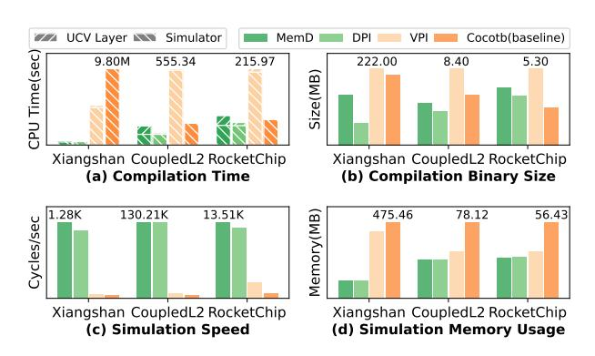

Fig. 11: XData Performance with Debugging Features

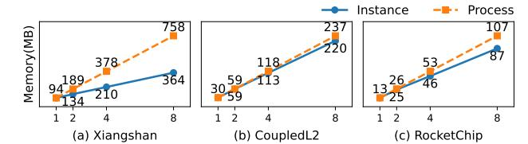

Fig. 12: Parallel Testing: Instance vs. Process

its simulation logic. These results indicate that the isolation mechanism facilitates hybrid module verification (Fig. 9) and enhances performance by optimizing resource sharing.

### *C. XSocket Transaction Throughput*

Transactions are the foundation of UVM verification. XSocket carries this abstraction into software testing and binds it to a software asynchronous runtime. It preserves SystemVerilog event synchronization and transaction transport in the process. This combination leverages software flexibility and established hardware practice, reducing development effort and improving runtime efficiency.

To the best of our knowledge, no prior work provides both capabilities within a software asynchronous environment. Table IV shows that UCV's XSocket delivers about a 16.6% advantage in runtime speed and reduces code volume by 12% over a pure UVM baseline.

TABLE IV: UCV XSocket vs. UVM Mem Relay

| Module | Design LOC | Tools | Verify LOC | Compilation | Execution |
|--------|------------|-------|------------|-------------|-----------|
| NoC    | 13,036     | UCV+  | 13,766     | 24.06s      | 15.41s    |
|        |            | UVM   | 15,664     | 15.32s      | 18.47s    |
| ICache | 5,163      | UCV+  | 7,211      | 13.69s      | 94.36s    |
|        |            | UVM   | 8,063      | 19.14s      | 106.12s   |

UCV+: UCV with UVM support enabled, as shown in Fig. 3.

To explain these gains, we first identify where the overhead arises in a UVM flow. In a UVM flow, integrating complex software stimulus to cooperate with verification IP requires interprocess communication to avoid the deadlock described in §V-B2. Shared memory is a common choice for transaction exchange. It introduces waiting and synchronization overhead and forces extra serialization code. However, these overheads are caused by process-level synchronization rather than protocol requirements. XSocket replaces this interprocess integration with direct in-process transport, removing these costs and yielding the observed improvements.

#### *D. Software Timing Overhead*

Event-driven programming and the software timing model narrow the temporal gap between software and hardware, but they add runtime overhead. We measure the overhead of UCV's temporal support across multiple high-level languages. All tests use identical stimuli and checks. Timing and data exchange rely on XClock and XData. We use Verilator as the baseline because it is the state-of-the-art open source simulator and it introduces no verification components.

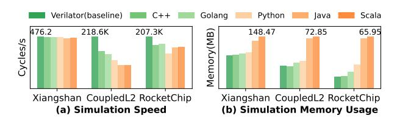

Fig. 13: Multi-language Event-driven Overhead

Fig. 13 shows that, on *XiangShan*, UCV reduces simulation throughput by at most 3% relative to a pure Verilator baseline, because large designs spend most time in simulator execution. On *CoupledL2* and *RocketChip*, the throughput reduction ranges from 14% to 55%. These smaller designs run more cycles per second, so software event scheduling consumes a larger share of CPU time.

Peak memory usage is largely language-dependent rather than design-dependent: Java and Scala incur JVM overhead, and both Go and Python introduce additional runtime/interpreter footprints. Considering both performance and developer convenience, Python is often the most practical choice.

Overall, the overhead is negligible on large designs (<3%) and remains moderate on small, high-throughput designs (14- 55%). Given the improved usability of temporal interaction for hardware, this represents a reasonable trade-off relative to synchronous, Verilator-only flows.

#### VIII. CASE STUDIES

To evaluate whether UCV democratizes and accelerates hardware verification, we conducted a six-month community study (IRB-approved). The study examined how developers from different backgrounds perform verification tasks on the UCV platform. All participants joined voluntarily and provided informed consent, and neither employment nor direction relationship existed with the authors.

The study followed a task driven design that reflects realistic verification practice. Table V summarizes main verification scenarios in the community study, spanning BPU, NoC, Router, RAS, and Decoder tasks on XiangShan. These scenarios were chosen because they cover different verification stresses relevant to UCV and represent the main cases that reached sufficient maturity for analysis within the study period, including timing-sensitive interaction in BPU, interaction with the UVM environment in NoC, bring-up tasks such as Router and RAS, and bug-oriented Decoder verification. Although these scenarios differ in module complexity and support, each participant is required to construct testbenches and assertions, execute verification, and submit artifacts and bug reports.

To assess real-world usability, participation followed an open and self-directed process. Verification tasks were announced on the community website and communication channels. Developers registered through the portal, selected tasks according to their interests and experience, and downloaded the corresponding resources. They could choose either the conventional UVM flow or the UCV framework, as well

TABLE V: Verification Scenarios: Representative Cases

| CS No. | Module  | Tools   |     | C1 111      | Participan |      |              |          | Documentation |                     |          | Resu     |      |
|--------|---------|---------|-----|-------------|------------|------|--------------|----------|---------------|---------------------|----------|----------|------|
|        |         |         | BG  | Skill       | Local      | Num. | Participated | Tools    | Design        | Verification        | Ref      | Duration | Bugs |
| 1      |         | UVM     | HW  | Experienced |            | 1    | Yes          |          |               |                     |          | 5 months | 2    |
| 2      | BPU     | C V IVI |     |             | Onsite     | 1    | ics          | Normal   | Brief         | None None           | None     | 3 monus  | 0    |
| 3      | DI C    | UCV     | SW  | Junior      |            | 5    | No           | Norman   | Bilei         |                     | rtone    | 2 months | 10   |
| 4      |         |         |     |             | Remote     | 4    |              |          |               |                     |          |          | 6    |
| 5      | NoC     | UVM     | HW  | Experienced | Onsite     | 2    | Yes          | Normal   | Normal        | Provided            | Provided | 4 months |      |
| 6      | Noc     | UCV+    | SW  | Junior      | Olisite    | 1    | 1 No Normal  | Normai   | Normal        | 1 Tovided 1 Tovided | riovided | 2 weeks* | 1 ′  |
| 7      | Router  | HOW     | CVV | N           | 0          | 1 1  | l .,         | D . 1 .  | D . 1 1       | ъ                   | Provided |          | 0    |
| 8      | RAS     | UCV     | SW  | Novice      | Onsite     | 1    | No           | Detailed | Detailed      | Provided            | None     | 2 weeks  | 0    |
| 9      | Decoder | UCV     | HW  | Experienced | Onsite     | 1    | Yes          | Normal   | Normal        | Provided            | Provided | 1 months | 12   |

Participated: have any prior experience in verification work or not.

Bugs: / indicates that this case is not aimed at finding bugs.

UCV+: a UVM environment enhanced by UCV. The 2 weeks\* is due to CS#6 being optimized based on CS#5.

TABLE VI: Participants and Contributors Overview

| - Category - Overall |             | Community | Registrant | Testcase* | Bug* | 98.30% |  |
|----------------------|-------------|-----------|------------|-----------|------|--------|--|
|                      |             | 520       | 95         | 25        | 11   |        |  |
|                      | With UVM    | 64        | 16         | 5         | 4    | 100%   |  |
| Exp.                 | With Python | 463       | 86         | 24        | 10   | 97.73% |  |
|                      | No prior    | 13        | 2          | 0         | 0    | 0      |  |
| D -1-                | Students    | 271       | 78         | 20        | 6    | 97.45% |  |
| Role                 | Engineers   | 249       | 17         | 5         | 5    | 100%   |  |
| Design               | Complex     | _         | 6          | 4         | 4    | 100%   |  |
|                      | Simple      | -         | 89         | 21        | 7    | 97.52% |  |

\*: The number of case contributors and bug reporters.

as their preferred programming language, including Python, C++, and SystemVerilog. They then implemented testcases and testbenches, executed simulations locally, and submitted runnable artifacts and bug reports for evaluation.

We measured quantitative metrics including line coverage, time-to-first-runnable testcase, total completion time, and defect yield, which jointly capture both development efficiency and verification thoroughness. Across a 520-member community, 95 registrants participated, most from software backgrounds. Participants achieved 98.3% overall line coverage, with 18.3% remaining active and, among them, 26.3% contributing runnable testcases or bug reports. Accordingly, all scenarios in Table V complete the same end-to-end verification workflow. Among them, the BPU and Decoder cases achieve comprehensive coverage of intended design features and corner cases, while the remaining scenarios focus on workflow bring-up, collaboration, or targeted bug finding. The following subsections analyze these differences by experience, role, design complexity, and collaboration.

## A. Effect of Prior Experience

We stratify participants by prior experience (UVM, Python, none) and compare testcase/bug yield, time, and line coverage (Exp. in Table VI). Python-experienced participants dominate with 86 registrants (90.5% of total) and account for 24 testcase contributors, achieving 97.7% line coverage, only 2.3% lower than the UVM group. UVM users, though fewer (16), deliver perfect coverage and 4 bug reporters, reflecting higher precision but lower overall throughput. Participants without

prior experience produced no runnable cases, confirming that minimal experience remains necessary.

On the BPU module (CS#1-4 in Table V), where 5 software junior participants using UCV produced runnable results and reported bugs within 2 months, whereas one hardware expert using UVM took 5 months to reach verification completeness. After surveying contributors, we found that this difference mainly stems from two factors. First, BPU is algorithmic and maps well to algorithm abstractions. Second, it also admits software implementations that serve as oracles, enabling junior software developers to perform effectively.

Taken together, UCV enables software-oriented contributors to scale defect-relevant work, such as testcases and coverage points, while hardware-oriented contributors drive coverage closure more effectively. The two effects are complementary.

#### B. Participant Roles and Educational Value

Students constitute the majority of registrants (78/95, 82%), with 20 testcase contributors and 6 bug-reporting contributors, achieving 97.5% line coverage. Engineers, though only 17 in total, include 5 testcase contributors and 5 bug-reporting contributors, reach 100% coverage, and show higher per-capita contributor (59% vs. 33%). This pattern reflects time constraints on engineers and experience constraints on students.

In CS#7–9, novice student teams produce runnable Router and RAS tests within 2 weeks, achieving high coverage despite limited prior experience. Experienced engineers, leveraging UCV, verify the Decoder within one month and report multiple previously undetected defects. These outcomes indicate that UCV both eases hardware engineers' time burden and compensates for students' lack of experience.

Together, the results suggest a two-phase workflow: students expand breadth and runnable coverage, while engineers drive convergence and high-severity defect discovery. In doing so, UCV reduces the development load on engineers and helps cultivate more students into experienced contributors.

## C. Design Complexity

Participation differs markedly by design complexity. For simpler designs, 89 registrants included 21 testcase contributors and seven bug-reporting contributors, 24% and 7.9% of participants respectively, achieving 97.5% line coverage. In contrast, complex modules attracted only 6 registrants but

yielded 4 testcase and 4 bug-reporting contributors, meaning two-thirds of participants generated effective outputs and reached full coverage. As design complexity increases, overall participation narrows while contributor efficiency per registrant rises from 24% to 67%.

This pattern arises from self-selection during task registration: participants with sufficient expertise are more likely to volunteer for complex modules, while less experienced contributors prefer simpler tasks. As a result, complex tasks start with a smaller but highly capable group that achieves concentrated progress, whereas simple tasks engage a wider range of software-oriented participants who provide broad runnable coverage and regression scaffolding. Over time, contributors often advance from simple to complex tasks, demonstrating that UCV supports a sustainable path for community skill development and scalable participation.

## *D. Software-Hardware Cooperation*

Cross-domain collaboration demonstrates UCV's ability to accelerate existing hardware workflows. In the NoC verification tasks (CS#5–6), a software contributor used UCV to optimize an existing UVM environment developed by a hardware team over four months. The optimization was completed within two weeks and achieved about 15% simulation runtime speedup, along with reduced manual interface code through automated software-hardware communication generation.

The cooperation process shows how software participants can improve hardware verification efficiency. The contributor identified synchronization overheads between the UVM testbench and the software reference model and refactored the interface using UCV's unified transport abstraction. This change enabled faster iteration, more stable co-simulation, and improved code maintainability.

Overall, this case confirms that UCV not only lowers the entry barrier for software participants but also strengthens hardware verification by improving productivity and runtime efficiency through software-hardware collaboration.

## IX. RELATED WORK

*Software-driven RTL verification.* DPI-based software frameworks such as ChiselTest/ChiselVerify [16], [35] expose RTL simulators through a cycle-based step-peek interface. Cocotb [37] instead offers an event-driven API via simulator callbacks, with testbench behavior synchronized to simulatorspecific callback timing. Python HDLs such as PyMTL3 [29] provide event-driven, multi-level CL/RTL modeling, yet their verification interfaces remain predominantly cycle-based steppeek APIs. UMOC [24] builds on PyMTL3 by statically analyzing a fixed mixed-level design to synchronize CL and RTL processes and to synthesize a deterministic static single-cycle tick schedule for cycle-by-cycle simulation. In contrast, UCV explicitly targets the SW-testbench/HDL boundary and provide deterministic event-driven verification on top of existing RTL simulators and UVM components.

*Full-system co-simulation frameworks.* Current works such as gem5+RTL [30] define a device-level interface for embedding RTL blocks into gem5's event-driven model, but realizing this abstraction in practice still requires per-module, bus-level wrappers that translate low-level step/peek simulator APIs on C++ models into tick-style gem5 events [11]. Current works such as gem5+RTL [30] are orthogonal to our work. UCV instead targets the software-facing side of RTL, providing eventdriven drivers that present RTL modules as software libraries with uniform timing and access semantics across simulators; these software-level drivers can be used to implement the device interfaces expected by frameworks like gem5+RTL, reducing ad-hoc step/peek glue code and avoiding a hard reliance on C++-translated simulators.

*FPGA-based debugging platform.* FPGA acceleration is a widely used technique in industry to improve verification speed, especially for large-scale SoC systems. Such flows typically trigger bugs in hardware and then return to software for debugging [39], [52]. In contrast, UCV focuses on enhancing software-level debuggability and development efficiency, making the two approaches orthogonal. Although this work does not integrate FPGA support, UCV's architecture is extensible and could accommodate transparent FPGA acceleration in the future through backend adaptation.

*Incremental compilation and simulation*. Live simulation systems such as LiveSim [41] and LiveHD [49] reduce design edit-to-result latency by incrementally compiling changed RTL and using hot reloading and checkpoints to avoid full rebuilds and long replays. This direction primarily accelerates iterations dominated by RTL edits, where backend compilation and replay become the bottleneck. UCV targets a different iteration scenario that is common in verification and debugging, where the RTL largely stays unchanged but developers frequently revise checks, observation strategies, and diagnostic logic. It reduces the overhead of evolving these verification artifacts, including the cost of adding observation probes and repeatedly rebuilding simulation artifacts solely for debugging. Therefore, UCV is complementary to LiveSim-like systems and can benefit from these backend optimizations when available.

#### X. CONCLUSION

Inspired by the open-source hardware ecosystem and the benefits of software communities, we propose a multi-aspect optimization approach for software-based hardware verification, the UnityChip Verification platform. This platform establishes a hardware verification toolchain that enables software engineers to verify chips more efficiently. Evaluations on XiangShan and RocketChip demonstrate significant gains in both development and execution efficiency, while preserving robust debuggability and scalability. Furthermore, our experiments reveal ongoing challenges faced by software developers in the hardware verification process.

#### ACKNOWLEDGMENTS

The authors would like to thank the anonymous reviewers for their valuable feedback and comments. This work issupported in part by the National Natural Science Foundation of China (Grant No. 62090022, 62090023, 62172388) and the Innovation Funding of ICT, CAS under Grant No. E561080.

## ARTIFACT APPENDIX

#### *A. Abstract*

This artifact supports the reproduction of the quantitative results presented in Fig. 11 and Fig. 13 of the paper. The evaluated system is UCV, which packages RTL simulators as software modules and provides a software runtime for verification. Within UCV, Picker serves as the project generator and front-end tool that drives this RTL packaging flow.

The artifact is organized into two experiment groups. Group A (Fig.11) compares Picker's Python modes performance, including DPI, VPI, and direct memory access, against the widely used cocotb framework baseline. Group B (Fig.13) evaluates the runtime and overhead of Picker-generated wrappers in C++, Python, Java, and Go relative to a raw Verilator baseline. These experiments are conducted on three hardware designs with different complexity levels, namely Rocket Chip, CoupledL2, and XiangShan.

#### *B. Artifact check-list (meta-information)*

- Compilation: GCC v11.4.0, GNU Make v4.3, CMake v3.22.1, SWIG v4.4.0, Verilator v5.026, Picker v0.9.0 master, cocotb v1.9.2, Python v3.10.12, OpenJDK v17.0.18, Golang v1.25.1.
- Artifact Contents: 1) RTL source code; 2) Testbenches; 3) Python scripts for automated installation, batch execution, and metric visualization; 4) Docker environment.
- Run-time environment: Ubuntu 22.04.5 LTS.
- Hardware: 2x AMD EPYC 7773X 64-Core, 16 × 64GB DDR4 3200 MT/s
- Execution: build, run, result scripts
- Metrics: compilation CPU time, peak RSS memory usage, simulation speed (cycle/s)
- Output: logs, text files with raw data, and figures.
- Experiments: Fig. 11 and 13
- How much disk space required?: 20GB
- How much time is needed to prepare workflow?: 1 hour for environment setup (5 minutes with docker).
- How much time is needed to complete experiments?: 25 hours for full evaluation with 2 EPYC 7773X (*23 hours for Xiangshan*, 2 hours for others).
- Publicly available?: github.com/Makiras/UnityChipExp
- Code licenses?: MIT License
- Archived?: 10.5281/zenodo.19447034

### *C. Description*

*1) How to access:* The artifact is publicly available on GitHub at https://github.com/Makiras/UnityChipExp. To simplify deployment, we also provide a Docker image that includes the required build and runtime dependencies.

In addition, we offer an SSH terminal environment that provides access to the original experimental setup and results. Evaluators who would like to use this environment may request access by emailing authors with their SSH public key.

*2) Hardware dependencies:* For local deployment, either through a native installation or the provided Docker image, the minimal hardware configuration is at least 8 CPU cores, 64 GB of memory, and 20 GB of free disk space.

For the SSH-based environment, evaluators only need a stable network connection and an SSH client.

- *3) Software dependencies:*
- For native deployment, the artifact requires a Linux environment with the software described in Compilation.
- For Docker deployment, evaluators only need a working Docker installation.
- For the SSH-based environment, evaluators only need a standard SSH client.

#### *D. Installation*

- *1) Native:* For native deployment, evaluators should install the dependencies listed in the Dockerfile (https://github.com/ Makiras/UnityChipExp/blob/master/docker/Dockerfile) , and then follow the repository README for environment setup.
- *2) Docker:* For Docker, evaluators may use the following commands. This option is recommended for a quick reproduction of the two smaller designs, CoupledL2 and RocketChip.

## Command 1 Docker environments

docker pull ghcr.io/makiras/unitychipexp:latest docker run –rm -it ghcr.io/makiras/unitychipexp:latest bash cd /home/xyl/exp

*3) SSH:* For access to the SSH environment, please email xieyunlong22@mails.ucas.ac.cn with SSH public key.

## *E. Experiment workflow*

The detailed commands for each experiment are documented in README.md. To accommodate different evaluation time budgets, we provide the following one-click scripts for a quick check and a full check.

#### Command 2 One-click scripts

# Quick check

./scripts/A without XS.sh

./scripts/B without XS.sh

# Full check

./scripts/A with XS.sh

./scripts/B with XS.sh

#### *F. Evaluation and expected results*

The performance of UCV may be affected by several platform-dependent factors, including last-level cache capacity, memory frequency, and CPU affinity. To account for such variation, our scripts include repeated sampling with mean and variance analysis to show the stability of the measurements.

In all environments we tested, the overall trends and relative orderings are consistent with those reported in Fig. 11 and Fig. 13. Successful reproduction should preserve the relative ordering among compared approaches even if absolute values vary across platforms. In particular, UCV shows a clear advantage over cocotb in the Python interface experiments, while UCV's multi-language wrappers introduce only limited overhead relative to raw Verilator.

For evaluators using the SSH-based environment, the original data and binary artifacts used in this AE are available under \${HOME}/original.

#### REFERENCES

- [1] "Ieee standard for universal verification methodology language reference manual," *IEEE Std 1800.2-2020 (Revision of IEEE Std 1800.2-2017)*, pp. 1–458, 2020.
- [2] "Ieee standard for standard systemc® language reference manual," *IEEE Std 1666-2023 (Revision of IEEE Std 1666-2011)*, pp. 1–618, 2023.
- [3] "Ieee standard for systemverilog–unified hardware design, specification, and verification language," *IEEE Std 1800-2023 (Revision of IEEE Std 1800-2017)*, pp. 1–1354, 2024.
- [4] S. Alyahya, "Crowdsourced software testing: A systematic literature review," *Information and Software Technology*, vol. 127, p. 106363, 2020. [Online]. Available: https://www.sciencedirect.com/ science/article/pii/S0950584920301312
- [5] S. Anand, E. K. Burke, T. Y. Chen, J. Clark, M. B. Cohen, W. Grieskamp, M. Harman, M. J. Harrold, P. McMinn, A. Bertolino *et al.*, "An orchestrated survey of methodologies for automated software test case generation," *Journal of systems and software*, vol. 86, no. 8, pp. 1978–2001, 2013.
- [6] AnthonyVH, "Mix and match with asyncio · issue #3994 · cocotb/cocotb," 2024, accessed: 2025 Apr 09. [Online]. Available: https://github.com/cocotb/cocotb/discussions/3994
- [7] K. Asanovic, R. Avizienis, J. Bachrach, S. Beamer, D. Biancolin, ´ C. Celio, H. Cook, D. Dabbelt, J. Hauser, A. Izraelevitz, S. Karandikar, B. Keller, D. Kim, J. Koenig, Y. Lee, E. Love, M. Maas, A. Magyar, H. Mao, M. Moreto, A. Ou, D. A. Patterson, B. Richards, C. Schmidt, S. Twigg, H. Vo, and A. Waterman, "The rocket chip generator," Tech. Rep. UCB/EECS-2016-17, Apr 2016. [Online]. Available: http: //www2.eecs.berkeley.edu/Pubs/TechRpts/2016/EECS-2016-17.html
- [8] S. Beamer and D. Donofrio, "Efficiently exploiting low activity factors to accelerate rtl simulation," in *Proceedings of the 57th ACM/EDAC/IEEE Design Automation Conference*, ser. DAC '20. IEEE Press, 2020.
- [9] D. M. Beazley, "Swig: an easy to use tool for integrating scripting languages with c and c++," in *Proceedings of the 4th Conference on USENIX Tcl/Tk Workshop, 1996 - Volume 4*, ser. TCLTK'96. USA: USENIX Association, 1996, p. 15.
- [10] J. Bergeron, *Writing Testbenches using SystemVerilog*, 1st ed. Springer Publishing Company, Incorporated, 2010.
- [11] N. Binkert, B. Beckmann, G. Black, S. K. Reinhardt, A. Saidi, A. Basu, J. Hestness, D. R. Hower, T. Krishna, S. Sardashti, R. Sen, K. Sewell, M. Shoaib, N. Vaish, M. D. Hill, and D. A. Wood, "The gem5 simulator," vol. 39, no. 2, p. 1–7, Aug. 2011. [Online]. Available: https://doi.org/10.1145/2024716.2024718
- [12] L. Chen, D. Zhao, Z. Yu, N. Sun, and Y. Bao, "Gsim: Accelerating rtl simulation for large-scale designs," in *Proceedings of the 62nd Design Automation Conference*, ser. DAC '25, 2025.
- [13] cocotb, "Timing model · cocotb/cocotb wiki," 2023, accessed: 2025 Apr 09. [Online]. Available: https://github.com/cocotb/cocotb/wiki/Timing-Model
- [14] O. Community. Openstack bug tracker. OpenStack Foundation. Accessed: 11 Apr 2025. [Online]. Available: https://bugs.launchpad.net/ openstack
- [15] E. Daka and G. Fraser, "A survey on unit testing practices and problems," in *2014 IEEE 25th International Symposium on Software Reliability Engineering*, 2014, pp. 201–211.
- [16] A. Dobis, T. Petersen, H. J. Damsgaard, K. J. H. Rasmussen, E. Tolotto, S. T. Andersen, R. Lin, and M. Schoeberl, "Chiselverify: An open-source hardware verification library for chisel and scala," in *Proceedings of the 2021 IEEE Nordic Circuits and Systems Conference (NORCAS): NORCHIP and International Symposium on System-on-Chip (SoC)*, 2021, pp. 1–8.
- [17] J. Francesconi, J. A. Rodriguez, and P. M. Julian, "Uvm based testbench architecture for unit verification," in *2014 Argentine Conference on Micro-Nanoelectronics, Technology and Applications (EAMTA)*. IEEE, 2014, pp. 89–94.

- [18] T. Fulcini, R. Coppola, L. Ardito, and M. Torchiano, "A review on tools, mechanics, benefits, and challenges of gamified software testing," *ACM Computing Surveys*, vol. 55, no. 14s, pp. 1–37, 2023.
- [19] D. N. Gadde, S. Kumari, and A. Kumar, "Effective design verification–constrained random with python and cocotb," *arXiv preprint arXiv:2407.10312*, 2024.
- [20] gruvw, "Signals not updated after rising edge · issue #3110 · cocotb/cocotb," 2022, accessed: 2025 Apr 09. [Online]. Available: https://github.com/cocotb/cocotb/issues/3110
- [21] N. B. Harshitha, Y. G. Praveen Kumar, and M. Z. Kurian, "An introduction to universal verification methodology for the digital design of integrated circuits (ic's): A review," in *2021 International Conference on Artificial Intelligence and Smart Systems (ICAIS)*, 2021, pp. 1710–1713.
- [22] B.-Y. Huang, H. Zhang, P. Subramanyan, Y. Vizel, A. Gupta, and S. Malik, "Instruction-level abstraction (ila): A uniform specification for system-on-chip (soc) verification," *ACM Trans. Des. Autom. Electron. Syst.*, vol. 24, no. 1, Dec. 2018. [Online]. Available: https://doi.org/10.1145/3282444
- [23] K. Incki, I. Ari, and H. Sozer, "A survey of software testing in the cloud," ¨ in *2012 IEEE Sixth International Conference on Software Security and Reliability Companion*. IEEE, 2012, pp. 18–23.
- [24] S. Jiang, Y. Ou, P. Pan, and C. Batten, "Umoc: Unified modular ordering constraints to unify cycle- and register-transfer-level modeling," in *2021 58th ACM/IEEE Design Automation Conference (DAC)*, 2021, pp. 883– 888.
- [25] Jonathan Corbet, "Bugs and fixes in the kernel history," https://lwn.net/ Articles/914632/, December 2022, online.
- [26] C. June, "Open-source hardware: a growing movement to democratize ic design," https://ece.engin.umich.edu/stories/open-source-hardware-agrowing-movement-to-democratize-ic-design, 2022, online.
- [27] S. Kalantari, E. Nazemi, and B. Masoumi, "Emergence phenomena in self-organizing systems: a systematic literature review of concepts, researches, and future prospects," *Journal of organizational computing and electronic commerce*, vol. 30, no. 3, pp. 224–265, 2020.
- [28] L. Liu, S. Zhao, B. Li, H. Ren, Z. Xu, M. Wang, X. Li, Y. Han, and Y. Wang, "Make llm inference affordable to everyone: Augmenting gpu memory with ndp-dimm," in *2025 IEEE International Symposium on High Performance Computer Architecture (HPCA)*, 2025, pp. 1751– 1765.
- [29] D. Lockhart, G. Zibrat, and C. Batten, "Pymtl: A unified framework for vertically integrated computer architecture research," in *Proceedings of the 47th Annual IEEE/ACM International Symposium on Microarchitecture*, ser. MICRO-47. USA: IEEE Computer Society, 2014, p. 280–292. [Online]. Available: https://doi.org/10.1109/MICRO.2014.50
- [30] G. Lopez-Parad ´ ´ıs, A. Armejach, and M. Moreto, "gem5 + rtl: A ´ framework to enable rtl models inside a full-system simulator," ser. ICPP '21. New York, NY, USA: Association for Computing Machinery, 2021. [Online]. Available: https://doi.org/10.1145/3472456.3472461
- [31] A. Mahmoud, R. Venkatagiri, K. Ahmed, S. Misailovic, D. Marinov, C. W. Fletcher, and S. V. Adve, "Minotaur: Adapting software testing techniques for hardware errors," in *Proceedings of the Twenty-Fourth International Conference on Architectural Support for Programming Languages and Operating Systems*, ser. ASPLOS '19. New York, NY, USA: Association for Computing Machinery, 2019, p. 1087–1103. [Online]. Available: https://doi.org/10.1145/3297858.3304050
- [32] Mark Horowitz, "Life post moore's law: The new cad frontiers," https: //aha.stanford.edu/life-post-moores-law-new-cad-frontier, 2023, online.
- [33] V. Melikyan, S. Harutyunyan, A. Kirakosyan, and T. Kaplanyan, "Uvm verification ip for axi," in *2021 IEEE East-West Design & Test Symposium (EWDTS)*, 2021, pp. 1–4.
- [34] K. Namjoshi, A. Zeller, and A. Ziv, Eds., *Hardware and Software: Verification and Testing*, ser. Lecture Notes in Computer Science. Springer Berlin Heidelberg, 2011, vol. 6405.
- [35] K. Namjoshi, A. Zeller, and A. Ziv, "Chiseltest: The batteriesincluded testing and formal verification library for chisel-based rtl designs," 2024, accessed: 2024 Oct 13. [Online]. Available: https://github.com/ucb-bar/chiseltest
- [36] Y. Qin, Y. Wang, Z. Zhao, X. Yang, Y. Zhou, S. Wei, Y. Hu, and S. Yin, "Mecla: Memory-compute-efficient llm accelerator with scaling sub-matrix partition," in *2024 ACM/IEEE 51st Annual International Symposium on Computer Architecture (ISCA)*, 2024, pp. 1032–1047.

- [37] B. J. Rosser, "Cocotb: a python-based digital logic verification framework," in *Micro-electronics Section seminar. CERN, Geneva, Switzerland*, 2018.
- [38] K. Selvakkani and K. Venkatesan, "High speed uvm based verification ip for gigabit ethernet protocol," *Intenational Journal of Engineering Research & Technology (IJERT)*, vol. 2, no. 12, pp. 2278–0181, 2013.
- [39] K. Shi, S. Xu, Y. Diao, D. Boland, and Y. Bao, "Encore: Efficient architecture verification framework with fpga acceleration," in *Proceedings of the 2023 ACM/SIGDA International Symposium on Field Programmable Gate Arrays*, ser. FPGA '23. New York, NY, USA: Association for Computing Machinery, 2023, p. 209–219. [Online]. Available: https://doi.org/10.1145/3543622.3573187
- [40] Siemens EDA, "2024 wilson research groupic/asic functional verificationtrend report," https://resources.sw.siemens.com/en-US/whitepaper-2024-wilson-research-group-ic-asic-functional-verificationtrend-report/, 2025, online.
- [41] H. Skinner, R. Trapani Possignolo, S.-H. Wang, and J. Renau, "Livesim: A fast hot reload simulator for hdls," in *2020 IEEE International Symposium on Performance Analysis of Systems and Software (ISPASS)*, 2020, pp. 126–135.
- [42] W. Snyder, "Verilator 4.0: open simulation goes multithreaded," in *Open Source Digital Design Conference (ORConf)*, 2018.
- [43] A. S. I. V. T. Sub-Committee, "Verification intellectual property (vip) recommended practices, version 1.0," Technical Report, 2009, standardized practices for VIP interoperability across methodologies. [Online]. Available: https://www.accellera.org/images/ downloads/standards/uvm/VIP 1.0.pdf
- [44] L. Truong, S. Herbst, R. Setaluri, M. Mann, R. Daly, K. Zhang, C. Donovick, D. Stanley, M. Horowitz, C. Barrett, and P. Hanrahan, "fault: A python embedded domain-specific language for metaprogramming portable hardware verification components," in *Computer Aided Verification: 32nd International Conference, CAV 2020, Los Angeles, CA, USA, July 21–24, 2020, Proceedings, Part I*. Berlin, Heidelberg: Springer-Verlag, 2020, p. 403–414. [Online]. Available: https://doi.org/10.1007/978-3-030-53288-8 19
- [45] S. Vagaggini, D. Davalle, P. Nannipieri, and L. Fanucci, "Integration of twin models in uvm verification ips for space telecommunication systems," *IEEE Access*, 2024.
- [46] H. Wang and S. Beamer, "Repcut: Superlinear parallel rtl simulation with replication-aided partitioning," in *Proceedings of the 28th ACM International Conference on Architectural Support for Programming Languages and Operating Systems, Volume 3*, ser. ASPLOS 2023. New York, NY, USA: Association for Computing Machinery, 2023, p. 572–585. [Online]. Available: https://doi.org/10.1145/3582016.3582034
- [47] J. Wang, Y. Huang, C. Chen, Z. Liu, S. Wang, and Q. Wang, "Software testing with large language models: Survey, landscape, and vision," *IEEE Transactions on Software Engineering*, 2024.
- [48] K. Wang, J. Chen, Y. Xu, Z. Yu, Z. Zhang, G. Chen, X. Hu, L. Zhang, X. Chen, W. He, D. Tang, N. Sun, and Y. Bao, " XiangShan: An Open-Source Project for High-Performance RISC-V Processors Meeting Industrial-Grade Standards ," in *2024 IEEE Hot Chips 36 Symposium (HCS)*. Los Alamitos, CA, USA: IEEE Computer Society, Aug. 2024, pp. 1–25. [Online]. Available: https://doi.ieeecomputersociety.org/10.1109/HCS61935.2024.10665293
- [49] S.-H. Wang, R. T. Possignolo, H. B. Skinner, and J. Renau, "Livehd: A productive live hardware development flow," *IEEE Micro*, vol. 40, no. 4, pp. 67–75, 2020.
- [50] Y. Xu, S. Wang, D. Tang, N. Sun, and Y. Bao, "Pathfuzz: Broadening fuzzing horizons with footprint memory for cpus," in *In 61st ACM/IEEE Design Automation Conference (DAC '24)*. ACM, June 2024. [Online]. Available: https://doi.org/10.1145/3649329.3655911
- [51] J. Yun, F. Rustamov, J. Kim, and Y. Shin, "Fuzzing of embedded systems: A survey," *ACM Comput. Surv.*, vol. 55, no. 7, Dec. 2022. [Online]. Available: https://doi.org/10.1145/3538644
- [52] Z. Zhang, W. Weng, Y. Li, L. Cai, H. Wang, D. Boland, Y. Bao, and K. Shi, "Hassert: Hardware assertion-based verification framework with fpga acceleration," in *Proceedings of the 29th ACM International Conference on Architectural Support for Programming Languages and Operating Systems, Volume 4*, ser. ASPLOS '24. New York, NY, USA: Association for Computing Machinery, 2025, p. 142–154. [Online]. Available: https://doi.org/10.1145/3622781.3698899
- [53] K. Zhou, Y. Liang, Y. Lin, R. Wang, and R. Huang, "Khronos: Fusing memory access for improved hardware rtl simulation," in *2023 56th*

- *IEEE/ACM International Symposium on Microarchitecture (MICRO)*, 2023, pp. 180–193.
- [54] X. Zhu, S. Wen, S. Camtepe, and Y. Xiang, "Fuzzing: A survey for roadmap," vol. 54, no. 11s, Sep. 2022. [Online]. Available: https://doi.org/10.1145/3512345