# DiTPA: A DiT-based Action Planner Accelerator Exploiting Action-Denoising-Multimodality Redundancy for Embodied Artificial Intelligence

Xin Zhao<sup>1</sup>, Longke Yan<sup>1</sup>, Jiancong Li<sup>1</sup>, Yongkun Wu<sup>1</sup>, Fengbin Tu<sup>1,2,\*</sup>

<sup>1</sup>The Hong Kong University of Science and Technology, Hong Kong, China

<sup>2</sup>AI Chip Center for Emerging Smart Systems, Hong Kong, China

{xzhaoci, lyanam, ywufi}@connect.ust.hk, {eelijiancong, fengbintu}@ust.hk \*Corresponding Author

Abstract—Recent advances in multimodal vision-languageaction (VLA) models have endowed embodied artificial intelligence (embodied AI) systems with remarkable perception, reasoning, and planning capabilities. Among these VLA models, diffusion transformers (DiTs) have become the backbone for action planning due to their strong and continuous generation capability. However, multimodal DiT-based action planners typically need to generate hundreds of actions to complete a single task, and each action requires about 10-50 denoising steps. This results in extremely low action frequencies, preventing real-time deployment in embodied AI applications. In this work, we systematically analyze the inference and data distribution characteristics of DiT-based action planners and observe significant computational redundancy across action, denoising and multimodality. Motivated by these findings, we propose DiTPA, a softwarehardware co-designed DiT-based action planner accelerator to fully exploit these three levels of redundancy. We first introduce a DiTPA software framework, consisting of (1) an orientationconditioned action prediction mechanism to reuse actions with minimal orientation variation (action redundancy), (2) an alternating denoising with feature reuse technique that replaces lowimpact iterations with low-cost residual computation for noise updates (denoising redundancy), and (3) a calibrated multimodal approximate computing strategy that eliminates redundant multimodal operations based on modality lifespan and attention sparsity (multimodality redundancy). At the hardware level, the DiTPA accelerator supports this redundancy-aware framework through an action predictor, a reconfigurable processing element (PE) array, and a multimodal scheduler. Together, these innovations convert high computational redundancy into substantial performance and energy efficiency gains. Owing to softwarehardware co-design, DiTPA obtains average action frequency of 217.65Hz and task execution time of 1.73s on the LIBERO-Long benchmark, with only 1.05W power consumption. It achieves 386.93 $\times$ , 13.22 $\times$ , 9.54 $\times$  speedups and 2356.77 $\times$ , 8.71 $\times$ , 11.59 $\times$ energy-efficiency improvements over NVIDIA A40, EXION and Ditto, while maintaining the task success rate. The code is opensourced in https://github.com/fengbintu/ISCA2026-DiTPA.

Index Terms—Action Planner, Diffusion Transformer, Redundancy, Software-Hardware Co-Design, AI Processor

# I. Introduction

Embodied Artificial Intelligence (Embodied AI) plays a vital role in achieving Artificial General Intelligence (AGI) and serves as a critical foundation bridging cyberspace and the physical world [36], [37]. Recently, the emergence of multimodal Vision-Language-Action (VLA) models [3], [4], [19], [25], [26], [30], [59] has attracted significant attention

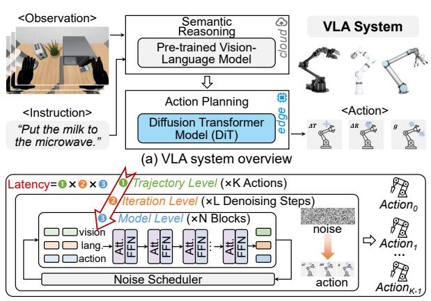

(b) DiT action planner with three-level computation
Fig. 1. Overview of the VLA system and DiT action planner.
due to their perception, reasoning, and planning capabilities,
making them a promising solution for the brain of robots.

As shown in Fig. 1(a), state-of-the-art VLA systems [54] typically comprise a vision-language model [11], [32] for semantic reasoning and a diffusion transformer (DiT) model [9], [39] for action planning, such as Physical Intelligence's  $\pi 0.5$  [23], NVIDIA's GR00T N1.5 [2], and Figure's Helix [13]. The vision-language model is less latency-sensitive and can even be offloaded to the cloud [21]. In contrast, the DiT-based action planner requires a high action frequency to enable real-time interactions with the environment. For instance, service robots typically demand at least a 50Hz action frequency, while industrial applications may require up to 200Hz [38], [45], [58]. However, even with high-performance GPUs, current DiT action planners are still constrained by low computational efficiency. For example, a DiT action planner with approximately 300M parameters and 50 iterative steps achieves only 2.6Hz on an NVIDIA A40 GPU, causing each robot task to take several minutes, which is far from the requirements of real-world deployment [19], [34].

The limited computational speed of DiT action planners primarily stems from their inherently three-level computation at trajectory, iteration, and model levels (Fig. 1(b)). At the trajectory level, each inference produces one action, and hundreds of inferences are commonly required to complete a task. For example, an average of 376 actions on the LIBERO

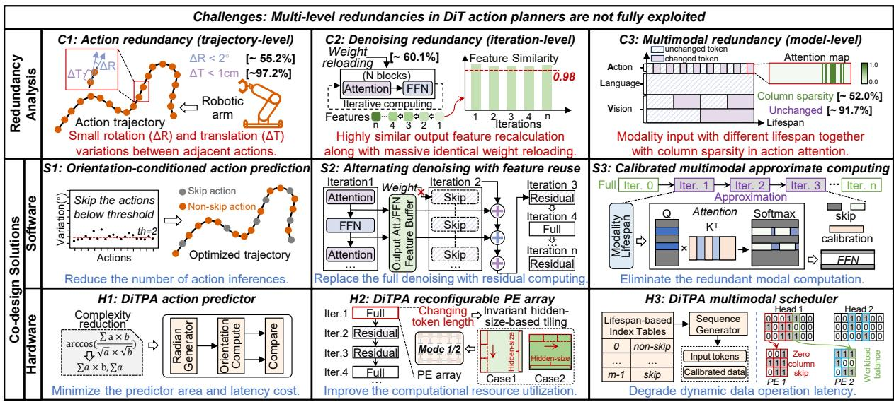

Fig. 2. Challenges and co-design solutions to accelerate DiT action planners.

simulation platform [34] leads to a long task execution time. At the iteration level, multiple denoising steps (typically 10-50) are required to refine an action from random noise, which significantly limits achievable action frequency. At the model level, multiple attention and feed-forward network (FFN) blocks are executed within each denoising step, further compounding the computational burden.

These three nested computing levels introduce extensive **redundancy** (see Fig. 2-Top), resulting in severe latency accumulation and highlighting the need for efficient optimization.

- (C1) Action redundancy at the trajectory level: A task trajectory usually contains hundreds of actions with complex and irregular paths. However, adjacent actions exhibit high consistency, where 55.2% of rotation vector variations are less than 2° and 97.2% of translation vector changes are smaller than 1cm, indicating a large number of redundant inferences.
- (C2) Denoising redundancy at the iteration level: Despite each action inference containing 10-50 denoising steps, the consecutive iteration features of attention and FFN show more than 98% similarity, with only minor data changes. Moreover, identical weight reloading in each iteration leads to 60.1% duplicate external memory accesses.
- (C3) Multimodality redundancy at the model level: Different input modalities exhibit distinct update frequencies. For example, language input remains unchanged throughout an entire task, while action input tokens vary at each iteration, having the shortest lifespan. Consequently, averaging 91.7% of multimodal inputs remains unchanged per iteration [19], leading to significant repeated computations. Additionally, action tokens demonstrate high column sparsity in attention scores, where over 52.0% of columns are near zero, offering opportunities to skip redundant attention operations.

Existing software- and hardware-based optimizations for DiT models primarily exploit iteration-level redundancy [14], [17], [28], [35], [42], [55], [57]. These methods skip the computation of regions with minimal changes in the image

TABLE I
DIT ACCELERATOR COMPARISON ON REDUNDANCY EXPLOITATION

| DiT Accelerators  | Trajectory<br>Level | Iteration<br>Level | Model<br>Level |
|-------------------|---------------------|--------------------|----------------|
| Cambricon-D [28]  | ×                   | <b>V</b>           | ×              |
| Ditto [27]        | ×                   | <b>V</b>           | ×              |
| EXION [16]        | ×                   | V                  | V              |
| DiTPA (this work) | V                   | V                  | V              |

diffusion process, such as the background or contour. But they can not be directly applied to the action planner since actions do not have these attributes of images [6], [56]. Considering hardware solutions, as summarized in TABLE I, Cambricon-D [28] reduces the computational overhead by only computing the difference between adjacent iterations. Ditto [27] further combines the differential computing with the 4/8-bit quantization method. It substantially reduces the bandwidth requirements and skips nearly half of the zerovalue operations. Nevertheless, these accelerators with a differential computing method cannot effectively support the highprecision nonlinear operators such as GELU. Thereby, leading to severe external memory access traffic. In addition, EXION [16] exploits both the iteration and model-level redundancy to reduce FFN and attention computation, respectively. Despite identifying redundant FFN computations via GELU outputs and adopting the approximation method [41] to avoid the redundant high-precision attention computation, the resulting fine-grained sparsity challenges the hardware architecture with significant control overhead.

In this work, we present DiTPA, a DiT-based action-planner accelerator that exploits action-denoising-multimodality redundancy ( $C1\sim C3$ ) through software-hardware co-design.

The software framework of DiTPA is shown in Fig. 2-Middle. (S1) For the action redundancy at the trajectory level, an orientation-conditioned action prediction mechanism is introduced. It reduces the number of action inferences by

evaluating the orientation variation between adjacent actions. When the orientations remain consistent, the next inference is skipped, and the current action is reused based on the local concentration principle. (S2) For the iteration-level denoising redundancy, an alternating denoising with featurereuse method is developed. By evaluating the similarity of output features and their contribution to the loss, this method identifies iterations that can be safely skipped and replaces the full denoising computation with lightweight residual updates. Unlike existing fine-grained differential computing or unstructured sparsity approaches which merely reduce arithmetic operations. This method deploys feature reuse across both the attention and FFN blocks, simultaneously eliminating computation and memory access overhead. (S3) For the multimodality redundancy at the model level, a calibrated multimodal approximate computing scheme is designed. It dynamically determines unchanged vision and language modalities based on their lifespan and applies calibrated approximate computations to avoid attention-shift and cumulative errors. Meanwhile, column sparsity in the action modality is exploited to skip redundant attention computations.

To fully exploit the software optimization benefits, we design the DiTPA hardware architecture with three features shown in Fig. 2-Bottom. (H1) An action predictor is designed to efficiently exploit action redundancy with minimal overhead by reducing prediction complexity. (H2) A reconfigurable processing-element (PE) array is proposed to support various tiling scenarios. It allows matrix operations to be tiled along the invariant hidden-size dimension, independent of the changing token length among iterations, thereby improving computational resource utilization. (H3) A multimodal scheduler is developed to handle dynamic multimodal data buffering, reuse, and updates. It also integrates a column sparsity controller that detects sparse attention columns and dynamically skips corresponding computations.

The contributions of this work are summarized as follows:

- (1) We demystify computational redundancy of the DiT action planner in three dimensions: action redundancy at the trajectory-level, denoising redundancy at the iteration-level, and multimodality redundancy at the model-level.
- (2) We propose the DiTPA software framework to eliminate multi-level redundancies. The key strategies are orientation-conditioned action prediction, alternating denoising with feature-reuse, and calibrated multimodal approximate computing, which effectively exploit the redundancies in actions, denoising steps, and multimodality.
- (3) We develop a DiTPA hardware architecture to efficiently support the software framework. It features an action predictor with reduced prediction complexity, a reconfigurable PE array supporting varied token lengths with high utilization, and a multimodal scheduler handling dynamic and sparse data operations with low latency.
- (4) Experimental results show that the DiTPA obtains an action frequency of 217.65Hz and a task execution time of 1.73s. In addition, it achieves averagely  $386.93 \times$ ,  $13.22 \times$ ,  $9.54 \times$  speedups and  $2356.77 \times$ ,  $8.71 \times$ ,  $11.59 \times$  energy-efficiency


Fig. 3. DiT action planner's denoising process and detailed structure.

IABLE II

COMPARISON OF IMAGE GENERATION DIT AND ACTION PLANNING DIT

| Domain               | Image Generation   | Action Planning                          |
|----------------------|--------------------|------------------------------------------|
| Computation<br>Level | Iteration-Model    | Trajectory-<br>Iteration-Model           |
| Modality             | Vision, Language   | Vision, Language,<br>Action, State, etc. |
| Input Length         | $\sim 10^2 - 10^3$ | $\sim 10^1 - 10^2$                       |

improvements over NVIDIA A40, EXION and Ditto, while maintaining the task success rate.

#### II. BACKGROUND AND MOTIVATION

#### A. DiT Action Planner

DiT-based action planners [9], [44] excel at modeling continuous action generation, making them suitable for complex long-horizon robot tasks. In this paper, we mainly focus on mainstream robotic arms for manipulation. Each output action includes 7 degrees of freedom (DoF), which can be divided into the translation vector  $(\Delta X, \Delta Y, \Delta Z)$ , rotation vector  $(\Delta \Phi, \Delta \Theta, \Delta \Psi)$ , and gripper state (g) [5], [43], [46], [51]. The translation vector represents the distance offset of the current action in Cartesian, the rotation vector indicates the orientation offset along each coordinate axis, and the gripper state can be open or closed.

Fig. 3(a) illustrates the denoising computation of the DiT action planner, consisting of forward and reverse diffusion processes [18], [47], similar to the DiT models for image generation [8], [15]. Forward diffusion adds noise to the original action, while reverse diffusion iteratively predicts and removes noise to obtain the final action, guided by the noise scheduler. In actual deployments, only the reverse process is performed to generate actions from input noise. The detailed structure of DiT is shown in Fig. 3(b), which comprises multiple attention and FFN blocks.

Compared to the image-generation DiTs, the DiT action planner exhibits several unique features, as summarized in TABLE II. First, its computation process is organized across three levels, including trajectory, iteration, and model, introducing additional temporal and spatial dependencies (Fig. 1), whereas image-generation DiTs only operate at the iteration-model level [10]. Second, while image-generation DiTs handle vision and language modalities, the action planner incorporates an additional action modality, and some robots further include state, tactile, and other modalities, enabling optimization opportunities for multimodality [1], [20]. Third, input token lengths vary significantly across modalities. For image-generation DiTs, vision and language token lengths typically range from hundreds to thousands [12], whereas action tokens


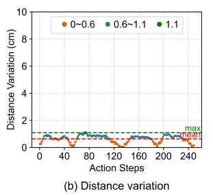

Fig. 4. Action redundancy analysis.

are less than one-tenth of this length, making token pruning for the action modality challenging [3]. These characteristics prevent the direct applicability of the existing image-generation DiT optimization method to DiT action planners.

#### B. Motivation

To fully explore the design space of the DiT action planner, we systematically analyze potential redundancies at each computation level, revealing that various data exhibit high redundancy during inference and may provide opportunities to improve the real-time performance of the DiT action planner.

1) Action Redundancy at the Trajectory-Level: During task execution, robots must maneuver around diverse obstacles to interact with targets, resulting in complex and disordered action trajectories that constrain the optimization space for action inference. Nevertheless, analysis of transitions between adjacent actions reveals high local concentration with minimal variation. To quantify this, we visualize the trends of action changes, extract rotation and translation vectors from 7 DoF actions, and compute absolute orientation and distance variations in 3D space [34], shown in Fig.4. Although the maximum orientation difference reaches 25.2°, the average is only 2.8°, covering 67.6% of the trajectory, indicating that most adjacent actions exhibit small orientation variations and form continuous trajectory segments without frequent oscillations. We refer to this phenomenon as local concentration. For trajectories with frequent abrupt orientation changes, such changes typically occur only during initialization and object-interaction phases. These orientation changes are further decomposed into coordinated multi-joint movements, allowing the robot to reach suitable poses for fine-grained operations, such as grasping. The maximum distance change between adjacent actions is only 1.1cm, and approximately 40% of movements vary by less than 0.6cm, reflecting in-place operations, such as releasing objects, that do not require movement of the end effector. These characteristics indicate that both orientation and distance variations are limited, enabling the prediction of future actions based on current small variations.

To verify the universality of orientation and distance variation trends in action trajectories, we evaluate 10 challenging robot tasks under 50 different initialization environments. We find that average orientation variation is only 2° with high local concentration, while average distance variation is only 0.5cm [34]. The trends in adjacent actions can be summarized as follows: (1) overall distance variation is small; (2) orientation exhibits strong local concentration with minimal variation.


Fig. 5. Denoising redundancy analysis.

Meanwhile, actions are more sensitive to orientation variations, which are prone to trajectory drift. These characteristics motivate the exploitation of action redundancy by inferring slowly changing actions based on locally concentrated orientations with small variations, thereby allowing the inference for future redundant actions to be skipped.

2) Denoising Redundancy at the Iteration-Level: Based on the characteristics of the reverse diffusion process, features of adjacent denoising steps generally exhibit a high degree of similarity, providing an opportunity to eliminate redundant computations and avoid duplicate weight reloading. Fig. 5 illustrates the attention and FFN output features similarity between adjacent denoising steps in the action planner. It is evident that adjacent denoising steps share very high similarity, exceeding 98%, indicating that the feature differences between consecutive iterations are minimal, similar to observations in other DiT applications, such as image-generation DiTs [39].

Meanwhile, the action planner exhibits several distinct redundancy patterns. (1) The similarity gradually decreases over the course of the denoising process, remaining very high in the early stages and becoming noticeably lower in the later stages. This indicates the potential to exploit the redundancy at the beginning of the process. (2) Despite the decreasing trend, the lowest similarity remains above 70%, reflecting substantial redundancy throughout the process. In contrast, the image-generation DiT only demonstrates high similarity at the diagonal, and rapidly decreases to around 0 in non-diagonal areas [39]. (3) The similarity trends of attention and FFN features are consistent, providing opportunities for iteration-wise optimization of both computation and memory access. These observations motivate the design of a mechanism that exploits iteration-wise redundancy at a coarse granularity, skipping the early, highly similar denoising steps while retaining later computations to ensure accuracy. This approach differs from fine-grained similarity utilization in existing diffusion architectures, which introduces complex control overhead and cannot fully avoid weight reloading.

3) Multimodality Redundancy at the Model-Level: During each denoising step, the input consists of action tokens and vision-language tokens from a pretrained vision-language model, forming a multimodal input, as shown in Fig. 6(a). Different modalities have varying token lengths and lifespans, leading to differences in computational workload and update frequency. Vision and language tokens account for about 90% of the input and are updated infrequently [19],

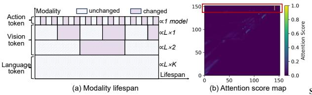

Fig. 6. Multimodality redundancy analysis.

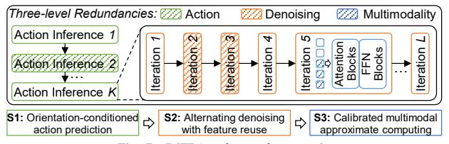

Fig. 7. DiTPA software framework

with language tokens remaining unchanged throughout a task  $(L \times K \text{ model computations})$  and vision tokens stable across multiple denoising steps, while historical visual frames have even longer lifespans. In contrast, action tokens are updated every model computation, having the shortest lifespan. This analysis indicates that vision and language tokens dominate the input while incurring redundant computations, motivating dynamic skipping of computations for duplicate tokens.

Directly skipping action-modality tokens is difficult due to the lack of duplicate data. Nevertheless, we observe strong column sparsity in the action attention score map (Fig. 6(b), red box), with attention focused on few columns and near-zero elsewhere. To validate this attention distribution pattern, we evaluate it across the robot taskset and find an average column sparsity of approximately 52%. This observation motivates further removal of computations corresponding to sparse columns in the action modality.

# III. DITPA SOFTWARE FRAMEWORK

This section presents the DiTPA software framework (Fig. 7), which consists of three key strategies: (1) an orientation-conditioned action prediction mechanism to exploit the action redundancy; (2) an alternating denoising with feature reuse method to exploit the denoising redundancy; and (3) a calibrated multimodal approximate computing scheme to exploit the multimodality redundancy.

# A. Orientation-conditioned Action Prediction

As discussed in Section II-B1, adjacent actions exhibit minimal orientation variations and high local concentration. Motivated by this, we compare the absolute orientation difference between consecutive actions. When the difference is small, the next action is likely consistent with the current one, allowing us to reuse the current action and skip the corresponding full inference. Additionally, the small distance variation between adjacent actions ensures that this reuse does not alter the overall trajectory. However, potential prediction errors may arise, such as adjacent actions at the boundary of continuous trajectory segments that show small orientation variations but large subsequent deviations. Therefore, DiTPA alternates between full action inference and approximate action prediction to enable timely correction of inaccuracies.

#### **Algorithm 1:** Action Prediction Mechanism.

```
Input: Act_{cur}: Current output action
   Output: Act_{nxt}: Next output action
 1 if Skip_{flag} == False then
        Act_{nxt} = Full DiT Inference
 2
3 end
 4
   else if Skip_{flag} == True then
        Rad_{rel} = ROTATION EXTRACT(Act_{cur})
 5
        Rad_{acc} += Rad_{rel}
                                                           // Step 1
        Deg_{abs} = 180/\pi \cdot (Rad_{acc})
 7
        Deg_{abs}^{sim} = \frac{Deg_{abs}}{||Deg_{abs}^{i}|| \cdot ||Deg_{abs}^{i-1}||}
                                                           // Step 2
 8
        Deg_{diff} = 180/\pi \cdot arccos(Deg_{abs}^{sim})
                                                           // Step 3
 9
                                                           // Step 4
        if Deg_{diff} \leq th then
10
11
            Act_{nxt} = Act_{cur}
12
        else if Deg_{diff} > th then
13
             Act_{nxt} = Full Dit Inference
15
        end
16
   end
17 Skip_{flag} = !Skip_{flag}
18 return Act_{nxt}
```


Algorithm 1 illustrates the proposed action prediction process. Given the current action, the algorithm determines the next action to be executed in four steps. **Step 1:** Extracts the rotation vector of the current action to compute relative radians, accumulates them to obtain absolute radians, and converts them to angular space. **Step 2:** Calculates the orientation similarity, where higher similarity indicates smaller orientation variation. **Step 3:** Computes the specific orientation difference via trigonometric transformation. **Step 4:** Compares the difference with a predefined threshold. If it is below the threshold, the current action is reused; otherwise, a full DiT inference is performed. Additionally, the  $Skip_{flag}$  is adopted to alternate prediction and full inference.

#### B. Alternating Denoising with Feature Reuse

Section II-B2 has analyzed the denoising feature similarity of the DiT action planner. Building on this pattern, we exploit redundancy in the denoising process to reduce both computation and external memory access. As illustrated in Fig. 8(a), we first compute the attention and FFN feature similarity between adjacent denoising steps and use a threshold-based criterion to identify candidate steps where these computations may be omitted. We then assess the MSE loss incurred by skipping each candidate step. Since early denoising steps are less sensitive to such loss, the final selected steps are those in which attention and FFN computations can be safely skipped.

Fig. 8(b) illustrates the computation flow after applying alternating denoising with feature reuse. First, a full denoising computation is performed. If the next denoising step is deter-


(b) Calibrated approximate computing Fig. 9. Calibrated approximation for vision and language modality.


Fig. 10. Column sparsity exploitation for action modality.

mined to be skipped, the current attention and FFN features are buffered. For a skipped step, the full attention and FFN computations are omitted, and the associated external memory access for weight updates is accordingly eliminated. As a result, the iterative process for noise updating only performs the low-cost residual computation.

# *C. Calibrated Multimodal Approximate Computing*

As analyzed in Section II-B3, the vision and language modal input remain unchanged across multiple iterative computations. A natural idea is to skip the operations associated with these repeated tokens. As illustrated in Fig. 9(a), the unchanged tokens are first identified according to their modalityspecific lifespan. During subsequent attention computations, the operations involving these unchanged tokens are skipped (the gray and light-white regions). The same approach is also applied to FFN computations.

Nevertheless, such a direct approximation strategy can induce unacceptable errors and eventually lead to task failure. (1) Attention shift error: In the attention operation, the SoftMax input is derived from both Q and K features. Directly skipping redundant modal computation shortens both Q and K, reducing the SoftMax input dimensions to only the updated modality (green region). However, the light-white region highlighted in the red box is also essential because the SoftMax operation relies on a global comparison across all tokens. Removing redundant modal tokens disrupts this global comparison, causing the attention distribution to shift and fail to represent the true attention focus. (2) Iterative cumulative error: Approximation introduces errors that are generally tolerable in standard Transformer models such as ViT. In contrast, because DiT involves multiple iterative steps, these errors accumulate over iterations and can eventually become unacceptable.

Based on these challenges, we propose a calibrated approximation scheme, as illustrated in Fig. 9(b). To mitigate attention-shift errors, the K features of redundant modalities are buffered and employed to calibrate the SoftMax computation, ensuring that the contributions of all tokens are accurately incorporated. Concurrently, the V features of redundant modalities are stored to preserve proper data alignment during attention aggregation. To address cumulative errors arising from iterative approximations, full denoising computations are periodically reinserted, effectively resetting accumulated errors and maintaining overall model accuracy.

In addition, the sparse attention computation that corresponds to the column sparsity of the action modality is also eliminated, shown in Fig. 10. Here, zero-column detection is first performed to identify column sparsity in the attention score map. Subsequent attention computations skip operations corresponding to these zero columns. Specifically, during the SoftMax and V feature matrix computations, zero columns in the SoftMax output and the corresponding rows of V are omitted, as shown in Fig. 10 (left). Furthermore, skipped rows in V allow the associated V projection computations to be bypassed, as illustrated in Fig. 10 (right), where the V projection for the last head is skipped.

# IV. DITPA HARDWARE ARCHITECTURE

Although the proposed software framework eliminates 97% of redundant computation, deploying it on conventional GPUs yields only 2.3× speedup, which is far below the theoretical 33× due to poor hardware utilization and long data-operation latency. Specifically, dynamic token-length variations (up to 10×) reduce compute utilization by 25.1%, while management of multimodal data adds a 35.4% latency overhead. To bridge this gap, we propose the DiTPA hardware architecture.

# *A. Architecture Overview*

Fig. 11 shows the overall architecture, consisting of an action predictor, reconfigurable PE array, special function unit (SFU), multimodal scheduler, noise scheduler, top controller, and on-chip SRAM storage. The action predictor is used for run-time prediction of reusable actions. If the reuse conditions are not satisfied, transmit features and parameters from on-chip SRAM to the reconfigurable PE array for iterative computation. The reconfigurable PE is designed to support matrix multiplications with high utilization under changing token lengths during inference. The SFU plays a role in subsequent nonlinear operations, such as normalization and activation functions. The multimodal scheduler contains a data manager and sparsity controller, where the data manager controls various modal data buffering, reuse, and update, working with the sparsity controller to manage sparse data and reduce the latency of data operations. Finally, the noise scheduler is used to gradually update the noise until a noise-free action output is obtained.

# *B. DiTPA Action Predictor*

Fig. 12 presents the proposed run-time action predictor, which completes prediction in only 4 cycles with negligible latency. First, the prediction process of Algorithm 1 is simplified by removing redundant calculations and complex operators. Specifically, in the similarity calculation, the modulus from the previous action remains unchanged, allowing the reuse of the previous result and skipping redundant computation, as


Fig. 11. Hardware architecture of DiTPA.

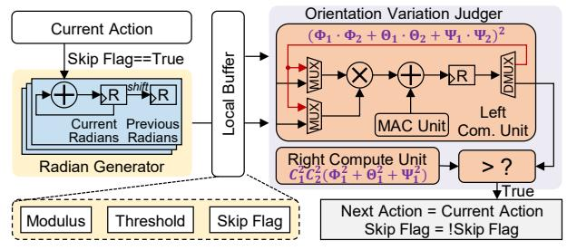

Fig. 12. DiTPA action predictor design.

shown in Eq. 1. Additionally, since the orientation threshold is determined offline, the calculation of orientation difference and threshold comparison can be reduced to a single comparison operation, avoiding trigonometric transformations, as shown in Eq. 2. Combining these simplifications, the final orientation variation computation and comparison are performed as in Eq. 3 without any division operations.

$$Deg_{abs}^{sim} = \frac{\Phi_1 \cdot \Phi_2 + \Theta_1 \cdot \Theta_2 + \Psi_1 \cdot \Psi_2}{\sqrt{\Phi_1^2 + \Theta_1^2 + \Psi_1^2} \cdot C_1}$$
 (1)

$$Deg_{abs}^{sim} > cos(th \cdot \frac{180}{\pi}) = C_2 \tag{2}$$

$$(\Phi_1 \cdot \Phi_2 + \Theta_1 \cdot \Theta_2 + \Psi_1 \cdot \Psi_2)^2 > C_1^2 \cdot C_2^2 \cdot (\Phi_1^2 + \Theta_1^2 + \Psi_1^2)$$
 (3)

In hardware operation, the action predictor is triggered when the skip flag is true. The radian generator first accumulates and outputs absolute radians, while shift registers simultaneously produce adjacent action radians for subsequent calculations. Relevant variables, such as modulus and threshold, are stored in a local buffer for immediate access. The orientation judger then computes the orientation variation, with two compute units evaluating both sides of Eq. 3 in parallel. If the comparison condition is satisfied, the predictor reuses the current action and skips the next full DiT inference, thereby reducing redundant computation. Compared to performing full inference for each action, this optimized predictor adds only 0.23% resource overhead and 4 cycles of latency, while eliminating roughly 42% of the computation for the entire robotic task.

# C. DiTPA Reconfigurable PE Array

Despite matrix operations with dynamically changing token lengths across iterations due to multi-level redundancy exploitation, the hidden-size dimension remains unchanged.


Fig. 13. DiTPA reconfigurable PE array and compute scheme.

Based on this insight, we develop a hidden-size-dimension-first tiling scheme that tiles along the invariant hidden-size dimension, without being limited by token length. To efficiently support this tiling, a  $12\times6\times2$  reconfigurable PE array is designed, equipped with multiple PE lines and line adder trees, as shown in Fig. 13(a). Each PE can operate in mode 1 or mode 2 through reconfiguration to match the compute tiles, performing 64 MACs per cycle. Reconfiguration is handled by a single-cycle state machine transition, which is fully hidden in the pipeline through overlapping buffer data reads.

Here, tiling is performed in two cases, depending on the hidden-size dimension of each operator:

Case 1: As shown in Fig. 13(b), in the Q projection, the width (W) of the activation and the height (H) of the weight correspond to the hidden size. We tile the activation and weight inputs along the W and H dimensions, respectively, to fit the PE array. To maximize PE utilization, each tile is designed so that its total length equals the hidden size, and the number of MAC operations per tile matches the PE array size. During matrix computation, PEs operate in mode 1. The activation tile is broadcast along the row dimension of the PE array, while the weight tile is broadcast along the column dimension and shared by all PE lines. The activation remains stationary while sliding rightward each cycle, multiplying with the corresponding weight columns until the last column of the weight is processed (1). After finishing an activation tile, both the activation and weight switch to the next tile, and the process repeats (2). To hide the latency of loading new activation tiles, a ping-pong buffer is employed, enabling seamless pipelined computation. This tiling strategy and dataflow are similarly applied to other operators in Case 1, ensuring consistent and efficient PE execution.

Case 2: For the second Linear operator in the FFN block, only the width (W) of the weight corresponds to the hidden size. Such that, the weight is tiled along the W direction to ensure full utilization of both the hidden size and the PE array resources. During matrix computation, PEs operate in mode 2. Both the activation and weight tiles are shared

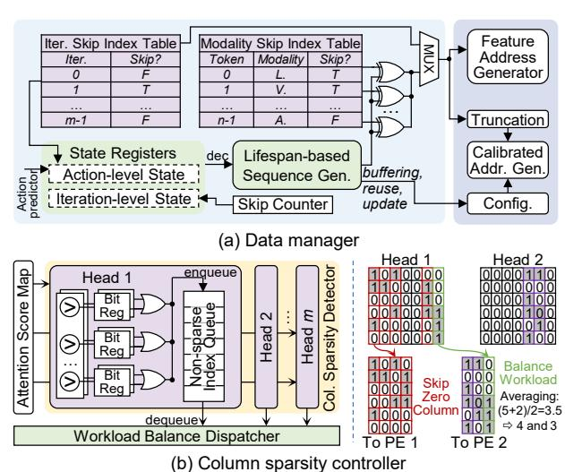

Fig. 14. DiTPA multimodal scheduler.

across PEs, meaning that each element in the activation tile is multiplied by all elements in the weight tile to produce intermediate results, which are stored in the register. In the next cycle, the activation tile slides to the right while the weight tile slides downward, and the outputs are accumulated with the previously stored intermediate results. This process continues until the last row of the weight is processed ( $\bullet$ ), after which the computation moves to the next tile ( $\bullet$ ). For the S×V operator, the input includes multiple attention heads. To handle this, the computations for all heads are performed simultaneously, leveraging parallelism to maximize hardware utilization and throughput.

#### D. DiTPA Multimodal Scheduler

Fig. 14(a) illustrates the data manager within the multimodal scheduler, designed to optimize dynamic data operations during inference. Two index tables are first employed to store general skip configurations for denoising steps and multimodal tokens. To handle dynamically modified input tokens and calibrated data, we implement a lifespan-based sequence generator with two levels of state registers. The action-level registers maintain the action skip states from the action predictor and the update states from the iteration index table, while the iteration-level registers track counter states used to eliminate accumulated approximation errors. Based on these states, the sequence generator decodes the token sequence, which is then logically combined with the default token sequence from the index tables. The resulting sequence is sent to the feature and calibrated data address generators, which update the input tokens and calibrated data for subsequent computations.

The column sparsity controller within the multimodal scheduler (Fig. 14(b)) detects and skips zero-column computations in the action modality. In the column sparsity detector, each attention head unit contains multiple sets of column comparators, which determine whether attention scores are close to zero. The results are stored in bit registers, where a value of 1 indicates proximity to zero. An OR logic operation then identifies the sparsity of each column. Zero columns are

TABLE III ROBOT TASKSET CONFIGURATION

| Task | Scene       |      | Targets <sup>(1)</sup> | Skills <sup>(2)</sup> |          |          |
|------|-------------|------|------------------------|-----------------------|----------|----------|
| No.  | Scelle      | Num. | Object                 | Spatial               | р&р      | on&off   |
| 1    | Living Room | 3    | ✓                      | -                     | ✓        | -        |
| 2    | Living Room | 3    | <b>√</b>               | -                     | <b>√</b> | -        |
| 3    | Kitchen     | 2    | ✓                      | -                     | ✓        | <b>√</b> |
| 4    | Kitchen     | 3    | <b>√</b>               | ✓                     | <b>√</b> | ✓        |
| 5    | Living Room | 4    | ✓                      | <b>√</b>              | ✓        | -        |
| 6    | Study Room  | 2    | <b>√</b>               | ✓                     | <b>√</b> | -        |
| 7    | Living Room | 3    | ✓                      | ✓                     | ✓        | -        |
| 8    | Living Room | 3    | ✓                      | -                     | <b>√</b> | -        |
| 9    | Kitchen     | 3    | <b>√</b>               | -                     | <b>√</b> | -        |
| 10   | Kitchen     | 3    | ✓                      | -                     | ✓        | ✓        |

<sup>(1)</sup> Num. indicates the number of objects that interact with in the task.

bypassed, while indices of non-sparse columns are enqueued for subsequent computation. During computation, column indices are sequentially dequeued. For the S×V operator, which performs column- and row-wise matrix multiplication (as discussed in Section IV-C), operations corresponding to sparse columns are directly skipped under the guidance of the column sparsity controller. To balance the computation latency across all attention heads, the dispatcher redistributes workloads by averaging the longest and shortest sequences, ensuring that processing time is evenly distributed.

#### V. EXPERIMENTAL RESULTS

# A. Evaluation Methodology

Workloads. To evaluate the manipulation capabilities of DiTPA, we conduct experiments on the LIBERO-Long taskset, which comprises 10 complex long-horizon and multi-stage tasks, including 50 diverse environment configurations for each task [34]. These tasks involve complex activities, such as tabletop organization, that demand the coordinated execution of multiple low-level skills and generalization to varying object appearances, physical properties, and spatial layouts. These task configurations are detailed in TABLE III. We focus on three representative scenes: the living room, kitchen, and study room. Object target highlights the property recognition, such as color, while spatial target concentrates on spatial relationship understanding, such as direction. The core skills assessed include standard pick-and-place and turn-on-and-off operations. We implement the DiTPA software framework in Pytorch using the DiT-based action planner from the Dita model [19]. We adopt the default LIBERO control frequency of 20 Hz, with a maximum of 520 environment steps.

**Implementation.** We implemented DiTPA in 28nm technology. The clock frequency is 500MHz, operating at 0.88V. We use the Synopsys Design Compiler to complete the synthesis to generate the netlist for area estimation. Power and latency are measured by PrimeTime PX and Synopsys VCS. For external DRAM, we adopt LPDDR5 and evaluate memory access energy based on specifications provided by the DRAM vendor [24], [29].

DiTPA's total power and area are 1.05W and 4.37mm<sup>2</sup>, respectively, which only account for 2.63% power and 2.19% area of SOTA embodied AI compute platforms (e.g., Unitree G1-EDU: 40W power, 200mm<sup>2</sup> die area) [49], ensuring

 $<sup>^{\</sup>left(2\right)}$  p&p and on&off indicate pick-and-place and turn-on-and-off.

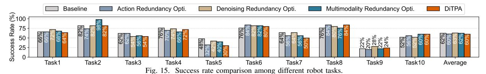

TABLE IV
Breakdown of Power and Area Consumption

| Components           | Power       | r (mW)      | Area                    | (mm <sup>2</sup> ) |  |
|----------------------|-------------|-------------|-------------------------|--------------------|--|
| Action Predictor     | 0.54        | 0.05%       | 0.01                    | 0.23%              |  |
| PE Array             | 623.80      | 59.63%      | 1.42                    | 32.49%             |  |
| SFU                  | 104.58      | 10.00%      | 0.34                    | 7.78%              |  |
| Multimodal Scheduler | 29.54       | 2.82%       | 0.06                    | 1.37%              |  |
| On-chip SRAM         | 233.28      | 22.30%      | 2.44                    | 55.84%             |  |
| Noise Scheduler      | 41.54       | 3.97%       | 0.06                    | 1.37%              |  |
| Ctrl. & Others       | 12.84 1.23% |             | 0.04 0.92%              |                    |  |
| Total                | Pow         | er=1.05W, A | rea=4.37mm <sup>2</sup> |                    |  |

efficient deployment on resource-constrained edge robotic platforms [22]. TABLE IV details the breakdown. For the action predictor, only 0.05% in power and 0.23% in area are incurred due to its lightweight logic with reduced prediction complexity. The reconfigurable PE array is developed to handle the changing token lengths with 59.63% in power and 32.49% in area. The multimodal scheduler for dynamic data control costs 2.82% in power and 1.37% in area.

Hardware Baselines. To evaluate the benefits of DiTPA, we deploy the robot workloads on the general computing platform GPU and two SOTA DiT accelerators. For the GPU device, we select the NVIDIA A40 GPU, where the latency is obtained by estimating the actual inference time, and the power is measured using NVIDIA SMI tools. For the accelerator baselines, we adopt two accelerators, EXION [16] and Ditto [27], utilizing inter-intra iteration sparsity and quantized differential computing, to accelerate the DiT model, respectively. We develop a custom simulator to model their execution in the action planners. All hardware baselines operate at INT8 precision based on the PTQ4DiT method [53], with tensorwise quantization for activations and channel-wise quantization for weights. We use the same metrics for evaluation across the baselines. We normalize all accelerators to A40 GPU's peak performance (37.4 TFLOPS), enabling fair comparison of architectures. Without hardware scale differences, superior architecture's actual performance is higher due to better VLA co-design techniques and higher resource utilization.

## B. Automated Threshold Search

DiTPA framework integrates an automated search algorithm to identify suitable thresholds for diverse robotic scenarios with varying accuracy-performance requirements. Using a scenario-specific calibration taskset (3% of the total scenario tasks), it samples candidate thresholds and performs a multi-objective Pareto optimization over accuracy and latency to obtain the Pareto front. It then adaptively selects an appropriate threshold along this front based on current task demands, balancing trade-off between accuracy and speedup. Moreover, tasks in same scenarios share similar action-space dynamics and trajectory patterns, allowing fixed orientation threshold. In


Fig. 16. Visualization across various instructions on diverse scenes.

future work, we plan to explore highly-dynamic environment. Thresholds can be adaptively adjusted based on average optical flow magnitude between consecutive visual token frames.

In deployment of DiTPA, we classify application scenarios into two categories, similar to [31]. Latency-sensitive scenarios (e.g., sorting robots) prioritize high throughput (≥200 Hz) while tolerating minor success rate degradation ( $\leq 2\%$ ). This tolerance stems from the fact that errors in such environments can be effectively remedied via re-planning. In mission-critical scenarios (e.g., rescue robots), task failures cannot be mitigated through re-planning; therefore, they necessitate strict accuracy constraints (almost no accuracy degradation). Our scenario definitions and acceptable loss ranges align with stateof-the-art VLA acceleration frameworks (typically 1-4% reported losses) [40], [48]. The LIBERO-Long taskset, centered on object grasping, aligns with latency-sensitive scenarios. Automated search yields optimal thresholds of 2° (orientation) and 40% (iteration-skip). A full denoising is inserted every 20 skipped iterations to recover accumulated errors.

#### C. Accuracy Evaluation

**Success Rate.** As shown in Fig. 15, DiTPA achieves comparable average success rate to the baseline, confirming that targeted redundancy elimination preserves task accuracy. Virtual replays (Fig. 16) further verify error-free execution across scenes. For individual strategies, action redundancy exploitation reduces action inferences by 42.28% under a 2° orientation threshold while maintaining high success rates for most tasks. However, tasks 5 and 7, which require careful consideration of object properties and spatial relationships, are occasionally affected by skipped actions, slightly lowering success rates. Denoising redundancy optimization eliminates approximately 40% of redundant iterations and even achieves a marginally higher success rate than the baseline. This improvement arises from feature reuse introducing a mild mo-


Fig. 17. Normalized action frequency and task execution time comparison versus GPU and DiT accelerators.


Fig. 18. Normalized energy efficiency comparison versus GPU and DiT accelerators.

mentum in the denoising process, enhancing the prominence of final action features [52]. Multimodality redundancy exploitation reduces 91.74% of redundant token computations while achieving results comparable to the baseline. Overall, each redundancy elimination strategy maintains a high task success rate, validating the effectiveness of redundancy exploitation across action, iteration, and multimodal levels.

### D. Performance Evaluation

Action Frequency. Overall, DiTPA can achieve an action frequency of 217.65Hz on average, meeting the real-time requirements of robot applications. Fig. 17(a) illustrates the normalized speedup in action frequency achieved by DiTPA compared to GPU and accelerator baselines. On average, DiTPA provides a 386.93× speedup over the GPU, mainly attributed to avoiding the underutilized computational resource and long data operation latency issues in GPUs. Firstly, through reconfigurable PE array design, the average utilization of computing resources has been increased to 98.36%, far higher than the GPU, which is less than 20%. In addition, through the dedicated multimodal scheduler design, it efficiently supports dynamic data operations, such as calibration data buffering and reuse, through the index tables and sequence generator with negligible latency. Unlike in GPUs, it is severely blocked by the CPU, accounting for 35.37% of the total inference time. Thanks to these efficient hardware designs, the multi-level redundancies can be fully exploited with higher speedup. Compared to the EXION and Ditto accelerators, DiTPA can still achieve  $13.22 \times$  and  $9.54 \times$ acceleration on average, respectively, since EXION and Ditto mainly utilize the inter-iteration redundancy and don't consider the redundancy existing in the action and multimodal tokens, which occupy 73.94% of the three-level redundancy.

**Task Execution Time.** Overall, DiTPA only requires 1.73s to complete the inference for single task on average, far less than the few minutes required by GPUs. Fig. 17(b)

shows normalized task execution time reduction by DiTPA compared to GPU and accelerator baselines. On average, DiTPA provides 390.82× latency reduction over the GPU, and 14.22× and 10.27× latency reduction compared to EXION and Ditto, respectively. Nevertheless, unlike improvements in action frequency, approximation in redundancy exploitation may increase the total number of actions required to complete the task, thereby slightly increasing the task execution time. Specifically, the task execution time speedup of EXION and Ditto is lower than the action frequency. On the contrary, DiTPA exploits the redundancy at the action level, skipping 42.28% of redundant actions, thereby the overall improvement is not degraded.

Energy Efficiency. As shown in Fig. 18, DiTPA achieves an average 2356.77× improvement over the GPU. Compared to existing DiT accelerators, DiTPA achieves energy efficiency gains of 8.71× and 11.59×, respectively. These improvements stem primarily from reductions in external memory access and the compact architecture design. First, redundancy exploitation reduces external weight reloading by 65.37%, substantially lowering DRAM access energy. Moreover, the action predictor and multimodal scheduler consume only 2.87% of onchip power, yet reduce computations by 42.28% and 31.66% through action- and multimodality-level redundancy elimination, respectively. Together, these design strategies significantly enhance the overall energy efficiency of DiTPA.

#### E. Ablation Study

Fig. 19 shows the results of our ablation experiment. We select the most challenging tasks under three different scenes for evaluation, and the baseline is the accelerator without any redundancy utilization. Fig. 19(a) shows the speed up of the action frequency, where action redundancy exploitation can provide an average acceleration of  $1.74\times$ , attributed to the skip of redundant action inference and efficient action predictor design with only 4 cycles for each prediction. By further utilizing

TABLE V
TRAJECTORY QUALITY AND LENGTH COMPARISON

| Trajectory<br>Metrics      | Models   | LIBERO Tasks |         |         |         |         |         |         | Average |         |         |         |
|----------------------------|----------|--------------|---------|---------|---------|---------|---------|---------|---------|---------|---------|---------|
|                            |          | Task1        | Task2   | Task3   | Task4   | Task5   | Task6   | Task7   | Task8   | Task9   | Task10  |         |
| Position Instability       | Baseline | 0.431        | 0.627   | 0.424   | 0.500   | 0.406   | 0.447   | 0.364   | 0.512   | 0.304   | 0.348   | 0.436   |
| (cm) ↓                     | DiTPA    | 0.372        | 0.608   | 0.401   | 0.457   | 0.366   | 0.447   | 0.344   | 0.461   | 0.315   | 0.373   | 0.414   |
| Velocity Instability       | Baseline | 0.038        | 0.042   | 0.029   | 0.029   | 0.029   | 0.025   | 0.025   | 0.037   | 0.023   | 0.040   | 0.032   |
| $(cm/\Delta t) \downarrow$ | DiTPA    | 0.021        | 0.036   | 0.024   | 0.021   | 0.020   | 0.020   | 0.020   | 0.029   | 0.015   | 0.021   | 0.023   |
| Total Length               | Baseline | 151.290      | 170.699 | 138.445 | 126.353 | 119.663 | 92.487  | 124.083 | 143.218 | 177.222 | 118.003 | 136.146 |
| (cm) ↓                     | DiTPA    | 150.785      | 182.519 | 128.457 | 134.314 | 120.357 | 86.228  | 116.579 | 147.941 | 178.188 | 124.550 | 136.992 |
| Total Time                 | Baseline | 173.740      | 148.160 | 165.460 | 141.320 | 178.480 | 119.460 | 165.580 | 153.000 | 227.320 | 195.740 | 166.826 |
| (s) ↓                      | DiTPA    | 1.893        | 1.572   | 1.751   | 1.661   | 2.018   | 0.921   | 1.795   | 1.727   | 2.157   | 1.831   | 1.732   |


Fig. 19. Ablation study across multi-level redundancy exploitation.

the denoising redundancy, a  $2.90\times$  speedup can be achieved, thanks to the removal of attention and FFN computation in redundant denoising steps, which can reduce both computation and weight reloading latency. In addition, the reconfigurable PE design can improve resource utilization to 98.36% for the matrix multiplication under different token lengths. The exploitation of multimodal redundancy can eliminate 91.74% of redundant token computations, and the efficient multimodal data scheduler avoids high latency in data operations, thus achieving a  $32.60\times$  performance improvement in total.

Fig. 19(b) presents the energy efficiency improvement. Utilizing action redundancy improves 1.74× energy efficiency on average, which is basically consistent with the acceleration of action frequency. The main reason is that the power consumption of the action predictor is only 0.54mW, less than 0.1% of the on-chip power. The exploitation of denoising redundancy can further lead to an average energy efficiency improvement of 2.82×, slightly lower than the action frequency improvement, mainly due to the overhead of external memory access from attention and FFN features during residual computation. Leveraging multimodal redundancy significantly reduces computation, pushing average energy efficiency to 12.30×. But the DRAM access energy consumed by weight remains unchanged, which rises from 16.67% to 67.68% of total energy, limiting further energy efficiency gains.

# F. Accuracy and Performance Tradeoff Analysis

1) Application Scenario Tradeoff: Fig. 20 shows the tradeoff between success rate and action frequency speedup (normalized to GPU) across different thresholds. In general, larger thresholds yield higher speedups at the cost of increased

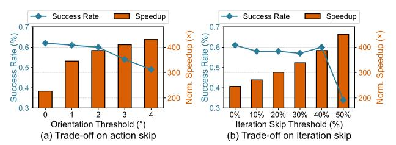

Fig. 20. Accuracy and normalized performance tradeoff.

success-rate loss. Specifically, for latency-sensitive scenarios, DiTPA achieves an action frequency of 217.65Hz ( $386.93 \times 50$  speedup) with an average  $\leq 2\%$  success-rate loss. Furthermore, the re-planning latency for failed tasks requires only 4.6ms/per action, fully satisfying high throughput demands. Starting from the current optimal thresholds, DiTPA can seamlessly switch to mission-critical scenarios by adjusting either the orientation or iteration-skip threshold. As shown in Fig. 20(a), tightening the orientation threshold alone delivers  $226.68 \times 50$  speedup with zero loss. Similarly, tuning the iteration-skip threshold yields an average of  $245.69 \times 50$  speedup (Fig. 20(b)). This tunable Pareto-based parameter search makes DiTPA flexible across different application demands.

2) Trajectory Tradeoff: **Trajectory Quality.** Following [50], we evaluate trajectory quality using position instability (first-order difference of end-effector positions) and velocity instability (second-order difference). Lower values indicate smoother and more stable trajectories. TABLE V (top) shows that DiTPA achieves an average position instability of 0.414cm, outperforming the baseline in overall smoothness. In addition, velocity instability remains low  $(0.023\text{cm}/\Delta t \text{ on average})$ , further confirming consistent and stable motion.

**Trajectory Length.** TABLE V (bottom) reports total trajectory lengths for successful tasks. On average, trajectory length (136.992cm) increases by only 0.62%, while inference time (1.732s) reduces by 96.32× on DiTPA. Specifically, tasks involving fine-grained motions (e.g., gripping cup handles) require extra actions to compensate, leading to longer trajectories. In contrast, tasks involving translational motions (e.g., transferring objects) induce redundant actions which can be skipped, achieving shorter trajectories. Regarding task execution time, the primary bottleneck is DiT model inference, while actuation time contributes <0.3% of the total and is ignored in our evaluation [33], [38]. On average, inference time (1.732s)

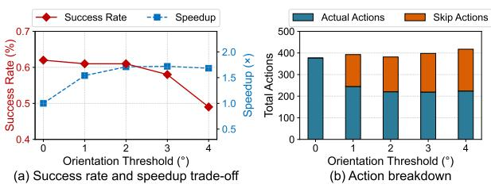

Fig. 21. Trajectory accuracy and performance evaluation.

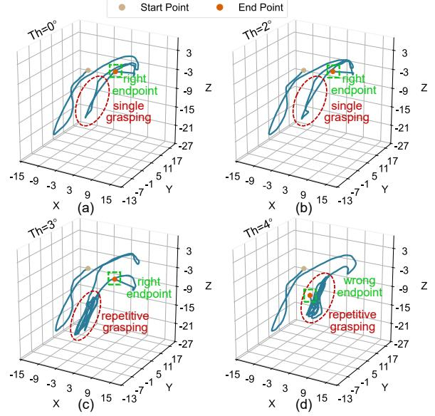

Fig. 22. Visualization of action trajectory under different thresholds. (a) Threshold= $0^{\circ}$ ; (b) Threshold= $2^{\circ}$ ; (c) Threshold= $3^{\circ}$ ; (4) Threshold= $4^{\circ}$ .

is reduced by 96.32× via redundancy exploitation.

Trajectory Sensitivity on Orientation Threshold. Complex and disordered motion trajectories can affect action prediction performance. Fig. 21(a) presents the success rate and speedup under different orientation variation thresholds  $(0^{\circ})$  denotes full inference without action prediction). The success rate remains stable when the threshold increases to below 3°, but exceeding 3° causes a rapid decline. This is primarily due to looser orientation constraints reducing spatial localization accuracy, particularly during precise operations such as grasping, where gripper deviation may lead to task failure. For speedup, action frequency initially increases with the threshold but plateaus when it surpasses 2°. To analyze this, total actions are divided into actual actions requiring full inference and skipped actions (Fig. 21(b)). Although the number of skipped actions rises, the actual actions count remains largely unchanged, resulting in stable overall latency. Most additional skipped actions correspond to ineffective operations, such as repeated grasping. As a result, maintaining orientation variation  $\leq 2^{\circ}$  enables both high success rates and speedup. Exceeding this threshold, however, degrades accuracy.

Case Study: To verify that trajectory characteristics under different conditions align with the previous analysis, we select task 1 for visualization, which includes a cylinder object grasping stage that is highly sensitive to precision. Fig. 22(a)

TABLE VI ACTION FREQUENCY UNDER LONGER TOKEN LENGTH

| Metrics  | Number          | of Tokens | Action    |
|----------|-----------------|-----------|-----------|
|          | Vision Language |           | Frequency |
| Baseline | 64              | 77        | 217.65Hz  |
| Increase | 128             | 77        | 193.85Hz  |
| Vision   | 256             | 77        | 157.61Hz  |
| Token    | 512             | 77        | 115.48Hz  |
| Increase | 64              | 154       | 217.46Hz  |
| Language | 64              | 308       | 217.13Hz  |
| Token    | 64              | 616       | 216.42Hz  |


Fig. 23. Accuracy and performance evaluation on LIBERO-Spatial, Object, and Goal tasksets.

shows the trajectory during full inference, with two colored points indicating the start and end positions. The trajectory enclosed in the red dashed box corresponds to the grasping stage. Fig. 22(b) depicts the trajectory when using action prediction with a 2° threshold. The trajectory closely matches that of full inference, confirming that rational action prediction does not alter the overall action path. Exceeding the 2° threshold causes gripper deviation from the target object and repetitive grasping attempts (Fig. 22(c)). Further increasing to 4° amplifies localization errors, causing the trajectory endpoint to miss the target and resulting in task failure (Fig. 22(d)).

# G. Scalability of DiTPA

- 1) Scale to Longer Token Length: TABLE VI shows that doubling vision tokens sustains 193.85Hz by skipping redundant historical tokens, and an  $8\times$  increase still achieves 115.48Hz, which satisfies real-time requirements. In contrast, increasing language tokens has a negligible impact, as instructions remain unchanged across the task.
- 2) Scale to Diverse Manipulation Benchmarks: LIBERO: Besides LIBERO-Long, DiTPA is assessed on the other three LIBERO tasksets (Fig. 23). It maintains an average success rate of 83.3% and provides 354.36× average speedup via multi-level redundancy. CALVIN: TABLE VII reports DiTPA's performance on the CALVIN benchmark, which evaluates the completion of five consecutive tasks. DiTPA achieves an average sequence length of 3.548 and a 5-task completion rate of 51.2%, comparable to the GPU baseline, while delivering an average speedup of 561.13×. SimplerEnv: On SimplerEnv, a high-fidelity real-to-sim evaluation framework (TABLE VIII), DiTPA attains an average success rate of 57.0%, showing strong robustness. It also achieves an average inference speedup of 451.65× over the GPU baseline.
- 3) Scale to More VLA Models: We evaluate Physical-Intelligence's  $\pi 0.5$  ( $\sim 300 \text{M}$  in DiT) and NVIDIA's GR00T N1.5 ( $\sim 500 \text{M}$ ). As the DiT model size increases compared

TABLE VII
ACCURACY AND PERFORMANCE EVALUATION ON CALVIN

| Methods  | -     | Task cor | npleted |       | Normalized |        |         |
|----------|-------|----------|---------|-------|------------|--------|---------|
|          | 1     | 2        | 3       | 4     | 5          | Length | Speedup |
| Baseline | 92.4% | 81.2%    | 72.4%   | 62.0% | 52.4%      | 3.604  | 1.00×   |
| DiTPA    | 92.4% | 81.2%    | 69.2%   | 60.8% | 51.2%      | 3.548  | 561.13× |

| TABLE VIII                                        |  |  |  |  |  |  |  |  |
|---------------------------------------------------|--|--|--|--|--|--|--|--|
| ACCURACY AND PERFORMANCE EVALUATION ON SIMPLERENV |  |  |  |  |  |  |  |  |

| Methods  | Pick<br>Coke Can |         | Move<br>Near |         | Open/Close<br>Drawer |         | Avg.  | Norm.<br>Speedup |
|----------|------------------|---------|--------------|---------|----------------------|---------|-------|------------------|
|          | match            | variant | match        | variant | match                | variant |       | -rr              |
| Baseline | 85.6%            | 79.2%   | 69.6%        | 56.3%   | 42.6%                | 14.3%   | 57.9% | 1.00×            |
| DiTPA    | 83.6%            | 78.4%   | 68.3%        | 56.2%   | 41.2%                | 14.3%   | 57.0% | 451.65×          |

to Dita ( $\sim$ 100M), the baseline accuracy strengthens. TABLE IX shows that DiTPA achieves success rates of 85.0% on  $\pi$ 0.5 and 92.0% on GR00T N1.5 with  $\leq$ 1% accuracy loss. Furthermore, despite the higher per-step computational cost of larger models, their fewer denoising iterations (10 for  $\pi$ 0.5; 4 for GR00T N1.5) result in competitive performance on DiTPA. On average, DiTPA reaches action frequencies of 84.22Hz (142.41 $\times$ ) on  $\pi$ 0.5 and 60.19Hz (71.84 $\times$ ) on GR00T N1.5, shown in Fig. 24.

# H. Real-world Deployment

Fig. 25 demonstrates the real-world robot system. We deploy DiTPA on an AMD VCU128 FPGA board, and integrate it with LeRobot SO-101 robotic arm system, where communication occurs via Ethernet to DiTPA and Motobus to the arm. The setup successfully performs tasks such as object grasping, validating DiTPA's feasibility for edge deployment. In addition, since DiT action planner is trained via imitation learning on large-scale inherently collision-free expert demonstrations, it can generate collision-avoiding actions.

# VI. DISCUSSION

**Transfer to Higher-dimensional Actions.** Scaling DiTPA to higher-dimensional action spaces, such as bimanual robotic systems, may complicate the exploitation of action-level redundancy. In the current single-arm setting, DiTPA identifies

TABLE IX Success Rate of  $\pi 0.5$  and GR00T N1.5

| Models       | Methods     |         | LIBERO Tasks |      |      |         |  |  |
|--------------|-------------|---------|--------------|------|------|---------|--|--|
| 11104015     | 11101110110 | Spatial | Object       | Goal | Long | Average |  |  |
| $\pi 0.5$    | Baseline    | 96%     | 82%          | 90%  | 74%  | 85.5%   |  |  |
| NO.5         | DiTPA       | 96%     | 81%          | 90%  | 73%  | 85.0%   |  |  |
| GR00T N1 5   | Baseline    | 99%     | 96%          | 95%  | 81%  | 92.8%   |  |  |
| 011001 111.5 | DiTPA       | 97%     | 96%          | 95%  | 80%  | 92.0%   |  |  |

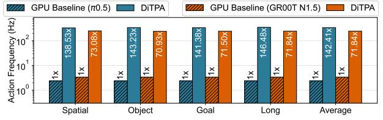

Fig. 24. Normalized action frequency of  $\pi 0.5$  and GR00T N1.5.


Fig. 25. Deployment on Lerobot SO-101 robotic arm.

redundant actions based on small orientation variations along the action trajectory. However, in bimanual manipulation, the two arms may exhibit different motion patterns and redundancy characteristics, making it difficult to directly reuse the single-arm redundancy-exploitation strategy. A potential direction to address this challenge is to decouple the action trajectories of the two arms and exploit their redundancy independently, so that action reuse can be determined in an arm-specific manner rather than using a unified criterion for the entire bimanual action space.

Transfer to Other Transformer-based VLAs. Since consecutive action similarity and multimodal redundancy are inherent robotic characteristics, DiTPA's co-design methodology can be transferred to future VLA models. In other domains, DiTPA can be potentially extended to navigation-oriented VLA models, such as NaVILA [7]. In these models, both action-level and multimodal redundancies may be exploited: smooth actions can be skipped during uniform or straightline motion, while the multimodal processing pipeline provides opportunities for redundancy-aware computation reduction.

## VII. CONCLUSION

We present DiTPA, a software-hardware co-designed accelerator for DiT-based action planners. It achieves high action frequency by exploiting three levels of redundancy: action, denoising, and multimodality. The DiTPA software framework includes: Orientation-conditioned action prediction to skip inference when orientation variation is minimal. Alternating denoising with feature reuse to eliminate computation of nearidentical features. Calibrated multimodal approximate computing that removes redundant modalities using lifespan analysis and column sparsity. Consequently, the designed DiTPA hardware architecture integrates a dedicated action predictor, reconfigurable PE array, and multimodal scheduler, fully converting redundancy into performance and energy gains. Results show that DiTPA achieves averagely 386.93×, 13.22×, 9.54× speedups and  $2356.77 \times$ ,  $8.71 \times$ ,  $11.59 \times$  energy-efficiency improvements over NVIDIA A40, EXION, and Ditto.

### ACKNOWLEDGEMENTS

This research was supported in part by NSFC Grant 62422407, RGC Grant 26204424, STG3/E-605/25-N, and partially conducted by ACCESS - AI Chip Center for Emerging Smart Systems, supported by the InnoHK initiative of the Innovation and Technology Commission of the Hong Kong Special Administrative Region Government.

# REFERENCES

- [1] J. Bi, K. Y. Ma, C. Hao, M. Z. Shou, and H. Soh, "Vla-touch: Enhancing vision-language-action models with dual-level tactile feedback," *arXiv preprint arXiv:2507.17294*, 2025.
- [2] J. Bjorck, V. Blukis, F. Castaneda, N. Cherniadev, X. Da, R. Ding, ˜ L. Fan, Y. Fang, D. Fox, F. Hu, S. Huang, J. Jang, X. Jiang, K. Kundalia, J. Kautz, Z. Li, K. Lin, Z. Lin, L. Magne, Y. Man, A. Mandlekar, A. Narayan, S. Nasiriany, S. Reed, Y. L. Tan, G. Wang, J. Wang, Q. Wang, S. Wang, J. Xiang, Y. Xie, Y. Xu, S. Ye, Z. Yu, Y. Zhao, Z. Zhang, R. Zheng, and Y. Zhu. Gr00t n1.5: An improved open foundation model for generalist humanoid robots. 2026, Feb 27. [Online]. Available: https://research.nvidia.com/labs/gear/gr00t-n1 5/
- [3] J. Bjorck, F. Castaneda, N. Cherniadev, X. Da, R. Ding, L. J. Fan, ˜ Y. Fang, D. Fox, F. Hu, S. Huang, J. Jang, Z. Jiang, J. Kautz, K. Kundalia, L. Lao, Z. Li, Z. Lin, K. Lin, G. Liu, E. Llontop, L. Magne, A. Mandlekar, A. Narayan, S. Nasiriany, S. Reed, Y. L. Tan, G. Wang, Z. Wang, J. Wang, Q. Wang, J. Xiang, Y. Xie, Y. Xu, Z. Xu, S. Ye, Z. Yu, A. Zhang, H. Zhang, Y. Zhao, R. Zheng, and Y. Zhu, "Gr00t n1: An open foundation model for generalist humanoid robots," *arXiv preprint arXiv:2503.14734*, 2025.
- [4] K. Black, N. Brown, D. Driess, A. Esmail, M. Equi, C. Finn, N. Fusai, L. Groom, K. Hausman, B. Ichter, S. Jakubczak, T. Jones, L. Ke, S. Levine, A. Li-Bell, M. Mothukuri, S. Nair, K. Pertsch, L. X. Shi, J. Tanner, Q. Vuong, A. Walling, H. Wang, and U. Zhilinsky, "π0: A vision-language-action flow model for general robot control," *arXiv preprint arXiv:2410.24164*, 2024.
- [5] A. Brohan, N. Brown, J. Carbajal, Y. Chebotar, J. Dabis, C. Finn, K. Gopalakrishnan, K. Hausman, A. Herzog, J. Hsu, J. Ibarz, B. Ichter, A. Irpan, T. Jackson, S. Jesmonth, N. J. Joshi, R. Julian, D. Kalashnikov, Y. Kuang, I. Leal, K.-H. Lee, S. Levine, Y. Lu, U. Malla, D. Manjunath, I. Mordatch, O. Nachum, C. Parada, J. Peralta, E. Perez, K. Pertsch, J. Quiambao, K. Rao, M. Ryoo, G. Salazar, P. Sanketi, K. Sayed, J. Singh, S. Sontakke, A. Stone, C. Tan, H. Tran, V. Vanhoucke, S. Vega, Q. Vuong, F. Xia, T. Xiao, P. Xu, S. Xu, T. Yu, and B. Zitkovich, "Rt-1: Robotics transformer for real-world control at scale," *arXiv preprint arXiv:2212.06817*, 2023.
- [6] P. Chen, M. Shen, P. Ye, J. Cao, C. Tu, C.-S. Bouganis, Y. Zhao, and T. Chen, "δ-dit: A training-free acceleration method tailored for diffusion transformers," *arXiv preprint arXiv:2406.01125*, 2024.
- [7] A.-C. Cheng, Y. Ji, Z. Yang, Z. Gongye, X. Zou, J. Kautz, E. Bıyık, H. Yin, S. Liu, and X. Wang, "Navila: Legged robot vision-languageaction model for navigation," *arXiv preprint arXiv:2412.04453*, 2024.
- [8] K. Cheng, L. Yu, Z. Tu, X. He, L. Chen, Y. Guo, M. Zhu, N. Wang, X. Gao, and J. Hu, "Effective diffusion transformer architecture for image super-resolution," in *Proceedings of the AAAI Conference on Artificial Intelligence*, vol. 39, no. 3, 2025, pp. 2455–2463.
- [9] C. Chi, Z. Xu, S. Feng, E. Cousineau, Y. Du, B. Burchfiel, R. Tedrake, and S. Song, "Diffusion policy: Visuomotor policy learning via action diffusion," *The International Journal of Robotics Research*, p. 02783649241273668, 2023.
- [10] F.-A. Croitoru, V. Hondru, R. T. Ionescu, and M. Shah, "Diffusion models in vision: A survey," *IEEE transactions on pattern analysis and machine intelligence*, vol. 45, no. 9, pp. 10 850–10 869, 2023.
- [11] D. Driess, F. Xia, M. S. M. Sajjadi, C. Lynch, A. Chowdhery, B. Ichter, A. Wahid, J. Tompson, Q. Vuong, T. Yu, W. Huang, Y. Chebotar, P. Sermanet, D. Duckworth, S. Levine, V. Vanhoucke, K. Hausman, M. Toussaint, K. Greff, A. Zeng, I. Mordatch, and P. Florence, "Palm-e: An embodied multimodal language model," *arXiv preprint arXiv:2303.03378*, 2023.
- [12] Z.-P. Duan, J. Zhang, X. Jin, Z. Zhang, Z. Xiong, D. Zou, J. S. Ren, C. Guo, and C. Li, "Dit4sr: Taming diffusion transformer for real-world image super-resolution," in *Proceedings of the IEEE/CVF International Conference on Computer Vision*, 2025, pp. 18 948–18 958.
- [13] Figure. Helix: A vision-language-action model for generalist humanoid control. 2025, Nov 9. [Online]. Available: https://www.figure.ai/news/ helix
- [14] R. Guo, L. Wang, X. Chen, H. Sun, Z. Yue, Y. Qin, H. Han, Y. Wang, F. Tu, S. Wei, Y. Hu, and S. Yin, "20.2 a 28nm 74.34 tflops/w bf16 heterogenous cim-based accelerator exploiting denoising-similarity for diffusion models," in *2024 IEEE International Solid-State Circuits Conference (ISSCC)*, vol. 67. IEEE, 2024, pp. 362–364.

- [15] A. Hatamizadeh, J. Song, G. Liu, J. Kautz, and A. Vahdat, "Diffit: Diffusion vision transformers for image generation," in *European Conference on Computer Vision*. Springer, 2024, pp. 37–55.
- [16] J. Heo, A. Putra, J. Yoon, S. Yune, H. Lee, J.-H. Kim, and J.-Y. Kim, "Exion: Exploiting inter-and intra-iteration output sparsity for diffusion models," in *2025 IEEE International Symposium on High Performance Computer Architecture (HPCA)*. IEEE, 2025, pp. 324–337.
- [17] J. Heo, A. Putra, S. Yune, J. Yoon, H. Lee, J. Kim, and J.-Y. Kim, "23.10 humonix: A 57.3 fps 12.8 tflops/w text-to-motion processor with interiteration output sparsity and inter-frame joint similarity," in *2025 IEEE International Solid-State Circuits Conference (ISSCC)*, vol. 68. IEEE, 2025, pp. 424–426.
- [18] J. Ho, A. Jain, and P. Abbeel, "Denoising diffusion probabilistic models," *Advances in neural information processing systems*, vol. 33, pp. 6840– 6851, 2020.
- [19] Z. Hou, T. Zhang, Y. Xiong, H. Duan, H. Pu, R. Tong, C. Zhao, X. Zhu, Y. Qiao, J. Dai, and Y. Chen, "Dita: Scaling diffusion transformer for generalist vision-language-action policy," *arXiv preprint arXiv:2503.19757*, 2025.
- [20] J. Huang, S. Wang, F. Lin, Y. Hu, C. Wen, and Y. Gao, "Tactilevla: Unlocking vision-language-action model's physical knowledge for tactile generalization," *arXiv preprint arXiv:2507.09160*, 2025.
- [21] Y. Huang, Y. Hao, B. Yu, F. Yan, Y. Yang, F. Min, Y. Han, L. Ma, S. Liu, Q. Liu *et al.*, "Dadu-corki: Algorithm-architecture co-design for embodied ai-powered robotic manipulation," in *Proceedings of the 52nd Annual International Symposium on Computer Architecture*, 2025, pp. 327–343.
- [22] IFR. Abb robotics leads global effort to standardize measurement of industrial robots' energy consumption. 2026, April 25. [Online]. Available: https://ifr.org/ifr-press-releases/news/abb-robotics-leads-global-effortto-standardize-measurement-of-industrial-robots-energy-consumption
- [23] P. Intelligence, K. Black, N. Brown, J. Darpinian, K. Dhabalia, D. Driess, A. Esmail, M. Equi, C. Finn, N. Fusai, M. Y. Galliker, D. Ghosh, L. Groom, K. Hausman, B. Ichter, S. Jakubczak, T. Jones, L. Ke, D. LeBlanc, S. Levine, A. Li-Bell, M. Mothukuri, S. Nair, K. Pertsch, A. Z. Ren, L. X. Shi, L. Smith, J. T. Springenberg, K. Stachowicz, J. Tanner, Q. Vuong, H. Walke, A. Walling, H. Wang, L. Yu, and U. Zhilinsky, "π0.5: a vision-language-action model with open-world generalization," *arXiv preprint arXiv:2504.16054*, 2025.
- [24] Y.-U. Jeong, J.-H. Chae, and S. Kim, "A 0.85-pj/b 16-gb/s/pin singleended transmitter with integrated voltage modulation for low-power memory interfaces," *IEEE Journal of Solid-State Circuits*, vol. 58, no. 9, pp. 2659–2667, 2023.
- [25] M. J. Kim, C. Finn, and P. Liang, "Fine-tuning vision-languageaction models: Optimizing speed and success," *arXiv preprint arXiv:2502.19645*, 2025.
- [26] M. J. Kim, K. Pertsch, S. Karamcheti, T. Xiao, A. Balakrishna, S. Nair, R. Rafailov, E. Foster, G. Lam, P. Sanketi, Q. Vuong, T. Kollar, B. Burchfiel, R. Tedrake, D. Sadigh, S. Levine, P. Liang, and C. Finn, "Openvla: An open-source vision-language-action model," *arXiv preprint arXiv:2406.09246*, 2024.
- [27] S. Kim, H. Lee, W. Cho, M. Park, and W. W. Ro, "Ditto: Accelerating diffusion model via temporal value similarity," in *2025 IEEE International Symposium on High Performance Computer Architecture (HPCA)*. IEEE, 2025, pp. 338–352.
- [28] W. Kong, Y. Hao, Q. Guo, Y. Zhao, X. Song, X. Li, M. Zou, Z. Du, R. Zhang, C. Liu, Y. Wen, P. Jin, X. Hu, W. Li, Z. Xu, and T. Chen, "Cambricon-d: Full-network differential acceleration for diffusion models," in *2024 ACM/IEEE 51st Annual International Symposium on Computer Architecture (ISCA)*. IEEE, 2024, pp. 903–914.
- [29] C.-K. Lee, H.-J. Chi, J.-S. Heo, J.-H. Park, J.-H. Jang, D. Lee, J.-H. Jung, D.-H. Lee, D.-H. Kim, K. Kim *et al.*, "An 8.5-gb/s/pin 12-gb lpddr5 sdram with a hybrid-bank architecture, low power, and speed-boosting techniques," *IEEE Journal of Solid-State Circuits*, vol. 56, no. 1, pp. 212–224, 2020.
- [30] Q. Li, Y. Liang, Z. Wang, L. Luo, X. Chen, M. Liao, F. Wei, Y. Deng, S. Xu, Y. Zhang, X. Wang, B. Liu, J. Fu, J. Bao, D. Chen, Y. Shi, J. Yang, and B. Guo, "Cogact: A foundational vision-language-action model for synergizing cognition and action in robotic manipulation," *arXiv preprint arXiv:2411.19650*, 2024.
- [31] Y. Li, Y. Meng, Z. Sun, K. Ji, C. Tang, J. Fan, X. Ma, S. Xia, Z. Wang, and W. Zhu, "Sp-vla: A joint model scheduling and token pruning approach for vla model acceleration," *arXiv preprint arXiv:2506.12723*, 2025.

- [32] Z. Li, G. Chen, S. Liu, S. Wang, V. VS, Y. Ji, S. Lan, H. Zhang, Y. Zhao, S. Radhakrishnan, N. Chang, K. Sapra, A. S. Deshmukh, T. Rintamaki, M. Le, I. Karmanov, L. Voegtle, P. Fischer, D.-A. Huang, T. Roman, T. Lu, J. M. Alvarez, B. Catanzaro, J. Kautz, A. Tao, G. Liu, and Z. Yu, "Eagle 2: Building post-training data strategies from scratch for frontier vision-language models," *arXiv preprint arXiv:2501.14818*, 2025.
- [33] I.-T. Lin, Z.-S. Fu, W.-C. Chen, L.-Y. Lin, N.-S. Chang, C.-P. Lin, C.- S. Chen, and C.-H. Yang, "A 28-nm 142-mw motion-control soc for autonomous mobile robots," *IEEE Journal of Solid-State Circuits*, 2025.
- [34] B. Liu, Y. Zhu, C. Gao, Y. Feng, Q. Liu, Y. Zhu, and P. Stone, "Libero: Benchmarking knowledge transfer for lifelong robot learning," *Advances in Neural Information Processing Systems*, vol. 36, pp. 44 776–44 791, 2023.
- [35] X. Liu, Z. Li, and Q. Gu, "Cachequant: Comprehensively accelerated diffusion models," in *Proceedings of the Computer Vision and Pattern Recognition Conference*, 2025, pp. 23 269–23 280.
- [36] Y. Liu, W. Chen, Y. Bai, X. Liang, G. Li, W. Gao, and L. Lin, "Aligning cyber space with physical world: A comprehensive survey on embodied ai," *IEEE/ASME Transactions on Mechatronics*, 2025.
- [37] Y. Ma, Z. Song, Y. Zhuang, J. Hao, and I. King, "A survey on vision-language-action models for embodied ai," *arXiv preprint arXiv:2405.14093*, 2024.
- [38] S. M. Neuman, B. Plancher, T. Bourgeat, T. Tambe, S. Devadas, and V. J. Reddi, "Robomorphic computing: a design methodology for domain-specific accelerators parameterized by robot morphology," in *Proceedings of the 26th ACM International Conference on Architectural Support for Programming Languages and Operating Systems*, 2021, pp. 674–686.
- [39] W. Peebles and S. Xie, "Scalable diffusion models with transformers," in *Proceedings of the IEEE/CVF international conference on computer vision*, 2023, pp. 4195–4205.
- [40] X. Pei, Y. Chen, S. Xu, Y. Wang, Y. Shi, and C. Xu, "Action-aware dynamic pruning for efficient vision-language-action manipulation," *arXiv preprint arXiv:2509.22093*, 2025.
- [41] Y. Qin, Y. Wang, D. Deng, Z. Zhao, X. Yang, L. Liu, S. Wei, Y. Hu, and S. Yin, "Fact: Ffn-attention co-optimized transformer architecture with eager correlation prediction," in *Proceedings of the 50th Annual International Symposium on Computer Architecture*, 2023, pp. 1–14.
- [42] Y. Qin, Y. Wang, X. Yang, Z. Zhao, S. Wei, Y. Hu, and S. Yin, "A 52.01 tflops/w diffusion model processor with inter-time-step convolutionattention-redundancy elimination and bipolar floating-point multiplication," in *2024 IEEE Symposium on VLSI Technology and Circuits (VLSI Technology and Circuits)*. IEEE, 2024, pp. 1–2.
- [43] D. Qu, H. Song, Q. Chen, Y. Yao, X. Ye, Y. Ding, Z. Wang, J. Gu, B. Zhao, D. Wang, and X. Li, "Spatialvla: Exploring spatial representations for visual-language-action model," *arXiv preprint arXiv:2501.15830*, 2025.
- [44] A. Z. Ren, J. Lidard, L. L. Ankile, A. Simeonov, P. Agrawal, A. Majumdar, B. Burchfiel, H. Dai, and M. Simchowitz, "Diffusion policy policy optimization," *arXiv preprint arXiv:2409.00588*, 2024.
- [45] R. Sapkota, Y. Cao, K. I. Roumeliotis, and M. Karkee, "Vision-languageaction models: Concepts, progress, applications and challenges," *arXiv preprint arXiv:2505.04769*, 2025.
- [46] M. Shukor, D. Aubakirova, F. Capuano, P. Kooijmans, S. Palma, A. Zouitine, M. Aractingi, C. Pascal, M. Russi, A. Marafioti, S. Alibert, M. Cord, T. Wolf, and R. Cadene, "Smolvla: A vision-languageaction model for affordable and efficient robotics," *arXiv preprint arXiv:2506.01844*, 2025.
- [47] J. Song, C. Meng, and S. Ermon, "Denoising diffusion implicit models," *arXiv preprint arXiv:2010.02502*, 2020.
- [48] J. Tang, Y. Sun, Y. Zhao, S. Yang, Y. Lin, Z. Zhang, J. Hou, Y. Lu, Z. Liu, and S. Han, "Vlash: Real-time vlas via future-state-aware asynchronous inference," *arXiv preprint arXiv:2512.01031*, 2025.
- [49] Unitree. Unitree g1: Humanoid agent ai avatar. 2026, Feb 27. [Online]. Available: https://www.unitree.com/g1
- [50] P. Valle, C. Lu, S. Ali, and A. Arrieta, "Evaluating uncertainty and quality of visual language action-enabled robots," *arXiv preprint arXiv:2507.17049*, 2025.
- [51] J. Wen, Y. Zhu, M. Zhu, Z. Tang, J. Li, Z. Zhou, X. Liu, C. Shen, Y. Peng, and F. Feng, "Diffusionvla: Scaling robot foundation models via unified diffusion and autoregression," in *Forty-second International Conference on Machine Learning*, 2025.
- [52] F. Wimbauer, B. Wu, E. Schoenfeld, X. Dai, J. Hou, Z. He, A. Sanakoyeu, P. Zhang, S. Tsai, J. Kohler *et al.*, "Cache me if you can:

- Accelerating diffusion models through block caching," in *Proceedings of the IEEE/CVF Conference on Computer Vision and Pattern Recognition*, 2024, pp. 6211–6220.
- [53] J. Wu, H. Wang, Y. Shang, M. Shah, and Y. Yan, "Ptq4dit: Post-training quantization for diffusion transformers," *Advances in neural information processing systems*, vol. 37, pp. 62 732–62 755, 2024.
- [54] L. Yan, X. Zhao, B. Yang, Y. Wu, G. Dai, J. Li, C.-Y. Tsui, K.-T. Cheng, Y. Zhang, and F. Tu, "Robotic computing system and embodied ai evolution: an algorithm-hardware co-design perspective," *Journal of Semiconductors*, vol. 46, no. 10, p. 101201, 2025.
- [55] Y. Yang, Y. Wang, Z. Wen, L. Zhongwei, C. Zou, Z. Zhang, C. Wen, and L. Zhang, "Efficientvla: Training-free acceleration and compression for vision-language-action models," *arXiv preprint arXiv:2506.10100*, 2025.
- [56] H. Zhang, T. Gao, J. Shao, and Z. Wu, "Blockdance: Reuse structurally similar spatio-temporal features to accelerate diffusion transformers," in *Proceedings of the Computer Vision and Pattern Recognition Conference*, 2025, pp. 12 891–12 900.
- [57] S. Zhang, X. Chen, C. Peng, H. Yang, Y. Liu, and H. Jia, "A 94hz inference and 7.4 mj/epoch fine-tune edge soc for diffusion-based robot manipulation with speculation and disturbance enhancement," in *2025 Symposium on VLSI Technology and Circuits (VLSI Technology and Circuits)*. IEEE, 2025, pp. 1–3.
- [58] T. Z. Zhao, V. Kumar, S. Levine, and C. Finn, "Learning finegrained bimanual manipulation with low-cost hardware," *arXiv preprint arXiv:2304.13705*, 2023.
- [59] B. Zitkovich, T. Yu, S. Xu, P. Xu, T. Xiao, F. Xia, J. Wu, P. Wohlhart, S. Welker, A. Wahid, Q. Vuong, V. Vanhoucke, H. Tran, R. Soricut, A. Singh, J. Singh, P. Sermanet, P. R. Sanketi, G. Salazar, M. S. Ryoo, K. Reymann, K. Rao, K. Pertsch, I. Mordatch, H. Michalewski, Y. Lu, S. Levine, L. Lee, T.-W. E. Lee, I. Leal, Y. Kuang, D. Kalashnikov, R. Julian, N. J. Joshi, A. Irpan, B. Ichter, J. Hsu, A. Herzog, K. Hausman, K. Gopalakrishnan, C. Fu, P. Florence, C. Finn, K. A. Dubey, D. Driess, T. Ding, K. M. Choromanski, X. Chen, Y. Chebotar, J. Carbajal, N. Brown, A. Brohan, M. G. Arenas, and K. Han, "Rt-2: Visionlanguage-action models transfer web knowledge to robotic control," in *Proceedings of The 7th Conference on Robot Learning*, ser. Proceedings of Machine Learning Research, J. Tan, M. Toussaint, and K. Darvish, Eds., vol. 229. PMLR, 06–09 Nov 2023, pp. 2165–2183.