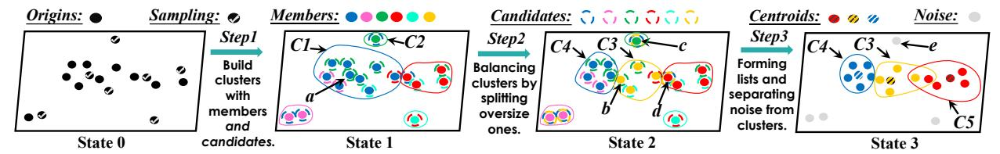
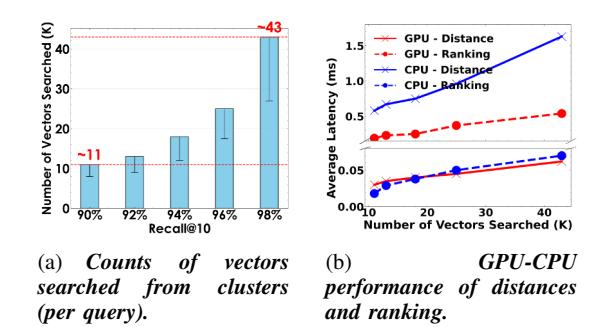
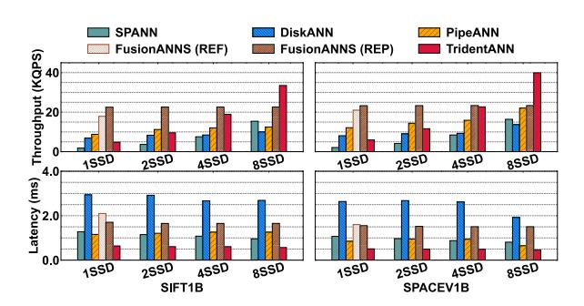
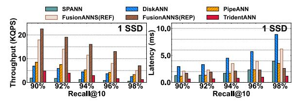
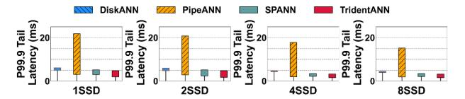
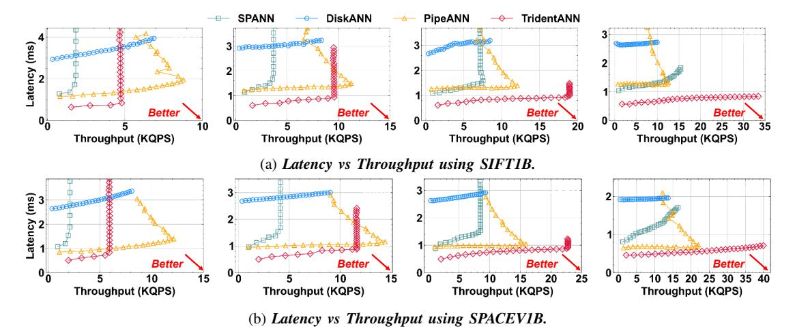
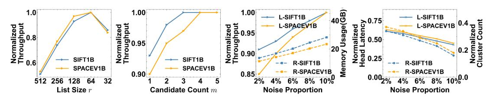
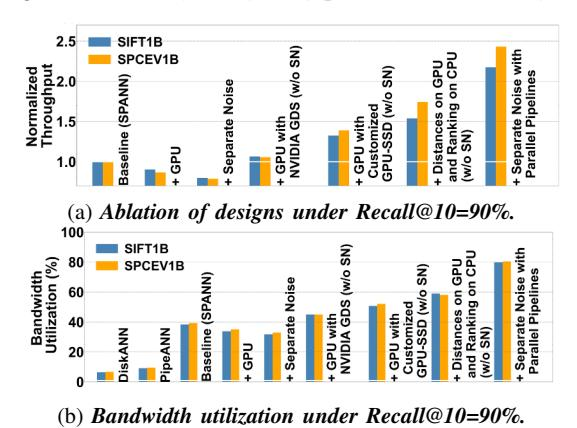
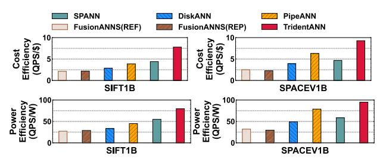

# Don't Surrender to Low QPS/\$: Fast and Cost-Efficient ANNS with TRIDENTANN

Yuchen Huang<sup>1</sup> , Baiteng Ma<sup>1</sup> , Erci Xu<sup>2</sup> , Chuliang Weng<sup>1</sup> <sup>1</sup>*East China Normal University*, <sup>2</sup>*Shanghai Jiaotong University* ychuang@stu.ecnu.edu.cn, btma@stu.ecnu.edu.cn, jostep90@gmail.com, clweng@dase.ecnu.edu.cn

*Abstract*—The scale of vector data has been continuously growing. SSD-based approximate nearest neighbor search (ANNS) methods have become popular in handling billion-scale vectors with just one node. While delivering high performance in terms of query per second (QPS), they often fall short in the cost efficiency (i.e., QPS/\$). In this paper, we present TRIDENTANN, a highperformance yet cost-efficient system for large-scale ANNS with strengths of SSDs, low-end GPUs, and CPUs. We start by proposing a hybrid noise-clusters index for efficient I/O utilization and parallel search for decoupled noise and clusters. Second, we customize hardware-software architecture for GPU-SSD ANNS, which enables full bandwidth utilization when transferring data between GPUs and SSDs. Third, we orchestrate GPU-CPU-SSD task pipelines in parallel according to hardware characteristics to maximize system efficiency. Evaluations show that, compared to existing ANNS systems, TRIDENTANN performs 1.8-3.4× throughput and 21-70% of the latency. More importantly, it can be deployed on readily available and affordable devices, and achieves much higher cost efficiency (∼2-4× QPS/\$) than others. *Index Terms*—Vector search, Software-hardware co-design

# I. INTRODUCTION

Approximate nearest neighbor search (ANNS) is foundational to a wide range of applications, including recommendation systems [33], search engines [57], and retrievalaugmented generation (RAG) in large language models [60, 74]. While the approximation alleviates the computation burden, the sheer scale of today's billion-scale vector datasets (e.g., search engines in Microsoft [16] and e-commerce in Alibaba [36]) still poses significant challenges. Existing inmemory ANNS solutions [15, 18] can require dozens of nodes to accommodate the large memory footprint of the index, leading to high CapEx and OpEx costs [23, 45, 56].

To lower costs, many solutions, such as DiskANN, SPANN, PipeANN, and FusionANNS [32, 40, 66, 69], have adopted solid-state drives (SSDs) to alleviate memory pressure, which enables billion-scale ANNS processing on a single node. Specifically, DiskANN [66] pioneers the idea of migrating the *graph index* from memory to SSD. SPANN [32] switches to the *clustering index* on the SSD, achieving low-latency (e.g., ∼1-2 ms) single-hop search with batched I/Os. Fusion-ANNS [69] uses the SSD to store the raw dataset (e.g., 128 byte vectors of SIFT1B) and leverages the high-bandwidth memory (HBM) of a GPU to host the compressed dataset (i.e., 32-byte vectors for smaller footprints). These solutions can also deliver competitive performance. As an outstanding example, FusionANNS [69], with the help of a GPU, can achieve ∼18-20K queries per second (QPS).

However, consolidating ANNS onto a single node does not necessarily lead to better cost efficiency (i.e., QPS per dollar, QPS/\$). Regarding the above example, the adoption of expensive GPUs can significantly reduce the cost effectiveness of FusionANNS, which only yields ∼2 QPS/\$. Other solutions, such as DiskANN, PipeANN, and SPANN, do not require GPUs and can achieve better cost effectiveness (e.g., ∼2.5- 4 QPS/\$). Nevertheless, if we intend to further improve their performance, blindly investing more resources often leads to diminishing returns or even backfires in QPS/\$.

Hence, we are motivated by an intuitive question: can we achieve both high performance and low cost in ANNS? Our motivational analysis suggests that building such an ANNS system requires a rethink and a redesign with more affordable hardware. Hence, we propose to *host the raw vectors in an array of NVMe SSDs, and utilize both CPUs and low-end GPUs to search for the top-k vectors*. This approach enables both cost effectiveness and high performance. First, the design alleviates the need for large GPU memory since the GPU only needs to process the retrieved clusters, which are much smaller in size (i.e., hundreds of MiBs) than the compressed dataset (e.g., tens of GiBs). Note that HBM, rather than GPU cores, usually dominates costs of GPUs [21]. For example, an NVIDIA V100-32GB GPU costs around \$3,000 [7], while two NVIDIA A2000-6GB GPUs (with the same processing power but ∼1/3 the device memory capacity) cost only around \$800 [10], less than half the price of the former. Much better cost effectiveness is therefore expected.

Second, the hardware setup of this design is also capable of delivering comparable performance to existing solutions, mainly thanks to the increasing bandwidth of NVMe SSDs. For example, existing solutions like FusionANNS [69] can achieve ∼18-20K QPS in typical real-world ANNS workloads (e.g., 90% recall at top-10 as the qualification [14] in SIFT1B). Since each query consumes around 1-2 MiB of I/O from uncompressed clusters, to achieve the same level of performance, transferring the candidate clusters to the GPU memory only needs to reach 20-40 GiB/s (i.e., throughput × I/O per query). Fortunately, today's array of 8× PCIe-4.0 SSDs can collectively offer around 56 GiB/s raw bandwidth [42, 48], sufficient to meet the requirement.

But, realizing this design is also non-trivial and can face three challenges. First, existing clustering-based ANNS index structures can suffer high latency (e.g.,∼30-40% of total time) in selecting candidate clusters due to the overwhelming number (up to 16% of the dataset size) of clusters, thereby leading to degraded QPS. Second, a straightforward GPU introduction can lead to low practical I/O utilization of SSDs (only  $\sim$ 30-50% of the available bandwidth). Third, when combining various heterogeneous hardware (GPUs, NVMe SSD arrays, and CPUs), improper task scheduling during the searching-fortop-k process can degrade the throughput by up to  $\sim$ 10-30%.

In this paper, we present TRIDENTANN, a fast and costeffective ANNS framework with CPU-GPU-SSD collaboration. It is built upon the following three key techniques.

First, we revisit the index structure of clustering-based ANNS and discover that the improper handling of *noise vectors* (i.e., constructing clusters with very few assigned vectors) can lead to excessive and redundant clusters. Hence, we propose a *hybrid index* that separates the dataset into clusters and noise vectors. This eliminates the redundant clusters constructed from the noise vectors, reducing the overall search space by up to 85% for locating the nearest clusters.

Second, we customize a GPU-SSD Peer-to-Peer (P2P) architecture tailored for ANNS workloads. Based on the GPU-SSD hardware architecture, we design the runtime I/O management during search to reduce bandwidth competition between tasks. TRIDENTANN is capable of fully utilizing the bandwidth of NVMe SSD arrays and achieves throughput scaling proportional to the available bandwidth.

Third, we carefully orchestrate tasks among various hardware. After quantitatively analyzing the performance of operators on CPUs and GPUs during search, TRIDENTANN delegates distance computations to GPUs while offloading the ranking stage to CPUs—leveraging their respective strengths (i.e., branch-intensive ranking on CPUs and parallel algebraic operations on GPUs). Meanwhile, we parallelize noise search and cluster search in pipelines, enabling tasks to overlap.

Evaluations show that, compared to other systems, TRIDENTANN achieves  $1.8\text{-}3.4\times$  throughput and reduces latency to 21-70%. Moreover, it can be deployed on commodity devices, achieving the highest cost efficiency. Specifically, combining low-cost GPUs and multiple SSDs, we can scale up throughput to  $\sim$ 7-9 QPS/\$, around 2-4× that of existing systems.

## II. BACKGROUND

In this section, we introduce two mainstream methodologies of SSD-based ANNS, namely graph-based and cluster-based.

In graph-based ANNS, vectors are constructed as nodes in a graph, and edges between nodes represent neighbor relationships. The search traverses the graph to find the nearest neighbors of a query vector. In-memory graph-based indexes [36, 52, 72] store the entire graph in the memory, enabling fast search but incurring a large memory usage. Recent SSD-based ANNS, such as DiskANN [66] and PipeANN [40], organizes the graph in a hierarchical manner across memory and SSD, keeping frequently accessed entry nodes in memory while placing the remaining nodes on SSD.

These solutions follow a two-step search process, as illustrated in Figure 1a, which first searches the in-memory part to explore the graph from entry nodes (i.e., 1st hop in Figure 1a).


Fig. 1: Billion-scale ANNS based on the NVMe SSD.

Then, the search routes to the SSD to perform the second search stage of on-SSD nodes (i.e., 2nd hop), which iteratively loads predecessor nodes into memory, computes distances, and determines the next-hop neighbors (3rd hop) until the search converges (4th hop). As a result, only a small number of nodes are loaded from the SSD into memory at each hop, leading to low I/O bandwidth usage (e.g.,  $\sim$ 0.2-0.3 MB I/O per query¹). This approach can achieve decent throughput ( $\sim$ 6.9-16.5K QPS) even with just one NVMe SSD.

In clustering-based ANNS, the vectors are grouped into clusters based on their proximity. SSD-based solutions, like SPANN [32], first locate multiple clusters nearest to the query, then load all their vectors into memory, and further identify the top-k results. This approach avoids the graph-based multi-hop search, thereby providing lower latency (within ~2 ms).

The above process can, however, suffer low throughput (only ~ 2K QPS) due to the heavy I/O bandwidth pressure ( $\sim$ 1.5 MB I/O per query). FusionANNS advances SPANN by Product Quantization (PQ) [47] and the reranking strategy [9]. Figure 1c shows that FusionANNS first stores compressed vectors in GPU device memory and leaves raw vectors on the SSD. During search, it first locates multiple nearest clusters as SPANN. Second, FusionANNS filters a wider range of candidate vectors using on-GPU compressed vectors from the identified clusters (e.g., about top-100 for a top-10 query). Third, raw vectors of these candidate clusters are loaded from SSD into memory to be reranked for obtaining topk results. Due to much less data transfer from SSD (only  $\sim$ 0.1-0.4 MB I/O per query) and the processing power of the GPU, FusionANNS achieves a higher throughput (~18K QPS) compared to graph-based systems on a single SSD.

# III. MOTIVATION

## A. High QPS != High QPS/\$

With the single-node serving and relatively high QPS, one would assume the existing SSD-based ANNS systems should

<sup>1</sup>This and following examples refer to top-10 search with 90% recall on SIFT1B, which is recommended by the BigANN benchmark [14].

yield high cost-effectiveness (in terms of QPS/\$) as well. However, our following investigation indicates otherwise.

FusionANNS stores the compressed dataset in the GPU's device memory and facilitates the distance evaluations with its high processing power. This design achieves competitive throughput (i.e., 18K QPS referred to in the paper and 22.5K QPS of our reproduction described in Subsection VIII-A) but comes with a high price (i.e., ~\$8.4K and ~\$10.3K), resulting in a mere ~2.14-2.18 QPS/\$ cost-effectiveness as shown in Table I. The cost, including the prototype in their paper and our reproduction same as [64], is mainly driven by the highend GPU (e.g., a V100-32GB costs ~\$3.0K or an A6000-48GB costs ~\$5.0K) and the dual-socket CPU chassis (e.g., 64-core and 58-core server can cost ~\$5.4K and ~\$5.3K).

Note that we cannot simply reduce such costs with cheap GPUs and/or CPUs. Since FusionANNS relies on large and high-bandwidth GPU memory (the dominant factor in GPU prices [21]) for hosting compressed vectors of the whole datasets on the GPU necessarily (e.g., 32 GB device memory is required at least for SIFT1B as [69]), and high-end CPUs (e.g., 64-core from the dual socket) for launching enough requests to saturate the processing pipeline.

DiskANN and PipeANN do not require GPU assistance and therefore achieve better cost-effectiveness (i.e., ~2.46 QPS/\$ and ~3.14 QPS/\$). However, due to the multi-hop graphbased search, their QPS is also limited (i.e., 6.9K and 8.8K QPS) compared to FusionANNS. To improve throughput, a straightforward approach is to scale up the number of CPU cores. We therefore add another CPU and use a dual-socket motherboard (i.e., the second row of DiskANN and PipeANN in Table I). Extra cores do empower them to deliver 11.7K and 16.5K OPS, respectively. Yet, the OPS/\$ remains unchanged or even decreases, since the additional cores are not fully utilized to double the throughput. With higher processing power, more requests are launched concurrently, which creates more die-level collisions inside the NVMe SSDs and higher I/O latency [46]. As a result, the QPS does not scale proportionally with the additional CPU cores.

In addition to CPU scaling, we also scale the number of SSDs (third and fourth rows). Using two SSDs can alleviate die-level collisions with lower read latency and slightly increase throughput. DiskANN and PipeANN improve from 6.9K and 8.8K to 8.4K and 11.2K QPS (QPS/\$ from  $\sim$ 2.46 and  $\sim$ 3.14 to  $\sim$ 2.89 and  $\sim$ 3.86). However, further increasing SSDs yields diminishing returns (e.g., only to 9.9K/12.5K QPS with 8 SSDs), and QPS/\$ no longer grows. This is because graph-based search incurs inherent I/O serialization and is latency-bound rather than bandwidth-bound, which prevents effectively exploiting higher SSD-side aggregate bandwidth.

**SPANN** is an interesting case. The original setup (first row) shows both the lowest QPS (i.e., 1.8K QPS) and the lowest QPS/\$ (i.e., ~0.64 QPS/\$). Since it is a clustering-based system, the performance is therefore capped by the bandwidth. Hence, we further equip SPANN with more disks (i.e., second row with 8 NVMe SSDs), which results in significant improvements in both throughput (i.e., 15.4K QPS) and cost-

| System     | Hardware Setup                           | Throughput | Cost           | QPS/\$ |
|------------|------------------------------------------|------------|----------------|--------|
| FusionANNS | 2 CPU-32core & 1 SSD<br>1 GPU-32GB (REF) | 18K QPS    | ~\$8.4K        | ~2.14  |
|            | 2 CPU-28core & 1 SSD<br>1 GPU-48GB (REP) | 22.5K QPS  | ~\$10.3K       | ~2.18  |
|            | 1 CPU-28Core & 1 SSD                     | 6.9K QPS   | ~\$2.8K        | ~2.46  |
| DiskANN    | 2 CPU-28Core & 1 SSD                     | 11.7K QPS  | ~\$5.3K        | ~2.21  |
| DISKAININ  | 1 CPU-28Core & 2 SSD                     | 8.4K QPS   | ~\$2.9K        | ~2.89  |
|            | 1 CPU-28Core & 8 SSD                     | 9.9K QPS   | ~\$3.5K        | ~2.82  |
|            | 1 CPU-28Core & 1 SSD                     | 8.8K QPS   | ~\$2.8K        | ~3.14  |
| Di A NINI  | 2 CPU-28Core & 1 SSD                     | 16.5K QPS  | ~\$5.3K        | ~3.11  |
| PipeANN    | 1 CPU-28Core & 2 SSD                     | 11.2K QPS  | ~\$2.9K        | ~3.86  |
|            | 1 CPU-28Core & 8 SSD                     | 12.5K QPS  | ~\$3.5K        | ~3.57  |
|            | 1 CPU-28Core & 1 SSD                     | 1.8K QPS   | ~\$2.8K        | ~0.64  |
| CDANIN     | 1 CPU-28Core & 8 SSD                     | 15.4K QPS  | ~\$3.5K        | ~4.40  |
| SPANN      | 1 CPU-28Core & 16 SSD                    | 17.3K QPS  | ~\$4.3K        | ~4.02  |
|            | 2 CPU-28Core & 8 SSD                     | 16.9K QPS  | ~\$6K          | ~ 2.82 |
| TRIDENTANN | 1 CPU-28core & 8 SSD                     | 22 5W ODG  | ~\$4.3K        | ~7.79  |
| (Ours)     | 2 GPU-6GB                                | 33.5K QPS  | ~ <b>⊅4.3K</b> | ~1.19  |

TABLE I: Performance and hardware cost.

effectiveness (i.e., ~4.4 QPS/\$). The drastic increase reflects the importance of a balanced system design: scaling SSD bandwidth to cooperate with compute resources appropriately can achieve both high QPS and high QPS/\$. The third and fourth rows of SPANN further validate this assumption, where adding more SSDs (i.e., 16 SSDs) or more CPU cores (i.e., 2 CPUs) leads to diminished throughput improvements and reduced cost-effectiveness, as the marginal gain is outweighed by the additional hardware cost.

#### B. The Cannikin Law in Building ANNS

At a high level, the above analysis reveals that ANNS systems follow the classical "cannikin law" (a.k.a., the wooden barrel principle), which states that the performance (QPS and QPS/\$ in our context) of a system is determined by the weakest component. In other words, we have to carefully determine the combination of GPUs, CPUs, and NVMe SSDs to avoid bottlenecks or over-provisioning of resources. Specifically, we have learned three key insights.

First, what we need is GPUs' processing power, not their expensive device memory capacity. FusionANNS uses a highend GPU to accelerate computation-intensive tasks (e.g., distance calculation) and requires a large amount of device memory to store the compressed dataset, thereby leading to a low QPS/\$. Note that the price of modern GPUs is mainly driven by the size and type (e.g., HBM or GDDR) of their device memory [21]. For example, compared to the NVIDIA V100-32GB [7] used in original FusionANNS, two NVIDIA A2000 GPUs [10] have comparable processing power<sup>2</sup> ( $\sim$ 10% difference in TFLOPS), each with 6GB GDDR (12 GB in total), and together cost only nearly  $\sim 1/4$  of a V100-32GB GPU. Moreover, in our reproduction, the NVIDIA RTX A6000-48GB [11] is the minimum option (in the same series as the A2000 used in TRIDENTANN) that satisfies FusionANNS's requirement of at least 32GB device memory for 1B-scale datasets (e.g., SIFT1B). However, its price is about 6× that of two A2000 GPUs. Hence, if we can avoid the reliance on GPU memory, we can instead use cheaper

<sup>&</sup>lt;sup>2</sup>We use 2 A2000-6GB GPUs with 16 TFLOPS in total to pair with 8 SSDs for full interconnect bandwidth, and a single V100-32GB has 14 TFLOPS.

GPUs with smaller and lower-grade device memory while still harnessing the high processing power.

Second, scaling up the computation resources (e.g., CPU cores in DiskANN and PipeANN) can help improve throughput, but can incur diminishing returns. This is because the additional CPU cores are not fully utilized due to the latency overhead contributed by the conflicts inside the NVMe SSDs. This works vice versa as well (i.e., adding more SSDs is not always helpful, as shown in the third row of SPANN). Hence, we should always match the number of CPU cores with the number of NVMe SSDs to prevent over-provisioning of resources, which hampers QPS/\$.

Third, compared to expensive GPUs and CPUs, scaling up the I/O bandwidth with NVMe SSDs is much more costeffective. Modern NVMe SSDs can provide high I/O bandwidth (e.g., 7 GiB/s for a single drive) at a low cost (e.g., \$100 for a 1-TiB PCIe-Gen4 NVMe SSD [19]). This enlightens us to rethink the design principle of ANNS systems: instead of relying on expensive computational resources, we can scale up the I/O bandwidth with low-cost NVMe SSD arrays to avoid the urgent requirement of CPU in DiskANN and PipeANN, or the large capacity of GPU memory in FusionANNS.

# *C. Bandwidth-Centric Scaling as Architectural Principle*

Based on the above cannikin law, we advocate bandwidthcentric scaling as an architectural principle. Since NVMe SSDs can scale external I/O bandwidth at low cost, a natural strategy is to expand throughput by scaling SSD arrays. However, this is effective only if the *compute-side bandwidth* (especially host memory bandwidth) does not become the new bottleneck that throttles SSD utilization.

Revisiting SPANN's scaling. In Table I, SPANN exhibits near-linear scaling from 1 SSD to 8 SSDs (about 8–9× throughput gain), but increasing from 8 to 16 SSDs yields only 10% additional throughput. Meanwhile, at 8 SSDs, the I/O bandwidth utilization is only 35–40% (around 21 GB/s). While only adding more cores is also useless without higher host bandwidth. This indicates that the limiting factor shifts from I/O bandwidth of SSDs to host-side computational bandwidth.

The bandwidth bill for SPANN. Under SPANN's clustered search, the host must (i) search centroids to locate relevant clusters, (ii) load the selected clusters from SSD into memory, and (iii) scan these clusters for distance computation and final ranking—all of which consume host memory bandwidth. For SIFT1B top-10 search at 90% recall, each 1K QPS roughly costs 2–3 GB/s memory bandwidth for centroid search, plus about 1–2 GB/s to write clusters from SSD into memory, and another 1–2 GB/s to scan clusters for distance and ranking. Overall, this amounts to 4–7 GB/s host memory bandwidth per 1K QPS, but only 1–2 GB/s SSD bandwidth, implying usable SSD bandwidth is bounded at about 25–30% of available memory bandwidth. With 90–100 GB/s sustained DDR4 bandwidth (8 channels) on our platform, the SSD utilization ceiling is thus 20–30 GB/s, consistent with the observed 21 GB/s.

Architectural insights. The bandwidth-centric scaling requires *co-design*: using low-cost NVMe arrays to scale exter-


Fig. 2: *Overhead breakdown under peak throughput.*

nal bandwidth, while preventing compute (e.g., host memory in SPANN) bandwidth from limiting SSDs utilization. In TRI-DENTANN, low-end GPUs (despite limited device memory) can provide abundant and inexpensive compute bandwidth (e.g., an A2000-6GB provides >200 GB/s), as practical complements to CPUs and multi-NVMe SSDs for scaling.

# *D. Issues in Straightforward Integration*

While a combination of low-end GPUs, CPUs, and NVMe SSDs seemingly provides both high performance and cost effectiveness, the next question is how to allocate tasks in ANNS to these resources. We initially attempt to simply integrate GPU-based ANNS acceleration to SPANN with multiple SSDs installed, which works as follows.

First, upon receiving a top-k search query, the CPU locates multiple nearest clusters to the query by searching the inmemory graph index of centroids. Then, we load the raw vectors of these clusters from NVMe SSDs to the host memory, and further transfer them to GPUs. Finally, the GPUs calculate distances between the query vector and the raw vectors, rank, and return the top-k results.

However, this strategy does not work well in practice. Ironically, this setup can even lead to worse performance than the original SPANN. Figure 2 presents the overhead breakdown of peak throughput with the platform of Section VIII. It is tested for top-10 search under 90% recall as the BigANN benchmark [14], using SIFT1B. We analyze the overhead introduced by this integration and identify three key issues.

Issue 1: Noises incur high latency to locate nearest clusters. Latency of locating the nearest clusters (① of SPANN in Figure 2) in original SPANN accounts for up to ∼30- 40% of the overall time. This is because SPANN generates an excessive amount of centroids. For example, the SIFT1B dataset contains 1 billion vectors, and SPANN generates ∼160 million centroids. Among these, many cluster lists are constructed on noise vectors (i.e., vectors belong to lowdensity clusters and are distant from other high-density ones). Ideally, in a hierarchically balanced clustering—each cluster contains ∼100 vectors<sup>3</sup>—it should yield only ∼10 million centroids for 1 billion vectors. Locating nearest clusters in both dense clusters and low-density noise parts significantly leads to unnecessary search space, increases latency of ①, consumes more host bandwidth, and incurs lower QPS.

Issue 2: Adding GPUs incurs extra data movement. SPANN+GPU in Figure 2 shows that the double data move-

<sup>3</sup>For example, sizes of clusters are set as 12 KB for byte vectors in SPANN, for 128-dim uint8 vectors in SIFT1B, each cluster list contains 96 vectors.


Fig. 3: Design overview of TRIDENTANN.

ment (i.e., from SSDs to host memory and then to GPUs) introduces additional overhead (i.e., the green part in ②). Compared to FusionANNS, this is exacerbated in our architecture since we directly search raw vectors on SSDs and need to frequently load them to GPU for processing. As a result, the I/O cost is doubled: the bandwidth consumed when loading clusters from SSDs into host memory remains unavoidable, and the subsequent host-to-GPU copy incurs an additional host memory bandwidth cost that is approximately equal to the original CPU-side cluster scanning. Consequently, the effective end-to-end I/O bandwidth utilization remains only  $\sim \! 30 - \! 40\%$ , despite introducing GPUs in addition.

Issue 3: Suboptimal task assignment for GPUs and serial search pipeline with additional overhead. Referring to GPU acceleration of Faiss, GPUs need to calculate distances, and then rank top-k results. The  $\odot$  of GPU in Figure 2 shows that the distance calculation is greatly accelerated by GPUs, but the subsequent ranking of GPUs is branch-heavy and bandwidthbound, which is suboptimal for low-end GPUs with limited device memory bandwidth. In addition, even if we separate noise to reduce the overhead of locating nearest clusters (i.e., Issue 1 addressed, shortened orange part ① in GPU+SN), it is still necessary to search top-k among noise vectors and merge the results with the top-k from clusters. Otherwise, the potential top-k results from noise vectors would always be excluded. This, in return, introduces a new stage 4, Search in *Noise* and *Merge TopK*, which leads to a longer search pipeline with additional overhead.

## IV. DESIGN OVERVIEW

Figure 3 illustrates TRIDENTANN, our ANNS system that efficiently integrates GPU, CPU, and NVMe SSDs to accelerate the search process with high cost effectiveness. There are three main techniques, including a hybrid index separately indexing noise and dense clusters, a customized GPU-SSD P2P architecture to fully utilize I/O bandwidth, and a redesigned search pipeline to maximize parallel collaboration across CPUs, SSDs, and GPUs.

Indexing clusters and noise separately with the hybrid index (Section V). We propose a hybrid index. Specifically, we build three internal parts from the dataset (X): a graph index for centroids to locate nearest clusters (C), a graph index for noise vectors (N), and cluster lists (R) of dense clusters with redundant placement [32]. The benefits of this design are twofold: (1) it reduces the number of clusters by

separating noise vectors and clusters, which speeds up the process of locating relevant clusters; (2) it decouples the search processes of noise vectors and dense clusters to enable parallel processing of the two parts.

Direct data transfer between GPUs and SSDs (Section VI). TRIDENTANN employs a customized GPU-SSD P2P architecture to accelerate the SSD-GPU data transfer for GPU distance calculation, and avoids host bandwidth consumption from clusters' I/O. The key idea is to maximize I/O efficiency when loading clusters from SSDs to GPUs. On the hardware side, we organize multiple SSDs and a GPU as a workgroup to improve inter-device communication. On the software side, we design a lightweight I/O stack that enables user-space applications to directly issue commands to the NVMe driver, reducing software overhead.

Pipelined and parallel search across GPUs, CPUs, and SSDs (Section VII). We rethink the allocation of tasks in ANNS and build a pipeline that leverages the strengths of both GPUs and CPUs. We keep the distance calculation on GPUs for their superior performance in parallel processing. For the memory-bound GPU ranking, we offload it to the CPU to avoid suffering from low-end GPUs' limited-bandwidth memory. In addition, we overlap the searches in clusters and noise. While SSDs load clusters to GPUs, the CPU searches in the in-memory noise graph in parallel. This avoids additional overhead from decoupled top-k searches, while still preserving fast nearest-cluster locating through our hybrid index.

## V. HYBRID INDEX

To avoid creating an excessive amount of (small) clusters, we now introduce hybrid indexing. The key idea is to separate the raw dataset (X) into noise (N) and non-noise vectors.

Note that building such a process is, however, non-trivial. First, we cannot rely on existing methods like DBSCAN [35] for its excessively high time complexity and demanding hardware requirements (thousands of CPUs or GPUs even for vectors of dimensionality <10 at million-scale) [34, 37, 58, 63]. Second, building clusters can also lead to imbalanced sizes, where some clusters have far more members (i.e., vectors) than others. This can lead to inefficient search performance since large clusters are more likely to be queried and frequently loading them can be costly. Third, another time-consuming procedure in building clusters is handling the boundary issue, where vectors that are close to multiple clusters can be missed during search if only assigned to just one cluster. But, blindly

## **Algorithm 1** Building clusters with members and candidates

```
Input: dataset X, candidate count m, list size r
Output: initial centroids C_{init}, member sets I, candidate sets E
 1: C_{init}, I \leftarrow H\text{-}K(sampling(X), \lceil \frac{sizeof(sampling(X))}{3} \rceil)
     // generate \frac{sizeof(sampling(X))}{r} centroids (C_{init}) with hierarchical
     \overline{KMeans} on vectors \overline{sampling}(X).
2: for c \in C_{init} do
3: I[c] \leftarrow \emptyset, E[c] \leftarrow \emptyset
4: end for
5: for x \in X do
        [c_1, c_2 \dots c_m] \leftarrow KNN(x, C_{init}, m)
6:
        // get top-m nearest vectors to x from C_{init}.
        I[c_1] \leftarrow I[c_1] \cup \{x\}
        for c \in \{c_2, ..., c_m\} do
            E[c] \leftarrow E[c] \cup \{x\}
9:
10.
        end for
11: end for
12: return C_{init}, I, E
```

adding vectors to all neighboring clusters also leads to repeated loading from SSDs, which hampers performance. Therefore, previous works such as SPANN have taken a time-consuming RNG checking [70] process to handle boundary vectors.

## A. Step-1: Building Clusters

To avoid the above issues, we take a three-step process in the hybrid index and choose to build the initial clusters over the entire raw dataset with members and candidates. The detailed procedures are shown in Algorithm 1. First, to expedite the clustering process, we sample a subset of the dataset (optional), and use it to generate the initial centroids via H-K (hierarchical KMeans) (line 1). Second, we go through each vector from the raw dataset (X) and assign it as a member to the nearest centroid (lines 5-7). Together, an initial centroid and its members will form the initial cluster. To efficiently address the boundary issue, we also assign each vector to its top 2 to m (e.g., m=3 for SIFT1B, see Subsection VIII-D for more details) nearest initial centroids as candidates to the corresponding clusters (lines 8-10).

# B. Step-2: Balancing Clusters

Naive clustering by KMeans can still leave imbalanced and oversize clusters, whose member sets are larger than the list size r we set. Here, we split these overly large clusters until no cluster has more than r members. Now, we describe the procedures with the help of Algorithm 2. For a cluster with more than r members, we split it into smaller clusters using KMeans (line 5). We repeat this procedure until all clusters have fewer than r members (lines 2-14). One tricky case here is handling the candidates. When splitting, we choose to let child clusters directly inherit the candidates from the parent cluster for the benefit of overall search efficiency (lines 6-9). This is because sibling clusters are close to each other and thus likely to be queried and loaded to memory together. If we stick to the candidate selection in Step-1, sibling clusters would add each other's members to form a majority of the candidates, leading to redundant padding. Consequently, due to the close distance, sibling clusters are likely to be loaded to memory together during search. This means the same vectors (i.e.,

## Algorithm 2 Balancing clusters by splitting oversize ones

```
Input: initial centroids C_{init}, member sets I, candidate sets E, list size r
 Output: new centroids C_{bala}, new member sets I', new candidate sets E
 1: C_{bala}, I', E' \leftarrow \emptyset
     while C_{init} \neq \emptyset do
 2:
 3:
          Select c \in C_{init}
          if sizeof(I[c]) > r then
              C_{sub}, M_{sub} \leftarrow KMeans(I[c], \lceil \frac{sizeof(I[c])}{r} \rceil)
 5:
 6:
              for c_{sub} \in C_{sub} do
 7:
                   C_{init} \leftarrow C_{init} \cup \{c_{sub}\}, I[c_{sub}] \leftarrow M[c_{sub}]
 8.
                   E[c_{sub}] \leftarrow E[c]
 9.
              end for
10:
              \begin{array}{l} C_{bala} \leftarrow C_{bala} \cup \{c\}, \ I'[c] \leftarrow I[c], \ E'[c] \leftarrow E[c] \\ \text{Remove } c \ \text{from } C_{init}, \ I, \ E \end{array}
11:
12:
13:
           end if
14: end while
15: return C_{bala}, I', E'
```

redundant candidates) will be repeatedly loaded, impacting overall search efficiency.

# Algorithm 3 Forming lists and separating noise from clusters

```
 \begin{array}{ll} \textbf{Input:} \ \ \text{dataset} \ X, \ \text{centroids} \ C_{bala}, \ \text{member sets} \ I', \ \text{candidate sets} \ E', \ \text{list} \\ \ \ \ \ \ \ \ \ \ \ \ \ \ \ \ \ \ \
```

## C. Step 3: Forming Hybrid Index

After Step-2, we have obtained balanced clusters, each with a centroid, a set of members and a set of candidates. Now, we are able to separate noise and non-noise clusters, because noise tends to be far away from others and form small clusters with fewer members and candidates. The process is shown in Algorithm 3. We iterate over all clusters to check whether each cluster has a member set size above the threshold n and whether its members and candidates are sufficient (> r) to form a list (lines 2-7). If so (lines 3-6), we select the closest vectors to the centroid, from candidate set, to pad the member set to the list size (line 4). We then recalibrate the centroid based on the final in-list members and append the resulting cluster to the output (line 5). After processing all clusters, we identify vectors that are not included in any cluster list as noise, since smaller clusters are filtered out (line 8). With the final centroids C, cluster lists R, and noise N (line 9), we build the in-memory HNSW [52] for centroids and the in-memory SPTAG-BKT [8] for noise, while cluster lists are stored on SSDs. For billion-scale datasets, our index typically yields  $\sim$ 15M-60M centroids and  $\sim$ 100M noise vectors. Following scale-performance evaluations of [30], we use HNSW for centroids and BKT for noise. Additionally, other indexes can be chosen adaptively for these two in-memory parts as well.



Fig. 4: Steps and states of building a clusters-noise separated hybrid index in TRIDENTANN.

#### D. Example Walkthrough

We now walk through the whole procedure of building the hybrid index, with an example in Figure 4. In Step-1, we sample a subset of the raw dataset in State 0, and then build initial clusters as State 1. As an example, we can see that vector **a** is not only a member of cluster **C1**, but also a candidate of cluster C2. Now, some clusters are also oversized (e.g., C1 in State 1) and we hence split these large ones until no one is above the list size limit r (e.g., r=5 here). For example, C1 is split into C3 and C4 in State 2. Because of candidate inheritance, vectors c and d, candidates of C1 in State 1, are now candidates of both C3 and C4. For b, a member of C3, would not be in the candidate set of the sibling C4. In Step-3, we filter out small clusters with members fewer than n (e.g. n=3 here) and pad clusters reserved to r with candidates (e.g., C3 and C5). In State-3, e is filtered out as noise, and C3, C4, C5 are built as centroids and cluster lists.

#### E. Construction Implementation

To enable fast construction of the hybrid index, we develop both CPU-only and GPU-accelerated pipelines. Following SPANN, we first run hierarchical clustering to generate initial centroids. In the GPU pipeline, we reuse and reorganize FAISS GPU *KMeans* to compose the hierarchical clustering workflow. In early iterations, we use GPUs to generate centroids. After several splits, we maintain a size-ordered deque of clusters: the GPU continues splitting larger clusters, while the CPU processes smaller ones, parallelizing all compute resources (i.e., GPUs and CPUs) in the remaining process.

After obtaining the initial centroids, we accelerate membership assignment and candidate-set allocation by building an HNSW graph over the centroids and approximating the exact KNN search in Algorithm 1 (Line 6) with ANN search. This reduces the large KNN overhead with negligible quality loss (less than 0.1% recall drop on SIFT1B). The KMeans used in the balancing step can also be GPU-accelerated. Finally, we parallelize multi-threaded qualification tests of the step 3 and padding lists from the candidate set. We record clustered vectors using a bitmap and identify missed noise vectors via a single-round scan. Additionally, to support 10B-scale indexes, we store vector IDs as uint64, since existing other opensource systems [32, 40, 66] typically use 32-bit IDs, and thus cannot represent 10B vectors.

## VI. DIRECT GPU-SSD DATA TRANSFER

One important lesson learned from existing ANNS systems is that GPU's processing power can significantly increase QPS.


Fig. 5: Hardware architecture of TRIDENTANN.

However, a naive setup would lead to double transfer overhead (i.e., SSD to host memory and then to GPU). To achieve direct SSD-to-GPU transfer, we customize the hardware architecture and the software stack in TRIDENTANN.

## A. Hardware Architecture

Figure 5 shows TRIDENTANN organizes SSDs and GPUs into *Work Groups*, where each integrates four SSDs and one GPU, occupying a total of  $32\times$  PCIe lanes. Specifically, four NVMe SSDs are connected to a  $16\times$  PCIe slot via 4 individual  $4\times$  lanes, while the GPU is attached through a full  $16\times$  PCIe slot. During running, cluster lists residing in the SSDs of a *Work Group* are transferred via P2P communication to the GPU within the same Work Group for processing. Modern platforms usually have 64-160 PCIe lanes [24, 25], and can be scaled up with PCIe switches. Thus, it can be easily organized to scale up for higher throughput with more PCIe slots of root complex or extra switches on a single node.

## B. Software Implementation

Setting up Work Groups still requires software support to enable P2P transfer, and we initially attempted to use existing GPU-SSD I/O stacks, such as GDS, BaM, CAM, and GeminiFS [17, 59, 61, 65]. However, we found that these cannot fully meet our requirements. To begin with, GDS achieves low practical bandwidth utilization (~40–70%) under small I/O granularity [61] (e.g., ~8–12 KB per cluster read, while a single query requires hundreds of such random reads), due to CPU-side kernel software, leading to suboptimal improvement as Subsection VIII-D. Additionally, BaM, CAM and GeminiFS are overkill for our needs. BaM and CAM target to bypass CPU in multi-round interactions between I/O and GPU kernels, and GeminiFS further provides filesystem API for this GPU-initiated I/O, but TRIDENTANN operates as single-round I/O followed by a single distance kernel. Moreover, GPU-initiated pattern like BaM usually only works on high-end GPUs with large BAR (Base Address Register) space [20], but TRIDENTANN tends to utilize low-end GPUs for cost efficiency, which usually have limited BAR space.


Fig. 6: I/O management of TRIDENTANN.

**On-disk Layout.** In TRIDENTANN, we manage NVMe SSDs directly through the driver-level abstraction as shown in Figure 6. We organize the disk space as a triplet (*nvme\_ns*, *lba*, *block\_cnt*). The *nvme\_ns* refers to an individual SSD, the *lba* is the logical block address on each disk and the *block\_cnt* is the number of blocks to read or write.

**Host/GPU memory layout.** Run-time query slots consist of memory blocks on both GPU and CPU. Each GPU block contains a *Cluster Lists* zone for loading lists from SSDs and an *Inner Product* (IP) for results of distance calculations. Each host block also contains an *Inner Product* for receiving IP distances by *cudaMemcpy()* and an optional *Norm* zone for L2 distances (L2 distances can be derived from IP distances and norms of vectors during ranking [6, 79]).

**P2P procedure.** When loading, TRIDENTANN first locates (*nvme\_ns*, *lba*) of searched cluster lists through a hash map structure, and then gets I/O size (*block\_cnt*) according to list size. I/O requests are submitted directly to NVMe I/O queues, and completions are polled by threads bound one-to-one to cores. Each thread maintains a local run-time query slot. Typically, per-query cluster I/O involves MB-level data transfers (e.g., hundreds of clusters with ~8-12 KB per cluster list), while IP results and norms require only KB-level bandwidth (e.g., 1 FP32 per 128-byte vector). This pattern allows TRIDENTANN to prioritize PCIe bandwidth for SSD-to-GPU transfers of cluster lists, which are bandwidth-critical.

# VII. ALLOCATING TASKS ON CPU AND GPU

Even with noise filtered and P2P enabled between SSD and GPU, our previous analysis in Subsection III-D suggests that a sub-optimal allocation of operations on CPU and GPU can still lead to significant overhead. Next, we take a measure-then-allocate approach to help TRIDENTANN schedule the tasks between devices. Moreover, we further overlap these tasks in parallel pipelines to facilitate the workflow.

# A. Operators Allocation

First, we run top-10 searches on SIFT1B to measure the number of vectors accessed from clusters per query under varying recall. Figure 7a shows the results (downward error bars are from the pruning strategy like SPANN [32]) and we can see that the number of searched vectors remains within



Fig. 7: Micro benchmarks of computation operators.


Fig. 8: Search pipeline of TRIDENTANN.

a bounded range (e.g., from  $\sim 11 \mathrm{K}$  at 90% recall to  $\sim 43 \mathrm{K}$  at 98% recall). This indicates that such workloads provide a quantitative basis for benchmarking the performance of distance computation and ranking on GPU/CPU.

Then, on platforms in Section VIII, we conduct micro benchmarks within this scale to investigate optimal kernel allocation strategies on the CPU-GPU combination, as Figure 7b. For calculating distance [6], we compare average latencies of cuBLAS [2] on the GPU and SIMD kernels [5] of SPANN on the CPU, with all threads active. For ranking topK, we use the state-of-the-art GPU ranking method AIR-TOPK [76] and the heap-based CPU ranking partial\_sort.

Figure 7b shows that GPU demonstrates a clear advantage over CPU for distance calculation. However, in the ranking stage, low-end GPUs become bottlenecks. This is because current optimal GPU-ranking algorithms (i.e., radix-style selections), heavily rely on GPU device bandwidth [76], which is limited on low-end GPUs. Conversely, CPU-based ranking remains robust and efficient for actual workloads of ANNS.

These findings suggest that assigning distance computation to the GPU and performing ranking on the CPU enables the entire computation of clustering search to be completed within  $\sim 0.1$  ms. This task allocation effectively leverages the complementary strengths of heterogeneous hardware components, maximizing overall efficiency of TRIDENTANN.

## B. Parallel pipelines on heterogeneous hardware

TRIDENTANN further adopts parallel pipelines across CPUs, GPUs, and NVMe SSDs, to overlap search processes of noise and clusters, as illustrated in Figure 8. The CPU first locates the nearest clusters ① and issues NVMe I/O commands to fetch the corresponding cluster lists ②. In the straightforward integration (top line), the process of searching in noise (as ⑤ of the top line) would be performed after searching in clusters is done. It incurs additional overhead due

to separating noise vectors from clusters. We eliminate this inefficiency by exploiting idle CPU to search the in-memory graph index of noise vectors (②) during cluster-loading I/O, thereby overlapping the two search paths.

In addition, clusters are loaded directly from NVMe SSDs into GPU memory, where calculating distances is performed using thread-local GPU streams ③. This allows concurrent kernel executions across queries. Ranking topK based on the computed distances is then executed on the CPU ④, which avoids bottlenecks of low-end GPUs' ranking. Finally, results from the noise and cluster paths are merged to form the final top-k output, as ⑤ of the second line.

# VIII. EVALUATION

In evaluations, we conduct experiments to analyze the practical effects from the following aspects:

- What is the overall performance of TRIDENTANN when compared to others? (Subsection VIII-B)
- What is the performance of TRIDENTANN and other systems under different concurrency? (Subsection VIII-C)
- How do designs contribute to and parameters affect TRI-DENTANN? (Subsection VIII-D)
- Can TRIDENTANN well work when the scale of data increases to 10 billion vectors? (Subsection VIII-E)
- What is the hardware effectiveness compared to others, including device costs and power? (Subsection VIII-F)
- What is our performance impact from data skews with various datasets' distributions? (Subsection VIII-G)
- What are the overheads of TRIDENTANN's current index construction on CPU-only and GPU-accelerated implementations? (Subsection VIII-H)

# *A. Experimental Setup*

Platforms. We use a machine with the EPYC 7453 28 core CPU [13], 8×32 GiB DDR4 (actual < 32 GiB memory usage as [32, 40, 66, 69]), 8× 1-TiB Samsung PCIe-Gen4 NVMe SSDs [19], and 2 NVIDIA A2000-6GB GPUs [10]. The system runs on Ubuntu 22.04 with Linux 6.8, CUDA 12.1, GCC 11.4. KMeans (hierarchical KMeans built on it) we used is from Faiss 1.12 with default parameters [4].

Datasets. We use two widely-used billion-scale datasets for experiments, SIFT1B [51] and SPACEV1B [12], as [32, 75]. SIFT1B consists of descriptors extracted from images. Its train sets are 128-dim uint8 vectors. SPACEV1B consists of documents encoded by Microsoft SpaceV Superior model. The train sets are 100-dim int8 vectors. The metric is L2 distance. Additionally, we include GloVe [57] and NYTimes [1] datasets to study the impact of skewed data distributions. They contain 1.2M and 0.3M original vectors, with dimensionalities of 100 and 256, respectively. We limit the memory usage of GloVe and NYTimes proportionally to ensure a fair comparison.

Comparisons. We use four SSD-based ANNS systems which can be applied in mature commercial hardware as comparisons, including DiskANN [66], SPANN [32], PipeANN [40], and FusionANNS [69]. Parameters of [32, 40,



Fig. 9: *Peak throughput and single-threaded latency using different 1B datasets, under Recall@10=90%.*

66] are set up according to their papers. Since the implementation of FusionANNS is not available, we report its performance and cost based on its paper, and additionally include a reproduction following [64]. The original FusionANNS is based on an NVIDIA V100-32GB GPU [7] with dual 32 core CPUs. Our reproduction uses an NVIDIA RTX A6000- 48GB GPU [11] (same-generation as our A2000, with required memory and reasonable price reference) on a comparable dualsocket platform with 56 cores of two EPYC 7453 CPUs.

Notably, this reproduction of FusionANNS can serve as the optimistic upper bound performance proven in [64]. First, to approximate its best-case performance without access to the proprietary GPU kernels, we precompute PQ distance results of each query, store them in device memory, and only move necessary candidates' resulted sorted to host memory for the coarse-grained filtering. This removes the runtime overhead of PQ computation on the GPU and yields the optimal GPU performance in theory. Second, to precisely control I/O overhead, we restrict the number of reads to match the recall-dependent I/O counts reported in the original paper and implement read operations with SPDK [3] as our TRIDENTANN.

# *B. Overall Evaluation*

First, we compare the peak throughput and latency, as shown in Figure 9, using billion-scale datasets as the number of SSDs varies. Recall is 90% for top-10 search as the qualification from BigANN Benchmark [14]. To measure peak throughput, we gradually increase the number of threads until the throughput saturates. Latency is measured under single-threaded query launching as [40, 69]. We include both FusionANNS' original performance in the paper (i.e., FusionANNS (REF)) and the optimistic reproduction (i.e., FusionANNS (REP)).

Throughput. FusionANNS, DiskANN and PipeANN have low I/O bandwidth consumption, leading to higher QPS than that of clustering-based SPANN and our TRIDENTANN when only a single SSD is equipped. However, with more SSDs, SPANN and TRIDENTANN enable substantial performance gains. Notably, with 8 SSDs, TRIDENTANN performs 1.7- 1.9× QPS of FusionANNS (with high-end GPUs), which achieves the best single-drive performance benefiting from its minimal bandwidth consumption but has no improvements with more SSDs. Moreover, using 8 SSDs, TRIDENTANN



(a) *Performance-recall comparisons with 1 NVMe SSD.*


(b) *Performance-recall comparisons with 8 NVMe SSDs.*

Fig. 10: *Peak throughput and single-threaded latency with 1 SSD and 8 SSDs, using SIFT1B, under different Recall@10.*

achieves ∼1.8-3.4× QPS of others. It indicates that scaling bandwidth with more low-cost SSDs to improve performance is feasible, and our design can leverage this effectively.

Latency. Owing to GPU acceleration and rapid nearestclusters location from separating noise from clusters, TRI-DENTANN achieves the lowest latency under all SSD configurations. It performs only 50-70% latency of latency-oriented SPANN and PipeANN. Compared to DiskANN and Fusion-ANNS (both reference and reproduction), our latency is even lower to 21-38% of theirs.

Second, we report throughput–recall and latency-recall trends at varying recall of 90-98%, as shown in Figure 10. Evaluations are conducted with 1 SSD and 8 NVMe SSDs, representing a bandwidth-limited setting and our bandwidthcentric scaling behavior when increasing the number of SSDs, respectively. Note that at high recall (e.g., 98%), the reproduction of FusionANNS is expected to overestimate significantly its practical performance because GPU-side PQ computations are removed; meanwhile, the workload intensity can increase sharply as the recall target rises.

Results show that under bandwidth limitation, neither SPANN nor our TRIDENTANN exhibits a throughput advantage, but after scaling I/O bandwidth with more SSDs, TRIDENTANN maintains clear throughput advantages (∼1.6– 3.4× over open-source systems). And using only a 28-core CPU, TRIDENTANN even surpasses FusionANNS's theoretical best performance on 56-core CPUs. Moreover, benefiting from our hybrid index, GPU acceleration, and task overlaps, TRIDENTANN consistently achieves the lowest latency and can maintain ∼1–2 ms latency even at 98% recall.

Third, at various top-*k*, we report throughput and latency under 90% recall, using SIFT1B. Results are shown in Figure 11. As the k value for nearest neighbors increases, our TRIDENTANN exhibits greater performance advantages over other systems. For small k values (e.g., top-1), our throughput and latency are 2.3-3.1× and 49-73% that of others. Especially, when the search expands to the nearest 1,000 neighbors,


Fig. 11: *Peak throughput and single-threaded latency using SIFT1B, under different top-k and Recall=90%.*



Fig. 12: *P99.9 latency at peak throughput of varying number of SSDs, using SIFT1B, under Recall@10=90%.*

our throughput exceeds graph-based systems by more than ∼14×. This advantage also holds for latency: TRIDENTANN consistently maintains ∼1-2 ms, whereas graph-based systems can reach up to ∼50 ms. Since FusionANNS did not report performance under varying top-k, we omit it here.

Additionally, we report P99.9 tail latency ranges of multiple experiments, when each system reaches its peak throughput as shown in Figure 12. TRIDENTANN achieves the lowest tail latency when the system runs at saturation. As the number of SSDs increases, all systems show lower tail latency. PipeANN exhibits large fluctuations in tail latency. This behavior arises because PipeANN parallelizes the intra-query search across multiple threads. When the system is under saturation, the increased thread switching can lead to long-tail latency.

# *C. Performance Trend*

In Figure 13, we record throughput–latency trends of SPANN, DiskANN, PipeANN, and TRIDENTANN under different numbers of SSDs, with recall@10 at 90%. We gradually increase the number of query threads to obtain records.

When only 1 and 2 SSDs are equipped, our TRIDENTANN and SPANN can maintain low latency under low concurrency, but exhibit limited peak throughput because of constrained SSD bandwidth. As the number of SSDs increases and I/O bandwidth is no longer the bottleneck, our TRIDENTANN shows superiority, achieving high throughput with stable low latency. Specifically, it achieves the highest throughput with 4/8 SSDs, and simultaneously keeps the lowest latency (∼1 ms). Although SPANN no longer suffers a noticeable disadvantage compared to graph-based systems once I/O bandwidth is no longer the bottleneck, it still cannot achieve the optimal performance of ours. As search threads increase, PipeANN experiences performance degradation after reaching peak throughput, because it launches multiple threads within a single-threaded search to overlap I/O and computation. With more threads, contention for CPU cores among threads leads to increased switching overhead.

# *D. Ablation Analysis and Sensitivity Study*

Sensitivity study in Figure 14. We analyze the influence of parameters involved in constructing index, including list size



Fig. 13: *Latency vs Throughput with various numbers of NVMe SSDs, under Recall@10=90%. Throughputs are changed by adding search threads on the 28-core CPU of a single socket. Higher throughput with lower latency is better.*



Fig. 14: *Sensitivity analysis of parameters in our hybrid index. "L" and "R" correspond to the left and right y-axes.*



Fig. 15: *Ablation analysis of throughput and bandwidth.*

r, candidate count m, and noise threshold n. First, as leftmost in Figure 14 as an excessively large or small list size fails in optimal performance. A large r (e.g., 512) incurs substantial waste in both I/O and computation, whereas a small r (e.g., 32) results in small I/O granularity with low-bandwidth utilization and generates a large amount of clusters, thereby increasing the overhead of locating nearest clusters.

Second, as 2nd from left in Figure 14, increasing m enlarges the pool of vectors available for list padding, which in turn enhances throughput. Nevertheless, the benefit saturates when m reaches approximately 3 and 4 in two datasets.

Third, n determines the proportion of noise isolated from

the dataset. Typically, we increase n from 0 to ∼40% of r until yielding ∼10% proportion, which can be determined through preliminary testing on 1% of the entire dataset. As 2nd from right in Figure 14, while a higher ratio can improve throughput, it also increases memory usage, as noise is indexed using an in-memory BKT. The rightmost in Figure 14 shows that, compared to 160M clusters for 1B vectors in SPANN, TRIDENTANN locates nearest clusters only in ∼15-40% total cluster counts, shortening its head latency to ∼40-60%.

Ablation analysis in Figure 15. In Figure 15a, we set SPANN as baseline. *+GPU* means using GPUs for calculating distances and ranking in SPANN. *+Separate Noise* means using our hybrid index in addition to *+GPU*. SSD-Host-GPU I/O path and ranking of low-end GPUs make SPANN+GPU show a ∼9% throughput decrease, and serial process of two search paths (noise and clusters) makes it even worse with an extra 10-13% decrease. *(w/o SN)* means not using hybrid index. With NVIDIA GDS [17], the host memory is bypassed during loading clusters to GPUs, but its overhead from kernel makes only a ∼5% improvement. Compared to it, our customized direct I/O performs a ∼30% improvement. Then, after moving ranking to CPU, avoiding limitations of low-end GPUs' bandwidth, the improvement can be up to 54-74%. At last, we make the search processes of noise and clusters in parallel, achieving 2.17-2.43× throughput.

In Figure 15b, based on the 8 NVMe SSDs and 2 A2000- 6GB GPUs, we show the bandwidth utilization of graph-based DiskANN, PipeANN, clustering-based SPANN and ours. Due


Fig. 16: Overall performance using 10B-scale datasets.



Fig. 17: Cost and power efficiency (QPS/\$ and QPS/watt).

to the multi-hop search pattern, graph-based methods are mainly constrained by the I/O latency but not the aggregate bandwidth, hence cannot utilize the high bandwidth of SSD arrays. Compared to SPANN, our designs avoid CPU-only and clustering-only bottlenecks, achieving a higher I/O utilization.

## E. Ultra-large Scale Evaluation

We redundantly copy SIFT1B and SPACEV1B  $10\times$ , as [67], to serve as datasets with the 10B scale. Our system can scale to 10B vectors while maintaining efficiency, as shown in Figure 16. When recall@10 is 90%, it delivers over 15 KQPS with  $\sim$ 2 ms single-thread latency, and still sustains  $\sim$ 2-3 KQPS at 98% recall with latency around 10–12 ms. We limit the noise threshold to meet 256 GB DRAM usage. None of other ANNS system provides open-source 10B-scale construction solution and search implementation so we only report our own results instead of presenting comparisons.

# F. Effectiveness of Cost, Power, and Storage

At last, we compare the cost effectiveness in terms of QPS per dollar (total price of machines) and QPS per watt under optimal hardware configurations and peak loads. Moreover, we also report storage costs from index footprints on SIFT1B, including host memory, GPU memory, and NVMe SSDs. The prices and power consumption of devices are shown in Table II, and the storage cost of indexes is shown in Table III.

FusionANNS refers to specifications reported in their paper (\$8.4K) and our reproduction (\$10.3K). And its power consumptions of reference and reproduction are ~685W (2×200W for CPUs, 250W for the GPU, and 35W for SSD and platform) and 815W. SPANN is configured with 1 CPU and 8 SSDs (\$3.5K). For DiskANN and PipeANN, the configuration on SIFT1B involves 2 SSDs (\$2.9K), while on SPACEV1B they use 8 NVMe SSDs (\$3.5K). This is because, in SPACEV1B, the query distribution increases the likelihood of accessing the same pages, and more SSDs reduce I/O latency by mitigating on-die conflicts. Our TRIDENTANN is configured with 1 CPU and 8 SSDs, in addition to two GPUs

|     | Device | CPU          | NVMe SSD      | GPU                     | System Platform |  |
|-----|--------|--------------|---------------|-------------------------|-----------------|--|
| - [ | SPEC   | 28-Core [13] | 1TB Gen4 [19] | A2000 [10]   A6000 [11] | Single   Dual   |  |
| - [ | Price  | \$1.4K       | \$0.1K        | \$0.4K   \$5.0K         | \$1.3K   \$2.4K |  |
|     | Power  | 240W         | 5W            | 70W   300W              | 30W             |  |

TABLE II: Prices and energy of devices in evaluations.

|                    | SPANN       | DiskANN     | PipeANN     | FusionANNS    | Ours        |
|--------------------|-------------|-------------|-------------|---------------|-------------|
| DDR4 (6 \$/GB)     | 32 GB       | 32 GB       | 32 GB       | 64 GB         | 32 GB       |
| GPU (65-105 \$/GB) | -           | -           | -           | 32 GB         | <1 GB       |
| SSD (0.1 \$/GB)    | 0.5-1 TB    | 0.5-1 TB    | 0.5-1 TB    | 0.1-0.2 TB    | 0.2-0.4 TB  |
| Storage Cost       | \$0.2K-0.3K | \$0.2K-0.3K | \$0.2K-0.3K | \$3.3K-\$3.8K | \$0.2K-0.3K |

TABLE III: Storage costs of billion-scale indexes.


Fig. 18: Throughput ratio of with/without noise separation.

(A2000-6GB)(\$4.3K). System platforms refer to board, host memory, and power. According to recent market prices, DDR4 DRAM costs ~6\$/GB, and PCIe-4.0 SSDs take ~0.1\$/GB. For capacity of GPUs, the low-cost A2000-6GB is about \$65/GB, whereas larger-memory GPUs such as V100-32GB and A6000-48GB cost \$93/GB and \$105/GB, respectively.

Cost efficiency and power efficiency. Results of QPS/\$ and QPS/watt are shown in Figure 17. TRIDENTANN shows 1.8-3.6× QPS/\$ and 1.5-3.7× QPS/watt, compared to other systems on SIFT1B and SPACEV1B respectively. In terms of power efficiency (QPS/watt), TridentANN also achieves the highest QPS per watt on both SIFT1B and SPACEV1B, outperforming FusionANNS, DiskANN, PipeANN, and SPANN with improvements from ~20% to ~210%.

Storage cost. After reducing clusters, thus having fewer lists, TRIDENTANN uses less disk space than SPANN under the same 32 GB memory budget for SIFT1B and SPACEV1B, as shown in Table III. TRIDENTANN keeps no data resident in GPU memory and transfers only the nearest clusters to GPU during search, so its GPU memory usage stays below 1 GB and is largely scale-invariant to datasets. Hence, TRIDENTANN incurs storage costs similar to other GPU-free systems. In contrast, FusionANNS keeps all compressed vectors resident in GPU, requiring 32 GB on billion-scale datasets, and its GPU memory cost can grow more pronounced at larger scales.

# G. Performances on Various Data Distributions

To study noise separation in TRIDENTANN varying with data distributions, we conduct experiments on the uniform SIFT and skewed datasets (i.e., SPACEV, GloVe, and NY-Times) in Figure 18, with same recall qualifications (i.e., recall@10 > 90%). The left figure shows the throughput speedup ratio (with 10% noise separation vs. without noise separation), showing robust improvements on all datasets. The right figure further splits queries into two groups by average local intrinsic dimensionality (LID) [28, 43], showing that higher-LID queries tend to benefit more from our hybrid structure. Since skew degrades the clustering quality of local spaces, which can be mitigated by our hybrid structure.

| System | SPANN   | DiskANN & PipeANN | CPU-Only  | GPU-Acc    |
|--------|---------|-------------------|-----------|------------|
| Time   | 4-5 day | 2.5-3 day         | 2-2.5 day | 20-22 hour |

TABLE IV: *Building time on SIFT1B and SPACEV1B.*

# *H. Overhead of Index Construction*

We report overhead of index building on SIFT1B and SPACEV1B in Table IV. 28 CPU cores and 256 GB DRAM are used. GPU builds (GPU-Acc) additionally use an NVIDIA A6000-48GB GPU. SPANN takes the longest due to hierarchical clustering and dataset-wide RNG checking [70] for boundary vectors. Our CPU-only version avoids RNG checks by using candidate sets for boundaries, reducing 1B build time to about 2 to 2.5 days. With GPU acceleration of KMeans, it takes time within 1 day, and 10B-scale duplications (i.e., SIFT10B and SPACEV10B) build within 1 week.

# IX. DISCUSSION ABOUT THE FUTURE

# *A. Discussion on the ANNS Algorithm*

Quantization (e.g., PQ in [40, 66, 69] and RaBitQ [38]) is orthogonal to TRIDENTANN. Quantization reduces pervector payload (i.e., memory usage and I/O traffic), while TRIDENTANN targets bandwidth-centric scaling for performance. TRIDENTANN can store compressed codes in cluster lists on SSDs for approximate scoring, then rerank a small candidate set with raw vectors from SSDs as well, which is expected to be beneficial for saving I/O traffic of ultra-highdimensional embeddings (e.g., 4096). We reserve integrating quantization for future work. Additionally, unlike quantization used in [69], TRIDENTANN can scale to higher dimensions and larger datasets by only adding inexpensive SSDs and host memory, without increasing costly GPU memory.

Dynamic updating, including vector insertions [44] and deletions, is also important in ANNS. Although TRIDENTANN now focuses on search, updates can be supported by integrating existing mechanisms such as SPFresh and Quake [54, 75]. Because TRIDENTANN also follows the balanced clustering structure, it can split oversized clusters and merge undersized ones for future dynamic workloads as [54, 75].

# *B. Discussion on the hardware Architecture*

Cost model. Our assumptions are based on current platforms, following Table II and Table III. GPU HBM is about 4 orders of magnitude more expensive than Gen4 SSDs in \$/GB. Therefore, methods like FusionANNS that scale primarily by provisioning more HBM capacity are currently high-cost, whereas TRIDENTANN retains a cost advantage by scaling mainly by SSD I/O bandwidth. This gap is unlikely to narrow soon, but may even widen. For promoted Gen5 SSDs and Hopper/Blackwell GPUs, SSD's bandwidth roughly doubles while prices rise by only 1.5× [48], whereas GPU memory costs more (1.5-1.8×) as \$90–180/GB [21, 22, 26, 27]. As a result, the bandwidth-centric scaling of TRIDENTANN is expected to stay cost-effective as the hardware moves forward. Architectural insight. TRIDENTANN targets ANNS with clustered indexes that improve locality, turning SSD reads into bandwidth-friendly transfers. It scales cost-effectively by adding I/O channels of cheap storage, instead of expanding expensive memory (e.g., HBM). This insight also serves for software-hardware co-design on similar emerging architectures such as accelerators with high-bandwidth flash (HBF) [41] and computational storage drives [49, 80].

# X. RELATED WORK

In-memory ANNS with CPUs and GPUs. HNSW, and NSG [36, 52] are the in-memory graph-based ANNS on CPUs. ELPIS [29] and ParlayANN [53] develop them with short building time and high search parallelism. With GPUs, Faiss[4] introduces GPU-accelerated clustering ANNS. GGNN and SONG [39, 78] propose GPU-oriented graph search with GPUs, while CAGRA [55] proposes GPU-friendly graph-based ANNS with highly parallel graph construction. RUMMY [77] pushes ANNS beyond GPU memory using pipelined execution across GPUs and host memory.

ANNS with external storage. To overcome the limitations of capacity and cost, external storage devices are used in ANNS. Graph-based DiskANN [66] and clustering-based SPANN [32] pioneered billion-scale ANNS with SSDs. Based on DiskANN, PipeANN [40] enables intra-query parallelism to overlap I/O and computation for the low-latency on-SSD graph-based ANNS. Starling [71] optimizes this under limited memory and disk space, for the data-segment level. There are also many other works on ANNS with emerging storage hardware (e.g., PMEM and CXL) [45, 62, 68].

ANNS with accelerators and hierarchical storage. To achieve both high performance and low cost, some works jointly leverage accelerators and external storage. NDsearch, ANSMET, and REIS present the exploration of NDP and instorage processing for ANNS [31, 50, 73], while these devices are not commercially mature. FusionANNS [69] explores commercial GPUs and SSDs, but still relies on expensive GPU memory. To achieve the high cost-effectiveness with real commodity devices, our TRIDENTANN adopts a combination of low-end GPUs, CPUs and multiple SSDs for ANNS.

# XI. CONCLUSION

We propose TRIDENTANN, a high-performance yet lowcost system designed for billion-scale ANNS. We separate noise and clusters in the index structure and introduce the P2P GPU-SSD architecture to ANNS. By integrating multiple high-bandwidth SSDs with low-end GPUs and avoiding expensive GPU device memory, TRIDENTANN operates with costfriendly hardware. Coupled with parallel pipelines, TRIDEN-TANN achieves state-of-the-art performance and the highest cost effectiveness on mature commercial devices.

## ACKNOWLEDGMENT

We sincerely thank anonymous reviewers for their valuable feedback and guidance. This work was supported by the National Natural Science Foundation of China (Grant No.62272171). Chuliang Weng is the corresponding author.

## REFERENCES

- [1] "NYTimes dataset," 2008, https://archive.ics.uci.edu/da taset/164/bag+of+words.
- [2] "Basic linear algebra on nvidia gpus." NVIDIA Corporation, 2014, https://developer.nvidia.com/cublas.
- [3] "Storage Performance Development Kit (SPDK)." Intel, 2014, https://spdk.io/.
- [4] "Faiss: A library for efficient similarity search." Facebook, 2017, https://engineering.fb.com/2017/03/29/datainfrastructure/faiss-a-library-for-efficient-similaritysearch/.
- [5] "AVX used in SPTAG," 2018, https://github.com/micro soft/SPTAG/blob/main/AnnService/inc/Core/Common/ DistanceUtils.h.
- [6] "Distances in faiss wiki." Facebook Research, 2018, https://github.com/facebookresearch/faiss/wiki/MetricT ype-and-distances.
- [7] "NVIDIA Tesla V100-32GB GPU." NVIDIA Corporation, 2018, https://www.nvidia.com/en- gb/datacenter/tesla-v100.
- [8] "SPTAG: A library for fast approximate nearest neighbor search." Microsoft, 2018, https://github.com/microsoft /SPTAG.
- [9] "Faiss: Refine." Facebook, 2020, https://github.com/fac ebookresearch/faiss/wiki/Pre--and-post-processing.
- [10] "NVIDIA RTX A2000-6GB GPU." NVIDIA Corporation, 2020, https://www.nvidia.com/en-us/products/work stations/rtx-a2000.
- [11] "NVIDIA RTX A6000-48GB GPU." NVIDIA Corporation, 2020, https://www.nvidia.com/en-us/products/wo rkstations/rtx-a6000.
- [12] "SPACEV1B." Microsoft, 2020, https://github.com/mic rosoft/SPTAG.
- [13] "AMD EPYC 7453 CPU." AMD, 2021, https://ww w.amd.com/en/products/processors/server/epyc/7003 series/amd-epyc-7453.html.
- [14] "BIGANN Benchmarks," 2021, https://big-ann-benchm arks.com/neurips21.html.
- [15] "Elasticsearch: Open source, distributed, restful search engine." Elastic N.V., 2021, https://github.com/elastic /elasticsearch.
- [16] "Research talk: Approximate nearest neighbor search systems at scale." Microsoft Research, 2021, https: //www.youtube.com/watch?v=BnYNdSIKibQ&list=PLD 7HFcN7LXReJTWFKYqwMcCc1nZKIXBo9&index=9.
- [17] "NVIDIA Magnum IO." NVIDIA Corporation, 2022, https://www.nvidia.com/en-us/data-center/magnum-io/.
- [18] "Redis as a vector database quick start guide." Redis Ltd., 2022, https://redis.io/docs/latest/develop/get-starte d/vector-database.
- [19] "SAMSUNG 980 Pro PCIe 4.0 NVMe SSD 1TB." SAMSUNG Corporation, 2022, https://www.samsung. com/us/memory-storage/nvme-ssd/980-pro-pcie-4-0 nvme-ssd-1tb-sku-mz-v8p1t0b-am/.
- [20] "Hardware requirements of BaM." NVIDIA, 2023, ht

- tps://github.com/ZaidQureshi/bam#hardwaresystemrequirements.
- [21] "He, Who Can Pay Top Dollar For HBM Memory Controls AI Training." The Next Platform, 2024, https://www.nextplatform.com/2024/02/27/he-who-canpay-top-dollar-for-hbm-memory-controls-ai-training/.
- [22] "NVIDIA HGX H20 GPU." NVIDIA Corporation, 2024, https://viperatech.com/product/nvidia-hgx-h20.
- [23] "Scaling Semantic Search with FAISS: Challenges and Solutions for Billion-Scale Datasets." Medium, 2024, https://medium.com/@deveshbajaj59/scaling-semanticsearch-with-faiss-challenges-and-solutions-for-billionscale-datasets-1cacb6f87f95.
- [24] "AMD EPYC Server Processor." Advanced Micro Devices, Inc., 2025, https://www.amd.com/en/product s/specifications/server-processor.html.
- [25] "INTEL Xeon Server Processor." Intel Corporation, 2025, https://www.intel.com/content/www/us/en/prod ucts/details/processors/xeon.html.
- [26] "NVIDIA RTX PRO 5000 Blackwell GPU." NVIDIA Corporation, 2025, https://www.nvidia.com/en-us/pro ducts/workstations/professional-desktop-gpus/rtx-pro-5000/.
- [27] "NVIDIA RTX PRO 6000 Blackwell Workstation Edition GPU." NVIDIA Corporation, 2025, https://www. nvidia.com/rtx-pro-6000/.
- [28] L. Amsaleg, O. Chelly, T. Furon, S. Girard, M. E. Houle, K.-i. Kawarabayashi, and M. Nett, "Estimating local intrinsic dimensionality," in *Proceedings of the 21th ACM SIGKDD International Conference on Knowledge Discovery and Data Mining*, ser. KDD, 2015.
- [29] I. Azizi, K. Echihabi, and T. Palpanas, "ELPIS: Graph-Based Similarity Search for Scalable Data Science," in *Proceedings of the VLDB Endowment, Volume 16, Issue 6*, ser. VLDB, 2023.
- [30] I. Azizi, K. Echihabi, and T. Palpanas, "Graph-Based Vector Search: An Experimental Evaluation of the Stateof-the-Art," in *Proceedings of the ACM on Management of Data, Volume 3, Issue 1*, ser. SIGMOD, 2025.
- [31] K. Chen, R. Nadig, M. Frouzakis, N. M. Ghiasi, Y. Liang, H. Mao, J. Park, M. Sadrosadati, and O. Mutlu, "REIS: A High-Performance and Energy-Efficient Retrieval System with In-Storage Processing," in *Proceedings of the 52nd Annual International Symposium on Computer Architecture*, ser. ISCA, 2025.
- [32] Q. Chen, B. Zhao, H. Wang, M. Li, C. Liu, Z. Li, M. Yang, and J. Wang, "SPANN: highly-efficient billionscale approximate nearest neighbor search," in *Proceedings of the 35th International Conference on Neural Information Processing Systems*, ser. NeurIPS, 2021.
- [33] R. Chen, B. Liu, H. Zhu, Y. Wang, Q. Li, B. Ma, Q. Hua, J. Jiang, Y. Xu, H. Deng, and B. Zheng, "Approximate nearest neighbor search under neural similarity metric for large-scale recommendation," in *Proceedings of the 31st ACM International Conference on Information & Knowledge Management*, ser. CIKM, 2022.

- [34] Y. Chen, W. Ruys, and G. Biros, "KNN-DBSCAN: a DBSCAN in high dimensions," in *ACM Trans. Parallel Comput.*, 2025.
- [35] M. Ester, H.-P. Kriegel, J. Sander, and X. Xu, "A densitybased algorithm for discovering clusters in large spatial databases with noise," in *Proceedings of the Second International Conference on Knowledge Discovery and Data Mining*, ser. KDD.
- [36] C. Fu, C. Xiang, C. Wang, and D. Cai, "Fast approximate nearest neighbor search with the navigating spreading-out graph," in *Proceedings of the VLDB Endowment, Volume 12, Issue 5*, ser. VLDB, 2019.
- [37] J. Gan and Y. Tao, "DBSCAN Revisited: Mis-Claim, Un-Fixability, and Approximation," in *Proceedings of the 2015 ACM SIGMOD International Conference on Management of Data*, ser. SIGMOD, 2015.
- [38] J. Gao and C. Long, "RaBitQ: Quantizing High-Dimensional Vectors with a Theoretical Error Bound for Approximate Nearest Neighbor Search," in *Proceedings of the ACM on Management of Data, Volume 2, Issue 3*, ser. SIGMOD, 2024.
- [39] F. Groh, L. Ruppert, P. Wieschollek, and H. P. A. Lensch, "GGNN: Graph-Based GPU Nearest Neighbor Search," in *IEEE Transactions on Big Data*, 2023.
- [40] H. Guo and Y. Lu, "Achieving Low-Latency Graph-Based Vector Search via Aligning Best-First Search Algorithm with SSD," in *19th USENIX Symposium on Operating Systems Design and Implementation*, ser. OSDI, 2025.
- [41] M. Ha, E. Kim, and H. Kim, "H3: Hybrid Architecture Using High Bandwidth Memory and High Bandwidth Flash for Cost-Efficient LLM Inference," in *IEEE Computer Architecture Letters*, 2026.
- [42] G. Haas and V. Leis, "What Modern NVMe Storage Can Do, and How to Exploit it: High-Performance I/O for High-Performance Storage Engines," in *Proceedings of the VLDB Endowment, Volume 16, Issue 9*, ser. VLDB, 2023.
- [43] M. E. Houle, "Local intrinsic dimensionality i: An extreme-value-theoretic foundation for similarity applications," in *Similarity Search and Applications*, 2017.
- [44] Y. Huang, X. Fan, S. Yan, and C. Weng, "Neos: A NVMe-GPUs Direct Vector Service Buffer in User Space," in *2024 IEEE 40th International Conference on Data Engineering*, ser. ICDE, 2024.
- [45] J. Jang, H. Choi, H. Bae, S. Lee, M. Kwon, and M. Jung, "CXL-ANNS: Software-Hardware collaborative memory disaggregation and computation for Billion-Scale approximate nearest neighbor search," in *2023 USENIX Annual Technical Conference*, ser. ATC, 2023.
- [46] Y. Jun, S. Park, J.-U. Kang, S.-H. Kim, and E. Seo, "We ain't afraid of no file fragmentation: Causes and prevention of its performance impact on modern flash SSDs," in *22nd USENIX Conference on File and Storage Technologies*, ser. FAST, 2024.
- [47] H. Jegou, M. Douze, and C. Schmid, "Product quantiza- ´

- tion for nearest neighbor search," in *IEEE Transactions on Pattern Analysis and Machine Intelligence*, 2011.
- [48] M. Kuschewski, J. Giceva, T. Neumann, and V. Leis, "High-Performance Query Processing with NVMe Arrays: Spilling without Killing Performance," in *Proceedings of the ACM on Management of Data, Volume 2, Issue 6*, ser. SIGMOD, 2024.
- [49] S. Li, J. Lin, F. Tu, Z. Wang, L. Liu, Y. Kang, Y. Ding, and Y. Xie, "ECSSD: Hardware/Data Layout Co-Designed In-Storage-Computing Architecture for Extreme Classification," in *Proceedings of the 50th Annual International Symposium on Computer Architecture*, ser. ISCA, 2023, pp. 814–827.
- [50] Y. Li, Y. Jin, B. Tian, H. Zhang, and M. Gao, "ANS-MET: Approximate Nearest Neighbor Search with Near-Memory Processing and Hybrid Early Termination," in *Proceedings of the 52nd Annual International Symposium on Computer Architecture*, ser. ISCA, 2025.
- [51] D. G. Lowe, "Distinctive image features from scaleinvariant keypoints," in *International Journal of Computer Vision*, 2004.
- [52] Y. A. Malkov and D. A. Yashunin, "Efficient and robust approximate nearest neighbor search using hierarchical navigable small world graphs," in *IEEE Transactions on Pattern Analysis and Machine Intelligence*, 2020.
- [53] M. D. Manohar, Z. Shen, G. Blelloch, L. Dhulipala, Y. Gu, H. V. Simhadri, and Y. Sun, "ParlayANN: Scalable and Deterministic Parallel Graph-Based Approximate Nearest Neighbor Search Algorithms," in *Proceedings of the 29th ACM SIGPLAN Annual Symposium on Principles and Practice of Parallel Programming*, ser. PPoPP, 2024.
- [54] J. Mohoney, D. Sarda, M. Tang, S. R. Chowdhury, A. Pacaci, I. F. Ilyas, T. Rekatsinas, and S. Venkataraman, "Quake: Adaptive Indexing for Vector Search," in *19th USENIX Symposium on Operating Systems Design and Implementation*, ser. OSDI, 2025.
- [55] H. Ootomo, A. Naruse, C. Nolet, R. Wang, T. Feher, and Y. Wang, "CAGRA: Highly Parallel Graph Construction and Approximate Nearest Neighbor Search for GPUs," in *2024 IEEE 40th International Conference on Data Engineering*, ser. ICDE, 2024.
- [56] J. J. Pan, J. Wang, and G. Li, "Survey of vector database management systems," in *The VLDB booktitle*, 2024.
- [57] J. Pennington, R. Socher, and C. Manning, "GloVe: Global vectors for word representation," in *Proceedings of the 2014 Conference on Empirical Methods in Natural Language Processing*, ser. EMNLP, 2014.
- [58] A. Prokopenko, D. Lebrun-Grandie, and D. Arndt, "Fast tree-based algorithms for DBSCAN for low-dimensional data on GPUs," in *Proceedings of the 52nd International Conference on Parallel Processing*, ser. ICPP, 2023.
- [59] S. Qiu, W. Liu, Y. Hu, J. Yan, Z. Shen, X. Yao, R. Chen, G. Zhang, and Y. Zhang, "GeminiFS: A companion file system for GPUs," in *23rd USENIX Conference on File and Storage Technologies*, ser. FAST, 2025.

- [60] D. Quinn, M. Nouri, N. Patel, J. Salihu, A. Salemi, S. Lee, H. Zamani, and M. Alian, "Accelerating retrievalaugmented generation," in *Proceedings of the 30th ACM International Conference on Architectural Support for Programming Languages and Operating Systems, Volume 1*, ser. ASPLOS, 2025.
- [61] Z. Qureshi, V. S. Mailthody, I. Gelado, S. Min, A. Masood, J. Park, J. Xiong, C. J. Newburn, D. Vainbrand, I.- H. Chung, M. Garland, W. Dally, and W.-m. Hwu, "Gpuinitiated on-demand high-throughput storage access in the bam system architecture," in *Proceedings of the 28th ACM International Conference on Architectural Support for Programming Languages and Operating Systems, Volume 2*, ser. ASPLOS, 2023.
- [62] J. Ren, M. Zhang, and D. Li, "HM-ANN: efficient billion-point nearest neighbor search on heterogeneous memory," in *Proceedings of the 34th International Conference on Neural Information Processing Systems*, ser. NeurIPS, 2020.
- [63] E. Schubert, J. Sander, M. Ester, H. P. Kriegel, and X. Xu, "DBSCAN Revisited, Revisited: Why and How You Should (Still) Use DBSCAN," in *ACM Trans. Database Syst.*, 2017.
- [64] B. Sim, Y. Kim, M. Kim, Y. Park, and J. W. Lee, "Instanns: Scalable approximate nearest neighbor search via cost-efficient in-storage processing," in *Proceedings of the 34th ACM International Conference on Information and Knowledge Management*, ser. CIKM, 2025.
- [65] Z. Song, J. Zhang, J. Sun, M. Sun, Z. Yang, Z. Zhang, X. Chen, F. Wu, H. Tang, and Z. Wang, "CAM: Asynchronous GPU-Initiated, CPU-Managed SSD Management for Batching Storage Access," in *IEEE 41st International Conference on Data Engineering*, ser. ICDE, 2025.
- [66] S. J. Subramanya, Devvrit, R. Kadekodi, R. Krishaswamy, and H. V. Simhadri, "DiskANN: fast accurate billion-point nearest neighbor search on a single node," in *Proceedings of the 33rd International Conference on Neural Information Processing Systems*, ser. NeurIPS, 2019.
- [67] J. Sun, G. Li, J. Pan, J. Wang, Y. Xie, R. Liu, and W. Nie, "GaussDB-Vector: A Large-Scale Persistent Real-Time Vector Database for LLM Applications," in *Proceedings of the VLDB Endowment, Volume 18, Issue 12*, ser. VLDB, 2025.
- [68] B. Tian, H. Liu, Z. Duan, X. Liao, H. Jin, and Y. Zhang, "Scalable billion-point approximate nearest neighbor search using SmartSSDs," in *2024 USENIX Annual Technical Conference*, ser. ATC, 2024.
- [69] B. Tian, H. Liu, Y. Tang, S. Xiao, Z. Duan, X. Liao, H. Jin, X. Zhang, J. Zhu, and Y. Zhang, "Towards Highthroughput and Low-latency Billion-scale Vector Search via CPU/GPU Collaborative Filtering and Re-ranking," in *23rd USENIX Conference on File and Storage Technologies*, ser. FAST, 2025.
- [70] G. T. Toussaint, "The relative neighbourhood graph of a

- finite planar set," in *Pattern Recognition*, 1980.
- [71] M. Wang, W. Xu, X. Yi, S. Wu, Z. Peng, X. Ke, Y. Gao, X. Xu, R. Guo, and C. Xie, "Starling: An i/oefficient disk-resident graph index framework for highdimensional vector similarity search on data segment," in *Proc. ACM Manag. Data*, ser. SIGMOD, 2024.
- [72] M. Wang, X. Xu, Q. Yue, and Y. Wang, "A comprehensive survey and experimental comparison of graph-based approximate nearest neighbor search," in *Proceedings of the VLDB Endowment, Volume 14, Issue 11*, ser. VLDB, 2021.
- [73] Y. Wang, S. Li, Q. Zheng, L. Song, Z. Li, A. Chang, H. H. Li, and Y. Chen, "NDSearch: Accelerating Graph-Traversal-Based Approximate Nearest Neighbor Search through Near Data Processing," in *Proceedings of the 51st Annual International Symposium on Computer Architecture*, ser. ISCA, 2024.
- [74] F. F. Xu, U. Alon, and G. Neubig, "Why do nearest neighbor language models work?" in *Proceedings of the 40th International Conference on Machine Learning*, ser. ICML, 2023.
- [75] Y. Xu, H. Liang, J. Li, S. Xu, Q. Chen, Q. Zhang, C. Li, Z. Yang, F. Yang, Y. Yang, P. Cheng, and M. Yang, "SPFresh: Incremental In-Place Update for Billion-Scale Vector Search," in *Proceedings of the 29th Symposium on Operating Systems Principles*, ser. SOSP, 2023.
- [76] J. Zhang, A. Naruse, X. Li, and Y. Wang, "Parallel topk algorithms on gpu: A comprehensive study and new methods," in *Proceedings of the International Conference for High Performance Computing, Networking, Storage and Analysis*, ser. SC, 2023.
- [77] Z. Zhang, F. Liu, G. Huang, X. Liu, and X. Jin, "Fast vector query processing for large datasets beyond GPU memory with reordered pipelining," in *21st USENIX Symposium on Networked Systems Design and Implementation*, ser. NSDI, 2024.
- [78] W. Zhao, S. Tan, and P. Li, "SONG: Approximate Nearest Neighbor Search on GPU," in *2020 IEEE 36th International Conference on Data Engineering*, ser. ICDE, 2020.
- [79] X. Zhong, H. Li, J. Jin, M. Yang, D. Chu, X. Wang, Z. Shen, W. Jia, G. Gu, Y. Xie, X. Lin, H. T. Shen, J. Song, and P. Cheng, "VSAG: An Optimized Search Framework for Graph-based Approximate Nearest Neighbor Search," in *Proceedings of the VLDB Endowment, Volume 18, Issue 12*, ser. VLDB, 2025.
- [80] C. Zou and A. A. Chien, "ASSASIN: Architecture Support for Stream Computing to Accelerate Computational Storage," in *Proceedings of the 55th Annual IEEE/ACM International Symposium on Microarchitecture*, ser. MI-CRO, 2022.