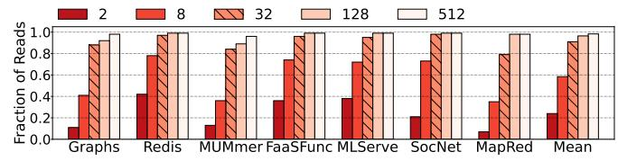
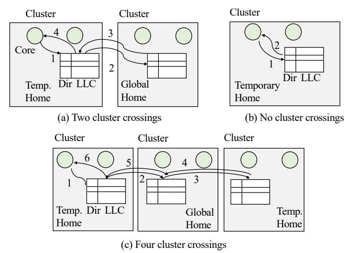
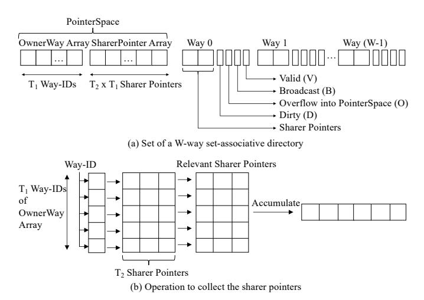
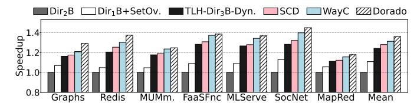
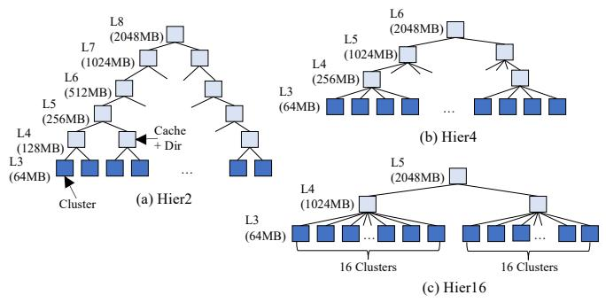
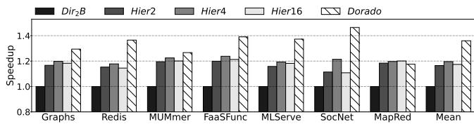
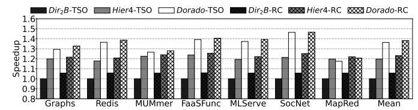

# Dorado: Clustered Hardware Cache Coherence for 1,000+ Cores

Jovan Stojkovic, Abraham Farrell, Gerasimos Gerogiannis, Zhangxiaowen Gong\*, Christopher J. Hughes\*, Josep Torrellas {jovans2, af28, gg24, torrella}@illinois.edu, {zhangxiaowen.gong, christopher.j.hughes}@intel.com

Abstract—As processors continue to grow in size, they will soon include over one thousand cores and, in at least some markets, require hardware cache coherence over all of the cores. In these systems, the costs of coherence transaction latency/traffic and directory storage will escalate. An intuitive way to contain these costs is to group cores into clusters and exploit intra-cluster locality. However, latency/traffic gains are thwarted by the need to access home directories in remote clusters, and storage reductions are limited by having to track many sharers.

To address these obstacles, this paper introduces *Dorado*, a new directory-based coherence protocol for 1,000+ cores that exploits clusters. Dorado makes three contributions. First, while each line has a Global home directory slice, it can also have Temporary home directory slices in each of the clusters where and while it is referenced. This minimizes high-latency/traffic transactions. Second, a directory can contain different types of entries and sharer pointers, each behaving differently. To use space efficiently, Dorado allows them all to dynamically share the same hardware structures—adapting their relative space to the workload sharing patterns. Third, to support manysharer lines with modest directory storage, Dorado introduces a simple mechanism for directory entries to grow into a shared area. Simulations of 1024 cores running a variety of workloads show that Dorado is effective. It attains an average speedup of  $1.36 \times$  over a same-area limited-pointer protocol by reducing the average load latency by 46.1%. Further, Dorado stays within 1% of the performance of a full bit vector protocol while using  $2.75\times$ less directory storage.

#### I. Introduction

Data center processors continue to grow in core count, due to increased computing demand by workloads, and the desire to amortize system cost across more cores. Recent systems include AMD's 128-core Bergamo [4], AmpereOne's 192-core system [5], and Intel's 288-core Sierra Forest [3]. These processors support the cache-coherent shared-memory paradigm. This is because most software systems expect it, including key workloads such as graph analytics, in-memory key-value stores, scientific computations, and many ML inference applications.

Supporting a single coherence domain across potentially thousands of cores can add significant overheads. Two important sources of overhead are the long latency and traffic induced by coherence transactions, and the directory storage required to track data sharers [38]. To support coherence, processors typically use a physically-distributed directory, where each core is located close to a slice of the directory and Last Level Cache (LLC). Each memory line is logically associated with a specific *home* directory slice. Typically, a

coherence transaction accesses the home directory slice of the line, which is possibly located far from the requesting core. Then, the directory may send messages to various caches that must respond before the transaction ends. A transaction's latency and traffic can be high and grows with the core count.

Directories need storage to track, for each memory line, which caches store it and in what state. To track data sharing precisely, the directory size scales quadratically with the core count. More cores generally implies more total cache capacity. Thus, there are more lines to track in directories and, for each line, more potential pointers to sharers of the line.

An intuitive way to contain the latency and traffic costs of coherence is to design the protocol to enable clusters of cores to operate on shared lines mostly locally, without requiring remote transactions. For this, one has to minimize the need for coherence transactions on a line to access the line's home directory slice—which may be in a remote cluster. This is shown in Figure 1(a), where Core A in Cluster 1 accesses a line whose home directory slice is in Cluster 2. The directory entry is shown in dark blue.

Fig. 1. Distributed directory organizations.

Even if one can localize transactions within clusters, there is still the obstacle that a line may be shared by many cores and clusters and, thus, the directory needs substantial storage. Since most lines are not widely shared [22], researchers have proposed low-storage directories (e.g., [1], [23]). However, *some* entries still need to track many sharers [14], [55], [56]. This is likely to get worse for 1,000+ core machines.

To address both latency/traffic and storage overheads, this paper presents *Dorado*, a new directory-based cache coherence protocol for 1,000+ cores that exploits clusters. Dorado introduces three ideas. First, Dorado introduces a new approach that enables clusters of cores to operate on lines locally, reducing the number of remote transactions needed. The idea is that, while each line still has a home directory slice (called *Global home*), it can also have a *Temporary home* directory slice in each of the clusters where and while it is referenced. The directory entry in a Temporary home is allocated/deallocated on demand. Figure 1(b) shows the Global and Temporary home slices and directory entries for the line accessed by core

TABLE I
PARTIAL LIST OF THE TECHNIQUES THAT CAN IMPROVE THE SCALABILITY OF DIRECTORY-BASED CACHE COHERENCE PROTOCOLS.

| Technique                                    | Reduce Storage? | Reduce Latency? | Reduce Traffic?     | Main Cost                                          |
|----------------------------------------------|--------------------|--------------------|------------------------|----------------------------------------------------|
| Bloom-filter directory [67], [70]            | ✓                  | ×                  | ×                      | Longer-latency directory-entry lookup and eviction |
| Coarse-grain tracking [8], [41]              | ×                  | _                  | $\checkmark$           | Region tracking hardware                           |
| Multi-grain coherence [12], [14], [66]       | $\checkmark$       | ×                  | ✓                      | Multi-grain tracking hardware                      |
| Cuckoo directory [16]                        | $\checkmark$       | _                  | _                      | Directory insertion                                |
| OS alternative [13], [15], [28], [31], [61]  | $\checkmark$       | ×                  | ×                      | OS invocations                                     |
| Overflow dir into LLC [10], [29], [57]       | $\checkmark$       | ×                  | _                      | Costly directory operations & less LLC capacity    |
| Home delegation [11], [50], [51]             | ×                  | $\checkmark$       | ✓                      | Hardware metadata to locate delegated homes        |
| Reduce invalidation ACKs [33]                | $\checkmark$       | _                  | ×                      | Broadcast and no silent evictions                  |
| Duplication of directories and memory [45]   | ×                  | $\checkmark$       | ×                      | Reduced main-memory capacity                       |
| Network optimization [26]                    | ×                  | $\checkmark$       | $\checkmark$           | Tables to keep owners and multicast trees          |
| Transaction prediction [24], [46]            | ×                  | $\checkmark$       | $\checkmark$           | Hardware to record and predict transactions        |
| Various optimizations [32], [35], [60], [62] | $\sqrt{-\times}$   | $\sqrt{-\times}$   | $\checkmark$ $ \times$ | Additional hardware                                |

A. We call this idea *Two-Level Homes* (TLH). TLH enables many transactions to be satisfied locally within a cluster.

Second, because of the Global and Temporary homes and other design decisions, a directory slice can now have different types of entries and different types of sharer pointers. Hence, one must decide how to provision the storage. To address this question, Dorado uses *a single directory entry structure*. It allows all types of entries and pointers to dynamically compete for the same storage space, adapting to the workload's sharing patterns—an idea we call *Dynamic Apportioning*.

The third idea in Dorado supports the set of lines that have many concurrent sharers. Dorado extends prior work with a new scheme that allows the directory entries in a directory set to compete for additional sharer pointers dynamically and with fine grain. We call this scheme *SetOverflow*.

TLH is different from a two-level directory [31], [61], where there is an intra-cluster directory tracking local sharers and an inter-cluster directory tracking sharing at the grain of clusters. With TLH, there is only one type of directory that records both sharer clusters and local sharer cores; there is a single protocol, not an intra-cluster protocol and an intercluster protocol. Further, TLH is different from a hierarchical directory [21], [38], [43], [52], where the machine is organized in a multi-level hierarchy of cache and directory layers.

**Results.** Simulations of 1024 cores running a variety of workloads show that Dorado attains high performance. It achieves an average speedup of  $1.36\times$  over a same-area conventional limited-pointer protocol by: (1) reducing the average load latency by 46.1%, and (2) reducing the average number of invalidation messages by 39%. In addition, Dorado stays within 1% of the performance of a full bit vector protocol while using  $2.75\times$  less directory storage.

Contributions. The contributions of this work are:

- The Dorado clustered protocol that enables low-latency/traffic coherence transactions via *Two-Level Homes*.
- *Dynamic Apportioning* the directory space between different types of entries and pointers.
- The SetOverflow design for many-sharer directory entries.
- • An evaluation of Dorado comparing it to other designs.

#### II. BACKGROUND

A simple organization of a directory entry has a bit vector with as many bits as cores, denoting which cores cache the line, plus a Dirty (D) bit specifying if the line is dirty in the cache(s). To reduce the size of a directory entry, limited-pointer schemes [1], [9], [23] store only a few pointers per directory entry. Schemes with n pointers per entry are called  $Dir_n$ , and lose the ability to track more than n sharers for a line. Hence, the  $Dir_nB$  scheme [1] sets a Broadcast (B) bit when the number of sharers exceeds n. The coarse vector approach [23] reorganizes the pointers to track groups of cores.

- 1. Main Lines of Research in Scalable Coherence. To improve scalability, a technique can reduce memory access latency, traffic, or directory storage. Typically, a technique improves 1-2 of these measures at the expense of the other(s). Table I lists some of these techniques, marking their positive  $(\checkmark)$ , negative  $(\times)$ , or neutral (-) impact on these measures, and their main cost. Many can be combined with Dorado.
- Tagless coherence directory [67] and SPATL [70] use bloom filters as directory entries. They reduce directory storage but increase traffic due to false positives in filters. SPATL [70] has a table of sharing patterns to further reduce space at the cost of extra traffic due to imprecise tracking. Both designs increase the latency of directory lookups and evictions.
- Coarse-grain coherence tracking [8], [41] keeps additional information used to optimize accesses when the sharing patterns for all the lines within a region (e.g., a page) are similar. Then, traffic is reduced at the expense of additional storage. The main cost is region tracking hardware.
- In multi-grain coherence [12], [14], [66], coherence is tracked at granularities coarser than a cache line. It reduces storage and traffic, but increases latency due to extra checks.
- Cuckoo directory [16] organizes the directory as a cuckoo hash table. Compared to a conventional directory, this design can support the same number of directory entries with a smaller size, but it has longer directory entry insertions.
- Some designs offload part of the functionality to keep cache coherence to the OS [13], [15], [28], [31], [61]. Some support line-level coherence in hardware within nodes and page-level coherence by the OS across nodes, while others use the OS to remap pages dynamically. While they may reduce storage size, they often increase traffic/latency due to the OS overheads.
- Some techniques overflow directory information into the LLC. In WayPoint [29], the sharer pointers of a directory entry can overflow into the LLC; in ZeroDEV [10] and Tiny

Directory [57] full directory entries can overflow into the LLC. Although this approach reduces storage, accessing the directory, processing invalidations, and evicting or inserting directory entries are more expensive.

- Home delegation techniques [11], [50], [51] avoid the indirection of accessing the home directory. Instead, messages are sent directly from node to node. These techniques reduce access latency and traffic. Some of them require hardware to detect and record sharing patterns [11], while others need extra storage for additional metadata [50], [51].
- $\bullet$  A directory entry in ACKwise [33] keeps few sharer pointers but, when it overflows, it records the number of sharers N. On a write, it broadcasts an invalidation but only expects N ACKs. While it saves directory storage, it increases traffic through broadcasting and by making clean line evictions not silent.
- To recover from DRAM failures, Dvé [45] duplicates every memory and directory entry in two nodes of a NUMA machine. Replication helps reduce latency, as a cache accesses the closer of the two directory/memory entries, but doubles the memory storage needed and creates traffic (both home and replica need to be updated on a write back).
- As an example of network optimization, Virtual Tree Coherence [26] adds hardware to multicast a message to all sharers. Messages are sent to the sharer at the root of the tree and multicast to all sharers following a virtual tree using hardware stored in routers. This scheme saves latency and traffic but adds storage and special hardware.
- Some techniques use prediction to reduce transaction latency or traffic. PATCH [46] uses prediction to improve the performance of directory lookups, and Push Multicast [24] speculatively sends shared data from the LLC to predicted sharers. The cost is hardware to record and predict transactions.
- Other techniques optimize a certain type of transaction or sharing pattern. They include optimizations for migratory sharing [60], for data accessed in a one-off manner [32] (i.e., the requested word can only be used it once), or for various sharing patterns [35]. They also include creating linked lists of sharing caches [62]. These techniques have different impact on storage, latency, and traffic, but they all need extra hardware.

There are techniques that address a related but different problem from enhancing the scalability of a single cache coherence domain. Victim Replication [69] stashes a copy of a core's private cache victims into the closest partition of a shared cache; if stashed data is reused before eviction, it saves latency. CDR [17] adds an extra translation layer in a multiprocessor that enables a virtual machine (VM) to limit its coherence domain to a few physically-close cores and directories. Then, the threads of an application communicate with low latency. DiCo-Providers/Arin [19] are coherence protocols for server consolidation that reduce directory overhead by partitioning the chip into fixed, per-VM areas and managing coherence within each area. They provide a mechanism to communicate across areas at a higher cost. Virtual Hierarchies [39] is an environment of multiple VMs, where each VM owns a set of cores. The cores of a VM share a cache coherence protocol. If a VM needs data from another VM, it sends

Fig. 2. Hierarchical or tree-based coherence.

a request to a global second-level directory. The last two schemes are different from Dorado in that they introduce new, more expensive transaction types to communicate across VMs.

2. Hierarchical Coherence Protocols. Some work organizes the machine in a hierarchy of cache layers [21], [38], [43], [52] (Figure 2). Each cache entry includes a directory entry that records which caches in the next lower layer have the line. As cores reference lines, lines migrate to the appropriate subtrees. If the sharing pattern has good locality and includes many reads, many accesses are satisfied without going to the upper tree levels.

While interesting, this design has limitations. First, it needs a large total cache capacity. Second, tree traversals suffer long latencies due to multi-level cache look-ups—especially for writes, which must go up the hierarchy and then down to identify and invalidate copies. Third, it is hard to integrate this organization into mainstream directories for two reasons. First, the structure of protocol messaging in hierarchical machines is different from in mainstream flat protocols. In the latter (like Dorado, as we will see) the traffic directly flows from a cluster to the home, which acts as the serialization point. In a hierarchical directory, coherence messages follow the tree hierarchy of directories up and down, serializing at roots of subtrees. Second, the hardware in mainstream flat protocols is more modular: one increases the size of the machine by adding more clusters (Figure 1). All the hardware is exactly the same. In hierarchical protocols, when one adds more compute leaves (i.e, additional clusters), one also needs to add a different type of hardware: more cache/directory levels (Figure 2).

3. Supporting Many Sharers for a Small Fraction of **Directory Entries.** Several works provide a combination of many directory entries with few pointers and few directory entries with many pointers. Fang et al. [14] statically partition the entries in each directory set into limited-pointer entries and full bit-vector entries. They migrate entries between ways as needed. Way Combining [64] allows multiple directory entries in the same set to be assigned to a single line address, combining their sharer pointer space for extended coverage. SCD [55] dynamically creates directory entries with many sharers by having "root" entries, pointing to multiple "leaf" directory entries in other locations in the directory. Each leaf points to a set of sharer cores in a specific core-group. SCD uses the nonstandard ZCaches [54], which increase directory associativity and, therefore, reduce directory conflicts, at the cost of a more complex design. SpongeDirectory [68] is similar. The Pool directory [56] supports many-sharer directory entries by

Fig. 3. L2-missing data reads to lines with remote homes that can be satisfied locally. We show the number of cores per cluster.

Fig. 4. Fraction of cache lines accessed by a core that have the home in a remote cluster.

dynamically allocating structures with sharer information from a centralized global pool of sharer pointers. Dorado adds to all this work with the *SetOverflow* technique that we believe is simple and flexible. We evaluate *SetOverflow* for 1024 cores, while all prior works except SCD were evaluated with at most 128 cores.

#### III. SHARING CHARACTERISTICS WITH 1,000+ CORES

To build a coherence protocol for 1,000+ cores, we analyze the sharing patterns of several cloud workloads described in Section VI. Here, we model a vanilla MESI protocol in a flat directory with no sharer pointer limitations. We model 1024 cores organized by default in 32-core clusters. The organization, shown in Figure 5, will be described later. Each core sits next to a slice of the directory and LLC, and each line has its home in a directory slice. We use first-touch page allocation (Section VI), and trace instruction and data accesses. We focus on two aspects of cache coherence.

• Due to locality, the cores in a cluster may be able to satisfy most data load misses locally. We refer to hardware inside a cluster as local, and outside as remote. On a load miss, the hardware checks the line's home, which may be in a remote cluster. However, when a requester accesses a line with a remote home and a local core has the line, the requester can get the line from the local cluster, avoiding a remote access.

Figure 3 shows how often this case occurs. For different cluster sizes, it shows the fraction of L2-missing reads to data lines whose home is remote but that could be provided locally (if they have not been evicted from local caches). For clusters of 32 cores and beyond, on average over 91% of these transactions can be satisfied locally. Hence, if the protocol is enhanced to create a "local temporary" directory in addition to the home directory, nearly all loads from clusters of 32 cores and beyond can be handled locally.

This behavior is not due to the application being written in a "clustered" manner, with groups of threads having special affinity for common data. Instead, it is mostly due to the presence of many lines that are read-mostly and accessed by many threads. After a local core accesses and brings such a line locally, subsequent local cores access the line locally.

• Different workloads have different fractions of local- and remote-homed accesses. If we allow a cluster's directory slices

Fig. 5. 1024-core organization that supports Dorado.

to also include entries for accessed lines whose home is remote, how do we partition the directory space between entries for remotely- and locally-homed lines? Figure 4 shows the fraction of data cache lines accessed by a core that have a remote home (for 32-core clusters). We see varied workload behavior: the Redis key-value store (*Redis*) accesses mostly remote data, while the serverless workload (*FaaSFunc*) accesses mostly local data. Hence, a fixed partition between local and remote directory entries is suboptimal. A directory should be *dynamically* partitioned between both entry types.

#### IV. DORADO: A SCALABLE DIRECTORY PROTOCOL

Based on the previous observations, we design *Dorado*, a directory-based cache coherence protocol for 1,000+ cores that exploits clusters to contain the costs of coherence.

#### A. Processor Organization and Main Idea

Dorado is built on a processor where cores are physically organized in clusters. Figure 5 shows a possible organization, with 32 clusters of 32 cores, for a total of 1024 cores. Each cluster has a local network, where each switch is connected to one slice of the directory-LLC and a core with its private caches. Each directory slice is composed of a *Traditional Directory* (TD) and an *Extended Directory* (ED) [65]. The TD entries are associated one-to-one with the LLC entries. The ED (also called *snoop filter*), is needed to support a non-inclusive cache hierarchy [25]. The ED has directory entries for lines that are in private caches (i.e., L2) but not in the LLC. The ED and TD can have a different number of entries.

The physical address of a line determines the cluster and the directory slice within the cluster that is the *home* of the line. The directory entry of the line can be in either the TD or the ED of the home. We call this slice the *Global home* of the line. By extension, the cluster with the Global home slice is called the Global home cluster of the line, and the directory entry is called the Global home directory entry.

To reduce the latency of accessing directory entries in such a large machine, Dorado introduces the concept of *Temporary home* directory slices and *Temporary home* directory entries. When a core accesses a line whose Global home is remote, Dorado sets one of the local directory slices to be the Temporary home of the line. The chosen slice is determined by hashing the physical address of the line. In that slice, Dorado allocates a Temporary home directory entry for the line. The entry remains there for as long as it is not evicted. A line can have Temporary home directory entries in multiple clusters.

TABLE II TYPES OF SHARER POINTERS IN DORADO.

| Pointer Type | Global Home of the Line | Sharer of the Line | Contents of the Pointer | Type of Data in the Line |
|-----------------|----------------------------|-----------------------|----------------------------|-----------------------------|
| LLptr           | Local                      | Local                 | Local Core ID              | Local data                  |
| LRptr           | Local                      | Remote                | Remote Cluster ID          | Local data                  |
| RLptr           | Remote                     | Local                 | Local Core ID              | Remote data                 |

Dorado keeps the directory entries of a line in the Global and Temporary homes consistent.

We call the notion of having a Global and multiple dynamic Temporary homes for a line *Two-Level Homes* (TLH). Multiplicity of homes for a line takes extra space, but each home has a different purpose: Temporary homes reduce access latency and bandwidth, while the Global home acts as the final serialization point of the coherence transactions to the line.

# *B. Basics of the Dorado Coherence Protocol*

A directory slice S in a cluster may need to maintain the following different types of sharer pointers:

- *Local-Local pointer (LLptr) for a local line cached in a local core.* This is a line whose Global home slice is S and is cached in a core in the local cluster. As shown in Table [II,](#page-4-0) the sharer pointer in S that tracks the sharer of the line contains a local core ID.
- *Local-Remote pointer (LRptr) for a local line cached in a remote core.* This is a line whose Global home slice is S and is cached in a core at a remote cluster. The line has a directory entry both in S (its Global home) and in the cluster of the sharer core (a Temporary home). The pointer in S is an *LRptr* and contains a remote cluster ID (Table [II\)](#page-4-0).
- *Remote-Local pointer (RLptr) for a remote line cached in a local core.* This is a line whose Global home slice is in a remote cluster and is cached in a core in the local cluster. S is a Temporary home slice for the line. The line has a directory entry in S and in its (remote) Global home slice. The pointer in S is called *RLptr* and contains a local core ID (Table [II\)](#page-4-0).
- 1. Dynamic Apportioning: Combining Different Data and Pointer Types. A naive design would break a directory-LLC slice into several structures, one for each of the types of data and pointers that exist in Dorado: EDs for LLptrs, LRptrs, and RLptrs; TDs for LLptrs, LRptrs, and RLptrs; and even LLC partitions for local and remote lines. This is shown in Figure [6\(](#page-4-1)a). Unfortunately, it would be hard to size each structure. Given the variation that exists across applications (Figure [4\)](#page-3-2), any sizes we pick would be suboptimal for many applications. Instead, Dorado assigns all the types of data and pointers to the same hardware structure, and lets each type of data and pointer *compete* for space dynamically. During execution, space will be continuously re-assigned dynamically. We call this idea *Dynamic Apportioning*.

To see how this works, assume that a local core accesses a local line. A local directory slice creates an entry with an LLptr. Depending on the directory allocation algorithm, the entry is created in either TD or ED. Figure [6\(](#page-4-1)b) shows both cases: a TD entry with LLptr and associated LLC entry with the local line, and an ED entry with LLptr without any associated LLC entry. Now, suppose that the lines tracked by

Fig. 6. A directory-LLC slice in *Dorado*.

these directory entries are also accessed by a remote core. The directories need to record this with an LRptr. Hence, we place the LRptr in one of the unused pointers of the same directory entries. This is shown in Figure [6\(](#page-4-1)c). All we need is a way to distinguish the two pointer types, since one is a local core ID and the other a remote cluster ID. We do so with one extra bit per pointer. For example, if the machine has 32 clusters with 32 cores each, each pointer is 6 bits: 1 to tell the pointer type and 5 to tell the core ID or cluster ID.

Suppose a core accesses a remote line. Dorado allocates a Temporary home directory entry in one of the local slices (e.g., the one we have considered in the example) and tracks the sharer with an RLptr. Again, the new directory entry can go to TD or ED. Figure [6\(](#page-4-1)d) shows the two cases.

For the TD and ED, sizing the total number of pointers per directory entry is less onerous than sizing the number of LLptrs and the number of LRptrs separately in two structures. Given a total number of pointers, workloads with mostly local sharers will fill them with LLptrs, while those with mostly remote sharers will fill them with LRptrs. Similarly, sizing the total number of TD (and ED) entries is easier than sizing the number of entries with local data and the number of entries with remote data separately in two structures. We can size the total number of entries based on the estimated working set of the local threads, and dynamically handle workloads with mostly local or with mostly remote lines in it.

2. Operation with Two-Level Homes (TLH). To understand how the TLH idea works, consider the clustered machine of Figure [7\(](#page-5-0)a). While each cluster has multiple directory-LLC slices, for simplicity, we only show one in each cluster. A core in the left cluster initiates a write miss to a line whose Global home is remote.

Dorado first checks the local directory-LLC slice that may contain the Temporary home entry for the line. If there is no entry for the line (or its state is such that the transaction cannot be satisfied locally), the Global home is accessed. When the Global home responds, a directory entry for the line is created in the Temporary home if it did not exist. In this transaction, the directory-LLC entries for the line in *both* the Temporary and Global homes are updated, so that future accesses to the line from local cores have a higher chance of being satisfied

Fig. 7. Operation of the Two-Level Homes (TLH) in Dorado.

by the Temporary home: e.g., if the line is brought locally in state Modified (M), a future write from *another* local core does not access the Global home (Figure 7(b)).

Some transactions require accesses to third clusters—e.g., writing to a remote line that is cached in M state in a third cluster (Figure 7(c)). In this case, there is a Temporary home directory entry for the line in that cluster, and is also accessed. This is a 4-cluster crossing transaction that can be optimized to 3 crossings like prior NUMA protocols [36]. The directories in the Global and the two Temporary homes are updated.

Accessing multiple directory entries (Temporary and Global homes) for a line in a transaction does not cause inconsistency or deadlock. Inconsistency is avoided since, when accessing multiple homes, the serialization point is the directory entry in the Global home. Deadlock is avoided since, given a transaction T that may change the state of the Global home, T cannot lock any resource in a Temporary home until T has reached and successfully locked the entry in the Global home. An example is shown in the write of Figure 8(b) in Section IV-C.3. The reason is that such transaction may be unable to lock the Global home entry because another transaction to the same line has already locked it.

#### C. Detailed Operation of Dorado

Given a requester core in a cluster C, we say that a line is local if its Global home is in C. Also, local L2s, LLC, and directory are those in C. We do not use the word slice when referring to the directory and LLC, but it is implied. Further, we use directory to mean the combined ED and TD. Due to the ED, it is possible that a line has a directory entry in a cluster but the line is not present in the LLC of that cluster.

For simplicity, we describe Dorado using MSI coherence, although our evaluation uses MESI. Also for simplicity, when a core writes to a cached line in Shared (S) state, the transaction is similar to a write miss—i.e., the response brings the line rather than just a *grant*.

Dorado introduces a change to MSI/MESI. Specifically, consider a core that writes to a remote line, after which Dorado creates a Temporary home entry in the local directory with D=1. If a second local core reads the line, one could transfer

| A1: Local line and | Get line from local DRAM. Create dir entry locally. Add       |
|--------------------|---------------------------------------------------------------|
| no local dir entry | LLptr and D=0.                                                |
| A2: Remote line    | Access the Global home and do: {If dir entry does not exist,  |
| and no local dir   | get line from DRAM and create dir entry with D=0. Always,     |
| entry              | add LRptr to dir entry}. Bring line from remote cluster.      |
|                    | Create dir entry locally. Add RLptr and D=0.                  |
| A3: Local dir en-  | Get line from local LLC, another local L2, or one of the      |
| try with any com-  | remote sharer clusters. In local dir entry, add LLptr.        |
| bination of LLptrs |                                                               |
| and LRptrs         |                                                               |
| A4: Local dir en-  | Get line from local LLC, another local L2, the Global home,   |
| try with RLptrs    | or one of the remote sharer clusters. In local dir entry, add |
|                    | RLptr.                                                        |

the updated line to the Global home to update memory, and change both the Global and Temporary home directory entries of the line to D=0. To avoid this transfer, Dorado instead keeps D=1 in the Temporary home directory entry, but marks both local cores as keeping the dirty line (with RLptrs pointers). Both cores mark the line in their cache with a new cache state: ModifiedShared (MS). We say that they are sharers of the dirty remote line. If one of the cores later writes the line, it invalidates the other and sets its cache to the conventional M state. This design avoids remote transfers.

We now describe the protocol by considering all 4 types of misses in the last level of private cache (i.e., L2). When we create a Global or a Temporary home entry in a TD, we always insert the data line into the corresponding LLC entry. For brevity, this is not explicitly repeated every time.

1. Core Read Miss in L2 and Line not Modified Anywhere. Table III shows the four possible transactions. If the requested line is local and there is no local directory (dir) entry for it, the L2 gets the line from the local DRAM, and the hardware creates a dir entry locally, setting the Dirty (D) bit to 0 and adding an LLptr. If, instead, the line is remote and there is no local dir entry for it, the transaction accesses the Global home of the line and creates a Global dir entry if none exists. The Global dir entry adds an LRptr. Then, the transaction brings the line to the local cluster, where it creates a Temporary home: a dir entry with an RLptr and D=0.

The other cases are when there is already a local dir entry for the line. If the entry has any combination of LLptrs and LRptrs, the L2 gets the line from either the local LLC, another local L2, or one of the remote sharer clusters, in that priority order. In the local dir entry, the hardware adds an LLptr. If, instead, the entry has RLptrs, the L2 gets the line from either the local LLC, another local L2, the Global home, or one of the remote sharer clusters, in that priority order. In the local dir entry, the hardware adds an RLptr.

# 2. Core Read Miss in L2 and Line Modified Somewhere.

Table IV shows the four possible transactions. If the line is remote and there is no local dir entry, the transaction accesses the Global home, where the line *must* have a dir entry. It downgrades the owner cache (which is either in the Global home cluster or in a third cluster). It then sets the dir entry in the Global home (and in the third cluster, if it exists) to D=0, and adds the requesting cluster as an LRptr in the Global home's dir entry. The transaction then writes back the line to memory and brings it to the local cluster, where it creates a

TABLE IV CORE READ MISS IN L2, LINE MODIFIED SOMEWHERE.

| B1: Remote line | Access the Global home, where the dir has an entry with        |
|-----------------------|----------------------------------------------------------------|
| and no local dir en   | D=1, and do: {Downgrade the owner cache (which is either       |
| try                   | in the Global home cluster or in a third cluster) to Shared    |
|                       | (S). Set dir entry in the Global home (and in the third        |
|                       | cluster, if it exists) to D=0. Add requesting cluster as LRptr |
|                       | sharer in the Global home's dir entry}. Write back the line    |
|                       | to memory and bring it to local cluster. Create local dir      |
|                       | entry. Add RLptr and D=0. If the third cluster had multiple    |
|                       | owners in MS state, all of them are downgraded.                |
| B2: Owner is LLptr    | Get line from corresponding local L2. Downgrade owner          |
| in local dir entry    | cache and write back the line to memory. In local dir entry,   |
|                       | add LLptr and D=0.                                             |
| B3: Owner is LRptr    | In the owner remote cluster: 1)Downgrade the owner             |
| in local dir entry    | cache(s) and 2)Set D=0 in the dir entry. Next, bring the       |
|                       | line to the local cluster and write back the line to memory.   |
|                       | In local dir entry, add LLptr and D=0.                         |
| B4: Owner is RLptr    | Get line from the owner's local L2. In local dir entry, add    |
| in local dir entry    | RLptr and keep D=1. Both the current owner and the reader      |
|                       | change their cache states to ModifiedShared (MS).              |

local dir entry and adds an RLptr and D=0. If the third cluster had multiple owners in MS state, all of them are downgraded.

The three remaining cases are that the line has a local dir entry and the owner is pointed to by an LLptr, LRptr, or RLptr pointer. In the first case, the L2 gets the line from the corresponding local L2, and the transaction downgrades the owner cache, writes back the line to memory and, in the local dir entry, adds the requester as LLptr, and sets D=0. In the second case, the request is sent to the owner remote cluster (pointed by LRptr), where the owner cache(s) are downgraded and the dir entry is changed to D=0. Next, the line is brought to the local cluster and written back to memory. The local dir entry adds the requester as LLptr and sets D=0. In the third case, the L2 gets the line from the owner's L2, which is local. The local dir entry adds the requester as RLptr and keeps D=1. As said above, both the current owner and the reader change their cache states to MS without any message to the Global home of the line.

# 3. Core Write Miss in L2 and Line not Modified Anywhere, or Core Write Hit in L1/L2 on a Cached Line in S State.

Table [V](#page-6-2) shows the six transactions possible in this case. The cases are similar to those for a read miss and the line is not modified anywhere (Table [III\)](#page-5-2), except that now, the sharers are invalidated, the dir entries in remote sharer clusters that are not the Global home are removed, and the entry in the local dir and Global home dir are marked D=1.

For illustration, Figure [8\(](#page-6-0)a) shows case *C5*: the local dir entry has LLptrs and LRptrs (and therefore the local cluster is the Global home). The messages are numbered in time order. The requester core issues the write (1). The caches pointed to by LLptrs in the dir entry receive invalidations (2a) and ack them (3a). In parallel, the remote clusters pointed to by LRptrs are visited (2b), their dirs are checked, and the caches pointed to by the RLptrs receive invalidations (3b) and ack them (4). In such clusters, the remote dir entries are removed and acks are sent back to the local cluster (5), which updates the dir entry and supplies the line to requester (6).

Figure [8\(](#page-6-0)b) shows case *C6*: the local dir entry has RLptrs (and thus the local cluster is not the Global home). The requester writes (1). Then, the caches pointed by RLptrs in the local dir receive invals (2a) and ack them (3a). The local dir

#### TABLE V

CORE WRITE MISS IN ITS L2 AND LINE NOT MODIFIED ANYWHERE, OR WRITE HIT IN ITS L1/L2 ON A SHARED (S) LINE.

| C1: Local line and    | Get line from local DRAM. Create dir entry locally. Add         |
|-----------------------|-----------------------------------------------------------------|
| no local dir entry    | LLptr and D=1.                                                  |
| C2: Remote line | Access and do the following in the Global home cluster:         |
| and no local dir en   | {If dir entry does not exist, get line from DRAM, create dir    |
| try                   | entry, and add LRptr and D=1. Otherwise, do: 1)Invalidate       |
|                       | all sharers in the Global home cluster and in third clusters,   |
|                       | 2)Remove dir entry in any third cluster, and 3)in Global        |
|                       | home cluster, update dir entry to have only the requester's     |
|                       | LRptr and D=1}. Bring the line from the Global home to          |
|                       | the local cluster. Create dir entry locally. Add RLptr and      |
|                       | D=1.                                                            |
| C3: Local dir entry   | Get line from LLC or from another local L2. Invalidate          |
| with all LLptrs       | all local sharers. Update local dir entry to have only the      |
|                       | requester's LLptr and D=1.                                      |
| C4: Local dir entry   | Get line from local LLC or from one of the sharer clusters'     |
| with all LRptrs       | LLCs or L2s. Invalidate all the sharers in the sharer clusters. |
|                       | In those clusters, remove the dir entry. In local cluster,      |
|                       | update the dir entry to have only the requester's LLptr and     |
|                       | D=1.                                                            |
| C5: Local dir entry   | Combine the actions in C3 and C4.                               |
| with a combination    |                                                                 |
| of LLptrs, LRptrs     |                                                                 |
| C6: Local dir entry   | Invalidate local sharers and remove local dir entry. Access     |
| with RLptrs           | the Global home and do there: {1)Invalidate all sharers in      |
|                       | the Global home cluster and in third clusters (not including    |
|                       | the local cluster), 2)Remove dir entry in any invalidated       |
|                       | third cluster, and 3)in Global home cluster, update dir entry   |
|                       | to have only the requester's LRptr and D=1}. Bring the line     |
|                       | from the Global home to the local cluster. Create dir entry     |
|                       | locally. Add RLptr and D=1.                                     |

Fig. 8. Write miss transactions to unmodified data: the local cluster is the Global home (a) or it is not (b).

entry is removed. In parallel, the Global home is visited (2b) and its dir entry is checked. Any caches in the cluster pointed to by LLptrs get invals (3ba) and ack them (4ba), while third clusters pointed to by LRptrs (except for the requesting one) are also visited (3bb). In those clusters, the dir entry is checked and any caches pointed to by RLptrs get invals (4bb) and ack them (5). The dir entry in these third clusters is removed and acks are sent to the Global home (6), which updates its dir entry to have only an LRptr pointing to the requester and D=1. The line is sent to the local cluster (7), which creates a dir entry with only the requester's RLptr and D=1. Then, the line is sent to the requester (8).

# 4. Core Write Miss in L2 and Line Modified Somewhere. Table [VI](#page-7-0) describes the four transactions possible in this case.

TABLE VI CORE WRITE MISS IN L2 AND LINE MODIFIED SOMEWHERE.

| D1: Remote line | Access the Global home, where the dir has an entry with         |
|-----------------------|-----------------------------------------------------------------|
| and no local dir en   | D=1, and do: {Write back the line and invalidate the owner      |
| try                   | cache (which is either in the Global home cluster or in a       |
|                       | third cluster). If owner was in a third cluster, remove dir     |
|                       | entry in the third cluster. In the Global home, update dir      |
|                       | entry to have only the requester's LRptr and keep D=1}.         |
|                       | Bring the line to local cluster. Create local dir entry. Add    |
|                       | RLptr and D=1. If the third cluster had multiple owners in      |
|                       | MS state, all of them are invalidated.                          |
| D2: Owner is LLptr    | Get line from the owner's L2. Invalidate owner cache.           |
| in local dir entry    | Update local dir entry to have only the requester's LLptr       |
|                       | and keep D=1.                                                   |
| D3: Owner is    | In the owner remote cluster, do: {1)Get the line from an        |
| LRptr in local dir    | owner, 2)Invalidate the owner(s), and 3)Remove the dir          |
| entry                 | entry}. Bring the line to local cluster. Update local dir entry |
|                       | to have only the requester's LLptr and keep D=1.                |
| D4: Owner(s) is/are   | Get line from an owner's local L2. Invalidate the owner(s).     |
| RLptr in local dir    | Update local dir entry to have only the requester's RLptr       |
| entry                 | and keep D=1.                                                   |

These cases are similar to combinations of Tables [IV](#page-6-1) and [V.](#page-6-2) Case *D4* occurs when a remote line has been modified and is kept in one or more local cache(s) pointed by RLptr(s). If there is a single RLptr pointer, the corresponding core (call it c1) wrote the line and keeps it cached in state M. However, if after c1 wrote, a second local core (call it c2) reads the line, the local dir entry keeps D=1 and adds a new RLptr to point to the reader, without informing the Global home dir (explained in Case B4 in Table [IV\)](#page-6-1). The caches of both c1 and c2 share the dirty line and transition to state ModifiedShared (MS). In Case *D4*, the new writer invalidates the multiple MS sharers and loads the line in M state—again, without informing the Global home dir.

# *D. Efficient Many-Sharer Directory Entries*

From past work [\[22\]](#page-13-4), it is known that a storage-efficient directory design needs to support only a few sharers for most of the lines, and many sharers for very few lines. To support such a design, Dorado includes a new scheme that we call *Per-Set Overflow Pointers* (*SetOverflow*). As we describe the scheme, directory refers to both TD and ED.

In *SetOverflow*, each set of a set-associative directory has a structure with sharer pointers (*PointerSpace*) that can be used by one or more of the ways in the set when such ways overflow their own set of pointers. Figure [9a](#page-7-1) shows one set of a W-way set-associative directory with SetOverflow. It shows the directory of each way (which includes two sharer pointers) and the PointerSpace. The PointerSpace has two arrays: *SharerPointer* and *OwnerWay*. SharerPointer has the overflow pointers; OwnerWay has the IDs of the ways that are using those pointers. To save space, each of the T1 entries in OwnerWay owns T2 consecutive entries in SharerPointer: e.g., inserting a way ID in the first entry of OwnerWay allows that way to use the first T2 entries in SharerPointer, and similarly for the other entries.

In a directory set, when one of the ways runs out of pointers (i.e, the two pointers in Figure [9a](#page-7-1)), it sets its *Overflow into PointerSpace* (O) bit and uses pointers from the PointerSpace. To do so, the way claims an empty entry in OwnerWay, where it puts its way ID. This allows it to use T2 entries in SharerPointer (starting at offset T1xT2). If the way needs

Fig. 9. *SetOverflow* design.

more pointers, it can continue to claim more OwnerWay (and SharerPointer) entries. Since multiple ways can claim entries in the PointerSpace, it is possible that a way requesting pointers finds that all the pointers in PointerSpace are in use. In this case, that way sets its *Broadcast* (B) bit, clears its O bit, and releases all of its pointers in PointerSpace.

Overall, the SetOverflow design allows one or more "manysharer" directory entries in the same set to grow into the PointerSpace with minimal performance impact. Indeed, the PointerSpace is not accessed if the O bit of the directory entry is clear. This occurs when the entry is: (1) in state M or E, or (2) in state S with few sharers (e.g., with at most two sharers as shown in the figure, which is enough to capture migratory sharing [\[60\]](#page-14-12)), or (3) in state S with many sharers and the B bit set. PointerSpace is only accessed on a read or write to a line in state S with the O bit set or about to be set. On a read, the access to the PointerSpace is not in the critical path of sending the line to the requester, since the line is sent first. On a write to a line with the O bit set, the access to the PointerSpace is in the critical path, since the transaction needs to identify all the sharers.

Figure [9b](#page-7-1) shows the operation performed on PointerSpace on such a write. We need to collect all the pointers owned by the target entry to send invalidations. The hardware accesses all the T1 OwnerWay entries in parallel and compares them to the target way ID. On a match, the corresponding T2 SharerPointer entries are read out. Then, all the read-out pointers are accumulated into a final array, so that invalidations can be sent. To perform these hardware operations, we add 3 cycles to the directory operation in this case. In the background, the hardware clears the corresponding entries in PointerSpace and the O bit of the way.

SetOverflow is different than Way Combining [\[64\]](#page-14-18), which only allows a line to steal *all* the sharer pointers of an *unused* line in the same cache set. Moreover, these sharer pointers must be returned when a new line is inserted into that cache entry. In contrast, SetOverflow enables fine-grained assignment of the extra sharer pointers to different lines in the set, and does not need cache line entries to be unused to work.

To validate the correctness of the Dorado protocol, we formally specify it in TLA+ [\[34\]](#page-13-29) and model-check it using TLC [\[34\]](#page-13-29). The TLA+ specification models a finite collection of clusters, cores, directory slices, and cache lines. Cache states are modeled as {M, E, S, I, MS}. Each directory entry encodes a sharer set, a dirty bit, and a home type (Global or Temporary). For every line, the model maintains a Global home and a (possibly empty) set of Temporary homes. Pointer types (LLptr, LRptr, RLptr) are modeled symbolically.

The Global home is modeled as the serialization point for conflicting transactions. Memory operations modeled include read/write hits/misses, invalidations, downgrades, home allocation/deallocation, cache/directory entry eviction, and overflow pointer allocation/reclamation. Multi-step memory operations are decomposed into ordered transitions.

To keep the state space tractable, we parameterize the model with 4 clusters, 4 cores per cluster, and 4 lines per core. Even such a small instantiation admits thousands of interleavings that cover concurrent cross-cluster writes, read–write races, and many corner cases.

Verification of safety and liveness. We verify five properties. The first one enforces *single-writer multiple-reader semantics*, namely that: 1) at most one cache may hold a line in state M, 2) if a cache holds an M line, no other cache can hold it in any state but I, and 3) if a cache holds an MS line, no other cache can hold it in any state but MS or I. The second property enforces *dirty-bit consistency*, ensuring that if a cache holds a line in M or MS, the line has a directory entry in the Global home and at most in the local Temporary home (if they are not the same), and both have the dirty bit set. The third property enforces *home consistency*: every Temporary home must be reflected in the metadata of the corresponding Global home. The fourth property guarantees *sharer soundness*: every single line in any cache has a valid entry in at least one directory. The fifth property is *read correctness*: a read to a memory location must return the value of the latest update to that location.

Verification of the absence of deadlock and livelock. Deadlock freedom requires that no reachable global state exists in which no transition is possible. Livelock freedom ensures that a memory request cannot be indefinitely postponed by cyclic interference among transactions. These properties rely on the invariant that any transaction that acquires the Global home entry cannot be preempted or permanently delayed by conflicting transactions to the same line that have not yet acquired the Global home. In particular, a transaction that may change the state of the Global home cannot lock any resource in a Temporary home until the transaction has reached and successfully locked the entry in the Global home.

TLC reports no invariant violations or deadlocks. Several corner cases are exercised. In concurrent write races from different clusters, model checking confirms that exactly one transaction acquires the Global home first, while the others observe the updated sharer metadata. In scenarios where a Temporary home exists and a transaction needs to modify the

TABLE VII ARCHITECTURAL PARAMETERS USED IN THE EVALUATION.

| Processor Parameters |                                                     |  |
|----------------------|-----------------------------------------------------|--|
| Package              | 1024 6-issue OoO cores, 352-entry ROB, 3GHz         |  |
| Clusters             | 32 clusters of 32 cores each                        |  |
| Sharer ptr size      | LLptr, LRptr, RLptr: 5b for ID + 1b for type        |  |
| L1 D/I caches        | 64/32KB, 8-way, 4 cyc. round trip (RT), 64B line    |  |
| L2 cache             | 2MB, 16-way, 16 cycles RT, 80 MSHRs                 |  |
| L3 cache             | Slice: 6MB/core, 12-way, 60 cyc. RT, 160 MSHRs      |  |
| L1 D/I TLBs          | 256/128 entries, 4-way, 2 cycles RT                 |  |
| L2 TLB               | 2048 entries, 12-way, 12 cycles RT                  |  |
| Page translation     | 4-level radix page tables with page walk caches     |  |
| Network; Protocol    | 2D mesh across clusters and within clusters; MESI   |  |
| SetOverflow          | 2 6-bit ptrs/entry + 12 6-bit ptrs in PointerSpace. |  |
|                      | T1=6, T2=2. Additional latency of dir access on     |  |
|                      | write with O=1: 3 cycles                            |  |
| Way Combining        | 3 6-bit ptrs/entry                                  |  |
| Network              |                                                     |  |
| Within-cluster       | 5 cycles/hop (4 in router + 1 in wire) [7]          |  |
| Cross-cluster RT     | 60 cycles to go to another chiplet and back [27]    |  |
| Main-Memory          |                                                     |  |
| Organization         | 512GB, 1GHz; DDR; 32 mem controllers                |  |
| Max. bandwidth       | 100GB/s per DRAM memory controller                  |  |

Global home, verification confirms that there is no deadlock or state inconsistency. In directory eviction scenarios with inflight invalidations, the model guarantees that eviction cannot discard metadata required to complete the transaction. Finally, in a directory set, the per-way directory state is consistent with the PointerSpace state.

# VI. EVALUATION METHODOLOGY

Modeled architectures. We model several 1024-core sharedmemory multiprocessors with directory-based cache coherence. Cores are 6-issue out-of-order running at 3GHz (modeled after IceLake [\[25\]](#page-13-27)). By default, cores are grouped into 32-core clusters and connected as shown in Figure [5.](#page-3-0) For the LLC, we use 6MB/core to model a future system. Table [VII](#page-8-1) shows the architecture parameters. We compare 4 architectures that have approximately *the same directory storage*:

- *Dir*2*B*: Vanilla flat directory protocol that acts as a baseline. Each directory entry has 2 sharer pointers (each 10 bits).
- *TLH-Dir*4*B*: Design that enhances the previous one with our proposed Two-Level Homes (TLH). Thanks to this clustered design, each sharer pointer is 5 bits. Hence, for the same storage, each directory entry now has 4 pointers. This design does not support Dynamic Apportioning (Section [IV-B\)](#page-4-2). Hence, we use a good static partitioning of the directory entries: based on the average bar in Figure [4,](#page-3-2) we use 60% of the entries for remote lines (with 4 RLptrs each) and 40% of the entries for local lines (with 2 LLptrs and 2 LRptrs each).
- *TLH-Dir*3*B-Dynamicity*: Design that enhances the previous one with our Dynamic Apportioning. As we need 1 extra bit to specify the pointer type, each pointer is now 6 bits (Table [VII\)](#page-8-1). So, it only supports 3 pointers (or 18 bits) per entry.
- *Dorado*: All features of Dorado. It enhances the previous design with the *SetOverflow* scheme for "many-sharer" directory entries of Section [IV-D.](#page-7-2) Table [VII](#page-8-1) shows that *SetOverflow* supports 2 6-bit pointers per directory entry plus 12 6-bit pointers in the PointerSpace. Since the L3 is 12 ways, this is, on average, 3 6-bit pointers per way as well.

We also evaluate an upper bound design by taking *TLH-Dir*3*B-Dynamicity* and adding a full bit vector per directory entry (63 bits, as there are 32 local cores and 31 remote clusters). This *UpperBound* design is very space inefficient. Further, to assess the impact of *SetOverflow*, we also compare *Dorado* to *TLH-Dir*3*B-Dynamicity* with either the *SCD* [\[55\]](#page-14-0) or Way Combining [\[64\]](#page-14-18) "many-sharer" designs.

All architectures use a MESI protocol enhanced with the MS state except *Dir*2*B*, which uses a plain MESI protocol. Directory Storage Needs. *Dir*2*B*, *TLH-Dir*4*B*, *TLH-Dir*3*B-Dynamicity*, and *Dorado* need 23, 23, 21, and 24 bits per directory entry (which include the V bit, B bit, D bit, and any additional overhead bits in *SetOverflow*). In contrast, *UpperBound* needs 66 bits.

Simulation Infrastructure. To evaluate these systems, we use the SST simulator [\[49\]](#page-14-22) interfaced to the DRAMSim2 memory simulator [\[53\]](#page-14-23). We run our applications under Pin [\[37\]](#page-13-32). In SST, we use the Ariel out-of-order core [\[63\]](#page-14-24) under the TSO memory consistency model, which we modified for high accuracy. Our simulator models cores and memory system at the cycle level.

Each core has a 200-entry load-store queue (LSQ) and implements speculative loads and write-exclusive prefetches [\[20\]](#page-13-33). Loads execute speculatively and out-of-order as soon as their address is known; if, before they retire, a consistency violation occurs, the load and all subsequent instructions are squashed and replayed. Also, as soon as the target address of a store is known, the hardware issues an exclusive prefetch to bring the target line in state exclusive into the L1.

The LSQ has a pointer that marks the set of writes that have already retired from the reorder buffer but have not yet completed their merging with the memory subsystem. We refer to this section of the LSQ as the Store Buffer (SB). In TSO, the writes in the SB drain (i.e., merge with the memory system and are removed from the SB) in strict sequential order. In the Release Consistency (RC) model that we use in Section [VII-D,](#page-11-0) the writes in the SB drain in any order, potentially overlapping.

To generate traces for simulation, we run each application with 1024 threads interleaved on the 48 cores of a SkyLake server with a single NUMA domain. The execution generates a 1024-thread trace of all instruction and data accesses, including all synchronizations. When we simulate the 1024 core architectures, each core advances time by executing its own thread's instructions. We ensure that synchronizations interleave the threads correctly: only one thread can be inside a given critical section at a time, and all threads leave a barrier at the same time.

We envision a system call that allows the user to specify the end of initialization and beginning of parallel work. After initialization, we use a first-touch policy to assign virtual to physical pages: the first core that accesses a page allocates (or re-allocates) the page in the memory of its cluster. This setup also models the case of applications or OSes optimized for NUMA systems. Such applications parallelize their data initialization as they do the parallel computation, to consistently provide affinity; such OSes automatically migrate each page to the cluster with the strongest affinity. In all cases, the lines of a page get their home in a local LLC slice using a hash function like Intel's [\[40\]](#page-14-25). Note that first touch helps the baseline rather than Dorado. If we used another allocation, Dorado's gains would be higher, as they would improve over a lower-performing baseline.

Applications. We evaluate cloud applications from various domains. All applications use the default inputs from their suites and are configured to use all 1024 cores through request parallelism and/or thread-level parallelism. We use applications from the graph domain (BFS, DFS, CC, and PR from GraphBIG [\[42\]](#page-14-26)), bioinformatics (MUMmer [\[2\]](#page-13-34)), and data analytics (MapRed [\[6\]](#page-13-35)). For these applications, we report performance as IPC. We also use applications from key-value stores (Redis [\[48\]](#page-14-27) read-heavy and write-heavy), FaaS (image processing and video processing from FunctionBench [\[30\]](#page-13-36)), ML serving (DLRM and CNN from MLPerf Inference [\[47\]](#page-14-28)), and microservices (SocNet from DeathStarBench [\[18\]](#page-13-37)). For these, we report performance as the average request latency.

All simulations of a given application evaluate the exact same section of the code. For this, we place "start-warmup", "start-measure", and "stop-measure" markers at specific points in the source code of the application. The distance between the first two markers is about 50M instructions per core, while the distance between the last two markers (which corresponds to the region of interest), is about 500M instructions per core. During simulation, the simulator warms-up the microarchitecture between the start-warmup and start-measure markers, and collects execution information after the start-measure marker. Simulation of all the threads continues until the last thread reaches the stop-measure marker.

Since Pin does not capture OS instructions, we do not model OS effects. Running a full-system simulation for 1024 cores would be too time consuming and most of our applications do not show much OS activity anyway. The exceptions are microservices, FaaS, and key-value stores. For them, we ran QEMU [\[59\]](#page-14-29)-based full-system simulation of smaller servers (64 cores) and compared the results to our Pin-based simulations. We observed results similar enough that do not warrant performing QEMU-based simulations for 1024 cores.

# VII. EVALUATION RESULTS

# *A. Performance of Dorado*

Figure [10](#page-10-0) shows the speedup of *TLH-Dir*4*B*, *TLH-Dir*3*B-Dynamicity*, *Dorado*, and *UpperBound* over Dir2B for each application. Reorganizing the flat topology of Dir2B into our two-level homes (*TLH-Dir*4*B*) attains a 1.17× average speedup. With TLH, the system: (1) has fewer remote transactions, as Temporary homes reduce the need to leave the local cluster; (2) has more pointers per directory entry, thanks to the reduced pointer size; and (3) has higher sharer tracking capacity, as each LRptr covers the 32 cores of a remote cluster.

Dynamic Apportioning with *TLH-Dir*3*B-Dynamicity* brings more gains, by allowing applications to adjust directory/LLC space to their access patterns. For codes with low locality like Redis, remote directory entries and lines get more space; for codes with high locality like DLRMSrv and CNNSrv,

Fig. 10. Speedup of different protocols over  $Dir_2B$  for various applications (higher is better).

local directory entries and lines get more space. Dynamic Apportioning boosts the speedup over  $Dir_2B$  to  $1.24\times$ .

The *Dorado* bars add our SetOverflow contribution. The protocol can precisely track more sharers for many-sharer lines. Thus, it minimizes remote transactions, invalidations, and network contention. On average, Dorado achieves a speedup of  $1.36\times$ .

Hence, each of the three contributions of *Dorado* (clustering with TLH, Dynamic Apportioning, and SetOverflow) is effective. Each technique adds speedup to each application—for some applications more than for others, which is expected, given the wide variation in behavior across applications in a large machine. We also see that *Dorado* is within 1% of the performance of *UpperBound*, which uses  $2.75 \times$  more directory storage.

#### B. Comparing Many-Sharer Directory Designs

Figure 11 compares the performance of three many-sharer directory designs. We take TLH-Dir3B-Dynamicity and add either SCD [55], Way Combining [64], or SetOverflow. The results are the SCD, WayC, and Dorado bars, respectively. All designs use the same directory space. *Dorado* implements SetOverflow with 2 pointers in each of the 12 directory ways and 12 pointers in PointerSpace, while Way Combining has 3 pointers in each of the 12 ways. We give Way Combining 3 pointers per entry (rather than the single pointer per entry used in the original proposal) so that its total directory storage matches that of the other designs. With a single pointer per entry, Way Combining reduces its performance by an average of 4.7%. For SCD, we use the design with a set-associative cache as presented in [55] rather than with a ZCache, to keep the design compatible with current caches and for a more fair comparison. The total directory size in each of these designs is the same:  $\approx$ 4.5% of the LLC cache size (including tags and data). This corresponds to 270KB per core.

For reference, the figure also shows  $Dir_1B+SetOv$ , a flat design with SetOverflow. To keep the total size constant, we start with  $Dir_2B$  and take one of the pointers per directory entry and place it in the SharerPointer Array. Since the directory has 12 ways, the SharerPointer Array ends up with 12 pointers as usual. The figure shows speedups over  $Dir_2B$ .

In this figure and all subsequent ones, we combine all the graph applications in a single bar, and do the same for all the Redis, FaaS, and ML serving applications. However, we still show the mean for all 13 applications. We see that the average speedups of SCD, WayC, and Dorado (which adds SetOverflow) over TLH-Dir3B-Dynamicity are 3.1%, 5.8%, and 10.5%, respectively. SCD has a modest speedup because, with set-associate caches, it incurs many evictions due to

Fig. 11. Speedups attained by adding different many-sharer directory designs to TLH-Dir3B-Dynamicity: SCD, Way Combining, and SetOverflow (whose bar is labeled Dorado)

 $Dir_2B$  and Dorado.

directory entry conflicts. This is consistent with the findings in Section 6.4 of the SCD paper.

WayC is limited by the fact that a line is only allowed to steal all the sharer pointers of an unused line in the same cache set. When caches are highly utilized, WayCombining cannot find a free address tag in the same set to steal its directory entry. In contrast, SetOverflow in *Dorado* enables the fine-grained assignment of the extra sharer pointers to multiple lines in the set, and does not need unused cache line entries in the set. Hence, the fine-grain, no-restrictions approach of SetOverflow delivers higher performance.

#### C. Understanding Dorado's Benefits

The combination of TLH and the ability to precisely track more sharers with Dynamic Apportioning and SetOverflow enables Dorado to reduce remote coherence transactions and overall coherence traffic. To gain insight into these issues, Figure 12 shows the fraction of L2-missing data loads that access a remote cluster in  $Dir_2B$  and Dorado. We can see that Dorado enables cores to typically complete a transaction locally. On average, *Dorado* reduces the number of L2-missing data loads that go remote by 89.6%.

Figure 13 shows the number of invalidation messages in Dorado normalized to Dir2B. On average, Dorado issues 39% fewer invalidation messages than Dir2B thanks to its ability to precisely track more sharers. This is enabled by a combination of SetOverflow, which extends the number of pointers, and Dynamic Apportioning, where a single LRptr pointer holds all the sharers in a cluster.

Figure 14 considers all the data loads/stores in Dorado and shows the fraction served by each level of the memory hierarchy. In the figure, Cluster-L3, and Remote-L3 refer to any LLC slice in the local cluster, and in any remote cluster,

Fig. 14. Fraction of data accesses served by each level of the memory hierarchy in *Dorado*.

respectively. With *Dorado*, few requests need to go to remote clusters. It can be shown that *Dorado* reduces the average latency of data loads by 46.1% relative to *Dir2B*.

#### D. Comparison to Hierarchical Machines

Figure 15 shows hierarchical machines of degrees 2, 4, and 16 (*Hier2*, *Hier4*, *Hier16*), each with a total of 1024 cores organized in 32-core clusters. Each core has a 2MB L2, as in Dorado. Each cluster has a cluster-level L3 and directory. The figure shows the sizes of caches used. Since Dorado has 6MB of caching per core beyond L2, to be fair, we set *Hier16* to also have 6MB per core beyond L2. Hierarchical processors need many caches, which become larger as they get closer to the root. Hence, to have a reasonable design, we need to add more caching in *Hier4* and *Hier2*: 8MB and 12MB per core beyond L2, respectively. We set the round trip latency of a request going one level up, crossing to a different chiplet, accessing the directory/cache, and returning, to 60 cycles.

1. **Performance Comparison.** Hierarchical machines work best in applications where most data is read-mostly or most read-write data is shared by threads within a cluster. In these cases, both reads and writes are mostly satisfied within a cluster. Hierarchies work worst when there is a sizable amount of read-write data that is shared among threads in far clusters. In this case, both reads and writes suffer longlatency tree traversals. Specifically, the transaction of a write to a shared line goes up the tree until the level L that covers all sharers, then sends invalidations downward to all sharers, gets acks to level L, and responds to the requester. Similarly, the transaction of a read to data dirty in another core goes up the tree until the level L that covers the requester and the current owner core. In both cases, as the request reaches each directory/cache level, it must look-up the directory/cache and possibly update it. Further, to access the directory/cache, it may contend with other requests that attempt to do so as well.

Figure 16 compares the speedup of Hier2, Hier4, Hier16, and Dorado over  $Dir_2B$ . Hier2, Hier4, and Hier16 attain average speedups of  $1.17 \times 1.20 \times 1.18 \times 1.18 \times 1.18 \times 1.18 \times 1.18 \times 1.18 \times 1.18 \times 1.18 \times 1.18 \times 1.18 \times 1.18 \times 1.18 \times 1.18 \times 1.18 \times 1.18 \times 1.18 \times 1.18 \times 1.18 \times 1.18 \times 1.18 \times 1.18 \times 1.18 \times 1.18 \times 1.18 \times 1.18 \times 1.18 \times 1.18 \times 1.18 \times 1.18 \times 1.18 \times 1.18 \times 1.18 \times 1.18 \times 1.18 \times 1.18 \times 1.18 \times 1.18 \times 1.18 \times 1.18 \times 1.18 \times 1.18 \times 1.18 \times 1.18 \times 1.18 \times 1.18 \times 1.18 \times 1.18 \times 1.18 \times 1.18 \times 1.18 \times 1.18 \times 1.18 \times 1.18 \times 1.18 \times 1.18 \times 1.18 \times 1.18 \times 1.18 \times 1.18 \times 1.18 \times 1.18 \times 1.18 \times 1.18 \times 1.18 \times 1.18 \times 1.18 \times 1.18 \times 1.18 \times 1.18 \times 1.18 \times 1.18 \times 1.18 \times 1.18 \times 1.18 \times 1.18 \times 1.18 \times 1.18 \times 1.18 \times 1.18 \times 1.18 \times 1.18 \times 1.18 \times 1.18 \times 1.18 \times 1.18 \times 1.18 \times 1.18 \times 1.18 \times 1.18 \times 1.18 \times 1.18 \times 1.18 \times 1.18 \times 1.18 \times 1.18 \times 1.18 \times 1.18 \times 1.18 \times 1.18 \times 1.18 \times 1.18 \times 1.18 \times 1.18 \times 1.18 \times 1.18 \times 1.18 \times 1.18 \times 1.18 \times 1.18 \times 1.18 \times 1.18 \times 1.18 \times 1.18 \times 1.18 \times 1.18 \times 1.18 \times 1.18 \times 1.18 \times 1.18 \times 1.18 \times 1.18 \times 1.18 \times 1.18 \times 1.18 \times 1.18 \times 1.18 \times 1.18 \times 1.18 \times 1.18 \times 1.18 \times 1.18 \times 1.18 \times 1.18 \times 1.18 \times 1.18 \times 1.18 \times 1.18 \times 1.18 \times 1.18 \times 1.18 \times 1.18 \times 1.18 \times 1.18 \times 1.18 \times 1.18 \times 1.18 \times 1.18 \times 1.18 \times 1.18 \times 1.18 \times 1.18 \times 1.18 \times 1.18 \times 1.18 \times 1.18 \times 1.18 \times 1.18 \times 1.18 \times 1.18 \times 1.18 \times 1.18 \times 1.18 \times 1.18 \times 1.18 \times 1.18 \times 1.18 \times 1.18 \times 1.18 \times 1.18 \times 1.18 \times 1.18 \times 1.18 \times 1.18 \times 1.18 \times 1.18 \times 1.18 \times 1.18 \times 1.18 \times 1.18 \times 1.18 \times 1.18 \times 1.18 \times 1.18 \times 1.18 \times 1.18 \times 1.18 \times 1.18 \times 1.18 \times 1.18 \times 1.18 \times 1.18 \times 1.18 \times 1.18 \times 1.18 \times 1.18 \times 1.18 \times 1.18 \times 1.18 \times 1.18 \times 1.18 \times 1.18 \times 1.18 \times 1.18 \times 1.18 \times 1.18 \times 1.18 \times 1.18 \times 1.18 \times 1.18 \times 1.18 \times 1.18 \times 1.18 \times 1.18 \times 1.18 \times 1.18 \times 1.18 \times 1.18 \times 1.18 \times 1.18 \times 1.18 \times 1.18 \times 1.18 \times 1.18 \times 1.18 \times 1.18 \times 1.18 \times 1.18 \times 1.18 \times 1.18 \times 1.18 \times 1.18 \times 1.18 \times 1.18 \times 1.18 \times 1.18 \times 1.18 \times 1.18 \times 1.18 \times 1.18 \times 1.18 \times 1.18 \times 1.18 \times 1.18 \times 1.18 \times 1.18 \times 1.18 \times 1.18 \times 1.18 \times 1.18 \times 1.18 \times 1.18 \times 1.18 \times 1.18 \times 1.18 \times 1.18 \times 1.18 \times 1.18 \times 1.18 \times 1.18 \times 1.18 \times 1.18 \times 1.18 \times 1.18 \times 1.18 \times 1.18 \times 1.18 \times 1.18 \times 1.18 \times 1.18 \times$ 

Fig. 15. 1024-core machines with hierarchical or tree-based protocols.

Fig. 16. Speedup of hierarchical protocols and *Dorado* over *Dir2B*.

In MapRed, the dominant sharing pattern is cluster-local and read-mostly. Consider *Hier4*. The percentage of L2-missing writes that are intercepted by L3, by L4 (and hence keep invalidations within the L4 subtree), by L5, and by L6 are 65%, 18%, 7%, and 10%, respectively. Further, 84% of the loads are satisfied within a cluster, and the average latency of an L1-missing load is 53 cycles. In comparison, the average latency of an L1-missing load in *Dorado* is 49 cycles. Given the small difference, both architectures perform similarly.

At the other extreme, SocNet has frequent cross-cluster read-write sharing, and requests must often climb to high directory/cache levels. In *Hier4*, the percentage of L2-missing writes that are intercepted by L3, by L4, by L5, and by L6 are 46%, 21%, 16%, and 17%, respectively. This distribution leads to more level traversals and directory/cache look-ups, causing longer write latencies. In addition, only 68% of loads are satisfied within the cluster, and the average latency of an L1-missing load is 72 cycles. Meanwhile, *Dorado* performs the writes and reads without the multiple steps in the hierarchy. The average latency of an L1-missing load in *Dorado* is 57 cycles. The overall result is that *Dorado* is substantially faster. Hier16's wider tree concentrates traffic in large caches shared among 16 children, causing contention that inflates access times. The average latency of an L1-missing load in *Hier16* is 76 cycles. The result is low performance of SocNet in *Hier16*. 2. Impact of Release Consistency (RC). Figure 17 compares the speedups of Dir2B, Hier4, and Dorado under TSO and RC. In the figure, all bars are normalized to Dir2B-TSO. Recall from Section VI that TSO requires in-order draining of writes from the store buffer, while RC does not. Hence, RC can speed-up execution over TSO when writes are a bottleneck.

We see that RC speeds-up all the architectures over TSO. RC is most effective for  $Dir_2B$ , which has the longest write latencies due to its limited sharer tracking. Its average speedup is  $Dir_2B$ - $RC/Dir_2B$ -TSO=1.06. The other architectures gain relatively less going from TSO to RC. Specifically, *Hier4* goes from a speedup of 1.20 to 1.24, and *Dorado* from 1.36 to 1.38. The speedups are modest because our TSO implementation

Fig. 17. Speedups of *Dir2B*, *Hier4*, and *Dorado* under TSO and RC. All bars are normalized to Dir2B-TSO.

Fig. 18. Fraction of sets that use PointerSpace and fraction that overflow PointerSpace for data and instructions, under different machine organizations.

is well optimized, as it uses both speculation for loads and exclusive prefetches for writes.

The average speedup of *Dorado* over *Hier4* goes from  $1.13 \times$  under TSO to  $1.11 \times$  under RC. The speedup decreases under RC because writes are better overlapped, and *Hier4* benefits more. However, *Dorado*'s performance remains higher than *Hier4* under RC because loads and stores have a lower average latency in *Dorado*, as shown in the previous section.

#### E. Characterizing the Scalability of SetOverflow

We characterize the use of SetOverflow's PointerSpace for different cluster sizes. We measure how often the 12-pointer PointerSpace in each directory set is used, and how often it overflows (thus one or more Broadcast (B) bits in directory entries get set). We consider 3 machines: 64 clusters of 16 cores (64cl\_16co), the default 32 clusters of 32 cores (32cl\_32co), and 16 clusters of 64 cores (16cl\_64co). We consider data and instructions separately because instructions are read-only and, therefore, setting the B bit is harmless. Figure 18 shows the average fraction of sets where the 12pointer PointerSpace is used and the average fraction where PointerSpace overflows, for sets with: (1) at least one data line and (2) all instruction lines. We see that overflows are few. In our default 32cl\_32co, only 2% of sets with data cause PointerSpace to overflow. For clusters of 64 cores (16cl 64co), the number goes up to 3%. Hence, we conclude that scaling the cluster size does not require increasing the PointerSpace.

#### F. Additional Area and Power of the Dorado Directory

We implement the *Dorado* directory in RTL and use OpenROAD [44] to synthesize, place, and route a complete directory-LLC slice. We use Verilator [58] to generate switching activity. We capture switching activity under representative access patterns, including steady-state directory accesses and overflow events, and feed it into post-synthesis power analysis. Compared to  $Dir_2B$ , Dorado increases the directory-LLC slice area by 0.44% and the leakage by 2.3%. Directory-LLC dynamic power rises by 1.8% under representative traces, and by 4.2% under worst-case, repeated overflow activity. These small numbers confirm that the Dorado directory adds negligible area/power costs relative to its performance benefits.

#### VIII. OTHER RELATED WORK

Section I indicated that Dorado is unlike two-level directories like MGS [31] and Cashmere-2L [61]. These schemes have separate intra-cluster and inter-cluster directory types and coherence protocols. Also, their inter-cluster protocol is managed in software and at the page granularity.

The multiple designs of many-sharer directory entries described in Section II have different characteristics. The design of Fang et al. [14] is inflexible: it statically partitions the directory entries in each directory set into limited-pointer entries and full bit-vector entries. The SCD design [55] is more complex than the other designs, as it requires building a hierarchy of directory entries for a line that has many sharers (i.e., a root entry and multiple leaf ones). Traversing, allocating, and modifying such entries requires special logic.

The Pool directory [56] is also a relatively complex design. It has three main differences with SetOverflow. First, it requires an indirection from the tag array to a large, centralized pool of sharer entries. Such pool is shared across all directory sets, requiring arbitration and global bookkeeping. SetOverflow uses indirection to a small, per-set PointerSpace of a few sharer pointers. As PointerSpace is local to a directory set, it avoids cross-set contention and simplifies control logic. Second, in Pool directory, the multiple entries for a line in the pool must be allocated contiguously—otherwise, multiple indirections per line are needed. A special hardware algorithm is used for entry eviction and migration to maintain contiguity. In SetOverflow, OwnerWay entries are claimed independently. No contiguity is required and no compaction or migration logic is needed. Third, the entries for a line in the Pool directory may use different formats (e.g., partial vs. full bit-vectors). This requires specialized logic to encode and decode the sharers on an access, and to refactor on an sharer update. SetOverflow uses a uniform 6-bit pointer format.

Unlike SetOverflow, WayCombining [64] does not require an indirection on overflow into another structure like Pointer-Space. On the other hand, in WayCombining, multiple tags in the directory/L3 may end up having the same address. This requires special hardware on an access to directory/L3 as multiple hits may occur. Handling writes needs special care. Further, since the directory state of a line in multiple ways may use different formats, reading/writing the state and, especially, merging it when space is needed, requires logic.

# IX. CONCLUSION

This paper introduced *Dorado*, a new protocol for 1,000+cores that exploits clusters. Dorado makes 3 contributions: the Two-Level Homes (TLH) protocol to minimize remote accesses/traffic, Dynamic Apportioning to save directory space, and the SetOverflow scheme for many-sharer directory entries.

#### ACKNOWLEDGMENTS

This work was supported in part by NSF under grants CCF 2107470 and CCF 2316233; and by ACE, one of the seven centers in JUMP 2.0, a Semiconductor Research Corporation (SRC) program sponsored by DARPA.

# REFERENCES

- [1] A. Agarwal, R. Simoni, J. Hennessy, and M. Horowitz, "An evaluation of directory schemes for cache coherence," in *Proceedings of the 15th Annual International Symposium on Computer Architecture (ISCA '88)*, 1988.
- [2] K. Albayraktaroglu, A. Jaleel, X. Wu, M. Franklin, B. Jacob, C.-W. Tseng, and D. Yeung, "BioBench: A Benchmark Suite of Bioinformatics Applications," in *IEEE International Symposium on Performance Analysis of Systems and Software (ISPASS'05)*, 2005.
- [3] P. Alcorn, "Intel Announces 288-Core Sierra Forest CPU, 5th-Gen Xeon Arrives December 14," [https://www.tomshardware.com/news/intel](https://www.tomshardware.com/news/intel-announces-288-core-processor-5th-gen-xeon-arrives-december-14)[announces-288-core-processor-5th-gen-xeon-arrives-december-14,](https://www.tomshardware.com/news/intel-announces-288-core-processor-5th-gen-xeon-arrives-december-14) 2023.
- [4] AMD, ""Bergamo" 4th Gen AMD EPYC™ 97x4 Processors: Built for Cloud Native Workloads," [https://www.amd.com/en/blogs/2023/](https://www.amd.com/en/blogs/2023/-bergamo-4th-gen-amd-epyc-97x4-processors-built.html) [bergamo-4th-gen-amd-epyc-97x4-processors-built.html,](https://www.amd.com/en/blogs/2023/-bergamo-4th-gen-amd-epyc-97x4-processors-built.html) 2023.
- [5] Ampere Computing, "AmpereOne Family Product Brief," [https://](https://amperecomputing.com/briefs/ampereone-family-product-brief) [amperecomputing.com/briefs/ampereone-family-product-brief,](https://amperecomputing.com/briefs/ampereone-family-product-brief) 2026.
- [6] Apache, "Apache Hadoop," https://hadoop.apache.org/, 2026.
- [7] S. Bharadwaj, J. Yin, B. Beckmann, and T. Krishna, "Kite: A Family of Heterogeneous Interposer Topologies Enabled via Accurate Interconnect Modeling," in *Proceedings of the 57th ACM/IEEE Design Automation Conference (DAC '20)*, 2020.
- [8] J. Cantin, M. Lipasti, and J. Smith, "Improving multiprocessor performance with coarse-grain coherence tracking," in *Proceedings of the 32nd International Symposium on Computer Architecture (ISCA'05)*, 2005.
- [9] D. Chaiken, J. Kubiatowicz, and A. Agarwal, "LimitLESS Directories: A Scalable Cache Coherence Scheme," in *Proceedings of the Fourth International Conference on Architectural Support for Programming Languages and Operating Systems (ASPLOS '91)*, 1991.
- [10] M. Chaudhuri, "Zero Directory Eviction Victim: Unbounded Coherence Directory and Core Cache Isolation," in *Proceedings of the IEEE International Symposium on High-Performance Computer Architecture (HPCA '21)*, 2021.
- [11] L. Cheng, J. B. Carter, and D. Dai, "An Adaptive Cache Coherence Protocol Optimized for Producer-Consumer Sharing," in *Proceedings of the IEEE 13th International Symposium on High Performance Computer Architecture (HPCA '07)*, 2007.
- [12] M. Davari, A. Ros, E. Hagersten, and S. Kaxiras, "The effects of granularity and adaptivity on private/shared classification for coherence," *ACM Transactions on Architecture and Code Optimization (TACO)*, vol. 12, no. 3, pp. 1–21, 2015.
- [13] A. Erlichson, N. Nuckolls, G. Chesson, and J. Hennessy, "SoftFLASH: Analyzing the performance of clustered distributed virtual shared memory," in *Proceedings of the 7th International Conference on Architectural Support for Programming Languages and Operating Systems (ASPLOS '96)*, 1996.
- [14] L. Fang, P. Liu, Q. Hu, M. C. Huang, and G. Jiang, "Building expressive, area-efficient coherence directories," in *Proceedings of the 22nd international conference on Parallel architectures and compilation techniques (PACT '13)*, 2013.
- [15] C. Fensch and M. Cintra, "An OS-based alternative to full hardware coherence on tiled CMPs," in *Proceedings of the IEEE 14th International Symposium on High Performance Computer Architecture (HPCA '08)*, 2008.
- [16] M. Ferdman, P. Lotfi-Kamran, K. Balet, and B. Falsafi, "Cuckoo directory: A scalable directory for many-core systems," in *Proceedings of the IEEE 17th International Symposium on High Performance Computer Architecture (ISCA '11)*, 2011.
- [17] Y. Fu, T. M. Nguyen, and D. Wentzlaff, "Coherence domain restriction on large scale systems," in *Proceedings of the 48th International Symposium on Microarchitecture (MICRO '15)*, 2015.
- [18] Y. Gan, Y. Zhang, D. Cheng, A. Shetty, P. Rathi, N. Katarki, A. Bruno, J. Hu, B. Ritchken, B. Jackson, K. Hu, M. Pancholi, Y. He, B. Clancy, C. Colen, F. Wen, C. Leung, S. Wang, L. Zaruvinsky, M. Espinosa, R. Lin, Z. Liu, J. Padilla, and C. Delimitrou, "An Open-Source Benchmark Suite for Microservices and Their Hardware-Software Implications for Cloud Edge Systems," in *Proceedings of the Twenty-Fourth International Conference on Architectural Support for Programming Languages and Operating Systems (ASPLOS '19)*, 2019.
- [19] A. Garcia-Guirado, R. Fernandez-Pascual, A. Ros, and J. M. Garcia, "Energy-Efficient Cache Coherence Protocols in Chip-Multiprocessors

- for Server Consolidation," in *Proceedings of the International Conference on Parallel Processing*, 2011.
- [20] K. Gharachorloo, A. Gupta, and J. L. Hennessy, "Two Techniques to Enhance the Performance of Memory Consistency Models," in *Proceedings of the 1991 International Conference on Parallel Processing (ICPP)*, vol. 1, 1991, pp. 355–364.
- [21] S.-L. Guo, H.-X. Wang, Y.-B. Xue, C.-M. Li, and D.-S. Wang, "Hierarchical cache directory for CMP," *Journal of Computer Science and Technology*, vol. 25, no. 2, pp. 246–256, 2010.
- [22] A. Gupta and W.-D. Weber, "Cache invalidation patterns in sharedmemory multiprocessors," *IEEE Transactions on computers*, vol. 41, no. 7, pp. 794–810, 1992.
- [23] A. Gupta, W.-D. Weber, and T. C. Mowry, "Reducing Memory and Traffic Requirements for Scalable Directory-Based Cache Coherence Schemes," in *International Conference on Parallel Processing*, 1990.
- [24] J. Huang, Y. Chen, Z. Wang, C. J. Hughes, Y. Ding, and Y. Xie, "Push Multicast: A Speculative and Coherent Interconnect for Mitigating Manycore CPU Communication Bottleneck," in *Proceedings of the IEEE International Symposium on High Performance Computer Architecture (HPCA)*, 2025.
- [25] Intel, "Intel Xeon Platinum 8380 Processor," [https://ark.intel.com/](https://ark.intel.com/content/www/us/en/ark/products/212287/intel-xeon-platinum-8380-processor-60m-cache-2-30-ghz.html) [content/www/us/en/ark/products/212287/intel-xeon-platinum-8380](https://ark.intel.com/content/www/us/en/ark/products/212287/intel-xeon-platinum-8380-processor-60m-cache-2-30-ghz.html) [processor-60m-cache-2-30-ghz.html,](https://ark.intel.com/content/www/us/en/ark/products/212287/intel-xeon-platinum-8380-processor-60m-cache-2-30-ghz.html) 2026.
- [26] N. D. E. Jerger, L.-S. Peh, and M. H. Lipasti, "Virtual tree coherence: Leveraging regions and in-network multicast trees for scalable cache coherence," in *Proceedings of the 41st IEEE/ACM International Symposium on Microarchitecture (MICRO '08)*, 2008.
- [27] S. Karandikar, A. N. Udipi, J. Choi, J. Whangbo, J. Zhao, S. Kanev, E. Lim, J. Alakuijala, V. Madduri, Y. S. Shao, B. Nikolic, K. Asanovic, and P. Ranganathan, "CDPU: Co-designing Compression and Decompression Processing Units for Hyperscale Systems," in *Proceedings of the 50th Annual International Symposium on Computer Architecture (ISCA '23)*, 2023.
- [28] M. Karlsson and P. Stenstrom, "Performance evaluation of a clusterbased multiprocessor built from ATM switches and bus-based multiprocessor servers," in *Proceedings of the 2nd International Symposium on High-Performance Computer Architecture (HPCA '96)*, 1996.
- [29] J. H. Kelm, M. R. Johnson, S. S. Lumetta, and S. J. Patel, "WayPoint: Scaling coherence to 1000-core architectures," in *Proceedings of the 19th International Conference on Parallel Architectures and Compilation Techniques (PACT '10)*, 2010.
- [30] J. Kim and K. Lee, "FunctionBench: A Suite of Workloads for Serverless Cloud Function Service," in *Proceedings of the IEEE 12th International Conference on Cloud Computing (CLOUD '19)*, 2019.
- [31] J. Kubiatowicz, A. Agarwal, and D. Yeung, "MGS: A Multigrain Shared Memory System," in *Proceedings of the 23rd Annual International Symposium on Computer Architecture (ISCA'96)*, 1996.
- [32] G. Kurian, O. Khan, and S. Devadas, "The locality-aware adaptive cache coherence protocol," in *Proceedings of the 40th Annual International Symposium on Computer Architecture (ISCA '13)*, 2013.
- [33] G. Kurian, J. E. Miller, J. Psota, J. Eastep, J. Liu, J. Michel, L. C. Kimerling, and A. Agarwal, "ATAC: A 1000-core cache-coherent processor with on-chip optical network," in *Proceedings of the 19th International Conference on Parallel Architectures and Compilation Techniques (PACT '10)*, 2010.
- [34] L. Lamport, *Specifying Systems: The TLA+ Language and Tools for Hardware and Software Engineers*. Addison-Wesley Longman, 2022.
- [35] H. Q. Le, W. J. Starke, J. S. Fields, F. P. O'Connell, D. Q. Nguyen, B. J. Ronchetti, W. M. Sauer, E. M. Schwarz, and M. T. Vaden, "IBM POWER6 Microarchitecture," *IBM Journal of Research and Development*, vol. 51, no. 6, pp. 639–662, 2007.
- [36] D. Lenoski, J. Laudon, K. Gharachorloo, A. Gupta, and J. Hennessy, "The Directory-Based Cache Coherence Protocol for the DASH Multiprocessor," in *Proceedings of the 17th Annual International Symposium on Computer Architecture (ISCA '90)*, 1990.
- [37] C.-K. Luk, R. Cohn, R. Muth, H. Patil, A. Klauser, G. Lowney, S. Wallace, V. J. Reddi, and K. Hazelwood, "Pin: Building Customized Program Analysis Tools with Dynamic Instrumentation," in *Proceedings of the 2005 ACM SIGPLAN Conference on Programming Language Design and Implementation (PLDI '05)*, 2005.
- [38] M. M. K. Martin, M. D. Hill, and D. J. Sorin, "Why on-chip cache coherence is here to stay," *Commun. ACM*, vol. 55, no. 7, p. 78–89, jul 2012.

- [39] M. R. Marty and M. D. Hill, "Virtual hierarchies to support server consolidation," in *Proceedings of the 34th Annual International Symposium on Computer Architecture (ISCA'07)*, 2007.
- [40] J. D. McCalpin, "Mapping Addresses to L3/CHA Slices in Intel Processors," Texas Advanced Computing Center, University of Texas at Austin, Tech. Rep., 2021.
- [41] A. Moshovos, "RegionScout: Exploiting coarse grain sharing in snoopbased coherence," in *Proceedings of the 32nd International Symposium on Computer Architecture (ISCA '05)*, 2005.
- [42] L. Nai, Y. Xia, I. G. Tanase, H. Kim, and C.-Y. Lin, "GraphBIG: Understanding Graph Computing in the Context of Industrial Solutions," in *Proceedings of the International Conference for High Performance Computing, Networking, Storage and Analysis (SC'15)*, 2015.
- [43] H. Nilsson and P. Stenstrom, "The Scalable Tree Protocol - A Cache ¨ Coherence Approach for Large-Scale Multiprocessors." in *Proceedings of the Fourth IEEE Symposium on Parallel and Distributed Processing*, 1992, pp. 498–506.
- [44] OpenRoad, "The OpenRoad Project: Foundations and Realization of Open, Accessible Design," [https://theopenroadproject.org/,](https://theopenroadproject.org/) 2026.
- [45] A. Patil, V. Nagarajan, R. Balasubramonian, and N. Oswald, "Dve:´ Improving DRAM Reliability and Performance On-Demand via Coherent Replication," in *Proceedings of the ACM/IEEE 48th Annual International Symposium on Computer Architecture (ISCA '21)*, 2021.
- [46] A. Raghavan, C. Blundell, and M. M. K. Martin, "Token tenure: PATCHing token counting using directory-based cache coherence," in *Proceedings of the 41st IEEE/ACM International Symposium on Microarchitecture (MICRO '08)*, 2008.
- [47] V. Reddi, C. M. B. Cheng, D. Kanter, P. H. Mattson, G. Schmuelling, C.- J. Wu, B. Anderson, M. Breughe, M. Charlebois, W. Chou, R. Chukka, C. A. Coleman, S. Davis, P. Deng, G. Diamos, J. Duke, D. Fick, J. Gardner, I. Hubara, S. S. Idgunji, T. B. Jablin, J. Jiao, T. S. John, P. Kanwar, D. Lee, J. Liao, A. Lokhmotov, F. Massa, P. Meng, P. Micikevicius, C. K. Osborne, G. Pekhimenko, A. T. R. Rajan, D. Sequeira, A. Sirasao, F. Sun, H. Tang, M. Thomson, F. Wei, E. C. Wu, L. Xu, K. Yamada, B. Yu, G. Y. Yuan, A. Zhong, P. S. Zhang, and Y. Zhou, "MLPerf Inference Benchmark," *Proceedings of the ACM/IEEE 47th Annual International Symposium on Computer Architecture (ISCA '19)*, 2019.
- [48] Redis, https://redis.io/, 2026.
- [49] A. F. Rodrigues, J. Cook, E. Cooper-Balis, K. S. Hemmert, C. Kersey, R. Riesen, P. Rosenfeld, R. Oldfield, and M. Weston, "The Structural Simulation Toolkit," in *Proceedings of the 2006 ACM/IEEE Conference on Supercomputing (SC' 10)*, 2006.
- [50] A. Ros, M. E. Acacio, and J. M. Garc´ıa, "Direct coherence: Bringing together performance and scalability in shared-memory multiprocessors," in *Proceedings of the 14th International Conference on High Performance Computing (HiPC '07)*, 2007.
- [51] A. Ros, M. E. Acacio, and J. M. Garcia, "DiCo-CMP: Efficient cache coherency in tiled CMP architectures," in *Proceedings of the IEEE International Symposium on Parallel and Distributed Processing (IPDPS '08)*, 2008.
- [52] A. Ros, M. Davari, and S. Kaxiras, "Hierarchical private/shared classification: The key to simple and efficient coherence for clustered cache hierarchies," in *Proceedings of the IEEE 21st International Symposium on High Performance Computer Architecture (HPCA '15)*, 2015.
- [53] P. Rosenfeld, E. Cooper-Balis, and B. Jacob, "DRAMSim2: A Cycle Accurate Memory System Simulator," *IEEE Computer Architecture Letters*, 2011.
- [54] D. Sanchez and C. Kozyrakis, "The ZCache: Decoupling Ways and Associativity," in *Proceedings of the 43rd Annual IEEE/ACM International Symposium on Microarchitecture (MICRO '10)*, 2010.
- [55] ——, "SCD: A scalable coherence directory with flexible sharer set encoding," in *Proceedings of the International Symposium on High-Performance Comp Architecture (HPCA '12)*, 2012.
- [56] S. Shukla and M. Chaudhuri, "Pool directory: Efficient coherence tracking with dynamic directory allocation in many-core systems," in *Proceedings of the 33rd IEEE International Conference on Computer Design (ICCD '15)*, 2015.
- [57] ——, "Tiny Directory: Efficient Shared Memory in Many-Core Systems with Ultra-Low-Overhead Coherence Tracking," in *Proceedings of the IEEE International Symposium on High Performance Computer Architecture (HPCA '17)*, 2017.
- [58] W. Snyder, "Verilator," [https://www.veripool.org/verilator/,](https://www.veripool.org/verilator/) 2026.

- [59] Software Freedom Conservancy, "QEMU: A generic and open source machine emulator and virtualizer," [https://www.qemu.org/,](https://www.qemu.org/) 2026.
- [60] P. Stenstrom, M. Brorsson, and L. Sandberg, "An adaptive cache ¨ coherence protocol optimized for migratory sharing," *ACM SIGARCH Computer Architecture News*, vol. 21, no. 2, pp. 109–118, 1993.
- [61] R. Stets, S. Dwarkadas, N. Hardavellas, G. Hunt, L. Kontothanassis, S. Parthasarathy, and M. Scott, "Cashmere-2L: Software coherent shared memory on a clustered remote-write network," in *Proceedings of the 16th ACM Symposium on Operating Systems Principles (SOSP '97)*, 1997.
- [62] M. Thapar, B. Delagi, and M. Flynn, "Linked list cache coherence for scalable shared memory multiprocessors," in *Proceedings of the Seventh International Parallel Processing Symposium (IPPS'93)*, 1993.
- [63] The Structural Simulation Toolkit, "Ariel," [https://sst-simulator.org/sst](https://sst-simulator.org/sst-docs/docs/elements/ariel/intro)[docs/docs/elements/ariel/intro,](https://sst-simulator.org/sst-docs/docs/elements/ariel/intro) 2026.
- [64] R. Titos-Gil, A. Flores, R. Fernandez-Pascual, A. Ros, and M. E. ´ Acacio, "Way-combining directory: An adaptive and scalable low-cost coherence directory," in *Proceedings of the International Conference on Supercomputing*, 2017.
- [65] M. Yan, J.-Y. Wen, C. W. Fletcher, and J. Torrellas, "SecDir: A Secure Directory to Defeat Directory Side-Channel Attacks," in *Proceedings of the ACM/IEEE 46th Annual International Symposium on Computer Architecture (ISCA '19)*, 2019.
- [66] J. Zebchuk, B. Falsafi, and A. Moshovos, "Multi-grain coherence directories," in *Proceedings of the 46th Annual IEEE/ACM International Symposium on Microarchitecture (MICRO '13)*, 2013.
- [67] J. Zebchuk, M. K. Qureshi, V. Srinivasan, and A. Moshovos, "A Tagless Coherence Directory," in *Proceedings of the 42nd Annual IEEE/ACM International Symposium on Microarchitecture (MICRO '09)*, 2009.
- [68] L. Zhang, D. Strukov, H. Saadeldeen, D. Fan, M. Zhang, and D. Franklin, "SpongeDirectory: Flexible sparse directories utilizing multi-level memristors," in *Proceedings of the 23rd international conference on Parallel architectures and compilation (PACT '14)*, 2014.
- [69] M. Zhang and K. Asanovic, "Victim Replication: Maximizing Capacity while Hiding Wire Delay in Tiled Chip Multiprocessors," in *Proceedings of the 32nd Annual International Symposium on Computer Architecture (ISCA'05)*, 2005.
- [70] H. Zhao, A. Shriraman, S. Dwarkadas, and V. Srinivasan, "SPATL: Honey, I Shrunk the Coherence Directory," in *Proceedings of the International Conference on Parallel Architectures and Compilation Techniques (PACT '11)*, 2011.