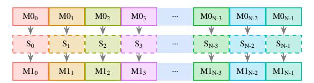
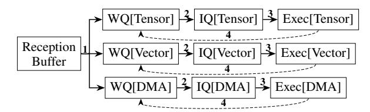
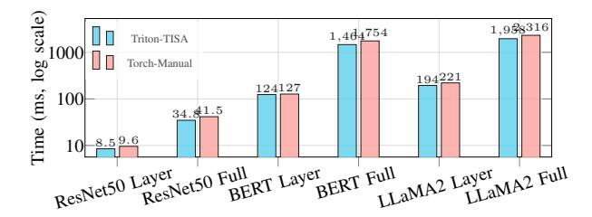

# Dynamic Scheduling for AI Accelerators via TISA

Guanghui Song<sup>1</sup>,<sup>∗</sup> , Xiaoqiang Dan<sup>2</sup>,<sup>∗</sup> , Chengke Wang<sup>2</sup> , Fei Liu<sup>2</sup> , Wenyuan Lv<sup>2</sup> , Zhongzhou Jiang<sup>2</sup> , Jianjian Guan<sup>2</sup> , Teng Lu<sup>2</sup> , Lin Tao<sup>2</sup> , Cheng Li<sup>2</sup> , Weixing Pan<sup>2</sup> , Wei Huang<sup>2</sup> , Zirong Shen<sup>2</sup> , Yi Yang<sup>2</sup> , Hui Liu<sup>2</sup> , Jie Zhao<sup>1</sup>,† <sup>1</sup>Hunan University, China <sup>2</sup>EVAS Intelligence, China <sup>∗</sup>Equal contribution. †Corresponding author: jiezhao@hnu.edu.cn

*Abstract*—Modern AI accelerators suffer from low utilization because static compile-time schedules cannot adapt to runtime variability or coordinate heterogeneous units effectively. This paper presents a semantics-aware dynamic tile scheduling framework that restores the missing runtime semantics required for adaptive execution. It co-designs three synergistic components, including a semantics-preserving compiler that maintains operator boundaries and dependency types through lowering, a tile-level instruction set (TISA) that encodes typed dependencies, resource intents, and tile-level memory ranges, and a conflictaware runtime scheduler that uses these semantics to dynamically reorder tiles, resolve contention, and overlap execution across tensor, vector, and DMA units. This design unifies software semantics and hardware scheduling, enabling cross-operator and cross-iteration parallelism beyond static approaches. Across ResNet50, BERT, GPT-J, and LLaMA2, our work achieves 1.52–1.92× speedups over the baseline, delivering 1.14–1.63× additional improvement over strong static tile-level pipeline scheduling; on FlashAttention-3 (head dim 128), it improves hardware utilization by 26.4% versus the state-of-the-art H100 implementation. Ablation studies further show that semantics preservation alone yields 1.2× gains, confirming the independent value of restoring scheduling information to runtime.

*Index Terms*—dynamic scheduling, tile-level instruction set, deep learning accelerators, heterogeneous units

# I. INTRODUCTION AND MOTIVATION

Deep learning's rapid growth has driven the development of increasingly sophisticated accelerators [11], [35]. Representative platforms include GPUs (both NVIDIA and AMD [26]), TPUs [20], Ascend [25], and Tenstorrent [37], [38]. These systems employ heterogeneous-unit architectures that integrate tensor, vector, and DMA engines to exploit massive parallelism, as exemplified in Table I.

TABLE I: Heterogeneous execution units across vendors. We unify vendor-specific terms into "Tensor Units" and "Vector ALUs". "DMA Engines" denotes DMA / copy engines / onchip packet movers. Mappings follow vendor docs and prior work [20], [25], [26], [37], [38].

| Vendor      | Tensor Units | Vector ALUs | DMA Engines |
|-------------|--------------|-------------|-------------|
| NVIDIA      | Tensor       | CUDA cores  | TMA         |
| AMD         | Matrix       | SIMD        | SDMA        |
| TPU         | MXU          | V-ALU       | async DMA   |
| Ascend      | Cube         | VU          | on-chip DMA |
| Tenstorrent | SFPU         | FPU         | on-chip DMA |

Current AI accelerators rely primarily on compile-time orchestrated pipeline templates to coordinate heterogeneous units. While modern GPUs employ dynamic scheduling at warp issue, thread-block assignment, and asynchronous memory execution, these mechanisms operate below tile-level operator coordination and do not dynamically reorder crossunit execution based on semantic readiness. This approach remains prevalent because it matches the long-standing softwarehardware contract: compilers emit deterministic instruction streams, and hardware executes them predictably with minimal control overhead. This model simplifies verification, toolchain design, and aligns with bulk-synchronous programming paradigms (e.g., CUDA [27], XLA [36], TensorRT [28]).

However, as both model and hardware complexity scale, static tile-level pipeline scheduling exposes some bottlenecks. Although overlapping tensor, vector, and DMA units promises instruction-level parallelism (ILP) [8], [22], [35], [39], [41], compile-time decisions cannot respond to runtime variability such as DMA backpressure, cache-bank conflicts, or thermal throttling. Consequently, execution deviates from compile-time assumptions: tiles cannot be retimed or rebalanced across units, leaving idle bubbles and underutilized hardware. Tiles arise naturally here because modern compilers already partition operators into tiles to match on-chip memory and bandwidth constraints. Hence, tiles represent the finest semantically meaningful granularity shared across compute, memory, and DMA, making them an ideal unit for adaptive scheduling.

Despite its ubiquity, static tile-level pipeline scheduling suffers from four fundamental limitations that constrain scalability and efficiency:

- Compile-time complexity and engineering burden. Coordinating cross-unit (tensor/vector/DMA) dependencies and exploring reordering opportunities pose optimization challenges related to the minimum makespan and bin packing problems [18], both of which are NPhard problems. Consequently, developers often resort to architecture-specific heuristics and manual tuning, which scale poorly with system complexity.
- Inadequate abstraction granularity. CUDA streams and graph-level runtimes manage kernels at coarse granularity, obscuring tile boundaries and data dependencies. In contrast, instruction-level (warp) scheduling [46] operates at a very fine granularity where semantic meaning is largely lost. Tile-level scheduling strikes an effective balance: it preserves operator context and exposes crossunit overlap while remaining hardware-schedulable [43].
- Inability to adapt to runtime variability. Static tilelevel pipeline schedules assume fixed latencies and bandwidth, but real systems exhibit dynamic fluctuations such as bandwidth contention, Cache/SPM conflicts, and unit

desynchronization due to thermal or operating system effects. These shifts alter the true critical path, yet static approaches cannot retime or re-overlap tiles accordingly.

• Historical precedent: static approaches fail under uncertainty. Superscalar CPUs [7], [15] achieve high ILP via dynamic scheduling, whereas static VLIW/IA-64 [5], [13] architectures failed to generalize across workloads and microarchitectural variation. This history suggests that moving a bounded, semantics-aware portion of scheduling to runtime is both robust and scalable.

Collectively, these limitations highlight the need for a runtime-visible semantic layer that enables adaptive reordering at an appropriate granularity.

Dynamic scheduling provides a path forward, but applying it at arbitrary instruction granularity would be impractical for deep learning accelerators. The tile abstraction provides the sweet spot: each tile encapsulates a semantically coherent computation with well-defined data ranges and resource requirements. This granularity enables the runtime to (1) detect dependencies precisely, (2) arbitrate heterogeneous resources safely, and (3) adapt execution in response to runtime conditions. Tile-granular scheduling thus combines the adaptivity of dynamic systems with the semantic safety of compile-time reasoning, forming the foundation of our design.

We propose a semantics-aware, dynamic scheduling framework at the tile granularity that unifies software semantics and hardware scheduling through the co-design of three synergistic components: a semantics-preserving compiler that maintains operator identity, typed dependencies, and resource affinities through the compilation pipeline, preventing the semantic erosion that limits current runtimes; a tile-level ISA (TISA) that acts as an orthogonal *scheduling-semantics* layer atop existing per-unit execution ISAs, encoding each tile's operator type, dependency descriptors, resource intents, and memory ranges, giving the runtime enough information to reason about legality, readiness, and overlap without expensive static analysis; and a semantics-guided runtime scheduler that consumes TISA semantics to dynamically reorder tiles across tensor, vector, and DMA units, resolving contention and exploiting cross-operator and cross-iteration parallelism under runtime variability.

This workflow directly addresses the weaknesses of static tile-level pipeline scheduling: (1) semantic preservation removes the need for combinatorial compile-time reordering; (2) tile-level granularity balances scheduling visibility and hardware tractability; and (3) dynamic decisions adapt execution to runtime drift while ensuring correctness.

We evaluate our dynamic scheduling framework across representative workloads, including ResNet50 [17], BERT [10], GPT-J [31], LLaMA2 [42], and DeepSeek-R1 [16], on multiple accelerators including Epoch, H100, and A100 GPUs. Our work achieves 1.52–1.92× speedups over the baseline, delivering 1.14–1.63× additional improvement over strong static tilelevel pipeline scheduling. For FlashAttention operators in the mainstream head-dim-128 configuration, it delivers approximately 26.4% higher hardware utilization than the state-of-theart H100 FlashAttention-3 [33]. Ablations further show that semantic preservation alone yields 1.2× gains, underscoring the independent value of restoring runtime-visible semantics. In summary, the key contributions of this work are:

- We design a semantics-aware dynamic tile scheduling framework that bridges static compilation and runtime adaptability for heterogeneous AI accelerators.
- We introduce TISA, a tile-level instruction set that exposes typed dependencies, operator semantics, and resource requirements for safe dynamic reordering.
- We build a semantics-preserving compiler that maintains operator context from high-level frameworks to hardwareschedulable TISA instructions.
- We present comprehensive experimental validation showing improved utilization, adaptability, and portability across accelerators and workloads.

The paper is organized as follows. Section II identifies specific scheduling challenges. Section III analyzes fundamental gaps and presents the overall architecture. Section IV formalizes TISA semantics, followed by the introduction of our dynamic scheduler in Section V and the semantics-preserving compiler in Section VI, respectively. Section VII presents the implementation of our framework, while Section VIII provides comprehensive experimental validation. Finally, Section IX discusses related work, and Section X concludes.

# II. TILE SCHEDULING CHALLENGES

This section elaborates on the challenges outlined above. Dynamically scheduling tiled computations must reason about two intertwined forms of conflict, i.e., structural contention and data dependencies, whose interaction determines when tiles can safely execute in parallel. We illustrate this using the fused tiles in FlashAttention-3 [33], as shown in Figure 1.



Fig. 1: The fused and tiled computations in FlashAttention-3. After tiling, the three operations involved in the attention pattern are fused and executed iteratively along the horizontal direction. Each iteration (shown in a distinct color) comprises three tiles: solid-outlined boxes represent tensor-unit executions, and dashed-outlined boxes represent vector-unit softmax computations. Vertical arrows indicate intra-iteration data dependencies.

The attention mechanism is decomposed into three heterogeneous tile types: M0, S, and M1, corresponding to the tiled computations of GEMM0 (QK<sup>⊤</sup>), Softmax, and GEMM1 (Attention · V ), respectively. Each vertical sequence of tiles denotes one iteration, containing three operations: two tensorunit GEMMs (M0 and M1) and one vector-unit Softmax (S). The arrows indicate data dependencies within an iteration.

Structural contention. Tensor and vector units are distinct but complementary resources. The two GEMM stages exclusively occupy tensor units, while the Softmax stage uses vector units. Static tile-level pipeline schedulers used by both compiler-generated and hand-tuned kernels like FlashAttention-3 exploit this heterogeneity within an iteration: while the vector units execute S<sup>i</sup> , tensor units can concurrently begin the next GEMM on the same iteration (e.g., overlapping S<sup>i</sup> with M1i). This intra-iteration parallelism is already well utilized by static pipelines.

Data dependencies. However, the three tiled operations are linked by producer-consumer edges. S<sup>i</sup> depends on the outputs of M0<sup>i</sup> , and M1<sup>i</sup> depends on the outputs of S<sup>i</sup> . These dependencies are correctly enforced by static compilation through ordered fusion or loop-carried synchronization. Yet this enforcement introduces an *implicit barrier* between iterations: the next iteration (i+1) cannot begin until all dependent results from iteration i are completed and synchronized.

Implication: Implicit synchronization and missed compact inter-iteration concurrency. Although structural heterogeneity allows tensor and vector units to run in parallel, the implicit synchronization across iterations prevents them from achieving more compact pipeline parallelism. For example, S<sup>i</sup> and M0i+1 are data-independent and use disjoint resources, but static schedules serialize them through global ordering. As a result, both tensor and vector units periodically idle: tensor units stall during S<sup>i</sup> , and vector units stall during M0i+1 even though true dependencies do not require it. Figure 2 illustrates this implicit synchronization. Figure 2(a) shows the sequential execution of fused tiles from Figure 1, where resource underutilization is evident across heterogeneous units.

Figure 2(b) demonstrates a statically pipelined approach that partitions the three tiled operations into two stages: M0<sup>i</sup> and S<sup>i</sup> in the first, and M1<sup>i</sup> in the second. This dual-stage structure improves utilization, eliminating some idle periods (E0). However, the tile launch sequence is precomputed and fixed at compile time, enforced through explicit synchronization barriers (e.g., PTX-level bar.sync in GPU kernels or compiler-placed fences in NPU kernels). Such a schedule assumes deterministic execution timing; any runtime variances like cache misses, DMA backpressure, or desynchronized warps break the alignment and degrades utilization.

A more aggressive static pipeline, shown in Figure 2(d), increases the number of stages by treating each tiled operation as a separate stage. This triple-stage design overlaps adjacent operations and achieves larger savings (E1). Yet its dependence on compile-time ordering still enforces synchronization between iterations; the fixed sequencing prevents S<sup>i</sup> from overlapping with M0i+1, despite their independence.

While advanced software pipelining (e.g., modulo scheduling [23], [32]) can achieve inter-iteration overlap by exploiting predictable latencies and control-flow predication, modern AI accelerators and GPUs face fundamentally different constraints: (1) non-deterministic execution latencies due to DMA backpressure, shared memory bank conflicts, and thermal throttling; (2) the absence of hardware predication for


Fig. 2: Different execution manners of the fused tiles shown in Figure 1. Shaded regions (Ex) represent latency saved through scheduling. Vertical dashed lines denote synchronization barriers between iterations imposed by static scheduling. E<sup>0</sup> + E<sup>2</sup> = E<sup>1</sup> + E<sup>3</sup> illustrates the equivalent latency savings achievable by dual-stage or triple-stage dynamic scheduling.

heavyweight tensor and vector units; and (3) heterogeneous multi-unit coordination requirements that exceed the scope of classical modulo scheduling. Moreover, such advanced software pipelining primarily overlaps fine-grained instructions, whereas accelerator kernels operate on coarse-grained tiles coordinated across multiple specialized units. As a result, instruction-level software pipelining can at best slightly smooth pipeline bubbles within the static stage structure illustrated in Fig. 2(b,d), but it does not fundamentally change the stage-ordered execution template. Consequently, state-ofthe-art GPU kernels such as FlashAttention-3 rely on fixed synchronization barriers, locking execution into static overlapping templates and precluding readiness-driven dynamic crossiteration reordering.

These static schedules expose a central inefficiency: compile-time assumptions erase semantic information about operator type, resource affinity, and dependency direction, forcing conservative synchronization that guards correctness at the cost of performance. By contrast, a semantics-aware runtime retains this information and makes scheduling decisions based on the instantaneous hardware state. As shown in Figure 2(c) and (e), the runtime scheduler observes which units are free and which tiles' inputs are ready, then dynamically issues the next eligible tile. This allows more compact interiteration overlap, e.g., executing  $S_i$  concurrently with  $M0_{i+1}$  or  $M1_i$  with  $S_{i+1}$ , and adapts naturally to runtime variation, achieving the cumulative latency reduction of  $E_0+E_2$  or  $E_1+E_3$  without relying on rigid stage definitions.

**Key insight.** The fundamental distinction lies in *information preservation*. Static tile-level pipeline scheduling in current accelerator compilation flows loses operator semantics once tiling and fusion lower the program into opaque instruction streams; as a result, the hardware sees only ordered instruction sequences and cannot distinguish true from artificial dependencies. Our semantics-aware approach preserves these relationships at runtime, enabling the hardware to discriminate between genuine resource conflicts (both units busy) and recoverable stalls (one unit waiting). By dynamically reordering tiles based on readiness and resource availability, it eliminates unnecessary synchronization and recovers the idle time that statically-pipelined accelerator kernels (e.g., FlashAttention in Figure 2(b,d)) must conservatively surrender.

#### III. DESIGN OVERVIEW

Having identified the loss of semantics by scheduling at an inappropriate level and may enforces synchronizations due to conservative compile-time assumptions, we now present the design of our solution. Our goal is to restore runtimevisible semantics, the minimal set of information required for the hardware to safely and adaptively schedule tiles, while preserving compatibility with existing compilation workflows.

On one hand, the compilation of a deep learning workload is inherently a hierarchical decomposition process that lowers a network from high-level operators to hardware-executable instructions. During this process, both operator and data granularities are progressively refined to align with the target hardware ISA. While this hierarchical lowering is essential for efficiency, it inevitably discards critical semantic information (e.g., operator boundaries, resource affinities, and dependency types) that is indispensable for dynamic scheduling. On the other hand, existing ISAs are not designed around tile-level execution, making it difficult to preserve or express such semantics even if the compiler attempts to do so.

This semantic loss creates a key gap between software and hardware: once operators are decomposed into flat instruction streams, the runtime no longer knows which instructions belong to which operator or which functional units they should occupy. Superscalar CPUs overcome a much simpler version of this problem through register-based dependency tracking, but AI accelerators require richer semantic interfaces that describe operator-level dependencies, heterogeneous resource bindings, and tile-level memory regions. Bridging this semantic gap requires an intermediate abstraction layer: one that is finer-grained than kernel streams yet coarser than raw instructions, precisely the role of a tile-level ISA.

Based on these observations, we design TISA, a semanticspreserving abstraction that forms a bridge between software decomposition and hardware scheduling. This abstraction allows us to develop a dynamic tile scheduler that can preserve compatibility with existing compilation workflows. Figure 3 illustrates the overall architecture of our approach.

Unlike traditional CPU ISAs that encode both execution semantics (e.g., what an ADD computes) and scheduling semantics (via register names enabling scoreboard-based dependency tracking), existing domain-specific ISAs (e.g., Cambricon [9], TPU [20], Graphcore IPU [19]) primarily define execution semantics—what a tensor operation computes and on which unit—but omit scheduling semantics. This leads to them typically encoding inter-unit coordination through explicit barriers or ordering constraints rather than exposing structured hardware-consumable scheduling semantics. TISA bridges this gap by acting as a hardware-consumed scheduling-semantics layer: its OpType, UnitMap, and TileMem fields are analogous to register names in CPU ISAs, but at tile granularity across heterogeneous units, which differ with the multi-core CPU task-level dynamic scheduling of Task Superscalar [12].


Fig. 3: The overall architecture of our integrated framework.

Notably, this functionality cannot be realized in software. At the AI-core tile level, the dispatch budget is strictly in the nanosecond range: our RTL synthesis measures  $7\sim 9$  cycles (at 1 GHz) per tile dispatch. A software runtime executing on a control processor would require instruction fetch, decode, branch evaluation, and memory accesses for dependency checking, typically incurring microsecond-level overhead ( $100-1000\times$  slower). This would negate the benefits of tile-level scheduling, where tile execution itself often ranges from  $10^3$  to  $10^5$  cycles. A hardware ISA interface is therefore mandatory for nanosecond-level, opportunistic overlap.

Working as a higher level ISA than traditional instructionlevel ISA, TISA integrates three co-designed components that together restore semantic information to the runtime:

- TISA Abstraction defines a tile-level instruction format that encodes operator type, dependency semantics, and resource requirements. It establishes a semantic contract between the compiler and the runtime scheduler.
- Semantics-Aware Runtime Scheduler interprets the TISA metadata to dynamically dispatch tiles across heterogeneous execution units, enabling adaptive overlap, load balancing, and conflict resolution at runtime.
- Semantics-Preserving Compiler retains operator semantics throughout the compilation pipeline and emits TISA instructions as the target intermediate representation.

Together, these components close the semantic gap between compilation and execution. The TISA layer ensures that operator intent and dependency semantics survive the lowering process, empowering the runtime scheduler to make informed, adaptive decisions that current fixed-template static scheduling approaches do not exploit at runtime. We now detail each component in turn.

## IV. TISA: A SEMANTICS-PRESERVING TILE-LEVEL ISA

To support dynamic scheduling, TISA must encode all scheduling-relevant semantics (what is computed, which resources it requires, and how its data interacts with other tiles) within a lightweight instruction format. This design yields two complementary data structures: the operand structure, which specifies data properties and memory scope, and the TISA instruction structure, which captures the semantic and resource-level metadata for each tile. Together, these structures form the complete semantic contract between the compiler and the runtime scheduler. The detailed definitions of these two structures are depicted in Table II and III respectively.

TABLE II: Operand structure definition.

| Field                                                                                                                              | Туре                              | Description                                         |  |  |  |  |  |
|------------------------------------------------------------------------------------------------------------------------------------|-----------------------------------|-----------------------------------------------------|--|--|--|--|--|
| Operand = (TileShape, TileMem, AccessType)                                                                                         |                                   |                                                     |  |  |  |  |  |
| TileShape Symbolic/Parametric Computational bounds TileMem (base, scope) Memory specification AccessType {R, W, RW} Access pattern |                                   |                                                     |  |  |  |  |  |
|                                                                                                                                    | TileMem = (base                   | , scope)                                            |  |  |  |  |  |
| base<br>scope                                                                                                                      | Address<br>{Private,Local,Shared} | Symbolic/Constant address<br>Memory hierarchy level |  |  |  |  |  |

TABLE III: TISA instruction structure definition.

| Field      | Type/Constraints            | Description            |
|------------|-----------------------------|------------------------|
| TISA_I     | nst = (OpType, Operands, A  | ttributes, UnitMap)    |
| ОрТуре     | {GEMM, SOFTMAX,}            | Semantic identifier    |
| Operands   | $[op_1, op_2,]$             | Array of Operand       |
|            | $ outs  \le 3,  ins  \le 7$ | Hardware constraints   |
| Attributes | Op Attrs,Schedule Params    | Reorder constraints,   |
|            |                             | sync requirements      |
| UnitMap    | (unit, quantity, affinity)  | Resource specification |

Each TISA instruction preserves three classes of semantics that static instruction streams typically erase:

- Computation semantics, represented by OpType, identify the operator and its expected execution class (e.g., tensor, vector, or scalar unit). This enables the scheduler to associate instructions with compatible hardware units.
- Data semantics, captured by Operands and TileMem, define the spatial and temporal scope of data usage, allowing fine-grained conflict detection across tiles.
- Scheduling semantics, encoded in Attributes and UnitMap, constrain reordering and specify resource affinities to ensure correctness under heterogeneity.

These fields collectively enable the runtime to make informed, legality-checked scheduling decisions that were previously locked at compile time. More detailed scheduling mechanisms are described in Section V, but a brief summary is useful here: OpType guides structural mapping, Deps and TileMem ensure data correctness, and UnitMap enables distributed per-unit arbitration.

Dependencies among TISA instructions are expressed as  $Deps = \{(src, type, condition)\}$ , where  $type \in \{RAW, WAR, WAW\}$  denotes read-after-write, write-after-read, and write-after-write relationships. These dependencies are automatically derived through interval-based overlap analysis on the TileMem fields of each operand. For example, if two tiles reference overlapping address ranges and one writes while another reads, a RAW dependency is created and enforced until the writer commits. The condition field expresses partial or conditional readiness (e.g., partial-tile availability), allowing the scheduler to issue dependent tiles early once their required subregion becomes valid. This model allows fine-grained dependency resolution and overlap across iterations while guaranteeing memory safety.

Our current design employs interval-based overlap analysis using contiguous [start\_addr, end\_addr] ranges. For non-contiguous or strided accesses (e.g., column vectors), this model is conservative: it may flag false hazards for gaps within the stride, but never misses true conflicts. Regular non-contiguous accesses are generally converted into contiguous accesses through operations such as transpose at higher compilation levels. Extending TileMem descriptors with explicit stride metadata remains a future work.

The dynamic scheduler consumes the semantic fields of each TISA instruction to coordinate execution across heterogeneous units. It first performs RAW/WAR/WAW validation using Deps and TileMem to detect conflicts. Then, guided by UnitMap and OpType, it assigns ready tiles to unit-local queues for tensor, vector, or DMA engines, resolving structural contention dynamically. Finally, it evaluates dependency conditions to opportunistically issue instructions as soon as data is ready, rather than at fixed compile-time synchronization points. This process maximizes overlap across both operators and iterations while maintaining correctness.

The TISA abstraction thus closes the software-hardware semantic gap by cleanly separating *what* is computed (operator intent) from *when and where* it executes (scheduling). Unlike opaque kernel streams or flat instruction sequences, TISA exposes typed dependencies, explicit resource mappings (UnitMap), and tile-level memory regions (TileMem) to the runtime, enabling rule-based legality checks and adaptive scheduling, as will be introduced in Section V-A.

As we introduced in section III, TISA defines a hardware-consumed scheduling contract analogous to how register names in CPU ISAs constitute an architectural contract for scoreboard-based scheduling. The hardware scheduler directly reads TISA fields (OpType, TileMem, UnitMap) to make dispatch decisions—these fields are not interpreted by software. While violating or omitting TISA semantics results in conser-

vative (not incorrect) execution–similar to bypassing a CPU scoreboard and falling back to in-order issue–the scheduling semantics are *architecturally visible* and hardware-consumed, satisfying the essential property of an ISA-level abstraction. In particular, TISA has a concrete binary encoding on Epoch, the AI accelerator that will be evaluated in section VIII. The encoding details are omitted due to the page limitation. It is best understood as a *scheduling-semantics ISA extension* that supplements existing per-unit execution ISAs.

For upstream compilers, TISA provides a semantic target IR: frameworks can emit TISA instructions while preserving operator identity, dependency relationships, and resource requirements. The runtime then leverages this information to ensure correctness through typed-dependency readiness, interval-based conflict tests, and dynamic per-unit arbitration, eliminating the need for costly opaque-stream analysis. For downstream hardware, TISA abstracts over heterogeneous execution backends: both general-purpose GPUs and domainspecific NPUs can be supported under the same contract, where OpType may correspond to either a software-level operator or a coarse-grained hardware instruction. This unified abstraction enables semantic-aware scheduling on diverse hardware without rearchitecting the runtime.

Overall, TISA provides the missing semantic interface that allows dynamic scheduling to reason about both operator intent and hardware resource state, forming the foundation of our semantics-aware runtime framework.

# V. DYNAMIC TILE SCHEDULING

With the semantic context (OpType), resource mapping (UnitMap), and memory range descriptors (TileMem), the dynamic scheduler can safely exploit cross-operator overlap and adaptive resource allocation at runtime. We now detail how typed dependency analysis and heterogeneous resource management work together to realize this capability.

## *A. Typed Dependency Analysis*

Conventional instruction schedulers rely on register-based or conservative memory-based dependency tracking, which either fail to capture higher-level semantics or conservatively block parallelism. In contrast, our dynamic tile scheduler performs *typed dependency analysis* that explicitly leverages semantic annotations in TISA instructions. This approach eliminates artificial dependencies while ensuring correctness, enabling safe reordering and parallel execution across operators and iterations. Each TISA instruction exposes its data interfaces through TileMem fields that describe address ranges, memory scopes (e.g., L1-private, L2-local, or HBM channel), and access types (READ/WRITE). Accesses to disjoint memory scopes or non-overlapping ranges are treated as independent, allowing the scheduler to issue instructions concurrently without risking data hazards.

To track runtime state, each execution unit u maintains an *in-flight semantic table*:

$$\mathcal{F}_{u} = \left\{ \begin{array}{c} (idx, start\_addr, end\_addr, \\ access\_type, unit, inst\_ptr) \end{array} \right\}$$

Here, idx indexes the instruction's operand; start\_addr/end\_addr denote the address interval accessed by that operand; access\_type is the access mode (READ/WRITE); unit is the target execution unit; and inst\_ptr is a pointer to the instruction. This table allows the scheduler to reason about partial completion (e.g., when sub-tiles or memory regions become ready) and to wake up dependent tiles immediately once their required data is available. Unlike traditional scoreboards that track register tags, F<sup>u</sup> encodes semantic and spatial context, enabling fine-grained, scope-aware dependency resolution.

When evaluating whether a candidate instruction I can be issued to unit u, our dynamic scheduler performs rule-based hazard detection:

$$\operatorname{Hazard}(I,\mathcal{F}_u) = \exists r \in \mathcal{F}_u : \operatorname{SemanticConflict}(I,r)$$

where SemanticConflict is resolved through the following typed rules:

- Data dependencies (RAW/WAR/WAW): use interval overlap tests on TileMem to identify true conflicts; disjoint ranges are considered independent.
- Memory-scope isolation: operations targeting distinct memory levels or banks (e.g., L1 vs. L2, or separate HBM channels) are non-aliasing and can safely proceed in parallel.
- Semantic compatibility: instructions with compatible OpTypes (e.g., GEMM vs. Softmax) may overlap if their data ranges do not conflict and their unit classes differ.
- Resource feasibility: if current unit capacity (e.g., local buffer size or bandwidth) cannot accommodate I, the scheduler defers its issue until sufficient resources are released.

These rule checks extend traditional hazard models by combining data, structural, and semantic dimensions in one unified framework. They allow the scheduler to distinguish true hazards that affect correctness from benign overlaps that can be exploited for parallel execution. Currently, TISA's TileMem lacks native strided array access, requiring compilers to transpose columns into contiguous addresses or emit conservative boundaries yielding false dependencies. However, since dense LLMs and CNNs intrinsically operate on large contiguous blocks, precision loss remains negligible.

# *B. Heterogeneous Resource Management*

Our dynamic tile scheduler operates over a distributed set of heterogeneous execution units, each managed by an independent, semantics-aware queue pair. The scheduling mechanism is organized into four cooperating steps (Figure 4), which together form a decentralized arbitration mechanism.

Step 1: Semantic Routing. Incoming TISA instructions are parsed for their OpType, UnitMap, and dependency metadata, then routed to the appropriate waiting queue (WQ) of each target unit. Each WQ preserves operator semantics and provides a local view of ready candidates per unit type.

Step 2: Dependency Resolution. The scheduler periodically selects a ready window W from each WQ and checks



Fig. 4: Per-unit semantic scheduling. Decentralized queues localize dependency checking and prevent unrelated blocking across heterogeneous units. WQ: waiting queue; IQ: issue queue.

for semantic hazards against the unit's in-flight table Fu. Only instructions passing dependency and resource checks are promoted to the issue queue (IQ). This step enforces correctness while enabling out-of-order admission across units.

Step 3: Adaptive Issue. IQ entries are issued to hardware execution pipelines once their dependencies are cleared.

Step 4: Feedback. Upon completion, the corresponding F<sup>u</sup> entry is retired, dependent instructions are notified, and per-unit scheduling priorities are adaptively updated based on observed contention or latency. This feedback mechanism continuously tunes overlap and unit utilization at runtime.

These steps naturally form a five-stage microarchitecture of: (1) Reception(instruction) decoding; (2) Routing to per-unit WQs; (3) Dependency check matching the window; (4) Issue of conflict-free instruction from WQ to IQ; and (5) Dispatch IQ instruction to units.

Issued TISA instructions execute in a run-to-complete, nonpreemptive manner, with scheduling decisions made only at tile boundaries. Because these boundaries are coarse-grained (typically more than 10<sup>3</sup> operations), the control overhead remains low, i.e., around 7∼9 cycles per dispatch, as measured in our RTL synthesis.

## *C. The Dynamic Scheduling Algorithm*

Algorithm 1 formalizes this scheduling process. At a high level, the scheduler continuously receives semantically annotated TISA instructions, routes them to appropriate queues, performs dependency and resource checks, issues ready tiles out of order, and updates runtime states upon completion. Algorithm 2 details the semantic conflict detection routine that underpins this process. Through this mechanism, the scheduler achieves execution patterns illustrated in Figure 2(c,e).

The scheduling cycle complexity is O(U · W · |F|max), where U is the number of execution units, W the window size, and |F|max the maximum number of in-flight entries per unit. With typical settings (W ≤ 8, |Fu| ≤ 16), the effective complexity approaches O(U) per cycle with minimal constants. The conflict detection subroutine runs in O(|Fu|) time per candidate, with constant-space overlap checks. This design scales better than centralized ILP schedulers (e.g., Tomasulo [41]) that require O(N<sup>2</sup> ) global comparisons, while enabling finer-grained, semantics-driven parallelism.

Our synthesized RTL implementation integrates one scheduler per accelerator core (Table IV). At W = 8, the scheduler

```
Algorithm 1: Dynamic Tile Scheduling
 Input: Stream of semantically-annotated TISA instructions
 Output: Scheduled instruction sequences across
          heterogeneous units
 Initialize semantic tracking structures for all units u;
 while system running do
     // 1: Semantic Routing
     if Reception Buffer ̸= empty then
         I ← pop(Reception Buffer) ;
         extract semantic context(I) ;
         // Analyze OpType, dependencies, resource needs
         u ← adaptive unit selection(I) ;
         // Consider load balancing
         enqueue with priority(WQ[u], I) ;
     foreach u in Units do
         C ← select ready window(WQ[u]);
         // Semantic-aware selection
         foreach I ∈ C (by adaptive priority) do
             // 2: Dependency Resolution(call Algorithm 2)
             if !semantic conflict detection(I, Fu) and
              resources available(u) then
                 allocate resources adaptively(I, u);
                 update semantic tracking(Fu, I);
                 // 3: Adaptive Issue
                 issue out of order(I, u);
     foreach u in Units do
         foreach completed inst J from Exec[u] do
             // 4: Feedback
             update semantic state(Fu, J);
             trigger dependent instructions(WQ[u], J);
```

# Algorithm 2: Semantic Conflict Detection

adapt scheduling policy(u);

```
Input: Instruction I with semantic annotations, in-flight
       semantic table Fu
foreach r ∈ Fu do
    if not same scope(I, r) then
        continue ;
    if semantic compatibility(I.OpType, r.OpType) then
        // Semantically compatible operations can overlap
        continue ;
    if memory range overlap(I, r) and true dependency(I,
     r) then
        if cannot reorder safely(I, r) then
            // True semantic conflict detected
            return true ;
// Safe to execute in parallel
return false ;
```

TABLE IV: Scheduler scaling with window size.

| W   | Latency  | Gates | Area (mm2<br>) | Power (mW) |
|-----|----------|-------|----------------|------------|
| 8   | 7 cycles | 1.5M  | 0.25           | 100        |
| 16  | 7 cycles | 2.0M  | 0.33           | 120        |
| 32  | 8 cycles | 2.8M  | 0.46           | 150        |
| 64  | 8 cycles | 3.9M  | 0.65           | 180        |
| 128 | 9 cycles | 5.2M  | 0.87           | 240        |
| 256 | 9 cycles | 6.8M  | 1.13           | 300        |

requires 1.5M gates (0.25 mm<sup>2</sup> , 1.5% per-core area, 100 mW). Scaling to W = 256 increases area sub-quadratically to 6.8M gates (4.5× for 32× entries) with bounded 9-cycle dispatch latency, due to logarithmic CAM structures and pipelined arbitration for W ≥ 32. Power remains <0.3% core power at W = 256 as dispatch is sparse (∼5% slots/cycle). The 8-entry baseline suffices for most operators; larger windows benefit only memory-bound kernels with latency, gates, area and power grow in Table IV.

The resulting execution pattern, as shown in Figure 2(c,e), demonstrates more compact cross-operator and cross-iteration concurrency than static approaches can achieve. Static pipelines rely on conservative synchronization assumptions– explicit barriers and fixed latencies (Figure 5)–to ensure correctness, fundamentally limiting overlap. While such pipelines achieve some concurrency, TISA's semantic awareness eliminates these rigid constraints: the scheduler dynamically resolves dependencies and reorders tiles without programmerinserted synchronization, yielding tighter overlap while keeping correctness.

# VI. SEMANTICS-PRESERVING COMPILER

The TISA abstraction not only enables dynamic tile scheduling at runtime but also offers a unifying intermediate representation that allows compilers to preserve semantic information down to the hardware interface. Our compiler stack mirrors the traditional hierarchical decomposition flow of deep learning compilation while maintaining operator context, dependencies, and resource semantics until TISA generation. The end-toend flow consists of a framework bridge, a graph compiler, a fusion compiler, the TISA generator, and backend-specific code generation. Together, these components progressively lower models from high-level operator graphs to hardwareexecutable TISA binaries while preserving semantic metadata used by the dynamic scheduler.

- *a) Framework bridge:* The bridge layer ingests models from PyTorch [3], JAX [6], and TensorFlow [1] using the torchxla [36] frontend, exporting framework graphs to XLA or StableHLO dialects. By aligning TISA's OpType taxonomy with StableHLO operator abstractions, we ensure a consistent mapping of operator semantics across frameworks, simplifying subsequent dependency and resource analyses.
- *b) Graph compiler (GC):* Our MLIR-based [24] GC consumes StableHLO IR and performs architecture-aware optimizations, including fusion, tiling, and locality-driven reordering. It emits a software-scheduled tile graph e.g., Figure 2, that exposes legal overlap opportunities across heterogeneous units (tensor, vector, DMA) while minimizing off-chip communication. Unlike conventional graph optimizers, GC explicitly preserves operator boundaries and typed dependency edges in a custom MLIR dialect, forming a semantically rich intermediate representation that serves as input to the fusion compiler.

Tile dimensions maximize arithmetic intensity subject to SRAM capacity constraints (e.g., 64×64 for the Epoch 256 KB staging buffer). Non-divisible tensor boundaries trigger edge tiles. Instead of relying on padding overhead, TISA directly encodes the precise Shape and TileMem ranges for these boundaries, generating tailored instructions that seamlessly dispatch smaller edge tiles without unaligned penalties. For workloads comprising thousands of concurrent tiles, *hierarchical scheduling* ensures scalability: each core manages 256 tiles locally, with the compiler performing global coordination via static tile-to-core assignment.

*c) Fusion compiler (FC):* FC specializes fused subgraphs produced by GC into TISA-compatible operators. Built atop MLIR, FC defines a custom TISA dialect whose operations (e.g., tisa.gemm, tisa.softmax) encode operator semantics through OpType and dependency descriptors, resource intents (mappings to execution unit classes) via UnitMap, and memory access patterns in terms of symbolic TileMem ranges and scopes. Through this dialect, the compiler translates the software-scheduled tile graph into a stream of TISA instructions that preserve operator identity, data dependencies, and resource affinity. These attributes constitute the semantic contract later consumed by the runtime scheduler.

Conventional compilers flatten operators into loop nests, discarding tensor-level boundaries. The TISA compiler truncates lowering at tile granularity–it need not lower to fine-grained ISA instructions, as the hardware scheduler consumes tilelevel semantics directly. This simplifies optimizations: e.g., ping-pong buffering requires only allocating two buffers and emitting alternating TISA tiles; no loop unrolling or instruction reordering is needed, as the runtime scheduler handles overlap. The semantic triad is identically codified from high-level graph components into binary output, seamlessly transitioning context into hardware.

*d) TISA generator and backends:* The TISA generator provides a virtual tile-level instruction set that unifies multiple hardware backends. Its operation semantics mirror StableHLO operators, while its data semantics are defined on tiles sized to fit L1/L2 or shared SRAM capacity. OpType is statically bound to accelerator unit classes (tensor, vector, DMA), which allows the runtime to perform legality checks and enable crossunit overlap.

Currently, two backends are implemented: (1) TISA-NPU backend, which targets our Epoch hardware with full dynamic scheduling support. It uses a custom LLVM-based lowering path that embeds TISA metadata into the final binary, consumed by the hardware scheduler. (2) TISA-CPU backend, which emits optimized CPU kernels for functional validation and reference execution. On CPU, overlapping tiles execute serially, but this backend retains identical TISA semantics, enabling end-to-end verification. Both backends preserve identical semantic descriptors to guarantee consistent scheduling behavior across platforms.

*e) Runtime interface:* During execution, the compiled binary emits per-tile descriptors that encode all required scheduling attributes, including OpType, UnitMap, and TileMem. These descriptors form ready sets that populate the runtime's waiting queues (WQs) and issue queues (IQs), where arbitration and dispatch occur under the dynamic tile scheduler described in Section V. Each tile executes in a run-to-complete, non-preemptive fashion, with scheduling decisions made at tile boundaries to balance adaptivity and low hardware overhead.

*f) Discussion:* This compiler–runtime co-design closes the loop between semantic preservation and dynamic execution. By carrying operator context and dependency metadata down to TISA, the compiler enables the runtime to make legality and overlap decisions based directly on semantics rather than opaque instruction streams. In turn, the dynamic scheduler translates these semantics into runtime performance, achieving adaptivity without sacrificing correctness.

## VII. IMPLEMENTATION

## *A. Implementation on Epoch*

We implement our framework on both a CPU backend and an AI accelerator Epoch. The CPU implementation serves as a functional and accuracy reference by providing a TISAsemantic operator library, while the Epoch backend fully exploits TISA's dynamic scheduling and heterogeneous execution capabilities through native ISA support.

- *a) Hardware overview:* Epoch is a throughput-oriented AI accelerator that offloads compute-intensive kernels from a host CPU via a high-bandwidth interconnect and shares a 48 GB DDR memory. The chip has been successfully taped out at 1 GHz and is currently in commercialization. All Epoch performance results presented in this paper are measured on this taped-out physical silicon with W = 8. It is organized to expose abundant tile-level parallelism with 32 cores. Each core integrates three specialized engines: a Matrix Engine (ME) for tensor arithmetic, a Vector Engine (VE) for elementwise and reduction operations, and a Data Engine (DE) for DMA and asynchronous data movement. This heterogeneous structure closely resembles the architectures summarized in Table I, Therefore, porting this framework to other accelerators requires adding the hardware scheduler and TISA to it.
- *b) Memory hierarchy:* Each core provides 1.5 MB of local memory, and cores communicate via on-chip shared SRAM, enabling inter-core tile reuse. An on-chip NoC connects the system, and parameters and activations are exchanged with the host via the 48 GB global DDR memory.
- *c) TISA integration:* The TISA instructions act as the software–hardware contract on Epoch, and each core integrates a hardware scheduler (Section V) that consumes TISA descriptors and orchestrates heterogeneous execution without explicit software barriers. On ME, we introduce custom tensor instructions for block matrix/tensor arithmetic. On VE, we extend the vector ISA with tile-friendly operations. On DE, we expose DMA-style descriptors to support asynchronous, non-blocking transfers. All components adhere to the TISA interface, which conveys semantic context (OpType), resource affinity (UnitMap), and tile memory descriptors (TileMem) to the scheduler for legality checks and dynamic overlap.
- *d) Kernel library and compiler integration:* On top of these hardware extensions, we implement a high-performance operator library where kernels are expressed at tile granularity and executed through double-buffered pipelines across

```
1 // CUDA fa3 pseudocode
 2 // Load Q K data
 3 tma_load_q ( s_Q ,Q) ;
 4 tma_load_k_transpose ( s_K ,K) ;
 5 warpgroup_fence_producer () ;
 6 // Matrix multiply (P=Q *K)
 7 wgmma :: mma_sync ( s_P , s_Q , s_K );
 8 // Softmax compute (S= softmax (P) )
 9 wgmma :: wait () ; // Wait s_P
10 softmax_warpgroup ( s_S , s_P , state );
11 for ( int j = 0; j < Tc ; j ++) {
12 if (j < Tc - 1) {
13 // Load K data ( next tile )
14 tma_load_k_transpose ( s_K_next ,
           K_next ) ;
15 warpgroup_barrier_arrive () ;
16 // Matrix multiply ( next tile )
17 wgmma :: mma_async ( s_S_next , s_Q ,
           s_K_next ) ;
18 }
19 // Load V data
20 tma_load_v ( s_V , V);
21 warpgroup_barrier_wait () ;
22 // Matrix multiply (R =S*V )
23 wgmma :: mma_sync ( s_R , s_S , s_V );
24 if (j < Tc - 1) {
25 // Softmax compute ( next tile )
26 wgmma :: wait () ; // Wait s_S_next
27 softmax_warpgroup ( s_S_next ,
           s_S_next , state_next );
28 }
29 // Rescale R data ( O= Rescale (R))
30 wgmma :: wait () ; // Wait s_R
31 rescale_warpgroup ( s_O , s_R , state ,
          state_next );
32 warpgroup_commit_batch () ;
33 // Update next index
34 update_carousel_index () ;
35 }
36 // Store O data
37 tma_store_o (O , s_O ) ;
38 warpgroup_epilogue () ;
                                            1 // TISA fa3 pseudocode
                                            2 // Load Q K data
                                            3 tisa :: load <de >( s_Q ,Q);
                                            4 tisa :: load_transpose <de >( s_K ,K) ;
                                            5 // Matrix multiply (P=Q *K)
                                            6 tisa :: gemm <me >( s_P , s_Q , s_K ) ;
                                            7 // Softmax compute (S= softmax (P) )
                                            8 tisa :: softmax <ve >( s_S , s_P , state );
                                            9 for ( int j = 0; j < Tc ; j ++) {
                                           10 if (j < Tc - 1) {
                                           11 // Load K data ( next tile )
                                           12 tisa :: load_transpose <de >(
                                                       s_K_next , K_next ) ;
                                           13 // Matrix multiply ( next tile )
                                           14 tisa :: gemm <me >( s_S_next , s_Q ,
                                                       s_K_next ) ;
                                           15 }
                                           16 // Load V data
                                           17 tisa :: load < de >( s_V ,V );
                                           18 // Matrix multiply (R =S*V )
                                           19 tisa :: gemm < me >( s_R , s_S , s_V );
                                           20 if (j < Tc - 1) {
                                           21 // Softmax compute ( next tile )
                                           22 tisa :: softmax <ve >( s_S_next ,
                                                       s_S_next , state_next ) ;
                                           23 }
                                           24 // Rescale R data ( O= Rescale (R))
                                           25 tisa :: rescale <ve >( s_O , s_R , state ,
                                                      state_next );
                                           26 // Update next index
                                           27 update_next_index () ;
                                           28 }
                                           29 // Store O data
                                           30 tisa :: store <de >( O , s_O ) ;
```

Fig. 5: Comparison of FlashAttention-3 CUDA and TISA pseudocode. CUDA explicitly manages synchronization (lines 5, 9, 15, 21, 26, 30, 32, and 38), while TISA eliminates all barriers via semantics-aware dependency resolution.

ME/VE/DE. Kernels are shape-parametric and mapped directly to units indicated by OpType, while the upstream compiler (Section VI) automatically generates the corresponding TISA instructions. This separation decouples TISA semantics from hardware-specific implementations, allowing runtime scheduling to remain hardware-agnostic while still leveraging optimized kernels per operator type.

*e) Multi-core execution:* For multi-core execution, the compiler employs spatial partitioning: independent tile groups (e.g., attention heads, batch dimensions) are statically assigned to cores. Each core's local TISA scheduler operates independently via its in-flight semantic tables. Inter-core synchronization uses lightweight NoC signals triggered by shared SRAM bank updates. Runtime load balancing occurs at the software level between kernel invocations, not within the tile scheduler.

# *B. Case Study: FlashAttention-3 Pseudocode*

To demonstrate TISA's benefits, we will use the FlashAttention-3 kernel as an illustrative schematic. Figure 5 compares the CUDA pseudocode (left) with our TISAgenerated Epoch pseudocode (right).

The CUDA kernel fuses the QK<sup>⊤</sup> multiply, scaling/masking, softmax, and V projection into a single kernel. It relies on manual thread-block decomposition, shared-memory staging, warp-level collectives, explicit barriers, and hand-tuned prefetching to form a static pipeline.

In contrast, the Epoch TISA kernel is automatically generated by the compiler and expressed entirely in TISA instructions. Each instruction is annotated with OpType, dependency descriptors, and resource mappings. At runtime, the per-core scheduler dynamically orchestrates ME/VE/DE execution by evaluating instruction readiness, implicitly managing synchronization, double-buffering, and heterogeneous overlap within the core-local memory hierarchy.

This case study highlights the paradigm shift from imperative, barrier-centric GPU programming to declarative, semantics-preserving TISA execution. In practice, the GPU kernel corresponds to the static execution patterns in Figure 2(b,d), while the TISA kernel achieves the dynamically overlapped patterns in Figure 2(c,e), attaining higher instruction-level parallelism. Quantitatively, the TISA kernel reduces code size by 30%, synchronization frequency by 50%, and achieves performance within 5% of hand-tuned baselines, all while being compiler-generated. By embedding synchronization semantics directly into the ISA, TISA eliminates manual orchestration and enables compiler-driven, architecture-independent performance portability.

#### VIII. EXPERIMENTAL VALIDATION

We evaluate the effectiveness of our framework across four representative deep learning workloads, including ResNet50, BERT-Base, GPT-J-6B, LLaMA2-13B and DeepSeek-R1-16B. We implement two backends (CPU and Epoch) but conduct experiments on four hardware platforms: Epoch(Silicon), NVIDIA H100, NVIDIA A100, and Intel Xeon. Table V summarizes the platform specifications. For NVIDIA GPUs, we use driver 550.127.0, CUDA 12.1, cuDNN 9.1.0, TensorRT 10.3.0 (for ResNet50/BERT-Base), and TensorRT-LLM 0.12.0 (for GPT-J/LLaMA2/DeepSeek-R1).

TABLE V: Experimental platform specifications.

| Platform  | Epoch      | H100      | A100      | Xeon 6348  |
|-----------|------------|-----------|-----------|------------|
| Arch      | X          | Hopper    | Ampere    | x86_64     |
| Cores     | 32 Cores   | 132 SMs   | 108 SMs   | 56 Cores   |
| Compute   | 256T FP16  | 989T FP16 | 312T FP16 | 9.2T FP32  |
| Memory    | 48GB GDDR6 | 80GB HBM3 | 40GB HBM2 | 512GB DDR4 |
| Bandwidth | 1TB/s      | 3.35TB/s  | 1.55TB/s  | 204.8GB/s  |

#### A. Results on the Epoch Platform

We first report results on the Epoch accelerator, where TISA serves as the standard software–hardware interface. Three configurations are compared to isolate the effects of semantic preservation and dynamic scheduling: (1) Naive TISA, which uses TISA only as a software–hardware interface and relies on explicit fence instructions to manually enforce dependencies between execution units, without reordering instructions; (2) TISA + Static, where TISA instructions are scheduled statically at compile time, as in conventional compiler flows, also employing fence-based manual dependency management but reordering instructions to improve parallelism across execution units; and (3) TISA + Dynamic, where TISA instructions are scheduled by our semantics-aware dynamic scheduler (Section V).

Naive employs basic optimization without hardwaremediated cross-unit scheduling. Static enforces multi-stage software pipelining (Figure 2(b,d)), representing the optimal compile-time strategy optimized for Epoch. *Dynamic* applies identical compiler optimizations but delegates execution tracking to the hardware scheduler, strictly isolating the benefit of latency-tolerant runtime issuance. All configurations share identical compiler-level optimizations (including instruction-level pipelining) and use the same underlying operator library to ensure fair comparison, isolating only the contribution of scheduling strategies. Table VI reports total execution cycles.

TABLE VI: Execution cycles on Epoch (smaller is better). M: million cycles; N: Naive; S: Static; D: Dynamic.

| Model          | Naive  | Static | Dynamic | S vs N        | D vs N        | D vs S        |
|----------------|--------|--------|---------|---------------|---------------|---------------|
| ResNet50       | 8.98M  | 8.72M  | 5.92M   | 1.03×         | 1.52×         | 1.47×         |
| BERT           | 13.16M | 11.94M | 7.37M   | $1.10 \times$ | $1.79 \times$ | $1.62 \times$ |
| GPTJ(oneblk)   | 14.44M | 13.54M | 8.30M   | $1.07 \times$ | $1.74 \times$ | $1.63 \times$ |
| LLaMA2(oneblk) | 25.85M | 15.29M | 13.47M  | 1.69×         | 1.92×         | $1.14 \times$ |

The Naive baseline confirms that our framework can correctly lower end-to-end workloads to executable TISA binaries, establishing functional correctness. Integrating a static scheduler (TISA+Static) reduces execution cycles by  $1.03-1.69\times$ , demonstrating that the semantic information retained by TISA can already assist compile-time optimization.

However, when combined with our dynamic scheduler (TISA+Dynamic), the benefits amplify significantly, yielding an additional  $1.14-1.63\times$  speedup over the static version. Overall, TISA with dynamic scheduling achieves  $1.52-1.92\times$  end-to-end performance improvement over the naive baseline. These results confirm that semantic preservation enables optimization at both compile-time and runtime, and that dynamic schedule can further exploit runtime variability beyond static.

Furthermore, the Accumulated Overlap Score in Table VII and Table VIII quantifies concurrency density by summing overlaps across pair-wise categories (DM, DV, MV, DMV); effectively exceeding total execution cycles owing to simultaneous three-way unit activation. Multi-core results report the arithmetic mean across all cores. These tables show that our dynamic scheduler consistently enables more cross-unit overlap than static pipeline scheduling, adapting decisions at runtime to actual data dependencies, memory availability, and execution readiness.

While static pipeline methods theoretically plan such offsets, identifying optimal bounds requires exhaustive multiparametric compile-time exploration or trades the search overhead via heuristics at the cost of sub-optimality. In contrast, dynamic scheduling leverages runtime semantics to opportunistically exploit safe parallelism, delivering superior utilization of heterogeneous compute units.

## B. Comparison with GPU Baselines

1) End-to-End Execution Latency: While the Epoch results in Section VIII-A demonstrate the internal contributions of TISA and dynamic scheduling, they do not directly quantify the advantage over state-of-the-art GPU systems. Meanwhile, although our dynamic scheduler conceptually generalizes to any heterogeneous accelerator, it cannot be directly

TABLE VII: Accumulated Overlap Score on engine (larger is better). N: Naive; S: Static; D: Dynamic; DM: data-matrix engine overlap; DV: data-vector engine overlap; MV: matrix-vector engine overlap; DMV: data-matrix-vector overlap. Because a single physical cycle where multiple units are simultaneously active contributes to multiple overlap categories, the accumulated score can exceed total execution cycles reported in Table VI.

| Model          | Naive  |        |        | Static |         |        | Dynamic |        |         |         |         |         |
|----------------|--------|--------|--------|--------|---------|--------|---------|--------|---------|---------|---------|---------|
|                | DM     | DV     | MV     | DMV    | DM      | DV     | MV      | DMV    | DM      | DV      | MV      | DMV     |
| ResNet50       | 723707 | 76864  | 291879 | 0      | 1320131 | 87160  | 321727  | 80877  | 1727358 | 306680  | 671217  | 130234  |
| BERT           | 24133  | 142857 | 243664 | 0      | 959895  | 198540 | 259273  | 33370  | 3033524 | 1469712 | 1867914 | 1129011 |
| GPTJ(oneblk)   | 45468  | 5581   | 84332  | 0      | 858258  | 67693  | 84115   | 0      | 4160114 | 190218  | 149977  | 67171   |
| LLaMA2(oneblk) | 111659 | 187473 | 233095 | 0      | 8472512 | 706636 | 636877  | 450134 | 9173782 | 811941  | 750138  | 566249  |

TABLE VIII: Accumulated Overlap Score on Epoch (larger is better). M: million cycles; N: Naive; S: Static; D: Dynamic. Values represent DM+DV+MV+DMV from Table VII.

| Model          | Naive | Static | Dynamic | S vs N         | D vs N         | D vs S        |
|----------------|-------|--------|---------|----------------|----------------|---------------|
| ResNet50       | 1.09M | 1.81M  | 2.84M   | 1.66×          | 2.60×          | 1.57×         |
| BERT           | 0.41M | 1.45M  | 7.50M   | $3.54 \times$  | $18.29 \times$ | 5.17×         |
| GPTJ(oneblk)   | 0.14M | 1.01M  | 4.57M   | $7.21 \times$  | $32.64 \times$ | $4.52 \times$ |
| LLaMA2(oneblk) | 0.53M | 10.27M | 11.30M  | $19.38 \times$ | $21.32 \times$ | $1.10 \times$ |

deployed on commercial GPUs. Contemporary GPUs expose only coarse-grained kernel and stream scheduling via fixed-function warp schedulers, which lack visibility into operator-or tile-level semantics. Their synchronization and dependency mechanisms (e.g., CUDA streams and barriers) are statically defined and inaccessible at runtime, preventing dynamic dependency resolution or per-unit arbitration. In contrast, our Epoch platform provides fine-grained control at tile granularity and exposes programmable issue queues, making it suitable for implementing our semantics-aware runtime scheduler.

To establish a fair performance baseline, we compare the execution latency of our TISA implementation on Epoch against NVIDIA A100 and H100 GPUs running optimized TensorRT configurations. Table IX summarizes the results.

TABLE IX: Execution latency comparison (lower is better).

| Model           | Configuration                    | Epoch   | A100    | Speedup |
|-----------------|----------------------------------|---------|---------|---------|
| ResNet50        | FP16, batch=128, 224×224         | 6.2ms   | 9.3ms   | 1.50×   |
| BERT-Base       | FP16, batch=64, seq=128          | 7.5ms   | 9.8ms   | 1.31×   |
| GPT-J-6B        | FP16, batch=1, seq=512, prefill  | 29.9ms  | 37.3ms  | 1.25×   |
| LLaMA2-13B      | FP16, batch=1, seq=512, prefill  | 54.0ms  | 77.1ms  | 1.43×   |
| DeepSeek-R1-16B | BF16, batch=50, seq=100, prefill | 213.5ms | 412.3ms | 1.93×   |
| DeepSeek-R1-16B | BF16, batch=50, seq=700, decode  | 51.2ms  | 69.0ms  | 1.35×   |

As shown in Table V, the NVIDIA A100 offers substantially higher peak compute throughput than Epoch. Consequently, conventional wisdom suggests that A100, especially under TensorRT's advanced static scheduler, should outperform a smaller accelerator. Despite this hardware disadvantage, our TISA framework on Epoch achieves an average  $1.46 \times$  latency reduction compared to TensorRT on the A100.

This result highlights a key insight: dynamic scheduling can unlock runtime parallelism beyond what even state-of-the-art static GPU schedulers can expose. By reacting to instantaneous hardware conditions and typed dependency readiness, our runtime overlaps tensor, vector, and DMA tiles

more effectively, translating into shorter end-to-end latency despite lower peak FLOPs.

2) FlashAttention-3 Performance Analysis: We further evaluate the framework on FlashAttention-3 [33], a hand-optimized GPU kernel that represents the state of the art for transformer attention workloads. This benchmark is especially relevant as it stresses cross-unit coordination between GEMM, softmax, and memory operations, an ideal testbed for assessing the benefits of semantics-aware dynamic scheduling.

We compare the sustained BF16 throughput of FlashAttention-3 on Epoch (TISA-based implementation) and NVIDIA H100 across sequence lengths from 512 to 16K tokens, both with and without causal masking. Epoch is evaluated under multiple vector-to-matrix dense compute ratios (1:8, 1:16, 1:32), while H100 operates at its native 1:8 ratio. The results (Hardware utilization =  $\frac{Achieved\ GFLOPs}{Peak\ GFLOPs}$ ) are illustrated in Figure 6.


Fig. 6: Performance comparison of FlashAttention-3 on Epoch and H100. Hardware utilization is measured across varying sequence lengths and head dimensions. Left: non-causal attention; Right: causal attention. H100 results are from FlashAttention-3 [33], a highly optimized implementation.

Under the matched 1:8 BF16 ratio, the TISA implementa-

tion on Epoch achieves over 10% higher hardware utilization across all evaluated sequence lengths, and 26.4% higher utilization in the mainstream configuration (head dim 128). Even when the compute ratio is reduced to 1:16, Epoch maintains a 15.7% advantage, while at 1:32, utilization remains comparable to H100 in several configurations.

These gains are achieved despite Epoch's significantly lower memory bandwidth (1.0 TB/s vs. 3.35 TB/s on H100), demonstrating that improved scheduling efficiency, not raw hardware capability, drives the performance improvement. The TISA runtime effectively overlaps GEMM–Softmax–GEMM tiles across iterations, whereas FlashAttention-3's static fusion pipeline enforces strict per-iteration synchronization. This confirms that TISA's semantic descriptors and dynamic scheduler realize the execution pattern illustrated in Figure 2(e), achieving parallelism that is unattainable for current statically pipelined fused GPU kernels(Figure 2(d)).

While H100 FA3 employs advanced mechanisms (TMA, WGMMA, bar.sync) to maintain a warp-specialized pipeline [33], its synchronization remains *statically fixed*. If TMA operations stall natively, dependent consumer sequences unconditionally block. By contrast, TISA adapts sequence issuance to precise readiness trajectories, delivering superior normalized utilization despite an architectural 3.35× memory bandwidth disadvantage relative to H100. The TISA scheduling principles are applicable to other accelerators.

These results collectively show that TISA's semantics-aware dynamic scheduling bridges the gap between static compiler fusion and true runtime adaptability. Even when operating on hardware with lower theoretical FLOPs and memory bandwidth, the Epoch achieves competitive or superior performance compared to high-end GPUs, validating that semantics-guided runtime scheduling (not brute-force compute density) is the key to sustained utilization at scale.

## C. Portability

Building on Section VIII-A, this section evaluates TISA's applicability on CPUs, where dynamic scheduling is unavailable. This study isolates the benefits of semantic-guided compilation from runtime scheduling, confirming that TISA's design principles remain architecture-agnostic. Even in homogeneous CPU environments, preserving operator semantics can inform compile-time optimizations, yielding measurable performance improvements.

We compare two CPU implementations: (1) Torch-Manual, which uses the standard PyTorch operator composition without semantic guidance, representing conventional framework-based execution; and (2) Triton-TISA, which introduces TISA's semantic abstraction layer to inform compile-time optimizations such as kernel fusion, loop ordering, and memory locality. Both implementations rely on the same PyTorch operator library, ensuring a fair comparison that isolates the contribution of semantic guidance. We measure execution time across three representative workloads (ResNet50, BERT, and LLaMA2) at both layer and full-model granularity. For decoder-only Transformer architectures, we select LLaMA2 as

the representative workload, as its architectural optimizations (e.g., RMSNorm, SwiGLU activation, and rotary positional embeddings) make it more efficient than GPT-J while maintaining comparable model complexity. Figure 7 reports the execution time of these two implementations.



Fig. 7: Comparison of execution times (in milliseconds) between Triton-TISA and Torch-Manual.

Across all workloads, TISA-guided compilation achieves consistent improvements: ResNet50 gains 1.13–1.19×, BERT 1.02–1.20×, and LLaMA2 1.14–1.18× speedups over Torch-Manual. These results confirm that TISA's semantic information effectively guides compile-time optimizations even in the absence of runtime scheduling.

This result resonates with GPU-side tile programming frameworks such as Triton [40], TileLang [43], and ThunderKittens [34], which use tile abstractions to enhance efficiency and programmability. On CPUs, TISA serves an analogous role by leveraging semantics to inform the compiler's optimization passes, thereby improving performance through structured, tile-level reasoning rather than specialized hardware features.

## IX. RELATED WORK

This section positions our framework within the broader landscape of AI accelerator research. We analyze three key areas: instruction-level parallelism, dynamic scheduling approaches, and semantics-aware compilation frameworks, with particular focus on semantic granularity and runtime scheduling capabilities that distinguish TISA from prior work.

Classical ILP schedulers, e.g., Tomasulo [41] and score-boarding [39], enable dynamic scheduling in CPUs but rely on register-level dependency tracking insufficient for AI accelerators. Recent ILP approaches targeting AI accelerator like Mosaic [44], LLVA [2], SISA [4], TPP [14] and Cambricon [9] achieve limited improvements through reconfigurable architectures and manual optimizations but remain fundamentally static. Our framework differs by enabling dynamic tile scheduling through semantics-aware instruction formats that preserve operator context, typed dependencies, and resource requirements for runtime decision-making.

Existing dynamic scheduling approaches have fundamental limitations: GPU hardware scheduling (warp/CTA) [21] operates at thread-level with limited cross-unit semantic visibility, while task-based tensor systems [45] use compile-time static solutions to compensate for hardware's inability to perform

cross-unit scheduling dynamically. This static approach inherently limits runtime adaptability.

Modulo scheduling [32] overlaps fixed loop components gracefully on predictable CPU architectures with hardware predication [5]. TISA tackles the contrasting non-deterministic latency constraints intrinsic to modern multi-engine AI accelerators, where purely static methods inevitably falter.

Task Superscalar [12] implements coarse-grained, dependence-driven execution as a hardware out-of-order task pipeline on homogeneous CPU cores. TISA addresses a different target and setting: AI accelerators, where a tile-level ISA lets hardware automatically schedule concurrent work across heterogeneous tensor, vector, and DMA engines as dependences become ready. Our work enables runtime cross-unit coordination through co-designed instruction format, semantic interface, and hardware scheduler operating at instruction granularity with operator-level semantic context.

Our TISA abstraction differs fundamentally from virtual ISAs like NVIDIA PTX [29] in abstraction granularity. PTX operates at fine-grained instruction level (e.g., add.f32, ld.global), abstracting hardware differences beneath the instruction level through driver translation to native ISA. In contrast, TISA operates at tile level, with each instruction representing semantically rich computational tiles (e.g., tisa::gemm<me>, tisa::softmax<ve>) that preserve operator semantics, dependencies, and resource requirements. This allows our work to maintain scheduling-critical semantics that fine-grained ISAs necessarily erase, making dynamic cross-operator scheduling feasible.

Domain-specific ISAs (Cambricon [9], TPU [20], IPU [19]) specify what runs where; cross-tile ordering is enforced with fences or BSP-style barriers. cuTile [30] is likewise compile-time fixed: barriers (e.g., bar.sync) pin issue order, so hardware cannot reorder on readiness. TISA adds scheduling semantics consumed by the scheduler to issue tiles when dependences clear, not only at static barrier positions.

As a summary, Table X compares TISA with existing approaches across dimensions affecting scheduling capabilities.

TABLE X: TISA's position in the field of ILP scheduling.

| Approach        | Semantic at | Schedule at | Runtime | Cross-Unit  | HW Require    |
|-----------------|-------------|-------------|---------|-------------|---------------|
| CPU             | Register    | Instruction | Yes     | Single unit | Complex logic |
| Triton/TileLang | Tile        | Warp/CTA    | No      | No          | Minimal       |
| ThunderKittens  | Tile        | Warp/CTA    | No      | No          | Minimal       |
| TensorIR/TVM    | Operator    | Thread      | No      | No          | Minimal       |
| MLIR HLO        | Operator    | Kernel      | No      | No          | Minimal       |
| GPU Sched       | Thread      | Warp/CTA    | Yes     | Limited     | HW scheduler  |
| TISA            | Tile        | Instruction | Yes     | Yes         | HW scheduler  |

We categorize existing approaches into two groups: (1) coarse-grained programming approaches like Triton [40], Tile-Lang [43], and ThunderKittens [34] preserve semantics but lack runtime adaptation, and (2) fine-grained hardware methods (CPU or GPU warp schedulers) offer runtime adaptation but insufficient semantic context for cross-unit coordination. Our framework uniquely combines tile-level semantic preservation with instruction-granularity runtime scheduling, enabling cross-heterogeneous unit coordination that existing

approaches cannot achieve due to semantic limitations or granularity mismatches.

Additionally, the semantic interface and scheduler of our framework are retrofittable to other architectures. On NVIDIA GPUs, a semantics-aware coordinator can sit above the warp/CTA scheduler to manage cross-unit dependencies without changing warp scheduling. For domain-specific accelerators, TISA can serve as a thin hardware wrapper over the native ISA: native per-unit instructions run unchanged, while TISA supplies semantics for dynamic scheduling.

#### X. CONCLUSION

We addressed underutilization rooted in static scheduling by co-designing three pieces that expose runtime-visible scheduling semantics: a tile-level instruction set (TISA, Section IV), a semantics-aware dynamic tile scheduler (Section V), and a semantics-preserving compiler (Section VI). This makes operator/tile boundaries, typed dependencies with readiness, resource intents, and tile memory ranges consumable at runtime for overlap and reordering across heterogeneous units.

Across ResNet50, BERT, GPT-J, LLaMA2 and DeepSeek-R1 on Epoch, NVIDIA H100, and A100 GPUs, the approach delivers 1.52–1.92× over the baselines; on FlashAttention-3 it achieves approximately 26.4% higher matrix-unit utilization at head dim 128. These results indicate that restoring scheduling semantics enables cross-operator and crossiteration overlap beyond fixed-template static approaches at runtime (Section IX), and that shifting a constrained slice of scheduling to runtime improves usability: runtime-visible semantics remove most manual barriers and cross-unit pipelines, while the scheduler absorbs hardware/workload drift to ease retuning and portability across accelerators.

Our approach introduces modest per-core hardware overhead: a dedicated scheduler occupies a small amount of silicon area, reflecting a deliberate trade-off of scheduling logic versus additional compute units for higher utilization and simpler software. End-to-end performance also depends on the quality of the underlying tile-level operator library, which can limit realized gains from dynamic scheduling. Nevertheless, these trade-offs are acceptable given the substantial utilization improvements and programming simplicity demonstrated.

Our framework has two limitations. First, *tile-level granularity* may be insufficient for operations that need sub-tile control (e.g., irregular sparse patterns), in which case execution may fall back to native per-unit instructions. Second, purely memory-bound workloads with minimal cross-unit overlap see limited benefit. We plan to expand TileMem support for stride access and dependence analysis in the scheduler, broaden workload coverage, and extend the work to training and distributed settings, as well as tighter integration with emerging compiler stacks and autotuning frameworks.

#### XI. ACKNOWLEDGMENTS

We thank reviewers for constructive feedback and coauthors for contributions and discussions. This work was partially supported by the National Natural Science Foundation of China under Grant Nos. T2422007 and U24A20235.

# REFERENCES

- [1] M. Abadi, A. Agarwal, P. Barham, E. Brevdo, Z. Chen, C. Citro, G. S. Corrado, A. Davis, J. Dean, M. Devin, S. Ghemawat, I. J. Goodfellow, A. Harp, G. Irving, M. Isard, Y. Jia, R. Jozefowicz, ´ L. Kaiser, M. Kudlur, J. Levenberg, D. Mane, R. Monga, S. Moore, ´ D. G. Murray, C. Olah, M. Schuster, J. Shlens, B. Steiner, I. Sutskever, K. Talwar, P. A. Tucker, V. Vanhoucke, V. Vasudevan, F. B. Viegas, ´ O. Vinyals, P. Warden, M. Wattenberg, M. Wicke, Y. Yu, and X. Zheng, "Tensorflow: Large-scale machine learning on heterogeneous distributed systems," *CoRR*, vol. abs/1603.04467, 2016. [Online]. Available: http://arxiv.org/abs/1603.04467
- [2] V. S. Adve, C. Lattner, M. Brukman, A. Shukla, and B. Gaeke, "LLVA: A low-level virtual instruction set architecture," in *Proceedings of the 36th Annual International Symposium on Microarchitecture, San Diego, CA, USA, December 3-5, 2003*. IEEE Computer Society, 2003, pp. 205– 216. [Online]. Available: https://doi.org/10.1109/MICRO.2003.1253196
- [3] J. Ansel, E. Z. Yang, H. He, N. Gimelshein, A. Jain, M. Voznesensky, B. Bao, P. Bell, D. Berard, E. Burovski, G. Chauhan, A. Chourdia, W. Constable, A. Desmaison, Z. DeVito, E. Ellison, W. Feng, J. Gong, M. Gschwind, B. Hirsh, S. Huang, K. Kalambarkar, L. Kirsch, M. Lazos, M. Lezcano, Y. Liang, J. Liang, Y. Lu, C. K. Luk, B. Maher, Y. Pan, C. Puhrsch, M. Reso, M. Saroufim, M. Y. Siraichi, H. Suk, S. Zhang, M. Suo, P. Tillet, X. Zhao, E. Wang, K. Zhou, R. Zou, X. Wang, A. Mathews, W. Wen, G. Chanan, P. Wu, and S. Chintala, "Pytorch 2: Faster machine learning through dynamic python bytecode transformation and graph compilation," in *Proceedings of the 29th ACM International Conference on Architectural Support for Programming Languages and Operating Systems, Volume 2, ASPLOS 2024, La Jolla, CA, USA, 27 April 2024- 1 May 2024*, R. Gupta, N. B. Abu-Ghazaleh, M. Musuvathi, and D. Tsafrir, Eds. ACM, 2024, pp. 929–947. [Online]. Available: https://doi.org/10.1145/3620665.3640366
- [4] M. Besta, R. Kanakagiri, G. Kwasniewski, R. Ausavarungnirun, J. Beranek, K. Kanellopoulos, K. Janda, Z. Vonarburg-Shmaria, ´ L. Gianinazzi, I. Stefan, J. Gomez-Luna, J. Golinowski, M. Copik, ´ L. Kapp-Schwoerer, S. D. Girolamo, N. Blach, M. Konieczny, O. Mutlu, and T. Hoefler, "SISA: set-centric instruction set architecture for graph mining on processing-in-memory systems," in *MICRO '21: 54th Annual IEEE/ACM International Symposium on Microarchitecture, Virtual Event, Greece, October 18-22, 2021*. ACM, 2021, pp. 282–297. [Online]. Available: https://doi.org/10.1145/3466752.3480133
- [5] J. Bharadwaj, W. Y. Chen, W. Chuang, G. Hoflehner, K. N. Menezes, K. Muthukumar, and J. Pierce, "The intel IA-64 compiler code generator," *IEEE Micro*, vol. 20, no. 5, pp. 44–53, 2000. [Online]. Available: https://doi.org/10.1109/40.877949
- [6] J. Bradbury, R. Frostig, P. Hawkins, M. J. Johnson, C. Leary, D. Maclaurin, G. Necula, A. Paszke, J. VanderPlas, S. Wanderman-Milne, and Q. Zhang, "JAX: composable transformations of Python+NumPy programs," 2018. [Online]. Available: http://github.com/jax-ml/jax
- [7] C. Chen, X. Xiang, C. Liu, Y. Shang, R. Guo, D. Liu, Y. Lu, Z. Hao, J. Luo, Z. Chen, C. Li, Y. Pu, J. Meng, X. Yan, Y. Xie, and X. Qi, "Xuantie-910: Innovating cloud and edge computing by RISC-V," in *IEEE Hot Chips 32 Symposium, HCS 2020, Palo Alto, CA, USA, August 16-18, 2020*. IEEE, 2020, pp. 1–19. [Online]. Available: https://doi.org/10.1109/HCS49909.2020.9220630
- [8] Y. Chen, J. S. Emer, and V. Sze, "Eyeriss: A spatial architecture for energy-efficient dataflow for convolutional neural networks," in *43rd ACM/IEEE Annual International Symposium on Computer Architecture, ISCA 2016, Seoul, South Korea, June 18-22, 2016*. IEEE Computer Society, 2016, pp. 367–379. [Online]. Available: https://doi.org/10.1109/ISCA.2016.40
- [9] Y. Chen, H. Lan, Z. Du, S. Liu, J. Tao, D. Han, T. Luo, Q. Guo, L. Li, Y. Xie, and T. Chen, "An instruction set architecture for machine learning," *ACM Trans. Comput. Syst.*, vol. 36, no. 3, pp. 9:1–9:35, 2018. [Online]. Available: https://doi.org/10.1145/3331469
- [10] J. Devlin, M. Chang, K. Lee, and K. Toutanova, "BERT: pre-training of deep bidirectional transformers for language understanding," in *Proceedings of the 2019 Conference of the North American Chapter of the Association for Computational Linguistics: Human Language Technologies, NAACL-HLT 2019, Minneapolis, MN, USA, June 2-7, 2019, Volume 1 (Long and Short Papers)*, J. Burstein, C. Doran, and T. Solorio, Eds. Association for Computational Linguistics, 2019, pp. 4171–4186. [Online]. Available: https://doi.org/10.18653/v1/n19-1423

- [11] M. Elgamal, D. Carmean, E. Ansari, O. Zed, R. Peri, S. Manne, U. Gupta, G. Wei, D. Brooks, G. Hills, and C. Wu, "Carbon-efficient design optimization for computing systems," in *Proceedings of the 2nd Workshop on Sustainable Computer Systems, HotCarbon 2023, Boston, MA, USA, 9 July 2023*, G. Porter, T. Anderson, A. A. Chien, T. Eilam, C. Josephson, and J. Park, Eds. ACM, 2023, pp. 16:1–16:7. [Online]. Available: https://doi.org/10.1145/3604930.3605712
- [12] Y. Etsion, F. Cabarcas, A. Rico, A. Ram´ırez, R. M. Badia, E. Ayguade,´ J. Labarta, and M. Valero, "Task superscalar: An out-of-order task pipeline," in *43rd Annual IEEE/ACM International Symposium on Microarchitecture, MICRO 2010, 4-8 December 2010, Atlanta, Georgia, USA*. IEEE Computer Society, 2010, pp. 89–100. [Online]. Available: https://doi.org/10.1109/MICRO.2010.13
- [13] J. A. Fisher, "The VLIW machine: A multiprocessor for compiling scientific code," *Computer*, vol. 17, no. 7, pp. 45–53, 1984. [Online]. Available: https://doi.org/10.1109/MC.1984.1659185
- [14] E. Georganas, D. D. Kalamkar, S. Avancha, M. Adelman, C. Anderson, A. Breuer, J. Bruestle, N. Chaudhary, A. Kundu, D. Kutnick, F. Laub, M. Vasimuddin, S. Misra, R. Mohanty, H. Pabst, B. Ziv, and A. Heinecke, "Tensor processing primitives: a programming abstraction for efficiency and portability in deep learning workloads," in *International Conference for High Performance Computing, Networking, Storage and Analysis, SC 2021, St. Louis, Missouri, USA, November 14-19, 2021*, B. R. de Supinski, M. W. Hall, and T. Gamblin, Eds. ACM, 2021, p. 14. [Online]. Available: https://doi.org/10.1145/3458817.3476206
- [15] R. Ghanbari, H. Kao, J. P. L. de Carvalho, E. Amiri, and J. N. Amaral, "Scalar interpolation: A better balance between vector and scalar execution for superscalar architectures," in *Proceedings of the 23rd ACM/IEEE International Symposium on Code Generation and Optimization, CGO 2025, Las Vegas, NV, USA, March 1-5, 2025*, J. Doerfert, T. Grosser, H. Leather, and P. Sadayappan, Eds. ACM, 2025, pp. 77–89. [Online]. Available: https://doi.org/10.1145/3696443. 3708950
- [16] D. Guo, D. Yang, H. Zhang, J. Song, P. Wang, Q. Zhu, R. Xu, R. Zhang, S. Ma, X. Bi, X. Zhang, X. Yu, Y. Wu, Z. F. Wu, Z. Gou, Z. Shao, Z. Li, Z. Gao, A. Liu, B. Xue, B. Wang, B. Wu, B. Feng, C. Lu, C. Zhao, C. Deng, C. Ruan, D. Dai, D. Chen, D. Ji, E. Li, F. Lin, F. Dai, F. Luo, G. Hao, G. Chen, G. Li, H. Zhang, H. Xu, H. Ding, H. Gao, H. Qu, H. Li, J. Guo, J. Li, J. Chen, J. Yuan, J. Tu, J. Qiu, J. Li, J. L. Cai, J. Ni, J. Liang, J. Chen, K. Dong, K. Hu, K. You, K. Gao, K. Guan, K. Huang, K. Yu, L. Wang, L. Zhang, L. Zhao, L. Wang, L. Zhang, L. Xu, L. Xia, M. Zhang, M. Zhang, M. Tang, M. Zhou, M. Li, M. Wang, M. Li, N. Tian, P. Huang, P. Zhang, Q. Wang, Q. Chen, Q. Du, R. Ge, R. Zhang, R. Pan, R. Wang, R. J. Chen, R. L. Jin, R. Chen, S. Lu, S. Zhou, S. Chen, S. Ye, S. Wang, S. Yu, S. Zhou, S. Pan, S. S. Li, S. Zhou, S. Wu, T. Yun, T. Pei, T. Sun, T. Wang, W. Zeng, W. Liu, W. Liang, W. Gao, W. Yu, W. Zhang, W. L. Xiao, W. An, X. Liu, X. Wang, X. Chen, X. Nie, X. Cheng, X. Liu, X. Xie, X. Liu, X. Yang, X. Li, X. Su, X. Lin, X. Q. Li, X. Jin, X. Shen, X. Chen, X. Sun, X. Wang, X. Song, X. Zhou, X. Wang, X. Shan, Y. K. Li, Y. Q. Wang, Y. X. Wei, Y. Zhang, Y. Xu, Y. Li, Y. Zhao, Y. Sun, Y. Wang, Y. Yu, Y. Zhang, Y. Shi, Y. Xiong, Y. He, Y. Piao, Y. Wang, Y. Tan, Y. Ma, Y. Liu, Y. Guo, Y. Ou, Y. Wang, Y. Gong, Y. Zou, Y. He, Y. Xiong, Y. Luo, Y. You, Y. Liu, Y. Zhou, Y. X. Zhu, Y. Huang, Y. Li, Y. Zheng, Y. Zhu, Y. Ma, Y. Tang, Y. Zha, Y. Yan, Z. Z. Ren, Z. Ren, Z. Sha, Z. Fu, Z. Xu, Z. Xie, Z. Zhang, Z. Hao, Z. Ma, Z. Yan, Z. Wu, Z. Gu, Z. Zhu, Z. Liu, Z. Li, Z. Xie, Z. Song, Z. Pan, Z. Huang, Z. Xu, Z. Zhang, and Z. Zhang, "Deepseek-r1 incentivizes reasoning in llms through reinforcement learning," *Nature*, vol. 645, no. 8081, p. 633–638, Sep. 2025. [Online]. Available: http://dx.doi.org/10.1038/s41586-025-09422-z
- [17] K. He, X. Zhang, S. Ren, and J. Sun, "Deep residual learning for image recognition," in *2016 IEEE Conference on Computer Vision and Pattern Recognition, CVPR 2016, Las Vegas, NV, USA, June 27-30, 2016*. IEEE Computer Society, 2016, pp. 770–778. [Online]. Available: https://doi.org/10.1109/CVPR.2016.90
- [18] Z. Hua, F. Qi, G. Liu, and S. Yang, "Learning to schedule DAG tasks," *CoRR*, vol. abs/2103.03412, 2021. [Online]. Available: https://arxiv.org/abs/2103.03412
- [19] Z. Jia, B. Tillman, M. Maggioni, and D. P. Scarpazza, "Dissecting the Graphcore IPU architecture via microbenchmarking," *CoRR*, vol. abs/1912.03413, 2019. [Online]. Available: https://arxiv.org/abs/1912. 03413

- [20] N. P. Jouppi, C. Young, N. Patil, D. A. Patterson, G. Agrawal, R. Bajwa, S. Bates, S. Bhatia, N. Boden, A. Borchers, R. Boyle, P. Cantin, C. Chao, C. Clark, J. Coriell, M. Daley, M. Dau, J. Dean, B. Gelb, T. V. Ghaemmaghami, R. Gottipati, W. Gulland, R. Hagmann, C. R. Ho, D. Hogberg, J. Hu, R. Hundt, D. Hurt, J. Ibarz, A. Jaffey, A. Jaworski, A. Kaplan, H. Khaitan, D. Killebrew, A. Koch, N. Kumar, S. Lacy, J. Laudon, J. Law, D. Le, C. Leary, Z. Liu, K. Lucke, A. Lundin, G. MacKean, A. Maggiore, M. Mahony, K. Miller, R. Nagarajan, R. Narayanaswami, R. Ni, K. Nix, T. Norrie, M. Omernick, N. Penukonda, A. Phelps, J. Ross, M. Ross, A. Salek, E. Samadiani, C. Severn, G. Sizikov, M. Snelham, J. Souter, D. Steinberg, A. Swing, M. Tan, G. Thorson, B. Tian, H. Toma, E. Tuttle, V. Vasudevan, R. Walter, W. Wang, E. Wilcox, and D. H. Yoon, "In-datacenter performance analysis of a tensor processing unit," in *Proceedings of the 44th Annual International Symposium on Computer Architecture, ISCA 2017, Toronto, ON, Canada, June 24-28, 2017*. ACM, 2017, pp. 1–12. [Online]. Available: https://doi.org/10.1145/3079856.3080246
- [21] M. Khairy, A. G. Wassal, and M. Zahran, "A survey of architectural approaches for improving GPGPU performance, programmability and heterogeneity," *J. Parallel Distributed Comput.*, vol. 127, pp. 65–88, 2019. [Online]. Available: https://doi.org/10.1016/j.jpdc.2018.11.012
- [22] H. Kwon, A. Samajdar, and T. Krishna, "MAERI: enabling flexible dataflow mapping over DNN accelerators via reconfigurable interconnects," in *Proceedings of the Twenty-Third International Conference on Architectural Support for Programming Languages and Operating Systems, ASPLOS 2018, Williamsburg, VA, USA, March 24-28, 2018*, X. Shen, J. Tuck, R. Bianchini, and V. Sarkar, Eds. ACM, 2018, pp. 461–475. [Online]. Available: https://doi.org/10.1145/ 3173162.3173176
- [23] M. S. Lam, "Software pipelining: An effective scheduling technique for VLIW machines," in *PLDI*. ACM, 1988, pp. 318–328.
- [24] C. Lattner, M. Amini, U. Bondhugula, A. Cohen, A. Davis, J. A. Pienaar, R. Riddle, T. Shpeisman, N. Vasilache, and O. Zinenko, "MLIR: scaling compiler infrastructure for domain specific computation," in *IEEE/ACM International Symposium on Code Generation and Optimization, CGO 2021, Seoul, South Korea, February 27 - March 3, 2021*, J. W. Lee, M. L. Soffa, and A. Zaks, Eds. IEEE, 2021, pp. 2–14. [Online]. Available: https://doi.org/10.1109/CGO51591.2021.9370308
- [25] H. Liao, J. Tu, J. Xia, and X. Zhou, "Davinci: A scalable architecture for neural network computing," in *2019 IEEE Hot Chips 31 Symposium (HCS), Cupertino, CA, USA, August 18-20, 2019*. IEEE, 2019, pp. 1–44. [Online]. Available: https://doi.org/10.1109/HOTCHIPS.2019.8875654
- [26] M. Naumov, D. Mudigere, H. M. Shi, J. Huang, N. Sundaraman, J. Park, X. Wang, U. Gupta, C. Wu, A. G. Azzolini, D. Dzhulgakov, A. Mallevich, I. Cherniavskii, Y. Lu, R. Krishnamoorthi, A. Yu, V. Kondratenko, S. Pereira, X. Chen, W. Chen, V. Rao, B. Jia, L. Xiong, and M. Smelyanskiy, "Deep learning recommendation model for personalization and recommendation systems," *CoRR*, vol. abs/1906.00091, 2019. [Online]. Available: http://arxiv.org/abs/1906. 00091
- [27] NVIDIA, *NVIDIA CUDA C++ Programming Guide*, NVIDIA Corporation, 2007. [Online]. Available: https://docs.nvidia.com/cuda/ cuda-c-programming-guide/index.html
- [28] ——, *NVIDIA TensorRT Documentation*, NVIDIA Corporation, 2021. [Online]. Available: https://docs.nvidia.com/deeplearning/tensorrt/latest/ index.html
- [29] ——, *NVIDIA Parallel Thread Execution ISA*, NVIDIA Corporation, 2025. [Online]. Available: https://docs.nvidia.com/cuda/ parallel-thread-execution/index.html
- [30] ——, *NVIDIA CUDA Tile*, NVIDIA Corporation, 2026. [Online]. Available: https://developer.nvidia.com/cuda/tile
- [31] A. Radford, J. W. Kim, T. Xu, G. Brockman, C. McLeavey, and I. Sutskever, "Robust speech recognition via large-scale weak supervision," in *International Conference on Machine Learning, ICML 2023, 23-29 July 2023, Honolulu, Hawaii, USA*, ser. Proceedings of Machine Learning Research, A. Krause, E. Brunskill, K. Cho, B. Engelhardt, S. Sabato, and J. Scarlett, Eds., vol. 202. PMLR, 2023, pp. 28 492–28 518. [Online]. Available: https://proceedings.mlr. press/v202/radford23a.html
- [32] B. R. Rau, "Iterative modulo scheduling: An algorithm for software pipelining loops," pp. 63–74, 1994.
- [33] J. Shah, G. Bikshandi, Y. Zhang, V. Thakkar, P. Ramani, and T. Dao, "Flashattention-3: Fast and accurate attention with asynchrony and low-precision," in *Advances in Neural Information*

- *Processing Systems 38: Annual Conference on Neural Information Processing Systems 2024, NeurIPS 2024, Vancouver, BC, Canada, December 10 - 15, 2024*, A. Globersons, L. Mackey, D. Belgrave, A. Fan, U. Paquet, J. M. Tomczak, and C. Zhang, Eds., 2024. [Online]. Available: http://papers.nips.cc/paper files/paper/2024/hash/ 7ede97c3e082c6df10a8d6103a2eebd2-Abstract-Conference.html
- [34] B. Spector, S. Arora, A. Singhal, D. Y. Fu, and C. Re, "Thunderkittens: ´ Simple, fast, and adorable AI kernels," *CoRR*, vol. abs/2410.20399, 2024. [Online]. Available: https://doi.org/10.48550/arXiv.2410.20399
- [35] V. Sze, Y. Chen, T. Yang, and J. S. Emer, "Efficient processing of deep neural networks: A tutorial and survey," *Proc. IEEE*, vol. 105, no. 12, pp. 2295–2329, 2017. [Online]. Available: https://doi.org/10.1109/JPROC.2017.2761740
- [36] TensorFlow Team, "Xla: Optimizing compiler for machine learning," https://www.tensorflow.org/xla, 2017, accessed: 2025-08-01.
- [37] Tenstorrent Inc., "Grayskull high performance ai processor," 2020, aI processor launched in 2020, technical details available at company website. [Online]. Available: https://tenstorrent.com/
- [38] ——, "Wormhole: Next-generation ai processor architecture," 2022, tenstorrent Wormhole AI processor architecture. [Online]. Available: https://tenstorrent.com/hardware/wormhole
- [39] J. THORNTON, "Design of a computer-the control data 6600," *Glenview, IL: Scott, Foresman*, 1970.
- [40] P. Tillet, H. Kung, and D. D. Cox, "Triton: an intermediate language and compiler for tiled neural network computations," in *Proceedings of the 3rd ACM SIGPLAN International Workshop on Machine Learning and Programming Languages, MAPL@PLDI 2019, Phoenix, AZ, USA, June 22, 2019*, T. Mattson, A. Muzahid, and A. Solar-Lezama, Eds. ACM, 2019, pp. 10–19. [Online]. Available: https://doi.org/10.1145/3315508.3329973
- [41] R. M. Tomasulo, "An efficient algorithm for exploiting multiple arithmetic units," *IBM Journal of research and Development*, vol. 11, no. 1, pp. 25–33, 1967.
- [42] H. Touvron, L. Martin, K. Stone, P. Albert, A. Almahairi, Y. Babaei, N. Bashlykov, S. Batra, P. Bhargava, S. Bhosale, D. Bikel, L. Blecher, C. Canton-Ferrer, M. Chen, G. Cucurull, D. Esiobu, J. Fernandes, J. Fu, W. Fu, B. Fuller, C. Gao, V. Goswami, N. Goyal, A. Hartshorn, S. Hosseini, R. Hou, H. Inan, M. Kardas, V. Kerkez, M. Khabsa, I. Kloumann, A. Korenev, P. S. Koura, M. Lachaux, T. Lavril, J. Lee, D. Liskovich, Y. Lu, Y. Mao, X. Martinet, T. Mihaylov, P. Mishra, I. Molybog, Y. Nie, A. Poulton, J. Reizenstein, R. Rungta, K. Saladi, A. Schelten, R. Silva, E. M. Smith, R. Subramanian, X. E. Tan, B. Tang, R. Taylor, A. Williams, J. X. Kuan, P. Xu, Z. Yan, I. Zarov, Y. Zhang, A. Fan, M. Kambadur, S. Narang, A. Rodriguez, R. Stojnic, S. Edunov, and T. Scialom, "Llama 2: Open foundation and fine-tuned chat models," *CoRR*, vol. abs/2307.09288, 2023. [Online]. Available: https://doi.org/10.48550/arXiv.2307.09288
- [43] L. Wang, Y. Cheng, Y. Shi, Z. Tang, Z. Mo, W. Xie, L. Ma, Y. Xia, J. Xue, F. Yang, and Z. Yang, "Tilelang: A composable tiled programming model for AI systems," *CoRR*, vol. abs/2504.17577, 2025. [Online]. Available: https://doi.org/10.48550/arXiv.2504.17577
- [44] J. Xu, Y. Wen, Z. Liu, R. Xu, T. Ruan, J. Bi, R. Zhang, D. Huang, X. Song, Y. Hao, X. Hu, Z. Du, C. Zhao, J. Jie, and Q. Guo, "Mosaic: Exploiting instruction-level parallelism on deep learning accelerators with *iTex* tessellation," in *Proceedings of the 30th ACM International Conference on Architectural Support for Programming Languages and Operating Systems, Volume 2, ASPLOS 2025, Rotterdam, Netherlands, 30 March 2025 - 3 April 2025*, L. Eeckhout, G. Smaragdakis, K. Liang, A. Sampson, M. A. Kim, and C. J. Rossbach, Eds. ACM, 2025, pp. 672–688. [Online]. Available: https://doi.org/10.1145/3676641.3716262
- [45] R. Yadav, M. Garland, A. Aiken, and M. Bauer, "Task-based tensor computations on modern gpus," pp. 396–420, 2025. [Online]. Available: https://doi.org/10.1145/3729262
- [46] Y. Yu, W. Xiao, X. He, H. Guo, Y. Wang, and X. Chen, "A stall-aware warp scheduling for dynamically optimizing thread-level parallelism in gpgpus," in *Proceedings of the 29th ACM on International Conference on Supercomputing, ICS'15, Newport Beach/Irvine, CA, USA, June 08 - 11, 2015*, L. N. Bhuyan, F. Chong, and V. Sarkar, Eds. ACM, 2015, pp. 15–24. [Online]. Available: https://doi.org/10.1145/2751205.2751234