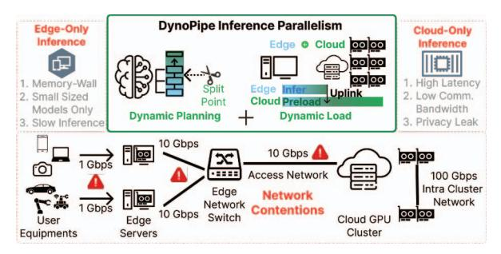
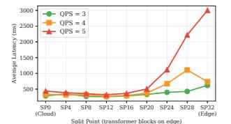
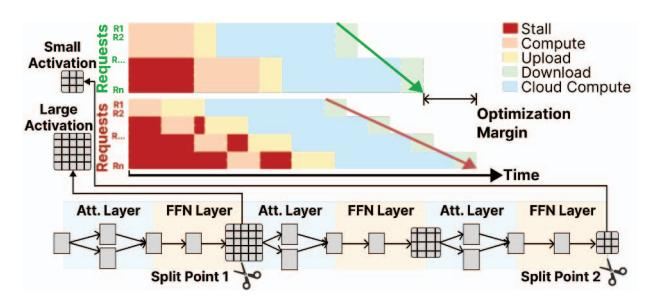
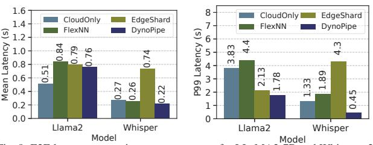
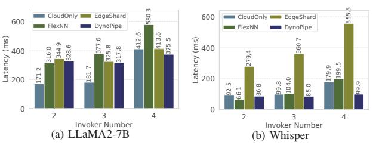
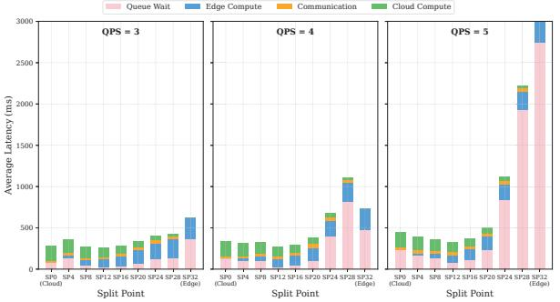
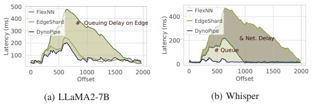
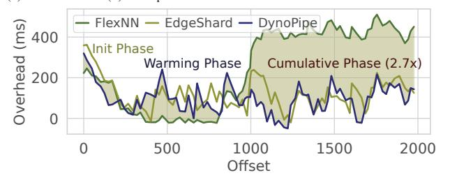

# DynoPipe: Heterogeneous Edge-Cloud LLM Serving with Dynamically Orchestrated Pipeline Boundaries

Yanying Lin1,2,3, Baicheng Chen3, Xinyu Zhang3, Chengzhong Xu4, and Kejiang Ye1,\* 1Shenzhen Institutes of Advanced Technology, Chinese Academy of Sciences 2University of Chinese Academy of Sciences 3University of California San Diego 4University of Macau

*Abstract***—Large language model (LLM) deployment at the network edge faces a fundamental paradox: applications require full-scale models for sophisticated reasoning, yet edge devices impose severe resource constraints across computation, memory, and network. Existing approaches fail to effectively orchestrate resources across the edge-cloud continuum, leaving capacity underutilized while struggling with heterogeneous and volatile distributed environments. We present DynoPipe, an adaptive edge-cloud system that addresses these constraints through dynamic pipeline parallelism with shifting computational boundaries. DynoPipe tackles three core challenges: structural heterogeneity causing 94% pipeline idle time, temporal resource volatility invalidating static partitioning, and boundary migration overhead trapping systems in suboptimal configurations. Through boundary-constrained pipeline construction, proactive multi-configuration orchestration, and hierarchical state management, DynoPipe eliminates the memory wall while preserving data locality, achieving 10.1**× **throughput improvement over edge-only baselines and 1.6**× **over cloud-only execution, with 99.2**% **latency reduction.**

#### **1. Introduction**

Edge-centric LLM deployment faces a fundamental trade-off: applications need full-scale models for complex reasoning, but edge devices lack the resources to run them. This constraint manifests across the edge-cloud continuum, where limited local compute and memory resources conflict with the substantial requirements of modern LLMs, while constrained uplink bandwidth creates additional bottlenecks for cloud offloading [1–3]. Furthermore, privacy-critical applications in domains such as healthcare and finance necessitate local processing, making straightforward cloud migration strategies impractical [4–6].

Existing solutions exhibit fundamental architectural limitations that preclude effective edge LLM deployment. Cloud offloading creates prohibitive network latency for interactive applications [1, 7, 8] while exposing privacy sensitive raw data to servers over public network [4, 9, 10]. Model compression through quantization and distillation [11–14] incurs severe accuracy degradation for complex reasoning tasks requiring full representational capacity. Edge federation encounters quadratic synchronization overhead as the number of devices scales [15–17], causing memory fragmentation and communication bottlenecks that eliminate resource pooling benefits. These inherent trade-offs necessitate a paradigm that overcomes singledomain constraints via cross-boundary resource orchestration.

Kejiang Ye is the corresponding author.



Fig. 1: DynoPipe addresses the fundamental trilemma of edge LLM deployment: computational bottlenecks at the edge, network latency in cloud offloading, and resource fragmentation across the edge-cloud continuum through adaptive pipeline parallelism with dynamic boundary shifting.

**DynoPipe Proposal.** As illustrated in Fig. 1, we propose DynoPipe, a system that dynamically orchestrates LLM inference across edge-cloud boundaries through adaptive pipeline parallelism with shifting computation boundaries. DynoPipe strategically partitions inference stages based on real-time resource availability: the edge executes privacy-sensitive embeddings while transmitting only compact activation tensors to the cloud for computation-intensive operations. This boundaryshifting design circumvents the memory wall by offloading heavyweight computations while preserving data locality.

**Challenges.** First, *structural heterogeneity* creates fundamental pipeline imbalances where edge-cloud computational asymmetry prevents effective workload distribution [18–20]. Edge devices with limited memory bandwidth cannot match cloud servers' computational throughput, creating severe bottlenecks at boundary stages. The memory wall effect [21] forces edge components to operate at lower utilization rates while cloud resources remain underutilized due to pipeline synchronization constraints, resulting in 94% pipeline idle time (§2.1). This asymmetric architecture forces the entire pipeline to operate at the slowest component's pace, fundamentally limiting throughput despite abundant cloud resources.

Second, *temporal resource volatility* invalidates static boundary placement through dynamic interference patterns that create cascading performance degradation [7, 22]. Thermal throttling creates computational performance degradation of up to 25%, while network-compute correlation creates feedback loops where

queuing delays trigger retransmissions, amplifying contention and causing oscillatory behavior. These temporal variations shift optimal boundary placement by multiple stages within minutes, making static optimization ineffective for online workloads (§2.2). The fundamental issue is that edge-cloud systems exhibit non-linear performance characteristics where small resource fluctuations can trigger threshold effects, causing dramatic shifts in optimal partitioning strategies that static approaches cannot anticipate or adapt to.

Third, *boundary migration overhead* traps the system in suboptimal configurations by creating prohibitive state transfer costs that exceed the benefits of adaptation [23–25]. Stateful reconfiguration incurs multi-dimensional overhead where transferring accumulated state requires tens of seconds to rebuild the cache, creating service interruptions exceeding acceptable latency bounds (§2.3). The migration cost prevents dynamic adaptation to changing resource conditions, undermining the elasticity required for efficient edge–cloud collaboration. This creates a fundamental paradox: while dynamic adaptation is necessary for optimal performance, the cost of adaptation itself becomes the primary performance bottleneck, forcing systems to remain in increasingly suboptimal configurations as workload conditions evolve.

**Methodology.** DynoPipe addresses these challenges through a boundary-aware optimization framework operating across three interconnected dimensions. *Boundary-constrained pipeline construction* (§4.1) formulates pipeline partitioning as an optimization problem that models heterogeneous transition costs across edge-cloud boundaries, accounting for computational asymmetry, memory hierarchy mismatch, and network topology disparities. The algorithm generates boundary configuration portfolios (bandwidth-constrained, compute-constrained, memory-constrained) using dynamic programming for precise optimization under resource asymmetry.

*Proactive multi-configuration orchestration* (§4.2) addresses temporal resource volatility through pre-computed boundary portfolios that monitor resource conditions via lightweight telemetry and switch configurations when thresholds are violated. Under bandwidth contention, it selects activation-minimal boundaries; under abundant bandwidth, it shifts boundaries earlier to maximize cloud utilization, avoiding prohibitive state reconstruction overhead.

*Hierarchical state orchestration* (§4.3) enables rapid boundary migration through parameter overlap caching and bandwidthaware state partitioning. The system maintains overlapping parameter sets across domains for sub-millisecond GPU-to-GPU transfers via PCIe/NVLink, while exploiting edge-cloud link asymmetry by streaming state transfers asynchronously through surplus downlink capacity. Temporal state compression through differential KV cache representations reduces reconfiguration overhead from seconds to milliseconds while maintaining cache continuity across boundary transitions.

We evaluated DynoPipe on real-world workloads using a 16-

server edge-cloud testbed. Results demonstrate that DynoPipe achieves efficient full-scale LLM inference by overcoming memory wall constraints through edge-cloud collaboration. DynoPipe reduces TTFT latency by 98.9% (from 68.53s to 0.74s) and improves throughput by 10.1× compared to edge-only solutions. Compared to cloud-only execution, DynoPipe achieves 1.6× throughput improvement by converting single-GPU serialization into edge-cloud pipeline parallelism, significantly reducing queueing overhead as the dominant latency component. By eliminating the memory wall through collaborative pipeline architecture, DynoPipe reduces request waiting latency by 99.2%.

**Contributions.** This paper makes the following contributions:

- A boundary-aware pipeline parallelism system that enables efficient LLM inference across heterogeneous edge-cloud environments through dynamic computation orchestration and adaptive resource allocation under structural asymmetry constraints.
- A profiling-driven heuristic orchestration framework that addresses computational asymmetry, memory hierarchy mismatch, and network topology disparities through boundaryconstrained partitioning and proactive portfolio-based configuration selection, with empirically validated robustness under diverse edge-cloud operating regimes.
- A hierarchical state orchestration mechanism that enables rapid boundary migration through parameter overlap caching and bandwidth-aware state partitioning, reducing reconfiguration overhead from seconds to milliseconds while maintaining inference continuity across dynamic bottleneck transitions.

# **2. Background and Motivation**

Large language models face fundamental deployment challenges across the edge-cloud continuum. Edge deployments suffer from memory wall constraints [21], while cloud-only solutions suffer from prohibitive network latency [1, 7, 8] and privacy risks [4, 5]. Pipeline parallelism emerges as a natural solution partitioning computation so that privacy-sensitive operations remain local while compute-intensive tasks leverage cloud resources—but applying it across heterogeneous edge-cloud boundaries introduces three critical challenges.

#### **2.1 Resource Competition for Online Workloads**

Pipeline parallelism partitions computation across heterogeneous nodes, enabling edge devices to handle privacy-sensitive operations while cloud resources execute compute-intensive tasks [18, 26, 27]. However, edge deployments face fundamental constraints: limited GPU memory restricts model capacity, concurrent request handling intensifies memory pressure and bandwidth contention, and these resource boundaries fluctuate continuously, invalidating static partitioning assumptions [28, 29].

*Multi-model deployment constraints* exacerbate resource competition. Edge devices often require simultaneous support for


Fig. 2: The latency and queue length of the LLaMA2-7B inference process. (a) Queue length of model inference individually vs. pipeline parallelism. (b) Latency of model inference in network contention and spare bandwidth.

diverse tasks (speech recognition, image processing, NLP), but resource limitations make concurrent high-performance model deployment impractical, and frequent model loading/unloading further increases latency.

*The effectiveness of caching is reduced* due to the continuous growth of KV caches in LLMs. Models with chain-of-thought (CoT) phases generate thousands of tokens as context before producing output, demanding substantial memory for intermediate storage. Edge devices with limited capacity frequently trigger cache eviction, causing pipeline stalls for KV reconstruction. Pipeline parallelism addresses this by partitioning models into stages and enabling concurrent batch processing, reducing queue length by approximately 79.8% (Fig. 2a).

*Bandwidth contention* is exacerbated by concurrent multi-task inference. Edge LLM services typically share the same router, so concurrent tasks compete for bandwidth: with four concurrent inference tasks, effective per-task bandwidth drops from 10 Gbps to below 2.5 Gbps, increasing activation transmission latency by 4.9× (from 1.68 ms to 8.2 ms). This invalidates the communication latency assumptions underlying static pipeline design. Our case study shows that alleviating bandwidth contention reduces end-to-end latency by 43% (Fig. 2b).

*Cloud-only deployment limitations* emerge under realistic load conditions. While cloud-only execution (all layers on cloud GPU) achieves optimal single-request latency (179ms for LLaMA2-7B), it degrades catastrophically under concurrent load: at QPS=5, queueing accounts for 62% of total latency (295ms out of 478ms) due to single-GPU serialization. In contrast, edge-cloud pipeline collaboration (split at layer 12) reduces queueing to 26% of total latency through pipeline parallelism, achieving 39% lower end-to-end latency and 64% higher throughput despite introducing network transfer overhead (Fig. 3). This demonstrates that the fundamental advantage of edge-cloud collaboration lies not in resource augmentation but in the throughput multiplier effect of pipeline parallelism under load.

**Insight 1.** *Dynamic resource contention at the edge, due to concurrent multi-model deployment and bandwidth competition, invalidates static partitioning assumptions. This necessitates adaptive edge-cloud orchestration that dynamically responds to real-time resource availability and workload characteristics.*




- (a) Average latency across split points
- (b) Throughput across split points

Fig. 3: Split-point (SP) study on LLaMA2-7B under Poisson arrivals (QPS=3/4/5). Cloud-only (SP=0) and edge-only (SP=32) are consistently suboptimal; intermediate split points achieve the best latency-throughput tradeoff through pipeline parallelism.

#### **2.2 Heterogeneous Architecture Constraints**

Edge-cloud architectures exhibit fundamental resource asymmetries that create structural constraints on pipeline design. These three-dimensional disparities—computation (0.48×), memory (2.5×), and communication (80×)—fundamentally constrain pipeline adaptability through cascading effects that compound across system layers.

*Computation imbalance* creates stage latency skew that prevents efficient pipeline balancing. H100 GPUs (989 TFLOPS) versus NVIDIA Thor at the edge (2070 TOPS) reflect a 0.48× compute disparity. During LLaMA2-70B prefilling, this disparity manifests as asymmetric execution patterns: attention layers exhibit 2.7× latency variance between domains, while feed-forward networks show 1.8× variance. The critical insight is that different operator types experience varying degrees of heterogeneity amplification—attention operations suffer disproportionately on edge devices due to memory bandwidth limitations, while embedding layers show minimal performance degradation. This operator-specific heterogeneity creates irregular pipeline bubbles that resist traditional load balancing, producing up to 67% theoretical idle time as fast stages wait for heterogeneityamplified slow stages.

*Memory hierarchy mismatch* forces architectural rigidity through constrained stage granularity. Edge DRAM (64GB, 51.2 GB/s) versus cloud HBM (140GB, 3.35 TB/s) creates a 65× bandwidth disparity that compounds memory capacity constraints. This mismatch manifests in two critical ways: (1) *Stage fragmentation*—edge memory constraints force fine-grained partitioning that reduces computation-communication overlap opportunities, and (2) *Cache hierarchy violations*—KV cache access patterns optimized for HBM exhibit severe performance degradation on DRAM, creating 4.2× latency penalties for longcontext inference. The hierarchy mismatch prevents flexible stage reassignment: stages optimized for HBM access patterns cannot efficiently migrate to DRAM-based edge nodes without fundamental algorithmic restructuring.

*Communication topology asymmetry* creates bandwidthlatency trade-offs that dominate runtime characteristics. Edgecloud links (10 Gbps, 15ms RTT) versus cloud interconnects (800 Gbps RDMA, 1.5s RTT) exhibit 80× bandwidth and 10,000× latency disparities. This asymmetry makes tensor parallelism prohibitively expensive across edge-cloud boundaries: AllReduce overhead increases from 0.8ms (NVLink) to 25ms (edge-cloud) for LLaMA2-70B attention, yielding 94% efficiency degradation. The topology asymmetry also creates *activation accumulation effects* where boundary stages buffer increasing intermediate results during network congestion, causing memory pressure cascades throughout the pipeline.

These constraints exhibit *multiplicative interaction effects* that severely limit pipeline adaptability. Computation imbalance amplifies memory pressure; memory constraints reduce communication overlap; communication latency prevents load redistribution. This creates a constraint satisfaction problem with limited feasible solutions, fundamentally restricting adaptability compared to homogeneous environments.

**Insight 2.** *Heterogeneous edge-cloud architectures create architectural rigidity through multiplicative constraint interactions—computation imbalance, memory hierarchy mismatches, and communication asymmetries—that severely limit pipeline adaptability.*

# **2.3 Performance Bottlenecks at Boundary Stage**

Edge-cloud pipelines exhibit dynamic bottleneck migration that compounds the structural constraints from §2.2. Unlike homogeneous systems where bottlenecks remain localized, heterogeneous edge-cloud architectures create shifting performance constraints that invalidate static optimization approaches.

*Edge node bottlenecks* emerge from memory pressure amplified by concurrent workloads. When multiple LLM tasks compete for limited edge memory, cache eviction triggers pipeline stalls for KV reconstruction. Our measurements show 43% latency increases during peak load with four concurrent tasks. The computation imbalance (0.48× disparity) dynamically amplifies: attention-heavy workloads saturate edge compute while embedding operations underutilize cloud resources, creating asymmetric pipeline bubbles.

*Boundary stage bottlenecks* occur at edge-cloud transition points where structural asymmetries concentrate. These stages accumulate the compounded effects of computation imbalance, memory constraints, and communication latency. During LLaMA2-70B prefilling, boundary stages experience up to 82% idle time as edge-cloud execution mismatches are amplified by dynamic load variations. The boundary becomes a convergence point for multiple constraint violations, creating cascading pipeline stalls.

*Network link bottlenecks* arise from bandwidth contention that transforms the 80× communication disparity into a dynamic constraint. Concurrent tasks reduce effective bandwidth from 10 Gbps to 2.5 Gbps, increasing activation transmission latency from 1.68 ms to 8.2 ms (4.9× increase). This dynamic degradation invalidates static pipeline assumptions, as boundary stages must buffer increasing activation volumes while waiting for congested network transfers.

The critical insight is bottleneck migration: performance constraints shift dynamically among edge nodes, boundary stages, and network links based on workload characteristics


Fig. 4: DynoPipe architecture: (1) Heterogeneous Pipeline Construction profiles operators and builds boundary-optimized pipelines offline; (2) Dynamic Orchestration monitors resource conditions and switches between pre-computed configurations; (3) Hierarchical State Management preserves KV cache continuity during reconfiguration through predictive staging.

and resource contention. This migration, combined with the architectural rigidity from three-dimensional constraints, prevents reactive adaptation strategies that assume fixed bottleneck locations.

**Insight 3.** *Performance bottlenecks in edge-cloud pipelines migrate dynamically across system components, amplified by structural constraints. This dynamic migration, combined with architectural rigidity, necessitates proactive multi-configuration orchestration rather than reactive adaptation.*

### **3. System Overview**

DynoPipe (Fig. 4) addresses the three challenges identified in §2 through three co-designed mechanisms.

**Boundary-Aware Pipeline Construction** (§4.1) formulates edge-cloud partitioning as a boundary-constrained optimization (Eq. 1) and uses dynamic programming to generate a compact portfolio of split-point configurations—each targeting a distinct resource regime (bandwidth-, compute-, or memory-constrained). A formal bound shows the portfolio size scales with the number of resource regimes rather than model depth, keeping it small in practice.

**Proactive Multi-Configuration Orchestration** (§4.2) selects among pre-computed configurations at runtime via the Latency-Regulated Placement (LRP) algorithm. LRP adapts a weighting parameter to the current bottleneck (network, compute, or memory), with hysteresis and cooldown mechanisms to prevent oscillatory switching while maintaining sub-millisecond decision latency.

**Hierarchical State Management** (§4.3) decomposes pipeline state into three tiers by migration criticality (KV caches, intermediate activations, auxiliary metadata) and pre-stages parameters through L1/L2/L3 memory hierarchy using predictive boundary estimation. When bandwidth drops below 1 Gbps, an adaptive recomputation fallback trades modest compute overhead for 90% bandwidth reduction, bounding worst-case migration to <120 ms.

# 4. DYNOPIPE Design

DYNOPIPE addresses diverse edge scenarios through boundary-aware pipeline construction, hierarchical state management, and dynamic orchestration. By jointly optimizing computational and communication constraints, DYNOPIPE enables adaptive inference across the edge-cloud continuum.

# 4.1 Edge-Cloud Collaborative Parallelism

Edge-cloud collaborative parallelism requires *boundary-aware* pipeline construction that explicitly models cross-domain transition costs. The core innovation centers on *boundary stages*—transition points where computation migrates between edge and cloud domains. Unlike homogeneous pipelines, boundary stages must reconcile computational asymmetry (0.48× disparity), memory hierarchy mismatch (65× bandwidth gap), and communication overhead (80× disparity), making boundary placement the primary performance determinant.

Boundary placement governs the privacy-efficiency tradeoff: edge-heavy configurations preserve privacy but sacrifice performance, while cloud-aggressive offloading maximizes efficiency at privacy cost. This distinguishes collaborative parallelism from traditional homogeneous optimization that assumes uniform resources.

#### 1) Heterogeneity-Aware Pipeline Formulation

We formulate collaborative parallelism as a boundary-constrained optimization problem that explicitly models heterogeneous resource transitions. Consider model stages  $\{l_1, l_2, \ldots, l_n\}$  distributed across edge domain  $\mathcal{E}$  and cloud domain C, where execution time  $T_{exec}(l_i)$  varies dramatically based on resource domain assignment. The boundary stage at position  $l_B$  incurs additional heterogeneous transition overhead  $T_{boundary}(l_B)$  encompassing cross-domain communication and state synchronization.

The optimization objective captures the essence of boundaryaware collaborative parallelism:

$$\min \left\{ \max_{1 \le i \le n} \left\{ T_{exec}(l_i) + \mathbb{I}_{boundary}(l_i) \cdot T_{boundary}(l_i) \right\} \right\}$$
 (1)

where  $\mathbb{I}_{boundary}(l_i) = 1$  if stage  $l_i$  crosses the edge-cloud boundary, and 0 otherwise. This formulation explicitly accounts for heterogeneous transition overhead that dominates collaborative parallelism performance, distinguishing it from homogeneous pipeline optimization.

The boundary overhead  $T_{boundary}(l_i)$  encompasses three heterogeneity-specific components: activation tensor serialization and deserialization, cross-domain transfer across heterogeneous network links, and state synchronization requirements between edge and cloud domains. Additionally, potential data format conversion between heterogeneous accelerators (e.g., CPU tensors to GPU format) contributes to the overall boundary transition cost.

Traditional pipeline optimization fails in edge-cloud environments due to resource asymmetry. Homogeneous approaches assume uniform resources, but edge devices exhibit only 52% computational efficiency versus cloud GPUs. This imbalance creates cascading stalls, degrading throughput by up to  $3.2\times$  compared to optimal boundary placement.

#### 2) Multi-Configuration Boundary Optimization

Traditional pipeline systems generate a single optimal configuration, but edge-cloud heterogeneity demands multiple boundary configurations to adapt to dynamic resource conditions. DynoPipe constructs a portfolio of boundary configurations, each optimized for different heterogeneous scenarios: bandwidth-constrained configurations minimize activation transfers; compute-constrained configurations maximize cloud utilization; memory-constrained configurations respect edge device limitations.

The boundary optimization employs dynamic programming to efficiently explore the exponential search space of heterogeneous resource assignments. We define  $F(d,l;\mathcal{R})$  as the optimal execution time for stages [1,l] using d heterogeneous domains under resource constraint set  $\mathcal{R}$ :

$$F(d, l; \mathcal{R}) = \min_{1 \le i \le l} \left\{ \max\{F(d-1, i-1; \mathcal{R}), \right.$$

$$T_{exec}(i, l) + T_{boundary}(i) \right\}$$

$$\left. \mid \mathcal{R}_{constraint}(l) \right\}$$
(2)

This recurrence explicitly models boundary stage overhead when transitioning between heterogeneous domains, enabling precise optimization under resource asymmetry. The constraint set  $\mathcal{R}_{constraint}(l)$  ensures that each configuration respects domain-specific limitations: edge memory bounds, cloud GPU availability, and network bandwidth thresholds.

The multi-configuration approach addresses static pipeline systems' inability to adapt to dynamic heterogeneous conditions. Edge-cloud environments exhibit temporal variations that shift optimal boundary placement within minutes: bandwidth fluctuations reduce capacity by 60-80% during peak usage, while thermal throttling decreases edge performance by 25-40%. Static configurations optimized for average conditions lead to resource underutilization or performance degradation under these dynamic scenarios.

#### 3) Activation-Aware Boundary Selection

The boundary selection algorithm evaluates heterogeneous transition costs through three domain-specific criteria. Activation-minimal boundaries (min  $|A_b|$ ) target tensor compression points where attention sparsity or quantization reduces cross-domain transfer volumes. Computation-balanced boundaries distribute workload proportionally to device capabilities  $(T_{edge}(1,b) \approx 0.48 \cdot T_{cloud}(b+1,n))$ , reflecting empirically observed edge-cloud computational asymmetry. Memory-aware boundaries respect edge constraints  $(\sum_{i=1}^b M_i \leq M_{edge}^{max})$  while maximizing local computation to minimize cloud dependency.

The algorithm integrates these criteria through adaptive weighting that responds to resource conditions: bandwidth contention prioritizes activation-minimal boundaries, compu-


Fig. 5: Potential split points in the LLM computational graph.

tational stress emphasizes computation-balanced placement, and memory pressure favors memory-aware configurations. This eliminates exhaustive boundary search while maintaining optimal performance across heterogeneous scenarios.

# *4) Boundary Configuration Portfolio*

DynoPipe pre-computes 3-5 boundary configurations targeting distinct heterogeneous scenarios (Fig. 5). The bandwidthconstrained configuration places boundaries after attention layers where tensor sparsity minimizes communication volume. The compute-optimized configuration leverages abundant cloud resources through early boundary placement, accepting larger activation transfers for superior throughput. The memoryconstrained configuration optimizes for minimal edge footprint when memory pressure exceeds 90%.

The orchestration module monitors heterogeneous resource conditions through lightweight telemetry, switching configurations when performance thresholds are violated. This proactive approach avoids the high reconstruction overhead of reactive reconfiguration while maintaining service availability under varying heterogeneous conditions.

**Portfolio Size Bound.** For a single edge-cloud boundary (§4.2), the DP recurrence (Eq. 1) maps each resource state R = (, , ) to an optimal split point <sup>∗</sup> (R) ∈ {0, 1,...,}, where is the number of candidate split points (model-dependent; equal to the number of transformer blocks for decoder-only LLMs). Because and vary continuously with resource conditions while <sup>∗</sup> is discrete, <sup>∗</sup> (R) is piecewise-constant: the resource space partitions into contiguous cells that each map to a single optimal SP. With resource dimensions and at most qualitatively distinct regimes per dimension (e.g. free / moderate / contention for bandwidth), the number of cells is at most . Monotonic relationships between resource constraints and boundary placement—higher bandwidth favors earlier SP (more cloud utilization), higher memory pressure favors later SP (smaller edge footprint) collapse many cells to the same ∗. The set of distinct optimal configurations therefore satisfies || ≤ min(, ). For architectures with uniform transformer blocks (e.g. LLaMA), per-layer cost functions are near-identical, so the monotonicity collapse is strong and || in practice. For models with


Fig. 6: DynoPipe's dynamic boundary optimization decision flow. The system monitors resource conditions to select optimal split points from pre-computed configurations, triggering reconfiguration when performance thresholds are violated.

heterogeneous layer types (e.g. MoE, mixed vision–language encoders), per-layer cost variation may increase ||, but the bound still grows with resource-regime count rather than linearly with model depth .

**Residual Connections and Boundary Placement.** Modern LLMs (e.g., LLaMA) employ residual connections *within* each transformer block ( = + Attn() + FFN(·)), but these residuals resolve at block boundaries. DynoPipe places split points exclusively *between* complete transformer blocks (Fig. 5), so the output tensor at each candidate boundary is a fully resolved hidden state with no outstanding skip connections. This eliminates cross-domain residual synchronization and keeps the activation tensor transmitted to the cloud identical in shape and semantics regardless of placement, requiring no additional buffering or recomputation.

**Privacy Risk Analysis.** Achieving full privacy requires either edge-only deployment (limited by device memory) or homomorphic encryption (with impractical latency [30–32]). DynoPipe takes a practical approach: sensitive embeddings stay on the edge, and only deeper activations are sent to the cloud. While intermediate representations could leak partial input data in theory [10], effective attacks are rare in real deployments given the need for detailed model knowledge and representative data [33]. Using multi-boundary splits (locally computing both input and output layers) may slightly improve privacy, but doubles edge work and network cost without eliminating the residual risk from intermediate activations [10].

#### **4.2 Dynamic Orchestration of Stages**

Dynamic orchestration enables adaptive boundary placement in edge-cloud environments facing fluctuating resources—such as network bandwidth drops during congestion, computational load imbalance, and up to 10× variation in activation sizes across model layers due to structural sparsity (Fig. 6). The key insight is that LLMs have heterogeneous communication cost: attention layers benefit from structured sparsity [34, 35] and quantization yields varying compression ratios [11, 36]. Communication-efficient layers appear at different locations in the model, creating trade-offs between transfer reduction and edge compute load. Systematic orchestration is thus required to allocate stages dynamically across edge and cloud, optimizing overall performance under changing conditions (Fig. 7).

## 1) Adaptive Boundary Selection Framework

The dynamic orchestration problem constitutes a constrained optimization challenge that must simultaneously balance performance, communication overhead, and resource utilization while respecting computational graph dependencies. We formulate this as a boundary-constrained placement optimization where the objective minimizes the maximum communication time across pipeline stages:

$$\min \left\{ \max_{1 \le i \le D} \left\{ \sum_{1 \le j \le G_i} T_{req}(i, j) + \lambda \cdot T_{comm}(i, j) \right\} \right\}$$
(3)

where  $T_{req}(i,j)$  represents the computational time for processing request j on device i,  $T_{comm}(i,j)$  captures the communication overhead for stage transitions, and  $\lambda$  is a dynamic weighting factor that adapts to current network conditions. The inner summation aggregates computational and communication costs across all stages  $G_i$  assigned to device i, while the outer maximization identifies the critical bottleneck device.

To manage the exponential complexity of this optimization, we leverage domain-specific constraints inherent to edge-cloud architectures. Since edge-to-cloud communication latency significantly exceeds intra-cloud communication (typically 10-50× higher), we constrain the system to a single edge-to-cloud boundary per request. This transforms the complex multi-boundary optimization into an efficient single split-point selection problem: stages before the boundary execute at the edge, while subsequent stages run in the cloud. Exact runtime solving of Eq. 3 is too costly: evaluating all n split points incurs O(n) overhead, which exceeds the sub-millisecond latency budget needed for online serving. Instead, we use a heuristic portfolio-selection approach, narrowing each decision to O(|K|) table lookups ( $|K| \le 5$ ), balancing efficiency and coverage of practical deployment regimes (§5.6).

The boundary selection framework operates through three interconnected optimization criteria:

**Communication-Minimal Boundaries:** Identify split points that minimize activation transfer volume by exploiting attention sparsity, quantization compression, and layer-specific activation patterns. These boundaries target natural compression points where  $|A_b| \ll |A_{avg}|$ , reducing cross-domain transfer costs.

**Load-Balanced Boundaries:** Distribute computational workload proportionally to device capabilities, ensuring  $T_{edge}(1,b) \approx \alpha \cdot T_{cloud}(b+1,n)$  where  $\alpha$  reflects the empirically observed edge-cloud computational asymmetry (0.4-0.6).

**Resource-Constrained Boundaries:** Respect edge device limitations while maximizing local computation, ensuring  $\sum_{i=1}^b M_i \leq M_{edge}^{max}$  and  $\sum_{i=1}^b C_i \leq C_{edge}^{available}$ .

# 2) Real-Time Boundary Adaptation Algorithm

**Runtime Objective.** At each decision epoch, LRP selects a boundary  $b \in \mathcal{K}$  from the pre-profiled portfolio that minimizes predicted end-to-end latency  $\hat{T}_{e2e}(b)$ —comprising queueing, edge execution, network transfer, cloud execution, and switching overhead—under current resource conditions, rather



Fig. 7: DYNOPIPE mitigates network bandwidth contention by dynamically selecting activation volumes transmitted over the access network, achieving progressively better optimization as request volume increases.

than re-solving the full placement problem online. The Latency-Regulated Placement (LRP) algorithm dynamically reconfigures pipeline boundaries through pre-computed configuration portfolios, addressing the trade-off between adaptation responsiveness and computational overhead.

LRP employs bottleneck-aware adaptive weighting that adjusts placement priorities based on the dominant system bottleneck. When bandwidth is limited,  $\lambda$  increases to favor activation-minimizing boundaries; under heavy computational load,  $\lambda$  decreases for balanced workload distribution; in memory-constrained situations, device memory limits take precedence. This context-sensitive adjustment maintains low latency while ensuring sub-millisecond decision overhead.

Configuration stability uses hysteresis mechanisms preventing oscillatory switching. Boundary transitions occur only when performance improvements exceed threshold  $\delta$  (15-20%), with cooldown periods preventing rapid reconfigurations. This reduces reconfiguration overhead from seconds to milliseconds.

The pre-computed portfolio maintains 3-5 specialized configurations: bandwidth-constrained (boundaries after attention layers), compute-constrained (early cloud placement), memory-constrained (minimal edge footprint), and balanced (proportional distribution). This achieves competitive performance with submillisecond selection latency.

Blended Constraints and Sensitivity. Under simultaneous resource constraints (bandwidth and memory pressure), the SelectBoundary function (Algorithm 1) evaluates active triggers and selects the configuration minimizing worst-case stage latency across all constraints. The hysteresis threshold (15-20%) and cooldown period balance adaptation responsiveness with stability: aggressive switching increases reconfiguration overhead with minimal gains, while conservative thresholds delay beneficial adaptations. The weighting parameter  $\lambda$  uses exponential smoothing to prevent oscillation under fluctuating network conditions.

Assumptions, Rationale, and Limitations. LRP adopts a finite-portfolio heuristic rather than exhaustive online reoptimization or a learned controller: exhaustive search adds O(n) per-decision overhead incompatible with sub-millisecond budgets, while learned policies require training data and are hard to stabilize under shifting edge conditions. The heuristic

assumes (1) a single edge-cloud boundary per request, valid when cross-domain latency dominates intra-domain communication (10–50× in our testbed); (2) monotonic resource-performance relationships, confirmed for uniform transformer architectures (Table III) but potentially weaker for MoE or mixed-modality models; and (3) representative offline profiles. The trigger ordering (bandwidth → compute → memory) reflects empirical bottleneck severity; under blended constraints, SelectBoundary minimizes worst-case stage latency across all active triggers. LRP does not guarantee global optimality—architectures with irregular per-layer costs or highly non-stationary environments may require larger portfolios or learned adaptation.

**Profiling Methodology.**  $T_{\rm comp}$ ,  $T_{\rm mem}$ , and  $T_{\rm comm}$  in Algorithm 1 are obtained from a lightweight offline profiling phase that executes representative prompts (128 tokens, batch=1/4/8) on each device pair. Per-layer execution time and activation sizes are measured and stored in a lookup table (<30 KB per model); runtime adaptation uses these profiles plus live telemetry (bandwidth, GPU utilization, memory pressure sampled every 500 ms) to re-evaluate placement decisions.

**Four-Dimensional Optimization Relationship.** The ablation study in §5.6 reveals that optimal split-point placement is a dynamic function of four interacting variables: request arrival rate  $\lambda$ , network conditions (RTT, bandwidth), edge compute capability  $\alpha_{edge}$ , and model structure. The total request latency decomposes as:

$$T_{\text{total}} = T_{\text{queue}}(\lambda, \mu) + T_{\text{edge}}(SP) + T_{\text{net}}(SP, RTT) + T_{\text{cloud}}(SP)$$
 (4)

where the effective pipeline service rate  $\mu(SP)=1/\max(T_{\text{edge}}(SP),T_{\text{cloud}}(SP))$  determines system capacity. At low load  $(\lambda\ll\mu)$ , minimizing single-request latency favors SP=0 (cloud-only). As load approaches capacity  $(\lambda\to\mu)$ , maximizing throughput through balanced split points that satisfy  $T_{\text{edge}}\approx T_{\text{cloud}}$  becomes critical. Under network contention, the optimal SP shifts to balance transmission volume against pipeline efficiency. This relationship validates DynoPipe's multi-configuration portfolio: different configurations naturally correspond to different operating regions in this four-dimensional space, and the LRP algorithm selects the appropriate configuration based on real-time monitoring of all four dimensions.

# 4.3 State Orchestration in Heterogeneous Pipelines

Hierarchical State Decomposition and Predictive Staging. DynoPipe introduces a state decomposition framework that categorizes pipeline state into three distinct tiers based on migration criticality and reconstruction complexity. *Critical frontier states* encompass KV caches and attention weights essential for maintaining generation coherence across boundary transitions. *Intermediate activations* represent layer outputs that can be selectively recomputed with bounded overhead. *Auxiliary metadata* includes normalization statistics and positional encodings that exhibit high spatial locality.

DynoPipe employs predictive parameter staging that exploits

Algorithm 1: Latency-Regulated Placement (LRP)

```
Input: Model stages S_1, \ldots, S_n; Edge devices E; Cloud devices C;
          Network state N
   Result: Heuristic stage placement minimizing pipeline latency
  Function ComputeCost (S_i, D_j, \lambda):
   return \alpha \cdot T_{comp}(S_i, D_j) + \beta \cdot T_{mem}(S_i, D_j) + \lambda \cdot T_{comm}(S_i);
{\tt 3} Function SelectBoundary ({\tt system\_state}):
4
       if bandwidth < \tau_{bw} then
           return boundaryactivation_minimal
       end
       if edge\_load > \tau_{compute} then
           return boundaryearly cloud
10
       if memory\_pressure > \tau_{mem} then
        return boundarymemory_aware
11
       end
12
13
       return boundarybalanced;
14 Pre-compute boundary configurations for resource scenarios;
15 while System active do
       state = monitor network, compute, memory conditions;
17
       target_boundary = SelectBoundary(state);
       if Boundary change AND improvement > \delta then
18
            \lambda = adapt weighting to dominant bottleneck;
19
            foreach stage Si do
20
                Find device D^* minimizing ComputeCost (S_i, D_j,
21
                Assign S_i \to D^* with hysteresis threshold \delta;
22
23
            Execute boundary migration;
       end
25
26 end
```

reconfiguration locality through a three-tier memory hierarchy. L1 staging caches hot boundary configurations with sub-millisecond access; L2 maintains secondary transition candidates; L3 provides demand-driven fallback. This anticipatory positioning eliminates cold-start penalties by pre-staging critical parameters at likely transition boundaries, reducing migration overhead from seconds to microseconds.

Single- vs. Multi-User KV Cache Management: Under single-user serving, KV caches grow linearly with context length and reside entirely within the assigned domain (edge or cloud). Under multi-user concurrent serving, per-request KV caches compete for edge GPU memory, which may trigger earlier boundary shifts to cloud-heavy configurations that reduce edge memory pressure. DynoPipe's state orchestration handles both regimes uniformly: the hierarchical tier structure evicts cold per-request caches (LRU policy) while preserving hot caches for active requests, and boundary selection accounts for aggregate KV memory via the memory-pressure trigger (>90%) in Algorithm 1.

Adaptive Recomputation Scheduling: When uplink bandwidth drops below 1Gbps, DynoPipe dynamically switches to a recomputation-based recovery mode. The system maintains lightweight checkpoints at strategic layer boundaries and reconstructs intermediate states through selective forward passes, trading modest compute overhead (15-25% increase) for dramatic bandwidth reduction (90% decrease).

## **5. Evaluation**

## **5.1 Experimental Setup**

We evaluate DynoPipe on a production-representative testbed that mirrors real-world edge-cloud deployments, using real request traces to stress-test dynamic orchestration under realistic workload variability. The testbed comprises a cloud cluster and a geographically distributed edge tier. The cloud cluster consists of 12 servers equipped with 16 NVIDIA A40 GPUs (48GB HBM2 each), interconnected via 100 Gbps RDMA-capable InfiniBand for low-latency inter-GPU communication. Each cloud server runs Ubuntu 22.04 with 512GB DDR4 memory, providing sufficient host resources for batched request processing and state management.

**Edge Environment.** The edge tier consists of NVIDIA RTX 3090 GPUs (24GB GDDR6X) deployed at geographically distributed edge locations. Edge devices connect to the cloud cluster through a shared 10 Gbps uplink (measured RTT: 5–50ms depending on cross-region routing and congestion), reflecting realistic WAN conditions for edge deployments. Edge-to-edge communication uses a local 1 Gbps LAN (RTT <3ms).

**Workload.** We evaluate DynoPipe using the Microsoft Azure Functions (MAF) trace [37], which captures production-scale request patterns with coefficient of variation exceeding 2.5 and inter-arrival times spanning four orders of magnitude. This workload's inherent burstiness and temporal clustering stress-tests dynamic resource allocation mechanisms critical for edge-cloud LLM serving [8, 38–41]. We map MAF invocations to LLM inference requests while preserving temporal correlations, with request parameters (prompt length, output tokens, temperature) sampled from the Splitwise distribution [42] to reflect realistic generation workloads.

**Baselines.** We benchmark DynoPipe against FlexNN [43] and EdgeShard [27], representing distinct paradigms in distributed LLM inference. FlexNN uses edge-centric pipeline parallelism with static layer allocation, exposing memory-compute constraints in edge-only deployments. EdgeShard implements fixed edge-cloud partitioning with offline optimization, revealing penalties of static allocation under dynamic conditions. We include a **Cloud-only** baseline (SP=0) to isolate pure-cloud performance and demonstrate that DynoPipe's gains arise from pipeline parallelism rather than cloud augmentation. These baselines isolate DynoPipe's dynamic orchestration contributions.

**Evaluation Metrics.** We evaluate DynoPipe using standard LLM serving metrics [44]: time to first token (TTFT), token throughput (Tput), and end-to-end (E2E) latency (mean, P50, P99) across batched requests.

### **5.2 System Performance**

Controlled workload evaluation (Table I) exposes fundamental scalability limits in edge-only architectures. FlexNN suffers catastrophic degradation as load increases: TTFT latency increases sharply from 19.68s to 68.53s between 2-8 QPS, with memory exhaustion rendering it unusable beyond 8

TABLE I: Performance of DynoPipe and FlexNN in LLaMA3.1-8B.

| QPS | Queue (s) |        | TTFT (s) |        | Tput (tok/s) |        |
|-----|-----------|--------|----------|--------|--------------|--------|
|     | DynoPipe  | FlexNN | DynoPipe | FlexNN | DynoPipe     | FlexNN |
| 2   | 0.30      | 43.86  | 0.10     | 19.68  | 922          | 277    |
| 4   | 0.40      | 55.78  | 0.47     | 27.03  | 1118         | 291    |
| 8   | 0.91      | 110.06 | 0.74     | 68.53  | 1327         | 304    |
| 16  | 1.25      | -      | 1.56     | -      | 1857         | -      |
| 24  | 1.49      | -      | 2.56     | -      | 2471         | -      |

*QPS: query/second.*

*Config: Temp=0.7, max out=4096 toks, max in=16392 toks, timeout=5s.*

TABLE II: Performance in different scale of models.

| Model       | Act.(M) Type |             | Throughput |                                 | TPOT (ms) |     |
|-------------|--------------|-------------|------------|---------------------------------|-----------|-----|
|             |              |             |            | FlexNN DynoPipe FlexNN DynoPipe |           |     |
| Whisper-V2  |              | 0.32 Speech | 1545       | 3900                            | 30        | 36  |
| LLaMA2-7B   |              | 1.2 Chat    | 263        | 2645                            | 54        | 73  |
| LLaMA3.1-8B |              | 1.45 Chat   | 290        | 1857                            | 68        | 65  |
| Qwen-14B-VL |              | 2.1 MM      | -          | 1640                            | -         | 84  |
| Qwen-32B-VL |              | 4.8 MM      | -          | 1309                            | -         | 134 |
| LLaMA3-70B  |              | 8.2 MM      | -          | 830                             | -         | 160 |

TPOT (Time Per Output Token) is calculated as the average decode time. MM refers to the multimodal model using LLM as the backbone. - indicates that the model cannot be deployed on the edge due to memory constraints.

QPS. DynoPipe maintains sub-second performance throughout, delivering 98.5% TTFT reduction and 4.4× throughput gains.

The root cause is edge memory-compute mismatch: efficient batching demands longer contexts, yet memory constraints force choosing between context length and concurrency. DynoPipe breaks this constraint through strategic layer placement—retaining input embeddings and initial attention at the edge while offloading memory-intensive operations to cloud. This enables 128K+ context processing with 16+ concurrent requests on resource-constrained edge hardware.

Scalability advantages amplify with model complexity (Table II). While FlexNN cannot deploy beyond 8B parameters, DynoPipe serves 70B models at 830 tokens/second with 160ms per-token latency. Performance gains scale with activation complexity: from 2.5× throughput improvement for WhisperV2 to 10.1× for LLaMA2-7B, demonstrating DynoPipe's fundamental advantage of edge-cloud workload distribution.

**TPOT vs. Throughput Trade-off.** The apparent contradiction between higher TPOT and lower mean latency in Table II arises from the distinction between per-token decode time and end-to-end request latency. DynoPipe's pipeline parallelism introduces modest per-token overhead from edge-to-cloud traversal (network transfer + cross-domain synchronization), increasing TPOT from 54ms to 73ms for LLaMA2-7B. However, this pipeline structure enables concurrent request processing that dramatically reduces queueing delay—the dominant latency component under load. Pipeline parallelism overlaps edge and cloud stages, allowing multiple simultaneous requests and reducing waiting time far more than per-token overhead adds. The 10.1× throughput gain reflects concurrent processing across pipeline stages, while TPOT measures sequential per-token decode latency. Detailed latency breakdown appears in §5.6.


Fig. 8: Latency comparison of DynoPipe and FlexNN in LLaMA3.1-8B model under MAF workload. (a) End-to-end latency. (b) Time to First Token Latency. (c) Queue latency.



Fig. 9: E2E latency comparison across systems for LLaMA2-7B and Whisper-v2 models under the MAF workload. DynoPipe provides the lowest tail latency across both models and the best or near-best average latency.

#### **5.3 Real-World Workload Performance**

We evaluate DynoPipe under the production MAF trace using LLaMA2-7B and Whisper-v2, and compare against CloudOnly, FlexNN, and EdgeShard [27]. CloudOnly runs the full model in the cloud, FlexNN keeps execution on the edge, EdgeShard uses a static split, and DynoPipe adapts the split online.

As shown in Fig. 9, DynoPipe mainly improves robustness under bursty arrivals. For LLaMA2-7B, it reduces P99 latency by 54%, 60%, and 16% compared with CloudOnly, FlexNN, and EdgeShard, while keeping mean latency close to the best baseline. For Whisper-v2, DynoPipe achieves the best overall performance, lowering mean latency by 19%, 15%, and 70%, and P99 latency by 66%, 76%, and 90%, respectively. These results show that online split adaptation is most beneficial for controlling tail latency under realistic edge-cloud workloads.

#### **5.4 Latency Distribution and Tail Performance Analysis**

We analyze DynoPipe's latency characteristics under the MAF workload to understand its tail performance behavior—a critical metric for production deployments. The latency distribution analysis (Fig. 10) reveals fundamental architectural differences. Edge-only deployment (FlexNN) exhibits catastrophic tail latency degradation—latency increases 6.7× from the 65th to 99th percentile for LLaMA2-7B due to resource exhaustion. EdgeShard's static partitioning provides marginal improvement (2.9× increase) but remains vulnerable to load spikes.


(a) Quantile of Latency of LLaMA2 (b) Quantile of Latency of Whisper Fig. 10: Quantile of latency of LLaMA2 and Whisper in MAF workload. (a). LLaMA2-7B. (b). Whisper. The shaded areas respectively show the performance improvements brought by edge-cloud collaborative inference and communication reduction.



Fig. 11: Average end-to-end latency under concurrent multi-task execution as the number of invokers increases from 2 to 4. (a) LLaMA2-7B. (b) Whisper-V2.

DynoPipe achieves superior tail latency control with only 2.2× variation across quantiles through dynamic load balancing and adaptive pipeline partitioning. For Whisper, DynoPipe achieves 99.8% lower P99 latency than EdgeShard and 85.3% lower than FlexNN. These results demonstrate that DynoPipe's adaptive optimization provides predictable performance guarantees essential for production systems, where tail latency directly impacts user satisfaction and service reliability.

# **5.5 Multi-Task Performance**

We evaluate DynoPipe under concurrent multi-task execution by increasing the number of invokers from 2 to 4, comparing with CloudOnly, FlexNN, and EdgeShard on the same MAF-based workload. As shown in Fig. 11, the advantage of DynoPipe grows as concurrency rises. For LLaMA2-7B, CloudOnly has the lowest latency with 2–3 invokers, but DynoPipe outperforms others at 4 invokers and stays much more stable than FlexNN and EdgeShard as contention increases. For Whisper-V2, DynoPipe has the lowest latency from 3 invokers onward, while EdgeShard degrades sharply and both CloudOnly and FlexNN slow down at higher concurrency. These results show that dynamic boundary adaptation is most effective in multi-task scenarios: while it may not always yield the lowest latency at light load, it prevents the severe degradation seen in static or single-domain baselines under higher contention.

**Multi-Tenant Implications.** The multi-task evaluation demonstrates multi-tenant behavior: independent Poisson request streams from heterogeneous edge devices create concurrent resource contention analogous to multi-tenant serving. DynoPipe maintains <1.1× degradation with 4 concurrent sources and stable throughput across QPS=3/4/5, while EdgeShard degrades 45× and FlexNN degrades 1.8–3.1× under the same conditions. For context, production LLM serving systems such


Fig. 12: Bandwidth usage of each tasks and the total bandwidth request in MAF workload of EdgeShard. The requests between different tasks exhibit burstiness, and there is bandwidth contention in overlapping peak periods, while the bandwidth utilization is low during the rest of the time.

as AlpaServe [41] report 1.2–1.5× latency inflation under comparable multiplexing ratios on *homogeneous* GPU clusters; DynoPipe achieves tighter degradation despite operating across *heterogeneous* edge-cloud domains with WAN latency variability. The low switching frequency (<2 reconfigurations/min at QPS=5) further confirms that dynamic boundary adaptation generalizes to multi-tenant workloads without oscillation or per-tenant starvation.

# **5.6 Case Study: Understanding Split-Point Dynamics**

We conduct an ablation study on LLaMA2-7B (32 layers), comparing 9 split points (SP=0, 4, 8, . . . , 32), 3 network regimes (Free: 5ms RTT; Moderate: 20ms; Contention: 50ms, Pareto jitter), and several load levels (QPS=3/4/5) using Poisson arrivals (128 requests per run). The edge GPU is 30% slower than the cloud, reflecting typical heterogeneity. **Cloud-only** (SP=0) runs all layers on the cloud GPU, with no pipelining or edge-cloud overlap. All baselines share the same model and workload; only split-point placement changes.

# *1) Cloud-Only vs. Collaborative Performance*

Fig. 3 compares end-to-end latency and throughput across split points under increasing load. At QPS=5 with unconstrained network, cloud-only execution (SP=0) achieves 478ms average latency and 2.09 requests/second (rps) throughput, while the optimal collaborative configuration (SP=12) achieves 292ms latency and 3.43 rps—a 39% latency reduction and 64% throughput improvement over cloud-only.

The mechanism is pipeline parallelism: cloud-only (SP=0) has a mean service time of 179 ms (∼5.6 rps capacity), so at QPS=5 the server operates at 89% utilization where Poisson arrivals and service-time variance cause nonlinear queueing buildup. SP=12 splits execution into concurrent edge (96 ms) and cloud (112 ms) stages, raising effective capacity to ∼8.9 rps and reducing utilization to 56%, which is why collaborative execution substantially reduces queueing.

Edge-only execution (SP=32) is catastrophic under load: with 30% edge GPU slowdown, each request takes 256ms on the slower edge device, yielding capacity of only 3.9 rps. At QPS=5, the system is severely overloaded, producing 4498ms average latency—**15.4**× worse than SP=12.



Fig. 13: Latency breakdown by component (queue/edge/network/cloud) across split points at QPS=5, Network Free. Queueing dominates cloud-only (SP=0) and edge-only (SP=32); collaborative split points minimize total latency by balancing pipeline stages.

TABLE III: Optimal split point and latency (ms) under varying load and network conditions for LLaMA2-7B.

| QPS | Net. Free |      | Net. Moderate |      | Net. Contention |      |
|-----|-----------|------|---------------|------|-----------------|------|
|     | SP        | Lat. | SP            | Lat. | SP              | Lat. |
| 3   | 4         | 246  | 12            | 254  | 4               | 274  |
| 4   | 12        | 252  | 12            | 261  | 16              | 315  |
| 5   | 12        | 292  | 12            | 308  | 8               | 372  |

## *2) Latency Breakdown Analysis*

Fig. 13 decomposes end-to-end latency into queueing, edge computation, network transfer, and cloud computation, revealing DynoPipe's performance gains. At QPS=5, cloud-only (SP=0) suffers 295ms queueing (62% of 478ms total), while SP=12 reduces queueing to 76ms (26% of 292ms total). The 186ms improvement stems primarily from pipeline parallelism nearly doubling system capacity, despite modest edge-cloud traversal overhead (7ms network + 96ms edge vs. 178ms cloud-only). This result also explains why cloud-only degrades sharply near QPS=5: once the single-GPU server approaches saturation, bursty arrivals and service-time variability quickly translate into queue buildup.

This explains the TPOT trade-off in Table II: while per-token decode time increases slightly, queueing reduction from 62% to 26% of total latency produces substantially better end-to-end performance under realistic load.

## *3) Dynamic Split-Point Necessity*

The optimal split point shifts with both load intensity and network conditions (Fig. 14), validating the need for dynamic boundary adaptation. Table III shows that no single static split point is universally optimal: a static SP=12 incurs 36% degradation under Network Contention at QPS=4 (428ms vs. optimal SP=16 at 315ms), while a static SP=4 is 82% worse than optimal at QPS=5 (532ms vs. 292ms). These results validate DynoPipe's multi-configuration portfolio: the 3–5 pre-computed configurations correspond to distinct operating regimes, and a single offline-optimal boundary can suffer up to 82% penalty when conditions shift, justifying dynamic portfoliobased selection.

**Portfolio Saturation Analysis.** We verify the bound from


Fig. 14: Split-point performance under three network regimes at QPS=5. Optimal split point shifts from SP=12 (Network Free) to SP=8 (Network Contention), demonstrating the necessity of dynamic boundary adaptation.

§4.1 empirically: across the 9 operating conditions in Table III (3 load levels × 3 network regimes), only 4 distinct optimal split points emerge ({4, 8, 12, 16}) out of 32 candidate layers. A portfolio of size 2 (e.g. {4, 12}) misses SP=16 at QPS=4 under contention (315 ms optimal vs. 428 ms with SP=12, a 36% penalty) and SP=8 at QPS=5 under contention. A portfolio of size 4 covers all observed optima with zero residual gap; adding a fifth configuration yields no further improvement across all tested conditions. This is consistent with the theoretical prediction: for uniform transformer blocks, the monotonicity collapse is strong enough that || = 4 = 32. Models with heterogeneous layer structures may require larger portfolios, but the growth remains bounded by rather than .

### *4) Heterogeneous Edge Impact*

Under realistic hardware heterogeneity with 30% edge GPU throughput reduction (Fig. 15), SP=12 achieves 215ms latency versus 179ms for cloud-only (SP=0), while edge-only (SP=32) takes 255ms—42% slower as the throughput penalty accumulates across all layers. Under load, however, the edge throughput disadvantage is dominated by the queueing benefit of pipeline parallelism. At QPS=5, the pipeline service rate at SP=12 ( ≈ 8.9 rps) far exceeds both cloud-only ( ≈ 5.6 rps) and edge-only ( ≈ 3.9 rps), making the per-layer edge overhead a minor factor compared to the 64% throughput gain from collaboration. This validates DynoPipe's computation-balanced boundary selection: the LRP algorithm accounts for device-specific throughput asymmetry when computing optimal boundaries, ensuring the pipeline bottleneck (max(edge, cloud)) is minimized despite hardware heterogeneity.

**Sensitivity to Heuristic Choices.** We verify LRP parameter robustness with the multi-regime ablation and portfolio analysis above. Portfolios with fewer than four candidates lose adaptability (e.g., missing SP=16 leads to 36% penalty at QPS=4; see Table III), while more than four brings no extra benefit, consistent with the || ≤ min(, ) bound. A hysteresis threshold ∈ [15%, 20%] strikes a good balance: lowering it causes excessive switching for minor fluctuations, while raising it only slightly delays necessary changes. Overall, these results across nine operating conditions show that the finite-portfolio approach is robust in realistic edge-cloud scenarios.


Fig. 15: Latency breakdown with heterogeneous edge GPU (30% slowdown). Edge computation penalty accumulates with more layers assigned to edge, making cloud-heavy split points more efficient for single requests while pipeline parallelism favors balanced splits under load.


Fig. 16: Performance comparison of DynoPipe and FlexNN in edge-only deployment. (a) Average latency reduction, (b) Throughput improvement.

## **5.7 Network Optimization**

We isolate network effects by comparing DynoPipe against FlexNN in edge-only deployment using ApacheBench [45] under identical resource constraints (Fig. 16). Unlike FlexNN's memory-driven operator sharding, DynoPipe jointly optimizes communication and computation-communication overlap through network-aware pipeline construction. Fig. 16a shows DynoPipe reduces average inference time by 66.9% (LLaMA2- 7B) and 52.8% (Whisper), while Fig. 16b demonstrates 3.6× and 2.4× throughput gains, confirming that strategic operator placement—not merely additional resources—drives performance improvement. EdgeShard is excluded because it inherently requires a cloud partition.

# **5.8 Overhead Analysis**

**Overhead in Bursty Workloads.** Burst workloads expose edge-only deployment limitations through resource contention (Fig. 17). DynoPipe's hybrid architecture mitigates this via dynamic cloud offloading, limiting overhead to 3.1× for LLaMA2-7B (62% reduction vs. FlexNN) and achieving nearzero overhead for Whisper. FlexNN exhibits 8.2× and 20× overhead respectively due to computational bottlenecks, while EdgeShard's static partitioning yields 45× overhead without adaptive load balancing.

**Overhead in Different Phases.** We analyze LLaMA2-7B overhead across workload phases (Fig. 18). DynoPipe maintains stability through dynamic edge-cloud orchestration while FlexNN's overhead escalates 2.7× during accumulation phases



Fig. 17: Latency overhead comparison between DynoPipe and baseline systems. Overhead is measured as the difference from dedicated GPU execution time. (a) LLaMA2-7B. (b) Whisper.



Fig. 18: Overhead of DynoPipe and baselines across different workload phases. The accumulation phase typically constitutes a significant portion of the system's lifecycle.

due to edge resource exhaustion. Portfolio generation completes offline in ∼3 min per device pair (<30 KB lookup tables). L1 hot boundary cache occupies ∼150 MB GPU memory (<0.7% of 24 GB); L2 host-RAM staging adds ∼500 MB.

**Worst-case migration:** under simultaneous network contention (effective bandwidth 2.5 Gbps) and QPS=8 load, the P99 boundary migration latency is 85 ms, dominated by differential KV cache transfer (72 ms) plus parameter re-staging (13 ms). Under extreme conditions (bandwidth <1 Gbps), the system activates the recomputation fallback (§4.3), bounding migration to 120 ms at <25% additional compute cost.

**Numerical Consistency.** DynoPipe partitions models at transformer block boundaries, ensuring identical floating-point computations regardless of device placement. Cross-domain data consists solely of hidden-state activations transmitted without lossy compression. Model outputs are numerically identical across split-point configurations up to hardware floating-point non-determinism (< 10−<sup>6</sup> relative error). KV cache continuity during migration is preserved through differential synchronization and incremental reconstruction. LLaMA2-7B perplexity on WikiText-103 varies by <0.02 (<0.3%) across SP=0/12/24/32 configurations.

# **6. Related Work**

**Edge-cloud Collaborative Serving.** Edge-cloud collaborative inference systems distribute DL models across heterogeneous resources to balance latency, energy efficiency, and computational constraints [46–49]. Advanced frameworks employ reinforcement learning for adaptive model sharding and DAG optimization for computation-communication overlap [50–52]. Recent systems address privacy-latency trade-offs through secure computation protocols [53, 54] and LLM-specific static partitioning [27, 55]. Cheetah [30] protects input privacy by performing

inference directly over homomorphically encrypted data, but the cryptographic overhead results in latency several orders of magnitude beyond interactive serving requirements. However, these approaches fail under temporal resource volatility and migration overhead in heterogeneous edge-cloud environments. DynoPipe addresses these limitations through dynamic boundary adaptation that jointly optimizes placement, state management, and network contention.

**Pipeline Parallelism.** Existing pipeline parallelism frameworks [41, 56–62] focus on homogeneous data centers, while recent works [18, 26, 63–66] target workload and device heterogeneity but still assume stable network conditions. However, these approaches do not address the severe edge-cloud resource and network imbalance, which causes substantial pipeline idle time and makes static partitioning ineffective. DynoPipe addresses these challenges via dynamic, boundary-shifting pipelines that flexibly adapt computation placement to heterogeneous, volatile edge-cloud environments.

**Model Inference Optimization.** Edge inference has been improved through hardware-software co-design [67–69], intelligent caching [70–74], adaptive scheduling [75, 76], and model compression [11, 36, 77]. Throughput is further boosted by statistical multiplexing [7, 38, 39, 78–80] and long-context optimization [29]. Sarathi-Serve [7] optimizes throughput-latency trade-offs in homogeneous GPU clusters, while DynoPipe addresses the more challenging setting of cross-domain pipeline placement with heterogeneous edge-cloud resources. Yet, most approaches focus on isolated components and overlook systemlevel mismatches between edge constraints and LLM needs. In contrast, DynoPipe holistically coordinates computation placement, state management, and network utilization to bridge this gap.

#### **7. Conclusion**

We present DynoPipe, a collaborative inference system that addresses the fundamental challenge of deploying large models in resource-constrained edge environments through intelligent edge-cloud orchestration. By exploiting the heterogeneous communication patterns across model operators, DynoPipe constructs adaptive pipelines that strategically partition computation between edge devices and cloud resources.

### **Acknowledgments**

We thank the anonymous reviewers and shepherd for their valuable feedback. This work is supported by the National Key R&D Program of China (No. 2025YFE0204100), Science and Technology Development Fund of Macao S.A.R (FDCT) under number 0074/2025/AMJ, Guangdong Basic and Applied Basic Research Foundation (No. 2023B1515130002). Xinyu Zhang and Baicheng Chen acknowledge the support of the Ericsson Endowed Chair Professorship at UC San Diego. This collaboration took place while Yanying Lin was a visiting PhD student at UC San Diego.

# **References**

- [1] S. Han, S. Moon, T. Suh, J. Heo, and J.-Y. Kim, "Bless: Bandwidth and locality enhanced smem seeding acceleration for dna sequencing," in *51st ACMIEEE Annu. Int. Symp. Comput. Archit. ISCA 2024 B. Aires Argent. June 29 - July 3 2024*. IEEE, 2024, pp. 582–596.
- [2] S. Rashidi, W. Won, S. Srinivasan, S. Sridharan, and T. Krishna, "Themis: A network bandwidth-aware collective scheduling policy for distributed training of dl models," in *ISCA 22 49th Annu. Int. Symp. Comput. Archit. N. Y. N. Y. USA June 18 - 22 2022*, V. Salapura, M. Zahran, F. Chong, and L. Tang, Eds. ACM, 2022, pp. 581–596.
- [3] X. Zhao, M. Jahre, Y. Tang, G. Zhang, and L. Eeckhout, "Nuba: Non-uniform bandwidth gpus," in *Proc. 28th ACM Int. Conf. Archit. Support Program. Lang. Oper. Syst. Vol. 2*, ser. ASPLOS '23. ACM, 2023-01-27, pp. 544–559.
- [4] F. Cangialosi, N. Agarwal, V. Arun, S. Narayana, A. Sarwate, and R. Netravali, "Privid: Practical, privacy-preserving video analytics queries." in *19th USENIX Symp. Networked Syst. Des. Implement. NSDI 2022 Renton WA USA April 4-6 2022*, ser. NSDI 2022, 2022, pp. 209–228.
- [5] M. L'ecuyer, R. Spahn, K. Vodrahalli, R. Geambasu, and D. Hsu, "Privacy accounting and quality control in the sage differentially private ml platform," in *Proc. 27th ACM Symp. Oper. Syst. Princ.*, ser. SOSP '19. ACM, 2019-10-27, pp. 181–195.
- [6] X. Liu, L. Xie, Y. Wang, J. Zou, J. Xiong, Z. Ying, and A. V. Vasilakos, "Privacy and security issues in deep learning: A survey," vol. 9, pp. 4566–4593, 2021.
- [7] A. Agrawal, N. Kedia, A. Panwar, J. Mohan, N. Kwatra, B. S. Gulavani, A. Tumanov, and R. Ramjee, "Taming throughputlatency tradeoff in llm inference with sarathi-serve," in *18th USENIX Symp. Oper. Syst. Des. Implement. OSDI 2024 St. Clara CA USA July 10-12 2024*, A. Gavrilovska and D. B. Terry, Eds. USENIX Association, 2024, pp. 117–134.
- [8] Y. Lin, Y. Li, S. Peng, Y. Tang, S. Luo, H. Shen, C. Xu, and K. Ye, "Quart: Latency-aware faas system for pipelining large model inference," in *2024 IEEE 44th Int. Conf. Distrib. Comput. Syst. ICDCS*, 2024-07, pp. 1–12.
- [9] R. Choudhary, J. Yu, C. Fletcher, and A. Morrison, "Speculative privacy tracking (spt): Leaking information from speculative execution without compromising privacy," in *MICRO-54 54th Annu. IEEEACM Int. Symp. Microarchitecture*, ser. MICRO '21. ACM, 2021-10-18, pp. 607–622.
- [10] T. Dong, Y. Meng, S. Li, G. Chen, Z. Liu, and H. Zhu, "Depth gives a false sense of privacy:{LLM} internal states inversion," in *34th USENIX Security Symposium (USENIX Security 25)*, 2025, pp. 1629–1648.
- [11] S. Kim, C. Hooper, A. Gholami, Z. Dong, X. Li, S. Shen, M. W. Mahoney, and K. Keutzer, "Squeezellm: Dense-and-sparse quantization," 2024-06-04.
- [12] H. Lu, L. Chang, C. Li, Z. Zhu, S. Lu, Y. Liu, and M. Zhang, "Distilling bit-level sparsity parallelism for general purpose deep learning acceleration," in *MICRO-54 54th Annu. IEEEACM Int. Symp. Microarchitecture*, ser. MICRO '21. ACM, 2021-10-18, pp. 963–976.
- [13] C. Xu, W. Zhou, T. Ge, F. Wei, and M. Zhou, "Bert-of-theseus: Compressing bert by progressive module replacing," in *Proc. 2020 Conf. Empir. Methods Nat. Lang. Process. EMNLP*. Association for Computational Linguistics, 2020-02-10.
- [14] C. Xu, K. Vora, and R. Gupta, "Pnp: Pruning and prediction for point-to-point iterative graph analytics," in *Proc. Twenty-Fourth Int. Conf. Archit. Support Program. Lang. Oper. Syst.*, ser. ASPLOS '19. ACM, 2019-04-04, pp. 587–600.

- [15] A. M. Abdelmoniem, A. N. Sahu, M. Canini, and S. A. Fahmy, "Refl: Resource-efficient federated learning," in *Proc. Eighteenth Eur. Conf. Comput. Syst.*, ser. EuroSys '23. ACM, 2023-05-08, pp. 215–232.
- [16] D. Chai, J. Zhang, L. Yang, Y. Jin, L. Wang, K. Chen, and Q. Yang, "Efficient decentralized federated singular vector decomposition," in *Proc. 2024 USENIX Annu. Tech. Conf. USENIX ATC 2024 St. Clara CA USA July 10-12 2024*, S. Bagchi and Y. Zhang, Eds. USENIX Association, 2024, pp. 1029–1047.
- [17] M. Xu, D. Cai, Y. Wu, X. Li, and S. Wang, "Fwdllm: Efficient federated finetuning of large language models with perturbed inferences," in *Proc. 2024 USENIX Annu. Tech. Conf. USENIX ATC 2024 St. Clara CA USA July 10-12 2024*, S. Bagchi and Y. Zhang, Eds. USENIX Association, 2024, pp. 579–596.
- [18] M. Adnan, Y. E. Maboud, D. Mahajan, and P. J. Nair, "Heterogeneous acceleration pipeline for recommendation system training," in *51st ACMIEEE Annu. Int. Symp. Comput. Archit. ISCA 2024 B. Aires Argent. June 29 - July 3 2024*. IEEE, 2024, pp. 1063–1079.
- [19] S. Choi, S. Lee, Y. Kim, J. Park, Y. Kwon, and J. Huh, "Serving heterogeneous machine learning models on multi-gpu servers with spatio-temporal sharing." in *Proc. 2022 USENIX Annu. Tech. Conf. USENIX ATC 2022 Carlsbad CA USA July 11-13 2022*, ser. USENIX ATC 2022. USENIX Association, 2022, pp. 199–216.
- [20] C. Delimitrou and C. Kozyrakis, "Qos-aware scheduling in heterogeneous datacenters with paragon," vol. 31, no. 4, pp. 1–34, 2013-12.
- [21] S.-P. Yang, M. Kim, S. Nam, J. Park, J.-Y. Choi, E. H. Nam, E. Lee, S. Lee *et al.*, "Overcoming the memory wall with cxlenabled ssds." in *Proc. 2023 USENIX Annu. Tech. Conf. USENIX ATC 2023 Boston MA USA July 10-12 2023*, ser. USENIX ATC 2023. USENIX Association, 2023, pp. 601–617.
- [22] A. Maricq, D. Duplyakin, I. Jimenez, C. Maltzahn, R. Stutsman, R. Ricci, and A. Klimovic, "Taming performance variability." in *13th USENIX Symp. Oper. Syst. Des. Implement. OSDI 2018 Carlsbad CA USA Oct. 8-10 2018*, ser. OSDI 2018, 2018, pp. 409–425.
- [23] R. Han, J. Wang, Q. Qi, H. Sun, C. Xu, Z. Wan, Z. Zhuang, Y. Yu *et al.*, "Netren: Service migration-driven network renascence with synthesizing upyeard configuration," in *Proc. 29th ACM Int. Conf. Archit. Support Program. Lang. Oper. Syst. Vol. 3*, ser. ASPLOS '24. ACM, 2024-04-27, pp. 708–721.
- [24] J. Jung, J. Kim, and J. Lee, "Deepum: Tensor migration and prefetching in unified memory," in *Proc. 28th ACM Int. Conf. Archit. Support Program. Lang. Oper. Syst. Vol. 2*, ser. ASPLOS '23. ACM, 2023-01-27, pp. 207–221.
- [25] M. Planeta, J. Bierbaum, L. S. D. Antony, T. Hoefler, and H. H"artig, "Migros: Transparent live-migration support for containerised rdma applications." in *Proc. 2021 USENIX Annu. Tech. Conf. USENIX ATC 2021 July 14-16 2021*, ser. USENIX ATC 2021. USENIX Association, 2021, pp. 47–63.
- [26] Z. Sun, H. Cao, Y. Wang, G. Feng, S. Chen, H. Wang, and W. Chen, "Adapipe: Optimizing pipeline parallelism with adaptive recomputation and partitioning," in *Proc. 29th ACM Int. Conf. Archit. Support Program. Lang. Oper. Syst. Vol. 3*, ser. ASPLOS '24. ACM, 2024-04-27, pp. 86–100.
- [27] M. Zhang, J. Cao, X. Shen, and Z. Cui, "Edgeshard: Efficient llm inference via collaborative edge computing," arXiv.org, 2024- 05-23. [Online]. Available: https://arxiv.org/abs/2405.14371v1
- [28] J. Hu, W. Huang, W. Wang, Z. Li, T. Hu, Z. Liu, X. Chen, T. Xie *et al.*, "Efficient long-decoding inference with reasoning-aware attention sparsity," 2025-02-16.
- [29] Z. Yue, H. Zhuang, A. Bai, K. Hui, R. Jagerman, H. Zeng, Z. Qin, D. Wang *et al.*, "Inference scaling for long-context retrieval

- augmented generation," 2025-03-02.
- [30] B. Reagen, W.-S. Choi, Y. Ko, V. T. Lee, H.-H. S. Lee, G.-Y. Wei, and D. Brooks, "Cheetah: Optimizing and accelerating homomorphic encryption for private inference," in *2021 IEEE International Symposium on High-Performance Computer Architecture (HPCA)*. IEEE, 2021, pp. 26–39.
- [31] T. Li, Y. Guo, and J. Fu, "Hybridcrypt-llm: Lightweight privacy for llm training and inference," *Expert Systems with Applications*, p. 131632, 2026.
- [32] Y. Jandali, R. Zhang, N. Sheybani, and F. Koushanfar, "Optimizing privacy-preserving primitives to support llm-scale applications," in *2025 IEEE/ACM International Conference On Computer Aided Design (ICCAD)*. IEEE, 2025, pp. 1–9.
- [33] D. Andreoletti, A. Rudi, E. Carpanzano, and T. Leidi, "Privacypreserving llm inference in practice: A comparative survey of techniques, trade-offs, and deployability," *Cryptology ePrint Archive*, 2026.
- [34] Y. Gao, Z. Zeng, D. Du, S. Cao, P. Zhou, J. Qi, J. Lai, H. K.-H. So *et al.*, "Seerattention: Learning intrinsic sparse attention in your llms," 2025-02-17.
- [35] H. Jiang, Y. Li, C. Zhang, Q. Wu, X. Luo, S. Ahn, Z. Han, A. H. Abdi *et al.*, "Minference 1.0: Accelerating pre-filling for long-context llms via dynamic sparse attention," 2024-10-30.
- [36] G. Xiao, J. Lin, M. Seznec, H. Wu, J. Demouth, and S. Han, "Smoothquant: Accurate and efficient post-training quantization for large language models," 2024-03-29.
- [37] Y. Zhang, I. n. Goiri, G. I. Chaudhry, R. Fonseca, S. Elnikety, C. Delimitrou, and R. Bianchini, "Faster and cheaper serverless computing on harvested resources," in *Proc. ACM SIGOPS 28th Symp. Oper. Syst. Princ.*, ser. SOSP '21. ACM, 2021-10-26, pp. 724–739.
- [38] H. Zhang, Y. Tang, A. Khandelwal, and I. Stoica, "Shepherd: Serving dnns in the wild." in *20th USENIX Symp. Networked Syst. Des. Implement. NSDI 2023 Boston MA April 17-19 2023*, ser. NSDI 2023. USENIX Association, 2023, pp. 787–808.
- [39] X. Miao, C. Shi, J. Duan, X. Xi, D. Lin, B. Cui, and Z. Jia, "Spotserve: Serving generative large language models on preemptible instances," in *Proc. 29th ACM Int. Conf. Archit. Support Program. Lang. Oper. Syst. Vol. 2*, ser. ASPLOS '24. ACM, 2024-04-27, pp. 1112–1127.
- [40] B. Wu, R. Zhu, Z. Zhang, P. Sun, X. Liu, and X. Jin, "dlora: Dynamically orchestrating requests and adapters for lora llm serving," in *18th USENIX Symp. Oper. Syst. Des. Implement. OSDI 2024 St. Clara CA USA July 10-12 2024*, A. Gavrilovska and D. B. Terry, Eds. USENIX Association, 2024, pp. 911–927.
- [41] Z. Li, L. Zheng, Y. Zhong, V. Liu, Y. Sheng, X. Jin, Y. Huang, Z. Chen *et al.*, "Alpaserve: Statistical multiplexing with model parallelism for deep learning serving." in *17th USENIX Symp. Oper. Syst. Des. Implement. OSDI 2023 Boston MA USA July 10-12 2023*, ser. OSDI 2023. USENIX Association, 2023, pp. 663–679.
- [42] P. Patel, E. Choukse, C. Zhang, A. Shah, I. n. Goiri, S. Maleki, and R. Bianchini, "Splitwise: Efficient generative llm inference using phase splitting," in *51st ACMIEEE Annu. Int. Symp. Comput. Archit. ISCA 2024 B. Aires Argent. June 29 - July 3 2024*. IEEE, 2024, pp. 118–132.
- [43] X. Li, Y. Li, Y. Li, T. Cao, and Y. Liu, "Flexnn: Efficient and adaptive dnn inference on memory-constrained edge devices," in *Proc. 30th Annu. Int. Conf. Mob. Comput. Netw.*, ser. ACM MobiCom '24. ACM, 2024-05-29, pp. 709–723.
- [44] BentoML, "Key metrics for LLM inference," LLM Inference Handbook, accessed: 2025-11-17. [Online]. Available: https: //bentoml.com/llm/inference-optimization/llm-inference-metrics
- [45] Apache, "Ab apache http server benchmarking tool

- apache http server version 2.4." [Online]. Available: https://httpd.apache.org/docs/2.4/programs/ab.html
- [46] Y. Kang, J. Hauswald, C. Gao, A. Rovinski, T. Mudge, J. Mars, and L. Tang, "Neurosurgeon: Collaborative intelligence between the cloud and mobile edge," vol. 45, no. 1, pp. 615–629, 2017- 05-11.
- [47] H.-J. Jeong, H.-J. Lee, C. H. Shin, and S.-M. Moon, "Ionn: Incremental offloading of neural network computations from mobile devices to edge servers," in *Proc. ACM Symp. Cloud Comput.*, ser. SoCC '18. ACM, 2018-10-11, pp. 401–411.
- [48] Y. Huang, F. Wang, F. Wang, and J. Liu, "Deepar: A hybrid device-edge-cloud execution framework for mobile deep learning applications," in *IEEE INFOCOM 2019 - IEEE Conf. Comput. Commun. Workshop INFOCOM WKSHPS*, ser. INFOCOM 2019. IEEE, 2019-04, pp. 892–897.
- [49] Z. Zhao, K. M. Barijough, and A. Gerstlauer, "Deepthings: Distributed adaptive deep learning inference on resource-constrained iot edge clusters," vol. 37, no. 11, pp. 2348–2359, 2018-11.
- [50] L. Wang, L. Xiang, J. Xu, J. Chen, X. Zhao, D. Yao, X. Wang, and B. Li, "Context-aware deep model compression for edge cloud computing," in *2020 IEEE 40th Int. Conf. Distrib. Comput. Syst. ICDCS*, ser. ICDCS 2020. IEEE, 2020-11, pp. 787–797.
- [51] S. Zhang, Y. Li, X. Liu, S. Guo, W. Wang, J. Wang, B. Ding, and D. Wu, "Towards real-time cooperative deep inference over the cloud and edge end devices," vol. 4, no. 2, pp. 1–24, 2020-06-15.
- [52] J. Ren, S. Rajbhandari, R. Y. Aminabadi, O. Ruwase, S. Yang, M. Zhang, D. Li, and Y. He, "Zero-offload: Democratizing billionscale model training." in *Proc. 2021 USENIX Annu. Tech. Conf. USENIX ATC 2021 July 14-16 2021*, ser. USENIX ATC 2021. USENIX Association, 2021, pp. 551–564.
- [53] H. Birge-Lee, S. Yoo, B. Herber, J. Rexford, and M. Apostolaki, "Tango: Secure collaborative route control across the public internet." in *21st USENIX Symp. Networked Syst. Des. Implement. NSDI 2024 St. Clara CA April 15-17 2024*, ser. NSDI 2024. USENIX Association, 2024.
- [54] J. Liagouris, V. Kalavri, M. Faisal, and M. Varia, "Secrecy: Secure collaborative analytics in untrusted clouds." in *20th USENIX Symp. Networked Syst. Des. Implement. NSDI 2023 Boston MA April 17-19 2023*, ser. NSDI 2023. USENIX Association, 2023, pp. 1031–1056.
- [55] H. Jin and Y. Wu, "Ce-collm: Efficient and adaptive large language models through cloud-edge collaboration," *arXiv preprint arXiv:2411.02829*, 2024.
- [56] L. Zheng, Z. Li, H. Zhang, Y. Zhuang, Z. Chen, Y. Huang, Y. Wang, Y. Xu *et al.*, "Alpa: Automating inter- and intra-operator parallelism for distributed deep learning." in *16th USENIX Symp. Oper. Syst. Des. Implement. OSDI 2022 Carlsbad CA USA July 11-13 2022*, ser. OSDI 2022, 2022, pp. 559–578.
- [57] D. Narayanan, A. Harlap, A. Phanishayee, V. Seshadri, N. R. Devanur, G. R. Ganger, P. B. Gibbons, and M. Zaharia, "Pipedream: Generalized pipeline parallelism for dnn training," in *Proc. 27th ACM Symp. Oper. Syst. Princ.*, ser. SOSP '19. ACM, 2019-10-27, pp. 1–15.
- [58] D. Narayanan, A. Phanishayee, K. Shi, X. Chen, and M. Zaharia, "Memory-efficient pipeline-parallel dnn training." in *Proc. 38th Int. Conf. Mach. Learn. ICML 2021 18-24 July 2021 Virtual Event*, ser. ICML 2021. PMLR, 2021-07-01, pp. 7937–7947.
- [59] Z. Bai, Z. Zhang, Y. Zhu, and X. Jin, "Pipeswitch: Fast pipelined context switching for deep learning applications." in *14th USENIX Symp. Oper. Syst. Des. Implement. OSDI 2020 Virtual Event Novemb. 4-6 2020*, ser. OSDI 2020, 2020, pp. 499–514.
- [60] N. Shazeer, A. Mirhoseini, K. Maziarz, A. Davis, Q. Le, G. Hinton, and J. Dean, "Outrageously large neural networks: The sparsely-gated mixture-of-experts layer," 2017-01-23.

- [61] R. Y. Aminabadi, S. Rajbhandari, A. A. Awan, C. Li, D. Li, E. Zheng, O. Ruwase, S. Smith *et al.*, "Deepspeed- inference: Enabling efficient inference of transformer models at unprecedented scale," in *SC22 Int. Conf. High Perform. Comput. Netw. Storage Anal.*, ser. SC 2022. IEEE, 2022-11, pp. 46:1–46:15.
- [62] S. Fan, Y. Rong, C. Meng, Z. Cao, S. Wang, Z. Zheng, C. Wu, G. Long *et al.*, "Dapple: A pipelined data parallel approach for training large models," in *Proc. 26th ACM SIGPLAN Symp. Princ. Pract. Parallel Program.*, ser. PPoPP '21. ACM, 2021-02-17, pp. 431–445.
- [63] I. Rocha, N. Morris, L. Y. Chen, P. Felber, R. Birke, and V. Schiavoni, "Pipetune: Pipeline parallelism of hyper and system parameters tuning for deep learning clusters," in *Proc. 21st Int. Middlew. Conf.*, ser. Middleware '20. ACM, 2020-12-07, pp. 89–104.
- [64] T. Chen, A. Kubicek, L. Huang, and T. Hoefler, "Crosspipe: Towards optimal pipeline schedules for cross-datacenter training," in *Proc. 2025 USENIX Annu. Tech. Conf. USENIX ATC 2025 Boston MA USA July 7-9 2025*, D. Altinb"uken and R. Stutsman, Eds. USENIX Association, 2025, pp. 1089–1108.
- [65] Z. Sun, S. Chen, Y. Wang, J. Sha, G. Feng, and W. Chen, "Mepipe: Democratizing llm training with memory-efficient slicelevel pipeline scheduling on cost-effective accelerators," in *Proc. Twent. Eur. Conf. Comput. Syst. EuroSys 2025 Rotterdam Neth. 30 March 2025 - 3 April 2025*. ACM, 2025, pp. 1263–1278.
- [66] Y. Tan, C. Tan, Z. Mi, and H. Chen, "Pipellm: Fast and confidential large language model services with speculative pipelined encryption," in *Proc. 30th ACM Int. Conf. Archit. Support Program. Lang. Oper. Syst. Vol. 1 ASPLOS 2025 Rotterdam Neth. 30 March 2025 - 3 April 2025*, L. Eeckhout, G. Smaragdakis, K. Liang, A. Sampson, M. A. Kim, and C. J. Rossbach, Eds. ACM, 2025, pp. 843–857.
- [67] M. Liu, S. Luo, K. Han, B. Yuan, R. F. DeMara, and Y. Bai, "An efficient real-time object detection framework on resourceconstricted hardware devices via software and hardware codesign," in *2021 IEEE 32nd Int. Conf. Appl.-Specif. Syst. Archit. Process. ASAP*, ser. ASAP 2021. IEEE, 2021-07, pp. 77–84.
- [68] Y. Yu, T. Zhao, K. Wang, and L. He, "Light-opu: An fpga-based overlay processor for lightweight convolutional neural networks," in *Proc. 2020 ACMSIGDA Int. Symp. Field-Program. Gate Arrays*, ser. FPGA '20. ACM, 2020-02-23, pp. 122–132.
- [69] L. Guo, W. Choe, and F. X. Lin, "Sti: Turbocharge nlp inference at the edge via elastic pipelining," in *Proc. 28th ACM Int. Conf. Archit. Support Program. Lang. Oper. Syst. Vol. 2*, ser. ASPLOS '23. ACM, 2023-01-27, pp. 791–803.
- [70] H. Wu, F. Lyu, C. Zhou, J. Chen, L. Wang, and X. Shen, "Optimal uav caching and trajectory in aerial-assisted vehicular networks: A learning-based approach," vol. 38, no. 12, pp. 2783–2797, 2020-12.
- [71] T. Guo, R. J. Walls, and S. S. Ogden, "Edgeserve: Efficient deep learning model caching at the edge," in *Proc. 4th ACMIEEE Symp. Edge Comput.*, ser. SEC '19. ACM, 2019-11-07, pp. 313–315.
- [72] U. Drolia, K. Guo, J. Tan, R. Gandhi, and P. Narasimhan, "Cachier: Edge-caching for recognition applications," in *2017 IEEE 37th Int. Conf. Distrib. Comput. Syst. ICDCS*, ser. ICDCS 2017. IEEE, 2017-06, pp. 276–286.
- [73] Y. Liu, H. Li, Y. Cheng, S. Ray, Y. Huang, Q. Zhang, K. Du, J. Yao *et al.*, "Cachegen: Fast context loading for language model applications via kv cache streaming," 2024-08-04.
- [74] F. Strati, S. Mcallister, A. Phanishayee, J. Tarnawski, and A. Klimovic, "Dejavu: Kv-cache streaming for fast, fault-tolerant generative llm serving," 2024-03-04.
- [75] S. S. Shubha and H. Shen, "Adainf: Data drift adaptive scheduling

- for accurate and slo-guaranteed multiple-model inference serving at edge servers," in *Proc. ACM SIGCOMM 2023 Conf.*, ser. ACM SIGCOMM '23. ACM, 2023-09-10, pp. 473–485.
- [76] R. Bhardwaj, Z. Xia, G. Ananthanarayanan, J. Jiang, Y. Shu, N. Karianakis, K. Hsieh, P. Bahl *et al.*, "Ekya: Continuous learning of video analytics models on edge compute servers." in *19th USENIX Symp. Networked Syst. Des. Implement. NSDI 2022 Renton WA USA April 4-6 2022*, ser. NSDI 2022. USENIX Association, 2022, pp. 119–135.
- [77] Y. Lin, H. Tang, S. Yang, Z. Zhang, G. Xiao, C. Gan, and S. Han, "Qserve: W4a8kv4 quantization and system co-design for efficient llm serving," 2024-05-10.
- [78] S. Ahmad, H. Guan, B. D. Friedman, T. Williams, R. K. Sitaraman, and T. Woo, "Proteus: A high-throughput inferenceserving system with accuracy scaling," in *Proc. 29th ACM Int. Conf. Archit. Support Program. Lang. Oper. Syst. Vol. 1*, ser. ASPLOS '24. ACM, 2024-04-27, pp. 318–334.
- [79] A. Gujarati, R. Karimi, S. Alzayat, W. Hao, A. Kaufmann, Y. Vigfusson, and J. Mace, "Serving dnns like clockwork: Performance predictability from the bottom up." in *14th USENIX Symp. Oper. Syst. Des. Implement. OSDI 2020 Virtual Event Novemb. 4-6 2020*, ser. OSDI 2020. USENIX Association, 2020, pp. 443–462.
- [80] G.-I. Yu, J. S. Jeong, G.-W. Kim, S. Kim, and B.-G. Chun, "Orca: A distributed serving system for transformer-based generative models." in *16th USENIX Symp. Oper. Syst. Des. Implement. OSDI 2022 Carlsbad CA USA July 11-13 2022*, ser. OSDI 2022. USENIX Association, 2022, pp. 521–538.