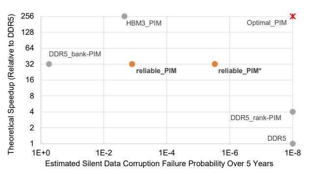
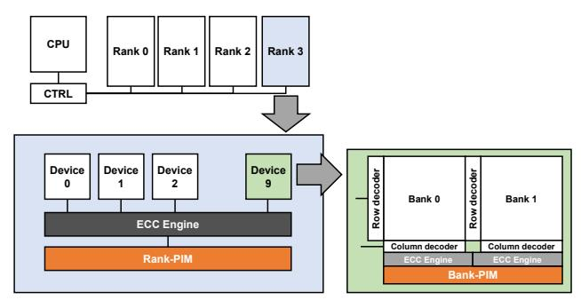
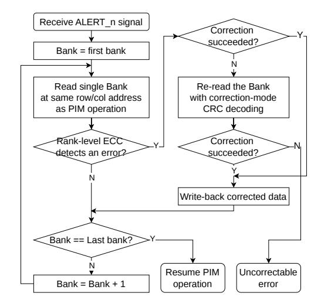
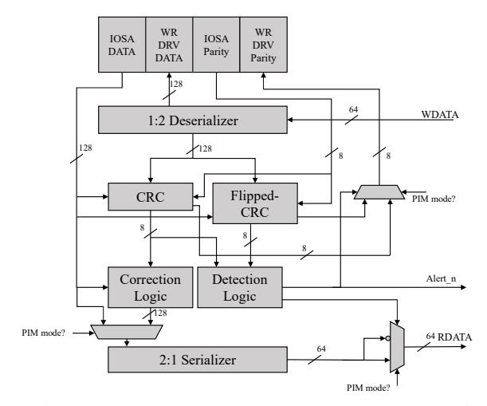
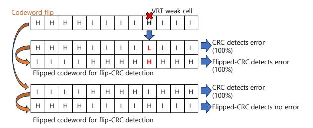
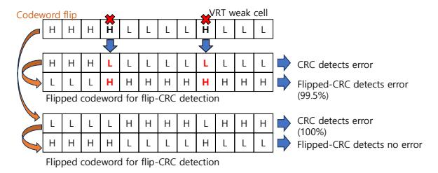
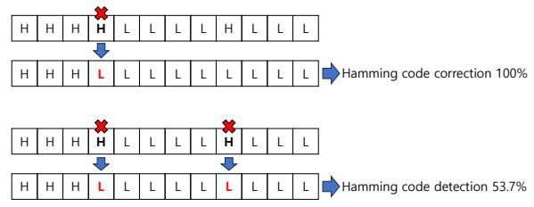
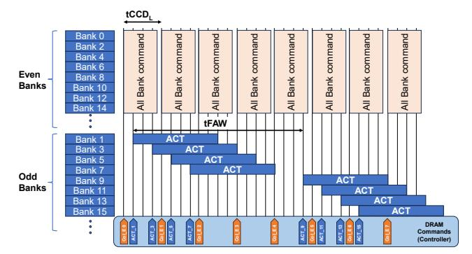
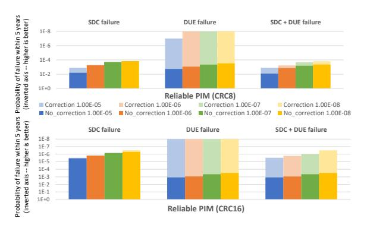
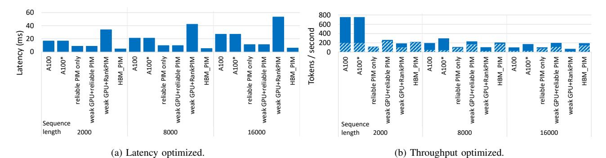

# ECC Enabled Reliable and Performant Processing-in-Memory

Jeageun Jung\*, Margaret Lee\*, and Mattan Erez
Department of Electrical and Computer Engineering
The University of Texas at Austin
Austin, TX, USA
{jeageunjung, margaretlee, mattan.erez}@utexas.edu

Abstract—We introduce a Processing-in-Memory (PIM) architecture with tailored error checking and correcting (ECC) mechanisms to address reliability challenges from scaling errors and physical faults. PIMs can significantly improve computing efficiency by integrating computing devices directly within memory chips, but their reliability has not been explored in detail. It is important to ensure reliability against variable retention time (VRT) scaling errors and multi-bit errors in modern DRAM. Our proposed reliable bank-PIM architecture not only accurately detects multi-bit errors and corrects at the rank-level but also avoids the high performance impact of repetitive rank-level corrections. We develop a Codeword Flip method that is specifically designed to mask errors caused by VRT weak cells. This strategy effectively reduces the risk of silent data corruption (SDC) and has a negligible performance impact. With an odd-even bank pipelining approach, which achieves PIM unit utilization of 90%, our ECC mechanism could decrease the likelihood of SDC to  $400\times$  lower than traditional bank-PIM configuration over a five-year operational period. Moreover, it shows the potential 4× performance enhancement over rank-PIM in certain micro-benchmarks and end-to-end performance improvements in LLM applications.

# I. INTRODUCTION

Processing-in-Memory (PIM) architectures integrate compute units near or within memory to reduce data movement. PIM architectures have been widely explored by both academia and industry [4]–[6], [30], [33], [57], demonstrating substantial performance and energy efficiency gains. In particular, performance gains are maximized when compute units access local data utilizing high internal DRAM bandwidth. Thus, bank-PIMs [5], [7], [11], [23], [28], [33], [43], [59], which position compute units near individual memory banks, deliver higher throughput (8× or more) compared to rank-PIMs [33], [72], which place compute units within a memory rank. However, meeting datacenter reliability requirements with a bank-PIM remains an unaddressed challenge.

We present the *reliable bank-PIM* architecture that maintains the performance advantage of bank-local computation while simultaneously approaching the reliability of current datacenter rank-level ECC (Figure 1 plots quantitative results from section VI). We show that naive approaches to PIM reliability are insufficient. Bank-PIM ECC approaches that rely solely on near-bank ECC (i.e., on-die ECC alone [14], [22],

Fig. 1: Modeled reliability vs. theoretical max speedup for standard rank-PIM and bank-PIM in a one channel, 4 rank system; reliable\_PIM uses DDR5 on-die ECC redundancy, and reliable\_PIM\* aligns with HBM3 on-die ECC redundancy.

[26]) can lead to unacceptably high failure rates that are more than two orders of magnitude worse than our reliable bank-PIM. This remains the case even when considering the greater on-die ECC redundancy of HBM3 [22]. Switching to a rank-PIM architecture solves the reliability challenge by harnessing strong rank-level ECC, but sacrifices up to  $8\times$  performance.

These general results hold true considering end-to-end long-sequence LLM decoding. LLM decoding is an important application that is a good match for PIM execution and has been the focus of recent PIM efforts [13], [31], [33], [60]. Our reliable bank-PIM prevents a 30-50% inference accuracy drop from memory errors expected with purely on-die ECC, while still improving end-to-end latency and throughput by  $2-4\times$  over a GPU and a rank-PIM.

The reliable bank-PIM comprises two main components and is tailored for "all-bank" style PIMs where control is retained by the host [43], [48] (see section IV). The first component is a two-tiered ECC [10], [21], [56], [81] that combines strong error detection within each bank while leveraging "chipkill"-level ECC for correction at the rank level (e.g., [15], [20], [32], [34], [56]). The second is a novel masking of scaling-induced VRT errors at the bank level to avoid triggering frequent, performance-sapping rank-level corrections.

The first ECC tier is applied near the bank and focuses on detection. This maintains the performance of bank-local processing while providing high coverage for multi-bit errors

\*Both authors contributed equally to this research.

caused by operational faults. In contrast to traditional rank-PIMs that trade bank-local computation for reliability, the reliable bank-PIM only requires accessing the second-tier rank-level ECC when correcting errors or performing writes. The read-mostly nature of our target PIM applications allows this approach to avoid frequent cross-chip re-encoding and write amplification (host writes are naturally at the rank level).

An important performance challenge is keeping the rate of rank-level corrections low. This is straightforward for operational faults, which are rare and can be detected and mapped out (e.g., page retirement, subsection IV-B). Scalinginduced VRT errors are much more problematic due to their random and variable nature. On-die ECC typically tolerates VRT errors, but the detection-focused first-tier ECC does not.

We introduce a novel *Codeword Flip* mechanism to mask VRT errors rather than correct them. Codeword Flip exploits the VRT error behavior to mask repeated VRT errors and prevents re-sensitization of previously failing cells. It stores the corrected codeword in flipped form after a rank-level correction, without any metadata to track the flip state (subsection IV-C). Our results show that Codeword Flip keeps correction overhead at under 2% even at extreme VRT error rates (subsection VI-B).

In summary, our main contributions are:

- We show that bank-PIM architectures cannot attain high reliability with purely bank-level protection.
- We introduce *Codeword Flip* to minimize rank-level VRT error correction overheads, preserving bank-PIM performance, while continuing to detect multi-bit errors.
- We propose a two-tier ECC tailored for host-controlled bank-PIMs that operates with minimal changes to existing interfaces, provides rank-level chipkill ECC, and achieves reliability approaching that of rank-level ECC.
- We evaluate the reliability and performance of our reliable bank-PIM and demonstrate 400× better SDC rate with < 2.1% performance degradation compared to a DDR5 bank-PIM baseline at equal redundancy.
- We conduct an end-to-end performance evaluation on long-sequence generative LLMs, confirming that reliable bank-PIM not only enhances reliability but also preserves the internal bandwidth advantages of bank-PIM, leading to 2 − 3× improved latency and throughput compared to rank-PIM or GPU alone.

# II. BACKGROUND

# *A. DRAM Faults and Scaling Errors*

Physical defects (*faults*) in DRAM can cause *errors* that deviate memory cells from their intended values. If uncorrected, these errors may escalate into system *failures*, as either *detectable uncorrectable errors* (DUEs) or *silent data corruptions* (SDCs). We group DRAM faults into three categories: inherent faults, operational faults, and rowhammer faults.

Inherent faults originate during manufacturing and are traditionally mitigated through testing and row/column remapping. However, continued DRAM scaling has introduced new fault modes that cannot be fully screened before deployment. One prominent example is *variable retention time* (VRT) cells. VRT originates from leakage-induced charge loss in DRAM cell transistors [46]. When a VRT cell enters a sub-nominal retention state, it may lose charge before the scheduled refresh and produce retention errors [8], [63], [67].

VRT cells pose a non-negligible reliability concern and are difficult to tolerate in the field. In modern technology, the probability that a cell enters a sub-nominal state exceeds 10−8 , 1 and this is expected to increase with further scaling [47], [61]. Because VRT cells are variable in nature and DRAM chips contain billions of cells, exhaustive pre-deployment screening is impractical [19], [29].

Measured DDR4 retention failures are strongly asymmetric, with only 0.005% corresponding to 0→1 flips at 60°C under a 1s refresh interval [41], [42]. Thus, VRT-induced retention errors are *unidirectional* [66]: they arise when a charged cell loses charge prematurely. Many prior works exploit this unidirectionality to reverse-engineer on-die ECC mechanisms [66], improve power efficiency [38], and enhance reliability [16].

Operational faults arise during DRAM operation due to particle strikes, device aging, or other physical fault modes. Depending on their manifestation, they may affect a single bit or multiple bits. Systems mitigate these faults using ECC and fault-removal mechanisms such as post-package repair (spare rows), OS-level page retirement, or module replacement. Faults that corrupt many bits require stronger ECC to prevent DUEs or SDCs.

Rowhammer faults result from repeated row activations that induce charge disturbance in adjacent rows [39], [50], and remain an active area of concern for both reliability and security [37], [45], [55], [62], [70], [79], [80]. Rowhammer mitigation is orthogonal to the mechanisms proposed in this paper: row activation commands remain under host control in the all-bank PIM architecture, and our design does not modify existing activation-driven mitigation such as PRAC [26].

# *B. Error Detection and Correction*

DRAM systems tolerate faults using error detection and correction mechanisms by adding redundancy to stored data. Data and redundancy bits are grouped into a *codeword*. Common error correcting codes (ECC) include single-error correction (SEC) codes, which correct single-bit errors, and Reed–Solomon (RS) codes, which detect and correct symbol errors. In contrast, cyclic redundancy checks (CRC) provide high-coverage error detection.

Although CRC is primarily designed for detection, an appropriately chosen CRC polynomial can also enable singlebit error correction [40]. For example, when the data length is fixed (e.g., 128-bit data with an 8-bit CRC), the decoder can map each syndrome to a unique bit position and correct a single flipped bit.

1Based on the analysis of Lee et al. [46] (subsection V-B).

Fig. 2: Rank-PIM and bank-PIM with ECC engines.

## C. Processing-in-Memory (PIM) Architectures

PIMs integrate compute units within or near memory chips [4]–[6], [30], [33], [57]. 2 PIM designs differ primarily in the placement of compute units within the memory hierarchy. This placement directly determines internal bandwidth, peak performance, and applicable reliability mechanisms. As illustrated in Figure 2, rank-PIMs place compute units at the rank level, whereas bank-PIMs position them near individual banks on each chip.

Recent prototypes demonstrate both approaches. For rank-PIM, Samsung introduced rank-level and CXL-based PIM designs that exploit multiple ranks for bandwidth amplification [33], [72]. For bank-PIM, designs such as UPMEM [3] integrate independent data processing units near each bank. SK Hynix [43] and Samsung [48] further proposed "all-bank" PIM architectures, in which the host issues compact all-bank commands that trigger SIMD-style execution across near-bank compute units, alleviating command bandwidth constraints. These architectures support GEMV and other vector kernels using a simple command set [17], [18].

Within each bank, the PIM unit incorporates a small SRAM buffer to store operands and intermediate results, enabling arithmetic operations at the bank access bandwidth. This buffering reduces row activations and improves row buffer locality.

# D. PIM Applications and Access Patterns

PIMs exploit high internal bandwidth to accelerate memory-bound kernels but can be less effective for compute-heavy kernels due to area and power constraints. Efficient PIM execution is often achieved by distributing large, read-once data across banks while placing small, reused data in PIM SRAM buffers. This access pattern appears in LLMs [13], [33], [75], [76], [78], [83], various machine learning tasks, and data processing workloads [17], [18]. Although access patterns can be irregular, Recommendation models (RMs) [58] can benefit when large embedding vectors yield sequential memory accesses. Accordingly, both academia and industry have increasingly targeted these workloads for PIM deployment [11], [12], [17], [18], [30], [44], [59].

2We use the term PIM broadly to refer to both processing-in-memory and processing-near-memory architectures with digital logic. In this work, we categorize them as bank-PIM and rank-PIM.

Fig. 3: GEMV operation flow in bank-PIM.

Recent works have focused on memory-bound kernels such as GEMV, a core operation in LLMs, RMs, and other datacentric workloads. We use GEMV as a representative example, as illustrated in Figure 3. The host transfers operands to PIM buffers from host cache or DRAM. Compute units read from local DRAM and compute vector inner products. The compute units store results in local DRAM for future use or transfer them to the host. The host aggregates results across compute units to perform a reduction operation.

#### III. PIM RELIABILITY CHALLENGES

During standard DRAM reads, the host memory controller accesses multiple chips within a rank concurrently and reconstructs an ECC codeword from their collective output. It then performs error detection and correction on the codeword before forwarding data to the core. Because the codeword spans multiple devices, a fault confined to a single chip manifests as localized bit errors rather than corrupting the entire codeword.

Rank-PIMs operate at the same rank granularity as the host and therefore inherit the strong protection of rank-level ECC. Such redundancy can tolerate multi-bit and device-level faults; for example, chipkill-level ECC corrects the complete failure of one x4 device. However, operating at rank-level prevents compute units from independently exploiting each chip's internal bandwidth, fundamentally constraining performance.

In contrast, bank-PIMs place compute units within individual banks to maximize internal bandwidth. Redundancy is therefore typically confined within each bank rather than distributed across chips. Recent DRAM architectures incorporate on-die ECC; for example, DDR5 protects 128-bit data with 8 bits of redundancy and corrects single-bit errors [26] but cannot reliably detect or correct multi-bit errors. HBM3 employs symbol-based ECC whose correction capability depends on predefined fault isolation boundaries (e.g., subwordline-bounded, MAT-kill style ECC) [22], [25]. However, this design requires 2× the redundancy of DDR5 and does not guarantee correction or detection for fault modes that exceed these isolation boundaries (see subsection VI-A).

If bank-PIMs rely solely on on-die ECC, multi-bit faults can propagate as silent data corruptions (SDCs), weakening

overall system reliability. Designing robust ECC in bank-PIM is non-trivial because it requires carefully balancing this fundamental performance-reliability trade-off. To overcome this limitation, bank-PIMs must solve two challenges. First, even with limited redundancy, they must detect multi-bit errors to prevent SDCs. Second, because single-bit VRT errors can become dominant [9], they require lightweight mechanisms that handle frequent single-bit VRT errors without negating the performance advantages of near-bank execution.

# IV. ECC ENABLED RELIABLE BANK-PIM

We present *reliable bank-PIM*, an architecture that preserves bank-local computation while achieving reliability comparable to rank-level ECC. Reliable bank-PIM builds on existing "all-bank" PIM architectures [43], [48] (see subsection II-C) and is implemented as a DDR5 bank-PIM. In our design, the dedicated ECC chips are not engaged in PIM computation, preserving their capacity for host-controlled reads that perform rank-level error correction.

We choose a DDR-based PIM rather than LPDDR- or HBM-based designs for two reasons. First, DDR offers the highest capacity-to-external-bandwidth ratio, increasing the benefit of exploiting internal PIM bandwidth. Second, we show that attaining high reliability requires a rank organization, which aligns naturally with DDR's rank structure; extensions to other DRAM PIM architectures are discussed in section VII.

Our design comprises two main components: (1) a two-tier ECC tailored for bank-PIMs, combining a detection-focused first-tier ECC (subsection IV-A) and a correction-focused second-tier ECC (subsection IV-B), (2) *Codeword Flip*, which mitigates scaling-induced VRT errors and reduces the need for frequent correction (subsection IV-C).

#### A. Near-Bank PIM Error Detection

Given the limited redundancy available at the bank level, reliable bank-PIM prioritizes error detection over local correction to maximize detection coverage. We therefore employ an on-die CRC that detects both single-bit errors from VRT cells and multi-bit errors from operational faults. Our primary design uses CRC83 (or simply CRC), which protects 128 bits of data with 8 bits of redundancy, matching the DDR5 on-die ECC configuration. We later evaluate CRC16 (128-bit data + 16-bit redundancy) to match the higher redundancy of HBM3 on-die ECC.

During PIM accesses, the CRC operates strictly in detectonly mode. When it detects an error, the rank-level correction is triggered by asserting an existing ALERT\_n pin to the memory controller. During non-PIM full-rank accesses, the same CRC is decoded as single-bit correction mode. Although enabling correction reduces detection coverage, these accesses always rely on rank-level ECC for multi-bit detection and correction. Local single-bit correction improves reliability by resolving isolated single-bit errors without exposing them to rank-level ECC, preserving the baseline reliability model. This

Fig. 4: Host memory controller rank-level correction flow. dual-mode approach allows the same code to both correct scaling-induced errors for host accesses, consistent with the original purpose of on-die ECC, and achieve higher detection coverage for PIM accesses.

To select between the two decoding modes, the ECC logic reads the PIM/non-PIM mode signal. This signal is already exposed through the configuration registers of the PIM unit [48], allowing the ECC logic to determine the current mode without requiring additional cycles. All-bank PIM switches between PIM and non-PIM modes through writes to these memory-mapped configuration registers. Further details of the ECC engine design are described in subsection IV-C.

## B. Rank-Level Error Correction

When bank-level CRC operating in detect-only mode identifies an error during PIM execution, the memory controller is notified and attempts rank-level correction. This correction uses the same rank-level ECC employed during normal host accesses. However, because bank-PIM activates multiple banks concurrently, the controller cannot immediately identify the faulty bank. It therefore follows the procedure illustrated in Figure 4, issuing sequential reads to each bank involved in the error-triggering all-bank PIM command using the original row and column addresses. Each read reconstructs a full rank-level codeword and applies chip-kill ECC.

After each sequential access, the controller writes back corrected data to DRAM. It then retries issuing the PIM command under the assumption that the error was transient or subsequently masked by the Codeword Flip mechanism described in subsection IV-C. This procedure can be implemented either in software (within the PIM driver) or in hardware (as a memory controller state machine). The software implementation introduces additional latency and limits parallelism due to memory fences required for operation reordering, whereas a synchronous hardware implementation avoids these overheads (evaluated in subsection VI-B).

&lt;sup>3E.g., the 8-bit CRC with polynomial  $x^8 + x^4 + x^3 + x^2 + 1$ .

If rank-level correction is triggered again after initial recovery, the memory controller escalates handling. It retries the access using a non-PIM decoding in a single-bit correction mode, relieving pressure on the rank-level ECC and reducing DUE rates; initial accesses use detection-only decoding to support Codeword Flip. If the correction still fails, the system emulates the PIM command on the host and may also trigger memory retirement.

Retirement mechanisms are used to prevent detectable multibit errors from escalating into SDCs as the on-die CRC provides weaker detection than rank-level ECC. Reliable bank-PIM retires memory more aggressively once certain multibit operational faults are observed. Specifically, we retire any memory page that overlaps with more than one faulty logical row or column, even if the fault can still be tolerated at the rank level. Our evaluation leads to two observations regarding such retirement. First, the cases that warrant retirement are easily identified using the detection-only on-die CRC. These faults are likely to trigger repeated rank-level corrections before an SDC is observed after an additional overlapping fault or VRT accumulates. Second, retirement is still rare, and overall system PIM throughput only degrades by 2% over 5 years of operation. Retirement is handled by the host.

#### C. Codeword Flip

Frequently triggering rank-level correction can severely undermine the performance gains of bank-PIMs. While retirement can be used to handle such cases from inherently-rare operational faults, VRT errors are too numerous and may manifest randomly at any location. On-die ECC in non-PIM mode handles VRT errors, but the detect-only CRC in PIM mode does not. To address this, we introduce the Codeword Flip mechanism, which masks VRT errors to prevent repeated corrections while retaining the CRC multi-bit error detection.

Codeword Flip exploits the key insight that an erroneous VRT cell will not produce subsequent errors if its state is flipped due to the unidirectional nature of VRT errors [41], [42], [66]. Individually identifying and flipping specific bits in response to a VRT is impractical and costly. Codeword Flip takes the simple approach of flipping the entire bank-level codeword, including both the data and redundancy bits on a bank that required correction at the rank level. While this whole-codeword flipping could potentially expose previously masked VRT cells that initially held a '0', our evaluations show that multiple VRT errors within a single codeword occur extremely rarely.

**Dual Flipped/Unflipped Decoding.** Flipping the codeword is simple and low-cost: after a rank-level correction, the corrected codeword is written back to DRAM, but with those bits that are mapped to the faulting chip(s) inverted by the memory controller. The memory controller still computes the rank-level ECC with no inversion.

We avoid metadata for tracking flip state, which would complicate decoding and require additional redundancy, by instead implementing parallel decoding using two hardware CRC decoders. Each decoder performs the same check: one

TABLE I: Dual decoding of CRC and F\_CRC identifies whether a codeword is flipped.

| CRC            | F_CRC          | Result                             |
|----------------|----------------|------------------------------------|
| Error detected | Not detected   | Codeword is Flipped                |
| Not detected   | Error detected | Codeword is Not Flipped            |
| Error detected | Error detected | 1 or more bit errors exist (Alert) |
| Not detected   | Not detected   | 1 or more bit errors exist (Alert) |

Fig. 5: ECC engine design using the CRC decoder of an adjacent bank as the dual decoder.

uses the codeword as stored and the other first inverts (flips) the codeword (F\_CRC) (Figure 5). The CRC we choose is one that, in cases of no single-bit errors or a masked single-bit VRT error, exactly one decoder reports no error.

The dual CRC and F\_CRC decoding results in four possible outcomes (Table I). For the cases of single-bit VRT errors or no errors at all, exactly one of the two decoders reports an "error", while the other does not. This specific result indicates whether the codeword was flipped and a single VRT error successfully masked. If an error exists, both decoders are likely to detect errors, and an alarm is raised to trigger rank-level correction. This is true both for the case of two VRT errors and also for most of the single-/multi- bit errors caused by operational faults. If neither decoder detects an error then both missed detection of a multi-bit error and rank-level correction is triggered. It is also possible, though highly improbable, that a multi-bit error is incorrectly interpreted as a correct flipped or unflipped decoding. These cases are included in our reliability evaluation (subsection VI-A).

**Dual Decoder Design.** Figure 5 shows an ECC engine shared by a bank pair that enables our tailored solution for reliable bank-PIM, supporting both the two-tier ECC scheme and Codeword Flip. To keep the ECC engine overhead low, we implement one CRC decoder per bank and use the paired bank's decoder as the flipped dual decoder. The only difference for F\_CRC decoding is that it operates on an inverted input; thus, we route one bank's codeword to the paired bank's CRC decoder input instead of building two separate CRC engines per bank.

(a) Flip-CRC detection and masking process for one VRT weak cell, showing error detection before and after Codeword Flip.

(c) Flip-CRC detection when two VRT weak cells are in the same state, demonstrating error detection capability.

(b) Flip-CRC detection when two VRT weak cells are in different states, demonstrating error detection capability.

(d) Hamming(136,128) code performance on single and double bit errors, highlighting significant error rate challenges.

Fig. 6: The Flip-CRC mechanism compared with the Hamming code under one and two VRT weak cells.

#### D. DRAM Hardware Changes and Overheads

The proposed design introduces limited modifications to the DRAM datapath while reusing existing DDR5 and all-bank PIM mechanisms. We summarize the changes below. We do not discuss changes needed for the baseline all-bank PIM.

Per-bank ECC Engines. Current on-die ECC designs likely place ECC engines at the chip or bank-group level. The reliable bank-PIM requires two ECC engines per PIM unit (one per bank). Prior work estimates the area overhead of an ECC engine per bank-group at 0.65% [9]. Extending this estimate to a per-bank engine yields a total overhead of 2.6%. Routing Across Paired Banks. To support dual decoding for Codeword Flip, ECC engines are placed near the per-bank-pair PIM unit at the bank I/O (Figure 5). Each ECC engine pair is shared by each two banks: a codeword from one bank is processed by the paired bank's CRC engines during PIM execution to support Codeword Flip, requiring cross-bank routing. The timing between all-bank PIM column commands is longer than that of standard column commands [48], providing sufficient slack for this routing.

Communicating Detected Errors With ALERT\_n pins. Bank-level error detection reuses the existing DDR5 ALERT\_n pin [26] to notify the memory controller without introducing additional interface signals. Since this pin is defined to report write CRC errors in DDR5, it can be reused to signal read-path error detection during PIM execution. This requires additional wiring from the error detection logic associated with each bank-pair engine to the ALERT n pin.

**Timing Overhead of Dual CRC Detection.** A parallel CRC decoder computes each syndrome bit as a fixed XOR combination of the codeword bits, requiring no finite-field

multiplications [49], [54]. For CRC8(136,128), the critical path totals 11 two-input gate levels.4 The SEC(136,128) Hamming decoder [26] shares the same syndrome depth but additionally requires error-position decoding and a corrective XOR, reaching an estimated 12-13 levels [49]. Dual CRC for Codeword Flip adds one inverter and one comparison gate in parallel with the primary decoder, for a total of approximately 13 levels—comparable to SEC. The HBM3 ondie ECC design in [22], [68] employs RS codes over GF(28) or  $GF(2^{16})$ , whose decoder requires finite-field multiplications and inversions [49]. Optimized RS decoder architectures report a per-stage critical path of at least one finite-field multiplier plus one adder [69], with each GF(28) inversion sub-circuit alone requiring approximately 10 gate levels [77], placing the overall RS correction path substantially deeper than dual CRC or DDR5 SEC.

## E. Detection and Correction Example

Figure 6a illustrates the process for detecting and masking a single VRT cell within a codeword using two CRC decoders with rank-level correction. This method involves flipping the codeword before storage, eliminating the need for repeated error corrections. Figure 6b shows the situation in which a masked VRT cell suffers another VRT error, resulting in rank-ECC overhead for each access due to persistent errors. However, it can be detected with 100% probability. Figure 6c explores the challenges of detecting two concurrent VRT faulty cells. It highlights the higher probability of detection achieved by the proposed mechanism compared to the conventional Hamming code used for on-die ECC in DDR5. Figure 6d

 $^4\text{An XOR}$  reduction tree of depth  $\lceil\log_2136\rceil=8$  levels followed by an 8-bit zero-check of depth  $\lceil\log_28\rceil=3$  levels.

Fig. 7: Odd/even bank pipelining.

shows the Hamming code correction and detection capability that detects with a probability of only 53.7%. However, our mechanism detects these errors with 99.5% probability.

The dual CRC decoding of the flipped codeword can detect more errors than the current DDR5 and HBM3 ECC implementation. In subsection VI-A, we discuss the reliability evaluation of our mechanism in comparison to Hamming and Reed-Solomon codes which are implemented for DDR5 and in HBM3. This comparative analysis demonstrates our mechanism's superior reliability over SEC code-based bank-PIMs. If 16-bit redundancy is offered on-die (as with HBM3), protection is even stronger as other faults can also be detected, including faulty decoders and word line drivers.

## F. Odd/Even Bank Pipelining and Energy Considerations

All-bank PIM architectures are constrained by the four-activation window (tFAW), which limits the number of concurrent row activations. As a result, the controller must wait for the rows of all banks to be activated before issuing an all-bank command, introducing idle bubbles during PIM execution. These bubbles can be eliminated either by relaxing the tFAW constraint at the circuit level [23], [43], or by activating a subgroup of banks and pipelining activations with accesses. We adopt the latter approach: we partition banks into odd and even groups and explicitly interleave their execution by activating one group while accessing the other (Figure 7).

Although not strictly necessary for reliability, odd/even bank pipelining enhances our rank-level correction mechanism. When receiving an error alert, the controller needs to scan only half of the banks. While prior work (e.g., [28]) proposes internally pipelining all-bank commands within the PIM, our mechanism achieves comparable performance (results not shown), and explicit bank grouping simplifies identifying the exact column PIM command that triggered correction. It also improves overall performance, increasing PIM utilization from 55% to 91%.

Odd/even bank pipelining additionally mitigates energy overhead. Because correction occurs while the row remains open for PIM execution, the design avoids additional row activations for ECC updates. Prior studies [43], [48] report that PIM-enabled memory increases overall power by approximately 5%. Our design introduces no additional off-chip

communication and reuses already open rows for correction, so its incremental energy impact remains similarly low.

## G. ECC Update Overheads for Rank-Level ECC

In reliable bank-PIM, any write requires updating the corresponding rank-level ECC redundancy, which incurs a read-modify-write (RMW) cycle because the memory must read the existing codeword before recomputing redundancy. However, for read-dominant PIM workloads (see subsection II-D), the system can avoid RMWs by buffering intermediate outputs in local PIM SRAM and allowing the host processor to read them only when the final result is required. Recent industrial PIM prototypes [43], [48] demonstrate that high performance remains achievable even without explicit PIM store commands. This approach preserves the inherent advantages of near-bank computation while deferring complex rank-level ECC updates to the host, thereby maintaining both performance and reliability.

#### V. METHODOLOGY

## A. Reliability Modeling

We evaluate the reliability of reliable bank-PIM under realistic fault models using a DRAM reliability simulator based on prior work [27], extended to incorporate our CRC and error correction logic. The simulator models both inherent faults and operational faults, including intermittent and permanent faults. We model burst fault modes (column, row, pin, and chip faults) and capture their overlap with VRT-induced errors. The simulator tracks miscorrections due to bit flips at the bank and rank levels under CRC and Codeword Flip.

We implement a page retirement policy that retires any page overlapping an operational fault affecting more than a single row or column, even if the fault is correctable at the rank level. Due to this retirement policy, the performance impact of the all-bank rank-level correction procedure is measured over short windows dominated by VRT errors.

We report SDC and DUE probabilities over 5 years of operation for a 20-chip x4 16Gb DDR5 DIMM (two sub-channels) with one PIM unit per two banks. Each PIM unit uses on-die ECC locally to detect or correct errors, and we vary ECC redundancy to match DDR5 and HBM3 configurations. Ranklevel ECC provides chip-kill correction with two redundant chips per rank. For HBM-PIM comparison with HBM3 RAS features, we also model a system with two 8-hi 16Gb HBM3 stacks, excluding the additional 16-bit metadata reserved for system-level uses. For rank-PIMs, we model on-die ECC with bounded-fault support [14], [26] and chip-kill-style ECC [34].

#### B. VRT Error Rate Range

DRAM vendors do not publicly disclose raw VRT error rates, which creates uncertainty when selecting optimal ECC schemes with respect to VRT error magnitude. To estimate a realistic VRT range, we derive a bound using data reported in a recent industrial study [46] by Samsung. The study reports that enabling on-die ECC in DDR5 increases refresh time by more than  $4\times$  and improves the observed bit error

TABLE II: Evaluation Parameters.

|                                                                                                        | DRAM timing parameters (DDR5-6400, 16Gb, x4)              |                                                 |                                        |             |          |  |
|--------------------------------------------------------------------------------------------------------|-----------------------------------------------------------|-------------------------------------------------|----------------------------------------|-------------|----------|--|
| tBL=8                                                                                                  | tCCDS=8                                                   | tCCDL=16                                        | tCCDL_WR=64                            | tCL=48      |          |  |
| tRC=150                                                                                                | tWR=96                                                    | tFAW=40                                         | tRCD=48                                | tRAS=104    |          |  |
|                                                                                                        | PIM configuration                                         |                                                 |                                        |             |          |  |
|                                                                                                        | 4 MUL/ADD FPU                                             | Js                                              | 1KB scratch pad                        |             |          |  |
| Datapath width: 64bit                                                                                  |                                                           |                                                 |                                        |             |          |  |
|                                                                                                        | Off chip bandwidth per rank: 25.6GB/s                     |                                                 |                                        |             |          |  |
| On chip bandwidth per rank: 204.8GB/s                                                                  |                                                           |                                                 |                                        |             |          |  |
| # of ranks:                                                                                            | 4                                                         | # of channels:                                  | 8                                      | # of banks: | 32       |  |
| Short term reliability and performance simulation                                                      |                                                           |                                                 |                                        |             |          |  |
| Microbench                                                                                             | GEMV                                                      | C stationary, blocked BLAS computation          |                                        |             |          |  |
| Error model Assume stationary VRT errors for a short period (<1 hour) Inject errors in N bit positions |                                                           |                                                 |                                        |             |          |  |
| Long term reliability simulation                                                                       |                                                           |                                                 |                                        |             |          |  |
| Error model   Inject errors based on an open-source DDR5 DRAM FIT rate and error patterns [27]         |                                                           |                                                 |                                        |             |          |  |
| End-to-end performance simulation                                                                      |                                                           |                                                 |                                        |             |          |  |
|                                                                                                        | GEMMA [75] 7B parameters, 15.5GFLOPs per token generation |                                                 |                                        |             | neration |  |
| LLM                                                                                                    | Llama 2 [76]                                              | 7B pa                                           | ameters, 13GFLOPs per token generation |             |          |  |
| LLM                                                                                                    | OPT-13B [83]                                              | 13B parameters, 25.2GFLOPs per token generation |                                        |             |          |  |
|                                                                                                        | GPT-J [78]                                                | 6B parameters, 11.3GFLOPs per token generation  |                                        |             |          |  |

rate by  $10^{-6}\times$ . Without on-die SEC, a single-bit VRT error results in a failure, whereas with on-die SEC, failures occur only when two or more bits fail. Following prior empirical methodology [64], [65], we model VRT retention errors as independent, uniformly distributed bit failures and therefore apply binomial statistics to estimate failure probabilities.

Let *X* denote the per-bit VRT retention error probability within a refresh window. Assuming independent bit failures, the probability of a single-bit failure in a 128-bit data block without ECC is:

$$P_{\text{1-bit, noECC}} = \binom{128}{1} X (1 - X)^{127} \tag{1}$$

With on-die SEC, failure occurs only when two or more bits fail within a 136-bit codeword (128 data + 8 redundancy bits). The dominant term is the two-bit failure probability:

$$P_{\text{2-bit, ECC}} = \binom{136}{2} X^2 (1 - X)^{134}$$
 (2)

With the reported  $10^{-6}$  failure-rate reduction, we equate:

$$P_{\text{1-bit, noECC}} \cdot 10^{-6} = P_{\text{2-bit, ECC}} \tag{3}$$

Solving Equation 3 yields  $X \approx 1.4 \times 10^{-8}$ . We use this value as a lower bound in our evaluation and additionally sweep higher VRT rates to account for scaling trends. Plugging in the derived value of X, the probability of multiple VRT errors in a codeword is dominated by  $P_{\text{2-bit, ECC}} \approx 10^{-12}$ , which is about  $10^{-6}$  times smaller than the probability of a single VRT error. We model VRT using a per-bit VRT error rate rather than assuming a single VRT cell per codeword, thereby naturally capturing the possibility of multiple VRT errors within the same codeword in subsection VI-B.

Fig. 8: Measured vs. modeled average per-token decoding latencies for four LLM models on A100 for sequence lengths of 100 and 2000 tokens and a 200-token input.

## C. Performance Modeling

PIM Simulator. We extend Ramulator2 [51] to model our DDR5 bank-PIM and the overheads of the proposed ECC mechanisms. We implement all-bank commands with DDR5 timing parameters (Table II), odd/even bank pipelining, and rank-level error correction controlled either by hardware in the memory controller or by a software handler that inserts fences to ensure host–PIM visibility and serialization of correction. For each kernel, we collect a trace of PIM commands and feed it to the modified Ramulator2 to estimate execution time, including kernel execution and all data transfers to and from the host. Replication and reduction operations are performed at the host and included in the timing model.

**GPU Performance Model.** We model GPU performance analytically by estimating the execution time of data transfers and GEMV/GEMM kernels. Using a first-order roofline model, we assume peak utilization of memory bandwidth and compute throughput for each GPU configuration (A100, A100\*, and a weak GPU host). We compute the expected execution time for the main self-attention and feed-forward layers, including associated data transfers and communication, while excluding minor vector and scalar computation layers.

We validate the analytical model on an A100 PCIe 40GB system running TensorRT-LLM v0.8.0 [2] with CUDA 12.0. We generate sequences of 100 and 2,000 tokens for four LLMs: GEMMA [75], Llama 2 [76], OPT-13B [83], and GPT-J [78]. Figure 8 reports the ratio of measured to modeled average per-token latency. The roofline model underestimates per-token latency by approximately  $1.5\times$  across all models and sequence lengths. The model consistently underestimates GPU latency to favor the GPU baseline, and therefore offers a reasonable approximation for end-to-end LLM PIM benefits within the scope of this study.

## D. System Configurations

We evaluate reliable bank-PIM on a DDR5-6400 system with eight channels, each containing four ranks (timing parameters in Table II). Each DDR5 chip has 32 banks, with one PIM unit per every two banks. Each PIM unit integrates four BF16/FP16 mul/add FPUs on a 64-bit datapath. Following Samsung's HBM-PIM and SK Hynix's AiM designs, we issue one PIM instruction per tCCDL window. This configuration provides  $8 \times$  higher internal PIM bandwidth than the per-chip

&lt;sup>5Initial experiments on H100 exhibit similar accuracy trends.

external bandwidth, enabling up to  $32\times$  theoretical speedup per channel.

In addition to evaluating reliability and kernel performance in isolation, we evaluate end-to-end application performance under six configurations: (1) an A100 GPU (311 TFLOPs, 1.5 TB/s HBM2e), (2) A100\*, an idealized variant that combines A100 compute and bandwidth with DDR5 capacity, (3) fully offloading computation to reliable bank-PIM (6.4 TB/s internal bandwidth), (4) a lightweight GPU host (41 TFLOPs) with reliable bank-PIM using 204 GB/s eight-channel DDR5 external bandwidth, (5) the lightweight GPU with rank-PIM on DDR5, and (6) HBM\_PIM with 8× higher internal bandwidth than HBM2e (12 TB/s internal bandwidth).

## E. Applications

We focus our evaluation on generative LLMs, as self-attention in long-sequence generation is well suited for PIM acceleration [13], [31], [33], [60]. We evaluate a GEMV kernel as a microbenchmark using matrix dimensions matching recent LLMs [83], and model end-to-end sequence generation with OPT-13B [83]. We discuss the relevance to other PIM operations in section VII. We follow the transformer-based LLM described by Kim et al. [31] to do PIM mapping. In this mapping, self-attention layers are expressed as GEMV operations that can be offloaded to PIM. In contrast, fully connected feedforward layers can be batched across concurrent queries and executed more efficiently as GEMM on the host (although they can also run on PIM when optimizing for batch-1 latency).

While our primary case study focuses on LLM inference, the proposed reliability mechanisms are applicable to other PIM kernels as well. Many PIM kernels are read-intensive and make heavy use of local buffers and registers, but we also evaluate workloads with higher write intensity and different ratios between PIM operations and host reads. We implement and evaluate kernels from PIMBench [71] in our simulator, closely following their public implementation [1]. We only evaluate those benchmarks for which Siddique et al. report positive speedup with an all-bank PIM [71]. To support the PIMBench applications, we augmented the simulated architecture with several simple instructions that we model as having the same latency as multiply-add, including: absolute value, less-than, clamp, and bit-level operations. We do not use instructions that require cross-bank communication and perform such reduction operations on the host.

We add one optimized kernel on top of the original PIM-Bench implementation (K-means Optimized), where we utilize the local buffer in each PIM unit to track the minimum distance and centroid for each sample. With this optimization, reductions are performed within each PIM unit, with only centroid membership written for each sample and cross-bank reduction performed by the host at the end of the kernel.

# VI. EVALUATION RESULTS

## A. Reliability Analysis

We evaluate reliability by simulating expected failure rates over five years of operation while sweeping VRT error rates.

Fig. 9: SDC and SDC+DUE rates over 5 years comparing a reliable bank-PIM, an HBM3 bank-PIM, and a rank-PIM (inverted y-axis—higher bars indicate better reliability).

Fig. 10: SDC failure rates with various types of on-die codes: cwf-CRC8 and cwf-CRC16 use our Codeword Flip mechanism with 8-bit or 16-bit CRC dual decoding to both detect and

with 8-bit or 16-bit CRC dual decoding to both detect and mask VRT errors (after rank-level correction). The other codes attempt error correction in DRAM, but still rely on the second-tier rank ECC for better reliability.

Failure modes are categorized as detected uncorrectable errors (DUE), silent data corruptions (SDC), and *total failures* (SDC + DUE). We evaluate both CRC8 and CRC16 configurations. **Overall Reliability.** Figure 9 shows the expected SDC and total failure rates over five years, comparing reliable bank-PIM (with on-die CRC8 and CRC16) against DDR5 rank-PIM and HBM3 bank-PIM (with on-die RS(19,17) ECC [22]).

Reliable bank-PIM with CRC16 achieves a  $2\text{--}10\times$  lower SDC rate and a  $30\text{--}80\text{K}\times$  lower total failure rate than HBM3 bank-PIM with comparable redundancy. Rank-level correction keeps the DUE rate low in reliable bank-PIM, whereas HBM3 bank-PIM has significantly higher DUE rates. Reliable bank-PIM with CRC8 maintains a substantial reliability advantage while using half the redundancy of CRC16. This demonstrates that our reliable bank-PIM effectively balances the reliability-performance tradeoff. We later show that this balance better aligns with LLM-based AI workload requirements.

We also evaluate repurposing HBM3's system-level metadata redundancy to improve HBM3 bank-PIM reliability (not shown in the figure). With the more expensive RS(19,16) ECC, HBM3 bank-PIM matches rank-PIM's SDC rate; however, the total failure rate remains elevated due to DUEs from operational faults in internal structures (e.g., decoders which fall outside the MAT-level protection boundaries).

**On-Die ECC and CRC Reliability Analysis.** Figure 10 reports the expected SDC rate over five years for reliable

TABLE III: Detection and correction accuracy across varying faulty cell counts and burst errors using cwf-CRC8(136,128), cwf-CRC16(144,128), DDR5 in-DRAM SEC(136,128), and HBM3 RS16(18,16).

|                   | cwf-CRC8(136,128) | cwf-CRC16(144,128) | SEC(136,128) | RS16(18,16) |
|-------------------|-------------------|--------------------|--------------|-------------|
| 1b (1-bit)        | 100%              | 100%               | 100%         | 100%        |
| 2b (2-bit)        | 99.5%             | 100%               | 53.7%        | 98.2%       |
| 3b (3-bit)        | 99.5%             | 99.998%            | 42.3%        | 95.6%       |
| 8b aligned burst  | 99.8%             | 100%               | 35.0%        | 100%        |
| 16b aligned burst | 99.5%             | 99.9995%           | 27.8%        | 100%        |

bank-PIM under different on-die ECC/CRC mechanisms, all combined with second-tier rank-level ECC. We focus on SDCs because they dominate total failures.

SEC(136,128), used in DDR5 on-die ECC [26], protects 128-bit data with 8 bits of redundancy. RS8(18,16), which uses 16 bits of redundancy (similar to RS16(19,17) in HBM3), improves detection coverage, but is still limited. Increasing the codeword granularity to 256 bits with RS16(18,16) strengthens detection by roughly an order of magnitude, but requires a wider internal fetch than supported in DDR5. We evaluate Codeword Flip with CRC8 (cwf-CRC8(136,128)) and CRC16 (cwf-CRC16(144,128)). CRC8 protects 128-bit data with 8 bits of redundancy, while CRC16 uses 16 bits. Codeword Flip requires an additional flipped codeword.

Using CRC to prioritize detection expands the reliability-cost trade-off space. CRC8 improves SDC coverage by an order of magnitude over RS8(18,16) and approaches the reliability of RS16(18,16) despite using half the redundancy. CRC16 further improves detection and exceeds RS16(18,16) by more than an order of magnitude at the same redundancy level. Recall that this benefit arises from a PIM-specific optimization that exploits the read-dominant DRAM access pattern commonly exhibited by PIM applications that perform their writes to an SRAM buffer.

Table III summarizes detection and correction probabilities under different error scenarios. This explicitly considers the accuracy for both the detection and correction accounting for rank-level correction. The cwf-CRC8 and cwf-CRC16 schemes use dual decoding with Codeword Flip. Codeword Flip might yield multi-bit error patterns; for example, two VRT cells may manifest as a 2-bit error in the regular decoder and no errors in the flipped codeword, or a 1-bit error in each, or a 2-bit error in the flipped decoder input. We consistently assume the worst-case in Table III.

Two conclusions emerge. First, prioritizing detection over local correction substantially improves detection coverage. Second, CRC with 16-bit redundancy achieves high detection and masking accuracy, exceeding both DDR5 SEC and HBM3 symbol-based ECC.

Using CRC for Single-Bit Error Correction. As described in subsection IV-B, we attempt local single-bit correction using CRC decoding (in non-PIM mode) after rank-level correction fails. This secondary correction may introduce additional bit flips—particularly in burst-error regions—but remains benefi-

Fig. 11: Reliable bank-PIM SDC, DUE, and SDC + DUE 5-year failure rates; Using the CRC for single-bit correction improves DUE rates substantially.

cial overall. It resolves isolated single-bit faults and mitigates overlapping error patterns (e.g., burst errors combined with single-bit faults) that rank-level ECC alone cannot handle. Even if it accidentally adds a flip within a bursty region, rank-level correction still corrects errors from the erroneous chip.

Figure 11 shows the impact of enabling single-bit CRC correction on failure rates for CRC8 and CRC16. CRC8 yields limited improvement in total failure rate due to its already high SDC rate. In contrast, CRC16 benefits substantially, delivering over  $100\times$  improvement in overall reliability. This mechanism reduces DUE incidence and may prevent forward progress before page retirement.

## B. Performance Analysis

We analyze performance in two phases: (1) the short-term impact of PIM error correction and (2) the long-term impact of correction combined with page retirement. We first compare reliable bank-PIM and rank-PIM under error-free conditions. We then quantify the overhead of our correction mechanism and show that it preserves the performance advantage of bank-PIM in both short- and long-term operation.

Error-Free Performance. Recall that a DDR5 bank-PIM is  $8\times$  faster than a DDR5 rank-PIM. In practice, pre- and post-kernel data movement for replication and reduction (section IV) reduces this advantage. Figure 12 shows that bank-PIM consistently outperforms rank-PIM across GEMV dimensions representative of common LLMs. Bank-PIM achieves  $1.5\text{--}4\times$  higher performance, with the advantage increasing as matrix and vector sizes increase. Larger output dimensions (M) improve buffer residency and PIM utilization, while larger input dimensions (K) amortize replication and reduction overheads, reducing their relative overheads.

**Short-Term Performance Impact.** We quantify the performance overhead of rank-level correction triggered by ondie CRC error detection and evaluate how Codeword Flip mitigates this overhead. Figure 13 compares reliable bank-PIM against error-free bank-PIM while varying the number of VRT cells per rank. We evaluate four correction configurations: software-handler correction (requiring memory fences) with

Fig. 12: PIM GEMV microbenchmark performance with various matrix sizes: A is  $M \times K$ , B is  $K \times 1$ , and C is  $M \times 1$ 

Fig. 13: Reliable-PIM performance across varying VRT error rates; the vertical lines correspond to the VRT error ratios used for the reliability evaluation (Figure 9).

and without VRT masking, and hardware-based correction with and without VRT masking.

Three observations follow. First, directly applying conventional two-tier ECC (e.g., XED [56]) to bank-PIM—detecting at the bank level and correcting at the rank level—significantly degrades performance. Without VRT masking, even 10,000 VRT cells ( $\approx$  1 per  $10^7$  DRAM bits) reduce PIM performance by > 20%. We also note that enabling two-tier ECC for bank-PIM also requires additional architectural enhancements (section IV).

Second, Codeword Flip effectively mitigates this performance loss. With VRT masking enabled, the correction overhead remains <2% even with a large number of VRT errors per rank. Third, hardware-based correction sustains higher performance than software-handler correction because the latter requires memory fences to synchronize with the controller. Hardware-controlled rank-level correction requires only a small state machine. However, this advantage narrows once Codeword Flip reduces the correction frequency.

Long-Term Performance Impact. Over time, DRAM accrues permanent operational faults. These faults trigger repeated corrections and may overlap with VRT-induced errors, increasing SDC risk. Reliable bank-PIM retires pages that exhibit operational faults affecting more than one logical row or column. Even under a conservative policy that retires an entire DRAM module rather than a single page, system-wide PIM throughput decreases by less than 2% over five years. This limited impact reflects the low expected DDR5 fault rate of approximately 45 FIT per chip [27].

**Host-Side Correction Path Overhead.** Rank-level correction incurs host-side overhead when the memory controller switches from PIM execution to host-side correction and completes the correction sequence across the affected banks. Table IV breaks down the latency per PIM access that triggers

TABLE IV: Host-side correction latency per PIM access that triggers correction under the worst-case VRT rate of  $10^{-5}$ . The baseline single-chip, single-bank correction sequence covers 99.9998% at the nominal VRT rate.

| Num. of | Num. of          | Additional                      | Correction                      | Occurrence  |
|---------|------------------|---------------------------------|---------------------------------|-------------|
| Faulty  | Banks            | Requests                        | Latency                         | Probability |
| Chips   | w/ Alerts        | vs. Baseline                    |                                 |             |
|         | 1                | =                               | 63.75 ns                        | 84.988%     |
| 1       | 2                | 1 write                         | 66.25 ns                        | 13.071%     |
|         | $3 \le N \le 16$ | (N-1) writes                    | Min: 68.75 ns Max: 101.25 ns | 0.981%      |
| 2       | 1                | 1 read                          | 66.25 ns                        | 0.762%      |
| 2       | $2 \le N \le 16$ | 1 to $N$ reads + $(N-1)$ writes | Min: 68.75 ns Max: 141.25 ns | 0.195%      |
| ≥ 3     | $1 \le N \le 16$ | 1 to $N$ reads + $(N-1)$ writes | Min: 66.25 ns Max: 141.25 ns | 0.003%      |

correction. The common baseline case is a single alerting bank with an error confined to one chip within the codeword; it requires 63.75 ns, corresponding to 17 single-bank requests under our timing configuration (subsection V-D).

Higher-latency cases occur only when multiple alerts or faulty chips overlap within the same affected rank-level codeword. Even under the worst-case VRT rate of  $10^{-5}$ , correction-triggering accesses remain concentrated in the lowest-latency cases: 84.988% follow the baseline 63.75 ns sequence, and another 13.833% complete in 66.25 ns. The remaining 1.179% enter longer multi-bank or multi-chip correction paths, which can reach up to 141.25 ns but are statistically rare. At the nominal VRT rate, 99.9998% of correction-triggering accesses fall into the baseline case. The correction sequence can be overlapped with the PIM-host mode switch (which incurs 37.5 ns on Samsung's all-bank PIM prototype [33]) and the memory controller can also interleave host memory requests if necessary to meet any QoS constraints during correction.

## C. LLM Accuracy and End-to-End Performance

We evaluate the impact of VRT errors on LLM inference accuracy to quantify the importance of reliability even for errortolerant AI workloads. We measure Llama2 accuracy on three language understanding benchmarks: CommonSenseQA [74], HellaSwag [82], and MMLU [24]. During inference, we inject synthesized VRT errors uniformly at random into model weights and the KV-cache. We compare a reliable bank-PIM with a baseline bank-PIM with on-die SEC(136,128) ECC. Although our experiments focus on VRT errors, the conclusions extend to other fault modes because multi-bit faults further amplify accuracy degradation.

Figure 14 reports benchmark scores for varying VRT error rates using Llama2-7B. The darker region at the bottom represents the baseline bank-PIM accuracy, while the lighter region at the top shows reliable bank-PIM. At low VRT rates, the accuracy remains unchanged because the SDC rate is negligible. As the VRT rate increases to  $10^{-6}$ , baseline bank-PIM accuracy degrades significantly, and at  $10^{-5}$  it approaches random-guess performance. In contrast, reliable bank-PIM maintains error-free inference accuracy across the entire range.

Fig. 14: Benchmark accuracy across varying VRT error rates, with Llama2 baseline. Light and dark bars denote reliable bank-PIM, and dark bars denote bank-PIM with SEC ondie ECC. Random-guess accuracy: commonsense\_qa (0.2), hellaswag and mmlu (0.25).

We evaluate the throughput and latency of the OPT-13B LLM across different configurations using our analytical GPU performance model and the PIM simulator. Our analysis examines both latency-optimized (batch 1) and throughput-optimized (maximum batch) scenarios for sequences of 2K, 8K, and 16K tokens, with a fixed input prompt of 200 tokens.

Figure 15(a) shows token generation latency without batching, where performance is bandwidth-bound. Reliable bank-PIM and HBM3 bank-PIM, with the highest effective bandwidth, achieve the lowest latency. At a 2K sequence, reliable bank-PIM achieves 9 ms latency, vs. 17 ms on the A100, due to its higher bandwidth (6.4 TB/s vs. 1.5 TB/s). This advantage grows with longer sequences as GEMV demand increases.

Figure 15(b) reports throughput with batching. Our weak GPU + reliable bank-PIM hybrid outperforms both the A100 and the idealized A100\* for long sequences. At a 16K sequence length, it achieves 200 tokens/s—2× the A100—thanks to both higher GEMV bandwidth and more efficient GEMM at larger batches unconstrained by GPU memory. Reliable bank-PIM also surpasses the idealized A100\* by 1.3×. While A100\* benefits from idealized memory capacity, its performance is bottlenecked by the GEMV-heavy self-attention layers, where PIM excels.

The weak GPU + rank-PIM configuration performs worse than the reliable bank-PIM due to its lower bandwidth. The HBM3 bank-PIM outperforms our hybrid approach in latency-optimized scenarios due to superior internal bandwidth. It also shows a small advantage at the longest sequence lengths in throughput-optimized mode. However, our reliable bank-PIM uses cheaper off-package memory and better balances the cost-performance and reliability-performance tradeoffs.

# D. Performance Under Other PIM Workloads

Many kernels used in machine learning and data analytics fall into read-intensive categories and rely on the small PIM buffer and registers to partially reduce or aggregate results that are later read out by the host, as opposed to results being written to memory during PIM execution. Beyond the GEMV case analyzed in detail, similar access patterns arise in operations such as column-value filtering in databases, distance calculations used in machine learning and vector database search. Figure 16(a) reports performance for such read-intensive kernels from PIMBench [71] as a speedup of

the all-bank PIM over a rank-PIM. Since these kernels do not perform PIM-side writes, non-reliable bank-PIM and reliable bank-PIM achieve nearly identical performance.

Linear Regression achieves near-ideal speedup  $(7.9\times)$  because it streams long input vectors while returning only four reduced sums whose output size is independent of vector length. KNN achieves the lowest speedup  $(1.6\times)$  among these kernels because it has less data reuse than the other workloads, requiring frequent readouts from the host.

Figure 16(b) compares the performance of non-reliable and reliable bank-PIM against rank-PIM on write-heavy kernels, with each kernel annotated by its read/execute-to-write ratio. Because reliable bank-PIM updates rank-level ECC codewords on every write, writes behave the same as CPU writes, making them approximately  $8\times$  slower than writes in non-reliable bank-PIM. The write-performance degradation is not larger because even non-reliable bank-PIM provides lower acceleration for writes than reads: reads achieve up to  $8\times$  speedup over rank-PIM, whereas writes are limited to  $2\times$  due to tCCD L being  $4\times$  longer for writes than for reads.

As shown in Figure 16(b), write overhead of reliable bank-PIM increases as the read-and-execute portion to write decreases. Nevertheless, reliable bank-PIM outperforms rank-PIM in K-means  $(1.6\times)$  and Image Downscaling  $(1.3\times)$  when the read-and-execute portion is high enough. Extremely write-intensive kernels (vector add and AXPY) perform better with a rank PIM given the high write overhead of the reliable bank PIM  $(0.7\times)$ . The K-means kernel has a small amount of host readouts that reduce its speedup compared to the rank-PIM.

The rank-level correction overhead from VRT errors is independent from the write overheads and is kept negligible by Codeword Flip and hardware-based rank-level correction, less than 2.1% overhead across write-heavy and host-read kernels. The error correction overhead for Filter by Key is larger because this kernel has a larger fraction of read PIM operations compared to the other host-read kernels.

# E. Energy Comparison with HBM3 On-Die ECC

Unlike HBM3's on-die RS correction, which requires no additional DRAM accesses, our CRC-based scheme triggers rank-level correction that traverses the full bank-to-channel I/O path consuming 3.5× the energy per bit of a bank-local PIM operation in the all-bank PIM architecture we model [48]. Even for the kernel with the largest rank-level correction overhead (Filter by Key; subsection VI-D), the correction energy overhead is only 0.06% relative to the HBM3 bank-PIM (considering both PIM operations and host readouts). On the other hand, HBM3's RS decoder invokes finite-field multiplications and inversions on *every* access [49], [69] (subsection IV-D), whereas our CRC decoder is XOR-only.

## VII. DISCUSSION

While our reliable bank-PIM is evaluated with an all-bank PIM, it easily extends to other PIM variants. Systems utilizing long execution kernels instead of all-bank commands [12], [28] can implement our two-tier ECC with Codeword Flip if

Fig. 15: Performance comparison of the OPT13B LLM across configurations for latency (batch size 1) and throughput (batch size bound by KV cache capacity) optimized execution. The bottom (patterned) portion of each throughput bar shows the fraction of execution time spent on feed-forward GEMM operations while the top (solid) is the GEMV self-attention portion.

Fig. 16: Performance of bank-PIMs normalized to a rank-PIM under general bank-PIM friendly kernels [1]. (a) Kernels requiring host-side readouts. (b) Write-heavy kernels with read-and-execute to write ratio noted. Reliable bank-PIM refers to error-free performance, while reliable bank-PIM\* corresponds to a VRT error rate of  $10^{-5}$  performance.

the controller accurately tracks bank state to initiate rank-level recovery if necessary. Architectures like UpMem [3] require additional coordination mechanisms because each PIM unit performs independent control not coordinated with the host.

We evaluate reliable bank-PIM for DDR because DDR-based rank-level ECC is well understood and DDR maximizes the capacity benefits of off-package memory. However, the two-tier approach combined with Codeword Flip will be effective in any rank configuration, including ranks comprising LPDDR memories. In fact, the CRC16 variant we evaluate matches the on-die ECC redundancy of LPDDR5x indicated by Micron's Direct Link ECC Protocol (DLEP) [52], [53].

## VIII. RELATED WORK

To the best of our knowledge, this is the first paper to address reliability issues for bank-PIMs. Prior research in bank-PIM has largely overlooked reliability concerns, often suggesting recomputation as a solution [59]. However, given the challenges and frequency of VRT errors, and that they persist for a while once they appear [67], such recomputation solutions do not ensure progress. Additionally, multi-bit errors may go undetected during computation.

Recent industrial PIM implementations primarily use GDDR and HBM, which offer high external bandwidth [33], [43], [48]. While an HBM-PIM can leverage HBM3 RAS feature [22], it suffers from a high DUE rate and cannot match the reliability level offered by our reliable DDR5 bank-PIM.

Several studies have aimed to improve DRAM reliability, proposing solutions such as larger codewords [15], [34], codesigning on-die and rank-level ECC [20], [32], [56], and other mechanisms [35], [36], [73]. However, these approaches are tailored for conventional servers, where all accesses are at the rank level and cannot exploit bank-level locality.

#### IX. CONCLUSION

We propose a reliable bank-PIM featuring an ECC mechanism tailored specifically for bank-PIM configurations with DDR5 memory. We showed that the conventional ECC approaches for DDR5, relying on simple SEC, are insufficient to address SDC. To tackle this issue, we use CRC, which has better detection coverage. Furthermore, we introduced a novel codeword-flip VRT error masking mechanism. This approach ensures that a reliable bank-PIM architecture operates efficiently by using extensive multi-bit error detection coverage and efficient VRT single-bit error correction even under severe VRT errors and rare multi-bit errors in DRAM.

# X. ACKNOWLEDGEMENTS

We thank the reviewers and the shepherd for their insightful feedback, the Texas Advanced Computing Center, and the financial support from NSF grant #2212579 and Basdall Gardner Memorial Graduate MCD Fellowship in Engineering. We used generative AI tools to assist with editing and wording refinement. All ideas, analyses, and technical contributions are our own.

# REFERENCES

- [1] "Pimeval-pimbench," https://github.com/UVA-LavaLab/PIMeval-PIMbench, 2024.
- [2] "Tensorrt llm," https://github.com/NVIDIA/TensorRT-LLM, 2024.
- [3] "Upmem," https://www.upmem.com, 2024.
- [4] J. Ahn, S. Hong, S. Yoo, O. Mutlu, and K. Choi, "A scalable processingin-memory accelerator for parallel graph processing," in *Proceedings of the 42nd Annual International Symposium on Computer Architecture*, 2015, pp. 105–117.
- [5] J. Ahn, S. Yoo, O. Mutlu, and K. Choi, "Pim-enabled instructions: A low-overhead, locality-aware processing-in-memory architecture," *ACM SIGARCH Computer Architecture News*, vol. 43, no. 3S, pp. 336–348, 2015.
- [6] M. Alian, S. W. Min, H. Asgharimoghaddam, A. Dhar, D. K. Wang, T. Roewer, A. McPadden, O. O'Halloran, D. Chen, J. Xiong, D. Kim, W.-m. Hwu, and N. S. Kim, "Application-transparent near-memory processing architecture with memory channel network," in *2018 51st Annual IEEE/ACM International Symposium on Microarchitecture (MICRO)*. IEEE, 2018, pp. 802–814.
- [7] H. Asghari-Moghaddam, Y. H. Son, J. H. Ahn, and N. S. Kim, "Chameleon: Versatile and practical near-dram acceleration architecture for large memory systems," in *2016 49th annual IEEE/ACM international symposium on Microarchitecture (MICRO)*. IEEE, 2016, pp. 1–13.
- [8] A. Bacchini, M. Rovatti, G. Furano, and M. Ottavi, "Characterization of data retention faults in dram devices," in *2014 IEEE International Symposium on Defect and Fault Tolerance in VLSI and Nanotechnology Systems (DFT)*. IEEE, 2014, pp. 9–14.
- [9] S. Cha, O. Seongil, H. Shin, S. Hwang, K. Park, S. J. Jang, J. S. Choi, G. Y. Jin, Y. H. Son, H. Cho, J. H. Ahn, and N. S. Kim, "Defect analysis and cost-effective resilience architecture for future dram devices," in *2017 IEEE International Symposium on High Performance Computer Architecture (HPCA)*. IEEE, 2017, pp. 61–72.
- [10] H.-M. Chen, C.-J. Wu, T. Mudge, and C. Chakrabarti, "Ratt-ecc: Rate adaptive two-tiered error correction codes for reliable 3d die-stacked memory," *ACM Transactions on Architecture and Code Optimization (TACO)*, vol. 13, no. 3, pp. 1–24, 2016.
- [11] B. Y. Cho, J. Jung, and M. Erez, "Accelerating bandwidth-bound deep learning inference with main-memory accelerators," in *Proceedings of the International Conference for High Performance Computing, Networking, Storage and Analysis*, 2021, pp. 1–14.
- [12] B. Y. Cho, Y. Kwon, S. Lym, and M. Erez, "Near data acceleration with concurrent host access," in *2020 ACM/IEEE 47th Annual International Symposium on Computer Architecture (ISCA)*. IEEE, 2020, pp. 818– 831.
- [13] J. Choi, J. Park, K. Kyung, N. S. Kim, and J. H. Ahn, "Unleashing the potential of pim: Accelerating large batched inference of transformerbased generative models," *IEEE Computer Architecture Letters*, 2023.
- [14] K. Criss, K. Bains, R. Agarwal, T. Bennett, T. Grunzke, J. K. Kim, H. Chung, and M. Jang, "Improving memory reliability by bounding dram faults: Ddr5 improved reliability features," in *The International Symposium on Memory Systems*, 2020, pp. 317–322.
- [15] T. J. Dell, "A white paper on the benefits of chipkill-correct ecc for pc server main memory," *IBM Microelectronics division*, vol. 11, no. 1-23, pp. 5–7, 1997.
- [16] P. G. Emma, W. R. Reohr, and M. Meterelliyoz, "Rethinking refresh: Increasing availability and reducing power in dram for cache applications," *IEEE micro*, vol. 28, no. 6, pp. 47–56, 2008.
- [17] J. Gomez-Luna, Y. Guo, S. Brocard, J. Legriel, R. Cimadomo, G. F. ´ Oliveira, G. Singh, and O. Mutlu, "An experimental evaluation of machine learning training on a real processing-in-memory system," *arXiv preprint arXiv:2207.07886*, 2022.
- [18] J. Gomez-Luna, I. E. Hajj, I. Fernandez, C. Giannoula, G. F. Oliveira, ´ and O. Mutlu, "Benchmarking a new paradigm: An experimental analysis of a real processing-in-memory architecture," *arXiv preprint arXiv:2105.03814*, 2021.
- [19] S.-L. Gong, J. Kim, and M. Erez, "Dram scaling error evaluation model using various retention time," in *2017 47th Annual IEEE/IFIP International Conference on Dependable Systems and Networks Workshops (DSN-W)*. IEEE, 2017, pp. 177–183.
- [20] S.-L. Gong, J. Kim, S. Lym, M. Sullivan, H. David, and M. Erez, "Duo: Exposing on-chip redundancy to rank-level ecc for high reliability," in

- *2018 IEEE International Symposium on High Performance Computer Architecture (HPCA)*. IEEE, 2018, pp. 683–695.
- [21] S.-L. Gong, M. Rhu, J. Kim, J. Chung, and M. Erez, "Clean-ecc: High reliability ecc for adaptive granularity memory system," in *Proceedings of the 48th International Symposium on Microarchitecture*, 2015, pp. 611–622.
- [22] S. Gurumurthi, K. Lee, M. Jang, V. Sridharan, A. Nygren, Y. Ryu, K. Sohn, T. Kim, and H. Chung, "Hbm3 ras: Enhancing resilience at scale," *IEEE Computer Architecture Letters*, vol. 20, no. 2, pp. 158–161, 2021.
- [23] M. He, C. Song, I. Kim, C. Jeong, S. Kim, I. Park, M. Thottethodi, and T. Vijaykumar, "Newton: A dram-maker's accelerator-in-memory (aim) architecture for machine learning," in *2020 53rd Annual IEEE/ACM International Symposium on Microarchitecture (MICRO)*. IEEE, 2020, pp. 372–385.
- [24] D. Hendrycks, C. Burns, S. Basart, A. Zou, M. Mazeika, D. Song, and J. Steinhardt, "Measuring massive multitask language understanding," 2021. [Online]. Available: https://arxiv.org/abs/2009.03300
- [25] JEDEC, "Hbm3 dram standard," 2023.
- [26] JEDEC, "DDR5 SDRAM Standard (JESD79-5C)," 2024.
- [27] J. Jung and M. Erez, "Predicting future-system reliability with a component-level dram fault model," in *Proceedings of the 56th Annual IEEE/ACM International Symposium on Microarchitecture*, 2023, pp. 944–956.
- [28] H. Kal, C. Yoo, and W. W. Ro, "Aespa: Asynchronous execution scheme to exploit bank-level parallelism of processing-in-memory," in *Proceedings of the 56th Annual IEEE/ACM International Symposium on Microarchitecture*, 2023, pp. 815–827.
- [29] U. Kang, H.-S. Yu, C. Park, H. Zheng, J. Halbert, K. Bains, S. Jang, and J. S. Choi, "Co-architecting controllers and dram to enhance dram process scaling," in *The memory forum*, vol. 14, 2014.
- [30] L. Ke, X. Zhang, J. So, J.-G. Lee, S.-H. Kang, S. Lee, S. Han, Y. Cho, J. H. Kim, Y. Kwon, K. Kim, J. Jung, I. Yun, S. J. Park, H. Park, J. Song, J. Cho, K. Sohn, N. S. Kim, and H.-H. S. Lee, "Near-memory processing in action: Accelerating personalized recommendation with axdimm," *IEEE Micro*, vol. 42, no. 1, pp. 116–127, 2021.
- [31] B. Kim, S. Cha, S. Park, J. Lee, S. Lee, S.-h. Kang, J. So, K. Kim, J. Jung, J.-G. Lee, S. Lee, Y. Paik, H. Kim, J.-S. Kim, W.-J. Lee, Y. Ro, Y. Cho, J. H. Kim, J. Song, J. Yu, S. Lee, J. Cho, and K. Sohn, "The breakthrough memory solutions for improved performance on llm inference," *IEEE Micro*, 2024.
- [32] D. Kim, J. Lee, W. Jung, M. Sullivan, and J. Kim, "Unity ecc: Unified memory protection against bit and chip errors," in *Proceedings of the International Conference for High Performance Computing, Networking, Storage and Analysis*, 2023, pp. 1–16.
- [33] J. H. Kim, S.-H. Kang, S. Lee, H. Kim, Y. Ro, S. Lee, D. Wang, J. Choi, J. So, Y. Cho, J. Song, J. Cho, K. Sohn, and N. S. Kim, "Aquabolt-xl hbm2-pim, lpddr5-pim with in-memory processing, and axdimm with acceleration buffer," *IEEE Micro*, vol. 42, no. 3, pp. 20–30, 2022.
- [34] J. Kim, M. Sullivan, and M. Erez, "Bamboo ecc: Strong, safe, and flexible codes for reliable computer memory," in *2015 IEEE 21st International Symposium on High Performance Computer Architecture (HPCA)*. IEEE, 2015, pp. 101–112.
- [35] J. Kim, M. Sullivan, S.-L. Gong, and M. Erez, "Frugal ecc: Efficient and versatile memory error protection through fine-grained compression," in *Proceedings of the International Conference for High Performance Computing, Networking, Storage and Analysis*, 2015, pp. 1–12.
- [36] J. Kim, M. Sullivan, S. Lym, and M. Erez, "All-inclusive ecc: Thorough end-to-end protection for reliable computer memory," in *2016 ACM/IEEE 43rd Annual International Symposium on Computer Architecture (ISCA)*. IEEE, 2016, pp. 622–633.
- [37] M. J. Kim, M. Wi, J. Park, S. Ko, J. Choi, H. Nam, N. S. Kim, J. H. Ahn, and E. Lee, "How to kill the second bird with one ecc: The pursuit of row hammer resilient dram," in *Proceedings of the 56th Annual IEEE/ACM International Symposium on Microarchitecture*, 2023, pp. 986–1001.
- [38] S. Kim, W. Kwak, C. Kim, D. Baek, and J. Huh, "Charge-aware dram refresh reduction with value transformation," in *2020 IEEE International Symposium on High Performance Computer Architecture (HPCA)*. IEEE, 2020, pp. 663–676.
- [39] Y. Kim, R. Daly, J. Kim, C. Fallin, J. H. Lee, D. Lee, C. Wilkerson, K. Lai, and O. Mutlu, "Flipping bits in memory without accessing them: An experimental study of dram disturbance errors," *ACM SIGARCH Computer Architecture News*, vol. 42, no. 3, pp. 361–372, 2014.

- [40] P. Koopman, "Best crc polynomials," https://users.ece.cmu.edu/ ∼koopman/crc/index.html.
- [41] K. Kraft, D. M. Mathew, C. Sudarshan, M. Jung, C. Weis, N. Wehn, and F. Longnos, "Efficient coding scheme for ddr4 memory subsystems," in *Proceedings of the International Symposium on Memory Systems*, ser. MEMSYS '18. New York, NY, USA: Association for Computing Machinery, 2018, p. 148–157. [Online]. Available: https://doi.org/10.1145/3240302.3240424
- [42] K. Kraft, C. Sudarshan, D. M. Mathew, C. Weis, N. Wehn, and M. Jung, "Improving the error behavior of dram by exploiting its z-channel property," in *2018 Design, Automation Test in Europe Conference Exhibition (DATE)*, 2018, pp. 1492–1495.
- [43] Y. Kwon, K. Vladimir, N. Kim, W. Shin, J. Won, M. Lee, H. Joo, H. Choi, G. Kim, B. An, J. Kim, J. Lee, I. Kim, J. Park, C. Park, Y. Song, B. Yang, H. Lee, S. Kim, D. Kwon, S. Lee, K. Kim, S. Oh, J. Park, G. Hong, D. Ka, K. Hwang, J. Park, K. Kang, J. Kim, J. Jeon, M. Lee, M. Shin, M. Shin, J. Cha, C. Jung, K. Chang, C. Jeong, E. Lim, I. Park, J. Chun, and S. Hynix, "System architecture and software stack for gddr6-aim," in *2022 IEEE Hot Chips 34 Symposium (HCS)*. IEEE, 2022, pp. 1–25.
- [44] Y. Kwon, Y. Lee, and M. Rhu, "Tensordimm: A practical near-memory processing architecture for embeddings and tensor operations in deep learning," in *Proceedings of the 52nd Annual IEEE/ACM International Symposium on Microarchitecture*, 2019, pp. 740–753.
- [45] A. Kwong, D. Genkin, D. Gruss, and Y. Yarom, "Rambleed: Reading bits in memory without accessing them," in *2020 IEEE Symposium on Security and Privacy (SP)*. IEEE, 2020, pp. 695–711.
- [46] S. Lee, N. Lee, K. Lee, J. Kim, J. Jin, Y. Lee, Y. Hwang, H. Kim, and S. Pae, "Development and product reliability characterization of advanced high speed 14nm ddr5 dram with on-die ecc," in *2023 IEEE International Reliability Physics Symposium (IRPS)*. IEEE, 2023, pp. 1–4.
- [47] S.-H. Lee, "Technology scaling challenges and opportunities of memory devices," in *2016 IEEE International Electron Devices Meeting (IEDM)*. IEEE, 2016, pp. 1–1.
- [48] S. Lee, S.-h. Kang, J. Lee, H. Kim, E. Lee, S. Seo, H. Yoon, S. Lee, K. Lim, H. Shin, J. Kim, O. Seongil, A. Iyer, D. Wang, K. Sohn, and N. S. Kim, "Hardware architecture and software stack for pim based on commercial dram technology: Industrial product," in *2021 ACM/IEEE 48th Annual International Symposium on Computer Architecture (ISCA)*. IEEE, 2021, pp. 43–56.
- [49] S. Lin and J. Daniel J. Costello, *Error Control Coding*, 2nd ed. Pearson, 2004.
- [50] H. Luo, A. Olgun, A. G. Yaglıkc¸ı, Y. C. Tu ˘ grul, S. Rhyner, M. B. Cavlak, ˘ J. Lindegger, M. Sadrosadati, and O. Mutlu, "Rowpress: Amplifying read disturbance in modern dram chips," in *Proceedings of the 50th Annual International Symposium on Computer Architecture*, 2023, pp. 1–18.
- [51] H. Luo, Y. C. Tugrul, F. N. Bostancı, A. Olgun, A. G. Ya ˘ glıkc¸ı, , and ˘ O. Mutlu, "Ramulator 2.0: A modern, modular, and extensible dram simulator," *IEEE Computer Architecture Letters*, 2023.
- [52] Micron, "Automotive LPDDR5X SDRAM," https://mm.digikey.com/ Volume0/opasdata/d220001/medias/docus/7182/MT62F512M32D1.pdf, 2025.
- [53] Micron, "Lpddr5x with enhanced ECC for automotive rises to the challenge," https://www.micron.com/about/blog/company/innovations/ lpddr5x-with-enhanced-ecc-for-automotive-rises-to-the-challenge, 2025.
- [54] J. Mitra and T. Nayak, "Reconfigurable very high throughput low latency VLSI (FPGA) design architecture of CRC 32," *Integration*, vol. 56, pp. 1–14, 2017.
- [55] O. Mutlu and J. S. Kim, "Rowhammer: A retrospective," *IEEE Transactions on Computer-Aided Design of Integrated Circuits and Systems*, vol. 39, no. 8, pp. 1555–1571, 2019.
- [56] P. J. Nair, V. Sridharan, and M. K. Qureshi, "Xed: Exposing on-die error detection information for strong memory reliability," *ACM SIGARCH Computer Architecture News*, vol. 44, no. 3, pp. 341–353, 2016.
- [57] R. Nair, S. F. Antao, C. Bertolli, P. Bose, J. R. Brunheroto, T. Chen, C.-Y. Cher, C. H. A. Costa, J. Doi, C. Evangelinos, B. M. Fleischer, T. W. Fox, D. S. Gallo, L. Grinberg, J. A. Gunnels, A. C. Jacob, P. Jacob, H. M. Jacobson, T. Karkhanis, C. Kim, J. H. Moreno, J. K. O'Brien, M. Ohmacht, Y. Park, D. A. Prener, B. S. Rosenburg, K. D. Ryu, O. Sallenave, M. J. Serrano, P. D. M. Siegl, K. Sugavanam, and Z. Sura, "Active memory cube: A processing-in-memory architecture for

- exascale systems," *IBM Journal of Research and Development*, vol. 59, no. 2/3, pp. 17–1, 2015.
- [58] M. Naumov, D. Mudigere, H.-J. M. Shi, J. Huang, N. Sundaraman, J. Park, X. Wang, U. Gupta, C.-J. Wu, A. G. Azzolini, D. Dzhulgakov, A. Mallevich, I. Cherniavskii, Y. Lu, R. Krishnamoorthi, A. Yu, V. Kondratenko, S. Pereira, X. Chen, W. Chen, V. Rao, B. Jia, L. Xiong, and M. Smelyanskiy, "Deep learning recommendation model for personalization and recommendation systems," *arXiv preprint arXiv:1906.00091*, 2019.
- [59] J. Park, B. Kim, S. Yun, E. Lee, M. Rhu, and J. H. Ahn, "Trim: Enhancing processor-memory interfaces with scalable tensor reduction in memory," in *MICRO-54: 54th Annual IEEE/ACM International Symposium on Microarchitecture*, 2021, pp. 268–281.
- [60] S.-S. Park, K. Kim, J. So, J. Jung, J. Lee, K. Woo, N. Kim, Y. Lee, H. Kim, Y. Kwon, J. Kim, J. Lee, Y. Cho, Y. Tai, J. Cho, H. Song, J. H. Ahn, and N. S. Kim, "An lpddr-based cxl-pnm platform for tco-efficient inference of transformer-based large language models," in *2024 IEEE International Symposium on High-Performance Computer Architecture (HPCA)*. IEEE, 2024, pp. 970–982.
- [61] S.-K. Park, "Technology scaling challenge and future prospects of dram and nand flash memory," in *2015 IEEE international memory workshop (IMW)*. IEEE, 2015, pp. 1–4.
- [62] Y. Park, W. Kwon, E. Lee, T. J. Ham, J. H. Ahn, and J. W. Lee, "Graphene: Strong yet lightweight row hammer protection," in *2020 53rd Annual IEEE/ACM International Symposium on Microarchitecture (MICRO)*. IEEE, 2020, pp. 1–13.
- [63] K. Patel, L. Benini, E. Macii, and M. Poncino, "Energy-efficient valuebased selective refresh for embedded drams," in *Integrated Circuit and System Design. Power and Timing Modeling, Optimization and Simulation: 15th International Workshop, PATMOS 2005, Leuven, Belgium, September 21-23, 2005. Proceedings 15*. Springer, 2005, pp. 466–476.
- [64] M. Patel, J. S. Kim, H. Hassan, and O. Mutlu, "Understanding and modeling on-die error correction in modern DRAM: An experimental study using real devices," in *Proc. 49th Annual IEEE/IFIP International Conference on Dependable Systems and Networks (DSN)*, Portland, OR, USA, Jun. 2019, pp. 13–25.
- [65] M. Patel, J. S. Kim, and O. Mutlu, "The reach profiler (REAPER): Enabling the mitigation of DRAM retention failures via profiling at aggressive conditions," in *Proc. 44th International Symposium on Computer Architecture (ISCA)*, Toronto, Canada, Jun. 2017, pp. 255–268.
- [66] M. Patel, J. S. Kim, T. Shahroodi, H. Hassan, and O. Mutlu, "Bitexact ecc recovery (beer): Determining dram on-die ecc functions by exploiting dram data retention characteristics," in *2020 53rd Annual IEEE/ACM International Symposium on Microarchitecture (MICRO)*. IEEE, 2020, pp. 282–297.
- [67] M. K. Qureshi, D.-H. Kim, S. Khan, P. J. Nair, and O. Mutlu, "Avatar: A variable-retention-time (vrt) aware refresh for dram systems," in *2015 45th Annual IEEE/IFIP International Conference on Dependable Systems and Networks*. IEEE, 2015, pp. 427–437.
- [68] Y. Ryu *et al.*, "A 16 GB 1024 GB/s HBM3 DRAM with sourcesynchronized bus design and on-die error control scheme for enhanced RAS features," *IEEE Journal of Solid-State Circuits*, vol. 58, no. 4, pp. 1051–1061, Apr. 2023.
- [69] D. V. Sarwate and N. R. Shanbhag, "High-speed architectures for Reed-Solomon decoders," *IEEE Transactions on Very Large Scale Integration (VLSI) Systems*, vol. 9, no. 5, pp. 641–655, Oct. 2001.
- [70] A. Saxena, G. Saileshwar, P. J. Nair, and M. Qureshi, "Aqua: Scalable rowhammer mitigation by quarantining aggressor rows at runtime," in *2022 55th IEEE/ACM International Symposium on Microarchitecture (MICRO)*. IEEE, 2022, pp. 108–123.
- [71] F. A. Siddique, D. Guo, Z. Fan, M. Gholamrezaei, M. Baradaran, A. Ahmed, H. Abbot, K. Durrer, K. Nandagopal, E. Ermovick, K. Kiyawat, B. Gul, A. Mughrabi, A. Venkat, and K. Skadron, "Architectural modeling and benchmarking for digital dram pim," in *2024 IEEE International Symposium on Workload Characterization (IISWC)*, 2024, pp. 247–261.
- [72] J. Sim, S. Ahn, T. Ahn, S. Lee, M. Rhee, J. Kim, K. Shin, D. Moon, E. Kim, and K. Park, "Computational cxl-memory solution for accelerating memory-intensive applications," *IEEE Computer Architecture Letters*, 2022.
- [73] M. B. Sullivan, N. Saxena, M. O'Connor, D. Lee, P. Racunas, S. Hukerikar, T. Tsai, S. K. S. Hari, and S. W. Keckler, "Characterizing and mitigating soft errors in gpu dram," in *MICRO-54: 54th Annual*

- *IEEE/ACM International Symposium on Microarchitecture*, 2021, pp. 641–653
- [74] A. Talmor, J. Herzig, N. Lourie, and J. Berant, "Commonsenseqa: A question answering challenge targeting commonsense knowledge," 2019. [Online]. Available: https://arxiv.org/abs/1811.00937
- [75] G. Team, T. Mesnard, C. Hardin, R. Dadashi, S. Bhupatiraju, S. Pathak, L. Sifre, M. Rivière, M. S. Kale, J. Love, P. Tafti, L. Hussenot, P. G. Sessa, A. Chowdhery, A. Roberts, A. Barua, A. Botev, A. Castro-Ros, A. Slone, A. Héliou, A. Tacchetti, A. Bulanova, A. Paterson, B. Tsai, B. Shahriari, C. L. Lan, C. A. Choquette-Choo, C. Crepy, D. Cer, D. Ippolito, D. Reid, E. Buchatskaya, E. Ni, E. Noland, G. Yan, G. Tucker, G.-C. Muraru, G. Rozhdestvenskiy, H. Michalewski, I. Tenney, I. Grishchenko, J. Austin, J. Keeling, J. Labanowski, J.-B. Lespiau, J. Stanway, J. Brennan, J. Chen, J. Ferret, J. Chiu, J. Mao-Jones, K. Lee, K. Yu, K. Millican, L. L. Sjoesund, L. Lee, L. Dixon, M. Reid, M. Mikuła, M. Wirth, M. Sharman, N. Chinaev, N. Thain, O. Bachem, O. Chang, O. Wahltinez, P. Bailey, P. Michel, P. Yotov, R. Chaabouni, R. Comanescu, R. Jana, R. Anil, R. McIlroy, R. Liu, R. Mullins, S. L. Smith, S. Borgeaud, S. Girgin, S. Douglas, S. Pandya, S. Shakeri, S. De, T. Klimenko, T. Hennigan, V. Feinberg, W. Stokowiec, Y. hui Chen, Z. Ahmed, Z. Gong, T. Warkentin, L. Peran, M. Giang, C. Farabet, O. Vinyals, J. Dean, K. Kavukcuoglu, D. Hassabis, Z. Ghahramani, D. Eck, J. Barral, F. Pereira, E. Collins, A. Joulin, N. Fiedel, E. Senter, A. Andreev, and K. Kenealy, "Gemma: Open models based on gemini research and technology," arXiv preprint arXiv:2403.08295, 2024.
- [76] H. Touvron, L. Martin, K. Stone, P. Albert, A. Almahairi, Y. Babaei, N. Bashlykov, S. Batra, P. Bhargava, S. Bhosale, D. Bikel, L. Blecher, C. C. Ferrer, M. Chen, G. Cucurull, D. Esiobu, J. Fernandes, J. Fu, W. Fu, B. Fuller, C. Gao, V. Goswami, N. Goyal, A. Hartshorn, S. Hosseini, R. Hou, H. Inan, M. Kardas, V. Kerkez, M. Khabsa, I. Kloumann, A. Korenev, P. S. Koura, M.-A. Lachaux, T. Lavril, J. Lee, D. Liskovich, Y. Lu, Y. Mao, X. Martinet, T. Mihaylov, P. Mishra, I. Molybog, Y. Nie, A. Poulton, J. Reizenstein, R. Rungta, K. Saladi, A. Schelten, R. Silva, E. M. Smith, R. Subramanian, X. E. Tan, B. Tang,

- R. Taylor, A. Williams, J. X. Kuan, P. Xu, Z. Yan, I. Zarov, Y. Zhang, A. Fan, M. Kambadur, S. Narang, A. Rodriguez, R. Stojnic, S. Edunov, and T. Scialom, "Llama 2: Open foundation and fine-tuned chat models," *arXiv preprint arXiv:2307.09288*, 2023.
- [77] R. Ueno, N. Homma, Y. Sugawara, Y. Nogami, and T. Aoki, "Highly efficient GF(28) inversion circuit based on redundant GF arithmetic and its application to AES design," in *Cryptographic Hardware and Embedded Systems CHES 2015*, ser. Lecture Notes in Computer Science, vol. 9293. Springer, 2015, pp. 63–80.
- [78] B. Wang and A. Komatsuzaki, "GPT-J-6B: A 6 Billion Parameter Autoregressive Language Model," https://github.com/kingoflolz/meshtransformer-jax, May 2021.
- [79] A. G. Yağlikçi, A. Olgun, M. Patel, H. Luo, H. Hassan, L. Orosa, O. Ergin, and O. Mutlu, "Hira: Hidden row activation for reducing refresh latency of off-the-shelf dram chips," in 2022 55th IEEE/ACM International Symposium on Microarchitecture (MICRO). IEEE, 2022, pp. 815–834.
- [80] A. G. Yağlikçi, M. Patel, J. S. Kim, R. Azizi, A. Olgun, L. Orosa, H. Hassan, J. Park, K. Kanellopoulos, T. Shahroodi, S. Ghose, and O. Mutlu, "Blockhammer: Preventing rowhammer at low cost by blacklisting rapidly-accessed dram rows," in 2021 IEEE International Symposium on High-Performance Computer Architecture (HPCA). IEEE, 2021, pp. 345–358.
- [81] D. H. Yoon and M. Erez, "Virtualized and flexible ecc for main memory," in Proceedings of the fifteenth International Conference on Architectural support for programming languages and operating systems, 2010, pp. 397–408.
- [82] R. Zellers, A. Holtzman, Y. Bisk, A. Farhadi, and Y. Choi, "Hellaswag: Can a machine really finish your sentence?" 2019. [Online]. Available: https://arxiv.org/abs/1905.07830
- [83] S. Zhang, S. Roller, N. Goyal, M. Artetxe, M. Chen, S. Chen, C. Dewan, M. Diab, X. Li, X. V. Lin, T. Mihaylov, M. Ott, S. Shleifer, K. Shuster, D. Simig, P. S. Koura, A. Sridhar, T. Wang, and L. Zettlemoyer, "Opt: Open pre-trained transformer language models," 2022.