# ECHO: Efficient Head-Orientation-Guided Real-Time Sound Spatialization for Virtual Reality

Haiyu Wang *Tandon School of Engineering New York University* NY, USA hw3689@nyu.edu

Tianhua Xia *Tandon School of Engineering New York University* NY, USA tx856@nyu.edu

Sai Qian Zhang *Tandon School of Engineering New York University* NY, USA sai.zhang@nyu.edu

*Abstract*—Immersive virtual reality (VR) experiences depend on the seamless coordination of visual and auditory feedback under tight latency constraints. While decades of research have refined real-time graphics pipelines, low-latency sound spatialization remains computationally intensive and relatively underexplored, despite its equal importance to user presence. Auditory perception is highly sensitive to head orientation, environmental acoustics, and timing precision. On compact, resource-limited head-mounted displays (HMDs), the heavy computational workload often causes spatial audio to lag behind visual rendering, degrading perceptual realism and user comfort.

We present ECHO, an efficient head-orientation-guided framework for real-time sound spatialization that leverages natural head dynamics to reduce redundant computation. ECHO dynamically combines audio sources based on the listener's orientation and co-optimizes head pose estimation algorithms with hardware for low-latency performance. Integrated as a plug-in within VR HMD SoCs, ECHO achieves up to 2.91× lower sound spatialization latency while maintaining high-fidelity auditory realism across diverse acoustic environments.

# I. INTRODUCTION

Virtual Reality (VR) is revolutionizing the way we interact with digital content. It enables users to engage with simulated environments in ways that closely mirror real-world interactions, enhancing presence, understanding, and engagement. These technologies are increasingly important across a wide range of sectors, from entertainment and gaming [\[18\]](#page-13-0), [\[19\]](#page-13-1), [\[115\]](#page-15-0) to education [\[27\]](#page-13-2), [\[39\]](#page-13-3), [\[42\]](#page-14-0), [\[63\]](#page-14-1), healthcare [\[48\]](#page-14-2), [\[71\]](#page-14-3), [\[78\]](#page-14-4), [\[83\]](#page-14-5), and beyond [\[50\]](#page-14-6), [\[66\]](#page-14-7). Rendering, whether visual, audio, or multimodal, is arguably one of the most critical applications in VR, as it directly determines the quality of the immersive experience. To provide a seamless and responsive user interaction, these rendering tasks must be completed within strict latency requirements. However, the high computational demands of delivering high-fidelity rendering often surpass the capabilities of current hardware, especially in compact and resource-limited VR HMDs. Among the various forms of rendering, image rendering has been extensively studied in VR systems, with numerous advanced techniques having been developed to improve visual realism [\[24\]](#page-13-4), [\[31\]](#page-13-5), [\[34\]](#page-13-6), [\[45\]](#page-14-8), [\[70\]](#page-14-9), [\[96\]](#page-15-1), [\[97\]](#page-15-2), [\[103\]](#page-15-3), [\[105\]](#page-15-4).

In contrast, sound spatialization (SS) transforms source audio into the binaural signals that would reach the listener's ears at a given position and orientation, explicitly modeling

Fig. 1: (a) Sound Spatialization in VR. (b) Stages of SS.

how sound propagates through the environment. This process links room acoustics and source layout to the listener's motion, and it is critical for immersion and spatial awareness in AR/VR [\[49\]](#page-14-10). Although computationally intensive, SS has not received the same level of architectural attention. An overview is provided in Figure [1](#page-0-0) (a). A collection of audio assets and the source signal are rendered according to the user's position and the spatial configuration of the scene, producing the final perceived binaural audio signal. In contrast to conventional audio rendering, which primarily focuses on decoding, mixing, panning, and simple reverberation effects, SS must account for complex acoustic factors such as scene geometry, surface materials, occlusions, reflections, and reverberation. These elements jointly determine how sound waves reach the listener's ears and significantly increase the computational cost.

The SS is continuously driven by active audio sources in the scene, and incorporates the latest user pose estimates to spatialize the audio, as shown in Figure [1](#page-0-0) (b). In the sensing stage, data is collected from sensors such as inertial measurement units (IMUs) and cameras. The pose estimation stage uses this data to estimate the user's six-degree-of-freedom (6DoF) head pose, both position and orientation, in real time. After that, audio rendering produces binaural audio based on this pose and the spatial arrangement of audio sources. Finally, the binaural audio signal is converted into analog signals via a Digital-to-Analog Converter (DAC) and delivered to the headphones. The end-to-end latency, also known as the *motion-to-sound latency* [\[68\]](#page-14-11), must remain below 50-60 ms to preserve immersion [\[13\]](#page-13-7), [\[108\]](#page-15-5).

To analyze the computational cost of these stages, we profile their latency on the Nvidia Jetson Orin NX 16GB's edge

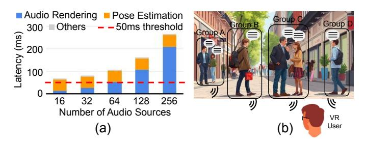

Fig. 2: (a) Total latency with different numbers of audio sources. (b) Depending on the head pose, nearby audio sources can be grouped together as a single source.

CPU [17], which has been frequently used in prior work to model rendering performance in VR devices [36], [38], [75], [86], [109], [112], [113]. For pose estimation, we adopt ORB-SLAM3 [14], a Simultaneous Localization and Mapping (SLAM) framework recognized for robustness and accuracy, which we use as a representative of commercial VR [67] tracking pipelines. We assume an indoor environment with room dimensions of 50 m in length and width, and 5 m in height, resembling a typical conference room. Audio rendering is performed using the Pyroomacoustics library [89] with the image source method (ISM) [1], simulating varying numbers of randomly placed audio sources in the room, consistent with the setup used in prior work [77]. As shown in Figure 2 (a), pose estimation and audio rendering dominate the end-to-end delay. The ORB-SLAM3 tracking module alone introduces roughly 51 ms of latency, and when combined with the audio-rendering workload, the total SS latency far exceeds the threshold to preserve immersion. Although the algorithmic complexity of multi-source rendering is approximately linear in the number of sources, deviations from linearity can arise from hardware and runtime effects that increase the effective per-source cost as the source count grows, such as cache and bandwidth contention. This underscores the need for acceleration on resource-constrained VR headsets.

In addition to pose estimation latency, audio rendering is also a major contributor to overall delay. Prior work has leveraged this perceptual characteristic to enable acoustic foveation [77], [90], [100]. Human auditory perception is inherently spatial and is strongly influenced by the listener's head position and orientation. As audio sources move farther from the central azimuth, spatial resolution decreases, which reduces sensitivity in peripheral regions. The audio sources in areas of lower perceptual importance, as determined by head pose, can be grouped and rendered as a single source by summing their source audio signals. As illustrated in Figure 2 (b), the six audio sources in Figure 1 (a) are clustered into four groups. This perceptually informed simplification lowers the computational cost of audio rendering by reducing the number of distinct audio sources, while maintaining spatial accuracy in the regions most critical to human perception.

Motivated by this, in this work, we address the high computational cost of real-time SS in VR with an <u>EffiCient Head-Orientation</u>-guided Sound Spatialization (ECHO). As shown in Figure 3, ECHO co-optimizes pose estimation, audio

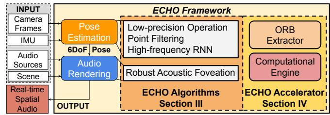

Fig. 3: An overview of ECHO framework.

rendering, and the underlying hardware platform to achieve efficient SS in VR. Our key contributions are summarized as follows:

- We reduce SS overhead by exploiting natural head dynamics, combining audio sources based on head orientation, and applying algorithm and hardware co-design for better efficiency.
- To increase the prediction frequency of the pose estimation, ECHO incorporates a lightweight neural network to process IMU data at extremely low cost. Additionally, we propose a feature point filtering and quantization method to accelerate the tracking process.
- We also propose a hardware accelerator to shorten the long-latency pose estimation stage. Integrated as a plugin within VR HMD SoCs, the ECHO accelerator reduces overall SS latency by up to 2.91× while preserving highquality auditory experiences.

## II. BACKGROUND AND LITERATURE REVIEW

#### A. Audio Rendering in VR

As shown in Figure 2 (a), audio rendering is a core component of the SS pipeline. The detailed architecture, illustrated in Figure 4, comprises three stages [15], [64], [88], [90], [91]: Sound Propagation, BRIR (Binaural Room Impulse Response) Generation, and Auralization.

Sound Propagation models how sound waves travel through the environment before reaching the listener's ears [65], [81], [88], [90], [91]. It is typically implemented using the Image Source Method (ISM) [1], [33], [52], [53], which mirrors audio sources across scene boundaries to efficiently approximate early reflections in indoor spaces. The system computes room impulse responses (RIRs) by simulating propagation based on listener pose, source location, and scene geometry and materials [15], [64], [91]. This simulation accounts for key acoustic phenomena including reflection, diffraction, and reverberation to derive the transfer paths between source and listener.

In the BRIR Generation stage, room impulse responses (RIRs) are converted into binaural room impulse responses (BRIRs) using listener-specific or generic head-related transfer functions (HRTFs) [9], [64], [89], [91]. This step models sound filtering by the head, torso, and ears, producing distinct left-and right-ear responses. HRTFs are commonly categorized as far-field or near-field [12], [28], [32], [62]. In the Auralization stage, source audio is convolved with BRIRs to generate spatialized signals [4], [7], [99], [106]. For sources at different positions, all three stages must be executed independently,

so rendering cost increases with the number of sources [\[90\]](#page-15-10), [\[91\]](#page-15-13). In acoustic foveation, nearby sources can be mixed and processed once to reduce overall computation [\[77\]](#page-14-15).

# *B. Pose Estimation in VR Environment*

Head pose estimation in VR [\[40\]](#page-13-21), [\[51\]](#page-14-22), [\[107\]](#page-15-16) is fundamental for immersion and interactivity. Accurate real-time tracking ensures high-quality spatial audio with correct binaural cues [\[90\]](#page-15-10), as illustrated in Figure [4.](#page-3-0) To achieve reliable pose estimation, numerous SLAM-based approaches have been developed, providing marker-free inside-out 6DoF tracking. Early visual SLAM systems such as PTAM [\[47\]](#page-14-23) and LSD-SLAM [\[21\]](#page-13-22) demonstrated real-time performance through feature-based and direct mapping techniques. Visual–inertial methods including MSCKF [\[72\]](#page-14-24), OKVIS [\[54\]](#page-14-25), VINS-Mono [\[80\]](#page-14-26), HybVIO [\[93\]](#page-15-17), and ORB-SLAM3 [\[14\]](#page-13-11) further improve robustness under rapid motion by fusing inertial measurements with visual features.

Among these methods, ORB-SLAM3 [\[14\]](#page-13-11) has gained wide adoption due to its strong performance. As shown in Figure [5,](#page-3-0) the framework consists of three main components: the tracking module, the local mapping module, and the loop closure module. ORB-SLAM3 integrates these components into a unified, multi-threaded pipeline that extends prior SLAM designs. The core tracking thread processes every incoming frame by performing ORB feature detection across an image pyramid [\[85\]](#page-14-27), descriptor matching, PnP-based local-map tracking (LM tracking) [\[73\]](#page-14-28), IMU preintegration, pose estimation, and new keyframe decision [\[14\]](#page-13-11). In VR systems, the latest pose estimate from this thread is used directly, making its per-frame latency the fundamental limit on tracking frequency. In contrast, the local mapping and loop closure modules run asynchronously on separate threads and are activated only under specific conditions (e.g., keyframe insertion or loop detection). As back-end optimization stages, they execute intermittently and do not affect real-time tracking latency.

To study the computational cost of each component, we evaluated ORB-SLAM3 on Jetson Orin NX [\[17\]](#page-13-8) with Aria Everyday Activities Dataset (AEA) [\[22\]](#page-13-23), [\[61\]](#page-14-29). The dataset provides monocular grayscale images with a resolution of 480 × 640 at 10 Hz and IMU data sampled at 1000 Hz in AR/VR scenarios. Latency was measured across three representative sequences, totaling approximately 6000 image frames. The measured latencies were then averaged to obtain a representative estimate of per-frame tracking performance. As shown in Table [I,](#page-3-0) ORB extraction and local map (LM) tracking are the primary sources of latency, together accounting for over 95% of the total tracking time. Therefore, optimizing these two processes is essential.

# *C. SLAM Hardware Acceleration for VR*

A number of systems have explored accelerating SLAM on resource-constrained platforms. eSLAM [\[57\]](#page-14-30) offloads ORB feature extraction and matching to an FPGA, achieving significant speedups and energy savings, but its design targets mobile robots rather than VR headsets. Eudoxus and Archytas [\[29\]](#page-13-24), [\[58\]](#page-14-31) extend this idea to autonomous machines by accelerating common localization primitives and synthesizing specialized accelerators, yet their focus remains robotic navigation and does not account for the tight motion-tophoton or motion-to-sound requirements of immersive VR. SlimSLAM [\[8\]](#page-13-25) introduces an adaptive runtime that tunes visual–inertial odometry parameters across heterogeneous processors, improving speed without modifying the hardware datapath. SuperNoVA [\[46\]](#page-14-32) targets back-end factor-graph inference and co-designs hardware and runtime for resourceaware SLAM, using AR datasets primarily as representative workloads rather than optimizing a head-tracked VR pipeline within a fixed SoC. In contrast, ECHO explicitly targets VR HMDs and co-optimizes a lightweight plug-in accelerator together with its integration into the graphics and spatialaudio pipeline, ensuring that head-tracking latency meets VRspecific motion-to-sound constraints.

# *D. Sound Spatialization in VR System*

A typical VR HMD [\[22\]](#page-13-23), [\[67\]](#page-14-14) features a compact stacked architecture that integrates multiple sensors and compute components, including a CPU, GPU, and memory subsystem, as illustrated in Figure [6](#page-3-1) (a). The device incorporates an IMU for motion sensing, a SLAM camera for capturing high-resolution environmental images, and additional sensors such as eyetracking cameras and microphones. To track user movement, the SLAM camera and IMU capture visual and inertial data, which are stored in DRAM and processed by the CPU to run a real-time pose estimation algorithm (e.g., ORB-SLAM3). The resulting pose estimates are then used by the CPU or GPU to render graphics or spatial audio, enabling an immersive experience in the virtual environment.

In real-time systems, source audio is generated and segmented into fixed-length blocks, typically 5–20 ms [\[101\]](#page-15-18). Each block is rendered using the latest head pose and processed through the pipeline in Figure [6](#page-3-1) (b). Here, SM and SI denote monocular SLAM image capture and IMU sensing, respectively, while PE represents pose estimation. Let TIN be the interval between consecutive sensor captures. Stage R1 performs sound propagation and BRIR generation and writes the results to a buffer, while stage R2 reads the buffered BRIRs and executes auralization. During operation, inputs from SM and SI are processed by P E to estimate the current pose, which is then consumed by R1. In parallel, audio blocks arriving every TA are processed by R2, which uses the most recently generated BRIRs for auralization. These stages are pipelined to improve steady-state throughput, but pipelining does not shorten the end-to-end motion-to-sound critical path. The motion-to-sound latency Tm-s is defined as the time between a user's movement and the moment the headphones output sound reflecting that movement. It is given by:

$$T_{m-s} = T_{IN} + T_S + T_P + T_{R1} + T_{R2} + T_O$$
 (1)

where TS, TP , TR1, TR2, and TO denote sensing, pose estimation, sound propagation and BRIR generation, auralization,

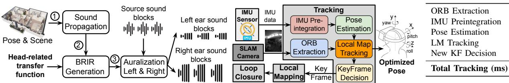

Fig. 4: The steps of the audio rendering process.

Fig. 5: Overview of ORB-SLAM3.

TABLE I: Latency breakdown of ORB-SLAM3 tracking.

23.92

0.45

1.81

24.09

0.23

50.49

Fig. 6: (a) The architecture of VR HMD. (b) Asynchronous BRIR generation and auralization.

and audio output latency. In practice,  $T_S$  and  $T_O$  are small (a few milliseconds) [22], [98].  $T_{R1}$  is typically much larger than  $T_{R2}$  because it must perform sound propagation and generate BRIRs for all active sources, while  $T_{R2}$  mainly performs convolution with the computed BRIRs. As shown in Figure 2 (a),  $T_P$ ,  $T_{R1}$ , and  $T_{R2}$  dominate total latency, while  $T_{IN}$  adds overhead based on pose estimation frequency. We next describe how ECHO accelerates each component.

## III. ECHO ALGORITHMS

As shown in Table I, ORB extraction and LM tracking dominate pose estimation latency. We next introduce techniques to accelerate these stages (Sections III-B–III-D), followed by audio rendering acceleration in Section III-E.

## A. Preliminary

We first review the key details of ORB-SLAM3 shown in Figure 5. The high latency of ORB [85] extraction stems from multi-scale feature detection and orientation assignment. For each input frame, an 8-level image pyramid is built by iteratively downsampling the original image, enabling scale-invariant feature detection. At each level, the image is partitioned into non-overlapping  $35 \times 35$  pixel cells, and the FAST [84] corner detector scans every pixel, comparing its intensity I(p) against those of 16 surrounding pixels. A pixel is classified as a corner if  $n \ge 12$  consecutive neighbors are all significantly brighter or darker than I(p). Each detected corner, as a 2D keypoint, is then assigned a dominant orientation based on the intensity moments of its local patch to ensure rotation invariance. Exhaustive per-pixel operations across the pyramid make this step highly time-consuming.

Another major computational bottleneck is LM tracking, which refines the head pose by matching current-frame features to 3D map points. As shown in Figure 5, an estimated pose is first initialized using IMU preintegration and pose

estimation, then a set of nearby keyframes are selected, and 2D–3D correspondences are established by matching BRIEF descriptors [85] between current-frame 2D keypoints and 3D map points, followed by RANSAC [26] to reject outliers. The user's head pose is parameterized by rotation  $\mathbf{R} \in \mathbb{R}^{3\times 3}$  and translation  $\mathbf{t} \in \mathbb{R}^3$  in six degrees of freedom. The refined pose is obtained by minimizing the *reprojection error* [74]:

$$\min_{\mathbf{R}, \mathbf{t}} \sum_{i} \|\mathbf{r}_{i}\|^{2} = \min_{\mathbf{R}, \mathbf{t}} \sum_{i} \|\mathbf{u}_{i} - \pi(\mathbf{R}\mathbf{x}_{i} + \mathbf{t})\|^{2}$$
 (2)

where  $\mathbf{x}_i$  is the *i*-th 3D map point in the world frame,  $\mathbf{u}_i \in \mathbb{R}^2$  is its corresponding 2D keypoint, and  $\pi(\cdot)$  is the camera projection function. The term  $\mathbf{R}\mathbf{x}_i + \mathbf{t} = \mathbf{x}_i^c$  represents the transformation from the world frame to the camera frame.

In VR devices, SLAM cameras often employ fisheye lenses with strong radial distortion, necessitating a non-linear projection model  $\pi(\cdot)$ . ORB-SLAM3 adopts the Kannala-Brandt (KB) model [44] to project 3D points into fisheye image coordinates and obtain the corresponding Jacobians. Given a 3D point  $\mathbf{x}^c = [x, y, z]^{\mathsf{T}}$  in the camera frame, define:  $\rho = \sqrt{x^2 + y^2}, \quad \theta = \arctan(\rho/z), \quad \varphi = \arctan 2(y, x).$  The radial distortion function is:  $d(\theta) = \theta + k_1 \theta^3 + k_2 \theta^5 + k_3 \theta^7 + k_4 \theta^9$ , and the projection is:

$$\pi(\mathbf{x}^c) = \begin{bmatrix} f_x \cdot d(\theta) \cos \varphi + c_x \\ f_y \cdot d(\theta) \sin \varphi + c_y \end{bmatrix}$$
(3)

where  $k_1, \ldots, k_4$  are the radial distortion coefficients,  $f_x, f_y$  are focal lengths, and  $c_x, c_y$  are the principal point coordinates of the fisheye camera. This model involves trigonometric and high-order polynomial terms, leading to high computation cost. Moreover, to refine the initialized pose, ORB-SLAM3 minimizes the reprojection error via iterative Gauss-Newton optimization [104], where the pose is gradually optimized in the Lie algebra over 40 iterations. Each iteration applies the on-manifold pose update formulation [10] and evaluates the fisheye projection and its Jacobians [44] to compute reprojection errors and pose gradients for the next update.

## B. Low-precision Pose Estimation Module

In this section, we propose a low-precision pose estimation module to reduce the LM Tracking latency shown as  $T_P$  in Equation (1). In each optimization iteration, every 3D map point is projected multiple times for residual and Jacobian evaluation, making the projection step a primary computational bottleneck. This step,  $\mathbf{x}_i^c = \mathbf{R}\mathbf{x}_i + \mathbf{t}$ , is a large-batch matrix-vector multiplication executed in FP64 on CPU and contributes substantially to the overall latency. To alleviate this cost, we employ low-precision approximations that reduce

arithmetic complexity while maintaining sufficient numerical accuracy for pose optimization. Specifically, given that the rotation matrix  $\mathbf{R}$  is orthonormal with entries constrained to the range [-1,1], and the world-coordinate map point  $\mathbf{x}_i$  typically has limited dynamic range, we propose a *low-precision pose estimation module* that replaces high-precision arithmetic with hybrid-precision alternatives in the coordinate transformation and Jacobian computation steps.

Specifically, for the rotation matrix R, each element is multiplied by a scale of 8 and then rounded to the nearest integer, producing a 4-bit signed-integer representation. Although many systems use a scale of 7, choosing 8 makes on-the-fly quantization more hardware friendly because the scaling step can be carried out through a simple adjustment of the floating point exponent rather than a full multiplication. For the 3D point  $x_i$ , we apply the FP8 E4M3 format, which supports values from -448 to +448. This range, with a total span of 896 meters, is more than sufficient for typical indoor VR scenes. Quantization operators  $Q_{\text{INT4}}(\cdot)$  and  $Q_{\text{FP8}}(\cdot)$ are defined as:  $Q_{\text{INT4}}(r) = \text{clamp}[\text{round}(8 \cdot r), -8, 7]$  and  $Q_{\rm FP8}(x) = {\rm FP8}_{\rm E4M3}(x)$ , where clamp[·] ensures the result lies in the representable range, and  $FP8_{E4M3}(\cdot)$  casts a floating-point value to the E4M3 format. The coordinate transformation in low precision is then expressed as:

$$\mathbf{x}_{i}^{c} = Q_{\text{INT4}}(\mathbf{R}) \cdot Q_{\text{FP8}}(\mathbf{x}_{i})/8 + \mathbf{t}.$$
 (4)

Finally, given the high nonlinearity and sensitivity of the fisheye projection function [44] and its derivative, both are computed entirely in FP32 to avoid accuracy degradation.

## C. Quantization-aware Point Filtering

In addition to adopting low-precision arithmetic for pose estimation, we further reduce the LM Tracking latency within  $T_P$  by filtering out low-quality correspondences before optimization. Our *quantization-aware point filtering* strategy targets points that may introduce instability under quantized operations. Specifically, we evaluate the FP8 quantization error of each 3D map point  $\mathbf{x}_i$ , defined as:

$$E_1 = \|\mathbf{x}_i - Q_{\text{FP8}}(\mathbf{x}_i)\| \tag{5}$$

Map points with  $E_1 > \alpha$  are excluded from subsequent operations. To improve stability, we further perform a one-time error check before the iterative optimization. Specifically, the *stability check* is performed by computing:

$$E_2^q = \left\| \mathbf{u}_i - \pi \left( Q_{\text{INT4}}(\mathbf{R}) \cdot Q_{\text{FP8}}(\mathbf{x}_i) / 8 + \mathbf{t} \right) \right\|^2$$
 (6)

according to Equation (2). If  $E_2^q > \beta$ , the correspondence is deemed unstable and is discarded from further operations for computational savings. Because this check runs only once and does not involve Jacobian and Hessian computations, it adds minimal overhead while improving robustness.

Empirically, we find that, especially when the back-end modules (e.g., local mapping, loop closure) have already refined the global map and poses, most 2D–3D correspondences that pass the first filter in  $E_1$  exhibit small errors in  $E_2^q$ . In such cases, the current pose is already near-optimal, yet

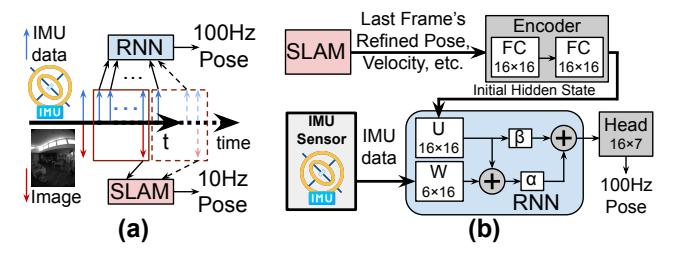

Fig. 7: (a) The SLAM system outputs 10 Hz poses (red), while the RNN interpolates 100 Hz intermediate poses in real time from SLAM and IMU data (blue). (b) Architecture of RNN-based pose estimation module.

a large number of point correspondences may still enter the optimization process. To avoid unnecessary computation, we introduce a *selective sampling* strategy: if the proportion of correspondences rejected by the  $E_2^q$  criterion is less than a threshold  $r_1$ , we infer that the pose is accurate and randomly discard a proportion  $r_2$  of the remaining pairs. The retained subset is then used for Gauss–Newton optimization. By combining quantization-aware point filtering, stability check, and selective sampling, ECHO greatly reduces the number of map points used in optimization, lowering computational cost and latency  $T_P$  while preserving geometric accuracy.

#### D. IMU-based High-Frequency Pose Estimation

As shown in Figure 6 (b), the relatively low SLAM camera rate, typically around 10 to 30 Hz, produces a large intercapture interval  $T_{IN}$ , which delays motion detection and ultimately increases the latency as expressed in Equation (1). In contrast, IMU sensors in VR devices can operate at frequencies up to 1000 Hz, enabling smoother and more frequent motion detection, which triggers SS more promptly. However, IMU data is less informative than visual input, and relying solely on it for pose estimation causes drift over time.

To address this, we introduce a lightweight recurrent neural network (RNN) that estimates high-rate poses between SLAM-based pose updates. As shown in Figure 7 (a), the RNN takes the current IMU data along with the latest optimized pose, velocity, and sensor bias estimates from SLAM to generate high-frequency head pose outputs at 100 Hz, represented as a 7D vector containing 3D translation and a 4D quaternion [94]. To further lower inference overhead, we apply mixed-precision quantization, using per-channel INT4 for the weights and FP8 for the input activations, and train the model with quantization-aware training to maintain accuracy. This high-frequency pose estimation shortens the inter-capture interval, mitigating the additional latency caused by infrequent sensor captures, i.e.,  $T_{IN}$ , while quantization reduces the pose estimation time, ensuring low latency and stable SS.

## E. Robust Acoustic Foveation under Tracking Error

As shown in Figure 2 (a), the audio rendering time increases substantially with the number of audio sources. To further reduce audio rendering latency,  $T_{R1}$  and  $T_{R2}$ , we decrease the number of active sources before the audio rendering stage by exploiting properties of human auditory perception

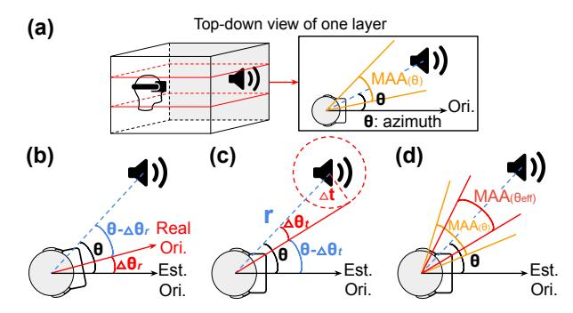

Fig. 8: (a) The room is divided into horizontal layers (red dashed lines). In the top-down view, the listener's orientation (Ori.) defines each source's azimuth θ, and the corresponding MAA sets the angular threshold for clustering. (b) Angular deviation ∆θr caused by rotation error. (c) Angular deviation ∆θt caused by translation error at distance r. (d) Stricter clustering threshold based on θeff.

to group acoustically similar ones. This approach, referred to as *acoustic foveation* [\[77\]](#page-14-15), leverages the fact that listeners cannot distinguish between sources lying within a small angular range, known as the *Minimum Audible Angle* (MAA). Psychophysical studies [\[77\]](#page-14-15) show that the MAA increases monotonically with azimuth θ (Figure [8](#page-5-0) (b)): it can be as low as 3 ◦ in the frontal direction (θ ≈ 0 ◦ ), but rises to nearly 40◦ at lateral positions (θ ≈ 90◦ ). This trend reflects the decreasing spatial resolution of human auditory perception away from the frontal axis. Similarly, in the radial dimension, human auditory perception does not estimate source distance as a precise value, but rather as a range of possible distances. The width of this perceptual range increases approximately in proportion to the actual distance, so that two sources falling within the same range are perceived as being at the same distance. Prior studies [\[2\]](#page-13-28), [\[111\]](#page-15-22) indicate that the standard deviation of distance judgments exceeds 20% of the source distance, implying that sources separated by less than this threshold are generally indistinguishable in perceived depth.

Based on these perceptual constraints, and using the listener's pose from the pose estimation stage, we cluster audio sources to reduce rendering load. Following prior work, we adopt a generic far-field HRTF [\[12\]](#page-13-16), [\[32\]](#page-13-18), assuming source distances ≥ 1 m, and the clustering scheme remains independent of this HRTF choice. As shown in Figure [8](#page-5-0) (a), the 3D room is segmented along the height dimension into multiple chunks, converting the task into several 2D subproblems. Within each layer, source azimuths relative to head orientation are compared, and those with angular separation below the MAA threshold are merged into angular groups. Each angular group is then refined in the radial dimension: sources within 20% of the farthest one's distance to the listener are treated as perceptually indistinguishable and clustered [\[2\]](#page-13-28), [\[111\]](#page-15-22).

The audio source clustering scheme described above relies on accurate head pose estimation. However, pose estimation may include errors. To mitigate this impact, we further adapt the clustering scheme of acoustic foveation accordingly. Let the angular and translational pose tracking errors be denoted by ∆θr and ∆t, respectively. These errors create uncertainty in the user's pose, thereby reducing MAA for audio source clustering. By the principle of relative motion, pose tracking errors translate into deviations in the perceived locations of audio sources. As shown in Figure [8](#page-5-0) (b) and (c), each audio source experiences an angular deviation of ∆θr and a spatial displacement within a circular region of radius ∥∆t∥. Since the MAA increases monotonically with azimuth θ, we conservatively estimate a lower bound on the effective azimuth:

$$\theta_{\rm eff} = \theta - \Delta\theta_r - \Delta\theta_t \tag{7}$$

where ∆θt ≈ ∥∆t∥/r approximates the angular deviation caused by a relatively small translation error at source distance r. As illustrated in Figure [8](#page-5-0) (d), when audio sources are combined, the MAA is evaluated at θeff, imposing a stricter clustering criterion that preserves perceptual validity even under pose estimation errors. Once clusters are determined, all sources within each cluster are replaced by a single virtual source positioned at the centroid of the original sources, which is then used for subsequent audio rendering. Our erroraware acoustic foveation preserves spatial fidelity and comfort (Section [VI-C\)](#page-12-0) while reducing active sources, thus shortening TR1 and TR2 without loss of perceptual quality.

# IV. ECHO ACCELERATOR

The design of the *ECHO accelerator* is shown in Figure [9.](#page-6-0) It primarily consists of an *ORB extractor* (Section [IV-A\)](#page-5-1) and a *computational engine* (Section [IV-B\)](#page-6-1).

# *A. ORB Extractor Module*

The architectural design of the ORB Extractor is shown in the center-left of Figure [9.](#page-6-0) The module integrates an onchip buffer, a shift-register array and a comparator array to accelerate FAST corner detection in ORB extraction, as shown in Section [III-B.](#page-3-2) For each 35 × 35 8-bit grayscale image cell, all pixels are first loaded into the buffer. The shift-register array maintains a 7 × 7 sliding detection window, enabling single-cycle access to the pixels required for the current test location without redundant buffer reads.

FAST corner detection is realized with a decision-tree [\[95\]](#page-15-23) and implemented by a comparator array. The comparator array first checks the four cardinal pixels (top, bottom, left, right) against the center pixel intensity; only if these differences exceed the corner threshold is the evaluation extended to the remaining pixels in groups of four. This progressive evaluation enables early termination for non-corner pixels. For each pixel classified as a corner, a response score is computed by summing the absolute intensity differences between the center pixel and contiguous circle pixels whose differences exceed the threshold. After detection, the same shift-register and comparator hardware is time-multiplexed for non-maximum suppression (NMS). Response scores are buffered on-chip, and the shift-register array slides a neighborhood window across the score map to identify local maxima. The comparator array outputs only the coordinates of these maxima, suppressing

Fig. 9: Overall architecture of the VR SoC, with the ECHO accelerator integrated as a plug-in module.

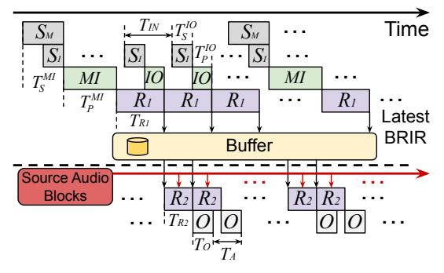

Fig. 10: Hybrid update pattern of Monocular–Inertial (MI) mode and Inertial–Only (IO) mode in ECHO.

all others. This resource-sharing design minimizes additional hardware cost and sustains high-throughput corner extraction. The tightly coupled pipeline streams image cells through detection and NMS continuously without stalls, delivering low-latency ORB extraction for SLAM-based pose estimation.

## B. Computational Engine

The computational engine executes the low-precision pose estimation described in Section III-B and performs quantized RNN-based high-frequency pose estimation in Section III-D. As shown in Figure 9, it integrates two on-chip buffers, an INT4–FP8 mixed-precision systolic array with 8×8 processing elements (PEs), a floating-point accumulator, a *Special Function Unit* (SFU) for nonlinear operations in neural networks, and a custom *Projection with Jacobian* (PJ) module.

The systolic array adopts a weight-stationary dataflow for both the matrix multiplications in the RNN and the matrix-vector multiplications in pose optimization. RNN weights are per-channel quantized offline, retained in the on-chip buffer, and loaded into the array at runtime. An INT4 quantization unit before the systolic array handles rotation matrices, which are updated dynamically during optimization and require online quantization. Since rotation matrix elements lie within the range [-1,1], we apply a uniform scaling factor of 8 and implement quantization/dequantization by adjusting the exponent bits by  $\pm 3$  in the floating-point format. A dedicated FP8 E4M3 quantization unit casts 3D coordinates and RNN activations. Both modules achieve low-latency conversion via exponent manipulation or direct casting. The SFU implements ReLU through sign-bit comparison, and approximates Tanh using a piecewise-linear model for efficiency-accuracy balance. The PJ module directly accelerates the fisheye camera projection and its derivative.

Since both computations share the transformed 3D point in the camera frame as input and reuse intermediate values such as  $\rho = \sqrt{x^2 + y^2}$ ,  $\theta = \arctan(\rho/z)$ , and the polynomial distortion terms, we design a unified hardware module that computes both results in a single pass. By reusing datapaths and shared expressions, the module minimizes redundant computations and hardware cost.

To further improve efficiency, we introduce a set of hardware-oriented arithmetic optimizations. First, instead of explicitly computing  $\varphi = \arctan 2(y,x)$  followed by evaluating  $\cos \varphi$  and  $\sin \varphi$  in Equation (3), we reformulate these terms as  $\cos \varphi = x/\rho$  and  $\sin \varphi = y/\rho$ , where  $\rho = \sqrt{x^2 + y^2}$ , eliminating costly trigonometric computations. The square root operation in  $\rho$  is approximated using a reciprocal square root method inspired by fast inverse square root [60]. The distortion function  $d(\theta)$ , a 9th-order odd polynomial, is computed by Horner's method [41] to reduce the number of multiplications. The angle  $\theta = \arctan(\rho/z)$  is approximated using a signaware polynomial method, combining domain normalization with low-order polynomial evaluation. Together, these designs allow a division–free, low–latency implementation without reducing accuracy.

While projection and its derivative share most intermediates, the derivative computation further requires partial derivatives of these quantities with respect to the 3D point. This involves applying the chain rule to obtain terms such as  $\partial\theta/\partial x$ ,  $\partial\theta/\partial y$ , and  $\partial\theta/\partial z$ , as well as the derivatives of the distortion terms. To improve efficiency, the PJ module pipelines the computation of all shared intermediates so that they are generated once and reused by both projection and derivative paths. The derivative path then performs only the incremental operations necessary to assemble the Jacobian, thereby avoiding redundant processing and lowering the overall latency.

# C. SoC Integration of ECHO Accelerator

The computational flow of ECHO is illustrated in Figure 10 and Figure 11. The ECHO accelerator operates in a **Hybrid mode** comprising **Monocular–Inertial (MI)** and **Inertial–Only (IO)** modes. In MI mode, SLAM-based pose estimation is performed using monocular images and IMU data, as shown in Figure 6 (b). Between MI steps, IO mode employs the lightweight RNN-based pose estimation module in Section III-D to generate high-frequency pose estimates

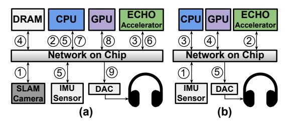

Fig. 11: The computational flows of: (a) MI mode and (b) IO mode. The step numbers are shown in circles.

with shorter intervals. The two modes operate in an interleaved manner, resulting in a reduced  $T_{IN}$  in Equation 1. We also pipeline the sensing, pose estimation, audio rendering, and audio output stages to improve steady-state throughput. Next, we describe MI and IO modes separately.

For MI mode, as shown in Figure 11 (a), in Step 1, the SLAM camera captures a frame and passes it to CPU. CPU constructs the image pyramid and partitions each level into small cells which are then written to system memory in Step 2. In Step 3, ECHO accelerator reads the image cells from memory into its internal buffer and performs FAST detection using its ORB extractor module. The extracted points are stored back to memory in Step 4. Following this, CPU continues the remaining computations in the SLAM tracking thread and performs point filtering described in Section III-C (Step 5). During local map tracking, as part of the iterative pose optimization process, CPU invokes ECHO accelerator to compute reprojection errors and Jacobians for the 2D-3D correspondences (Step 6). Once these results are returned, CPU completes the Gauss-Newton iteration to refine the pose. After that, the optimized pose is used to perform acoustic foveation and spatial clustering of audio sources. These clustered audio sources, along with the optimized pose, are then passed to GPU (Step 7). In Step 8, GPU performs SS using the clustered audio sources and the listener pose to generate the final binaural audio stream. Finally, the rendered audio is sent to DAC and played back through the headphones (Step 9).

The operations in IO mode are shown in Figure 11 (b). The ECHO accelerator directly reads IMU measurements (Step 1) and computes the updated pose with RNN (Step 2). The estimated pose is then passed to CPU, which proceeds with the same subsequent stages as in Steps 7–9 of the MI mode, including audio source clustering (Step 3), audio rendering (Step 4), and audio output (Step 5).

Figure 10 illustrates the ECHO workflow in Hybrid mode. Compared to the workflow in Figure 6 (b), ECHO executes pose estimation more frequently, substantially reducing  $T_{IN}$ . In addition, the techniques introduced in Section III significantly decrease both pose estimation and audio rendering latencies. Let  $T_P^{MI}$  and  $T_P^{IO}$  denote the pose estimation latencies for the MI and IO modes, respectively, and  $T_S^{MI}$  and  $T_S^{IO}$  represent the sensing latencies in the two modes. Given the small data volumes exchanged between SoC components, communication latency is negligible. The motion-to-sound latency  $T_{m-s}$  can be approximated under two scenarios. When motion occurs between two consecutive SLAM

TABLE II: Hybrid mode results in ATE (m)\RRE (°).

| $ATE \backslash RRE$ | ЕСНО                | ORB-SLAM3           | VINS-Fusion | HybVIO      | OKVIS       |
|----------------------|---------------------|---------------------|-------------|-------------|-------------|
| AEA 1                | 0.072\2.461         | 0.063\2.389         | 1.020\2.655 | 0.997\4.271 | 0.198\2.707 |
| AEA 2                | <b>0.068</b> \2.817 | 0.070\2.830         | 1.259\7.319 | 1.273\3.882 | 0.225\2.812 |
| AEA 3                | <b>0.038</b> \1.675 | 0.040\1.699         | 0.462\1.669 | 0.491\5.928 | 0.067\1.928 |
| AEA 4                | <b>0.042</b> \1.581 | 0.070\ <b>1.512</b> | 0.884\6.140 | 0.910\2.187 | 0.078\1.904 |
| TUM 1                | 0.015\0.513         | <b>0.011</b> \0.612 | 0.125\0.533 | 0.032\0.481 | 0.084\0.495 |
| TUM 2                | 0.021\ <b>0.559</b> | <b>0.015</b> \0.626 | 0.089\0.630 | 0.032\0.680 | 0.115\0.761 |
| TUM 3                | 0.020\ <b>0.645</b> | <b>0.019</b> \0.711 | 1.235\1.662 | 0.094\0.675 | 0.073\0.783 |
| TUM 4                | 0.020\ <b>0.476</b> | <b>0.017</b> \0.537 | 0.064\0.490 | 0.026\0.698 | 0.040\0.567 |
| TUM 5                | 0.019\ <b>0.461</b> | 0.013\0.555         | 0.138\0.526 | 0.034\0.523 | 0.062\0.554 |
| TUM 6                | 0.010\ <b>0.399</b> | <b>0.007</b> \0.466 | 0.130\0.429 | 0.028\0.419 | 0.047\0.524 |
| Average              | 0.033\1.014         | <b>0.033</b> \1.194 | 0.541\2.205 | 0.392\1.974 | 0.099\1.303 |

camera captures and IO mode is used for pose estimation,  $T_{m-s}^{IO} = T_{IN} + T_S^{IO} + T_P^{IO} + T_{R1} + T_{R2} + T_O$ . When motion occurs and is detected using MI mode,  $T_{m-s}^{MI} = T_{IN} + T_S^{MI} + T_P^{MI} + T_{R1} + T_{R2} + T_O$ . The overall motion-to-sound latency is given by  $T_{m-s} = \max(T_{m-s}^{MI}, T_{m-s}^{IO})$ . Typically,  $T_S^{MI} + T_P^{MI}$  far exceeds  $T_S^{IO} + T_P^{IO}$ . Therefore, the overall motion-to-sound latency is dominated by the occurrence of  $T_{m-s}^{MI}$ .

# V. ECHO ALGORITHMS EVALUATION

To evaluate pose estimation accuracy, we compare ECHO with four state-of-the-art SLAM systems: ORB-SLAM3 [14], VINS-Fusion [80], HybVIO [93], and OKVIS [54]. All methods are tested on four randomly selected sequences from the AEA dataset and all six indoor sequences of the TUM VI dataset. The AEA sequences capture diverse motion patterns, while the TUM VI sequences serve as a standard benchmark for AR and VR style environments [14], [80].

ECHO is evaluated under two settings: standalone MI mode performs SLAM-based pose estimation by fusing image and IMU data at the camera frame rate, as shown in Figure 6 (b), incorporating all the optimizations described in Sections III-B and III-C. For point filtering, we fix  $\alpha = 0.1$ ,  $\beta = 120$ , and apply selective sampling by discarding  $r_2 = 40\%$  of points when the filtering ratio falls below  $r_1 = 5\%$ . Hybrid mode builds on MI mode by incorporating IO mode, adding RNNbased pose estimation between consecutive MI operations. The RNN is trained separately for each dataset using quantizationaware training. For AEA, the four chosen sequences are used for testing, with ten additional random sequences for training and validation. For TUM VI, a contiguous 20% segment from each sequence is randomly chosen for testing, with the remaining 80% reserved for training and validation. For fairness, other baselines are also evaluated under the IO mode, using an IMU integration module that propagates pose estimates and velocity at 100 Hz. Evaluation is performed with evo toolkit [37], reporting the Absolute Translation Error (ATE) in meters for global trajectory accuracy and the Relative Rotation Error (RRE) over 100 ms intervals in degrees for local drift. Both ATE and RRE are presented as root-mean-square errors (RMSE), following standard evaluation protocols [80].

## A. Accuracy Evaluation Results of ECHO

Table II shows ECHO's performance in Hybrid mode on the four AEA (AEA 1–4) and six TUM VI (TUM 1–6) sequences. We observe that ECHO achieves an average ATE of 0.033 m,

TABLE III: MI mode average results in ATE (m)\RRE (◦ ).

| ATE\RRE | ECHO        | ORB-SLAM3 VINS-Fusion |             | HybVIO | OKVIS                   |
|---------|-------------|-----------------------|-------------|--------|-------------------------|
| Average | 0.030\1.153 | 0.029\1.129           | 0.539\1.385 |        | 0.392\1.920 0.099\1.234 |

TABLE IV: Ablation results of quantization and point filtering. ("-" indicates tracking failure.)

| Metric  | ECHO  | Precision FP16 | No F  | Filtering QAF |       |
|---------|-------|-------------------|-------|------------------|-------|
| ATE (m) | 0.030 | 0.030             | 0.029 | –                | 0.042 |
| RRE (◦) | 1.153 | 1.133             | 1.133 | –                | 1.264 |

on par with ORB-SLAM3 (0.033 m), while also delivering a lower RRE (1.014° vs. 1.194°). The reduction in RRE is particularly important, as orientation errors directly undermine the MAA by constraining perceptual clustering. These results confirm the effectiveness of the lightweight RNN-based pose estimation module. Compared with VINS-Fusion, HybVIO, and OKVIS, ECHO attains substantially higher accuracy, highlighting the robustness of this hybrid design. Additionally, Table [III](#page-8-0) presents average results across the same sequences under MI mode, where ECHO attains an ATE of 0.030 m and an RRE of 1.153°, closely matching ORB-SLAM3 (0.029 m, 1.129°). Together with the Hybrid mode evaluation, these results demonstrate that ECHO consistently maintains high pose accuracy across both settings.

# *B. Ablation and Sensitivity Study*

In Hybrid mode, ECHO interleaves MI and IO steps, with IO estimation conditioned on MI outputs. As a result, Hybrid performance is closely tied to MI mode performance. To isolate the contribution of each component, we conduct ablation and sensitivity studies in MI mode and report results averaged over the AEA and TUM VI datasets.

We first evaluate the individual impact of two key modules in our design: low-precision quantization and point filtering. Table [IV](#page-8-1) reports the results, where *FP16* and *FP32* replace the INT4–FP8 low-precision module with higherprecision variants. *No F* indicates the variant in which the point filtering module is completely removed. In contrast, *QAF* keeps only the quantization-aware point filtering while turning off both the stability check and the selective sampling mechanisms. Replacing the low-precision module with *FP16* or *FP32* produces only minor RRE gains with negligible impact on ATE, confirming that the low-precision module in Section [III-B](#page-3-2) introduces minimal accuracy loss. Removing filtering (*No F*) allows excessive noisy correspondences into the optimization, causing instability and ultimately no valid pose output. The *QAF* variant, which retains only quantizationaware point filtering, avoids complete failure but still degrades ATE and RRE, as the lack of stability check and selective sampling allows residual outliers to accumulate and cause drift. These results show that quantization-aware point filtering is essential to avoid divergence, while stability check and selective sampling further enhance robustness and accuracy, making the full filtering module necessary for pose estimation.

We further conduct a sensitivity analysis of the point filtering hyperparameters (α, β, r1, r2) introduced in Section [III-C](#page-4-3)

TABLE V: Sensitivity analysis of hyperparameters α, β, r1, and r2. ("A" indicates ATE (m), "R" indicates RRE (◦ ), and "–" indicates tracking failure.)

(a) Sensitivity analysis of thresholds α and β.

|   | 1     | 0.5   | α 0.1 | 0.05  | 0.01 | 180   | 150   | β 120 | 90    | 60    |
|---|-------|-------|----------|-------|------|-------|-------|----------|-------|-------|
| A | 0.039 | 0.038 | 0.030    | 0.059 | –    | 0.035 | 0.036 | 0.030    | 0.034 | 0.037 |
| R | 1.207 | 1.230 | 1.153    | 1.232 | –    | 1.181 | 1.165 | 1.153    | 1.159 | 1.195 |

(b) Sensitivity analysis of ratios r1 and r2.

|   | r1    |       |       |       |     |       | r2    |       |  |  |
|---|-------|-------|-------|-------|-----|-------|-------|-------|--|--|
|   | 20%   | 10%   | 5%    | 2.5%  | 80% | 60%   | 40%   | 20%   |  |  |
| A | 0.082 | 0.039 | 0.030 | 0.030 | –   | 0.051 | 0.030 | 0.029 |  |  |
| R | 1.262 | 1.194 | 1.153 | 1.112 | –   | 1.237 | 1.153 | 1.131 |  |  |

TABLE VI: Cross-dataset generalization study results.

| Metric  | ECHO   | Combined | AEA-only | TUM-only |
|---------|--------|----------|----------|----------|
| ATE (m) | 0.0326 | 0.0332   | 0.0338   | 0.0337   |
| RRE (◦) | 1.0140 | 1.0194   | 1.0237   | 1.0206   |

to quantify their impact on pose accuracy. Table [V](#page-8-2) (a) reports the sensitivity results for thresholds α and β. Since map points with E1 > α are discarded before optimization, setting α too small (e.g., 0.01) removes most correspondences and leaves insufficient geometric constraints, resulting in tracking failure. In contrast, a large α (e.g., 1) retains many map points with substantial quantization error, which propagates into pose optimization and degrades accuracy (ATE/RRE increases to 0.039/1.207). β governs the stability check based on the quantized reprojection error E2 q . A small β is overly strict and rejects many otherwise usable correspondences (0.037/1.195 at β = 60), while a large β becomes too permissive and allows unstable pairs to enter optimization (0.035/1.181 at β = 180). The default setting (α=0.1, β=120) balances quantization robustness and reprojection stability, achieving the lowest ATE and RRE.

Table [V](#page-8-2) (b) further evaluates the impact of the selective sampling ratios r1 and r2. Increasing r1 makes selective sampling easier to trigger, which can prematurely enter the reducedwork regime and discard too many map points and their correspondences, degrading accuracy (ATE/RRE increases to 0.082/1.262 at r1=20%). In contrast, smaller values remain stable around the default (0.030/1.153 at r1=5%). r2 controls pruning strength once selective sampling is triggered: an overly aggressive r2 removes too many correspondences and destabilizes tracking (tracking fails at r2=80%), whereas moderate settings preserve accuracy (0.051/1.237 at r2=60% and 0.030/1.153 at r2=40%). Overall, the default setting (r1=5%, r2=40%) follows a conservative, accuracy-first heuristic and provides a good trade-off, reducing workload while maintaining near-best pose accuracy.

# *C. RNN Generalization Study*

The high-frequency pose estimation RNN is used to predict poses between successive MI updates. Any short-term prediction drift is periodically corrected, and the final pose is dominated by the subsequent SLAM-optimized MI outputs, so the RNN does not act as a standalone tracker. To study generalization across datasets and motion behaviors, we trained the same RNN under three configurations: (i) a *Combined* training set that includes both AEA and TUM VI training sets, (ii) *AEA-only* training, and (iii) *TUM-only* training. Each trained model is then evaluated on the combined AEA and TUM VI test sets, and we report ATE and RRE averaged over all test sets. All results are measured under ECHO's Hybrid mode, keeping the pipeline unchanged and replacing only the pose estimation RNN with the corresponding re-trained variant.

As shown in Table VI, ECHO is largely insensitive to the RNN training dataset. Relative to the default ECHO configuration (ATE/RRE = 0.033/1.014 in Table II), Combined training achieves 0.0332/1.0194, while single-dataset training remains comparable at 0.0338/1.0237 (AEA-only) and 0.0337/1.0206 (TUM-only). Overall, the variation is small across all settings, indicating that the RNN mainly models short-horizon inertial motion that transfers across datasets with different motion patterns and sampling characteristics.

## VI. ECHO ACCELERATOR EVALUATION

This section evaluates the performance of the ECHO accelerator in Section IV. The ECHO accelerator is implemented in Verilog and synthesized using Synopsys Design Compiler [6] with a 45 nm CMOS technology [43] to evaluate area, timing, and power. The design operates at a target frequency of 1 GHz, with on-chip buffers modeled using CACTI [5]. To align with contemporary VR SoC technology, we further scale the results to a 22 nm process using DeepScaleTool [87]. The ECHO accelerator operates in Hybrid mode by interleaving IO mode within MI mode. In MI mode, the accelerator supports SLAMbased pose estimation, while in IO mode it performs IMUbased RNN pose estimation to provide high-frequency poses. It has an area of 0.24 mm2 and a peak power of 0.13 W. The majority of the area is attributed to the Computational Engine (69%), followed by the ORB Extractor (31%).

As described in Section IV-C, the system's motion-to-sound latency is governed by the MI mode, since it incurs the longer end-to-end latency and therefore determines the latest pose that can be applied to audio rendering. The motion-to-sound latency is modeled by decomposing the MI pipeline as:

$$T_{m-s} = T_{IN} + T_S^{MI} + T_P^{MI} + T_{R1} + T_{R2} + T_O$$
 (8)

where each component is evaluated separately according to its execution placement in the pipeline and then summed to obtain the end-to-end latency. Specifically,  $T_{IN}$  is fixed to 5 ms. With a 100 Hz update rate (10 ms period) in Hybrid mode, the sampling delay lies in [0,10] ms, and we use the expected delay 5 ms as a representative  $T_{IN}$  in our model.  $T_S^{MI}$  includes the camera and IMU sensing latencies, as well as the corresponding sensor-to-SoC data transfer latency. Specifically, the camera and IMU sensing latencies are set according to the AEA dataset documentation [79] to reflect the timing characteristics of typical AR and VR devices, while the camera-to-SoC communication latency follows the MIPI CSI interface model in [56]. For  $T_O$ , we model the output stage latency as the sum of the audio device output latency and a buffering-induced delay. The buffering delay arises because

TABLE VII: Detailed description of the algorithms and the hardware platforms used for each evaluation setting.

| Method                    | Pose E         | stimation        | Audio Rendering |            |  |
|---------------------------|----------------|------------------|-----------------|------------|--|
| Method                    | Algorithm      | Device           | Algorithm       | Device     |  |
| Jet ORB + Full CPU        | ORB-SLAM3      | Jetson CPU       | Full            | Jetson CPU |  |
| Jet ORB + Full GPU        | ORB-SLAM3      | Jetson CPU       | Full            | Jetson GPU |  |
| Jet OKVIS + Foveated GPU  | OKVIS          | Jetson CPU       | Foveated        | Jetson GPU |  |
| Jet HybVIO + Foveated GPU | HybVIO         | Jetson CPU       | Foveated        | Jetson GPU |  |
| Jet VINS + Foveated GPU   | VINS-Fusion    | Jetson CPU       | Foveated        | Jetson GPU |  |
| Jet ORB + Foveated GPU    | ORB-SLAM3      | Jetson CPU       | Foveated        | Jetson GPU |  |
| Jet ECHO + Foveated GPU   | ECHO Algorithm | Jetson CPU       | Foveated        | Jetson GPU |  |
| ECHO + Full GPU           | ECHO Algorithm | ECHO Accelerator | Full            | Jetson GPU |  |
| ECHO                      | ECHO Algorithm | ECHO Accelerator | Foveated        | Jetson GPU |  |

audio rendering and playback are asynchronous: a rendered block may wait in the playback buffer for up to one buffer period before it is consumed [3], [69], [98]. Accordingly, we include a 5 ms buffer delay, determined by the audio block length [3], [69], in addition to a 1 ms audio output latency [98].

Audio rendering performance is evaluated using two ISMbased [1] implementations: Pyroomacoustics (CPU) [89] and gpuRIR (GPU) [20]. Latency  $(T_{R1} + T_{R2})$  is measured under varying room sizes, numbers of audio sources, and source distributions. Specifically, we consider three room sizes:  $5 \times 5 \times$  $2.7, 50 \times 50 \times 5$ , and  $200 \times 200 \times 10$  meters, representing typical scenarios of a living room, conference room, and exhibition hall, respectively [23], [25], [33]. Reverberation times are set such that sound energy decays by 30 dB in 0.4, 1.5, and 1.7 seconds, with ISM reflection order adjusted accordingly, following prior work [33]. Wall absorption coefficients are kept at default values in Pyroomacoustics and gpuRIR. The number of audio sources varies from 8 to 256: 8/16/32 in the  $5 \times 5 \times 2.7$  room, 32/64/128 in the  $50 \times 50 \times 5$  room, and 64/128/256 in the  $200 \times 200 \times 10$  room. Source positions are sampled either from a uniform random distribution or a Poisson Cluster process [16], consistent with prior studies [11], [30], [35], [59], [100], [114].

Pose estimation is evaluated on AEA [61] and TUM VI [92] as described in Section V. For acoustic foveation, we implement MAA as a piecewise azimuth function fitted to the perceptual curve from [77] and account for pose estimation error as described in Section III-E. We model VR device compute using the CPU and GPU of an Nvidia Jetson Orin NX with sixteen gigabytes of memory, a platform commonly adopted in recent VR performance studies [36], [38], [75], [109], [112], [113]. For audio rendering, Pyroomacoustics executes on the CPU and gpuRIR on the GPU.

We evaluate motion-to-sound latency across nine configurations, as shown in Table VII, that vary the pose algorithm, audio pipeline, and hardware mapping. 'Jet' refers to the Jetson device; 'Full' denotes spatial audio without acoustic foveation, and 'Foveated' applies our foveation scheme. In particular, **Jet ORB + Full CPU** and **Jet ORB + Full GPU** indicate configurations that run ORB-SLAM3 on the Jetson CPU with full audio rendering executed on the Jetson CPU and Jetson GPU, respectively. **Jet OKVIS + Foveated GPU**, **Jet HybVIO + Foveated GPU**, **Jet VINS + Foveated GPU**, and **Jet ORB + Foveated GPU** keep pose estimation execution on the Jetson CPU and foveated audio rendering implementation on the Jetson GPU while varying

Fig. 12: Latency evaluation across different methods. The notation "Dataset+N" (e.g., "AEA+32") indicates evaluation on the specified dataset with N audio sources. Pie charts present the latency breakdown of the corresponding columns.

the pose estimation algorithm, which enables fair algorithm-level comparisons. **Jet ECHO + Foveated GPU** replaces the pose estimation algorithm with the ECHO algorithm, isolating ECHO's algorithmic gains. Finally, **ECHO + Full GPU** and **ECHO** migrate the compute-intensive kernels, especially the FAST corner detection of ORB Extraction stage and the coordinate transformation and Jacobian computation of Local Map Tracking stage in pose estimation pipeline, from the Jetson CPU to the ECHO accelerator, with the Jetson GPU performing full and foveated audio rendering, respectively. These two settings highlight the additional speed and energy benefits provided by the ECHO accelerator.  $T_P^{MI}$ ,  $T_{R1}$ , and  $T_{R2}$  correspond to the measured latency contributions of their respective operations under their actual execution placement.

## A. Evaluation Results on Motion-to-Sound Latency

ECHO integrates both algorithmic and hardware optimizations, and the baselines allow us to disentangle their contributions to motion-to-sound latency. Figure 12 reports motionto-sound latency evaluation under the ECHO Hybrid mode on AEA and TUM VI with different room sizes, with average latencies reported for audio sources distributed under both uniform and Poisson patterns. Results show that Jet ORB + Full CPU consistently exceeds the 50 ms limit, driven by the high computational cost of full audio rendering and the significant latency introduced by pose estimation. This underscores the necessity of both algorithmic and hardware optimizations to achieve real-time SS. In contrast, acoustic foveation significantly alleviates the rendering bottleneck. Specifically, Jet ORB + Foveated GPU achieves an average 1.29× latency reduction compared to Jet ORB + Full GPU. The benefit grows with the number of audio sources, showing that ECHO scales effectively to complex VR scenes.

Among the pose estimation algorithms, ORB-SLAM3 provides the lowest latency, outperforming VINS-Fusion, Hyb-VIO, and OKVIS. With the algorithmic improvements intro-

Fig. 13: Left: Jet ORB + Full GPU baseline. Right: ECHO.

duced in Section III, ECHO further reduces latency by an average of 1.28× compared to ORB-SLAM3, as seen in Jet ORB + Foveated GPU versus Jet ECHO + Foveated GPU. This enables Jet ECHO + Foveated GPU to meet the sub-50 ms requirement in simple VR scenes. Although ECHO's algorithmic improvements and acoustic foveation greatly reduce latency, scenes with more than 128 audio sources still exceed the 50 to 60 ms limit, indicating that software optimizations alone are insufficient for heavy workloads. To address this limitation, we introduce the ECHO accelerator described in Section IV, which provides an additional 1.41× speedup over Jet ECHO + Foveated GPU. This reduces the average latency to 39.2 ms, comfortably meeting the 50 ms real-time requirement for SS, and lowers the maximum latency with 256 audio sources to below 60 ms. Relative to the unoptimized baseline (Jet ORB+Full GPU), the largest gains occur at 256 audio sources, with speedups of  $2.79\times$  on TUM VI and  $2.91\times$  on AEA. These results indicate that acoustic foveation scales effectively with source count and show ECHO's strong overall scalability.

Figure 13 illustrates motion-to-sound latency as the number of sources increases from 32 to 128 in the middle-room setting, along with the latency breakdown. We compare two configurations: Jet ORB + Full GPU (left) and ECHO (right). For both methods,  $T_P^{MI}$  and the remaining overheads ("Others") stay nearly constant with source count, while AEA shows a slightly higher  $T_P$  than TUM VI due to its larger image resolution (640×480 vs. 512×512) and more complex scenes. ECHO reduces  $T_P^{MI}$  by  $3.4\times$  on average across the two datasets. Meanwhile, the baseline's audio rendering latency increases nearly linearly with the number of sources, pushing the total

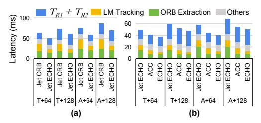

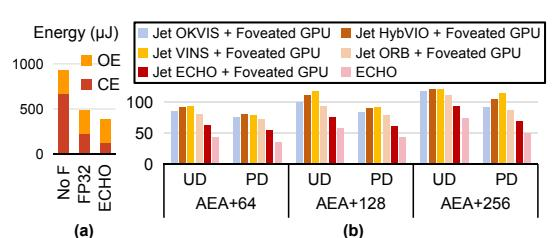

Fig. 15: (a) Energy comparison and breakdown (OE: ORB extractor, CE: computational engine). (b) Impact of audio source distribution on latencies (ms).

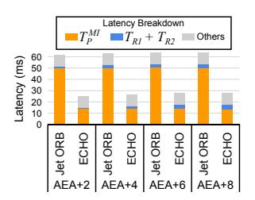

Fig. 16: Motion-to-sound latency and its breakdown in the low-source scenario.

latency far beyond the perceptual budget. In contrast, ECHO's robust acoustic foveation reduces the effective number of sources and flattens the rendering growth trend, keeping the latency within perceptual requirements.

## B. Ablation Studies on Hardware Performance

In this section, we analyze the impact of different ECHO settings on the hardware performance.

- 1) Impact of Point Filtering: In Jet ECHO + Foveated GPU, the ECHO algorithm integrates point filtering as described in Section III-C. To assess its impact, we compare Jet ECHO + Foveated GPU with Jet ORB + Foveated GPU across multiple datasets. As shown in Figure 14 (a), point filtering accelerates local map tracking and reduces overall motion-to-sound latency by an average of 1.26×. This gain is achieved by discarding roughly 75% of points before optimization, averaged across AEA and TUM VI, thereby substantially lowering the computational cost.
- 2) Impact of Pose Estimation Precision: The low-precision module is integrated into the computational engine (Sections III-B and IV-B), while the ECHO accelerator further improves efficiency by coupling the ORB extractor with a customized processing pipeline. To isolate their contributions, we evaluate three baselines: (1) Jet ECHO, which runs the ECHO algorithm in full-precision FP32 on Jetson; (2) ACC, which executes the ECHO algorithm on the full-precision accelerator, constructed by replacing ECHO's mixed-precision PEs and quantization units with FP32 PEs while leaving all other components unchanged, thereby capturing the benefits of accelerator customization; and (3) ECHO, which employs the accelerator with low-precision computation. As shown in Figure 14 (b), the FP32 accelerator achieves an average 1.24× speedup over the Jetson CPU. With low-precision optimization, ECHO provides an additional 1.10× improvement, reducing the average motion-to-sound latency to 39.2 ms.
- 3) Energy Evaluation of ECHO Accelerator: To assess energy efficiency, we measure the average per–frame energy consumption of pose estimation on the ECHO accelerator using the AEA dataset. As shown in Figure 15 (a), the ACC design without point filtering (No F) uses  $2.39 \times$  the energy of ECHO, and the full–precision ACC with filtering uses  $1.27 \times$ . The low–precision design lowers both power and latency, and point filtering further reduces latency, together providing substantial energy savings.

- 4) Impact of Audio Source Distribution: Acoustic foveation reduces rendering cost by clustering audio sources, with the clustering pattern determined by the spatial distribution of sources. To evaluate this effect, we consider two layouts: Poisson Cluster Process (PD) and uniform random distribution (UD), keeping all other settings consistent with Section VI. Figure 12 reports averages over PD and UD layouts. Latency remains under the 50 ms budget up to 128 sources, but rises to 60 ms at 256. Figure 15 (b) disaggregates the two layouts across 64, 128, and 256 sources, revealing a consistent advantage for PD: it generates substantially fewer clusters than UD (26 vs. 44, 42 vs. 76, and 70 vs. 129 on average). This tighter spatial grouping enables more aggressive foveation, allowing PD to maintain latency within 50 ms even at 256 sources, whereas UD climbs to nearly 70 ms.
- 5) Impact of Audio Source Amount: To evaluate the impact of the number of audio sources on ECHO performance, we consider a scenario with 2–8 sources in the smallest room, representing applications with only a few active audio sources. We compare the Jet ORB + Foveated GPU baseline and ECHO on the AEA dataset. As shown in Figure 16, when the number of sources is small, the audio rendering stage is no longer the dominant contributor to motion-to-sound latency. However, the Jet ORB + Foveated GPU baseline still incurs substantial latency from the pose estimation stage which by itself exceeds 50 ms. In contrast, ECHO significantly reduces the pose estimation cost through its co-optimized algorithm and accelerator, resulting in consistently lower end-to-end motion-to-sound latency even on the less-source scenario.
- 6) Comparison with Other SLAM Accelerators: eS-LAM [57], HcveACC [55], and FSLAM [102] are representative ORB-SLAM accelerators. Concretely, these baselines primarily accelerate the ORB Extraction stage via hardware design. In contrast, ECHO targets the two dominant bottlenecks in the ORB-SLAM3 front-end, namely ORB Extraction and Local Map Tracking. Therefore, ECHO is orthogonal to the aforementioned methods. On the TUM VI dataset, ECHO reduces per-frame tracking latency to 11.0 ms. We further implement eSLAM, HcveACC, and FSLAM and evaluate their per-frame tracking latency on TUM VI. The results show eSLAM, HcveACC, and FSLAM achieve 23.3 ms, 20.0 ms, and 20.1 ms, respectively. Although these baselines substantially speed up the ORB Extraction stage, ECHO achieves additional gains by also reducing the Local Map Tracking cost.

Fig. 17: (a) Participants comparing audio clips (visual content cast to the monitor). (b) Per-participant preference rates for clustered vs. full rendering across all scenes. (c) Per-scene preference rates. Error bars represent the standard deviation.

## C. User Study

To assess the practical spatial audio quality rendered by ECHO with robust acoustic foveation, we conduct a perceptual study comparing full spatial rendering with our clustered spatial rendering integrated in the ECHO pipeline, as described in Section III-E and Section IV-C.

Four representative acoustic environments are created to span different spatial scales and source densities: (1)  $5 \times 5 \times 2.7$  m with 16 sources, (2)  $50 \times 50 \times 5$  m with 32 sources, (3)  $200 \times 200 \times 10$  m with 64 sources, and (4)  $200 \times 200 \times 10$  m with 128 sources. Both the source distribution and acoustic foveation procedures follow the configurations described in Section VI, including the Poisson Cluster Process and the error-aware acoustic foveation based on ECHO's average pose estimation error. Visually, the first two scenes correspond to compact indoor rooms, while the latter two depict large-scale, high-density environments resembling exhibition halls.

Each source was assigned a unique speech signal synthesized using the edge-tts library [82]. Text was sampled from the LibriSpeech corpus [76], and speaker voices were varied to ensure diversity in linguistic content and vocal timbre. Utterances averaged 6–8 s. Signals were spatialized by convolution with binaural room impulse responses in Pyroomacoustics [89], producing clips of about 10 s. For each scene, we generated two audio versions: full rendering with all sources and clustered rendering with acoustic foveation. The reference clip in each trial was always the full rendering.

Seventeen participants with normal hearing were recruited. As shown in Figure 17 (a), they remain seated in a quiet room, viewing the visual scene through a Meta Quest Pro HMD [67] and listening via wired over-ear headphones. Head orientation is fixed during playback to isolate the perceptual impact of clustering. In each trial, participants are presented with three clips of the same scene: a clean reference (full rendering) and two test clips. One test clip is full rendering and the other clustered, with assignment randomized. Participants hear the reference and both test clips at least once, may replay them as needed, and then select which test clip has better spatial quality using a two-interval forced-choice procedure [110].

Each participant completed 4 (scenes)  $\times$  2 (assignment orders)  $\times$  4 (repeats) = 32 trials, with randomized order. Figure 17 (b) reports the participant-level preference rates aggregated across all scenes. We further summarize these rates as mean  $\pm$  1 standard deviation across participants. Across  $17 \times 32 = 544$  total trials, clustered rendering with acoustic

foveation was preferred in  $47\% \pm 4\%$  of cases. Scene-level preferences were  $50\% \pm 13\%$  (scene 1),  $48\% \pm 13\%$  (scene 2),  $43\% \pm 12\%$  (scene 3), and  $49\% \pm 15\%$  (scene 4), as shown in Figure 17 (c). A two-sided binomial test on the aggregated count, with clustered rendering selected in 258 out of 544 trials, showed no significant deviation from the 50% chance level ( $p \approx 0.25$ , well above the 0.05 threshold), indicating that clustered rendering is perceptually indistinguishable from full spatial rendering. These results demonstrate that ECHO's acoustic foveation preserves spatial audio fidelity while substantially reducing computational cost.

Nine of the seventeen recruited participants additionally completed a follow-up study to evaluate the perceptual impact of head orientation changes. Using the same scenes, audio sources, and listener positions as above, we re-rendered a new pair of clips by rotating the listener's head orientation by 90° to the right in yaw, generating a new full-rendering reference clip and a corresponding full/clustered rendering test pair under the rotated pose, where clustering is recomputed via acoustic foveation conditioned on the rotated orientation. In each trial, participants first listened to the original reference audio, were then guided to rotate their head by 90° to the right, and finally compared the newly rendered reference with the new test pair. All other procedures and the number of trials remained unchanged.

Figure 18 reports the participant-level preference rates across all scenes. Across 288 trials under 90° head rotation, clustered rendering was preferred by  $49\% \pm 3\%$ . Scenelevel preferences were  $47\% \pm 14\%$  (scene 1),  $50\% \pm 16\%$  (scene 2),  $48\% \pm 12\%$  (scene 3), and  $51\% \pm 15\%$  (scene 4). A two-sided binomial test, with clustered rendering selected

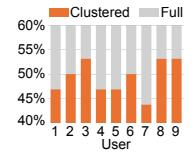

Fig. 18: Preference rates.

in 142 out of 288 trials, showed no significant deviation from the 50% chance level ( $p \approx 0.82$ ), indicating clustered rendering remains perceptually indistinguishable from full rendering even under substantial head orientation changes. These results further confirm the robustness of ECHO's acoustic foveation.

## D. Comparison with Other Pose Estimation Methods

While integrated with ORB-SLAM3, our optimizations are largely transferable to other SLAM/VIO front-ends. Many pipelines share similar front-end structures and operations, such as feature detection and reprojection-based pose estimation. For example, VINS-Fusion [80], OKVIS [54], and others adopt similar corner- and reprojection-based pipelines. Our design targets these recurring compute-intensive kernels and dataflow patterns rather than ORB-specific semantics.

## VII. CONCLUSION

In this work, we introduce ECHO, a hardware–algorithm cooptimization framework for real-time SS in VR. Experimental results show that ECHO significantly reduces motion-to-sound latency while preserving spatial audio fidelity, thereby enhancing the user's auditory experience. These results show ECHO's potential as a practical foundation for future SS solution in VR.

# REFERENCES

- [1] J. B. Allen and D. A. Berkley, "Image method for efficiently simulating small-room acoustics," *The Journal of the Acoustical Society of America*, vol. 65, no. 4, pp. 943–950, 1979.
- [2] P. W. Anderson and P. Zahorik, "Auditory/visual distance estimation: accuracy and variability," *Frontiers in psychology*, vol. 5, p. 1097, 2014.
- [3] Android Open Source Project, "Audio latency design," [https://source.](https://source.android.com/docs/core/audio/latency/design) [android.com/docs/core/audio/latency/design,](https://source.android.com/docs/core/audio/latency/design) 2025, accessed: 2025-11- 15.
- [4] E. Armelloni, C. Giottoli, and A. Farina, "Implementation of real-time partitioned convolution on a dsp board," in *2003 IEEE Workshop on Applications of Signal Processing to Audio and Acoustics (IEEE Cat. No. 03TH8684)*. IEEE, 2003, pp. 71–74.
- [5] R. Balasubramonian, A. B. Kahng, N. Muralimanohar, A. Shafiee, and V. Srinivas, "Cacti 7: New tools for interconnect exploration in innovative off-chip memories," *ACM Transactions on Architecture and Code Optimization (TACO)*, vol. 14, no. 2, pp. 1–25, 2017.
- [6] B. J. Baliga, "Synopsys," *Wide Bandgap Semiconductor Power Devices*, 2019. [Online]. Available: [https://api.semanticscholar.org/CorpusID:](https://api.semanticscholar.org/CorpusID:239327327) [239327327](https://api.semanticscholar.org/CorpusID:239327327)
- [7] E. Battenberg and R. Avizienis, "Implementing real-time partitioned convolution algorithms on conventional operating systems," in *Proceedings of the 14th International Conference on Digital Audio Effects. Paris, France*, 2011, pp. 248–235.
- [8] A. Behroozi, Y. Chen, V. Fruchter, L. Subramanian, S. Srikanth, and S. Mahlke, "Slimslam: an adaptive runtime for visual-inertial simultaneous localization and mapping," in *Proceedings of the 29th ACM International Conference on Architectural Support for Programming Languages and Operating Systems, Volume 3*, 2024, pp. 900–915.
- [9] C. C. Berger, M. Gonzalez-Franco, A. Tajadura-Jimenez, D. Florencio, ´ and Z. Zhang, "Generic hrtfs may be good enough in virtual reality. improving source localization through cross-modal plasticity," *Frontiers in neuroscience*, vol. 12, p. 21, 2018.
- [10] J. L. Blanco-Claraco, "A tutorial on SE(3) transformation parameterizations and on-manifold optimization," *arXiv preprint arXiv:2103.15980*, 2021.
- [11] C. Bouarouguene, M. Maimour, O. Kadri, A. Benyahia, and E. Rondeau, "Sound-based bird localization using lightweight convolutional neural networks and internet of things," in *1st International Conference on Green Engineering*, 2025.
- [12] D. S. Brungart and W. M. Rabinowitz, "Auditory localization of nearby sources. head-related transfer functions," *The Journal of the Acoustical Society of America*, vol. 106, no. 3, pp. 1465–1479, 1999.
- [13] D. S. Brungart, B. D. Simpson, and A. J. Kordik, "The detectability of headtracker latency in virtual audio displays," in *Proceedings of International conference on Auditory Display (ICAD)*, 2005, pp. 37– 42.
- [14] C. Campos, R. Elvira, J. J. G. Rodr´ıguez, J. M. Montiel, and J. D. Tardos, "Orb-slam3: An accurate open-source library for visual, visual– ´ inertial, and multimap slam," *IEEE transactions on robotics*, vol. 37, no. 6, pp. 1874–1890, 2021.
- [15] C. Cao, Z. Ren, C. Schissler, D. Manocha, and K. Zhou, "Interactive sound propagation with bidirectional path tracing," *ACM Transactions on Graphics (TOG)*, vol. 35, no. 6, pp. 1–11, 2016.
- [16] P. C. Consul and G. C. Jain, "A generalization of the poisson distribution," *Technometrics*, vol. 15, no. 4, pp. 791–799, 1973.
- [17] N. Corporation, "Jetson agx orin for next-gen robotics," [https://www.nvidia.com/en-us/autonomous-machines/embedded](https://www.nvidia.com/en-us/autonomous-machines/embedded-systems/jetson-orin/)[systems/jetson-orin/,](https://www.nvidia.com/en-us/autonomous-machines/embedded-systems/jetson-orin/) 2025, accessed: 2025-08-18.
- [18] C. Cruz-Neira, M. Fernandez, and C. Portal ´ es, "Virtual reality and ´ games," p. 8, 2018.
- [19] M. N. J. Dani, "Impact of virtual reality on gaming," *Virtual Reality*, vol. 6, no. 12, pp. 2033–2036, 2019.
- [20] D. Diaz-Guerra, A. Miguel, and J. R. Beltran, "gpurir: A python library for room impulse response simulation with gpu acceleration," *Multimedia Tools and Applications*, vol. 80, no. 4, pp. 5653–5671, 2021.
- [21] J. Engel, T. Schops, and D. Cremers, "Lsd-slam: Large-scale di- ¨ rect monocular slam," in *European conference on computer vision*. Springer, 2014, pp. 834–849.
- [22] J. Engel, K. Somasundaram, M. Goesele, A. Sun, A. Gamino, A. Turner, A. Talattof, A. Yuan, B. Souti, B. Meredith, C. Peng, C. Sweeney, C. Wilson, D. Barnes, D. DeTone, D. Caruso, D. Valleroy,

- D. Ginjupalli, D. Frost, E. Miller, E. Mueggler, E. Oleinik, F. Zhang, G. Somasundaram, G. Solaira, H. Lanaras, H. Howard-Jenkins, H. Tang, H. J. Kim, J. Rivera, J. Luo, J. Dong, J. Straub, K. Bailey, K. Eckenhoff, L. Ma, L. Pesqueira, M. Schwesinger, M. Monge, N. Yang, N. Charron, N. Raina, O. Parkhi, P. Borschowa, P. Moulon, P. Gupta, R. Mur-Artal, R. Pennington, S. Kulkarni, S. Miglani, S. Gondi, S. Solanki, S. Diener, S. Cheng, S. Green, S. Saarinen, S. Patra, T. Mourikis, T. Whelan, T. Singh, V. Balntas, V. Baiyya, W. Dreewes, X. Pan, Y. Lou, Y. Zhao, Y. Mansour, Y. Zou, Z. Lv, Z. Wang, M. Yan, C. Ren, R. D. Nardi, and R. Newcombe, "Project aria: A new tool for egocentric multi-modal ai research," 2023.
- [23] B. Eurich, T. Klenzner, and M. Oehler, "Impact of room acoustic parameters on speech and music perception among participants with cochlear implants," *Hearing research*, vol. 377, pp. 122–132, 2019.
- [24] G. Feng, S. Chen, R. Fu, Z. Liao, Y. Wang, T. Liu, B. Hu, L. Xu, Z. Pei, H. Li *et al.*, "Flashgs: Efficient 3d gaussian splatting for largescale and high-resolution rendering," in *Proceedings of the Computer Vision and Pattern Recognition Conference*, 2025, pp. 26 652–26 662.
- [25] H. B. Fırat, L. Maffei, and M. Masullo, "3d sound spatialization with game engines: the virtual acoustics performance of a game engine and a middleware for interactive audio design," *Virtual Reality*, vol. 26, no. 2, pp. 539–558, 2022.
- [26] M. A. Fischler and R. C. Bolles, "Random sample consensus: a paradigm for model fitting with applications to image analysis and automated cartography," *Communications of the ACM*, vol. 24, no. 6, pp. 381–395, 1981.
- [27] L. Freina and M. Ott, "A literature review on immersive virtual reality in education: state of the art and perspectives," in *The international scientific conference elearning and software for education*, vol. 1, no. 133, 2015, pp. 10–1007.
- [28] H. Gamper, "Head-related transfer function interpolation in azimuth, elevation, and distance," *The Journal of the Acoustical Society of America*, vol. 134, no. 6, pp. EL547–EL553, 2013.
- [29] Y. Gan, Y. Bo, B. Tian, L. Xu, W. Hu, S. Liu, Q. Liu, Y. Zhang, J. Tang, and Y. Zhu, "Eudoxus: Characterizing and accelerating localization in autonomous machines industry track paper," in *2021 IEEE International Symposium on High-Performance Computer Architecture (HPCA)*. IEEE, 2021, pp. 827–840.
- [30] R. K. Ganti and M. Haenggi, "Interference and outage in clustered wireless ad hoc networks," *IEEE transactions on information theory*, vol. 55, no. 9, pp. 4067–4086, 2009.
- [31] J. Gao, C. Gu, Y. Lin, Z. Li, H. Zhu, X. Cao, L. Zhang, and Y. Yao, "Relightable 3d gaussians: Realistic point cloud relighting with brdf decomposition and ray tracing," in *European Conference on Computer Vision*. Springer, 2024, pp. 73–89.
- [32] B. Gardner, K. Martin *et al.*, "Hrft measurements of a kemar dummyhead microphone," 1994.
- [33] S. A. Gar´ı, C. Schissler, R. Mehra, S. Featherly, and P. Robinson, "Evaluation of real-time sound propagation engines in a virtual reality framework," in *Proc. Int. Audio Eng. Soc. Conf. Immersive Interactive Audio*, 2019.
- [34] T. K. Geok, F. Hossain, M. Kamaruddin, N. Rahman, S. Thiagarajah, A. T. W. Chiat, and C. Liew, "A comprehensive review of efficient raytracing techniques for wireless communication," *International Journal on Communications Antenna and Propagation*, vol. 8, no. 2, pp. 123– 136, 2018.
- [35] L. G. Gilberto, F. R. Bermejo, F. C. Tommasini, and C. Garc´ıa Bauza, "Virtual reality audio game for entertainment and sound localization training," *ACM Transactions on Applied Perception*, vol. 22, no. 1, pp. 1–24, 2024.
- [36] A. Gilles, P. Le Gargasson, G. Hocquet, and P. Gioia, "Holographic near-eye display with real-time embedded rendering," in *SIGGRAPH Asia 2023 Conference Papers*, 2023, pp. 1–10.
- [37] M. Grupp, "evo: Python package for the evaluation of odometry and slam." [https://github.com/MichaelGrupp/evo,](https://github.com/MichaelGrupp/evo) 2017.
- [38] T. He, Z. Luo, X. He, W. Xiao, C. Zhang, W. Zhang, K. Kitani, C. Liu, and G. Shi, "Omnih2o: Universal and dexterous humanto-humanoid whole-body teleoperation and learning," *arXiv preprint arXiv:2406.08858*, 2024.
- [39] S. Helsel, "Virtual reality and education," *Educational Technology*, vol. 32, no. 5, pp. 38–42, 1992.
- [40] W. Hoff and T. Vincent, "Analysis of head pose accuracy in augmented reality," *IEEE Transactions on Visualization and Computer Graphics*, vol. 6, no. 4, pp. 319–334, 2002.

- [41] W. G. Horner, "A new method of solving numerical equations of all orders, by continuous approximation," *Philosophical Transactions of the Royal Society of London*, vol. 109, pp. 308–335, 1819.
- [42] M. Hussein and C. Natterdal, "The benefits of virtual reality in ¨ education-a comparision study," 2015.
- [43] S. I. Initiative, "Nangate 45nm open cell library," [https://si2.org/open](https://si2.org/open-cell-and-free-pdk-libraries/)[cell-and-free-pdk-libraries/,](https://si2.org/open-cell-and-free-pdk-libraries/) accessed: 2025-07-23.
- [44] J. Kannala and S. S. Brandt, "A generic camera model and calibration method for conventional, wide-angle, and fish-eye lenses," *IEEE transactions on pattern analysis and machine intelligence*, vol. 28, no. 8, pp. 1335–1340, 2006.
- [45] B. Kerbl, G. Kopanas, T. Leimkuhler, and G. Drettakis, "3d gaussian ¨ splatting for real-time radiance field rendering." *ACM Trans. Graph.*, vol. 42, no. 4, pp. 139–1, 2023.
- [46] S. Kim, R. Hsiao, B. Nikolic, J. Demmel, and Y. S. Shao, "Supernova: Algorithm-hardware co-design for resource-aware slam," in *Proceedings of the 30th ACM International Conference on Architectural Support for Programming Languages and Operating Systems, Volume 1*, 2025, pp. 1035–1051.
- [47] G. Klein and D. Murray, "Parallel tracking and mapping for small ar workspaces," in *2007 6th IEEE and ACM international symposium on mixed and augmented reality*. IEEE, 2007, pp. 225–234.
- [48] M. M. Kouijzer, H. Kip, Y. H. Bouman, and S. M. Kelders, "Implementation of virtual reality in healthcare: a scoping review on the implementation process of virtual reality in various healthcare settings," *Implementation science communications*, vol. 4, no. 1, p. 67, 2023.
- [49] S. Koyama, E. De Sena, P. Samarasinghe, M. R. Thomas, and F. Antonacci, "Past, present, and future of spatial audio and room acoustics," in *ICASSP 2025-2025 IEEE International Conference on Acoustics, Speech and Signal Processing (ICASSP)*. IEEE, 2025, pp. 1–5.
- [50] K. E. Laver, B. Lange, S. George, J. E. Deutsch, G. Saposnik, and M. Crotty, "Virtual reality for stroke rehabilitation," *Stroke*, vol. 49, no. 4, pp. e160–e161, 2018.
- [51] B. D. Lawson and K. M. Stanney, "Cybersickness in virtual reality and augmented reality," p. 759682, 2021.
- [52] E. A. Lehmann and A. M. Johansson, "Prediction of energy decay in room impulse responses simulated with an image-source model," *The Journal of the Acoustical Society of America*, vol. 124, no. 1, pp. 269–277, 2008.
- [53] ——, "Diffuse reverberation model for efficient image-source simulation of room impulse responses," *IEEE Transactions on Audio, Speech, and Language Processing*, vol. 18, no. 6, pp. 1429–1439, 2009.
- [54] S. Leutenegger, S. Lynen, M. Bosse, R. Siegwart, and P. Furgale, "Keyframe-based visual–inertial odometry using nonlinear optimization," *The International Journal of Robotics Research*, vol. 34, no. 3, pp. 314–334, 2015.
- [55] R. Li, J. Wu, M. Liu, Z. Chen, S. Zhou, and S. Feng, "Hcveacc: A highperformance and energy-efficient accelerator for tracking task in vslam system," in *2020 Design, Automation & Test in Europe Conference & Exhibition (DATE)*. IEEE, 2020, pp. 198–203.
- [56] C. Liu, S. Chen, T.-H. Tsai, B. De Salvo, and J. Gomez, "Augmented reality-the next frontier of image sensors and compute systems," in *2022 IEEE International Solid-State Circuits Conference (ISSCC)*, vol. 65. IEEE, 2022, pp. 426–428.
- [57] R. Liu, J. Yang, Y. Chen, and W. Zhao, "eslam: An energy-efficient accelerator for real-time orb-slam on fpga platform," in *Proceedings of the 56th Annual Design Automation Conference 2019*, 2019, pp. 1–6.
- [58] W. Liu, B. Yu, Y. Gan, Q. Liu, J. Tang, S. Liu, and Y. Zhu, "Archytas: A framework for synthesizing and dynamically optimizing accelerators for robotic localization," in *MICRO-54: 54th Annual IEEE/ACM International Symposium on Microarchitecture*, 2021, pp. 479–493.
- [59] Z. Liu, N. Garg, and T. Ratnarajah, "Multi-agent federated reinforcement learning strategy for mobile virtual reality delivery networks," *IEEE Transactions on Network Science and Engineering*, vol. 11, no. 1, pp. 100–114, 2023.
- [60] C. Lomont, "Fast inverse square root," [https://cs.uwaterloo.ca/](https://cs.uwaterloo.ca/~m32rober/rsqrt.pdf) ∼[m32rober/rsqrt.pdf,](https://cs.uwaterloo.ca/~m32rober/rsqrt.pdf) 2003.
- [61] Z. Lv, N. Charron, P. Moulon, A. Gamino, C. Peng, C. Sweeney, E. Miller, H. Tang, J. Meissner, J. Dong *et al.*, "Aria everyday activities dataset," *arXiv preprint arXiv:2402.13349*, 2024.
- [62] M. Marschall, J. G. Bolanos, S. T. Prepelit ˜ ,a, and V. Pulkki, "A database ˘ of near-field head-related transfer functions based on measurements with a laser spark source," *Applied Acoustics*, vol. 203, p. 109173, 2023.

- [63] A. A. Mazhar and M. M. Al Rifaee, "A systematic review of the use of virtual reality in education," in *2023 International Conference on information technology (ICIT)*. IEEE, 2023, pp. 422–427.
- [64] A. McLeran, "Advances in real time audio rendering-part 1," in *ACM SIGGRAPH 2024 Courses*, 2024, pp. 1–14.
- [65] R. Mehra, A. Rungta, A. Golas, M. Lin, and D. Manocha, "Wave: Interactive wave-based sound propagation for virtual environments," *IEEE transactions on visualization and computer graphics*, vol. 21, no. 4, pp. 434–442, 2015.
- [66] P. Mesa-Gresa, H. Gil-Gomez, J.-A. Lozano-Quilis, and J.-A. Gil- ´ Gomez, "Effectiveness of virtual reality for children and adolescents ´ with autism spectrum disorder: an evidence-based systematic review," *Sensors*, vol. 18, no. 8, p. 2486, 2018.
- [67] Meta, "Meta Quest Pro," [https://www.meta.com/quest/quest-pro/,](https://www.meta.com/quest/quest-pro/) 2022, accessed: 2025-07-21.
- [68] N. Meyer-Kahlen, M. Kastemaa, S. J. Schlecht, and T. Lokki, "Measuring motion-to-sound latency in virtual acoustic rendering systems," *AES: Journal of the Audio Engineering Society*, vol. 71, no. 6, pp. 390–398, 2023.
- [69] Microsoft Docs, "Low latency audio," [https://learn.microsoft.com/](https://learn.microsoft.com/en-us/windows-hardware/drivers/audio/low-latency-audio) [en-us/windows-hardware/drivers/audio/low-latency-audio,](https://learn.microsoft.com/en-us/windows-hardware/drivers/audio/low-latency-audio) 2025, accessed: 2025-11-15.
- [70] B. Mildenhall, P. P. Srinivasan, M. Tancik, J. T. Barron, R. Ramamoorthi, and R. Ng, "Nerf: Representing scenes as neural radiance fields for view synthesis," *Communications of the ACM*, vol. 65, no. 1, pp. 99–106, 2021.
- [71] J. Moline, "Virtual reality for health care: a survey," *Virtual reality in neuro-psycho-physiology*, pp. 3–34, 1997.
- [72] A. I. Mourikis and S. I. Roumeliotis, "A multi-state constraint kalman filter for vision-aided inertial navigation," in *Proceedings 2007 IEEE international conference on robotics and automation*. IEEE, 2007, pp. 3565–3572.
- [73] R. Mur-Artal and J. D. Tardos, "Orb-slam2: An open-source slam ´ system for monocular, stereo, and rgb-d cameras," *IEEE transactions on robotics*, vol. 33, no. 5, pp. 1255–1262, 2017.
- [74] ——, "Visual-inertial monocular slam with map reuse," *IEEE Robotics and Automation Letters*, vol. 2, no. 2, pp. 796–803, 2017.
- [75] J. Pan and T. G. Rogers, "Crisp: Concurrent rendering and compute simulation platform for gpus," in *2024 IEEE International Symposium on Workload Characterization (IISWC)*. IEEE, 2024, pp. 1–14.
- [76] V. Panayotov, G. Chen, D. Povey, and S. Khudanpur, "Librispeech: an asr corpus based on public domain audio books," in *2015 IEEE international conference on acoustics, speech and signal processing (ICASSP)*. IEEE, 2015, pp. 5206–5210.
- [77] X. Peng, K. Chen, I. Roman, J. P. Bello, Q. Sun, and P. Chakravarthula, "Perceptually-guided acoustic" foveation"," in *2025 IEEE Conference Virtual Reality and 3D User Interfaces (VR)*. IEEE, 2025, pp. 450– 460.
- [78] A. S. Pillai and P. S. Mathew, "Impact of virtual reality in healthcare: a review," *Virtual and augmented reality in mental health treatment*, pp. 17–31, 2019.
- [79] Project Aria Team, "Temporal alignment of sensor data," [https://facebookresearch.github.io/projectaria](https://facebookresearch.github.io/projectaria_tools/docs/tech_insights/temporal_alignment_of_sensor_data#images-formation-temporal-model-rolling-shutter-and-pls-artifact) tools/docs/tech insights/ temporal alignment of sensor [data#images-formation-temporal](https://facebookresearch.github.io/projectaria_tools/docs/tech_insights/temporal_alignment_of_sensor_data#images-formation-temporal-model-rolling-shutter-and-pls-artifact)[model-rolling-shutter-and-pls-artifact,](https://facebookresearch.github.io/projectaria_tools/docs/tech_insights/temporal_alignment_of_sensor_data#images-formation-temporal-model-rolling-shutter-and-pls-artifact) 2024, accessed: 2025-07-23.
- [80] T. Qin, P. Li, and S. Shen, "Vins-mono: A robust and versatile monocular visual-inertial state estimator," *IEEE transactions on robotics*, vol. 34, no. 4, pp. 1004–1020, 2018.
- [81] N. Raghuvanshi, J. Snyder, R. Mehra, M. Lin, and N. Govindaraju, "Precomputed wave simulation for real-time sound propagation of dynamic sources in complex scenes," in *ACM Siggraph 2010 papers*, 2010, pp. 1–11.
- [82] Rany2, "edge-tts: Microsoft edge text-to-speech library," [https://github.](https://github.com/rany2/edge-tts) [com/rany2/edge-tts,](https://github.com/rany2/edge-tts) 2023, accessed: 2025-08-07.
- [83] G. Riva, "Virtual reality for health care: the status of research," *Cyberpsychology & Behavior*, vol. 5, no. 3, pp. 219–225, 2002.
- [84] E. Rosten, R. Porter, and T. Drummond, "Faster and better: A machine learning approach to corner detection," *IEEE transactions on pattern analysis and machine intelligence*, vol. 32, no. 1, pp. 105–119, 2008.
- [85] E. Rublee, V. Rabaud, K. Konolige, and G. Bradski, "Orb: An efficient alternative to sift or surf," in *2011 International conference on computer vision*. Ieee, 2011, pp. 2564–2571.
- [86] M. Saed, Y. H. Chou, L. Liu, T. Nowicki, and T. M. Aamodt, "Vulkansim: A gpu architecture simulator for ray tracing," in *2022 55th*

- *IEEE/ACM International Symposium on Microarchitecture (MICRO)*. IEEE, 2022, pp. 263–281.
- [87] S. Sarangi and B. Baas, "Deepscaletool: A tool for the accurate estimation of technology scaling in the deep-submicron era," in *2021 IEEE International Symposium on Circuits and Systems (ISCAS)*. IEEE, 2021, pp. 1–5.
- [88] L. Savioja, J. Huopaniemi, T. Lokki, and R. Va¨an¨ anen, "Creating inter- ¨ active virtual acoustic environments," *Journal of the Audio Engineering Society*, vol. 47, no. 9, pp. 675–705, 1999.
- [89] R. Scheibler, E. Bezzam, and I. Dokmanic, "Pyroomacoustics: A ´ python package for audio room simulation and array processing algorithms," in *2018 IEEE international conference on acoustics, speech and signal processing (ICASSP)*. IEEE, 2018, pp. 351–355.
- [90] C. Schissler and D. Manocha, "Interactive sound propagation and rendering for large multi-source scenes," *ACM Transactions on Graphics (TOG)*, vol. 36, no. 4, p. 1, 2016.
- [91] C. Schissler, P. Stirling, and R. Mehra, "Efficient construction of the spatial room impulse response," in *2017 IEEE Virtual Reality (VR)*. IEEE, 2017, pp. 122–130.
- [92] D. Schubert, T. Goll, N. Demmel, V. Usenko, J. Stuckler, and D. Cre- ¨ mers, "The tum vi benchmark for evaluating visual-inertial odometry," in *2018 IEEE/RSJ International Conference on Intelligent Robots and Systems (IROS)*. IEEE, 2018, pp. 1680–1687.
- [93] O. Seiskari, P. Rantalankila, J. Kannala, J. Ylilammi, E. Rahtu, and A. Solin, "Hybvio: Pushing the limits of real-time visual-inertial odometry," in *Proceedings of the IEEE/CVF Winter Conference on Applications of Computer Vision*, 2022, pp. 701–710.
- [94] K. Shoemake, "Animating rotation with quaternion curves," in *Proceedings of the 12th annual conference on Computer graphics and interactive techniques*, 1985, pp. 245–254.
- [95] Y.-Y. Song and Y. Lu, "Decision tree methods: applications for classification and prediction," *Shanghai archives of psychiatry*, 2015.
- [96] Q. Sun, C. Wang, F. Qiang, D. Xiong, and H. Wolfgang, "End-toend complex lens design with differentiable ray tracing," *ACM Trans. Graph*, vol. 40, no. 4, pp. 1–13, 2021.
- [97] X. Sun, J. C. Lee, D. Rho, J. H. Ko, U. Ali, and E. Park, "F-3dgs: Factorized coordinates and representations for 3d gaussian splatting," in *Proceedings of the 32nd ACM International Conference on Multimedia*, 2024, pp. 7957–7965.
- [98] Superpowered Audio SDK, "Android audio path latency explainer," [https://superpowered.com/androidaudiopathlatency,](https://superpowered.com/androidaudiopathlatency) 2023, accessed: 2025-08-11.
- [99] A. Torger and A. Farina, "Real-time partitioned convolution for ambiophonics surround sound," in *Proceedings of the 2001 IEEE Workshop on the Applications of Signal Processing to Audio and Acoustics (Cat. No. 01TH8575)*. IEEE, 2001, pp. 195–198.
- [100] N. Tsingos, E. Gallo, and G. Drettakis, "Perceptual audio rendering of complex virtual environments," *ACM Transactions on Graphics (TOG)*, vol. 23, no. 3, pp. 249–258, 2004.
- [101] Unity Technologies. (2025) Scripting api: Audiosettings.getdspbuffersize. [Online]. Available: [https://docs.unity3d.com/](https://docs.unity3d.com/ScriptReference/AudioSettings.GetDSPBufferSize.html) [ScriptReference/AudioSettings.GetDSPBufferSize.html](https://docs.unity3d.com/ScriptReference/AudioSettings.GetDSPBufferSize.html)
- [102] V. Vemulapati and D. Chen, "Fslam: an efficient and accurate slam accelerator on soc fpgas," in *2022 International Conference on Field-Programmable Technology (ICFPT)*. IEEE, 2022, pp. 1–9.
- [103] I. Wald, P. Slusallek, C. Benthin, and M. Wagner, "Interactive rendering with coherent ray tracing," in *Computer graphics forum*, vol. 20, no. 3. Wiley Online Library, 2001, pp. 153–165.
- [104] Y. Wang, "Gauss–newton method," *Wiley Interdisciplinary Reviews: Computational Statistics*, vol. 4, no. 4, pp. 415–420, 2012.
- [105] Y. Wang, J. Wang, and Y. Qi, "We-gs: An in-the-wild efficient 3d gaussian representation for unconstrained photo collections," *arXiv preprint arXiv:2406.02407*, 2024.
- [106] F. Wefers, *Partitioned convolution algorithms for real-time auralization*. Logos Verlag Berlin GmbH, 2015, vol. 20.
- [107] T. L. Wu, A. Gomes, K. Fernandes, and D. Wang, "The effect of head tracking on the degree of presence in virtual reality," *International Journal of Human–Computer Interaction*, vol. 35, no. 17, pp. 1569– 1577, 2019.
- [108] S. Yairi, Y. Iwaya, and Y. Suzuki, "Estimation of detection threshold of system latency of virtual auditory display," *Applied Acoustics*, vol. 68, no. 8, pp. 851–863, 2007.
- [109] Z. Ye, Y. Fu, J. Zhang, L. Li, Y. Zhang, S. Li, C. Wan, C. Wan, C. Li, S. Prathipati *et al.*, "Gaussian blending unit: An edge gpu

- plug-in for real-time gaussian-based rendering in ar/vr," in *2025 IEEE International Symposium on High Performance Computer Architecture (HPCA)*. IEEE, 2025, pp. 353–365.
- [110] Y. Yeshurun, M. Carrasco, and L. T. Maloney, "Bias and sensitivity in two-interval forced choice procedures: Tests of the difference model," *Vision research*, vol. 48, no. 17, pp. 1837–1851, 2008.
- [111] P. Zahorik, D. S. Brungart, and A. W. Bronkhorst, "Auditory distance perception in humans: A summary of past and present research," *ACTA Acustica united with Acustica*, vol. 91, no. 3, pp. 409–420, 2005.
- [112] B. Zhang, Y. Gao, J. Li, and H. K.-H. So, "Co-designing a submillisecond latency event-based eye tracking system with submanifold sparse cnn," in *Proceedings of the IEEE/CVF Conference on Computer Vision and Pattern Recognition*, 2024, pp. 5771–5779.
- [113] Z. Zhang, Z. Li, H. Kim, and C. Liu, "Boxr: Body and head motion optimization framework for extended reality," *arXiv preprint arXiv:2410.13084*, 2024.
- [114] J. Zhao, Y. Xu, X. Qian, D. Berghi, P. Wu, M. Cui, J. Sun, P. J. Jackson, and W. Wang, "Audio-visual speaker tracking: Progress, challenges, and future directions," *arXiv preprint arXiv:2310.14778*, 2023.
- [115] M. Zyda, "From visual simulation to virtual reality to games," *Computer*, vol. 38, no. 9, pp. 25–32, 2005.