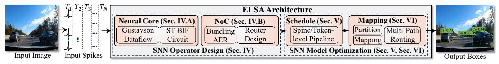
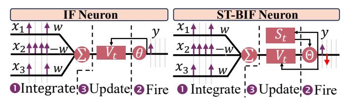
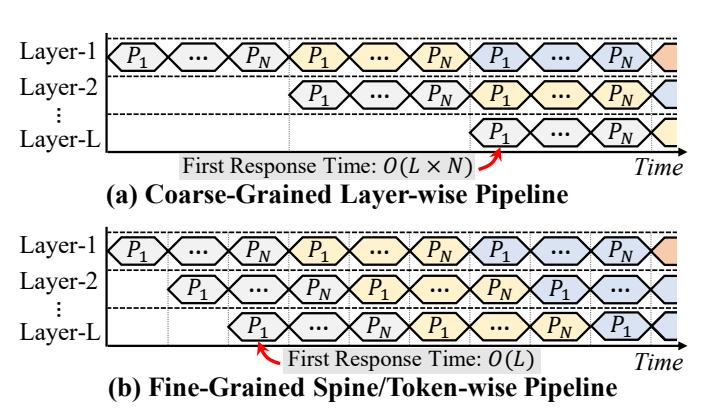
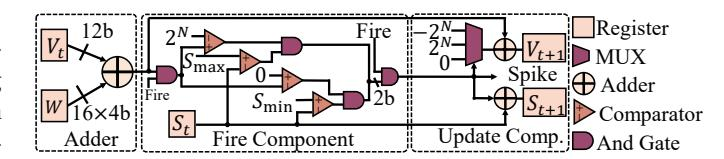
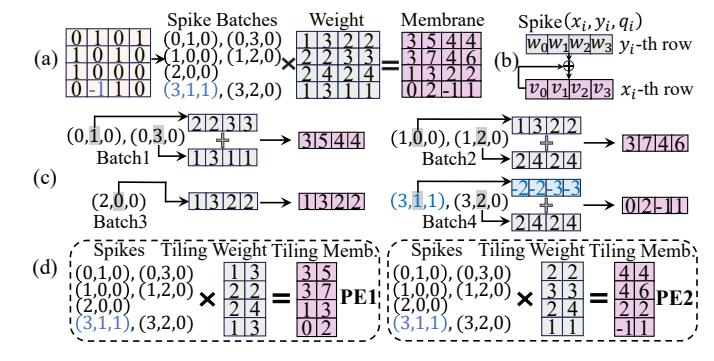
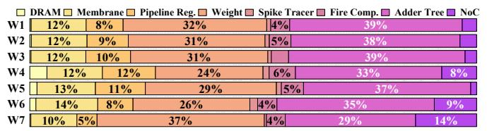
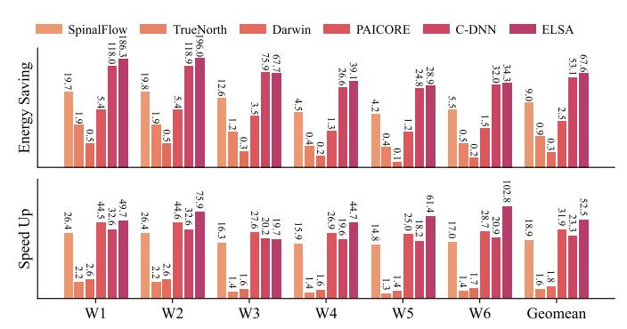
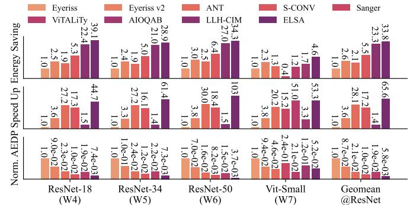
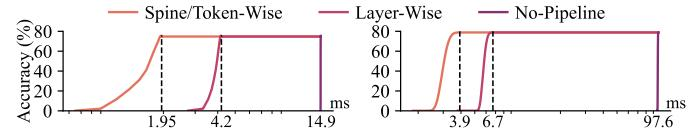
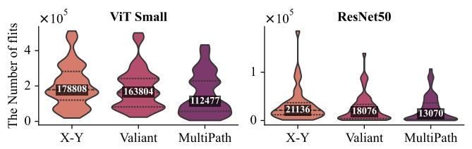

# ELSA: An <u>EL</u>astic <u>SNN</u> Inference <u>Architecture</u> for Efficient Neuromorphic Computing

Kang You\*<sup>†</sup>, Chen Nie\*<sup>†</sup>, Lee Jun Yan\*, Ziling Wei\*<sup>†</sup>, Cheng Zou\*, Zekai Xu\*, Yu Feng<sup>‡</sup>, Honglan Jiang<sup>§</sup>, Zhezhi He\*<sup>†</sup>¶

\*Intelligent Computing Research Group, School of Computer Science, Shanghai Jiao Tong University, Shanghai, CN 

†Shanghai AI Laboratory, Shanghai, CN, ‡School of Computer Science, Shanghai Jiao Tong University, Shanghai, CN

§Institute of Chip Design and EDA, School of Integrated Circuits, Shanghai Jiao Tong University, Shanghai, CN

¶Corresponding author

Abstract—Spiking neural networks (SNNs) exploit event-driven and addition-only computation to substantially improve efficiency for intelligent computation. A key temporal property of SNNs, elastic inference, allows outputs to emerge progressively, enabling responses to salient inputs much earlier than full evaluation. However, existing SNN-specific accelerators cannot capitalize on this property. Layer-by-layer designs emit outputs only after all layers are complete, while time-step-by-time-step designs rely on coarse-grained, layer-wise pipelines that require synchronizing all spines/tokens within a layer. This barrier prevents results from being forwarded immediately, delaying the earliest possible response and forfeiting the benefits of elastic inference.

To address these challenges, we propose ELSA, a near-SRAM dataflow architecture that realizes true elastic inference through a fine-grained spine/token-wise pipeline and hardware optimizations tailored to SNNs. ELSA forwards each spine/token immediately upon production, forming a continuous streaming pipeline that substantially reduces the latency to the first response. To enhance this lightweight execution, ELSA introduces a bundled address event representation protocol to lower communication traffic of network-on-chip (NoC), and leverages mini-batch spiking Gustavson-product to cut memory access and exploit inherent sparsity. Combined with mapping and scheduling optimizations, ELSA achieves efficient, event-driven computation without compromising accuracy. Experiments show that SNNs can outperform quantized artificial neural networks (QANNs) while maintaining on-par accuracy. For a 4-bit ResNet-50, ELSA achieves 3.4× speedup and 13.6× higher energy efficiency over the SOTA QANN accelerator (ANT), and  $2.9\times$  speedup and  $22.1\times$  energy efficiency gains over the SOTA SNN accelerator (PAICORE).

#### I. INTRODUCTION

<span id="page-0-2"></span>Spiking neural networks (SNNs) [1]–[4] encode information using discrete binary or ternary spikes, closely mimicking the dynamics of biological neurons. Compared with artificial neural networks (ANNs), SNNs feature event-driven and additiononly computation [5] with notably higher activation sparsity (e.g., 98% [6]), enabling efficient processing [7]–[14]. This work focuses on a previously unexploited property of SNNs, elastic inference, unlocking new opportunities to further boost the performance of SNN-specific hardware.

*Elastic inference* is a unique temporal property of SNNs, where outputs emerge progressively, allowing earlier responses to salient inputs. Given sufficient inference time, the final predictions converge to those obtained from full execution. For

The work is supported in part by the National Key R&D Program of China under Grant 2022YFB4500200 and Shanghai Artificial Intelligence Laboratory.

<span id="page-0-0"></span>


Wallclock: 1.32ms

Wallclock: 1.77ms

Wallclock: 2.38ms

(a) Elastic inference enables early detection of salient objects.


(b) Classification accuracy on ImageNet and detection AP50 on COCO2017 improve progressively with latency.

Fig. 1: **Illustration of elastic inference.** Bars denote first-correct-response (FCR) latency, dashed lines mark stable-state outputs, and stars show QANN execution on an A100 GPU.

instance, in Fig. 1a, visually prominent vehicles are recognized earlier, while distant ones require additional inference time. This phenomenon is consistent with early decision-making in biological neural systems [15], where *salient stimuli trigger faster neural responses*. Such temporal elasticity is particularly valuable for real-time tasks such as autonomous driving [16], where the first correct response can arrive up to 82% earlier than the stable-state output, as shown in Fig. 1b.

Nevertheless, existing SNN accelerators [8]–[14], [17] barely exploit elastic inference. Their execution can be broadly categorized as *layer-by-layer* (LBL) and *time-step-by-time-step* (TBT), distinguished by how they traverse the three intrinsic dimensions of SNNs: time-steps<sup>1</sup>, layers, and spines/tokens within each layer (defined in Fig. 4). LBL-based accelerators [8]–[10] process all time-steps of one layer before moving to the next, producing outputs only after the full network completes. Thus, they are inherently incompatible with elastic inference. TBT-based accelerators [11]–[14], [17] evaluate all layers at every time-step, thus allowing progressively emerging outputs and supporting elastic inference.

However, existing TBT-based accelerators [11]-[14], [17]

<span id="page-0-1"></span><sup>&</sup>lt;sup>1</sup>A time-step [4] is a discrete interval in which synaptic transmissions occur and neurons integrate inputs and generate spikes once.

<span id="page-1-0"></span>

Fig. 2: Overall architecture and execution flow of ELSA.

<span id="page-1-1"></span>

Fig. 3: Neural dynamics of (left) IF and (right) ST-BIF neuron.

still adopt coarse-grained layer-wise pipelines, where computation advances only after all N spines/tokens in a layer are buffered and synchronized. This prevents completed spines/tokens from being forwarded immediately. Consequently, early responses can emerge only after the final layer is reached. Such layer-level synchronization substantially delays the first possible response compared with an ideal fine-grained spine/token-wise pipeline, as illustrated in Fig. 5. These limitations motivate an SNN accelerator that supports true fine-grained spine/token-wise pipelining for elastic inference.

This work proposes ELSA, a near-SRAM dataflow architecture that exploits elastic inference in convolutional and transformer-based SNNs. ELSA introduces a fine-grained spine/token-wise pipeline, supported by dedicated mapping algorithms, that allows each completed spine/token to advance to the next layer immediately. This fine-grained processing is essential for achieving low-latency elastic inference. Fig. 2 illustrates the overall architecture and execution flow. Input spikes encoded across time-steps are continuously processed by neural cores and delivered through the network-on-chip (NoC). To further improve efficiency, ELSA incorporates SNN-specific hardware optimizations, including bundled AER for compact spike communication and mini-batch spiking Gustavson-product for sparse, memory-efficient computation. The key contributions are as follows:

- ▶ Fine-grained pipeline for elastic inference: ELSA introduces a spine/token-wise pipeline that forwards each completed spine/token to the next layer immediately. Such streaming execution exploits elastic inference to reduce the latency to the first response and improve throughput.
- SNN-aware hardware optimizations: We propose a bundled AER protocol that packs multiple spikes into one flit, reducing NoC traffic under fine-grained pipelining. We further design a mini-batch spiking Gustavson-product dataflow to reduce memory accesses while exploiting spike sparsity. Together, these optimizations lower on-chip communication and computation energy.
- ▶ High-performance elastic inference: ELSA is the first SNN accelerator explicitly optimized for elastic inference. It achieves on-par accuracy while delivering a 3.4× speedup and 13.6× energy savings over the SOTA QANN accel-

TABLE I: SNN operators supported by ELSA.

<span id="page-1-2"></span>

| Category      | Model              | Operators                                                                     |
|---------------|--------------------|-------------------------------------------------------------------------------|
| Matrix Mult.  | CNN<br>Transformer | MM-sc<br>MM-sc, MM-ss                                                         |
| Miscellaneous | CNN<br>Transformer | residual addition, image-to-column<br>ssoftmax, slayernorm, residual addition |

erator (ANT [18]), and  $2.9 \times$  speedup and  $22.1 \times$  energy savings over the SOTA SNN accelerator (PAICORE [13]).

#### II. PRELIMINARY OF SNN

#### A. Neural Dynamics of Spiking Neurons

- 1) Integrate-and-Fire (IF) Neuron: The IF neuron is widely used in SNNs and has been adopted by many neuromorphic chips [7], [11], [12], [19]. Unlike continuous activations (e.g., ReLU), IF neurons communicate via binary spike trains ({0,1}), enabling event-driven and addition-only computation. However, IF-based SNNs incur an accuracy loss relative to ANN counterparts due to conversion errors [2], [4].
- <span id="page-1-3"></span>2) Bipolar Integrate-and-Fire with Spike Tracer (ST-BIF) Neuron: The ST-BIF neuron can be mathematically equivalent to quantized ReLU under specific conditions [4]. As shown in Fig. 3, ST-BIF emits ternary spikes ({-1,0,1}) via three steps:

**Step-1: Spikes Integration.** The neuron receives and integrates pre-synaptic spikes  $x_{i,t} \in \{-1,0,1\}$  into the membrane  $V_t$  at t time-step through synaptic weight  $w_i$ :

$$\hat{V}_t = V_{t-1} + \sum_{i=1}^{N} x_{i,t} \cdot w_i \tag{1}$$

where  $V_{t-1}$  is the membrane potential before integration,  $\hat{V}_t$  is the membrane potential after integration, t is the time-step.

**Step-2: Neuron Firing.** After integration, the neuron emits a spike according to the decision function  $\Theta$ :

<span id="page-1-4"></span>
$$y_{t} = \Theta(\hat{V}_{t}, V_{\text{thr}}, S_{t}) = \begin{cases} 1; & \hat{V}_{t} \ge V_{\text{thr}} \& S_{t} < S_{\text{max}} \\ 0; & \text{other} \\ -1; & \hat{V}_{t} < 0 \& S_{t} > S_{\text{min}} \end{cases}$$
(2)

where  $S_t$  is a memory unit in the ST-BIF neuron (*aka.*, spike tracer) that records the accumulated sum of emitted spikes.  $S_{\text{max}}$  and  $S_{\text{min}}$  denote its upper and lower bounds, respectively.  $V_{\text{thr}}$  is the firing threshold.

**Step-3: Membrane Update.** After firing, the ST-BIF neuron updates its membrane potential and spike tracer:

$$V_t = \hat{V}_t - y_t \cdot V_{\text{thr}}; \quad S_t = S_{t-1} + \Theta(\hat{V}_t, V_{\text{thr}}, S_{t-1})$$
 (3)

The membrane update follows the "soft reset" rule [20], while the spike tracer is updated by accumulating the emitted spikes.

<span id="page-2-0"></span>

Fig. 4: The definitions of pipeline granularity. (a) Spine  $(\mathbb{Z}^{1\times 1\times C})$  for CNN and (2) Token  $(\mathbb{Z}^{1\times D})$  for Transformer.

<span id="page-2-1"></span>

Fig. 5: Comparison of pipeline schemes. Colors denote different time-steps, and  $P_{1\sim N}$  denotes individual spines/tokens. The finer-grained pipeline enables substantially earlier first responses, thus better exploiting elastic inference.

# B. Operators in SNN

1) Matrix Multiplication (MM): Unlike conventional MM with two continuous-valued operands, SNNs use spike-continuous MM (MM-sc) and spike-spike MM (MM-ss). Spiking convolution and linear layers are implemented with MM-sc, while spiking attention uses MM-ss. Following SpikeZIP-TF [4], we realize MM-ss with two MM-sc operators by treating spike tracers as continuous operands.

2) Miscellaneous Operators: Although MM operators dominate execution time and energy, correct SNN inference also requires the miscellaneous operators summarized in Tab. I. We follow SpikeZIP-TF [4] for spiking softmax (ssoftmax) and spiking layer normalization (slayernorm), and implement image-to-column transformation and residual addition as router-side broadcasts.

#### III. MOTIVATIONS

# <span id="page-2-4"></span>A. Fine-Grained Spine/Token-wise Pipeline

**Problem.** Elastic inference is an *inherent temporal property* of SNNs that enables correct responses to salient inputs at earlier time-steps. Unfortunately, existing SNN accelerators [7]–[14] fail to effectively exploit this property as their execution patterns fundamentally limit temporal elasticity. Specifically, they follow either a layer-by-layer (LBL) or time-step-by-time-step (TBT) execution pattern, distinguished by how computation traverses the three intrinsic dimensions of SNN inference: time-steps (T), layers (L), and spines/tokens (N) within each layer. The definitions of spines and tokens are shown in Fig. 4.

<span id="page-2-2"></span>

Fig. 6: Left: Communication comparison of QANN and SNN accelerators. Right: TrueNorth traffic relative to Eyeriss [21], using sparsity statistics from SpikeZIP-TF [4].

LBL-based accelerators [8]–[10] must complete all T timesteps for all N spines/tokens within a layer (i.e.,  $T \times N$  computations) before proceeding to the next layer. As a result, outputs are produced only after the entire network has finished execution, eliminating any opportunity for early responses. TBT-based SNN accelerators [11]–[14], [17], evaluate all L layers at each time-step, enabling progressively generated outputs. Although these SNN accelerators support elastic inference, their coarse-grained and layer-wise pipeline necessitates the completion of all N spines/tokens before advancing, as shown in Fig. 5(a). This design prevents completed spines/tokens from being forwarded immediately, increasing the early response time of elastic inference. Overall, existing SNN accelerators fail to effectively exploit elastic inference.

**Solution.** We propose a dataflow architecture with a fine-grained spine/token-wise pipeline that eliminates the coarse synchronization barriers inherent in prior TBT-based accelerators. Rather than waiting for all N spines/tokens of a layer to finish, the architecture forwards each completed spine/token to the next layer immediately, regardless of the progress of the others. As illustrated in Fig. 5, this design replaces the conventional coarse-grained layer-wise pipeline (top) with a fine-grained spine/token-wise pipeline (bottom). The resulting execution forms a continuous streaming pipeline, reducing the latency to the first response from  $O(L \times N)$  to O(L). For deep SNNs such as Spikeformer [3] with L = 74 and N = 197, our design can translate into substantial system-level speedup.

# <span id="page-2-3"></span>B. Network-on-Chip with Bundled AER Protocol

**Problem.** Existing SNN accelerators [7], [11]–[14] exploit the address-event representation (AER) protocol to encode 1-bit spikes as multi-bit packets (e.g., 32 bits in [11]), including the spike's spatial position and time-step information. Unlike QANN accelerators [21] that transmit 8-bit activations, SNN hardware transmits spikes individually over multiple time-steps. Consequently, even with high spike sparsity (over 80% in ViTs), TrueNorth [11] can generate up to  $8\times$  more traffic than QANN baselines (Fig. 6). This overhead arises from large packet headers and repeated transmissions across time-steps, resulting in substantial communication overhead.

**Solution.** We introduce a *bundled AER* (BAER) protocol that substantially reduces SNN communication overhead while preserving event-driven behavior. Instead of transmitting each spike separately, BAER aggregates all spikes produced in the same row of neurons into a single packet, amortizing the

<span id="page-3-0"></span>

Fig. 7: Energy breakdown when applying different execution patterns to ELSA. The workload is ResNet-18.

header across the group and removing the per-spike header overhead of conventional AER [11]. This row-wise bundling reduces both packet count and metadata redundancy, yielding a more communication-efficient substrate that aligns naturally with the fine-grained spine/token-wise pipeline of ELSA.

# <span id="page-3-3"></span>C. Neural Core with Mini-Batch Spiking Gustavson-Product

**Problem.** Gustavson-product [22] is a widely adopted execution pattern that performs row-wise accumulation, allowing each output row (membrane in SNNs) to be read and written only once, thereby minimizing membrane access. As illustrated in Fig. 7, Gustavson-product introduces substantially lower memory access than the commonly used inner- and outer-product patterns. This property is particularly appealing for SNNs, where membranes have a much larger bitwidth (12-bit) than weights (4-bit) or spikes (1-bit). However, directly applying the ANN-targeted Gustavson-product to SNNs conflicts with the SNN asynchronous feature, where spikes are forwarded immediately upon generation and thus asynchronously arrive in a row-unaligned order. Since Gustavsonproduct relies on row-aligned inputs to amortize the membrane read/write, such disorder causes frequent switching between membrane rows and largely negates its memory-access benefit.

**Solution.** Instead of introducing synchronization [11], [12], [14] that would break the spine/token-wise pipeline, ELSA adapts Gustavson-product through a mini-batch execution scheme that leverages the row alignment provided by our bundled AER protocol (specified in Sec. III-B). Bundled AER aggregates spikes from the same membrane row into a single flit, forming small row-coherent batches without stalling the pipeline. Each mini-batch triggers a single read of the corresponding membrane row, parallel accumulation across multiple weight rows, and a single write-back, thereby restoring the low memory access advantage of Gustavson-product. The resulting mini-batch Gustavson-product produces a steady stream of row-aligned spikes and is therefore naturally compatible with the fine-grained pipeline for elastic inference.

# IV. ELSA ARCHITECTURE

Fig. 8(a) illustrates the scalable architecture of ELSA, which consists of multiple neural cores (dotted frame) interconnected via 2D-mesh NoC [23]. Each neural core integrates a customized router for communication and four processing elements (PEs) for computation. Similar to previous TBT-based accelerator [11]–[14], [17], ELSA takes near-SRAM execution, addition-only computation, and event-driven sparsity as the fundamental techniques.

<span id="page-3-1"></span>

Fig. 8: **Overview of ELSA architecture,** consisting of multiple neural cores interconnected by our customized NoC.

<span id="page-3-2"></span>

Fig. 9: **ST-BIF neuron circuit**, which consists of an adder tree, a fire component, and an update component.

# A. Microarchitecture of Processing Element

Our PE is designed to execute MM-sc as listed in Tab. I via mini-batch spiking Gustavson-product. As shown in Fig. 8(b), each PE contains 128 ST-BIF neuron circuits, a control module, and massive SRAMs (*i.e.*, an *N*-way weight buffer, a membrane buffer, and a spike tracer buffer). The ST-BIF neuron circuit, illustrated in Fig. 9, consists of a 16-input adder tree, a fire component, and an update component. In total, each PE can perform 1024 addition operations per cycle.

- 1) Operations per Spike: For each incoming spike, the PE executes three steps in the ST-BIF neuron (Sec. II-A2), including 1) spike integration, 2) neuron firing, and 3) updating. The dataflows of three steps are marked by (1), (2), (3)in Fig. 8(b), respectively. For spike integration (step-1), the control module receives spikes  $\{x, y_i, q_i\}_{i=0}^N$  from the router and extracts the encoded positions  $x, y_i$  as SRAM addresses. Here,  $q_i$  denotes the spike polarity (i.e.,  $q_i = 1$  for negative and  $q_i = 0$  for positive). x, y denotes the spike position ( $x^{\text{th}}$ row and  $y^{\rm th}$  column) in spike matrix. The control module then sends  $\{y_i,q_i\}_{i=0}^N$  to the N-way weight buffer and x to the membrane buffer, so that the corresponding weights can be accumulated into membrane through the adder tree. For neuron firing (step-2), the firing component reads the spike tracer  $s_t$  at address x together with the integrated membrane  $V_t$ , and evaluates the decision function in Eq. (2). For updating (step-3), the update component updates the membrane state  $v_{t+1}$  and spike tracer rows  $s_{t+1}$  based on the firing result.
- 2) Mini-batch Spiking Gustavson-product in PE: The perspike execution described above is illustrated in Fig. 10(b). A spike at  $(x_i, y_i)$  causes the  $y_i$ -th row of synaptic weights w to be accumulated into the  $x_i$ -th row of the membrane state  $v_t$ . For a negative spike  $(q_i = 1)$ , the corresponding weight

<span id="page-4-0"></span>

Fig. 10: **Process of MM-sc with Mini-batch Gustavson- Product.** (a) The MM-sc in ELSA. (b). Operations per Spike. (c). An example of MM-sc. (d) Tiling Strategy. The process of negative spikes is highlighted in blue.

row is negated (using two's complement) before accumulation. For MM-sc, ELSA processes one BAER packet at a time. As shown in step-1, spikes  $\{\{x,y_i,q_i\}_{i=0}^N\}$  share a common row address x but have different column IDs  $y_i$ . This row alignment allows the N-way weight buffer to process the N spikes in one cycle, which reads N weight rows according to spike addresses  $\{y_i\}_{i=0}^N$  and forwards them to the adder trees.

Fig. 10(c) presents an MM-sc example based on the minibatch Gustavson-product, with negative-spike handling highlighted in blue. The first spike batch (0,1),(0,3) triggers the weight buffer to read the  $2^{nd}$  ([2,2,3,3]) and  $4^{th}$  ([1,3,1,1]) rows. Then, the adder tree accumulates these weight rows to produce the  $1^{st}$  row of membrane potential ([3,5,4,4]). Finally, the fire component receives the integrated results together with the  $1^{st}$  row of spike tracer, performs spike firing, then writes the updated membrane potential and spike tracer back to the membrane and spike tracer buffer, respectively.

- <span id="page-4-5"></span>3) MM-sc Tiling: As illustrated in Fig. 10 (d), we columnwise divide the synaptic weight and membrane (1<sup>st</sup> and 2<sup>nd</sup> column to PE1 and 3<sup>rd</sup> and 4<sup>th</sup> column to PE2) rather than dividing them block-wise in traditional accelerators. With the tiling strategy, spikes are broadcast to all PEs. The synaptic weights and membrane potentials are distributed into PEs without overlapping, thus improving the area utilization.
- 4) Multiple MM-sc in Single Neural Core: ELSA can map multiple SNN layers with multiple MM-sc into one neural core. When a neural core is assigned P MM-sc, it divides the ST-BIF neuron circuits and memories in PE into P groups and allocates them to perform these allocated MM-sc, respectively.

#### <span id="page-4-4"></span>B. Router Design and Bundled AER

The router in ELSA is responsible for flit generation, communication, and decoding for neighboring neural cores. Note that *our router also supports the execution of miscellaneous multiplication operators* summarized in Tab. I. Moreover, we propose a novel *bundled address-event-representation* (BAER) to reduce the communication traffic compared to vanilla AER.

1) Micro-architecture of Router: As depicted in Fig. 11, the router contains multiple modules and five distinct data paths. Each SNN layer is mapped to one router, with a local path

<span id="page-4-1"></span>

Fig. 11: **ELSA Router Design.** ELSA router contains five data paths, two paths ① ② to process spikes from local PEs and three paths ③ ④ ⑤ to receive the flits from neural cores. SSoftmax & SLayerNorm Unit performs the ssoftmax and slayernorm summarized in Tab. I. m, n are the hop counts in flits (Fig. 12),  $x, y_i$  are the positions in spike matrix.

<span id="page-4-2"></span>

Fig. 12: (a) Traditional AER and (b) Bundled AER (aka. BAER). "S./T." denotes Spine/Token; "Dest." is destination. "Type" is the flit position within a spine/token.

chosen from ① or ② for spikes from its PEs and a remote path chosen from ③, ④, or ⑤ for flits from other cores. Such an assignment prevents contention across the five data paths. On the local path, Local Input Reducer gathers spikes until Flit Generator can bundle them into a BAER flit. If there are too few spikes when computation finishes, the flit is zero-padded. On the remote path, Arbiter monitors each flit's hop counts m, n. When both reach zero, Flit Decoder decodes the flit back to spikes and enqueues them in FIFO Queue. These spikes feed the spine/token-wise pipeline under the control of ELSA Output Scheduler. For routing, we adopt a static algorithm described in Sec. VI, where Routing Engine computes the transmission port for each flit and stores the transmission probability of all ports.

- 2) SNN Operators in Router: Router uses SSoftmax and SLayerNorm Units to perform ssoftmax and slayernorm as summarized in Tab. I. We inherit the integer-only softmax and layernorm from [24] to realize ssoftmax and slayernorm. Since the outputs of these units are also spikes, a small number of ST-BIF neuron circuits, along with memory units to store neural states, are integrated to support these operators. To support convolution layers, ELSA router uses im2col Unit to perform image-to-column<sup>2</sup> broadcasting for each spike.
- 3) Bundled AER (BAER): Fig. 12 highlights the differences when flits are encoded in traditional AER and our BAER. While traditional AER uses independent spine/token ID, position, and sign (e.g., 17 spikes and each consumes 25-bit, thus 425 bits total), BAER can reduce the flit to 256-bit. In BAER, the router destination (6-bit) records the hop count (m,n) for

<span id="page-4-3"></span><sup>&</sup>lt;sup>2</sup>The image-to-column operator is a transformation used in CNNs, to rearrange image data for efficient matrix multiplications.

<span id="page-5-1"></span>

Fig. 13: **Details of fine-grained spine/token-wise pipelines.** (a) Spine-wise pipeline in convolution layers. The data dependence of the 1<sup>st</sup> spine  $(S_1)$  in layer-3 is highlighted in dark orange. (b) Token-wise pipeline in a multi-layer perceptron.

**Algorithm 1:** The control algorithm in Output Scheduler for spine-wise pipeline in CNN.

```
1 Input: kernel height H_k, kernel width W_k, convolution stride
    S, convolution padding P, height and width of input
    feature H_I, W_I, position (row, column) of input spine i, j.
 2 Output: list L storing the position of output spines.
i \leftarrow i + P; j \leftarrow j + P; // \text{ considering padding}
4 // If all the data-dependent spines arrive.
5 if i < j and (j - i + 1) > H_k and i, j \equiv 0 \pmod{S} then
        // The processing order is from right to left.
        L \leftarrow L \cup \{(i/S, (j - W_k + 1)/S)\};
 7
8 end
 9 if i > j and i > 0 and i, j \equiv 0 \pmod{S} then
        // The processing order is from bottom to top.
10
        L \leftarrow L \cup \{((i - H_k + 1)/S, (j - W_k + 1)/S)\};
11
12 end
13 // If the last spine arrives, process padding.
14 if i = P and j = P + W_I - 1 then
        for p \leftarrow 0 to P do
15
            L \leftarrow L \cup \{(ii/S, (j+p-W_k+1)/S)\}_{ii=0}^{i+p};
16
            L \leftarrow L \cup \{((i+p)/S, (jj-W_k+1)/S)\}_{jj=0}^{j+p};
17
18
        end
19 end
```

inter-core transmission. The type (2-bit) is the position (*i.e.*, beginning, body, and ending) of the flit within a spine/token. Spine/Token ID (12-bit) is the index for each spine/token. Position (12-bit) is the spike position within a spine/token. Sign (1-bit) is the polarity of the spike. Check (15-bit) records error correcting code for NoC communication. Last but not least, our BAER naturally aligns with the computation and pipelining granularity in ELSA.

#### V. SPINE/TOKEN-WISE PIPELINE SCHEDULE

By using mini-batch spiking Gustavson-product (Sec. III-C) and bundled AER (Sec. IV-B), ELSA explores a spine/tokenwise pipeline scheduling to further enhance elastic inference.

# A. Spine-Wise Pipeline for CNN

Fig. 13(a) illustrates the spine-wise pipeline in ELSA. Spines within a convolution are data-independent of each other, allowing their computations to be performed concurrently. To start the computation of the next layer as early as possible, spines are processed in a specific order, rather

than the conventional top-to-bottom, left-to-right sequence. The calculation order is indicated by the arrows in Fig. 13(a). For example, we present a timeline showing the computation times of three convolution layers in Fig. 13(a). In the timeline, layer 3 starts to calculate spine  $S_1$  after spine  $S_2$  in layer 2 finishes the calculation, as the  $S_1$  in layer 3 is data-dependent on  $S_1, S_2, S_4, S_5$  in layer 2, which is illustrated by the dark orange regions in Fig. 13. A more general formulation of the control algorithm in Output Scheduler for spine-wise pipeline is provided in Algorithm 1, where the padded spine is excluded from the input spine. Therefore, the calculation of padded spines is skipped (line 1). Then, ELSA generates the position of output spines with the order shown by the blue arrows in Fig. 13 (lines 4-12). Finally, the calculation of output spines that are data-dependent to padded spines is delayed until the last input valid spine arrives (lines 14-18).

#### B. Token-Wise Pipeline for Transformer

Fig. 13(b) displays the token-wise pipeline in ELSA. Since the data dependence only exists within the same token, ELSA processes spikes token by token, making the token-wise pipeline among SNN layers. In detail, ELSA executes spike operators (listed in Tab. I) token-wise, triggering the next operator immediately after completing the first token of the current operator. Since generating a single token in the ssoftmax requires all query and key tokens to be available, ELSA stalls the pipeline to wait for QK spike-attention.

#### C. Data Storage, Transfer and Management

To enable spine/token-wise pipelining, ELSA employs a hierarchical data management strategy: 1) Intra-core storage. Partial sums are accumulated in membrane buffers attached to each ST-BIF neuron, serving as local state registers across time-steps. When a neuron fires, the control module reads the membrane and spike tracer and forwards them to the ST-BIF circuit for spike generation and state update. 2) Intercore transfer. Spikes delivered to spines/tokens in the next layer are packed into *flits* and temporarily stored in FIFO Queues, which act as *pipeline registers* between adjacent cores to enable non-blocking, in-order transmission.

# VI. SNN MAPPING OPTIMIZATION

<span id="page-5-0"></span>As shown in Fig. 14, ELSA maps SNN into neural cores through a three-stage mapping algorithm, including partition,

<span id="page-6-0"></span>

Fig. 14: **Mapping Procedure in ELSA**. ELSA maps SNN through three stages: partition, mapping, and routing.

mapping, and routing. The mapping algorithm has three targets: 1) minimize the NoC traffic, 2) minimize the required peak bandwidth (*aka*. RPB), and 3) maximize PE utilization.

**Partition:** In the partition stage, as shown in Fig. 14(left), layer-wise partition is preferred in ELSA. The reason is that the communication within SNN layers, such as spike broadcast in tiling strategy (Sec. IV-A3) and spike reduction operation between PEs in Local Input Reducer, can be avoided. For mapping a layer across multiple neural cores, we use the MM-sc tiling strategy Fig. 10, which column-wise partitions the synaptic weight and membrane matrices across cores. To minimize the NoC traffic and maximize the PE utilization, we propose a greedy partition algorithm (Algorithm 2). Firstly, we sort connections  $c_{ij}$  (line-3). Then, for each connection  $c_{ij}$ , we compare the allocated memory  $a = a_i + a_j$  and the number of neuron circuits  $d = d_i + d_j$  to the neural core's capacities (A, D) (line 5). If within the capacity (A, D), we combine the two SNN layers into one partition (lines 6-7).

**Mapping:** After partitioning, ELSA applies the Hilbert-curve-based<sup>3</sup> mapping algorithm from [26] to assign partitions to neural cores. As illustrated in the center of Fig. 14, the algorithm first generates an initial placement by traversing the Hilbert curve, then models inter-core communication as force potentials and iteratively refines the mapping using a greedy minimization of the total potential.

**Routing:** After mapping, routing is essential for balancing NoC traffic. As shown in Fig. 14(right), X–Y routing selects a single path between adjacent neuron cores (e.g.,  $P_3$  to  $P_4$ , red hollow arrow), leading to congestion and elevated required peak bandwidth (aka. RPB). To mitigate this, we propose a multi-path routing algorithm that explores two alternative paths beyond the shortest one (green arrows), bypassing hotspots and enhancing load balance. A genetic algorithm is then employed to optimize the transmission probabilities across these paths, further mitigating traffic imbalance.

# VII. EVALUATION

# A. Experimental Setup

1) Implementation: We implement the RTL of modules in ELSA and synthesize them with Synopsys Design Compiler using commercial 28nm technology. Afterward, we perform post-synthesis simulations with Synopsys VCS to validate the

# Algorithm 2: The greedy partition algorithm in ELSA.

- <span id="page-6-1"></span>Input: The required memory a and # of neuron circuits of SNN layers d, neuron core memory A, # of neuron circuits in a neural core D, # of SNN layers L, # of neural cores N and communication traffic c<sub>ij</sub> from i-th to j-th layer.
   Output: A set list of postitions for SNN layers a
- 2 Output: A set list of partitions for SNN layers s.

9 end

- 3 sort(c, reverse=True) // sort the communication traffic
- 4 foreach  $c_{ij}$  do
  5 | if  $d_i + d_j < D$  and  $a_i + a_j < A$  then
  6 |  $d_i = d_j = d_i + d_j$ ;  $a_i = a_j = a_i + a_j$ ;
  7 |  $s_i = s_i + \{i, j\}$  // add layer i, j to the partition.
  8 | end

<span id="page-6-3"></span>TABLE II: Specifications of Evaluation Benchmarks.

| Work | Topology  | Dataset             | T.S. <sup>†</sup> | #Ops   | #Sops‡ | Param. |
|------|-----------|---------------------|-------------------|--------|--------|--------|
| W1   | VGG16     | CIFAR10             | 32                | 0.66G  | 0.62G  | 32.1M  |
| W2   | VGG16     | CIFAR100            | 32                | 0.66G  | 0.62G  | 32.4M  |
| W3   | VGG16     | CIFAR10-DVS         | 32                | 1.55G  | 2.55G  | 32.1M  |
| W4   | ResNet18  | ImageNet            | 32                | 3.63G  | 3.22G  | 11.7M  |
| W5   | ResNet34  | ImageNet            | 32                | 7.36G  | 9.43G  | 21.8M  |
| W6   | ResNet50  | ImageNet            | 32                | 8.18G  | 10.04G | 25.6M  |
| W7   | ViT Small | ImageNet            | 32                | 8.50G  | 90.74G | 22.1M  |
| W8   | YOLOv2    | COCO2017<br>VOC2017 | 32                | 18.44G | 37.63G | 52.8M  |
| W9   | ResNet101 | ImageNet            | 32                | 15.60G | 19.61G | 44.5M  |

†T.S. denotes allowed maximum time-steps. ‡Sop denotes synaptic operation.

functionality and annotate the toggle rate of the gate-level netlists, where the annotated switch activities are used to estimate the energy consumption with Synopsys PrimeTime PX. For memory, the area and energy of SRAM are generated via a commercial memory compiler. The off-chip access cost is evaluated using DRAMSim3 [27] with HBM3.0 [28]. For network-on-chip, we use DSENT [29] to simulate its energy and latency. Lastly, we build a cycle-level simulator with each component parameterized from the synthesized results (*i.e.*, area, power, and latency) of ASIC designs.

- 2) Benchmarks: The evaluation benchmarks are listed in Tab. II. For the classification task, benchmarks are SNNs converted from CNN (i.e., VGG16 [42] and ResNet18/34/50/101 [43]) and Transformer (i.e., ViT Small [44]) using datasets of CIFAR-10/100 [45], CIFAR10-DVS [46], and ImageNet [47]. For the detection task, benchmarks are SNNs converted from YOLOv2 with ResNet34 as backbone on COCO2017 [48] and VOC2007 [49] datasets. Note that all SNNs in Tab. II use 4-bit quantized weights, and all the benchmark latencies are obtained after the accuracy converges in elastic inference. Evaluated SNNs are generated following SpikeZIP-TF [4].
- 3) Baselines: We compare ELSA with three categories of baselines to comprehensively demonstrate improvements:
- Elastic SNN accelerators. We predominantly compare ELSA with SNN accelerators that support elastic inference, including TrueNorth [11], Darwin [14], MorphIC [17], and PAICORE [13], to highlight the benefits of architectural innovations of ELSA. These accelerators support TBT execution and elastic inference as discussed in Sec. I, and exploit common optimizations such as near-SRAM execution, addition-only computation, and event-driven sparsity. ELSA shares the same foundations, enabling fair comparisons.

<span id="page-6-2"></span><sup>&</sup>lt;sup>3</sup>Hilbert curve [25]: a continuous, fractal space-filling curve that recursively maps a one-dimensional interval onto two-dimensional space.

TABLE III: Hardware Specifications of ELSA

<span id="page-7-0"></span>

| Component<br>Name                                                                                            | Metric                                   | Spec.                                                    | Power (µW)/<br>Percentage                                                              | Area (mm²)/<br>Percentage                                                                                      |
|--------------------------------------------------------------------------------------------------------------|------------------------------------------|----------------------------------------------------------|----------------------------------------------------------------------------------------|----------------------------------------------------------------------------------------------------------------|
| {Proce                                                                                                       | ess Elemen                               | ts $\times$ 4 $\}$ in Singl                              | e Neural Core                                                                          |                                                                                                                |
| Weight Memory<br>Membrane Memory<br>Spike Tracer Memory<br>FireComponent<br>16-input Adder Tree<br>Sub-total | size<br>size<br>size<br>count<br>count   | 4×102.4 KB<br>4×307.2 KB<br>4×102.4 KB<br>4×128<br>4×128 | 715.0/31.2%<br>96.1/4.2%<br>13.6/0.6%<br>84.7/3.7%<br>1191.4/52.0%<br>2103.3/91.8%     | 0.487/17.49%<br>1.460/52.44%<br>0.487/17.49%<br>0.0189/0.7%<br>0.140/5.02%<br>2.59/93.03%                      |
|                                                                                                              | {Router}                                 | in Single Neura                                          | l Core                                                                                 |                                                                                                                |
| SLayerNorm Unit SSoftmax Unit FIFO Queue Flit Generator Crossbar Switch Others Sub-total                     | count<br>count<br>size<br>count<br>count | 1<br>1<br>4×512 B<br>1<br>1<br>-                         | 33.7/1.5%<br>43.1/1.9%<br>91.6/4.0%<br>2.9/0.1%<br>16.4/0.7%<br>0.2/0.0%<br>187.9/8.2% | 0.091/3.27%<br>0.096/3.45%<br>0.0013/0.047%<br>0.0011/0.040%<br>0.0017/0.061%<br>0.00015/0.0054%<br>0.19/6.97% |
| ELSA Chip                                                                                                    | #Tiles                                   | $6 \times 6$                                             | <b>82490.0</b> /100%                                                                   | 100.23/100%                                                                                                    |

- Non-elastic SNN accelerators. We further compare ELSA with SNN accelerators based on LBL execution without elastic inference capability, including Phi [33], SpinalFlow [30], SASAP [32], Prosperity [31], and C-DNN [7], to provide a more comprehensive scope of comparison.
- QANN accelerators. To highlight the benefits of SNN features (*i.e.*, event-driven sparsity and addition-only computation), we compare ELSA with multiple state-of-theart QANN accelerators spanning digital designs (Eyeriss [21], Eyeriss v2 [34], ANT [18], S-CONV [35], AIOQAB [36], Sanger [37], and ViTALiTy [38]), digital in-memory design (AEC-CIM [39]), and analog in-memory design (LLH-CIM [40]). We also compare ELSA with commercial accelerators, including Jetson AGX Orin 64GB [50], Nvidia A100 GPU [51], TPU v4 [52], and Groq [53], which have comparable chip area to ELSA.
- 4) Metrics Modeling: We model the metrics of competing designs through two steps. 1) For latency and energy values reported in the original papers, we directly use those values. 2) For cases where such metrics are not provided, we estimate them using the reported peak throughput and peak energy efficiency, to enable a relatively fair comparison.
- 5) Early Termination: ELSA conducts the early termination by a confidence-based method for classification and detection [54]–[56] to reduce latency while maintaining task accuracy. On the classification task, we use the maximum class probability as the confidence score and terminate inference at intermediate time-steps once the confidence exceeds a predefined threshold. For detection tasks, we use the objectness score produced by the detector (*e.g.*, YOLO [57]) as the confidence for early termination.

#### B. Breakdown of Components in ELSA

**Power and Area Breakdown.** Tab. III lists the power and area cost of the components used to build ELSA. ELSA organizes  $6\times6$  neural cores in a 2D-mesh, and each neural core contains 4 PEs and 1 router. The PEs and routers consume 93.03% and 6.97% of the total area, respectively. The PE area is dominated by various memories, storing weight, membrane, and spike tracer of each neuron, which takes 93.97% of the PE area and 93.03% of the entire ELSA. The PE area could be further optimized by replacing massive SRAM with other on-chip embedded memories (*e.g.*, eDRAM [58], [59])

<span id="page-7-1"></span>

Fig. 15: **Energy breakdown of ELSA** on the benchmark W1-7 (Tab. II). Fire Comp. is short for fire component. The Pipeline Register Energy is consumed by FIFO Oueue.

via advanced integration technology. The router is mostly occupied by SSoftmax Unit and SLayerNorm Unit (i.e., 6.72% of ELSA). The reason is that SSoftmax Unit and SLayerNorm Unit contain ST-BIF neuron circuits and memories to store spike tracer and membrane. The power of ELSA is mainly consumed by adder tree (52%) and weight memory (31.2%) since SNN inference is dominated by spike-driven addition and weight access.

Energy Breakdown of ELSA is shown in Fig. 15, where adder tree consumes most of the energy ( $29\% \sim 39\%$ ) at most of benchmarks. The second-highest energy consumption comes from memory access, including FIFO Queue and Membrane, Weight, Spike-Tracer Buffer. Thanks to the dataflow and near-memory computing design in ELSA, the off-chip DRAM access is negligible, as only the inputs of SNN are loaded from DRAM.

#### C. Comparison with SNN Accelerators

Comprehensive comparisons with prior SNN accelerators are in Tab. IV. Further comparisons across six specific benchmarks are shown in Fig. 16, where ELSA prominently outperforms prior SNN accelerators on various tasks.

Compared to elastic SNN accelerators (TrueNorth [11], Darwin [14], MorphIC [17], and PAICORE [13]), ELSA achieves the highest throughput and energy efficiency, highlighting the effectiveness of proposed architectural innovations. Specifically, compared to TrueNorth [11], ELSA breaks computation dependencies via mini-batch spiking Gustavsonproduct dataflow and BAER, thereby eliminating global synchronization barriers (i.e., 1 ms global tick in TrueNorth [11]) and significantly improving throughput from 58.0 GOPS to 4135.4 GOPS. Compared to the SOTA accelerator PAICORE [13] in various benchmarks (Fig. 16), ELSA achieves 27.4× geomean energy-saving from the mini-batch spiking Gustavson-product dataflow, and  $1.65\times$  geomean speedup from the spine/token-level fine-grained pipeline, respectively. Compared to Darwin [14], ELSA consistently achieves better performance, but falls short in bit-width precision flexibility, as Darwin [14] supports 1/2/4/8/16-bit computation for broader programmability. Note that elastic SNN accelerators generally show lower area efficiency than non-elastic accelerators (e.g., Prosperity [31]), as all weights and membrane states are stored on-chip. Nevertheless, ELSA achieves the highest area efficiency among elastic SNN accelerators, thanks to the spine/token-level pipeline improving the throughput (Fig. 22).

Compared to non-elastic SNN accelerators (C-DNN [7], SpinalFlow [30], Prosperity [31], SASAP [32], and Phi [33])

TABLE IV: Comparison with SNN accelerators.

<span id="page-8-0"></span>

|                        | SpinalFlow[30] | Prosperity[31] | SASAP[32]   | Phi[33]   | C-DNN[7]                | MorphIC[17] | TrueNorth[11] | Darwin[14]                 | PAICORE[13]   |           | ELSA                   |         |
|------------------------|----------------|----------------|-------------|-----------|-------------------------|-------------|---------------|----------------------------|---------------|-----------|------------------------|---------|
| Technology             | 28 nm          | 28 nm          | 40nm        | 28nm      | 28nm                    | 65nm        | 65nm          | 22nm                       | 28nm          |           | 28nm                   |         |
| Voltage(V)             | 0.9            | n/a            | 0.56-1.1    | n/a       | 0.7-1.1                 | 0.8-1.2     | 0.7-1.04      | 0.8                        | 0.675         |           | 0.9                    |         |
| Freq.(MHz)             | 200            | 500            | 50-200      | 500       | 50-200                  | 55-210      | 0.001△        | 333                        | 168           |           | 200-500                |         |
| SRAM Only              | No             | No             | No          | No        | No                      | Yes         | Yes           | Yes                        | Yes           |           | Yes                    |         |
| Core Number            | 1              | 1              | 2           | 1         | 64                      | 4           | 4096          | 575                        | 1024          |           | 36                     |         |
| Area(mm <sup>2</sup> ) | 2.09           | 0.529          | 2.69        | 0.662     | 20.25                   | 2.86        | 430           | 358.53                     | 537.98        |           | 100.23                 |         |
| ALU per PE             | 8-b Add,Cmp    | 8-b Add        | 8-b Add,Cmp | 8-b Add   | 1-16 bit<br>MAC,Add,CMP | 1-b Add,Cmp | 8-b Add,Cmp   | 1/2/4/8/16-bit<br>Add, Cmp | 1/8-b Add,Cmp |           | 8-b Add,<br>Cmp, Shift |         |
| Memory                 | 585 KB         | 136 KB         | n/a         | 240 KB    | 552 KB                  | 288 KB      | 51 MB         | >23.44 MB                  | 121.87 MB     |           | 72 MB                  |         |
| Scheduling             | NoPipe         | NoPipe         | NoPipe      | NoPipe    | NoPipe                  | Layer       | Layer         | Layer                      | Layer         |           | Spine/Token            |         |
| GOPS                   | 684.5          | 390.1          | $72.5^{1}$  | 242.8     | 842.83                  | 0.42        | 58.0          | 66.8                       | $1421.6^2$    | 1982.9    | 4135.4                 | 2315.1  |
| TOPS/W                 | 4.22           | 0.299          | $42.8^{1}$  | 0.286     | $24.5^{3}$              | 0.29        | 0.400         | 0.18                       | $1.156^{2}$   | 20.89     | 25.55                  | 5.10    |
| pJ/Sops‡               | n/a            | n/a            | $0.078^{1}$ | n/a       | $1.1^{3}$               | 51          | n/a           | 5.47                       | $0.865^{2}$   | 0.051     | 0.032                  | 0.020   |
| GOPS/mm <sup>2</sup>   | 327.5          | 737.4          | 27.00       | 366.8     | 41.62                   | 0.147       | 0.134         | 0.186                      | 2.642         | 19.78     | 41.26                  | 23.10   |
| Network                | ResNet34       | VGG16          | Spikformer  | VGG16     | ResNet50                | n/a         | n/a           | VGG16                      | ResNet50      | VGG16     | ResNet50*              | VIT-S   |
| Accuracy (%)           | IN@65.5        | CF10@92.3      | İN@77.1     | CF10@91.1 | IN@75.2                 | MNIST@97.8  | n/a           | CF10@90.2                  | IN@77.1       | CF10@92.3 | IN@75.6                | IN@79.1 |
| Elastic Infer.         | X              | X              | X           | X         | Х                       | ✓           | ✓             | ✓                          | ✓             | ✓         | ✓                      | ✓       |

<sup>\*:</sup> The frequency of global tick in TrueNorth [11] is 1kHZ. IN denotes the ImageNet dataset and CF10 denotes the CIFAR10 dataset.

TABLE V: Comparison of ELSA w.r.t. QANN Accelerators. All designs are evaluated with the voltage of 0.9 V.

|                        | Eyeriss <sup>†</sup> [21] | Eyeriss v2 <sup>‡</sup> [34] | ANT[18]   | S-CONV[35] | AIOQAB[36] | Sanger[37] | ViTALiTy[38] | AEC-CIM[39] | LLH-CIM[40] |          | ELSA        |                   |
|------------------------|---------------------------|------------------------------|-----------|------------|------------|------------|--------------|-------------|-------------|----------|-------------|-------------------|
| Implementation         | Digital                   | Digital                      | Digital   | Digital    | Digital    | Digital    | Digital      | Digital CIM | Analog CIM  |          | Digital     |                   |
| Technology             | 28nm                      | 28nm*                        | 28nm      | 28nm       | 28nm       | 28nm       | 28nm         | 28nm        | 22nm        |          | 28nm        |                   |
| Frequency              | 200MHz                    | 200MHz                       | 200MHz    | 400MHz     | 500MHz     | 667MHz     | 500MHz       | n/a         | 244MHz      |          | 200-500M    | Hz                |
| Area(mm <sup>2</sup> ) | 2.969                     | 1.536*                       | 4.527     | 2.69       | 0.592      | 5.194      | 5.223        | 0.468       | 0.119       |          | 100.23      |                   |
| ALU per PE             | 8-b MAC                   | 8-b MAC                      | 4.8-b MAC | 8-b MAC    | 4-b MAC    | 16-b MAC   | 16-b MAC     | 8-b MAC     | 8-b MAC     | :        | 8-b Add,Cmp | ,Shift            |
| Network                | ResNet50                  | ResNet50                     | ResNet50  | ResNet34   | ViT-S      | ViT-S      | ViT-S        | n/a         | ResNet18    | ResNet18 | ResNet50    | ViT-S             |
| GOP/s**                | 40.26                     | 153.6                        | 1210.06   | 741.93     | 132.25     | 615.50     | 2057.61      | 213.4       | 62.4        | 1347.84  | 4135.42     | 2315.14           |
| TOPS/W**               | 0.766                     | 2.336*                       | 1.880     | 4.907      | 1.789      | 0.365      | 1.25         | 22.75       | 20.7        | 29.87    | 25.55       | 5.10              |
| GOPS/mm <sup>2</sup>   | 13.56                     | 100.01*                      | 264.78    | 275.81     | 223.39     | 118.50     | 393.95       | 456.00      | 524.37      | 13.45    | 41.26       | 23.10             |
| Accuracy(%)            | IN@75.97                  | IN@75.6                      | IN@75.08  | IN@71.8    | IN@78.5    | IN@79.2    | IN@79.5      | n/a         | IN@69.25    | IN@69.5  | IN@75.6     | IN@ <b>79.1</b> △ |
| Elastic Inference      | ×                         | X                            | ×         | X          | X          | X          | ×            | X           | X           | ✓        | /           | ✓                 |

<sup>†:</sup> performance of Eyeriss is reproduced from Accelergy [41]; \(^\Delta\): ViT-S on ELSA is trained by ourselves, while other accuracies are taken from original work. IN is short for ImageNet. ‡: data from Eyeriss V2 [34]; \*: the performance is scaled to 28nm; \*\*: 1 MAC=2 OP, #time-step Sop=2 OP, TOPS/W = #OP of network / Latency per frame, ELSA is measured at 200MHz.

<span id="page-8-1"></span>

Fig. 16: Energy and latency comparison of SNN accelerators. Statistics are normalized w.r.t. Eyeriss [21].

without elastic inference capability, ELSA achieves the highest throughput (4.9× higher than the SOTA accelerator C-DNN [7]), since ELSA has larger on-chip hardware resources and leverages spine/token-level pipeline to reduce end-toend latency (Fig. 5). The energy efficiency is also improved by mini-batch spiking Gustavson product that reduces the memory access (Fig. 23). However, the gain is marginal (24.5 TOPS/W in C-DNN vs. 25.6 TOPS/W in ELSA), as C-DNN (LBL-based) avoids SRAM storage for membrane states.

# D. Comparison with QANN Accelerators

Since SNNs adopted in ELSA are converted from QANN models with the same accuracy, we compare ELSA with existing QANN accelerators to demonstrate that the intrinsic advantages of SNNs are effectively exploited under an equal-accuracy setting. Tab. V presents the throughput and energy efficiency of ELSA operating at 200MHz, targeting low-power scenarios. Compared to the SOTA ResNet50 accelerator

<span id="page-8-3"></span>

Fig. 17: Energy, latency, AEDP comparison with QANN accelerators. Statistics are normalized w.r.t. Eyeriss [21].

ANT [18], ELSA delivers  $3.4\times$  higher throughput and  $13.6\times$  better efficiency. Compared to the SOTA ViT-S accelerator ViTALiTY [38], ELSA achieves  $2.8\times$  throughput (*i.e.*, 5787 GOP/s) and  $4.1\times$  efficiency improvements at an aligned 500MHz frequency. Compared to the digital-CIM design (AEC-CIM [39]) and analog-CIM design (LLH-CIM [40]), ELSA achieves  $1.31\times$  and  $1.44\times$  better energy efficiency.

As shown in Fig. 17, we compare ELSA with prior QANN accelerators across multiple benchmarks in terms of latency, energy, and AEDP. For a fair system-level comparison, we include an additional 16 MB eDRAM [60] (4.76 mm<sup>2</sup>) for weight storage. Overall, ELSA achieves the best speedup and energy efficiency on most workloads. Note that, on ViT-S, ELSA yields a higher AEDP than ViTALiTy [38], as the 9.0× larger SOP count (Tab. II) reduces both GOPS and TOPS/W.

<span id="page-8-2"></span><sup>\*:</sup> after prune. ‡: (energy/Frame)/(# of pre-synaptic and post-synaptic Spikes). 1: evaluated with 0.56 V and 50 MHZ. 2: evaluated with 4-bit synaptic weight. 3: evaluated with 0.7 V and 50 MHZ.

<span id="page-9-0"></span>TABLE VI: Comparison of Large Chips running ResNet50.

|                                  | Jetson AGX Orin | A100           | TPU V4         | Groq           | ELSA                  |
|----------------------------------|-----------------|----------------|----------------|----------------|-----------------------|
| Implementation Dataflow Arch.?   | Digital<br>No   | Digital<br>No  | Digital<br>Yes | Digital<br>Yes | Digital<br>Yes        |
| Technology                       | 8nm             | 7nm            | 7nm            | 14nm           | 28nm                  |
| On-chip Memory<br>Frequency(MHz) | 4.25MB<br>1300  | 40MB<br>1095   | 170MB<br>1050  | 230MB<br>900.0 | 72MB<br>200.0         |
| Area(mm <sup>2</sup> )           | 200.0           | 826.0          | 700.0          | 720.0          | 100.2                 |
| TOPS<br>TOPS/W                   | 10.65<br>0.177  | 624.0<br>1.560 | 275.0<br>1.432 | 750.0<br>3.125 | 4.135<br><b>25.55</b> |
| GOPS/mm <sup>2</sup>             | 50.33           | 755.4          | 392.8          | 1041.7         | 41.26                 |

<span id="page-9-1"></span>TABLE VII: Accuracy of ANN, QANN, SNN, and SNN with early termination (E.T.) on ImageNet, and the latency reduction achieved by early termination (SNN+E.T.) relative to the SNN baseline on CNN and Transformer benchmarks.

| Method    |        |        | Accuracy |               | Latency     |
|-----------|--------|--------|----------|---------------|-------------|
|           | ANN    | QANN   | SNN      | SNN+E.T.      | Reduction   |
| ResNet18  | 69.61% | 67.85% | 67.85%   | 67.79%/64.38% | 22.6%/31.0% |
| ResNet34  | 74.52% | 71.54% | 71.54%   | 71.43%/68.59% | 26.1%/39.1% |
| ResNet50  | 78.17% | 75.60% | 75.60%   | 75.52%/71.14% | 16.6%/19.3% |
| ViT Small | 81.39% | 79.07% | 79.07%   | 78.98%/76.24% | 22.3%/33.1% |

#### E. Comparison with Large Chip

Tab. VI compares ELSA with QANN accelerators with large on-chip memory and die area. Thanks to the lossless conversion algorithm, the task accuracies of QANN in GPUs/Groq/TPU, and SNN in ELSA are the same (i.e. 75.6% accuracy on ImageNet-1K with ResNet50). Compared to the edge GPU Jetson AGX Orin, ELSA achieves 144.4× energy efficiency (TOPS/W) improvement and 49.9% chip area (mm<sup>2</sup>) reduction, showing competing performance in the edge application. Compared to high-performance GPU A100 and dataflow architectures (TPU V4 and Grog), ELSA has lower throughput (TOPS) since these accelerators have better chip technology (<14 nm), higher frequency (>900 MHz), and larger area (>700 mm<sup>2</sup>). Thanks to multi-level optimizations and the inherently low energy consumption of the SNN algorithm, ELSA achieves the highest energy efficiency (8.2 × improvement compared to Groq) among them.

# F. Accuracy and Mismatch Analysis for Elastic Inference

Accuracy analysis for elastic inference is in Tab. VII, where we provide the accuracies of ANN, QANN, SNN, and SNN with elastic inference. QANN Accuracy degradation (e.g., from 78.17% to 75.60% on ResNet-50) is common due to quantization and has been widely reported in prior QANN accelerators [18], [36], [61]. Since the SNN, comprised of ST-BIF neurons, is equivalent to QANN (Sec. II-A2), the accuracies of QANNs and SNNs in ELSA are identical. With early termination in elastic inference (SNN+E.T.), it achieves an average 21.9% latency reduction with negligible accuracy loss (< 0.2% in all benchmarks). With an aggressive confidence threshold choice, ELSA achieves 30.6% latency reduction with mild accuracy degradation (<3.3%).

**Mismatch analysis** on COCO2017 with YOLOv2 is provided in Fig. 18. If an early-terminated detection has the same class and an IoU (Intersection over Union) greater than 0.5 with the corresponding final detection, we consider it a

<span id="page-9-2"></span>

Fig. 18: Mismatch rate (%) and latency (ms) with different confidence thresholds (left) and latency breakdown (right) under sweet point on COCO2017 dataset with YOLOv2. "F.C.R." is first-correct-response.

<span id="page-9-3"></span>

Fig. 19: Latency v.s. Significance (area ratio of bounding box prediction) in VOC2007 [49] and COCO2017 [48]. More salient objects with larger area ratios tend to terminate earlier. *match.* The definition of confidence and termination criterion is introduced in the experimental setup. As shown in the Fig. 18 (left), with the increasing confidence threshold, the mismatch rate decreases while the average latency increases. A sweet point is 0.2 confidence, where the match rate is 94.9% while achieving 45.4% geometric-mean latency reduction (1.83× speedup). Importantly, the outputs of elastic inference are progressively refined as computation proceeds. Therefore, with longer inference time, the mismatch rate is reduced to zero. We also provide the latency breakdown for the first-correctresponse sample at the sweet point (confidence threshold = 0.2) in Fig. 18 (right). The earliest first-correct-response is 1.19 ms, achieving 2.76× speedup compared to the full inference, demonstrating that ELSA is well-suited for the latency-critical applications, such as autonomous driving.

#### G. Significance Analysis for Elastic Inference

We further analyze the impact of object significance, defined as the ratio between the bounding box area and the image area, in Fig. 19. As objects become more prominent (area ratio increasing from 0.05 to 0.85 on VOC2007 and from 0.01 to 0.1 on COCO2017), detection terminates earlier. The latency decreases from 2.38 ms to 1.88 ms on VOC2007 and from 1.73 ms to 1.64 ms on COCO2017, indicating that ELSA responds faster to more salient objects. Meanwhile, the mismatch rate remains below 8% across all object size ranges.

# H. Network-on-Chip Comparison on ImageNet

We compare the network-on-chip (NoC) traffic and energy of ELSA with other multi-core SNN accelerators, including MorphIC [17] and TrueNorth [11], as summarized in Tab. VIII. For fairness, all NoCs are configured identically (6×6 2D mesh, same bandwidth and flit buffer size) and modified to support slayernorm, ssoftmax, and im2col for the benchmarks

TABLE VIII: NoC traffic-energy comparisons.

<span id="page-10-1"></span>

|                                               | Morp                                  | ohic                                 | TrueN                                 | orth                                 | ELS                                   | A                                    |
|-----------------------------------------------|---------------------------------------|--------------------------------------|---------------------------------------|--------------------------------------|---------------------------------------|--------------------------------------|
|                                               | Traffic                               | Energy                               | Traffic                               | Energy                               | Traffic                               | Energy                               |
| ResNet18<br>ResNet34<br>ResNet50<br>ViT Small | 15.5MB<br>29.9MB<br>92.8MB<br>994.8MB | 3.24µJ<br>6.81µJ<br>32.1µJ<br>0.33mJ | 12.9MB<br>26.7MB<br>72.3MB<br>701.6MB | 3.22µJ<br>5.69µJ<br>30.5µJ<br>0.26mJ | 11.2MB<br>21.0MB<br>52.6MB<br>560.3MB | 2.63µJ<br>5.05µJ<br>19.3µJ<br>0.18mJ |

<span id="page-10-2"></span>

Fig. 20: Elastic Inference in ELSA using three different pipeline schedulings in ResNet50 (Left) and ViT Small(Right). X-axis: latency (ms); Y-axis: top-1 accuracy (%).

in Tab. II. Benefiting from the bundled AER and multi-path routing, ELSA achieves the lowest NoC traffic and energy across all benchmarks, with 20.5% traffic and 24.3% energy reductions over TrueNorth on average.

#### I. Elastic Inference v.s. Spine/Token-wise Pipeline

Our spine/token-wise pipeline produces outputs at fine granularity. Each token and spine can exit independently once confidence is high. This design aligns perfectly with elastic inference. As shown in Fig. 20, compared to the other coarsegrained pipeline (no pipeline or layer-wise pipeline) used in prior SNN accelerators [9], [11], [14], the accuracy-latency curve of spine/token-wise pipeline shifts leftward, showing a faster response. As a result, spine/token-wise pipeline achieves an average  $2.0\times$  earlier on ViT-S and  $2.4\times$  speedup on ResNet50 compared to other pipelines at the same accuracy. This shows that spine/token-wise pipeline enables lower-latency elastic inference, critical for real-time applications.

#### J. Network Congestion Analysis

To analyze on-chip network congestion, we vary the number of flits by adjusting the number of effective spikes packed into each flit. We then measure the inference cycles under different data injection rates, as shown in Fig. 21. All flits have a fixed size of 512 bits. The gray dotted line in Fig. 21 (left) marks the baseline injection rate of 0.031 for ResNet50 in practical cases. As shown in Fig. 21 (left), when the injection rate exceeds 0.04, which is the 10× number of flits in the practical cases, the on-chip network becomes congested, and the inference cycles increase dramatically. Nevertheless, the cycle reduction achieved by elastic inference remains stable and is always larger than 19%. This indicates that the network congestion does not affect the benefit of elastic inference. Fig. 21 (right) explains the reason. Under different injection rates, the cycles of all time-steps increase proportionally, rather than being stalled at the first time-step.

# K. Ablation Study

This section explores the factors contributing to ELSA's high throughput and energy efficiency, including Gustavson-

<span id="page-10-3"></span>

Fig. 21: Total inference cycles together with the cycle reduction achieved by early termination (left) and average inference cycles per time-step (right) under different injection rates. SNN is ResNet50, and the confidence threshold is 0.55. "1×" in the left figure denotes #flits normalized to the baseline.

<span id="page-10-0"></span>

Fig. 22: Breakdown of techniques. A: Gustavson-product, B: spine/token-wise pipeline, and C: BAER. Baseline denotes ELSA without any optimizations and pipeline scheduling.

product, bundled AER, spine/token-wise pipeline, multi-path routing algorithm, and memory technique.

1) Technique Breakdown: Fig. 22 presents the energy and latency of various technique combinations in ELSA. Our baseline includes near-memory computing, addition-only computation, and large on-chip SRAM, but no architectural optimizations (i.e., inner-product, normal AER, and no pipeline scheduling). With these naive optimizations, our baseline outperforms Eyeriss [21], saving  $9.2\times$  energy on ResNet50 and  $2.1\times$  on ViT-Small (black arrows). Introducing Gustavson-product (optimization-A) cuts energy further by  $3.1\times$  and  $1.6\times$  (blue dotted arrows), and also reduces weight-buffer access cycles, improving latency. Adding the spine/token pipeline (optimization-B) delivers dramatic speedups of  $6.7\times$  on ResNet50 and  $15.2\times$  on ViT-Small (red hollow arrows), which also lowers leakage energy consumed by onchip SRAMs. Finally, bundled AER (optimization-C) yields modest latency gains, as most cycles remain dominated by PE computation rather than NoC traffic.

2) Effectiveness of Gustavson-Product: To highlight the benefits of the Gustavson-product, Fig. 23 breaks down energy for three sparse, event-driven product algorithms: inner-product, outer-product, and Gustavson-product. All three incur similar adder-tree costs. Inner-product suffers from high weight-buffer energy (76.2% on ResNet34) because it reads the full dense weight matrix to generate a membrane potential row. Outer-product minimizes weight-buffer use (1.3%) but repeatedly accesses the high-precision membrane buffer, which dominates energy (70.3%). Gustavson-product combines sparse weight reads with membrane-stationary updates, cutting combined buffer energy to 43.1%. Across ResNet34, ResNet50, and ViT-Small, this yields average savings of 2.7× versus inner-product and 1.9× versus outer-product. As shown

<span id="page-11-0"></span>

Fig. 23: Different Products benchmarked by ResNet34, ResNet50, ViT-Small on ImageNet. IP, OP, and GP denote Inner-Product, Outer-Product, and Gustavson-Product.

<span id="page-11-1"></span>

Fig. 24: Energy (pJ/SOP) scaling with different matrix dimensions  $(M \times K \times N)$  and sparsity levels in MM-sc.

in Fig. 24, the energy efficiency of Gustavson-product is sensitive to the K and N dimensions, varying from 0.31 to 0.023 pJ/SOP for K and from 0.09 to 0.025 pJ/SOP for N. This sensitivity arises because dimension K determines the spike batching size; a small K reduces adder utilization and increases the memory access overhead amortized per spike. Meanwhile, a small N under-utilizes the SRAM bandwidth (64-bit by default), thereby degrading energy efficiency. For sparsity, since small sparsity increases hardware utilization, the energy cost (pJ/SOP) decreases.

- 3) Effectiveness of Bundled AER: Bundled AER stores the spine/token ID across spikes only once, cutting NoC traffic. Fig. 25 plots traffic and latency versus flit size, and compares ELSA to TrueNorth [11] and MorphIC [17]. At 64-bit flit size, bundled AER reduces traffic by an average 19.1% versus TrueNorth and 36.7% versus MorphIC. TrueNorth has less traffic than MorphIC, since TrueNorth discards a 3-bit Xdimension hop count when the hop number is 0. Additionally, in Fig. 25, we observe that: 1) Across models, traffic first falls then rises with flit size. Small flits (e.g. 48 bits) split each spine/token into many flits, inflating traffic. Very large flits (e.g. 256 bits) under-utilize payload, also raising traffic. This phenomenon is lessened in models with more spikes per spine/token, such as ResNet50 and ViT-S, as the payload utilization in large flits is improved. 2) Latency steadily decreases as flit size grows, since fewer flits traverse the network. By contrast, TrueNorth and MorphIC send one spike per flit, generating many small flits and incurring higher latency.
- 4) Effectiveness of Spine/Token-wise Pipeline: Fig. 26 compares three pipelining strategies. The spine/token-wise pipeline achieves the lowest latency, yielding speedups of  $2.2\times$ ,  $2.3\times$ ,  $2.8\times$ , and  $2.5\times$  over the no-pipeline baseline on ResNet18, ResNet34, ResNet50, and ViT-Small, respectively. By allow-

<span id="page-11-2"></span>

Fig. 25: NoC Traffic and Latency Across Various Flit Sizes.

<span id="page-11-3"></span>

Fig. 26: Normalized speedup of ELSA using three different pipelines across various networks.

ing each layer to start as soon as its spine or token is ready, hardware utilization is improved. Note that the speedup in ViT-S  $(36.1\times)$  is more than ResNet18  $(5.6\times)$ , as ViT-S is deeper than ResNet18, leading to higher hardware utilization.

- 5) Effectiveness of Multi-Path Routing Algorithm: To evaluate our multi-path routing introduced in Sec. VI, Fig. 27 plots the distribution of flits across NoC links. First, multi-path routing lowers required peak bandwidth by reducing the maximum flits per link, from 17.9 GB/s to 11.9 GB/s on ResNet50 and from 11.9 GB/s to 11.6 GB/s on ViT-S, compared to X-Y routing. Second, the distribution of flits with multi-path routing is more concentrated than Valiant's and X-Y routing algorithms, mitigating the communication imbalance.
- 6) Effectiveness of Memory Technique: ELSA to store all SNN parameters on-chip and performs frequent memory accesses during inference, making memory choice critical for area and energy efficiency. Tab. IX compares SRAM and eDRAM implementations. SRAM delivers superior energy efficiency but consumes more area, while eDRAM reduces the area at the expense of higher energy cost. Designers can select the memory technology to make area—power trade-offs.

<span id="page-11-4"></span>TABLE IX: The TOPS/W and Allocated Area of ResNet18/34/50 with different Memory Techniques.

|       | Metric                  | ResNet18 | ResNet34 | ResNet50 | ViT Small |
|-------|-------------------------|----------|----------|----------|-----------|
| SRAM  | TOPS/W                  | 29.96    | 27.12    | 25.55    | 5.10      |
| eDRAM | TOPS/W                  | 5.97     | 5.32     | 3.64     | 2.61      |
| SRAM  | Area (mm <sup>2</sup> ) | 16.69    | 29.73    | 51.83    | 79.53     |
| eDRAM | Area (mm <sup>2</sup> ) | 9.78     | 17.12    | 29.34    | 48.70     |

7) Scaling Study: Fig. 28 shows the scaling study of ELSA from ResNet18 to ResNet101. To eliminate the impact of sparsity, we use the number of synaptic operations (#SOP) to calculate the throughput (TSOPS), energy efficiency (pJ/SOP), and area efficiency (GSOPS/mm²). Overall, ELSA scales stably in energy efficiency (range from 0.030 to 0.038 pJ/SOP), area efficiency (range from 80.6 to 98.9 GOPS/mm²), and speedup achieved by early correctness behavior (range from 1.84× to 1.94×). Both throughput and area consumption increase with the model scaling. The reason is that a large model

<span id="page-12-0"></span>

Fig. 27: Flit distribution across ELSA NoC links. Violin width shows flit count frequency; numbers mark #flits medians, dotted lines indicate #flits quartiles.

<span id="page-12-1"></span>

Fig. 28: Scaling study of ELSA in ResNet18, ResNet34, ResNet50, and ResNet101, including the energy (pJ/SOP), throughput (TSOPS), allocated area (mm²), area efficiency (GOPS/mm²), and speedup achieved by the expected latency of first-correct-response ( $E_{\rm F.C.R}$ ). SOP is synaptic operation.

consumes more hardware resources, and the spine/token-wise pipeline further improves the throughput.

We also show the energy breakdown during the model size scaling in Tab. X. Overall, the most energy consumption is concentrated on neural core computation (larger than 89.0%). With the model size scaling, the communication consumption increases from 2.99% to 8.05%. The consumptions for supporting spine/token-level pipeline scheduling, including the BAER generator/decoder, PE control, and scheduler, are small (<4%) and remain stable with the model scaling.

# VIII. RELATED WORK

In this section, we make a comprehensive discussion of existing digital, analog, and in-/near-memory accelerators to better position ELSA within a broad accelerator landscape.

# A. ANN Accelerators

**Digital Designs** [22], [63] also use Gustavson product to accelerate sparse-aware ANN by reducing memory access frequency, mitigating memory bottlenecks compared to inner/outer-product methods. Similarly, dataflow architectures such as Groq [53] and Cerebras [64] employ near-SRAM designs, storing weights on-chip to minimize memory overhead. Recent SRAM-based in-/near-memory design [65]–[67] further exploit on-chip SRAM arrays for neural-network computation. ELSA builds upon these techniques, incorporating SNN-specific optimizations, as discussed in Sec. III.

Analog In-memory Designs [40], [68] use memristive crossbar arrays to accelerate GEMM by computing directly within memory. However, the multi-row accumulation in Gustavson product may suffer from non-idealities like IR drop [69] and conductance discretization [70] in crossbar arrays, which impact accuracy. Thus, ELSA adopts a fully digital design instead of an analog in-memory implementation.

<span id="page-12-2"></span>TABLE X: Scaling study about energy breakdown.

| Components  | Detail            | ResNet18 | ResNet34 | ResNet50 | ResNet101 |
|-------------|-------------------|----------|----------|----------|-----------|
| Comput.     | Buffer            | 52.58%   | 52.59%   | 50.31%   | 48.55%    |
|             | Adder             | 34.68%   | 35.93%   | 35.70%   | 36.22%    |
|             | Neuron            | 6.25%    | 4.77%    | 4.33%    | 4.56%     |
|             | Total             | 93.50%   | 93.29%   | 90.34%   | 89.34%    |
| Communicat. | NoC Traffic       | 2.94%    | 4.09%    | 6.95%    | 8.02%     |
|             | Routing           | 0.05%    | 0.03%    | 0.03%    | 0.03%     |
|             | Total             | 2.99%    | 4.12%    | 6.98%    | 8.05%     |
| Scheduling  | Control+Scheduler | 1.21%    | 0.82%    | 1.12%    | 1.03%     |
|             | BAER              | 2.29%    | 1.77%    | 1.56%    | 1.58%     |
|             | Total             | 3.50%    | 2.59%    | 2.68%    | 2.61%     |
| pJ/SOP      | -                 | 0.038    | 0.030    | 0.032    | 0.032     |

<span id="page-12-3"></span>TABLE XI: SNN Executions Summary. "Time Advance" is the granularity at which components synchronously advance to the next time-step. "S./T.", "Calcu.", "Comm.", and "Gran." are spine/token, calculation, communication, and granularity.

| Methods        | Asynchronous Gran. Calcu. Comm. |       | Time Advance | Schedule Gran. |
|----------------|---------------------------------|-------|--------------|----------------|
| Loihi [12]     | Spike                           | Spike | Chip-level   | Network        |
| SpiNNaker [62] | Spike                           | Spike | Core-level   | Layer          |
| PAICORE [13]   | Spike                           | Spike | Core-level   | Layer          |
| ELSA (Ours)    | S./T.                           | S./T. | PE-level     | S./T.          |

#### B. SNN Accelerators

Elastic SNN Accelerators [11]–[14], [71], [72] follow TBT execution, featuring elastic inference with progressively emerged outputs. These accelerators generally adopt a multicore design [12] and exploit optimizations such as event-driven [14], addition-only [11], near-SRAM [72] and dataflow architecture [13]. However, their underlying coarse and layerwise pipeline [13] fundamentally limits the exploitation of the early-response by elastic inference, as illustrated in Fig. 5. Tab. XI summarizes the execution differences between ELSA and prior elastic accelerators. ELSA adopts spine/token-level granularity for both computation and communication, unlike the spike-level granularity used in Loihi [12], SpiNNaker [62], and PAICORE [13]. Moreover, ELSA advances the time-step at the PE-level, finer than other related works, allowing each neural core to manage the spines/tokens independently.

Non-elastic SNN Accelerators [7], [30]–[33], [73] follow LBL execution to exploit time-step parallelism and avoid costly membrane SRAM storage, thereby improving throughput and energy efficiency. Specifically, SASAP [32] scales up compute units to process spikes across all time-steps in parallel, while membrane states are immediately discarded after use [73]. However, such execution is inherently incompatible with early-response since outputs are synchronously generated before proceeding to the next layer.

#### IX. CONCLUSION

This paper presents ELSA, a near-SRAM dataflow architecture specifically designed to exploit elastic inference. By enabling early responses, ELSA is better suited for real-time applications such as autonomous driving compared to prior SNN accelerators. Experimentally, ELSA demonstrates that SNNs can outperform QANNs while maintaining comparable accuracy, reinforcing the potential of SNNs for future high-performance, low-power applications.

# APPENDIX

# *A. Abstract*

Our artificial evaluation has two major parts: the evaluation of the SNN model accuracy and the performance of the ELSA.

We evaluate our results using SNN models on standard image classification tasks. The evaluation encompasses five representative models: VGG16, ResNet18, ResNet34, ResNet50, and ViT-Small, and three widely-used datasets: CIFAR-10, CIFAR-100, and ImageNet. To facilitate reproducibility, we provide validation scripts and pre-trained checkpoints for all models, allowing rapid accuracy verification.

For assessing ELSA performance, we adopt a two-path evaluation strategy: a slow path and a fast path. In the slow path, the simulator generates energy and latency tracer files, from which power, performance, and area (PPA) metrics are computed. This process requires approximately 8 hours. In the fast path, we provide the pre-generated tracer files, allowing direct computation of PPA metrics within one minute.

All experiments are conducted on an Ubuntu server equipped with eight NVIDIA RTX 4090 GPUs, ensuring consistent and high-performance evaluation across all models.

# *B. Artifact check-list (meta-information)*

- Compilation: GCC: 11.4.0
- Model: VGG-16, ResNet18, ResNet34, ResNet50, and ViT Small.
- Data set: ImageNet, CIFAR10, CIFAR100.
- Run-time environment: Ubuntu 22.04.3 LTS, CUDA 12.2, and PyTorch 2.4.1.
- Hardware: A server with an AMD EPYC 9334 32-Core Processor and eight NVIDIA 4090 GPUs.
- Output: SNN accuracy, ELSA energy, performance, and area.
- How much disk space is required (approximately)?: 20GB.
- How much time is needed to prepare the workflow (approximately)?: It takes about 30 minutes to prepare the environment.
- How much time is needed to complete experiments (approximately)?: Obtaining ELSA PPA metrics requires approximately 8 hours, and evaluating the SNN model accuracy also takes around 8 hours. Using the pre-generated tracer files, the fast evaluation of ELSA PPA metrics can be completed in under one minute.
- Publicly available: Our framework is publicly available on GitHub [https://github.com/](https://github.com/Intelligent-Computing-Research-Group/ELSA#) [Intelligent-Computing-Research-Group/ELSA#.](https://github.com/Intelligent-Computing-Research-Group/ELSA#)
- Data licenses: The datasets are publicly available through their original licensing terms.
- Archived: [https://zenodo.org/records/19449728.](https://zenodo.org/records/19449728)

# *C. Description*

- *1) How to access:* We archive the source code at [https://](https://zenodo.org/records/19449728) [zenodo.org/records/19449728.](https://zenodo.org/records/19449728) We recommend you access the provided anonymous GitHub repository: [https://github.com/](https://github.com/Intelligent-Computing-Research-Group/ELSA#) [Intelligent-Computing-Research-Group/ELSA#](https://github.com/Intelligent-Computing-Research-Group/ELSA#) for the latest version.
- *2) Hardware dependencies:* We evaluate the SNN models with two types of server configuration: ① ELSA simulator: a server equipped with an AMD EPYC 9334 32-Core Processor. ② ELSA algorithm evaluator: a server equipped with eight NVIDIA 4090 GPUs.

- *3) Software dependencies:* The experiments rely on the following software components.
  - Ubuntu 22.04.3 LTS
  - Python 3.10
  - PyTorch 2.4.1
  - Anaconda 24.5.0
  - GCC 11.4.0
  - CUDA 12.2
- *4) Data sets and models:* The evaluated image classification models with the ImageNet dataset [\[47\]](#page-15-5), CIFAR10 dataset, and CIDAR100 dataset. We evaluate the SNN models including VGG-16 [\[42\]](#page-15-0), ResNet-18 [\[43\]](#page-15-1),ResNet-34 [\[43\]](#page-15-1), ResNet-50 [\[43\]](#page-15-1), and ViT (vision transformer) [\[74\]](#page-16-0).

# *D. Installation*

We have well-documented README files to detail the installation instructions for each experiment at [https://github.](https://github.com/Intelligent-Computing-Research-Group/ELSA#) [com/Intelligent-Computing-Research-Group/ELSA#.](https://github.com/Intelligent-Computing-Research-Group/ELSA#)

# *E. Evaluation and expected results*

Our experiments have two major parts: the evaluation of SNN model accuracy and the performance of the ELSA accelerator.

- The directory ELSA\_Algorithm contains the ELSA framework based on PyTorch for the SNN model accuracy and elastic inference evaluation.
- The directory ELSA\_Simulator contains the performance and energy evaluation of the ELSA simulator.

To evaluate the experiments, you can utilize the scripts in each directory according to the README files. We also release all expected results in the README files for Figure [17,](#page-8-3) and Figure [16.](#page-8-1)

# *F. Methodology*

Submission, reviewing, and badging methodology:

- Submission instructions: [https://iscaconf.org/isca2026/](https://iscaconf.org/isca2026/submit/artifactevaluation.php) [submit/artifactevaluation.php](https://iscaconf.org/isca2026/submit/artifactevaluation.php)
- Reviewing process: [https://github.com/ctuning/](https://github.com/ctuning/artifact-evaluation/blob/master/docs/reviewing.md) [artifact-evaluation/blob/master/docs/reviewing.md](https://github.com/ctuning/artifact-evaluation/blob/master/docs/reviewing.md)
- Artifact Review & Badging policy: [https://www.acm.org/](https://www.acm.org/publications/policies/artifact-review-and-badging-current) [publications/policies/artifact-review-and-badging-current](https://www.acm.org/publications/policies/artifact-review-and-badging-current)

# REFERENCES

- <span id="page-14-0"></span>[1] T. Bu, W. Fang, J. Ding, P. Dai, Z. Yu, and T. Huang, "Optimal annsnn conversion for high-accuracy and ultra-low-latency spiking neural networks," *arXiv preprint arXiv:2303.04347*, 2023.
- <span id="page-14-16"></span>[2] Y. Hu, Q. Zheng, X. Jiang, and G. Pan, "Fast-snn: Fast spiking neural network by converting quantized ann," *IEEE Transactions on Pattern Analysis and Machine Intelligence*, 2023.
- <span id="page-14-19"></span>[3] Z. Zhou, Y. Zhu, C. He, Y. Wang, S. Yan, Y. Tian, and L. Yuan, "Spikformer: When spiking neural network meets transformer," *arXiv preprint arXiv:2209.15425*, 2022.
- <span id="page-14-1"></span>[4] K. You, Z. Xu, C. Nie, Z. Deng, X. Wang, Q. Guo, and Z. He, "Spikeziptf: Conversion is all you need for transformer-based snn," in *Forty-first International Conference on Machine Learning (ICML)*, 2024.
- <span id="page-14-2"></span>[5] K. Roy, A. Jaiswal, and P. Panda, "Towards spike-based machine intelligence with neuromorphic computing," *Nature*, vol. 575, no. 7784, pp. 607–617, 2019.
- <span id="page-14-3"></span>[6] C. Fang, Z. Shen, Z. Wang, C. Wang, S. Zhao, F. Tian, J. Yang, and M. Sawan, "An energy-efficient unstructured sparsity-aware deep snn accelerator with 3-d computation array," *IEEE Journal of Solid-State Circuits*, 2024.
- <span id="page-14-4"></span>[7] S. Kim, S. Kim, S. Hong, S. Kim, D. Han, J. Choi, and H.-J. Yoo, "Cdnn: An energy-efficient complementary deep-neural-network processor with heterogeneous cnn/snn core architecture," *IEEE Journal of Solid-State Circuits*, vol. 59, no. 1, pp. 157–172, 2024.
- <span id="page-14-8"></span>[8] F. Liu, W. Zhao, Z. Wang, Y. Chen, T. Yang, Z. He, X. Yang, and L. Jiang, "Sato: spiking neural network acceleration via temporaloriented dataflow and architecture," in *Proceedings of the 59th ACM/IEEE Design Automation Conference*, 2022, pp. 1105–1110.
- <span id="page-14-35"></span>[9] R. Yin, Y. Kim, D. Wu, and P. Panda, "Loas: Fully temporalparallel dataflow for dual-sparse spiking neural networks," in *2024 57th IEEE/ACM International Symposium on Microarchitecture (MICRO)*. IEEE, 2024, pp. 1107–1121.
- <span id="page-14-10"></span>[10] J.-J. Lee, W. Zhang, and P. Li, "Parallel time batching: Systolicarray acceleration of sparse spiking neural computation," in *2022 IEEE International Symposium on High-Performance Computer Architecture (HPCA)*. IEEE, 2022, pp. 317–330.
- <span id="page-14-11"></span>[11] F. Akopyan, J. Sawada, A. Cassidy, R. Alvarez-Icaza, J. Arthur, P. Merolla, N. Imam, Y. Nakamura, P. Datta, and G.-J. Nam, "Truenorth: Design and tool flow of a 65 mw 1 million neuron programmable neurosynaptic chip," *IEEE transactions on computer-aided design of integrated circuits and systems*, vol. 34, no. 10, pp. 1537–1557, 2015.
- <span id="page-14-14"></span>[12] M. Davies, N. Srinivasa, T.-H. Lin, G. Chinya, Y. Cao, S. H. Choday, G. Dimou, P. Joshi, N. Imam, and S. Jain, "Loihi: A neuromorphic manycore processor with on-chip learning," *Ieee Micro*, vol. 38, no. 1, pp. 82–99, 2018.
- <span id="page-14-13"></span>[13] Y. Zhong, Y. Kuang, K. Liu, Z. Wang, S. Feng, G. Chen, Y. Yang, X. Cui, Q. Wang, J. Cao, S. Jia, Y. Liang, G. Sun, X. Cui, R. Huang, and Y. Wang, "Paicore: A 1.9-million-neuron 5.181-tsops/w digital neuromorphic processor with unified snn-ann and on-chip learning paradigm," *IEEE Journal of Solid-State Circuits*, vol. 60, no. 2, pp. 651–671, 2025.
- <span id="page-14-5"></span>[14] D. Ma, X. Jin, S. Sun, Y. Li, X. Wu, Y. Hu, F. Yang, H. Tang, X. Zhu, P. Lin, and G. Pan, "Darwin3: A large-scale neuromorphic chip with a novel isa and on-chip learning," 2023. [Online]. Available: <https://arxiv.org/abs/2312.17582>
- <span id="page-14-6"></span>[15] S. Thorpe, D. Fize, and C. Marlot, "Speed of processing in the human visual system," *nature*, vol. 381, no. 6582, pp. 520–522, 1996.
- <span id="page-14-7"></span>[16] J. Mao, S. Shi, X. Wang, and H. Li, "3d object detection for autonomous driving: A survey," *Pattern Recognition*, vol. 130, p. 108796, 2022.
- <span id="page-14-9"></span>[17] C. Frenkel, J.-D. Legat, and D. Bol, "Morphic: A 65-nm 738ksynapse/mm<sup>2</sup> quad-core binary-weight digital neuromorphic processor with stochastic spike-driven online learning," *IEEE Transactions on Biomedical Circuits and Systems*, vol. 13, no. 5, pp. 999–1010, 2019.
- <span id="page-14-12"></span>[18] C. Guo, C. Zhang, J. Leng, Z. Liu, F. Yang, Y. Liu, M. Guo, and Y. Zhu, "Ant: Exploiting adaptive numerical data type for low-bit deep neural network quantization," in *2022 55th IEEE/ACM International Symposium on Microarchitecture (MICRO)*, 2022, pp. 1414–1433.
- <span id="page-14-15"></span>[19] R. Mao, L. Tang, X. Yuan, Y. Liu, and J. Zhou, "Stellar: Energyefficient and low-latency snn algorithm and hardware co-design with spatiotemporal computation," in *2024 IEEE International Symposium on High-Performance Computer Architecture (HPCA)*. IEEE, 2024, pp. 172–185.

- <span id="page-14-17"></span>[20] B. Han, G. Srinivasan, and K. Roy, "Rmp-snn: Residual membrane potential neuron for enabling deeper high-accuracy and low-latency spiking neural network," in *Proceedings of the IEEE/CVF conference on computer vision and pattern recognition*, 2020, pp. 13 558–13 567.
- <span id="page-14-18"></span>[21] Y.-H. Chen, T. Krishna, J. S. Emer, and V. Sze, "Eyeriss: An energyefficient reconfigurable accelerator for deep convolutional neural networks," *IEEE Journal of Solid-State Circuits*, vol. 52, no. 1, pp. 127– 138, 2017.
- <span id="page-14-20"></span>[22] G. Zhang, N. Attaluri, J. S. Emer, and D. Sanchez, "Gamma: leveraging gustavson's algorithm to accelerate sparse matrix multiplication," in *Proceedings of the 26th ACM International Conference on Architectural Support for Programming Languages and Operating Systems*, ser. ASPLOS '21. New York, NY, USA: Association for Computing Machinery, 2021, p. 687–701. [Online]. Available: <https://doi.org/10.1145/3445814.3446702>
- <span id="page-14-21"></span>[23] L. Bononi and N. Concer, "Simulation and analysis of network on chip architectures: ring, spidergon and 2d mesh," in *Proceedings of the Design Automation & Test in Europe Conference*, vol. 2. IEEE, 2006, pp. 6–pp.
- <span id="page-14-22"></span>[24] A. Marchisio, D. Dura, M. Capra, M. Martina, G. Masera, and M. Shafique, "Swifttron: An efficient hardware accelerator for quantized transformers," in *2023 International Joint Conference on Neural Networks (IJCNN)*. IEEE, 2023, pp. 1–9.
- <span id="page-14-24"></span>[25] Y. Rong, X. Zhang, and J. Lin, "Modified hilbert curve for rectangles and cuboids and its application in entropy coding for image and video compression," *Entropy*, vol. 23, no. 7, 2021. [Online]. Available: <https://www.mdpi.com/1099-4300/23/7/836>
- <span id="page-14-23"></span>[26] O. Jin, Q. Xing, Y. Li, S. Deng, S. He, and G. Pan, "Mapping very large scale spiking neuron network to neuromorphic hardware," in *Proceedings of the 28th ACM International Conference on Architectural Support for Programming Languages and Operating Systems, Volume 3*, ser. ASPLOS 2023. New York, NY, USA: Association for Computing Machinery, 2023, p. 419–432. [Online]. Available: <https://doi.org/10.1145/3582016.3582038>
- <span id="page-14-25"></span>[27] S. Li, Z. Yang, D. Reddy, A. Srivastava, and B. Jacob, "Dramsim3: A cycle-accurate, thermal-capable dram simulator," *IEEE Computer Architecture Letters*, vol. 19, no. 2, pp. 106–109, 2020.
- <span id="page-14-26"></span>[28] M. O'Connor, "Highlights of the high-bandwidth memory (hbm) standard," in *Memory forum workshop*, vol. 3, 2014.
- <span id="page-14-27"></span>[29] C. Sun, C.-H. O. Chen, G. Kurian, L. Wei, J. Miller, A. Agarwal, L.-S. Peh, and V. Stojanovic, "Dsent - a tool connecting emerging photonics with electronics for opto-electronic networks-on-chip modeling," in *2012 IEEE/ACM Sixth International Symposium on Networks-on-Chip*, 2012, pp. 201–210.
- <span id="page-14-29"></span>[30] S. Narayanan, K. Taht, R. Balasubramonian, E. Giacomin, and P.- E. Gaillardon, "Spinalflow: An architecture and dataflow tailored for spiking neural networks," in *2020 ACM/IEEE 47th Annual International Symposium on Computer Architecture (ISCA)*. IEEE, 2020, pp. 349– 362.
- <span id="page-14-31"></span>[31] C. Wei, C. Guo, F. Cheng, S. Li, H. F. Yang, H. H. Li, and Y. Chen, "Prosperity: Accelerating spiking neural networks via product sparsity," 2025. [Online]. Available: <https://arxiv.org/abs/2503.03379>
- <span id="page-14-30"></span>[32] C. Fang, Z. Shen, S. Zhao, C. Wang, F. Tian, J. Yang, and M. Sawan, "A 0.078 pj/sop unstructured sparsity-aware spiking attention/convolution processor with 3d compute array," in *2024 IEEE Custom Integrated Circuits Conference (CICC)*, 2024, pp. 1–2.
- <span id="page-14-28"></span>[33] C. Wei, B. Duan, C. Guo, J. Zhang, Q. Song, H. H. Li, and Y. Chen, "Phi: Leveraging pattern-based hierarchical sparsity for high-efficiency spiking neural networks," 2025. [Online]. Available: <https://arxiv.org/abs/2505.10909>
- <span id="page-14-32"></span>[34] Y.-H. Chen, T.-J. Yang, J. Emer, and V. Sze, "Eyeriss v2: A flexible accelerator for emerging deep neural networks on mobile devices," *IEEE Journal on Emerging and Selected Topics in Circuits and Systems*, vol. 9, no. 2, pp. 292–308, 2019.
- <span id="page-14-33"></span>[35] W. Sun, X. Feng, C. Tang, S. Fan, Y. Yang, J. Yue, H. Yang, and Y. Liu, "A 28nm 2d/3d unified sparse convolution accelerator with block-wise neighbor searcher for large-scaled voxel-based point cloud network," in *2023 IEEE International Solid-State Circuits Conference (ISSCC)*, 2023, pp. 328–330.
- <span id="page-14-34"></span>[36] C.-C. Lin, W. Lu, P.-T. Huang, and H.-M. Chen, "A 28nm 343.5fps/w vision transformer accelerator with integer-only quantized attention block," in *2024 IEEE 6th International Conference on AI Circuits and Systems (AICAS)*, 2024, pp. 80–84.

- <span id="page-15-8"></span>[37] L. Lu, Y. Jin, H. Bi, Z. Luo, P. Li, T. Wang, and Y. Liang, "Sanger: A co-design framework for enabling sparse attention using reconfigurable architecture," in *MICRO-54: 54th Annual IEEE/ACM International Symposium on Microarchitecture*, ser. MICRO '21. New York, NY, USA: Association for Computing Machinery, 2021, p. 977–991. [Online]. Available: <https://doi.org/10.1145/3466752.3480125>
- <span id="page-15-9"></span>[38] J. Dass, S. Wu, H. Shi, C. Li, Z. Ye, Z. Wang, and Y. Lin, "Vitality: Unifying low-rank and sparse approximation for vision transformer acceleration with a linear taylor attention," in *2023 IEEE International Symposium on High-Performance Computer Architecture (HPCA)*, 2023, pp. 415–428.
- <span id="page-15-10"></span>[39] J.-W. Su, Y.-C. Chou, R. Liu, T.-W. Liu, P.-J. Lu, P.-C. Wu, Y.-L. Chung, L.-Y. Hung, J.-S. Ren, T. Pan, S.-H. Li, S.-C. Chang, S.-S. Sheu, W.- C. Lo, C.-I. Wu, X. Si, C.-C. Lo, R.-S. Liu, C.-C. Hsieh, K.-T. Tang, and M.-F. Chang, "16.3 a 28nm 384kb 6t-sram computation-in-memory macro with 8b precision for ai edge chips," in *2021 IEEE International Solid-State Circuits Conference (ISSCC)*, vol. 64, 2021, pp. 250–252.
- <span id="page-15-11"></span>[40] A. Guo, X. Chen, F. Dong, J. Chen, Z. Yuan, X. Hu, Y. Zhang, J. Zhang, Y. Tang, Z. Zhang, G. Chen, D. Yang, Z. Zhang, L. Ren, T. Xiong, B. Wang, B. Liu, W. Shan, X. Liu, H. Cai, G. Sun, J. Yang, and X. Si, "34.3 a 22nm 64kb lightning-like hybrid computing-in-memory macro with a compressed adder tree and analog-storage quantizers for transformer and cnns," in *2024 IEEE International Solid-State Circuits Conference (ISSCC)*, vol. 67, 2024, pp. 570–572.
- <span id="page-15-21"></span>[41] J.-J. Lee and P. Li, "Reconfigurable dataflow optimization for spatiotemporal spiking neural computation on systolic array accelerators," in *2020 IEEE 38th International Conference on Computer Design (ICCD)*. IEEE, 2020, pp. 57–64.
- <span id="page-15-0"></span>[42] K. Simonyan and A. Zisserman, "Very deep convolutional networks for large-scale image recognition," *CoRR*, vol. abs/1409.1556, 2014. [Online]. Available: <https://api.semanticscholar.org/CorpusID:14124313>
- <span id="page-15-1"></span>[43] K. He, X. Zhang, S. Ren, and J. Sun, "Deep residual learning for image recognition," in *2016 IEEE Conference on Computer Vision and Pattern Recognition (CVPR)*, 2016, pp. 770–778.
- <span id="page-15-2"></span>[44] A. Dosovitskiy, L. Beyer, A. Kolesnikov, D. Weissenborn, X. Zhai, T. Unterthiner, M. Dehghani, M. Minderer, G. Heigold, S. Gelly, J. Uszkoreit, and N. Houlsby, "An image is worth 16x16 words: Transformers for image recognition at scale," in *9th International Conference on Learning Representations, ICLR 2021, Virtual Event, Austria, May 3-7, 2021*. OpenReview.net, 2021. [Online]. Available: <https://openreview.net/forum?id=YicbFdNTTy>
- <span id="page-15-3"></span>[45] A. Krizhevsky, "Learning multiple layers of features from tiny images," Tech. Rep., 2009.
- <span id="page-15-4"></span>[46] H. Li, H. Liu, X. Ji, G. Li, and L. Shi, "Cifar10-dvs: An event-stream dataset for object classification," *Frontiers in Neuroscience*, vol. 11, 2017.
- <span id="page-15-5"></span>[47] J. Deng, W. Dong, R. Socher, L.-J. Li, K. Li, and L. Fei-Fei, "Imagenet: A large-scale hierarchical image database," in *2009 IEEE conference on computer vision and pattern recognition*. Ieee, 2009, pp. 248–255.
- <span id="page-15-6"></span>[48] T.-Y. Lin, M. Maire, S. Belongie, J. Hays, P. Perona, D. Ramanan, P. Dollar, and C. L. Zitnick, "Microsoft coco: Common objects in ´ context," in *European conference on computer vision*. Springer, 2014, pp. 740–755.
- <span id="page-15-7"></span>[49] M. Everingham, L. Van Gool, C. K. Williams, J. Winn, and A. Zisserman, "The pascal visual object classes (voc) challenge," *International journal of computer vision*, vol. 88, no. 2, pp. 303–338, 2010.
- <span id="page-15-12"></span>[50] Nvidia. Nvidia jetson agx orin 64 gb. 2021, Nov 09. [Online]. Available: <https://www.techpowerup.com/gpu-specs/jetson-agx-orin-64-gb.c4085>
- <span id="page-15-13"></span>[51] NVIDIA. Nvidia a100. 2020, May 04. [Online]. Available: [https://www.nvidia.cn/content/dam/en-zz/Solutions/Data-Center/a100/](https://www.nvidia.cn/content/dam/en-zz/Solutions/Data-Center/a100/pdf/ampere-a100-datasheet-a4-nvidia-1293124-r10-web-zhCN.pdf) [pdf/ampere-a100-datasheet-a4-nvidia-1293124-r10-web-zhCN.pdf](https://www.nvidia.cn/content/dam/en-zz/Solutions/Data-Center/a100/pdf/ampere-a100-datasheet-a4-nvidia-1293124-r10-web-zhCN.pdf)
- <span id="page-15-14"></span>[52] N. Jouppi, G. Kurian, S. Li, P. Ma, R. Nagarajan, L. Nai, N. Patil, S. Subramanian, A. Swing, B. Towles, C. Young, X. Zhou, Z. Zhou, and D. A. Patterson, "Tpu v4: An optically reconfigurable supercomputer for machine learning with hardware support for embeddings," in *Proceedings of the 50th Annual International Symposium on Computer Architecture*, ser. ISCA '23. New York, NY, USA: Association for Computing Machinery, 2023. [Online]. Available: <https://doi.org/10.1145/3579371.3589350>
- <span id="page-15-15"></span>[53] Groq. Groqcard accelerator. 2022. [Online]. Available: [https://groq.](https://groq.com/wp-content/uploads/2024/02) [com/wp-content/uploads/2024/02](https://groq.com/wp-content/uploads/2024/02)
- <span id="page-15-16"></span>[54] Y. Li, T. Geller, Y. Kim, and P. Panda, "Seenn: Towards temporal spiking early-exit neural networks," 2023. [Online]. Available: <https://arxiv.org/abs/2304.01230>

- [55] D. Wu, G. Jin, H. Yu, X. Yi, and X. Huang, "Optimizing event-driven spiking neural network with regularization and cutoff," *Frontiers in Neuroscience*, vol. 19, Feb. 2025. [Online]. Available: <http://dx.doi.org/10.3389/fnins.2025.1522788>
- <span id="page-15-17"></span>[56] J. Chen, S. Park, and O. Simeone, "Knowing when to stop: Delayadaptive spiking neural network classifiers with reliability guarantees," 2024. [Online]. Available: <https://arxiv.org/abs/2305.11322>
- <span id="page-15-18"></span>[57] J. Redmon, S. Divvala, R. Girshick, and A. Farhadi, "You only look once: Unified, real-time object detection," in *Proceedings of the IEEE conference on computer vision and pattern recognition*, 2016, pp. 779– 788.
- <span id="page-15-19"></span>[58] R. E. Matick and S. E. Schuster, "Logic-based edram: Origins and rationale for use," *IBM Journal of Research and Development*, vol. 49, no. 1, pp. 145–165, 2005.
- <span id="page-15-20"></span>[59] S. Mittal, J. S. Vetter, and D. Li, "A survey of architectural approaches for managing embedded dram and non-volatile on-chip caches," *IEEE Transactions on Parallel and Distributed Systems*, vol. 26, no. 6, pp. 1524–1537, 2014.
- <span id="page-15-22"></span>[60] K. Huang, Y. Ting, C. Chang, K. Tu, K. Tzeng, H. Chu, C. Pai, A. Katoch, W. Kuo, K. Chen *et al.*, "A high-performance, high-density 28nm edram technology with high-k/metal-gate," in *2011 International Electron Devices Meeting*. IEEE, 2011, pp. 24–7.
- <span id="page-15-23"></span>[61] H. Sharma, J. Park, N. Suda, L. Lai, B. Chau, J. K. Kim, V. Chandra, and H. Esmaeilzadeh, "Bit fusion: Bit-level dynamically composable architecture for accelerating deep neural network," in *2018 ACM/IEEE 45th Annual International Symposium on Computer Architecture (ISCA)*, 2018, pp. 764–775.
- <span id="page-15-31"></span>[62] S. B. Furber, F. Galluppi, S. Temple, and L. A. Plana, "The spinnaker project," *Proceedings of the IEEE*, vol. 102, no. 5, pp. 652–665, 2014.
- <span id="page-15-24"></span>[63] N. Srivastava, H. Jin, J. Liu, D. Albonesi, and Z. Zhang, "Matraptor: A sparse-sparse matrix multiplication accelerator based on row-wise product," in *2020 53rd Annual IEEE/ACM International Symposium on Microarchitecture (MICRO)*, 2020, pp. 766–780.
- <span id="page-15-25"></span>[64] S. Lie, "Cerebras architecture deep dive: First look inside the hardware/software co-design for deep learning," *Ieee Micro*, vol. 43, no. 3, pp. 18–30, 2023.
- <span id="page-15-26"></span>[65] C. Zou, Z. Wei, J. Y. Lee, C. Nie, K. You, and Z. He, "Polymorpic: Embedding polymorphic processing-in-cache in risc-v based processor for full-stack efficient ai inference," in *2025 58th IEEE/ACM International Symposium on Microarchitecture (MICRO)*, 2025.
- [66] C. Nie, C. Tang, J. Lin, H. Hu, C. Lv, T. Cao, W. Zhang, L. Jiang, X. Liang, W. Qian, Y. Sun, and Z. He, "Vspim: Sram processing-inmemory dnn acceleration via vector-scalar operations," *IEEE Transactions on Computers*, vol. 73, no. 10, pp. 2378–2390, 2024.
- <span id="page-15-27"></span>[67] R. Fan, Y. Cui, Q. Chen, M. Wang, Y. Zhang, W. Zheng, and Z. Li, "Maicc: A lightweight many-core architecture with in-cache computing for multi-dnn parallel inference," in *Proceedings of the 56th Annual IEEE/ACM International Symposium on Microarchitecture*, ser. MICRO '23. New York, NY, USA: Association for Computing Machinery, 2023, p. 411–423. [Online]. Available: [https://doi.org/10.1145/3613424.](https://doi.org/10.1145/3613424.3614268) [3614268](https://doi.org/10.1145/3613424.3614268)
- <span id="page-15-28"></span>[68] Q. Liu, B. Gao, P. Yao, D. Wu, J. Chen, Y. Pang, W. Zhang, Y. Liao, C.-X. Xue, W.-H. Chen *et al.*, "33.2 a fully integrated analog reram based 78.4 tops/w compute-in-memory chip with fully parallel mac computing," in *2020 IEEE International Solid-State Circuits Conference- (ISSCC)*. IEEE, 2020, pp. 500–502.
- <span id="page-15-29"></span>[69] M. E. Fouda, S. Lee, J. Lee, G. H. Kim, F. Kurdahi, and A. M. Eltawi, "Ir-qnn framework: An ir drop-aware offline training of quantized crossbar arrays," *IEEE Access*, vol. 8, pp. 228 392–228 408, 2020.
- <span id="page-15-30"></span>[70] S. Jain, A. Sengupta, K. Roy, and A. Raghunathan, "Rxnn: A framework for evaluating deep neural networks on resistive crossbars," *IEEE Transactions on Computer-Aided Design of Integrated Circuits and Systems*, vol. 40, no. 2, pp. 326–338, 2020.
- <span id="page-15-32"></span>[71] H. A. Gonzalez, J. Huang, F. Kelber, K. K. Nazeer, T. Langer, C. Liu, M. Lohrmann, A. Rostami, M. Schone, B. Vogginger ¨ *et al.*, "Spinnaker2: A large-scale neuromorphic system for event-based and asynchronous machine learning," *arXiv preprint arXiv:2401.04491*, 2024.
- <span id="page-15-33"></span>[72] Intel Newsroom, "Intel builds world's largest neuromorphic system to enable more sustainable ai," [https://newsroom.intel.com/](https://newsroom.intel.com/artificial-intelligence) [artificial-intelligence,](https://newsroom.intel.com/artificial-intelligence) 2024, accessed: 2026-04-26.
- <span id="page-15-34"></span>[73] S. Hwang, D. Lee, J. Koo, and J. Kung, "Gustavsnn: Unleashing the power of gustavson's algorithm on snn acceleration with column-parallel tick-batch dataflow," in *2026 IEEE International Symposium on High Performance Computer Architecture (HPCA)*. IEEE, 2026, pp. 1–14.

<span id="page-16-0"></span>[74] A. Dosovitskiy, "An image is worth 16x16 words: Transformers for image recognition at scale," *arXiv preprint arXiv:2010.11929*, 2020.