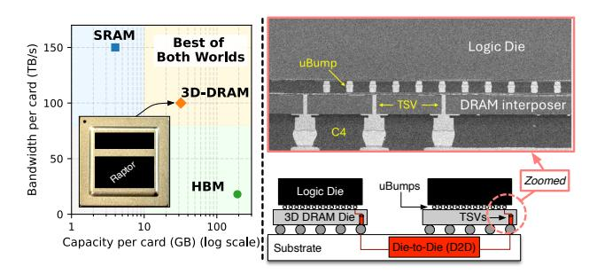
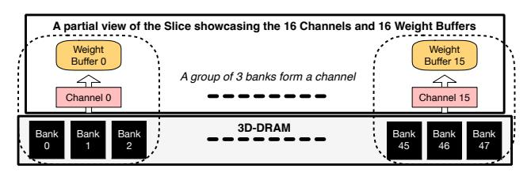
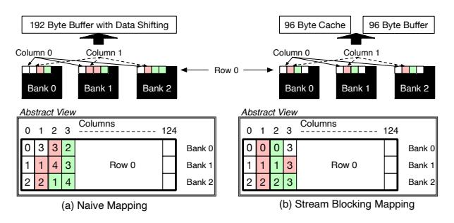
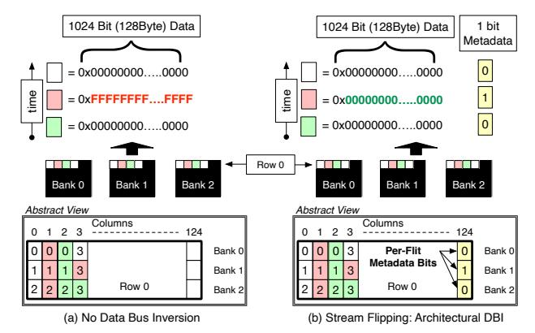
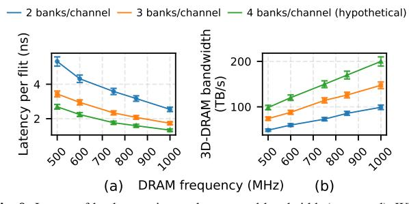
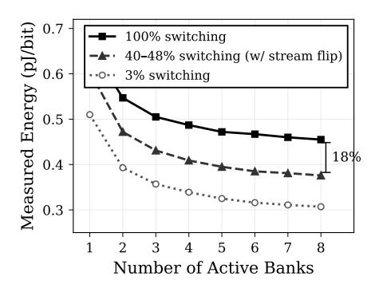
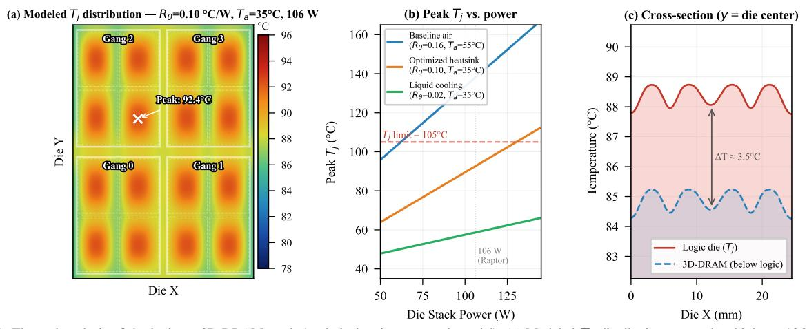
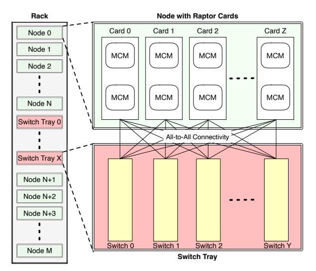
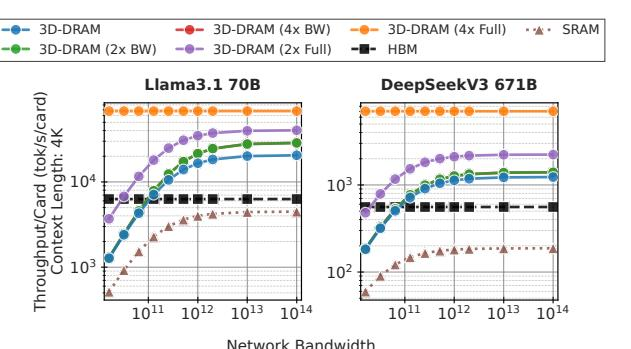
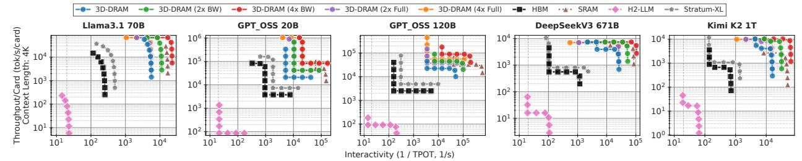

# Early Silicon of Raptor: The First 3D-DRAM Accelerator for Generative Inference

Prashant J. Nair1,2, Ramyad Hadidi1, Subramani Ganesh1, Sangamesh Kodge1, Shubhankit Rathore1, Neil Thanawala1, Nikitha Reddy1, Gyanesh Saharia1, Vinayak Patankar1, Arun Tiruvur1, Nithesh Kurella1, and Sudeep Bhoja1

1d-Matrix Inc. 2University of British Columbia

Abstract—Generative Inference is largely memory-bound. Autoregressive decoding dominates inference runtime and thus drives memory bandwidth and capacity demands. SRAM-based accelerators offer high bandwidth but limited capacity, while HBM DRAM provides capacity but is constrained by bandwidth and power. 3D-stacked logic-on-DRAM (3D-DRAM) helps close this gap, but integrating 3D-DRAM with accelerator logic introduces four challenges: (1) workload-aware mapping to exploit parallelism, (2) power optimization without burst-based data bus inversion (DBI), (3) resilience with high bank counts, and (4) thermal reliability at elevated junction temperatures.

This paper distills lessons from the early silicon of Raptor, the first commercial generative inference accelerator with 3D-stacked DRAM (3D-DRAM). This paper introduces four key architectural features to enable practical 3D-DRAM integration. First, stream-blocking maps KV-cache streams onto configurable 3D-DRAM channels, sustaining up to 100 TB/s per card while preserving bank-level parallelism. Second, pinless DBI on the single-cycle  $\mu$ bump interface reduces memory-subsystem energy. Third, topology-preserving redundancy with thermal-aware refresh. Fourth, interleaved ECC for reliability at high temperatures. Across Llama-3.1 70B, DeepSeek-V3, Kimi K2, GPT-OSS, Whisper, and Canary, Raptor 3D-DRAM gives 4.71× and 2.44× higher throughput than with HBM and SRAM, respectively, while being less sensitive to network latency and bandwidth.

# I. INTRODUCTION

Generative models now power interactive products such as search and assistants, as well as media tools, moving inference from offline batch jobs to always-on services with tight latency targets [2]. Unlike conventional compute-bound inference, serving large language and speech models is predominantly memory-bound. SRAM-centric designs have capacity limits, while HBM-based systems are constrained by bandwidth and I/O power. We show that a 3D-stacked logic-on-DRAM architecture delivers SRAM-like bandwidth and locality with HBM-class capacity at much lower energy, provided the accelerator is built around native 3D-DRAM integration rather than treating it as an add-on device. This paper presents the lessons learned and architectural insights from Raptor, the first-of-a-kind 3D-stacked DRAM-based accelerator.

Generative inference proceeds in two phases [18], [25]. The *prefill* phase is compute-bound and dominated by large matrix multiplications. The *decode* phase is autoregressive: tokens are generated sequentially, and each step issues multiple key–value (KV) cache reads and writes. Decode is therefore limited by the memory bandwidth [31], and this bottleneck grows as models and context lengths increase [47]. Once model weights and KV caches no longer fit within a single accelerator device, inference must be distributed across accelerators, adding

latency-heavy inter-card synchronization overheads [64]. In this regime, memory bandwidth and capacity become the primary limits on system performance [32].

Two metrics capture this performance. *Time Per Output Token* (TPOT) reflects session-level interactivity, while *tokens per second per accelerator card* (tok/s/card) measures throughput and utilization [92]. The memory system constrains both. For a Llama-class 70B-parameter model, weights occupy about 70GB at 8-bit precision, often exceeding a single card's capacity and forcing partitioning. During decode, each token attends to the accumulated KV cache across all layers. With 80 layers, grouped-query attention [3], roughly 8 KV heads, head dimension ~128, and 8-bit storage, the KV cache grows by about 0.16MB per token per user [83]. This adds nearly 1.25GB at 8K, 5GB at 32K, and 20GB at 128K *per user per session*, directly limiting how many concurrent sessions a deployment can support on a given number of cards.

These characteristics and metrics determine the memory substrate. On a PCIe SKU, SRAM-centric accelerators provide about 150TB/s of on-die bandwidth but only a few GB of capacity [8], which does not scale to large model weights and KV caches. HBM4-based DRAM cards increase capacity to a few hundred GB but remain below 20TB/s of bandwidth and are limited by I/O power [1], [27], [75]. These constraints motivate Raptor, which vertically integrates 3D-DRAM with the accelerator logic. As shown in Figure 1, 3D-DRAM raises per-package bandwidth and capacity, enabling lower TPOT, higher tok/s/card, and reduced collectives.

While 3D-DRAM offers attractive bandwidth-per-GB scaling for generative inference, deploying it in a production accelerator exposes four system-level challenges. (i) The chiplet-based stack must present a clean, high-bandwidth interface to

**Fig. 1:** The benefits of 3D-DRAM compared to SRAM and HBM. (a) 3D-DRAM offers a favorable performance–capacity trade-off. (b) X-ray cross-section of our 3D-DRAM integrated with the Raptor accelerator logic using face-to-face (F2F) stacking.

compute. Our design vertically integrates DRAM and logic dies (TSMC N4P) via face-to-face (F2F) bonding, flexibly mapping hundreds of DRAM banks to compute engines while preserving uniform, low-latency channels across the die. (ii) 3D-DRAM I/O breaks the assumptions of standard burst-mode power optimizations. JEDEC memories (DDR4, HBM3) transmit data in multi-cycle bursts and apply PHYlevel data bus inversion (DBI): the device sees a full burst word, decides on inversion per beat to minimize bit flips, and signals the choice on a dedicated DBI pin. Our 3D-DRAM instead uses a wide, single-cycle interface, with one bit per µbump per cycle, no burst structure, and no DBI sideband. This maximizes bandwidth and minimizes latency but removes the lookahead and signaling that DBI relies on. Silicon measurements show DBI-style encoding would reduce I/O energy by 18%, motivating *stream flipping*, an architectural pinless DBI mechanism tailored to this single-cycle interface.

(iii) Yield and reliability must be managed without degrading effective channel width. In a highly banked DRAM die, discarding dies with a few faulty banks is uneconomical, and naively disabling bad banks produces narrow or asymmetric channels that cap card-level bandwidth. Our topologypreserving redundancy scheme distributes spare banks in-line with regular banks; a bank-chaining fabric on the logic die remaps around faults while presenting full-width, symmetric channels to the compute engines with minimal added routing or latency. (iv) Tight vertical coupling of DRAM and logic pushes thermal and reliability limits. The package supports junction temperatures up to 105◦C at 422 W per MCM TDP. We leverage the fine-grained bank organization to increase refresh frequency with negligible bandwidth loss and co-design ECC layout and adaptive scrubbing with the 3D topology. Together, these mechanisms enable Raptor to realize 3D-DRAM's bandwidth and capacity advantages with high reliability under production operating conditions.

We then evaluate interactivity and throughput across deployment scenarios. On average, Raptor delivers 9.96× lower TPOT (higher interactivity) and 4.71× higher tok/s/card than HBM-based designs. It also reduces performance sensitivity to network latency and bandwidth compared to SRAM-based designs, thanks to a lower degree of parallelism.

# II. BACKGROUND

*A. Transformer Models: An Overview of Generative Inference*

We focus on decoder-only Transformers, the dominant backbone for generative AI [84]. They generate sequences autoregressively, factorizing the joint probability as

$$p(x_{1:T}) = \prod_{t=1}^{T} p(x_t \mid x_{< t}),$$

where x1:T = (x1, . . . , xT ) is a sequence of T tokens from vocabulary V and x<t denotes the prefix up to position t − 1. Each token depends on all prior tokens, so decoding is inherently sequential. This dependency leads to two distinct phases with different system behavior. The prefill phase processes the input context with large, highly parallel matrix multiplications and exhibits strong weight reuse. The decode phase produces one token at a time and repeatedly reads and writes the key–value (KV) cache, driving high memory traffic with limited reuse. Prefill is compute-bound; decode is dominated by memory bandwidth and capacity. These access patterns set the performance envelope for generative serving.

# *B. Transformer Models: Performance Metrics*

Time-to-First-Token (TTFT) measures latency to generate a token in the prefill phase and reflects initial responsiveness. Time-per-Output-Token (TPOT) captures the cost of generating each token during decode [92]. Throughput is measured at two levels: The tokens-per-second-per-user (tok/s/usr ≈ 1/TPOT), while per-card throughput is tokens-per-second-percard (tok/s/card ≈ U/TPOT) for U concurrent users [89].

# *C. Memory substrates and packaging taxonomy*

Commercial accelerators primarily rely on: (i) on-die SRAM, which offers very high bandwidth and low latency but limited capacity (a few GB), and (ii) off-die DRAM, which offers high density/capacity but is constrained by I/O energy and interface bandwidth. Within DRAM, 2.5D HBM combines a DRAM die stack with an interposer-based interface to deliver high bandwidth, while 3D-DRAM places memory die(s) directly above/below logic and communicates through dense vertical links. These choices define a bandwidth-capacitypower frontier that is especially consequential for decode.

# III. MOTIVATION: WHY 3D-DRAM FOR DECODE

# *A. Decode is the industry-wide bottleneck for LLM inference*

Decoder-only Transformers generate tokens autoregressively and therefore execute a highly-parallel *prefill* followed by a sequential *decode* stage (formalized in §II-A). In production LLM serving, decode commonly dictates both *tail latency* and *fleet throughput* because each output token triggers attention over an ever-growing history and repeatedly accesses the key–value (KV) cache. This is not merely an academic observation: major inference stacks now explicitly target *KVcache bottlenecks* via paging (e.g., PagedAttention), KV reuse, and KV quantization, indicating that KV bandwidth/capacity is the limiting resource in practice [30], [35], [58], [59].

# *B. KV-cache growth makes decode capacity-limited*

During decode, each layer reads the KV cache for all prior tokens and writes the KV for the newly generated token. The KV cache footprint grows linearly with context length and the number of concurrent sessions, quickly consuming tens to hundreds of GB. The KV cache size for, say, the Llama-70B model, increases from 10GB (batch = 1) to 320GB (batch = 32) and imposes a hard cap on sessions per card.

**Fig. 2:** DRAM bandwidth required by KV reads versus decode rate (BF16 KV; excludes weights/other activations). KV traffic alone drives multi-TB/s pressure at long context, motivating memory systems with substantially higher bandwidth density than conventional off-package DRAM.

## C. KV traffic yields multi-TB/s bandwidth pressure

Decode is also bandwidth-limited. A useful sanity check is a lower bound on required DRAM bandwidth from KV reads alone (ignoring weights and other activations). If attention reads S prior tokens and writes one new token per step, the KV bytes moved per output token scale as:

$$D_{\mathrm{KV}} \gtrsim \underbrace{S \cdot (2LH_{\mathrm{KV}}d_{\mathrm{head}}q)}_{\mathrm{read \ KV \ for \ history}} + \underbrace{(2LH_{\mathrm{KV}}d_{\mathrm{head}}q)}_{\mathrm{write \ KV \ for \ new \ token}}, \quad (1)$$

where L is the layer count,  $H_{\rm KV}$  the number of KV heads (GQA/MQA),  $d_{\rm head}$  the head dimension, and q bytes/element. Figure 2 converts this lower bound into bandwidth (TB/s) required to sustain a target decode rate (tokens/s) across context lengths. This demand reaches the multi-TB/s regime at long context and moderate token rates, consistent with industry efforts that directly target KV bandwidth [58], [59].

# D. Why 3D-DRAM: Bandwidth and transfer energy

Modern accelerators increasingly rely on HBM because conventional DIMM DRAM cannot supply sufficient bandwidth. However, HBM scaling is already stressing I/O and packaging: HBM3 retains a 1,024-bit data interface but doubles channels to 16×64-bit to improve concurrency [80]; HBM3E pushes pin speeds beyond 9.2 Gb/s to exceed 1.2 TB/s per placement [45]; and HBM4 doubles the interface width to 2,048 bits and increases channels to 32, enabling up to 2 TB/s per stack but further increasing interface complexity [4], [9]. Figure 3 makes this explicit by decomposing bandwidth across HBM and DDR generations over time.

Beyond raw bandwidth, decode is a *data-movement* problem where transfer energy matters. Representative measurements and industry disclosures indicate that HBM-class signaling can be several-times lower energy per bit than high-speed graphics-class interfaces, and device-access energy is a significant component of end-to-end serving power [60], [61]. Figure 3 summarizes picojoule (pJ) per bit ranges.

Fig. 3: Representative data-movement energy (pJ/bit) and bandwidth. The HBM per-stack bandwidth scaling is driven by increasing pin speed and interface width (HBM2E→HBM3→HBM3E→HBM4) to feed AI workloads [4], [45], [78], [80]. The energy per bit for HBM is not scaling efficiently. Unfortunately, the decode phase is dominated by bytes moved, so reducing transfer energy directly improves tokens/J.

## E. Example: Single-Layer KV-Cache Mapping

Consider one attention layer of Llama-3.1-70B (GQA, 8 KV heads, head dim 128, FP16). Each token produces  $2\times 8\times 128\times 2$  B = 4 KB of KV state, giving a 16 MB layer cache at 4K context. The stack partitions this into 1,024 stream-blocked tiles of 16 KB, spread evenly across the slice's 16 channels (64 tiles/channel). Each channel has three banks; a 16 KB tile maps to 128 flits of 128 B, stored as a 96 B aligned portion (one column across all three banks) plus a 32 B partial. Reading a tile thus spans roughly two rows per bank. Successive flits walk consecutive columns within an open row, and with 124 columns per row (124  $\times$  32 B = 3,968 B/bank), the row buffer is fully read before the next activation. At 64 tiles/channel, the layer occupies  $\sim$ 128 of 1364 rows per bank (<10%), leaving ample room for weights and other layers.

At decode, a Tensor Engine (§IV) streams tiles as a sequential column walk. It opens a row, streams all 124 columns, and activates the next row. The 16 channels are also operated independently. Thus, a refresh or scrub on one bank does not stall the other 15. New KV entries are appended to the tile tail with stream-flipping metadata, extending the occupied rows by one flit pair per step. The 16 KB tile granularity matches paged-attention page sizes (≥4 KB), so allocation and eviction occur at page boundaries without fragmenting the layout or disrupting row-buffer locality.

#### IV. RAPTOR: DESIGN

## A. Logic-Die Hierarchy and Dataflow

Raptor's logic floorplan (Fig. 4) mirrors the parallelism and data-movement demands of generative inference. Each accelerator card integrates 2-4 multi-chip modules (MCMs), each containing four 1.2 GHz chiplets. A chiplet vertically stacks a logic die on a 3D-DRAM die via face-to-face (F2F) bonding and is organized into four *gangs* of four *slices* each. Every slice

Fig. 4: Each accelerator card integrates up to four packages, each with four Raptor chiplets that face-to-face (F2F) stack a TSMC N4P logic die directly on a 3D-DRAM die. Dedicated 3D-DRAM channels feed per-slice tensor engines (TE) and weight buffers (WB).

contains a 4 × 4 tensor-engine (TE) array and a SIMD core for auxiliary operations. TEs deliver dense matrix throughput, slices localize data movement and buffering, gangs provide intermediate coordination, and chiplets aggregate bandwidth and capacity for tensor-parallel execution.

*a) Slice – the fundamental locality domain:* The slice is the key unit of compute-memory co-location in Raptor. TEs perform the dominant multiply-accumulate operations, accumulating partial sums in an output buffer. Activations are staged in slice-level SRAM global memory and streamed into per-TE input buffers during execution. In parallel, the 3D-stacked DRAM stores model weights and KV cache, partitioned into dedicated channels that feed each TE's weight buffer independently. This preserves bank-level parallelism across TEs and prevents unrelated refresh, scrub, or maintenance events from introducing cross-TE stalls. A SIMD core complements the TE array by handling auxiliary vector and transcendental operations. Together, TE compute, local SRAM staging, and independent 3D-DRAM channels make the slice a natural scheduling and locality domain.

*b) Gang – the intermediate execution domain:* A gang groups four slices into an execution island that bridges slicelocal computation and chiplet-wide aggregation. Gangs coordinate slices that jointly process a wider tensor shard, share work across nearby channels, and balance data movement over a bounded physical region of the logic die. This level is necessary because Raptor is not a flat compute array attached to a monolithic memory fabric: channel layout, bank allocation, and local routing must remain regular enough for timing closure yet flexible enough to sustain high decode throughput. The gang abstraction captures this organization, allowing the design to scale beyond a single slice without imposing chipletwide control overhead on every local operation.

*c) Chiplet – bandwidth and capacity aggregation:* Each chiplet aggregates four gangs into a weight-stationary chiplet backed by 840 3D-DRAM banks. These banks are mapped across the gang/slice hierarchy into balanced, independent channels: 16 per slice, 256 per chiplet. This channel count is central to sustaining decode bandwidth, where many small, latency-sensitive KV and weight accesses must proceed concurrently. Chiplets within an MCM communicate over Gen-2 die-to-die (D2D) links at 32 Gbps/lane; inter-MCM and host connectivity use PCIe Gen7. Thus, the design scales from TElocal weight delivery to package-level tensor parallelism while preserving the locality advantages of stacked memory.

Raptor's architectural contributions are implemented at the logic–memory interface, not in an abstract memory model. Stream-blocking depends on how banks are grouped into channels and assigned to TE weight buffers. Stream-flipping operates on the single-cycle, wide F2F interface between the logic die and 3D-DRAM. Topology-preserving redundancy maintains a regular bank/channel organization so faulty banks can be bypassed without disrupting the logical view of the compute engines. Thermal-aware refresh and ECC rely on independent bank operation and fine-grained scheduling across the hierarchy. Thus, the slice/gang/chiplet decomposition is necessary to explain how each mechanism is realized. §VI describes how inter-package PCIe Gen7 links support multicard deployment and collective communication.

# *B. Stacking and Packaging*

Each accelerator card integrates up to four identical MCMs. Each MCM is built on a 9-4-9 organic substrate providing sufficient routing density for high-speed I/O at a ∼422 W power target and junction temperatures up to 105◦C. Within each MCM, every chiplet employs face-to-face 3D stacking: the logic die (TSMC N4P) bonds directly to a DRAM die through a 36 µm-pitch µbump array, exposing wide, lowlatency channels into PHY blocks on the logic die.

The 3D-DRAM die organizes its 840 banks into chains that support redundancy and per-bank configurability (§IV-C and §IV-E); these banks are mapped onto the gang/slice hierarchy to form balanced channels. The logic-DRAM stack connects via mixed-pitch C4 bumps (minimum 110 µm) to a 3D CoWoS interposer, which fans out signals and power to the substrate and to eight on-package LPDDR5X-9600 devices (561-ball, qualified to 95◦C, ∼3.3 W each). These devices provide 128 GB per MCM as a secondary memory tier for model parameters and KV cache that do not fit in 3D-DRAM.

# *C. Stream Blocking*

Each 3D-DRAM bank is a 1364×124 array; the row buffer spans all 124 columns, and each column access returns 256 bits (32 B). A key design goal is to expose many independent channels, each feeding the weight buffer (WB) of a single tensor engine (TE). All banks in a channel are activated in a stagged manner. Channels must operate independently so that refresh, scrub, or other maintenance events on one bank do not stall unrelated channels.

*1) Channel Layout and Bank Budget:* Each slice has 16 weight buffers (WB) and 16 DRAM channels. Each channel delivers a 128 B flit to its WB. A single-column access from one bank supplies 32 B, so matching a 128 B flit requires four co-accessed banks. However, 256 channels per chiplet, across four banks each, require 1024 banks, yet the die implements only 840. After reserving 72 as spares (§IV-E), 768 remain,

Fig. 5: A practical implementation with three banks per channel. Reserving 72 of the 840 banks as spares leaves 768 usable banks, so that each of the 256 channels per chiplet can be formed from exactly three banks.

resulting in three per channel (Figure 5). Three co-accessed banks return 96 B per access, so a 128 B flit requires two accesses and causes a systematic overfetch.

- *2) Naive Column-Staggering:* Staggering column indices across banks so each pair of accesses yields exactly 128 B (Figure 6(a)) eliminates overfetch but requires the controller to buffer 192 B, shift non-aligned fragments into 128 B flits, and track per-address column patterns, which complicates the datapath and hinders timing closure.
- *3) Stream Blocking:* We instead adopt *stream blocking* (Fig. 6(b)). The software stack tiles weights and KV cache into per-channel blocks with near-unit-stride 128 B streaming access to maximize row-buffer locality. Each flit is split into a 96 B aligned portion stored across the three banks at the same column index (32 B per bank) and a 32 B partial; partials from neighboring flits are packed into a shared partial region.

On a read, the controller first accesses the partial region, caching 96 B of 32 B fragments for consecutive flits. A second access fetches the 96 B aligned region and merges it with the buffered partial. Both accesses follow a fixed pattern with small buffers (96 B each), reducing the datapath to fixed-index concatenation and fully utilizing every column access.

# *D. Stream Flipping*

The 3D-DRAM stack connects logic to DRAM through a dense µbump array. These short vertical links reduce per-bit I/O energy to 0.45 pJ/bit, ∼6× lower than HBM3, but the much higher aggregate bandwidth amplifies total switching power. At 100 TB/s a Raptor card would dissipate ∼360 W in 3D-DRAM I/O alone. Reducing bit transitions on the µbump array is therefore essential.

Fig. 6: Naive column-staggering versus stream-blocking. (a) A naive scheme staggers column indices across three banks so each pair of column accesses can pack one 128B flit without overfetch, but this requires a 192B data-shifting network and complex per-address column patterns. (b) Stream blocking instead uses a fixed two-access pattern with a small 96B partial buffer and 96B output buffer, fully utilizing every column access and eliminating overfetch.

Commodity DRAM interfaces address this with data bus inversion (DBI): for each beat in a multi-cycle burst, the PHY decides whether to invert the word to minimize transitions and signals the choice on a dedicated DBI pin. Our 3D-DRAM instead transfers a single-cycle 256-bit word per bank with no burst structure and no DBI pin. Measurements show that DBI-equivalent encoding would reduce I/O energy by 18% (to ∼0.37 pJ/bit), so we implement it at the architectural level.

*Stream flipping* exploits two properties of Raptor: weights and KV cache are laid out as stream-blocked tiles producing long, near-unit-stride 128 B flit streams per channel, and the software stack controls tile placement. On a write, the memory controller compares each flit to the previously written flit on the same channel and selectively inverts it to minimize transitions, recording a single metadata bit per flit in a compact side region. On a read (Figure 7), the controller fetches the metadata bit alongside the flit and inverts it if set. The metadata follows the same stream-blocked mapping, and this architectural DBI scheme reduces 3D-DRAM I/O energy by 18% without changes to the DRAM PHY.

# *E. Topology-Preserving Redundancy*

Beyond performance and power, the 3D-DRAM subsystem must tolerate manufacturing-time and runtime faults while maintaining full, symmetric channel bandwidth and capacity within the card-level power and thermal budgets [16].

- *1) Faults and Thermal Concern:* A primary reliability concern is bank failures during manufacturing [53]–[56]. Each bank includes spare rows and columns, but if these cannot repair all defects, the bank is marked faulty. This can force the affected channel to run at reduced width or capacity. Because channels feed WBs in lockstep, an under-provisioned channel becomes the bottleneck, degrading performance per watt.
- *2) Redundant Banks with Topology Preservation:* We introduce redundant banks that transparently replace faulty ones while preserving the logical channel topology. A naive scheme would place all redundant banks at the edge of the 3D-DRAM

Fig. 7: Stream-flipping (pinless DBI) encoding and metadata layout in 3D-DRAM. For each 128B flit in a stream, the controller decides whether to invert the data to minimize bit transitions and stores a single DBI metadata bit alongside the 1024 data bits in DRAM; on reads, the flit is reconstructed with one conditional inversion, providing DBI-like behavior with only 0.8% capacity overhead and no PHY changes.

Fig. 8: Bank-chaining topology-preserving redundancy for 3D-DRAM. In general, with N functional and M redundant banks arranged in a chain, lightweight hierarchical multiplexing on the logic die can select any contiguous (N+M)-bank window to form  $\frac{N}{3}$  bank channels. This helps tolerate up to M arbitrary faulty banks while keeping channel width, mapping, and routing symmetric. This prevents significant routing concerns for redundant banks.

"beachfront" and route around faulty banks with long-distance wiring, increasing metal usage, latency, and power on an already power-sensitive interface.

Instead, we distribute spare banks alongside regular banks and select them so that channels remain logically contiguous. This keeps routing local, minimizes additional logic and wiring power, and ensures that all channels presented to the compute fabric remain symmetric in width and capacity.

3) Our Approach: We employ three mechanisms:

A. Bank chaining: We realize topology-preserving redundancy with a simple bank chaining scheme. We logically chain N functional banks with M redundant banks and use lightweight multiplexing on the logic die to select any contiguous N-bank window from the N+M physical banks. For example, as shown in Figure 8, choosing N=24 and M=2 allows the controller to form eight channels of three banks each from any 24 non-faulty banks in a chain of 26, tolerating up to two faulty banks at arbitrary positions. This selection requires only M=2 levels of multiplexing and adds negligible routing overhead, as routing remains on the logic die near the corresponding tensor engine and weight buffer.

**B. Scalable thermal-aware refresh:** At runtime, the dominant reliability stressor is temperature. The temperatures can reach 105°C at the logic and 3D-DRAM interface. At this temperature, the 3D-DRAM requires a refresh interval of 4ms to maintain retention margin, 8× more frequent than the nominal 32 ms refresh used in HBM devices. However, our 3D-DRAM is deeply banked, and each bank contains only 1364 rows. This is 16–32× fewer rows than in conventional DRAM banks. Thus, even with a 4ms interval, the refresh overhead is lower than that of commodity DRAM [50]–[52].

**C.** Interleaved Error-Correcting Code (ECC): To further harden against manufacturing and runtime faults, each bank uses a blocking ECC scheme. The last eight columns store a pair of 8-bit symbol-based [144, 140] Reed–Solomon codewords, interleaved to match the subarray mapping [11]. We co-locate this ECC with the stream-flipping DBI metadata.

On a read, the controller first fetches ECC and DBI metadata from all banks in a channel, then the corresponding data flits.

It checks ECC, corrects erroneous data (if needed), and uses the DBI bits to decide whether each 128B flit must be inverted before entering the compute pipeline. Writes follow the reverse order: the controller computes ECC, chooses the DBI polarity to minimize transitions, writes the (possibly inverted) data, and then commits ECC and DBI metadata. Raptor also employs periodic background scrubbing, as in conventional DRAM, to repair transient errors before they accumulate [15], [56], [71].

## V. SILICON CHARACTERIZATION

We validate Raptor's performance, resilience, power, thermal, and refresh characteristics on silicon.

1) Results of Stream Blocking: Figure 9 plots flit latency and aggregate 3D-DRAM bandwidth per card as DRAM frequency scales from 500MHz to 1GHz for 2- and 4-banks-per-channel configurations. The 2-bank design retains 256 channels per chiplet and uses the remaining banks for redundancy, while the 4-bank design is hypothetical and assumes a DRAM die with 33% more banks than the 3-banks-per-channel baseline. Because each row holds multiple 128B flits, streaming an entire row amortizes activation and reduces per-flit latency. At 700MHz, 3D-DRAM delivers 2.5ns average flit latency and 105TB/s of 3D-DRAM bandwidth per card, about 12.5× that of HBM3 cards; even if HBM4 doubles HBM bandwidth, 3D-DRAM still provides a 6.25× advantage.

Fig. 9: Impact of bank grouping on latency and bandwidth (measured). With the chosen 3-bank design at 700 MHz, Raptor achieves  $\sim$ 2.5 ns latency and  $\sim$ 105 TB/s bandwidth per card

## A. Stream-Flipping characterization

Figure 10 reports measured I/O energy (VDD1 = 2.5 V, VDD11 = 1.1 V) as banks scale from 1 to 8 under three switching rates. At 8 banks, the worst-case energy is 0.455 pJ/bit (100% switching); stream flipping reduces effective switching to 40-48%, yielding 0.376 pJ/bit. This is an **18% reduction** without pin changes, and  $\sim 6\times$  below reported HBM3 energy. At the same voltage, the 500 MHz energy is lower than the 400 MHz energy because a higher frequency improves the amortization of static power. Power-rail analysis confirms that the 1.1 V array rail accounts for **87%** of active power, centering thermal management on DRAM array activity.

## B. Resilience, Refresh and Rowhammer

Figure 11 shows the resilience improvement as we vary the group size and number of redundant banks. While we cannot disclose absolute yield figures, we leverage redundant banks across both pre-package (wafer-level) and post-package (stack-level) repair flows, as is standard in high-volume DRAM manufacturing. In practice, bank chaining recovers channels that would otherwise be yield-limiting.

At 700 MHz, switching from 16 ms to 4 ms refresh (required at  $T_j > 85\,^{\circ}\mathrm{C}$ ) costs only 1.37% of bandwidth (Table I) loss. Raptor's 840 banks  $\times$  1364 rows/bank keeps per-bank refresh latency 16–32× below conventional DRAM. For the RowHammer threshold of 200K (as we use an older technology node), back-to-back activations take 8.8 ms at  $t_{\rm RC}$  = 44 ns to hit this rowhammer threshold. Since the 4 ms refresh interval is below the 8.8ms window, every row is refreshed before any neighbor accumulates sufficient activations and RowHammer is inherently mitigated [13], [33], [67], [72], [73], [85]–[88]. This co-design of bank geometry with thermal-refresh policy is unique to deeply-banked 3D-DRAM.

Table I reports the measured refresh-induced bandwidth loss. In all cases, refresh traffic is a small fraction of total memory bandwidth. This allows reliable operation while remaining within the card's thermal budget [68].

**Fig. 10:** Measured I/O energy vs. number of active banks at 500 MHz (read-only, BL128, VDD1 = 2.5 V, VDD11 = 1.1 V). Stream flipping reduces energy by 18% (0.45  $\rightarrow$  0.37 pJ/bit at 8 banks). At the same VDD, the 500 MHz energy is lower than that at 400 MHz due to better static power amortization with higher throughput. The design target frequency is 700 MHz.

**Fig. 11:** Resilience of bank-chaining versus group size and redundancy. Increasing the number of redundant banks substantially improves resilience by enabling recovery of channels that would otherwise be fault-limiting.

TABLE I: Refresh overhead at 700MHz.

| Refresh interval | Bandwidth overhead | 3D-DRAM bandwidth (TB/s) |
|------------------|--------------------|--------------------------|
| 1 ms             | 0.0546             | 99.2628                  |
| 2 ms             | 0.0270             | 102.1314                 |
| 4 ms             | 0.0137             | 103.5657                 |

## C. Thermal analysis and Characterization

The junction-to-ambient thermal path is analyzed as a series resistor network through five layers: (1) the thinned die stack (logic + DRAM, 0.62 mm), (2) TIM1 (first thermal interface material, between die and lid;  $k=5\,\mathrm{W/mK}$ ,  $100\,\mu\mathrm{m}$ ), (3) the copper lid ( $k=390\,\mathrm{W/mK}$ , 1.5 mm), which spreads heat from die to package footprint, (4) TIM2 (second thermal interface material, between lid and heatsink;  $k=6\,\mathrm{W/mK}$ ,  $200\,\mu\mathrm{m}$ ), and (5) the heatsink/airflow cooling solution. The cooling solution contributes  $\sim\!80\%$  of total thermal resistance ( $R_{\theta}$ ); the entire die stack including 3D-DRAM adds only  $\sim\!1.5\%$  (0.003 °C/W). DRAM stacking, therefore, does not measurably shift junction temperature ( $T_{j}$ ) versus power.

Figure 12(a) shows the modeled  $T_j$  distribution across the logic die at Raptor's operating point of  $\sim \! 106 \, \mathrm{W}$  per chiplet (422 W per MCM  $\div$  4 chiplets), under the optimized heatsink configuration ( $R_{\theta} = 0.10\,^{\circ}\mathrm{C/W}, T_a = 35\,^{\circ}\mathrm{C}$ ). The 2D temperature field is computed from a spatially resolved power density map of the chiplet architecture. The TE arrays form localized hotspots at  $\sim \! 92\,^{\circ}\mathrm{C}$ , while SRAM buffers, inter-gang crossbar, and PHY regions are 4-6 °C cooler and are attenuated by lateral heat spreading in the copper lid.

Figure 12(b) plots peak  $T_j$  versus die-stack power under three cooling configurations. At baseline air cooling ( $R_{\theta} = 0.16\,^{\circ}\text{C/W}$ ,  $T_a = 55\,^{\circ}\text{C}$ ), only 63 W per chiplet stays below the 105 °C limit. The optimized heatsink yields a peak  $T_j$  of  $\sim$ 93 °C at 106 W which is well within target, with headroom to  $\sim$ 140 W. Liquid cooling ( $R_{\theta} = 0.02\,^{\circ}\text{C/W}$ ) effectively removes the thermal constraint ( $T_j < 60\,^{\circ}\text{C}$  at 106 W).

Figure 12(c) presents a horizontal cross-section through the die center, comparing the logic die and 3D-DRAM layer average temperatures. The logic-above-DRAM stacking keeps the DRAM  $\sim$ 3.5 °C cooler than the logic surface. This is the opposite of conventional HBM, where DRAM sits above the heat-generating logic and absorbs conducted heat. This thermal inversion is a direct advantage of the F2F bonding approach.

Fig. 12: Thermal analysis of the logic-on-3D-DRAM stack (analytical resistor-network model). (a) Modeled  $T_j$  distribution across the chiplet at 106 W with optimized heatsink; TE arrays form localized hotspots at  $\sim$ 92 °C while inter-gang and PHY regions remain 4-6 °C cooler. Gang and slice boundaries overlaid. (b) Peak  $T_j$  vs. die-stack power under three cooling configurations; the optimized heatsink sustains 106 W with  $\sim$ 12 °C margin below the 105 °C limit. (c) Horizontal cross-section at die center showing the 3D-DRAM layer runs  $\sim$ 3.5 °C cooler than the logic die.

#### VI. DEPLOYMENT AND COMMUNICATION

#### A. Interconnect Hierarchy

Figures 4 and 13 show the three-level interconnect hierarchy of Raptor. Within each chiplet, four gangs communicate over a custom on-chip network-on-chip (NoC) for low-latency partial-sum reductions and activation exchanges (§IV-A). Four chiplets are connected by die-to-die (D2D) links at 32 Gbps/lane. Each card integrates 2-4 MCMs, and multiple cards form a node. For scale-up deployment, every MCM can connect to every switch tray via PCIe Gen 7 or the Ethernet Scale-Up Network (ESUN) links, forming a one-hop fat-tree with all-to-all MCM connectivity within a rack. The topology is protocol-agnostic, and additional switch tiers can extend connectivity across racks.

The per-link throughput varies across the three hierarchies (on-chip NoC, D2D, PCIe/ESUN), but aggregate bandwidth at any hierarchy level scales with the addition of links; the primary distinction across levels is therefore latency. Because aggregate bandwidth can be matched across levels by adjusting link count while latency stays at the same order within each level, we model the inter-card network as a unified flat fabric parameterized by one-way latency (swept 0.01 to  $10~\mu s$ ) and aggregate bandwidth (swept 32~GB/s to 4~TB/s), allowing us to evaluate sensitivity without committing to a specific protocol or link count (§VIII).

IO Chiplet: The deployment in Figure 13 assumes the PHYs reside on the N4P Raptor logic die. An orthogonal solution is to relocate the PCIe/ESUN/D2D PHYs (and optional copackaged optics or CPO) to a dedicated IO chiplet bonded to the MCM on a mature node. This is a deployment-time decision, not a compute-die redesign, and our chiplet decomposition already accommodates it. This enables three payoffs: (i) it reclaims N4P reticle and removes a power-dense heat source from the 3D-DRAM beachfront (§V); (ii) it decouples the MCM from the scale-up protocol, opening memory-semantic fabrics and CPO alternatives to PCIe/ESUN; and (iii) for

**Fig. 13:** Scale-out organization of Raptor from gangs to a rack deployment. Each node can hold several cards (here showing two MCMs per card). Every MCM connects to every switch tray via PCIe Gen 7 or the Ethernet Scale-Up Network (ESUN), forming a one-hop tree with all-to-all connectivity. Within an MCM, four chiplets communicate over D2D links; within a chiplet, four gangs communicate over a custom on-chip NoC. There is variation in the *per-link* latency and throughput across all three protocols. While per-link throughput varies across levels, aggregate bandwidth scales with the number of links, so the primary distinction across levels is latency.

heterogeneous deployments, a coherent load/store fabric can absorb cross-pool many-to-many traffic into page-granularity accesses, shifting the sensitivity curves in §VIII into the low-latency regime where collectives do not limit the tokens/s/card.

## B. Collective Implementation

This interconnect hierarchy is exploited by the collective implementations. All-reduce operations use a hierarchical decomposition that combines reduce-scatter and all-gather phases: the bulk of the data reduction occurs locally within a chiplet over the on-chip NoC, with progressively smaller messages

TABLE II: The minimal-card configurations for each model and accelerator.

|                 | Accelerator (XPU + SRAM/HBM, RP + 3D-DRAM) |                            |                             |                             |                             |                           |                                       |
|-----------------|--------------------------------------------|----------------------------|-----------------------------|-----------------------------|-----------------------------|---------------------------|---------------------------------------|
| Model           | SRAM                                       | HBM                        | 3D-DRAM                     | 3D-DRAM (2× BW)             | 3D-DRAM (4× BW)             | 3D-DRAM (2× Full)         | 3D-DRAM (4× Full)                     |
| Llama3.1 70B    | 8 8 1 0 4, U, 128                          | 1   1   1   0   1, U, 192  | 1   1   1   0   1, U, 32    | 1   1   1   0   1, U, 32    | 1 1 1 0 1, U, 32            | 1   1   1   0   1, U, 64  | 1   1   1   0   1, U, 128             |
| GPT_OSS 20B     | 2 1 8 0 1, D, 40                           | 1 1 1 0 1, D, 384          | 1   1   1   0   1, D, 64    | 1   1   1   0   1, D, 64    | 1   1   1   0   1, D, 64    | 1 1 1 0 1, D, 128         | 1 1 1 0 1, D, 256                     |
| GPT_OSS 120B    | 8 1 1 3 2 0 1, D, 160                      | 1   1   1   0   1, D, 384  | 1   1   4   0   1, D, 160   | 1   1   4   0   1, D, 160   | 1   1   4   0   1, D, 160   | 1   1   2   0   1, D, 192 | 1 1 1 0 1, D, 256                     |
| DeepSeekV3 671B | 8 1 64 4 4, D, 1216                        | 1   1   4   1   1, D, 1152 | 4   1   32   2   1, D, 1216 | 4 1 1 3 2 2 1, D, 1216      | 4   1   32   2   1, D, 1216 | 2 1 16  2  1, D, 1280     | 1 1 8 1 1, D, 1280                    |
| Kimi K2 1T      | 8 1 1 384 4 4, D, 6336                     | 1 1 8 1 1, D, 1920         | 4   1   48   2   1, D, 1728 | 4   1   48   2   1, D, 1728 | 4   1   48   2   1, D, 1728 | 2 1 1 2 4 2 1, D, 1792    | 1   1   1   1   1   1   1   1   1   1 |
| Canary 1B       | 1 1 1 0 1, U, 4                            | 1   1   1   0   1, U, 192  | 1 1 1 0 1, U, 32            | 1 1 1 0 1, U, 32            | 1 1 1 0 1, U, 32            | 1   1   1   0   1, U, 64  | 1 1 1 0 1, U, 128                     |
| Whisper         | 1 1 1 0 1, U, 4                            | 1   1   1   0   1, U, 192  | 1   1   1   0   1, U, 32    | 1   1   1   0   1, U, 32    | 1   1   1   0   1, U, 32    | 1   1   1   0   1, U, 64  | 1   1   1   0   1, U, 128             |

Each cell reports  $\langle Attn-TP|FFN-TP|EP|SE|PP$ , mode, memGB $\rangle$ , where Attn-TP and FFN-TP denote tensor parallelism for the attention and FFN blocks, respectively; EP is expert parallelism; SE is the number of shared-expert cards; PP is pipeline depth; mode is unified (U) or disaggregated (D) deployment; and memGB is aggregate memory in GB across the deployment (i.e., total cards  $\times$  per-card capacity; e.g., for Kimi K2 1T on SRAM the configuration requires 1,584 cards  $\times$  4 GB = 6336 GB, reflecting the extreme parallelism forced by SRAM's small per-card capacity).

exchanged at the MCM (D2D) and card (PCIe) levels. Allgather operations are implemented as broadcasts, leveraging Raptor's source-side multicast capability to reduce congestion at higher levels of the hierarchy.

## C. Parallelism Mapping

**Dense models** use *unified deployment*, distributing every layer across the same set of cards. Tensor parallelism (TP) shards attention heads and FFN matrices across cards; we cap TP at 8 to stay within a single node and avoid collectives-dominated scaling. Pipeline parallelism (PP) partitions layers across additional cards only when a single card cannot hold the required weights and KV cache.

**MoE models** use *disaggregated deployment* [93]: a small TP group of cards (e.g., TP=4) handles attention, while experts are spread across the remaining cards via expert parallelism (EP). This separation keeps per-expert state within a single card's capacity and confines the heavier many-to-many traffic to the EP pool.

Because Raptor's 3D-DRAM offers substantially higher per-card capacity than SRAM, and higher bandwidth than HBM, it requires fewer cards for a given model, which directly reduces the parallelism degree and, consequently, the collective communication overhead. The per-model parallelism configurations used in our evaluation are listed in Table II.

# D. Per-Layer Communication

The deployment mode dictates the schedule of collectives. **Dense (unified) deployment.** Each transformer layer triggers two TP all-reduce operations: one after the attention projection and one after the FFN, each transferring  $\mathcal{O}(h \cdot b)$  bytes, where h is the hidden dimension and b the micro-batch size. At the low TP degrees enabled by 3D-DRAM (e.g., TP = 4 for Llama-70B vs. TP = 8 for SRAM), these all-reduces involve fewer participants and proportionally less data, reducing per-layer communication time.

**MoE** (disaggregated) deployment. Each layer involves up to four distinct collectives: (i) an attention all-to-all among the TP cards to exchange partial attention outputs and log-sum-exp statistics ( $\sim$ 16 KB/card at TP=4); (ii) a post-attention all-reduce to combine projection outputs ( $\propto h \cdot b$ ); (iii) a dispatch many-to-many that routes activated tokens from the attention group to expert cards ( $\sim$ hundreds of KB/card); and (iv) a combine many-to-many that returns expert outputs to the attention group ( $\sim$ MB/card). The dispatch and combine phases scale with the number of active experts and the EP degree.

Reducing the card count through higher per-card capacity directly shrinks both the participant set and the total volume of these collectives, enabling 3D-DRAM to lower communication overhead relative to lower-capacity alternatives.

#### VII. METHODOLOGY

## A. Raptor Hardware and Memory Model

We evaluate the memory subsystem using two parameters: peak bandwidth and usable capacity. All experiments use the same accelerator logic, called XPU. Pairing XPU with our 3D-DRAM yields the full Raptor (RP) product, while XPU+SRAM and XPU+HBM serve as external-memory baselines on the same logic. Since our interest is the memory-bound regime, we focus on the decode phase of inference.

**TABLE III:** Accelerator + memory technology configurations. Tensor compute throughput for the XPU accelerator logic is fixed at 10 PFLOPS; we only vary the attached memory subsystem. Pairing the XPU logic with 3D-DRAM yields the full Raptor (RP) product; SRAM and HBM variants are external-memory baselines on the same logic.

| Accelerato   | r + Memory                 | Mem Bandwidth (TB/s) |     | Tensor Compute Throughput (PFLOPS) |
|--------------|----------------------------|----------------------------|-----|------------------------------------------|
| Memory ted   | chnology variants          |                            |     |                                          |
| VDII.        | SRAM                       | 150                        | 4   | 10                                       |
| XPU +        | HBM                        | 18                         | 192 | 10                                       |
| RP +         | 3D-DRAM                    | 100                        | 32  | 10                                       |
| Ablation sti | udy variants               |                            |     |                                          |
|              | $3D$ -DRAM $(2 \times BW)$ | 200                        | 32  | 10                                       |
| RP +         | $3D$ -DRAM $(4 \times BW)$ | 400                        | 32  | 10                                       |
|              | 3D-DRAM (2× Full)          | 200                        | 64  | 10                                       |
|              | 3D-DRAM (4× Full)          | 400                        | 128 | 10                                       |

Each XPU card is paired with one of three memory technologies: on-die **SRAM** (very high bandwidth, minimal capacity), **HBM** DRAM (high capacity, limited bandwidth), or **3D-DRAM** (high bandwidth with moderate—high capacity). To disentangle bandwidth and capacity for 3D-DRAM, we sweep five RP + 3D-DRAM design points derived from a baseline *prototype*. Our lab is also testing chips with 2-High and 4-High stacking, with DRAM-on-top packaging. Thus, we include design points with 2× and 4× capacity and bandwidth.

The baseline, 3D-DRAM, provides 100 TB/s of bandwidth (with 2 ms refresh and scrubbing) and 32 GB of capacity. For bandwidth-only scaling, 3D-DRAM ( $2 \times BW$ ) and 3D-DRAM ( $4 \times BW$ ) increase bandwidth by  $2 \times$  and  $4 \times$  while holding capacity at 32 GB. For proportional scaling, 3D-DRAM ( $2 \times Full$ ) and 3D-DRAM ( $4 \times Full$ ) scale both bandwidth and capacity by  $2 \times$  and  $4 \times$ . Together with the XPU + **SRAM** 

Fig. 14: tok/s/card vs Interactivity for LLM models across multiple hardware configurations at context length of 4K with minimal-card deployment (the fewest cards that can hold weights and KV cache). Network latency and bandwidth for this plot  $0.5\mu s$  and 1 TB/s, respectively.

and XPU + **HBM** baselines (Table III), this isolates the effect of each memory substrate on decode throughput.

## B. Models and Deployment

We evaluate three workload classes: (1) dense decoder-only large language models (LLMs), Llama-70B [44]; (2) mixture-of-experts (MoE) LLMs, DeepSeek-V3 [14], GPT-OSS [62], and Kimi K2 [48], with sparse expert routing, irregular memory access, and variable per-token activation footprints; and (3) speech models, Whisper [69] and Canary [65], with encoder-decoder pipelines, longer contexts, and distinct compute-to-memory ratios. This suite spans model sizes, KV footprints, and arithmetic intensities.

We use the deployment modes and parallelism strategies described in §VI. Data parallelism (DP) increases the number of concurrent sequences after TP, PP, and (when applicable) EP are fixed. We evaluate two deployment regimes:

- Minimal-card uses the fewest accelerator cards that can hold both weights and KV cache under a given tensor/pipeline/data parallelism configuration (TP/PP/DP). This exposes each baseline's (XPU+SRAM, XPU+HBM, RP+3D-DRAM) intrinsic capacity limits and performance at the physical deployment boundary. The resulting configurations, along with 3D-DRAM scaling variants used only in our ablation, are summarized in Table II.
- **Iso-card** fixes the total card count to the number required by RP + 3D-DRAM in the minimal-card regime, enabling capacity-independent comparisons.

We report two metrics (see §I). *Interactivity* is 1/TPOT (in 1/s), where TPOT (Time Per Output Token) is the average latency to produce one token for a request [92] and higher is better. *Throughput* is tok/s/card, the steady-state tokens-per-second per accelerator card in a deployment [89].

#### VIII. RESULTS

#### A. Batch Sizes Analysis

To study the impact of batch size on latency and throughput under a given service level agreement (SLA) for large-scale LLM deployment, we model request arrivals as a Poisson process [70] and use an event-driven traffic generator and a batched compute engine. We use an arrival rate of 110 requests/s (~9.5M requests/day, in line with publicly quoted data [46]) as a representative production load, and also sweep higher rates. Requests are queued in front of the compute

TABLE IV: Batch-size behavior under Poisson arrivals.

| a) Batch size versus arrival rate $(T = 1 \text{ ms})$ |           |           | (b) Recommended batch versus per-batch laten |            |  |
|--------------------------------------------------------|-----------|-----------|-------------------------------------------------|------------|--|
| Req/s                                                  | Max batch | Avg batch | T (ms)                                          | Batch size |  |
| 110                                                    | 1         | 1.00      | 0.1                                             | 1          |  |
| 200                                                    | 3         | 1.05      | 1                                               | 1          |  |
| 500                                                    | 5         | 1.17      | 2                                               | 1          |  |
| 1000                                                   | 27        | 5.12      | 30 100                                       | 8 16    |  |

engine. Whenever the engine becomes idle, it drains the queue by forming batches of size b from the q pending requests. With constant per-batch latency T, the time to process q requests is Tq/b. Each simulation runs for 1s (1000ms).

Using a 1ms per-batch processing time from Figure 14, Table IV(a) shows that average and maximum batch sizes remain well below 32 even at high arrival rates. Sweeping per-batch latency (Table IV(b)) yields recommended batch sizes that also stay under 32 while sustaining the offered load, and steady-state queue depths remain within the same bounds. We therefore fix the batch size to 32 as a practical operating point that balances latency and throughput for realistic deployments.

## B. Throughput per Card versus Interactivity

- 1) Experimental Setup and Interpretation: Figure 14 shows the throughput–interactivity trade-off as batch size varies. Network latency is fixed at  $0.5\mu s$  and network bandwidth at 1~TB/s. Along each curve, increasing batch size generally raises tok/s/card (moving upward) while reducing interactivity (moving leftward). The desirable region is the upper-right, where both interactivity (1/TPOT) and tok/s/card are high. We use unified deployment for dense models and disaggregated deployment for MoE models. Each point on the curves is obtained by sweeping the batch size for a fixed parallelism configuration and memory substrate.
- 2) Dense versus MoE Behavior: Dense models exhibit two regimes. At small batch sizes, decode is memory-bound; increasing the batch size amortizes the weight and KV-cache transfers, improving tok/s/card. At larger batch sizes, the arithmetic units saturate, tok/s/card plateaus, and TPOT rises.

MoE models exhibit four regimes. First, attention is memory-bound and dominates latency; tok/s/card improves with batch size (e.g., left of the GPT\_OSS-120B curve on 3D-DRAM ( $4\times$  BW)). Second, expert loading dominates, creating a near-horizontal segment where tok/s/card stalls while interactivity drops. Third, all experts are active, but their load

cost is amortized over more tokens; tok/s/card rises at roughly constant TPOT, visible as a vertical segment. Fourth, attention compute dominates again, producing a second horizontal segment (e.g., GPT\_OSS-20B on 3D-DRAM  $(4 \times BW)$ ).

3) Impact of Technology and 3D-DRAM Scaling: HBM-based accelerators consistently underperform 3D-DRAM and SRAM, matching tok/s/card only in the compute-bound regime and with significantly worse interactivity.

For dense models, SRAM and baseline 3D-DRAM trace similar interactivity-throughput curves. For MoE models, 3D-DRAM outperforms SRAM. At the practical batch of 32 (§VIII-A), 3D-DRAM has better interactivity and tok/s/card.

Increasing 3D-DRAM bandwidth shifts the memory-bound region of the 3D-DRAM, 3D-DRAM (2× BW), and 3D-DRAM (4× BW) curves toward the upper right. Scaling both bandwidth and capacity (3D-DRAM (2× Full), 3D-DRAM (4× Full)) further improves performance by reducing the card count and increasing effective per-card bandwidth, as evident in GPT\_OSS and DeepSeekV3-671B; however, changes in pipeline parallelism obscure this trend for Llama-3.1-70B.

Comparing bandwidth-only versus full scaling (3D-DRAM  $(2\times BW)$  vs. 3D-DRAM  $(2\times Full)$ , 3D-DRAM  $(4\times BW)$  vs.3D-DRAM  $(4\times Full)$ ) isolates the capacity effect: fewer cards increase parameter movement per card, leaving tok/s/card similar but potentially degrading interactivity unless the higher capacity also lowers PP. We show detailed curves only for Llama-3.1-70B and DeepSeekV3-671B.

## C. Impact of Network Latency and Bandwidth

Using the interconnect model from §VI, Fig. 15 sweeps network latency at 1 TB/s bandwidth and batch size 32 (§VIII-A). tok/s/card is flat below  $0.1\,\mu s$  for all models and memory stacks. Beyond this point, tensor- and pipeline-parallel collectives become significant. SRAM degrades fastest because its limited capacity forces higher TP/PP degrees and larger collective volumes; HBM, which uses smaller TP degrees, is largely insensitive. 3D-DRAM outperforms both across most models: at 4K context and a realistic network setting  $(0.5\,\mu s, 1~{\rm TB/s})$ , 3D-DRAM improves tok/s/card by  $4.38\times$  over HBM and  $3.15\times$  over SRAM. At higher latencies, communication can dominate, leading to sharp tok/s/card drops, particularly in configurations with high TP/PP.

**Fig. 15:** Impact of network latency on tok/s/card across Llama-70B, and DeepSeek-V3 with minimal-card deployment. The batch size is set to 32, the maximum deployable batch size, and the network bandwidth is 1 TB/s.

**Fig. 16:** Impact of network bandwidth on tok/s/card across Llama-70B, and DeepSeek-V3 with minimal-card deployment. The batch size is set to 32, the maximum deployable batch size, and the network latency is  $0.5\mu$ s.

Fig. 16 sweeps network bandwidth at fixed  $0.5\,\mu s$  latency. Dense models saturate above 1~TB/s; MoE models stabilize at 256~GB/s. HBM is largely insensitive because its small TP degrees produce low collective volume. SRAM and 3D-DRAM are more sensitive at low bandwidths due to heavier collectives, with tok/s/card dropping sharply once communication overhead dominates.

## D. Ablation Study

1) Iso-Card: In the minimal-card setup, HBM often uses fewer cards than 3D-DRAM, resulting in lower tok/s/card. To isolate batch-size effects, we adopt an *iso-card* configuration in which all accelerators match the card count of 3D-DRAM. SRAM is excluded as it cannot scale to the required capacities.

Figure 17 shows that HBM leverages its larger per-card capacity to run larger batches, improving tok/s/card relative to the minimal-card case. However, at small and medium batch sizes, HBM's lower bandwidth still limits tok/s/card, and 3D-DRAM remains ahead. Iso-card deployment improves HBM's interactivity, but it remains below all 3D-DRAM configurations until compute-bound saturation.

2) Long Context: Figure 18 extends the analysis to longer contexts, following the trends in §VIII-B. Larger KV-cache reduces the maximum batch size, pushing accelerators into phase 1 (attention memory-bound) for DeepSeekV3-671B, with memory capacity and bandwidth as the primary limiters.

Fig. 17: tok/s/card vs Interactivity for Llama-70B, and DeepSeek-V3 across multiple hardware configurations with iso-card deployment. Network latency and bandwidth for this plot  $0.5 \mu s$  and  $1~{\rm TB/s}$ , respectively.

Fig. 18: tok/s/card vs Interactivity for LLM models across multiple hardware configurations at context length of 64K with minimal-card deployment. Network latency and bandwidth for this plot  $0.5\mu s$  and 1 TB/s, respectively.

Fig. 19: tok/s/card vs Interactivity for Whisper and Canary 1B across multiple hardware configurations with minimal-card deployment. Network latency and bandwidth for this plot  $0.5\mu s$  and 1 TB/s, respectively.

3) Speech Models: Figure 19 shows tok/s/card versus batch size for Whisper and Canary-1B. Both models fit on a single card for all memory types, and their short context (448 tokens) makes bandwidth, not capacity, the key performance driver. SRAM delivers the highest tok/s/card, followed by 3D-DRAM, then HBM. Increasing bandwidth improves both throughput and interactivity; increasing capacity alone provides no benefit for these workloads.

#### IX. ALTERNATIVE DEPLOYMENT PARADIGMS

The preceding sections treat Raptor as a uniform accelerator across the decode pipeline. Production serving stacks, however, are increasingly heterogeneous, partitioning the decode loop across hardware pools with complementary strengths. We highlight two such directions where Raptor's  $\sim\!\!100\,\mathrm{TB/s}$  3D-DRAM substrate pairs naturally with an HBM-class GPU.

1. Attention-FFN Disaggregation (AFD) splits a single MoE layer between a GPU running attention and Raptor running the FFN/expert blocks. Attention traffic is dominated by the KV cache, which fits comfortably in HBM capacity; FFN traffic is dominated by expert weight loading, which scales with batch and top-k, and therefore benefits from the highest available bandwidth. AFD places each block on the substrate that matches its bottleneck, and modern MoE models such as DeepSeek-V3 [14] make the boundary essentially free. For instance, the activation exchange fuses with the all-to-all collectives already used for expert parallelism, as demonstrated by systems such as MegaScale-Infer [93] and Step-3 [79].

2. Speculative Decoding [5], [10], [38], [42], [43] uses a small draft model to propose K candidate tokens, and a larger target model to verify them in a single parallel forward pass. The two halves have opposite memory-intensity profiles. Notably, verification amortizes target weights across K tokens. It is a compute-bound operation well matched to GPU tensor cores. On the other hand, drafting K backto-back autoregressive steps is a memory-bound operation. This asymmetry motivates the inverse pairing of AFD: the draft model on Raptor, which achieves 100 TB/s and reduces the sequential draft latency on speculative decoding's critical path, with verification performed on an HBM-class GPU. A prior production deployment on our previous accelerator, Corsair, reports sizable end-to-end speedups under exactly this pairing [19]. Furthermore, NVIDIA's Vera Rubin platform pairs Rubin GPUs with the Groq 3 LPX accelerator in a closely related heterogeneous configuration that explicitly lists speculative decoding among its target use cases [57]. Together, AFD and speculative decoding show that Raptor is not only competitive as a unified decode accelerator but also composes naturally with GPUs in heterogeneous deployments.

#### X. RELATED WORKS

Prior work uses 3D-stacked memory to increase bandwidth or enable near-data compute, building on characterizations of 3D-stacked DRAM [7], [12], [17], [21], [36], and exposes PIM/NDP offloading abstractions for graph and sparse workloads [6], [22], [34], [49]. More recent proposals revisit hybrid-bonded memory, cross-bank coordination, and NDP scheduling [37], [39], [41], [74], [81], [82], [90], [91]. However, these target CNN/DNN workloads or general NDP abstractions and do not re-architect the 3D-DRAM subsystem, its channelization, mapping, and reliability/thermal behavior, around KV-cache traffic. LLM-oriented efforts attack the memory wall via offload-friendly kernels and formats [28], [29], or by adding PIM, CXL-attached memory, monolithic-3D tiers, and compute-enabled memory [20], [23], [24], [26], [40], [63], [66], [76], [77], but assume existing DRAM/HBM organizations rather than co-designing the memory card around decode-phase bandwidth and thermal limits. We co-design the 3D-DRAM organization, stream-blocked mapping, and reliability/thermal mechanisms for KV-cache serving beyond HBM bandwidths.

Fig. 20: tok/s/card versus interactivity for Llama-70B, GPT-OSS (20B, 120B), DeepSeek-V3, and Kimi K2 across multiple hardware configurations with minimal-card deployment (the fewest cards that can hold weights and KV cache).

Comparison with H2-LLM and Stratum: Table V summarizes architectural differences. H2-LLM [39] embeds nearmemory processing (NMP) inside hybrid-bonded DRAM for low-batch edge inference, achieving 0.4 TB/s channel bandwidth and 0.28 PFLOPS of in-memory compute. It is a single-chip architecture with no multi-chip scaling path, and its DRAM-process NMP prevents the use of leading-edge logic nodes. For memory-bound decode, Raptor's 100 TB/s card-level bandwidth provides a  $\sim\!250\times$  raw advantage.

Stratum [63] targets MoE serving with a tiered monolithic-3D (Mono3D) DRAM architecture. Each chip stacks 1024 Mono3D DRAM layers with tier-dependent latencies, providing high internal NMP bandwidth. While multi-chip configurations (Stratum-S/L/XL) scale aggregate internal bandwidth up to 364 TB/s, they face a severe external bandwidth bottleneck. The external xPU−DRAM interface delivers only ~0.82 TB/s per chip (~10 TB/s for the 12-chip Stratum-XL), creating a 36× bandwidth cliff between chip-local NMP and crosschip communication. Since large models, KV cache growth, and MoE routing require cross-chip data movement, Stratum's effective multi-chip bandwidth degrades to ~10-35 TB/s. Raptor's non-tiered 100 TB/s bandwidth avoids this cliff, offering a 3.3×-10× bandwidth advantage. Furthermore, Stratum faces yield risks (1024 layers) and unverified thermal dissipation from densely stacked in-memory logic.

Figure 20 quantifies the architectural differences of Table V in terms of end-to-end serving performance. Across all three models, Raptor's 3D-DRAM configuration consistently occupies the upper-right region of the throughput-interactivity space, achieving both higher tokens/s/card and lower per-token latency than H2-LLM and Stratum-XL at every batch size. H2-LLM, constrained by its 0.4 TB/s single-chip bandwidth and DRAM-process compute, clusters in the low-throughput, low-interactivity corner; the gap widens as batch size grows because H2-LLM cannot amortize its fixed bandwidth ceiling. Stratum-XL achieves higher absolute throughput than H2-LLM thanks to its 12-chip aggregate internal bandwidth, yet

TABLE V: Comparison with recent 3D/PIM architectures.

| Feature          | H2-LLM [39]      | Stratum [63]                | Raptor (Ours)      |
|------------------|------------------|-----------------------------|--------------------|
| Target Domain    | Edge Inference   | MoE Datacenter              | Datacenter LLM/MoE |
| Compute Design   | In-Memory PIM    | Near-Memory (NMP)           | Ext. Accelerator   |
| Compute Logic    | 0.28 PFLOPS      | $\sim$ 0.5–6 PFLOPS         | 10.0 PFLOPS        |
| Memory Tech      | Hybrid-Bonded    | Mono3D (1024-L)             | 3D-DRAM TSV        |
| Effective BW     | 0.4 TB/s         | $\sim 10-35 \text{ TB/s}^*$ | 100 TB/s (Unified) |
| Multi-Chip Scale | Limited (1-chip) | 36× BW Cliff                | High-BW Seamless   |
| Validation       | Simulation       | Simulation                  | Silicon Test Chip  |

\* Estimated effective system bandwidth accounting for cross-chip routing bottleneck.

remains well below Raptor. Its  $36 \times$  external bandwidth cliff forces cross-chip data movement through a  $\sim 10\,\mathrm{TB/s}$  bottleneck, limiting effective bandwidth to a fraction of Raptor's unified  $100\,\mathrm{TB/s}$  pipe. The gap is most pronounced for the largest model (DeepSeekV3 671B), where KV-cache traffic dominates and memory bandwidth determines decode latency.

Both works are *orthogonal* to Raptor. They perform simulation-level design-space exploration, whereas Raptor provides silicon-backed evidence. PIM products (e.g., HBM-PIM [36], AIM [26]) add limited compute to DRAM banks but retain the conventional HBM device organization; Raptor codesigns the *full* memory subsystem, channelization, data mapping, ECC, and thermal management, around KV-cache traffic at orders of magnitude higher bandwidth. Architecturally, Raptor decouples compute from memory, with a 100 TB/s bandwidth DRAM subsystem feeding a 10 PFLOPS accelerator on a leading-edge logic process. This avoids both the internal vs.-external bandwidth hierarchy that limits Stratum's multi-chip scaling and the process/scaling constraints that bound H2-LLM's single-chip design.

## XI. CONCLUSION

Generative AI is increasingly dominated by memory-bound autoregressive decode, where existing SRAM and HBM-based accelerators hit hard limits in capacity, bandwidth, and I/O power. This paper targets that bottleneck by designing an accelerator around a logic-on-3D-DRAM primary memory substrate. We introduce the early silicon of Raptor, the first 3D-DRAM accelerator for generative inference. Raptor uses workload-aware channelization and mapping, a pinless DBI scheme, and topology-preserving redundancy to enable a practical and efficient 3D-DRAM. Across Llama-3.1 70B, DeepSeek-V3, Kimi K2, GPT-OSS, Whisper, and Canary, Raptor sustains ~100TB/s per card, delivering 4.7× higher throughput than HBM designs and 2.4× higher than SRAM designs while also improving interactivity and reducing sensitivity to network latency and bandwidth.

#### **ACKNOWLEDGEMENTS**

We thank the anonymous reviewers for their constructive feedback. We are also grateful to Dr. Jayaprakash Balachandran for discussions on thermals, and to Dr. Timothy Heil, Dr. Satyam Srivastava, and Bharadwaj Pudipeddi for their comments and feedback. This work was performed while Prashant J. Nair was on sabbatical/leave at d-Matrix Inc.

# REFERENCES

- [1] M. Adnan, A. Arunkumar, G. Jain, P. J. Nair, I. Soloveychik, and P. Kamath, "Keyformer: KV cache reduction through key tokens selection for efficient generative inference," in *Proceedings of Machine Learning and Systems*, vol. 6, 2024, pp. 114–127. [Online]. Available: https://proceedings.mlsys.org/paper files/paper/ 2024/file/48fecef47b19fe501d27d338b6d52582-Paper-Conference.pdf
- [2] M. Adnan, N. Kurella, A. Arunkumar, and P. J. Nair, "Foresight: Adaptive layer reuse for accelerated and high-quality text-tovideo generation," in *The Thirty-ninth Annual Conference on Neural Information Processing Systems*, 2026. [Online]. Available: https://openreview.net/forum?id=q39uZC6RSo
- [3] J. Ainslie, J. Lee-Thorp, M. de Jong, Y. Zemlyanskiy, F. Lebron, and ´ S. Sanghai, "GQA: Training generalized multi-query transformer models from multi-head checkpoints," 2023.
- [4] All About Circuits, "JEDEC officially releases HBM4 memory standard," Online, Apr. 2025, accessed 2026-03- 02. [Online]. Available: https://www.allaboutcircuits.com/news/jedecofficially-releases-hbm4-memory-standard/
- [5] Z. Ankner, R. Parthasarathy, A. Nrusimha, C. Rivera, J. Kirchenbauer, G. Saxena, B. Cohen, and W. Daniel, "Hydra: Sequentially-dependent draft heads for medusa decoding," in *Conference on Language Modeling (COLM)*, 2024.
- [6] B. Asgari, R. Hadidi, J. Cao, D. E. Shim, S.-K. Lim, and H. Kim, "FAFNIR: Accelerating sparse gathering by using efficient near-memory intelligent reduction," in *IEEE International Symposium on High Performance Computer Architecture (HPCA)*, 2021.
- [7] S. Bavikadi, P. R. Sutradhar, J. Thangellamudi, and S. M. P. Dinakarrao, "3D-PLANE: A 3D-stacked DRAM-based programmable SLM accelerator capable of near-memory and energy-efficient parallel processing," in *Proceedings of the 2025 ACM Great Lakes Symposium on VLSI (GLSVLSI)*, 2025, pp. 540–546.
- [8] S. Bhoja, "CORSAIR: An in-memory computing chiplet architecture for inference-time compute acceleration," in *2025 IEEE Hot Chips 37 Symposium (HCS)*.
- [9] Cadence Community Blog, "HBM4 boosts memory performance for AI training," Online, Apr. 2025, accessed 2026-03-02. [Online]. Available: https://community.cadence.com/cadence blogs 8/b/ip/posts/ hbm4-boosts-memory-performance-for-ai-training
- [10] T. Cai, Y. Li, Z. Geng, H. Peng, J. D. Lee, D. Chen, and T. Dao, "Medusa: Simple LLM inference acceleration framework with multiple decoding heads," in *Proceedings of the 41st International Conference on Machine Learning (ICML)*, 2024.
- [11] K. K. Chang, P. J. Nair, D. Lee, S. Ghose, M. K. Qureshi, and O. Mutlu, "Low-cost inter-linked subarrays (LISA): Enabling fast inter-subarray data movement in DRAM," in *2016 IEEE International Symposium on High Performance Computer Architecture (HPCA)*, 2016, pp. 568–580.
- [12] W. Cheng, Q. Cheng, Y. Liu, L. Zeng, A. Brinkmann, and Y. Wang, "9ring: A 3D-stacked memory-based accelerator for flexible and efficient deep CNN applications," *ACM Transactions on Architecture and Code Optimization*, vol. 22, no. 2, pp. 76:1–76:26, 2025.
- [13] Z. Coalson, J. Woo, C. S. Lin, J. Qu, Y. Sun, S. Chen, L. Yang, G. Saileshwar, P. Nair, B. Fang, and S. Hong, "PrisonBreak: Jailbreaking Large Language Models with at Most Twenty-Five Targeted Bit-flips," *arXiv e-prints*, p. arXiv:2412.07192, Dec. 2024.
- [14] DeepSeek-AI *et al.*, "DeepSeek-V3 technical report," 2025. [Online]. Available: https://arxiv.org/abs/2412.19437
- [15] A. Fakhrzadehgan, Y. N. Patt, P. J. Nair, and M. K. Qureshi, "Safeguard: Reducing the security risk from row-hammer via low-cost integrity protection," in *2022 IEEE International Symposium on High-Performance Computer Architecture (HPCA)*, 2022, pp. 373–386.
- [16] B. Fang, X. Li, H. Dam, C. Tan, S. K. S. Hari, T. Tsai, I. Laguna, D. Tao, G. Gopalakrishnan, P. Nair, K. Barker, and A. Li, "Understanding mixed precision GEMM with MPGemmFI: Insights into fault resilience," in *2024 IEEE International Conference on Cluster Computing (CLUSTER)*, 2024, pp. 166–178.
- [17] M. Gao, J. Pu, X. Yang, M. Horowitz, and C. Kozyrakis, "TETRIS: Scalable and efficient neural network acceleration with 3D memory," in *Proceedings of the 22nd International Conference on Architectural Support for Programming Languages and Operating Systems (ASPLOS)*, 2017, pp. 751–764.
- [18] R. Ghadia, A. Kumar, G. Jain, P. J. Nair, and P. Das, "Dialogue without limits: Constant-sized KV caches for extended response in LLMs,"

- in *Forty-second International Conference on Machine Learning*, 2025. [Online]. Available: https://openreview.net/forum?id=SuYO70ZxZX
- [19] Gimlet Labs, "Low-latency speculative decoding on Corsair," https:// gimletlabs.ai/blog/low-latency-spec-decode-corsair, 2025, blog post.
- [20] Y. Gu, A. Khadem, S. Umesh, N. Liang, X. Servot, O. Mutlu, R. Iyer, and R. Das, "PIM is all you need: A CXL-enabled GPU-free system for large language model inference," in *Proceedings of the 30th International Conference on Architectural Support for Programming Languages and Operating Systems (ASPLOS)*, 2025, pp. 862–881.
- [21] R. Hadidi, B. Asgari, B. A. Mudassar, S. Mukhopadhyay, S. Yalamanchili, and H. Kim, "Demystifying the characteristics of 3D-stacked memories: A case study for Hybrid Memory Cube," in *IEEE International Symposium on Workload Characterization (IISWC)*, 2017.
- [22] R. Hadidi, L. Nai, H. Kim, and H. Kim, "CAIRO: A compiler-assisted technique for enabling instruction-level offloading of processing-inmemory," *ACM Transactions on Architecture and Code Optimization (TACO)*, vol. 14, no. 4, 2017.
- [23] Y. He, H. Mao, C. Giannoula, M. Sadrosadati, J. Gomez-Luna, H. Li, ´ X. Li, Y. Wang, and O. Mutlu, "PAPI: Exploiting dynamic parallelism in large language model decoding with a processing-in-memory-enabled computing system," in *Proceedings of the 30th International Conference on Architectural Support for Programming Languages and Operating Systems (ASPLOS)*, 2025, pp. 766–782.
- [24] G. Heo, S. Lee, J. Cho, H. Choi, S. Lee, H. Ham, G. Kim, D. Mahajan, and J. Park, "NeuPIMs: NPU-PIM heterogeneous acceleration for batched LLM inferencing," in *Proceedings of the 29th ACM International Conference on Architectural Support for Programming Languages and Operating Systems (ASPLOS '24), Volume 3*. ACM, 2024, pp. 722– 737.
- [25] C. Hu, H. Huang, L. Xu, X. Chen, C. Wang, J. Xu, S. Chen, H. Feng, S. Wang, Y. Bao, N. Sun, and Y. Shan, "ShuffleInfer: Disaggregate LLM inference for mixed downstream workloads," *ACM Trans. Archit. Code Optim.*, vol. 22, no. 2, Jul. 2025. [Online]. Available: https://doi.org/10.1145/3732941
- [26] B. Hyun, T. Kim, D. Lee, and M. Rhu, "Pathfinding future PIM architectures by demystifying a commercial PIM technology," in *Proceedings of the 30th IEEE International Symposium on High-Performance Computer Architecture (HPCA '24)*. IEEE, 2024, pp. 263–279.
- [27] JEDEC Solid State Technology Association, "JESD238A: High bandwidth memory 4 (HBM4) standard," JEDEC, Standard, April 2025, supports up to 2 TB/s bandwidth per stack with 2048 bit interface. [Online]. Available: https://www.jedec.org/standardsdocuments/docs/jesd238a
- [28] D. Joo, R. Hadidi, S. Feizi, and B. Asgari, "Endor: Hardware-friendly sparse format for offloaded LLM inference," 2024.
- [29] D. Joo, H. Hosseini, R. Hadidi, and B. Asgari, "Coruscant: Co-designing GPU kernel and sparse tensor core to advocate unstructured sparsity in efficient LLM inference," in *Proceedings of the 58th IEEE/ACM International Symposium on Microarchitecture (MICRO)*, 2025.
- [30] D. Joo, H. Hosseini, R. Hadidi, and B. Asgari, "Mustafar: Promoting unstructured sparsity for KV cache pruning in LLM inference," in *Advances in Neural Information Processing Systems (NeurIPS)*, 2025.
- [31] A. K. Kamath, R. Prabhu, J. Mohan, S. Peter, R. Ramjee, and A. Panwar, *POD-Attention: Unlocking Full Prefill-Decode Overlap for Faster LLM Inference*. New York, NY, USA: Association for Computing Machinery, 2025, p. 897–912. [Online]. Available: https://doi.org/10.1145/3676641.3715996
- [32] B. Kim, S. Cha, S. Park, J. Lee, S. Lee, S.-h. Kang, J. So, K. Kim, J. Jung, J.-G. Lee, S. Lee, Y. Paik, H. Kim, J.-S. Kim, W.-J. Lee, Y. Ro, Y. Cho, J. H. Kim, J. Song, J. Yu, S. Lee, J. Cho, and K. Sohn, "The breakthrough memory solutions for improved performance on LLM inference," *IEEE Micro*, vol. 44, no. 3, pp. 40–48, 2024.
- [33] D.-H. Kim, P. J. Nair, and M. K. Qureshi, "Architectural support for mitigating row hammering in DRAM memories," *IEEE Computer Architecture Letters*, vol. 14, no. 1, pp. 9–12, 2015.
- [34] H. Kim, R. Hadidi, L. Nai, H. Kim, N. Jayasena, Y. Eckert, O. Kayiran, and G. H. Loh, "CODA: Enabling co-location of computation and data for near-data processing," *ACM Transactions on Architecture and Code Optimization (TACO)*, 2018.
- [35] W. Kwon *et al.*, "Efficient memory management for large language model serving with PagedAttention," *arXiv preprint arXiv:2309.06180*, 2023. [Online]. Available: https://arxiv.org/abs/2309.06180

- [36] Y. Kwon, S. H. Lee, J. Lee, S. H. Kwon, J. M. Ryu, J. P. Son *et al.*, "25.4 a 20nm 6gb function-in-memory DRAM, based on HBM2 with a 1.2TFLOPS programmable computing unit using bank-level parallelism, for machine learning applications," in *2021 IEEE International Solid-State Circuits Conference (ISSCC)*, 2021, pp. 350–352.
- [37] D. Lee, B. Hyun, T. Kim, and M. Rhu, "PIM-MMU: A memory management unit for accelerating data transfers in commercial PIM systems," in *Proceedings of the 57th IEEE/ACM International Symposium on Microarchitecture (MICRO '24)*. IEEE, 2024, pp. 627–642.
- [38] Y. Leviathan, M. Kalman, and Y. Matias, "Fast inference from transformers via speculative decoding," in *Proceedings of the 40th International Conference on Machine Learning (ICML)*, 2023, pp. 19 274–19 286.
- [39] C. Li, Y. Yin, X. Wu, J. Zhu, Z. Gao, D. Niu, Q. Wu, X. Si, Y. Xie, C. Zhang, and G. Sun, "H2-LLM: Hardware-dataflow co-exploration for heterogeneous hybrid-bonding-based low-batch LLM inference," in *Proceedings of the 52nd Annual International Symposium on Computer Architecture (ISCA)*, 2025, pp. 194–210.
- [40] C. Li, Z. Zhou, S. Zheng, J. Zhang, Y. Liang, and G. Sun, "SpecPIM: Accelerating speculative inference on PIM-enabled system via architecturedataflow co-exploration," in *Proceedings of the 29th International Conference on Architectural Support for Programming Languages and Operating Systems (ASPLOS)*, vol. 3, 2024, pp. 950–965.
- [41] Y. Li, B. Tian, Y. Ren, and M. Gao, "Stream-based data placement for near-data processing with extended memory," in *Proceedings of the 57th IEEE/ACM International Symposium on Microarchitecture (MICRO '24)*. IEEE, 2024, pp. 1648–1662.
- [42] Y. Li, F. Wei, C. Zhang, and H. Zhang, "EAGLE-2: Faster inference of language models with dynamic draft trees," in *Proceedings of the 2024 Conference on Empirical Methods in Natural Language Processing (EMNLP)*, 2024.
- [43] Y. Li, F. Wei, C. Zhang, and H. Zhang, "EAGLE: Speculative sampling requires rethinking feature uncertainty," in *Proceedings of the 41st International Conference on Machine Learning (ICML)*, 2024.
- [44] Meta AI, "Meta Llama 3.1 70B," https://huggingface.co/meta-llama/ Llama-3.1-70B, Jul. 2024, model card and weights; accessed 2025-08- 25.
- [45] Micron Technology, "HBM3E Micron Technology," Online, accessed 2026-03-02. [Online]. Available: https://www.micron.com/ products/memory/hbm/hbm3e
- [46] Microsoft, "Azure OpenAI in Azure AI foundry models quotas and limits," https://learn.microsoft.com/en-us/azure/ai-foundry/openai/ quotas-limits, 2025, accessed: 2025-11-17.
- [47] S. Moon, J. Cha, H. Park, and J.-Y. Kim, "Hybe: GPU-NPU hybrid system for efficient LLM inference with million-token context window," in *Proceedings of the 52nd Annual International Symposium on Computer Architecture*, ser. ISCA '25. New York, NY, USA: Association for Computing Machinery, 2025, p. 808–820. [Online]. Available: https://doi.org/10.1145/3695053.3731051
- [48] Moonshot AI, "Kimi K2: A strong reasoning model with MoE architecture," https://moonshotai.github.io/Kimi-K2/, 2025, technical report; accessed 2025.
- [49] L. Nai, R. Hadidi, J. Sim, H. Kim, P. Kumar, and H. Kim, "Graph-PIM: Enabling instruction-level PIM offloading in graph computing frameworks," in *IEEE International Symposium on High Performance Computer Architecture (HPCA)*, 2017.
- [50] L. Nai, R. Hadidi, H. Xiao, H. Kim, J. Sim, and H. Kim, "CoolPIM: Thermal-aware source throttling for efficient PIM instruction offloading," in *IEEE International Parallel and Distributed Processing Symposium (IPDPS)*, 2018.
- [51] P. Nair, C.-C. Chou, and M. K. Qureshi, "A case for refresh pausing in DRAM memory systems," in *2013 IEEE 19th International Symposium on High Performance Computer Architecture (HPCA)*, 2013, pp. 627– 638.
- [52] P. J. Nair, C.-C. Chou, and M. K. Qureshi, "Refresh pausing in DRAM memory systems," *ACM Trans. Archit. Code Optim.*, vol. 11, no. 1, Feb. 2014. [Online]. Available: https://doi.org/10.1145/2579669
- [53] P. J. Nair, D.-H. Kim, and M. K. Qureshi, "ArchShield: architectural framework for assisting DRAM scaling by tolerating high error rates," in *Proceedings of the 40th Annual International Symposium on Computer Architecture*, ser. ISCA '13. New York, NY, USA: Association for Computing Machinery, 2013, p. 72–83. [Online]. Available: https://doi.org/10.1145/2485922.2485929
- [54] P. J. Nair, D. A. Roberts, and M. K. Qureshi, "FaultSim: A fast, configurable memory-reliability simulator for conventional and

- 3D-stacked systems," *ACM Trans. Archit. Code Optim.*, vol. 12, no. 4, Dec. 2015. [Online]. Available: https://doi.org/10.1145/2831234
- [55] P. J. Nair, D. A. Roberts, and M. K. Qureshi, "Citadel: Efficiently protecting stacked memory from TSV and large granularity failures," *ACM Trans. Archit. Code Optim.*, vol. 12, no. 4, Jan. 2016. [Online]. Available: https://doi.org/10.1145/2840807
- [56] P. J. Nair, V. Sridharan, and M. K. Qureshi, "XED: exposing on-die error detection information for strong memory reliability," in *Proceedings of the 43rd International Symposium on Computer Architecture*, ser. ISCA '16. IEEE Press, 2016, p. 341–353. [Online]. Available: https://doi.org/10.1109/ISCA.2016.38
- [57] NVIDIA, "Inside NVIDIA Groq 3 LPX: The low-latency inference accelerator for the NVIDIA Vera Rubin platform," https://developer.nvidia.com/blog/inside-nvidia-groq-3-lpx-the-lowlatency-inference-accelerator-for-the-nvidia-vera-rubin-platform/, 2026, NVIDIA Technical Blog. Describes attention–FFN disaggregation between Rubin GPUs and Groq LPX, with speculative decoding as a target use case.
- [58] "Introducing new KV cache reuse optimizations in NVIDIA TensorRT-LLM," Online, NVIDIA Developer Blog, Jan. 2025, accessed 2026-03- 02. [Online]. Available: https://developer.nvidia.com/blog/introducingnew-kv-cache-reuse-optimizations-in-nvidia-tensorrt-llm/
- [59] "Optimizing inference for long context and large batch sizes with NVFP4 KV cache," Online, NVIDIA Developer Blog, Dec. 2025, accessed 2026-03-02. [Online]. Available: https://developer.nvidia.com/blog/optimizing-inference-for-longcontext-and-large-batch-sizes-with-nvfp4-kv-cache/
- [60] M. O'Connor, "Highlights of the high-bandwidth memory (HBM) standard," in *The Memory Forum*, Jun. 2014, accessed 2026-03- 02. [Online]. Available: https://www-old.cs.utah.edu/thememoryforum/ mike.pdf
- [61] M. O'Connor, N. Chatterjee, S. W. Keckler, and W. J. Dally, "Fine-grained DRAM: Energy-efficient DRAM for extreme bandwidth systems," in *50th Annual IEEE/ACM International Symposium on Microarchitecture (MICRO)*, 2017. [Online]. Available: https: //research.nvidia.com/sites/default/files/pubs/2017-10 Fine-Grained-DRAM%3A-Energy-Efficient/oconnor and chatterjee.micro2017.pdf
- [62] OpenAI, "Introducing GPT-OSS (gpt-oss-120b; 117b parameters)," https://openai.com/index/introducing-gpt-oss/, Aug. 2025, official announcement; accessed 2025-08-25.
- [63] Y. Pan, Z. Xia, P. Hsu, L. Hu, H. Kim, J. Sharda, M. Zhou, N. S. Kim, S. Yu, T. Rosing, and M. Kang, "Stratum: System-hardware co-design with tiered monolithic 3D-stackable DRAM for efficient MoE serving," in *Proceedings of the 58th IEEE/ACM International Symposium on Microarchitecture (MICRO 2025)*, 2025.
- [64] R. Prabhu, A. Nayak, J. Mohan, R. Ramjee, and A. Panwar, "vAttention: Dynamic memory management for serving LLMs without PagedAttention," in *Proceedings of the 30th ACM International Conference on Architectural Support for Programming Languages and Operating Systems, Volume 1*, ser. ASPLOS '25. New York, NY, USA: Association for Computing Machinery, 2025, p. 1133–1150. [Online]. Available: https://doi.org/10.1145/3669940.3707256
- [65] K. C. Puvvada, P. Zelasko, H. Huang, O. Hrinchuk, N. R. Koluguri, ˙ K. Dhawan, S. Majumdar, E. Rastorgueva, Z. Chen, V. Lavrukhin *et al.*, "Less is more: Accurate speech recognition & translation without webscale data," *arXiv preprint arXiv:2406.19674*, 2024.
- [66] D. Quinn, E. E. Yucel, J. Kim, J. F. Mart ¨ ´ınez, and M. Alian, "Longsight: Compute-enabled memory to accelerate large-context LLMs via sparse attention," in *Proceedings of the 58th IEEE/ACM International Symposium on Microarchitecture (MICRO 2025)*, 2025.
- [67] M. Qureshi, A. Rohan, G. Saileshwar, and P. J. Nair, "Hydra: enabling low-overhead mitigation of row-hammer at ultra-low thresholds via hybrid tracking," in *Proceedings of the 49th Annual International Symposium on Computer Architecture*, ser. ISCA '22. New York, NY, USA: Association for Computing Machinery, 2022, p. 699–710. [Online]. Available: https://doi.org/10.1145/3470496.3527421
- [68] M. K. Qureshi, D.-H. Kim, S. Khan, P. J. Nair, and O. Mutlu, "Avatar: A variable-retention-time (VRT) aware refresh for DRAM systems," in *2015 45th Annual IEEE/IFIP International Conference on Dependable Systems and Networks*, 2015, pp. 427–437.
- [69] A. Radford, J. W. Kim, T. Xu, G. Brockman, C. McLeavey, and I. Sutskever, "Robust speech recognition via large-scale weak supervision," in *International conference on machine learning*. PMLR, 2023, pp. 28 492–28 518.

- [70] V. J. Reddi, C. Cheng, D. Kanter, P. Mattson, G. Schmuelling, C.-J. Wu, B. Anderson, M. Breughe, M. Charlebois, W. Chou, R. Chukka, C. Coleman, S. Davis, P. Deng, G. Diamos, J. Duke, D. Fick, J. S. Gardner, I. Hubara, S. Idgunji, T. B. Jablin, J. Jiao, T. S. John, P. Kanwar, D. Lee, J. Liao, A. Lokhmotov, F. Massa, P. Meng, P. Micikevicius, C. Osborne, G. Pekhimenko, A. T. R. Rajan, D. Sequeira, A. Sirasao, F. Sun, H. Tang, M. Thomson, F. Wei, E. Wu, L. Xu, K. Yamada, B. Yu, G. Yuan, A. Zhong, P. Zhang, and Y. Zhou, "MLPerf inference benchmark," in *2020 ACM/IEEE 47th Annual International Symposium on Computer Architecture (ISCA)*, 2020, pp. 446–459.
- [71] G. Saileshwar, P. J. Nair, P. Ramrakhyani, W. Elsasser, and M. K. Qureshi, "Synergy: Rethinking secure-memory design for errorcorrecting memories," in *2018 IEEE International Symposium on High Performance Computer Architecture (HPCA)*, 2018, pp. 454–465.
- [72] G. Saileshwar, B. Wang, M. Qureshi, and P. J. Nair, "Randomized row-swap: mitigating row hammer by breaking spatial correlation between aggressor and victim rows," in *Proceedings of the 27th ACM International Conference on Architectural Support for Programming Languages and Operating Systems*, ser. ASPLOS '22. New York, NY, USA: Association for Computing Machinery, 2022, p. 1056–1069. [Online]. Available: https://doi.org/10.1145/3503222.3507716
- [73] A. Saxena, G. Saileshwar, P. J. Nair, and M. Qureshi, "AQUA: Scalable rowhammer mitigation by quarantining aggressor rows at runtime," in *2022 55th IEEE/ACM International Symposium on Microarchitecture (MICRO)*, 2022, pp. 108–123.
- [74] B. C. Schwedock and N. Beckmann, "Leviathan: A unified system for general-purpose near-data computing," in *Proceedings of the 57th IEEE/ACM International Symposium on Microarchitecture (MICRO '24)*. IEEE, 2024.
- [75] SemiAnalysis, "The memory wall: Past, present, and future of DRAM," September 2024, accessed: 2025. [Online]. Available: https://semianalysis.com/2024/09/03/the-memory-wall/
- [76] J. Sharda, P. Hsu, and S. Yu, "Accelerator design using 3D stacked capacitorless DRAM for large language models," in *2024 IEEE 6th International Conference on AI Circuits and Systems (AICAS)*, 2024, pp. 487–491.
- [77] J. Sharda, M. Manley, J. Kwak, C. Park, M. Bakir, and S. Yu, "3-d stacked HBM and compute accelerators for LLM: Optimizing thermal management and power delivery efficiency," *IEEE Journal on Exploratory Solid-State Computational Devices and Circuits*, vol. 11, pp. 116–122, 2025.
- [78] SK hynix, "SK hynix develops world's fastest high bandwidth memory HBM2E," Press release, Aug. 2019, accessed 2026-03-02. [Online]. Available: https://news.skhynix.com/sk-hynix-develops-worlds-fastesthigh-bandwidth-memory-hbm2e/
- [79] StepFun Team, "Step-3: Technical report," StepFun AI technical report, 2025, describes disaggregated attention-FFN serving for large MoE models.
- [80] Synopsys, "What is high bandwidth memory 3 (HBM3)?" Online, accessed 2026-03-02. [Online]. Available: https://www.synopsys.com/ glossary/what-is-high-bandwitdth-memory-3.html
- [81] B. Tian, Q. Chen, and M. Gao, "ABNDP: Co-optimizing data access and load balance in near-data processing," in *Proceedings of the 28th ACM International Conference on Architectural Support for Programming Languages and Operating Systems (ASPLOS '23)*. ACM, 2023, pp. 3–17.
- [82] B. Tian, Y. Li, L. Jiang, S. Cai, and M. Gao, "NDPBridge: Enabling

- cross-bank coordination in near-DRAM-bank processing architectures," in *Proceedings of the 51st Annual International Symposium on Computer Architecture (ISCA '24)*. IEEE, 2024, pp. 628–643.
- [83] H. Touvron *et al.*, "Llama 2: Open foundation and fine-tuned chat models," 2023. [Online]. Available: https://arxiv.org/abs/2307.09288
- [84] A. Vaswani, N. Shazeer, N. Parmar, J. Uszkoreit, L. Jones, A. N. Gomez, L. Kaiser, and I. Polosukhin, "Attention is all you need," in *Proceedings of the 31st International Conference on Neural Information Processing Systems*, ser. NIPS'17. Red Hook, NY, USA: Curran Associates Inc., 2017, p. 6000–6010.
- [85] J. Woo, S. C. Lin, P. J. Nair, A. Jaleel, and G. Saileshwar, "QPRAC: Towards secure and practical PRAC-based rowhammer mitigation using priority queues," in *2025 IEEE International Symposium on High Performance Computer Architecture (HPCA)*, 2025, pp. 1021–1037.
- [86] J. Woo and P. J. Nair, "DAPPER: A performance-attack-resilient tracker for rowhammer defense," in *2025 IEEE International Symposium on High Performance Computer Architecture (HPCA)*, 2025, pp. 1005– 1020.
- [87] J. Woo, J. Qu, G. Saileshwar, and P. J. Nair, "When mitigations backfire: Timing channel attacks and defense for prac-based rowhammer mitigations," in *Proceedings of the 52nd Annual International Symposium on Computer Architecture*, ser. ISCA '25. New York, NY, USA: Association for Computing Machinery, 2025, p. 739–756. [Online]. Available: https://doi.org/10.1145/3695053.3731007
- [88] J. Woo, G. Saileshwar, and P. J. Nair, "Scalable and secure row-swap: Efficient and safe row hammer mitigation in memory systems," in *2023 IEEE International Symposium on High-Performance Computer Architecture (HPCA)*, 2023, pp. 374–389.
- [89] G.-I. Yu, J. S. Jeong, G.-W. Kim, S. Kim, and B.-G. Chun, "Orca: A distributed serving system for Transformer-Based generative models," in *16th USENIX Symposium on Operating Systems Design and Implementation (OSDI 22)*. Carlsbad, CA: USENIX Association, Jul. 2022, pp. 521–538. [Online]. Available: https://www.usenix.org/ conference/osdi22/presentation/yu
- [90] Z. Yue, H. Wang, J. Fang, J. Deng, G. Lu, F. Tu, R. Guo, Y. Li, Y. Qin, Y. Wang, C. Li, H. Han, S. Wei, Y. Hu, and S. Yin, "Exploiting similarity opportunities of emerging vision AI models on hybrid bonding architecture," in *Proceedings of the 51st Annual International Symposium on Computer Architecture (ISCA '24)*. IEEE, 2024, pp. 396–409.
- [91] Y. Zhao, M. Gao, F. Liu, Y. Hu, Z. Wang, H. Lin, J. Li, H. Xian, H. Dong, T. Yang, N. Jing, X. Liang, and L. Jiang, "UM-PIM: DRAMbased PIM with uniform and shared memory space," in *Proceedings of the 51st Annual International Symposium on Computer Architecture (ISCA '24)*. IEEE, 2024, pp. 644–659.
- [92] Y. Zhong, S. Liu, J. Chen, J. Hu, Y. Zhu, X. Liu, X. Jin, and H. Zhang, "DistServe: disaggregating prefill and decoding for goodput-optimized large language model serving," in *Proceedings of the 18th USENIX Conference on Operating Systems Design and Implementation*, ser. OSDI'24. USA: USENIX Association, 2024.
- [93] R. Zhu, Z. Jiang, C. Jin, P. Wu, C. A. Stuardo, D. Wang, X. Zhang, H. Zhou, H. Wei, Y. Cheng, J. Xiao, X. Zhang, L. Liu, H. Lin, L.-W. Chang, J. Ye, X. Yu, X. Liu, X. Jin, and X. Liu, "MegaScale-Infer: Efficient mixture-of-experts model serving with disaggregated expert parallelism," in *Proceedings of the ACM SIGCOMM 2025 Conference*, ser. SIGCOMM '25. New York, NY, USA: Association for Computing Machinery, 2025, p. 592–608. [Online]. Available: https://doi.org/10.1145/3718958.3750506