# Enhancing Instruction Prefetching via Cache and TLB Management

Alexandre Valentin Jamet\* alexandre.jamet@bsc.es

Georgios Vavouliotis† georgios.vavouliotis@huawei.com

Martí Torrents\* marti.torrents@bsc.es

Dimitrios Chasapis\* dimitrios.chasapis@bsc.es

Marc Casas\* marc.casas@bsc.es

\*Barcelona Supercomputing Center †Computing Systems Lab, Huawei Technologies AG, Switzerland

Abstract—Modern server workloads have massive instruction footprints, exacerbating pressure on the processor front-end, and making techniques like L1 instruction (L1I) prefetching essential to alleviate this bottleneck. Although L1I prefetchers deliver significant performance gains, their full potential remains underutilized due to two main factors: i) L1I prefetch requests that cross page boundaries require address translation before being issued, and the latency involved in retrieving these translations undermines the timeliness of the L1I prefetches; ii) the reuse potential of code lines fetched in the cache hierarchy by L1I prefetches is highly variable—while a few lines are accessed multiple times, many are dead-on-arrival.

This paper proposes the *Instruction Prefetch Centric Cache* and *TLB Management (IP-CaT)*, a microarchitectural scheme orchestrating TLB and cache management to maximize the benefits of L1I prefetching. IP-CaT comprises two modules: i) the *translation Prefetch Buffer (tPB)*, a small buffer located alongside the last-level TLB (sTLB) that accommodates translations fetched by L1I page-cross prefetches to reduce the address translation cost of L1I prefetching and ii) the *Trimodal Instruction Prefetch Replacement Policy (TIPRP)*, a decision-tree based replacement policy for the L2 cache (L2C) specialized in the management of lines fetched by L1I prefetches.

Our evaluation shows that IP-CaT delivers significant performance benefits when integrated with three state-of-the-art L1I prefetchers (EPI [1], FNL+MMA [2], Barça [3]). For example, IP-CaT+EPI achieves a 6.1% geomean speedup over EPI across a set of 105 contemporary server workloads. We also show that IP-CaT outperforms the state-of-the-art instruction TLB prefetcher [4], the leading TLB replacement policy [5], and codeaware, prefetch-aware, and general-purpose cache replacement policies (Emissary [6], SHiP++ [7], Mockingjay [8]).

Index Terms—virtual memory, address translation, instruction prefetching, cache management, replacement policy

#### I. INTRODUCTION

Contemporary server workloads feature massive instruction memory footprints. Prior studies [9], [10] reveal significant yearly growth in memory instruction footprints of these workloads, sometimes reaching up to 30%. Although CPU vendors progressively increase the capacity of key front-end structures such as the L1 instruction cache (L1I) and the Translation Lookaside Buffer (TLB) [11], these enhancements lag behind the rapid expansion of instruction working sets of server workloads [10], [12]. Consequently, the processor front-end faces increasing pressure, with frequent L1I misses stalling instruction fetching and degrading performance. In this

Fig. 1: Comparison of IP-CaT with i) combinations of the state-of-the-art TLB replacement policy (CHiRP [5]), instruction TLB prefetcher (Morrigan [4]), and code-aware cache replacement policy (Emissary [6]) and ii) an idealized upper bound combining optimized TLB and cache management for L1I prefetches. This comparison considers EPI as L1I prefetcher [1] and 105 server workloads.

context, microarchitectural techniques such as L1I prefetching have become indispensable to hide instruction fetch latencies and sustain high front-end performance.

L1I prefetchers [1]–[3], [13] have proven effective in mitigating the front-end bottleneck of server workloads with large code footprints. These prefetchers use sophisticated mechanisms to identify instruction access patterns, enabling them to anticipate future instruction fetches and reduce costly cache misses. By proactively fetching instruction blocks before being demanded by the core, L1I prefetchers help sustain a steady instruction supply and improve overall pipeline utilization.

Modern L1I prefetching schemes operate with virtual addresses since first-level instruction caches are typically Virtually Indexed and Physically Tagged (VIPT) structures [14], [15]. Identifying and predicting instruction access patterns in the virtual address space is simpler than in the physical space, as adjacent virtual pages are not guaranteed to be contiguous in physical memory. Operating in the virtual address domain also gives L1I prefetchers direct access to the TLB hierarchy, enabling them to issue prefetch requests that cross instruction page boundaries (hereafter, page-cross prefetch requests [11], [16]–[18]). An L1I prefetcher might be configured to discard or permit prefetches that cross page boundaries; the former is a conservative approach while the latter indirectly uses the L1I prefetcher to prefetch instruction translations to the TLB hierarchy [4]. Allowing L1I prefetchers to cross page boundaries, a practice increasingly adopted in modern commercial processors [\[11\]](#page-13-10), enhances prefetchers' coverage and their ability to anticipate future instruction fetches.

Using three state-of-the-art L1I prefetchers [\[1\]](#page-13-0)–[\[3\]](#page-13-2) and a representative set of 105 server workloads, our analysis confirms that L1I prefetchers are highly effective, providing substantial performance gains. We identify two factors that undermine the potential of L1I prefetchers to deliver even higher performance. First, *address translation latency becomes a critical bottleneck for L1I page-cross prefetches*. While L1I page-cross prefetching brings significant gains, its translation overhead offsets part of the benefit. We show that reducing the translation latency of L1I page-cross prefetches reveals a significant opportunity for further performance gains. The second limiting factor is *inefficient utilization of codes lines fetched by L1I prefetch requests in the lower-level caches*, particularly the L2 cache (L2C). Prefetch requests—both in-page and pagecross—fetch instruction lines with variable reuse behavior: many lines are dead-on-arrival, some experience limited reuse, and a small subset serve a large number of demand accesses. This variability indicates an opportunity to better coordinate L1I prefetching decisions with L2C management, thereby maximizing the utility of prefetched code lines.

We propose *Instruction Prefetch Centric Cache and TLB Management (IP-CaT)*, a microarchitectural scheme that jointly orchestrates TLB and cache management to amplify the benefits of L1I prefetching. IP-CaT addresses the two key limitations that hinder the effectiveness of L1I prefetchers by i) mitigating the translation latency of L1I page-cross prefetching through the reuse of translations issued by the L1I prefetcher without polluting the TLB hierarchy and ii) reducing L2C pollution from useless L1I prefetches via a new decision treebased replacement policy that anticipates the reuse potential of prefetched code lines.

To amplify the benefits of L1I prefetching, IP-CaT integrates two components. The first is the *Translation Prefetch Buffer (tPB)*, a small buffer located alongside the TLB, which stores translations fetched into the TLB hierarchy by L1I page-cross prefetches. The second is the *Trimodal Instruction Prefetch Replacement Policy (TIPRP)*, a decision tree-based L2C replacement policy that combines three complementary policies to judiciously manage prefetched code lines by anticipating their reuse. TIPRP dynamically selects the most suitable policy per program phase based on a tree-based selection logic monitoring both cache hits and evictions. This policy goes beyond the monolithic, single-counter design of set-dueling [\[19\]](#page-13-17), enabling more fine-grained and adaptive policy decisions. tPB accelerates L1I prefetching timeliness by hiding the address translation latency of page walks, while TIPRP minimizes L2C code pollution by preserving only the prefetched code lines with high reuse potential. Their synergistic interaction enables IP-CaT to improve the performance of any L1I prefetcher by coordinating TLB and cache management for L1I prefetches.

Our evaluation considers three state-of-the-art L1I prefetchers to prove the versatility and effectiveness of IP-CaT. Using a set of 105 contemporary server workloads, we show that IP-CaT consistently enhances the performance of all evaluated L1I prefetchers by reducing the address translation latency of L1I page-cross prefetches and optimizing L2C management for code lines fetched by L1I prefetchers. As shown in Figure [1,](#page-0-0) IP-CaT significantly outperforms the state-of-the-art TLB replacement policy [\[5\]](#page-13-4), instruction TLB prefetcher [\[4\]](#page-13-3), and code-aware cache replacement policy [\[6\]](#page-13-5), approaching the ideal upper bound of co-optimizing TLB and cache management for L1I prefetches.

In summary, this paper makes the following contributions:

- We show that instruction address translation limits the effectiveness of L1I page-cross prefetching and state-ofthe-art schemes [\[4\]](#page-13-3), [\[5\]](#page-13-4) fail to exploit its full potential.
- We demonstrate that code lines fetched in L2C by L1I prefetchers exhibit highly variable reuse behavior, ranging from dead-on-arrival lines to heavily reused lines.
- We propose *IP-CaT*, the first microarchitectural scheme to fully extract the benefits of L1I prefetching through coordinated TLB and L2C management.
- We evaluate IP-CaT using three state-of-the-art L1I prefetchers (EPI [\[1\]](#page-13-0), Barc¸a [\[3\]](#page-13-2), FNL+MMA [\[2\]](#page-13-1)) across 105 single-core server workloads and 160 multi-core server workload mixes. IP-CaT consistently improves IPC across all considered L1I prefetchers and workloads. For example, when combined with EPI, IP-CaT improves geomean performance by up to 6.1%.
- We show that IP-CaT outperforms the state-of-the-art instruction TLB prefetcher (Morrigan [\[4\]](#page-13-3)), TLB replacement policy (CHiRP [\[5\]](#page-13-4)), and code-aware, prefetchaware, and general-purpose cache replacement policies (Emissary [\[6\]](#page-13-5), SHiP++ [\[7\]](#page-13-6), Mockingjay [\[8\]](#page-13-7), CLIP [\[20\]](#page-13-18), PACMAN [\[21\]](#page-13-19), PACIPV [\[22\]](#page-13-20)).

# II. BACKGROUND ON CACHE MANAGEMENT

Previously proposed cache replacement policies can be broadly classified in general-purpose policies, prefetch-aware policies, and code-aware policies.

*General-purpose cache replacement policies* drive replacement decisions using i) the block recency without using histories of prior misses [\[19\]](#page-13-17), [\[23\]](#page-13-21)–[\[28\]](#page-13-22) or (ii) features that correlate with the behavior of past accesses and anticipate the reuse distance of cache lines [\[8\]](#page-13-7), [\[29\]](#page-13-23)–[\[40\]](#page-14-0). The state-of-theart general-purpose cache replacement policy for lower-level caches is *Mockingjay* [\[8\]](#page-13-7), a scheme that uses patterns in long PC histories to accurately predict reuse distances.

*Prefetch-aware cache replacement policies* distinguish between demand and prefetch requests to make replacement decisions. PACMan [\[21\]](#page-13-19) dynamically adjusts insertion and promotion policies to mitigate the negative impact of inaccurate prefetches. PACIPlV [\[22\]](#page-13-20) proposes a replacement policy based on an offline exploration considering different insertion and promotion Re-Reference Prediction Values (RRPVs) [\[41\]](#page-14-1) for demand and prefetch lines.

*Code-aware cache replacement policies* target server applications with large code footprints and prioritize code lines over data lines in lower-level caches. The state-of-the-art policies in this category are CLIP [\[20\]](#page-13-18) and Emissary [\[6\]](#page-13-5). CLIP [\[20\]](#page-13-18) is built over the RRIP policy [\[24\]](#page-13-24) and increases the priority of code lines in the L2C at the expense of having more data misses. Emissary [\[6\]](#page-13-5) prevents the eviction of the most critical for performance code blocks from L2C.

# III. MOTIVATION

This section focuses on the front-end bottleneck of server applications and motivates the need for new approaches that amplify the benefits of L1I prefetching. [Section III-B](#page-2-0) reveals the potential benefits of reducing the translation latency of L1I page-cross prefetches. [Section III-C](#page-2-1) shows that smart management of lines fetched in L2C by L1I prefetches can provide significant gains. Section [III-D](#page-3-0) summarizes our findings.

# *A. Front-end Bottleneck*

Contemporary server workloads exhibit large instruction working sets spanning multiple software layers, posing significant challenges for the processor front-end [\[12\]](#page-13-11). Prior studies [\[4\]](#page-13-3), [\[9\]](#page-13-8), [\[42\]](#page-14-2) report that these workloads impose substantial front-end overheads and that their instruction footprints grow by up to 30% annually. Although key front-end structures such as the L1I and TLB have increased in size [\[11\]](#page-13-10), this growth lags behind the escalating demands of modern servers. As instruction footprints increase, more instruction PTEs are required to map the working set, stressing both the first-level TLB (iTLB) and the last-level TLB (sTLB). The resulting increase in iTLB MPKI leads to more instruction translation requests to the sTLB, which typically caches both data and instruction PTEs [\[15\]](#page-13-14). This added pressure intensifies contention between data and instruction entries, raising sTLB miss rates and triggering more long-latency page walks. Consequently, front-end stalls—dominated by sTLB instruction misses and L1I cache misses—account for over 10% of total execution cycles in industrial server workloads [\[10\]](#page-13-9), [\[43\]](#page-14-3).

# *B. Impact of L1I Prefetching on TLBs*

L1I prefetchers [\[1\]](#page-13-0)–[\[3\]](#page-13-2), [\[13\]](#page-13-12) typically operate with virtual addresses as L1I is typically VIPT and, therefore, these prefetchers can freely trigger prefetches that span instruction page boundaries [\[11\]](#page-13-10), [\[16\]](#page-13-15). L1I prefetchers can be configured either to discard or allow page-crossing prefetches. The former approach is conservative, while the latter is more aggressive, enabling the prefetcher to anticipate instruction translations and prefetch them to the TLB [\[4\]](#page-13-3). Allowing pagecrossing prefetches, a growing industry trend [\[11\]](#page-13-10), enhances the prefetcher's ability to anticipate future instruction accesses. However, the need for address translations on page-cross prefetches limits the potential of L1I prefetching.

To quantify the advantages of allowing L1I prefetchers to cross page boundaries and the performance cost of translating these page-cross prefetches, we consider three state-of-theart L1I prefetchers: EPI [\[1\]](#page-13-0), FNL+MMA [\[2\]](#page-13-1), and Barc¸a [\[3\]](#page-13-2), deployed on top of a microarchitecture with a decoupled front-end and a 5-level radix tree page table [\[44\]](#page-14-4). [Section V](#page-7-0) presents the detailed experimental setup. [Figure 2](#page-2-2) evaluates three different scenarios for each L1I prefetcher: i) *No Page*

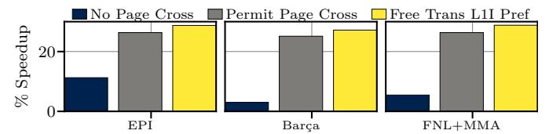

Fig. 2: Geomean speedups when page-cross prefetches are discarded (No Page Cross), page-cross prefetching is permitted (Permit Page Cross), and an optimal scenario forcing sTLB hits for all L1I page-cross prefetches (Free Trans L1I Pref).

*Cross*, where the prefetcher discards requests that cross page boundaries; ii) *Permit Page Cross*, where the prefetcher issues all requests no matter if they cross page boundaries or not; and iii) *Free Translation L1I Prefetching*, where cross-page prefetches missing in sTLB are instantaneously converted in sTLB hits. [Figure 2](#page-2-2) shows the speedups of the different L1I prefetchers and scenarios over the baseline [\(Table I\)](#page-7-1) across a set of 105 server workloads, presented in [Section V.](#page-7-0)

Figure [2](#page-2-2) shows that enabling L1I prefetchers to cross page boundaries (*Permit Page Cross*) consistently outperforms the *No Page Cross* scenario. Moreover, the ideal scenario where L1I page-cross prefetches have no translation cost (*Free Trans L1I Pref*) achieves additional performance gains over the *Permit Page Cross* scenario. This behavior is observed across all evaluated L1I prefetchers. The gap between *Permit Page Cross* and *Free Translation L1I Prefetching* arises because eliminating translation latency improves prefetching timeliness. Therefore, we conclude that, while allowing L1I prefetchers to cross pages significantly boosts performance for server workloads, the address translation overhead limits these benefits. In contrast to prior work showing that data prefetchers crossing pages can help or hurt depending on workload [\[18\]](#page-13-16), our results indicate that L1I page-cross prefetching is mostly beneficial. This is because instruction streams tend to follow sequential and loop-based control flow, making them more predictable than the often irregular patterns of data accesses.

*Finding 1: Allowing L1I prefetchers to cross page boundaries improves performance. Reducing the instruction address translation cost of L1I page-cross prefetching has the potential to provide additional performance gains.*

# *C. Impact of L1I Prefetching on L2C Management*

This section evaluates the potential performance gains of optimizing the management of lines inserted in lower-level caches by L1I prefetches. This study targets the L2C and not the LLC since we found larger headroom to optimize the management of prefetched code lines in L2C. Regarding the L1I prefetchers, we consider the EPI, FNL+MMA, and Barc¸a prefetchers, similar to [Section III-B,](#page-2-0) configured to freely prefetch across page boundaries since [Section III-B](#page-2-0) shows that permitting L1I prefetchers to cross page boundaries improves IPC over the conservative scenario that discards them.

[Figure 3](#page-3-1) evaluates the impact of inserting code lines fetched by L1I prefetches in the L2C by considering two idealized

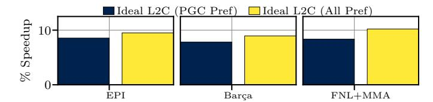

Fig. 3: Geomean speedups of two ideal scenarios forcing L2C hits for lines fetched by i) L1I page-cross prefetches (Ideal L2C (PGC Pref)) and ii) L1I prefetches (Ideal L2C (All Pref)).

scenarios: i) *Ideal L2C (PGC Pref)*, where code lines fetched by page-cross prefetches are not inserted in L2C until a demand L2C access requests them. These entries are instead placed in an infinite buffer located alongside the L2C. When a demand access misses in L2C, we look up that buffer. If we have a hit, we magically insert that line in L2C. This ideal scenario quantifies how much performance can be extracted if code lines fetched by L1I page-cross prefetches incur no L2C pressure. ii) *Ideal L2C (All Pref)*, where code lines fetched by L1I prefetches, both in-page and page-cross, are not inserted in L2C until a demand L2C access requests them. This scenario quantifies the performance if code lines fetched by L1I prefetches incur no L2C pressure. The speedups in Figure 3 are computed over the *Permit Page Cross* version of each considered prefetcher in Figure 2.

Figure 3 shows that the L2C pressure placed by L1I prefetches undermines their potential to improve performance. For example, EPI combined with *Ideal L2C (All Pref)* scenario delivers a 9.5% speedup over the *Permit Page Cross* baseline. The main reason for the performance gap between *Permit Page Cross* and *Ideal L2C (All Pref)* stems from the fact that a large number of prefetched code lines do not serve any demand L2C access. The *Ideal L2C (All Pref)* speedups are higher than the ones delivered by the *Ideal L2C (PGC Pref)* scenario, highlighting that judiciously managing prefetched code lines in L2C can bring higher performance improvements than only improving the management of L2C lines fetched by L1I prefetches that cross page boundaries.

1) Reuse of Prefetched Code Lines: To support our claim that many prefetched code lines exhibit low reuse in L2C—and therefore harm performance—we measure how many demand L2C accesses are served by lines brought into L2C by L1I prefetches across the evaluated server workloads. Figure 4 reports, for all L1I prefetchers as well as the baseline FDiP prefetcher [13], the number of demand L2C accesses served by these prefetched lines. The x-axis groups prefetched L2C code lines by the number of demand accesses they serve, while the y-axis shows the fraction of lines in each group.

Figure 4 shows that all considered L1I prefetchers behave similarly when it comes to serving demand L2C accesses. Focusing on EPI, we observe that, on average, 36.1% of prefetched code lines in the L2C remain unused, *i.e.*, serve no accesses, while 51.6% serve between one and eight accesses. Additionally, 11.5% of these lines handle more than eight accesses while 0.8% of them serve more than 128 accesses during their time in L2C. The main takeaways of this study

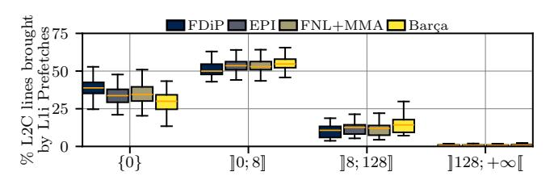

Fig. 4: Breakdown of the number of demand L2C accesses served by code lines fetched in L2C by L1I prefetch requests.

are that i) in many cases, L1I prefetch requests insert deadon-arrival lines in L2C causing pollution (on average 36.1%) and ii) a non-negligible fraction of the L1I prefetch requests bring code lines in L2C that serve a large number of demand L2C accesses, thus being very valuable for performance.

Finding 2: Cache lines fetched in L2C by L1I prefetches show variable behavior, calling for a smart policy that anticipates the reuse of these prefetched code lines.

We do not target the management of code lines fetched in L2C by demand accesses, as our analysis reveals low potential over prior art [6]. Section VI-C shows that exclusively applying our proposal to prefetched code lines yields higher IPC than applying it to both demand and prefetch code lines.

## D. Putting Everything Together

Sections III-B and III-C highlight that contemporary L1I prefetchers deliver good performance gains. However, two factors undermine their potential for delivering outstanding benefits: i) the address translation latency of L1I page-cross prefetches and ii) the low reuse of a large fraction of code lines fetched in L2C by L1I prefetches. Section IV proposes a novel scheme that addresses our analysis findings and improves the performance of any L1I prefetching scheme.

# IV. IP-CAT DESIGN

This section presents Instruction Prefetch Centric Cache and TLB Management (IP-CaT), the first scheme to enhance the benefits of L1I prefetching through coordinated management of the TLB and the cache hierarchy. IP-CaT comprises of two building blocks. First, the Translation Prefetch Buffer (tPB), a small buffer located alongside the sTLB that accommodates instruction page table entries (PTEs) fetched in the TLB hierarchy by L1I page-cross prefetches. tPB is motivated by Finding 1, which shows that while L1I pagecross prefetching can substantially improve the performance of server applications, its benefits are limited by instruction address translation latency. By enabling the reuse of PTEs fetched by the L1I prefetcher, tPB reduces the translation cost of L1I page-cross prefetching. Second, the Trimodal Instruction Prefetch Replacement Policy (TIPRP), a decision-tree L2C replacement policy specialized in the management of lines fetched by L1I prefetches. TIPRP decides, at runtime, whether prefetched code lines in L2C should be retained, prioritized for

eviction, or bypassed, based on their anticipated contribution to performance. The design of TIPRP is motivated by Finding 2, revealing that lines fetched in L2C by L1I prefetches shows variable behavior in terms of reuse; a big fraction of these lines are dead-on-arrival, some experience limited reuse, while a small fraction serves a large number of demand L2C accesses, thus being very critical for performance.

## A. translation Prefetch Buffer (tPB)

The translation Prefetch Buffer (tPB) is a small setassociative structure located alongside the sTLB that stores instruction PTEs fetched in the TLB hierarchy by L1I pagecross prefetches. Each tPB entry stores the virtual page number (vpn) for indexing purposes, the physical page number (ppn), and attribute bits that sTLB entries typically store [15]. Note that tPB is populated only by instruction translation requests originating from L1I page-cross prefetches and not by demand sTLB misses, justified in Section VI-A3. Figure 5 shows the design and operation (in steps) of tPB.

L11 prefetch requests look up the TLB hierarchy (iTLB, sTLB) for the corresponding address translation. If the requested translation misses in both iTLB and sTLB, tPB is queried for possible hits (1) in Figure 5). Upon tPB hits, the hitting tPB entry is inserted into sTLB 2 following the sTLB insertion policy. Also, the hitting tPB entry is invalidated. For L1I prefetches that miss in tPB, a prefetch page table walk is initiated to fetch the corresponding address translation. Translation entries fetched by page walks initiated by the L1I prefetcher are stored in the iTLB and tPB, but not in the sTLB to avoid polluting the sTLB content 3.

Demand instruction TLB accesses that miss in both iTLB and sTLB, are routed to the tPB. When a demand access hits in the tPB, the corresponding entry is inserted into the sTLB according to the sTLB insertion policy, under the assumption of future reuse. The matching tPB entry is then invalidated to free space in its limited storage. Therefore, tPB hits mitigate the address translation performance bottleneck by reducing the number of demand page table walks. Section VI-A1 quantifies the impact of tPB on page walk reduction.

To support tPB's operation while allowing demand data and instruction translation requests to proceed normally, IP-CaT should differentiate between translation requests originating from the L1I page-cross prefetches and the other translation requests. To do so, IP-CaT requires one extra bit per sTLB MSHR entry indicating whether the corresponding translation request originates from an L1I page-cross prefetch request or not, as shown in Figure 5. We refer to this bit as cross-bit (cb). In practice, a new entry including the cb is inserted in the sTLB MSHR every time a translation request originating from an L1I page-cross prefetch misses in sTLB. The cb is set to 1 only for address translation requests coming from the L1I prefetcher and to 0 otherwise. The cb makes it possible to identify translations requested by L1I page-cross prefetches, which will be stored in tPB instead of sTLB (3 in Figure 5) while all the other translations will be stored in the sTLB.

Fig. 5: Organization and operation of tPB.

1) Integrating tPB in sTLB: Section IV-A presents tPB as a standalone structure to make its design and operation more transparent. In practical implementations, tPB can be seamlessly integrated into the sTLB by matching its associativity. Under this design, the sTLB is augmented with additional sets that are logically designated for tPB entries. Section VI-E evaluates multiple tPB design alternatives and demonstrates that integrating tPB into the sTLB achieves performance gains comparable to those of a decoupled sTLB-tPB organization. Beyond simplifying the implementation, this integrated design also reduces the translation coherence overhead associated with a separate tPB structure, presented in Section IV-C.

### B. Trimodal Instruction Prefetch Replacement Policy (TIPRP)

The <u>Trimodal Instruction Prefetch Replacement (TIPRP)</u> is a decision tree-based L2C replacement policy that judiciously manages lines coming from L1I prefetches by anticipating whether these lines will be accessed in the future or not. TIPRP reduces L2C pollution incurred by dead-on-arrival lines fetched by L1I prefetches while maximizing the utilization of prefetched code lines that are critical for performance.

- 1) Building Blocks of TIPRP: Since code lines fetched in L2C by L1I prefetches exhibit variable behavior (Section III-C), TIPRP combines three complementary RRPV-based [19] policies. A decision tree dynamically selects between them, adapting TIPRP to the different execution phases (Section IV-B3). Figure 6 (a) illustrates the design of TIPRP along with its constituent replacement policies:
- <u>Prioritize Instruction Prefetch</u> (PIP). The PIP policy protects lines fetched into L2C by L1I prefetches from being evicted. To select a candidate for eviction, PIP looks for the least recently used line not fetched to L2C by an L1I prefetch request present in the corresponding set. If no such lines are present in the set, PIP evicts the line in LRU position (RRPV = 3). PIP applies the standard SRRIP promotion and insertion policies [19], [41], [45], [46] for all cache lines.

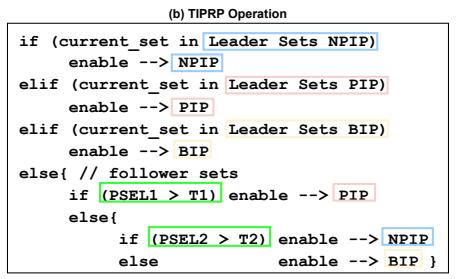

|                    | (c) TIPRP Training        |                           |
|--------------------|---------------------------|---------------------------|
| Leader Set Type | Demand L2C Hit            | L2C Eviction              |
| Leader Sets        | if(pb==0) no update       | if(pb==0) no update       |
| PIP                | if(pb==1) PSEL1++, PSEL2- | if(pb==1) PSEL1, PSEL2    |
| Leader Sets        | if(pb==0) PSEL1, PSEL2++  | if(pb==0) PSEL1++, PSEL2- |
| NPIP               | if(pb==1) no update       | if(pb==1) no update       |
| Leader Sets        | if(pb==0) PSEL1, PSEL2    | if(pb==0) PSEL1++, PSEL2+ |
| BIP                | if(pb==1) no update       | if(pb==1) no update       |

Fig. 6: (a) Overview of TIPRP and the implementation of its adaptive selection logic that dynamically selects between NPIP and PIP policies, (b) TIPRP operation in pseudo-code, and (c) TIPRP training events.

- <u>Non-Prioritize Instruction Prefetch</u> (NPIP). NPIP favors the eviction of lines fetched by L1I prefetches. To do so, NPIP inserts lines fetched in L2C by L1I prefetches at the bottom of the recency stack, in the LRU position (RRPV = 3). NPIP handles eviction and promotion of lines fetched by L1I prefetches in the same way as standard SRRIP [19]. Finally, for all other cache lines types, NPIP applies the same eviction, promotion, and insertion policies as SRRIP [19].
- <u>Bypass Instruction Prefetch</u> (BIP). BIP bypasses, *i.e.*, does not insert, code lines fetched in L2C by L1I prefetches. For other cache lines types, BIP applies the same eviction, promotion, and insertion policies as standard SRRIP [19].
- 2) Insights on the Operation of PIP, NPIP, and BIP: PIP operates at eviction time while NPIP and BIP operate at insertion time. This asymmetry boosts IP-CaT benefits and training efficiency. PIP operates at eviction time to protect lines fetched by L1I prefetches. We found that applying it at insertion time would make it less effective in protecting prefetched code lines. In contrast, NPIP operates at insertion since this policy moderately favors the eviction of lines fetched into L2C by instruction prefetches. Operating at eviction time would bias NPIP too much towards the quick eviction of prefetched code lines. Finally, BIP completely avoids prefetched code lines to be inserted at L2C, thus can only operate at insertion time.
- 3) Dynamically Selecting between PIP, NPIP, and BIP: TIPRP dynamically decides whether PIP, NPIP, or BIP should drive L2C eviction, promotion, and insertion policies. TIPRP goes beyond the monolithic nature of set-dueling [19], [47] by leveraging a two-level decision tree where node-level decisions are driven by saturating counters, as Figure 6 (a) shows. To determine the best policy for a given access, TIPRP uses two saturating counters, named PSEL1 and PSEL2, that monitor the effectiveness of PIP, NPIP, and BIP. TIPRP statically splits the L2C sets into four categories: i) Leader Sets for PIP, i.e., sets statically assigned to use the PIP policy, ii) Leader Sets for NPIP, i.e., sets statically assigned to use the NPIP policy, iii) Leader Sets for BIP, i.e., sets statically assigned to use the BIP policy, and iv) Follower Sets, which use the best policy between PIP, NPIP, and BIP. Empirically, we determine that 10 bits for PSEL1 and PSEL2 and 32/16/16 Leader Sets for PIP/NPIP/BIP are good decisions points. Note that NPIP and BIP use half as many Leader Sets as PIP. Because NPIP and BIP do not prioritize lines fetched in L2C by L1I prefetches,

the two can be seen as a single policy against PIP. Using half Leader Sets for NPIP and BIP compared to PIP ensures fair training and equal probability of selecting policies that either favor or do not favor lines fetched in L2C by L1I prefetches. Figure 6 (a) presents an overview of TIPRP's selection logic.

IP-CaT requires one bit per L2C block to annotate whether a line has been fetched by an L1I prefetch or not. We refer to this bit as *prefetch bit* (pb). This bit makes it possible to update PSEL1 and PSEL2 counters, supporting the dynamic selection between the competing policies. Since pb is commonly present in L2C designs [48]–[50], we assume the availability of pb at L2C, indicating whether a code line was fetched by the L1I prefetcher. For designs lacking this information, Section IV-C explains how IP-CaT propagates pb to L2C.

- TIPRP Operation: Figure 6 (b) uses pseudo code to describe the operation of TIPRP. Upon an L2C access, PIP, NPIP, or BIP drive the replacement for the current access based on whether or not the access belongs to either policy's Leader Sets. If the access belongs to a Follower Set, PSEL1 and PSEL2 select which policy to activate. If PSEL1 is over threshold T1, PIP is selected. Otherwise, PSEL2 is used to make the final selection. If PSEL2 is below threshold T2, BIP is enabled; otherwise NPIP is used for the current access.
- TIPRP Training: Figure 6 (c) shows the training events of TIPRP's selection scheme, *i.e.*, the update of the PSEL1 and PSEL2 counters. While original set-dueling [19] relies on a single counter and updates it only upon evictions, TIPRP updates PSEL1 and PSEL2 upon both L2C hits and L2C evictions while discriminating between cache lines fetched by L1I prefetches and the other lines.

Regarding the PIP training events, if a demand L2C request is served by a Leader Set of PIP, PSEL1 and PSEL2 are updated only when the hitting line has been fetched in L2C by an L1I prefetch (pb=1). In such case, PSEL1 is incremented (positive update), since hitting on L2C lines fetched by L1I prefetches in the PIP Leader Sets indicates that PIP is beneficial for performance. Conversely, evicting L2C lines fetched by L1I prefetches from PIP Leader Sets implies that PIP is not a good replacement policy for the current phase, thus PSEL1 is decremented (negative update), as shown in Figure 6 (c). In both scenarios, PSEL2 is decremented, *i.e.*, we favor BIP over NPIP, since our experiments indicate that, when TIPRP determines that PIP is not useful for the current

Fig. 7: Operation of IP-CaT integrated in a standard microarchitecture.

program phase, it is better to aggressively start with BIP and gradually fall into NPIP if needed.

If a demand L2C request is served by a Leader Set of NPIP, PSEL1 and PSEL2 are updated only when the line that served the access has not been fetched into L2C by an L1I prefetch request (pb=0 in Figure 6 (c)). In this scenario, i) PSEL2 is incremented (positive update), as Figure 6 (c) shows, since a hit on a L2C line not fetched by an L1I prefetch request in the NPIP Leader Sets indicates that NPIP brings benefits and ii) PSEL1 is decremented not to favor the selection of PIP in subsequent accesses since NPIP brings benefits. Conversely, evicting L2C lines not fetched by an L1I prefetch request from NPIP Leader Sets indicates that NPIP is not optimally managing the L2C for the current phase, thus i) PSEL2 is decremented (negative update) to favor BIP over NPIP, i.e., to promote the complete bypass of lines fetched by L1I prefetches and thus increase the L2C storage capacity dedicated to L2C lines not fetched by L1I prefetch requests; and ii) PSEL1 is incremented to favor the selection of PIP for the next accesses. The operation for the Leader Sets of BIP is justified by similar arguments as NPIP.

Training Asymmetry. Accesses to Leader Sets of NPIP and BIP update PSEL1 and PSEL2 only when the line has not been fetched in L2C by an L1I prefetch request (pb=0); when pb=1 no update happens. Similarly, accesses to Leader Sets of PIP update PSEL1 and PSEL2 only when the line has been fetched in L2C by an L1I prefetch request (pb=1). The rationale of this asymmetry is that TIPRP updates PSEL1 and PSEL2 only on events that strongly indicate whether a policy improves or harms performance. For example, upon an L2C eviction of a line not fetched by an L1I prefetch (pb=0) in an NPIP Leader Set, IP-CaT updates PSEL1 to indicate that policies favoring the eviction of prefetched code lines are not producing the desired behavior, thus enabling PIP as it can deliver better performance. Conversely, an L2C eviction of a line fetched by an L1I prefetch (pb=1) in an NPIP Leader Set does not carry much significance to decide whether NPIP should be enabled. We experimentally verify that updating PSEL1 and PSEL2 only on events strongly correlated to the usefulness of the considered policies, as shown in Figure 6 (c), yields 5% higher IPC than updating these counters in all events.

• Insights on the Effectiveness of TIPRP: The placement of PIP, NPIP, and BIP in the decision tree nodes of Figure 6 (a) is crucial for the performance of TIPRP. We empirically determined that placing PIP, NPIP, and BIP within the decision tree nodes in this way allows for favoring transitions from PIP to NPIP, and from NPIP to BIP. This configuration provides the highest performance improvement.

## C. Operation of IP-CaT

Figure 7 shows the complete operation of IP-CaT. Standard microarchitectural structures appear in gray color while the components of IP-CaT are annotated in different color. Since pb is typically present in L2C designs [48]–[50], IP-CaT does not require augmenting each L2C block with additional bits. Figure 7 annotates pb in orange while showing how to propagate it to L2C for completeness.

Upon L1I prefetch requests (for either in-page or pagecross prefetches), the iTLB is looked up for the corresponding address translation a and, upon iTLB misses, the sTLB is accessed **b**. For sTLB accesses that result in a miss, the tPB is looked-up for possible hits **©**. Upon tPB hits, IP-CaT inserts the requested translation in sTLB (Section IV-A). Otherwise, a page walk is triggered to fetch the translation from the page table **d**. At the end of the page walk **e**, the requested translation is stored in i) tPB and iTLB for page walks triggered by L1I page-cross prefetch requests, and ii) iTLB and sTLB for page walks not triggered by L1I pagecross prefetch requests, as explained in Section IV-A. IP-CaT is aware of whether translation requests originate from the L1I prefetcher or not since the sTLB MSHR stores the cb bit, as described in Section IV-A and Figure 7. Note both sTLB and tPB are looked up for potential hits upon requests for instruction translations, as explained in Section IV-A.

After address translation, the physical address is known and memory requests lookup the L2C upon first-level cache misses ①. Section IV-B explains how TIPRP drives the L2C insertion, promotion, and eviction policies. IP-CaT decides to enable NPIP, PIP, or BIP ⑤ by taking into account the PSEL1 and PSEL2 values, as described in Section IV-B. IP-

| Component      | Description                                                                                     |  |
|----------------|-------------------------------------------------------------------------------------------------|--|
| CPU Core       | 1- and 4-core system, 4GHz, 128-entry FTQ, 352-entry ROB,                                       |  |
|                | 6-wide issue                                                                                    |  |
|                | TAGE-SC-L [51], [52], 8K-entry BTB, 64-entry RAS                                                |  |
| L1I TLB (iTLB) | 64-entry, 4-way, 1cc, 8-entry MSHR, LRU                                                         |  |
|                | 64-entry, 4-way, 1cc, 8-entry MSHR, LRU                                                         |  |
|                | 1536-entry, 12-way, 8cc, 16-entry MSHR, LRU                                                     |  |
| Page Structure | 4-level Split PSC, parallel search, 1cc.                                                        |  |
| Caches (PSCs)  | L5: 1-entry, L4: 2-entry, L3: 8-entry, L2: 32-entry                                             |  |
| L1I Cache      | 32KB, 8-way, 4cc, 8-entry MSHR, LRU, EPI [1] / Barça [3] /                                      |  |
|                | FNL+MMA [2]                                                                                     |  |
| L1D Cache      | 48KB, 12-way, 5cc, 16-entry MSHR, LRU, Berti [53]                                               |  |
| L2 Cache       | 1MB, 16-way, 10cc, 32-entry MSHR, LRU                                                           |  |
| LLC            | 1.375MB per core, 11-way, 36cc, 64-entry MSHR, SHiP [29]                                        |  |
| DRAM           | 4GB/core, 25.6GB/s, 1 channel/core, t RP =t RCD =t CAS =12.5ns |  |

TABLE I: Baseline System Configuration.

CaT requires keeping pb in the L1I and L2C MSHRs (2,3) to propagate pb to the L2C 4 for designs lacking this feature.

- Storage Overhead. IP-CaT's storage overhead depends on the sTLB MSHR size of the underline microarchitecture. Considering the system described in Section V, IP-CaT requires 0.79KB to be implemented (6452b for a 64-entry tPB, 16b for sTLB MSHR cb bits, 10b for PSEL1, and 10b for PSEL2). This is just 0.08% of the L2C capacity. The energy impact of IP-CaT is negligible due to this minimal storage overhead.
- TLB Shootdowns and Translation Coherence. IP-CaT does not introduce any translation coherence issue as the tPB component can be resembled as an extra TLB level or can be incorporated into the sTLB. The only requirement is to include tPB in the TLB shootdown process. Section IV-A1 describes that tPB can be seamlessly integrated in the sTLB, minimizing its translation coherence overheads. Section VI-E evaluates different tPB configurations suitable for sTLB integration.
- Wrong-Path Execution. IP-CaT handles wrong-path requests implicitly, like conventional replacement policies that are agnostic to path correctness. While such requests may cause pollution or bring useful data, making replacement policies wrong-path aware is a promising direction for future work, e.g., via branch prediction hints or a dedicated predictor using commit-stage information.

## V. EXPERIMENTAL METHODOLOGY

We evaluate IP-CaT using ChampSim [54], [55], a detailed trace-based simulator of an out-of-order processor with a three-level cache hierarchy [53], and a decoupled frontend [56] with FDIP [13]. We consider 5-level radix tree page table, an x86 hardware page table walker [44], and MMU Caches [57]. Table I details our baseline system configuration, similar to an Intel Cascade Lake microarchitecture [58], [59].

Simulated Page Sizes. Our evaluation considers two scenarios: i) the system uses only 4KB pages (Section VI-A, Section VI-C) and ii) the system uses both 4KB pages and 2MB pages (Section VI-G) [17], [60]. Considering 4KB pages is relevant as large pages require memory contiguity and defragmentation, which cannot be guaranteed in servers due to their large uptimes [9], [60]–[62].

Single-Core Workloads. We use a set of server workloads with large code footprints, including workloads provided by Qualcomm [63], [64] and other established server workloads (NodeApp, PHPWiki, TPCC, Twitter, Wikipedia, Kafka,

| Technique              | L2C      | LLC        | STLB     | tPB |
|------------------------|----------|------------|----------|-----|
| Baseline               | LRU      | SHiP       | LRU      | n/a |
| CHiRP [5]              | LRU      | SHiP       | CHiRP    | n/a |
| Morrigan [4]           | LRU      | SHiP       | Morrigan | n/a |
| CLIP [20]              | CLIP     | SHiP       | LRU      | n/a |
| EMISSARY [6]           | EMISSARY | SHiP       | LRU      | n/a |
| PACIPV [22]            | LRU      | PACIPV     | LRU      | n/a |
| PACMAN [21]            | LRU      | PACMAN     | LRU      | n/a |
| SRRIP (L2C) [24]       | SRRIP    | SHiP       | LRU      | n/a |
| DRRIP [24]             | LRU      | DRRIP      | LRU      | n/a |
| SHiP++ [7]             | LRU      | SHiP++     | LRU      | n/a |
| Mockingjay [8]         | LRU      | Mockingjay | LRU      | n/a |
| TIPRP (Sec. IV-B)      | TIPRP    | SHiP       | LRU      | n/a |
| tPB (Sec. IV-A)        | LRU      | SHiP       | LRU      | LRU |
| tPB + CHiRP            | LRU      | SHiP       | CHiRP    | LRU |
| tPB + CLIP             | CLIP     | SHiP       | LRU      | LRU |
| tPB + EMISSARY         | EMISSARY | SHiP       | LRU      | LRU |
| tPB + PACIPV           | LRU      | PACIPV     | LRU      | LRU |
| tPB + PACMAN           | LRU      | PACMAN     | LRU      | LRU |
| tPB + SRRIP (L2C) [24] | SRRIP    | SHiP       | LRU      | LRU |
| tPB + DRRIP            | LRU      | DRRIP      | LRU      | LRU |
| tPB + SHiP++           | LRU      | SHiP++     | LRU      | LRU |
| tPB + Mockingjay       | LRU      | Mockingjay | LRU      | LRU |
| IP-CaT (tPB + TIPRP)   | TIPRP    | SHiP       | LRU      | LRU |

TABLE II: List and composition of all simulated designs.

Spring, Tomcat, Chirper, HTTP), used in recent literature [5], [42], [60], [65], [66]. We consider only workloads exhibiting at least 0.5 instruction sTLB MPKI, resulting in a total of 105 single-core server workloads. After a warm-up phase of 50M instructions, simulations execute 100M instructions to collect experimental results [5], [60].

Multi-Core Workloads. We create both homogeneous and heterogeneous 4-core mixes using the single-core server workloads [30], [33], [34], [59], [67], [68]. For the homogeneous mixes, we run four instances of each workload, one per core. For the heterogeneous mixes, we randomly combine four single-core workloads. In total, we consider 60 homogeneous and 100 heterogeneous mixes. The multi-core experiments use the same warm-up and simulation lengths as the single-core evalaution, with each workload running on its own core until at least one completes both phases [69]. We report the weighted speedup normalized to the baseline to avoid performance overestimation due to high-IPC threads [17], [33], [70]. For each single-core workload, we compute its IPC in a multicore scenario shared with the other co-running single-core workloads ( $IPC_{shared}$ ), and its IPC running alone on the same system  $(IPC_{single})$ . We then compute the weighted IPC of the mix as the weighted sum of  $IPC_{shared}/IPC_{single}$  for all the benchmarks in the mix and we normalize this weighted IPC with the weighted IPC of the baseline.

*SMT Evaluation.* To evaluate IP-CaT under SMT colocation, we extend ChampSim with SMT support. We construct 75 randomly selected workload pairs from the pool of single-core workloads to capture a diverse range of interference scenarios. For consistency, we use the same warmup and simulation lengths as in the single-core experiments. Section VI-I presents the SMT evaluation.

Evaluated Policies. We evaluate ten state-of-the-art cache and TLB management policies: CHiRP [5], Morrigan [4], CLIP [20], EMISSARY [6], PACIPV [22], PACMAN [21], SRRIP [24], DRRIP [24], SHIP++ [7], and Mockingjay [8]. Table II lists these policies and the cache where they are applied following the standard practices. We also evaluate

Fig. 8: Evaluation considering either EPI (top), Barça (middle), or FNL+MMA (bottom) as L1I prefetcher.

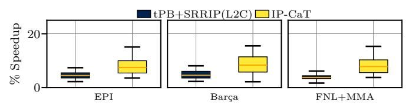

Fig. 9: Performance of IP-CaT and tPB+SRRIP (best-performing policy of Fig. 8) across 788 workloads without the MPKI selection of Section V.

the TIPRP replacement (Section IV-B) in isolation as well as combining tPB (Section IV-A) with all state-of-the-art policies; we exclude tPB+Morrigan due to poor performance.

# VI. EVALUATION

To demonstrate the effectiveness of IP-CaT, we evaluate three state-of-the-art L1I prefetchers: EPI [1], Barça [3], and FNL+MMA [2]. All are configured to prefetch across page boundaries, as Section III-B shows that it provides significant performance gains. Across the studies server workloads, these prefetchers exhibit both high accuracy and coverage: EPI achieves 74.1% accuracy and 85.8% coverage, FNL+MMA 72.9% and 85.0%, and Barça 67.7% and 83.7%. Evaluating with such strong L1I prefetchers avoids overstating IP-CaT 's benefits, which could otherwise be inflated by low-accuracy or low-coverage prefetch engines.

#### A. Single-Core Performance Evaluation

This section compares the single-core performance of all schemes in Table II. Figure 8 reports results using EPI, Barça, and FNL+MMA as L1I prefetchers. The x-axis lists the evaluated schemes and the y-axis shows the speedups over the baseline (Table I). Each scheme is represented with a box plot, showing the distribution of speedups across the 105 server workloads, with a red bar indicating the geometric mean.

Regarding the TIPRP component of IP-CaT, we observe that it delivers 2.9%, 4.8%, and 5.0% geomean speedups across the

Fig. 10: L2C, LLC, and STLB MPKIs across all prefetchers.

EPI, Barça, and FNL+MMA prefetchers, outperforming the state-of-the-art cache and replacement policies. We observe such behavior because TIPRP tailors the insertion, promotion, and eviction policies of prefetched code lines in L2C to the underlying execution phase, as explained in Section IV-B.

IP-CaT (tPB combined with TIPRP) improves the performance of EPI, Barça, and FNL+MMA by 6.1%, 8.3% and 7.9% across the EPI, Barça, and FNL+MMA prefetchers, outperforming CHiRP, Morrigan, CLIP, EMISSARY, PACIPV, PACMAN, DRRIP, SHiP++, and Mockingjay across all L1I prefetchers even when these schemes are combined with tPB. IP-CaT's benefits stem from the fact that TIPRP optimizes the management of prefetched code lines in L2C while tPB serves a significant number of demand sTLB misses while improving the timeliness of L1I prefetching, as Section VI-A1 shows.

Non TLB Intensive Workloads. To highlight that IP-CaT does not harm the performance of non TLB intensive applications, we evaluate all server workloads provided by Qualcomm [63], [64] without the sTLB MPKI selection of Section V. For this study, we compare IP-CaT to the best-performing policy of Figure 8: tPB+SRRIP. Figure 9 shows the performance of tPB+SRRIP and IP-CaT across all L1I prefetchers. For EPI, IP-CaT outperforms tPB+SRRIP by 2.9% in geomean, indicating the benefits of our proposal. The trends for FNL+MMA and Barça are similar.

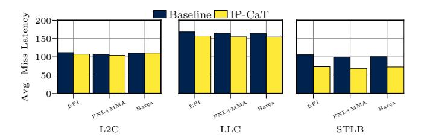

Fig. 11: L2C, LLC, and STLB average miss latency.

1) Performance Analysis: To explain IP-CaT's superior performance, Figure 10 and Figure 11 show its impact on MPKI and average miss latency, respectively, for the L2C, the LLC (excluding misses due to address translations), and the sTLB. We observe that the impact of IP-CaT on the cache and TLB hierarchy is twofold: i) TIPRP reduces the number of LLC misses for all L1I prefetchers, while slightly increasing the L2C misses for EPI and FNL+MMA and simultaneously achieving a significant reduction in the average miss latency for L2C, LLC, and sTLB. The MPKI reduction primarily arises from better management of lines brought in the L2C by L1i prefetch requests and a decrease in traffic due to page walks. At L2C, TIPRP increases instruction MPKI by 6.5%, 5.1%, and -8.1% for EPI, Barça, and FNL+MMA, respectively while reducing the average miss latency by 3.8%, 2.3%, and -0.5%, respectively; ii) tPB substantially reduces both sTLB MPKI and the average miss latency by more effectively managing address translation entries brought in by L1I pagecrossing prefetches. We observe that the sTLB MPKI, defined as the number of accesses that miss in both the sTLB and the tPB, is reduced by 31.6%, 18.2%, and 32.3% for EPI, FNL+MMA, and Barça, respectively. This reduction occurs because a substantial fraction of demand sTLB misses are served by tPB. This reduction in sTLB MPKI also decreases the pressure that sTLB misses put on the cache hierarchy, therefore L2C and LLC average miss latencies experience reductions (Figure 11).

Fig. 12: Comparison against L2C variants of the state-of-theart replacement policies.

2) Comparison with L2C Variants of Prior Policies: This section compares TIPRP and IP-CaT with the state-of-the-art policies of Table II which are originally designed for the LLC (Mockingjay, PACIPV, SHiP++, SRRIP, and DRRIP), now applied to L2C. We exclude PACMAN from this study due to its inferior performance. Figure 12 presents the performance comparison, showing that IP-CaT provides higher speedups than the competing policies owing to the TIPRP and tPB schemes that optimize the management of prefetched code

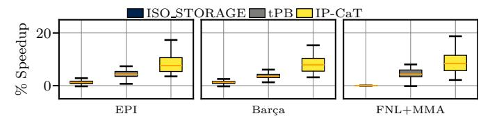

Fig. 13: Comparing IP-CaT against an augmented sTLB.

lines and code translations in L2C and sTLB, respectively. For example, when EPI is used, IP-CaT outperforms Mockingjay, PACIPV, SHiP++, SRRIP, and DRRIP by 8.0%, 3.0%, 5.3%, 4.4%, and 3.6%, respectively.

3) ISO Storage Comparison: Figure 13 compares tPB and IP-CaT with a scenario that augments the sTLB with IP-CaT's storage overhead. This is done by adding one way to the sTLB, providing 128 extra sTLB entries as opposed to tPB's 64 entries (Section IV-C). The results of Figure 13 show that tPB and IP-CaT outperforms this ISO\_Storage scenario across all considered L1I prefetchers.

| Table Groups    | T0  | T1-T2 | T3-T10 | T11-T15 | Total |
|-----------------|-----|-------|--------|---------|-------|
| Entries         | 4K  | 4K    | 4K     | 2K      | 14K   |
| Tag bits        | 0   | 9     | 13     | 15      |       |
| U bits          | 0   | 1     | 1      | 1       |       |
| bits per entry  | 27  | 37    | 41     | 43      |       |
| Storage (KBits) | 108 | 148   | 164    | 86      | 506   |

TABLE III: Configuration of the ITTAGE's prediction tables.

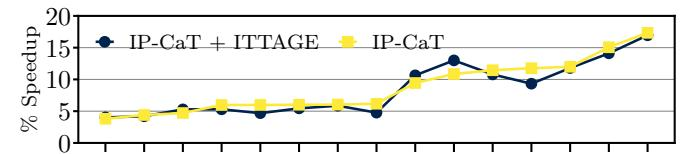

Fig. 14: Evaluation of IP-CaT considering a baseline with TAGE-SC-L, and a scenario using TAGE-SC-L with ITTAGE.

#### B. Impact of Indirect Branch Target Prediction

Our baseline uses TAGE-SC-L as conditional branch predictor. This section evaluates IP-CaT with and without the state-of-the-art indirect branch predictor ITTAGE [71] to quantify its impact on the performance of our proposal. We consider two configurations: i) the branch prediction unit (BPU) of the baseline uses only TAGE-SC-L, as in prior sections, and ii) the BPU of the baseline uses both TAGE-SC-L and ITTAGE. The ITTAGE configuration is detailed in Table III.

Figure 14 shows the performance of IP-CaT across 15 representative server workloads under both configurations. The results are nearly identical, with a maximum IPC variation of 2.4%. The competing policies of Table II exhibit similar trends in both setups, thus incorporating ITTAGE in the baseline does not reduce the benefits of IP-CaT.

## C. Ablation Study of IP-CaT Components

This section quantifies the contribution of each IP-CaT component. We evaluate: i) tPB; ii) NPIP, iii) BIP, iv) PIP, and v) TIPRP as standalone L2C replacement policies; vi) SRRIP since NPIP, BIP, and PIP are based on it, and vii) IP-CaT, which combines tPB and TIPRP. Figure 15 reports the results. With the EPI prefetcher, tPB, NPIP, BIP, PIP,

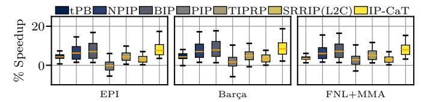

Fig. 15: Performance breakdown of IP-CaT.

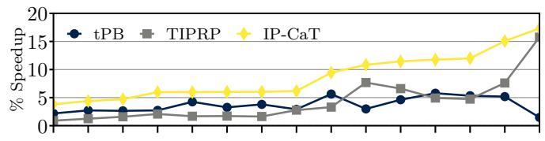

Fig. 16: Comparison between tPB, TIPRP, and IP-CaT considering the EPI prefetcher across representative workloads.

TIPRP, SRRIP, and IP-CaT achieve 2.9%, 4.8%, 5.5%, -1.5%, 2.9%, 1.7%, and 6.1% geomean speedups, respectively. Notably, IP-CaT outperforms the sum of its components (tPB + TIPRP = 5.8%), reaching 6.1%. This gain comes from the synergy between tPB and TIPRP: since page walks access the L2C, tPB reduces the number of page walks, lowering L2C contention and increasing the effectiveness of TIPRP. Figure 16 corroborates this across 15 representative server workloads (same as the ones used in Figure 14). In particular, tPB reduces L2C MPKI by 3.6% due to the reduction in page walks, enabling larger gains for TIPRP. We observe similar trends with Barça and FNL+MMA prefetchers.

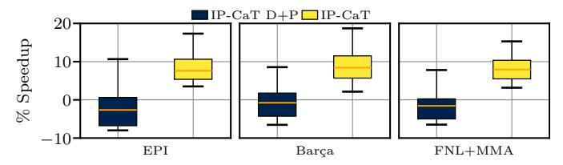

Fig. 17: Comparison to a variation of IP-CaT applying TIPRP to both demand and prefetch code lines in L2C (IP-CaT D+P).

1) Applying TIPRP to Demand Instruction Accesses: Figure 17 compares IP-CaT to a variation of IP-CaT that applies the TIPRP replacement policy not only to lines fetched by L1I prefetches but also to demand instruction accesses; we refer to this scheme as IP-CaT D+P. Figure 17 shows that, when considering the EPI prefetcher, IP-CaT outperforms (in geomean) IP-CaT D+P by 10.1%. This study indicates that applying TIPRP to both prefetch and demand instruction requests harms performance since cache lines fetched by demand instruction accesses show different reuse patterns compared to lines fetched by instruction prefetches.

## D. Sensitivity to tPB Size and Organization

Figure 18 presents a sensitivity analysis of the tPB size in terms of hit rate. In this analysis the tPB is a fully associative standalone structure with capacities ranging from 8 to 128 entries. For the EPI prefetcher the tPB hit rate monotonically increases from 3.1% to 48.3% when its size grows from 8 to 128 entries. We observe similar trends for the other

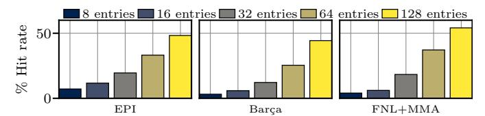

Fig. 18: Sensitivity to tPB size, assuming fully-associative tPB.

Fig. 19: Sensitivity analysis on the associativity of a 64 entries tPB, varying from fully-associative to direct-mapped.

prefetchers. Based on this trade-off, we select a 64-entry tPB as it represents a practical design point between coverage and hardware complexity; unless otherwise stated, all results presented in the paper use this 64-entry tPB.

Figure 19 presents a sensitivity study of tPB's hit rate as we vary its organization from fully associative to direct-mapped, while keeping the total number of entries fixed at 64. For the EPI L1i prefetcher, the tPB hit rate decreases from 37.2% to 28.0% when moving from a fully associative to a direct-mapped organization. Notably, we observe that the difference in hit rate between the fully-associative, 32-way, and 16-way organizations of tPB is rather small. Although in this paper we consider the fully-associative design as our primary tPB design, the design comprising 4 sets and 16 ways performs similarly and may constitute more practical configuration.

#### E. Integrating tPB in sTLB

This section evaluates two variations of IP-CaT involving a tPB with the same number of ways as the sTLB. Section IV-A1 describes how a tPB with the same number of ways as the sTLB can be seamlessly integrated into it. Specifically, we consider two designs which augment the sTLB with 4 and 8 additional sets of 12 ways each, respectively. For completeness, we also show the fully-associative design which decoupled tPB from sTLB, presented in all previous sections. Figure 20 shows the hit rates of the scenarios which integrate tPB in the sTLB as well as the hit rate of the standalone fullyassociative tPB. The latter exhibits a 36.2% hit rate whereas the two sections of the augmented sTLB exhibit 25.6% and 41.6% hit rate when augmenting the sTLB with 4 and 8 sets dedicated to tPB, respectively. These differences in terms of tPB hit rates across the three designs do not translate into significant IP-CaT performance differences.

## F. Sensitivity to LLC size

Figure 21 presents a sensitivity analysis of IP-CaT performance as the LLC capacity is varied from 1MB to 4MB. With a 1MB LLC, IP-CaT achieves a geometric mean speedup of 12.7% for the EPI prefetcher, while the speedup reduces to 2.6% with a 4MB LLC. The main takeaway is that even with

Fig. 20: Comparing IP-CaT with a 64-entry fully-associative tPB against augmenting sTLB by 4 and 8 sets of 12 ways.

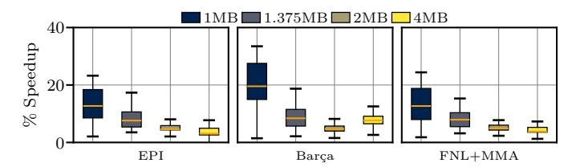

Fig. 21: Sensitivity of IP-CaT's performance to the LLC size.

larger LLCs (e.g., 4MB), IP-CaT continues to provide significant performance improvements. Similar trends are observed for the FNL+MMA and Barc¸a.

An additional observation from [Figure 21](#page-11-3) is that the performance gains of IP-CaT gradually decrease as the LLC size increases across all evaluated L1I prefetchers. This happens because large LLCs can capture a greater portion of application working sets, thereby improving cache locality and reducing miss rates, which in turn makes the L2C replacement policy less critical for performance. Consequently, the relative contribution of TIPRP on IP-CaT speedups becomes less pronounced, resulting in smaller performance improvements.

# *G. Multiple Page Sizes*

[Figure 22](#page-11-4) shows the performance improvement of all considered scenarios [\(Table II\)](#page-7-2), excluding PACMAN due to inferior performance, when the baseline uses both 4KB and 2MB pages, as explained in [Section V.](#page-7-0) The top, medium, and bottom plots show results for EPI, Barc¸a, and FNL+MMA, respectively. The x-axis reports the proportion of the memory footprint mapped in large pages as compared to small pages (*e.g.*, 5% refers to a scenario where 5% of the memory footprint is mapped in 2MB pages; the remaining 95% is mapped to 4KB pages). The y-axis shows the geomean speedups over the baseline for each multi-size page scenario.

We observe that IP-CaT consistently outperforms all stateof-the-art approaches for all multi-page size scenarios and L1I prefetchers. For example, with the EPI prefetcher, the geomean speedup of IP-CaT goes from 7.5% to 1.8% as the proportion of the memory footprint mapped to 2MB pages increases from 0% to 100%. The best state-of-the-art scheme moves from 4.5% to -0.4% as the footprint mapped into 2MB pages goes from 0% to 100%. tPB alone does not provide any benefit when the entire memory footprint is mapped in 2MB pages since the number of page-cross prefetch requests missing in the sTLB is minimal in this scenario. Overall, the benefits of IP-CaT (and all competing approaches) diminish as a larger fraction of code and data is mapped to 2 MB pages, since

Fig. 22: Evaluation on multiple page sizes.

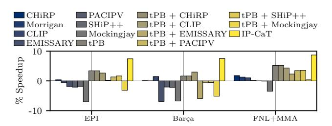

Fig. 23: Performance evaluation in 4-core context.

using 2MB pages reduces STLB misses. Nevertheless, even when the entire code and data footprint 2MB pages, IP-CaT still achieves a non-negligible 1.8% speedup over the baseline.

# *H. Multi-Core Evaluation*

This section quantifies the performance of IP-CaT in multicore contexts. [Figure 23](#page-11-5) presents the speedups of IP-CaT and the other schemes listed in [Table II](#page-7-2) over a 4-core baseline across 160 workload mixes, presented in [Section V.](#page-7-0) [Figure 23](#page-11-5) reveals that IP-CaT outperforms all competing schemes across all considered L1I prefetchers. For the EPI prefetcher, IP-CaT outperforms CHiRP, Morrigan, CLIP, EMISSARY, PACIPV, SHiP++, and Mockingjay by 7.2%, 6.8%, 7.8%, 9.1%, 9.3%, 9.0%, and 14.2%, respectively. Although combining tPB with the state-of-the-art schemes improves performance, combining tPB with TIPRP, i.e. IP-CaT, delivers the best performance in the multi-core context.

# *I. SMT Evaluation*

[Figure 24](#page-12-0) quantifies the performance of IP-CaT and the other prefetch-aware schemes considering 75 SMT workloads,

Fig. 24: Performance evaluation using SMT workloads.

presented in [Section V.](#page-7-0) We observe that IP-CaT outperforms all competing schemes across all considered prefetchers. The results show similar trends as in the single-thread evaluation, but with larger absolute speedups due to increased contention for structures such as the sTLB and L2C. For example, when considering the EPI, IP-CaT outperforms CLIP, PACIPV, and PACMAN by 7.1%, 9.3%, and 10.3%, respectively.

# VII. RELATED WORK

*Cache Management and Set Dueling.* IP-CaT extends beyond the monolithic behavior of traditional set-dueling–based policies like BIP and DIP [\[19\]](#page-13-17), as Section [IV-B3](#page-5-0) explains. While these approaches use a global counter and update it only on evictions, TIPRP employs a two-level decision tree in which node-level decisions are driven by saturating counters. This structure enables finer-grained adaptation of replacement decisions. In addition, TIPRP updates its control counters on both L2C hits and evictions, rather than only on evictions, allowing it to react more quickly to workload behavior. By also distinguishing between lines brought by L1I prefetches and other lines, the policy captures differences in line utility that traditional set-dueling policies overlook.

*Page-Cross Prefetching.* Prior art [\[18\]](#page-13-16) reveals that pagecrossing for data is seldom beneficial across different applications types and access patterns. Our work shows that when state-of-the-art L1I prefetchers cross page boundaries, the vast majority of the corresponding prefetches are accurate. This difference stems from the fact that instruction accesses typically follow sequential and loop-based control flow patterns, leading to highly predictable streams, while data access patterns are often hard to predict (*e.g.*, pointer chasing) [\[72\]](#page-15-9), [\[73\]](#page-15-10).

*Translation Prefetching.* Previously proposed TLB prefetchers [\[65\]](#page-15-2), [\[74\]](#page-15-11), [\[74\]](#page-15-11)–[\[78\]](#page-15-12) typically use buffers to store the prefetched translations to avoid sTLB pollution. The tPB component of IP-CaT is orthogonal to sTLB prefetching since it is populated only by instruction translation requests originating from L1I page-cross prefetches and does not trigger additional sTLB prefetches. Our evaluation shows that IP-CaT outperforms the state-of-the-art instruction sTLB prefetcher [\[4\]](#page-13-3).

*TLB Management.* POM-TLB [\[79\]](#page-15-13) uses a large die-stacked TLB to reduce number of page walks. Victima [\[80\]](#page-15-14) uses a part of L2C as L3 TLB to store evicted sTLB data entries. DVMT [\[81\]](#page-15-15) allows the application to define the page table format to reduce the page walk overhead. Elnawawy et al. [\[82\]](#page-15-16) pins in the sTLB highly used data PTEs. Our work is orthogonal to these approaches since tPB stores only translations fetched by L1I page-cross prefetches.

*Cooperative TLB and Cache Policies.* Chasapis et al. [\[60\]](#page-14-19) combines an sTLB replacement policy (iTP) that maximizes the number of instruction hits in the sTLB at the expense of increasing the number of data page walks with an L2C policy (xPTP) that accelerates data page walks by giving higher priority to data translations lines in L2C over the other line types. IP-CaT is orthogonal to [\[60\]](#page-14-19) as it accelerates L1I pagecross prefetching by storing speculatively fetched, by the L1I prefetcher, PTEs in tPB and optimizes the management of lines fetched in L2C by L1I prefetches without applying any specialized management for translation lines. Combining iTP and tPB at the sTLB and xPTP and TIPRP at L2C while using a smart selection scheme has great potential.

*Code Layout Optimizations.* Profile-guided techniques such as BOLT [\[10\]](#page-13-9) and Codestitcher [\[83\]](#page-15-17) improve instruction locality by reordering functions and basic blocks to reduce Icache and TLB pressure. Compile-time approaches [\[84\]](#page-15-18), [\[85\]](#page-15-19) place hot code in huge pages, while OS-level schemes use superpages [\[86\]](#page-15-20), [\[87\]](#page-15-21) via promotion or page table sharing to reduce translation overhead. Recency-based TLB preloading [\[88\]](#page-15-22) predicts future accesses from past PTE reuse. These methods primarily reduce code footprint or rely on software/OS changes. IP-CaT is a microarchitectural solution that requires no changes to page tables or software and remains complementary to code layout optimizations, addressing translation and caching limitations that persist even after the application of code layout optimizations.

# VIII. CONCLUSIONS

This work demonstrates that the address translation latency of L1I prefetches that cross page boundaries and the variable behavior of lines fetched in L2C by L1I prefetches undermines the benefits of modern L1I prefetchers. To address these limitations, this work proposes *Instruction Prefetch Centric Cache and TLB Management (IP-CaT)*, the first microarchitectural scheme to orchestrate TLB and cache management to maximize the benefits of L1I prefetching for applications with large code footprints. Our evaluation shows that IP-CaT significantly enhances the performance of state-of-theart L1I prefetchers and outperforms leading TLB and cache management policies across 105 single-core and 160 multicore server workloads, with only 0.79KB of storage overhead.

# ACKNOWLEDGMENT

Alexandre Valentin Jamet acknowledges his AI4S fellowship within the "Generacion D" initiative by Red.es, Ministerio ´ para la Transformacion Digital y de la Funci ´ on P ´ ublica, for ´ talent attraction (C005/24-ED CV1), funded by NextGenerationEU through PRTR. This work has received funding from 'Future of Computing, a Barcelona Supercomputing Center and IBM initiative' (2023). It has been partially supported by the project PID2023-146511NB-I00 funded by the Spanish Ministry of Science, Innovation and Universities MCIU /AEI /10.13039/501100011033 and EU ERDF.

# REFERENCES

- [1] A. Ros and A. Jimborean, "A Cost-Effective Entangling Prefetcher for Instructions," in *Proceedings of the 48th International Symposium on Computer Architecture*, ser. ISCA '21, 2021, pp. 99–111. [Online]. Available: <https://doi.org/10.1109/ISCA52012.2021.00017>
- [2] A. Seznec, "The FNL+MMA Instruction Cache Prefetcher," [https://hal.](https://hal.inria.fr/hal-02884880/document) [inria.fr/hal-02884880/document.](https://hal.inria.fr/hal-02884880/document)
- [3] P. Gratz, D. A. Jimenez, N. Gober, and G. Chacon, "Barca: Branch- ´ agnostic region searching algorithm," in *Proceedings of the First Instruction Prefetching Championship (IPC)*, 2020.
- [4] G. Vavouliotis, L. Alvarez, B. Grot, D. Jimenez, and M. Casas, ´ "Morrigan: A Composite Instruction TLB Prefetcher," in *Proceedings of the 54th International Symposium on Microarchitecture*, ser. MICRO '21. New York, NY, USA: Association for Computing Machinery, 2021, p. 1138–1153. [Online]. Available: [https://doi.org/10.](https://doi.org/10.1145/3466752.3480049) [1145/3466752.3480049](https://doi.org/10.1145/3466752.3480049)
- [5] S. Mirbagher-Ajorpaz, E. Garza, G. Pokam, and D. A. Jimenez, ´ "CHiRP: Control-Flow History Reuse Prediction," in *Proceedings of the 2020 53rd International Symposium on Microarchitecture*, ser. MICRO '16, 2020, pp. 131–145. [Online]. Available: [https:](https://doi.org/10.1109/MICRO50266.2020.00023) [//doi.org/10.1109/MICRO50266.2020.00023](https://doi.org/10.1109/MICRO50266.2020.00023)
- [6] N. P. Nagendra, B. R. Godala, I. Chaturvedi, A. Patel, S. Kanev, T. Moseley, J. Stark, G. A. Pokam, S. Campanoni, and D. I. August, "Emissary: Enhanced miss awareness replacement policy for l2 instruction caching," in *Proceedings of the 50th Annual International Symposium on Computer Architecture*, ser. ISCA '23. New York, NY, USA: Association for Computing Machinery, 2023. [Online]. Available: <https://doi.org/10.1145/3579371.3589097>
- [7] V. Young, C.-C. Chou, A. Jaleel, and M. K. Qureshi, "SHiP++: Enhancing Signature-Based Hit Predictor for Improved Cache Performance," in *2nd Cache Replacement Championship (CRC-2), in conjunction with ISCA 2017*, Jun. 2017. [Online]. Available: [https://crc2.ece.tamu.edu/?page](https://crc2.ece.tamu.edu/?page_id=53) id=53
- [8] I. Shah, A. Jain, and C. Lin, "Effective mimicry of belady's min policy," in *2022 IEEE International Symposium on High-Performance Computer Architecture (HPCA)*, April 2022, pp. 558–572. [Online]. Available: <https://doi.org/10.1109/HPCA53966.2022.00048>
- [9] N. P. Nagendra, G. Ayers, D. I. August, H. K. Cho, S. Kanev, C. Kozyrakis, T. Krishnamurthy, H. Litz, T. Moseley, and P. Ranganathan, "AsmDB: Understanding and Mitigating Front-End Stalls in Warehouse-Scale Computers," *IEEE Micro*, vol. 40, no. 3, pp. 56–63, 2020. [Online]. Available: <https://doi.org/10.1145/3307650.3322234>
- [10] M. Panchenko, R. Auler, B. Nell, and G. Ottoni, "BOLT: A Practical Binary Optimizer for Data Centers and Beyond," in *Proceedings of the 2019 International Symposium on Code Generation and Optimization*, ser. CGO '19. IEEE Press, 2019, pp. 2–14. [Online]. Available: <https://doi.org/10.1109/CGO.2019.8661201>
- [11] "Hot Chips 2023: Arm's Neoverse V2," [https://chipsandcheese.com/](https://chipsandcheese.com/2023/09/11/hot-chips-2023-arms-neoverse-v2/) [2023/09/11/hot-chips-2023-arms-neoverse-v2/.](https://chipsandcheese.com/2023/09/11/hot-chips-2023-arms-neoverse-v2/)
- [12] M. Ferdman, A. Adileh, O. Kocberber, S. Volos, M. Alisafaee, D. Jevdjic, C. Kaynak, A. D. Popescu, A. Ailamaki, and B. Falsafi, "Clearing the Clouds: A Study of Emerging Scale-out Workloads on Modern Hardware," in *Proceedings of the 17th International Conference on Architectural Support for Programming Languages and Operating Systems*, ser. ASPLOS '12. New York, NY, USA: ACM, 2012, pp. 37– 48. [Online]. Available: <http://doi.acm.org/10.1145/2150976.2150982>
- [13] G. Reinman, B. Calder, and T. Austin, "Fetch Directed Instruction Prefetching," in *Proceedings of the 32nd International Symposium on Microarchitecture*, ser. MICRO '99, 1999, pp. 16–27. [Online]. Available: <https://doi.org/10.1109/MICRO.1999.809439>
- [14] A. Basu, M. D. Hill, and M. M. Swift, "Reducing Memory Reference Energy with Opportunistic Virtual Caching," in *Proceedings of the 39th International Symposium on Computer Architecture*, ser. ISCA '12, 2012, pp. 297–308. [Online]. Available: [https:](https://doi.org/10.1109/ISCA.2012.6237026) [//doi.org/10.1109/ISCA.2012.6237026](https://doi.org/10.1109/ISCA.2012.6237026)
- [15] Abhishek Bhattacharjee, "Advanced Concepts on Address Translation, Appendix L in "Computer Architecture: A Quantitative Approach" by Hennessy and Patterson," [http://www.cs.yale.edu/homes/abhishek/](http://www.cs.yale.edu/homes/abhishek/abhishek-appendix-l.pdf) [abhishek-appendix-l.pdf.](http://www.cs.yale.edu/homes/abhishek/abhishek-appendix-l.pdf)
- [16] "ARM Cortex-A55 Core Technical Reference Manual r1p0," [https://developer.arm.com/documentation/100442/0100/functional](https://developer.arm.com/documentation/100442/0100/functional-description/level-1-memory-system/data-prefetching?lang=en)[description/level-1-memory-system/data-prefetching?lang=en.](https://developer.arm.com/documentation/100442/0100/functional-description/level-1-memory-system/data-prefetching?lang=en)

- [17] G. Vavouliotis, G. Chacon, L. Alvarez, P. V. Gratz, D. A. Jimenez, and M. Casas, "Page Size Aware Cache Prefetching," in ´ *Proceedings of the 55th International Symposium on Microarchitecture*, ser. MICRO '22, 2022, pp. 956–974. [Online]. Available: [https:](https://doi.org/10.1109/MICRO56248.2022.00070) [//doi.org/10.1109/MICRO56248.2022.00070](https://doi.org/10.1109/MICRO56248.2022.00070)
- [18] G. Vavouliotis, M. Torrents, B. Grot, K. Kalaitzidis, L. Peled, and M. Casas, "To cross, or not to cross pages for prefetching?" in *2025 IEEE International Symposium on High Performance Computer Architecture (HPCA)*, March 2025, pp. 188–203. [Online]. Available: <https://doi.org/10.1109/HPCA61900.2025.00025>
- [19] M. K. Qureshi, A. Jaleel, Y. N. Patt, S. C. Steely, and J. Emer, "Adaptive insertion policies for high performance caching," in *Proceedings of the 34th Annual International Symposium on Computer Architecture*, ser. ISCA '07. New York, NY, USA: Association for Computing Machinery, 2007, p. 381–391. [Online]. Available: <https://doi.org/10.1145/1250662.1250709>
- [20] A. Jaleel, J. Nuzman, A. Moga, S. C. Steely, and J. Emer, "High performing cache hierarchies for server workloads: Relaxing inclusion to capture the latency benefits of exclusive caches," in *2015 IEEE 21st International Symposium on High Performance Computer Architecture (HPCA)*, 2015, pp. 343–353. [Online]. Available: <https://doi.org/10.1109/HPCA.2015.7056045>
- [21] C.-J. Wu, A. Jaleel, M. Martonosi, S. C. Steely, and J. Emer, "Pacman: Prefetch-aware cache management for high performance caching," in *2011 44th Annual IEEE/ACM International Symposium on Microarchitecture (MICRO)*, 2011, pp. 442–453. [Online]. Available: <https://doi.org/10.1145/2155620.215567>
- [22] S. Mostofi, S. Gupta, A. Hassani, K. Tibrewala, E. Teran, P. V. Gratz, and D. A. Jimenez, "Light-weight cache replacement for instruction ´ heavy workloads," in *Proceedings of the 52nd Annual International Symposium on Computer Architecture*, ser. ISCA '25. New York, NY, USA: Association for Computing Machinery, 2025, p. 1005–1019. [Online]. Available: <https://doi.org/10.1145/3695053.3730993>
- [23] H. Gao and C. Wilkerson, "A Dueling Segmented LRU Replacement Algorithm with Adaptive Bypassing," in *1st JILP Workshop on Computer Architecture Competitions (JWAC-1): Cache Replacement Championship*, Jun. 2010. [Online]. Available: [https://jilp.org/jwac-](https://jilp.org/jwac-1/online/papers/005_gao.pdf)[1/online/papers/005](https://jilp.org/jwac-1/online/papers/005_gao.pdf) gao.pdf
- [24] A. Jaleel, K. B. Theobald, S. C. Steely, and J. Emer, "High performance cache replacement using re-reference interval prediction (rrip)," in *Proceedings of the 37th Annual International Symposium on Computer Architecture*, ser. ISCA '10. New York, NY, USA: Association for Computing Machinery, 2010, p. 60–71. [Online]. Available: <https://doi.org/10.1145/1815961.1815971>
- [25] D. Lee, J. Choi, J.-H. Kim, S. H. Noh, S. L. Min, Y. Cho, and C. S. Kim, "On the existence of a spectrum of policies that subsumes the least recently used (lru) and least frequently used (lfu) policies," in *Proceedings of the 1999 ACM SIGMETRICS International Conference on Measurement and Modeling of Computer Systems*, ser. SIGMETRICS '99. New York, NY, USA: Association for Computing Machinery, 1999, p. 134–143. [Online]. Available: <https://doi.org/10.1145/301453.301487>
- [26] E. J. O'Neil, P. E. O'Neil, and G. Weikum, "The lru-k page replacement algorithm for database disk buffering," in *Proceedings of the 1993 ACM SIGMOD International Conference on Management of Data*, ser. SIGMOD '93. New York, NY, USA: Association for Computing Machinery, 1993, p. 297–306. [Online]. Available: <https://doi.org/10.1145/170035.170081>
- [27] R. Subramanian, Y. Smaragdakis, and G. H. Loh, "Adaptive caches: Effective shaping of cache behavior to workloads," in *2006 39th Annual IEEE/ACM International Symposium on Microarchitecture (MICRO'06)*, Dec 2006, pp. 385–396. [Online]. Available: [https:](https://doi.org/10.1109/MICRO.2006.7) [//doi.org/10.1109/MICRO.2006.7](https://doi.org/10.1109/MICRO.2006.7)
- [28] W. Wong and J.-L. Baer, "Modified lru policies for improving second-level cache behavior," in *Proceedings Sixth International Symposium on High-Performance Computer Architecture. HPCA-6 (Cat. No.PR00550)*, 2000, pp. 49–60. [Online]. Available: [https:](https://doi.org/10.1109/HPCA.2000.824338) [//doi.org/10.1109/HPCA.2000.824338](https://doi.org/10.1109/HPCA.2000.824338)
- [29] C.-J. Wu, A. Jaleel, W. Hasenplaugh, M. Martonosi, S. C. Steely, and J. Emer, "Ship: signature-based hit predictor for high performance caching," in *Proceedings of the 44th Annual IEEE/ACM International Symposium on Microarchitecture*, ser. MICRO-44. New York, NY, USA: Association for Computing Machinery, 2011, p. 430–441. [Online]. Available: <https://doi.org/10.1145/2155620.2155671>

- [30] D. A. Jimenez and E. Teran, "Multiperspective Reuse Prediction," in ´ *Proceedings of the 50th International Symposium on Microarchitecture*, ser. MICRO '17. New York, NY, USA: Association for Computing Machinery, 2017, p. 436–448. [Online]. Available: [https://doi.org/10.](https://doi.org/10.1145/3123939.3123942) [1145/3123939.3123942](https://doi.org/10.1145/3123939.3123942)
- [31] E. Teran, Z. Wang, and D. A. Jimenez, "Perceptron learning for reuse ´ prediction," in *2016 49th Annual IEEE/ACM International Symposium on Microarchitecture (MICRO)*. IEEE, 2016, pp. 1–12. [Online]. Available: <https://doi.org/10.1109/MICRO.2016.7783705>
- [32] S. M. Khan, Y. Tian, and D. A. Jimenez, "Sampling dead block ´ prediction for last-level caches," in *2010 43rd Annual IEEE/ACM International Symposium on Microarchitecture*, Dec 2010, pp. 175–186. [Online]. Available: <https://doi.org/10.1109/MICRO.2010.24>
- [33] Z. Shi, X. Huang, A. Jain, and C. Lin, "Applying deep learning to the cache replacement problem," in *Proceedings of the 52nd Annual IEEE/ACM International Symposium on Microarchitecture*, ser. MICRO '52. New York, NY, USA: Association for Computing Machinery, 2019, p. 413–425. [Online]. Available: [https://doi.org/10.1145/3352460.](https://doi.org/10.1145/3352460.3358319) [3358319](https://doi.org/10.1145/3352460.3358319)
- [34] A. Jain and C. Lin, "Back to the future: Leveraging belady's algorithm for improved cache replacement," in *2016 ACM/IEEE 43rd Annual International Symposium on Computer Architecture (ISCA)*, 2016, pp. 78–89. [Online]. Available: <https://doi.org/10.1109/ISCA.2016.17>
- [35] N. Duong, D. Zhao, T. Kim, R. Cammarota, M. Valero, and A. V. Veidenbaum, "Improving cache management policies using dynamic reuse distances," in *Proceedings of the 2012 45th Annual IEEE/ACM International Symposium on Microarchitecture*, ser. MICRO-45. USA: IEEE Computer Society, 2012, p. 389–400. [Online]. Available: <https://doi.org/10.1109/MICRO.2012.43>
- [36] Z. Hu, S. Kaxiras, and M. Martonosi, "Timekeeping in the memory system: Predicting and optimizing memory behavior," in *Proceedings of the 29th Annual International Symposium on Computer Architecture*, ser. ISCA '02. USA: IEEE Computer Society, 2002, p. 209–220. [Online]. Available: <https://doi.org/10.1145/545214.545239>
- [37] G. Keramidas, P. Petoumenos, and S. Kaxiras, "Cache replacement based on reuse-distance prediction," in *2007 25th International Conference on Computer Design*, 2007, pp. 245–250. [Online]. Available: <https://doi.org/10.1109/ICCD.2007.4601909>
- [38] M. Kharbutli and Y. Solihin, "Counter-based cache replacement and bypassing algorithms," *IEEE Transactions on Computers*, vol. 57, no. 4, pp. 433–447, 2008. [Online]. Available: [https://doi.org/10.1109/](https://doi.org/10.1109/TC.2007.70816) [TC.2007.70816](https://doi.org/10.1109/TC.2007.70816)
- [39] H. Liu, M. Ferdman, J. Huh, and D. Burger, "Cache bursts: A new approach for eliminating dead blocks and increasing cache efficiency," in *2008 41st IEEE/ACM International Symposium on Microarchitecture*, Nov 2008, pp. 222–233. [Online]. Available: <https://doi.org/10.1109/MICRO.2008.4771793>
- [40] P. Faldu and B. Grot, "Leeway: Addressing variability in dead-block prediction for last-level caches," in *2017 26th International Conference on Parallel Architectures and Compilation Techniques (PACT)*, 2017, pp. 180–193. [Online]. Available: <https://doi.org/10.1109/PACT.2017.32>
- [41] D. A. Jimenez, "Insertion and promotion for tree-based pseudolru ´ last-level caches," in *Proceedings of the 46th Annual IEEE/ACM International Symposium on Microarchitecture*, ser. MICRO-46. New York, NY, USA: Association for Computing Machinery, 2013, p. 284–296. [Online]. Available: <https://doi.org/10.1145/2540708.2540733>
- [42] D. Schall, A. Sandberg, and B. Grot, "The last-level branch predictor," in *2024 57th IEEE/ACM International Symposium on Microarchitecture (MICRO)*, 2024, pp. 464–479. [Online]. Available: <https://doi.org/10.1109/MICRO61859.2024.00042>
- [43] S. Kanev, J. P. Darago, K. Hazelwood, P. Ranganathan, T. Moseley, G.-Y. Wei, and D. Brooks, "Profiling a Warehouse-scale Computer," in *Proceedings of the 42nd International Symposium on Computer Architecture*, ser. ISCA '15. New York, NY, USA: ACM, 2015, pp. 158– 169. [Online]. Available: <http://doi.acm.org/10.1145/2749469.2750392>
- [44] J. Doweck, W.-F. Kao, A. K.-y. Lu, J. Mandelblat, A. Rahatekar, L. Rappoport, E. Rotem, A. Yasin, and A. Yoaz, "Inside 6thgeneration intel core: New microarchitecture code-named skylake," *IEEE Micro*, vol. 37, no. 2, pp. 52–62, 2017. [Online]. Available: <https://doi.org/10.1109/MM.2017.38>
- [45] K. Kedzierski, M. Moreto, F. J. Cazorla, and M. Valero, "Adapting cache partitioning algorithms to pseudo-lru replacement policies," in *2010 IEEE International Symposium on Parallel & Distributed*

- *Processing (IPDPS)*, 2010, pp. 1–12. [Online]. Available: [https:](https://doi.org/10.1109/IPDPS.2010.5470352) [//doi.org/10.1109/IPDPS.2010.5470352](https://doi.org/10.1109/IPDPS.2010.5470352)
- [46] W.-T. T. Chen, P. P. Liu, and K. C. Stelzer, "Implementation of a pseudo-LRU algorithm in a partitioned cache," US Patent US7 069 390B2, jun, 2006. [Online]. Available: [https://patents.google.](https://patents.google.com/patent/US7069390B2/en) [com/patent/US7069390B2/en](https://patents.google.com/patent/US7069390B2/en)
- [47] D. Patsidis and G. Vavouliotis, "Context-aware set dueling for dynamic policy arbitration," *IEEE Computer Architecture Letters*, vol. 24, no. 2, pp. 301–304, 2025. [Online]. Available: [https:](https://doi.org/10.1109/LCA.2025.3617159) [//doi.org/10.1109/LCA.2025.3617159](https://doi.org/10.1109/LCA.2025.3617159)
- [48] Advanced Micro Devices, Inc., "Processing metadata, policies, and composite tags (prefetch flag in cache tag)," U.S. Patent US11 635 960B2, 2023, describes a metadata flag in cache tags used to track or prevent prefetching into caches. [Online]. Available: <https://patents.google.com/patent/US11635960B2>
- [49] *Intel*® *64 and IA-32 Architectures Software Developer's Manual, Volume 3 (System Programming Guide)*, Intel Corporation, 2023, section 19.10, "Performance Monitoring Events for Intel® Core™ Processors." Available: [https://software.intel.com/content/www/us/en/develop/](https://software.intel.com/content/www/us/en/develop/articles/intel-sdm.html) [articles/intel-sdm.html.](https://software.intel.com/content/www/us/en/develop/articles/intel-sdm.html)
- [50] *PL310 L2 Cache Controller Technical Reference Manual*, Arm Ltd., 2010, section 3.3.6, "Prefetch Control Register." Available: [https://](https://developer.arm.com/documentation/ddi0246/c/) [developer.arm.com/documentation/ddi0246/c/.](https://developer.arm.com/documentation/ddi0246/c/)
- [51] A. Seznec and P. Michaud, "A case for (partially) tagged geometric history length branch prediction," *Journal of Instruction-Level Parallelism*, vol. 8, 2006, special issue on Branch Prediction. [Online]. Available: <http://www.jilp.org/vol8/v8paper1.pdf>
- [52] A. Seznec, "A new case for the tage branch predictor," in *Proceedings of the 44th Annual IEEE/ACM International Symposium on Microarchitecture*, ser. MICRO-44. New York, NY, USA: Association for Computing Machinery, 2011, p. 117–127. [Online]. Available: <https://doi.org/10.1145/2155620.2155635>
- [53] A. Navarro-Torres, B. Panda, J. Alastruey-Benede, P. Ib ´ a´nez, ˜ V. Vinals-Y ˜ ufera, and A. Ros, "Berti: an accurate local-delta data ´ prefetcher," in *Proceedings of the 55th International Symposium on Microarchitecture*, ser. MICRO '22, 2022, pp. 975–991. [Online]. Available: <https://doi.org/10.1109/MICRO56248.2022.00072>
- [54] "ChampSim," [https://crc2.ece.tamu.edu/,](https://crc2.ece.tamu.edu/) accessed: 17-04-2024.
- [55] N. Gober, G. Chacon, L. Wang, P. V. Gratz, D. A. Jimenez, E. Teran, S. Pugsley, and J. Kim, "The championship simulator: Architectural simulation for education and competition," 2022. [Online]. Available: <https://arxiv.org/abs/2210.14324>
- [56] Y. Ishii, J. Lee, K. Nathella, and D. Sunwoo, "Re-establishing fetch-directed instruction prefetching: An industry perspective," in *2021 IEEE International Symposium on Performance Analysis of Systems and Software (ISPASS)*, 2021, pp. 172–182. [Online]. Available: <https://doi.org/10.1109/ISPASS51385.2021.00034>
- [57] D. A. Patterson and J. L. Hennessy, *Computer Architecture: A Quantitative Approach*. San Francisco, CA, USA: Morgan Kaufmann Publishers Inc., 1990.
- [58] Cascade lake - microarchitectures - intel - WikiChip. [Online]. Available: [https://en.wikichip.org/wiki/intel/microarchitectures/cascade](https://en.wikichip.org/wiki/intel/microarchitectures/cascade_lake#Memory_Hierarchy) [lake#Memory](https://en.wikichip.org/wiki/intel/microarchitectures/cascade_lake#Memory_Hierarchy) Hierarchy
- [59] A. V. Jamet, G. Vavouliotis, D. A. Jimenez, L. Alvarez, and M. Casas, ´ "A two level neural approach combining off-chip prediction with adaptive prefetch filtering," in *2024 IEEE International Symposium on High-Performance Computer Architecture (HPCA)*, 2024, pp. 528–542. [Online]. Available: <https://doi.org/10.1109/HPCA57654.2024.00046>
- [60] D. Chasapis, G. Vavouliotis, D. A. Jimenez, and M. Casas, ´ "Instruction-aware cooperative tlb and cache replacement policies," in *Proceedings of the 30th ACM International Conference on Architectural Support for Programming Languages and Operating Systems, Volume 1*, ser. ASPLOS '25. New York, NY, USA: Association for Computing Machinery, 2025, p. 619–636. [Online]. Available: <https://doi.org/10.1145/3669940.3707247>
- [61] A. Hunter, C. Kennelly, P. Turner, D. Gove, T. Moseley, and P. Ranganathan, "Beyond malloc Efficiency to Fleet Efficiency: a Hugepage-aware Memory Allocator," in *Proceedings of the 15th USENIX Symposium on Operating Systems Design and Implementation*, ser. OSDI '21. USENIX Association, jul 2021, pp. 257–273. [Online]. Available: [https://www.usenix.org/conference/](https://www.usenix.org/conference/osdi21/presentation/hunter) [osdi21/presentation/hunter](https://www.usenix.org/conference/osdi21/presentation/hunter)
- [62] Z. Yan, D. Lustig, D. Nellans, and A. Bhattacharjee, "Translation Ranger: Operating System Support for Contiguity-Aware TLBs,"

- in *Proceedings of the 46th International Symposium on Computer Architecture*, ser. ISCA '19. New York, NY, USA: Association for Computing Machinery, 2019, pp. 698–710. [Online]. Available: <https://doi.org/10.1145/3307650.3322223>
- [63] "Championship Value Prediction (CVP)," [https://www.microarch.org/](https://www.microarch.org/cvp1/) [cvp1/,](https://www.microarch.org/cvp1/) accessed: 17-04-2024.
- [64] "The 1st Instruction Prefetching Championship," [https://research.ece.](https://research.ece.ncsu.edu/ipc/) [ncsu.edu/ipc/,](https://research.ece.ncsu.edu/ipc/) accessed: 17-04-2024.
- [65] G. Vavouliotis, L. Alvarez, V. Karakostas, K. Nikas, N. Koziris, D. A. Jimenez, and M. Casas, "Exploiting page table locality for agile tlb ´ prefetching," in *2021 ACM/IEEE 48th Annual International Symposium on Computer Architecture (ISCA)*, 2021, pp. 85–98. [Online]. Available: <https://doi.org/10.1109/ISCA52012.2021.00016>
- [66] S. Song, T. A. Khan, S. M. Shahri, A. Sriraman, N. K. Soundararajan, S. Subramoney, D. A. Jimenez, H. Litz, and B. Kasikci, "Thermometer: ´ profile-guided btb replacement for data center applications," in *Proceedings of the 49th Annual International Symposium on Computer Architecture*, ser. ISCA '22. New York, NY, USA: Association for Computing Machinery, 2022, p. 742–756. [Online]. Available: <https://doi.org/10.1145/3470496.3527430>
- [67] R. Bera, K. Kanellopoulos, S. Balachandran, D. Novo, A. Olgun, M. Sadrosadat, and O. Mutlu, "Hermes: Accelerating long-latency load requests via perceptron-based off-chip load prediction," in *2022 55th IEEE/ACM International Symposium on Microarchitecture (MICRO)*, Oct 2022, pp. 1–18. [Online]. Available: [https://doi.org/10.1109/](https://doi.org/10.1109/MICRO56248.2022.00015) [MICRO56248.2022.00015](https://doi.org/10.1109/MICRO56248.2022.00015)
- [68] A. V. Jamet, G. Vavouliotis, D. A. Jimenez, L. Alvarez, and ´ M. Casas, "Practically tackling memory bottlenecks of graphprocessing workloads," in *2024 IEEE International Parallel and Distributed Processing Symposium (IPDPS)*, 2024, pp. 1034–1045. [Online]. Available: <https://doi.org/10.1109/IPDPS57955.2024.00096>
- [69] A. N. Jacobvitz, A. D. Hilton, and D. J. Sorin, "Multi-program benchmark definition," in *2015 IEEE International Symposium on Performance Analysis of Systems and Software (ISPASS)*, March 2015, pp. 72–82. [Online]. Available: [https://doi.org/10.1109/ISPASS.2015.](https://doi.org/10.1109/ISPASS.2015.7095786) [7095786](https://doi.org/10.1109/ISPASS.2015.7095786)
- [70] D. A. Jimenez and E. Teran, "Multiperspective reuse prediction," ´ in *2017 50th Annual IEEE/ACM International Symposium on Microarchitecture (MICRO)*, ser. MICRO-50 '17, IEEE. New York, NY, USA: Association for Computing Machinery, 2017, pp. 436–448. [Online]. Available: <https://doi.org/10.1145/3123939.3123942>
- [71] A. Seznec, "A 64-Kbytes ITTAGE indirect branch predictor," in *JWAC-2: Championship Branch Prediction*. San Jose, United States: JILP, Jun 2011. [Online]. Available: <https://inria.hal.science/hal-00639041>
- [72] G. Gerogiannis and J. Torrellas, "Micro-armed bandit: Lightweight & reusable reinforcement learning for microarchitecture decision-making," in *Proceedings of the 56th Annual IEEE/ACM International Symposium on Microarchitecture*, ser. MICRO '23. New York, NY, USA: Association for Computing Machinery, 2023, p. 698–713. [Online]. Available: <https://doi.org/10.1145/3613424.3623780>
- [73] C. Block, G. Gerogiannis, and J. Torrellas, "Micro-mama: Multi-agent reinforcement learning for multicore prefetching," in *Proceedings of the 58th IEEE/ACM International Symposium on Microarchitecture*, ser. MICRO '25. New York, NY, USA: Association for Computing Machinery, 2025, p. 884–898. [Online]. Available: [https://doi.org/10.](https://doi.org/10.1145/3725843.3756096) [1145/3725843.3756096](https://doi.org/10.1145/3725843.3756096)
- [74] G. B. Kandiraju and A. Sivasubramaniam, "Going the Distance for TLB Prefetching: An Application-driven Study," in *Proceedings of the 29th International Symposium on Computer Architecture*, ser. ISCA '02. Washington, DC, USA: IEEE Computer Society, 2002, pp. 195–206. [Online]. Available: <http://dl.acm.org/citation.cfm?id=545215.545237>
- [75] B. Pham, J. Vesely, G. H. Loh, and A. Bhattacharjee, "Large Pages ´ and Lightweight Memory Management in Virtualized Environments: Can You Have It Both Ways?" in *Proceedings of the 48th International Symposium on Microarchitecture*, ser. MICRO '15. New York, NY, USA: ACM, 2015, pp. 1–12. [Online]. Available: <http://doi.acm.org/10.1145/2830772.2830773>
- [76] J.-L. Baer and T.-F. Chen, "Effective Hardware-Based Data Prefetching for High-Performance Processors," *IEEE Trans. Comput.*, vol. 44, no. 5, pp. 609–623, may 1995. [Online]. Available: [https://doi.org/10.](https://doi.org/10.1109/12.381947) [1109/12.381947](https://doi.org/10.1109/12.381947)
- [77] G. Vavouliotis, L. Alvarez, and M. Casas, "Pushing the envelope on free tlb prefetching," Barcelona Supercomputing Center (BSC) and Universitat Politecnica de Catalunya (UPC), Tech. Rep., 2021. `

- [Online]. Available: [https://upcommons.upc.edu/entities/publication/](https://upcommons.upc.edu/entities/publication/198eaf18-44e5-4ed3-8bfa-bd2f3e96e154) [198eaf18-44e5-4ed3-8bfa-bd2f3e96e154](https://upcommons.upc.edu/entities/publication/198eaf18-44e5-4ed3-8bfa-bd2f3e96e154)
- [78] G. Vavouliotis, "Advanced hardware prefetching in virtual memory systems," Ph.D. dissertation, Universitat Politecnica de Catalunya ` (UPC), 2023. [Online]. Available: [https://upcommons.upc.edu/entities/](https://upcommons.upc.edu/entities/publication/f16d637b-ad15-4f69-b830-3471b7f2fb84) [publication/f16d637b-ad15-4f69-b830-3471b7f2fb84](https://upcommons.upc.edu/entities/publication/f16d637b-ad15-4f69-b830-3471b7f2fb84)
- [79] J. H. Ryoo, N. Gulur, S. Song, and L. K. John, "Rethinking TLB Designs in Virtualized Environments: A Very Large Part-of-Memory TLB," in *Proceedings of the 44th International Symposium on Computer Architecture*, ser. ISCA '17. New York, NY, USA: ACM, 2017, pp. 469– 480. [Online]. Available: <http://doi.acm.org/10.1145/3079856.3080210>
- [80] K. Kanellopoulos, H. C. Nam, N. Bostanci, R. Bera, M. Sadrosadati, R. Kumar, D. B. Bartolini, and O. Mutlu, "Victima: Drastically increasing address translation reach by leveraging underutilized cache resources," in *Proceedings of the 56th Annual IEEE/ACM International Symposium on Microarchitecture*, ser. MICRO '23. New York, NY, USA: Association for Computing Machinery, 2023, p. 1178–1195. [Online]. Available: <https://doi.org/10.1145/3613424.3614276>
- [81] H. Alam, T. Zhang, M. Erez, and Y. Etsion, "Do-It-Yourself Virtual Memory Translation," in *Proceedings of the 44th International Symposium on Computer Architecture*, ser. ISCA '17. New York, NY, USA: ACM, 2017, pp. 457–468. [Online]. Available: [http:](http://doi.acm.org/10.1145/3079856.3080209) [//doi.acm.org/10.1145/3079856.3080209](http://doi.acm.org/10.1145/3079856.3080209)
- [82] H. Elnawawy, R. B. R. Chowdhury, A. Awad, and G. T. Byrd, "Diligent TLBs: A Mechanism for Exploiting Heterogeneity in TLB Miss Behavior," in *Proceedings of the International Conference on Supercomputing*, ser. ICS '19. New York, NY, USA: Association for Computing Machinery, 2019, p. 195–205. [Online]. Available: <https://doi-org.recursos.biblioteca.upc.edu/10.1145/3330345.3330363>
- [83] R. Lavaee, J. Criswell, and C. Ding, "Codestitcher: inter-procedural basic block layout optimization," in *Proceedings of the 28th International Conference on Compiler Construction*, ser. CC 2019. New York, NY, USA: Association for Computing Machinery, 2019, p. 65–75. [Online]. Available: <https://doi.org/10.1145/3302516.3307358>
- [84] G. Ottoni and B. Maher, "Optimizing function placement for largescale data-center applications," in *Proceedings of the 2017 International Symposium on Code Generation and Optimization*, ser. CGO '17. IEEE Press, 2017, p. 233–244.
- [85] K. Doshi and J. Tran, "Using Hugetlbfs for Mapping Application Text Regions," 01 2006.
- [86] Y. Kwon, H. Yu, S. Peter, C. J. Rossbach, and E. Witchel, "Coordinated and efficient huge page management with ingens," in *12th USENIX Symposium on Operating Systems Design and Implementation (OSDI 16)*. Savannah, GA: USENIX Association, nov 2016, pp. 705–721. [Online]. Available: [https://www.usenix.org/](https://www.usenix.org/conference/osdi16/technical-sessions/presentation/kwon) [conference/osdi16/technical-sessions/presentation/kwon](https://www.usenix.org/conference/osdi16/technical-sessions/presentation/kwon)
- [87] X. Dong, S. Dwarkadas, and A. L. Cox, "Shared address translation revisited," in *Proceedings of the 11th European Conference on Computer Systems*, ser. EuroSys '16. New York, NY, USA: Association for Computing Machinery, 2016. [Online]. Available: <https://doi.org/10.1145/2901318.2901327>
- [88] A. Saulsbury, F. Dahlgren, and P. Stenstrom, "Recency-based TLB ¨ Preloading," in *Proceedings of the 27th International Symposium on Computer Architecture*, ser. ISCA '00. New York, NY, USA: ACM, 2000, pp. 117–127. [Online]. Available: [http://doi.acm.org/10.1145/](http://doi.acm.org/10.1145/339647.339666) [339647.339666](http://doi.acm.org/10.1145/339647.339666)