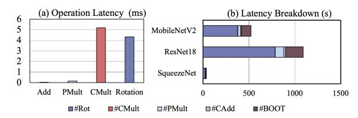
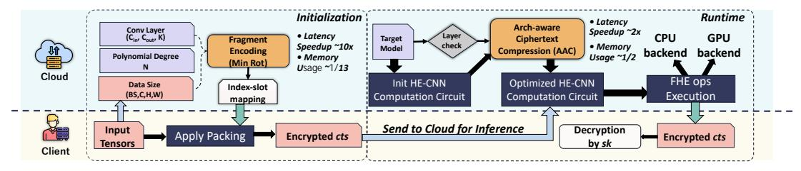
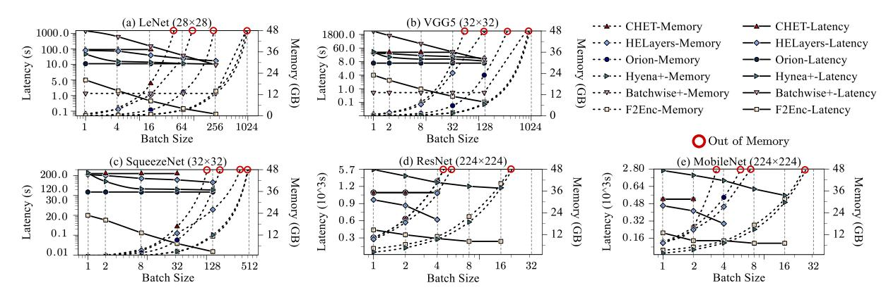
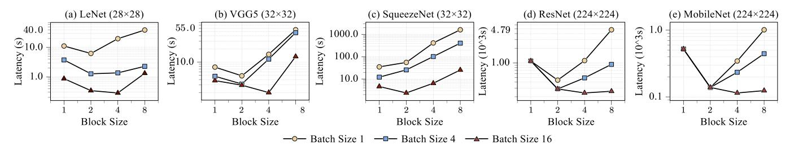
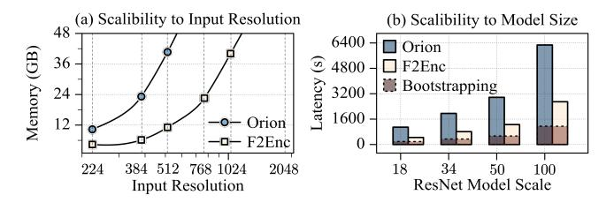

# FEnc2: Unifying Data Packing for Efficient Private Inference via Convolution and Architecture-Aware Fragment Encoding

Ran Ran1, Zhaoting Gong1, Nuo Xu2, Yuanchao Xu3, Fan Yao4, and Wujie Wen1

1North Carolina State University

2University of Minnesota

3University of California, Santa Cruz

4University of Central Florida

1{rran, zgong6, wwen2}@ncsu.edu

2xu001536@umn.edu, 3yxu314@ucsc.edu, 4fan.yao@ucf.edu

Abstract—Fully Homomorphic Encryption (FHE) enables privacy-preserving machine learning but incurs extreme computational and memory overhead. These costs stem not only from slow low-level primitives such as Number Theoretic Transform (NTT), rotation, and key-switching, but also from inefficient ciphertext packing at the application level. Existing packing strategies typically preserve either neighboring data elements or feature-grouping information, but not both, leading to wasted ciphertext slots, excessive rotations, and inflated ciphertext counts. We propose  $FEnc^2$ , a unified and principled fragment-based encoding framework that optimizes slot utilization, rotation complexity, and ciphertext density for CKKS-based private convolutional neural network inference. Rather than applying static or layer-isolated heuristics, FEnc2 introduces (1) Conv-aware Encoding, which analytically selects an optimal fragment (block) size to decouple spatial dependencies and jointly minimize inner-outer rotations across layers, and (2) Arch-aware Ct Compression, which dynamically restores ciphertext density after feature- or channelreduction layers. Together, these transformations reshape encrypted workload structure, reducing homomorphic operations by one to two orders of magnitude. With full memory capacity utilized (i.e., at maximum batch size), FEnc2 achieves end-toend latency speedups over the state-of-the-art Orion of up to  $228.83 \times (\tilde{G}P\tilde{U})$  and  $226.06 \times (CPU)$  for LeNet (MNIST), and up to  $4.55 \times$  (GPU) and  $9.43 \times$  (CPU) for MobileNet (ImageNet). Importantly,  $FEnc^2$  is hardware-agnostic but architecturally transformative: by optimizing encrypted tensor layout before execution, it reduces ciphertext count and workload pressure on hardware, complementing primitive-level optimizations (e.g., NTT/keyswitch accelerators). This demonstrates that applicationlevel data layout is a first-order architectural design dimension for encrypted inference and a critical enabler for next-generation FHE systems.

Index Terms—CKKS, Data Encoding, Fully Homomorphic Encryption, Hardware Acceleration, Private Machine Learning.

# I. INTRODUCTION

Deep Neural Networks (DNNs) underpin a wide range of modern computer vision tasks, including image classification and object detection [46]. Machine Learning as a Service (MLaaS) platforms (e.g., Amazon SageMaker [1], Google AI Platform [9], Azure ML [3], and OpenAI [2]) enable scalable deployment of such models, but raise significant privacy concerns when sensitive data is processed in untrusted cloud. Fully Homomorphic Encryption (FHE) [10], [12], [13], [22] enables computation directly over encrypted data, providing a foundation for privacy-preserving machine learning.

Despite its promise, encrypted convolutional neural network (CNN) inference remains orders of magnitude slower than its plaintext counterpart, even on modern GPUs and HE accelerators. For instance, Orion, the state-of-the-art HE

inference system [18], takes more than 300 seconds to infer one single encrypted CIFAR-10 image on an Intel Xeon-based server, which represents orders of magnitude slower than plaintext inference. The bottleneck arises not only from the inherent latency of HE primitives, e.g., rotation, key-switching, and number-theoretic transforms (NTT), but also from the *volume and structure* of these operations, which depend on how activations are packed into ciphertexts across layers (i.e., ciphertext packing). By packing scalar values into the vector slots of a single ciphertext, it enables Single Instruction Multiple Data (SIMD)-style HE operations such as SIMD additions and SIMD multiplications, amortizing the high cost of HE primitives across multiple data elements [11], [15], [23], [43], [49].

We argue that the performance of ciphertext packing critically depends on two factors: (1) the number of ciphertext rotations, which cyclically shift encrypted vector elements for SIMD-style aggregation, and (2) slot utilization, which measures how efficiently ciphertext slots are filled with useful data, reflecting hardware-level SIMD efficiency. HE-CNN inference exacerbates both factors: (i) convolutions introduce nested data dependencies, requiring extensive inner- and outer-rotations for intra- and inter-channel aggregation (Sec. III-A). Each rotation incurs costly key-switching and multiple NTTs, similar to large-scale vector shuffles [59], and can account for over 70% of end-to-end latency at the application level (Fig. 1); (ii) layerwise channel reduction and expansion reduce slot utilization, leaving many ciphertext slots idle. Existing packing methods partially address these issues, by reducing either inner- or outer-rotations or increasing initial density, but rely on static, handcrafted layouts that degrade across layers [18], [42]. As channels shrink or feature maps evolve [31], [64], sparsely populated ciphertexts lead to proliferation of ciphertexts, poor SIMD efficiency, and high memory overhead. In short, current HE-CNN frameworks [4], [18] neither jointly optimize rotation cost and slot utilization nor provide a principled manner to generate efficient layouts across diverse models and datasets.

This paper addresses the performance-critical packing problem by introducing  $FEnc^2$ , a unified and automated framework that maximizes slot utilization and minimizes costly rotations for efficient and scalable HE-CNN inference across arbitrary CNN models, datasets, and batch configurations. The key insight is to treat ciphertext packing as an algorithmic degree of freedom that can be optimized using convolutional structure and layer-wise tensor geometry. To this end,  $FEnc^2$  consists of

Fig. 1: (a) Latency comparison of HE primitives under encryption parameter  $N=2^{16}$  on a GPU platform. (b) End-to-end encrypted inference latency breakdown of the SOTA Orion encoding [18] on ImageNet for three CNNs: SqueezeNet, ResNet18, and MobileNet. Note with ciphertext input & plaintext model, #CMult is very limited.

two complementary components. First, Conv-aware Encoding provides a parameterized block decomposition of 4D feature tensors across width, height, channel, and batch dimensions, encoding each block into separate ciphertexts to decouple both adjacent intra-channel and cross-channel data dependencies in convolution. The optimal block size is derived from a convex model that balances inner- and outer-rotation costs, enabling efficient layouts across both small and large batch settings. Second, Architecture-aware Ciphertext Compression maintains high slot utilization across layers by consolidating sparsely filled ciphertexts and preventing fragmentation as the network evolves. Together, these two components allow FEnc2 to dynamically adapt to CNN layer structures and automatically generate ciphertext layouts that reduce rotation complexity while preserving high ciphertext occupancy. By reducing the number and cost of HE operations presented to hardware, FEnc2 amplifies the benefits of existing low-level HE accelerators, including optimized NTT units, key-switching circuits, and SIMD-aware engines [20], [41], [44], [58], [66], without requiring any modification to model architectures, encryption parameters, or hardware. We prototype  $FEnc^2$  on both CPUand GPU-based systems and evaluate it on encrypted inference workloads spanning MNIST, CIFAR10, and ImageNetscale settings with LeNet, VGG5, SqueezeNet, ResNet18, and MobileNet. Across all benchmarks, FEnc2 reduces rotation and key-switch volume relative to prior SOTA schemes while maintaining high ciphertext occupancy. Compared with the latest SOTA, Orion,  $FEnc^2$  achieves up to  $226.06 \times$  and  $228.83\times$  speedup and up to 98.49% and 75.6% memory reduction on CPU- and GPU-based systems, respectively, for LeNet; for MobileNet, it achieves up to  $9.43\times$  and  $4.55\times$ speedup and up to 85.08% and 75.68% memory reduction, respectively. To summarize, our main contributions are:

- We emphasize ciphertext packing as a *long-standing bot-tleneck* in HE-CNNs and formulate a principled, rotation-minimizing fragment layout with theoretical guarantees.
- We introduce a *cross-layer ciphertext consolidation* mechanism that preserves high slot utilization. By mitigating slot waste introduced by layer operations (e.g., 1 × 1 convolutions for feature reduction), *Arch-aware Ct Compression* reduces the number of ciphertexts needed for efficient SIMD processing in subsequent layers.
- We develop the first unified and fully automated HE-CNN packing framework that delivers efficient layouts for any model, dataset, or batch size, without manual tuning or runtime profiling. Its generality is shown by encompassing prior solutions as non-optimal special cases, while its optimality is both analytically and empirically validated.

TABLE I: Notations table

| Notation                  | Description                                                                                  |
|---------------------------|----------------------------------------------------------------------------------------------|
| N N/O                  | Polynomial degree (number of coefficients)                                                   |
| N/2                       | Number of available slots in an encoded message Scale factor used for polynomial encoding |
| $\overline{\overline{Q}}$ | Ciphertext modulus chain $\{q_0, q_1, \dots, q_L\}$                                          |
| $\dot{\alpha}$            | Number of channels packed in one ciphertext                                                  |
| BS                        | Batch size of input sample                                                                   |
| K                         | Convolution kernel size                                                                      |
| H, W                      | Featuremap Height, Width                                                                     |
| $N_{in}, N_{out}$         | Input and Output channel number                                                              |

• We perform comprehensive experiments to evaluate  $FEnc^2$  in terms of throughput and memory efficiency. The results validate our key design choices, showing orders of magnitude speedup for HE-CNN inferences and up to  $226.06 \times$  and  $109.96 \times$  speedup and introduces up to 98.49% and 75.6% memory saving over Orion in CPU and GPU based systems, respectively demonstrating the effectiveness of our approach across platforms.

#### II. BACKGROUND

In this section, we introduce the basics of *Cheon–Kim–Kim–Song (CKKS)*, the encryption scheme used in this work. Table I summarizes the notation used throughout this paper.

**CKKS** is a state-of-the-art homomorphic encryption (HE) scheme widely adopted for encrypted neural network inference due to its support for fixed-point real-number arithmetic [25], [38], [55]. A CKKS ciphertext represents a degree-N polynomial in  $\mathbb{Z}_q[X]/(X^{N-1}+1)$  that encodes up to N/2 complex values, referred to as slots-all processed in parallel for SIMD-style computation. CKKS supports several SIMD-based HE primitives essential for encrypted computation, including ciphertext (ct) addition  $Add(ct_1, ct_2) = ct_1 + ct_2$ , ciphertext multiplication  $CMult(ct_1, ct_2) = ct_1 \circ ct_2$ , plaintext-ciphertext multiplication  $PMult(ct, pt) = ct \circ pt$ , slot rotation Rot(ct, k), which cyclically shifts encrypted vector elements with the offset k, and rescaling  $Rescale(ct, \Delta) = ct/2^{\Delta}$ , which manages noise after multiplications to prevent decryption failure, by dividing the ciphertext by  $2^{\Delta}$  (or truncating  $\Delta$  bits from its modulus), thereby consuming one ciphertext level.

**Rotation.** Among HE primitives, *Rotation*, together with *CMult*, is substantially more expensive than *PMult* or *Add* (e.g., 4.8ms vs. 0.15ms), as shown in Fig. 1 (a). This high cost arises from two components: an automorphism followed by a key-switching operation. The rotation is computed as:

$$Rot(ct,k) = (c(X^{ik}), 0) + P^{-1}(a(X^{ik}) \cdot evk_{rot}^k), \tag{1}$$

where  $evk_{\rm rot}^k$  is the rotation evaluation key with large modulus Q. For a ciphertext  $ct=(c(X^i),a(X^i))$ , the automorphism maps each coefficient index i to  $ik \mod N$ . The second term performs key switching, which dominates the latency, ensuring the output ct remains decryptable by the same secret key [59].

#### III. MOTIVATION

#### A. HE Multi-Channel Convolution

We analyze how excessive rotations arise in multi-channel convolution, the dominant computation pattern in HE-CNN inference. Without loss of generality, we assume HE multichannel convolution (multi-input, multi-output, MIMO) uses

Fig. 2: Illustration of HE multi-channel convolution with 4 input/output channels, 3 × 3 kernels, ciphertext inputs, and plaintext kernels.

baby-step-giant-step (BSGS) [18], [32], [42], a common technique in SOTA HE inference [18], [49] to decouple nested loops and reduce rotation complexity.

Given an input tensor  $\mathbf{X} \in \mathbb{R}^{N_{\text{in}} \times H \times W}$ , weight kernel  $\mathbf{K} \in \mathbb{R}^{N_{\text{out}} \times N_{\text{in}} \times K \times K}$ , and output  $\mathbf{Y} \in \mathbb{R}^{N_{\text{out}} \times H \times W}$ , the standard 2D convolution is:

$$Y_{n_{\rm out},h,w} = \underbrace{\sum_{n_{\rm in}}}_{\text{channel dependency}} \underbrace{\sum_{i,j} X_{n_{\rm in},h+i,w+j} \cdot K_{n_{\rm out},n_{\rm in},i,j}}_{\text{spatial dependency}} \,. \tag{2}$$

Eq. 2 exhibits two nested dependencies: **spatial** (**neighboring pixels within each input channel**) and **channel** (**aggregation across input channels**). In HE convolution, *these dependencies inherently require ciphertext rotations* to align data for multiplication and accumulation (MAC), as illustrated in Figure 2.

- Inner rotations (spatial aggregation): Each input ciphertext undergoes  $(K^2-1)$  rotations to generate shifted copies for  $K \times K$  convolution.
- Outer rotations (channel aggregation): After inner rotations, a ciphertext packing  $\alpha = \lceil \frac{N}{2HW} \rceil$  channels must be aligned for channel-wise aggregation, requiring  $(\alpha-1)$  rotations per output ciphertext.

These rotations dominate runtime in large-scale SOTA HE-CNN inference, contributing  $\sim 70\%$  of total latency (including bootstrapping) for single-image ImageNet inference on MobileNet and ResNet (Fig. 1(b)).

Computational perspective: Optimizing HE convolution requires balancing inner and outer rotations while ensuring high throughput, i.e., producing ciphertexts that accommodate as many output channels as possible per computation, and maintaining efficiency across subsequent layers. Inherent channel and spatial dependencies create complex rotation patterns, so naively packing multi-channel feature maps into a single ciphertext for SIMD parallelism is insufficient.

**Memory perspective:** SIMD throughput directly impacts memory usage. Low slot utilization (e.g., 50%) effectively doubles the number of ciphertexts, increasing memory footprint and inflating the computation required in downstream layers. This issue becomes prominent after feature or channel reduction followed by expansion layers (e.g.,  $1\times1$  convolutions) in modern CNNs such as MobileNet and ResNet.

## B. Limitations of SOTA Ciphertext Encodings

Early HE-CNN frameworks, such as LoLa [11], introduce row-major ciphertext packing and store feature maps as 1D vectors to exploit SIMD parallelism. Later methods focus on improving rotation efficiency or ciphertext utilization: **Inner-rotation optimization.** CHET [15] and HElayers [4] reduce rotations for single-channel convolutions using prerotations, blocking, or batch packing.

Outer-rotation optimization. Gazelle [37], Fast-HEAR [43], Multiplexed [49], Orion [18], and Hyena [62] extend packing to multi-channel convolutions using interleaving and BSGS. However, adjacent pixels often remain in the same ciphertext, limiting rotation reduction.

SIMD efficiency and dense packing. Fast-HEAR, Multiplxed and Orion pack more channels to empty slots to improve the throughput after operations like stride  $\geq 2$  convolutions and pooling. Fhelipe [45] merges sparsely filled slots post-layer but ignores the next layer's computation pattern, yielding suboptimal packing.

Table II provides a high-level comparison between prior methods and our work. While some methods achieve dense packing initially, few are able to preserve this density after channel or feature reduction, and none fully optimize rotation overhead. Overall, current HE-CNN packing methods exhibit three key limitations. **1** Static and heuristic designs: Packings are manually crafted, layer-agnostic, and lack principled guidance. **2** Cross-layer fragmentation: Initially dense packings degrade after channel/feature reduction, yielding poor slot utilization and increased memory overhead. 3 Incomplete rotation optimization: Prior works typically reduce either inner or outer rotations, but rarely addresses both jointly across layers. Overall, these limitations point to a broader gap: prior methods cannot jointly optimize rotation cost and slot utilization within a unified, automated, principled framework (as achieved by  $FEnc^2$  in Table II).

# C. Insights and Positioning of Our Work–FEnc2

FEnc2 addresses these gaps by providing a unified, automated, and layer-aware framework for HE-CNN packing. Its parameterized block-size model partitions feature maps across ciphertexts, decoupling adjacent-pixel dependencies within each block to minimize inner rotations, and balances inner- and outer-rotation costs through a principled convex optimization. To maintain high throughput across layers, FEnc2 dynamically applies ciphertext compression and merging, maximizing slot utilization for subsequent layer computations without altering

TABLE II: SOTA HE packing methods comparison.

| Model             | 1          | Densely-Packe        | Rot Optimization     |               |                |
|-------------------|------------|----------------------|----------------------|---------------|----------------|
| WIOGCI            | at initial | after channel-reduce | after feature-reduce | multi-channel | single-channel |
| CryptoNets [23]   | ×          | Х                    | ×                    | ×             | X              |
| CHET [15]         | ×          | ×                    | ×                    | ×             | ×              |
| HELayers [4]      | ×          | ×                    | ✓                    | ×             | ✓              |
| Multiplxed [49]   | /          | ×                    | ✓                    | ✓             | ×              |
| Fhelipe [45]      | /          | X                    | ✓                    | ✓             | ×              |
| Hyena [62]        | /          | ×                    | ×                    | ✓             | ×              |
| Orion [18]        | ✓          | ×                    | ✓                    | ✓             | ×              |
| FFnc 2 |            | _/                   | ./                   | _/            | ./             |

Fig. 3: An overview of *FEnc*2, which includes two components: 1) Conv-aware HE fragment encoding for outputting an optimal block size selection; 2) Arch-ware Ciphertext Compression for adapting to channel dimension change.

the packing format. This ensures that each layer can process as many output channels per ciphertext as possible, reducing the total number of ciphertexts while preserving SIMD efficiency. Unlike prior static or single-layer heuristics,  $FEnc^2$  automatically adapts to layer-wise computation dependencies, producing ciphertext layouts with provable guarantees on both rotation complexity and slot utilization. By delivering efficient, architecture-aware data layouts to the runtime,  $FEnc^2$  reduces the overall HE workload exposed to hardware and complements low-level optimizations (e.g., NTT, key-switching), enabling end-to-end HE-CNN acceleration on any hardware platform.

# IV. FEnc2 Framework Design

## A. Design Overview

Building on the aforementioned insights,  $FEnc^2$  provides a unified and automated framework that jointly addresses rotation minimization and slot utilization: two criteria that prior packing strategies optimize only in isolation. Rather than optimizing only the initial input packing or performing ad-hoc reorganization after each layer,  $FEnc^2$  leverages application-level structure (input layout, convolution patterns, and network topology) to generate packing schemes that remain efficient throughout end-to-end CNN inference.

At a high level, *FEnc*2 produces data layouts that (i) minimize rotation operations required for multichannel convolution, and (ii) maintain high slot utilization across layers even under feature expansion or reduction. This enables consistent SIMD throughput and controlled ciphertext growth, improving both latency and memory efficiency on HE accelerators.

 $FEnc^2$  consists of two complementary components:

- Conv-aware Encoding (§IV-B): a convolution-aware fragment encoding that theoretically minimizes rotation cost by partitioning and packing features into independent block-wise ciphertexts. Its generality and optimality are analyzed in §IV-B2. Table III also demonstrates its provable advantages over prior packing strategies in rotation complexity.
- Arch-aware Ct Compression (§IV-C): a cross-layer slotutilization optimizer that densifies sparsely filled ciphertexts via rotation-mask-add and scale-bit-aware ciphertext compression, enabling efficient processing after channel/feature expansion or reduction while preserving the packing format.

Together, they form a coherent pipeline that sustains optimal rotation complexity and high slot utilization across the entire network, delivering robust encrypted inference performance.

How  $FEnc^2$  is Used in Practice? We consider a standard cloud-based inference setting where the client holds **private** input data and the server hosts **pretrained plaintext CNN** models. As Fig. 3 shows, during initialization the client sends only non-sensitive metadata, input dimensions (H, W, C), batch size BS, and the model identifier. This information reflects only tensor shapes and reveals no semantic information about the client's actual input.

Using this metadata and the plaintext model,  $FEnc^2$  automatically determines (i) the optimal block size S for  $Convaware\ Encoding$  and (ii) the model specific layer-wise intermediate ciphertext compression strategy for Arch-aware  $Ct\ Compression$ . These decisions depend solely on tensor dimensions and convolutional structure.  $FEnc^2$  then returns an optimal index-slot mapping to the client.

The client locally performs CKKS encoding and encryption according to this mapping and sends *only ciphertexts* to the server. The client never observes model weights or intermediate activations, and the server never receives plaintext inputs. At runtime, the server executes the optimized HE-CNN circuit entirely over ciphertexts using CPUs, GPUs, or custom HE accelerators, without any data-dependent profiling or adaptation. *Because FEnc*2 *relies only on public metadata* and requires neither architecture modifications no runtime profiling, it provides a drop-in acceleration path for existing MLaaS deployments while preserving the standard CKKS semantic security guarantees.

Why FEnc2 is Hardware-Agnostic Yet Architecturally Transformative? FEnc2 operates entirely at the application level, using convolutional structure and model topology to reduce HE operation counts. Because its packing strategies depend only on tensor dimensions and network structure, not on GPU organization, memory hierarchy, or ASIC microarchitecture. FEnc2 is compatible with any CPU-, GPU-, FPGA-, or ASIC-based HE accelerator. At the same time, by substantially lowering ciphertext count, rotations, keyswitches, and NTTs (See Table V), it reshapes the computation and communication demands placed on hardware, yielding system-level benefits without requiring hardware changes.

Complementing Low-Level Primitive Acceleration. Prior HE accelerators typically optimize individual primitives such as NTT, keyswitching, or bootstrapping [34], [36], [40], [44]. These approaches improve per-kernel efficiency but cannot affect the number of primitives dictated by the HE-CNN computation graph. In contrast, *FEnc*2 reduces the *number* of required rotations, keyswitches, and NTTs across the network. This reduction is complementary to low-level acceleration: it lowers the workload presented to hardware, amplifying the

Fig. 4: Conceptual illustration of *Conv-aware Encoding* demonstrating its generality and optimality for input  $1 \times 16 \times 4 \times 4$  and convolution (16, 16, 3, 1) (BS=1). All ciphertexts are fully packed (16 slots). (a) S=1: non-optimal, no outer rotations (row-major/CHET, Orion-style [15], [18], [42]). (b) S=2: **optimal (ours)**, minimizing rotation cost by balancing inner and outer rotations. (c) S=4: non-optimal, no inner rotations and maximal outer rotations (CryptoNets-style [23]).

effects of optimized primitives and enabling larger end-to-end gains than primitive-level improvements alone.

Overall, *FEnc*2 provides an algorithmically driven architectural optimization that coexists naturally with existing accelerators, improving hardware utilization by structurally reducing HE workload at the source.

# Algorithm 1 Conv-aware Encoding

Given input feature maps  $X \in \mathbb{R}^{BS \times C \times H \times W}$  and block size S:

- 1) Step 1: Square padding. Compute  $M=\max(\mathrm{pad}(H),\mathrm{pad}(W))$  and zero-pad X to shape (BS,C,M,M).
- 2) Step 2: Block partition. Set m=M/S and partition each  $M\times M$  feature map into an  $m\times m$  grid of  $S\times S$  blocks.
- 3) Step 3: Fragment packing and encryption. For each intra-block coordinate (u,v) with  $0 \le u,v < S$ :
  - a) Collect element (u,v) from all  $m \times m$  blocks to form  $X_{(u,v)} \in \mathbb{R}^{C \times BS \times m^2}$
  - b) Flatten  $X_{(u,v)}$  into a 1D vector of size  $\frac{N}{2}$  by assigning each element  $X_{ijk}^{(u,v)}$

$$\begin{array}{l} X_{ijk}^{(u,v)} \longrightarrow \mathrm{slot}\ l, \\ \mathrm{where}\ i &= \left\lceil \frac{l}{BS \cdot m^2} \right\rceil, \quad j = l \bmod BS, \quad k = \left\lceil \frac{l}{BS} \right\rceil \bmod m^2. \end{array}$$

4) Step 4: Return the fully packed ciphertexts  $\{ct_{(u,v)}\}_{u,v}$ .

#### B. Conv-aware Encoding

As discussed in Section III, an optimal packing strategy must jointly minimize both inner and outer rotations; optimizing only one, as in prior studies, inevitably lead to suboptimal performance. Achieving such a global optimum requires coupling these two rotation costs within a rigorous, tractable formulation-an aspect not addressed in existing methods. *Conv-aware Encoding* addresses this challenge by introducing a 4D subblock-style data layout that deliberately decouples spatial dependencies according to convolutional kernel structure. By effectively leveraging this 4D structure-spanning batch, channel, and the feature map's height and width, and carefully tuning the block size, it balances innerand outer-rotation demands, enabling principled and near-optimal rotation complexity for HE convolution.

1) Unified Encoding Formulation: To achieve a unified encoding formulation that produces fully packed ciphertexts

while maintaining flexibility from the initial input stage, we represent the data as a 4D tensor  $X \in \mathbb{R}^{BS \times C \times H \times W}$ , corresponding to batch size, channels, and feature-map height and width. Algorithm 1 summarizes the packing procedure:

**Step 1**: zero-pad the input to a square size  $M = \max(\operatorname{pad}(H),\operatorname{pad}(W))$ ; **Step 2**: partition each feature map into an  $m \times m$  grid of  $S \times S$  blocks; **Step 3**: for each intrablock position (u,v), gather all elements at that position across all blocks into a tensor  $X_{(u,v)}$ , flatten it, and assign elements to ciphertext slots according to the mapping in Algorithm 1; **Step 4**: the fully-packed ciphertexts  $ct_{(u,v)}$  are generated.

Fig. 4 illustrates the encoding concept. For a  $2 \times 2$  block interacting with a  $3 \times 3$  kernel, neighboring pixels (e.g., a, b, e, f) are assigned to the same slot indices across distinct ciphertexts. Remaining slots are filled first with pixels from other samples (for batching) and then from other channels, if available. By tuning the block size S, Conv-aware Encoding balances innerand outer-rotation costs: smaller S reduces outer rotations by packing less channels together, while larger S reduces inner rotations by distributing pixels from the same kernel window across different ciphertexts. This principled tradeoff yields near-optimal rotation complexity for HE convolution (Section IV-B3).

**Generality:** Conv-aware Encoding provides a unified 4D-aware framework that encompasses prior HE packing schemes as special cases (non-optimal) and generalizes them. **Notably,** S=1,BS=1 recovers row-major encoding and its latest variants (e.g., Orion) [15], [18], [42], while S=M reduces to pixel-wise encoding (CryptoNets) [23]. Illustrative examples in Fig. 4 further demonstrate the impact of block size: (a) S=1 (row-major) yields zero outer rotations, (b) S=2 (ours-optimal) achieves minimal rotation cost by balancing inner and outer rotations, and (c) S=4 (pixel-wise) eliminates inner rotations but increases outer rotations.

This demonstrates that *Conv-aware Encoding* not only unifies and generalizes prior SOTA methods but also enables systematic, near-optimal HE-CNN inference through blocksize tuning and 4D layout exploitation.

2) Analytical Model of Rotation Complexity: Since the total rotation complexity depends critically on the block size S, we next present an analytical model to quantify and optimize the overall rotation complexity.

**Inner-rotation complexity.** Assuming full utilization of ciphertext slots at the initial packing stage, let the number of ciphertexts be  $N_{\rm in}/\alpha$ . We categorize the inner-rotation complexity based on the relationship between block size S and kernel size K:

- CASE 1: K > S. Adjacent sub-blocks overlap (Fig. 4 (a),(b)). In the worst case, each ciphertext requires  $(\lceil K/S \rceil^2 1)$  rotations to compute single-channel convolution results, compared to  $O(K^2 1)$  in prior methods.
- CASE 2:  $K \le S < M$ . The convolution kernel spans at most one block, so inner rotations are generally unnecessary. Only edge computations involve up to 4(S-1) rotations.
- CASE 3: S=M. When the block size equals the feature map size (Fig. 4 (c)), the encoding reduces to pixelwise encoding [23], where each pixel occupies a separate ciphertext. No inner rotations are required.

Hence the inner-rotation complexity can be expressed as:

$$Rot_{inner} = \begin{cases} \frac{N_{in}}{\alpha} \times (\lceil K/S \rceil)^2 - 1, K > S \\ \frac{N_{in}}{\alpha} \times {}^{4(S-1)/S^2}, K \le S < M \\ 0, S = M \end{cases}$$
(3)

Outer-rotation complexity. For inter-channel convolution, consider a convolutional layer with dimensions  $(N_{\rm in}, N_{\rm out}, K)$ . Given an input batch size BS and a chosen block size S, each ciphertext packs  $\frac{\alpha S^2}{BS}$  channels. Based on Figure 2, the corresponding outer-rotation complexity can be expressed as:

$$Rot_{outer} = \frac{N_{out}}{\alpha} \times (\frac{\alpha S^2}{BS} - 1) \tag{4}$$

**Total rotation complexity.** The overall rotation complexity can be expressed by combining inner- and outer-rotation contributions. We consider two primary scenarios based on the block size S and kernel coverage:

$$Rot_{total} = \begin{cases} \frac{BS}{\alpha} (\frac{4(S-1)}{S^2} N_{in} + (\frac{\alpha S^2}{BS} - 1) N_{out}), K \leq S < M \\ \frac{BS}{\alpha} ((\frac{K^2}{S^2} - 1) N_{in} + (\frac{\alpha S^2}{BS} - 1) N_{out}), K > S \end{cases}$$
(5)

**Special Case: Large Batch.** For batch inference with a sufficiently large BS, different inputs within the batch can be packed into ciphertexts instead of packing multichannel data from a single input. This completely eliminates the need for outer rotations, leaving only the inner-rotation cost:

$$Rot_{\text{amortized}} = \begin{cases} \frac{4(S-1)}{S^2} \frac{N_{in}}{\alpha}, & K \leq S < M \\ (\lceil \frac{K}{S} \rceil^2 - 1) \frac{N_{in}}{\alpha}, & S < K \end{cases} \tag{6}$$

As S increases, the amortized rotation complexity (a.k.a rotation per sample)  $Rot_{\rm amortized}$  decreases. We experimentally validate this special case in Section VI-B.

3) Theoretical Foundation for Minimal Rotation Cost: To determine the optimal block size S that minimizes rotation cost, we first constrain S to prevent inefficient ciphertext slot utilization in Conv-aware Encoding. Excessively large S with insufficient data (e.g.,  $S^2 > \frac{BS \cdot N_{in}}{\alpha}$ ) leaves many slots empty, wasting limited memory and SIMD parallel units. For example, a  $4 \times 4$  single-channel feature map with S = 2

TABLE III: Analytical Complexity Comparison (v.s. SOTAs)

| •                                   | Amortized Complexity                                                                                                                                                |
|-------------------------------------|---------------------------------------------------------------------------------------------------------------------------------------------------------------------|
| CHET HElayers Orion Hyena+ | $O(K^2 \cdot \alpha)$ $O((K^2 + K(M/t_1 + M/t_2)) \cdot \alpha/BS)$ $O(K^2 + K \cdot \alpha)$ $O(min((\alpha/BS)^2, 1)K^4 + min(\alpha/BS, 1) \cdot K^2))$ |
| Batchwise+ Ours-optimal             | $O(max(\frac{\alpha M^2}{BS}, N_{out})\lceil M^2/BS \rceil)$ $O(\sqrt{\frac{\alpha \cdot K^2}{BS}})$                                                             |
| ]                                   | HElayers Orion Hyena+                                                                                                                                         |

Table notes: Hyena+ prioritizes the batch dimension over the input channel dimension  $(\alpha)$  during packing, whereas HELayers and  $FEnc^2$  prioritize the batch dimension over both input pixels and input channels. Batchwise+ is much more complex than Hyena+, since the feature map size  $M^2\gg K^2$ ,  $K^4$  (e.g., M=32,K=3).

produces 4 densely packed ciphertexts, each with 4 slots, whereas S=4 results in 16 ciphertexts with only one pixel each, causing a  $3\times$  increase in Multiply-Accumulate (MAC) operations and  $4\times$  memory overhead due to only 25% slot utilization. To prevent this, S is upper-bounded by

$$S \le \sqrt{\frac{BS \cdot N_{in}}{\alpha}}. (7)$$

Within this bound, enlarging S reduces the inner-rotation complexity by  $\frac{1}{S^2}$  but increases the number of channels per ciphertext to  $S^2\alpha$ , raising outer-rotation overhead (Equation 4). This trade-off defines the optimal block size  $S^*$ .

**Theorem 1** (Optimal Block Size). Given a feature map size, encryption parameters, and CNN architecture, for Conv-aware Encoding with block size S and fully packed ciphertexts, the total rotation complexity per convolutional layer is minimized when  $\frac{K^2}{S^2} = \frac{\alpha \cdot S^2 \cdot N_{\text{out}}}{N_{\text{in}}}$ , which defines the optimal block size:

$$S^* = \lceil \left(\frac{K^2 N_{in}}{\alpha N_{out}}\right)^{1/4} \rceil \tag{8}$$

**Proof.** The inner-rotation term decreases with  $1/S^2$ , as each ciphertext packs only  $1/S^2$  of same-channel spatial correlated pixels, while the outer-rotation term increases proportionally with  $S^2\alpha$  due to inter-channel dependency. Based on Equation 5, the total rotation cost is the sum of a term decreasing in  $S^2$  and a term increasing in  $S^2$ . The minimum occurs when these two terms are equal by the Cauchy–Schwarz inequality, yielding the condition above. Solving it gives the optimal S. This establishes the theoretical optimum of S for minimal rotation complexity of Conv-aware Encoding across any CNN model, dataset, and encryption setting-without runtime profiling, and aligns with the empirical results in Table IX.

Analytical Complexity Comparison vs. SOTAs. Table III compares the amortized rotation complexity (per sample) of our optimal Conv-aware Encoding configuration  $(S = S^*)$ with prior packing schemes-CHET, HElayers, Orion, Batchwise+ and Hyena+, using their published analytical models. For single-image inference (BS = 1), our optimal encoding achieves the lowest asymptotic complexity, growing only linearly with the kernel size K, whereas prior schemes scale at least quadratically  $(K^2)$ , even quartically  $(K^4)$  for Hyena+. This extra  $K^2$  overhead arises because Hyena+ re-rotates the input ciphertext on the fly to sequentially generate  $K^2$  output pixels, whereas other packing schemes reuse multiple prerotated ciphertext copies stored in memory to enable parallel output-pixel generation. For Batchwise+, each ciphertext packs a single pixel across multiple channels, resulting in a sparse format (the slot number is often much larger than the batch size, e.g.  $2^{15} > 1024$ ) and increasing the ciphertext count by  $[M^2/BS] \times$  compared to other methods. Moreover, its rotation cost is suboptimal due to increased outer rotations from denser channel packing within each ciphertext. Overall, Batchwise+performs much worse than Hyena+, since  $M^2\gg K^2,K^4$  (e.g., M=32,K=3). This observation is well consistent with the Hyena paper [62] and our experimental results in Fig. 6. Under batch inference, the rotation complexity of HELayers, Batchwise+, Hyena+, and our *Conv-aware Encoding* further decreases as BS increases, benefiting from improved amortization across packed samples. Nonetheless, *Conv-aware Encoding* theoretically outperforms all existing schemes in both single-sample and batched settings, with advantages that become even more pronounced at large batch sizes. These analytical findings are corroborated by our measured results in Fig. 6 and Table V.

#### C. Arch-aware Ct Compression

While Conv-aware Encoding minimizes rotations by tuning S, it assumes ciphertexts remain densely packed-an assumption often violated in modern CNNs. Channel-reduction layers (e.g., 1×1 convolutions in MobileNet [28], SqueezeNet [31], and ResNet [27]) shrink intermediate featuremap channels, leaving many slots in HE-packed ciphertexts empty. Because CKKS applies SIMD operations across all slots, these sparse ciphertexts waste computation and require more ciphertexts in later layers. In a typical bottleneck, reducing channels from  $N_{in}$  to  $N_{DS}$  produces underutilized ciphertexts whenever  $N_{DS} < \alpha$ , where  $\alpha$  is the packing capacity per ciphertext. Passing such ciphertexts into the expansion layer activates only a fraction of the SIMD units, forcing additional ciphertexts and rotations to cover  $N_{out}$  output channels. As these lowutilization ciphertexts propagate through subsequent layers, both computation and memory costs grow unnecessarily.

To address this challenge, we introduce *Arch-aware Ct Compression* (AAC), an architecture-aware ciphertext compression mechanism that restores slot density whenever channel-reduction layers would otherwise create sparsity. AAC reshapes the ciphertext so that each ciphertext entering a convolution contains as many valid channels as possible, maximizing utilization and reducing the number of ciphertexts required downstream. Crucially, AAC operates without altering the packing format and adapts automatically to all intermediate shapes, preserving the rotation bounds established by *Convaware Encoding* and sustaining high-throughput HE execution under aggressive channel-reduction patterns.

AAC performs a lightweight merge that compacts the valid channels into a fully packed ciphertext before the next convolution. In the bottleneck example of Figure 5 (step 1 to step 3,  $8 \rightarrow 2 \rightarrow 8$  channels), the intermediate ciphertext after the  $1 \times 1$ reduction contains only 2 active channels and thus exhibits low slot utilization. AAC applies a small masked rotateand-add sequence to consolidate these channels into a dense ciphertext, enabling the subsequent expansion layer to generate all 8 output channels using only a single ciphertext. Without AAC, the same layer would require 4 sparse ciphertexts, each with only 25% utilization, incurring roughly 4× more HE computation in the next layer (Figure 5 step 4). While prior systems such as Fhelipe [45], Pantheon [5], and Coeus [6] use rot-mask-add patterns for data replication or communication efficiency, AAC repurposes this pattern specifically to preserve slot density across layer-wise dimension changes,

Fig. 5: Architecture-aware ciphertext compression. The example shows a bottleneck block  $(8 \rightarrow 2 \rightarrow 8 \text{ channels})$ , where AAC consolidates the reduced 2-channel ciphertext into a fully packed form before the expansion layer.

TABLE IV: The evaluated models and encryption parameters.

| Model      | # .  | Layers | 3   | N        | Accuracy (%)  | Dataset  | Kernel Size |
|------------|------|--------|-----|----------|---------------|----------|-------------|
| Model      | Conv | FC     | Act | 111      | Accuracy (76) | Dataset  | Kerner Size |
| LeNet      | 2    | 2      | 3   | $2^{15}$ | 98.95         | MNIST    | 5x5         |
| VGG5       | 4    | 1      | 4   | $2^{15}$ | 86.32         | CIFAR-10 | 3x3         |
| SqueezeNet | 10   | 10     | 10  | $2^{16}$ | 81.5          | CIFAR-10 | 3x3 & 1x1   |
| 1 ResNet18 | 17   | 1      | 17  | $2^{16}$ | 66.8          | ImageNet | 3x3 & 1x1   |
| MobileNet  | 55   | 1      | 55  | $2^{16}$ | 72.0          | ImageNet | 3x3 & 1x1   |

maintaining effective SIMD parallelism throughout the HE-CNN pipeline.

Notably, AAC introduces no additional multiplicative depth, even though it applies a plaintext mask. The key observation is that the mask does *not* require a higher plaintext scale than the convolution weights. In standard CKKS practice, each PMult uses a uniform scale  $\Delta$  (e.g., 40 bits) to meet precision requirements [42], [54], [57], regardless of the raw bit-width of the model parameters. Consequently, the two consecutive multiplications with the convolution weights and then by the AAC mask can share the same scale. As illustrated in Figure 5 step 3, the weight AAC mask is binary (0/1) and can be encoded at scale  $\Delta_1$  and  $\Delta_2$  separately so that  $\Delta_1 \cdot \Delta_2 = \Delta$  without inflating precision or noise. Thus, both multiplications can be followed by a *single* rescale applied only after the second multiplication. This avoids the extra multiplicative level that a naive rot-mask-add strategy would incur.

#### V. EVALUATION METHODOLOGY

**Environment:** We conduct our experiments on a machine equipped with an AMD Threadripper 3975WX@3.5 GHz CPU, 256GB 8-Channel RAM running at 3200MT/s, and an RTX A6000 GPU with 48GB RAM.

**Implementation:** We evaluate  $FEnc^2$  on the GPU backend using Liberate-FHE [17], an HE framework optimized for GPU execution. For deeper CNNs that require ciphertext refresh, we adopt the GPU-optimized bootstrapping from NEXUS [68], where each bootstrapping consumes 14 ciphertext levels.

ReLU layers are replaced with the standard polynomial approximation  $ax^2 + bx + c$  [42], [56]. For fully connected layers, we use diagonal-matrix multiplication with BSGS optimization following prior work [18]. Notably, our *Convaware Encoding* eliminates the need for the post-processing required in earlier schemes [43] when handling stride  $\geq 2$  convolutions or average pooling: stride is implemented simply by discarding the unused cts. This avoids introducing vacant slots and reduces unnecessary HE computation. Moreover, if a

Fig. 6: Latency/memory comparison between  $FEnc^2$  and SOTAs across various input/batch sizes, and model scales on GPU. Note that Batchwise+'s results (in blue color) are available for LeNet (a) and VGG5 (b), but not reported for SqueezeNet (c), ResNet (d), and MobileNet (e) since it exhausts GPU memory under all batch size settings.

subsequent convolution layer requires a different optimal block size S, we adapt the pre- or post-processing (rot-mask-add) operations to adjust block size, following techniques similar to HEAR [43]. This adjustment ensures that each layer is executed under its optimal rotation setting.

**Baselines:** We compare our method against four representative encrypted inference baselines: **CHET** [15], **HELayers** [4], and the recently proposed **Batchiwse+** [62], **Hyena+** [62] and **Orion** [18]. Specifically, CHET introduces Toeplitz-based HE convolutions to exploit SIMD parallelism. HELayers, Batchwise+ and Hyena+ reduce rotation cost through block tiling and multi-image packing. Orion further improves slot utilization and rotation efficiency using multi-channel packing with BSGS optimizations. Notably, Batchwise+ is also a variant when S=M with our *Conv-aware Encoding*.

Models and Datasets: We follow prior work [4], [15], [18], [49] and evaluate four representative models with their standard datasets: LeNet [15], [47] on MNIST [48], VGG5 [61] and SqueezeNet [31] on CIFAR10 [46], and ResNet18 [49] and MobileNet [28] on ImageNet [16]. Table IV summarizes the model structures and accuracies. Due to their higher computational depth, SqueezeNet, ResNet18, and MobileNet require bootstrapping, whereas LeNet and VGG5 do not require this step. To ensure a fair comparison, we adopt the bootstrapping placement of Orion [18] and the implementation of [68]; Our end-to-end timing measurements fully incorporate all bootstrapping overhead. Finally, we evaluate  $FEnc^2$  on ImageNet-scale encrypted inference (ResNet and MobileNet), representing one of the largest end-to-end homomorphic encryption workloads demonstrated to date and enabling a realistic assessment of secure deep learning at scale.

**Encryption Parameters.** Table IV provides the encryption parameters N used for evaluation each model adopted in RNS-CKKS. In our experiments, we use a fixed scale factor  $\Delta = 2^{40}$  (40 bits) for ciphertext encoding to maintain numerical precision, and select the appropriate ciphertext modulus Q to guarantee a security level  $\lambda \ge 128$  bits for all evaluated models, sufficient to withstand the known attacks in [7].

#### VI. EVALUATION

# A. End-to-End Performance Evaluation

**Performance evaluation on GPU.** We first evaluate the end-to-end performance of  $FEnc^2$  on a GPU platform (Section V).

Figure 6 reports the amortized latency (sec/image) and the total memory footprint under different batch sizes across various CNN models. To isolate the contribution of each component, we define  $FEnc^2$ -F as the variant using only fragment encoding, while  $FEnc^2$  applies both proposed techniques jointly.

Overall,  $FEnc^2$  consistently outperforms all prior encrypted-inference systems across the evaluated CNN architectures. Averaged across all benchmarks,  $FEnc^2$  achieves  $748.63 \times$ ,  $213.02 \times$ , and  $109.96 \times$  latency speedups on average over CHET, HELayers and Orion, respectively. In addition,  $FEnc^2$  significantly extends the maximum batch size that can be accommodated under the same GPU memory capacity, up to 512, 512, 256, 16, and 16 for LeNet, VGG5, SqueezeNet, ResNet18, and MobileNet, respectively.

For small CNNs such as LeNet and VGG5, our framework delivers the largest performance gains. These networks operate on relatively small feature maps (32×32), allowing  $FEnc^2$ to pack substantially larger batches into a single ciphertext and thus exploit much higher SIMD parallelism than settings limited to small batch counts (e.g., 1, 4, 16). Consequently, these scenarios highlight the performance divergence between  $FEnc^2$  and schemes like Hyena+ and Batchwise+, as illustrated in Fig. 6. As a result, for LeNet, it achieves the highest speedup, realizing up to  $1846\times$ ,  $1625.5\times$ , and  $228.8\times$ acceleration (0.0493s) compared to 91.13s, 80.14s, and 11.19s reported by CHET, HELayers, and Orion, respectively; it is also 264.32× faster than Hyena+ (10.73s at batch size 256) and up to  $231.7 \times$  faster than Batchwise+ across the evaluated batch sizes. VGG5 shows similar trends: at batch 128,  $FEnc^2$  improves throughput by  $626.25\times$ ,  $171.25\times$ , and  $86.92\times$  over the three baselines. The mechanisms behind these gaps differ. Hyena+ attains strong memory efficiency by rerotating inputs on the fly, but its sequential output generation and neighbor-preserving packing still incur inefficient inner rotations, leading to much higher latency, consistent with the  $O(K^4)$  vs. O(K) gap in Table III. Batchwise+, in contrast, removes inner rotations but decomposes dense ciphertexts into pixel-wise ciphertexts, which inflates outer rotations, multiplications/additions, and the ciphertext count by  $\lceil M^2/BS \rceil \times$ .

For the larger SqueezeNet model, although the input featuremap resolution remains  $32\times32$ , the memory footprint per ciphertext increases due to larger encryption parameters (see Table IV). This limits the maximum feasible batch size from

TABLE V: Breakdown of HE operations. Percentages for FEnc2 indicate reductions relative to the baseline HElayers.

| Model      | Batch        | HE-CNN Schemes       | Rot                | Key- switching    | NTT & INTT | ct count     | Mult               | Slot Util. |
|------------|--------------|----------------------|--------------------|----------------------|---------------|-----------------|--------------------|------------|
|            |              | HElayers             | 1065               | 1225                 | 664K          | 16              | 331K               | 12.5       |
|            |              | Orion                | 674                | 754                  | 287K          | 8               | 143K               | 25         |
|            | batch=1      | FEnc 2 -F | 477                | 517                  | 176K          | 0               | 877K               | 50         |
|            |              |                      |                    |                      |               | 4               |                    |            |
| SqueezeNet |              | FEnc 2    | 224 (\179%)        | 244 (↓80%)           | 72K (↓89%)    | 2 (↓88%)        | 36K (↓89%)         | 100        |
|            |              | HElayers             | 834                | 994                  | 664K          | 16              | 331K               | 12.5       |
|            | batch=Max    | Orion                | 674                | 754                  | 287K          | 8               | 143K               | 25         |
|            |              | FEnc 2 -F | 92                 | 132                  | 175K          | 4               | 877K               | 50         |
|            |              | FEnc 2    | 54 (\$\194%)       | 74 (↓93%)            | 71K (↓89%)    | 2 (\\88%)       | 35K (↓89%)         | 100        |
|            |              | HElayers             | 2398               | 2758                 | 1409K         | 36              | 703K               | 31.25      |
|            | batch=1      | Orion                | 1894               | 2134                 | 878K          | 24              | 438K               | 50         |
|            |              | FEnc 2 -F | 1040               | 1160                 | 439K          | 12              | 218K               | 75         |
| ResNet18   |              | FEnc 2    | 788 (↓67%)         | 868 (\$469%)         | 159K (↓89%)   | 8 (\$\psi 78\%) | 79K (↓89%)         | 100        |
|            |              | HElayers             | 2046               | 2406                 | 1408K         | 36              | 703K               | 31.25      |
|            | batch=Max    | Orion                | 1894               | 2134                 | 878K          | 24              | 438K               | 50         |
|            | Datcii—Iviax | FEnc 2 -F | 502                | 622                  | 439K          | 12              | 2189K              | 75         |
|            |              | FEnc 2    | 242 (\$88%)        | 322 (\127%)          | 158K (↓89%)   | 8 (\$\psi 78\%) | 78K (↓89%)         | 100        |
|            |              | HElayers             | 7044               | 9604                 | 8161K         | 256             | 4076K              | 7.25 h     |
|            | batch=1      | Orion                | 5391               | 6671                 | 4082K         | 128             | 2038K              | 12.5       |
|            | Datcii-1     | FEnc 2 -F | 2696               | 3336                 | 2041K         | 64              | 1019K              | 25         |
| MobileNet  |              | FEnc 2    | 786 (\\89%)        | 946 (\$\pmu90%)      | 510K (↓94%)   | 16 (\$94%)      | 255K (\$\psi 94\%) | 100        |
|            |              | HElayers             | 5892               | 8452                 | 8160K         | 256             | 4075K              | 7.25       |
|            | batch=Max    | Orion                | 5391               | 6671                 | 4082K         | 128             | 2038K              | 12.5       |
|            | Datcii—Max   | FEnc 2 -F | 1894               | 2534                 | 2040K         | 64              | 1019K              | 25         |
|            |              | FEnc 2    | 472 (\$\daggeq92%) | 632 (\$\daggeq 93\%) | 510K (↓94%)   | 16 (\$94%)      | 255K (↓94%)        | 100        |

1024 to 512, thereby constraining the attainable batch-level parallelism. Moreover, the prevalence of  $1 \times 1$  convolutions substantially reduces inner-rotation overhead; hence, the gains here primarily stem from eliminating ciphertext redundancy via AAC rather than rotation reduction. Even in this lowrotation regime, FEnc2 still yields substantial improvements, achieving  $215.15\times$  speedup over CHET and  $59.10\times$  over Orion. This demonstrates that our optimizations generalize beyond rotation-heavy workloads and remain effective for architectures dominated by efficient  $1 \times 1$  convolutions. As Table V shows, with AAC applied, ciphertext slot utilization increases from 50% to nearly 100%, confirming the efficiency of our packing strategy. This also explains why Batchwise+ can be evaluated only for the smaller LeNet/VGG5 settings in Fig. 6: once deeper HE circuits require a larger polynomial degree  $(N = 2^{16})$ , the per-ciphertext memory and computation overhead rises sharply, and its  $\lceil M^2/BS \rceil \times$  ciphertext amplification quickly becomes prohibitive.

For high-resolution ImageNet on larger models like ResNet18 and MobileNet, prior HE inference systems are fundamentally constrained by ciphertext capacity: a singlechannel feature map can nearly saturate the available HE slots. In this case, Orion's multi-channel optimization becomes inapplicable, causing its data layout to degenerate into the same format as CHET. By decoupling spatial and channel dependencies, FEnc2 retains efficient multi-channel packing while reducing rotation and multiplication overhead. On ResNet18, this design yields  $8.93\times$ ,  $3.47\times$ , and  $8.93\times$  improvement over three baselines (CHET, HELayers, and Orion) at batch size 4; even relative to the more memory-efficient Hyena+, FEnc2 remains  $4.85 \times$  faster at batch size 16 (240s vs. 1168.45s). For MobileNet, FEnc2 not only accelerates computation but also supports up to  $4 \times$  larger batch sizes before reaching GPU memory limits, highlighting its scalability advantage. For HELayers, the method partitions large feature maps into smaller blocks and incorporates batching to fill ciphertext slots, which can reduce overhead and improve latency as batch size increases. However, its limited ability to reuse wasted slots causes bottleneck convolution layers to constrain slot utilization to 31.25% and 7.25% in ResNet and MobileNet,

respectively. Therefore, its overall throughput remains limited.  $FEnc^2$  consistently achieves higher throughput as batch size increases, because conv-aware encoding and AAC dramatically reduce rotation cost and memory usage. This enables far larger parallelism and pushes the OOM boundary well beyond prior encrypted-inference systems. Besides, for ResNet18 and MobileNet, bootstrapping is required during inference, introducing an additional 191 s and  $105 \, \mathrm{s}$  latency, respectively. Although this unavoidable overhead increases the total runtime, our method substantially reduces rotation cost across convolutional layers, enabling significant overall acceleration even under bootstrapping.

Fig. 6 highlights a clear scalability gap among different schemes: FEnc2 consistently supports substantially larger batch sizes before encountering GPU memory limits. Across all networks, throughput-oriented baselines such as CHET, HELayers, and Orion exhaust memory at relatively small batch sizes, whereas  $FEnc^2$  continues to scale until the hardware limit is reached. For example, LeNet and VGG5 run out of memory at batch sizes of approximately 64-128 and 128 under Orion, while FEnc2 sustains batches of 256 and 512 respectively. SqueezeNet shows a similar trend, where baselines stop at 64-128 but FEnc2 remains stable at 128. The divergence is most pronounced on MobileNet: CHET, HELayers, and Orion fail at batch sizes as small as 4–8, while  $FEnc^2$  operates reliably at 16–32. Compared with these baselines, Hyena+ further extends the feasible batch-size range by re-rotating ciphertexts on the fly, but this memory reduction comes at the cost of substantially higher latency; Batchwise+ exhibits the opposite tradeoff, namely low inner-rotation cost but rapidly growing ciphertext count and poor scalability once model depth and polynomial degree increase. This enlarged OOM boundary directly stems from our reduced ciphertext count and significantly improved slot utilization, which together minimize per-image memory consumption and enable efficient parallelism under limited GPU memory. Consequently, FEnc2 maintains high throughput across batch sizes that prior encrypted-inference systems cannot support.

To analyze the sources of performance gains, Table V

TABLE VI: Comparison of system efficiency between Baseline-Orion and  $Fenc^2$ .

| Config         | Kernel Calls | Memory Transfer Size (MB) | No. of Memory Transfers |
|----------------|--------------|---------------------------|-------------------------|
| Baseline-Orion | 48,015       | 12,021                    | 6,464                   |
| $Fenc^2$       | 5,775        | 1,461                     | 832                     |
| Reduction      | 88.0%        | 87.8%                     | 87.1%                   |

TABLE VII: Impact of block sizes on system efficiency for SqueezeNet.

| Block     | Kernel Calls | Memory Transfer Size (MB) | No. of Memory Transfers |
|-----------|--------------|---------------------------|-------------------------|
| 4         | 69,136       | 13,000                    | 8,728                   |
| 8         | 7,984        | 1,534                     | 1,084                   |
| Reduction | 88.5%        | 88.2%                     | 87.6%                   |

reports amortized metrics per input sample including rotation counts, slot utilization, ciphertext count, plaintext multiplications, key-switching, and NTT/INTT operations. For clarity, we present results in two modes: single-image inference with batch size 1, and high-throughput inference with batch sizes maximized to the GPU memory limits of each benchmark.

While HELayers partially alleviates rotation overhead using spatial blocking-reaching a slot utilization of 31.25%, Orion increases this to 56.25% via multi-channel multiplexing. However, Orion's design remains constrained by channel-dependent packing; for large input feature maps (e.g., ResNet18 with  $224 \times 224$ ), a single-channel tensor can exceed the ciphertext capacity, which restricts further rotation reduction. In contrast, by fully decoupling both spatial and channel dependencies,  $FEnc^2$  achieves the lowest rotation count and the highest slot utilization. Specifically, FEnc2-F achieves a slot utilization of 62.5%, while FEnc2-F+C reaches a perfect 100\% utilization and reduces average rotation operations by 88.55%. For LeNet and VGG5,  $FEnc^2$ -F alone reaches the optimal 100% utilization, yielding a 94% to 98% reduction in rotation count compared to Orion. Furthermore, this reduction in rotation operations (Rot) directly propagates to lower-level FHE primitives. Compared to HELayers, FEnc2 reduces key-switching and NTT/iNTT transformations by up to 93%–94%. Concurrently, high slot utilization translates to a 89%-94% reduction in both ciphertext count and homomorphic multiplication operations. These results confirm that FEnc2 synergistically optimizes rotation overhead and ciphertext slot utilization, significantly minimizing the overall FHE workload exposed to the underlying hardware.

System Efficiency Analysis. We evaluate how our design gains benefit from improved system/hardware efficiency with two representative benchmarks: LeNet and SqueezeNet. To be specific, on LeNet, with batch size 32, Table VI compares the baseline-Orion execution with FEnc2 best fragmented configuration (block = 4). The optimized setting reduces (i) NTT kernel invocations from 48,015 to 5,775 (88.0% reduction), and GPU memory transfer size from 12,021 MB to 1,461 MB (87.8% reduction), and the number of memory transfer operations from 6,464 to 832 (87.1% reduction). Overall, the results show consistent optimization benefits across configurations, reducing kernel invocations and memory traffic. A similar trend appears on SqueezeNet. As shown in Table VII, increasing the block size from 2 to 4 reduces kernel invocations from 69,136 to 7,984, memory traffic from 15,167 MB to 1,790 MB, and memory transfer operations from 8,728 to 1,084. Overall, the experiments show that  $FEnc^2$ 's packing mechanism is an effective optimization strategy across both design-space exploration and end-to-end evaluation.

**Performance evaluation on CPU.** Table VIII further demonstrates that  $FEnc^2$  generalizes effectively to CPU environments. Given the trends are similar to GPU results, we report here only the comparison with the strongest baseline-Orion, using the maximum supported batch size. Owing to the significantly larger memory capacity available on CPU platforms (e.g., 256 GB),  $FEnc^2$  can support much larger batch sizes, leading to even greater throughput benefits compared to Orion (e.g.,  $226.06\times$  speedup on LeNet and  $146.92\times$  on VGG5). While these results highlight the scalability of our approach beyond GPU platforms, for consistency, all subsequent experiments are conducted on GPUs, which are more commonly used for encrypted model inference workloads.

# B. Applicability of FEnc2 across Diverse CNN Configurations

In this section, we investigate how *FEnc*2 performs in different CNN models considering various block size selections. Fig. 7 compares the end-to-end latency under different block sizes across various CNN models and input resolutions.

Large batch size benefit significantly from larger block sizes. Across all five benchmarks, we consistently observe that the benefit of using a larger block size becomes more prominent as the batch size increases. For LeNet and VGG5, the latency gap between small blocks (S=1, 2) and a larger block size (S=4) widens substantially when batch size grows from 1 to 16, with S=4 giving the lowest latency at higher batch sizes. A similar pattern appears in SqueezeNet, where larger S provides minimal gains at batch size 1 but yields significant improvements at batch sizes 4 and 16. This trend is even clearer in ResNet18 and MobileNet: because their 224×224 feature maps incur higher inner-rotation cost, the reduction in rotation complexity brought by a larger block size only dominates when enough images are processed in parallel. Overall, larger batch sizes consistently amplify the advantage of larger block sizes, as the reduced inner-rotation overhead can be better amortized across more inputs.

The benefit of larger block sizes grows with feature-map resolution. For a fixed batch size, models with larger feature maps (e.g., the  $224 \times 224$  feature maps in ResNet and MobileNet) experience substantially greater latency reduction as the block size S increases. This is because, for large M, the computation is dominated by *outer rotations* across the feature map, while the *inner-rotation* cost becomes relatively negligible. Thus, increasing S decreases the number of blocks  $(m^2 = (M/S)^2)$ , directly reducing the total rotation overhead. This trend is prominent in both ResNet and MobileNet, where selecting  $S \in \{4,8\}$  consistently yields lower latency than configurations with smaller block sizes. In contrast, models with smaller feature maps (e.g., LeNet and VGG5, operating

TABLE VIII: CPU-side comparison with Orion at maximum supported batch size (256 GB memory).

| Model            | Method                                                                                             | Mem (GB) | Lat (s) | Speedup | Mem ↓ (%) |  |  |  |
|------------------|----------------------------------------------------------------------------------------------------|----------|---------|---------|-----------|--|--|--|
| LeNet            | Orion                                                                                              | 0.21     | 40.87   | -       | -         |  |  |  |
| LCIVCI           | FEnc 2                                                                                  | 0.013    | 0.18    | 226.06  | 98.49%    |  |  |  |
| VGG5             | Orion                                                                                              | 0.18     | 35.26   | -       | -         |  |  |  |
| V G G 5          | FEnc 2                                                                                  | 0.012    | 0.24    | 146.92  | 73.53%    |  |  |  |
| SqueezeNet       | Orion                                                                                              | 0.29     | 235.2   | -       | -         |  |  |  |
| Squeezeivei      | FEnc 2                                                                                  | 0.016    | 3.98    | 59.10   | 60.62%    |  |  |  |
| ResNet18         | Orion                                                                                              | 10.3     | 3930    | -       | -         |  |  |  |
| Resiretto        | FEnc 2                                                                                  | 1.51     | 442     | 8.93    | 87.13%    |  |  |  |
| MobileNet        | Orion                                                                                              | 8.11     | 3094    | -       | -         |  |  |  |
| Modificati       | FEnc 2                                                                                  | 1.21     | 328     | 9.43    | 85.08%    |  |  |  |
| Table meters Man | Table 11 to Man batch 11 1024 (LaNet) 1024 (VCC5) 512 (Superan Net) 16 (Den Net18) 16 (Mahila Net) |          |         |         |           |  |  |  |

Fig. 7: Sensitivity analysis of the block size S under different input sizes, model scales and batch sizes.

on  $28 \times 28$  or  $32 \times 32$  inputs) exhibit more moderate improvements; their rotation overhead is inherently smaller and less sensitive to variations in block count.

Larger convolution kernels amplify the effect of block-size scaling. Models with larger convolution footprints require more inner-rotations, making them more sensitive to fragment reduction. This trend is clearly reflected in LeNet (K=5), where the latency drops more noticeably as S increases (e.g., between S=1 and S=4 at batch size 1 and 16), compared to VGG5 (K=3), which exhibits a milder improvement across corresponding block sizes. The larger kernel introduces more rotation paths per ciphertext, and thus reducing the number of spatial fragments yields greater savings. Consequently, block-size scaling provides stronger benefits in models with larger convolution kernels.

Optimal Block Size Consistently Obtainable Across Benchmarks. We observe that for each evaluation case there exists a block size S that minimizes latency, and this optimal point shifts depending on feature-map size, kernel size, and batch size. It is consistent with our theoretical optimal block-size analysis (Section IV-B3). For lightweight models with small feature maps (e.g., LeNet, VGG5), the improvement from increasing S is marginal. In contrast, models with larger feature maps or larger kernels (e.g., ResNet18, MobileNet, LeNet) show a clear latency reduction as S increases, especially under larger batch settings. Overall, larger block sizes become increasingly advantageous when the computation becomes heavier, and the minimum latency is consistently achieved at a non-trivial S across all benchmarks.

Block size sensitivity to CNN layers. We also use a series of CNN layers with various input/output channel and kernel combinations to verify our optimal block size selection. Table IX shows our evaluation results with metrics including number of rotation (#Rot), amortized memory usage (per image), amortized latency (per image). We select 3 different block sizes for each convolution layer architecture benchmark -  $Conv(N_{in}, N_{out}, K)$  with corresponding feature map input. To get rid of the impact of ciphertext slot size, we fix the encryption parameter  $N=2^{15}$  here. According to our aforementioned analysis (Section IV-B3), the minimum rotation is achieved when  $\frac{K^2}{S^2} = \frac{\alpha \cdot S^2 \cdot N_{out}}{N_{in}}$ . At these optimal  $S^*$ , the #Rot is minimized with the lowest memory usage and latency. For example, Conv(128,32,9) with input feature map (8,128,32,32) achieves the minimum at S=3.57 theoretically, thus, in real systems we observe the minimum rotation when block size if set to 4. This observation is aligned with our expectation for the optimal block size  $S^*$  and justifies Eq. 8. Efficiency of Architecture-aware Ciphertext Compression

(AAC). We evaluate the effectiveness of our proposed Archaware Ct Compression. For this performance evaluation, we adopt two representative convolutional structures as benchmarks: residual-shortcuts from ResNet18 (also used in MobileNet) and the fire-modules from SqueezeNet. These architectures cover a range of design patterns and input dimensions, enabling a comprehensive evaluation of our compression strategy across various convolutional backbones. Table X shows the execution latencies and slot utilization of 4 fire modules in SqueezeNet and 4 residual-shorts in ResNet18 on a GPU. Within each fire module  $(N_{\rm in}, N_{\rm DS}, N_{\rm out})$ , the input channel  $N_{\rm in}$  is first reduced to a fixed intermediate width  $N_{\rm DS}=32$ , then expanded to half of the output channels via two parallel convolutions, and finally concatenated to form the final output. AAC significantly improves performance by 2.08× by maintaining intermediate cts in a format that maximizes slot utilization. In contrast, non-optimized cts without AAC suffer from increased slot wastage due to dimensional reductions at intermediate stages, leading to degraded slot utilization and higher per-layer latency. The observed speedup ranges from  $1.478 \times$  to  $4.68 \times$  across different layers.

For each residual shortcut module  $(N_{\rm in},N_{\rm DS},N_{\rm out})$ , the input  $N_{\rm in}$  is first projected to  $N_{\rm DS}$  using a  $1\times 1$  convolution, followed by a  $3\times 3$  convolution for transformation, and then expanded to  $N_{\rm out}$  by another  $1\times 1$  convolution. ciphertext-compression yields a total performance gain of  $1.636\times$  by maintaining efficient ciphertext packing throughout the intermediate stages. Without ciphertext-compression, the ciphertexts become increasingly underutilized as channel dimensions shrink, resulting in worse slot utilization and increased latency. In this case, the layer-wise speedup ranges from  $1.016\times$  to  $1.674\times$ . Although the improvement in slot utilization is less pronounced compared to the residual shortcut module, the fire module contains a consecutive  $3\times 3$  convolutional layer, which amplifies the redundancy caused by wasted slots. As a result, AAC achieves a higher latency improvement in this case.

TABLE IX: Block size v.s. various convolution settings.

| Layer $(N_{in}, N_{out}, K)$    | Block Size | #Rot | Amortized   | Amortized   |
|---------------------------------|------------|------|-------------|-------------|
| Input size $(BS, N_{in}, H, W)$ | S          | l "  | Memory (GB) | Latency (s) |
| Conv(64,64,3)                   | 1          | 176  | 0.38        | 0.73        |
| (4, 64, 32, 32)                 | 2          | 288  | 0.63        | 0.78        |
| (4, 04, 32, 32)                 | 4          | 1008 | 2.19        | 1.2         |
| Conv(64,64,3)                   | 1          | 288  | 0.31        | 0.62        |
| (8, 64, 32, 32)                 | 2          | 320  | 0.34        | 0.72        |
| (8, 64, 32, 32)                 | 4          | 992  | 1.08        | 1.12        |
| Conv(128,32,9)                  | 2          | 1648 | 1.79        | 1.89        |
| (8, 128, 32, 32)                | 4          | 1008 | 1.09        | 1.1         |
| (8, 128, 32, 32)                | 8          | 2224 | 2.42        | 1.34        |
| Conv(128,32,3)                  | 1          | 528  | 0.57        | 0.82        |
| (8, 128, 32, 32)                | 2          | 304  | 0.33        | 0.61        |
| (6, 126, 32, 32)                | 4          | 496  | 0.54        | 0.78        |
| Conv(32,128,3)                  | 1          | 192  | 0.21        | 0.76        |
| (8, 32, 32, 32)                 | 2          | 496  | 0.54        | 0.86        |
| (6, 32, 32, 32)                 | 4          | 1984 | 2.16        | 0.98        |

## Repack Overhead Across Benchmarks

Fig. 8: Repack overhead (normalized to total evaluation latency) across various benchmarks. BS = MAX for LeNet, VGG5, SqueezeNet, ResNet18 and MobileNet is 512, 512, 256, 16 and 16, respectively, under 48 GB memory capacity.

Repack Overhead Analysis. We evaluate the latency overhead of additional rot-mask-add operations introduced by AAC and repacking to optimize rotation complexity, shown in Figure 8. Specifically, under batch size 1, overhead ranges from 0.42% (LeNet) to 3.3% (VGG5), with a similar trend at each benchmark's respective maximum batch size (0.52%-3.7%). VGG5 incurs relatively higher overhead due to the more frequent feature map reduction (4/5 layers). While architectures like MobileNet (12/55) and SqueezeNet (2/10) require extensive AAC due to bottleneck modules, the absolute latency contribution of these operations remains marginal. This demonstrates that even for architectures with highly non-uniform layer structures, the overhead of our repacking strategy remains negligible compared to the substantial latency reduction achieved through rotation optimization. Overall, repacking consistently incurs only minimal overhead across all benchmarks.

Scalability Analysis. As Fig. 9 shows, we evaluate the scalability of our method with respect to input resolution and CNN model depth. When increasing the input size from  $224 \times 224$  to  $2048 \times 2048$ , the memory required by Orion grows steeply, whereas  $FEnc^2$  exhibits much slower growth thanks to Conv-aware Encoding with less amortized rotation cost. Similarly, when scaling from ResNet-18 to ResNet-110,  $FEnc^2$  consistently reduces latency with similar performance gap regardless of model depth. Overall,  $FEnc^2$  scales more gracefully to high-resolution inputs and larger CNN models.

#### VII. DISCUSSIONS

# A. Extensibility of FEnc2 to Transformers

The core principle of our FEnc2 extends naturally beyond CNNs to Transformer-based models. In our CNN design, we reduce intra-ciphertext data dependence by splitting feature maps across multiple ciphertexts, thereby decreasing the

Fig. 9: Scalability comparison against *Orion* in terms of higher-resolution input and larger CNN model.

TABLE X: Performance of Arch-aware Ct Compression

| Layer $(N_{in}, N_{DS}, N_{out})$ | with latency(s) | out AAC slot utilization | latency(s) | th AAC slot utilization | Latency Speedup (×) |
|-----------------------------------|--------------------|-----------------------------|------------|----------------------------|------------------------|
| Fire-module (64,32,128)           | 8.84               | 0.5                         | 6.00       | 1                          | 1.47                   |
| Fire-module (128,32,128)       | 12.75              | 0.25                        | 6.65       | 1                          | 1.92                   |
| Fire-module (128,32,256)       | 8.69               | 0.25                        | 4.64       | 1                          | 1.95                   |
| Fire-module (256,32,256)       | 10.40              | 0.063                       | 2.22       | 0.5                        | 4.68                   |
| Total                             |                    | 40.67                       | 19.51      |                            | 2.09                   |
| Residual-shortcut (64,8,128)   | 2.35               | 1                           | 2.38       | 1                          | 1.016                  |
| Residual-shortcut (128,8,256)  | 11.87              | 0.25                        | 6.92       | 1                          | 1.72                   |
| Residual-shortcut (256,8,512)  | 4.12               | 0.06                        | 2.35       | 1                          | 1.75                   |
| Residual-shortcut (512,8,512)  | 32.17              | 0.02                        | 19.21      | 1                          | 1.67                   |
| Total                             |                    | 50.50                       |            | 30.87                      | 1.64                   |

amount of costly rotation needed within each ciphertext. We apply the same idea to Transformers by splitting each token embedding across ciphertexts. Specifically, given n input tokens with embedding dimension E, we partition each embedding into sub-blocks of size S, producing E/S fragments. The input tensor is thus reorganized from  $(n \times E)$  into  $(n \times \frac{E}{S} \times S)$ , and fragments from different tokens are interleaved across ciphertexts. This fragmented layout reduces embedding-wise intra-ciphertext dependence in the same way that our CNN layout reduces feature-map-wise dependence. As a result, the number of rotations required for embedding aggregation is reduced from E-1 in full-embedding packing to  $\frac{E}{S}-1$  under fragmented encoding. Importantly, this extension preserves the same trade-off as in the CNN case. The block size Scontrols the trade-off between inner-rotation and outer-rotation overhead: a smaller S retains more computation within each ciphertext and requires more inner rotations, while a larger S reduces inner-rotation cost at the expense of increased outer-rotation overhead across ciphertexts. This trade-off also appears in Transformer components such as Feed-Forward Network (FFN) and Multi-Head Attention (MHA), where embedding-wise and token-wise rotations are similarly controlled by S.

While fragmentation optimizes FFN and projection layers, it introduces a unique trade-off during the MHA stage. Because S times more tokens are packed into each ciphertext to maintain high density, token-wise aggregation (required for  $QK^\intercal$  and AV computations) incurs a proportional increase in rotations. The total rotation complexity across both FFN and MHA layers can be formulated as  $\mathcal{O}\left(\frac{\gamma E}{S} + S \cdot 2n\right)$ , where  $\gamma$  is the magnification factor of the FFN layer relative to the embedding size. This reveals a critical optimization space for selecting the block size S, analogous to the design-space exploration required for CNNs.

We implement and evaluate the inference latency corresponding to one encoder block (including MHA and FFN) in the BERT-base model ( $E=768, n=128, \gamma\approx 6$ ). Specifically, to perform the  $QK^{\mathsf{T}}V$  computation, we modify the general HE-matrix transposition procedure with specialized token-block rotations to align data between the MHA and FFN stage transition. We additionally implement an adapted Orion packing strategy as the baseline for comparison. We validated this on an NVIDIA A6000 GPU using encryption parameters ( $N=2^{16},\log Q=1768$ ). As shown in Table XI, the total latency reaches its minimum at S=4, which demonstrates  $6.74\times$  speedup over Orion, confirming that a balanced block size effectively minimizes the combined overhead of

TABLE XI: Latency Comparison of Transformer Encoder Block.

| Modules                      | Orion   | FEnc2  | Speedup |
|------------------------------|---------|--------|---------|
| X × WQ,K,V                   | 87.85   | 43.35  | 2.03×   |
| A = Q × K⊺                   | 1738.17 | 124.96 | 13.91×  |
| O = A × V                    | 32.39   | 26.34  | 1.23×   |
| FFN                          | 232.71  | 115.82 | 2.01×   |
| MatMul latency/Encoder Block | 2091.12 | 310.48 | 6.74×   |

embedding-wise and token-wise rotations. Note that evaluating Transformer models end-to-end requires integrating non-linear components such as Softmax and LayerNorm. However, preserving model accuracy when supporting these components under in HE inference remains challenging and is an active research problem [\[68\]](#page-14-14). Such an effort is beyond the scope of this work.

# *B. Implications for Hardware Architecture Design*

By minimizing homomorphic rotations, our design provides critical insights for FHE hardware specialization. In Ring-LWE-based schemes like CKKS, rotations are the dominant consumers of *NTT/iNTT units*, as the underlying key-switching (or automorphism) procedure requires multiple forward and inverse transforms to transition between decomposition bases. In contrast, other operations, such as ciphertext-plaintext multiplications, primarily involve element-wise polynomial multiplications which are less computationally intensive.

The drastic reduction in rotation counts through our *FEnc*2 directly translates to a *lower demand* on the hardware's NT-T/iNTT execution units. This shifts the architectural requirements in two significant ways: ➊ Area and Power Efficiency: Rather than over-provisioning massive NTT clusters to handle traditional rotation-heavy workloads, hardware designers can reduce the number of physical NTT/iNTT engines. This allows for a smaller silicon footprint and significantly lower power consumption without compromising end-to-end throughput; ➋ Alleviating Memory Pressure: Each (i)NTT invocation necessitates extensive memory traffic to fetch twiddle factors and large ciphertext coefficients. By pruning these invocations, our approach alleviates the memory bandwidth bottleneck that frequently stalls FHE accelerators.

The observations from *FEnc*2 motivates a shift toward hardware accelerators that are provisioned for the *optimal operating region* (e.g., adaptive block sizing) rather than worstcase behavior. The massive gap in kernel calls between traditional and optimized configurations underscores that future FHE hardware should be tailored to exploit such algorithmic optimizations to achieve practical deployment.

## VIII. RELATED WORK

In addition to works discussed in section [III-B,](#page-2-3) orthogonal approaches have explored HE-based inference from different angles. At the implementation level, Cheetah [\[30\]](#page-13-30) introduces coefficient encoding using BFV to eliminate rotations via polynomial dot-products; later works such as Hyena [\[62\]](#page-14-10), Bumblebee [\[53\]](#page-14-19), and Iron [\[26\]](#page-13-31) further improve throughput via denser encoding. However, this technique is BFV-specific and requires intermediate data re-encryption, which violates our threat model. NeuJeans [\[35\]](#page-13-32) maps convolution to coefficientwise dot-sums in CKKS, but its dependence on bootstrapping incurs unnecessary overhead.

At compiler level, HEMET [\[52\]](#page-14-20) uses NAS to replace convolutions with HE-friendly operations, targeting mobile models [\[31\]](#page-13-12), [\[63\]](#page-14-21). Though effective in narrow settings, it lacks generality for broader HE CNNs. In the meanwhile, level management techniques are proposed at compiler level. EVA [\[14\]](#page-13-33) and TenSEAL [\[8\]](#page-13-34) help manage noise growth and parameter tuning. BitPacker [\[60\]](#page-14-22) and Reserve [\[50\]](#page-14-23) optimize level consumption by compressing intermediate results and dynamically reserving levels. Hecate [\[51\]](#page-14-24) uses runtime profiling for automatic level budgeting. These works reduce bootstrapping overhead but do not address data packing efficiency. In systemlevel, various works improved FHE performance through lowlevel primitive acceleration, e.g. NTT/INTT, bootstrapping, and keyswitching, including GPU-based solutions [\[19\]](#page-13-35), [\[21\]](#page-13-36), [\[24\]](#page-13-37), [\[29\]](#page-13-38), [\[34\]](#page-13-20), [\[39\]](#page-13-39), [\[65\]](#page-14-25), and ASIC/FPGA accelerators [\[20\]](#page-13-14), [\[33\]](#page-13-40), [\[41\]](#page-13-15), [\[44\]](#page-14-6), [\[58\]](#page-14-7), [\[66\]](#page-14-8), [\[67\]](#page-14-26), [\[69\]](#page-14-27).

Beyond neural network-specific optimizations, recent research in Private Information Retrieval (PIR), such as Pantheon [\[5\]](#page-13-25) and Coeus [\[6\]](#page-13-26), focuses on a two-step workload consisting of secure matrix-vector scoring followed by parallel oblivious retrieval. Unlike the deep, sequential layers of NNs where circuit depth grows cumulatively, PIR is characterized by a "wide and shallow" structure where depth consumption is dominated by the initial equality-check protocol. Consequently, PIR represents a bootstrapping-intensive but linearcomputation-minor scenario, whereas our work addresses the rotation and memory bottlenecks inherent in deep, sequential models. These approaches are orthogonal; while PIR-specific optimizations like Pantheon's multi-threading focus on parallel execution in CPU, our packing reduces the fundamental rotation complexity per ciphertext, providing a complementary layer of algorithmic efficiency for diverse FHE tasks.

## IX. CONCLUSION

*FEnc*2 demonstrates that application-level data layout is a first-order architectural optimization for encrypted inference. By jointly optimizing slot utilization, fragment structure, and ciphertext density, *FEnc*2 dramatically reduces homomorphic operation counts across all convolutional layers. These reductions decrease memory pressure, and improve hardware utilization, yielding up to 228.83× latency speedup over Orion on GPU and up to 226.06× on CPU for LeNet (MNIST). For MobileNet (ImageNet), *FEnc*2 achieves up to 4.55× latency speedup over Orion on GPU and up to 9.43× on CPU, with full memory capacity utilized. Unlike accelerator proposals that target single primitives such as NTT or bootstrapping, *FEnc*2 reshapes the workload itself, producing benefits that are orthogonal and often significantly larger. *FEnc*2 is hardware-agnostic yet architecturally transformative, reducing HE workload on hardware by exploiting applicationlevel structure. These results highlight a new direction for FHE system design: algorithm-architecture co-design driven by encrypted tensor layout. We believe *FEnc*2 provides the foundation for next-generation HE accelerators and privacypreserving ML systems.

## ACKNOWLEDGMENTS

We thank the anonymous reviewers and our shepherd for their constructive feedback and suggestions on this work. This work is partially supported by the National Science Foundation (NSF) under Grants No. CNS-2348733, No. CNS-2349538, and No. CNS-2340777.

## REFERENCES

- [1] "Aws sagemaker," [https://aws.amazon.com/sagemaker/.](https://aws.amazon.com/sagemaker/)
- [2] "Openai platform," [https://platform.openai.com/.](https://platform.openai.com/)
- [3] "Azure ml," [https://azure.microsoft.com/en-us/services/machine](https://azure.microsoft.com/en-us/services/machine-learning/)[learning/,](https://azure.microsoft.com/en-us/services/machine-learning/) 2016.
- [4] E. Aharoni, A. Adir, M. Baruch, N. Drucker, G. Ezov, A. Farkash, L. Greenberg, R. Masalha, G. Moshkowich, D. Murik *et al.*, "Helayers: A tile tensors framework for large neural networks on encrypted data," *Proceedings on Privacy Enhancing Technologies*, vol. 1, no. 1, pp. 325– 342, 2023.
- [5] I. Ahmad, D. Agrawal, A. E. Abbadi, and T. Gupta, "Pantheon: Private retrieval from public key-value store," *Proceedings of the VLDB Endowment*, vol. 16, no. 4, pp. 643–656, 2022.
- [6] I. Ahmad, L. Sarker, D. Agrawal, A. El Abbadi, and T. Gupta, "Coeus: A system for oblivious document ranking and retrieval," in *Proceedings of the ACM SIGOPS 28th Symposium on Operating Systems Principles*, 2021, pp. 672–690.
- [7] M. R. Albrecht, R. Player, and S. Scott, "On the concrete hardness of learning with errors," *Journal of Mathematical Cryptology*, vol. 9, no. 3, pp. 169–203, 2015.
- [8] A. Benaissa, B. Retiat, B. Cebere, and A. E. Belfedhal, "Tenseal: A library for encrypted tensor operations using homomorphic encryption," *arXiv preprint arXiv:2104.03152*, 2021.
- [9] E. Bisong, "An overview of google ai platform and its capabilities," *Building Machine Learning and Deep Learning Models on Google Cloud Platform*, pp. 191–207, 2019.
- [10] Z. Brakerski, C. Gentry, and V. Vaikuntanathan, "(leveled) fully homomorphic encryption without bootstrapping," *ACM Transactions on Computation Theory (TOCT)*, vol. 6, no. 3, pp. 1–36, 2014.
- [11] A. Brutzkus, R. Gilad-Bachrach, and O. Elisha, "Low latency privacy preserving inference," in *International Conference on Machine Learning*. PMLR, 2019, pp. 812–821.
- [12] J. H. Cheon, A. Kim, M. Kim, and Y. Song, "Homomorphic encryption for arithmetic of approximate numbers," in *Advances in Cryptology—ASIACRYPT 2017*, 2017, pp. 409–437.
- [13] I. Chillotti, N. Gama, M. Georgieva, and M. Izabachene, "Tfhe: fast ` fully homomorphic encryption over the torus," *Journal of Cryptology*, vol. 33, no. 1, pp. 34–91, 2020.
- [14] R. Dathathri, B. Kostova, O. Saarikivi, W. Dai, K. Laine, and M. Musuvathi, "EVA: An encrypted vector arithmetic language and compiler for efficient homomorphic computation," in *Proceedings of the 41st ACM SIGPLAN Conference on Programming Language Design and Implementation (PLDI)*. ACM, 2020, pp. 546–561.
- [15] R. Dathathri, O. Saarikivi, H. Chen, K. Laine, K. Lauter, S. Maleki, M. Musuvathi, and T. Mytkowicz, "Chet: an optimizing compiler for fully-homomorphic neural-network inferencing," in *Proceedings of the 40th ACM SIGPLAN Conference on Programming Language Design and Implementation*, 2019, pp. 142–156.
- [16] J. Deng, W. Dong, R. Socher, L.-J. Li, K. Li, and L. Fei-Fei, "Imagenet: A large-scale hierarchical image database," in *2009 IEEE conference on computer vision and pattern recognition*. Ieee, 2009, pp. 248–255.
- [17] DESILO, "Liberate.FHE: A New FHE Library for Bridging the Gap between Theory and Practice with a Focus on Performance and Accuracy," 2023, [https://github.com/Desilo/liberate-fhe.](https://github.com/Desilo/liberate-fhe)
- [18] A. Ebel, K. Garimella, and B. Reagen, "Orion: A fully homomorphic encryption framework for deep learning," in *Proceedings of the 30th ACM International Conference on Architectural Support for Programming Languages and Operating Systems, Volume 2*, 2025, pp. 734–749.
- [19] G. Fan, M. Zhang, F. Zheng, S. Fan, T. Zhou, X. Deng, W. Tang, L. Kong, Y. Song, and S. Yan, "WarpDrive: GPU-Based Fully Homomorphic Encryption Acceleration Leveraging Tensor and CUDA Cores," in *2025 IEEE International Symposium on High Performance Computer Architecture (HPCA)*, Mar. 2025, pp. 1187–1200, iSSN: 2378-203X. [Online]. Available: [https://ieeexplore.ieee.org/document/](https://ieeexplore.ieee.org/document/10946827/) [10946827/](https://ieeexplore.ieee.org/document/10946827/)
- [20] S. Fan, X. Deng, L. Kong, G. Shi, G. Fan, D. Meng, R. Hou, and M. Zhang, "FAST:An FHE Accelerator for Scalable-parallelism with Tunable-bit," in *Proceedings of the 52nd Annual International Symposium on Computer Architecture*. Tokyo Japan: ACM, Jun. 2025, pp. 92–106. [Online]. Available: [https://dl.acm.org/doi/10.1145/](https://dl.acm.org/doi/10.1145/3695053.3731407) [3695053.3731407](https://dl.acm.org/doi/10.1145/3695053.3731407)
- [21] S. Fan, Z. Wang, W. Xu, R. Hou, D. Meng, and M. Zhang, "TensorFHE: Achieving Practical Computation on Encrypted Data Using GPGPU," in *2023 IEEE International Symposium on High-Performance Computer Architecture (HPCA)*, Feb. 2023, pp. 922–934, iSSN: 2378-203X. [Online]. Available:<https://ieeexplore.ieee.org/document/10071017>
- [22] C. Gentry, "Fully homomorphic encryption using ideal lattices," in *Proceedings of the forty-first annual ACM symposium on Theory of computing*, 2009, pp. 169–178.

- [23] R. Gilad-Bachrach, N. Dowlin, K. Laine, K. Lauter, M. Naehrig, and J. Wernsing, "Cryptonets: Applying neural networks to encrypted data with high throughput and accuracy," in *International conference on machine learning*. PMLR, 2016, pp. 201–210.
- [24] Z. Gong, R. Ran, F. Yao, and W. Wen, "Aegis: Scaling long-sequence homomorphic encrypted transformer inference via hybrid parallelism on multi-gpu systems," *arXiv preprint arXiv:2604.03425*, 2026.
- [25] K. Han and D. Ki, "Better bootstrapping for approximate homomorphic encryption," in *Cryptographers' Track at the RSA Conference*. Springer, 2020, pp. 364–390.
- [26] M. Hao, H. Li, H. Chen, P. Xing, G. Xu, and T. Zhang, "Iron: Private inference on transformers," *Advances in neural information processing systems*, vol. 35, pp. 15 718–15 731, 2022.
- [27] K. He, X. Zhang, S. Ren, and J. Sun, "Deep residual learning for image recognition," in *Proceedings of the IEEE conference on computer vision and pattern recognition*, 2016, pp. 770–778.
- [28] A. G. Howard, M. Zhu, B. Chen, D. Kalenichenko, W. Wang, T. Weyand, M. Andreetto, and H. Adam, "Mobilenets: Efficient convolutional neural networks for mobile vision applications," *arXiv preprint arXiv:1704.04861*, 2017.
- [29] Y. Huang, X. Gong, X. Kong, D. Chen, J. Zhu, W. Zhu, L. Li, M. Gao, S. Wei, A. Zhang, and L. Liu, "EFFACT: A Highly Efficient Full-Stack FHE Acceleration Platform," in *2025 IEEE International Symposium on High Performance Computer Architecture (HPCA)*, Mar. 2025, pp. 1143–1157, iSSN: 2378-203X. [Online]. Available: <https://ieeexplore.ieee.org/document/10946743/>
- [30] Z. Huang, W.-j. Lu, C. Hong, and J. Ding, "Cheetah: Lean and fast secure two-party deep neural network inference." *IACR Cryptol. ePrint Arch.*, vol. 2022, p. 207, 2022.
- [31] F. N. Iandola, S. Han, M. W. Moskewicz, K. Ashraf, W. J. Dally, and K. Keutzer, "Squeezenet: Alexnet-level accuracy with 50x fewer parameters and¡ 0.5 mb model size," *arXiv preprint arXiv:1602.07360*, 2016.
- [32] F. Intoci, S. Sav, A. Pyrgelis, J.-P. Bossuat, J. R. Troncoso-Pastoriza, and J.-P. Hubaux, "slytherin: an agile framework for encrypted deep neural network inference," in *International Conference on Applied Cryptography and Network Security*. Springer, 2023, pp. 359–377.
- [33] S. Jayashankar, E. Chen, T. Tang, W. Zheng, and D. Skarlatos, "Cinnamon: A Framework for Scale-Out Encrypted AI," in *Proceedings of the 30th ACM International Conference on Architectural Support for Programming Languages and Operating Systems, Volume 1*. Rotterdam Netherlands: ACM, Mar. 2025, pp. 133–150. [Online]. Available:<https://dl.acm.org/doi/10.1145/3669940.3707260>
- [34] D. Jiao, X. Deng, Z. Wang, S. Fan, Y. Chen, D. Meng, R. Hou, and M. Zhang, "Neo: Towards Efficient Fully Homomorphic Encryption Acceleration using Tensor Core," in *Proceedings of the 52nd Annual International Symposium on Computer Architecture*. Tokyo Japan: ACM, Jun. 2025, pp. 107–121. [Online]. Available: <https://dl.acm.org/doi/10.1145/3695053.3731408>
- [35] J. H. Ju, J. Park, J. Kim, M. Kang, D. Kim, J. H. Cheon, and J. H. Ahn, "Neujeans: Private neural network inference with joint optimization of convolution and fhe bootstrapping," in *Proceedings of the 2024 on ACM SIGSAC Conference on Computer and Communications Security*, 2024, pp. 4361–4375.
- [36] W. Jung, S. Kim, J. H. Ahn, J. H. Cheon, and Y. Lee, "Over 100x Faster Bootstrapping in Fully Homomorphic Encryption through Memorycentric Optimization with GPUs," *IACR Transactions on Cryptographic Hardware and Embedded Systems*, pp. 114–148, Aug. 2021. [Online]. Available:<https://tches.iacr.org/index.php/TCHES/article/view/9062>
- [37] C. Juvekar, V. Vaikuntanathan, and A. Chandrakasan, "{GAZELLE}: A low latency framework for secure neural network inference," in *27th USENIX Security Symposium (USENIX Security 18)*, 2018, pp. 1651– 1669.
- [38] M. J. Khan, B. Fang, and D. Zhao, "Toward lossless homomorphic encryption for scientific computation," *arXiv preprint arXiv:2309.07284*, 2023.
- [39] J. Kim, W. Choi, and J. H. Ahn, "Cheddar: A Swift Fully Homomorphic Encryption Library for CUDA GPUs," Jul. 2024, arXiv:2407.13055 [cs]. [Online]. Available:<http://arxiv.org/abs/2407.13055>
- [40] J. Kim, G. Lee, S. Kim, G. Sohn, M. Rhu, J. Kim, and J. H. Ahn, "ARK: Fully Homomorphic Encryption Accelerator with Runtime Data Generation and Inter-Operation Key Reuse," in *2022 55th IEEE/ACM International Symposium on Microarchitecture (MICRO)*, Oct. 2022, pp. 1237–1254. [Online]. Available: [https:](https://ieeexplore.ieee.org/document/9923889/) [//ieeexplore.ieee.org/document/9923889/](https://ieeexplore.ieee.org/document/9923889/)
- [41] J. Kim, S. Yun, H. Ji, W. Choi, S. Kim, and J. H. Ahn, "Anaheim: Architecture and Algorithms for Processing Fully Homomorphic Encryption in Memory," in *2025 IEEE International Symposium on High Performance Computer Architecture (HPCA)*, Mar. 2025, pp.

- 1158–1173, iSSN: 2378-203X. [Online]. Available: [https://ieeexplore.](https://ieeexplore.ieee.org/document/10946801/) [ieee.org/document/10946801/](https://ieeexplore.ieee.org/document/10946801/)
- [42] M. Kim, X. Jiang, K. Lauter, E. Ismayilzada, and S. Shams, "Hear: Human action recognition via neural networks on homomorphically encrypted data," *arXiv preprint arXiv:2104.09164*, 2021.
- [43] ——, "Secure human action recognition by encrypted neural network inference," *Nature communications*, vol. 13, no. 1, pp. 1–13, 2022.
- [44] S. Kim, J. Kim, M. J. Kim, W. Jung, J. Kim, M. Rhu, and J. H. Ahn, "BTS: an accelerator for bootstrappable fully homomorphic encryption," in *Proceedings of the 49th Annual International Symposium on Computer Architecture*, ser. ISCA '22. New York, NY, USA: Association for Computing Machinery, Jun. 2022, pp. 711–725. [Online]. Available:<https://dl.acm.org/doi/10.1145/3470496.3527415>
- [45] A. Krastev, N. Samardzic, S. Langowski, S. Devadas, and D. Sanchez, "A tensor compiler with automatic data packing for simple and efficient fully homomorphic encryption," *Proceedings of the ACM on Programming Languages*, vol. 8, no. PLDI, pp. 126–150, 2024.
- [46] A. Krizhevsky, G. Hinton *et al.*, "Convolutional deep belief networks on cifar-10," *Unpublished manuscript*, vol. 40, no. 7, pp. 1–9, 2010.
- [47] Y. LeCun, L. Bottou, Y. Bengio, and P. Haffner, "Gradient-based learning applied to document recognition," *Proceedings of the IEEE*, vol. 86, no. 11, pp. 2278–2324, 2002.
- [48] Y. LeCun, C. Cortes, and C. Burges, "Mnist handwritten digit database," *ATT Labs [Online]. Available: http://yann.lecun.com/exdb/mnist*, vol. 2, 2010.
- [49] E. Lee, J.-W. Lee, J. Lee, Y.-S. Kim, Y. Kim, J.-S. No, and W. Choi, "Low-complexity deep convolutional neural networks on fully homomorphic encryption using multiplexed parallel convolutions," in *International Conference on Machine Learning*. PMLR, 2022, pp. 12 403– 12 422.
- [50] Y. Lee, S. Cheon, D. Kim, D. Lee, and H. Kim, "Performance-aware scale analysis with reserve for homomorphic encryption," in *Proceedings of the 29th ACM International Conference on Architectural Support for Programming Languages and Operating Systems, Volume 1*, 2024, pp. 302–317.
- [51] Y. Lee, S. Heo, S. Cheon, S. Jeong, C. Kim, E. Kim, D. Lee, and H. Kim, "Hecate: performance-aware scale optimization for homomorphic encryption compiler," in *2022 IEEE/ACM International Symposium on Code Generation and Optimization (CGO)*. IEEE, 2022, pp. 193– 204.
- [52] Q. Lou and L. Jiang, "Hemet: A homomorphic-encryption-friendly privacy-preserving mobile neural network architecture," in *International conference on machine learning*. PMLR, 2021, pp. 7102–7110.
- [53] W.-j. Lu, Z. Huang, Z. Gu, J. Li, J. Liu, C. Hong, K. Ren, T. Wei, and W. Chen, "Bumblebee: Secure two-party inference framework for large transformers," *Cryptology ePrint Archive*, 2023.
- [54] H. Peng, R. Ran, Y. Luo, J. Zhao, S. Huang, K. Thorat, T. Geng, C. Wang, X. Xu, W. Wen *et al.*, "Lingcn: Structural linearized graph convolutional network for homomorphically encrypted inference," *arXiv preprint arXiv:2309.14331*, 2023.
- [55] Q. B. Phan, L. Nguyen, and T. T. Nguyen, "Accelerating ckks homomorphic encryption with data compression on gpus," in *2024 IEEE 67th International Midwest Symposium on Circuits and Systems (MWSCAS)*. IEEE, 2024, pp. 1145–1149.
- [56] R. Ran, X. Luo, W. Wang, T. Liu, G. Quan, X. Xu, C. Ding, and W. Wen, "SpENCNN: Orchestrating encoding and sparsity for fast homomorphically encrypted neural network inference," in *Proceedings of the 40th International Conference on Machine Learning*, vol. 202. PMLR, 2023, pp. 28 718–28 728.
- [57] R. Ran, W. Wang, Q. Gang, J. Yin, N. Xu, and W. Wen, "Cryptogcn: Fast and scalable homomorphically encrypted graph convolutional network inference," *Advances in Neural Information Processing Systems*, vol. 35, pp. 37 676–37 689, 2022.
- [58] N. Samardzic, A. Feldmann, A. Krastev, S. Devadas, R. Dreslinski, C. Peikert, and D. Sanchez, "F1: A Fast and Programmable Accelerator for Fully Homomorphic Encryption," in *MICRO-54: 54th Annual IEEE/ACM International Symposium on Microarchitecture*, ser. MICRO '21. New York, NY, USA: Association for Computing Machinery, Oct. 2021, pp. 238–252. [Online]. Available: [https:](https://dl.acm.org/doi/10.1145/3466752.3480070) [//dl.acm.org/doi/10.1145/3466752.3480070](https://dl.acm.org/doi/10.1145/3466752.3480070)
- [59] N. Samardzic, A. Feldmann, A. Krastev, N. Manohar, N. Genise, S. Devadas, K. Eldefrawy, C. Peikert, and D. Sanchez, "Craterlake: a hardware accelerator for efficient unbounded computation on encrypted data." in *ISCA*, 2022, pp. 173–187.
- [60] N. Samardzic and D. Sanchez, "Bitpacker: Enabling high arithmetic efficiency in fully homomorphic encryption accelerators," in *Proceedings of the 29th ACM International Conference on Architectural Support for Programming Languages and Operating Systems, Volume 2*, 2024, pp. 137–150.

- [61] K. Simonyan and A. Zisserman, "Very deep convolutional networks for large-scale image recognition," *arXiv preprint arXiv:1409.1556*, 2014.
- [62] S. Singh, S. Singh, S. Gudaparthi, X. Fan, and R. Balasubramonian, "Hyena: balancing packing, reuse, and rotations for encrypted inference," in *2024 IEEE Symposium on Security and Privacy (SP)*. IEEE, 2024, pp. 3091–3108.
- [63] C. Szegedy, S. Ioffe, V. Vanhoucke, and A. Alemi, "Inception-v4, inception-resnet and the impact of residual connections on learning," in *Proceedings of the AAAI conference on artificial intelligence*, vol. 31, no. 1, 2017.
- [64] C. Szegedy, W. Liu, Y. Jia, P. Sermanet, S. Reed, D. Anguelov, D. Erhan, V. Vanhoucke, and A. Rabinovich, "Going deeper with convolutions," in *Proceedings of the IEEE Conference on Computer Vision and Pattern Recognition (CVPR)*, 2015, pp. 1–9.
- [65] Z. Wang, P. Li, R. Hou, Z. Li, J. Cao, X. Wang, and D. Meng, "HE-Booster: An Efficient Polynomial Arithmetic Acceleration on GPUs for Fully Homomorphic Encryption," *IEEE Transactions on Parallel and Distributed Systems*, vol. 34, no. 4, pp. 1067–1081, Apr. 2023. [Online]. Available:<https://ieeexplore.ieee.org/document/10012383>
- [66] Y. Yang, R. Kannan, and V. K. Prasanna, "OLA: An FPGA-based Overlay Accelerator for Privacy Preserving Machine Learning with Homomorphic Encryption," in *Proceedings of the 2025 ACM/SIGDA International Symposium on Field Programmable Gate Arrays*. Monterey CA USA: ACM, Feb. 2025, pp. 127–138. [Online]. Available:<https://dl.acm.org/doi/10.1145/3706628.3708868>
- [67] Y. Yang, X. Xu, H. Zhang, J. Song, X. Tang, H. Lu, and X. Li, "Hydra: Scale-out FHE Accelerator Architecture for Secure Deep Learning on FPGA," in *2025 IEEE International Symposium on High Performance Computer Architecture (HPCA)*, Mar. 2025, pp. 1174–1186, iSSN: 2378-203X. [Online]. Available: [https://ieeexplore.ieee.org/document/](https://ieeexplore.ieee.org/document/10946828/) [10946828/](https://ieeexplore.ieee.org/document/10946828/)
- [68] J. Zhang, X. Yang, L. He, K. Chen, W.-j. Lu, Y. Wang, X. Hou, J. Liu, K. Ren, and X. Yang, "Secure transformer inference made noninteractive," *Cryptology ePrint Archive*, 2024.
- [69] M. Zhou, Y. Nam, X. Wang, Y. Lee, C. Wilkerson, R. Kumar, S. Taneja, S. Mathew, R. Cammarota, and T. Rosing, "UFC: A Unified Accelerator for Fully Homomorphic Encryption," in *2024 57th IEEE/ACM International Symposium on Microarchitecture (MICRO)*, Nov. 2024, pp. 352–365, iSSN: 2379-3155. [Online]. Available: <https://ieeexplore.ieee.org/document/10764649>