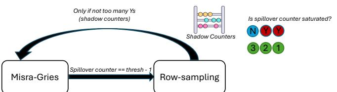
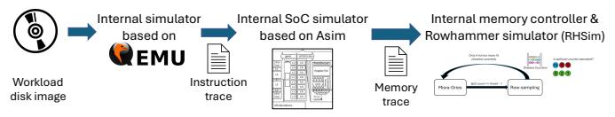
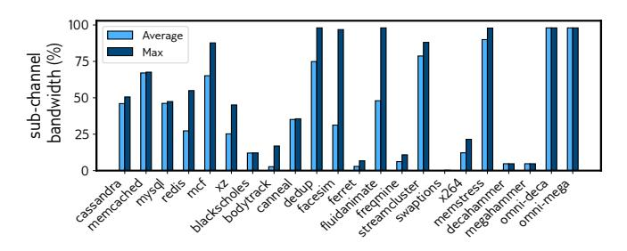
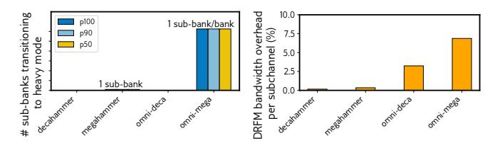

# From Lab to Fleet: Building and Deploying a Practical Rowhammer Defense in Cloud SoCs

Stefan Saroiu Microsoft Daniel Berger Microsoft Sujay Yadalam<sup>∗</sup> UT Austin Isaac H. Luna Microsoft Alec Wolman Microsoft Ishwar Agarwal<sup>∗</sup> Meta Will Remaklus Microsoft Jacob R. Lorch Microsoft

*Abstract*—Rowhammer attacks pose a significant threat to modern DRAM, with potentially serious security consequences for a cloud vendor, such as data corruption or infrastructure outages. Existing defenses fail to satisfy key industry requirements, including minimal overhead in the absence of attacks, predictable performance when under attack, system liveness, low hardware cost, adaptability to diverse hardware configurations, and tunable security guarantees.

This paper introduces Sigries, a hybrid Rowhammer defense implemented by Microsoft in the Azure Cobalt 200 SoC, combining the Misra-Gries algorithm for efficient row tracking with a fallback row-sampling mode for robustness under all attack scenarios. Sigries's design meets all our performance goals and offers configurable security guarantees allowing a cloud vendor to assess the security risks to its fleet. Our trace-driven evaluation shows that Sigries maintains minimal DRAM bandwidth overhead while keeping performance overhead consistently low. This work represents the first detailed description of a fully implemented, industry-grade Rowhammer defense and provides insights to inform research prototypes about real-world requirements.

*Index Terms*—Rowhammer, Security, Hardware, DRAM

# I. INTRODUCTION

The threat of a large-scale Rowhammer attack on cloud infrastructure continues to loom with consequences that cannot be overstated. Modern DRAM cells are significantly more vulnerable than those of just a few generations ago. Scaling to smaller process nodes has increased susceptibility, reducing the number of activations (*hammers*) required to induce bit flips. Whereas a decade ago bit flips typically required hundreds of thousands of hammers [\[41\]](#page-13-0), contemporary DRAM can experience bit flips after only a few thousand hammers [\[36\]](#page-13-1), [\[73\]](#page-14-0). Alarmingly, non-NUMA-optimized commodity workloads already reach these hammer rates due to how Intel implements cache coherency across sockets [\[53\]](#page-13-2). Rowhammerinduced bit flips caused by non-malicious workloads are absent in today's datacenters only because DRAM integrates Rowhammer mitigation circuitry. Although this circuitry cannot prevent all bit flips by malicious Rowhammer attacks, it is essential for reliability; without it, benign workloads would induce bit flips [\[53\]](#page-13-2).

DRAM's built-in Rowhammer defenses are both *porous* and rely on *security by obscurity*. They are porous because they can only thwart certain Rowhammer attack patterns [\[17\]](#page-13-3), [\[27\]](#page-13-4), [\[28\]](#page-13-5), [\[68\]](#page-14-1). They rely on obscurity because DRAM vendors are unwilling to disclose how their defenses work. Despite earlier DRAM vendor claims of complete protection [\[23\]](#page-13-6), [\[44\]](#page-13-7), ongoing research has repeatedly demonstrated that all DRAM remains vulnerable to Rowhammer, forcing industry to backtrack. Two whitepapers published by JEDEC, the industry consortium that develops DRAM standards, acknowledge that existing defenses cannot eliminate all Rowhammer attacks [\[29\]](#page-13-8), [\[30\]](#page-13-9), but stop short of specifying their limitations.

Rowhammer presents a compelling attack vector for nationstate adversaries. While much focus has been on its use for data breaches or customer compromises, equally alarming is its potential for massive Denial-of-Service (DoS) attacks via widespread bit flips in cloud infrastructure. Such attacks may be more practical than targeted compromises: while security exploits require flipping a precise *security-critical* bit, a DoS attack only requires flipping a sufficient number of arbitrary bits. When ECC detects memory errors beyond a threshold, the server permanently removes the affected pages, a process known as *page offlining* [\[50\]](#page-13-10), [\[58\]](#page-14-2). Although intended to maintain system stability, this mechanism can be weaponized to disable servers and degrade cloud infrastructure.

Mounting a massive Rowhammer DoS attack is not beyond the realm of possibility. It requires gaining access to a set of VMs across the cloud infrastructure, all mounting Rowhammer attacks simultaneously. The deep concern of cloud vendors over such an attack scenario is warranted, as new hammering patterns continue to emerge. Recently, researchers have uncovered two unknown Rowhammer-related attacks: RowPress [\[54\]](#page-13-11), which exploits long-activated rows, and Marionette [\[4\]](#page-12-0), which leverages row coupling. Unfortunately, both these attacks caught cloud vendors by surprise and reinforce the message that the DRAM industry continues to treat security as a secondary concern, leaving cloud vendors exposed to evolving threats.

Recently, cloud vendors have started to build their own System-on-Chip (SoC) hardware tailored to datacenters [\[1\]](#page-12-1), [\[22\]](#page-13-12), [\[57\]](#page-13-13). This development paves the way for cloud vendors to implement robust Rowhammer defenses inside their SoCs. This paper presents a Rowhammer defense developed by Microsoft and implemented in the Azure Cobalt 200 SoC, an

<sup>∗</sup>Work done while at Microsoft.

Arm-based SoC designed for cloud native workloads. To the best of our knowledge, this is the first Rowhammer defense implemented in production hardware—whether in DRAM or in a memory controller—to be described in detail in a research paper. In contrast to prior works that describe research prototypes [\[56\]](#page-13-14) or proof-of-concepts [\[25\]](#page-13-15), [\[40\]](#page-13-16), this paper covers every stage of a production implementation, from concept and design through verification, validation, and testing.

We start by outlining the design requirements of our Rowhammer defense called Sigries. These requirements sometimes differ from the objectives and assumptions underlying existing Rowhammer defenses. We aim to clarify the thought process behind these requirements to highlight industry concerns in adopting Rowhammer defenses. We hope these insights will help guide the research community in refining their designs to better align with industry needs. Section [III](#page-2-0) presents an indepth discussion of these design requirements, including their rationale and origins. It also reviews prior defense techniques, demonstrating why they do not meet these requirements.

Sigries's design is motivated by the observation that two classes of Rowhammer defenses meet *most, but not all* of our design requirements. One class employs *tracking* algorithms that use counters to identify "hot" rows, i.e., rows that are accessed repeatedly. An example is Misra-Gries [\[59\]](#page-14-3), [\[62\]](#page-14-4), a streaming algorithm known for its strong, provable security and performance benefits. The other class uses *sampling* (sometimes known as PARA/PRA [\[35\]](#page-13-17), [\[41\]](#page-13-0) or pTRR [\[33\]](#page-13-18)), an inexpensive and effective scheme. However, each class has significant disadvantages: tracking requires a CAM so large that its performance and power profiles are not practical, while sampling adds high memory bandwidth overhead that is justifiable only when the system is under attack.

Building on this observation, we design a hybrid scheme that combines tracking and sampling, grounded in three novel insights. First, a tracking scheme like Misra-Gries can use a small CAM (no more than a couple of dozen entries) to handle all cases when the system is not under attack and even some cases when it is. Second, these small counter tables do not need to track an entire bank, but can track *portions* of a bank, called *sub-banks*. Our third insight is that Misra-Gries can act as a gatekeeper. When a counter table detects that it is overwhelmed, only its corresponding sub-bank transitions to sampling. The remaining sub-banks can continue operating in counting mode. This selective transition further improves overall performance.

This paper also highlights several key aspects of Sigries's implementation. We use software verification to find three subtle bugs in our algorithm (Section [V-A\)](#page-6-0). We explain how Sigries manages error correction for its SRAM state on the SoC (Section [V-B\)](#page-7-0). Our implementation detects parity errors but cannot correct them; instead Sigries recovers from these errors by taking algorithm-specific conservative actions that maintain the security guarantees. We address the challenges of configuring Sigries (Section [V-C\)](#page-8-0), a topic often overlooked in current Rowhammer defenses despite its non-trivial nature. Finally, we examine how confidential computing creates surprising implementation constraints, as fleet health monitoring conflicts with the privacy guarantees inherent to confidential computing (Section [V-D\)](#page-8-1).

Finally, we present a trace-driven performance evaluation of Sigries using a mix of benchmarks and internal workloads. Our evaluation uses a simulation framework consisting of an internal emulator based on QEMU [\[5\]](#page-12-2), an internal cyclelevel SoC architectural simulator based on Asim [\[15\]](#page-13-19), and a newly developed timing-accurate Rowhammer simulator. Even though previous defenses do not meet all our design requirements, we implemented seven state-of-the-art defenses in our simulator. Sigries has comparable, and in some cases better, performance than all prior defenses. The results show that, under the fleet's DRAM characteristics, Sigries remains in light mode across all commodity workloads, and switches to heavy mode for *some, but not all*, Rowhammer attacks. For all commodity workloads tested, Sigries consumes no additional DRAM bandwidth.

In summary, the contributions of this paper are:

- We present the design of Sigries, a hybrid scheme that combines two classes of Rowhammer techniques: Misra-Gries and sampling. Sigries is implemented in the Azure Cobalt 200 SoC, an Arm-based SoC designed for cloud-native workloads. We believe that Sigries is the first production-level Rowhammer defense described in detail in a research paper.
- We outline a set of design requirements for a Rowhammer defense driven by practical concerns found in industry. Some of these requirements challenge existing assumptions in the research community, revealing limitations of previous defenses.
- We show that Misra–Gries, while impractical in its general form, can provide Rowhammer protection when undersized and serve as a gatekeeper to a heavier defense. We demonstrate how combining the two in a hybrid scheme meets our design requirements.
- We describe how we addressed several implementation challenges in verifying Sigries's algorithm, configuring it, and designing telemetry in a way that accommodates the requirements of confidential computing.
- We conduct a trace-driven evaluation that shows that, for all commodity, non-adversarial workloads, Sigries never transitions from light into heavy mode and consumes no DRAM bandwidth.

# *A. Per Row Activation Counting (PRAC)*

Concerns over large-scale Rowhammer attacks are prompting vendors to develop stronger defenses such as per-row activation counting (PRAC) [\[6\]](#page-12-3). PRAC improves on earlier defenses by storing per-row counters in DRAM and using a back-off mechanism when a Rowhammer attack is detected. It has been adopted in DDR5 [\[31\]](#page-13-20) (as an optional feature) and LPDDR6 [\[32\]](#page-13-21), and is on track for adoption in DDR6 and HBM5 [\[2\]](#page-12-4).

Despite these advances, PRAC is still several years from widespread use, and Microsoft plans to retain Sigries in their SoCs even for PRAC-enabled DRAM. Sigries provides both risk mitigation and valuable telemetry. Since PRAC is an optional DDR5 feature, one major DRAM vendor has stated they do not plan to support PRAC until it is required in DDR6. Even with PRAC-enabled DRAM, PRAC represents a significant architectural change, and early products may exhibit bugs. The effectiveness of PRAC also depends on properly configured parameters and thresholds, and Microsoft's SoCs will include Sigries as a fallback mechanism. In addition, Sigries telemetry provides an independent signal to help distinguish sustained attacks from benign or transient events.

# II. BACKGROUND

# *A. Brief DRAM and Rowhammer Primer*

To access DRAM data, a memory controller needs to *activate* (ACT) a row of cells. ACT commands can disturb charges in *physically-proximate* rows causing bit flips. Repeatedly issuing ACT commands to a set of rows is called *hammering*. Rowhammer attacks exploit this effect by crafting workloads that deliberately trigger bit flips.

As DRAM capacitors naturally leak their charge, memory controllers periodically issue refresh (REF) commands to restore the cells' charges. In DDR5, all cells get refreshed every 32 ms (tREFW). To avoid long access delays, controllers issue 8192 REF commands spaced tREFI apart (tREFI = 3.9 µs in DDR5 at normal temperature), on average. For each REF, the DRAM refreshes a subset of cells, ensuring that every cell is refreshed at least once per tREFW window.

RowPress is another form of row disturbance capable of flipping bits [\[54\]](#page-13-11). It occurs when a row is kept open for an extended period, causing bit flips in nearby rows. RowPress requires significantly fewer row activations than Rowhammer; even a single activation that keeps a row open for tens of milliseconds—well beyond the DDR5 protocol limits—can suffice to trigger bit flips. A practical mitigation is enforcing a *closed-page policy*, where rows are preemptively closed after each access to limit the duration they remain open.

ColumnDisturb is a recently identified form of read disturbance in DRAM [\[98\]](#page-14-5). In this case, disturbance propagates along columns rather than rows, affecting cells that share the same bitlines. Impacted cells may be located far from the aggressor row, even across different subarrays. This longrange effect renders certain Rowhammer mitigations, including Sigries, ineffective, as they rely on refreshing *nearby* victim rows. To date, ColumnDisturb has only been demonstrated under configuration settings that are not practical in today's servers. Nevertheless, it remains a serious potential concern going forward.

# *B. Rowhammer Mitigations*

Servers can detect and correct a limited number of bit flips using Error Correcting Codes (ECC). However, attackers can induce undetectable bit flips despite ECC [\[14\]](#page-13-22), [\[34\]](#page-13-23). Beyond ECC, the industry relies on Target Row Refresh (TRR), an in-DRAM mitigation that tracks accessed rows. The maximum number of activations a row can sustain before requiring a Rowhammer mitigation action is referred to as the *Rowhammer threshold*. Unfortunately, research has demonstrated that TRR alone is insufficient to prevent Rowhammer attacks [\[17\]](#page-13-3), [\[21\]](#page-13-24), [\[27\]](#page-13-4), [\[28\]](#page-13-5), [\[68\]](#page-14-1), prompting the exploration of alternative mitigation techniques in the academic literature.

Recently, industry standards have begun adopting two key proposals for Rowhammer mitigation. First, DDR5 [\[31\]](#page-13-20) introduces a new command called Directed Refresh Management (DRFM). When the DRAM receives a DRFM for an aggressor row, it must refresh the corresponding victim rows. DDR5 further specifies a Bounded Refresh Configuration (BRC), allowing DRAM vendors to define which victim rows are refreshed upon a DRFM command.

Previous research shows that DRFM commands can themselves become attack vectors [\[21\]](#page-13-24), [\[73\]](#page-14-0), as the outermost victim row can disturb adjacent rows. To address this, BRC reduces the disturbance caused by the outermost victim row by probabilistically activating it at a lower rate, limiting its potential to induce bit flips. Additionally, DDR5 enforces a rate limit on DRFM commands: on average, they cannot target the same bank/row address more than once every 7.8 µs. Issuing a DRFM requires the memory controller to first identify an aggressor row, which involves tracking or sampling row activations on the controller side.

Second, *Per Row Activation Counting* (PRAC) has been recently added to DDR5 [\[31\]](#page-13-20). PRAC provides comprehensive Rowhammer mitigation by accurately tracking all aggressor rows inside the DRAM. PRAC requires support from both DRAM and the host memory controller.

# *C. Threat Model*

We assume a software-based remote attacker confined to a virtual machine, with no access to the hypervisor or the server firmware. The attacker is fully aware of Sigries and its configuration parameters. They can create software capable of issuing DRAM commands to arbitrary rows in any order, provided they adhere to DDR5 specifications. The attacker does not have direct access to Sigries's counter values but is assumed to be capable of inferring when REF or DRFM commands are issued through side-channels [\[17\]](#page-13-3), [\[27\]](#page-13-4).

# III. DESIGN REQUIREMENTS: ORIGINS AND IMPLICATIONS

<span id="page-2-0"></span>The following requirements shaped Sigries's design:

- 1. Minimal bandwidth and latency overheads when system is not under attack. DRAM costs are substantial. In modern server SKUs, DRAM costs surpass those of CPUs. Consequently, cloud operators are highly sensitive to any memory system feature that introduces overheads, as they detract from the resources available to normal applications. While *some degree of* bandwidth and latency overheads could be tolerated during an attack, cloud providers want to minimize, if not eliminate, any such overheads in the common case, when the system is not under attack.
- 2. Consistency and avoidance of performance outliers. A critical design requirement from the hardware and performance teams mandates that Rowhammer defenses must op-

erate consistently without "corner cases" that could introduce performance overheads, whether in bandwidth or latency. Delays on the order of microseconds are considered unacceptable outliers. Even if such events are rare, at cloud scale, they become noticeable to customers and must be entirely avoided.

- 3. System liveness must be preserved even under attack. Under a Rowhammer attack, defenses will activate, resulting in performance slowdown. However, the system must remain operational and continue making forward progress to serve customer VMs, even during an attack. In other words, the defenses' overhead should not be so high that it causes the system to stall. Failing to meet this requirement risks turning a Rowhammer defense into a DoS attack vector.
- 4. Low hardware cost. Rowhammer defenses often require the memory controller to maintain and access state locally, typically stored in SRAM. Some defenses even require larger memories capable of content lookups, such as CAMs. However, both SRAM and CAM usage must be kept minimal. In our case, we had a requirement on the specific amount of SRAM per memory controller (which we cannot disclose). The total SRAM amounts to less than 10% of the memory controller's area.
- 5. Flexibility. The scheme must support various SoC and DRAM configurations. For instance, during the development of Sigries, hardware designers were unsure whether an SoC channel would need to accommodate 4-rank DRAM as opposed to only 2-rank, or whether it would need to handle two or one DIMMs per channel (2DPC vs. 1DPC). Similarly, Sigries must accommodate different Rowhammer thresholds through simple configuration changes.
- 6. Configurable security guarantees. Comprehensive Rowhammer protection requires more than just building a defense that blocks attacks under specific conditions. It requires a system that can be *reasoned about*—one where security properties can be rigorously analyzed, adjusted to match risk tolerance, and understood in terms of both strengths and limitations. In our experience, some Rowhammer mitigations used in industry, especially those developed by DRAM vendors, lack this clarity. Their complexity and reliance on opaque heuristics make rigorous security analysis challenging, if not impossible.

This requirement is distinct from *security under all circumstances.* This distinction is crucial in practice. Prior work falls into two broad categories: those that aim for complete protection, often incurring substantial performance and cost penalties, and those that rely on heuristics without providing clear security guarantees. Instead, the scheme should allow cloud providers to control and bound their exposure to Rowhammer risks.

# *A. Limitations of Prior Defenses*

Despite much work, prior Rowhammer defenses [\[37\]](#page-13-25) did not meet our set of requirements, which are driven by practical industry needs. First, we ruled out three classes of Rowhammer defenses: (1) those requiring modifications to components outside the SoC's control, such as DRAM or RCD chips [\[16\]](#page-13-26), [\[18\]](#page-13-27)–[\[20\]](#page-13-28), [\[24\]](#page-13-29)–[\[26\]](#page-13-30), [\[38\]](#page-13-31), [\[39\]](#page-13-32), [\[45\]](#page-13-33), [\[46\]](#page-13-34), [\[55\]](#page-13-35), [\[56\]](#page-13-14), [\[63\]](#page-14-6)– [\[66\]](#page-14-7), [\[70\]](#page-14-8), [\[77\]](#page-14-9)–[\[79\]](#page-14-10), [\[81\]](#page-14-11), [\[84\]](#page-14-12), [\[85\]](#page-14-13), [\[88\]](#page-14-14), [\[90\]](#page-14-15)–[\[92\]](#page-14-16), [\[96\]](#page-14-17), [\[97\]](#page-14-18) or the DDR protocol [\[87\]](#page-14-19), (2) those relying on DRAM partitioning to isolate victims from attackers [\[6\]](#page-12-3), [\[8\]](#page-12-5), [\[10\]](#page-13-36), [\[43\]](#page-13-37), [\[51\]](#page-13-38), [\[52\]](#page-13-39), [\[76\]](#page-14-20), [\[83\]](#page-14-21), [\[94\]](#page-14-22), as these approaches fail to fully prevent Rowhammer failures, and (3) those making unrealistic assumptions of DRAM internals [\[89\]](#page-14-23).

Instead, we focused on Rowhammer defense schemes that an SoC alone can implement. Table [I](#page-4-0) summarizes the schemes considered.

*1) Tracking Approaches:* Many previous defenses track events associated with Rowhammer whether DRAM row activations [\[12\]](#page-13-40), [\[35\]](#page-13-17), [\[48\]](#page-13-41), [\[60\]](#page-14-24), [\[62\]](#page-14-4), [\[71\]](#page-14-25), [\[95\]](#page-14-26) or cache misses [\[3\]](#page-12-6). Whenever such events occur at a high rate, these schemes perform a corrective action, such as refreshing victim rows [\[12\]](#page-13-40), [\[35\]](#page-13-17), [\[48\]](#page-13-41), [\[60\]](#page-14-24), [\[62\]](#page-14-4), throttling aggressor rows [\[95\]](#page-14-26), or swapping them with cold rows [\[71\]](#page-14-25). Tracking approaches often come with significant costs. To mitigate these, some schemes introduce changes or techniques that, unfortunately, fail to meet some of our requirements.

Not meeting requirement #4: low hardware cost. Some schemes have shown how to *perfectly* track a DRAM bank using less state than the O(n) requirement of maintaining a counter for each row [\[62\]](#page-14-4), [\[95\]](#page-14-26). Despite their impressive state reduction, these schemes require an amount of state larger than a practical SoC could accommodate.

They also face additional practical challenges that are difficult to overcome. For example, Graphene [\[62\]](#page-14-4) can track an entire DDR4 bank with as few as 2,511 bits/bank (for DDR5 this number is higher due to lower Rowhammer thresholds and twice the number of rows per bank). However, in practice, the limiting factor is not only the total amount of state but also the need to manage it efficiently. Specifically, Graphene requires each bank to maintain a table with hundreds of counters and support looking up the counter with the lowest value. Building a CAM (or a similar hardware construct) this large for each single bank is impractical. Another challenge we faced involved schemes requiring allocating a portion of the LLC to Rowhammer tracking [\[74\]](#page-14-27), [\[93\]](#page-14-28), a trade-off deemed unacceptable from a performance perspective.

Not meeting requirement #2: consistency. To address the high cost of maintaining tracking state in the memory controller, some schemes instead store this state in a reserved portion of DRAM [\[35\]](#page-13-17). To mitigate the access latency and bandwidth overhead associated with storing state in DRAM, these schemes often include a small SRAM-based cache in the memory controller to store recently accessed state. However, while the cache reduces overhead, it does not eliminate it entirely, as cache misses still introduce additional DRAM bandwidth overhead. These effects result in performance *spikes* due to cache evictions. For instance, Randomized Row-Swap (RRS) [\[71\]](#page-14-25) has great performance on average (less than 1%), but with an occasional performance outlier of 2.9 µs. Hydra [\[67\]](#page-14-29) (see Section 5.3), AQUA [\[75\]](#page-14-30) (see Section IV.D), START-M [\[74\]](#page-14-27) (see Section V.C), and CoMeT [\[9\]](#page-13-42) (see Section

<span id="page-4-0"></span>

| Scheme                      | Min.<br>Overhead Outliers |    | No Perf. Liveness | Cost | Low Flexibility | Configurable<br>Security |
|-----------------------------|---------------------------|----|-------------------|------|-----------------|--------------------------|
| ABACuS [61]                 | "                         | "  | \$                | "    | \$              | "                        |
| Anvil [3]                   | "                         | "  | "                 | "    | "               | \$                       |
| AQUA [75]                   | "                         | \$ | "                 | "    | "               | "                        |
| BlockHammer [95]            | "                         | "  | \$                | \$   | \$              | "                        |
| CoMeT [9]                   | "                         | \$ | "                 | "    | "               | "                        |
| CRA [35]                    | "                         | \$ | "                 | "    | "               | "                        |
| DREAM-R [82]                | \$                        | "  | "                 | "    | "               | "                        |
| Graphene [62]               | "                         | "  | "                 | \$   | \$              | "                        |
| Hydra [67]                  | "                         | \$ | "                 | \$   | "               | "                        |
| Machine Learning [12], [48] | "                         | "  | "                 | \$   | "               | \$                       |
| PARA [41]/PRA [35]          | \$                        | "  | "                 | "    | "               | "                        |
| RRS [71]                    | "                         | \$ | "                 | "    | "               | "                        |
| Scale-SRS [93]              | "                         | "  | "                 | \$   | "               | "                        |
| START-M [74]                | "                         | \$ | "                 | \$   | "               | "                        |

TABLE I: Prior schemes and their limitations. Schemes requiring DRAM, RCD, or DDR changes [\[16\]](#page-13-26), [\[18\]](#page-13-27)–[\[20\]](#page-13-28), [\[24\]](#page-13-29)– [\[26\]](#page-13-30), [\[38\]](#page-13-31), [\[39\]](#page-13-32), [\[45\]](#page-13-33), [\[46\]](#page-13-34), [\[55\]](#page-13-35), [\[56\]](#page-13-14), [\[63\]](#page-14-6)–[\[66\]](#page-14-7), [\[70\]](#page-14-8), [\[77\]](#page-14-9)– [\[79\]](#page-14-10), [\[81\]](#page-14-11), [\[84\]](#page-14-12), [\[85\]](#page-14-13), [\[87\]](#page-14-19), [\[88\]](#page-14-14), [\[90\]](#page-14-15)–[\[92\]](#page-14-16), [\[96\]](#page-14-17), [\[97\]](#page-14-18) were not considered.

4.1, operation 3) also suffer from spikes.

Not meeting requirement #3: liveness. BlockHammer [\[95\]](#page-14-26) uses hash tables of counters to track aggressor rows, avoiding lookup tables or CAMs. When a counter reaches a predetermined threshold, collisions mean any row mapping to that entry could be the aggressor. To cope with this uncertainty, BlockHammer stalls CPU instructions accessing data on these potential aggressor rows for a pre-determined time. This provides a form of rate limiting that prevents them from flipping bits. These stalls violate our liveness requirement, as the system cannot make forward progress while stalled. In recent work, BreakHammer [\[11\]](#page-13-43) addresses this by stalling only the threads responsible for launching the attack. However, BreakHammer's thread identification scheme cannot handle a case when the attacker controls an overwhelming fraction of all threads in the system (see Section 5.2 [\[11\]](#page-13-43)).

ABACuS [\[61\]](#page-14-31) also suffers from stalling. Inspired by Graphene, it uses a single counter table for the entire rank rather than one per bank. Each counter includes a 32-bit vector, one bit per bank, and the counter increments only when a row is activated, and its corresponding bank bit is set. After the increment, the bit vector is reset, ensuring that multiple rows with the same address across different banks do not increment the counter multiple times. However, when a counter reaches the Rowhammer threshold, ABACuS must refresh all victim rows across all banks before continuing, stalling the entire rank for several microseconds, a delay deemed unacceptable by our hardware designers.

Not meeting requirement #5: flexibility. The state required by a tracking scheme depends on the hardware configuration. For example, handling 4-ranks requires twice the state of 2-ranks. Similarly, lowering the Rowhammer threshold increases the state needed to maintain the same resilience, often scaling proportionally with the threshold [\[62\]](#page-14-4), [\[95\]](#page-14-26). This creates challenges as the memory controller must be overprovisioned to handle the worst-case configuration. Another problem is that we often do not know precisely the worstcase configuration at design time. The long timeline—from deciding on a Rowhammer defense to deploying the SoC in the datacenter often takes years—makes it difficult to predict how thresholds will evolve during this period.

*2) Sampling Approaches:* An alternative to tracking is sampling: upon each row activation, with a low probability p, treat the row as an aggressor row [\[35\]](#page-13-17), [\[41\]](#page-13-0), [\[82\]](#page-14-32). Sampling schemes meet most of our requirements. They have a low cost, as they do not require storing any state. They avoid performance outliers and ensure the system remains operational without stalling, even under attack. Additionally, they are flexible adapting to lower Rowhammer thresholds is as simple as tuning the p parameter [\[72\]](#page-14-33).

Not meeting requirement #1: low-overhead. Their major drawback is the inability to distinguish between a system under attack and one that is not. As a result, their bandwidth and latency overheads remain consistently high, even in the common case. Recently, DREAM-R [\[82\]](#page-14-32) reduces this overhead by taking advantage of DRFM's properties, but its overhead remains constant regardless of whether the system is under attack. This limitation led us to explore whether a scheme could be designed to meet all our requirements.

# IV. HYBRID DESIGN AND ITS NOVEL INSIGHTS

No prior Rowhammer defense meets all our requirements. Tracking approaches need impractically large counter tables to stop all Rowhammer attacks, while sampling approaches impose constant overheads. Our key observation is that, in the common case, the system is not under attack: commodity workloads exhibit no hot rows, i.e., rows with high activation rates. In this regime, a small counter table suffices and tracking works well. When the system *is* under attack, the overhead of sampling is dwarfed by the adversary's hammering activity, making it far more acceptable. This observation motivates our hybrid design, which combines Misra-Gries (e.g., Graphene [\[62\]](#page-14-4)), a streaming algorithm with strong, provable security and performance properties but high cost, and rowsampling (e.g., PARA [\[41\]](#page-13-0) or PRA [\[35\]](#page-13-17)), a low-cost approach but with high overhead.

We identified three novel insights that make it possible to combine the two approaches into a hybrid design. The rest of this section describes our insights and the hybrid design. We begin with a brief background on Misra-Gries and rowsampling.

Brief Background on Misra-Gries: Misra-Gries tracks potential aggressor rows using a counter table and a *spillover counter*. The spillover counter acts as an upper bound on the number of activations for each row not listed in the counter table. Misra-Gries ensures that all rows listed in the counter table have counter values no less than the spillover counter. Whenever spillover counter would surpass a counter value in the table, Misra-Gries increments the counter in the table and overwrites its corresponding row address with the address of the row being activated, thereby preserving this invariant.

Whenever a counter value reaches the Rowhammer threshold, the memory controller must issue a Directed Refresh Management (DRFM) command [\[31\]](#page-13-20) to prevent bit flips. To offer complete Rowhammer protection, Misra-Gries requires the counter table to be sized appropriately. This sizing depends on the Rowhammer threshold and ensures that the spillover counter value can never reach the threshold. While Misra-Gries requires less than a counter per row, the counter tables remain too large to be practical.

If the counter table is undersized, Misra-Gries cannot guarantee that the spillover counter stays below the Rowhammer threshold. Once it reaches the threshold, we must assume that any untracked row could be at risk. At that point, the only safe option is to issue a DRFM on every row activation, an undesirable scenario due to its huge performance overhead.

Brief Background on Row-sampling: Row-sampling-based defenses are one of the oldest and simplest techniques suitable to a memory controller. On each row activate, the memory controller flips a biased coin. With probability p (p ≪ 1), the row address is *sampled* and the row is treated as if it is an aggressor row. The memory controller performs a mitigative action such as refreshing the corresponding victim rows. A sufficiently high sampling rate p thwarts a Rowhammer attack because it (probabilistically) ensures that an aggressor row cannot escape being sampled.

# *A. Our Novel Insights*

The following three insights guided our design.

Insight #1: Even when under-provisioned, Misra-Gries stops Rowhammer attacks as long as its spillover counter remains below the Rowhammer threshold. Perhaps unexpectedly, under-provisioning does not eliminate all Misra-Gries's security guarantees. As long as the spillover counter stays below the threshold, Misra-Gries blocks all Rowhammer attacks. Combined with its strong performance characteristics, this makes Misra-Gries well suited for common-case conditions, such as when the system is not under attack or when attacks are unsophisticated (e.g., involving only a small number of aggressor rows).

Insight #2: Under-provisioned counter tables do not need to track an entire bank, but they can track portions of it, called *sub-banks*. It is more practical to implement k smaller, under-provisioned counter tables with c entries each—one per sub-bank—than to build a single large table with k ×c entries for the entire bank.

Insight #3: When the spillover counter value approaches the Rowhammer threshold, it can act as an early warning that the system *might be* under attack. This triggers our hybrid scheme to transition to a more resource-intensive defense than what is used during normal operation. In Sigries, these transitions occur independently per sub-bank, meaning different sub-banks within the same bank can be in different modes at the same time, thereby reducing performance overhead.

Sigries leverages these insights to implement a hybrid scheme with two modes. In *light mode*, Sigries uses an underprovisioned Misra-Gries scheme. If a workload *overwhelms*

<span id="page-5-0"></span>

Fig. 1: Sigries switching from light (MG) to heavy (RS) mode in the third 32ms window and back to light in the sixth.

the counters (indicated by the spillover counter value approaching the Rowhammer threshold), Sigries switches to *heavy mode*, employing row-sampling. These switches are per-sub-bank-only, and different sub-banks can be in different modes. Figure [1](#page-5-0) shows a timeline of a sub-bank when switching from light to heavy mode (third window) and back to light mode (sixth window).

# <span id="page-5-1"></span>*B. Mode Switching and Its Drawbacks*

In each refresh window (32ms for DDR5), Sigries offers full Rowhammer protection as long as there is no transition from light to heavy mode. If such a transition occurs, Sigries cannot guarantee that a row's counter that reaches the Rowhammer threshold will be sampled and mitigated, but this reduced guarantee lasts for only one tREFW. This property is critical to the security analysis of our hybrid scheme, as it enables precise bounds on the duration over which it may provide less than full protection. In practice, we configure Sigries to reduce the cumulative exposure time to *less than an hour per year* assuming a worst-case attacker with full control. We chose this configuration based on how long today's best Rowhammer attack fuzzers, such as those in [\[27\]](#page-13-4), [\[28\]](#page-13-5), take to identify suitable attack patterns. Because Sigries is reconfigurable at runtime, fleet-wide telemetry can further tighten these limits if needed.

While our guarantees assume worst-case conditions, three practical challenges make Rowhammer attacks harder to execute. First, precise control is difficult in the cloud: complex SoC designs, unpredictable memory controller behavior, and heavy DRAM traffic all add noise that disrupts row activation timing. Second, Rowhammer fuzzers have been evaluated only on simpler hardware (e.g., few sockets, channels, and DIMMs), where researchers have far more control than attackers would on a cloud server. These challenges make our one-hour-per-year bound a conservative upper limit. Third, Sigries introduces randomness in the thresholds used to switch between modes. This adds a layer of complexity for attackers. Our security analysis does not depend on randomness to guarantee protection across the fleet.

Sigries transitions from light to heavy mode whenever the spillover counter is one less than the Rowhammer threshold. This transition occurs during a row activation command. Figure [1](#page-5-0) shows a timeline of Sigries switching from light mode (Misra-Gries) to heavy mode (row-sampling). The switching occurs in the third refresh window, and the exposure time is limited to one refresh window.

<span id="page-6-1"></span>

Fig. 2: Transitioning between modes.

Unlike the transition from light to heavy mode, which introduces a brief window of vulnerability, transitioning back to light mode is completely safe. In Sigries, this transition always occurs at the end of a refresh window (32ms in DDR5). However, an important design choice was deciding for how many refresh windows Sigries should stay in heavy mode. Ideally, Sigries should remain in heavy mode *as long as* the light mode is inadequate to handle the ongoing workload (i.e., it would not need to transition back to heavy mode).

In heavy mode, Sigries uses the counter table for *shadow counting*, where it follows the Misra-Gries logic but does not use it to issue DRFMs. Instead, shadow counting is used to monitor whether the spillover counter continues to reach the Rowhammer threshold during each refresh window. After spending a fixed number of refresh windows in heavy mode, Sigries evaluates the fraction of these windows in which the spillover counter was saturated. If this fraction is too high, Sigries remains in heavy mode, effectively restarting the shadow counting process. Figure 2 illustrates the state diagram of Sigries's transition process.

Table II summarizes how Sigries's hybrid design meets its design requirements.

#### <span id="page-6-3"></span>C. Worst-case Attack Strategy

A worst-case attack strategy seeks to maximize the probability of inducing Rowhammer bit flips. For Sigries, such an attack combines the worst-case patterns targeting both components: Misra–Gries and sampling. For Misra–Gries, the worst-case scenario is a k-sided attack, where k is one greater than the size of the counter table. For sampling, the worst case is a single-sided attack. An optimal adversary would alternate between these two patterns, precisely synchronized with Sigries's mode transitions.

To make such synchronization difficult, Sigries randomizes its transitions. Specifically, the minimum duration spent in heavy mode is drawn from a small randomized range, with each sub-bank independently selecting a value for each transition *each time*. Nevertheless, our security analysis does not rely on the difficulty of synchronization; instead we assume a worst-case adversary capable of perfectly synchronizing with Sigries and adapting its attack patterns accordingly.

#### V. IMPLEMENTATION

Sigries uses several small counter tables per bank, where each counter table tracks a *sub-bank*. Each memory controller is equipped with SRAM organized in a set-associative way, where each set stores the counter table of a sub-bank. The entries in the counter tables correspond to the row address, the

<span id="page-6-2"></span>

| Requirement       | Sigries                                                               |
|-------------------|-----------------------------------------------------------------------|
| Min. overhead     | Minimal overhead in common case; heavy-mode under attack only         |
| No perf. outliers | Both modes have no arbitrary perf. spikes                             |
| Liveness          | Both modes offer liveness even when under attack                      |
| Low cost          | Under-provisioned counter tables meets hardware cost reqs             |
| Flexibility       | Under-provisioning works with various configs                         |
| Config. security  | Config. mode transitions with analyzable security vs. perf. trade-off |

TABLE II: Sigries meets design requirements.

counter value, and a *lock bit*. When a counter value reaches the Rowhammer threshold, Sigries issues a DRFM, resets the counter value, and sets the lock bit to ensure that the entry is no longer swapped with the spillover count.

Misra-Gries clears all counter tables at the end of each refresh window. Because counters are stored in SRAM, clearing them requires a read followed by a write. This wastes power when the memory controller is idle or lightly loaded as the counters may already be zero. In addition, these SRAM operations would, in some cases, limit the rate at which the memory controller could issue activates and thus lower its bandwidth. Instead, Sigries clears a sub-bank's counters by setting its "clear" bit; upon the next row activation, the controller clears all counters in that sub-bank and the clear bit.

Sigries also stores a spill overflow countdown (not to be confused with the spillover counter) and a heavy mode countdown. When in heavy mode, the spill overflow countdown is decremented if not zero in each refresh window in which the shadow spillover count reaches the Rowhammer threshold. The heavy mode countdown indicates the number of refresh windows a sub-bank stays in heavy mode. When this countdown reaches zero, Sigries checks whether the spill overflow counter value is *non-zero* to switch to light mode. If not, Sigries remains in heavy mode re-initializing its state.

The DDR5 specification mandates that, on average, no two DRFM commands should target the same bank/row address within a duration of 7.8 µs [31]. This serves as a ratelimiting measure to address concerns that DRFM commands themselves could be exploited to hammer memory. To comply, Sigries maintains a per-bank table to track the row addresses of previously issued DRFMs. The table is sized to accommodate the maximum number of DRFM commands that may be issued within a 7.8 µs interval.

#### <span id="page-6-0"></span>A. Algorithm Verification

We verify our algorithm's correctness using Dafny [47], a language and tool for writing code, expressing specifications, and mechanically checking properties with formal methods. In Dafny, we model the hardware and our algorithm and prove key properties, shown in Table III. The most critical invariant is that each row's access count—a value reset at the start of a refresh window or after issuing a DRFM—remains below the threshold.

The algorithm modeled in Dafny makes two simplifications from the hardware implementation. First, the proof assumes no parity errors in the memory controller hardware (see Section V-B). Second, the proof models never exiting light

<span id="page-7-1"></span>

| Invariant name               | Description                                                                                       |
|------------------------------|---------------------------------------------------------------------------------------------------|
| RowAccessesLessOrEqualThresh | Any row's access count < Rowhammer threshold.                                                     |
| SpillCountLessThanThresh     | Spill count < Rowhammer threshold.                                                                |
| EntriesBtwSpillCount&Thresh  | Each entry's count ≤ Rowhammer threshold +                                                        |
| 1                            | each unlocked entry s count ≥ spill count.                                                        |
| AddressesDistinct            | No two entries refer to the same row address.                                                     |
| StateCorrespondsToHistory    | For each entry, # of address accesses ≤ its count + for each address with no corresponding entry, |
|                              | # of accesses < spill count.                                                                      |
| AccessesSinceLastDRFM        | Every address accessed since DRFM has an entry +                                                  |
|                              | that entry is locked +                                                                            |
|                              | its count is equal to # of accesses since last DRFM.                                              |

TABLE III: Invariants proved in Dafny. The proof demonstrates that the conjunction of all these is an inductive invariant. (We also prove two properties not listed here but discussed in the text.)

```
accessesByAddr: address accesses since the last interval
     start or issued DRFM
// accessesSinceLastDRFM: \# of address accesses since last
datatype History =
 | History(accessesByAddr: map<Address, nat>,
          accessesSinceLastDRFM: map<Address, nat>)
function InitializeHistory () : History
 History (map [], map [])
function UpdateHistoryToReflectDRFM (h: History, addr:
     Address) : History
       ory(h.accessesByAddr[addr := 0], haccessesSinceLastDRFM[addr := 0])
 History(h.accessesByAddr[addr
function UpdateHistoryToReflectAccess (h: History, addr:
     Address) : History
 var newAccesses := if addr in h.accessesByAddr then h.
    accessesByAddr[addr] + 1 else 1;
History(h.accessesByAddr[addr := newAccesses],
        if addr in h.accessesSinceLastDRFM then
        accessesSinceLastDRFM[addr] + 1] else
          h.accessesSinceLastDRFM)
```

Fig. 3: Hardware specification written in Dafny.

mode (i.e., never using sampling), so it only proves invariants about what happens before heavy mode is entered.

The hardware specification, shown in Figure 3, is written in terms of a History that maintains every address's access count and updates those counts when various events occur. The algorithm's specification, shown in Figure 4, is written as imperative code that models the Misra-Gries algorithm.

We prove correctness by induction. First, we prove that the algorithm to initialize the state satisfies all our invariants. Next, we prove that the hardware algorithm run on every access preserves those invariants. This induction proof is performed on a functional specification for the algorithm. To verify that the untrusted functional specification models the trusted imperative specification faithfully, we make the functional specification a post-condition of the imperative specification. For example, UpdateStateOnAccess in Figure 4 has a post-condition that ensures it satisfies UpdateStateOn-AccessSpec. In a further proof, we prove two other useful properties of our algorithm: (1) it issues at most one DRFM per access, and (2) any two DRFMs to the same address within the same interval are separated by at least the threshold number of accesses to that address.

Verifying the algorithm gives us confidence in its correct-

```
method InitializeState (old_s: State) returns (s: State)
  ensures InitializeStateSpec(s) {
  s := old_s.(clear := true);
method UpdateStateOnAccess (old_s: State, addr: Address)
    returns (s: State, drfmsIssued: nat)\nensures_UpdateStateOnAccessSpec(old_s, addr, s,
          drfmsIssued) {
  s := old_s;
drfmsIssued := 0;
  if s.clear
     s := s.(spillCount := 0);
     s:= s.(entries := seq(|s.entries|, (i requires 0 <= i <

       := s.(clear := false);
  if s.spillCount == Threshold() - 1 {
    s := s.(spillCount := s.spillCount + 1);
    s := s.(sampling := true);
  else if n: nat : | n < |s.entries| && (s.entries[n].count
          .....................................
     if s.entries[n].count == Threshold() - 1
  var newEntry := s.entries[n].(count :=
                                  s.entries[n].(count := 0, locked :=
         := s.(entries := s.entries[n := newEntry]);
f!s.sampling {
drfmsIssued := drfmsIssued + 1;
     élse {
       var oldEntry := s.entries[n];
var newEntry := oldEntry.(count := oldEntry.count + 1);
       s := s.(entries := s.entries[n := newEntry]);
  else if n: nat :| n < |s.entries| && s.entries[n].count ==

     s := s.(entries := s.entries[n := newEntry]);
  selse if n: nat :| n < |s.entries| && s.entries[n].count ==
    s.spillCount && !s.entries[n].locked {
    var newEntry := s.entries[n].(addr := addr, count := s.
        spillCount + 1);
    s := s.(entries := s.entries[n := newEntry]);</pre>
  élse {
     s := s.(spillCount := s.spillCount + 1);
```

Fig. 4: Specification of our algorithm in Dafny.

ness and helps identify bugs prior to the hardware implementation. During this process, we identified and fixed three issues: (1) the clear bit was never cleared, (2) the lock bit was incorrectly set to 0 instead of 1 on a DRFM, and (3) finding an empty entry in a counter table involved checking if the entry's count was zero; however, the correct check should have also verified that the entry was unlocked (i.e., *lock* bit set to 0). Catching and fixing these issues shows the value of algorithm verification; RTL verification would not have caught them since it does not check algorithm invariants.

# <span id="page-7-0"></span>B. Handling Counter SRAM Errors

Within the memory controller, data and critical state are protected from soft errors via an Error Correcting Code (ECC), while other items are protected by an error detecting code (parity). Regardless of the method chosen to protect an item, the potential exists for an error to be uncorrectable, or for an error to not be detected and thus potentially cause Silent Data Corruption (SDC). While ECC provides better protection than parity, it requires extra storage and correction logic. Since this increases the design's area and power, the decision as to the appropriate means of protecting a given item is based on a

<span id="page-8-2"></span>

| Sub-Bank Mode Errant Item |                                                                         | Remediation                                                                                                                         |  |  |
|---------------------------|-------------------------------------------------------------------------|-------------------------------------------------------------------------------------------------------------------------------------|--|--|
| Light Mode                | Way Address<br>Way Count<br>Spill Count                                 | Switch to Heavy Mode<br>Issue DRFM, set Way Count to max value<br>Switch to Heavy Mode                                              |  |  |
| Heavy Mode                | Way Address<br>Way Count<br>Spillover Count<br>Spill Overflow Countdown | Decrement Spill Overflow Countdown<br>Set Way Count to maximum value<br>Decrement Spill Overflow Countdown<br>Restart Sampling Mode |  |  |
| Unknown                   | Heavy Mode Countdown                                                    | Restart Heavy Mode                                                                                                                  |  |  |

TABLE IV: Handling parity errors

reliability analysis of not only the memory controller but the SoC into which the controller is incorporated.

Given the amount of state stored within the SRAMs, along with the state's expected lifetime, parity provides sufficient protection from soft errors. To enhance protection, the SRAMs employ column multiplexing such that items protected by parity are bit-interleaved with each other: if a soft error flips multiple physically adjacent bits it impacts multiple parity protected items. This reduces the possibility of two bit flips occurring in the same item and thus causing SDC.

As detailed in Table IV, the algorithm handles detected parity errors by prioritizing Rowhammer protection over a temporary loss of MC performance. If multiple items simultaneously encounter parity errors, the most conservative remediation is applied. Table IV provides a simplified version of the complete implementation, detailing how the algorithm handles single-item errors. We also examined the impact of SDC errors; Figure 5 shows a small sample of our analysis.

#### <span id="page-8-0"></span>C. Sigries Parameters Configuration

To implement an effective Rowhammer protection, Sigries's parameters must be configured correctly.

Size of Misra-Gries counter tables. In Sigries, the counter tables are significantly under-provisioned relative to a full Misra-Gries implementation, such as the one used by Graphene [62]. We chose the size of the counter tables to accommodate benign workloads while minimizing their area overhead. Sigries's counter tables do not have more than a few dozen entries per sub-bank.

**Rowhammer Threshold:** DRAM customers with large deployments, such as Microsoft, routinely run a DRAM qualification process. The goal is to ensure that DRAM parts at a new process node are safe, reliable, and fit for production use in a given system and workload *before* it is deployed at scale. As part of this process, the Rowhammer threshold is characterized across DIMM samples from multiple DRAM vendors. Sigries is then configured using a threshold derived from these qualification results.

Some prior work on Rowhammer defenses assumes thresholds in the low hundreds or even lower, based on projected trends. While thresholds have indeed decreased significantly over the past decade, we do not expect server DRAM to reach such extreme values. Although the exact thresholds for Sigries are sensitive and cannot be disclosed, Sigries is not designed to operate at thresholds in the low hundreds or below. If such thresholds were to materialize, Sigries would remain functionally correct, but it would spend most of its time in

heavy mode, which lies outside its intended design point and would result in higher overhead.

**Sampling rate:** To set the sampling rate value used in heavy mode, we rely on our prior work that describes in depth how to derive a sampling rate given a target Rowhammer threshold and a probability of escaping sampling, set to a very low value [72].

**Minimum duration of heavy mode:** While in heavy mode, Sigries never transitions back to light mode until a minimum number of refresh windows (tREFW) have elapsed. As described in Section IV-B, Sigries suffers from a small exposure time upon mode switching, and thus Sigries's configuration ensures that under a *worst-case* attack strategy (see Section IV-C), Sigries reduces its cumulative exposure to less than an hour per year.

Threshold on the number of refresh windows in heavy mode in which the shadow counters are overwhelmed. In each refresh window spent in heavy mode, Sigries uses shadow counters to determine whether they remain overwhelmed, that is, whether the spillover counter reaches the Rowhammer threshold. Sigries transitions back to light mode only if the fraction of such windows falls below a threshold. We set this threshold to be very low so that the fraction of refresh windows in which the shadow counters are overwhelmed is much lower than 1%.

Sigries does not necessarily transition back to light mode once it reaches the minimum duration in heavy mode. While in heavy mode, Sigries continues to track the behavior of the sub-bank's (underprovisioned) Misra-Gries counter table. If the table is overwhelmed (i.e., its spillover counter reached the Rowhammer threshold), Sigries treats this as an indication that the attack may still be ongoing.

# <span id="page-8-1"></span>D. Telemetry and Confidential Computing

When running Sigries, the hardware produces telemetry for events such as DRFM commands, dropped DRFM commands (rate limiting), parity errors, and mode transitions. To preserve confidential computing guarantees, most of this telemetry is not collected by the firmware. Only mode-transition events are logged, and these records exclude the triggering row address. This design ensures that telemetry reveals no information about workloads, memory patterns, or data access, preserving the platform's privacy and security guarantees.

In production, Sigries transitions will be rare and continuously monitored; any increase or anomaly will be flagged for investigation. This aligns with standard fleet telemetry practices. Once an investigation is triggered and a security issue discovered (e.g., nation-state attack), new firmware can be deployed to configure Sigries to remain permanently in heavy mode. This approach balances confidential computing constraints, which restrict detailed telemetry inspection to preserve customer privacy, with the operational need to detect security-relevant behavior.

Another challenge with confidential computing is modifying the configuration of Sigries at runtime. Ideally, such changes

- <span id="page-9-0"></span>-If SDC error in Misra-Gries counters, its behavior can be indeterminate for up to 32 ms.
- -If sub-bank is in heavy mode and Heavy Mode Countdown encounters SDC, the sub-bank could remain in heavy mode for <redacted> duration, given the counter's width of <redacted> bits.
- -The durations above could be longer should the media enter self-refresh, as time effectively pauses during selfrefresh.

Fig. 5: Impact of silent data corruption errors (sample).

<span id="page-9-1"></span>

Fig. 6: Simulation framework.

should not require a server reboot. However, confidential computing requirements restrict runtime configuration changes because they fall outside the secure measurements taken at boot. To address this, the firmware permits only a narrow set of changes, and only if the new values are more conservative from a security standpoint. For example, the measured firmware accepts lowering the Rowhammer threshold but rejects raising it. This ensures that the server continues to operate under the configured security model or a *stronger one*, ensuring a meaningful guarantee to the secure measurement.

# VI. PERFORMANCE EVALUATION

This section starts by describing our experimental methodology and workload characterization, followed by four key questions driving our performance evaluation.

# *A. Methodology*

Experimental Setup: We run full-system simulations using a setup as shown in Figure [6.](#page-9-1) The framework consists of (1) an internal emulator based on QEMU [\[5\]](#page-12-2), (2) an internal cyclelevel SoC simulator based on Asim [\[15\]](#page-13-19), and (3) an internal timing-accurate memory-controller and Rowhammer simulator (RHSim).

We run workloads inside a customized QEMU-based emulator to generate instruction traces. These traces feed into our SoC simulator, which models micro-architectural details such as out-of-order execution, branch predictors, TLBs, and the cache hierarchy. This is Microsoft's in-house simulator to evaluate all SoC components including the memory controllers, producing a trace of memory requests arriving at each controller. Finally, RHSim uses this trace to simulate each memory controller's operations.

RHSim simulates operations such as request scheduling, background refresh (REF), refresh management (RFM), and directed refresh management (DRFM). Unlike previous DRAM and Rowhammer simulators [\[13\]](#page-13-45), [\[42\]](#page-13-46), [\[49\]](#page-13-47), [\[69\]](#page-14-34), [\[86\]](#page-14-35), it does not model read, write, or precharge DDR commands, but only row activations from the input trace, constrained solely by the row cycle time (tRC). Although RHSim does not explicitly model read and write DDR commands, it still accounts for their latencies. It uses timestamps derived from the full-system SoC simulator as the *earliest* time to activate each row. This design makes RHSim much faster than prior simulators and creates worst-case conditions for a Rowhammer defense by removing any factors that could slow the rate of row activations.

Capturing instruction and memory traces allows us to run experiments efficiently. Running the full pipeline, from the workload's disk image to RHSim, as one monolithic system is slow and inefficient; even a small change forces a complete rerun. End-to-end simulations take weeks and months. By breaking the process into stages and capturing instruction traces, we can re-run only the parts we need. For example, testing new mapping functions or making configuration changes to Rowhammer defenses requires re-running only RHSim, not the entire framework.

Using the above framework, we simulate a complete system: an SoC with a full core, mesh interconnect, and DRAM configuration. In all our simulations, we set all our configuration parameters to their *production values* with one exception: the Rowhammer threshold. Because Rowhammer thresholds have steadily declined over the past decade, recent academic research estimates values to drop into the low hundreds. In contrast, the DRAM industry does not expect thresholds to fall below a few thousand. As a compromise, we evaluate Sigries using a more conservative Rowhammer threshold than the one we use in production, where lower thresholds correspond to more conservative assumptions.

Prior defenses: In addition to Sigries, we implemented seven prior defenses in RHSim: BlockHammer [\[95\]](#page-14-26), DREAM-R [\[82\]](#page-14-32), Graphene [\[62\]](#page-14-4), Hydra [\[67\]](#page-14-29), PARA/PRA [\[35\]](#page-13-17), [\[41\]](#page-13-0), PRAC [\[31\]](#page-13-20), and RRS [\[71\]](#page-14-25). We configured each defense exactly as described in prior work. For defenses with opensource implementations in prior simulators, such as Ramulator 2.0 [\[13\]](#page-13-45), we also verified that our configuration settings match the corresponding Ramulator implementation. While these prior defenses do not meet our requirements and cannot be deployed, comparing them to Sigries offers insights into its overall performance.

To mitigate Rowhammer, these defenses rely on different mechanisms. Like Sigries, DREAM-R, Graphene, Hydra, and PARA/PRA issue DRFM commands to hot rows. BlockHammer stalls "loads" and "stores" that activate a row too often. RRS swaps hot rows with randomly chosen cold rows. PRAC runs inside DRAM and raises ALERT for hot rows. In the end, all Rowhammer defenses introduce performance overhead in two ways: consuming DRAM bandwidth overhead due to DRFMs and "stalling" program execution. We use these two metrics in our evaluation.

Workloads: We use a mix of cloud-representative applications such as key-value stores (Redis, Memcached), databases (MySQL, Cassandra) and micro-benchmarks from SPEC2017 [\[80\]](#page-14-36) and PARSEC [\[7\]](#page-12-7) suites. We also use a synthetic application, *memstress*, which is a memory-intensive loop repeatedly accessing a large memory region. To maximize system utilization, we run enough instances of each workload

<span id="page-10-0"></span>

| Workload      | IPC  | LLC MPKI | RSS (GB) | Avg. # rows<br>per ref. window | R:W<br>ratio |
|---------------|------|----------|----------|--------------------------------|--------------|
| cassandra     | 2    | 20.78    | 480      | 15.63M                         | 0.7:0.3      |
| memcached     | 1.2  | 40.64    | 384      | 11.82M                         | 0.69:0.31    |
| mysql         | 1.81 | 26.93    | 102      | 6.31M                          | 0.73:0.27    |
| redis         | 2.27 | 16.78    | 526      | 11.84M                         | 0.77:0.23    |
| mcf           | 1.34 | 24.02    | 320      | 601.9K                         | 1:0          |
| XZ            | 1.68 | 10.1     | 260      | 1.67M                          | 0.65:0.35    |
| blackscholes  | 3.17 | 3.36     | 65       | 1.04M                          | 0.88:0.12    |
| bodytrack     | 4.62 | 0.78     | 22       | 527.2K                         | 0.66:0.34    |
| canneal       | 0.21 | 163.93   | 179      | 16.7M                          | 0.99:0.01    |
| dedup         | 0.77 | 66.55    | 267      | 2.53M                          | 0.67:0.33    |
| facesim       | 2.55 | 7.38     | 59       | 2.84M                          | 0.59:0.41    |
| ferret        | 3.44 | 0.88     | 25       | 1.31M                          | 0.79:0.21    |
| fluidanimate  | 4.26 | 9.16     | 80       | 5.79M                          | 0.79:0.21    |
| freqmine      | 2.13 | 2.03     | 39       | 715.9K                         | 0.68:0.32    |
| streamcluster | 1.37 | 53.7     | 29       | 3.06M                          | 0.92:0.08    |
| swaptions     | 4.61 | 0.04     | 32       | 90K                            | 1:0          |
| x264          | 5.4  | 1.57     | 29       | 1.59M                          | 0.67:0.33    |
| memstress     | 0.38 | 119.24   | 251      | 18.8M                          | 0.5:0.5      |
| decahammer    | N/A  | N/A      | N/A      | 10                             | 1:0          |
| megahammer    | N/A  | N/A      | N/A      | k                              | 1:0          |
| omni-deca     | N/A  | N/A      | N/A      | $10 \times b$                  | 1:0          |
| omni-mega     | N/A  | N/A      | N/A      | $k \times b$                   | 1:0          |

TABLE V: Workload characteristics. 2nd column (IPC) is the number of instructions retired (executed) per cycle. 3rd column (LLC MPKI) is the LLC Misses per Kilo instructions. 4th column (RRS) is the Resident Set Size. 5th column is the number of DRAM rows accessed in one tREFW (32 ms) across the entire SoC. *megahammer* uses an undisclosed, high value of k, b is the # of banks in our SoC.

to keep every core busy and generating memory traffic.

We also use four synthetic Rowhammer attacks. The first two, *decahammer* and *megahammer* target a single sub-bank; *decahammer* is a 10-sided attack (a common DDR4 bit-flip pattern) while *megahammer* is a *k*-sided attack with a high, undisclosed *k* designed to overwhelm Sigries's light mode and trigger its switch to heavy mode. We also use *omni-deca* and *omni-mega* which launch the same attacks across all banks in parallel to model massively parallel Rowhammer scenarios. Unlike all other workloads, these four attacks are generated in RHSim to create worst-case Rowhammer conditions—the highest row activation rates and no interfering traffic.

## B. High-Level Workload Characteristics

Table V provides detailed characteristics of the workloads used. Some of the workloads have a high degree of efficient instruction execution with an average IPC above 4, such as bodytrack, fluidanimate, swaptions, and x264. Others access many DRAM rows in each refresh window, and thus can stress Sigries, such as memstress, cassandra, and memcached.

**Sub-channel bandwidth utilization:** Figure 7 illustrates the average and peak sub-channel bandwidth utilization under this setup. Half the workloads (11 out of the 22) achieve peak utilization exceeding half the maximum sub-channel bandwidth. A few workloads, such as *dedup*, *facesim*, *fluidanimate*, and *memstress* are able to fully saturate the system's memory bandwidth. Both *omni-deca* and *omni-mega* continuously saturate memory bandwidth by mounting Rowhammer attacks on all sub-banks in the system.

"Hot" rows—rows with a large number of activations: Despite the high bandwidth utilization, no row is activated more than a few hundred times in a 32ms refresh window.

<span id="page-10-1"></span>

Fig. 7: Average and peak sub-channel bandwidth utilization.

Figure 8 shows the maximum, p90, and p50 activations per refresh window, counting only rows activated at least once. The two hottest rows appear in *mcf* (583 activations) and *xz* (326 activations). The rightmost bars show the average per-row activations across all workloads—90% of rows are activated fewer than 53 times.

The rarity of highly activated rows in our experiments may seem at odds with prior work showing that commodity benchmarks can trigger high activation rates on servers [53]. Those high rates were due to Intel's decision to store coherence directory bits in DRAM, a design choice our SoC does not share.

**Takeaway:** On our SoC, cloud workloads do not repeatedly activate the same row more than a few hundred times a refresh window (32ms).

#### C. Key Evaluation Ouestions

- Q1. Does Sigries ever transition from light to heavy mode when the system is not under attack? Since heavy mode adds significant DRAM bandwidth overhead, any transition into heavy mode would degrade system performance.
- **Q2.** Does Sigries transition from light to heavy mode under adversarial Rowhammer attacks, and if so, across how many sub-banks? Sigries's light mode handles some, but not all Rowhammer attacks. For heavy attacks, sub-banks not targeted remain in light mode, while targeted sub-banks transition into heavy mode.
- **Q3.** How does Sigries's performance compare to prior defenses? We use two metrics to compare performance across Rowhammer defenses: (1) DRAM bandwidth due to DRFM and (2) workloads' "stalling" execution time.
- **Q4.** How much area overhead does Sigries add to the hardware? A very cost-sensitive metric is the amount of area overhead a Rowhammer mitigation adds to an SoC. Even small increases can drive up silicon cost, power, and yield losses, making this a critical factor.

# D. Transitions from Light to Heavy Mode

Commodity workloads. When a spillover counter reaches the Rowhammer threshold, Sigries transitions the corresponding sub-bank from light to heavy mode. In heavy mode, Sigries issues a DRFM command for every sampled row activation, resulting in a constant bandwidth overhead over time on

<span id="page-11-0"></span>

Fig. 8: Row activations for "hot" rows: max, p90, and p50.

<span id="page-11-1"></span>

Fig. 9: Minimum counter table size to ensure no sub-bank is overwhelmed. Number of sub-banks is kept constant in all experiments.

average, regardless of whether the system is under attack. A well-tuned Sigries configuration minimizes the frequency of transitions from light to heavy mode.

With our Rowhammer threshold, *commodity workloads* never enter heavy mode. Further, no row counter reaches the Rowhammer threshold to trigger a DRFM command, so there is no DRAM bandwidth overhead.

We ran extensive experiments to determine whether Sigries's counter tables are sized adequately. Figure 9 presents the minimum counter table size required for different Rowhammer thresholds. We omit the numeric axis values due to confidentiality. The y-axis shows the smallest table that prevents Sigries from transitioning from light to heavy mode for a given workload. In all these experiments, the number of sub-banks is kept constant.

The figure shows two trends: (1) the minimum size of the counter table decreases roughly linearly as the Rowhammer threshold increases, and (2) workloads differ in their behavior. In all cases, tables with a low number of counters are sufficient to support conservative Rowhammer thresholds.

**Takeaway:** For commodity, non-adversarial workloads Sigries never transitions from light to heavy mode and has no DRAM bandwidth overhead.

**Rowhammer workloads.** On the left, Figure 10 shows the number of sub-banks that transition into heavy mode. *Decahammer* and *omni-deca* are fully contained by light mode: the under-provisioned Misra-Gries is sufficient to stop 10-sided attacks. However, *megahammer* and *omni-mega* overwhelm the targeted sub-banks. In each bank, the targeted sub-bank transitions into heavy mode.

On the right, Figure 10 shows the bandwidth overhead from DRFMs across a DDR5 sub-channel. Two points stand

<span id="page-11-2"></span>

Fig. 10: Fraction of sub-banks overwhelmed in a refresh window for an artificially low Rowhammer threshold t.

<span id="page-11-3"></span>

Fig. 11: Row-sampling-based defenses issue DRFMs for all commodity workloads (left) and Rowhammer attacks (right).

out. First, the overhead is not linear in the number of aggressor rows. *Decahammer* and *omni-deca* incur only light mode overhead, while *megahammer* and *omni-mega* include both light and heavy mode overheads. Second, the overhead can be large, up to 6.8% for *omni-mega*, which targets all banks. However, Sigries pays this cost only under worst-case Rowhammer attacks.

**Takeaway:** Sigries remains in light mode for some Rowhammer attacks; only targeted sub-banks switch to heavy mode under stronger attacks.

## E. Performance Comparison to Prior Defenses

Of the seven defenses we implemented, two match Sigries's performance: Graphene [62] and PRAC [31]. This outcome is expected, as Graphene and Sigries's light mode are both based on Misra-Gries. The difference is that Sigries under-provisions its tables, while Graphene does not. In theory, Graphene is an ideal defense, but its reliance on many large-sized CAM tables makes it impractical. On the other hand, PRAC keeps a per-row counter. Because no row is activated more than a few hundred times per refresh window, PRAC never takes any action.

Two of the defenses, DREAM-R [82] and PARA/PRA [35], [41] consume DRAM bandwidth due to issuing DRFMs. This is also expected—these two sampling-based defenses will issue DRFMs even when the system is not under attack. Figure 11 shows the DRFM bandwidth overhead of these two defenses for both commodity workloads (on the left) and Rowhammer attacks (on the right).

The remaining three defenses, BlockHammer [95], Hydra<sup>1</sup> [67], and RRS [71], do not issue DRFMs but they

<span id="page-11-4"></span><sup>&</sup>lt;sup>1</sup>Hydra could issue a DRFM if a row's counter reached the Rowhammer threshold, but this never occurs in our commodity workloads.

<span id="page-12-8"></span>

Fig. 12: The max, p90, and p50 DRAM access delays for BlockHammer, Hydra, and RRS. Delay is measured as the difference between the access time with no defense and the access time with the defense enabled.

suffer from performance outliers. BlockHammer stalls CPU instructions that access "hot" rows. Hydra keeps counters for all rows in DRAM and must issue extra DRAM accesses to update them. RRS swaps a hot row with a cold one; a swap copies data between rows, and in some cases RRS must unswap and re-swap rows. To evaluate "stall", we compare DRAM access timestamps with and without each defense. For many commodity workloads, the timestamps are identical because no defense is triggered and no stall occurs. For others, the defenses trigger and, thus, some DRAM accesses encounter delays.

Figure 12 shows the two workloads that cause the largest DRAM access delays for each mitigation, reporting max, p90, and p50 delays. BlockHammer can delay accesses by up to 1.97 ms on commodity workloads (our production Rowhammer threshold is well below the thresholds used when BlockHammer was published). Hydra and RRS also show DRAM delays, albeit at sub-millisecond levels.

Table VI summarizes the performance comparison of Sigries to these seven prior defenses.

**Takeaway:** Sigries, Graphene, and PRAC are the only three Rowhammer defenses that issue no DRFMs and suffer from no DRAM access delays for all commodity workloads.

# F. Area and Power Overheads

The only die-area overhead for Sigries comes from the counters implemented in the memory controller. Due to their compact design, the counters occupy less than 10% of the memory controller's area. The power overhead is similarly minimal. The counters are built using low-power flip-flops, resulting in low power consumption.

We used these numbers for a quick estimate of the counter storage required for a full Misra–Gries implementation. It would inflate the memory controller by roughly  $40\times$ , with the defense logic alone accounting for 96% of die-area. These numbers are hypothetical because a CAM with the required width cannot be built and operated at DDR5 speeds.

**Takeaway:** The SRAM Sigries uses for its counter tables accounts for less than 10% of the memory controller's total area.

<span id="page-12-9"></span>

| Rowhammer<br>Defense | DRAM bandwidth overhead | Stalls   |
|----------------------|-------------------------|----------|
| BlockHammer          | <b>√</b>                | ×        |
| DREAM-R              | ×                       | 1        |
| Hydra                | ✓                       | ×        |
| PARA/PRA             | ×                       | 1        |
| RRS                  | ✓                       | ×        |
| Graphene             | <b>√</b>                | <b>V</b> |
| PRAC                 | ✓                       | 1        |
| Sigries              | ✓                       | /        |

TABLE VI: Summary of performance comparison to prior defenses. Graphene and PRAC are the only two prior defenses that have performance comparable to Sigries. Graphene uses a configuration so large it is impractical, and PRAC is an optional DDR5 Rowhammer defense not yet implemented in silicon.

#### VII. CONCLUSIONS

This paper presents Sigries, a production-level Row-hammer defense for cloud SoCs. Sigries combines an under-provisioned version of Misra-Gries with row-sampling to achieve a balanced trade-off between performance, cost, and security that meets practical industry requirements. The paper also presents the results of verifying the algorithm, configuring it, and designing the telemetry to meet confidential computing requirements. Our detailed evaluation demonstrates that Sigries maintains minimal DRAM bandwidth overhead and ensures robust performance. We hope Sigries will guide future research in Rowhammer protection schemes to consider our design requirements.

#### ACKNOWLEDGMENT

We would like to thank everyone who contributed to Sigries from its inception to turning it into a production-ready security feature including: Selim Bilgin, Michael Borgens, Tim Cowles, Brett Dodds, Adam Grenzebach, Rob Huryn, Scott Kivitz, Darren Lasko, Arthur Leung, Maurice Ma, Dorica Munell, Phyllis Ng, Charles Patisaul, Andy Rushing, Vignesh Saravanan, Brian Sutton, John Tien, and Kushagra Vaid. We are also grateful to Victor Bahl for his constant encouragement and support. Finally, we would like to thank the anonymous reviewers for their feedback on the submission.

## REFERENCES

- <span id="page-12-1"></span> Amazon, "AWS Graviton Processors," https://aws.amazon.com/ec2/ graviton/, 2025.
- <span id="page-12-4"></span>[2] Anonymized, "Internal Communication," 2025.
- <span id="page-12-6"></span>[3] Z. B. Aweke, S. F. Yitbarek, R. Qiao, R. Das, M. Hicks, Y. ORren, and T. Austin, "ANVIL: Software-Based Protection Against Next-Generation Rowhammer Attacks," in ASPLOS, 2016.
- <span id="page-12-0"></span>[4] S. Baek, M. Wi, S. Park, H. Nam, M. J. Kim, N. S. Kim, and J. Ahn, "Marionette: A rowhammer attack via row coupling," in ASPLOS, 2024.
- <span id="page-12-2"></span>[5] F. Bellard, "Qemu, a fast and portable dynamic translator," in USENIX ATC, FREENIX Track, 2005.
- <span id="page-12-3"></span>[6] T. Bennett, S. Saroiu, A. Wolman, and L. Cojocar, "Panopticon: A Complete In-DRAM Rowhammer Mitigation," in *DRAMSec*, 2021.
- <span id="page-12-7"></span>[7] C. Bienia, S. Kumar, J. P. Singh, and K. Li, "The PARSEC Benchmark Suite: Characterization and Architectural Implications," in *PACT*, 2008.
- <span id="page-12-5"></span>[8] C. Bock, F. Brasser, D. Gens, C. Liebchen, and A.-R. Sadeghi, "RIP-RH: Preventing Rowhammer-Based Inter-Process Attacks," in ASIA-CCS, 2019.

- <span id="page-13-42"></span>[9] F. N. Bostanci, I. E. Yuksel, A. Olgun, K. Kanellopoulos, Y. C. Tugrul, A. G. Yaglikci, M. Sadrosadati, and O. Mutlu, "CoMeT: Count-Min-Sketch-based Row Tracking to Mitigate RowHammer at Low Cost," in *HPCA*, 2024.
- <span id="page-13-36"></span>[10] F. Brasser, L. Davi, D. Gens, C. Liebchen, and A.-R. Sadeghi, "CAn't Touch This: Practical and Generic Software-only Defenses Against RowHammer Attacks," in *USENIX Security*, 2017.
- <span id="page-13-43"></span>[11] O. Canpolat, A. G. Yaglıkc¸ı, A. Olgun, I. E. Yuksel, Y. C. Tu ¨ grul, ˘ K. Kanellopoulos, O. Ergin, and O. Mutlu, "BlockHammer: Preventing RowHammer at Low Cost by Blacklisting Rapidly-Accessed DRAM Rows," in *MICRO*, 2024.
- <span id="page-13-40"></span>[12] A. Chakraborty, M. Alam, and D. Mukhopadhyay, "Deep Learning based Diagnostics for Rowhammer Protection of DRAM Chips," in *ATS*, 2019.
- <span id="page-13-45"></span>[13] CMU-SAFARI, "Ramulator Source Code," [https://github](https://github.com/CMU-SAFARI/ramulator).com/CMU-[SAFARI/ramulator,](https://github.com/CMU-SAFARI/ramulator) 2025.
- <span id="page-13-22"></span>[14] L. Cojocar, K. Razavi, C. Giuffrida, and H. Bos, "Exploiting Correcting Codes: On the Effectiveness of ECC Memory Against Rowhammer Attacks," in *IEEE S&P*, 2019.
- <span id="page-13-19"></span>[15] J. Emer, P. Ahuja, E. Borch, A. Klauser, C.-K. Luk, S. Manne, S. S. Mukherjee, H. Patil, S. Wallace, N. Binkert, R. Espasa, and T. Juan, "Asim: A performance model framework," *IEEE Computer*, vol. 35, no. 2, pp. 68–76, 2002.
- <span id="page-13-26"></span>[16] A. Fakhrzadehgan, Y. N. Patt, P. J. Nair, and M. K. Qureshi, "SafeGuard: Reducing the Security Risk from Row-Hammer via Low-Cost Integrity Protection," in *HPCA*, 2022.
- <span id="page-13-3"></span>[17] P. Frigo, E. Vannacci, H. Hassan, V. van der Veen, O. Mutlu, C. Giuffrida, H. Bos, and K. Razavi, "TRRespass: Exploiting the Many Sides of Target Row Refresh," in *S&P*, 2020.
- <span id="page-13-27"></span>[18] S. K. Gautam, S. K. Manhas, A. Kumar, M. Pakala, and E. Yieh, "Row Hammering Mitigation Using Metal Nanowire in Saddle Fin DRAM," *IEEE T-ED*, vol. 66, 2019.
- [19] M. Ghasempour, M. Lujan, and J. Garside, "ARMOR: A Run-Time Memory Hot-Row Detector," http://apt.cs.manchester.ac.[uk/projects/](http://apt.cs.manchester.ac.uk/projects/ARMOR/RowHammer/armor.html) [ARMOR/RowHammer/armor](http://apt.cs.manchester.ac.uk/projects/ARMOR/RowHammer/armor.html).html, 2015.
- <span id="page-13-28"></span>[20] H. Gomez, A. Amaya, and E. Roa, "DRAM Row-hammer Attack Reduction using Dummy Cells," in *NORCAS*, 2016.
- <span id="page-13-24"></span>[21] Google, "Introducing Half-Double: New hammering technique for DRAM Rowhammer bug," [https://security](https://security.googleblog.com/2021/05/introducing-half-double-new-hammering.html).googleblog.com/2021/05/ [introducing-half-double-new-hammering](https://security.googleblog.com/2021/05/introducing-half-double-new-hammering.html).html, 2021.
- <span id="page-13-12"></span>[22] ——, "Introducing Google Axion Processors, our new Arm-based CPUs," https://cloud.google.[com/blog/products/compute/introducing](https://cloud.google.com/blog/products/compute/introducing-googles-new-arm-based-cpu)[googles-new-arm-based-cpu,](https://cloud.google.com/blog/products/compute/introducing-googles-new-arm-based-cpu) 2024.
- <span id="page-13-6"></span>[23] M. Greenberg, "Row Hammering: What it is, and how hackers could use it to gain access to your system," [https://blogs](https://blogs.synopsys.com/committedtomemory/2015/03/09/row-hammering-what-it-is-and-how-hackers-could-use-it-to-gain-access-to-your-system/).synopsys.com/ [committedtomemory/2015/03/09/row-hammering-what-it-is-and-how](https://blogs.synopsys.com/committedtomemory/2015/03/09/row-hammering-what-it-is-and-how-hackers-could-use-it-to-gain-access-to-your-system/)[hackers-could-use-it-to-gain-access-to-your-system/,](https://blogs.synopsys.com/committedtomemory/2015/03/09/row-hammering-what-it-is-and-how-hackers-could-use-it-to-gain-access-to-your-system/) 2015.
- <span id="page-13-29"></span>[24] Z. Greenfield, J. B. Halbert, and K. S. Bains, "Method, apparatus and system for determining a count of accesses to a row of memory," Patent No. US 2014/0085995, 2014.
- <span id="page-13-15"></span>[25] S. Hong, D. Kim, J. Lee, R. Oh, C. Yoo, S. Hwang, and J. Lee, "DSAC: Low-Cost Rowhammer Mitigation Using In-DRAM Stochastic and Approximate Counting Algorithm," arXiv preprint arXiv:2302.03591, 2023.
- <span id="page-13-30"></span>[26] A. Jaleel, G. Saileshwar, S. W. Keckler, and M. Qureshi, "PrIDE: Achieving Secure Rowhammer Mitigation with Low-Cost In-DRAM Trackers," in *ISCA*, 2024.
- <span id="page-13-4"></span>[27] P. Jattke, V. Veen, P. Frigo, S. Gunter, and K. Razavi, "Blacksmith: Scalable Rowhammering in the Frequency Domain," in *IEEE S&P*, 2022.
- <span id="page-13-5"></span>[28] P. Jattke, M. Wipfli, F. Solt, M. Marazzi, M. Bolcskei, and K. Razavi, ¨ "ZenHammer: Rowhammer Attacks on AMD Zen-based Platforms," in *USENIX Security*, 2024.
- <span id="page-13-8"></span>[29] JEDEC, *Near-Term DRAM Level Rowhammer Mitigation (JEP300-1)*, 2021.
- <span id="page-13-9"></span>[30] ——, *System Level Rowhammer Mitigation (JEP301-1)*, 2021.
- <span id="page-13-20"></span>[31] ——, *Double Data Rate 5 (DDR5) SDRAM Standard Version 1.31 JESD79-5C.01*, 2024.
- <span id="page-13-21"></span>[32] ——, *Low Power Double Data Rate 6 (LPDDR6) SDRAM Standard*, 2025.
- <span id="page-13-18"></span>[33] M. Kaczmarski, "Thoughts on Intel Xeon E5-2600 v2 Product Performance Optimisation," 2014.
- <span id="page-13-23"></span>[34] N. Kamadan, W. Wang, S. van Schaik, C. Garman, D. Genkin, and R. U. B. Yuval Yarom, "ECC.fail: Mounting Rowhammer Attacks on DDR4 Servers with ECC Memory," in *USENIX Security*, 2025.

- <span id="page-13-17"></span>[35] D.-H. Kim, P. J. Nair, and M. K. Qureshi, "Architectural Support for Mitigating Row Hammering in DRAM Memories," *CAL*, vol. 14, pp. 9–12, 2015.
- <span id="page-13-1"></span>[36] J. Kim, M. Patel, A. G. Yaglikci, H. Hassan, R. Azizi, L. Orosa, and O. Mutlu, "Revisiting RowHammer: An Experimental Analysis of Modern DRAM Devices and Mitigation Techniques," in *ISCA*, 2020.
- <span id="page-13-25"></span>[37] M. J. Kim, S. Baek, J. Kim, H. Nam, N. S. Kim, and J. Ahn, "SoK: Systematizing a Decade of Architectural RowHammer Defenses Through the Lens of Streaming Algorithms," in *IEEE S&P*, 2025.
- <span id="page-13-31"></span>[38] M. J. Kim, J. Park, Y. Park, W. Doh, N. Kim, T. J. Ham, J. W. Less, and J. Ahn, "Mithril: Cooperative Row Hammer Protection on Commodity DRAM Leveraging Managed Refresh," in *HPCA*, 2022.
- <span id="page-13-32"></span>[39] M. Kim, J. Choi, H. Kim, and H.-J. Lee, "An Effective DRAM Address Remapping for Mitigating Rowhammer Errors," in *TC*, 2019.
- <span id="page-13-16"></span>[40] W. Kim, C. Jung, S. Yoo, D. Hong, J. Hwang, J. Yoon, O. Jung, J. Choi, S. Hyun, M. Kang, S. Lee, D. Kim, S. Ku, D. Choi, N. Joo, S. Yoon, J. Noh, B. Go, C. Kim, S. Hwang, M. Hwang, S.-M. Yi, H. Kim, S. Heo, Y. Jang, K. Jang, S. Chu, Y. Oh, K. Kim, J. Kim, S. Kim, J. Hwang, S. Park, J. Lee, I. J. an Joohwan Cho, and J. Kim, "A 1.1V 16Gb DDR5 DRAM with Probabilistic-Aggressor Tracking, Refresh-Management Functionality, Per-Row Hammer Tracking, a Multi-Step Precharge, and Core-Bias Modulation for Security and Reliability Enhancement," in *ISSCC*, 2023.
- <span id="page-13-0"></span>[41] Y. Kim, R. Daly, J. Kim, C. Fallin, J. H. Lee, D. Lee, C. Wilkerson, K. Lai, and O. Mutlu, "Flipping Bits in Memory Without Accessing Them: An Experimental Study of DRAM Disturbance Errors," in *ISCA*, 2014.
- <span id="page-13-46"></span>[42] Y. Kim, W. Yang, and O. Mutlu, "Ramulator: A Fast and Extensible DRAM Simulator," in *CAL*, 2016.
- <span id="page-13-37"></span>[43] R. K. Konoth, M. Oliverio, A. Tatar, D. Andriesse, H. Bos, C. Giuffrida, and K. Razavi, "ZebRAM: Comprehensive and Compatible Software Protection Against Rowhammer Attacks," in *OSDI*, 2018.
- <span id="page-13-7"></span>[44] M. Lanteigne, "How Rowhammer Could be Used to Exploit Weaknesses in Computer Hardware," http://www.thirdio.[com/rowhammer](http://www.thirdio.com/rowhammer.pdf).pdf, 2016.
- <span id="page-13-33"></span>[45] E. Lee, S. Lee, G. E. Suh, and J. Ahn, "TWiCe: Time Window Counter Based Row Refresh to Prevent Row-Hammering," *CAL*, vol. 17, pp. 96–99, 2018.
- <span id="page-13-34"></span>[46] ——, "TWiCe: Preventing Row-hammering by Exploiting Time Window Counters," in *ISCA*, 2019.
- <span id="page-13-44"></span>[47] K. R. M. Leino, "Dafny: An automatic program verifier for functional correctness," in *Proceedings of the Conference on Logic for Programming, Artificial Intelligence, and Reasoning (LPAR)*, 2010, pp. 348–370.
- <span id="page-13-41"></span>[48] C. Li and J.-L. Gaudiot, "Detecting Malicious Attacks Exploiting Hardware Vulnerabilities Using Performance Counters," in *COMPSAC*, 2019.
- <span id="page-13-47"></span>[49] S. Li, Z. Yang, D. Reddy, A. Srivastava, and B. Jacob, "Dramsim3: A cycle-accurate, thermal-capable dram simulator," vol. 19, no. 2, p. 106–109, 2020.
- <span id="page-13-10"></span>[50] Linux Documentation, "sysfs-memory-page-offline," [https:](https://www.kernel.org/doc/Documentation/ABI/testing/sysfs-memory-page-offline) //www.kernel.[org/doc/Documentation/ABI/testing/sysfs-memory](https://www.kernel.org/doc/Documentation/ABI/testing/sysfs-memory-page-offline)[page-offline,](https://www.kernel.org/doc/Documentation/ABI/testing/sysfs-memory-page-offline) 2009.
- <span id="page-13-38"></span>[51] K. Loughlin, J. Rosenblum, S. Saroiu, A. Wolman, D. Skarlatos, and B. Kasikci, "Siloz: Leveraging DRAM Isolation Domains to Prevent Inter-VM Rowhammer," in *SOSP*, 2023.
- <span id="page-13-39"></span>[52] K. Loughlin, S. Saroiu, A. Wolman, and B. Kasikci, "Stop! Hammer Time: Rethinking Our Approach To Rowhammer Mitigations," in *HotOS*, 2021.
- <span id="page-13-2"></span>[53] K. Loughlin, S. Saroiu, A. Wolman, Y. A. Manerkar, and B. Kasikci, "MOESI-prime: Preventing Coherence-Induced Hammering in Commodity Workloads," in *ISCA*, 2022.
- <span id="page-13-11"></span>[54] H. Luo, A. Olgun, A. G. Yaglıkc¸ı, Y. C. Tu ˘ grul, S. Rhyner, M. B. Cavlak, ˘ J. Lindegger, M. Sadrosadati, and O. Mutlu, "Rowpress: Amplifying read disturbance in modern dram chips," in *ISCA*, 2023.
- <span id="page-13-35"></span>[55] M. Marazzi, P. Jattke, F. Solt, and K. Razavi, "PROTRR: Principled yet Optimal In-DRAM Target Row Refresh," in *IEEE S&P*, 2022.
- <span id="page-13-14"></span>[56] M. Marazzi, F. Solt, P. Jattke, K. Takashi, and K. Razavi, "REGA: Scalable Rowhammer Mitigation with Refresh-Generating Activations," in *IEEE S&P*, 2023.
- <span id="page-13-13"></span>[57] Microsoft, "With a systems approach to chips, Microsoft aims to tailor everything 'from silicon to service' to meet AI demand," https://news.microsoft.[com/source/features/ai/in-house-chips-silicon-to](https://news.microsoft.com/source/features/ai/in-house-chips-silicon-to-service-to-meet-ai-demand/)[service-to-meet-ai-demand/,](https://news.microsoft.com/source/features/ai/in-house-chips-silicon-to-service-to-meet-ai-demand/) 2023.

- <span id="page-14-2"></span>[58] Microsoft Learn, "Predictive Failure Analysis (PFA)," https://learn.microsoft.[com/en-us/windows-hardware/drivers/whea/](https://learn.microsoft.com/en-us/windows-hardware/drivers/whea/predictive-failure-analysis--pfa-) [predictive-failure-analysis--pfa-,](https://learn.microsoft.com/en-us/windows-hardware/drivers/whea/predictive-failure-analysis--pfa-) 2023.
- <span id="page-14-3"></span>[59] J. Misra and D. Gries, "Finding repeated elements," *Science of Computer Programming*, vol. 2, no. 2, pp. 143–152, 1982.
- <span id="page-14-24"></span>[60] O. Mutlu, "The RowHammer Problem and Other Issues We May Face as Memory Becomes Denser," in *DATE*, 2017.
- <span id="page-14-31"></span>[61] A. Olgun, Y. C. Tugrul, N. Bostanci, ˘ ˙Ismail Emir Yuksel, H. Luo, ¨ S. R. A. G. Yaglıkc¸ı, G. F. Oliveira, and O. Mutlu, "ABACuS: All-Bank Activation Counters for Scalable and Low Overhead RowHammer Mitigation," in *USENIX Security*, 2024.
- <span id="page-14-4"></span>[62] Y. Park, W. Kwon, E. Lee, T. J. Han, J. Ahn, and J. W. Lee, "Graphene: Strong yet Lightweight Row Hammer Protection," in *MICRO*, 2020.
- <span id="page-14-6"></span>[63] M. Qureshi, "AutoRFM: Scaling Low-Cost In-DRAM Trackers to Ultra-Low Rowhammer Thresholds," in *HPCA*, 2025.
- [64] ——, "SALT: Track-and-Mitigate Subarrays, Not Rows, for Blast-Radius-Free Rowhammer Defense," in *HPCA*, 2026.
- [65] M. Qureshi and S. Q. Jaleel, "MOAT: Securely Mitigating Rowhammer with Per-Row Activation Counters," in *ASPLOS*, 2025.
- <span id="page-14-7"></span>[66] M. Qureshi, S. Qazi, and A. Jaleel, "MINT: Securely Mitigating Rowhammer with a Minimalist In-DRAM Tracker," in *MICRO*, 2024.
- <span id="page-14-29"></span>[67] M. Qureshi, A. Rohan, G. Saileshwar, and P. J. Nair, "Hydra: Enabling Low-Overhead Mitigation of Row-Hammer at Ultra-Low Thresholds via Hybrid Tracking," in *ISCA*, 2022.
- <span id="page-14-1"></span>[68] F. Ridder, P. Frigo, E. Vannacci, H. Bos, C. Giuffrida, and K. Razavi, "SMASH: Synchronized Many-sided Rowhammer Attacks from JavaScript," in *USENIX Security*, 2021.
- <span id="page-14-34"></span>[69] P. Rosenfeld, E. Cooper-Balis, and B. Jacob, "Dramsim2: A cycle accurate memory system simulator," vol. 10, no. 1, p. 16–19, 2011.
- <span id="page-14-8"></span>[70] S. Ryu, K. Min, J. Shin, H. Kwon, D. Nam, T. Oh, T. Jang, M. Yoo, Y. Kim, and S. Hong, "Overcoming the reliability limitation in the ultimately scaled DRAM using silicon migration technique by hydrogen annealing," in *IEEE IEDM*, 2017.
- <span id="page-14-25"></span>[71] G. Saleshwar, B. Wang, M. Qureshi, and P. J. Nair, "Randomized Row-Swap: Mitigating Row Hammer by Breaking Spatial Correlation between Aggressor and Victim Rows," in *ASPLOS*, 2022.
- <span id="page-14-33"></span>[72] S. Saroiu and A. Wolman, "How to Configure Row-Sampling-Based Rowhammer Defenses," in *DRAMSec*, 2022.
- <span id="page-14-0"></span>[73] S. Saroiu, A. Wolman, and L. Cojocar, "The Price of Secrecy: How Hiding Internal DRAM Topologies Hurts Rowhammer Defenses," in *IPRS*, 2022.
- <span id="page-14-27"></span>[74] A. Saxena and M. Qureshi, "START: Scalable Tracking for Any Rowhammer Threshold," in *HPCA*, 2024.
- <span id="page-14-30"></span>[75] A. Saxena, G. Saileshwar, P. J. Nair, and M. Qureshi, "AQUA: Scalable Rowhammer Mitigation by Quarantining Aggressor Rows at Runtime," in *Micro*, 2022.
- <span id="page-14-20"></span>[76] A. Saxena, W. Wang, and A. Daglis, "Citadel: Rethinking Memory Allocations to Safeguard Against Inter-Domain Rowhammer Exploits," 2025.
- <span id="page-14-9"></span>[77] S. M. Seyedzadeh, A. K. Jones, and R. Melhem, "Counter-based Tree Structure for Row Hammering Mitigation in DRAM," *CAL*, vol. 16, pp. 18–21, 2017.
- [78] ——, "Mitigating Wordline Crosstalk Using Adaptive Trees of Counters," in *ISCA*, 2018.
- <span id="page-14-10"></span>[79] M. Son, H. Park, J. Ahn, and S. Yoo, "Making DRAM Stronger Against Row Hammering," in *DAC*, 2017.
- <span id="page-14-36"></span>[80] Standard Performance Evaluation Corporation, "SPEC CPU 2017 Benchmark Suite," https://www.spec.[org/cpu2017/,](https://www.spec.org/cpu2017/) 2017.
- <span id="page-14-11"></span>[81] H. Taneja, A. Hajiabadi, M. Marazzi, K. Razavi, and M. Qureshi, "MIRZA: Efficiently Mitigating Rowhammer with Randomization and ALERT," in *HPCA*, 2026.
- <span id="page-14-32"></span>[82] H. Taneja and M. Qureshi, "DREAM: Enabling Low-Overhead Rowhammer Mitigation via Directed Refresh Management," in *ISCA*, 2025.
- <span id="page-14-21"></span>[83] V. Van Der Veen, M. Lindorfer, Y. Fratantonio, H. P. Pillai, G. Vigna, C. Kruegel, H. Bos, and K. Razavi, "GuardION: Practical Mitigation of DMA-Based Rowhammer Attacks on ARM," in *DIMVA*, 2018.
- <span id="page-14-12"></span>[84] S. Vittal, S. Qazi, P. Das, and M. Qureshi, "MoPAC: Efficiently Mitigating Rowhammer with Probabilistic Activation Counting," in *ISCA*, 2025.
- <span id="page-14-13"></span>[85] A. J. Walker, S. Lee, and D. Beery, "On DRAM Rowhammer and the Physics of Insecurity," *IEEE T-ED*, vol. 68, 2021.

- <span id="page-14-35"></span>[86] D. Wang, B. Ganesh, N. Tuaycharoen, K. Baynes, A. Jaleel, and B. Jacob, "DRAMsim: a memory system simulator," *SIGARCH Comput. Archit. News*, vol. 33, no. 4, p. 100–107, 2005.
- <span id="page-14-19"></span>[87] Y. Wang, Y. Liu, P. Wu, and Z. Zhang, "Detect DRAM Disturbance Error by Using Disturbance Bin Counters," in *CAL*, 2019.
- <span id="page-14-14"></span>[88] ——, "Reinforce Memory Error Protection by Breaking DRAM Disturbance Correlation Within ECC Words," in *ICCD*, 2019.
- <span id="page-14-23"></span>[89] ——, "Discreet-PARA: Rowhammer Defense with Low Cost and High Efficiency," in *ICCD*, 2021.
- <span id="page-14-15"></span>[90] M. Wi, J. Park, S. Ko, M. J. Kim, N. S. Kim, E. Lee, and J. Ahn, "SHADOW: Preventing Row Hammer in DRAM with Intra-Subarray Row Shuffling," in *HPCA*, 2023.
- [91] M. Wi, Y. Yoo, Y. Kim, J. Shin, J. Kim, Y. Ryu, S. Gorgin, J. Ahn, and J. Kim, "RowArmor: Efficient and Comprehensive Protection Against DRAM Disturbance Attacks," in *ASPLOS*, 2026.
- <span id="page-14-16"></span>[92] J. Woo, S. C. Lin, P. J. Nair, A. Jaleel, and G. Saileshwar, "QPRAC: Towards Secure and Practical PRAC-based Rowhammer Mitigation using Priority Queues," in *HPCA*, 2024.
- <span id="page-14-28"></span>[93] J. Woo, G. Saileshwar, and P. J. Nair, "Scalable and Secure Row-Swap: Efficient and Safe Row Hammer Mitigation in Memory Systems," in *HPCA*, 2023.
- <span id="page-14-22"></span>[94] X.-C. Wu, T. Sherwood, F. T. Chong, and Y. Li, "Protecting Page Tables from RowHammer Attacks using Monotonic Pointers in DRAM True-Cells," in *ASPLOS*, 2019.
- <span id="page-14-26"></span>[95] A. G. Yaglıkc¸ı, M. Patel, J. S. Kim, R. Azizi, A. Olgun, L. Orosa, H. Hassan, J. Park, K. Kanellopoulos, T. Shahroodi, S. Ghose, and O. Mutlu, "BlockHammer: Preventing RowHammer at Low Cost by Blacklisting Rapidly-Accessed DRAM Rows," in *HPCA*, 2021.
- <span id="page-14-17"></span>[96] C.-M. Yang, C.-K. Wei, Y. J. Chang, T.-C. Wu, H.-P. Chen, and C.-S. Lai, "Suppression of Row Hammer Effect by Doping Profile Modification in Saddle-Fin Array Devices for Sub-30-nm DRAM Technology," *IEEE T-DMR*, vol. 16, 2016.
- <span id="page-14-18"></span>[97] J. M. You and J.-S. Yang, "MRLoc: Mitigating Row-hammering based on memory Locality," in *DAC*, 2019.
- <span id="page-14-5"></span>[98] I. E. Yuksel, A. Olgun, N. Bostanci, H. Luo, A. G. Yaglikci, and O. Mutlu, "ColumnDisturb: Understanding Column-based Read Disturbance in Real DRAM Chips and Implications for Future Systems," in *MICRO*, 2025.