# GauTracer: Extending Ray Tracing Accelerator for Gaussian-based Scene Representation

Lizhou Wu, Kunchen Zou, Yuzheng Lin, Chixiao Chen, Xiaoyang Zeng, Haozhe Zhu<sup>∗</sup> *State Key Laboratory of Integrated Chips and Systems (SKLICS), Fudan University, Shanghai 200433, China* <sup>∗</sup> E-mail: zhuhz@fudan.edu.cn

*Abstract*—Gaussian splatting has emerged as a promising paradigm in 3D vision, enabling instant scene reconstruction and photorealistic rendering. However, integrating rasterizationoriented Gaussian representations into ray tracing pipelines remains challenging. Existing ray tracing accelerators (RTAs) lack native support for Gaussian primitives, forcing reliance on software shader, which incurs significant instruction overhead, thread divergence, and excessive memory traffic. To address this, we present GauTracer, a ray tracing accelerator with efficient hardware support for Gaussian primitives. GauTracer elevates Gaussians to first-class primitives via lightweight microarchitectural extensions, including a dedicated Ray-Gauss Intersection Unit (RGIU). To improve versatility, the RGIU adopts a reconfigurable design supporting both 3D ellipsoidal and 2D planar Gaussian primitives with minimal overhead. In addition, a maxheap-based Any-Gauss-Hit Unit (AGHU) maintains a per-ray hit buffer for efficient volumetric blending of Gaussian primitives. To further optimize traversal performance, GauTracer employs a treelet-based BVH traversal scheme with a far-node pruning scheme, reducing unnecessary node visits beyond the buffer's capacity. Simulation results based on Vulkan-Sim show that GauTracer achieves average performance improvements of 5.8× for 3D Gaussians and 7.3× for 2D Gaussians over the baseline GPU-RTA. It also enhances energy efficiency by 6.6× and 7.5×, respectively.

### I. INTRODUCTION

Ray tracing [1] (RT) is a fundamental technique in modern 3D graphics, capable of modeling complex lighting effects such as global illumination, shadows, reflections, and refractions, which are often beyond the reach of rasterization. As a result, RT has been widely adopted in high-end graphics applications, including augmented and virtual reality (AR/VR) [2], [3] and computer-aided design (CAD) [4]. To sustain the heavy demand of RT, modern GPUs integrate dedicated Ray Tracing Accelerators (RTAs) [5]–[7], which operate in tandem with general-purpose shader cores to efficiently perform primitive traversal and intersection tests in complex 3D scenes.

Conventional RTAs primarily target mesh-based representations, which rely on explicit surface connectivity and UVmapped textures. Such representations exhibit a visual gap with respect to real-world appearance, manifesting as oversaturation and limited material fidelity. They are also inher-

∗ Haozhe Zhu is the corresponding author.

This work is supported in part by the National Natural Science Foundation of China (NSFC) under Grant No. 62488101 and 62304047, and in part by Fundamental and Interdisciplinary Disciplines Breakthrough Plan of the Ministry of Education (MoE) of China under Grant No. JYB2025XDXM120, and in part by supported by the State Key Laboratory of Integrated Chips and Systems (SKLICS) under Grant No. SKLICS-Z20502.

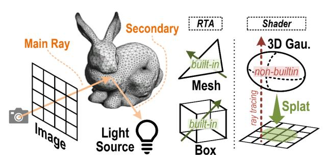

Fig. 1: Principle of ray tracing, e.g., global illumination is modeled through the spawning of secondary rays. While boxes and triangles are natively supported by ray tracing accelerators (RTAs), Gaussian primitives still lack efficient hardware support.

ently unsuitable for volumetric phenomena such as smoke or translucent media, where no explicit surfaces exist. These shortcomings have motivated the development of learningbased scene representations, such as Neural Radiance Fields (NeRF) [8]. NeRF leverages a multi-layer perceptron (MLP) to fit a scene and achieve photorealistic reconstruction, but its implicit nature incurs a high computational cost.

Recently, 3D Gaussian Splatting (3DGS) [9] has emerged as a promising paradigm for intelligent 3D reconstruction and rendering. 3DGS represents a scene as a set of anisotropic Gaussian ellipsoids [10], which are splatted and blended in screen space to produce high-fidelity images. Its explicit, point-based representation and trainable parameters enable high-fidelity scene modeling and fast rendering, making it suitable for a wide range of applications [11]–[13]. Beyond 3DGS, several Gaussian variants have emerged, among which 2DGS [14] stands out due to its view consistency and surface-aligned reconstruction. 2DGS has become a popular choice for geometry-sensitive tasks [15], [16], and recent approaches [17]–[20] explore hybrid 3D-2D Gaussian representations, combining the volumetric expressiveness of 3DGS with the geometric precision of 2DGS.

Although Gaussian Splatting has gained significant attention, Gaussian models have largely been developed within a tile-based rasterization pipeline, which inherently limits their support for ray-oriented rendering. This poses challenges for advanced graphics applications, particularly those involving distorted camera models [21], [22] or secondary light transport effects [23], [24]. Several efforts have been made to overcome these challenges. Lukas Radl et al. [25] introduced StopThe-Pop, a ray-wise sorting method that mitigates popping artifacts and improves view consistency for 3DGS. Q. Wu et al. [26] presented 3DGUT, which leverages sigma-point sampling to overcome the limitations of linear-approximated projection, aligning rasterization and ray tracing. N. Moenne-Loccoz et al. [27] proposed 3DGRT, which enables true ray tracing of 3D Gaussian primitives through the NVIDIA OptiX API, leveraging a mesh-agent-based intersection test and volumetric ray marching. C. Gu et al. [28] further proposed 2DGRT, which leverages the explicit intersection evaluation of 2D Gaussians to provide a fully differentiable framework for inverse rendering.

Despite algorithmic progress, the hardware efficiency of Gaussian ray tracing remains largely underexplored. This stands in sharp contrast to its rasterization counterpart, where extensive software-hardware co-optimization has already been investigated [29]–[38]. In conventional mesh-oriented RTA architectures, Gaussian primitives are treated as second-class citizens, with only limited hardware support. Consequently, execution relies heavily on software shaders, incurring substantial instruction overhead and memory traffic. As reported in [26], 3DGRT [27] achieves a rendering frame rate approximately 7× slower than the baseline 3DGS [9], despite substantial programming optimization.

To address these limitations, we propose GauTracer, a micro-architectural design that elevates Gaussian primitives to first-class citizens within RTAs, enabling efficient Gaussian ray tracing through dedicated hardware support. Our main contributions are summarized as follows:

- We implement Gaussian ray tracing with Vulkan API, integrating Gaussian primitives into the acceleration structure and programming model, and profile the inefficiencies of software-based solution using Vulkan-Sim.
- We promote Gaussian as built-in primitives in the RTA through lightweight modifications and a specialized Ray-Gauss Intersection Unit (RGIU). For generalization concerns, the RGIU is designed to be reconfigurable, supporting both 3D ellipsoidal and 2D elliptical Gaussians.
- We propose an Any-Gauss-Hit Unit (AGHU) that leverages a max heap to insert and sort the Gaussian hits by distance, efficiently supporting the volumetric blending of Gaussian primitives. Combined with the RGIU, Gau-Tracer eliminates the overhead of software shaders.
- We propose a far-node pruning scheme that further accelerates the treelet-optimized BVH traversal. By pruning nodes outside the current closest-hit range, it effectively reduces the number of visited nodes per trace.

The rest of this paper is organized as follows. Section II introduces the background of ray tracing and Gaussian splatting, and explains our motivations. Section III presents a detailed approach for implementing Gaussian ray tracing using Vulkan API, followed by profiling and analysis of the main bottlenecks based on Vulkan-Sim. Section IV elaborates on the design

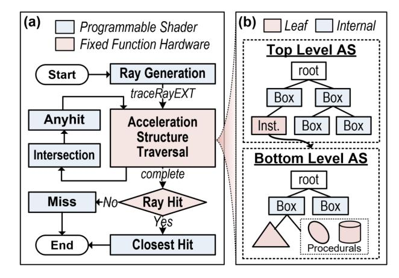

Fig. 2: (a) Typical ray tracing pipeline. (b) Acceleration structure in Vulkan, consisting of a top-level structure (TLAS) for the scene and bottom-level structures (BLAS) for objects.

of our proposed Gaussian Tracing Accelerator, including modifications to the existing RTA architecture and dedicated intersection and any-hit units. The evaluation methodology and experimental results are reported in Section V and Section VI, respectively. Finally, Section VIII concludes this paper.

#### II. BACKGROUND

#### *A. Preliminary of Ray Tracing*

Principle: Ray tracing physically simulates the transport of light, as depicted in Fig. 1. A primary ray is cast from the camera through each pixel to determine visible surfaces, while secondary rays are recursively spawned to capture indirect lighting and global illumination effects. Unlike rasterization, which projects geometry directly onto the image plane, ray tracing performs geometric intersection tests in object space, enabling physically accurate effects such as soft shadows, reflections, and caustics. This unified formulation provides the foundation for photorealistic rendering.

Pipeline: Modern ray tracing pipelines, standardized by APIs such as Vulkan [39], NVIDIA OptiX [40], and DirectX Raytracing (DXR) [41], adopt a programmable framework where shader stages are explicitly defined and implemented in languages such as GLSL [42] and CUDA [43]. Fig. 2(a) illustrates the typical ray tracing pipeline specified in Vulkan. The *Ray Generation* shader is responsible for casting primary rays per pixel, initializing ray properties (e.g., origin and direction), and initiating the traversal of primitives in the scene. During traversal, the *Intersection* shader and the *Any-Hit* shader are invoked as needed when candidate primitives are visited, enabling custom intersection tests for non-builtin types and visibility checks. After traversal completes, either the *Closest-Hit* shader is executed to compute shading for the effective hit primitive, or the *Miss* shader is called to handle rays that intersect no geometry. Rays can recursively spawn additional rays from within shaders, triggering subsequent

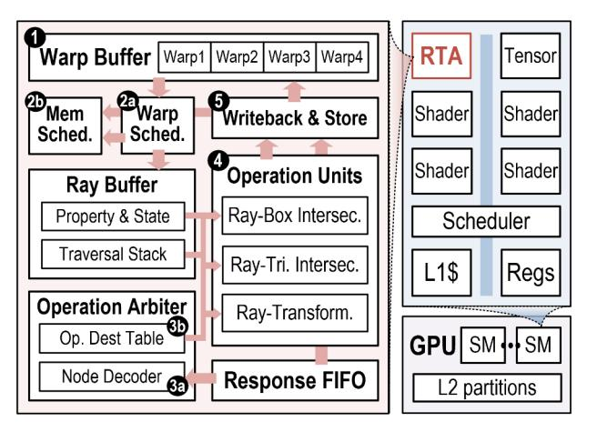

Fig. 3: Microarchitecture of a ray tracing accelerator and its integration into the GPU.

tracing until the termination condition specified in the Ray Generation is satisfied.

**Acceleration Structure:** To enable high-performance ray tracing, large numbers of scene primitives are organized into an acceleration structure (AS), typically implemented as a bounding volume hierarchy (BVH). The AS reduces the number of intersection tests required during ray traversal by hierarchically culling non-relevant geometry. In Vulkan, the AS is defined in two levels, as illustrated in Fig. 2(b). There is a single top-level AS (TLAS) per scene, which constructs all the objects within it. Its internal nodes are hierarchical boxes, and each leaf node references an object instance, where its corresponding transformation matrix is stored. The bottomlevel AS (BLAS) is constructed for each unique object's geometry, with leaf nodes representing either triangle meshes or procedural primitives (e.g., sphere, cylinder). The procedural leaves are non-builtin and are handled by the general shader cores for intersection and response evaluation.

#### B. Ray Tracing Accelerator

Modern GPUs, such as NVIDIA RTX [5] and Imagination PowerVR Photon [3], integrate dedicated RTAs to accelerate ray tracing workloads. RTAs work in tandem with generalpurpose cores to perform two primary functions: (1) AS traversal, which efficiently walks through the BVH tree, and (2) Intersection tests for builtin geometries (i.e., box and triangle), efficiently handled by specialized fixed-function operation units. Fig. 3 illustrates a typical RTA architecture modeled in Vulkan-Sim [44], where one RTA is deployed per streaming multiprocessor (SM). Rays are grouped into warps aligned with the GPU"s general-purpose shader cores, and the RTA's control flow proceeds as follows: • When the SM scheduler issues a traceRay instruction, the corresponding ray metadata (e.g., origin and direction) is enqueued into the RTA's warp buffer. 2 Each cycle, the RTA's internal warp scheduler selects an active warp to process, fetching the top node from its traversal stack. 3 After the memory response, node data is decoded by an operation arbiter, which determines its type and forwards it, along with the associated ray data, to the appropriate operation unit. • The operation units handle fixed functions based on node type: ray transformation for instance nodes, ray-box intersection tests for internal nodes, and ray-triangle intersection tests for mesh leaf nodes. • The computed results (e.g., hit point and distance) are either written back to update ray state, or dispatched to the general-purpose cores for shading.

#### C. Prevailing Gaussian Primitive

**3DGS:** Kerbl et al. [9] propose representing scenes with 3D Gaussian ellipsoids, where each primitive follows Eq. 1 and is parameterized by its center  $\mu$ , 3D covariance matrix  $\Sigma$ , and an opacity term o indicating its weight.

$$G(x) = o \cdot \exp(-\frac{1}{2}(x - \mu)^T \Sigma^{-1}(x - \mu))$$
 (1)

The 3D covariance is factorized into a scaling matrix  $S \in \mathbb{R}^{3 \times 3}$  and a rotation matrix  $R \in SO(3)$  as expressed in Eq. 2. Both matrices are stored in their compact vector representations: a quaternion  $q \in \mathbb{R}^4$  for the rotation and a vector  $s \in \mathbb{R}^3$  for the scaling.

$$\Sigma = RSS^T R^T \tag{2}$$

To render an image, a 3D Gaussian is first transformed into camera coordinates using the world-to-camera transform, and then projected onto the image plane through a local affine transformation. By discarding the third row and column of the transformed 3D covariance matrix, a 2D Gaussian splat with its corresponding covariance is obtained. The final image is generated by performing volumetric alpha blending, integrating the alpha-weighted color of Gaussians from front to back along the ray, as described in Eq. 3). The parameters of the 3D Gaussian primitives are trained through a photometric loss to match the ground-truth images.

$$C = \sum_{i=1}^{N} T_i \alpha_i c_i, \ T_i = \prod_{i=1}^{i-1} (1 - \alpha_i)$$
 (3)

**2DGS:** 2D Gaussian [14] is derived from 3D Gaussian by setting the z-component of the scaling vector to zero, effectively degenerating the 3D ellipsoid into a planar ellipse. Unlike conventional approaches that approximate depth at the Gaussian centroid, 2DGS explicitly computes the precise intersection point (u,v) of the pixel (x,y) on the 2D ellipse, following Eq. 4. Specifically,  $h_u = [-1,0,0,x] \cdot P$  and  $h_v = [0,-1,0,y] \cdot P$ , where  $P \in \mathbb{R}^{4\times 4}$  denotes the transformation matrix from the elliptical space to the world space.

$$u = \frac{h_u^{[2]} h_v^{[4]} - h_u^{[4]} h_v^{[2]}}{h_u^{[1]} h_v^{[2]} - h_u^{[2]} h_v^{[1]}}, v = \frac{h_u^{[4]} h_v^{[1]} - h_u^{[1]} h_v^{[4]}}{h_u^{[1]} h_v^{[2]} - h_u^{[2]} h_v^{[1]}}$$
(4)

This formulation ensures view-consistent depth evaluation. Compared to 3D Gaussian models, the 2D Gaussian is inherently better suited for representing surface-aligned geometry, enabling reliable normal estimation. This, in turn, improves geometry-aware scene reconstruction.

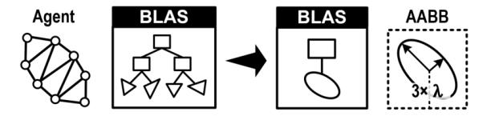

Fig. 4: Gaussian primitive representations. Left: Polyhedronapproximate mesh agent [27]. Right: Procedural leaf.


Fig. 5: Comparison between Icosahedron-agent and procedural Gaussian. (a) Memory footprint of the BVH tree. (b) Latency of building the tree tested on RTX3090.

#### *D. Ray-oriented Gaussian Rendering*

Beyond splatting, Gaussian models have been extended to be ray-oriented, which currently follows two main directions. First is the visual alignment of tile-wise rasterization and ray-wise rendering. Traditional splatting relies on a Jacobianbased linear approximation and uses the centroid depth for intersection estimation. However, this introduces geometric inconsistencies and does not account for non-linear camera distortions. To address these issues, StopThePop [25] proposes a hierarchical tile-to-pixel depth sorting scheme that reduces popping artifacts and enhances view consistency. Moreover, 3DGUT [26] introduces the 3D Gaussian Unscented Transform, which evaluates the 2D splat through statistical sampling of sigma points, thereby capturing the underlying nonlinearity of the projection process. The second direction is incorporating Gaussian into ray tracing pipeline. 3DGRT [27] is the first framework to realize 3D Gaussian ray tracing on NVIDIA OptiX. It adopts a mesh-agent representation for fast intersection testing and a k-buffer scheme for volumetric ray marching. 2DGRT [28] further exploits the explicit intersection formulation of 2DGS to build a differentiable inverse rendering framework, enabling joint learning of scene geometry and lighting.

## *E. Challenges and Motivations*

Challenge 1 - Inefficient Software Shader: Shader invocations cause thread divergence and data exchange between the RTA and shader core. The intersection shader incurs high latency from redundant instructions, while the any-hit shader adds memory traffic for global buffer operations.

Motivation 1 - Specialized Hardware Shader: By treating Gaussian primitives as native leaf nodes and equipping dedicated intersection and any-hit units, ray-Gauss evaluation can be executed directly in RTA, eliminating shader invocation, general instruction and global memory access.

Challenge 2 - Divergence Between 3D/2D Gaussian: Both 3D Gaussian and 2D Gaussian are prevailing primitive candidates. However, supporting both of them with separate hardware pipelines incurs significant overhead, as their distinct intersection tests lead to duplicated units, increasing both area overhead and power consumption.

Motivation 2 - Reconfigurable Intersection Unit: By identifying shared computational patterns between 3DGS and 2DGS and reusing functional units via mode switching, the hardware overhead can be reduced, achieving efficient support for heterogeneous Gaussian primitives.

Challenge 3 - Inefficient BVH Traversal: In Gaussian ray tracing, some hit nodes are visited but eventually discarded due to buffer limitation or early termination. Such redundant traversal leads to excessive memory access and computation overhead, thereby increasing overall latency.

Motivation 3 - Pruning Redundant Visit: By maintaining the maximum hit distance as a geometric barrier, nodes farther than this bound can be safely pruned, reducing redundant traversal and improving overall pipeline efficiency.

## III. GAUSSIAN RAY TRACING IN VULKAN

This section presents our implementation of Gaussian ray tracing using the Vulkan API [44]. We describe the methodology for integrating Gaussian primitives into the BVH structure and outline the corresponding programming model, which faithfully follows the algorithmic workflow in [27], a widely adopted best practice in Gaussian ray tracing. Our implementation is introduced to enable fine-grained profiling of the baseline in Vulkan-Sim and to facilitate controlled evaluation of our architectural modifications in the Sec IV, rather than to propose algorithmic changes.

# *A. Acceleration Structure*

Since Gaussian primitives are not natively supported, they are registered as procedural primitives in Vulkan. Unlike the icosahedron-approximated representation adopted in [27], where each Gaussian expands into twenty triangles with twelve vertices, our implementation adopts a one-to-one mapping between a Gaussian and a procedural leaf node in the BLAS (Fig. 4). By avoiding geometric expansion, the procedural representation preserves a compact acceleration structure with a significantly reduced memory footprint. As shown in Fig. 5, compared to the icosahedron counterpart, it reduces BVH size by 26× and accelerates BVH construction by 1.5×, owing to the elimination of redundant triangle primitives. The axis-aligned bounding box (AABB) of each Gaussian is conservatively defined based on its spatial scaling parameters, ensuring complete coverage of its volumetric span.

### *B. Memory Allocation*

We explicitly manage GPU memory to accommodate the Gaussian ray tracing. The corresponding buffers are registered as *Storage Buffer Objects* (SSBO) and bound to programmable shaders via descriptor bindings. The specific implementations are described below.

#### Algorithm 1 Ray-gen Shader

```
Require: pixel, camera, BVH, tMin, tMax, threshold
Ensure: Ray-Gen
 1: rayPayloadEXT Ray
 2: origin, direction = rayCast(pixel, camera)
 3: while Ray.trans > threshold and Ray.thit > 0 do
 4: traceRayEXT(BVH, origin, direction, tMin, tMax)
 5: origin = origin + Ray.thit × direction
 6: end while
 7: imageStore(pixel, Ray.color)
```

Gauss Param Buffer: Gaussian parameters, including position, covariance, opacity, and color, are stored in a compact layout. This buffer is bound to both the intersection and closest-hit shaders, allowing straightforward access to Gaussian attributes during ray-Gauss evaluation.

Closest Hit Buffer: Conventional ray tracing only records the closest mesh hit, while tracing through Gaussians can intersect and blend multiple primitives. To this end, we allocate a Closest Hit Buffer to store the closest-K hits per ray, organized as a 2D array of dimensions Nray × K. Each entry records three essential attributes: (1) hit distance thit, which serves as the sorting criterion to preserve the correct blending order with respect to the ray origin. (2) alpha value, representing the attenuation factor that quantifies the contribution of the intersected Gaussian to the ray's transmittance. (3) primitive index (GID), which provides a reference for the closest-hit shader to retrieve the Gaussian's texture attributes, thereby enabling color computation.

Hit Count Buffer: Vulkan provides the RayPayloadEXT API, allowing the closest-hit shader to access per-ray properties stored in the warp buffer, but this API is restricted in intersection and any-hit shaders. In Gaussian ray tracing, however, any-hit shaders need to update the number of hit Gaussians per ray, denoted as Nhit. To this end, we introduce a separate Hit Count Buffer, accessible for all shader types.

### *C. Programming Model*

As conventional practice, BVH traversal is handled by the RTA, including node visits and other fixed-function operations. While programmable shaders are executed on the SM cores, including the customized ray-Gauss intersection shader that is invoked by the RTA upon detecting candidate primitives. Under Vulkan-Sim's delayed scheduling strategy, intersection shader invocations are recorded into a task table during traversal rather than executed immediately. After all threads within a warp complete traversal, each thread sequentially processes its recorded intersection tasks. As a result, the execution latency of BVH traversal and shader execution can be decoupled for fine-grained analysis. To clarify the overall control flow of Gaussian ray tracing, we next walk through the core shaders in the baseline implementation.

Ray-Gen Shader (Alg. 1): We adopt a one-thread-perray mapping, where the ray-gen shader serves as the main kernel, and other shaders are invoked as function calls.

```
Algorithm 2 Any-hit Shader
```

```
Require: hitAttrib, rayID, HitCount, ClosestHit
Ensure: Any-Hit
 1: Nhit = HitCount[rayID]
 2: tmp = hitAttrib
 3: for entryID = 0 to Nhit do
 4: entry = &ClosestHit[rayID][entryID]
 5: if tmp.thit < entry.thit then
 6: Swap(tmp, entry)
 7: end if
 8: end for
 9: if Nhit < K then
10: ClosestHit[rayID][Nhit] = tmp
11: HitCount[rayID] = Nhit + 1
12: end if
```

Given the volumetric nature of Gaussian models, the ray-gen shader is organized as an iterative loop. In each iteration, the traceRayEXT function is invoked, and the loop terminates once the ray either misses all primitives or its transmittance falls below a predefined threshold. After each invocation, the ray origin marches along its direction by the hit distance thit reported by the closest-hit shader. This incremental marching strategy prevents revisiting previous Gaussians, ensuring correctness and efficiency.

Any-Hit Shader (Alg. 2): Integrated within the intersection shader, once a Gaussian hit is confirmed, the any-hit shader performs a comparison-based insertion to maintain the Closest Hit Buffer in ascending order of hit distance. If the Closest Hit Buffer is not yet full, the new hit is inserted; otherwise, it is discarded when its distance exceeds the farthest record. This process ensures that only the closest-K hits are retained for subsequent blending in the closest-hit shader.

Closest-Hit Shader (Alg. 3): The closest-hit shader reads the ray's Nhit from the Hit Count Buffer to identify the effective hits inside the Closest Hit Buffer. It then traverses these entries, blending their colors weighted by alpha to update the ray's accumulated color and transmittance. Finally, the

```
Algorithm 3 Closest-hit Shader
```

```
Require: rayID, GaussParam, HitCount, ClosestHit
Ensure: Closest-Hit
 1: rayPayloadEXT Ray
 2: Nhit = HitCount[rayID]
 3: T, C = &Ray.trans, &Ray.color
 4: for entryID = 0 to Nhit do
 5: entry = ClosestHit[rayID][entryID]
 6: alpha = entry.alpha
 7: color = GaussParam[entry.GID].color
 8: C += T × alpha × color
 9: T *= 1 - alpha
10: end for
11: Ray.thit = ClosestHit[rayID][Nhit-1].thit
12: HitCount[rayID] = 0
```

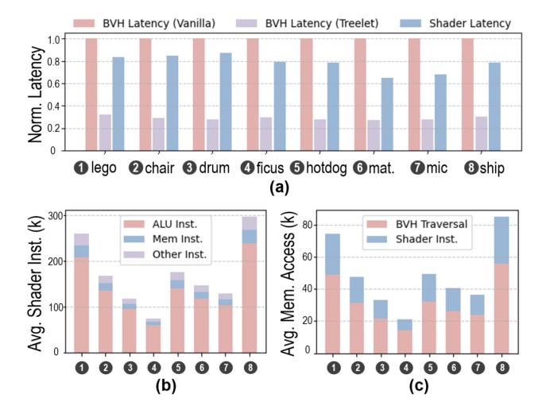

Fig. 6: Profiling of Gaussian ray tracing. (a) Comparison of latency between BVH traversal and shader execution. (b) Breakdown of shader instructions. (c) Comparison of memory access between BVH traversal and shader execution.

shader updates the ray's hit distance thit with the farthest hit recorded in the buffer, marking the maximum distance reached in the current traceRayEXT round.

#### *D. Inefficiency Analysis*

To identify performance bottlenecks in Gaussian ray tracing, we evaluate the proposed pipeline using Vulkan-Sim [44], a cycle-accurate RTA simulator that supports the Vulkan API. The simulator enables fine-grained architectural profiling of shader execution and BVH traversal, which is difficult to isolate on commercial devices due to tightly interleaved SM and RTA activities. Experiments are conducted on eight scenes from the NeRF-Synthetic dataset [8]. Notably, BVH traversal's memory access can benefit from established optimizations such as ray-coherent scheduling [45] and treelet prefetching [46]–[48], both of which are essential for highperformance RTAs. We incorporate these techniques as part of the baseline and will detail our enhancement in Sec. IV-D.

Fig. 6(a) presents the normalized per-ray latency, decomposed into BVH traversal (on RT cores) and software shader execution (on SM cores), which are serialized in Vulkan-Sim. For clarity, traversal latencies with and without treelet optimizations are shown separately, revealing the shifting performance bottleneck under the two configurations. Without treelet optimizations, BVH traversal latency is on average 1.3× higher than shader execution. In contrast, with treelet prefetching enabled (size of 16KB with ping-pong scheme), the traversal is substantially accelerated and shader execution becomes the dominant contributor, accounting for 72.9% of the total ray-tracing latency.

We further profile the shader's instruction and memory traffic. Fig. 6(b) breaks down the instructions into three categories: ALU operations, memory accesses, and other (e.g., control operations, shader calls, and special functions). Among

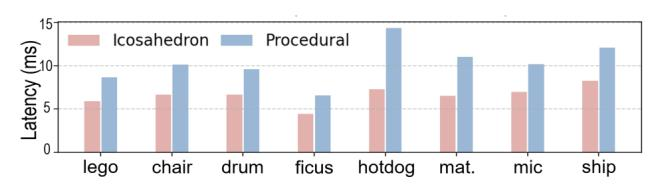

Fig. 7: Comparison of ray tracing latency between icosahedron agent and procedural primitive.

them, ALU operations dominate, accounting for an average of 80.3%, 8.2× higher than memory accesses. This highlights the compute-intensive nature of the intersection shader, primarily stemming from the complex mathematical operations required by ray-Gauss evaluation. Fig. 6(c) compares the amount of memory accesses between BVH node fetches handled by the RTA and global memory accesses initiated by shader cores. Shader-side accesses for Gaussian parameter loading and hitbuffer management, contribute ∼ 21% of the traffic relative to BVH traversal, presenting a considerable overhead.

To validate that our simulator-based observations reflect practical behavior, we further profile an NVIDIA RTX 3090 using an NVIDIA OptiX deployment. Fig. 7 compares the endto-end latency of an icosahedron-based representation, which leverages hardware ray–triangle intersection units, with that of a procedural Gaussian primitive executed via SM shaders. The latter exhibits a 1.6× higher latency, corresponding to a shader execution overhead of 38%. This trend is consistent with our Vulkan-Sim profiling results, which report a 43% latency contribution in the vanilla-BVH configuration. The 5% discrepancy is likely attributable to increased BVH traversal overhead in the icosahedron case due to its expanded hierarchy.

Our profiling indicates that Gaussian ray tracing is limited by the software shader execution. The heavy cost of procedural-leaf evaluation and shader-side memory traffic erodes the benefits of hardware-accelerated BVH traversal, highlighting the need for dedicated architectural support for ray-Gauss evaluation and hit-buffer management.

# IV. GAUSS TRACING ACCELERATOR

This section introduces our proposed GauTracer architecture, which is designed to accelerate both shader execution and BVH traversal. We first describe the modifications made to the baseline RTA, highlighting an incremental design strategy for lightweight extension. We then detail the design of hardware shaders, including a reconfigurable Ray-Gauss Intersection Unit (RGIU) that supports both 3DGS and 2DGS, and a max-heap-based Any-Gauss-Hit Unit (AGHU) that efficiently handles the insertion and sorting of the hit Gaussians. Finally, we present a memory-efficient, treelet-based BVH traversal scheme that incorporates a far-node pruning strategy to reduce redundant node visits and enhance traversal efficiency.

# *A. RTA Modification*

Fig. 8 highlights the modification to the baseline RTA in red, which covers the following components:


Fig. 8: Modifications to RTA. (a) Node encoding of Gaussian leaf. (b) Operation arbiter and units. (c) Ray buffer.

**Leaf Node Encoding:** The leaf node encodes the geometry and properties required for intersection tests. For a Gaussian primitive, its geometry can be represented by a  $4\times4$  homogeneous transformation matrix T (Eq. 5), which maps a standard normal Gaussian, shaped as a unit sphere, to an arbitrary ellipsoid in the world space.

$$T = \begin{bmatrix} M & \vec{\mu} \\ 0 & 1 \end{bmatrix}, \quad M = RS = \begin{bmatrix} s_0 \vec{r_0} & s_1 \vec{r_1} & s_2 \vec{r_2} \end{bmatrix} \quad (5)$$

To simplify the ray-Gauss intersection test, we encode the leaf node with the inverse transformation matrix, T' (Eq. 6), instead of storing the original decomposition factors (i.e., scale S, rotation R, and center  $\mu$ ).

$$T' = \begin{bmatrix} M^{-1} & -M^{-1}\vec{\mu} \\ 0 & 1 \end{bmatrix}, \ M^{-1} = S^{-1}R^T$$
 (6)

This allows rays to be directly transformed from world space to a unit-sphere space centered at the Gaussian and aligned with its principal axes, as illustrated in Fig. 8(b). Operating in this normalized space enables straightforward computation of intersection distances and responses (Sec. IV-B), eliminating the need for additional translations or covariance matrix inversions. It is worth noting that 2DGS differs from 3DGS in that the third scaling component  $s_z$  is effectively zero. To avoid singularities, we set this component to a constant while restricting intersection tests to the z=0 plane. Since the T' is also homogeneous (Eq. 6), only 12 elements (48B) need to be stored. Combined with the opacity, a Gaussian ID, and a 2-byte descriptor, each Gaussian leaf occupies 64B in total,


Fig. 9: Reconfigurable Ray-Gauss Intersection Unit (RGIU). (a) Principle of the ray-3DGS intersection test. (b) Principle of the ray-2DGS intersection test. (c) Computing units and data flows: red denotes 3DGS mode, blue denotes 2DGS mode, and purple denotes the shared part.

matching the size of a conventional triangle leaf, enabling seamless integration into BVH construction and node access. Appearance parameters such as spherical harmonics or colors are stored separately as texture data and accessed via the Gaussian ID in the programmable closest-hit shader, providing flexibility for shading.

Operation Arbiter and Units: During traversal, fetched nodes are forwarded to the operation arbiter, where a node decoder interprets their descriptors. The decoded information is then passed to the operation destination table, routing each request to the appropriate operation unit based on the node type. To support the introduced Gaussian leaf, the node type field in the leaf descriptor is extended from one bit to two bits, enabling explicit differentiation among triangle, procedural, 3D Gaussian, and 2D Gaussian primitives. Correspondingly, additional operation flows are integrated into the operation destination table to handle these Gaussian types. To efficiently support built-in intersection test for Gaussian primitives, we repurpose the existing Ray Transformation Unit (TRAN), which was originally designed to map rays from world space to object space using instance nodes' transformation matrices. Upon processing a Gaussian node, the TRAN reads its inverse transformation matrix T' (Eq. 6) and performs two matrixvector multiplications to transform the ray's origin and direction into the normalized unit-sphere space. These transformed ray attributes are then stored in the Ray Buffer and passed to the RGIU for intersection test and response evaluation. Notably, the impact of Gaussian primitives on the arbiter is limited to extending the routing path in the destination table and enabling a sequential dispatch (TRAN → RGIU) within the existing framework, without introducing new arbitration stages or modifying the arbitration policy.

**Ray Buffer:** The ray buffer is extended with a Hit Gauss Buffer, which maintains up to 16 entries of ray-Gauss intersections. Each entry records the hit distance, alpha value, and primitive ID. Additionally, a hit counter is introduced to

track the number of hit Gaussians in buffer, which is reset before each traceRay invocation. The Hit Gauss Buffer is implemented as per-thread register and its maintenance during Gaussian ray tracing is detailed in Sec. IV-C.

#### B. Reconfigurable Ray-Gauss Intersection Unit

Unlike traditional ray-triangle or ray-box intersection tests, which rely on explicit geometric boundaries, a ray-Gauss hit is determined by evaluating the response at the intersection candidate point (i.e., alpha value) and comparing it against a threshold (typically 1/255). The definition of the intersection candidate differs between 3D and 2D Gaussian primitives, which are illustrated in Fig. 9 (a) and (b), respectively.

For 3D Gaussian, the intersection point is defined as the position along the ray where the Gaussian response is maximized. In the normalized unit-sphere space, this is equivalent to projecting the coordinate origin onto the ray. The resulting projection distance,  $t_{hit}^g$ , is computed as the dot product between the transformed ray origin  $\vec{O}$  and the normalized direction d/|d|. This value is further scaled by |d| to restore the corresponding world-space hit distance  $t_{hit}$ . Finally, the squared radial distance  $r_{hit}^2$  from the hit point to the center is derived from the Pythagorean theorem. For 2D Gaussian, the candidate is directly the intersection point of the ray with the 2D ellipse. Since the z-axis is perpendicular to the 2D planar after transformation,  $t_{hit}$  can be computed as the ratio between the z-component of the transformed ray origin and that of the transformed ray direction. The 2D coordinates of the intersection point (u, v) are then obtained by marching the origin along the ray by  $t_{\rm hit}$ .

To support both scenarios with minimal overhead, our reconfigurable hardware unit maximizes the reuse of computational resources. For 3DGS, the computation requires three dot-product units (vec3), one reciprocal unit and one scalar multiplier (together forming a floating-point divider), and one multiply-accumulate (MAC) unit. This configuration fully adapts to 2DGS, where the MAC operation can be realized via a dot-product unit. Reconfigurability is achieved through lightweight multiplexers that redirect the dataflow of computation units, driven by a single-bit flag switching between 3DGS and 2DGS modes.

Regarding the response evaluation, both 2DGS and 3DGS follow the same computation flow as shown in Fig. 9(c): the  $r_{hit}^2$  is halved, passed through an exponential activation, and further weighted by the Gaussian opacity to obtain the alpha value. If the alpha value exceeds the threshold, the Gaussian is hit. To support this, we integrate an exponent unit based on a piecewise linear approximation. A lookup table stores the slope and bias for sampled segments of the exponential function. To balance accuracy with hardware overhead, the approximation is restricted to a limited interval. Inputs outside this interval are directly pruned: values less than or equal to zero are considered numerically unstable, while the value beyond the upper bound is certain to yield a result below the threshold. To eliminate repetitive computation of alpha, the RGIU directly forwards its alpha result to the Hit Gauss Buffer.

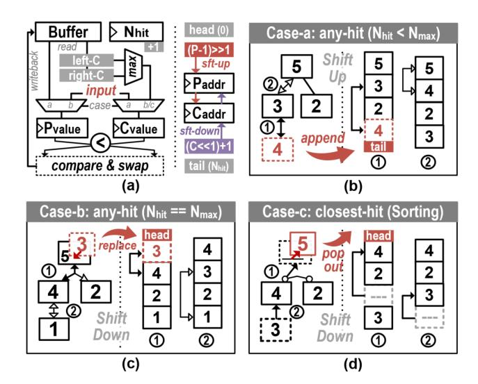

Fig. 10: Max-heap-based Any-Gauss-Hit Unit. (a) Circuit schematic, where P and C denote the parent and child nodes, respectively. (b)-(d) Behavior under three cases. The manipulations on both the heap and the corresponding buffer are illustrated; hollow arrows indicate rejected swaps, while solid arrows denote accepted ones.

## C. Max-Heap-based Any-Gauss-Hit Unit

The Hit Gauss Buffer is organized as a max-heap, forming a complete binary tree that can be linearly mapped in memory without explicit indexing. This layout allows parent—child relationships to be efficiently derived through lightweight bit-shift and increment operations. Each entry in the heap is keyed by its intersection distance  $t_{hit}$  field, ensuring that the farthest hit always resides at the root while parent nodes hold values no smaller than their children. This organization supports rapid insertion when new hits occur during traversal, and allows direct selection-based sorting for alpha blending in the closest-hit shader. Both functions are managed by the Any-Gauss-Hit Unit (AGHU), the schematic of which is illustrated in Fig. 10(a). The corresponding behaviors are detailed below.

Any-hit Behavior: When the RGIU forwards the hit attributes to the AGHU, two scenarios are distinguished: 0 When the heap is not yet full (Fig. 10(b)), a newly hit Gaussian is appended to the end of the array by assigning it the index  $N_{hit}$ , after which  $N_{hit}$  is incremented. The FSM then performs a recursive shift-up procedure to restore the parent-child ordering. At each step, it reads the parent value and compares it with the inserted entry, which is retained in a register to minimize memory accesses. If the parent is smaller, its value is swapped down to the child's position while the index is updated upward. This process continues until the heap property is satisfied or the root is reached, at which point the inserted entry is written back to its final location. **2** Once the heap reaches its maximum capacity (Fig. 10(c)), each newly hit Gaussian is first compared with the maximum  $t_{hit}$  value stored at the root. If the new hit has a larger  $t_{hit}$ , it is immediately discarded. Otherwise, it replaces the root entry, and a shift-down procedure is invoked to restore the max-heap property. In contrast to shift-up, the FSM traverses child nodes, performing comparisons and propagating values downward as necessary until the heap property is reestablished.

Notably, since Vulkan imposes no ordering requirements on intersection tasks, RGIU's output can be buffered and processed by AGHU asynchronously. This allows BVH traversal to proceed concurrently with hit buffer management, effectively hiding the latency of heap operations.

Closest-hit Behavior: After the BVH traversal completes, the  $N_{hit}$ -closest hit Gaussians are blended to update the ray state. The max-heap data structure facilitates the sorting of the valid entries in the hit buffer (Fig. 10(d)). In each iteration, the FSM pops the maximum entry at the root and initiates a shift-down procedure to fill the vacant parent position. This produces a far-to-near Gaussian sequence, which is opposite to the original front-to-back blending order. To avoid additional reordering overhead, we adopt a back-to-front blending scheme for the partial color sum  $C^p$  of each traceRayEXT invocation. Instead of attenuating each Gaussian's color contribution  $\alpha_i c_i$  by its preceding transmittance  $T_i$  (as described in Eq. 3), we recursively attenuate the partial sum  $C_i^p$  by the factor  $1-\alpha_i$ , accumulating the occlusion effect of foreground Gaussians, as described in Eq. 7.

$$C_{i+1}^p = \alpha_i c_i + (1 - \alpha_i) C_i^p, \quad i = 0 \to N_{hit}, \quad C_0^p = 0$$
 (7)

The resulting partial color is then blended into the pixel accumulation by attenuating it with the transmittance value recorded in the ray buffer:  $C += T \cdot C^p$ . Regarding the transmittance computation, since it is independent of the blending order, the partial product can be directly evaluated as  $T^p = \prod (1-\alpha_i)$ . The ray's transmittance is then updated once per iteration using this factor,  $T *= T^p$ , enabling early termination at the round level rather than on a per-Gaussian basis. This approximation introduces negligible deviation from the original formulation, as the contributions of highly attenuated Gaussians are already negligible.

## D. Efficient BVH Traversal

With the shader inefficiency resolved by the hardware support, the performance bottleneck shifts back to BVH traversal. We thereby adopt the following techniques for further acceleration, combining treelet prefetching and far-node pruning.

Treelet Prefetching: To reduce per-node memory access latency, GauTracer builds upon a treelet-based RTA architecture [48]. In this paradigm, the global BVH is partitioned into a collection of compact sub-trees (treelets), each sized to fit within an SM core's L1 cache. The nodes belonging to a treelet are stored contiguously in memory, enabling efficient bulk fetching from global memory. We construct treelets in a breadth-first manner to capture a broader set of traversal paths and improve data reuse. For each internal node, its children are either included within the same treelet or promoted as roots of their own child treelets. Leaf nodes are merged into their parent treelets following the strategy in [49]. During BVH


Fig. 11: (a) Micro-architecture of the treelet controller. (b) Principle of treelet-based traversal with far-node pruning. Dashed circles mark the roots of individual treelets (distinguished by color), while squares denote leaf nodes.

traversal, rays in the warp buffer fully process the current treelet before moving on to the next, with scheduling driven by a counter table that tracks the ray population of each treelet, as shown in Fig. 11(a). This scheme improves the spatial locality of node accesses and increases the reuse of cached treelet data, thereby accelerating BVH traversal. Regarding the traversal stack, each ray now maintains a two-level hierarchy comprising a treelet stack and a node stack. During traversal, the node decoder pushes children of the current treelet onto the node stack, and child-treelet roots onto the treelet stack. Both stacks are maintained in per-ray registers to minimize memory access latency. When traversal depth exceeds the available register space, bottom entries are spilled to local memory, following a short-stack strategy [50].

Far-Node Pruning: Traversal also suffers from redundant node visits, an inefficiency that conventional treelet approaches leave unaddressed. To this end, we augment treelet-based optimization with far-node pruning, which reduces unnecessary node visits and further alleviates traversal overhead. The key idea is to utilize the current maximum hit distance as a geometric barrier to prune future node visits. Given the limited capacity of the Gauss buffer, nodes outside the closest-k range can be safely discarded. To enable the pruning function, we introduce a barrier flag that is maintained during each traceRayEXT round. Once the hit buffer becomes full, this flag is raised, and the current maximum hit distance (i.e., the buffer head) is designated as the pruning threshold. This threshold is continuously updated as nearer hits are discovered. As illustrated in Fig. 11(b), nodes whose ray-box hit distance exceeds this threshold are excluded from the traversal stack, preventing traversal into their corresponding sub-trees. This mechanism substantially reduces node visits and computation overhead in dense Gaussian scenes.

Whether to prioritize the closest node? With the farnode pruning applied, one intuition is to trigger the barrier flag earlier and enable more aggressive pruning. This can be achieved by sorting the children nodes by hit distance and prioritizing the visit of the closest node. Notably, we can

TABLE I: Scene BVH Information

| Scene       | ❶ Lego | ❷ Chair | ❸ Drums | ❹ Ficus | ❺ Hotdog | ❻Material | ❼ Mic  | ❽ Ship |
|-------------|--------|---------|---------|---------|----------|-----------|--------|--------|
|             |        |         |         |         |          |           |        |        |
| Gaussian    | 276679 | 413150  | 444636  | 189907  | 135344   | 255352    | 195310 | 273661 |
| Inter. Node | 91225  | 135366  | 146307  | 62946   | 44607    | 84062     | 64296  | 89769  |

reuse the existing AGHU to support the sorting. However, our evaluation finds that the bonus of the closest-first policy is little, and this will be discussed in Sec. VI-B.

#### V. EVALUATION SETUP

#### *A. Methodology*

Designed as an extension to the RTA architecture, Gau-Tracer is evaluated in terms of its performance gains and overheads against a baseline RTA design. The baseline is assumed to incorporate treelet prefetching and scheduling schemes as proposed in [48], which represent fundamental techniques for optimizing memory access in RTAs, and are complementary to our contributions on shader and traversal optimization. Notably, our work focuses on ray-wise Gaussian tracing efficiency, while system-level concerns such as ray scheduling and SIMT utilization are studied in orthogonal research [51]–[53]. Due to the lack of publicly available implementation details for commercial RTAs, we adopt Vulkan-Sim [44] as our evaluation platform. Vulkan-Sim is a cycleaccurate GPU simulator that provides a configurable RTA model for ray tracing applications using the cross-vendor Vulkan API, and has been widely employed in prior RTA architectural research [54]–[56]. To evaluate our techniques, we extend Vulkan-Sim by integrating a treelet-based stack loop into its traversal logic, modifying the BVH node packing and decoding routines, and implementing the full set of ray-Gauss interaction functions described in Sec. IV. For functional testing, we evaluate the design at full resolution to collect detailed statistics. For performance evaluation, we sample a subset of rays within the central effective rendering region to reduce simulation time.

TABLE II: Vulkan-Sim Configuration

| # Streaming Multiprocessors (SM) | 30                                |  |  |
|----------------------------------|-----------------------------------|--|--|
| Max Warps / SM                   | 32                                |  |  |
| Warp Size                        | 32                                |  |  |
| Warp Scheduler                   | GTO                               |  |  |
| # Registers / SM                 | 65536                             |  |  |
| Instruction Cache                | 128KB, 16-way assoc., 20 cycles   |  |  |
| L1 Data Cache + Shared Memory    | 64KB, full assoc., LRU, 20 cycles |  |  |
| L2 Unified Cache                 | 3MB, 16-way, LRU, 160 cycles      |  |  |
| Core, interconnect, L2 Clock     | 1365 MHz                          |  |  |
| Memory Clock                     | 3500 MHz                          |  |  |
| # RT Units / SM                  | 1                                 |  |  |
| RT Unit Warp Buffer Size         | 4                                 |  |  |

## *B. Configuration*

The overall configuration of Vulkan-Sim, including GPU, RTA, and memory subsystem parameters, is listed in Table II, matching a mid-range NVIDIA GPU, RTX2060 [57]. Vulkan-Sim allows custom definition of operation latencies for various node types, including the ray-Gauss intersection test, which is the primary focus of this work. We derive the latencies of operation units (detailed in Table III) from Agner Fog's instruction tables [58], which documents instruction-level latencies across multiple processor architectures.

Regarding the specific configuration of our proposed techniques, the size of the Hit Gauss Buffer is set to 16 to balance performance gains with per-thread register overhead, as discussed in Sec. VI-C. Each treelet is configured to contain 256 nodes. With 64B per node, this corresponds to a 16KB treelet size, which fits within the L1 cache and allows pingpong buffering to further hide memory access latency.

## *C. Benchmark*

We evaluate our proposed design on eight representative object-centric scenes from the NeRF-Synthetic dataset [8]. For rendering quality evaluation, we use Gaussian point clouds obtained at the 30,000th training iteration of the 3DGRT [27] and render at a resolution of 800×800. The BVH trees are constructed using Intel Embree [59] with a branching factor of six. The corresponding scene statistics are summarized in Table I. For hardware performance evaluation, we instead use Gaussian point clouds from early training iterations, where scene geometry is established while the number of Gaussians remains moderate. This choice significantly reduces simulation time while preserving sufficient geometric structure for evaluation.

# VI. EXPERIMENTAL RESULT

## *A. Performance Gain by Hardware Shader*

We analyze the performance gains contributed by the proposed Ray-Gauss Intersection Unit (RGIU) and Any-Gauss-Hit Unit (AGHU) using an incremental evaluation approach, denoted as RGIU and RGIU+AGHU, respectively. Fig. 12 presents both the reduction in instruction count and the resulting performance improvement tested under 3DGRT mode. The results show that deploying the RGIU reduces the shader instructions by an average of 14.7×, primarily due to the elimination of costly Gaussian leaf evaluations through the built-in µ-operation. This reduction is further enhanced by an additional 38.9× with AGHU integration, as it avoids sort

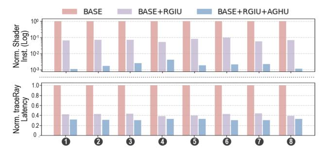

Fig. 12: Gain by the hardware shader: instruction reduction and traceRay speedup.

insertions of hit Gaussians into the global buffer. The remaining instructions mainly belong to the ray-gen and closest-hit shaders, which handle the update of ray states and blending of hit Gaussians, rather than traversal of numerous BVH nodes. In terms of performance, the RGIU achieves a 2.3 ∼ 2.6× speedup to the baseline. Although the BVH traversal latency slightly increases due to the built-in intersection test, the overall runtime still improves substantially by eliminating the software intersection shader. The AGHU further raises the speedup ratio to 3.1 ∼ 3.3×. Since the RGIU's outputs are streamed directly to the AGHU, the heap operation latency is effectively overlapped with traversal, introducing negligible additional overhead.

#### *B. Performance Gain by Pruning*

Fig. 13 compares the effectiveness of the proposed farnode pruning (PRUNE) with the baseline BVH traversal. To further assess the influence of the closest-first policy (i.e., sort child nodes and prioritize traversal of the nearer one), we also include a third configuration, PRUNE+SORT. Results show that PRUNE reduces the number of visited nodes per ray by 1.2 ∼ 1.9×, yielding a 1.4 ∼ 3.0× reduction in traversal latency. These improvements arise from fewer node memory accesses and intersection evaluations. Performance variation across scenes is mainly attributed to viewing perspective and the initial BVH layout, which determine the baseline traversal cost. Since the pruning introduces negligible hardware overhead, its effectiveness is well justified. In contrast, enabling child sorting does not yield considerable benefits, and in some cases, even degrades performance. We attribute this to the highly interleaved bounding volumes of upperlevel nodes, where ambiguous spatial overlaps often lead to incorrect judgment on the nearer Gaussian sets, negating the intended advantage of the closest-first policy. To address this limitation, future work may investigate improved BVH construction for a higher-quality spatial distribution, or explore adaptive closest-first traversal strategies that consider local BVH dispersion, dynamically prioritizing nodes to effectively advance the closest hits.

#### *C. Analysis on Divergence and Memory Traffic*

Fig. 14 reports the warp divergence measured as active thread ratio per warp, together with the average Gaussian hit

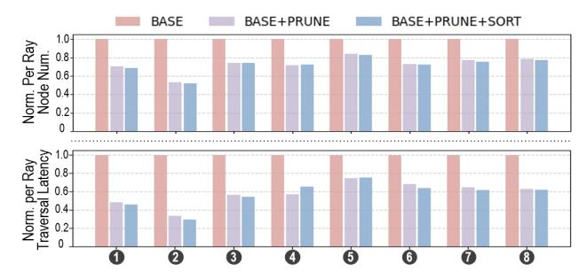

Fig. 13: Gain by the far-node pruning: visited node reduction and traversal speedup.

count per ray. Across the evaluated scenes, the warp active ratio ranges from 27.5% to 40.1%, indicating scene-dependent divergence behavior. Scenes with compact geometry or volumetrically dense structures (e.g., hotdog, materials, and ship) exhibit higher hit counts and lower divergence. In such cases, our far-node pruning provides relatively smaller gains (Fig. 13) because traversal paths are already locally coherent. We note that the average hit count is also influenced by the number of non-miss rays, which depends on object scale and camera viewpoint. Together, these factors affect traversal coherence and warp divergence.

Fig. 15 compares the memory traffic between the baseline and GauTracer. GauTracer reduces overall memory traffic by 1.7× to 2.7×, primarily due to the significant reduction in BVH node accesses enabled by node pruning. Furthermore, the proposed hardware shader eliminates explicit global memory accesses during shading, as primitive geometry is embedded within BVH nodes and the Gauss Buffer is maintained in registers. The remaining memory accesses are associated with the parameter buffer, specifically the spherical harmonic (SH) coefficients of the hit Gaussian primitives. Although each Gaussian stores 48 SH coefficients under degree-3 configuration, their contribution to total memory traffic is minor compared to the substantial cost of BVH node traversal.

#### *D. Sensitivity Study on Hit Gauss Buffer Size*

We evaluate the impact of the Gauss Buffer size K, which determines how many hit Gaussians are temporarily recorded

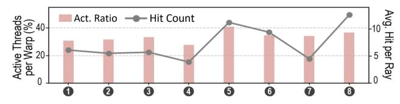

Fig. 14: Warp divergence and average hit count per ray.


Fig. 15: Breakdown of GauTracer's memory traffic reduction.


Fig. 16: Sensitivity study on the hit buffer size. (a) Falsely accept hits. (b) traceRay invocation rounds. (c) Trade-off between per-ray performance and SIMT efficiency.

during traversal. Two sub-metrics are analyzed on the Lego scene, with pixel-wise values annotated on the corresponding statistical box plots for illustration.

- ❶ Falsely Accepted Hits refer to those Gaussians that are inserted into the buffer but contribute little, as the accumulated transmittance has already fallen below the termination threshold. As shown in Fig. 16(a), the number of falsely accepted hits grows nearly linearly with the buffer size and varies randomly across rays. This redundancy becomes significant when K reaches 32, undermining the effectiveness of far-node pruning as the barrier flag becomes harder to trigger.
- ❷ TraceRay Rounds denotes how many times traceRayEXT is invoked to complete a single ray rendering. As shown in Fig. 16(b), the trace round decreases as the buffer size increases, since more Gaussians can be blended per iteration. Nevertheless, the benefit diminishes when K exceeds 32, indicating limited additional gain from further enlargement.

It is noteworthy that a larger hit buffer occupies more registers per ray, thereby limiting the number of warps per SM core. Such reduced ray concurrency weakens the effectiveness of treelet prefetching and limits the ability to hide memory latency. As illustrated in Fig. 16(c), a buffer size of 16 achieves a balance between per-ray performance and SIMT efficiency, the latter benefiting from the adequate ray capacity.

#### *E. Rendering Quality*

Fig. 17(a) presents an example rendering output of Gau-Tracer with secondary ray effects, including refraction and reflection. Quantitative evaluation on rendering quality is attached, which compares GauTracer with the OptiX+Ico baseline under the 3DGRT setting. Across eight datasets, the base-

TABLE III: Latency and Area Comparison of Operation Units

| Components | Latency       | Area (µm2<br>) |  |
|------------|---------------|----------------|--|
| RBIU       | 13 cycles     | 48630.3        |  |
| RTIU       | 37 cycles     | 74577.4        |  |
| TRAN       | 5 cycles      | 35942.1        |  |
| RGIU       | 27 cycles     | 34710.2        |  |
| AGHU+PRUNE | 2 ∼ 12 cycles | 825.6          |  |

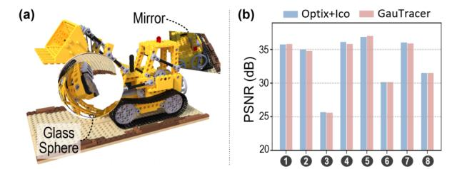

Fig. 17: (a) An example output with secondary ray effects (refraction and reflection). (b) Comparison of rendering quality with original algorithm [27].

line achieves an average PSNR of 33.40 dB, while GauTracer attains 33.32 dB, indicating negligible quality degradation. The slight difference can be attributed to the AGIU accumulation strategy: all primitives stored in the Gauss Hit Buffer are accumulated, including those that would have been excluded by the original early-termination criterion. However, these additional contributions correspond to transmittance weights below 0.001 and therefore have an insignificant impact on the final radiance. Overall, despite architectural modifications, GauTracer preserves the original logical ray tracing semantics. The numerical precision, intersection formulation, and BVH coverage remain consistent with the baseline design, ensuring rendering fidelity.

#### *F. Performance, Energy Efficiency and Area Overhead*

The Ray-Gauss Intersection Unit (RGIU) follows a modular design, consistent with existing units such as the Ray-Box Intersection Unit (RBIU), Ray-Triangle Intersection Unit (RTIU), and Ray Transformation Unit (TRAN). To ensure a fair comparison, we evaluate the RGIU's area overhead against a baseline configuration consisting of one set of RBIU, RTIU, and TRAN. All modules are synthesized using a commercial 28 nm standard-cell library under identical timing constraints that match the requirements of the GPU core. As summarized in Table III, one RGIU incurs an area overhead of 21.8% relative to the baseline operational unit set. Further taking AGHU and pruning logic (PRUNE) into consideration, the incremental overhead is merely 0.7% since it is composed of a simple FSM and registers. Regarding the modification to the ray buffer, both the Hit Gauss Buffer and the traversal stack

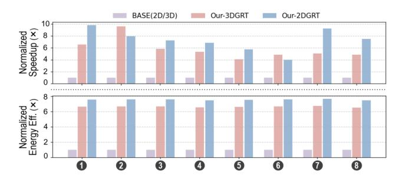

Fig. 18: Comparison of performance and energy efficiency between baseline and GauTracer.


Fig. 19: Performance scaling from RTX2060 to RTX3090.

are implemented using per-thread registers, thus incurring no explicit hardware area overhead.

Fig. 18 compares the overall performance and energy efficiency of GauTracer against the baseline running 3DGRT/2DGRT. Under the 3DGRT case, across the eight evaluated scenes, GauTracer delivers a speedup of 4.1 ∼ 9.6×, averaging 5.8×, derived from the combined benefits of hardware-accelerated Gaussian processing and far-node pruning. Under the 2DGRT setting, GauTracer achieves an average speedup of 7.3×. The larger gain mainly stems from the hardware shader contribution of 5.6×, as 2DGRT involves more intersection invocations, while the gain from node pruning varies slightly across scenes due to BVH characteristics. Overall, the results demonstrate the effectiveness of the proposed architecture under its reconfigurable support for different Gaussian primitives without structural modification. Regarding energy efficiency, we employ a trace-driven power model [60] to estimate energy consumption. Results show that GauTracer achieves 6.6× and 7.5× improvements for 3DGRT and 2DGRT, respectively.

## *G. Scalability Discussion*

To evaluate GauTracer's scalability beyond the baseline NVIDIA RTX2060 configuration modeled in Vulkan-Sim, we scale the simulator parameters to approximate an RTX3090 class GPU [61]. In this setup, the number of SM/RT cores increases from 30 to 82, and the L1/L2 cache capacities are doubled. We then evaluate the performance of GauTracer under these configurations. Fig. 19 shows that the scaled configuration achieves a 7.2 ∼ 11.3× speedup over the RTX2060 baseline. Notably, the modifications brought with GauTracer are confined within the RT core, with the throughput of the RGIU/AGHU aligned to the existing RTIU pipeline. By treating Gaussians as built-in primitives, the proposed design follows scaling trends similar to conventional ray tracing workloads on modern GPUs.

## VII. RELATED WORK

#### *A. Hardware for Non-mesh Primitives*

While modern RT cores are primarily optimized for triangle meshes and BVH traversal, there has been sustained interest in extending hardware support to non-mesh primitives, including curves, swept volumes, and neural representation.

NVIDIA has introduced Micro-Mesh [62] to mitigate BVH expansion from displacement-heavy geometry by encoding micro-geometry compactly and resolving it within the RT core. Subsequent RTX architectures also provide native support for linear swept spheres (LSS) [63], enabling efficient curve

and hair intersection without dense triangle proxies. More recently, RTX Neural Shaders [64] leverage Tensor Cores to accelerate small trainable neural networks inline with the shader pipeline [65], broadening the class of rendering tasks that benefit from hardware acceleration.

Other GPU vendors and APIs also provide more generalized intersection mechanisms. AMD's HIP RT on RDNA2/3 exposes BVH traversal and hit routines for custom intersection functions [66], while Intel's programmable ray tracing architectures support user-defined intersection shaders during hardware traversal [67]. Together, these programmable stages reflect a broader trend of extending hardware-accelerated traversal beyond traditional triangles.

#### *B. Order-independent Rendering Techniques*

Order-independent transparency (OIT) was introduced in rasterization to eliminate dependence on primitive order during alpha compositing. Exact methods such as A-buffer [68] and per-pixel linked lists [69] collect all fragments per pixel and locally resolve visibility, incurring substantial memory overhead. Approximate approaches like weighted blended OIT [70] remove explicit sorting by estimating blending weights, but sacrifice compositing accuracy. For Gaussian Splatting, Local-GS [71] proposes an approach that replaces depth-sorted alpha compositing with a polynomial blending weight approximation. Duplex-GS further alleviates the transparency artifact by introducing proxy cells [72].

However, OIT is fundamentally incompatible with ray tracing. In ray tracing, the exact hit distance and intersection order determine where secondary rays are spawned, which is essential for physically correct light transport [73]. Therefore, enforcing order independence in ray tracing inevitably sacrifices geometric accuracy and rendering fidelity.

#### VIII. CONCLUSION

We presented GauTracer, a ray tracing accelerator that introduces native hardware support for Gaussian primitives, boosting the performance of Gaussian ray tracing. The proposed Ray-Gauss Intersection Unit (RGIU) enables efficient intersection computation for both 3D ellipsoidal and 2D planar Gaussians, while the Any-Gauss-Hit Unit (AGHU) employs a max-heap structure to support high-throughput volumetric blending. In addition, a treelet-based BVH traversal enhanced with far-node pruning reduces memory latency and redundant traversal. Through simulation on Vulkan-Sim using representative NeRF-Synthetic scenes, GauTracer achieves significant performance and energy-efficiency gains over conventional RTAs, demonstrating the benefits of hardware-level optimizations for Gaussian ray tracing workloads.

## REFERENCES

- [1] T. Whitted, "An improved illumination model for shaded display," in *ACM Siggraph 2005 Courses*, 2005, pp. 4–es.
- [2] A. L. Dos Santos, D. Lemos, J. E. F. Lindoso, and V. Teichrieb, "Real time ray tracing for augmented reality," in *2012 14th Symposium on Virtual and Augmented Reality*. IEEE, 2012, pp. 131–140.

- [3] Imagination Technologies. (2022) Introducing the rac: The ray acceleration cluster. [Online]. Available: https://www.imaginationtech. com/products/gpu/graphics-architecture/powervr-photon/
- [4] I. Wald, A. Dietrich, C. Benthin, A. Efremov, T. Dahmen, J. Gunther, V. Havran, H.-P. Seidel, and P. Slusallek, "Applying ray tracing for virtual reality and industrial design," in *2006 IEEE symposium on interactive ray tracing*. IEEE, 2006, pp. 177–185.
- [5] Nvidia Corporation. (2018) Nvidia turing gpu architecture. [Online]. Available: https://images.nvidia.com/aem-dam/en-zz/Solutions/designvisualization/technologies/turing-architecture/NVIDIA-Turing-Architecture-Whitepaper.pdf
- [6] Advanced Micro Devices Inc. (2022) Amd rdna architecture. [Online]. Available: https://www.amd.com/en/technologies/rdna
- [7] Intel Corporation. (2022) Introduction to the xe-hpg architecture. [Online]. Available: https://www.intel.com/content/www/us/en/developer/ articles/technical/introduction-to-the-xe-hpg-architecture.html
- [8] B. Mildenhall, P. P. Srinivasan, M. Tancik, J. T. Barron, R. Ramamoorthi, and R. Ng, "Nerf: Representing scenes as neural radiance fields for view synthesis," *Communications of the ACM*, vol. 65, no. 1, pp. 99–106, 2021.
- [9] B. Kerbl, G. Kopanas, T. Leimkuhler, and G. Drettakis, "3d gaussian ¨ splatting for real-time radiance field rendering." *ACM Trans. Graph.*, vol. 42, no. 4, pp. 139–1, 2023.
- [10] M. Zwicker, H. Pfister, J. Van Baar, and M. Gross, "Ewa splatting," *IEEE Transactions on Visualization and Computer Graphics*, vol. 8, no. 3, pp. 223–238, 2002.
- [11] Z. Chen, J. Yang, J. Huang, R. de Lutio, J. M. Esturo, B. Ivanovic, O. Litany, Z. Gojcic, S. Fidler, M. Pavone *et al.*, "Omnire: Omni urban scene reconstruction," *arXiv preprint arXiv:2408.16760*, 2024.
- [12] R. Li, W. Ke, D. Li, L. Tian, and E. Barsoum, "Monogs++: Fast and accurate monocular rgb gaussian slam," *arXiv preprint arXiv:2504.02437*, 2025.
- [13] M. Kocabas, J.-H. R. Chang, J. Gabriel, O. Tuzel, and A. Ranjan, "Hugs: Human gaussian splats," in *Proceedings of the IEEE/CVF conference on computer vision and pattern recognition*, 2024, pp. 505–515.
- [14] B. Huang, Z. Yu, A. Chen, A. Geiger, and S. Gao, "2d gaussian splatting for geometrically accurate radiance fields," in *ACM SIGGRAPH 2024 conference papers*, 2024, pp. 1–11.
- [15] Y. Zhang, A. Chen, Y. Wan, Z. Song, J. Yu, Y. Luo, and W. Yang, "Refgs: Directional factorization for 2d gaussian splatting," in *Proceedings of the Computer Vision and Pattern Recognition Conference*, 2025, pp. 26 483–26 492.
- [16] D. Chen, L. Chen, Z. Zhang, and L. Zhang, "Generalized and efficient 2d gaussian splatting for arbitrary-scale super-resolution," *arXiv preprint arXiv:2501.06838*, 2025.
- [17] J. Lin, J. Gu, L. Fan, B. Wu, Y. Lou, R. Chen, L. Liu, and J. Ye, "Hybridgs: Decoupling transients and statics with 2d and 3d gaussian splatting," in *Proceedings of the Computer Vision and Pattern Recognition Conference*, 2025, pp. 788–797.
- [18] M. Taktasheva, L. Goli, A. Fiorini, D. Rebain, A. Tagliasacchi *et al.*, "3d gaussian flats: Hybrid 2d/3d photometric scene reconstruction," *arXiv preprint arXiv:2509.16423*, 2025.
- [19] J. Park, J.-W. Suh, and Y. Ban, "Dual-dimensional gaussian splatting integrating 2d and 3d gaussians for surface reconstruction," *Applied Sciences*, vol. 15, no. 12, p. 6769, 2025.
- [20] K. Wu, K. Zhang, Z. Zhang, M. Tie, S. Yuan, J. Zhao, Z. Gan, and W. Ding, "Hgs-mapping: Online dense mapping using hybrid gaussian representation in urban scenes," *IEEE Robotics and Automation Letters*, 2024.
- [21] Z. Liao, S. Chen, R. Fu, Y. Wang, Z. Su, H. Luo, L. Ma, L. Xu, B. Dai, H. Li *et al.*, "Fisheye-gs: Lightweight and extensible gaussian splatting module for fisheye cameras," *arXiv preprint arXiv:2409.04751*, 2024.
- [22] S. Lee, J. Chung, J. Huh, and K. M. Lee, "Odgs: 3d scene reconstruction from omnidirectional images with 3d gaussian splattings," *Advances in Neural Information Processing Systems*, vol. 37, pp. 57 050–57 075, 2024.
- [23] Z. J. Tang and T.-J. Cham, "3igs: Factorised tensorial illumination for 3d gaussian splatting," in *European Conference on Computer Vision*. Springer, 2024, pp. 143–159.
- [24] Z. Cui, X. Chu, and T. Harada, "Luminance-gs: Adapting 3d gaussian splatting to challenging lighting conditions with view-adaptive curve adjustment," in *Proceedings of the Computer Vision and Pattern Recognition Conference*, 2025, pp. 26 472–26 482.

- [25] L. Radl, M. Steiner, M. Parger, A. Weinrauch, B. Kerbl, and M. Steinberger, "Stopthepop: Sorted gaussian splatting for view-consistent realtime rendering," *ACM Transactions on Graphics (TOG)*, vol. 43, no. 4, pp. 1–17, 2024.
- [26] Q. Wu, J. M. Esturo, A. Mirzaei, N. Moenne-Loccoz, and Z. Gojcic, "3dgut: Enabling distorted cameras and secondary rays in gaussian splatting," in *Proceedings of the Computer Vision and Pattern Recognition Conference*, 2025, pp. 26 036–26 046.
- [27] N. Moenne-Loccoz, A. Mirzaei, O. Perel, R. de Lutio, J. Martinez Esturo, G. State, S. Fidler, N. Sharp, and Z. Gojcic, "3d gaussian ray tracing: Fast tracing of particle scenes," *ACM Transactions on Graphics (TOG)*, vol. 43, no. 6, pp. 1–19, 2024.
- [28] C. Gu, X. Wei, Z. Zeng, Y. Yao, and L. Zhang, "Irgs: Inter-reflective gaussian splatting with 2d gaussian ray tracing," in *Proceedings of the Computer Vision and Pattern Recognition Conference*, 2025, pp. 10 943– 10 952.
- [29] J. Lee, S. Lee, J. Lee, J. Park, and J. Sim, "Gscore: Efficient radiance field rendering via architectural support for 3d gaussian splatting," in *Proceedings of the 29th ACM International Conference on Architectural Support for Programming Languages and Operating Systems, Volume 3*, 2024, pp. 497–511.
- [30] Z. Ye, Y. Fu, J. Zhang, L. Li, Y. Zhang, S. Li, C. Wan, C. Wan, C. Li, S. Prathipati, and Y. C. Lin, "Gaussian blending unit: An edge gpu plug-in for real-time gaussian-based rendering in ar/vr," in *2025 IEEE International Symposium on High Performance Computer Architecture (HPCA)*, 2025, pp. 353–365.
- [31] C. Zhang, Y. Feng, J. Zhao, G. Liu, W. Ding, C. Wu, and M. Guo, "Streaminggs: Voxel-based streaming 3d gaussian splatting with memory optimization and architectural support," *arXiv preprint arXiv:2506.09070*, 2025.
- [32] L. Wei, J. Tang, F. Fei, B. Shi, R. Wang, and M. Li, "No redundancy, no stall: Lightweight streaming 3d gaussian splatting for real-time rendering," *arXiv preprint arXiv:2507.21572*, 2025.
- [33] M. Pei, G. Li, J. Si, Z. Zhu, Z. Mo, P. Wang, Z. Song, X. Liang, and J. Cheng, "Gcc: A 3dgs inference architecture with gaussian-wise and cross-stage conditional processing," in *Proceedings of the 58th IEEE/ACM International Symposium on Microarchitecture®*, 2025, pp. 1824–1837.
- [34] Y. Sun, Q. Zhi, Y. Jing, L. Ye, R. Huang, and T. Jia, "Local-gs: An order-independent gaussian splatting training accelerator exploiting splat locality," in *2025 62nd ACM/IEEE Design Automation Conference (DAC)*. IEEE, 2025, pp. 1–7.
- [35] H. He, G. Li, F. Liu, L. Jiang, X. Liang, and Z. Song, "Gsarch: Breaking memory barriers in 3d gaussian splatting training via architectural support," in *2025 IEEE International Symposium on High Performance Computer Architecture (HPCA)*. IEEE, 2025, pp. 366–379.
- [36] L. Wu, H. Zhu, S. He, J. Zheng, C. Chen, and X. Zeng, "Gauspu: 3d gaussian splatting processor for real-time slam systems," in *2024 57th IEEE/ACM International Symposium on Microarchitecture (MICRO)*. IEEE, 2024, pp. 1562–1573.
- [37] L. Li, J. Qin, J. Peng, Z. Wan, H. Qu, Y. Han, P. Zheng, H. Zhang, Y. Cao, T. Chen *et al.*, "Rtgs: Real-time 3d gaussian splatting slam via multi-level redundancy reduction," in *Proceedings of the 58th IEEE/ACM International Symposium on Microarchitecture®*, 2025, pp. 1838–1851.
- [38] Y. Feng, W. Lin, Y. Cheng, Z. Liu, J. Leng, M. Guo, C. Chen, S. Sun, and Y. Zhu, "Lumina: Real-time neural rendering by exploiting computational redundancy," in *Proceedings of the 52nd Annual International Symposium on Computer Architecture*, 2025, pp. 1925–1939.
- [39] K. Group, *Vulkan Ray Tracing*, 2020. [Online]. Available: https: //www.khronos.org/assets/uploads/apis/Vulkan-Ray-Tracing-Nov20.pdf
- [40] N. Corporation, *NVIDIA OptiX 8.1 Programming Guide*, 2024. [Online]. Available: https://raytracing-docs.nvidia.com/optix8/guide/index.html
- [41] M. Corporation, *DirectX 12 Ray Tracing Functional Spec*, 2020. [Online]. Available: https://microsoft.github.io/DirectX-Specs/ d3d/Raytracing.html
- [42] Khronos Group. (2023) Opengl shading language specification, version 4.60. [Online]. Available: https://registry.khronos.org/OpenGL/specs/gl/ GLSLangSpec.4.60.html
- [43] NVIDIA Corporation. (2025) Cuda toolkit documentation. [Online]. Available: https://docs.nvidia.com/cuda/
- [44] M. Saed, Y. H. Chou, L. Liu, T. Nowicki, and T. M. Aamodt, "Vulkansim: A gpu architecture simulator for ray tracing," in *2022 55th*

- *IEEE/ACM International Symposium on Microarchitecture (MICRO)*. IEEE, 2022, pp. 263–281.
- [45] M. Pharr, C. Kolb, R. Gershbein, and P. Hanrahan, "Rendering complex scenes with memory-coherent ray tracing," in *Proceedings of the 24th annual conference on Computer graphics and interactive techniques*, 1997, pp. 101–108.
- [46] D. Kopta, K. Shkurko, J. Spjut, E. Brunvand, and A. Davis, "Memory considerations for low energy ray tracing," in *Computer Graphics Forum*, vol. 34, no. 1. Wiley Online Library, 2015, pp. 47–59.
- [47] Y. H. Chou, T. Nowicki, and T. M. Aamodt, "Treelet prefetching for ray tracing," in *Proceedings of the 56th Annual IEEE/ACM International Symposium on Microarchitecture*, 2023, pp. 742–755.
- [48] Y. H. Chou and T. M. Aamodt, "Treelet accelerated ray tracing on gpus," in *Proceedings of the 30th ACM International Conference on Architectural Support for Programming Languages and Operating Systems, Volume 2*, 2025, pp. 1334–1347.
- [49] X. Li, J. Jiang, Y. Feng, Y. Gan, J. Zhao, Z. Liu, J. Leng, and M. Guo, "Sltarch: Towards scalable point-based neural rendering by taming workload imbalance and memory irregularity," *arXiv preprint arXiv:2507.21499*, 2025.
- [50] D. R. Horn, J. Sugerman, M. Houston, and P. Hanrahan, "Interactive kd tree gpu raytracing," in *Proceedings of the 2007 symposium on Interactive 3D graphics and games*, 2007, pp. 167–174.
- [51] H.-Y. Kim, Y.-J. Kim, and L.-S. Kim, "Mrtp: Mobile ray tracing processor with reconfigurable stream multi-processors for high datapath utilization," *IEEE Journal of Solid-State Circuits*, vol. 47, no. 2, pp. 518–535, 2011.
- [52] H. Kim, A. Wang, S. Zhang, and S. Shao, "Cost of divergence in ray tracing: Performance characterization on cpu and gpu," in *Int'l Workshop on Domain Specific System Architecture (In conjunction with Int'l Symp. on Computer Architecture (ISCA))*, 2023.
- [53] Y. S. Tozlu and H. Zhou, "Cooprt: Accelerating bvh traversal for ray tracing via cooperative threads," in *Proceedings of the 52nd Annual International Symposium on Computer Architecture*, 2025, pp. 166–179.
- [54] M. Saed, P. J. Nair, and T. M. Aamodt, "Rayn: Ray tracing acceleration with near-memory computing," in *Proceedings of the 58th IEEE/ACM International Symposium on Microarchitecture®*, 2025, pp. 277–291.
- [55] D. Ha, L. Liu, Y. H. Chou, S. Go, W. W. Ro, H.-W. Tseng, and T. M. Aamodt, "Generalizing ray tracing accelerators for tree traversals on gpus," in *2024 57th IEEE/ACM International Symposium on Microarchitecture (MICRO)*. IEEE, 2024, pp. 1041–1057.
- [56] Y. Feng, Y. Li, J. Lee, W. W. Ro, and H. Jeon, "Heliostat: Harnessing ray tracing accelerators for page table walks," in *Proceedings of the 52nd Annual International Symposium on Computer Architecture*, 2025, pp. 122–136.
- [57] NVIDIA Corporation. (2019) Rtx 2060. [Online]. Available: https: //www.techpowerup.com/gpu-specs/geforce-rtx-2060.c3310/
- [58] Agner Fog. (2022) Instruction tables: Lists of instruction latencies, throughputs and micro-operation breakdowns for intel, amd, and via cpus. [Online]. Available: https://www.agner.org/optimize/instruction tables.pdf
- [59] I. Wald, S. Woop, C. Benthin, G. S. Johnson, and M. Ernst, "Embree: a kernel framework for efficient cpu ray tracing," *ACM Transactions on Graphics (TOG)*, vol. 33, no. 4, pp. 1–8, 2014.
- [60] V. Kandiah, S. Peverelle, M. Khairy, J. Pan, A. Manjunath, T. G. Rogers, T. M. Aamodt, and N. Hardavellas, "Accelwattch: A power modeling framework for modern gpus," in *MICRO-54: 54th Annual IEEE/ACM International symposium on microarchitecture*, 2021, pp. 738–753.
- [61] NVIDIA Corporation. (2020) Rtx 3090. [Online]. Available: https: //www.techpowerup.com/gpu-specs/geforce-rtx-3090.c3622
- [62] NVIDIA Corporation, "Nvidia rtx micro-mesh," https://developer.nvidia. com/rtx/ray-tracing/micro-mesh, accessed: 2026-03-01.
- [63] NVIDIA Corporation, "Rtx linear swept spheres (lss) for hair rendering," https://developer.nvidia.com/blog/render-path-traced-hair-in-realtime-with-nvidia-geforce-rtx-50-series-gpus/, accessed: 2026-03-01.
- [64] NVIDIA Corporation, "How to get started with neural shading for your game or application," https://developer.nvidia.com/blog/nvidiartx-neural-rendering-introduces-next-era-of-ai-powered-graphicsinnovation/, accessed: 2026-03-01.
- [65] T. Zeltner\*, F. Rousselle\*, A. Weidlich\*, P. Clarberg\*, J. Novak\*, ´ B. Bitterli\*, A. Evans, T. Davidovic, S. Kallweit, and A. Lefohn, ˇ "Real-time neural appearance models," *ACM Transactions on Graphics*, vol. 43, no. 3, pp. 1–17, 2024.

- [66] AMD GPUOpen, "Introducing hip rt for gpu ray tracing," https:// gpuopen.com/learn/introducing-hiprt/, accessed: 2026-03-01.
- [67] Intel Corporation, "Programmable custom primitives in ray tracing hardware," https://freepatentsonline.com/y2025/0111579.html, accessed: 2026-03-01.
- [68] L. Carpenter, "The a-buffer, an antialiased hidden surface method," in *Proceedings of the 11th annual conference on Computer graphics and interactive techniques*, 1984, pp. 103–108.
- [69] J. C. Yang, J. Hensley, H. Grun, and N. Thibieroz, "Real-time concurrent ¨ linked list construction on the gpu," in *Computer Graphics Forum*, vol. 29, no. 4. Wiley Online Library, 2010, pp. 1297–1304.
- [70] M. McGuire and L. Bavoil, "Weighted blended order-independent transparency," *Journal of Computer Graphics Techniques*, vol. 2, no. 4, 2013.
- [71] Y. Sun, Q. Zhi, Y. Jing, L. Ye, R. Huang, and T. Jia, "Local-gs: An order-independent gaussian splatting training accelerator exploiting splat locality," in *2025 62nd ACM/IEEE Design Automation Conference (DAC)*. IEEE, 2025, pp. 1–7.
- [72] W. Liu, Y. Li, Y. Li, J. Yu, and X. Lou, "Duplex-gs: Proxy-guided weighted blending for real-time order-independent gaussian splatting," *IEEE Transactions on Circuits and Systems for Video Technology*, 2026.
- [73] M. Pharr, W. Jakob, and G. Humphreys, *Physically Based Rendering: From Theory to Implementation*, 4th ed. MIT Press, 2023.