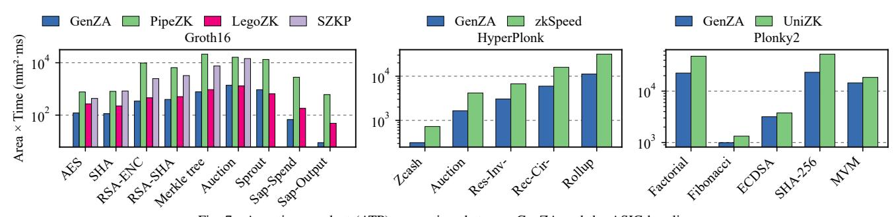

# GenZA: A General and Efficient Accelerator for Diverse Zero-Knowledge Proof Protocols

Cheng Wang *Xi'an Jiaotong University* Xi'an, Shaanxi, China *Shanghai Qi Zhi Institute* Shanghai, China <wangcheng@stu.xjtu.edu.cn>

Jiangbin Dong *Xi'an Jiaotong University* Xi'an, Shaanxi, China *Shanghai Qi Zhi Institute* Shanghai, China <bill412@stu.xjtu.edu.cn>

Mingyu Gao *Tsinghua University* Beijing, China *Shanghai Qi Zhi Institute* Shanghai, China <gaomy@tsinghua.edu.cn>

*Abstract*—Zero-knowledge proofs (ZKPs) are widely deployed cryptographic protocols for privacy-preserving blockchains and verifiable computing. Domain-specific hardware has been proposed to accelerate its computationally expensive proof generation phase. But existing designs are limited to each single protocol and specialize in a narrow set of computational kernels, thus failing to cover the diverse algorithms that offer different desired tradeoffs for various application scenarios. Following the unified architecture design philosophy, this paper presents GenZA, a general and efficient accelerator for diverse ZKP protocols including Groth16, HyperPlonk, and Plonky2. GenZA adopts a homogeneous array of hardware units that can be flexibly reconfigured to support multiple data bitwidths from 64-bit up to 768-bit, as well as both general and special algebraic field moduli, with efficient decomposition schemes. It also incorporates a set of novel and optimized kernel mapping strategies for all the dominant kernels in the target protocols, which enable efficient execution of diverse kernels on the same hardware substrate with high resource utilization and good area efficiency. GenZA achieves two orders of magnitude speedups over CPUs, and 1.64× to 2.51× higher performance per area compared to prior ZKP accelerators, demonstrating both more general functionality support and more efficient performance across major modern ZKP protocols.

*Index Terms*—domain-specific acceleration, zero-knowledge proof, kernel mapping

# I. INTRODUCTION

As data privacy becomes increasingly critical, *privacypreserving computing* emerges as a new paradigm that enables computations on sensitive data without compromising security. Among the foundational cryptographic tools, *zeroknowledge proof (ZKP)* has undergone the most popular practical deployment, especially in the blockchain industry [\[74\]](#page-14-0). By offering a proof to a specific statement without revealing any information of the involved sensitive data, ZKPs ensure privacy without breaking the blockchain functionality, and also improve scalability by moving heavy computations off-chain, known as rollups [\[92\]](#page-14-1). ZKPs can also be used in other domains such as ZKML, verifiable cloud computing and databases, and anonymous voting [\[12\]](#page-13-0), [\[24\]](#page-13-1), [\[32\]](#page-13-2), [\[41\]](#page-13-3), [\[43\]](#page-13-4), [\[81\]](#page-14-2).

The key characteristics of a ZKP protocol include the requirement for a trusted setup, the time of generating a proof and verifying it, and the size of the proof. Different applications prefer different tradeoffs among these metrics. For example, privacy-preserving cryptocurrencies and rollups typically prioritize minimal proof sizes and low verification cost to satisfy strict blockchain resource constraints, while accepting the tradeoff of a trusted setup. Conversely, verifiable cloud computing and ZKML emphasize fast proof generation and trustless setups to maximize throughput. As a result, many ZKP protocols have been routinely developed, including Groth16 [\[30\]](#page-13-5), HyperPlonk [\[13\]](#page-13-6), Plonky2 [\[58\]](#page-14-3), and more, offering a rich set of selections.

Furthermore, in ZKP applications, it is not uncommon to have the need of running multiple protocols at the same time. One example is verifiable computation outsourcing, where a cloud provider must serve clients with different preferences: some may favor Groth16's minimal proof size, while others prefer Plonky2's transparent setup. Another example is the modern recursive proof composition [\[20\]](#page-13-7), which first generates an inner proof with a fast protocol (e.g., Plonky2), and then wraps it with a verifier-friendly outer proof (e.g., Groth16) for constant-size verification, combining both benefits.

However, such diversity of ZKPs raises critical challenges to hardware design of domain-specific accelerators. Not only the underlying *algebraic fields and data bitwidths* are drastically different (e.g., from 64-bit to 768-bit), but also they use many diverse *computational kernels*, ranging from computeintensive elliptic curve operations and hash functions, to memory-bound number theoretic transforms and polynomial computations. Most existing ZKP accelerators [\[14\]](#page-13-8), [\[18\]](#page-13-9), [\[19\]](#page-13-10), [\[67\]](#page-14-4), [\[80\]](#page-14-5), [\[85\]](#page-14-6), [\[87\]](#page-14-7), [\[89\]](#page-14-8) are designed for a single protocol with different functional units dedicated to specific kernels. Simply combining all types of units onto a single chip would result in excessive area cost while leaving many resources underutilized when only one of these protocols is invoked.

A promising approach is to use *a unified and reconfigurable hardware architecture*, with *novel and flexible kernel mappings* to reuse the same hardware across diverse kernels. A few ZKP accelerators [\[80\]](#page-14-5), [\[85\]](#page-14-6) have exploited this direction, albeit they are still limited to a single protocol and lacking sufficient flexibility and efficiency. In this paper, we inherit this appealing philosophy, and propose GenZA, a general accelerator for diverse ZKP protocols including Groth16, HyperPlonk, and Plonky2, with *efficient hardware support for multi-bitwidth* *arithmetics in various algebraic fields*, and *novel mapping strategies for a wide range of computational kernels*.

Specifically, the GenZA hardware adopts a homogeneous array of processing elements (PEs), which can be flexibly reconfigured to match different workload specifications. Each PE has multiple lanes of 64-bit functional units, and leverages efficient *Karatsuba-Ofman (KO) decomposition* [\[36\]](#page-13-11) to compose wider multipliers for large-field support. We also propose a *hybrid spatial-temporal* scheme to map the decomposed submultiplications to the parallel lanes, to simultaneously alleviate resource fragmentation and satisfy high parallelism demand compared to existing purely temporal and spatial methods.

The core innovations of GenZA lie in the kernel mapping software strategies. We propose customized optimizations for each type of the dominant kernels in the three target protocols. For number theoretic transforms (NTTs), we introduce *folded pipelines with scratchpad space borrowing* between PEs to realize longer on-chip pipelines for reduced off-chip accesses, without the need for excessive FIFO buffer capacity. For small bitwidths with low computational intensity, we also *consolidate* the NTT pipeline inside a single PE to reduce global communication. For multi-scalar multiplications (MSMs) on elliptic curves, we *dynamically select window size configurations* in the Pippenger's algorithm [\[57\]](#page-14-9) on our flexible architecture, to balance computations and memory accesses. We also adopt a *window-major mapping* to improve the available on-chip processing parallelism. For hash functions like Poseidon [\[29\]](#page-13-12), we decompose them into vector-friendly subtasks like dot products and map to the PEs. For the sumcheck protocol [\[47\]](#page-13-13), we incorporate several algorithmic optimizations to *compress* the involved polynomials to reduce off-chip accesses, again leveraging the flexibility of our hardware. Finally, we extensively apply inter-kernel fusion and pipelining to alleviate the memory access bottleneck for polynomial operations, further improving the hardware utilization.

We compare GenZA to the state-of-the-art ZKP accelerators on each of the target protocols [\[18\]](#page-13-9), [\[80\]](#page-14-5), [\[85\]](#page-14-6). GenZA achieves 1.98×, 2.51×, and 1.64× higher performance per area than the best baseline designs for Groth16, HyperPlonk, and Plonky2, respectively. Compared to multi-thread CPU implementations, GenZA is significantly faster, with 156× to 644× speedups. We also demonstrate the effectiveness of our proposed multi-bitwidth arithmetic units and kernel mapping optimizations. Overall, GenZA delivers more general functionality support *and* more efficient performance across major modern ZKP protocols.

## II. BACKGROUND

# *A. Zero-Knowledge Proofs*

A zero-knowledge proof (ZKP) is a cryptographic protocol in which a *prover* can convince a *verifier* about the truth of a computational *statement* on some private *witness* data, without revealing the witness (i.e., *zero-knowledge*). Modern applications rely on *succinct* ZKPs, known as zk-SNARKs (Succinct Non-Interactive Arguments of Knowledge) [\[9\]](#page-13-14), [\[28\]](#page-13-15), [\[56\]](#page-14-10) or zk-STARKs (Scalable Transparent Arguments of Knowledge) [\[7\]](#page-13-16). In these protocols, the proof size is typically polylogarithmic in the problem size or even constant, and the verification is exceptionally fast (e.g., a few milliseconds). This succinctness, however, comes at the cost of high computational overheads for the prover. Therefore, we focus on *proof generation* in this work, and adopt the standard three-layer view of modern ZKPs [\[10\]](#page-13-17), [\[15\]](#page-13-18): *arithmetization*, *polynomial interactive oracle proof (PIOP)*, and *polynomial commitment scheme (PCS)*.

Firstly, arithmetization reduces the statement's computation to a set of algebraic constraints over a finite field. There are two common forms. (1) The *Rank-1 Constraint System (R1CS)* [\[8\]](#page-13-19) flattens the entire inputs, outputs, and intermediate values of the computation (represented as a "circuit") into a single witness vector w. Each constraint (i.e., a circuit "gate") enforces a quadratic relationship ⟨a,w⟩· ⟨b,w⟩ = ⟨c,w⟩, where ⟨·,·⟩ denotes an inner product, and a, b, c are constant coefficient vectors. (2) The *Plonkish* arithmetization [\[25\]](#page-13-20) arranges the variables from w into a table (or "trace"), where each table row *i* corresponds to a gate and has several "wire" variables representing the gate's inputs (*wa*,*i* ,*wb*,*i*) and output (*wc*,*i*). The gate enforces the constraint *qL*,*iwa*,*i*+*qR*,*iwb*,*i*+*qO*,*iwc*,*i*+*qM*,*i*(*wa*,*iwb*,*i*)+*qC*,*i* = 0 where the constant coefficients are called "selectors". The consistency between wires in different rows (e.g., the output *wc*,*i* of a gate being the input *wa*, *j* of another) requires another set of *permutation (wiring) constraints*.

Then, a polynomial interactive oracle proof (PIOP) phase transforms the constraints into an interactive verification protocol. The prover commits the witness to a set of polynomials, and the verifier queries a small number of random evaluations to check the low-degree relations, permutation constraints, and product/zero properties, with high soundness [\[76\]](#page-14-11). The prover-side polynomial computations are often performed in two ways: (1) using the *number theoretic transform (NTT)* to switch between the coefficient and evaluation domains, turning polynomial multiplications into element-wise operations [\[28\]](#page-13-15), [\[69\]](#page-14-12); or (2) using the multilinear extension (MLE) over the Boolean hypercube, combined with the *sumcheck* protocol [\[47\]](#page-13-13), to avoid costly large NTTs.

Lastly, a polynomial commitment scheme (PCS) binds the prover to the polynomials and later opens selected evaluations with succinct proofs. This step, combined with the Fiat-Shamir transform [\[23\]](#page-13-21), allows the above PIOP to become noninteractive. PCS has two popular instantiations. (1) *Pairingbased* schemes (e.g., KZG [\[38\]](#page-13-22)) require a trusted setup but provide constant-size proofs and extremely fast verification. A typical construction uses elliptic curves (ECs) with a special multi-scalar multiplication (MSM) kernel [\[53\]](#page-14-13). (2) *Hashbased* schemes (e.g., FRI [\[6\]](#page-13-23)) realize commitments via Merkle trees [\[52\]](#page-14-14), yielding transparent (i.e., no trusted setup) systems at the cost of larger, logarithmically-sized proofs and hashheavy verification [\[7\]](#page-13-16), [\[58\]](#page-14-3).

Sparsity. ZKP circuits commonly exhibit structural *sparsity* that hardware acceleration can exploit. It arises from two primary sources: (1) control selectors (*qL*,*qR*,*qM*,*qO*) are

TABLE I REPRESENTATIVE ZKP PROTOCOLS AND THEIR KEY CHARACTERISTICS AND IMPLEMENTATIONS.

| Protocol   | Trusted Setup | Proof Size | Prover Time | Verifier Time | Arithmetization | PIOP              | PCS | Field      | Bitwidth      |
|------------|------------------|---------------|----------------|------------------|-----------------|-------------------|-----|------------|---------------|
| Groth16    | Per-circuit      | Small const.  | Long           | Short            | R1CS            | Linear PCP (NTT)  | KZG | EC         | 256, 384, 768 |
| HyperPlonk | Universal        | Medium        | Medium         | Medium           | Plonkish        | HyperPlonk (MLE)  | KZG | EC         | 256, 384      |
| Plonky2    | None             | Large         | Short          | Long             | Plonkish        | PLONK-style (NTT) | FRI | Goldilocks | 64            |

TABLE II EXECUTION TIME PERCENTAGE AND ARITHMETIC INTENSITY (MODMULS/ELEMENT) OF MAJOR KERNELS IN ZKP PROTOCOLS.

| Kernel      | Groth16 | HyperPlonk | Plonky2 | Arith. Intensity |
|-------------|---------|------------|---------|------------------|
| NTT         | 29.32%  | -          | 0.15%   | 10               |
| MSM         | 69.73%  | 59.34%     | -       | 170              |
| Sumcheck    | -       | 33.49%     | -       | 12               |
| Merkle tree | -       | -          | 68.84%  | 191              |
| Polynomial  | 0.96%   | 7.14%      | 14.17%  | 0.5              |
| Other Hash  | -       | 0.03%      | 0.02%   | 191              |

inherently binary in Plonkish arithmetization, and (2) nonarithmetic operations such as comparison and bitwise logic (XOR, AND, OR) decompose field elements into individual bits, each occupying a full witness cell. These properties persist across circuits regardless of specific applications.

## *B. Representative Protocols and Characteristics*

We select three representative protocols summarized in [Table I,](#page-2-0) capturing the diversity of modern ZKPs. They exhibit tradeoffs in trusted setup, proof size, prover time, verifier time, etc., and thus are used in different applications.

Groth16 [\[30\]](#page-13-5) is a highly optimized zk-SNARK for R1CS. We follow its popular instantiation, libsnark [\[69\]](#page-14-12). It uses R1CS and pairing-based KZG commitments with ECs. It requires a trusted setup *for each circuit*, which is inconvenient. The proof consists of three group elements and can be verified via three pairings, offering very fast verification. The proof size is typically a few hundred bytes. Groth16 has been widely adopted in early ZKP applications, such as anonymous voting [\[32\]](#page-13-2), decentralized file storage [\[24\]](#page-13-1), and privacy-preserving blockchains like Zcash [\[68\]](#page-14-15).

HyperPlonk [\[13\]](#page-13-6) uses Plonkish arithmetization, and MLEbased PIOP with sumchecks. This avoids large NTTs and enables fast, near-linear-time provers. It uses a *universal* (circuit-agnostic) trusted setup. In our baseline implementation [\[21\]](#page-13-24), the PCS is instantiated with KZG. The typical reported proof sizes are on the order of a few kilobytes. Liu et al. [\[44\]](#page-13-25) proposed a scalable collaborative zk-SNARK running on multiple servers, based on the HyperPlonk protocol.

Plonky2 [\[58\]](#page-14-3) also adopts PLONK-style arithmetization and PIOP, but uses an *FRI-based* PCS, yielding a *transparent setup*. It targets fast recursion over the 64-bit Goldilocks field. Plonky2 exposes several protocol-level parameters to allow explicit tradeoffs between the prover time, proof size, and security. It also supports recursive composition to further shrink the proof size and verifier time. Plonky2 has been adopted in modern ZKP systems, such as Ethereum-compatible zkEVM block proving [\[75\]](#page-14-16), [\[86\]](#page-14-17) and verifiable data processing via Lagrange's zk-SQL coprocessors [\[41\]](#page-13-3).

[Table I](#page-2-0) also highlights *the diverse field choices and bitwidth requirements* across protocols. Groth16 and HyperPlonk operate over large prime fields used by ECs (e.g., BN128, BLS12- 381 [\[91\]](#page-14-18), MNT4753 [\[69\]](#page-14-12)), so their bitwidths typically range from 256 bits up to 768 bits. In contrast, Plonky2 uses the 64 bit Goldilocks field with *p* = 2 64 −2 32 +1 [\[58\]](#page-14-3), which greatly simplifies modular reduction on standard 64-bit hardware.

[Table II](#page-2-1) further illustrates the percentages of prover execution time spent on major computational kernels across the three protocols, including NTT, MSM, sumcheck, Merkle tree, polynomial computations, and other hash functions for Fiat-Shamir transform [\[23\]](#page-13-21). We defer the kernels' mathematical details to [Section VI.](#page-6-0) These experiments are performed on an 80-thread CPU server, using a mock circuit of 220 gates for each protocol. Further details of the baseline configurations and workloads are in [Section VII.](#page-9-0) Generally, the kernels in the PCS phase, e.g., MSM or Merkle tree, often account for the largest shares of prover time. But other kernels like NTT, sumcheck, and polynomial computations still consume notable portions. These results demonstrate *the diversity in computational kernels* of ZKP. [Table II](#page-2-1) also reports the arithmetic intensity of each kernel. The MSM and Merkle tree kernels are compute-bound, while the NTT, sumcheck, and polynomial operations are memory-bound.

Generality. Beyond the above protocols, recent hash-based schemes such as Orion [\[84\]](#page-14-19) and Spartan [\[70\]](#page-14-20) prioritize high prover throughput and transparency, but often at the expense of megabyte-scale proof sizes. While this work does not target these specific protocols directly, their underlying arithmetic primitives remain fundamentally similar. In fact, virtually all modern ZKPs follow the common three-layer construction in [Section II-A.](#page-1-0) Consequently, we believe the above polynomial and commitment primitives for PIOP and PCS, including NTT, MSM, sumcheck, and hash, constitute the computational core of both current and foreseeable future protocols.

## III. MOTIVATION

The high computational cost of proof generation has recently motivated many hardware accelerator designs for ZKPs. In this section, we briefly describe prior efforts and point out their limitations to motivate our work.

# *A. Related Work*

ASICs using kernel-specialized functional units. Several previous ASIC designs accelerated the aforementioned ZKP kernels. PipeZK [\[87\]](#page-14-7) built fixed-function, deeply-pipelined units for NTTs and MSMs in Groth16. It offloaded other computations to the host CPU, thus lacking an end-to-end solution. Also its fixed-function units could not support various EC bitwidths. SZKP [\[19\]](#page-13-10) presented an end-to-end Groth16 prover, incorporating structured modules for NTTs and MSMs, with special optimizations leveraging the sparsity in the MSM. zkSpeed [\[18\]](#page-13-9) implemented a complete HyperPlonk prover, featuring specialized units for sumcheck, MSM, and other kernels. NoCap [\[67\]](#page-14-4) instead targeted hash-centric SNARKs, i.e., Spartan and Orion, with the 64-bit Goldilocks field. It used vector-style units and other specialized functional units to accelerate the entire proof generation on a single chip.

ASICs using unified architectures. More recently, efforts have been shifting towards reusing a unified architecture across different computations to improve hardware utilization. LegoZK [\[85\]](#page-14-6) composed finite-field arithmetic units via hierarchical on-chip interconnects to form reconfigurable pipelines, accelerating witness generation, NTT, and MSM kernels. It used simple bit splitting to support multiple bitwidths. UniZK [\[80\]](#page-14-5) targeted Plonky2. It proposed a unified systolic array enhanced with additional links and a vector mode, along with novel mapping strategies for NTTs, hash functions, and general polynomial operators. ReZK [\[89\]](#page-14-8) and Chen et al. [\[14\]](#page-13-8) proposed reconfigurable multiplier designs adaptable between 256-bit and 384-bit EC bitwidths, which could be configured to execute either NTTs or MSMs in Groth16.

Other acceleration methods. A large body of work also explored accelerating end-to-end proof generation or specific kernels using CPUs and clusters [\[22\]](#page-13-26), [\[82\]](#page-14-21), GPUs [\[34\]](#page-13-27), [\[35\]](#page-13-28), [\[42\]](#page-13-29), [\[45\]](#page-13-30), [\[46\]](#page-13-31), [\[51\]](#page-14-22), [\[88\]](#page-14-23), and FPGAs [\[2\]](#page-12-0), [\[3\]](#page-13-32), [\[48\]](#page-13-33), [\[59\]](#page-14-24), [\[62\]](#page-14-25), [\[72\]](#page-14-26), [\[79\]](#page-14-27), [\[83\]](#page-14-28). While these platforms offer flexibility, they often lag behind ASICs in performance and energy efficiency. CGRAs [\[5\]](#page-13-34), [\[37\]](#page-13-35), [\[50\]](#page-14-29) target general-purpose workloads with word-level (typically 32-bit) functional units and either static or dynamic scheduling that maps arbitrary dataflow graphs at the instruction level. While our work follows a similar highlevel approach that maps diverse ZKP kernels to a unified hardware, we seek a domain-specific solution, with specially designed wide modular multiplier units, and novel mapping strategies specialized at the kernel level.

## *B. Design Goals and Prior Work Limitations*

As introduced in [Section II,](#page-1-1) modern ZKPs are still rapidly developing, with multiple protocols used by different applications in practice. To effectively adapt to the various computations involved in these protocols, an ideal ZKP accelerator should meet the following design goals.

- 1) Efficient support for multiple bitwidths and field arithmetics. The underlying functional units should be able to conduct 64-bit arithmetics as well as wide-integer operations of 256/384/768 bits. The modular operations should support both special moduli like Goldilocks and general moduli in ECs.
- 2) Efficient support for diverse computational kernels. The accelerator should be able to execute all the dom-

- inant kernels listed in [Table II,](#page-2-1) i.e., NTT, MSM, sumcheck, Merkle tree, polynomial operations, and hashing.
- 3) High utilization of on-chip hardware resources. The accelerator should follow a unified design that is reconfigurable across diverse bitwidths and kernels with high utilization, rather than directly combining separate, kernel/bitwidth-specialized functional units.

While the first two goals are intuitive based on our observations in [Section II-B,](#page-2-2) the last one needs a bit elaboration. A straightforward way to support diverse kernels is to design separate functional units specialized to each kernel type, and put them together on the same accelerator chip. This is the approach used in early ZKP accelerators, including PipeZK [\[87\]](#page-14-7), SZKP [\[19\]](#page-13-10), and zkSpeed [\[18\]](#page-13-9). However, many of these kernelspecialized functional units, e.g., an MSM unit or a sumcheck unit, are quite complex and may occupy a substantial fraction of the chip area [\[18\]](#page-13-9), [\[87\]](#page-14-7). They would sit idle whenever the currently running protocol does not involve this kernel, wasting significant silicon resources (not satisfying Goal [3\)](#page-3-0). For example, an MSM unit is idle when running Plonky2, and a sumcheck unit is idle when running Groth16. Even within a single protocol (e.g., Groth16), one kernel's input usually depends on the output of others (e.g., an MSM depends on an NTT), causing idle waiting. Recent unified architectures, such as LegoZK [\[85\]](#page-14-6) and UniZK [\[80\]](#page-14-5), improve the hardware utilization with resuable units. But they mainly focus on *intra*protocol reuse and are limited to a single protocol (Groth16 for LegoZK, Plonky2 for UniZK), lacking support for other critical kernels *across* different kernels (not satisfying Goal [2\)](#page-3-1).

For the field bitwidth requirement, most prior designs only support a single bitwidth, usually the largest one (e.g., 768 bits), and then pad all data to this width, causing wastes (not satisfying Goal [1\)](#page-3-2). LegoZK [\[85\]](#page-14-6) also provisions the maximum 768-bit arithmetics, but additionally allows splitting it into two 384-bit or three 256-bit multipliers. This reduces resource wastes, but we show the utilization can be further improved with better bit decomposition methods. Both Chen et al. [\[14\]](#page-13-8) and ReZK [\[89\]](#page-14-8) only support two bitwidths of 256-bit and 384-bit. Chen et al. [\[14\]](#page-13-8) uses the simple padding approach discussed above. ReZK [\[89\]](#page-14-8) leverages the Karatsuba-Ofman (KO) algorithm [\[36\]](#page-13-11), and focuses on a single-level spatial decomposition of KO-2 or KO-3 (i.e., 256/384-bit to 128-bit). However, this design is not scalable to wider bitwidth ranges (e.g., 64 bits to 768 bits), which would require both spatial and temporal mappings as we show in our design.

## IV. GENZA OVERVIEW

To meet the three goals in [Section III-B,](#page-3-3) we propose GenZA, a general and efficient accelerator for diverse ZKP protocols. The key design philosophy of GenZA inherits from previous designs [\[80\]](#page-14-5), [\[85\]](#page-14-6), *using a unified and reconfigurable hardware architecture with novel and flexible kernel mapping strategies*, to achieve high utilization and efficiency (Goal [3\)](#page-3-0). GenZA further improves upon prior unified ZKP accelerators with *more efficient support for various bitwidths and field*

Fig. 1. Overview of GenZA's hardware architecture, including  $16 \times 8$  PEs and several auxiliary modules like a transpose buffer, etc.

arithmetics (Goal 1), and with newly proposed, better mappings for additional computational kernels (Goal 2).

Hardware. As Figure 1 shows, GenZA adopts a 2D array of homogeneous processing elements (PEs), by default 16×8. Crucially, each PE is not a fixed-function block specialized to a kernel, but a flexible and reconfigurable unit. It supports *multibitwidth arithmetics*, e.g., 64-, 256-, 384-, 768-bit, through efficient Karatsuba-Ofman decomposition [36] and novel *hybrid spatial-temporal mapping*. It also supports customized modular reduction *for both general and special field moduli*. We introduce the detailed PE microarchitecture in Section V. As previous work pointed out [80], [85], in modern ZKP protocols, the underlying basic operations are modular arithmetics on algebraic fields, and the data structures are usually polynomial groups which are essentially vectors/tensors. These characteristics fit perfectly with the above spatial architecture.

The PEs are connected by a 2D mesh network-on-chip (NoC), with  $32 \times 64$ -bit links at 2 GHz. Data are sent between PEs and to/from memory in lightweight packets, routed across the NoC following the statically determined mappings (see below), similarly to prior spatial accelerators [11], [26], [73]. Instead of a global shared buffer, each PE in GenZA contains a local 128 kB SRAM scratchpad to exploit data locality.

In addition, we instantiate several globally shared, auxiliary modules adjacent to the DRAM interface, for special data processing and control tasks not covered by the PEs. First, an SRAM-based, highly banked *data transpose buffer* reorganizes data streams between the DRAM and the PE array [65], [80], [87]. Second, an *MSM decoder & dispatcher* decodes the fetched MSM data from off-chip memory and sends them to the appropriate PEs (Section VI-B). Third, a special SHA3 core supports the Fiat-Shamir transform required by Hyper-Plonk1, which only takes < 1% time. The last two modules either have simple logic or are not performance critical, and thus may be replaced by a small general core like RISC-V.

**Software.** The core innovations of GenZA lie in the kernel mapping strategies, which orchestrate how the kernels execute on the PE array. We leverage the deterministic behaviors of ZKP protocols to implement a static scheduler for kernel mappings. The process contains two stages. First, the ZKP protocols are translated into computational graphs by referencing their original implementations [21], [58], [69]. This

is now done manually, but can also be easily handled by modifying a standard ZKP compiler. Then, our scheduler automatically (1) selects the kernel mapping settings (e.g., NTT pipeline length, MSM window size) via analytical cost models, (2) allocates PEs to each kernel and determines dataflow within the PEs, and (3) generates a static execution schedule describing the parallelism and pipelining schemes across multiple kernels.

We introduce our novel mapping strategies in Section VI, which incorporate further optimizations upon previous unified accelerators [80], [85], in order to minimize off-chip memory traffic (for NTTs, polynomial operations, and sumchecks), reduce inter-PE communication (for NTTs), balance computations and memory accesses (for MSMs), increase parallelism (for MSMs and polynomial operations), and improve PE utilization (for hashing and kernel-level pipelining). From an implementation perspective, these mapping strategies are realized into a set of hand-crafted kernel templates, analogous to hand-optimized kernels in GPU libraries like cuDNN. Each template contains several parameters that are fully automated by the backend scheduler. At runtime, each PE receives a mode configuration specifying the kernel type, the bitwidth and field modulus, and the dataflow pattern (e.g., lane mapping, pipeline depth). Because the kernel types are bounded and domainspecific, this configuration mechanism is highly feasible.

#### V. PE MICROARCHITECTURE

The detailed microarchitecture of a GenZA PE is illustrated in Figure 2a. It consists of 32 lanes, each equipped with a 64-bit multiplier2 and two 64-bit modular adders/subtractors. These parallel lanes natively support both element-wise vector operations and NTT butterfly operations (i.e.,  $a \pm b \cdot \omega$ ) [80], [85]. All the lanes connect to a 128 kB SRAM-based data scratchpad through a crossbar. A dedicated, short-range, interlane forward chain enables direct data transfers between neighbor lanes, allowing the adders in the lanes to form wider units. Alternatively, we can also use the forward chain to compose a deep pipeline between these lanes. This capability is essential for operations like EC point additions (PADDs) in MSMs, which require 12 to 14 dependent modular multiplications.

GenZA PE is designed to support basic arithmetics (additions and multiplications) for various bitwidths, as well as their modular operations for various fields, e.g., 64-bit Goldilocks or 768-bit EC operations. We propose two techniques to handle these two kinds of diversity. First, we use efficient *Karatsuba-Ofman (KO) decomposition* [36] to split various bitwidths into multiple chunks of 64-bit and map them to the PE lanes. In this way, we effectively use multiple (e.g., *M*) lanes to compose a wider multiplier, and the whole PE contains 32/*M* such wide multipliers. We carefully decide the *temporal and spatial mapping* from sub-multiplications to lanes, to ensure both high parallelism and high resource utilization (Section V-A), Second, using these multi-bitwidth multipliers, we further

&lt;sup>1While GenZA PEs natively support Poseidon hashing (Section VI-C) that can also be used for the Fiat-Shamir transform, we include SHA3 to faithfully match the original HyperPlonk implementation; its area cost is minimal.

&lt;sup>2The multipliers are physically implemented with a width of 66 bits, in order to capture intermediate data overflow and carry propagation. We omit these minor width variations in our description.

(b) Pre and Post stages for KO-2 decomposition.

Multiply

(c) Detailed datapath of Pre (downwards in red) and Post (upwards in green) stages for 753-bit multiplication on MNT4-753.

Fig. 2. GenZA PE microarchitecture and KO decomposition.

leverage Montgomery modular operations to support field arithmetics, for both general and special moduli (Section V-B).

### A. Multi-Bitwidth Multiplications

The Karatsuba-Ofman (KO) algorithm [36] allows more efficient bit decomposition than the schoolbook multiplication, by trading some additions/subtractions for fewer multiplications. Specifically, the KO-n scheme splits each of the two large operands into n equal-size chunks. It performs a lightweight pre-processing (Pre) step involving some additions and subtractions, followed by several small, chunk-level multiplications, and finally combines the products via simple postprocessing (Post). Taking KO-2 in Figure 2b as an example, we split two 2*m*-bit operands  $a = a_1 | a_0$  and  $b = b_1 | b_0$ . The Pre step computes  $a_{01} = a_0 + a_1, b_{01} = b_0 + b_1$ . Then we perform three multiplications,  $r_0 = a_0 \times b_0, r_1 = a_1 \times b_1, r_{01} = a_{01} \times b_{01}$ . Note that the schoolbook method needs four multiplications. Finally, the Post step calculates  $r' = r_{01} - r_0 - r_1$ , and computes  $(r_1|r_0) + (r' << m)$  as the final result. Similarly, KO-3 performs six multiplications between the operand chunks and their sums, instead of nine in schoolbook.

We mainly use KO-2 and KO-3 in GenZA, and apply them recursively to decompose large bitwidths down to 64-bit arithmetics supported by the PE lanes. Specifically, 128-bit and 256-bit data only use KO-2; 384-bit uses KO-3→KO-2; and 768-bit uses KO-3→KO-2→KO-2. We correspondingly add four Pre/Post stages before/after the lanes, as in Figure 2a, to realize these recursive decompositions. Figure 2c gives an example of how 753-bit multiplications on the MNT4-753 curve use these Pre/Post stages. Note that such Pre/Post logic is cheap compared to the multiplier-based lane units. They mainly contain simple adders, as well as multiplexers and split wires to reorganize bits.

Lane mapping. However, a challenge raises when we map chunk-level multiplications to PE lanes. Previous designs like ReZK [89] use fully spatial decomposition, mapping n multiplications to n lanes/multipliers. But the irregular numbers of three and six for KO-2 and KO-3 would lead to resource fragmentation when using power-of-two allocation in the 32 lanes. Alternatively, we can also map the decomposed multiplications to a single lane in a fully temporal manner, and execute independent computations on different lanes. This has two major flaws. First, it incurs long latencies for wide bitwidths; e.g., a 768-bit multiplication takes 54 cycles. Second, some kernels may not always have sufficient independent work to fully occupy the 32 lanes × 64 PEs. For instance, the MSM bucket reduction stage (Section VI-B) may only support two parallel PADD operations per window; the tree-style sumcheck and Merkle tree operations also have fewer parallel tree nodes towards the root (Section VI-E).

We therefore propose a *hybrid spatial-temporal mapping* scheme in GenZA. We allocate two lanes for KO-2 decomposition to execute its three chunk-level multiplications, and four lanes for KO-3's six multiplications. Then, each single decomposition will take 2 cycles with 75% utilization  $(3/(2\times2))$  for KO-2,  $6/(4\times2)$  for KO-3), the same as fully spatial mapping. However, as long as we have two independent computations and interleave them on the allocated lanes (Figure 2b), we can achieve 100% utilization. Compared to fully temporal mapping, we need the same amount of parallelism for KO-2, but only half for KO-3, to reach this ideal utilization. In summary, our hybrid scheme achieves the best of both worlds, with utilization never lower than fully spatial, and required parallelism no more than fully temporal.

Why not Toom-Cook. Toom-Cook [17], [77] is another efficient bit decomposition method for wide multiplications. Toom-2 is the same as KO-2. Toom-3 only needs five chunk-level multiplications, instead of six in KO-3. However, Toom-3 uses a few constant divisions, which require non-trivial specialized logic. Also, five multiplications are more difficult to map to lanes. Therefore, although GenZA PEs can also use Toom-Cook, we choose KO to keep hardware simple.

## B. Montgomery Modular Arithmetics

The multi-bitwidth integer adders/subtractors and multipliers can be further combined to realize modular arithmetics. This is done by the final modular multiplier stage of the PE in Figure 2a. Thanks to the flexible reconfigurability of PE lanes, GenZA efficiently supports both general and special field moduli with different configurations.

For general fields with large prime moduli of 256 to 768 bits common in ECs, we implement the Montgomery algorithm [\[54\]](#page-14-33), which avoids costly divisions by transforming operands into the Montgomery domain. It only uses integer multiplications and cheap, division-free reductions. A complete Montgomery modular multiplication is done by scheduling the KO-based multipliers and the configurable adder chain over multiple cycles. Shifters are used to select the higher or lower halves of the intermediate products from the multipliers for Montgomery reduction.

For special moduli like the 64-bit Goldilocks field, we leverage the special value of the modulus to avoid general Montgomery reduction and use specialized simplified computations. For example, with Goldilocks *p* = 2 64 −2 32 +1, modular reduction is achieved with a few additions/subtractions executing simply within each lane.

## VI. KERNEL MAPPING

Now we introduce how to map each dominant kernel in ZKP protocols to our GenZA accelerator presented above. For each kernel, we first briefly describe its computation pattern, and then detail the mapping scheme. We particularly highlight our proposed novel and optimized mapping strategies.

## *A. Number Theoretic Transform (NTT)*

NTT is a common kernel accelerated by many previous hardware designs for ZKP and homomorphic encryption [\[39\]](#page-13-39), [\[40\]](#page-13-40), [\[65\]](#page-14-31), [\[66\]](#page-14-34), [\[79\]](#page-14-27), [\[80\]](#page-14-5), [\[85\]](#page-14-6), [\[87\]](#page-14-7), [\[90\]](#page-14-35). An NTT applied to *N* elements requires log2*N* stages, where *N* can reach 223 in practical ZKP applications. Each stage conducts butterfly operations between each pair of elements, e.g., *a*±*b*·ω where ω is a twiddle factor. The irregular strided data shuffling required between stages, e.g., stride 2*N*−1−*i* for stage *i*, presents a major challenge for off-chip data accesses for large *N* values.

In GenZA, we start by adopting the well-known *2D-NTT decomposition* (a.k.a., four-step NTT) [\[16\]](#page-13-41), which treats the data as 2D and applies sub-NTTs to each dimension of a smaller size √ *N* (e.g., 213, a few hundreds of kB) that can fit on-chip. The transpose between dimensions is done by the auxiliary global transpose buffer. For the sub-NTTs, we use the classic *Multipath Delay Commutator (MDC)* pipeline [\[27\]](#page-13-42), [\[80\]](#page-14-5), [\[85\]](#page-14-6), widely favored for its high-throughput streaming accesses and regular structure. In this pipeline, each logical stage consists of a radix-2 butterfly unit, and a FIFO delay buffer whose size is proportional to the stride to handle the inter-stage strided shuffling. We instantiate the pipelines along each row of PEs in GenZA. One PE row contains multiple parallel MDC pipelines equal to the number of wide modular multipliers configured in each PE, which is determined by the required bitwidth [\(Section V\)](#page-4-1). The PE's scratchpad is partitioned and used as the corresponding FIFO delay buffers.

Folded pipeline and scratchpad space borrowing. With 2D (or generally *n*D) NTT decomposition, each switch of dimensions forces a complete off-chip data access pass. Therefore, it is better to use fewer dimensions, i.e., a larger sub-NTT size with a longer MDC pipeline length *L*. In previous designs,

Fig. 3. Folded NTT pipeline to lend/borrow scratchpad space across PEs.

LegoZK [\[85\]](#page-14-6) is limited to *L* = 8 and requires 3D decomposition with three off-chip passes for a 223 NTT. UniZK [\[80\]](#page-14-5) concatenates two *L* = 6 pipelines within its systolic array with a dedicated transpose buffer to support 212 sub-NTTs, but such transpose buffers are expensive and occupy significant area within each array (which are *in addition to* the global transpose buffer). The key limiting factor for *L* is the on-chip SRAM size. When scaling to a large *L*, the initial PEs would need exponentially larger FIFOs, e.g., 212 elements for the first PE with *L* = 13. However, the latter PEs use few or even no FIFOs. Such imbalanced resource usage is challenging to realize in our homogeneous PE array. Provisioning PE scratchpads for the largest needs would cause significant wastes for others.

To support long *L* = 13 MDC pipelines and minimize offchip passes even for large *N* = 2 23, we propose a *folded pipeline* mapping that maps the 13 stages plus 3 auxiliary PEs onto two rows (2 × 8) of physical PEs, and allow PEs to *lend/borrow scratchpad space* between each other via the NoC. The auxiliary PEs perform on-the-fly twiddle and coset factor generation [\[39\]](#page-13-39), [\[66\]](#page-14-34), [\[80\]](#page-14-5), as well as element-wise twiddle multiplications between decomposed dimensions [\[16\]](#page-13-41). They may be fused with the last MDC stage whose twiddle factors are always ω 0 = 1 [\[79\]](#page-14-27).

[Figure 3](#page-6-1) illustrates this concept with a simplified 5-stage pipeline mapped onto 2 × 4 PEs. This folded layout ensures the SRAM-hungry initial stages (e.g., 0 and 1) are physically adjacent to the auxiliary PEs and final-stage PEs who need small or no FIFOs. Therefore, the initial stages borrow the unused scratchpad space from these nearby PEs. Since the access pattern is FIFO, data transfers across PEs are simple and efficient, and limited within short distances due to physical adjacency. This alleviates the high routing cost and complexity of global shuffle networks in BTS [\[40\]](#page-13-40) and UFC [\[90\]](#page-14-35).

Consolidated intra-PE mapping for small bitwidths. For small 64-bit fields, the computational cost of each butterfly stage is drastically lower (i.e., a single 64-bit multiplication). Spreading these lightweight stages across the PE array would unnecessarily introduce high communication cost, making the NoC a bottleneck. We therefore adopt a different strategy that *consolidates* the entire MDC pipeline within a single physical PE. The PE's 32 lanes are sufficient to implement two *L* = 13 pipelines, using only its internal crossbar and inter-lane interconnects. This mapping utilizes the PE's abundant internal bandwidth and completely avoids the NoC pressure.

Fig. 4. MSM bucket accumulation and bucket reduction phases, with windowmajor mapping.

## B. Multi-Scalar Multiplication (MSM)

MSM is a fundamental operation in EC cryptography and a dominant kernel in ZKPs. It computes an inner-product  $R = \sum_{i=0}^{N-1} s_i \otimes P_i$  between *n* scalar values  $s_0, \dots, s_{N-1}$  and *n* EC points  $P_0, \dots, P_{N-1}$ , with EC point additions (PADDs) and multiplications (PMULs). MSM is implemented using Pippenger's algorithm [57] to reduce expensive PMULs with cheaper PADDs. It proceeds in three main phases. First, in bucket accumulation (Figure 4 1), the scalar s is split into multiple c-bit windows, whose values determine which buckets the point P is dispatched to. Points received in each bucket i are accumulated via PADDs into a sum  $B_i$ . This phase is highly parallelizable, as each point and window can be processed independently. We apply the signed-digit optimization [59] to halve the number of buckets from  $2^c - 1$  to  $2^{c-1}$ . We also use the sparse MSM optimization [19], [69], adding an initial step to pre-accumulate all points paired with scalar 1.

Each PE implements several (e.g., 32) buckets using the local scratchpad, and a few PADD units shared by these buckets. We use complete addition formula [64] for homogeneous projective coordinates to avoid expensive modular inversions and handle exceptional cases (e.g., points at infinity). A single PADD requires 12 modular multiplications plus another 2 with curve constants. For the 768-bit MNT4-753 curve, all 32 lanes in a PE form a single PADD unit with 2 wide multipliers, on which the required 14 modular multiplications are temporally executed. For BN128, one PE contains 2 PADD units with 4 wide multipliers each, and the 2 constant multiplications' constants are small (e.g., ×3) and can be reduced to additions.

The auxiliary MSM decoder & dispatcher in GenZA sends points to their corresponding buckets' PEs via packets over the NoC. Although a single point may map to multiple windows and thus multiple destination PEs, the fanout is resolved *before* entering the NoC; the dispatcher replicates the point internally and injects each copy into the corresponding PE row through the crossbar at the mesh edge. This replication is light; for

Fig. 5. Normalized PADD counts and memory traffic amounts under different window sizes when performing a 223-point MSM on 768-bit MNT4-753.

a typical configuration of BN128 with c=16, only a subset of buckets reside on-chip in each round (see below), so each point is sent to about 4 PEs on average. Since scalar values are cryptographically uniform, bucket hits are evenly spread across windows and PEs, yielding a naturally balanced injection with no systematic hotspots. We quantitatively evaluate MSM NoC performance in Section VIII-D.

Then, bucket reduction (Figure 4 ②) aggregates the accumulated bucket values  $B_i$  within each window, weighted by the bucket IDs, as  $\sum i \otimes B_i$ . We can avoid expensive PMULs and optimize this into two sequential PADD-based summations as in Figure 4 ② [59]. Following these equations, we first reduce within each PE in parallel (i), and then across the PEs of the same window (ii), using the same PADD units as in ①. The reduction across PEs during (ii) has limited parallelism as it is a sequential summation. Finally, window aggregation combines the sums of all the windows, weighted by the corresponding powers of  $2^c$ , to get the final result. This phase takes negligible time, and is omitted in the figure.

Dynamic window size configuration. Selecting the window size c involves a critical tradeoff between PADD computation amounts and memory traffic. Larger windows lead to fewer PADDs but exponentially increase the number of buckets  $(2^{c-1} \times \lceil \text{bitwidth}/c \rceil, \text{ e.g.}, 524,288 \text{ for } 256\text{-bit and}$ c = 16). If not all the buckets for all windows can fit onchip together, we need multiple rounds, each loading all the data from off-chip memory and processing a subset of buckets. This may shift MSMs from compute-bound to memory-bound. Figure 5 illustrates this tradeoff. While a window size of c = 19minimizes the total PADD count, it requires an impractical 8× increase in off-chip memory traffic compared to a more balanced choice like c = 16. The optimal c varies significantly based on the MSM size N and the scalar bitwidth. For example, with MNT4-753, the optimal window size is c = 11for  $N = 2^{14}$ , but increases to c = 16 for  $N = 2^{23}$ . Prior fixedfunction accelerators [18], [19], [87] hard-wire a single, static window size c, which is suboptimal. The reconfigurability of GenZA uniquely allows dynamic window size configuration. Our scheduler offline selects the best window size using a cost model that considers the curve bitwidth, the MSM size N, the available on-chip SRAM capacity, and the off-chip memory bandwidth constraints. The hardware then configures the numbers of windows and buckets accordingly.

Window-major mapping. As mentioned above, when the number of windows x the number of buckets per window exceeds the on-chip SRAM space, we use multiple rounds each processing a subset of these buckets. Prior designs often map all the buckets of a subset of windows in each round. In contrast, GenZA distributes a subset of buckets from all the windows each time, i.e., window-major mapping. As shown in Figure 4 ①, there are 16 windows, each with 215 buckets. In the first round, we map 64 buckets from each window across PEs. The second round maps the next 64 buckets, and so on. With the same amount of PEs, window-major and bucketmajor mappings need the same number of rounds and thus the same memory traffic. But window-major mapping improves parallelism during bucket reduction. Specifically, in Figure 4 ② (ii), after all PEs complete their internal reduction, the PEs of the same window conduct a sequential reduction. Thus the parallelism is proportional to the number of windows onchip, which is increased by our window-major mapping. This mapping also avoids the need of the tree-style reduction in LegoZK [85], which would significantly increase the necessary number of buckets. Since we are already heavily bound by onchip SRAM space, their method is unsuitable.

#### C. Poseidon Hash

The Poseidon hash function [29] is used by the Merkle tree kernel in ZKPs and delivers high efficiency. We follow the settings of Plonky2 [58], using the 64-bit Goldilocks field, an input state of width t = 12, and the  $x^7$  S-box. It contains a series of full and partial rounds, in which the underlying primitives include S-boxes and dense/sparse matrix-vector multiplications. UniZK [80] has demonstrated that these primitives can be mapped to a 2D systolic array in a vector style. In contrast, GenZA uses 1D vector units, as it is more compact and achieves higher utilization for matrix-vector multiplications. Indeed, the 2D array in UniZK underutilizes some columns in the full round, losing 25% utilization.

Specifically, each GenZA PE is partitioned into eight 1D Poseidon units, each with four 64-bit multipliers that match the Goldilocks field. The above primitives are mapped to such four-multiplier units. First, the **S-box** uses the four multipliers to form a fast exponentiation chain to compute  $x^7$ . Second, the **dense MDS matrix-vector multiplication** between a  $t \times t$  matrix and the state vector is treated as t = 12 independent dot products. Each dot product of length t = 12 is computed by the four multipliers and the reduction chain between them in three rounds. Multiple dot products are pipelined. Third, the **sparse MDS matrix-vector multiplication** is divided into a few dot products and element-wise multiplications [80], supported similarly to above. The needed constant data and MDS matrices are pre-populated to the PE local scratchpads.

# D. Sumcheck

The sumcheck protocol is used in many modern zk-SNARKs (e.g., HyperPlonk [13], Spartan [70]) to prove that a claimed sum C of a multilinear polynomial  $g(x_1,...,x_n)$  over the Boolean hypercube:  $\sum_{x_1...x_n \in \{0,1\}^n} g(x_1,...,x_n) = C$ .

The protocol proceeds in n rounds. In the first round, the prover computes a univariate polynomial  $g_1(x_1) = \sum_{x_2...x_n} g(x_1,...,x_n)$ , i.e., the sum of g over the remaining variables. The verifier checks  $g_1(0) + g_1(1) = C_0 = C$  and sends a random challenge  $r_1$  to fix  $x_1$ , and sets  $C_1 = g_1(r_1)$  for the next round. The following round i computes  $g_i(x_i) = \sum_{x_{i+1},...,x_n} g(r_1,...,r_{i-1},x_i,x_{i+1},...,x_n)$ , verifies  $g_i(0) + g_i(1) = C_{i-1}$ , and sets  $r_i$  and  $C_i = g_i(r_i)$ . The above interactive part can be avoided via the Fiat-Shamir transform [23].

The primary computations for the prover are computing the  $g_i$  polynomials via vector operations (Section VI-E). Since vector operations in sumcheck are fundamentally memory-bound, GenZA applies two algorithmic optimizations from recent literature. Essentially, in HyperPlonk and other protocols, g is usually a sum of products of several factor polynomials, e.g.,  $g(X) = q_L(X)w_a(X) + q_R(X)w_b(X) + \dots$  Some of these factor polynomials exhibit special characteristics we can leverage to alleviate the memory-bound bottleneck. Note that while the applied optimizations are not new, our key contribution is to show the *flexibility and generality* of the GenZA architecture that allow us to easily and immediately realize these optimizations to some of the factor polynomials, while allowing other polynomials to use normal processing. We are the first to incorporate these optimizations into specialized accelerators.

First, many factor polynomials are sparse, with coefficients being 0 or 1. But in the naive approach, the challenge  $r_i$  would make  $g_i$ 's coefficients dense; i.e., the 1-bit coefficients become 256-bit field elements. This drastically increases the memory traffic. We apply *delayed binding* [4], which separately stores the sparse coefficients and the small amount of dense challenges in memory. In each round, we load them together and perform element-wise, *on-the-fly* binding computations to derive  $g_i$ . This strategy decreases off-chip memory accesses at the cost of small computation cost. We only fully materialize the dense  $g_i$  at later rounds when the vector length has shrunk sufficiently and changes the above tradeoff.

Second, some factor polynomials may be  $\widetilde{eq}(w,X)$ , which is the dense, random multilinear extension of the equality check (i.e.,  $\widetilde{eq}(w,x)=1$  if x=w, 0 otherwise; w is a small constant vector). Materializing this  $\widetilde{eq}$  requires O(N) coefficients. Instead, we apply *equality-polynomial space reduction* [31], [71] to evaluate  $\widetilde{eq}$  on-the-fly using only  $O(\sqrt{N})$  working storage, and significantly reduce the memory traffic.

Compared to GenZA, zkSpeed [18] employs fixed-function sumcheck units that process all coefficients uniformly as dense field elements, ignoring the sparsity and precluding the chance of on-the-fly delayed binding. NoCap [67] uses wide vector units over the 64-bit Goldilocks field; however, the traffic savings from delayed binding are proportional to the field element bitwidth, so the benefit at 64 bits is inherently modest compared to 256 to 768 bits.

#### E. Polynomial Operations

Most polynomial operations, e.g., additions and NTT-based multiplications, are element-wise. GenZA naturally supports them with its vector PEs. Large data exceeding the on-chip SRAM capacity are managed via simple *tiling*. Given the low arithmetic intensity of element-wise kernels, we apply *kernel fusion* between producer and consumer kernels with identical tiling schemes to reduce off-chip data transfers. For tree-style workloads including Merkle trees and polynomial construction in sumchecks, we partition them into *subtrees* to fit on-chip and process the nodes at each level in parallel. For reductionstyle computations like partial product accumulations with inherently serial data dependencies, we adopt the *segmentedparallel* approach [\[42\]](#page-13-29), [\[80\]](#page-14-5), breaking long dependency chains into multiple segments processed concurrently, followed by a final reduction step.

## *F. Resource Partitioning and Pipelined Execution*

Putting things altogether, the kernels in a protocol are executed sequentially on GenZA using the above mapping strategies. To further improve utilization, we additionally support *spatially partitioning the PEs* across multiple kernels that execute simultaneously on-chip as a *pipeline*. The scheduler first partitions the entire computational graph into sub-graphs at specific *cut* points. It greedily combines the kernels in each sub-graph into spatial pipelines, if doing so improves the performance based on the estimation of a simple roofline model for the deterministic kernel behaviors. The throughput is matched across kernels by adjusting their PE ratios. A representative example is in Groth16, where the tail of one sub-iNTT is directly fused with the head of the subsequent sub-coset-NTT, keeping the intermediate data on-chip.

We identify several types of *cut* points. (1) Data transpositions, e.g., between stages of polynomial operations or in multi-dimensional algorithms like 2D-NTT. (2) Global reductions, e.g., scalar-point dot products in MSMs, or vector summations in sumchecks. (3) Fiat-Shamir transforms that hash computation states to generate next random challenges, e.g., in sumchecks. The subsequent kernels depend on this challenge, enforcing a strict serialization point.

# *G. Extending to Future Kernels*

ZKP protocols are still under fast development. Nevertheless, we believe extending GenZA to support future ZKP kernels is highly possible. Polynomials on algebraic rings/fields remain as a central data structure in modern cryptography. The multi-bitwidth multipliers in GenZA can support various bitwidths, and the 2D array of lane-based PEs is efficient for polynomial and vector processing. Therefore, it is likely that the underlying hardware architecture of GenZA can remain effective for newly developed kernels. What we need to do is to propose optimized mapping schemes that best match the computation and data access patterns of these kernels.

# VII. METHODOLOGY

Hardware implementation and modeling. We develop comprehensive RTL implementations for the key components of GenZA, particularly the PE and its reconfigurable arithmetic unit. We synthesize them using the ASAP 7 nm [\[78\]](#page-14-38) technology. We use FN-CACTI [\[61\]](#page-14-39) to model SRAM area and power.

TABLE III AREA AND POWER OF GENZA AND COMPARISON WITH BASELINES.

| GenZA                       | Area (mm2 ) | Power (W) |
|-----------------------------|----------------|-----------|
| 128 PEs (16×8 array)        | 21.2           | 21.0      |
| NoC & crossbar              | 6.6            | 8.3       |
| Global transpose buffer     | 0.9            | 3.1       |
| SHA-3 core + MSM dec & disp | 0.01           | 0.04      |
| 2 HBM2e PHYs                | 29.8           | 31.7      |
| Total                       | 58.5           | 64.1      |
| PipeZK [87] (7 nm scaled)   | 8.5            | 1.27      |
| SZKP [19] (7 nm scaled)     | 25.3           | 10.87     |
| LegoZK [85] (7 nm scaled)   | 24.2           | 17.67     |
| zkSpeed [18]                | 366.5          | 170.88    |
| UniZK [80]                  | 57.8           | 96.4      |

We equip GenZA with two HBM2e interfaces [\[33\]](#page-13-45), [\[55\]](#page-14-40) for a total of 1 TB/s off-chip bandwidth. [Table III](#page-9-1) shows the area and power breakdown. The default configuration uses 16×8 PEs, with each PE containing 128 kB SRAM. The overall chip operates at 1 GHz and consumes 58.5 mm2 and 64.1 W.

We also build a cycle-accurate simulator for GenZA to evaluate end-to-end complex workloads. It is validated against our RTL designs for kernel-level correctness and performance. Specifically, the simulator analytically models the on-chip computation latency of each kernel. To accurately model the memory accesses, Ramulator2 [\[49\]](#page-14-41) is used. The dependencies between computations and memory accesses are explicitly considered to faithfully derive the overall performance.

Baselines. We compare GenZA against CPUs, GPUs, and state-of-the-art ASIC accelerators. For CPUs, we use a server with two 20-core Intel Xeon Gold 5218R processors at 2.1 GHz, with 8-channel DDR4 of approximately 200 GB/s. We use established, optimized software libraries: Jsnark [\[1\]](#page-12-2) with libsnark [\[69\]](#page-14-12) for Groth16, and the official implementations for Plonky2 [\[58\]](#page-14-3) and HyperPlonk [\[21\]](#page-13-24). All CPU benchmarks use all 80 available hardware threads. For GPUs, we compare with GZKP [\[51\]](#page-14-22) for Groth16 on an NVIDIA V100 GPU, and with a Plonky2 CUDA implementation [\[60\]](#page-14-42) on an A100 GPU. For ASICs, we compare with PipeZK [\[87\]](#page-14-7), SZKP [\[19\]](#page-13-10), and LegoZK [\[85\]](#page-14-6) for Groth16, zkSpeed [\[18\]](#page-13-9) for HyperPlonk, and UniZK [\[80\]](#page-14-5) for Plonky2, using their reported numbers in the papers for the same workloads. To fairly compare area and power, we scale all the ASIC baselines to 7 nm following the literature [\[63\]](#page-14-43), as in [Table III.](#page-9-1)

Workloads. First, we use synthetic *mock circuits* [\[21\]](#page-13-24) of various sizes for all three protocols. These circuits are designed to stress-test the prover while reflecting realistic workload characteristics. Following zkSpeed [\[18\]](#page-13-9), we make the control selector polynomials as binary, and the witness and constant polynomials with 90% sparsity (containing only 0 or 1) and 10% dense, full bit-width values in HyperPlonk and Groth16. For Groth16 and Plonky2, we also adopt established benchmarks from prior studies [\[80\]](#page-14-5), [\[87\]](#page-14-7), covering cryptographic primitives (e.g., SHA-256, AES, ECDSA) and arithmetic workloads (e.g., matrix multiplication).

Fig. 6. Execution time and speedup comparison between GenZA and the CPU baselines with various mock circuit sizes.

Fig. 7. Area-time product (ATP) comparison between GenZA and the ASIC baselines.

TABLE IV
GROTH16 PROVING TIME (MS) COMPARISON BETWEEN GENZA, THE
ASIC BASELINES, AND THE GPU. THE FIRST SIX BENCHMARKS USE
CURVE MNT4-753, AND THE OTHERS USE BLS12-381.

| Benchmark                      | GenZA | PipeZK | LegoZK | SZKP | GZKP |
|--------------------------------|-------|--------|--------|------|------|
| AES (2 14 )         | 2.1   | 97     | 11     | 17   | 103  |
| SHA (2 15 )         | 2.0   | 102    | 9      | 33   | 71   |
| RSA-ENC (2 17 )     | 5.9   | 1230   | 19     | 98   | 142  |
| RSA-SHA (2 17 )     | 6.8   | 822    | 21     | 128  | 154  |
| Merkle tree (2 19 ) | 13.3  | 2697   | 39     | 301  | 280  |
| Auction $(2^{20})$             | 23.6  | 2053   | 54     | 573  | 520  |
| Sprout (2 21 )      | 16.0  | 1687   | 27     | -    | 299  |
| Sap-Spend (2 17 )   | 1.1   | 354    | 7      | -    | 93   |
| Sap-Output (2 13 )  | 0.2   | 77     | 2      | -    | 34   |

TABLE V
HYPERPLONK PROVING TIME (MS) COMPARISON BETWEEN GENZA AND
THE ASIC BASELINE. USING CURVE BLS12-381.

| Benchmark    | Zcash           | Auction 2 20 | Res-Inv         | Rec-Cir         | Rollup          |
|--------------|-----------------|-------------------------|-----------------|-----------------|-----------------|
| Circuit size | 2 17 |                         | 2 21 | 2 22 | 2 23 |
| GenZA        | 5.4             | 28.2                    | 52.2            | 101.9           | 191.8           |
| zkSpeed      | 2.0             | 11.4                    | 18.3            | 43.5            | 86.2            |

TABLE VI PLONKY2 PROVING TIME (MS) COMPARISON BETWEEN GENZA, THE ASIC BASELINE, AND THE GPU.

| Benchmark     | Factorial 2 20 135 | Fibonacci       | ECDSA           | SHA-256         | MVM             |
|---------------|-------------------------------|-----------------|-----------------|-----------------|-----------------|
| Circuit size  |                               | 2 16 | 2 17 | 2 20 | 2 18 |
| Circuit width |                               | 135             | 136             | 135             | 400             |
| GenZA         | 384                           | 17              | 54              | 398             | 247             |
| UniZK         | 828                           | 23              | 65              | 908             | 320             |
| GPU [60]      | 26,673                        | 736             | 2,063           | 26,845          | 33,383          |

## VIII. EVALUATION

In this section, we conduct overall comparison between GenZA and the CPU, GPU, and ASIC baselines, and also analyze the effectiveness of individual kernel mapping optimizations we propose. We further show the scalability of GenZA, and specifically examine the NoC efficiency.

#### A. Overall Comparison

First, we compare GenZA relative to the 80-thread CPU baseline. We construct mock circuits with sizes from  $2^{14}$  to  $2^{23}$  for Groth16 and HyperPlonk, and up to  $2^{20}$  for Plonky2. Because a Plonky2 gate can encode multiple arithmetic operations depending on the configured width, its effective gate count (i.e., circuit size) is typically smaller than the other two. Figure 6 details the results. GenZA achieves substantial average speedups of  $644\times$ ,  $374\times$ , and  $156\times$  for Groth16, HyperPlonk, and Plonky2, respectively. The execution time of the prover is roughly linearly with the circuit size, while GenZA keeps robust speedups across all circuit sizes.

We next compare with prior (scaled) ASIC baselines for each protocol. Tables IV to VI report the end-to-end proving time, and Figure 7 shows the area-time product (ATP, c.f. Table III) as a normalized way to fairly assess the area efficiency. First, for **Groth16**, GenZA achieves significant gains over previous fixed-function accelerators PipeZK and SZKP, with speedups of  $181.79\times$  and  $17.94\times$ , respectively. Although the GenZA chip is larger, it still exhibits substantial ATP advantages of  $24.64\times$  and  $7.75\times$ . These area efficiency improvements are mainly due to the higher hardware utilization from our unified architecture and better mapping schemes. When compared to 7 nm LegoZK which also uses unified

TABLE VII AREA AND POWER BREAKDOWN OF A GENZA PE.

| GenZA PE                           | Area (µm2 ) | Power (mW) |
|------------------------------------|----------------|------------|
| 32 64-bit multipliers              | 31 k           | 25         |
| 128-bit KO stage                   | 13 k           | 20         |
| 256-bit KO stage                   | 13 k           | 20         |
| 384-bit KO stage                   | 16 k           | 21         |
| 768-bit KO stage                   | 17 k           | 21         |
| Modular multiplier stage           | 6 k            | 11         |
| Modular adders/subtractors         | 10 k           | 25         |
| 128 kB scratchpad                  | 51 k           | 8          |
| Crossbar & wires                   | 9 k            | 13         |
| Total                              | 166 k          | 164        |
| Fully pipelined modular multiplier |                |            |
| 384-bit                            | 69 k           | 156        |
| 768-bit                            | 263 k          | 503        |

PEs, GenZA still achieves a 4.79× speedup and a 1.98× ATP improvement. These advantages are mainly from our dynamic MSM window size configuration [\(Section VI-B\)](#page-7-0), as well as the capability to pipeline multiple kernels [\(Section VI-F\)](#page-9-2). Small circuits benefit more from these optimizations, as they suffer from the fixed, sub-optimal window size in the baseline, and cannot fully utilize all the PEs without cross-kernel pipelining.

Then, for HyperPlonk, zkSpeed uses very large on-chip SRAM and many PEs for MSMs, achieving high performance with large chip area. As GenZA has much smaller area, its endto-end performance is lower, but it shows 2.51× better ATP than zkSpeed. This stems directly from our architectural flexibility: our dynamic MSM window size selection optimizes the MSM performance [\(Section VI-B\)](#page-7-0), while our sumcheck optimizations achieve high memory efficiency without requiring large, dedicated on-chip SRAM for the MLEs [\(Section VI-D\)](#page-8-2).

Finally, for Plonky2, GenZA is 1.66× faster and has a 1.64× better ATP than UniZK. Plonky2 has much more polynomial operations which are memory-bound, so it benefits significantly from GenZA's polynomial operator fusion and pipelined execution [\(Sections VI-E](#page-8-1) and [VI-F\)](#page-9-2). In addition, our longer on-chip NTT pipelines reduce the area cost compared to UniZK's dedicated transpose buffers [\(Section VI-A\)](#page-6-2).

We additionally compare with two GPU implementations for Groth16 and Plonky2. As shown in [Tables IV](#page-10-1) and [VI,](#page-10-2) GenZA achieves 36.6× and 63.7× speedups over the respective GPU baselines.

## *B. Detailed Analysis of Proposed Optimizations*

Multi-bitwidth PEs. The GenZA PE uses KO decomposition to enable multi-bitwidth support [\(Section V\)](#page-4-1). [Table VII](#page-11-0) shows its area breakdown. The area excluding scratchpad is in between 384-bit and 768-bit fully pipelined modular multipliers. However, our PE only supports modular multiplication throughput of 0.2 per cycle for 768-bit. So we achieve 0.53× throughput/area compared to the dedicated 768-bit design, which is the cost for the multi-bitwidth flexibility.

Folded pipelines for NTT. [Table VIII](#page-11-1) demonstrates the significant advantages of our folded pipeline NTT mapping ("w/",

TABLE VIII IMPACT OF FOLDED NTT PIPELINES ON EXECUTION TIME, OFF-CHIP MEMORY TRAFFIC, AND PE UTILIZATION.

| NTT size | Time (ms) |      |     | Memory traffic (GB) | PE utilization |     |
|----------|-----------|------|-----|---------------------|----------------|-----|
|          | w/o       | w/   | w/o | w/                  | w/o            | w/  |
| 20 2  | 1.6       | 1.1  | 0.7 | 0.4                 | 29%            | 45% |
| 21 2  | 4.7       | 2.4  | 1.9 | 0.7                 | 21%            | 42% |
| 22 2  | 14.1      | 5.5  | 3.7 | 1.5                 | 14%            | 38% |
| 23 2  | 27.1      | 11.4 | 7.4 | 3.0                 | 16%            | 38% |

TABLE IX IMPACT OF DYNAMIC MSM WINDOW SIZING ON EXECUTION TIME.

| MSM size              | 14      | 17      | 20      | 23       |
|-----------------------|---------|---------|---------|----------|
|                       | 2       | 2       | 2       | 2        |
| Fixed window (c = 9)  | 0.14 ms | 1.08 ms | 8.64 ms | 69.02 ms |
| Dynamic window sizing | 0.13 ms | 0.63 ms | 3.14 ms | 23.78 ms |
| Speedup               | 1.08×   | 1.71×   | 2.75×   | 2.90×    |

[Section VI-A\)](#page-6-2) when compared with a simple mapping onto a short, 8-PE pipeline ("w/o"). For the largest 223 instance, by decreasing the off-chip memory traffic from 7.4 GB to 3.0 GB, folded pipelines improve the performance by 2.4×, with more than doubled PE utilization from 16% to 38%. The utilization remains at 38% because NTT is fundamentally memorybound; its low arithmetic intensity (one modular multiplication per element) limits further gains. Nevertheless, our inter-kernel fusion and pipelining [\(Section VI-F\)](#page-9-2) can further alleviate this memory pressure by eliminating intermediate data transfers between consecutive kernels, thereby improving the effective utilization in end-to-end protocol execution.

Dynamic MSM window sizing. [Table IX](#page-11-2) compares the performance of a fixed MSM window size (*c* = 9, as used in zkSpeed [\[18\]](#page-13-9)) against our dynamic window sizing approach. Our dynamic scheduler is able to choose larger window sizes up to *c* = 16 for larger MSMs, significantly reducing the total number of PADDs and resulting in speedups of up to 2.90×.

Sumcheck. The two sumcheck optimizations [\(Sec](#page-8-2)[tion VI-D\)](#page-8-2) mainly save the memory traffic. We quantify their impact on a 223 instance in [Table X.](#page-11-3) Without optimizations, the kernel accesses 2.9 GB data from off-chip memory. Applying equality-polynomial space reduction provides a moderate 1.3× traffic reduction by avoiding materialization of the *eq*e polynomials. The delayed binding optimization has much larger benefits, further saving another 3.1× down to 0.7 GB.

Inter-kernel fusion & pipelining. [Table XI](#page-12-3) presents the impact of our inter-kernel optimizations to alleviate the mem-

TABLE X IMPACT OF SUMCHECK OPTIMIZATIONS ON OFF-CHIP MEMORY TRAFFIC FOR A 2 23 INSTANCE.

| Optimization              | Memory Traffic (GB) | Reduction |
|---------------------------|---------------------|-----------|
| Base                      | 2.9                 |           |
| + Eq-poly space reduction | 2.2                 | 1.3×      |
| + Delayed binding         | 0.7                 | 4.1×      |

TABLE XI IMPACT OF FUSION AND PIPELINING ON OFF-CHIP MEMORY TRAFFIC.

| Protocol   | LRU       | Fusion   | Fusion+Pipe. | Sched. time |
|------------|-----------|----------|--------------|-------------|
| Groth16    | 247.9 GB  | 244.9 GB | 237.5 GB     | 0.02 s      |
| HyperPlonk | 196.7 GB  | 171.8 GB | 117.0 GB     | 0.5 s       |
| Plonky2    | 1220.0 GB | 150.0 GB | 128.3 GB     | 517.8 s     |

TABLE XII GENZA SCALABILITY W.R.T. PE COUNT AND MEMORY BANDWIDTH.

| Resource  | Protocol   | Time (ms) |       |       |       |
|-----------|------------|-----------|-------|-------|-------|
|           |            | 0.5×      | 1×    | 2×    | 4×    |
| PE count  | Groth16    | 114.0     | 64.9  | 43.0  | 31.1  |
|           | HyperPlonk | 313.5     | 191.8 | 127.8 | 99.2  |
|           | Plonky2    | 546.9     | 384.1 | 312.5 | 247.0 |
| Bandwidth | Groth16    | 97.8      | 64.9  | 57.4  | 52.4  |
|           | HyperPlonk | 254.9     | 191.8 | 157.3 | 139.8 |
|           | Plonky2    | 572.0     | 384.1 | 310.1 | 285.4 |

ory access bottleneck. We gradually enable kernel fusion [\(Section VI-E\)](#page-8-1) and inter-kernel pipelining [\(Section VI-F\)](#page-9-2) for the three protocols. These optimizations are highly effective on Plonky2, which is characterized by its numerous sequential, low-arithmetic-intensity polynomial operations. Compared to a simple LRU policy for data caching, fusion alone reduces the memory traffic by 8.1× via merging kernels and eliminating intermediate data transfers. Pipelining provides an additional 1.2× reduction by forwarding data directly between PEs, resulting in a 9.5× total traffic reduction. Achieving this traffic reduction requires 517.8 s of offline scheduling on Plonky2's complex computational graph. However, this is a one-time cost, amortized across multiple proof instances.

HyperPlonk sees a moderate but still significant 1.7× total reduction. However, Groth16 benefits marginally. With our dynamic window size selection, the MSM becomes computebound and offers few opportunities for further reduction. The scheduling overheads of these two protocols are much smaller due to their simpler computational graphs.

## *C. Scalability*

The two key resources of GenZA are the PE count (computation) and HBM bandwidth (memory). [Table XII](#page-12-4) analyzes the performance scalability of GenZA w.r.t. them. We use a 223 circuit size for Groth16 and HyperPlonk, and 220 for Plonky2. The performance, particularly for Groth16 and HyperPlonk, is highly sensitive to the on-chip PE count. This is because these protocols are dominated by compute-intensive, large-field kernels (e.g., MSMs). Increasing the PE count yields dual benefits of higher arithmetic throughput and larger aggregate on-chip SRAM, which further improves performance by reducing the off-chip memory traffic.

## *D. NoC Analysis*

NTT. We evaluate the worst-case NoC bandwidth demand of our folded NTT pipelines. For 64-bit fields, the MDC pipeline is consolidated within a single PE and therefore incurs no inter-PE traffic. For larger bitwidths *w*, we use the folded pipeline mapping, where the SRAM-hungry early stages are placed close to the PEs with spare scratchpad capacity. As a result, the distance between a borrowing PE and its lending PE is at most 2 hops. Moreover, due to the FIFO access pattern, at most one borrow-lend PE pair is active at a time, so the maximum total NoC traffic is at most twice the forward data traffic. Assume each pipeline stage performs one butterfly every *II* PE cycles, where *II* accounts for both the KO multiplications and Montgomery reduction: *II* ≈ 6.75 for 256/384-bit and *II* ≈ 10.125 for 768 bit fields. Since each butterfly processes two elements, and accounting for scratchpad borrowing, the traffic per pipeline is conservatively capped at 4*w*/*II* bytes per cycle. Each PE row carries *P* = 32/*M* parallel pipelines (*M* lanes per wide multiplier: 4, 8, and 16 for 256-, 384-, and 768-bit fields, respectively), so the aggregate per-link demand is 4*Pw*/*II*. In the worst case (256-bit), this evaluates to approximately 152 GB/s, i.e., only 30% of the per-hop NoC capacity (32×64 bit links at 2 GHz). Wider fields are even lower: 22% for 384 bit and 15% for 768-bit. Since the traffic is fully deterministic and the worst-case utilization remains low, the NoC sustains NTT operations with little congestion.

MSM. We build a cycle-accurate, packet-level NoC simulator for the 2D mesh. We feed it with realistic MSM dispatch traffic, where scalars are randomly sampled from a uniform distribution. For the representative BN128 configuration (*c* = 16), the simulation shows a dispatch stall rate of only 3.97%, with an average link utilization of 5.9% and a peak utilization of 44.51% on the hottest link. During the reduction phase, each PE retains only two EC points after the intra-PE reduction of [Figure 4](#page-7-1) ② (i); aggregating these partial sums across PEs imposes negligible NoC pressure.

# IX. CONCLUSIONS

GenZA is a general and efficient accelerator for diverse ZKP protocols including Groth16, HyperPlonk, and Plonky2. Its unified hardware architecture uses a homogeneous array of PEs, with efficient support for multi-bitwidth arithmetics on various algebraic fields. Each major computational kernel in the target ZKP protocols can be mapped to these PEs in a novel and optimized manner, effectively reusing the hardware resources with high utilization. GenZA significantly improves performance and area efficiency over existing accelerators.

## ACKNOWLEDGMENT

The authors thank the anonymous reviewers for their valuable suggestions, and the Tsinghua IDEAL group members for constructive discussion. Mingyu Gao is the corresponding author.

## REFERENCES

- [1] "jsnark," [https://github.com/akosba/jsnark.](https://github.com/akosba/jsnark)
- [2] K. Aasaraai, D. Beaver, E. Cesena, R. Maganti, N. Stalder, and J. Varela, "FPGA Acceleration of Multi-Scalar Multiplication: CycloneMSM," Cryptology ePrint Archive, Paper 2022/1396, 2022.

- [3] A. Ahmed, N. Sheybani, D. Moreno, N. B. Njungle, T. Gong, M. Kinsy, and F. Koushanfar, "AMAZE: Accelerated MiMC Hardware Architecture for Zero-Knowledge Applications on the Edge," in *43rd IEEE/ACM International Conference on Computer-Aided Design (ICCAD)*, 2024.
- [4] S. Bagad, Q. Dao, Y. Domb, and J. Thaler, "Speeding Up Sum-Check Proving," Cryptology ePrint Archive, Paper 2025/1117, 2025.
- [5] T. K. Bandara, D. Wijerathne, T. Mitra, and L.-S. Peh, "REVAMP: A Systematic Framework for Heterogeneous CGRA Realization," in *27th ACM International Conference on Architectural Support for Programming Languages and Operating Systems (ASPLOS)*, 2022.
- [6] E. Ben-Sasson, I. Bentov, Y. Horesh, and M. Riabzev, "Fast Reed-Solomon Interactive Oracle Proofs of Proximity," in *45th International Colloquium on Automata, Languages, and Programming (ICALP)*, 2018.
- [7] E. Ben-Sasson, I. Bentov, Y. Horesh, and M. Riabzev, "Scalable, Transparent, and Post-Quantum Secure Computational Integrity," Cryptology ePrint Archive, Paper 2018/046, 2018.
- [8] E. Ben-Sasson, A. Chiesa, D. Genkin, E. Tromer, and M. Virza, "SNARKs for C: Verifying Program Executions Succinctly and in Zero Knowledge," Cryptology ePrint Archive, Paper 2013/507, 2013.
- [9] N. Bitansky, A. Chiesa, Y. Ishai, R. Ostrovsky, and O. Paneth, "Succinct Non-Interactive Arguments via Linear Interactive Proofs," Cryptology ePrint Archive, Paper 2012/718, 2012.
- [10] B. Bunz, B. Fisch, and A. Szepieniec, "Transparent SNARKs from ¨ DARK Compilers," in *Advances in Cryptology (EUROCRYPT 2020)*, 2020.
- [11] J. Cai, Y. Wei, Z. Wu, S. Peng, and K. Ma, "Inter-Layer Scheduling Space Definition and Exploration for Tiled Accelerators," in *50th Annual International Symposium on Computer Architecture (ISCA)*, 2023.
- [12] B.-J. Chen, S. Waiwitlikhit, I. Stoica, and D. Kang, "ZKML: An Optimizing System for ML Inference in Zero-Knowledge Proofs," in *19th European Conference on Computer Systems (EuroSys)*, 2024.
- [13] B. Chen, B. Bunz, D. Boneh, and Z. Zhang, "HyperPlonk: PLONK with ¨ Linear-Time Prover and High-Degree Custom Gates," Cryptology ePrint Archive, Paper 2022/1355, 2022.
- [14] X. Chen, B. Yang, W. Zhu, H. Wang, Q. Tao, S. Yin, M. Zhu, S. Wei, and L. Liu, "A High-Performance NTT/MSM Accelerator for Zero-Knowledge Proof Using Load-Balanced Fully-Pipelined Montgomery Multiplier," *IACR Transactions on Cryptographic Hardware and Embedded Systems (TCHES)*, vol. 2025, no. 1, Dec. 2024.
- [15] A. Chiesa, Y. Hu, M. Maller, P. Mishra, N. Vesely, and N. Ward, "Marlin: Preprocessing zkSNARKs with Universal and Updatable SRS," in *Advances in Cryptology (EUROCRYPT 2020)*, 2020.
- [16] E. Chu and A. George, *Inside the FFT Black Box: Serial and Parallel Fast Fourier Transform Algorithms*. CRC Press, 1999.
- [17] S. A. Cook and S. O. Aanderaa, "On the Minimum Computation Time of Functions," *Transactions of the American Mathematical Society*, vol. 142, 1969.
- [18] A. Daftardar, J. Mo, J. Ah-kiow, B. Bunz, R. Karri, S. Garg, and ¨ B. Reagen, "Need for zkSpeed: Accelerating HyperPlonk for Zero-Knowledge Proofs," in *52nd Annual International Symposium on Computer Architecture (ISCA)*, 2025.
- [19] A. Daftardar, B. Reagen, and S. Garg, "SZKP: A Scalable Accelerator Architecture for Zero-Knowledge Proofs," in *33rd International Conference on Parallel Architectures and Compilation Techniques (PACT)*, 2024.
- [20] S. Deng and B. Du, "zkTree: A Zero-Knowledge Recursion Tree with ZKP Membership Proofs," Cryptology ePrint Archive, Paper 2023/208, 2023.
- [21] Espresso Systems, "Hyperplonk library," [https://github.com/](https://github.com/EspressoSystems/hyperplonk) [EspressoSystems/hyperplonk.](https://github.com/EspressoSystems/hyperplonk)
- [22] B. Feng, Z. Wang, Y. Wang, S. Yang, and Y. Ding, "ZENO: A Type-Based Optimization Framework for Zero Knowledge Neural Network Inference," in *29th ACM International Conference on Architectural Support for Programming Languages and Operating Systems (ASPLOS)*, 2024.
- [23] A. Fiat and A. Shamir, "How to Prove Yourself: Practical Solutions to Identification and Signature Problems," in *Advances in Cryptology (CRYPTO 1986)*, 1987.
- [24] B. Fisch, J. Bonneau, N. Greco, and J. Benet, "Scaling Proof-of-Replication for Filecoin Mining," *Report. Protocol Labs Research*, 2018.
- [25] A. Gabizon, Z. J. Williamson, and O. Ciobotaru, "PLONK Permutations over Lagrange-Bases for Oecumenical Noninteractive arguments of Knowledge," Cryptology ePrint Archive, Paper 2019/953, 2019.

- [26] M. Gao, X. Yang, J. Pu, M. Horowitz, and C. Kozyrakis, "TANGRAM: Optimized Coarse-Grained Dataflow for Scalable NN Accelerators," in *24th ACM International Conference on Architectural Support for Programming Languages and Operating Systems (ASPLOS)*, 2019.
- [27] M. Garrido, "A Survey on Pipelined FFT Hardware Architectures," *Journal of Signal Processing Systems*, vol. 94, no. 11, 2022.
- [28] R. Gennaro, C. Gentry, B. Parno, and M. Raykova, "Quadratic Span Programs and Succinct NIZKs without PCPs," in *Advances in Cryptology (EUROCRYPT 2013)*, 2013.
- [29] L. Grassi, D. Khovratovich, C. Rechberger, A. Roy, and M. Schofnegger, "Poseidon: A New Hash Function for Zero-Knowledge Proof Systems," in *30th USENIX Security Symposium (USENIX Security)*, 2021.
- [30] J. Groth, "On the Size of Pairing-Based Non-Interactive Arguments," in *Advances in Cryptology (EUROCRYPT 2016)*, 2016.
- [31] A. Gruen, "Some Improvements for the PIOP for ZeroCheck," Cryptology ePrint Archive, Paper 2024/108, 2024.
- [32] K. Gurkan, K. W. Jie, and B. Whitehat, "Community Proposal: Semaphore: Zero-Knowledge Signaling on Ethereum," [https://docs.zkproof.org/pages/standards/accepted-workshop3/proposal](https://docs.zkproof.org/pages/standards/accepted-workshop3/proposal-semaphore.pdf)[semaphore.pdf,](https://docs.zkproof.org/pages/standards/accepted-workshop3/proposal-semaphore.pdf) 2020.
- [33] R. Inc., "White Paper: HBM2E and GDDR6: Memory Solutions for AI," 2020.
- [34] Z. Ji, Z. Zhang, J. Xu, and L. Ju, "Accelerating Multi-Scalar Multiplication for Efficient Zero Knowledge Proofs with Multi-GPU Systems," in *29th ACM International Conference on Architectural Support for Programming Languages and Operating Systems (ASPLOS)*, 2024.
- [35] Z. Ji, J. Zhao, P. Gao, X. Yin, and L. Ju, "Accelerating Number Theoretic Transform with Multi-GPU Systems for Efficient Zero Knowledge Proof," in *30th ACM International Conference on Architectural Support for Programming Languages and Operating Systems (ASPLOS)*, 2025.
- [36] A. A. Karatsuba and Y. Ofman, "Multiplication of Multidigit Numbers on Automata," *Soviet Physics Doklady*, vol. 7, no. 7, 1963.
- [37] M. Karunaratne, A. K. Mohite, T. Mitra, and L.-S. Peh, "HyCUBE: A CGRA with Reconfigurable Single-Cycle Multi-Hop Interconnect," in *54th ACM/IEEE Annual Design Automation Conference (DAC)*, 2017.
- [38] A. Kate, G. M. Zaverucha, and I. Goldberg, "Constant-Size Commitments to Polynomials and Their Applications," in *Advances in Cryptology (ASIACRYPT 2010)*, 2010.
- [39] J. Kim, G. Lee, S. Kim, G. Sohn, M. Rhu, J. Kim, and J. H. Ahn, "ARK: Fully Homomorphic Encryption Accelerator with Runtime Data Generation and Inter-Operation Key Reuse," in *55th IEEE/ACM Annual International Symposium on Microarchitecture (MICRO)*, 2022.
- [40] S. Kim, J. Kim, M. J. Kim, W. Jung, J. Kim, M. Rhu, and J. H. Ahn, "BTS: An Accelerator for Bootstrappable Fully Homomorphic Encryption," in *49th Annual International Symposium on Computer Architecture (ISCA)*, 2022.
- [41] L. Labs, "mapreduce-plonky2: ZK-SQL Coprocessor Proofs Generated with Plonky2," [https://github.com/Lagrange-Labs/mapreduce-plonky2,](https://github.com/Lagrange-Labs/mapreduce-plonky2) 2025, accessed: 2025-11-12.
- [42] M. Li, Y. Yu, B. Wang, X. Fan, and S. Deng, "ZKPoG: Accelerating WitGen-Incorporated End-to-End Zero-Knowledge Proof on GPU," Cryptology ePrint Archive, Paper 2025/765, 2025.
- [43] T. Liu, X. Xie, and Y. Zhang, "zkCNN: Zero Knowledge Proofs for Convolutional Neural Network Predictions and Accuracy," in *28th ACM SIGSAC Conference on Computer and Communications Security (CCS)*, 2021.
- [44] X. Liu, Z. Zhou, Y. Wang, Y. Pang, J. He, B. Zhang, X. Yang, and J. Zhang, "Scalable Collaborative zk-SNARK and Its Application to Fully Distributed Proof Delegation," in *34th USENIX Security Symposium (USENIX Security)*, 2025.
- [45] T. Lu, Y. Chen, Z. Wang, X. Wang, W. Chen, and J. Zhang, "BatchZK: A Fully Pipelined GPU-Accelerated System for Batch Generation of Zero-Knowledge Proofs," in *30th ACM International Conference on Architectural Support for Programming Languages and Operating Systems (ASPLOS)*, 2025.
- [46] T. Lu, C. Wei, R. Yu, C. Chen, W. Fang, L. Wang, Z. Wang, and W. Chen, "cuZK: Accelerating Zero-Knowledge Proof with A Faster Parallel Multi-Scalar Multiplication Algorithm on GPUs," Cryptology ePrint Archive, Paper 2022/1321, 2022.
- [47] C. Lund, L. Fortnow, H. Karloff, and N. Nisan, "Algebraic Methods for Interactive Proof Systems," *Journal of the ACM (JACM)*, vol. 39, no. 4, Oct. 1992.
- [48] G. Luo, S. Fu, and G. Gong, "Speeding Up Multi-Scalar Multiplication over Fixed Points Towards Efficient zkSNARKs," *IACR Transactions on*

- *Cryptographic Hardware and Embedded Systems (TCHES)*, vol. 2023, no. 2, 2023.
- [49] H. Luo, Y. C. Tugrul, F. N. Bostancı, A. Olgun, A. G. Ya ˘ glıkc¸ı, and ˘ O. Mutlu, "Ramulator 2.0: A Modern, Modular, and Extensible DRAM Simulator," *IEEE Computer Architecture Letters*, vol. 23, no. 1, 2024.
- [50] Y. Luo, C. Tan, N. B. Agostini, A. Li, A. Tumeo, N. Dave, and T. Geng, "ML-CGRA: An Integrated Compilation Framework to Enable Efficient Machine Learning Acceleration on CGRAs," in *60th ACM/IEEE Design Automation Conference (DAC)*, 2023.
- [51] W. Ma, Q. Xiong, X. Shi, X. Ma, H. Jin, H. Kuang, M. Gao, Y. Zhang, H. Shen, and W. Hu, "GZKP: A GPU Accelerated Zero-Knowledge Proof System," in *28th ACM International Conference on Architectural Support for Programming Languages and Operating Systems (ASPLOS)*, 2023.
- [52] R. C. Merkle, "A Digital Signature Based on a Conventional Encryption Function," in *Advances in Cryptology (CRYPTO 1987)*, 1987.
- [53] B. Moller, "Algorithms for Multi-Exponentiation," in ¨ *8th Selected Areas in Cryptography (SAC)*, 2001.
- [54] P. L. Montgomery, "Modular Multiplication without Trial Division," *Mathematics of Computation*, vol. 44, no. 170, 1985.
- [55] M. O'Connor, N. Chatterjee, D. Lee, J. Wilson, A. Agrawal, S. W. Keckler, and W. J. Dally, "Fine-Grained DRAM: Energy-Efficient DRAM for Extreme Bandwidth Systems," in *50th IEEE/ACM Annual International Symposium on Microarchitecture (MICRO)*, 2017.
- [56] B. Parno, J. Howell, C. Gentry, and M. Raykova, "Pinocchio: Nearly Practical Verifiable Computation," *Communications of the ACM (CACM)*, vol. 59, no. 2, Jan 2016.
- [57] N. Pippenger, "On the Evaluation of Powers and Related Problems," in *17th Annual Symposium on Foundations of Computer Science (FOCS)*, 1976.
- [58] PolygonZero, "Plonky2: Fast Recursive Arguments with PLONK and FRI." [https://github.com/mir-protocol/plonky2/blob/main/plonky2/](https://github.com/mir-protocol/plonky2/blob/main/plonky2/plonky2.pdf) [plonky2.pdf,](https://github.com/mir-protocol/plonky2/blob/main/plonky2/plonky2.pdf) 2022.
- [59] X. Pottier, T. de Ruijter, J. Bertels, W. Legiest, M. V. Beirendonck, and I. Verbauwhede, "OPTIMSM: FPGA Hardware Accelerator for Zero-Knowledge MSM," *IACR Transactions on Cryptographic Hardware and Embedded Systems (TCHES)*, vol. 2025, no. 2, Mar 2025.
- [60] S. Protocol, "Plonky2-gpu," [https://github.com/sideprotocol/plonky2](https://github.com/sideprotocol/plonky2-gpu) [gpu,](https://github.com/sideprotocol/plonky2-gpu) 2024.
- [61] D. P. Ravipati, R. Kedia, V. M. Van Santen, J. Henkel, P. R. Panda, and H. Amrouch, "FN-CACTI: Advanced CACTI for FinFET and NC-FinFET Technologies," *IEEE Transactions on Very Large Scale Integration (VLSI) Systems*, vol. 30, no. 3, 2022.
- [62] A. Ray, B. Devlin, F. Y. Quah, and R. Yesantharao, "Hardcaml MSM: A High-Performance Split CPU-FPGA Multi-Scalar Multiplication Engine," in *32nd ACM/SIGDA International Symposium on Field Programmable Gate Arrays (FPGA)*, 2024.
- [63] B. Reagen, W.-S. Choi, Y. Ko, V. T. Lee, H.-H. S. Lee, G.-Y. Wei, and D. Brooks, "Cheetah: Optimizing and Accelerating Homomorphic Encryption for Private Inference," in *27th IEEE International Symposium on High Performance Computer Architecture (HPCA)*, 2021.
- [64] J. Renes, C. Costello, and L. Batina, "Complete Addition Formulas for Prime Order Elliptic Curves," in *Advances in Cryptology (EUROCRYPT 2016)*, 2016.
- [65] N. Samardzic, A. Feldmann, A. Krastev, S. Devadas, R. Dreslinski, C. Peikert, and D. Sanchez, "F1: A Fast and Programmable Accelerator for Fully Homomorphic Encryption," in *54th IEEE/ACM Annual International Symposium on Microarchitecture (MICRO)*, 2021.
- [66] N. Samardzic, A. Feldmann, A. Krastev, N. Manohar, N. Genise, S. Devadas, K. Eldefrawy, C. Peikert, and D. Sanchez, "CraterLake: A Hardware Accelerator for Efficient Unbounded Computation on Encrypted Data," in *49th Annual International Symposium on Computer Architecture (ISCA)*, 2022.
- [67] N. Samardzic, S. Langowski, S. Devadas, and D. Sanchez, "Accelerating Zero-Knowledge Proofs Through Hardware-Algorithm Co-Design," in *57th IEEE/ACM International Symposium on Microarchitecture (MI-CRO)*, 2024.
- [68] E. B. Sasson, A. Chiesa, C. Garman, M. Green, I. Miers, E. Tromer, and M. Virza, "Zerocash: Decentralized Anonymous Payments from Bitcoin," in *35th IEEE Symposium on Security and Privacy (S&P)*, 2014.
- [69] SCIPR Lab, "libsnark: a C++ library for zkSNARK proofs," [https://](https://github.com/scipr-lab/libsnark) [github.com/scipr-lab/libsnark.](https://github.com/scipr-lab/libsnark)

- [70] S. Setty, "Spartan: Efficient and General-Purpose zkSNARKs Without Trusted Setup," in *Advances in Cryptology (CRYPTO 2020)*, 2020.
- [71] S. Setty and J. Thaler, "Twist and Shout: Faster Memory Checking Arguments via One-Hot Addressing and Increments," Cryptology ePrint Archive, Paper 2025/105, 2025.
- [72] N. Sheybani, T. Gong, A. Ahmed, N. B. Njungle, M. Kinsy, and F. Koushanfar, "Gotta Hash 'Em All! Speeding Up Hash Functions for Zero-Knowledge Proof Applications," *arXiv preprint arXiv:2501.18780*, Jan 2025.
- [73] L. Song, X. Qian, H. Li, and Y. Chen, "PipeLayer: A Pipelined ReRAM-Based Accelerator for Deep Learning," in *23rd IEEE International Symposium on High Performance Computer Architecture (HPCA)*, 2017.
- [74] X. Sun, F. R. Yu, P. Zhang, Z. Sun, W. Xie, and X. Peng, "A Survey on Zero-Knowledge Proof in Blockchain," *IEEE Network*, vol. 35, no. 4, 2021.
- [75] Telos, "Introducing the Polygon Hermez zkEVM Proof Wrapper with Plonky2 GoldiBear," [https://telos.net/post/introducing-the](https://telos.net/post/introducing-the-polygon-hermez-zkevm-proof-wrapper-with-plonky2-goldibear)[polygon-hermez-zkevm-proof-wrapper-with-plonky2-goldibear,](https://telos.net/post/introducing-the-polygon-hermez-zkevm-proof-wrapper-with-plonky2-goldibear) 2024, accessed: 2025-11-12.
- [76] J. Thaler, "Proofs, Arguments, and Zero-Knowledge," 2022. [Online]. Available: [https://people.cs.georgetown.edu/jthaler/ProofsArgsAndZK.](https://people.cs.georgetown.edu/jthaler/ProofsArgsAndZK.pdf) [pdf](https://people.cs.georgetown.edu/jthaler/ProofsArgsAndZK.pdf)
- [77] A. L. Toom, "The Complexity of a Scheme of Functional Elements Simulating the Multiplication of Integers," *Dokl. Akad. Nauk SSSR*, vol. 150, no. 3, 1963.
- [78] V. Vashishtha, M. Vangala, and L. T. Clark, "ASAP7 Predictive Design kit Development and Cell Design Technology Co-Optimization: Invited paper," in *36th IEEE/ACM International Conference on Computer-Aided Design (ICCAD)*, 2017.
- [79] C. Wang and M. Gao, "SAM: A Scalable Accelerator for Number Theoretic Transform Using Multi-Dimensional Decomposition," in *42nd IEEE/ACM International Conference on Computer-Aided Design (IC-CAD)*, 2023.
- [80] C. Wang and M. Gao, "UniZK: Accelerating Zero-Knowledge Proof with Unified Hardware and Flexible Kernel Mapping," in *30th ACM International Conference on Architectural Support for Programming Languages and Operating Systems (ASPLOS)*, 2025.
- [81] Worldcoin, "awesome-zkml," [https://github.com/worldcoin/awesome](https://github.com/worldcoin/awesome-zkml)[zkml,](https://github.com/worldcoin/awesome-zkml) 2023.
- [82] H. Wu, W. Zheng, A. Chiesa, R. A. Popa, and I. Stoica, "DIZK: A Distributed Zero Knowledge Proof System," in *27th USENIX Security Symposium (USENIX Security)*, 2018.
- [83] C. F. Xavier, "PipeMSM: Hardware Acceleration for Multi-Scalar Multiplication," Cryptology ePrint Archive, Paper 2022/999, 2022.
- [84] T. Xie, Y. Zhang, and D. Song, "Orion: Zero Knowledge Proof with Linear Prover Time," in *Advances in Cryptology (CRYPTO 2022)*, 2022.
- [85] Z. Yang, L. Zhao, P. Li, H. Liu, K. Li, B. Zhao, D. Meng, and R. Hou, "LegoZK: A Dynamically Reconfigurable Accelerator for Zero-Knowledge Proof," in *31st IEEE International Symposium on High Performance Computer Architecture (HPCA)*, 2025.
- [86] P. Zero, "zk evm: Proving Ethereum blocks with Polygon Zero Type 1 zkEVM (starky + plonky2)," [https://github.com/0xPolygonZero/zk](https://github.com/0xPolygonZero/zk_evm) evm, 2025, accessed: 2025-11-12.
- [87] Y. Zhang, S. Wang, X. Zhang, J. Dong, X. Mao, F. Long, C. Wang, D. Zhou, M. Gao, and G. Sun, "PipeZK: Accelerating Zero-Knowledge Proof with a Pipelined Architecture," in *48th Annual International Symposium on Computer Architecture (ISCA)*, 2021.
- [88] B. Zhao, W. Huang, T. Li, and Y. Huang, "BSTMSM: A High-Performance FPGA-Based Multi-Scalar Multiplication Hardware Accelerator," in *22nd International Conference on Field Programmable Technology (FPT)*, 2023.
- [89] H. Zhou, C. Liu, L. Yang, L. Shang, and F. Yang, "ReZK: A Highly Reconfigurable Accelerator for Zero-Knowledge Proof," *IEEE Transactions on Circuits and Systems I: Regular Papers*, vol. 72, no. 2, 2025.
- [90] M. Zhou, Y. Nam, X. Wang, Y. Lee, C. Wilkerson, R. Kumar, S. Taneja, S. Mathew, R. Cammarota, and T. Rosing, "UFC: A Unified Accelerator for Fully Homomorphic Encryption," in *57th IEEE/ACM International Symposium on Microarchitecture (MICRO)*, 2024.
- [91] zkcrypto, "Bellman: a Crate for Building zk-SNARK Circuits," [https:](https://github.com/zkcrypto/bellman) [//github.com/zkcrypto/bellman.](https://github.com/zkcrypto/bellman)
- [92] D. Capko, S. Vukmirovi ˇ c, and N. Nedi ´ c, "State of the Art of Zero- ´ Knowledge Proofs in Blockchain," in *30th Telecommunications Forum (TELFOR)*, 2022.