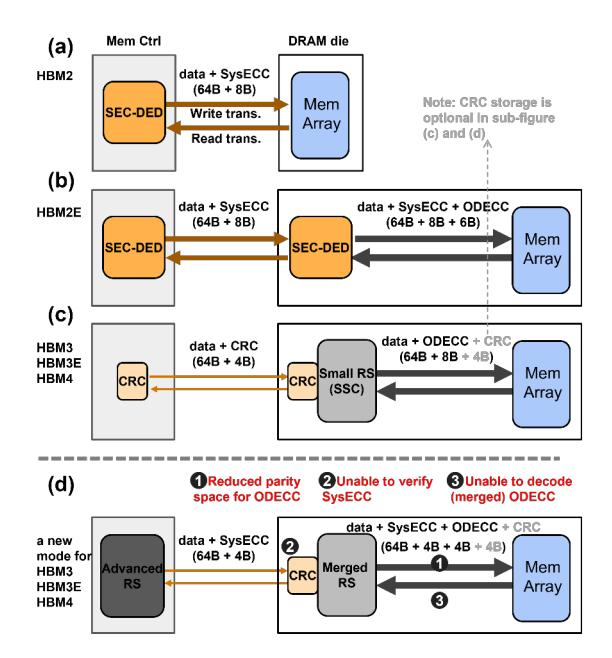
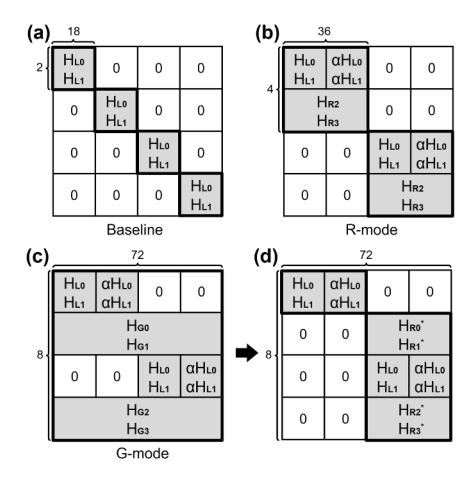
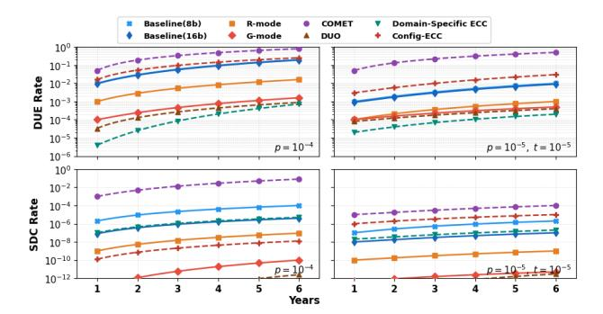
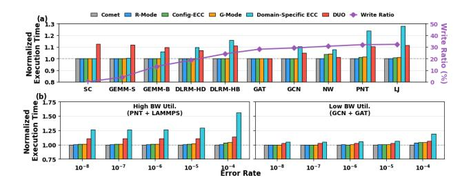

# HBM-CASO: A Coordinated Approach to HBM System-Level and On-Die ECC

Ruizhi Zhu Yanan Guo Huize Li

Orlando, USA Rochester, USA Orlando, USA ruizhi.zhu@ucf.edu yanan.guo@rochester.edu huize.li@ucf.edu

University of Central Florida University of Rochester University of Central Florida

Weidong Cao Qian Lou Xin Xin\* The George Washington University University of Central Florida University of Central Florida

Washington, D.C., USA Orlando, USA Orlando, USA weidong.cao@gwu.edu qian.lou@ucf.edu xin.xin@ucf.edu

*Abstract*—HBM (High-Bandwidth Memory) has progressively strengthened its reliability by employing more advanced ECC (Error Correction Code) techniques, such as Reed-Solomon (RS) codes, to meet the increasing reliability challenges raised from continued technology scaling. Over time, the protection paradigm has shifted from a system-centric approach (i.e., system ECC), where the processor primarily manages error correction, to a memory-centric approach (i.e., on-die ECC), where HBM handles errors independently. Although this shift generally reduces the ECC burden on the processor side, it constrains the flexibility to implement stronger protection schemes, particularly when the processor is capable of supporting more advanced ECC.

To address this problem, we propose HBM-CASO, a new protection mode designed to accommodate advanced system ECC. It strategically reorganizes the on-die ECC resources to generate a stronger on-die codeword as a supplement to the system ECC. Furthermore, due to limited on-die computing resources, HBM cannot directly verify the advanced system ECC. HBM-CASO therefore introduces a delayed verification strategy, which accumulates on-die parity across a batch of writes, rather than verifying each write individually, and validates the entire batch as a whole. Our extensive evaluation results demonstrate that HBM-CASO has effectively enhanced error correction capability, allowing the system to correct a broader range of error patterns with minimal performance and bandwidth overhead.

*Index Terms*—High-Bandwidth Memory, on-die ECC, systemlevel ECC, Reed-Solomon codes, memory reliability

#### I. INTRODUCTION

HBM has emerged as a vital component in High-Performance Computing (HPC) systems, delivering extremely high bandwidth along with a flexible capacity range (16∼192Gb) [56], [62], [63]. This unique advantage makes it well-suited for a broad spectrum of data-intensive tasks, such as machine learning and big data analytics. However, as the technology node scales and architectural complexity increases, HBM faces escalating reliability challenges [16], [17], [41]. Accordingly, protection schemes for HBM have been progressively shifted toward on-die ECC (denoted as ODECC) [13], [33], [56], [62], [71], since memory vendors

In particular, early HBM often relied on system ECC (denoted as SysECC). Unlike ODECC, SysECC refers to ECC implemented and managed by the processor's memory controller. Early SysECC was based on simple bit-level ECC schemes such as SEC-DED (Single-Error Correction, Double-Error Detection). Beginning with HBM2E, on-die bitlevel ECC was introduced to complement the controller-side protection. This trend continues in more recent generations (i.e., HBM3 [25], HBM3E [39], and HBM4 [26]), which advance the approach by augmenting the ODECC with stronger symbol-level schemes (i.e., Reed-Solomon (RS) ECC). Consequently, the controller's role in protection is reduced to error detection only, using lightweight CRC (Cyclic Redundancy Check) through a narrow parity channel solely to ensure transmission correctness. Besides the imperative to manage escalating reliability challenges, this transition to ODECC is further driven by multiple advantages: (1) it standardizes a unified interface, (2) it improves channel bandwidth efficiency by mitigating the overhead of parity transfer, and (3) it also enables proactive error management techniques, such as error scrubbing, which periodically scans the storage space to identify and correct any errors [34], [62].

However, this ODECC-centric strategy compromises the ability to tailor ECC schemes for specific deployment scenarios. This raises a question: *if an HPC processor requires stronger ECC and is capable of providing it, how can modern HBM efficiently extend its fixed ODECC mechanism to meet this need?* Previous studies introduced two approaches to tackle this problem. The first, represented by DUO [18], is to employ advanced SysECC to directly replace simple ODECC. However, this is challenging because only a limited parity channel width (4 bits per 64-bit data) and parity storage space (8 bits per 64-bit data) are available. Relying exclusively on SysECC requires extra bandwidth for parity transfer, leading to significant performance degradation. It also underutilizes the existing ODECC and compromises HBM's built-in error-

are expected to deliver sufficiently robust chips that can operate reliably out of the box.

<sup>\*</sup>Corresponding author: Xin Xin.

scrubbing capability. The second, represented by XED [52], is to partially transfer SysECC and coordinate it with the ODECC. For instance, it may transfer 4-bit SysECC while the remaining 4-bit space is supplied by the ODECC. This remains suboptimal, as ODECC resources that were designed for an 8-bit space are not fully utilized. More critically, HBM lacks sufficient resources to decode the advanced SysECC, whose decoding logic is considerably more complex. This leads to a write-verification issue: transmission errors during write operations can no longer be detected (recall that this was protected by CRC), and the generated ODECC cannot be trusted without verification.

To tackle these challenges, we propose HBM-CASO, a new protection mode for modern HBM. Specifically, the baseline protection mode is preserved, with existing ODECC remaining fully operational. When stronger reliability is required, HBM-CASO is enabled to elevate protection levels.

First, to avoid the extra bandwidth overhead for parity transfer and fully utilize ODECC resources, HBM-CASO repurposes the original 4-bit CRC channel to deliver advanced SysECC, which fills half of the 8-bit parity space. The remaining 4-bit space is still supplied by ODECC, but in a more efficient manner. Specifically, we propose a codeword merge approach that converts each 4B ODECC parity into a 2B form. This frees space to store SysECC parity. While the reduced ODECC alone is weaker than its original 4B form, it still maintains the same protection range. More importantly, when combined with SysECC, the overall protection capability is significantly enhanced.

Second, to address the write-verification issue, HBM-CASO introduces a delayed verification technique, which verifies writes in batches rather than each write separately. To reduce read-write turnaround costs, memory systems commonly batch writes. Unlike the baseline, which uses CRC to verify each write before generating on-die parity, HBM-CASO directly generates on-die parity, but it additionally accumulates the parity in a 64-bit register using simple XOR operations. On the memory controller side, an identical accumulation process is performed in parallel. The final accumulated result in the memory controller is transmitted alongside the last write in the batch and is then compared with the accumulated result within HBM to verify the integrity of the entire batch. Note that although the verification process is deferred until the last write, it does not impact performance since write operations do not lie on the critical path (they do not block program execution). This approach also incurs negligible bandwidth overhead, as it only adds a small parity transfer to the last write in the batch.

In addition, HBM-CASO is not limited to RS codes. It can be extended to other ECC schemes, e.g., Hamming codes, residue codes [46], [47], and algorithm-oriented ECC [4], [22], [81]. In this paper, we use RS codes as a representative scheme because they are a popular choice in modern HBM [48], [65], [69]. The contribution of this work is summarized as follows:

1) We introduce HBM-CASO, a new SysECC-ODECC coordination strategy that enables processors to participate

- in HBM ECC management with minimal changes.
- 2) We propose a cost-effective technique that frees parity space for SysECC. It merges smaller codewords into a larger one by reusing existing ODECC parities.
- 3) We propose a delayed verification technique to address the write-verification issue caused by SysECC. It verifies writes in batches, with negligible bandwidth overhead.

#### II. BACKGROUND

#### *A. HBM Basics*

HBM delivers extremely high bandwidth based on advanced die-stacking and through-silicon via (TSV) technologies. As shown in Figure 1(a), an HBM stack comprises multiple core DRAM dies, which are vertically stacked on a base die and interconnected via TSVs [56], [62]. The core die in HBM is similar to conventional DRAM, comprising cell arrays and peripheral circuits, except that it is organized into multiple channels. Cell arrays have a hierarchical structure consisting of bank groups, banks, subarrays, and mats. The peripheral area is dedicated to address/command buffers (AWORD), data buffers (DWORD), TSVs, and on-die ECC (ODECC) logic. Taking HBM3 as an example, each core die contains 4 channels, forming a total of 16 channels in a four-high stack. Each channel is further divided into two pseudo-channels that share a common command bus. The access granularity of a pseudochannel is 38B, including 32B data, 2B metadata (CRC), and 4B parity data, which are transmitted via 38 TSV I/Os with an 8-bit burst (Figure 1(b) shows 32 data TSV I/Os). To support the conventional 64B cacheline size, one can operate at channel granularity, i.e., using two pseudo-channels in tandem.

## *B. Faults and Protection Schemes*

- *1) Terminology and Taxonomy:* Following [5], [72], a *fault* refers to the underlying cause of a malfunction (e.g., stuckat fault or single-event effect), while an *error* denotes its visible manifestation, such as an incorrect value returned to the processor. Based on modern DRAM field studies and HBM3 documentation [20], [34], [41], HBM faults can be classified into four representative types:
- Single-Bit Fault (SBF) the most common fault type in DRAM systems.
- Byte-size Burst Fault (BBF) affects 8 contiguous bits, typically due to TSV or mat failures.
- Word-sized Burst Fault (WBF) corrupts 16 contiguous bits, usually caused by a sub-wordline (SWL) failure.
- Subarray-level Fault (SAF) large-scale faults impacting entire subarrays or banks.

For example, as shown in Figure 1(b), each 8-bit TSV burst aligns with half of a 16-bit sub-wordline, so TSV-induced faults often appear as BBFs. It is also worth noting that no ECC scheme can perfectly detect or correct all fault types. Rather, the goal of an ECC scheme is to reduce residual faults to an acceptable level. Under a given ECC scheme, HBM errors are categorized into Detectable and Correctable Errors (DCEs), Detectable but Uncorrectable Errors (DUEs),


Fig. 1. (a) HBM organization. (b) Detailed array structure and data layout with three representative data error types (for simplicity, parity data is not shown). (c) Codespace comparison: RS(18, 16) vs. RS(72, 64). Four small balls represent RS(18, 16). The larger ball represents RS(72, 64) with expanded coverage.

and Silent Data Corruptions (SDCs) [35], [36]. SDCs stem from two cases: undetectable and uncorrectable errors (UUEs), or detectable but miscorrected errors (DMEs).

- *2) Transmission-Centric Protection:* Cyclic Redundancy Check (CRC) is a polynomial-based error detection method widely used in communication systems [70], including memory channels and interconnects. Since transmission errors can be recovered through retransmission, CRC focuses solely on error detection. Typically, CRC provides strong bursterror detection capability. For instance, CRC-8 can guarantee detection of all burst errors up to 8 bits [38].
- *3) Bit-Level Error Correction:* Single Error Correction–Double Error Detection (SEC-DED) [15] is the most prevalent ECC in memory systems due to its simplicity and low overhead. Derived from the Hamming code, it typically adds 8 parity bits to a 64-bit data word, forming a 72-bit codeword with 12.5% redundancy. However, it can handle only a limited number of bit errors and remains vulnerable to multibit and burst errors.
- *4) Symbol-Level Error Correction:* To more effectively handle multi-bit and burst errors, symbol-level ECC schemes were developed. These schemes group multiple bits into a single unit (*symbol*) and typically employ the Reed–Solomon (RS) algorithm [60]. A representative design is AMD Chipkill [2], widely deployed in high-performance DDR systems. For example, DDR4 Chipkill ECC uses RS(18, 16), distributing 18 symbols across 18 DRAM chips, to tolerate an entire chip failure. RS codes have become the standard ODECC mechanism in modern HBM (see Section III-A). We next analyze their error coverage and trade-offs.
- *5) Arithmetic-Based Error Correction:* In addition to the above bit-level and symbol-level ECC schemes, which are primarily based on XOR operations, a number of arithmetic-based ECC schemes have been proposed, such as residue codes [46] and redundant residue number systems (RRNS) [73]. Beyond these schemes, there are also algorithmoriented ECC designs, such as [4] and [81], which provide matrix-structure-aware protection. A key advantage of these approaches is their compatibility with arithmetic operations. As a result, they can provide protection not only for storage but also for computation, which is particularly important for emerging computing-in-memory (CIM) architectures. How-

ever, these schemes often incur significantly higher encoding and decoding overhead compared to traditional XOR-based ECC. For instance, [46] shows that residue codes can outperform traditional RS codes under certain scenarios, but at the cost of orders-of-magnitude increases in hardware overhead.

#### *C. Code Coverage and Tradeoff*

The Hamming distance [6] measures the dissimilarity between two codewords of equal length by counting the number of positions where their corresponding symbols differ. It determines the code's capability: a code with distance d can either correct up to (d − 1)/2 symbol errors or detect up to d − 1. An RS code with 2t redundant (check) symbols yields a Hamming distance of 2t + 1, allowing correction of up to t symbol errors (with the constraint that the codeword length does not exceed 2<sup>m</sup> − 1, where m is the symbol bit width).

With the same redundancy, larger codewords provide higher protection efficiency due to their greater Hamming distance. For example, using one large RS(72, 64) codeword is more effective than using four small RS(18, 16) codewords (Figure 1(c)). In the large codeword, any 4 errors can be fixed regardless of where they land. In the smaller codewords, the capability is still limited to 4 total errors, but the errors must land "perfectly" (i.e., one in each block) to be fixed. Since real-world errors are rarely that even [67], [72], the larger codeword provides much better protection. In this paper, we refer to these large, powerful codewords as advanced ECC. Beyond higher correction strength, larger codewords also offer superior error detection. When errors exceed the correction limit, the decoder may return either a DUE or an SDC. A larger codeword provides a larger syndrome space for error detection. For instance, RS(72, 64) consists of eight 8-bit check symbols, yielding a syndrome space of up to 2 <sup>64</sup>, of which only 0.02% correspond to correctable error patterns, as reported in [35]. By contrast, RS(18, 16) has a much smaller 2 <sup>16</sup> syndrome space, with roughly 7% occupied by correctable patterns, thus increasing the likelihood of undetected or miscorrected errors. From another view, larger codewords foster greater confidence in error correction. For small error counts, their higher Hamming distance offers additional margin. In contrast, smaller codewords are more likely to operate near

their correction limit, where even one extra error can exceed their capability and lead to SDC.

#### III. MOTIVATION

#### *A. Evolution of HBM Protection*

As aforementioned, new HBM generations increasingly rely on ODECC to handle internal errors, reducing dependence on host-side ECC (SysECC). Accordingly, less channel bandwidth is available for system parity (e.g., 4 bits per 64 bit channel). As shown in Figure 2(a), initial HBM generations, i.e., HBM1 and HBM2, typically relied on system ECC without any on-die protection<sup>1</sup> . HBM2E, an intermediate generation, introduced ODECC that operates jointly with system ECC [13]. As shown in Figure 2(b), each 64B data block, already protected by 8B of system ECC, is further strengthened within HBM2E by an additional 6B of ODECC.



Fig. 2. (a)–(c) show the protection strategies adopted by HBM2, HBM2E, and modern HBM, i.e., HBM3, HBM3E, and HBM4. (d) presents our design, which enables modern HBM to accommodate the advanced system ECC.

Modern HBM generations (HBM3, HBM3E, and HBM4) enhance ODECC by adopting the symbol-based RS code [25], [26], [39], [56], [62], while shifting the ECC responsibility from the system to memory. As shown in Figure 2(c), the processor-side memory controller employs only a lightweight CRC (no correction capability) to safeguard channel transmission. Accordingly, the required parity channel width is reduced from 8 bits to 4 bits (per 64-bit channel). When data successfully reaches HBM (i.e., the CRC check passes), the RS-based ECC parity is generated within the stack. Otherwise, if the CRC check fails, the data is retransmitted.

<sup>1</sup>ECC was optional in HBM1 [55]. HBM2 typically used the (72, 64) SEC-DED scheme with a dedicated parity channel [33].

This shift of protection resources onto DRAM dies enables HBM to manage error risk independently — for example, setting up error scrubbing for a die that exhibits higher error susceptibility [50], [66]. But it also introduces inflexibility challenges, as discussed below.

## *B. The Demand for ECC Flexibility*

HBM can be deployed in various systems (Section V-B). Different systems may require different ECC standards. However, it is impractical to implement an all-encompassing ODECC that meets all reliability requirements. In addition, relying solely on lightweight CRC at the system level provides limited protection. During write operations, any undetected transmission errors missed by the simple CRC will compromise the entire ODECC effort, as the ODECC units will generate parity based on already-corrupted data.

We advocate that the shift to on-die protection should not reduce the opportunity for system-level protection. Instead, if the system is capable and willing to employ more advanced ECC mechanisms, HBM should provide flexibility, i.e., the ability for processors to reuse or repurpose on-die ECC resources to implement different or stronger systemlevel protection schemes. But this introduces new challenges. As shown in Figure 2(d), we summarize these challenges in terms of ➊ parity storage, ➋ write verification, and ➌ read decoding. Specifically, the 8B ECC parity space (per 64B data block) was originally dedicated entirely to ODECC. To allow SysECC (4B) to partially occupy this space, an optimal approach is required for ODECC to efficiently "compress" its parity (*Challenge* ➊), so as to free part of this 8B space. In addition, because the parity channel is now used by the advanced 4B SysECC, no bandwidth remains for CRC. As a result, data arriving at HBM during write operations cannot be verified, since no on-die resource can decode such advanced SysECC. Consequently, incorrectly received data may cause ODECC to generate faulty parity (*Challenge* ➋), compounding the problem. Finally, during read operations, ODECC may lack sufficient resources to fully decode the 'compressed' ODECC (*Challenge* ➌), impacting the error detection capability and making the built-in error-scrubbing function in HBM no longer feasible.

#### IV. DESIGN

To tackle the above three challenges, we propose HBM-CASO, which comprises three associated techniques (Section IV-A, IV-B, and IV-C). We introduce HBM-CASO by considering three RS codeword candidates, referred to as local, regional, and global codewords. The local codeword refers to the baseline ODECC, which uses RS(18, 16) to protect each 128-bit data block (16 data symbols), as shown in Figure 3(a). The regional codeword extends the protection range to 256 bits by using RS(34, 32), with 2 check symbols for every 32 data symbols (Figure 3(b)), which corresponds to the pseudo-channel access granularity. The global codeword further expands the coverage to 512 bits by employing RS(68,


Fig. 3. (a) Baseline codeword organization in modern HBM. (b) HBM-CASO codeword organization. (Note that pseudo-channels (PCs) might not be physically aligned. HBM-CASO's ODECC logic, i.e., merging and accumulation units, does not span across PCs.)

64), with 4 check symbols for every 64 data symbols (Figure 3(b)), which aligns with the channel access granularity (the default cacheline size). A system may adopt local, regional, or global codewords as SysECC, depending on its capability. In the following, we use the global codeword case to illustrate the design. Other local and regional options are discussed in Section IV-D.

#### *A. Codeword Merge*

To tackle challenge ➊ (Section III-B), i.e., efficiently compressing the ODECC parity space, we slightly reorganize ODECC resources to merge two small local codewords into a stronger regional codeword. In particular, we employ a lightweight logic unit, termed the Merging Unit (Figure 3(b)), to combine the smaller codewords. Observe that two local codewords (RS(18, 16)) cover the same 32B data region as one regional codeword (RS(34, 32)), but incur twice the parity overhead. Based on the linear property of RS codes, these two RS(18, 16) parities can be combined into one RS(34, 32) parity. Mathematically, the process can be expressed as pregional <sup>0</sup> = plocal <sup>0</sup> + C ∗ plocal <sup>1</sup>, where plocal <sup>i</sup> denotes the parity in the i-th local codeword and C is a constant value derived from the code algorithm (i.e., the H matrix). Since the most computationally intensive part, i.e., generating plocal <sup>i</sup> , is already handled by existing ODECC, implementing this combination itself is lightweight<sup>2</sup> (1.51% logic overhead over the baseline ODECC) (see Section VI-A3). Consequently, for each 64B write, its original 4B local codeword parity (generated by ODECC) can be merged into 2B regional parity. This reduces the parity overhead by half and frees 2B of space for the global-sized system ECC. Figure 3(b) shows the associated hybrid structure integrating both regional ODECC and global SysECC.

Two additional points are worth noting. First, this merging process does not require cross-pseudo-channel operations, as plocal <sup>0</sup> and plocal <sup>1</sup> originate from the same 32B region. Second, CRC is essential in the baseline design for protecting channel transfers (Figure 2(c)), but storing CRC parity is optional. Prior work [62] suggests using the HBM metadata space to store CRC parity for stronger protection<sup>3</sup> . Our design supports both options: whether CRC parity is stored or not. When CRC parity is stored, the CRC unit operates in a reversed manner: during memory write operations, the CRC unit generates parity for the received data to fill the 4B metadata space, rather than performing error checking as in the baseline. Conversely, during read operations, it performs error checking instead of generating parity. In addition, to protect the metadata space, modern HBM typically uses RS(19, 17) instead of RS(18, 16) to integrate the 1B metadata (e.g., CRC) into each 19B local codeword. Similarly, in our design, regional and global codewords should employ RS(36, 34) and RS(72, 68) to include the metadata. However, for illustrative simplicity, we refer to them as RS(34, 32) and RS(68, 64), with the main focus remaining on data protection.

#### *B. Delayed Write Verification*

To tackle challenge ➋ (Section III-B), i.e., the lack of resources to validate received data on the HBM side, we propose postponing the verification. This is inspired by two key observations. First, unlike memory reads, write operations do not risk exceeding the ECC's correction capability, since the memory controller maintains an original, uncorrupted copy of the data. Second, write operations often occur in batches, and their latency does not impact system execution. Based on these observations, we adopt a detection-only protection strategy for a batch of write operations, i.e., collecting multiple received data blocks and verifying them together as a group.

Specifically, each 64B memory write can generate 8B of on-die parity, consisting of 4B regional and 4B CRC parities. We incorporate two independent accumulation units (evenly distributed across two pseudo-channels, as shown in Figure 3(b)) to aggregate each 2B regional + 2B CRC parity pair over a batch of write operations using simple bitwise XOR

<sup>2</sup>The multiplication in the unit operates over small finite fields (e.g., GF(2<sup>8</sup> )), using bitwise logic, and is much simpler than regular integer multiplication.

<sup>3</sup>Note that this metadata space can be managed by the system to support both RAS and non-RAS uses [20].

operations. The resulting 64-bit XOR value is then employed to verify the correctness of all write transfers in the batch. Meanwhile, the memory controller performs the same process: generating 8B parity for each write and accumulating them into a 64-bit XOR result. After the final write in the batch, verification is carried out by comparing the two copies of the 64-bit XOR result. This comparison process requires an extra transmission from the memory controller to the HBM. However, the overhead is negligible compared to an entire write batch, which typically consists of 32∼64 transfers [7], [8] (equivalent to a burst length of 256∼512), whereas the 64-bit XOR transmission occupies only one burst. A slight optimization for this transmission is to perform it during the write-to-read turnaround time, which is allocated for internal memory arrays to switch back to the read mode. Since the XOR result is generated in peripheral circuits rather than fetched from internal arrays, according to [8], it can be transmitted directly.

Any mismatch of the XOR results, indicating transmission faults during the write batch, will prompt the memory controller to repeat the entire write batch. This requires the memory controller to extend the write buffer by the batch size, so as to hold the writes until the batch completes verification successfully. With a 64-bit accumulated parity result, the probability of an undetectable error pattern, e.g., two faulty transfers producing on-die parities with exactly the same error pattern, is already negligible; in other words, the conflict rate is only 2 <sup>−</sup><sup>64</sup>. This provides even stronger transmission protection than the baseline approach, which protects data locally using only a 16-bit CRC (for every 32B data). As a result, it mitigates the risk that an undetected faulty write transfer causes ODECC to operate on corrupted data, undermining its effectiveness and compounding the problem. In addition, given that DRAM errors are rare (typically well below 10<sup>−</sup><sup>8</sup> ) [5], even with multiple transfers per batch, the retransmission overhead (or the mismatch rate) remains low. Even if the error rate were unrealistically high, say above 10<sup>−</sup><sup>4</sup> , the retransmission overhead is still manageable by appropriately adjusting the batch size for each XOR result.

# *C. Decoupled Read Protection*

To tackle challenge ➌ (Section III-B), i.e., enabling HBM to verify internally fetched data during read operations, we employ a decoupled decoding process for read accesses (similar to [79]). The key idea is straightforward: separate the ECC decoding process into distinct error detection and correction phases. In most cases, only error detection is necessary and affects read latency, because correction is not needed unless an error is actually detected. We apply this detection-only strategy within HBM to verify read data, which is now encoded as regional codewords. This is enabled by a key observation: when an ECC scheme is used solely for error detection, the encoding logic can be reused to perform the decoding process, eliminating the need for a full decoder. A simple method is to regenerate the parity and compare it with the stored parity. As such, the same codeword Merging Unit can be reutilized during reads to perform error detection.

Specifically, when a regional codeword is fetched from the memory arrays, both the ODECC and CRC units perform error detection. If any error is detected, HBM does not attempt correction; instead, an alarm signal is sent to the processor<sup>4</sup> . This also ensures that HBM-CASO remains compatible with the error scrubbing mechanism built inside the stack, which periodically scans the storage space to identify errors. On the memory controller side, if no alarm signal is received (i.e., no error is detected), global parity is used to perform an additional verification of the data, which also covers potential transmission errors. If an error is detected, the memory controller initiates a special memory access to retrieve all parity information, including both regional ECC parity and CRC parity. Under this special scenario, parity and metadata can be transferred through the regular data channel along with the data block by extending the burst length (similar to DUO [18]). Finally, with all data and parity collected, error correction is carried out in the memory controller. However, the hybrid organization of global and regional codewords results in an irregular decoding process for error correction. To tackle this problem, we propose a tiered error correction procedure in Section V-C.

#### *D. Diverse Protection Modes*

Recall that HBM-CASO is an augmented, additional mode that enables the above key functions, including codeword merging, delayed write verification, and decoupled read protection. This new mode can be added to the DRAM mode register, which already defines multiple DRAM operational modes, such as the power-down mode, self-refresh mode, etc [24], [25]. In particular, there are two approaches to managing the HBM-CASO mode: it can either be enabled globally for the whole memory (in a static manner), or enabled per memory block dynamically. In the static case, HBM-CASO must remain enabled until the HBM device is turned off. In the dynamic case, a flag stored in metadata indicates whether a block should be accessed using HBM-CASO or normal HBM modes, allowing the memory controller and ODECC logic to choose the appropriate resources.

In addition to using global codewords as system ECC, we can fine-tune the utilization of local and regional codewords to accommodate a variety of deployment scenarios. For example, if a processor supports only simple local codes (RS(18, 16)), HBM-CASO can be configured with 4B local SysECC parity and 4B regional ODECC parity. Compared to the baseline mode where systems only provide basic CRC protection, this configuration increases the Hamming distance and improves error correction capability in the presence of a small number of errors (see Section II-C). We refer to this configuration as the L-mode, where "L" denotes a *local* system codeword. In HPC environments with high reliability requirements, processors

<sup>4</sup> If this alarm signal is not available, one can send a special data pattern to indicate the issue, similar to the "catchword" in [52].

may support stronger ECC schemes. In such cases, regional (RS(34, 32)) and global (RS(68, 64)) codes can be used, referred to as R-mode and G-mode, respectively. Based on the system's ECC capability, ordered from low to high, the configurations are summarized in Figure 4(a).


Fig. 4. (a) Available modes in HBM-CASO. (b)–(d) Codeword organizations according to the subarray layout: (b) Baseline(8b), (c) Baseline(16b), and (d) HBM-CASO (R-mode).

#### E. Compatibility with 16-bit Symbols

Some modern HBM designs propose using 16-bit symbols to better align with burst errors occurring within each 16-bit sub-wordline [20], [56], [62]. This expands a "local" RS(18, 16) codeword to 288 bits, comprising 256 bits of data and two 16-bit check symbols. HBM-CASO remains applicable to this 16-bit-based RS(18, 16). One approach is to reduce each 16-bit parity to 8 bits by linearly combining its lower and upper bytes over  $GF(2^8)^5$ . This forms a regional RS(34, 32) code and frees 2B parity space for system ECC, enabling the same merging process as in Section IV-A. Accordingly, the merging expression becomes:  $p_{regional\_0} = p_{local\_0L} + \alpha^8 * p_{local\_0H}$ , where  $p_{local\_0L}$  and  $p_{local\_0H}$  denote the lower and upper 8 bits of the 16-bit parity, respectively.  $\alpha^8$  is the binary value  $100000000_2$  under the polynomial representation of  $GF(2^8)$ .

Note that the baseline discussed in prior subsections, based on 8-bit-symbol RS(18, 16) and referred to as Baseline(8b), is actually more efficient than the 16-bit-symbol scheme, referred to as Baseline(16b) (see simulation results in Section VI-A1). As illustrated in Figure 4(b) and (c), both Baseline(8b) and Baseline(16b) can correct up to 16-bit burst errors. However, Baseline(16b) requires the errors to be within a contiguous 16-bit span (i.e., one WBF), whereas Baseline(8b) can correct any two-byte errors (BBFs) as long as they occur in separate 16B data blocks. Our proposed HBM-CASO offers stronger protection than Baseline(8b). For example, R-mode can correct any two-byte errors occurring within the same 32B data block (Figure 4(d)).

 $^5$ Mathematically, the RS code is based on a specific polynomial over  $GF(2^m)$ , where m is the symbol size. The above folding process requires the polynomial over  $GF(2^{16})$  to be reducible to a polynomial over  $GF(2^8)$ .

#### V. DISCUSSION

#### A. Extending HBM-CASO to Other ECC Schemes

Even though RS codes are a primary option in modern HBM [62], [68], other ECC schemes may be adopted in future designs [57]–[59]. Accordingly, HBM-CASO is designed to be extensible and not restricted to RS codes.

Recall that the first critical step of HBM-CASO is to use lightweight logic to merge ODECC so as to free parity space for SysECC. Once this step is completed, the remaining proposed techniques in HBM-CASO, e.g., delayed write verification, can be applied in the same manner. Specifically, other popular coding schemes, such as Hamming codes, residue codes [46], and certain algorithm-oriented ECC designs [4], [22], [81], can also be merged, since they all preserve linear properties that allow algebraic composition of parity information. For example, let  $p_{a,i}$  and  $p_{b,i}$  be the i-th parity bits of two SEC(71, 64) codewords a and b, respectively. They can be merged into a larger SEC(136, 128) codeword c as follows:

$$p_{c,i} = p_{a,i} \oplus p_{b,i}, \quad i \in \{0, 1, 2, \dots, 6\}$$

$$p_{c,7} = d_{c,0} \oplus d_{c,1} \oplus d_{c,2} \oplus \cdots \oplus d_{c,63}$$

Note that an SEC(136, 128) has one more parity bit than an SEC(71, 64). This additional bit  $p_{c,7}$  can be constructed by checking the parity of the first 64 data bits in c (which originally came from a). During decoding, if  $p_{c,7}=1$ , the error lies in the first 64-bit half of c. This reduces to an SEC(71,64) decoding, where the remaining parity bits ( $p_{c,0}$  to  $p_{c,6}$ ) can be used to complete the correction. Otherwise, if  $p_{c,7}=0$ , the error lies in the second half of c and can be corrected similarly. Consequently, this merging approach enables a larger SEC(136, 128) at minimal cost by reusing the existing SEC(71, 64) parity results instead of recomputing parity from the original data. The same concept can be extended to SEC-DED constructions, which we omit here for brevity.

This merging strategy can also be applied to non-binary codes. Taking residue codes as an example, a common way to compute the parity of a data word  $d_a$  is  $p_a = d_a \mod m$ , where m is a predefined constant. Consider two 64-bit words  $d_a$  and  $d_b$ . Their corresponding parities can be merged as<sup>6</sup>:

$$p_c = (p_a + C \cdot p_b) \bmod m$$

where C is a precalculated constant  $2^{64} \mod m$ , as the second 64-bit block is effectively shifted by 64 bits in the concatenated 128-bit word. Following the same principle, the parity of the 128-bit word can be obtained by combining the two smaller codeword parities rather than recomputing it from the original data.

<sup>6</sup>Specific implementations may use different algebraic forms. For example, [46] computes parity as  $p=m-a << r \mod m$ . But these variants preserve the same property of codeword merge.

## B. Access Granularity Impact

The choice of a protection mode is also determined by HBM access granularity. For smaller 32B access granularity (e.g., in modern GPUs), HBM-CASO is typically limited to L- and R-modes. For larger 64B accesses (e.g., in CPUs), G-mode is preferred. Notably, G-mode can still be applied in 32B scenarios when applications are not write-intensive. Benefiting from the decoupled read strategy (Section IV-C), for each 32B read access, one can use the associated 2B regional parity to solely perform error detection (across both on-die and system decoding processes). The global parity does not need to be read unless errors are actually detected. However, for write operations, the mismatched access and ECC encoding granularity can lead to read-modify-write (RMW) overhead, a challenge commonly seen in NVM designs. In fact, there is an intrinsic trade-off between fine access granularity (i.e., small codeword size) and strong ECC capability (i.e., high coding efficiency). This leads to a longstanding challenge in memory design, where improved error correction often comes at the cost of coarser access granularity, such as [19], [80]. The focus of our work is not on resolving this fundamental trade-off. Instead, we advocate the necessity of providing a flexible interface that allows modern HBM to accommodate advanced ECC schemes (in case the system can manage to provide such ECC).

Moreover, future memory subsystems are likely to benefit from supporting coarser access granularities. HBM is increasingly adopted across a broad spectrum of processors, including CPUs (server-class), GPUs, TPUs [32], and other emerging NPUs [21], [23], [40]. Many of these processors operate with larger access granularity (64B~512B) to meet the large dataaccess pattern demands of prevalent AI applications. HBM-CASO is scalable to support such granularity. For example, if a system is configured with larger 128B access granularity providing a 24B parity space that includes 8B system ECC, 8B ODECC, and 8B CRC — the global system codeword can be scaled to an even larger one (e.g., RS(136, 128)) to enable more robust protection. Also, HBM-CASO can be upgraded as ODECC advances. For instance, if future HBM scales its ODECC to the regional level, the same merging strategy can be applied. In that case, the on-die parity column in Figure 4(a) would be upgraded to 4B RS(68, 64) (along with an additional 4B for CRC).

## C. Suggested Error Correction Flow

In this subsection, we provide suggestions, instead of directives, for the processor-side error correction. Unlike traditional RS decoding with a fixed codeword size, our scheme combines global and regional codewords. We propose a tiered correction flow that adapts to error severity. As shown in Figure 5, the initial step in the correction phase is to merge two received regional RS(34, 32) codewords into RS(66, 64). This extends the global RS to RS(70, 64) with 6 check symbols. This standard codeword form corrects up to 3 symbol errors within a 64B block, and more importantly, allows us to use the standard Berlekamp-Massey algorithm [64] to perform error


Fig. 5. The error correction flow for G-mode

correction efficiently. Recall that using the maximum correction capability is not always suggested due to the increased risk of miscorrection (see Section II-C). Therefore, if RS(70,64) decoding yields exactly 3 errors (or a DUE), the result is discarded, and decoding reverts to the combined global and regional codewords.

Theoretically, with 4 global and 4 regional check symbols, up to 4 symbol errors can be corrected. We employ a brute-force search by assuming that 4 specific symbols are erroneous and testing all  $\binom{72}{4}$  error positions (excluding cases where all four lie in the same 32B region, totaling 956,870 combinations). If the best match contains fewer than four actual errors, that solution is adopted. If exactly four errors are found, a CRC check is applied, and the result is accepted only upon passing.

In short, correction latency scales with error count. Cases with  $\leq 2$  errors can be efficiently handled by hardware in the memory controller, while rarer multi-error cases should be offloaded to software to avoid the cost of additional hardware.

#### D. Theoretical Analysis

In memory subsystems, an RS(N, K) code with an m-bit symbol size is defined over  $GF(2^m)$  [43], where  $N \leq 2^m - 1$ . This linear code is uniquely characterized by a Vandermonde matrix [61], a.k.a., H-matrix, which governs parity checking and dictates the structure of the encoder/decoder and the error correction and detection capabilities of the code. For instance, a baseline RS(18, 16) code can be constructed using a  $2 \times 18$  H-matrix:

$$H_{local} = \begin{bmatrix} H_{L0} & H_{L1} \end{bmatrix}^\mathsf{T} = \begin{bmatrix} \alpha^0 & \alpha^1 & \cdots & \alpha^{17} \\ \alpha^0 & \alpha^2 & \cdots & \alpha^{34} \end{bmatrix}$$

where  $\alpha$  is typically a primitive element of the finite field. The encoding for a set of data symbols is a process of finding a few appropriate parity symbols that make  $H \times \vec{w} = 0$ , where  $\vec{w}$  is the codeword that contains both data and parity symbols.



Fig. 6. H matrices over a 64B data block under (a) Baseline, (b) R-mode, and (c) G-mode. (d) a subset of the G-mode matrix

For RS(18, 16),  $\vec{w} = (d_0, d_1, \dots, d_{15}, p_0, p_1)$ . Similarly, the H-matrix for a regional RS(36, 32) code can be expressed as:

$$H_{regional} = \begin{bmatrix} H_{R0} & H_{R1} & H_{R2} & H_{R3} \end{bmatrix}^{\mathsf{T}}$$
$$H_{Ri} = \begin{bmatrix} \alpha^0 & \alpha^i & \cdots & \alpha^{35*i} \end{bmatrix}, \quad i \in \{0, 1, 2, 3\}$$

Based on the property of Vandermonde matrices, the first two rows of the above regional H-matrix can be expressed as  $H_{Ri} = \begin{bmatrix} H_{Li} & \alpha^{18*i} * H_{Li} \end{bmatrix}, \quad i \in \{0,1\}$ . This demonstrates that a subset of a regional H-matrix is a linear combination of two local H-matrices. Accordingly, the associated codewords, linearly generated from these H-matrices, inherit the same linear structure.

To carry out decoding, the codeword needs to be multiplied by the H-matrix to produce a set of syndromes  $\vec{s}$ . Then the error pattern  $\vec{e} = (0, \dots, e_i, \dots, 0)$ , where i denotes the location of the error, can be derived from  $H \times \vec{e} = \vec{s}$ . For instance, the local RS(18, 16) codeword can produce two syndromes  $s_0$  and  $s_1$ , which can be used to solve two variables, i.e., the error location (i) and the error value itself.

To cover a 64B data block, it requires four local H-matrices, which form a diagonal matrix, as shown in Figure 6(a). For  $\vec{e}=(0,\ldots,e_i,\ldots,e_j,\ldots,e_k,\ldots,e_l,\ldots,0)$ , this matrix can only correct errors in a distributed pattern  $\textcircled{1}: i \in [0,17], j \in [18,35], k \in [36,53],$  and  $l \in [54,71],$  that is, each error element is confined within one 18B codeword. In contrast, as shown in Figure 6(b), for R-mode using regional H-matrices, the shaded areas expand. As a result, a more flexible error pattern 2 can be corrected:  $i,j \in [0,35]$  and  $k,l \in [36,71],$  that is, each pair of error elements is confined within one 36B codeword. In other words, since the diagonal matrix in the baseline is a subset of the R-mode matrix, every error pattern that the local code can correct is also correctable by the regional R-mode code.

In line with this concept, G-mode uses a hybrid of global and regional codes to further extend coverage, as shown in Figure 6(c). Consequently, the error patterns ① and ②, which

the R-mode code can already correct, are also correctable in G-mode. Moreover, this G-mode enables correction of an additional error pattern  $\textcircled{3}: i \in [0,35]$  and  $j,k,l \in [36,71]$ , that is, one 36B codeword contains a single symbol error while the other has three symbol errors (or vice versa). This specific pattern can be completely corrected using the matrix shown in Figure 6(d), which is a subset of the G-mode matrix. However, for the error pattern  $\textcircled{4}: i,j,k,l \in [0,35]$ , where all 4 errors concentrate in one 36B codeword, G-mode cannot correct the errors since the matrix in Figure 6(c) still contains zero entries.

#### VI. EXPERIMENT

We evaluate HBM-CASO in terms of reliability, hardware overhead, performance, and power.

 $\label{thm:table in the configuration} TABLE\ I$  Comparison of ECC schemes and their configurations.

| Scheme          | On-die ECC             | System ECC      |
|-----------------|------------------------|-----------------|
| Baseline(8b)    | RS(19, 17)* + CRC-8    | CRC-8           |
| Baseline(16b)   | $RS(19, 17)^* + CRC-8$ | CRC-16          |
| R-mode          | RS(36, 34)*            | RS(34, 32)      |
| G-mode          | RS(36, 34)*            | RS(68, 64)      |
| DUO [18]        |                        | RS(72, 64)      |
| Config-ECC [10] | CRC-24                 | RS(72, 70)      |
| COMET [3]       | SECDED(76, 68)*        | SECDED(104, 96) |
| Domain-ECC [78] | CRC-16                 | RS(544, 512)    |

<sup>\*</sup> denotes codes that further include metadata space on DRAM dies.

#### A. Experimental Methodology

Table I summarizes the evaluated ECC schemes. In addition to the two baselines, HBM-CASO is further compared against four representative schemes that cover four ECC study categories.

- Baseline(8b) and Baseline(16b): two default protection baselines following prior HBM studies [20], [39], [56], [62].
- **DUO** [18]: a representative of schemes that expose on-die ECC redundancy to the memory controller and coordinate it with stronger system-level protection, as also explored in prior work such as XED [52] and Bamboo ECC [36].
- Config-ECC [10]: a representative of tiered ECC designs for HBM. It employs a two-tier protection structure to support different access granularities, capturing a line of work on multi-level memory protection [31], [51], [74].
- **COMET** [3]: a representative of stronger bit-level ECC designs. It combines on-die and system ECCs and mitigates the silent miscorrection risk of conventional SEC-based on-die ECC through redesigned local coding [13].
- **Domain-Specific ECC** [78]: a representative of controller-level large-codeword ECC designs. It captures recent protection approaches for modern AI workloads by expanding the ECC coverage domain, similar to prior large-codeword studies [29], [30], [80].
- 1) Reliability Evaluation: We first assess error coverage and correction capability at data-block granularity. We use the four fault types defined in Section II-B and simulate 15

representative patterns (combinations of the four types). This experiment is motivated by the fact that modern HBM failures often manifest not only as isolated bit upsets, but also as burstor region-level corruptions at the data interface, which directly determine the effective protection capability of different ECC schemes. Following prior reliability studies [35]–[37], we perform 10<sup>9</sup> Monte Carlo injections for each error scenario. In each trial, fault locations are randomly placed within the protected data block, and the decoding result is classified as DCE, DUE, or SDC. For burst faults (BBF/WBF/SAF), we adopt the same randomized corruption methodology commonly used in prior work [36]: each bit within the affected burst region is flipped with 50% probability, conditioned on at least one bit flip. This models a worst-case random corruption scenario where each bit may independently flip to a random value, which statistically results in 50% bit flips. For example, under a 1BBF injection, the 8 bits in the affected byte are each flipped with 50% probability, so one injected BBF may produce anywhere from 1 to 8 flipped bits, capturing diverse corruption patterns within the same burst-fault granularity.

We also evaluate transmission error detection using the same fault models and Monte Carlo injection framework, following prior work [5], [35]–[37]. Since transmission protection only requires error detection (detected errors trigger retransmission), we report the *undetected* error rate (UE%). Baseline(8b) and Baseline(16b) use CRC-8 and CRC-16, respectively. In contrast, R-mode and G-mode reuse their regional and global protection mechanisms for transmission detection. For read transfers, the received data is verified by reconstructing the corresponding regional or global codewords in the memory controller. For write transfers, recall that HBM accumulates parity, and a similar process is performed on the memory controller side. Any mismatch between the accumulated parity triggers retransmission of the entire batch.

We further examine the impact of cumulative faults on long-term reliability (i.e., lifetime), where faults occur across the entire memory space and accumulate over time. Such effects cannot be fully captured by data-block-level coverage analysis alone. This is particularly important for HBM in HPC systems, where even low fault rates can scale to a large number of devices [44]. We simulate a six-year HBM deployment using a fault-mode-aware injection framework, following the modeling methodology in DUO [18] and RATT [11]. Failure rates (FIT) and fault-type distributions (e.g., bit/ word/row/bank) are derived from DRAM fault studies on real-world HPC systems [17], [72]. Following the operational model of FaultSim [50], we use a 3-hour simulation interval for fault injection and ECC checking, and invoke memory scrubbing every 12 hours. Transient faults are cleared by scrubbing, while permanent faults persist unless corrected. In each simulated hour, faults are injected into randomly selected cachelines and each affected cacheline is decoded and classified as DCE, DUE, or SDC. To capture rare but impactful events such as SDC, we simulate 10<sup>12</sup> cachelines per configuration, enabled by FaultSim's event-driven engine that bypasses unnecessary state updates during fault-free periods.

We evaluate two representative injection configurations: *Permanent-only* (p = 10<sup>−</sup><sup>4</sup> , t = 0) and *Mixed (with moderate transient)* (p = 10<sup>−</sup><sup>5</sup> , t = 10<sup>−</sup><sup>5</sup> ), where p and t denote the permanent and transient fault rates, respectively. Their values are derived from FIT rates and conservatively scaled by 10× to reflect HBM's increased vulnerability [11], [27].

TABLE II SIMULATION SETUP

| Processor            | GPU: 80 CUs, 4 SIMD/CU, Max 10 Wavefronts/SIMD<br>L1 16 KB/CU; L2 4 MB; Lat. 50/125/225 cycles                                                                                                                         |
|----------------------|------------------------------------------------------------------------------------------------------------------------------------------------------------------------------------------------------------------------|
| Memory<br>Controller | Scheduler: FR-FCFS<br>Read buffer: 64; Write buffer: 64<br>Address mapping: RoBaRaCoCh                                                                                                                                 |
| DRAM<br>Memory       | HBM3, 16 channels, 16 banks, Row 1024 B, BL=16<br>Peak Bandwidth: 819.2 GB/s<br>tRC-tRCD-tRP-tRAS: 45-18-16-29<br>tCL-tFAW-tBURST: 16-16-1.25<br>tCCDS-tCCDL-tRRD: 1.25-2.5-2<br>IDD4R=839 mA; IDD7=958 mA; Iact=36 mA |
| Workloads            | Rodinia [9]: StreamCluster, NW<br>GNN [77]: GAT Cora, GCN Cora<br>HPC [75]: LAMMPS LJ, PENNANT<br>GEMM [54]: GEMM Softmax, GEMM Base<br>DLRM [53]: High Batch, High Dimension                                          |

*2) Performance Evaluation:* We evaluate performance using Ramulator2 [45]. The timing parameters of HBM3 are derived from [1], as listed in Table II. Memory traces are collected through the state-of-the-art GPU dynamic binary instrumentation tool [76]. The memory controller uses the default open-page and FR-FCFS scheduling policy. The read- /write buffer size is 64 cache lines. Note that the adoption of R-mode or G-mode introduces only a slight increase in access latency. Based on hardware simulation results (Table V), we model this as an additional 0.25ns and 0.51ns added to the tCL parameter of HBM when switching from the baseline to R-mode and G-mode, respectively.

In addition to basic performance evaluation, we further explore the impact of batch sizes and write ratios. To study the batch-size impact, we sweep the verification batch size from 16 to 256 under three raw bit error rates (BERs): 10<sup>−</sup><sup>8</sup> , 10<sup>−</sup><sup>6</sup> , and 10<sup>−</sup><sup>4</sup> . To study the write-ratio impact, we sweep the write ratio using self-developed microbenchmarks with both streaming and random access patterns, and evaluate the worstcase performance overhead of G-mode under fine-grained (32B) access granularity. This fine-grained setting is not the recommended configuration for G-mode, which prefers 64B granularity, but serves to quantify its upper-bound overhead.

*3) Hardware Overhead and Power Evaluation:* We synthesize all ECC encoders and decoders using Synopsys Design Compiler [14] with a 45 nm process. On-die ECC pipelines are designed for the full correction path, so the detection latency on the on-die side is subsumed and omitted. On the memory-controller side, full correction is triggered only after an error is detected, which is rare in normal operation. On the other hand, power is evaluated using DRAMSim3 [42] with consistent per-scheme timing parameters. The latency

TABLE III COVERAGE COMPARISON OF ECC SCHEMES

|                             |                        | Baseline(8b) |       | Baseline(16b) | R-mode<br>G-mode |       |       | DUO   |       | Config-ECC |       | COMET |        | Domain-ECC |       |       |
|-----------------------------|------------------------|--------------|-------|---------------|------------------|-------|-------|-------|-------|------------|-------|-------|--------|------------|-------|-------|
| Error Type                  | DCE                    | DUE          | DCE   | DUE           | DCE              | DUE   | DCE   | DUE   | DCE   | DUE        | DCE   | DUE   | DCE    | DUE        | DCE   | DUE   |
|                             | Simple Fault Scenarios |              |       |               |                  |       |       |       |       |            |       |       |        |            |       |       |
| 1SBF                        | 100.0                  | 0.000        | 100.0 | 0.000         | 100.0            | 0.000 | 100.0 | 0.000 | 100.0 | 0.000      | 100.0 | 0.000 | 100.0  | 0.000      | 100.0 | 0.000 |
| 1BBF                        | 100.0                  | 0.000        | 100.0 | 0.000         | 100.0            | 0.000 | 100.0 | 0.000 | 100.0 | 0.000      | 100.0 | 0.000 | 3.153  | 81.34      | 100.0 | 0.000 |
| 1WBF                        | 100.0                  | 0.000        | 100.0 | 0.000         | 100.0            | 0.000 | 100.0 | 0.000 | 100.0 | 0.000      | 0.850 | 99.15 | 0.042  | 78.76      | 99.99 | 0.000 |
| 2SBF                        | 76.57                  | 23.43        | 56.27 | 43.73         | 100.0            | 0.000 | 100.0 | 0.000 | 100.0 | 0.000      | 1.564 | 98.44 | 100.0  | 0.000      | 100.0 | 0.000 |
| 2BBF                        | 76.50                  | 23.50        | 56.31 | 43.69         | 100.0            | 0.000 | 100.0 | 0.000 | 100.0 | 0.000      | 0.000 | 100.0 | 0.135  | 72.19      | 99.99 | 0.000 |
| 1SBF+1WBF                   | 51.63                  | 48.37        | 54.81 | 45.19         | 51.59            | 48.41 | 100.0 | 0.000 | 100.0 | 0.000      | 0.000 | 100.0 | 0.0260 | 77.54      | 99.99 | 0.000 |
| 2WBF                        | 0.000                  | 100.0        | 50.02 | 49.98         | 50.03            | 49.97 | 100.0 | 0.000 | 100.0 | 0.000      | 0.000 | 100.0 | 0.000  | 64.84      | 99.99 | 0.000 |
| Complicated Fault Scenarios |                        |              |       |               |                  |       |       |       |       |            |       |       |        |            |       |       |
| 3SBF                        | 41.02                  | 58.98        | 9.748 | 90.25         | 77.27            | 22.73 | 100.0 | 0.000 | 100.0 | 0.000      | 0.024 | 99.98 | 100.0  | 0.000      | 100.0 | 0.000 |
| 1SBF+2BBF                   | 40.93                  | 59.07        | 9.723 | 90.28         | 77.42            | 22.58 | 100.0 | 0.000 | 100.0 | 0.000      | 0.000 | 100.0 | 0.096  | 70.29      | 99.99 | 0.000 |
| 3BBF                        | 41.04                  | 58.96        | 9.772 | 90.23         | 77.32            | 22.68 | 100.0 | 0.000 | 100.0 | 0.000      | 0.000 | 100.0 | 0.006  | 62.90      | 99.99 | 0.000 |
| 2SBF+1WBF                   | 14.17                  | 85.83        | 6.729 | 93.27         | 26.61            | 73.39 | 100.0 | 0.000 | 100.0 | 0.000      | 0.000 | 100.0 | 0.018  | 78.33      | 99.99 | 0.000 |
| 4SBF                        | 13.03                  | 86.97        | 1.397 | 98.60         | 42.16            | 57.84 | 98.95 | 1.042 | 100.0 | 0.000      | 0.000 | 100.0 | 27.66  | 72.34      | 99.99 | 0.000 |
| 4BBF                        | 13.06                  | 86.94        | 1.401 | 98.60         | 42.17            | 57.83 | 98.96 | 1.036 | 100.0 | 0.000      | 0.000 | 100.0 | 0.000  | 55.54      | 99.99 | 0.000 |
| 3SBF+1WBF                   | 0.659                  | 99.34        | 0.696 | 99.30         | 1.264            | 98.73 | 4.754 | 95.25 | 4.787 | 95.21      | 0.000 | 100.0 | 0.004  | 77.36      | 99.99 | 0.000 |
| 1SAF                        | 0.000                  | 100.0        | 0.000 | 100.0         | 0.000            | 100.0 | 0.000 | 100.0 | 0.000 | 100.0      | 0.000 | 100.0 | 0.000  | 25.49      | 0.000 | 99.99 |

*SDC is omitted and can be derived as SDC(%) = 100%* − *DCE(%)* − *DUE(%)*

overhead from hardware evaluation is incorporated into tCL to ensure timing consistency.

#### *B. Experimental Results*

*1) Reliability:* Table III shows the error coverage and correction capability of different schemes. Both R-mode and Gmode substantially improve coverage over the baselines, especially under complex faults. For example, under 2SBF, R-mode and G-mode both achieve 100% DCE, while Baseline(8b) and Baseline(16b) drop to 76.57% and 56.27%, respectively. Under 4SBF, G-mode still maintains 98.95% DCE with only 1.042% DUE, whereas R-mode drops to 42.16% DCE and the two baselines fall to 13.03% and 1.397% DCE, respectively. In all evaluated scenarios, R-mode and G-mode show no observable SDC.

Among prior designs, DUO provides the strongest error correction capability, achieving 100% DCE in all listed scenarios except 3SBF+1WBF and 1SAF. Config-ECC degrades sharply beyond its narrow correction range, with only 1.564% DCE on 2SBF and 0% on 4SBF. COMET is particularly vulnerable to burst faults, with only 3.153% DCE on 1BBF and 0.135% on 2BBF. Domain-ECC achieves near-perfect DCE in most scenarios, but still fails on 1SAF, where it reports 99.99% DUE. Overall, G-mode provides clearly stronger protection than the baselines, Config-ECC, and COMET, while R-mode remains an effective middle ground with strong correction capability and negligible SDC.

Table IV shows the transmission error detection capability. All schemes achieve a zero undetected error rate (UE%) for single-fault cases. Under multi-fault patterns, however, the baselines begin to expose non-zero UE. Specifically, Baseline(8b) reaches up to 0.096% UE, while Baseline(16b) reaches up to 0.021%. In contrast, R-mode significantly reduces undetected errors, with only 0.001% UE observed under the 1SAF case, while G-mode eliminates undetected errors

TABLE IV UNDETECTED TRANSMISSION ERROR RATES (UE%)

| Error Type                  | Base.(8b) | Base.(16b) | R-mode | G-mode |  |  |  |  |  |
|-----------------------------|-----------|------------|--------|--------|--|--|--|--|--|
| Simple Fault Scenarios      |           |            |        |        |  |  |  |  |  |
| 1SBF                        | 0.000     | 0.000      | 0.000  | 0.000  |  |  |  |  |  |
| 1BBF                        | 0.000     | 0.000      | 0.000  | 0.000  |  |  |  |  |  |
| 1WBF                        | 0.000     | 0.000      | 0.000  | 0.000  |  |  |  |  |  |
| Complicated Fault Scenarios |           |            |        |        |  |  |  |  |  |
| 2SBF                        | 0.000     | 0.000      | 0.000  | 0.000  |  |  |  |  |  |
| 3SBF                        | 0.024     | 0.000      | 0.000  | 0.000  |  |  |  |  |  |
| 4SBF                        | 0.003     | 0.001      | 0.000  | 0.000  |  |  |  |  |  |
| 1SBF+1BBF                   | 0.096     | 0.001      | 0.000  | 0.000  |  |  |  |  |  |
| 2BBF                        | 0.095     | 0.002      | 0.000  | 0.000  |  |  |  |  |  |
| 3BBF                        | 0.036     | 0.021      | 0.000  | 0.000  |  |  |  |  |  |
| 1SAF                        | 0.003     | 0.001      | 0.001  | 0.000  |  |  |  |  |  |

across all evaluated cases. This improvement comes from the stronger regional/global codewords used on reads and the accumulated parity verification used on writes, which together provide more reliable transmission protection than CRC-only designs. Compared to R-mode, G-mode benefits from its larger global verification domain, and therefore achieves the strongest detection capability.

Figure 7 shows the lifetime DUE/SDC trends under two fault settings: permanent-only stress (p = 10<sup>−</sup><sup>4</sup> , t = 0) and mixed faults (p = 10<sup>−</sup><sup>5</sup> , t = 10<sup>−</sup><sup>5</sup> ). Under permanentonly stress, both R-mode and G-mode substantially improve reliability over the baselines, Config-ECC, and COMET, with G-mode providing the stronger protection. By Year 6, Gmode reduces DUE to 1.6 × 10<sup>−</sup><sup>3</sup> and SDC to 1 × 10<sup>−</sup><sup>10</sup> , while remaining competitive with the strongest prior schemes. Although Domain-Specific ECC achieves the lowest DUE and DUO attains the lowest SDC, G-mode still offers a strong overall balance between the two metrics and clearly outperforms



Fig. 7. Lifetime DUE (top) and SDC (bottom) over six years under two fault settings:  $p=10^{-4}$  (left) and  $p=10^{-5}, t=10^{-5}$  (right).

Domain-Specific ECC in long-term SDC behavior. Under mixed faults, the relative ranking remains similar, but both the absolute error rates and their growth trends become lower. For example, G-mode's SDC further drops to  $5\times10^{-12}$  at Year 6. This reduction is because the permanent-fault rate is lower and transient faults are periodically removed by scrubbing.

TABLE V
AREA AND LATENCY COMPARISON OF DIFFERENT ECC SCHEMES

| Scheme    | Log  | ic (cell o | count) | Area | $(\mu \mathbf{m}^2)$ | Latency (ns) |       |       |  |
|-----------|------|------------|--------|------|----------------------|--------------|-------|-------|--|
|           | OD   | MC-D       | мс-с   | OD   | MC                   | OD           | MC-D  | мс-с  |  |
| Base.(8b) | 4027 | 163        | _      | 1113 | 97                   | 1.40         | 0.39  | _     |  |
| R-mode    | +61  | 5576       | 1837   | +17  | 2100                 | +0.04        | +0.21 | 2.52  |  |
| G-mode    | +61  | 15K        | 5256   | +17  | 5910                 | +0.04        | +0.47 | 4.56  |  |
| Config    | 184  | 8637       | 1918   | 53   | 3176                 | 0.43         | 0.41  | 1.87  |  |
| DUO       | _    | 35K        | 7488   | _    | 9637                 | _            | 2.77  | 4.77  |  |
| Domain    | 486  | 163        | 729K   | 141  | 169K                 | 0.62         | 0.39  | 19.84 |  |
| COMET     | 868  | 683        | 718    | 242  | 381                  | 0.46         | 0.56  | 0.73  |  |

<sup>&</sup>quot;+" denotes overhead over baseline. "MC-D" and "MC-C" denote error detection and correction units in MC, respectively.

2) Hardware Overhead: Table V shows that HBM-CASO preserves near-baseline on-die cost while moving stronger protection logic to the memory controller (MC). Compared to the baseline on-die (OD) logic (4027 cells,  $1113 \, \mu m^2$ ), the proposed design adds only 61 cells and  $17 \, \mu m^2$  of on-die area, keeping the on-die correction latency nearly unchanged. The merged-codeword logic is implemented in the memory controller: R-mode introduces moderate overhead ( $2100 \, \mu m^2$ ,  $0.21 \, ns$  detection latency, and  $2.52 \, ns$  correction latency) in the controller, while G-mode further increases logic ( $5910 \, \mu m^2$ ,  $0.47 \, ns$ , and  $4.56 \, ns$ ) to provide stronger protection. Despite these additions, the overall latency overhead remains small, adding only  $0.25 \, ns$  for R-mode and  $0.51 \, ns$  for G-mode under normal conditions (i.e., when no errors are detected).

Compared to prior work, lightweight schemes such as Config-ECC and COMET maintain low hardware cost but provide weaker protection. Domain-Specific ECC incurs substantially higher memory-controller-side complexity due to its very large codeword, requiring  $169 \mathrm{K} \, \mu \mathrm{m}^2$  of MC area and  $19.84 \, \mathrm{ns}$  correction latency. DUO also introduces larger mem-

ory controller logic than HBM-CASO, requiring  $9637 \, \mu m^2$  of MC area and 4.77 ns correction latency. However, the hardware overhead of Domain-Specific ECC and DUO is not the primary limitation of the design; their performance implications are analyzed in the next subsection. In comparison, HBM-CASO achieves strong reliability while keeping memory controller overhead moderate and preserving near-baseline ondie timing.



Fig. 8. (a) Basic performance comparison among different ECC schemes. (b) Impact of error rate on performance.

3) Performance Results: Figure 8(a) shows the performance of the evaluated ECC schemes. R-mode, COMET, and Config-ECC achieve near-baseline performance (< 0.5%overhead) across all workloads. As discussed in Section V-B, G-mode is recommended for processors (e.g., CPUs) with 64B memory access granularity. However, to maintain consistency with our GPU-centric setup, we employ RMW (read-modifywrite) to adapt G-mode to the finer 32B granularity. Despite this, G-mode still delivers near-baseline performance across most workloads. In contrast, DUO incurs significant overhead in most workloads (up to 12%) due to additional bandwidth consumption for parity transfer. Domain-Specific ECC also shows substantial overhead in specific workloads (more than 25%) due to its extremely large access granularity. Figure 8(b) shows the error-rate impact on performance over two representative workloads. When the error rate is below  $10^{-6}$ , the overhead of R-mode, G-mode, COMET, and Config-ECC remains negligible. Noticeable overhead appears only when the error rate rises to an extreme level (e.g.,  $10^{-4}$ ), reaching around 2\% and 5\% for R-mode and G-mode, respectively. However, such an error rate already indicates a device that is effectively unusable [67].


Fig. 9. Normalized execution time of G-mode as a function of batch size (16–256) under different error rates across three representative workloads.

Figure 9 shows the batch-size impact on performance. Recall that the proposed delayed write verification scheme retransmits an entire batch of writes if an error is detected in any write (Section IV-B). As the error rate and batch size increase, the retransmission overhead becomes noticeable. However,

even in the worst case, i.e., high error rate, large batch size, and write-intensive workloads, the overhead remains moderate (∼3%).


Fig. 10. Read-modify-write overhead of G-mode under varying write ratios.

Figure 10 shows the performance under different write ratios. This experiment is to further study the RMW overhead when HBM-CASO is not aligned with the underlying access granularity, although such a configuration is not recommended. We design two microbenchmarks, *Stream* and *Random*, to control the write ratio. With extremely high write ratios (e.g., 90%), the overhead can become significant. However, in practice, the write ratio rarely exceeds 40% [12]. Within this practical range, the overhead remains modest. At a representative 20% write ratio, even under high bandwidth utilization (BW 90%) with the more stressful *Random* trace, the overhead is only around 1%.


Fig. 11. Normalized power overhead of different ECC schemes.

*4) Power:* Figure 11 shows that our schemes introduce almost no additional power overhead. On average, R-mode incurs less than 0.1% power overhead, while G-mode incurs about 0.2%. In contrast, prior schemes show noticeably higher power cost. Domain-Specific ECC typically introduces around 5–8% overhead due to increased memory traffic, while DUO reaches up to 15%. These results indicate that R-mode and Gmode maintain near-baseline power efficiency while enabling stronger ECC protection.

#### VII. RELATED WORK

Previous studies have investigated numerous optimizations for memory ECC. Employing larger codewords is a widely adopted strategy. For instance, Kim *et al.* [36] proposed Bamboo ECC, which extended the capability of traditional AMD Chipkill through the use of cacheline-sized RS(72, 64) codes. But this also came with a substantially higher computational complexity (∼16× that of AMD Chipkill). Zhang *et al.* [80] exploited even larger ECC codewords (e.g., 256B) to improve protection efficiency for non-volatile memory. They also developed a smart cache strategy to tackle the RMW problem induced by large codewords. More recently, Xie *et al.* [78] proposed Domain-Specific ECC, which leveraged large codewords to align with AI workloads, the dominant use case for HBM. This design eliminates ODECC and relies solely on SysECC.

The large-codeword strategy is often coupled with another important ECC optimization known as tiered ECC. For instance, Udipi *et al.* [74] proposed LOT-ECC, which achieved Chipkill-like protection for DDR using only a single ECC chip (traditional Chipkill requires two). LOT-ECC used a tiered structure: small codewords with detection-only parity (e.g., checksums) were grouped into a larger codeword with correction parity (e.g., XOR parity). Building on similar tiered ECC ideas, Jian *et al.* proposed Multi-ECC [29], which used larger codewords to further reduce correction-parity overhead. They later extended this approach and introduced ECC Parity [30], enabling cross-channel protection, covering up to a singlechannel failure. The above ECC strategies have also been applied to HBM protection [10], [11], [31], [49], [51]. For instance, Chen *et al.* proposed Configurable-ECC [10], which used two-tier ECC protection to address both small- and largegranularity faults. Jian *et al.* developed Helix ECC [31], which safeguarded channel- or die-level corruption using a more comprehensive multi-dimensional tiered ECC design.

Some prior studies also optimized ODECC for DIMMs. For example, Gong *et al.* [18] proposed DUO, which used SysECC to take over ODECC. This improved the protection capability but induced bandwidth overhead, since DIMMs do not allocate channel width for on-die parity. Nair *et al.* [52] repurposed ODECC exclusively for error detection, termed XED. This enabled efficient localization of a faulty chip, thereby facilitating more effective correction. However, XED becomes ineffective if a write transfer encounters an error. Jeong *et al.* introduced PAIR [28], which aligned both ODECC and SysECC codeword layouts with DQ pin lines to reduce pin-induced miscorrection risk. Similarly, Alam *et al.* introduced Comet [3], which leveraged both ODECC and SysECC to mitigate the silent miscorrection risk in bit-level errors.

Our proposed HBM-CASO also explores ODECC with the use of larger codewords. *But we target two new challenges: (1) how to effectively reorganize the existing ODECC resources in HBM to provide stronger protection, and (2) how to enable HBM to verify larger, stronger codewords despite its limited ODECC resources.* To address these challenges, HBM-CASO incorporates several new techniques, such as Codeword Merge, Delayed Verification, and Symbol Size Conversion (16b → 8b), that have not been proposed before.

## VIII. CONCLUSION

In conclusion, we proposed HBM-CASO, an efficient interface for advanced system ECC. In particular, it provides enhanced protection modes, e.g., G-mode, which reorganizes ODECC resources to supplement stronger ECC parity and facilitate transmission checking for SysECC.

# REFERENCES

[1] V. Adhinarayanan, B. M. Beckmann, W. Li, M. Seyedzadeh, S. Blagodurov, D. Aguren, and H. H. Lee, "Folded banks: 3d-stacked hbm design for fine-grained random-access bandwidth," in *Proceedings of the 52nd Annual International Symposium on Computer Architecture*, 2025, pp. 1819–1833.

- [2] Advanced Micro Devices (AMD), Inc., "BIOS and Kernel Developer's Guide (BKDG) for AMD Family 15h Models 10h-1Fh Processors," Jan 2013.
- [3] I. Alam and P. Gupta, "Comet: On-die and in-controller collaborative memory ecc technique for safer and stronger correction of dram errors," in *2022 52nd Annual IEEE/IFIP International Conference on Dependable Systems and Networks (DSN)*. IEEE, 2022, pp. 124–136.
- [4] A. Asgari Khoshouyeh, F. Geissler, S. Qutub, M. Paulitsch, P. Nair, and K. Pattabiraman, "Structural coding: A low-cost scheme to protect cnns from large-granularity memory faults," in *Proceedings of the International Conference for High Performance Computing, Networking, Storage and Analysis*, 2023, pp. 1–17.
- [5] M. V. Beigi, Y. Cao, S. Gurumurthi, C. Recchia, A. Walton, and V. Sridharan, "A systematic study of ddr4 dram faults in the field," in *2023 IEEE International Symposium on High-Performance Computer Architecture (HPCA)*. IEEE, 2023, pp. 991–1002.
- [6] A. Bookstein, V. A. Kulyukin, and T. Raita, "Generalized hamming distance," *Information Retrieval*, vol. 5, pp. 353–375, 2002.
- [7] K. K.-W. Chang, D. Lee, Z. Chishti, A. R. Alameldeen, C. Wilkerson, Y. Kim, and O. Mutlu, "Improving dram performance by parallelizing refreshes with accesses," in *2014 IEEE 20th International Symposium on High Performance Computer Architecture (HPCA)*. IEEE, 2014, pp. 356–367.
- [8] N. Chatterjee, N. Muralimanohar, R. Balasubramonian, A. Davis, and N. P. Jouppi, "Staged reads: Mitigating the impact of dram writes on dram reads," in *IEEE International Symposium on High-Performance Comp Architecture*. IEEE, 2012, pp. 1–12.
- [9] S. Che, M. Boyer, J. Meng, D. Tarjan, J. W. Sheaffer, S.-H. Lee, and K. Skadron, "Rodinia: A benchmark suite for heterogeneous computing," in *2009 IEEE International Symposium on Workload Characterization (IISWC)*, 2009, pp. 44–54.
- [10] H.-M. Chen, S.-Y. Lee, T. Mudge, C.-J. Wu, and C. Chakrabarti, "Configurable-ecc: Architecting a flexible ecc scheme to support different sized accesses in high bandwidth memory systems," *IEEE Transactions on Computers*, vol. 68, no. 5, pp. 646–659, 2018.
- [11] H.-M. Chen, C.-J. Wu, T. Mudge, and C. Chakrabarti, "Ratt-ecc: Rate adaptive two-tiered error correction codes for reliable 3d die-stacked memory," *ACM Transactions on Architecture and Code Optimization (TACO)*, vol. 13, no. 3, pp. 1–24, 2016.
- [12] J. Cheng, "Analyzing and tuning specaccel performance for gpu workloads on lenovo thinksystem servers," Lenovo Press, Tech. Rep. LP1146, May 2019. [Online]. Available: https://lenovopress.lenovo. com/lp1146.pdf
- [13] K. C. Chun, Y. K. Kim, Y. Ryu, J. Park, C. S. Oh, Y. Y. Byun, S. Y. Kim, D. H. Shin, J. G. Lee, B.-K. Ho *et al.*, "A 16-gb 640-gb/s hbm2e dram with a data-bus window extension technique and a synergetic ondie ecc scheme," *IEEE Journal of Solid-State Circuits*, vol. 56, no. 1, pp. 199–211, 2020.
- [14] S. D. Compiler, "Synopsys design compiler," *Pages/default. aspx*, 2016.
- [15] T. J. Dell, "A white paper on the benefits of chipkill-correct ecc for pc server main memory," *IBM Microelectronics division*, vol. 11, no. 1-23, pp. 5–7, 1997.
- [16] A. Farmahini-Farahani, S. Gurumurthi, G. Loh, and M. Ignatowski, "Challenges of high-capacity dram stacks and potential directions," in *Proceedings of the Workshop on Memory Centric High Performance Computing*, 2018, pp. 4–13.
- [17] S.-L. Gong, J. Kim, and M. Erez, "Dram scaling error evaluation model using various retention time," in *2017 47th Annual IEEE/IFIP International Conference on Dependable Systems and Networks Workshops (DSN-W)*. IEEE, 2017, pp. 177–183.
- [18] S.-L. Gong, J. Kim, S. Lym, M. Sullivan, H. David, and M. Erez, "Duo: Exposing on-chip redundancy to rank-level ecc for high reliability," in *2018 IEEE International Symposium on High Performance Computer Architecture (HPCA)*. IEEE, 2018, pp. 683–695.
- [19] S.-L. Gong, M. Rhu, J. Kim, J. Chung, and M. Erez, "Clean-ecc: High reliability ecc for adaptive granularity memory system," in *Proceedings of the 48th International Symposium on Microarchitecture*, 2015, pp. 611–622.
- [20] S. Gurumurthi, K. Lee, M. Jang, V. Sridharan, A. Nygren, Y. Ryu, K. Sohn, T. Kim, and H. Chung, "Hbm3 ras: Enhancing resilience at scale," *IEEE Computer Architecture Letters*, vol. 20, no. 2, pp. 158–161, 2021.
- [21] H. Han, X. Zheng, Y. Wen, Y. Hao, E. Feng, L. Liang, J. Mu, X. Li, T. Ma, P. Jin *et al.*, "Tensortee: Unifying heterogeneous tee granularity

- for efficient secure collaborative tensor computing," in *Proceedings of the 29th ACM International Conference on Architectural Support for Programming Languages and Operating Systems, Volume 4*, 2024, pp. 282–297.
- [22] S. K. S. Hari, M. B. Sullivan, T. Tsai, and S. W. Keckler, "Making convolutions resilient via algorithm-based error detection techniques," *IEEE Transactions on Dependable and Secure Computing*, vol. 19, no. 4, pp. 2546–2558, 2021.
- [23] W. Hua, M. Umar, Z. Zhang, and G. E. Suh, "Mgx: Near-zero overhead memory protection for data-intensive accelerators," in *Proceedings of the 49th Annual International Symposium on Computer Architecture*, 2022, pp. 726–741.
- [24] JEDEC, "JESD79-5: JEDEC Standard DDR5 SDRAM," 2020.
- [25] JEDEC Solid State Technology Association, "High bandwidth memory (hbm3) dram," https://www.jedec.org/standards-documents/docs/ jesd238b01, 2025, jESD238B-01, Published: Mar 2025.
- [26] ——, "High bandwidth memory (hbm4) dram," https://www.jedec.org/ standards-documents/docs/jesd270-4, 2025, jESD270-4, Published: Apr 2025.
- [27] H. Jeon, G. H. Loh, and M. Annavaram, "Efficient ras support for diestacked dram," in *2014 International Test Conference*. IEEE, 2014, pp. 1–10.
- [28] S. Jeong, S. Kang, and J.-S. Yang, "Pair: Pin-aligned in-dram ecc architecture using expandability of reed-solomon code," in *2020 57th ACM/IEEE Design Automation Conference (DAC)*. IEEE, 2020, pp. 1–6.
- [29] X. Jian, H. Duwe, J. Sartori, V. Sridharan, and R. Kumar, "Low-power, low-storage-overhead chipkill correct via multi-line error correction," in *Proceedings of the International Conference on High Performance Computing, Networking, Storage and Analysis*, 2013, pp. 1–12.
- [30] X. Jian and R. Kumar, "Ecc parity: A technique for efficient memory error resilience for multi-channel memory systems," in *SC'14: Proceedings of the International Conference for High Performance Computing, Networking, Storage and Analysis*. IEEE, 2014, pp. 1035–1046.
- [31] X. Jian, V. Sridharan, and R. Kumar, "Parity helix: Efficient protection for single-dimensional faults in multi-dimensional memory systems," in *2016 IEEE International Symposium on High Performance Computer Architecture (HPCA)*. IEEE, 2016, pp. 555–567.
- [32] N. P. Jouppi, D. H. Yoon, M. Ashcraft, M. Gottscho, T. B. Jablin, G. Kurian, J. Laudon, S. Li, P. Ma, X. Ma *et al.*, "Ten lessons from three generations shaped google's tpuv4i: Industrial product," in *2021 ACM/IEEE 48th Annual International Symposium on Computer Architecture (ISCA)*. IEEE, 2021, pp. 1–14.
- [33] H. Jun, J. Cho, K. Lee, H.-Y. Son, K. Kim, H. Jin, and K. Kim, "Hbm (high bandwidth memory) dram technology and architecture," in *2017 IEEE International Memory Workshop (IMW)*. IEEE, 2017, pp. 1–4.
- [34] J. Jung and M. Erez, "Predicting future-system reliability with a component-level dram fault model," in *Proceedings of the 56th Annual IEEE/ACM International Symposium on Microarchitecture*, 2023, pp. 944–956.
- [35] D. Kim, J. Lee, W. Jung, M. Sullivan, and J. Kim, "Unity ecc: Unified memory protection against bit and chip errors," in *Proceedings of the International Conference for High Performance Computing, Networking, Storage and Analysis*, 2023, pp. 1–16.
- [36] J. Kim, M. Sullivan, and M. Erez, "Bamboo ECC: Strong, safe, and flexible codes for reliable computer memory," in *2015 IEEE 21st International Symposium on High Performance Computer Architecture (HPCA)*. IEEE, 2015, pp. 101–112.
- [37] J. Kim, M. Sullivan, S. Lym, and M. Erez, "All-inclusive ecc: Thorough end-to-end protection for reliable computer memory," *ACM SIGARCH Computer Architecture News*, vol. 44, no. 3, pp. 622–633, 2016.
- [38] P. Koopman and T. Chakravarty, "Cyclic redundancy code (crc) polynomial selection for embedded networks," in *International Conference on Dependable Systems and Networks, 2004*. IEEE, 2004, pp. 145–154.
- [39] J. Lee, K. Cho, C. K. Lee, Y. Lee, J.-H. Park, S.-H. Oh, Y. Ju, C. Jeong, H. S. Cho, J. Lee *et al.*, "13.4 a 48gb 16-high 1280gb/s hbm3e dram with all-around power tsv and a 6-phase rdqs scheme for tsv area optimization," in *2024 IEEE International Solid-State Circuits Conference (ISSCC)*, vol. 67. IEEE, 2024, pp. 238–240.
- [40] S. Lee, S. Na, J. Kim, J. Park, and J. Huh, "Tunable memory protection for secure neural processing units," in *2022 IEEE 40th International Conference on Computer Design (ICCD)*. IEEE, 2022, pp. 105–108.
- [41] D. Lho, H. Park, S. Park, S. Kim, H. Kang, B. Sim, S. Kim, J. Park, K. Cho, J. Song *et al.*, "Channel characteristic-based deep neural

- network models for accurate eye diagram estimation in high bandwidth memory (hbm) silicon interposer," *IEEE Transactions on Electromagnetic Compatibility*, vol. 64, no. 1, pp. 196–208, 2021.
- [42] S. Li, Z. Yang, D. Reddy, A. Srivastava, and B. Jacob, "Dramsim3: A cycle-accurate, thermal-capable dram simulator," *IEEE Computer Architecture Letters*, vol. 19, no. 2, pp. 106–109, 2020.
- [43] R. Lidl and H. Niederreiter, *Introduction to finite fields and their applications*. Cambridge university press, 1994.
- [44] W. Liu, S. Akram, J. B. Sartor, and L. Eeckhout, "Reliability-aware garbage collection for hybrid hbm-dram memories," *ACM Transactions on Architecture and Code Optimization (TACO)*, vol. 18, no. 1, pp. 1–25, 2021.
- [45] H. Luo, Y. C. Tu, F. N. Bostancı, A. Olgun, A. G. Ya, O. Mutlu *et al.*, "Ramulator 2.0: A modern, modular, and extensible dram simulator," *IEEE Computer Architecture Letters*, 2023.
- [46] E. Manzhosov, A. Hastings, M. Pancholi, R. Piersma, M. T. I. Ziad, and S. Sethumadhavan, "Revisiting residue codes for modern memories," in *2022 55th IEEE/ACM International Symposium on Microarchitecture (MICRO)*. IEEE, 2022, pp. 73–90.
- [47] E. Manzhosov and S. Sethumadhavan, "Polymorphic error correction," in *2024 57th IEEE/ACM International Symposium on Microarchitecture (MICRO)*. IEEE, 2024, pp. 246–262.
- [48] MicronTechnology, "HBM3E Product Brief," https://assets. micron.com/adobe/assets/urn:aaid:aem:b710d8f2-7f66-44c1-a234- 456e2b986347/renditions/original/as/hbm3e-product-brief.pdf, 2024, accessed: 2026-03-06.
- [49] Y. Moon, S. H. Shin, S. Jang, D. Won, and S. Kang, "A novel prediction-based two-tiered ecc for mitigating swd errors in hbm," *IEEE Transactions on Very Large Scale Integration (VLSI) Systems*, 2024.
- [50] P. J. Nair, D. A. Roberts, and M. K. Qureshi, "Faultsim: A fast, configurable memory-reliability simulator for conventional and 3d-stacked systems," *ACM Transactions on Architecture and Code Optimization (TACO)*, vol. 12, no. 4, pp. 1–24, 2015.
- [51] ——, "Citadel: Efficiently protecting stacked memory from tsv and large granularity failures," *ACM Transactions on Architecture and Code Optimization (TACO)*, vol. 12, no. 4, pp. 1–24, 2016.
- [52] P. J. Nair, V. Sridharan, and M. K. Qureshi, "Xed: Exposing on-die error detection information for strong memory reliability," *ACM SIGARCH Computer Architecture News*, vol. 44, no. 3, pp. 341–353, 2016.
- [53] M. Naumov, D. Mudigere, H.-J. Shi, A. Sundaralingam, J. Park, X. Wang, Y. Yang, M. E. Kim, S. Sridharan, R. Krishnamoorthi *et al.*, "Deep learning recommendation model for personalization and recommendation systems," *arXiv preprint arXiv:1906.00091*, 2019.
- [54] NVIDIA Corporation, "Cutlass: Cuda templates for linear algebra subroutines and solvers," https://github.com/NVIDIA/cutlass, 2023, accessed: 2025-01-01.
- [55] M. O'Connor, "Highlights of the high-bandwidth memory (hbm) standard," in *Memory forum workshop*, vol. 3, 2014.
- [56] M.-J. Park, J. Lee, K. Cho, J. Park, J. Moon, S.-H. Lee, T.-K. Kim, S. Oh, S. Choi, Y. Choi *et al.*, "A 192-gb 12-high 896-gb/s hbm3 dram with a tsv auto-calibration scheme and machine-learning-based layout optimization," *IEEE Journal of Solid-State Circuits*, vol. 58, no. 1, pp. 256–269, 2022.
- [57] M. Patel, G. F. de Oliveira, and O. Mutlu, "Harp: Practically and effectively identifying uncorrectable errors in memory chips that use on-die error-correcting codes," in *MICRO-54: 54th Annual IEEE/ACM International Symposium on Microarchitecture*, 2021, pp. 623–640.
- [58] M. Patel, J. S. Kim, H. Hassan, and O. Mutlu, "Understanding and modeling on-die error correction in modern dram: An experimental study using real devices," in *2019 49th Annual IEEE/IFIP International Conference on Dependable Systems and Networks (DSN)*. IEEE, 2019, pp. 13–25.
- [59] M. Patel, J. S. Kim, T. Shahroodi, H. Hassan, and O. Mutlu, "Bitexact ecc recovery (beer): Determining dram on-die ecc functions by exploiting dram data retention characteristics," in *2020 53rd Annual IEEE/ACM International Symposium on Microarchitecture (MICRO)*. IEEE, 2020, pp. 282–297.
- [60] I. S. Reed and G. Solomon, "Polynomial codes over certain finite fields," *Journal of the society for industrial and applied mathematics*, vol. 8, no. 2, pp. 300–304, 1960.
- [61] R. Roth, *Introduction to coding theory*. Cambridge University Press, 2006.
- [62] Y. Ryu, S.-G. Ahn, J. H. Lee, J. Park, Y. K. Kim, H. Kim, Y. G. Song, H.-W. Cho, S. Cho, S. H. Song *et al.*, "A 16 gb 1024 gb/s hbm3 dram

- with source-synchronized bus design and on-die error control scheme for enhanced ras features," *IEEE Journal of Solid-State Circuits*, vol. 58, no. 4, pp. 1051–1061, 2023.
- [63] Y. Ryu, Y.-C. Kwon, J. H. Lee, S.-G. Ahn, J. Park, K. Lee, Y. H. Choi, H.-W. Cho, J. San Kim, J. Lee *et al.*, "A 16 gb 1024 gb/s hbm3 dram with on-die error control scheme for enhanced ras features," in *2022 IEEE Symposium on VLSI Technology and Circuits (VLSI Technology and Circuits)*. IEEE, 2022, pp. 130–131.
- [64] S. Sakata, "Extension of the berlekamp-massey algorithm to n dimensions," *Information and Computation*, vol. 84, no. 2, pp. 207–239, 1990.
- [65] Samsung, "HBM3," 2023, accessed: 2026-03-06. [Online]. Available: https://semiconductor.samsung.com/dram/hbm/hbm3/
- [66] J. B. Sartor, W. Heirman, S. M. Blackburn, L. Eeckhout, and K. S. McKinley, "Cooperative cache scrubbing," in *Proceedings of the 23rd international conference on Parallel architectures and compilation*, 2014, pp. 15–26.
- [67] B. Schroeder, E. Pinheiro, and W.-D. Weber, "Dram errors in the wild: a large-scale field study," *ACM SIGMETRICS Performance Evaluation Review*, vol. 37, no. 1, pp. 193–204, 2009.
- [68] C. Shin and J. Park, "Dbb-ecc: Random double bit and burst error correction code for hbm3," *IEEE Transactions on Computer-Aided Design of Integrated Circuits and Systems*, vol. 44, no. 8, pp. 3236– 3240, 2025.
- [69] SK hynix, "The Story of SK hynix's HBM Development," 2023, accessed: 2026-03-06. [Online]. Available: https://news.skhynix.com/ the-story-of-sk-hynixs-hbm-development/
- [70] J. S. Sobolewski, "Cyclic redundancy check," in *Encyclopedia of Computer Science*, 2003, pp. 476–479.
- [71] K. Sohn, W.-J. Yun, R. Oh, C.-S. Oh, S.-Y. Seo, M.-S. Park, D.-H. Shin, W.-C. Jung, S.-H. Shin, J.-M. Ryu *et al.*, "A 1.2 v 20 nm 307 gb/s hbm dram with at-speed wafer-level io test scheme and adaptive refresh considering temperature distribution," *IEEE Journal of Solid-State Circuits*, vol. 52, no. 1, pp. 250–260, 2016.
- [72] V. Sridharan and D. Liberty, "A study of dram failures in the field," in *SC'12: Proceedings of the International Conference on High Performance Computing, Networking, Storage and Analysis*. IEEE, 2012, pp. 1–11.
- [73] S. Srikanth, P. G. Rabbat, E. R. Hein, B. Deng, T. M. Conte, E. DeBenedictis, J. Cook, and M. P. Frank, "Memory system design for ultra low power, computationally error resilient processor microarchitectures," in *2018 IEEE International Symposium on High Performance Computer Architecture (HPCA)*. IEEE, 2018, pp. 696–709.
- [74] A. N. Udipi, N. Muralimanohar, R. Balsubramonian, A. Davis, and N. P. Jouppi, "Lot-ecc: Localized and tiered reliability mechanisms for commodity memory systems," *ACM SIGARCH Computer Architecture News*, vol. 40, no. 3, pp. 285–296, 2012.
- [75] U.S. Department of Energy, Collaboration of Oak Ridge, Argonne, and Livermore (CORAL), "Coral benchmark codes and workloads," Lawrence Livermore National Laboratory, Tech. Rep., 2014, available online: https://asc.llnl.gov/CORAL-benchmarks.
- [76] O. Villa, M. Stephenson, D. Nellans, and S. W. Keckler, "Nvbit: A dynamic binary instrumentation framework for nvidia gpus," in *Proceedings of the 52nd Annual IEEE/ACM International Symposium on Microarchitecture*, 2019, pp. 372–383.
- [77] M. Wang, D. Zheng, Z. Ye, Q. Gan, M. Li, X. Song, C. Zhou, J. Ma, L. Yu, Y. Gai, T. Xiao, Z. He, Z. Zhang, G. Karypis, and J. Li, "Deep graph library: A graph-centric, highly-performant package for graph neural networks," *arXiv preprint arXiv:1909.01315*, 2019.
- [78] R. Xie, A. U. Haq, Y. Fang, L. Ma, S. Sen, S. Venkataramani, L. Liu, and T. Zhang, "Breaking the hbm bit cost barrier: Domain-specific ecc for ai inference infrastructure," *IEEE Computer Architecture Letters*, 2025.
- [79] D. H. Yoon and M. Erez, "Virtualized and flexible ecc for main memory," in *Proceedings of the fifteenth International Conference on Architectural support for programming languages and operating systems*, 2010, pp. 397–408.
- [80] D. Zhang, V. Sridharan, and X. Jian, "Exploring and optimizing chipkillcorrect for persistent memory based on high-density nvrams," in *2018 51st Annual IEEE/ACM International Symposium on Microarchitecture (MICRO)*. IEEE, 2018, pp. 710–723.
- [81] K. Zhao, S. Di, S. Li, X. Liang, Y. Zhai, J. Chen, K. Ouyang, F. Cappello, and Z. Chen, "Ft-cnn: Algorithm-based fault tolerance for convolutional neural networks," *IEEE Transactions on Parallel and Distributed Systems*, vol. 32, no. 7, pp. 1677–1689, 2020.

## ARTIFACT APPENDIX

#### *Artifact Overview*

This artifact provides the complete simulation infrastructure used to reproduce the experimental results of HBM-CASO, including reliability (Tables III–IV and Figure 7), performance (Figures 8–10), and power (Figure 11). The artifact includes modified Ramulator2 and DRAMSim3 simulators, Monte Carlo reliability simulators for all evaluated ECC schemes, automated experiment scripts, plotting utilities, and GPU memory traces.

The complete artifact package is archived in the DOI repository. Since the trace files are large, the GitHub repository contains only the source code, scripts, and documentation, but does not include the workload traces. Therefore, complete reproduction requires downloading the DOI archive.

Complete artifact archive: 10.5281/zenodo.20059720 Code repository: https://github.com/Tsunami0211/HBM-CASO-Artifact

#### *Artifact Check-list*

- Programs: Ramulator2, DRAMSim3, Python 3.8+.
- Build: GCC/G++ with C++17 support; CMake ≥ 3.10.
- Dependencies: numpy, matplotlib, bc.
- Platform: x86-64 Linux; ≥8 CPU cores and ≥16 GB RAM recommended.
- Data: Ten GPU memory traces included in the DOI archive.
- Outputs: CSV result files and PDF plots.
- Disk space: Approximately 2 GB.
- Runtime: Minutes for quick validation and hours for fullscale experiments.

#### *Reproduction Workflow*

The complete reproduction workflow should be launched from the DOI artifact archive, because the workload traces are not included in the GitHub repository.

```
# Download and extract the complete DOI
   artifact archive first.
unzip HBM-CASO-Artifact.zip
cd HBM-CASO-Artifact
./run_all.sh # build, simulate,
    and plot
```

Individual experiment groups can also be reproduced separately:

```
./run_all.sh rel # Tables III-IV,
   Figure 7
./run_all.sh perf # Figures 8-10
./run_all.sh power # Figure 11
```

The GitHub repository can be used for code inspection and documentation updates, but complete reproduction requires the DOI archive because the workload traces are only included there.

For quick validation, the reliability scripts support reduced Monte Carlo trial counts, e.g., --trials 10000. These runs complete quickly and preserve the qualitative trends, while full-scale runs reproduce the paper-level statistics.

#### *Result–Script Mapping*

| Result    | Cat. Script                                     | Tool       |
|-----------|-------------------------------------------------|------------|
| Table III | Rel. run_table3_coverage.py                     | Python MC  |
| Table IV  | Rel. run_table4_transmission.py                 | Python MC  |
| Figure 7  | Rel. run_fig7_lifetime.py                       | Python MC  |
|           | Figure 8(a) Perf. run_fig8a_perf_comparison.sh  | Ramulator2 |
|           | Figure 8(b) Perf. run_fig8b_error_rate_sweep.sh | Ramulator2 |
| Figure 9  | Perf. run_fig9_batch_size_sweep.sh              | Ramulator2 |
| Figure 10 | Perf. run_fig10_write_ratio_sweep.sh Ramulator2 |            |
| Figure 11 | Pwr. run_fig11_power.sh                         | DRAMSim3   |

## *Expected Results*

The artifact should reproduce the main trends reported in the paper, with minor Monte Carlo variance for reduced-trial reliability runs. At 10<sup>6</sup> trials, reliability results are expected to stay within <1% absolute difference from the reported values.

- Reliability: G-mode achieves 100% DCE for most evaluated fault scenarios with zero SDC and eliminates undetected transmission errors. By Year 6, DUE reaches 1.6 × 10<sup>−</sup><sup>3</sup> while SDC remains below 10<sup>−</sup><sup>10</sup> .
- Performance: R-mode and G-mode remain near baseline (<0.5% overhead for typical workloads), while DUO and Domain-Specific ECC incur noticeably larger overheads.
- Power: R-mode adds <0.1% and G-mode adds approximately 0.2% average power overhead.