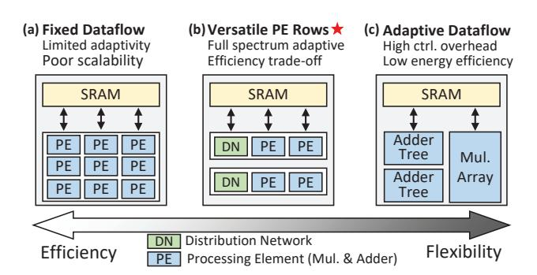
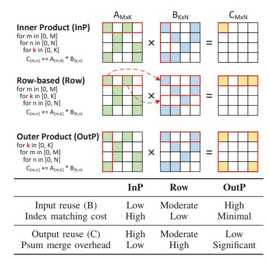
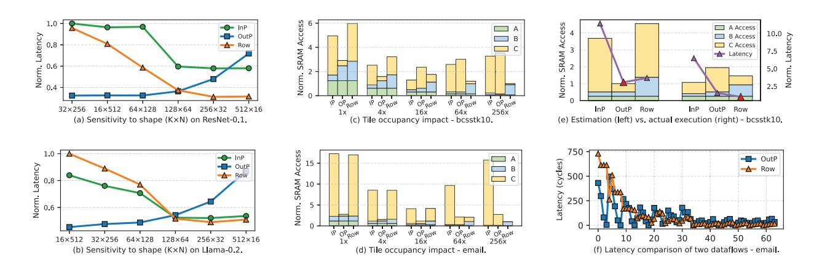
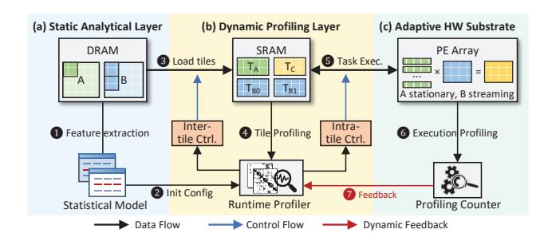
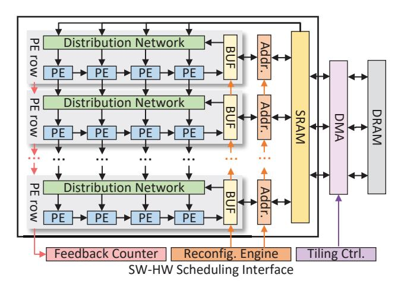
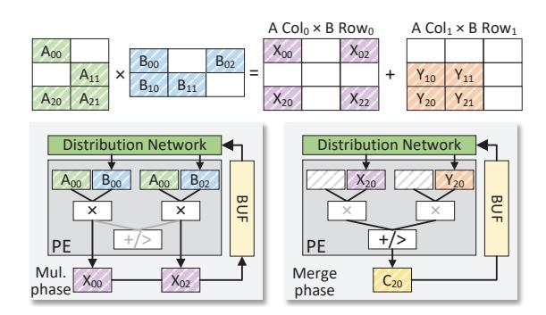
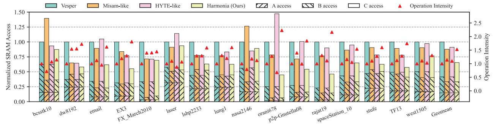
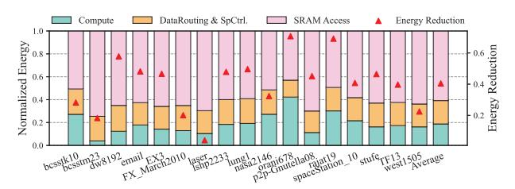
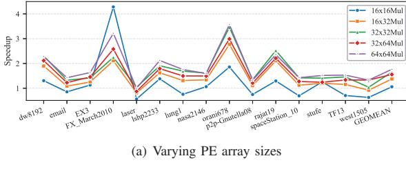
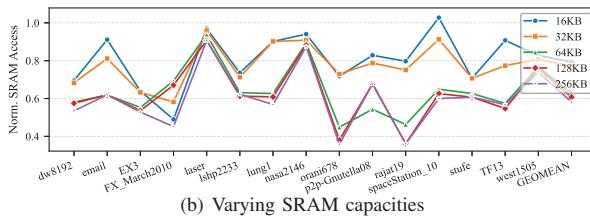

# Harmonia: A Unified Hierarchical Scheduling Framework for Sparse Matrix Multiplication

Jingkui Yang\*‡#, Fangxin Liu†‡#⊠, Xin Ju\*‡, Ning Yang†, Chenyang Guan†, Junjie Wang†,
Zongwu Wang†‡, Mei Wen\*, Jian Liu§, Li Jiang†‡⊠, and Haibing Guan†

\*National University of Defense Technology, Changsha, China

†Shanghai Jiao Tong University, Shanghai, China

‡Shanghai Qi Zhi Institute, Shanghai, China

§Beijing University of Aeronautics and Astronautics, Beijing, China

⊠: yangjingkui2001@nudt.edu.cn, liufangxin@sjtu.edu.cn, ljiang\_cs@sjtu.edu.cn

Abstract—Sparse tensor computation is a critical primitive across many domains. The highly irregular structure of sparse matrices limits the performance and efficiency of sparse tensor computation on conventional platforms, motivating extensive efforts on specialized hardware accelerators. However, existing accelerators typically rely on rigid execution dataflows such as inner-product, outer-product, or row-based schemes. Each dataflow is optimized for a particular sparsity pattern and fails to deliver robust performance across the wide diversity of real workloads.

Although sparsity reduces computation and memory cost, effectively exploiting it on hardware remains challenging because sparsity patterns vary widely and often change at runtime. Recent accelerators attempt to balance efficiency and generality by introducing architectural flexibility, but fixed-dataflow designs degrade under pattern shifts, while flexible designs support multiple modes only at the cost of higher complexity and static configuration. To address these limitations, we propose Harmonia, a hierarchical scheduling approach that allows a sparse accelerator to efficiently adapt to different sparsity patterns. Harmonia first uses a lightweight offline model to derive a nearoptimal initial tiling strategy and dataflow mapping. Both tile shape and dataflow mode are configurable to match diverse sparsity characteristics. At runtime, Harmonia detects the current sparsity pattern and dynamically selects the most effective dataflow mode based on tile-level observations. The underlying hardware supports this adaptive execution with fast, lowcost reconfiguration and load balancing. Extensive evaluations demonstrate that Harmonia delivers an average of  $1.75 \times$  higher performance and  $2.47\times$  better energy efficiency compared to state-of-the-art accelerators, while maintaining robust and stable throughput across highly variable runtime sparsity patterns.

Index Terms—Sparse Matrix Multiplication, Dynamic Scheduling, Dataflow Architecture, Runtime Adaptation

## I. INTRODUCTION

Sparse tensor computation has emerged as a foundational primitive across diverse workloads, powering deep neural networks [1]–[3], scientific simulations [4], [5], and large-scale graph analytics [6], [7]. To exploit sparsity's potential

Fig. 1. Design-space trade-off between flexibility and hardware efficiency in sparse accelerators. Fixed-dataflow accelerators achieve high efficiency for specific sparsity patterns by tailoring PE micro-architecture, but sacrifice flexibility. Adaptive-dataflow designs improve flexibility by decoupling multipliers and adders, yet incur low efficiency due to complex data routing. The versatile PE-row architecture offers a balanced point by localizing flexibility within PE rows while preserving overall structural regularity.

for reducing computation and memory traffic, numerous accelerators have been proposed, ranging from fixed-dataflow architectures [8]–[13] optimized for specific sparsity patterns, to versatile architectures [14]–[17] capable of supporting multiple sparse execution modes. Despite this progress, a fundamental tension persists between efficiency and flexibility, as illustrated in Fig.1: specialized designs achieve high utilization within narrow operating regimes but fail to generalize, while more flexible designs broaden applicability at the cost of area, energy, and control complexity. This trade-off limits the scalability of sparse acceleration and motivates architectures that are both flexible and efficient.

Fixed-dataflow accelerators (Fig.1 (a)), such as SIGMA [8] and HighLight [9], bind PE microarchitectures tightly to assumed sparsity patterns. Once the pattern or density deviates from design-time expectations, utilization collapses; for example, SIGMA's Flex-DPE array drops below 10% utilization under high sparsity because most MAC units process zeros. On the other hand, flexible accelerators (Fig.1 (c)), such as Flexagon [14], expand support for multiple dataflows through reconfigurable routing, buffering, and control. However, this

# Both authors contributed equally to this work.

™ Corresponding authors: liufangxin@sjtu.edu.cn, ljiang\_cs@sjtu.edu.cn. Work done during an internship at Shanghai Jiao Tong University & Shanghai Qi Zhi Institute.

flexibility is achieved through heavy interconnects and complex data steering; Flexagon dedicates more than 75% of its area to non-compute structures, leading to substantial efficiency loss.

Versatile architectures like Trapezoid [16] and VersaAccel [18] represent a promising middle ground (Fig. 1 (b)), retaining a homogeneous PE array while enabling lightweight reconfiguration of data distribution and partial-sum handling. These designs achieve near-constant efficiency across a broad sparsity range, offering a strong hardware foundation for universal sparse computation. However, their flexibility remains hardware-centric: while they support multiple dataflows, they lack a system mechanism to select the appropriate dataflow at runtime. As sparsity varies across tiles, the system experiences load imbalance, uncoordinated memory traffic, and degraded reuse. These issues reveal a key gap between hardware capability and system adaptivity, highlighting the need for a runtime scheduling layer that actively guides versatile hardware.

Unfortunately, existing scheduling methods still fail to fill this gap, as summarized in TABLE I. Most approaches optimize only one layer of the sparse execution hierarchy, without offering end-to-end coordination: (1) Intra-tile dataflow selection (e.g., Misam [19]) adapts to local reuse and sparsity variation but ignores tile-to-tile dependencies and shared memory pressure. (2) Inter-tile data orchestration (e.g., HYTE [20]) optimizes tiling and data movement at the global level but assumes fixed local dataflows, leaving no room for runtime adaptation. (3) Cross-layer analytical modeling (e.g., Vesper [17]) links global and local behavior through static operation-intensity analysis, but its uniform-sparsity assumption leads to large prediction errors for irregular workloads. As a result, existing work is either locally adaptive or globally fixed, making it unable to turn flexible hardware into truly adaptive system-level behavior.

This paper introduces Harmonia, a hierarchical scheduling framework that coordinates hardware flexibility with system-level adaptivity. The design recognizes that hardware flexibility alone is insufficient for sparse acceleration without a coupled static-dynamic scheduling stack to guide resources at runtime. By introducing a software-hardware scheduling interface that leaves the compute datapath unchanged, Harmonia transforms a homogeneous accelerator into a logically heterogeneous architecture through integrated offline modeling and runtime feedback.

Our main contributions are summarized as follows:

- **Hierarchical Coupling Analysis.** We characterize how dataflow, tiling, and traversal decisions interact across layers, and we build a statistical model that captures these dependencies to guide joint optimization.
- Unified Scheduling Framework. We develop a static-dynamic scheduling framework that combines global analytical planning with lightweight runtime profiling, enabling tile-level refinement of dataflow and data distribution.
- Adaptive Runtime Substrate. We design a reconfigurable dataflow substrate that supports fast mode switch-

Fig. 2. Comparison of representative sparse dataflows. The upper diagrams illustrate nonzero traversal patterns for Inner Product (InP), Rowbased (Row), and Outer Product (OutP) dataflows. The lower table qualitatively compares reuse efficiency and control complexity. "Index matching cost" denotes the control overhead for nonzero alignment, and "Psum merge overhead" represents reduction effort for partial sums.

ing and low-cost metadata updates, allowing homogeneous hardware to act as a logically heterogeneous execution engine.

We evaluate Harmonia across DNN inference, scientific computing, and graph workloads. Harmonia delivers  $1.75\times$  higher performance and  $2.47\times$  better energy efficiency on average, while maintaining stable performance under runtime sparsity changes.

#### II. BACKGROUND

Sparse matrix multiplication computes  $C = A \times B$ , where  $A \in \mathbb{R}^{M \times K}$  and  $B \in \mathbb{R}^{K \times N}$ . Unlike dense GEMM, sparse matrix multiplication introduces irregular nonzero traversal and index alignment, making the choice of dataflow (i.e., the order of the three nested loops) crucial to both data reuse and control complexity [17], [21].

#### A. Versatile Sparse Accelerators

As shown in Fig. 2, sparse matrix multiplication is commonly executed using one of three dataflows: (1) Inner Product (InP) dataflow computes each output element  $C_{m,n}$  via a row–column dot product. It provides strong output reuse but weak input reuse since each column of B must be repeatedly fetched. (2) Outer Product (OutP) dataflow generates a partial-sum matrix for each k by multiplying a column of A with a row of B. It maximizes input reuse but requires substantial psum merging. (3) Row-based (Row) dataflow multiplies a nonzero  $A_{m,k}$  with the full row  $B_{k,:}$ , offering moderate reuse with reduced merging overhead.

The complementary characteristics of sparse dataflows reveal a key insight: no single mapping achieves high reuse and low overhead simultaneously. This motivates versatile sparse

TABLE I

COMPARISON OF REPRESENTATIVE SPARSE SCHEDULING APPROACHES ACROSS INTRA-TILE AND INTER-TILE OPTIMIZATION DIMENSIONS.

HARMONIA UNIQUELY INTEGRATES BOTH STATIC AND DYNAMIC COORDINATION TO ACHIEVE FULL-LAYER ADAPTIVITY.

| Category                | Representative  | Intra-tile (Dataflow) |              |              | Inter-tile (Tiling) |              |              | Runtime      | Limitation                        |
|-------------------------|-----------------|-----------------------|--------------|--------------|---------------------|--------------|--------------|--------------|-----------------------------------|
|                         |                 |                       |              | Adaptivity   |                     |              |              |              |                                   |
| Versatile Accelerator   | Trapezoid [16]  | <b>√</b>              | <b>√</b>     | X            | X                   | Х            | X            | Х            | Hardware-oriented only            |
| Dataflow Selection      | Misam [19]      | ✓                     | $\checkmark$ | ✓            | X                   | X            | X            | $\checkmark$ | Local optimization only           |
| Data Orchestration      | HYTE [20]       | X                     | ✓            | X            | $\checkmark$        | $\checkmark$ | $\checkmark$ | $\checkmark$ | Lacks intra-tile feedback         |
| Analytical Modeling     | Vesper [17]     | ✓                     | $\checkmark$ | ✓            | $\checkmark$        | X            | $\checkmark$ | ×            | Static analytical estimation      |
| Hierarchical Scheduling | Harmonia (Ours) | $\checkmark$          | $\checkmark$ | $\checkmark$ | $\checkmark$        | $\checkmark$ | $\checkmark$ | $\checkmark$ | Dynamic, cross-layer coordination |

accelerators, which support multiple dataflow templates within a unified hardware substrate.

Previous efforts such as Flexagon [14] introduced multitemplate switching across the array, enabling each workload to select a dataflow offline. Building on this direction, Trapezoid [16] proposed a finer-grained approach that reconfigures only two specific components rather than the entire array. It maintains a homogeneous PE structure and reconfigures the Distribution Network (DN) [22] for input broadcasting and the Merge-Reduction Network (MRN) [14] for partial-sum aggregation. By adjusting these routing paths, Trapezoid transitions among InP- and Row-like behaviors while maintaining near-constant efficiency across a wide sparsity range, from dense DNN layers to highly sparse SpGEMM.

This hardware-level flexibility allows Trapezoid to implement multiple sparse dataflows on the same PE array. However, this flexibility exists only at the structural level and is not coupled with system-level adaptivity. As a result, Trapezoid can switch among dataflow templates, but it cannot adapt these choices to runtime sparsity changes, causing its potential efficiency to remain underutilized.

#### B. Sparse Scheduling Strategies

The performance of sparse acceleration depends not only on hardware flexibility but also on how dataflows and tiles are scheduled at runtime [23], [24]. Prior work explores three scheduling directions (intra-tile, inter-tile, and cross-layer), as summarized in TABLE I.

1) Intra-tile Dataflow Selection: With the emergence of flexible accelerators, researchers have investigated runtime adaptivity inside each tile. Systems such as **Misam** [19] and **Spada** [15] dynamically choose dataflows (e.g., InP, OutP, Row) based on the sparsity characteristics of the tile.

Misam formulates dataflow selection as a lightweight classification task: it uses decision-tree models [25] to predict an appropriate dataflow from simple matrix statistics and then reconfigures hardware logic accordingly. Spada takes a different approach by proposing window-adaptive dataflows. Its execution windows of size  $(\alpha \times \beta)$  can emulate InP-, OutP-, or Row-style reuse, enabling a trade-off between generality and efficiency.

However, these approaches remain purely local. Their decisions are made solely from tile-level sparsity patterns and do not coordinate across tiles. As a result, when sparsity

irregularity spans multiple tiles or layers, local decisions no longer align with global optimization, leading to suboptimal end-to-end utilization.

2) Inter-tile Data Orchestration: Since on-chip SRAM cannot hold entire matrices, sparse workloads are typically partitioned into tiles to improve data reuse and bandwidth efficiency [26]. Early approaches such as Tailors [27] adopt static tiling via offline overbooking, partitioning tiles based on average sparsity observations. Dynamic schemes such as DRT [24] and HARP [28] instead reconfigure tiles at runtime, but they suffer from high control overhead and limited scheduling flexibility. More recent work, HYTE [20], introduces a hybrid strategy that combines static analysis with lightweight runtime refinement. By profiling memory access patterns on the fly, HYTE adaptively adjusts tile boundaries and traversal order, achieving a balance between compile-time predictability and runtime responsiveness.

However, HYTE's adaptivity remains restricted to the intertile level. It assumes a fixed intra-tile dataflow and does not model its interaction with global tiling and reuse patterns. As a result, HYTE provides dynamic coordination across tiles but keeps tile-internal execution static, leaving finer-grained adaptation opportunities unexploited.

3) Cross-layer Analytical Modeling: To address the coupling between intra- and inter-tile scheduling, **Vesper** [17] introduces a unified analytical framework that models computation and memory behavior together. By evaluating operational intensity (OI) under various dataflow, tiling, and loop configurations, it searches for a global optimum through offline analysis. This cross-layer approach provides strong designtime interpretability and represents an important step toward hierarchical scheduling.

However, Vesper's static nature limits runtime adaptability. It relies on the often unrealistic assumption of uniform sparsity across tiles and provides no runtime feedback to correct deviations from its analytical predictions. As a result, although it establishes a theoretical link between intra- and inter-tile scheduling, it cannot dynamically close the optimization loop during execution.

In summary, existing scheduling strategies target different layers but remain isolated. The lack of a unified framework that combines static global planning with dynamic local adaptation remains the main obstacle to fully exploiting the

Fig. 3. Motivation for hierarchical scheduling in Sparse Matrix-Sparse Matrix Multiplication (SpMSpM). (a)(b) Tile shape fundamentally changes reuse and buffer behavior, causing different dataflows to become optimal under different (K, N) dimensions. The tile shape  $(64 \times K \times N)$  varies while keeping the operation amount constant. (c)(d) Tile occupancy reshapes buffer pressure and psum behavior, shifting the optimal dataflow as tiles grow or shrink. We keep the tile shape fixed as a square and scale the tile size uniformly from  $1 \times$  to  $256 \times$  the PE array size. (e) Static analytical models fail to predict these effects: tile-level sparsity variation causes large deviations between estimated and actual latency/traffic. (f) Latency comparison of OutP and Row dataflows. The best dataflow shifts from OutP to Row as the sparsity pattern changes.

potential of versatile sparse accelerators.

#### III. CHALLENGE AND MOTIVATION

Prior scheduling strategies [15], [17], [19], [20], [24], [27]–[30] have made significant progress in accelerating sparse matrix multiplication. However, most approaches treat sparse scheduling as a set of isolated subproblems, such as selecting the dataflow within a tile or orchestrating tiles across memory. They often ignore the interdependence among hierarchical parameters, including tile shape, tile occupancy, and traversal order, which jointly determine performance.

As a result, even versatile accelerators with flexible dataflow and PE configurations cannot fully exploit their potential when faced with complex, non-uniform sparsity patterns. Coordinated scheduling across layers is required to bridge this gap. In this section, we examine the key challenges of sparse scheduling, which motivate the design of Harmonia.

#### A. Layer Interdependence

Existing approaches assume intra- and inter-tile scheduling can be optimized independently, but this assumption breaks down under sparse and irregular workloads. Inter-tile parameters, such as tile shape and occupancy, directly affect reuse opportunities in each tile, altering the optimal intra-tile dataflow.

We study a  $16 \times 16$  PE array with 16 KB local buffers and 1 MB on-chip SRAM using a cycle-accurate sparse dataflow simulator. The following results illustrate the strong impact of inter-tile configurations on intra-tile performance.

**Tile Shape Alters the Optimal Dataflow.** As shown in Fig. 3 (a) and (b), we utilize ResNet-0.1 (representing a ResNet-50 network pruned to an overall weight density of 0.1 [16]) and Llama-0.2 (a LLaMA-7B model pruned to a 0.2 density) to evaluate InP, OutP, and Row-based dataflows across various tile shapes while keeping the total amount of

computation constant. Detailed generation methodologies for all evaluated workloads are deferred to Section VI. Results show that the best dataflow depends heavily on tile dimensions: OutP dataflow performs best when K is small and N is large, but its performance degrades sharply with large K due to buffer overflows, while InP and Row-based dataflows benefit from higher K through increased reuse and PE-level parallelism. Some shapes (e.g.,  $64 \times 128 \times 64$ ) favor Row-based dataflow over OutP dataflow, demonstrating that intratile dataflow choice cannot be made in isolation.

Tile Occupancy Shifts SRAM Access Behavior. We evaluate the bcsstk10.mtx and email.mtx [31] workloads across tile sizes from  $16 \times 16$  ( $1 \times$  the PE array size) to  $256 \times 256$  ( $256 \times$  the PE array size) under InP, OutP, and Row-based dataflows (Fig.3 (c) and (d)). All dataflows initially benefit from higher occupancy, as small tiles repeatedly reload A, B, and C fragments, causing excessive SRAM traffic. OutP dataflow reaches minimum traffic earlier but worsens for very large tiles due to partial sums overflowing the local buffer. InP dataflow benefits from larger K, but large tiles eventually increase reload cost. Row-based dataflow is most tolerant to large tiles, processing one row at a time, though extremely large tiles amplify redundant B accesses. Overall, tile occupancy fundamentally reshapes dataflow efficiency, and no single dataflow consistently minimizes SRAM access.

**Insight 1:** Inter-tile parameters fundamentally reshape intratile reuse, thereby reversing dataflow performance. This observation implies that sparse scheduling cannot be decomposed into isolated layers and instead requires explicit modeling of hierarchical coupling.

#### B. Static Analytical Model Limitation

Prior cross-layer scheduling frameworks (e.g., Vesper [17]) attempt to derive a "globally optimal" schedule using static analytical models. These models assume uniform sparsity and

rely on global statistics, such as average sparsity or expected reuse, to estimate latency and memory traffic. In practice, however, sparse matrices exhibit significant intra- and intertile variation, causing static predictions to diverge sharply from actual execution.

Fig.3(e) illustrates this using the <code>bcsstk10.mtx</code> workload under a fixed  $64 \times 64$  tiling. The static model predicts OutP dataflow as optimal, estimating balanced latency and minimal SRAM access. However, actual execution reveals:

- Latency: OutP performs poorly compared to analytical predictions and is outperformed by Row-based dataflow (1.6× the latency of Row).
- **SRAM traffic**: InP achieves the true minimum, while the model incorrectly favors OutP.
- Prediction error: SRAM traffic for InP and Row is overestimated by 3.7× and 3.1×, respectively.

These discrepancies stem from uneven nonzero distributions: some tiles are dense enough to overflow local buffers under OutP, causing frequent SRAM spills, while sparse tiles under InP fail to fully utilize PE parallelism. Fig. 3(f) demonstrates that the best dataflow shifts from OutP to Row as the sparsity pattern changes in <code>email.mtx</code>, further validating this observation. By relying on global averages, static models overlook these tile-level variations, leading to suboptimal dataflow selection, buffer misalignment, and performance loss.

**Insight 2:** Sparse workloads exhibit highly uneven, tile-level sparsity variations. Efficient scheduling requires dynamic feedback rather than relying solely on static estimates.

## C. Toward Adaptive Runtime Substrate

While static models fail to capture tile-level irregularities, purely software-driven dynamic scheduling is also limited, as it lacks visibility into hardware signals such as SRAM pressure, psum spills, or fine-grained reuse. Without this information, runtime decisions remain coarse or conservative. We envision a lightweight runtime substrate with three key capabilities:

- Multi-level hardware feedback. Hardware exposes finegrained signals, including memory pressure, reuse counters, and psum merging latency, to capture execution dynamics beyond static models.
- **Fine-grained runtime reconfiguration.** Using compact metadata updates, the runtime can adjust tile traversal order, remap partitions, or switch intra-tile dataflows with minimal overhead.
- Cross-layer signal translation. The substrate interprets low-level counters into high-level scheduling hints, enabling globally coherent decisions without large SRAM overhead or costly profiling.

This substrate transforms hardware flexibility into dynamic system intelligence, enabling efficient adaptation to irregular sparse behavior.

**Insight 3:** Combining valuable aspects of prior scheduling approaches with lightweight profiling hardware enables systems to fully exploit architectural flexibility, delivering robust performance in the presence of varying sparsity profiles.

Fig. 4. Overview of the Harmonia Hierarchical Scheduling Framework. Harmonia integrates (a) a *Static Analytical Layer* for offline tiling and dataflow planning, (b) a *Dynamic Profiling Layer* for runtime tuning and scheduling, and (c) an *Adaptive Hardware Substrate* for execution and feedback.

#### IV. SCHEDULING FRAMEWORK

#### A. Harmonia Overview

Observations in Section III reveal a *Sparsity-Dataflow Affinity*, where specific sparsity patterns favor distinct intra-tile dataflows and inter-tile configurations. Exploiting this affinity at runtime requires tight coupling across the software-hardware boundary to maintain low hardware overhead. Consequently, Harmonia employs a three-layer hierarchy comprising static modeling, online profiling, and adaptive hardware feedback. This structure progressively refines the execution plan by incorporating real-time architectural signals to compensate for initial static inaccuracies.

- (a) Static Analytical Layer. The static layer determines the initial configuration and allocates tiles to SRAM, aiming to maximize operation intensity (Ops/Byte). Using coarse-grained descriptors such as matrix shape, global sparsity, and datatype, it sets baseline parameters including tile shape, occupancy bounds, loop order, and SRAM allocation. While not fully optimal, it establishes a robust performance floor and a strong starting point for runtime refinement.
- **(b) Dynamic Profiling Layer.** This layer samples row/column densities and clustering patterns for tiles in SRAM to refine PE-row assignments, buffer usage, and dataflow selection. It adjusts tile shapes, resource allocation (DN/MRN routing), and execution order to maximize per-tile throughput, constrained by the global structure from the static layer.
- (c) Adaptive Hardware Substrate. This substrate powers the *Dynamic Tuning Layer* (detailed in Section IV-D), using low-cost hardware feedback (e.g., SRAM pressure counters, psum spill flags, merge-depth monitors, and PE stall indicators) to correct runtime deviations. Based on these signals, this tuning layer performs fine-grained adjustments, such as switching dataflow modes, resizing tiles, or reshaping merge configurations. A lightweight cost model ensures adjustments only occur when performance gains exceed reconfiguration overhead, preserving stability.

In summary, Harmonia implements a static-dynamic codesign pipeline: the static layer provides global planning, the dynamic layer adapts to observed sparsity, and the hardware feedback layer corrects residual mismatches, achieving robust and high-performance sparse execution.

## B. Static Analytical Layer

The static (offline) analytical layer performs device-aware global planning using only coarse-grained descriptors (matrix shape, global density, datatype) and hardware parameters (PE array size, SRAM capacity). Decisions are independent of pertile nnz and ensure buffer feasibility under plausible sparsity patterns. It sets baseline tile shapes, occupancy bounds, loop order, and SRAM allocation.

**Design Objective.** Given hardware constraints (on-chip SRAM capacity  $S_{SRAM}$ , PE array size P), the static layer maximizes operation intensity (OI):

$$OI = \frac{OPs}{Bytes_{loaded}}$$
 (1)

where OPs is the number of operations on the SRAM-resident block and Bytesloaded is off-chip data transferred. Maximizing OI improves reuse and reduces memory traffic, providing a robust starting point for runtime refinement.

**Notation and Feasibility Constraints.** Let the global matrices be  $A \in \mathbb{R}^{M \times K}$ ,  $B \in \mathbb{R}^{K \times N}$ , and  $C \in \mathbb{R}^{M \times N}$ . A candidate SRAM-resident block is parameterized by tile sizes  $(T_M, T_K, T_N)$ . The number of blocks per dimension is

$$n_M = \left\lceil \frac{M}{T_M} \right\rceil, \quad n_K = \left\lceil \frac{K}{T_K} \right\rceil, \quad n_N = \left\lceil \frac{N}{T_N} \right\rceil.$$

Assume global densities  $\rho_A$ ,  $\rho_B$  (fraction of nonzeros in A, B). Under the independence approximation, the expected nnz in a tile is

$$\mathbb{E}[\mathrm{nnz}_A^{\mathrm{tile}}] = \rho_A \cdot T_M T_K, \qquad \mathbb{E}[\mathrm{nnz}_B^{\mathrm{tile}}] = \rho_B \cdot T_K T_N,$$

and the (approximate) expected useful OPs in a tile is proportional to  $\mathbb{E}[\operatorname{nnz}_A^{\operatorname{tile}}] \cdot \frac{\mathbb{E}[\operatorname{nnz}_B^{\operatorname{tile}}]}{\sigma^{T_K}}$ , i.e., roughly  $\rho_A \rho_B T_M T_K T_N$ .

A conservative buffer feasibility constraint enforces that the expected SRAM footprint (including A, B, and psum storage) does not exceed  $S_{\text{SRAM}}$  with a safety margin. Let  $s_{\text{val}}$  be bytes per value (e.g., 4 for FP32). Then we require:

$$s_{\text{val}}(\mathbb{E}[\text{nnz}_A^{\text{tile}}] + \mathbb{E}[\text{nnz}_B^{\text{tile}}]) + s_{\text{psum}} \cdot T_M T_N \leq \beta S_{\text{SRAM}},$$
 (2)

where  $s_{\rm psum}$  is bytes per partial-sum (typically  $s_{\rm val}$ ) and  $0 < \beta < 1$  is a safety factor (e.g.,  $\beta = 0.8$ ) that leaves headroom for index storage, metadata, and runtime variability.

Static Layer Decision Variables. The static layer produces:

- Block-level plan: block size  $(T_M, T_K, T_N)$ , inter-block loop order (M, K, N), and SRAM partitioning ratio among A, B, and psum buffers.
- Baseline tile configuration: PE-level tile shape, tile occupancy upper bound for overflow safety, and initial intra-tile dataflow (InP/Row/OutP) based on global matrix dimensions and densities.

**Selection Criterion.** For each candidate  $(T_M, T_K, T_N)$  that satisfies the feasibility constraint (2), the static stage computes an estimated operation intensity:

$$\widehat{\mathrm{OI}}(T_M, T_K, T_N) \; = \; \frac{\widehat{\mathrm{OPs}}(T_M, T_K, T_N)}{\widehat{\mathrm{Bytes}}(T_M, T_K, T_N)}$$

## Algorithm 1 Static block selection (offline)

**Require:** global sizes (M, K, N), densities  $(\rho_A, \rho_B)$ , SRAM  $S_{\text{SRAM}}$ , PE config

**Ensure:** baseline  $(T_M, T_K, T_N)$ , traversal order, SRAM partition

- 1: generate candidate tile shapes  $\mathcal{T}$  (prune by divisibility and PE alignment)
- 2: for each  $(T_M, T_K, T_N) \in \mathcal{T}$  do
- 3: compute  $\mathbb{E}[\operatorname{nnz}_A^{\operatorname{tile}}], \mathbb{E}[\operatorname{nnz}_B^{\operatorname{tile}}]$
- 4: estimate Bytes and OP
- 5: if feasibility constraint (2) satisfied then
  - compute OI
- 7: else

6:

- 8: discard candidate
- 9: end if
- 10: end for
- 11: select candidate maximizing  $\widehat{OI}$ ; choose traversal order by simple heuristics on (M, K, N)
- 12: Partition SRAM  $S_A, S_B, S_C$  based on marginal-OI gain

where OPs and Bytes are estimated from global densities and datatype sizes (including index overhead for the chosen sparse representation). The chosen block shape maximizes OI subject to hardware constraints and practical PE-mapping considerations (e.g., divisibility by PE-row length).

Heuristics for Traversal Order and SRAM Allocation. Traversal order is chosen to balance A residency and B streaming:

- Small M, N (C fits in SRAM): prefer k-outer order to keep C resident while streaming A/B blocks.
- Small K: prefer order emphasizing M/N reuse.

SRAM is partitioned as  $S_A, S_B, S_C$  such that  $S_A + S_B + S_C \leq S_{\text{SRAM}}$ , with ratios reflecting their expected contribution to operation intensity.

**Example.** For a workload with large M, K, N and  $\rho_A = \rho_B = 0.1$  on a  $16 \times 16$  PE array, enumerating candidate tiles shows  $(T_M, T_K, T_N) = (64, 128, 64)$  achieves robust  $\widehat{\text{OI}}$  for InP/Row/OutP and satisfies (2) with  $\beta = 0.8$ . This tuple serves as the baseline block shape for online refinement. Algorithm 1 summarizes the static search.

**Role and Limitations.** The static layer provides a *safe* and *high-quality* starting point: it reduces the online search space, avoids infeasible tiles, and maximizes OI based on coarse statistics. However, it cannot capture per-tile variations; the online layer refines decisions, and the dynamic tuner corrects residual mismatches at runtime.

## C. Dynamic Profiling Layer

Once a block resides in on-chip SRAM, Harmonia can observe sparsity characteristics unavailable during offline modeling. The dynamic profiling layer performs lightweight pertile analysis to refine the baseline configuration, aiming to reduce per-tile latency and maximize overall throughput. Since the number of operations per tile is fixed, runtime optimization

focuses on improving PE utilization, mitigating routing pressure, preventing buffer spills, and avoiding worst-case dataflow behavior.

Runtime Information. Tile metadata reveals the exact nonzero count, allowing the computation of tile density ρtile = nnz/(TMTK) and the nonzero distribution across rows/columns. A lightweight sample of the stationary matrix A (performed once per block) estimates row-level variance, nonzero clustering, and potential PE-row workload imbalance. These statistics guide refinements in tile shape, dataflow selection, and resource allocation.

Tile Shape Refinement. Starting from the offline tile shape, Harmonia adjusts only dimensions exhibiting strong sparsity deviation:

- Low density: expand the tile to improve PE utilization and reuse.
- High density: shrink the tile to avoid psum spills, reduce merge depth, and lower routing pressure.
- Clustered sparsity: align tile boundaries with nonzero clusters to prevent local hotspots.

These changes are lightweight, modifying only tile slicing and dispatch logic without hardware reconfiguration.

Dataflow Selection (InP/Row/OutP). Harmonia evaluates three intra-tile dataflows per tile:

- InP: favors moderate sparsity with uniform per-row density, enabling strong B-row reuse and high parallelism.
- Row: best for high row-level variance or clustered A; keeps A rows stationary to stabilize PE load and psum merge depth.
- OutP: suitable for uniform A and low-density B; minimizes merge depth and routing contention.

Decision criteria combine tile-level density, B-side reuse, and structural properties of A observed via runtime sampling.

Limitations of Predictive Online Scheduling. Even with exact tile-level sparsity, the dynamic profiling layer cannot capture truly runtime phenomena, such as:

- merge-tree collisions and psum propagation delays,
- congestion in the DN/MRN routing network,
- instantaneous SRAM pressure or peak buffer usage,
- stalls from irregular producer–consumer alignment.

As a result, highly irregular tiles may still underperform relative to predictions. This motivates the Dynamic Tuning Layer (Section IV-D), which leverages runtime feedback to enact structural corrections to dataflow, tile shape, and resource allocation.

## *D. Dynamic Tuning Layer*

Operating directly within the Adaptive Hardware Substrate, the Dynamic Tuning layer is the final stage of Harmonia's scheduler. It reacts to *actual hardware behavior* observed during tile execution. Its goals are to (1) prevent performance collapse under highly irregular sparsity, (2) correct mispredictions from the Online Profiling layer, and (3) provide tile-level robustness via lightweight, feedback-driven adaptation.

This layer consists of three components: runtime anomaly detection, corrective actions for dataflow and tile shape, and a cost-aware switching model with stability mechanisms.

Runtime Feedback Signals. The PE array provides lightweight counters and flags:

- SRAM pressure & psum spills: indicate mismatches between sparsity and chosen dataflow (e.g., InP overflows psum buffers under extreme sparsity; Row-based reloads excessive B rows when locality is low).
- MRN merge depth / stalls: reveal deviations from expected merge-tree behavior, signaling dataflow mismatch.
- PE stall cycles: reflect operand unavailability, DN congestion, or merge backpressure, capturing aggregate microarchitectural impact.

These signals allow Harmonia to detect pathological tiles that deviate from online profiling predictions.

Corrective Actions. Upon detecting anomalies, Harmonia applies targeted adjustments to the tile shape or switches the dataflow to restore efficient execution.

- *(1) Dataflow Switching:* Dynamic Tuning first attempts to resolve anomalies by switching the intra-tile dataflow:
  - InP → Row / OutP: If merge depth is too low or PE utilization drops, switch to Row for highly imbalanced A rows, or OutP for near-uniform sparsity.
  - Row → OutP / InP: If repeated B row loads cause high SRAM pressure, switch to OutP if merge depth is low, or InP if the tile is dense.
  - OutP → Row / InP: If merge depth exceeds expectations, choose Row if spills stem from locality, or InP if caused by high density.

This enables the hardware to exhibit *logical heterogeneity*, adapting tile-by-tile.

- *(2) Tile Shape Scaling (Micro–Retiling):* If dataflow switching is insufficient, Harmonia adjusts the tile size locally:
  - Shrink: triggered by spills, SRAM pressure, or deep merge backpressure; reduce K to lower merge depth, or M/N to limit buffer and DN load.
  - Grow: triggered by consistently low density without anomalies; increases reuse and reduces control overhead.

Micro-retiling is confined within blocks, incurs negligible software overhead, and avoids re-tiling the entire matrix.

Cost Model and Switching Principle. Switching a dataflow or resizing a tile incurs a structural overhead, such as pipeline flush, DN/MRN reprogram and buffer reset. Harmonia triggers a change only if:

Gain 
$$> \alpha \cdot \text{Cost}$$
,  
where  $\begin{array}{c} \text{Gain} = T_{\text{before}} - T_{\text{after}}, \\ \text{Cost} = T_{\text{reconfig}} + T_{\text{flush}} + T_{\text{buf\_reset}} \end{array}$  (3)

The factor α tunes aggressiveness: larger for irregular workloads, smaller for regular workloads.

Stability Mechanisms and Worst-Case Bounds. Harmonia incorporates architectural safeguards to prevent oscillation and guarantee convergence during rapid sparsity fluctuations.

Fig. 5. Architecture overview of Harmonia. The only hardware additions are lightweight feedback counters, a reconfiguration engine, and a tiling controller, which together form the SW-HW scheduling interface. These components expose runtime signals and enable low-cost dataflow and tile-shape reconfiguration, allowing the hierarchical scheduler to adapt execution on a per-tile basis.

These mechanisms maintain O(1) complexity and ensure deterministic hardware behavior:

- Convergence & Average Case: Feedback collection logic is decoupled from the execution datapath, making hardware profiling overhead negligible. A reconfiguration event involves a pipeline flush, DN/MRN reprogramming, and buffer resets, requiring only 20 to 50 cycles. Cycleaccurate simulations show these adjustments result in total stalls of less than 1%.
- Oscillation Avoidance: A hardware-based hysteresis
  mechanism prevents unstable reconfigurations. Anomaly
  counters must exceed predefined thresholds for T consec-\nutive cycles (typically 2 to 4) before triggering a tuning\nevent, effectively absorbing transient sparsity fluctuations.
- Worst-Case Guarantee: Harmonia strictly bounds the worst-case degradation penalty. If the analytical cost model (Equation (3)) evaluates that Gain ≤ Cost, or if a triggered switch fails to improve performance, the hardware absorbs a maximum penalty of exactly one reconfiguration delay (50 cycles) before falling back and reverting to the static baseline.

**Summary.** Dynamic Tuning does not change global plans but corrects tile-level deviations, stabilizing PE utilization and mitigating sparsity-induced bottlenecks. It ensures Harmonia achieves *robust performance across highly irregular sparsity patterns*, completing the three-layer hierarchy.

# V. HARDWARE ARCHITECTURE

#### A. Architecture Overview

Fig.5 illustrates the overall architecture of Harmonia. Built upon the row-parallel templates of prior versatile accelerators [16], [18], we adopt the core computational structures: semi-independent PE rows equipped with a Distribution Network (DN) and a merge-reduction network (MRN). Harmo-

Fig. 6. Inner Product (InP) dataflow implementation. Each PE row consumes a stationary A-row while the corresponding B-column fragment is streamed through the distribution network (DN) and forwarded systolically to subsequent PE rows to maximize B reuse across rows. PEs produce partial products which the MRN merges before storing (merge-before-store), yielding high PE utilization under moderate sparsity.

nia introduces the software-hardware (SW-HW) scheduling interface and runtime logic required to unlock logical heterogeneity. These include Feedback Counters, a Reconfiguration Engine, and a Tiling Controller.

**PE-row Microarchitecture.** Each row contains a horizontal chain of PEs processing independent nonzero pairs, accumulating partial results through a configurable MRN. The DN routes operands to PEs, enabling InP/Row/OutP dataflows via reprogrammable routing schedules and reduction patterns at tile boundaries without modifying the datapath.

**Buffers and Feedback.** Local on-row buffers stage operands and psums, with spill counters and occupancy monitors exposing pressure events to the runtime. The global SRAM stores tiles and metadata, including per-tile nnz, supporting pre-execution profiling.

Control Extensions. Harmonia adds only lightweight control structures: feedback counters and a reconfiguration engine for dataflow and tile-shape updates. The PE datapath, MRN add/compare logic, and distribution pipeline remain unchanged, preserving the efficiency of row-parallel architecture while enabling per-tile adaptivity at negligible cost.

Overall, Harmonia transforms hardware configurability into dynamic system intelligence using minimal metadata and control enhancements, maintaining high efficiency and simplicity.

#### B. Intra-tile Management

Harmonia supports three intra-tile dataflows (InP, Row, and OutP), corresponding to the scheduler decisions outlined in SectionIV. All share the same datapath; differences arise solely from DN, MRN, and on-row buffer routing and reduction, which are reconfigured via the Reconfiguration Engine without altering PE logic.

**Data Format and Dynamic Alignment.** To maintain versatility and minimize memory bandwidth, Harmonia supports standard representations, utilizing Compressed Sparse Row/Column (CSR/CSC) with explicit coordinate lists for

Fig. 7. **Row-based (Row) dataflow implementation.** Each PE row keeps one A-row stationary, while the DN selectively routes only the required B-row fragments based on the nnz indices of that A-row. This reduces psum merge depth, allows B fragments to be buffered once in the local BUF and shared across PEs, and mitigates workload imbalance under highly uneven row densities

highly sparse tiles, and bitmask-based formats for mildly sparse regions. Before entering the PE datapath, nonzero elements must be aligned to ensure only values with matching coordinates are multiplied (i.e., intersection). Harmonia leverages the reconfigurable DN paired with lightweight on-row indexmatching logic to dynamically orchestrate the intersection, packing only effectual, nonzero pairs into the multipliers.

Inner Product (InP) Mode. As illustrated in Fig.6, the InP dataflow keeps each A-row stationary within a PE row, while the corresponding B-column fragments are streamed through the distribution network (DN) and forwarded systolically to downstream rows. This broadcasting pattern maximizes crossrow reuse of B operands and maintains a steady operand supply across the pipeline. Each PE generates partial products that are forwarded into the per-row MRN, which operates in a merge-before-store configuration to aggressively compress partial sums prior to buffering. The resulting reduction behavior minimizes psum traffic and enables high PE utilization when sparsity is moderate and row densities are well-balanced, making InP a strong baseline for dense or mildly sparse tiles.

Row-based (Row) Mode. As shown in Fig.7, Row binds one A-row to each PE row and selectively routes only the required B fragments according to the nnz pattern of that A-row. This operand gating significantly reduces redundant B traffic and allows each B fragment to be buffered once in the on-row BUF and shared across all PEs in the row. Compared to InP, Row-based dataflow produces a shallower and more predictable merge depth, since each row accumulates partial sums along a single A-row trajectory. This makes Row particularly effective for tiles with highly uneven or bursty row densities, where selective routing mitigates load imbalance across rows. Row is realized by reprogramming DN routing rules, allocating per-row buffer slices, and configuring the MRN to follow a row-sequential reduction schedule, without modifying the underlying datapath.

Outer Product (OutP) Mode. As shown in Fig. 8, OutP

Fig. 8. Outer Product (OutP) dataflow implementation. Columns of A and rows of B form rank-1 update streams, with DN distributing  $(A_{*k}, B_{k*})$  pairs and MRN operating in column-accumulate mode. This minimizes distribution pressure and is effective under highly sparse and irregular matrices.

processes one column of A and the corresponding row of B as a rank-1 update stream. The DN broadcasts each  $(A_{*k}, B_{k*})$  pair to all rows, enabling wide reuse of both operands and significantly reducing distribution pressure compared to InP or Row. Each PE generates contributions to an entire output column, and the MRN operates in a column-accumulate mode, which yields extremely shallow merge depth and minimizes psum buffering requirements. Under highly sparse topologies or strong nonzero clustering, these characteristics naturally balance the workload, making OutP exceptionally effective as rank-1 updates prevent unnecessary operand movement. OutP requires no datapath modification; it is realized by programming DN broadcasts of  $(A_{*k}, B_{k*})$ , configuring the MRN for column-accumulate reduction, and coordinating buffer control to prevent premature psum spills under highly sparse tiles.

## C. Feedback Path and Dynamic Tuning

The Dynamic Tuning Layer relies on lightweight runtime signals that characterize actual execution behavior. Harmonia collects these via feedback counters and flags without modifying the underlying datapath.

**Feedback Collection.** Each PE row maintains a small set of counters that track MRN merge events; a 128-row array requires only 128 counters, occupying < 0.5% of the PE-array area. Counters are aggregated through a lightweight metadata crossbar and forwarded to the Tiling Controller. Crucially, the feedback path is fully decoupled from the main datapath, ensuring that DN and MRN operations proceed without any timing or routing perturbation.

**Dataflow Switching.** Dataflow transitions occur strictly at *tile boundaries*, as the global matrix is executed as a sequence of independent tiles. Tile-level logical heterogeneity is achieved through a pipeline flush, followed by the reprogramming of:

- DN route tables and the MRN operating mode (mergebefore-store vs. column-accumulate),
- Address generation units (AGUs) and buffer controller policies (allocation, eviction, reset).

TABLE II
PE CONFIGURATION AND AREA BREAKDOWN.

| Component | Configuration            | $Area(\mu m^2)$ | Area% |
|-----------|--------------------------|-----------------|-------|
| MUL       | 16× FP32 multipliers     | 37,382          | 46.4% |
| MRN       | radix-16 FP32 adder tree | 23,234          | 28.8% |
| DN        | 16-to-16 Benes & Ctrl.   | 7,001           | 8.7%  |
| BUF       | 1 KB, 64B-wide SRAM      | 13,003          | 16.1% |
| PE        | Support InP/Row/OutP     | 80,620          | 100%  |

TABLE III
ACCELERATOR CONFIGURATION AND AREA BREAKDOWN.

| Component | Configuration                | Area(mm 2 ) | Area% |
|-----------|------------------------------|------------------------|-------|
| Compute   | 2 PEs × 32 Rows              | 5.16                   | 68.7% |
| SRAM      | 1 MB, $32 \times 64$ B line  | 1.89                   | 25.2% |
| Schedule  | Feedback & Reconfig.         | 0.25                   | 3.3%  |
| NoC       | 32-to-32 crossbars           | 0.21                   | 2.8%  |
| Overall   | <b>0.5 GHz,</b> 32 × 32 MACs | 7.51                   | 100%  |

Closing the Scheduling Loop. Feedback counters directly trigger runtime policies: abnormal psum spilling or deep merge depth invokes dataflow switching or micro-retiling if the analytical cost model predicts a net gain. This cleanly closes the software—hardware scheduling loop, preserving worst-case robustness while maximizing overall throughput.

#### VI. METHODOLOGY

**System Configuration.** The Harmonia architecture features 32 PE rows, each containing 32 FP32 multipliers and adders, delivering 1 TFLOPS peak throughput at 0.5 GHz. To ensure a fair comparison, all baseline scheduling frameworks evaluated in this paper are simulated on this exact same 32-row hardware configuration, rather than their originally published accelerator scales. The memory hierarchy consists of 1 MB on-chip SRAM and 32 KB of distributed local buffers. Off-chip memory is modeled as HBM with 2 TB/s bandwidth, representative of contemporary GPU/TPU-class systems.

Area and Energy Modeling. The Harmonia accelerator datapath (vector multipliers, merge-reduction tree, distribution network, sparse-control logic) is implemented in RTL and synthesized in TSMC 28 nm using Synopsys Design Compiler; switching activity is used to estimate compute energy. On-chip SRAM is modeled using CACTI 7 [32], and HBM energy is derived from vendor-provided datasheets [33]. Detailed PE- and full-accelerator area breakdowns are summarized in TABLE II and TABLE III. The total area of Harmonia is 7.51 mm², with 68.7% for compute and 25.2% for SRAM.

**Simulation Details.** We developed a cycle-accurate simulator to evaluate Harmonia, explicitly modeling MAC units, the merge-reduction tree, distribution networks, local buffers, SRAM, and HBM. To ensure high fidelity, we model PE stalls, partial-sum spills, and routing congestion faithfully. When dynamic tuning is triggered, the simulator explicitly injects the required pipeline flushes and reconfiguration overheads detailed in Section V-C into the execution timeline.

Workloads. Harmonia is evaluated on diverse SpMSpM workloads from the SuiteSparse Matrix Collection [31] and four representative DNNs with widely varying sparsity levels. For generative LLMs (LLaMA-7B [34] and OPT-1.3B [35]), we assume a sequence length of 1024 and apply SparseGPT [36] to achieve overall density levels of 0.2, 0.4, and 0.6. For vision models, we prune ResNet-50 [37] to average weight densities of 0.1 and 0.2 using STR [38], and apply magnitude-based pruning to VGG-16 [39] to target densities of 0.1 and 0.32. Throughout the evaluation, models are denoted by their architecture and density (e.g., Llama-0.6 refers to the LLaMA-7B model pruned to a 0.6 density).

#### VII. EVALUATION

#### A. Overall Performance

Fig. 9 compares Harmonia with three representative schedulers on Trapezoid: Vesper-style static scheduling, Misamlike intra-tile scheduling, and HYTE-like inter-tile scheduling, along with the oracle per-tile optimum. All results are normalized to the Vesper baseline, and Harmonia's absolute speedups are shown above the bars.

Across all 16 workloads, Harmonia consistently delivers the highest performance and closely follows the oracle bound. On geometric mean, Harmonia achieves a  $1.75\times$  speedup over static scheduling, clearly outperforming both Misam-like and HYTE-like approaches. These results highlight the critical importance of coordinating inter-tile traversal with intra-tile dataflow selection. Specifically, Misam-like scheduling optimizes local dataflows but ignores shared SRAM pressure, while HYTE-like approaches adjust tile boundaries but remain bottlenecked by rigid intra-tile execution. In contrast, Harmonia's tile-level adaptivity, realized through the software-hardware (SW-HW) scheduling interface, synergizes both dimensions to effectively close the gap between practical schedulers and the oracle.

The matrix orani678, which features extreme sparsity imbalance and highly irregular nonzero clustering, perfectly highlights Harmonia's advantage. All three baselines (static, Misam-like, and HYTE-like) suffer from inconsistent reuse and poorly aligned tile boundaries. Conversely, Harmonia achieves a  $3.46\times$  speedup, closely tracking the oracle. This significant improvement stems from Harmonia's ability to (i) adapt tile shapes to fine-grained sparsity variations, (ii) dynamically switch intra-tile dataflows to avoid deep reductions during density spikes, and (iii) reorder tiles to eliminate outlier-heavy long-tail regions.

#### B. End-to-End Evaluation

Fig. 10 illustrates the end-to-end performance of running four representative DNN workloads with varying sparsity levels. Harmonia consistently achieves the highest performance across all end-to-end pipelines, delivering a geometric mean speedup of  $1.87\times$  over the static Vesper baseline.

Unlike single-layer microbenchmarks, end-to-end execution exposes the accelerator to highly heterogeneous layer topologies. For generative LLMs (Llama and OPT), the sparsity

Fig. 9. Performance comparison across Trapezoid with static scheduling (Vesper), intra-tile scheduling (Misam-like), inter-tile scheduling (HYTE-like), our hierarchical scheduling (Harmonia), and a static-optimal oracle for SpMSpM. All bars are normalized to the static-scheduled Trapezoid baseline, and the numbers above the Harmonia bars report its absolute speedups over this baseline. All evaluated approaches are executed on the identical 32-row architecture to ensure a fair comparison.

Fig. 10. End-to-end performance speedup of Harmonia across modern DNN pipelines on generative LLMs and vision models under various sparsity ratios.

patterns in attention mechanisms and MLP projections exhibit severe skewness and dynamic variations across tokens. Similarly, for vision models (ResNet-50 and VGG-16), weight pruning often introduces uneven nonzero clustering and channel-wise sparsity fluctuations.

Harmonia efficiently mitigates these topological shifts by dynamically leveraging its lightweight hardware feedback to adjust tile shapes and intra-tile dataflows on the fly. This proves that Harmonia's analytical cost model successfully prevents thrashing while maintaining robust, high-utilization execution across the entire network.

# *C. Memory Access Analysis*

Off-chip Traffic and On-chip Congestion. Fig. 11 illustrates the normalized off-chip DRAM accesses (bars) alongside the resulting on-chip pipeline stall cycles (triangles) for massive matrices exceeding the 1 MB SRAM capacity. Static schedulers like Vesper suffer from severe cache thrashing; their fixed tile shapes cannot adapt to regional sparsity fluctuations, forcing repeated off-chip reloading of stationary matrices (hence high DRAM access).

HYTE-like inter-tile orchestration successfully mitigates this by resizing global tiles dynamically to fit within the SRAM, dramatically reducing off-chip DRAM traffic. However, this reveals a secondary microarchitectural bottleneck. Because HYTE assumes a rigid intra-tile dataflow, it forces the hardware to process highly irregular nonzero distributions using suboptimal spatial mapping. For instance, encountering

Fig. 11. Normalized off-chip DRAM accesses (bars, left axis) and Onchip pipeline stall cycles (red triangles, right axis) for large-scale matrices exceeding the 1 MB on-chip SRAM capacity.

a dense cluster while locked in a Row dataflow causes massive partial-sum (psum) buffer overflows. To resolve these internal structural hazards, the hardware must freeze the execution datapath, resulting in skyrocketing on-chip pipeline stall cycles.

Harmonia elegantly resolves this dilemma. By actively monitoring hardware feedback, it dynamically switches to a more suitable dataflow (e.g., transitioning to Row to mitigate psum pressure) without altering the global tile footprint. As shown in Fig.11, Harmonia achieves the best of both worlds: it maintains the minimal DRAM traffic of dynamic tiling while virtually eliminating dataflow-induced on-chip stalls, unlocking the true potential of the versatile hardware substrate.

On-chip SRAM Traffic. Fig. 12 reports the normalized A/B/C SRAM traffic and the resulting operation intensity (Operations/Byte) under different scheduling strategies, normalized to the static baseline. Across most workloads, Harmonia achieves both the lowest memory traffic and the highest operation intensity by jointly adapting the tile shape and intra-tile dataflow guided by runtime feedback. On average, Harmonia reduces SRAM accesses by 32% over the static baseline, while Misam-like and HYTE-like schedulers provide only a marginal 10% improvement. Unlike single-level approaches that can occasionally inflate traffic by 30% ∼ 50% due to mismatched tile and dataflow choices, Harmonia maintains consistently low traffic across diverse sparsity patterns.

For example, on bcsstk10, Misam-like scheduling increases SRAM traffic by 39% because it adjusts the dataflow without modifying the tile shape, causing excessive partial-

Fig. 12. Normalized SRAM access breakdown (A/B/C operands) and normalized operation intensity (OPs/Byte) under different scheduling strategies. Harmonia achieves the lowest A/B/C traffic and the highest operation intensity by jointly adapting the tile shape and intra-tile dataflow using runtime feedback.

Fig. 13. Energy reduction of Harmonia compared to the Vesper baseline (red triangles, right y-axis), and the energy breakdown of Harmonia into computation, data routing and sparsity control, and SRAM access (bars, left y-axis).

sum spilling. Conversely, for the highly irregular orani678, HYTE-like scheduling incurs ∼ 50% extra traffic when its fixed dataflow becomes incompatible with the dynamically adjusted tile boundaries, destroying operand reuse. Harmonia eliminates these isolated blind spots by cross-optimizing both layers, ensuring that on-chip traffic remains strictly bounded.

# *D. Energy Breakdown*

Fig.13 presents the energy consumption of Harmonia compared to the static Vesper baseline, along with an internal breakdown across computation, data routing and sparsity control, and SRAM accesses. SRAM accesses dominate the energy budget at roughly 50%, confirming that Harmonia's focus on minimizing on-chip memory traffic directly targets the primary energy bottleneck of sparse accelerators. Data routing and sparsity control contribute approximately 20%, indicating that the added Reconfiguration Engine and Tiling Controller introduce minimal power overhead. Finally, actual computation accounts for the remaining 20% to 30%, depending on the inherent sparsity of the workload.

Overall, Harmonia reduces total energy consumption by 40% on average. Workloads that experience massive SRAMtraffic reductions naturally benefit the most. For instance, the highly irregular matrix rajat19 achieves over 60% energy savings after Harmonia successfully halves its SRAM accesses through coordinated tile-shape and dataflow adaptation. These results demonstrate that Harmonia's hierarchical scheduling improvements translate directly into significant energy efficiency, especially for highly skewed matrices.

Fig. 14. Scalability and Robustness analysis. (a) Speedups over the staticscheduling baseline across different compute-array scales. Harmonia leverages an expanded spatial canvas to smooth out local sparsity variations, delivering stable and increasing performance gains. (b) Normalized SRAM accesses across varying on-chip buffer capacities. Through dynamic micro-retiling, Harmonia consistently minimizes memory traffic and sustains superior buffer utilization, even in capacity-abundant environments.

It is crucial to note that because Harmonia strictly preserves the versatile datapath and introduces only lightweight feedback counters, the baseline compute and routing energy remain largely unaffected. The system completely avoids the heavy structural power overheads typically associated with highly flexible spatial architectures. Instead, the overwhelming majority of the energy savings stems from the software–hardware co-design: unified inter-tile shape adaptation and intra-tile dataflow switching eliminate redundant partial-sum movement and repeated operand reloads. This proves that integrating intelligent, lightweight runtime feedback is a far more energyefficient strategy for handling irregular sparsity than simply over-provisioning hardware buffers.

#### *E. Adaptivity and Robustness*

Harmonia's robust adaptivity stems from its hierarchical codesign, which seamlessly integrates offline analytical planning with real-time hardware feedback.

Compute Scalability. Fig.14(a) illustrates Harmonia's scalability across varying compute-array sizes under a fixed 64 KB local buffer capacity. For smaller arrays (e.g., 16 × 16), we observe slightly higher speedup variance. This occurs because fine-grained, tile-level sparsity fluctuations have a disproportionately large impact on merge depth and buffer pressure when computational resources are constrained. Additionally, a smaller array artificially inflates the buffer-to-compute ratio, which somewhat masks the inefficiencies of static scheduling and narrows the performance gap. However, as the PE array scales up (e.g., to 64 × 64), spatial aggregation smooths out local sparsity variations. Harmonia's dynamic tuning leverages this expanded spatial canvas to balance workloads more effectively, yielding steadily increasing and highly stable speedups over the baseline.

Memory Scalability. Fig. 14(b) evaluates the impact of memory scaling on a fixed 32×32 PE array. A larger on-chip SRAM naturally reduces spill-induced stalls and provides a more forgiving environment for static schedulers. Yet, even with ample capacity, Harmonia's ability to perform microretiling and dataflow switching ensures vastly superior buffer utilization. By dynamically expanding reuse windows and actively alleviating merge pressure at runtime, Harmonia sustains consistently lower normalized SRAM traffic across all evaluated workloads, regardless of the available capacity.

Ultimately, these scaling studies confirm that Harmonia is not overfitted to a specific hardware dimension, but instead offers a robust, future-proof scheduling substrate that scales gracefully alongside both compute and memory resources.

# VIII. DISCUSSION

Architectural Generality and Scalability. While we evaluate Harmonia using Trapezoid [16] as a representative platform, the scheduling framework is not strictly bound to this specific architecture. Harmonia requires only standard spatial routing configurability: a Distribution Network (DN) for input broadcasting and a Merge-Reduction Network (MRN) for partial-sum aggregation. Furthermore, the feedback mechanism is decentralized at the PE-row level, inherently supporting scalability across different array dimensions with negligible area overhead. Ultimately, this software–hardware (SW–HW) interface elegantly translates microarchitectural signals into runtime corrective actions, seamlessly closing the dynamic optimization loop.

Sensitivity to the Analytical Model. Harmonia deliberately relies on coarse-grained global statistics (e.g., matrix dimensions and overall density) to avoid the heavy pre-processing overhead and limited generality associated with offline sampling. Because rigorous offline profiling overfits to specific data distributions, it often fails to capture the diverse, dynamic sparse patterns encountered at runtime. In our framework, the static plan establishes a robust 1.0× baseline, while the Dynamic Tuning Layer actively corrects analytical misestimations during execution, elevating the average speedup to 1.75×. This adaptivity closely tracks the 2.03× upper bound of a static-optimal oracle. The remaining performance gap suggests an interesting avenue for future work: incorporating a lightweight, profiling-based analyzer to explicitly capture localized distribution patterns could further prune the runtime search space for workloads with highly predictable sparsity.

# IX. RELATED WORK

Accelerators for Sparse Matrix Multiplication. Sparse accelerators have been explored on FPGA and ASIC platforms, often targeting specific kernels with fixed compute patterns [8]–[13], [40]–[44]. Some designs support multiple intra-tile dataflows [14], [15] or tile-shape adjustments, but these configurations are largely static and cannot adapt at runtime. Processing-in-memory solutions reduce off-chip bandwidth pressure, yet their compute patterns remain fixed once mapped [45]–[47].

Reconfigurable or Adaptive Dataflow Architectures. Several spatial accelerators enable reconfigurable or adaptive dataflows [14], [48], [49]. MAERI [50] allows dynamic remapping of reduction and routing networks to emulate different dataflows. Analytical mapping models like Vesper [17] optimize performance via operation intensity estimates. Global tiling schedulers [20], [24], [27] reorder execution without modifying compute patterns, while methods such as Misam [19] select among fixed dataflows, leaving tile shapes and traversal sequences unchanged.

Sparse Compilers and Runtime Scheduling. Prior works, such as TACO [23] and subsequent frameworks [29], [51]– [59], introduce algebraic abstractions and cost models for tiling and parallelization. However, these software-centric approaches treat the hardware as a "black box," failing to exploit accelerator-specific microarchitectural features. While autotuning frameworks (e.g., TVM [60], FlexTensor [61]) offer automated optimization, they primarily target dense workloads. Consequently, they often overlook sparse-specific bottlenecks, including metadata overhead and load imbalance, which are essential for specialized accelerators.

# X. CONCLUSION

We propose Harmonia, a unified hierarchical scheduling framework that bridges the gap between hardware flexibility and system-level adaptivity for sparse matrix multiplication. Harmonia advances the state of the art by jointly optimizing inter-tile orchestration and intra-tile dataflow selection through a closed-loop, static-dynamic co-design. Evaluated across diverse sparse workloads, Harmonia achieves an average speedup of 1.75× and 2.47× better energy efficiency over static scheduling baselines, demonstrating robust performance under varying sparsity and hardware configurations.

# ACKNOWLEDGEMENTS

This work was partially supported by the National Key Research and Development Program of China (2024YFE0204300), National Natural Science Foundation of China (Grant No.62402311), Natural Science Foundation of Shanghai (Grant No.24ZR1433700), Key Research and Development Program of Shanghai (25LN3201200), and Hunan Provincial Natural Science Foundation (2024JJ6470).

# REFERENCES

- [1] F. Liu, W. Zhao, Z. Wang, Y. Chen, X. Liang, and L. Jiang, "Era-bs: Boosting the efficiency of reram-based pim accelerator with fine-grained bit-level sparsity," *IEEE Transactions on Computers*, vol. 73, no. 9, pp. 2320–2334, 2024.
- [2] F. Liu, W. Zhao, Z. He, Z. Wang, Y. Zhao, T. Yang, J. Feng, X. Liang, and L. Jiang, "Sme: Reram-based sparse-multiplication-engine to squeeze-out bit sparsity of neural network," in *2021 IEEE 39th International Conference on Computer Design (ICCD)*, 2021, pp. 417– 424.
- [3] F. Liu, N. Yang, H. Li, Z. Wang, Z. Song, S. Pei, and L. Jiang, "Spark: Scalable and precision-aware acceleration of neural networks via efficient encoding," in *2024 IEEE International Symposium on High-Performance Computer Architecture (HPCA)*, 2024, pp. 1029–1042.
- [4] B. Feng, Y. Wang, G. Chen, W. Zhang, Y. Xie, and Y. Ding, "Egemmtc: accelerating scientific computing on tensor cores with extended precision," in *Proceedings of the 26th ACM SIGPLAN Symposium on Principles and Practice of Parallel Programming*, ser. PPoPP '21. New York, NY, USA: Association for Computing Machinery, 2021, p. 278–291. [Online]. Available: https://doi.org/10.1145/3437801.3441599
- [5] J. Gao, W. Ji, F. Chang, S. Han, B. Wei, Z. Liu, and Y. Wang, "A systematic survey of general sparse matrix-matrix multiplication," *ACM Comput. Surv.*, vol. 55, no. 12, Mar. 2023. [Online]. Available: https://doi.org/10.1145/3571157
- [6] M. Afarin, C. Gao, S. Rahman, N. Abu-Ghazaleh, and R. Gupta, "Commongraph: Graph analytics on evolving data," in *Proceedings of the 28th ACM International Conference on Architectural Support for Programming Languages and Operating Systems, Volume 2*, ser. ASPLOS 2023. New York, NY, USA: Association for Computing Machinery, 2023, p. 133–145. [Online]. Available: https: //doi.org/10.1145/3575693.3575713
- [7] S. Milakovic, O. Selvitopi, I. Nisa, Z. Budimli ´ c, and A. Buluc, "Parallel ´ algorithms for masked sparse matrix-matrix products," in *Proceedings of the 51st International Conference on Parallel Processing*, ser. ICPP '22. New York, NY, USA: Association for Computing Machinery, 2023. [Online]. Available: https://doi.org/10.1145/3545008.3545048
- [8] E. Qin, A. Samajdar, H. Kwon, V. Nadella, S. Srinivasan, D. Das, B. Kaul, and T. Krishna, "Sigma: A sparse and irregular gemm accelerator with flexible interconnects for dnn training," in *2020 IEEE International Symposium on High Performance Computer Architecture (HPCA)*, 2020, pp. 58–70.
- [9] Y. N. Wu, P.-A. Tsai, S. Muralidharan, A. Parashar, V. Sze, and J. S. Emer, "Highlight: Efficient and flexible dnn acceleration with hierarchical structured sparsity," in *2023 56th IEEE/ACM International Symposium on Microarchitecture (MICRO)*, 2023, pp. 1106–1120.
- [10] S. Pal, J. Beaumont, D.-H. Park, A. Amarnath, S. Feng, C. Chakrabarti, H.-S. Kim, D. Blaauw, T. Mudge, and R. Dreslinski, "Outerspace: An outer product based sparse matrix multiplication accelerator," in *2018 IEEE International Symposium on High Performance Computer Architecture (HPCA)*, 2018, pp. 724–736.
- [11] Z. Zhang, H. Wang, S. Han, and W. J. Dally, "Sparch: Efficient architecture for sparse matrix multiplication," in *2020 IEEE International Symposium on High Performance Computer Architecture (HPCA)*, 2020, pp. 261–274.
- [12] G. Zhang, N. Attaluri, J. S. Emer, and D. Sanchez, "Gamma: leveraging gustavson's algorithm to accelerate sparse matrix multiplication," in *Proceedings of the 26th ACM International Conference on Architectural Support for Programming Languages and Operating Systems*, ser. ASPLOS '21. New York, NY, USA: Association for Computing Machinery, 2021, p. 687–701. [Online]. Available: https://doi.org/10.1145/3445814.3446702
- [13] N. Srivastava, H. Jin, J. Liu, D. Albonesi, and Z. Zhang, "Matraptor: A sparse-sparse matrix multiplication accelerator based on row-wise product," in *2020 53rd Annual IEEE/ACM International Symposium on Microarchitecture (MICRO)*, 2020, pp. 766–780.
- [14] F. Munoz Mart ˜ ´ınez, R. Garg, M. Pellauer, J. L. Abellan, M. E. ´ Acacio, and T. Krishna, "Flexagon: A multi-dataflow sparsesparse matrix multiplication accelerator for efficient dnn processing," in *Proceedings of the 28th ACM International Conference on Architectural Support for Programming Languages and Operating Systems, Volume 3*, ser. ASPLOS 2023. New York, NY, USA: Association for Computing Machinery, 2023, p. 252–265. [Online]. Available: https://doi.org/10.1145/3582016.3582069

- [15] Z. Li, J. Li, T. Chen, D. Niu, H. Zheng, Y. Xie, and M. Gao, "Spada: Accelerating sparse matrix multiplication with adaptive dataflow," in *Proceedings of the 28th ACM International Conference on Architectural Support for Programming Languages and Operating Systems, Volume 2*, ser. ASPLOS 2023. New York, NY, USA: Association for Computing Machinery, 2023, p. 747–761. [Online]. Available: https://doi.org/10.1145/3575693.3575706
- [16] Y. Yang, J. S. Emer, and D. Sanchez, "Trapezoid: A versatile accelerator for dense and sparse matrix multiplications," in *Proceedings of the 51st Annual International Symposium on Computer Architecture*, ser. ISCA '24. IEEE Press, 2025, p. 931–945. [Online]. Available: https://doi.org/10.1109/ISCA59077.2024.00072
- [17] H. Jin, Z. Yue, Z. Zhao, Y. Du, C. Deng, N. Srivastava, and Z. Zhang, "Vesper: A versatile sparse linear algebra accelerator with configurable compute patterns," *IEEE Transactions on Computer-Aided Design of Integrated Circuits and Systems*, vol. 44, no. 5, pp. 1731–1744, 2025.
- [18] M. Tang and M. Wen, "Versaaccel: A versatile configurable accelerator for diverse sparse-dense matrix operators," *IEEE Transactions on Computer-Aided Design of Integrated Circuits and Systems*, pp. 1–1, 2025.
- [19] S. Yadav, A. Namjoo, and B. Asgari, "Misam: Machine learning assisted dataflow selection in accelerators for sparse matrix multiplication," in *Proceedings of the 58th IEEE/ACM International Symposium on Microarchitecture*, ser. MICRO '25. New York, NY, USA: Association for Computing Machinery, 2025, p. 824–838. [Online]. Available: https://doi.org/10.1145/3725843.3756126
- [20] X. Li, Z. Li, and M. Gao, "Hyte: Flexible tiling for sparse accelerators via hybrid static-dynamic approaches," in *Proceedings of the 52nd Annual International Symposium on Computer Architecture*, ser. ISCA '25. New York, NY, USA: Association for Computing Machinery, 2025, p. 1613–1626. [Online]. Available: https://doi.org/10. 1145/3695053.3731044
- [21] V. Sze, Y.-H. Chen, T.-J. Yang, and J. S. Emer, *Efficient processing of deep neural networks*. Springer, 2020.
- [22] S. Arora, F. T. Leighton, and B. M. Maggs, "On-line algorithms for path selectionin a nonblocking network," *SIAM J. Comput.*, vol. 25, no. 3, p. 600–625, Jun. 1996. [Online]. Available: https://doi.org/10.1137/S0097539791221499
- [23] F. Kjolstad, S. Kamil, S. Chou, D. Lugato, and S. Amarasinghe, "The tensor algebra compiler," *Proc. ACM Program. Lang.*, vol. 1, no. OOPSLA, Oct. 2017. [Online]. Available: https://doi.org/10.1145/ 3133901
- [24] T. O. Odemuyiwa, H. Asghari-Moghaddam, M. Pellauer, K. Hegde, P.-A. Tsai, N. C. Crago, A. Jaleel, J. D. Owens, E. Solomonik, J. S. Emer, and C. W. Fletcher, "Accelerating sparse data orchestration via dynamic reflexive tiling," in *Proceedings of the 28th ACM International Conference on Architectural Support for Programming Languages and Operating Systems, Volume 3*, ser. ASPLOS 2023. New York, NY, USA: Association for Computing Machinery, 2023, p. 18–32. [Online]. Available: https://doi.org/10.1145/3582016.3582064
- [25] W.-Y. Loh, "Classification and regression trees," *Wiley interdisciplinary reviews: data mining and knowledge discovery*, vol. 1, no. 1, pp. 14–23, 2011.
- [26] K. Hegde, H. Asghari-Moghaddam, M. Pellauer, N. Crago, A. Jaleel, E. Solomonik, J. Emer, and C. W. Fletcher, "Extensor: An accelerator for sparse tensor algebra," in *Proceedings of the 52nd Annual IEEE/ACM International Symposium on Microarchitecture*, ser. MICRO-52. New York, NY, USA: Association for Computing Machinery, 2019, p. 319–333. [Online]. Available: https://doi.org/10.1145/3352460.3358275
- [27] Z. Y. Xue, Y. N. Wu, J. S. Emer, and V. Sze, "Tailors: Accelerating sparse tensor algebra by overbooking buffer capacity," in *Proceedings of the 56th Annual IEEE/ACM International Symposium on Microarchitecture*, ser. MICRO '23. New York, NY, USA: Association for Computing Machinery, 2023, p. 1347–1363. [Online]. Available: https://doi.org/10.1145/3613424.3623793
- [28] J. Kim, M. Jang, H. Nam, and S. Kim, "Harp: Hardware-based pseudo-tiling for sparse matrix multiplication accelerator," in *2023 56th IEEE/ACM International Symposium on Microarchitecture (MICRO)*, 2023, pp. 1148–1162.
- [29] F. Liu, S. Huang, N. Yang, Z. Wang, H. Li, and L. Jiang, "Cross: Compiler-driven optimization of sparse dnns using sparse/dense computation kernels," in *2025 IEEE International Symposium on High Performance Computer Architecture (HPCA)*, 2025, pp. 963–976.

- [30] S. Yadav and B. Asgari, "Dynaflow: An ml framework for dynamic dataflow selection in spgemm accelerators," *IEEE Computer Architecture Letters*, vol. 24, no. 1, pp. 189–192, 2025.
- [31] T. A. Davis and Y. Hu, "The university of florida sparse matrix collection," ACM Trans. Math. Softw., vol. 38, no. 1, Dec. 2011. [Online]. Available: https://doi.org/10.1145/2049662.2049663
- [32] R. Balasubramonian, A. B. Kahng, N. Muralimanohar, A. Shafiee, and V. Srinivas, "Cacti 7: New tools for interconnect exploration in innovative off-chip memories," ACM Trans. Archit. Code Optim., vol. 14, no. 2, Jun. 2017. [Online]. Available: https://doi.org/10.1145/3085572
- [33] "White paper: Hbm2e and gddr6: Memory solutions for ai," Rambus Inc., White Paper, 2020.
- [34] H. Touvron, L. Martin, K. Stone, P. Albert, A. Almahairi, Y. Babaei, N. Bashlykov, S. Batra, P. Bhargava, S. Bhosale *et al.*, "Llama 2: Open foundation and fine-tuned chat models," *arXiv* preprint arXiv:2307.09288, 2023.
- [35] S. Zhang, S. Roller, N. Goyal, M. Artetxe, M. Chen, S. Chen, C. Dewan, M. Diab, X. Li, X. V. Lin et al., "Opt: Open pre-trained transformer language models," arXiv preprint arXiv:2205.01068, 2022.
- [36] E. Frantar and D. Alistarh, "Sparsegpt: massive language models can be accurately pruned in one-shot," in *Proceedings of the 40th International Conference on Machine Learning*, ser. ICML'23. JMLR.org, 2023.
- [37] K. He, X. Zhang, S. Ren, and J. Sun, "Deep residual learning for image recognition," in *Proceedings of the IEEE conference on computer vision* and pattern recognition, 2016, pp. 770–778.
- [38] A. Kusupati, V. Ramanujan, R. Somani, M. Wortsman, P. Jain, S. Kakade, and A. Farhadi, "Soft threshold weight reparameterization for learnable sparsity," in *Proceedings of the International Conference* on Machine Learning, July 2020.
- [39] K. Simonyan and A. Zisserman, "Very deep convolutional networks for large-scale image recognition," in *Proceedings of the 3rd International Conference on Learning Representations*, 2015.
- [40] L. Song, Y. Chi, A. Sohrabizadeh, Y.-k. Choi, J. Lau, and J. Cong, "Sextans: A streaming accelerator for general-purpose sparse-matrix dense-matrix multiplication," in *Proceedings of the 2022 ACM/SIGDA International Symposium on Field-Programmable Gate Arrays*, ser. FPGA '22. New York, NY, USA: Association for Computing Machinery, 2022, p. 65–77. [Online]. Available: https://doi.org/10.1145/3490422.3502357
- [41] L. Song, Y. Chi, L. Guo, and J. Cong, "Serpens: a high bandwidth memory based accelerator for general-purpose sparse matrix-vector multiplication," in *Proceedings of the 59th ACM/IEEE Design Automation Conference*, ser. DAC '22. New York, NY, USA: Association for Computing Machinery, 2022, p. 211–216. [Online]. Available: https://doi.org/10.1145/3489517.3530420
- [42] S. Li, S. Huai, and W. Liu, "An efficient gustavson-based sparse matrix—matrix multiplication accelerator on embedded fpgas," *IEEE Transactions on Computer-Aided Design of Integrated Circuits and Systems*, vol. 42, no. 12, pp. 4671–4680, 2023.
- [43] S. Feng, J. Sun, S. Pal, X. He, K. Kaszyk, D.-h. Park, M. Morton, T. Mudge, M. Cole, M. O'Boyle, C. Chakrabarti, and R. Dreslinski, "Cosparse: A software and hardware reconfigurable spmv framework for graph analytics," in 2021 58th ACM/IEEE Design Automation Conference (DAC), 2021, pp. 949–954.
- [44] D. Baek, S. Hwang, T. Heo, D. Kim, and J. Huh, "Innersp: A memory efficient sparse matrix multiplication accelerator with locality-aware inner product processing," in 2021 30th International Conference on Parallel Architectures and Compilation Techniques (PACT), 2021, pp. 116–128.
- [45] S. Feng, X. He, K.-Y. Chen, L. Ke, X. Zhang, D. Blaauw, T. Mudge, and R. Dreslinski, "Menda: a near-memory multi-way merge solution for sparse transposition and dataflows," in *Proceedings of the 49th Annual International Symposium on Computer Architecture*, ser. ISCA '22. New York, NY, USA: Association for Computing Machinery, 2022, p. 245–258. [Online]. Available: https://doi.org/10.1145/3470496.3527432
- [46] M. Lenjani, A. Ahmed, M. Stan, and K. Skadron, "Gearbox: a case for supporting accumulation dispatching and hybrid partitioning in pimbased accelerators," in *Proceedings of the 49th Annual International Symposium on Computer Architecture*, ser. ISCA '22. New York, NY, USA: Association for Computing Machinery, 2022, p. 218–230. [Online]. Available: https://doi.org/10.1145/3470496.3527402
- [47] X. Xie, Z. Liang, P. Gu, A. Basak, L. Deng, L. Liang, X. Hu, and Y. Xie, "Spacea: Sparse matrix vector multiplication on processing-in-

- memory accelerator," in 2021 IEEE International Symposium on High-Performance Computer Architecture (HPCA), 2021, pp. 570–583.
- [48] W. Lu, G. Yan, J. Li, S. Gong, Y. Han, and X. Li, "Flexflow: A flexible dataflow accelerator architecture for convolutional neural networks," in 2017 IEEE international symposium on high performance computer architecture (HPCA). IEEE, 2017, pp. 553–564.
- [49] S. Pal, A. Amarnath, S. Feng, M. O'Boyle, R. Dreslinski, and C. Dubach, "Sparseadapt: Runtime control for sparse linear algebra on a reconfigurable accelerator," in MICRO-54: 54th Annual IEEE/ACM International Symposium on Microarchitecture, 2021, pp. 1005–1021.
- [50] H. Kwon, A. Samajdar, and T. Krishna, "Maeri: Enabling flexible dataflow mapping over dnn accelerators via reconfigurable interconnects," in *Proceedings of the Twenty-Third International Conference on Architectural Support for Programming Languages and Operating Systems*, ser. ASPLOS '18. New York, NY, USA: Association for Computing Machinery, 2018, p. 461–475. [Online]. Available: https://doi.org/10.1145/3173162.3173176
- [51] A. Bik and H. Wijshoff, "Advanced compiler optimizations for sparse computations," in *Supercomputing '93:Proceedings of the 1993 ACM/IEEE Conference on Supercomputing*, 1993, pp. 430–439.
- [52] N. Zheng, B. Lin, Q. Zhang, L. Ma, Y. Yang, F. Yang, Y. Wang, M. Yang, and L. Zhou, "{SparTA}:{Deep-Learning} model sparsity via {Tensor-with-Sparsity-Attribute}," in 16th USENIX Symposium on Operating Systems Design and Implementation (OSDI 22), 2022, pp. 213–232.
- [53] Z. Ye, R. Lai, J. Shao, T. Chen, and L. Ceze, "Sparsetir: Composable abstractions for sparse compilation in deep learning," in Proceedings of the 28th ACM International Conference on Architectural Support for Programming Languages and Operating Systems, Volume 3, ser. ASPLOS 2023. New York, NY, USA: Association for Computing Machinery, 2023, p. 660–678. [Online]. Available: https://doi.org/10.1145/3582016.3582047
- [54] S. Huang, F. Liu, T. Yang, Z. Wang, N. Yang, and L. Jiang, "Spmmplu-pro: An enhanced compiler plug-in for efficient spmm and sparsity propagation algorithm," *IEEE Transactions on Computer-Aided Design of Integrated Circuits and Systems*, vol. 44, no. 2, pp. 669–683, 2025.
- [55] W. Ahrens, F. Kjolstad, and S. Amarasinghe, "Autoscheduling for sparse tensor algebra with an asymptotic cost model," in *Proceedings* of the 43rd ACM SIGPLAN International Conference on Programming Language Design and Implementation, ser. PLDI 2022. New York, NY, USA: Association for Computing Machinery, 2022, p. 269–285. [Online]. Available: https://doi.org/10.1145/3519939.3523442
- [56] S. Huang, f. liu, T. Li, Z. Wang, N. Yang, H. Li, and L. Jiang, "Stco: Enhancing training efficiency via structured sparse tensor compilation optimization," ACM Trans. Des. Autom. Electron. Syst., vol. 30, no. 1, Nov. 2024. [Online]. Available: https://doi.org/10.1145/3701033
- [57] S. Huang, F. Liu, T. Li, Z. Wang, H. Li, and L. Jiang, "Tste: Enabling efficient training via structured sparse tensor compilation," in *Proceedings of the 29th Asia and South Pacific Design Automation Conference*, ser. ASPDAC '24. IEEE Press, 2024, p. 884–889. [Online]. Available: https://doi.org/10.1109/ASP-DAC58780.2024.10473981
- [58] W. Dai, H. Deng, M. Rong, X. Yang, H. Liu, F. Liu, H. Yang, Q. Cao, and Q. Sun, "Accelerating sparse transformer inference on gpu," in *Proceedings of the 31st ACM SIGPLAN Annual Symposium* on *Principles and Practice of Parallel Programming*, ser. PPoPP '26. New York, NY, USA: Association for Computing Machinery, 2026, p. 620–634. [Online]. Available: https://doi.org/10.1145/3774934.3786434
- [59] H. Zhao, W. Cui, Q. Chen, Y. Zhang, Y. Lu, C. Li, J. Leng, and M. Guo, "Tacker: Tensor-cuda core kernel fusion for improving the gpu utilization while ensuring qos," in 2022 IEEE International Symposium on High-Performance Computer Architecture (HPCA), 2022, pp. 800–813.
- [60] T. Chen, T. Moreau, Z. Jiang, L. Zheng, E. Yan, M. Cowan, H. Shen, L. Wang, Y. Hu, L. Ceze, C. Guestrin, and A. Krishnamurthy, "Tvm: an automated end-to-end optimizing compiler for deep learning," in Proceedings of the 13th USENIX Conference on Operating Systems Design and Implementation, ser. OSDI'18. USA: USENIX Association, 2018, p. 579–594.
- [61] S. Zheng, Y. Liang, S. Wang, R. Chen, and K. Sheng, "Flextensor: An automatic schedule exploration and optimization framework for tensor computation on heterogeneous system," in *Proceedings of the Twenty-Fifth International Conference on Architectural Support for Programming Languages and Operating Systems*, ser. ASPLOS '20. New York, NY, USA: Association for Computing Machinery, 2020, p. 859–873. [Online]. Available: https://doi.org/10.1145/3373376.3378508