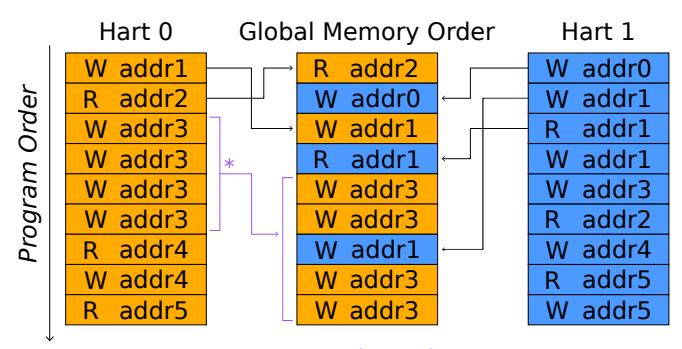
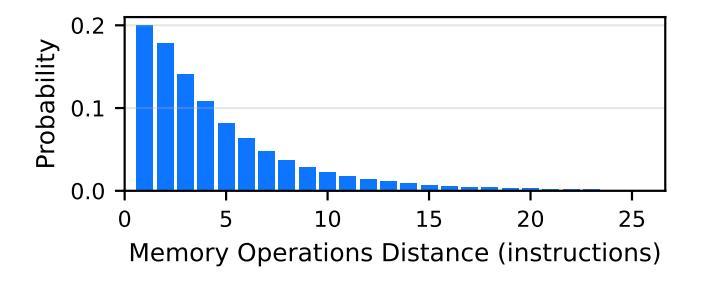
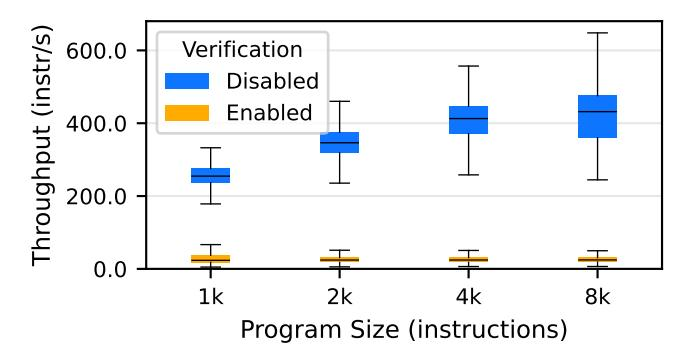
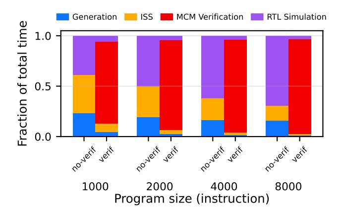
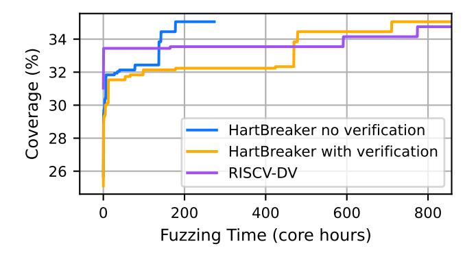

# HARTBREAKER: Deterministic Fuzzing of Multi-Hart RISC-V CPUs with Non-Deterministic Programs

Quentin Bordier *ETH Zurich* bordierq@ethz.ch

Tobias Kovats *ETH Zurich* tkovats@ethz.ch

Flavien Solt *UC Berkeley* flavien.solt@berkeley.edu Kaveh Razavi *ETH Zurich* kaveh@ethz.ch

*Abstract*—Hardware bugs threaten the correctness and security of modern CPUs. Relying on a deterministic correct baseline, pre-silicon fuzzing has proven to be an effective strategy for discovering deviations from correct behavior (i.e., bugs) in single-core CPUs. Modern CPUs, however, often feature multiple cores with complex interconnects that implement communication channels such as inter-processor interrupts or shared memory. Is it possible to effectively fuzz multicore CPUs despite their inherent non-deterministic operations?

We make a key observation that multi-hart interactions may result in non-deterministic data flows, control flows, or combinations thereof. An efficient fuzzing campaign needs to manage this non-determinism without limiting the exploration of the possible state space that may lead to bugs. Our new multi-hart RISC-V fuzzer, called HARTBREAKER, achieves this with a judicious use of three *determinism anchors*: control- and data-flow anchors enable non-deterministic control- and dataflow interactions between harts while ensuring a correct execution of multi-hart test programs, achieving high testing throughput and simplified bug detection. Synchronization anchors bound the non-deterministic window across harts, enabling HARTBREAKER to detect bugs that do not contaminate the control flow. We test HARTBREAKER on five multi-hart designs, namely Rocket, BOOM, Toooba, NaxRiscv and XiangShan. HARTBREAKER discovers five new concurrency bugs in these designs.

# I. INTRODUCTION

Hardware support for multi-threaded execution is a key feature of modern general-purpose processors to improve performance. Similar to other general-purpose architectures, RISC-V achieves this with parallel execution units that are referred to as harts (i.e., hardware threads). Harts execute independently and feature communication channels such as shared memory and interrupts. Implementing these communication channels is complex and error-prone, yet we currently lack generic and scalable approaches for systematically testing these implementations under diverse microarchitectural conditions. This paper introduces HARTBREAKER, a RISC-V multi-hart fuzzer that addresses the challenges inherent to nondeterminism when generating multi-hart test programs and detecting when they trigger a concurrency bug in the CPU. HARTBREAKER has discovered five new concurrency bugs in four multi-hart RISC-V CPUs.

Testing multi-hart CPUs. Two general approaches have been adopted for testing multi-hart CPUs. *Formal methods* exhaustively explore all possible microarchitectural states where memory consistency bugs may occur [\[33\]](#page-14-0), [\[35\]](#page-14-1), [\[42\]](#page-14-2); however, such methods use an abstracted model of the hardware as an input, which is non-trivial to derive. Efforts to automate this translation exist [\[24\]](#page-14-3) but cannot yet handle complex CPUs with speculative execution or caches. *Architectural test cases* address this scalability challenge by generating small multihart programs. For example, litmus tests [\[21\]](#page-14-4) evaluate particular memory consistency scenarios with two major limitations. First, memory consistency is not the only source of bugs in multi-hart CPUs [\[40\]](#page-14-5). Second, litmus tests execute under a fixed microarchitectural state, limiting their ability to discover bugs occurring in complex scenarios such as orderings affected by specific out-of-order execution conditions. CPU fuzzers have recently gained momentum [\[5\]](#page-13-0), [\[17\]](#page-14-6), [\[26\]](#page-14-7), [\[39\]](#page-14-8), [\[43\]](#page-14-9), [\[50\]](#page-15-0), but they are all limited to single-threaded execution and extending them to multi-hart execution is non-trivial due to the inherent non-determinism.

Determinism anchors. We classify the non-determinism in multi-hart execution into data- and control-flow nondeterminism, affecting the predictability of data values (e.g., load reordering) or control transfers (e.g., interrupts), respectively. We introduce *determinism anchors* to manage these two classes of non-determinism while fuzzing multi-hart CPUs. A determinism anchor is a mechanism that enables nondeterministic behavior at instruction granularity, while guaranteeing program-level determinism. Data-flow determinism anchors ensure that non-deterministic data values are cleared before they affect the control flow. Control-flow determinism anchors ensure that non-deterministic control flow decisions return to deterministic targets before proceeding with the rest of execution.

Verifying correct behavior under non-determinism. To build these determinism anchors, we must understand what is a legal outcome of non-determinism (e.g., what reorderings are allowed): the anchors must restore *legal* outcomes of non-determinism to a known state, but not illegal ones. For example, an incorrect reordering of loads resulting in a wrong data value should not just be overwritten by a data-flow anchor, otherwise the bug would never be detected. Effective test programs, however, can be long [\[39\]](#page-14-8) and the calculation of legal outcomes scales exponentially with program length. To address this challenge, we propose to parition complex multihart test programs into (smaller) litmus tests and use established techniques [\[15\]](#page-14-10), [\[37\]](#page-14-11) to calculate the legal outcomes within each partition. To scope the non-deterministic state to each partition, we rely on *synchronization anchors* when moving from one partition to another.

HARTBREAKER. Armed with determinism anchors, we build HARTBREAKER, a multi-hart RISC-V CPU fuzzer that combines the microarchitectural complexity of fuzzing while handling non-determinism introduced by multi-hart execution. The test programs generated by HARTBREAKER randomly exert non-determinism *within* and *across* harts in multi-hart CPUs. Asynchronous inter- and intra-hart interrupts exert nondeterministic control flows. Similarly, asynchronous inter- and intra-hart load and store operations to exclusive or shared memory regions exert non-deterministic data flows. Such nondeterministic data and control flows are also exerted *simultaneously*, e.g., when writing into another hart's instruction stream. These inter-hart interactions make the execution of a HARTBREAKER test program non-deterministic at instruction granularity. However, by construction, the programs deterministically complete on a correctly-implemented multi-hart CPU after executing *all instructions they are composed of*.

We tested HARTBREAKER on five multi-hart RISC-V CPUs: Rocket, BOOM, Toooba, NaxRiscv and XiangShan. HARTBREAKER reveals five previously-unknown, inherently concurrent bugs, involving cases such as illegal memory reorderings and mishandling of state when receiving interrupts across harts.

Contributions. We make the following contributions:

- We introduce *determinism anchors*, a novel technique that enables instruction-level non-determinism while maintaining program-level determinism.
- Leveraging determinism anchors, we design and implement HARTBREAKER, a multi-hart CPU fuzzer that systematically generates test cases exercising all types of multicore communication patterns.
- We evaluate HARTBREAKER on five well-tested opensource RISC-V CPUs and discover five previouslyunknown concurrency bugs.

Open sourcing. HARTBREAKER, along with a user-friendly setup and extensive documentation, is readily available at [https://github.com/comsec-group/hartbreaker.](https://github.com/comsec-group/hartbreaker)

## II. BACKGROUND

<span id="page-1-2"></span>We provide background on memory consistency, RISC-V multi-hart features, and hardware fuzzers.

## *A. Memory Consistency*

Consistency models. In multi-hart CPUs, load and store operations from different harts access the same global memory space. A Memory Consistency Model (MCM) puts ordering constraints on memory operations to ensure predictable concurrent behavior. For example, Sequential Consistency (SC) [\[32\]](#page-14-12) enforces in-order execution of memory operations: a load must return the value from the most recent store committed in the whole system. In contrast, Weak Memory Models (WMMs) allow memory operations from one hart to be observed in a different order by other harts (to accommodate microarchitectural mechanisms like store buffers).

<span id="page-1-0"></span>TABLE I: Store buffer litmus test.

| x = 0, y = 0 |            |
|--------------|------------|
| P0           | P1         |
| (1) x ← 1    | (3) y ← 1  |
| (2) x1 ← y   | (4) x2 ← x |

<span id="page-1-1"></span>

\*Preserve Program Order Rule 1

Fig. 1: RVWMO model overview. The hart columns represent the memory operations in order, from the point of view of the harts. The column at the center shows one possible global memory ordering.

These relaxations over the SC model must be accounted for by concurrent software, and by hardware implementations.

Litmus tests. Litmus tests are small concurrent programs that illustrate the behaviors allowed or forbidden by a memory model. For example, Table [I](#page-1-0) shows a litmus test that demonstrates the behavior of store buffering in a dual-hart system (P0 & P1). The outcome x1 = 0, x2 = 0 is forbidden by SC, as it would imply that both loads (2) and (4) were performed before the stores (1) and (3). Note that unlike SC, the RISC-V Weak Memory Ordering (RVWMO) model allows this behavior. In the RVWMO, stores (1) and (3) may be committed to local store buffers, then when loads (2) and (4) execute, they might not yet observe the other hart's buffered store, potentially returning the initial value 0 for both loads.

# *B. RISC-V Multi-Hart Features*

RISC-V is a free and open ISA, popular in both academia and industry. It consists of a base ISA, and a set of optional extensions that add more advanced or specialized functionalities like floating-point or atomic instructions. In RISC-V, a hart (hardware thread) is an execution unit that can independently fetch and execute instructions. Inter-hart communication in RISC-V primarily occurs through shared memory and Inter-Processor Interrupts (IPIs).

Shared memory. RISC-V relies on the RVWMO for memory consistency, introduced earlier. RVWMO builds upon the load value axiom which specifies the value that a load may return, defined through 13 Preserved Program Order (PPO) rules. For instance, the first PPO rule forbids the reordering of two consecutive stores to the same address as shown in Figure [1.](#page-1-1) Other rules preserve data and control dependencies, or enforce synchronization through fence instructions. We include an exhaustive list of all PPO rules, as well as the 2 other axioms in the RISC-V manual, page 93 [8].

Inter-processor interrupts. An interrupt is an asynchronous event typically generated by an external source such as a different hart or a peripheral. The interrupt requests the (receiving) hart to suspend its current program execution and transfer control to a designated interrupt handler. An IPI is a special interrupt triggered by software running in another hart, setting the MSIP bit of the mip Control and Status Register (CSR) of the target hart to 1. IPIs are generally sent through a memory-mapped peripheral, usually the RISC-V-specified Core Local INTerrupt controller (CLINT). Since RISC-V does not specify a delay in which an interrupt must be evaluated or even liveness, the time between when an interrupt is sent and when it is evaluated is non-deterministic.

#### <span id="page-2-2"></span>C. Hardware Fuzzers

Hardware fuzzers [5], [7], [17], [23], [26], [31], [39], [41], [43], [46], [47], [50] generate randomized test cases to evaluate the correctness of a design dynamically. These test cases are executed on the target design, and typically validated against a reference implementation. While hardware fuzzing has proven to be an effective strategy for finding RISC-V CPU bugs in single-hart settings, it so far remained unclear how the inherent non-determinism of multi-hart systems can be effectively tackled.

#### III. OBSERVATIONS AND CHALLENGES

We first quantitatively analyze existing single- and multihart testing approaches to expose the gap for effectively testing multi-hart CPUs. We then discuss the high-level design of HARTBREAKER to address this gap and introduce the challenges that such a design introduces.

#### A. Testing Multi-Hart CPUs

We analyze existing single- and multi-hart testing methods on two aspects. First, previous work [20], [40] has shown that CPU bugs often appear under specific microarchitectural conditions, hence we are interested in the ability of testing techniques to effectively explore the microarchitectural state space. Second, we consider the expandability of existing single-hart testing techniques to multi-hart systems.

**Litmus tests.** Litmus tests highlight specific aspects of memory consistency models in multi-hart settings [14], [21]. They focus on clearly expressing subtle tolerated and non-tolerated non-deterministic interaction patterns. Due to their focus on testing specific memory consistency scenarios, we raise the question: is the distribution of instructions in litmus tests diverse enough to trigger complex microarchitectural scenarios?

**Hardware fuzzers.** Conversely, state-of-the-art CPU fuzzers [5], [17], [26], [39], [43], [48] can generate complex instruction streams with balanced instruction distributions, allowing them to reach arbitrary microarchitectural states. However, they are designed for single-hart scenarios and rely on deterministic program execution, raising another

<span id="page-2-0"></span>TABLE II: Instruction coverage comparison between litmus tests and Cascade.

| Test Type                  | Litmus test [21] | Cascade [39] |
|----------------------------|------------------|--------------|
| Shared Memory              | ✓                |              |
| Atomics                    | $\checkmark$     |              |
| Fences                     | $\checkmark$     | ✓            |
| Interrupts                 |                  |              |
| Inter Processor Interrupts |                  |              |
| Exceptions                 |                  | ✓            |
| Independent Memory         |                  | ✓            |
| Branches                   | $\checkmark$     | ✓            |
| ALU operations             | $\checkmark$     | ✓            |
| FPU operations             |                  | ✓            |
| Privilege switches         |                  | ✓            |

<span id="page-2-1"></span>TABLE III: Comparison of fuzzing tools verification strategies. Tools marked with † means that the CHERI version [3], [4] is also supported. Custom methods are methods proprietary to the fuzzer, such as undisclosed golden models or differential testing with another CPU

| Fuzzer name         | Spike [10]   | Sail [9]     | Whisper [13] | Custom       |
|---------------------|--------------|--------------|--------------|--------------|
| DifuzzRTL [26]      | <b>√</b>     |              |              |              |
| Cascade [39]        | $\checkmark$ |              |              |              |
| Trippel et al. [43] |              |              |              | $\checkmark$ |
| TestRIG [5]         | <b>√</b> †   | <b>√</b> †   |              |              |
| ProcessorFuzz [17]  | $\checkmark$ |              |              |              |
| INSTILLER [50]      | $\checkmark$ |              |              |              |
| TheHuzz [44]        | $\checkmark$ |              |              |              |
| MorFuzz [48]        | $\checkmark$ |              |              |              |
| RISCVuzz [41]       |              |              |              | ✓            |
| RISCV-DV [7]        | $\checkmark$ | $\checkmark$ | $\checkmark$ |              |

question: can techniques from single-hart fuzzing be applied to multi-hart systems?

**Methodology.** We analyze the instruction diversity of all 5000 litmus tests from the non-mixed-size (same size memory accesses) RISC-V suite [21] and 1000 programs generated by Cascade [39], a state-of-the-art CPU fuzzer.

**Results.** Table II compares the capabilities of both tools, and confirms that litmus tests have very restricted capabilities compared to fuzzers. Litmus tests cannot generate exceptions, floating point operations or privilege switches and only support a small subset of the instructions available in the other exercised categories. This low instruction diversity implies that litmus tests are unlikely to trigger MCM violations associated with very specific microarchitectural conditions as they fail to effectively explore the microarchitectural state space. To validate this hypothesis, we ran 1,314 bare-metal litmus tests from the PULP group [6] and CHERI project [2] repositories on all CPU designs in our study. These tests did not trigger any of the bugs identified by HARTBREAKER since these bugs, as discussed in Section VII-E, require specific microarchitectural conditions that are not exercised by these tests.

Cascade [39], a hardware fuzzer, on the other hand, generates programs with more balanced instruction distributions, exercising the microarchitecture in diverse conditions. Hard-

ware fuzzers like Cascade, however, rely on deterministic program execution for verification via differential testing using either an instruction set simulator (ISS) or a reference hart, as summarized by the evaluation of popular fuzzers shown in Table [III.](#page-2-1) Hence, *current RTL fuzzers cannot verify nondeterministic program execution* which fundamentally limits their application to multi-hart CPUs where the execution is inherently non-deterministic.

## *B.* HARTBREAKER *Design*

Ideally, we need a fuzzer that can exercise multi-hart interactions under diverse microarchitectural conditions which is currently missing. HARTBREAKER fills this gap by generating multi-hart test cases with high instruction diversity and throughput while triggering non-deterministic behavior in multi-hart settings. Before diving into the challenges specific to HARTBREAKER, we present our initial design decisions. Fuzzers, in general, are attractive testing tools due to their good performance in terms of instruction throughput. Insights from previous work [\[7\]](#page-14-14), [\[39\]](#page-14-8) show that to maximize throughput, every generated instruction should be executed. As such, the generated test cases need a known execution path, from a predetermined start to a predetermined end state. This test program construction strategy allows a straightforward detection of the occurrence of functional bugs that contaminate the control flow, revealed by deviations from the expected final state.

Limiting dead code. Non-deterministic programs can be modeled using non-deterministic finite automata, where each executed instruction corresponds to a state transition. A deterministic instruction has exactly one successor state, while a non-deterministic instruction can lead to multiple possible successor states. Each non-deterministic instruction therefore introduces multiple possible transitions, increasing the number of possible execution paths. As a result, the number of reachable accepting states might grow exponentially with the number of non-deterministic instructions. One could, in principle, enumerate the legal accepting states at test-generation time and accept any of them at runtime. However, deciding whether an observed trace is consistent with the memory consistency model, i.e., the *testing problem*, is NP-complete [\[18\]](#page-14-28), and therefore intractable for programs of fuzzing-relevant length. Yet in a single instance of a program execution, only one path is taken, leading to an exponential amount of dead code in the program. To avoid this path explosion problem resulting in prohibitive amounts of dead code, and thus low performance, we will introduce techniques for generating programs with a well-defined accepting state.

## *C. Overview of Challenges*

HARTBREAKER thus opts for generating random programs that exercise unconstrained non-determinism in bounded regions, but enforces that those regions return to a deterministic state before exiting, thus connecting many non-deterministic regions using a deterministic path. To generate such programs, we must first understand the core mechanisms that introduce

<span id="page-3-0"></span>

Fig. 2: Overview of HARTBREAKER's pipeline.

non-determinism in multi-hart settings. This introduces our first challenge.

Challenge 1. Determine the root causes of nondeterminism in multi-hart programs.

In Section [IV,](#page-4-0) we analyze the sources and effects of nondeterministic execution in multi-hart settings. We observe that non-determinism can fundamentally only manifest in three ways: (1) *control flow non-determinism*, (2) *data flow nondeterminism*, and combinations thereof.

Given these observations of non-deterministic behaviors, we implement HARTBREAKER based on the design in Figure [2.](#page-3-0) The next challenge concerns the first step of HART-BREAKER: the efficient generation of test cases that exhibit non-deterministic behavior, while allowing for high instruction diversity and throughput.

Challenge 2. Efficiently generate effective nondeterministic test cases.

In Section [V,](#page-5-0) we present the core of HARTBREAKER: *control* and *data flow anchors*. They bound non-deterministic effects within selected program regions, prohibiting their propagation into control flow decisions. Within these regions, there is no restriction on the non-determinism that may occur during execution. As such, all possible behaviors can be observed while avoiding path explosion. Given efficient mechanisms to generate effective multi-hart test cases, HARTBREAKER then needs to verify that the observed program executions are valid. This is our final challenge which addresses detecting bugtriggering programs in the design of HARTBREAKER depicted in Figure [2.](#page-3-0)

Challenge 3. Enable efficient verification of nondeterministic test cases.

In Section [VI,](#page-6-0) we introduce *synchronization anchors*. Synchronization anchors allow efficient verification of nondeterministic programs by periodically resetting parts of the architectural state that must be verified post-simulation. This effectively bounds non-determinism in a controllable manner to avoid *state explosion*.

```
1 la x4, 0x80001000
```

- (a) Hart 0 instructions.
- (b) Hart 1 instructions.

Fig. 3: Example of data-flow non-determinism in multi-hart programs.

```
1 # send an IPI to
2 # hart 1
2 sub x8, x3, x4
3 la x4, CLINT_BASE
4 li x5, 1
5 sw x5, 4(x4)
1 add x2, x4, x8
2 sub x8, x3, x4
3 final:
4 csrr x2, MIP
5 beq zero, x2, final
```

- (a) Hart 0 instructions.
- (b) Hart 1 instructions.

Fig. 4: Example of control-flow non-determinism in multi-hart programs.

#### IV. PROFILING MULTI-HART NON-DETERMINISM

<span id="page-4-0"></span>We formalize the sources of non-determinism in multihart systems. We then present a strategy for generating nondeterministic test cases that can be validated against a deterministic model.

#### A. Root Causes of Non-determinism

To understand non-determinism in multi-hart programs, we distinguish the root causes that lead to non-determinism. *Data-flow non-determinism* occurs when concurrent interactions produce non-deterministic values in registers or memory, while *control-flow non-determinism* occurs when inter-hart events affect the execution path. Both can produce similar observable effects, but require different handling strategies.

Consider the code in Figure 3 executed on two different harts. The value in  $\times 5$  in hart 1 at the end of the execution is non-deterministic. It may hold the value  $0\times 80000000$ ,  $0\times 0$ , or  $0\times 80000001$ , depending on the interleaving of the instructions, due to the absence of synchronization primitives. This is an example of *data-flow non-determinism*.

In Figure 4, since there is no synchronization, hart 1 receives the interrupt at an unknown location, causing a trap. Hart 1 could trap on any of the four lines of the program, leaving the subsequent state of the system undetermined. This is an example of *control-flow non-determinism*.

The following section formalizes both forms of nondeterminism, allowing us to reason about both their individual and conjunctive effects.

#### B. Formalizing Non-determinism

We reason about non-determinism either on an instruction level (Section IV-B1) or on a program level (Section IV-B2).

<span id="page-4-3"></span>1) Instruction-level non-determinism: We define a hart's architectural state and its instruction-level transition relation. **States and transitions.** We call s the observable state of a hart, including its general-purpose registers R(s) and program

counter PC(s). The environmental state e is the remaining architectural and microarchitectural components, including the CSR registers C(e) and the hart's view of memory M(e). Let S be the set of all possible observable states, E the set of all environmental states, and I the set of all executable instructions of a hart.  $E_{reach}(s) \subseteq E$  is the set of environmental states reachable when the observable state is s. Informally,  $E_{reach}(s)$  is the set of environmental states consistent with a valid execution history leading to s.

We define the transition relation of the hart as a set of triples  $\delta\subseteq (S\times E)\times I\times (S\times E)$ . A triple  $((s,e),i,(s',e'))\in \delta$  captures the transition from one *architecturally committed* state (s,e) where s is fully determined even if e is not, to the next committed state (s',e') upon retirement of i, abstracting away all intermediate pipeline behavior. For ease of notation, we denote triples  $((s,e),i,(s',e'))\in \delta$  as transitions  $(s,e)\stackrel{i}{\to} (s',e')$ .

```
Instruction-level non-determinism. An instruction i is non-deterministic in the observable state s if there exist distinct e_0, e_1 \in E_{reach}(s) and s_0', s_1' \in S such that (s, e_0) \xrightarrow{i} (s_0', e_0'), \quad (s, e_1) \xrightarrow{i} (s_1', e_1') and s_0' \neq s_1'.
```

Instruction-level non-determinism originates when executing an instruction i from a given observable state s may lead to multiple possible observable states s', depending on the (unobservable) environmental state e, which captures the sources of non-determinism such as memory interleavings, CSR values, or interrupt timing. This instruction-centric view allows us to formally define control-flow and data-flow non-determinism.

Control-flow non-determinism occurs when different environmental states cause execution to diverge at an instruction that is not itself the source of non-determinism. For example, when an interrupt arrives during an otherwise deterministic instruction (see Figure 4b).

**Control-flow non-determinism.** Instruction i induces control-flow non-determinism in the observable state s if there exist  $e_0, e_1 \in E_{reach}(s)$  and  $s_{c0}, s_{c1} \in S$  such that  $(s, e_0) \xrightarrow{i} (s_{c0}, e'_0), \ (s, e_1) \xrightarrow{i} (s_{c1}, e'_1), \ \text{and} \ PC(s_{c0}) \neq PC(s_{c1}).$ 

Data-flow non-determinism occurs when different environmental states cause an instruction to produce different register values for the same observable state. For example, when a load returns different values depending on the interleaving of concurrent stores from another hart (see Figure 3b).

**Data-flow non-determinism.** Instruction i induces data-flow non-determinism in observable state s if there exist  $e_0, e_1 \in E_{reach}(s)$  and  $s_{d0}, s_{d1} \in S$  such that  $(s, e_0) \xrightarrow{i} (s_{d0}, e'_0), \ (s, e_1) \xrightarrow{i} (s_{d1}, e'_1), \ \text{and} \ R(s_{d0}) \neq R(s_{d1}).$ 

Control and data-flow non-determinism can also occur *si-multaneously*: control-flow non-determinism can induce data-flow non-determinism, and vice versa. For example, consider a scenario where a program uses virtual addresses, and has just changed address space. If the Translation Lookaside Buffer (TLB) is not flushed, a subsequent load might either cause a trap if the buffered virtual address is invalid, or load a (non-deterministic) value and continue otherwise. As such, the load introduces both data- and control-flow non-determinism simultaneously.

<span id="page-5-1"></span>2) Program-level non-determinism: We define a program P as a directed graph G whose nodes and edges are architectural states and their transitions, respectively, expressed by  $\delta$  (see Section IV-B1). Let  $\phi: S \to \{\text{true}, \text{false}\}$  be a termination predicate that determines when the execution halts. An execution Exec(P) of a program P is the traversal of G from an initial state  $s_i$  until the first state  $s_f$  for which  $\phi(s_f) = \text{true}$ , called the final state of the execution. For a single program, there may be multiple valid executions resulting in different final states depending on non-deterministic behavior.

**Program-level non-determinism.** A program P is said to be *program-level non-deterministic* if there exist two executions  $\operatorname{Exec}(P)$  and  $\operatorname{Exec}'(P)$  with distinct final states  $s_f \neq s_f'$ .

Conversely, a program is program-level deterministic if all executions, regardless of the path taken through G, reach the same final state  $s_f$ . A program can be non-deterministic at the instruction level, but deterministic on program level. Assume, for example, that a program is exposed to data-flow-, but not to control-flow non-determinism. The program never conditions its control flow on the non-deterministic data and overwrites all registers with fixed values just before terminating. The program is then instruction-level non-deterministic, but remains program-level deterministic.

## C. Determinism Anchors

Determinism anchors enable the generation of program-level deterministic test cases in the presence of controlor data-flow non-determinism at an instruction level. A determinism anchor bounds a region of potentially non-deterministic instructions and provides a sequence that restores a unique observable state. Let  $\Pi(i,s)=\{s'\in S\mid \exists e\in E_{reach}(s),\ e'.\ (s,e)\xrightarrow{i}(s',e')\}$  be the set of the observable states reachable by executing the non-deterministic instruction i in the observable state s.

**Determinism Anchors.** A sequence of instructions  $A = (i_1, \ldots, i_n)$  is a *determinism anchor* for i at s if, for every  $s' \in \Pi(i,s)$  and every  $e \in E_{\text{reach}}(s')$ , executing A from (s',e) yields the same observable state; that is, there exists a unique  $s_d \in S$  such that all such executions terminate in  $(s_d,\cdot)$ .

<span id="page-5-2"></span>

Fig. 5: Interrupt transmission diagram. The sender sends an interrupt, which the receiver evaluates within a bounded, yet non-deterministic number of cycles  $\Delta PC$ . A branch at the tail of the confined landing zone evaluates the MIP register. Unless the interrupt has been processed, execution resumes at the head of the landing zone.

The anchors do not impose restrictions on the nondeterministic instructions. Instead, they allow the nondeterminism to occur naturally but ensure that its effects do not propagate beyond predetermined boundaries.

#### <span id="page-5-0"></span>V. GENERATING EFFECTIVE MULTI-HART PROGRAMS

In the following, we present two core techniques for exerting instruction-level non-determinism while preserving program-level determinism in multi-hart systems: control and data-flow anchors.

#### A. Control-Flow Anchors

Control-flow anchors (in short, *cf-anchors*) handle non-deterministic control-flow variations that may arise from asynchronous events such as inter-processor interrupts (IPIs). Control-flow non-determinism can involve two harts that must be synchronized: a *sender*, which triggers the event, and a *receiver*, which observes the resulting non-determinism. Figure 5 shows the outline of the cf-anchor mechanism.

**Implementation.** The set of instructions A that defines the cf-anchor is composed as follows. The receiver executes an instruction that prepares the target address of the trap handler along with a subsequent store to an address shared with the sending hart. This sequence signals the sender that the receiver has entered the confined landing zone. Once the sending hart observes that the receiving hart has entered the landing zone, it may initiate the interrupt by executing the respective nondeterministic instruction i. At initiation of the interrupt by the sender, the receiver traps some (non-deterministic number of) cycles later, resulting in control-flow non-determinism (i.e.,  $PC(s_{c0}) \neq PC(s_{c1})$ . An interrupt handler subsequently marks the interrupt as processed and returns execution to the next instruction in the landing zone. The receiving hart may now exit the landing zone when executing the concluding branch at its boundary. Within the landing zone, the receiving hart performs random computations that regenerate the same data throughout an arbitrary number of iterations. Therefore, independent of the (valid) arrival time of the interrupt, the architectural state remains identical upon the exit from the confined zone.

**Preserving bug detection capabilities.** Because of the architectural invariance after the execution of confined landing zone

with respect to the arrival time of the interrupt, we can exploit program-level determinism for bug detection. As explained in Section [II-C,](#page-2-2) prior work [\[7\]](#page-14-14), [\[39\]](#page-14-8) exploits the fact that hardware bugs invalidate the data flow, which subsequently breaks the control flow when executing a valid program on faulty hardware. An architectural bug that occurs during interrupt handling thus breaks the architectural invariance upon exiting from the landing zone. The invalid data can therefore propagate into the control flow and cause the hart to jump into arbitrary memory regions, causing a hang and eventually timing out which HARTBREAKER detects.

## *B. Data-Flow Anchors*

Data-flow anchors (in short, *df-anchors*) prevent nondeterministic data from contaminating control-flow decisions, while maintaining instruction-level data variability to expose hardware memory-consistency bugs. They isolate and reset ambiguous data values only, hence have minimal impact on the overall program structure.

Implementation. Contrary to control-flow non-determinism, data-flow non-determinism does not rely on a timely senderreceiver setting. A hart can issue load and store operation with no synchronization without affecting the control-flow, and thus the validity of programs. Hence, exerting data-flow nondeterminism does not require any cross-hart synchronization. Executing the respective instruction ind that initiates nondeterminism has no preconditions and can execute from any state s. After ind's execution, its effects become observable and its destination register r holds an ambiguous value that is only determined at runtime, producing multiple possible states {s ′ 0 , s′ 1 , . . . } during program generation.

The register r is flagged as *non-deterministic* within the program generation algorithm. Flagged registers are isolated: they cannot be used as explicit sources for control-flow decisions until the determinism anchor resets them to a predictable state. In this case, the set of instructions A corresponding to the df-anchor contains only a single instruction that restores determinism by overwriting r with a predictable value, either by assigning zero to r or by using it as a destination for an operation with a deterministic output.

This restoration step is local to the hart and requires no interhart synchronization. We apply this method to the registers used as output registers for load operations, and to the mepc CSR register after an interrupt has been received.

Preserving bug detection capabilities. Resetting registers does not imply breaking the syntactic dependencies that determine re-ordering of memory operations. Instead, we can enable arbitrary dependencies by zeroing out registers using instructions such as xor or sub. Such operations neutralize the dependency carrier, while maintaining the syntactic dependency relations. This allows safe usage of the registers to create dependencies.

Because non-deterministic data is isolated and the set of behaviors is unconstrained, we can observe and verify the outcomes of a test case from the execution traces obtained during simulation. HARTBREAKER isolates memory operations,

<span id="page-6-1"></span>

Fig. 6: MCM load return value computation flow.

gather the data returned by all loads, and validate the observed execution using a memory consistency solver presented in Section [VI.](#page-6-0)

## <span id="page-6-0"></span>VI. DETECTING BUGS IN NON-DETERMINISTIC EXECUTION

Having established mechanisms to maintain program-level determinism, we now address the third and last challenge: verifying the execution of non-deterministic programs. The verification of control- and data-flow non-determinism requires orthogonal approaches.

Control-flow non-determinism. Control-flow nondeterminism is bounded within the landing zones. However, resulting faulty computations may leak into the data flow. As such, invalid forms of control-flow non-determinism likely break program-level validity, resulting in trivially detectable timeouts during RTL simulation.

Data-flow non-determinism. However, df-anchors block dataflow non-determinism from affecting program-level validity. Hence, we follow an alternative approach to verify that some instance of a non-deterministic data-flow execution trace does not violate memory ordering rules. The following details our approach.

#### *A. Validating Non-Deterministic Data Flows*

We verify the realized ordering of memory operations observed *during execution* against the RVWMO model. Figure [6](#page-6-1) provides an overview of our approach. In the first two steps, we extract relevant properties from the generated test case and its execution trace to construct an equivalent litmus test. Subsequently, we generate the minimal litmus test and leverage it for verification accordingly. A key insight is that we can *construct an equivalent litmus test from any generated test case* following this method, allowing us to leverage existing high-performance verification tools [\[14\]](#page-14-21), [\[37\]](#page-14-11) in the backend of HARTBREAKER.

Transforming programs into litmus tests. Existing weakmemory model analysis tools [\[14\]](#page-14-21), [\[37\]](#page-14-11) input litmus tests that express some instance of memory orderings. To leverage these tools, the derived litmus test must preserve *equivalency* in terms of the RVWMO model (as formally specified in [\[8\]](#page-14-13)) with respect to the original test case. However, litmus tests support only a restricted set of instructions, preventing direct translation of our complex test cases into litmus assembly. All properties relevant to the verification of the litmus test, with the exception of syntactic dependencies, are fully defined by the memory operations alone. By expressing syntactic

<span id="page-7-0"></span>

| x1 = addr2; x4 = addr1          |   |                | dependent registers |
|---------------------------------|---|----------------|---------------------|
|                                 | 1 | lw x2, 0(x4)   | x2 = *addr1         |
| syntactic address<br>dependency | 2 | xor x2, x2, x2 | x2 = 0              |
|                                 | 3 | or x1, x2, x1  | x1 = addr2, x2=0    |
|                                 | 4 | sw x5, 0(x1)   | x1 = addr2, x2=0    |

Fig. 7: Example of the method we use to create arbitrairy syntactic address dependencies between two memory operations. In step 1 , x2 picks up a dependency on the load. In step 2 , x2 is zeroed but the dependency survives. In step 3 , the dependency is transferred from x2 onto x1. Finally, in step 4 , the store reads x1, giving its address a syntactic dependency on the load.

dependencies using the method introduced in Figure [7,](#page-7-0) we can fully express the RVWMO relations in a litmus test, guaranteeing equivalency with respect to the original program.

Given this insight, we exploit three key properties to concretely translate arbitrary HARTBREAKER programs into equivalent litmus tests. First, data-flow anchors ensure deterministic data flows with respect to store operations, allowing us to obtain store values from a deterministic ISS. Second, the test cases statically define all syntactic dependencies between memory operations, which we can extract during generation. Third, the traces reveal the concrete load return values, which we gather after simulation.

We thus iterate through all memory operations of a test case as follows. Because we already know the store values, we generate each store with an associated instruction that ensures the store instruction in the litmus test commits the same value as the original program to memory. Furthermore, when an instruction initiates a syntactic dependency, we carry the dependency in a temporary register. We then zero out the temporary register, while keeping the dependency active, as in step 2 in Figure [7.](#page-7-0) And for each instruction that has a dependency to a previous instruction, we transmit the dependency, mirroring step 3 of Figure [7](#page-7-0) to propagate the respective relation. This way, the solver observes relations between the memory operations in the litmus test that are identical to the memory operations of the original test case. Finally, we construct an exists statement using the load return values for the verification by the solver in the HARTBREAKER's backend to check if this outcome exists given the memory consistency model.

# *B. Synchronization Anchors*

To ensure that the complexity of validating the data flow of test cases remains bounded, we must control the number of memory operations the solver must process. Instead of bounding the number of instructions in a test case, we bound the number of instructions that can be re-ordered, allowing us to verify large test cases in smaller sections. To reset the state of the shared memory, synchronization anchors perform two operations. First, they *synchronize* the cores, such that each section of a test case has a single corresponding section in all harts. Second, they *fence* loads and stores between these sections to ensure the re-orderings remain local within the respective sections. Contrary to control- and data-flow anchors that ensure program-level determinism, synchronization anchors reset non-determinism to keep verification tractable.

#### VII. EVALUATION

We evaluate HARTBREAKER by first investigating whether the generated test programs can sufficiently exercise multi-hart communication channels in Section [VII-A.](#page-7-1) We then evaluate the fuzzing performance of HARTBREAKER, with respect to its instruction throughput in Section [VII-B](#page-8-0) and achieved coverage when compared with the industry standard RISCV-DV [\[7\]](#page-14-14) in Section [VII-C.](#page-9-0) We finally look at the concurrency bugs that HARTBREAKER has discovered in Section [VII-D.](#page-9-1)

Testbed and targets. The evaluation is performed on a machine equipped with two AMD EPYC 7H12 processors at 2.6 GHz containing 256 logical cores and 1 TB of DRAM. We use Verilator [\[12\]](#page-14-29) to simulate designs, and Spike [\[10\]](#page-14-23) as a golden model. We adapt the Verilator version based on the design's requirements if necessary. The experiments involving RISCV-DV [\[7\]](#page-14-14) were run using the UVM framework with a commercial simulator. We tested HARTBREAKER on Rocket [\[16\]](#page-14-30), a simple, in-order CPU, and four out-of-order, superscalar CPUs: BOOM [\[51\]](#page-15-1), Toooba [\[1\]](#page-13-4), NaxRiscv [\[11\]](#page-14-31) and XiangShan [\[49\]](#page-15-2).

## <span id="page-7-1"></span>*A. Multi-Hart Feature Coverage*

To evaluate how well HARTBREAKER can exercise multihart functionalities, we analyze 10'000 generated test programs. We use a default set of parameters that allow a reasonable number of shared memory operations and interrupts, while leaving space for other instructions for maximizing the exploration of microarchitectural states.

Interrupts. We first test the interrupt capabilities of HART-BREAKER. We look for a high frequency of interrupts such that we put the subsystems under stress. We found that interrupts are used in 100% of the generated test cases, with an average of 12.1 IPIs per test case, each consisting of 1600 instructions on average.

Shared memory. We further investigate the *PPO rule coverage* to ensure we can detect all possible forbidden re-orderings. Since the bugs we aim to discover are violations of these rules, it is also critical to cover all of them to avoid masking bugs. We plot the probability that a memory instruction is subject to a given rule in Figure [8.](#page-8-1) We observe that all rules are covered, meaning we can discover bugs related to all rules. Notice that PPO rule number 8 is not included in the plot. This rule enforces the ordering of load-reserve (LR) with respect to its paired store-conditional (SC). LR/SC ordering could be treated as standard loads and stores, with the MCM solver verifying their ordering. We exclude them by choice, as the ISA permits spurious SC failures, making it impossible to

<span id="page-8-1"></span>

Fig. 8: Probability that a memory instruction exercises a given PPO rule. The x axis is the index of a PPO rule as defined in the RISC-V manual [\[8\]](#page-14-13).

<span id="page-8-2"></span>

Fig. 9: Distance between memory operations accessing shared memory.

distinguish legal behavior from liveness bugs without designspecific knowledge.

An additional important factor in exercising the underlying memory consistency implementations is memory operation frequency since CPUs have a bounded re-ordering window depending on the size of hardware structures such as store buffers and queues. Because we want to maximize the amount of re-orderings of memory operations we observe, it is crucial to have a high density of memory operations such that instructions are not too far apart to be re-ordered. Figure [9](#page-8-2) plots the distance between memory operations that access addresses used at least once by both harts in a test case. We observe a good density of memory operations, with reasonable distances between memory operations, enabling many possibilities for the re-ordering of memory operations.

#### <span id="page-8-0"></span>*B. Fuzzing Throughput*

We first investigate what impact the verification of the dataflow has on throughput using the triple-hart Rocket CPU shown in Figure [10.](#page-8-3) We observe that without verification, the throughput converges to a stable value for larger program sizes, creating an optimal program size for fuzzing. However, verification of valid data flows is comparably slow and has a significant impact on the end-to-end throughput when considering both verification and simulation, resulting in a rather stable throughput across all program sizes. The optimal size is therefore a program that is as long as possible to maximize throughput, while keeping the simulation time of the program reasonable for detecting bugs.

<span id="page-8-3"></span>

Fig. 10: HARTBREAKER instruction throughput of the triplehart Rocket CPU with verification enabled and disabled.

<span id="page-8-4"></span>

Fig. 11: HARTBREAKER instruction throughput for each supported CPU, across program sizes. Each CPU uses three harts.

Figure [11](#page-8-4) shows the end-to-end instruction throughput with verification enabled across all supported CPUs, for different program sizes. With the exception of NaxRiscv, we observe that the throughput does in fact stay fairly constant, with only a very slow increase in throughput over the program size. The sharp increase in throughput for the NaxRiscv CPU is due to NaxRiscv's simulator. All CPUs use Verilator [\[12\]](#page-14-29) as a simulator, producing a compiled RTL binary with very short startup time. In contrast, NaxRiscv simulations run through Scala and bind to a Verilator binary via the Java Native Interface, which leads to significantly longer startup times since the simulator must be rebuilt from cached artifacts. As a result, generating longer programs helps amortize this startup cost. Furthermore, we observe that the size of the CPU impacts the throughput, as larger CPUs tend to have much slower simulation performance, as depicted in Figure [12.](#page-9-2) XiangShan [\[49\]](#page-15-2) takes multiple minutes to perform a single simulation, with larger programs increasing simulation times even further. All CPUs we tested followed a similar trend at different scales, e.g., Rocket [\[16\]](#page-14-30) simulation time is measured in seconds.

To further understand the performance impact of each of the components of HARTBREAKER, we evaluate their individual runtime contribution in Figure [13.](#page-9-3) The first step is the generation stage, where the assembly programs are generated. After

<span id="page-9-2"></span>

Fig. 12: XiangShan simulation time in minutes.

<span id="page-9-3"></span>

Fig. 13: Fraction of time spent in each step of the testing pipeline.

the generation, we run the binaries on the Spike ISS [\[10\]](#page-14-23) to gather some values unknown at generation time, such as the values that the stores will commit to memory. The binary is then executed on the RTL simulator of the design under test. Finally, if MCM verification is enabled, we gather the values returned by concurrent loads from the simulator's commit logs, translate the trace into a litmus test that expresses the exact behavior observed, and verify if there exists a valid execution that returns the same values for all loads. We observe that verification makes up the bulk of the runtime overhead across all program sizes, and its share slightly increases for larger programs. However, with verification disabled, we observe that ISS and RTL simulation have the largest remaining impact on performance for smaller programs. For large programs, the bottleneck shifts to RTL simulation alone, showcasing the amortizing effects of larger programs which we have previously observed in Figure [10.](#page-8-3)

#### <span id="page-9-0"></span>*C. Coverage Comparison*

We compare HARTBREAKER against RISCV-DV [\[7\]](#page-14-14), a widely-used random instruction generator for RISC-V verification. To the best of our knowledge, RISCV-DV is the only tool capable of automated generation of multi-hart test programs.

<span id="page-9-4"></span>

Fig. 14: Multiplexer select coverage achieved by HART-BREAKER vs. RISCV-DV on triple-hart Boom v3. 15,872 coverage points.

TABLE IV: Summary of discovered bugs.

<span id="page-9-5"></span>

| CPU name       | Bug Type                      | Bug Alias |
|----------------|-------------------------------|-----------|
|                | Illegal Load-Load re-ordering | N1        |
| NaxRiscv [11]  | CLINT access size             | N2        |
| Toooba [1]     | IPI evaluation timing bug     | T1        |
| BOOM (v4) [51] | Illegal Load-Load re-ordering | B1        |
| Rocket [16]    | None                          |           |
| XiangShan [49] | Out-of-order MIP read         | X1        |

RISCV-DV uses pre-defined test scenarios, which guide random programs towards specific features of a CPU. We ran RISCV-DV using its default multi-hart target, configured for 64-bit designs with three harts. We evaluated coverage on the triple-hart BOOM CPU.

To ensure a fair comparison, we included RISCV-DV test cases that timed out (we use a five-minute timeout) in the coverage calculation, but excluded their execution time from the core-hour count. We ran RISCV-DV and HARTBREAKER with verification for a total of 858 core-hours, and then ran HARTBREAKER without verification until we reached similar coverage. Figure [14](#page-9-4) shows that HARTBREAKER achieved similar coverage to RISCV-DV, while additionally providing multi-hart verification capabilities including IPI support, memory model checking, and deterministic interrupt injection that RISCV-DV lacks. Without verification, HARTBREAKER reached the same coverage as RISCV-DV in a significantly shorter time.

#### <span id="page-9-1"></span>*D. Discovered Bugs*

HARTBREAKER has found five bugs dealing exclusively with shared memory and interrupts across the tested CPUs, summarized in Table [IV.](#page-9-5) HARTBREAKER triggers some of these bugs within minutes, while others require very specific microarchitectural conditions and only surface after several core hours of fuzzing. Figure [15](#page-10-1) displays the Time-to-Exposure (TTE) statistics for each bug accordingly, collected over 20 fuzzing runs each. The NaxRiscv and XiangShan bugs (N1, N2, X1) have been confirmed and fixed by the respective

<span id="page-10-2"></span>TABLE V: Outcome x1=0, x2=1, x3=0 is forbidden.

| Address x initialized to 0 |            |  |
|----------------------------|------------|--|
| P0                         | P1         |  |
|                            | (2) x1 ← x |  |
| (1) x ← 1                  | (3) x2 ← x |  |
|                            | (4) x3 ← x |  |

developers. The other bugs (B1, T1) have been reported to their respective project platforms. Furthermore, the absence of multi-hart bugs in Rocket is not surprising. Rocket implements an in-order pipeline with only limited optimizations in its memory subsystems. The following provides an overview of the individual bugs discovered by HARTBREAKER.

Illegal load-load re-ordering (B1, N1). The B1 and N1 bugs are very similar in nature. Both bugs violate the Coherence of Read-Read (CoRR) ordering, a fundamental memory consistency requirement.

In the example presented in Table [V,](#page-10-2) the outcome (x1 = 0, x2 = 1, x3 = 0) implies that the second and third loads of x on P1 returned values written by different stores, even though there was no intervening store to x between them in program order. Under RVWMO, this case falls under the same-address load–load preserved program order (PPO) rule [\[8\]](#page-14-13):

If two loads to the same byte return values written by different stores and no store to that byte occurs between them, the first load must precede the second in the global memory order (GMO).

Since the younger load (x3) observes an older value than the earlier load (x2), this PPO ordering is not preserved. As a result, the execution violates the load value axiom, which as we discussed in Section [II,](#page-1-2) mandates that each load returns the value of the most recent store that precedes it in both program order and the GMO. Hence, the observed outcome represents a violation of Coherence of Read–Read (CoRR): the hart observes memory that "goes backward in time", i.e., a younger load returns a value older than a previous load from the same address.

IPI evaluation timing bug (T1). T1 is an interrupt handling bug in Toooba's implementation of the mret instruction. The bug occurs when a hart has a pending interrupt while interrupts are currently disabled, but were previously enabled before entering the trap handler. When returning from a trap using mret, the processor should restore the previous interruptenabled state and immediately check if any interrupts are pending. According to the RISC-V specification, if an interrupt is pending after re-enabling interrupts, the processor must handle it immediately. However, Toooba incorrectly proceeds to fetch the next instruction from an invalid address (stored in the exception program counter) before checking for pending interrupts. This causes the processor to trap due to the invalid address instead of the pending interrupt, writing the wrong cause into the trap cause register.

Out-of-order MIP read (X1). XiangShan allows out-oforder reads of the interrupt pending register. This causes the

<span id="page-10-1"></span>

Fig. 15: Time to exposure statistics over 20 runs for each bug. NaxRiscv INT is the measurement for the NaxRiscv interrupt bug, and NaxRiscv MCM for the memory consistency bug.

```
2 # Write(x)
3 sd s1, 0(a1)
5 ...
                        1 lw s7,0(sp) # Load(x) id=0
                        2 ...
                        3 lwu t1,0(s2) # Load(x) id=1
                        4 ...
                        5 lwu s0,0(tp) # Load(x) id=2
```

(a) Hart 0 instructions.

(b) Hart 1 instructions.

Fig. 16: B1 test case excerpt. Hart 0 performs a store to an address and hart 1 concurrently reads from it with three consecutive loads. The resolution of load 1's address is delayed by complex computations, creating a race condition that results in load 2 reading a stale value.

processor to miss newly-arrived interrupts that should have been visible, violating the expected ordering between interrupt updates and their observation.

CLINT access size restriction (N2). To send an IPI, a hart cannot directly modify another hart's interrupt registers. Instead, it must write to a memory-mapped register managed by the CLINT using a regular memory store instruction. The RISC-V specification requires the CLINT to support store operations of any size (byte, halfword, or word). However, we found that NaxRiscv's CLINT implementation only accepts full-word stores, incorrectly raising an exception when a program attempts to use a store-byte instruction.

## <span id="page-10-0"></span>*E. Microarchitectural root cause analysis*

In the following, we discuss the specific microarchitectural root causes for two particularly interesting bugs discovered by HARTBREAKER. Notably, triggering them requires complex structural and computational dependencies, as well as exercising the involved microarchitectural components. HART-BREAKER is capable of generating such programs for the first time, revealing edge cases that could not be detected by existing tooling. Figure [16](#page-10-3) and Figure [17](#page-11-0) show simplified versions of the test cases, where interleaving instructions have been removed for clarity. A complete version can be found in the Appendix Figure [19](#page-12-0) and Figure [18.](#page-12-1)

```
4 # Write(x)
5 sw x2, 0(a1)
7 ...
                        1 sd a0, 0(a1) # Write(x)
                        2 ...
                        3 lb s2, 0(a1) # Load(x) id=0
                        4 ...
                        5 lbu s5, 0(a1) # Load(x) id=1
                        6 ...
                        7 lwu sp, 0(a1) # Load(x) id=2
```

(a) Hart 0 instructions.

(b) Hart 1 instructions.

Fig. 17: N1 test case excerpt. Hart 1 is writing to an address x and subsequently reads from it using three consecutive loads of different widths. Hart 0 concurrently writes to that address. The last load returns a stale value.

Bug B1. The bug manifests when a hart stores to an address, and another hart has three concurrent in-flight loads, see Figure [16.](#page-10-3) Because load 1's address computation is delayed (e.g., by a multi-cycle instruction), load 2 succeeds *beforehand*, ahead of load 1. Simultaneously, a concurrent store from hart 0 triggers a coherency probe. This invalidates the cache line, but no corrective action is taken on load 2, which has already succeeded. Load 1, however, returns the newer data, as it has not yet succeeded. When the older load's address is unresolved, the younger load can bypass the coherency check and succeed with a stale value.

Bug N1. This bug involves a same-hart store followed by three loads to the same address, while another hart concurrently stores to that address, see Figure [17.](#page-11-0) A size mismatch between the same-hart store and the subsequent loads on hart 1 prevents store-to-load forwarding, forcing the loads to wait until the store's entry is freed from the store queue. Intervening instructions between the loads spread their dispatch across multiple cycles, such that the store queue entry is freed after load 0 and load 1 check for pending stores but before load 2. Load 0 and load 1 are therefore scheduled to replay, while load 2 is marked as succeeded and has no more replay path. Before load 1 replays, the store on hart 0 becomes available and sends a probe to invalidate the cache line. When load 1 then replays, it will use the updated cache line. However, the load-store unit provides no mechanism to invalidate already-completed loads when a coherency event changes the underlying cache line. Load 2 is therefore never replayed and commits with the stale value.

# VIII. DISCUSSION

We now discuss the scalability of data-flow verification and the challenges involved in reducing test cases.

Verification scalability. HARTBREAKER scales well due to the determinism anchors, enabling large program lengths. Yet, the number of memory operations that may be executed between two synchronization anchors remains bounded by the capacity of the memory consistency solver. Initially, we implemented our own custom memory consistency solver. This solver was inefficient for our verification scenario, and could only handle around ten memory operations before having to use a synchronization anchor due to extremely long solving times. We initially thought that the number of memory operations between two solving steps was a limiting factor of our implementation, and modified our approach to translate execution traces to litmus tests so we could benefit from the capacities of the state-of-the-art memory consistency solvers. When using Dartagnan [\[37\]](#page-14-11), we could scale HARTBREAKER to about 100 memory operations between synchronization anchors. However, we did not find any new bugs, and could only reproduce the ones found with our custom implementation. This suggests that further increasing the number of memory operations between synchronization anchors is unlikely to trigger more bugs since 100 memory operations already go beyond the size of most on-core data structures.

Program reduction. The non-deterministic nature of our test cases presents a challenge for debugging and analysis. When a test case triggers a bug, it cannot be reduced, as any modifications to the instruction stream might fail to reproduce the bug, even if the test case is far from minimal. Still, even without reduction, the memory consistency solvers used as backends offer visualization capabilities that we can use to pinpoint the incorrect instruction more easily.

Scaling to more harts. Our methodology uses two harts, as described in the examples. We added a third hart that generates independent memory operations to introduce additional noise into the system. We evaluated both configurations: the third hart yielded modest coverage improvement but did not uncover additional bugs. Scaling program generation beyond two harts would require engineering effort to extend the barrier's lock mechanism.

Size of re-ordering windows. The upper bound on the number of instructions between synchronization anchors is set by the capabilities of the backend we use. The bugs are not very sensitive to the window size; we discovered them with windows ranging from 10 to 100 memory operations. Larger windows may become relevant in future CPUs that may adopt wider store buffers and other memory-related optimizations.

## IX. RELATED WORK

Hardware fuzzing and memory consistency solvers are popular areas of research. We first discuss related hardware fuzzing research before discussing formal approaches to verifying memory consistency.

Hardware fuzzers. To the best of our knowledge, HART-BREAKER is the first general hardware fuzzer that is capable of generating multi-hart assembly programs and verifying their correctness. Some hardware fuzzers, such as INSTILLER [\[50\]](#page-15-0), DifuzzRTL [\[26\]](#page-14-7) and ProcessorFuzz [\[17\]](#page-14-6) support interrupt fuzzing, but unlike HARTBREAKER, they do not support IPIs or multi-hart capabilities. The most relevant fuzzer for multi-hart testing is RISCV-DV [\[7\]](#page-14-14), which cannot verify the correctness of test program execution. AXE [\[36\]](#page-14-32) is a tool for testing and validating the memory subsystem of sharedmemory multiprocessors. It records memory request/response traces, then checks those traces against a consistency model. Still, it only supports an older version of the RVWMO model, and requires a custom RTL-level generator such as Rocket's GroundTest.

Formal approaches. Formal approaches are not general, and mostly focus on memory consistency models, and struggle when scaling to larger CPU designs. There has been research on the interaction of interrupts with memory consistency models, but such work aims at defining a better model rather than testing hardware's correctness [\[38\]](#page-14-33). Other formal approaches formalize the microarchitecture of CPUs, and verify this model against different memory models [\[33\]](#page-14-0), [\[35\]](#page-14-1), [\[42\]](#page-14-2). Yet, unlike HARTBREAKER, the microarchitecture of these CPUs must be manually translated. Automatic translation of RTL into microarchitectural specifications is possible, but scaling to complex CPUs with speculation or caches remains a challenge [\[24\]](#page-14-3). Recent efforts to bridge this gap [\[25\]](#page-14-34) cannot yet verify memory consistency models. Other formal tools aim to synthesize litmus test suites from axiomatic memory model formalizations [\[34\]](#page-14-35), but they suffer from the same limitation as standard litmus tests: they are not complex enough to exert meaningful pressure on bare-metal hardware.

Software concurrency fuzzing. Previous work applies fuzzing techniques to detect concurrency bugs in multithreaded software, using strategies such as thread-aware input prioritization, automatic control of thread interleavings, and contextsensitive race detection [\[19\]](#page-14-36), [\[22\]](#page-14-37), [\[27\]](#page-14-38)–[\[30\]](#page-14-39), [\[45\]](#page-14-40). While effective at finding concurrency bugs at the software level, these approaches operate on compiled binaries or source code and rely on software-level oracles such as crash detection, sanitizers, or assertion violations. Even if such a tool happened to trigger a hardware memory ordering bug, it would lack the oracle to detect it: the observed outcomes are not checked against a formal memory model specification, and the microarchitectural state is not visible to the fuzzer. In contrast, our work generates bare-metal litmus tests and checks their outcomes against the RISC-V memory model, enabling the detection of hardware-level ordering violations that are invisible to software-level tools.

#### X. CONCLUSION

We presented HARTBREAKER, the first RISC-V fuzzer capable of systematically testing communication channels such as shared memory or inter-processor interrupts on multihart CPUs. To make this possible, HARTBREAKER needs to address the fundamental challenge of validating correct behavior in the presence of inherent non-determinism in multi-hart execution. HARTBREAKER achieves this through a mechanism that we call *determinism anchor*. Determinism anchors enable HARTBREAKER to generate test programs that exhibit arbitrary yet bounded non-deterministic behavior, enabling efficient program execution and scalable validation of correct CPU behavior. Our evaluation on five well-tested RISC-V designs discovered five previously unknown concurrency bugs, demonstrating that critical multi-hart interactions remain under-tested in practice.

```
5 # Write(x)
6 sw x2, 0(a1)
10 ...
                        1 la x1, ADDR_A
                        2 sd a0, 0(a1) # Write(x)
                        3 bltu a0, a4, ...
                        4 lb s2, 0(a1) # Load(x) id=0
                        5 xor s2, s2, s2
                        6 lbu s5, 0(a1) # Load(x) id=1
                        7 mulhu s5, s5, zero
                        8 bne s2, s2, ...
                        9 sd s0, 0(a7)
                       10 lwu sp, 0(a1) # Load(x) id=2
```

(a) Hart 0 instructions.

(b) Hart 1 instructions.

Fig. 18: Complete N1 test case excerpt.

```
13 # Write(x)
14 sd s1, 0(a1)
25 ...
                         1 lw s7,0(sp) # Load(x) id=0
                         2 sraiw zero,t1,0x0
                         3 remw s7,s7,s7
                         4 and s2,s2,t5
                         5 and s7,s7,t5
                         6 xor s2,s2,s7
                         7 lui tp,0x1cc5a
                         8 lwu t1,0(s2) # Load(x) id=1
                         9 addi tp,tp,-764
                        10 and tp,tp,t5
                        11 and a7,a7,t5
                        12 xor tp,tp,a7
                        13 lui a7,0x80005
                        14 mul t1,t1,zero
                        15 addi a7,a7,1496
                        16 and a7,a7,t5
                        17 and s7,s7,t5
                        18 xor a7,a7,s7
                        19 lui a5,0xd3f4d
                        20 addi a5,a5,-368
                        21 and a5,a5,t5
                        22 and t1,t1,t5
                        23 xor a5,a5,t1
                        24 lui t1,0x80005
                        25 lwu s0,0(tp) # Load(x) id=2
```

(a) Hart 0 instructions.

(b) Hart 1 instructions.

Fig. 19: Complete B1 test case excerpt.

#### ACKNOWLEDGMENTS

The authors would like to thank all reviewers for their valuable feedback and guidance during the review process. This work was supported in part by the Swiss State Secretariat for Education, Research and Innovation under contract number MB22.00057 (ERC-StG PROMISE).

## APPENDIX A TEST CASES

Figure [18](#page-12-1) and Figure [19](#page-12-0) show the entire assembly snippets relevant to the bugs described in Section [VII-E.](#page-10-0) The instructions prior to the snippets play an important role in priming the microarchitectural structures before these critical sections execute. The sections only show the memory operations relevant to the bugs, and their interleaving instructions, which play a crucial role in triggering the correct timings.

## APPENDIX B ARTIFACT APPENDIX

## *A. Abstract*

This artifact contains the HartBreaker fuzzing framework for RISC-V processor verification, together with pre-built simulator binaries, Docker containers, and scripts to reproduce all figures (Figures 8-14) from the paper. The artifact runs inside Docker containers to ensure a consistent environment. Reviewers can reproduce each figure independently using the provided scripts, which handle data collection, processing, and PDF figure generation. A Zenodo archive provides a persistent, citable snapshot of the full artifact.

#### *B. How to Access*

The artifact is archived on Zenodo at [https://doi.org/](https://doi.org/10.5281/zenodo.19417381) [10.5281/zenodo.19417381.](https://doi.org/10.5281/zenodo.19417381) We also make the source code available on GitHub at [https://github.com/comsec-group/](https://github.com/comsec-group/hartbreaker) [hartbreaker.](https://github.com/comsec-group/hartbreaker) We recommend using the GitHub version, as it will provide potential bugfixes, if any are found.

## *C. Hardware Dependencies*

To just run the fuzzer, a user will need a processor with at least 8 cores (more cores speed up parallel benchmark runs), at least 16 GB of RAM and 50 GB of free disk space. Note that the requirements may change depending on the requirements of the design under test. For full reproduction of the figures on the paper, a processor with 256 cores, 64GiB of RAM and 1TB of free disk space is recommended.

#### *D. Software Dependencies*

All dependencies are encapsulated in the provided Docker images. Locally, the following tools will be needed:

- Linux operating system (tested on Ubuntu 22.04).
- Docker (version ≥20.10).
- ModelSim to re-generate the Riscv-DV test corpus. (optional)

# *E. Installation*

- 1) Download and extract the artifact from Zenodo.
- 2) Build the Docker images:
  - ./scripts/build\_docker.sh run ./scripts/build\_docker.sh covcollect ./scripts/build\_docker.sh naxriscv
- 3) Pre-built simulator binaries are included in simulators/. To optionally rebuild from source (several hours):
  - ./scripts/build\_chipyard.sh
  - ./scripts/build\_toooba.sh
  - ./scripts/build\_xs.sh

#### *F. Experiment Workflow*

All experiments are orchestrated by per-figure Bash scripts in artifact\_reproduction/. Each script runs inside the appropriate Docker container and produces a PDF in figures/.

1) Collect shared benchmark data (required for Figures 10–13):

./artifact\_reproduction/collect\_data.sh

## 2) Generate individual figures:

```
./artifact_reproduction/figure_8.sh
./artifact_reproduction/figure_9.sh
./artifact_reproduction/figure_10.sh
./artifact_reproduction/figure_11.sh
./artifact_reproduction/figure_12.sh
./artifact_reproduction/figure_13.sh
./artifact_reproduction/figure_14.sh
```

Figures 8, 9, and 14 collect their own data and can be run independently of step 1. Figure 14 supports a --quick flag for faster evaluation. We provide a script to run everything in one command: ./artifact\_reproduction/run\_all.sh

#### *G. Evaluation and Expected Results*

Each script produces a PDF figure in figures/ that should match the corresponding figure in the paper:

- Figure 8 (PPO Rule Usage Probabilities): Distribution of rule usage should show similar relative proportions.
- Figure 9 (Memory Operations Distance Distribution): Histogram shape should match the paper.
- Figure 10 (Verification Throughput Overhead): Overhead ratios should be within ±10% of reported values.
- Figure 11 (Instruction Throughput): Throughput values may vary by ±15% depending on the host machine, but relative ordering across designs should be preserved.
- Figure 12 (Simulation Time): Absolute times are machine-dependent; trends across instruction sizes should match.
- Figure 13 (ISS and Simulation Time Breakdown): Relative proportions between ISS and simulation time should match.
- Figure 14 (Coverage Comparison): Coverage curves should show the same relative ranking (HartBreaker with verification > HartBreaker without > RISCV-DV).

Absolute performance numbers are expected to vary across machines; the key claims are about relative comparisons and trends.

# REFERENCES

- <span id="page-13-4"></span>[1] Bluespec/Toooba. [Online]. Available: [https://github.com/bluespec/](https://github.com/bluespec/Toooba) [Toooba](https://github.com/bluespec/Toooba)
- <span id="page-13-3"></span>[2] Cheri litmus tests. [Online]. Available: [https://github.com/CTSRD-](https://github.com/CTSRD-CHERI/CHERI-Litmus)[CHERI/CHERI-Litmus](https://github.com/CTSRD-CHERI/CHERI-Litmus)
- <span id="page-13-1"></span>[3] Cheri-risc-v model written in sail. [Online]. Available: [https://github.](https://github.com/CTSRD-CHERI/sail-cheri-riscv) [com/CTSRD-CHERI/sail-cheri-riscv](https://github.com/CTSRD-CHERI/sail-cheri-riscv)
- <span id="page-13-2"></span>[4] Cheri spike. [Online]. Available: [https://github.com/marnovandermaas/](https://github.com/marnovandermaas/cheri-riscv-isa-sim) [cheri-riscv-isa-sim](https://github.com/marnovandermaas/cheri-riscv-isa-sim)
- <span id="page-13-0"></span>[5] CTSRD-CHERI/TestRIG: Testing processors with Random Instruction Generation. [Online]. Available: [https://github.com/CTSRD-CHERI/](https://github.com/CTSRD-CHERI/TestRIG) [TestRIG](https://github.com/CTSRD-CHERI/TestRIG)

- <span id="page-14-27"></span>[6] cva6-litmus. [Online]. Available: [https://github.com/Michelangelo98/](https://github.com/Michelangelo98/cva6-litmus) [cva6-litmus](https://github.com/Michelangelo98/cva6-litmus)
- <span id="page-14-14"></span>[7] riscv-dv. Google. [Online]. Available: [https://github.com/chipsalliance/](https://github.com/chipsalliance/riscv-dv) [riscv-dv](https://github.com/chipsalliance/riscv-dv)
- <span id="page-14-13"></span>[8] Riscv-unprivileged.pdf. Google Docs. [Online]. Available: [https://drive.google.com/file/d/1uviu1nH-tScFfgrovvFCrj7Omv8tFtkp/](https://drive.google.com/file/d/1uviu1nH-tScFfgrovvFCrj7Omv8tFtkp/view?usp=drive_link&usp=embed_facebook) view?usp=drive [link&usp=embed](https://drive.google.com/file/d/1uviu1nH-tScFfgrovvFCrj7Omv8tFtkp/view?usp=drive_link&usp=embed_facebook) facebook
- <span id="page-14-24"></span>[9] Sail risc-v model. [Online]. Available:<https://github.com/riscv/sail-riscv>
- <span id="page-14-23"></span>[10] Spike, a risc-v isa simulator. [Online]. Available: [https://github.com/](https://github.com/riscv-software-src/riscv-isa-sim) [riscv-software-src/riscv-isa-sim](https://github.com/riscv-software-src/riscv-isa-sim)
- <span id="page-14-31"></span>[11] SpinalHDL/NaxRiscv. [Online]. Available: [https://github.com/](https://github.com/SpinalHDL/NaxRiscv/tree/main) [SpinalHDL/NaxRiscv/tree/main](https://github.com/SpinalHDL/NaxRiscv/tree/main)
- <span id="page-14-29"></span>[12] Verilator. [Online]. Available:<https://github.com/verilator/verilator>
- <span id="page-14-25"></span>[13] Whisper. [Online]. Available:<https://github.com/tenstorrent/whisper>
- <span id="page-14-21"></span>[14] J. Alglave, L. Maranget, S. Sarkar, and P. Sewell, "Litmus: Running tests against hardware," in *International Conference on Tools and Algorithms for the Construction and Analysis of Systems*. Springer, 2011, pp. 41–44.
- <span id="page-14-10"></span>[15] J. Alglave, L. Maranget, and M. Tautschnig, "Herding cats: Modelling, simulation, testing, and data mining for weak memory," *ACM Transactions on Programming Languages and Systems (TOPLAS)*, vol. 36, no. 2, pp. 1–74, 2014.
- <span id="page-14-30"></span>[16] K. Asanovic, R. Avizienis, J. Bachrach, S. Beamer, D. Biancolin, ´ C. Celio, H. Cook, D. Dabbelt, J. Hauser, A. Izraelevitz, S. Karandikar, B. Keller, D. Kim, J. Koenig, Y. Lee, E. Love, M. Maas, A. Magyar, H. Mao, M. Moreto, A. Ou, D. A. Patterson, B. Richards, C. Schmidt, S. Twigg, H. Vo, and A. Waterman, "The rocket chip generator," Tech. Rep. UCB/EECS-2016-17, Apr 2016. [Online]. Available: [http:](http://www2.eecs.berkeley.edu/Pubs/TechRpts/2016/EECS-2016-17.html) [//www2.eecs.berkeley.edu/Pubs/TechRpts/2016/EECS-2016-17.html](http://www2.eecs.berkeley.edu/Pubs/TechRpts/2016/EECS-2016-17.html)
- <span id="page-14-6"></span>[17] S. Canakci, C. Rajapaksha, L. Delshadtehrani, A. Nataraja, M. B. Taylor, M. Egele, and A. Joshi, "Processorfuzz: Processor fuzzing with control and status registers guidance," in *2023 IEEE International Symposium on Hardware Oriented Security and Trust (HOST)*. IEEE, 2023, pp. 1–12.
- <span id="page-14-28"></span>[18] J. F. Cantin, M. H. Lipasti, and J. E. Smith, "The complexity of verifying memory coherence and consistency," *IEEE Transactions on Parallel and Distributed Systems*, vol. 16, no. 7, pp. 663–671, 2005.
- <span id="page-14-36"></span>[19] H. Chen, S. Guo, Y. Xue, Y. Sui, C. Zhang, Y. Li, H. Wang, and Y. Liu, "{MUZZ}: Thread-aware grey-box fuzzing for effective bug hunting in multithreaded programs," in *29th USENIX Security Symposium (USENIX Security 20)*, 2020, pp. 2325–2342.
- <span id="page-14-20"></span>[20] G. Dessouky, D. Gens, P. Haney, G. Persyn, A. Kanuparthi, H. Khattri, J. M. Fung, A.-R. Sadeghi, and J. Rajendran, "{HardFails}: insights into {software-exploitable} hardware bugs," in *28th USENIX Security Symposium (USENIX Security 19)*, 2019, pp. 213–230.
- <span id="page-14-4"></span>[21] S. Flur and L. Maranget. litmus-tests-riscv. riscv. [Online]. Available: <https://github.com/litmus-tests/litmus-tests-riscv>
- <span id="page-14-37"></span>[22] S. Gong, D. Altinbuken, P. Fonseca, and P. Maniatis, "Snowboard: Find- ¨ ing kernel concurrency bugs through systematic inter-thread communication analysis," in *Proceedings of the ACM SIGOPS 28th Symposium on Operating Systems Principles*, 2021, pp. 66–83.
- <span id="page-14-15"></span>[23] R. Gotz, C. Sendner, N. Ruck, M. Rostami, A. Dmitrienko, and A.-R. ¨ Sadeghi, "Rlfuzz: Accelerating hardware fuzzing with deep reinforcement learning," in *2025 IEEE International Symposium on Hardware Oriented Security and Trust (HOST)*. IEEE, 2025, pp. 358–369.
- <span id="page-14-3"></span>[24] Y. Hsiao, D. P. Mulligan, N. Nikoleris, G. Petri, and C. Trippel, "Synthesizing formal models of hardware from rtl for efficient verification of memory model implementations," in *MICRO-54: 54th annual IEEE/ACM international symposium on microarchitecture*, 2021, pp. 679–694.
- <span id="page-14-34"></span>[25] Y. Hsiao, N. Nikoleris, A. Khyzha, D. P. Mulligan, G. Petri, C. W. Fletcher, and C. Trippel, "Rtl2mµpath: Multi-µpath synthesis with applications to hardware security verification," in *2024 57th IEEE/ACM International Symposium on Microarchitecture (MICRO)*. IEEE, 2024, pp. 507–524.
- <span id="page-14-7"></span>[26] J. Hur, S. Song, D. Kwon, E. Baek, J. Kim, and B. Lee, "DifuzzRTL: Differential Fuzz Testing to Find CPU Bugs," in *2021 IEEE Symposium on Security and Privacy (SP)*, pp. 1286–1303. [Online]. Available: <https://ieeexplore.ieee.org/document/9519470/>
- <span id="page-14-38"></span>[27] D. R. Jeong, K. Kim, B. Shivakumar, B. Lee, and I. Shin, "Razzer: Finding kernel race bugs through fuzzing," in *2019 IEEE Symposium on Security and Privacy (SP)*. IEEE, 2019, pp. 754–768.
- [28] D. R. Jeong, B. Lee, I. Shin, and Y. Kwon, "Segfuzz: Segmentizing thread interleaving to discover kernel concurrency bugs through

- fuzzing," in *2023 IEEE Symposium on Security and Privacy (SP)*. IEEE, 2023, pp. 2104–2121.
- [29] Z.-M. Jiang, J.-J. Bai, K. Lu, and S.-M. Hu, "Context-sensitive and directional concurrency fuzzing for data-race detection," in *Network and Distributed Systems Security (NDSS) Symposium 2022*, 2022.
- <span id="page-14-39"></span>[30] Y. Ko, B. Zhu, and J. Kim, "Fuzzing with automatically controlled interleavings to detect concurrency bugs," *Journal of Systems and Software*, vol. 191, p. 111379, 2022.
- <span id="page-14-16"></span>[31] K. Laeufer, J. Koenig, D. Kim, J. Bachrach, and K. Sen, "Rfuzz: Coverage-directed fuzz testing of rtl on fpgas," in *2018 IEEE/ACM International Conference on Computer-Aided Design (ICCAD)*. IEEE, 2018, pp. 1–8.
- <span id="page-14-12"></span>[32] L. Lamport, "How to Make a Multiprocessor Computer That Correctly Executes Multiprocess Programs," *IEEE Transactions on Computers C-28*, vol. 9, pp. 690–691, Sep. 1979. [Online]. Available: [https://www.microsoft.com/en-us/research/publication/make](https://www.microsoft.com/en-us/research/publication/make-multiprocessor-computer-correctly-executes-multiprocess-programs/)[multiprocessor-computer-correctly-executes-multiprocess-programs/](https://www.microsoft.com/en-us/research/publication/make-multiprocessor-computer-correctly-executes-multiprocess-programs/)
- <span id="page-14-0"></span>[33] D. Lustig, M. Pellauer, and M. Martonosi, "Pipecheck: Specifying and verifying microarchitectural enforcement of memory consistency models," in *2014 47th Annual IEEE/ACM International Symposium on Microarchitecture*. IEEE, 2014, pp. 635–646.
- <span id="page-14-35"></span>[34] D. Lustig, A. Wright, A. Papakonstantinou, and O. Giroux, "Automated synthesis of comprehensive memory model litmus test suites," *ACM SIGPLAN Notices*, vol. 52, no. 4, pp. 661–675, 2017.
- <span id="page-14-1"></span>[35] Y. A. Manerkar, D. Lustig, M. Martonosi, and M. Pellauer, "Rtlcheck: Verifying the memory consistency of rtl designs," in *Proceedings of the 50th Annual IEEE/ACM International Symposium on Microarchitecture*, 2017, pp. 463–476.
- <span id="page-14-32"></span>[36] M. Naylor, S. Moore, and A. Mujumdar, "A consistency checker for memory subsystem traces," 2016. [Online]. Available: [https:](https://www.repository.cam.ac.uk/handle/1810/260225) [//www.repository.cam.ac.uk/handle/1810/260225](https://www.repository.cam.ac.uk/handle/1810/260225)
- <span id="page-14-11"></span>[37] H. Ponce-de Leon, F. Furbach, K. Heljanko, and R. Meyer, "Portability ´ analysis for weak memory models porthos: One tool for all models," in *International Static Analysis Symposium*. Springer, 2017, pp. 299–320.
- <span id="page-14-33"></span>[38] B. Simner, A. Armstrong, T. Bauereiss, B. Campbell, O. Kammar, J. Pichon-Pharabod, and P. Sewell, "Precise exceptions in relaxed architectures," in *Proceedings of the 52nd Annual International Symposium on Computer Architecture*, ser. ISCA '25. New York, NY, USA: Association for Computing Machinery, 2025, p. 211–224. [Online]. Available:<https://doi.org/10.1145/3695053.3731102>
- <span id="page-14-8"></span>[39] F. Solt, K. Ceesay-Seitz, and K. Razavi, "Cascade: CPU Fuzzing via Intricate Program Generation."
- <span id="page-14-5"></span>[40] F. Solt, P. Jattke, and K. Razavi, "Rememberr: Leveraging microprocessor errata for design testing and validation," in *2022 55th IEEE/ACM International Symposium on Microarchitecture (MICRO)*. IEEE, 2022, pp. 1126–1143.
- <span id="page-14-17"></span>[41] F. Thomas, L. Hetterich, R. Zhang, D. Weber, L. Gerlach, and M. Schwarz, "Riscvuzz: Discovering architectural cpu vulnerabilities via differential hardware fuzzing," *https://ghostwriteattack. com/*, 2024.
- <span id="page-14-2"></span>[42] C. Trippel, Y. A. Manerkar, D. Lustig, M. Pellauer, and M. Martonosi, "Tricheck: Memory model verification at the trisection of software, hardware, and isa," *ACM SIGPLAN Notices*, vol. 52, no. 4, pp. 119– 133, 2017.
- <span id="page-14-9"></span>[43] T. Trippel, K. G. Shin, G. Kelly, D. Rizzo, M. Hicks, and V. Tech, "Fuzzing Hardware Like Software."
- <span id="page-14-26"></span>[44] A. Tyagi, A. Crump, A.-R. Sadeghi, G. Persyn, J. Rajendran, P. Jauernig, and R. Kande, "Thehuzz: Instruction fuzzing of processors using goldenreference models for finding software-exploitable vulnerabilities," *arXiv preprint arXiv:2201.09941*, 2022.
- <span id="page-14-40"></span>[45] D. Wolff, Z. Shi, G. J. Duck, U. Mathur, and A. Roychoudhury, "Greybox fuzzing for concurrency testing," in *Proceedings of the 29th ACM International Conference on Architectural Support for Programming Languages and Operating Systems, Volume 2*, 2024, pp. 482–498.
- <span id="page-14-18"></span>[46] L. Wu, M. Rostami, H. Li, J. Rajendran, and A.-R. Sadeghi, "{GenHuzz}: An efficient generative hardware fuzzer," in *34th USENIX Security Symposium (USENIX Security 25)*, 2025, pp. 1787–1805.
- <span id="page-14-19"></span>[47] L. Wu, M. Rostami, H. Li, and A.-R. Sadeghi, "Hfl: Hardware fuzzing loop with reinforcement learning," in *2025 Design, Automation & Test in Europe Conference (DATE)*. IEEE, 2025, pp. 1–7.
- <span id="page-14-22"></span>[48] J. Xu, Y. Liu, S. He, H. Lin, Y. Zhou, and C. Wang, "{MorFuzz}: Fuzzing processor via runtime instruction morphing enhanced synchronizable co-simulation," in *32nd USENIX Security Symposium (USENIX Security 23)*, 2023, pp. 1307–1324.

- <span id="page-15-2"></span>[49] Y. Xu, Z. Yu, D. Tang, G. Chen, L. Chen, L. Gou, Y. Jin, Q. Li, X. Li, Z. Li *et al.*, "Towards developing high performance risc-v processors using agile methodology," in *2022 55th IEEE/ACM International Symposium on Microarchitecture (MICRO)*. IEEE, 2022, pp. 1178–1199.
- <span id="page-15-0"></span>[50] G. Zhang, P. Wang, T. Yue, D. Liu, Y. Guo, and K. Lu, "Instiller: Toward efficient and realistic rtl fuzzing," *IEEE Transactions on Computer-Aided Design of Integrated Circuits and Systems*, vol. 43, no. 7, pp. 2177–2190, 2024.
- <span id="page-15-1"></span>[51] J. Zhao, B. Korpan, A. Gonzalez, and K. Asanovic, "Sonicboom: The 3rd generation berkeley out-of-order machine," May 2020.