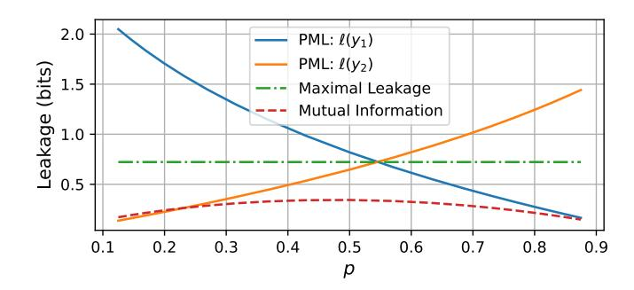
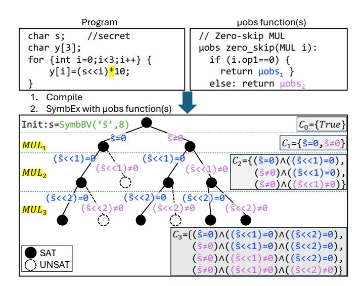
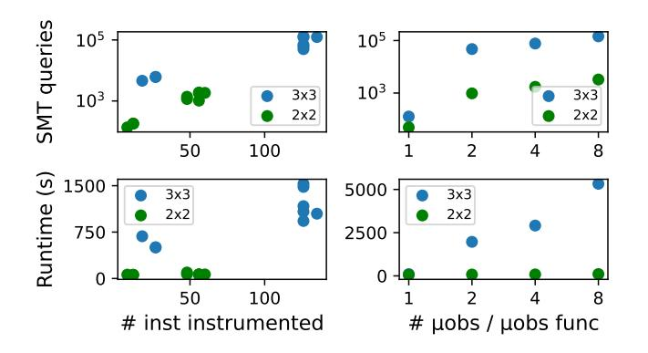

# Helium: Quantifying Microarchitectural Side-Channel Leakage with Probabilistic Guarantees

Samantha Archer *Stanford University* samanthaarcher@stanford.edu Mohammad Rahmani Fadiheh\* *LUBIS EDA; RPTU Kaiserslautern* mo.fadiheh@lubis-eda.com

Caroline Trippel *Stanford University* trippel@stanford.edu

*Abstract*—Constant-time programming ensures zero leakage of program secrets via hardware side channels by preventing secrets from being passed to unsafe instructions. However, as microarchitectures employ more data-dependent optimizations to boost performance, more instructions become unsafe, and constant-time code incurs high performance cost. A promising alternative is bounding leakage according to application-specific requirements, but principled methods for doing so remain elusive.

We present Helium, a three-part framework for quantifying hardware side-channel leakage of program secrets on specific microarchitectures. First, it leverages a new metric for expressing probabilistic privacy guarantees. Second, it employs a novel formalism for encoding how arbitrary hardware side channels give rise to attacker observations. Third, it provides two analysis techniques—symbolic (precise) and simulation (conservatively approximate)—to determine whether high-leakage observations occur with sufficiently low probability for a given victim program, secret input, microarchitecture, and attacker model.

Through four case studies spanning cryptographic and image processing applications, Helium demonstrates the necessity of considering both program and microarchitecture when assessing security-performance trade-offs. In one case, improved performance does not imply worse security; in another, accepting small leakage risk enables significant performance overhead reduction compared to a recent zero-leakage software side-channel defense.

*Index Terms*—hardware side channels, leakage quantification

# I. INTRODUCTION

Microarchitects are increasingly employing data-dependent optimizations to improve hardware performance [\[81\]](#page-14-0). Common examples include computation simplification [\[10\]](#page-13-0), [\[43\]](#page-13-1), [\[46\]](#page-14-1), [\[52\]](#page-14-2), [\[97\]](#page-15-0), pipeline and register file compression [\[22\]](#page-13-2), [\[42\]](#page-13-3), silent stores [\[63\]](#page-14-3), computation reuse [\[53\]](#page-14-4), value prediction [\[74\]](#page-14-5), and data memory-dependent prefetching [\[28\]](#page-13-4), [\[90\]](#page-15-1). Such optimizations can cause victim programs to create data-dependent hardware resource usage, which attackers may observe (e.g., via effects on execution time) to infer data values, giving rise to *hardware side-channel attacks*.

The standard approach to defend secret-processing code from side-channel attacks is *constant-time (CT) programming*, which avoids passing secrets to the unsafe ("leaky") operands of instructions that create operand-dependent hardware resource usage [\[5\]](#page-13-5), [\[6\]](#page-13-6), [\[26\]](#page-13-7), [\[35\]](#page-13-8), [\[50\]](#page-14-6), [\[76\]](#page-14-7). Historically, unsafe operands were limited to memory addresses, branch operands, and the operands of few variable-time arithmetic instructions (e.g., division [\[7\]](#page-13-9)). Today, the proliferation of data-dependent

\*Work done while at Stanford.

hardware optimizations threatens to render all instruction operands unsafe, making CT programming impossible [\[81\]](#page-14-0).

Two strategies have emerged to salvage programs' ability to prevent secret-data-dependent hardware resource usage on modern hardware. The hardware strategy relies on ISA extensions that disable data-dependent optimizations via hardware modes (Arm DIT [\[2\]](#page-13-10), Intel DOIT [\[1\]](#page-13-11)) or dedicated safe instructions (RISC-V Zkt/Zkvt [\[51\]](#page-14-8)). Hardware modes, dominant in commercial hardware, are coarse-grained: once enabled from user (DIT) or kernel (DOIT) mode, they affect all instructions regardless of operand secrecy. While the current overhead of DOIT in particular has been deemed acceptable [\[8\]](#page-13-12), Intel has warned that its performance impact may be "significantly higher on future processors" [\[30\]](#page-13-13). That is, as microarchitectures incorporate more data-dependent optimizations, the performance cost of coarsely disabling them is unknown and potentially large. The software strategy offers finer-grained control by ensuring that secret operands to unsafe instructions do not trigger data-dependent hardware behavior [\[18\]](#page-13-14), [\[35\]](#page-13-8), [\[37\]](#page-13-15), [\[95\]](#page-15-2). Yet, this approach requires safe instructions to transform secret operand values, making it less effective as the set of safe instructions shrinks, and still incurs high overhead (up to 28× from a recent approach [\[37\]](#page-13-15)).

Rather than pursuing zero leakage through CT programming, bounding leakage offers compelling performance benefits [\[34\]](#page-13-16), [\[101\]](#page-15-3) and aligns with threat models that require negligible leakage [\[17\]](#page-13-17). Bounding leakage requires a metric for quantifying leakage and a method for computing it given a victim program, secret input, microarchitecture, and attacker model. Prior work uses information-theoretic metrics to relate secret input distributions to attacker observation distributions. In particular, mutual information [\[13\]](#page-13-18), [\[31\]](#page-13-19), [\[93\]](#page-15-4), [\[98\]](#page-15-5) and maximal leakage [\[34\]](#page-13-16), [\[54\]](#page-14-9), [\[94\]](#page-15-6) have been used to quantify the average leakage of a secret across attacker observations. However, these averaging metrics mask low-probability, highleakage events, failing to provide probabilistic bounds that security practitioners require. Prior work computes these metrics using bespoke side-channel models that are not easily adapted to new channels and software analysis tailored to specific side channels [\[13\]](#page-13-18), [\[27\]](#page-13-20), [\[34\]](#page-13-16), [\[36\]](#page-13-21), [\[68\]](#page-14-10), [\[93\]](#page-15-4), [\[98\]](#page-15-5).

# <span id="page-0-0"></span>*A. This Paper*

We present Helium, a framework for quantifying the risk of hardware side-channel leakage for arbitrary combinations of a

```
// Zero-skip optimization: MUL instruction i exhibits a fast µobs (µobs1)
if either operand is zero or a slow µobs (µobs2) otherwise.
µobs zero_skip(MUL i) :
 if(i.op1 == 0 ∨ i.op2 == 0) : return µobs1
 else : return µobs2
```

Fig. 1: Multiply instruction i can exhibit two different observable execution paths, µobs<sup>1</sup> or µobs2, as a function of its operands.

victim program, secret input, and microarchitecture, assuming an attacker that observes victim instructions' precise hardware resource usage in time and space. Helium resolves limitations of prior work by adopting: a new information-theoretic metric, called *pointwise maximal leakage* (PML) [\[79\]](#page-14-11), to express probabilistic guarantees on hardware side-channel leakage; *microarchitectural observation (*µ*obs) functions* to model how hardware side channels create instruction-level attacker observations; and *Tracer* to derive program-level attacker observation distributions using µobs functions.

*PML:* Unlike averaging metrics, PML quantifies leakage per attacker observation and enables expressing privacy guarantees as statistical properties of the leakage distribution across all attacker observations of a victim program's execution. To our knowledge, we are the first to apply PML to reason about side channels. We show how the *tail-bound guarantee* [\[79\]](#page-14-11), which expresses that high-leakage observations occur with low probability for user-selected thresholds, is especially useful for navigating side-channel security-performance trade-offs. For example, consider the zero-skip optimization, which allows arithmetic and bitwise logical instructions to "skip" execution when at least one operand is zero [\[10\]](#page-13-0), [\[52\]](#page-14-2), [\[53\]](#page-14-4), [\[97\]](#page-15-0). An attacker that observes a fast execution learns that at least one operand is zero; a slow execution reveals both operands are non-zero. Intuitively, fast executions leak substantially more information. Using PML, Helium determines whether highleakage observations occur with sufficiently low probability for a program to be deemed secure.

µ*obs functions:* Recent work shows that operanddependent hardware resource usage manifests as microarchitectural execution variability for the same (our focus, [§III-A\)](#page-2-0) or different instructions [\[48\]](#page-14-12). Based on this insight, Helium's µobs functions are a unifying formalism for succinctly encoding how different observable microarchitectural executions of an instruction, called µobs, arise as a function of one or more unsafe instruction operands due to one or more optimizations. Helium's µobs functions bear similarities to other side-channel models proposed for leakage detection [\[14\]](#page-13-22), [\[48\]](#page-14-12), [\[81\]](#page-14-0), but are more abstract, capturing minimal hardware information for leakage quantification. Fig. [1](#page-1-0) shows a µobs function for a multiply instruction impacted by the zero-skip optimization, which outputs a fast or slow µobs as a function of its operands.

*Tracer:* As a victim program executes, instructions interact with hardware side channels, exposing µobs as described by µobs functions. We call the resulting sequence of instruction-level µobs across a full program a *microarchitectural observation trace* (µtrace). We consider a strong attacker model, where the attacker can observe complete µtraces; weaker attackers may observe some non-identity function of µtraces, e.g., their execution latency ([§VIII\)](#page-11-0). Computing PML requires the distribution of program-level attacker observations given the secret input distribution. The distribution of attacker observations emerges hierarchically: the program's semantics determine the distribution of individual instruction operands; these operand distributions induce the probabilities of instruction-level µobs; and, in turn, the µobs probabilities compose to form the probabilities of the full µtraces.

Helium provides Tracer, comprised of two approaches *TracerSym* and *TracerSim*, for automatically computing the µtrace probability distributions given a victim program, secret input distribution, and set of µobs functions. TracerSym uses symbolic execution and model counting to determine exactly how many secret inputs map to each µtrace. TracerSim is a scalable alternative using Monte Carlo simulation and conservative statistical bounds to approximate µtrace probabilities. While symbolic and simulation-based techniques are standard for side-channel analysis [\[13\]](#page-13-18), [\[14\]](#page-13-22), [\[20\]](#page-13-23), [\[23\]](#page-13-24), [\[34\]](#page-13-16), [\[56\]](#page-14-13), [\[78\]](#page-14-14), [\[80\]](#page-14-15), [\[89\]](#page-15-7), [\[91\]](#page-15-8), [\[93\]](#page-15-4), [\[98\]](#page-15-5), Helium uniquely applies them to enable probabilistic side-channel leakage quantification.

Through four case studies spanning cryptographic [\[33\]](#page-13-25) and pixel-processing applications [\[38\]](#page-13-26), we assess Helium's scalability and show how Helium enables hardware and software designers to reason intuitively about the security-performance trade-offs of high-overhead side-channel mitigations.

In summary, Helium[1](#page-1-1)[2](#page-1-2) makes the following contributions:

- 1) Probabilistic Side-Channel Security: We adopt PML as a metric for quantifying hardware side-channel leakage, which enables bounding the probability of high-leakage attacker observations via the tail-bound guarantee.
- 2) µobs Functions: We introduce a formalism to encode how arbitrary hardware side channels map instruction operands to instruction-level attacker observations. Unlike prior side-channel models ([§IX\)](#page-12-0), µobs functions are designed specifically for leakage quantification.
- 3) Tracer: We provide symbolic and simulation-based analyses similar to prior work ([§IX\)](#page-12-0), but tailored to automatically compute program-level attacker observation distributions given a victim program and a set of µobs functions modeling a microarchitecture.
- 4) Case Studies: We use Helium to compute tail-bound guarantees for security-critical programs across microarchitectures modeled by different µobs functions. In one case, tolerating a 0.0003 probability of exceeding 0.0004 bits of leakage enables avoiding 2.31× overhead from a state-of-the-art software side-channel defense [\[37\]](#page-13-15).

#### II. BACKGROUND

This section gives background on side-channel attacks ([§II-A\)](#page-2-1), microarchitectural execution variability ([§II-B\)](#page-2-2), and information-theoretic leakage metrics from prior work ([§II-C\)](#page-2-3).

<span id="page-1-1"></span><sup>1</sup>Helium is used as a high-precision "tracer gas" to detect and locate leaks in underground pipes.

<span id="page-1-2"></span><sup>2</sup>https://github.com/samanthaarcher0/Helium-Artifact

#### <span id="page-2-1"></span>A. Hardware Side-Channel Attacks

Hardware side-channel attacks are often described using a telecommunications analogy [57]: a *transmitter* (an unsafe instruction in the victim program) modulates a channel (a hardware resource) in an operand-dependent manner. A *receiver* (the attacker) observes the channel modulation to infer the operand value. Channel modulations manifest as microarchitectural execution variability for one or more instructions, called *transponders* [48]. So, a receiver ultimately observes channel modulations by measuring physical aspects of a transponder's execution, e.g., its execution time [15], [44], [72], resource contention [3], [4], [49], [64], power consumption [21], [40], [58], [67], [92], and more [7], [9], [11], [39], [41], [47], [77].

Prior work classifies types of transmitters based on their microarchitectural behavior relative to transponders [48]. *Intrinsic transmitters* (our focus, §III-A) create execution variability for themselves, i.e., they are also transponders. For example, an arithmetic instruction impacted by a zero-skip optimization creates operand-dependent execution variability for itself by residing in a functional unit for either zero or nonzero consecutive cycles (Fig. 1, §I-A). Other transmitter types create execution variability for different dynamic instructions. For example, a store (transmitter) in the store buffer creates address-dependent variability for a load (transponder) that gets its data via store buffer forwarding or the L1 cache. Note, a transmitter can have multiple types.

#### <span id="page-2-2"></span>B. Characterizing Transmitter-Transponder Interactions

Recent work proposes SynthLC, an approach and tool based on formal model checking for automatically synthesizing a complete set of *leakage function* signatures from a SystemVerilog processor design [48]. Leakage functions characterize individual instances of a transponder's microarchitectural execution variability as a function of transmitter operands. Each variability instance is defined as a tuple: (*source*, {destination}), with one source control-flow state and a set of destination control-flow states, where a control-flow state is like a pipeline stage but finer-grained. During its execution, a transponder in the source control-flow state proceeds in the next cycle to exactly one of the control-flow states in the destination set.

A leakage function defines how transmitter operand values cause a transponder in the source to proceed to each of the destinations. SynthLC constructs the signature of a leakage function from RTL, identifying the source, destination set, transmitter operands, and microarchitectural state that impact the variability. SynthLC does not uncover the exact function mapping, but we expect it can be extended to do so, e.g., by leveraging symbolic simulation [55], [66] and model checking.

#### <span id="page-2-3"></span>C. Quantifying Hardware Side-Channel Leakage

Quantifying hardware side-channel leakage requires a metric to relate a victim program's secret input<sup>3</sup> distribution to an

<span id="page-2-5"></span>

| Entropy            | $H(Y) = -\sum_{y \in Y} P_Y(y) \log P_Y(y)$                                          |
|--------------------|--------------------------------------------------------------------------------------|
| Mutual information | $I(X;Y) = \sum_{x \in X, y \in Y} P_{XY}(x,y) \log \frac{P_{XY}(x,y)}{P_X(x)P_Y(y)}$ |
| Maximal leakage    | $L(X \to Y) = \log \sum_{y \in Y} \max_{x \in X} P_{Y X=x}(y)$                       |

TABLE I: Information-theoretic leakage metrics.

attacker observation distribution. Prior work uses information-theoretic metrics: Shannon entropy [68], [75], [80], [101], mutual information [13], [31], [93], [98], and maximal leakage [34], [54], [94]. Table I shows their equations, where discrete random variables X and Y represent the secret and attacker observations, respectively.

Shannon entropy denotes the average information of a random variable and is used in prior work to quantify the information across an attacker's observations. Because the observation space may depend on public or random inputs in addition to the secret, entropy cannot attribute the information in an attacker's observation to the secret input, except when a channel is deterministic with respect to the secret.

Mutual information has been used to quantify the average information leaked about a secret, X, through an attacker's observations, Y. Mutual information measures the average shared information between the secret and observation spaces for both deterministic and non-deterministic channels; in the former case, it is equal to the entropy of Y.

Maximal leakage measures the multiplicative gain of the attacker's probability of guessing a secret X given a side-channel observation Y. Specifically, maximal leakage is the average increase in the attacker's ability to guess a secret across Y for the worst-case input distribution X.

#### III. THREAT MODEL AND HELIUM OVERVIEW

This section summarizes our threat model (§III-A) and gives a broad overview of the Helium framework (§III-B).

#### <span id="page-2-0"></span>A. Threat Model

We assume that the receiver (attacker) observes each victim instruction's exact *microarchitectural execution path*, defined as a cycle-accurate partial order on the state updates the instruction induces during its execution [48]. This attacker model captures a range of attackers, including passive attackers that monitor victim instruction execution time and active attackers that contend with victim instructions for shared hardware resources [19], [34], [81], [87]. We model side-channel modulations as deterministic functions of transmitter operands to conservatively capture noise-free attacker observations; we discuss extending Helium to analyze non-deterministic (probabilistic) channels in §VIII. Although Helium conservatively considers a very powerful attacker by default, its fine-grained observation distribution can be post-processed to compute leakage for weaker attackers (§VIII).

Helium quantifies leakage due to intrinsic transmitters (§II-A), including arithmetic instructions that have been historically considered safe and thus used to process secrets in

<span id="page-2-4"></span><sup>&</sup>lt;sup>3</sup>Multiple secret inputs can be modeled as one large secret. Thus, we refer to a single secret input throughout this paper.

CT code. This focus is motivated by two considerations. First, arithmetic is ubiquitous in computations over secret data, making such optimizations both prone to leak and high cost when mitigating. Second, these transmitters are the focus of recent software mitigations that eliminate leakage for traditionally CT programs running on hardware with novel data-dependent optimizations [\[37\]](#page-13-15). These high-overhead mitigations motivate the need for principled evaluation of performance-security trade-offs. In [§VIII,](#page-11-0) we discuss how Helium can be extended to quantify leakage for other transmitter types.

We design Helium to quantify non-speculative hardware side-channel leakage. Speculative execution attacks require a distinct class of mitigations [\[24\]](#page-13-38), [\[25\]](#page-13-39), [\[96\]](#page-15-11). This scope is consistent with prior work on leakage quantification [\[13\]](#page-13-18), [\[34\]](#page-13-16), [\[36\]](#page-13-21), [\[93\]](#page-15-4), [\[98\]](#page-15-5) and recent software mitigations intended to protect against optimizations that introduce transmitters beyond the set assumed by traditional CT programs [\[37\]](#page-13-15).

#### <span id="page-3-0"></span>*B. Helium Overview*

We propose Helium, a three-part framework for quantifying the risk that a victim program leaks its secret input via hardware side channels when it runs on a given microarchitecture.

*Pointwise Maximal Leakage ([§IV\)](#page-3-1):* Helium adopts PML [\[79\]](#page-14-11), a leakage metric that enables defining probabilistic privacy guarantees of the form "observations that leak more than ϵ bits occur with probability less than δ." Prior metrics average leakage across observations ([§II-C\)](#page-2-3), masking highleakage events rather than bounding their probability. PML authors identify side-channel leakage as a potential application of the metric, but we are the first to apply it to reason about full-program leakage due to arbitrary side channels.

*Microarchitectural Observation Functions ([§V\)](#page-5-0):* Computing PML requires deriving the attacker observation distribution for a victim program running on a microarchitecture. Helium derives this distribution at the instruction-level using µobs functions, each of which defines how a transponder exhibits observably-distinct executions (µobs) as a function of one or more transmitter operands. For intrinsic transmitters (i.e., also transponders), a µobs function maps an instruction's own operands to its observable executions, such as a multiply's operands resulting in fast or slow µobs due to a zero-skip optimization in Fig. [1.](#page-1-0) Helium's µobs function abstraction is sufficient to model any timing side channel, including those that arise due to resource contention. Prior works in leakage quantification model specific channels using bespoke formalisms (e.g., for caches [\[13\]](#page-13-18), [\[27\]](#page-13-20), [\[34\]](#page-13-16), [\[36\]](#page-13-21), [\[60\]](#page-14-27), [\[68\]](#page-14-10), [\[98\]](#page-15-5) and/or control flow [\[13\]](#page-13-18), [\[36\]](#page-13-21), [\[80\]](#page-14-15), [\[98\]](#page-15-5)) that neither compose to capture multiple side channels nor generalize to new channels that we consider in [§VII.](#page-8-0)

*Program-Level Observation Analyses ([§VI\)](#page-5-1):* Computing program-level leakage requires deriving the program-level observation distribution, which is determined both by the program's semantics and the attacker's instruction-level observations. The interaction between these two factors can result in instructions ultimately exposing overlapping, disjoint, or even no portions of a secret. Prior instruction-level analyses

<span id="page-3-3"></span>

| Optimization 1       | Optimization 2       |  |  |
|----------------------|----------------------|--|--|
| if x[0] == 1:        | if x == 0:           |  |  |
| attacker observes y1 | attacker observes y1 |  |  |
| else:                | else:                |  |  |
| attacker observes y2 | attacker observes y2 |  |  |

Fig. 2: Two optimizations, each with two attacker observations, y<sup>1</sup> and y2, that leak a function of a secret input x ∈ X.

fail to capture overlapping per-instruction leakage and thus overestimate full program leakage [\[13\]](#page-13-18), [\[14\]](#page-13-22). Prior programlevel analyses avoid this pitfall but are co-designed with specific side-channel models, focusing on only cache and controlflow side channels [\[36\]](#page-13-21), [\[60\]](#page-14-27), [\[93\]](#page-15-4), [\[98\]](#page-15-5). Helium provides two complementary, general-purpose methods for determining the distribution of program-level observations.

#### <span id="page-3-1"></span>IV. POINTWISE MAXIMAL LEAKAGE: DEFINING PROBABILISTIC SIDE-CHANNEL PRIVACY GUARANTEES

We first show how existing leakage metrics may underestimate leakage ([§IV-A\)](#page-3-2). We then introduce PML ([§IV-B\)](#page-4-0), a metric that resolves this issue by capturing the leakage of individual observations, and compare it with prior metrics for a binary channel ([§IV-C\)](#page-4-1). Lastly, we discuss how PML enables probabilistic privacy guarantees for side channels ([§IV-D\)](#page-4-2).

#### <span id="page-3-2"></span>*A. Pitfalls of Averaging Leakage Metrics*

For quantitative leakage metrics to be useful, they must be both conservative and intuitive. We find that prior metrics do not fit these criteria. We illustrate this using the two most common metrics, mutual information and maximal leakage, to quantify the leakage of a single intrinsic transmitter ([§II-A\)](#page-2-1).

Assume X is a uniformly distributed 32-bit secret that is passed to an unsafe operand of an intrinsic transmitter, which exhibits observable microarchitectural execution variability as a function of this operand. The variability arises due to one of the optimizations shown in Fig. [2.](#page-3-3) The first exposes observations y<sup>1</sup> or y<sup>2</sup> depending on the operand's least significant bit. Thus, both observations leak one bit for every x ∈ X. The second exposes observation y<sup>1</sup> if the operand is zero and y<sup>2</sup> if it is non-zero. Thus, y<sup>1</sup> leaks all 32 bits of x ∈ X if x = 0, while y<sup>2</sup> leaks very little information, namely that x ̸= 0.

Table [II](#page-4-3) reports the mutual information and maximal leakage of X via each transmitter (one per optimization), where Y contains observations y<sup>1</sup> and y2, distributed according to the optimizations in Fig. [2.](#page-3-3)

Optimization 1 has mutual information of one, as exactly one bit of x ∈ X leaks for both observations y<sup>1</sup> and y2. Optimization 2 has small mutual information, because the probability of y1, i.e., the highly leaky observation, is small for a uniformly distributed X. As a result, prior work has shown that mutual information severely underestimates leakage [\[62\]](#page-14-28), [\[94\]](#page-15-6), as it masks the highly leaky observation, y1.

Both optimizations have a maximal leakage of one. Since the conditional probability is the same for both optimizations (because the channels are deterministic), the maximal leakage is log of the number of observations. Maximal leakage does

<span id="page-4-3"></span>

|                    | Optimization 1 | Optimization 2        |
|--------------------|----------------|-----------------------|
| Mutual information | 1              | $7.786 \cdot 10^{-9}$ |
| Maximal leakage    | 1              | 1                     |

TABLE II: Mutual information and maximal leakage of optimizations in Fig. 2, assuming X is a uniformly distributed 32-bit integer.

not distinguish between channels with different input distributions, so these optimizations with seemingly different leakage behavior counterintuitively have the same maximal leakage.

Both metrics provide an average leakage across all observations. Neither mutual information nor maximal leakage capture the leakage of individual observations in Optimization 2, where one observation,  $y_1$ , leaks a lot with low probability, and the other,  $y_2$ , leaks a small amount with high probability.

#### <span id="page-4-0"></span>B. A Better Leakage Metric: Pointwise Maximal Leakage

We define a leakage metric as conservative and intuitive based on what security practitioners require: the ability to distinguish between high- and low-leakage observations and characterize their probabilities. We find that pointwise maximal leakage (PML) [79], a recently proposed information-theoretic metric, satisfies this requirement.

PML quantifies the leakage of individual attacker observations and is defined as the maximum multiplicative gain of an attacker's ability to guess the secret  $x \in X$  given a single observation  $y \in Y$  [79]:

$$\ell_{P_{XY}}(X \to y) = \log \max_{x: P_X(x) > 0} \frac{P_{X|Y=y}(x)}{P_X(x)}$$

Instead of measuring the average leakage across observations like mutual information and maximal leakage, PML computes the leakage of a single observation  $y \in Y$ . We abbreviate  $\ell_{P_{XY}}(X \to y)$  to  $\ell(y)$ .

Referring back to Optimization 2 in Fig. 2, since X is uniformly distributed,  $\forall x \in X : P_X(x) = \frac{1}{2^{32}}$ . So, the PML of observation  $y_1$  is:

$$\ell(y_1) = \log \frac{1}{\frac{1}{2^{32}}} = 32$$

Intuitively, PML of 32 for  $y_1$  denotes that this observation leaks all 32 bits of the secret. The PML of  $y_2$  is:

$$\ell(y_2) = \log \frac{\frac{1}{2^{32} - 1}}{\frac{1}{2^{32}}} = 3.36 \cdot 10^{-10}$$

This small PML indicates that  $y_2$  leaks little information about the secret (only that  $x \neq 0$ ).

#### <span id="page-4-1"></span>C. Comparison of Metrics

We compare PML with mutual information and maximal leakage for a binary channel, e.g., an intrinsic transmitter that exhibits one of two observably distinct microarchitectural executions (§II-A). Assume the secret input to the transmitter, X, is a binary random variable, where P(X=0)=p and P(X=1)=1-p. The attacker observation space is a binary random variable, Y, containing two observations,  $y_1$  and  $y_2$ .

Fig. 3 plots mutual information, maximal leakage, and PML across different input distributions, i.e., for different values of p. Comparing the first two metrics, we make two observations.

<span id="page-4-4"></span>

Fig. 3: Comparison of leakage metrics for a binary channel with two observations,  $y_1$  and  $y_2$ , input probabilities: P(X=0)=p and P(X=1)=1-p, and arbitrary conditional probabilities:  $P(Y=y_1|X=0)=0.75$  and  $P(Y=y_1|X=1)=0.9$ .

First, maximal leakage is clearly an upper bound on mutual information, which is why prior work uses maximal leakage as a more conservative metric [34], [94]. Second, maximal leakage remains constant across different values of p. It only depends on the channel, i.e. the conditional probability distribution of observations, independent of the input distribution. Prior work cites this as a benefit, because maximal leakage may be easier to compute [34], but it prevents maximal leakage from distinguishing leakage scenarios (e.g., different instances of an intrinsic transmitter) with different input distributions.

Now, consider the PML of observations  $y_1$  and  $y_2$ . Each observation's PML can be much higher/lower than the maximal leakage and mutual information. Since both mutual information and maximal leakage fail to capture the leakage behavior of individual observations, they over- and underestimate per- observation leakage for nearly all values of p. PML robustly captures the full distribution of information leakage. Fig. 3 showcases PML's generality: it can precisely quantify leakage of individual observations under arbitrary secret input distributions and deterministic or non-deterministic side channels.

#### <span id="page-4-2"></span>D. Tail-bound Privacy Guarantee

Since the attacker observation space, Y, is a random variable with distribution  $P_Y$ , and PML is a function of y, PML can be viewed as a random variable whose distribution is induced by  $P_Y$  [79]. This critically allows us to regard privacy guarantees as statistical properties of PML. In particular, the *tail-bound guarantee* requires that the probability of PML being less than a user-defined threshold  $\epsilon$  is at least  $1 - \delta$  [79]:

$$P_Y[\ell(Y) \le \epsilon] \ge 1 - \delta$$

In other words, the likelihood of observing outcomes where PML exceeds  $\epsilon$  must be less than  $\delta$ , partitioning observations as "good" (i.e., low PML) or "bad" (i.e., high PML).

Compared to prior metrics, we expect the tail-bound guarantee to better align with how security practitioners reason about security: programs must leak very little with very high probability. Nevertheless, regarding leakage as a distribution rather than a single aggregate value (e.g., average) gives the programmer flexibility to choose from a variety of security guarantees depending on their application's requirements.

```
// Zero/All-ones-skip optimization: If either operand of a bitwise AND
instruction i is zero or all ones, \muobs<sub>1</sub> occurs, else \muobs<sub>2</sub> occurs.
\muobs zero_all_ones_skip(AND i) :
 if(i.op1 == 0 \lor i.op2 == 0 \lor i.op1 == 0 xFF...F \lor
  i.op2 == 0xFF...F) : return \muobs<sub>1</sub>
 else : return \muobs<sub>2</sub>
// Zero/One-skip optimization: If either operand of a multiply instruction
i is zero or one, \muobs<sub>1</sub> occurs, else \muobs<sub>2</sub> occurs.
\muobs zero_one_skip(MUL i) :
 if(i.op1 == 0 \lor i.op2 == 0 \lor i.op1 == 1 \lor i.op2 == 1) :
   return \muobs<sub>1</sub>
 else : return \muobs_2
// Digit-Serial optimization: Multiply instruction i exhibits 4 \muobs depend-
ing on the upper-most bytes of operand 2 being zero.
\muobs digit_serial(MUL i) :
 if(i.op2[8:31] == 0) : return \ \mu obs_1
 if (i.op2[16:31] == 0): return \muobs<sub>2</sub>
 if(i.op2[24:31] == 0) : return \mu obs_3
 else : return \muobs<sub>4</sub>
// Bit-Serial optimization: Division instruction i exhibits 65 \muobs depend-
ing on the difference in the two operands' number of leading zeros.
\muobs bit_serial(DIV i) :
 if (i.op2 == 0 \lor (i.op1 < i.op2)) : return \mu obs_1
 else:
   for d in range(64):
    if((i.op1 >> d) \ge i.op2) \land ((i.op1 >> (d+1)) < i.op2) :
      return \muobs_{d+2}
```

Fig. 4:  $\mu$ obs functions for computation simplification optimizations, including variants of zero-skip optimizations, digit-serial multiplication, and bit-serial division [99].

# <span id="page-5-0"></span>V. $\mu$ OBS FUNCTIONS: MODELING RECEIVER OBSERVATIONS OF SIDE-CHANNEL MODULATIONS

Quantifying side-channel leakage with any metric, including PML, requires modeling how secret data give rise to different attacker observations. To enable this, Helium uses  $\mu$ obs functions to model instruction-level attacker observations. A  $\mu$ obs function maps the unsafe operands of one or more transmitters to the distinct observable microarchitectural executions (i.e.,  $\mu$ obs) of a single transponder. Given our focus on intrinsic transmitters (§III-A),  $\mu$ obs functions in this paper map one transmitter's unsafe operands to its own distinct  $\mu$ obs.

Helium's  $\mu$ obs functions build on leakage functions from recent work [48], which encode distinct instances of microarchitectural execution variability for a transponder (§II-B). A transponder's  $\mu$ obs function is constructed by merging its set of leakage functions, i.e., all instances of its transmitter-operand-dependent execution variability, into one abstracted  $\mu$ obs function. The outputs,  $\mu$ obs, of the  $\mu$ obs function are a transponder's end-to-end microarchitectural execution paths.

Fig. 4 illustrates four  $\mu$ obs functions. Each of these  $\mu$ obs functions encodes (and is named for) one optimization that creates distinct  $\mu$ obs for a single transponder. Each transponder has exactly one  $\mu$ obs function, which captures all of its  $\mu$ obs. The first two functions model computation simplification optimizations [81], like zero-skip in Fig. 1. A transponder exhibits  $\mu$ obs<sub>1</sub> (a "fast path") or  $\mu$ obs<sub>2</sub> (a "slow path") when either of its operands is  $\in \{0,0xFF...F\}$  (first) or  $\in \{0,1\}$  (second). The third function models a multiply transponder impacted

by a digit-serial optimization [43], [46], which takes a variable number of cycles to execute depending on the uppermost bytes of the multiplier operand, yielding four distinct  $\mu$ obs. Finally, the fourth function models a division transponder executing on a bit-serial division unit [99] with 65 possible  $\mu$ obs.

Helium's  $\mu$ obs functions have several advantages. First, they succinctly encode transponders' distinct  $\mu$ obs as a function of transmitters' operands, while abstracting away microarchitectural details irrelevant to leakage analysis. Importantly, this enables rigorous security analysis early in the hardware design cycle to assess whether hardware meets important programs' security requirements and explore security-performance tradeoffs for novel microarchitectural optimizations. Second, they generalize across mechanisms for observing transponder execution behavior. That is, a  $\mu$ obs function can describe a transponder's distinct microarchitectural execution paths (our focus, §III-A), end-to-end latency, or other measurable execution properties (e.g., power [92]) as a function of transmitters' operands. Third, a  $\mu$ obs function defines a set of constraint formulas over transmitters' operands, with each formula corresponding to one  $\mu$ obs. For example, for the first  $\mu$ obs function in Fig. 4,  $f_{AND}^{\mu obs}$  is a set of constraints where each constraint corresponds to an individual  $\mu$ obs for an AND instruction:

```
f'_{AND} = \{i.op1 = 0 \lor i.op2 = 0 \lor i.op1 = 0 xFF...F \lor i.op2 = 0 xFF...F, i.op1 \neq 0 \land i.op2 \neq 0 \land i.op1 \neq 0 xFF...F \land i.op2 \neq 0 xFF...F\}
As a result, they integrate naturally into software analysis of hardware side channels, shown in §VI.
```

# <span id="page-5-1"></span>VI. TRACER: DERIVING ATTACKER OBSERVATIONS OF PROGRAMS WITH $\mu$ OBS FUNCTIONS

To quantify side-channel leakage of a program's secret inputs when it runs on a microarchitecture (modeled by a set of  $\mu$ obs functions), Helium introduces Tracer (§VI-A). Tracer computes the probability distribution of program-level attacker observations, termed  $\mu$ traces, which are sequences of instruction-level  $\mu$ obs produced when the program runs due to  $\mu$ obs functions. Given Tracer's output, Helium derives parameters for PML tail-bound privacy guarantees (§VI-B).

#### <span id="page-5-3"></span>A. Computing Program-Level µtrace Distributions

Tracer features two methods for computing program-level  $\mu$ trace probability distributions: TracerSym (§VI-A1) and TracerSim (§VI-A2). Both accept as inputs: a binary program P, a list of P's secret inputs, and a set of  $\mu$ obs functions  $F = \{f_{xp_0}^{\mu obs}, f_{xp_1}^{\mu obs}, ...\}$ , where  $f_{xp_i}^{\mu obs}$  denotes the  $\mu$ obs function for a transponder (intrinsic transmitter, §III-A) with opcode  $xp_i$ . The following explanations of both Tracer variants assume P is the program in Fig. 5, which accepts one secret input s and runs on a microarchitecture with one  $\mu$ obs function,  $f_{MUL}^{\mu obs} = \{i.op1 = 0, i.op1 \neq 0\}$ .

<span id="page-5-4"></span>1) TracerSym: SymbEx and Model Counting Approach: TracerSym is an exact method for computing  $\mu$ trace probabilities using symbolic execution and model counting.

Symbolic execution runs a program with symbolic inputs, maintaining the symbolic state of execution. This state consists

<span id="page-6-0"></span>

Fig. 5: Helium's two approaches to compute the probability distribution of  $\mu$ traces. Top: TracerSym uses symbolic execution to generate symbolic  $\mu$ traces and model counting to compute the probability of each concrete  $\mu$ trace. Bottom: TracerSim uses simulation with inputs sampled from a user-specified distribution (uniformly random by default) to estimate the probability of concrete  $\mu$ traces. N is the number of Monte Carlo trials.

of a mapping of variables to symbolic expressions, known as a *symbolic store*, and a formula encoding the branch conditions of the control-flow path being explored, known as a *path constraint*. Upon reaching a conditional branch with symbolic operands, symbolic execution forks the symbolic state and explores each reachable control-flow path. The taken (not taken) path is reachable if the path constraint conjuncted with the branch condition (its negation) is satisfiable. Non-branches simply update the symbolic store.

TracerSym extends the symbolic state to incrementally build a set of symbolic  $\mu$ trace constraints that characterize all possible symbolic  $\mu$ traces, as shown in Fig. 6. Execution begins by initializing the secret input to P as a symbolic bitvector  $\hat{s}$  and defining an initial  $\mu$ trace constraint set  $C_0 = \{True\}$ . During symbolic execution, TracerSym incrementally generates a sequence of  $\mu$ trace constraint sets  $C_1, ... C_n$  per program control-flow path, where n is the number of dynamic secret-dependent transponders encountered along that path.

To do this, TracerSym intercepts transponders (multiplies in Fig. 6) during symbolic execution. Upon reaching the  $j^{th}$ secret-dependent transponder along a control-flow path, TracerSym retrieves its symbolic operand list,  $O_j$ , and constructs  $C_i$  by conjuncting each constraint in  $C_{i-1}$  with each constraint in the transponder's  $\mu$ obs function (i.e., each  $c \in f_{op(j)}^{\mu obs}$ ) evaluated over  $O_j$ . It then only includes the observable, i.e., satisfiable, resulting formulas (black nodes in Fig. 6) in  $C_j$ :  $C_j = \{\phi \land c(O_j) \mid (\phi, c) \in C_{j-1} \times f_{op(j)}^{\mu obs}, \mathrm{SAT}(\phi \land c(O_j))\}$ where  $C_{j-1} \times f^{\mu obs}_{op(j)}$  is the cross product of  $C_{j-1}$  and  $f_{op(j)}^{\mu obs}$ . Unsatisfiable formulas are discarded (white nodes in Fig. 6). Thus, each  $\phi \in C_j$  describes a partial observable symbolic  $\mu$ trace covering the first j dynamic transponders. When symbolic execution reaches the end of a control-flow path, TracerSym has produced a set of constraints  $C_n$ , where each  $\phi \in C_n$  is a complete symbolic  $\mu$ trace. In other words, a symbolic  $\mu$ trace is a formula that captures the set of secret input values that produce some concrete  $\mu$ trace, where a

concrete  $\mu$ trace is a concrete sequence of  $\mu$ obs.

<span id="page-6-1"></span>

Fig. 6: TracerSym executing a program with one control-flow path, assuming one  $\mu$ obs function for MUL transponders. Secret-dependent transponders are highlighted. TracerSym constructs a tree per control-flow path. The root denotes initializing the secret input and  $\mu$ trace constraint set  $C_0$ . Black (white) nodes denote partial reachable (unreachable)  $\mu$ traces, expressed as the conjunction of edge labels along the path from the root to the node. Black leaves denote complete  $\mu$ traces. Tree level j corresponds to the  $j^{th}$  dynamic secret-dependent transponder along a control-flow path. To construct level j, TracerSym separately conjuncts the partial  $\mu$ trace corresponding to each black node in tree level j-1 with each observation constraint from the  $j^{th}$  secret-dependent transponder's  $\mu$ obs function applied to its symbolic operands. Resulting formulas that are SAT (UNSAT) instantiate black (white) nodes in level j.  $C_j$  contains all reachable symbolic  $\mu$ traces in level j.

When symbolic execution reaches a symbolic control-flow divergence and forks the program's symbolic state, TracerSym forks the  $\mu$ trace constraint sets as part of the symbolic state. When symbolic execution finishes exploring a control-flow path, TracerSym conjuncts the path constraint with each  $\phi \in C_n$ . Thus, each  $\mu$ trace includes  $\mu$ obs function constraints and the symbolic execution path constraint. However, the programs considered in §VII do not have secret-dependent control flow, such that the symbolic path constraint is trivially satisfiable.

To compute  $\mu$ trace probabilities, TracerSym bit-blasts each symbolic  $\mu$ trace in  $C_n$  to yield a boolean SAT formula, which it model counts (i.e., counts the satisfying assignments of) to determine the number of concrete input values that produce the concrete  $\mu$ trace it describes [69], [83], [86]. Assuming a uniform distribution of the secret input, the probability of each concrete  $\mu$ trace is the model count result divided by the size of the input space,  $2^{|\hat{s}|}$ , as shown in Fig. 5.

Using model counting to compute  $\mu$ trace probabilities requires a uniform distribution over the symbolic input. This assumption often holds for security-critical inputs such as cryptographic keys. When program inputs follow a known, non-uniform distribution, Helium uses TracerSim to sample inputs from the desired distribution.

<span id="page-7-1"></span>2) TracerSim: Monte Carlo Simulation Approach: For some applications, symbolic execution and model counting are not tractable for computing leakage. For example, if an instruction's operand is the output of a cryptographic hash, an SMT solver would need to reason about a function designed to resist inversion. Although this is a limitation of symbolically executing cryptographic programs, as security researchers, we appreciate that cryptographic guarantees are strong.

Instead, TracerSim estimates probabilities of concrete  $\mu$ traces by executing P with random secret inputs for N trials, sampled from a user-provided distribution, as shown in Fig. 5. Using dynamic binary instrumentation, TracerSim records the dynamic transponder operand values at runtime to produce a concrete  $\mu$ trace per trial. It estimates  $\mu$ trace probabilities by dividing the frequency of each  $\mu$ trace by N.

# <span id="page-7-0"></span>B. Leakage Quantification

Using the  $\mu$ trace probability distribution output by Tracer, Helium computes PML for each observation by finding  $x \in X$  that maximizes  $\log \frac{P_{X|Y=y}(x)}{P_X(x)}$ . When considering deterministic  $\mu$ traces (due to our focus on deterministic channels, §III-A), the PML of an observation simplifies to:  $\ell(y) = -\log P_Y(y)$ .

PML allows defining a range of privacy guarantees [79]. Helium outputs tail-bound guarantees, which are most useful when high-probability observations leak little information, but low-probability observations leak a lot. Recall that tail-bound guarantees partition observations into two sets—those with PML below and above a threshold  $\epsilon$ —where the total probability of observations with PML above  $\epsilon$  must be at most  $\delta$  (§IV-D). For some program- $\mu$ obs function combinations, this partition arises naturally: one or a few  $\mu$ traces carry most of the probability mass (and therefore exhibit low leakage), while the remaining traces occur rarely and correspond to high leakage. We call this a "tolerable partition" of  $\mu$ traces.

When a tolerable partition exists, Helium selects the  $\mu$ trace with the lowest probability in the tolerable (low leakage) set. We call this the  $\epsilon$ - $\mu$ trace. Equivalently, the  $\epsilon$ - $\mu$ trace has the highest tolerable PML. Helium sets  $\epsilon$  to the PML of the  $\epsilon$ - $\mu$ trace. Thus, all other  $\mu$ traces in the tolerable set have PML less than  $\epsilon$ . Helium then computes  $1-\delta$  as the total probability of all tolerable  $\mu$ traces. Although there are infinitely many possible tail-bound guarantees, this novel construction yields

one that is particularly interpretable: the program leaks no more than a tolerable amount with probability  $1-\delta$ , where both  $\epsilon$  and  $\delta$  are relatively small. However, it is not guaranteed that such a partition, and thus a meaningful tail-bound guarantee, exists for all programs: every  $\mu$ trace may exhibit leakage exceeding what a programmer determines is tolerable.

Monte Carlo Sampling Error (TracerSim): While Tracer-Sim offers substantial scalability advantages over TracerSym by avoiding symbolic execution, Monte Carlo sampling can only estimate  $\mu$ trace probabilities. To account for sampling error, Helium defines tail-bound guarantees with an associated confidence level. TracerSim uses Clopper–Pearson confidence intervals [29] to produce conservative tail bound parameters,  $\epsilon$  and  $\delta$ . This requires two rounds of sampling, i.e., running TracerSim twice. As a result, TracerSim's tail-bound guarantees hold with a chosen confidence level (95% by default).

In round one, TracerSim runs  $N_1$  trials, and the empirical distribution is used to identify a tolerable leakage partition. Helium selects the  $\epsilon$ - $\mu$ trace from the tolerable partition and sets  $\epsilon$  to the PML of the Clopper–Pearson lower bound on the  $\epsilon$ - $\mu$ trace probability. Since smaller probabilities yield higher PML, this gives a conservative  $\epsilon$  that accounts for sampling error.  $\epsilon$  is then fixed to avoid selection bias in round two.

The second round runs  $N_2$  trials and classifies  $\mu$ traces by whether their PML exceeds  $\epsilon$ . We set  $1-\delta$  to the Clopper–Pearson lower bound on the total probability of  $\mu$ traces with PML below  $\epsilon$ , conservatively overestimating the mass above  $\epsilon$ . Thus, using 95% Clopper–Pearson intervals yields a 95% confidence that the tail-bound guarantee holds.

The two sample sizes may differ: larger  $N_1$  tightens the bound on  $\epsilon$ , while larger  $N_2$  tightens the bound on  $\delta$ . Thus, larger  $N_1$  and  $N_2$  produce more precise statistical guarantees at the cost of increased runtime. In practice, when all  $\mu$ traces have similar probabilities, small N suffices to demonstrate that all traces leak substantially, indicating mitigation is warranted. Larger N is useful for tightening bounds on rare, high-leakage  $\mu$ traces. In either round, if TracerSim observes only a single  $\mu$ trace, instead of using Clopper-Pearson, we apply the Rule of Three [45]: with 95% confidence, any unobserved event has probability less than  $\frac{3}{N}$ . Thus, TracerSim estimates the single observed  $\mu$ trace's probability as at least  $1-\frac{3}{N}$ , which is a tighter lower bound than provided by Clopper-Pearson.

#### <span id="page-7-2"></span>C. Practical Considerations: TracerSym vs. TracerSim

TracerSym computes the exact  $\mu$ trace distribution, yielding precise tail-bound guarantees. However, it inherits the well-known scalability limitations of symbolic execution: large programs can induce path explosion, and complex path constraints can quickly overwhelm the engine [12]. Further, TracerSym introduces additional constraints for each transponder. Consequently, TracerSym is practical when the number of  $\mu$ traces remains manageable and symbolic operand expressions stay tractable under the program's semantics. Its performance degrades when execution generates many  $\mu$ traces or operand expressions contain thousands to millions of clauses. For some workloads, especially cryptographic code, the resulting

SMT queries can become intractable, since solving them may amount to breaking the underlying cryptographic primitives.

TracerSim is applicable in cases where symbolic execution is infeasible, such as large programs and cryptographic workloads, demonstrated by the large programs evaluated in Case Study IV ([§VII-D\)](#page-10-0). TracerSim trades precision for scalability by producing conservative statistical guarantees. Beyond its scalability benefits, TracerSim supports arbitrary input distributions, offers the user a runtime-precision tradeoff via N<sup>1</sup> and N<sup>2</sup> tuning, and can be parallelized due to its independent Monte Carlo trials.

Helium is not intended to provide cryptographic proofs of security. In cases where symbolic execution is tractable, TracerSym can in principle compute leakage probabilities small enough for cryptographic security (≤ 2 <sup>−</sup>80). For TracerSim, sampling large enough N to obtain cryptographic guarantees is intractable, effectively amounting to brute-force search. Helium instead targets an impactful design space in which programmers are willing to sacrifice absolute security for performance. Helium enables principled navigation of securityperformance trade-offs with greater precision and more conservative guarantees than prior average leakage approaches ([§IX\)](#page-12-0).

#### <span id="page-8-0"></span>VII. CASE STUDIES: APPLYING HELIUM TO WEIGH SECURITY-PERFORMANCE TRADE-OFFS

We evaluate Helium through four case studies, which highlight the benefits and limitations of each approach. The first two ([§VII-A,](#page-8-1) [§VII-B\)](#page-9-0) demonstrate TracerSym in cases where it is feasible, including cryptographic code under certain circumstances and non-cryptographic programs, respectively. These two case studies produce privacy guarantees for two programs assuming two alternative µobs functions for multiply transponders. We show that no data-dependent hardware optimization is universally more or less secure than another for all programs. The third case study ([§VII-C\)](#page-9-1) evaluates the scalability of TracerSym. Lastly, the fourth case study ([§VII-D\)](#page-10-0) examines sets of µobs functions modeling computation simplification optimizations targeted by a recent zeroleakage software defense [\[37\]](#page-13-15). Helium uses TracerSim to evaluate the same programs as this prior work. We show that allowing a small probability of leakage can substantially reduce the defense's runtime overhead. This last case study demonstrates applicability and scalability to real-world reasoning about security-performance trade-offs.

For all experiments, we use Helium to compute leakage for a single random, public input value. It is not guaranteed that leakage remains conservative for all public input values; however, in some of the evaluated programs, it is in fact conservative, because the µtrace distribution is independent of public inputs ([§VII-A\)](#page-8-1). Identifying the public input that maximizes leakage—known as attack synthesis [\[59\]](#page-14-32), [\[73\]](#page-14-33), [\[75\]](#page-14-26)—requires quantifying leakage. A natural extension of our work is using Helium to drive attack synthesis ([§VIII\)](#page-11-0).

Helium's TracerSym implementation extends the Angr [\[85\]](#page-14-34) symbolic execution engine. It uses the Bitwuzla [\[69\]](#page-14-29) and CSB [\[84\]](#page-14-35) SMT solvers for constraint solving. For model

<span id="page-8-2"></span>

Fig. 7: Tail-bound guarantees of Poly1305 under two multiply optimizations. Each point defines (ϵ, δ), where ϵ is the PML of a µtrace and δ is the sum of probabilities of µtraces with PML > ϵ.

counting, Helium uses Ganak [\[83\]](#page-14-30), which guarantees correctness with configurable probability [\[83\]](#page-14-30). TracerSym uses a probability of 0.95. Empirically, Ganak's outputs are far more accurate than its theoretical guarantee: prior work reports it is correct on all of their 1650 benchmarks [\[83\]](#page-14-30). TracerSim is implemented with Intel Pin [\[65\]](#page-14-36) for dynamic binary instrumentation. The case studies were run on two compute nodes with two 32-core 2.9GHz Intel Xeon CPUs with 512GB RAM.

### <span id="page-8-1"></span>*A. Case Study I: Poly1305*

Our first case study examines Poly1305 (from Libsodium [\[33\]](#page-13-25)), a cryptographic message authentication code [\[16\]](#page-13-42), [\[70\]](#page-14-37). We quantify how much Poly1305 leaks about its 128-bit secret key when running on hardware implementing either a zero-skip or digit-serial multiplier. The zero-skip µobs function is modified from Fig. [1](#page-1-0) to only consider whether the second operand is zero. The digit-serial µobs function is modified from Fig. [4](#page-5-2) to accommodate 64-bit operands such that there are eight total observations. The secret is assumed to be uniformly distributed, and we compute the probability of each observation using TracerSym.

Fig. [7](#page-8-2) plots achievable (ϵ, δ) pairs, where the x-axis is the candidate ϵ value (PML of each µtrace) and the y-axis is the cumulative probability of observing leakage greater than ϵ. Thus, each point defines a valid tail-bound guarantee.

We first analyze Poly1305 with the zero-skip multiplier. Following [§VI-B,](#page-7-0) we select ϵ as the leftmost labeled point, corresponding to the PML of the least leaky µtrace (i.e., the case in which all secret-dependent multipliers are nonzero), and δ is the total probability of observations with PML greater than ϵ. The resulting tail-bound guarantee is:

$$P_Y[\ell(Y) \le 1.35 \cdot 10^{-9}] \ge 1 - 9.39 \cdot 10^{-10}$$

This shows that for a uniformly distributed key, Poly1305 leaks very little information with high probability when executing on hardware that implements a zero-skip multiplier.

We next consider leakage under the digit-serial multiplier. Again using TracerSym, we compute the PML of all µtraces and obtain the tail-bound guarantee:

$$P_Y[\ell(Y) \le 0.97] \ge 1 - .49$$

With probability nearly 0.5, Poly1305 running on hardware with a digit-serial multiplier leaks over 0.97 bits of the key.

<span id="page-9-3"></span>

| Optimization Runtime # SMT |     |        | Time per | # MC | Time per                               |  |
|----------------------------|-----|--------|----------|------|----------------------------------------|--|
|                            | (s) |        |          |      | queries SMT query queries MC query (s) |  |
| Case Study I (§VII-A)      |     |        |          |      |                                        |  |
| Zero-skip                  | 54  | 225    | 0.0012   | 8    | 2.1833                                 |  |
| Digit-serial               | 735 | 36,618 | 0.0011   | 660  | 0.1626                                 |  |
| Case Study II (§VII-B)     |     |        |          |      |                                        |  |
| Zero-skip                  | 20  | 99     | 0.0009   | 8    | 0.0071                                 |  |
| Digit-serial               | 19  | 10     | 0.0059   | 1    | 0.0099                                 |  |

TABLE III: Case Studies I & II runtime statistics. MC: model counting.

<span id="page-9-2"></span>

| Optimization | #µtraces | ϵ | δ | Tail-bound guarantee |
|--------------|----------|---|---|----------------------|
| Zero-skip    | 8        | 3 | 0 | P[ℓ(y) = 3] = 1      |
| Digit-serial | 1        | 0 | 0 | P[ℓ(y) = 0] = 1      |

TABLE IV: Tail-bound guarantees of a convolution SVG filter of 3 pixels across two different multiplication optimizations.

Reasoning about side-channel leakage probabilities under different hardware optimizations enables programmers to select mitigations accordingly. For example, zero-skip multiplication has extremely low leakage probability for Poly1305, so a programmer may choose to forgo expensive zero-leakage mitigations. Conversely, digit-serial multiplication yields a high leakage probability, so a Poly1305 implementation will likely require some degree of hardware or software mitigation.

#### <span id="page-9-0"></span>*B. Case Study II: SVG Convolution Filter*

Many domains beyond cryptography process confidential information. For example, web browsers must prevent untrusted JavaScript processes from inferring the values of rendered pixels. When rendering an SVG image, a browser first draws each element according to its attributes (color, position, size, etc.). If an SVG filter is specified, the browser applies the filter to the rendered element before displaying the result. Prior work shows that control-flow, cache, and subnormal floating point side channels can allow malicious web pages to exploit SVG filters to recover pixel data [\[61\]](#page-14-38), [\[62\]](#page-14-28), [\[71\]](#page-14-39), [\[82\]](#page-14-40), [\[88\]](#page-15-14). This case study is modeled after these attacks, which isolate individual pixels of interest and then apply attacker-chosen SVG filters to leak the pixel value.

We analyze Firefox's [\[38\]](#page-13-26) convolution SVG filter under the same two multiplication µobs functions from [§VII-A](#page-8-1) to illustrate the importance of program-specific reasoning about the leakage of data-dependent optimizations. We assume that the program's secret input is three pixels and that each pixel is black or white with equal probability. Thus, the secret is exactly three bits, where each bit indicates whether the pixel is black or white. Prior work shows how to isolate a single pixel and binarize it to black and white to perform pixel stealing attacks with cache or floating-point side channels [\[7\]](#page-13-9), [\[88\]](#page-15-14). We consider three pixels rather than one to highlight the intuitive nature of the PML metric. The convolution matrix is set to all ones so that attacker-controlled filter parameters do not trigger zero-skip behavior. We use TracerSym to analyze a program that convolves across the three secret pixels using Firefox's SVG filter feConvolveMatrix and compute the exact probabilities of all µtraces.

Table [IV](#page-9-2) summarizes these results. For zero-skip, Helium yields 8 µtraces, each with a PML of 3. This indicates that every observation discloses the entire secret. Under digit-serial multiplication, Helium returns a single µtrace. As the µobs function in Fig. [4](#page-5-2) describes, digit-serial multiplication has a fixed execution time for a single byte operand, regardless of its value. Since each pixel is one byte, supplying it as an operand to a multiply always yields the same µobs. Therefore, the PML for µtraces under digit-serial multiplication is zero.

This case study highlights two important points. First, the relative security of the two optimizations is inverted for the SVG filter compared to Poly1305, underscoring the importance of computing an optimization's leakage for a specific program. Second, this experiment illustrates that improved performance from a data-dependent optimization for a particular application does not always reduce its security. Because digitserial multiplication reduces the number of cycles when the upper bytes of an operand are zero, it can provide meaningful performance gains on pixels that each consist of a single byte. Overall, abstract µobs functions allow programmers to evaluate whether enabling optimizations introduces acceptable risk of leakage for their workload.

Table [III](#page-9-3) reports runtime statistics of Case Studies I and II, demonstrating examples of program-µobs function combinations where exact results are attainable with TracerSym.

#### <span id="page-9-1"></span>*C. Case Study III: TracerSym Scalability Evaluation*

To study TracerSym's scalability, we run several small image-transformation kernels on 2×2 and 3×3 pixel images, where each pixel is symbolic and constrained to be black or white. One transformation applies a box blur using Firefox's 2D convolution implementation; the others are simple transformations (posterization, channel swapping, packing, bit reversal, thresholding, and nibble interleaving) we design to stress arithmetic and bitwise instructions.

Fig. [8](#page-10-1) shows runtime and SMT query count while varying (i) the number of dynamic instrumented instructions and (ii) the number of µobs per µobs function. To increase the number of instrumented instructions, we apply zero-skip µobs functions for different instruction opcodes, including multiply, add, bitwise operations, and shifts. From the plots on the left, runtime and SMT query count increase substantially with the number of instrumented instructions.

To vary the number of µobs per µobs function, the righthand plots focus on multiply instructions. We modify a digitserial multiplier optimization to operate on bit widths of 8, 4, 2, and 1 bit(s), so that a single pixel exhibits 1, 2, 4, or 8 µobs per multiply. Again, runtime and SMT query count increase with the number of µobs per µobs function.

In the worst case, TracerSym's runtime and number of SMT queries increase exponentially with the number of instrumented instructions, making TracerSym intractable for some programs. In others, the set of reachable µtraces saturates early, after which runtime grows approximately linearly, and TracerSym remains practical. Note that runtime depends not just on the number of SMT queries, but also on their

<span id="page-10-1"></span>

Fig. 8: Runtime and number of SMT queries vs. number of dynamic instructions instrumented with µobs functions (left) and vs. number of µobs per µobs function (right). The left instruments different opcodes with zeroskip µobs functions to increase dynamic instructions; the right instruments MUL instructions with µobs functions with varying numbers of output µobs.

<span id="page-10-2"></span>

| Instruction   | Unsafe     | Unsafe     | Category      |      |
|---------------|------------|------------|---------------|------|
| type          | operand(s) | value(s)   | 64 bit 32 bit |      |
| ADD           | Both       | {0}        | cs64          | cs32 |
| SUB           | Second     | {0}        | cs64          | cs32 |
| MUL           | Both       | {0,1}      | mul64         | cs32 |
| OR, AND, XOR  | Both       | {0, 0xFFF} | cs64          | cs32 |
| SHL, SHR, SAL | Both       | {0}        | cs64          | cs32 |
|               | First      | {0, 0xFFF} | cs64          | cs32 |
| SAR           | Second     | {0}        | cs64          | cs32 |

TABLE V: Computation simplification cases studied in cio [\[37\]](#page-13-15). Unsafe operands induce a "fast path" when their values are in the unsafe value set.

complexity. Lastly, model counting scalability is limited by the complexity of the µtraces produced by symbolic execution, which increases with program complexity. Anecdotally, whenever TracerSym's SMT queries remained tractable, the corresponding model counting queries did as well.

#### <span id="page-10-0"></span>*D. Case Study IV: Security-Performance Trade-offs*

We apply Helium's simulation-based analysis, TracerSim, to compute security-performance trade-offs of a recent stateof-the-art software mitigation, cio, applied to cryptographic code [\[37\]](#page-13-15). Cio uses compiler passes to force secret-dependent unsafe operands to never take values that trigger a fast path, thereby eliminating data-dependent behavior. Specifically, cio transforms a leaky instruction into a sequence of non-leaky instructions that are semantically equivalent but whose operands are modified so that all instructions always exhibit the same µobs. For example, to force a 32-bit subtraction to always have a non-zero second operand such that it exhibits a slow µobs, the following transformation is applied: both operands are zero-extended, their 33rd bits are set to 1, subtraction is performed, and the lower 32 bits of the result are extracted. While effective at eliminating leakage, these mitigations impose substantial performance overhead.

Table [V](#page-10-2) summarizes computation simplification optimizations examined in prior work [\[37\]](#page-13-15). Each entry lists the arithmetic operation, the operand positions considered unsafe, the unsafe values per operand, and the category for 32-bit and 64-bit instructions as defined by the authors. We assume that

<span id="page-10-3"></span>

|          | # inst            | Trial    | cio         | Tail-bound guarantee          |  |  |  |
|----------|-------------------|----------|-------------|-------------------------------|--|--|--|
| Category | instrum.          | time (s) | overhead    | P[ℓ(Y ) ≤ ϵ] ≥ 1 − δ          |  |  |  |
|          | Chacha20-Poly1305 |          |             |                               |  |  |  |
| mul64    | 72                | 0.4      | 2.31×       | P[ℓ(Y ) ≤ 0.0004] ≥ 0.9997    |  |  |  |
| cs64     | 470               | 0.6      | 2.67×       | P[ℓ(Y ) ≤ 2.1461] ≥ 0.9552    |  |  |  |
| cs32     | 2,081             | 0.6      | 3.37×       | P[ℓ(Y ) ≤ 0.0062] ≥ 0.9947    |  |  |  |
|          | AES-GCM           |          |             |                               |  |  |  |
| mul64    | -                 | -        | No overhead | -                             |  |  |  |
| cs64     | 80                | 0.5      | 1.42×       | P[ℓ(Y ) ≤ 0.0004] ≥ 0.9997    |  |  |  |
| cs32     | -                 | -        | No overhead | -                             |  |  |  |
|          |                   |          | Ed25519     |                               |  |  |  |
| mul64    | 17,443            | 0.5      | 8.79×       | All µtraces have high leakage |  |  |  |
| cs64     | 51,326            | 0.9      | 6.51×       | All µtraces have high leakage |  |  |  |
| cs32     | 3,074             | 0.6      | 1.05×       | All µtraces have high leakage |  |  |  |
| Argon2id |                   |          |             |                               |  |  |  |
| mul64    | 67,763,194        | 29.8     | 15.71×      | All µtraces have high leakage |  |  |  |
| cs64     | 297,818,331       | 125.7    | 8.78×       | All µtraces have high leakage |  |  |  |
| cs32     | 2,297,665         | 1.8      | 1.06×       | P[ℓ(Y ) ≤ 0.0255] ≥ 0.9814    |  |  |  |

TABLE VI: Tail-bound guarantees vs. software mitigation (cio) overhead [\[37\]](#page-13-15). The number of instrumented instructions refers to dynamic instructions. Trial time is the time per Monte Carlo trial.

<span id="page-10-4"></span>

| Function                | # MUL inst<br>instrum. | Tail-bound guarantee          |
|-------------------------|------------------------|-------------------------------|
| ge25519_p3_tobytes      | 4,902                  | P[ℓ(Y ) ≤ 0.0004] ≥ 0.9997    |
| sc25519_muladd          | 228                    | P[ℓ(Y ) ≤ 1.0447] ≥ 0.9934    |
| sc25519_reduce          | 168                    | P[ℓ(Y ) ≤ 2.2566] ≥ 0.8781    |
| ge25519_scalarmult_base | 12,145                 | All µtraces have high leakage |

TABLE VII: Leakage guarantee breakdown by function: Ed25519 for mul64.

all unsafe values result in a transponder exhibiting the same "fast" µobs. Category mul64 includes only 64-bit multiplication, cs64 includes all 64-bit computation simplification cases excluding multiplication, and cs32 includes 32-bit computation simplification optimizations including multiplication.

We aim to determine whether accepting a small, quantifiable probability of leakage can significantly reduce this overhead while still providing conservative guarantees. We evaluate Helium on four cryptographic workloads (Chacha20- Poly1305, AES-GCM, Ed25519, and Argon2id) across the three optimization categories (mul64, cs64, cs32). TracerSim is run with 20,000 trials (10,000 each to compute ϵ and δ) on the unmodified Libsodium binary (version 1.0.18-RELEASE) [\[33\]](#page-13-25) that was used in the baseline for a single 100-character public value. Table [VI](#page-10-3) summarizes the resulting tail-bound guarantees of unmitigated software and compares them with the software mitigation overheads reported by prior work [\[37\]](#page-13-15).

*Chacha20-Poly1305:* Prior work reports 2.31–3.37× overhead for mitigating mul64 and cs32 optimizations in Chacha20-Poly1305. For mul64, TracerSim observes only a single µtrace among both sets of 10,000 samples. Using the Rule of Three ([§VI-B\)](#page-7-0), we conservatively estimate the probability of all unobserved traces as <sup>3</sup> N , obtaining the tailbound guarantee:

$$P_Y[\ell(Y) \le 0.0004] \ge 1 - \frac{3}{N} = .9997$$

For the cs32 category, TracerSim produces the guarantee:

$$P_Y[\ell(Y) \le 0.0062] \ge 0.9947$$

If these probabilities of leakage are acceptable, a programmer may safely eliminate 2.31× overhead for mul64 and 3.37× for cs32. For cs64, TracerSim yields a weaker guarantee:

$$P_Y[\ell(Y) \le 2.1461] \ge 0.9552$$

If a programmer considers this leakage too large, they may choose to mitigate only cs64 instructions, substantially reducing the total overhead of mitigating all three categories.

*AES-GCM:* The Libsodium AES-GCM implementation contains no 64-bit multiply operations and few 32-bit arithmetic instructions. Thus, prior work reports 0% overhead for mul64 and cs32, and we omit these categories. For cs64, TracerSim again observes only one µtrace, yielding the same tail-bound guarantee using the Rule of Three computed for Chacha20-Poly1305, where ϵ = 0.0004 and 1 − δ = .9997. Again, if this leakage risk is tolerable, the 1.42× overhead associated with mitigating cs64 instructions could be avoided.

*Ed25519:* TracerSim finds the vast majority of µtraces occur once, indicating significant leakage per µtrace. To determine which functions in Ed25519 have significant leakage, we evaluate four functions in isolation for the mul64 category, shown in Table [VII.](#page-10-4) Two functions, ge25519\_p3\_tobytes and sc25519\_muladd, exhibit relatively small leakage with high probability; others (sc25519\_reduce and ge25519\_scalarmult\_base) show substantial leakage. Notably, evaluating the leakage per function enables selective mitigation: programmers may choose to only protect functions that leak heavily, avoiding the full 8.79× overhead for mul64.

*Argon2id:* For Argon2id, the evaluation shows that cs64 and mul64 categories require mitigation. The cs32 category offers a small margin for security–performance trade-offs.

*Summary:* Table [VI](#page-10-3) shows the number of dynamically instrumented instructions and runtime per Monte Carlo trial for each workload. For workloads with fewer than 50,000 instrumented instructions, Pin overhead dominates and pertrial runtime stays below one second. For Argon2id, which has the most instrumented instructions, runtime per trial increases linearly with the number of instrumented instructions. The trials are easily parallelizable. Finally, storing traces incurs memory overhead, which can be readily reduced via collisionresistant hashing and lossless compression.

The programs evaluated are not only large but also complex, demonstrating that TracerSim can derive PML security guarantees at scale. Across all workloads, Helium's tail-bound guarantees provide a probabilistic, interpretable measure of leakage, enabling programmers to reason about how often the program might exceed a tolerable leakage level. These guarantees make the security-performance trade-off explicit: when the probability of high leakage is extremely small, expensive mitigation strategies may be unnecessary; when high leakage is probable, mitigations remain warranted. Crucially, this approach shows that accepting a small, quantifiable risk of leakage can dramatically reduce software-mitigation overhead, while still providing conservative guarantees.

#### VIII. LIMITATIONS AND FUTURE DIRECTIONS

<span id="page-11-0"></span>*Requirements for adoption:* Hardware vendors rarely disclose a design's precise microarchitectural optimizations, resulting in mitigations such as coarse-grained hardware modes (e.g., DIT/DOIT [\[1\]](#page-13-11), [\[2\]](#page-13-10)). µobs functions require only slightly more detail than existing hardware modes: these modes specify leaky instruction/operand pairs, whereas µobs functions partition operands into equivalence classes that produce distinct µobs. Vendors can label observations with opaque identifiers (e.g., µobs0) rather than concrete observations (e.g., 1 cycle, 4 cycles). Inferring optimizations from µobs functions is plausible for simple cases; for complex optimizations, we expect inversion to be difficult. Alternatively, if a vendor is unwilling to disclose a design's µobs functions, vendors could instead release approved bounded-leakage binaries for programmers to explore security-performance trade-offs.

*Tracer limitations:* As discussed in [§VI-C,](#page-7-2) TracerSym inherits standard scalability challenges of symbolic execution, compounded by the overhead of µtrace instrumentation. Meanwhile, TracerSim produces limited privacy guarantees for a tractable number of Monte Carlo trials. Both demonstrate that PML-based guarantees can be computed via alternative approaches; we leave further optimization to future work, which can build on existing efforts in symbolic execution and sampling-based methods for side-channel analysis ([§IX\)](#page-12-0).

*Attacker-controlled inputs:* Tracer generates µtrace distributions for a single, constant public input; thus, it is not designed to compute the maximum leakage over all public input values. In realistic threat models, adversaries may control public inputs. Identifying inputs that maximize leakage and, further, adaptively selecting subsequent inputs to maximize leakage across repeated program executions is nontrivial. Quantifying leakage is necessary to identify which public inputs reveal the most about the secret. It is possible to use µobs functions to inform attack synthesis, such as choosing public inputs to more equally partition the µobs space, resulting in high leakage with high probability. Adaptive attacks introduce more complexity: observations from earlier executions inform the choice of later inputs. Prior work proposes algorithms to efficiently select adaptive inputs using entropy [\[75\]](#page-14-26). While adaptive input selection using PML has not yet been explored, theoretical analysis of PML suggests it is well suited to this setting [\[79\]](#page-14-11). Thus, attack synthesis is a future direction that Helium enables for a large scope of side channels.

*Deterministic vs. probabilistic side channels:* This paper assumes deterministic µobs functions, where each instruction's µobs is a deterministic function of its operands. Real hardware, however, exhibits non-determinism, such as noise from collocated processes, pseudorandom behaviors, etc. To model this behavior, users may specify a probability distribution over possible instruction-level observations within each µobs function. If non-determinism is encoded directly into the µobs functions, TracerSim applies without modification. Extending symbolic execution in TracerSym to support non-deterministic µobs functions is left for future work.

*Weaker attackers:* We adopt a strong attacker model that observes exact µtraces, enabling worst-case leakage analysis. Often, attackers observe only coarse-grained behavior; an attacker that sees only total program execution time cannot distinguish same-latency µtraces. In such cases, a programlevel *observer function* can be applied as a post-processing step to the µtrace distribution, e.g., by grouping µtraces with the same end-to-end latency as a single observation.

*Beyond intrinsic transmitters:* Two other transmitter types exist beyond intrinsic: *dynamic* and *static* [\[48\]](#page-14-12). Dynamic transmitters create operand-dependent execution variability for transponders that execute concurrently; static transmitters affect transponders that execute at any time after them ([§II-A\)](#page-2-1). Supporting dynamic/static transmitters requires Tracer to maintain abstract microarchitectural state models that transmitters update and that feed into relevant transponders' µobs functions. For example, a dynamic store transmitter may update a store buffer, causing subsequent same-address load transponders to exhibit a forwarding µobs until the update drains. Crucially, Tracer need only model a small, identifiable ([§II-B\)](#page-2-2) subset of microarchitectural state, initialized per a realistic or conservative distribution. Static and dynamic transmitters may also be hardware-initiated non-instruction operations (e.g., hardware prefetches or page table accesses). Tracer could inject such operations during execution per a probabilistic model to trigger microarchitectural state updates. We defer this extension to future work.

### IX. RELATED WORK

<span id="page-12-0"></span>*Leakage quantification*: PML was proposed as a theoretical metric for quantifying side-channel leakage, without providing a practical method for adoption [\[79\]](#page-14-11). To our knowledge, we are the first to develop a concrete methodology for deriving PMLbased privacy guarantees. Metior computes maximal leakage of obfuscation mitigation schemes using symbolic execution and Monte Carlo sampling [\[34\]](#page-13-16), and Wu et al. [\[94\]](#page-15-6) compute maximal leakage of control-flow side channels. Many prior works have quantified leakage with Shannon entropy or mutual information [\[13\]](#page-13-18), [\[80\]](#page-14-15), [\[93\]](#page-15-4), [\[98\]](#page-15-5), [\[101\]](#page-15-3). Most focus on cache and control-flow side channels [\[13\]](#page-13-18), [\[93\]](#page-15-4), [\[98\]](#page-15-5). Untangle uses conditional entropy to quantify leakage of dynamic partitioning schemes [\[101\]](#page-15-3). Abstract interpretation has been used to quantify leakage, but it can only achieve an upper bound on the number of observations, not their probabilities [\[36\]](#page-13-21), [\[60\]](#page-14-27), [\[68\]](#page-14-10). Chalice quantifies cache leakage per observation using a bespoke metric [\[27\]](#page-13-20). While similar to PML, their metric does not extend to non-deterministic channels. Lastly, SVF [\[32\]](#page-13-43) and CSV [\[100\]](#page-15-15) compute the correlation between attacker traces. CSV is only applicable to cache side channels, and neither provide information-theoretic leakage guarantees.

*Symbolic execution for leakage analysis*: Val et al. [\[89\]](#page-15-7) and Saha et al. [\[80\]](#page-14-15) use symbolic execution and/or model counting for software quantitative information flow. CaSym [\[23\]](#page-13-24) and CacheD [\[91\]](#page-15-8) use symbolic execution to detect, but not quantify, cache side-channel leakage. Brennan et al. [\[20\]](#page-13-23) use symbolic execution to quantify the severity of control-flow side channels. Others use symbolic analysis to detect information flow in hardware [\[56\]](#page-14-13), [\[78\]](#page-14-14). Most similar to TracerSym, Bao et al. use approximate symbolic execution and model counting to quantify cache and control-flow side-channel leakage [\[13\]](#page-13-18). They optimize symbolic execution by sampling constraints, which could also improve TracerSym's runtime.

*Side-channel models*: Helium's µobs functions build on leakage functions [\[48\]](#page-14-12) ([§II-B\)](#page-2-2). MLDs capture how an instruction's own operands and architectural/microarchitectural state determine its execution path due to a single optimization [\[81\]](#page-14-0). They do not capture instruction operands' influence on other instructions' µobs via deposited microarchitectural state, as required to precisely model dynamic/static transmitters. LM-SPEC specifies leakage clauses (identifying transmitters) and prediction clauses (identifying instructions that introduce speculation) [\[14\]](#page-13-22). LMSPEC's leakage clause observations contain information about (i) what optimization caused leakage and (ii) the full operand that leaks. Although these observations are useful for leakage detection, they would severely overestimate leakage compared to µobs functions. This does not reflect a fundamental limitation of LMSPEC's leakage clauses compared to µobs functions, but rather the fact that they support distinct use cases: leakage detection vs. quantification. As we do not consider speculative leakage, LMSPEC's prediction clauses are out of scope. LMSPEC is coupled with a samplingbased testing framework, LMTEST, to detect leakage. While TracerSim and LMTEST adopt similar sampling-based methods, LMTEST is optimized to find counterexamples to a non-interference property, whereas TracerSim is designed for leakage quantification.

#### X. CONCLUSION

We present Helium, a framework for quantifying hardware side-channel leakage of a program's secret inputs when it runs on hardware implementing data-dependent optimizations. It is the first to apply PML, a recent information-theoretic metric, to side-channel leakage quantification, enabling probabilistic privacy guarantees. Helium introduces a formalism for expressing hardware side channels at the instruction level and implements robust program analyses to derive program-level observations from instruction-level observations and program semantics. We demonstrate that Helium provides a conservative and intuitive approach to reasoning about security-performance trade-offs in real-world programs.

# XI. ACKNOWLEDGMENTS

We thank the anonymous reviewers and shepherd for their constructive feedback. This work was supported in part by the National Science Foundation under awards 2313998 (CISE Graduate Fellowship), 2236855 (CAREER), 2153936, and 2321489; and a Sloan Research Fellowship. We also gratefully acknowledge a gift from Apple. Finally, ChatGPT/Claude were used in preparing this manuscript for minor edits, e.g., flagging typos and minor rephrasings, and for writing scripts to generate figures and reproduce experiments.

#### REFERENCES

- <span id="page-13-11"></span>[1] "Data Operand Independent Timing Instruction Set Architecture (ISA) Guidance," [https://www.intel.com/content/www/us/en/developer/](https://www.intel.com/content/www/us/en/developer/articles/technical/software-security-guidance/best-practices/data-operand-independent-timing-isa-guidance.html) [articles/technical/software-security-guidance/best-practices/data](https://www.intel.com/content/www/us/en/developer/articles/technical/software-security-guidance/best-practices/data-operand-independent-timing-isa-guidance.html)[operand-independent-timing-isa-guidance.html,](https://www.intel.com/content/www/us/en/developer/articles/technical/software-security-guidance/best-practices/data-operand-independent-timing-isa-guidance.html) accessed: 2025-08-07.
- <span id="page-13-10"></span>[2] "How is instruction timing affected by the FEAT\_DIT architectural feature?" [https://developer.arm.com/documentation/ka005181/latest,](https://developer.arm.com/documentation/ka005181/latest) accessed: 2025-08-07.
- <span id="page-13-29"></span>[3] O. Acıiçmez, Ç. K. Koç, and J.-P. Seifert, "Predicting secret keys via branch prediction," in *Topics in Cryptology – CT-RSA 2007*, 2006.
- <span id="page-13-30"></span>[4] A. C. Aldaya, B. B. Brumley, S. ul Hassan, C. Pereida García, and N. Tuveri, "Port contention for fun and profit," in *2019 IEEE Symposium on Security and Privacy (SP)*, 2019.
- <span id="page-13-5"></span>[5] J. B. Almeida, M. Barbosa, G. Barthe, F. Dupressoir, and M. Emmi, "Verifying Constant-Time implementations," in *25th USENIX Security Symposium (USENIX Security 16)*, 2016.
- <span id="page-13-6"></span>[6] M. Ammann, F. Dahlgren, S. Michaels, and J. Miller, "Openssl security assessment," Trail of Bits, Inc., Tech. Rep., Apr. 2024. [Online]. Available: [https://ostif.org/wp-content/uploads/2024/](https://ostif.org/wp-content/uploads/2024/05/OSTIF-OpenSSL-Comprehensive-Report-1.pdf) [05/OSTIF-OpenSSL-Comprehensive-Report-1.pdf](https://ostif.org/wp-content/uploads/2024/05/OSTIF-OpenSSL-Comprehensive-Report-1.pdf)
- <span id="page-13-9"></span>[7] M. Andrysco, D. Kohlbrenner, K. Mowery, R. Jhala, S. Lerner, and H. Shacham, "On subnormal floating point and abnormal timing," in *2015 IEEE Symposium on Security and Privacy*, 2015.
- <span id="page-13-12"></span>[8] S. Arranz-Olmos, G. Barthe, B. Grégoire, J. Jancar, V. Laporte, T. Oliveira, and P. Schwabe, "Let's DOIT: Using intel's extended HW/SW contract for secure compilation of crypto code," Cryptology ePrint Archive, Paper 2025/759, 2025. [Online]. Available: [https:](https://eprint.iacr.org/2025/759) [//eprint.iacr.org/2025/759](https://eprint.iacr.org/2025/759)
- <span id="page-13-33"></span>[9] D. Asonov and R. Agrawal, "Keyboard acoustic emanations," in *IEEE Symposium on Security and Privacy, 2004. Proceedings. 2004*, 2004.
- <span id="page-13-0"></span>[10] E. Atoofian and A. Baniasadi, " Improving Energy-Efficiency by Bypassing Trivial Computations ," in *Parallel and Distributed Processing Symposium, International*, 2005.
- <span id="page-13-34"></span>[11] M. Backes, M. Dürmuth, S. Gerling, M. Pinkal, and C. Sporleder, "Acoustic side-channel attacks on printers," in *Proceedings of the 19th USENIX Conference on Security*, 2010.
- <span id="page-13-41"></span>[12] R. Baldoni, E. Coppa, D. C. D'elia, C. Demetrescu, and I. Finocchi, "A survey of symbolic execution techniques," *ACM Comput. Surv.*, 2018.
- <span id="page-13-18"></span>[13] Q. Bao, Z. Wang, X. Li, J. R. Larus, and D. Wu, "Abacus: Precise sidechannel analysis," in *2021 IEEE/ACM 43rd International Conference on Software Engineering (ICSE)*, 2021.
- <span id="page-13-22"></span>[14] G. Barthe, M. Böhme, S. Cauligi, C. Chuengsatiansup, D. Genkin, M. Guarnieri, D. Mateos Romero, P. Schwabe, D. Wu, and Y. Yarom, "Testing side-channel security of cryptographic implementations against future microarchitectures," in *Proceedings of the 2024 on ACM SIGSAC Conference on Computer and Communications Security*, 2024.
- <span id="page-13-27"></span>[15] D. J. Bernstein, "Cache-timing attacks on aes," 2005. [Online]. Available:<https://api.semanticscholar.org/CorpusID:2217245>
- <span id="page-13-42"></span>[16] ——, "The poly1305-aes message-authentication code," in *Fast Software Encryption*, 2005.
- <span id="page-13-17"></span>[17] D. Boneh and V. Shoup, *A Graduate Course in Applied Cryptography*, 2015. [Online]. Available: [https://crypto.stanford.edu/](https://crypto.stanford.edu/~dabo/cryptobook/draft_0_2.pdf) [~dabo/cryptobook/draft\\_0\\_2.pdf](https://crypto.stanford.edu/~dabo/cryptobook/draft_0_2.pdf)
- <span id="page-13-14"></span>[18] P. Borrello, D. C. D'Elia, L. Querzoni, and C. Giuffrida, "Constantine: Automatic side-channel resistance using efficient control and data flow linearization," in *Proceedings of the 2021 ACM SIGSAC Conference on Computer and Communications Security*, 2021.
- <span id="page-13-37"></span>[19] T. Bourgeat, J. Drean, Y. Yang, L. Tsai, J. Emer, and M. Yan, "Casa: End-to-end quantitative security analysis of randomly mapped caches," in *2020 53rd Annual IEEE/ACM International Symposium on Microarchitecture (MICRO)*, 2020.
- <span id="page-13-23"></span>[20] T. Brennan, S. Saha, T. Bultan, and C. S. Pas˘ areanu, "Symbolic path ˘ cost analysis for side-channel detection," in *Proceedings of the 27th ACM SIGSOFT International Symposium on Software Testing and Analysis*, 2018.
- <span id="page-13-31"></span>[21] E. Brier, C. Clavier, and F. Olivier, "Correlation power analysis with a leakage model," in *Cryptographic Hardware and Embedded Systems - CHES 2004*, 2004.
- <span id="page-13-2"></span>[22] D. Brooks and M. Martonosi, "Dynamically exploiting narrow width operands to improve processor power and performance," in *Proceedings of the 5th International Symposium on High Performance Computer Architecture*, 1999.

- <span id="page-13-24"></span>[23] R. Brotzman, S. Liu, D. Zhang, G. Tan, and M. Kandemir, "Casym: Cache aware symbolic execution for side channel detection and mitigation," in *2019 IEEE Symposium on Security and Privacy (SP)*, 2019.
- <span id="page-13-38"></span>[24] C. Canella, J. V. Bulck, M. Schwarz, M. Lipp, B. von Berg, P. Ortner, F. Piessens, D. Evtyushkin, and D. Gruss, "A systematic evaluation of transient execution attacks and defenses," in *28th USENIX Security Symposium (USENIX Security 19)*, 2019.
- <span id="page-13-39"></span>[25] S. Cauligi, C. Disselkoen, D. Moghimi, G. Barthe, and D. Stefan, "Sok: Practical foundations for software spectre defenses," in *2022 IEEE Symposium on Security and Privacy (SP)*, 2022.
- <span id="page-13-7"></span>[26] S. Cauligi, G. Soeller, F. Brown, B. Johannesmeyer, Y. Huang, R. Jhala, and D. Stefan, "Fact: A flexible, constant-time programming language," in *2017 IEEE Cybersecurity Development (SecDev)*, 2017.
- <span id="page-13-20"></span>[27] S. Chattopadhyay, M. Beck, A. Rezine, and A. Zeller, "Quantifying the information leak in cache attacks via symbolic execution," in *Proceedings of the 15th ACM-IEEE International Conference on Formal Methods and Models for System Design*, 2017.
- <span id="page-13-4"></span>[28] B. Chen, Y. Wang, P. Shome, C. Fletcher, D. Kohlbrenner, R. Paccagnella, and D. Genkin, "GoFetch: Breaking Constant-Time cryptographic implementations using data Memory-Dependent prefetchers," in *33rd USENIX Security Symposium (USENIX Security 24)*, 2024.
- <span id="page-13-40"></span>[29] C. J. Clopper and E. S. Pearson, "The use of confidence or fiducial limits illustrated in the case of the binomial," *Biometrika*, vol. 26, no. 4, pp. 404–413, 1934.
- <span id="page-13-13"></span>[30] J. Corbet, "Constant-time instructions and processor optimizations," 2023, last accessed 21 July 2024. [Online]. Available: [https:](https://lwn.net/Articles/921511/) [//lwn.net/Articles/921511/](https://lwn.net/Articles/921511/)
- <span id="page-13-19"></span>[31] T. M. Cover and J. A. Thomas, *Elements of Information Theory 2nd Edition (Wiley Series in Telecommunications and Signal Processing)*. Wiley-Interscience, July 2006.
- <span id="page-13-43"></span>[32] J. Demme, R. Martin, A. Waksman, and S. Sethumadhavan, "Sidechannel vulnerability factor: A metric for measuring information leakage," in *2012 39th Annual International Symposium on Computer Architecture (ISCA)*, 2012.
- <span id="page-13-25"></span>[33] F. Denis, "The sodium cryptography library," Jun 2013. [Online]. Available:<https://download.libsodium.org/doc/>
- <span id="page-13-16"></span>[34] P. W. Deutsch, W. T. Na, T. Bourgeat, J. S. Emer, and M. Yan, "Metior: A comprehensive model to evaluate obfuscating side-channel defense schemes," in *Proceedings of the 50th Annual International Symposium on Computer Architecture*, 2023.
- <span id="page-13-8"></span>[35] S. Dinesh, G. Garrett-Grossman, and C. W. Fletcher, "Synthct: Towards portable constant-time code," in *Network and Distributed Systems Security (NDSS) Symposium 2022*, 2022.
- <span id="page-13-21"></span>[36] G. Doychev, D. Feld, B. Kopf, L. Mauborgne, and J. Reineke, "CacheAudit: A tool for the static analysis of cache side channels," in *22nd USENIX Security Symposium (USENIX Security 13)*, 2013.
- <span id="page-13-15"></span>[37] M. Flanders, R. K. Sharma, A. E. Michael, D. Grossman, and D. Kohlbrenner, "Avoiding instruction-centric microarchitectural timing channels via binary-code transformations," in *Proceedings of the 29th ACM International Conference on Architectural Support for Programming Languages and Operating Systems, Volume 2*, 2024.
- <span id="page-13-26"></span>[38] M. Foundation, "Firefox." [Online]. Available: [https://www.mozilla.](https://www.mozilla.org/firefox/) [org/firefox/](https://www.mozilla.org/firefox/)
- <span id="page-13-35"></span>[39] K. Gandolfi, C. Mourtel, and F. Olivier, "Electromagnetic analysis: Concrete results," in *Cryptographic Hardware and Embedded Systems — CHES 2001*, 2001.
- <span id="page-13-32"></span>[40] N. Gattu, M. N. Imtiaz Khan, A. De, and S. Ghosh, "Power side channel attack analysis and detection," in *2020 IEEE/ACM International Conference On Computer Aided Design (ICCAD)*, 2020.
- <span id="page-13-36"></span>[41] D. Genkin, A. Shamir, and E. Tromer, "RSA key extraction via lowbandwidth acoustic cryptanalysis," 2013.
- <span id="page-13-3"></span>[42] G. Gonzalez, A. Cristal, D. Ortega, A. Veidenbaum, and M. Valero, "A content aware integer register file organization," in *Proceedings of the 31st Annual International Symposium on Computer Architecture*, 2004.
- <span id="page-13-1"></span>[43] J. Großschädl, E. Oswald, D. Page, and M. Tunstall, "Sidechannel analysis of cryptographic software via early-terminating multiplications," Cryptology ePrint Archive, Paper 2009/538, 2009, [https://eprint.iacr.org/2009/538.](https://eprint.iacr.org/2009/538) [Online]. Available: [https://eprint.iacr.](https://eprint.iacr.org/2009/538) [org/2009/538](https://eprint.iacr.org/2009/538)
- <span id="page-13-28"></span>[44] D. Gullasch, E. Bangerter, and S. Krenn, "Cache games – bringing access-based cache attacks on aes to practice," in *2011 IEEE Symposium on Security and Privacy*, 2011.

- <span id="page-14-31"></span>[45] J. A. Hanley and A. Lippman-Hand, "If nothing goes wrong, is everything all right? interpreting zero numerators," *Journal of the American Medical Association*, vol. 249, no. 13, pp. 1743–1745, 1983.
- <span id="page-14-1"></span>[46] R. Hartley and P. Corbett, "Digit-serial processing techniques," *IEEE Transactions on Circuits and Systems*, vol. 37, no. 6, pp. 707–719, Jun. 1990.
- <span id="page-14-22"></span>[47] N. Homma, T. Aoki, and A. Satoh, "Electromagnetic information leakage for side-channel analysis of cryptographic modules," in *2010 IEEE International Symposium on Electromagnetic Compatibility*, 2010.
- <span id="page-14-12"></span>[48] Y. Hsiao, N. Nikoleris, A. Khyzha, D. P. Mulligan, G. Petri, C. W. Fletcher, and C. Trippel, "Rtl2mµpath: Multi-µpath synthesis with applications to hardware security verification," in *2024 57th Annual IEEE/ACM International Symposium on Microarchitecture (MICRO)*, 2024.
- <span id="page-14-18"></span>[49] C. Hunger, M. Kazdagli, A. Rawat, A. Dimakis, S. Vishwanath, and M. Tiwari, "Understanding contention-based channels and using them for defense," *2015 IEEE 21st International Symposium on High Performance Computer Architecture, HPCA 2015*, pp. 639–650, 03 2015.
- <span id="page-14-6"></span>[50] Intel, "Guidelines for mitigating timing side channels against cryptographic implementations," [https://www.intel.com/content/www/](https://www.intel.com/content/www/us/en/developer/articles/technical/software-security-guidance/secure-coding/mitigate-timing-side-channel-crypto-implementation.html) [us/en/developer/articles/technical/software-security-guidance/secure](https://www.intel.com/content/www/us/en/developer/articles/technical/software-security-guidance/secure-coding/mitigate-timing-side-channel-crypto-implementation.html)[coding/mitigate-timing-side-channel-crypto-implementation.html,](https://www.intel.com/content/www/us/en/developer/articles/technical/software-security-guidance/secure-coding/mitigate-timing-side-channel-crypto-implementation.html) Jun. 2022, updated June 29, 2022.
- <span id="page-14-8"></span>[51] R.-V. International, "Risc-v cryptography extensions volume i: Scalar & entropy source instructions, version 1.0.0," RISC-V International, Technical Report Specification, 2021, version 1.0.0 (Ratified). [Online]. Available: [https://lists.riscv.org/g/tech-crypto](https://lists.riscv.org/g/tech-crypto-ext/attachment/639/0/riscv-crypto-spec-scalar-v1.0.0-rc3.pdf)[ext/attachment/639/0/riscv-crypto-spec-scalar-v1.0.0-rc3.pdf](https://lists.riscv.org/g/tech-crypto-ext/attachment/639/0/riscv-crypto-spec-scalar-v1.0.0-rc3.pdf)
- <span id="page-14-2"></span>[52] M. Islam and P. Stenstrom, "Reduction of energy consumption in processors by early detection and bypassing of trivial operations," 08 2006, pp. 28 – 34.
- <span id="page-14-4"></span>[53] M. M. Islam and P. Stenstrom, "Energy and performance trade-offs between instruction reuse and trivial computations for embedded applications," in *2007 International Symposium on Industrial Embedded Systems*, 2007.
- <span id="page-14-9"></span>[54] I. Issa, A. B. Wagner, and S. Kamath, "An operational approach to information leakage," *IEEE Transactions on Information Theory*, vol. 66, no. 3, pp. 1625–1657, 2020.
- <span id="page-14-24"></span>[55] R. Kaivola and J. O'Leary, *Verification of Arithmetic and Datapath Circuits with Symbolic Simulation*. Springer Nature Singapore, 2025, pp. 1269–1320.
- <span id="page-14-13"></span>[56] N. B. Kama and R. Kaivola, "Hardware security leak detection by symbolic simulation," in *2021 Formal Methods in Computer Aided Design (FMCAD)*, 2021.
- <span id="page-14-16"></span>[57] V. Kiriansky, I. Lebedev, S. Amarasinghe, S. Devadas, and J. Emer, "Dawg: A defense against cache timing attacks in speculative execution processors," in *2018 51st Annual IEEE/ACM International Symposium on Microarchitecture (MICRO)*, 2018.
- <span id="page-14-20"></span>[58] P. Kocher, J. Jaffe, and B. Jun, "Differential power analysis," in *Advances in Cryptology — CRYPTO' 99*, 1999.
- <span id="page-14-32"></span>[59] B. Köpf and D. Basin, "An information-theoretic model for adaptive side-channel attacks," in *Proceedings of the 14th ACM Conference on Computer and Communications Security*, 2007.
- <span id="page-14-27"></span>[60] B. Köpf, L. Mauborgne, and M. Ochoa, "Automatic quantification of cache side-channels," in *Proceedings of the 24th International Conference on Computer Aided Verification*, 2012.
- <span id="page-14-38"></span>[61] R. Kotcher, Y. Pei, P. Jumde, and C. Jackson, "Cross-origin pixel stealing: timing attacks using css filters," in *Proceedings of the 2013 ACM SIGSAC Conference on Computer & Communications Security*, 2013.
- <span id="page-14-28"></span>[62] A. Kwong, W. Wang, J. Kim, J. Berger, D. Genkin, E. Ronen, H. Shacham, R. Wahby, and Y. Yarom, "Checking passwords on leaky computers: A side channel analysis of chrome's password leak detect protocol," in *32nd USENIX Security Symposium (USENIX Security 23)*, 2023.
- <span id="page-14-3"></span>[63] K. M. Lepak and M. H. Lipasti, "On the value locality of store instructions," in *Proceedings of the 27th Annual International Symposium on Computer Architecture*, 2000.
- <span id="page-14-19"></span>[64] M. Lipp, V. Hadžic, M. Schwarz, A. Perais, C. Maurice, and D. Gruss, ´ "Take a way: Exploring the security implications of amd's cache way predictors," in *Proceedings of the 15th ACM Asia Conference on Computer and Communications Security*, 2020.

- <span id="page-14-36"></span>[65] C.-K. Luk, R. Cohn, R. Muth, H. Patil, A. Klauser, G. Lowney, S. Wallace, V. J. Reddi, and K. Hazelwood, "Pin: building customized program analysis tools with dynamic instrumentation," in *Proceedings of the 2005 ACM SIGPLAN Conference on Programming Language Design and Implementation*, 2005.
- <span id="page-14-25"></span>[66] T. Melham, *Symbolic Trajectory Evaluation*. Springer International Publishing, 2018, pp. 831–870.
- <span id="page-14-21"></span>[67] T. S. Messerges, E. A. Dabbish, and R. H. Sloan, "Investigations of power analysis attacks on smartcards," in *Proceedings of the USENIX Workshop on Smartcard Technology on USENIX Workshop on Smartcard Technology*, 1999.
- <span id="page-14-10"></span>[68] J. L. Mitchell and C. Wang, "Quantifying Cache Side-Channel Leakage by Refining Set-Based Abstractions," in *39th European Conference on Object-Oriented Programming (ECOOP 2025)*, 2025.
- <span id="page-14-29"></span>[69] A. Niemetz and M. Preiner, "Bitwuzla," in *Computer Aided Verification - 35th International Conference, CAV 2023, Paris, France, July 17-22, 2023, Proceedings, Part II*, 2023.
- <span id="page-14-37"></span>[70] Y. Nir and A. Langley, "Rfc 8439: Chacha20 and poly1305 for ietf protocols," USA, 2018.
- <span id="page-14-39"></span>[71] S. O'Connell, L. A. Sour, R. Magen, D. Genkin, Y. Oren, H. Shacham, and Y. Yarom, "Pixel thief: Exploiting SVG filter leakage in firefox and chrome," in *33rd USENIX Security Symposium (USENIX Security 24)*, 2024.
- <span id="page-14-17"></span>[72] D. A. Osvik, A. Shamir, and E. Tromer, "Cache attacks and countermeasures: The case of aes," in *Topics in Cryptology – CT-RSA 2006*, 2006.
- <span id="page-14-33"></span>[73] C. S. Pasareanu, Q.-S. Phan, and P. Malacaria, "Multi-run side-channel analysis using symbolic execution and max-smt," in *2016 IEEE 29th Computer Security Foundations Symposium (CSF)*, 2016.
- <span id="page-14-5"></span>[74] A. Perais and A. Seznec, "Eole: Combining static and dynamic scheduling through value prediction to reduce complexity and increase performance," *ACM Trans. Comput. Syst.*, vol. 34, no. 2, Apr. 2016. [Online]. Available:<https://doi.org/10.1145/2870632>
- <span id="page-14-26"></span>[75] Q.-S. Phan, L. Bang, C. S. Pasareanu, P. Malacaria, and T. Bultan, "Synthesis of adaptive side-channel attacks," in *2017 IEEE 30th Computer Security Foundations Symposium (CSF)*, 2017.
- <span id="page-14-7"></span>[76] PIA Team, "Libsodium audit results," Private Internet Access, Tech. Rep., Jul. 2021. [Online]. Available: [https://www.privateinternetaccess.](https://www.privateinternetaccess.com/blog/libsodium-audit-results/) [com/blog/libsodium-audit-results/](https://www.privateinternetaccess.com/blog/libsodium-audit-results/)
- <span id="page-14-23"></span>[77] J.-J. Quisquater and D. Samyde, "Electromagnetic analysis (ema): Measures and counter-measures for smart cards," in *Proceedings of the International Conference on Research in Smart Cards: Smart Card Programming and Security*, 2001.
- <span id="page-14-14"></span>[78] K. Ryan, M. Gregoire, and C. Sturton, "Seif: Augmented symbolic execution for information flow in hardware designs," in *Proceedings of the 12th International Workshop on Hardware and Architectural Support for Security and Privacy*, 2023.
- <span id="page-14-11"></span>[79] S. Saeidian, G. Cervia, T. J. Oechtering, and M. Skoglund, "Pointwise maximal leakage," in *2022 IEEE International Symposium on Information Theory (ISIT)*, 2022.
- <span id="page-14-15"></span>[80] S. Saha, S. Ghentiyala, S. Lu, L. Bang, and T. Bultan, "Obtaining information leakage bounds via approximate model counting," *Proc. ACM Program. Lang.*, vol. 7, no. PLDI, Jun. 2023. [Online]. Available: <https://doi.org/10.1145/3591281>
- <span id="page-14-0"></span>[81] J. R. Sanchez Vicarte, P. Shome, N. Nayak, C. Trippel, A. Morrison, D. Kohlbrenner, and C. W. Fletcher, "Opening pandora's box: A systematic study of new ways microarchitecture can leak private data," in *2021 ACM/IEEE 48th Annual International Symposium on Computer Architecture (ISCA)*, 2021.
- <span id="page-14-40"></span>[82] M. Schwarz, M. Lipp, D. Gruss, S. Weiser, C. Maurice, R. Spreitzer, and S. Mangard, "Keydrown: Eliminating software-based keystroke timing side-channel attacks," in *Network and Distributed System Security Symposium 2018*, 2018.
- <span id="page-14-30"></span>[83] S. Sharma, S. Roy, M. Soos, and K. S. Meel, "Ganak: A scalable probabilistic exact model counter," in *Proceedings of International Joint Conference on Artificial Intelligence (IJCAI)*, 2019.
- <span id="page-14-35"></span>[84] A. Shaw and K. S. Meel, "Csb: A counting and sampling tool for bit-vectors," in *Proceedings of the 22nd International Workshop on Satisfiability Modulo Theories (SMT'24)*, 2024.
- <span id="page-14-34"></span>[85] Y. Shoshitaishvili, R. Wang, C. Salls, N. Stephens, M. Polino, A. Dutcher, J. Grosen, S. Feng, C. Hauser, C. Kruegel, and G. Vigna, "SoK: (State of) The Art of War: Offensive Techniques in Binary Analysis," in *IEEE Symposium on Security and Privacy*, 2016.

- <span id="page-15-13"></span>[86] M. Soos and K. S. Meel, "Bird: engineering an efficient cnf-xor sat solver and its applications to approximate model counting," in *Proceedings of the Thirty-Third AAAI Conference on Artificial Intelligence and Thirty-First Innovative Applications of Artificial Intelligence Conference and Ninth AAAI Symposium on Educational Advances in Artificial Intelligence*, 2019.
- <span id="page-15-10"></span>[87] R. Spreitzer, V. Moonsamy, T. Korak, and S. Mangard, "Systematic classification of side-channel attacks: A case study for mobile devices," *IEEE Communications Surveys Tutorials*, vol. 20, no. 1, pp. 465–488, 2018.
- <span id="page-15-14"></span>[88] P. Stone, "Pixel perfect timing attacks with html5. context information security (white paper)," Tech. Rep., 2013.
- <span id="page-15-7"></span>[89] C. G. Val, M. A. Enescu, S. Bayless, W. Aiello, and A. J. Hu, "Precisely measuring quantitative information flow: 10k lines of code and beyond," in *2016 IEEE European Symposium on Security and Privacy (EuroSP)*, 2016.
- <span id="page-15-1"></span>[90] J. R. S. Vicarte, M. Flanders, R. Paccagnella, G. Garrett-Grossman, A. Morrison, C. W. Fletcher, and D. Kohlbrenner, "Augury: Using data memory-dependent prefetchers to leak data at rest," in *2022 IEEE Symposium on Security and Privacy (SP)*, 2022.
- <span id="page-15-8"></span>[91] S. Wang, P. Wang, X. Liu, D. Zhang, and D. Wu, "CacheD: Identifying Cache-Based timing channels in production software," in *26th USENIX Security Symposium (USENIX Security 17)*, 2017.
- <span id="page-15-9"></span>[92] Y. Wang, R. Paccagnella, E. T. He, H. Shacham, C. W. Fletcher, and D. Kohlbrenner, "Hertzbleed: Turning power Side-Channel attacks into remote timing attacks on x86," in *31st USENIX Security Symposium (USENIX Security 22)*, 2022.
- <span id="page-15-4"></span>[93] J. Wichelmann, A. Moghimi, T. Eisenbarth, and B. Sunar, "Microwalk: A framework for finding side channels in binaries," in *Proceedings of the 34th Annual Computer Security Applications Conference*, 2018.
- <span id="page-15-6"></span>[94] B. Wu, A. B. Wagner, and G. E. Suh, "A case for maximal leakage as a side channel leakage metric," *CoRR*, vol. abs/2004.08035, 2020. [Online]. Available:<https://arxiv.org/abs/2004.08035>
- <span id="page-15-2"></span>[95] M. Wu, S. Guo, P. Schaumont, and C. Wang, "Eliminating timing sidechannel leaks using program repair," in *Proceedings of the 27th ACM SIGSOFT International Symposium on Software Testing and Analysis*, 2018.
- <span id="page-15-11"></span>[96] W. Xiong and J. Szefer, "Survey of transient execution attacks and their mitigations," *ACM Comput. Surv.*, vol. 54, no. 3, May 2021. [Online]. Available:<https://doi.org/10.1145/3442479>
- <span id="page-15-0"></span>[97] J. Yi and D. Lilja, "Improving processor performance by simplifying and bypassing trivial computations," 01 2002, pp. 462–.
- <span id="page-15-5"></span>[98] Y. Yuan, Z. Liu, and S. Wang, "CacheQL: Quantifying and localizing cache Side-Channel vulnerabilities in production software," in *32nd USENIX Security Symposium (USENIX Security 23)*, 2023.
- <span id="page-15-12"></span>[99] F. Zaruba and L. Benini, "CVA6 RISC-V CPU," 2019, [https://github.](https://github.com/openhwgroup/cva6) [com/openhwgroup/cva6.](https://github.com/openhwgroup/cva6)
- <span id="page-15-15"></span>[100] T. Zhang, F. Liu, S. Chen, and R. B. Lee, "Side channel vulnerability metrics: the promise and the pitfalls," in *Proceedings of the 2nd International Workshop on Hardware and Architectural Support for Security and Privacy*, 2013.
- <span id="page-15-3"></span>[101] Z. N. Zhao, A. Morrison, C. W. Fletcher, and J. Torrellas, "Untangle: A principled framework to design low-leakage, high-performance dynamic partitioning schemes," in *Proceedings of the 28th ACM International Conference on Architectural Support for Programming Languages and Operating Systems, Volume 3*, 2023.

# APPENDIX A ARTIFACT APPENDIX

#### *A. Abstract*

This artifact demonstrates leakage quantification with Helium, using both TracerSym and TracerSim to compute pointwise maximal leakage (PML) tail-bound privacy guarantees for multiple programs. The artifact provides a Dockerfile that builds a container image containing all required dependencies (including Python 3, the necessary Python packages, and Intel Pin), along with scripts to reproduce all four case studies presented in the paper. The artifact can be executed on any x86\_64 machine with Docker, Git, and Bash support, and requires at least 32 GB of RAM and 8 GB of available disk space.

#### *B. Artifact check-list (meta-information)*

- Data set: All workloads are precompiled and included in the artifact repository.
- Run-time environment: Docker, Git, Python3, and Bash must be installed on the local machine.
- Hardware: An x86-64 CPU with at least 32 GB of RAM and 8 GB of disk space is required.
- Metrics: PML tail-bound leakage guarantees for different programs under various leakage functions and runtime statistics.
- Output: Outputs include log files, tables, and plots (PDF figures).
- Experiments: There are four experiments, each corresponding to the case studies in Section [VII.](#page-8-0)
- How much disk space required (approximately)?: 8 GB
- How much time is needed to prepare workflow (approximately)?: Less than 5 minutes
- How much time is needed to complete experiments (approximately)?: Experiments were conducted on a dual-socket server equipped with 2 × Intel Xeon Gold 6226R CPUs at 2.90 GHz. Each socket contains 16 physical cores (32 physical cores total) with 2-way simultaneous multithreading (64 logical CPUs). The system has 512 GB RAM; however the experiments used a maximum of 32 GB of RAM. The total time to complete all four case studies on this system is approximately 10 hours.
- Publicly available?: Yes: [Helium-Artifact](https://github.com/samanthaarcher0/Helium-Artifact)
- Code licenses (if publicly available)?: MIT License
- Workflow automation framework used?: Docker
- Archived (provide DOI)?: [DOI](https://doi.org/10.5281/zenodo.19446913)

#### *C. Description*

- *1) How to access:* The code for this submission can be downloaded from the [Helium-Artifact](https://github.com/samanthaarcher0/Helium-Artifact) repository. The Helium-Artifact repository includes a Dockerfile that can be used to build the Docker image for the full evaluation of the artifact. The Docker image is also available at [DOI.](https://doi.org/10.5281/zenodo.19446913)
- *2) Hardware dependencies:* This artifact requires an x86\_64 machine with at least 32 GB of RAM and 8 GB of available disk space.
- *3) Software dependencies:* The host machine must support Docker, Git, and a POSIX-compatible shell (e.g., Bash). All other software dependencies (including Python 3, required Python packages, Intel Pin, and solver binaries) are installed inside the Docker container and do not need to be pre-installed on the host system.

*4) Data sets:* All evaluation workloads are precompiled and included in the artifact repository. The binaries are selfcontained with respect to third-party libraries (e.g., Libsodium and Firefox) and do not require these libraries to be installed at runtime.

#### *D. Installation*

To install the artifact, first clone the [Helium-Artifact](https://github.com/samanthaarcher0/Helium-Artifact) repository to your local machine. Next, build the Docker image (this step takes approximately less than 2 minutes). The commands are as follows:

```
$ git clone https://github.com/samanthaarcher0/
    Helium-Artifact.git
```

- \$ cd Helium-Artifact
- \$ docker build -f Dockerfile -t helium\_artifact .

After the image has been successfully built, launch the container:

\$ docker run -it helium\_artifact

#### *E. Experiment workflow*

The experimental workflow consists of running one bash script per case study in the paper (four in total) in the Docker container. Each bash script launches multiple processes to generate the figures and tables in the evaluation.

#### *F. Evaluation and expected results*

All four case studies, along with their corresponding outputs and figures, can be reproduced as described in this section. In total, the full evaluation requires approximately 10 hours on a dual-socket server equipped with two Intel Xeon Gold 6226R CPUs (2.90 GHz). The system has 32 physical cores with 2 way simultaneous multithreading (64 logical CPUs) and 512 GB of RAM. However, the experiments use at most 32 GB of memory. All workloads are provided as precompiled binaries; no additional build step is required.

1) *Case study I:* This case study evaluates cryptographic MAC Poly1305 under two multiplication µobs functions, zero-skip and digit-serial multiplication. It takes less than 6 minutes to run. The outputs can be found in results\_ case\_study\_I directory. To run:

```
### In the Docker container ###
$ ./run_case_study_I.sh
```

#### Generated outputs:

- Poly1305\_tail\_bound\_guarantees.log: The log contains the two tail-bound guarantees that are discussed in the text of [VII-A,](#page-8-1) one for Poly1305 under zero-skip multiplication and the other for Poly1305 under digitserial multiplication.
- Figure\_7\_poly1305\_ep\_delt\_under\_two\_lfs.pdf: Figure [7](#page-8-2) shows all possible tail-bound guarantees of Poly1305 under the two multiply optimizations.
- 2) *Case study II:* This case study evaluates the Firefox convolution SVG filter under the same two multiplication µobs functions from Case Study I. It takes less than a

minute to run. The outputs can be found in the results \_case\_study\_II directory. To run:

```
### In the Docker container ###
$ ./run_case_study_II.sh
```

#### Generated outputs:

- Table\_IV\_convolve\_tail\_bound\_guarantees. log: Table [IV](#page-9-2) with tail-bound guarantees of Firefox's convolution under zero-skip and digitserial multiplication µobs functions.
- 3) *Case study III:* This case study evaluates the scalability of TracerSym, measuring the increase in runtime and number of SMT queries as the number of instrumented instructions and the number of µobs per µobs function increases. It takes 1.5 hours to run. The outputs can be found in results\_case\_study\_III directory. To run:

```
### In the Docker container ###
$ ./run_case_study_III.sh
```

#### Generated outputs:

- Figure\_8\_scalability\_eval.pdf: Figure [8](#page-10-1) showing TracerSym's runtime and number of SMT queries with increasing numbers of instrumented instructions and increasing the number of µobs per µobs function, as described in [§VII-C.](#page-9-1)
- 4) *Case study IV:* This last case study computes PML tailbound guarantees using our simulation-based methodology, TracerSim, for four cryptographic programs studied in a recent work [\[37\]](#page-13-15). This case study takes less than 6 hours to run. Note, as TracerSim runs Monte Carlo simulations, the exact tail-bound guarantees will differ slightly between runs. However, all values should be reasonably close to those reported in [§VII-D.](#page-10-0) Further, due to slight updates in our tracing Pin tool, the table's instruction counts differ slightly, but do not meaningfully change the leakage guarantees. The outputs can be found in results\_case\_study\_IV directory. To run:

```
### In the Docker container ###
$ ./run_case_study_IV.sh
```

# Generated outputs:

- Table\_VI\_case\_study\_4\_results.log: Table [VI](#page-10-3) showing tail-bound guarantees for four programs and categories of µobs functions evaluated in prior work [\[37\]](#page-13-15).
- Table\_VII\_ed25519\_leakage\_by\_function.log: Table [VII](#page-10-4) showing the tail-bound guarantees per function for one program, Ed25519, and one category of µobs functions.