# HiT: A Unified Sparsity-Adaptive Architecture for High-Throughput Matrix Multiplication

Tingting Xiang1 , Xiaochen Wang2 , Miao Yu1, Trevor E. Carlson1 1National University of Singapore, {tingtingxiang, miao.yu}@u.nus.edu, tcarlson@comp.nus.edu.sg 2Zhejiang University, xiaochenwang@zju.edu.cn

*Abstract*—Accelerating matrix operations has become increasingly critical as AI models and scientific workloads continue to scale. These applications involve matrices spanning sparsity levels from <0.0001% to fully dense, demanding accelerators that maintain high performance across this full range. However, prior designs either target a narrow sparsity range, resulting in inefficiencies outside their specialization, or support broad sparsity at the cost of throughput, with the state-of-the-art accelerator achieving less than 3.125% of peak performance on highly sparse matrices.

We present HiT, a unified sparsity-adaptive architecture that delivers consistently high throughput and efficiency across the entire sparsity spectrum. HiT introduces two novel outer-productbased dataflows, HSparse and MSparse, supported by a Parallel Intersection & Distribution Unit and a Dual-mode Accumulator, targeting highly and moderately sparse workloads, respectively. These dataflows enable regular memory access to sparse data and on-chip accumulation of partial sums while exploiting two levels of spatial parallelism. As a result, HiT achieves high intersection rates (more valid non-zero matches per cycle) and data reuse, leading to high throughput. For dense workloads, HiT employs an inner-product dataflow to maximize compute efficiency.

We benchmark HiT against Trapezoid, a state-of-the-art accelerator for full-spectrum sparsity. Specifically, it delivers a 3.24× geomean performance/area improvement on highly sparse× highly sparse multiplications, 2.18× across all highly sparse workloads, and 1.99× on moderately sparse workloads. Across a comprehensive set of dense and sparse workloads, HiT achieves 1.93× higher geomean performance/area and reduces energy consumption by 1.64× compared to Trapezoid.

*Index Terms*—Sparse matrices, Matrix multiplication, Dataflow, Accelerator architectures

# I. INTRODUCTION

Matrix multiplication is a critical computational kernel powering numerous important application domains, including deep learning [1]–[4], scientific computing [5], [6], tensor algebra [7], and graph analytics [8], [9]. With the ever-increasing demand and computational intensity of these applications, enhancing the performance of matrix multiplications becomes one of the key focuses in many commercial modern processors, such as GPUs [10] and TPUs [11], [12]. However, these processors increasingly execute workloads spanning a wide range of sparsity levels. While these processors excel on dense matrices, they waste energy and cycles on the zero elements prevalent in real-world sparse workloads [11], [13], [14].

Efficiently accelerating sparse matrix multiplication poses significant challenges due to irregular data access patterns, low

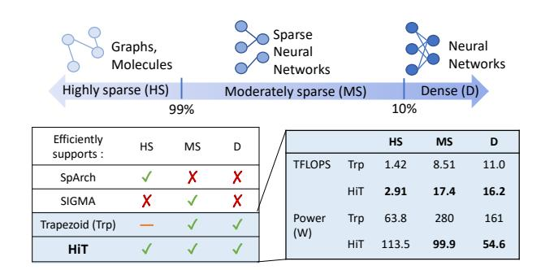

Fig. 1: Modern applications span a broad sparsity spectrum, while specialized accelerators typically target a specific sparsity range. Trapezoid supports the full sparsity range but underperforms on HS workloads. This work, HiT, achieves high performance across all sparsity levels.

data reuse, low computational intensity, and load imbalance. Furthermore, sparse matrices exhibit substantial variability in sparsity within and across application domains. For instance, non-zero elements commonly constitute less than 1% of the data in graph analytics (highly sparse (HS)) [14], while sparse convolutional neural networks have 1%-90% non-zero elements (moderately sparse (MS)) [15], and fully dense (D) matrices are prevalent in neural network training [2]–[4], [16], as shown in Fig. 1. This wide range of sparsity levels demands accelerator designs that can efficiently support diverse sparsity patterns without sacrificing performance.

While many specialized accelerators have been proposed to accelerate the sparse matrix multiplication [17]–[40], they suffer from two key limitations. First, these accelerators are typically optimized for limited sparsity ranges, leading to significant inefficiencies when workloads deviate from their targeted density. Second, many of these accelerators have limited scalability, offering low peak throughput that cannot scale to meet the demands of modern, large-scale matrix computations. Prior works [22]–[25] have been designed with only 16 or 64 MACs and are limited to scaling to only a few hundred MACs. This scalability challenge is particularly significant for accelerators targeting highly sparse matrix multiplication, where low data reuse and excessive data movement remain major challenges. These limitations highlight the need for a unified, high-throughput accelerator capable of efficiently handling matrices across the entire sparsity range. Recent work, Trapezoid [41], is the first large-scale unified matrix

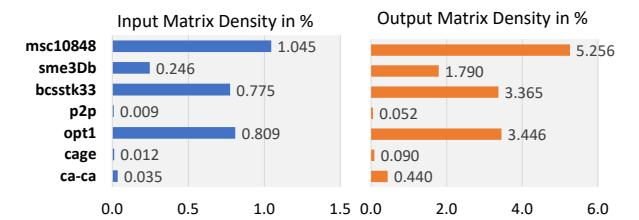

Fig. 2: Input and output density of 7 SuiteSparse Datasets.

multiplication accelerator. Although effective for D and MS workloads, it only obtains 3.125% (512 MACs) of its peak throughput in HS×HS multiplications, limiting its efficiency on crucial workloads in domains such as graph analytics and scientific computing.

Ideally, high-performance accelerators should adapt to the available sparsity; however, prior designs continue to face key challenges in accelerating HS workloads. We observe that most accelerators targeting HS workloads employ a Gustavson-based dataflow [19], [22], [28], [41]. Although effective at a small scale, these accelerators struggle to maintain high throughput as the system scales. We find that the main reason for this limitation is the large number of irregular memory accesses to the input matrices introduced by the Gustavson dataflow. As parallelism increases, the number of *random accesses to memory grows. Scaling up parallel accesses to a single cache can become both challenging and costly.* Outer-product dataflows, on the other hand, eliminate random accesses by reading the second input matrix sequentially. However, they introduce a new challenge: a large number of unmerged partial sums. This highlights the need for dataflows that retain the outer-product's sequential-access benefits while effectively handling partial sum growth.

In this work, we present HiT, a unified sparsity-adaptive accelerator that achieves high performance across the full sparsity spectrum. To efficiently support sparse computations, we propose two novel outer-product-based dataflows: HSparse for HS workloads and MSparse for MS workloads. The dataflows eliminate the gather-induced memory contention that limits Gustavson-style accelerators such as Trapezoid and enables throughput to scale with compute parallelism. For D matrices, we adopt the inner-product dataflow to maximize data reuse, parallelism, and overall computational efficiency.

Concretely, HiT includes the following contributions:

• HSparse and MSparse dataflow, deliver three key advantages: (1) higher valid matches and higher MAC utilization by exploiting two levels of spatial parallelism to match a larger number of non-zero inputs; (2) regular memory access that avoids the memory read conflicts and stalls inherent in Gustavson-based designs and (3) efficient on-chip accumulation of partial sums, addressing a core limitation of prior outer-product accelerators: OuterSPACE [18] requires costly off-chip accumulation, and SpArch [26] relies on a large merge tree, limiting scalability.

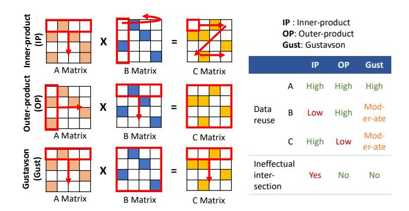

Fig. 3: Matrix multiplication dataflows and data reuse comparison.

- Exploiting output sparsity. In HS×HS computation, HSparse exploits high output sparsity (as shown in Fig. 2) by storing partial sums on-chip in a compressed format, increasing the buffer utilization. This also enables the processing of larger tiles, which contain more non-zero elements and therefore increase compute density and throughput.
- Unified sparsity-adaptive architecture. HiT supports HSparse, MSparse, and inner-product dataflows with a unified architecture. Its Parallel Intersection & Distribution Unit enables large-scale, low-overhead index matching without the power-intensive intersection units and routing networks used in prior work [41]. The Dual-mode Accumulator efficiently handles sparse partial sums. Together, these components allow HiT to deliver state-ofthe-art performance across diverse sparsity levels to meet the demands of modern large-scale workloads.

In our evaluation, HiT delivers 3.24× geomean performance/area gain on HS×HS workloads, effectively overcoming the severe throughput bottlenecks of prior HS accelerators and Trapezoid. Across all evaluated workloads, HiT achieves 1.93× higher geomean performance/area and consumes 1.64× less energy compared to Trapezoid, demonstrating its advantage across the full sparsity spectrum.

For the rest of the paper, we use the term *intersection / intersect* to denote the process of matching the column index of a non-zero element in sparse Matrix A with the row index of a non-zero element in sparse Matrix B. We use *intersection rate* to quantify the ratio of valid matches between A and B elements to the total number of index comparisons evaluated.

# II. BACKGROUND AND RELATED WORKS

Matrix multiplication involves taking two matrices, A (size *M*×*K*) and B (size *K*×*N*), and producing a new matrix C (size *M*×*N*). The multiplication can be computed using one of the three basic dataflows, each defining a specific execution flow, as shown in Fig. 3.

Inner-product (IP) dataflow computes the dot product by calculating *one* element of C at a time, multiplying a row of A with a column of B. This process repeats until all elements of a row in C are computed before moving to the next row. Gustavson (Gust), also known as row-stationary dataflow, is similar to IP but computes an entire *row* of partial outputs at a time with each element of A. Outer-product (OP) multiplies each element of a column of A with the corresponding row of B, updating a row of C. The process repeats for all elements in the same column of A before moving to its next column.

In accelerator design, dataflow selection is critical as it directly influences the design of sparsity-handling modules and the rate of both intersections and reductions. The following subsections review prior accelerators that implement these dataflows.

# *A. Related works*

IP-based accelerators, such as TPUs, are typically used for dense or MS matrix multiplications. They employ 2D systolic arrays to deliver high throughput through immediate reductions. But in sparse matrices, IP frequently matches zero elements, leading to many ineffectual operations. Designs like Sigma [17] only exploit A's sparsity and remain inefficient for HS matrices, where ineffectual multiplications dominate computation. Gust-based accelerators are often developed for HS matrix multiplications by performing row-level intersections. This enables simpler intersection hardware but suffers from poor B row reuse, resulting in random and repeated memory accesses that become bottlenecks in highly parallel systems. To mitigate this, accelerators such as GAMMA [19] use a heavily banked fibercache with crossbars and tailored replacement policies, while ACES [22] employs multibank designs with the PureFiber policy to improve locality and concurrency. OPbased accelerators target MS and HS matrix multiplications. They avoid Gust dataflow's irregular B accesses and scale well. However, this comes at the cost of a large number of partial outputs, increasing data movement and requiring specialized merging mechanisms. Early OP-based accelerators like OuterSPACE [18] store partial sums off-chip. SpArch [26] reduces off-chip traffic with matrix condensing and comparator-based merge trees.

Accelerating Full Range Sparsity: CoSparse [42] and STPU [43] are prior works that target both sparse and dense workloads, but focus on matrix-vector multiplication. Trapezoid [41] is designed to support full-range sparsity and proposes two enhanced Gustavson-based dataflows for HS matrices. Despite it being a state-of-the-art (SOTA), Trapezoid reaches only 3.125% of its peak throughput for HS×HS and 12.5% for HS×MS and HS×D. We find that this computational bottleneck is attributed to dataflow limitations, particularly the inherent constraints of the Gustavson dataflow.

# III. MOTIVATION

Modern workloads exhibit diverse sparsity patterns and are often executed on the same accelerator platforms in datacenters and high-performance computing systems. As a result, accelerators must efficiently support the full sparsity spectrum. However, most prior designs target only a narrow sparsity range, resulting in poor performance outside their target regime. In particular, prior accelerators supporting HS

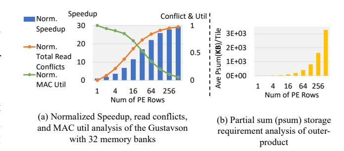

Fig. 4: (a) Analysis of the Gustavson dataflow as the number of PE rows increases (x-axis). The left y-axis shows normalized speedup, and the right y-axis shows normalized total read conflicts and normalized MAC utilization. (b) Average onchip storage required for unmerged partial sums per tile as the number of PE rows increases in outer-product dataflow.

workloads often rely on Gustavson-based dataflow, which becomes a bottleneck in large designs that require highly parallel computation.

# *A. Limitation of Gust-based Dataflow in Large-scale Designs*

Gustavson dataflow introduces irregular accesses to Matrix B, and processing different elements of Matrix A in parallel results in concurrent random accesses. Although many Gustbased accelerators address this challenge through cache-based optimization techniques, they are typically implemented with a small number of MAC units (16-64) [19], [22], [24]. While these techniques are effective for small designs, they may not scale well, as cache complexity and contention grow significantly with higher degrees of parallelism in larger systems.

Trapezoid [41] is a large-scale Gust-based accelerator with 128×128 MAC units. To mitigate the concurrent irregular accesses at a large scale, it adopts a multi-level memory hierarchy. The MAC units are divided into four clusters (32 PE rows per cluster), each sharing a 4MB, 32-bank cache, connected via a 32×32 crossbar. However, for HS×HS workloads, Trapezoid obtains only 512 MACs/cycle despite a peak of 16K MACs/cycle. To study its memory behavior, we model the cluster-level memory system as a 32-bank SRAM (1 R/W per bank per cycle), consistent with the reported design.

As shown in Fig. 4(a), speedup initially improves with increasing PE rows but quickly saturates and MAC utilization drops to around 10% at 256 rows. The decline stems from bank conflicts that intensify as the number of concurrent requests increases, introducing memory stalls that limit effective compute throughput. This contributes to the limited sustained throughput of Trapezoid on HS workloads. *At a large scale, for Gust-based sparse accelerators, the memory subsystem, not the compute resources, becomes the dominant bottleneck.* Although increasing the number of memory banks can reduce conflict probability, it incurs substantial area and power overhead due to the quadratic growth of the crossbar.

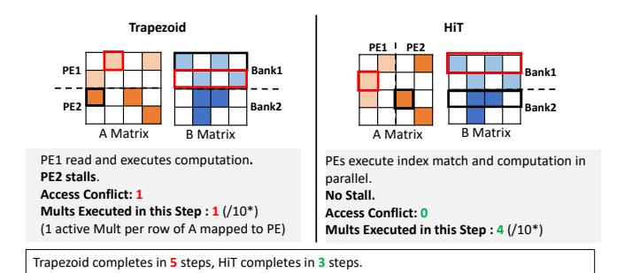

\* A total of 10 non-zero multiplications in this sparse matrix example. Fig. 5: An example comparing the execution of HS×HS

on Trapezoid and HiT. Trapezoid incurs one bank conflict due to a concurrent request to Bank 1, executing 1 out of 4 multiplications in this illustrated step. HiT streams B rows from different banks without contention, executing all 4 multiplications in this step. In practice, HiT processes 4 elements of A in parallel, matching multiple consecutive rows of B.

# *B. Outer-Product Dataflow as a Scalable Alternative*

Unlike Gustavson-style execution, OP dataflow avoids concurrent data-dependent accesses to Matrix B by executing Matrix A column by column, which enables each row of B to be streamed in sequentially. Notably, prior work [25] shows that OP-based accelerators achieve strong performance on highly sparse workloads. Motivated by the scalability limitations of Gust-based execution (Fig. 4(a)), we therefore explore OP-based dataflows as a scalable approach for sparse workloads. To illustrate the difference concretely, Fig. 5 compares Trapezoid-style Gustavson execution with OP-based execution adopted in HiT on the same workload.

In Trapezoid, each PE row independently requests the required B row based on nonzeros in A. Because these requests occur concurrently and map to shared memory banks, multiple PEs may access the same bank in the same cycle, causing bank conflicts. In the example, both PEs access Bank 1, forcing PE2 to stall. In Trapezoid's HS×HS mode, each PE row is divided into subrows, with each subrow mapped to a row of A. To mitigate low utilization, only one multiplication is performed per subrow in each cycle. As a result, although two B elements are fetched, only one of the four multiplications is executed. As parallelism increases, such conflicts become more frequent, reducing utilization (Fig. 4(a)).

In contrast, HiT restructures sparse execution using an OPbased dataflow. As elements of A are processed column by column, rows of B are streamed sequentially from distinct memory banks to the corresponding PEs, avoiding concurrent bank accesses. In the example, PE1 (PE2) does not access Bank 2 (Bank 1), eliminating conflicts and allowing all four multiplications to execute in one step. By enforcing structured streaming, HiT scales parallelism without increasing bank contention, unlike Trapezoid, which requires additional memory and routing resources.

# *C. Limitations of Naive OP and the Need for New Dataflows*

While OP mitigates memory contention, naively scaling it introduces a different challenge. Each non-zero in A generates a full row of partial sums with B, leading to a large number of unmerged partial sums (psums). As shown in Fig. 4(b), the number of psums grows approximately superlinearly with the number of active PE rows, creating significant on-chip accumulation pressure. Therefore, while OP mitigates memory contention, it shifts the scalability bottleneck to psum management. Simply adopting OP is insufficient for sustaining high throughput at scale.

These observations motivate the need for a new approach that: (1) retains OP's regular memory access, (2) reduces the large number of psum through immediate on-chip accumulation, and (3) adapts behavior across HS and MS workloads, which exhibit drastically different intersection characteristics. To this end, we introduce two novel dataflows: HSparse and MSparse. By removing memory contention and bounding psum growth, the two dataflows enable sparse execution to scale with available compute resources, allowing throughput to scale more effectively with parallelism. These dataflows form the core of HiT, delivering high throughput across the full sparsity spectrum.

# IV. HIT ARCHITECTURE DESIGN

Overview: We present the overview of HiT in Fig. 6(a)- (b). HiT is a spatial architecture organized hierarchically: 128 Compute Rows are grouped into 4 Compute Clusters (32 Rows each), each connected to an exclusive set of Global Memory banks. Each Compute Row in the Cluster is equipped with 128 multipliers and adders grouped into 4 Compute Groups (i.e., 32 multipliers and 32 adders in a DMAccum unit per Group). Compute Groups are interconnected via a ring network along the y-axis within a Cluster. The layout of the multi-banked Global Memory and its connections to each Compute Row in a Cluster is depicted in Fig. 6(c).

To improve reuse and intersection rate in HS multiplications (HS×HS, HS×MS, and HS×D), HiT implements a novel OPbased dataflow, HSparse, enabled with unique sparsity handling components, the Parallel Intersection and Distribution Unit (PIDU), Dual-mode Accumulator (DMAccum), PSum Router for the ring network, and multi-banked Local Buffer. In HSparse, each Compute Row is statically connected to four memory banks via dedicated channels and does not access other banks in the Cluster. To support MS multiplications (MS×MS and MS×D), HiT implements a second OPbased dataflow, MSparse, which efficiently handles a higher intersection rate while reusing the PIDU, DMAccum, and Local Buffer. In MSparse, Matrix B elements are broadcast across Compute Rows through cluster-local replicated pointto-point links. For D×D multiplications, we deactivate the sparsity handling components to run HiT as a systolic array with the standard inner-product dataflow. We discuss detailed implementation in the following subsections.

Data storage format: We store a sparse matrix in a COO-like format on-chip. The matrix is partitioned into tiles,

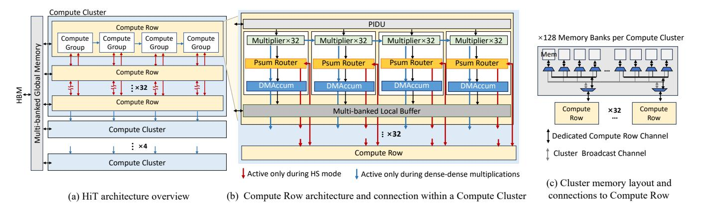

Fig. 6: HiT architecture overview. (a) Overview of HiT architecture with 4 Compute Clusters, each consisting of 32 Compute Rows. Within each Compute Row, there are 4 Compute Groups. (b) The architecture in a Compute Row. Each Compute Row contains 4 Compute Groups connected by two types of interconnections. In HS mode, 4 ring networks connect the PSum Routers within a Cluster to support distributed partial-sum accumulation. In D×D mode, systolic connections between Compute Groups and across Rows are enabled to form a conventional systolic array. (c) Memory layout and connections to Compute Row within a Compute Cluster. Each Compute Row has a dedicated channel to 4 Global Memory Banks for executing HSparse only. Each Compute Row is also connected to a cluster-local broadcast channel, used only for MSparse, through which Matrix B elements are broadcast to all Compute Rows within the Cluster.

and each non-zero element explicitly stores its own row and column indices relative to the tile it belongs to. The row and column indices are packed together with the data element. Within each tile, non-zeros are stored contiguously and arranged by column index then row index, enabling regular sequential streaming that matches HiT's outer-productbased dataflows. Compared to CSR/CSC, this representation increases storage by up to 1.23×. However, this overhead only affects on-chip storage, as sparse data can remain in CSR/CSC format off-chip and be converted to COO-like format on-thefly during memory streaming using a lightweight converter [44]. For dense matrices, we store them in dense format.

# *A. HS Architecture*

HS matrix multiplication has a very low data reuse and intersection rate. To achieve high throughput, HSparse increases the number of effective computations done in parallel by *intersecting multiple columns of Matrix A with multiple rows of Matrix B*. It exploits two levels of spatial parallelism: (a) within a matrix column, multiple non-zeros from one A column are processed in parallel, and (b) across matrix columns, multiple independent A columns are processed concurrently. As each element in the same column matches all the elements from the corresponding B row, a column-to-row intersection always guarantees a match when the corresponding rows and columns are non-empty. Furthermore, as we process Matrix A by column, the access to Matrix B is regular, eliminating the memory contention experienced by Gust-based dataflows. Fig. 7(a) illustrates a simple example of HSparse's mapping to hardware. To compute multiple columns of A in parallel, Matrix A is divided along the column dimension into three tiles, each mapped to a Compute Row. Matrix B is divided along the row dimension into corresponding tiles. In practice, the matrix is tiled based on the available Compute Rows and workload size. At the start of execution, the first few tiles of matrices A and B are preloaded into the memory banks of their respective Compute Rows.

With an outer-product-based dataflow, a large number of psums are generated in parallel. HSparse merges these psums by decoupling the multiplication and accumulation process, where psums can be produced in a different Compute Row than where they should be stored. As shown in Fig. 7(a), each Buffer in the Compute Row is assigned to store specified rows of the C Matrix on-chip. Fig. 7(b) describes the execution of HSparse in the Compute Cluster. In the multiplication phase, to improve multiplier utilization under low density, each Compute Row streams groups of B rows and processes multiple A elements per cycle. In this example, each Row streams from its dedicated Global Memory banks with up to 4 non-zero B elements and 2 non-zero A elements, matching the number of Groups. As there is no dependency among the data across the Compute Rows, multiplication is done in parallel. In the accumulation phase, psums are routed via the ring network to the destination Row for reduction. In the example, we focus on the *psum1 (blue a1)*, *psum2 (orange a1)*, and *psum3 (yellow a1)*, the products of *a* from each tile of Matrix A and *1* from each tile of B. Since *psum1* is computed where it should be stored, it is accumulated locally. For *psum2* and *psum3*, they are computed in a different Compute Row than where they should be accumulated. They are routed via the ring network to the destination Row. In our hardware implementation, HiT matches a maximum of 4 A elements with up to 64 B elements per cycle from different B rows (i.e., 32/64 for HS and MS inputs, 64 for D input) to balance the performance and area trade-offs. Accordingly,

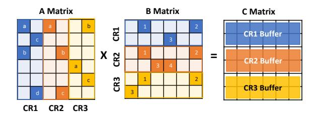

(a) HSparse mapping, assuming a 3 Compute Rows and 1 Compute Cluster design. Matrix A is column-wise tiled. Matrix B and C are row-wise tiled. Each tile maps to a Compute Row.

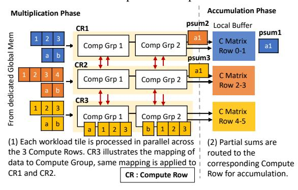

(b) Execution of HSparse on the Compute Cluster, assuming 2 Compute Groups per Compute Row. Input data is accessed regularly from dedicated memory banks and processed in parallel in the Cluster.

Fig. 7: Example of HSparse Dataflow

as each Compute Row contains four Compute Groups, each Compute Group processes one A element per cycle.

In the following paragraphs, we first explain the highlevel execution process of a Compute Group, then detail the hardware components.

Example walkthrough: Fig. 8 presents a scaled-down example of the execution of HSparse. We focus on one Compute Row, assuming it is the first Row with a wrap-around link to the last Compute Row and a downlink to Compute Row 2, depicted as red arrows. As each Compute Group has the same architecture and operates in the same way, only one Group is shown. In this example, 1 non-zero element of A and 4 nonzero elements of B from the Global Memory are streamed into a Compute Group capable of handling 2 multiplications and accumulations in parallel. The execution flow is as follows: (1) the PIDU matches the coordinate of the A element with all the B elements, then distributes the matching pairs to each multiplier. (2) The multipliers produce the result and send it to the PSum Router, which checks the row index of the results. As the results are psums of the second C row assigned to Compute Row 2, they are sent out of this Row via the downlink. (3) The DMAccum in this Row remains inactive in this case.

Parallel Intersection & Distribution Unit (PIDU): This unit performs non-zero matching and distributes the matched pairs across multipliers. As illustrated in Fig. 9, the PIDU first performs parallel column-to-row index comparisons to match each A element with the grouped B elements (from

Fig. 8: A scaled-down example of a Compute Group, part of a Compute Row, showing the execution of HSparse.

multiple rows of Matrix B). It then computes leading-zero counts and uses a lightweight shifter (rather than a barrel shifter) driven by the count to align matched B elements with available multipliers. The process is pipelined across four stages. In the example, the shift unit shifts B's entries left by one position, assigning matched values *2* and *3* to *Mult1* and *Mult2*, respectively. In HiT, a total of 64 comparators per Compute Group are used to match the A element with the group of B elements. Although we intersect with more elements than the available multipliers, given the high sparsity, the number of matches rarely exceeds 32. In the case that matches exceed, reading of new A elements is stalled until the current matches are all processed.

PSum Router & Ring Network: The PSum Routers are interconnected, forming a ring network. The ring is a lightweight bidirectional network composed of point-to-point links between neighboring Compute Groups along the y-axis within each Cluster (Fig. 6). Each link transfers a vector of psum and column-index pairs with row metadata per cycle, over a wide parallel bus matched to the accumulator parallelism. The Router checks for the row index of psums and either forwards them to the local DMAccum or routes them to the designated Compute Row via the ring network. To handle data congestion, each router uses four ring buffers: size 6 for up and down incoming, 4 for multiplier incoming, and 6 for DMAccum forwarding. When a buffer is full, the Compute Row stalls until space is available. These sizes are chosen to balance performance and cost, as doubling structures reduces latency by just 10% while incurring 2× higher area and power overhead.

Exploitation of output sparsity & Dual-mode Accumulator (DMAccum): As shown in Fig. 2, HS×HS multiplications produce HS/near HS outputs. HSparse leverages this characteristic by storing results in a compressed format. This increases buffer utilization and allows a large, sparse output matrix to be stored with a small buffer size. In addition, it allows HiT to process larger input tiles that contain additional non-

Fig. 9: Example of non-zero element intersection in Parallel Intersection & Distribution Unit (PIDU), based on Fig. 8

zero elements, increasing intersection rate and computation intensity. Fig. 10(a) illustrates how sparse values in the same row are packed into a Local Buffer row. This compressed format is used only for HS×HS; outputs of all other workloads are stored densely due to higher output density (Fig. 10(b)). Given the two different memory layouts, the Accumulator has to operate in 2 modes.

In the first mode, for HS×HS where outputs are irregularly distributed. Naively accumulating a new psum requires comparing it against all entries in a Local Buffer row, which can be expensive. To reduce the number of comparators, we use a binning-compare-update procedure, shown in Fig. 10(b). Given three psums from the same output row, we map each psum to a memory bin using the modulo operation. The bin index and row index identify the target memory bank and row, respectively. Since each bin holds two entries in this example, each psum compares against only two candidates instead of all four in the row. After comparison, one of three actions occurs: (1) a match is found, and psum is updated; (2) no match but the bin contains empty slot(s), the psum is inserted into the first empty slot (with priority encoding on conflicts); or (3) the bin is full, the psum spills to an overflow buffer for the next round of accumulation.

In the second mode, for all other sparse workloads, outputs are stored densely, allowing direct row-column indexing to update psums. Together, these mechanisms allow HiT to sustain high-throughput accumulation for HS workloads while keeping buffer and comparator area modest.

Tiling: Non-zeros in HS matrices often cluster, producing partial outputs with uneven density requiring a large buffer with low utilization. To alleviate this problem, we interleave columns of B to balance non-zeros without affecting correctness. In our evaluation, this reduces the buffer size by 14× and greatly improves buffer utilization. For HS×HS multiplications, HiT supports two tiling strategies. The default method samples bitmap intersections to select tile sizes that ensure all partial sums fit in Local Buffers. A conservative alternative selects smaller tiles based on overestimated output sparsity. If an overflow occurs, HiT employs row-granularity spilling. When entries from all banks of a row become full and a new psum maps to that row, the entire row is spilled to on-chip Global Memory, the row is cleared, and accumulation continues. After tile completion, spilled segments are reloaded and merged in a second pass. Under this conservative strategy,

(a) Local Buffer memory layout in two different modes under different computations.

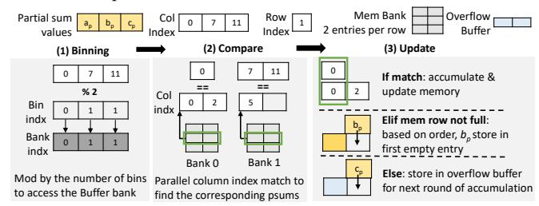

(b) Example of the accumulation process, activated only during HS×HS computation. Binning helps to reduce the number of comparators needed during column index matching.

Fig. 10: Dual-mode Accumulator (DMAccum) unit.

a spill of psum data is rare, with an average of 3.30% of output rows being spilled to Global Memory, introducing an average overhead of 4.05% across 4 HS×HS workloads. In the evaluated workloads, we use bitmap-based tiling to ensure all psums fit in the Local Buffer. For MS and dense matrices, inputs are tiled so that the dense outputs fit entirely in the Local Buffer, keeping all partial sums on-chip.

#### B. MS Architecture

HiT implements a second OP-based dataflow, MSparse. Similar to the HSparse, MSparse increases throughput by intersecting multiple columns of Matrix A with multiple rows of Matrix B. Since HSparse implements an efficient PIDU component for parallel input intersections, we reuse the same component in MSparse and focus on solving the accumulation of the large number of psums.

Unlike HS matrices, MS matrices present much higher element density and intersection rate. Using the ring network present in HSparse will incur a large amount of data movements, leading to high latency in accumulating the psums. Therefore, we design MSparse to accumulate psums immediately within the same Compute Row. This is achieved by mapping rows of Matrix A to one Compute Row so that psums required to form the final outputs are produced within the same Row.

However, this approach introduces one of the three problems: (1) large memory overhead, since each Compute Row would require on-chip storage of the entire Matrix B to sustain high performance; (2) large number of memory accesses, as partitioning B by rows and processing each partition separately forces repeated off-chip accesses whenever new rows of A are

(a) MSparse mapping, assuming a 3 Compute Rows and 1 Compute Cluster design. Matrix A and C are row-wise tiled, and each tile maps to a Compute Row.

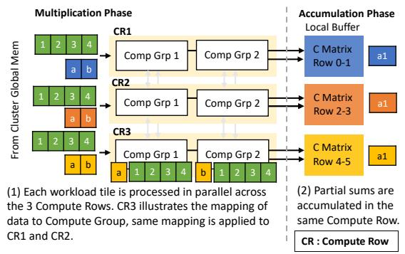

(b) Execution of MSparse on the Computer Cluster, assuming 2 Compute Groups per Compute Row. Input data is accessed regularly, with B elements shared across Compute Rows and processed in parallel within the Cluster.

Fig. 11: Example of MSparse Dataflow

mapped; or (3) the need for a complex memory system to support random access from multiple Compute Rows.

To solve this problem, we partially synchronize the computation in a Compute Cluster by streaming a group of 64 B elements per cycle from Global Memory and broadcasting to Compute Rows. This solution enables regular memory access and leverages the key properties of MS multiplication, where element density and intersection rate are high, and each tile shares a similar distribution. Furthermore, we use an interleaving technique in mapping the rows of Matrix A to each Compute Row to decluster possible patterns in the matrix. Fig. 11(a) illustrates an example of this mapping, showing three row-wise partitioned tiles of Matrix A assigned to three Compute Rows and Matrix B is shared within a Compute Cluster. Fig. 11(b) outlines the execution procedure in a Compute Cluster, where HiT accesses memory sequentially and processes multiple A elements within and across the Rows in parallel. Although synchronizing the Compute Row can incur additional latency, based on our evaluations, the overhead is maximally 12% on the evaluated workloads.

**Example walkthrough:** Fig. 12, shows an example of HiT running MSparse. We focus on one Compute Group from a Compute Row. The components not activated in this dataflow are grayed out. Similar to HSparse, 1 non-zero element of A and 4 non-zero elements of B are streamed into a Compute Group with 2 multipliers and accumulators. All the C results are buffered in the same Compute Row. The execution flow is as follows: (1) the PIDU matches the coordinate of the A

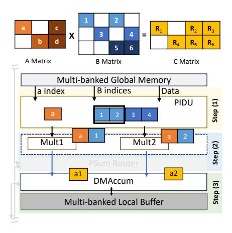

Fig. 12: A scaled-down example of a Compute Group in a Compute Row, showing the execution of MSparse dataflow.

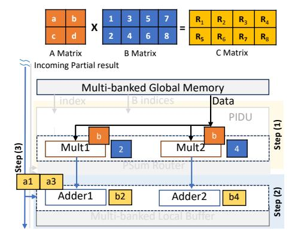

Fig. 13: A scaled-down example of a Compute Group in a Compute Row, showing the execution of dense IP dataflow.

element with all the B elements, then distributes the matching pairs to each multiplier. (2) The multipliers produce the results and send them to the DMAccum, bypassing the PSum Router. (3) The DMAccum sends a read request based on the row index of the results to the Local Buffer to fetch the partial results to perform accumulation.

#### C. Dense Architecture

We implement the standard inner-product dataflow in HiT, which is highly efficient in processing D×D multiplications. To support the dataflow, we transform the architecture into a 2D systolic array by adding connections between multiplier groups in each Compute Row and between DMAccum both within and across Compute Clusters. This resembles the TPU's matrix multiplication unit with 128×128 MACs, and the only difference is the number of multiplication pipelines. As we divide 128 multipliers per Compute Row into 4 groups, 32 multiplications can be done per cycle per Row, simplifying the layout to 128×4 with 4 multiplication pipeline stages. The components developed to handle sparsity are clock-gated with Buffer power-gated.

**Example walkthrough:** Fig. 13 shows a dense input example. In this mode, Matrix B is mapped spatially across the

TABLE I: Dataset Details

|    | Name           | Dimension              | Density |
|----|----------------|------------------------|---------|
| HS | p2p-Gnutella24 | 26518 × 26518          | 9.3e-5  |
|    | ca-CondMat     | $23133 \times 23133$   | 3.5e-4  |
|    | opt1           | $15449 \times 15449$   | 8.1e-3  |
|    | cage12         | $130228 \times 130228$ | 1.2e-4  |
|    | poisson3Da     | 13514 × 13514          | 1.9e-3  |
|    | msc10848       | $10848 \times 10848$   | 1.0e-2  |
|    |                | ·                      |         |

|        | Name                      | Dimension                                                                                 |                                              | Density              |                                  |
|--------|---------------------------|-------------------------------------------------------------------------------------------|----------------------------------------------|----------------------|----------------------------------|
|        |                           | Activation                                                                                | Weight                                       | Activation           | Weight                           |
| MS     | Resnet50-0.4 Vgg16-0.4 | 1024 × 14 × 14 512 × 28 × 28 512 × 28 × 28                                          | 1 × 1, 256 1 × 1, 128 3 × 3, 512       | 0.46 0.65 0.23 | 0.37 0.52 0.38             |
| MS / D | Llama2-7b                 | $\begin{array}{c} 1024 \times 11008 \\ 1024 \times 4096 \\ 1024 \times 11008 \end{array}$ | 11008 × 4096 4096 × 11008 11008 × 4096 | 1 1 1          | 0.20 / 1 0.40 / 1 0.60 / 1 |

architecture, each row to a Compute Row. Elements of A are streamed in row by row across the Compute Rows. Psums are accumulated vertically along the y-axis, forming the final Matrix C. We focus on one Compute Group from a Compute Row. The execution flow is as follows: (1) the data are sent directly to each multiplier, bypassing the components in the PIDU. (2) The multipliers produce the results and send them to the adders in DMAccum, bypassing the PSum Router. (3) The adders accumulate the data from the multiplier with the psums received from Compute Row 1, then generate results for the next Compute Row.

#### D. Hardware Reuse and Dataflow Switching

Hardware Reuse: In HiT, the compute fabric is largely shared across modes. HSparse and MSparse reuse the same components, with HiT gating only the PSum Routers in MSparse. In dense mode, only the multipliers, DMAccum adders, and a linear adder network remain active, while sparsity-specific components are bypassed and clock/powergated.

**Dataflow Switching and Dynamic Sparsity:** HiT supports static dataflow reconfiguration via lightweight control logic, where configuration flags enable or disable hardware components, select datapaths, and initialize Compute Rows. Reconfiguration completes in a fixed number of cycles independent of matrix size, accounting for only 0.009% of execution time (geomean). The dataflow is selected once per dataset by the user using sparsity-based heuristics: matrices with <10%density are treated as HS, 10-90% as MS, and >90% as dense, consistent with observed ranges in SuiteSparse and neural network workloads. While coarse-grained, this heuristic suffices for most inference and offline workloads where sparsity is stable at the dataset or layer granularity. Supporting dynamic sparsity would require runtime sparsity estimation and tileor batch-level dataflow switching. ML-based selectors such as Misam [45] are complementary and can be integrated to enable adaptive behavior, potentially improving dataflow selection accuracy.

# V. EVALUATION METHODOLOGY

**Datasets:** We evaluate the performance and energy efficiency of HiT using 27 real-world matrix multiplication work-

TABLE II: HiT Design Specification

| Hardware Component |                                   | Specs                                                                    |  |
|--------------------|-----------------------------------|--------------------------------------------------------------------------|--|
| Compute Row     | Multiplier PIDU PSum Router | PIDU $4 \times (64 \text{ comparator \& shifter})$                       |  |
|                    | DMAccum Local Buffer           | 4 × (32 FP32 adders & 512 comparators) 11.4KB, 8 banks, register file |  |
| Compute Cluster    |                                   | 32 × Compute Row                                                         |  |
| Global Memory      |                                   | 16MB, 512 SRAM banks, 64B datawidth                                   |  |
|                    | Overall                           | 4 × Compute cluster @ 1 GHz 17.5MB memory, HBM @ 2TB/s                |  |

loads from SuiteSparse dataset [13] and 3 representative deep neural networks: Llama2-7B [2], ResNet50 [3], and VGG16 [16]. These workloads are selected to cover a wide range of sparsity characteristics, from HS to D matrices, enabling a comprehensive evaluation of HiT's effectiveness across diverse practical scenarios. Table I shows the size and density details of the datasets.

We use SuiteSparse datasets for HS workloads. For HS×HS, we compute  $M \times M^T$  following prior HS accelerator [41]. For HS×MS, each HS matrix is multiplied by three random matrices (1024 columns, densities 0.2, 0.4, 0.6). For HS×D, HS is multiplied by a dense matrix with 1024 columns. For MS and D workloads, we use DNN layers. MS×MS uses unstructured sparse (40% density) ResNet50 and VGG16 models [46], evaluating three convolution layers from ImageNet inference [47]. The convolution layers are converted offline to matrix multiplication using the standard im2col transformation [48]. For MS×D, we evaluate three Llama2-7b projection layers (sequence length 1024). Although Llama2 is inherently dense, we applied magnitude-based pruning to its weight matrices to introduce sparse matrix multiplications, using pruning levels (0.2, 0.4, 0.6) consistent with recent GPT sparsification studies [49], [50]. D×D uses two dense projection layers from Llama2-7b with different dimensions.

HiT Implementation: We built a cycle-level simulator to model each component of HiT, using the specifications detailed in Table II and a set of configurations to select datapaths and model static dataflow switching. This design achieves a peak throughput of 32 TFLOPS and consists of 128 Compute Rows, each featuring 128 FP32 multipliers and adders. Each Compute Row has access to a Local Buffer of 11.4 KB and shares 4MB of Global Memory. In total, the architecture provides 17.5 MB of on-chip memory. Additionally, we simulate based on a 2 TB/s HBM main memory, representative of current generation GPUs and TPUs.

The simulator models the activities of all hardware components per cycle. To obtain latency results, we run the simulator with the abovementioned datasets, faithfully capturing contention and pipeline stalls. To obtain the area, we implemented each of the components in Verilog and synthesized the design using Synopsys Design Compiler with 22nm technology node at 1 GHz. We then use Synopsys PrimePower to measure the power. Both simulator and RTL designs are validated using

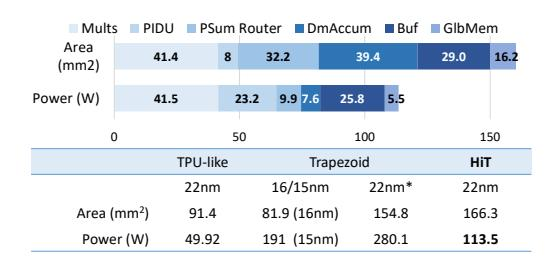

Fig. 14: Area and power breakdown of HiT and comparison against TPU and Trapezoid. \*The 22nm results of Trapezoid are scaled from 16nm and 15nm based on [53].

microbenchmarks to ensure correctness. We use CACTI [51] to estimate the area and power of the on-chip Global Memory at 22nm. The energy consumed by HBM accesses (3.9 pJ/b) is obtained from a prior study [52]. HiT adopts FP32 precision to ensure fair comparison with prior accelerators (e.g., Trapezoid). Additionally, HiT targets general sparse matrix multiplication beyond NN inference, where higher precision remains relevant.

Baselines: We primarily compare HiT with Trapezoid, a unified accelerator of similar scale and design goals. Additionally, we compare against a modern version of the TPU [11] featuring dedicated Matrix Multiply Units (MXU). Both Trapezoid and the TPU employ spatial array architectures with 128×128 MACs and global cache memories of 17MB and 16MB, respectively, closely aligning with the resources available in HiT. To provide comprehensive coverage, we compare against sparsity-specialized accelerators targeting different regimes: Sigma [17] and Flexagon [25], which are optimized for MS workloads; SpArch [26] and OuterSPACE [18], which focus on HS outer-product execution; and Spada [24], which supports both MS and HS regimes through adaptive dataflow mechanisms.

For Trapezoid, we build a cycle-level simulator that models the latency using its published specification. The model captures its 128 processing rows (128 MACs each), compute clusters (32 processing rows each), tiling strategy, dataflows, intersection behavior, and multi-level memory hierarchy. Where low-level details were not explicitly specified, we adopted assumptions favorable to Trapezoid. In particular, we assume conflict-free cache banking for both reads and writes and allow HS partial results to stream off-chip with minimal onchip buffering overhead. Since Trapezoid reports normalized speedup over a TPU-like baseline, we validated our model by reproducing its published speedup under the same configuration, with error below 2%. Area and power are taken from the original paper.

For TPU, we simulate the MXU and refer to this baseline as TPU-like. We estimate the area and power of TPU-like based on results from our synthesized FP32 multiplier, FP32 adder, and CACTI cache models. The results are validated against prior work [54]. Latency and power for Sigma and Flexagon are derived from Trapezoid's results, as they are scaled to

Fig. 15: Top: Area breakdown of HiT and Trapezoid. Bottom: Percentage of active area under HS, MS, and dense modes.

match Trapezoid, which aligns with HiT's configuration. We refer to both accelerators as Sigma-E and Flexagon-E to denote the derived results. Latency of Spada is obtained from its open-source simulator, scaled to match HiT's area with 4128 MACs, 16MB global memory, and the same HBM bandwidth. GFLOPS for SpArch and OuterSPACE are scaled from SpArch's results.

# VI. EVALUATION RESULTS

# *A. Area and Power*

We evaluate area and power using Synopsys *compile* command, with baseline optimizations. While a full backend flow would provide more accurate wire-aware estimates, both HiT and Trapezoid are evaluated at the same RTL and memorymodel abstraction level. Any wiring overhead from physical implementation would affect both designs similarly. Fig. 14 shows the area and power breakdown of HiT. The same figure also compares the area and power of HiT against the TPUlike and Trapezoid. Since Trapezoid reports area at 16nm and power at 15nm, we scale both results to 22nm using the methodology from [53] to ensure a fair comparison.

*1) Area:* HiT occupies 166.3 mm2 in 22nm, which is 1.07× that of Trapezoid and 1.82× that of the TPU-like design. Although the TPU-like design requires less area overall, it lacks the sparsity-handling components to efficiently accelerate sparse matrices. Trapezoid and HiT dedicate more than half of their total area to handling sparse computation. In HiT, the novel MSparse eliminates the need for an intersection module, which accounts for approximately 20% of Trapezoid's area (Fig. 15, (top)). The primary area trade-off is the registerfile-based buffer (discussed in the following subsection), which is approximately 4× larger than the SRAM-based buffer used in Trapezoid. Fig. 15, (bottom) compares the percentage of active area under different execution modes in HiT and Trapezoid. For dense workloads, both designs exhibit similar active-area fraction. For MS, the Trapezoid shows a higher active-area fraction, as most sparsity-related components are active except for the crossbar used in HS mode. In HS mode, HiT activates all components, while Trapezoid disables its intersection module, resulting in a lower active-area fraction.

*2) Power:* HiT consumes between 54.6 W and 113.5 W, while Trapezoid's power ranges from 36.7 W to 280.1 W. At peak utilization, HiT consumes 2.47× lower power than

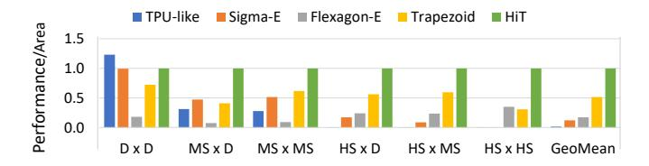

Fig. 16: Geomean performance/area on workloads (from Table I) of varying sparsity levels. Normalized to HiT.

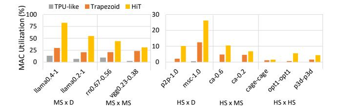

Fig. 17: Percentage of effective MACs performed over the product of total number of MACs multiplied by the latency.

Trapezoid, but 2.27× more power than the TPU-like design. In Trapezoid, power consumption is lowest when processing HS workloads due to its low throughput, but increases significantly for MS workloads as its complex intersection unit and distribution networks are activated. In contrast, HiT consumes the most power during HS processing to sustain high throughput, and the least power during D processing, where sparsity-handling modules are clock-gated and Local Buffer power-gated to reduce power consumption. The TPU-like design consistently consumes the least power overall, as it does not include sparsity-handling components.

3) Area and power comparison of register file and SRAM: To support the high bandwidth demands of HSparse and MSparse during on-chip accumulation, we implement low-latency multi-ported register files in each Compute Row, enabling up to 4 reads and 4 writes per bank. To compare its cost against SRAM alternatives, we use CACTI to model functionally equivalent multi-ported SRAMs at 22nm. While SRAM is inherently more power-efficient, achieving the same access bandwidth incurs 16.7× higher area than our register-based buffers. Given the access intensity of HiT, the register file presents a more balanced choice, offering the necessary bandwidth with considerably lower area cost.

#### B. Performance Comparison

We use performance/area as the comparison metric to account for the difference in area. The reported results measure accelerator kernel execution time only.

**Overall Performance:** In Fig. 16, we present the comparison of HiT against the specialized dense accelerator TPU-like, MS accelerators Sigma-E and Flexagon-E, and Trapezoid, which supports the full range of sparsity. For each category of multiplications, we compute the geometric mean (geomean)

Fig. 18: (a) Average percentage of active cycle for each component in Compute Row. (b) Performance overhead breakdown. Compute Active includes PIDU, multiplier, and DMAccum active time. Idle cycle represents the fraction of time a Compute Cluster remains idle while waiting for other Clusters to complete execution due to workload imbalance in HS datasets.

of the datasets listed in Table I normalized to HiT. The overall geomean is computed across all evaluated datasets. HiT achieves consistently high performance/area across all sparsity levels, outperforming TPU-like, Sigma-E, Flexagon-E, and Trapezoid by 66.5×, 8.22×, 5.84×, and 1.93×, respectively. While HiT can operate as a systolic array for D×D workloads, its larger area leads to a 1.23× lower performance/area than TPU-like. However, TPU-like degrades significantly with increasing sparsity and is inefficient on HS×HS workloads. In contrast, HiT achieves a 3.24× higher geomean performance/area than Trapezoid on HS×HS workloads by leveraging its sparsity-handling components, effectively addressing the low-throughput bottlenecks of prior HS accelerators.

MAC Utilization: We compute MAC utilization as the percentage of effective MACs over the total possible MACs multiplied by execution cycles. Fig. 17 shows representative benchmarks in which HiT consistently outperforms TPU-like and Trapezoid. Specifically, in HS workloads, where MAC utilization is inherently low, HiT improves utilization by 3,933× over TPU-like and 2.35× over Trapezoid. In particular, HiT achieves 3.46× higher utilization than Trapezoid on HS×HS workloads. These improvements stem from MSparse and HSparse, which exploit spatial parallelism and perform more effective non-zero matches per cycle.

Component Activity and Performance Breakdown: To understand the factors limiting MAC utilization in HS workloads, we analyze component activity and performance overheads. Fig. 18(a) shows that sparsity-handling units within a Compute Row remain highly active: Routers and Buffers operate in nearly all cycles, while PIDU and DMAccum are active for a substantial fraction. Fig. 18(b) further shows minimal stalls within each Compute Row, with DMAccum stalls below 1% of cycles. The overhead mainly arises from workload imbalance across Compute Clusters. Beyond architectural overheads, utilization is further limited by the intrinsically low intersection rates of HS×HS workloads, where only 0.12% (geomean) of PIDU comparisons yield valid matches.

Off-chip Traffic: Fig. 19 shows the off-chip traffic of HiT

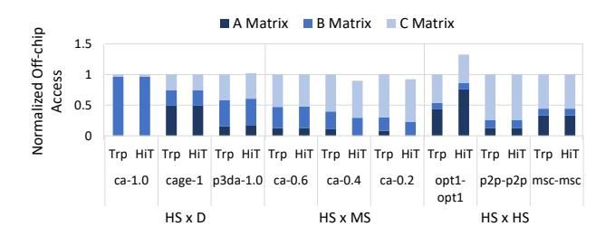

Fig. 19: Breakdown of off-chip element access on 9 HS workloads, normalized to Trapezoid. Trp: Trapezoid

for HS workloads. HS computations are typically memorybound, and OP-based dataflows can incur high data movement. Nevertheless, HiT significantly reduces off-chip traffic, achieving savings comparable to the memory-efficient Gustavsonbased dataflow used in Trapezoid. This improvement is driven by HSparse, which increases data reuse and accumulates psums on-chip.

For *ca-0.4* and *ca-0.2*, B tiles are small enough that the entire Matrix A fits on-chip alongside a B tile, eliminating A re-accesses; execution proceeds by streaming successive B tiles. For denser workloads such as *opt1*, HiT uses smaller working tiles than Trapezoid to sustain on-chip accumulation, increasing A re-accesses and raising traffic by 30%. Although *msc* is denser than *opt1*, its smaller tile size allows multiple B tiles to be buffered simultaneously, enabling greater reuse of the same A tile and resulting in traffic comparable to Trapezoid.

Latency overhead of compute synchronization: In MSparse, we introduce partial synchronization of computation across Compute Rows within a Cluster. This design exploits the more regular non-zero distribution in MS matrices, allowing data fetched from Matrix B to be fully utilized within the Cluster. Across 3 evaluated MS×MS datasets, averaging over all 4 Compute Clusters, synchronization introduces at most 12% latency overhead, resulting in minimal impact on overall performance.

Representative Workload Analysis: We evaluate 9 representative SuiteSparse matrices spanning diverse sizes and sparsity levels. Since the TPU-like design is optimized for dense computation and performs poorly on HS matrices, we focus on Trapezoid and specialized sparse accelerators. As shown in Fig. 20, HiT consistently outperforms all baselines. In HS×HS multiplications, it achieves a geomean 3.65× speedup over Trapezoid, enabled by HSparse's highly parallel non-zero intersection unit that increases MAC utilization. In HS×MS and HS×D workloads, the performance gains are slightly lower as density increases and HSparse streams fewer B rows per tile, reducing matching opportunities with HS A elements. Nevertheless, HiT achieves geomean performance/area improvement of 46.9×, 4.35×, and 2.33× over Sigma-E, Flexagon-E, and Trapezoid, respectively, demonstrating its ability to obtain high throughput and utilization across HS workloads.

For MS workloads, HiT achieves a geomean perfor-

mance/area improvement of 1.99× to 11.91× over MS specialized baselines, Sigma-E and Flexagon-E, and Trapezoid. The TPU-like design fails to exploit input sparsity, wasting cycles on ineffectual MACs, while Trapezoid is limited by its intersection unit and small tile size. Sigma's IP-based approach only benefits from one-sided sparsity, and Flexagon, when scaled to HiT's area, peaks at just 8.58 TOPS. In contrast, MSparse efficiently exploits two-sided sparsity while maintaining high parallelism and MAC utilization, which directly translates to lower latency. Overall, HiT achieves high performance across the sparsity spectrum, driven by its higher MAC utilization.

BF16 Performance Comparison: HiT's architectural contributions are orthogonal to numerical precision and extend naturally to reduced-precision formats. Accordingly, we evaluate HiT with BF16 multiplication and FP32 accumulation at 1 GHz, matching the precision used in the original TPU and Sigma designs. Under this setting, HiT achieves 1.95× and 1.53× higher geomean performance/area than BF16 TPUlike and BF16 Sigma-E, respectively, across MS and dense workloads. For MS workloads, the gains increase to 3.34× and 1.85×, while for dense workloads, the larger area results in 1.33× and 1.04× lower performance/area. Overall, HiT retains strong advantages under reduced precision.

# *C. Energy Comparison*

Fig. 21 shows energy breakdown across representative realworld workloads. For the baseline accelerators, we estimate total energy as the sum of compute energy and HBM access energy, since only aggregate accelerator power is reported. For HiT, we provide a finer-grained energy breakdown across components to highlight the source of its efficiency. Since Trapezoid reports a range of power values, we estimate its MS energy using the peak power, HS×HS using its lowest, and the lowest power plus additional activated resources for other HS workloads.

In MS workloads, compute energy dominates due to high operation volume compared to the access energy of a small matrix size. HiT reduces energy by 3.01× , 5.02×, 5.79×, and 5.59× over TPU-like, Sigma-E, Flexagon-E and Trapezoid. In HS workloads, compute remains dominant in Trapezoid and HiT due to the power-consuming sparsity handling components. Excluding unavailable results, HiT achieves 8.86× and 2.11× lower geomean energy than Sigma-E and Flexagon-E, respectively. HiT consumes 1.27× less energy than Trapezoid, except in *p2p-p2p*, where limited speedup (2.02×) of HiT and Trapezoid's 3.09× lower power result in 39% higher energy.

# *D. Latency Comparison with Specialized Accelerators*

We compare HiT with Spada, an adaptive-dataflow accelerator for MS×MS and HS×HS workloads. As shown in Fig. 22, HiT achieves superior performance, obtaining 2.29× higher geomean performance. Spada performs well on the relatively regular and dense *p3da* dataset, where its profilingguided configuration is effective, but its performance drops on the irregular and sparse *p2p* dataset to about half of

Fig. 20: Performance/area against baselines on real-world HS workloads of varying sparsity levels. Normalized to HiT.

Fig. 21: Energy consumption breakdown of real-world workloads with varying sparsity levels. Normalized to Trapezoid. U: TPU, S: Sigma-E, F: Flexagon-E, T: Trapezoid, and H: HiT.

Fig. 22: Comparison against specialized accelerator, Spada, OuterSPACE, and SpArch. Normalized to HiT.

HiT. In MS $\times$ MS, Spada is compute-bound, when scaled to the same area as HiT, its peak throughput is  $3.96\times$  lower, limiting overall performance. We also evaluate throughput against prior OP-based HS accelerators, using comparable SuiteSparse workloads. Scaling to HiT's area, OuterSPACE achieves 9.6 GFLOPS and SpArch achieves 188 GFLOPS, while HiT reaches 843 GFLOPS,  $87.2\times$  and  $4.48\times$  faster, respectively.

### VII. DATA PREPARATION AND SCALABILITY

**Preprocessing:** Following prior practice [19], [21], [26], [41], matrix tiling and data formatting for HSparse and MSparse are performed offline on the host CPU, and the reported results measure only accelerator execution time. In HiT, preprocessing takes 3.47 s (HS) and 0.009 s (MS); this one-time cost is amortized in iterative workloads [55]–[58]. **Data preloading:** For D×D workloads, both HiT and Trapezoid operate as systolic arrays and load tiles of identical size. For MS datasets, the overhead is negligible (below 0.01%). For HS datasets, preloading contributes a geomean of 0.51% of runtime in HiT and 0.15% in Trapezoid. Including this

overhead slightly reduces HS×MS geomean performance/area improvement by 1.10%, compared to Trapezoid.

Scalability: HiT is organized hierarchically to allow extension to larger configurations without fundamental redesign. At the system level (scale-out), multiple nodes can be connected via high-speed links, similar to TPUs [12]. Within each node (scale-up), the architecture can be extended by increasing the number of Compute Clusters and Groups per Compute Row while preserving the local ring network. However, larger deployments would require proportionally greater on-chip and off-chip memory bandwidth.

# VIII. CONCLUSION

We presented HiT, a unified sparsity-adaptive architecture for matrix multiplication across the full sparsity spectrum. It introduces two novel dataflows, HSparse and MSparse, which overcome the irregular memory access and psum accumulation challenge of prior Gustavson- and outer-product-based designs. HiT achieves up to  $3.24\times$  higher geomean performance/area, and  $1.64\times$  energy saving over the state-of-the-art accelerator, establishing a new benchmark for unified sparse and dense computation.

# ACKNOWLEDGMENTS

This project is supported by A\*STAR under the RIE2025 Energy-aware Accelerated Computing (EAC) program (Award H25-MSR3439), the RIE2025 Innovation & Enterprise (I&E) Industry Alignment Fund - Industry Collaboration Projects (IAF-ICP) (Award H25-MCP3442), the Ministry of Education, Singapore, Tier 3 (Award MOE-MOET32024-0003) and the NUS Artificial Intelligence Institute (NAII) (Award NAII-SF-2024-004).

# REFERENCES

- [1] K. Xu, W. Hu, J. Leskovec, and S. Jegelka, "How powerful are graph neural networks?" in *Proceedings of the International Conference on Learning Representations (ICLR)*, 2019.
- [2] H. Touvron, L. Martin, K. Stone, P. Albert, A. Almahairi, Y. Babaei, N. Bashlykov, S. Batra, P. Bhargava, S. Bhosale, D. Bikel, L. Blecher, C. C. Ferrer, M. Chen, G. Cucurull, D. Esiobu, J. Fernandes, J. Fu, W. Fu, B. Fuller, C. Gao, V. Goswami, N. Goyal, A. Hartshorn, S. Hosseini, R. Hou, H. Inan, M. Kardas, V. Kerkez, M. Khabsa, I. Kloumann, A. Korenev, P. S. Koura, M.-A. Lachaux, T. Lavril, J. Lee, D. Liskovich, Y. Lu, Y. Mao, X. Martinet, T. Mihaylov, P. Mishra, I. Molybog, Y. Nie, A. Poulton, J. Reizenstein, R. Rungta, K. Saladi, A. Schelten, R. Silva, E. M. Smith, R. Subramanian, X. E. Tan, B. Tang, R. Taylor, A. Williams, J. X. Kuan, P. Xu, Z. Yan, I. Zarov, Y. Zhang, A. Fan, M. Kambadur, S. Narang, A. Rodriguez, R. Stojnic, S. Edunov, and T. Scialom, "Llama 2: Open foundation and fine-tuned chat models," *arXiv preprint arXiv:2307.09288*, 2023.
- [3] K. He, X. Zhang, S. Ren, and J. Sun, "Deep residual learning for image recognition," in *Proceedings of the IEEE Conference on Computer Vision and Pattern Recognition (CVPR)*, 2016, pp. 770–778.
- [4] A. Vaswani, N. Shazeer, N. Parmar, J. Uszkoreit, L. Jones, A. N. Gomez, L. u. Kaiser, and I. Polosukhin, "Attention is all you need," in *Proceedings of Advances in Neural Information Processing Systems (NeurIPS)*, 2017.
- [5] J. VandeVondele, U. Borstnik, and J. Hutter, "Linear scaling self- ˇ consistent field calculations with millions of atoms in the condensed phase," *Journal of Chemical Theory and Computation*, no. 10, pp. 3565– 3573, 2012.
- [6] T. A. Davis and E. Palamadai Natarajan, "Algorithm 907: KLU, a direct sparse solver for circuit simulation problems," *ACM Transactions on Mathematical Software*, no. 3, 2010.
- [7] J. C. Kolecki, "An introduction to tensors for students of physics and engineering," NASA, Tech. Rep., 2002.
- [8] A. Azad, A. Buluc¸, and J. Gilbert, "Parallel triangle counting and enumeration using matrix algebra," in *Proceedings of the IEEE International Parallel and Distributed Processing Symposium Workshop (IPDPS)*, 2015, pp. 804–811.
- [9] T. Mattson, D. Bader, J. Berry, A. Buluc, J. Dongarra, C. Faloutsos, J. Feo, J. Gilbert, J. Gonzalez, B. Hendrickson, J. Kepner, C. Leiserson, A. Lumsdaine, D. Padua, S. Poole, S. Reinhardt, M. Stonebraker, S. Wallach, and A. Yoo, "Standards for graph algorithm primitives," in *Proceedings of the IEEE High-Performance Extreme Computing Conference (HPEC)*, 2013, pp. 1–2.
- [10] NVIDIA, "Nvidia A100 tensor core GPU architecture," NVIDIA, Tech. Rep., 2020.
- [11] N. P. Jouppi, D. H. Yoon, G. Kurian, S. Li, N. Patil, J. Laudon, C. Young, and D. Patterson, "A domain-specific supercomputer for training deep neural networks," *Communications of the ACM*, no. 7, pp. 67–78, 2020.
- [12] N. Jouppi, G. Kurian, S. Li, P. Ma, R. Nagarajan, L. Nai, N. Patil, S. Subramanian, A. Swing, B. Towles, C. Young, X. Zhou, Z. Zhou, and D. A. Patterson, "TPU v4: An optically reconfigurable supercomputer for machine learning with hardware support for embeddings," in *Proceedings of the 50th Annual International Symposium on Computer Architecture (ISCA)*, 2023.
- [13] S. P. Kolodziej, M. Aznaveh, M. Bullock, J. David, T. A. Davis, M. Henderson, Y. Hu, and R. Sandstrom, "The suitesparse matrix collection website interface," *Journal of Open Source Software*, no. 35, p. 1244, 2019.
- [14] J. Leskovec and A. Krevl, "SNAP Datasets: Stanford large network dataset collection," 2014.
- [15] S. Han, J. Pool, J. Tran, and W. J. Dally, "Learning both weights and connections for efficient neural networks," in *Proceedings of the 29th International Conference on Neural Information Processing Systems (NeurIPS)*, 2015, pp. 1135–1143.
- [16] S. Liu and W. Deng, "Very deep convolutional neural network based image classification using small training sample size," in *Proceedings of the 3rd IAPR Asian Conference on Pattern Recognition (ACPR)*, 2015, pp. 730–734.
- [17] E. Qin, A. Samajdar, H. Kwon, V. Nadella, S. Srinivasan, D. Das, B. Kaul, and T. Krishna, "SIGMA: A sparse and irregular GEMM accelerator with flexible interconnects for DNN training," in *Proceedings of the IEEE International Symposium on High-Performance Computer Architecture (HPCA)*, 2020, pp. 58–70.

- [18] S. Pal, J. Beaumont, D.-H. Park, A. Amarnath, S. Feng, C. Chakrabarti, H.-S. Kim, D. Blaauw, T. Mudge, and R. Dreslinski, "OuterSPACE: An outer product based sparse matrix multiplication accelerator," in *Proceedings of the IEEE International Symposium on High-Performance Computer Architecture (HPCA)*, 2018, pp. 724–736.
- [19] G. Zhang, N. Attaluri, J. S. Emer, and D. Sanchez, "GAMMA: leveraging Gustavson's algorithm to accelerate sparse matrix multiplication," in *Proceedings of the 26th ACM International Conference on Architectural Support for Programming Languages and Operating Systems (ASPLOS)*, 2021, pp. 687–701.
- [20] G. Gerogiannis, S. Yesil, D. Lenadora, D. Cao, C. Mendis, and J. Torrellas, "SPADE: A flexible and scalable accelerator for SpMM and SDDMM," in *Proceedings of the 50th Annual International Symposium on Computer Architecture (ISCA)*, 2023.
- [21] K. Hegde, H. Asghari-Moghaddam, M. Pellauer, N. Crago, A. Jaleel, E. Solomonik, J. Emer, and C. W. Fletcher, "ExTensor: An accelerator for sparse tensor algebra," in *Proceedings of the 52nd Annual IEEE/ACM International Symposium on Microarchitecture (MICRO)*, 2019, pp. 319– 333.
- [22] X. Lu, B. Long, X. Chen, Y. Han, and X.-H. Sun, "ACES: Accelerating sparse matrix multiplication with adaptive execution flow and concurrency-aware cache optimizations," in *Proceedings of the 29th ACM International Conference on Architectural Support for Programming Languages and Operating Systems (ASPLOS)*, 2024, pp. 71–85.
- [23] K. Zhong, Z. Zhu, G. Dai, H. Wang, X. Yang, H. Zhang, J. Si, Q. Mao, S. Zeng, K. Hong, G. Zhang, H. Yang, and Y. Wang, "FEASTA: A flexible and efficient accelerator for sparse tensor algebra in machine learning," in *Proceedings of the 29th ACM International Conference on Architectural Support for Programming Languages and Operating Systems (ASPLOS)*, 2024, pp. 349–366.
- [24] Z. Li, J. Li, T. Chen, D. Niu, H. Zheng, Y. Xie, and M. Gao, "Spada: Accelerating sparse matrix multiplication with adaptive dataflow," in *Proceedings of the 28th ACM International Conference on Architectural Support for Programming Languages and Operating Systems (ASPLOS)*, 2023, pp. 747–761.
- [25] F. Munoz Mart ˜ ´ınez, R. Garg, M. Pellauer, J. L. Abellan, M. E. Aca- ´ cio, and T. Krishna, "Flexagon: A multi-dataflow sparse-sparse matrix multiplication accelerator for efficient DNN processing," in *Proceedings of the 28th ACM International Conference on Architectural Support for Programming Languages and Operating Systems (ASPLOS)*, 2023, pp. 252–265.
- [26] Z. Zhang, H. Wang, S. Han, and W. J. Dally, "SpArch: Efficient architecture for sparse matrix multiplication," in *Proceedings of the IEEE International Symposium on High-Performance Computer Architecture (HPCA)*, 2020, pp. 261–274.
- [27] Y. Wang, C. Zhang, Z. Xie, C. Guo, Y. Liu, and J. Leng, "Dual-side sparse tensor core," in *Proceedings of the 48th Annual International Symposium on Computer Architecture (ISCA)*, 2021, pp. 1083–1095.
- [28] N. Srivastava, H. Jin, J. Liu, D. Albonesi, and Z. Zhang, "MatRaptor: A sparse-sparse matrix multiplication accelerator based on row-wise product," in *Proceedings of the 53rd Annual IEEE/ACM International Symposium on Microarchitecture (MICRO)*, 2020, pp. 766–780.
- [29] T. Geng, A. Li, R. Shi, C. Wu, T. Wang, Y. Li, P. Haghi, A. Tumeo, S. Che, S. Reinhardt, and M. C. Herbordt, "AWB-GCN: A graph convolutional network accelerator with runtime workload rebalancing," in *Proceedings of the 53rd Annual IEEE/ACM International Symposium on Microarchitecture (MICRO)*, 2020, pp. 922–936.
- [30] Y. Chen, T. Luo, S. Liu, S. Zhang, L. He, J. Wang, L. Li, T. Chen, Z. Xu, N. Sun, and O. Temam, "DaDianNao: A machine-learning supercomputer," in *Proceedings of the 47th Annual IEEE/ACM International Symposium on Microarchitecture (MICRO)*, 2014, pp. 609–622.
- [31] J. Li, A. Louri, A. Karanth, and R. Bunescu, "GCNAX: A flexible and energy-efficient accelerator for graph convolutional neural networks," in *Proceedings of the IEEE International Symposium on High-Performance Computer Architecture (HPCA)*, 2021, pp. 775–788.
- [32] X. Zhou, Z. Du, Q. Guo, S. Liu, C. Liu, C. Wang, X. Zhou, L. Li, T. Chen, and Y. Chen, "Cambricon-S: Addressing irregularity in sparse neural networks through a cooperative software/hardware approach," in *Proceedings of the 51st Annual IEEE/ACM International Symposium on Microarchitecture (MICRO)*, 2018, pp. 15–28.
- [33] R. Sarkar, S. Abi-Karam, Y. He, L. Sathidevi, and C. Hao, "FlowGNN: A dataflow architecture for real-time workload-agnostic graph neural network inference," in *Proceedings of the IEEE International Symposium*

- *on High-Performance Computer Architecture (HPCA)*, 2023, pp. 1099– 1112.
- [34] M. Yu, T. Xiang, V. P. K. Miriyala, and T. E. Carlson, "Multiplyand-Fire: An event-driven sparse neural network accelerator," *ACM Transactions on Architecture and Code Optimization*, no. 4, 2023.
- [35] Y.-H. Chen, T.-J. Yang, J. Emer, and V. Sze, "Eyeriss v2: A flexible accelerator for emerging deep neural networks on mobile devices," *IEEE Journal on Emerging and Selected Topics in Circuits and Systems*, no. 2, pp. 292–308, 2019.
- [36] V. Dadu, S. Liu, and T. Nowatzki, "PolyGraph: Exposing the value of flexibility for graph processing accelerators," in *Proceedings of the 48th Annual International Symposium on Computer Architecture (ISCA)*, 2021, pp. 595–608.
- [37] X. Chen, Y. Chen, F. Cheng, H. Tan, B. He, and W.-F. Wong, "ReGraph: Scaling graph processing on HBM-enabled FPGAs with heterogeneous pipelines," in *Proceedings of the 55th IEEE/ACM International Symposium on Microarchitecture (MICRO)*, 2022, pp. 1342–1358.
- [38] T. J. Ham, L. Wu, N. Sundaram, N. Satish, and M. Martonosi, "Graphicionado: A high-performance and energy-efficient accelerator for graph analytics," in *Proceedings of the 49th Annual IEEE/ACM International Symposium on Microarchitecture (MICRO)*, 2016, pp. 1–13.
- [39] B. Asgari, R. Hadidi, T. Krishna, H. Kim, and S. Yalamanchili, "AL-RESCHA: A lightweight reconfigurable sparse-computation accelerator," in *Proceedings of the IEEE International Symposium on High-Performance Computer Architecture (HPCA)*, 2020, pp. 249–260.
- [40] A. Feldmann and D. Sanchez, "Spatula: A hardware accelerator for sparse matrix factorization," in *Proceedings of the 56th Annual IEEE/ACM International Symposium on Microarchitecture (MICRO)*, 2023, pp. 91–104.
- [41] Y. Yang, J. S. Emer, and D. Sanchez, "Trapezoid: A versatile accelerator for dense and sparse matrix multiplications," in *Proceedings of the 51st Annual International Symposium on Computer Architecture (ISCA)*, 2024, pp. 931–945.
- [42] S. Feng, J. Sun, S. Pal, X. He, K. Kaszyk, D.-h. Park, M. Morton, T. Mudge, M. Cole, M. O'Boyle, C. Chakrabarti, and R. Dreslinski, "CoSPARSE: A software and hardware reconfigurable SpMV framework for graph analytics," in *Proceedings of the 58th ACM/IEEE Design Automation Conference (DAC)*, 2021, pp. 949–954.
- [43] X. He, S. Pal, A. Amarnath, S. Feng, D.-H. Park, A. Rovinski, H. Ye, Y. Chen, R. Dreslinski, and T. Mudge, "Sparse-TPU: adapting systolic arrays for sparse matrices," in *Proceedings of the 34th ACM International Conference on Supercomputing (ICS)*, 2020.
- [44] E. Qin, G. Jeong, W. Won, S.-C. Kao, H. Kwon, S. Srinivasan, D. Das, G. E. Moon, S. Rajamanickam, and T. Krishna, "Extending sparse tensor accelerators to support multiple compression formats," in *Proceedings of the IEEE International Parallel and Distributed Processing Symposium (IPDPS)*, 2021, pp. 1014–1024.
- [45] S. Yadav, A. Namjoo, and B. Asgari, "Misam: Machine learning assisted dataflow selection in accelerators for sparse matrix multiplication," in *Proceedings of the 58th IEEE/ACM International Symposium on Microarchitecture (MICRO)*, 2025, pp. 824–838.
- [46] Z. Liu, M. Sun, T. Zhou, G. Huang, and T. Darrell, "Rethinking the value of network pruning," in *Proceedings of the International Conference on Learning Representations (ICLR)*, 2019.
- [47] O. Russakovsky, J. Deng, H. Su, J. Krause, S. Satheesh, S. Ma, Z. Huang, A. Karpathy, A. Khosla, M. Bernstein *et al.*, "Imagenet large scale visual recognition challenge," *International Journal of Computer Vision*, no. 3, pp. 211–252, 2015.
- [48] K. Chellapilla, S. Puri, and P. Y. Simard, "High performance convolutional neural networks for document processing," in *Tenth International Workshop on Frontiers in Handwriting Recognition*, 2006.
- [49] E. Frantar and D. Alistarh, "SparseGPT: massive language models can be accurately pruned in one-shot," in *Proceedings of the 40th International Conference on Machine Learning (ICML)*, 2023.
- [50] M. Sun, Z. Liu, A. Bair, and J. Z. Kolter, "A simple and effective pruning approach for large language models," in *Proceedings of the Twelfth International Conference on Learning Representations (ICLR)*, 2024.
- [51] S. Li, K. Chen, J. H. Ahn, J. B. Brockman, and N. P. Jouppi, "CACTI-P: Architecture-level modeling for sram-based structures with advanced leakage reduction techniques," in *Proceedings of the International Conference on Computer-Aided Design (ICCAD)*, 2011, pp. 694–701.
- [52] M. O'Connor, N. Chatterjee, D. Lee, J. Wilson, A. Agrawal, S. W. Keckler, and W. J. Dally, "Fine-grained DRAM: Energy-efficient DRAM

- for extreme bandwidth systems," in *Proceedings of the 50th Annual IEEE/ACM International Symposium on Microarchitecture (MICRO)*, 2017, pp. 41–54.
- [53] S. Sarangi and B. Baas, "DeepScaleTool: A tool for the accurate estimation of technology scaling in the deep-submicron era," in *Proceedings of the IEEE International Symposium on Circuits and Systems (ISCAS)*, 2021, pp. 1–5.
- [54] N. P. Jouppi, C. Young, N. Patil, D. Patterson, G. Agrawal, R. Bajwa, S. Bates, S. Bhatia, N. Boden, A. Borchers, R. Boyle, P.-l. Cantin, C. Chao, C. Clark, J. Coriell, M. Daley, M. Dau, J. Dean, B. Gelb, T. V. Ghaemmaghami, R. Gottipati, W. Gulland, R. Hagmann, C. R. Ho, D. Hogberg, J. Hu, R. Hundt, D. Hurt, J. Ibarz, A. Jaffey, A. Jaworski, A. Kaplan, H. Khaitan, D. Killebrew, A. Koch, N. Kumar, S. Lacy, J. Laudon, J. Law, D. Le, C. Leary, Z. Liu, K. Lucke, A. Lundin, G. MacKean, A. Maggiore, M. Mahony, K. Miller, R. Nagarajan, R. Narayanaswami, R. Ni, K. Nix, T. Norrie, M. Omernick, N. Penukonda, A. Phelps, J. Ross, M. Ross, A. Salek, E. Samadiani, C. Severn, G. Sizikov, M. Snelham, J. Souter, D. Steinberg, A. Swing, M. Tan, G. Thorson, B. Tian, H. Toma, E. Tuttle, V. Vasudevan, R. Walter, W. Wang, E. Wilcox, and D. H. Yoon, "In-datacenter performance analysis of a tensor processing unit," in *Proceedings of the 44th Annual International Symposium on Computer Architecture (ISCA)*, 2017, pp. 1–12.
- [55] R. Fan, W. Wang, and X. Chu, "DTC-SpMM: Bridging the gap in accelerating general sparse matrix multiplication with tensor cores," in *Proceedings of the 29th ACM International Conference on Architectural Support for Programming Languages and Operating Systems (ASPLOS)*, 2024, pp. 253–267.
- [56] K. Lei, H. Yang, K. Zhang, K. Ma, Y. Wang, X. You, Y. Xu, E. S. Quintana-Orti, Z. Luan, Y. Liu *et al.*, "Low-cost yet high-performant sparse matrix-matrix multiplication on arm sme architectures," *arXiv preprint arXiv:2511.08158*, 2025.
- [57] X. Xie, Z. Liang, P. Gu, A. Basak, L. Deng, L. Liang, X. Hu, and Y. Xie, "SpaceA: Sparse matrix vector multiplication on processing-in-memory accelerator," in *Proceedings of the IEEE International Symposium on High-Performance Computer Architecture (HPCA)*, 2021, pp. 570–583.
- [58] J. Lin, J. Sun, M. Lu, and G. Sun, "Toward efficient SpMV in sparse LLMs via block extraction and compressed storage," *arXiv preprint arXiv:2507.12205*, 2025.