# Hierarchical Wakeup Logic of the Issue Queue for High Scalability

# Hideki Ando

*Information Technology Center Nagoya University* Nagoya, Japan hidekiando@acm.org

Hajime Shimada *Information Technology Center Nagoya University* Nagoya, Japan shimada@itc.nagoya-u.ac.jp

*Abstract*—The reduction of the critical-path delay of processor circuits is essential not only for sustaining high clock frequency but also for enabling microarchitectural scaling toward higher IPC. A general approach to reducing cycle time is pipelining long-delay circuits. However, applying pipelining to the issue queue (IQ) is inappropriate because pipelining the wakeup–select loop, one of the processor's critical paths, prevents dependent instructions from being issued back-to-back, thereby degrading IPC. As modern processors pursue higher IPC through wider issue and larger instruction windows, the IQ size must scale accordingly. However, enlarging the IQ significantly increases the delay of the wakeup logic, making such scaling difficult under practical timing constraints.

In this paper, we propose a *hierarchical wakeup logic* (HWL), where the IQ is logically segmented, each segment has a small non-pipelined level-1 (L1) wakeup logic, and full-size pipelined level-2 (L2) wakeup logic is placed behind the L1s. Wakeup is performed using L1, if possible, and L2 otherwise. The cycle time is reduced because the L1 size is small and L2 is pipelined. A fundamental attempt is made to dispatch an instruction (written to the IQ) to its producer's segment to complete wakeup–select in a single cycle, but it is not always possible because of the L1 size limit. This causes IPC degradation. To mitigate IPC degradation, we propose a dispatch scheme, which we call the *HWL-structureaware dispatch* (HSD) scheme, that uses the L1s efficiently. We enhance the HSD scheme using a scheme to adaptively choose dispatch behavior, depending on the degree of L1 contentions.

Through evaluation using SPEC2017 benchmark programs, we found that the HWL shortens the IQ cycle time by 53%, while incurring only 0.9% degradation in IPC. These results indicate that reducing IQ wakeup delay can alleviate a key timing bottleneck and enable more scalable microarchitectural configurations.

*Index Terms*—superscalar processor, issue queue, instruction scheduler, wakeup logic.

#### I. INTRODUCTION

It is important to reduce the delay of the circuits of a microprocessor to achieve high clock frequency. A circuit that is particularly difficult to optimize in this respect is the issue queue (IQ). The IQ critical path, that is, the wakeup–select loop, is one of the critical paths in a processor [1], [2]; thus, its delay must be carefully managed.

As processor generations have evolved, the size of the IQ has been increased to sustain higher IPC. However, enlarging the IQ significantly increases the complexity of the wakeup

This work was supported by JSPS KAKENHI Grant Number 26K14757.

logic, making delay reduction increasingly difficult. Although the achievable IPC depends on many microarchitectural factors, our evaluation indicates that there remains performance headroom: IPC increases by 36% over our baseline processor (see Table I) when major resources, including the IQ size and pipeline width, are doubled while the branch predictor and caches remain unchanged. These results suggest that further performance improvement requires scaling key microarchitectural resources, including the IQ. Because increasing the IQ size exacerbates wakeup–select delay, reducing the IQ delay becomes increasingly important for enabling such performance scaling without constraining overall microarchitectural scalability.

A general and widely applied solution to reduce the cycle time of circuits while the entire operation delay remains unchanged is pipelining, where the cycle time is the initiation time interval of the circuit operation. However, pipelining wakeup–select has a significant adverse effect on IPC because it prevents dependent instructions from being issued backto-back. Therefore, pipelining wakeup–select is not generally used.

A possible approach to reduce the cycle time of the IQ is to adopt a hierarchical structure approach, which resembles the caches. In this study, we propose a new structure of hierarchical wakeup logic (HWL). In the HWL, the IQ is logically segmented and each segment has small, fast, nonpipelined level-1 (L1) wakeup logic, which is responsible for marking an operand as ready in the same segment that holds its producer. By contrast, the level-2 (L2) wakeup logic is fullsized and placed behind the L1s. L2 is responsible for marking an operand as ready in the case in which the producer of the operand resides in a different segment. L2 is a large and slow circuit, similar to conventional wakeup logic, but is pipelined. Because L1 is fast and L2 is pipelined, the cycle time can be reduced.

Unfortunately, it is impossible to accommodate all instructions that have a dependency relationship in the same segment because the L1 size is limited, which degrades IPC. Therefore, we smartly select instructions to be dispatched to their producer's segment to minimize IPC degradation. Our dispatch scheme is called *HWL-structure-aware dispatch* (HSD). In the following, we explain it from the viewpoint of the dataflow graph (DFG) to simplify the explanation.

As described previously, it is desirable for all nodes (i.e., instructions) connected with edges in the DFG to be dispatched to the same segment to enable wakeup using L1. However, this is difficult in terms of L1 capacity. We relax this condition. We cut several edges and divide the DFG connected with edges into small subgraphs, which we call *chunks*. For example, we predict which parent node will be ready last and cut the edge from the parent node that becomes ready first, leaving the remaining edge because the node eventually becomes ready with the last-ready parent node. Another example is cutting an edge if the connected parent node's latency exceeds the L2 wakeup–select latency because the parent node's execution latency hides the wakeup–select latency of the child node, even though waking up is performed using L2, and it thus does not degrade IPC. An attempt is made to dispatch the nodes in a single chunk to the same segments to avoid degrading IPC, whereas the inter-chunk nodes are dispatched to different segments to use L1 efficiently. Our observation is that the chunk size (number of instructions in a chunk) is generally sufficiently small to make the L1 size sufficiently small.

Although HSD works well for many of the programs we evaluated, for several programs where HSD alone does not work well, this is because the chunk sizes are large. We solve this problem by introducing an additional adaptive dispatch scheme, which chooses to dispatch instructions to the non-producer's segment or to stall dispatch until a vacancy is produced in the producer's segment when producer segment contention occurs, by considering the frequency of contentions.

We summarize the contributions of our study as follows:

- We propose a new hierarchical structure of wakeup logic called the HWL to reduce the cycle time of the IQ.
- We propose a dispatch scheme called HSD to increase the effectiveness of the HWL structure using small L1s efficiently.
- We propose an additional hybrid dispatch scheme that adaptively chooses a dispatch behavior to mitigate negative effects on performance caused by L1 contentions.
- We succeeded in reducing the cycle time of the IQ by 53%, with only 0.9% IPC degradation for SPEC2017 benchmark programs.

The remainder of this paper is structured as follows: In Section II, we explain the organization of conventional IQs as background for this study. In Section III, we describe related work. We propose the HWL and HSD, along with the additional hybrid dispatch scheme, in Section IV. Then we present the evaluation results in Section V. Finally, we present our conclusions in Section VI.

#### II. CONVENTIONAL IQ ORGANIZATION

In Section II-A, we describe the fundamental organization of the IQ. Then we explain the circuit of the wakeup matrix as the wakeup logic in Section II-B. Finally, Section II-C discusses

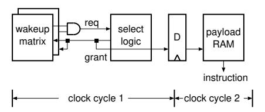

Fig. 1: Basic organization of the IQ [6]

the evolution of IQ organizations, focusing on how instructions are ordered within the IQ.

#### *A. Overview*

IQs are typically implemented with one of two wakeup mechanisms: CAM-based or RAM-based logic [3]. Both approaches are deployed in commercial processors [4], [5]. This work considers the RAM-based IQ, although the CAM-based IQ can also accommodate our approach with minimal changes. The RAM-based wakeup logic is often referred to as a *wakeup matrix* because it employs RAM-like circuits to represent data dependencies among instructions. We adopt this terminology throughout the paper.

Fig. 1 illustrates the organization of the IQ. The structure includes two wakeup matrices (one per source operand), select logic, and payload RAM. Each wakeup matrix is organized as a two-dimensional array, with rows and columns that correspond to instructions in the IQ, and tracks the instruction dependencies. When a source operand becomes ready, the corresponding matrix row (the bitline) is asserted. Once both source operands are ready, the instruction sends an issue request to the select logic.

The select logic is triggered after wakeup completion (i.e., wakeup and select operate sequentially). The select logic arbitrates among the ready instructions based on resource availability. Once an instruction is selected, a grant signal is output, whereby an instruction is issued from the payload RAM to the function unit. Simultaneously, the grant signal is fed back into the wakeup matrices using their wordlines (note: address decoders are not used for this feedback), triggering readiness updates for dependent operands.

These operations span two pipeline stages: 1) wakeup– select and 2) payload RAM read. Wakeup–select must operate in a single cycle for high IPC (pipelining these operations can hinder the back-to-back issue of dependent instructions, reducing IPC). Hence, this is one of the critical timing paths in the processor [1], [2].

#### *B. Wakeup Matrix*

As described in Section II-A, the wakeup matrix represents dependency. Each row and column of the matrix corresponds to an instruction in the IQ. A cell (i, j) holds 1 if instruction i depends on instruction j; otherwise, it holds 0. Using the example shown in Fig. 2, we explain how wakeup operates. In the example, instruction insn1 depends on insn0 and insn2 depends on insn1. In this dependency relationship, cells (1, 0) and (2, 1) hold 1 and the other cells hold zero.

Fig. 2: Wakeup matrix structure and example operation (diagonal cells are not depicted because they are unnecessary).

Cell values are written when an instruction is dispatched (i.e., written) to a row. The IQ entry number of an instruction that generates a logical register is held in the rename map table (RMT). At rename time, an instruction obtains the IQ entry number of its producer and sets the cell of the producer's column for the allocated row.

Now, suppose that the grant signal grt0 of insn0 becomes true (⃝1 ). Grt0, which is connected to wordline0 in the column, is broadcast to column (⃝2 ). Because cell (1, 0) holds 1, ready signal (rdy1) of insn1 becomes true by reading the cell via bitline1 (⃝3 ).

# *C. Evolution of IQ Organization*

As background for this paper, we now describe the evolution of IQ organization. Specifically, the IQ evolved [6] from a *shifting queue* [7] to a *circular queue* before reaching the current *random queue with an age matrix* [8], [9]. The difference between these organization structures lies in the age of the instruction order stored in the IQ.

Early processors used a shifting queue, where the IQ consists of a FIFO buffer. In this queue, a shifting operation is used to fill the gaps created by instruction issues, which maintains the age order. Although this organization achieves high IPC, the shifting operation has complex logic and consumes considerable power.

The circular queue eliminates the shifting operation, thereby reducing the complexity and power requirements. However, to maintain the age order, instructions cannot be inserted into the gaps created by instruction issues, thereby reducing the IQ capacity efficiency and consequently degrading IPC.

In the current random queue, instructions are no longer ordered by age, but are simply inserted into the gaps created by issues. This unordered organization significantly degrades IPC [6]. To address this, many designs [4], [5], [8] add an age matrix [8], [9] that identifies the oldest ready instruction, which is issued with the highest priority. Although only the oldest instruction is prioritized in issues, with the other instructions selected randomly in order of age, the age matrix dramatically improves IPC [6].

#### III. RELATED WORK

IQ architectures were actively explored in the early 2000s, with a notable survey by Abella et al. [10] summarizing key approaches. In this section, we describe related work by categorizing it into the hierarchical wakeup logic (Section III-A), pipelining the IQ (Section III-B), complexity reduction of the IQ (Section III-C), and an organizational approach to reducing IQ delay (Section III-D).

#### *A. Hierarchical Wakeup Logic*

Brekelbaum et al. proposed a hierarchical IQ called the *hierarchical scheduling window* (H-SW), where a pipelined large and slow IQ with a non-pipelined small and fast IQ are serially connected [11]. The cycle time of the IQ is determined by the delay of the fast IQ and is thus reduced. All the instructions are dispatched to the slow IQ, but multiple oldest unready instructions are moved to the fast IQ every cycle. This movement attempts to issue critical instructions to avoid degrading IPC by issuing them back-to-back, which would require multiple cycles if they were issued using the slow IQ. A difference between our HWL and the H-SW is that our IQ with the HWL is much simpler than the H-SW because identifying and moving multiple oldest unready instructions in the H-SW is quite complex in the modern random IQ, where instructions are not ordered by age (i.e., randomly ordered). By contrast, our HWL does not require instruction movements and uses a simple dispatch scheme for L1 capacity efficiently. Another difference is that, more importantly, although H-SW considers instruction criticality to use L1, it does not consider using L1 capacity efficiently. This causes significant IPC degradation. We quantitatively evaluate IPC to compare the HWL and H-SW in Section V-G1, putting the complexity of H-SW aside.

Goshima et al. proposed a scheme called the *narrowing* of the wakeup matrix [3]. The scheme reduces the width of the matrix by leaving only a small number of cells of D near the diagonal of the wakeup matrix and eliminating the other cells. Chen et al. presented a similar structure [12]. Narrowing is based on their observation that the dependence distance (the number of dynamic instructions between a consumer and its producer) is generally short. They used this narrowed wakeup matrix as an L1, which performs waking up instructions with the dependence distance less than or equal to D, whereas they used a full-sized L2 for the wakeup of instructions with the dependence distance of more than D. One downside of narrowing is that it is difficult to apply to the current random IQ; Goshima et al. assumed a circular IQ, and thus removed cells except those near the diagonal. More importantly, the other downside is the lack of a scheme to use L1 capacity efficiently, which wastes L1 capacity. We compare the IPC of the HWL with that of narrowing in Section V-G1 by adapting narrowing to the random IQ.

Lebeck et al. proposed the preparation of a buffer called the *waiting instruction buffer* (WIB) for holding cache-miss waiting instructions instead of waiting in the IQ [13]. The IQ size can be small because such instructions are moved to the WIB. The WIB is effective for memory-intensive programs. However, the IQ must be large to fully exploit instructionlevel parallelism (ILP) for compute-intensive programs.

#### *B. Pipelined IQ*

The wakeup–select loop can be divided into different pipeline stages if speculation is introduced with regard to these operations. Stark et al. proposed waking up an instruction when its producer's producer is issued [14]. As this wakeup does not necessarily cause the grandchildren instruction issue because of resource constraints, it is speculative. Similarly, Brown et al. proposed issuing instructions without select [15]. Because select is confirmed later, this issue is speculative. The common downside of these speculative issue schemes is that misspeculation that causes a reissue occurs frequently. This makes the issue logic complex and significantly increases power consumption.

Kora et al. proposed resizing the IQ, depending on the memory-intensity of program execution phases [16]. The scheme enlarges the IQ with pipelining if the program phase is memory-intensive; otherwise, it reduces the IQ and makes it unpipelined. Pipelining does not affect IPC because memorylevel parallelism is the primary source for high performance in memory-intensive phases and holding many loads in the IQ is important rather than back-to-back issues. The drawback is that, in compute-intensive phases with a large amount of ILP, the IQ needs to be sufficiently large to fully exploit ILP for high performance; thus, the reduction of the cycle time of the IQ is limited.

#### *C. Complexity Reduction*

Options exist for configuring the IQ in a monolithic manner or partitioning it. Partitioning reduces IPC because the partitioned IQ can issue instructions to a subset of function units that are connected to the IQ, and load balancing among partitioned IQs is difficult. However, the advantage is that partitioning can reduce the select logic delay. Note that the wakeup logic delay is not reduced because the grant signals must broadcast to all partitioned IQs. Although we explain the HWL in this study assuming a monolithic IQ, it can be applied to the partitioned IQ and thus further reduce the cycle time of the IQ.

Michaud et al. created dependency- and latency-based prescheduling instructions that are placed into a simple FIFO buffer [17]. To handle variable-latency operations, a small conventional IQ is added after the FIFO buffer. This design reduces IQ delay by simplifying the queue structure, but may induce stalling when the small IQ is filled with instructions waiting on long-latency events such as cache misses. Canal et al. and Ernst et al. presented similar prescheduling schemes [18], [19].

Palacharla et al. proposed an IQ organization composed of multiple FIFO buffers instead of a CAM, where instructions are steered into buffers based on dependency relationships [1]. Because dependent instructions are ordered within each buffer, only the entries at the heads of the FIFOs need to be examined to determine issue readiness. However, when a longlatency instruction remains at the head of a FIFO, dependent instructions accumulate until the buffer becomes full, and the limited number of FIFOs further restricts the number of active dependency chains, which can stall dispatch. To alleviate this FIFO blocking problem, Jeong et al. proposed allowing multiple dependency chains to share a FIFO [20]. Nevertheless, their approach still relies on a large number of FIFOs, which increases circuit complexity.

Canal et al. proposed a scheme that uses a table called the *first-use table* to schedule only instructions that use a physical register first [18]. Instructions are woken up by accessing the first-use table using produced physical register numbers. A large portion of the IQ can be implemented by SRAM because many physical registers are used only once according to their observation. The drawback of this scheme is that the first-use table, which is the same number of entries as the physical register file, is large in modern processors; thus, it is difficult to access the table in a single cycle. Multiple-cycle access, as in the register file of modern processors, makes the back-toback issue of dependent instructions impossible.

Goshima et al. proposed the matrix scheduler [3]. The wakeup logic is SRAM-based and thus scalable compared with CAM-based wakeup logic. The downside is that the size of the matrix grows rapidly according to the IQ size because of the square matrix of order IQ size. Therefore, the advantage over CAM-based wakeup logic is substantially decreased in modern processors with a large IQ.

Sassone et al. presented *matrix scheduler reloaded* (MSrel), which improves the scalability of the wakeup matrix by reducing the number of wakeup matrix columns [9]. They observed that a large number of instructions in the IQ have no destination register or no consumers exist in the IQ. Therefore, the columns of the wakeup matrix are unnecessary for these instructions logically. Sassone et al. reduced the number of columns and dynamically allocated them to instructions that require columns. One drawback of the MS-rel is that the number of matrix rows is not reduced; thus, delay reduction is limited. Another drawback is that the rate of instructions that do not need columns are not significant according to our evaluation (see Section V-G2); thus, the reduction of the number of columns is limited. We evaluate MS-rel in IPC and circuit delay in Section V-G2.

Kim et al. proposed a *sequential wakeup* in the CAM wakeup logic, where tags are broadcast to the left and then right side of the wakeup logic sequentially [21]. In this scheme, fanouts of the broadcast bus are halved; thus, the wakeup delay is reduced. Although instructions generally have two source operands, the last ready operand eventually wakes up the instruction. Therefore, if the first operand wakeup occurs later than the second operand wakeup, the sequential wakeup does not degrade IPC; otherwise, it degrades IPC. To increase the advantageous cases, the scheme predicts which operand of an instruction becomes ready last at the fron-

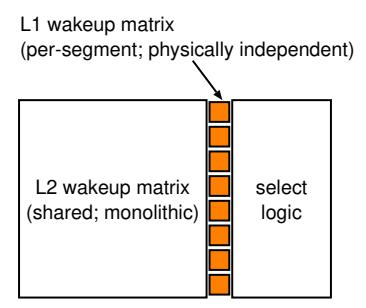

Fig. 3: Overview of the HWL structure (Example configuration where the IQ is logically partitioned into eight segments. Only L1 wakeup matrices are physically replicated per segment; L2 remains monolithic).

tend [22] and the predicted last-ready operand tag is placed on the left side of the wakeup logic. Our HWL also uses the last-ready operand prediction, but for a different purpose. The drawback of this scheme is that the reduction of the wakeup logic delay is limited because 1) although fanouts of the broadcast bus are reduced, its wire capacitance is not reduced and remains significant; and 2) the comparators delay, which is also significant, is not reduced.

#### *D. Organizational Approaches*

Beyond circuit-level optimization, architectural approaches have been used to ease IQ demands by delaying, filtering, or bypassing instruction insertion [23]–[25]. Although these techniques reduce IQ size, the IQ itself remains necessary. HWL can further cut the IQ cycle time with fewer changes to the processor architecture.

#### IV. HIERARCHICAL WAKEUP LOGIC

In this section, we propose a *hierarchical wakeup logic* (HWL) with dispatch schemes that use it effectively. In Section IV-A, we propose the structure of the HWL and explain the wakeup–select timing. Then we explain a dispatch scheme called the *HWL-structure-aware scheme* in Section IV-B. Next, we describe an additional dispatch scheme that mitigates IPC degradation, which is caused by high segment contentions in Section IV-C. Then we describe the segment allocation circuit details, and finally we describe other hardware overhead in HWL, in Sections IV-D and IV-E, respectively.

#### *A. Structure, Timing, and Fundamental Operation*

Fig. 3 shows an overview of the HWL structure. Fig. 4 illustrates the wakeup–select timing of the L1 and L2 access cases. In the L2 access case, the L2 operation is pipelined using three stages (the default in our evaluation in Section V).

We divide the IQ into several segments logically, and each segment has a physically independent L1 wakeup matrix. The L2 wakeup matrix is a full-sized matrix placed after the L1 wakeup matrices. It has the same logical structure as a conventional monolithic wakeup matrix, but is pipelined.

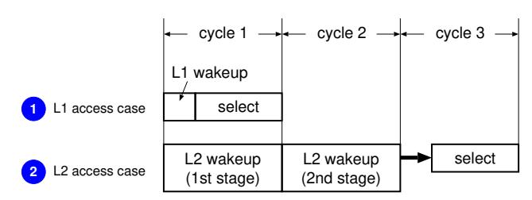

Fig. 4: Wakeup and select timing.

*1) Fundamental Wakeup Logic Operation (Dispatchagnostic):* In HWL, the wakeup matrix used for a source operand depends solely on the relative locations of the producer and consumer, independent of how they were dispatched.

If a consumer instruction resides in the same segment as its producer, the source operand is woken up using the L1 matrix associated with that segment. The wakeup–select loop is completed in a single cycle (see ⃝1 in Fig. 4). Otherwise, if the producer and consumer reside in different segments, the source operand is woken up using the L2 matrix. As shown in Fig. 4 (mark ⃝2 ), the L2 operation is pipelined. In the case of three-cycle pipelining, wakeup is performed in the first two cycles and select is performed in the third cycle. Therefore, two extra cycles are consumed for issue compared with the conventional IQ.

The cycle time is determined by the longer delay between the L1 wakeup–select and the longest pipeline stage of the L2 operation. Because L1 is smaller than the conventional wakeup matrix, and the L2 operation is pipelined, the cycle time of wakeup–select is reduced.

*2) Dispatch Policy to Increase L1 Wakeups:* Given the above wakeup logic, performance depends on how often dependent instructions are placed in the same segment. Therefore, we design a dispatch algorithm (described in Section IV-B) to increase the probability that a consumer is dispatched to the same segment as its producer.

The dispatch algorithm determines, for a single unready source operand, whether to dispatch the instruction to the same segment as its producer. Hereafter, we call this segment the *target segment*. To identify the producer segment, we extend the RMT by adding a field that holds the segment number to which the instruction producing the associated logical register was dispatched.

When an instruction is renamed, it obtains the segment number for each source register from the RMT. If an instruction has two unready source registers, the dispatch scheme predicts which source register becomes ready last using the *last-ready predictor* (LRP) [22] (described below). The segment number associated with the predicted last-ready register is used as the target segment, because that operand determines when the instruction becomes ready eventually and thus dominates the wakeup latency.

*3) Matrix Cell Setup:* If the dispatch scheme determines to dispatch the instruction to the target segment, an attempt is

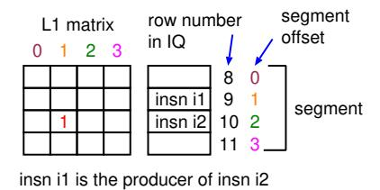

Fig. 5: Correspondence between the columns of the L1 matrix and the segment offset.

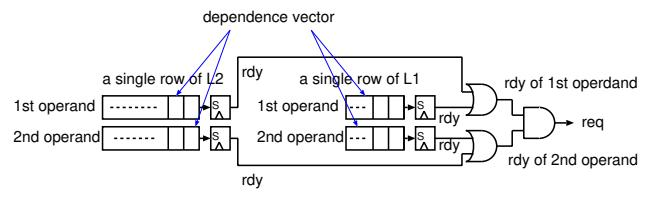

Fig. 6: Single row of wakeup matrices that generates a request signal in the HWL.

made to dispatch it to the producer's segment obtained from the RMT. In this case, for the source operand whose producer resides in the same segment, a cell in the corresponding L1 matrix is set to represent the dependency, and no cell in the L2 matrix is set for that operand.

For the other source operand (if any), if its producer also resides in the same segment, a cell in L1 is set similarly. Otherwise, if its producer resides in a different segment, a cell in L2 is set for that operand, and no cell in L1 is set.

The column of L1 corresponds to the segment offset number, which is the row and column index within a segment (ranging from 0 to S–1), where S is the segment size. Fig. 5 shows an example where instruction i1 is stored in row 9 in the IQ or row 1 in the segment, and an attempt is made to store i2 in row 10 in the IQ or row 2 in the segment. If i1 is the producer of i2, cell (2, 1) in L1 is set, where the column number is the segment offset number of i1. To set cells in L1, we extend the RMT by adding a field that holds the segment offset number, similarly to conventionally holding the row number of the entire IQ.

By contrast, if the dispatch scheme determines not to dispatch to the target segment, the instruction is dispatched to a segment selected randomly. In this case, a cell in L2 is set for each source operand whose producer resides in a different segment, and no cell in L1 is set for those operands. The ready signal of an operand is generated by ORing the ready signal from L1 with that from L2, with regard to the matrices associated with the operand, as shown in Fig. 6.

Note that when dispatching to a non-target segment, the random selection of the segment is speculatively performed at least *one cycle before* the dispatch stage to avoid adding complexity to the dispatch circuit. Random selection is performed for all instructions, and the selection result is used only if

Fig. 7: Example of a chunk. Gray nodes are the leaves of the chunk. LRP represents the last-ready prediction.

the dispatch algorithm determines not to dispatch to the target segment.

*4) Last-ready Predictor (LRP):* LRP [22] hardware is similar to the gshare branch predictor [26]. The pattern history table (PHT) is indexed by a hashed value of the PC and global branch history, and each entry has a two-bit saturating counter. The counter is decreased if the first source operand becomes ready last and increased if the second source operand becomes ready last. At prediction time, the PHT is accessed using the hashed index. If the upper bit of the counter is 0, the first source operand is predicted to become ready last; otherwise, the second source operand is predicted to become ready last.

#### *B. HWL-structure-aware Dispatch Scheme*

If all dependent instructions were dispatched to the target segment with the last-ready operand perfectly predicted so that L1 could always be used for wakeup–select, IPC would not be degraded. However, this is difficult because of the L1 size limit. If there is no available entry in the target segment, two options exist: stalling dispatch until an available entry appears or dispatching to a different segment without stalling and waking up using the L2. Either option can degrade IPC. To reduce this undesirable scenario, we propose a dispatch scheme, which we call an *HWL-structure-aware dispatch* (HSD) scheme. In the following, we first explain the scheme from the viewpoint of the DFG and then explain it from the viewpoint of hardware.

We divide the DFG into small subgraphs, which we call *chunks*, where, in terms of performance, it is desirable to dispatch all the nodes in a chunk to the same segment. The chunk is formed by cutting the following edges (see Fig. 7).

- 1) If there are two incoming edges to a node, we cut the one edge from the first-ready node and leave the remaining edge from the last-ready node using LRP.
- 2) If the execution of a node has already been completed at the dispatch time, we cut the edge from the node because the producer node does not wake up the consumer node in the IQ. The node becomes a leaf of a chunk.
- 3) If the execution latency of a node is greater than the extra pipeline depth of the L2 operation, we cut the edge from the node because the L2 operation latency is hidden by the execution latency. The node becomes a leaf of a chunk.

Note that the node that has no destination register is clearly a leaf of a chunk.

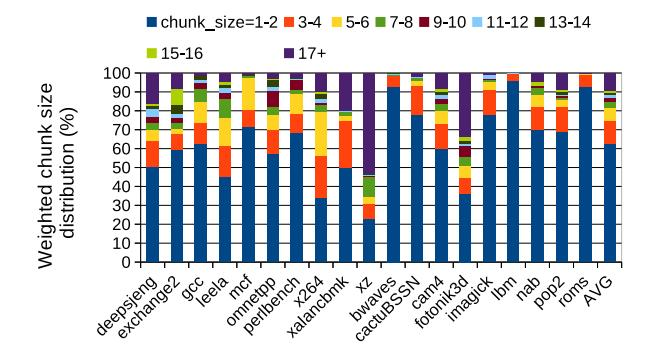

Fig. 8: Distribution of the chunks weighted by chunk size.

We implement the HSD scheme in hardware as follows: We extend the RMT by adding a flag to an entry, which indicates whether the execution latency of the instruction that produces the corresponding register is greater than the extra pipeline depth of the L2 operation. At the rename time, the scheme obtains this flag from the RMT using the lastready source register that LRP predicts. As per normal, the flag that indicates whether the execution of the producer has been completed is obtained from the busy-bit table using the physical register number. If both flags are false, this instruction belongs to the chunk of its producer. Then an attempt is made to dispatch the instruction to the producer's segment. If there is no available entry in the segment, two options exist: the dispatch is stalled or the instruction is dispatched to a segment other than the producer's segment. Both degrade performance. We describe the dispatch scheme in this case further in Section IV-C.

An interesting question is whether most chunks are accommodated in a small segment. If not, the performancedegrading case described above occurs frequently. Fig. 8 shows the distribution of the chunks weighted by the chunk size in the program that we evaluated, which means the percentage of instructions that belong to a particular size of a chunk (we describe the evaluation environment in Section V-A). As shown in the figure, on average, 91% of dynamic instructions belong to chunks with a size of less than or equal to 16. From this fact, we can make the segment size sufficiently small with little fundamental degradation to IPC. However, while most programs have small chunk sizes, there are exceptions (*deepsjeng*, *xalankbmk*, *xz*, and *fotonik3d*) in which fewer than 85% of dynamic instructions belong to chunks with a size of less than 16. This indicates that we need a scheme in addition to the HSD.

#### *C. Hybrid Dispatch Mode with Stalling and No-stalling*

As we have described thus far, the following two options exist when target segment contention occurs: 1) *No-stalling policy*: the instruction is dispatched to an entry in a randomly selected segment. 2) *Stalling policy*: the instruction waits until an available entry is produced in the target segment. In the no-stalling policy, IQ capacity can be used efficiently, but the penalty imposed by using L2 degrades IPC. By contrast, in the stalling policy, instructions can be issued without additional penalty, but IQ capacity efficiency is reduced.

Given these tradeoffs, we introduce a hybrid mode, where switching occurs between stalling and no-stalling policies at run-time, depending on the frequency of segment contention. Switching is dictated by the *dispatch failure rate* (DFR). This is the number of instructions that failed to be dispatched to the target segment because of its contention, per dispatched instructions while in the no-stalling mode. We measure DFR periodically (10k cycles in the evaluations in Section V). If the DFR becomes higher than a predetermined threshold (*DFR threshold*) in the no-stalling mode, the mode transits to the stalling mode. To check the value of the no-stalling mode while in the stalling mode, the scheme sometimes (predetermined every period of *max stall periods*, which is 200 intervals in the evaluations in Section V) transits to the no-stalling mode and checks the DFR. We evaluate the hybrid mode in Section V-F.

#### *D. Segment Allocation Circuit Details*

We have described how the producer's segment, read from the RMT, is considered when determining the target segment of an instruction. However, to rename multiple instructions in parallel (hereafter referred to as a *bundle*), the producer's segment numbers must be obtained from within the same bundle when intra-bundle dependencies exist. To handle this, a logic circuit that sequentially determines the target segments is required. This sequential nature may induce a delay. In this section, we present the circuit and evaluate the delay by comparing it with that in the execution stage.

We assume that two stages are allocated to the rename process. Although the detailed pipeline stage breakdowns for modern processors have not been disclosed, the Intel Pentium 4 [27], which has a pipeline depth comparable to modern processors, employs a two-cycle rename stage. We assume that the RMT is read in the first cycle and written in the second.

The circuit for target segment allocation within a bundle consists of the following: 1) Dependency Check Logic (DCL): This identifies the producer instruction for each instruction in the bundle. It is composed of register number comparators and a priority encoder. 2) LBMUX: This selects the "is long latency"1 and "register busy" signals from either the older instructions in the bundle or the RMT, depending on the DCL output. 3) SMUX: This determines the target segment by selecting from among the target segments of older instructions in the bundle or from the RMT. There are two SMUX units: SMUX1 selects the segment of the producer (for the first and second source registers). SMUX2 selects the final target segment depending on the SMCL (described below) output. 4) SMCL: This generates the select signals for SMUX2 using

1A signal that indicates whether the producer's latency exceeds the extra L2 wakeup–select latency or not.

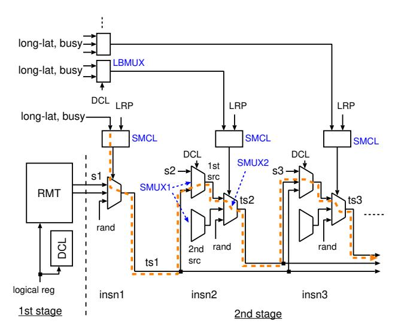

Fig. 9: Segment allocation circuit in a bundle. "s*n*" and "ts*n*" (for insn*n*) denote (i) the segment number read from the RMT, and (ii) the target segment number, respectively.

the "is long latency" signal, the "register busy" signal, and the PHT value from the LRP.

Fig. 9 shows the circuit. The critical path is highlighted in orange. In the first stage, the DCL operates in parallel with (and completes earlier than [1], [2]) the RMT read. To prevent the DCL output from being included in the critical path, we assume that it is driven to pipeline latches located near the MUX control pins in the second stage.

We evaluate the delay of this circuit for a bundle of six instructions (the default assumption described in Section V) and the subsequent RMT write using HSPICE simulations (the evaluation environment is described in Section V-A). We compare this delay with that in the execution stage, which consists of the bypass logic and ALU delay. The ALU delay is approximately that of an internal adder. We assume the sparse-tree adder (STA) proposed by Intel [28], as in McPAT's ALU energy model [29]. The comparison indicates that the rename second stage delay is 88% of that of STA. Considering that the bypass logic (which has a large delay [1], [2]) is not included, the delay of the second rename stage, which includes the segment allocation circuit, is much shorter than the delay of the execution stage.

The bundle width is a design parameter. We measured the delay of the 10-wide segment-allocation circuit using HSPICE and found that the delay becomes 1.59x that of the STA. This suggests that, in wider frontends such as 10-wide, the rename stage can become frequency-limiting. In such a case, the rename second stage can be further pipelined to maintain clock frequency. This increases the branch misprediction penalty by one cycle. We evaluated the IPC impact of this additional pipeline stage and observed a 0.6 percentagepoint degradation. This indicates that even if rename must be further pipelined in wider designs, the incremental IPC impact remains modest.

#### *E. Hardware Overhead*

The additional hardware cost of HWL consists of 1) the L1 wakeup matrices, 2) the LRP, and 3) minor control logic extensions. The L1 matrices add 0.6KB in our default configuration (8 segments in a 200-entry IQ). The LRP requires 2.0KB of storage. The RMT is extended with segment identifiers, adding a small number of metadata bits per entry.

The primary contributor to logic complexity is the segment allocation circuit (Section IV-D). Beyond this component, the wakeup structure remains identical to a conventional matrix scheduler, except for the physical partitioning of L1 matrices and a simple OR gate that combines ready signals from L1 and L2. Overall, the hardware overhead of HWL is modest.

#### V. EVALUATION RESULTS

First, we describe the evaluation methodology in Section V-A. Then we evaluate the cycle time of the IQ for various segment sizes when using the HWL in Section V-B. In Section V-C, we present the relationship between the cycle time and IPC degradation for various configurations. In Section V-D, we evaluate IPC improvements enabled by microarchitectural scaling with HWL. In Section V-E, we evaluate HSD effectiveness. In Section V-F, we evaluate the hybrid dispatch scheme. Finally, in Section V-G, we compare the HWL with prior schemes.

### *A. Methodology*

Table I outlines the configuration of the baseline processor model used in our experiments. We selected the window size and issue width based on modern commercial processors such as the Apple M1 and Intel Alder Lake (P-core) [30]–[32]. Table II lists the default HWL-specific parameters.

To simulate performance, we built a simulator based upon the SimpleScalar Tool Set version 3.0a [33], extending it to reflect the architecture of modern processors. The following modifications were made: 1) Removal of the original Register Update Unit [34], and the incorporation of a reorder buffer, physical register file, IQ (random queue with an age matrix), and RMT. 2) Addition of advanced branch prediction and memory hierarchy features, including a TAGE predictor [35], L3 cache, and stream prefetcher. 3) Integration of DRAM timing code adapted from the Champsim simulator [36].

We used the Alpha ISA for evaluation. The workload set comprises all benchmarks from SPEC2017, excluding *gcc* and *wrf*, which do not currently run correctly on our simulator. Instead, we used *gcc* from SPEC2006. Each benchmark was executed for a single representative 100-million-instruction region selected using the SimPoint [37] with reference inputs.

To evaluate the IQ delay, we used HSPICE with the 22nm predictive technology model provided by Arizona State University [38]. The wire delay parameters (capacitance and resistance per unit length) were based on projections from the ITRS roadmap [39]. Layouts were manually drawn at

TABLE I: Base processor configuration.

| Pipeline width     | frontend 6, back-end 12                     |
|--------------------|---------------------------------------------|
| Reorder buffer     | 512 entries                                 |
| IQ                 | 12-issue, 200 × 200 matrix scheduler        |
| Load/store queue   | 200 entries                                 |
| Physical registers | 512(int) + 512(fp)                          |
| Branch prediction  | TAGE 64KB cost, 2K-set 4-way BTB,           |
|                    | 15-cycle misprediction penalty              |
| Function unit      | 6 iALU, 1 iMULT/DIV, 3 AGU, 4 FPU           |
| L1 I-cache         | 32KB, 8-way, 64B line                       |
| L1 D-cache         | 32KB, 8-way, 64B line, 3 ports              |
|                    | 4-cycle hit latency, non-blocking           |
| L2 cache           | 1MB, 16-way, 64B line, 14-cycle hit latency |
| L3 cache           | 4MB, 16-way, 64B line, 40-cycle hit latency |
| Main memory        | 3200MT/s                                    |
| Data prefetch      | stream-based                                |

TABLE II: Default parameters for the HWL.

L2 wakeup matrix pipeline depth: 3 Number of segments: 8 (L1 size: 25) LRP [22]: 8K-entry, 4-branch history PHT DFR measure interval: 10k cycles max stall periods: 200 intervals DFR threshold: 10.0%

the transistor level under the MOSIS λ-based scalable design rules [40] to enable accurate HSPICE simulation.

#### *B. IQ Cycle Time*

To obtain the cycle time of the IQ with the HWL, we evaluated the delays of the wakeup matrix and select logic, where we varied only the size of the wakeup matrix. Fig. 10 shows the results. The Y -axis represents the delay relative to the total delay of the wakeup matrix and select logic for 200-entry IQ (baseline configuration), whereas the X-axis represents the sizes of the conventional wakeup matrix or L1 matrix. The two dashed lines represent the lower bounds of the cycle time of the HWL IQ, which were determined by the L2 operation (not L1 delay), when the L2 was pipelined with two and three stages, respectively (see the timing chart in Fig. 4). In the case of the two-stage pipeline, we inserted the pipeline latches between the L2 wakeup matrix and select logic, whereas in the case of the three-stage pipeline, we further inserted the pipeline latches between the wordlines and cells.

As shown in the figure, the cycle time is bounded by the delays of the L2 operation in the case of two-stage pipelined L2 for all L1 sizes. By contrast, for the case of three-stage pipelined L2, it is bounded by the delays of the L2 operation when the L1 sizes are 25 and 12, whereas it is bounded by the delays of L1 plus select logic when the L1 sizes are 100 and 50.

# *C. Cycle Time vs. IPC Degradation*

We evaluated the average IPC degradation relative to the baseline when varying the L1 size. The dispatch scheme is HSD with hybrid mode. Fig. 11 shows the relationship

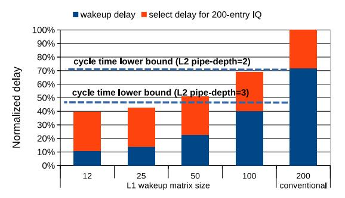

Fig. 10: Delays of the select logic and wakeup matrix with varied sizes.

Fig. 11: Relative cycle time vs. IPC degradation.

between the cycle time relative to the baseline and average IPC degradation. The label (N, P) attached to dots represents the configuration where the L1 size is N and the L2 pipeline is depth P. The blue and red dots represent the cases of P = 2 and 3, respectively. We evaluated the cycle time relative to the baseline in Section V-B.

As shown in the figure, IPC degrades more as N decreases. However, it is very small in the range of evaluated Ns. We assumed that only negligible performance degradation (less than 1%) is acceptable, given the performance sensitivity of the high-end processor market. We determined the default configuration as (N, P) = (25, 3) because IPC degradation is only 0.9% and the cycle time is the lowest. See Fig. 15 regarding the IPC evaluation results for each program in this configuration.

We also measured the prediction accuracy of the LRP, since incorrect predictions may degrade IPC in HWL. LRP is invoked only when an instruction has two unready source operands at dispatch. For such instructions, the average prediction accuracy across all benchmarks is 89%.

To assess the practical impact on HWL performance, we also measured accuracy over all instructions that have at least one unready source operand at dispatch, as these cases directly affect HWL performance. Under this broader condition, the average accuracy is 97%; seventeen out of 19 benchmarks exceed 95%. These results indicate that mispredictions are infrequent in practice and have limited impact on IPC.

#### *D. Microarchitectural Scaling Enabled by HWL*

The purpose of this section is to examine whether reducing the IQ delay enables microarchitectural scaling toward higher IPC. In wide out-of-order cores, the wakeup–select loop of the IQ is one of the dominant cycle-time bottlenecks. Enlarging the IQ further increases this delay and makes timing closure increasingly difficult, effectively constraining scalable configurations. Scaling frontend and backend resources also lengthens the IQ critical path, even when the IQ size is unchanged.

To evaluate the architectural implications of alleviating this bottleneck, we consider a balanced 1.5x scaling configuration. Starting from the baseline in Table I, we increase the IQ size to 300 entries (1.5x the baseline) and proportionally scale both backend and frontend resources by 1.5x. Backend scaling increases the issue width, commit width, number of function units, ROB size, physical register file entries, and LSQ size. Frontend scaling increases the fetch, decode, rename, and dispatch widths. We added one frontend pipeline stage to handle the increased complexity of the segment allocation circuit, increasing the branch misprediction penalty by one cycle. For this 300-entry IQ configuration, HWL still reduces the IQ delay to 88% of that of the conventional 200-entry baseline design. This reduction prevents the enlarged IQ from becoming a more severe timing bottleneck and allows the balanced 1.5x configuration to be sustained without additional cycle-time degradation.

Fig. 12 shows the IPC results of the 1.5x configuration with HWL, relative to that of the baseline. The balanced design improves the average IPC by 17.2%, with a maximum improvement of 43.1% across benchmarks. These results indicate that removing the IQ delay bottleneck enables tangible IPC improvements when the microarchitecture is scaled in a coordinated manner.

For reference, we also evaluated more aggressive 2x scaling scenarios to clarify the interaction among resources. The 400-entry IQ with HWL exceeds the delay of the 200 entry baseline design, making it difficult to sustain under the original timing constraint. Increasing only the IQ size to 400 entries with HWL changes the average IPC by -0.7%. Scaling the IQ and frontend resources by 2x (while keeping the backend unchanged) improves the average IPC by 3.1%. Scaling the IQ and backend resources by 2x (while keeping the frontend unchanged) improves the average IPC by 6.2%. These results indicate that performance does not scale unless the IQ expansion is accompanied by coordinated scaling of other pipeline resources. Reducing the IQ delay is therefore a necessary condition for enabling such coordinated higher-IPC configurations, although it is not sufficient by itself.

We emphasize that the 1.5x configuration increases hardware resources and therefore increases power consumption. In addition, scaling backend function units increases bypassnetwork complexity and potentially affect cycle time. A detailed physical timing analysis of such effects is beyond the scope of this work. Our objective here is to demonstrate that reducing the IQ wakeup delay is a necessary condition for

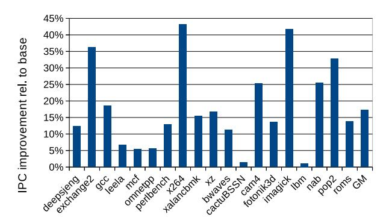

Fig. 12: IPC improvement of balanced 1.5x configuration with HWL relative to the baseline.

enabling such coordinated microarchitectural scaling, although it is not sufficient by itself.

#### *E. HSD Effectiveness*

In this section, we evaluate the effectiveness of HSD. Fig. 13 compares IPC with HSD with and without using HSD (noHSD), when using (a) no-stalling and (b) stalling dispatch options. The differences between noHSD and HSD when determining which chunk a dispatch instruction belongs to by its unready source register are as follows: 1) noHSD does not use LRP, but randomly selects an unready source register, and 2) noHSD does not consider whether the latency of the parent instruction is greater than the additional pipeline cycles of the L2.

Comparing the IPC degradation of HSD with that of noHSD for each no-stalling and stalling option, the degradation in HSD is lower in many programs. Improvements are significant in several programs (e.g., *fotonik3d* for the no-stalling option and *nab* for the stalling option). These results arise from the fact that the frequency by which instructions in a chunk failed to be dispatched to the producer's segment is low in HSD compared with noHSD, as shown in Fig. 14, which represents the failure rate of dispatch to the producer's segment to the total number of dispatches for the no-stalling option (for the stalling option, the instructions that failed to dispatch for the no-stalling option are stalled instead). HSD breaks DFG into smaller chunks and thus results in a low frequency of DFR.

#### *F. Effectiveness of the Hybrid Dispatch Scheme*

In this section, we demonstrate the effectiveness of the hybrid dispatch scheme by evaluating IPC for HSD with the various dispatch options (no-stall, stall, and hybrid). Fig. 15 shows the results, where the Y -axis represents IPC degradation compared with the baseline.

As shown in the figure, the average degradations for "HSDnostall" and "HSD-stall" does not satisfy (1.7% and 4.6%, respectively) our goal (less than 1.0%), but "HSD-hybrid" achieves sufficient degradation (0.9%). Given the degradation for an individual program in "HSD-hybrid", *deepsjeng*, *xalancbmk*, *xz*, and *fotonik3d* (hereafter, we call them *difficult*

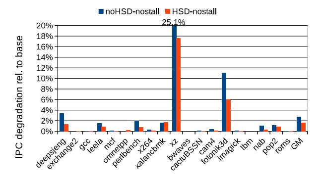

Fig. 13: IPC degradation relative to the baseline when HSD is used or not used.

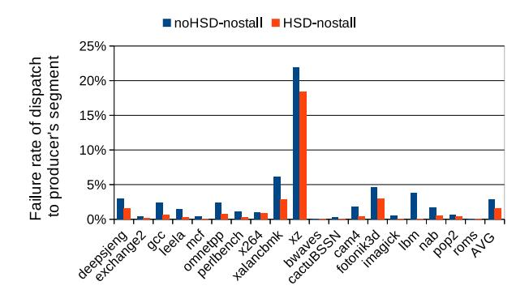

Fig. 14: Failure rate of dispatch to the producer's segment in the "noHSD-nostall" and "HSD-nostall" models.

*programs*) cause larger degradation than our goal (more than 1.0%) because chunks are not small compared with the other programs, as shown in Fig. 8 in Section IV-A.

We focus on the difficult programs in the following discussion. Given the space limitation, Fig. 16 presents the analysis results for the difficult programs as well as the average of all programs, showing a breakdown of dispatch attempts normalized by the total number of dispatch attempts. Each bar is divided into the following categories: 1) successful dispatches

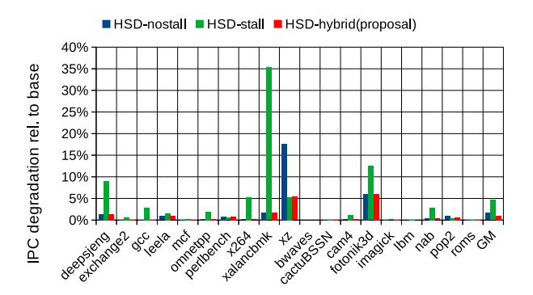

Fig. 15: IPC degradation of the HWL relative to the baseline for various dispatch options.

to the producer's segment, where the attempted dispatch was the result of intra-chunk dependencies ("producer's segment (success)"); 2) failed dispatches to the producer's segment that were redirected to the non-producer's segment ("producer's segment (fail)"); 3) dispatches that stalled because of segment contention; and 4) dispatches to the non-producer's segment because of non-intra-chunk dependencies ("non-producer's segment").

HWL degrades IPC for two main reasons: producer-segment failures and segment contention. In the "HSD-nostall" model, *xz* suffers significant IPC degradation because its chunk size is quite large (as shown in Fig. 8). This leads to frequent producer-segment failures (see the large red portion in Fig. 16), which generate additional issue delays. By contrast, the "HSDstall" model alleviates this problem for *xz*. In *deepsjeng*, *xalancbmk*, and *fotonik3d*, however, IPC is significantly degraded in the "HSD-stall" model because of segment contention (see the yellow portion in the figure), whereas the "HSD-nostall" model alleviates the degradation.

From the discussion above, simply using either the stalling or non-stalling policy cannot satisfy all programs. Therefore, adapting to phase/program characteristics is required. As shown in Fig. 15, the "HSD-hybrid" model successfully adapts to phase/program characteristics by choosing a better policy. However, noticeable IPC degradation (5%–6%) persists in *xz* and *fotonik3d*. In the former case, this is mainly because of the very large chunk size in *xz*, which often causes the producer's segment to become full. In *fotonik3d*, the degradation is caused by segmentation, which frequently becomes problematic because the IQ often approaches full capacity.

#### *G. Comparison with Prior Schemes*

In this section, we compare the HWL with prior hierarchical schemes, i.e., *narrowing* [3] and *hierarchical scheduling window* (H-SW) [11], in terms of IPC under a similar cycle time to that of the HWL. Additionally, we compare the HWL with an prior IQ scalable scheme, *matrix scheduler reloaded* (MS-rel) [9], in terms of the cycle time under the similar IPC.

*1) Comparison with Prior Hierarchical Schemes:* We briefly remark on how we implemented the prior hierarchical

Fig. 16: Dispatch attempts breakdown.

schemes. Regarding narrowing, it was presented assuming a circular IQ [3]. However, the performance of the circular IQ is significantly lower than that of the current random IQ with an age matrix [6] because of its capacity inefficiency, as described in Section II-C. Therefore, we adapted narrowing to the random IQ. The important point in narrowing that differs from the HWL is that an instruction is *unconditionally* dispatched to an entry near the producer's entry. There is no dispatch control to efficiently use L1. Therefore, we implemented a simulator for narrowing as follows: We divide the conventional IQ into segments and each segment has an L1 as in the HWL. Instructions are dispatched segment-by-segment. This means that instructions are continuously dispatched until the current segment becomes full. If it becomes full, we randomly choose one of the non-full segments and start to dispatch instructions to this segment. If an instruction and its producer are in the same segment, we use L1 for wakeup; otherwise, we use L2 with extra cycles. We set the segment size to 25 entries to make the cycle time identical to that of the HWL.

Regarding the H-SW, it was also presented assuming a circular IQ [11]. The authors of [11] assumed that instructions in the slow IQ moved to the fast and small IQ by searching from the bottom (oldest) eight entries in the slow and large IQ. However, this search is quite complex in the random IQ. Therefore, we simply idealized this search, where the oldest eight entries can be identified with zero-cycle cost. We set the small and large IQ sizes to be 25 and 200 entries, respectively, to make the cycle time identical to that of the HWL with the default setting. Note that the total IQ size was 225, which is larger than our default size (200).

Fig. 17 shows the comparison results (the figure includes the MS-rel results, but we do not discuss them in this section; we discuss them in Section V-G2). The Y -axis represents IPC degradation compared with the baseline. As shown in the figure, narrowing and the H-SW exhibit a significant slowdown. On average, IPC degradation is 3.2% and 3.6%, respectively (0.9% in the HWL). Additionally, we found a significant slowdown in both schemes in *xz*, which are composed of large DFGs. This is because there is no (unconditionally dispatch

Fig. 17: IPC degradation comparison of the HWL with prior work.

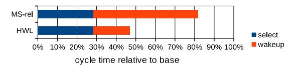

Fig. 18: IQ cycle time of MS-reloaded and the HWL.

to the producer's segment in narrowing) or insufficient control (only considering age in H-SW) to efficiently use L1.

*2) Comparison with the Prior IQ Scalable Scheme:* We evaluated the IPC of MS-rel by varying the number of columns of the wakeup matrix to find the minimum number of columns of the wakeup matrix that achieved a similar IPC to the HWL. The number of columns we found was 110. For this number of columns, the average IPC degradation of MS-rel is 1.0% (0.9% in the HWL). Fig. 17 confirms this.

Fig. 18 shows the evaluated IQ cycle time relative to the baseline using the HSPICE circuit simulation. Each bar is divided into the delays of the wakeup and select logic. As shown in the figure, cycle time reduction using MS-rel is limited; it is only 18%, whereas reduction using the HWL is 53%. The reasons that reduction is limited in MS-rel are as follows: 1) MS-rel can reduce the width of the matrix, but cannot reduce the height. 2) The reduction of the columns is not so significant.

To support reason 2), we evaluated a distribution of tag broadcasts of the following three categories in CAM-based wakeup logic [9]: The first category is *broadcast heard*, which means an instruction generates a broadcast and at least one consumer exists in the IQ. The second category is *broadcast wasted*, which means an instruction generates a broadcast but there is no consumer in the IQ. The last category is *no broadcast*, which means an instruction does not generate a broadcast because no destination register exists (e.g., branches and stores). The columns of the wakeup matrix do not need to be allocated in the cases of *broadcast wasted* and *no broadcast* logically.

According to our evaluation, the *broadcast heard* rate is high (59% on average). This observation is consistent with our finding that the required number of columns is 110 out of 200 (55%).

#### VI. CONCLUSIONS

Pipelining circuits with a long delay is a general solution to reduce the cycle time for high clock frequency. However, it is difficult for the IQ to use this approach because pipelining wakeup–select prevents dependent instructions from being issued back-to-back, which degrades IPC significantly. In this study, we proposed a new structure of the hierarchical wakeup logic (HWL) with multiple non-pipelined small L1s and a pipelined full-size L2. Because of the capacity limit of L1, only a subset of waking-ups is handled in L1; The other wakeups are performed using L2. This degrades IPC. To mitigate IPC degradation, we proposed a dispatch scheme called HWL-structure-aware dispatching, which uses L1 efficiently. We enhance the scheme using a hybrid dispatch scheme that chooses dispatch behavior adaptively on the degree of L1 contentions. Through evaluation using SPEC2017 benchmark programs, we found that the HWL shortens the IQ cycle time by 53%, while incurring only 0.9% degradation in IPC. These findings suggest that mitigating the IQ wakeup delay is an essential step toward enabling more scalable high-IPC processor designs.

#### ACKNOWLEDGMENT

The authors thank Jun Matsuura and Yuki Kondo for enhancing the performance simulator, and Riku Kurokawa for evaluating part of the circuit delays. This work was supported through the activities of VDEC, d. lab, The University of Tokyo, in collaboration with NIHON SYNOPSYS G.K.

# REFERENCES

- [1] S. Palacharla, N. P. Jouppi, and J. E. Smith, "Complexity-effective superscalar processors," in *Proceedings of the 24th Annual International Symposium on Computer Architecture*, June 1997, pp. 206–218.
- [2] ——, "Quantifying the complexity of superscalar processors," University of Wisconsin-Madison, Tech. Rep. CS-TR-1996-1328, November 1996.
- [3] M. Goshima, K. Nishino, T. Kitamura, Y. Nakashima, S. Tomita, and S. Mori, "A high-speed dynamic instruction scheduling scheme for superscalar processors," in *Proceedings of the 34th Annual IEEE/ACM International Symposium on Microarchitecture*, December 2001, pp. 225–236.
- [4] M. Golden, S. Arekapudi, and J. Vinh, "40-entry unified out-of-order scheduler and integer execution unit for the AMD Bulldozer x86- 64 core," in *2011 IEEE International Solid-State Circuits Conference, Digest of Technical Papers*, February 2011, pp. 80–82.
- [5] B. Sinharoy, J. A. V. Norstrand, R. J. Eickemeyer, H. Q. Le, J. Leenstra, D. Q. Nguyen, B. Konigsburg, K. Ward, M. D. Brown, J. E. Moreira, D. Levitan, S. Tung, D. Hrusecky, J. W. Bishop, M. Gschwind, M. Boersma, M. Kroener, M. Kaltenbacha, T. Karkhanis, and K. M. Fernsler, "IBM POWER8 processor core microarchitecture," *IBM Journal of Research and Development*, vol. 59, issue 1, pp. 2:1 – 2:21, January - February 2015.
- [6] H. Ando, "SWQUE: A mode switching issue queue with prioritycorrecting circular queue," in *Proceedings of the 52nd Annual IEEE/ACM International Symposium on Microarchitecture*, October 2019, pp. 506–518.
- [7] J. A. Farrell and T. C. Fischer, "Issue logic for a 600-MHz out-of-order execution microprocessor," *Journal of Solid-State Circuits*, vol. 33, no. 5, pp. 707–712, May 1998.

- [8] R. P. Preston, R. W. Badeau, D. W. Bailey, S. L. Bell, L. L. Biro, W. J. Bowhill, D. E. Dever, S. Felix, R. Gammack, V. Germini, M. K. Gowan, P. Gronowski, D. B. Jackson, S. Mehta, S. V. Morton, J. D. Pickholtz, M. H. Reilly, and M. J. Smith, "Design of an 8-wide superscalar RISC microprocessor with simultaneous multithreading," in *2002 IEEE International Solid-State Circuits Conference, Digest of Technical Papers*, February 2002, pp. 334–472.
- [9] P. G. Sassone, J. Rupley II, E. Brekelbaum, G. H. Loh, and B. Black, "Matrix scheduler reloaded," in *Proceedings of the 34th Annual International Symposium on Computer Architecture*, June 2007, pp. 335–346.
- [10] J. Abella, R. Canal, and A. Gonzalez, "Power- and complexity-aware issue queue designs," *IEEE Micro*, vol. 23, Issue 5, no. 5, pp. 50–58, September-October 2003.
- [11] E. Brekelbaum, J. Rupley, C. Wilkerson, and B. Black, "Hierarchical scheduling windows," in *Proceedings of the 35th Annual IEEE/ACM International Symposium on Microarchitecture*, November 2002, pp. 27– 36.
- [12] C.-H. Chen and K.-S. Hsiao, "Scalable dynamic instruction scheduler through wake-up spatial locality," *IEEE Transactions on Computers*, vol. 56, no. 11, pp. 1534–1548, November 2007.
- [13] A. R. Lebeck, J. Koppanalil, T. Li, J. Patwardhan, and E. Rotenberg, "A large, fast instruction window for tolerating cache misses," in *Proceedings of the 29th Annual International Symposium on Computer Architecture*, May 2002, pp. 59–70.
- [14] J. Stark, M. D. Brown, and Y. N. Patt, "On pipelining dynamic instruction scheduling logic," in *Proceedings of the 33rd Annual IEEE/ACM International Symposium on Microarchitecture*, December 2000, pp. 57– 66.
- [15] M. D. Brown, J. Stark, and Y. N. Patt, "Select-free instruction scheduling logic," in *Proceedings of the 34th Annual IEEE/ACM International Symposium on Microarchitecture*, December 2001, pp. 204–213.
- [16] Y. Kora, K. Yamaguchi, and H. Ando, "MLP-aware dynamic instruction window resizing for adaptively exploiting both ILP and MLP," in *Proceedings of the 46th Annual IEEE/ACM International Symposium on Microarchitecture*, December 2013, pp. 37–48.
- [17] P. Michaud and A. Seznec, "Data-flow prescheduling for large instruction windows in out-of-order processors," in *Proceedings of the Seventh International Symposium on High-Performance Computer Architecture*, January 2001, pp. 27–36.
- [18] R. Canal and A. Gonzalez, "A low-complexity issue logic," in ´ *Proceedings of the 14th International Conference on Supercomputing*, May 2000, pp. 327–335.
- [19] D. Ernst, A. Hamel, and T. Austin, "Cyclone: A broadcast-free dynamic instruction scheduler with selective replay," in *Proceedings of the 30th Annual International Symposium on Computer Architecture*, June 2003, pp. 253–262.
- [20] I. Jeong, J. Lee, M. K. Yoon, and W. W. Ro, "Reconstructing out-oforder issue queue," in *Proceedins of the 55th IEEE/ACM International Symposium on Microarchitecture*, October 2022, pp. 144–161.
- [21] I. Kim and M. Lipasti, "Half-price architecture," in *Proceedings of the 30th Annual International Symposium on Computer Architecture*, June 2003, p. 28–38.
- [22] D. Ernst and T. Austin, "Efficient dynamic scheduling through tag ellimination," in *Proceedings of the 29th Annual International Symposium on Computer Architecture*, May 2002, pp. 37–46.
- [23] R. Shioya, M. Goshima, and H. Ando, "A front-end execution architecture for high energy efficiency," in *Proceedings of the 47th Annual IEEE/ACM International Symposium on Microarchitecture*, December 2014, pp. 419–431.
- [24] A. Sembrant, T. Carlson, E. Hagersten, D. Black-Shaffer, A. Perais, A. Seznec, and P. Michaud, "Long term parking (LTP): criticalityaware resource allocation in OOO processors," in *Proceedings of the 48th Annual IEEE/ACM International Symposium on Microarchitecture*, December 2015, pp. 334–346.
- [25] M. Alipour, S. Kaxiras, D. Black-Schaffer, and R. Kumar, "Delay and bypass: Ready and criticality aware instruction scheduling in outof-order processors," in *Proceedings of the 2020 IEEE International Symposium on High Performance Computer Architecture*, February 2020, pp. 424–434.
- [26] S. McFarling, "Combining branch predictors," DEC Western Research Laboratory, Tech. Rep. TN-36, June 1993.
- [27] G. Hinton, D. Sager, M. Upton, D. Boggs, D. Carmean, A. Kyker, and P. Roussel, "The microarchitecture of the Pentium 4 processor," *Intel Technology Journal*, vol. Q1, 2001.

- [28] S. K. Mathew, M. A. Anders, B. Bloechel, T. Nguyen, R. K. Krishnamurthy, and S. Borkar, "A 4-GHz 300-mW 64-bit integer execution ALU with dual supply voltages in 90-nm CMOS," *IEEE Journal of Solid-State Circuits*, vol. 40, no. 1, pp. 44–51, January 2005.
- [29] S. Li, J. H. Ahn, R. D. Strong, J. B. Brockman, D. M. Tullsen, and N. P. Jouppi, "McPAT: An integrated power, area, and timing modeling framework for multicore and manycore architectures," in *Proceedings of the 42nd Annual IEEE/ACM International Symposium on Microarchitecture*, December 2009, pp. 469–480.
- [30] A. Jani, "Apple ships its first PC processor," *Microprocessor Report*, January 2021.
- [31] L. Gwennap, "Golden Cove adds matrix units," *Microprocessor Report*, September 2021.
- [32] E. Rotem, A. Yoaz, L. Rappoport, S. J. Robinson, J. Y. Mandelblat, A. Gihon, E. Weissmann, R. Chabukswar, V. Basin, R. Fenger, M. Gupta, and A. Yasin, "Intel Alder Lake CPU architectures," *IEEE Micro*, vol. 42, no. 3, pp. 13–19, May-June 2022.
- [33] https://github.com/toddmaustin/simplesim-3.0.
- [34] G. Sohi, "Instruction issue logic for high-performance, interruptible, multiple functional unit, pipelined computers," *IEEE Transactions on Computers*, vol. 39, no. 3, pp. 349–359, March 1990.
- [35] A. Seznec and P. Michaud, "A case for (partially) tagged geometric history length branch prediction," *Journal of Instruction Level Parallelism*, vol. 8, pp. 1–23, February 2006.
- [36] https://github.com/ChampSim/ChampSim.
- [37] T. Sherwood, E. Perelman, G. Hamerly, and B. Calder, "Automatically characterizing large scale program behavior," in *Proceedings of the 10th International Conference on Architectural Support for Programming Languages and Operating Systems*, October 2002, pp. 45–57.
- [38] W. Zhao and Y. Cao, "New generation of predictive technology model for sub-45nm design exploration," in *Proceedings of the 7th International Symposium on Quality Electronic Design*, March 2006, pp. 585– 590.
- [39] International Technology Roadmap for Semiconductors, https://semicon.jeita.or.jp/STRJ/ITRS/.
- [40] https://www.mosis.com/.